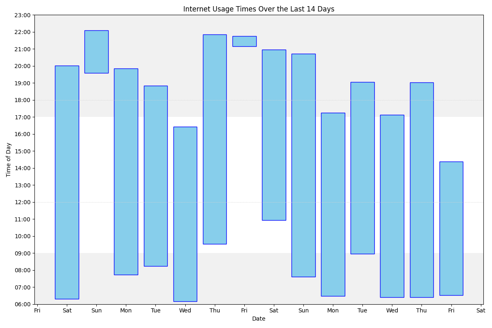

My web history is public. 

It's updated every hour or so when my machine is running. It goes back to about 2019 but I need to check that some truncation isn't happening at the bottom. 

You can see the code I use <a href="https://github.com/joereddington/export-history">on github</a>, and there's <a href="https://joereddington.github.io/2018/12/12/Internet.html"> a blog post that talks about the reasons</a>.

## Cool chart
The script that publishes my web history also creates the chart below.  It shows my 'web window' for the last few days. The large bars on the chart show the time between the first history entry of the day and the last.  In general I try and make these quite small - In the mornings I try to wait until I have a real need (or a list) of things to look up on the web and in the early evenings I try to properly switch off at the end of work. It also helps me from spend the weekend being present with the family.   

When making the 'web window' I don't count a number of sites. At the moment that's: Google Calendar, Google Drive and Zoom.  That means I can get quite a lot of work done before going 'properly' onto the internet. 

<h3> Most common sites</h3>
With number of accesses/minutes in parentheses

<ol><li>mail.google.com (4257)</li>
<li>www.reddit.com (4206)</li>
<li>outlook.office.com (4082)</li>
<li>www.google.com (4011)</li>
<li>outlook.office365.com (3844)</li>
<li>docs.google.com (2662)</li>
<li>duckduckgo.com (2612)</li>
<li>chatgpt.com (1634)</li>
<li>bsky.app (1581)</li>
<li>www.facebook.com (1457)</li>
<li>www.linkedin.com (1434)</li>
<li>login.microsoftonline.com (1162)</li>
<li>www.amazon.co.uk (1093)</li>
<li>calendar.google.com (1040)</li>
<li>moodle.royalholloway.ac.uk (936)</li>
<li>rhul-my.sharepoint.com (818)</li>
<li>www.theguardian.com (685)</li>
<li>web.whatsapp.com (680)</li>
<li>gmail.com (676)</li>
<li>chat.openai.com (661)</li>
<li>herts.instructure.com (640)</li>
<li>tvtropes.org (630)</li>
<li><a href="https://www.theguardian.com/uk">Latest news, sport and opinion from the Guardian</a> (602)</li>
<li>github.com (553)</li>
<li>feedly.com (527)</li>
<li>forms.office.com (515)</li>
<li>drive.google.com (439)</li>
<li>fritz.box (413)</li>
<li>rhul.sharepoint.com (386)</li>
<li><a href="https://www.theguardian.com/">What happened next: the Coldplay kiss cam couple | Life and style | The Guardian</a> (351)</li>

</ol><H2> Sites and times</H2>

<ul></ul>

<H3>Thursday, 01/01/26</H3>

 

<ul><li> 08:31 www.reddit.com</li>
<li class='same'> 08:30 www.reddit.com</li>
<li class='same'> 08:28 www.reddit.com</li>
<li> 08:27 web.whatsapp.com</li>
<li> 08:27 www.parkrun.com</li>
<li> 08:26 mail.google.com</li>
<li> 08:26 www.parkrun.com</li>
<li> 08:26 support.parkrun.com</li>
<li> 08:26 duckduckgo.com</li>
<li> 08:26 www.parkrun.org.uk</li>
<li> 08:26 mail.google.com</li>
<li class='same'> 08:25 mail.google.com</li>
<li> 08:25 www.reddit.com</li>
</ul>

<H3>Wednesday, 31/12/25</H3>

 

<ul></ul>

 

<ul><li> 18:49 <a href="https://www.bbc.co.uk/newsround">Newsround Quiz of the Year 2025 - BBC Newsround</a></li>
<li> 18:32 <a href="https://www.bbc.co.uk/newsround/articles/cwyw977zy8xo">Home - CBBC Newsround</a></li>
<li> 18:32 <a href="https://www.bbc.co.uk/newsround">Newsround Quiz of the Year 2025 - BBC Newsround</a></li>
<li> 18:32 www.google.com</li>
<li> 18:32 <a href="https://www.theguardian.com/uk">Latest news, sport and opinion from the Guardian</a></li>
</ul>

 

<ul><li> 14:59 mail.google.com</li>
<li class='same'> 14:58 mail.google.com</li>
<li> 14:53 www.reddit.com</li>
<li class='same'> 14:50 www.reddit.com</li>
<li class='same'> 14:49 www.reddit.com</li>
<li class='same'> 14:48 www.reddit.com</li>
<li class='same'> 14:46 www.reddit.com</li>
</ul>

 

<ul><li> 13:45 mail.google.com</li>
<li> 13:45 gmail.com</li>
</ul>

 

<ul><li> 08:40 <a href="https://joereddington.com/todo.txt/">Joe’s Todo List</a></li>
<li> 08:23 <a href="https://www.youtube.com/watch?v=0jXC9bLh8X4&list=PLg2tfDG3Ww4s-jqUKEAHI67pQLhUGczDG&index=138">GCSE Maths: N6-07 [Higher Powers of 2, 3, 4, 5 Test] - YouTube</a></li>
<li> 08:22 <a href="https://www.bbc.co.uk/news/articles/cp8z60j7438o">Home - BBC News</a></li>
<li> 08:21 <a href="https://www.bbc.co.uk/news">Home - BBC News</a></li>
<li> 08:21 <a href="https://www.bbc.co.uk/news/topics/clye196748dt">Information Commissioner's Office - BBC News</a></li>
<li> 08:21 www.google.com</li>
<li> 08:18 <a href="https://www.youtube.com/watch?v=7OIH57MLOmg&list=PLg2tfDG3Ww4s-jqUKEAHI67pQLhUGczDG&index=137">GCSE Maths: N6-06 [Higher Powers of 2, 3, 4, 5] - YouTube</a></li>
<li> 08:18 <a href="https://www.youtube.com/watch?v=QZEvPWEWMYk&list=PLg2tfDG3Ww4s-jqUKEAHI67pQLhUGczDG&index=136">GCSE Maths: N6-05 [Cube Numbers & Cube Roots Test] - YouTube</a></li>
<li> 08:17 <a href="https://www.youtube.com/watch?v=1xhlg9WkPQg&list=PLg2tfDG3Ww4s-jqUKEAHI67pQLhUGczDG">GCSE Maths: Introduction to the Playlist - YouTube</a></li>
<li> 08:17 <a href="https://www.youtube.com/feed/playlists">Playlists - YouTube</a></li>
<li> 08:17 <a href="https://www.youtube.com/">YouTube</a></li>
</ul>

 

<ul><li> 07:23 <a href="https://www.theguardian.com/culture/2025/dec/30/self-mocking-man-sketch-dumb-masculinity">Latest news, sport and opinion from the Guardian</a></li>
<li> 07:23 <a href="https://www.theguardian.com/uk">Latest news, sport and opinion from the Guardian</a></li>
</ul>

 

<ul><li class='same'> 06:49 <a href="https://www.theguardian.com/uk">Latest news, sport and opinion from the Guardian</a></li>
<li> 06:49 <a href="https://www.theguardian.com/science/2025/dec/30/astronaut-amanda-nguyen-blue-origin-spaceflight">Latest news, sport and opinion from the Guardian</a></li>
<li> 06:45 <a href="https://www.theguardian.com/uk">Latest news, sport and opinion from the Guardian</a></li>
<li> 06:45 <a href="https://www.theguardian.com/">What happened next: the Coldplay kiss cam couple | Life and style | The Guardian</a></li>
<li> 06:45 <a href="https://www.theguardian.com/commentisfree/2025/dec/29/the-guardian-view-on-the-national-year-of-reading-2026-time-to-start-a-healthy-habit-for-life">The Guardian view on the National Year of Reading 2026: time to start a healthy habit for life | Editorial | The Guardian</a></li>
</ul>

<H3>Tuesday, 30/12/25</H3>

 

<ul></ul>

 

<ul><li> 14:27 chatgpt.com</li>
</ul>

 

<ul><li> 13:43 <a href="https://www.theguardian.com/commentisfree/2025/dec/29/the-guardian-view-on-the-national-year-of-reading-2026-time-to-start-a-healthy-habit-for-life">The Guardian view on the National Year of Reading 2026: time to start a healthy habit for life | Editorial | The Guardian</a></li>
<li> 13:40 <a href="https://www.theguardian.com/uk">Latest news, sport and opinion from the Guardian</a></li>
<li> 13:40 <a href="https://www.theguardian.com/">What happened next: the Coldplay kiss cam couple | Life and style | The Guardian</a></li>
<li> 13:40 <a href="https://www.theguardian.com/sport/2025/dec/29/tom-jenkins-best-sport-photographs-2025">Tom Jenkins’s best sport photographs of 2025 | Sport | The Guardian</a></li>
</ul>

 

<ul><li> 12:31 www.reddit.com</li>
</ul>

 

<ul><li class='same'> 11:40 www.reddit.com</li>
<li> 11:40 www.humblebundle.com</li>
<li> 11:40 www.bigrockclimbing.com</li>
<li class='same'> 11:39 www.bigrockclimbing.com</li>
<li> 11:39 www.google.com</li>
</ul>

 

<ul><li> 08:08 www.judiciary.uk</li>
<li class='same'> 08:07 www.judiciary.uk</li>
<li> 08:06 www.google.com</li>
<li> 08:06 ico.org.uk</li>
<li> 08:06 www.google.com</li>
<li> 07:51 <a href="https://www.theguardian.com/uk">Latest news, sport and opinion from the Guardian</a></li>
<li> 07:51 <a href="https://www.theguardian.com/">What happened next: the Coldplay kiss cam couple | Life and style | The Guardian</a></li>
<li> 07:50 <a href="https://www.theguardian.com/world/2025/dec/30/khaleda-zia-first-female-bangladesh-prime-minister-dies-aged-80">Khaleda Zia, first female Bangladesh prime minister, dies aged 80 | Bangladesh | The Guardian</a></li>
<li> 07:47 <a href="https://www.theguardian.com/uk">Latest news, sport and opinion from the Guardian</a></li>
<li> 07:47 chatgpt.com</li>
<li> 07:46 www.reddit.com</li>
<li> 07:45 chatgpt.com</li>
<li> 07:45 chat.openai.com</li>
<li> 07:24 www.reddit.com</li>
<li class='same'> 07:23 www.reddit.com</li>
</ul>

<H3>Monday, 29/12/25</H3>

 

<ul></ul>

 

<ul><li> 18:50 <a href="https://www.theguardian.com/sport/2025/dec/29/tom-jenkins-best-sport-photographs-2025">Tom Jenkins’s best sport photographs of 2025 | Sport | The Guardian</a></li>
<li> 18:50 <a href="https://www.theguardian.com/sport/2025/dec/29/tom-jenkins-best-sport-photographs-2025#img-9">Tom Jenkins’s best sport photographs of 2025 | Sport | The Guardian</a></li>
<li> 18:49 <a href="https://www.theguardian.com/sport/2025/dec/29/tom-jenkins-best-sport-photographs-2025">Tom Jenkins’s best sport photographs of 2025 | Sport | The Guardian</a></li>
<li> 18:48 <a href="https://www.theguardian.com/uk">Latest news, sport and opinion from the Guardian</a></li>
<li> 18:48 <a href="https://www.theguardian.com/">What happened next: the Coldplay kiss cam couple | Life and style | The Guardian</a></li>
<li> 18:48 <a href="https://www.theguardian.com/technology/2025/dec/29/ransomware-negotiations-extortion-cyber-attacks">‘Why should we pay these criminals?’: the hidden world of ransomware negotiations | Cybercrime | The Guardian</a></li>
</ul>

 

<ul><li class='same'> 18:01 <a href="https://www.theguardian.com/technology/2025/dec/29/ransomware-negotiations-extortion-cyber-attacks">‘Why should we pay these criminals?’: the hidden world of ransomware negotiations | Cybercrime | The Guardian</a></li>
<li> 18:00 <a href="https://www.theguardian.com/uk">Latest news, sport and opinion from the Guardian</a></li>
<li> 18:00 <a href="https://www.theguardian.com/">What happened next: the Coldplay kiss cam couple | Life and style | The Guardian</a></li>
</ul>

<H3>Sunday, 28/12/25</H3>

 

<ul></ul>

 

<ul><li> 19:57 www.google.com</li>
<li> 19:56 www.find-court-tribunal.service.gov.uk</li>
<li> 19:56 www.google.com</li>
</ul>

 

<ul><li> 17:17 <a href="https://www.theguardian.com/uk">Latest news, sport and opinion from the Guardian</a></li>
<li> 17:15 www.reddit.com</li>
<li class='same'> 17:13 www.reddit.com</li>
<li class='same'> 17:03 www.reddit.com</li>
<li class='same'> 17:02 www.reddit.com</li>
<li class='same'> 17:00 www.reddit.com</li>
<li class='same'> 16:59 www.reddit.com</li>
<li> 16:58 www.sciencemuseum.org.uk</li>
<li> 16:58 duckduckgo.com</li>
<li> 16:56 web.whatsapp.com</li>
</ul>

 

<ul><li> 16:23 www.google.com</li>
<li class='same'> 16:22 www.google.com</li>
<li> 16:01 www.reddit.com</li>
<li class='same'> 16:00 www.reddit.com</li>
<li class='same'> 15:59 www.reddit.com</li>
<li> 15:59 www.google.co.uk</li>
<li class='same'> 15:58 www.google.co.uk</li>
<li> 15:48 web.whatsapp.com</li>
<li> 15:43 shop.spotify.com</li>
<li> 15:43 support.theguardian.com</li>
<li> 15:43 shop.spotify.com</li>
</ul>

 

<ul><li> 15:10 www.google.com</li>
<li> 15:03 www.reddit.com</li>
<li class='same'> 15:02 www.reddit.com</li>
<li class='same'> 15:01 www.reddit.com</li>
<li> 15:00 www.linkedin.com</li>
<li> 14:59 www.amazon.co.uk</li>
<li> 14:59 docs.google.com</li>
<li> 14:59 www.amazon.co.uk</li>
<li> 14:57 support.theguardian.com</li>
<li> 14:56 <a href="https://www.theguardian.com/uk">Latest news, sport and opinion from the Guardian</a></li>
<li> 14:56 www.google.com</li>
</ul>

 

<ul><li> 07:40 www.reddit.com</li>
<li class='same'> 07:39 www.reddit.com</li>
<li class='same'> 07:38 www.reddit.com</li>
<li> 07:38 <a href="https://en.wikipedia.org/w/index.php?watchlistactivity=unseen&hidecategorization=1&hideWikibase=1&limit=250&days=30&enhanced=1&title=Special%3AWatchlist&urlversion=2">Watchlist - Wikipedia</a></li>
<li> 07:38 <a href="https://en.wikipedia.org/w/index.php?title=Special:Watchlist&watchlistactivity=unseen&hidecategorization=1&hideWikibase=1&urlversion=2">Watchlist - Wikipedia</a></li>
<li> 07:38 <a href="https://en.wikipedia.org/wiki/Special:Watchlist">Wikipedia, the free encyclopedia</a></li>
<li> 07:37 <a href="https://en.wikipedia.org/wiki/Main_Page">Wikipedia, the free encyclopedia</a></li>
<li> 07:37 </li>
<li> 07:33 <a href="https://www.theguardian.com/environment/2025/dec/27/alps-france-skiing-snow-warming-resorts-closing-ceuze-landscape">The Hunting Wives review – the most perfect trash TV ever | Television | The Guardian</a></li>
<li> 07:33 <a href="https://www.theguardian.com/tv-and-radio/2025/dec/27/the-hunting-wives-review-most-perfect-trash-tv-ever">Clare Bailey Mosley: ‘What single thing would improve the quality of my life? Michael’ | Life and style | The Guardian</a></li>
<li> 07:33 <a href="https://www.theguardian.com/lifeandstyle/2025/dec/27/clare-bailey-mosley-wife-michael-gp-interview">The Hunting Wives review – the most perfect trash TV ever | Television | The Guardian</a></li>
<li> 07:30 <a href="https://www.theguardian.com/tv-and-radio/2025/dec/27/the-hunting-wives-review-most-perfect-trash-tv-ever">Clare Bailey Mosley: ‘What single thing would improve the quality of my life? Michael’ | Life and style | The Guardian</a></li>
<li> 07:30 <a href="https://www.theguardian.com/uk">Latest news, sport and opinion from the Guardian</a></li>
<li> 07:27 <a href="https://www.theguardian.com/commentisfree/2025/dec/27/mel-gibson-denies-climate-breakdown-home-burns-joe-rogan">Latest news, sport and opinion from the Guardian</a></li>
<li> 07:23 support.theguardian.com</li>
<li> 07:23 <a href="https://www.theguardian.com/uk">Latest news, sport and opinion from the Guardian</a></li>
<li class='same'> 07:12 <a href="https://www.theguardian.com/uk">Latest news, sport and opinion from the Guardian</a></li>
</ul>

<H3>Saturday, 27/12/25</H3>

 

<ul></ul>

 

<ul><li> 18:44 www.reddit.com</li>
<li class='same'> 18:42 www.reddit.com</li>
<li class='same'> 18:41 www.reddit.com</li>
<li class='same'> 18:40 www.reddit.com</li>
<li class='same'> 18:39 www.reddit.com</li>
<li class='same'> 18:38 www.reddit.com</li>
<li class='same'> 18:37 www.reddit.com</li>
<li> 18:20 www.linkedin.com</li>
<li class='same'> 18:19 www.linkedin.com</li>
<li> 18:18 www.reddit.com</li>
<li class='same'> 18:16 www.reddit.com</li>
<li class='same'> 18:15 www.reddit.com</li>
<li class='same'> 18:14 www.reddit.com</li>
<li class='same'> 18:12 www.reddit.com</li>
<li class='same'> 18:10 www.reddit.com</li>
<li class='same'> 18:09 www.reddit.com</li>
<li class='same'> 18:08 www.reddit.com</li>
<li class='same'> 18:07 www.reddit.com</li>
<li class='same'> 18:06 www.reddit.com</li>
<li class='same'> 18:04 www.reddit.com</li>
</ul>

 

<ul><li class='same'> 10:39 www.reddit.com</li>
<li class='same'> 10:38 www.reddit.com</li>
<li class='same'> 10:36 www.reddit.com</li>
<li> 10:35 feedly.com</li>
</ul>

 

<ul><li> 09:57 <a href="https://www.theguardian.com/news/ng-interactive/2025/dec/27/trump-republicans-midterm-elections-approval-rating">Dragged down by an unpopular president, Republicans are bracing for a midterm trouncing | Donald Trump | The Guardian</a></li>
<li> 09:38 www.natesilver.net</li>
<li> 09:38 duckduckgo.com</li>
<li> 09:38 <a href="https://www.theguardian.com/uk">Latest news, sport and opinion from the Guardian</a></li>
<li> 09:38 <a href="https://www.theguardian.com/">What happened next: the Coldplay kiss cam couple | Life and style | The Guardian</a></li>
<li> 09:37 www.giantitp.com</li>
<li> 09:19 www.linkedin.com</li>
<li class='same'> 09:18 www.linkedin.com</li>
<li> 09:17 <a href="https://joereddington.com/todo.txt/">Joe’s Todo List</a></li>
<li> 09:13 www.wired.com</li>
<li> 09:13 feedly.com</li>
<li class='same'> 09:12 feedly.com</li>
<li> 09:12 www.wired.com</li>
<li> 09:01 chatgpt.com</li>
<li> 09:01 chat.openai.com</li>
<li> 08:56 <a href="https://en.wikipedia.org/w/index.php?watchlistactivity=unseen&hidecategorization=1&hideWikibase=1&limit=250&days=30&enhanced=1&title=Special%3AWatchlist&urlversion=2">Watchlist - Wikipedia</a></li>
<li> 08:56 <a href="https://en.wikipedia.org/w/index.php?title=Special:Watchlist&watchlistactivity=unseen&hidecategorization=1&hideWikibase=1&urlversion=2">Watchlist - Wikipedia</a></li>
<li> 08:56 <a href="https://en.wikipedia.org/wiki/Special:Watchlist">Wikipedia, the free encyclopedia</a></li>
<li> 08:55 <a href="https://en.wikipedia.org/w/index.php?title=Talk:Information_security_standards&curid=3392581&diff=1329640528&oldid=1201258677">Talk:Information security standards: Difference between revisions - Wikipedia</a></li>
<li> 08:55 <a href="https://en.wikipedia.org/w/index.php?watchlistactivity=unseen&hidecategorization=1&hideWikibase=1&limit=250&days=30&enhanced=1&title=Special%3AWatchlist&urlversion=2">Watchlist - Wikipedia</a></li>
<li> 08:55 <a href="https://en.wikipedia.org/w/index.php?title=Special:Watchlist&watchlistactivity=unseen&hidecategorization=1&hideWikibase=1&urlversion=2">Watchlist - Wikipedia</a></li>
<li> 08:55 <a href="https://en.wikipedia.org/wiki/Special:Watchlist">Wikipedia, the free encyclopedia</a></li>
<li> 08:55 <a href="https://en.wikipedia.org/wiki/Main_Page">Wikipedia, the free encyclopedia</a></li>
<li> 08:55 </li>
</ul>

<H3>Friday, 26/12/25</H3>

 

<ul></ul>

 

<ul><li> 21:50 www.humblebundle.com</li>
<li class='same'> 21:49 www.humblebundle.com</li>
<li> 21:49 www.google.com</li>
<li> 21:48 www.reddit.com</li>
<li> 21:48 www.google.com</li>
<li class='same'> 21:47 www.google.com</li>
<li> 21:47 www.quora.com</li>
</ul>

 

<ul><li class='same'> 19:36 www.quora.com</li>
<li> 19:36 www.google.com</li>
<li> 19:36 www.reddit.com</li>
</ul>

 

<ul><li class='same'> 17:59 www.reddit.com</li>
<li class='same'> 17:57 www.reddit.com</li>
<li> 17:57 www.linkedin.com</li>
<li class='same'> 17:56 www.linkedin.com</li>
<li class='same'> 17:55 www.linkedin.com</li>
<li> 17:54 <a href="https://en.wikipedia.org/wiki/Cyber_security_in_the_United_Kingdom">Cyber security in the United Kingdom - Wikipedia</a></li>
<li> 17:54 <a href="https://en.wikipedia.org/w/index.php?watchlistactivity=unseen&hidecategorization=1&hideWikibase=1&limit=250&days=30&enhanced=1&title=Special%3AWatchlist&urlversion=2">Watchlist - Wikipedia</a></li>
<li> 17:54 <a href="https://en.wikipedia.org/w/index.php?title=Special:Watchlist&watchlistactivity=unseen&hidecategorization=1&hideWikibase=1&urlversion=2">Watchlist - Wikipedia</a></li>
<li> 17:54 <a href="https://en.wikipedia.org/wiki/Special:Watchlist">Wikipedia, the free encyclopedia</a></li>
<li> 17:54 <a href="https://en.wikipedia.org/wiki/Main_Page">Wikipedia, the free encyclopedia</a></li>
<li> 17:54 </li>
<li> 17:54 subnettingpractice.com</li>
<li> 17:53 duckduckgo.com</li>
</ul>

 

<ul><li> 17:06 chatgpt.com</li>
<li> 17:03 www.reddit.com</li>
<li class='same'> 17:02 www.reddit.com</li>
<li class='same'> 17:00 www.reddit.com</li>
<li class='same'> 16:59 www.reddit.com</li>
<li class='same'> 16:58 www.reddit.com</li>
<li class='same'> 16:57 www.reddit.com</li>
<li class='same'> 16:56 www.reddit.com</li>
<li class='same'> 16:55 www.reddit.com</li>
<li> 16:48 web.whatsapp.com</li>
</ul>

 

<ul><li> 15:46 chatgpt.com</li>
<li> 15:44 <a href="https://joereddington.com/2025/03/09/advanced-spin-bike-speedometer.html">My Bike Speedometer is 60 times more accurate than yours | Joe Reddington</a></li>
<li> 15:43 www.amazon.co.uk</li>
<li> 15:43 <a href="https://joereddington.com/2024/06/10/bike.html">ViciousCycle: Cadence sensors in games | Joe Reddington</a></li>
<li> 15:43 www.amazon.co.uk</li>
<li> 15:43 chatgpt.com</li>
<li> 15:43 www.amazon.co.uk</li>
<li class='same'> 15:42 www.amazon.co.uk</li>
<li class='same'> 15:41 www.amazon.co.uk</li>
</ul>

 

<ul><li> 15:02 kdpreports.amazon.com</li>
<li> 15:02 kdp.amazon.com</li>
<li> 15:02 www.amazon.com</li>
<li> 15:02 kdp.amazon.com</li>
<li> 15:00 chatgpt.com</li>
<li class='same'> 14:59 chatgpt.com</li>
<li> 14:57 fritz.box</li>
<li> 14:52 chatgpt.com</li>
<li> 14:52 <a href="https://en.wikipedia.org/wiki/Wikipedia:Good_article_nominations#Computing_and_engineering">Wikipedia:Good article nominations - Wikipedia</a></li>
<li> 14:52 <a href="https://en.wikipedia.org/wiki/Talk:LastPass_2022_data_breach">Talk:LastPass 2022 data breach - Wikipedia</a></li>
<li> 14:52 <a href="https://en.wikipedia.org/wiki/Special:Contributions/Joereddington">User contributions for Joereddington - Wikipedia</a></li>
<li> 14:52 <a href="https://en.wikipedia.org/wiki/Special:Log/Joereddington">Main public logs - Wikipedia</a></li>
<li> 14:51 <a href="https://en.wikipedia.org/wiki/User:Joereddington">User:Joereddington - Wikipedia</a></li>
<li> 14:51 <a href="https://en.wikipedia.org/w/index.php?watchlistactivity=unseen&hidecategorization=1&hideWikibase=1&limit=250&days=30&enhanced=1&title=Special%3AWatchlist&urlversion=2">Watchlist - Wikipedia</a></li>
<li> 14:51 <a href="https://en.wikipedia.org/w/index.php?title=Special:Watchlist&watchlistactivity=unseen&hidecategorization=1&hideWikibase=1&urlversion=2">Watchlist - Wikipedia</a></li>
<li> 14:51 <a href="https://en.wikipedia.org/wiki/Special:Watchlist">Wikipedia, the free encyclopedia</a></li>
<li> 14:51 <a href="https://en.wikipedia.org/wiki/Main_Page">Wikipedia, the free encyclopedia</a></li>
<li> 14:51 chatgpt.com</li>
<li> 14:50 fritz.box</li>
<li class='same'> 14:49 fritz.box</li>
<li> 14:47 chatgpt.com</li>
<li class='same'> 14:46 chatgpt.com</li>
<li class='same'> 14:44 chatgpt.com</li>
<li> 14:42 fritz.box</li>
<li class='same'> 14:32 fritz.box</li>
<li> 14:24 fast.com</li>
<li> 14:24 chatgpt.com</li>
<li> 14:21 fritz.box</li>
<li> 14:21 chatgpt.com</li>
<li class='same'> 14:20 chatgpt.com</li>
<li> 14:20 fritz.box</li>
</ul>

 

<ul><li> 13:04 www.reddit.com</li>
<li class='same'> 13:03 www.reddit.com</li>
<li class='same'> 12:58 www.reddit.com</li>
<li class='same'> 12:57 www.reddit.com</li>
<li class='same'> 12:55 www.reddit.com</li>
<li class='same'> 12:54 www.reddit.com</li>
<li class='same'> 12:51 www.reddit.com</li>
<li class='same'> 12:50 www.reddit.com</li>
<li class='same'> 12:47 www.reddit.com</li>
<li> 12:47 chatgpt.com</li>
<li> 12:47 <a href="https://en.wikipedia.org/wiki/ArXiv">arXiv - Wikipedia</a></li>
<li> 12:47 duckduckgo.com</li>
<li> 12:46 chatgpt.com</li>
<li> 12:46 chat.openai.com</li>
<li> 12:44 <a href="https://en.wikipedia.org/wiki/ArXiv">arXiv - Wikipedia</a></li>
<li> 12:44 duckduckgo.com</li>
<li> 12:44 www.linkedin.com</li>
<li class='same'> 12:43 www.linkedin.com</li>
<li> 12:42 <a href="https://en.wikipedia.org/wiki/Yahoo_data_breaches">Yahoo data breaches - Wikipedia</a></li>
<li> 12:42 <a href="https://en.wikipedia.org/wiki/Yahoo!_data_breaches">Yahoo data breaches - Wikipedia</a></li>
<li> 12:42 <a href="https://en.wikipedia.org/w/index.php?watchlistactivity=unseen&hidecategorization=1&hideWikibase=1&limit=250&days=30&enhanced=1&title=Special%3AWatchlist&urlversion=2">Watchlist - Wikipedia</a></li>
<li> 12:42 <a href="https://en.wikipedia.org/w/index.php?title=Special:Watchlist&watchlistactivity=unseen&hidecategorization=1&hideWikibase=1&urlversion=2">Watchlist - Wikipedia</a></li>
<li> 12:42 <a href="https://en.wikipedia.org/wiki/Special:Watchlist">Wikipedia, the free encyclopedia</a></li>
<li> 12:42 <a href="https://en.wikipedia.org/wiki/LastPass_2022_data_breach">LastPass 2022 data breach - Wikipedia</a></li>
<li> 12:42 <a href="https://en.wikipedia.org/wiki/Talk:LastPass_2022_data_breach">Talk:LastPass 2022 data breach - Wikipedia</a></li>
<li> 12:41 <a href="https://en.wikipedia.org/wiki/Wikipedia:Good_article_nominations/Instructions">Wikipedia:Good article nominations/Instructions - Wikipedia</a></li>
<li> 12:41 <a href="https://en.wikipedia.org/wiki/Wikipedia:Good_article_nominations#Computing_and_engineering">Wikipedia:Good article nominations - Wikipedia</a></li>
<li> 12:40 <a href="https://en.wikipedia.org/w/index.php?title=Talk:2015_TalkTalk_data_breach&action=edit">Editing Talk:2015 TalkTalk data breach - Wikipedia</a></li>
<li> 12:40 <a href="https://en.wikipedia.org/wiki/Talk:2015_TalkTalk_data_breach">Talk:2015 TalkTalk data breach - Wikipedia</a></li>
<li> 12:40 <a href="https://en.wikipedia.org/wiki/2015_TalkTalk_data_breach">2015 TalkTalk data breach - Wikipedia</a></li>
<li> 12:40 <a href="https://en.wikipedia.org/w/index.php?title=Talk:LastPass_2022_data_breach&action=edit">Editing Talk:LastPass 2022 data breach - Wikipedia</a></li>
<li> 12:40 <a href="https://en.wikipedia.org/wiki/Talk:LastPass_2022_data_breach">Talk:LastPass 2022 data breach - Wikipedia</a></li>
<li> 12:40 <a href="https://en.wikipedia.org/wiki/LastPass_2022_data_breach#Legal_consequences">LastPass 2022 data breach - Wikipedia</a></li>
<li> 12:40 <a href="https://en.wikipedia.org/w/index.php?title=LastPass_2022_data_breach&action=edit&section=4">Editing LastPass 2022 data breach (section) - Wikipedia</a></li>
<li> 12:38 <a href="https://en.wikipedia.org/wiki/Brian_Krebs">Brian Krebs - Wikipedia</a></li>
<li> 12:38 <a href="https://en.wikipedia.org/wiki/Krebsonsecurity">Brian Krebs - Wikipedia</a></li>
<li> 12:38 krebsonsecurity.com</li>
<li> 12:38 duckduckgo.com</li>
<li> 12:37 <a href="https://en.wikipedia.org/wiki/LastPass_2022_data_breach">LastPass 2022 data breach - Wikipedia</a></li>
<li> 12:36 <a href="https://en.wikipedia.org/w/index.php?title=LastPass_2022_data_breach&action=edit">Editing LastPass 2022 data breach - Wikipedia</a></li>
<li> 12:36 <a href="https://en.wikipedia.org/wiki/LastPass_2022_data_breach#Impact">LastPass 2022 data breach - Wikipedia</a></li>
<li> 12:36 <a href="https://en.wikipedia.org/w/index.php?title=LastPass_2022_data_breach&action=edit&section=3">Editing LastPass 2022 data breach (section) - Wikipedia</a></li>
<li> 12:35 <a href="https://en.wikipedia.org/wiki/LastPass_2022_data_breach#Attack_Timeline">LastPass 2022 data breach - Wikipedia</a></li>
<li> 12:35 <a href="https://en.wikipedia.org/w/index.php?title=LastPass_2022_data_breach&action=edit&section=2">Editing LastPass 2022 data breach (section) - Wikipedia</a></li>
<li> 12:34 <a href="https://en.wikipedia.org/wiki/LastPass">LastPass - Wikipedia</a></li>
<li> 12:33 <a href="https://en.wikipedia.org/wiki/LastPass_2022_data_breach">LastPass 2022 data breach - Wikipedia</a></li>
<li> 12:33 chatgpt.com</li>
<li> 12:32 <a href="https://en.wikipedia.org/wiki/LastPass_2022_data_breach?action=edit&veswitched=1">Editing LastPass 2022 data breach - Wikipedia</a></li>
<li> 12:32 <a href="https://en.wikipedia.org/w/index.php?title=LastPass_2022_data_breach&action=edit">Editing LastPass 2022 data breach - Wikipedia</a></li>
<li> 12:31 <a href="https://en.wikipedia.org/wiki/LastPass_2022_data_breach">LastPass 2022 data breach - Wikipedia</a></li>
<li> 12:31 <a href="https://en.wikipedia.org/wiki/Jaguar_Land_Rover_cyberattack">Jaguar Land Rover cyberattack - Wikipedia</a></li>
<li> 12:29 <a href="https://en.wikipedia.org/wiki/2023_Capita_data_breach">2023 Capita data breach - Wikipedia</a></li>
<li> 12:29 <a href="https://en.wikipedia.org/wiki/Talk:2023_Capita_data_breach">Talk:2023 Capita data breach - Wikipedia</a></li>
<li> 12:29 <a href="https://en.wikipedia.org/w/index.php?watchlistactivity=unseen&hidecategorization=1&hideWikibase=1&limit=250&days=30&enhanced=1&title=Special%3AWatchlist&urlversion=2">Watchlist - Wikipedia</a></li>
<li> 12:29 <a href="https://en.wikipedia.org/w/index.php?title=Special:Watchlist&watchlistactivity=unseen&hidecategorization=1&hideWikibase=1&urlversion=2">Watchlist - Wikipedia</a></li>
<li> 12:29 <a href="https://en.wikipedia.org/wiki/Special:Watchlist">Wikipedia, the free encyclopedia</a></li>
<li> 12:29 <a href="https://en.wikipedia.org/wiki/Main_Page">Wikipedia, the free encyclopedia</a></li>
<li> 12:29 </li>
<li> 12:19 www.reddit.com</li>
<li class='same'> 12:18 www.reddit.com</li>
<li> 12:18 www.google.com</li>
<li> 12:18 www.reddit.com</li>
<li> 12:17 play.google.com</li>
<li> 12:16 www.reddit.com</li>
<li> 12:16 www.forbes.com</li>
<li> 12:16 www.reddit.com</li>
<li> 12:16 www.google.com</li>
<li> 12:16 www.reddit.com</li>
<li> 12:16 www.google.com</li>
</ul>

 

<ul><li> 08:54 www.amazon.co.uk</li>
<li class='same'> 08:53 www.amazon.co.uk</li>
<li> 08:53 mail.google.com</li>
<li class='same'> 08:51 mail.google.com</li>
<li class='same'> 08:50 mail.google.com</li>
<li class='same'> 08:49 mail.google.com</li>
<li class='same'> 08:48 mail.google.com</li>
<li> 08:48 www.ancestry.co.uk</li>
<li> 08:47 mail.google.com</li>
<li> 08:47 www.ancestry.co.uk</li>
<li> 08:47 mail.google.com</li>
<li> 08:47 www.ancestry.co.uk</li>
<li> 08:47 mail.google.com</li>
<li class='same'> 08:46 mail.google.com</li>
<li> 08:46 gmail.com</li>
<li> 08:45 intranet.royalholloway.ac.uk</li>
<li> 08:45 pure.royalholloway.ac.uk</li>
<li> 08:44 chatgpt.com</li>
<li> 08:44 pure.royalholloway.ac.uk</li>
<li class='same'> 08:43 pure.royalholloway.ac.uk</li>
<li> 08:41 web.whatsapp.com</li>
<li> 08:39 docs.google.com</li>
<li> 08:39 qbo.intuit.com</li>
<li> 08:39 accounts.intuit.com</li>
<li> 08:39 c14.qbo.intuit.com</li>
<li> 08:39 app.qbo.intuit.com</li>
<li> 08:36 docs.google.com</li>
<li> 08:36 drive.google.com</li>
<li> 08:21 www.linkedin.com</li>
<li class='same'> 08:20 www.linkedin.com</li>
<li> 08:10 <a href="https://en.wikipedia.org/wiki/Metasploit#Cobalt_Strike">Metasploit - Wikipedia</a></li>
<li> 08:10 <a href="https://en.wikipedia.org/wiki/Cobalt_Strike">Metasploit - Wikipedia</a></li>
<li> 08:10 <a href="https://en.wikipedia.org/w/index.php?title=2023_Capita_data_breach&action=history">2023 Capita data breach: Revision history - Wikipedia</a></li>
<li> 08:09 <a href="https://en.wikipedia.org/wiki/2023_Capita_data_breach#Timeline">2023 Capita data breach - Wikipedia</a></li>
<li> 08:09 <a href="https://en.wikipedia.org/w/index.php?title=2023_Capita_data_breach&action=edit&section=3">2023 Capita data breach - Wikipedia</a></li>
<li> 08:09 <a href="https://en.wikipedia.org/w/index.php?title=2023_Capita_data_breach&action=edit&section=2">Editing 2023 Capita data breach - Wikipedia</a></li>
<li> 08:08 <a href="https://en.wikipedia.org/wiki/2023_Capita_data_breach#Impact_and_cost">2023 Capita data breach - Wikipedia</a></li>
<li> 08:08 <a href="https://en.wikipedia.org/w/index.php?title=2023_Capita_data_breach&action=edit&section=3">2023 Capita data breach - Wikipedia</a></li>
<li> 08:08 <a href="https://en.wikipedia.org/w/index.php?title=2023_Capita_data_breach&action=edit">2023 Capita data breach - Wikipedia</a></li>
<li> 08:08 <a href="https://en.wikipedia.org/wiki/2023_Capita_data_breach#Timeline">2023 Capita data breach - Wikipedia</a></li>
<li> 08:07 <a href="https://en.wikipedia.org/w/index.php?title=2023_Capita_data_breach&action=edit&section=2">Editing 2023 Capita data breach - Wikipedia</a></li>
<li> 08:07 <a href="https://en.wikipedia.org/w/index.php?title=2023_Capita_data_breach&action=edit">2023 Capita data breach - Wikipedia</a></li>
<li> 08:07 <a href="https://en.wikipedia.org/wiki/2023_Capita_data_breach#Timeline">2023 Capita data breach - Wikipedia</a></li>
<li> 08:06 <a href="https://en.wikipedia.org/w/index.php?title=2023_Capita_data_breach&action=edit&section=2">Editing 2023 Capita data breach - Wikipedia</a></li>
<li> 08:05 www.google.com</li>
<li> 08:04 <a href="https://en.wikipedia.org/w/index.php?title=British_Airways_data_breach&action=history">British Airways data breach: Revision history - Wikipedia</a></li>
<li> 08:03 <a href="https://en.wikipedia.org/wiki/British_Airways_data_breach#cite_ref-:0_7-0">British Airways data breach - Wikipedia</a></li>
<li> 08:03 <a href="https://en.wikipedia.org/wiki/British_Airways_data_breach">British Airways data breach - Wikipedia</a></li>
<li> 08:03 www.google.com</li>
<li> 08:02 drive.google.com</li>
<li> 08:02 web.archive.org</li>
<li> 08:02 <a href="https://en.wikipedia.org/wiki/British_Airways_data_breach#cite_note-Sandle2018-3">British Airways data breach - Wikipedia</a></li>
<li> 08:02 <a href="https://en.wikipedia.org/wiki/User:Joereddington">User:Joereddington - Wikipedia</a></li>
<li> 08:01 <a href="https://en.wikipedia.org/wiki/2015_TalkTalk_data_breach">2015 TalkTalk data breach - Wikipedia</a></li>
<li> 07:56 <a href="https://en.wikipedia.org/w/index.php?title=2015_TalkTalk_data_breach&action=edit">Editing 2015 TalkTalk data breach - Wikipedia</a></li>
<li> 07:56 <a href="https://en.wikipedia.org/wiki/2015_TalkTalk_data_breach">2015 TalkTalk data breach - Wikipedia</a></li>
<li> 07:55 <a href="https://en.wikipedia.org/w/index.php?title=2015_TalkTalk_data_breach&action=history&offset=&limit=500">2015 TalkTalk data breach: Revision history - Wikipedia</a></li>
<li> 07:55 <a href="https://en.wikipedia.org/w/index.php?title=2015_TalkTalk_data_breach&action=history">2015 TalkTalk data breach: Revision history - Wikipedia</a></li>
<li> 07:51 <a href="https://en.wikipedia.org/wiki/2015_TalkTalk_data_breach">2015 TalkTalk data breach - Wikipedia</a></li>
<li> 07:47 www.reddit.com</li>
<li> 07:44 chatgpt.com</li>
<li class='same'> 07:43 chatgpt.com</li>
<li> 07:43 <a href="https://en.wikipedia.org/wiki/Wikipedia:Good_article_nominations">Wikipedia:Good article nominations - Wikipedia</a></li>
<li> 07:43 <a href="https://en.wikipedia.org/wiki/Talk:LastPass_2022_data_breach">Talk:LastPass 2022 data breach - Wikipedia</a></li>
<li> 07:42 <a href="https://en.wikipedia.org/w/index.php?title=LastPass_2022_data_breach&action=history">LastPass 2022 data breach: Revision history - Wikipedia</a></li>
<li> 07:42 <a href="https://en.wikipedia.org/wiki/2023_Capita_data_breach">2023 Capita data breach - Wikipedia</a></li>
<li> 07:42 <a href="https://en.wikipedia.org/w/index.php?title=2023_Capita_data_breach&action=history">2023 Capita data breach: Revision history - Wikipedia</a></li>
<li> 07:42 <a href="https://en.wikipedia.org/wiki/2023_Capita_data_breach#Investigation_and_regulatory_action">2023 Capita data breach - Wikipedia</a></li>
<li> 07:41 <a href="https://en.wikipedia.org/w/index.php?title=2023_Capita_data_breach&action=edit&section=3">2023 Capita data breach - Wikipedia</a></li>
<li> 07:41 <a href="https://en.wikipedia.org/w/index.php?title=2023_Capita_data_breach&action=history">2023 Capita data breach: Revision history - Wikipedia</a></li>
<li> 07:41 <a href="https://en.wikipedia.org/wiki/2023_Capita_data_breach">2023 Capita data breach - Wikipedia</a></li>
<li> 07:41 <a href="https://en.wikipedia.org/w/index.php?title=2023_Capita_data_breach&action=edit&undoafter=1329475942&undo=1329477807">Editing 2023 Capita data breach - Wikipedia</a></li>
<li> 07:40 <a href="https://en.wikipedia.org/w/index.php?title=2023_Capita_data_breach&action=history">2023 Capita data breach: Revision history - Wikipedia</a></li>
<li> 07:40 <a href="https://en.wikipedia.org/wiki/2023_Capita_data_breach?venotify=saved">2023 Capita data breach - Wikipedia</a></li>
<li> 07:40 <a href="https://en.wikipedia.org/wiki/2023_Capita_data_breach">2023 Capita data breach - Wikipedia</a></li>
<li> 07:36 <a href="https://en.wikipedia.org/w/index.php?title=2023_Capita_data_breach&action=edit&section=3">2023 Capita data breach - Wikipedia</a></li>
<li> 07:34 <a href="https://en.wikipedia.org/w/index.php?title=2023_Capita_data_breach&oldid=1329475942&action=edit">Editing 2023 Capita data breach - Wikipedia</a></li>
<li> 07:34 <a href="https://en.wikipedia.org/w/index.php?title=2023_Capita_data_breach&action=edit">2023 Capita data breach - Wikipedia</a></li>
<li> 07:34 www.lexology.com</li>
<li> 07:33 jointheclaim.com</li>
<li> 07:33 www.lexology.com</li>
<li> 07:32 www.leighday.co.uk</li>
<li> 07:32 www.infosecurity-magazine.com</li>
<li> 07:32 duckduckgo.com</li>
<li> 07:29 <a href="https://en.wikipedia.org/wiki/2023_Capita_data_breach#Timeline">2023 Capita data breach - Wikipedia</a></li>
<li> 07:29 <a href="https://en.wikipedia.org/w/index.php?title=2023_Capita_data_breach&action=edit&section=2">Editing 2023 Capita data breach - Wikipedia</a></li>
<li> 07:27 <a href="https://en.wikipedia.org/wiki/2023_Capita_data_breach">2023 Capita data breach - Wikipedia</a></li>
<li> 07:27 <a href="https://en.wikipedia.org/wiki/LastPass_2022_data_breach">LastPass 2022 data breach - Wikipedia</a></li>
<li> 07:26 <a href="https://en.wikipedia.org/w/index.php?title=2023_Capita_data_breach&action=history">2023 Capita data breach: Revision history - Wikipedia</a></li>
<li> 07:26 chatgpt.com</li>
<li class='same'> 07:25 chatgpt.com</li>
<li> 07:25 <a href="https://en.wikipedia.org/wiki/2023_Capita_data_breach?action=edit&veswitched=1">Editing 2023 Capita data breach - Wikipedia</a></li>
<li> 07:24 <a href="https://en.wikipedia.org/w/index.php?title=2023_Capita_data_breach&action=edit">2023 Capita data breach - Wikipedia</a></li>
<li> 07:24 chatgpt.com</li>
<li class='same'> 07:23 chatgpt.com</li>
<li> 07:21 <a href="https://en.wikipedia.org/wiki/2023_Capita_data_breach?venotify=saved">2023 Capita data breach - Wikipedia</a></li>
<li> 07:21 <a href="https://en.wikipedia.org/wiki/2023_Capita_data_breach">2023 Capita data breach - Wikipedia</a></li>
<li> 07:21 <a href="https://en.wikipedia.org/w/index.php?title=2023_Capita_data_breach&action=edit">2023 Capita data breach - Wikipedia</a></li>
<li> 07:11 chatgpt.com</li>
<li> 07:10 <a href="https://en.wikipedia.org/w/index.php?title=2023_Capita_data_breach&oldid=1329473126&action=edit">Editing 2023 Capita data breach - Wikipedia</a></li>
<li> 07:10 <a href="https://en.wikipedia.org/w/index.php?title=2023_Capita_data_breach&action=edit">2023 Capita data breach - Wikipedia</a></li>
<li> 07:08 <a href="https://en.wikipedia.org/wiki/2023_Capita_data_breach#cite_ref-ICO-2025-MPN2_8-0">2023 Capita data breach - Wikipedia</a></li>
<li> 07:08 <a href="https://en.wikipedia.org/wiki/2023_Capita_data_breach">2023 Capita data breach - Wikipedia</a></li>
<li> 07:05 <a href="https://en.wikipedia.org/wiki/2023_Capita_data_breach?action=edit&veswitched=1">Editing 2023 Capita data breach - Wikipedia</a></li>
<li> 07:04 <a href="https://en.wikipedia.org/w/index.php?title=2023_Capita_data_breach&action=edit">2023 Capita data breach - Wikipedia</a></li>
<li> 07:04 ico.org.uk</li>
<li> 06:59 scholar.google.co.uk</li>
<li> 06:59 duckduckgo.com</li>
<li> 06:58 <a href="https://en.wikipedia.org/wiki/2023_Capita_data_breach">2023 Capita data breach - Wikipedia</a></li>
<li> 06:58 <a href="https://en.wikipedia.org/wiki/Capita#2023_Cyberattack">Capita - Wikipedia</a></li>
<li> 06:58 <a href="https://en.wikipedia.org/wiki/Capita">Capita - Wikipedia</a></li>
<li> 06:58 <a href="https://en.wikipedia.org/wiki/2023_Capita_data_breach">2023 Capita data breach - Wikipedia</a></li>
<li> 06:58 <a href="https://en.wikipedia.org/wiki/Talk:2023_Capita_data_breach">Talk:2023 Capita data breach - Wikipedia</a></li>
<li> 06:58 <a href="https://en.wikipedia.org/w/index.php?title=Talk:2023_Capita_data_breach&action=edit">Creating Talk:2023 Capita data breach - Wikipedia</a></li>
<li> 06:58 <a href="https://en.wikipedia.org/w/index.php?title=Talk:2023_Capita_data_breach&action=edit&redlink=1">Talk:2023 Capita data breach - Wikipedia</a></li>
<li> 06:58 <a href="https://en.wikipedia.org/w/index.php?title=Talk:LastPass_2022_data_breach&action=edit">Editing Talk:LastPass 2022 data breach - Wikipedia</a></li>
<li> 06:57 <a href="https://en.wikipedia.org/wiki/Talk:LastPass_2022_data_breach">Talk:LastPass 2022 data breach - Wikipedia</a></li>
<li> 06:57 <a href="https://en.wikipedia.org/wiki/LastPass_2022_data_breach">LastPass 2022 data breach - Wikipedia</a></li>
<li> 06:57 <a href="https://en.wikipedia.org/wiki/2023_Capita_data_breach?venotify=saved">2023 Capita data breach - Wikipedia</a></li>
<li> 06:57 <a href="https://en.wikipedia.org/wiki/2023_Capita_data_breach">2023 Capita data breach - Wikipedia</a></li>
<li> 06:57 <a href="https://en.wikipedia.org/w/index.php?title=2023_Capita_data_breach&action=edit">2023 Capita data breach - Wikipedia</a></li>
<li> 06:57 <a href="https://en.wikipedia.org/w/index.php?title=2023_Capita_data_breach&section=2&oldid=1328081915&action=edit">Editing 2023 Capita data breach - Wikipedia</a></li>
<li> 06:57 <a href="https://en.wikipedia.org/w/index.php?title=2023_Capita_data_breach&action=edit&section=2">Editing 2023 Capita data breach - Wikipedia</a></li>
<li> 06:56 <a href="https://en.wikipedia.org/wiki/2023_Capita_data_breach">2023 Capita data breach - Wikipedia</a></li>
<li> 06:56 <a href="https://en.wikipedia.org/w/index.php?title=Special:Contributions/Joereddington&target=Joereddington&offset=&limit=500">User contributions for Joereddington - Wikipedia</a></li>
<li> 06:56 <a href="https://en.wikipedia.org/wiki/Special:Contributions/Joereddington">User contributions for Joereddington - Wikipedia</a></li>
<li> 06:55 <a href="https://en.wikipedia.org/wiki/2015_TalkTalk_data_breach">2015 TalkTalk data breach - Wikipedia</a></li>
<li> 06:54 <a href="https://en.wikipedia.org/wiki/Special:Contributions/Joereddington">User contributions for Joereddington - Wikipedia</a></li>
<li> 06:54 <a href="https://en.wikipedia.org/wiki/User:Joereddington">User:Joereddington - Wikipedia</a></li>
<li> 06:53 <a href="https://en.wikipedia.org/wiki/Wikipedia:Good_article_nominations">Wikipedia:Good article nominations - Wikipedia</a></li>
<li> 06:53 <a href="https://en.wikipedia.org/wiki/User_talk:Joereddington">User talk:Joereddington - Wikipedia</a></li>
<li> 06:53 <a href="https://en.wikipedia.org/wiki/User:Joereddington">User:Joereddington - Wikipedia</a></li>
<li> 06:53 <a href="https://en.wikipedia.org/wiki/Talk:Hey_Duggee">Talk:Hey Duggee - Wikipedia</a></li>
<li> 06:53 <a href="https://en.wikipedia.org/wiki/Red-shanked_douc">Red-shanked douc - Wikipedia</a></li>
<li> 06:52 <a href="https://en.wikipedia.org/wiki/Dene_Grigar">Dene Grigar - Wikipedia</a></li>
<li> 06:52 <a href="https://en.wikipedia.org/wiki/Special:Contributions/~2025-42195-01">User contributions for ~2025-42195-01 - Wikipedia</a></li>
<li> 06:52 <a href="https://en.wikipedia.org/w/index.php?watchlistactivity=unseen&hidecategorization=1&hideWikibase=1&limit=250&days=30&enhanced=1&title=Special%3AWatchlist&urlversion=2">Watchlist - Wikipedia</a></li>
<li> 06:52 <a href="https://en.wikipedia.org/w/index.php?title=Special:Watchlist&watchlistactivity=unseen&hidecategorization=1&hideWikibase=1&urlversion=2">Watchlist - Wikipedia</a></li>
<li> 06:52 <a href="https://en.wikipedia.org/wiki/Special:Watchlist">Wikipedia, the free encyclopedia</a></li>
<li> 06:52 <a href="https://en.wikipedia.org/wiki/Main_Page">Wikipedia, the free encyclopedia</a></li>
<li> 06:52 </li>
<li> 06:31 www.giantitp.com</li>
<li> 06:28 feedly.com</li>
<li> 06:28 web.whatsapp.com</li>
</ul>

<H3>Thursday, 25/12/25</H3>

 

<ul></ul>

 

<ul><li> 18:27 www.forbes.com</li>
</ul>

 

<ul><li> 15:59 www.reddit.com</li>
<li class='same'> 15:57 www.reddit.com</li>
<li class='same'> 15:55 www.reddit.com</li>
<li class='same'> 15:54 www.reddit.com</li>
<li class='same'> 15:53 www.reddit.com</li>
<li class='same'> 15:52 www.reddit.com</li>
<li class='same'> 15:51 www.reddit.com</li>
<li class='same'> 15:49 www.reddit.com</li>
<li class='same'> 15:47 www.reddit.com</li>
<li class='same'> 15:46 www.reddit.com</li>
<li> 15:42 www.amazon.co.uk</li>
<li class='same'> 15:41 www.amazon.co.uk</li>
<li> 15:39 chatgpt.com</li>
<li> 15:26 www.google.com</li>
<li> 15:26 <a href="https://joereddington.com/2020/09/18/dayssince.html">I have about 16,000 days left before I die | Joe Reddington</a></li>
<li> 15:24 fritz.box</li>
</ul>

 

<ul><li> 13:42 x.com</li>
<li> 13:30 www.menshealth.com</li>
</ul>

 

<ul><li> 12:06 chatgpt.com</li>
<li class='same'> 12:05 chatgpt.com</li>
<li class='same'> 12:04 chatgpt.com</li>
<li> 12:04 chat.openai.com</li>
</ul>

 

<ul><li> 11:31 <a href="https://joereddington.com/2020/09/18/dayssince.html">I have about 16,000 days left before I die | Joe Reddington</a></li>
<li> 11:31 www.parkrun.com</li>
</ul>

 

<ul><li class='same'> 09:54 www.parkrun.com</li>
<li class='same'> 09:51 www.parkrun.com</li>
<li class='same'> 09:50 www.parkrun.com</li>
<li> 09:50 www.google.com</li>
<li> 09:50 www.swiftreg.co.uk</li>
<li> 09:50 www.parkrun.org.uk</li>
</ul>

 

<ul><li> 08:31 www.google.com</li>
</ul>

<H3>Wednesday, 24/12/25</H3>

 

<ul></ul>

 

<ul><li> 21:58 www.merriam-webster.com</li>
</ul>

 

<ul><li> 19:51 fritz.box</li>
</ul>

 

<ul><li> 18:15 www.merriam-webster.com</li>
</ul>

 

<ul><li class='same'> 14:47 www.merriam-webster.com</li>
<li> 14:38 www.google.com</li>
</ul>

 

<ul><li> 12:19 web.whatsapp.com</li>
<li> 12:19 fritz.box</li>
<li class='same'> 12:18 fritz.box</li>
</ul>

 

<ul><li> 08:26 www.swiftreg.co.uk</li>
<li class='same'> 08:25 www.swiftreg.co.uk</li>
<li> 08:25 www.google.com</li>
</ul>

<H3>Tuesday, 23/12/25</H3>

 

<ul></ul>

 

<ul><li class='same'> 16:53 www.google.com</li>
</ul>

 

<ul><li class='same'> 15:25 www.google.com</li>
<li> 15:24 www.tesco.com</li>
<li> 15:24 www.google.com</li>
<li> 15:24 www.thebrickerycafe.co.uk</li>
</ul>

 

<ul><li> 13:06 www.reddit.com</li>
<li class='same'> 13:05 www.reddit.com</li>
</ul>

 

<ul><li> 12:34 www.lexology.com</li>
<li> 12:34 www.hunton.com</li>
<li> 12:32 www.pinsentmasons.com</li>
<li> 12:32 ico.org.uk</li>
<li> 12:32 duckduckgo.com</li>
<li> 12:32 ico.org.uk</li>
<li> 12:31 icosearch.ico.org.uk</li>
<li> 12:31 ico.org.uk</li>
<li> 12:31 duckduckgo.com</li>
<li> 12:30 <a href="https://en.wikipedia.org/wiki/2011_PlayStation_Network_outage">2011 PlayStation Network outage - Wikipedia</a></li>
<li> 12:30 <a href="https://en.wikipedia.org/wiki/Talk:2011_PlayStation_Network_outage">Talk:2011 PlayStation Network outage - Wikipedia</a></li>
<li> 12:29 <a href="https://en.wikipedia.org/w/index.php?watchlistactivity=unseen&hidecategorization=1&hideWikibase=1&limit=250&days=30&enhanced=1&title=Special%3AWatchlist&urlversion=2">Watchlist - Wikipedia</a></li>
<li> 12:29 <a href="https://en.wikipedia.org/w/index.php?title=Special:Watchlist&watchlistactivity=unseen&hidecategorization=1&hideWikibase=1&urlversion=2">Watchlist - Wikipedia</a></li>
<li> 12:29 <a href="https://en.wikipedia.org/wiki/Special:Watchlist">Wikipedia, the free encyclopedia</a></li>
<li> 12:29 <a href="https://en.wikipedia.org/wiki/Main_Page">Wikipedia, the free encyclopedia</a></li>
<li> 12:29 </li>
</ul>

 

<ul><li> 10:32 x.com</li>
</ul>

 

<ul><li> 10:01 www.google.com</li>
<li> 10:01 www.amazon.co.uk</li>
<li> 10:01 www.google.com</li>
<li> 10:01 <a href="https://www.theguardian.com/us-news/2025/dec/23/trump-administration-recalls-30-ambassadors-promote-loyal-diplomats">Latest news, sport and opinion from the Guardian</a></li>
<li> 09:55 www.linkedin.com</li>
<li> 09:52 www.reddit.com</li>
<li class='same'> 09:51 www.reddit.com</li>
<li class='same'> 09:48 www.reddit.com</li>
<li class='same'> 09:47 www.reddit.com</li>
<li class='same'> 09:46 www.reddit.com</li>
<li class='same'> 09:45 www.reddit.com</li>
<li class='same'> 09:44 www.reddit.com</li>
<li class='same'> 09:42 www.reddit.com</li>
<li class='same'> 09:41 www.reddit.com</li>
<li class='same'> 09:40 www.reddit.com</li>
</ul>

 

<ul><li> 08:47 <a href="https://www.theguardian.com/uk">Latest news, sport and opinion from the Guardian</a></li>
<li> 08:47 <a href="https://www.theguardian.com/">What happened next: the Coldplay kiss cam couple | Life and style | The Guardian</a></li>
<li> 08:44 <a href="https://www.theguardian.com/lifeandstyle/2025/dec/23/what-happened-next-the-coldplay-kiss-cam-couple">Latest news, sport and opinion from the Guardian</a></li>
<li> 08:43 <a href="https://www.theguardian.com/uk">Latest news, sport and opinion from the Guardian</a></li>
<li> 08:43 www.google.com</li>
</ul>

<H3>Monday, 22/12/25</H3>

 

<ul></ul>

 

<ul><li> 20:11 www.reddit.com</li>
<li class='same'> 20:09 www.reddit.com</li>
</ul>

 

<ul><li> 17:36 www.google.com</li>
</ul>

 

<ul><li> 11:37 www.reddit.com</li>
<li class='same'> 11:36 www.reddit.com</li>
<li> 11:29 docs.google.com</li>
<li class='same'> 11:28 docs.google.com</li>
<li> 11:28 chatgpt.com</li>
<li class='same'> 11:27 chatgpt.com</li>
<li> 11:27 chat.openai.com</li>
<li> 11:27 docs.google.com</li>
<li class='same'> 11:26 docs.google.com</li>
<li> 11:22 www.reddit.com</li>
<li class='same'> 11:20 www.reddit.com</li>
</ul>

 

<ul><li> 08:56 <a href="https://www.youtube.com/results?search_query=everything+wrong+with+about+the+green+book">(1) everything wrong with about the green book - YouTube</a></li>
<li> 08:55 <a href="https://www.youtube.com/results?search_query=everything+great+about+the+green+book">(1) everything great about the green book - YouTube</a></li>
<li> 08:55 <a href="https://www.youtube.com/">YouTube</a></li>
<li> 08:54 www.google.com</li>
<li> 08:54 feedly.com</li>
<li> 08:52 www.reddit.com</li>
<li> 08:43 ico.org.uk</li>
<li> 08:40 <a href="https://www.theguardian.com/education/2025/dec/22/office-for-students-university-of-greater-manchester-investigation-phil-brickell-mp">Regulator ‘asleep at the wheel’ over University of Greater Manchester investigation, MP says | Office for Students | The Guardian</a></li>
<li> 08:39 feedly.com</li>
<li> 08:37 www.reddit.com</li>
<li class='same'> 08:36 www.reddit.com</li>
<li class='same'> 08:34 www.reddit.com</li>
<li> 08:21 upload.wikimedia.org</li>
<li> 08:20 <a href="https://en.wikipedia.org/wiki/Pointillism#/media/File:Baigneurs_a_Asnieres.jpg">Baigneurs a Asnieres - Pointillism - Wikipedia</a></li>
<li> 08:20 upload.wikimedia.org</li>
<li> 08:20 <a href="https://en.wikipedia.org/wiki/Pointillism#/media/File:Morning,_Interior_-_Luce.jpeg">Baigneurs a Asnieres - Pointillism - Wikipedia</a></li>
<li> 08:20 <a href="https://en.wikipedia.org/wiki/Pointillism#/media/File:VanGogh_1887_Selbstbildnis.jpg">Morning, Interior - Luce - Pointillism - Wikipedia</a></li>
<li> 08:20 upload.wikimedia.org</li>
<li> 08:20 <a href="https://en.wikipedia.org/wiki/Pointillism#/media/File:Seurat-La_Parade_detail.jpg">VanGogh 1887 Selbstbildnis - Pointillism - Wikipedia</a></li>
<li> 08:20 <a href="https://en.wikipedia.org/wiki/Pointillism">Pointillism - Wikipedia</a></li>
<li> 08:20 duckduckgo.com</li>
<li> 08:19 makeabilitylab.github.io</li>
<li> 08:17 www.reddit.com</li>
<li class='same'> 08:16 www.reddit.com</li>
<li> 08:05 chatgpt.com</li>
<li class='same'> 08:04 chatgpt.com</li>
<li> 08:04 chat.openai.com</li>
<li> 07:57 duckduckgo.com</li>
<li> 07:57 <a href="https://www.youtube.com/watch?v=-EfQnmSgkxI">(1) LEO AUGUST 2024 SANTA CLAUS IN AUGUST LEO WILL BRING YOU LOT OF MONEY MUST WATCH! Leo Tarot Reading - YouTube</a></li>
<li> 07:57 duckduckgo.com</li>
<li class='same'> 07:56 duckduckgo.com</li>
<li> 07:34 www.amazon.co.uk</li>
<li class='same'> 07:33 www.amazon.co.uk</li>
<li class='same'> 07:17 www.amazon.co.uk</li>
<li class='same'> 07:16 www.amazon.co.uk</li>
<li class='same'> 07:15 www.amazon.co.uk</li>
<li> 07:10 www.thetimes.com</li>
<li> 07:09 duckduckgo.com</li>
<li> 07:09 libbyapp.com</li>
<li class='same'> 07:08 libbyapp.com</li>
<li> 07:06 guide.michelin.com</li>
<li> 07:06 duckduckgo.com</li>
<li> 06:58 <a href="https://en.wikipedia.org/wiki/Michelin_Guide">Michelin Guide - Wikipedia</a></li>
<li> 06:57 <a href="https://en.wikipedia.org/wiki/Main_Page">Wikipedia, the free encyclopedia</a></li>
<li> 06:56 <a href="https://en.wikipedia.org/wiki/Wikipedia:Templates_for_discussion/Log/2025_November_2#Template:Annual_readership">Wikipedia:Templates for discussion/Log/2025 November 2 - Wikipedia</a></li>
<li> 06:56 <a href="https://en.wikipedia.org/w/index.php?watchlistactivity=unseen&hidecategorization=1&hideWikibase=1&limit=250&days=30&enhanced=1&title=Special%3AWatchlist&urlversion=2">Watchlist - Wikipedia</a></li>
<li> 06:56 <a href="https://en.wikipedia.org/w/index.php?title=Special:Watchlist&watchlistactivity=unseen&hidecategorization=1&hideWikibase=1&urlversion=2">Watchlist - Wikipedia</a></li>
<li> 06:56 <a href="https://en.wikipedia.org/wiki/Special:Watchlist">Wikipedia, the free encyclopedia</a></li>
<li> 06:56 <a href="https://en.wikipedia.org/wiki/Main_Page">Wikipedia, the free encyclopedia</a></li>
<li> 06:56 </li>
</ul>

<H3>Sunday, 21/12/25</H3>

 

<ul></ul>

 

<ul><li> 22:30 <a href="https://www.theguardian.com/news/2025/dec/21/cycling-changing-at-speed-britain-keeping-pace">Latest news, sport and opinion from the Guardian</a></li>
<li> 22:29 <a href="https://www.theguardian.com/uk">Latest news, sport and opinion from the Guardian</a></li>
<li> 22:29 <a href="https://www.theguardian.com/">What happened next: the Coldplay kiss cam couple | Life and style | The Guardian</a></li>
<li> 22:29 <a href="https://www.theguardian.com/news/2025/dec/20/six-great-reads-great-rob-reiner-moments-ilhan-omar-on-trump-and-disastrous-secret-santas">‘I could watch the final 30 minutes on a loop till the end of time’: Guardian writers’ favourite Rob Reiner moments | Rob Reiner | The Guardian</a></li>
<li> 22:23 <a href="https://www.theguardian.com/film/2025/dec/16/i-could-watch-the-final-30-minutes-on-a-loop-till-the-end-of-time-guardian-writers-favourite-rob-reiner-moments">Six great reads: great Rob Reiner moments, Ilhan Omar on Trump and disastrous secret Santas | | The Guardian</a></li>
<li> 22:23 <a href="https://www.theguardian.com/news/2025/dec/20/six-great-reads-great-rob-reiner-moments-ilhan-omar-on-trump-and-disastrous-secret-santas">‘I could watch the final 30 minutes on a loop till the end of time’: Guardian writers’ favourite Rob Reiner moments | Rob Reiner | The Guardian</a></li>
<li> 22:22 <a href="https://www.theguardian.com/uk">Latest news, sport and opinion from the Guardian</a></li>
</ul>

 

<ul><li> 21:41 fritz.box</li>
<li class='same'> 21:40 fritz.box</li>
<li class='same'> 21:39 fritz.box</li>
<li class='same'> 21:38 fritz.box</li>
<li> 21:38 192.168.178.1</li>
<li> 21:38 www.google.com</li>
<li> 21:38 192.168.178.1</li>
<li class='same'> 21:36 192.168.178.1</li>
<li> 21:35 19216811.uno</li>
</ul>

 

<ul><li> 18:20 www.reddit.com</li>
<li class='same'> 18:17 www.reddit.com</li>
<li> 18:16 <a href="https://en.wikipedia.org/wiki/Soviet_montage_theory">Soviet montage theory - Wikipedia</a></li>
<li> 18:15 <a href="https://en.wikipedia.org/wiki/Main_Page">Wikipedia, the free encyclopedia</a></li>
<li> 18:15 <a href="https://en.wikipedia.org/w/index.php?title=Misfits_Boxing&curid=72265310&diff=1328625660&oldid=1328394288">Misfits Boxing: Difference between revisions - Wikipedia</a></li>
<li> 18:14 <a href="https://en.wikipedia.org/w/index.php?watchlistactivity=unseen&hidecategorization=1&hideWikibase=1&limit=250&days=30&enhanced=1&title=Special%3AWatchlist&urlversion=2">Watchlist - Wikipedia</a></li>
<li> 18:14 <a href="https://en.wikipedia.org/w/index.php?title=Special:Watchlist&watchlistactivity=unseen&hidecategorization=1&hideWikibase=1&urlversion=2">Watchlist - Wikipedia</a></li>
<li> 18:14 <a href="https://en.wikipedia.org/wiki/Special:Watchlist">Wikipedia, the free encyclopedia</a></li>
<li> 18:13 <a href="https://en.wikipedia.org/wiki/Talk:Sigma_8-16mm_f/4.5-5.6_DC_HSM_lens">Talk:Sigma 8-16mm f/4.5-5.6 DC HSM lens - Wikipedia</a></li>
<li> 18:13 <a href="https://en.wikipedia.org/wiki/Sigma_8-16mm_f/4.5-5.6_DC_HSM_lens">Sigma 8-16mm f/4.5-5.6 DC HSM lens - Wikipedia</a></li>
<li> 18:13 <a href="https://en.wikipedia.org/w/index.php?title=Sigma_8-16mm_f/4.5-5.6_DC_HSM_lens&action=edit">Editing Sigma 8-16mm f/4.5-5.6 DC HSM lens - Wikipedia</a></li>
<li> 18:13 <a href="https://en.wikipedia.org/wiki/Sigma_8-16mm_f/4.5-5.6_DC_HSM_lens">Sigma 8-16mm f/4.5-5.6 DC HSM lens - Wikipedia</a></li>
<li> 18:13 <a href="https://en.wikipedia.org/wiki/Talk:Sigma_8-16mm_f/4.5-5.6_DC_HSM_lens">Talk:Sigma 8-16mm f/4.5-5.6 DC HSM lens - Wikipedia</a></li>
<li> 18:12 <a href="https://en.wikipedia.org/w/index.php?title=Sigma_8-16mm_f/4.5-5.6_DC_HSM_lens&diff=cur&oldid=512273110">Sigma 8-16mm f/4.5-5.6 DC HSM lens: Difference between revisions - Wikipedia</a></li>
<li> 18:12 <a href="https://en.wikipedia.org/w/index.php?title=Sigma_8-16mm_f/4.5-5.6_DC_HSM_lens&oldid=512273110">Sigma 8-16mm f/4.5-5.6 DC HSM lens - Wikipedia</a></li>
<li> 18:11 <a href="https://en.wikipedia.org/w/index.php?title=Sigma_8-16mm_f/4.5-5.6_DC_HSM_lens&diff=cur&oldid=512273110">Sigma 8-16mm f/4.5-5.6 DC HSM lens: Difference between revisions - Wikipedia</a></li>
<li> 18:11 <a href="https://en.wikipedia.org/w/index.php?title=Sigma_8-16mm_f/4.5-5.6_DC_HSM_lens&oldid=512273110">Sigma 8-16mm f/4.5-5.6 DC HSM lens - Wikipedia</a></li>
<li> 18:10 <a href="https://en.wikipedia.org/wiki/Talk:Sigma_8-16mm_f/4.5-5.6_DC_HSM_lens?markasread=342488911&markasreadwiki=enwiki#c-Z1720-20251221151600-Joereddington-20251118153600">Talk:Sigma 8-16mm f/4.5-5.6 DC HSM lens - Wikipedia</a></li>
<li> 18:10 <a href="https://en.wikipedia.org/wiki/Talk:Sigma_8-16mm_f/4.5-5.6_DC_HSM_lens#c-Z1720-20251221151600-Joereddington-20251118153600">Talk:Sigma 8-16mm f/4.5-5.6 DC HSM lens - Wikipedia</a></li>
<li> 18:10 <a href="https://en.wikipedia.org/w/index.php?watchlistactivity=unseen&hidecategorization=1&hideWikibase=1&limit=250&days=30&enhanced=1&title=Special%3AWatchlist&urlversion=2">Watchlist - Wikipedia</a></li>
<li> 18:10 <a href="https://en.wikipedia.org/w/index.php?title=Special:Watchlist&watchlistactivity=unseen&hidecategorization=1&hideWikibase=1&urlversion=2">Watchlist - Wikipedia</a></li>
<li> 18:10 <a href="https://en.wikipedia.org/wiki/Special:Watchlist">Wikipedia, the free encyclopedia</a></li>
<li> 18:10 <a href="https://en.wikipedia.org/wiki/Main_Page">Wikipedia, the free encyclopedia</a></li>
<li> 18:10 </li>
</ul>

 

<ul><li> 17:02 www.amazon.co.uk</li>
<li> 17:02 duckduckgo.com</li>
<li> 17:02 www.amazon.co.uk</li>
<li> 17:01 docs.google.com</li>
<li> 17:00 chatgpt.com</li>
<li class='same'> 16:59 chatgpt.com</li>
<li> 16:59 www.giantitp.com</li>
<li> 16:58 www.reddit.com</li>
<li class='same'> 16:57 www.reddit.com</li>
<li> 16:57 chatgpt.com</li>
<li class='same'> 16:56 chatgpt.com</li>
<li> 16:56 <a href="https://en.wikipedia.org/w/index.php?watchlistactivity=unseen&hidecategorization=1&hideWikibase=1&limit=250&days=30&enhanced=1&title=Special%3AWatchlist&urlversion=2">Watchlist - Wikipedia</a></li>
<li> 16:56 <a href="https://en.wikipedia.org/w/index.php?title=Special:Watchlist&watchlistactivity=unseen&hidecategorization=1&hideWikibase=1&urlversion=2">Watchlist - Wikipedia</a></li>
<li> 16:56 <a href="https://en.wikipedia.org/wiki/Special:Watchlist">Wikipedia, the free encyclopedia</a></li>
<li> 16:55 <a href="https://en.wikipedia.org/wiki/Talk:Sigma_8-16mm_f/4.5-5.6_DC_HSM_lens?markasread=342488911&markasreadwiki=enwiki#c-Z1720-20251221151600-Joereddington-20251118153600">Talk:Sigma 8-16mm f/4.5-5.6 DC HSM lens - Wikipedia</a></li>
<li> 16:55 <a href="https://en.wikipedia.org/wiki/Talk:Sigma_8-16mm_f/4.5-5.6_DC_HSM_lens#c-Z1720-20251221151600-Joereddington-20251118153600">Talk:Sigma 8-16mm f/4.5-5.6 DC HSM lens - Wikipedia</a></li>
<li> 16:55 <a href="https://en.wikipedia.org/wiki/Main_Page">Wikipedia, the free encyclopedia</a></li>
<li> 16:55 </li>
</ul>

 

<ul><li> 15:05 mail.google.com</li>
</ul>

 

<ul><li> 11:52 www.linkedin.com</li>
<li class='same'> 11:51 www.linkedin.com</li>
<li> 11:51 web.whatsapp.com</li>
<li class='same'> 11:28 web.whatsapp.com</li>
</ul>

 

<ul><li> 10:16 www.thebrickerycafe.co.uk</li>
<li> 10:14 www.google.com</li>
<li> 10:13 www.yorkmuseumstrust.org.uk</li>
<li> 10:13 www.google.com</li>
<li class='same'> 10:11 www.google.com</li>
<li> 10:11 bakeryinfo.co.uk</li>
<li class='same'> 10:10 bakeryinfo.co.uk</li>
<li> 10:10 account.bakeryinfo.co.uk</li>
<li> 10:10 bakeryinfo.co.uk</li>
<li> 10:10 www.google.com</li>
<li class='same'> 10:09 www.google.com</li>
<li> 10:09 <a href="https://www.theguardian.com/us-news/2025/dec/20/epstein-files-release-strategy-trump">Trickle release of Epstein files on a Friday signals move to bury Trump ties | Jeffrey Epstein | The Guardian</a></li>
</ul>

 

<ul><li> 09:04 www.amazon.co.uk</li>
<li class='same'> 09:03 www.amazon.co.uk</li>
<li class='same'> 09:02 www.amazon.co.uk</li>
<li> 08:34 chatgpt.com</li>
<li class='same'> 08:33 chatgpt.com</li>
<li> 08:33 chat.openai.com</li>
</ul>

<H3>Saturday, 20/12/25</H3>

 

<ul></ul>

 

<ul><li> 22:58 www.amazon.co.uk</li>
</ul>

 

<ul><li> 10:07 <a href="https://www.theguardian.com/us-news/2025/dec/20/epstein-files-release-strategy-trump">Trickle release of Epstein files on a Friday signals move to bury Trump ties | Jeffrey Epstein | The Guardian</a></li>
<li> 10:07 <a href="https://www.theguardian.com/uk">Latest news, sport and opinion from the Guardian</a></li>
<li> 10:07 <a href="https://www.theguardian.com/">What happened next: the Coldplay kiss cam couple | Life and style | The Guardian</a></li>
</ul>

 

<ul><li> 09:08 <a href="https://www.theguardian.com/lifeandstyle/2025/dec/20/trump-tech-barons-and-a-title-less-andrew-2025-quiz">Latest news, sport and opinion from the Guardian</a></li>
<li> 09:08 <a href="https://www.theguardian.com/uk">Latest news, sport and opinion from the Guardian</a></li>
<li> 09:06 <a href="https://www.theguardian.com/tv-and-radio/2025/dec/19/david-walliams-dropped-by-publisher-over-alleged-inappropriate-behaviour">Latest news, sport and opinion from the Guardian</a></li>
<li> 09:06 <a href="https://www.theguardian.com/uk">Latest news, sport and opinion from the Guardian</a></li>
<li> 09:05 <a href="https://www.theguardian.com/politics/2025/dec/20/uk-aid-cuts-take-40-from-funds-to-counter-russian-threat-in-western-balkans">Latest news, sport and opinion from the Guardian</a></li>
<li> 09:05 <a href="https://www.theguardian.com/uk">Latest news, sport and opinion from the Guardian</a></li>
<li> 09:05 <a href="https://www.theguardian.com/uk-news/2025/dec/20/epstein-files-appear-to-show-ex-prince-andrew-lying-on-laps-watched-by-ghislaine-maxwell">Latest news, sport and opinion from the Guardian</a></li>
<li> 09:05 <a href="https://www.theguardian.com/uk">Latest news, sport and opinion from the Guardian</a></li>
<li> 09:05 <a href="https://www.theguardian.com/">What happened next: the Coldplay kiss cam couple | Life and style | The Guardian</a></li>
<li> 09:05 <a href="https://www.theguardian.com/us-news/live/2025/dec/19/jeffrey-epstein-files-released-trump-administration#top-of-blog">‘The most important documents are missing,’ says Democratic representative of Epstein files release – as it happened | Jeffrey Epstein | The Guardian</a></li>
<li class='same'> 08:53 <a href="https://www.theguardian.com/us-news/live/2025/dec/19/jeffrey-epstein-files-released-trump-administration#top-of-blog">‘The most important documents are missing,’ says Democratic representative of Epstein files release – as it happened | Jeffrey Epstein | The Guardian</a></li>
</ul>

 

<ul><li class='same'> 05:37 <a href="https://www.theguardian.com/us-news/live/2025/dec/19/jeffrey-epstein-files-released-trump-administration#top-of-blog">‘The most important documents are missing,’ says Democratic representative of Epstein files release – as it happened | Jeffrey Epstein | The Guardian</a></li>
<li> 05:32 <a href="https://www.theguardian.com/us-news/live/2025/dec/19/jeffrey-epstein-files-released-trump-administration">Latest news, sport and opinion from the Guardian</a></li>
<li> 05:32 <a href="https://www.theguardian.com/uk">Latest news, sport and opinion from the Guardian</a></li>
<li> 05:31 www.google.com</li>
</ul>

<H3>Friday, 19/12/25</H3>

 

<ul></ul>

 

<ul><li class='same'> 21:08 www.google.com</li>
<li> 21:02 www.natwest.com</li>
</ul>

 

<ul><li> 14:01 www.linkedin.com</li>
<li> 13:37 www.researchgate.net</li>
<li> 13:37 duckduckgo.com</li>
<li> 13:26 www.linkedin.com</li>
</ul>

 

<ul><li> 12:16 dashboards.rhul.ac.uk</li>
<li> 12:09 chatgpt.com</li>
<li> 12:09 chat.openai.com</li>
</ul>

 

<ul><li> 10:49 <a href="https://www.theguardian.com/technology/2025/dec/19/uk-foreign-office-victim-cyber-attack-october-">UK Foreign Office victim of cyber-attack in October, says Chris Bryant | Cybercrime | The Guardian</a></li>
<li> 10:48 <a href="https://www.theguardian.com/uk">Latest news, sport and opinion from the Guardian</a></li>
<li> 10:48 <a href="https://www.theguardian.com/">What happened next: the Coldplay kiss cam couple | Life and style | The Guardian</a></li>
<li> 10:44 <a href="https://www.theguardian.com/world/2025/dec/12/south-korea-exam-chief-quits-after-complaints-english-test-was-too-hard">South Korea exam chief quits after complaints English test was too hard | South Korea | The Guardian</a></li>
<li> 10:36 www.linkedin.com</li>
<li> 10:36 www.wired.com</li>
<li> 10:35 feedly.com</li>
<li> 10:06 cisse.info</li>
<li> 10:06 scholar.google.com</li>
<li class='same'> 10:05 scholar.google.com</li>
<li> 09:59 web.whatsapp.com</li>
<li> 09:49 www.reddit.com</li>
<li class='same'> 09:43 www.reddit.com</li>
<li> 09:36 www.linkedin.com</li>
<li> 09:32 feedly.com</li>
<li> 09:20 duckduckgo.com</li>
<li> 09:09 <a href="https://en.wikipedia.org/wiki/Constructive_alignment?utm_source=chatgpt.com">Constructive alignment - Wikipedia</a></li>
<li> 09:00 <a href="https://en.wikipedia.org/wiki/Talk:Pointer_(computer_programming)">Talk:Pointer (computer programming) - Wikipedia</a></li>
<li> 09:00 <a href="https://en.wikipedia.org/wiki/Pointer_(computer_programming)">Pointer (computer programming) - Wikipedia</a></li>
<li> 08:59 <a href="https://en.wikipedia.org/wiki/Talk:The_Black_Vault">Talk:The Black Vault - Wikipedia</a></li>
<li> 08:59 <a href="https://en.wikipedia.org/wiki/The_Black_Vault">The Black Vault - Wikipedia</a></li>
<li> 08:58 <a href="https://en.wikipedia.org/wiki/Wikipedia:WikiProject_Computing">Wikipedia:WikiProject Computing - Wikipedia</a></li>
<li> 08:58 <a href="https://en.wikipedia.org/wiki/Talk:Data_(computer_science)">Talk:Data (computer science) - Wikipedia</a></li>
<li> 08:57 <a href="https://en.wikipedia.org/wiki/Data_(computer_science)">Data (computer science) - Wikipedia</a></li>
<li> 08:57 <a href="https://en.wikipedia.org/wiki/Digital_data">Digital data - Wikipedia</a></li>
<li> 08:57 <a href="https://en.wikipedia.org/wiki/The_Picture_Company">The Picture Company - Wikipedia</a></li>
<li> 08:57 <a href="https://en.wikipedia.org/wiki/Brooke_Tessmacher">Brooke Tessmacher - Wikipedia</a></li>
<li> 08:57 <a href="https://en.wikipedia.org/w/index.php?watchlistactivity=unseen&hidecategorization=1&hideWikibase=1&limit=250&days=30&enhanced=1&title=Special%3AWatchlist&urlversion=2">Watchlist - Wikipedia</a></li>
<li> 08:57 <a href="https://en.wikipedia.org/w/index.php?title=Special:Watchlist&watchlistactivity=unseen&hidecategorization=1&hideWikibase=1&urlversion=2">Watchlist - Wikipedia</a></li>
<li> 08:56 <a href="https://en.wikipedia.org/wiki/Special:Watchlist">Wikipedia, the free encyclopedia</a></li>
<li> 08:56 <a href="https://en.wikipedia.org/wiki/Main_Page">Wikipedia, the free encyclopedia</a></li>
<li> 08:56 </li>
</ul>

 

<ul><li> 08:20 web.whatsapp.com</li>
</ul>

 

<ul><li> 07:42 www.reddit.com</li>
<li class='same'> 07:40 www.reddit.com</li>
<li> 07:37 moodle.royalholloway.ac.uk</li>
<li> 07:31 intranet.royalholloway.ac.uk</li>
<li> 07:30 www.royalholloway.ac.uk</li>
<li> 07:29 rhul.sharepoint.com</li>
<li> 07:29 login.microsoftonline.com</li>
<li> 07:29 web.whatsapp.com</li>
<li> 07:29 intranet.royalholloway.ac.uk</li>
<li class='same'> 07:21 intranet.royalholloway.ac.uk</li>
<li> 07:19 rhul.hosted.panopto.com</li>
<li> 07:19 login.microsoftonline.com</li>
<li> 07:19 rhul.hosted.panopto.com</li>
<li> 07:17 chatgpt.com</li>
<li class='same'> 07:11 chatgpt.com</li>
<li> 07:11 chat.openai.com</li>
<li> 07:08 mail.google.com</li>
<li> 06:57 <a href="https://en.wikipedia.org/wiki/Don_Shirley">Don Shirley - Wikipedia</a></li>
<li> 06:56 <a href="https://en.wikipedia.org/wiki/Tony_Lip">Tony Lip - Wikipedia</a></li>
<li> 06:55 <a href="https://en.wikipedia.org/wiki/Nick_Vallelonga">Nick Vallelonga - Wikipedia</a></li>
<li> 06:55 <a href="https://en.wikipedia.org/wiki/Green_Book_(film)">Green Book (film) - Wikipedia</a></li>
<li> 06:55 duckduckgo.com</li>
<li> 06:55 mail.google.com</li>
<li> 06:55 www.gmail.com</li>
<li> 06:54 <a href="https://www.theguardian.com/uk">Latest news, sport and opinion from the Guardian</a></li>
<li> 06:54 <a href="https://www.theguardian.com/">What happened next: the Coldplay kiss cam couple | Life and style | The Guardian</a></li>
<li> 06:53 <a href="https://en.wikipedia.org/wiki/Mahershala_Ali">Mahershala Ali - Wikipedia</a></li>
<li> 06:48 <a href="https://en.wikipedia.org/wiki/Green_Book_(film)">Green Book (film) - Wikipedia</a></li>
<li> 06:48 duckduckgo.com</li>
<li> 06:42 daringfireball.net</li>
<li> 06:41 <a href="https://en.wikipedia.org/wiki/Reported_Road_Casualties_Great_Britain">Reported Road Casualties Great Britain - Wikipedia</a></li>
<li> 06:40 <a href="https://en.wikipedia.org/w/index.php?watchlistactivity=unseen&hidecategorization=1&hideWikibase=1&limit=250&days=30&enhanced=1&title=Special%3AWatchlist&urlversion=2">Watchlist - Wikipedia</a></li>
<li> 06:40 <a href="https://en.wikipedia.org/w/index.php?title=Special:Watchlist&watchlistactivity=unseen&hidecategorization=1&hideWikibase=1&urlversion=2">Watchlist - Wikipedia</a></li>
<li> 06:40 <a href="https://en.wikipedia.org/wiki/Special:Watchlist">Wikipedia, the free encyclopedia</a></li>
<li> 06:40 <a href="https://en.wikipedia.org/wiki/Misfits_Boxing">Misfits Boxing - Wikipedia</a></li>
<li> 06:40 <a href="https://en.wikipedia.org/wiki/Talk:Misfits_Boxing">Talk:Misfits Boxing - Wikipedia</a></li>
<li> 06:39 <a href="https://en.wikipedia.org/w/index.php?title=Elliott_Gunton&curid=77766072&diff=1328187019&oldid=1321941965">Elliott Gunton: Difference between revisions - Wikipedia</a></li>
<li> 06:39 <a href="https://en.wikipedia.org/w/index.php?title=Icknield_High_School&curid=7149814&diff=1328266541&oldid=1323418468">Icknield High School: Difference between revisions - Wikipedia</a></li>
<li> 06:39 <a href="https://en.wikipedia.org/w/index.php?watchlistactivity=unseen&hidecategorization=1&hideWikibase=1&limit=250&days=30&enhanced=1&title=Special%3AWatchlist&urlversion=2">Watchlist - Wikipedia</a></li>
<li> 06:39 <a href="https://en.wikipedia.org/w/index.php?title=Special:Watchlist&watchlistactivity=unseen&hidecategorization=1&hideWikibase=1&urlversion=2">Watchlist - Wikipedia</a></li>
<li> 06:39 <a href="https://en.wikipedia.org/wiki/Special:Watchlist">Wikipedia, the free encyclopedia</a></li>
<li> 06:39 <a href="https://en.wikipedia.org/wiki/Main_Page">Wikipedia, the free encyclopedia</a></li>
<li> 06:39 </li>
<li> 06:31 www.facebook.com</li>
<li> 06:29 www.amazon.co.uk</li>
<li> 06:29 <a href="https://en.wikipedia.org/wiki/Between_Earth_and_Sky">Between Earth and Sky - Wikipedia</a></li>
<li> 06:29 duckduckgo.com</li>
<li> 06:29 www.amazon.co.uk</li>
<li class='same'> 06:28 www.amazon.co.uk</li>
<li class='same'> 06:27 www.amazon.co.uk</li>
<li> 06:27 duckduckgo.com</li>
</ul>

<H3>Thursday, 18/12/25</H3>

 

<ul></ul>

 

<ul><li> 19:09 docs.google.com</li>
<li> 19:09 duckduckgo.com</li>
<li class='same'> 19:08 duckduckgo.com</li>
<li> 19:07 www.linkedin.com</li>
</ul>

 

<ul><li> 18:34 copyq.readthedocs.io</li>
<li> 18:34 <a href="https://vi.stackexchange.com/questions/31805/how-to-set-copyq-to-handle-clipboard">neovim - How to set copyq to handle clipboard? - Vi and Vim Stack Exchange</a></li>
<li> 18:34 duckduckgo.com</li>
<li> 18:20 www.linkedin.com</li>
<li class='same'> 18:19 www.linkedin.com</li>
<li> 18:19 chatgpt.com</li>
<li class='same'> 18:18 chatgpt.com</li>
<li> 18:17 web.whatsapp.com</li>
<li> 18:16 www.reddit.com</li>
<li> 18:14 chatgpt.com</li>
<li> 18:14 chat.openai.com</li>
<li> 18:13 www.reddit.com</li>
<li class='same'> 18:10 www.reddit.com</li>
<li class='same'> 18:09 www.reddit.com</li>
<li> 18:07 <a href="https://www.theguardian.com/uk">Latest news, sport and opinion from the Guardian</a></li>
<li> 18:07 <a href="https://www.theguardian.com/">What happened next: the Coldplay kiss cam couple | Life and style | The Guardian</a></li>
<li> 18:05 web.whatsapp.com</li>
<li> 18:05 www.reddit.com</li>
<li class='same'> 18:04 www.reddit.com</li>
<li class='same'> 18:03 www.reddit.com</li>
<li class='same'> 18:02 www.reddit.com</li>
<li class='same'> 17:57 www.reddit.com</li>
<li class='same'> 17:56 www.reddit.com</li>
<li class='same'> 17:55 www.reddit.com</li>
<li class='same'> 17:54 www.reddit.com</li>
<li> 17:54 feedly.com</li>
<li> 17:45 www.eff.org</li>
<li> 17:42 feedly.com</li>
<li> 17:40 chatgpt.com</li>
<li class='same'> 17:39 chatgpt.com</li>
<li> 17:37 mail.google.com</li>
<li class='same'> 17:36 mail.google.com</li>
<li> 17:35 web.whatsapp.com</li>
<li> 17:34 mail.google.com</li>
<li> 17:27 www.reddit.com</li>
<li class='same'> 17:25 www.reddit.com</li>
<li class='same'> 17:24 www.reddit.com</li>
<li class='same'> 17:23 www.reddit.com</li>
<li class='same'> 17:22 www.reddit.com</li>
<li> 17:15 web.whatsapp.com</li>
<li> 17:14 <a href="https://en.wikipedia.org/w/index.php?watchlistactivity=unseen&hidecategorization=1&hideWikibase=1&limit=250&days=30&enhanced=1&title=Special%3AWatchlist&urlversion=2">Watchlist - Wikipedia</a></li>
<li> 17:14 <a href="https://en.wikipedia.org/w/index.php?title=Special:Watchlist&watchlistactivity=unseen&hidecategorization=1&hideWikibase=1&urlversion=2">Watchlist - Wikipedia</a></li>
<li> 17:14 <a href="https://en.wikipedia.org/wiki/Special:Watchlist">Wikipedia, the free encyclopedia</a></li>
<li> 17:14 <a href="https://en.wikipedia.org/wiki/Main_Page">Wikipedia, the free encyclopedia</a></li>
<li> 17:14 </li>
<li> 17:12 www.linkedin.com</li>
<li class='same'> 17:11 www.linkedin.com</li>
<li> 17:05 web.whatsapp.com</li>
</ul>

 

<ul><li> 08:05 www.royalholloway.ac.uk</li>
<li> 08:05 outlook.office365.com</li>
<li class='same'> 08:03 outlook.office365.com</li>
<li> 08:02 www.linkedin.com</li>
<li> 08:01 accounts.google.com</li>
<li> 08:01 mail.google.com</li>
<li> 08:01 gmail.com</li>
<li> 08:01 outlook.office365.com</li>
<li class='same'> 07:59 outlook.office365.com</li>
<li class='same'> 07:57 outlook.office365.com</li>
<li> 07:48 www.herts.ac.uk</li>
<li> 07:48 duckduckgo.com</li>
<li> 07:48 outlook.office.com</li>
<li class='same'> 07:47 outlook.office.com</li>
<li> 07:47 m365.cloud.microsoft</li>
<li class='same'> 07:46 m365.cloud.microsoft</li>
<li> 07:46 login.microsoftonline.com</li>
<li> 07:46 herts.instructure.com</li>
<li> 07:46 adfs.herts.ac.uk</li>
<li> 07:46 duckduckgo.com</li>
<li> 07:36 <a href="https://www.youtube.com/">YouTube</a></li>
<li> 07:35 chatgpt.com</li>
<li> 07:35 adblockplus.org</li>
<li> 07:35 chatgpt.com</li>
<li> 07:35 chat.openai.com</li>
<li> 07:23 outlook.office365.com</li>
<li> 07:23 mail.google.com</li>
<li> 07:06 outlook.office365.com</li>
<li> 07:01 <a href="https://en.wikipedia.org/wiki/Securitas_depot_robbery">Securitas depot robbery - Wikipedia</a></li>
<li> 07:01 duckduckgo.com</li>
<li> 06:59 outlook.office365.com</li>
<li> 06:58 mail.google.com</li>
<li> 06:51 outlook.office365.com</li>
<li class='same'> 06:48 outlook.office365.com</li>
<li> 06:48 calendar.google.com</li>
<li class='same'> 06:47 calendar.google.com</li>
<li> 06:47 safeguardingdigital.co.uk</li>
<li> 06:47 outlook.office365.com</li>
<li class='same'> 06:46 outlook.office365.com</li>
<li> 06:42 dashboards.rhul.ac.uk</li>
<li> 06:38 outlook.office365.com</li>
<li> 06:37 rhul-my.sharepoint.com</li>
<li> 06:37 login.microsoftonline.com</li>
<li> 06:37 rhul-my.sharepoint.com</li>
<li> 06:37 forms.office.com</li>
<li class='same'> 06:36 forms.office.com</li>
<li> 06:36 login.microsoftonline.com</li>
<li> 06:36 forms.office.com</li>
<li> 06:36 outlook.office365.com</li>
<li> 06:18 mail.google.com</li>
<li> 06:17 calendar.google.com</li>
<li> 06:17 mail.google.com</li>
<li> 06:17 challengeworks.org</li>
<li class='same'> 06:16 challengeworks.org</li>
<li> 06:16 mail.google.com</li>
<li> 06:16 ico.org.uk</li>
<li> 06:15 www.linkedin.com</li>
<li class='same'> 06:14 www.linkedin.com</li>
<li> 06:14 mail.google.com</li>
<li> 06:14 gmail.com</li>
<li> 06:11 <a href="https://en.wikipedia.org/wiki/Wikipedia:Articles_for_deletion/Cyber_security_in_the_United_Kingdom">Wikipedia:Articles for deletion/Cyber security in the United Kingdom - Wikipedia</a></li>
<li> 06:11 <a href="https://en.wikipedia.org/wiki/Cyber_security_in_the_United_Kingdom">Cyber security in the United Kingdom - Wikipedia</a></li>
<li> 06:11 <a href="https://en.wikipedia.org/w/index.php?watchlistactivity=unseen&hidecategorization=1&hideWikibase=1&limit=250&days=30&enhanced=1&title=Special%3AWatchlist&urlversion=2">Watchlist - Wikipedia</a></li>
<li> 06:11 <a href="https://en.wikipedia.org/w/index.php?title=Special:Watchlist&watchlistactivity=unseen&hidecategorization=1&hideWikibase=1&urlversion=2">Watchlist - Wikipedia</a></li>
<li> 06:11 <a href="https://en.wikipedia.org/wiki/Special:Watchlist">Wikipedia, the free encyclopedia</a></li>
<li> 06:10 <a href="https://en.wikipedia.org/wiki/2015_TalkTalk_data_breach">2015 TalkTalk data breach - Wikipedia</a></li>
<li> 06:10 <a href="https://en.wikipedia.org/w/index.php?title=2023_Capita_data_breach&curid=81583584&diff=1328081915&oldid=1322942447">2023 Capita data breach: Difference between revisions - Wikipedia</a></li>
<li> 06:09 <a href="https://en.wikipedia.org/w/index.php?title=2014_Sony_Pictures_hack&curid=44732528&diff=1328075229&oldid=1326140089">2014 Sony Pictures hack: Difference between revisions - Wikipedia</a></li>
<li> 06:09 <a href="https://en.wikipedia.org/w/index.php?watchlistactivity=unseen&hidecategorization=1&hideWikibase=1&limit=250&days=30&enhanced=1&title=Special%3AWatchlist&urlversion=2">Watchlist - Wikipedia</a></li>
<li> 06:09 <a href="https://en.wikipedia.org/w/index.php?title=Special:Watchlist&watchlistactivity=unseen&hidecategorization=1&hideWikibase=1&urlversion=2">Watchlist - Wikipedia</a></li>
<li> 06:09 <a href="https://en.wikipedia.org/wiki/Special:Watchlist">Wikipedia, the free encyclopedia</a></li>
<li> 06:09 <a href="https://en.wikipedia.org/wiki/Main_Page">Wikipedia, the free encyclopedia</a></li>
<li> 06:09 </li>
</ul>

<H3>Wednesday, 17/12/25</H3>

 

<ul></ul>

 

<ul><li> 19:51 fritz.box</li>
<li class='same'> 19:50 fritz.box</li>
</ul>

 

<ul><li> 18:26 docs.google.com</li>
<li> 18:05 signin.ebay.com</li>
<li> 18:05 duckduckgo.com</li>
<li class='same'> 18:04 duckduckgo.com</li>
<li> 18:04 www.ebay.co.uk</li>
<li class='same'> 18:03 www.ebay.co.uk</li>
<li> 18:01 www.premierinn.com</li>
<li> 18:01 web.whatsapp.com</li>
<li> 17:59 www.premierinn.com</li>
<li class='same'> 17:58 www.premierinn.com</li>
<li class='same'> 17:57 www.premierinn.com</li>
<li class='same'> 17:56 www.premierinn.com</li>
<li class='same'> 17:55 www.premierinn.com</li>
<li> 17:54 publocation.uk</li>
<li> 17:54 duckduckgo.com</li>
<li> 17:47 gradapp.clarkson.edu</li>
<li> 17:45 gradapply.slu.edu</li>
<li> 17:39 <a href="https://en.wikipedia.org/w/index.php?watchlistactivity=unseen&hidecategorization=1&hideWikibase=1&limit=250&days=30&enhanced=1&title=Special%3AWatchlist&urlversion=2">Watchlist - Wikipedia</a></li>
<li> 17:39 <a href="https://en.wikipedia.org/w/index.php?title=Special:Watchlist&watchlistactivity=unseen&hidecategorization=1&hideWikibase=1&urlversion=2">Watchlist - Wikipedia</a></li>
<li> 17:39 <a href="https://en.wikipedia.org/wiki/Special:Watchlist">Wikipedia, the free encyclopedia</a></li>
<li> 17:39 <a href="https://en.wikipedia.org/wiki/Main_Page">Wikipedia, the free encyclopedia</a></li>
<li> 17:39 </li>
<li> 17:39 www.linkedin.com</li>
</ul>

 

<ul><li> 14:07 www.royalholloway.ac.uk</li>
<li> 14:07 www.google.com</li>
<li> 14:07 www.royalholloway.ac.uk</li>
<li class='same'> 14:06 www.royalholloway.ac.uk</li>
<li> 14:06 www.google.com</li>
</ul>

 

<ul><li> 07:49 chatgpt.com</li>
<li> 07:49 chat.openai.com</li>
<li> 07:48 outlook.office365.com</li>
<li class='same'> 07:47 outlook.office365.com</li>
<li class='same'> 07:40 outlook.office365.com</li>
<li> 07:40 www.todayifoundout.com</li>
<li> 07:39 english.stackexchange.com</li>
</ul>

 

<ul><li> 07:08 outlook.office365.com</li>
<li> 07:06 rhul-my.sharepoint.com</li>
<li> 07:06 rhul.sharepoint.com</li>
<li> 07:05 rhul-my.sharepoint.com</li>
<li class='same'> 07:04 rhul-my.sharepoint.com</li>
<li> 07:04 login.microsoftonline.com</li>
<li> 07:04 duckduckgo.com</li>
<li> 07:04 outlook.office365.com</li>
<li> 07:04 login.microsoftonline.com</li>
<li> 07:04 outlook.office365.com</li>
<li> 07:04 m365.cloud.microsoft</li>
<li> 07:04 login.microsoftonline.com</li>
<li> 07:04 moodle.royalholloway.ac.uk</li>
<li> 06:59 chatgpt.com</li>
<li class='same'> 06:58 chatgpt.com</li>
<li> 06:58 chat.openai.com</li>
<li> 06:55 moodle.royalholloway.ac.uk</li>
<li class='same'> 06:53 moodle.royalholloway.ac.uk</li>
<li class='same'> 06:52 moodle.royalholloway.ac.uk</li>
<li class='same'> 06:51 moodle.royalholloway.ac.uk</li>
<li class='same'> 06:50 moodle.royalholloway.ac.uk</li>
<li class='same'> 06:49 moodle.royalholloway.ac.uk</li>
<li class='same'> 06:48 moodle.royalholloway.ac.uk</li>
<li> 06:47 rl.talis.com</li>
<li> 06:47 rhul.rl.talis.com</li>
<li> 06:47 duckduckgo.com</li>
<li> 06:46 <a href="https://en.wikipedia.org/w/index.php?title=Quantum_Leopard&curid=71945088&diff=1327553178&oldid=1317877033">Quantum Leopard: Difference between revisions - Wikipedia</a></li>
<li> 06:46 <a href="https://en.wikipedia.org/w/index.php?watchlistactivity=unseen&hidecategorization=1&hideWikibase=1&limit=250&days=30&enhanced=1&title=Special%3AWatchlist&urlversion=2">Watchlist - Wikipedia</a></li>
<li> 06:46 moodle.royalholloway.ac.uk</li>
<li class='same'> 06:45 moodle.royalholloway.ac.uk</li>
<li> 06:45 login.microsoftonline.com</li>
<li> 06:45 moodle.royalholloway.ac.uk</li>
<li> 06:45 <a href="https://en.wikipedia.org/w/index.php?title=Special:Watchlist&watchlistactivity=unseen&hidecategorization=1&hideWikibase=1&urlversion=2">Watchlist - Wikipedia</a></li>
<li> 06:43 duckduckgo.com</li>
<li> 06:42 knowyourmeme.com</li>
<li class='same'> 06:41 knowyourmeme.com</li>
<li> 06:41 duckduckgo.com</li>
<li> 06:39 <a href="https://joereddington.com/export-history/">Joe’s Public Internet history | Joe’s Public Internet History</a></li>
<li> 06:32 duckduckgo.com</li>
<li> 06:30 www.linkedin.com</li>
<li class='same'> 06:29 www.linkedin.com</li>
<li class='same'> 06:28 www.linkedin.com</li>
<li> 06:28 duckduckgo.com</li>
<li> 06:28 www.linkedin.com</li>
<li class='same'> 06:27 www.linkedin.com</li>
<li> 06:26 calendar.google.com</li>
<li class='same'> 06:25 calendar.google.com</li>
<li> 06:24 <a href="https://joereddington.com/export-history/">Joe’s Public Internet history | Joe’s Public Internet History</a></li>
<li> 06:24 www.firefox.com</li>
</ul>

<H3>Tuesday, 16/12/25</H3>

 

<ul></ul>

 

<ul><li> 09:29 fritz.box</li>
<li class='same'> 09:28 fritz.box</li>
<li class='same'> 09:27 fritz.box</li>
</ul>

 

<ul><li> 07:52 <a href="https://www.theguardian.com/us-news/2025/dec/15/trump-rob-reiner-reaction-truth-social">Trump’s post on Rob Reiner sparks outrage from lawmakers and celebrities | Donald Trump | The Guardian</a></li>
<li> 07:51 <a href="https://www.theguardian.com/uk">Latest news, sport and opinion from the Guardian</a></li>
<li> 07:51 <a href="https://www.theguardian.com/">What happened next: the Coldplay kiss cam couple | Life and style | The Guardian</a></li>
<li> 07:47 outlook.office365.com</li>
<li> 07:45 www.reddit.com</li>
<li> 07:45 duckduckgo.com</li>
<li> 07:44 safeguardingdigital.co.uk</li>
<li> 07:43 outlook.office365.com</li>
<li> 07:43 <a href="https://en.wikipedia.org/w/index.php?watchlistactivity=unseen&hidecategorization=1&hideWikibase=1&limit=250&days=30&enhanced=1&title=Special%3AWatchlist&urlversion=2">Watchlist - Wikipedia</a></li>
<li> 07:43 <a href="https://en.wikipedia.org/w/index.php?title=Special:Watchlist&watchlistactivity=unseen&hidecategorization=1&hideWikibase=1&urlversion=2">Watchlist - Wikipedia</a></li>
<li> 07:43 <a href="https://en.wikipedia.org/wiki/Special:Watchlist">Wikipedia, the free encyclopedia</a></li>
<li> 07:42 www.reddit.com</li>
<li class='same'> 07:40 www.reddit.com</li>
<li class='same'> 07:39 www.reddit.com</li>
<li> 07:39 www.giantitp.com</li>
<li> 07:37 www.linkedin.com</li>
<li> 07:32 moodle.royalholloway.ac.uk</li>
<li> 07:32 login.microsoftonline.com</li>
<li> 07:32 moodle.royalholloway.ac.uk</li>
<li> 07:21 www.google.com</li>
<li> 07:21 www.techradar.com</li>
<li> 07:20 www.google.com</li>
<li> 07:20 www.upguard.com</li>
<li> 07:20 www.google.com</li>
<li class='same'> 07:19 www.google.com</li>
<li> 07:19 scholar.google.com</li>
</ul>

<H3>Monday, 15/12/25</H3>

 

<ul></ul>

 

<ul><li> 18:33 <a href="https://en.wikipedia.org/wiki/Wireshark">Wireshark - Wikipedia</a></li>
<li> 18:30 chatgpt.com</li>
<li> 18:29 www.linkedin.com</li>
<li class='same'> 18:28 www.linkedin.com</li>
</ul>

 

<ul><li> 17:57 fritz.box</li>
<li class='same'> 17:53 fritz.box</li>
<li class='same'> 17:36 fritz.box</li>
<li class='same'> 17:35 fritz.box</li>
<li class='same'> 17:34 fritz.box</li>
<li class='same'> 17:33 fritz.box</li>
<li class='same'> 17:28 fritz.box</li>
<li class='same'> 17:08 fritz.box</li>
<li class='same'> 17:00 fritz.box</li>
<li class='same'> 16:52 fritz.box</li>
<li class='same'> 16:47 fritz.box</li>
<li class='same'> 16:46 fritz.box</li>
<li class='same'> 16:45 fritz.box</li>
<li class='same'> 16:44 fritz.box</li>
<li class='same'> 16:41 fritz.box</li>
<li> 16:22 www.iplocation.net</li>
<li> 16:21 duckduckgo.com</li>
<li> 16:20 fritz.box</li>
<li class='same'> 16:18 fritz.box</li>
<li class='same'> 16:12 fritz.box</li>
<li class='same'> 16:10 fritz.box</li>
</ul>

 

<ul><li class='same'> 15:19 fritz.box</li>
<li class='same'> 14:58 fritz.box</li>
<li class='same'> 14:55 fritz.box</li>
<li class='same'> 14:44 fritz.box</li>
<li> 14:43 chatgpt.com</li>
<li> 14:31 fritz.box</li>
<li class='same'> 14:30 fritz.box</li>
<li class='same'> 14:24 fritz.box</li>
<li class='same'> 14:23 fritz.box</li>
<li class='same'> 14:22 fritz.box</li>
<li class='same'> 14:21 fritz.box</li>
<li> 14:17 mail.google.com</li>
<li> 14:16 outlook.office365.com</li>
<li> 14:16 mail.google.com</li>
<li> 14:14 <a href="https://www.theguardian.com/film/2025/dec/15/rob-reiner-director-harry-met-sally-found-dead-with-wife-michele-singer-reiner">Director Rob Reiner and wife Michele Singer Reiner found dead at home | Film | The Guardian</a></li>
<li> 14:14 <a href="https://www.theguardian.com/uk">Latest news, sport and opinion from the Guardian</a></li>
<li> 14:14 <a href="https://www.theguardian.com/">What happened next: the Coldplay kiss cam couple | Life and style | The Guardian</a></li>
<li> 14:14 mail.google.com</li>
<li> 14:07 outlook.office365.com</li>
<li class='same'> 14:06 outlook.office365.com</li>
<li> 14:04 moodle.royalholloway.ac.uk</li>
<li class='same'> 14:03 moodle.royalholloway.ac.uk</li>
<li class='same'> 14:02 moodle.royalholloway.ac.uk</li>
<li class='same'> 14:01 moodle.royalholloway.ac.uk</li>
<li class='same'> 14:00 moodle.royalholloway.ac.uk</li>
<li class='same'> 13:59 moodle.royalholloway.ac.uk</li>
<li class='same'> 13:58 moodle.royalholloway.ac.uk</li>
<li class='same'> 13:57 moodle.royalholloway.ac.uk</li>
<li> 13:57 login.microsoftonline.com</li>
<li> 13:57 moodle.royalholloway.ac.uk</li>
<li> 13:57 mail.google.com</li>
<li> 13:53 web.whatsapp.com</li>
</ul>

 

<ul><li> 12:24 outlook.office365.com</li>
<li class='same'> 12:23 outlook.office365.com</li>
<li> 12:23 mail.google.com</li>
<li class='same'> 12:22 mail.google.com</li>
<li> 12:22 gmail.com</li>
<li> 12:22 duckduckgo.com</li>
<li> 11:56 www.linkedin.com</li>
<li> 11:53 www.kaggle.com</li>
<li> 11:53 www.linkedin.com</li>
<li class='same'> 11:52 www.linkedin.com</li>
<li> 11:46 www.hellotech.com</li>
<li> 11:46 duckduckgo.com</li>
<li> 11:27 web.whatsapp.com</li>
<li> 11:27 <a href="https://en.wikipedia.org/w/index.php?watchlistactivity=unseen&hidecategorization=1&hideWikibase=1&limit=250&days=30&enhanced=1&title=Special%3AWatchlist&urlversion=2">Watchlist - Wikipedia</a></li>
<li> 11:27 <a href="https://en.wikipedia.org/w/index.php?title=Special:Watchlist&watchlistactivity=unseen&hidecategorization=1&hideWikibase=1&urlversion=2">Watchlist - Wikipedia</a></li>
<li> 11:27 <a href="https://en.wikipedia.org/wiki/Special:Watchlist">Wikipedia, the free encyclopedia</a></li>
<li> 11:27 <a href="https://en.wikipedia.org/wiki/Main_Page">Wikipedia, the free encyclopedia</a></li>
<li> 11:27 </li>
<li> 11:27 outlook.office365.com</li>
<li class='same'> 11:25 outlook.office365.com</li>
<li class='same'> 11:23 outlook.office365.com</li>
<li> 11:23 login.microsoftonline.com</li>
<li> 11:04 www.kaggle.com</li>
<li> 11:03 staff.uet.edu.pk</li>
<li> 11:03 duckduckgo.com</li>
<li> 11:03 www.kaggle.com</li>
<li> 11:03 duckduckgo.com</li>
<li> 10:36 herts.instructure.com</li>
<li class='same'> 10:25 herts.instructure.com</li>
<li class='same'> 10:09 herts.instructure.com</li>
<li class='same'> 10:08 herts.instructure.com</li>
<li> 10:08 adfs.herts.ac.uk</li>
<li> 10:08 api-b6327e78.duosecurity.com</li>
<li> 10:08 adfs.herts.ac.uk</li>
<li> 10:08 herts.instructure.com</li>
<li> 10:06 <a href="https://en.wikipedia.org/wiki/Wireshark">Wireshark - Wikipedia</a></li>
<li> 10:06 duckduckgo.com</li>
<li> 10:06 chatgpt.com</li>
<li class='same'> 10:05 chatgpt.com</li>
<li> 10:05 chat.openai.com</li>
<li> 10:05 <a href="https://en.wikipedia.org/wiki/Comparison_of_packet_analyzers">Comparison of packet analyzers - Wikipedia</a></li>
<li> 10:04 <a href="https://en.wikipedia.org/wiki/Wireshark">Wireshark - Wikipedia</a></li>
<li> 10:04 duckduckgo.com</li>
<li> 09:59 gaia.cs.umass.edu</li>
<li> 09:59 duckduckgo.com</li>
<li> 09:58 www.amazon.co.uk</li>
<li> 09:58 duckduckgo.com</li>
<li> 09:57 rl.talis.com</li>
<li> 09:57 rhul.rl.talis.com</li>
<li> 09:53 rl.talis.com</li>
<li> 09:51 web.whatsapp.com</li>
</ul>

 

<ul><li> 07:46 www.altontowers.com</li>
<li> 07:46 www.google.com</li>
<li> 07:46 www.altontowers.com</li>
<li> 07:46 www.google.com</li>
<li> 07:42 learning.oreilly.com</li>
<li> 07:41 librarysearch.royalholloway.ac.uk</li>
<li> 07:40 duckduckgo.com</li>
<li> 07:40 www.amazon.co.uk</li>
<li class='same'> 07:39 www.amazon.co.uk</li>
<li> 07:39 chatgpt.com</li>
<li> 07:39 chat.openai.com</li>
<li> 07:39 www.amazon.co.uk</li>
<li> 07:38 www.amazon.com</li>
<li> 07:38 duckduckgo.com</li>
</ul>

 

<ul><li> 06:53 <a href="https://www.theguardian.com/money/2025/dec/15/average-mortgage-for-uk-first-time-buyer-hits-record-high">Latest news, sport and opinion from the Guardian</a></li>
<li> 06:53 <a href="https://www.theguardian.com/uk">Latest news, sport and opinion from the Guardian</a></li>
<li> 06:53 <a href="https://www.theguardian.com/">What happened next: the Coldplay kiss cam couple | Life and style | The Guardian</a></li>
<li> 06:51 blog.lastpass.com</li>
<li> 06:51 www.linkedin.com</li>
<li> 06:51 <a href="https://en.wikipedia.org/w/index.php?watchlistactivity=unseen&hidecategorization=1&hideWikibase=1&limit=250&days=30&enhanced=1&title=Special%3AWatchlist&urlversion=2">Watchlist - Wikipedia</a></li>
<li> 06:51 <a href="https://en.wikipedia.org/w/index.php?title=Special:Watchlist&watchlistactivity=unseen&hidecategorization=1&hideWikibase=1&urlversion=2">Watchlist - Wikipedia</a></li>
<li> 06:51 <a href="https://en.wikipedia.org/wiki/Special:Watchlist">Wikipedia, the free encyclopedia</a></li>
<li> 06:50 <a href="https://en.wikipedia.org/wiki/Main_Page">Wikipedia, the free encyclopedia</a></li>
<li> 06:50 xtools.wmcloud.org</li>
<li> 06:50 <a href="https://en.wikipedia.org/w/index.php?title=Special:LintErrors&wpNamespaceRestrictions=0&titlesearch=LastPass+2022+data+breach&exactmatch=1">Pages with lint errors matching title prefix or complete title: LastPass_2022_data_breach - Wikipedia</a></li>
<li> 06:49 <a href="https://en.wikipedia.org/w/index.php?title=LastPass_2022_data_breach&action=info">Information for "LastPass 2022 data breach" - Wikipedia</a></li>
<li> 06:49 <a href="https://en.wikipedia.org/wiki/LastPass_2022_data_breach">LastPass 2022 data breach - Wikipedia</a></li>
<li> 06:49 <a href="https://en.wikipedia.org/w/index.php?title=LastPass_2022_data_breach&action=edit">Editing LastPass 2022 data breach - Wikipedia</a></li>
<li class='same'> 06:46 <a href="https://en.wikipedia.org/w/index.php?title=LastPass_2022_data_breach&action=edit">Editing LastPass 2022 data breach - Wikipedia</a></li>
<li> 06:46 <a href="https://en.wikipedia.org/wiki/LastPass_2022_data_breach">LastPass 2022 data breach - Wikipedia</a></li>
<li> 06:46 <a href="https://en.wikipedia.org/w/index.php?title=LastPass&action=history">LastPass: Revision history - Wikipedia</a></li>
<li> 06:46 <a href="https://en.wikipedia.org/wiki/LastPass#2022_customer_data_and_partially-encrypted_vault_theft">LastPass - Wikipedia</a></li>
<li> 06:44 <a href="https://en.wikipedia.org/w/index.php?title=LastPass&action=edit&section=9">Editing LastPass (section) - Wikipedia</a></li>
<li> 06:44 <a href="https://en.wikipedia.org/wiki/LastPass">LastPass - Wikipedia</a></li>
<li> 06:44 <a href="https://en.wikipedia.org/wiki/LastPass_2022_data_breach">LastPass 2022 data breach - Wikipedia</a></li>
<li> 06:42 <a href="https://en.wikipedia.org/w/index.php?title=LastPass_2022_data_breach&action=edit&section=2">Editing LastPass 2022 data breach (section) - Wikipedia</a></li>
<li> 06:42 <a href="https://en.wikipedia.org/w/index.php?title=LastPass_2022_data_breach&action=edit">Editing LastPass 2022 data breach - Wikipedia</a></li>
<li> 06:41 <a href="https://en.wikipedia.org/wiki/LastPass">LastPass - Wikipedia</a></li>
<li> 06:41 <a href="https://en.wikipedia.org/w/index.php?title=LastPass_2022_data_breach&action=edit&section=2">Editing LastPass 2022 data breach (section) - Wikipedia</a></li>
<li> 06:40 <a href="https://en.wikipedia.org/wiki/LastPass_2022_data_breach">LastPass 2022 data breach - Wikipedia</a></li>
<li> 06:40 <a href="https://en.wikipedia.org/w/index.php?title=LastPass_2022_data_breach&action=edit&section=2">Editing LastPass 2022 data breach (section) - Wikipedia</a></li>
<li> 06:40 <a href="https://en.wikipedia.org/wiki/LastPass_2022_data_breach#cite_ref-5">LastPass 2022 data breach - Wikipedia</a></li>
<li> 06:40 <a href="https://en.wikipedia.org/wiki/Security_hacker?action=edit&section=12&veswitched=1">Editing Security hacker (section) - Wikipedia</a></li>
<li> 06:40 <a href="https://en.wikipedia.org/w/index.php?title=Security_hacker&action=edit&section=12">Editing Security hacker (section) - Wikipedia</a></li>
<li> 06:39 <a href="https://en.wikipedia.org/wiki/Security_hacker">Security hacker - Wikipedia</a></li>
<li> 06:38 <a href="https://en.wikipedia.org/wiki/LastPass_2022_data_breach">LastPass 2022 data breach - Wikipedia</a></li>
<li> 06:38 <a href="https://en.wikipedia.org/w/index.php?title=LastPass_2022_data_breach&action=history">LastPass 2022 data breach: Revision history - Wikipedia</a></li>
<li> 06:38 <a href="https://en.wikipedia.org/wiki/LastPass_2022_data_breach#Legal_consequences">LastPass 2022 data breach - Wikipedia</a></li>
<li> 06:35 <a href="https://en.wikipedia.org/w/index.php?title=LastPass_2022_data_breach&action=edit&section=4">Editing LastPass 2022 data breach (section) - Wikipedia</a></li>
<li> 06:35 <a href="https://en.wikipedia.org/w/index.php?title=LastPass_2022_data_breach&action=edit&section=3">Editing LastPass 2022 data breach (section) - Wikipedia</a></li>
<li> 06:35 <a href="https://en.wikipedia.org/wiki/LastPass_2022_data_breach#Impact">LastPass 2022 data breach - Wikipedia</a></li>
<li> 06:32 <a href="https://en.wikipedia.org/w/index.php?title=LastPass_2022_data_breach&action=edit&section=3">Editing LastPass 2022 data breach (section) - Wikipedia</a></li>
<li> 06:32 <a href="https://en.wikipedia.org/w/index.php?title=LastPass_2022_data_breach&action=edit&section=2">Editing LastPass 2022 data breach (section) - Wikipedia</a></li>
<li> 06:32 <a href="https://en.wikipedia.org/wiki/LastPass_2022_data_breach#Attack_Timeline">LastPass 2022 data breach - Wikipedia</a></li>
<li> 06:17 <a href="https://en.wikipedia.org/w/index.php?title=LastPass_2022_data_breach&action=edit&section=2">Editing LastPass 2022 data breach (section) - Wikipedia</a></li>
<li> 06:17 <a href="https://en.wikipedia.org/wiki/LastPass_2022_data_breach#Attack">LastPass 2022 data breach - Wikipedia</a></li>
<li> 06:07 <a href="https://en.wikipedia.org/wiki/Security_operations_center">Security operations center - Wikipedia</a></li>
<li> 06:07 duckduckgo.com</li>
<li class='same'> 06:06 duckduckgo.com</li>
<li> 06:04 support.lastpass.com</li>
<li> 06:04 duckduckgo.com</li>
<li> 06:01 <a href="https://en.wikipedia.org/w/index.php?title=LastPass_2022_data_breach&action=edit&section=2">Editing LastPass 2022 data breach (section) - Wikipedia</a></li>
<li> 06:01 <a href="https://en.wikipedia.org/w/index.php?title=LastPass_2022_data_breach&action=edit&section=1">LastPass 2022 data breach - Wikipedia</a></li>
<li> 06:00 <a href="https://en.wikipedia.org/wiki/LastPass_2022_data_breach#Background">LastPass 2022 data breach - Wikipedia</a></li>
<li> 05:55 <a href="https://en.wikipedia.org/w/index.php?title=LastPass_2022_data_breach&action=edit&section=1">LastPass 2022 data breach - Wikipedia</a></li>
<li> 05:54 <a href="https://en.wikipedia.org/wiki/LastPass_2022_data_breach#cite_note-:0-1">LastPass 2022 data breach - Wikipedia</a></li>
<li> 05:54 <a href="https://en.wikipedia.org/wiki/LastPass_2022_data_breach#Background">LastPass 2022 data breach - Wikipedia</a></li>
<li> 05:53 ico.org.uk</li>
<li> 05:52 <a href="https://en.wikipedia.org/w/index.php?title=LastPass_2022_data_breach&action=edit&section=1">LastPass 2022 data breach - Wikipedia</a></li>
<li> 05:51 <a href="https://en.wikipedia.org/w/index.php?title=LastPass_2022_data_breach&action=history">LastPass 2022 data breach: Revision history - Wikipedia</a></li>
<li> 05:51 <a href="https://en.wikipedia.org/wiki/LastPass_2022_data_breach">LastPass 2022 data breach - Wikipedia</a></li>
<li> 05:51 <a href="https://en.wikipedia.org/wiki/LastPass_2022_data_breach?venotify=saved">LastPass 2022 data breach - Wikipedia</a></li>
<li> 05:51 <a href="https://en.wikipedia.org/wiki/LastPass_2022_data_breach?veswitched=1&action=edit">LastPass 2022 data breach - Wikipedia</a></li>
<li> 05:46 <a href="https://en.wikipedia.org/wiki/LastPass_2022_data_breach?veswitched=1&oldid=1327429463&action=edit">Editing LastPass 2022 data breach - Wikipedia</a></li>
<li> 05:45 chatgpt.com</li>
<li> 05:45 <a href="https://en.wikipedia.org/wiki/LastPass_2022_data_breach?action=edit&veswitched=1">Editing LastPass 2022 data breach - Wikipedia</a></li>
<li> 05:45 <a href="https://en.wikipedia.org/w/index.php?title=LastPass_2022_data_breach&action=edit">Editing LastPass 2022 data breach - Wikipedia</a></li>
<li> 05:44 chatgpt.com</li>
<li> 05:44 chat.openai.com</li>
<li> 05:44 <a href="https://en.wikipedia.org/wiki/LastPass_2022_data_breach">LastPass 2022 data breach - Wikipedia</a></li>
<li> 05:43 <a href="https://en.wikipedia.org/w/index.php?watchlistactivity=unseen&hidecategorization=1&hideWikibase=1&limit=250&days=30&enhanced=1&title=Special%3AWatchlist&urlversion=2">Watchlist - Wikipedia</a></li>
<li> 05:43 <a href="https://en.wikipedia.org/w/index.php?title=Special:Watchlist&watchlistactivity=unseen&hidecategorization=1&hideWikibase=1&urlversion=2">Watchlist - Wikipedia</a></li>
<li> 05:43 <a href="https://en.wikipedia.org/wiki/Special:Watchlist">Wikipedia, the free encyclopedia</a></li>
<li> 05:43 <a href="https://en.wikipedia.org/wiki/Main_Page">Wikipedia, the free encyclopedia</a></li>
<li> 05:42 <a href="https://en.wikipedia.org/wiki/User:ChristieBot/SortableGANoms">User:ChristieBot/SortableGANoms - Wikipedia</a></li>
<li> 05:41 <a href="https://en.wikipedia.org/wiki/Wikipedia:Good_article_nominations#Computing_and_engineering">Wikipedia:Good article nominations - Wikipedia</a></li>
<li> 05:35 chatgpt.com</li>
<li> 05:35 chat.openai.com</li>
<li> 05:34 www.linkedin.com</li>
<li class='same'> 05:33 www.linkedin.com</li>
<li class='same'> 05:32 www.linkedin.com</li>
<li> 05:24 <a href="https://www.theguardian.com/uk-news/2025/dec/15/former-prince-andrew-is-butt-of-the-years-best-christmas-cracker-joke">England’s Harry Brook admits he needs to ‘rein it in’ with Ashes on line | Ashes 2025-26 | The Guardian</a></li>
<li> 05:24 <a href="https://www.theguardian.com/sport/2025/dec/15/england-cricket-harry-brook-ashes">Latest news, sport and opinion from the Guardian</a></li>
<li> 05:22 <a href="https://www.theguardian.com/uk">Latest news, sport and opinion from the Guardian</a></li>
<li> 05:21 <a href="https://www.theguardian.com/education/2025/dec/14/ghana-students-uk-universities-face-deportion-funding-crisis">Latest news, sport and opinion from the Guardian</a></li>
<li> 05:21 <a href="https://www.theguardian.com/uk">Latest news, sport and opinion from the Guardian</a></li>
<li> 05:21 <a href="https://www.theguardian.com/film/2025/dec/15/rob-reiner-director-harry-met-sally-found-dead-with-wife-michele-singer-reiner">Director Rob Reiner and wife Michele Singer Reiner found dead at home | Film | The Guardian</a></li>
<li> 05:20 <a href="https://www.theguardian.com/uk">Latest news, sport and opinion from the Guardian</a></li>
</ul>

<H3>Sunday, 14/12/25</H3>

 

<ul></ul>

 

<ul><li> 17:04 ico.org.uk</li>
<li> 17:04 <a href="https://www.theguardian.com/australia-news/2025/dec/14/australia-had-the-gold-standard-on-gun-control-the-bondi-beach-terror-attack-will-force-it-to-confront-its-surging-number-of-weapons">Australia had the ‘gold standard’ on gun control. The Bondi beach terror attack will force it to confront its surging number of weapons | Bondi beach terror attack | The Guardian</a></li>
<li> 17:04 ico.org.uk</li>
</ul>

 

<ul><li> 13:11 <a href="https://www.theguardian.com/australia-news/2025/dec/14/australia-had-the-gold-standard-on-gun-control-the-bondi-beach-terror-attack-will-force-it-to-confront-its-surging-number-of-weapons">Australia had the ‘gold standard’ on gun control. The Bondi beach terror attack will force it to confront its surging number of weapons | Bondi beach terror attack | The Guardian</a></li>
<li> 13:11 <a href="https://www.theguardian.com/uk">Latest news, sport and opinion from the Guardian</a></li>
</ul>

 

<ul><li> 10:52 <a href="https://www.theguardian.com/uk-news/2025/dec/14/police-spied-on-group-set-up-to-expose-wrongdoing-in-met-inquiry-hears">Police spied on group set up to expose wrongdoing in Met, inquiry hears | Undercover police and policing | The Guardian</a></li>
<li> 10:52 <a href="https://www.theguardian.com/uk">Latest news, sport and opinion from the Guardian</a></li>
<li> 10:52 <a href="https://www.theguardian.com/">What happened next: the Coldplay kiss cam couple | Life and style | The Guardian</a></li>
<li> 10:52 <a href="https://en.wikipedia.org/w/index.php?watchlistactivity=unseen&hidecategorization=1&hideWikibase=1&limit=250&days=30&enhanced=1&title=Special%3AWatchlist&urlversion=2">Watchlist - Wikipedia</a></li>
<li> 10:51 <a href="https://en.wikipedia.org/w/index.php?title=Special:Watchlist&watchlistactivity=unseen&hidecategorization=1&hideWikibase=1&urlversion=2">Watchlist - Wikipedia</a></li>
<li> 10:51 <a href="https://en.wikipedia.org/wiki/Special:Watchlist">Wikipedia, the free encyclopedia</a></li>
<li> 10:50 docs.google.com</li>
<li> 10:46 www.parkrun.org.uk</li>
<li> 10:46 ico.org.uk</li>
</ul>

 

<ul><li> 08:28 <a href="https://en.wikipedia.org/wiki/LastPass_2022_data_breach">LastPass 2022 data breach - Wikipedia</a></li>
<li> 08:28 <a href="https://en.wikipedia.org/w/index.php?title=LastPass_2022_data_breach&action=history">LastPass 2022 data breach: Revision history - Wikipedia</a></li>
<li> 08:28 <a href="https://en.wikipedia.org/wiki/LastPass_2022_data_breach">LastPass 2022 data breach - Wikipedia</a></li>
<li class='same'> 08:24 <a href="https://en.wikipedia.org/wiki/LastPass_2022_data_breach">LastPass 2022 data breach - Wikipedia</a></li>
<li> 08:24 <a href="https://en.wikipedia.org/w/index.php?title=British_Airways_data_breach&action=edit">Editing British Airways data breach - Wikipedia</a></li>
<li> 08:24 <a href="https://en.wikipedia.org/wiki/British_Airways_data_breach">British Airways data breach - Wikipedia</a></li>
<li> 08:24 www.google.com</li>
<li> 08:23 <a href="https://en.wikipedia.org/w/index.php?title=LastPass_2022_data_breach&action=edit">Editing LastPass 2022 data breach - Wikipedia</a></li>
<li> 08:23 <a href="https://en.wikipedia.org/wiki/LastPass_2022_data_breach">LastPass 2022 data breach - Wikipedia</a></li>
<li> 08:19 <a href="https://en.wikipedia.org/w/index.php?title=LastPass_2022_data_breach&action=edit">Editing LastPass 2022 data breach - Wikipedia</a></li>
<li> 08:18 <a href="https://en.wikipedia.org/w/index.php?title=LastPass_2022_data_breach&action=history">LastPass 2022 data breach: Revision history - Wikipedia</a></li>
<li> 08:18 <a href="https://en.wikipedia.org/wiki/LastPass_2022_data_breach">LastPass 2022 data breach - Wikipedia</a></li>
<li> 08:18 <a href="https://en.wikipedia.org/wiki/LastPass_2022_data_breach?venotify=saved">LastPass 2022 data breach - Wikipedia</a></li>
<li> 08:18 <a href="https://en.wikipedia.org/w/index.php?title=LastPass_2022_data_breach&action=edit">Editing LastPass 2022 data breach - Wikipedia</a></li>
<li> 08:15 <a href="https://en.wikipedia.org/w/index.php?title=LastPass_2022_data_breach&section=3&oldid=1327425470&action=edit">Editing LastPass 2022 data breach - Wikipedia</a></li>
<li> 08:15 <a href="https://en.wikipedia.org/w/index.php?title=LastPass_2022_data_breach&action=edit&section=3">Editing LastPass 2022 data breach (section) - Wikipedia</a></li>
<li class='same'> 08:14 <a href="https://en.wikipedia.org/w/index.php?title=LastPass_2022_data_breach&action=edit&section=3">Editing LastPass 2022 data breach (section) - Wikipedia</a></li>
<li> 08:14 <a href="https://en.wikipedia.org/wiki/LastPass_2022_data_breach">LastPass 2022 data breach - Wikipedia</a></li>
<li> 08:13 krebsonsecurity.com</li>
<li> 07:53 <a href="https://en.wikipedia.org/w/index.php?watchlistactivity=unseen&hidecategorization=1&hideWikibase=1&limit=250&days=30&enhanced=1&title=Special%3AWatchlist&urlversion=2">Watchlist - Wikipedia</a></li>
<li> 07:53 <a href="https://en.wikipedia.org/w/index.php?title=Special:Watchlist&watchlistactivity=unseen&hidecategorization=1&hideWikibase=1&urlversion=2">Watchlist - Wikipedia</a></li>
<li> 07:53 <a href="https://en.wikipedia.org/wiki/Special:Watchlist">Wikipedia, the free encyclopedia</a></li>
<li> 07:53 <a href="https://en.wikipedia.org/wiki/Main_Page">Wikipedia, the free encyclopedia</a></li>
<li> 07:52 <a href="https://en.wikipedia.org/wiki/LastPass_2022_data_breach#cite_ref-4">LastPass 2022 data breach - Wikipedia</a></li>
<li> 07:52 <a href="https://en.wikipedia.org/wiki/LastPass_2022_data_breach#Attack">LastPass 2022 data breach - Wikipedia</a></li>
<li> 07:51 <a href="https://en.wikipedia.org/w/index.php?title=LastPass_2022_data_breach&action=edit&wvprov=sticky-header">LastPass 2022 data breach - Wikipedia</a></li>
<li> 07:51 <a href="https://en.wikipedia.org/w/index.php?title=LastPass_2022_data_breach&action=edit&section=2">Editing LastPass 2022 data breach (section) - Wikipedia</a></li>
<li> 07:51 <a href="https://en.wikipedia.org/w/index.php?title=LastPass_2022_data_breach&wvprov=sticky-header">LastPass 2022 data breach - Wikipedia</a></li>
<li> 07:48 <a href="https://en.wikipedia.org/w/index.php?title=LastPass_2022_data_breach&action=edit&wvprov=sticky-header">LastPass 2022 data breach - Wikipedia</a></li>
<li> 07:48 <a href="https://en.wikipedia.org/w/index.php?title=LastPass_2022_data_breach&action=edit&section=2">Editing LastPass 2022 data breach (section) - Wikipedia</a></li>
<li> 07:47 <a href="https://en.wikipedia.org/wiki/LastPass_2022_data_breach#Attack">LastPass 2022 data breach - Wikipedia</a></li>
<li> 07:44 <a href="https://en.wikipedia.org/w/index.php?title=LastPass_2022_data_breach&action=edit&section=2">Editing LastPass 2022 data breach (section) - Wikipedia</a></li>
<li> 07:44 <a href="https://en.wikipedia.org/w/index.php?title=LastPass_2022_data_breach&action=edit">Editing LastPass 2022 data breach - Wikipedia</a></li>
<li> 07:42 <a href="https://en.wikipedia.org/wiki/LastPass_2022_data_breach">LastPass 2022 data breach - Wikipedia</a></li>
<li> 07:27 <a href="https://en.wikipedia.org/wiki/LastPass?action=edit&section=4&veswitched=1">Editing LastPass (section) - Wikipedia</a></li>
<li> 07:26 <a href="https://en.wikipedia.org/w/index.php?title=LastPass&action=edit&section=4">Editing LastPass (section) - Wikipedia</a></li>
<li> 07:21 <a href="https://en.wikipedia.org/wiki/LastPass">LastPass - Wikipedia</a></li>
<li> 07:21 duckduckgo.com</li>
<li> 07:20 <a href="https://en.wikipedia.org/w/index.php?title=LastPass_2022_data_breach&action=edit">Editing LastPass 2022 data breach - Wikipedia</a></li>
<li> 07:17 <a href="https://en.wikipedia.org/wiki/LastPass">LastPass - Wikipedia</a></li>
<li> 07:17 <a href="https://en.wikipedia.org/wiki/LastPass_2022_data_breach">LastPass 2022 data breach - Wikipedia</a></li>
<li> 06:57 scholar.google.com</li>
<li class='same'> 06:56 scholar.google.com</li>
<li> 06:53 arxiv.org</li>
<li> 06:53 scholar.google.com</li>
<li> 06:52 arxiv.org</li>
<li> 06:52 scholar.google.com</li>
<li> 06:52 www.google.com</li>
<li> 06:47 uk.pcmag.com</li>
<li> 06:47 www.pcmag.com</li>
<li> 06:47 x.com</li>
<li> 06:43 krebsonsecurity.com</li>
<li> 06:41 www.theverge.com</li>
<li> 06:39 arstechnica.com</li>
<li class='same'> 06:37 arstechnica.com</li>
<li> 06:36 blog.lastpass.com</li>
<li> 06:32 arstechnica.com</li>
</ul>

<H3>Saturday, 13/12/25</H3>

 

<ul></ul>

 

<ul><li> 19:53 ico.org.uk</li>
</ul>

 

<ul><li> 10:25 <a href="https://en.wikipedia.org/w/index.php?title=LastPass_2022_data_breach&action=history">LastPass 2022 data breach: Revision history - Wikipedia</a></li>
<li> 10:24 <a href="https://en.wikipedia.org/wiki/LastPass_2022_data_breach#Attack">LastPass 2022 data breach - Wikipedia</a></li>
<li> 10:15 <a href="https://en.wikipedia.org/w/index.php?title=LastPass_2022_data_breach&action=edit&section=1">LastPass 2022 data breach - Wikipedia</a></li>
<li> 10:13 <a href="https://en.wikipedia.org/wiki/LastPass_2022_data_breach">LastPass 2022 data breach - Wikipedia</a></li>
<li> 10:13 <a href="https://en.wikipedia.org/w/index.php?title=LastPass_2022_data_breach&diff=1327228817&oldid=1327228070">LastPass 2022 data breach: Difference between revisions - Wikipedia</a></li>
<li> 10:12 <a href="https://en.wikipedia.org/w/index.php?title=LastPass_2022_data_breach&action=history">LastPass 2022 data breach: Revision history - Wikipedia</a></li>
<li> 10:12 <a href="https://en.wikipedia.org/wiki/LastPass_2022_data_breach">LastPass 2022 data breach - Wikipedia</a></li>
<li> 10:02 www.google.com</li>
<li class='same'> 09:57 www.google.com</li>
<li> 09:49 <a href="https://en.wikipedia.org/wiki/LastPass_2022_data_breach">LastPass 2022 data breach - Wikipedia</a></li>
<li> 09:49 <a href="https://en.wikipedia.org/w/index.php?title=LastPass_2022_data_breach&action=history">LastPass 2022 data breach: Revision history - Wikipedia</a></li>
<li> 09:49 <a href="https://en.wikipedia.org/wiki/LastPass_2022_data_breach#Attack">LastPass 2022 data breach - Wikipedia</a></li>
<li> 09:49 <a href="https://en.wikipedia.org/w/index.php?title=LastPass_2022_data_breach&action=edit&section=1">LastPass 2022 data breach - Wikipedia</a></li>
<li> 09:49 <a href="https://en.wikipedia.org/wiki/LastPass_2022_data_breach#cite_ref-LP-notice2_6-0">LastPass 2022 data breach - Wikipedia</a></li>
<li> 09:48 <a href="https://en.wikipedia.org/wiki/LastPass_2022_data_breach#Attack">LastPass 2022 data breach - Wikipedia</a></li>
<li> 09:44 <a href="https://en.wikipedia.org/w/index.php?title=LastPass_2022_data_breach&action=edit&section=1">LastPass 2022 data breach - Wikipedia</a></li>
<li> 09:40 <a href="https://en.wikipedia.org/w/index.php?title=LastPass_2022_data_breach&action=history">LastPass 2022 data breach: Revision history - Wikipedia</a></li>
<li> 09:40 <a href="https://en.wikipedia.org/wiki/LastPass_2022_data_breach#Attack">LastPass 2022 data breach - Wikipedia</a></li>
<li> 09:40 <a href="https://en.wikipedia.org/w/index.php?title=LastPass_2022_data_breach&action=edit&section=1">LastPass 2022 data breach - Wikipedia</a></li>
<li> 09:39 <a href="https://en.wikipedia.org/wiki/LastPass_2022_data_breach#Attack">LastPass 2022 data breach - Wikipedia</a></li>
<li> 09:38 <a href="https://en.wikipedia.org/w/index.php?title=LastPass_2022_data_breach&action=edit&section=1">LastPass 2022 data breach - Wikipedia</a></li>
<li> 09:38 <a href="https://en.wikipedia.org/wiki/LastPass_2022_data_breach#Attack">LastPass 2022 data breach - Wikipedia</a></li>
<li> 09:36 <a href="https://en.wikipedia.org/w/index.php?title=LastPass_2022_data_breach&action=edit&section=1">LastPass 2022 data breach - Wikipedia</a></li>
<li> 09:36 <a href="https://en.wikipedia.org/w/index.php?title=LastPass_2022_data_breach&action=edit">Editing LastPass 2022 data breach - Wikipedia</a></li>
<li> 09:35 <a href="https://en.wikipedia.org/wiki/LastPass_2022_data_breach#Attack">LastPass 2022 data breach - Wikipedia</a></li>
<li> 09:34 <a href="https://en.wikipedia.org/w/index.php?title=LastPass_2022_data_breach&action=edit&section=1">LastPass 2022 data breach - Wikipedia</a></li>
<li> 09:34 <a href="https://en.wikipedia.org/w/index.php?title=LastPass_2022_data_breach&action=edit">Editing LastPass 2022 data breach - Wikipedia</a></li>
<li> 09:34 <a href="https://en.wikipedia.org/wiki/LastPass_2022_data_breach#Attack">LastPass 2022 data breach - Wikipedia</a></li>
<li> 09:32 <a href="https://en.wikipedia.org/w/index.php?title=LastPass_2022_data_breach&action=edit&section=1">LastPass 2022 data breach - Wikipedia</a></li>
<li> 09:31 <a href="https://en.wikipedia.org/wiki/LastPass_2022_data_breach#Attack">LastPass 2022 data breach - Wikipedia</a></li>
<li> 09:30 <a href="https://en.wikipedia.org/w/index.php?title=LastPass_2022_data_breach&action=edit&section=1">LastPass 2022 data breach - Wikipedia</a></li>
<li> 09:30 <a href="https://en.wikipedia.org/wiki/Mandiant">Mandiant - Wikipedia</a></li>
<li> 09:30 duckduckgo.com</li>
<li> 09:30 <a href="https://en.wikipedia.org/wiki/LastPass_2022_data_breach#Attack">LastPass 2022 data breach - Wikipedia</a></li>
<li> 09:29 <a href="https://en.wikipedia.org/w/index.php?title=LastPass_2022_data_breach&action=edit&section=1">LastPass 2022 data breach - Wikipedia</a></li>
<li> 09:28 <a href="https://en.wikipedia.org/w/index.php?title=LastPass_2022_data_breach&action=history">LastPass 2022 data breach: Revision history - Wikipedia</a></li>
<li> 09:28 <a href="https://en.wikipedia.org/wiki/LastPass_2022_data_breach#Attack">LastPass 2022 data breach - Wikipedia</a></li>
<li> 09:27 <a href="https://en.wikipedia.org/w/index.php?title=LastPass_2022_data_breach&action=edit&section=1">LastPass 2022 data breach - Wikipedia</a></li>
<li> 09:27 www.bleepingcomputer.com</li>
<li> 09:26 <a href="https://en.wikipedia.org/wiki/LastPass_2022_data_breach#Attack">LastPass 2022 data breach - Wikipedia</a></li>
<li> 09:23 <a href="https://en.wikipedia.org/w/index.php?title=LastPass_2022_data_breach&action=edit&section=1">LastPass 2022 data breach - Wikipedia</a></li>
<li> 09:22 <a href="https://en.wikipedia.org/wiki/LastPass_2022_data_breach">LastPass 2022 data breach - Wikipedia</a></li>
<li> 09:20 <a href="https://en.wikipedia.org/wiki/Wikipedia:Good_article_nominations#Computing_and_engineering">Wikipedia:Good article nominations - Wikipedia</a></li>
<li> 09:19 <a href="https://en.wikipedia.org/wiki/Talk:British_Airways_data_breach">Talk:British Airways data breach - Wikipedia</a></li>
<li> 09:19 <a href="https://en.wikipedia.org/wiki/British_Airways_data_breach">British Airways data breach - Wikipedia</a></li>
<li> 09:19 <a href="https://en.wikipedia.org/w/index.php?title=British_Airways_data_breach&action=history">British Airways data breach: Revision history - Wikipedia</a></li>
<li> 09:17 <a href="https://en.wikipedia.org/w/index.php?title=LastPass_2022_data_breach&action=edit&section=1">LastPass 2022 data breach - Wikipedia</a></li>
<li> 09:17 <a href="https://en.wikipedia.org/wiki/LastPass_2022_data_breach">LastPass 2022 data breach - Wikipedia</a></li>
<li> 09:17 <a href="https://en.wikipedia.org/wiki/LastPass_2022_data_breach?venotify=saved">LastPass 2022 data breach - Wikipedia</a></li>
<li> 09:17 <a href="https://en.wikipedia.org/w/index.php?title=LastPass_2022_data_breach&action=edit">Editing LastPass 2022 data breach - Wikipedia</a></li>
<li> 09:16 <a href="https://en.wikipedia.org/w/index.php?title=LastPass_2022_data_breach&section=1&oldid=1327223359&action=edit">Editing LastPass 2022 data breach - Wikipedia</a></li>
<li> 09:16 <a href="https://en.wikipedia.org/w/index.php?title=LastPass_2022_data_breach&action=edit&section=1">LastPass 2022 data breach - Wikipedia</a></li>
<li> 09:16 <a href="https://en.wikipedia.org/wiki/LastPass_2022_data_breach#cite_ref-ICO-penalty_1-0">LastPass 2022 data breach - Wikipedia</a></li>
<li> 09:15 <a href="https://en.wikipedia.org/wiki/LastPass_2022_data_breach#Attack">LastPass 2022 data breach - Wikipedia</a></li>
<li> 09:15 <a href="https://en.wikipedia.org/w/index.php?title=LastPass_2022_data_breach&action=edit&section=1">LastPass 2022 data breach - Wikipedia</a></li>
<li> 09:15 <a href="https://en.wikipedia.org/wiki/LastPass_2022_data_breach">LastPass 2022 data breach - Wikipedia</a></li>
<li> 09:14 blog.lastpass.com</li>
<li> 09:13 www.bleepingcomputer.com</li>
<li> 09:07 <a href="https://en.wikipedia.org/wiki/LastPass_2022_data_breach">LastPass 2022 data breach - Wikipedia</a></li>
<li> 09:07 <a href="https://en.wikipedia.org/w/index.php?title=LastPass_2022_data_breach&action=history">LastPass 2022 data breach: Revision history - Wikipedia</a></li>
<li> 09:07 <a href="https://en.wikipedia.org/wiki/LastPass_2022_data_breach">LastPass 2022 data breach - Wikipedia</a></li>
<li> 09:07 <a href="https://en.wikipedia.org/wiki/Talk:LastPass_2022_data_breach">Talk:LastPass 2022 data breach - Wikipedia</a></li>
<li> 09:07 <a href="https://en.wikipedia.org/w/index.php?title=Talk:LastPass_2022_data_breach&action=edit">Editing Talk:LastPass 2022 data breach - Wikipedia</a></li>
<li> 09:06 <a href="https://en.wikipedia.org/w/index.php?title=Talk:LastPass_2022_data_breach&action=edit&redlink=1">Starting new topic on Talk:LastPass 2022 data breach - Wikipedia</a></li>
<li> 09:06 <a href="https://en.wikipedia.org/wiki/LastPass_2022_data_breach">LastPass 2022 data breach - Wikipedia</a></li>
<li> 09:06 <a href="https://en.wikipedia.org/wiki/LastPass_2022_data_breach?action=edit&section=2&veswitched=1">Editing LastPass 2022 data breach (section) - Wikipedia</a></li>
<li> 09:06 <a href="https://en.wikipedia.org/w/index.php?title=LastPass_2022_data_breach&action=edit&section=2">Editing LastPass 2022 data breach (section) - Wikipedia</a></li>
<li> 09:06 <a href="https://en.wikipedia.org/w/index.php?title=LastPass_2022_data_breach&action=edit">Editing LastPass 2022 data breach - Wikipedia</a></li>
<li> 09:05 <a href="https://en.wikipedia.org/wiki/LastPass_2022_data_breach">LastPass 2022 data breach - Wikipedia</a></li>
<li> 09:03 <a href="https://en.wikipedia.org/wiki/GoTo_(US_company)">GoTo (US company) - Wikipedia</a></li>
<li> 09:03 duckduckgo.com</li>
<li> 09:00 www.forbes.com</li>
<li> 09:00 duckduckgo.com</li>
<li> 09:00 www.lastpass.com</li>
<li> 09:00 duckduckgo.com</li>
<li> 08:58 <a href="https://en.wikipedia.org/w/index.php?title=LastPass_2022_data_breach&action=edit">Editing LastPass 2022 data breach - Wikipedia</a></li>
<li> 08:58 <a href="https://en.wikipedia.org/wiki/LastPass_2022_data_breach">LastPass 2022 data breach - Wikipedia</a></li>
<li> 08:58 <a href="https://en.wikipedia.org/w/index.php?title=LastPass_2022_data_breach&action=edit&wvprov=sticky-header">LastPass 2022 data breach - Wikipedia</a></li>
<li> 08:58 <a href="https://en.wikipedia.org/w/index.php?title=LastPass_2022_data_breach&action=edit">Editing LastPass 2022 data breach - Wikipedia</a></li>
<li> 08:58 <a href="https://en.wikipedia.org/w/index.php?title=LastPass_2022_data_breach&wvprov=sticky-header">LastPass 2022 data breach - Wikipedia</a></li>
<li> 08:58 <a href="https://en.wikipedia.org/w/index.php?title=LastPass_2022_data_breach&action=edit&wvprov=sticky-header">LastPass 2022 data breach - Wikipedia</a></li>
<li> 08:57 <a href="https://en.wikipedia.org/wiki/LastPass_2022_data_breach?venotify=saved">LastPass 2022 data breach - Wikipedia</a></li>
<li> 08:57 <a href="https://en.wikipedia.org/wiki/LastPass_2022_data_breach">LastPass 2022 data breach - Wikipedia</a></li>
<li> 08:57 <a href="https://en.wikipedia.org/w/index.php?title=LastPass_2022_data_breach&wvprov=sticky-header&action=edit">LastPass 2022 data breach - Wikipedia</a></li>
<li> 08:57 <a href="https://en.wikipedia.org/w/index.php?title=LastPass_2022_data_breach&wvprov=sticky-header&oldid=1327221613&action=edit">Editing LastPass 2022 data breach - Wikipedia</a></li>
<li> 08:57 <a href="https://en.wikipedia.org/w/index.php?title=LastPass_2022_data_breach&action=edit&wvprov=sticky-header">LastPass 2022 data breach - Wikipedia</a></li>
<li> 08:57 <a href="https://en.wikipedia.org/wiki/British_Airways_data_breach">British Airways data breach - Wikipedia</a></li>
<li> 08:57 www.google.com</li>
<li> 08:56 ico.org.uk</li>
<li> 08:55 www.theregister.com</li>
<li> 08:55 duckduckgo.com</li>
<li> 08:53 <a href="https://en.wikipedia.org/wiki/Talk:LastPass">Talk:LastPass - Wikipedia</a></li>
<li> 08:53 <a href="https://en.wikipedia.org/wiki/LastPass#2022_customer_data_and_partially-encrypted_vault_theft">LastPass - Wikipedia</a></li>
<li> 08:53 <a href="https://en.wikipedia.org/wiki/LastPass_2022_data_breach">LastPass 2022 data breach - Wikipedia</a></li>
<li> 08:50 <a href="https://en.wikipedia.org/w/index.php?title=LastPass_2022_data_breach&action=edit&redlink=1">Creating LastPass 2022 data breach - Wikipedia</a></li>
<li> 08:50 <a href="https://en.wikipedia.org/wiki/LastPass#2022_customer_data_and_partially-encrypted_vault_theft">LastPass - Wikipedia</a></li>
<li> 08:49 <a href="https://en.wikipedia.org/wiki/British_Airways_data_breach#cite_note-Sandle2018-3">British Airways data breach - Wikipedia</a></li>
<li> 08:49 <a href="https://en.wikipedia.org/w/index.php?title=LastPass&action=edit&section=9">Editing LastPass (section) - Wikipedia</a></li>
<li> 08:49 <a href="https://en.wikipedia.org/wiki/LastPass#2022_customer_data_and_partially-encrypted_vault_theft">LastPass - Wikipedia</a></li>
<li> 08:48 <a href="https://en.wikipedia.org/w/index.php?title=LastPass&action=edit&section=9">Editing LastPass (section) - Wikipedia</a></li>
<li> 08:48 duckduckgo.com</li>
<li> 08:46 <a href="https://en.wikipedia.org/wiki/LastPass">LastPass - Wikipedia</a></li>
<li> 08:46 chatgpt.com</li>
<li> 08:46 <a href="https://en.wikipedia.org/w/index.php?title=LastPass&action=edit&section=9">Editing LastPass (section) - Wikipedia</a></li>
<li> 08:46 <a href="https://en.wikipedia.org/wiki/LastPass">LastPass - Wikipedia</a></li>
<li> 08:46 duckduckgo.com</li>
<li> 08:45 chatgpt.com</li>
<li> 08:45 ico.org.uk</li>
<li> 08:45 chatgpt.com</li>
<li> 08:45 chat.openai.com</li>
</ul>

<H3>Friday, 12/12/25</H3>

 

<ul></ul>

 

<ul><li> 22:36 ico.org.uk</li>
<li class='same'> 22:08 ico.org.uk</li>
<li> 22:08 www.google.com</li>
<li> 22:08 www.reddit.com</li>
</ul>

 

<ul><li> 18:56 rl.talis.com</li>
<li> 18:56 rhul.rl.talis.com</li>
<li> 18:55 moodle.royalholloway.ac.uk</li>
<li> 18:41 <a href="https://en.wikipedia.org/w/index.php?watchlistactivity=unseen&hidecategorization=1&hideWikibase=1&limit=250&days=30&enhanced=1&title=Special%3AWatchlist&urlversion=2">Watchlist - Wikipedia</a></li>
<li> 18:41 <a href="https://en.wikipedia.org/w/index.php?title=Special:Watchlist&watchlistactivity=unseen&hidecategorization=1&hideWikibase=1&urlversion=2">Watchlist - Wikipedia</a></li>
<li> 18:41 <a href="https://en.wikipedia.org/wiki/Special:Watchlist">Wikipedia, the free encyclopedia</a></li>
<li> 18:39 <a href="https://en.wikipedia.org/wiki/Vegetarian_ecofeminism">Vegetarian ecofeminism - Wikipedia</a></li>
<li> 18:38 <a href="https://en.wikipedia.org/wiki/Veganism#Ethical_veganism">Veganism - Wikipedia</a></li>
<li> 18:38 <a href="https://en.wikipedia.org/wiki/Ethical_veganism">Veganism - Wikipedia</a></li>
<li> 18:37 <a href="https://en.wikipedia.org/wiki/Veganism">Veganism - Wikipedia</a></li>
<li> 18:36 <a href="https://en.wikipedia.org/w/index.php?title=Veganism&diff=1327116588&oldid=1327116176">Veganism: Difference between revisions - Wikipedia</a></li>
<li> 18:36 <a href="https://en.wikipedia.org/w/index.php?title=Veganism&action=history">Veganism: Revision history - Wikipedia</a></li>
<li> 18:36 <a href="https://en.wikipedia.org/wiki/Veganism">Veganism - Wikipedia</a></li>
<li> 18:36 <a href="https://en.wikipedia.org/w/index.php?watchlistactivity=unseen&hidecategorization=1&hideWikibase=1&limit=250&days=30&enhanced=1&title=Special%3AWatchlist&urlversion=2">Watchlist - Wikipedia</a></li>
<li> 18:36 <a href="https://en.wikipedia.org/w/index.php?title=Special:Watchlist&watchlistactivity=unseen&hidecategorization=1&hideWikibase=1&urlversion=2">Watchlist - Wikipedia</a></li>
<li> 18:36 <a href="https://en.wikipedia.org/wiki/Special:Watchlist">Wikipedia, the free encyclopedia</a></li>
<li> 18:36 <a href="https://en.wikipedia.org/wiki/User_talk:IWannaBeSedated24">User talk:IWannaBeSedated24 - Wikipedia</a></li>
<li> 18:36 <a href="https://en.wikipedia.org/wiki/Special:Contributions/IWannaBeSedated24">User contributions for IWannaBeSedated24 - Wikipedia</a></li>
<li> 18:36 <a href="https://en.wikipedia.org/wiki/Veganism">Veganism - Wikipedia</a></li>
<li> 18:35 <a href="https://en.wikipedia.org/w/index.php?title=User_talk:IWannaBeSedated24&action=edit&preview=yes&vanarticle=Veganism&vanarticlerevid=1327116176&vantimestamp=2025-12-12T18%3A32%3A10Z&vanarticlegoodrevid=1326283627&type=agf&count=1">Editing User talk:IWannaBeSedated24 - Wikipedia</a></li>
<li> 18:35 <a href="https://en.wikipedia.org/w/index.php?title=Veganism&curid=32587&diff=1327116176&oldid=1326283627">Veganism: Difference between revisions - Wikipedia</a></li>
<li> 18:35 <a href="https://en.wikipedia.org/w/index.php?watchlistactivity=unseen&hidecategorization=1&hideWikibase=1&limit=250&days=30&enhanced=1&title=Special%3AWatchlist&urlversion=2">Watchlist - Wikipedia</a></li>
<li> 18:35 <a href="https://en.wikipedia.org/w/index.php?title=Special:Watchlist&watchlistactivity=unseen&hidecategorization=1&hideWikibase=1&urlversion=2">Watchlist - Wikipedia</a></li>
<li> 18:35 <a href="https://en.wikipedia.org/wiki/Special:Watchlist">Wikipedia, the free encyclopedia</a></li>
<li> 18:34 <a href="https://en.wikipedia.org/w/index.php?title=T-Mobile_US&curid=20563054&diff=1327116298&oldid=1325204028">T-Mobile US: Difference between revisions - Wikipedia</a></li>
<li> 18:34 <a href="https://en.wikipedia.org/w/index.php?watchlistactivity=unseen&hidecategorization=1&hideWikibase=1&limit=250&days=30&enhanced=1&title=Special%3AWatchlist&urlversion=2">Watchlist - Wikipedia</a></li>
<li> 18:34 <a href="https://en.wikipedia.org/w/index.php?title=Special:Watchlist&watchlistactivity=unseen&hidecategorization=1&hideWikibase=1&urlversion=2">Watchlist - Wikipedia</a></li>
<li> 18:34 <a href="https://en.wikipedia.org/wiki/Special:Watchlist">Wikipedia, the free encyclopedia</a></li>
<li> 18:33 <a href="https://en.wikipedia.org/wiki/Focus_(optics)">Focus (optics) - Wikipedia</a></li>
<li> 18:33 <a href="https://en.wikipedia.org/wiki/Talk:Focus_(optics)#WP:MERGE_with_Focus_(geometry)?">Talk:Focus (optics) - Wikipedia</a></li>
<li> 18:33 <a href="https://en.wikipedia.org/w/index.php?watchlistactivity=unseen&hidecategorization=1&hideWikibase=1&limit=250&days=30&enhanced=1&title=Special%3AWatchlist&urlversion=2">Watchlist - Wikipedia</a></li>
<li> 18:33 <a href="https://en.wikipedia.org/w/index.php?title=Special:Watchlist&watchlistactivity=unseen&hidecategorization=1&hideWikibase=1&urlversion=2">Watchlist - Wikipedia</a></li>
<li> 18:33 <a href="https://en.wikipedia.org/wiki/Special:Watchlist">Wikipedia, the free encyclopedia</a></li>
<li> 18:33 <a href="https://en.wikipedia.org/wiki/Main_Page">Wikipedia, the free encyclopedia</a></li>
<li> 18:33 </li>
<li> 18:33 outlook.office365.com</li>
<li> 18:32 outlook.office.com</li>
<li class='same'> 18:30 outlook.office.com</li>
<li class='same'> 18:29 outlook.office.com</li>
<li class='same'> 18:27 outlook.office.com</li>
<li> 18:27 docs.google.com</li>
<li class='same'> 18:26 docs.google.com</li>
<li> 18:25 outlook.office.com</li>
<li> 18:25 m365.cloud.microsoft</li>
<li> 18:25 login.microsoftonline.com</li>
<li> 18:24 ce0997li.webitrent.com</li>
<li> 18:15 www.linkedin.com</li>
<li class='same'> 18:14 www.linkedin.com</li>
<li> 18:13 generalssb-prod.ec.royalholloway.ac.uk</li>
<li> 18:13 eis-prod.ec.royalholloway.ac.uk</li>
<li> 18:13 login.microsoftonline.com</li>
<li> 18:13 generalssb-prod.ec.royalholloway.ac.uk</li>
<li> 18:13 experience.elluciancloud.ie</li>
<li> 18:13 login.microsoftonline.com</li>
<li> 18:13 experience.elluciancloud.ie</li>
<li> 18:12 m365.cloud.microsoft</li>
<li> 18:12 login.microsoftonline.com</li>
<li> 18:12 herts.instructure.com</li>
<li> 18:12 adfs.herts.ac.uk</li>
<li> 18:10 ce0997li.webitrent.com</li>
<li> 18:10 login.microsoftonline.com</li>
<li> 18:10 ce0997li.webitrent.com</li>
<li> 18:09 login.microsoftonline.com</li>
<li> 18:09 <a href="https://www.theguardian.com/uk">Latest news, sport and opinion from the Guardian</a></li>
<li> 18:09 <a href="https://www.theguardian.com/">What happened next: the Coldplay kiss cam couple | Life and style | The Guardian</a></li>
<li> 18:09 outlook.office365.com</li>
<li> 18:08 fyp.cs.rhul.ac.uk</li>
<li class='same'> 18:07 fyp.cs.rhul.ac.uk</li>
<li> 18:07 outlook.office365.com</li>
<li> 18:07 fyp.cs.rhul.ac.uk</li>
<li class='same'> 18:04 fyp.cs.rhul.ac.uk</li>
<li class='same'> 18:00 fyp.cs.rhul.ac.uk</li>
<li class='same'> 17:58 fyp.cs.rhul.ac.uk</li>
<li class='same'> 17:54 fyp.cs.rhul.ac.uk</li>
<li> 17:52 outlook.office365.com</li>
<li class='same'> 17:51 outlook.office365.com</li>
<li> 17:49 fyp.cs.rhul.ac.uk</li>
<li> 17:47 <a href="https://en.wikipedia.org/wiki/Wikipedia:Education_noticeboard">Wikipedia:Education noticeboard - Wikipedia</a></li>
<li> 17:47 <a href="https://en.wikipedia.org/w/index.php?watchlistactivity=unseen&hidecategorization=1&hideWikibase=1&limit=250&days=30&enhanced=1&title=Special%3AWatchlist&urlversion=2">Watchlist - Wikipedia</a></li>
<li> 17:47 <a href="https://en.wikipedia.org/w/index.php?title=Special:Watchlist&watchlistactivity=unseen&hidecategorization=1&hideWikibase=1&urlversion=2">Watchlist - Wikipedia</a></li>
<li> 17:47 <a href="https://en.wikipedia.org/wiki/Special:Watchlist">Wikipedia, the free encyclopedia</a></li>
<li> 17:47 <a href="https://en.wikipedia.org/wiki/Main_Page">Wikipedia, the free encyclopedia</a></li>
<li> 17:47 </li>
<li> 17:46 fyp.cs.rhul.ac.uk</li>
<li class='same'> 17:45 fyp.cs.rhul.ac.uk</li>
<li class='same'> 17:43 fyp.cs.rhul.ac.uk</li>
<li class='same'> 17:41 fyp.cs.rhul.ac.uk</li>
<li class='same'> 17:40 fyp.cs.rhul.ac.uk</li>
<li> 17:40 outlook.office365.com</li>
<li class='same'> 17:31 outlook.office365.com</li>
<li> 17:23 pure.royalholloway.ac.uk</li>
<li> 17:23 duckduckgo.com</li>
<li> 17:22 pure.royalholloway.ac.uk</li>
<li> 17:22 duckduckgo.com</li>
<li> 17:16 moodle.royalholloway.ac.uk</li>
<li class='same'> 17:15 moodle.royalholloway.ac.uk</li>
</ul>

 

<ul><li> 15:28 <a href="https://en.wikipedia.org/w/index.php?title=Moscow_Financial_and_Industrial_University&action=edit">Editing Moscow Financial and Industrial University - Wikipedia</a></li>
<li> 15:28 <a href="https://en.wikipedia.org/wiki/Moscow_Financial_and_Industrial_University">Moscow Financial and Industrial University - Wikipedia</a></li>
<li> 15:26 <a href="https://en.wikipedia.org/wiki/Special:Contributions/DeborahVIII">User contributions for DeborahVIII - Wikipedia</a></li>
<li> 15:26 <a href="https://en.wikipedia.org/wiki/User_talk:DeborahVIII">User talk:DeborahVIII - Wikipedia</a></li>
<li> 15:26 <a href="https://en.wikipedia.org/w/index.php?title=Moscow_Financial_and_Industrial_University&oldid=1224695887">Moscow Financial and Industrial University - Wikipedia</a></li>
<li> 15:25 <a href="https://en.wikipedia.org/w/index.php?title=Moscow_Financial_and_Industrial_University&action=history">Moscow Financial and Industrial University: Revision history - Wikipedia</a></li>
<li> 15:23 <a href="https://en.wikipedia.org/wiki/Moscow_Financial_and_Industrial_University">Moscow Financial and Industrial University - Wikipedia</a></li>
<li> 15:21 <a href="https://en.wikipedia.org/wiki/Wikipedia:Conflict_of_interest/Noticeboard">Wikipedia:Conflict of interest/Noticeboard - Wikipedia</a></li>
<li> 15:21 <a href="https://en.wikipedia.org/w/index.php?watchlistactivity=unseen&hidecategorization=1&hideWikibase=1&limit=250&days=30&enhanced=1&title=Special%3AWatchlist&urlversion=2">Watchlist - Wikipedia</a></li>
<li> 15:21 <a href="https://en.wikipedia.org/w/index.php?title=Special:Watchlist&watchlistactivity=unseen&hidecategorization=1&hideWikibase=1&urlversion=2">Watchlist - Wikipedia</a></li>
<li> 15:21 <a href="https://en.wikipedia.org/wiki/Special:Watchlist">Wikipedia, the free encyclopedia</a></li>
<li> 15:04 <a href="https://en.wikipedia.org/wiki/Talk:Misfits_Boxing">Talk:Misfits Boxing - Wikipedia</a></li>
<li> 15:03 <a href="https://en.wikipedia.org/w/index.php?title=Talk%3AMisfits_Boxing&action=edit&wvprov=sticky-header">Editing Talk:Misfits Boxing - Wikipedia</a></li>
<li> 15:03 <a href="https://en.wikipedia.org/wiki/Talk:Misfits_Boxing">Talk:Misfits Boxing - Wikipedia</a></li>
<li> 15:03 <a href="https://en.wikipedia.org/w/index.php?title=Talk%3AMisfits_Boxing&action=edit&wvprov=sticky-header">Editing Talk:Misfits Boxing - Wikipedia</a></li>
<li> 15:03 <a href="https://en.wikipedia.org/wiki/Talk:Misfits_Boxing">Talk:Misfits Boxing - Wikipedia</a></li>
<li> 15:01 <a href="https://en.wikipedia.org/w/index.php?title=Talk:Misfits_Boxing&action=edit">Editing Talk:Misfits Boxing - Wikipedia</a></li>
<li> 14:58 web.whatsapp.com</li>
<li> 14:57 <a href="https://www.theguardian.com/uk">Latest news, sport and opinion from the Guardian</a></li>
<li> 14:57 <a href="https://www.theguardian.com/">What happened next: the Coldplay kiss cam couple | Life and style | The Guardian</a></li>
<li> 14:50 <a href="https://en.wikipedia.org/wiki/Talk:Misfits_Boxing">Talk:Misfits Boxing - Wikipedia</a></li>
<li> 14:50 <a href="https://en.wikipedia.org/w/index.php?title=Misfits_Boxing&diff=1327027112&oldid=1327023951">Misfits Boxing: Difference between revisions - Wikipedia</a></li>
<li> 14:49 <a href="https://en.wikipedia.org/w/index.php?title=Misfits_Boxing&action=history">Misfits Boxing: Revision history - Wikipedia</a></li>
<li> 14:49 <a href="https://en.wikipedia.org/wiki/Misfits_Boxing">Misfits Boxing - Wikipedia</a></li>
<li> 14:49 <a href="https://en.wikipedia.org/w/index.php?watchlistactivity=unseen&hidecategorization=1&hideWikibase=1&limit=250&days=30&enhanced=1&title=Special%3AWatchlist&urlversion=2">Watchlist - Wikipedia</a></li>
<li> 14:49 chatgpt.com</li>
<li> 14:49 chat.openai.com</li>
<li> 14:49 <a href="https://en.wikipedia.org/w/index.php?title=Special:Watchlist&watchlistactivity=unseen&hidecategorization=1&hideWikibase=1&urlversion=2">Watchlist - Wikipedia</a></li>
<li> 14:49 <a href="https://en.wikipedia.org/wiki/Special:Watchlist">Wikipedia, the free encyclopedia</a></li>
<li> 14:49 <a href="https://en.wikipedia.org/wiki/Main_Page">Wikipedia, the free encyclopedia</a></li>
<li> 14:49 </li>
<li> 14:32 moodle.royalholloway.ac.uk</li>
<li> 14:32 login.microsoftonline.com</li>
<li> 14:32 moodle.royalholloway.ac.uk</li>
<li> 14:31 <a href="https://en.wikipedia.org/w/index.php?watchlistactivity=unseen&hidecategorization=1&hideWikibase=1&limit=250&days=30&enhanced=1&title=Special%3AWatchlist&urlversion=2">Watchlist - Wikipedia</a></li>
<li> 14:31 <a href="https://en.wikipedia.org/w/index.php?title=Special:Watchlist&watchlistactivity=unseen&hidecategorization=1&hideWikibase=1&urlversion=2">Watchlist - Wikipedia</a></li>
<li> 14:31 <a href="https://en.wikipedia.org/wiki/Special:Watchlist">Wikipedia, the free encyclopedia</a></li>
<li> 14:05 <a href="https://en.wikipedia.org/wiki/Northern_Bank_robbery">Northern Bank robbery - Wikipedia</a></li>
<li> 14:02 <a href="https://en.wikipedia.org/wiki/Securitas_depot_robbery">Securitas depot robbery - Wikipedia</a></li>
<li> 14:02 duckduckgo.com</li>
<li class='same'> 14:01 duckduckgo.com</li>
</ul>

 

<ul><li> 12:46 www.paypal.com</li>
</ul>

 

<ul><li> 10:14 <a href="https://www.youtube.com/watch?v=NJ-mN_PV-FY">(84) Cozy Winter Cabin Ambience 🎄 Crackling Fireplace & Gentle Snowy Sounds for Study & Relaxation - YouTube</a></li>
<li> 09:56 <a href="https://www.youtube.com/watch?v=9m0S0zk0gDg">(84) 2 Hour Countdown Timer 🌸 Flip Clock with Simple Beeps 🔔 - YouTube</a></li>
</ul>

 

<ul><li> 09:19 <a href="https://www.youtube.com/watch?v=KR89hv_p41Y">(84) 30 Minute Countdown Timer 🌸 Flip Clock with Simple Beeps 🔔 - YouTube</a></li>
<li> 09:08 <a href="https://www.youtube.com/watch?v=SjbtPguSLlU">(84) 60 Minute Countdown Timer 🌸 Flip Clock with Simple Beeps 🔔 - YouTube</a></li>
<li> 09:07 <a href="https://www.youtube.com/results?search_query=countdown+timer">(84) countdown timer - YouTube</a></li>
<li> 09:07 <a href="https://www.youtube.com/">YouTube</a></li>
</ul>

 

<ul><li> 08:23 moodle.royalholloway.ac.uk</li>
<li class='same'> 08:22 moodle.royalholloway.ac.uk</li>
<li class='same'> 08:21 moodle.royalholloway.ac.uk</li>
<li> 08:05 <a href="https://en.wikipedia.org/wiki/Misfits_Boxing">Misfits Boxing - Wikipedia</a></li>
<li> 07:57 mobilityprint.royalholloway.ac.uk</li>
<li> 07:57 intranet.royalholloway.ac.uk</li>
<li> 07:56 chatgpt.com</li>
<li> 07:55 <a href="https://en.wikipedia.org/w/index.php?title=Talk:Misfits_Boxing&action=edit">Editing Talk:Misfits Boxing - Wikipedia</a></li>
<li> 07:55 <a href="https://en.wikipedia.org/wiki/Talk:Misfits_Boxing">Talk:Misfits Boxing - Wikipedia</a></li>
<li> 07:55 chatgpt.com</li>
<li> 07:55 <a href="https://en.wikipedia.org/wiki/Misfits_Boxing?action=edit&veswitched=1">Editing Misfits Boxing - Wikipedia</a></li>
<li> 07:55 <a href="https://en.wikipedia.org/w/index.php?title=Misfits_Boxing&action=edit">Editing Misfits Boxing - Wikipedia</a></li>
<li> 07:55 <a href="https://en.wikipedia.org/wiki/Misfits_Boxing">Misfits Boxing - Wikipedia</a></li>
<li> 07:55 <a href="https://en.wikipedia.org/wiki/Talk:Misfits_Boxing">Talk:Misfits Boxing - Wikipedia</a></li>
<li> 07:54 <a href="https://en.wikipedia.org/wiki/2022_in_Misfits_Boxing">2022 in Misfits Boxing - Wikipedia</a></li>
<li> 07:54 <a href="https://en.wikipedia.org/wiki/Misfits_Boxing">Misfits Boxing - Wikipedia</a></li>
<li> 07:53 www.thesun.co.uk</li>
<li> 07:52 <a href="https://en.wikipedia.org/wiki/Talk:Misfits_Boxing">Talk:Misfits Boxing - Wikipedia</a></li>
<li> 07:50 <a href="https://en.wikipedia.org/wiki/Wikipedia:Conflict_of_interest/Noticeboard">Wikipedia:Conflict of interest/Noticeboard - Wikipedia</a></li>
<li> 07:50 <a href="https://en.wikipedia.org/w/index.php?watchlistactivity=unseen&hidecategorization=1&hideWikibase=1&limit=250&days=30&enhanced=1&title=Special%3AWatchlist&urlversion=2">Watchlist - Wikipedia</a></li>
<li> 07:50 <a href="https://en.wikipedia.org/w/index.php?title=Special:Watchlist&watchlistactivity=unseen&hidecategorization=1&hideWikibase=1&urlversion=2">Watchlist - Wikipedia</a></li>
<li> 07:50 <a href="https://en.wikipedia.org/wiki/Special:Watchlist">Wikipedia, the free encyclopedia</a></li>
<li> 07:50 <a href="https://en.wikipedia.org/wiki/Main_Page">Wikipedia, the free encyclopedia</a></li>
<li> 07:50 </li>
<li> 07:49 moodle.royalholloway.ac.uk</li>
<li class='same'> 07:48 moodle.royalholloway.ac.uk</li>
<li> 07:48 login.microsoftonline.com</li>
<li> 07:48 moodle.royalholloway.ac.uk</li>
<li> 07:47 chatgpt.com</li>
<li> 07:47 chat.openai.com</li>
<li> 07:45 docs.google.com</li>
<li> 07:43 www.amazon.co.uk</li>
<li> 07:43 www.google.com</li>
<li> 07:43 www.amazon.co.uk</li>
<li class='same'> 07:42 www.amazon.co.uk</li>
<li> 07:41 docs.google.com</li>
<li> 07:34 outlook.office365.com</li>
<li class='same'> 07:33 outlook.office365.com</li>
<li> 07:28 www.reddit.com</li>
</ul>

 

<ul><li> 05:52 www.independent.co.uk</li>
<li> 05:52 uk.pandora.net</li>
<li> 05:52 track.celtra.com</li>
<li> 05:52 www.independent.co.uk</li>
</ul>

<H3>Thursday, 11/12/25</H3>

 

<ul></ul>

 

<ul><li> 17:56 <a href="https://en.wikipedia.org/wiki/Online_Safety_Amendment">Online Safety Amendment - Wikipedia</a></li>
<li> 17:55 <a href="https://en.wikipedia.org/wiki/Main_Page">Wikipedia, the free encyclopedia</a></li>
<li> 17:53 <a href="https://en.wikipedia.org/wiki/Wikipedia:Bots/Requests_for_approval">Wikipedia:Bots/Requests for approval - Wikipedia</a></li>
<li> 17:53 <a href="https://en.wikipedia.org/wiki/Wikipedia:BRFA">Wikipedia:Bots/Requests for approval - Wikipedia</a></li>
<li> 17:50 <a href="https://en.wikipedia.org/wiki/Wikipedia:Bots/Noticeboard">Wikipedia:Bots/Noticeboard - Wikipedia</a></li>
<li> 17:48 <a href="https://en.wikipedia.org/wiki/Wikipedia:Student_assignments">Wikipedia:Student assignments - Wikipedia</a></li>
<li> 17:48 <a href="https://en.wikipedia.org/wiki/Wikipedia:ASSIGN">Wikipedia:Student assignments - Wikipedia</a></li>
<li> 17:43 <a href="https://en.wikipedia.org/wiki/Wikipedia:Education_noticeboard#Banners_heads-up">Wikipedia:Education noticeboard - Wikipedia</a></li>
<li> 17:42 <a href="https://en.wikipedia.org/wiki/Wikipedia:Education_noticeboard">Wikipedia:Education noticeboard - Wikipedia</a></li>
<li> 17:42 <a href="https://en.wikipedia.org/wiki/MediaWiki_talk:Bad_image_list">MediaWiki talk:Bad image list - Wikipedia</a></li>
<li> 17:41 <a href="https://en.wikipedia.org/wiki/Wikipedia:WikiProject_AI_Cleanup/Noticeboard#it's_the_AI_pumpkin,_Charlie_Brown">Wikipedia:WikiProject AI Cleanup/Noticeboard - Wikipedia</a></li>
<li> 17:40 outlook.office365.com</li>
<li class='same'> 17:39 outlook.office365.com</li>
<li> 17:38 <a href="https://en.wikipedia.org/wiki/Wikipedia:Signs_of_AI_writing">Wikipedia:Signs of AI writing - Wikipedia</a></li>
<li> 17:38 <a href="https://en.wikipedia.org/wiki/Wikipedia:AISIGNS">Wikipedia:Signs of AI writing - Wikipedia</a></li>
<li> 17:37 <a href="https://en.wikipedia.org/wiki/Wikipedia:Blow_it_up_and_start_over">Wikipedia:Blow it up and start over - Wikipedia</a></li>
<li> 17:36 <a href="https://en.wikipedia.org/wiki/Wikipedia:TNT">Wikipedia:Blow it up and start over - Wikipedia</a></li>
<li> 17:28 <a href="https://en.wikipedia.org/wiki/User_talk:WorldPeace888#COI_/_PAID">User talk:WorldPeace888 - Wikipedia</a></li>
<li> 17:28 <a href="https://en.wikipedia.org/wiki/Wikipedia:WikiProject_AI_Cleanup/Noticeboard">Wikipedia:WikiProject AI Cleanup/Noticeboard - Wikipedia</a></li>
<li> 17:27 <a href="https://en.wikipedia.org/wiki/Wikipedia:Conflict_of_interest/Noticeboard">Wikipedia:Conflict of interest/Noticeboard - Wikipedia</a></li>
<li> 17:26 <a href="https://en.wikipedia.org/w/index.php?watchlistactivity=unseen&hidecategorization=1&hideWikibase=1&limit=250&days=30&enhanced=1&title=Special%3AWatchlist&urlversion=2">Watchlist - Wikipedia</a></li>
<li> 17:26 <a href="https://en.wikipedia.org/w/index.php?title=Special:Watchlist&watchlistactivity=unseen&hidecategorization=1&hideWikibase=1&urlversion=2">Watchlist - Wikipedia</a></li>
<li> 17:26 <a href="https://en.wikipedia.org/wiki/Special:Watchlist">Wikipedia, the free encyclopedia</a></li>
<li> 17:26 <a href="https://en.wikipedia.org/wiki/Main_Page">Wikipedia, the free encyclopedia</a></li>
<li> 17:26 </li>
<li> 17:10 outlook.office365.com</li>
<li class='same'> 17:09 outlook.office365.com</li>
<li> 17:09 login.microsoftonline.com</li>
<li> 17:07 web.whatsapp.com</li>
<li> 17:07 rhul.sharepoint.com</li>
<li> 17:05 www.reddit.com</li>
<li class='same'> 17:04 www.reddit.com</li>
<li class='same'> 17:03 www.reddit.com</li>
<li class='same'> 17:02 www.reddit.com</li>
<li class='same'> 17:01 www.reddit.com</li>
<li> 16:55 duckduckgo.com</li>
<li> 16:40 chatgpt.com</li>
<li> 16:40 chat.openai.com</li>
<li> 16:31 calendar.google.com</li>
<li> 16:26 www.reddit.com</li>
<li class='same'> 16:25 www.reddit.com</li>
<li> 16:24 <a href="https://en.wikipedia.org/wiki/Bill_Carruthers">Bill Carruthers - Wikipedia</a></li>
<li> 16:23 <a href="https://en.wikipedia.org/wiki/Press_Your_Luck_scandal">Press Your Luck scandal - Wikipedia</a></li>
<li> 16:21 <a href="https://en.wikipedia.org/wiki/Talk:Press_Your_Luck_scandal">Talk:Press Your Luck scandal - Wikipedia</a></li>
<li> 16:17 <a href="https://en.wikipedia.org/wiki/Press_Your_Luck_scandal">Press Your Luck scandal - Wikipedia</a></li>
<li> 16:14 web.whatsapp.com</li>
<li> 16:09 <a href="https://en.wikipedia.org/wiki/Press_Your_Luck_scandal?wprov=sfla1">Press Your Luck scandal - Wikipedia</a></li>
<li> 16:09 <a href="https://en.wikipedia.org/wiki/Press_Your_Luck_scandal">Press Your Luck scandal - Wikipedia</a></li>
<li> 16:08 www.reddit.com</li>
<li class='same'> 16:01 www.reddit.com</li>
<li> 16:01 www.linkedin.com</li>
<li> 16:00 mail.google.com</li>
<li class='same'> 15:58 mail.google.com</li>
<li> 15:58 <a href="https://en.wikipedia.org/wiki/Wikipedia:Good_article_nominations">Wikipedia:Good article nominations - Wikipedia</a></li>
<li> 15:57 mail.google.com</li>
<li class='same'> 15:56 mail.google.com</li>
<li> 15:56 <a href="https://en.wikipedia.org/wiki/Main_Page">Wikipedia, the free encyclopedia</a></li>
<li> 15:56 <a href="https://en.wikipedia.org/w/index.php?title=Misfits_Boxing&action=history">Misfits Boxing: Revision history - Wikipedia</a></li>
<li> 15:55 <a href="https://en.wikipedia.org/w/index.php?title=Misfits_Boxing&curid=72265310&diff=1326903357&oldid=1326710505">Misfits Boxing: Difference between revisions - Wikipedia</a></li>
<li> 15:51 mail.google.com</li>
<li> 15:51 gmail.com</li>
<li> 15:50 <a href="https://en.wikipedia.org/w/index.php?watchlistactivity=unseen&hidecategorization=1&hideWikibase=1&limit=250&days=30&enhanced=1&title=Special%3AWatchlist&urlversion=2">Watchlist - Wikipedia</a></li>
<li> 15:50 <a href="https://en.wikipedia.org/w/index.php?title=Special:Watchlist&watchlistactivity=unseen&hidecategorization=1&hideWikibase=1&urlversion=2">Watchlist - Wikipedia</a></li>
<li> 15:50 <a href="https://en.wikipedia.org/wiki/Special:Watchlist">Wikipedia, the free encyclopedia</a></li>
<li> 15:49 <a href="https://en.wikipedia.org/wiki/Talk:Misfits_Boxing#c-Afrique0512-20251211152200-Joereddington-20251211080100-DoesNotExist-DiscussionToolsHack">Replying on Talk:Misfits Boxing - Wikipedia</a></li>
<li> 15:49 <a href="https://en.wikipedia.org/wiki/Talk:Misfits_Boxing">Talk:Misfits Boxing - Wikipedia</a></li>
<li> 15:47 <a href="https://en.wikipedia.org/wiki/Talk:Misfits_Boxing?markasread=342134466&markasreadwiki=enwiki#c-Afrique0512-20251211152200-Joereddington-20251211080100">Talk:Misfits Boxing - Wikipedia</a></li>
<li> 15:47 <a href="https://en.wikipedia.org/wiki/Talk:Misfits_Boxing#c-Afrique0512-20251211152200-Joereddington-20251211080100">Replying on Talk:Misfits Boxing - Wikipedia</a></li>
<li> 15:47 <a href="https://en.wikipedia.org/wiki/Main_Page">Wikipedia, the free encyclopedia</a></li>
<li> 15:47 </li>
</ul>

 

<ul><li> 15:04 www.reddit.com</li>
<li class='same'> 15:02 www.reddit.com</li>
<li class='same'> 15:01 www.reddit.com</li>
<li class='same'> 14:59 www.reddit.com</li>
<li> 14:58 rhul.sharepoint.com</li>
<li> 14:58 login.microsoftonline.com</li>
<li> 14:58 rhul.sharepoint.com</li>
<li> 14:49 <a href="https://en.wikipedia.org/w/index.php?watchlistactivity=unseen&hidecategorization=1&hideWikibase=1&limit=250&days=30&enhanced=1&title=Special%3AWatchlist&urlversion=2">Watchlist - Wikipedia</a></li>
<li> 14:43 moodle.royalholloway.ac.uk</li>
<li> 14:43 login.microsoftonline.com</li>
<li> 14:43 moodle.royalholloway.ac.uk</li>
<li> 14:42 login.microsoftonline.com</li>
<li> 14:42 moodle.royalholloway.ac.uk</li>
<li> 14:34 <a href="https://en.wikipedia.org/w/index.php?watchlistactivity=unseen&hidecategorization=1&hideWikibase=1&limit=250&days=30&enhanced=1&title=Special%3AWatchlist&urlversion=2">Watchlist - Wikipedia</a></li>
<li> 14:34 <a href="https://en.wikipedia.org/w/index.php?title=Special:Watchlist&watchlistactivity=unseen&hidecategorization=1&hideWikibase=1&urlversion=2">Watchlist - Wikipedia</a></li>
<li> 14:34 <a href="https://en.wikipedia.org/wiki/Special:Watchlist">Wikipedia, the free encyclopedia</a></li>
<li> 14:32 www.reddit.com</li>
<li> 14:31 <a href="https://en.wikipedia.org/wiki/Special:Contributions/PM_Dorset">User contributions for PM Dorset - Wikipedia</a></li>
<li> 14:30 <a href="https://en.wikipedia.org/wiki/Wikipedia:Assume_good_faith">Wikipedia:Assume good faith - Wikipedia</a></li>
<li> 14:30 <a href="https://en.wikipedia.org/wiki/Wikipedia:AGF">Wikipedia:Assume good faith - Wikipedia</a></li>
<li> 14:28 <a href="https://en.wikipedia.org/wiki/Wikipedia:Please_do_not_bite_the_newcomers">Wikipedia:Please do not bite the newcomers - Wikipedia</a></li>
<li> 14:28 <a href="https://en.wikipedia.org/wiki/Wikipedia:Bite">Wikipedia:Please do not bite the newcomers - Wikipedia</a></li>
<li> 14:25 <a href="https://en.wikipedia.org/wiki/Wikipedia:Conflict_of_interest/Noticeboard">Wikipedia:Conflict of interest/Noticeboard - Wikipedia</a></li>
<li> 14:25 <a href="https://en.wikipedia.org/w/index.php?watchlistactivity=unseen&hidecategorization=1&hideWikibase=1&limit=250&days=30&enhanced=1&title=Special%3AWatchlist&urlversion=2">Watchlist - Wikipedia</a></li>
<li> 14:25 <a href="https://en.wikipedia.org/w/index.php?title=Special:Watchlist&watchlistactivity=unseen&hidecategorization=1&hideWikibase=1&urlversion=2">Watchlist - Wikipedia</a></li>
<li> 14:25 <a href="https://en.wikipedia.org/wiki/Special:Watchlist">Wikipedia, the free encyclopedia</a></li>
<li> 14:25 <a href="https://en.wikipedia.org/wiki/Main_Page">Wikipedia, the free encyclopedia</a></li>
<li> 14:25 </li>
<li> 14:06 mail.google.com</li>
<li class='same'> 14:05 mail.google.com</li>
<li> 14:05 gmail.com</li>
<li> 13:57 dashboards.rhul.ac.uk</li>
<li> 13:53 ahc.leeds.ac.uk</li>
<li> 13:53 duckduckgo.com</li>
<li> 13:52 mail.google.com</li>
<li class='same'> 13:51 mail.google.com</li>
<li> 13:51 gmail.com</li>
<li> 13:39 <a href="https://en.wikipedia.org/wiki/Special:Contributions/Afrique0512">User contributions for Afrique0512 - Wikipedia</a></li>
<li> 13:39 <a href="https://en.wikipedia.org/wiki/User_talk:Afrique0512">User talk:Afrique0512 - Wikipedia</a></li>
<li> 13:39 <a href="https://en.wikipedia.org/wiki/User:Afrique0512">User talk:Afrique0512 - Wikipedia</a></li>
<li> 13:39 chatgpt.com</li>
<li> 13:38 <a href="https://www.youtube.com/watch?v=UByqJvOrna8&t=415s">(81) Buck Rogers Countdown to Doomsday (Genesis) Playthrough - NintendoComplete - YouTube</a></li>
<li> 13:38 <a href="https://www.youtube.com/results?search_query=buck+rogers+countdown+to+doomsday">(81) buck rogers countdown to doomsday - YouTube</a></li>
<li> 13:38 <a href="https://www.youtube.com/">YouTube</a></li>
<li> 13:38 chatgpt.com</li>
<li class='same'> 13:31 chatgpt.com</li>
<li class='same'> 13:30 chatgpt.com</li>
<li> 13:30 chat.openai.com</li>
<li> 13:28 duckduckgo.com</li>
<li> 13:27 <a href="https://en.wikipedia.org/w/index.php?title=Poole_Museum&diff=prev&oldid=1322886021">Poole Museum: Difference between revisions - Wikipedia</a></li>
<li> 13:27 <a href="https://en.wikipedia.org/wiki/Special:Contributions/Sarahlawrence73">User contributions for Sarahlawrence73 - Wikipedia</a></li>
<li> 13:26 <a href="https://en.wikipedia.org/w/index.php?title=Poole_Museum&diff=prev&oldid=1326874082">Poole Museum: Difference between revisions - Wikipedia</a></li>
<li> 13:26 <a href="https://en.wikipedia.org/wiki/Special:Contributions/PM_Dorset">User contributions for PM Dorset - Wikipedia</a></li>
<li> 13:25 <a href="https://en.wikipedia.org/wiki/User_talk:PM_Dorset">User talk:PM Dorset - Wikipedia</a></li>
<li> 13:24 <a href="https://en.wikipedia.org/w/index.php?title=Poole_Museum&diff=1326884672&oldid=1326878984">Poole Museum: Difference between revisions - Wikipedia</a></li>
<li> 13:24 <a href="https://en.wikipedia.org/w/index.php?title=Poole_Museum&oldid=1326884672">Poole Museum - Wikipedia</a></li>
<li> 13:24 <a href="https://en.wikipedia.org/w/index.php?title=Poole_Museum&action=history">Poole Museum: Revision history - Wikipedia</a></li>
<li> 13:24 <a href="https://en.wikipedia.org/wiki/Poole_Museum">Poole Museum - Wikipedia</a></li>
<li> 13:22 <a href="https://en.wikipedia.org/w/index.php?title=Poole_Museum&diff=1326885886&oldid=1326884672">Poole Museum: Difference between revisions - Wikipedia</a></li>
<li> 13:22 <a href="https://en.wikipedia.org/w/index.php?title=Poole_Museum&action=history">Poole Museum: Revision history - Wikipedia</a></li>
<li> 13:22 <a href="https://en.wikipedia.org/wiki/Talk:Poole_Museum">Talk:Poole Museum - Wikipedia</a></li>
<li> 13:22 <a href="https://en.wikipedia.org/w/index.php?title=Poole_Museum&oldid=304504260">Poole Museum - Wikipedia</a></li>
<li> 13:22 <a href="https://en.wikipedia.org/w/index.php?title=Poole_Museum&action=history&offset=&limit=500">Poole Museum: Revision history - Wikipedia</a></li>
<li> 13:21 <a href="https://en.wikipedia.org/w/index.php?title=Poole_Museum&action=history">Poole Museum: Revision history - Wikipedia</a></li>
<li> 13:21 <a href="https://en.wikipedia.org/wiki/Poole_Museum#/media/File:The_new_Poole_Museum_3.png">Poole Museum - Wikipedia</a></li>
<li> 13:21 <a href="https://en.wikipedia.org/wiki/Poole_Museum">Poole Museum - Wikipedia</a></li>
<li> 13:20 <a href="https://en.wikipedia.org/wiki/Wikipedia:Conflict_of_interest/Noticeboard">Wikipedia:Conflict of interest/Noticeboard - Wikipedia</a></li>
<li> 13:20 <a href="https://en.wikipedia.org/w/index.php?watchlistactivity=unseen&hidecategorization=1&hideWikibase=1&limit=250&days=30&enhanced=1&title=Special%3AWatchlist&urlversion=2">Watchlist - Wikipedia</a></li>
<li> 13:20 <a href="https://en.wikipedia.org/w/index.php?title=Special:Watchlist&watchlistactivity=unseen&hidecategorization=1&hideWikibase=1&urlversion=2">Watchlist - Wikipedia</a></li>
<li> 13:20 <a href="https://en.wikipedia.org/wiki/Special:Watchlist">Wikipedia, the free encyclopedia</a></li>
<li> 13:20 <a href="https://en.wikipedia.org/wiki/Main_Page">Wikipedia, the free encyclopedia</a></li>
<li> 13:20 </li>
<li> 13:20 <a href="https://www.theguardian.com/uk">Latest news, sport and opinion from the Guardian</a></li>
<li> 13:20 <a href="https://www.theguardian.com/">What happened next: the Coldplay kiss cam couple | Life and style | The Guardian</a></li>
<li> 13:18 generalssb-prod.ec.royalholloway.ac.uk</li>
<li> 13:18 eis-prod.ec.royalholloway.ac.uk</li>
<li> 13:00 dashboards.rhul.ac.uk</li>
<li class='same'> 12:59 dashboards.rhul.ac.uk</li>
<li> 12:35 login.microsoftonline.com</li>
<li> 12:26 rhul-my.sharepoint.com</li>
<li> 12:26 rhul.sharepoint.com</li>
<li> 12:11 rhul-my.sharepoint.com</li>
<li class='same'> 12:10 rhul-my.sharepoint.com</li>
<li> 12:10 rhul.sharepoint.com</li>
<li> 12:00 calendar.google.com</li>
<li class='same'> 11:56 calendar.google.com</li>
<li> 11:44 rhul-my.sharepoint.com</li>
<li class='same'> 11:43 rhul-my.sharepoint.com</li>
<li> 11:42 rhul.sharepoint.com</li>
<li class='same'> 11:41 rhul.sharepoint.com</li>
<li class='same'> 11:39 rhul.sharepoint.com</li>
<li> 11:39 rhul-my.sharepoint.com</li>
<li> 11:38 rhul.sharepoint.com</li>
<li> 11:35 generalssb-prod.ec.royalholloway.ac.uk</li>
<li> 11:35 eis-prod.ec.royalholloway.ac.uk</li>
<li> 11:35 login.microsoftonline.com</li>
<li> 11:35 generalssb-prod.ec.royalholloway.ac.uk</li>
<li> 11:35 experience.elluciancloud.ie</li>
<li> 11:35 login.microsoftonline.com</li>
<li> 11:35 experience.elluciancloud.ie</li>
</ul>

 

<ul><li> 10:58 <a href="https://www.theguardian.com/news/audio/2025/dec/11/pete-hegseth-unleashes-warrior-culture-on-world-podcast">Pete Hegseth unleashes his ‘warrior culture’ on the world – podcast | Pete Hegseth | The Guardian</a></li>
<li> 10:57 <a href="https://www.theguardian.com/world/2025/dec/11/sexually-explicit-letters-deepfake-hong-kong-activists-uk-australia">Sexually explicit letters about exiled Hong Kong activists sent to UK and Australian addresses | Hong Kong | The Guardian</a></li>
<li> 10:57 <a href="https://www.theguardian.com/uk">Latest news, sport and opinion from the Guardian</a></li>
<li> 10:56 www.reddit.com</li>
<li class='same'> 10:55 www.reddit.com</li>
<li class='same'> 10:51 www.reddit.com</li>
<li class='same'> 10:49 www.reddit.com</li>
<li class='same'> 10:48 www.reddit.com</li>
<li> 10:48 forum.artofmemory.com</li>
<li class='same'> 10:46 forum.artofmemory.com</li>
<li class='same'> 10:45 forum.artofmemory.com</li>
<li> 10:45 feedly.com</li>
<li> 10:45 www.linkedin.com</li>
<li> 10:43 libbyapp.com</li>
<li> 10:43 <a href="https://en.wikipedia.org/wiki/Special:Watchlist">Wikipedia, the free encyclopedia</a></li>
</ul>

 

<ul><li> 09:27 www.nytimes.com</li>
<li> 09:26 duckduckgo.com</li>
<li> 09:25 www.natesilver.net</li>
<li> 09:22 feedly.com</li>
<li> 09:22 www.linkedin.com</li>
<li> 09:22 feedly.com</li>
<li> 09:22 www.reddit.com</li>
<li> 09:22 libbyapp.com</li>
<li> 09:20 www.amazon.co.uk</li>
<li> 09:17 www.sfadb.com</li>
<li class='same'> 09:16 www.sfadb.com</li>
<li> 09:15 www.amazon.co.uk</li>
<li class='same'> 09:11 www.amazon.co.uk</li>
<li> 09:11 duckduckgo.com</li>
<li> 09:11 libbyapp.com</li>
<li> 09:11 <a href="https://en.wikipedia.org/wiki/The_Locked_Tomb">The Locked Tomb - Wikipedia</a></li>
<li> 09:11 duckduckgo.com</li>
<li> 09:10 www.amazon.co.uk</li>
<li> 09:10 duckduckgo.com</li>
<li> 09:09 docs.google.com</li>
<li> 09:09 www.reddit.com</li>
<li> 09:09 libbyapp.com</li>
<li> 09:08 www.amazon.co.uk</li>
<li class='same'> 09:07 www.amazon.co.uk</li>
<li> 09:07 <a href="https://www.theguardian.com/">What happened next: the Coldplay kiss cam couple | Life and style | The Guardian</a></li>
<li> 09:07 libbyapp.com</li>
<li> 09:06 meta.wikimedia.org</li>
<li> 09:06 <a href="https://en.wikipedia.org/w/index.php?watchlistactivity=unseen&hidecategorization=1&hideWikibase=1&limit=250&days=30&enhanced=1&title=Special%3AWatchlist&urlversion=2">Watchlist - Wikipedia</a></li>
<li> 09:06 <a href="https://en.wikipedia.org/w/index.php?title=Special:Watchlist&watchlistactivity=unseen&hidecategorization=1&hideWikibase=1&urlversion=2">Watchlist - Wikipedia</a></li>
<li> 09:05 <a href="https://en.wikipedia.org/wiki/Special:Watchlist">Wikipedia, the free encyclopedia</a></li>
<li> 09:05 <a href="https://en.wikipedia.org/w/index.php?watchlistactivity=unseen&hidecategorization=1&hideWikibase=1&limit=250&days=30&enhanced=1&title=Special%3AWatchlist&urlversion=2">Watchlist - Wikipedia</a></li>
</ul>

 

<ul><li> 08:03 www.linkedin.com</li>
<li> 08:02 <a href="https://en.wikipedia.org/w/index.php?title=Marsh_Farm&curid=6595735&diff=1326801752&oldid=1322696472">Marsh Farm: Difference between revisions - Wikipedia</a></li>
<li> 08:02 <a href="https://en.wikipedia.org/wiki/Special:Contributions/~2025-35654-58">User contributions for ~2025-35654-58 - Wikipedia</a></li>
<li> 08:02 <a href="https://en.wikipedia.org/w/index.php?title=Tulip_Siddiq&curid=33131881&diff=1326820332&oldid=1326227328">Tulip Siddiq: Difference between revisions - Wikipedia</a></li>
<li> 08:02 <a href="https://en.wikipedia.org/w/index.php?watchlistactivity=unseen&hidecategorization=1&hideWikibase=1&limit=250&days=30&enhanced=1&title=Special%3AWatchlist&urlversion=2">Watchlist - Wikipedia</a></li>
<li> 08:02 <a href="https://en.wikipedia.org/w/index.php?title=Special:Watchlist&watchlistactivity=unseen&hidecategorization=1&hideWikibase=1&urlversion=2">Watchlist - Wikipedia</a></li>
<li> 08:02 <a href="https://en.wikipedia.org/wiki/Special:Watchlist">Wikipedia, the free encyclopedia</a></li>
<li> 08:00 <a href="https://en.wikipedia.org/w/index.php?title=2025_in_Misfits_Boxing&action=history">2025 in Misfits Boxing: Revision history - Wikipedia</a></li>
<li> 08:00 <a href="https://en.wikipedia.org/wiki/2025_in_Misfits_Boxing">2025 in Misfits Boxing - Wikipedia</a></li>
<li> 08:00 <a href="https://en.wikipedia.org/wiki/KSI">KSI - Wikipedia</a></li>
<li> 08:00 <a href="https://en.wikipedia.org/wiki/Talk:KSI">Talk:KSI - Wikipedia</a></li>
<li> 07:59 <a href="https://en.wikipedia.org/wiki/Wikipedia_talk:WikiProject_Boxing">Wikipedia talk:WikiProject Boxing - Wikipedia</a></li>
<li> 07:59 <a href="https://en.wikipedia.org/wiki/Wikipedia:WikiProject_Boxing">Wikipedia:WikiProject Boxing - Wikipedia</a></li>
<li> 07:59 duckduckgo.com</li>
<li> 07:57 <a href="https://en.wikipedia.org/wiki/Talk:Misfits_Boxing#c-GhaziTwaissi-20251210160100-Joereddington-20251209172600-DoesNotExist-DiscussionToolsHack">Replying on Talk:Misfits Boxing - Wikipedia</a></li>
<li> 07:57 <a href="https://en.wikipedia.org/wiki/Talk:Misfits_Boxing">Talk:Misfits Boxing - Wikipedia</a></li>
<li> 07:56 <a href="https://en.wikipedia.org/wiki/Talk:KSI#MF_Pro_isnt_pro_boxing_-_Give_it_its_own_category?">Talk:KSI - Wikipedia</a></li>
<li> 07:56 <a href="https://en.wikipedia.org/wiki/Talk:Misfits_Boxing?markasread=342099116&markasreadwiki=enwiki#c-GhaziTwaissi-20251210160100-Joereddington-20251209172600">Talk:Misfits Boxing - Wikipedia</a></li>
<li> 07:56 <a href="https://en.wikipedia.org/wiki/Talk:Misfits_Boxing#c-GhaziTwaissi-20251210160100-Joereddington-20251209172600">Replying on Talk:Misfits Boxing - Wikipedia</a></li>
<li> 07:56 <a href="https://en.wikipedia.org/wiki/Main_Page">Wikipedia, the free encyclopedia</a></li>
<li> 07:56 </li>
<li> 07:56 www.linkedin.com</li>
</ul>

 

<ul><li> 07:20 <a href="https://www.theguardian.com/australia-news/ng-interactive/2025/dec/10/parents-react-to-australias-under-16s-social-media-ban-interactive">‘Already had a profound effect’: parents react to Australia’s social media ban | Social media ban | The Guardian</a></li>
<li> 07:19 <a href="https://www.theguardian.com/uk">Latest news, sport and opinion from the Guardian</a></li>
<li> 07:19 <a href="https://www.theguardian.com/">What happened next: the Coldplay kiss cam couple | Life and style | The Guardian</a></li>
<li> 07:17 www.linkedin.com</li>
<li class='same'> 07:16 www.linkedin.com</li>
<li> 07:12 moodle.royalholloway.ac.uk</li>
<li class='same'> 07:11 moodle.royalholloway.ac.uk</li>
<li class='same'> 07:09 moodle.royalholloway.ac.uk</li>
<li class='same'> 07:07 moodle.royalholloway.ac.uk</li>
<li class='same'> 07:06 moodle.royalholloway.ac.uk</li>
<li> 07:06 login.microsoftonline.com</li>
<li> 07:06 moodle.royalholloway.ac.uk</li>
</ul>

<H3>Wednesday, 10/12/25</H3>

 

<ul></ul>

 

<ul><li> 18:06 outlook.office365.com</li>
<li> 18:02 <a href="https://www.youtube.com/watch?v=TO12yGhOi3g">(79) From Snow Shovelling to Turkey Tech! | Wallace & Gromit’s Cracking Christmas - YouTube</a></li>
<li> 18:02 <a href="https://www.youtube.com/watch?v=jVVOdTRTBWc">(79) LEGO 2026 New Classic Space GWP | Rare Spaceman Parts Are Now CHEAP - YouTube</a></li>
<li> 18:02 <a href="https://www.youtube.com/">YouTube</a></li>
<li> 18:01 outlook.office365.com</li>
<li class='same'> 18:00 outlook.office365.com</li>
</ul>

 

<ul><li class='same'> 16:39 outlook.office365.com</li>
<li class='same'> 16:34 outlook.office365.com</li>
<li class='same'> 16:32 outlook.office365.com</li>
<li class='same'> 16:29 outlook.office365.com</li>
<li class='same'> 16:28 outlook.office365.com</li>
<li class='same'> 16:23 outlook.office365.com</li>
<li class='same'> 16:21 outlook.office365.com</li>
<li class='same'> 16:19 outlook.office365.com</li>
<li> 16:13 herts.instructure.com</li>
<li> 16:09 outlook.office365.com</li>
<li class='same'> 16:08 outlook.office365.com</li>
<li class='same'> 16:04 outlook.office365.com</li>
<li class='same'> 16:03 outlook.office365.com</li>
<li class='same'> 16:02 outlook.office365.com</li>
<li> 16:01 www.linkedin.com</li>
</ul>

 

<ul><li> 14:19 www.reddit.com</li>
<li class='same'> 14:18 www.reddit.com</li>
<li> 14:17 www.linkedin.com</li>
<li class='same'> 14:16 www.linkedin.com</li>
<li> 14:16 <a href="https://www.theguardian.com/uk">Latest news, sport and opinion from the Guardian</a></li>
<li> 14:16 <a href="https://www.theguardian.com/">What happened next: the Coldplay kiss cam couple | Life and style | The Guardian</a></li>
<li> 14:16 chatgpt.com</li>
<li> 14:16 chat.openai.com</li>
<li> 14:16 <a href="https://www.theguardian.com/uk">Latest news, sport and opinion from the Guardian</a></li>
<li> 14:16 <a href="https://www.theguardian.com/">What happened next: the Coldplay kiss cam couple | Life and style | The Guardian</a></li>
<li> 14:16 <a href="https://en.wikipedia.org/w/index.php?watchlistactivity=unseen&hidecategorization=1&hideWikibase=1&limit=250&days=30&enhanced=1&title=Special%3AWatchlist&urlversion=2">Watchlist - Wikipedia</a></li>
<li> 14:16 <a href="https://en.wikipedia.org/w/index.php?title=Special:Watchlist&watchlistactivity=unseen&hidecategorization=1&hideWikibase=1&urlversion=2">Watchlist - Wikipedia</a></li>
<li> 14:16 <a href="https://en.wikipedia.org/wiki/Special:Watchlist">Wikipedia, the free encyclopedia</a></li>
<li> 14:16 <a href="https://en.wikipedia.org/wiki/Main_Page">Wikipedia, the free encyclopedia</a></li>
<li> 14:16 </li>
<li> 14:14 www.reddit.com</li>
</ul>

 

<ul><li> 13:14 www.temu.com</li>
<li> 13:11 www.reddit.com</li>
<li> 13:09 feedly.com</li>
<li> 13:00 web.whatsapp.com</li>
<li> 12:58 feedly.com</li>
<li> 12:56 www.linkedin.com</li>
<li> 12:55 <a href="https://en.wikipedia.org/w/index.php?title=Misfits_Boxing&curid=72265310&diff=1326710505&oldid=1326585563">Misfits Boxing: Difference between revisions - Wikipedia</a></li>
<li> 12:55 <a href="https://en.wikipedia.org/w/index.php?watchlistactivity=unseen&hidecategorization=1&hideWikibase=1&limit=250&days=30&enhanced=1&title=Special%3AWatchlist&urlversion=2">Watchlist - Wikipedia</a></li>
<li> 12:55 <a href="https://en.wikipedia.org/w/index.php?title=Special:Watchlist&watchlistactivity=unseen&hidecategorization=1&hideWikibase=1&urlversion=2">Watchlist - Wikipedia</a></li>
<li> 12:55 <a href="https://en.wikipedia.org/wiki/Special:Watchlist">Wikipedia, the free encyclopedia</a></li>
<li> 12:55 <a href="https://en.wikipedia.org/wiki/Main_Page">Wikipedia, the free encyclopedia</a></li>
<li> 12:55 </li>
<li> 12:55 <a href="https://www.theguardian.com/uk">Latest news, sport and opinion from the Guardian</a></li>
<li> 12:52 <a href="https://www.theguardian.com/tv-and-radio/2025/dec/10/hidden-life-of-matthew-perry">The hidden life of Matthew Perry: ‘He would say: I need to stop and get help’ | Matthew Perry | The Guardian</a></li>
<li> 12:51 <a href="https://www.theguardian.com/uk">Latest news, sport and opinion from the Guardian</a></li>
<li> 12:51 webtimetables.royalholloway.ac.uk</li>
<li class='same'> 12:50 webtimetables.royalholloway.ac.uk</li>
<li> 12:50 web.whatsapp.com</li>
<li> 12:50 www.linkedin.com</li>
<li class='same'> 12:49 www.linkedin.com</li>
<li> 12:49 www.reddit.com</li>
<li class='same'> 12:48 www.reddit.com</li>
<li class='same'> 12:47 www.reddit.com</li>
<li class='same'> 12:46 www.reddit.com</li>
<li class='same'> 12:45 www.reddit.com</li>
<li class='same'> 12:44 www.reddit.com</li>
<li class='same'> 12:42 www.reddit.com</li>
<li class='same'> 12:41 www.reddit.com</li>
<li> 12:26 calendar.google.com</li>
<li> 12:05 fast.com</li>
<li> 11:48 herts365-my.sharepoint.com</li>
<li> 11:40 herts.instructure.com</li>
<li class='same'> 11:39 herts.instructure.com</li>
<li> 11:37 chatgpt.com</li>
<li> 11:36 herts365-my.sharepoint.com</li>
<li class='same'> 11:35 herts365-my.sharepoint.com</li>
<li class='same'> 11:34 herts365-my.sharepoint.com</li>
<li> 11:33 <a href="https://en.wikipedia.org/wiki/Data_center">Data center - Wikipedia</a></li>
<li> 11:33 <a href="https://en.wikipedia.org/wiki/Data_centre">Data center - Wikipedia</a></li>
<li> 11:33 m365.cloud.microsoft</li>
<li> 11:33 login.microsoftonline.com</li>
<li> 11:31 herts.instructure.com</li>
<li> 11:30 <a href="https://en.wikipedia.org/wiki/AI_datacenter">AI datacenter - Wikipedia</a></li>
<li> 11:28 <a href="https://en.wikipedia.org/wiki/Data_center">Data center - Wikipedia</a></li>
<li> 11:28 duckduckgo.com</li>
<li> 11:27 <a href="https://en.wikipedia.org/wiki/Wikipedia:Articles_for_deletion/AI_datacenter">Wikipedia:Articles for deletion/AI datacenter - Wikipedia</a></li>
<li> 11:27 <a href="https://en.wikipedia.org/wiki/Talk:AI_datacenter">Talk:AI datacenter - Wikipedia</a></li>
<li> 11:27 herts.instructure.com</li>
<li> 11:27 <a href="https://en.wikipedia.org/wiki/Talk:AI_datacenter">Talk:AI datacenter - Wikipedia</a></li>
<li> 11:27 herts.instructure.com</li>
<li class='same'> 11:26 herts.instructure.com</li>
<li> 11:25 <a href="https://en.wikipedia.org/wiki/Data_center">Data center - Wikipedia</a></li>
<li> 11:25 <a href="https://en.wikipedia.org/wiki/Wikipedia:Articles_for_deletion/AI_datacenter">Wikipedia:Articles for deletion/AI datacenter - Wikipedia</a></li>
<li> 11:24 <a href="https://en.wikipedia.org/wiki/AI_datacenter">AI datacenter - Wikipedia</a></li>
<li> 11:24 <a href="https://en.wikipedia.org/wiki/Wikipedia:WikiProject_Computing">Wikipedia:WikiProject Computing - Wikipedia</a></li>
<li> 11:24 <a href="https://en.wikipedia.org/wiki/Wikipedia_talk:WikiProject_Computing">Wikipedia talk:WikiProject Computing - Wikipedia</a></li>
<li> 11:23 <a href="https://en.wikipedia.org/w/index.php?watchlistactivity=unseen&hidecategorization=1&hideWikibase=1&limit=250&days=30&enhanced=1&title=Special%3AWatchlist&urlversion=2">Watchlist - Wikipedia</a></li>
<li> 11:23 <a href="https://en.wikipedia.org/w/index.php?title=Special:Watchlist&watchlistactivity=unseen&hidecategorization=1&hideWikibase=1&urlversion=2">Watchlist - Wikipedia</a></li>
<li> 11:23 <a href="https://en.wikipedia.org/wiki/Special:Watchlist">Wikipedia, the free encyclopedia</a></li>
<li> 11:23 <a href="https://en.wikipedia.org/wiki/Main_Page">Wikipedia, the free encyclopedia</a></li>
<li> 11:23 </li>
<li> 10:54 chatgpt.com</li>
<li> 10:54 chat.openai.com</li>
<li> 10:38 <a href="https://joereddington.com/2020/09/18/dayssince.html">I have about 16,000 days left before I die | Joe Reddington</a></li>
<li> 10:28 herts.instructure.com</li>
<li> 10:28 adfs.herts.ac.uk</li>
<li> 10:28 api-b6327e78.duosecurity.com</li>
<li> 10:28 adfs.herts.ac.uk</li>
<li> 10:28 herts.instructure.com</li>
<li> 10:24 genius.com</li>
<li> 10:24 www.google.com</li>
<li> 10:24 parking.fine07.top</li>
<li> 10:17 web.whatsapp.com</li>
<li> 10:15 <a href="https://en.wikipedia.org/w/index.php?watchlistactivity=unseen&hidecategorization=1&hideWikibase=1&limit=250&days=30&enhanced=1&title=Special%3AWatchlist&urlversion=2">Watchlist - Wikipedia</a></li>
<li> 10:15 <a href="https://en.wikipedia.org/w/index.php?title=Special:Watchlist&watchlistactivity=unseen&hidecategorization=1&hideWikibase=1&urlversion=2">Watchlist - Wikipedia</a></li>
<li> 10:14 <a href="https://en.wikipedia.org/wiki/Special:Watchlist">Wikipedia, the free encyclopedia</a></li>
<li> 10:14 calendar.google.com</li>
<li> 10:12 www.isg.rhul.ac.uk</li>
</ul>

 

<ul><li> 08:01 <a href="https://en.wikipedia.org/wiki/2007_Marib_bombing">2007 Marib bombing - Wikipedia</a></li>
<li> 08:00 <a href="https://en.wikipedia.org/wiki/Wikipedia:Good_article_nominations">Wikipedia:Good article nominations - Wikipedia</a></li>
<li> 08:00 <a href="https://en.wikipedia.org/w/index.php?watchlistactivity=unseen&hidecategorization=1&hideWikibase=1&limit=250&days=30&enhanced=1&title=Special%3AWatchlist&urlversion=2">Watchlist - Wikipedia</a></li>
<li> 08:00 <a href="https://en.wikipedia.org/w/index.php?title=Special:Watchlist&watchlistactivity=unseen&hidecategorization=1&hideWikibase=1&urlversion=2">Watchlist - Wikipedia</a></li>
<li> 08:00 <a href="https://en.wikipedia.org/wiki/Special:Watchlist">Wikipedia, the free encyclopedia</a></li>
<li> 07:59 <a href="https://en.wikipedia.org/wiki/Main_Page">Wikipedia, the free encyclopedia</a></li>
<li> 07:59 </li>
<li> 07:59 www.reddit.com</li>
<li class='same'> 07:56 www.reddit.com</li>
</ul>

<H3>Tuesday, 09/12/25</H3>

 

<ul></ul>

 

<ul><li class='same'> 20:21 www.reddit.com</li>
<li> 20:00 test.com</li>
</ul>

 

<ul><li> 18:28 www.reddit.com</li>
<li> 18:26 <a href="https://www.theguardian.com/football/2025/dec/09/tottenham-pride-flag-moved-slavia-prague-request-security-grounds">Tottenham’s Pride flag moved on ‘security grounds’ after Slavia Prague request | Tottenham Hotspur | The Guardian</a></li>
<li> 18:25 <a href="https://www.theguardian.com/world/2025/dec/09/nobel-peace-prize-maria-corina-machado-venezuela-oslo">Oslo appearance by Nobel peace prize winner María Corina Machado cancelled | Nobel peace prize | The Guardian</a></li>
<li> 18:24 <a href="https://www.theguardian.com/uk">Latest news, sport and opinion from the Guardian</a></li>
<li> 18:20 outlook.office365.com</li>
<li class='same'> 18:04 outlook.office365.com</li>
<li> 18:04 login.microsoftonline.com</li>
<li> 17:37 www.linkedin.com</li>
<li> 17:37 web.whatsapp.com</li>
<li> 17:34 <a href="https://en.wikipedia.org/wiki/Wikipedia:Articles_for_deletion/Medical_data_breach">Wikipedia:Articles for deletion/Medical data breach - Wikipedia</a></li>
<li> 17:34 <a href="https://en.wikipedia.org/wiki/Police_Service_of_Northern_Ireland">Police Service of Northern Ireland - Wikipedia</a></li>
<li> 17:34 <a href="https://en.wikipedia.org/wiki/Donaldism">Donaldism - Wikipedia</a></li>
<li> 17:34 <a href="https://en.wikipedia.org/w/index.php?watchlistactivity=unseen&hidecategorization=1&hideWikibase=1&limit=250&days=30&enhanced=1&title=Special%3AWatchlist&urlversion=2">Watchlist - Wikipedia</a></li>
<li> 17:34 <a href="https://en.wikipedia.org/w/index.php?title=Special:Watchlist&watchlistactivity=unseen&hidecategorization=1&hideWikibase=1&urlversion=2">Watchlist - Wikipedia</a></li>
<li> 17:34 <a href="https://en.wikipedia.org/wiki/Special:Watchlist">Wikipedia, the free encyclopedia</a></li>
<li> 17:33 <a href="https://en.wikipedia.org/wiki/Nick_Bouras">Nick Bouras - Wikipedia</a></li>
<li> 17:32 <a href="https://en.wikipedia.org/w/index.php?title=Chor_Boogie&action=history">Chor Boogie: Revision history - Wikipedia</a></li>
<li> 17:31 <a href="https://en.wikipedia.org/wiki/Chor_Boogie">Chor Boogie - Wikipedia</a></li>
<li> 17:30 <a href="https://en.wikipedia.org/w/index.php?title=Misfits_Boxing&diff=1309546158&oldid=1309521286">Misfits Boxing: Difference between revisions - Wikipedia</a></li>
<li> 17:29 <a href="https://en.wikipedia.org/w/index.php?title=Misfits_Boxing&action=history&offset=&limit=500">Misfits Boxing: Revision history - Wikipedia</a></li>
<li> 17:29 <a href="https://en.wikipedia.org/w/index.php?title=Misfits_Boxing&action=history">Misfits Boxing: Revision history - Wikipedia</a></li>
<li> 17:29 <a href="https://en.wikipedia.org/wiki/Misfits_Boxing">Misfits Boxing - Wikipedia</a></li>
<li> 17:28 <a href="https://en.wikipedia.org/wiki/Talk:Misfits_Boxing">Talk:Misfits Boxing - Wikipedia</a></li>
<li> 17:26 <a href="https://en.wikipedia.org/wiki/Wikipedia:Conflict_of_interest/Noticeboard">Wikipedia:Conflict of interest/Noticeboard - Wikipedia</a></li>
<li> 17:26 <a href="https://en.wikipedia.org/wiki/Special:Contributions/Afrique0512">User contributions for Afrique0512 - Wikipedia</a></li>
<li> 17:23 <a href="https://en.wikipedia.org/wiki/User_talk:Afrique0512?vanarticle=Misfits%20Boxing&noautowarn=true&vanarticlerevid=1326424495">User talk:Afrique0512 - Wikipedia</a></li>
<li> 17:23 <a href="https://en.wikipedia.org/wiki/User_talk:GhaziTwaissi?vanarticle=Misfits%20Boxing&noautowarn=true&vanarticlerevid=1326360820">User talk:GhaziTwaissi - Wikipedia</a></li>
<li> 17:20 www.reddit.com</li>
<li> 17:20 <a href="https://en.wikipedia.org/w/index.php?title=Misfits_Boxing&diff=next&oldid=1326360820">Misfits Boxing: Difference between revisions - Wikipedia</a></li>
<li> 17:20 <a href="https://en.wikipedia.org/w/index.php?title=Misfits_Boxing&diff=prev&oldid=1326360820">Misfits Boxing: Difference between revisions - Wikipedia</a></li>
<li> 17:19 <a href="https://en.wikipedia.org/w/index.php?title=Misfits_Boxing&diff=1326424495&oldid=1326360820">Misfits Boxing: Difference between revisions - Wikipedia</a></li>
<li> 17:17 <a href="https://en.wikipedia.org/wiki/User:GhaziTwaissi">User:GhaziTwaissi - Wikipedia</a></li>
<li> 17:17 <a href="https://en.wikipedia.org/w/index.php?title=Special:Contributions/Afrique0512&target=Afrique0512&offset=&limit=500">User contributions for Afrique0512 - Wikipedia</a></li>
<li> 17:17 <a href="https://en.wikipedia.org/wiki/Special:Contributions/Afrique0512">User contributions for Afrique0512 - Wikipedia</a></li>
<li> 17:16 <a href="https://en.wikipedia.org/w/index.php?title=Misfits_Boxing&action=history&offset=&limit=500">Misfits Boxing: Revision history - Wikipedia</a></li>
<li> 17:16 <a href="https://en.wikipedia.org/w/index.php?title=Misfits_Boxing&diff=1326424495&oldid=1326360820">Misfits Boxing: Difference between revisions - Wikipedia</a></li>
<li class='same'> 17:15 <a href="https://en.wikipedia.org/w/index.php?title=Misfits_Boxing&diff=1326424495&oldid=1326360820">Misfits Boxing: Difference between revisions - Wikipedia</a></li>
<li> 17:14 <a href="https://en.wikipedia.org/w/index.php?title=Misfits_Boxing&action=history">Misfits Boxing: Revision history - Wikipedia</a></li>
<li> 17:14 <a href="https://en.wikipedia.org/wiki/Misfits_Boxing">Misfits Boxing - Wikipedia</a></li>
<li> 17:13 <a href="https://en.wikipedia.org/wiki/Talk:Misfits_Boxing">Talk:Misfits Boxing - Wikipedia</a></li>
<li> 17:05 <a href="https://en.wikipedia.org/wiki/Misfits_Boxing">Misfits Boxing - Wikipedia</a></li>
<li> 17:05 <a href="https://en.wikipedia.org/wiki/Wikipedia:Conflict_of_interest/Noticeboard">Wikipedia:Conflict of interest/Noticeboard - Wikipedia</a></li>
<li> 17:05 <a href="https://en.wikipedia.org/w/index.php?watchlistactivity=unseen&hidecategorization=1&hideWikibase=1&limit=250&days=30&enhanced=1&title=Special%3AWatchlist&urlversion=2">Watchlist - Wikipedia</a></li>
<li> 17:05 <a href="https://en.wikipedia.org/w/index.php?title=Special:Watchlist&watchlistactivity=unseen&hidecategorization=1&hideWikibase=1&urlversion=2">Watchlist - Wikipedia</a></li>
<li> 17:05 <a href="https://en.wikipedia.org/wiki/Special:Watchlist">Wikipedia, the free encyclopedia</a></li>
<li> 17:05 <a href="https://en.wikipedia.org/wiki/Main_Page">Wikipedia, the free encyclopedia</a></li>
<li> 17:05 </li>
<li> 16:54 www.reddit.com</li>
<li class='same'> 16:53 www.reddit.com</li>
<li> 16:42 chatgpt.com</li>
<li> 16:40 www.reddit.com</li>
<li class='same'> 16:38 www.reddit.com</li>
<li> 16:32 chatgpt.com</li>
<li class='same'> 16:20 chatgpt.com</li>
<li> 16:17 www.linkedin.com</li>
<li class='same'> 16:16 www.linkedin.com</li>
<li class='same'> 16:15 www.linkedin.com</li>
<li> 16:06 web.whatsapp.com</li>
<li> 16:03 <a href="https://en.wikipedia.org/wiki/Talk:6-7_(meme)">Talk:6-7 (meme) - Wikipedia</a></li>
<li> 16:03 <a href="https://en.wikipedia.org/w/index.php?watchlistactivity=unseen&hidecategorization=1&hideWikibase=1&limit=250&days=30&enhanced=1&title=Special%3AWatchlist&urlversion=2">Watchlist - Wikipedia</a></li>
<li> 16:03 <a href="https://en.wikipedia.org/w/index.php?title=Special:Watchlist&watchlistactivity=unseen&hidecategorization=1&hideWikibase=1&urlversion=2">Watchlist - Wikipedia</a></li>
<li> 16:03 <a href="https://en.wikipedia.org/wiki/Special:Watchlist">Wikipedia, the free encyclopedia</a></li>
</ul>

 

<ul><li> 13:53 <a href="https://en.wikipedia.org/wiki/Web_2.0">Web 2.0 - Wikipedia</a></li>
<li> 13:53 duckduckgo.com</li>
<li> 13:37 chatgpt.com</li>
<li> 13:37 chat.openai.com</li>
<li> 13:24 www.reddit.com</li>
<li> 13:07 web.whatsapp.com</li>
<li class='same'> 12:59 web.whatsapp.com</li>
<li> 12:58 calendar.google.com</li>
<li class='same'> 12:57 calendar.google.com</li>
<li> 12:55 rhul-my.sharepoint.com</li>
<li> 12:55 login.microsoftonline.com</li>
<li> 12:55 rhul-my.sharepoint.com</li>
<li class='same'> 12:54 rhul-my.sharepoint.com</li>
<li> 12:49 www.reddit.com</li>
<li class='same'> 12:48 www.reddit.com</li>
<li class='same'> 12:46 www.reddit.com</li>
<li class='same'> 12:45 www.reddit.com</li>
<li> 12:36 feedly.com</li>
<li> 12:24 chatgpt.com</li>
<li> 12:24 chat.openai.com</li>
<li> 12:17 <a href="https://en.wikipedia.org/wiki/While_loop">While loop - Wikipedia</a></li>
<li> 12:16 <a href="https://en.wikipedia.org/wiki/Talk:While_loop">Talk:While loop - Wikipedia</a></li>
<li> 12:16 <a href="https://en.wikipedia.org/w/index.php?watchlistactivity=unseen&hidecategorization=1&hideWikibase=1&limit=250&days=30&enhanced=1&title=Special%3AWatchlist&urlversion=2">Watchlist - Wikipedia</a></li>
<li> 12:16 <a href="https://en.wikipedia.org/w/index.php?title=Special:Watchlist&watchlistactivity=unseen&hidecategorization=1&hideWikibase=1&urlversion=2">Watchlist - Wikipedia</a></li>
<li> 12:16 <a href="https://en.wikipedia.org/wiki/Special:Watchlist">Wikipedia, the free encyclopedia</a></li>
<li> 12:16 <a href="https://en.wikipedia.org/wiki/Main_Page">Wikipedia, the free encyclopedia</a></li>
<li> 12:16 </li>
<li> 11:50 drive.google.com</li>
<li> 11:49 www.amazon.co.uk</li>
<li class='same'> 11:48 www.amazon.co.uk</li>
<li class='same'> 11:47 www.amazon.co.uk</li>
<li> 11:47 duckduckgo.com</li>
<li> 11:46 docs.google.com</li>
<li> 11:46 drive.google.com</li>
<li> 11:43 theopenvoicefactory.org</li>
<li> 11:43 equalitytime.co.uk</li>
<li> 11:42 equalitytime.github.io</li>
<li> 11:41 theopenvoicefactory.org</li>
<li> 11:41 equalitytime.co.uk</li>
<li class='same'> 11:40 equalitytime.co.uk</li>
<li> 11:40 equalitytime.github.io</li>
<li> 11:40 equalitytime.co.uk</li>
<li> 11:40 theopenvoicefactory.org</li>
<li> 11:40 <a href="https://www.theguardian.com/uk">Latest news, sport and opinion from the Guardian</a></li>
<li> 11:40 <a href="https://www.theguardian.com/">What happened next: the Coldplay kiss cam couple | Life and style | The Guardian</a></li>
<li> 11:36 www.linkedin.com</li>
<li class='same'> 11:35 www.linkedin.com</li>
<li> 11:35 web.whatsapp.com</li>
<li> 11:35 mail.google.com</li>
<li class='same'> 11:34 mail.google.com</li>
<li> 11:34 we.platform.tuya.com</li>
<li> 11:34 platform.tuya.com</li>
<li> 11:33 mail.google.com</li>
<li class='same'> 11:32 mail.google.com</li>
<li> 11:32 gmail.com</li>
<li> 11:32 eu.platform.tuya.com</li>
<li> 11:32 platform.tuya.com</li>
<li class='same'> 11:31 platform.tuya.com</li>
<li class='same'> 11:28 platform.tuya.com</li>
<li class='same'> 11:27 platform.tuya.com</li>
<li> 11:25 www.google.com</li>
<li> 11:25 parking.fine07.top</li>
<li> 11:22 fritz.box</li>
<li> 11:09 developer.tuya.com</li>
<li> 11:09 platform.tuya.com</li>
<li class='same'> 11:08 platform.tuya.com</li>
<li> 11:08 eu.platform.tuya.com</li>
<li> 11:08 chatgpt.com</li>
<li class='same'> 11:07 chatgpt.com</li>
<li> 11:07 chat.openai.com</li>
<li> 11:03 chatgpt.com</li>
<li class='same'> 11:02 chatgpt.com</li>
<li class='same'> 10:58 chatgpt.com</li>
<li class='same'> 10:57 chatgpt.com</li>
<li> 10:52 eu.platform.tuya.com</li>
<li> 10:52 platform.tuya.com</li>
<li> 10:52 eu.platform.tuya.com</li>
<li> 10:52 platform.tuya.com</li>
<li class='same'> 10:51 platform.tuya.com</li>
<li> 10:51 auth.tuya.com</li>
<li> 10:46 chatgpt.com</li>
<li> 10:46 photos.google.com</li>
<li> 10:45 accounts.google.com</li>
<li> 10:45 photos.google.com</li>
<li> 10:44 chatgpt.com</li>
<li> 10:44 photos.google.com</li>
<li class='same'> 10:43 photos.google.com</li>
<li class='same'> 10:42 photos.google.com</li>
<li class='same'> 10:41 photos.google.com</li>
<li> 10:41 duckduckgo.com</li>
<li> 10:35 eu.platform.tuya.com</li>
<li class='same'> 10:34 eu.platform.tuya.com</li>
<li> 10:34 platform.tuya.com</li>
<li> 10:34 eu.platform.tuya.com</li>
<li> 10:33 platform.tuya.com</li>
<li> 10:32 mail.google.com</li>
<li> 10:31 platform.tuya.com</li>
</ul>

 

<ul><li class='same'> 09:40 platform.tuya.com</li>
<li class='same'> 09:39 platform.tuya.com</li>
<li> 09:39 mail.google.com</li>
<li> 09:39 www.linkedin.com</li>
<li class='same'> 09:38 www.linkedin.com</li>
<li class='same'> 09:37 www.linkedin.com</li>
<li> 09:37 www.tuya.com</li>
<li> 09:36 auth.tuya.com</li>
<li> 09:36 mail.google.com</li>
<li> 09:36 gmail.com</li>
<li> 09:35 auth.tuya.com</li>
<li> 09:35 www.tuya.com</li>
<li> 09:30 duckduckgo.com</li>
<li> 09:27 libbyapp.com</li>
<li> 09:23 auth.tuya.com</li>
<li> 09:23 www.tuya.com</li>
<li> 09:19 chatgpt.com</li>
<li> 09:19 www.wireshark.org</li>
<li> 09:19 duckduckgo.com</li>
<li> 09:19 chatgpt.com</li>
<li class='same'> 09:18 chatgpt.com</li>
<li> 09:17 feedly.com</li>
<li> 09:17 www.linkedin.com</li>
<li> 09:16 blackhat.com</li>
<li class='same'> 09:15 blackhat.com</li>
<li> 09:15 duckduckgo.com</li>
<li> 09:13 blackhat.com</li>
<li> 09:13 blackhatmea.com</li>
<li> 09:12 www.darkreading.com</li>
<li> 09:11 ico.org.uk</li>
<li> 09:09 feedly.com</li>
<li> 09:09 www.linkedin.com</li>
<li> 09:07 chatgpt.com</li>
</ul>

 

<ul><li> 07:54 duckduckgo.com</li>
<li> 07:47 www.amazon.co.uk</li>
<li> 07:47 calendar.google.com</li>
<li> 07:47 www.amazon.co.uk</li>
<li class='same'> 07:46 www.amazon.co.uk</li>
<li> 07:39 adblockplus.org</li>
<li> 07:39 www.amazon.co.uk</li>
<li> 07:29 fritz.box</li>
<li> 07:25 feedly.com</li>
<li> 07:24 www.giantitp.com</li>
<li> 07:24 feedly.com</li>
<li class='same'> 07:23 feedly.com</li>
<li> 07:22 www.wired.com</li>
<li> 07:18 feedly.com</li>
<li> 07:18 www.linkedin.com</li>
<li> 07:09 fritz.box</li>
<li class='same'> 07:08 fritz.box</li>
<li> 07:08 chatgpt.com</li>
<li class='same'> 07:07 chatgpt.com</li>
<li> 06:56 calendar.google.com</li>
<li> 06:56 herts365-my.sharepoint.com</li>
<li> 06:55 ce0997li.webitrent.com</li>
<li> 06:55 login.microsoftonline.com</li>
<li> 06:47 www.linkedin.com</li>
<li class='same'> 06:46 www.linkedin.com</li>
<li> 06:45 <a href="https://en.wikipedia.org/wiki/Margaret_Mitchell_(scientist)">Margaret Mitchell (scientist) - Wikipedia</a></li>
<li> 06:45 <a href="https://en.wikipedia.org/wiki/Talk:Margaret_Mitchell_(scientist)">Talk:Margaret Mitchell (scientist) - Wikipedia</a></li>
<li> 06:44 <a href="https://en.wikipedia.org/w/index.php?watchlistactivity=unseen&hidecategorization=1&hideWikibase=1&limit=250&days=30&enhanced=1&title=Special%3AWatchlist&urlversion=2">Watchlist - Wikipedia</a></li>
<li> 06:44 <a href="https://en.wikipedia.org/w/index.php?title=Special:Watchlist&watchlistactivity=unseen&hidecategorization=1&hideWikibase=1&urlversion=2">Watchlist - Wikipedia</a></li>
<li> 06:44 <a href="https://en.wikipedia.org/wiki/Special:Watchlist">Wikipedia, the free encyclopedia</a></li>
<li> 06:44 <a href="https://en.wikipedia.org/wiki/Talk:Dinotrux">Talk:Dinotrux - Wikipedia</a></li>
<li> 06:44 <a href="https://en.wikipedia.org/w/index.php?title=Talk:Dinotrux&action=edit">Editing Talk:Dinotrux - Wikipedia</a></li>
</ul>

<H3>Monday, 08/12/25</H3>

 

<ul></ul>

 

<ul><li> 20:24 <a href="https://en.wikipedia.org/wiki/Talk:Dinotrux">Talk:Dinotrux - Wikipedia</a></li>
<li> 20:23 <a href="https://en.wikipedia.org/wiki/Dinotrux">Dinotrux - Wikipedia</a></li>
<li> 20:23 duckduckgo.com</li>
<li> 20:23 www.whats-on-netflix.com</li>
<li> 20:21 <a href="https://en.wikipedia.org/wiki/Dinotrux">Dinotrux - Wikipedia</a></li>
<li> 20:21 <a href="https://en.wikipedia.org/wiki/Dinotrux?venotify=saved">Dinotrux - Wikipedia</a></li>
<li> 20:21 <a href="https://en.wikipedia.org/w/index.php?title=Dinotrux&action=edit">Dinotrux - Wikipedia</a></li>
<li> 20:20 <a href="https://en.wikipedia.org/w/index.php?title=Dinotrux&section=13&oldid=1326289346&action=edit">Editing Dinotrux - Wikipedia</a></li>
<li> 20:20 <a href="https://en.wikipedia.org/w/index.php?title=Dinotrux&action=edit&section=13">Editing Dinotrux (section) - Wikipedia</a></li>
<li> 20:19 www.sciencedirect.com</li>
<li> 20:19 linkinghub.elsevier.com</li>
<li> 20:19 <a href="https://en.wikipedia.org/wiki/Dinotrux">Dinotrux - Wikipedia</a></li>
<li> 20:19 <a href="https://en.wikipedia.org/w/index.php?watchlistactivity=unseen&hidecategorization=1&hideWikibase=1&limit=250&days=30&enhanced=1&title=Special%3AWatchlist&urlversion=2">Watchlist - Wikipedia</a></li>
<li> 20:19 <a href="https://en.wikipedia.org/w/index.php?title=Special:Watchlist&watchlistactivity=unseen&hidecategorization=1&hideWikibase=1&urlversion=2">Watchlist - Wikipedia</a></li>
<li> 20:18 <a href="https://en.wikipedia.org/wiki/Special:Watchlist">Wikipedia, the free encyclopedia</a></li>
<li> 20:17 <a href="https://en.wikipedia.org/w/index.php?watchlistactivity=unseen&hidecategorization=1&hideWikibase=1&limit=250&days=30&enhanced=1&title=Special%3AWatchlist&urlversion=2">Watchlist - Wikipedia</a></li>
<li> 20:16 duckduckgo.com</li>
<li> 20:16 <a href="https://en.wikipedia.org/w/index.php?title=Special:Watchlist&watchlistactivity=unseen&hidecategorization=1&hideWikibase=1&urlversion=2">Watchlist - Wikipedia</a></li>
<li> 20:16 <a href="https://en.wikipedia.org/wiki/Special:Watchlist">Wikipedia, the free encyclopedia</a></li>
<li> 20:16 <a href="https://en.wikipedia.org/wiki/User:Joereddington">User:Joereddington - Wikipedia</a></li>
<li> 20:16 <a href="https://en.wikipedia.org/wiki/User_talk:Joereddington">User talk:Joereddington - Wikipedia</a></li>
<li> 20:16 <a href="https://en.wikipedia.org/wiki/User:Joereddington">User:Joereddington - Wikipedia</a></li>
<li> 20:16 <a href="https://en.wikipedia.org/wiki/Talk:Dinotrux">Talk:Dinotrux - Wikipedia</a></li>
<li> 20:15 chatgpt.com</li>
<li> 20:15 <a href="https://en.wikipedia.org/w/index.php?title=Dinotrux&action=edit">Dinotrux - Wikipedia</a></li>
<li> 20:14 <a href="https://en.wikipedia.org/wiki/Dinotrux">Dinotrux - Wikipedia</a></li>
<li> 20:14 <a href="https://en.wikipedia.org/w/index.php?title=Talk:While_loop&curid=9981273&diff=1326360900&oldid=1326014981">Talk:While loop: Difference between revisions - Wikipedia</a></li>
<li> 20:14 <a href="https://en.wikipedia.org/w/index.php?watchlistactivity=unseen&hidecategorization=1&hideWikibase=1&limit=250&days=30&enhanced=1&title=Special%3AWatchlist&urlversion=2">Watchlist - Wikipedia</a></li>
<li> 20:14 <a href="https://en.wikipedia.org/w/index.php?title=Special:Watchlist&watchlistactivity=unseen&hidecategorization=1&hideWikibase=1&urlversion=2">Watchlist - Wikipedia</a></li>
<li> 20:14 <a href="https://en.wikipedia.org/wiki/Special:Watchlist">Wikipedia, the free encyclopedia</a></li>
<li> 20:10 <a href="https://en.wikipedia.org/w/index.php?title=User:Joereddington&action=edit">Editing User:Joereddington - Wikipedia</a></li>
<li> 20:10 <a href="https://en.wikipedia.org/wiki/User:Joereddington">User:Joereddington - Wikipedia</a></li>
<li> 20:09 chatgpt.com</li>
<li class='same'> 20:08 chatgpt.com</li>
<li> 20:08 <a href="https://en.wikipedia.org/w/index.php?title=Talk:Margaret_Mitchell_(scientist)&action=edit&section=4">Editing Talk:Margaret Mitchell (scientist) (section) - Wikipedia</a></li>
<li> 20:07 <a href="https://en.wikipedia.org/wiki/Talk:Margaret_Mitchell_(scientist)">Talk:Margaret Mitchell (scientist) - Wikipedia</a></li>
<li> 20:06 <a href="https://en.wikipedia.org/w/index.php?title=Talk:Margaret_Mitchell_(scientist)&curid=66832787&diff=1326390867&oldid=1307315527">Talk:Margaret Mitchell (scientist): Difference between revisions - Wikipedia</a></li>
<li> 20:05 <a href="https://en.wikipedia.org/w/index.php?watchlistactivity=unseen&hidecategorization=1&hideWikibase=1&limit=250&days=30&enhanced=1&title=Special%3AWatchlist&urlversion=2">Watchlist - Wikipedia</a></li>
<li> 20:05 <a href="https://en.wikipedia.org/w/index.php?title=Special:Watchlist&watchlistactivity=unseen&hidecategorization=1&hideWikibase=1&urlversion=2">Watchlist - Wikipedia</a></li>
<li> 20:05 <a href="https://en.wikipedia.org/wiki/Special:Watchlist">Wikipedia, the free encyclopedia</a></li>
<li> 20:05 <a href="https://en.wikipedia.org/wiki/Main_Page">Wikipedia, the free encyclopedia</a></li>
<li> 20:05 </li>
<li> 20:04 www.linkedin.com</li>
<li> 20:04 duckduckgo.com</li>
<li class='same'> 20:03 duckduckgo.com</li>
<li class='same'> 20:02 duckduckgo.com</li>
<li> 20:01 www.linkedin.com</li>
<li> 20:00 chatgpt.com</li>
<li> 19:56 intranet.royalholloway.ac.uk</li>
<li> 19:50 ce0997li.webitrent.com</li>
<li class='same'> 19:46 ce0997li.webitrent.com</li>
<li class='same'> 19:45 ce0997li.webitrent.com</li>
<li> 19:45 login.microsoftonline.com</li>
<li> 19:45 ce0997li.webitrent.com</li>
<li> 19:43 login.microsoftonline.com</li>
<li> 19:42 outlook.office365.com</li>
<li class='same'> 19:41 outlook.office365.com</li>
<li> 19:40 fritz.box</li>
<li> 19:40 detectportal.firefox.com</li>
<li> 19:40 outlook.office365.com</li>
</ul>

 

<ul><li> 18:37 <a href="https://joereddington.com/2020/09/18/dayssince.html">I have about 16,000 days left before I die | Joe Reddington</a></li>
<li> 18:37 www.temu.com</li>
<li> 18:23 ce0997li.webitrent.com</li>
<li> 18:20 outlook.office365.com</li>
<li> 18:15 chatgpt.com</li>
<li class='same'> 18:14 chatgpt.com</li>
<li class='same'> 18:13 chatgpt.com</li>
<li class='same'> 18:12 chatgpt.com</li>
<li> 18:12 docs.google.com</li>
<li> 18:06 herts.instructure.com</li>
<li> 18:05 docs.google.com</li>
<li> 18:04 herts.instructure.com</li>
<li> 18:04 adfs.herts.ac.uk</li>
<li> 18:03 api-b6327e78.duosecurity.com</li>
<li> 18:03 adfs.herts.ac.uk</li>
<li> 18:03 herts.instructure.com</li>
<li> 17:59 mail.google.com</li>
<li class='same'> 17:45 mail.google.com</li>
<li class='same'> 17:43 mail.google.com</li>
<li> 17:43 gmail.com</li>
<li> 17:43 chatgpt.com</li>
<li class='same'> 17:42 chatgpt.com</li>
<li> 17:30 web.whatsapp.com</li>
<li> 17:26 outlook.office365.com</li>
<li class='same'> 17:25 outlook.office365.com</li>
<li> 17:19 forms.office.com</li>
<li> 17:19 login.microsoftonline.com</li>
<li> 17:19 forms.office.com</li>
<li> 17:19 m365.cloud.microsoft</li>
<li> 17:19 login.microsoftonline.com</li>
<li> 17:18 www.microsoft.com</li>
<li> 17:18 forms.office.com</li>
<li> 17:10 fyp.cs.rhul.ac.uk</li>
<li class='same'> 17:09 fyp.cs.rhul.ac.uk</li>
<li> 17:05 ce0997li.webitrent.com</li>
<li class='same'> 17:03 ce0997li.webitrent.com</li>
<li> 17:03 www.linkedin.com</li>
<li class='same'> 17:02 www.linkedin.com</li>
<li> 16:50 kdpreports.amazon.com</li>
<li> 16:50 kdp.amazon.com</li>
<li> 16:49 ce0997li.webitrent.com</li>
<li class='same'> 16:48 ce0997li.webitrent.com</li>
<li class='same'> 16:47 ce0997li.webitrent.com</li>
<li> 16:44 rhul.sharepoint.com</li>
<li> 16:37 herts365-my.sharepoint.com</li>
<li> 16:37 login.microsoftonline.com</li>
<li> 16:37 herts365-my.sharepoint.com</li>
<li> 16:37 herts365.sharepoint.com</li>
<li> 16:37 login.microsoftonline.com</li>
<li> 16:37 herts365.sharepoint.com</li>
<li> 16:37 m365.cloud.microsoft</li>
<li> 16:37 login.microsoftonline.com</li>
<li> 16:34 ce0997li.webitrent.com</li>
<li class='same'> 16:32 ce0997li.webitrent.com</li>
<li class='same'> 16:26 ce0997li.webitrent.com</li>
<li class='same'> 16:25 ce0997li.webitrent.com</li>
<li class='same'> 16:09 ce0997li.webitrent.com</li>
<li class='same'> 16:03 ce0997li.webitrent.com</li>
<li class='same'> 16:02 ce0997li.webitrent.com</li>
<li class='same'> 15:57 ce0997li.webitrent.com</li>
<li class='same'> 15:56 ce0997li.webitrent.com</li>
<li> 15:55 drive.google.com</li>
<li> 15:54 <a href="https://joereddington.com/2024/11/12/q-and-a-lectures.html">Q and A Lectures | Joe Reddington</a></li>
<li> 15:54 <a href="https://joereddington.com/2025/03/19/you-should-have-an-asked-questions-list-for-your-students.html">You should have an Asked Questions list for your students | Joe Reddington</a></li>
<li> 15:54 <a href="https://joereddington.com/all_posts.html">All posts | Joe Reddington</a></li>
<li> 15:53 <a href="https://joereddington.com/2024/06/10/attendance.html">CASPER: Improvements to Attendance Tracking | Joe Reddington</a></li>
<li> 15:53 <a href="https://joereddington.com/2024/06/10/attendence.html">Joe Reddington | Things I make.</a></li>
<li> 15:50 charlesknight.co.uk</li>
<li> 15:50 duckduckgo.com</li>
<li> 15:50 www.google.com</li>
<li> 15:49 www.advance-he.ac.uk</li>
<li> 15:47 tesco-bookings.qudini.com</li>
<li> 15:42 www.tandfonline.com</li>
<li> 15:42 oro.open.ac.uk</li>
<li> 15:35 duckduckgo.com</li>
<li> 15:34 www.advance-he.ac.uk</li>
<li> 15:34 duckduckgo.com</li>
<li> 15:29 www.tandfonline.com</li>
<li> 15:28 www.advance-he.ac.uk</li>
<li> 15:28 www.tandfonline.com</li>
<li> 15:22 chatgpt.com</li>
<li class='same'> 15:21 chatgpt.com</li>
<li> 15:21 chat.openai.com</li>
<li> 15:15 rhul.sharepoint.com</li>
<li> 15:05 takeout.google.com</li>
<li> 15:05 takeout-download.usercontent.google.com</li>
<li> 15:05 takeout.google.com</li>
<li> 15:05 takeout-download.usercontent.google.com</li>
<li> 15:05 takeout.google.com</li>
<li> 15:05 takeout-download.usercontent.google.com</li>
<li> 15:05 takeout.google.com</li>
<li> 15:05 accounts.google.com</li>
<li> 15:05 takeout.google.com</li>
<li> 15:05 accounts.google.com</li>
<li> 15:05 takeout.google.com</li>
<li> 15:05 www.google.com</li>
<li> 15:05 takeout.google.com</li>
<li> 15:05 accounts.google.com</li>
<li> 15:05 mail.google.com</li>
<li> 15:05 gmail.com</li>
<li> 15:00 mail.google.com</li>
<li> 15:00 gmail.com</li>
<li> 15:00 drive.google.com</li>
<li> 15:00 ce0997li.webitrent.com</li>
<li> 15:00 login.microsoftonline.com</li>
<li class='same'> 14:59 login.microsoftonline.com</li>
<li> 14:53 www.google.co.uk</li>
<li class='same'> 14:52 www.google.co.uk</li>
<li> 14:52 duckduckgo.com</li>
<li> 14:45 www.linkedin.com</li>
<li> 14:42 tesco-bookings.qudini.com</li>
<li> 14:42 www.tesco.com</li>
<li> 14:42 duckduckgo.com</li>
<li class='same'> 14:41 duckduckgo.com</li>
</ul>

 

<ul><li> 13:52 outlook.office365.com</li>
</ul>

 

<ul><li> 13:11 <a href="https://www.youtube.com/watch?v=oTugjssqOT0">Randy Pausch Lecture: Time Management - YouTube</a></li>
<li> 13:11 duckduckgo.com</li>
</ul>

 

<ul><li> 12:28 moodle.royalholloway.ac.uk</li>
<li> 12:25 outlook.office365.com</li>
<li class='same'> 12:24 outlook.office365.com</li>
<li> 12:24 moodle.royalholloway.ac.uk</li>
<li> 12:22 ev.turnitinuk.com</li>
<li class='same'> 12:21 ev.turnitinuk.com</li>
<li class='same'> 12:19 ev.turnitinuk.com</li>
<li> 12:19 moodle.royalholloway.ac.uk</li>
<li class='same'> 12:18 moodle.royalholloway.ac.uk</li>
<li> 12:18 login.microsoftonline.com</li>
<li> 12:18 moodle.royalholloway.ac.uk</li>
<li> 12:14 www.linkedin.com</li>
<li> 12:14 outlook.office365.com</li>
<li class='same'> 11:57 outlook.office365.com</li>
<li class='same'> 11:53 outlook.office365.com</li>
<li class='same'> 11:52 outlook.office365.com</li>
<li> 11:47 rhul.sharepoint.com</li>
<li class='same'> 11:46 rhul.sharepoint.com</li>
<li> 11:46 login.microsoftonline.com</li>
<li> 11:46 rhul.sharepoint.com</li>
<li class='same'> 11:45 rhul.sharepoint.com</li>
<li> 11:45 outlook.office365.com</li>
<li class='same'> 11:38 outlook.office365.com</li>
<li class='same'> 11:37 outlook.office365.com</li>
<li> 11:37 login.microsoftonline.com</li>
<li> 11:36 mail.google.com</li>
<li> 11:35 www.linkedin.com</li>
<li> 11:34 web.whatsapp.com</li>
<li> 11:31 mail.google.com</li>
<li> 11:29 www.linkedin.com</li>
<li> 11:29 takeout.google.com</li>
<li> 11:29 mail.google.com</li>
</ul>

 

<ul><li class='same'> 10:35 mail.google.com</li>
<li> 10:30 takeout.google.com</li>
<li> 10:30 accounts.google.com</li>
<li> 10:30 duckduckgo.com</li>
<li> 10:23 mail.google.com</li>
<li class='same'> 10:22 mail.google.com</li>
<li> 10:22 pharmadoctor.co.uk</li>
<li> 10:22 mail.google.com</li>
<li> 10:22 tesco-bookings.qudini.com</li>
<li class='same'> 10:21 tesco-bookings.qudini.com</li>
<li> 10:21 mail.google.com</li>
<li> 10:21 gmail.com</li>
<li> 10:18 www.reddit.com</li>
<li class='same'> 10:15 www.reddit.com</li>
<li class='same'> 10:14 www.reddit.com</li>
<li> 10:13 <a href="https://en.wikipedia.org/wiki/Wikipedia:Conflict_of_interest/Noticeboard">Wikipedia:Conflict of interest/Noticeboard - Wikipedia</a></li>
<li> 10:13 <a href="https://en.wikipedia.org/wiki/Wikipedia:Articles_for_deletion">Wikipedia:Articles for deletion - Wikipedia</a></li>
<li> 10:13 <a href="https://en.wikipedia.org/wiki/Wikipedia:Articles_for_deletion/Medical_data_breach">Wikipedia:Articles for deletion/Medical data breach - Wikipedia</a></li>
<li> 10:12 <a href="https://en.wikipedia.org/w/index.php?watchlistactivity=unseen&hidecategorization=1&hideWikibase=1&limit=250&days=30&enhanced=1&title=Special%3AWatchlist&urlversion=2">Watchlist - Wikipedia</a></li>
<li> 10:12 <a href="https://en.wikipedia.org/w/index.php?title=Special:Watchlist&watchlistactivity=unseen&hidecategorization=1&hideWikibase=1&urlversion=2">Watchlist - Wikipedia</a></li>
<li> 10:12 <a href="https://en.wikipedia.org/wiki/Special:Watchlist">Wikipedia, the free encyclopedia</a></li>
<li> 10:12 <a href="https://en.wikipedia.org/wiki/Main_Page">Wikipedia, the free encyclopedia</a></li>
<li> 10:12 </li>
<li> 09:46 rhul-my.sharepoint.com</li>
<li class='same'> 09:42 rhul-my.sharepoint.com</li>
<li> 09:42 login.microsoftonline.com</li>
<li> 09:42 rhul-my.sharepoint.com</li>
<li> 09:36 tesco-bookings.qudini.com</li>
<li> 09:36 www.tesco.com</li>
<li> 09:36 duckduckgo.com</li>
<li class='same'> 09:21 duckduckgo.com</li>
<li class='same'> 09:20 duckduckgo.com</li>
<li class='same'> 09:19 duckduckgo.com</li>
<li class='same'> 09:18 duckduckgo.com</li>
</ul>

 

<ul><li> 07:47 rhul-my.sharepoint.com</li>
<li class='same'> 07:46 rhul-my.sharepoint.com</li>
<li> 07:46 login.microsoftonline.com</li>
<li> 07:46 rhul-my.sharepoint.com</li>
<li> 07:28 moodle.royalholloway.ac.uk</li>
<li> 07:28 login.microsoftonline.com</li>
<li> 07:28 moodle.royalholloway.ac.uk</li>
<li> 07:28 duckduckgo.com</li>
<li> 07:27 intranet.royalholloway.ac.uk</li>
<li> 07:27 duckduckgo.com</li>
<li> 07:23 <a href="https://en.wikipedia.org/wiki/Eric_Thomas_(motivational_speaker)">Eric Thomas (motivational speaker) - Wikipedia</a></li>
<li> 07:23 <a href="https://en.wikipedia.org/wiki/Alan_Turing_Memorial">Alan Turing Memorial - Wikipedia</a></li>
<li> 07:22 <a href="https://en.wikipedia.org/wiki/Talk:61016">Talk:61016 - Wikipedia</a></li>
<li> 07:22 <a href="https://en.wikipedia.org/w/index.php?watchlistactivity=unseen&hidecategorization=1&hideWikibase=1&limit=250&days=30&enhanced=1&title=Special%3AWatchlist&urlversion=2">Watchlist - Wikipedia</a></li>
<li> 07:22 <a href="https://en.wikipedia.org/w/index.php?title=Special:Watchlist&watchlistactivity=unseen&hidecategorization=1&hideWikibase=1&urlversion=2">Watchlist - Wikipedia</a></li>
<li> 07:22 <a href="https://en.wikipedia.org/wiki/Special:Watchlist">Wikipedia, the free encyclopedia</a></li>
<li> 07:22 <a href="https://en.wikipedia.org/wiki/Main_Page">Wikipedia, the free encyclopedia</a></li>
<li> 07:22 </li>
<li> 07:21 login.microsoftonline.com</li>
<li> 07:21 rhul.sharepoint.com</li>
<li> 07:20 chatgpt.com</li>
<li> 07:20 chat.openai.com</li>
<li> 07:20 rhul.sharepoint.com</li>
</ul>

 

<ul><li> 06:39 tesco-bookings.qudini.com</li>
<li class='same'> 06:32 tesco-bookings.qudini.com</li>
<li class='same'> 06:31 tesco-bookings.qudini.com</li>
<li> 06:31 www.tesco.com</li>
<li> 06:31 www.google.com</li>
<li class='same'> 06:30 www.google.com</li>
</ul>

<H3>Sunday, 07/12/25</H3>

 

<ul></ul>

 

<ul><li> 21:11 <a href="https://joereddington.com/2020/09/18/dayssince.html">I have about 16,000 days left before I die | Joe Reddington</a></li>
<li> 21:11 <a href="https://en.wikipedia.org/wiki/Attack_patterns">Attack patterns - Wikipedia</a></li>
</ul>

 

<ul><li> 16:04 www.parkrun.org.uk</li>
<li class='same'> 16:03 www.parkrun.org.uk</li>
</ul>

 

<ul><li class='same'> 14:08 www.parkrun.org.uk</li>
</ul>

 

<ul><li class='same'> 11:03 www.parkrun.org.uk</li>
<li class='same'> 11:02 www.parkrun.org.uk</li>
<li> 11:01 one.google.com</li>
<li class='same'> 10:59 one.google.com</li>
<li class='same'> 10:58 one.google.com</li>
<li class='same'> 10:53 one.google.com</li>
<li> 10:52 <a href="https://www.theguardian.com/news/ng-interactive/2025/dec/07/what-choice-do-we-have-no-end-in-sight-for-ukraines-war-weary-frontline-troops">‘What choice do we have?’: no end in sight for Ukraine’s war-weary frontline troops | Ukraine | The Guardian</a></li>
<li> 10:52 support.google.com</li>
</ul>

 

<ul><li> 07:39 <a href="https://www.theguardian.com/news/ng-interactive/2025/dec/07/what-choice-do-we-have-no-end-in-sight-for-ukraines-war-weary-frontline-troops">‘What choice do we have?’: no end in sight for Ukraine’s war-weary frontline troops | Ukraine | The Guardian</a></li>
<li> 07:38 <a href="https://www.theguardian.com/uk">Latest news, sport and opinion from the Guardian</a></li>
<li> 07:38 <a href="https://www.theguardian.com/">What happened next: the Coldplay kiss cam couple | Life and style | The Guardian</a></li>
<li> 07:38 <a href="https://www.theguardian.com/sport/2025/dec/06/jofra-archer-pillow-shot-symbol-england-ashes-nightmare-cricket">Archer’s pillow shot becomes awkward symbol of England’s Ashes nightmare | Ashes 2025-26 | The Guardian</a></li>
</ul>

<H3>Saturday, 06/12/25</H3>

 

<ul></ul>

 

<ul><li class='same'> 22:50 <a href="https://www.theguardian.com/sport/2025/dec/06/jofra-archer-pillow-shot-symbol-england-ashes-nightmare-cricket">Archer’s pillow shot becomes awkward symbol of England’s Ashes nightmare | Ashes 2025-26 | The Guardian</a></li>
<li> 22:46 <a href="https://www.theguardian.com/uk">Latest news, sport and opinion from the Guardian</a></li>
</ul>

 

<ul><li> 19:00 www.google.com</li>
<li class='same'> 18:59 www.google.com</li>
<li> 18:58 eurovision.tv</li>
<li> 18:58 www.google.com</li>
<li> 18:58 www.reddit.com</li>
<li> 18:57 www.google.com</li>
<li class='same'> 18:56 www.google.com</li>
</ul>

 

<ul><li> 15:53 <a href="https://en.wikipedia.org/wiki/Attack_patterns">Attack patterns - Wikipedia</a></li>
<li> 15:53 wp1.openzim.org</li>
<li> 15:28 www.google.com</li>
<li> 15:28 www.eventbrite.co.uk</li>
<li> 15:13 www.google.com</li>
<li> 15:13 www.eventbrite.co.uk</li>
<li> 14:58 docs.google.com</li>
</ul>

 

<ul><li> 12:19 www.google.com</li>
</ul>

 

<ul><li> 11:03 <a href="https://www.theguardian.com/uk">Latest news, sport and opinion from the Guardian</a></li>
<li> 11:03 <a href="https://www.theguardian.com/politics/2025/dec/05/the-liz-truss-show-review-hapless-ravings-from-a-closet">Latest news, sport and opinion from the Guardian</a></li>
<li> 11:02 <a href="https://www.theguardian.com/uk">Latest news, sport and opinion from the Guardian</a></li>
</ul>

 

<ul><li> 08:20 chatgpt.com</li>
<li> 08:10 www.amazon.co.uk</li>
</ul>

 

<ul><li> 00:16 calendar.google.com</li>
</ul>

<H3>Friday, 05/12/25</H3>

 

<ul></ul>

 

<ul><li> 21:26 www.google.com</li>
<li> 21:26 www.advance-he.ac.uk</li>
</ul>

 

<ul><li class='same'> 20:36 www.advance-he.ac.uk</li>
<li> 20:35 <a href="https://joereddington.com/2023/07/03/itest.html">The itest project | Joe Reddington</a></li>
</ul>

 

<ul><li> 18:12 calendar.google.com</li>
<li class='same'> 18:07 calendar.google.com</li>
</ul>

 

<ul><li> 16:04 <a href="https://joereddington.com/assets/TeachingRoomFontSizes.pdf">The itest project | Joe Reddington</a></li>
<li> 16:04 <a href="https://joereddington.com/2023/07/03/itest.html">The itest project | Joe Reddington</a></li>
<li> 16:04 <a href="https://www.bbc.co.uk/">How a 'fertility gap' is fuelling the rise of one-child families - BBC News</a></li>
</ul>

 

<ul><li> 15:32 www.linkedin.com</li>
<li> 15:31 myview.rhul.zellis.com</li>
<li> 15:31 login.microsoftonline.com</li>
<li> 15:31 myview.rhul.zellis.com</li>
<li> 15:31 login.microsoftonline.com</li>
<li class='same'> 15:30 login.microsoftonline.com</li>
<li> 15:30 myview.rhul.zellis.com</li>
<li> 15:16 web.whatsapp.com</li>
<li> 15:04 fast.com</li>
<li> 15:04 chatgpt.com</li>
<li> 15:03 mail.google.com</li>
<li> 15:02 www.linkedin.com</li>
<li class='same'> 15:01 www.linkedin.com</li>
<li> 15:01 </li>
<li> 15:00 mail.google.com</li>
</ul>

 

<ul><li class='same'> 12:12 mail.google.com</li>
<li> 12:12 gmail.com</li>
<li> 12:12 www.linkedin.com</li>
<li class='same'> 12:11 www.linkedin.com</li>
<li> 12:09 knowyourmeme.com</li>
<li> 12:09 duckduckgo.com</li>
<li> 12:09 imgflip.com</li>
<li> 12:09 duckduckgo.com</li>
</ul>

 

<ul><li> 11:22 <a href="https://www.bbc.co.uk/news/articles/cwyv7211jljo">Home - BBC News</a></li>
<li> 11:22 <a href="https://www.bbc.co.uk/news">Home - BBC News</a></li>
<li class='same'> 10:59 <a href="https://www.bbc.co.uk/news">Home - BBC News</a></li>
<li> 10:58 <a href="https://www.bbc.co.uk/news/articles/cpvdkw4xgewo">Home - BBC News</a></li>
<li> 10:58 <a href="https://www.bbc.co.uk/news">Home - BBC News</a></li>
<li> 10:58 www.google.com</li>
</ul>

 

<ul><li> 09:34 www.booking.com</li>
</ul>

 

<ul><li> 07:15 www.linkedin.com</li>
<li class='same'> 07:13 www.linkedin.com</li>
<li class='same'> 07:12 www.linkedin.com</li>
<li> 07:09 outlook.office365.com</li>
</ul>

 

<ul><li> 06:28 www.kcl.ac.uk</li>
<li> 06:28 www.google.com</li>
</ul>

<H3>Thursday, 04/12/25</H3>

 

<ul></ul>

 

<ul><li> 21:26 komvos-node.org</li>
<li> 21:26 www.google.com</li>
<li> 21:26 m.youtube.com</li>
<li> 21:25 www.google.com</li>
<li> 21:25 kclpure.kcl.ac.uk</li>
<li> 21:24 www.google.com</li>
<li> 21:22 www.etymonline.com</li>
</ul>

 

<ul><li> 18:07 chatgpt.com</li>
<li class='same'> 18:06 chatgpt.com</li>
<li> 18:04 outlook.office365.com</li>
<li class='same'> 18:03 outlook.office365.com</li>
<li> 18:01 rhul-my.sharepoint.com</li>
<li> 18:00 outlook.office365.com</li>
<li> 17:58 accounts.intuit.com</li>
<li> 17:32 duckduckgo.com</li>
<li class='same'> 17:26 duckduckgo.com</li>
<li> 17:26 experience.elluciancloud.ie</li>
<li> 17:25 ssb-prod.ec.royalholloway.ac.uk</li>
<li> 17:25 eis-prod.ec.royalholloway.ac.uk</li>
<li> 17:25 login.microsoftonline.com</li>
<li> 17:25 experience.elluciancloud.ie</li>
<li> 17:25 login.microsoftonline.com</li>
<li> 17:25 experience.elluciancloud.ie</li>
<li> 17:23 chatgpt.com</li>
<li> 17:23 chat.openai.com</li>
<li> 17:20 fullfact.org</li>
<li> 17:20 duckduckgo.com</li>
<li> 17:17 web.whatsapp.com</li>
<li> 17:02 calendar.google.com</li>
<li> 17:00 intranet.royalholloway.ac.uk</li>
<li> 16:59 docs.google.com</li>
<li> 16:58 mail.google.com</li>
<li> 16:58 accounts.google.com</li>
<li> 16:58 gmail.com</li>
<li> 16:58 qbo.intuit.com</li>
<li class='same'> 16:57 qbo.intuit.com</li>
<li class='same'> 16:56 qbo.intuit.com</li>
<li> 16:56 app.qbo.intuit.com</li>
<li> 16:56 accounts.intuit.com</li>
<li> 16:56 c14.qbo.intuit.com</li>
<li> 16:56 mail.google.com</li>
<li> 16:56 calendar.google.com</li>
<li class='same'> 16:55 calendar.google.com</li>
<li> 16:55 mail.google.com</li>
<li> 16:55 us-east-1.console.aws.amazon.com</li>
<li> 16:55 eu-west-2.console.aws.amazon.com</li>
<li> 16:54 us-east-1.console.aws.amazon.com</li>
<li> 16:54 mail.google.com</li>
<li> 16:54 gmail.com</li>
<li> 16:54 us-east-1.console.aws.amazon.com</li>
<li class='same'> 16:53 us-east-1.console.aws.amazon.com</li>
<li> 16:53 eu-west-2.console.aws.amazon.com</li>
<li> 16:52 signin.aws.amazon.com</li>
<li> 16:52 eu-west-2.signin.aws.amazon.com</li>
<li> 16:52 eu-west-2.console.aws.amazon.com</li>
<li> 16:52 www.amazon.co.uk</li>
</ul>

 

<ul><li> 15:50 duckduckgo.com</li>
<li> 15:44 moodle.royalholloway.ac.uk</li>
<li> 15:40 docs.google.com</li>
<li> 15:13 <a href="https://en.wikipedia.org/wiki/Miyamoto_International">Miyamoto International - Wikipedia</a></li>
<li> 15:12 <a href="https://en.wikipedia.org/wiki/User_talk:Tacyarg">User talk:Tacyarg - Wikipedia</a></li>
<li> 15:12 <a href="https://en.wikipedia.org/wiki/User:Tacyarg">User:Tacyarg - Wikipedia</a></li>
<li> 15:11 <a href="https://en.wikipedia.org/wiki/Special:Contributions/Noemare">User contributions for Noemare - Wikipedia</a></li>
<li> 15:11 <a href="https://en.wikipedia.org/wiki/User_talk:Noemare">User talk:Noemare - Wikipedia</a></li>
<li> 15:10 <a href="https://en.wikipedia.org/wiki/User_talk:Tacyarg">User talk:Tacyarg - Wikipedia</a></li>
<li> 15:10 <a href="https://en.wikipedia.org/w/index.php?title=Kit_Miyamoto&action=history">Kit Miyamoto: Revision history - Wikipedia</a></li>
<li> 15:09 <a href="https://en.wikipedia.org/w/index.php?title=Kit_Miyamoto&oldid=1325642228">Kit Miyamoto - Wikipedia</a></li>
<li> 15:09 <a href="https://en.wikipedia.org/w/index.php?title=Kit_Miyamoto&action=history">Kit Miyamoto: Revision history - Wikipedia</a></li>
<li> 15:09 <a href="https://en.wikipedia.org/wiki/Kit_Miyamoto#Media">Kit Miyamoto - Wikipedia</a></li>
<li> 15:08 <a href="https://en.wikipedia.org/wiki/Kit_Miyamoto">Kit Miyamoto - Wikipedia</a></li>
<li> 15:08 <a href="https://en.wikipedia.org/w/index.php?title=Kit_Miyamoto&action=edit&section=6">Editing Kit Miyamoto - Wikipedia</a></li>
<li> 15:08 <a href="https://en.wikipedia.org/wiki/Kit_Miyamoto#cite_ref-latimes.com_40-0">Kit Miyamoto - Wikipedia</a></li>
<li> 15:08 <a href="https://en.wikipedia.org/wiki/Kit_Miyamoto#cite_note-latimes.com-40">Kit Miyamoto - Wikipedia</a></li>
<li> 15:08 www.rollingstone.com</li>
<li> 15:07 <a href="https://en.wikipedia.org/wiki/Kit_Miyamoto?venotify=saved">Kit Miyamoto - Wikipedia</a></li>
<li> 15:07 <a href="https://en.wikipedia.org/wiki/Kit_Miyamoto">Kit Miyamoto - Wikipedia</a></li>
<li> 15:07 <a href="https://en.wikipedia.org/wiki/Kit_Miyamoto?veswitched=1&action=edit">Kit Miyamoto - Wikipedia</a></li>
<li> 15:07 <a href="https://en.wikipedia.org/wiki/Brian_Cox_(physicist)">Brian Cox (physicist) - Wikipedia</a></li>
<li> 15:06 <a href="https://en.wikipedia.org/wiki/Albert_Einstein">Albert Einstein - Wikipedia</a></li>
<li> 15:06 duckduckgo.com</li>
<li> 15:05 <a href="https://en.wikipedia.org/wiki/Wikipedia:What_Wikipedia_is_not#Wikipedia_is_not_a_blog,_web_hosting_service,_social_networking_service,_or_memorial_site">Wikipedia:What Wikipedia is not - Wikipedia</a></li>
<li> 15:05 <a href="https://en.wikipedia.org/wiki/Wikipedia:NOTCV">Wikipedia:What Wikipedia is not - Wikipedia</a></li>
<li> 15:05 <a href="https://en.wikipedia.org/wiki/Wikipedia:Notability_(people)#Lists_of_people">Wikipedia:Notability (people) - Wikipedia</a></li>
<li> 15:05 <a href="https://en.wikipedia.org/wiki/Wikipedia:LISTBIO">Wikipedia:Notability (people) - Wikipedia</a></li>
<li> 15:03 <a href="https://en.wikipedia.org/wiki/Wikipedia:What_Wikipedia_is_not">Wikipedia:What Wikipedia is not - Wikipedia</a></li>
<li> 15:03 duckduckgo.com</li>
<li> 15:03 <a href="https://en.wikipedia.org/wiki/Kit_Miyamoto?veswitched=1&oldid=1325644895&action=edit">Editing Kit Miyamoto - Wikipedia</a></li>
<li> 15:03 chatgpt.com</li>
<li class='same'> 15:02 chatgpt.com</li>
<li> 15:02 chat.openai.com</li>
<li> 15:02 <a href="https://en.wikipedia.org/wiki/Kit_Miyamoto?action=edit&veswitched=1">Editing Kit Miyamoto - Wikipedia</a></li>
<li> 15:02 <a href="https://en.wikipedia.org/w/index.php?title=Kit_Miyamoto&action=edit">Editing Kit Miyamoto - Wikipedia</a></li>
<li> 15:01 <a href="https://en.wikipedia.org/wiki/Miyamoto_International">Miyamoto International - Wikipedia</a></li>
<li> 15:01 <a href="https://en.wikipedia.org/wiki/Kit_Miyamoto#/media/File:Dr._Kit_Miyamoto_Of_Miyamoto_International_with_journalist_Anderson_Cooper.jpg">Kit Miyamoto - Wikipedia</a></li>
<li> 15:01 <a href="https://en.wikipedia.org/wiki/Kit_Miyamoto">Kit Miyamoto - Wikipedia</a></li>
<li> 15:00 <a href="https://en.wikipedia.org/wiki/Wikipedia:Conflict_of_interest/Noticeboard">Wikipedia:Conflict of interest/Noticeboard - Wikipedia</a></li>
<li> 15:00 <a href="https://en.wikipedia.org/w/index.php?watchlistactivity=unseen&hidecategorization=1&hideWikibase=1&limit=250&days=30&enhanced=1&title=Special%3AWatchlist&urlversion=2">Watchlist - Wikipedia</a></li>
<li> 15:00 <a href="https://en.wikipedia.org/w/index.php?title=Special:Watchlist&watchlistactivity=unseen&hidecategorization=1&hideWikibase=1&urlversion=2">Watchlist - Wikipedia</a></li>
<li> 15:00 <a href="https://en.wikipedia.org/wiki/Special:Watchlist">Wikipedia, the free encyclopedia</a></li>
<li> 15:00 <a href="https://en.wikipedia.org/wiki/Main_Page">Wikipedia, the free encyclopedia</a></li>
<li> 15:00 </li>
<li> 15:00 feedly.com</li>
<li> 14:59 www.linkedin.com</li>
<li> 14:59 web.whatsapp.com</li>
<li> 14:32 rhul.sharepoint.com</li>
<li class='same'> 14:31 rhul.sharepoint.com</li>
<li> 14:07 feedly.com</li>
<li> 14:07 www.linkedin.com</li>
<li> 14:07 feedly.com</li>
<li> 14:07 outlook.office365.com</li>
<li class='same'> 13:54 outlook.office365.com</li>
<li class='same'> 13:49 outlook.office365.com</li>
<li class='same'> 13:48 outlook.office365.com</li>
</ul>

 

<ul><li> 12:37 moodle.royalholloway.ac.uk</li>
<li class='same'> 12:35 moodle.royalholloway.ac.uk</li>
<li class='same'> 12:34 moodle.royalholloway.ac.uk</li>
</ul>

 

<ul><li> 11:43 www.herts.ac.uk</li>
<li> 11:43 duckduckgo.com</li>
<li> 11:37 chatgpt.com</li>
<li class='same'> 11:36 chatgpt.com</li>
<li> 11:36 chat.openai.com</li>
</ul>

 

<ul><li> 10:42 outlook.office365.com</li>
<li> 10:38 chatgpt.com</li>
<li class='same'> 10:37 chatgpt.com</li>
<li> 10:37 chat.openai.com</li>
<li> 10:23 moodle.royalholloway.ac.uk</li>
<li> 10:23 login.microsoftonline.com</li>
<li> 10:10 outlook.office365.com</li>
<li class='same'> 09:40 outlook.office365.com</li>
<li class='same'> 09:39 outlook.office365.com</li>
<li> 09:37 rhul-my.sharepoint.com</li>
<li> 09:37 login.microsoftonline.com</li>
<li> 09:36 rhul-my.sharepoint.com</li>
<li> 09:36 login.microsoftonline.com</li>
<li> 09:36 rhul-my.sharepoint.com</li>
<li> 09:36 outlook.office365.com</li>
<li> 09:36 login.microsoftonline.com</li>
<li> 09:36 libbyapp.com</li>
<li> 09:36 </li>
</ul>

 

<ul><li> 08:06 www.paypal.com</li>
</ul>

 

<ul><li> 07:31 calendar.google.com</li>
<li> 07:30 <a href="https://en.wikipedia.org/w/index.php?watchlistactivity=unseen&hidecategorization=1&hideWikibase=1&limit=250&days=30&enhanced=1&title=Special%3AWatchlist&urlversion=2">Watchlist - Wikipedia</a></li>
<li> 07:30 <a href="https://en.wikipedia.org/w/index.php?title=Special:Watchlist&watchlistactivity=unseen&hidecategorization=1&hideWikibase=1&urlversion=2">Watchlist - Wikipedia</a></li>
<li> 07:30 <a href="https://en.wikipedia.org/wiki/Special:Watchlist">Wikipedia, the free encyclopedia</a></li>
<li> 07:17 www.etymonline.com</li>
<li class='same'> 07:16 www.etymonline.com</li>
<li> 07:16 www.google.com</li>
<li> 07:15 en.dailypakistan.com.pk</li>
</ul>

 

<ul><li class='same'> 06:24 en.dailypakistan.com.pk</li>
<li> 06:23 tribune.com.pk</li>
<li> 06:22 www.brecorder.com</li>
<li> 06:22 <a href="https://joereddington.com/2020/09/18/dayssince.html">I have about 16,000 days left before I die | Joe Reddington</a></li>
</ul>

<H3>Wednesday, 03/12/25</H3>

 

<ul></ul>

 

<ul><li> 20:28 web.whatsapp.com</li>
<li> 20:28 tfl.gov.uk</li>
<li> 20:28 sbs.e-paycapita.com</li>
<li class='same'> 20:27 sbs.e-paycapita.com</li>
<li class='same'> 20:26 sbs.e-paycapita.com</li>
<li class='same'> 20:24 sbs.e-paycapita.com</li>
<li> 20:21 <a href="https://en.wikipedia.org/wiki/Main_Page">Wikipedia, the free encyclopedia</a></li>
<li> 20:21 </li>
<li> 20:15 sbs.e-paycapita.com</li>
<li> 20:15 tfl.gov.uk</li>
<li class='same'> 20:14 tfl.gov.uk</li>
<li class='same'> 20:13 tfl.gov.uk</li>
<li> 20:12 reg.web.tflcc.co.uk</li>
<li> 20:12 tfl.gov.uk</li>
<li> 20:12 chatgpt.com</li>
<li> 20:12 chat.openai.com</li>
<li> 20:12 duckduckgo.com</li>
<li> 20:12 tfl.gov.uk</li>
<li> 20:11 duckduckgo.com</li>
</ul>

 

<ul><li> 19:40 sf1.shiningforcecentral.com</li>
<li> 19:40 www.nlm.nih.gov</li>
</ul>

 

<ul><li> 09:40 <a href="https://en.wikipedia.org/wiki/Epson_MX-80">Epson MX-80 - Wikipedia</a></li>
<li> 09:40 <a href="https://en.wikipedia.org/w/index.php?title=Epson_MX-80&curid=78475234&diff=1325203919&oldid=1323891396">Epson MX-80: Difference between revisions - Wikipedia</a></li>
<li> 09:40 <a href="https://en.wikipedia.org/w/index.php?watchlistactivity=unseen&hidecategorization=1&hideWikibase=1&limit=250&days=30&enhanced=1&title=Special%3AWatchlist&urlversion=2">Watchlist - Wikipedia</a></li>
<li> 09:40 <a href="https://en.wikipedia.org/w/index.php?title=Special:Watchlist&watchlistactivity=unseen&hidecategorization=1&hideWikibase=1&urlversion=2">Watchlist - Wikipedia</a></li>
<li> 09:40 <a href="https://en.wikipedia.org/wiki/Special:Watchlist">Wikipedia, the free encyclopedia</a></li>
<li> 09:40 <a href="https://en.wikipedia.org/wiki/Main_Page">Wikipedia, the free encyclopedia</a></li>
<li> 09:39 </li>
<li> 09:39 libbyapp.com</li>
<li> 09:39 </li>
</ul>

 

<ul><li> 08:32 <a href="https://en.wikipedia.org/w/index.php?watchlistactivity=unseen&hidecategorization=1&hideWikibase=1&limit=250&days=30&enhanced=1&title=Special%3AWatchlist&urlversion=2">Watchlist - Wikipedia</a></li>
<li> 08:32 <a href="https://en.wikipedia.org/w/index.php?title=Special:Watchlist&watchlistactivity=unseen&hidecategorization=1&hideWikibase=1&urlversion=2">Watchlist - Wikipedia</a></li>
<li> 08:32 <a href="https://en.wikipedia.org/wiki/Special:Watchlist">Wikipedia, the free encyclopedia</a></li>
<li> 08:31 <a href="https://en.wikipedia.org/wiki/Main_Page">Wikipedia, the free encyclopedia</a></li>
<li> 08:31 </li>
<li> 08:31 www.linkedin.com</li>
<li> 08:27 thegreatbritishbakeoff.co.uk</li>
<li> 08:26 www.researchgate.net</li>
<li> 08:25 www.mirror.co.uk</li>
<li> 08:25 duckduckgo.com</li>
<li> 08:23 calendar.google.com</li>
<li> 08:22 herts.instructure.com</li>
<li> 08:22 adfs.herts.ac.uk</li>
<li> 08:22 api-b6327e78.duosecurity.com</li>
<li> 08:22 adfs.herts.ac.uk</li>
<li> 08:22 herts.instructure.com</li>
<li> 08:22 adfs.herts.ac.uk</li>
<li> 08:20 herts365-my.sharepoint.com</li>
<li> 08:20 eu-west.azureauth.duosecurity.com</li>
<li> 08:20 api-b6327e78.duosecurity.com</li>
<li> 08:20 login.microsoftonline.com</li>
<li> 08:20 herts365-my.sharepoint.com</li>
<li> 08:17 outlook.office365.com</li>
<li> 08:17 login.microsoftonline.com</li>
<li class='same'> 08:15 login.microsoftonline.com</li>
<li> 08:07 chatgpt.com</li>
<li> 08:07 chat.openai.com</li>
<li> 08:06 adblockplus.org</li>
<li> 08:06 www.royalholloway.ac.uk</li>
<li> 08:06 duckduckgo.com</li>
<li> 08:06 webtimetables.royalholloway.ac.uk</li>
<li class='same'> 08:05 webtimetables.royalholloway.ac.uk</li>
<li> 08:05 web.whatsapp.com</li>
<li> 08:04 fast.com</li>
<li> 08:00 login.microsoftonline.com</li>
<li> 08:00 moodle.royalholloway.ac.uk</li>
<li> 07:53 webtimetables.royalholloway.ac.uk</li>
<li> 07:52 herts365-my.sharepoint.com</li>
<li> 07:49 www.linkedin.com</li>
<li> 07:49 webtimetables.royalholloway.ac.uk</li>
<li> 07:48 calendar.google.com</li>
<li class='same'> 07:46 calendar.google.com</li>
<li> 07:41 fast.com</li>
<li> 07:40 calendar.google.com</li>
<li> 07:35 www.linkedin.com</li>
<li class='same'> 07:26 www.linkedin.com</li>
<li> 07:09 <a href="https://joereddington.com/2020/09/18/dayssince.html">I have about 16,000 days left before I die | Joe Reddington</a></li>
</ul>

 

<ul><li class='same'> 06:30 <a href="https://joereddington.com/2020/09/18/dayssince.html">I have about 16,000 days left before I die | Joe Reddington</a></li>
</ul>

<H3>Tuesday, 02/12/25</H3>

 

<ul></ul>

 

<ul><li> 21:37 ico.org.uk</li>
<li class='same'> 21:36 ico.org.uk</li>
<li> 21:36 <a href="https://en.wikipedia.org/w/index.php?title=List_of_data_breaches&action=history">List of data breaches: Revision history - Wikipedia</a></li>
<li> 21:36 <a href="https://en.wikipedia.org/wiki/List_of_data_breaches">List of data breaches - Wikipedia</a></li>
<li> 21:35 <a href="https://en.wikipedia.org/wiki/Metro_(British_newspaper)">Metro (British newspaper) - Wikipedia</a></li>
<li> 21:35 <a href="https://en.wikipedia.org/w/index.php?title=List_of_cyberattacks&curid=44334950&diff=1325381174&oldid=1310184964">List of cyberattacks: Difference between revisions - Wikipedia</a></li>
<li> 21:35 <a href="https://en.wikipedia.org/w/index.php?watchlistactivity=unseen&hidecategorization=1&hideWikibase=1&limit=250&days=30&enhanced=1&title=Special%3AWatchlist&urlversion=2">Watchlist - Wikipedia</a></li>
<li> 21:35 <a href="https://en.wikipedia.org/w/index.php?title=Special:Watchlist&watchlistactivity=unseen&hidecategorization=1&hideWikibase=1&urlversion=2">Watchlist - Wikipedia</a></li>
<li> 21:35 <a href="https://en.wikipedia.org/wiki/Special:Watchlist">Wikipedia, the free encyclopedia</a></li>
<li> 21:34 accounts.intuit.com</li>
<li> 21:33 <a href="https://en.wikipedia.org/wiki/61016">61016 - Wikipedia</a></li>
<li> 21:33 <a href="https://en.wikipedia.org/wiki/61016?venotify=saved">61016 - Wikipedia</a></li>
<li> 21:33 <a href="https://en.wikipedia.org/w/index.php?title=61016&action=edit">61016 - Wikipedia</a></li>
<li> 21:33 <a href="https://en.wikipedia.org/w/index.php?title=61016&section=2&oldid=1325222406&action=edit">Editing 61016 - Wikipedia</a></li>
<li> 21:33 <a href="https://en.wikipedia.org/w/index.php?title=61016&action=edit&section=2">Editing 61016 (section) - Wikipedia</a></li>
<li> 21:31 emergencyservicestimes.com</li>
<li> 21:31 <a href="https://en.wikipedia.org/wiki/61016#cite_note-estimes-20230310-1">61016 - Wikipedia</a></li>
<li> 21:30 chatgpt.com</li>
</ul>

 

<ul><li> 20:55 web.whatsapp.com</li>
<li> 20:46 duckduckgo.com</li>
<li> 20:31 qbo.intuit.com</li>
<li class='same'> 20:27 qbo.intuit.com</li>
<li class='same'> 20:26 qbo.intuit.com</li>
<li class='same'> 20:25 qbo.intuit.com</li>
<li> 20:25 app.qbo.intuit.com</li>
<li> 20:25 accounts.intuit.com</li>
<li> 20:24 c14.qbo.intuit.com</li>
<li> 20:04 scholar.google.co.uk</li>
<li class='same'> 20:03 scholar.google.co.uk</li>
<li> 20:03 duckduckgo.com</li>
<li> 20:03 <a href="https://en.wikipedia.org/wiki/61016">61016 - Wikipedia</a></li>
<li> 20:01 www.gov.uk</li>
<li> 20:00 <a href="https://en.wikipedia.org/w/index.php?title=61016&oldid=1312779183">61016 - Wikipedia</a></li>
<li> 20:00 <a href="https://en.wikipedia.org/w/index.php?title=61016&action=history&offset=&limit=500">61016: Revision history - Wikipedia</a></li>
<li> 19:59 <a href="https://en.wikipedia.org/w/index.php?title=61016&action=history">61016: Revision history - Wikipedia</a></li>
<li class='same'> 19:58 <a href="https://en.wikipedia.org/w/index.php?title=61016&action=history">61016: Revision history - Wikipedia</a></li>
<li> 19:58 <a href="https://en.wikipedia.org/wiki/61016">61016 - Wikipedia</a></li>
<li> 19:57 <a href="https://en.wikipedia.org/wiki/Wikipedia:Good_article_nominations">Wikipedia:Good article nominations - Wikipedia</a></li>
<li> 19:57 <a href="https://www.youtube.com/watch?v=079hQvq4ALI&list=PLpNlPYf2TyDiulU7DurKi_kFCPB-YjnLA">(59) [Title Track] Buck Rogers: Countdown to Doomsday (SEGA Genesis/Mega Drive Music) 🎶 - YouTube</a></li>
<li> 19:56 <a href="https://en.wikipedia.org/w/index.php?title=Tulip_Siddiq&curid=33131881&diff=1325373515&oldid=1325205038">Tulip Siddiq: Difference between revisions - Wikipedia</a></li>
<li> 19:56 <a href="https://en.wikipedia.org/w/index.php?watchlistactivity=unseen&hidecategorization=1&hideWikibase=1&limit=250&days=30&enhanced=1&title=Special%3AWatchlist&urlversion=2">Watchlist - Wikipedia</a></li>
<li> 19:56 <a href="https://en.wikipedia.org/w/index.php?title=Special:Watchlist&watchlistactivity=unseen&hidecategorization=1&hideWikibase=1&urlversion=2">Watchlist - Wikipedia</a></li>
<li> 19:56 <a href="https://en.wikipedia.org/wiki/Special:Watchlist">Wikipedia, the free encyclopedia</a></li>
<li> 19:55 meet.google.com</li>
<li> 19:55 <a href="https://en.wikipedia.org/wiki/Main_Page">Wikipedia, the free encyclopedia</a></li>
<li> 19:55 </li>
<li> 19:54 meet.google.com</li>
<li> 19:53 chatgpt.com</li>
<li> 19:53 chat.openai.com</li>
<li> 19:51 calendar.google.com</li>
<li> 19:50 chatgpt.com</li>
<li> 19:47 web.whatsapp.com</li>
<li> 19:47 chatgpt.com</li>
<li> 19:47 chat.openai.com</li>
<li> 19:47 web.whatsapp.com</li>
<li> 19:47 fast.com</li>
<li> 19:47 fritz.box</li>
<li class='same'> 19:46 fritz.box</li>
<li class='same'> 19:45 fritz.box</li>
<li> 19:45 detectportal.firefox.com</li>
</ul>

 

<ul><li> 17:55 liloandstitch.fandom.com</li>
<li class='same'> 17:54 liloandstitch.fandom.com</li>
<li> 17:54 www.google.com</li>
<li> 17:54 www.kingsfund.org.uk</li>
<li> 17:47 docs.google.com</li>
</ul>

 

<ul><li> 16:01 <a href="https://en.wikipedia.org/wiki/Wikipedia:Conflict_of_interest/Noticeboard">Wikipedia:Conflict of interest/Noticeboard - Wikipedia</a></li>
<li> 16:01 <a href="https://en.wikipedia.org/w/index.php?watchlistactivity=unseen&hidecategorization=1&hideWikibase=1&limit=250&days=30&enhanced=1&title=Special%3AWatchlist&urlversion=2">Watchlist - Wikipedia</a></li>
<li> 16:01 <a href="https://en.wikipedia.org/w/index.php?title=Special:Watchlist&watchlistactivity=unseen&hidecategorization=1&hideWikibase=1&urlversion=2">Watchlist - Wikipedia</a></li>
<li> 16:01 <a href="https://en.wikipedia.org/wiki/Special:Watchlist">Wikipedia, the free encyclopedia</a></li>
<li> 16:01 <a href="https://en.wikipedia.org/wiki/Main_Page">Wikipedia, the free encyclopedia</a></li>
<li> 16:01 </li>
</ul>

 

<ul><li> 15:31 mail.google.com</li>
<li class='same'> 15:30 mail.google.com</li>
<li> 15:30 gmail.com</li>
<li> 15:30 <a href="https://en.wikipedia.org/w/index.php?watchlistactivity=unseen&hidecategorization=1&hideWikibase=1&limit=250&days=30&enhanced=1&title=Special%3AWatchlist&urlversion=2">Watchlist - Wikipedia</a></li>
<li> 15:30 <a href="https://en.wikipedia.org/w/index.php?title=Special:Watchlist&watchlistactivity=unseen&hidecategorization=1&hideWikibase=1&urlversion=2">Watchlist - Wikipedia</a></li>
<li> 15:30 <a href="https://en.wikipedia.org/wiki/Special:Watchlist">Wikipedia, the free encyclopedia</a></li>
<li> 15:27 <a href="https://en.wikipedia.org/wiki/Main_Page">Wikipedia, the free encyclopedia</a></li>
<li> 15:27 <a href="https://en.wikipedia.org/w/index.php?title=Information_Security_Group&diff=1121124941&oldid=1121124896">Information Security Group: Difference between revisions - Wikipedia</a></li>
<li> 15:26 <a href="https://en.wikipedia.org/wiki/Talk:Fred_Piper">Talk:Fred Piper - Wikipedia</a></li>
<li> 15:26 <a href="https://en.wikipedia.org/w/index.php?title=Fred_Piper&action=history">Fred Piper: Revision history - Wikipedia</a></li>
<li> 15:26 <a href="https://en.wikipedia.org/wiki/Fred_Piper">Fred Piper - Wikipedia</a></li>
<li> 15:26 <a href="https://en.wikipedia.org/wiki/User_talk:Viveritas">User talk:Viveritas - Wikipedia</a></li>
<li> 15:25 <a href="https://en.wikipedia.org/wiki/User:Viveritas">User:Viveritas - Wikipedia</a></li>
<li> 15:23 www.iplocation.net</li>
<li> 15:23 duckduckgo.com</li>
<li> 15:23 <a href="https://en.wikipedia.org/w/index.php?title=Information_Security_Group&action=history">Information Security Group: Revision history - Wikipedia</a></li>
<li> 15:22 <a href="https://en.wikipedia.org/wiki/User:Ntsimp">User:Ntsimp - Wikipedia</a></li>
<li> 15:21 <a href="https://en.wikipedia.org/w/index.php?title=Sean_Murphy_(cryptographer)&action=history">Sean Murphy (cryptographer): Revision history - Wikipedia</a></li>
<li> 15:21 <a href="https://en.wikipedia.org/wiki/Sean_Murphy_(cryptographer)">Sean Murphy (cryptographer) - Wikipedia</a></li>
<li> 15:20 <a href="https://en.wikipedia.org/wiki/Information_Security_Group">Information Security Group - Wikipedia</a></li>
<li> 15:20 <a href="https://en.wikipedia.org/wiki/User:Joereddington">User:Joereddington - Wikipedia</a></li>
<li> 15:20 <a href="https://en.wikipedia.org/wiki/Main_Page">Wikipedia, the free encyclopedia</a></li>
<li> 15:20 </li>
<li> 15:19 <a href="https://en.wikipedia.org/w/index.php?watchlistactivity=unseen&hidecategorization=1&hideWikibase=1&limit=250&days=30&enhanced=1&title=Special%3AWatchlist&urlversion=2">Watchlist - Wikipedia</a></li>
<li> 15:19 <a href="https://en.wikipedia.org/w/index.php?title=Special:Watchlist&watchlistactivity=unseen&hidecategorization=1&hideWikibase=1&urlversion=2">Watchlist - Wikipedia</a></li>
<li> 15:19 <a href="https://en.wikipedia.org/wiki/Special:Watchlist">Wikipedia, the free encyclopedia</a></li>
<li> 15:19 <a href="https://en.wikipedia.org/wiki/Main_Page">Wikipedia, the free encyclopedia</a></li>
<li> 15:19 </li>
<li> 15:19 mail.google.com</li>
<li> 15:19 gmail.com</li>
<li> 15:19 duckduckgo.com</li>
<li> 15:14 mail.google.com</li>
<li> 15:14 www.jiscmail.ac.uk</li>
<li> 15:14 mail.google.com</li>
<li class='same'> 15:13 mail.google.com</li>
<li class='same'> 15:02 mail.google.com</li>
<li> 15:02 gmail.com</li>
<li> 15:02 www.jiscmail.ac.uk</li>
<li class='same'> 14:58 www.jiscmail.ac.uk</li>
<li> 14:58 duckduckgo.com</li>
<li> 14:58 jiscmail.ac.uk</li>
<li> 14:56 herts365-my.sharepoint.com</li>
<li> 14:56 login.microsoftonline.com</li>
<li> 14:56 herts365-my.sharepoint.com</li>
<li> 14:56 m365.cloud.microsoft</li>
<li class='same'> 14:54 m365.cloud.microsoft</li>
<li> 14:54 login.microsoftonline.com</li>
<li> 14:54 <a href="https://en.wikipedia.org/w/index.php?watchlistactivity=unseen&hidecategorization=1&hideWikibase=1&limit=250&days=30&enhanced=1&title=Special%3AWatchlist&urlversion=2">Watchlist - Wikipedia</a></li>
<li> 14:54 outlook.office.com</li>
<li> 14:54 m365.cloud.microsoft</li>
<li> 14:54 login.microsoftonline.com</li>
<li> 14:54 <a href="https://en.wikipedia.org/w/index.php?title=Special:Watchlist&watchlistactivity=unseen&hidecategorization=1&hideWikibase=1&urlversion=2">Watchlist - Wikipedia</a></li>
<li> 14:54 <a href="https://en.wikipedia.org/wiki/Special:Watchlist">Wikipedia, the free encyclopedia</a></li>
<li> 14:51 herts365-my.sharepoint.com</li>
<li> 14:50 <a href="https://en.wikipedia.org/wiki/Security_hacker">Security hacker - Wikipedia</a></li>
<li> 14:49 <a href="https://en.wikipedia.org/wiki/Talk:Security_hacker">Talk:Security hacker - Wikipedia</a></li>
<li> 14:49 <a href="https://en.wikipedia.org/w/index.php?title=Security_hacker&action=edit&section=12">Editing Security hacker (section) - Wikipedia</a></li>
<li> 14:49 <a href="https://en.wikipedia.org/wiki/Security_hacker">Security hacker - Wikipedia</a></li>
<li> 14:49 <a href="https://en.wikipedia.org/wiki/Peter_Salamon">Peter Salamon - Wikipedia</a></li>
<li> 14:48 <a href="https://en.wikipedia.org/wiki/Mir_Mohammad_Ali_Khan">Mir Mohammad Ali Khan - Wikipedia</a></li>
<li> 14:48 <a href="https://en.wikipedia.org/wiki/Wikipedia:Conflict_of_interest/Noticeboard">Wikipedia:Conflict of interest/Noticeboard - Wikipedia</a></li>
<li> 14:47 <a href="https://en.wikipedia.org/w/index.php?watchlistactivity=unseen&hidecategorization=1&hideWikibase=1&limit=250&days=30&enhanced=1&title=Special%3AWatchlist&urlversion=2">Watchlist - Wikipedia</a></li>
<li> 14:47 <a href="https://en.wikipedia.org/w/index.php?title=Special:Watchlist&watchlistactivity=unseen&hidecategorization=1&hideWikibase=1&urlversion=2">Watchlist - Wikipedia</a></li>
<li> 14:47 <a href="https://en.wikipedia.org/wiki/Special:Watchlist">Wikipedia, the free encyclopedia</a></li>
<li> 14:47 <a href="https://en.wikipedia.org/wiki/Main_Page">Wikipedia, the free encyclopedia</a></li>
<li> 14:47 </li>
<li> 14:46 www.linkedin.com</li>
<li> 14:45 www.reddit.com</li>
<li class='same'> 14:44 www.reddit.com</li>
<li> 14:42 web.whatsapp.com</li>
<li> 14:42 www.linkedin.com</li>
<li> 14:27 chatgpt.com</li>
<li> 14:27 chat.openai.com</li>
<li> 14:22 web.whatsapp.com</li>
<li> 14:02 <a href="https://en.wikipedia.org/wiki/Support_vector_machine">Support vector machine - Wikipedia</a></li>
<li> 14:01 duckduckgo.com</li>
<li> 13:59 <a href="https://en.wikipedia.org/wiki/Support_vector_machine">Support vector machine - Wikipedia</a></li>
<li> 13:59 duckduckgo.com</li>
<li> 13:48 outlook.office.com</li>
<li class='same'> 13:41 outlook.office.com</li>
<li> 13:41 mail.google.com</li>
<li class='same'> 13:38 mail.google.com</li>
<li> 13:36 outlook.office.com</li>
<li class='same'> 13:32 outlook.office.com</li>
<li class='same'> 13:31 outlook.office.com</li>
</ul>

 

<ul><li> 12:38 github.com</li>
<li> 12:32 duckduckgo.com</li>
<li> 12:31 outlook.office.com</li>
<li class='same'> 12:28 outlook.office.com</li>
<li> 12:28 teams.microsoft.com</li>
<li> 12:28 outlook.office.com</li>
<li> 12:28 m365.cloud.microsoft</li>
<li> 12:28 login.microsoftonline.com</li>
<li> 12:27 <a href="https://www.theguardian.com/uk">Latest news, sport and opinion from the Guardian</a></li>
<li> 12:27 mail.google.com</li>
<li> 12:26 web.whatsapp.com</li>
<li> 12:26 mail.google.com</li>
<li> 12:26 gmail.com</li>
<li> 12:25 www.reddit.com</li>
<li> 12:23 chatgpt.com</li>
<li> 12:22 outlook.office.com</li>
<li> 12:22 m365.cloud.microsoft</li>
<li> 12:22 login.microsoftonline.com</li>
<li> 12:22 outlook.office.com</li>
<li> 12:22 login.microsoftonline.com</li>
<li> 12:21 outlook.office.com</li>
<li> 12:21 m365.cloud.microsoft</li>
<li> 12:21 login.microsoftonline.com</li>
<li> 12:20 www.linkedin.com</li>
<li> 12:20 mail.google.com</li>
<li> 12:19 <a href="https://www.theguardian.com/commentisfree/2025/dec/02/refillable-advent-calendars-children">Why did I ever buy my kids refillable advent calendars? | Zoe Williams | The Guardian</a></li>
<li> 12:19 mail.google.com</li>
<li class='same'> 12:18 mail.google.com</li>
<li> 12:17 kdpreports.amazon.com</li>
<li> 12:17 kdp.amazon.com</li>
<li> 12:17 www.amazon.com</li>
<li class='same'> 12:16 www.amazon.com</li>
<li> 12:16 kdp.amazon.com</li>
<li> 12:16 www.amazon.com</li>
<li> 12:16 mail.google.com</li>
<li class='same'> 12:15 mail.google.com</li>
<li> 12:15 gmail.com</li>
<li> 12:15 www.amazon.com</li>
<li class='same'> 12:14 www.amazon.com</li>
<li> 12:14 kdp.amazon.com</li>
<li> 12:13 <a href="https://www.theguardian.com/uk">Latest news, sport and opinion from the Guardian</a></li>
<li> 12:13 www.linkedin.com</li>
<li class='same'> 12:12 www.linkedin.com</li>
<li> 12:12 outlook.office.com</li>
<li class='same'> 12:11 outlook.office.com</li>
<li> 12:11 herts365-my.sharepoint.com</li>
<li> 12:11 eu-west.azureauth.duosecurity.com</li>
<li> 12:10 api-b6327e78.duosecurity.com</li>
<li> 12:10 login.microsoftonline.com</li>
<li> 12:10 herts365-my.sharepoint.com</li>
<li> 12:10 outlook.office.com</li>
<li class='same'> 12:09 outlook.office.com</li>
<li class='same'> 12:08 outlook.office.com</li>
<li class='same'> 12:05 outlook.office.com</li>
<li class='same'> 12:03 outlook.office.com</li>
<li class='same'> 12:02 outlook.office.com</li>
<li> 12:02 m365.cloud.microsoft</li>
<li> 12:02 login.microsoftonline.com</li>
</ul>

 

<ul><li> 10:58 chatgpt.com</li>
<li class='same'> 10:57 chatgpt.com</li>
<li> 10:56 <a href="https://en.wikipedia.org/wiki/Wikipedia:Conflict_of_interest/Noticeboard">Wikipedia:Conflict of interest/Noticeboard - Wikipedia</a></li>
<li> 10:56 <a href="https://en.wikipedia.org/w/index.php?watchlistactivity=unseen&hidecategorization=1&hideWikibase=1&limit=250&days=30&enhanced=1&title=Special%3AWatchlist&urlversion=2">Watchlist - Wikipedia</a></li>
<li> 10:56 <a href="https://en.wikipedia.org/w/index.php?title=Special:Watchlist&watchlistactivity=unseen&hidecategorization=1&hideWikibase=1&urlversion=2">Watchlist - Wikipedia</a></li>
<li> 10:56 <a href="https://en.wikipedia.org/wiki/Special:Watchlist">Wikipedia, the free encyclopedia</a></li>
<li> 10:56 <a href="https://en.wikipedia.org/w/index.php?watchlistactivity=unseen&hidecategorization=1&hideWikibase=1&limit=250&days=30&enhanced=1&title=Special%3AWatchlist&urlversion=2">Watchlist - Wikipedia</a></li>
<li> 10:56 <a href="https://en.wikipedia.org/w/index.php?title=Special:Watchlist&watchlistactivity=unseen&hidecategorization=1&hideWikibase=1&urlversion=2">Watchlist - Wikipedia</a></li>
<li> 10:56 <a href="https://en.wikipedia.org/wiki/Special:Watchlist">Wikipedia, the free encyclopedia</a></li>
<li> 10:55 <a href="https://en.wikipedia.org/wiki/Main_Page">Wikipedia, the free encyclopedia</a></li>
<li> 10:55 </li>
<li> 10:55 analytics.google.com</li>
<li class='same'> 10:54 analytics.google.com</li>
<li class='same'> 10:53 analytics.google.com</li>
<li class='same'> 10:52 analytics.google.com</li>
<li> 10:52 accounts.google.co.uk</li>
<li> 10:52 gds.google.com</li>
<li> 10:52 accounts.google.com</li>
<li> 10:52 analytics.google.com</li>
<li> 10:50 web.whatsapp.com</li>
<li> 10:42 <a href="https://en.wikipedia.org/wiki/Talk:Epson_MX-80">Talk:Epson MX-80 - Wikipedia</a></li>
<li> 10:42 <a href="https://en.wikipedia.org/w/index.php?watchlistactivity=unseen&hidecategorization=1&hideWikibase=1&limit=250&days=30&enhanced=1&title=Special%3AWatchlist&urlversion=2">Watchlist - Wikipedia</a></li>
<li> 10:42 <a href="https://en.wikipedia.org/w/index.php?title=Special:Watchlist&watchlistactivity=unseen&hidecategorization=1&hideWikibase=1&urlversion=2">Watchlist - Wikipedia</a></li>
<li> 10:42 <a href="https://en.wikipedia.org/wiki/Special:Watchlist">Wikipedia, the free encyclopedia</a></li>
<li> 10:42 <a href="https://en.wikipedia.org/wiki/Main_Page">Wikipedia, the free encyclopedia</a></li>
<li> 10:42 </li>
<li> 10:41 www.projectreal.co.uk</li>
<li> 10:41 projects.cs.rhul.ac.uk</li>
<li> 10:41 duckduckgo.com</li>
</ul>

 

<ul><li> 09:18 <a href="https://en.wikipedia.org/wiki/Tulip_Siddiq">Tulip Siddiq - Wikipedia</a></li>
<li> 09:18 <a href="https://en.wikipedia.org/w/index.php?title=Margaret_Mitchell_(scientist)&curid=66831679&diff=1325244064&oldid=1325242833">Margaret Mitchell (scientist): Difference between revisions - Wikipedia</a></li>
<li> 09:18 <a href="https://en.wikipedia.org/w/index.php?title=Wikipedia:Conflict_of_interest/Noticeboard&curid=8634849&diff=1325303794&oldid=1325193834">Wikipedia:Conflict of interest/Noticeboard: Difference between revisions - Wikipedia</a></li>
<li> 09:17 <a href="https://en.wikipedia.org/wiki/Wikipedia:Conflict_of_interest/Noticeboard">Wikipedia:Conflict of interest/Noticeboard - Wikipedia</a></li>
<li> 09:17 <a href="https://en.wikipedia.org/wiki/Talk:Security_hacker">Talk:Security hacker - Wikipedia</a></li>
<li> 09:17 <a href="https://en.wikipedia.org/w/index.php?watchlistactivity=unseen&hidecategorization=1&hideWikibase=1&limit=250&days=30&enhanced=1&title=Special%3AWatchlist&urlversion=2">Watchlist - Wikipedia</a></li>
<li> 09:17 <a href="https://en.wikipedia.org/w/index.php?title=Special:Watchlist&watchlistactivity=unseen&hidecategorization=1&hideWikibase=1&urlversion=2">Watchlist - Wikipedia</a></li>
<li> 09:17 <a href="https://en.wikipedia.org/wiki/Special:Watchlist">Wikipedia, the free encyclopedia</a></li>
<li> 09:17 <a href="https://en.wikipedia.org/wiki/Main_Page">Wikipedia, the free encyclopedia</a></li>
<li> 09:17 </li>
</ul>

 

<ul><li> 07:57 feedly.com</li>
<li> 07:57 www.linkedin.com</li>
</ul>

 

<ul><li> 07:21 duckduckgo.com</li>
<li> 07:20 brickzmuseum.com</li>
<li> 07:20 duckduckgo.com</li>
<li> 07:17 chatgpt.com</li>
<li class='same'> 07:16 chatgpt.com</li>
<li> 07:16 chat.openai.com</li>
<li> 07:13 www.herts.ac.uk</li>
<li> 07:13 duckduckgo.com</li>
</ul>

<H3>Monday, 01/12/25</H3>

 

<ul></ul>

 

<ul><li> 17:37 www.reddit.com</li>
<li class='same'> 17:35 www.reddit.com</li>
<li> 17:35 www.linkedin.com</li>
<li class='same'> 17:30 www.linkedin.com</li>
<li> 17:27 <a href="https://en.wikipedia.org/wiki/Technology_Connections">Technology Connections - Wikipedia</a></li>
<li> 17:25 <a href="https://en.wikipedia.org/wiki/User_talk:DigitalIceAge">User talk:DigitalIceAge - Wikipedia</a></li>
<li> 17:25 <a href="https://en.wikipedia.org/wiki/User:DigitalIceAge">User:DigitalIceAge - Wikipedia</a></li>
<li> 17:25 <a href="https://en.wikipedia.org/w/index.php?title=Epson_MX-80&action=history">Epson MX-80: Revision history - Wikipedia</a></li>
<li> 17:25 <a href="https://en.wikipedia.org/wiki/Epson_MX-80">Epson MX-80 - Wikipedia</a></li>
<li> 17:24 <a href="https://en.wikipedia.org/w/index.php?title=Epson_MX-80&action=info">Information for "Epson MX-80" - Wikipedia</a></li>
<li> 17:24 <a href="https://en.wikipedia.org/wiki/Epson_MX-80">Epson MX-80 - Wikipedia</a></li>
<li> 17:24 <a href="https://en.wikipedia.org/wiki/Talk:Epson_MX-80">Talk:Epson MX-80 - Wikipedia</a></li>
<li> 17:24 <a href="https://en.wikipedia.org/wiki/Talk:Epson_MX-80/GA1">Talk:Epson MX-80/GA1 - Wikipedia</a></li>
<li> 17:24 <a href="https://en.wikipedia.org/wiki/Talk:Epson_MX-80">Talk:Epson MX-80 - Wikipedia</a></li>
<li> 17:24 <a href="https://en.wikipedia.org/w/index.php?title=Talk:Epson_MX-80&action=edit">Editing Talk:Epson MX-80 - Wikipedia</a></li>
<li> 17:23 <a href="https://en.wikipedia.org/wiki/Eurasian_Land_Bridge">Eurasian Land Bridge - Wikipedia</a></li>
<li> 17:22 <a href="https://en.wikipedia.org/w/index.php?title=Talk:Epson+MX-80%2FGA1&action=edit&editintro=Template:GAN/editintro&preload=Template:GAN/preload">Editing Talk:Epson MX-80/GA1 - Wikipedia</a></li>
<li> 17:22 <a href="https://en.wikipedia.org/wiki/Wikipedia:Good_article_nominations">Wikipedia:Good article nominations - Wikipedia</a></li>
<li> 17:22 <a href="https://en.wikipedia.org/wiki/Wikipedia:Good_articles/Engineering_and_technology">Wikipedia:Good articles/Engineering and technology - Wikipedia</a></li>
<li> 17:21 <a href="https://en.wikipedia.org/w/index.php?title=Talk:Epson_MX-80&action=edit">Editing Talk:Epson MX-80 - Wikipedia</a></li>
<li> 17:21 <a href="https://en.wikipedia.org/wiki/Talk:Epson_MX-80">Talk:Epson MX-80 - Wikipedia</a></li>
<li> 17:21 <a href="https://en.wikipedia.org/w/index.php?title=Talk:Epson_MX-80&action=edit">Editing Talk:Epson MX-80 - Wikipedia</a></li>
<li> 17:20 <a href="https://en.wikipedia.org/wiki/Talk:Epson_MX-80">Talk:Epson MX-80 - Wikipedia</a></li>
<li> 17:20 <a href="https://en.wikipedia.org/wiki/Wikipedia:Good_article_nominations/Instructions#Reviewing">Wikipedia:Good article nominations/Instructions - Wikipedia</a></li>
<li> 17:20 <a href="https://en.wikipedia.org/w/index.php?title=Talk:Epson_MX-80/GA1&action=edit&section=1">Editing Talk:Epson MX-80/GA1 (section) - Wikipedia</a></li>
<li> 17:20 <a href="https://en.wikipedia.org/wiki/Talk:Epson_MX-80/GA1">Talk:Epson MX-80/GA1 - Wikipedia</a></li>
<li> 17:19 <a href="https://en.wikipedia.org/w/index.php?title=Talk:Canon_EOS&action=edit">Editing Talk:Canon EOS - Wikipedia</a></li>
<li> 17:19 <a href="https://en.wikipedia.org/wiki/Talk:Canon_EOS">Talk:Canon EOS - Wikipedia</a></li>
<li> 17:19 <a href="https://en.wikipedia.org/wiki/Talk:Canon_EOS/GA3">Talk:Canon EOS/GA3 - Wikipedia</a></li>
<li> 17:19 <a href="https://en.wikipedia.org/w/index.php?title=Special:Contributions/Joereddington&target=Joereddington&offset=20251124092250">User contributions for Joereddington - Wikipedia</a></li>
<li> 17:19 <a href="https://en.wikipedia.org/wiki/Special:Contributions/Joereddington">User contributions for Joereddington - Wikipedia</a></li>
<li> 17:18 <a href="https://en.wikipedia.org/wiki/User:Joereddington">User:Joereddington - Wikipedia</a></li>
<li> 17:17 <a href="https://en.wikipedia.org/w/index.php?title=Talk:Epson_MX-80&action=edit">Editing Talk:Epson MX-80 - Wikipedia</a></li>
<li> 17:17 <a href="https://en.wikipedia.org/wiki/Talk:Epson_MX-80">Talk:Epson MX-80 - Wikipedia</a></li>
<li> 17:16 <a href="https://en.wikipedia.org/w/index.php?title=Talk:Epson_MX-80/GA1&action=edit">Editing Talk:Epson MX-80/GA1 - Wikipedia</a></li>
<li> 17:15 <a href="https://en.wikipedia.org/wiki/Talk:Epson_MX-80/GA1">Talk:Epson MX-80/GA1 - Wikipedia</a></li>
<li> 17:11 www.google.com</li>
<li> 17:11 <a href="https://en.wikipedia.org/wiki/Epson_MX-80#CITEREFFisherJensen1982">Epson MX-80 - Wikipedia</a></li>
<li> 17:08 <a href="https://en.wikipedia.org/wiki/Epson_MX-80">Epson MX-80 - Wikipedia</a></li>
<li> 17:06 web.whatsapp.com</li>
<li> 17:05 <a href="https://en.wikipedia.org/w/index.php?title=Talk:Epson_MX-80/GA1&action=edit&editintro=Template:GAN/editintro&preload=Template:GAN/preload">Creating Talk:Epson MX-80/GA1 - Wikipedia</a></li>
<li> 17:04 <a href="https://en.wikipedia.org/wiki/Talk:Epson_MX-80">Talk:Epson MX-80 - Wikipedia</a></li>
<li> 17:04 <a href="https://en.wikipedia.org/wiki/Epson_MX-80#/media/File:Epson_Wide_Carriage_9-pin_printer_-_with_legal_paper_8.5x14.jpg">Epson MX-80 - Wikipedia</a></li>
<li> 17:01 <a href="https://en.wikipedia.org/wiki/User_talk:DigitalIceAge">User talk:DigitalIceAge - Wikipedia</a></li>
<li> 17:00 <a href="https://en.wikipedia.org/wiki/User:DigitalIceAge">User:DigitalIceAge - Wikipedia</a></li>
<li> 17:00 <a href="https://en.wikipedia.org/w/index.php?title=Epson_MX-80&action=history&offset=&limit=500">Epson MX-80: Revision history - Wikipedia</a></li>
<li> 17:00 <a href="https://en.wikipedia.org/w/index.php?title=Epson_MX-80&action=history">Epson MX-80: Revision history - Wikipedia</a></li>
<li> 17:00 <a href="https://en.wikipedia.org/wiki/Epson_MX-80">Epson MX-80 - Wikipedia</a></li>
<li> 17:00 <a href="https://en.wikipedia.org/wiki/Talk:Epson_MX-80">Talk:Epson MX-80 - Wikipedia</a></li>
<li> 17:00 chatgpt.com</li>
<li class='same'> 16:59 chatgpt.com</li>
<li> 16:59 chat.openai.com</li>
<li> 16:59 <a href="https://en.wikipedia.org/w/index.php?title=Epson_MX-80&action=edit">Editing Epson MX-80 - Wikipedia</a></li>
<li> 16:59 <a href="https://en.wikipedia.org/w/index.php?title=Epson_MX-80&action=history">Epson MX-80: Revision history - Wikipedia</a></li>
<li> 16:58 web.archive.org</li>
<li> 16:57 <a href="https://en.wikipedia.org/wiki/Rebadging">Rebadging - Wikipedia</a></li>
<li> 16:57 <a href="https://en.wikipedia.org/wiki/Badge_engineering">Rebadging - Wikipedia</a></li>
<li> 16:54 <a href="https://en.wikipedia.org/wiki/Epson_MX-80">Epson MX-80 - Wikipedia</a></li>
<li> 16:53 <a href="https://en.wikipedia.org/wiki/Wikipedia:Good_article_nominations#Computing_and_engineering">Wikipedia:Good article nominations - Wikipedia</a></li>
<li> 16:53 <a href="https://en.wikipedia.org/wiki/Talk:British_Airways_data_breach">Talk:British Airways data breach - Wikipedia</a></li>
<li> 16:53 <a href="https://en.wikipedia.org/w/index.php?watchlistactivity=unseen&hidecategorization=1&hideWikibase=1&limit=250&days=30&enhanced=1&title=Special%3AWatchlist&urlversion=2">Watchlist - Wikipedia</a></li>
<li> 16:53 <a href="https://en.wikipedia.org/w/index.php?title=Special:Watchlist&watchlistactivity=unseen&hidecategorization=1&hideWikibase=1&urlversion=2">Watchlist - Wikipedia</a></li>
<li> 16:53 <a href="https://en.wikipedia.org/wiki/Special:Watchlist">Wikipedia, the free encyclopedia</a></li>
<li> 16:53 <a href="https://en.wikipedia.org/wiki/Main_Page">Wikipedia, the free encyclopedia</a></li>
<li> 16:53 </li>
</ul>

 

<ul><li> 16:21 www.amazon.co.uk</li>
<li class='same'> 16:20 www.amazon.co.uk</li>
<li class='same'> 16:19 www.amazon.co.uk</li>
<li class='same'> 16:10 www.amazon.co.uk</li>
</ul>

 

<ul><li> 14:57 www.reddit.com</li>
<li> 14:57 libbyapp.com</li>
<li> 14:33 <a href="https://en.wikipedia.org/wiki/Main_Page">Wikipedia, the free encyclopedia</a></li>
<li> 14:32 <a href="https://en.wikipedia.org/w/index.php?title=Dinotrux&curid=39466480&diff=1325158040&oldid=1324880001">Dinotrux: Difference between revisions - Wikipedia</a></li>
<li> 14:32 <a href="https://en.wikipedia.org/w/index.php?watchlistactivity=unseen&hidecategorization=1&hideWikibase=1&limit=250&days=30&enhanced=1&title=Special%3AWatchlist&urlversion=2">Watchlist - Wikipedia</a></li>
<li> 14:32 <a href="https://en.wikipedia.org/w/index.php?title=Special:Watchlist&watchlistactivity=unseen&hidecategorization=1&hideWikibase=1&urlversion=2">Watchlist - Wikipedia</a></li>
<li> 14:32 <a href="https://en.wikipedia.org/wiki/Special:Watchlist">Wikipedia, the free encyclopedia</a></li>
<li> 14:32 <a href="https://en.wikipedia.org/wiki/Main_Page">Wikipedia, the free encyclopedia</a></li>
<li> 14:32 </li>
<li> 14:32 www.linkedin.com</li>
<li> 14:31 chatgpt.com</li>
<li> 14:30 ico.org.uk</li>
<li class='same'> 14:28 ico.org.uk</li>
<li class='same'> 14:27 ico.org.uk</li>
<li> 14:27 icosearch.ico.org.uk</li>
<li> 14:27 ico.org.uk</li>
<li class='same'> 14:26 ico.org.uk</li>
<li> 14:25 www.hfw.com</li>
<li> 14:20 ico.org.uk</li>
<li> 14:17 chatgpt.com</li>
<li> 13:59 www.kingsfund.org.uk</li>
<li> 13:52 www.amazon.co.uk</li>
<li> 13:50 web.whatsapp.com</li>
<li> 13:50 www.linkedin.com</li>
<li class='same'> 13:47 www.linkedin.com</li>
<li class='same'> 13:44 www.linkedin.com</li>
<li class='same'> 13:43 www.linkedin.com</li>
<li class='same'> 13:42 www.linkedin.com</li>
<li> 13:37 <a href="https://www.bbc.co.uk/news/health-60375928">Review reveals 'vast' ethnic inequalities in NHS services - BBC News</a></li>
<li> 13:36 duckduckgo.com</li>
</ul>

 

<ul><li> 13:00 www.reddit.com</li>
<li class='same'> 12:59 www.reddit.com</li>
<li> 12:57 www.linkedin.com</li>
<li class='same'> 12:56 www.linkedin.com</li>
<li class='same'> 12:55 www.linkedin.com</li>
<li class='same'> 12:54 www.linkedin.com</li>
<li> 12:53 <a href="https://en.wikipedia.org/wiki/User_talk:RoySmith">User talk:RoySmith - Wikipedia</a></li>
<li> 12:53 <a href="https://en.wikipedia.org/w/index.php?watchlistactivity=unseen&hidecategorization=1&hideWikibase=1&limit=250&days=30&enhanced=1&title=Special%3AWatchlist&urlversion=2">Watchlist - Wikipedia</a></li>
<li> 12:53 <a href="https://en.wikipedia.org/w/index.php?title=Special:Watchlist&watchlistactivity=unseen&hidecategorization=1&hideWikibase=1&urlversion=2">Watchlist - Wikipedia</a></li>
<li> 12:53 <a href="https://en.wikipedia.org/wiki/Special:Watchlist">Wikipedia, the free encyclopedia</a></li>
<li> 12:53 <a href="https://en.wikipedia.org/wiki/Main_Page">Wikipedia, the free encyclopedia</a></li>
<li> 12:53 </li>
<li> 12:53 libbyapp.com</li>
<li> 12:53 </li>
<li> 12:34 www.linkedin.com</li>
<li class='same'> 12:33 www.linkedin.com</li>
<li class='same'> 12:26 www.linkedin.com</li>
<li> 12:26 feedly.com</li>
<li class='same'> 12:25 feedly.com</li>
<li> 12:25 www.linkedin.com</li>
</ul>

 

<ul><li> 11:10 feedly.com</li>
<li> 11:10 www.linkedin.com</li>
<li> 11:08 chatgpt.com</li>
<li> 11:08 chat.openai.com</li>
<li> 11:08 www.darkreading.com</li>
<li> 11:06 feedly.com</li>
<li> 11:06 www.linkedin.com</li>
<li> 11:06 feedly.com</li>
<li> 11:06 mail.google.com</li>
</ul>

 

<ul><li> 10:01 pureportal.strath.ac.uk</li>
<li> 09:57 chatgpt.com</li>
<li> 09:39 knowyourmeme.com</li>
<li> 09:39 duckduckgo.com</li>
<li> 09:38 imgflip.com</li>
<li> 09:38 duckduckgo.com</li>
<li> 09:37 chatgpt.com</li>
<li> 09:17 ao.com</li>
</ul>

 

<ul><li> 07:54 ico.org.uk</li>
<li class='same'> 07:51 ico.org.uk</li>
<li> 07:49 duckduckgo.com</li>
<li> 07:49 www.smoothradio.com</li>
<li> 07:48 libbyapp.com</li>
<li> 07:48 </li>
<li> 07:48 duckduckgo.com</li>
<li> 07:35 feedly.com</li>
<li class='same'> 07:34 feedly.com</li>
<li class='same'> 07:33 feedly.com</li>
<li> 07:29 www.dpocentre.com</li>
<li> 07:17 feedly.com</li>
<li> 06:56 chatgpt.com</li>
</ul>

 

<ul><li> 00:17 docs.google.com</li>
</ul>

<H3>Sunday, 30/11/25</H3>

 

<ul></ul>

 

<ul><li> 20:09 www.androidcentral.com</li>
<li> 20:09 www.google.com</li>
</ul>

 

<ul><li> 13:51 www.mcmcomiccon.com</li>
</ul>

 

<ul><li class='same'> 12:29 www.mcmcomiccon.com</li>
</ul>

 

<ul><li class='same'> 10:21 www.mcmcomiccon.com</li>
</ul>

 

<ul><li class='same'> 07:58 www.mcmcomiccon.com</li>
<li class='same'> 07:57 www.mcmcomiccon.com</li>
<li> 07:57 www.google.com</li>
</ul>

 

<ul><li> 07:05 sf1.shiningforcecentral.com</li>
<li> 07:05 www.google.com</li>
<li> 07:05 shining.fandom.com</li>
<li class='same'> 07:04 shining.fandom.com</li>
<li> 07:03 www.romsgames.net</li>
<li> 07:03 www.google.com</li>
<li> 06:58 libbyapp.com</li>
<li> 06:58 </li>
<li> 06:58 mail.google.com</li>
</ul>

<H3>Saturday, 29/11/25</H3>

 

<ul></ul>

 

<ul><li> 21:01 www.romsgames.net</li>
<li> 21:01 11.2gggf.org</li>
<li> 21:01 www.romsgames.net</li>
<li class='same'> 21:00 www.romsgames.net</li>
<li class='same'> 20:59 www.romsgames.net</li>
<li class='same'> 20:57 www.romsgames.net</li>
<li> 20:57 www.barcelo.com</li>
<li> 20:57 www.google.com</li>
</ul>

 

<ul><li class='same'> 19:42 www.google.com</li>
<li> 19:40 <a href="https://www.theguardian.com/music/2025/nov/28/cliff-richard-everlasting-appeal">Latest news, sport and opinion from the Guardian</a></li>
<li> 19:40 <a href="https://www.theguardian.com/uk">Latest news, sport and opinion from the Guardian</a></li>
<li> 19:38 <a href="https://www.theguardian.com/music/2025/nov/28/cliff-richard-everlasting-appeal">Latest news, sport and opinion from the Guardian</a></li>
<li> 19:37 <a href="https://www.theguardian.com/uk">Latest news, sport and opinion from the Guardian</a></li>
<li> 19:35 <a href="https://www.theguardian.com/tv-and-radio/2025/nov/29/sandi-toksvig-great-riviera-rail-trip-almost-nothing-on-tv-is-as-joyful-as-her-effortlessly-entertaining-pootle">Latest news, sport and opinion from the Guardian</a></li>
<li> 19:32 <a href="https://www.theguardian.com/uk">Latest news, sport and opinion from the Guardian</a></li>
</ul>

 

<ul><li> 16:24 www.google.com</li>
<li class='same'> 16:23 www.google.com</li>
<li class='same'> 16:22 www.google.com</li>
</ul>

 

<ul><li> 12:16 <a href="https://www.theguardian.com/uk">Latest news, sport and opinion from the Guardian</a></li>
<li> 12:16 <a href="https://www.theguardian.com/">What happened next: the Coldplay kiss cam couple | Life and style | The Guardian</a></li>
<li> 11:54 www.barcelo.com</li>
<li> 11:54 www.romsgames.net</li>
<li> 11:54 www.barcelo.com</li>
<li> 11:54 www.romsgames.net</li>
<li> 11:50 <a href="https://www.theguardian.com/us-news/live/2025/sep/12/charlie-kirk-shooter-suspect-latest-news-updates-donald-trump-utah?page=with:block-68c47b768f086519d327114d#block-68c47b768f086519d327114d">Widow of Kirk gives statement after husband’s shooting – as it happened | Charlie Kirk shooting | The Guardian</a></li>
<li> 11:49 www.reddit.com</li>
<li> 11:49 www.altontowers.com</li>
<li> 11:45 <a href="https://www.bbc.co.uk/news/articles/cx2gylngx7go">Wake Up Dead Man: A Knives Out Mystery filmed in Essex church - BBC News</a></li>
<li> 11:43 <a href="https://www.bbc.co.uk/news/articles/cwyn5e641yjo">Kyiv: More than 600,000 without power after Russian strikes - BBC News</a></li>
<li> 11:42 <a href="https://www.bbc.co.uk/news/articles/cx2gylngx7go">Wake Up Dead Man: A Knives Out Mystery filmed in Essex church - BBC News</a></li>
<li> 11:42 <a href="https://www.bbc.co.uk/news">Home - BBC News</a></li>
<li class='same'> 11:32 <a href="https://www.bbc.co.uk/news">Home - BBC News</a></li>
<li> 11:21 <a href="https://www.bbc.co.uk/news/articles/cgjn2y4eed5o">BBC - Home</a></li>
<li> 11:21 <a href="https://www.bbc.co.uk/">How a 'fertility gap' is fuelling the rise of one-child families - BBC News</a></li>
<li> 11:17 whatsupbeds.com</li>
<li> 11:17 www.google.com</li>
<li> 11:10 www.highbet.co.uk</li>
<li> 11:10 t.co</li>
<li> 11:10 www.romsgames.net</li>
<li> 11:10 www.google.com</li>
</ul>

 

<ul><li> 10:38 <a href="https://www.bbc.co.uk/news/articles/cx272dj04rno">Home - BBC News</a></li>
<li> 10:38 <a href="https://www.bbc.co.uk/news">Home - BBC News</a></li>
<li> 10:35 <a href="https://www.bbc.co.uk/news/articles/c7vm5d42r8mo">BBC - Home</a></li>
<li> 10:34 <a href="https://www.bbc.co.uk/">How a 'fertility gap' is fuelling the rise of one-child families - BBC News</a></li>
<li> 10:34 <a href="https://www.bbc.co.uk/news/articles/cdxweyy157go">BBC - Home</a></li>
<li> 10:34 www.google.com</li>
<li> 10:34 <a href="https://www.bbc.co.uk/">How a 'fertility gap' is fuelling the rise of one-child families - BBC News</a></li>
<li> 10:28 accounts.intuit.com</li>
<li> 10:05 mail.google.com</li>
<li> 10:05 <a href="https://en.wikipedia.org/wiki/Isa_Chandra_Moskowitz">Isa Chandra Moskowitz - Wikipedia</a></li>
<li> 10:04 <a href="https://en.wikipedia.org/w/index.php?title=Isa_Chandra_Moskowitz&action=history">Isa Chandra Moskowitz: Revision history - Wikipedia</a></li>
<li> 10:04 <a href="https://en.wikipedia.org/w/index.php?title=Isa_Chandra_Moskowitz&curid=4462109&diff=1324687612&oldid=1321092840">Isa Chandra Moskowitz: Difference between revisions - Wikipedia</a></li>
<li> 10:04 <a href="https://en.wikipedia.org/w/index.php?watchlistactivity=unseen&hidecategorization=1&hideWikibase=1&limit=250&days=30&enhanced=1&title=Special%3AWatchlist&urlversion=2">Watchlist - Wikipedia</a></li>
<li> 10:03 <a href="https://en.wikipedia.org/w/index.php?title=Special:Watchlist&watchlistactivity=unseen&hidecategorization=1&hideWikibase=1&urlversion=2">Watchlist - Wikipedia</a></li>
<li> 10:03 <a href="https://en.wikipedia.org/wiki/Special:Watchlist">Wikipedia, the free encyclopedia</a></li>
<li> 10:03 <a href="https://en.wikipedia.org/wiki/Talk:Dinotrux">Talk:Dinotrux - Wikipedia</a></li>
<li> 10:03 <a href="https://en.wikipedia.org/wiki/Talk:Dinotrux/GA1">Talk:Dinotrux/GA1 - Wikipedia</a></li>
<li> 10:00 <a href="https://en.wikipedia.org/wiki/Wikipedia:Reviewing_good_articles">Wikipedia:Reviewing good articles - Wikipedia</a></li>
<li> 10:00 <a href="https://en.wikipedia.org/wiki/Wikipedia:RGA">Wikipedia:Reviewing good articles - Wikipedia</a></li>
<li> 09:53 <a href="https://en.wikipedia.org/w/index.php?title=Talk:Dinotrux/GA1&action=edit">Editing Talk:Dinotrux/GA1 - Wikipedia</a></li>
<li> 09:52 mail.google.com</li>
<li class='same'> 09:32 mail.google.com</li>
<li> 09:32 gmail.com</li>
<li> 09:26 qbo.intuit.com</li>
<li class='same'> 09:25 qbo.intuit.com</li>
<li class='same'> 09:24 qbo.intuit.com</li>
<li> 09:21 docs.google.com</li>
<li> 09:19 qbo.intuit.com</li>
<li> 09:11 <a href="https://en.wikipedia.org/wiki/Talk:Dinotrux/GA1">Talk:Dinotrux/GA1 - Wikipedia</a></li>
<li> 09:05 <a href="https://en.wikipedia.org/w/index.php?title=Talk:Dinotrux/GA1&action=edit">Editing Talk:Dinotrux/GA1 - Wikipedia</a></li>
<li> 09:04 <a href="https://en.wikipedia.org/wiki/Template:GATable">Template:GATable - Wikipedia</a></li>
<li> 09:03 <a href="https://en.wikipedia.org/wiki/Talk:Dinotrux/GA1">Talk:Dinotrux/GA1 - Wikipedia</a></li>
<li> 09:03 docs.google.com</li>
<li> 09:03 qbo.intuit.com</li>
<li class='same'> 09:02 qbo.intuit.com</li>
<li> 09:02 <a href="https://xkcd.com/2225/">xkcd: Voting Referendum</a></li>
<li> 09:02 <a href="https://xkcd.com/763/">xkcd: Workaround</a></li>
<li> 09:02 <a href="https://xkcd.com/3173/">xkcd: Satellite Imagery</a></li>
<li> 09:02 <a href="https://xkcd.com/">xkcd: Bridge Clearance</a></li>
<li> 09:01 qbo.intuit.com</li>
<li> 08:58 <a href="https://en.wikipedia.org/wiki/Talk:Dinotrux">Talk:Dinotrux - Wikipedia</a></li>
<li> 08:58 <a href="https://en.wikipedia.org/wiki/Dinotrux?action=edit&veswitched=1">Editing Dinotrux - Wikipedia</a></li>
<li> 08:58 <a href="https://en.wikipedia.org/w/index.php?title=Dinotrux&action=edit">Dinotrux - Wikipedia</a></li>
<li> 08:58 <a href="https://en.wikipedia.org/wiki/Dinotrux">Dinotrux - Wikipedia</a></li>
<li> 08:58 chatgpt.com</li>
<li class='same'> 08:57 chatgpt.com</li>
<li> 08:57 chat.openai.com</li>
<li> 08:57 <a href="https://en.wikipedia.org/wiki/Talk:Dinotrux">Talk:Dinotrux - Wikipedia</a></li>
<li> 08:57 <a href="https://en.wikipedia.org/wiki/Dinotrux">Dinotrux - Wikipedia</a></li>
<li> 08:57 <a href="https://en.wikipedia.org/w/index.php?title=Dinotrux&action=edit&section=1">Editing Dinotrux - Wikipedia</a></li>
<li> 08:57 <a href="https://en.wikipedia.org/wiki/Talk:Security_hacker">Talk:Security hacker - Wikipedia</a></li>
<li> 08:57 <a href="https://en.wikipedia.org/w/index.php?watchlistactivity=unseen&hidecategorization=1&hideWikibase=1&limit=250&days=30&enhanced=1&title=Special%3AWatchlist&urlversion=2">Watchlist - Wikipedia</a></li>
<li> 08:57 <a href="https://en.wikipedia.org/w/index.php?title=Special:Watchlist&watchlistactivity=unseen&hidecategorization=1&hideWikibase=1&urlversion=2">Watchlist - Wikipedia</a></li>
<li> 08:57 <a href="https://en.wikipedia.org/wiki/Special:Watchlist">Wikipedia, the free encyclopedia</a></li>
<li> 08:56 <a href="https://en.wikipedia.org/wiki/Main_Page">Wikipedia, the free encyclopedia</a></li>
<li> 08:56 </li>
<li> 08:56 libbyapp.com</li>
<li> 08:56 </li>
<li> 08:56 qbo.intuit.com</li>
<li> 08:56 app.qbo.intuit.com</li>
<li> 08:56 accounts.intuit.com</li>
<li> 08:56 c14.qbo.intuit.com</li>
</ul>

 

<ul><li> 08:09 accounts.intuit.com</li>
<li class='same'> 08:05 accounts.intuit.com</li>
</ul>

 

<ul><li> 07:26 mail.google.com</li>
<li> 07:22 ifs.org.uk</li>
<li> 07:22 duckduckgo.com</li>
<li> 07:20 medium.com</li>
<li> 07:19 duckduckgo.com</li>
<li> 07:19 www.ukgrantmaking.org</li>
<li> 07:19 duckduckgo.com</li>
<li class='same'> 07:18 duckduckgo.com</li>
<li> 07:08 qbo.intuit.com</li>
<li class='same'> 07:07 qbo.intuit.com</li>
<li class='same'> 07:05 qbo.intuit.com</li>
<li class='same'> 07:04 qbo.intuit.com</li>
<li> 07:04 online.unity.co.uk</li>
<li class='same'> 07:03 online.unity.co.uk</li>
<li> 07:02 qbo.intuit.com</li>
<li> 07:01 financialdocument.platform.intuit.com</li>
<li> 07:01 qbo.intuit.com</li>
<li class='same'> 06:59 qbo.intuit.com</li>
<li> 06:59 app.qbo.intuit.com</li>
<li> 06:59 c14.qbo.intuit.com</li>
<li> 06:59 duckduckgo.com</li>
<li> 06:57 qbo.intuit.com</li>
<li class='same'> 06:56 qbo.intuit.com</li>
<li class='same'> 06:53 qbo.intuit.com</li>
<li class='same'> 06:52 qbo.intuit.com</li>
<li> 06:51 mail.google.com</li>
<li class='same'> 06:50 mail.google.com</li>
<li> 06:49 qbo.intuit.com</li>
<li class='same'> 06:47 qbo.intuit.com</li>
<li class='same'> 06:45 qbo.intuit.com</li>
<li class='same'> 06:39 qbo.intuit.com</li>
<li class='same'> 06:38 qbo.intuit.com</li>
<li class='same'> 06:37 qbo.intuit.com</li>
<li> 06:37 www.paypal.com</li>
<li> 06:36 mail.google.com</li>
<li> 06:34 qbo.intuit.com</li>
<li> 06:34 mail.google.com</li>
<li> 06:34 gmail.com</li>
<li> 06:34 qbo.intuit.com</li>
<li class='same'> 06:33 qbo.intuit.com</li>
<li> 06:33 app.qbo.intuit.com</li>
<li> 06:33 c14.qbo.intuit.com</li>
<li> 06:32 www.paypal.com</li>
<li class='same'> 06:31 www.paypal.com</li>
<li class='same'> 06:30 www.paypal.com</li>
<li class='same'> 06:29 www.paypal.com</li>
<li> 06:29 qbo.intuit.com</li>
<li class='same'> 06:28 qbo.intuit.com</li>
<li> 06:28 accounts.intuit.com</li>
<li> 06:28 app.qbo.intuit.com</li>
<li> 06:28 c14.qbo.intuit.com</li>
<li> 06:26 petapixel.com</li>
</ul>

 

<ul><li> 00:17 docs.google.com</li>
</ul>

<H3>Friday, 28/11/25</H3>

 

<ul></ul>

 

<ul><li> 21:16 www.google.com</li>
<li class='same'> 21:15 www.google.com</li>
<li class='same'> 21:14 www.google.com</li>
</ul>

 

<ul><li> 19:47 www.romspedia.com</li>
<li> 19:47 www.emuparadise.me</li>
<li class='same'> 19:46 www.emuparadise.me</li>
<li> 19:46 duckduckgo.com</li>
<li> 19:23 chatgpt.com</li>
<li> 19:23 chat.openai.com</li>
<li> 19:23 duckduckgo.com</li>
<li> 19:23 fritz.box</li>
<li> 19:23 detectportal.firefox.com</li>
<li> 19:23 fritz.box</li>
<li class='same'> 19:22 fritz.box</li>
<li> 19:22 detectportal.firefox.com</li>
</ul>

 

<ul><li> 15:03 www.google.com</li>
</ul>

 

<ul><li> 13:27 vevox.app</li>
</ul>

 

<ul><li> 12:41 web.whatsapp.com</li>
<li> 12:41 mail.google.com</li>
<li> 12:41 gmail.com</li>
<li> 12:37 www.amazon.co.uk</li>
<li class='same'> 12:36 www.amazon.co.uk</li>
<li> 12:36 mail.google.com</li>
<li> 12:36 gmail.com</li>
<li> 12:36 www.amazon.co.uk</li>
<li> 12:34 qmucu.org</li>
<li> 12:33 feedly.com</li>
<li> 12:33 www.linkedin.com</li>
<li> 12:24 mail.google.com</li>
<li> 12:22 petapixel.com</li>
<li> 12:18 feedly.com</li>
<li> 12:18 www.linkedin.com</li>
<li> 12:18 feedly.com</li>
<li> 12:18 www.google.com</li>
<li> 12:18 duckduckgo.com</li>
<li> 12:18 www.thenec.co.uk</li>
<li> 12:18 duckduckgo.com</li>
<li> 12:18 mail.google.com</li>
<li class='same'> 12:17 mail.google.com</li>
<li> 12:09 moodle.royalholloway.ac.uk</li>
<li> 12:09 login.microsoftonline.com</li>
<li> 12:09 moodle.royalholloway.ac.uk</li>
<li> 12:03 mail.google.com</li>
<li> 12:02 drive.google.com</li>
<li> 12:00 qbo.intuit.com</li>
<li class='same'> 11:59 qbo.intuit.com</li>
<li class='same'> 11:58 qbo.intuit.com</li>
<li> 11:57 online.unity.co.uk</li>
<li> 11:53 qbo.intuit.com</li>
<li class='same'> 11:52 qbo.intuit.com</li>
<li> 11:52 c14.qbo.intuit.com</li>
<li> 11:52 app.qbo.intuit.com</li>
<li> 11:52 online.unity.co.uk</li>
<li class='same'> 11:51 online.unity.co.uk</li>
<li> 11:51 mail.google.com</li>
<li> 11:51 gmail.com</li>
<li> 11:51 mail.google.com</li>
<li> 11:51 gmail.com</li>
<li> 11:51 online.unity.co.uk</li>
<li class='same'> 11:50 online.unity.co.uk</li>
<li class='same'> 11:49 online.unity.co.uk</li>
<li class='same'> 11:47 online.unity.co.uk</li>
<li> 11:45 qbo.intuit.com</li>
<li> 11:43 online.unity.co.uk</li>
<li> 11:43 qbo.intuit.com</li>
<li> 11:43 app.qbo.intuit.com</li>
<li> 11:43 c14.qbo.intuit.com</li>
<li> 11:42 qbo.intuit.com</li>
<li class='same'> 11:39 qbo.intuit.com</li>
<li> 11:37 www.paypal.com</li>
<li> 11:37 qbo.intuit.com</li>
<li class='same'> 11:36 qbo.intuit.com</li>
<li> 11:36 c14.qbo.intuit.com</li>
<li> 11:36 app.qbo.intuit.com</li>
<li> 11:36 duckduckgo.com</li>
<li> 11:31 www.amazon.co.uk</li>
<li> 11:28 online.unity.co.uk</li>
<li class='same'> 11:26 online.unity.co.uk</li>
<li> 11:24 www.amazon.co.uk</li>
<li> 11:20 qbo.intuit.com</li>
<li class='same'> 11:19 qbo.intuit.com</li>
<li> 11:16 accounts.intuit.com</li>
<li> 11:16 qbo.intuit.com</li>
<li> 11:16 app.qbo.intuit.com</li>
<li> 11:16 c14.qbo.intuit.com</li>
<li> 11:12 online.unity.co.uk</li>
<li class='same'> 11:07 online.unity.co.uk</li>
<li class='same'> 11:06 online.unity.co.uk</li>
<li> 11:02 docs.google.com</li>
<li> 11:01 drive.google.com</li>
<li> 11:00 web.whatsapp.com</li>
<li> 11:00 mail.google.com</li>
<li> 10:59 feedly.com</li>
<li> 10:59 www.linkedin.com</li>
</ul>

 

<ul><li> 09:10 www.reddit.com</li>
<li> 09:10 libbyapp.com</li>
<li> 09:10 mail.google.com</li>
<li class='same'> 09:09 mail.google.com</li>
<li> 09:09 accounts.google.com</li>
<li> 09:09 mail.google.com</li>
<li> 09:09 gmail.com</li>
<li> 09:08 outlook.office365.com</li>
<li class='same'> 09:07 outlook.office365.com</li>
</ul>

 

<ul><li> 07:43 <a href="https://www.theguardian.com/uk">Latest news, sport and opinion from the Guardian</a></li>
<li> 07:40 libbyapp.com</li>
<li> 07:40 <a href="https://en.wikipedia.org/wiki/Special:Watchlist">Wikipedia, the free encyclopedia</a></li>
<li> 07:35 duckduckgo.com</li>
<li> 07:10 chatgpt.com</li>
<li class='same'> 07:09 chatgpt.com</li>
<li> 07:03 libbyapp.com</li>
<li> 07:03 www.reddit.com</li>
<li> 07:02 <a href="https://en.wikipedia.org/wiki/Main_Page">Wikipedia, the free encyclopedia</a></li>
<li> 07:02 </li>
<li> 07:02 <a href="https://en.wikipedia.org/w/index.php?watchlistactivity=unseen&hidecategorization=1&hideWikibase=1&limit=250&days=30&enhanced=1&title=Special%3AWatchlist&urlversion=2">Watchlist - Wikipedia</a></li>
<li> 07:02 <a href="https://en.wikipedia.org/w/index.php?title=Special:Watchlist&watchlistactivity=unseen&hidecategorization=1&hideWikibase=1&urlversion=2">Watchlist - Wikipedia</a></li>
<li> 07:02 <a href="https://en.wikipedia.org/wiki/Special:Watchlist">Wikipedia, the free encyclopedia</a></li>
<li> 07:02 <a href="https://en.wikipedia.org/w/index.php?title=Main_Page&action=history">Main Page: Revision history - Wikipedia</a></li>
<li> 07:01 <a href="https://en.wikipedia.org/wiki/Main_Page">Wikipedia, the free encyclopedia</a></li>
<li> 07:01 www.google.com</li>
<li> 07:01 <a href="https://en.wikipedia.org/w/index.php?watchlistactivity=unseen&hidecategorization=1&hideWikibase=1&limit=250&days=30&enhanced=1&title=Special%3AWatchlist&urlversion=2">Watchlist - Wikipedia</a></li>
<li> 07:01 <a href="https://en.wikipedia.org/w/index.php?title=Special:Watchlist&watchlistactivity=unseen&hidecategorization=1&hideWikibase=1&urlversion=2">Watchlist - Wikipedia</a></li>
<li> 07:01 <a href="https://en.wikipedia.org/wiki/Special:Watchlist">Wikipedia, the free encyclopedia</a></li>
<li> 07:00 <a href="https://en.wikipedia.org/wiki/Main_Page">Wikipedia, the free encyclopedia</a></li>
<li> 07:00 </li>
<li> 06:59 calendar.google.com</li>
<li> 06:54 ico.org.uk</li>
<li class='same'> 06:53 ico.org.uk</li>
<li> 06:53 icosearch.ico.org.uk</li>
<li> 06:53 ico.org.uk</li>
<li> 06:52 i.kym-cdn.com</li>
<li> 06:52 knowyourmeme.com</li>
<li> 06:50 ico.org.uk</li>
<li class='same'> 06:49 ico.org.uk</li>
<li> 06:42 chatgpt.com</li>
<li> 06:42 <a href="https://en.wikipedia.org/wiki/Main_Page">Wikipedia, the free encyclopedia</a></li>
<li> 06:41 <a href="https://en.wikipedia.org/wiki/Full_disclosure_(computer_security)">Full disclosure (computer security) - Wikipedia</a></li>
<li> 06:41 <a href="https://en.wikipedia.org/wiki/Data_breach">Data breach - Wikipedia</a></li>
<li> 06:40 <a href="https://en.wikipedia.org/w/index.php?watchlistactivity=unseen&hidecategorization=1&hideWikibase=1&limit=250&days=30&enhanced=1&title=Special%3AWatchlist&urlversion=2">Watchlist - Wikipedia</a></li>
<li> 06:40 <a href="https://en.wikipedia.org/w/index.php?title=Special:Watchlist&watchlistactivity=unseen&hidecategorization=1&hideWikibase=1&urlversion=2">Watchlist - Wikipedia</a></li>
<li> 06:40 <a href="https://en.wikipedia.org/wiki/Special:Watchlist">Wikipedia, the free encyclopedia</a></li>
<li> 06:40 <a href="https://en.wikipedia.org/wiki/Main_Page">Wikipedia, the free encyclopedia</a></li>
<li> 06:39 <a href="https://en.wikipedia.org/w/index.php?title=Tommy_Robinson&curid=32537879&diff=1324490149&oldid=1321295282">Tommy Robinson: Difference between revisions - Wikipedia</a></li>
<li> 06:39 <a href="https://en.wikipedia.org/w/index.php?watchlistactivity=unseen&hidecategorization=1&hideWikibase=1&limit=250&days=30&enhanced=1&title=Special%3AWatchlist&urlversion=2">Watchlist - Wikipedia</a></li>
<li> 06:39 <a href="https://en.wikipedia.org/w/index.php?title=Special:Watchlist&watchlistactivity=unseen&hidecategorization=1&hideWikibase=1&urlversion=2">Watchlist - Wikipedia</a></li>
<li> 06:39 <a href="https://en.wikipedia.org/wiki/Special:Watchlist">Wikipedia, the free encyclopedia</a></li>
<li> 06:39 <a href="https://en.wikipedia.org/w/index.php?title=Issa_Batarseh&oldid=1318174913">Issa Batarseh - Wikipedia</a></li>
<li> 06:39 <a href="https://en.wikipedia.org/w/index.php?title=Issa_Batarseh&action=history">Issa Batarseh: Revision history - Wikipedia</a></li>
<li> 06:38 <a href="https://en.wikipedia.org/wiki/Issa_Batarseh">Issa Batarseh - Wikipedia</a></li>
<li> 06:38 <a href="https://en.wikipedia.org/wiki/Special:Contributions/Explorer_Mind">User contributions for Explorer Mind - Wikipedia</a></li>
<li> 06:38 <a href="https://en.wikipedia.org/w/index.php?title=Peter_Salamon&oldid=1309040458">Peter Salamon - Wikipedia</a></li>
<li> 06:38 <a href="https://en.wikipedia.org/wiki/Special:Contributions/TSRC_Mark">User contributions for TSRC Mark - Wikipedia</a></li>
<li> 06:38 <a href="https://en.wikipedia.org/w/index.php?title=Peter_Salamon&action=history">Peter Salamon: Revision history - Wikipedia</a></li>
<li> 06:37 <a href="https://en.wikipedia.org/wiki/Peter_Salamon">Peter Salamon - Wikipedia</a></li>
<li> 06:37 <a href="https://en.wikipedia.org/w/index.php?title=Peter_Salamon&action=history">Peter Salamon: Revision history - Wikipedia</a></li>
<li> 06:37 <a href="https://en.wikipedia.org/wiki/Peter_Salamon#Research_work">Peter Salamon - Wikipedia</a></li>
<li> 06:35 <a href="https://en.wikipedia.org/wiki/Wikipedia:Coatrack_articles">Wikipedia:Coatrack articles - Wikipedia</a></li>
<li> 06:35 duckduckgo.com</li>
<li> 06:34 <a href="https://en.wikipedia.org/wiki/Simulated_annealing">Simulated annealing - Wikipedia</a></li>
<li> 06:34 duckduckgo.com</li>
<li> 06:33 <a href="https://en.wikipedia.org/w/index.php?title=Peter_Salamon&action=edit&section=3">Editing Peter Salamon - Wikipedia</a></li>
<li> 06:32 www.google.co.uk</li>
<li> 06:31 <a href="https://en.wikipedia.org/wiki/Peter_Salamon#Research_work">Peter Salamon - Wikipedia</a></li>
<li> 06:30 <a href="https://en.wikipedia.org/w/index.php?title=Peter_Salamon&action=edit&section=6">Peter Salamon - Wikipedia</a></li>
<li> 06:30 <a href="https://en.wikipedia.org/w/index.php?title=Peter_Salamon&action=edit&section=3">Editing Peter Salamon - Wikipedia</a></li>
<li> 06:29 arxiv.org</li>
<li> 06:29 duckduckgo.com</li>
<li> 06:27 <a href="https://en.wikipedia.org/wiki/Peter_Salamon#Neural_network_ensembles">Peter Salamon - Wikipedia</a></li>
<li> 06:27 <a href="https://en.wikipedia.org/w/index.php?title=Peter_Salamon&action=edit&section=6">Peter Salamon - Wikipedia</a></li>
<li> 06:27 <a href="https://en.wikipedia.org/w/index.php?title=Peter_Salamon&action=edit&section=5">Peter Salamon - Wikipedia</a></li>
<li> 06:25 chatgpt.com</li>
<li> 06:24 <a href="https://en.wikipedia.org/wiki/Neural_network_(machine_learning)">Neural network (machine learning) - Wikipedia</a></li>
<li> 06:24 <a href="https://en.wikipedia.org/wiki/Neural_network">Neural network - Wikipedia</a></li>
<li> 06:24 duckduckgo.com</li>
<li> 06:23 <a href="https://en.wikipedia.org/wiki/Peter_Salamon#Biomathematics">Peter Salamon - Wikipedia</a></li>
<li> 06:22 <a href="https://en.wikipedia.org/w/index.php?title=Peter_Salamon&action=edit&section=5">Peter Salamon - Wikipedia</a></li>
<li> 06:22 scholar.google.com</li>
<li> 06:21 pmc.ncbi.nlm.nih.gov</li>
<li> 06:21 <a href="https://en.wikipedia.org/wiki/Peter_Salamon#cite_note-13">Peter Salamon - Wikipedia</a></li>
<li> 06:20 www.sdsu.edu</li>
<li> 06:19 <a href="https://en.wikipedia.org/wiki/Peter_Salamon">Peter Salamon - Wikipedia</a></li>
<li> 06:19 <a href="https://en.wikipedia.org/wiki/Wikipedia:Conflict_of_interest/Noticeboard">Wikipedia:Conflict of interest/Noticeboard - Wikipedia</a></li>
<li> 06:19 <a href="https://en.wikipedia.org/wiki/Special:Contributions/Joereddington">User contributions for Joereddington - Wikipedia</a></li>
<li> 06:19 <a href="https://en.wikipedia.org/wiki/User:Joereddington">User:Joereddington - Wikipedia</a></li>
<li> 06:19 <a href="https://en.wikipedia.org/wiki/Wikipedia:Articles_for_deletion/Medical_data_breach">Wikipedia:Articles for deletion/Medical data breach - Wikipedia</a></li>
<li> 06:18 <a href="https://en.wikipedia.org/w/index.php?watchlistactivity=unseen&hidecategorization=1&hideWikibase=1&limit=250&days=30&enhanced=1&title=Special%3AWatchlist&urlversion=2">Watchlist - Wikipedia</a></li>
<li> 06:18 <a href="https://en.wikipedia.org/w/index.php?title=Special:Watchlist&watchlistactivity=unseen&hidecategorization=1&hideWikibase=1&urlversion=2">Watchlist - Wikipedia</a></li>
<li> 06:18 <a href="https://en.wikipedia.org/wiki/Special:Watchlist">Wikipedia, the free encyclopedia</a></li>
<li> 06:18 <a href="https://en.wikipedia.org/wiki/Main_Page">Wikipedia, the free encyclopedia</a></li>
<li> 06:18 </li>
<li> 06:18 chatgpt.com</li>
<li> 06:18 chat.openai.com</li>
</ul>

<H3>Thursday, 27/11/25</H3>

 

<ul></ul>

 

<ul><li> 18:18 <a href="https://en.wikipedia.org/wiki/The_Swiss_Family_Robinson">The Swiss Family Robinson - Wikipedia</a></li>
<li> 18:17 <a href="https://en.wikipedia.org/wiki/Robinsonade">Robinsonade - Wikipedia</a></li>
<li> 18:14 <a href="https://en.wikipedia.org/wiki/The_Martian_(film)">The Martian (film) - Wikipedia</a></li>
<li> 18:13 <a href="https://en.wikipedia.org/wiki/List_of_awards_and_nominations_received_by_Matt_Damon">List of awards and nominations received by Matt Damon - Wikipedia</a></li>
<li> 18:13 <a href="https://en.wikipedia.org/wiki/List_of_awards_and_nominations_received_by_Matt_Damon?wprov=srpw1_0">List of awards and nominations received by Matt Damon - Wikipedia</a></li>
<li> 18:13 <a href="https://en.wikipedia.org/w/index.php?search=good+article+nominations&title=Special%3ASearch&ns0=1&searchToken=9iwx7jelb9yu1vprppcwqohaq">good article nominations - Search results - Wikipedia</a></li>
<li> 18:13 <a href="https://en.wikipedia.org/w/index.php?search=good+article+nominations&title=Special%3ASearch&ns0=1">good article nominations - Search results - Wikipedia</a></li>
<li> 18:12 <a href="https://en.wikipedia.org/w/index.php?watchlistactivity=unseen&hidecategorization=1&hideWikibase=1&limit=250&days=30&enhanced=1&title=Special%3AWatchlist&urlversion=2">Watchlist - Wikipedia</a></li>
<li> 18:12 <a href="https://en.wikipedia.org/w/index.php?title=Special:Watchlist&watchlistactivity=unseen&hidecategorization=1&hideWikibase=1&urlversion=2">Watchlist - Wikipedia</a></li>
<li> 18:12 <a href="https://en.wikipedia.org/wiki/Special:Watchlist">Wikipedia, the free encyclopedia</a></li>
<li> 18:12 <a href="https://en.wikipedia.org/wiki/Main_Page">Wikipedia, the free encyclopedia</a></li>
<li> 18:12 </li>
<li> 18:12 duckduckgo.com</li>
<li> 18:12 </li>
<li> 18:12 duckduckgo.com</li>
<li> 18:11 www.giantitp.com</li>
<li> 17:55 duckduckgo.com</li>
<li> 17:52 knowyourmeme.com</li>
<li class='same'> 17:51 knowyourmeme.com</li>
<li> 17:51 duckduckgo.com</li>
<li> 17:46 i.imgflip.com</li>
<li> 17:46 imgflip.com</li>
<li> 17:45 duckduckgo.com</li>
<li class='same'> 17:44 duckduckgo.com</li>
<li> 17:41 web.whatsapp.com</li>
<li> 17:39 duckduckgo.com</li>
<li class='same'> 17:38 duckduckgo.com</li>
<li> 17:36 www.legislation.gov.uk</li>
<li> 17:36 gdpr-info.eu</li>
<li> 17:36 duckduckgo.com</li>
<li class='same'> 17:35 duckduckgo.com</li>
<li> 17:34 ico.org.uk</li>
<li> 17:32 duckduckgo.com</li>
<li class='same'> 17:31 duckduckgo.com</li>
<li> 17:29 chatgpt.com</li>
<li> 17:27 ico.org.uk</li>
<li> 17:27 duckduckgo.com</li>
<li> 17:25 www.reddit.com</li>
<li> 17:25 libbyapp.com</li>
<li> 17:22 www.royalholloway.ac.uk</li>
<li> 17:22 duckduckgo.com</li>
<li> 17:21 <a href="https://en.wikipedia.org/w/index.php?watchlistactivity=unseen&hidecategorization=1&hideWikibase=1&limit=250&days=30&enhanced=1&title=Special%3AWatchlist&urlversion=2">Watchlist - Wikipedia</a></li>
<li> 17:21 <a href="https://en.wikipedia.org/w/index.php?title=Special:Watchlist&watchlistactivity=unseen&hidecategorization=1&hideWikibase=1&urlversion=2">Watchlist - Wikipedia</a></li>
<li> 17:21 <a href="https://en.wikipedia.org/wiki/Special:Watchlist">Wikipedia, the free encyclopedia</a></li>
<li> 17:20 <a href="https://en.wikipedia.org/wiki/Special:Contributions/Easternsahara">User contributions for Easternsahara - Wikipedia</a></li>
<li> 17:20 <a href="https://en.wikipedia.org/w/index.php?title=Dinotrux&action=history">Dinotrux: Revision history - Wikipedia</a></li>
<li> 17:20 <a href="https://en.wikipedia.org/wiki/Dinotrux">Dinotrux - Wikipedia</a></li>
<li> 17:20 <a href="https://en.wikipedia.org/w/index.php?watchlistactivity=unseen&hidecategorization=1&hideWikibase=1&limit=250&days=30&enhanced=1&title=Special%3AWatchlist&urlversion=2">Watchlist - Wikipedia</a></li>
<li> 17:20 <a href="https://en.wikipedia.org/w/index.php?title=Special:Watchlist&watchlistactivity=unseen&hidecategorization=1&hideWikibase=1&urlversion=2">Watchlist - Wikipedia</a></li>
<li> 17:19 <a href="https://en.wikipedia.org/wiki/Special:Watchlist">Wikipedia, the free encyclopedia</a></li>
<li> 17:19 <a href="https://en.wikipedia.org/w/index.php?title=Canon_EOS&action=history">Canon EOS: Revision history - Wikipedia</a></li>
<li> 17:19 <a href="https://en.wikipedia.org/wiki/Canon_EOS">Canon EOS - Wikipedia</a></li>
<li> 17:19 <a href="https://en.wikipedia.org/w/index.php?watchlistactivity=unseen&hidecategorization=1&hideWikibase=1&limit=250&days=30&enhanced=1&title=Special%3AWatchlist&urlversion=2">Watchlist - Wikipedia</a></li>
<li> 17:19 <a href="https://en.wikipedia.org/w/index.php?title=Special:Watchlist&watchlistactivity=unseen&hidecategorization=1&hideWikibase=1&urlversion=2">Watchlist - Wikipedia</a></li>
<li> 17:19 <a href="https://en.wikipedia.org/wiki/Special:Watchlist">Wikipedia, the free encyclopedia</a></li>
<li> 17:19 <a href="https://en.wikipedia.org/wiki/State_of_emergency">State of emergency - Wikipedia</a></li>
<li> 17:07 <a href="https://www.bbc.co.uk/news/articles/c246ndy63j9o">Home - BBC News</a></li>
<li> 17:07 <a href="https://www.bbc.co.uk/news">Home - BBC News</a></li>
<li> 16:51 <a href="https://en.wikipedia.org/wiki/State_of_emergency">State of emergency - Wikipedia</a></li>
<li> 16:48 <a href="https://en.wikipedia.org/w/index.php?watchlistactivity=unseen&hidecategorization=1&hideWikibase=1&limit=250&days=30&enhanced=1&title=Special%3AWatchlist&urlversion=2">Watchlist - Wikipedia</a></li>
<li> 16:48 <a href="https://en.wikipedia.org/w/index.php?title=Special:Watchlist&watchlistactivity=unseen&hidecategorization=1&hideWikibase=1&urlversion=2">Watchlist - Wikipedia</a></li>
<li> 16:48 <a href="https://en.wikipedia.org/wiki/Special:Watchlist">Wikipedia, the free encyclopedia</a></li>
<li> 16:48 <a href="https://en.wikipedia.org/wiki/Main_Page">Wikipedia, the free encyclopedia</a></li>
<li> 16:47 </li>
<li> 16:47 chatgpt.com</li>
<li> 16:47 chat.openai.com</li>
</ul>

 

<ul><li> 15:54 <a href="https://www.bbc.co.uk/news/articles/c0edw7g7z79o">Home - BBC News</a></li>
<li> 15:54 <a href="https://www.bbc.co.uk/news">Home - BBC News</a></li>
<li> 15:46 <a href="https://en.wikipedia.org/w/index.php?watchlistactivity=unseen&hidecategorization=1&hideWikibase=1&limit=250&days=30&enhanced=1&title=Special%3AWatchlist&urlversion=2">Watchlist - Wikipedia</a></li>
<li> 15:46 <a href="https://en.wikipedia.org/w/index.php?title=Special:Watchlist&watchlistactivity=unseen&hidecategorization=1&hideWikibase=1&urlversion=2">Watchlist - Wikipedia</a></li>
<li> 15:46 <a href="https://en.wikipedia.org/wiki/Special:Watchlist">Wikipedia, the free encyclopedia</a></li>
<li> 15:46 <a href="https://en.wikipedia.org/wiki/2023_Capita_data_breach?markasread=341620665&markasreadwiki=enwiki">2023 Capita data breach - Wikipedia</a></li>
<li> 15:46 <a href="https://en.wikipedia.org/wiki/2023_Capita_data_breach">2023 Capita data breach - Wikipedia</a></li>
<li> 15:44 <a href="https://en.wikipedia.org/wiki/Wikipedia:Conflict_of_interest/Noticeboard">Wikipedia:Conflict of interest/Noticeboard - Wikipedia</a></li>
<li> 15:30 www.herts.ac.uk</li>
<li> 15:10 outlook.office365.com</li>
<li> 15:10 login.microsoftonline.com</li>
<li> 15:09 ev.turnitinuk.com</li>
<li class='same'> 15:08 ev.turnitinuk.com</li>
<li class='same'> 15:07 ev.turnitinuk.com</li>
<li> 15:05 moodle.royalholloway.ac.uk</li>
<li class='same'> 15:04 moodle.royalholloway.ac.uk</li>
<li> 15:04 login.microsoftonline.com</li>
<li> 15:04 moodle.royalholloway.ac.uk</li>
</ul>

 

<ul><li> 14:33 outlook.office.com</li>
<li class='same'> 14:30 outlook.office.com</li>
<li> 14:30 m365.cloud.microsoft</li>
<li class='same'> 14:29 m365.cloud.microsoft</li>
<li> 14:29 login.microsoftonline.com</li>
<li> 14:26 calendar.google.com</li>
<li class='same'> 14:25 calendar.google.com</li>
<li> 14:24 www.herts.ac.uk</li>
<li> 14:24 duckduckgo.com</li>
</ul>

 

<ul><li> 13:48 chatgpt.com</li>
<li> 13:46 <a href="https://en.wikipedia.org/wiki/Wikipedia:Conflict_of_interest/Noticeboard">Wikipedia:Conflict of interest/Noticeboard - Wikipedia</a></li>
<li> 13:46 <a href="https://en.wikipedia.org/w/index.php?watchlistactivity=unseen&hidecategorization=1&hideWikibase=1&limit=250&days=30&enhanced=1&title=Special%3AWatchlist&urlversion=2">Watchlist - Wikipedia</a></li>
<li> 13:46 <a href="https://en.wikipedia.org/w/index.php?title=Special:Watchlist&watchlistactivity=unseen&hidecategorization=1&hideWikibase=1&urlversion=2">Watchlist - Wikipedia</a></li>
<li> 13:46 <a href="https://en.wikipedia.org/wiki/Special:Watchlist">Wikipedia, the free encyclopedia</a></li>
<li> 13:46 <a href="https://en.wikipedia.org/wiki/Main_Page">Wikipedia, the free encyclopedia</a></li>
<li> 13:46 </li>
<li> 13:40 chatgpt.com</li>
<li class='same'> 13:34 chatgpt.com</li>
<li> 13:21 <a href="https://www.bbc.co.uk/news/articles/c1dzp050yn2o">Italian parliament unanimously votes to make femicide a crime - BBC News</a></li>
</ul>

 

<ul><li> 12:48 chatgpt.com</li>
<li> 12:47 www.amazon.co.uk</li>
<li class='same'> 12:46 www.amazon.co.uk</li>
<li class='same'> 12:45 www.amazon.co.uk</li>
<li> 12:45 duckduckgo.com</li>
<li> 12:44 docs.google.com</li>
<li> 12:44 doodle.com</li>
<li class='same'> 12:43 doodle.com</li>
<li> 12:39 chatgpt.com</li>
<li class='same'> 12:23 chatgpt.com</li>
</ul>

 

<ul><li> 11:46 www.google.co.uk</li>
<li> 11:46 duckduckgo.com</li>
<li class='same'> 11:45 duckduckgo.com</li>
<li> 11:45 web.whatsapp.com</li>
<li> 11:40 www.royalholloway.ac.uk</li>
<li> 11:40 duckduckgo.com</li>
<li> 11:30 calendar.google.com</li>
<li> 11:28 chatgpt.com</li>
<li class='same'> 11:27 chatgpt.com</li>
<li class='same'> 11:26 chatgpt.com</li>
<li class='same'> 11:06 chatgpt.com</li>
<li> 10:49 herts.instructure.com</li>
<li class='same'> 10:48 herts.instructure.com</li>
<li> 10:48 adfs.herts.ac.uk</li>
<li> 10:47 api-b6327e78.duosecurity.com</li>
<li> 10:47 adfs.herts.ac.uk</li>
<li> 10:47 herts.instructure.com</li>
<li> 10:45 chatgpt.com</li>
<li class='same'> 10:44 chatgpt.com</li>
<li> 10:44 chat.openai.com</li>
</ul>

 

<ul><li> 09:27 <a href="https://en.wikipedia.org/wiki/Special:Contributions/Mathysalamon">User contributions for Mathysalamon - Wikipedia</a></li>
<li> 09:27 <a href="https://en.wikipedia.org/wiki/Special:DeletedContributions/Mathysalamon">Permission error - Wikipedia</a></li>
<li> 09:26 <a href="https://en.wikipedia.org/wiki/Wikipedia:Conflict_of_interest/Noticeboard">Wikipedia:Conflict of interest/Noticeboard - Wikipedia</a></li>
<li> 09:26 <a href="https://en.wikipedia.org/w/index.php?watchlistactivity=unseen&hidecategorization=1&hideWikibase=1&limit=250&days=30&enhanced=1&title=Special%3AWatchlist&urlversion=2">Watchlist - Wikipedia</a></li>
<li> 09:26 <a href="https://en.wikipedia.org/w/index.php?title=Special:Watchlist&watchlistactivity=unseen&hidecategorization=1&hideWikibase=1&urlversion=2">Watchlist - Wikipedia</a></li>
<li> 09:26 <a href="https://en.wikipedia.org/wiki/Special:Watchlist">Wikipedia, the free encyclopedia</a></li>
<li> 09:26 <a href="https://en.wikipedia.org/wiki/Main_Page">Wikipedia, the free encyclopedia</a></li>
<li> 09:26 </li>
<li> 09:25 web.whatsapp.com</li>
</ul>

 

<ul><li> 07:58 www.livescience.com</li>
<li> 07:58 www.google.com</li>
</ul>

 

<ul><li> 04:27 docs.google.com</li>
</ul>

<H3>Wednesday, 26/11/25</H3>

 

<ul></ul>

 

<ul><li> 18:43 <a href="https://www.bbc.co.uk/news/articles/c1dzp050yn2o">Italian parliament unanimously votes to make femicide a crime - BBC News</a></li>
<li> 18:41 <a href="https://www.bbc.co.uk/news/articles/cj4w44w42j5o">Home - BBC News</a></li>
<li> 18:41 <a href="https://www.bbc.co.uk/news">Home - BBC News</a></li>
<li> 18:41 www.google.com</li>
</ul>

 

<ul><li> 14:48 www.reddit.com</li>
<li> 14:42 www.royalholloway.ac.uk</li>
<li> 14:39 web.whatsapp.com</li>
<li> 14:39 <a href="https://en.wikipedia.org/wiki/Felt_(Company)">Felt (Company) - Wikipedia</a></li>
<li> 14:39 <a href="https://en.wikipedia.org/w/index.php?title=Felt_(Company)&action=edit">Editing Felt (Company) - Wikipedia</a></li>
<li> 14:38 <a href="https://en.wikipedia.org/wiki/Felt_(Company)">Felt (Company) - Wikipedia</a></li>
<li> 14:38 <a href="https://en.wikipedia.org/wiki/Special:Contributions/Joereddington">User contributions for Joereddington - Wikipedia</a></li>
<li> 14:38 <a href="https://en.wikipedia.org/wiki/User:Joereddington">User:Joereddington - Wikipedia</a></li>
<li> 14:38 <a href="https://en.wikipedia.org/wiki/Main_Page">Wikipedia, the free encyclopedia</a></li>
<li> 14:38 </li>
<li> 14:38 web.archive.org</li>
<li class='same'> 14:37 web.archive.org</li>
<li> 14:37 <a href="https://en.wikipedia.org/wiki/Felt_(Company)#cite_note-7">Felt (Company) - Wikipedia</a></li>
<li> 14:37 <a href="https://en.wikipedia.org/wiki/Felt_(Company)">Felt (Company) - Wikipedia</a></li>
<li> 14:37 <a href="https://en.wikipedia.org/w/index.php?title=Felt_(Company)&oldid=1314732741">Felt (Company) - Wikipedia</a></li>
<li> 14:37 <a href="https://en.wikipedia.org/w/index.php?title=Felt_(Company)&action=history">Felt (Company): Revision history - Wikipedia</a></li>
<li> 14:37 <a href="https://en.wikipedia.org/wiki/Felt_(Company)">Felt (Company) - Wikipedia</a></li>
<li> 14:35 <a href="https://en.wikipedia.org/w/index.php?title=Felt_(Company)&action=edit">Editing Felt (Company) - Wikipedia</a></li>
<li> 14:35 <a href="https://en.wikipedia.org/wiki/Felt_(Company)?venotify=saved">Felt (Company) - Wikipedia</a></li>
<li> 14:35 <a href="https://en.wikipedia.org/wiki/Felt_(Company)">Felt (Company) - Wikipedia</a></li>
<li> 14:35 <a href="https://en.wikipedia.org/w/index.php?title=Felt_%28Company%29&action=edit">Felt (Company) - Wikipedia</a></li>
<li> 14:34 <a href="https://en.wikipedia.org/w/index.php?title=Felt_%28Company%29&section=6&oldid=1324252934&action=edit">Editing Felt (Company) - Wikipedia</a></li>
<li> 14:34 felt.com</li>
<li> 14:34 duckduckgo.com</li>
<li> 14:34 <a href="https://en.wikipedia.org/w/index.php?title=Felt_(Company)&action=edit&section=6">Editing Felt (Company) (section) - Wikipedia</a></li>
<li> 14:33 geoawesome.com</li>
<li> 14:33 <a href="https://en.wikipedia.org/wiki/Felt_(Company)#cite_note-9">Felt (Company) - Wikipedia</a></li>
<li> 14:33 <a href="https://en.wikipedia.org/wiki/Felt_(Company)">Felt (Company) - Wikipedia</a></li>
<li> 14:31 <a href="https://en.wikipedia.org/w/index.php?title=Felt_(Company)&action=edit&section=2">Editing Felt (Company) (section) - Wikipedia</a></li>
<li> 14:31 duckduckgo.com</li>
<li class='same'> 14:30 duckduckgo.com</li>
<li> 14:30 <a href="https://en.wikipedia.org/wiki/Felt_(Company)">Felt (Company) - Wikipedia</a></li>
<li> 14:29 <a href="https://en.wikipedia.org/w/index.php?title=Felt_(Company)&action=edit">Editing Felt (Company) - Wikipedia</a></li>
<li> 14:28 <a href="https://en.wikipedia.org/wiki/Felt_(Company)">Felt (Company) - Wikipedia</a></li>
<li> 14:21 <a href="https://en.wikipedia.org/wiki/Felt_(Company)?action=edit&veswitched=1">Editing Felt (Company) - Wikipedia</a></li>
<li> 14:21 <a href="https://en.wikipedia.org/w/index.php?title=Felt_(Company)&action=edit">Editing Felt (Company) - Wikipedia</a></li>
<li> 14:20 adblockplus.org</li>
<li> 14:20 <a href="https://en.wikipedia.org/wiki/Felt_%28Company%29">Felt (Company) - Wikipedia</a></li>
<li> 14:17 <a href="https://en.wikipedia.org/wiki/Category:Wikipedia_articles_with_possible_conflicts_of_interest">Category:Wikipedia articles with possible conflicts of interest - Wikipedia</a></li>
<li> 14:17 <a href="https://en.wikipedia.org/wiki/Category:Wikipedia_articles_with_possible_conflicts_of_interest_from_October_2025">Category:Wikipedia articles with possible conflicts of interest from October 2025 - Wikipedia</a></li>
<li> 14:17 <a href="https://en.wikipedia.org/w/index.php?watchlistactivity=unseen&hidecategorization=1&hideWikibase=1&limit=250&days=30&enhanced=1&title=Special%3AWatchlist&urlversion=2">Watchlist - Wikipedia</a></li>
<li> 14:16 <a href="https://en.wikipedia.org/w/index.php?title=Special:Watchlist&watchlistactivity=unseen&hidecategorization=1&hideWikibase=1&urlversion=2">Watchlist - Wikipedia</a></li>
<li> 14:16 <a href="https://en.wikipedia.org/wiki/Special:Watchlist">Wikipedia, the free encyclopedia</a></li>
<li> 14:16 <a href="https://en.wikipedia.org/wiki/Main_Page">Wikipedia, the free encyclopedia</a></li>
<li> 14:16 <a href="https://en.wikipedia.org/wiki/Category:Wikipedia_articles_with_possible_conflicts_of_interest_from_October_2025">Category:Wikipedia articles with possible conflicts of interest from October 2025 - Wikipedia</a></li>
<li> 14:15 <a href="https://en.wikipedia.org/w/index.php?title=Vijen_Patel_(entrepreneur)&action=edit">Vijen Patel (entrepreneur) - Wikipedia</a></li>
<li> 14:15 <a href="https://en.wikipedia.org/wiki/Vijen_Patel_(entrepreneur)">Vijen Patel (entrepreneur) - Wikipedia</a></li>
<li> 14:15 <a href="https://en.wikipedia.org/w/index.php?title=Vijen_Patel_(entrepreneur)&action=edit">Vijen Patel (entrepreneur) - Wikipedia</a></li>
<li> 14:15 <a href="https://en.wikipedia.org/wiki/Vijen_Patel_(entrepreneur)">Vijen Patel (entrepreneur) - Wikipedia</a></li>
<li> 14:15 <a href="https://en.wikipedia.org/wiki/Talk:Vijen_Patel_(entrepreneur)#COI-DoesNotExist-DiscussionToolsHack">Talk:Vijen Patel (entrepreneur) - Wikipedia</a></li>
<li> 14:15 <a href="https://en.wikipedia.org/wiki/Talk:Vijen_Patel_(entrepreneur)#COI">Talk:Vijen Patel (entrepreneur) - Wikipedia</a></li>
<li> 14:13 <a href="https://en.wikipedia.org/w/index.php?title=Talk:Vijen_Patel_(entrepreneur)&action=edit">Editing Talk:Vijen Patel (entrepreneur) - Wikipedia</a></li>
<li> 14:13 <a href="https://en.wikipedia.org/wiki/Talk:Vijen_Patel_(entrepreneur)">Talk:Vijen Patel (entrepreneur) - Wikipedia</a></li>
<li> 14:12 <a href="https://en.wikipedia.org/wiki/Pressbox">Pressbox - Wikipedia</a></li>
<li> 14:12 <a href="https://en.wikipedia.org/wiki/Vijen_Patel_(entrepreneur)">Vijen Patel (entrepreneur) - Wikipedia</a></li>
<li> 14:12 <a href="https://en.wikipedia.org/wiki/Special:Contributions/Joereddington">User contributions for Joereddington - Wikipedia</a></li>
<li> 14:12 <a href="https://en.wikipedia.org/wiki/User:Joereddington">User:Joereddington - Wikipedia</a></li>
<li> 14:12 www.facebook.com</li>
<li> 14:11 ico.org.uk</li>
<li class='same'> 14:10 ico.org.uk</li>
<li> 14:10 <a href="https://en.wikipedia.org/w/index.php?watchlistactivity=unseen&hidecategorization=1&hideWikibase=1&limit=250&days=30&enhanced=1&title=Special%3AWatchlist&urlversion=2">Watchlist - Wikipedia</a></li>
<li> 14:10 <a href="https://en.wikipedia.org/w/index.php?title=Special:Watchlist&watchlistactivity=unseen&hidecategorization=1&hideWikibase=1&urlversion=2">Watchlist - Wikipedia</a></li>
<li> 14:10 <a href="https://en.wikipedia.org/wiki/Special:Watchlist">Wikipedia, the free encyclopedia</a></li>
<li> 14:10 chatgpt.com</li>
<li> 14:10 <a href="https://en.wikipedia.org/w/index.php?title=Vijen_Patel_(entrepreneur)&action=history">Vijen Patel (entrepreneur): Revision history - Wikipedia</a></li>
<li> 14:10 <a href="https://en.wikipedia.org/wiki/Vijen_Patel_(entrepreneur)">Vijen Patel (entrepreneur) - Wikipedia</a></li>
<li> 14:10 <a href="https://en.wikipedia.org/wiki/Talk:Vijen_Patel_(entrepreneur)">Talk:Vijen Patel (entrepreneur) - Wikipedia</a></li>
<li> 14:09 <a href="https://en.wikipedia.org/wiki/Vijen_Patel_(entrepreneur)#Views_and_commentary">Vijen Patel (entrepreneur) - Wikipedia</a></li>
<li> 14:08 <a href="https://en.wikipedia.org/w/index.php?title=Vijen_Patel_(entrepreneur)&action=edit&section=4">Vijen Patel (entrepreneur) - Wikipedia</a></li>
<li> 14:08 <a href="https://en.wikipedia.org/w/index.php?title=Vijen_Patel_(entrepreneur)&action=edit&section=3">Editing Vijen Patel (entrepreneur) - Wikipedia</a></li>
<li> 14:08 <a href="https://en.wikipedia.org/wiki/Special:Contributions/Ethalcomb">User contributions for Ethalcomb - Wikipedia</a></li>
<li> 14:08 <a href="https://en.wikipedia.org/wiki/User_talk:Ethalcomb">User talk:Ethalcomb - Wikipedia</a></li>
<li> 14:08 <a href="https://en.wikipedia.org/w/index.php?title=Vijen_Patel_(entrepreneur)&action=history">Vijen Patel (entrepreneur): Revision history - Wikipedia</a></li>
<li> 14:07 <a href="https://en.wikipedia.org/wiki/Vijen_Patel_(entrepreneur)#References">Vijen Patel (entrepreneur) - Wikipedia</a></li>
<li> 14:07 <a href="https://en.wikipedia.org/w/index.php?title=Vijen_Patel_(entrepreneur)&action=edit&section=4">Vijen Patel (entrepreneur) - Wikipedia</a></li>
<li> 14:06 <a href="https://en.wikipedia.org/wiki/Wikipedia:Manual_of_Style/Layout#%22See_also%22_section">Wikipedia:Manual of Style/Layout - Wikipedia</a></li>
<li> 14:06 <a href="https://en.wikipedia.org/wiki/Wikipedia:Manual_of_Style/Layout">Wikipedia:Manual of Style/Layout - Wikipedia</a></li>
<li> 14:06 duckduckgo.com</li>
<li> 14:06 <a href="https://en.wikipedia.org/wiki/Pressbox">Pressbox - Wikipedia</a></li>
<li> 14:05 <a href="https://en.wikipedia.org/wiki/Vijen_Patel_(entrepreneur)">Vijen Patel (entrepreneur) - Wikipedia</a></li>
<li> 14:05 <a href="https://en.wikipedia.org/wiki/Category:Wikipedia_articles_with_possible_conflicts_of_interest_from_October_2025">Category:Wikipedia articles with possible conflicts of interest from October 2025 - Wikipedia</a></li>
<li> 14:05 <a href="https://en.wikipedia.org/wiki/Category:Wikipedia_articles_with_possible_conflicts_of_interest">Category:Wikipedia articles with possible conflicts of interest - Wikipedia</a></li>
<li> 14:04 <a href="https://en.wikipedia.org/wiki/Wikipedia:Conflict_of_interest/Noticeboard#Sutter_Health">Wikipedia:Conflict of interest/Noticeboard - Wikipedia</a></li>
<li> 14:04 <a href="https://en.wikipedia.org/w/index.php?title=Wikipedia:Conflict_of_interest/Noticeboard&action=edit&section=9">Editing Wikipedia:Conflict of interest/Noticeboard (section) - Wikipedia</a></li>
<li> 14:04 <a href="https://en.wikipedia.org/wiki/Template:Resolved">Template:Resolved - Wikipedia</a></li>
<li> 14:02 <a href="https://en.wikipedia.org/w/index.php?title=Philip_Owen&diff=prev&oldid=1253024152">Philip Owen: Difference between revisions - Wikipedia</a></li>
<li> 14:01 chatgpt.com</li>
<li class='same'> 14:00 chatgpt.com</li>
<li> 14:00 chat.openai.com</li>
<li> 13:58 <a href="https://en.wikipedia.org/wiki/Wikipedia:Conflict_of_interest/Noticeboard">Wikipedia:Conflict of interest/Noticeboard - Wikipedia</a></li>
<li> 13:58 <a href="https://en.wikipedia.org/wiki/Special:Contributions/Joereddington">User contributions for Joereddington - Wikipedia</a></li>
<li> 13:58 <a href="https://en.wikipedia.org/wiki/User:Joereddington">User:Joereddington - Wikipedia</a></li>
<li> 13:58 <a href="https://en.wikipedia.org/w/index.php?watchlistactivity=unseen&hidecategorization=1&hideWikibase=1&limit=250&days=30&enhanced=1&title=Special%3AWatchlist&urlversion=2">Watchlist - Wikipedia</a></li>
<li> 13:58 <a href="https://en.wikipedia.org/w/index.php?title=Special:Watchlist&watchlistactivity=unseen&hidecategorization=1&hideWikibase=1&urlversion=2">Watchlist - Wikipedia</a></li>
<li> 13:58 <a href="https://en.wikipedia.org/wiki/Special:Watchlist">Wikipedia, the free encyclopedia</a></li>
<li> 13:58 <a href="https://en.wikipedia.org/wiki/Main_Page">Wikipedia, the free encyclopedia</a></li>
<li> 13:58 </li>
<li> 13:54 <a href="https://en.wikipedia.org/wiki/Talk:British_Airways">Talk:British Airways - Wikipedia</a></li>
<li> 13:53 <a href="https://en.wikipedia.org/w/index.php?watchlistactivity=unseen&hidecategorization=1&hideWikibase=1&limit=250&days=30&enhanced=1&title=Special%3AWatchlist&urlversion=2">Watchlist - Wikipedia</a></li>
<li> 13:53 <a href="https://en.wikipedia.org/w/index.php?title=Special:Watchlist&watchlistactivity=unseen&hidecategorization=1&hideWikibase=1&urlversion=2">Watchlist - Wikipedia</a></li>
<li> 13:53 <a href="https://en.wikipedia.org/wiki/Special:Watchlist">Wikipedia, the free encyclopedia</a></li>
<li> 13:53 <a href="https://en.wikipedia.org/wiki/Sutter_Health">Sutter Health - Wikipedia</a></li>
<li> 13:53 <a href="https://en.wikipedia.org/w/index.php?title=Talk:Sutter_Health&action=history">Talk:Sutter Health: Revision history - Wikipedia</a></li>
<li> 13:53 <a href="https://en.wikipedia.org/wiki/Main_Page">Wikipedia, the free encyclopedia</a></li>
<li> 13:52 <a href="https://en.wikipedia.org/wiki/EgyptAir_Flight_648">EgyptAir Flight 648 - Wikipedia</a></li>
<li> 13:49 <a href="https://en.wikipedia.org/wiki/Talk:Sutter_Health">Talk:Sutter Health - Wikipedia</a></li>
<li> 13:49 <a href="https://en.wikipedia.org/wiki/Sutter_Health#Legal_actions">Sutter Health - Wikipedia</a></li>
<li> 13:48 <a href="https://en.wikipedia.org/w/index.php?title=Sutter_Health&action=edit&section=12">Editing Sutter Health - Wikipedia</a></li>
<li> 13:48 <a href="https://en.wikipedia.org/wiki/Sutter_Health">Sutter Health - Wikipedia</a></li>
<li> 13:47 www.justice.gov</li>
<li> 13:47 duckduckgo.com</li>
<li> 13:47 www.kellergrover.com</li>
<li> 13:46 www.justice.gov</li>
<li> 13:46 www.kellergrover.com</li>
<li> 13:45 <a href="https://en.wikipedia.org/wiki/Talk:Sutter_Health#cite_note-1">Replying on Talk:Sutter Health - Wikipedia</a></li>
<li> 13:45 <a href="https://en.wikipedia.org/wiki/Talk:Sutter_Health">Talk:Sutter Health - Wikipedia</a></li>
<li> 13:45 <a href="https://en.wikipedia.org/wiki/Sutter_Health">Sutter Health - Wikipedia</a></li>
<li> 13:44 <a href="https://en.wikipedia.org/wiki/Talk:EgyptAir_Flight_648">Talk:EgyptAir Flight 648 - Wikipedia</a></li>
<li> 13:44 <a href="https://en.wikipedia.org/wiki/EgyptAir_Flight_648">EgyptAir Flight 648 - Wikipedia</a></li>
<li class='same'> 13:43 <a href="https://en.wikipedia.org/wiki/EgyptAir_Flight_648">EgyptAir Flight 648 - Wikipedia</a></li>
<li> 13:34 www.amazon.co.uk</li>
<li class='same'> 13:33 www.amazon.co.uk</li>
<li> 13:33 chatgpt.com</li>
<li> 13:31 timesofmalta.com</li>
<li> 13:30 <a href="https://en.wikipedia.org/w/index.php?title=EgyptAir_Flight_648&diff=1323816025&oldid=1323775500">EgyptAir Flight 648: Difference between revisions - Wikipedia</a></li>
<li> 13:30 <a href="https://en.wikipedia.org/w/index.php?title=EgyptAir_Flight_648&action=history">EgyptAir Flight 648: Revision history - Wikipedia</a></li>
<li> 13:30 <a href="https://en.wikipedia.org/wiki/EgyptAir_Flight_648">EgyptAir Flight 648 - Wikipedia</a></li>
<li class='same'> 13:29 <a href="https://en.wikipedia.org/wiki/EgyptAir_Flight_648">EgyptAir Flight 648 - Wikipedia</a></li>
<li> 13:29 <a href="https://en.wikipedia.org/wiki/User_talk:Pcpmalta">User talk:Pcpmalta - Wikipedia</a></li>
<li> 13:29 <a href="https://en.wikipedia.org/wiki/Special:Contributions/Pcpmalta">User contributions for Pcpmalta - Wikipedia</a></li>
<li> 13:29 <a href="https://en.wikipedia.org/wiki/Wikipedia:Conflict_of_interest/Noticeboard#Peter_Salamon">Wikipedia:Conflict of interest/Noticeboard - Wikipedia</a></li>
<li> 13:28 <a href="https://en.wikipedia.org/w/index.php?title=Wikipedia:Conflict_of_interest/Noticeboard&action=edit&section=11">Editing Wikipedia:Conflict of interest/Noticeboard (section) - Wikipedia</a></li>
<li> 13:26 <a href="https://en.wikipedia.org/wiki/Peter_Salamon">Peter Salamon - Wikipedia</a></li>
<li> 13:22 <a href="https://en.wikipedia.org/w/index.php?title=Peter_Salamon&action=edit&section=4">Peter Salamon - Wikipedia</a></li>
<li> 13:21 <a href="https://en.wikipedia.org/w/index.php?title=Peter_Salamon&action=history">Peter Salamon: Revision history - Wikipedia</a></li>
<li> 13:21 <a href="https://en.wikipedia.org/wiki/Peter_Salamon#Neural_network_ensembles">Peter Salamon - Wikipedia</a></li>
<li> 13:20 <a href="https://en.wikipedia.org/w/index.php?title=Peter_Salamon&action=edit&section=8">Editing Peter Salamon - Wikipedia</a></li>
<li> 13:20 <a href="https://en.wikipedia.org/w/index.php?title=Peter_Salamon&action=edit&section=6">Peter Salamon - Wikipedia</a></li>
<li> 13:19 <a href="https://en.wikipedia.org/wiki/Peter_Salamon#Selected_publications">Peter Salamon - Wikipedia</a></li>
<li> 13:18 <a href="https://en.wikipedia.org/w/index.php?title=Peter_Salamon&action=edit&section=8">Editing Peter Salamon - Wikipedia</a></li>
<li> 13:18 <a href="https://en.wikipedia.org/w/index.php?title=Peter_Salamon&action=edit&section=4">Peter Salamon - Wikipedia</a></li>
<li> 13:18 duckduckgo.com</li>
<li class='same'> 13:17 duckduckgo.com</li>
<li> 13:17 <a href="https://en.wikipedia.org/wiki/Peter_Salamon#Finite_time_thermodynamics">Peter Salamon - Wikipedia</a></li>
<li> 13:13 <a href="https://en.wikipedia.org/w/index.php?title=Peter_Salamon&action=edit&section=4">Peter Salamon - Wikipedia</a></li>
<li> 13:06 duckduckgo.com</li>
<li class='same'> 13:05 duckduckgo.com</li>
<li> 13:04 <a href="https://en.wikipedia.org/wiki/Peter_Salamon">Peter Salamon - Wikipedia</a></li>
<li> 13:04 <a href="https://en.wikipedia.org/wiki/User_talk:Explorer_Mind">User talk:Explorer Mind - Wikipedia</a></li>
<li> 13:04 chatgpt.com</li>
<li> 13:04 <a href="https://en.wikipedia.org/wiki/Special:Contributions/Explorer_Mind">User contributions for Explorer Mind - Wikipedia</a></li>
<li> 13:03 <a href="https://en.wikipedia.org/w/index.php?title=Peter_Salamon&action=history">Peter Salamon: Revision history - Wikipedia</a></li>
<li> 13:03 scholar.google.com</li>
<li> 13:03 duckduckgo.com</li>
<li> 13:02 chatgpt.com</li>
<li> 13:02 <a href="https://en.wikipedia.org/wiki/Peter_Salamon">Peter Salamon - Wikipedia</a></li>
<li> 13:02 <a href="https://en.wikipedia.org/wiki/Special:Contributions/Mathysalamon">User contributions for Mathysalamon - Wikipedia</a></li>
<li> 13:01 <a href="https://en.wikipedia.org/wiki/Wikipedia:Conflict_of_interest/Noticeboard">Wikipedia:Conflict of interest/Noticeboard - Wikipedia</a></li>
<li> 13:01 <a href="https://en.wikipedia.org/wiki/Wikipedia:Conflict_of_interest">Wikipedia:Conflict of interest - Wikipedia</a></li>
<li> 13:01 duckduckgo.com</li>
<li> 12:59 <a href="https://en.wikipedia.org/wiki/Wikipedia:Good_article_nominations">Wikipedia:Good article nominations - Wikipedia</a></li>
<li> 12:58 <a href="https://en.wikipedia.org/wiki/Wikipedia:Good_article_nominations/Instructions">Wikipedia:Good article nominations/Instructions - Wikipedia</a></li>
<li> 12:51 m365.cloud.microsoft</li>
<li> 12:51 login.microsoftonline.com</li>
<li class='same'> 12:50 login.microsoftonline.com</li>
</ul>

 

<ul><li> 11:52 chatgpt.com</li>
<li> 11:51 <a href="https://en.wikipedia.org/wiki/Wikipedia:Good_article_nominations#Computing_and_engineering">Wikipedia:Good article nominations - Wikipedia</a></li>
<li> 11:51 <a href="https://en.wikipedia.org/wiki/Wikipedia:Content_assessment/B-Class_criteria">Wikipedia:Content assessment/B-Class criteria - Wikipedia</a></li>
<li> 11:50 <a href="https://en.wikipedia.org/wiki/Wikipedia:Content_assessment">Wikipedia:Content assessment - Wikipedia</a></li>
<li> 11:50 <a href="https://en.wikipedia.org/wiki/Talk:British_Airways_data_breach">Talk:British Airways data breach - Wikipedia</a></li>
<li> 11:46 <a href="https://en.wikipedia.org/wiki/Wikipedia:Good_article_nominations/Instructions">Wikipedia:Good article nominations/Instructions - Wikipedia</a></li>
<li> 11:45 <a href="https://en.wikipedia.org/wiki/Wikipedia:Good_article_nominations">Wikipedia:Good article nominations - Wikipedia</a></li>
<li> 11:44 chatgpt.com</li>
<li> 11:43 herts365-my.sharepoint.com</li>
<li> 11:43 chatgpt.com</li>
<li> 11:43 chat.openai.com</li>
<li> 11:42 <a href="https://en.wikipedia.org/w/index.php?title=Talk:British_Airways_data_breach&action=edit">Editing Talk:British Airways data breach - Wikipedia</a></li>
<li> 11:42 <a href="https://en.wikipedia.org/wiki/Talk:British_Airways_data_breach">Talk:British Airways data breach - Wikipedia</a></li>
<li> 11:41 <a href="https://en.wikipedia.org/w/index.php?title=Talk%3ABritish_Airways_data_breach&diff=1259678937&oldid=1228929586">Talk:British Airways data breach: Difference between revisions - Wikipedia</a></li>
<li> 11:41 <a href="https://en.wikipedia.org/w/index.php?title=Talk:British_Airways_data_breach&action=history">Talk:British Airways data breach: Revision history - Wikipedia</a></li>
<li> 11:41 <a href="https://en.wikipedia.org/wiki/Talk:British_Airways_data_breach">Talk:British Airways data breach - Wikipedia</a></li>
<li> 11:41 <a href="https://en.wikipedia.org/wiki/British_Airways_data_breach#cite_note-Sandle2018-3">British Airways data breach - Wikipedia</a></li>
<li> 11:40 <a href="https://en.wikipedia.org/wiki/Main_Page">Wikipedia, the free encyclopedia</a></li>
<li> 11:40 </li>
<li> 11:40 herts365-my.sharepoint.com</li>
<li> 11:40 outlook.office.com</li>
<li> 11:40 herts365-my.sharepoint.com</li>
<li> 11:40 outlook.office.com</li>
<li class='same'> 11:39 outlook.office.com</li>
<li> 11:39 m365.cloud.microsoft</li>
<li class='same'> 11:38 m365.cloud.microsoft</li>
<li> 11:38 login.microsoftonline.com</li>
<li> 11:23 <a href="https://en.wikipedia.org/w/index.php?watchlistactivity=unseen&hidecategorization=1&hideWikibase=1&limit=250&days=30&enhanced=1&title=Special%3AWatchlist&urlversion=2">Watchlist - Wikipedia</a></li>
<li> 11:23 <a href="https://en.wikipedia.org/w/index.php?title=Special:Watchlist&watchlistactivity=unseen&hidecategorization=1&hideWikibase=1&urlversion=2">Watchlist - Wikipedia</a></li>
<li> 11:23 <a href="https://en.wikipedia.org/wiki/Special:Watchlist">Wikipedia, the free encyclopedia</a></li>
<li> 11:23 <a href="https://en.wikipedia.org/wiki/Main_Page">Wikipedia, the free encyclopedia</a></li>
<li> 11:23 </li>
<li> 11:05 www.linkedin.com</li>
<li> 11:05 clearpass.herts.ac.uk</li>
<li> 11:05 detectportal.firefox.com</li>
<li> 11:03 clearpass.herts.ac.uk</li>
<li> 11:03 test.com</li>
</ul>

 

<ul><li> 07:46 www.google.com</li>
<li> 07:46 en.wikibooks.org</li>
</ul>

<H3>Tuesday, 25/11/25</H3>

 

<ul></ul>

 

<ul><li> 16:38 web.whatsapp.com</li>
<li> 16:32 moodle.royalholloway.ac.uk</li>
<li> 16:32 login.microsoftonline.com</li>
<li> 16:32 moodle.royalholloway.ac.uk</li>
<li> 16:26 duckduckgo.com</li>
<li> 16:25 <a href="https://en.wikipedia.org/wiki/Quis_custodiet_ipsos_custodes%3F">Quis custodiet ipsos custodes? - Wikipedia</a></li>
<li> 16:25 duckduckgo.com</li>
</ul>

 

<ul><li> 15:22 web.whatsapp.com</li>
<li> 15:17 webtimetables.royalholloway.ac.uk</li>
<li> 15:09 dashboards.rhul.ac.uk</li>
<li class='same'> 15:08 dashboards.rhul.ac.uk</li>
<li> 15:02 moodle.royalholloway.ac.uk</li>
<li class='same'> 15:01 moodle.royalholloway.ac.uk</li>
<li> 15:01 login.microsoftonline.com</li>
<li> 15:01 moodle.royalholloway.ac.uk</li>
<li> 14:57 <a href="https://en.wikipedia.org/wiki/Timeline_of_computing_2020%E2%80%93present">Timeline of computing 2020–present - Wikipedia</a></li>
<li> 14:56 <a href="https://en.wikipedia.org/wiki/Digital_literacy">Digital literacy - Wikipedia</a></li>
<li> 14:56 feedly.com</li>
<li> 14:44 <a href="https://en.wikipedia.org/wiki/Timeline_of_computing_2020%E2%80%93present">Timeline of computing 2020–present - Wikipedia</a></li>
<li> 14:44 <a href="https://en.wikipedia.org/wiki/Timeline_of_computer_viruses_and_worms">Timeline of computer viruses and worms - Wikipedia</a></li>
<li> 14:44 <a href="https://en.wikipedia.org/wiki/Gameover_ZeuS">Gameover ZeuS - Wikipedia</a></li>
<li> 14:43 <a href="https://en.wikipedia.org/w/index.php?watchlistactivity=unseen&hidecategorization=1&hideWikibase=1&limit=250&days=30&enhanced=1&title=Special%3AWatchlist&urlversion=2">Watchlist - Wikipedia</a></li>
<li> 14:43 <a href="https://en.wikipedia.org/w/index.php?title=Special:Watchlist&watchlistactivity=unseen&hidecategorization=1&hideWikibase=1&urlversion=2">Watchlist - Wikipedia</a></li>
<li> 14:43 <a href="https://en.wikipedia.org/wiki/Special:Watchlist">Wikipedia, the free encyclopedia</a></li>
<li> 14:43 <a href="https://en.wikipedia.org/wiki/Main_Page">Wikipedia, the free encyclopedia</a></li>
<li> 14:43 </li>
<li> 14:43 feedly.com</li>
<li> 14:43 www.linkedin.com</li>
<li> 14:43 feedly.com</li>
<li class='same'> 14:26 feedly.com</li>
<li> 14:26 www.linkedin.com</li>
<li> 14:25 <a href="https://en.wikipedia.org/w/index.php?watchlistactivity=unseen&hidecategorization=1&hideWikibase=1&limit=250&days=30&enhanced=1&title=Special%3AWatchlist&urlversion=2">Watchlist - Wikipedia</a></li>
<li> 14:25 <a href="https://en.wikipedia.org/w/index.php?title=Special:Watchlist&watchlistactivity=unseen&hidecategorization=1&hideWikibase=1&urlversion=2">Watchlist - Wikipedia</a></li>
<li> 14:25 <a href="https://en.wikipedia.org/wiki/Special:Watchlist">Wikipedia, the free encyclopedia</a></li>
<li> 14:25 <a href="https://en.wikipedia.org/wiki/Main_Page">Wikipedia, the free encyclopedia</a></li>
<li> 14:25 </li>
</ul>

 

<ul><li> 12:21 www.google.com</li>
<li> 12:06 calendar.google.com</li>
</ul>

 

<ul><li> 11:32 chatgpt.com</li>
<li class='same'> 11:31 chatgpt.com</li>
<li> 11:31 chat.openai.com</li>
<li> 11:31 web.whatsapp.com</li>
<li> 11:12 chatgpt.com</li>
<li class='same'> 11:11 chatgpt.com</li>
<li> 11:11 chat.openai.com</li>
</ul>

 

<ul><li> 10:40 web.whatsapp.com</li>
<li> 10:40 <a href="https://en.wikipedia.org/w/index.php?title=Yahoo_data_breaches&action=history">Yahoo data breaches: Revision history - Wikipedia</a></li>
<li> 10:40 <a href="https://en.wikipedia.org/wiki/Yahoo_data_breaches">Yahoo data breaches - Wikipedia</a></li>
<li> 10:39 <a href="https://en.wikipedia.org/wiki/Talk:British_Airways_data_breach">Talk:British Airways data breach - Wikipedia</a></li>
<li> 10:39 <a href="https://en.wikipedia.org/wiki/British_Airways_data_breach#cite_note-Sandle2018-3">British Airways data breach - Wikipedia</a></li>
<li> 10:39 <a href="https://en.wikipedia.org/wiki/Main_Page">Wikipedia, the free encyclopedia</a></li>
<li> 10:39 </li>
<li> 10:35 <a href="https://en.wikipedia.org/wiki/Wikipedia:Articles_for_deletion/Medical_data_breach">Wikipedia:Articles for deletion/Medical data breach - Wikipedia</a></li>
<li> 10:35 <a href="https://en.wikipedia.org/w/index.php?watchlistactivity=unseen&hidecategorization=1&hideWikibase=1&limit=250&days=30&enhanced=1&title=Special%3AWatchlist&urlversion=2">Watchlist - Wikipedia</a></li>
<li> 10:35 <a href="https://en.wikipedia.org/w/index.php?title=Special:Watchlist&watchlistactivity=unseen&hidecategorization=1&hideWikibase=1&urlversion=2">Watchlist - Wikipedia</a></li>
<li> 10:35 <a href="https://en.wikipedia.org/wiki/Special:Watchlist">Wikipedia, the free encyclopedia</a></li>
<li> 10:35 <a href="https://en.wikipedia.org/wiki/Tulip_Siddiq">Tulip Siddiq - Wikipedia</a></li>
<li> 10:34 <a href="https://en.wikipedia.org/w/index.php?watchlistactivity=unseen&hidecategorization=1&hideWikibase=1&limit=250&days=30&enhanced=1&title=Special%3AWatchlist&urlversion=2">Watchlist - Wikipedia</a></li>
<li> 10:34 <a href="https://en.wikipedia.org/w/index.php?title=Special:Watchlist&watchlistactivity=unseen&hidecategorization=1&hideWikibase=1&urlversion=2">Watchlist - Wikipedia</a></li>
<li> 10:34 <a href="https://en.wikipedia.org/wiki/Special:Watchlist">Wikipedia, the free encyclopedia</a></li>
<li> 10:34 <a href="https://en.wikipedia.org/w/index.php?title=Talk%3ADinotrux%2FGA1&oldid=prev&diff=1323916064">Talk:Dinotrux/GA1: Difference between revisions - Wikipedia</a></li>
<li> 10:34 <a href="https://en.wikipedia.org/w/index.php?title=Talk:Dinotrux/GA1&oldid=prev&diff=1323916064&markasread=341530116&markasreadwiki=enwiki">Talk:Dinotrux/GA1: Difference between revisions - Wikipedia</a></li>
<li> 10:34 <a href="https://en.wikipedia.org/wiki/Main_Page">Wikipedia, the free encyclopedia</a></li>
<li> 10:34 </li>
<li> 10:34 outlook.office365.com</li>
</ul>

 

<ul><li> 09:37 <a href="https://www.bbc.co.uk/">How a 'fertility gap' is fuelling the rise of one-child families - BBC News</a></li>
<li> 09:37 forms.cloud.microsoft</li>
</ul>

 

<ul><li> 08:27 outlook.office365.com</li>
<li class='same'> 08:26 outlook.office365.com</li>
<li class='same'> 08:25 outlook.office365.com</li>
<li class='same'> 08:23 outlook.office365.com</li>
</ul>

 

<ul><li> 04:09 docs.google.com</li>
</ul>

<H3>Monday, 24/11/25</H3>

 

<ul></ul>

 

<ul><li> 18:38 online.unity.co.uk</li>
<li class='same'> 18:37 online.unity.co.uk</li>
<li class='same'> 18:36 online.unity.co.uk</li>
<li class='same'> 18:35 online.unity.co.uk</li>
<li> 18:34 us-east-1.console.aws.amazon.com</li>
<li> 18:30 www.paypal.com</li>
<li class='same'> 18:29 www.paypal.com</li>
<li> 18:28 us-east-1.console.aws.amazon.com</li>
<li> 18:28 eu-west-2.console.aws.amazon.com</li>
<li> 18:26 signin.aws.amazon.com</li>
<li> 18:26 eu-west-2.signin.aws.amazon.com</li>
<li> 18:26 eu-west-2.console.aws.amazon.com</li>
<li> 18:21 docs.google.com</li>
<li> 18:21 web.whatsapp.com</li>
<li> 18:17 chatgpt.com</li>
<li class='same'> 18:11 chatgpt.com</li>
<li class='same'> 18:09 chatgpt.com</li>
<li class='same'> 17:59 chatgpt.com</li>
<li class='same'> 17:55 chatgpt.com</li>
<li> 17:54 web.whatsapp.com</li>
<li> 17:54 chatgpt.com</li>
<li class='same'> 17:53 chatgpt.com</li>
<li class='same'> 17:52 chatgpt.com</li>
<li> 17:51 nathan.gs</li>
<li> 17:51 jekyllrb.com</li>
<li> 17:51 duckduckgo.com</li>
<li> 17:49 <a href="https://joereddington.com/2025/03/09/advanced-spin-bike-speedometer.html">My Bike Speedometer is 60 times more accurate than yours | Joe Reddington</a></li>
<li> 17:48 chatgpt.com</li>
<li> 17:47 feedly.com</li>
<li> 17:47 www.linkedin.com</li>
<li> 17:44 web.whatsapp.com</li>
<li> 17:44 www.giantitp.com</li>
<li> 17:43 <a href="https://en.wikipedia.org/wiki/Jeff_Bezos_phone_hacking_incident">Jeff Bezos phone hacking incident - Wikipedia</a></li>
<li> 17:43 <a href="https://en.wikipedia.org/w/index.php?title=Template:Hacking_in_the_2010s&action=history">Template:Hacking in the 2010s: Revision history - Wikipedia</a></li>
<li> 17:43 <a href="https://en.wikipedia.org/wiki/Template:Hacking_in_the_2010s">Template:Hacking in the 2010s - Wikipedia</a></li>
<li> 17:42 <a href="https://en.wikipedia.org/wiki/Template_talk:Hacking_in_the_2010s">Template talk:Hacking in the 2010s - Wikipedia</a></li>
<li> 17:42 <a href="https://en.wikipedia.org/wiki/Template:Hacking_in_the_2010s">Template:Hacking in the 2010s - Wikipedia</a></li>
<li> 17:42 <a href="https://en.wikipedia.org/wiki/List_of_security_hacking_incidents#2010s">List of security hacking incidents - Wikipedia</a></li>
<li> 17:42 <a href="https://en.wikipedia.org/wiki/Timeline_of_computer_security_hacker_history#2010s">List of security hacking incidents - Wikipedia</a></li>
<li> 17:40 <a href="https://en.wikipedia.org/w/index.php?title=Ashley_Madison_data_breach&action=history">Ashley Madison data breach: Revision history - Wikipedia</a></li>
<li> 17:39 <a href="https://en.wikipedia.org/wiki/Ashley_Madison_data_breach">Ashley Madison data breach - Wikipedia</a></li>
<li> 17:39 <a href="https://en.wikipedia.org/w/index.php?title=2015_TalkTalk_data_breach&action=history">2015 TalkTalk data breach: Revision history - Wikipedia</a></li>
<li> 17:39 <a href="https://en.wikipedia.org/wiki/2015_TalkTalk_data_breach?wprov=srpw1_0">2015 TalkTalk data breach - Wikipedia</a></li>
<li> 17:39 <a href="https://en.wikipedia.org/wiki/2015_TalkTalk_data_breach">2015 TalkTalk data breach - Wikipedia</a></li>
<li> 17:39 <a href="https://en.wikipedia.org/w/index.php?search=talktalk+2015+&title=Special%3ASearch&ns0=1&searchToken=3esr2eh9girnej479qazwcb3i">talktalk 2015 - Search results - Wikipedia</a></li>
<li> 17:39 <a href="https://en.wikipedia.org/w/index.php?search=talktalk+2015+&title=Special%3ASearch&ns0=1">talktalk 2015 - Search results - Wikipedia</a></li>
<li> 17:39 <a href="https://en.wikipedia.org/w/index.php?title=2023_Capita_data_breach&action=history">2023 Capita data breach: Revision history - Wikipedia</a></li>
<li class='same'> 17:38 <a href="https://en.wikipedia.org/w/index.php?title=2023_Capita_data_breach&action=history">2023 Capita data breach: Revision history - Wikipedia</a></li>
<li> 17:38 <a href="https://en.wikipedia.org/wiki/2023_Capita_data_breach">2023 Capita data breach - Wikipedia</a></li>
<li> 17:38 <a href="https://en.wikipedia.org/w/index.php?title=Special:Contributions/Joereddington&target=Joereddington&offset=20251119080312">User contributions for Joereddington - Wikipedia</a></li>
<li> 17:38 <a href="https://en.wikipedia.org/wiki/Special:Contributions/Joereddington">User contributions for Joereddington - Wikipedia</a></li>
<li> 17:38 <a href="https://en.wikipedia.org/wiki/User:Joereddington">User:Joereddington - Wikipedia</a></li>
<li> 17:38 <a href="https://en.wikipedia.org/wiki/Cross-site_scripting">Cross-site scripting - Wikipedia</a></li>
<li> 17:38 <a href="https://en.wikipedia.org/wiki/User:DomainMapper/Books/DataScience4251">User:DomainMapper/Books/DataScience4251 - Wikipedia</a></li>
<li> 17:38 <a href="https://en.wikipedia.org/wiki/EasyJet_data_breach#Public_admission">EasyJet data breach - Wikipedia</a></li>
<li> 17:36 <a href="https://en.wikipedia.org/w/index.php?title=EasyJet_data_breach&action=edit&section=2">Editing EasyJet data breach - Wikipedia</a></li>
<li> 17:36 ico.org.uk</li>
<li> 17:36 duckduckgo.com</li>
<li> 17:35 ico.org.uk</li>
<li> 17:35 duckduckgo.com</li>
<li> 17:34 <a href="https://en.wikipedia.org/wiki/EasyJet_data_breach">EasyJet data breach - Wikipedia</a></li>
<li> 17:33 <a href="https://en.wikipedia.org/wiki/Andy_Greenberg">Andy Greenberg - Wikipedia</a></li>
<li> 17:33 <a href="https://en.wikipedia.org/wiki/Darknet_Diaries">Darknet Diaries - Wikipedia</a></li>
<li> 17:32 <a href="https://en.wikipedia.org/wiki/Special:WhatLinksHere/British_Airways_data_breach">Pages that link to "British Airways data breach" - Wikipedia</a></li>
<li> 17:32 <a href="https://en.wikipedia.org/wiki/British_Airways_data_breach">British Airways data breach - Wikipedia</a></li>
<li> 17:32 <a href="https://en.wikipedia.org/wiki/Special:Contributions/Joereddington">User contributions for Joereddington - Wikipedia</a></li>
<li> 17:32 <a href="https://en.wikipedia.org/wiki/User:Joereddington">User:Joereddington - Wikipedia</a></li>
<li> 17:32 <a href="https://en.wikipedia.org/w/index.php?watchlistactivity=unseen&hidecategorization=1&hideWikibase=1&limit=250&days=30&enhanced=1&title=Special%3AWatchlist&urlversion=2">Watchlist - Wikipedia</a></li>
<li> 17:32 <a href="https://en.wikipedia.org/w/index.php?title=Special:Watchlist&watchlistactivity=unseen&hidecategorization=1&hideWikibase=1&urlversion=2">Watchlist - Wikipedia</a></li>
<li> 17:32 <a href="https://en.wikipedia.org/wiki/Special:Watchlist">Wikipedia, the free encyclopedia</a></li>
<li> 17:32 <a href="https://en.wikipedia.org/w/index.php?watchlistactivity=unseen&hidecategorization=1&hideWikibase=1&limit=250&days=30&enhanced=1&title=Special%3AWatchlist&urlversion=2">Watchlist - Wikipedia</a></li>
<li> 17:32 <a href="https://en.wikipedia.org/w/index.php?title=Special:Watchlist&watchlistactivity=unseen&hidecategorization=1&hideWikibase=1&urlversion=2">Watchlist - Wikipedia</a></li>
<li> 17:32 <a href="https://en.wikipedia.org/wiki/Special:Watchlist">Wikipedia, the free encyclopedia</a></li>
<li> 17:32 <a href="https://en.wikipedia.org/wiki/Wikipedia:Articles_for_deletion/Medical_data_breach#Medical_data_breach">Wikipedia:Articles for deletion/Medical data breach - Wikipedia</a></li>
<li> 17:30 rhul.sharepoint.com</li>
<li class='same'> 17:29 rhul.sharepoint.com</li>
<li> 17:29 <a href="https://en.wikipedia.org/wiki/Main_Page">Wikipedia, the free encyclopedia</a></li>
<li> 17:29 <a href="https://en.wikipedia.org/w/index.php?title=British_Library_cyberattack&curid=75627055&diff=1323926005&oldid=1323768083">British Library cyberattack: Difference between revisions - Wikipedia</a></li>
<li> 17:29 <a href="https://en.wikipedia.org/w/index.php?watchlistactivity=unseen&hidecategorization=1&hideWikibase=1&limit=250&days=30&enhanced=1&title=Special%3AWatchlist&urlversion=2">Watchlist - Wikipedia</a></li>
<li> 17:29 <a href="https://en.wikipedia.org/w/index.php?title=Special:Watchlist&watchlistactivity=unseen&hidecategorization=1&hideWikibase=1&urlversion=2">Watchlist - Wikipedia</a></li>
<li> 17:29 <a href="https://en.wikipedia.org/wiki/Special:Watchlist">Wikipedia, the free encyclopedia</a></li>
<li> 17:29 <a href="https://en.wikipedia.org/wiki/User_talk:Bluerasberry">user talk:Bluerasberry - Wikipedia</a></li>
<li> 17:28 <a href="https://en.wikipedia.org/wiki/Special:Contributions/Bluerasberry">User contributions for Bluerasberry - Wikipedia</a></li>
<li> 17:28 <a href="https://en.wikipedia.org/wiki/User:Bluerasberry">User:Bluerasberry - Wikipedia</a></li>
<li> 17:25 <a href="https://en.wikipedia.org/wiki/WannaCry_ransomware_attack">WannaCry ransomware attack - Wikipedia</a></li>
<li> 17:24 duckduckgo.com</li>
<li> 17:24 <a href="https://en.wikipedia.org/wiki/Talk:Medical_data_breach">Talk:Medical data breach - Wikipedia</a></li>
<li> 17:24 <a href="https://en.wikipedia.org/wiki/Medical_data_breach">Medical data breach - Wikipedia</a></li>
<li> 17:19 <a href="https://en.wikipedia.org/wiki/Wikipedia:Articles_for_deletion/Medical_data_breach#Medical_data_breach">Wikipedia:Articles for deletion/Medical data breach - Wikipedia</a></li>
<li> 17:19 <a href="https://en.wikipedia.org/wiki/Wikipedia:Articles_for_deletion/Medical_data_breach?markasread=341517360&markasreadwiki=enwiki#Medical_data_breach">Wikipedia:Articles for deletion/Medical data breach - Wikipedia</a></li>
<li> 17:18 <a href="https://en.wikipedia.org/wiki/Medical_data_breach">Medical data breach - Wikipedia</a></li>
<li> 17:16 rhul.sharepoint.com</li>
<li> 17:15 outlook.office365.com</li>
<li> 17:09 chatgpt.com</li>
<li> 17:09 <a href="https://en.wikipedia.org/wiki/Wikipedia:Articles_for_deletion/Medical_data_breach?markasread=341517360&markasreadwiki=enwiki#Medical_data_breach">Wikipedia:Articles for deletion/Medical data breach - Wikipedia</a></li>
<li> 17:09 <a href="https://en.wikipedia.org/wiki/Wikipedia:Articles_for_deletion/Medical_data_breach#Medical_data_breach">Wikipedia:Articles for deletion/Medical data breach - Wikipedia</a></li>
<li> 17:08 <a href="https://en.wikipedia.org/w/index.php?watchlistactivity=unseen&hidecategorization=1&hideWikibase=1&limit=250&days=30&enhanced=1&title=Special%3AWatchlist&urlversion=2">Watchlist - Wikipedia</a></li>
<li> 17:08 <a href="https://en.wikipedia.org/w/index.php?title=Special:Watchlist&watchlistactivity=unseen&hidecategorization=1&hideWikibase=1&urlversion=2">Watchlist - Wikipedia</a></li>
<li> 17:08 <a href="https://en.wikipedia.org/wiki/Special:Watchlist">Wikipedia, the free encyclopedia</a></li>
<li> 17:08 <a href="https://en.wikipedia.org/wiki/Main_Page">Wikipedia, the free encyclopedia</a></li>
<li> 17:08 </li>
<li> 17:07 calendar.google.com</li>
<li> 17:07 <a href="https://en.wikipedia.org/w/index.php?watchlistactivity=unseen&hidecategorization=1&hideWikibase=1&limit=250&days=30&enhanced=1&title=Special%3AWatchlist&urlversion=2">Watchlist - Wikipedia</a></li>
<li> 17:07 <a href="https://en.wikipedia.org/w/index.php?title=Special:Watchlist&watchlistactivity=unseen&hidecategorization=1&hideWikibase=1&urlversion=2">Watchlist - Wikipedia</a></li>
<li> 17:07 <a href="https://en.wikipedia.org/wiki/Special:Watchlist">Wikipedia, the free encyclopedia</a></li>
<li> 17:05 <a href="https://en.wikipedia.org/wiki/User_talk:Horse_Eye%27s_Back">User talk:Horse Eye's Back - Wikipedia</a></li>
<li> 17:05 <a href="https://en.wikipedia.org/wiki/User:Horse_Eye%27s_Back">User:Horse Eye's Back - Wikipedia</a></li>
<li> 17:05 <a href="https://en.wikipedia.org/wiki/Wikipedia:Articles_for_deletion/Medical_data_breach#Medical_data_breach">Wikipedia:Articles for deletion/Medical data breach - Wikipedia</a></li>
<li> 17:04 <a href="https://en.wikipedia.org/wiki/Wikipedia:Articles_for_deletion/Medical_data_breach?markasread=341517360&markasreadwiki=enwiki#Medical_data_breach">Wikipedia:Articles for deletion/Medical data breach - Wikipedia</a></li>
<li> 17:04 <a href="https://en.wikipedia.org/wiki/Main_Page">Wikipedia, the free encyclopedia</a></li>
<li> 17:04 </li>
<li> 16:36 moodle.royalholloway.ac.uk</li>
<li class='same'> 16:34 moodle.royalholloway.ac.uk</li>
<li class='same'> 16:32 moodle.royalholloway.ac.uk</li>
<li> 16:31 ico.org.uk</li>
<li class='same'> 16:30 ico.org.uk</li>
<li class='same'> 16:29 ico.org.uk</li>
<li class='same'> 16:28 ico.org.uk</li>
<li class='same'> 16:27 ico.org.uk</li>
<li> 16:27 duckduckgo.com</li>
<li> 16:27 ico.org.uk</li>
<li> 16:25 chatgpt.com</li>
<li class='same'> 16:16 chatgpt.com</li>
<li class='same'> 16:15 chatgpt.com</li>
<li class='same'> 16:14 chatgpt.com</li>
<li> 16:14 chat.openai.com</li>
<li> 16:02 <a href="https://en.wikipedia.org/wiki/Wikipedia:Village_pump">Wikipedia:Village pump - Wikipedia</a></li>
<li> 16:02 <a href="https://en.wikipedia.org/wiki/Main_Page">Wikipedia, the free encyclopedia</a></li>
<li> 16:01 <a href="https://en.wikipedia.org/wiki/User_talk:RoySmith">User talk:RoySmith - Wikipedia</a></li>
<li> 16:01 <a href="https://en.wikipedia.org/w/index.php?watchlistactivity=unseen&hidecategorization=1&hideWikibase=1&limit=250&days=30&enhanced=1&title=Special%3AWatchlist&urlversion=2">Watchlist - Wikipedia</a></li>
<li> 16:01 <a href="https://en.wikipedia.org/w/index.php?title=Special:Watchlist&watchlistactivity=unseen&hidecategorization=1&hideWikibase=1&urlversion=2">Watchlist - Wikipedia</a></li>
<li> 16:01 <a href="https://en.wikipedia.org/wiki/Special:Watchlist">Wikipedia, the free encyclopedia</a></li>
<li> 16:01 <a href="https://en.wikipedia.org/wiki/These_aren%27t_the_droids_you%27re_looking_for">These aren't the droids you're looking for - Wikipedia</a></li>
<li> 16:01 <a href="https://en.wikipedia.org/w/index.php?watchlistactivity=unseen&hidecategorization=1&hideWikibase=1&limit=250&days=30&enhanced=1&title=Special%3AWatchlist&urlversion=2">Watchlist - Wikipedia</a></li>
<li> 16:01 <a href="https://en.wikipedia.org/w/index.php?title=Special:Watchlist&watchlistactivity=unseen&hidecategorization=1&hideWikibase=1&urlversion=2">Watchlist - Wikipedia</a></li>
<li> 16:01 <a href="https://en.wikipedia.org/wiki/Special:Watchlist">Wikipedia, the free encyclopedia</a></li>
<li> 16:01 <a href="https://en.wikipedia.org/wiki/Main_Page">Wikipedia, the free encyclopedia</a></li>
<li> 15:49 <a href="https://en.wikipedia.org/wiki/Swedish_Transport_Agency#2015_data_leak">Swedish Transport Agency - Wikipedia</a></li>
<li> 15:49 <a href="https://en.wikipedia.org/wiki/2015_Swedish_data_leak">Swedish Transport Agency - Wikipedia</a></li>
<li> 15:48 <a href="https://en.wikipedia.org/wiki/Category:Data_breaches">Category:Data breaches - Wikipedia</a></li>
<li> 15:48 <a href="https://en.wikipedia.org/wiki/Wikipedia:Articles_for_deletion/Medical_data_breach">Wikipedia:Articles for deletion/Medical data breach - Wikipedia</a></li>
<li> 15:48 <a href="https://en.wikipedia.org/w/index.php?watchlistactivity=unseen&hidecategorization=1&hideWikibase=1&limit=250&days=30&enhanced=1&title=Special%3AWatchlist&urlversion=2">Watchlist - Wikipedia</a></li>
<li> 15:48 <a href="https://en.wikipedia.org/w/index.php?title=Special:Watchlist&watchlistactivity=unseen&hidecategorization=1&hideWikibase=1&urlversion=2">Watchlist - Wikipedia</a></li>
<li> 15:48 <a href="https://en.wikipedia.org/wiki/Special:Watchlist">Wikipedia, the free encyclopedia</a></li>
<li> 15:48 <a href="https://en.wikipedia.org/wiki/Main_Page">Wikipedia, the free encyclopedia</a></li>
</ul>

 

<ul><li> 14:57 feedly.com</li>
<li> 14:57 www.linkedin.com</li>
<li> 14:57 outlook.office365.com</li>
<li> 14:40 <a href="https://joereddington.com/2023/07/03/itest.html">The itest project | Joe Reddington</a></li>
<li> 14:32 moodle.royalholloway.ac.uk</li>
<li class='same'> 14:31 moodle.royalholloway.ac.uk</li>
<li> 14:31 outlook.office365.com</li>
<li> 14:31 login.microsoftonline.com</li>
<li> 14:30 moodle.royalholloway.ac.uk</li>
<li> 14:30 login.microsoftonline.com</li>
<li> 14:30 moodle.royalholloway.ac.uk</li>
<li> 14:29 <a href="https://en.wikipedia.org/wiki/Flag_carrier">Flag carrier - Wikipedia</a></li>
<li> 14:27 <a href="https://en.wikipedia.org/wiki/British_Airways_data_breach">British Airways data breach - Wikipedia</a></li>
<li> 14:27 <a href="https://en.wikipedia.org/wiki/Special:Contributions/Joereddington">User contributions for Joereddington - Wikipedia</a></li>
<li> 14:26 <a href="https://en.wikipedia.org/wiki/User:Joereddington">User:Joereddington - Wikipedia</a></li>
<li> 14:26 <a href="https://en.wikipedia.org/wiki/British_Airways_data_breach#Discovery">British Airways data breach - Wikipedia</a></li>
<li> 14:25 www.independent.co.uk</li>
<li> 14:24 <a href="https://en.wikipedia.org/w/index.php?title=British_Airways_data_breach&action=edit&section=3">Editing British Airways data breach - Wikipedia</a></li>
<li> 14:24 <a href="https://en.wikipedia.org/w/index.php?watchlistactivity=unseen&hidecategorization=1&hideWikibase=1&limit=250&days=30&enhanced=1&title=Special%3AWatchlist&urlversion=2">Watchlist - Wikipedia</a></li>
<li> 14:24 <a href="https://en.wikipedia.org/w/index.php?title=Special:Watchlist&watchlistactivity=unseen&hidecategorization=1&hideWikibase=1&urlversion=2">Watchlist - Wikipedia</a></li>
<li> 14:24 <a href="https://en.wikipedia.org/wiki/Special:Watchlist">Wikipedia, the free encyclopedia</a></li>
<li> 14:23 www.moneysavingexpert.com</li>
<li> 14:20 <a href="https://en.wikipedia.org/wiki/Main_Page">Wikipedia, the free encyclopedia</a></li>
<li> 14:19 <a href="https://en.wikipedia.org/wiki/User_talk:RoySmith#Update_on_British_Airways_Data_breach-DoesNotExist-DiscussionToolsHack">User talk:RoySmith - Wikipedia</a></li>
<li> 14:19 <a href="https://en.wikipedia.org/wiki/User_talk:RoySmith#Update_on_British_Airways_Data_breach">User talk:RoySmith - Wikipedia</a></li>
<li> 14:17 <a href="https://en.wikipedia.org/wiki/British_Airways_data_breach">British Airways data breach - Wikipedia</a></li>
<li> 14:17 <a href="https://en.wikipedia.org/wiki/British_Airways_data_breach#cite_note-Sandle2018-3">British Airways data breach - Wikipedia</a></li>
<li> 14:16 <a href="https://en.wikipedia.org/wiki/Special:Contributions/RoySmith">User contributions for RoySmith - Wikipedia</a></li>
<li> 14:16 <a href="https://en.wikipedia.org/wiki/Special:Contributions/Joereddington">User contributions for Joereddington - Wikipedia</a></li>
<li> 14:16 <a href="https://en.wikipedia.org/wiki/User:Joereddington">User:Joereddington - Wikipedia</a></li>
<li> 14:16 <a href="https://en.wikipedia.org/wiki/User_talk:RoySmith">User talk:RoySmith - Wikipedia</a></li>
<li> 14:16 <a href="https://en.wikipedia.org/wiki/User:RoySmith#/media/File:Flag_of_Ukraine.svg">User:RoySmith - Wikipedia</a></li>
<li> 14:16 <a href="https://en.wikipedia.org/wiki/User:RoySmith">User:RoySmith - Wikipedia</a></li>
<li> 14:16 <a href="https://en.wikipedia.org/wiki/Talk:British_Airways_data_breach">Talk:British Airways data breach - Wikipedia</a></li>
<li> 14:15 <a href="https://en.wikipedia.org/wiki/British_Airways_data_breach">British Airways data breach - Wikipedia</a></li>
<li> 14:15 <a href="https://en.wikipedia.org/w/index.php?title=British_Airways_data_breach&diff=1323917656&oldid=1323895241">British Airways data breach: Difference between revisions - Wikipedia</a></li>
<li> 14:15 <a href="https://en.wikipedia.org/w/index.php?title=British_Airways_data_breach&action=history">British Airways data breach: Revision history - Wikipedia</a></li>
<li> 14:15 <a href="https://en.wikipedia.org/wiki/British_Airways_data_breach#Timeline">British Airways data breach - Wikipedia</a></li>
<li> 14:12 <a href="https://en.wikipedia.org/w/index.php?title=British_Airways_data_breach&action=edit&section=2">Editing British Airways data breach - Wikipedia</a></li>
<li> 14:12 <a href="https://en.wikipedia.org/wiki/British_Airways_data_breach">British Airways data breach - Wikipedia</a></li>
<li> 14:00 chatgpt.com</li>
<li class='same'> 13:59 chatgpt.com</li>
<li> 13:59 chat.openai.com</li>
<li> 13:59 <a href="https://en.wikipedia.org/w/index.php?title=British_Airways_data_breach&oldid=1262273586">British Airways data breach - Wikipedia</a></li>
<li> 13:59 <a href="https://en.wikipedia.org/wiki/Talk:British_Airways_data_breach">Talk:British Airways data breach - Wikipedia</a></li>
<li> 13:59 <a href="https://en.wikipedia.org/wiki/British_Airways_data_breach">British Airways data breach - Wikipedia</a></li>
<li> 13:59 <a href="https://en.wikipedia.org/wiki/Special:Contributions/Joereddington">User contributions for Joereddington - Wikipedia</a></li>
<li> 13:59 <a href="https://en.wikipedia.org/wiki/User:Joereddington">User:Joereddington - Wikipedia</a></li>
<li> 13:59 <a href="https://en.wikipedia.org/w/index.php?watchlistactivity=unseen&hidecategorization=1&hideWikibase=1&limit=250&days=30&enhanced=1&title=Special%3AWatchlist&urlversion=2">Watchlist - Wikipedia</a></li>
<li> 13:59 <a href="https://en.wikipedia.org/w/index.php?title=Special:Watchlist&watchlistactivity=unseen&hidecategorization=1&hideWikibase=1&urlversion=2">Watchlist - Wikipedia</a></li>
<li> 13:59 <a href="https://en.wikipedia.org/wiki/Special:Watchlist">Wikipedia, the free encyclopedia</a></li>
<li> 13:54 <a href="https://en.wikipedia.org/wiki/30_Rock#Episodes">30 Rock - Wikipedia</a></li>
<li> 13:54 <a href="https://en.wikipedia.org/wiki/Talk:Dinotrux">Talk:Dinotrux - Wikipedia</a></li>
<li> 13:54 <a href="https://en.wikipedia.org/wiki/Dinotrux">Dinotrux - Wikipedia</a></li>
<li> 13:54 <a href="https://en.wikipedia.org/wiki/Special:Contributions/Joereddington">User contributions for Joereddington - Wikipedia</a></li>
<li> 13:54 <a href="https://en.wikipedia.org/wiki/User:Joereddington">User:Joereddington - Wikipedia</a></li>
<li> 13:53 <a href="https://en.wikipedia.org/w/index.php?watchlistactivity=unseen&hidecategorization=1&hideWikibase=1&limit=250&days=30&enhanced=1&title=Special%3AWatchlist&urlversion=2">Watchlist - Wikipedia</a></li>
<li> 13:53 <a href="https://en.wikipedia.org/w/index.php?title=Special:Watchlist&watchlistactivity=unseen&hidecategorization=1&hideWikibase=1&urlversion=2">Watchlist - Wikipedia</a></li>
<li> 13:53 <a href="https://en.wikipedia.org/wiki/Special:Watchlist">Wikipedia, the free encyclopedia</a></li>
<li> 13:53 <a href="https://en.wikipedia.org/wiki/Main_Page">Wikipedia, the free encyclopedia</a></li>
</ul>

 

<ul><li> 12:59 <a href="https://en.wikipedia.org/w/index.php?watchlistactivity=unseen&hidecategorization=1&hideWikibase=1&limit=250&days=30&enhanced=1&title=Special%3AWatchlist&urlversion=2">Watchlist - Wikipedia</a></li>
<li> 12:59 <a href="https://en.wikipedia.org/w/index.php?title=Special:Watchlist&watchlistactivity=unseen&hidecategorization=1&hideWikibase=1&urlversion=2">Watchlist - Wikipedia</a></li>
<li> 12:59 <a href="https://en.wikipedia.org/wiki/Special:Watchlist">Wikipedia, the free encyclopedia</a></li>
<li> 12:59 <a href="https://en.wikipedia.org/w/index.php?watchlistactivity=unseen&hidecategorization=1&hideWikibase=1&limit=250&days=30&enhanced=1&title=Special%3AWatchlist&urlversion=2">Watchlist - Wikipedia</a></li>
<li> 12:59 <a href="https://en.wikipedia.org/w/index.php?title=Special:Watchlist&watchlistactivity=unseen&hidecategorization=1&hideWikibase=1&urlversion=2">Watchlist - Wikipedia</a></li>
<li> 12:59 <a href="https://en.wikipedia.org/wiki/Special:Watchlist">Wikipedia, the free encyclopedia</a></li>
<li> 12:59 <a href="https://en.wikipedia.org/wiki/Main_Page">Wikipedia, the free encyclopedia</a></li>
<li> 12:40 <a href="https://en.wikipedia.org/w/index.php?watchlistactivity=unseen&hidecategorization=1&hideWikibase=1&limit=250&days=30&enhanced=1&title=Special%3AWatchlist&urlversion=2">Watchlist - Wikipedia</a></li>
<li> 12:40 <a href="https://en.wikipedia.org/w/index.php?title=Special:Watchlist&watchlistactivity=unseen&hidecategorization=1&hideWikibase=1&urlversion=2">Watchlist - Wikipedia</a></li>
<li> 12:40 <a href="https://en.wikipedia.org/wiki/Special:Watchlist">Wikipedia, the free encyclopedia</a></li>
<li> 12:36 ico.org.uk</li>
<li> 12:36 duckduckgo.com</li>
<li> 12:31 cobweb.com</li>
<li> 12:31 duckduckgo.com</li>
<li> 12:28 ico.org.uk</li>
<li> 12:28 duckduckgo.com</li>
<li class='same'> 12:27 duckduckgo.com</li>
<li> 12:26 rhul.sharepoint.com</li>
<li> 12:25 <a href="https://en.wikipedia.org/wiki/Comparison_of_document_interfaces">Comparison of document interfaces - Wikipedia</a></li>
<li> 12:25 <a href="https://en.wikipedia.org/wiki/Wikipedia_talk:WikiProject_Computing">Wikipedia talk:WikiProject Computing - Wikipedia</a></li>
<li> 12:25 <a href="https://en.wikipedia.org/w/index.php?watchlistactivity=unseen&hidecategorization=1&hideWikibase=1&limit=250&days=30&enhanced=1&title=Special%3AWatchlist&urlversion=2">Watchlist - Wikipedia</a></li>
<li> 12:25 <a href="https://en.wikipedia.org/w/index.php?title=Special:Watchlist&watchlistactivity=unseen&hidecategorization=1&hideWikibase=1&urlversion=2">Watchlist - Wikipedia</a></li>
<li> 12:25 <a href="https://en.wikipedia.org/wiki/Special:Watchlist">Wikipedia, the free encyclopedia</a></li>
<li> 12:25 duckduckgo.com</li>
<li> 12:18 <a href="https://en.wikipedia.org/wiki/Serco#Leisure">Serco - Wikipedia</a></li>
<li> 12:18 ico.org.uk</li>
<li> 12:18 duckduckgo.com</li>
<li> 12:17 <a href="https://en.wikipedia.org/w/index.php?title=Serco&action=edit&section=16">Editing Serco - Wikipedia</a></li>
<li> 12:17 duckduckgo.com</li>
<li> 12:14 ico.org.uk</li>
<li> 12:13 <a href="https://en.wikipedia.org/wiki/Serco">Serco - Wikipedia</a></li>
<li> 12:13 duckduckgo.com</li>
<li> 12:13 chatgpt.com</li>
<li> 12:13 chat.openai.com</li>
<li> 12:09 duckduckgo.com</li>
<li class='same'> 12:06 duckduckgo.com</li>
<li> 12:01 ico.org.uk</li>
<li class='same'> 12:00 ico.org.uk</li>
<li> 11:59 icosearch.ico.org.uk</li>
<li> 11:57 ico.org.uk</li>
<li> 11:57 duckduckgo.com</li>
<li> 11:55 ico.org.uk</li>
<li class='same'> 11:54 ico.org.uk</li>
<li> 11:54 icosearch.ico.org.uk</li>
<li class='same'> 11:53 icosearch.ico.org.uk</li>
<li> 11:53 ico.org.uk</li>
<li> 11:53 duckduckgo.com</li>
<li> 11:30 <a href="https://en.wikipedia.org/wiki/Dinotrux">Dinotrux - Wikipedia</a></li>
<li> 11:30 <a href="https://en.wikipedia.org/wiki/Dinotrux?venotify=saved">Dinotrux - Wikipedia</a></li>
<li> 11:30 <a href="https://en.wikipedia.org/w/index.php?title=Dinotrux&action=edit">Dinotrux - Wikipedia</a></li>
<li> 11:30 apkpure.com</li>
<li> 11:29 toybook.com</li>
<li> 11:27 <a href="https://en.wikipedia.org/w/index.php?title=Dinotrux&oldid=1323764101&action=edit">Editing Dinotrux - Wikipedia</a></li>
<li> 11:27 <a href="https://en.wikipedia.org/w/index.php?title=Dinotrux&action=edit">Dinotrux - Wikipedia</a></li>
<li> 11:27 <a href="https://en.wikipedia.org/wiki/Dinotrux">Dinotrux - Wikipedia</a></li>
<li> 11:27 <a href="https://en.wikipedia.org/w/index.php?title=Dinotrux&action=edit&section=1">Editing Dinotrux - Wikipedia</a></li>
<li> 11:20 www.easylife.co.uk</li>
<li> 11:20 duckduckgo.com</li>
<li> 11:20 rhul.sharepoint.com</li>
<li> 11:20 login.microsoftonline.com</li>
<li> 11:10 rhul.sharepoint.com</li>
<li> 11:10 login.microsoftonline.com</li>
<li> 11:10 rhul.sharepoint.com</li>
<li> 10:59 thriftyjinxy.com</li>
<li> 10:59 cbcbooks.org</li>
<li> 10:58 www.licenseglobal.com</li>
<li> 10:58 tv.parrotanalytics.com</li>
<li> 10:57 www.foundry.com</li>
<li> 10:56 week99er.com</li>
<li> 10:55 www.rotoscopers.com</li>
<li> 10:55 chatgpt.com</li>
<li> 10:55 chat.openai.com</li>
<li> 10:34 wiggin.eu</li>
<li> 10:33 www.taylorwessing.com</li>
<li> 10:27 chatgpt.com</li>
<li class='same'> 10:26 chatgpt.com</li>
<li> 10:26 <a href="https://en.wikipedia.org/wiki/Template:Did_you_know_nominations/Canon_EOS">Template:Did you know nominations/Canon EOS - Wikipedia</a></li>
<li> 10:26 <a href="https://en.wikipedia.org/w/index.php?watchlistactivity=unseen&hidecategorization=1&hideWikibase=1&limit=250&days=30&enhanced=1&title=Special%3AWatchlist&urlversion=2">Watchlist - Wikipedia</a></li>
<li> 10:26 <a href="https://en.wikipedia.org/w/index.php?title=Special:Watchlist&watchlistactivity=unseen&hidecategorization=1&hideWikibase=1&urlversion=2">Watchlist - Wikipedia</a></li>
<li> 10:26 <a href="https://en.wikipedia.org/wiki/Special:Watchlist">Wikipedia, the free encyclopedia</a></li>
<li> 10:25 chatgpt.com</li>
<li> 10:25 ico.org.uk</li>
<li> 10:23 chatgpt.com</li>
<li> 10:22 <a href="https://en.wikipedia.org/wiki/British_Airways_data_breach?action=edit&veswitched=1">Editing British Airways data breach - Wikipedia</a></li>
<li> 10:22 <a href="https://en.wikipedia.org/w/index.php?title=British_Airways_data_breach&action=edit">Editing British Airways data breach - Wikipedia</a></li>
<li> 10:22 <a href="https://en.wikipedia.org/w/index.php?title=British_Airways_data_breach&action=history">British Airways data breach: Revision history - Wikipedia</a></li>
<li> 10:22 <a href="https://en.wikipedia.org/wiki/British_Airways_data_breach">British Airways data breach - Wikipedia</a></li>
<li> 10:21 <a href="https://en.wikipedia.org/wiki/Talk:British_Airways_data_breach">Talk:British Airways data breach - Wikipedia</a></li>
<li> 10:21 <a href="https://en.wikipedia.org/w/index.php?title=British_Airways_data_breach&action=history">British Airways data breach: Revision history - Wikipedia</a></li>
<li class='same'> 10:11 <a href="https://en.wikipedia.org/w/index.php?title=British_Airways_data_breach&action=history">British Airways data breach: Revision history - Wikipedia</a></li>
<li> 10:10 <a href="https://en.wikipedia.org/wiki/British_Airways_data_breach">British Airways data breach - Wikipedia</a></li>
<li> 10:10 <a href="https://en.wikipedia.org/w/index.php?title=British_Airways_data_breach&action=history">British Airways data breach: Revision history - Wikipedia</a></li>
<li> 10:10 <a href="https://en.wikipedia.org/wiki/British_Airways_data_breach">British Airways data breach - Wikipedia</a></li>
<li> 10:08 <a href="https://en.wikipedia.org/w/index.php?title=British_Airways_data_breach&action=edit">Editing British Airways data breach - Wikipedia</a></li>
<li> 10:08 <a href="https://en.wikipedia.org/wiki/British_Airways_data_breach">British Airways data breach - Wikipedia</a></li>
<li> 10:07 <a href="https://en.wikipedia.org/wiki/Talk:British_Airways_data_breach">Talk:British Airways data breach - Wikipedia</a></li>
<li> 10:07 <a href="https://en.wikipedia.org/w/index.php?title=British_Airways_data_breach&action=history">British Airways data breach: Revision history - Wikipedia</a></li>
<li> 10:05 <a href="https://en.wikipedia.org/wiki/British_Airways_data_breach">British Airways data breach - Wikipedia</a></li>
<li> 10:05 <a href="https://en.wikipedia.org/wiki/British_Airways_data_breach?venotify=saved">British Airways data breach - Wikipedia</a></li>
<li> 10:05 <a href="https://en.wikipedia.org/w/index.php?title=British_Airways_data_breach&action=edit">Editing British Airways data breach - Wikipedia</a></li>
<li> 10:04 <a href="https://en.wikipedia.org/w/index.php?title=British_Airways_data_breach&section=2&oldid=1323894698&action=edit">Editing British Airways data breach - Wikipedia</a></li>
<li> 10:04 <a href="https://en.wikipedia.org/w/index.php?title=British_Airways_data_breach&action=edit&section=2">Editing British Airways data breach - Wikipedia</a></li>
<li> 10:04 <a href="https://en.wikipedia.org/wiki/British_Airways_data_breach#Timeline">British Airways data breach - Wikipedia</a></li>
<li> 10:03 calendar.google.com</li>
<li> 10:02 <a href="https://en.wikipedia.org/w/index.php?title=British_Airways_data_breach&action=edit&section=2">Editing British Airways data breach - Wikipedia</a></li>
<li> 10:02 <a href="https://en.wikipedia.org/wiki/British_Airways_data_breach#Timeline">British Airways data breach - Wikipedia</a></li>
<li> 10:02 <a href="https://en.wikipedia.org/w/index.php?title=British_Airways_data_breach&action=edit&section=2">Editing British Airways data breach - Wikipedia</a></li>
<li> 10:02 calendar.google.com</li>
<li> 10:01 <a href="https://en.wikipedia.org/wiki/British_Airways_data_breach#Context">British Airways data breach - Wikipedia</a></li>
<li> 10:01 <a href="https://en.wikipedia.org/w/index.php?title=British_Airways_data_breach&action=edit&section=1">Editing British Airways data breach (section) - Wikipedia</a></li>
<li> 10:01 chatgpt.com</li>
<li> 09:57 calendar.google.com</li>
<li> 09:56 chatgpt.com</li>
<li> 09:56 <a href="https://en.wikipedia.org/wiki/British_Airways_data_breach?action=edit&veswitched=1">Editing British Airways data breach - Wikipedia</a></li>
<li> 09:55 <a href="https://en.wikipedia.org/w/index.php?title=British_Airways_data_breach&action=edit">Editing British Airways data breach - Wikipedia</a></li>
<li> 09:55 <a href="https://en.wikipedia.org/wiki/British_Airways_data_breach">British Airways data breach - Wikipedia</a></li>
<li> 09:55 <a href="https://en.wikipedia.org/w/index.php?title=British_Airways_data_breach&action=history">British Airways data breach: Revision history - Wikipedia</a></li>
<li> 09:55 <a href="https://en.wikipedia.org/wiki/British_Airways_data_breach">British Airways data breach - Wikipedia</a></li>
<li> 09:55 <a href="https://en.wikipedia.org/w/index.php?title=British_Airways_data_breach&action=history">British Airways data breach: Revision history - Wikipedia</a></li>
<li> 09:54 <a href="https://en.wikipedia.org/wiki/British_Airways_data_breach#Timeline">British Airways data breach - Wikipedia</a></li>
<li> 09:51 <a href="https://en.wikipedia.org/w/index.php?title=British_Airways_data_breach&action=edit&section=6">British Airways data breach - Wikipedia</a></li>
<li> 09:51 <a href="https://en.wikipedia.org/w/index.php?title=British_Airways_data_breach&action=edit&section=2">Editing British Airways data breach - Wikipedia</a></li>
<li> 09:50 <a href="https://en.wikipedia.org/wiki/British_Airways_data_breach#Legal_consequences">British Airways data breach - Wikipedia</a></li>
<li> 09:48 <a href="https://en.wikipedia.org/w/index.php?title=British_Airways_data_breach&action=edit&section=6">British Airways data breach - Wikipedia</a></li>
<li> 09:48 <a href="https://en.wikipedia.org/w/index.php?title=British_Airways_data_breach&action=edit&section=2">Editing British Airways data breach - Wikipedia</a></li>
<li> 09:45 citrixblogs.wpengine.com</li>
<li> 09:43 www.citrix.com</li>
<li> 09:41 <a href="https://en.wikipedia.org/wiki/British_Airways_data_breach#Timeline">British Airways data breach - Wikipedia</a></li>
<li> 09:40 <a href="https://en.wikipedia.org/w/index.php?title=British_Airways_data_breach&action=edit&section=5">British Airways data breach - Wikipedia</a></li>
<li> 09:40 <a href="https://en.wikipedia.org/w/index.php?title=British_Airways_data_breach&action=edit&section=2">Editing British Airways data breach - Wikipedia</a></li>
<li> 09:39 <a href="https://en.wikipedia.org/wiki/Supply_chain_attack">Supply chain attack - Wikipedia</a></li>
<li> 09:39 duckduckgo.com</li>
<li> 09:39 <a href="https://en.wikipedia.org/wiki/British_Airways_data_breach#Perpetrators">British Airways data breach - Wikipedia</a></li>
<li> 09:35 <a href="https://en.wikipedia.org/w/index.php?title=British_Airways_data_breach&action=edit&section=5">British Airways data breach - Wikipedia</a></li>
<li> 09:35 <a href="https://en.wikipedia.org/w/index.php?title=British_Airways_data_breach&action=edit&section=2">Editing British Airways data breach - Wikipedia</a></li>
<li> 09:34 <a href="https://en.wikipedia.org/wiki/British_Airways_data_breach#Timeline">British Airways data breach - Wikipedia</a></li>
<li> 09:29 <a href="https://en.wikipedia.org/w/index.php?title=British_Airways_data_breach&action=edit&section=2">Editing British Airways data breach - Wikipedia</a></li>
<li> 09:29 <a href="https://en.wikipedia.org/wiki/British_Airways_data_breach#Timeline">British Airways data breach - Wikipedia</a></li>
<li> 09:24 <a href="https://en.wikipedia.org/w/index.php?title=British_Airways_data_breach&action=edit&section=2">Editing British Airways data breach - Wikipedia</a></li>
<li> 09:22 <a href="https://en.wikipedia.org/wiki/British_Airways_data_breach#Timeline">British Airways data breach - Wikipedia</a></li>
<li> 09:21 <a href="https://en.wikipedia.org/w/index.php?title=British_Airways_data_breach&action=edit&section=2">Editing British Airways data breach - Wikipedia</a></li>
<li> 09:21 <a href="https://en.wikipedia.org/wiki/Citrix_Systems">Citrix Systems - Wikipedia</a></li>
<li> 09:21 duckduckgo.com</li>
<li class='same'> 09:20 duckduckgo.com</li>
<li> 09:18 web.archive.org</li>
<li> 09:18 <a href="https://en.wikipedia.org/wiki/British_Airways_data_breach#cite_note-Sandle2018-3">British Airways data breach - Wikipedia</a></li>
<li> 09:18 duckduckgo.com</li>
<li> 09:17 chatgpt.com</li>
<li> 09:14 <a href="https://en.wikipedia.org/wiki/User:Joereddington">User:Joereddington - Wikipedia</a></li>
<li> 09:13 <a href="https://en.wikipedia.org/wiki/User_talk:Easternsahara">User talk:Easternsahara - Wikipedia</a></li>
<li> 09:13 <a href="https://en.wikipedia.org/wiki/Special:Contributions/Easternsahara">User contributions for Easternsahara - Wikipedia</a></li>
<li> 09:12 chatgpt.com</li>
<li> 09:12 <a href="https://en.wikipedia.org/wiki/Talk:Dinotrux/GA1">Talk:Dinotrux/GA1 - Wikipedia</a></li>
<li> 09:12 <a href="https://en.wikipedia.org/w/index.php?watchlistactivity=unseen&hidecategorization=1&hideWikibase=1&limit=250&days=30&enhanced=1&title=Special%3AWatchlist&urlversion=2">Watchlist - Wikipedia</a></li>
<li> 09:12 <a href="https://en.wikipedia.org/w/index.php?title=Special:Watchlist&watchlistactivity=unseen&hidecategorization=1&hideWikibase=1&urlversion=2">Watchlist - Wikipedia</a></li>
<li> 09:12 <a href="https://en.wikipedia.org/wiki/Special:Watchlist">Wikipedia, the free encyclopedia</a></li>
<li> 09:12 <a href="https://en.wikipedia.org/w/index.php?title=2015_TalkTalk_data_breach&action=history">2015 TalkTalk data breach: Revision history - Wikipedia</a></li>
</ul>

<H3>Sunday, 23/11/25</H3>

 

<ul></ul>

 

<ul><li> 16:34 <a href="https://www.bbc.co.uk/">How a 'fertility gap' is fuelling the rise of one-child families - BBC News</a></li>
</ul>

 

<ul><li> 14:14 <a href="https://en.wikipedia.org/w/index.php?title=Talk%3ACanon_EOS&diff=1323742448&oldid=1323697669">Talk:Canon EOS: Difference between revisions - Wikipedia</a></li>
<li> 14:14 <a href="https://en.wikipedia.org/w/index.php?title=Talk:Canon_EOS&action=history">Talk:Canon EOS: Revision history - Wikipedia</a></li>
<li> 14:14 <a href="https://en.wikipedia.org/wiki/Talk:Canon_EOS">Talk:Canon EOS - Wikipedia</a></li>
<li> 14:13 <a href="https://en.wikipedia.org/w/index.php?watchlistactivity=unseen&hidecategorization=1&hideWikibase=1&limit=250&days=30&enhanced=1&title=Special%3AWatchlist&urlversion=2">Watchlist - Wikipedia</a></li>
<li> 14:13 <a href="https://en.wikipedia.org/w/index.php?title=Special:Watchlist&watchlistactivity=unseen&hidecategorization=1&hideWikibase=1&urlversion=2">Watchlist - Wikipedia</a></li>
<li> 14:13 <a href="https://en.wikipedia.org/wiki/Special:Watchlist">Wikipedia, the free encyclopedia</a></li>
<li> 13:53 <a href="https://en.wikipedia.org/wiki/British_Airways_data_breach">British Airways data breach - Wikipedia</a></li>
<li> 13:53 <a href="https://en.wikipedia.org/w/index.php?title=British_Airways_data_breach&action=history">British Airways data breach: Revision history - Wikipedia</a></li>
<li> 13:53 <a href="https://en.wikipedia.org/wiki/British_Airways_data_breach">British Airways data breach - Wikipedia</a></li>
<li> 13:53 <a href="https://en.wikipedia.org/w/index.php?title=British_Airways_data_breach&action=history">British Airways data breach: Revision history - Wikipedia</a></li>
<li> 13:52 <a href="https://en.wikipedia.org/wiki/User_talk:Joereddington?markasread=341477497&markasreadwiki=enwiki#c-Qwerfjkl_(bot)-20251123135100-CS1_error_on_British_Airways_data_breach">User talk:Joereddington - Wikipedia</a></li>
<li> 13:52 <a href="https://en.wikipedia.org/wiki/User_talk:Joereddington#c-Qwerfjkl_(bot)-20251123135100-CS1_error_on_British_Airways_data_breach">User talk:Joereddington - Wikipedia</a></li>
<li> 13:52 <a href="https://en.wikipedia.org/w/index.php?title=British_Airways_data_breach&action=history">British Airways data breach: Revision history - Wikipedia</a></li>
<li> 13:52 <a href="https://en.wikipedia.org/wiki/British_Airways_data_breach?venotify=saved">British Airways data breach - Wikipedia</a></li>
<li> 13:52 <a href="https://en.wikipedia.org/wiki/British_Airways_data_breach">British Airways data breach - Wikipedia</a></li>
<li> 13:52 <a href="https://en.wikipedia.org/w/index.php?title=British_Airways_data_breach&action=edit">Editing British Airways data breach - Wikipedia</a></li>
<li> 13:51 www.aviation24.be</li>
<li> 13:49 <a href="https://en.wikipedia.org/w/index.php?title=British_Airways_data_breach&section=2&oldid=1323738810&action=edit">Editing British Airways data breach - Wikipedia</a></li>
<li> 13:49 <a href="https://en.wikipedia.org/w/index.php?title=British_Airways_data_breach&action=edit&section=2">Editing British Airways data breach - Wikipedia</a></li>
<li> 13:48 <a href="https://en.wikipedia.org/wiki/British_Airways_data_breach">British Airways data breach - Wikipedia</a></li>
<li> 13:48 <a href="https://en.wikipedia.org/w/index.php?title=British_Airways_data_breach&action=history">British Airways data breach: Revision history - Wikipedia</a></li>
<li> 13:46 <a href="https://en.wikipedia.org/wiki/British_Airways_data_breach">British Airways data breach - Wikipedia</a></li>
<li> 13:46 <a href="https://en.wikipedia.org/w/index.php?title=British_Airways_data_breach&action=history">British Airways data breach: Revision history - Wikipedia</a></li>
<li> 13:46 <a href="https://en.wikipedia.org/wiki/British_Airways_data_breach">British Airways data breach - Wikipedia</a></li>
<li> 13:46 <a href="https://en.wikipedia.org/w/index.php?title=2015_TalkTalk_data_breach&action=history">2015 TalkTalk data breach: Revision history - Wikipedia</a></li>
<li> 13:45 <a href="https://en.wikipedia.org/wiki/2015_TalkTalk_data_breach">2015 TalkTalk data breach - Wikipedia</a></li>
<li> 13:45 <a href="https://en.wikipedia.org/w/index.php?title=British_Airways_data_breach&action=history">British Airways data breach: Revision history - Wikipedia</a></li>
<li> 13:45 <a href="https://en.wikipedia.org/wiki/British_Airways_data_breach">British Airways data breach - Wikipedia</a></li>
<li> 13:41 www.williamfry.com</li>
<li> 13:41 gdpr.eu</li>
<li> 13:41 eur-lex.europa.eu</li>
<li> 13:40 </li>
<li> 13:40 libbyapp.com</li>
<li> 13:40 www.datacenterdynamics.com</li>
<li> 13:39 www.iairgroup.com</li>
<li> 13:39 <a href="https://en.wikipedia.org/w/index.php?title=British_Airways_data_breach&action=edit&section=1">Editing British Airways data breach (section) - Wikipedia</a></li>
<li> 13:39 <a href="https://en.wikipedia.org/wiki/British_Airways_data_breach#Context">British Airways data breach - Wikipedia</a></li>
<li> 13:38 <a href="https://en.wikipedia.org/w/index.php?title=British_Airways_data_breach&action=edit&section=1">Editing British Airways data breach (section) - Wikipedia</a></li>
<li> 13:37 <a href="https://en.wikipedia.org/wiki/British_Airways">British Airways - Wikipedia</a></li>
<li> 13:36 <a href="https://en.wikipedia.org/wiki/British_Airways_data_breach">British Airways data breach - Wikipedia</a></li>
<li> 13:36 <a href="https://en.wikipedia.org/wiki/British_Airways_data_breach?venotify=saved">British Airways data breach - Wikipedia</a></li>
<li> 13:36 <a href="https://en.wikipedia.org/w/index.php?title=British_Airways_data_breach&action=edit">Editing British Airways data breach - Wikipedia</a></li>
<li> 13:35 <a href="https://en.wikipedia.org/w/index.php?title=2015_TalkTalk_data_breach&action=edit&section=6">Editing 2015 TalkTalk data breach - Wikipedia</a></li>
<li> 13:35 <a href="https://en.wikipedia.org/wiki/2015_TalkTalk_data_breach">2015 TalkTalk data breach - Wikipedia</a></li>
<li> 13:34 <a href="https://en.wikipedia.org/w/index.php?title=British_Airways_data_breach&section=6&oldid=1323736940&action=edit">Editing British Airways data breach - Wikipedia</a></li>
<li> 13:34 <a href="https://en.wikipedia.org/w/index.php?title=British_Airways_data_breach&action=edit&section=6">British Airways data breach - Wikipedia</a></li>
<li> 13:33 <a href="https://en.wikipedia.org/wiki/British_Airways_data_breach">British Airways data breach - Wikipedia</a></li>
<li> 13:32 <a href="https://en.wikipedia.org/w/index.php?title=British_Airways_data_breach&action=edit">Editing British Airways data breach - Wikipedia</a></li>
<li> 13:32 <a href="https://en.wikipedia.org/wiki/British_Airways_data_breach">British Airways data breach - Wikipedia</a></li>
<li> 13:32 <a href="https://en.wikipedia.org/wiki/British_Airways?action=edit&section=5&veswitched=1">Editing British Airways (section) - Wikipedia</a></li>
<li> 13:32 <a href="https://en.wikipedia.org/w/index.php?title=British_Airways&action=edit&section=5">Editing British Airways (section) - Wikipedia</a></li>
<li> 13:32 <a href="https://en.wikipedia.org/wiki/British_Airways">British Airways - Wikipedia</a></li>
<li> 13:31 <a href="https://en.wikipedia.org/w/index.php?title=British_Airways_data_breach&action=history">British Airways data breach: Revision history - Wikipedia</a></li>
<li> 13:31 <a href="https://en.wikipedia.org/wiki/British_Airways_data_breach#Legal_consequences">British Airways data breach - Wikipedia</a></li>
<li> 13:30 <a href="https://en.wikipedia.org/w/index.php?title=British_Airways_data_breach&action=history">British Airways data breach: Revision history - Wikipedia</a></li>
<li> 13:30 <a href="https://en.wikipedia.org/wiki/British_Airways_data_breach">British Airways data breach - Wikipedia</a></li>
<li> 13:28 <a href="https://en.wikipedia.org/w/index.php?title=British_Airways_data_breach&action=edit&section=5">British Airways data breach - Wikipedia</a></li>
<li> 13:28 <a href="https://en.wikipedia.org/w/index.php?title=British_Airways_data_breach&action=edit">Editing British Airways data breach - Wikipedia</a></li>
<li> 13:27 <a href="https://en.wikipedia.org/wiki/British_Airways_data_breach">British Airways data breach - Wikipedia</a></li>
<li> 13:26 duckduckgo.com</li>
<li class='same'> 13:25 duckduckgo.com</li>
<li> 13:22 <a href="https://en.wikipedia.org/w/index.php?title=British_Airways_data_breach&action=edit">Editing British Airways data breach - Wikipedia</a></li>
<li> 13:22 <a href="https://en.wikipedia.org/wiki/2015_TalkTalk_data_breach">2015 TalkTalk data breach - Wikipedia</a></li>
<li> 13:22 <a href="https://en.wikipedia.org/w/index.php?title=Special:Contributions/Joereddington&target=Joereddington&offset=20251115045724">User contributions for Joereddington - Wikipedia</a></li>
<li> 13:22 <a href="https://en.wikipedia.org/wiki/Special:Contributions/Joereddington">User contributions for Joereddington - Wikipedia</a></li>
<li> 13:22 <a href="https://en.wikipedia.org/wiki/User:Joereddington">User:Joereddington - Wikipedia</a></li>
<li> 13:10 www.securonix.com</li>
<li> 13:08 <a href="https://en.wikipedia.org/wiki/British_Airways_data_breach">British Airways data breach - Wikipedia</a></li>
<li> 13:08 <a href="https://en.wikipedia.org/wiki/British_Airways_data_breach?venotify=saved">British Airways data breach - Wikipedia</a></li>
<li> 13:08 <a href="https://en.wikipedia.org/w/index.php?title=British_Airways_data_breach&wvprov=sticky-header&action=edit">British Airways data breach - Wikipedia</a></li>
<li> 13:06 <a href="https://en.wikipedia.org/w/index.php?title=British_Airways_data_breach&wvprov=sticky-header&oldid=1321786190&action=edit">Editing British Airways data breach - Wikipedia</a></li>
<li> 13:06 <a href="https://en.wikipedia.org/w/index.php?title=British_Airways_data_breach&action=edit&wvprov=sticky-header">Editing British Airways data breach - Wikipedia</a></li>
<li> 13:06 <a href="https://en.wikipedia.org/wiki/British_Airways_data_breach#cite_note-Sandle2018-3">British Airways data breach - Wikipedia</a></li>
<li> 13:00 techcrunch.com</li>
<li> 13:00 <a href="https://en.wikipedia.org/wiki/Web_skimming">Web skimming - Wikipedia</a></li>
<li> 13:00 duckduckgo.com</li>
<li> 12:59 chatgpt.com</li>
<li> 12:58 <a href="https://en.wikipedia.org/wiki/Canon_EOS">Canon EOS - Wikipedia</a></li>
<li> 12:58 <a href="https://en.wikipedia.org/w/index.php?watchlistactivity=unseen&hidecategorization=1&hideWikibase=1&limit=250&days=30&enhanced=1&title=Special%3AWatchlist&urlversion=2">Watchlist - Wikipedia</a></li>
<li> 12:58 <a href="https://en.wikipedia.org/w/index.php?title=Special:Watchlist&watchlistactivity=unseen&hidecategorization=1&hideWikibase=1&urlversion=2">Watchlist - Wikipedia</a></li>
<li> 12:58 <a href="https://en.wikipedia.org/wiki/Special:Watchlist">Wikipedia, the free encyclopedia</a></li>
<li> 12:55 evalian.co.uk</li>
<li> 12:53 www.microsoft.com</li>
<li> 12:49 scholar.google.com</li>
<li class='same'> 12:47 scholar.google.com</li>
<li> 12:47 <a href="https://en.wikipedia.org/wiki/Main_Page">Wikipedia, the free encyclopedia</a></li>
<li> 12:47 chatgpt.com</li>
<li> 12:45 www.wired.com</li>
<li> 12:44 <a href="https://en.wikipedia.org/w/index.php?title=British_Airways_data_breach&diff=1321786190&oldid=1265388722">British Airways data breach: Difference between revisions - Wikipedia</a></li>
<li> 12:44 <a href="https://en.wikipedia.org/w/index.php?title=British_Airways_data_breach&action=history">British Airways data breach: Revision history - Wikipedia</a></li>
<li> 12:44 <a href="https://en.wikipedia.org/wiki/British_Airways_data_breach">British Airways data breach - Wikipedia</a></li>
<li> 12:44 chatgpt.com</li>
<li class='same'> 12:43 chatgpt.com</li>
<li class='same'> 12:42 chatgpt.com</li>
<li> 12:41 <a href="https://en.wikipedia.org/wiki/British_Airways_data_breach?action=edit&veswitched=1">Editing British Airways data breach - Wikipedia</a></li>
<li> 12:41 <a href="https://en.wikipedia.org/w/index.php?title=British_Airways_data_breach&action=edit">Editing British Airways data breach - Wikipedia</a></li>
<li> 12:41 <a href="https://en.wikipedia.org/wiki/British_Airways_data_breach">British Airways data breach - Wikipedia</a></li>
</ul>

 

<ul><li> 11:30 login.readingplus.com</li>
<li> 11:30 student.readingplus.com</li>
<li class='same'> 11:28 student.readingplus.com</li>
<li class='same'> 11:17 student.readingplus.com</li>
<li class='same'> 11:08 student.readingplus.com</li>
<li class='same'> 11:07 student.readingplus.com</li>
<li> 11:06 duckduckgo.com</li>
<li> 11:06 www.google.com</li>
<li> 11:02 <a href="https://en.wikipedia.org/wiki/2022_Optus_data_breach">2022 Optus data breach - Wikipedia</a></li>
<li> 11:01 <a href="https://en.wikipedia.org/wiki/Talk:2022_Optus_data_breach">Talk:2022 Optus data breach - Wikipedia</a></li>
<li> 11:01 <a href="https://en.wikipedia.org/wiki/2022_Optus_data_breach">2022 Optus data breach - Wikipedia</a></li>
<li> 11:00 <a href="https://en.wikipedia.org/wiki/Talk:British_Airways_data_breach">Talk:British Airways data breach - Wikipedia</a></li>
<li> 11:00 <a href="https://en.wikipedia.org/wiki/User_talk:Joereddington">User talk:Joereddington - Wikipedia</a></li>
<li> 11:00 <a href="https://en.wikipedia.org/wiki/Talk:Dinotrux/GA1">Talk:Dinotrux/GA1 - Wikipedia</a></li>
<li> 11:00 <a href="https://en.wikipedia.org/w/index.php?title=Talk:Dinotrux/GA1&action=edit">Editing Talk:Dinotrux/GA1 - Wikipedia</a></li>
<li> 10:59 <a href="https://en.wikipedia.org/wiki/Talk:Dinotrux/GA1">Talk:Dinotrux/GA1 - Wikipedia</a></li>
<li> 10:59 <a href="https://en.wikipedia.org/w/index.php?watchlistactivity=unseen&hidecategorization=1&hideWikibase=1&limit=250&days=30&enhanced=1&title=Special%3AWatchlist&urlversion=2">Watchlist - Wikipedia</a></li>
<li> 10:59 <a href="https://en.wikipedia.org/w/index.php?title=Special:Watchlist&watchlistactivity=unseen&hidecategorization=1&hideWikibase=1&urlversion=2">Watchlist - Wikipedia</a></li>
<li> 10:59 <a href="https://en.wikipedia.org/wiki/Special:Watchlist">Wikipedia, the free encyclopedia</a></li>
<li> 10:58 <a href="https://en.wikipedia.org/wiki/Main_Page">Wikipedia, the free encyclopedia</a></li>
<li> 10:54 <a href="https://www.youtube.com/watch?v=QIz3m3lWNCA">(36) Speedtrux Race | DINOTRUX SUPERCHARGED - YouTube</a></li>
<li> 10:50 <a href="https://www.youtube.com/watch?v=PoIuGnpUVaM">(36) Stealth Battle | DINOTRUX SUPERCHARGED - YouTube</a></li>
<li> 10:46 <a href="https://www.youtube.com/watch?v=HjOjxsvk1jU">(36) Get Supercharged! | DINOTRUX SUPERCHARGED - YouTube</a></li>
<li> 10:42 <a href="https://www.youtube.com/watch?v=NveppYUL0yg">(36) Lava on the Fritz | DINOTRUX SUPERCHARGED - YouTube</a></li>
<li> 10:38 <a href="https://www.youtube.com/watch?v=WAIgLF2pPek">(36) Aquadon Attack! | DINOTRUX SUPERCHARGED - YouTube</a></li>
<li> 10:27 <a href="https://www.youtube.com/watch?v=ud_gLdgJJAQ&t=384s">(36) First 11 Minutes of Episode 1 | DINOTRUX - YouTube</a></li>
<li> 10:27 <a href="https://www.youtube.com/results?search_query=dinotrux+ty+meets+revit">(36) dinotrux ty meets revit - YouTube</a></li>
<li> 10:26 <a href="https://www.youtube.com/">YouTube</a></li>
<li> 09:58 www.mcmcomiccon.com</li>
<li> 09:57 web.whatsapp.com</li>
<li class='same'> 09:56 web.whatsapp.com</li>
<li> 09:56 <a href="https://en.wikipedia.org/wiki/Talk:Dinotrux/GA1">Talk:Dinotrux/GA1 - Wikipedia</a></li>
<li> 09:38 <a href="https://en.wikipedia.org/w/index.php?title=Talk:Dinotrux%2FGA1&action=edit&editintro=Template:GAN/editintro&preload=Template:GAN/preload">Creating Talk:Dinotrux/GA1 - Wikipedia</a></li>
<li> 09:37 chatgpt.com</li>
<li> 09:37 <a href="https://en.wikipedia.org/w/index.php?title=Dinotrux&action=edit&section=1">Editing Dinotrux - Wikipedia</a></li>
<li class='same'> 09:33 <a href="https://en.wikipedia.org/w/index.php?title=Dinotrux&action=edit&section=1">Editing Dinotrux - Wikipedia</a></li>
<li> 09:33 chatgpt.com</li>
<li> 09:33 chat.openai.com</li>
<li> 09:32 <a href="https://www.youtube.com/watch?v=ud_gLdgJJAQ&t=59s">(36) First 11 Minutes of Episode 1 | DINOTRUX - YouTube</a></li>
<li> 09:32 <a href="https://www.youtube.com/results?search_query=dinotrux+ty+meets+revit">(36) dinotrux ty meets revit - YouTube</a></li>
<li> 09:32 <a href="https://www.youtube.com/">YouTube</a></li>
<li> 09:30 <a href="https://en.wikipedia.org/wiki/Dinotrux">Dinotrux - Wikipedia</a></li>
<li> 09:29 <a href="https://en.wikipedia.org/wiki/Formal_semantics_(natural_language)">Formal semantics (natural language) - Wikipedia</a></li>
<li> 09:28 <a href="https://en.wikipedia.org/wiki/John_S._Bennett">John S. Bennett - Wikipedia</a></li>
<li> 09:27 <a href="https://en.wikipedia.org/wiki/Wikipedia:Good_article_nominations">Wikipedia:Good article nominations - Wikipedia</a></li>
<li> 09:27 <a href="https://en.wikipedia.org/w/index.php?curid=81647293">Wikipedia:Articles for deletion/Medical data breach - Wikipedia</a></li>
<li> 09:27 meta.wikimedia.org</li>
<li> 09:27 <a href="https://en.wikipedia.org/wiki/User:Joereddington">User:Joereddington - Wikipedia</a></li>
<li> 09:27 <a href="https://en.wikipedia.org/w/index.php?watchlistactivity=unseen&hidecategorization=1&hideWikibase=1&limit=250&days=30&enhanced=1&title=Special%3AWatchlist&urlversion=2">Watchlist - Wikipedia</a></li>
<li> 09:27 <a href="https://en.wikipedia.org/w/index.php?title=Special:Watchlist&watchlistactivity=unseen&hidecategorization=1&hideWikibase=1&urlversion=2">Watchlist - Wikipedia</a></li>
<li> 09:27 <a href="https://en.wikipedia.org/wiki/Special:Watchlist">Wikipedia, the free encyclopedia</a></li>
<li> 09:26 <a href="https://en.wikipedia.org/w/index.php?title=Special%3AUserRights&user=joereddington">User groups management - Wikipedia</a></li>
<li> 09:26 <a href="https://en.wikipedia.org/wiki/Special:UserRights/Joereddington">User groups management - Wikipedia</a></li>
<li> 09:26 <a href="https://en.wikipedia.org/wiki/User:Joereddington">User:Joereddington - Wikipedia</a></li>
<li> 09:25 www.osborneclarke.com</li>
<li> 09:25 ico.org.uk</li>
<li> 09:25 duckduckgo.com</li>
<li> 09:25 <a href="https://en.wikipedia.org/wiki/Dutch_police_data_breach">Dutch police data breach - Wikipedia</a></li>
<li> 09:24 <a href="https://en.wikipedia.org/w/index.php?title=List_of_data_breaches&action=history">List of data breaches: Revision history - Wikipedia</a></li>
<li> 09:24 <a href="https://en.wikipedia.org/wiki/List_of_data_breaches">List of data breaches - Wikipedia</a></li>
<li> 09:23 <a href="https://en.wikipedia.org/wiki/Talk:List_of_data_breaches">Talk:List of data breaches - Wikipedia</a></li>
<li> 09:23 <a href="https://en.wikipedia.org/wiki/List_of_data_breaches">List of data breaches - Wikipedia</a></li>
<li> 09:22 <a href="https://en.wikipedia.org/wiki/List_of_cyberattacks">List of cyberattacks - Wikipedia</a></li>
<li> 09:22 <a href="https://en.wikipedia.org/wiki/List_of_data_breaches">List of data breaches - Wikipedia</a></li>
<li> 09:20 <a href="https://en.wikipedia.org/wiki/Data_breach">Data breach - Wikipedia</a></li>
<li> 09:19 <a href="https://en.wikipedia.org/wiki/Saturation_diving_system">Saturation diving system - Wikipedia</a></li>
<li> 09:18 <a href="https://en.wikipedia.org/wiki/Wikipedia:Good_article_nominations">Wikipedia:Good article nominations - Wikipedia</a></li>
<li> 09:18 <a href="https://en.wikipedia.org/wiki/User_talk:Serebit">User talk:Serebit - Wikipedia</a></li>
<li> 09:18 <a href="https://en.wikipedia.org/wiki/Special:Contributions/20chances">User contributions for 20chances - Wikipedia</a></li>
<li> 09:18 <a href="https://en.wikipedia.org/w/index.php?watchlistactivity=unseen&hidecategorization=1&hideWikibase=1&limit=250&days=30&enhanced=1&title=Special%3AWatchlist&urlversion=2">Watchlist - Wikipedia</a></li>
<li> 09:18 <a href="https://en.wikipedia.org/w/index.php?title=Special:Watchlist&watchlistactivity=unseen&hidecategorization=1&hideWikibase=1&urlversion=2">Watchlist - Wikipedia</a></li>
<li> 09:18 <a href="https://en.wikipedia.org/wiki/Special:Watchlist">Wikipedia, the free encyclopedia</a></li>
</ul>

 

<ul><li> 07:22 chatgpt.com</li>
<li class='same'> 07:21 chatgpt.com</li>
<li> 07:19 <a href="https://en.wikipedia.org/wiki/Method_of_loci">Method of loci - Wikipedia</a></li>
<li> 07:19 <a href="https://en.wikipedia.org/w/index.php?watchlistactivity=unseen&hidecategorization=1&hideWikibase=1&limit=250&days=30&enhanced=1&title=Special%3AWatchlist&urlversion=2">Watchlist - Wikipedia</a></li>
<li> 07:19 <a href="https://en.wikipedia.org/w/index.php?title=Special:Watchlist&watchlistactivity=unseen&hidecategorization=1&hideWikibase=1&urlversion=2">Watchlist - Wikipedia</a></li>
<li> 07:19 <a href="https://en.wikipedia.org/wiki/Special:Watchlist">Wikipedia, the free encyclopedia</a></li>
<li> 07:19 <a href="https://en.wikipedia.org/wiki/The_PACE_Centre#Activities_and_strategy">The PACE Centre - Wikipedia</a></li>
<li> 07:18 www.sloughobserver.co.uk</li>
<li> 07:18 <a href="https://en.wikipedia.org/w/index.php?title=The_PACE_Centre&action=edit&section=2">Editing The PACE Centre - Wikipedia</a></li>
<li> 07:17 <a href="https://en.wikipedia.org/wiki/The_PACE_Centre">The PACE Centre - Wikipedia</a></li>
<li> 07:17 <a href="https://en.wikipedia.org/w/index.php?watchlistactivity=unseen&hidecategorization=1&hideWikibase=1&limit=250&days=30&enhanced=1&title=Special%3AWatchlist&urlversion=2">Watchlist - Wikipedia</a></li>
<li> 07:17 <a href="https://en.wikipedia.org/w/index.php?title=Special:Watchlist&watchlistactivity=unseen&hidecategorization=1&hideWikibase=1&urlversion=2">Watchlist - Wikipedia</a></li>
<li> 07:17 <a href="https://en.wikipedia.org/wiki/Special:Watchlist">Wikipedia, the free encyclopedia</a></li>
<li> 07:17 <a href="https://en.wikipedia.org/wiki/Threat_model">Threat model - Wikipedia</a></li>
<li> 07:17 <a href="https://en.wikipedia.org/w/index.php?watchlistactivity=unseen&hidecategorization=1&hideWikibase=1&limit=250&days=30&enhanced=1&title=Special%3AWatchlist&urlversion=2">Watchlist - Wikipedia</a></li>
<li> 07:17 <a href="https://en.wikipedia.org/w/index.php?title=Special:Watchlist&watchlistactivity=unseen&hidecategorization=1&hideWikibase=1&urlversion=2">Watchlist - Wikipedia</a></li>
<li> 07:17 <a href="https://en.wikipedia.org/wiki/Special:Watchlist">Wikipedia, the free encyclopedia</a></li>
<li> 07:17 <a href="https://en.wikipedia.org/wiki/User_talk:Serebit#A_barnstar_for_you!">User talk:Serebit - Wikipedia</a></li>
<li> 07:12 <a href="https://en.wikipedia.org/wiki/User_talk:Serebit">User talk:Serebit - Wikipedia</a></li>
<li> 07:08 <a href="https://en.wikipedia.org/wiki/Talk:Canon_EOS">Talk:Canon EOS - Wikipedia</a></li>
<li> 07:07 <a href="https://en.wikipedia.org/w/index.php?title=Talk:Canon_EOS&action=edit">Editing Talk:Canon EOS - Wikipedia</a></li>
<li> 07:07 <a href="https://en.wikipedia.org/wiki/Talk:Canon_EOS">Talk:Canon EOS - Wikipedia</a></li>
<li> 07:06 <a href="https://en.wikipedia.org/w/index.php?title=Canon_EOS&oldid=1323624997">Canon EOS - Wikipedia</a></li>
<li> 07:06 <a href="https://en.wikipedia.org/w/index.php?title=Canon_EOS&action=history">Canon EOS: Revision history - Wikipedia</a></li>
<li> 07:06 <a href="https://en.wikipedia.org/wiki/Canon_EOS">Canon EOS - Wikipedia</a></li>
<li> 07:05 <a href="https://en.wikipedia.org/wiki/Wikipedia:Good_article_nominations/Instructions#Reviewing">Wikipedia:Good article nominations/Instructions - Wikipedia</a></li>
<li> 07:04 chatgpt.com</li>
<li class='same'> 07:03 chatgpt.com</li>
<li> 07:03 chat.openai.com</li>
<li> 07:03 <a href="https://en.wikipedia.org/w/index.php?title=Talk:Canon_EOS&action=edit">Editing Talk:Canon EOS - Wikipedia</a></li>
<li> 07:03 <a href="https://en.wikipedia.org/wiki/Wikipedia:Good_article_nominations/Instructions#Step_4:_Finishing_the_review">Wikipedia:Good article nominations/Instructions - Wikipedia</a></li>
<li> 07:02 <a href="https://en.wikipedia.org/wiki/Wikipedia:Good_article_nominations/Instructions">Wikipedia:Good article nominations/Instructions - Wikipedia</a></li>
<li> 07:02 <a href="https://en.wikipedia.org/wiki/Wikipedia:Good_article_nominations">Wikipedia:Good article nominations - Wikipedia</a></li>
<li> 07:01 <a href="https://en.wikipedia.org/wiki/Talk:Canon_EOS">Talk:Canon EOS - Wikipedia</a></li>
<li> 06:59 <a href="https://en.wikipedia.org/w/index.php?title=Canon_EOS&diff=1323624997&oldid=1322926976">Canon EOS: Difference between revisions - Wikipedia</a></li>
<li> 06:58 <a href="https://en.wikipedia.org/w/index.php?title=Canon_EOS&action=history">Canon EOS: Revision history - Wikipedia</a></li>
<li> 06:58 <a href="https://en.wikipedia.org/wiki/Canon_EOS">Canon EOS - Wikipedia</a></li>
<li> 06:58 <a href="https://en.wikipedia.org/wiki/Talk:Canon_EOS">Talk:Canon EOS - Wikipedia</a></li>
<li> 06:58 <a href="https://en.wikipedia.org/wiki/Talk:Canon_EOS/GA3">Talk:Canon EOS/GA3 - Wikipedia</a></li>
<li> 06:58 <a href="https://en.wikipedia.org/w/index.php?watchlistactivity=unseen&hidecategorization=1&hideWikibase=1&limit=250&days=30&enhanced=1&title=Special%3AWatchlist&urlversion=2">Watchlist - Wikipedia</a></li>
<li> 06:58 <a href="https://en.wikipedia.org/w/index.php?title=Special:Watchlist&watchlistactivity=unseen&hidecategorization=1&hideWikibase=1&urlversion=2">Watchlist - Wikipedia</a></li>
<li> 06:58 <a href="https://en.wikipedia.org/wiki/Special:Watchlist">Wikipedia, the free encyclopedia</a></li>
<li> 06:57 <a href="https://en.wikipedia.org/wiki/Main_Page">Wikipedia, the free encyclopedia</a></li>
<li> 06:57 outlook.office.com</li>
<li> 06:57 <a href="https://en.wikipedia.org/wiki/Main_Page">Wikipedia, the free encyclopedia</a></li>
</ul>

 

<ul><li> 05:05 docs.google.com</li>
</ul>

<H3>Saturday, 22/11/25</H3>

 

<ul></ul>

 

<ul><li> 16:02 feedly.com</li>
<li> 16:02 www.linkedin.com</li>
<li> 16:02 outlook.office.com</li>
<li> 16:02 <a href="https://en.wikipedia.org/wiki/Main_Page">Wikipedia, the free encyclopedia</a></li>
<li> 16:01 outlook.office.com</li>
<li> 16:01 <a href="https://en.wikipedia.org/w/index.php?title=Andrew_Hunter_Murray&curid=53095732&diff=1323553713&oldid=1320216076">Andrew Hunter Murray: Difference between revisions - Wikipedia</a></li>
<li> 16:01 <a href="https://en.wikipedia.org/w/index.php?watchlistactivity=unseen&hidecategorization=1&hideWikibase=1&limit=250&days=30&enhanced=1&title=Special%3AWatchlist&urlversion=2">Watchlist - Wikipedia</a></li>
<li> 16:01 <a href="https://en.wikipedia.org/w/index.php?title=Special:Watchlist&watchlistactivity=unseen&hidecategorization=1&hideWikibase=1&urlversion=2">Watchlist - Wikipedia</a></li>
<li> 16:01 <a href="https://en.wikipedia.org/wiki/Special:Watchlist">Wikipedia, the free encyclopedia</a></li>
</ul>

 

<ul><li> 11:50 en.wiktionary.org</li>
<li> 11:50 <a href="https://joereddington.com/2025/01/10/how-long-does-marking-take.html">How long does marking take? | Joe Reddington</a></li>
<li> 11:50 en.wiktionary.org</li>
</ul>

 

<ul><li> 10:31 <a href="https://joereddington.com/2025/01/10/how-long-does-marking-take.html">How long does marking take? | Joe Reddington</a></li>
<li> 10:31 <a href="https://joereddington.com/2025/02/05/feedback.html">Feedback | Joe Reddington</a></li>
<li> 10:31 www.androidpolice.com</li>
</ul>

 

<ul><li> 07:33 www.itmedia.co.jp</li>
<li> 07:33 <a href="https://en.wikipedia.org/wiki/Canon_EOS#cite_note-80">Canon EOS - Wikipedia</a></li>
<li> 07:31 <a href="https://en.wikipedia.org/wiki/Canon_EOS">Canon EOS - Wikipedia</a></li>
<li> 07:30 <a href="https://en.wikipedia.org/wiki/Talk:Canon_EOS">Talk:Canon EOS - Wikipedia</a></li>
<li> 07:27 <a href="https://en.wikipedia.org/w/index.php?title=Canon_EOS&diff=1323468270&oldid=1321237875">Canon EOS: Difference between revisions - Wikipedia</a></li>
<li> 07:27 <a href="https://en.wikipedia.org/w/index.php?title=Canon_EOS&action=history">Canon EOS: Revision history - Wikipedia</a></li>
<li> 07:27 global.canon</li>
<li> 07:27 <a href="https://en.wikipedia.org/wiki/Canon_EOS#cite_note-88">Canon EOS - Wikipedia</a></li>
<li> 07:25 <a href="https://en.wikipedia.org/wiki/Canon_EOS">Canon EOS - Wikipedia</a></li>
<li> 07:25 <a href="https://en.wikipedia.org/wiki/Talk:Canon_EOS">Talk:Canon EOS - Wikipedia</a></li>
<li> 07:24 <a href="https://en.wikipedia.org/wiki/Talk:Canon_EOS/GA3">Talk:Canon EOS/GA3 - Wikipedia</a></li>
<li> 07:24 <a href="https://en.wikipedia.org/w/index.php?watchlistactivity=unseen&hidecategorization=1&hideWikibase=1&limit=250&days=30&enhanced=1&title=Special%3AWatchlist&urlversion=2">Watchlist - Wikipedia</a></li>
<li> 07:24 <a href="https://en.wikipedia.org/w/index.php?title=Special:Watchlist&watchlistactivity=unseen&hidecategorization=1&hideWikibase=1&urlversion=2">Watchlist - Wikipedia</a></li>
<li> 07:24 <a href="https://en.wikipedia.org/wiki/Special:Watchlist">Wikipedia, the free encyclopedia</a></li>
<li> 07:24 <a href="https://en.wikipedia.org/wiki/Main_Page">Wikipedia, the free encyclopedia</a></li>
<li> 07:23 outlook.office.com</li>
<li> 07:22 scholar.google.co.uk</li>
<li> 07:21 outlook.office.com</li>
<li class='same'> 07:16 outlook.office.com</li>
<li class='same'> 07:10 outlook.office.com</li>
<li class='same'> 07:07 outlook.office.com</li>
<li class='same'> 07:06 outlook.office.com</li>
<li> 07:06 m365.cloud.microsoft</li>
<li> 07:06 login.microsoftonline.com</li>
<li> 07:06 herts.instructure.com</li>
<li> 07:06 adfs.herts.ac.uk</li>
<li> 07:06 api-b6327e78.duosecurity.com</li>
<li> 07:06 adfs.herts.ac.uk</li>
<li> 07:06 herts.instructure.com</li>
<li> 07:06 ce0997li.webitrent.com</li>
<li> 07:06 login.microsoftonline.com</li>
<li> 07:05 feedly.com</li>
<li> 07:05 uk.linkedin.com</li>
<li> 07:05 feedly.com</li>
<li> 07:04 www.herts.ac.uk</li>
<li class='same'> 07:03 www.herts.ac.uk</li>
<li> 07:01 <a href="https://en.wikipedia.org/wiki/1994_Group">1994 Group - Wikipedia</a></li>
<li> 07:00 <a href="https://en.wikipedia.org/wiki/Russell_Group">Russell Group - Wikipedia</a></li>
<li> 06:59 herts365-my.sharepoint.com</li>
<li class='same'> 06:58 herts365-my.sharepoint.com</li>
<li> 06:58 m365.cloud.microsoft</li>
<li> 06:58 login.microsoftonline.com</li>
<li> 06:58 www.herts.ac.uk</li>
<li> 06:57 chatgpt.com</li>
<li> 06:56 www.herts.ac.uk</li>
<li> 06:56 duckduckgo.com</li>
<li> 06:54 <a href="https://en.wikipedia.org/wiki/Redbrick_university">Redbrick university - Wikipedia</a></li>
<li> 06:54 <a href="https://en.wikipedia.org/wiki/Redbrick_universities">Redbrick university - Wikipedia</a></li>
<li> 06:54 <a href="https://en.wikipedia.org/wiki/Russell_Group">Russell Group - Wikipedia</a></li>
<li> 06:54 duckduckgo.com</li>
<li> 06:52 www.nature.com</li>
</ul>

 

<ul><li> 04:56 www.facebook.com</li>
</ul>

<H3>Friday, 21/11/25</H3>

 

<ul></ul>

 

<ul><li> 18:25 generalssb-prod.ec.royalholloway.ac.uk</li>
<li> 18:10 rhul.sharepoint.com</li>
<li> 18:10 login.microsoftonline.com</li>
<li> 18:01 generalssb-prod.ec.royalholloway.ac.uk</li>
<li> 18:00 www.danielsolove.com</li>
<li> 18:00 duckduckgo.com</li>
<li> 18:00 <a href="https://en.wikipedia.org/wiki/Daniel_J._Solove">Daniel J. Solove - Wikipedia</a></li>
<li> 18:00 <a href="https://en.wikipedia.org/w/index.php?title=Daniel_J._Solove&diff=1180774543&oldid=1174197065">Daniel J. Solove: Difference between revisions - Wikipedia</a></li>
<li> 17:59 <a href="https://en.wikipedia.org/wiki/Special:Contributions/Lmturrecha">User contributions for Lmturrecha - Wikipedia</a></li>
<li> 17:59 <a href="https://en.wikipedia.org/wiki/User_talk:Lmturrecha">User talk:Lmturrecha - Wikipedia</a></li>
<li> 17:59 <a href="https://en.wikipedia.org/w/index.php?title=Daniel_J._Solove&action=history&offset=&limit=500">Daniel J. Solove: Revision history - Wikipedia</a></li>
<li> 17:59 <a href="https://en.wikipedia.org/w/index.php?title=Daniel_J._Solove&action=history">Daniel J. Solove: Revision history - Wikipedia</a></li>
<li> 17:58 <a href="https://en.wikipedia.org/wiki/Daniel_J._Solove">Daniel J. Solove - Wikipedia</a></li>
<li> 17:57 <a href="https://en.wikipedia.org/wiki/Data_breach">Data breach - Wikipedia</a></li>
<li> 17:57 <a href="https://en.wikipedia.org/wiki/Main_Page">Wikipedia, the free encyclopedia</a></li>
<li> 17:56 feedly.com</li>
<li class='same'> 17:55 feedly.com</li>
<li> 17:55 duckduckgo.com</li>
<li> 17:55 feedly.com</li>
<li> 17:55 <a href="https://en.wikipedia.org/wiki/Main_Page">Wikipedia, the free encyclopedia</a></li>
<li> 17:55 <a href="https://en.wikipedia.org/w/index.php?title=British_Library_cyberattack&curid=75627055&diff=1323355233&oldid=1321466972">British Library cyberattack: Difference between revisions - Wikipedia</a></li>
<li> 17:55 <a href="https://en.wikipedia.org/w/index.php?watchlistactivity=unseen&hidecategorization=1&hideWikibase=1&limit=250&days=30&enhanced=1&title=Special%3AWatchlist&urlversion=2">Watchlist - Wikipedia</a></li>
<li> 17:55 <a href="https://en.wikipedia.org/w/index.php?title=Special:Watchlist&watchlistactivity=unseen&hidecategorization=1&hideWikibase=1&urlversion=2">Watchlist - Wikipedia</a></li>
<li> 17:54 <a href="https://en.wikipedia.org/wiki/Special:Watchlist">Wikipedia, the free encyclopedia</a></li>
<li> 17:54 <a href="https://en.wikipedia.org/wiki/Main_Page">Wikipedia, the free encyclopedia</a></li>
<li> 17:47 generalssb-prod.ec.royalholloway.ac.uk</li>
<li> 17:47 eis-prod.ec.royalholloway.ac.uk</li>
<li> 17:46 mysignins.microsoft.com</li>
<li> 17:46 login.microsoftonline.com</li>
<li> 17:46 generalssb-prod.ec.royalholloway.ac.uk</li>
<li> 17:46 experience.elluciancloud.ie</li>
<li> 17:45 mysignins.microsoft.com</li>
<li> 17:45 login.microsoftonline.com</li>
<li class='same'> 17:44 login.microsoftonline.com</li>
<li> 17:44 experience.elluciancloud.ie</li>
<li> 17:44 herts365-my.sharepoint.com</li>
<li> 17:44 login.microsoftonline.com</li>
<li> 17:44 herts365-my.sharepoint.com</li>
<li> 17:41 chatgpt.com</li>
<li> 17:38 outlook.office.com</li>
<li> 17:38 m365.cloud.microsoft</li>
<li class='same'> 17:37 m365.cloud.microsoft</li>
<li> 17:37 login.microsoftonline.com</li>
<li> 17:34 outlook.office365.com</li>
<li class='same'> 17:33 outlook.office365.com</li>
<li> 17:30 bpspsychub.onlinelibrary.wiley.com</li>
<li> 17:30 scholar.google.com</li>
<li> 17:28 outlook.office365.com</li>
<li> 17:27 chatgpt.com</li>
<li class='same'> 17:21 chatgpt.com</li>
<li class='same'> 17:16 chatgpt.com</li>
<li> 17:14 scholar.google.com</li>
<li> 17:12 chatgpt.com</li>
<li class='same'> 17:11 chatgpt.com</li>
<li class='same'> 17:10 chatgpt.com</li>
<li class='same'> 17:07 chatgpt.com</li>
<li> 17:07 outlook.office365.com</li>
<li class='same'> 17:06 outlook.office365.com</li>
<li> 17:06 chatgpt.com</li>
<li class='same'> 17:05 chatgpt.com</li>
<li class='same'> 17:03 chatgpt.com</li>
<li> 17:03 chat.openai.com</li>
<li> 17:01 feedly.com</li>
<li> 17:01 www.linkedin.com</li>
<li> 17:01 feedly.com</li>
<li> 16:57 <a href="https://en.wikipedia.org/wiki/Wikipedia:Articles_for_deletion/Log/2025_November_20">Wikipedia:Articles for deletion/Log/2025 November 20 - Wikipedia</a></li>
<li> 16:57 <a href="https://en.wikipedia.org/wiki/Wikipedia:Articles_for_deletion">Wikipedia:Articles for deletion - Wikipedia</a></li>
<li> 16:56 intranet.royalholloway.ac.uk</li>
<li> 16:56 duckduckgo.com</li>
<li> 16:56 outlook.office365.com</li>
<li> 16:54 chatgpt.com</li>
<li> 16:53 outlook.office365.com</li>
<li> 16:53 chatgpt.com</li>
<li class='same'> 16:52 chatgpt.com</li>
<li> 16:51 web.whatsapp.com</li>
<li> 16:22 <a href="https://en.wikipedia.org/wiki/Wikipedia:What_Wikipedia_is_not#Wikipedia_is_not_a_directory">Wikipedia:What Wikipedia is not - Wikipedia</a></li>
<li> 16:22 <a href="https://en.wikipedia.org/wiki/Wikipedia:NOTDIR">Wikipedia:What Wikipedia is not - Wikipedia</a></li>
<li> 16:22 duckduckgo.com</li>
<li> 16:21 chatgpt.com</li>
<li class='same'> 16:20 chatgpt.com</li>
<li> 16:19 outlook.office365.com</li>
<li class='same'> 16:18 outlook.office365.com</li>
<li class='same'> 16:16 outlook.office365.com</li>
<li> 16:16 moodle.royalholloway.ac.uk</li>
<li> 16:15 chatgpt.com</li>
<li> 16:15 <a href="https://en.wikipedia.org/wiki/Wikipedia:Articles_for_deletion/Medical_data_breach">Wikipedia:Articles for deletion/Medical data breach - Wikipedia</a></li>
<li> 16:15 <a href="https://en.wikipedia.org/wiki/Medical_data_breach">Medical data breach - Wikipedia</a></li>
<li> 16:14 outlook.office365.com</li>
</ul>

 

<ul><li class='same'> 15:43 outlook.office365.com</li>
<li class='same'> 15:42 outlook.office365.com</li>
<li class='same'> 15:41 outlook.office365.com</li>
<li class='same'> 15:39 outlook.office365.com</li>
<li class='same'> 15:30 outlook.office365.com</li>
<li class='same'> 15:27 outlook.office365.com</li>
<li class='same'> 15:25 outlook.office365.com</li>
<li class='same'> 15:22 outlook.office365.com</li>
<li> 15:22 login.microsoftonline.com</li>
<li> 15:10 chatgpt.com</li>
<li> 15:10 <a href="https://en.wikipedia.org/wiki/Wikipedia:Articles_for_deletion/Medical_data_breach">Wikipedia:Articles for deletion/Medical data breach - Wikipedia</a></li>
<li> 15:09 herts365-my.sharepoint.com</li>
<li> 15:09 eu-west.azureauth.duosecurity.com</li>
<li> 15:09 api-b6327e78.duosecurity.com</li>
<li> 15:09 login.microsoftonline.com</li>
<li> 15:09 herts365-my.sharepoint.com</li>
<li> 15:08 chatgpt.com</li>
<li class='same'> 15:07 chatgpt.com</li>
<li> 14:49 moodle.royalholloway.ac.uk</li>
<li> 14:49 login.microsoftonline.com</li>
<li> 14:49 moodle.royalholloway.ac.uk</li>
<li> 14:48 <a href="https://en.wikipedia.org/wiki/Wikipedia:Articles_for_deletion/Medical_data_breach">Wikipedia:Articles for deletion/Medical data breach - Wikipedia</a></li>
<li> 14:48 <a href="https://en.wikipedia.org/wiki/Special:Contributions/Joereddington">User contributions for Joereddington - Wikipedia</a></li>
<li> 14:48 <a href="https://en.wikipedia.org/wiki/User:Joereddington">User:Joereddington - Wikipedia</a></li>
</ul>

 

<ul><li> 14:10 <a href="https://en.wikipedia.org/w/index.php?title=Cloudflare&curid=32760230&diff=1323397364&oldid=1323294955">Cloudflare: Difference between revisions - Wikipedia</a></li>
<li> 14:10 <a href="https://en.wikipedia.org/w/index.php?watchlistactivity=unseen&hidecategorization=1&hideWikibase=1&limit=250&days=30&enhanced=1&title=Special%3AWatchlist&urlversion=2">Watchlist - Wikipedia</a></li>
<li> 14:10 <a href="https://en.wikipedia.org/w/index.php?title=Special:Watchlist&watchlistactivity=unseen&hidecategorization=1&hideWikibase=1&urlversion=2">Watchlist - Wikipedia</a></li>
<li> 14:10 <a href="https://en.wikipedia.org/wiki/Special:Watchlist">Wikipedia, the free encyclopedia</a></li>
<li> 14:07 <a href="https://en.wikipedia.org/wiki/Wikipedia:Articles_for_deletion/Medical_data_breach">Wikipedia:Articles for deletion/Medical data breach - Wikipedia</a></li>
<li> 14:07 <a href="https://en.wikipedia.org/wiki/Special:Contributions/Joereddington">User contributions for Joereddington - Wikipedia</a></li>
<li> 14:07 <a href="https://en.wikipedia.org/wiki/User:Joereddington">User:Joereddington - Wikipedia</a></li>
<li> 14:06 <a href="https://en.wikipedia.org/w/index.php?title=Tulip_Siddiq&curid=33131881&diff=1323393001&oldid=1323072605">Tulip Siddiq: Difference between revisions - Wikipedia</a></li>
<li> 14:06 <a href="https://en.wikipedia.org/w/index.php?watchlistactivity=unseen&hidecategorization=1&hideWikibase=1&limit=250&days=30&enhanced=1&title=Special%3AWatchlist&urlversion=2">Watchlist - Wikipedia</a></li>
<li> 14:06 <a href="https://en.wikipedia.org/w/index.php?title=Special:Watchlist&watchlistactivity=unseen&hidecategorization=1&hideWikibase=1&urlversion=2">Watchlist - Wikipedia</a></li>
<li> 14:06 <a href="https://en.wikipedia.org/wiki/Special:Watchlist">Wikipedia, the free encyclopedia</a></li>
<li> 14:06 <a href="https://en.wikipedia.org/wiki/Wikipedia:Articles_for_deletion">Wikipedia:Articles for deletion - Wikipedia</a></li>
</ul>

 

<ul><li class='same'> 11:22 <a href="https://en.wikipedia.org/wiki/Wikipedia:Articles_for_deletion">Wikipedia:Articles for deletion - Wikipedia</a></li>
<li> 11:21 <a href="https://en.wikipedia.org/wiki/Wikipedia:Articles_for_deletion/Medical_data_breach">Wikipedia:Articles for deletion/Medical data breach - Wikipedia</a></li>
<li> 11:14 calendar.google.com</li>
<li> 11:03 webtimetables.royalholloway.ac.uk</li>
<li class='same'> 11:02 webtimetables.royalholloway.ac.uk</li>
<li class='same'> 11:01 webtimetables.royalholloway.ac.uk</li>
<li class='same'> 10:59 webtimetables.royalholloway.ac.uk</li>
<li> 10:57 <a href="https://en.wikipedia.org/w/index.php?watchlistactivity=unseen&hidecategorization=1&hideWikibase=1&limit=250&days=30&enhanced=1&title=Special%3AWatchlist&urlversion=2">Watchlist - Wikipedia</a></li>
<li> 10:57 <a href="https://en.wikipedia.org/w/index.php?title=Special:Watchlist&watchlistactivity=unseen&hidecategorization=1&hideWikibase=1&urlversion=2">Watchlist - Wikipedia</a></li>
<li> 10:57 <a href="https://en.wikipedia.org/wiki/Special:Watchlist">Wikipedia, the free encyclopedia</a></li>
</ul>

 

<ul><li> 08:52 docs.google.com</li>
</ul>

 

<ul><li> 07:53 www.isaca.org</li>
<li> 07:53 gitnux.org</li>
<li> 07:52 www.aspeninstitute.org</li>
<li> 07:52 duckduckgo.com</li>
<li> 07:52 www.ncsc.gov.uk</li>
<li> 07:29 chatgpt.com</li>
<li class='same'> 07:28 chatgpt.com</li>
<li> 07:22 <a href="https://en.wikipedia.org/wiki/Information_Commissioner%27s_Office">Information Commissioner's Office - Wikipedia</a></li>
<li> 07:22 duckduckgo.com</li>
<li> 07:19 learning.oreilly.com</li>
<li class='same'> 07:18 learning.oreilly.com</li>
<li> 07:18 login.openathens.net</li>
<li> 07:18 login.microsoftonline.com</li>
<li> 07:18 www.oreilly.com</li>
<li> 07:18 librarysearch.royalholloway.ac.uk</li>
<li> 07:18 www.royalholloway.ac.uk</li>
<li> 07:18 duckduckgo.com</li>
<li> 07:17 www.google.co.uk</li>
<li> 07:17 <a href="https://en.wikipedia.org/wiki/Vulnerability_(computer_security)">Vulnerability (computer security) - Wikipedia</a></li>
<li> 07:17 <a href="https://en.wikipedia.org/wiki/Vulnerability_(computing)">Vulnerability (computer security) - Wikipedia</a></li>
<li> 07:16 <a href="https://en.wikipedia.org/wiki/Targeted_threat">Targeted threat - Wikipedia</a></li>
<li> 07:12 <a href="https://en.wikipedia.org/wiki/Data_breach#For_organizations">Data breach - Wikipedia</a></li>
<li> 07:12 <a href="https://en.wikipedia.org/w/index.php?title=Data_breach&action=edit&section=5">Data breach - Wikipedia</a></li>
<li> 07:12 <a href="https://en.wikipedia.org/w/index.php?title=Data_breach&action=edit&section=12">Editing Data breach - Wikipedia</a></li>
<li> 07:10 <a href="https://en.wikipedia.org/wiki/Data_breach#Technical_causes">Data breach - Wikipedia</a></li>
<li> 07:09 <a href="https://en.wikipedia.org/w/index.php?title=Data_breach&action=edit&section=5">Data breach - Wikipedia</a></li>
<li> 07:09 <a href="https://en.wikipedia.org/w/index.php?title=Data_breach&action=edit">Data breach - Wikipedia</a></li>
<li> 07:08 chatgpt.com</li>
<li> 07:08 <a href="https://en.wikipedia.org/wiki/Data_breach">Data breach - Wikipedia</a></li>
<li> 07:08 www.thinkbrg.com</li>
<li> 07:07 <a href="https://en.wikipedia.org/w/index.php?title=Data_breach&action=edit">Data breach - Wikipedia</a></li>
<li> 07:07 <a href="https://en.wikipedia.org/wiki/Data_breach">Data breach - Wikipedia</a></li>
<li> 07:07 chatgpt.com</li>
<li class='same'> 07:06 chatgpt.com</li>
<li class='same'> 07:05 chatgpt.com</li>
<li> 07:05 chat.openai.com</li>
<li> 07:02 <a href="https://en.wikipedia.org/wiki/Information_Commissioner%27s_Office">Information Commissioner's Office - Wikipedia</a></li>
<li> 07:02 <a href="https://en.wikipedia.org/w/index.php?watchlistactivity=unseen&hidecategorization=1&hideWikibase=1&limit=250&days=30&enhanced=1&title=Special%3AWatchlist&urlversion=2">Watchlist - Wikipedia</a></li>
<li> 07:02 <a href="https://en.wikipedia.org/w/index.php?title=Special:Watchlist&watchlistactivity=unseen&hidecategorization=1&hideWikibase=1&urlversion=2">Watchlist - Wikipedia</a></li>
<li> 07:02 <a href="https://en.wikipedia.org/wiki/Special:Watchlist">Wikipedia, the free encyclopedia</a></li>
<li> 07:02 <a href="https://en.wikipedia.org/wiki/Main_Page">Wikipedia, the free encyclopedia</a></li>
<li> 06:42 www.androidpolice.com</li>
<li> 06:42 www.amazon.co.uk</li>
<li> 06:17 www.reddit.com</li>
<li> 06:17 <a href="https://www.theguardian.com/uk">Latest news, sport and opinion from the Guardian</a></li>
<li> 06:17 <a href="https://www.theguardian.com/">What happened next: the Coldplay kiss cam couple | Life and style | The Guardian</a></li>
<li> 06:14 <a href="https://www.theguardian.com/books/2025/nov/20/jeeves-again-review-new-jeeves-and-wooster-stories-by-celebrity-fans">Latest news, sport and opinion from the Guardian</a></li>
<li> 06:13 <a href="https://www.theguardian.com/uk">Latest news, sport and opinion from the Guardian</a></li>
<li> 06:13 <a href="https://www.theguardian.com/sport/2025/nov/20/cadillac-copy-nasa-playbook-to-build-f1-team-from-scratch-to-hit-melbourne-startline">Cadillac copy Nasa playbook to build F1 team from scratch to hit Melbourne startline | Formula One | The Guardian</a></li>
<li class='same'> 06:11 <a href="https://www.theguardian.com/sport/2025/nov/20/cadillac-copy-nasa-playbook-to-build-f1-team-from-scratch-to-hit-melbourne-startline">Cadillac copy Nasa playbook to build F1 team from scratch to hit Melbourne startline | Formula One | The Guardian</a></li>
<li> 06:10 <a href="https://www.theguardian.com/uk">Latest news, sport and opinion from the Guardian</a></li>
<li> 06:07 <a href="https://www.theguardian.com/tv-and-radio/2025/nov/20/the-death-of-bunny-munro-review-matt-smith-nick-cave-novel-adaptation-sky-now">Latest news, sport and opinion from the Guardian</a></li>
<li> 06:05 <a href="https://www.theguardian.com/uk">Latest news, sport and opinion from the Guardian</a></li>
<li> 06:05 www.google.com</li>
</ul>

<H3>Thursday, 20/11/25</H3>

 

<ul></ul>

 

<ul><li> 16:32 web.whatsapp.com</li>
<li> 16:32 petapixel.com</li>
<li> 16:31 libbyapp.com</li>
<li> 16:31 <a href="https://www.theguardian.com/">What happened next: the Coldplay kiss cam couple | Life and style | The Guardian</a></li>
<li> 16:30 www.linkedin.com</li>
<li class='same'> 16:25 www.linkedin.com</li>
<li class='same'> 16:24 www.linkedin.com</li>
<li> 16:24 feedly.com</li>
<li> 16:24 www.linkedin.com</li>
<li> 16:24 feedly.com</li>
<li> 16:23 <a href="https://www.theguardian.com/education/2025/nov/20/university-of-staffordshire-course-taught-in-large-part-by-ai-artificial-intelligence">‘We could have asked ChatGPT’: students fight back over course taught by AI | Staffordshire University | The Guardian</a></li>
<li> 16:22 <a href="https://www.theguardian.com/uk">Latest news, sport and opinion from the Guardian</a></li>
<li> 16:21 outlook.office365.com</li>
<li> 16:10 chatgpt.com</li>
<li> 16:10 outlook.office365.com</li>
<li> 16:08 myview.rhul.zellis.com</li>
<li> 16:08 login.microsoftonline.com</li>
<li> 16:08 myview.rhul.zellis.com</li>
<li> 16:07 chatgpt.com</li>
<li> 16:07 feedly.com</li>
<li class='same'> 16:06 feedly.com</li>
<li> 16:06 www.linkedin.com</li>
<li> 15:48 chatgpt.com</li>
<li class='same'> 15:45 chatgpt.com</li>
<li class='same'> 15:44 chatgpt.com</li>
<li class='same'> 15:42 chatgpt.com</li>
<li class='same'> 15:41 chatgpt.com</li>
<li> 15:41 chat.openai.com</li>
<li> 15:41 www.linkedin.com</li>
</ul>

 

<ul><li> 14:48 www.google.co.uk</li>
<li> 14:48 <a href="https://en.wikipedia.org/wiki/Data_breach#CITEREFFowler2016">Data breach - Wikipedia</a></li>
<li> 14:48 <a href="https://en.wikipedia.org/w/index.php?title=Daniel_J._Solove&action=history">Daniel J. Solove: Revision history - Wikipedia</a></li>
<li> 14:48 <a href="https://en.wikipedia.org/wiki/Daniel_J._Solove">Daniel J. Solove - Wikipedia</a></li>
<li> 14:47 <a href="https://en.wikipedia.org/wiki/Record_sealing#Cybersecurity_incidents_involving_sealed_records">Record sealing - Wikipedia</a></li>
<li> 14:47 <a href="https://en.wikipedia.org/wiki/Data_breach#CITEREFSoloveHartzog2022">Data breach - Wikipedia</a></li>
<li> 14:47 www.google.co.uk</li>
<li> 14:47 <a href="https://en.wikipedia.org/wiki/Data_breach#CITEREFSoloveHartzog2022">Data breach - Wikipedia</a></li>
<li> 14:46 heinonline.org</li>
<li class='same'> 14:45 heinonline.org</li>
<li> 14:45 <a href="https://en.wikipedia.org/wiki/Data_breach#CITEREFLesemann2010">Data breach - Wikipedia</a></li>
<li> 14:45 chatgpt.com</li>
<li class='same'> 14:44 chatgpt.com</li>
<li> 14:44 chat.openai.com</li>
<li> 14:44 privacyrights.org</li>
<li> 14:44 duckduckgo.com</li>
<li> 14:43 heinonline.org</li>
<li class='same'> 14:42 heinonline.org</li>
<li> 14:42 scholar.google.com</li>
<li> 14:42 heinonline.org</li>
<li> 14:42 <a href="https://en.wikipedia.org/wiki/Data_breach">Data breach - Wikipedia</a></li>
<li> 14:41 <a href="https://en.wikipedia.org/wiki/Talk:Data_breach/GA1">Talk:Data breach/GA1 - Wikipedia</a></li>
<li> 14:41 <a href="https://en.wikipedia.org/wiki/Talk:Data_breach">Talk:Data breach - Wikipedia</a></li>
<li> 14:41 <a href="https://en.wikipedia.org/wiki/Data_breach">Data breach - Wikipedia</a></li>
<li> 14:36 duckduckgo.com</li>
<li> 14:31 <a href="https://en.wikipedia.org/wiki/Wikipedia:Articles_for_deletion/Medical_data_breach">Wikipedia:Articles for deletion/Medical data breach - Wikipedia</a></li>
<li> 14:30 <a href="https://en.wikipedia.org/wiki/List_of_data_breaches">List of data breaches - Wikipedia</a></li>
<li> 14:29 <a href="https://en.wikipedia.org/wiki/Anthem_medical_data_breach">Anthem medical data breach - Wikipedia</a></li>
<li> 14:28 <a href="https://en.wikipedia.org/wiki/Medical_data_breach#Black_market_for_health_data">Medical data breach - Wikipedia</a></li>
<li> 14:28 <a href="https://en.wikipedia.org/w/index.php?title=Medical_data_breach&action=edit&section=1">Editing Medical data breach - Wikipedia</a></li>
<li> 14:27 royaljay.com</li>
<li> 14:26 www.nytimes.com</li>
<li> 14:25 pmc.ncbi.nlm.nih.gov</li>
<li> 14:25 <a href="https://en.wikipedia.org/wiki/Medical_data_breach">Medical data breach - Wikipedia</a></li>
<li> 14:25 <a href="https://en.wikipedia.org/wiki/Talk:Medical_data_breach#c-Bluerasberry-20251116002900-Proposed_deletion-DoesNotExist-DiscussionToolsHack">Talk:Medical data breach - Wikipedia</a></li>
<li> 14:25 <a href="https://en.wikipedia.org/wiki/Talk:Medical_data_breach">Talk:Medical data breach - Wikipedia</a></li>
<li> 14:25 <a href="https://en.wikipedia.org/wiki/Talk:Medical_data_breach#c-Bluerasberry-20251116002900-Proposed_deletion">Talk:Medical data breach - Wikipedia</a></li>
<li> 14:24 <a href="https://en.wikipedia.org/wiki/Talk:Medical_data_breach?markasread=341157342&markasreadwiki=enwiki#c-Bluerasberry-20251116002900-Proposed_deletion">Talk:Medical data breach - Wikipedia</a></li>
<li> 14:24 <a href="https://en.wikipedia.org/wiki/Talk:Canon_EOS/GA3?markasread=341375973&markasreadwiki=enwiki#c-Serebit-20251120132200-Joereddington-20251120124900">Talk:Canon EOS/GA3 - Wikipedia</a></li>
<li> 14:24 <a href="https://en.wikipedia.org/wiki/Talk:Canon_EOS/GA3#c-Serebit-20251120132200-Joereddington-20251120124900">Talk:Canon EOS/GA3 - Wikipedia</a></li>
<li> 14:24 <a href="https://en.wikipedia.org/wiki/Main_Page">Wikipedia, the free encyclopedia</a></li>
<li> 14:24 www.linkedin.com</li>
</ul>

 

<ul><li class='same'> 13:31 www.linkedin.com</li>
<li> 13:25 web.whatsapp.com</li>
<li> 13:14 <a href="https://en.wikipedia.org/wiki/Nuremberg_trials#CITEREFSayapin2014">Nuremberg trials - Wikipedia</a></li>
<li> 13:13 <a href="https://en.wikipedia.org/wiki/Nuremberg_trials">Nuremberg trials - Wikipedia</a></li>
<li> 13:13 <a href="https://en.wikipedia.org/wiki/Main_Page">Wikipedia, the free encyclopedia</a></li>
<li> 12:58 localhost:3000</li>
<li class='same'> 12:56 localhost:3000</li>
<li> 12:54 chatgpt.com</li>
<li class='same'> 12:53 chatgpt.com</li>
<li> 12:49 outlook.office365.com</li>
<li> 12:45 <a href="https://en.wikipedia.org/wiki/Talk:Canon_EOS/GA3">Talk:Canon EOS/GA3 - Wikipedia</a></li>
<li> 12:45 <a href="https://en.wikipedia.org/wiki/Special:Contributions/Joereddington">User contributions for Joereddington - Wikipedia</a></li>
<li> 12:45 <a href="https://en.wikipedia.org/wiki/User:Joereddington">User:Joereddington - Wikipedia</a></li>
<li> 12:45 <a href="https://en.wikipedia.org/w/index.php?watchlistactivity=unseen&hidecategorization=1&hideWikibase=1&limit=250&days=30&enhanced=1&title=Special%3AWatchlist&urlversion=2">Watchlist - Wikipedia</a></li>
<li> 12:45 <a href="https://en.wikipedia.org/w/index.php?title=Special:Watchlist&watchlistactivity=unseen&hidecategorization=1&hideWikibase=1&urlversion=2">Watchlist - Wikipedia</a></li>
<li> 12:45 <a href="https://en.wikipedia.org/wiki/Special:Watchlist">Wikipedia, the free encyclopedia</a></li>
<li> 12:45 <a href="https://en.wikipedia.org/wiki/Canon_EOS">Canon EOS - Wikipedia</a></li>
<li> 12:44 <a href="https://en.wikipedia.org/w/index.php?title=Canon_EOS&diff=1323177677&oldid=1323002430">Canon EOS: Difference between revisions - Wikipedia</a></li>
<li> 12:44 <a href="https://en.wikipedia.org/w/index.php?title=Canon_EOS&action=history">Canon EOS: Revision history - Wikipedia</a></li>
<li> 12:44 <a href="https://en.wikipedia.org/wiki/Canon_EOS">Canon EOS - Wikipedia</a></li>
<li> 12:44 <a href="https://en.wikipedia.org/wiki/Talk:Canon_EOS">Talk:Canon EOS - Wikipedia</a></li>
<li> 12:44 <a href="https://en.wikipedia.org/wiki/Talk:Canon_EOS/GA3">Talk:Canon EOS/GA3 - Wikipedia</a></li>
<li> 12:44 <a href="https://en.wikipedia.org/wiki/Special:Contributions/Joereddington">User contributions for Joereddington - Wikipedia</a></li>
<li> 12:44 <a href="https://en.wikipedia.org/wiki/User:Joereddington">User:Joereddington - Wikipedia</a></li>
<li> 12:44 <a href="https://en.wikipedia.org/wiki/Solresol">Solresol - Wikipedia</a></li>
<li> 12:43 <a href="https://en.wikipedia.org/w/index.php?watchlistactivity=unseen&hidecategorization=1&hideWikibase=1&limit=250&days=30&enhanced=1&title=Special%3AWatchlist&urlversion=2">Watchlist - Wikipedia</a></li>
<li> 12:43 <a href="https://en.wikipedia.org/w/index.php?title=Special:Watchlist&watchlistactivity=unseen&hidecategorization=1&hideWikibase=1&urlversion=2">Watchlist - Wikipedia</a></li>
<li> 12:43 <a href="https://en.wikipedia.org/wiki/Special:Watchlist">Wikipedia, the free encyclopedia</a></li>
<li> 12:43 <a href="https://en.wikipedia.org/wiki/Main_Page">Wikipedia, the free encyclopedia</a></li>
<li> 12:42 www.linkedin.com</li>
<li class='same'> 12:33 www.linkedin.com</li>
<li> 12:31 outlook.office365.com</li>
<li> 12:31 germanisweird.com</li>
<li> 12:31 duckduckgo.com</li>
<li class='same'> 12:30 duckduckgo.com</li>
<li> 12:28 outlook.office365.com</li>
<li class='same'> 12:27 outlook.office365.com</li>
<li class='same'> 12:26 outlook.office365.com</li>
<li> 12:24 m365.cloud.microsoft</li>
<li> 12:24 login.microsoftonline.com</li>
<li> 12:23 outlook.office365.com</li>
<li> 12:15 www.linkedin.com</li>
<li> 12:14 outlook.office365.com</li>
<li class='same'> 12:08 outlook.office365.com</li>
<li class='same'> 12:07 outlook.office365.com</li>
<li class='same'> 11:57 outlook.office365.com</li>
<li> 11:57 rhul-my.sharepoint.com</li>
<li> 11:57 login.microsoftonline.com</li>
<li> 11:57 rhul-my.sharepoint.com</li>
<li> 11:57 gitlab.cim.rhul.ac.uk</li>
<li class='same'> 11:56 gitlab.cim.rhul.ac.uk</li>
<li> 11:56 outlook.office365.com</li>
<li class='same'> 11:54 outlook.office365.com</li>
<li class='same'> 11:53 outlook.office365.com</li>
</ul>

 

<ul><li class='same'> 11:15 outlook.office365.com</li>
<li> 11:14 eprints.gla.ac.uk</li>
<li> 11:13 www.gla.ac.uk</li>
<li> 11:13 duckduckgo.com</li>
<li> 11:13 scholar.google.com</li>
<li class='same'> 11:12 scholar.google.com</li>
<li> 11:09 web.whatsapp.com</li>
<li> 11:09 scholar.google.com</li>
<li> 11:09 www.amazon.co.uk</li>
<li> 11:08 chatgpt.com</li>
<li> 11:08 chat.openai.com</li>
<li> 11:07 www.linkedin.com</li>
<li> 11:04 outlook.office365.com</li>
<li class='same'> 11:02 outlook.office365.com</li>
<li class='same'> 11:01 outlook.office365.com</li>
<li> 11:01 login.microsoftonline.com</li>
<li> 11:00 <a href="https://en.wikipedia.org/wiki/Talk:Canon_EOS/GA3">Talk:Canon EOS/GA3 - Wikipedia</a></li>
<li> 11:00 <a href="https://en.wikipedia.org/w/index.php?watchlistactivity=unseen&hidecategorization=1&hideWikibase=1&limit=250&days=30&enhanced=1&title=Special%3AWatchlist&urlversion=2">Watchlist - Wikipedia</a></li>
<li> 11:00 <a href="https://en.wikipedia.org/w/index.php?title=Special:Watchlist&watchlistactivity=unseen&hidecategorization=1&hideWikibase=1&urlversion=2">Watchlist - Wikipedia</a></li>
<li> 11:00 <a href="https://en.wikipedia.org/wiki/Special:Watchlist">Wikipedia, the free encyclopedia</a></li>
<li> 11:00 <a href="https://en.wikipedia.org/wiki/Main_Page">Wikipedia, the free encyclopedia</a></li>
<li> 10:59 login.microsoftonline.com</li>
<li> 10:58 www.facebook.com</li>
<li> 10:58 duckduckgo.com</li>
<li> 10:56 www.newsnow.co.uk</li>
<li> 10:56 www.gov.uk</li>
<li class='same'> 10:55 www.gov.uk</li>
<li> 10:55 duckduckgo.com</li>
<li> 10:53 outlook.office365.com</li>
<li> 10:53 myaccount.microsoft.com</li>
<li> 10:53 login.microsoftonline.com</li>
<li> 10:53 myaccount.microsoft.com</li>
<li> 10:53 mysignins.microsoft.com</li>
<li class='same'> 10:51 mysignins.microsoft.com</li>
<li> 10:51 login.microsoftonline.com</li>
<li> 10:51 mysignins.microsoft.com</li>
<li> 10:51 login.microsoftonline.com</li>
<li> 10:51 mysignins.microsoft.com</li>
<li> 10:51 myaccount.microsoft.com</li>
<li> 10:51 login.microsoftonline.com</li>
<li> 10:51 myaccount.microsoft.com</li>
<li> 10:50 duckduckgo.com</li>
<li> 10:49 www.linkedin.com</li>
</ul>

 

<ul><li> 06:26 www.google.com</li>
</ul>

<H3>Wednesday, 19/11/25</H3>

 

<ul></ul>

 

<ul><li> 17:56 outlook.office365.com</li>
<li class='same'> 17:55 outlook.office365.com</li>
<li class='same'> 17:54 outlook.office365.com</li>
<li class='same'> 17:53 outlook.office365.com</li>
<li> 17:53 gitlab.cim.rhul.ac.uk</li>
<li class='same'> 17:52 gitlab.cim.rhul.ac.uk</li>
<li class='same'> 17:51 gitlab.cim.rhul.ac.uk</li>
<li class='same'> 17:50 gitlab.cim.rhul.ac.uk</li>
<li> 17:49 www.ip-tracker.org</li>
<li> 17:49 duckduckgo.com</li>
<li class='same'> 17:48 duckduckgo.com</li>
<li> 17:48 outlook.office365.com</li>
<li> 17:46 chatgpt.com</li>
<li class='same'> 17:45 chatgpt.com</li>
<li class='same'> 17:38 chatgpt.com</li>
<li> 17:36 scholar.google.com</li>
<li> 17:36 cisse.info</li>
<li> 17:36 scholar.google.com</li>
<li class='same'> 17:35 scholar.google.com</li>
<li> 17:35 cisse.info</li>
<li> 17:35 duckduckgo.com</li>
<li> 17:35 scholar.google.com</li>
<li class='same'> 17:34 scholar.google.com</li>
<li> 17:33 chatgpt.com</li>
<li> 17:32 outlook.office365.com</li>
<li> 17:32 chatgpt.com</li>
<li class='same'> 17:31 chatgpt.com</li>
<li class='same'> 17:30 chatgpt.com</li>
<li class='same'> 17:29 chatgpt.com</li>
<li> 17:29 chat.openai.com</li>
<li> 17:27 <a href="https://en.wikipedia.org/wiki/Mise-en-sc%C3%A8ne">Mise-en-scène - Wikipedia</a></li>
<li> 17:23 <a href="https://en.wikipedia.org/wiki/Geneva_Summit_(1985)#/media/File:President_Ronald_Reagan_at_the_arrival_of_General_Secretary_Mikhail_Gorbachev_of_the_USSR_for_first_meeting_at_Fleur_d'Eau.jpg">Geneva Summit (1985) - Wikipedia</a></li>
<li> 17:21 <a href="https://en.wikipedia.org/wiki/Geneva_Summit_(1985)">Geneva Summit (1985) - Wikipedia</a></li>
<li> 17:21 <a href="https://en.wikipedia.org/wiki/Main_Page">Wikipedia, the free encyclopedia</a></li>
<li> 17:20 <a href="https://en.wikipedia.org/wiki/Canon_EOS">Canon EOS - Wikipedia</a></li>
<li> 17:16 <a href="https://en.wikipedia.org/wiki/Talk:Canon_EOS">Talk:Canon EOS - Wikipedia</a></li>
<li> 17:16 <a href="https://en.wikipedia.org/wiki/Canon_EOS">Canon EOS - Wikipedia</a></li>
<li> 17:14 <a href="https://en.wikipedia.org/w/index.php?title=Canon_EOS&diff=1323087334&oldid=1321237875">Canon EOS: Difference between revisions - Wikipedia</a></li>
<li> 17:14 <a href="https://en.wikipedia.org/w/index.php?title=Canon_EOS&action=history">Canon EOS: Revision history - Wikipedia</a></li>
<li> 17:14 <a href="https://en.wikipedia.org/wiki/Canon_EOS">Canon EOS - Wikipedia</a></li>
<li> 17:14 <a href="https://en.wikipedia.org/wiki/Talk:Canon_EOS">Talk:Canon EOS - Wikipedia</a></li>
<li> 17:13 <a href="https://en.wikipedia.org/wiki/Talk:Canon_EOS/GA3">Talk:Canon EOS/GA3 - Wikipedia</a></li>
<li> 17:13 <a href="https://en.wikipedia.org/wiki/Special:Contributions/Joereddington">User contributions for Joereddington - Wikipedia</a></li>
<li> 17:13 <a href="https://en.wikipedia.org/wiki/User:Joereddington">User:Joereddington - Wikipedia</a></li>
<li> 17:11 <a href="https://en.wikipedia.org/w/index.php?watchlistactivity=unseen&hidecategorization=1&hideWikibase=1&limit=250&days=30&enhanced=1&title=Special%3AWatchlist&urlversion=2">Watchlist - Wikipedia</a></li>
<li> 17:11 <a href="https://en.wikipedia.org/w/index.php?title=Special:Watchlist&watchlistactivity=unseen&hidecategorization=1&hideWikibase=1&urlversion=2">Watchlist - Wikipedia</a></li>
<li> 17:11 <a href="https://en.wikipedia.org/wiki/Special:Watchlist">Wikipedia, the free encyclopedia</a></li>
<li> 17:11 <a href="https://en.wikipedia.org/wiki/Main_Page">Wikipedia, the free encyclopedia</a></li>
</ul>

 

<ul><li> 16:24 chatgpt.com</li>
<li> 16:13 www.google.com</li>
<li> 16:10 mouse-practice.com</li>
<li> 16:10 www.google.com</li>
<li> 16:04 chatgpt.com</li>
<li class='same'> 16:02 chatgpt.com</li>
<li> 16:02 chat.openai.com</li>
<li> 15:55 drive.google.com</li>
<li> 15:54 docs.google.com</li>
<li> 15:53 chatgpt.com</li>
<li> 15:52 <a href="https://joereddington.com/todo.txt/">Joe’s Todo List</a></li>
</ul>

 

<ul><li class='same'> 15:15 <a href="https://joereddington.com/todo.txt/">Joe’s Todo List</a></li>
<li> 15:15 <a href="https://en.wikipedia.org/w/index.php?title=Tulip_Siddiq&action=history">Tulip Siddiq: Revision history - Wikipedia</a></li>
<li> 15:15 <a href="https://en.wikipedia.org/wiki/Tulip_Siddiq">Tulip Siddiq - Wikipedia</a></li>
<li> 15:15 <a href="https://en.wikipedia.org/wiki/Talk:Tulip_Siddiq">Talk:Tulip Siddiq - Wikipedia</a></li>
<li> 15:13 <a href="https://en.wikipedia.org/wiki/Tulip_Siddiq#Controversies">Tulip Siddiq - Wikipedia</a></li>
<li> 15:13 <a href="https://en.wikipedia.org/wiki/Tulip_Siddiq">Tulip Siddiq - Wikipedia</a></li>
<li> 15:12 <a href="https://en.wikipedia.org/wiki/Talk:Tulip_Siddiq">Talk:Tulip Siddiq - Wikipedia</a></li>
<li> 15:11 www.ft.com</li>
<li> 15:10 <a href="https://en.wikipedia.org/wiki/Tulip_Siddiq">Tulip Siddiq - Wikipedia</a></li>
<li> 15:09 <a href="https://en.wikipedia.org/w/index.php?title=Tulip_Siddiq&curid=33131881&diff=1323072605&oldid=1322664987">Tulip Siddiq: Difference between revisions - Wikipedia</a></li>
<li> 15:09 <a href="https://en.wikipedia.org/wiki/Richard_Keys">Richard Keys - Wikipedia</a></li>
<li> 15:09 <a href="https://en.wikipedia.org/w/index.php?watchlistactivity=unseen&hidecategorization=1&hideWikibase=1&limit=250&days=30&enhanced=1&title=Special%3AWatchlist&urlversion=2">Watchlist - Wikipedia</a></li>
<li> 15:05 rhul.hosted.panopto.com</li>
<li> 15:05 intranet.royalholloway.ac.uk</li>
<li class='same'> 15:03 intranet.royalholloway.ac.uk</li>
<li> 15:03 outlook.office365.com</li>
<li> 15:03 intranet.royalholloway.ac.uk</li>
<li class='same'> 15:02 intranet.royalholloway.ac.uk</li>
<li> 15:02 outlook.office365.com</li>
<li> 15:01 duckduckgo.com</li>
<li> 14:51 rhul-my.sharepoint.com</li>
<li class='same'> 14:50 rhul-my.sharepoint.com</li>
<li> 14:45 www.linkedin.com</li>
<li class='same'> 14:44 www.linkedin.com</li>
<li class='same'> 14:41 www.linkedin.com</li>
<li> 14:28 www.thetimes.com</li>
<li> 14:27 www.wikicfp.com</li>
<li class='same'> 14:26 www.wikicfp.com</li>
<li class='same'> 14:25 www.wikicfp.com</li>
<li class='same'> 14:24 www.wikicfp.com</li>
<li> 14:24 www.semanticscholar.org</li>
<li> 14:24 duckduckgo.com</li>
<li> 14:23 www.wikicfp.com</li>
<li> 14:23 duckduckgo.com</li>
<li> 14:23 chatgpt.com</li>
<li class='same'> 14:22 chatgpt.com</li>
<li> 14:22 chat.openai.com</li>
<li> 14:22 chatgpt.com</li>
<li> 14:22 chat.openai.com</li>
<li> 14:22 duckduckgo.com</li>
<li> 14:20 <a href="https://joereddington.com/todo.txt/">Joe’s Todo List</a></li>
<li> 14:19 www.myfundingcentral.co.uk</li>
<li> 14:10 moodle.royalholloway.ac.uk</li>
<li> 14:09 calendar.google.com</li>
<li> 14:09 moodle.royalholloway.ac.uk</li>
<li class='same'> 14:08 moodle.royalholloway.ac.uk</li>
<li> 14:05 <a href="https://en.wikipedia.org/wiki/Solresol">Solresol - Wikipedia</a></li>
<li> 14:05 <a href="https://en.wikipedia.org/w/index.php?watchlistactivity=unseen&hidecategorization=1&hideWikibase=1&limit=250&days=30&enhanced=1&title=Special%3AWatchlist&urlversion=2">Watchlist - Wikipedia</a></li>
<li> 14:05 <a href="https://en.wikipedia.org/w/index.php?title=Special:Watchlist&watchlistactivity=unseen&hidecategorization=1&hideWikibase=1&urlversion=2">Watchlist - Wikipedia</a></li>
<li> 14:05 <a href="https://en.wikipedia.org/wiki/Special:Watchlist">Wikipedia, the free encyclopedia</a></li>
<li> 14:01 www.reddit.com</li>
<li> 14:01 libbyapp.com</li>
<li> 14:00 www.linkedin.com</li>
<li> 14:00 www.reddit.com</li>
<li> 14:00 libbyapp.com</li>
<li> 13:54 <a href="https://en.wikipedia.org/wiki/Tommy_Robinson">Tommy Robinson - Wikipedia</a></li>
<li> 13:52 <a href="https://en.wikipedia.org/wiki/Talk:Tommy_Robinson">Talk:Tommy Robinson - Wikipedia</a></li>
<li> 13:52 <a href="https://en.wikipedia.org/w/index.php?watchlistactivity=unseen&hidecategorization=1&hideWikibase=1&limit=250&days=30&enhanced=1&title=Special%3AWatchlist&urlversion=2">Watchlist - Wikipedia</a></li>
<li> 13:52 <a href="https://en.wikipedia.org/w/index.php?title=Special:Watchlist&watchlistactivity=unseen&hidecategorization=1&hideWikibase=1&urlversion=2">Watchlist - Wikipedia</a></li>
<li> 13:52 <a href="https://en.wikipedia.org/wiki/Special:Watchlist">Wikipedia, the free encyclopedia</a></li>
<li> 13:52 <a href="https://en.wikipedia.org/wiki/Main_Page">Wikipedia, the free encyclopedia</a></li>
<li> 13:50 webtimetables.royalholloway.ac.uk</li>
<li class='same'> 13:46 webtimetables.royalholloway.ac.uk</li>
<li class='same'> 13:45 webtimetables.royalholloway.ac.uk</li>
<li class='same'> 13:32 webtimetables.royalholloway.ac.uk</li>
<li class='same'> 13:29 webtimetables.royalholloway.ac.uk</li>
<li class='same'> 13:28 webtimetables.royalholloway.ac.uk</li>
<li> 13:18 www.linkedin.com</li>
<li> 13:16 outlook.office365.com</li>
<li class='same'> 13:00 outlook.office365.com</li>
<li> 13:00 forms.office.com</li>
<li> 13:00 login.microsoftonline.com</li>
<li> 13:00 forms.office.com</li>
<li> 12:59 duckduckgo.com</li>
<li> 12:59 outlook.office365.com</li>
<li> 12:58 ev.turnitinuk.com</li>
<li> 12:58 outlook.office365.com</li>
<li> 12:57 ev.turnitinuk.com</li>
<li> 12:56 moodle.royalholloway.ac.uk</li>
<li> 12:56 login.microsoftonline.com</li>
<li> 12:56 moodle.royalholloway.ac.uk</li>
<li> 12:56 login.microsoftonline.com</li>
<li> 12:56 moodle.royalholloway.ac.uk</li>
<li> 12:56 outlook.office365.com</li>
<li> 12:54 generalssb-prod.ec.royalholloway.ac.uk</li>
<li> 12:54 login.microsoftonline.com</li>
<li> 12:54 eis-prod.ec.royalholloway.ac.uk</li>
<li> 12:54 login.microsoftonline.com</li>
<li> 12:54 generalssb-prod.ec.royalholloway.ac.uk</li>
<li> 12:54 experience.elluciancloud.ie</li>
<li> 12:54 login.microsoftonline.com</li>
<li class='same'> 12:53 login.microsoftonline.com</li>
<li> 12:53 experience.elluciancloud.ie</li>
<li> 12:51 outlook.office365.com</li>
<li class='same'> 12:50 outlook.office365.com</li>
<li class='same'> 12:48 outlook.office365.com</li>
<li> 12:38 teams.microsoft.com</li>
<li> 12:38 docs.google.com</li>
<li> 12:38 outlook.office365.com</li>
<li class='same'> 12:37 outlook.office365.com</li>
<li class='same'> 12:35 outlook.office365.com</li>
<li class='same'> 12:34 outlook.office365.com</li>
<li> 12:34 login.microsoftonline.com</li>
<li> 12:29 mydevelopment.herts.ac.uk</li>
<li> 12:29 eu-west.azureauth.duosecurity.com</li>
<li> 12:28 api-b6327e78.duosecurity.com</li>
<li> 12:28 login.microsoftonline.com</li>
<li> 12:28 mydevelopment.herts.ac.uk</li>
</ul>

 

<ul><li> 11:55 <a href="https://en.wikipedia.org/w/index.php?title=Cloudflare&curid=32760230&diff=1323053648&oldid=1323043351">Cloudflare: Difference between revisions - Wikipedia</a></li>
<li> 11:53 forum.torproject.org</li>
<li> 11:52 github.com</li>
<li> 11:44 www.torproject.org</li>
<li> 11:44 dist.torproject.org</li>
<li> 11:44 www.torproject.org</li>
<li> 11:44 www.google.com</li>
<li> 11:39 sellercentral.amazon.co.uk</li>
<li> 11:39 x.com</li>
<li class='same'> 11:38 x.com</li>
<li> 11:38 twitter.com</li>
<li> 11:38 <a href="https://en.wikipedia.org/w/index.php?watchlistactivity=unseen&hidecategorization=1&hideWikibase=1&limit=250&days=30&enhanced=1&title=Special%3AWatchlist&urlversion=2">Watchlist - Wikipedia</a></li>
<li> 11:38 www.theregister.com</li>
<li> 11:37 <a href="https://en.wikipedia.org/w/index.php?title=Special:Watchlist&watchlistactivity=unseen&hidecategorization=1&hideWikibase=1&urlversion=2">Watchlist - Wikipedia</a></li>
<li> 11:37 <a href="https://en.wikipedia.org/wiki/Special:Watchlist">Wikipedia, the free encyclopedia</a></li>
<li> 11:37 <a href="https://en.wikipedia.org/wiki/Main_Page">Wikipedia, the free encyclopedia</a></li>
<li> 11:37 </li>
<li> 11:18 <a href="https://joereddington.com/todo.txt/">Joe’s Todo List</a></li>
<li> 11:17 read.amazon.com</li>
<li> 11:17 www.google.com</li>
<li> 11:08 <a href="https://en.wikipedia.org/wiki/Janet_Dibley">Janet Dibley - Wikipedia</a></li>
<li> 11:08 <a href="https://en.wikipedia.org/wiki/Tyler_Butterworth">Tyler Butterworth - Wikipedia</a></li>
<li> 11:07 <a href="https://en.wikipedia.org/wiki/Peter_Butterworth">Peter Butterworth - Wikipedia</a></li>
<li> 11:07 www.google.com</li>
<li> 11:06 www.imdb.com</li>
<li> 11:06 www.google.com</li>
<li> 11:02 sellercentral.amazon.co.uk</li>
<li> 11:02 eu.account.amazon.com</li>
<li> 11:02 sellercentral.amazon.co.uk</li>
<li> 11:02 eu.account.amazon.com</li>
<li> 11:01 127.0.0.1:4000</li>
<li> 10:56 sellercentral.amazon.co.uk</li>
<li> 10:56 eu.account.amazon.com</li>
<li> 10:55 scholar.google.com</li>
<li> 10:51 aclanthology.org</li>
<li> 10:51 scholar.google.com</li>
<li class='same'> 10:47 scholar.google.com</li>
<li class='same'> 10:46 scholar.google.com</li>
<li> 10:45 sellercentral.amazon.co.uk</li>
<li class='same'> 10:44 sellercentral.amazon.co.uk</li>
<li class='same'> 10:43 sellercentral.amazon.co.uk</li>
<li> 10:43 eu.account.amazon.com</li>
<li> 10:43 sellercentral.amazon.co.uk</li>
<li> 10:43 eu.account.amazon.com</li>
<li> 10:42 sellercentral.amazon.co.uk</li>
<li class='same'> 10:35 sellercentral.amazon.co.uk</li>
<li> 10:35 eu.account.amazon.com</li>
<li> 10:34 sellercentral.amazon.co.uk</li>
<li> 10:34 www.google.com</li>
<li> 10:34 sell.amazon.co.uk</li>
<li> 10:34 www.google.com</li>
<li class='same'> 10:32 www.google.com</li>
<li> 10:31 account.kdp.amazon.com</li>
<li class='same'> 10:30 account.kdp.amazon.com</li>
<li> 10:29 www.amazon.com</li>
<li> 10:29 account.kdp.amazon.com</li>
<li> 10:25 kdp.amazon.com</li>
<li> 10:25 www.amazon.com</li>
<li> 10:25 kdp.amazon.com</li>
<li> 10:25 www.amazon.com</li>
<li> 10:25 kdp.amazon.com</li>
<li> 10:25 mail.google.com</li>
<li> 10:24 account.kdp.amazon.com</li>
<li> 10:23 mail.google.com</li>
<li> 10:23 gmail.com</li>
<li> 10:23 gamil.com</li>
<li> 10:22 account.kdp.amazon.com</li>
<li> 10:22 kdpreports.amazon.com</li>
<li> 10:21 kdp.amazon.com</li>
<li> 10:21 www.amazon.com</li>
<li> 10:21 kdp.amazon.com</li>
<li> 10:15 <a href="https://en.wikipedia.org/wiki/User_talk:Joereddington">User talk:Joereddington - Wikipedia</a></li>
<li> 10:15 <a href="https://en.wikipedia.org/wiki/Special:Contributions/~2025-34408-73">User contributions for ~2025-34408-73 - Wikipedia</a></li>
<li> 10:15 <a href="https://en.wikipedia.org/w/index.php?title=Marsh_Farm&curid=6595735&diff=1322696472&oldid=1320477107">Marsh Farm: Difference between revisions - Wikipedia</a></li>
<li> 10:14 <a href="https://en.wikipedia.org/w/index.php?watchlistactivity=unseen&hidecategorization=1&hideWikibase=1&limit=250&days=30&enhanced=1&title=Special%3AWatchlist&urlversion=2">Watchlist - Wikipedia</a></li>
<li> 10:14 <a href="https://en.wikipedia.org/w/index.php?title=Special:Watchlist&watchlistactivity=unseen&hidecategorization=1&hideWikibase=1&urlversion=2">Watchlist - Wikipedia</a></li>
<li> 10:14 <a href="https://en.wikipedia.org/wiki/Special:Watchlist">Wikipedia, the free encyclopedia</a></li>
<li> 10:14 <a href="https://en.wikipedia.org/wiki/Main_Page">Wikipedia, the free encyclopedia</a></li>
<li> 10:14 </li>
<li> 10:14 www.amazon.co.uk</li>
<li> 09:50 www.reddit.com</li>
<li> 09:47 web.whatsapp.com</li>
<li> 09:47 www.reddit.com</li>
<li class='same'> 09:46 www.reddit.com</li>
<li> 09:45 <a href="https://en.wikipedia.org/wiki/Cloudflare">Cloudflare - Wikipedia</a></li>
<li> 09:44 www.google.com</li>
<li> 09:42 www.amazon.co.uk</li>
<li class='same'> 09:41 www.amazon.co.uk</li>
<li class='same'> 09:40 www.amazon.co.uk</li>
<li class='same'> 09:26 www.amazon.co.uk</li>
<li> 09:25 calendar.google.com</li>
<li> 09:24 www.amazon.co.uk</li>
<li class='same'> 09:23 www.amazon.co.uk</li>
<li class='same'> 09:22 www.amazon.co.uk</li>
<li class='same'> 09:21 www.amazon.co.uk</li>
<li class='same'> 09:20 www.amazon.co.uk</li>
<li class='same'> 09:19 www.amazon.co.uk</li>
<li> 09:18 www.wired.com</li>
<li> 09:18 feedly.com</li>
<li> 09:17 <a href="https://en.wikipedia.org/w/index.php?title=Libby_(service)&curid=73232528&diff=1322943001&oldid=1317869142">Libby (service): Difference between revisions - Wikipedia</a></li>
<li> 09:17 <a href="https://en.wikipedia.org/w/index.php?watchlistactivity=unseen&hidecategorization=1&hideWikibase=1&limit=250&days=30&enhanced=1&title=Special%3AWatchlist&urlversion=2">Watchlist - Wikipedia</a></li>
<li> 09:17 <a href="https://en.wikipedia.org/w/index.php?title=Special:Watchlist&watchlistactivity=unseen&hidecategorization=1&hideWikibase=1&urlversion=2">Watchlist - Wikipedia</a></li>
<li> 09:17 <a href="https://en.wikipedia.org/wiki/Special:Watchlist">Wikipedia, the free encyclopedia</a></li>
<li> 09:16 <a href="https://en.wikipedia.org/wiki/Talk:Canon_EOS">Talk:Canon EOS - Wikipedia</a></li>
<li> 09:15 <a href="https://en.wikipedia.org/wiki/Talk:Canon_EOS/GA3">Talk:Canon EOS/GA3 - Wikipedia</a></li>
<li> 09:15 <a href="https://en.wikipedia.org/w/index.php?title=Talk:Canon_EOS/GA3&action=edit">Editing Talk:Canon EOS/GA3 - Wikipedia</a></li>
<li> 09:15 <a href="https://en.wikipedia.org/wiki/Talk:Canon_EOS/GA3">Talk:Canon EOS/GA3 - Wikipedia</a></li>
</ul>

 

<ul><li class='same'> 07:58 <a href="https://en.wikipedia.org/wiki/Talk:Canon_EOS/GA3">Talk:Canon EOS/GA3 - Wikipedia</a></li>
<li> 07:57 <a href="https://en.wikipedia.org/w/index.php?title=Moonlight_Maze&action=history">Moonlight Maze: Revision history - Wikipedia</a></li>
<li> 07:57 <a href="https://en.wikipedia.org/wiki/Moonlight_Maze">Moonlight Maze - Wikipedia</a></li>
<li> 07:56 <a href="https://en.wikipedia.org/wiki/Talk:Security_hacker">Talk:Security hacker - Wikipedia</a></li>
<li> 07:56 <a href="https://en.wikipedia.org/w/index.php?watchlistactivity=unseen&hidecategorization=1&hideWikibase=1&limit=250&days=30&enhanced=1&title=Special%3AWatchlist&urlversion=2">Watchlist - Wikipedia</a></li>
<li> 07:56 <a href="https://en.wikipedia.org/w/index.php?title=Special:Watchlist&watchlistactivity=unseen&hidecategorization=1&hideWikibase=1&urlversion=2">Watchlist - Wikipedia</a></li>
<li> 07:56 <a href="https://en.wikipedia.org/wiki/Special:Watchlist">Wikipedia, the free encyclopedia</a></li>
<li> 07:56 <a href="https://en.wikipedia.org/wiki/Main_Page">Wikipedia, the free encyclopedia</a></li>
<li> 07:56 </li>
<li> 07:56 </li>
<li> 07:56 auth.wikimedia.org</li>
<li> 07:56 </li>
<li> 07:56 auth.wikimedia.org</li>
<li> 07:56 <a href="https://en.wikipedia.org/w/index.php?title=Special:UserLogin&returnto=Main+Page">Wikipedia, the free encyclopedia</a></li>
<li> 07:55 <a href="https://en.wikipedia.org/wiki/Main_Page">Wikipedia, the free encyclopedia</a></li>
<li> 07:55 </li>
<li> 07:55 feedly.com</li>
<li> 07:55 accounts.google.com</li>
<li> 07:55 feedly.com</li>
<li> 07:29 chatgpt.com</li>
<li> 07:29 chat.openai.com</li>
<li> 07:28 www.linkedin.com</li>
<li> 07:23 mail.google.com</li>
<li> 07:23 adblockplus.org</li>
<li> 07:23 accounts.google.com</li>
<li> 07:22 mail.google.com</li>
<li> 07:22 gmail.com</li>
<li> 07:22 accounts.google.com</li>
<li> 07:22 gmail.com</li>
<li> 07:21 workspace.google.com</li>
<li> 07:21 mail.google.com</li>
<li> 07:21 gmail.com</li>
<li> 07:21 accounts.google.com</li>
<li> 07:21 gmail.com</li>
<li> 07:07 <a href="https://joereddington.com/2020/09/18/dayssince.html">I have about 16,000 days left before I die | Joe Reddington</a></li>
<li> 07:07 joereddington.github.io</li>
<li> 07:07 </li>
</ul>

<H3>Tuesday, 18/11/25</H3>

 

<ul></ul>

 

<ul><li> 17:19 docs.google.com</li>
<li> 17:18 ce0997li.webitrent.com</li>
<li> 17:18 login.microsoftonline.com</li>
<li> 17:07 www.msn.com</li>
<li> 17:06 duckduckgo.com</li>
<li> 17:05 www.linkedin.com</li>
<li> 17:01 <a href="https://en.wikipedia.org/wiki/Mariana_dam_disaster">Mariana dam disaster - Wikipedia</a></li>
<li> 17:01 <a href="https://en.wikipedia.org/w/index.php?watchlistactivity=unseen&hidecategorization=1&hideWikibase=1&limit=250&days=30&enhanced=1&title=Special%3AWatchlist&urlversion=2">Watchlist - Wikipedia</a></li>
<li> 17:01 <a href="https://en.wikipedia.org/w/index.php?title=Special:Watchlist&watchlistactivity=unseen&hidecategorization=1&hideWikibase=1&urlversion=2">Watchlist - Wikipedia</a></li>
<li> 17:01 <a href="https://en.wikipedia.org/wiki/Special:Watchlist">Wikipedia, the free encyclopedia</a></li>
<li> 16:58 board.fun</li>
<li> 16:58 <a href="https://en.wikipedia.org/wiki/Main_Page">Wikipedia, the free encyclopedia</a></li>
<li> 16:58 <a href="https://en.wikipedia.org/wiki/Dude_Perfect">Dude Perfect - Wikipedia</a></li>
<li> 16:58 <a href="https://en.wikipedia.org/wiki/G.709">G.709 - Wikipedia</a></li>
<li> 16:58 <a href="https://en.wikipedia.org/wiki/GCC">GCC - Wikipedia</a></li>
<li> 16:57 <a href="https://en.wikipedia.org/wiki/Special:WhatLinksHere/General_communication_channel">Pages that link to "General communication channel" - Wikipedia</a></li>
<li> 16:57 <a href="https://en.wikipedia.org/wiki/General_communication_channel">General communication channel - Wikipedia</a></li>
<li> 16:57 <a href="https://en.wikipedia.org/wiki/Wikipedia:Proposed_deletion">Wikipedia:Proposed deletion - Wikipedia</a></li>
<li> 16:57 <a href="https://en.wikipedia.org/wiki/General_communication_channel">General communication channel - Wikipedia</a></li>
<li> 16:57 <a href="https://en.wikipedia.org/wiki/Wikipedia:Proposed_deletion">Wikipedia:Proposed deletion - Wikipedia</a></li>
<li> 16:57 <a href="https://en.wikipedia.org/wiki/Wikipedia_talk:WikiProject_Computing">Wikipedia talk:WikiProject Computing - Wikipedia</a></li>
<li> 16:56 <a href="https://en.wikipedia.org/w/index.php?watchlistactivity=unseen&hidecategorization=1&hideWikibase=1&limit=250&days=30&enhanced=1&title=Special%3AWatchlist&urlversion=2">Watchlist - Wikipedia</a></li>
<li> 16:56 <a href="https://en.wikipedia.org/w/index.php?title=Special:Watchlist&watchlistactivity=unseen&hidecategorization=1&hideWikibase=1&urlversion=2">Watchlist - Wikipedia</a></li>
<li> 16:56 <a href="https://en.wikipedia.org/wiki/Special:Watchlist">Wikipedia, the free encyclopedia</a></li>
<li> 16:56 login.microsoftonline.com</li>
<li> 16:52 www.dpreview.com</li>
<li> 16:51 www.g-mark.org</li>
<li> 16:46 <a href="https://en.wikipedia.org/wiki/Canon_Inc.">Canon Inc. - Wikipedia</a></li>
<li> 16:45 global.canon</li>
<li> 16:45 www.google.co.uk</li>
<li class='same'> 16:44 www.google.co.uk</li>
<li> 16:43 scholar.google.co.uk</li>
<li> 16:43 duckduckgo.com</li>
<li> 16:43 www.amazon.co.uk</li>
<li> 16:42 <a href="https://en.wikipedia.org/wiki/Special:BookSources/047082123X">Book sources - Wikipedia</a></li>
<li> 16:42 <a href="https://en.wikipedia.org/wiki/Canon_EOS">Canon EOS - Wikipedia</a></li>
<li> 16:41 <a href="https://en.wikipedia.org/wiki/Fujio_Mitarai?utm_source=chatgpt.com">Fujio Mitarai - Wikipedia</a></li>
<li> 16:39 chatgpt.com</li>
<li class='same'> 16:38 chatgpt.com</li>
<li> 16:38 chat.openai.com</li>
<li> 16:35 <a href="https://en.wikipedia.org/wiki/Talk:Canon_EOS/GA3">Talk:Canon EOS/GA3 - Wikipedia</a></li>
<li> 16:35 <a href="https://en.wikipedia.org/w/index.php?watchlistactivity=unseen&hidecategorization=1&hideWikibase=1&limit=250&days=30&enhanced=1&title=Special%3AWatchlist&urlversion=2">Watchlist - Wikipedia</a></li>
<li> 16:35 <a href="https://en.wikipedia.org/w/index.php?title=Special:Watchlist&watchlistactivity=unseen&hidecategorization=1&hideWikibase=1&urlversion=2">Watchlist - Wikipedia</a></li>
<li> 16:35 <a href="https://en.wikipedia.org/wiki/Special:Watchlist">Wikipedia, the free encyclopedia</a></li>
<li> 16:35 <a href="https://en.wikipedia.org/w/index.php?title=Main_Page&action=history">Main Page: Revision history - Wikipedia</a></li>
<li> 16:34 <a href="https://en.wikipedia.org/wiki/Main_Page">Wikipedia, the free encyclopedia</a></li>
<li> 16:34 www.linkedin.com</li>
<li> 16:32 drnesr.medium.com</li>
<li> 16:31 www.kaggle.com</li>
<li> 16:31 accounts.google.com</li>
<li> 16:31 www.kaggle.com</li>
<li> 16:30 wbwaterdata.org</li>
<li class='same'> 16:29 wbwaterdata.org</li>
<li> 16:29 duckduckgo.com</li>
<li> 16:29 www.kaggle.com</li>
<li class='same'> 16:28 www.kaggle.com</li>
<li> 16:28 drnesr.medium.com</li>
<li> 16:28 github.com</li>
<li> 16:28 duckduckgo.com</li>
<li> 16:28 ieee-dataport.org</li>
<li> 16:27 github.com</li>
<li> 16:27 waterfutures.github.io</li>
<li> 16:27 github.com</li>
<li> 16:27 duckduckgo.com</li>
<li> 16:23 intranet.royalholloway.ac.uk</li>
<li> 16:15 www.linkedin.com</li>
<li> 16:14 duckduckgo.com</li>
<li> 16:12 ce0997li.webitrent.com</li>
<li> 16:12 login.microsoftonline.com</li>
<li> 16:12 ce0997li.webitrent.com</li>
<li> 16:12 login.microsoftonline.com</li>
<li> 16:10 api-b6327e78.duosecurity.com</li>
<li> 16:10 adfs.herts.ac.uk</li>
<li> 16:10 herts.instructure.com</li>
<li> 16:10 adfs.herts.ac.uk</li>
<li> 16:09 <a href="https://en.wikipedia.org/wiki/Wikipedia:Good_article_mentorship">Wikipedia:Good article mentorship - Wikipedia</a></li>
<li> 16:04 <a href="https://en.wikipedia.org/wiki/Wikipedia_talk:Good_article_nominations">Wikipedia talk:Good article nominations - Wikipedia</a></li>
<li> 16:04 <a href="https://en.wikipedia.org/wiki/Wikipedia:Good_article_nominations">Wikipedia:Good article nominations - Wikipedia</a></li>
<li> 16:02 <a href="https://en.wikipedia.org/wiki/Executive_Order_12333">Executive Order 12333 - Wikipedia</a></li>
<li> 16:02 <a href="https://en.wikipedia.org/wiki/Licence_to_kill_(concept)">Licence to kill (concept) - Wikipedia</a></li>
<li> 16:01 <a href="https://en.wikipedia.org/wiki/Trial_of_Sheikh_Hasina">Trial of Sheikh Hasina - Wikipedia</a></li>
<li> 16:01 <a href="https://en.wikipedia.org/wiki/Main_Page">Wikipedia, the free encyclopedia</a></li>
<li> 15:58 <a href="https://en.wikipedia.org/w/index.php?title=Wikipedia:Administrators%27_noticeboard/Incidents&diff=prev&oldid=1320083756#User:Astral_highway_&_AI-generated_editing">Wikipedia:Administrators' noticeboard/Incidents: Difference between revisions - Wikipedia</a></li>
<li> 15:57 <a href="https://en.wikipedia.org/w/index.php?title=Wikipedia:Administrators%27_noticeboard/Incidents&diff=prev&oldid=1320083756">Wikipedia:Administrators' noticeboard/Incidents: Difference between revisions - Wikipedia</a></li>
<li> 15:57 <a href="https://en.wikipedia.org/wiki/Special:Contributions/Serebit">User contributions for Serebit - Wikipedia</a></li>
<li> 15:56 <a href="https://en.wikipedia.org/w/index.php?title=User_talk:Serebit&action=history">User talk:Serebit: Revision history - Wikipedia</a></li>
<li> 15:56 <a href="https://en.wikipedia.org/wiki/User_talk:Serebit">User talk:Serebit - Wikipedia</a></li>
<li> 15:56 <a href="https://en.wikipedia.org/wiki/User:Serebit">User:Serebit - Wikipedia</a></li>
<li> 15:56 <a href="https://en.wikipedia.org/wiki/Wikipedia_talk:Writing_articles_with_large_language_models#RfC">Wikipedia talk:Writing articles with large language models - Wikipedia</a></li>
<li> 15:56 <a href="https://en.wikipedia.org/wiki/Wikipedia:Administrators%27_noticeboard/Incidents">Wikipedia:Administrators' noticeboard/Incidents - Wikipedia</a></li>
<li> 15:56 <a href="https://en.wikipedia.org/wiki/Special:Contributions/Serebit">User contributions for Serebit - Wikipedia</a></li>
<li> 15:56 <a href="https://en.wikipedia.org/wiki/User:Serebit">User:Serebit - Wikipedia</a></li>
<li> 15:55 <a href="https://en.wikipedia.org/wiki/Talk:Canon_EOS/GA3">Talk:Canon EOS/GA3 - Wikipedia</a></li>
<li> 15:52 <a href="https://en.wikipedia.org/w/index.php?title=Talk:Canon_EOS/GA3&action=edit">Editing Talk:Canon EOS/GA3 - Wikipedia</a></li>
<li> 15:52 <a href="https://en.wikipedia.org/wiki/Template:GATable">Template:GATable - Wikipedia</a></li>
<li> 15:52 <a href="https://en.wikipedia.org/wiki/Talk:Canon_EOS/GA3">Talk:Canon EOS/GA3 - Wikipedia</a></li>
<li> 15:50 <a href="https://en.wikipedia.org/wiki/Canon_EOS">Canon EOS - Wikipedia</a></li>
<li> 15:50 duckduckgo.com</li>
<li> 15:47 <a href="https://en.wikipedia.org/w/index.php?title=Talk:Canon_EOS/GA3&action=edit">Editing Talk:Canon EOS/GA3 - Wikipedia</a></li>
<li> 15:47 <a href="https://en.wikipedia.org/w/index.php?title=Canon_EOS&action=edit">Editing Canon EOS - Wikipedia</a></li>
<li> 15:47 <a href="https://en.wikipedia.org/wiki/Talk:Canon_EOS/GA3">Talk:Canon EOS/GA3 - Wikipedia</a></li>
<li> 15:47 <a href="https://en.wikipedia.org/wiki/Special:Contributions/Joereddington">User contributions for Joereddington - Wikipedia</a></li>
<li> 15:46 <a href="https://en.wikipedia.org/wiki/User:Joereddington">User:Joereddington - Wikipedia</a></li>
<li> 15:36 <a href="https://en.wikipedia.org/wiki/Talk:Sigma_8-16mm_f/4.5-5.6_DC_HSM_lens#It's_been_14_years_since_GA...-DoesNotExist-DiscussionToolsHack">Talk:Sigma 8-16mm f/4.5-5.6 DC HSM lens - Wikipedia</a></li>
<li> 15:36 <a href="https://en.wikipedia.org/wiki/Talk:Sigma_8-16mm_f/4.5-5.6_DC_HSM_lens#It's_been_14_years_since_GA...">Talk:Sigma 8-16mm f/4.5-5.6 DC HSM lens - Wikipedia</a></li>
<li> 15:35 <a href="https://en.wikipedia.org/wiki/Talk:Sigma_8-16mm_f/4.5-5.6_DC_HSM_lens">Talk:Sigma 8-16mm f/4.5-5.6 DC HSM lens - Wikipedia</a></li>
<li> 15:34 <a href="https://en.wikipedia.org/wiki/Wikipedia:Good_article_reassessment">Wikipedia:Good article reassessment - Wikipedia</a></li>
<li> 15:34 duckduckgo.com</li>
<li> 15:33 <a href="https://en.wikipedia.org/w/index.php?title=Sigma_8-16mm_f/4.5-5.6_DC_HSM_lens&oldid=512273110">Sigma 8-16mm f/4.5-5.6 DC HSM lens - Wikipedia</a></li>
<li> 15:33 <a href="https://en.wikipedia.org/wiki/Sigma_8-16mm_f/4.5-5.6_DC_HSM_lens">Sigma 8-16mm f/4.5-5.6 DC HSM lens - Wikipedia</a></li>
<li> 15:33 <a href="https://en.wikipedia.org/w/index.php?title=Sigma_8-16mm_f/4.5-5.6_DC_HSM_lens&oldid=512273110">Sigma 8-16mm f/4.5-5.6 DC HSM lens - Wikipedia</a></li>
<li> 15:32 <a href="https://en.wikipedia.org/w/index.php?title=Sigma_8-16mm_f/4.5-5.6_DC_HSM_lens&action=history&offset=&limit=250">Sigma 8-16mm f/4.5-5.6 DC HSM lens: Revision history - Wikipedia</a></li>
<li> 15:32 <a href="https://en.wikipedia.org/w/index.php?title=Sigma_8-16mm_f/4.5-5.6_DC_HSM_lens&action=history">Sigma 8-16mm f/4.5-5.6 DC HSM lens: Revision history - Wikipedia</a></li>
<li> 15:32 <a href="https://en.wikipedia.org/w/index.php?title=Talk:Sigma_8-16mm_f/4.5-5.6_DC_HSM_lens&action=history">Talk:Sigma 8-16mm f/4.5-5.6 DC HSM lens: Revision history - Wikipedia</a></li>
<li> 15:31 <a href="https://en.wikipedia.org/wiki/Talk:Sigma_8-16mm_f/4.5-5.6_DC_HSM_lens/GA1">Talk:Sigma 8-16mm f/4.5-5.6 DC HSM lens/GA1 - Wikipedia</a></li>
<li> 15:31 <a href="https://en.wikipedia.org/wiki/Talk:Sigma_8-16mm_f/4.5-5.6_DC_HSM_lens">Talk:Sigma 8-16mm f/4.5-5.6 DC HSM lens - Wikipedia</a></li>
<li> 15:30 <a href="https://en.wikipedia.org/wiki/Sigma_8-16mm_f/4.5-5.6_DC_HSM_lens">Sigma 8-16mm f/4.5-5.6 DC HSM lens - Wikipedia</a></li>
<li> 15:30 <a href="https://en.wikipedia.org/wiki/Talk:Canon_EOS/GA3">Talk:Canon EOS/GA3 - Wikipedia</a></li>
<li> 15:29 <a href="https://en.wikipedia.org/w/index.php?title=Talk:Canon_EOS/GA3&action=edit">Editing Talk:Canon EOS/GA3 - Wikipedia</a></li>
<li> 15:28 <a href="https://en.wikipedia.org/wiki/Talk:Canon_EOS/GA3">Talk:Canon EOS/GA3 - Wikipedia</a></li>
<li> 15:26 <a href="https://en.wikipedia.org/wiki/Canon_EOS">Canon EOS - Wikipedia</a></li>
<li> 15:26 duckduckgo.com</li>
<li> 15:17 <a href="https://en.wikipedia.org/wiki/Template:GATable">Template:GATable - Wikipedia</a></li>
<li> 15:17 <a href="https://en.wikipedia.org/w/index.php?title=Talk:Canon_EOS/GA3&action=edit">Editing Talk:Canon EOS/GA3 - Wikipedia</a></li>
<li> 15:16 <a href="https://en.wikipedia.org/wiki/Talk:Canon_EOS/GA3">Talk:Canon EOS/GA3 - Wikipedia</a></li>
<li> 15:16 <a href="https://en.wikipedia.org/wiki/Special:Contributions/Joereddington">User contributions for Joereddington - Wikipedia</a></li>
<li> 15:16 <a href="https://en.wikipedia.org/wiki/User:Joereddington">User:Joereddington - Wikipedia</a></li>
<li> 15:14 <a href="https://en.wikipedia.org/wiki/User:Serebit">User:Serebit - Wikipedia</a></li>
<li> 15:03 <a href="https://en.wikipedia.org/wiki/User_talk:Serebit">User talk:Serebit - Wikipedia</a></li>
<li> 15:03 <a href="https://en.wikipedia.org/wiki/User:Serebit">User:Serebit - Wikipedia</a></li>
<li> 15:03 chatgpt.com</li>
<li> 15:02 <a href="https://en.wikipedia.org/wiki/Canon_EOS">Canon EOS - Wikipedia</a></li>
<li> 15:02 <a href="https://en.wikipedia.org/wiki/Talk:Canon_EOS">Talk:Canon EOS - Wikipedia</a></li>
<li> 15:02 <a href="https://en.wikipedia.org/wiki/Talk:Canon_EOS/GA3">Talk:Canon EOS/GA3 - Wikipedia</a></li>
<li> 15:02 <a href="https://en.wikipedia.org/wiki/Special:Contributions/Joereddington">User contributions for Joereddington - Wikipedia</a></li>
<li> 15:02 <a href="https://en.wikipedia.org/wiki/User:Joereddington">User:Joereddington - Wikipedia</a></li>
<li> 15:02 <a href="https://en.wikipedia.org/w/index.php?watchlistactivity=unseen&hidecategorization=1&hideWikibase=1&limit=250&days=30&enhanced=1&title=Special%3AWatchlist&urlversion=2">Watchlist - Wikipedia</a></li>
<li> 15:02 <a href="https://en.wikipedia.org/w/index.php?title=Special:Watchlist&watchlistactivity=unseen&hidecategorization=1&hideWikibase=1&urlversion=2">Watchlist - Wikipedia</a></li>
<li> 15:02 <a href="https://en.wikipedia.org/wiki/Special:Watchlist">Wikipedia, the free encyclopedia</a></li>
<li> 15:01 <a href="https://en.wikipedia.org/w/index.php?title=List_of_data_breaches&diff=1322822857&oldid=1322821820">List of data breaches: Difference between revisions - Wikipedia</a></li>
<li> 15:01 <a href="https://en.wikipedia.org/w/index.php?title=List_of_data_breaches&action=history">List of data breaches: Revision history - Wikipedia</a></li>
<li> 15:01 <a href="https://en.wikipedia.org/wiki/List_of_data_breaches">List of data breaches - Wikipedia</a></li>
<li> 15:01 <a href="https://en.wikipedia.org/w/index.php?watchlistactivity=unseen&hidecategorization=1&hideWikibase=1&limit=250&days=30&enhanced=1&title=Special%3AWatchlist&urlversion=2">Watchlist - Wikipedia</a></li>
<li> 15:01 chatgpt.com</li>
<li> 15:01 chat.openai.com</li>
<li> 15:01 <a href="https://en.wikipedia.org/w/index.php?title=Special:Watchlist&watchlistactivity=unseen&hidecategorization=1&hideWikibase=1&urlversion=2">Watchlist - Wikipedia</a></li>
<li> 15:01 <a href="https://en.wikipedia.org/wiki/Special:Watchlist">Wikipedia, the free encyclopedia</a></li>
<li> 15:01 <a href="https://en.wikipedia.org/wiki/Main_Page">Wikipedia, the free encyclopedia</a></li>
<li> 14:56 nordvpn.com</li>
<li> 14:56 duckduckgo.com</li>
<li> 14:55 www.linkedin.com</li>
<li class='same'> 14:40 www.linkedin.com</li>
<li class='same'> 14:39 www.linkedin.com</li>
<li class='same'> 14:30 www.linkedin.com</li>
<li> 14:29 uk.news.yahoo.com</li>
<li> 14:29 duckduckgo.com</li>
<li class='same'> 14:28 duckduckgo.com</li>
<li> 14:28 chatgpt.com</li>
<li> 14:28 chat.openai.com</li>
<li> 14:18 web.whatsapp.com</li>
<li> 14:13 docs.google.com</li>
<li class='same'> 14:12 docs.google.com</li>
<li> 14:10 ce0997li.webitrent.com</li>
<li class='same'> 14:08 ce0997li.webitrent.com</li>
<li class='same'> 14:06 ce0997li.webitrent.com</li>
<li> 14:06 login.microsoftonline.com</li>
<li> 14:06 ce0997li.webitrent.com</li>
<li> 14:06 login.microsoftonline.com</li>
<li> 14:06 <a href="https://en.wikipedia.org/w/index.php?watchlistactivity=unseen&hidecategorization=1&hideWikibase=1&limit=250&days=30&enhanced=1&title=Special%3AWatchlist&urlversion=2">Watchlist - Wikipedia</a></li>
<li> 14:05 <a href="https://en.wikipedia.org/w/index.php?title=Special:Watchlist&watchlistactivity=unseen&hidecategorization=1&hideWikibase=1&urlversion=2">Watchlist - Wikipedia</a></li>
<li> 14:05 <a href="https://en.wikipedia.org/wiki/Special:Watchlist">Wikipedia, the free encyclopedia</a></li>
<li> 14:04 <a href="https://en.wikipedia.org/wiki/Talk:Canon_EOS">Talk:Canon EOS - Wikipedia</a></li>
<li> 14:04 <a href="https://en.wikipedia.org/wiki/Talk:Canon_EOS/GA3#GA_review">Talk:Canon EOS/GA3 - Wikipedia</a></li>
<li> 14:04 <a href="https://en.wikipedia.org/wiki/Canon_Dual_Pixel_CMOS_AF">Canon Dual Pixel CMOS AF - Wikipedia</a></li>
<li> 13:59 www.camerareviews.com</li>
<li> 13:59 chatgpt.com</li>
<li> 13:59 chat.openai.com</li>
<li> 13:59 openai.com</li>
<li> 13:50 <a href="https://en.wikipedia.org/wiki/Canon_EF_lens_mount">Canon EF lens mount - Wikipedia</a></li>
<li> 13:48 m365.cloud.microsoft</li>
<li> 13:48 login.microsoftonline.com</li>
<li> 13:47 openai.com</li>
<li> 13:47 <a href="https://en.wikipedia.org/wiki/Template:Canon_EOS_digital_cameras">Template:Canon EOS digital cameras - Wikipedia</a></li>
<li> 13:47 openai.com</li>
<li class='same'> 13:46 openai.com</li>
<li class='same'> 13:45 openai.com</li>
<li> 13:44 <a href="https://en.wikipedia.org/w/index.php?title=Talk:Canon_EOS/GA3&action=edit&section=1">Editing Talk:Canon EOS/GA3 (section) - Wikipedia</a></li>
<li> 13:44 openai.com</li>
<li> 13:44 <a href="https://en.wikipedia.org/wiki/Talk:Canon_EOS/GA3">Talk:Canon EOS/GA3 - Wikipedia</a></li>
<li> 13:44 openai.com</li>
<li> 13:43 <a href="https://en.wikipedia.org/wiki/Talk:Canon_EOS">Talk:Canon EOS - Wikipedia</a></li>
<li> 13:43 openai.com</li>
<li class='same'> 13:42 openai.com</li>
<li> 13:42 <a href="https://en.wikipedia.org/wiki/Canon_EOS">Canon EOS - Wikipedia</a></li>
<li> 13:42 openai.com</li>
<li> 13:42 chatgpt.com</li>
<li class='same'> 13:41 chatgpt.com</li>
<li> 13:41 ymcinema.com</li>
<li> 13:40 chatgpt.com</li>
<li> 13:40 <a href="https://en.wikipedia.org/wiki/Canon_EOS">Canon EOS - Wikipedia</a></li>
<li> 13:40 <a href="https://en.wikipedia.org/wiki/Talk:Canon_EOS">Talk:Canon EOS - Wikipedia</a></li>
<li> 13:39 chatgpt.com</li>
<li> 13:39 chat.openai.com</li>
<li> 13:39 www.linkedin.com</li>
<li> 13:39 chatgpt.com</li>
<li> 13:39 chat.openai.com</li>
<li> 13:39 chatgpt.com</li>
<li> 13:38 <a href="https://en.wikipedia.org/wiki/Canon_EOS_R">Canon EOS R - Wikipedia</a></li>
<li> 13:38 <a href="https://en.wikipedia.org/wiki/Canon_EOS">Canon EOS - Wikipedia</a></li>
<li> 13:38 chatgpt.com</li>
<li> 13:38 chat.openai.com</li>
<li> 13:38 <a href="https://en.wikipedia.org/wiki/Talk:Canon_EOS/GA2">Talk:Canon EOS/GA2 - Wikipedia</a></li>
<li> 13:37 <a href="https://en.wikipedia.org/wiki/Wikipedia:Good_article_nominations/Templates">Wikipedia:Good article nominations/Templates - Wikipedia</a></li>
<li> 13:37 <a href="https://en.wikipedia.org/wiki/Talk:Canon_EOS/GA2">Talk:Canon EOS/GA2 - Wikipedia</a></li>
<li> 13:37 <a href="https://en.wikipedia.org/wiki/Talk:Canon_EOS">Talk:Canon EOS - Wikipedia</a></li>
<li> 13:37 <a href="https://en.wikipedia.org/wiki/Talk:Canon_EOS/GA3">Talk:Canon EOS/GA3 - Wikipedia</a></li>
<li> 13:36 <a href="https://en.wikipedia.org/w/index.php?title=Sigma_8-16mm_f/4.5-5.6_DC_HSM_lens&action=history">Sigma 8-16mm f/4.5-5.6 DC HSM lens: Revision history - Wikipedia</a></li>
<li> 13:35 <a href="https://en.wikipedia.org/w/index.php?title=Canon_EOS_R&action=history">Canon EOS R: Revision history - Wikipedia</a></li>
<li> 13:34 <a href="https://en.wikipedia.org/w/index.php?title=Talk:Canon+EOS%2FGA3&action=edit&editintro=Template:GAN/editintro&preload=Template:GAN/preload">Creating Talk:Canon EOS/GA3 - Wikipedia</a></li>
<li> 13:34 <a href="https://en.wikipedia.org/wiki/Wikipedia:Good_article_nominations">Wikipedia:Good article nominations - Wikipedia</a></li>
<li> 13:33 <a href="https://en.wikipedia.org/wiki/Sigma_8-16mm_f/4.5-5.6_DC_HSM_lens">Sigma 8-16mm f/4.5-5.6 DC HSM lens - Wikipedia</a></li>
<li> 13:33 <a href="https://en.wikipedia.org/wiki/Canon_EOS_R">Canon EOS R - Wikipedia</a></li>
<li> 13:33 wp1.openzim.org</li>
<li> 13:33 <a href="https://en.wikipedia.org/wiki/Category:FM-Class_Photography_pages">Category:FM-Class Photography pages - Wikipedia</a></li>
<li> 13:33 wp1.openzim.org</li>
<li> 13:32 <a href="https://en.wikipedia.org/wiki/Pigeon_photography">Pigeon photography - Wikipedia</a></li>
<li> 13:32 wp1.openzim.org</li>
<li> 13:32 <a href="https://en.wikipedia.org/wiki/Wikipedia:WikiProject_Photography">Wikipedia:WikiProject Photography - Wikipedia</a></li>
<li> 13:32 <a href="https://en.wikipedia.org/wiki/Talk:Canon_EOS">Talk:Canon EOS - Wikipedia</a></li>
<li> 13:32 <a href="https://en.wikipedia.org/wiki/Canon_EOS">Canon EOS - Wikipedia</a></li>
<li> 13:31 <a href="https://en.wikipedia.org/wiki/Saturation_diving_system">Saturation diving system - Wikipedia</a></li>
<li> 13:31 <a href="https://en.wikipedia.org/wiki/Wikipedia:Good_article_nominations">Wikipedia:Good article nominations - Wikipedia</a></li>
<li> 13:29 www.linkedin.com</li>
<li class='same'> 13:28 www.linkedin.com</li>
<li> 13:27 mail.google.com</li>
<li> 13:27 <a href="https://en.wikipedia.org/w/index.php?title=SpecialEffect&action=history">SpecialEffect: Revision history - Wikipedia</a></li>
<li> 13:25 <a href="https://en.wikipedia.org/wiki/SpecialEffect">SpecialEffect - Wikipedia</a></li>
<li> 13:25 <a href="https://en.wikipedia.org/wiki/Talk:SpecialEffect">Talk:SpecialEffect - Wikipedia</a></li>
<li> 13:25 <a href="https://en.wikipedia.org/wiki/SpecialEffect">SpecialEffect - Wikipedia</a></li>
<li> 13:25 duckduckgo.com</li>
<li> 13:25 chatgpt.com</li>
<li class='same'> 13:24 chatgpt.com</li>
<li class='same'> 13:23 chatgpt.com</li>
<li> 13:22 mail.google.com</li>
<li> 13:22 chatgpt.com</li>
<li> 13:22 superconductors.web.ox.ac.uk</li>
<li> 13:18 web.whatsapp.com</li>
<li> 13:18 mail.google.com</li>
</ul>

 

<ul><li> 12:32 ico.org.uk</li>
<li class='same'> 12:31 ico.org.uk</li>
<li> 12:31 chatgpt.com</li>
<li> 12:31 chat.openai.com</li>
<li> 12:30 ico.org.uk</li>
<li class='same'> 12:29 ico.org.uk</li>
<li> 12:28 downforeveryoneorjustme.com</li>
<li> 12:28 duckduckgo.com</li>
<li> 12:27 www.linkedin.com</li>
<li> 12:27 theopenvoicefactory.org</li>
<li> 12:26 www.google.com</li>
<li> 12:26 downforeveryoneorjustme.com</li>
<li> 12:26 duckduckgo.com</li>
<li> 12:26 ico.org.uk</li>
<li> 12:26 duckduckgo.com</li>
<li> 12:26 ico.org.uk</li>
<li> 12:25 <a href="https://en.wikipedia.org/wiki/User_talk:Dcdiehardfan">User talk:Dcdiehardfan - Wikipedia</a></li>
<li> 12:25 <a href="https://en.wikipedia.org/w/index.php?watchlistactivity=unseen&hidecategorization=1&hideWikibase=1&limit=250&days=30&enhanced=1&title=Special%3AWatchlist&urlversion=2">Watchlist - Wikipedia</a></li>
<li> 12:25 <a href="https://en.wikipedia.org/w/index.php?title=Special:Watchlist&watchlistactivity=unseen&hidecategorization=1&hideWikibase=1&urlversion=2">Watchlist - Wikipedia</a></li>
<li> 12:25 <a href="https://en.wikipedia.org/wiki/Special:Watchlist">Wikipedia, the free encyclopedia</a></li>
<li> 12:25 <a href="https://en.wikipedia.org/wiki/Main_Page">Wikipedia, the free encyclopedia</a></li>
<li> 12:23 www.linkedin.com</li>
<li> 12:19 <a href="https://en.wikipedia.org/wiki/Optical_telegraph#/media/File:The_Women's_Royal_Naval_Service_on_the_Home_Front,_1917-1918_Q18901.jpg">Optical telegraph - Wikipedia</a></li>
<li> 12:18 <a href="https://en.wikipedia.org/wiki/Optical_telegraph">Optical telegraph - Wikipedia</a></li>
<li> 12:18 <a href="https://en.wikipedia.org/w/index.php?watchlistactivity=unseen&hidecategorization=1&hideWikibase=1&limit=250&days=30&enhanced=1&title=Special%3AWatchlist&urlversion=2">Watchlist - Wikipedia</a></li>
<li> 12:18 <a href="https://en.wikipedia.org/w/index.php?title=Special:Watchlist&watchlistactivity=unseen&hidecategorization=1&hideWikibase=1&urlversion=2">Watchlist - Wikipedia</a></li>
<li> 12:18 <a href="https://en.wikipedia.org/wiki/Special:Watchlist">Wikipedia, the free encyclopedia</a></li>
<li> 12:18 mail.google.com</li>
<li> 11:55 <a href="https://en.wikipedia.org/wiki/Security_hacker#Hacktivist">Security hacker - Wikipedia</a></li>
<li> 11:55 <a href="https://en.wikipedia.org/wiki/Hacktivism">Hacktivism - Wikipedia</a></li>
<li> 11:55 <a href="https://en.wikipedia.org/wiki/Hacktivist">Hacktivism - Wikipedia</a></li>
<li> 11:54 <a href="https://en.wikipedia.org/wiki/Wikipedia:Article_size">Wikipedia:Article size - Wikipedia</a></li>
<li> 11:53 <a href="https://en.wikipedia.org/wiki/Wikipedia:Summary_style">Wikipedia:Summary style - Wikipedia</a></li>
<li> 11:53 duckduckgo.com</li>
<li> 11:53 <a href="https://en.wikipedia.org/w/index.php?title=Hacktivism&action=edit">Hacktivism - Wikipedia</a></li>
<li> 11:53 <a href="https://en.wikipedia.org/wiki/Hacktivism">Hacktivism - Wikipedia</a></li>
<li> 11:52 <a href="https://en.wikipedia.org/w/index.php?title=Security_hacker&action=edit&section=12">Editing Security hacker (section) - Wikipedia</a></li>
<li> 11:51 <a href="https://en.wikipedia.org/wiki/Hacktivism">Hacktivism - Wikipedia</a></li>
<li> 11:51 <a href="https://en.wikipedia.org/wiki/Hacktivist">Hacktivism - Wikipedia</a></li>
<li> 11:50 <a href="https://en.wikipedia.org/wiki/Wikipedia:Redirects_for_discussion/Log/2024_March_3#Hacker_(computer_security">Wikipedia:Redirects for discussion/Log/2024 March 3 - Wikipedia</a></li>
<li> 11:50 <a href="https://en.wikipedia.org/wiki/Talk:Security_hacker">Talk:Security hacker - Wikipedia</a></li>
<li> 11:49 <a href="https://en.wikipedia.org/wiki/List_of_security_hacking_incidents">List of security hacking incidents - Wikipedia</a></li>
<li> 11:49 <a href="https://en.wikipedia.org/wiki/Timeline_of_computer_security_hacker_history">List of security hacking incidents - Wikipedia</a></li>
<li> 11:49 <a href="https://en.wikipedia.org/w/index.php?title=Grey_hat&action=edit&section=2">Grey hat - Wikipedia</a></li>
<li> 11:48 www.eff.org</li>
<li> 11:48 <a href="https://en.wikipedia.org/wiki/Grey_hat#cite_note-14">Grey hat - Wikipedia</a></li>
<li> 11:48 <a href="https://en.wikipedia.org/wiki/Grey_hat#Examples">Grey hat - Wikipedia</a></li>
<li> 11:47 <a href="https://en.wikipedia.org/w/index.php?title=Grey_hat&action=edit&section=2">Grey hat - Wikipedia</a></li>
<li> 11:46 articlegateway.com</li>
<li> 11:45 <a href="https://en.wikipedia.org/wiki/Grey_hat">Grey hat - Wikipedia</a></li>
<li> 11:45 <a href="https://en.wikipedia.org/wiki/White_hat_(computer_security)">White hat (computer security) - Wikipedia</a></li>
<li> 11:45 <a href="https://en.wikipedia.org/wiki/Security_hacker">Security hacker - Wikipedia</a></li>
<li> 11:45 <a href="https://en.wikipedia.org/wiki/Black_hat_hacker">Black hat (computer security) - Wikipedia</a></li>
<li> 11:45 <a href="https://en.wikipedia.org/wiki/Black_hat_(computer_security)">Black hat (computer security) - Wikipedia</a></li>
<li> 11:44 <a href="https://en.wikipedia.org/wiki/Script_kiddie#cite_note-zdnet-4">Script kiddie - Wikipedia</a></li>
<li> 11:44 <a href="https://en.wikipedia.org/wiki/Script_kiddie">Script kiddie - Wikipedia</a></li>
<li> 11:44 <a href="https://en.wikipedia.org/w/index.php?watchlistactivity=unseen&hidecategorization=1&hideWikibase=1&limit=250&days=30&enhanced=1&title=Special%3AWatchlist&urlversion=2">Watchlist - Wikipedia</a></li>
<li> 11:44 <a href="https://en.wikipedia.org/w/index.php?title=Special:Watchlist&watchlistactivity=unseen&hidecategorization=1&hideWikibase=1&urlversion=2">Watchlist - Wikipedia</a></li>
<li> 11:44 <a href="https://en.wikipedia.org/wiki/Special:Watchlist">Wikipedia, the free encyclopedia</a></li>
<li> 11:44 <a href="https://en.wikipedia.org/wiki/User_talk:Joereddington#c-MediaWiki_message_delivery-20251118004000-ArbCom_2025_Elections_voter_message">User talk:Joereddington - Wikipedia</a></li>
<li> 11:44 <a href="https://en.wikipedia.org/wiki/User_talk:Joereddington?markasread=341250132&markasreadwiki=enwiki#c-MediaWiki_message_delivery-20251118004000-ArbCom_2025_Elections_voter_message">User talk:Joereddington - Wikipedia</a></li>
<li> 11:44 <a href="https://en.wikipedia.org/wiki/Main_Page">Wikipedia, the free encyclopedia</a></li>
<li> 11:40 mail.google.com</li>
<li class='same'> 11:39 mail.google.com</li>
<li> 11:33 www.google.com</li>
<li> 11:32 accounts.google.com</li>
<li> 11:27 www.linkedin.com</li>
<li> 11:27 outlook.office365.com</li>
<li class='same'> 11:26 outlook.office365.com</li>
<li class='same'> 11:25 outlook.office365.com</li>
<li class='same'> 11:21 outlook.office365.com</li>
<li> 11:19 intranet.royalholloway.ac.uk</li>
<li class='same'> 11:16 intranet.royalholloway.ac.uk</li>
<li class='same'> 11:15 intranet.royalholloway.ac.uk</li>
<li class='same'> 11:14 intranet.royalholloway.ac.uk</li>
<li> 11:14 duckduckgo.com</li>
<li> 11:14 outlook.office365.com</li>
<li> 11:13 duckduckgo.com</li>
<li> 11:03 www.ebay.co.uk</li>
<li> 11:02 mail.google.com</li>
<li> 11:01 web.whatsapp.com</li>
<li> 11:01 mail.google.com</li>
<li class='same'> 10:57 mail.google.com</li>
<li> 10:52 calendar.google.com</li>
<li> 10:52 sccluk.patronpoint.com</li>
<li> 10:51 mail.google.com</li>
<li> 10:51 docs.google.com</li>
<li> 10:36 mail.google.com</li>
<li class='same'> 10:34 mail.google.com</li>
<li> 10:34 gmail.com</li>
<li> 10:34 chatgpt.com</li>
<li class='same'> 10:33 chatgpt.com</li>
<li> 10:33 chat.openai.com</li>
<li> 10:32 calendar.google.com</li>
<li> 10:31 www.linkedin.com</li>
<li> 10:24 moodle.royalholloway.ac.uk</li>
<li> 10:23 adblockplus.org</li>
<li> 10:23 moodle.royalholloway.ac.uk</li>
<li> 10:23 login.microsoftonline.com</li>
<li> 10:23 moodle.royalholloway.ac.uk</li>
<li> 10:23 duckduckgo.com</li>
<li> 10:13 mail.google.com</li>
<li> 10:12 drive.google.com</li>
<li> 10:12 mail.google.com</li>
<li> 10:12 gmail.com</li>
<li> 10:11 mail.google.com</li>
<li> 10:11 calendar.google.com</li>
<li> 10:10 mail.google.com</li>
<li> 10:10 gmail.com</li>
<li> 10:10 mail.google.com</li>
<li> 10:09 web.whatsapp.com</li>
<li> 10:08 mail.google.com</li>
<li> 10:08 www.gov.uk</li>
<li> 10:07 mail.google.com</li>
<li> 10:07 gmail.com</li>
<li> 10:02 herts365-my.sharepoint.com</li>
<li> 10:02 m365.cloud.microsoft</li>
<li> 10:02 login.microsoftonline.com</li>
<li> 10:02 ce0997li.webitrent.com</li>
<li> 10:02 login.microsoftonline.com</li>
<li> 10:01 outlook.office365.com</li>
<li class='same'> 09:55 outlook.office365.com</li>
<li class='same'> 09:54 outlook.office365.com</li>
<li class='same'> 09:53 outlook.office365.com</li>
<li class='same'> 09:51 outlook.office365.com</li>
<li class='same'> 09:50 outlook.office365.com</li>
</ul>

 

<ul><li class='same'> 08:46 outlook.office365.com</li>
<li class='same'> 08:45 outlook.office365.com</li>
<li class='same'> 08:44 outlook.office365.com</li>
</ul>

<H3>Monday, 17/11/25</H3>

 

<ul></ul>

 

<ul><li> 15:13 intranet.royalholloway.ac.uk</li>
<li> 15:02 moodle.royalholloway.ac.uk</li>
<li class='same'> 15:01 moodle.royalholloway.ac.uk</li>
<li> 14:59 outlook.office365.com</li>
<li> 14:58 web.whatsapp.com</li>
<li> 14:54 moodle.royalholloway.ac.uk</li>
<li class='same'> 14:53 moodle.royalholloway.ac.uk</li>
<li> 14:50 outlook.office365.com</li>
<li class='same'> 14:47 outlook.office365.com</li>
<li> 14:42 moodle.royalholloway.ac.uk</li>
<li> 14:42 login.microsoftonline.com</li>
<li> 14:42 moodle.royalholloway.ac.uk</li>
<li> 14:40 fast.com</li>
<li class='same'> 14:39 fast.com</li>
<li> 14:36 outlook.office365.com</li>
<li class='same'> 14:35 outlook.office365.com</li>
<li> 14:34 www.linkedin.com</li>
<li> 14:34 fast.com</li>
<li> 14:33 outlook.office365.com</li>
<li> 14:32 www.linkedin.com</li>
<li class='same'> 14:31 www.linkedin.com</li>
<li> 14:11 web.whatsapp.com</li>
<li> 14:11 <a href="https://en.wikipedia.org/w/index.php?title=2023_Capita_data_breach&action=edit&section=4">Editing 2023 Capita data breach - Wikipedia</a></li>
<li> 14:10 duckduckgo.com</li>
<li> 14:09 doublepulsar.com</li>
<li> 14:08 x.com</li>
<li> 14:08 www.theregister.com</li>
<li> 14:08 <a href="https://en.wikipedia.org/wiki/2023_Capita_data_breach#Impact_and_cost">2023 Capita data breach - Wikipedia</a></li>
<li> 14:05 therecord.media</li>
<li> 14:04 <a href="https://en.wikipedia.org/w/index.php?title=2023_Capita_data_breach&action=edit&section=4">Editing 2023 Capita data breach - Wikipedia</a></li>
<li> 14:04 therecord.media</li>
<li> 14:03 www.telegraph.co.uk</li>
<li> 14:02 www.investegate.co.uk</li>
<li> 14:01 www.capita.com</li>
<li class='same'> 14:00 www.capita.com</li>
<li> 13:59 www.theregister.com</li>
<li> 13:58 chatgpt.com</li>
<li> 13:58 chat.openai.com</li>
<li> 13:58 www.telegraph.co.uk</li>
<li> 13:57 ico.org.uk</li>
<li> 13:57 duckduckgo.com</li>
<li> 13:56 <a href="https://en.wikipedia.org/w/index.php?curid=81583584">2023 Capita data breach - Wikipedia</a></li>
<li> 13:56 meta.wikimedia.org</li>
<li> 13:56 <a href="https://en.wikipedia.org/wiki/User:Joereddington">User:Joereddington - Wikipedia</a></li>
<li> 13:56 <a href="https://en.wikipedia.org/w/index.php?watchlistactivity=unseen&hidecategorization=1&hideWikibase=1&limit=250&days=30&enhanced=1&title=Special%3AWatchlist&urlversion=2">Watchlist - Wikipedia</a></li>
<li> 13:56 <a href="https://en.wikipedia.org/w/index.php?title=Special:Watchlist&watchlistactivity=unseen&hidecategorization=1&hideWikibase=1&urlversion=2">Watchlist - Wikipedia</a></li>
<li> 13:55 <a href="https://en.wikipedia.org/wiki/Special:Watchlist">Wikipedia, the free encyclopedia</a></li>
<li> 13:55 <a href="https://en.wikipedia.org/w/index.php?title=Deep-sea_gigantism&action=history">Deep-sea gigantism: Revision history - Wikipedia</a></li>
<li> 13:55 <a href="https://en.wikipedia.org/wiki/Polar_gigantism">Polar gigantism - Wikipedia</a></li>
<li> 13:54 <a href="https://en.wikipedia.org/wiki/Bergmann%27s_rule">Bergmann's rule - Wikipedia</a></li>
<li> 13:54 <a href="https://en.wikipedia.org/wiki/Deep-sea_gigantism">Deep-sea gigantism - Wikipedia</a></li>
<li> 13:54 <a href="https://en.wikipedia.org/wiki/Main_Page">Wikipedia, the free encyclopedia</a></li>
<li> 13:53 <a href="https://en.wikipedia.org/w/index.php?watchlistactivity=unseen&hidecategorization=1&hideWikibase=1&limit=250&days=30&enhanced=1&title=Special%3AWatchlist&urlversion=2">Watchlist - Wikipedia</a></li>
<li> 13:53 <a href="https://en.wikipedia.org/w/index.php?title=Special:Watchlist&watchlistactivity=unseen&hidecategorization=1&hideWikibase=1&urlversion=2">Watchlist - Wikipedia</a></li>
<li> 13:53 <a href="https://en.wikipedia.org/wiki/Special:Watchlist">Wikipedia, the free encyclopedia</a></li>
<li> 13:53 <a href="https://en.wikipedia.org/wiki/Main_Page">Wikipedia, the free encyclopedia</a></li>
<li> 13:53 archive.ph</li>
<li> 13:52 <a href="https://en.wikipedia.org/wiki/Tulip_Siddiq">Tulip Siddiq - Wikipedia</a></li>
<li> 13:52 <a href="https://en.wikipedia.org/w/index.php?title=Tulip_Siddiq&diff=1322664987&oldid=1311581223">Tulip Siddiq: Difference between revisions - Wikipedia</a></li>
<li> 13:52 <a href="https://en.wikipedia.org/w/index.php?title=Tulip_Siddiq&curid=33131881&action=history">Tulip Siddiq: Revision history - Wikipedia</a></li>
<li> 13:52 <a href="https://en.wikipedia.org/w/index.php?watchlistactivity=unseen&hidecategorization=1&hideWikibase=1&limit=250&days=30&enhanced=1&title=Special%3AWatchlist&urlversion=2">Watchlist - Wikipedia</a></li>
<li> 13:52 <a href="https://en.wikipedia.org/w/index.php?title=Special:Watchlist&watchlistactivity=unseen&hidecategorization=1&hideWikibase=1&urlversion=2">Watchlist - Wikipedia</a></li>
<li> 13:52 <a href="https://en.wikipedia.org/wiki/Special:Watchlist">Wikipedia, the free encyclopedia</a></li>
<li> 13:46 www.ipsos.com</li>
</ul>

 

<ul><li> 12:37 <a href="https://en.wikipedia.org/wiki/Main_Page">Wikipedia, the free encyclopedia</a></li>
<li> 12:37 <a href="https://en.wikipedia.org/wiki/SuperSaf">SuperSaf - Wikipedia</a></li>
<li> 12:36 <a href="https://en.wikipedia.org/wiki/Olly_Murs">Olly Murs - Wikipedia</a></li>
<li> 12:36 <a href="https://en.wikipedia.org/wiki/Phil_Lester">Phil Lester - Wikipedia</a></li>
<li> 12:36 <a href="https://en.wikipedia.org/w/index.php?watchlistactivity=unseen&hidecategorization=1&hideWikibase=1&limit=250&days=30&enhanced=1&title=Special%3AWatchlist&urlversion=2">Watchlist - Wikipedia</a></li>
</ul>

 

<ul><li> 12:02 www.huffingtonpost.co.uk</li>
<li class='same'> 12:00 www.huffingtonpost.co.uk</li>
<li> 12:00 duckduckgo.com</li>
<li> 11:51 www.ipsos.com</li>
<li> 11:50 upload.wikimedia.org</li>
<li> 11:50 <a href="https://en.wikipedia.org/wiki/Mona_Lisa#/media/File:Mona_Lisa_stolen-1911.jpg">Mona Lisa stolen-1911 - Mona Lisa - Wikipedia</a></li>
<li> 11:50 <a href="https://en.wikipedia.org/wiki/Mona_Lisa#Refuge,_theft,_and_vandalism">Mona Lisa - Wikipedia</a></li>
<li> 11:50 <a href="https://en.wikipedia.org/wiki/Mona_Lisa">Mona Lisa - Wikipedia</a></li>
<li> 11:49 <a href="https://en.wikipedia.org/wiki/Vincenzo_Peruggia">Vincenzo Peruggia - Wikipedia</a></li>
<li> 11:49 duckduckgo.com</li>
<li> 11:48 <a href="https://en.wikipedia.org/w/index.php?watchlistactivity=unseen&hidecategorization=1&hideWikibase=1&limit=250&days=30&enhanced=1&title=Special%3AWatchlist&urlversion=2">Watchlist - Wikipedia</a></li>
<li> 11:48 <a href="https://en.wikipedia.org/w/index.php?title=Special:Watchlist&watchlistactivity=unseen&hidecategorization=1&hideWikibase=1&urlversion=2">Watchlist - Wikipedia</a></li>
<li> 11:48 <a href="https://en.wikipedia.org/wiki/Special:Watchlist">Wikipedia, the free encyclopedia</a></li>
<li> 11:40 www.amazon.co.uk</li>
<li> 11:38 www.linkedin.com</li>
<li class='same'> 11:37 www.linkedin.com</li>
<li> 11:27 web.archive.org</li>
<li> 11:25 www.economist.com</li>
<li> 11:23 <a href="https://en.wikipedia.org/wiki/Spamming#/media/File:Monty_Python_Live_02-07-14_13_04_42_(14598710791).jpg">Monty Python Live 02-07-14 13 04 42 (14598710791) - Spamming - Wikipedia</a></li>
<li> 11:23 <a href="https://en.wikipedia.org/wiki/Spamming">Spamming - Wikipedia</a></li>
<li> 11:23 duckduckgo.com</li>
<li class='same'> 11:22 duckduckgo.com</li>
<li> 11:02 www.whatdotheyknow.com</li>
<li> 11:02 duckduckgo.com</li>
<li> 11:00 <a href="https://en.wikipedia.org/wiki/Medical_data_breach">Medical data breach - Wikipedia</a></li>
<li> 10:49 www.sciencedirect.com</li>
<li> 10:47 <a href="https://en.wikipedia.org/wiki/Robin_Dunbar">Robin Dunbar - Wikipedia</a></li>
<li> 10:47 <a href="https://en.wikipedia.org/wiki/Dunbar%27s_number">Dunbar's number - Wikipedia</a></li>
<li> 10:47 duckduckgo.com</li>
<li> 10:47 chatgpt.com</li>
<li> 10:47 chat.openai.com</li>
<li> 10:45 scholar.googleusercontent.com</li>
<li> 10:45 scholar.google.com</li>
<li> 10:40 outlook.office365.com</li>
<li class='same'> 10:36 outlook.office365.com</li>
<li> 10:19 rhul-my.sharepoint.com</li>
<li> 10:17 outlook.office365.com</li>
<li class='same'> 10:16 outlook.office365.com</li>
<li class='same'> 10:14 outlook.office365.com</li>
<li class='same'> 10:13 outlook.office365.com</li>
<li> 10:13 mail.google.com</li>
<li> 10:13 new.express.adobe.com</li>
<li> 10:10 account.adobe.com</li>
<li> 10:10 auth.services.adobe.com</li>
<li> 10:10 account.adobe.com</li>
<li> 10:10 helpx.adobe.com</li>
<li> 10:10 duckduckgo.com</li>
<li> 10:10 calendar.google.com</li>
<li> 10:09 mail.google.com</li>
<li> 10:07 outlook.office365.com</li>
<li> 10:07 mail.google.com</li>
<li> 10:04 outlook.office365.com</li>
<li> 10:04 www.cineworld.co.uk</li>
<li> 10:03 www.google.com</li>
<li> 10:03 outlook.office365.com</li>
<li class='same'> 10:02 outlook.office365.com</li>
<li class='same'> 10:01 outlook.office365.com</li>
<li> 10:01 login.microsoftonline.com</li>
<li> 09:59 mail.google.com</li>
<li> 09:57 docs.google.com</li>
<li class='same'> 09:56 docs.google.com</li>
<li> 09:44 calendar.google.com</li>
<li> 09:41 doodle.com</li>
<li class='same'> 09:40 doodle.com</li>
<li> 09:40 calendar.google.com</li>
<li> 09:40 doodle.com</li>
<li class='same'> 09:39 doodle.com</li>
<li> 09:37 mail.google.com</li>
<li class='same'> 09:36 mail.google.com</li>
<li class='same'> 09:31 mail.google.com</li>
<li class='same'> 09:30 mail.google.com</li>
<li> 09:30 legacy.drivethrurpg.com</li>
<li> 09:30 mail.google.com</li>
<li> 09:29 feedly.com</li>
<li> 09:29 <a href="https://www.theguardian.com/uk">Latest news, sport and opinion from the Guardian</a></li>
<li> 09:28 mail.google.com</li>
<li> 09:28 www.gmail.com</li>
<li> 09:26 www.linkedin.com</li>
<li> 09:26 <a href="https://en.wikipedia.org/w/index.php?watchlistactivity=unseen&hidecategorization=1&hideWikibase=1&limit=250&days=30&enhanced=1&title=Special%3AWatchlist&urlversion=2">Watchlist - Wikipedia</a></li>
<li> 09:26 <a href="https://en.wikipedia.org/w/index.php?title=Special:Watchlist&watchlistactivity=unseen&hidecategorization=1&hideWikibase=1&urlversion=2">Watchlist - Wikipedia</a></li>
<li> 09:25 <a href="https://en.wikipedia.org/wiki/Special:Watchlist">Wikipedia, the free encyclopedia</a></li>
</ul>

 

<ul><li> 07:59 <a href="https://en.wikipedia.org/wiki/Brussels_effect">Brussels effect - Wikipedia</a></li>
<li> 07:59 duckduckgo.com</li>
<li> 07:56 <a href="https://www.youtube.com/watch?v=M57RFRCRWaM">(24) Attempted arrest of Dick Jones scene- Robocop (1987) HD - YouTube</a></li>
<li> 07:56 <a href="https://www.youtube.com/results?search_query=robocop+any+attempt+to+arrest+an+officer+of+OCP+results+in+shutdown">(24) robocop any attempt to arrest an officer of OCP results in shutdown - YouTube</a></li>
<li> 07:56 <a href="https://www.youtube.com/results?search_query=%E2%80%9Cany+attempt+to+arrest+an+officer+of+OCP+results+in+shutdown%E2%80%9D">(24) “any attempt to arrest an officer of OCP results in shutdown” - YouTube</a></li>
<li> 07:56 duckduckgo.com</li>
<li class='same'> 07:55 duckduckgo.com</li>
<li> 07:55 <a href="https://www.youtube.com/watch?v=-xqk4jxxbY0">(24) What are your Prime Directives? RoboCop #shorts - YouTube</a></li>
<li> 07:54 <a href="https://www.youtube.com/results?search_query=robocop+prime+directives">(24) robocop prime directives - YouTube</a></li>
<li> 07:54 <a href="https://www.youtube.com/">YouTube</a></li>
<li> 07:54 duckduckgo.com</li>
<li class='same'> 07:53 duckduckgo.com</li>
<li> 07:53 robocop.fandom.com</li>
<li> 07:53 duckduckgo.com</li>
<li> 07:40 moodle.royalholloway.ac.uk</li>
<li> 07:40 <a href="https://en.wikipedia.org/wiki/British_Airways_data_breach#cite_note-Sandle2018-3">British Airways data breach - Wikipedia</a></li>
<li> 07:39 <a href="https://en.wikipedia.org/wiki/2015_TalkTalk_data_breach">2015 TalkTalk data breach - Wikipedia</a></li>
<li> 07:38 moodle.royalholloway.ac.uk</li>
<li class='same'> 07:37 moodle.royalholloway.ac.uk</li>
<li class='same'> 07:36 moodle.royalholloway.ac.uk</li>
<li> 07:36 login.microsoftonline.com</li>
<li> 07:36 moodle.royalholloway.ac.uk</li>
<li> 07:26 www.eff.org</li>
<li> 07:18 chatgpt.com</li>
<li class='same'> 07:17 chatgpt.com</li>
<li> 07:17 chat.openai.com</li>
<li> 07:16 mail.google.com</li>
<li> 07:16 gmail.com</li>
<li> 07:16 rhul.sharepoint.com</li>
<li class='same'> 07:15 rhul.sharepoint.com</li>
<li> 07:12 <a href="https://en.wikipedia.org/wiki/Data_breach#cite_ref-FOOTNOTENational_Academies_of_Sciences,_Engineering,_and_Medicine201627_90-0">Data breach - Wikipedia</a></li>
<li> 07:08 <a href="https://en.wikipedia.org/wiki/Data_breach#Prevalence">Data breach - Wikipedia</a></li>
<li> 07:07 <a href="https://en.wikipedia.org/w/index.php?title=Data_breach&action=edit&section=2">Editing Data breach - Wikipedia</a></li>
<li> 07:07 <a href="https://en.wikipedia.org/w/index.php?title=Data_breach&action=edit&section=1">Data breach - Wikipedia</a></li>
<li> 07:07 <a href="https://en.wikipedia.org/wiki/Data_breach#Definition">Data breach - Wikipedia</a></li>
<li> 07:07 chatgpt.com</li>
<li> 07:06 <a href="https://en.wikipedia.org/w/index.php?title=Data_breach&action=edit&section=1">Data breach - Wikipedia</a></li>
<li> 07:05 <a href="https://en.wikipedia.org/wiki/Data_breach">Data breach - Wikipedia</a></li>
<li> 07:04 <a href="https://en.wikipedia.org/w/index.php?title=Medical_data_breach&action=history">Medical data breach: Revision history - Wikipedia</a></li>
<li> 07:04 <a href="https://en.wikipedia.org/wiki/Medical_data_breach">Medical data breach - Wikipedia</a></li>
<li> 07:03 <a href="https://en.wikipedia.org/w/index.php?title=Medical_data_breach&action=edit">Editing Medical data breach - Wikipedia</a></li>
<li> 07:02 <a href="https://en.wikipedia.org/wiki/Medical_data_breach">Medical data breach - Wikipedia</a></li>
<li> 07:01 <a href="https://en.wikipedia.org/w/index.php?watchlistactivity=unseen&hidecategorization=1&hideWikibase=1&limit=250&days=30&enhanced=1&title=Special%3AWatchlist&urlversion=2">Watchlist - Wikipedia</a></li>
<li> 07:01 <a href="https://en.wikipedia.org/w/index.php?title=Special:Watchlist&watchlistactivity=unseen&hidecategorization=1&hideWikibase=1&urlversion=2">Watchlist - Wikipedia</a></li>
<li> 07:01 <a href="https://en.wikipedia.org/wiki/Special:Watchlist">Wikipedia, the free encyclopedia</a></li>
<li> 07:01 chatgpt.com</li>
<li> 07:01 chat.openai.com</li>
<li> 07:01 <a href="https://en.wikipedia.org/wiki/Main_Page">Wikipedia, the free encyclopedia</a></li>
</ul>

<H3>Sunday, 16/11/25</H3>

 

<ul></ul>

 

<ul><li class='same'> 18:10 <a href="https://en.wikipedia.org/wiki/Main_Page">Wikipedia, the free encyclopedia</a></li>
<li> 18:09 <a href="https://en.wikipedia.org/wiki/Black_Widow_(Natasha_Romanova)">Black Widow (Natasha Romanova) - Wikipedia</a></li>
<li> 18:09 <a href="https://en.wikipedia.org/wiki/Main_Page">Wikipedia, the free encyclopedia</a></li>
<li> 18:08 <a href="https://en.wikipedia.org/wiki/Data_breach_notification_laws">Data breach notification laws - Wikipedia</a></li>
<li> 18:08 <a href="https://en.wikipedia.org/wiki/Medical_data_breach">Medical data breach - Wikipedia</a></li>
<li> 18:08 <a href="https://en.wikipedia.org/wiki/Data_breach_notification_laws">Data breach notification laws - Wikipedia</a></li>
<li> 18:06 <a href="https://en.wikipedia.org/wiki/Exploit_(computer_security)">Exploit (computer security) - Wikipedia</a></li>
<li> 18:06 <a href="https://en.wikipedia.org/wiki/Security_hacker">Security hacker - Wikipedia</a></li>
<li> 18:06 <a href="https://en.wikipedia.org/wiki/Cyberattacks_against_infrastructure">Cyberattacks against infrastructure - Wikipedia</a></li>
<li> 18:05 <a href="https://en.wikipedia.org/wiki/Cyberattack">Cyberattack - Wikipedia</a></li>
<li> 18:05 <a href="https://en.wikipedia.org/wiki/Cyberwarfare">Cyberwarfare - Wikipedia</a></li>
<li> 18:05 <a href="https://en.wikipedia.org/wiki/Cyber_insurance">Cyber insurance - Wikipedia</a></li>
<li> 18:04 <a href="https://en.wikipedia.org/w/index.php?title=Data_breach&action=edit&section=1">Data breach - Wikipedia</a></li>
<li class='same'> 18:03 <a href="https://en.wikipedia.org/w/index.php?title=Data_breach&action=edit&section=1">Data breach - Wikipedia</a></li>
<li> 18:02 nap.nationalacademies.org</li>
<li> 18:02 <a href="https://en.wikipedia.org/wiki/Data_breach#CITEREFNational_Academies_of_Sciences,_Engineering,_and_Medicine2016">Data breach - Wikipedia</a></li>
<li> 17:59 <a href="https://en.wikipedia.org/wiki/Data_breach">Data breach - Wikipedia</a></li>
<li> 17:58 <a href="https://en.wikipedia.org/w/index.php?watchlistactivity=unseen&hidecategorization=1&hideWikibase=1&limit=250&days=30&enhanced=1&title=Special%3AWatchlist&urlversion=2">Watchlist - Wikipedia</a></li>
<li> 17:58 <a href="https://en.wikipedia.org/w/index.php?title=Special:Watchlist&watchlistactivity=unseen&hidecategorization=1&hideWikibase=1&urlversion=2">Watchlist - Wikipedia</a></li>
<li> 17:58 <a href="https://en.wikipedia.org/wiki/Special:Watchlist">Wikipedia, the free encyclopedia</a></li>
<li> 17:58 <a href="https://en.wikipedia.org/wiki/Main_Page">Wikipedia, the free encyclopedia</a></li>
<li> 17:58 <a href="https://en.wikipedia.org/wiki/Computer_security#Medical_systems">Computer security - Wikipedia</a></li>
<li> 17:57 <a href="https://en.wikipedia.org/wiki/Medical_data_breach">Medical data breach - Wikipedia</a></li>
<li> 17:56 royaljay.com</li>
<li> 17:55 <a href="https://en.wikipedia.org/wiki/Medical_data_breach">Medical data breach - Wikipedia</a></li>
<li> 17:55 <a href="https://en.wikipedia.org/w/index.php?title=Medical_data_breach&action=history&offset=&limit=250">Medical data breach: Revision history - Wikipedia</a></li>
<li> 17:55 <a href="https://en.wikipedia.org/w/index.php?title=Medical_data_breach&action=history">Medical data breach: Revision history - Wikipedia</a></li>
<li> 17:55 <a href="https://en.wikipedia.org/wiki/Biogenic_substance">Biogenic substance - Wikipedia</a></li>
<li> 17:55 <a href="https://en.wikipedia.org/wiki/Biogenetic">Biogenic substance - Wikipedia</a></li>
<li> 17:54 <a href="https://en.wikipedia.org/wiki/Medical_data_breach">Medical data breach - Wikipedia</a></li>
<li> 17:53 <a href="https://en.wikipedia.org/wiki/Talk:Medical_data_breach">Talk:Medical data breach - Wikipedia</a></li>
<li> 17:53 <a href="https://en.wikipedia.org/wiki/Medical_data_breach">Medical data breach - Wikipedia</a></li>
<li> 17:53 <a href="https://en.wikipedia.org/w/index.php?watchlistactivity=unseen&hidecategorization=1&hideWikibase=1&limit=250&days=30&enhanced=1&title=Special%3AWatchlist&urlversion=2">Watchlist - Wikipedia</a></li>
<li> 17:53 <a href="https://en.wikipedia.org/w/index.php?title=Special:Watchlist&watchlistactivity=unseen&hidecategorization=1&hideWikibase=1&urlversion=2">Watchlist - Wikipedia</a></li>
<li> 17:53 <a href="https://en.wikipedia.org/wiki/Special:Watchlist">Wikipedia, the free encyclopedia</a></li>
<li> 17:53 <a href="https://en.wikipedia.org/wiki/Main_Page">Wikipedia, the free encyclopedia</a></li>
<li> 17:52 www.linkedin.com</li>
<li class='same'> 17:51 www.linkedin.com</li>
<li> 17:38 web.whatsapp.com</li>
<li> 17:28 <a href="https://en.wikipedia.org/w/index.php?watchlistactivity=unseen&hidecategorization=1&hideWikibase=1&limit=250&days=30&enhanced=1&title=Special%3AWatchlist&urlversion=2">Watchlist - Wikipedia</a></li>
<li> 17:28 <a href="https://en.wikipedia.org/w/index.php?title=Special:Watchlist&watchlistactivity=unseen&hidecategorization=1&hideWikibase=1&urlversion=2">Watchlist - Wikipedia</a></li>
<li> 17:28 <a href="https://en.wikipedia.org/wiki/Special:Watchlist">Wikipedia, the free encyclopedia</a></li>
<li> 17:28 <a href="https://en.wikipedia.org/wiki/Main_Page">Wikipedia, the free encyclopedia</a></li>
<li> 17:28 chatgpt.com</li>
<li class='same'> 17:27 chatgpt.com</li>
<li> 17:27 chat.openai.com</li>
</ul>

 

<ul><li> 15:07 www.google.com</li>
<li> 15:07 www.altontowers.com</li>
</ul>

 

<ul><li class='same'> 07:39 www.altontowers.com</li>
<li> 07:39 www.google.com</li>
<li> 07:39 www.parkrun.org.uk</li>
</ul>

<H3>Saturday, 15/11/25</H3>

 

<ul></ul>

 

<ul><li> 21:54 <a href="https://en.wikipedia.org/wiki/Software_vendor_liability">Software product liability - Wikipedia</a></li>
<li> 21:54 <a href="https://en.wikipedia.org/wiki/Software_product_liability">Software product liability - Wikipedia</a></li>
<li> 21:53 <a href="https://en.wikipedia.org/wiki/Data_breach#Definition">Data breach - Wikipedia</a></li>
<li> 21:51 www.ncsc.gov.uk</li>
<li> 21:50 www.nist.gov</li>
<li> 21:49 <a href="https://en.wikipedia.org/w/index.php?title=Data_breach&action=edit&section=1">Data breach - Wikipedia</a></li>
<li> 21:49 <a href="https://en.wikipedia.org/wiki/Data_breach">Data breach - Wikipedia</a></li>
<li> 21:49 <a href="https://en.wikipedia.org/wiki/Data_leak">Data breach - Wikipedia</a></li>
<li> 21:48 <a href="https://en.wikipedia.org/wiki/Data_loss_prevention_software">Data loss prevention software - Wikipedia</a></li>
<li> 21:46 <a href="https://en.wikipedia.org/w/index.php?title=Medical_data_breach&action=history">Medical data breach: Revision history - Wikipedia</a></li>
<li> 21:46 <a href="https://en.wikipedia.org/wiki/Medical_data_breach">Medical data breach - Wikipedia</a></li>
<li> 21:45 <a href="https://en.wikipedia.org/wiki/Threat_actor">Threat actor - Wikipedia</a></li>
<li> 21:45 <a href="https://en.wikipedia.org/wiki/Data_breach">Data breach - Wikipedia</a></li>
<li> 21:45 <a href="https://en.wikipedia.org/wiki/Data_breach?venotify=saved">Data breach - Wikipedia</a></li>
<li> 21:45 <a href="https://en.wikipedia.org/w/index.php?title=Data_breach&action=edit">Data breach - Wikipedia</a></li>
<li> 21:44 <a href="https://en.wikipedia.org/wiki/Threat_actor">Threat actor - Wikipedia</a></li>
<li> 21:44 duckduckgo.com</li>
<li> 21:43 <a href="https://en.wikipedia.org/w/index.php?title=Data_breach&action=history">Data breach: Revision history - Wikipedia</a></li>
<li> 21:43 <a href="https://en.wikipedia.org/wiki/Amitabh_Bachchan">Amitabh Bachchan - Wikipedia</a></li>
<li> 21:43 <a href="https://en.wikipedia.org/wiki/Special:WhatLinksHere/Data_breach">Pages that link to "Data breach" - Wikipedia</a></li>
<li> 21:42 chatgpt.com</li>
<li> 21:42 <a href="https://en.wikipedia.org/wiki/Data_breach">Data breach - Wikipedia</a></li>
<li> 21:41 <a href="https://en.wikipedia.org/wiki/2024_National_Public_Data_breach">2024 National Public Data breach - Wikipedia</a></li>
<li> 21:40 <a href="https://en.wikipedia.org/wiki/List_of_data_breaches">List of data breaches - Wikipedia</a></li>
<li> 21:40 <a href="https://en.wikipedia.org/w/index.php?title=List_of_data_breaches&action=edit">Editing List of data breaches - Wikipedia</a></li>
<li> 21:38 <a href="https://en.wikipedia.org/wiki/List_of_data_breaches">List of data breaches - Wikipedia</a></li>
<li> 21:36 <a href="https://en.wikipedia.org/wiki/Data_breach">Data breach - Wikipedia</a></li>
<li> 21:35 <a href="https://en.wikipedia.org/w/index.php?title=Data_breach&oldid=1222205294">Data breach - Wikipedia</a></li>
<li> 21:35 <a href="https://en.wikipedia.org/wiki/Talk:Data_breach">Talk:Data breach - Wikipedia</a></li>
<li> 21:34 <a href="https://en.wikipedia.org/w/index.php?title=Data_breach&action=history">Data breach: Revision history - Wikipedia</a></li>
<li> 21:34 <a href="https://en.wikipedia.org/wiki/Convention_for_the_Protection_of_Individuals_with_regard_to_Automatic_Processing_of_Personal_Data">Convention for the Protection of Individuals with Regard to Automatic Processing of Personal Data - Wikipedia</a></li>
<li> 21:34 <a href="https://en.wikipedia.org/wiki/Convention_for_the_Protection_of_Individuals_with_Regard_to_Automatic_Processing_of_Personal_Data">Convention for the Protection of Individuals with Regard to Automatic Processing of Personal Data - Wikipedia</a></li>
<li> 21:33 <a href="https://en.wikipedia.org/wiki/Data_Protection_Directive">Data Protection Directive - Wikipedia</a></li>
<li> 21:33 <a href="https://en.wikipedia.org/wiki/Data_breach_notification_laws">Data breach notification laws - Wikipedia</a></li>
<li> 21:31 <a href="https://en.wikipedia.org/wiki/Data_breach#CITEREFNational_Academies_of_Sciences,_Engineering,_and_Medicine2016">Data breach - Wikipedia</a></li>
<li> 21:30 <a href="https://en.wikipedia.org/wiki/List_of_data_breaches">List of data breaches - Wikipedia</a></li>
<li> 21:30 <a href="https://en.wikipedia.org/wiki/Data_breach">Data breach - Wikipedia</a></li>
<li> 21:29 <a href="https://en.wikipedia.org/w/index.php?title=Data_breach&oldid=1313513956&action=edit">Editing Data breach - Wikipedia</a></li>
<li> 21:29 <a href="https://en.wikipedia.org/w/index.php?title=Data_breach&action=edit">Data breach - Wikipedia</a></li>
<li> 21:28 <a href="https://en.wikipedia.org/w/index.php?title=Data_breach&oldid=1218450536">Data breach - Wikipedia</a></li>
<li> 21:28 <a href="https://en.wikipedia.org/w/index.php?title=Data_breach&action=history&offset=20240423042209%7C1220336693">Data breach: Revision history - Wikipedia</a></li>
<li> 21:27 <a href="https://en.wikipedia.org/wiki/User:Buidhe_paid">User:Buidhe paid - Wikipedia</a></li>
<li> 21:27 <a href="https://en.wikipedia.org/w/index.php?title=Data_breach&action=history">Data breach: Revision history - Wikipedia</a></li>
<li> 21:26 <a href="https://en.wikipedia.org/wiki/Data_breach">Data breach - Wikipedia</a></li>
<li> 21:26 <a href="https://en.wikipedia.org/wiki/Wikipedia:Village_pump_(proposals)">Wikipedia:Village pump (proposals) - Wikipedia</a></li>
<li> 21:26 <a href="https://en.wikipedia.org/wiki/Wikipedia:Village_pump">Wikipedia:Village pump - Wikipedia</a></li>
<li> 21:26 <a href="https://en.wikipedia.org/wiki/Main_Page">Wikipedia, the free encyclopedia</a></li>
<li> 21:25 <a href="https://en.wikipedia.org/w/index.php?title=Mumsnet&curid=6360689&diff=1322013019&oldid=1316247180">Mumsnet: Difference between revisions - Wikipedia</a></li>
<li> 21:23 <a href="https://en.wikipedia.org/wiki/Vegaphobia">Vegaphobia - Wikipedia</a></li>
<li> 21:22 herts.instructure.com</li>
<li class='same'> 21:21 herts.instructure.com</li>
<li class='same'> 21:20 herts.instructure.com</li>
<li> 21:18 chatgpt.com</li>
<li> 21:17 herts.instructure.com</li>
<li> 21:13 www.sciencedirect.com</li>
<li> 21:13 duckduckgo.com</li>
<li> 21:13 www.mdpi.com</li>
<li> 21:12 duckduckgo.com</li>
<li> 21:12 pubmed.ncbi.nlm.nih.gov</li>
<li> 21:12 duckduckgo.com</li>
<li> 21:11 www.sciencedirect.com</li>
<li> 21:11 duckduckgo.com</li>
<li> 21:10 <a href="https://en.wikipedia.org/w/index.php?watchlistactivity=unseen&hidecategorization=1&hideWikibase=1&limit=250&days=30&enhanced=1&title=Special%3AWatchlist&urlversion=2">Watchlist - Wikipedia</a></li>
<li> 21:10 <a href="https://en.wikipedia.org/w/index.php?title=Special:Watchlist&watchlistactivity=unseen&hidecategorization=1&hideWikibase=1&urlversion=2">Watchlist - Wikipedia</a></li>
<li> 21:10 <a href="https://en.wikipedia.org/wiki/Special:Watchlist">Wikipedia, the free encyclopedia</a></li>
<li> 21:10 <a href="https://en.wikipedia.org/wiki/Main_Page">Wikipedia, the free encyclopedia</a></li>
<li> 21:10 ev.turnitinuk.com</li>
<li> 21:10 herts.instructure.com</li>
<li> 21:09 fritz.box</li>
</ul>

 

<ul><li> 19:41 outlook.office.com</li>
<li class='same'> 19:32 outlook.office.com</li>
<li> 19:31 ev.turnitinuk.com</li>
<li> 19:31 herts.instructure.com</li>
<li> 19:31 outlook.office.com</li>
<li> 19:31 herts.instructure.com</li>
<li> 19:31 feedly.com</li>
<li> 19:31 <a href="https://www.theguardian.com/">What happened next: the Coldplay kiss cam couple | Life and style | The Guardian</a></li>
<li> 19:31 feedly.com</li>
<li> 19:30 fritz.box</li>
</ul>

 

<ul><li> 17:32 ev.turnitinuk.com</li>
<li> 17:31 herts.instructure.com</li>
<li> 17:27 ev.turnitinuk.com</li>
<li> 17:27 herts.instructure.com</li>
</ul>

 

<ul><li> 15:39 <a href="https://en.wikipedia.org/wiki/Dollar_sign#/media/File:Cifr%C3%A3o_symbol_(narrow).svg/3">Dollar sign - Wikipedia</a></li>
<li> 15:39 <a href="https://en.wikipedia.org/wiki/Dollar_sign#/media/File:Sample_ledger_with_dollar_sign_in_John_Collins,_An_Introduction_to_Merchants-Accompts,_1686.png">Cifrão symbol (narrow) - Dollar sign - Wikipedia</a></li>
<li> 15:39 <a href="https://en.wikipedia.org/wiki/Dollar_sign#/media/File:Dollar_Symbol_Evolution.svg">Sample ledger with dollar sign in John Collins, An Introduction to Merchants-Accompts, 1686 - Dollar sign - Wikipedia</a></li>
<li> 15:39 <a href="https://en.wikipedia.org/wiki/Dollar_sign#/media/File:Philip_V_Coin_silver,_8_Reales_Mexico.jpg">Dollar Symbol Evolution - Dollar sign - Wikipedia</a></li>
<li> 15:39 <a href="https://en.wikipedia.org/wiki/Dollar_sign#/media/File:Columnas_Plus_Ultra.png">Philip V Coin silver, 8 Reales Mexico - Dollar sign - Wikipedia</a></li>
<li> 15:38 <a href="https://en.wikipedia.org/wiki/Dollar_sign#/media/File:Potosi_Real.jpg">Columnas Plus Ultra - Dollar sign - Wikipedia</a></li>
<li> 15:38 <a href="https://en.wikipedia.org/wiki/Dollar_sign#/media/File:US-$1-LT-1869-Fr-18.jpg">Potosi Real - Dollar sign - Wikipedia</a></li>
<li> 15:38 <a href="https://en.wikipedia.org/wiki/Dollar_sign#/media/File:Cifr%C3%A3o_symbol_(narrow).svg/2">US-$1-LT-1869-Fr-18 - Dollar sign - Wikipedia</a></li>
<li> 15:38 <a href="https://en.wikipedia.org/wiki/Dollar_sign#/media/File:Cifr%C3%A3o_symbol_(narrow).svg">Cifrão symbol (narrow) - Dollar sign - Wikipedia</a></li>
<li> 15:37 <a href="https://en.wikipedia.org/wiki/Dollar_sign#/media/File:Dollar_sign_fonts.svg">Cifrão symbol (narrow) - Dollar sign - Wikipedia</a></li>
<li> 15:37 <a href="https://en.wikipedia.org/wiki/Dollar_sign">Dollar sign - Wikipedia</a></li>
<li> 15:36 ev.turnitinuk.com</li>
<li> 15:36 herts.instructure.com</li>
<li class='same'> 15:35 herts.instructure.com</li>
<li> 15:26 <a href="https://en.wikipedia.org/w/index.php?title=Canon_EOS&action=history">Canon EOS: Revision history - Wikipedia</a></li>
<li> 15:26 <a href="https://en.wikipedia.org/wiki/Canon_EOS">Canon EOS - Wikipedia</a></li>
<li> 15:26 <a href="https://en.wikipedia.org/wiki/Wikipedia:Good_article_nominations#Computing_and_engineering">Wikipedia:Good article nominations - Wikipedia</a></li>
<li> 15:25 <a href="https://en.wikipedia.org/wiki/Talk:2015_TalkTalk_data_breach">Talk:2015 TalkTalk data breach - Wikipedia</a></li>
<li> 15:25 <a href="https://en.wikipedia.org/wiki/2015_TalkTalk_data_breach">2015 TalkTalk data breach - Wikipedia</a></li>
<li> 15:25 <a href="https://en.wikipedia.org/wiki/Special:Contributions/Joereddington">User contributions for Joereddington - Wikipedia</a></li>
<li> 15:25 <a href="https://en.wikipedia.org/wiki/User:Joereddington">User:Joereddington - Wikipedia</a></li>
<li> 15:25 <a href="https://en.wikipedia.org/w/index.php?watchlistactivity=unseen&hidecategorization=1&hideWikibase=1&limit=250&days=30&enhanced=1&title=Special%3AWatchlist&urlversion=2">Watchlist - Wikipedia</a></li>
<li> 15:25 <a href="https://en.wikipedia.org/w/index.php?title=Special:Watchlist&watchlistactivity=unseen&hidecategorization=1&hideWikibase=1&urlversion=2">Watchlist - Wikipedia</a></li>
<li> 15:25 <a href="https://en.wikipedia.org/wiki/Special:Watchlist">Wikipedia, the free encyclopedia</a></li>
<li> 15:25 ev.turnitinuk.com</li>
<li> 15:25 herts.instructure.com</li>
<li class='same'> 15:24 herts.instructure.com</li>
</ul>

 

<ul><li> 14:31 www.researchgate.net</li>
<li> 14:31 <a href="https://en.wikipedia.org/wiki/Main_Page">Wikipedia, the free encyclopedia</a></li>
<li> 14:31 <a href="https://en.wikipedia.org/wiki/Wikipedia:Bots/Requests_for_approval/PrimeBOT_24">Wikipedia:Bots/Requests for approval/PrimeBOT 24 - Wikipedia</a></li>
<li> 14:31 <a href="https://en.wikipedia.org/wiki/User:PrimeBOT/24">Wikipedia:Bots/Requests for approval/PrimeBOT 24 - Wikipedia</a></li>
<li> 14:31 <a href="https://en.wikipedia.org/w/index.php?watchlistactivity=unseen&hidecategorization=1&hideWikibase=1&limit=250&days=30&enhanced=1&title=Special%3AWatchlist&urlversion=2">Watchlist - Wikipedia</a></li>
<li> 14:31 <a href="https://en.wikipedia.org/w/index.php?title=Special:Watchlist&watchlistactivity=unseen&hidecategorization=1&hideWikibase=1&urlversion=2">Watchlist - Wikipedia</a></li>
<li> 14:31 <a href="https://en.wikipedia.org/wiki/Special:Watchlist">Wikipedia, the free encyclopedia</a></li>
<li> 14:31 ev.turnitinuk.com</li>
<li> 14:31 herts.instructure.com</li>
<li class='same'> 14:30 herts.instructure.com</li>
<li> 14:21 calendar.google.com</li>
<li> 14:19 <a href="https://en.wikipedia.org/wiki/Brussels_effect">Brussels effect - Wikipedia</a></li>
<li> 14:19 <a href="https://en.wikipedia.org/wiki/General_Data_Protection_Regulation">General Data Protection Regulation - Wikipedia</a></li>
<li> 14:19 <a href="https://en.wikipedia.org/wiki/Main_Page">Wikipedia, the free encyclopedia</a></li>
<li> 14:17 ev.turnitinuk.com</li>
<li> 14:17 herts.instructure.com</li>
<li> 14:11 chatgpt.com</li>
<li> 13:44 www.typingtest.com</li>
<li class='same'> 13:42 www.typingtest.com</li>
<li class='same'> 13:40 www.typingtest.com</li>
<li class='same'> 13:39 www.typingtest.com</li>
<li> 13:39 docs.google.com</li>
<li> 13:35 chatgpt.com</li>
<li> 13:35 chat.openai.com</li>
<li> 13:33 ev.turnitinuk.com</li>
<li> 13:33 herts.instructure.com</li>
<li> 13:33 outlook.office.com</li>
<li> 13:33 www.turnitinuk.com</li>
<li> 13:32 <a href="https://en.wikipedia.org/w/index.php?title=Capita&curid=2018145&diff=1322278919&oldid=1322243648">Capita: Difference between revisions - Wikipedia</a></li>
<li> 13:32 <a href="https://en.wikipedia.org/w/index.php?watchlistactivity=unseen&hidecategorization=1&hideWikibase=1&limit=250&days=30&enhanced=1&title=Special%3AWatchlist&urlversion=2">Watchlist - Wikipedia</a></li>
<li> 13:32 <a href="https://en.wikipedia.org/w/index.php?title=Special:Watchlist&watchlistactivity=unseen&hidecategorization=1&hideWikibase=1&urlversion=2">Watchlist - Wikipedia</a></li>
<li> 13:32 <a href="https://en.wikipedia.org/wiki/Special:Watchlist">Wikipedia, the free encyclopedia</a></li>
<li> 13:32 <a href="https://en.wikipedia.org/wiki/User:Joereddington">User:Joereddington - Wikipedia</a></li>
<li> 13:32 <a href="https://en.wikipedia.org/wiki/Legality_of_ridesharing_companies_by_jurisdiction">Legality of ridesharing companies by jurisdiction - Wikipedia</a></li>
<li> 13:32 <a href="https://en.wikipedia.org/wiki/Uber_protests_and_legal_actions">Legality of ridesharing companies by jurisdiction - Wikipedia</a></li>
<li> 13:31 <a href="https://en.wikipedia.org/wiki/Talk:Uber/Archive_3">Talk:Uber/Archive 3 - Wikipedia</a></li>
<li> 13:31 <a href="https://en.wikipedia.org/wiki/Talk:Uber/Archive_3?wprov=srpw1_0">Talk:Uber/Archive 3 - Wikipedia</a></li>
<li> 13:31 <a href="https://en.wikipedia.org/wiki/Special:Search?fulltext=Search+archives&fulltext=Search&prefix=Talk%3AUber%2F&search=breach&ns0=1&searchToken=9e2b3q2xg2ybymzvfxqcurt2a">breach - Search results - Wikipedia</a></li>
<li> 13:31 <a href="https://en.wikipedia.org/wiki/Special:Search?fulltext=Search+archives&fulltext=Search&prefix=Talk%3AUber%2F&search=breach&ns0=1">breach - Search results - Wikipedia</a></li>
<li> 13:31 <a href="https://en.wikipedia.org/wiki/Wikipedia:Wiki_Ed/Drexel_University/Computer_Science_Principles_(Spring_2022)">Wikipedia:Wiki Ed/Drexel University/Computer Science Principles (Spring 2022) - Wikipedia</a></li>
<li> 13:31 <a href="https://en.wikipedia.org/wiki/Talk:Uber">Talk:Uber - Wikipedia</a></li>
</ul>

 

<ul><li> 11:20 www.parkrun.org.uk</li>
<li class='same'> 11:19 www.parkrun.org.uk</li>
<li> 11:19 <a href="https://www.theguardian.com/education/2025/nov/15/levy-international-students-tuition-fees-uk-university">Levy on international students’ tuition fees not in best interest of UK, says leader of top university | Higher education | The Guardian</a></li>
</ul>

 

<ul><li class='same'> 10:46 <a href="https://www.theguardian.com/education/2025/nov/15/levy-international-students-tuition-fees-uk-university">Levy on international students’ tuition fees not in best interest of UK, says leader of top university | Higher education | The Guardian</a></li>
<li> 10:46 <a href="https://www.theguardian.com/uk">Latest news, sport and opinion from the Guardian</a></li>
<li> 10:29 www.google.com</li>
<li> 10:29 www.businessinsider.com</li>
</ul>

 

<ul><li> 09:20 www.ftc.gov</li>
<li class='same'> 09:19 www.ftc.gov</li>
<li> 09:18 www.legifrance.gouv.fr</li>
<li> 09:18 www.cnil.fr</li>
<li> 09:17 www.wired.com</li>
<li class='same'> 09:16 www.wired.com</li>
<li> 09:15 chatgpt.com</li>
<li> 09:14 www.wired.com</li>
<li> 09:13 <a href="https://en.wikipedia.org/wiki/Uber#Data_breaches">Uber - Wikipedia</a></li>
<li> 09:13 <a href="https://en.wikipedia.org/wiki/Uber#Delayed_disclosure_of_data_breaches">Uber - Wikipedia</a></li>
<li> 09:12 <a href="https://en.wikipedia.org/wiki/Joe_Sullivan_(cybersecurity)">Joe Sullivan (cybersecurity) - Wikipedia</a></li>
<li> 09:12 <a href="https://en.wikipedia.org/wiki/Main_Page">Wikipedia, the free encyclopedia</a></li>
<li> 09:12 www.wired.com</li>
<li class='same'> 09:11 www.wired.com</li>
<li class='same'> 09:10 www.wired.com</li>
<li> 09:10 duckduckgo.com</li>
<li> 09:10 <a href="https://en.wikipedia.org/wiki/Main_Page">Wikipedia, the free encyclopedia</a></li>
<li> 09:10 <a href="https://en.wikipedia.org/wiki/User_talk:Joereddington">User talk:Joereddington - Wikipedia</a></li>
<li> 09:10 <a href="https://en.wikipedia.org/w/index.php?watchlistactivity=unseen&hidecategorization=1&hideWikibase=1&limit=250&days=30&enhanced=1&title=Special%3AWatchlist&urlversion=2">Watchlist - Wikipedia</a></li>
<li> 09:10 <a href="https://en.wikipedia.org/w/index.php?title=Special:Watchlist&watchlistactivity=unseen&hidecategorization=1&hideWikibase=1&urlversion=2">Watchlist - Wikipedia</a></li>
<li> 09:10 <a href="https://en.wikipedia.org/wiki/Special:Watchlist">Wikipedia, the free encyclopedia</a></li>
<li> 09:09 <a href="https://en.wikipedia.org/wiki/Main_Page">Wikipedia, the free encyclopedia</a></li>
</ul>

 

<ul><li> 07:09 outlook.office.com</li>
<li class='same'> 07:08 outlook.office.com</li>
<li class='same'> 07:07 outlook.office.com</li>
<li class='same'> 07:06 outlook.office.com</li>
<li class='same'> 07:05 outlook.office.com</li>
<li> 07:05 herts.instructure.com</li>
<li> 07:03 www.herts.ac.uk</li>
<li> 06:59 chatgpt.com</li>
<li> 06:58 web.whatsapp.com</li>
<li> 06:55 chatgpt.com</li>
<li> 06:55 duckduckgo.com</li>
<li> 06:54 ev.turnitinuk.com</li>
<li> 06:54 herts.instructure.com</li>
<li class='same'> 06:53 herts.instructure.com</li>
<li> 06:53 chatgpt.com</li>
<li class='same'> 06:52 chatgpt.com</li>
<li> 06:47 herts.instructure.com</li>
<li> 06:25 ev.turnitinuk.com</li>
<li> 06:25 herts.instructure.com</li>
<li> 06:18 outlook.office.com</li>
<li> 06:17 m365.cloud.microsoft</li>
<li> 06:17 login.microsoftonline.com</li>
<li> 06:17 ev.turnitinuk.com</li>
<li> 06:17 herts.instructure.com</li>
<li> 06:15 chatgpt.com</li>
<li> 06:15 chat.openai.com</li>
<li> 06:12 <a href="https://en.wikipedia.org/wiki/Aston_Martin_DB10">Aston Martin DB10 - Wikipedia</a></li>
<li> 06:11 <a href="https://en.wikipedia.org/wiki/Marek_Reichman">Marek Reichman - Wikipedia</a></li>
<li> 06:09 <a href="https://en.wikipedia.org/wiki/Aston_Martin_DB11">Aston Martin DB11 - Wikipedia</a></li>
<li> 06:09 <a href="https://en.wikipedia.org/wiki/Main_Page">Wikipedia, the free encyclopedia</a></li>
<li> 06:09 <a href="https://en.wikipedia.org/w/index.php?title=Advance_HE&curid=4130428&diff=1322214473&oldid=1314515506">Advance HE: Difference between revisions - Wikipedia</a></li>
<li> 06:09 <a href="https://en.wikipedia.org/w/index.php?watchlistactivity=unseen&hidecategorization=1&hideWikibase=1&limit=250&days=30&enhanced=1&title=Special%3AWatchlist&urlversion=2">Watchlist - Wikipedia</a></li>
<li> 06:09 <a href="https://en.wikipedia.org/w/index.php?title=Special:Watchlist&watchlistactivity=unseen&hidecategorization=1&hideWikibase=1&urlversion=2">Watchlist - Wikipedia</a></li>
<li> 06:09 <a href="https://en.wikipedia.org/wiki/Special:Watchlist">Wikipedia, the free encyclopedia</a></li>
<li> 06:08 duckduckgo.com</li>
<li> 06:07 ev.turnitinuk.com</li>
<li> 06:07 herts.instructure.com</li>
<li> 06:02 www.sciencedirect.com</li>
<li> 06:02 linkinghub.elsevier.com</li>
<li> 06:01 www.thelancet.com</li>
<li> 06:01 linkinghub.elsevier.com</li>
<li> 06:01 journals.lww.com</li>
<li> 06:01 btrc.gov.bd</li>
<li> 06:01 pubmed.ncbi.nlm.nih.gov</li>
<li> 06:01 www.who.int</li>
<li> 06:01 worldpopulationreview.com</li>
<li> 06:00 www.internetworldstats.com</li>
<li> 06:00 pubmed.ncbi.nlm.nih.gov</li>
<li> 06:00 www.who.int</li>
<li> 06:00 pmc.ncbi.nlm.nih.gov</li>
<li> 06:00 www.who.int</li>
<li> 05:58 ev.turnitinuk.com</li>
<li> 05:58 herts.instructure.com</li>
<li> 05:56 outlook.office.com</li>
<li> 05:56 herts.instructure.com</li>
<li> 05:55 link.springer.com</li>
<li> 05:55 duckduckgo.com</li>
<li> 05:54 outlook.office.com</li>
<li> 05:54 m365.cloud.microsoft</li>
<li> 05:54 login.microsoftonline.com</li>
<li> 05:53 www.sciencedirect.com</li>
<li> 05:53 duckduckgo.com</li>
<li> 05:52 ev.turnitinuk.com</li>
<li> 05:52 herts.instructure.com</li>
<li> 05:45 ev.turnitinuk.com</li>
<li> 05:44 herts.instructure.com</li>
<li> 05:41 www.herts.ac.uk</li>
<li> 05:35 ev.turnitinuk.com</li>
<li> 05:35 herts.instructure.com</li>
<li> 05:30 ev.turnitinuk.com</li>
<li> 05:29 herts.instructure.com</li>
<li> 05:28 <a href="https://en.wikipedia.org/wiki/Advanced_Computer_Software">Advanced Computer Software - Wikipedia</a></li>
<li> 05:28 <a href="https://en.wikipedia.org/w/index.php?title=Advanced_Computer_Software&action=edit">Editing Advanced Computer Software - Wikipedia</a></li>
<li> 05:27 <a href="https://en.wikipedia.org/wiki/Advanced_Computer_Software">Advanced Computer Software - Wikipedia</a></li>
<li> 05:27 <a href="https://en.wikipedia.org/wiki/Alternative_Investment_Market">Alternative Investment Market - Wikipedia</a></li>
<li> 05:24 <a href="https://en.wikipedia.org/wiki/Advanced_Computer_Software?action=edit&veswitched=1">Editing Advanced Computer Software - Wikipedia</a></li>
<li> 05:24 <a href="https://en.wikipedia.org/w/index.php?title=Advanced_Computer_Software&action=edit">Editing Advanced Computer Software - Wikipedia</a></li>
<li> 05:23 <a href="https://en.wikipedia.org/wiki/Advanced_Computer_Software">Advanced Computer Software - Wikipedia</a></li>
<li> 05:23 <a href="https://en.wikipedia.org/wiki/Special:Contributions/Joereddington">User contributions for Joereddington - Wikipedia</a></li>
<li> 05:23 <a href="https://en.wikipedia.org/wiki/User:Joereddington">User:Joereddington - Wikipedia</a></li>
<li> 05:22 <a href="https://en.wikipedia.org/wiki/Main_Page">Wikipedia, the free encyclopedia</a></li>
<li> 05:22 herts.instructure.com</li>
<li class='same'> 05:21 herts.instructure.com</li>
<li> 05:21 www.linkedin.com</li>
<li class='same'> 05:20 www.linkedin.com</li>
<li> 05:20 herts.instructure.com</li>
<li> 05:19 ico.org.uk</li>
<li class='same'> 05:18 ico.org.uk</li>
<li class='same'> 05:17 ico.org.uk</li>
<li> 05:16 <a href="https://en.wikipedia.org/wiki/TikTok">TikTok - Wikipedia</a></li>
<li> 05:16 <a href="https://en.wikipedia.org/wiki/TikTok?wprov=srpw1_2">TikTok - Wikipedia</a></li>
<li> 05:16 <a href="https://en.wikipedia.org/w/index.php?search=tiktok+data+breach&title=Special%3ASearch&profile=advanced&fulltext=1&ns0=1&searchToken=bod3odprxhrncl2h60u1r7j17">tiktok data breach - Search results - Wikipedia</a></li>
<li> 05:16 <a href="https://en.wikipedia.org/w/index.php?search=tiktok+data+breach&title=Special%3ASearch&profile=advanced&fulltext=1&ns0=1&wprov=acrw1_-1">tiktok data breach - Search results - Wikipedia</a></li>
<li> 05:16 <a href="https://en.wikipedia.org/w/index.php?search=tiktok+data+breach&title=Special%3ASearch&profile=advanced&fulltext=1&ns0=1">tiktok data breach - Search results - Wikipedia</a></li>
<li> 05:16 <a href="https://en.wikipedia.org/w/index.php?search=tik+tok+data+breach&title=Special%3ASearch&ns0=1">tik tok data breach - Search results - Wikipedia</a></li>
<li> 05:16 ico.org.uk</li>
<li class='same'> 05:15 ico.org.uk</li>
<li class='same'> 05:13 ico.org.uk</li>
<li> 05:13 <a href="https://en.wikipedia.org/wiki/Advanced_Computer_Software#Health_and_Care_Cyber_Incident">Advanced Computer Software - Wikipedia</a></li>
<li> 05:12 <a href="https://en.wikipedia.org/w/index.php?title=Advanced_Computer_Software&action=edit&section=3">Editing Advanced Computer Software - Wikipedia</a></li>
<li> 05:12 <a href="https://en.wikipedia.org/wiki/Advanced_Computer_Software#Health_and_Care_Cyber_Incident">Advanced Computer Software - Wikipedia</a></li>
<li> 05:01 <a href="https://www.bbc.co.uk/news/uk-wales-62442127">NHS 111 software outage confirmed as cyber-attack - BBC News</a></li>
<li> 05:01 <a href="https://en.wikipedia.org/w/index.php?title=Advanced_Computer_Software&action=edit&section=3">Editing Advanced Computer Software - Wikipedia</a></li>
<li> 05:00 <a href="https://www.bbc.co.uk/news/uk-wales-62442127">NHS 111 software outage confirmed as cyber-attack - BBC News</a></li>
<li> 05:00 www.bbc.com</li>
<li> 04:57 <a href="https://en.wikipedia.org/wiki/Advanced_Computer_Software">Advanced Computer Software - Wikipedia</a></li>
<li> 04:57 <a href="https://en.wikipedia.org/wiki/Advanced_Computer_Software?venotify=saved">Advanced Computer Software - Wikipedia</a></li>
<li> 04:57 <a href="https://en.wikipedia.org/w/index.php?title=Advanced_Computer_Software&action=edit">Editing Advanced Computer Software - Wikipedia</a></li>
<li> 04:55 <a href="https://en.wikipedia.org/w/index.php?title=Advanced_Computer_Software&section=4&oldid=1322247234&action=edit">Editing Advanced Computer Software - Wikipedia</a></li>
<li> 04:55 <a href="https://en.wikipedia.org/w/index.php?title=Advanced_Computer_Software&action=edit&section=4">Editing Advanced Computer Software (section) - Wikipedia</a></li>
<li> 04:55 <a href="https://en.wikipedia.org/wiki/Advanced_Computer_Software">Advanced Computer Software - Wikipedia</a></li>
<li> 04:55 <a href="https://en.wikipedia.org/w/index.php?title=Advanced_Computer_Software&action=edit&section=6">Editing Advanced Computer Software (section) - Wikipedia</a></li>
<li> 04:55 <a href="https://en.wikipedia.org/wiki/Wikipedia:What_Wikipedia_is_not#Wikipedia_is_not_an_indiscriminate_collection_of_information">Wikipedia:What Wikipedia is not - Wikipedia</a></li>
<li> 04:55 <a href="https://en.wikipedia.org/wiki/Wikipedia:INDISCRIMINATE">Wikipedia:What Wikipedia is not - Wikipedia</a></li>
<li> 04:52 <a href="https://en.wikipedia.org/w/index.php?title=Advanced_Computer_Software&action=edit&section=6">Editing Advanced Computer Software (section) - Wikipedia</a></li>
<li> 04:51 www.telegraph.co.uk</li>
<li> 04:50 <a href="https://en.wikipedia.org/wiki/Vin_Murria">Vin Murria - Wikipedia</a></li>
<li> 04:50 <a href="https://en.wikipedia.org/wiki/Advanced_Computer_Software">Advanced Computer Software - Wikipedia</a></li>
<li> 04:50 <a href="https://en.wikipedia.org/w/index.php?title=Advanced_Computer_Software&action=history">Advanced Computer Software: Revision history - Wikipedia</a></li>
<li> 04:50 <a href="https://en.wikipedia.org/wiki/Advanced_Computer_Software">Advanced Computer Software - Wikipedia</a></li>
<li> 04:49 <a href="https://en.wikipedia.org/wiki/Special:Contributions/Advancedcsg">User contributions for Advancedcsg - Wikipedia</a></li>
<li> 04:49 <a href="https://en.wikipedia.org/wiki/Talk:Advanced_Computer_Software">Talk:Advanced Computer Software - Wikipedia</a></li>
<li> 04:49 <a href="https://en.wikipedia.org/wiki/Advanced_Computer_Software">Advanced Computer Software - Wikipedia</a></li>
<li> 04:49 duckduckgo.com</li>
<li> 04:48 ico.org.uk</li>
<li> 04:46 <a href="https://en.wikipedia.org/wiki/Yahoo_data_breaches">Yahoo data breaches - Wikipedia</a></li>
<li> 04:46 <a href="https://en.wikipedia.org/wiki/Ambulance_(computer_virus)">Ambulance (computer virus) - Wikipedia</a></li>
<li> 04:46 <a href="https://en.wikipedia.org/w/index.php?title=Template:Infobox_cyberattack&redirect=no">Template:Infobox cyberattack - Wikipedia</a></li>
<li> 04:45 <a href="https://en.wikipedia.org/w/index.php?title=Special:WhatLinksHere/Template:Infobox_malware&limit=500">Pages that link to "Template:Infobox malware" - Wikipedia</a></li>
<li> 04:44 <a href="https://en.wikipedia.org/wiki/Special:WhatLinksHere/Template:Infobox_malware">Pages that link to "Template:Infobox malware" - Wikipedia</a></li>
<li> 04:44 <a href="https://en.wikipedia.org/wiki/Template:Infobox_malware">Template:Infobox malware - Wikipedia</a></li>
<li> 04:43 <a href="https://en.wikipedia.org/wiki/Template:Infobox_malware/doc">Template:Infobox malware/doc - Wikipedia</a></li>
<li> 04:43 <a href="https://en.wikipedia.org/wiki/Template:Infobox_malware">Template:Infobox malware - Wikipedia</a></li>
<li> 04:43 <a href="https://en.wikipedia.org/wiki/Cyberattack">Cyberattack - Wikipedia</a></li>
<li> 04:43 duckduckgo.com</li>
<li> 04:42 <a href="https://en.wikipedia.org/w/index.php?title=2023_Capita_data_breach&action=edit">2023 Capita data breach - Wikipedia</a></li>
<li> 04:40 <a href="https://en.wikipedia.org/wiki/2015_TalkTalk_data_breach?wprov=srpw1_0">2015 TalkTalk data breach - Wikipedia</a></li>
<li> 04:40 <a href="https://en.wikipedia.org/wiki/2015_TalkTalk_data_breach">2015 TalkTalk data breach - Wikipedia</a></li>
<li> 04:40 <a href="https://en.wikipedia.org/w/index.php?search=talktalk+2015&title=Special%3ASearch&ns0=1&searchToken=c89iyufc5xmqy1e0acefks98a">talktalk 2015 - Search results - Wikipedia</a></li>
<li> 04:40 <a href="https://en.wikipedia.org/w/index.php?search=talktalk+2015&title=Special%3ASearch&ns0=1">talktalk 2015 - Search results - Wikipedia</a></li>
<li> 04:39 <a href="https://en.wikipedia.org/w/index.php?title=2023_Capita_data_breach&action=edit">2023 Capita data breach - Wikipedia</a></li>
<li> 04:39 <a href="https://en.wikipedia.org/wiki/2023_Capita_data_breach#Background_and_security_risks">2023 Capita data breach - Wikipedia</a></li>
<li> 04:38 <a href="https://en.wikipedia.org/w/index.php?title=2023_Capita_data_breach&action=edit&section=2">Editing 2023 Capita data breach - Wikipedia</a></li>
<li> 04:37 <a href="https://en.wikipedia.org/wiki/2023_Capita_data_breach">2023 Capita data breach - Wikipedia</a></li>
<li> 04:37 <a href="https://en.wikipedia.org/wiki/Capita">Capita - Wikipedia</a></li>
<li> 04:36 <a href="https://en.wikipedia.org/wiki/2023_Capita_data_breach?action=edit&section=1&veswitched=1">Editing 2023 Capita data breach (section) - Wikipedia</a></li>
<li> 04:36 <a href="https://en.wikipedia.org/w/index.php?title=2023_Capita_data_breach&action=edit&section=1">Editing 2023 Capita data breach - Wikipedia</a></li>
<li> 04:36 <a href="https://en.wikipedia.org/w/index.php?title=2023_Capita_data_breach&action=edit">2023 Capita data breach - Wikipedia</a></li>
<li> 04:36 <a href="https://en.wikipedia.org/wiki/2023_Capita_data_breach#cite_ref-:02_12-0">2023 Capita data breach - Wikipedia</a></li>
<li> 04:36 <a href="https://en.wikipedia.org/wiki/2023_Capita_data_breach">2023 Capita data breach - Wikipedia</a></li>
<li> 04:29 <a href="https://en.wikipedia.org/wiki/2015_TalkTalk_data_breach#Investigation_and_regulatory_action">2015 TalkTalk data breach - Wikipedia</a></li>
<li> 04:27 <a href="https://en.wikipedia.org/wiki/Elizabeth_Denham">Elizabeth Denham - Wikipedia</a></li>
<li> 04:26 <a href="https://www.bbc.co.uk/news/business-37565367">TalkTalk fined £400,000 for theft of customer details - BBC News</a></li>
<li> 04:26 <a href="https://en.wikipedia.org/w/index.php?title=2015_TalkTalk_data_breach&action=edit&section=6">Editing 2015 TalkTalk data breach - Wikipedia</a></li>
<li> 04:25 <a href="https://en.wikipedia.org/wiki/2015_TalkTalk_data_breach#Investigation_and_regulatory_action">2015 TalkTalk data breach - Wikipedia</a></li>
<li> 04:25 <a href="https://en.wikipedia.org/w/index.php?title=2015_TalkTalk_data_breach&action=edit&section=6">Editing 2015 TalkTalk data breach - Wikipedia</a></li>
<li> 04:25 <a href="https://en.wikipedia.org/wiki/2015_TalkTalk_data_breach">2015 TalkTalk data breach - Wikipedia</a></li>
<li> 04:25 <a href="https://en.wikipedia.org/wiki/TalkTalk_Group#2015_data_breach">TalkTalk Group - Wikipedia</a></li>
<li> 04:24 <a href="https://en.wikipedia.org/wiki/TalkTalk_Group">TalkTalk Group - Wikipedia</a></li>
<li> 04:24 <a href="https://en.wikipedia.org/wiki/Talktalk">TalkTalk Group - Wikipedia</a></li>
<li> 04:23 <a href="https://en.wikipedia.org/wiki/Capita#Controversies">Capita - Wikipedia</a></li>
<li> 04:22 <a href="https://en.wikipedia.org/w/index.php?title=Capita&action=edit&section=13">Editing Capita - Wikipedia</a></li>
<li> 04:22 <a href="https://en.wikipedia.org/wiki/Capita">Capita - Wikipedia</a></li>
<li> 04:21 <a href="https://en.wikipedia.org/w/index.php?title=Capita&action=history">Capita: Revision history - Wikipedia</a></li>
<li> 04:21 <a href="https://en.wikipedia.org/w/index.php?title=2023_Capita_data_breach&action=edit">2023 Capita data breach - Wikipedia</a></li>
<li> 04:21 <a href="https://en.wikipedia.org/wiki/2023_Capita_data_breach">2023 Capita data breach - Wikipedia</a></li>
<li> 04:21 <a href="https://en.wikipedia.org/w/index.php?title=2023_Capita_data_breach&action=edit">2023 Capita data breach - Wikipedia</a></li>
<li> 04:20 <a href="https://en.wikipedia.org/wiki/2023_Capita_data_breach">2023 Capita data breach - Wikipedia</a></li>
<li> 04:20 <a href="https://en.wikipedia.org/wiki/2023_Capita_data_breach?venotify=saved">2023 Capita data breach - Wikipedia</a></li>
<li> 04:20 <a href="https://en.wikipedia.org/w/index.php?title=2023_Capita_data_breach&action=edit">2023 Capita data breach - Wikipedia</a></li>
<li> 04:19 <a href="https://en.wikipedia.org/w/index.php?title=2023_Capita_data_breach&section=2&oldid=1322243135&action=edit">Editing 2023 Capita data breach - Wikipedia</a></li>
<li> 04:19 <a href="https://en.wikipedia.org/w/index.php?title=2023_Capita_data_breach&action=edit&section=2">Editing 2023 Capita data breach - Wikipedia</a></li>
<li> 04:18 <a href="https://en.wikipedia.org/wiki/2023_Capita_data_breach">2023 Capita data breach - Wikipedia</a></li>
<li> 04:16 <a href="https://en.wikipedia.org/wiki/Capita#Controversies">Capita - Wikipedia</a></li>
<li> 04:16 <a href="https://en.wikipedia.org/wiki/Capita">Capita - Wikipedia</a></li>
<li> 04:15 dailysecurityreview.com</li>
<li> 04:15 duckduckgo.com</li>
<li> 04:14 <a href="https://en.wikipedia.org/wiki/2023_Capita_data_breach?action=edit&veswitched=1">Editing 2023 Capita data breach - Wikipedia</a></li>
<li> 04:14 <a href="https://en.wikipedia.org/w/index.php?title=2023_Capita_data_breach&action=edit">2023 Capita data breach - Wikipedia</a></li>
<li> 04:08 www.theregister.com</li>
<li> 04:08 <a href="https://en.wikipedia.org/wiki/2023_Capita_data_breach">2023 Capita data breach - Wikipedia</a></li>
<li> 04:08 <a href="https://en.wikipedia.org/wiki/2023_Capita_data_breach?venotify=saved">2023 Capita data breach - Wikipedia</a></li>
<li> 04:08 <a href="https://en.wikipedia.org/w/index.php?title=2023_Capita_data_breach&action=edit">2023 Capita data breach - Wikipedia</a></li>
<li> 04:07 <a href="https://en.wikipedia.org/w/index.php?title=2023_Capita_data_breach&section=1&oldid=1322241625&action=edit">Editing 2023 Capita data breach - Wikipedia</a></li>
<li> 04:07 <a href="https://en.wikipedia.org/w/index.php?title=2023_Capita_data_breach&action=edit&section=1">Editing 2023 Capita data breach - Wikipedia</a></li>
<li> 04:06 <a href="https://en.wikipedia.org/wiki/2023_Capita_data_breach#Timeline">2023 Capita data breach - Wikipedia</a></li>
<li> 04:05 <a href="https://en.wikipedia.org/wiki/2023_Capita_data_breach?action=edit&section=1&veswitched=1#Timeline">Editing 2023 Capita data breach (section) - Wikipedia</a></li>
<li> 04:05 <a href="https://en.wikipedia.org/w/index.php?title=2023_Capita_data_breach&action=edit&section=1">Editing 2023 Capita data breach - Wikipedia</a></li>
<li> 04:05 <a href="https://en.wikipedia.org/wiki/2023_Capita_data_breach#Timeline">2023 Capita data breach - Wikipedia</a></li>
<li> 04:04 www.techradar.com</li>
<li> 04:04 duckduckgo.com</li>
<li> 04:03 <a href="https://en.wikipedia.org/wiki/Rclone">Rclone - Wikipedia</a></li>
<li> 04:03 <a href="https://en.wikipedia.org/wiki/Metasploit#Cobalt_Strike">Metasploit - Wikipedia</a></li>
<li> 04:02 www.pentestpartners.com</li>
<li> 04:02 duckduckgo.com</li>
<li> 04:01 <a href="https://en.wikipedia.org/wiki/Metasploit#Cobalt_Strike">Metasploit - Wikipedia</a></li>
<li> 04:00 <a href="https://en.wikipedia.org/w/index.php?title=2023_Capita_data_breach&action=edit&section=2">Editing 2023 Capita data breach - Wikipedia</a></li>
<li> 04:00 <a href="https://en.wikipedia.org/w/index.php?title=2023_Capita_data_breach&action=edit&section=1">Editing 2023 Capita data breach - Wikipedia</a></li>
<li> 04:00 <a href="https://en.wikipedia.org/wiki/2023_Capita_data_breach#Impact">2023 Capita data breach - Wikipedia</a></li>
<li> 03:55 <a href="https://en.wikipedia.org/wiki/John_Edwards_(regulator)">John Edwards (regulator) - Wikipedia</a></li>
<li> 03:55 duckduckgo.com</li>
<li> 03:55 chatgpt.com</li>
<li> 03:55 chat.openai.com</li>
<li> 03:53 <a href="https://en.wikipedia.org/w/index.php?title=2023_Capita_data_breach&action=edit&section=2">Editing 2023 Capita data breach - Wikipedia</a></li>
<li> 03:53 <a href="https://en.wikipedia.org/wiki/2023_Capita_data_breach#Impact">2023 Capita data breach - Wikipedia</a></li>
<li> 03:52 baringslaw.com</li>
<li> 03:52 duckduckgo.com</li>
<li> 03:51 <a href="https://en.wikipedia.org/w/index.php?title=2023_Capita_data_breach&action=edit&section=2">Editing 2023 Capita data breach - Wikipedia</a></li>
<li> 03:51 <a href="https://en.wikipedia.org/w/index.php?title=2023_Capita_data_breach&action=edit">2023 Capita data breach - Wikipedia</a></li>
<li> 03:50 <a href="https://en.wikipedia.org/wiki/2015_TalkTalk_data_breach">2015 TalkTalk data breach - Wikipedia</a></li>
<li> 03:50 <a href="https://en.wikipedia.org/wiki/Yahoo_data_breaches">Yahoo data breaches - Wikipedia</a></li>
<li> 03:50 <a href="https://en.wikipedia.org/wiki/Yahoo!_data_breaches">Yahoo data breaches - Wikipedia</a></li>
<li> 03:49 www.theregister.com</li>
<li> 03:49 duckduckgo.com</li>
<li> 03:49 www.thetimes.com</li>
<li> 03:49 <a href="https://en.wikipedia.org/wiki/2023_Capita_data_breach#Timeline">2023 Capita data breach - Wikipedia</a></li>
<li> 03:47 <a href="https://en.wikipedia.org/w/index.php?title=2023_Capita_data_breach&action=edit&section=1">Editing 2023 Capita data breach - Wikipedia</a></li>
<li> 03:47 <a href="https://en.wikipedia.org/w/index.php?title=2023_Capita_data_breach&action=edit">2023 Capita data breach - Wikipedia</a></li>
<li> 03:46 duckduckgo.com</li>
<li> 03:45 <a href="https://en.wikipedia.org/wiki/2023_Capita_data_breach#Timeline">2023 Capita data breach - Wikipedia</a></li>
<li> 03:44 <a href="https://en.wikipedia.org/w/index.php?title=2023_Capita_data_breach&action=edit&section=1">Editing 2023 Capita data breach - Wikipedia</a></li>
<li> 03:44 <a href="https://en.wikipedia.org/wiki/2023_Capita_data_breach">2023 Capita data breach - Wikipedia</a></li>
<li> 03:44 <a href="https://en.wikipedia.org/wiki/Special:Contributions/Joereddington">User contributions for Joereddington - Wikipedia</a></li>
<li> 03:44 <a href="https://en.wikipedia.org/wiki/User:Joereddington">User:Joereddington - Wikipedia</a></li>
<li> 03:44 <a href="https://en.wikipedia.org/wiki/Wikipedia:Biographies_of_living_persons#BLPCRIME">Wikipedia:Biographies of living persons - Wikipedia</a></li>
<li> 03:44 <a href="https://en.wikipedia.org/wiki/Wikipedia:BLPCRIME">Wikipedia:Biographies of living persons - Wikipedia</a></li>
<li> 03:43 <a href="https://en.wikipedia.org/wiki/Talk:Yahoo_data_breaches/GA2">Talk:Yahoo data breaches/GA2 - Wikipedia</a></li>
<li> 03:43 <a href="https://en.wikipedia.org/wiki/Talk:Yahoo!_data_breaches/GA2">Talk:Yahoo data breaches/GA2 - Wikipedia</a></li>
<li> 03:43 <a href="https://en.wikipedia.org/wiki/User_talk:Joereddington">User talk:Joereddington - Wikipedia</a></li>
<li> 03:42 <a href="https://en.wikipedia.org/w/index.php?watchlistactivity=unseen&hidecategorization=1&hideWikibase=1&limit=250&days=30&enhanced=1&title=Special%3AWatchlist&urlversion=2">Watchlist - Wikipedia</a></li>
<li> 03:42 <a href="https://en.wikipedia.org/w/index.php?title=Special:Watchlist&watchlistactivity=unseen&hidecategorization=1&hideWikibase=1&urlversion=2">Watchlist - Wikipedia</a></li>
<li> 03:42 <a href="https://en.wikipedia.org/wiki/Special:Watchlist">Wikipedia, the free encyclopedia</a></li>
<li> 03:42 <a href="https://en.wikipedia.org/wiki/Main_Page">Wikipedia, the free encyclopedia</a></li>
<li> 03:42 www.linkedin.com</li>
<li> 03:41 outlook.office365.com</li>
</ul>

<H3>Friday, 14/11/25</H3>

 

<ul></ul>

 

<ul><li> 20:03 forms.office.com</li>
<li> 20:03 login.microsoftonline.com</li>
<li> 20:03 forms.office.com</li>
<li> 20:02 fritz.box</li>
</ul>

 

<ul><li> 18:05 web.whatsapp.com</li>
<li> 18:05 mail.google.com</li>
<li> 18:05 gmail.com</li>
<li> 18:00 rhul.sharepoint.com</li>
<li> 18:00 rhul-my.sharepoint.com</li>
<li> 18:00 rhul.sharepoint.com</li>
<li> 18:00 rhul-my.sharepoint.com</li>
<li> 17:59 rhul.sharepoint.com</li>
<li> 17:59 rhul-my.sharepoint.com</li>
<li class='same'> 17:58 rhul-my.sharepoint.com</li>
<li> 17:57 rhul.sharepoint.com</li>
<li> 17:57 rhul-my.sharepoint.com</li>
<li> 17:55 rhul.sharepoint.com</li>
<li> 17:54 rhul-my.sharepoint.com</li>
<li> 17:52 generalssb-prod.ec.royalholloway.ac.uk</li>
<li> 17:52 experience.elluciancloud.ie</li>
<li> 17:48 herts365-my.sharepoint.com</li>
<li> 17:48 login.microsoftonline.com</li>
<li> 17:48 herts365-my.sharepoint.com</li>
<li> 17:47 m365.cloud.microsoft</li>
<li> 17:47 login.microsoftonline.com</li>
<li> 17:47 ce0997li.webitrent.com</li>
<li> 17:47 login.microsoftonline.com</li>
<li> 17:47 ce0997li.webitrent.com</li>
<li> 17:46 login.microsoftonline.com</li>
<li> 17:37 generalssb-prod.ec.royalholloway.ac.uk</li>
<li> 17:37 eis-prod.ec.royalholloway.ac.uk</li>
<li> 17:37 login.microsoftonline.com</li>
<li> 17:37 generalssb-prod.ec.royalholloway.ac.uk</li>
<li> 17:37 outlook.office365.com</li>
<li> 17:37 experience.elluciancloud.ie</li>
<li> 17:37 login.microsoftonline.com</li>
<li> 17:37 experience.elluciancloud.ie</li>
<li> 17:35 www.linkedin.com</li>
<li> 17:27 mail.google.com</li>
<li class='same'> 17:06 mail.google.com</li>
<li> 17:05 docs.google.com</li>
<li> 17:05 mail.google.com</li>
<li> 17:04 discord.com</li>
<li> 17:04 mail.google.com</li>
<li> 17:03 www.facebook.com</li>
<li> 17:03 mail.google.com</li>
<li> 17:03 gmail.com</li>
<li> 17:03 www.reddit.com</li>
<li> 17:03 libbyapp.com</li>
<li> 17:02 www.linkedin.com</li>
<li> 17:00 login.microsoftonline.com</li>
<li> 17:00 forms.office.com</li>
<li> 16:57 wcet.wiche.edu</li>
<li> 16:56 journals.sagepub.com</li>
<li> 16:56 www.sciencedirect.com</li>
<li> 16:55 outlook.office365.com</li>
<li> 16:50 calendar.google.com</li>
<li> 16:45 outlook.office365.com</li>
<li class='same'> 16:44 outlook.office365.com</li>
<li> 16:43 <a href="https://en.wikipedia.org/wiki/Wikipedia:Good_article_nominations">Wikipedia:Good article nominations - Wikipedia</a></li>
<li> 16:43 <a href="https://en.wikipedia.org/w/index.php?watchlistactivity=unseen&hidecategorization=1&hideWikibase=1&limit=250&days=30&enhanced=1&title=Special%3AWatchlist&urlversion=2">Watchlist - Wikipedia</a></li>
<li> 16:43 <a href="https://en.wikipedia.org/w/index.php?title=Special:Watchlist&watchlistactivity=unseen&hidecategorization=1&hideWikibase=1&urlversion=2">Watchlist - Wikipedia</a></li>
<li> 16:43 <a href="https://en.wikipedia.org/wiki/Special:Watchlist">Wikipedia, the free encyclopedia</a></li>
<li> 16:43 <a href="https://en.wikipedia.org/wiki/Main_Page">Wikipedia, the free encyclopedia</a></li>
<li> 16:42 www.irrodl.org</li>
<li> 16:37 www.linkedin.com</li>
<li> 16:36 asistdl.onlinelibrary.wiley.com</li>
<li> 16:34 www.linkedin.com</li>
<li> 16:33 outlook.office365.com</li>
<li class='same'> 16:30 outlook.office365.com</li>
<li class='same'> 16:29 outlook.office365.com</li>
<li class='same'> 16:24 outlook.office365.com</li>
<li class='same'> 16:23 outlook.office365.com</li>
<li class='same'> 16:22 outlook.office365.com</li>
<li class='same'> 16:21 outlook.office365.com</li>
<li class='same'> 16:11 outlook.office365.com</li>
<li> 16:05 www.linkedin.com</li>
</ul>

 

<ul><li> 15:20 forms.office.com</li>
<li> 15:20 login.microsoftonline.com</li>
<li> 15:20 forms.office.com</li>
<li> 15:18 outlook.office365.com</li>
<li class='same'> 15:17 outlook.office365.com</li>
<li class='same'> 15:16 outlook.office365.com</li>
<li> 15:15 moodle.royalholloway.ac.uk</li>
<li class='same'> 15:14 moodle.royalholloway.ac.uk</li>
<li> 15:13 outlook.office365.com</li>
<li class='same'> 15:12 outlook.office365.com</li>
<li class='same'> 15:11 outlook.office365.com</li>
<li> 15:04 chatgpt.com</li>
<li class='same'> 15:03 chatgpt.com</li>
<li> 15:03 chat.openai.com</li>
<li> 15:02 www.linkedin.com</li>
<li> 15:01 outlook.office365.com</li>
<li class='same'> 14:44 outlook.office365.com</li>
<li class='same'> 14:43 outlook.office365.com</li>
<li> 14:36 moodle.royalholloway.ac.uk</li>
<li> 14:36 login.microsoftonline.com</li>
<li> 14:36 moodle.royalholloway.ac.uk</li>
<li> 14:34 outlook.office365.com</li>
<li> 14:29 calendar.google.com</li>
</ul>

 

<ul><li> 13:51 generalssb-prod.ec.royalholloway.ac.uk</li>
<li> 13:51 eis-prod.ec.royalholloway.ac.uk</li>
<li> 13:51 login.microsoftonline.com</li>
<li> 13:51 generalssb-prod.ec.royalholloway.ac.uk</li>
<li> 13:51 experience.elluciancloud.ie</li>
<li> 13:51 login.microsoftonline.com</li>
<li> 13:51 experience.elluciancloud.ie</li>
<li> 13:49 dashboards.rhul.ac.uk</li>
</ul>

 

<ul><li> 12:56 forms.office.com</li>
<li> 12:56 login.microsoftonline.com</li>
<li> 12:56 forms.office.com</li>
<li> 12:55 outlook.office365.com</li>
</ul>

 

<ul><li class='same'> 12:03 outlook.office365.com</li>
<li class='same'> 12:02 outlook.office365.com</li>
<li> 12:02 dashboards.rhul.ac.uk</li>
<li> 12:00 outlook.office365.com</li>
<li class='same'> 11:59 outlook.office365.com</li>
<li> 11:58 web.whatsapp.com</li>
<li> 11:58 outlook.office365.com</li>
<li> 11:58 login.microsoftonline.com</li>
<li> 11:57 www.firefox.com</li>
</ul>

 

<ul><li> 09:05 outlook.office.com</li>
</ul>

 

<ul><li> 08:15 www.businessinsider.com</li>
<li> 08:15 <a href="https://www.theguardian.com/uk-news/2025/nov/13/police-and-commissioners-to-be-abolished-government-to-announce">Police and crime commissioners to be abolished | Police and crime commissioners | The Guardian</a></li>
<li> 08:03 outlook.office.com</li>
<li class='same'> 08:02 outlook.office.com</li>
<li> 08:02 www.dignityfunerals.co.uk</li>
<li> 08:01 duckduckgo.com</li>
<li> 08:01 www.ucu.org.uk</li>
<li> 08:01 duckduckgo.com</li>
<li> 08:00 chatgpt.com</li>
<li> 07:59 mail.google.com</li>
<li> 07:59 outlook.office.com</li>
<li class='same'> 07:54 outlook.office.com</li>
<li> 07:50 ce0997li.webitrent.com</li>
<li> 07:48 mail.google.com</li>
<li> 07:48 gmail.com</li>
<li> 07:47 outlook.office.com</li>
</ul>

 

<ul><li> 07:05 chatgpt.com</li>
<li> 07:05 chat.openai.com</li>
<li> 07:05 www.herts.ac.uk</li>
<li> 07:05 duckduckgo.com</li>
<li class='same'> 07:04 duckduckgo.com</li>
<li> 07:04 ask.herts.ac.uk</li>
<li> 07:04 duckduckgo.com</li>
<li> 07:02 outlook.office.com</li>
<li class='same'> 07:01 outlook.office.com</li>
<li class='same'> 07:00 outlook.office.com</li>
<li> 07:00 m365.cloud.microsoft</li>
<li> 07:00 login.microsoftonline.com</li>
<li> 07:00 ce0997li.webitrent.com</li>
<li> 06:55 api-b6327e78.duosecurity.com</li>
<li> 06:55 adfs.herts.ac.uk</li>
<li> 06:55 workload.herts.ac.uk</li>
<li> 06:55 herts.instructure.com</li>
<li class='same'> 06:54 herts.instructure.com</li>
<li> 06:54 docs.google.com</li>
<li> 06:52 ce0997li.webitrent.com</li>
<li class='same'> 06:51 ce0997li.webitrent.com</li>
<li class='same'> 06:49 ce0997li.webitrent.com</li>
<li> 06:49 login.microsoftonline.com</li>
</ul>

<H3>Thursday, 13/11/25</H3>

 

<ul></ul>

 

<ul><li> 18:52 www.linkedin.com</li>
<li> 18:50 <a href="https://en.wikipedia.org/wiki/Talk:Tommy_Robinson">Talk:Tommy Robinson - Wikipedia</a></li>
<li> 18:50 <a href="https://en.wikipedia.org/w/index.php?watchlistactivity=unseen&hidecategorization=1&hideWikibase=1&limit=250&days=30&enhanced=1&title=Special%3AWatchlist&urlversion=2">Watchlist - Wikipedia</a></li>
<li> 18:50 <a href="https://en.wikipedia.org/w/index.php?title=Special:Watchlist&watchlistactivity=unseen&hidecategorization=1&hideWikibase=1&urlversion=2">Watchlist - Wikipedia</a></li>
<li> 18:50 <a href="https://en.wikipedia.org/wiki/Special:Watchlist">Wikipedia, the free encyclopedia</a></li>
<li> 18:49 <a href="https://en.wikipedia.org/wiki/Main_Page">Wikipedia, the free encyclopedia</a></li>
</ul>

 

<ul><li> 17:41 <a href="https://joereddington.com/2024/06/10/attendance.html">CASPER: Improvements to Attendance Tracking | Joe Reddington</a></li>
</ul>

 

<ul><li> 16:46 <a href="https://www.theguardian.com/uk-news/2025/nov/13/police-and-commissioners-to-be-abolished-government-to-announce">Police and crime commissioners to be abolished | Police and crime commissioners | The Guardian</a></li>
<li> 16:46 <a href="https://www.theguardian.com/uk">Latest news, sport and opinion from the Guardian</a></li>
</ul>

 

<ul><li> 16:09 mail.google.com</li>
<li class='same'> 16:08 mail.google.com</li>
<li class='same'> 16:05 mail.google.com</li>
<li> 16:05 gmail.com</li>
<li> 15:58 outlook.office.com</li>
<li class='same'> 15:54 outlook.office.com</li>
<li> 15:54 www.kitco.com</li>
<li> 15:53 www.kaggle.com</li>
<li> 15:50 datahub.io</li>
<li> 15:50 duckduckgo.com</li>
<li> 15:48 chatgpt.com</li>
<li> 15:48 chat.openai.com</li>
<li> 15:47 outlook.office.com</li>
<li> 15:45 <a href="https://en.wikipedia.org/wiki/2023_Capita_data_breach#Impact">2023 Capita data breach - Wikipedia</a></li>
<li> 15:45 <a href="https://en.wikipedia.org/w/index.php?title=2023_Capita_data_breach&action=edit&section=2">Editing 2023 Capita data breach - Wikipedia</a></li>
<li> 15:45 <a href="https://en.wikipedia.org/wiki/Capita_2023_Data_Breach">2023 Capita data breach - Wikipedia</a></li>
<li> 15:45 <a href="https://en.wikipedia.org/wiki/2023_Capita_data_breach">2023 Capita data breach - Wikipedia</a></li>
<li> 15:44 <a href="https://en.wikipedia.org/w/index.php?watchlistactivity=unseen&hidecategorization=1&hideWikibase=1&limit=250&days=30&enhanced=1&title=Special%3AWatchlist&urlversion=2">Watchlist - Wikipedia</a></li>
<li> 15:44 <a href="https://en.wikipedia.org/w/index.php?title=Special:Watchlist&watchlistactivity=unseen&hidecategorization=1&hideWikibase=1&urlversion=2">Watchlist - Wikipedia</a></li>
<li> 15:44 <a href="https://en.wikipedia.org/wiki/Special:Watchlist">Wikipedia, the free encyclopedia</a></li>
<li> 15:44 <a href="https://en.wikipedia.org/wiki/Main_Page">Wikipedia, the free encyclopedia</a></li>
<li> 15:44 www.linkedin.com</li>
<li> 15:44 outlook.office.com</li>
<li> 15:43 outlook.office365.com</li>
<li> 15:43 chatgpt.com</li>
<li> 15:42 outlook.office365.com</li>
<li> 15:42 <a href="https://joereddington.com/2024/06/10/attendence.html">Joe Reddington | Things I make.</a></li>
<li> 15:40 chatgpt.com</li>
<li> 15:40 chat.openai.com</li>
<li> 15:39 forms.office.com</li>
<li> 15:39 login.microsoftonline.com</li>
<li> 15:39 forms.office.com</li>
<li> 15:39 intranet.royalholloway.ac.uk</li>
<li class='same'> 15:36 intranet.royalholloway.ac.uk</li>
<li> 15:36 www.advance-he.ac.uk</li>
<li> 15:36 duckduckgo.com</li>
<li> 15:35 intranet.royalholloway.ac.uk</li>
<li> 15:35 outlook.office365.com</li>
<li> 15:35 duckduckgo.com</li>
<li> 15:13 outlook.office.com</li>
<li class='same'> 15:12 outlook.office.com</li>
<li> 15:10 outlook.office365.com</li>
<li class='same'> 15:05 outlook.office365.com</li>
<li> 15:02 moodle.royalholloway.ac.uk</li>
<li> 15:01 rhul.sharepoint.com</li>
<li> 15:01 rhul-my.sharepoint.com</li>
<li> 15:01 login.microsoftonline.com</li>
<li> 15:01 rhul-my.sharepoint.com</li>
<li class='same'> 15:00 rhul-my.sharepoint.com</li>
<li> 15:00 www.linkedin.com</li>
<li> 14:59 outlook.office.com</li>
<li class='same'> 14:58 outlook.office.com</li>
<li class='same'> 14:56 outlook.office.com</li>
<li class='same'> 14:55 outlook.office.com</li>
<li class='same'> 14:54 outlook.office.com</li>
<li> 14:52 outlook.office365.com</li>
<li class='same'> 14:50 outlook.office365.com</li>
<li> 14:48 outlook.office.com</li>
<li class='same'> 14:47 outlook.office.com</li>
<li class='same'> 14:39 outlook.office.com</li>
<li> 14:38 herts365-my.sharepoint.com</li>
<li> 14:38 outlook.office.com</li>
<li class='same'> 14:33 outlook.office.com</li>
<li class='same'> 14:32 outlook.office.com</li>
<li> 14:32 herts.instructure.com</li>
<li> 14:31 outlook.office.com</li>
<li> 14:31 herts.instructure.com</li>
<li> 14:30 ce0997li.webitrent.com</li>
<li> 14:30 outlook.office.com</li>
<li> 14:15 www.linkedin.com</li>
<li> 14:15 outlook.office.com</li>
<li class='same'> 14:14 outlook.office.com</li>
<li> 14:14 m365.cloud.microsoft</li>
<li> 14:14 login.microsoftonline.com</li>
<li> 14:13 outlook.office365.com</li>
<li> 13:51 outlook.office.com</li>
<li class='same'> 13:47 outlook.office.com</li>
<li> 13:47 herts365-my.sharepoint.com</li>
<li> 13:47 login.microsoftonline.com</li>
<li> 13:47 herts365-my.sharepoint.com</li>
<li> 13:47 outlook.office.com</li>
<li> 13:47 m365.cloud.microsoft</li>
<li> 13:47 login.microsoftonline.com</li>
<li> 13:47 ce0997li.webitrent.com</li>
<li> 13:47 login.microsoftonline.com</li>
<li> 13:47 ce0997li.webitrent.com</li>
<li> 13:47 login.microsoftonline.com</li>
<li> 13:46 outlook.office.com</li>
<li> 13:34 rhul-my.sharepoint.com</li>
<li> 13:33 outlook.office.com</li>
<li> 13:33 login.microsoftonline.com</li>
<li> 13:33 outlook.office.com</li>
<li> 13:18 whatmyuseragent.com</li>
<li> 13:18 duckduckgo.com</li>
<li> 13:16 chatgpt.com</li>
<li class='same'> 13:15 chatgpt.com</li>
<li> 13:15 chat.openai.com</li>
<li> 13:01 moodle.royalholloway.ac.uk</li>
<li> 13:00 outlook.office365.com</li>
<li> 13:00 rhul-my.sharepoint.com</li>
<li> 13:00 rhul.sharepoint.com</li>
<li class='same'> 12:59 rhul.sharepoint.com</li>
<li class='same'> 12:58 rhul.sharepoint.com</li>
<li> 12:58 outlook.office365.com</li>
<li> 12:55 moodle.royalholloway.ac.uk</li>
<li> 12:54 outlook.office365.com</li>
<li> 12:53 moodle.royalholloway.ac.uk</li>
<li class='same'> 12:51 moodle.royalholloway.ac.uk</li>
<li> 12:51 login.microsoftonline.com</li>
<li> 12:51 moodle.royalholloway.ac.uk</li>
<li> 12:49 outlook.office365.com</li>
<li> 12:48 <a href="https://en.wikipedia.org/wiki/User_talk:Joereddington">User talk:Joereddington - Wikipedia</a></li>
<li> 12:48 <a href="https://en.wikipedia.org/wiki/User:Joereddington">User:Joereddington - Wikipedia</a></li>
<li> 12:48 <a href="https://en.wikipedia.org/w/index.php?title=British_Library_cyberattack&action=history&offset=&limit=500">British Library cyberattack: Revision history - Wikipedia</a></li>
<li> 12:48 <a href="https://en.wikipedia.org/w/index.php?title=British_Library_cyberattack&action=history">British Library cyberattack: Revision history - Wikipedia</a></li>
<li> 12:48 <a href="https://en.wikipedia.org/wiki/British_Library_cyberattack">British Library cyberattack - Wikipedia</a></li>
<li> 12:47 <a href="https://en.wikipedia.org/w/index.php?watchlistactivity=unseen&hidecategorization=1&hideWikibase=1&limit=250&days=30&enhanced=1&title=Special%3AWatchlist&urlversion=2">Watchlist - Wikipedia</a></li>
<li> 12:47 <a href="https://en.wikipedia.org/w/index.php?title=Special:Watchlist&watchlistactivity=unseen&hidecategorization=1&hideWikibase=1&urlversion=2">Watchlist - Wikipedia</a></li>
<li> 12:47 <a href="https://en.wikipedia.org/wiki/Special:Watchlist">Wikipedia, the free encyclopedia</a></li>
<li> 12:47 <a href="https://en.wikipedia.org/wiki/Zack_Snyder%27s_Justice_League">Zack Snyder's Justice League - Wikipedia</a></li>
<li> 12:47 <a href="https://en.wikipedia.org/wiki/Talk:Zack_Snyder%27s_Justice_League">Talk:Zack Snyder's Justice League - Wikipedia</a></li>
<li> 12:47 <a href="https://en.wikipedia.org/wiki/User_talk:Dcdiehardfan/Archive1#Your_GA_nomination_of_Zack_Snyder's_Justice_League">User talk:Dcdiehardfan/Archive1 - Wikipedia</a></li>
<li> 12:47 <a href="https://en.wikipedia.org/wiki/User_talk:Dcdiehardfan/Archive1?wprov=srpw1_0#Your_GA_nomination_of_Zack_Snyder's_Justice_League">User talk:Dcdiehardfan/Archive1 - Wikipedia</a></li>
<li> 12:47 <a href="https://en.wikipedia.org/wiki/Special:Search?fulltext=Search+archives&fulltext=Search&prefix=User+talk%3ADcdiehardfan%2F&search=snyder&ns0=1&searchToken=amutfmp1gh0eng6ov035bgo3q">snyder - Search results - Wikipedia</a></li>
<li> 12:45 <a href="https://en.wikipedia.org/wiki/Special:Search?fulltext=Search+archives&fulltext=Search&prefix=User+talk%3ADcdiehardfan%2F&search=snyder&ns0=1">snyder - Search results - Wikipedia</a></li>
<li> 12:45 <a href="https://en.wikipedia.org/wiki/User_talk:Dcdiehardfan">User talk:Dcdiehardfan - Wikipedia</a></li>
<li> 12:44 <a href="https://en.wikipedia.org/wiki/User:Dcdiehardfan">User:Dcdiehardfan - Wikipedia</a></li>
<li> 12:40 outlook.office365.com</li>
<li> 12:40 web.whatsapp.com</li>
<li> 12:40 t1b.gobright.cloud</li>
<li class='same'> 12:39 t1b.gobright.cloud</li>
<li> 12:39 portal.gobright.cloud</li>
<li> 12:39 login.microsoftonline.com</li>
<li> 12:39 <a href="https://en.wikipedia.org/w/index.php?watchlistactivity=unseen&hidecategorization=1&hideWikibase=1&limit=250&days=30&enhanced=1&title=Special%3AWatchlist&urlversion=2">Watchlist - Wikipedia</a></li>
<li> 12:38 <a href="https://en.wikipedia.org/w/index.php?title=Special:Watchlist&watchlistactivity=unseen&hidecategorization=1&hideWikibase=1&urlversion=2">Watchlist - Wikipedia</a></li>
<li> 12:38 <a href="https://en.wikipedia.org/wiki/Special:Watchlist">Wikipedia, the free encyclopedia</a></li>
<li> 12:38 <a href="https://en.wikipedia.org/wiki/Main_Page">Wikipedia, the free encyclopedia</a></li>
<li> 12:37 rhul.sharepoint.com</li>
<li> 12:34 www.linkedin.com</li>
<li> 12:33 web.whatsapp.com</li>
<li> 12:33 login.microsoftonline.com</li>
<li> 12:33 outlook.office.com</li>
<li class='same'> 12:32 outlook.office.com</li>
<li class='same'> 12:18 outlook.office.com</li>
<li class='same'> 12:16 outlook.office.com</li>
<li class='same'> 12:14 outlook.office.com</li>
<li class='same'> 12:10 outlook.office.com</li>
<li class='same'> 12:08 outlook.office.com</li>
<li> 12:05 duckduckgo.com</li>
<li> 12:04 www.notion.so</li>
<li> 12:03 ev.turnitinuk.com</li>
<li> 12:03 herts.instructure.com</li>
<li class='same'> 12:02 herts.instructure.com</li>
<li> 12:01 outlook.office.com</li>
<li class='same'> 12:00 outlook.office.com</li>
<li> 12:00 m365.cloud.microsoft</li>
<li> 12:00 login.microsoftonline.com</li>
<li> 11:43 outlook.office365.com</li>
<li> 11:36 <a href="https://en.wikipedia.org/wiki/Diffie%E2%80%93Hellman_key_exchange">Diffie–Hellman key exchange - Wikipedia</a></li>
<li> 11:36 duckduckgo.com</li>
<li> 11:32 outlook.office365.com</li>
<li class='same'> 11:31 outlook.office365.com</li>
<li> 11:21 herts.instructure.com</li>
<li class='same'> 11:20 herts.instructure.com</li>
<li> 11:20 chatgpt.com</li>
<li class='same'> 11:19 chatgpt.com</li>
<li> 11:19 chat.openai.com</li>
<li> 11:17 t1b.gobright.cloud</li>
<li class='same'> 11:16 t1b.gobright.cloud</li>
<li> 11:16 portal.gobright.cloud</li>
<li> 11:15 herts.instructure.com</li>
<li class='same'> 11:14 herts.instructure.com</li>
<li> 11:14 adfs.herts.ac.uk</li>
<li> 11:14 api-b6327e78.duosecurity.com</li>
<li> 11:14 adfs.herts.ac.uk</li>
<li> 11:14 herts.instructure.com</li>
<li> 11:14 adfs.herts.ac.uk</li>
</ul>

 

<ul><li> 08:17 <a href="https://www.theguardian.com/uk">Latest news, sport and opinion from the Guardian</a></li>
<li> 08:10 www.google.com</li>
<li class='same'> 08:09 www.google.com</li>
<li> 08:09 <a href="https://en.wikipedia.org/wiki/Northville_Historic_District_(New_York)">Wikipedia, the free encyclopedia</a></li>
<li> 08:09 <a href="https://en.wikipedia.org/wiki/Special:Random">Wikipedia, the free encyclopedia</a></li>
<li> 07:52 www.linkedin.com</li>
<li> 07:52 forms.office.com</li>
<li> 07:52 login.microsoftonline.com</li>
<li> 07:52 forms.office.com</li>
</ul>

 

<ul><li> 07:19 www.bbc.com</li>
<li> 07:19 <a href="https://www.bbc.co.uk/news/articles/c9v124znrgmo">Streeting denies plotting against PM after leadership claims - BBC News</a></li>
<li> 07:15 www.etymonline.com</li>
<li> 07:15 duckduckgo.com</li>
<li> 07:14 www.etymonline.com</li>
<li> 07:14 duckduckgo.com</li>
<li> 07:13 <a href="https://www.youtube.com/watch?v=5t1HLv3IXMM&t=156s">(14) Lego Vehicles Climb Walls - YouTube</a></li>
<li> 07:13 <a href="https://www.youtube.com/">YouTube</a></li>
<li> 07:12 <a href="https://www.bbc.co.uk/news/articles/c5yl60yp9g6o">Chris Mason: Unpicking a messy day for the government - BBC News</a></li>
<li> 07:08 <a href="https://www.bbc.co.uk/news">Home - BBC News</a></li>
<li> 06:57 <a href="https://en.wikipedia.org/w/index.php?title=2023_Capita_data_breach&action=edit&wvprov=sticky-header">Editing 2023 Capita data breach - Wikipedia</a></li>
<li> 06:57 <a href="https://en.wikipedia.org/w/index.php?title=2023_Capita_data_breach&action=edit&section=2">Editing 2023 Capita data breach - Wikipedia</a></li>
<li> 06:57 www.theregister.com</li>
<li class='same'> 06:56 www.theregister.com</li>
<li> 06:56 duckduckgo.com</li>
<li> 06:55 www.wired.com</li>
<li> 06:55 duckduckgo.com</li>
<li> 06:54 <a href="https://en.wikipedia.org/wiki/2023_Capita_data_breach#Impact">2023 Capita data breach - Wikipedia</a></li>
<li> 06:53 <a href="https://en.wikipedia.org/w/index.php?title=2023_Capita_data_breach&action=edit&section=2">Editing 2023 Capita data breach - Wikipedia</a></li>
<li> 06:53 feedly.com</li>
<li> 06:53 </li>
<li> 06:53 news.google.com</li>
<li class='same'> 06:52 news.google.com</li>
<li> 06:51 baringslaw.com</li>
<li> 06:51 duckduckgo.com</li>
<li> 06:50 <a href="https://en.wikipedia.org/wiki/2023_Capita_data_breach">2023 Capita data breach - Wikipedia</a></li>
<li> 06:50 <a href="https://en.wikipedia.org/wiki/2023_Capita_data_breach?venotify=saved">2023 Capita data breach - Wikipedia</a></li>
<li> 06:50 <a href="https://en.wikipedia.org/w/index.php?title=2023_Capita_data_breach&action=edit">2023 Capita data breach - Wikipedia</a></li>
<li> 06:48 <a href="https://en.wikipedia.org/w/index.php?title=2023_Capita_data_breach&section=1&oldid=1321894511&action=edit">Editing 2023 Capita data breach - Wikipedia</a></li>
<li> 06:48 <a href="https://en.wikipedia.org/w/index.php?title=2023_Capita_data_breach&action=edit&section=1">Editing 2023 Capita data breach - Wikipedia</a></li>
<li> 06:46 feedly.com</li>
<li> 06:46 </li>
<li> 06:46 news.google.com</li>
<li> 06:46 </li>
<li> 06:46 feedly.com</li>
<li> 06:46 news.google.com</li>
<li> 06:45 scholar.google.co.uk</li>
<li> 06:45 duckduckgo.com</li>
<li> 06:45 <a href="https://en.wikipedia.org/wiki/2023_Capita_data_breach#Impact">2023 Capita data breach - Wikipedia</a></li>
<li> 06:41 <a href="https://www.bbc.co.uk/news/technology-65746518">Capita hack: 90 organisations report data breaches to watchdog - BBC News</a></li>
<li> 06:41 <a href="https://www.bbc.co.uk/news/articles/c9d6yxdq3d2o">Capita fined £14m for cyber-attack which affected millions - BBC News</a></li>
<li> 06:41 duckduckgo.com</li>
<li> 06:41 <a href="https://en.wikipedia.org/wiki/2023_Capita_data_breach?action=edit&section=2&veswitched=1">Editing 2023 Capita data breach (section) - Wikipedia</a></li>
<li> 06:40 <a href="https://en.wikipedia.org/w/index.php?title=2023_Capita_data_breach&action=edit&section=2">Editing 2023 Capita data breach - Wikipedia</a></li>
<li> 06:40 <a href="https://en.wikipedia.org/w/index.php?title=2023_Capita_data_breach&action=edit">2023 Capita data breach - Wikipedia</a></li>
<li> 06:40 <a href="https://en.wikipedia.org/wiki/2023_Capita_data_breach">2023 Capita data breach - Wikipedia</a></li>
<li> 06:40 <a href="https://en.wikipedia.org/w/index.php?title=2023_Capita_data_breach&action=edit">2023 Capita data breach - Wikipedia</a></li>
<li> 06:39 <a href="https://en.wikipedia.org/wiki/2023_Capita_data_breach">2023 Capita data breach - Wikipedia</a></li>
<li> 06:39 <a href="https://en.wikipedia.org/w/index.php?title=2023_Capita_data_breach&action=edit">2023 Capita data breach - Wikipedia</a></li>
<li> 06:39 <a href="https://en.wikipedia.org/wiki/2023_Capita_data_breach">2023 Capita data breach - Wikipedia</a></li>
<li> 06:39 <a href="https://en.wikipedia.org/w/index.php?title=2023_Capita_data_breach&oldid=1321816798">2023 Capita data breach - Wikipedia</a></li>
<li> 06:39 <a href="https://en.wikipedia.org/w/index.php?title=2023_Capita_data_breach&action=history">2023 Capita data breach: Revision history - Wikipedia</a></li>
<li> 06:37 <a href="https://en.wikipedia.org/wiki/2023_Capita_data_breach">2023 Capita data breach - Wikipedia</a></li>
<li> 06:37 <a href="https://en.wikipedia.org/w/index.php?watchlistactivity=unseen&hidecategorization=1&hideWikibase=1&limit=250&days=30&enhanced=1&title=Special%3AWatchlist&urlversion=2">Watchlist - Wikipedia</a></li>
<li> 06:37 <a href="https://en.wikipedia.org/w/index.php?title=Special:Watchlist&watchlistactivity=unseen&hidecategorization=1&hideWikibase=1&urlversion=2">Watchlist - Wikipedia</a></li>
<li> 06:36 <a href="https://en.wikipedia.org/wiki/Special:Watchlist">Wikipedia, the free encyclopedia</a></li>
<li> 06:36 <a href="https://en.wikipedia.org/wiki/Main_Page">Wikipedia, the free encyclopedia</a></li>
</ul>

<H3>Wednesday, 12/11/25</H3>

 

<ul></ul>

 

<ul><li class='same'> 23:53 <a href="https://en.wikipedia.org/wiki/Main_Page">Wikipedia, the free encyclopedia</a></li>
<li> 23:50 auth.wikimedia.org</li>
<li> 23:50 <a href="https://en.wikipedia.org/w/index.php?title=Special:UserLogin&returnto=Main+Page">Wikipedia, the free encyclopedia</a></li>
<li> 23:50 <a href="https://en.wikipedia.org/wiki/Main_Page">Wikipedia, the free encyclopedia</a></li>
<li> 23:50 www.google.com</li>
</ul>

 

<ul><li> 21:12 <a href="https://en.wikipedia.org/wiki/Main_Page">Wikipedia, the free encyclopedia</a></li>
<li> 21:12 <a href="https://en.wikipedia.org/wiki/Special:Contributions/Joereddington">User contributions for Joereddington - Wikipedia</a></li>
<li> 21:12 <a href="https://en.wikipedia.org/wiki/User:Joereddington">User:Joereddington - Wikipedia</a></li>
<li> 21:12 <a href="https://en.wikipedia.org/wiki/2023_Capita_data_breach">2023 Capita data breach - Wikipedia</a></li>
<li> 21:12 <a href="https://en.wikipedia.org/w/index.php?title=2023_Capita_data_breach&action=history">2023 Capita data breach: Revision history - Wikipedia</a></li>
<li> 21:12 <a href="https://en.wikipedia.org/wiki/2023_Capita_data_breach">2023 Capita data breach - Wikipedia</a></li>
<li> 21:11 <a href="https://en.wikipedia.org/w/index.php?title=2023_Capita_data_breach&action=edit">2023 Capita data breach - Wikipedia</a></li>
<li> 21:11 <a href="https://en.wikipedia.org/wiki/Capita_2023_Data_Breach">2023 Capita data breach - Wikipedia</a></li>
<li> 21:11 <a href="https://en.wikipedia.org/wiki/2023_Capita_data_breach">2023 Capita data breach - Wikipedia</a></li>
<li> 21:11 <a href="https://en.wikipedia.org/w/index.php?title=Capita_2023_Data_Breach&veswitched=1&action=edit">Capita 2023 Data Breach - Wikipedia</a></li>
<li> 20:59 <a href="https://en.wikipedia.org/w/index.php?title=Capita_2023_Data_Breach&veswitched=1&oldid=1321813951&action=edit">Editing Capita 2023 Data Breach - Wikipedia</a></li>
<li> 20:58 www.pensionsage.com</li>
<li> 20:58 news.google.com</li>
<li class='same'> 20:57 news.google.com</li>
<li> 20:54 <a href="https://en.wikipedia.org/wiki/Capita">Capita - Wikipedia</a></li>
<li> 20:54 duckduckgo.com</li>
<li> 20:54 <a href="https://en.wikipedia.org/w/index.php?title=Capita_2023_Data_Breach&action=edit">Editing Capita 2023 Data Breach - Wikipedia</a></li>
<li> 20:54 <a href="https://en.wikipedia.org/wiki/Capita_2023_Data_Breach">2023 Capita data breach - Wikipedia</a></li>
<li> 20:54 <a href="https://en.wikipedia.org/wiki/Capita_2023_Data_Breach?venotify=saved">Capita 2023 Data Breach - Wikipedia</a></li>
<li> 20:54 <a href="https://en.wikipedia.org/w/index.php?title=Capita_2023_Data_Breach&redlink=1">Capita 2023 Data Breach - Wikipedia</a></li>
<li> 20:54 <a href="https://en.wikipedia.org/w/index.php?title=Capita_2023_Data_Breach&action=edit&redlink=1">Creating Capita 2023 Data Breach - Wikipedia</a></li>
<li> 20:54 <a href="https://en.wikipedia.org/wiki/Capita#Controversies">Capita - Wikipedia</a></li>
<li> 20:52 <a href="https://en.wikipedia.org/wiki/Capita">Capita - Wikipedia</a></li>
<li> 20:52 <a href="https://en.wikipedia.org/w/index.php?title=Capita&action=edit&section=13">Editing Capita - Wikipedia</a></li>
<li> 20:52 chatgpt.com</li>
<li class='same'> 20:51 chatgpt.com</li>
<li> 20:51 chat.openai.com</li>
<li> 20:48 <a href="https://en.wikipedia.org/wiki/Capita#Controversies">Capita - Wikipedia</a></li>
<li> 20:48 <a href="https://en.wikipedia.org/wiki/Capita">Capita - Wikipedia</a></li>
<li> 20:48 duckduckgo.com</li>
<li> 20:48 ico.org.uk</li>
<li> 20:48 duckduckgo.com</li>
<li> 20:47 news.sky.com</li>
<li> 20:47 news.google.com</li>
<li> 20:46 cybersecurityventures.com</li>
<li> 20:46 news.google.com</li>
<li> 20:45 <a href="https://www.bbc.co.uk/news/articles/cpvlgzk0xvpo">Two teenagers arrested over cyber-attack on nursery chain - BBC News</a></li>
<li> 20:45 www.bbc.com</li>
<li> 20:45 news.google.com</li>
<li> 20:45 <a href="https://en.wikipedia.org/wiki/Capital_One#Government_investigations">Capital One - Wikipedia</a></li>
<li> 20:44 <a href="https://en.wikipedia.org/wiki/Capital_One">Capital One - Wikipedia</a></li>
<li> 20:44 <a href="https://en.wikipedia.org/w/index.php?title=Capital_One&action=edit&section=21">Editing Capital One - Wikipedia</a></li>
<li> 20:44 <a href="https://en.wikipedia.org/wiki/Capital_One#July_2019_security_breach">Capital One - Wikipedia</a></li>
<li> 20:44 <a href="https://en.wikipedia.org/wiki/Capital_One?venotify=saved">Capital One - Wikipedia</a></li>
<li> 20:44 <a href="https://en.wikipedia.org/wiki/Capital_One">Capital One - Wikipedia</a></li>
<li class='same'> 20:43 <a href="https://en.wikipedia.org/wiki/Capital_One">Capital One - Wikipedia</a></li>
<li> 20:43 <a href="https://en.wikipedia.org/w/index.php?title=Capital_One&action=edit&section=17">Editing Capital One - Wikipedia</a></li>
<li> 20:43 <a href="https://en.wikipedia.org/wiki/Capital_One#July_2019_security_breach">Capital One - Wikipedia</a></li>
<li> 20:43 <a href="https://en.wikipedia.org/wiki/Capital_One">Capital One - Wikipedia</a></li>
<li> 20:43 duckduckgo.com</li>
<li> 20:42 cyberscoop.com</li>
<li> 20:42 news.google.com</li>
<li class='same'> 20:41 news.google.com</li>
<li> 20:41 duckduckgo.com</li>
<li> 20:41 cyberscoop.com</li>
<li> 20:40 www.justice.gov</li>
<li> 20:40 duckduckgo.com</li>
<li> 20:40 news.bloomberglaw.com</li>
<li> 20:40 www.msn.com</li>
<li> 20:39 duckduckgo.com</li>
<li> 20:37 www.linkedin.com</li>
<li> 20:37 outlook.office365.com</li>
<li class='same'> 20:36 outlook.office365.com</li>
<li> 20:35 <a href="https://en.wikipedia.org/wiki/2015_TalkTalk_data_breach">2015 TalkTalk data breach - Wikipedia</a></li>
<li> 20:34 <a href="https://en.wikipedia.org/w/index.php?title=2015_TalkTalk_data_breach&curid=74339529&diff=1321786137&oldid=1321768391">2015 TalkTalk data breach: Difference between revisions - Wikipedia</a></li>
<li> 20:34 <a href="https://en.wikipedia.org/wiki/User:Staryu">User:Staryu - Wikipedia</a></li>
<li> 20:34 <a href="https://en.wikipedia.org/w/index.php?watchlistactivity=unseen&hidecategorization=1&hideWikibase=1&limit=250&days=30&enhanced=1&title=Special%3AWatchlist&urlversion=2">Watchlist - Wikipedia</a></li>
<li> 20:34 <a href="https://en.wikipedia.org/w/index.php?title=Special:Watchlist&watchlistactivity=unseen&hidecategorization=1&hideWikibase=1&urlversion=2">Watchlist - Wikipedia</a></li>
<li> 20:34 <a href="https://en.wikipedia.org/wiki/Special:Watchlist">Wikipedia, the free encyclopedia</a></li>
<li> 20:34 <a href="https://en.wikipedia.org/w/index.php?title=Main_Page&action=history">Main Page: Revision history - Wikipedia</a></li>
<li> 20:33 <a href="https://en.wikipedia.org/wiki/Main_Page">Wikipedia, the free encyclopedia</a></li>
<li> 20:32 web.whatsapp.com</li>
</ul>

 

<ul><li> 17:40 <a href="https://en.wikipedia.org/wiki/British_Airways_data_breach?venotify=saved">British Airways data breach - Wikipedia</a></li>
<li> 17:40 <a href="https://en.wikipedia.org/wiki/British_Airways_data_breach">British Airways data breach - Wikipedia</a></li>
<li> 17:40 <a href="https://en.wikipedia.org/w/index.php?title=British_Airways_data_breach&action=edit">Editing British Airways data breach - Wikipedia</a></li>
<li> 17:39 <a href="https://en.wikipedia.org/w/index.php?title=British_Airways_data_breach&section=1&oldid=1317861089&action=edit">Editing British Airways data breach - Wikipedia</a></li>
<li> 17:39 <a href="https://en.wikipedia.org/w/index.php?title=British_Airways_data_breach&action=edit&section=1">Editing British Airways data breach (section) - Wikipedia</a></li>
<li> 17:39 <a href="https://en.wikipedia.org/wiki/British_Airways_data_breach#cite_note-Sandle2018-3">British Airways data breach - Wikipedia</a></li>
<li> 17:34 outlook.office365.com</li>
<li class='same'> 17:33 outlook.office365.com</li>
<li class='same'> 17:32 outlook.office365.com</li>
<li> 17:31 www.royalholloway.ac.uk</li>
<li> 17:31 duckduckgo.com</li>
<li> 17:29 outlook.office365.com</li>
<li class='same'> 17:26 outlook.office365.com</li>
<li class='same'> 17:25 outlook.office365.com</li>
<li class='same'> 17:24 outlook.office365.com</li>
</ul>

 

<ul><li> 16:50 chatgpt.com</li>
<li> 16:50 outlook.office365.com</li>
<li> 16:50 login.microsoftonline.com</li>
<li> 16:48 chatgpt.com</li>
<li class='same'> 16:47 chatgpt.com</li>
<li> 16:47 <a href="https://joereddington.com/2024/06/10/attendance.html">CASPER: Improvements to Attendance Tracking | Joe Reddington</a></li>
<li> 16:39 docs.google.com</li>
<li> 16:38 login.microsoftonline.com</li>
<li> 16:38 rhul.hosted.panopto.com</li>
<li> 16:37 chatgpt.com</li>
<li> 16:37 chat.openai.com</li>
<li> 16:36 outlook.office365.com</li>
<li> 16:36 outlook.office.com</li>
<li> 16:35 outlook.office365.com</li>
<li class='same'> 16:34 outlook.office365.com</li>
<li class='same'> 16:33 outlook.office365.com</li>
<li> 16:31 calendar.google.com</li>
<li> 16:31 outlook.office.com</li>
<li class='same'> 16:30 outlook.office.com</li>
<li> 16:30 m365.cloud.microsoft</li>
<li> 16:30 login.microsoftonline.com</li>
<li> 16:29 <a href="https://en.wikipedia.org/wiki/Wikipedia:Good_article_nominations#Computing_and_engineering">Wikipedia:Good article nominations - Wikipedia</a></li>
<li> 16:29 <a href="https://en.wikipedia.org/wiki/Talk:2015_TalkTalk_data_breach">Talk:2015 TalkTalk data breach - Wikipedia</a></li>
<li> 16:29 <a href="https://en.wikipedia.org/wiki/2015_TalkTalk_data_breach">2015 TalkTalk data breach - Wikipedia</a></li>
<li> 16:29 <a href="https://en.wikipedia.org/w/index.php?title=2015_TalkTalk_data_breach&action=history">2015 TalkTalk data breach: Revision history - Wikipedia</a></li>
<li> 16:29 <a href="https://en.wikipedia.org/wiki/2015_TalkTalk_data_breach">2015 TalkTalk data breach - Wikipedia</a></li>
<li> 16:29 ce0997li.webitrent.com</li>
<li> 16:27 www.ebay.co.uk</li>
<li class='same'> 16:26 www.ebay.co.uk</li>
<li> 16:25 www.amazon.co.uk</li>
<li class='same'> 16:24 www.amazon.co.uk</li>
<li> 16:23 ddsp-global.com</li>
<li> 16:23 duckduckgo.com</li>
<li> 16:22 chatgpt.com</li>
<li> 16:22 chat.openai.com</li>
</ul>

 

<ul><li> 15:46 mail.google.com</li>
<li> 15:46 outlook.office.com</li>
<li class='same'> 15:45 outlook.office.com</li>
<li class='same'> 15:43 outlook.office.com</li>
<li> 15:43 m365.cloud.microsoft</li>
<li class='same'> 15:42 m365.cloud.microsoft</li>
<li> 15:42 login.microsoftonline.com</li>
<li> 15:42 ce0997li.webitrent.com</li>
<li> 15:42 login.microsoftonline.com</li>
<li> 15:42 ce0997li.webitrent.com</li>
<li> 15:42 login.microsoftonline.com</li>
<li> 15:35 mail.google.com</li>
<li> 15:35 <a href="https://joereddington.com/2025/11/11/under-the-car.html">Under the car | Joe Reddington</a></li>
<li> 15:35 <a href="https://joereddington.com/all_posts.html">All posts | Joe Reddington</a></li>
<li> 15:35 <a href="https://joereddington.com/">Joe Reddington | Things I make.</a></li>
<li> 15:35 mail.google.com</li>
<li> 15:34 web.whatsapp.com</li>
<li> 15:34 calendar.google.com</li>
<li> 15:34 mail.google.com</li>
<li> 15:34 gmail.com</li>
<li> 15:32 www.linkedin.com</li>
<li> 15:32 outlook.office365.com</li>
<li> 15:30 <a href="https://en.wikipedia.org/wiki/Chartered_Institute_of_Information_Security">Chartered Institute of Information Security - Wikipedia</a></li>
<li> 15:29 <a href="https://en.wikipedia.org/w/index.php?title=Special:Contributions/Joereddington&target=Joereddington&offset=&limit=250">User contributions for Joereddington - Wikipedia</a></li>
<li> 15:29 <a href="https://en.wikipedia.org/wiki/Special:Contributions/Joereddington">User contributions for Joereddington - Wikipedia</a></li>
<li> 15:28 duckduckgo.com</li>
<li> 15:28 <a href="https://en.wikipedia.org/wiki/T-Mobile_data_breach">T-Mobile data breach - Wikipedia</a></li>
<li> 15:28 <a href="https://en.wikipedia.org/wiki/User_talk:Joereddington">User talk:Joereddington - Wikipedia</a></li>
<li> 15:27 <a href="https://en.wikipedia.org/wiki/User:Joereddington">User:Joereddington - Wikipedia</a></li>
<li> 15:27 <a href="https://en.wikipedia.org/wiki/Main_Page">Wikipedia, the free encyclopedia</a></li>
<li> 15:27 outlook.office365.com</li>
<li class='same'> 15:26 outlook.office365.com</li>
<li> 15:26 <a href="https://en.wikipedia.org/wiki/Main_Page">Wikipedia, the free encyclopedia</a></li>
<li> 15:26 <a href="https://en.wikipedia.org/w/index.php?title=British_Airways&curid=3970&diff=1321701843&oldid=1319771663">British Airways: Difference between revisions - Wikipedia</a></li>
<li> 15:25 <a href="https://en.wikipedia.org/w/index.php?watchlistactivity=unseen&hidecategorization=1&hideWikibase=1&limit=250&days=30&enhanced=1&title=Special%3AWatchlist&urlversion=2">Watchlist - Wikipedia</a></li>
<li> 15:25 <a href="https://en.wikipedia.org/w/index.php?title=Special:Watchlist&watchlistactivity=unseen&hidecategorization=1&hideWikibase=1&urlversion=2">Watchlist - Wikipedia</a></li>
<li> 15:25 <a href="https://en.wikipedia.org/wiki/Special:Watchlist">Wikipedia, the free encyclopedia</a></li>
<li> 15:25 <a href="https://en.wikipedia.org/wiki/User_talk:Actualcpscm">User talk:Actualcpscm - Wikipedia</a></li>
<li> 15:25 <a href="https://en.wikipedia.org/wiki/User:Actualcpscm">User:Actualcpscm - Wikipedia</a></li>
<li> 15:24 <a href="https://en.wikipedia.org/wiki/Ed_Gein">Ed Gein - Wikipedia</a></li>
<li> 15:24 pageviews.wmcloud.org</li>
<li> 15:23 <a href="https://en.wikipedia.org/w/index.php?title=2015_TalkTalk_data_breach&action=info">Information for "2015 TalkTalk data breach" - Wikipedia</a></li>
<li> 15:23 <a href="https://en.wikipedia.org/wiki/2015_TalkTalk_data_breach">2015 TalkTalk data breach - Wikipedia</a></li>
<li> 15:23 www.ceotodaymagazine.com</li>
<li> 15:23 duckduckgo.com</li>
<li> 15:22 <a href="https://en.wikipedia.org/wiki/British_Airways_data_breach#cite_note-Sandle2018-3">British Airways data breach - Wikipedia</a></li>
<li> 15:22 <a href="https://en.wikipedia.org/wiki/2015_TalkTalk_data_breach">2015 TalkTalk data breach - Wikipedia</a></li>
<li> 15:21 <a href="https://en.wikipedia.org/w/index.php?title=2015_TalkTalk_data_breach&action=history&offset=&limit=100">2015 TalkTalk data breach: Revision history - Wikipedia</a></li>
<li> 15:21 <a href="https://en.wikipedia.org/w/index.php?title=2015_TalkTalk_data_breach&action=history">2015 TalkTalk data breach: Revision history - Wikipedia</a></li>
<li> 15:21 <a href="https://en.wikipedia.org/wiki/2015_TalkTalk_data_breach">2015 TalkTalk data breach - Wikipedia</a></li>
<li> 15:21 <a href="https://en.wikipedia.org/wiki/Talk:2015_TalkTalk_data_breach">Talk:2015 TalkTalk data breach - Wikipedia</a></li>
<li> 15:20 <a href="https://en.wikipedia.org/w/index.php?title=Talk:2015_TalkTalk_data_breach&action=edit">Editing Talk:2015 TalkTalk data breach - Wikipedia</a></li>
<li> 15:20 <a href="https://en.wikipedia.org/wiki/Talk:2015_TalkTalk_data_breach">Talk:2015 TalkTalk data breach - Wikipedia</a></li>
<li> 15:20 <a href="https://en.wikipedia.org/w/index.php?title=Talk:Canon_EOS&action=edit">Editing Talk:Canon EOS - Wikipedia</a></li>
<li> 15:20 <a href="https://en.wikipedia.org/wiki/Talk:Canon_EOS">Talk:Canon EOS - Wikipedia</a></li>
<li> 15:20 <a href="https://en.wikipedia.org/wiki/Canon_EOS?action=edit&veswitched=1">Editing Canon EOS - Wikipedia</a></li>
<li> 15:20 <a href="https://en.wikipedia.org/w/index.php?title=Canon_EOS&action=edit">Editing Canon EOS - Wikipedia</a></li>
<li> 15:20 <a href="https://en.wikipedia.org/wiki/Canon_EOS">Canon EOS - Wikipedia</a></li>
<li> 15:20 <a href="https://en.wikipedia.org/wiki/Wikipedia:Good_article_nominations">Wikipedia:Good article nominations - Wikipedia</a></li>
<li> 15:20 <a href="https://en.wikipedia.org/wiki/Wikipedia:Good_article_nominations/Instructions">Wikipedia:Good article nominations/Instructions - Wikipedia</a></li>
<li> 15:19 <a href="https://en.wikipedia.org/wiki/Wikipedia:Good_article_nominations">Wikipedia:Good article nominations - Wikipedia</a></li>
<li> 15:19 duckduckgo.com</li>
<li> 15:19 <a href="https://en.wikipedia.org/wiki/2015_TalkTalk_data_breach">2015 TalkTalk data breach - Wikipedia</a></li>
<li> 15:19 <a href="https://en.wikipedia.org/wiki/2015_TalkTalk_data_breach?venotify=saved">2015 TalkTalk data breach - Wikipedia</a></li>
<li> 15:19 <a href="https://en.wikipedia.org/w/index.php?title=2015_TalkTalk_data_breach&action=edit">Editing 2015 TalkTalk data breach - Wikipedia</a></li>
<li> 15:18 <a href="https://en.wikipedia.org/w/index.php?title=2015_TalkTalk_data_breach&oldid=1321768258&action=edit">Editing 2015 TalkTalk data breach - Wikipedia</a></li>
<li> 15:18 <a href="https://en.wikipedia.org/w/index.php?title=2015_TalkTalk_data_breach&action=edit">Editing 2015 TalkTalk data breach - Wikipedia</a></li>
<li> 15:18 <a href="https://en.wikipedia.org/wiki/2015_TalkTalk_data_breach#Timeline">2015 TalkTalk data breach - Wikipedia</a></li>
<li> 15:17 <a href="https://en.wikipedia.org/w/index.php?title=2015_TalkTalk_data_breach&action=edit&section=2">Editing 2015 TalkTalk data breach (section) - Wikipedia</a></li>
<li> 15:17 <a href="https://en.wikipedia.org/wiki/2015_TalkTalk_data_breach">2015 TalkTalk data breach - Wikipedia</a></li>
<li> 15:15 <a href="https://en.wikipedia.org/wiki/2015_TalkTalk_data_breach?action=edit&veswitched=1">Editing 2015 TalkTalk data breach - Wikipedia</a></li>
<li> 15:15 <a href="https://en.wikipedia.org/w/index.php?title=2015_TalkTalk_data_breach&action=edit">Editing 2015 TalkTalk data breach - Wikipedia</a></li>
<li> 15:15 <a href="https://en.wikipedia.org/wiki/2015_TalkTalk_data_breach?venotify=saved">2015 TalkTalk data breach - Wikipedia</a></li>
<li> 15:15 <a href="https://en.wikipedia.org/wiki/2015_TalkTalk_data_breach">2015 TalkTalk data breach - Wikipedia</a></li>
<li> 15:15 <a href="https://en.wikipedia.org/wiki/2015_TalkTalk_data_breach?veswitched=1&action=edit">2015 TalkTalk data breach - Wikipedia</a></li>
<li> 15:13 <a href="https://en.wikipedia.org/wiki/2015_TalkTalk_data_breach?veswitched=1&oldid=1321767681&action=edit">Editing 2015 TalkTalk data breach - Wikipedia</a></li>
<li> 15:13 <a href="https://en.wikipedia.org/wiki/2015_TalkTalk_data_breach?action=edit&veswitched=1">Editing 2015 TalkTalk data breach - Wikipedia</a></li>
<li> 15:13 <a href="https://en.wikipedia.org/w/index.php?title=2015_TalkTalk_data_breach&action=edit">Editing 2015 TalkTalk data breach - Wikipedia</a></li>
<li> 15:13 <a href="https://en.wikipedia.org/wiki/2015_TalkTalk_data_breach">2015 TalkTalk data breach - Wikipedia</a></li>
<li> 15:13 <a href="https://en.wikipedia.org/wiki/2015_TalkTalk_data_breach?venotify=saved">2015 TalkTalk data breach - Wikipedia</a></li>
<li> 15:13 <a href="https://en.wikipedia.org/wiki/2015_TalkTalk_data_breach?veswitched=1&action=edit#Timeline">2015 TalkTalk data breach - Wikipedia</a></li>
<li> 15:10 <a href="https://en.wikipedia.org/wiki/2015_TalkTalk_data_breach?veswitched=1&oldid=1321765597&action=edit#Timeline">Editing 2015 TalkTalk data breach - Wikipedia</a></li>
<li> 14:55 <a href="https://en.wikipedia.org/wiki/2015_TalkTalk_data_breach?action=edit&veswitched=1#Timeline">Editing 2015 TalkTalk data breach - Wikipedia</a></li>
<li> 14:55 <a href="https://en.wikipedia.org/w/index.php?title=2015_TalkTalk_data_breach&action=edit&section=2">Editing 2015 TalkTalk data breach (section) - Wikipedia</a></li>
<li> 14:55 <a href="https://en.wikipedia.org/w/index.php?title=2015_TalkTalk_data_breach&action=edit">Editing 2015 TalkTalk data breach - Wikipedia</a></li>
<li> 14:55 <a href="https://en.wikipedia.org/wiki/2015_TalkTalk_data_breach#Timeline">2015 TalkTalk data breach - Wikipedia</a></li>
<li> 14:54 <a href="https://www.bbc.co.uk/news/uk-37990246">Boy, 17, admits TalkTalk hacking offences - BBC News</a></li>
<li> 14:54 www.bbc.com</li>
<li> 14:54 www.ft.com</li>
<li> 14:52 <a href="https://www.bbc.co.uk/news/uk-34675235">TalkTalk reveals exact scale of website cyber-attack - BBC News</a></li>
<li> 14:51 <a href="https://www.bbc.co.uk/news/uk-34690102">Third person held over TalkTalk security breach - BBC News</a></li>
<li> 14:51 <a href="https://www.bbc.co.uk/search?q=talktalk+arrested&d=NEWS_PS&page=7&experiments=newswb_search20_hybrid%3Afalse">BBC - Search results for talktalk arrested</a></li>
<li> 14:50 <a href="https://www.bbc.co.uk/news/business-36273449">TalkTalk profits halve after cyber attack - BBC News</a></li>
<li> 14:50 <a href="https://www.bbc.co.uk/search?q=talktalk+arrested&d=NEWS_PS&page=6&experiments=newswb_search20_hybrid%3Afalse">BBC - Search results for talktalk arrested</a></li>
<li> 14:50 <a href="https://www.bbc.co.uk/news/uk-england-stoke-staffordshire-39725208">TalkTalk hack attack: Friends admit cyber crime charges - BBC News</a></li>
<li> 14:49 <a href="https://www.bbc.co.uk/search?q=talktalk+arrested&d=NEWS_PS&page=4&experiments=newswb_search20_hybrid%3Afalse">BBC - Search results for talktalk arrested</a></li>
<li> 14:49 <a href="https://www.bbc.co.uk/search?q=talktalk+arrested&d=NEWS_PS&page=3&experiments=newswb_search20_hybrid%3Afalse">BBC - Search results for talktalk arrested</a></li>
<li> 14:49 <a href="https://www.bbc.co.uk/search?q=talktalk+arrested&d=NEWS_PS&page=2&experiments=newswb_search20_hybrid%3Afalse">BBC - Search results for talktalk arrested</a></li>
<li> 14:47 <a href="https://en.wikipedia.org/w/index.php?title=2015_TalkTalk_data_breach&action=edit&section=2">Editing 2015 TalkTalk data breach (section) - Wikipedia</a></li>
<li> 14:47 <a href="https://en.wikipedia.org/w/index.php?title=2015_TalkTalk_data_breach&action=edit&section=4">2015 TalkTalk data breach - Wikipedia</a></li>
<li> 14:47 <a href="https://www.bbc.co.uk/news/av/uk-34643742">Boy, 15, arrested in Northern Ireland in connection with TalkTalk hack - BBC News</a></li>
<li> 14:46 <a href="https://www.bbc.co.uk/search?q=talktalk+arrested&d=NEWS_PS">BBC - Search results for talktalk arrested</a></li>
<li> 14:46 <a href="https://www.bbc.co.uk/search?d=NEWS_PS">BBC - Search</a></li>
<li> 14:45 <a href="https://en.wikipedia.org/wiki/2015_TalkTalk_data_breach#Perpetrators">2015 TalkTalk data breach - Wikipedia</a></li>
<li> 14:44 <a href="https://en.wikipedia.org/w/index.php?title=2015_TalkTalk_data_breach&action=edit&section=4">2015 TalkTalk data breach - Wikipedia</a></li>
<li> 14:44 <a href="https://en.wikipedia.org/w/index.php?title=2015_TalkTalk_data_breach&action=edit&section=3">2015 TalkTalk data breach - Wikipedia</a></li>
<li> 14:43 www.newsletter.co.uk</li>
<li> 14:43 duckduckgo.com</li>
<li> 14:42 <a href="https://en.wikipedia.org/wiki/2015_TalkTalk_data_breach#Attack">2015 TalkTalk data breach - Wikipedia</a></li>
<li> 14:39 <a href="https://en.wikipedia.org/w/index.php?title=2015_TalkTalk_data_breach&action=edit&section=3">2015 TalkTalk data breach - Wikipedia</a></li>
<li> 14:39 <a href="https://en.wikipedia.org/wiki/2015_TalkTalk_data_breach">2015 TalkTalk data breach - Wikipedia</a></li>
<li> 14:38 <a href="https://www.bbc.co.uk/news/articles/cgrrjkl20jlo">Microsoft hacker avoids jail over multiple cyber-attacks - BBC News</a></li>
<li> 14:38 duckduckgo.com</li>
<li> 14:38 www.open.edu</li>
<li> 14:38 <a href="https://en.wikipedia.org/wiki/2015_TalkTalk_data_breach#Timeline">2015 TalkTalk data breach - Wikipedia</a></li>
<li> 14:37 <a href="https://en.wikipedia.org/w/index.php?title=2015_TalkTalk_data_breach&action=edit&section=3">2015 TalkTalk data breach - Wikipedia</a></li>
<li> 14:37 <a href="https://en.wikipedia.org/w/index.php?title=2015_TalkTalk_data_breach&action=edit&section=2">Editing 2015 TalkTalk data breach (section) - Wikipedia</a></li>
<li> 14:36 <a href="https://en.wikipedia.org/wiki/2015_TalkTalk_data_breach#Attack_and_perpetrators">2015 TalkTalk data breach - Wikipedia</a></li>
<li> 14:35 <a href="https://en.wikipedia.org/w/index.php?title=2015_TalkTalk_data_breach&action=edit&section=3">2015 TalkTalk data breach - Wikipedia</a></li>
<li> 14:33 <a href="https://en.wikipedia.org/wiki/2015_TalkTalk_data_breach">2015 TalkTalk data breach - Wikipedia</a></li>
<li> 14:31 <a href="https://www.bbc.co.uk/news/uk-wales-48120428">Daniel Kelley: The teen behind the cybercrime screen - BBC News</a></li>
<li> 14:31 duckduckgo.com</li>
<li> 14:29 <a href="https://www.bbc.co.uk/news/live/c2dr3z9egljt">New Epstein emails that mention Trump released by House Democrats - live updates - BBC News</a></li>
<li> 14:29 <a href="https://www.bbc.co.uk/news">Home - BBC News</a></li>
<li> 14:28 outlook.office365.com</li>
</ul>

 

<ul><li class='same'> 13:56 outlook.office365.com</li>
<li class='same'> 13:55 outlook.office365.com</li>
<li> 13:38 rhul.sharepoint.com</li>
<li> 13:38 outlook.office365.com</li>
<li class='same'> 13:37 outlook.office365.com</li>
<li class='same'> 13:36 outlook.office365.com</li>
<li class='same'> 13:31 outlook.office365.com</li>
<li class='same'> 13:29 outlook.office365.com</li>
<li> 13:29 fyp.cs.rhul.ac.uk</li>
<li> 13:28 outlook.office365.com</li>
<li> 13:26 <a href="https://en.wikipedia.org/wiki/2015_TalkTalk_data_breach">2015 TalkTalk data breach - Wikipedia</a></li>
<li> 13:26 <a href="https://www.bbc.co.uk/news/uk-england-stoke-staffordshire-46264327">TalkTalk hack attack: Friends jailed for cyber-crimes - BBC News</a></li>
<li> 13:26 www.bbc.com</li>
<li> 13:26 <a href="https://en.wikipedia.org/wiki/2015_TalkTalk_data_breach">2015 TalkTalk data breach - Wikipedia</a></li>
<li class='same'> 13:25 <a href="https://en.wikipedia.org/wiki/2015_TalkTalk_data_breach">2015 TalkTalk data breach - Wikipedia</a></li>
<li> 13:24 <a href="https://www.bbc.co.uk/news/uk-wales-48587207">TalkTalk hacker Daniel Kelley sentenced to four years - BBC News</a></li>
<li> 13:24 www.bbc.com</li>
<li> 13:24 <a href="https://en.wikipedia.org/wiki/2015_TalkTalk_data_breach">2015 TalkTalk data breach - Wikipedia</a></li>
<li> 13:24 <a href="https://en.wikipedia.org/w/index.php?title=2015_TalkTalk_data_breach&action=history">2015 TalkTalk data breach: Revision history - Wikipedia</a></li>
<li> 13:23 <a href="https://en.wikipedia.org/w/index.php?title=2015_TalkTalk_data_breach&diff=1321751360&oldid=1321719571">2015 TalkTalk data breach: Difference between revisions - Wikipedia</a></li>
<li> 13:23 <a href="https://en.wikipedia.org/w/index.php?title=2015_TalkTalk_data_breach&action=history">2015 TalkTalk data breach: Revision history - Wikipedia</a></li>
<li> 13:23 <a href="https://en.wikipedia.org/wiki/2015_TalkTalk_data_breach">2015 TalkTalk data breach - Wikipedia</a></li>
<li> 13:22 <a href="https://en.wikipedia.org/w/index.php?watchlistactivity=unseen&hidecategorization=1&hideWikibase=1&limit=250&days=30&enhanced=1&title=Special%3AWatchlist&urlversion=2">Watchlist - Wikipedia</a></li>
<li> 13:22 <a href="https://en.wikipedia.org/w/index.php?title=Special:Watchlist&watchlistactivity=unseen&hidecategorization=1&hideWikibase=1&urlversion=2">Watchlist - Wikipedia</a></li>
<li> 13:22 <a href="https://en.wikipedia.org/wiki/Special:Watchlist">Wikipedia, the free encyclopedia</a></li>
<li> 13:22 <a href="https://en.wikipedia.org/wiki/Main_Page">Wikipedia, the free encyclopedia</a></li>
<li> 13:22 forms.office.com</li>
<li class='same'> 13:21 forms.office.com</li>
<li> 13:21 login.microsoftonline.com</li>
<li> 13:21 forms.office.com</li>
<li> 13:21 outlook.office365.com</li>
<li> 13:20 rhul.sharepoint.com</li>
<li> 13:17 outlook.office365.com</li>
<li class='same'> 13:16 outlook.office365.com</li>
<li class='same'> 13:15 outlook.office365.com</li>
<li class='same'> 13:14 outlook.office365.com</li>
<li> 13:06 web.whatsapp.com</li>
</ul>

 

<ul><li> 12:00 outlook.office365.com</li>
<li> 11:54 docs.google.com</li>
<li> 11:53 ce0997li.webitrent.com</li>
<li class='same'> 11:52 ce0997li.webitrent.com</li>
<li> 11:51 login.microsoftonline.com</li>
</ul>

 

<ul><li> 09:12 outlook.office365.com</li>
<li> 09:12 rhul.sharepoint.com</li>
<li> 09:12 login.microsoftonline.com</li>
<li> 09:12 rhul.sharepoint.com</li>
<li> 09:12 outlook.office365.com</li>
</ul>

 

<ul><li> 06:34 <a href="https://en.wikipedia.org/wiki/2015_TalkTalk_data_breach#Attack_and_perpetrators">2015 TalkTalk data breach - Wikipedia</a></li>
<li> 06:33 <a href="https://en.wikipedia.org/w/index.php?title=2015_TalkTalk_data_breach&action=edit&section=3">2015 TalkTalk data breach - Wikipedia</a></li>
<li> 06:33 <a href="https://en.wikipedia.org/wiki/2015_TalkTalk_data_breach#Attack_and_perpetrators">2015 TalkTalk data breach - Wikipedia</a></li>
<li> 06:31 <a href="https://en.wikipedia.org/w/index.php?title=2015_TalkTalk_data_breach&action=edit&section=3">2015 TalkTalk data breach - Wikipedia</a></li>
<li> 06:31 <a href="https://en.wikipedia.org/w/index.php?title=2015_TalkTalk_data_breach&action=edit&section=2">Editing 2015 TalkTalk data breach (section) - Wikipedia</a></li>
<li> 06:31 <a href="https://en.wikipedia.org/wiki/2015_TalkTalk_data_breach#Timeline">2015 TalkTalk data breach - Wikipedia</a></li>
<li> 06:24 <a href="https://en.wikipedia.org/w/index.php?title=2015_TalkTalk_data_breach&action=edit&section=2">Editing 2015 TalkTalk data breach (section) - Wikipedia</a></li>
<li> 06:24 ico.org.uk</li>
<li> 06:22 <a href="https://en.wikipedia.org/wiki/2015_TalkTalk_data_breach#Timeline">2015 TalkTalk data breach - Wikipedia</a></li>
<li> 06:20 <a href="https://en.wikipedia.org/wiki/2015_TalkTalk_data_breach?utm_source=chatgpt.com">2015 TalkTalk data breach - Wikipedia</a></li>
<li> 06:18 <a href="https://en.wikipedia.org/w/index.php?title=2015_TalkTalk_data_breach&action=edit&section=2">Editing 2015 TalkTalk data breach (section) - Wikipedia</a></li>
<li> 06:14 <a href="https://en.wikipedia.org/wiki/2015_TalkTalk_data_breach">2015 TalkTalk data breach - Wikipedia</a></li>
<li> 06:13 feedly.com</li>
<li> 06:13 </li>
<li> 06:13 feedly.com</li>
<li> 06:10 chatgpt.com</li>
<li> 06:10 chat.openai.com</li>
<li> 06:08 www.linkedin.com</li>
<li> 06:08 duckduckgo.com</li>
<li class='same'> 06:07 duckduckgo.com</li>
<li> 06:06 <a href="https://www.bbc.co.uk/news/articles/c709y1yx1r0o">Trump v the BBC: What are the hurdles for his legal argument? - BBC News</a></li>
<li> 06:05 <a href="https://www.bbc.co.uk/news/entertainment-arts-61383411">Nick Cave announces death of son, Jethro, aged 30 - BBC News</a></li>
<li> 06:04 <a href="https://www.bbc.co.uk/news/articles/c4g38y78xymo">The Death of Bunny Munro: Nick Cave and Matt Smith on bringing a sex addict salesman to life - BBC News</a></li>
<li> 06:03 ce0997li.webitrent.com</li>
<li> 06:03 login.microsoftonline.com</li>
<li> 06:03 ce0997li.webitrent.com</li>
<li> 06:03 login.microsoftonline.com</li>
<li> 06:00 <a href="https://en.wikipedia.org/w/index.php?title=2015_TalkTalk_data_breach&action=history">2015 TalkTalk data breach: Revision history - Wikipedia</a></li>
<li> 06:00 <a href="https://en.wikipedia.org/wiki/2015_TalkTalk_data_breach">2015 TalkTalk data breach - Wikipedia</a></li>
<li> 05:59 <a href="https://en.wikipedia.org/w/index.php?title=2015_TalkTalk_data_breach&diff=1321693008&oldid=1321658896">2015 TalkTalk data breach: Difference between revisions - Wikipedia</a></li>
<li> 05:59 <a href="https://en.wikipedia.org/w/index.php?title=2015_TalkTalk_data_breach&action=history">2015 TalkTalk data breach: Revision history - Wikipedia</a></li>
<li> 05:59 <a href="https://en.wikipedia.org/wiki/2015_TalkTalk_data_breach">2015 TalkTalk data breach - Wikipedia</a></li>
<li> 05:59 <a href="https://en.wikipedia.org/w/index.php?diff=1321657166">2015 TalkTalk data breach: Difference between revisions - Wikipedia</a></li>
<li> 05:59 <a href="https://en.wikipedia.org/wiki/User_talk:Joereddington?markasread=341005923&markasreadwiki=enwiki#c-Qwerfjkl_(bot)-20251111215100-CS1_error_on_2015_TalkTalk_data_breach">User talk:Joereddington - Wikipedia</a></li>
<li> 05:59 <a href="https://en.wikipedia.org/wiki/User_talk:Joereddington#c-Qwerfjkl_(bot)-20251111215100-CS1_error_on_2015_TalkTalk_data_breach">User talk:Joereddington - Wikipedia</a></li>
</ul>

<H3>Tuesday, 11/11/25</H3>

 

<ul></ul>

 

<ul><li> 22:37 www.vogue.co.uk</li>
<li> 22:37 <a href="https://www.theguardian.com/uk-news/2025/nov/10/uk-transport-cyber-security-chiefs-investigate-chinese-made-buses">UK transport and cyber-security chiefs investigate Chinese-made buses | Transport | The Guardian</a></li>
</ul>

 

<ul><li> 21:54 <a href="https://en.wikipedia.org/wiki/Main_Page">Wikipedia, the free encyclopedia</a></li>
<li> 21:53 <a href="https://en.wikipedia.org/w/index.php?title=2015_TalkTalk_data_breach&diff=prev&oldid=1296963507">2015 TalkTalk data breach: Difference between revisions - Wikipedia</a></li>
<li> 21:53 <a href="https://en.wikipedia.org/w/index.php?title=2015_TalkTalk_data_breach&diff=prev&oldid=1296963972">2015 TalkTalk data breach: Difference between revisions - Wikipedia</a></li>
<li> 21:53 <a href="https://en.wikipedia.org/wiki/Special:Contributions/Owjn">User contributions for Owjn - Wikipedia</a></li>
<li> 21:53 <a href="https://en.wikipedia.org/w/index.php?title=2015_TalkTalk_data_breach&action=history">2015 TalkTalk data breach: Revision history - Wikipedia</a></li>
<li> 21:51 <a href="https://en.wikipedia.org/wiki/2015_TalkTalk_data_breach">2015 TalkTalk data breach - Wikipedia</a></li>
<li> 21:50 <a href="https://www.bbc.co.uk/news/uk-england-norfolk-49878686">TalkTalk hacker Elliott Gunton: Parents acted out of 'misguided loyalty' - BBC News</a></li>
<li> 21:50 <a href="https://en.wikipedia.org/wiki/2015_TalkTalk_data_breach#cite_note-26">2015 TalkTalk data breach - Wikipedia</a></li>
<li> 21:49 <a href="https://en.wikipedia.org/wiki/2015_TalkTalk_data_breach#Timeline">2015 TalkTalk data breach - Wikipedia</a></li>
<li> 21:49 <a href="https://en.wikipedia.org/w/index.php?title=2015_TalkTalk_data_breach&action=edit&section=3">2015 TalkTalk data breach - Wikipedia</a></li>
<li> 21:49 <a href="https://en.wikipedia.org/w/index.php?title=2015_TalkTalk_data_breach&action=edit&section=2">Editing 2015 TalkTalk data breach (section) - Wikipedia</a></li>
<li> 21:48 <a href="https://en.wikipedia.org/wiki/2015_TalkTalk_data_breach#Attack_and_perpetrators">2015 TalkTalk data breach - Wikipedia</a></li>
<li> 21:45 web.archive.org</li>
<li> 21:45 <a href="https://en.wikipedia.org/wiki/Elliott_Gunton">Elliott Gunton - Wikipedia</a></li>
<li> 21:45 duckduckgo.com</li>
<li> 21:43 <a href="https://en.wikipedia.org/w/index.php?title=2015_TalkTalk_data_breach&action=edit&section=3">2015 TalkTalk data breach - Wikipedia</a></li>
<li> 21:42 <a href="https://www.bbc.co.uk/news/uk-37990246">Boy, 17, admits TalkTalk hacking offences - BBC News</a></li>
<li> 21:41 www.edp24.co.uk</li>
<li> 21:40 duckduckgo.com</li>
<li> 21:39 scholar.google.co.uk</li>
<li> 21:39 duckduckgo.com</li>
<li> 21:38 <a href="https://en.wikipedia.org/wiki/2015_TalkTalk_data_breach">2015 TalkTalk data breach - Wikipedia</a></li>
<li> 21:38 www.theregister.com</li>
<li> 21:37 <a href="https://en.wikipedia.org/wiki/Elliott_Gunton">Elliott Gunton - Wikipedia</a></li>
<li> 21:37 <a href="https://en.wikipedia.org/wiki/2015_TalkTalk_data_breach#Timeline">2015 TalkTalk data breach - Wikipedia</a></li>
<li> 21:37 duckduckgo.com</li>
<li> 21:36 <a href="https://en.wikipedia.org/w/index.php?title=2015_TalkTalk_data_breach&action=edit&section=3">2015 TalkTalk data breach - Wikipedia</a></li>
<li> 21:36 <a href="https://en.wikipedia.org/w/index.php?title=2015_TalkTalk_data_breach&action=edit&section=2">Editing 2015 TalkTalk data breach (section) - Wikipedia</a></li>
<li> 21:36 <a href="https://en.wikipedia.org/wiki/2015_TalkTalk_data_breach#Attack_and_perpetrators">2015 TalkTalk data breach - Wikipedia</a></li>
<li> 21:36 www.cbsnews.com</li>
<li> 21:35 <a href="https://en.wikipedia.org/wiki/Elliott_Gunton">Elliott Gunton - Wikipedia</a></li>
<li> 21:35 duckduckgo.com</li>
<li> 21:34 <a href="https://www.bbc.co.uk/news/uk-england-norfolk-49815601">TalkTalk hacker Elliott Gunton accused of computer fraud in US - BBC News</a></li>
<li> 21:34 fritz.box</li>
<li> 21:32 <a href="https://www.bbc.co.uk/news/uk-england-norfolk-49878686">TalkTalk hacker Elliott Gunton: Parents acted out of 'misguided loyalty' - BBC News</a></li>
<li> 21:32 duckduckgo.com</li>
<li> 21:31 fullycrypto.com</li>
<li> 21:29 uk.news.yahoo.com</li>
<li> 21:29 duckduckgo.com</li>
<li> 21:29 www.dataleaklawyers.co.uk</li>
<li> 21:29 www.wired.com</li>
<li> 21:28 consent.yahoo.com</li>
<li> 21:28 uk.news.yahoo.com</li>
<li> 21:28 consent.yahoo.com</li>
<li> 21:28 duckduckgo.com</li>
<li> 21:26 <a href="https://www.bbc.co.uk/news/uk-england-stoke-staffordshire-46264327">TalkTalk hack attack: Friends jailed for cyber-crimes - BBC News</a></li>
<li> 21:26 duckduckgo.com</li>
<li> 21:25 <a href="https://en.wikipedia.org/w/index.php?title=2015_TalkTalk_data_breach&action=edit&section=3">2015 TalkTalk data breach - Wikipedia</a></li>
<li> 21:25 <a href="https://en.wikipedia.org/wiki/2015_TalkTalk_data_breach">2015 TalkTalk data breach - Wikipedia</a></li>
<li> 21:24 www.birminghammail.co.uk</li>
<li> 21:24 duckduckgo.com</li>
<li> 21:23 www.open.edu</li>
<li> 21:23 www.google.com</li>
<li> 21:23 duckduckgo.com</li>
<li> 21:22 www.bbc.com</li>
<li> 21:22 <a href="https://www.bbc.co.uk/news/uk-england-stoke-staffordshire-46264327">TalkTalk hack attack: Friends jailed for cyber-crimes - BBC News</a></li>
<li> 21:22 <a href="https://en.wikipedia.org/wiki/2015_TalkTalk_data_breach#cite_note-30">2015 TalkTalk data breach - Wikipedia</a></li>
<li> 21:21 <a href="https://en.wikipedia.org/wiki/2015_TalkTalk_data_breach#Attack_and_perpetrators">2015 TalkTalk data breach - Wikipedia</a></li>
<li> 21:20 <a href="https://en.wikipedia.org/w/index.php?title=2015_TalkTalk_data_breach&action=edit&section=3">2015 TalkTalk data breach - Wikipedia</a></li>
<li> 21:20 <a href="https://en.wikipedia.org/wiki/2015_TalkTalk_data_breach">2015 TalkTalk data breach - Wikipedia</a></li>
<li> 21:20 <a href="https://en.wikipedia.org/wiki/2015_TalkTalk_data_breach?venotify=saved">2015 TalkTalk data breach - Wikipedia</a></li>
<li> 21:20 <a href="https://en.wikipedia.org/w/index.php?title=2015_TalkTalk_data_breach&action=edit">Editing 2015 TalkTalk data breach - Wikipedia</a></li>
<li> 21:19 <a href="https://en.wikipedia.org/w/index.php?title=2015_TalkTalk_data_breach&section=3&oldid=1321654197&action=edit">Editing 2015 TalkTalk data breach - Wikipedia</a></li>
<li> 21:18 <a href="https://en.wikipedia.org/w/index.php?title=2015_TalkTalk_data_breach&action=edit&section=3">2015 TalkTalk data breach - Wikipedia</a></li>
<li> 21:14 feedly.com</li>
<li> 21:14 <a href="https://www.theguardian.com/from-play-to-purpose/2025/oct/30/i-was-led-into-cybercrime-as-a-teenager-advice-to-my-younger-self?CMP=fb_gu&utm_medium=Social&utm_source=Facebook&utm_id=23843729639780717&utm_content=120235285160550718&utm_term=120234935321160718&utm_campaign=23843729639780717#Echobox=1761905867">I was led down the wrong path into cybercrime as a teenager. Here’s what I would tell my younger self | From Play To Purpose | The Guardian</a></li>
<li> 21:14 duckduckgo.com</li>
<li> 21:13 <a href="https://en.wikipedia.org/wiki/2015_TalkTalk_data_breach">2015 TalkTalk data breach - Wikipedia</a></li>
<li> 21:13 <a href="https://en.wikipedia.org/wiki/2015_TalkTalk_data_breach?action=edit&veswitched=1#Context">Editing 2015 TalkTalk data breach - Wikipedia</a></li>
<li> 21:13 <a href="https://en.wikipedia.org/w/index.php?title=2015_TalkTalk_data_breach&action=edit&section=1">2015 TalkTalk data breach - Wikipedia</a></li>
<li> 21:13 <a href="https://en.wikipedia.org/w/index.php?title=2015_TalkTalk_data_breach&action=edit">Editing 2015 TalkTalk data breach - Wikipedia</a></li>
<li> 21:13 <a href="https://en.wikipedia.org/wiki/2015_TalkTalk_data_breach#Context">2015 TalkTalk data breach - Wikipedia</a></li>
<li> 21:12 www.talktalkgroup.com</li>
<li> 21:11 </li>
<li> 21:11 feedly.com</li>
<li> 21:07 <a href="https://en.wikipedia.org/w/index.php?title=2015_TalkTalk_data_breach&action=edit&section=1">2015 TalkTalk data breach - Wikipedia</a></li>
<li> 21:07 <a href="https://en.wikipedia.org/wiki/2015_TalkTalk_data_breach">2015 TalkTalk data breach - Wikipedia</a></li>
<li> 21:07 <a href="https://en.wikipedia.org/w/index.php?title=2015_TalkTalk_data_breach&action=history">2015 TalkTalk data breach: Revision history - Wikipedia</a></li>
<li> 21:07 <a href="https://en.wikipedia.org/wiki/2015_TalkTalk_data_breach">2015 TalkTalk data breach - Wikipedia</a></li>
<li> 21:07 <a href="https://en.wikipedia.org/wiki/2015_TalkTalk_data_breach?venotify=saved">2015 TalkTalk data breach - Wikipedia</a></li>
<li> 21:07 <a href="https://en.wikipedia.org/w/index.php?title=2015_TalkTalk_data_breach&action=edit">Editing 2015 TalkTalk data breach - Wikipedia</a></li>
<li> 21:05 </li>
<li> 21:05 feedly.com</li>
<li> 21:04 <a href="https://en.wikipedia.org/w/index.php?title=2015_TalkTalk_data_breach&section=1&oldid=1321652897&action=edit">Editing 2015 TalkTalk data breach - Wikipedia</a></li>
<li> 21:04 <a href="https://en.wikipedia.org/w/index.php?title=2015_TalkTalk_data_breach&action=edit&section=1">2015 TalkTalk data breach - Wikipedia</a></li>
<li> 21:02 www.talktalkgroup.com</li>
<li> 21:01 <a href="https://en.wikipedia.org/wiki/2015_TalkTalk_data_breach#Attack_and_perpetrators">2015 TalkTalk data breach - Wikipedia</a></li>
<li> 21:01 <a href="https://en.wikipedia.org/w/index.php?title=2015_TalkTalk_data_breach&action=edit&section=3">2015 TalkTalk data breach - Wikipedia</a></li>
<li> 20:58 www.talktalkgroup.com</li>
<li> 20:57 <a href="https://en.wikipedia.org/wiki/2015_TalkTalk_data_breach#Context">2015 TalkTalk data breach - Wikipedia</a></li>
<li> 20:56 <a href="https://en.wikipedia.org/w/index.php?title=2015_TalkTalk_data_breach&action=edit&section=1">2015 TalkTalk data breach - Wikipedia</a></li>
<li> 20:56 <a href="https://en.wikipedia.org/wiki/2015_TalkTalk_data_breach">2015 TalkTalk data breach - Wikipedia</a></li>
<li> 20:55 commons.wikimedia.org</li>
<li> 20:55 fritz.box</li>
<li> 20:55 <a href="https://en.wikipedia.org/wiki/Dido_Harding#/media/File:Baroness_Harding_of_Winscombe,_2023.jpg">Baroness Harding of Winscombe, 2023 - Dido Harding - Wikipedia</a></li>
<li> 20:54 <a href="https://en.wikipedia.org/w/index.php?title=Dido_Harding&action=edit">Editing Dido Harding - Wikipedia</a></li>
<li> 20:54 <a href="https://en.wikipedia.org/wiki/Dido_Harding">Dido Harding - Wikipedia</a></li>
<li> 20:54 <a href="https://en.wikipedia.org/wiki/2015_TalkTalk_data_breach">2015 TalkTalk data breach - Wikipedia</a></li>
<li> 20:53 <a href="https://en.wikipedia.org/w/index.php?title=2015_TalkTalk_data_breach&action=edit">Editing 2015 TalkTalk data breach - Wikipedia</a></li>
<li> 20:53 <a href="https://en.wikipedia.org/wiki/TalkTalk_Group?action=edit&section=3&veswitched=1">Editing TalkTalk Group (section) - Wikipedia</a></li>
<li> 20:53 <a href="https://en.wikipedia.org/w/index.php?title=TalkTalk_Group&action=edit&section=3">Editing TalkTalk Group (section) - Wikipedia</a></li>
<li> 20:53 <a href="https://en.wikipedia.org/wiki/TalkTalk_Group">TalkTalk Group - Wikipedia</a></li>
<li> 20:50 <a href="https://en.wikipedia.org/wiki/Dido_Harding">Dido Harding - Wikipedia</a></li>
<li> 20:50 <a href="https://en.wikipedia.org/wiki/Wikipedia:Protection_policy#extended">Wikipedia:Protection policy - Wikipedia</a></li>
<li> 20:50 <a href="https://en.wikipedia.org/wiki/Donald_Trump">Donald Trump - Wikipedia</a></li>
<li> 20:49 <a href="https://en.wikipedia.org/w/index.php?title=Yahoo_data_breaches&action=history">Yahoo data breaches: Revision history - Wikipedia</a></li>
<li> 20:49 <a href="https://en.wikipedia.org/wiki/Yahoo_data_breaches">Yahoo data breaches - Wikipedia</a></li>
<li> 20:48 <a href="https://en.wikipedia.org/wiki/2015_TalkTalk_data_breach">2015 TalkTalk data breach - Wikipedia</a></li>
<li> 20:48 <a href="https://en.wikipedia.org/w/index.php?title=2015_TalkTalk_data_breach&oldid=1315573910">2015 TalkTalk data breach - Wikipedia</a></li>
<li> 20:48 <a href="https://en.wikipedia.org/w/index.php?title=2015_TalkTalk_data_breach&action=history">2015 TalkTalk data breach: Revision history - Wikipedia</a></li>
<li> 20:48 <a href="https://en.wikipedia.org/wiki/2015_TalkTalk_data_breach">2015 TalkTalk data breach - Wikipedia</a></li>
<li> 20:48 arxiv.org</li>
<li> 20:47 scholar.google.com</li>
<li> 20:47 www.open.edu</li>
<li> 20:47 <a href="https://en.wikipedia.org/wiki/2015_TalkTalk_data_breach#cite_note-:3-23">2015 TalkTalk data breach - Wikipedia</a></li>
<li> 20:46 scholar.google.com</li>
<li> 20:46 ieeexplore.ieee.org</li>
<li> 20:46 login.openathens.net</li>
<li> 20:46 ieeexplore.ieee.org</li>
<li> 20:46 login.openathens.net</li>
<li> 20:46 <a href="https://en.wikipedia.org/wiki/2015_TalkTalk_data_breach#Attack_and_perpetrators">2015 TalkTalk data breach - Wikipedia</a></li>
<li> 20:45 www.channel4.com</li>
<li> 20:44 www.theregister.com</li>
<li class='same'> 20:43 www.theregister.com</li>
<li class='same'> 20:42 www.theregister.com</li>
<li> 20:41 <a href="https://en.wikipedia.org/w/index.php?title=2015_TalkTalk_data_breach&action=edit&section=3">2015 TalkTalk data breach - Wikipedia</a></li>
<li> 20:41 <a href="https://en.wikipedia.org/wiki/2015_TalkTalk_data_breach">2015 TalkTalk data breach - Wikipedia</a></li>
<li> 20:37 arxiv.org</li>
<li> 20:37 scholar.google.co.uk</li>
<li> 20:37 duckduckgo.com</li>
<li> 20:37 www.bbc.com</li>
<li> 20:37 <a href="https://www.bbc.co.uk/news/uk-england-stoke-staffordshire-46264327">TalkTalk hack attack: Friends jailed for cyber-crimes - BBC News</a></li>
<li> 20:37 <a href="https://en.wikipedia.org/wiki/2015_TalkTalk_data_breach#cite_note-27">2015 TalkTalk data breach - Wikipedia</a></li>
<li> 20:37 <a href="https://en.wikipedia.org/wiki/2015_TalkTalk_data_breach#Timeline">2015 TalkTalk data breach - Wikipedia</a></li>
<li> 20:34 www.cyberdefensemagazine.com</li>
<li> 20:34 krebsonsecurity.com</li>
<li> 20:34 duckduckgo.com</li>
<li> 20:31 fritz.box</li>
<li> 20:31 krebsonsecurity.com</li>
<li> 20:29 <a href="https://en.wikipedia.org/w/index.php?title=2015_TalkTalk_data_breach&action=edit&section=3">2015 TalkTalk data breach - Wikipedia</a></li>
<li> 20:29 <a href="https://en.wikipedia.org/w/index.php?title=2015_TalkTalk_data_breach&action=edit&section=2">Editing 2015 TalkTalk data breach (section) - Wikipedia</a></li>
<li> 20:29 <a href="https://en.wikipedia.org/wiki/2015_TalkTalk_data_breach#Attack_and_perpetrators">2015 TalkTalk data breach - Wikipedia</a></li>
<li> 20:28 <a href="https://en.wikipedia.org/w/index.php?title=2015_TalkTalk_data_breach&action=edit&section=3">2015 TalkTalk data breach - Wikipedia</a></li>
<li> 20:27 www.tripwire.com</li>
<li> 20:26 ieeexplore.ieee.org</li>
<li> 20:26 www.tripwire.com</li>
<li> 20:25 ieeexplore.ieee.org</li>
<li> 20:25 login.openathens.net</li>
<li> 20:25 adfs.herts.ac.uk</li>
<li> 20:25 api-b6327e78.duosecurity.com</li>
<li> 20:24 adfs.herts.ac.uk</li>
<li> 20:24 ieeexplore.ieee.org</li>
<li> 20:24 scholar.google.co.uk</li>
<li> 20:24 <a href="https://en.wikipedia.org/wiki/2015_TalkTalk_data_breach">2015 TalkTalk data breach - Wikipedia</a></li>
<li> 20:24 fritz.box</li>
<li> 20:24 <a href="https://en.wikipedia.org/w/index.php?title=2015_TalkTalk_data_breach&action=history&offset=&limit=500">2015 TalkTalk data breach: Revision history - Wikipedia</a></li>
<li> 20:23 <a href="https://en.wikipedia.org/w/index.php?title=2015_TalkTalk_data_breach&action=history">2015 TalkTalk data breach: Revision history - Wikipedia</a></li>
<li> 20:23 duckduckgo.com</li>
<li> 20:20 <a href="https://en.wikipedia.org/wiki/2015_TalkTalk_data_breach#Context">2015 TalkTalk data breach - Wikipedia</a></li>
<li> 20:20 www.emerald.com</li>
<li> 20:19 duckduckgo.com</li>
<li> 20:15 <a href="https://en.wikipedia.org/w/index.php?title=2015_TalkTalk_data_breach&action=edit&section=1">2015 TalkTalk data breach - Wikipedia</a></li>
<li> 20:15 <a href="https://en.wikipedia.org/w/index.php?title=2015_TalkTalk_data_breach&action=edit">Editing 2015 TalkTalk data breach - Wikipedia</a></li>
<li> 20:15 chatgpt.com</li>
<li class='same'> 20:14 chatgpt.com</li>
<li> 20:14 chat.openai.com</li>
<li> 20:11 <a href="https://en.wikipedia.org/w/index.php?title=2015_TalkTalk_data_breach&action=history">2015 TalkTalk data breach: Revision history - Wikipedia</a></li>
<li> 20:11 <a href="https://en.wikipedia.org/wiki/2015_TalkTalk_data_breach">2015 TalkTalk data breach - Wikipedia</a></li>
<li> 20:08 <a href="https://en.wikipedia.org/wiki/TalkTalk_Business">TalkTalk Business - Wikipedia</a></li>
<li> 20:08 <a href="https://en.wikipedia.org/w/index.php?title=TalkTalk_Group&action=edit&section=3">Editing TalkTalk Group (section) - Wikipedia</a></li>
<li class='same'> 20:07 <a href="https://en.wikipedia.org/w/index.php?title=TalkTalk_Group&action=edit&section=3">Editing TalkTalk Group (section) - Wikipedia</a></li>
<li> 20:06 <a href="https://en.wikipedia.org/wiki/TalkTalk_Group">TalkTalk Group - Wikipedia</a></li>
<li> 20:06 <a href="https://en.wikipedia.org/wiki/2015_TalkTalk_data_breach">2015 TalkTalk data breach - Wikipedia</a></li>
<li> 20:05 <a href="https://en.wikipedia.org/w/index.php?title=2015_TalkTalk_data_breach&action=edit">Editing 2015 TalkTalk data breach - Wikipedia</a></li>
<li> 20:05 <a href="https://en.wikipedia.org/wiki/2015_TalkTalk_data_breach">2015 TalkTalk data breach - Wikipedia</a></li>
<li> 20:03 <a href="https://en.wikipedia.org/w/index.php?title=2015_TalkTalk_data_breach&action=edit">Editing 2015 TalkTalk data breach - Wikipedia</a></li>
<li> 20:03 <a href="https://en.wikipedia.org/wiki/2015_TalkTalk_data_breach">2015 TalkTalk data breach - Wikipedia</a></li>
<li> 20:03 <a href="https://en.wikipedia.org/w/index.php?title=TalkTalk_Group&action=edit&section=5">TalkTalk Group - Wikipedia</a></li>
<li> 20:03 <a href="https://en.wikipedia.org/wiki/TalkTalk_Group">TalkTalk Group - Wikipedia</a></li>
<li> 20:03 <a href="https://en.wikipedia.org/w/index.php?title=TalkTalk_Group&action=edit&section=5">TalkTalk Group - Wikipedia</a></li>
<li> 20:03 <a href="https://en.wikipedia.org/wiki/TalkTalk_Group#2015_data_breach">TalkTalk Group - Wikipedia</a></li>
<li> 20:03 <a href="https://en.wikipedia.org/wiki/TalkTalk_Group">TalkTalk Group - Wikipedia</a></li>
<li> 20:03 <a href="https://en.wikipedia.org/wiki/2015_TalkTalk_data_breach">2015 TalkTalk data breach - Wikipedia</a></li>
<li> 20:02 fritz.box</li>
</ul>

 

<ul><li> 18:19 t1b.gobright.cloud</li>
<li class='same'> 18:18 t1b.gobright.cloud</li>
<li> 18:18 portal.gobright.cloud</li>
<li> 18:16 web.whatsapp.com</li>
<li> 18:16 <a href="https://en.wikipedia.org/wiki/2015_TalkTalk_data_breach#Damages">2015 TalkTalk data breach - Wikipedia</a></li>
<li> 18:16 <a href="https://en.wikipedia.org/w/index.php?title=2015_TalkTalk_data_breach&action=edit&section=3">2015 TalkTalk data breach - Wikipedia</a></li>
<li> 18:16 <a href="https://en.wikipedia.org/wiki/2015_TalkTalk_data_breach">2015 TalkTalk data breach - Wikipedia</a></li>
<li> 18:15 <a href="https://en.wikipedia.org/w/index.php?title=2015_TalkTalk_data_breach&action=history">2015 TalkTalk data breach: Revision history - Wikipedia</a></li>
<li> 18:15 <a href="https://en.wikipedia.org/wiki/2015_TalkTalk_data_breach#Attack_and_perpetrators">2015 TalkTalk data breach - Wikipedia</a></li>
<li> 18:12 <a href="https://en.wikipedia.org/w/index.php?title=2015_TalkTalk_data_breach&action=edit&section=2">Editing 2015 TalkTalk data breach (section) - Wikipedia</a></li>
<li> 18:11 www.open.edu</li>
<li> 18:10 web.archive.org</li>
<li> 18:09 www.itpro.com</li>
<li> 18:08 <a href="https://en.wikipedia.org/wiki/2015_TalkTalk_data_breach#Attack_and_perpetrators">2015 TalkTalk data breach - Wikipedia</a></li>
<li> 18:08 <a href="https://en.wikipedia.org/w/index.php?title=2015_TalkTalk_data_breach&action=edit&section=2">Editing 2015 TalkTalk data breach (section) - Wikipedia</a></li>
<li> 18:07 feedly.com</li>
<li> 18:07 </li>
<li> 18:07 www.open.edu</li>
<li class='same'> 18:06 www.open.edu</li>
<li class='same'> 18:05 www.open.edu</li>
<li> 18:05 <a href="https://en.wikipedia.org/wiki/2015_TalkTalk_data_breach">2015 TalkTalk data breach - Wikipedia</a></li>
<li> 18:05 <a href="https://en.wikipedia.org/w/index.php?title=2015_TalkTalk_data_breach&action=history">2015 TalkTalk data breach: Revision history - Wikipedia</a></li>
<li> 18:05 <a href="https://en.wikipedia.org/wiki/2015_TalkTalk_data_breach">2015 TalkTalk data breach - Wikipedia</a></li>
<li> 18:05 <a href="https://en.wikipedia.org/wiki/2015_TalkTalk_data_breach?venotify=saved">2015 TalkTalk data breach - Wikipedia</a></li>
<li> 18:05 <a href="https://en.wikipedia.org/w/index.php?title=2015_TalkTalk_data_breach&action=edit">Editing 2015 TalkTalk data breach - Wikipedia</a></li>
<li> 18:03 www.channel4.com</li>
<li> 17:57 <a href="https://en.wikipedia.org/wiki/Bitcoin">Bitcoin - Wikipedia</a></li>
<li> 17:57 duckduckgo.com</li>
<li class='same'> 17:56 duckduckgo.com</li>
<li> 17:56 <a href="https://en.wikipedia.org/w/index.php?title=2015_TalkTalk_data_breach&section=1&oldid=1321626947&action=edit">Editing 2015 TalkTalk data breach - Wikipedia</a></li>
<li> 17:56 <a href="https://en.wikipedia.org/w/index.php?title=2015_TalkTalk_data_breach&action=edit&section=1">2015 TalkTalk data breach - Wikipedia</a></li>
<li> 17:56 www.channel4.com</li>
<li class='same'> 17:54 www.channel4.com</li>
<li> 17:54 krebsonsecurity.com</li>
<li> 17:53 www.businessinsider.com</li>
<li> 17:52 www.emerald.com</li>
<li> 17:52 <a href="https://en.wikipedia.org/wiki/2015_TalkTalk_data_breach#Timeline">2015 TalkTalk data breach - Wikipedia</a></li>
<li> 17:51 <a href="https://en.wikipedia.org/w/index.php?title=2015_TalkTalk_data_breach&action=edit&section=1">2015 TalkTalk data breach - Wikipedia</a></li>
<li> 17:51 <a href="https://en.wikipedia.org/wiki/2015_TalkTalk_data_breach">2015 TalkTalk data breach - Wikipedia</a></li>
<li> 17:50 <a href="https://en.wikipedia.org/w/index.php?title=2015_TalkTalk_data_breach&oldid=1321617507">2015 TalkTalk data breach - Wikipedia</a></li>
<li> 17:50 <a href="https://en.wikipedia.org/w/index.php?title=2015_TalkTalk_data_breach&action=history">2015 TalkTalk data breach: Revision history - Wikipedia</a></li>
<li> 17:50 <a href="https://en.wikipedia.org/w/index.php?title=2015_TalkTalk_data_breach&action=edit">Editing 2015 TalkTalk data breach - Wikipedia</a></li>
<li> 17:49 <a href="https://en.wikipedia.org/w/index.php?title=2015_TalkTalk_data_breach&action=edit&section=1">2015 TalkTalk data breach - Wikipedia</a></li>
<li> 17:49 <a href="https://en.wikipedia.org/wiki/2015_TalkTalk_data_breach#cite_ref-ICO2016_6-0">2015 TalkTalk data breach - Wikipedia</a></li>
<li> 17:49 www.emerald.com</li>
<li> 17:49 <a href="https://en.wikipedia.org/wiki/2015_TalkTalk_data_breach#Timeline">2015 TalkTalk data breach - Wikipedia</a></li>
<li> 17:48 <a href="https://en.wikipedia.org/wiki/Wikipedia:Digital_Object_Identifier">Wikipedia:Digital Object Identifier - Wikipedia</a></li>
<li> 17:48 duckduckgo.com</li>
<li> 17:40 outlook.office.com</li>
<li> 17:40 m365.cloud.microsoft</li>
<li class='same'> 17:39 m365.cloud.microsoft</li>
<li> 17:39 login.microsoftonline.com</li>
<li> 17:39 <a href="https://en.wikipedia.org/w/index.php?title=2015_TalkTalk_data_breach&action=edit&section=1">2015 TalkTalk data breach - Wikipedia</a></li>
<li> 17:38 www.emerald.com</li>
<li> 17:38 duckduckgo.com</li>
<li> 17:37 chatgpt.com</li>
<li> 17:37 chat.openai.com</li>
<li> 17:34 web.whatsapp.com</li>
<li> 17:30 <a href="https://en.wikipedia.org/w/index.php?title=2015_TalkTalk_data_breach&action=edit">Editing 2015 TalkTalk data breach - Wikipedia</a></li>
<li> 17:30 <a href="https://en.wikipedia.org/wiki/2015_TalkTalk_data_breach">2015 TalkTalk data breach - Wikipedia</a></li>
<li> 17:30 <a href="https://en.wikipedia.org/wiki/Talk:2015_TalkTalk_data_breach">Talk:2015 TalkTalk data breach - Wikipedia</a></li>
<li> 17:30 <a href="https://en.wikipedia.org/w/index.php?title=Talk:2015_TalkTalk_data_breach&action=edit">Editing Talk:2015 TalkTalk data breach - Wikipedia</a></li>
<li> 17:29 <a href="https://en.wikipedia.org/wiki/Talk:2015_TalkTalk_data_breach">Talk:2015 TalkTalk data breach - Wikipedia</a></li>
<li> 17:28 www.talktalkgroup.com</li>
<li> 17:22 outlook.office.com</li>
<li> 17:21 <a href="https://en.wikipedia.org/wiki/2015_TalkTalk_data_breach">2015 TalkTalk data breach - Wikipedia</a></li>
<li> 17:21 <a href="https://en.wikipedia.org/w/index.php?title=2015_TalkTalk_data_breach&action=history">2015 TalkTalk data breach: Revision history - Wikipedia</a></li>
<li> 17:20 <a href="https://en.wikipedia.org/wiki/2015_TalkTalk_data_breach">2015 TalkTalk data breach - Wikipedia</a></li>
<li> 17:19 <a href="https://en.wikipedia.org/wiki/Talk:2015_TalkTalk_data_breach#Sources-DoesNotExist-DiscussionToolsHack">Talk:2015 TalkTalk data breach - Wikipedia</a></li>
<li> 17:19 <a href="https://en.wikipedia.org/wiki/Talk:2015_TalkTalk_data_breach#Sources">Talk:2015 TalkTalk data breach - Wikipedia</a></li>
<li> 17:19 <a href="https://en.wikipedia.org/wiki/Talk:2015_TalkTalk_data_breach">Talk:2015 TalkTalk data breach - Wikipedia</a></li>
<li> 17:18 www.open.edu</li>
<li> 17:17 <a href="https://en.wikipedia.org/wiki/2015_TalkTalk_data_breach#Aftermath">2015 TalkTalk data breach - Wikipedia</a></li>
<li> 17:15 <a href="https://en.wikipedia.org/w/index.php?title=2015_TalkTalk_data_breach&action=edit&section=4">2015 TalkTalk data breach - Wikipedia</a></li>
<li> 17:14 <a href="https://www.bbc.co.uk/news/uk-34615226">TalkTalk cyber-attack: Boss 'receives ransom email' - BBC News</a></li>
<li> 17:13 <a href="https://www.bbc.co.uk/news/uk-england-stoke-staffordshire-46264327">TalkTalk hack attack: Friends jailed for cyber-crimes - BBC News</a></li>
<li> 17:13 www.bbc.com</li>
<li> 17:13 duckduckgo.com</li>
<li> 17:13 ico.org.uk</li>
<li> 17:12 dailysecurityreview.com</li>
<li> 17:12 duckduckgo.com</li>
<li> 17:10 <a href="https://en.wikipedia.org/wiki/Confusion_matrix">Confusion matrix - Wikipedia</a></li>
<li> 17:10 duckduckgo.com</li>
<li> 17:01 outlook.office.com</li>
<li> 17:01 <a href="https://en.wikipedia.org/wiki/2015_TalkTalk_data_breach#Attack_and_perpetrators">2015 TalkTalk data breach - Wikipedia</a></li>
<li> 17:00 <a href="https://en.wikipedia.org/w/index.php?title=2015_TalkTalk_data_breach&action=edit&section=2">Editing 2015 TalkTalk data breach (section) - Wikipedia</a></li>
<li> 17:00 <a href="https://en.wikipedia.org/wiki/2015_TalkTalk_data_breach#Attack_and_perpetrators">2015 TalkTalk data breach - Wikipedia</a></li>
<li> 16:58 <a href="https://en.wikipedia.org/w/index.php?title=2015_TalkTalk_data_breach&action=edit&section=2">Editing 2015 TalkTalk data breach (section) - Wikipedia</a></li>
<li> 16:58 <a href="https://en.wikipedia.org/wiki/2015_TalkTalk_data_breach#Attack_and_perpetrators">2015 TalkTalk data breach - Wikipedia</a></li>
<li> 16:57 <a href="https://en.wikipedia.org/w/index.php?title=2015_TalkTalk_data_breach&action=edit&section=2">Editing 2015 TalkTalk data breach (section) - Wikipedia</a></li>
<li> 16:57 <a href="https://en.wikipedia.org/wiki/2015_TalkTalk_data_breach#Attack_and_perpetrators">2015 TalkTalk data breach - Wikipedia</a></li>
<li> 16:56 <a href="https://en.wikipedia.org/w/index.php?title=2015_TalkTalk_data_breach&action=edit&section=2">Editing 2015 TalkTalk data breach (section) - Wikipedia</a></li>
<li> 16:56 <a href="https://en.wikipedia.org/wiki/2015_TalkTalk_data_breach#Attack_and_perpetrators">2015 TalkTalk data breach - Wikipedia</a></li>
<li> 16:54 <a href="https://en.wikipedia.org/w/index.php?title=2015_TalkTalk_data_breach&action=edit&section=2">Editing 2015 TalkTalk data breach (section) - Wikipedia</a></li>
<li> 16:54 <a href="https://en.wikipedia.org/wiki/2015_TalkTalk_data_breach">2015 TalkTalk data breach - Wikipedia</a></li>
<li> 16:50 duckduckgo.com</li>
<li> 16:50 web.archive.org</li>
<li> 16:50 <a href="https://en.wikipedia.org/wiki/TalkTalk_Group#2015_data_breach">TalkTalk Group - Wikipedia</a></li>
<li> 16:50 <a href="https://en.wikipedia.org/wiki/TalkTalk_Group">TalkTalk Group - Wikipedia</a></li>
<li> 16:48 duckduckgo.com</li>
<li> 16:48 web.archive.org</li>
<li class='same'> 16:47 web.archive.org</li>
<li> 16:47 ico.org.uk</li>
<li> 16:47 <a href="https://www.bbc.co.uk/news/business-37565367">TalkTalk fined £400,000 for theft of customer details - BBC News</a></li>
<li> 16:47 duckduckgo.com</li>
<li> 16:47 calendar.google.com</li>
<li> 16:46 www.cnbc.com</li>
<li> 16:45 <a href="https://en.wikipedia.org/wiki/2015_TalkTalk_data_breach#Timeline">2015 TalkTalk data breach - Wikipedia</a></li>
<li> 16:44 <a href="https://en.wikipedia.org/w/index.php?title=2015_TalkTalk_data_breach&action=edit&section=1">2015 TalkTalk data breach - Wikipedia</a></li>
<li> 16:44 <a href="https://en.wikipedia.org/w/index.php?title=2015_TalkTalk_data_breach&action=history">2015 TalkTalk data breach: Revision history - Wikipedia</a></li>
<li> 16:44 <a href="https://en.wikipedia.org/wiki/2015_TalkTalk_data_breach#Timeline">2015 TalkTalk data breach - Wikipedia</a></li>
<li> 16:39 mail.google.com</li>
<li> 16:37 <a href="https://en.wikipedia.org/w/index.php?title=2015_TalkTalk_data_breach&action=edit&section=1">2015 TalkTalk data breach - Wikipedia</a></li>
<li> 16:37 <a href="https://en.wikipedia.org/wiki/2015_TalkTalk_data_breach">2015 TalkTalk data breach - Wikipedia</a></li>
<li> 16:35 <a href="https://en.wikipedia.org/w/index.php?title=2015_TalkTalk_data_breach&action=edit&section=1">2015 TalkTalk data breach - Wikipedia</a></li>
<li> 16:34 <a href="https://en.wikipedia.org/wiki/2015_TalkTalk_data_breach#Attack_and_perpetrators">2015 TalkTalk data breach - Wikipedia</a></li>
<li> 16:34 <a href="https://en.wikipedia.org/w/index.php?title=2015_TalkTalk_data_breach&action=edit&section=1">2015 TalkTalk data breach - Wikipedia</a></li>
<li> 16:34 <a href="https://en.wikipedia.org/wiki/2015_TalkTalk_data_breach">2015 TalkTalk data breach - Wikipedia</a></li>
<li> 16:20 outlook.office.com</li>
<li> 16:18 ico.org.uk</li>
<li> 16:16 <a href="https://en.wikipedia.org/w/index.php?title=2015_TalkTalk_data_breach&action=edit&section=1">2015 TalkTalk data breach - Wikipedia</a></li>
<li> 16:13 data.parliament.uk</li>
<li> 16:10 publications.parliament.uk</li>
<li> 16:09 duckduckgo.com</li>
<li> 16:06 data.parliament.uk</li>
<li> 16:04 <a href="https://www.bbc.co.uk/news/uk-wales-48587207">TalkTalk hacker Daniel Kelley sentenced to four years - BBC News</a></li>
<li> 16:04 www.bbc.com</li>
<li> 16:02 feedly.com</li>
<li> 16:02 <a href="https://www.theguardian.com/from-play-to-purpose/2025/oct/30/i-was-led-into-cybercrime-as-a-teenager-advice-to-my-younger-self?CMP=fb_gu&utm_medium=Social&utm_source=Facebook&utm_id=23843729639780717&utm_content=120235285160550718&utm_term=120234935321160718&utm_campaign=23843729639780717#Echobox=1761905867">I was led down the wrong path into cybercrime as a teenager. Here’s what I would tell my younger self | From Play To Purpose | The Guardian</a></li>
<li> 16:02 <a href="https://en.wikipedia.org/wiki/2015_TalkTalk_data_breach">2015 TalkTalk data breach - Wikipedia</a></li>
<li> 16:02 auth.wikimedia.org</li>
<li> 16:02 <a href="https://en.wikipedia.org/wiki/2015_TalkTalk_data_breach">2015 TalkTalk data breach - Wikipedia</a></li>
<li> 16:02 <a href="https://en.wikipedia.org/w/index.php?title=2015_TalkTalk_data_breach&action=edit">Editing 2015 TalkTalk data breach - Wikipedia</a></li>
<li> 16:01 <a href="https://en.wikipedia.org/w/index.php?title=2015_TalkTalk_data_breach&section=1&oldid=1315573910&action=edit">Editing 2015 TalkTalk data breach - Wikipedia</a></li>
<li> 16:01 <a href="https://en.wikipedia.org/w/index.php?title=2015_TalkTalk_data_breach&action=edit&section=1">2015 TalkTalk data breach - Wikipedia</a></li>
<li> 16:01 <a href="https://en.wikipedia.org/wiki/2015_TalkTalk_data_breach">2015 TalkTalk data breach - Wikipedia</a></li>
<li> 15:57 www.ipsos.com</li>
<li> 15:56 duckduckgo.com</li>
<li> 15:56 ethicsalarms.com</li>
<li> 15:56 duckduckgo.com</li>
<li> 15:55 www.linkedin.com</li>
<li> 15:55 outlook.office.com</li>
<li> 15:48 mail.google.com</li>
<li class='same'> 15:47 mail.google.com</li>
<li> 15:47 accounts.google.com</li>
<li class='same'> 15:46 accounts.google.com</li>
<li> 15:46 mail.google.com</li>
<li> 15:46 gmail.com</li>
<li> 15:44 web.whatsapp.com</li>
<li> 15:44 calendar.google.com</li>
<li> 15:44 mail.google.com</li>
<li> 15:44 forms.office.com</li>
<li> 15:44 login.microsoftonline.com</li>
<li> 15:43 forms.office.com</li>
<li> 15:43 mail.google.com</li>
<li> 15:34 www.linkedin.com</li>
<li> 15:33 mail.google.com</li>
<li> 15:33 gmail.com</li>
<li> 15:33 outlook.office.com</li>
<li class='same'> 15:32 outlook.office.com</li>
<li class='same'> 15:31 outlook.office.com</li>
<li> 15:31 outlook.office365.com</li>
<li class='same'> 15:27 outlook.office365.com</li>
<li class='same'> 15:26 outlook.office365.com</li>
<li> 15:25 outlook.office.com</li>
<li> 15:23 www.royalholloway.ac.uk</li>
<li> 15:23 duckduckgo.com</li>
<li> 15:18 outlook.office365.com</li>
<li> 15:18 www.ciisec.live</li>
<li> 15:16 forms.office.com</li>
<li> 15:12 chatgpt.com</li>
<li> 15:12 chat.openai.com</li>
<li> 15:10 rhul-my.sharepoint.com</li>
<li> 15:10 moodle.royalholloway.ac.uk</li>
<li class='same'> 15:09 moodle.royalholloway.ac.uk</li>
<li> 15:08 rhul-my.sharepoint.com</li>
<li> 15:08 outlook.office.com</li>
<li> 15:05 rhul-my.sharepoint.com</li>
<li> 15:05 moodle.royalholloway.ac.uk</li>
<li> 15:04 outlook.office.com</li>
<li class='same'> 14:57 outlook.office.com</li>
<li class='same'> 14:56 outlook.office.com</li>
<li class='same'> 14:49 outlook.office.com</li>
<li class='same'> 14:48 outlook.office.com</li>
<li class='same'> 14:46 outlook.office.com</li>
<li class='same'> 14:45 outlook.office.com</li>
<li class='same'> 14:44 outlook.office.com</li>
<li> 14:43 forms.office.com</li>
<li> 14:43 login.microsoftonline.com</li>
<li> 14:43 forms.office.com</li>
<li> 14:43 rhul-my.sharepoint.com</li>
<li> 14:41 moodle.royalholloway.ac.uk</li>
<li class='same'> 14:40 moodle.royalholloway.ac.uk</li>
<li> 14:40 calendar.google.com</li>
<li> 14:39 moodle.royalholloway.ac.uk</li>
<li> 14:38 calendar.google.com</li>
<li> 14:37 moodle.royalholloway.ac.uk</li>
<li class='same'> 14:36 moodle.royalholloway.ac.uk</li>
<li> 14:36 login.microsoftonline.com</li>
<li> 14:36 moodle.royalholloway.ac.uk</li>
<li> 14:35 outlook.office365.com</li>
<li> 14:25 outlook.office.com</li>
<li> 14:14 chatgpt.com</li>
<li> 14:14 chat.openai.com</li>
<li> 14:07 outlook.office.com</li>
<li class='same'> 14:06 outlook.office.com</li>
<li class='same'> 14:05 outlook.office.com</li>
<li> 14:05 duckduckgo.com</li>
<li> 14:02 outlook.office.com</li>
<li> 14:02 m365.cloud.microsoft</li>
<li class='same'> 14:01 m365.cloud.microsoft</li>
<li> 14:01 login.microsoftonline.com</li>
<li> 14:01 t1b.gobright.cloud</li>
<li> 13:47 cyberzoni.com</li>
<li> 13:47 www.iso27001security.com</li>
<li> 13:47 duckduckgo.com</li>
<li> 13:44 web.whatsapp.com</li>
<li> 13:43 docs.google.com</li>
<li> 13:36 outlook.office365.com</li>
<li class='same'> 13:32 outlook.office365.com</li>
<li> 13:30 www.ciisec.live</li>
<li> 13:29 outlook.office365.com</li>
<li> 13:29 login.microsoftonline.com</li>
<li> 13:29 calendar.google.com</li>
<li class='same'> 13:28 calendar.google.com</li>
<li> 13:26 mail.google.com</li>
<li> 13:25 web.whatsapp.com</li>
<li> 13:24 chatgpt.com</li>
<li class='same'> 13:23 chatgpt.com</li>
<li> 13:23 chat.openai.com</li>
<li> 13:23 forum.retrode.com</li>
<li> 13:22 duckduckgo.com</li>
<li> 13:16 t1b.gobright.cloud</li>
<li> 13:16 portal.gobright.cloud</li>
<li> 13:14 www.ebay.co.uk</li>
<li class='same'> 13:13 www.ebay.co.uk</li>
<li class='same'> 13:12 www.ebay.co.uk</li>
<li class='same'> 13:11 www.ebay.co.uk</li>
<li> 13:10 web.whatsapp.com</li>
<li> 13:07 mail.google.com</li>
<li> 12:55 127.0.0.1:4000</li>
<li> 12:53 www.linkedin.com</li>
<li> 12:48 web.whatsapp.com</li>
<li> 12:47 mail.google.com</li>
<li> 12:46 www.linkedin.com</li>
<li> 12:37 www.amazon.co.uk</li>
<li class='same'> 12:36 www.amazon.co.uk</li>
<li class='same'> 12:35 www.amazon.co.uk</li>
<li> 12:32 duckduckgo.com</li>
<li> 12:31 www.linkedin.com</li>
<li> 12:29 web.whatsapp.com</li>
<li> 12:28 www.linkedin.com</li>
<li> 12:28 mail.google.com</li>
<li> 12:28 duckduckgo.com</li>
<li> 12:27 www.linkedin.com</li>
<li class='same'> 12:26 www.linkedin.com</li>
<li> 12:26 mail.google.com</li>
<li> 12:22 ce0997li.webitrent.com</li>
<li> 12:10 herts.instructure.com</li>
<li> 12:10 adfs.herts.ac.uk</li>
<li> 12:09 api-b6327e78.duosecurity.com</li>
<li> 12:09 adfs.herts.ac.uk</li>
<li> 12:09 herts.instructure.com</li>
<li> 12:09 adfs.herts.ac.uk</li>
<li> 12:02 chatgpt.com</li>
<li class='same'> 12:01 chatgpt.com</li>
<li> 12:01 chat.openai.com</li>
<li> 11:52 ce0997li.webitrent.com</li>
<li> 11:45 docs.google.com</li>
<li> 11:44 chatgpt.com</li>
<li> 11:44 chat.openai.com</li>
<li> 11:40 t1b.gobright.cloud</li>
<li> 11:40 portal.gobright.cloud</li>
<li> 11:39 ce0997li.webitrent.com</li>
<li> 11:38 docs.google.com</li>
<li> 11:38 ce0997li.webitrent.com</li>
<li> 11:38 login.microsoftonline.com</li>
<li> 11:38 ce0997li.webitrent.com</li>
<li> 11:38 login.microsoftonline.com</li>
<li> 11:36 www.facebook.com</li>
<li> 11:36 mail.google.com</li>
<li> 11:36 gmail.com</li>
<li> 11:24 generalssb-prod.ec.royalholloway.ac.uk</li>
<li> 11:24 login.microsoftonline.com</li>
<li> 11:24 eis-prod.ec.royalholloway.ac.uk</li>
<li> 11:24 generalssb-prod.ec.royalholloway.ac.uk</li>
<li> 11:23 ssb-prod.ec.royalholloway.ac.uk</li>
<li class='same'> 11:22 ssb-prod.ec.royalholloway.ac.uk</li>
<li> 11:22 experience.elluciancloud.ie</li>
<li> 11:22 login.microsoftonline.com</li>
<li> 11:22 experience.elluciancloud.ie</li>
<li> 11:16 generalssb-prod.ec.royalholloway.ac.uk</li>
<li> 11:16 eis-prod.ec.royalholloway.ac.uk</li>
<li> 11:16 login.microsoftonline.com</li>
<li> 11:16 generalssb-prod.ec.royalholloway.ac.uk</li>
<li> 11:15 experience.elluciancloud.ie</li>
<li> 11:15 login.microsoftonline.com</li>
<li> 11:15 experience.elluciancloud.ie</li>
<li> 11:04 outlook.office.com</li>
<li class='same'> 11:03 outlook.office.com</li>
<li class='same'> 11:01 outlook.office.com</li>
<li> 11:01 m365.cloud.microsoft</li>
<li> 11:01 login.microsoftonline.com</li>
<li> 11:01 t1b.gobright.cloud</li>
<li class='same'> 11:00 t1b.gobright.cloud</li>
<li class='same'> 10:59 t1b.gobright.cloud</li>
<li> 10:59 portal.gobright.cloud</li>
<li> 10:56 www.linkedin.com</li>
<li class='same'> 10:55 www.linkedin.com</li>
</ul>

 

<ul><li class='same'> 09:54 www.linkedin.com</li>
<li> 09:54 account.jobs.ac.uk</li>
</ul>

 

<ul><li> 09:17 libbyapp.com</li>
<li> 09:17 www.reddit.com</li>
<li> 09:15 scholar.googleusercontent.com</li>
<li> 09:14 scholar.google.com</li>
<li> 09:14 www.mdpi.com</li>
<li> 09:14 scholar.google.com</li>
<li class='same'> 09:13 scholar.google.com</li>
<li> 09:13 duckduckgo.com</li>
</ul>

 

<ul><li class='same'> 07:41 duckduckgo.com</li>
<li> 07:40 generalssb-prod.ec.royalholloway.ac.uk</li>
<li> 07:40 login.microsoftonline.com</li>
<li> 07:40 eis-prod.ec.royalholloway.ac.uk</li>
<li> 07:40 generalssb-prod.ec.royalholloway.ac.uk</li>
<li> 07:40 experience.elluciancloud.ie</li>
<li> 07:40 login.microsoftonline.com</li>
<li> 07:40 experience.elluciancloud.ie</li>
<li> 07:38 www.moneysavingexpert.com</li>
<li> 07:35 feedly.com</li>
<li> 07:35 www.reddit.com</li>
<li> 07:35 libbyapp.com</li>
<li> 07:33 duckduckgo.com</li>
<li> 07:31 www.linkedin.com</li>
<li class='same'> 07:30 www.linkedin.com</li>
<li> 07:29 outlook.office.com</li>
<li class='same'> 07:27 outlook.office.com</li>
<li class='same'> 07:26 outlook.office.com</li>
<li class='same'> 07:15 outlook.office.com</li>
<li class='same'> 07:14 outlook.office.com</li>
<li class='same'> 07:11 outlook.office.com</li>
<li class='same'> 07:10 outlook.office.com</li>
<li class='same'> 07:09 outlook.office.com</li>
<li> 07:08 m365.cloud.microsoft</li>
<li> 07:08 login.microsoftonline.com</li>
<li> 07:08 ce0997li.webitrent.com</li>
<li class='same'> 07:07 ce0997li.webitrent.com</li>
<li> 07:07 login.microsoftonline.com</li>
<li> 07:07 ce0997li.webitrent.com</li>
<li> 07:07 login.microsoftonline.com</li>
<li> 07:00 chatgpt.com</li>
<li class='same'> 06:59 chatgpt.com</li>
<li> 06:59 chat.openai.com</li>
<li> 06:56 www.mdpi.com</li>
</ul>

<H3>Monday, 10/11/25</H3>

 

<ul></ul>

 

<ul><li> 20:45 www.sgcc.com.cn</li>
<li> 20:45 github.com</li>
<li> 20:45 www.sgcc.com.cn</li>
<li> 20:45 github.com</li>
<li> 20:45 duckduckgo.com</li>
<li> 20:45 www.kaggle.com</li>
<li> 20:44 outlook.office.com</li>
<li class='same'> 20:40 outlook.office.com</li>
<li class='same'> 20:39 outlook.office.com</li>
<li> 20:38 www.researchgate.net</li>
<li> 20:38 ieeexplore.ieee.org</li>
<li> 20:37 www.mdpi.com</li>
<li> 20:36 outlook.office.com</li>
<li class='same'> 20:35 outlook.office.com</li>
<li class='same'> 20:33 outlook.office.com</li>
<li class='same'> 20:32 outlook.office.com</li>
<li> 20:30 chatgpt.com</li>
<li> 20:29 outlook.office.com</li>
<li class='same'> 20:28 outlook.office.com</li>
<li> 20:28 chatgpt.com</li>
<li> 20:28 chat.openai.com</li>
<li> 20:25 outlook.office.com</li>
<li class='same'> 20:24 outlook.office.com</li>
<li class='same'> 20:23 outlook.office.com</li>
<li> 20:23 m365.cloud.microsoft</li>
<li> 20:23 web.whatsapp.com</li>
<li> 20:23 m365.cloud.microsoft</li>
<li class='same'> 20:22 m365.cloud.microsoft</li>
<li> 20:22 login.microsoftonline.com</li>
<li> 20:21 outlook.office365.com</li>
<li> 20:20 duckduckgo.com</li>
<li> 20:20 outlook.office365.com</li>
<li class='same'> 20:18 outlook.office365.com</li>
<li class='same'> 20:12 outlook.office365.com</li>
<li class='same'> 20:10 outlook.office365.com</li>
<li class='same'> 20:09 outlook.office365.com</li>
<li class='same'> 20:08 outlook.office365.com</li>
<li class='same'> 20:07 outlook.office365.com</li>
<li> 20:03 forms.office.com</li>
<li class='same'> 20:02 forms.office.com</li>
<li> 20:02 chatgpt.com</li>
<li class='same'> 20:01 chatgpt.com</li>
<li> 20:01 chat.openai.com</li>
<li> 20:01 forms.office.com</li>
<li> 20:01 fritz.box</li>
<li class='same'> 20:00 fritz.box</li>
<li> 20:00 forms.office.com</li>
<li class='same'> 19:52 forms.office.com</li>
<li> 19:51 outlook.office365.com</li>
<li class='same'> 19:50 outlook.office365.com</li>
<li class='same'> 19:49 outlook.office365.com</li>
<li class='same'> 19:47 outlook.office365.com</li>
<li> 19:46 rhul.sharepoint.com</li>
<li> 19:46 login.microsoftonline.com</li>
<li> 19:46 rhul.sharepoint.com</li>
<li class='same'> 19:45 rhul.sharepoint.com</li>
<li> 19:45 rhul-my.sharepoint.com</li>
<li class='same'> 19:44 rhul-my.sharepoint.com</li>
<li> 19:43 outlook.office365.com</li>
<li> 19:43 rhul.sharepoint.com</li>
<li> 19:43 outlook.office365.com</li>
<li> 19:42 moodle.royalholloway.ac.uk</li>
<li> 19:39 outlook.office365.com</li>
<li> 19:33 calendar.google.com</li>
<li> 19:26 fritz.box</li>
<li> 19:24 moodle.royalholloway.ac.uk</li>
<li> 19:24 login.microsoftonline.com</li>
<li> 19:24 moodle.royalholloway.ac.uk</li>
<li> 19:24 duckduckgo.com</li>
<li> 19:21 outlook.office365.com</li>
<li> 19:17 web.whatsapp.com</li>
<li> 19:16 calendar.google.com</li>
<li> 19:16 outlook.office365.com</li>
<li> 19:11 login.microsoftonline.com</li>
<li> 19:11 forms.office.com</li>
<li> 19:11 login.microsoftonline.com</li>
<li> 19:11 forms.office.com</li>
<li> 19:11 herts.instructure.com</li>
<li> 19:11 login.microsoftonline.com</li>
<li> 19:10 forms.office.com</li>
<li> 19:10 login.microsoftonline.com</li>
<li> 19:10 forms.office.com</li>
<li> 19:06 calendar.google.com</li>
<li class='same'> 19:05 calendar.google.com</li>
<li> 19:05 outlook.office365.com</li>
<li> 19:05 fritz.box</li>
<li class='same'> 19:04 fritz.box</li>
<li> 19:04 calendar.google.com</li>
<li class='same'> 19:03 calendar.google.com</li>
<li> 19:03 outlook.office365.com</li>
<li class='same'> 19:02 outlook.office365.com</li>
<li> 19:00 <a href="https://www.theguardian.com/uk-news/2025/nov/10/uk-transport-cyber-security-chiefs-investigate-chinese-made-buses">UK transport and cyber-security chiefs investigate Chinese-made buses | Transport | The Guardian</a></li>
<li> 18:59 <a href="https://www.theguardian.com/uk">Latest news, sport and opinion from the Guardian</a></li>
<li> 18:59 <a href="https://www.theguardian.com/">What happened next: the Coldplay kiss cam couple | Life and style | The Guardian</a></li>
<li> 18:59 <a href="https://www.theguardian.com/media/video/2025/nov/10/side-by-side-comparison-of-bbc-edited-trump-speech-from-day-of-capitol-attack-with-original-video">Side-by-side comparison of BBC-edited Trump speech from day of Capitol attack with original – video | BBC | The Guardian</a></li>
<li class='same'> 18:52 <a href="https://www.theguardian.com/media/video/2025/nov/10/side-by-side-comparison-of-bbc-edited-trump-speech-from-day-of-capitol-attack-with-original-video">Side-by-side comparison of BBC-edited Trump speech from day of Capitol attack with original – video | BBC | The Guardian</a></li>
<li> 18:50 <a href="https://www.theguardian.com/politics/2025/nov/10/mps-to-examine-chinese-state-influence-british-universities">Latest news, sport and opinion from the Guardian</a></li>
<li> 18:49 <a href="https://www.theguardian.com/uk">Latest news, sport and opinion from the Guardian</a></li>
<li> 18:49 news.sky.com</li>
<li> 18:49 <a href="https://www.theguardian.com/uk">Latest news, sport and opinion from the Guardian</a></li>
</ul>

 

<ul><li> 16:35 rhul-my.sharepoint.com</li>
<li> 16:35 login.microsoftonline.com</li>
<li> 16:35 outlook.office365.com</li>
<li class='same'> 16:34 outlook.office365.com</li>
<li> 16:33 adblockplus.org</li>
<li> 16:33 rhul-my.sharepoint.com</li>
<li> 16:30 outlook.office365.com</li>
</ul>

 

<ul><li> 14:04 <a href="https://joereddington.com/2024/11/12/q-and-a-lectures.html">Q and A Lectures | Joe Reddington</a></li>
<li> 13:55 duckduckgo.com</li>
</ul>

 

<ul><li> 11:24 outlook.office365.com</li>
<li class='same'> 11:01 outlook.office365.com</li>
<li class='same'> 11:00 outlook.office365.com</li>
<li> 10:58 web.whatsapp.com</li>
<li> 10:57 outlook.office365.com</li>
</ul>

 

<ul><li> 08:14 news.sky.com</li>
<li> 08:14 <a href="https://www.theguardian.com/uk">Latest news, sport and opinion from the Guardian</a></li>
<li> 08:14 news.sky.com</li>
<li> 08:14 <a href="https://www.theguardian.com/uk">Latest news, sport and opinion from the Guardian</a></li>
<li> 07:58 www.linkedin.com</li>
<li> 07:57 outlook.office365.com</li>
<li class='same'> 07:51 outlook.office365.com</li>
<li class='same'> 07:50 outlook.office365.com</li>
<li class='same'> 07:48 outlook.office365.com</li>
<li class='same'> 07:47 outlook.office365.com</li>
<li> 07:47 login.microsoftonline.com</li>
<li> 07:37 www.sciencedirect.com</li>
<li> 07:37 scholar.google.com</li>
<li> 07:36 www.mdpi.com</li>
<li> 07:35 chatgpt.com</li>
<li class='same'> 07:34 chatgpt.com</li>
<li> 07:31 moodle.royalholloway.ac.uk</li>
<li> 07:31 login.microsoftonline.com</li>
<li> 07:31 moodle.royalholloway.ac.uk</li>
<li> 07:29 duckduckgo.com</li>
<li> 07:29 committees.parliament.uk</li>
<li class='same'> 07:28 committees.parliament.uk</li>
<li> 07:28 ico.org.uk</li>
<li> 07:28 duckduckgo.com</li>
<li> 07:26 <a href="https://en.wikipedia.org/w/index.php?title=2015_TalkTalk_data_breach&action=history">2015 TalkTalk data breach: Revision history - Wikipedia</a></li>
<li> 07:26 <a href="https://en.wikipedia.org/wiki/2015_TalkTalk_data_breach">2015 TalkTalk data breach - Wikipedia</a></li>
<li> 07:26 duckduckgo.com</li>
<li> 07:26 web.whatsapp.com</li>
<li> 07:23 <a href="https://en.wikipedia.org/wiki/Data_breach">Data breach - Wikipedia</a></li>
<li> 07:23 <a href="https://en.wikipedia.org/w/index.php?title=British_Airways_data_breach&oldid=957809738">British Airways data breach - Wikipedia</a></li>
<li> 07:22 <a href="https://en.wikipedia.org/w/index.php?title=British_Airways_data_breach&action=history&offset=&limit=250">British Airways data breach: Revision history - Wikipedia</a></li>
<li> 07:22 <a href="https://en.wikipedia.org/w/index.php?title=British_Airways_data_breach&action=history">British Airways data breach: Revision history - Wikipedia</a></li>
<li> 07:22 <a href="https://en.wikipedia.org/wiki/British_Airways_data_breach">British Airways data breach - Wikipedia</a></li>
<li> 07:22 www.google.com</li>
<li> 07:20 feedly.com</li>
<li> 07:20 </li>
<li> 07:20 www.digitalspy.com</li>
<li> 07:19 duckduckgo.com</li>
<li> 07:16 web.archive.org</li>
<li> 07:02 herts.instructure.com</li>
</ul>

<H3>Sunday, 09/11/25</H3>

 

<ul></ul>

 

<ul><li> 20:41 www.google.com</li>
<li class='same'> 20:40 www.google.com</li>
<li class='same'> 20:39 www.google.com</li>
<li class='same'> 20:38 www.google.com</li>
<li class='same'> 20:37 www.google.com</li>
<li class='same'> 20:33 www.google.com</li>
<li class='same'> 20:32 www.google.com</li>
<li class='same'> 20:31 www.google.com</li>
</ul>

 

<ul><li> 15:17 <a href="https://en.wikipedia.org/wiki/Spider-Man:_Beyond_the_Spider-Verse">Spider-Man: Beyond the Spider-Verse - Wikipedia</a></li>
<li> 15:17 duckduckgo.com</li>
<li> 15:14 chatgpt.com</li>
<li class='same'> 15:06 chatgpt.com</li>
<li> 15:01 www.linkedin.com</li>
<li class='same'> 15:00 www.linkedin.com</li>
<li> 15:00 duckduckgo.com</li>
<li> 14:30 herts.instructure.com</li>
<li> 14:16 web.whatsapp.com</li>
<li> 14:09 herts.instructure.com</li>
<li class='same'> 14:08 herts.instructure.com</li>
<li> 13:52 chatgpt.com</li>
<li> 13:49 herts.instructure.com</li>
<li class='same'> 13:48 herts.instructure.com</li>
<li class='same'> 13:47 herts.instructure.com</li>
<li> 13:47 adfs.herts.ac.uk</li>
<li> 13:47 api-b6327e78.duosecurity.com</li>
<li> 13:47 adfs.herts.ac.uk</li>
<li> 13:47 herts.instructure.com</li>
<li> 13:47 adfs.herts.ac.uk</li>
<li> 13:45 chatgpt.com</li>
<li> 13:45 chat.openai.com</li>
</ul>

 

<ul><li> 13:11 www.google.com</li>
<li> 13:04 www.parkrun.org.uk</li>
</ul>

 

<ul><li class='same'> 10:11 www.parkrun.org.uk</li>
<li class='same'> 10:10 www.parkrun.org.uk</li>
</ul>

 

<ul><li> 09:13 www.google.com</li>
</ul>

<H3>Saturday, 08/11/25</H3>

 

<ul></ul>

 

<ul><li> 13:44 <a href="https://www.theguardian.com/uk">Latest news, sport and opinion from the Guardian</a></li>
<li> 13:44 <a href="https://www.theguardian.com/">What happened next: the Coldplay kiss cam couple | Life and style | The Guardian</a></li>
<li> 13:40 <a href="https://www.theguardian.com/books/2025/nov/01/margaret-atwood-memoir-extract-booker-prize-death-of-partner">From (finally) being given the Booker prize to the day her partner died: an exclusive extract from Margaret Atwood’s new memoir | Margaret Atwood | The Guardian</a></li>
<li> 13:40 www.reddit.com</li>
<li> 13:40 <a href="https://www.bbc.co.uk/news/uk-wales-48587207.amp">TalkTalk hacker Daniel Kelley sentenced to four years - BBC News</a></li>
<li> 13:40 metro.co.uk</li>
<li> 13:39 <a href="https://www.theguardian.com/from-play-to-purpose/2025/oct/30/i-was-led-into-cybercrime-as-a-teenager-advice-to-my-younger-self?CMP=fb_gu&utm_medium=Social&utm_source=Facebook&utm_id=23843729639780717&utm_content=120235285160550718&utm_term=120234935321160718&utm_campaign=23843729639780717#Echobox=1761905867">I was led down the wrong path into cybercrime as a teenager. Here’s what I would tell my younger self | From Play To Purpose | The Guardian</a></li>
<li> 13:39 <a href="https://www.theguardian.com/from-play-to-purpose/2025/oct/30/i-was-led-into-cybercrime-as-a-teenager-advice-to-my-younger-self?CMP=fb_gu&utm_medium=Social&utm_source=Facebook&utm_id=23843729639780717&utm_content=120235285160550718&utm_term=120234935321160718&utm_campaign=23843729639780717#img-1">I was led down the wrong path into cybercrime as a teenager. Here’s what I would tell my younger self | From Play To Purpose | The Guardian</a></li>
<li> 13:30 <a href="https://www.theguardian.com/from-play-to-purpose/2025/oct/30/i-was-led-into-cybercrime-as-a-teenager-advice-to-my-younger-self?CMP=fb_gu&utm_medium=Social&utm_source=Facebook&utm_id=23843729639780717&utm_content=120235285160550718&utm_term=120234935321160718&utm_campaign=23843729639780717#Echobox=1761905867">I was led down the wrong path into cybercrime as a teenager. Here’s what I would tell my younger self | From Play To Purpose | The Guardian</a></li>
<li> 13:30 <a href="https://www.bbc.co.uk/news/uk-wales-48587207.amp">TalkTalk hacker Daniel Kelley sentenced to four years - BBC News</a></li>
<li class='same'> 13:19 <a href="https://www.bbc.co.uk/news/uk-wales-48587207.amp">TalkTalk hacker Daniel Kelley sentenced to four years - BBC News</a></li>
<li> 13:18 www.google.com</li>
</ul>

 

<ul><li> 08:23 feedly.com</li>
<li> 08:23 <a href="https://www.theguardian.com/uk">Latest news, sport and opinion from the Guardian</a></li>
<li> 08:19 www.linkedin.com</li>
<li> 08:18 www.researchgate.net</li>
<li> 08:17 ieeexplore.ieee.org</li>
<li> 08:17 www.mdpi.com</li>
<li> 08:16 mail.google.com</li>
<li> 08:16 libbyapp.com</li>
<li> 08:16 www.reddit.com</li>
<li> 08:16 www.amazon.co.uk</li>
<li class='same'> 08:15 www.amazon.co.uk</li>
<li> 08:14 www.ebay.co.uk</li>
<li class='same'> 08:13 www.ebay.co.uk</li>
<li> 08:13 www.reddit.com</li>
<li> 08:13 libbyapp.com</li>
<li> 08:12 www.linkedin.com</li>
<li> 08:12 libbyapp.com</li>
<li> 08:12 www.reddit.com</li>
<li> 08:12 www.linkedin.com</li>
</ul>

 

<ul><li class='same'> 07:22 www.linkedin.com</li>
<li class='same'> 07:21 www.linkedin.com</li>
<li> 07:21 mail.google.com</li>
<li class='same'> 07:20 mail.google.com</li>
<li> 07:20 gmail.com</li>
<li> 07:01 www.teachoo.com</li>
<li> 07:01 duckduckgo.com</li>
<li> 06:54 <a href="https://www.youtube.com/watch?v=nLUe7zX5V-c">(2) GCSE Maths: N4-14 [Finding the Square Root of an Integer] - YouTube</a></li>
<li> 06:54 <a href="https://www.youtube.com/watch?v=nLUe7zX5V-c&feature=youtu.be">GCSE Maths: N4-14 [Finding the Square Root of an Integer] - YouTube</a></li>
<li> 06:54 docs.google.com</li>
<li> 06:54 drive.google.com</li>
</ul>

<H3>Friday, 07/11/25</H3>

 

<ul></ul>

 

<ul><li> 18:31 www.linkedin.com</li>
<li> 18:30 moodle.royalholloway.ac.uk</li>
<li class='same'> 18:29 moodle.royalholloway.ac.uk</li>
<li> 18:26 chatgpt.com</li>
<li class='same'> 18:25 chatgpt.com</li>
<li> 18:25 chat.openai.com</li>
<li> 18:22 moodle.royalholloway.ac.uk</li>
<li class='same'> 18:21 moodle.royalholloway.ac.uk</li>
<li class='same'> 18:20 moodle.royalholloway.ac.uk</li>
<li> 18:16 outlook.office365.com</li>
<li> 18:14 rhul.sharepoint.com</li>
<li> 18:14 rhul-my.sharepoint.com</li>
<li> 18:12 www.linkedin.com</li>
<li> 18:09 www.royalholloway.ac.uk</li>
<li class='same'> 18:08 www.royalholloway.ac.uk</li>
<li> 18:08 duckduckgo.com</li>
<li> 18:07 rhul.sharepoint.com</li>
<li class='same'> 18:06 rhul.sharepoint.com</li>
<li> 18:06 rhul-my.sharepoint.com</li>
<li> 18:04 outlook.office365.com</li>
<li class='same'> 18:02 outlook.office365.com</li>
<li class='same'> 17:45 outlook.office365.com</li>
<li> 17:38 moodle.royalholloway.ac.uk</li>
<li class='same'> 17:37 moodle.royalholloway.ac.uk</li>
<li> 17:37 login.microsoftonline.com</li>
<li> 17:37 moodle.royalholloway.ac.uk</li>
<li> 17:35 outlook.office365.com</li>
<li class='same'> 17:33 outlook.office365.com</li>
<li> 17:32 www.linkedin.com</li>
<li> 17:19 rhul-my.sharepoint.com</li>
<li> 17:18 www.linkedin.com</li>
<li class='same'> 17:17 www.linkedin.com</li>
<li class='same'> 17:16 www.linkedin.com</li>
<li> 16:56 outlook.office365.com</li>
<li class='same'> 16:48 outlook.office365.com</li>
<li class='same'> 16:46 outlook.office365.com</li>
<li> 16:46 duckduckgo.com</li>
<li> 16:43 outlook.office365.com</li>
<li class='same'> 16:42 outlook.office365.com</li>
<li> 16:29 forms.office.com</li>
<li> 16:29 login.microsoftonline.com</li>
<li> 16:29 forms.office.com</li>
<li> 16:28 www.microsoft.com</li>
<li> 16:28 forms.office.com</li>
<li> 16:28 outlook.office365.com</li>
<li class='same'> 16:20 outlook.office365.com</li>
<li class='same'> 16:18 outlook.office365.com</li>
<li class='same'> 16:15 outlook.office365.com</li>
<li> 16:10 duckduckgo.com</li>
<li> 16:10 outlook.office365.com</li>
<li class='same'> 16:09 outlook.office365.com</li>
<li> 16:08 www.linkedin.com</li>
</ul>

 

<ul><li class='same'> 15:15 www.linkedin.com</li>
<li class='same'> 15:14 www.linkedin.com</li>
<li> 15:14 outlook.office365.com</li>
<li class='same'> 15:13 outlook.office365.com</li>
<li class='same'> 15:12 outlook.office365.com</li>
<li> 15:09 calendar.google.com</li>
<li> 15:08 outlook.office365.com</li>
<li class='same'> 15:06 outlook.office365.com</li>
<li> 15:05 www.whitewaterwriters.com</li>
<li> 15:03 www.linkedin.com</li>
<li> 15:03 outlook.office365.com</li>
<li> 15:03 login.microsoftonline.com</li>
<li> 15:01 www.linkedin.com</li>
<li class='same'> 15:00 www.linkedin.com</li>
</ul>

 

<ul><li> 14:20 equalitytime.github.io</li>
<li> 14:19 equalitytime.co.uk</li>
<li> 14:16 theopenvoicefactory.org</li>
</ul>

 

<ul><li> 12:14 www.linkedin.com</li>
<li class='same'> 12:13 www.linkedin.com</li>
<li class='same'> 12:12 www.linkedin.com</li>
</ul>

 

<ul><li> 11:37 chatgpt.com</li>
<li class='same'> 11:36 chatgpt.com</li>
<li> 11:36 chat.openai.com</li>
<li> 11:35 www.linkedin.com</li>
<li> 11:30 www.facebook.com</li>
<li> 11:26 duckduckgo.com</li>
<li> 11:23 www.linkedin.com</li>
<li> 11:09 pcut.royalholloway.ac.uk</li>
<li class='same'> 11:08 pcut.royalholloway.ac.uk</li>
<li> 11:08 login.microsoftonline.com</li>
<li> 11:08 pcut.royalholloway.ac.uk</li>
<li> 11:07 intranet.royalholloway.ac.uk</li>
<li> 11:07 duckduckgo.com</li>
<li> 10:54 www.linkedin.com</li>
<li> 10:54 outlook.office365.com</li>
<li class='same'> 10:49 outlook.office365.com</li>
<li class='same'> 10:44 outlook.office365.com</li>
<li> 10:44 www.linkedin.com</li>
<li> 10:43 web.whatsapp.com</li>
<li> 10:36 <a href="https://joereddington.com/2024/11/12/q-and-a-lectures.html">Q and A Lectures | Joe Reddington</a></li>
<li> 10:17 www.reddit.com</li>
<li> 10:17 www.google.com</li>
</ul>

 

<ul><li> 07:25 www.linkedin.com</li>
<li> 07:16 adblockplus.org</li>
<li> 07:15 <a href="https://joereddington.com/2024/11/12/q-and-a-lectures.html">Q and A Lectures | Joe Reddington</a></li>
<li> 07:11 chatgpt.com</li>
<li> 07:11 chat.openai.com</li>
<li> 07:00 intranet.royalholloway.ac.uk</li>
<li> 06:59 outlook.office365.com</li>
<li> 06:51 intranet.royalholloway.ac.uk</li>
<li> 06:51 outlook.office365.com</li>
<li class='same'> 06:47 outlook.office365.com</li>
<li> 06:47 app.onlinesurveys.jisc.ac.uk</li>
<li> 06:46 outlook.office365.com</li>
</ul>

<H3>Thursday, 06/11/25</H3>

 

<ul></ul>

 

<ul><li> 20:26 status.zen.co.uk</li>
</ul>

 

<ul><li> 17:05 herts.instructure.com</li>
<li> 17:02 chatgpt.com</li>
<li> 17:02 chat.openai.com</li>
<li> 16:57 ev.turnitinuk.com</li>
<li> 16:57 herts.instructure.com</li>
<li class='same'> 16:56 herts.instructure.com</li>
<li class='same'> 16:55 herts.instructure.com</li>
<li class='same'> 16:54 herts.instructure.com</li>
<li> 16:54 web.whatsapp.com</li>
<li> 16:48 www.herts.ac.uk</li>
<li> 16:47 web.whatsapp.com</li>
<li> 16:47 chatgpt.com</li>
<li> 16:47 chat.openai.com</li>
<li> 16:46 ask.herts.ac.uk</li>
<li> 16:46 www.herts.ac.uk</li>
<li> 16:46 duckduckgo.com</li>
<li> 16:41 www.linkedin.com</li>
<li> 16:41 mail.google.com</li>
<li> 16:41 gmail.com</li>
<li> 16:38 outlook.office.com</li>
<li> 16:38 moodle.royalholloway.ac.uk</li>
<li class='same'> 16:37 moodle.royalholloway.ac.uk</li>
<li> 16:37 outlook.office.com</li>
<li class='same'> 16:33 outlook.office.com</li>
<li> 16:32 herts365-my.sharepoint.com</li>
<li class='same'> 16:31 herts365-my.sharepoint.com</li>
<li class='same'> 16:30 herts365-my.sharepoint.com</li>
<li class='same'> 16:29 herts365-my.sharepoint.com</li>
<li> 16:29 m365.cloud.microsoft</li>
<li> 16:29 login.microsoftonline.com</li>
<li> 16:28 outlook.office.com</li>
<li> 16:24 chatgpt.com</li>
<li class='same'> 16:23 chatgpt.com</li>
<li> 16:23 chat.openai.com</li>
<li> 16:21 outlook.office.com</li>
<li> 15:58 ev.turnitinuk.com</li>
<li> 15:58 herts.instructure.com</li>
<li class='same'> 15:57 herts.instructure.com</li>
<li class='same'> 15:56 herts.instructure.com</li>
<li> 15:56 outlook.office.com</li>
<li class='same'> 15:54 outlook.office.com</li>
<li> 15:51 herts365-my.sharepoint.com</li>
<li class='same'> 15:48 herts365-my.sharepoint.com</li>
<li> 15:48 calendar.google.com</li>
<li class='same'> 15:47 calendar.google.com</li>
<li> 15:47 herts365-my.sharepoint.com</li>
<li> 15:47 outlook.office.com</li>
<li> 15:47 herts365-my.sharepoint.com</li>
<li> 15:46 outlook.office.com</li>
<li> 15:46 m365.cloud.microsoft</li>
<li> 15:46 login.microsoftonline.com</li>
<li> 15:46 ce0997li.webitrent.com</li>
<li> 15:38 duckduckgo.com</li>
<li class='same'> 15:37 duckduckgo.com</li>
<li> 15:34 ev.turnitinuk.com</li>
<li> 15:33 herts.instructure.com</li>
<li> 15:33 herts365-my.sharepoint.com</li>
<li> 15:32 herts.instructure.com</li>
<li> 15:31 outlook.office.com</li>
<li> 15:30 herts365-my.sharepoint.com</li>
<li> 15:29 outlook.office.com</li>
<li class='same'> 15:28 outlook.office.com</li>
<li> 15:28 m365.cloud.microsoft</li>
<li class='same'> 15:27 m365.cloud.microsoft</li>
<li> 15:27 login.microsoftonline.com</li>
<li class='same'> 15:26 login.microsoftonline.com</li>
<li> 15:26 ce0997li.webitrent.com</li>
<li> 15:25 login.microsoftonline.com</li>
<li> 15:25 ce0997li.webitrent.com</li>
<li> 15:25 outlook.office365.com</li>
<li> 15:20 moodle.royalholloway.ac.uk</li>
<li> 15:19 chatgpt.com</li>
<li> 15:19 outlook.office365.com</li>
<li class='same'> 15:18 outlook.office365.com</li>
<li> 15:18 chatgpt.com</li>
<li> 15:18 chat.openai.com</li>
<li> 15:13 outlook.office365.com</li>
<li class='same'> 15:12 outlook.office365.com</li>
<li class='same'> 15:10 outlook.office365.com</li>
<li> 15:10 ev.turnitinuk.com</li>
<li> 15:10 moodle.royalholloway.ac.uk</li>
<li> 15:09 rhul-my.sharepoint.com</li>
<li> 15:09 moodle.royalholloway.ac.uk</li>
<li> 15:06 outlook.office365.com</li>
<li class='same'> 15:05 outlook.office365.com</li>
<li class='same'> 15:04 outlook.office365.com</li>
<li class='same'> 15:03 outlook.office365.com</li>
<li> 15:03 calendar.google.com</li>
<li> 15:02 docs.google.com</li>
<li> 15:02 outlook.office365.com</li>
<li> 14:59 rhul.sharepoint.com</li>
<li class='same'> 14:58 rhul.sharepoint.com</li>
<li class='same'> 14:57 rhul.sharepoint.com</li>
<li class='same'> 14:56 rhul.sharepoint.com</li>
<li class='same'> 14:52 rhul.sharepoint.com</li>
<li class='same'> 14:49 rhul.sharepoint.com</li>
<li class='same'> 14:48 rhul.sharepoint.com</li>
<li class='same'> 14:47 rhul.sharepoint.com</li>
<li> 14:47 outlook.office365.com</li>
<li> 14:47 mail.google.com</li>
<li class='same'> 14:46 mail.google.com</li>
<li class='same'> 14:45 mail.google.com</li>
<li> 14:45 gmail.com</li>
<li> 14:44 www.linkedin.com</li>
<li> 14:38 outlook.office.com</li>
<li> 14:35 web.whatsapp.com</li>
<li> 14:32 outlook.office.com</li>
<li> 14:28 duckduckgo.com</li>
<li class='same'> 14:27 duckduckgo.com</li>
<li class='same'> 14:26 duckduckgo.com</li>
<li> 14:22 ev.turnitinuk.com</li>
<li> 14:22 herts.instructure.com</li>
<li> 14:22 outlook.office.com</li>
<li class='same'> 14:21 outlook.office.com</li>
<li class='same'> 14:20 outlook.office.com</li>
<li class='same'> 14:19 outlook.office.com</li>
<li class='same'> 14:18 outlook.office.com</li>
<li> 14:18 m365.cloud.microsoft</li>
<li> 14:18 login.microsoftonline.com</li>
<li> 14:13 duckduckgo.com</li>
<li> 14:12 ev.turnitinuk.com</li>
<li> 14:12 herts.instructure.com</li>
<li> 14:09 outlook.office365.com</li>
<li class='same'> 14:08 outlook.office365.com</li>
<li> 14:08 moodle.royalholloway.ac.uk</li>
<li> 14:08 login.microsoftonline.com</li>
<li> 14:08 outlook.office365.com</li>
<li class='same'> 14:07 outlook.office365.com</li>
<li> 14:07 login.microsoftonline.com</li>
<li> 14:07 www.linkedin.com</li>
<li> 13:56 outlook.office.com</li>
<li class='same'> 13:54 outlook.office.com</li>
<li> 13:54 m365.cloud.microsoft</li>
<li> 13:54 login.microsoftonline.com</li>
<li> 13:53 chatgpt.com</li>
<li> 13:53 chat.openai.com</li>
<li> 13:48 ev.turnitinuk.com</li>
<li> 13:48 herts.instructure.com</li>
<li class='same'> 13:47 herts.instructure.com</li>
<li class='same'> 13:46 herts.instructure.com</li>
<li> 13:45 outlook.office.com</li>
<li class='same'> 13:44 outlook.office.com</li>
<li class='same'> 13:43 outlook.office.com</li>
<li> 13:43 m365.cloud.microsoft</li>
<li> 13:43 login.microsoftonline.com</li>
<li> 13:41 www.sciencedirect.com</li>
<li> 13:40 linkinghub.elsevier.com</li>
<li> 13:40 duckduckgo.com</li>
<li> 13:39 arxiv.org</li>
<li> 13:37 ev.turnitinuk.com</li>
<li> 13:37 herts.instructure.com</li>
<li> 13:37 arxiv.org</li>
<li> 13:37 duckduckgo.com</li>
<li> 13:36 ev.turnitinuk.com</li>
<li> 13:36 herts.instructure.com</li>
<li class='same'> 13:35 herts.instructure.com</li>
<li> 13:34 outlook.office.com</li>
<li> 13:34 herts.instructure.com</li>
<li> 13:33 outlook.office.com</li>
<li class='same'> 13:31 outlook.office.com</li>
<li> 13:18 herts.instructure.com</li>
<li> 12:59 outlook.office.com</li>
<li class='same'> 12:49 outlook.office.com</li>
<li class='same'> 12:48 outlook.office.com</li>
<li> 12:47 herts.instructure.com</li>
<li class='same'> 12:46 herts.instructure.com</li>
<li class='same'> 12:45 herts.instructure.com</li>
<li class='same'> 12:44 herts.instructure.com</li>
<li> 12:43 outlook.office.com</li>
<li> 12:40 web.whatsapp.com</li>
<li> 12:39 outlook.office.com</li>
<li class='same'> 12:37 outlook.office.com</li>
<li class='same'> 12:36 outlook.office.com</li>
<li class='same'> 12:21 outlook.office.com</li>
<li class='same'> 12:17 outlook.office.com</li>
<li> 12:16 t1b.gobright.cloud</li>
<li> 12:15 outlook.office.com</li>
<li> 12:15 m365.cloud.microsoft</li>
<li> 12:15 login.microsoftonline.com</li>
<li> 12:14 onlinelibrary.wiley.com</li>
<li> 12:10 github.com</li>
<li> 12:10 t1b.gobright.cloud</li>
<li> 12:10 portal.gobright.cloud</li>
<li> 12:09 ev.turnitinuk.com</li>
<li> 12:09 herts.instructure.com</li>
<li> 12:05 github.com</li>
<li class='same'> 12:04 github.com</li>
<li> 12:03 herts.instructure.com</li>
<li> 12:03 outlook.office.com</li>
<li class='same'> 12:02 outlook.office.com</li>
<li class='same'> 11:59 outlook.office.com</li>
<li class='same'> 11:55 outlook.office.com</li>
<li class='same'> 11:52 outlook.office.com</li>
<li class='same'> 11:41 outlook.office.com</li>
<li class='same'> 11:40 outlook.office.com</li>
<li> 11:39 pubmed.ncbi.nlm.nih.gov</li>
<li> 11:38 worldpopulationreview.com</li>
<li> 11:38 www.who.int</li>
<li> 11:37 pubmed.ncbi.nlm.nih.gov</li>
<li> 11:36 btrc.gov.bd</li>
<li> 11:35 ev.turnitinuk.com</li>
<li> 11:35 herts.instructure.com</li>
<li class='same'> 11:31 herts.instructure.com</li>
<li> 11:30 outlook.office.com</li>
<li class='same'> 11:29 outlook.office.com</li>
<li> 11:27 t1b.gobright.cloud</li>
<li> 11:27 outlook.office.com</li>
<li class='same'> 11:25 outlook.office.com</li>
<li> 11:25 t1b.gobright.cloud</li>
<li> 11:25 portal.gobright.cloud</li>
<li> 11:25 outlook.office.com</li>
<li> 11:25 m365.cloud.microsoft</li>
<li> 11:25 login.microsoftonline.com</li>
<li> 11:25 ce0997li.webitrent.com</li>
<li> 11:24 ieeexplore.ieee.org</li>
<li> 11:23 ev.turnitinuk.com</li>
<li> 11:23 herts.instructure.com</li>
<li> 11:23 www.nature.com</li>
<li> 11:23 duckduckgo.com</li>
<li> 11:15 herts.instructure.com</li>
<li> 11:12 ev.turnitinuk.com</li>
<li> 11:12 herts.instructure.com</li>
<li> 11:12 outlook.office.com</li>
<li> 11:12 herts.instructure.com</li>
<li> 11:12 portal.gobright.cloud</li>
<li> 11:12 herts.instructure.com</li>
<li class='same'> 11:11 herts.instructure.com</li>
<li> 11:11 adfs.herts.ac.uk</li>
<li> 11:11 api-b6327e78.duosecurity.com</li>
<li> 11:11 adfs.herts.ac.uk</li>
<li> 11:11 herts.instructure.com</li>
<li> 11:11 outlook.office.com</li>
<li class='same'> 11:10 outlook.office.com</li>
<li> 11:07 herts365-my.sharepoint.com</li>
<li> 11:07 outlook.office.com</li>
<li> 11:07 m365.cloud.microsoft</li>
<li> 11:07 login.microsoftonline.com</li>
<li> 11:07 ce0997li.webitrent.com</li>
<li> 11:07 login.microsoftonline.com</li>
<li> 11:07 ce0997li.webitrent.com</li>
<li> 11:07 login.microsoftonline.com</li>
</ul>

 

<ul><li> 07:59 web.whatsapp.com</li>
<li class='same'> 07:58 web.whatsapp.com</li>
<li> 07:51 www.linkedin.com</li>
<li class='same'> 07:50 www.linkedin.com</li>
<li class='same'> 07:49 www.linkedin.com</li>
<li> 07:47 moodle.royalholloway.ac.uk</li>
<li> 07:47 login.microsoftonline.com</li>
<li> 07:47 outlook.office365.com</li>
<li> 07:44 www.linkedin.com</li>
<li> 07:44 duckduckgo.com</li>
<li> 07:44 web.whatsapp.com</li>
<li> 07:35 outlook.office365.com</li>
</ul>

 

<ul><li> 00:00 calendar.google.com</li>
</ul>

<H3>Wednesday, 05/11/25</H3>

 

<ul></ul>

 

<ul><li> 20:54 status.zen.co.uk</li>
<li class='same'> 20:53 status.zen.co.uk</li>
<li> 20:53 www.google.com</li>
<li class='same'> 20:52 www.google.com</li>
<li> 20:44 fast.com</li>
</ul>

 

<ul><li> 17:20 web.whatsapp.com</li>
<li> 17:17 rhul-my.sharepoint.com</li>
<li> 17:17 www.eventbrite.co.uk</li>
<li> 17:17 www.royalholloway.ac.uk</li>
<li class='same'> 17:16 www.royalholloway.ac.uk</li>
<li> 17:16 duckduckgo.com</li>
<li> 17:16 outlook.office365.com</li>
<li> 17:13 dl.acm.org</li>
<li> 17:13 login.openathens.net</li>
<li> 17:13 login.microsoftonline.com</li>
<li> 17:13 dl.acm.org</li>
<li> 17:12 idp.acm.org</li>
<li> 17:12 dlshop.acm.org</li>
<li> 17:12 dl.acm.org</li>
<li> 17:09 mail.google.com</li>
<li class='same'> 17:08 mail.google.com</li>
<li class='same'> 17:03 mail.google.com</li>
<li> 17:03 outlook.office365.com</li>
</ul>

 

<ul><li> 16:00 www.mumsguideto.co.uk</li>
<li> 16:00 duckduckgo.com</li>
<li> 15:59 dl.acm.org</li>
</ul>

 

<ul><li> 12:07 duckduckgo.com</li>
<li class='same'> 11:49 duckduckgo.com</li>
<li class='same'> 11:37 duckduckgo.com</li>
<li> 11:37 moodle.royalholloway.ac.uk</li>
<li> 11:37 outlook.office365.com</li>
<li> 11:27 myview.rhul.zellis.com</li>
<li> 11:17 rhul-my.sharepoint.com</li>
<li class='same'> 11:14 rhul-my.sharepoint.com</li>
<li> 11:14 login.microsoftonline.com</li>
<li> 11:14 rhul-my.sharepoint.com</li>
<li> 11:06 rhul.sharepoint.com</li>
<li> 11:06 outlook.office365.com</li>
<li class='same'> 11:05 outlook.office365.com</li>
<li class='same'> 11:04 outlook.office365.com</li>
<li> 11:03 www.google.com</li>
<li> 10:56 myview.rhul.zellis.com</li>
<li> 10:56 login.microsoftonline.com</li>
<li> 10:56 myview.rhul.zellis.com</li>
<li> 10:46 mail.google.com</li>
<li class='same'> 10:28 mail.google.com</li>
<li> 10:28 chatgpt.com</li>
<li> 10:28 chat.openai.com</li>
<li> 10:27 www.projectreal.co.uk</li>
<li> 10:25 mail.google.com</li>
<li class='same'> 10:24 mail.google.com</li>
<li class='same'> 10:22 mail.google.com</li>
<li> 10:21 docs.google.com</li>
<li class='same'> 10:20 docs.google.com</li>
<li class='same'> 10:19 docs.google.com</li>
<li class='same'> 10:18 docs.google.com</li>
<li class='same'> 10:17 docs.google.com</li>
<li class='same'> 10:16 docs.google.com</li>
<li> 10:16 ce0997li.webitrent.com</li>
<li class='same'> 10:15 ce0997li.webitrent.com</li>
<li> 10:14 docs.google.com</li>
<li class='same'> 10:13 docs.google.com</li>
<li> 10:13 ce0997li.webitrent.com</li>
<li> 10:11 docs.google.com</li>
<li> 10:10 ce0997li.webitrent.com</li>
<li> 10:09 docs.google.com</li>
<li> 10:09 ce0997li.webitrent.com</li>
<li> 10:08 docs.google.com</li>
<li> 10:07 ce0997li.webitrent.com</li>
<li> 10:06 docs.google.com</li>
<li> 10:05 ce0997li.webitrent.com</li>
<li> 10:05 docs.google.com</li>
<li> 10:05 drive.google.com</li>
<li> 10:05 ce0997li.webitrent.com</li>
<li class='same'> 10:04 ce0997li.webitrent.com</li>
<li> 10:04 login.microsoftonline.com</li>
<li> 10:04 ce0997li.webitrent.com</li>
<li> 10:04 login.microsoftonline.com</li>
<li> 10:04 mail.google.com</li>
<li> 09:50 outlook.office365.com</li>
<li class='same'> 09:49 outlook.office365.com</li>
<li class='same'> 09:48 outlook.office365.com</li>
<li> 09:48 ewf.companieshouse.gov.uk</li>
<li> 09:48 mail.google.com</li>
<li> 09:44 web.whatsapp.com</li>
<li> 09:42 alternativeto.net</li>
<li> 09:42 duckduckgo.com</li>
<li class='same'> 09:41 duckduckgo.com</li>
<li> 09:36 outlook.office.com</li>
<li> 09:36 m365.cloud.microsoft</li>
<li> 09:36 login.microsoftonline.com</li>
<li> 09:35 outlook.office365.com</li>
<li> 09:34 www.sibs.org.uk</li>
<li> 09:34 mail.google.com</li>
<li class='same'> 09:33 mail.google.com</li>
<li> 09:33 gmail.com</li>
<li> 09:33 mail.google.com</li>
<li class='same'> 09:32 mail.google.com</li>
<li> 09:32 www.amazon.co.uk</li>
<li> 09:31 mail.google.com</li>
<li> 09:31 gmail.com</li>
<li> 09:26 calendar.google.com</li>
<li> 09:26 outlook.office365.com</li>
<li> 09:26 calendar.google.com</li>
<li class='same'> 09:25 calendar.google.com</li>
<li> 09:25 outlook.office365.com</li>
<li> 09:25 login.microsoftonline.com</li>
<li> 09:24 calendar.google.com</li>
</ul>

 

<ul><li> 07:38 www.printables.com</li>
<li class='same'> 07:37 www.printables.com</li>
<li class='same'> 07:36 www.printables.com</li>
<li> 07:34 www.linkedin.com</li>
<li class='same'> 07:31 www.linkedin.com</li>
<li> 07:30 www.etymonline.com</li>
<li> 07:30 duckduckgo.com</li>
<li> 07:19 directory.doabooks.org</li>
<li> 07:19 librarysearch.royalholloway.ac.uk</li>
<li> 07:18 rl.talis.com</li>
<li> 07:18 rhul.rl.talis.com</li>
<li> 07:18 duckduckgo.com</li>
<li> 07:18 librarysearch.royalholloway.ac.uk</li>
<li class='same'> 07:17 librarysearch.royalholloway.ac.uk</li>
<li> 07:06 chatgpt.com</li>
<li> 07:06 chat.openai.com</li>
<li> 07:03 www.linkedin.com</li>
<li class='same'> 07:02 www.linkedin.com</li>
<li> 07:00 web.whatsapp.com</li>
<li> 06:59 www.gov.uk</li>
<li> 06:59 ewf.companieshouse.gov.uk</li>
<li class='same'> 06:58 ewf.companieshouse.gov.uk</li>
<li> 06:58 www.paypal.com</li>
<li class='same'> 06:57 www.paypal.com</li>
<li> 06:57 payments.company-information.service.gov.uk</li>
<li> 06:57 ewf.companieshouse.gov.uk</li>
<li class='same'> 06:56 ewf.companieshouse.gov.uk</li>
<li> 06:56 identity.company-information.service.gov.uk</li>
<li> 06:56 ewf.companieshouse.gov.uk</li>
<li> 06:55 equalitytime.co.uk</li>
<li> 06:55 equalitytime.github.io</li>
<li> 06:55 ewf.companieshouse.gov.uk</li>
<li class='same'> 06:54 ewf.companieshouse.gov.uk</li>
<li> 06:54 signin.account.gov.uk</li>
<li> 06:54 identity.company-information.service.gov.uk</li>
<li> 06:54 ewf.companieshouse.gov.uk</li>
<li> 06:54 idam-ui.company-information.service.gov.uk</li>
<li> 06:54 ewf.companieshouse.gov.uk</li>
<li> 06:54 www.gov.uk</li>
<li> 06:53 docs.google.com</li>
<li> 06:53 drive.google.com</li>
<li> 06:35 mail.google.com</li>
<li> 06:33 web.whatsapp.com</li>
<li class='same'> 06:27 web.whatsapp.com</li>
<li class='same'> 06:26 web.whatsapp.com</li>
<li> 06:25 <a href="https://joereddington.com/todo.txt/">Joe’s Todo List</a></li>
<li> 06:23 web.whatsapp.com</li>
<li> 06:23 mail.google.com</li>
<li> 06:13 www.linkedin.com</li>
<li> 06:13 mail.google.com</li>
<li> 06:12 Local file</li>
<li> 06:11 chatgpt.com</li>
<li class='same'> 06:10 chatgpt.com</li>
<li> 06:10 chat.openai.com</li>
<li> 06:09 mail-attachment.googleusercontent.com</li>
<li> 06:09 mail.google.com</li>
<li> 06:08 www.reddit.com</li>
<li class='same'> 06:07 www.reddit.com</li>
<li class='same'> 06:06 www.reddit.com</li>
<li class='same'> 06:05 www.reddit.com</li>
<li class='same'> 06:04 www.reddit.com</li>
<li class='same'> 06:03 www.reddit.com</li>
<li> 06:03 www.google.com</li>
<li> 06:01 calendar.google.com</li>
<li> 06:01 mail.google.com</li>
<li class='same'> 05:57 mail.google.com</li>
<li> 05:56 github.com</li>
<li class='same'> 05:55 github.com</li>
<li> 05:55 www.projectreal.co.uk</li>
<li> 05:55 github.com</li>
<li> 05:55 mail.google.com</li>
<li class='same'> 05:54 mail.google.com</li>
<li> 05:54 accounts.google.com</li>
<li> 05:54 mail.google.com</li>
<li> 05:54 gmail.com</li>
<li> 05:54 accounts.google.com</li>
<li> 05:54 gmail.com</li>
<li> 05:54 workspace.google.com</li>
<li> 05:54 mail.google.com</li>
<li> 05:54 gmail.com</li>
<li> 05:54 accounts.google.com</li>
<li> 05:54 gmail.com</li>
<li> 05:54 www.myfundingcentral.co.uk</li>
<li> 05:53 www.google.com</li>
<li> 05:48 feedly.com</li>
<li> 05:45 chatgpt.com</li>
<li> 05:45 chat.openai.com</li>
</ul>

<H3>Tuesday, 04/11/25</H3>

 

<ul></ul>

 

<ul><li> 18:27 www.independent.co.uk</li>
<li> 18:25 www.makeuseof.com</li>
<li> 18:24 www.natesilver.net</li>
<li class='same'> 18:22 www.natesilver.net</li>
<li> 18:22 <a href="https://www.theguardian.com/uk">Latest news, sport and opinion from the Guardian</a></li>
</ul>

 

<ul><li class='same'> 16:44 <a href="https://www.theguardian.com/uk">Latest news, sport and opinion from the Guardian</a></li>
<li> 16:44 <a href="https://www.theguardian.com/">What happened next: the Coldplay kiss cam couple | Life and style | The Guardian</a></li>
<li> 16:44 <a href="https://www.theguardian.com/world/2025/nov/03/israels-top-military-lawyer-arrested-after-she-admitted-leaking-video-of-soldiers-abuse">Israel’s top military lawyer arrested after she admitted leaking video of soldiers’ abuse | Israel | The Guardian</a></li>
<li> 16:43 <a href="https://xkcd.com/">xkcd: Bridge Clearance</a></li>
<li> 16:43 www.google.com</li>
<li class='same'> 16:22 www.google.com</li>
<li> 16:00 mail.google.com</li>
<li> 15:53 outlook.office.com</li>
<li> 15:52 mail.google.com</li>
<li> 15:52 outlook.office.com</li>
<li> 15:49 www.openstreetmap.org</li>
<li> 15:49 duckduckgo.com</li>
<li> 15:46 chatgpt.com</li>
<li> 15:44 outlook.office.com</li>
<li class='same'> 15:43 outlook.office.com</li>
<li> 15:43 herts365-my.sharepoint.com</li>
<li> 15:43 m365.cloud.microsoft</li>
<li> 15:43 login.microsoftonline.com</li>
<li> 15:43 www.linkedin.com</li>
<li class='same'> 15:42 www.linkedin.com</li>
<li> 15:21 outlook.office.com</li>
<li> 15:21 m365.cloud.microsoft</li>
<li> 15:21 login.microsoftonline.com</li>
<li> 15:21 outlook.office365.com</li>
<li> 15:19 archive.ics.uci.edu</li>
<li> 15:19 duckduckgo.com</li>
<li> 15:12 outlook.office.com</li>
<li class='same'> 15:11 outlook.office.com</li>
<li class='same'> 15:10 outlook.office.com</li>
<li> 15:10 outlook.office365.com</li>
<li class='same'> 15:04 outlook.office365.com</li>
<li class='same'> 15:02 outlook.office365.com</li>
<li class='same'> 15:01 outlook.office365.com</li>
<li> 14:59 outlook.office.com</li>
<li> 14:59 outlook.office365.com</li>
<li class='same'> 14:58 outlook.office365.com</li>
<li> 14:57 outlook.office.com</li>
<li> 14:57 login.microsoftonline.com</li>
<li> 14:57 outlook.office.com</li>
<li> 14:46 www.linkedin.com</li>
<li> 14:45 outlook.office.com</li>
<li> 14:37 scholar.google.com</li>
<li class='same'> 14:34 scholar.google.com</li>
<li> 14:34 duckduckgo.com</li>
<li> 14:33 dl.acm.org</li>
<li> 14:33 duckduckgo.com</li>
<li> 14:32 ev.turnitinuk.com</li>
<li> 14:32 herts.instructure.com</li>
<li> 14:30 outlook.office.com</li>
<li class='same'> 14:28 outlook.office.com</li>
<li> 14:12 www.linkedin.com</li>
<li> 14:12 mail.google.com</li>
<li> 14:12 ev.turnitinuk.com</li>
<li> 14:12 mail.google.com</li>
<li> 14:12 herts.instructure.com</li>
<li> 14:12 outlook.office.com</li>
<li> 13:52 duckduckgo.com</li>
<li> 13:50 ev.turnitinuk.com</li>
<li> 13:50 herts.instructure.com</li>
<li> 13:50 outlook.office.com</li>
<li> 13:49 herts365-my.sharepoint.com</li>
<li> 13:48 mail.google.com</li>
<li> 13:48 ev.turnitinuk.com</li>
<li> 13:48 mail.google.com</li>
<li> 13:48 herts.instructure.com</li>
<li> 13:48 outlook.office.com</li>
<li class='same'> 13:46 outlook.office.com</li>
<li> 13:46 mail.google.com</li>
<li> 13:46 outlook.office.com</li>
<li> 13:25 mail.google.com</li>
<li class='same'> 13:24 mail.google.com</li>
<li> 13:12 outlook.office.com</li>
<li> 13:08 www.researchgate.net</li>
<li> 13:07 outlook.office.com</li>
<li class='same'> 13:06 outlook.office.com</li>
<li> 13:06 m365.cloud.microsoft</li>
<li> 13:06 ev.turnitinuk.com</li>
<li> 13:06 herts.instructure.com</li>
<li class='same'> 13:05 herts.instructure.com</li>
<li> 13:05 mail.google.com</li>
<li> 13:05 m365.cloud.microsoft</li>
<li> 13:05 login.microsoftonline.com</li>
<li> 13:05 herts.instructure.com</li>
<li> 12:58 calendar.google.com</li>
<li> 12:56 herts.instructure.com</li>
<li> 12:53 outlook.office.com</li>
<li> 12:52 t1b.gobright.cloud</li>
<li class='same'> 12:45 t1b.gobright.cloud</li>
<li> 12:45 portal.gobright.cloud</li>
<li> 12:31 outlook.office.com</li>
<li class='same'> 12:13 outlook.office.com</li>
<li> 12:11 www.tamie.org</li>
<li class='same'> 12:10 www.tamie.org</li>
<li> 12:10 duckduckgo.com</li>
<li> 11:52 herts.instructure.com</li>
<li class='same'> 11:51 herts.instructure.com</li>
<li> 11:51 adfs.herts.ac.uk</li>
<li> 11:51 api-b6327e78.duosecurity.com</li>
<li> 11:51 adfs.herts.ac.uk</li>
<li class='same'> 11:50 adfs.herts.ac.uk</li>
<li> 11:50 herts.instructure.com</li>
<li> 11:49 outlook.office.com</li>
<li class='same'> 11:46 outlook.office.com</li>
<li> 11:27 archive.ics.uci.edu</li>
<li> 11:20 herts365-my.sharepoint.com</li>
<li> 11:20 m365.cloud.microsoft</li>
<li> 11:20 login.microsoftonline.com</li>
<li> 11:17 github.com</li>
<li class='same'> 11:16 github.com</li>
<li class='same'> 11:15 github.com</li>
<li class='same'> 11:14 github.com</li>
<li class='same'> 11:13 github.com</li>
<li class='same'> 11:12 github.com</li>
<li> 11:12 www.kaggle.com</li>
<li class='same'> 11:11 www.kaggle.com</li>
<li class='same'> 11:10 www.kaggle.com</li>
<li class='same'> 11:09 www.kaggle.com</li>
<li> 11:07 web.whatsapp.com</li>
<li> 11:07 duckduckgo.com</li>
<li> 11:07 www.gov.uk</li>
<li> 11:07 duckduckgo.com</li>
<li> 11:06 www.kaggle.com</li>
<li class='same'> 11:05 www.kaggle.com</li>
<li> 11:03 mail.google.com</li>
<li class='same'> 11:02 mail.google.com</li>
<li> 11:01 t1b.gobright.cloud</li>
<li> 10:59 fast.com</li>
<li> 10:59 t1b.gobright.cloud</li>
<li> 10:58 eu-west.azureauth.duosecurity.com</li>
<li> 10:58 api-b6327e78.duosecurity.com</li>
<li> 10:58 login.microsoftonline.com</li>
<li> 10:58 t1b.gobright.cloud</li>
<li> 10:58 portal.gobright.cloud</li>
<li> 10:58 login.microsoftonline.com</li>
<li> 10:58 mail.google.com</li>
<li class='same'> 10:57 mail.google.com</li>
<li class='same'> 10:56 mail.google.com</li>
<li> 10:56 portal.gobright.cloud</li>
<li> 10:56 t1b.gobright.cloud</li>
<li> 10:56 portal.gobright.cloud</li>
<li> 10:56 login.microsoftonline.com</li>
<li> 10:56 portal.gobright.cloud</li>
<li> 10:56 t1b.gobright.cloud</li>
<li> 10:56 portal.gobright.cloud</li>
<li> 10:56 login.microsoftonline.com</li>
</ul>

 

<ul><li> 10:01 <a href="https://www.theguardian.com/world/2025/nov/03/israels-top-military-lawyer-arrested-after-she-admitted-leaking-video-of-soldiers-abuse">Israel’s top military lawyer arrested after she admitted leaking video of soldiers’ abuse | Israel | The Guardian</a></li>
</ul>

 

<ul><li class='same'> 08:15 <a href="https://www.theguardian.com/world/2025/nov/03/israels-top-military-lawyer-arrested-after-she-admitted-leaking-video-of-soldiers-abuse">Israel’s top military lawyer arrested after she admitted leaking video of soldiers’ abuse | Israel | The Guardian</a></li>
<li> 08:15 <a href="https://www.theguardian.com/uk">Latest news, sport and opinion from the Guardian</a></li>
<li> 08:15 <a href="https://www.theguardian.com/">What happened next: the Coldplay kiss cam couple | Life and style | The Guardian</a></li>
</ul>

 

<ul><li> 07:43 chatgpt.com</li>
<li class='same'> 07:42 chatgpt.com</li>
<li> 07:42 chat.openai.com</li>
<li> 07:35 <a href="https://joereddington.com/2024/11/12/q-and-a-lectures.html">Q and A Lectures | Joe Reddington</a></li>
<li> 07:20 www.linkedin.com</li>
<li> 07:19 www.google.co.uk</li>
<li class='same'> 07:18 www.google.co.uk</li>
<li class='same'> 07:17 www.google.co.uk</li>
<li> 07:14 mail.google.com</li>
<li class='same'> 07:13 mail.google.com</li>
<li class='same'> 07:10 mail.google.com</li>
<li class='same'> 07:09 mail.google.com</li>
<li> 07:08 web.whatsapp.com</li>
<li> 07:08 mail.google.com</li>
<li> 07:08 gmail.com</li>
<li> 07:06 www.linkedin.com</li>
<li class='same'> 07:05 www.linkedin.com</li>
<li> 07:05 www.amazon.co.uk</li>
</ul>

<H3>Monday, 03/11/25</H3>

 

<ul></ul>

 

<ul><li> 16:13 www.ebay.co.uk</li>
<li> 16:13 order.ebay.co.uk</li>
<li> 16:13 www.ebay.co.uk</li>
<li class='same'> 16:12 www.ebay.co.uk</li>
<li> 15:56 chatgpt.com</li>
<li> 15:56 chat.openai.com</li>
<li> 15:50 moodle.royalholloway.ac.uk</li>
<li> 15:47 <a href="https://joereddington.com/2025/01/10/how-long-does-marking-take.html">How long does marking take? | Joe Reddington</a></li>
<li class='same'> 15:46 <a href="https://joereddington.com/2025/01/10/how-long-does-marking-take.html">How long does marking take? | Joe Reddington</a></li>
<li> 15:46 moodle.royalholloway.ac.uk</li>
<li> 15:45 outlook.office365.com</li>
<li> 15:45 moodle.royalholloway.ac.uk</li>
<li class='same'> 15:44 moodle.royalholloway.ac.uk</li>
<li> 15:44 outlook.office365.com</li>
<li> 15:43 moodle.royalholloway.ac.uk</li>
<li> 15:43 login.microsoftonline.com</li>
<li> 15:43 outlook.office365.com</li>
<li> 15:42 <a href="https://joereddington.com/export-history/">Joe’s Public Internet history | Joe’s Public Internet History</a></li>
<li> 15:37 outlook.office365.com</li>
<li class='same'> 15:36 outlook.office365.com</li>
<li> 15:36 login.microsoftonline.com</li>
<li> 15:32 <a href="https://www.theguardian.com/education/2025/nov/03/uk-university-halted-human-rights-research-after-pressure-from-china">Latest news, sport and opinion from the Guardian</a></li>
<li> 15:31 <a href="https://www.theguardian.com/uk">Latest news, sport and opinion from the Guardian</a></li>
<li> 15:23 libbyapp.com</li>
<li> 15:20 <a href="https://en.wikipedia.org/wiki/Margaret_Atwood">Margaret Atwood - Wikipedia</a></li>
<li> 15:20 duckduckgo.com</li>
<li> 15:19 web.whatsapp.com</li>
<li> 15:18 commutetimemap.com</li>
<li class='same'> 15:17 commutetimemap.com</li>
<li> 15:17 duckduckgo.com</li>
<li> 15:17 www.mysociety.org</li>
<li> 15:17 duckduckgo.com</li>
<li> 15:15 outlook.office.com</li>
<li> 15:15 m365.cloud.microsoft</li>
<li> 15:15 login.microsoftonline.com</li>
<li> 15:14 127.0.0.1:4000</li>
<li> 15:12 web.whatsapp.com</li>
<li> 15:11 www.luton.events</li>
<li> 15:11 duckduckgo.com</li>
<li> 15:10 web.whatsapp.com</li>
<li> 15:09 duckduckgo.com</li>
<li> 15:09 m.luton.gov.uk</li>
<li> 15:09 duckduckgo.com</li>
<li> 15:08 www.marshfarm.co.uk</li>
<li> 15:08 duckduckgo.com</li>
<li> 15:08 calendar.google.com</li>
<li class='same'> 15:07 calendar.google.com</li>
<li class='same'> 15:03 calendar.google.com</li>
<li class='same'> 15:02 calendar.google.com</li>
<li> 14:56 chatgpt.com</li>
<li class='same'> 14:55 chatgpt.com</li>
<li> 14:55 chat.openai.com</li>
</ul>

 

<ul><li> 14:11 duckduckgo.com</li>
<li> 14:10 www.linkedin.com</li>
<li> 14:09 duckduckgo.com</li>
<li> 14:08 outlook.office.com</li>
<li class='same'> 14:07 outlook.office.com</li>
<li class='same'> 14:06 outlook.office.com</li>
<li class='same'> 14:05 outlook.office.com</li>
<li> 14:05 m365.cloud.microsoft</li>
<li> 14:05 login.microsoftonline.com</li>
<li> 14:04 rhul.sharepoint.com</li>
<li> 14:04 login.microsoftonline.com</li>
<li> 14:04 rhul.sharepoint.com</li>
<li class='same'> 14:03 rhul.sharepoint.com</li>
</ul>

 

<ul><li> 12:48 rhul-my.sharepoint.com</li>
<li> 12:48 moodle.royalholloway.ac.uk</li>
<li> 12:46 duckduckgo.com</li>
<li class='same'> 12:45 duckduckgo.com</li>
<li class='same'> 12:44 duckduckgo.com</li>
<li> 12:43 wordpress.yololiv.com</li>
<li> 12:43 duckduckgo.com</li>
<li> 12:40 chatgpt.com</li>
<li> 12:40 chat.openai.com</li>
<li> 12:40 web.whatsapp.com</li>
<li> 12:38 www.whitewaterwriters.com</li>
<li> 12:38 whitewaterwriters.com</li>
<li> 12:38 www.brandforce.com</li>
<li> 12:38 www.google.com</li>
<li> 12:33 chatgpt.com</li>
<li class='same'> 12:32 chatgpt.com</li>
<li> 12:32 chat.openai.com</li>
<li> 12:20 calendar.google.com</li>
<li> 12:20 mydevelopment.herts.ac.uk</li>
<li class='same'> 12:19 mydevelopment.herts.ac.uk</li>
<li class='same'> 12:18 mydevelopment.herts.ac.uk</li>
<li class='same'> 12:17 mydevelopment.herts.ac.uk</li>
<li class='same'> 12:16 mydevelopment.herts.ac.uk</li>
<li> 12:16 outlook.office.com</li>
<li> 12:15 mydevelopment.herts.ac.uk</li>
<li> 12:15 outlook.office.com</li>
<li> 12:15 mydevelopment.herts.ac.uk</li>
<li> 12:14 outlook.office.com</li>
<li> 12:14 mydevelopment.herts.ac.uk</li>
<li class='same'> 12:13 mydevelopment.herts.ac.uk</li>
<li> 12:13 outlook.office.com</li>
<li> 12:13 mydevelopment.herts.ac.uk</li>
<li> 12:13 login.microsoftonline.com</li>
<li> 12:13 mydevelopment.herts.ac.uk</li>
<li> 12:13 outlook.office.com</li>
<li class='same'> 12:12 outlook.office.com</li>
<li class='same'> 12:11 outlook.office.com</li>
<li class='same'> 12:10 outlook.office.com</li>
<li> 12:10 www.ihasco.co.uk</li>
<li> 12:10 outlook.office.com</li>
<li class='same'> 12:07 outlook.office.com</li>
<li> 12:07 m365.cloud.microsoft</li>
<li> 12:07 login.microsoftonline.com</li>
<li> 11:44 www.herts.ac.uk</li>
<li> 11:44 ask.herts.ac.uk</li>
<li> 11:43 desklib.com</li>
<li> 11:43 duckduckgo.com</li>
<li> 11:37 chatgpt.com</li>
<li class='same'> 11:35 chatgpt.com</li>
<li> 11:35 chat.openai.com</li>
<li> 11:32 www.royalholloway.ac.uk</li>
<li> 11:31 duckduckgo.com</li>
<li> 11:30 intranet.royalholloway.ac.uk</li>
<li class='same'> 11:29 intranet.royalholloway.ac.uk</li>
<li> 11:27 duckduckgo.com</li>
<li> 11:24 web.whatsapp.com</li>
<li> 11:23 outlook.office365.com</li>
<li class='same'> 11:22 outlook.office365.com</li>
<li> 11:22 intranet.royalholloway.ac.uk</li>
<li> 11:22 outlook.office365.com</li>
<li> 11:21 outlook.office.com</li>
<li class='same'> 11:19 outlook.office.com</li>
<li class='same'> 11:18 outlook.office.com</li>
<li> 11:18 herts365-my.sharepoint.com</li>
<li class='same'> 11:17 herts365-my.sharepoint.com</li>
<li> 11:17 outlook.office.com</li>
<li> 11:16 myview.rhul.zellis.com</li>
<li> 11:16 outlook.office365.com</li>
<li> 11:16 mail.google.com</li>
<li> 11:15 outlook.office365.com</li>
<li> 11:15 outlook.office.com</li>
<li class='same'> 11:14 outlook.office.com</li>
<li class='same'> 11:13 outlook.office.com</li>
<li class='same'> 11:12 outlook.office.com</li>
<li> 11:12 m365.cloud.microsoft</li>
<li> 11:12 login.microsoftonline.com</li>
<li> 11:10 mail.google.com</li>
<li> 11:10 outlook.office365.com</li>
<li> 11:10 myview.rhul.zellis.com</li>
<li class='same'> 11:09 myview.rhul.zellis.com</li>
<li class='same'> 11:08 myview.rhul.zellis.com</li>
<li> 11:08 m365.cloud.microsoft</li>
<li> 11:08 login.microsoftonline.com</li>
<li> 11:08 ce0997li.webitrent.com</li>
<li> 11:08 login.microsoftonline.com</li>
<li> 11:08 ce0997li.webitrent.com</li>
<li> 11:08 login.microsoftonline.com</li>
<li> 11:08 myview.rhul.zellis.com</li>
<li class='same'> 11:07 myview.rhul.zellis.com</li>
<li> 11:07 intranet.royalholloway.ac.uk</li>
<li> 11:06 myview.rhul.zellis.com</li>
<li> 11:06 login.microsoftonline.com</li>
<li> 11:06 myview.rhul.zellis.com</li>
<li> 11:06 intranet.royalholloway.ac.uk</li>
<li class='same'> 11:05 intranet.royalholloway.ac.uk</li>
<li> 11:05 outlook.office365.com</li>
<li class='same'> 11:04 outlook.office365.com</li>
<li class='same'> 11:02 outlook.office365.com</li>
<li> 11:00 www.linkedin.com</li>
<li> 10:50 generalssb-prod.ec.royalholloway.ac.uk</li>
<li> 10:49 experience.elluciancloud.ie</li>
<li> 10:49 generalssb-prod.ec.royalholloway.ac.uk</li>
<li class='same'> 10:48 generalssb-prod.ec.royalholloway.ac.uk</li>
<li> 10:48 eis-prod.ec.royalholloway.ac.uk</li>
<li> 10:46 login.microsoftonline.com</li>
<li> 10:46 generalssb-prod.ec.royalholloway.ac.uk</li>
<li> 10:45 mail.google.com</li>
<li> 10:37 www.reddit.com</li>
<li> 10:24 generalssb-prod.ec.royalholloway.ac.uk</li>
<li> 10:24 eis-prod.ec.royalholloway.ac.uk</li>
<li> 10:24 login.microsoftonline.com</li>
<li> 10:04 chatgpt.com</li>
<li> 10:04 chat.openai.com</li>
<li> 10:03 duckduckgo.com</li>
<li> 10:03 generalssb-prod.ec.royalholloway.ac.uk</li>
<li> 10:03 login.microsoftonline.com</li>
<li> 10:03 eis-prod.ec.royalholloway.ac.uk</li>
<li> 10:03 generalssb-prod.ec.royalholloway.ac.uk</li>
<li> 10:03 experience.elluciancloud.ie</li>
<li> 10:03 login.microsoftonline.com</li>
<li> 10:03 experience.elluciancloud.ie</li>
<li> 09:39 mail.google.com</li>
<li class='same'> 09:38 mail.google.com</li>
<li> 09:37 www.linkedin.com</li>
<li> 09:34 rhul-my.sharepoint.com</li>
<li> 09:34 login.microsoftonline.com</li>
<li> 09:34 rhul-my.sharepoint.com</li>
<li class='same'> 09:33 rhul-my.sharepoint.com</li>
<li> 09:33 moodle.royalholloway.ac.uk</li>
<li> 09:31 www.amazon.co.uk</li>
<li class='same'> 09:23 www.amazon.co.uk</li>
<li class='same'> 09:17 www.amazon.co.uk</li>
<li class='same'> 09:15 www.amazon.co.uk</li>
<li class='same'> 09:14 www.amazon.co.uk</li>
<li class='same'> 09:13 www.amazon.co.uk</li>
<li> 09:13 moodle.royalholloway.ac.uk</li>
<li class='same'> 09:12 moodle.royalholloway.ac.uk</li>
<li> 09:12 outlook.office365.com</li>
<li> 09:12 mail.google.com</li>
<li> 09:07 outlook.office.com</li>
<li class='same'> 09:05 outlook.office.com</li>
<li> 09:05 m365.cloud.microsoft</li>
<li> 09:04 login.microsoftonline.com</li>
<li> 09:04 ce0997li.webitrent.com</li>
<li> 09:04 login.microsoftonline.com</li>
<li> 09:03 outlook.office365.com</li>
</ul>

 

<ul><li> 07:54 www.etymonline.com</li>
<li> 07:54 duckduckgo.com</li>
<li class='same'> 07:53 duckduckgo.com</li>
<li> 07:53 chatgpt.com</li>
<li> 07:53 chat.openai.com</li>
<li> 07:45 www.thewordfinder.com</li>
<li> 07:45 duckduckgo.com</li>
<li> 07:43 www.etymonline.com</li>
<li> 07:42 outlook.office365.com</li>
<li> 07:40 www.etymonline.com</li>
<li class='same'> 07:38 www.etymonline.com</li>
<li> 07:38 duckduckgo.com</li>
<li> 07:37 mail.google.com</li>
<li class='same'> 07:35 mail.google.com</li>
<li> 07:35 gmail.com</li>
<li> 07:35 mail.google.com</li>
<li> 07:34 web.whatsapp.com</li>
<li> 07:33 outlook.office365.com</li>
<li> 07:29 chatgpt.com</li>
<li class='same'> 07:28 chatgpt.com</li>
<li> 07:28 chat.openai.com</li>
<li> 07:28 outlook.office365.com</li>
<li class='same'> 07:27 outlook.office365.com</li>
<li class='same'> 07:26 outlook.office365.com</li>
<li> 07:25 rhul.hosted.panopto.com</li>
<li> 07:25 outlook.office365.com</li>
<li class='same'> 07:22 outlook.office365.com</li>
<li class='same'> 07:21 outlook.office365.com</li>
<li> 07:21 rhul.hosted.panopto.com</li>
<li> 07:21 outlook.office365.com</li>
<li> 07:21 login.microsoftonline.com</li>
<li> 07:21 outlook.office365.com</li>
<li> 07:21 rhul.hosted.panopto.com</li>
<li> 07:21 outlook.office365.com</li>
<li> 07:04 rhul.sharepoint.com</li>
<li> 07:04 outlook.office365.com</li>
<li> 07:04 outlook.office.com</li>
<li> 07:03 duckduckgo.com</li>
<li> 07:02 outlook.office.com</li>
<li class='same'> 07:01 outlook.office.com</li>
<li> 07:01 duckduckgo.com</li>
<li> 07:00 propeller.herts.ac.uk</li>
<li> 07:00 www.herts.ac.uk</li>
<li> 06:59 duckduckgo.com</li>
<li> 06:58 outlook.office.com</li>
<li class='same'> 06:56 outlook.office.com</li>
<li class='same'> 06:55 outlook.office.com</li>
<li class='same'> 06:54 outlook.office.com</li>
<li class='same'> 06:52 outlook.office.com</li>
<li class='same'> 06:51 outlook.office.com</li>
<li class='same'> 06:50 outlook.office.com</li>
<li class='same'> 06:48 outlook.office.com</li>
<li class='same'> 06:47 outlook.office.com</li>
<li class='same'> 06:41 outlook.office.com</li>
<li> 06:41 m365.cloud.microsoft</li>
<li> 06:41 login.microsoftonline.com</li>
<li> 06:39 rhul.sharepoint.com</li>
<li> 06:39 login.microsoftonline.com</li>
<li> 06:39 rhul.sharepoint.com</li>
<li> 06:39 login.microsoftonline.com</li>
<li> 06:38 www.ebay.co.uk</li>
<li> 06:34 outlook.office365.com</li>
<li class='same'> 06:33 outlook.office365.com</li>
<li class='same'> 06:30 outlook.office365.com</li>
<li> 06:30 login.microsoftonline.com</li>
<li> 06:30 mail.google.com</li>
<li> 06:29 www.linkedin.com</li>
<li> 06:28 mail.google.com</li>
<li> 06:27 calendar.google.com</li>
<li> 06:27 mail.google.com</li>
<li> 06:27 www.linkedin.com</li>
<li> 06:26 www.amazon.co.uk</li>
<li> 06:25 docs.google.com</li>
<li> 06:25 mail.google.com</li>
<li class='same'> 06:24 mail.google.com</li>
<li> 06:23 www.linkedin.com</li>
<li> 06:23 web.whatsapp.com</li>
<li> 06:23 mail.google.com</li>
<li> 06:14 www.tesco.com</li>
<li> 06:12 libbyapp.com</li>
<li> 06:12 www.google.com</li>
<li> 06:12 mail.google.com</li>
<li class='same'> 06:11 mail.google.com</li>
<li> 06:11 gmail.com</li>
<li> 06:09 www.linkedin.com</li>
<li> 06:05 chatgpt.com</li>
<li> 06:05 chat.openai.com</li>
</ul>

<H3>Sunday, 02/11/25</H3>

 

<ul></ul>

 

<ul><li> 17:20 tvtropes.org</li>
<li> 17:19 www.reddit.com</li>
<li class='same'> 17:18 www.reddit.com</li>
<li class='same'> 17:17 www.reddit.com</li>
<li class='same'> 17:16 www.reddit.com</li>
<li class='same'> 17:15 www.reddit.com</li>
<li class='same'> 17:13 www.reddit.com</li>
<li class='same'> 17:12 www.reddit.com</li>
<li class='same'> 17:11 www.reddit.com</li>
<li class='same'> 17:10 www.reddit.com</li>
<li class='same'> 17:09 www.reddit.com</li>
<li class='same'> 17:07 www.reddit.com</li>
<li class='same'> 17:06 www.reddit.com</li>
<li class='same'> 17:05 www.reddit.com</li>
<li class='same'> 17:04 www.reddit.com</li>
<li class='same'> 17:03 www.reddit.com</li>
<li class='same'> 17:02 www.reddit.com</li>
<li class='same'> 17:01 www.reddit.com</li>
<li class='same'> 17:00 www.reddit.com</li>
<li class='same'> 16:59 www.reddit.com</li>
<li class='same'> 16:58 www.reddit.com</li>
<li class='same'> 16:55 www.reddit.com</li>
<li class='same'> 16:54 www.reddit.com</li>
<li class='same'> 16:53 www.reddit.com</li>
<li class='same'> 16:51 www.reddit.com</li>
<li class='same'> 16:50 www.reddit.com</li>
<li class='same'> 16:49 www.reddit.com</li>
<li class='same'> 16:48 www.reddit.com</li>
<li class='same'> 16:41 www.reddit.com</li>
<li class='same'> 16:37 www.reddit.com</li>
<li> 16:37 www.google.com</li>
<li> 16:37 tvtropes.org</li>
</ul>

 

<ul><li> 14:53 www.giantitp.com</li>
<li> 14:52 feedly.com</li>
</ul>

 

<ul><li> 13:32 <a href="https://www.theguardian.com/uk">Latest news, sport and opinion from the Guardian</a></li>
</ul>

 

<ul><li class='same'> 08:52 <a href="https://www.theguardian.com/uk">Latest news, sport and opinion from the Guardian</a></li>
<li> 08:52 <a href="https://www.theguardian.com/">What happened next: the Coldplay kiss cam couple | Life and style | The Guardian</a></li>
</ul>

 

<ul><li> 07:06 <a href="https://www.theguardian.com/uk">Latest news, sport and opinion from the Guardian</a></li>
<li> 07:04 www.google.com</li>
<li class='same'> 07:03 www.google.com</li>
<li class='same'> 07:02 www.google.com</li>
<li class='same'> 07:01 www.google.com</li>
<li> 07:01 <a href="https://www.theguardian.com/books/2025/nov/01/margaret-atwood-memoir-extract-booker-prize-death-of-partner">From (finally) being given the Booker prize to the day her partner died: an exclusive extract from Margaret Atwood’s new memoir | Margaret Atwood | The Guardian</a></li>
</ul>

<H3>Saturday, 01/11/25</H3>

 

<ul></ul>

 

<ul><li class='same'> 19:41 <a href="https://www.theguardian.com/books/2025/nov/01/margaret-atwood-memoir-extract-booker-prize-death-of-partner">From (finally) being given the Booker prize to the day her partner died: an exclusive extract from Margaret Atwood’s new memoir | Margaret Atwood | The Guardian</a></li>
<li> 19:38 <a href="https://www.theguardian.com/uk">Latest news, sport and opinion from the Guardian</a></li>
<li> 19:38 <a href="https://www.theguardian.com/">What happened next: the Coldplay kiss cam couple | Life and style | The Guardian</a></li>
<li> 19:23 <a href="https://www.theguardian.com/world/2025/nov/01/man-killed-in-south-yorkshire-helicopter-crash-named-as-peter-smith">Latest news, sport and opinion from the Guardian</a></li>
<li> 19:23 <a href="https://www.theguardian.com/uk">Latest news, sport and opinion from the Guardian</a></li>
<li> 19:23 <a href="https://www.theguardian.com/">What happened next: the Coldplay kiss cam couple | Life and style | The Guardian</a></li>
</ul>

 

<ul><li> 15:16 <a href="https://www.theguardian.com/money/2025/nov/01/fixer-upper-house-buying-renovating-property-value">Mary Earps says she told Wiegman she was rewarding Hampton’s ‘bad behaviour’ | Mary Earps | The Guardian</a></li>
<li> 15:16 <a href="https://www.theguardian.com/football/2025/oct/31/mary-earps-sarina-wiegman-england-lionesses">Luxury cruise cancelled after 80-year-old left behind on Lizard Island dies alone | Queensland | The Guardian</a></li>
<li> 15:13 <a href="https://www.theguardian.com/australia-news/2025/nov/01/luxury-cruise-cancelled-after-80-year-old-left-behind-on-lizard-island-dies-alone">Mary Earps says she told Wiegman she was rewarding Hampton’s ‘bad behaviour’ | Mary Earps | The Guardian</a></li>
<li> 15:13 <a href="https://www.theguardian.com/football/2025/oct/31/mary-earps-sarina-wiegman-england-lionesses">Luxury cruise cancelled after 80-year-old left behind on Lizard Island dies alone | Queensland | The Guardian</a></li>
<li class='same'> 15:02 <a href="https://www.theguardian.com/football/2025/oct/31/mary-earps-sarina-wiegman-england-lionesses">Luxury cruise cancelled after 80-year-old left behind on Lizard Island dies alone | Queensland | The Guardian</a></li>
<li> 15:01 <a href="https://www.theguardian.com/uk">Latest news, sport and opinion from the Guardian</a></li>
<li> 15:00 <a href="https://www.theguardian.com/world/2025/nov/01/chelsea-defender-wesley-fofana-gets-driving-ban-for-speeding-on-hard-shoulder">Latest news, sport and opinion from the Guardian</a></li>
<li> 14:59 <a href="https://www.theguardian.com/uk">Latest news, sport and opinion from the Guardian</a></li>
<li> 14:59 www.google.com</li>
</ul>

 

<ul><li class='same'> 13:27 www.google.com</li>
</ul>

 

<ul><li class='same'> 12:17 www.google.com</li>
</ul>

 

<ul><li class='same'> 10:27 www.google.com</li>
<li class='same'> 10:26 www.google.com</li>
<li> 10:26 www.halfords.com</li>
</ul>

 

<ul><li> 07:58 www.amazon.co.uk</li>
<li> 07:58 www.linkedin.com</li>
<li> 07:58 www.amazon.co.uk</li>
<li class='same'> 07:57 www.amazon.co.uk</li>
<li class='same'> 07:56 www.amazon.co.uk</li>
<li> 07:56 chatgpt.com</li>
<li> 07:56 www.amazon.co.uk</li>
<li class='same'> 07:55 www.amazon.co.uk</li>
<li class='same'> 07:54 www.amazon.co.uk</li>
<li class='same'> 07:53 www.amazon.co.uk</li>
<li> 07:53 www.ebay.co.uk</li>
<li class='same'> 07:52 www.ebay.co.uk</li>
<li> 07:52 pay.ebay.co.uk</li>
<li> 07:51 www.paypal.com</li>
<li> 07:50 pay.ebay.co.uk</li>
<li> 07:49 www.ebay.co.uk</li>
<li class='same'> 07:48 www.ebay.co.uk</li>
<li> 07:48 duckduckgo.com</li>
<li> 07:47 www.amazon.co.uk</li>
<li class='same'> 07:46 www.amazon.co.uk</li>
<li> 07:46 vehicleenquiry.service.gov.uk</li>
<li class='same'> 07:45 vehicleenquiry.service.gov.uk</li>
<li> 07:45 www.gov.uk</li>
<li> 07:45 duckduckgo.com</li>
<li> 07:45 www.amazon.co.uk</li>
<li> 07:45 partsplusuk.com</li>
<li> 07:45 www.ford.co.uk</li>
<li> 07:44 www.gsfcarparts.com</li>
<li> 07:44 chatgpt.com</li>
<li> 07:44 chat.openai.com</li>
<li> 07:43 www.gsfcarparts.com</li>
<li> 07:43 duckduckgo.com</li>
<li> 07:29 www.linkedin.com</li>
<li> 07:20 firstparking.ec6pay.com</li>
<li> 07:19 firstparking.zatappeal.com</li>
<li> 07:19 firstparking.co.uk</li>
<li> 07:18 duckduckgo.com</li>
<li> 07:18 moneynerd.co.uk</li>
<li> 07:18 duckduckgo.com</li>
<li> 07:12 www.linkedin.com</li>
<li> 07:10 www.wired.com</li>
<li> 07:10 feedly.com</li>
</ul>

<H3>Friday, 31/10/25</H3>

 

<ul></ul>

 

<ul><li> 21:13 duckduckgo.com</li>
<li> 21:13 fritz.box</li>
<li> 21:13 detectportal.firefox.com</li>
<li> 21:13 fritz.box</li>
<li class='same'> 21:12 fritz.box</li>
<li> 21:12 detectportal.firefox.com</li>
</ul>

 

<ul><li> 20:40 www.halfords.com</li>
<li> 20:40 www.google.com</li>
<li> 20:35 vehicleenquiry.service.gov.uk</li>
<li> 20:35 www.gov.uk</li>
<li> 20:35 www.google.com</li>
</ul>

 

<ul><li class='same'> 18:26 www.google.com</li>
<li> 18:26 www.onlineautomotive.co.uk</li>
<li> 18:26 www.google.com</li>
<li> 18:26 www.mymotorworld.com</li>
<li class='same'> 18:25 www.mymotorworld.com</li>
<li> 18:25 www.google.com</li>
<li> 18:25 www.kwik-fit.com</li>
</ul>

 

<ul><li class='same'> 15:27 www.kwik-fit.com</li>
<li> 15:27 www.google.com</li>
<li> 15:27 www.halfords.com</li>
<li> 15:26 www.google.com</li>
<li> 15:07 m.youtube.com</li>
<li> 15:07 www.google.com</li>
</ul>

 

<ul><li> 14:34 web.whatsapp.com</li>
<li> 14:33 docs.google.com</li>
<li class='same'> 14:31 docs.google.com</li>
<li> 14:31 drive.google.com</li>
<li> 14:23 feedly.com</li>
<li> 14:23 outlook.office365.com</li>
<li> 14:22 www.linkedin.com</li>
</ul>

 

<ul><li> 13:49 forms.office.com</li>
<li> 13:49 outlook.office365.com</li>
<li> 13:49 login.microsoftonline.com</li>
</ul>

 

<ul><li> 12:56 chatgpt.com</li>
<li> 12:56 chat.openai.com</li>
<li> 12:53 forms.office.com</li>
<li> 12:53 login.microsoftonline.com</li>
<li> 12:53 forms.office.com</li>
<li> 12:53 outlook.office365.com</li>
<li> 12:42 calendar.google.com</li>
<li> 12:41 outlook.office365.com</li>
<li> 12:41 calendar.google.com</li>
<li> 12:41 outlook.office365.com</li>
<li> 12:31 www.linkedin.com</li>
<li> 12:24 duckduckgo.com</li>
<li class='same'> 12:23 duckduckgo.com</li>
<li class='same'> 12:22 duckduckgo.com</li>
<li class='same'> 12:21 duckduckgo.com</li>
<li> 12:20 www.cartoonstock.com</li>
<li> 12:20 duckduckgo.com</li>
<li class='same'> 12:19 duckduckgo.com</li>
<li class='same'> 12:18 duckduckgo.com</li>
<li class='same'> 12:17 duckduckgo.com</li>
<li> 12:16 knowyourmeme.com</li>
<li> 12:16 duckduckgo.com</li>
<li class='same'> 12:15 duckduckgo.com</li>
<li> 12:07 imgflip.com</li>
<li> 12:07 duckduckgo.com</li>
<li class='same'> 12:06 duckduckgo.com</li>
<li class='same'> 12:05 duckduckgo.com</li>
<li> 12:03 outlook.office.com</li>
<li> 12:03 login.microsoftonline.com</li>
<li> 12:03 outlook.office.com</li>
<li> 12:03 outlook.office365.com</li>
<li class='same'> 12:02 outlook.office365.com</li>
<li class='same'> 11:59 outlook.office365.com</li>
<li class='same'> 11:57 outlook.office365.com</li>
<li> 11:52 chatgpt.com</li>
<li> 11:52 chat.openai.com</li>
<li> 11:51 www.coursera.org</li>
<li class='same'> 11:50 www.coursera.org</li>
<li class='same'> 11:46 www.coursera.org</li>
<li class='same'> 11:43 www.coursera.org</li>
<li> 11:42 outlook.office365.com</li>
<li> 11:41 online.unity.co.uk</li>
<li class='same'> 11:14 online.unity.co.uk</li>
<li> 11:05 web.whatsapp.com</li>
<li> 11:04 duckduckgo.com</li>
<li> 11:03 <a href="https://joereddington.com/2018/03/12/nova.html">Fell in love with a girl | Joe Reddington</a></li>
<li> 11:03 <a href="https://joereddington.com/all_posts.html">All posts | Joe Reddington</a></li>
<li> 11:03 <a href="https://joereddington.com/">Joe Reddington | Things I make.</a></li>
<li> 10:55 www.telegraph.co.uk</li>
<li> 10:49 web.whatsapp.com</li>
<li> 10:36 www.dnb.co.uk</li>
<li> 10:35 duckduckgo.com</li>
<li class='same'> 10:33 duckduckgo.com</li>
<li> 10:31 <a href="https://joereddington.com/2025/02/05/feedback.html">Feedback | Joe Reddington</a></li>
<li> 10:26 duckduckgo.com</li>
<li class='same'> 10:25 duckduckgo.com</li>
<li> 10:22 www.etymonline.com</li>
<li> 10:22 duckduckgo.com</li>
<li> 10:21 outlook.office365.com</li>
<li> 10:20 www.google.com</li>
<li> 10:20 duckduckgo.com</li>
<li> 10:16 rhul-my.sharepoint.com</li>
<li> 10:16 login.microsoftonline.com</li>
<li> 10:16 rhul-my.sharepoint.com</li>
<li> 10:16 forms.office.com</li>
<li class='same'> 10:15 forms.office.com</li>
<li> 10:15 login.microsoftonline.com</li>
<li> 10:15 forms.office.com</li>
<li> 10:15 outlook.office365.com</li>
<li> 10:15 login.microsoftonline.com</li>
<li> 10:12 tvtropes.org</li>
<li> 10:11 duckduckgo.com</li>
<li> 10:10 en.wikiquote.org</li>
<li> 10:10 duckduckgo.com</li>
<li> 09:46 www.google.com</li>
<li> 09:46 www.bbc.com</li>
</ul>

 

<ul><li> 00:05 calendar.google.com</li>
</ul>

<H3>Thursday, 30/10/25</H3>

 

<ul></ul>

 

<ul><li> 18:19 <a href="https://tex.stackexchange.com/questions/208128/how-to-make-an-empty-box">boxes - How to make an empty box - TeX - LaTeX Stack Exchange</a></li>
<li> 18:19 duckduckgo.com</li>
<li> 18:10 fast.com</li>
<li> 18:01 calendar.google.com</li>
<li> 17:34 feedly.com</li>
<li> 17:31 www.linkedin.com</li>
<li> 17:26 docs.google.com</li>
<li> 17:26 ce0997li.webitrent.com</li>
<li class='same'> 17:24 ce0997li.webitrent.com</li>
<li> 17:24 login.microsoftonline.com</li>
<li> 17:24 ce0997li.webitrent.com</li>
<li> 17:24 login.microsoftonline.com</li>
<li> 17:23 www.linkedin.com</li>
<li class='same'> 17:22 www.linkedin.com</li>
</ul>

 

<ul><li> 16:03 bsol-bsigroup-com.royalholloway.idm.oclc.org</li>
<li> 16:03 chatgpt.com</li>
<li> 16:03 chat.openai.com</li>
<li> 16:03 bsol-bsigroup-com.royalholloway.idm.oclc.org</li>
<li class='same'> 15:59 bsol-bsigroup-com.royalholloway.idm.oclc.org</li>
<li> 15:58 identity-bsigroup-com.royalholloway.idm.oclc.org</li>
<li> 15:58 federation-bsigroup-com.royalholloway.idm.oclc.org</li>
<li> 15:58 identity-bsigroup-com.royalholloway.idm.oclc.org</li>
<li> 15:58 federation-bsigroup-com.royalholloway.idm.oclc.org</li>
<li> 15:58 bsol-bsigroup-com.royalholloway.idm.oclc.org</li>
<li> 15:58 login.openathens.net</li>
<li> 15:58 login.microsoftonline.com</li>
<li> 15:58 bsol-bsigroup-com.royalholloway.idm.oclc.org</li>
<li> 15:42 web.whatsapp.com</li>
</ul>

 

<ul><li> 14:40 outlook.office.com</li>
<li> 14:39 herts365-my.sharepoint.com</li>
<li class='same'> 14:38 herts365-my.sharepoint.com</li>
<li class='same'> 14:37 herts365-my.sharepoint.com</li>
<li> 14:37 login.microsoftonline.com</li>
<li> 14:36 outlook.office.com</li>
<li class='same'> 14:35 outlook.office.com</li>
<li class='same'> 14:11 outlook.office.com</li>
<li> 14:07 chatgpt.com</li>
<li class='same'> 14:06 chatgpt.com</li>
<li> 14:06 chat.openai.com</li>
<li> 13:53 outlook.office.com</li>
<li class='same'> 13:52 outlook.office.com</li>
<li class='same'> 13:51 outlook.office.com</li>
<li class='same'> 13:50 outlook.office.com</li>
<li class='same'> 13:40 outlook.office.com</li>
<li> 13:35 www.linkedin.com</li>
<li> 13:31 fashion-mnist.s3-website.eu-central-1.amazonaws.com</li>
<li> 13:30 github.com</li>
<li> 13:29 duckduckgo.com</li>
<li> 13:26 outlook.office.com</li>
<li class='same'> 13:10 outlook.office.com</li>
<li class='same'> 13:08 outlook.office.com</li>
<li> 12:58 www.etymonline.com</li>
<li> 12:58 duckduckgo.com</li>
<li> 12:48 www.linkedin.com</li>
<li> 12:41 outlook.office.com</li>
</ul>

 

<ul><li class='same'> 11:50 outlook.office.com</li>
<li class='same'> 11:38 outlook.office.com</li>
<li class='same'> 11:36 outlook.office.com</li>
<li> 11:29 security-uk.m.mimecastprotect.com</li>
<li> 11:28 outlook.office.com</li>
<li class='same'> 11:25 outlook.office.com</li>
<li> 11:24 www.linkedin.com</li>
<li> 11:22 calendar.google.com</li>
<li> 11:22 mail.google.com</li>
<li> 11:20 www.bbc.com</li>
<li> 11:20 <a href="https://xkcd.com/">xkcd: Bridge Clearance</a></li>
<li> 11:20 www.bbc.com</li>
<li> 11:19 <a href="https://joereddington.com/2018/06/28/Saving-Keystokes,-Baby-Advice.html">Saving Keystokes, Baby Advice | Joe Reddington</a></li>
<li> 11:18 outlook.office.com</li>
<li class='same'> 11:08 outlook.office.com</li>
<li class='same'> 11:07 outlook.office.com</li>
<li class='same'> 11:05 outlook.office.com</li>
<li class='same'> 10:57 outlook.office.com</li>
<li> 10:48 <a href="https://xkcd.com/">xkcd: Bridge Clearance</a></li>
<li> 10:47 <a href="https://www.theguardian.com/uk-news/2025/oct/30/the-truth-behind-the-disappearance-of-charlene-downes-she-was-reduced-to-this-salacious-shocking-story">University finances and the elephant in the senior common room | Universities | The Guardian</a></li>
<li> 10:47 <a href="https://www.theguardian.com/education/2025/oct/29/university-finances-and-the-elephant-in-the-senior-common-room">The truth behind the disappearance of Charlene Downes: ‘She was reduced to this salacious, shocking story’ | Crime | The Guardian</a></li>
<li> 10:41 <a href="https://www.theguardian.com/uk-news/2025/oct/30/the-truth-behind-the-disappearance-of-charlene-downes-she-was-reduced-to-this-salacious-shocking-story">University finances and the elephant in the senior common room | Universities | The Guardian</a></li>
<li> 10:41 <a href="https://www.theguardian.com/education/2025/oct/29/university-finances-and-the-elephant-in-the-senior-common-room">The truth behind the disappearance of Charlene Downes: ‘She was reduced to this salacious, shocking story’ | Crime | The Guardian</a></li>
<li> 10:41 <a href="https://www.theguardian.com/politics/2025/oct/29/rachel-reeves-admits-breaking-rules-by-renting-out-her-house-without-a-licence">University finances and the elephant in the senior common room | Universities | The Guardian</a></li>
<li> 10:40 <a href="https://www.theguardian.com/education/2025/oct/29/university-finances-and-the-elephant-in-the-senior-common-room">The truth behind the disappearance of Charlene Downes: ‘She was reduced to this salacious, shocking story’ | Crime | The Guardian</a></li>
<li> 10:39 <a href="https://www.theguardian.com/uk">Latest news, sport and opinion from the Guardian</a></li>
<li> 10:38 <a href="https://www.theguardian.com/environment/2025/oct/30/insurers-calling-for-trees-to-be-felled-as-cheap-fix-for-subsidence-say-critics">Latest news, sport and opinion from the Guardian</a></li>
<li> 10:38 <a href="https://www.theguardian.com/uk">Latest news, sport and opinion from the Guardian</a></li>
<li> 10:36 <a href="https://www.theguardian.com/business/2025/oct/30/virgin-trains-eurostar-cross-channel-monopoly-temple-mills-depot-london">Latest news, sport and opinion from the Guardian</a></li>
<li> 10:36 <a href="https://www.theguardian.com/uk">Latest news, sport and opinion from the Guardian</a></li>
<li> 10:36 www.linkedin.com</li>
<li> 10:34 mail.google.com</li>
<li class='same'> 10:27 mail.google.com</li>
<li> 10:27 online.unity.co.uk</li>
<li class='same'> 10:26 online.unity.co.uk</li>
<li> 10:26 duckduckgo.com</li>
<li> 10:26 mail.google.com</li>
<li> 10:25 calendar.google.com</li>
<li class='same'> 10:24 calendar.google.com</li>
<li class='same'> 10:23 calendar.google.com</li>
<li> 10:23 mail.google.com</li>
<li> 10:23 gmail.com</li>
<li> 10:22 outlook.office.com</li>
<li class='same'> 10:21 outlook.office.com</li>
<li class='same'> 10:18 outlook.office.com</li>
<li> 10:13 <a href="https://joereddington.com/2018/06/28/Saving-Keystokes,-Baby-Advice.html">Saving Keystokes, Baby Advice | Joe Reddington</a></li>
<li> 10:13 outlook.office.com</li>
<li class='same'> 10:12 outlook.office.com</li>
<li> 09:56 chatgpt.com</li>
<li class='same'> 09:55 chatgpt.com</li>
<li> 09:55 chat.openai.com</li>
<li> 09:55 outlook.office.com</li>
<li> 09:53 www.amazon.co.uk</li>
<li class='same'> 09:52 www.amazon.co.uk</li>
<li> 09:52 www.google.com</li>
<li class='same'> 09:51 www.google.com</li>
<li class='same'> 09:50 www.google.com</li>
<li> 09:50 duckduckgo.com</li>
<li> 09:48 adfs.herts.ac.uk</li>
<li> 09:47 ieeexplore.ieee.org</li>
<li> 09:47 scholar.google.com</li>
<li> 09:47 www.herts.ac.uk</li>
<li> 09:47 duckduckgo.com</li>
<li> 09:35 chatgpt.com</li>
<li class='same'> 09:34 chatgpt.com</li>
<li> 09:34 chat.openai.com</li>
<li> 09:33 outlook.office.com</li>
<li> 09:29 feedly.com</li>
<li> 09:29 www.google.com</li>
<li> 09:29 feedly.com</li>
<li> 09:29 mail.google.com</li>
<li class='same'> 09:28 mail.google.com</li>
<li> 09:28 gmail.com</li>
<li> 09:10 docs.google.com</li>
<li> 09:10 drive.google.com</li>
<li> 09:10 outlook.office.com</li>
<li class='same'> 09:09 outlook.office.com</li>
<li> 09:07 web.whatsapp.com</li>
<li> 09:05 m365.cloud.microsoft</li>
<li> 09:05 login.microsoftonline.com</li>
<li> 09:05 ce0997li.webitrent.com</li>
<li> 09:05 login.microsoftonline.com</li>
<li> 09:05 ce0997li.webitrent.com</li>
<li> 09:05 login.microsoftonline.com</li>
<li> 09:04 chatgpt.com</li>
<li> 09:04 chat.openai.com</li>
<li> 09:00 www.darkreading.com</li>
<li> 08:54 feedly.com</li>
<li> 08:53 www.linkedin.com</li>
<li> 08:52 login.microsoftonline.com</li>
</ul>

 

<ul><li> 08:20 forms.office.com</li>
<li class='same'> 08:19 forms.office.com</li>
<li> 08:19 login.microsoftonline.com</li>
<li> 08:19 forms.office.com</li>
<li> 08:19 rhul-my.sharepoint.com</li>
<li> 08:14 m365.cloud.microsoft</li>
<li> 08:11 chatgpt.com</li>
<li class='same'> 08:10 chatgpt.com</li>
<li> 08:10 chat.openai.com</li>
<li> 08:09 <a href="https://joereddington.com/2024/06/10/bingo.html">Bingo! Teaching prize | Joe Reddington</a></li>
<li> 08:06 outlook.office.com</li>
<li> 07:58 mail.google.com</li>
<li class='same'> 07:57 mail.google.com</li>
<li> 07:57 gmail.com</li>
<li> 07:57 www.projectreal.co.uk</li>
</ul>

 

<ul><li> 06:51 outlook.office.com</li>
<li class='same'> 06:50 outlook.office.com</li>
<li> 06:50 m365.cloud.microsoft</li>
<li> 06:50 login.microsoftonline.com</li>
<li> 06:49 ce0997li.webitrent.com</li>
<li> 06:49 login.microsoftonline.com</li>
<li> 06:42 feedly.com</li>
<li> 06:15 mail.google.com</li>
<li> 06:14 libbyapp.com</li>
<li> 06:13 www.reddit.com</li>
<li> 06:12 www.linkedin.com</li>
<li> 06:12 adblockplus.org</li>
<li> 06:12 www.linkedin.com</li>
<li> 06:12 docs.google.com</li>
<li> 06:11 mail.google.com</li>
<li> 06:05 docs.google.com</li>
<li> 06:05 drive.google.com</li>
<li class='same'> 06:04 drive.google.com</li>
<li> 06:03 feedly.com</li>
<li> 06:02 wordpress.com</li>
<li> 06:02 mail.google.com</li>
<li> 06:02 equalitytime.co.uk</li>
<li> 06:02 equalitytime.github.io</li>
<li> 06:01 mail.google.com</li>
<li> 06:01 gmail.com</li>
<li> 06:01 mail.google.com</li>
<li class='same'> 05:59 mail.google.com</li>
<li> 05:59 gmail.com</li>
</ul>

<H3>Wednesday, 29/10/25</H3>

 

<ul></ul>

 

<ul><li> 11:07 www.linkedin.com</li>
<li> 11:07 www.google.com</li>
</ul>

 

<ul><li> 00:37 calendar.google.com</li>
</ul>

<H3>Tuesday, 28/10/25</H3>

 

<ul></ul>

 

<ul><li> 19:42 tvtropes.org</li>
<li> 19:42 www.google.com</li>
<li> 19:42 tvtropes.org</li>
</ul>

 

<ul><li> 18:37 mail.google.com</li>
<li> 18:26 calendar.google.com</li>
<li> 18:25 mail.google.com</li>
<li> 18:25 gmail.com</li>
<li> 18:24 mail.google.com</li>
<li class='same'> 18:22 mail.google.com</li>
<li> 18:22 identity.company-information.service.gov.uk</li>
<li class='same'> 18:21 identity.company-information.service.gov.uk</li>
<li> 18:21 ewf.companieshouse.gov.uk</li>
<li> 18:21 mail.google.com</li>
<li> 18:21 ewf.companieshouse.gov.uk</li>
<li class='same'> 18:20 ewf.companieshouse.gov.uk</li>
<li> 18:20 equalitytime.co.uk</li>
<li> 18:20 equalitytime.github.io</li>
<li> 18:19 ewf.companieshouse.gov.uk</li>
<li> 18:19 mail.google.com</li>
<li> 18:19 identity.company-information.service.gov.uk</li>
<li> 18:19 signin.account.gov.uk</li>
<li class='same'> 18:18 signin.account.gov.uk</li>
<li> 18:18 mail.google.com</li>
<li> 18:18 signin.account.gov.uk</li>
<li> 18:17 identity.company-information.service.gov.uk</li>
<li> 18:17 find-and-update.company-information.service.gov.uk</li>
<li> 18:16 signin.account.gov.uk</li>
<li> 18:16 identity.company-information.service.gov.uk</li>
<li> 18:16 ewf.companieshouse.gov.uk</li>
<li> 18:16 idam-ui.company-information.service.gov.uk</li>
<li> 18:16 ewf.companieshouse.gov.uk</li>
<li> 18:16 www.gov.uk</li>
<li> 18:16 docs.google.com</li>
<li> 18:16 drive.google.com</li>
<li> 18:15 mail.google.com</li>
<li> 18:15 calendar.google.com</li>
<li> 18:15 mail.google.com</li>
<li> 18:15 gmail.com</li>
<li> 18:14 identity.company-information.service.gov.uk</li>
<li> 18:14 docs.google.com</li>
<li> 18:13 identity.company-information.service.gov.uk</li>
<li> 18:13 mail.google.com</li>
<li> 18:13 identity.company-information.service.gov.uk</li>
<li> 18:13 find-and-update.company-information.service.gov.uk</li>
<li> 18:13 www.gov.uk</li>
<li> 18:13 mail.google.com</li>
<li class='same'> 18:12 mail.google.com</li>
<li> 18:12 gmail.com</li>
<li> 18:12 signin.account.gov.uk</li>
<li> 18:12 identity.company-information.service.gov.uk</li>
<li> 18:12 ewf.companieshouse.gov.uk</li>
<li> 18:12 idam-ui.company-information.service.gov.uk</li>
<li> 18:12 www.gov.uk</li>
<li> 18:12 duckduckgo.com</li>
<li> 18:05 kdpreports.amazon.com</li>
<li> 18:05 kdp.amazon.com</li>
<li> 17:58 <a href="https://www.theguardian.com/uk">Latest news, sport and opinion from the Guardian</a></li>
<li> 17:58 www.sainsburys.co.uk</li>
<li> 17:53 outlook.office365.com</li>
<li> 17:53 login.microsoftonline.com</li>
<li> 17:51 docs.google.com</li>
<li> 17:51 ce0997li.webitrent.com</li>
<li> 17:50 docs.google.com</li>
<li> 17:49 ce0997li.webitrent.com</li>
<li> 17:49 login.microsoftonline.com</li>
<li> 17:49 ce0997li.webitrent.com</li>
<li> 17:49 login.microsoftonline.com</li>
<li> 17:49 docs.google.com</li>
<li> 17:42 web.whatsapp.com</li>
<li class='same'> 17:29 web.whatsapp.com</li>
<li> 17:28 feedly.com</li>
<li> 17:27 webtimetables.royalholloway.ac.uk</li>
<li class='same'> 17:26 webtimetables.royalholloway.ac.uk</li>
<li class='same'> 17:23 webtimetables.royalholloway.ac.uk</li>
<li class='same'> 17:22 webtimetables.royalholloway.ac.uk</li>
<li> 17:21 mail.google.com</li>
<li> 17:17 dashboards.rhul.ac.uk</li>
<li> 17:16 docs.google.com</li>
<li> 17:16 drive.google.com</li>
<li> 17:12 calendar.google.com</li>
<li> 17:12 mail.google.com</li>
<li> 17:10 fast.com</li>
<li> 17:08 mail.google.com</li>
<li class='same'> 16:59 mail.google.com</li>
<li> 16:54 dashboards.rhul.ac.uk</li>
<li> 16:43 mail.google.com</li>
<li class='same'> 16:33 mail.google.com</li>
<li> 16:31 outlook.office365.com</li>
<li> 16:29 mail.google.com</li>
<li class='same'> 16:27 mail.google.com</li>
<li> 16:26 login.microsoftonline.com</li>
<li> 16:26 feedly.com</li>
<li class='same'> 16:25 feedly.com</li>
<li class='same'> 16:24 feedly.com</li>
<li> 16:23 teams.microsoft.com</li>
<li> 16:23 outlook.office365.com</li>
<li> 16:22 mail.google.com</li>
<li> 16:22 outlook.office.com</li>
<li> 16:18 mail.google.com</li>
<li> 16:18 gmail.com</li>
<li> 16:18 outlook.office365.com</li>
<li> 16:18 outlook.office.com</li>
<li class='same'> 16:17 outlook.office.com</li>
<li> 16:16 mail.google.com</li>
<li> 16:10 outlook.office365.com</li>
<li class='same'> 16:08 outlook.office365.com</li>
<li> 16:03 teams.microsoft.com</li>
<li> 16:01 outlook.office365.com</li>
<li> 16:01 outlook.office.com</li>
<li> 15:58 github.com</li>
<li> 15:58 duckduckgo.com</li>
<li> 15:57 mail.google.com</li>
<li> 15:56 web.whatsapp.com</li>
<li> 15:56 www.mozillafestival.org</li>
<li> 15:55 duckduckgo.com</li>
<li> 15:55 mail.google.com</li>
<li> 15:53 online.unity.co.uk</li>
<li> 15:51 mail.google.com</li>
<li> 15:50 outlook.office.com</li>
<li class='same'> 15:49 outlook.office.com</li>
<li> 15:47 online.unity.co.uk</li>
<li class='same'> 15:46 online.unity.co.uk</li>
<li> 15:44 outlook.office365.com</li>
<li> 15:44 mail.google.com</li>
<li> 15:43 duckduckgo.com</li>
<li> 15:40 mail.google.com</li>
<li> 15:40 gmail.com</li>
<li> 15:39 outlook.office.com</li>
<li class='same'> 15:38 outlook.office.com</li>
<li class='same'> 15:29 outlook.office.com</li>
<li> 15:28 outlook.office365.com</li>
<li class='same'> 15:26 outlook.office365.com</li>
<li> 15:25 outlook.office.com</li>
<li class='same'> 15:24 outlook.office.com</li>
<li> 15:20 outlook.office365.com</li>
<li class='same'> 15:19 outlook.office365.com</li>
<li> 15:19 outlook.office.com</li>
<li class='same'> 15:12 outlook.office.com</li>
<li> 15:05 mail.google.com</li>
<li> 15:00 web.whatsapp.com</li>
<li> 14:58 mail.google.com</li>
<li class='same'> 14:57 mail.google.com</li>
<li> 14:57 outlook.office.com</li>
<li class='same'> 14:50 outlook.office.com</li>
<li> 14:47 mail.google.com</li>
<li> 14:45 outlook.office365.com</li>
<li class='same'> 14:44 outlook.office365.com</li>
<li> 14:43 web.whatsapp.com</li>
<li> 14:43 mail.google.com</li>
<li class='same'> 14:42 mail.google.com</li>
<li> 14:42 gmail.com</li>
<li> 14:38 <a href="https://joereddington.com/2024/06/10/attendance.html">CASPER: Improvements to Attendance Tracking | Joe Reddington</a></li>
<li> 14:38 <a href="https://joereddington.com/2024/06/10/attendence.html">Joe Reddington | Things I make.</a></li>
<li> 14:23 outlook.office365.com</li>
<li> 14:22 outlook.office.com</li>
<li class='same'> 14:21 outlook.office.com</li>
<li class='same'> 14:20 outlook.office.com</li>
<li> 14:17 archive.ics.uci.edu</li>
<li> 14:12 outlook.office.com</li>
<li class='same'> 14:11 outlook.office.com</li>
<li class='same'> 13:55 outlook.office.com</li>
<li> 13:54 calendar.google.com</li>
<li> 13:49 docs.google.com</li>
<li class='same'> 13:48 docs.google.com</li>
<li> 13:48 drive.google.com</li>
<li> 13:48 workspace.google.com</li>
<li> 13:48 outlook.office.com</li>
<li> 13:39 www.inderscienceonline.com</li>
<li class='same'> 13:38 www.inderscienceonline.com</li>
<li> 13:38 duckduckgo.com</li>
<li> 13:35 ieeexplore.ieee.org</li>
<li> 13:34 scholar.google.co.uk</li>
<li> 13:32 outlook.office.com</li>
</ul>

 

<ul><li class='same'> 13:01 outlook.office.com</li>
<li> 12:56 outlook.office365.com</li>
<li> 12:55 herts.instructure.com</li>
<li> 12:47 outlook.office.com</li>
<li> 12:42 scholar.google.co.uk</li>
<li class='same'> 12:41 scholar.google.co.uk</li>
<li class='same'> 12:40 scholar.google.co.uk</li>
<li class='same'> 12:39 scholar.google.co.uk</li>
<li class='same'> 12:36 scholar.google.co.uk</li>
<li class='same'> 12:35 scholar.google.co.uk</li>
<li> 12:35 duckduckgo.com</li>
<li> 12:34 outlook.office.com</li>
<li class='same'> 12:33 outlook.office.com</li>
<li class='same'> 12:31 outlook.office.com</li>
<li> 12:25 scholar.google.com</li>
<li class='same'> 12:24 scholar.google.com</li>
<li> 12:23 outlook.office.com</li>
<li> 12:20 outlook.office365.com</li>
<li> 12:17 outlook.office.com</li>
<li class='same'> 12:16 outlook.office.com</li>
<li class='same'> 12:14 outlook.office.com</li>
<li class='same'> 12:08 outlook.office.com</li>
<li> 12:06 outlook.office365.com</li>
<li> 12:03 outlook.office.com</li>
<li> 12:02 chatgpt.com</li>
<li> 12:00 www.advance-he.ac.uk</li>
<li class='same'> 11:56 www.advance-he.ac.uk</li>
<li class='same'> 11:55 www.advance-he.ac.uk</li>
<li> 11:55 duckduckgo.com</li>
<li> 11:50 outlook.office365.com</li>
<li class='same'> 11:49 outlook.office365.com</li>
<li class='same'> 11:48 outlook.office365.com</li>
<li> 11:48 outlook.office.com</li>
<li class='same'> 11:47 outlook.office.com</li>
<li class='same'> 11:46 outlook.office.com</li>
<li class='same'> 11:44 outlook.office.com</li>
<li> 11:43 www.linkedin.com</li>
<li> 11:29 outlook.office.com</li>
<li class='same'> 11:25 outlook.office.com</li>
<li> 11:25 outlook.office365.com</li>
<li class='same'> 11:24 outlook.office365.com</li>
<li> 11:23 outlook.office.com</li>
<li> 11:19 calendar.google.com</li>
<li> 11:19 herts.instructure.com</li>
<li class='same'> 11:18 herts.instructure.com</li>
<li class='same'> 11:16 herts.instructure.com</li>
<li> 11:12 mail.google.com</li>
<li> 11:08 outlook.office365.com</li>
<li> 11:07 outlook.office.com</li>
<li class='same'> 11:06 outlook.office.com</li>
<li> 11:06 m365.cloud.microsoft</li>
<li> 11:06 login.microsoftonline.com</li>
<li> 11:06 outlook.office365.com</li>
<li> 10:45 rhul.sharepoint.com</li>
<li> 10:45 login.microsoftonline.com</li>
<li> 10:45 rhul.sharepoint.com</li>
<li> 10:45 rhul-my.sharepoint.com</li>
<li class='same'> 10:44 rhul-my.sharepoint.com</li>
<li> 10:44 login.microsoftonline.com</li>
<li> 10:44 rhul-my.sharepoint.com</li>
<li> 10:43 www.royalholloway.ac.uk</li>
<li> 10:43 duckduckgo.com</li>
<li class='same'> 10:42 duckduckgo.com</li>
<li class='same'> 10:41 duckduckgo.com</li>
<li class='same'> 10:38 duckduckgo.com</li>
<li> 10:38 dashboards.rhul.ac.uk</li>
<li> 10:24 <a href="https://joereddington.com/2025/10/23/docker.html">Docker | Joe Reddington</a></li>
<li> 10:24 <a href="https://joereddington.com/all_posts.html">All posts | Joe Reddington</a></li>
<li> 10:24 <a href="https://joereddington.com/">Joe Reddington | Things I make.</a></li>
<li> 10:23 github.com</li>
<li> 10:22 student-vpn.royalholloway.ac.uk</li>
<li> 10:22 login.microsoftonline.com</li>
<li> 10:22 intranet.royalholloway.ac.uk</li>
<li> 10:22 duckduckgo.com</li>
<li class='same'> 10:21 duckduckgo.com</li>
<li> 10:21 github.com</li>
<li class='same'> 10:20 github.com</li>
<li> 10:08 www.insidehighered.com</li>
<li> 10:08 feedly.com</li>
<li> 10:07 fast.com</li>
<li> 10:07 chatgpt.com</li>
<li class='same'> 10:06 chatgpt.com</li>
<li> 10:06 chat.openai.com</li>
<li> 10:05 outlook.office365.com</li>
<li> 10:04 student-vpn.royalholloway.ac.uk</li>
<li> 10:04 login.microsoftonline.com</li>
<li> 10:03 intranet.royalholloway.ac.uk</li>
<li> 10:03 duckduckgo.com</li>
<li> 10:03 outlook.office365.com</li>
<li> 10:01 mail.google.com</li>
<li> 10:01 gmail.com</li>
<li> 09:51 docs.google.com</li>
<li class='same'> 09:50 docs.google.com</li>
<li> 09:50 workload.herts.ac.uk</li>
<li> 09:50 adfs.herts.ac.uk</li>
<li> 09:50 workload.herts.ac.uk</li>
<li> 09:49 outlook.office365.com</li>
</ul>

 

<ul><li> 08:59 rhul-my.sharepoint.com</li>
<li> 08:59 login.microsoftonline.com</li>
<li> 08:59 rhul-my.sharepoint.com</li>
<li> 08:54 outlook.office365.com</li>
<li class='same'> 08:53 outlook.office365.com</li>
<li> 08:31 chatgpt.com</li>
<li class='same'> 08:30 chatgpt.com</li>
<li class='same'> 08:28 chatgpt.com</li>
<li> 08:25 feedly.com</li>
<li> 08:25 libbyapp.com</li>
<li> 08:25 www.reddit.com</li>
<li> 08:24 workload.herts.ac.uk</li>
<li class='same'> 08:23 workload.herts.ac.uk</li>
<li> 08:23 adfs.herts.ac.uk</li>
<li> 08:23 api-b6327e78.duosecurity.com</li>
<li> 08:23 adfs.herts.ac.uk</li>
<li> 08:23 workload.herts.ac.uk</li>
<li> 08:23 outlook.office.com</li>
<li> 08:21 c-mric.org</li>
<li class='same'> 08:20 c-mric.org</li>
<li> 08:20 duckduckgo.com</li>
<li> 08:19 outlook.office.com</li>
<li class='same'> 08:18 outlook.office.com</li>
<li class='same'> 08:12 outlook.office.com</li>
<li> 08:11 teams.microsoft.com</li>
<li class='same'> 08:09 teams.microsoft.com</li>
<li> 08:06 calendar.google.com</li>
<li> 08:06 outlook.office.com</li>
<li> 08:06 m365.cloud.microsoft</li>
<li> 08:06 login.microsoftonline.com</li>
<li> 08:06 ce0997li.webitrent.com</li>
<li> 08:06 login.microsoftonline.com</li>
<li class='same'> 08:05 login.microsoftonline.com</li>
<li> 08:04 feedly.com</li>
<li> 08:04 <a href="https://www.theguardian.com/uk">Latest news, sport and opinion from the Guardian</a></li>
<li> 08:04 feedly.com</li>
<li> 08:02 www.linkedin.com</li>
<li> 08:01 c-mric.org</li>
<li class='same'> 08:00 c-mric.org</li>
<li> 08:00 duckduckgo.com</li>
<li> 07:58 outlook.office365.com</li>
<li> 07:57 www.microsoft.com</li>
<li> 07:57 forms.office.com</li>
<li> 07:48 feedly.com</li>
<li> 07:48 <a href="https://www.theguardian.com/uk">Latest news, sport and opinion from the Guardian</a></li>
<li> 07:44 www.linkedin.com</li>
<li> 07:41 calendar.google.com</li>
<li class='same'> 07:40 calendar.google.com</li>
</ul>

 

<ul><li class='same'> 00:00 calendar.google.com</li>
</ul>

<H3>Monday, 27/10/25</H3>

 

<ul></ul>

 

<ul><li> 16:25 feedly.com</li>
</ul>

 

<ul><li> 15:54 docs.google.com</li>
<li> 15:52 www.linkedin.com</li>
<li> 15:38 chatgpt.com</li>
<li class='same'> 15:30 chatgpt.com</li>
<li class='same'> 15:29 chatgpt.com</li>
<li> 15:29 chat.openai.com</li>
<li> 15:29 support.microsoft.com</li>
<li> 15:29 duckduckgo.com</li>
<li> 15:25 web.whatsapp.com</li>
<li> 15:22 login.microsoftonline.com</li>
<li> 15:21 www.reddit.com</li>
<li> 15:21 libbyapp.com</li>
<li> 15:21 ce0997li.webitrent.com</li>
<li class='same'> 15:20 ce0997li.webitrent.com</li>
<li> 15:18 www.linkedin.com</li>
<li> 15:18 ce0997li.webitrent.com</li>
<li> 15:18 www.linkedin.com</li>
<li> 15:17 herts365-my.sharepoint.com</li>
<li> 15:17 login.microsoftonline.com</li>
<li> 15:17 herts365-my.sharepoint.com</li>
<li> 15:14 outlook.office365.com</li>
<li> 15:12 herts365-my.sharepoint.com</li>
<li> 15:12 outlook.office.com</li>
<li> 15:12 herts365-my.sharepoint.com</li>
<li> 15:12 outlook.office.com</li>
<li> 15:12 m365.cloud.microsoft</li>
<li> 15:12 login.microsoftonline.com</li>
<li> 15:12 calendar.google.com</li>
<li> 15:11 www.ciisec.live</li>
<li class='same'> 15:09 www.ciisec.live</li>
<li class='same'> 15:08 www.ciisec.live</li>
<li> 15:08 outlook.office365.com</li>
<li class='same'> 15:06 outlook.office365.com</li>
<li class='same'> 15:05 outlook.office365.com</li>
<li> 15:04 docs.google.com</li>
<li> 15:03 ce0997li.webitrent.com</li>
<li> 15:02 docs.google.com</li>
<li> 15:02 ce0997li.webitrent.com</li>
<li class='same'> 15:01 ce0997li.webitrent.com</li>
<li> 14:57 workload.herts.ac.uk</li>
<li> 14:57 adfs.herts.ac.uk</li>
<li> 14:57 workload.herts.ac.uk</li>
<li> 14:57 duckduckgo.com</li>
<li> 14:51 researchprofiles.herts.ac.uk</li>
<li> 14:51 duckduckgo.com</li>
<li> 14:43 outlook.office.com</li>
<li> 14:43 m365.cloud.microsoft</li>
<li> 14:43 login.microsoftonline.com</li>
<li> 14:43 docs.google.com</li>
<li> 14:43 ce0997li.webitrent.com</li>
<li> 14:41 docs.google.com</li>
<li> 14:40 ce0997li.webitrent.com</li>
<li> 14:40 docs.google.com</li>
<li class='same'> 14:39 docs.google.com</li>
<li> 14:38 ce0997li.webitrent.com</li>
<li> 14:36 docs.google.com</li>
<li class='same'> 14:35 docs.google.com</li>
<li> 14:35 ce0997li.webitrent.com</li>
<li> 14:32 docs.google.com</li>
<li> 14:30 chatgpt.com</li>
<li class='same'> 14:29 chatgpt.com</li>
<li> 14:29 chat.openai.com</li>
<li> 14:29 herts.instructure.com</li>
<li class='same'> 14:28 herts.instructure.com</li>
<li> 14:28 api-b6327e78.duosecurity.com</li>
<li> 14:28 adfs.herts.ac.uk</li>
<li> 14:28 api-b6327e78.duosecurity.com</li>
<li> 14:28 adfs.herts.ac.uk</li>
<li> 14:28 herts.instructure.com</li>
<li> 14:28 docs.google.com</li>
<li> 14:27 ce0997li.webitrent.com</li>
<li> 14:27 docs.google.com</li>
<li> 14:27 calendar.google.com</li>
<li class='same'> 14:26 calendar.google.com</li>
<li> 14:23 docs.google.com</li>
<li class='same'> 14:22 docs.google.com</li>
<li class='same'> 14:21 docs.google.com</li>
<li class='same'> 14:20 docs.google.com</li>
<li> 14:19 chatgpt.com</li>
<li> 14:19 docs.google.com</li>
<li> 14:18 chatgpt.com</li>
<li> 14:18 chat.openai.com</li>
<li> 14:18 docs.google.com</li>
<li> 14:17 chatgpt.com</li>
<li> 14:17 chat.openai.com</li>
<li> 14:17 docs.google.com</li>
<li class='same'> 14:16 docs.google.com</li>
<li class='same'> 14:15 docs.google.com</li>
<li class='same'> 14:14 docs.google.com</li>
<li> 14:14 ce0997li.webitrent.com</li>
<li class='same'> 14:13 ce0997li.webitrent.com</li>
<li> 14:13 docs.google.com</li>
<li> 14:13 ce0997li.webitrent.com</li>
<li> 14:13 login.microsoftonline.com</li>
<li> 14:13 ce0997li.webitrent.com</li>
<li> 14:13 drive.google.com</li>
<li> 14:13 login.microsoftonline.com</li>
<li> 13:59 www.linkedin.com</li>
<li> 13:56 outlook.office365.com</li>
<li class='same'> 13:53 outlook.office365.com</li>
<li> 13:53 login.microsoftonline.com</li>
</ul>

 

<ul><li> 13:11 my.f5.com</li>
<li> 13:03 www.linkedin.com</li>
<li> 12:57 feedly.com</li>
<li> 12:53 www.linkedin.com</li>
<li> 12:51 www.f5.com</li>
<li> 12:45 my.f5.com</li>
<li> 12:42 arstechnica.com</li>
<li> 12:41 www.whitewaterwriters.com</li>
<li> 12:41 whitewaterwriters.com</li>
<li> 12:41 theopenvoicefactory.org</li>
<li> 12:40 www.8newsnow.com</li>
<li> 12:40 www.google.com</li>
<li class='same'> 12:39 www.google.com</li>
<li> 12:39 chatgpt.com</li>
<li> 12:39 chat.openai.com</li>
<li> 12:38 www.ncsc.gov.uk</li>
<li> 12:38 www.google.com</li>
<li> 12:38 duckduckgo.com</li>
<li> 12:37 www.schneier.com</li>
<li> 12:37 feedly.com</li>
<li> 12:37 www.google.com</li>
<li> 12:36 feedly.com</li>
<li> 12:36 <a href="https://xkcd.com/">xkcd: Bridge Clearance</a></li>
<li> 12:36 www.giantitp.com</li>
<li> 12:35 www.google.com</li>
<li> 12:35 duckduckgo.com</li>
<li> 12:35 www.linkedin.com</li>
<li class='same'> 12:34 www.linkedin.com</li>
<li> 12:34 www.google.com</li>
<li> 12:33 feedly.com</li>
<li> 12:33 www.google.com</li>
<li> 12:33 duckduckgo.com</li>
<li> 12:32 outlook.office.com</li>
<li> 12:31 outlook.office365.com</li>
<li class='same'> 12:30 outlook.office365.com</li>
<li> 12:30 fast.com</li>
<li> 12:29 www.atom.com</li>
<li> 12:29 test.com</li>
<li> 12:27 outlook.office.com</li>
</ul>

 

<ul><li> 11:50 calendar.google.com</li>
<li> 11:48 <a href="https://joereddington.com/2025/01/10/how-long-does-marking-take.html">How long does marking take? | Joe Reddington</a></li>
<li> 11:47 chatgpt.com</li>
<li> 11:47 chat.openai.com</li>
<li> 11:45 herts365-my.sharepoint.com</li>
<li> 11:41 www.herts.ac.uk</li>
<li> 11:41 duckduckgo.com</li>
<li> 11:38 calendar.google.com</li>
<li class='same'> 11:37 calendar.google.com</li>
<li> 11:37 outlook.office.com</li>
<li class='same'> 11:36 outlook.office.com</li>
<li> 11:33 herts.instructure.com</li>
<li class='same'> 11:32 herts.instructure.com</li>
<li> 11:32 outlook.office.com</li>
<li class='same'> 11:31 outlook.office.com</li>
<li> 11:30 herts.instructure.com</li>
<li class='same'> 11:29 herts.instructure.com</li>
<li> 11:29 adfs.herts.ac.uk</li>
<li> 11:22 api-b6327e78.duosecurity.com</li>
<li> 11:22 adfs.herts.ac.uk</li>
<li> 11:21 herts.instructure.com</li>
<li> 11:21 adfs.herts.ac.uk</li>
<li> 11:21 outlook.office.com</li>
<li class='same'> 11:20 outlook.office.com</li>
<li class='same'> 11:19 outlook.office.com</li>
<li> 11:19 docs.google.com</li>
<li> 11:14 drive.google.com</li>
<li> 11:13 outlook.office.com</li>
<li> 11:13 drive.google.com</li>
<li> 11:13 outlook.office.com</li>
<li> 11:13 outlook.office365.com</li>
<li> 11:12 www.royalholloway.ac.uk</li>
<li> 11:12 duckduckgo.com</li>
<li> 11:09 outlook.office365.com</li>
<li> 11:07 mail.google.com</li>
<li> 11:06 docs.google.com</li>
<li class='same'> 11:00 docs.google.com</li>
<li> 10:59 chatgpt.com</li>
<li> 10:59 chat.openai.com</li>
<li> 10:59 www.linkedin.com</li>
<li> 10:59 mail.google.com</li>
<li> 10:58 web.whatsapp.com</li>
<li> 10:58 mail.google.com</li>
<li> 10:56 www.linkedin.com</li>
<li class='same'> 10:55 www.linkedin.com</li>
<li> 10:55 duckduckgo.com</li>
<li> 10:54 chatgpt.com</li>
<li> 10:47 forms.office.com</li>
<li> 10:47 login.microsoftonline.com</li>
<li> 10:47 forms.office.com</li>
<li> 10:47 mail.google.com</li>
<li class='same'> 10:46 mail.google.com</li>
<li> 10:46 outlook.office365.com</li>
<li class='same'> 10:45 outlook.office365.com</li>
<li> 10:45 mail.google.com</li>
<li> 10:45 www.microsoft.com</li>
<li> 10:45 forms.office.com</li>
<li> 10:40 outlook.office365.com</li>
<li class='same'> 10:39 outlook.office365.com</li>
<li class='same'> 10:38 outlook.office365.com</li>
<li class='same'> 10:37 outlook.office365.com</li>
<li> 10:30 www.linkedin.com</li>
<li class='same'> 10:29 www.linkedin.com</li>
<li> 10:24 outlook.office365.com</li>
<li> 10:00 feedly.com</li>
<li> 10:00 </li>
<li> 10:00 feedly.com</li>
<li> 09:58 www.csmonitor.com</li>
<li> 09:55 www.jewishexponent.com</li>
<li> 09:54 www.berkleycrime.com</li>
<li> 09:52 chatgpt.com</li>
<li class='same'> 09:51 chatgpt.com</li>
<li> 09:48 outlook.office.com</li>
<li class='same'> 09:47 outlook.office.com</li>
<li class='same'> 09:46 outlook.office.com</li>
<li class='same'> 09:45 outlook.office.com</li>
<li> 09:44 herts365-my.sharepoint.com</li>
<li> 09:43 outlook.office.com</li>
<li> 09:42 m365.cloud.microsoft</li>
<li> 09:42 login.microsoftonline.com</li>
<li> 09:40 rhul-my.sharepoint.com</li>
<li> 09:40 outlook.office365.com</li>
<li class='same'> 09:39 outlook.office365.com</li>
<li class='same'> 09:38 outlook.office365.com</li>
<li> 09:38 rhul-my.sharepoint.com</li>
<li> 09:37 outlook.office365.com</li>
<li> 09:28 chatgpt.com</li>
<li> 09:28 chat.openai.com</li>
<li> 09:27 www.google.com</li>
<li class='same'> 09:26 www.google.com</li>
<li class='same'> 09:25 www.google.com</li>
<li> 09:24 www.firestorm.com</li>
<li> 09:24 duckduckgo.com</li>
<li> 09:21 www.rsn.org</li>
<li> 09:21 duckduckgo.com</li>
<li class='same'> 09:20 duckduckgo.com</li>
</ul>

 

<ul><li> 08:38 www.reuters.com</li>
<li> 08:35 krebsonsecurity.com</li>
<li> 08:34 <a href="https://en.wikipedia.org/wiki/JBS_S.A._ransomware_attack?utm_source=chatgpt.com">JBS S.A. ransomware attack - Wikipedia</a></li>
<li> 08:34 www.cybersecuritydive.com</li>
<li> 08:32 www.aljazeera.com</li>
<li> 08:14 rhul-my.sharepoint.com</li>
<li class='same'> 08:13 rhul-my.sharepoint.com</li>
<li> 08:13 login.microsoftonline.com</li>
<li> 08:13 rhul-my.sharepoint.com</li>
<li> 08:13 moodle.royalholloway.ac.uk</li>
<li> 08:13 duckduckgo.com</li>
<li> 08:05 chatgpt.com</li>
<li class='same'> 08:03 chatgpt.com</li>
<li> 08:03 chat.openai.com</li>
<li> 07:56 outlook.office365.com</li>
<li class='same'> 07:54 outlook.office365.com</li>
<li class='same'> 07:52 outlook.office365.com</li>
<li class='same'> 07:47 outlook.office365.com</li>
<li class='same'> 07:46 outlook.office365.com</li>
<li> 07:45 moodle.royalholloway.ac.uk</li>
<li class='same'> 07:44 moodle.royalholloway.ac.uk</li>
<li> 07:44 ev.turnitinuk.com</li>
<li> 07:44 moodle.royalholloway.ac.uk</li>
<li class='same'> 07:40 moodle.royalholloway.ac.uk</li>
<li> 07:40 intranet.royalholloway.ac.uk</li>
<li> 07:39 moodle.royalholloway.ac.uk</li>
<li class='same'> 07:37 moodle.royalholloway.ac.uk</li>
<li class='same'> 07:36 moodle.royalholloway.ac.uk</li>
<li> 07:36 login.microsoftonline.com</li>
<li> 07:36 moodle.royalholloway.ac.uk</li>
<li> 07:36 outlook.office365.com</li>
<li class='same'> 07:34 outlook.office365.com</li>
<li class='same'> 07:33 outlook.office365.com</li>
<li> 07:27 generalssb-prod.ec.royalholloway.ac.uk</li>
<li> 07:27 eis-prod.ec.royalholloway.ac.uk</li>
<li> 07:27 login.microsoftonline.com</li>
<li> 07:27 generalssb-prod.ec.royalholloway.ac.uk</li>
<li> 07:27 experience.elluciancloud.ie</li>
<li> 07:27 login.microsoftonline.com</li>
<li> 07:27 experience.elluciancloud.ie</li>
<li> 07:25 outlook.office365.com</li>
<li class='same'> 07:24 outlook.office365.com</li>
<li class='same'> 07:23 outlook.office365.com</li>
<li> 07:22 login.microsoftonline.com</li>
<li> 07:17 www.google.com</li>
<li> 07:17 www.caffeineinformer.com</li>
<li> 07:16 www.google.com</li>
<li> 07:10 docs.google.com</li>
<li> 07:07 www.amazon.co.uk</li>
<li> 07:06 docs.google.com</li>
<li class='same'> 07:05 docs.google.com</li>
<li> 07:05 www.amazon.co.uk</li>
<li class='same'> 07:04 www.amazon.co.uk</li>
<li class='same'> 07:03 www.amazon.co.uk</li>
<li> 07:02 docs.google.com</li>
</ul>

 

<ul><li> 02:02 tvtropes.org</li>
<li class='same'> 02:01 tvtropes.org</li>
<li class='same'> 02:00 tvtropes.org</li>
<li> 02:00 www.google.com</li>
<li> 02:00 tvtropes.org</li>
<li> 02:00 www.google.com</li>
</ul>

<H3>Sunday, 26/10/25</H3>

 

<ul></ul>

 

<ul><li> 09:33 www.sainsburys.co.uk</li>
<li> 09:33 www.google.com</li>
<li> 09:33 <a href="https://www.theguardian.com/us-news/2025/oct/24/surprise-sanctions-look-to-have-ended-trump-and-putin-groundhog-day">Surprise sanctions look to have ended Trump and Putin’s Groundhog Day | US foreign policy | The Guardian</a></li>
</ul>

<H3>Saturday, 25/10/25</H3>

 

<ul></ul>

 

<ul><li> 12:13 <a href="https://www.youtube.com/watch?v=5HDTkOLHHds">(33) Lady slaps me after getting national record - YouTube</a></li>
<li> 12:12 <a href="https://www.youtube.com/results?search_query=simple+join+two+pieces+of+timber+straight">(33) simple join two pieces of timber straight - YouTube</a></li>
<li> 12:12 <a href="https://www.youtube.com/">YouTube</a></li>
</ul>

<H3>Friday, 24/10/25</H3>

 

<ul></ul>

 

<ul><li> 17:04 <a href="https://www.theguardian.com/us-news/2025/oct/24/surprise-sanctions-look-to-have-ended-trump-and-putin-groundhog-day">Surprise sanctions look to have ended Trump and Putin’s Groundhog Day | US foreign policy | The Guardian</a></li>
<li> 17:04 login.microsoftonline.com</li>
<li> 17:03 www.ebay.co.uk</li>
<li> 17:03 <a href="https://www.theguardian.com/uk">Latest news, sport and opinion from the Guardian</a></li>
<li> 16:46 outlook.office365.com</li>
<li> 16:31 generalssb-prod.ec.royalholloway.ac.uk</li>
<li> 16:31 experience.elluciancloud.ie</li>
<li> 16:30 outlook.office365.com</li>
<li> 16:27 www.darkreading.com</li>
<li> 16:22 feedly.com</li>
<li> 16:22 <a href="https://www.theguardian.com/uk">Latest news, sport and opinion from the Guardian</a></li>
<li> 16:22 outlook.office365.com</li>
<li class='same'> 16:21 outlook.office365.com</li>
<li> 16:02 generalssb-prod.ec.royalholloway.ac.uk</li>
<li> 16:02 eis-prod.ec.royalholloway.ac.uk</li>
<li> 16:02 login.microsoftonline.com</li>
<li> 16:02 generalssb-prod.ec.royalholloway.ac.uk</li>
<li> 16:02 experience.elluciancloud.ie</li>
<li> 16:02 login.microsoftonline.com</li>
<li> 16:02 experience.elluciancloud.ie</li>
<li> 16:00 www.linkedin.com</li>
<li> 15:59 web.whatsapp.com</li>
<li> 15:58 www.linkedin.com</li>
<li> 15:58 outlook.office365.com</li>
<li> 15:57 rhul.hosted.panopto.com</li>
<li> 15:51 www.linkedin.com</li>
<li class='same'> 15:50 www.linkedin.com</li>
<li> 15:37 rhul.hosted.panopto.com</li>
<li> 15:37 outlook.office365.com</li>
<li class='same'> 15:36 outlook.office365.com</li>
</ul>

 

<ul><li> 14:50 moodle.royalholloway.ac.uk</li>
<li> 14:50 login.microsoftonline.com</li>
<li> 14:50 moodle.royalholloway.ac.uk</li>
</ul>

 

<ul><li> 14:05 dashboards.rhul.ac.uk</li>
<li class='same'> 14:04 dashboards.rhul.ac.uk</li>
</ul>

 

<ul><li> 12:50 chatgpt.com</li>
<li> 12:50 chat.openai.com</li>
<li> 12:49 forms.office.com</li>
<li class='same'> 12:48 forms.office.com</li>
<li> 12:48 login.microsoftonline.com</li>
<li> 12:48 forms.office.com</li>
<li> 12:48 outlook.office365.com</li>
</ul>

 

<ul><li> 11:59 www.linkedin.com</li>
<li> 11:59 accounts.google.com</li>
<li> 11:59 www.linkedin.com</li>
<li> 11:58 chatgpt.com</li>
<li> 11:58 chat.openai.com</li>
<li> 11:53 screenrant.com</li>
<li> 11:52 duckduckgo.com</li>
<li> 11:48 web.whatsapp.com</li>
<li> 11:48 outlook.office365.com</li>
<li class='same'> 11:47 outlook.office365.com</li>
<li> 11:46 docs.google.com</li>
<li> 11:46 forms.gle</li>
<li> 11:46 outlook.office365.com</li>
<li class='same'> 11:41 outlook.office365.com</li>
<li class='same'> 11:40 outlook.office365.com</li>
<li> 11:38 calendar.google.com</li>
<li> 11:37 outlook.office365.com</li>
<li> 11:37 login.microsoftonline.com</li>
<li> 11:37 outlook.office365.com</li>
<li> 11:36 workload.herts.ac.uk</li>
<li> 11:36 adfs.herts.ac.uk</li>
<li> 11:36 workload.herts.ac.uk</li>
<li> 11:35 outlook.office.com</li>
<li> 11:35 herts.instructure.com</li>
<li> 11:35 adfs.herts.ac.uk</li>
<li> 11:34 api-b6327e78.duosecurity.com</li>
<li> 11:34 herts.instructure.com</li>
<li> 11:34 api-b6327e78.duosecurity.com</li>
<li> 11:34 adfs.herts.ac.uk</li>
<li> 11:34 api-b6327e78.duosecurity.com</li>
<li> 11:34 adfs.herts.ac.uk</li>
<li> 11:34 herts.instructure.com</li>
<li> 11:34 outlook.office.com</li>
<li class='same'> 11:33 outlook.office.com</li>
<li> 11:33 m365.cloud.microsoft</li>
<li class='same'> 11:32 m365.cloud.microsoft</li>
<li> 11:32 login.microsoftonline.com</li>
<li> 11:30 herts365-my.sharepoint.com</li>
<li class='same'> 11:29 herts365-my.sharepoint.com</li>
<li> 11:28 login.microsoftonline.com</li>
<li> 11:28 herts365-my.sharepoint.com</li>
<li> 11:28 login.microsoftonline.com</li>
<li> 11:28 ce0997li.webitrent.com</li>
<li> 11:28 login.microsoftonline.com</li>
<li> 11:28 ce0997li.webitrent.com</li>
<li> 11:28 login.microsoftonline.com</li>
<li class='same'> 11:27 login.microsoftonline.com</li>
<li> 11:27 outlook.office.com</li>
<li class='same'> 11:24 outlook.office.com</li>
</ul>

 

<ul><li> 09:24 login.microsoftonline.com</li>
<li> 09:22 outlook.office.com</li>
<li class='same'> 09:17 outlook.office.com</li>
<li> 09:16 api-b6327e78.duosecurity.com</li>
<li> 09:16 adfs.herts.ac.uk</li>
<li> 09:16 outlook.office.com</li>
<li class='same'> 09:13 outlook.office.com</li>
<li class='same'> 09:12 outlook.office.com</li>
<li> 09:12 calendar.google.com</li>
<li> 09:12 outlook.office.com</li>
<li class='same'> 09:11 outlook.office.com</li>
</ul>

 

<ul><li> 08:09 feedly.com</li>
<li class='same'> 08:08 feedly.com</li>
<li> 08:08 outlook.office365.com</li>
<li> 08:08 www.linkedin.com</li>
<li class='same'> 08:07 www.linkedin.com</li>
<li> 08:06 outlook.office.com</li>
</ul>

 

<ul><li class='same'> 07:35 outlook.office.com</li>
<li class='same'> 07:28 outlook.office.com</li>
<li> 07:20 rhul-my.sharepoint.com</li>
<li> 07:07 chatgpt.com</li>
<li> 07:07 chat.openai.com</li>
<li> 07:04 outlook.office365.com</li>
<li> 07:03 outlook.office.com</li>
<li> 07:03 www.linkedin.com</li>
<li> 07:03 outlook.office.com</li>
<li> 07:03 m365.cloud.microsoft</li>
<li> 07:03 login.microsoftonline.com</li>
<li> 07:01 outlook.office365.com</li>
<li class='same'> 07:00 outlook.office365.com</li>
</ul>

<H3>Thursday, 23/10/25</H3>

 

<ul></ul>

 

<ul><li> 21:53 www.ebay.co.uk</li>
<li> 21:52 www.johnlewis.com</li>
<li> 21:52 www.google.com</li>
<li class='same'> 21:51 www.google.com</li>
<li> 21:50 rpstrength.com</li>
<li> 21:50 www.ebay.co.uk</li>
</ul>

 

<ul><li> 17:31 rpstrength.com</li>
<li> 17:20 www.google.com</li>
<li class='same'> 17:19 www.google.com</li>
<li class='same'> 17:18 www.google.com</li>
<li class='same'> 17:17 www.google.com</li>
</ul>

 

<ul><li> 16:30 outlook.office365.com</li>
<li> 16:29 mail.google.com</li>
<li> 16:27 www.linkedin.com</li>
<li> 16:26 rhul-my.sharepoint.com</li>
<li> 16:23 duckduckgo.com</li>
<li> 16:22 www.independent.co.uk</li>
<li> 16:22 duckduckgo.com</li>
<li> 16:21 www.ok.co.uk</li>
<li> 16:21 duckduckgo.com</li>
<li> 16:15 www.btp.police.uk</li>
<li> 16:14 duckduckgo.com</li>
<li> 16:14 moodle.royalholloway.ac.uk</li>
<li> 16:12 www.btp.police.uk</li>
<li> 16:12 duckduckgo.com</li>
<li> 16:12 aml-group.com</li>
<li> 16:12 duckduckgo.com</li>
<li class='same'> 16:11 duckduckgo.com</li>
<li> 15:58 nationalhighways.co.uk</li>
<li> 15:58 duckduckgo.com</li>
<li class='same'> 15:44 duckduckgo.com</li>
<li> 15:40 apnews.com</li>
<li> 15:38 chatgpt.com</li>
<li> 15:38 chat.openai.com</li>
<li> 15:38 duckduckgo.com</li>
<li class='same'> 15:37 duckduckgo.com</li>
<li> 15:36 www.clarkeandson.co.uk</li>
<li> 15:36 duckduckgo.com</li>
<li> 15:34 www.cyber.gov.au</li>
<li> 15:34 duckduckgo.com</li>
<li> 15:31 <a href="https://en.wikipedia.org/wiki/Yahoo_data_breaches">Yahoo data breaches - Wikipedia</a></li>
<li> 15:31 <a href="https://en.wikipedia.org/wiki/Yahoo!_data_breaches">Yahoo data breaches - Wikipedia</a></li>
<li> 15:29 www.amazon.co.uk</li>
<li class='same'> 15:28 www.amazon.co.uk</li>
<li> 15:28 duckduckgo.com</li>
<li> 15:25 knowyourmeme.com</li>
<li> 15:25 duckduckgo.com</li>
<li> 15:22 <a href="https://en.wikipedia.org/wiki/Magic_Roundabout_(Swindon)#/media/File:Magic_Roundabout_Schild_db.jpg">Magic Roundabout Schild db - Magic Roundabout (Swindon) - Wikipedia</a></li>
<li> 15:22 <a href="https://en.wikipedia.org/wiki/Magic_Roundabout_(Swindon)">Magic Roundabout (Swindon) - Wikipedia</a></li>
<li> 15:22 duckduckgo.com</li>
<li> 15:19 web.whatsapp.com</li>
<li> 15:18 nationalhighways.co.uk</li>
<li> 15:18 www.google.com</li>
<li> 15:02 www.linkedin.com</li>
<li> 15:01 outlook.office365.com</li>
<li> 14:54 127.0.0.1:4000</li>
<li> 14:53 outlook.office365.com</li>
<li> 14:53 www.linkedin.com</li>
<li class='same'> 14:52 www.linkedin.com</li>
<li> 14:33 rhul-my.sharepoint.com</li>
<li> 14:33 forms.office.com</li>
<li> 14:33 login.microsoftonline.com</li>
<li> 14:33 forms.office.com</li>
<li> 14:32 www.microsoft.com</li>
<li> 14:32 forms.office.com</li>
<li> 14:27 www.linkedin.com</li>
<li class='same'> 14:26 www.linkedin.com</li>
<li> 14:25 chatgpt.com</li>
<li> 14:25 www.linkedin.com</li>
<li> 14:25 chatgpt.com</li>
<li> 14:25 chat.openai.com</li>
<li> 14:12 moodle.royalholloway.ac.uk</li>
<li class='same'> 14:11 moodle.royalholloway.ac.uk</li>
<li> 14:11 login.microsoftonline.com</li>
<li> 14:11 moodle.royalholloway.ac.uk</li>
<li> 14:06 chatgpt.com</li>
<li> 13:59 127.0.0.1:4000</li>
</ul>

 

<ul><li> 13:20 webtimetables.royalholloway.ac.uk</li>
<li class='same'> 13:12 webtimetables.royalholloway.ac.uk</li>
<li> 13:11 duckduckgo.com</li>
<li> 13:11 webtimetables.royalholloway.ac.uk</li>
<li class='same'> 13:10 webtimetables.royalholloway.ac.uk</li>
<li class='same'> 13:09 webtimetables.royalholloway.ac.uk</li>
<li> 13:09 web.whatsapp.com</li>
<li> 13:00 teams.microsoft.com</li>
<li> 13:00 outlook.office365.com</li>
</ul>

 

<ul><li class='same'> 12:26 outlook.office365.com</li>
<li class='same'> 12:25 outlook.office365.com</li>
<li> 12:13 mail.google.com</li>
<li> 12:13 outlook.office365.com</li>
<li class='same'> 12:12 outlook.office365.com</li>
<li class='same'> 12:11 outlook.office365.com</li>
<li class='same'> 12:00 outlook.office365.com</li>
</ul>

 

<ul><li class='same'> 11:20 outlook.office365.com</li>
<li> 11:16 www.royalholloway.ac.uk</li>
<li> 11:16 duckduckgo.com</li>
<li> 11:11 www.jisc.ac.uk</li>
<li> 11:10 duckduckgo.com</li>
<li> 11:03 web.whatsapp.com</li>
<li> 10:55 duckduckgo.com</li>
<li> 10:54 github.com</li>
<li> 10:54 hub.docker.com</li>
<li> 10:54 duckduckgo.com</li>
<li> 10:38 mail.google.com</li>
<li> 10:35 www.linkedin.com</li>
<li> 10:34 localhost:8009</li>
<li> 10:33 mail.google.com</li>
<li> 10:33 outlook.office365.com</li>
<li> 10:17 rhul-my.sharepoint.com</li>
<li> 10:17 outlook.office365.com</li>
<li> 10:07 app.docker.com</li>
<li> 10:07 mail.google.com</li>
<li class='same'> 10:06 mail.google.com</li>
<li> 10:04 www.linkedin.com</li>
<li> 10:03 mail.google.com</li>
<li> 10:02 outlook.office365.com</li>
<li class='same'> 10:01 outlook.office365.com</li>
<li> 09:59 www.google.com</li>
<li> 09:58 pure.royalholloway.ac.uk</li>
<li> 09:58 www.google.com</li>
<li> 09:58 www.royalholloway.ac.uk</li>
<li> 09:58 www.google.com</li>
<li> 09:31 outlook.office365.com</li>
<li> 09:31 www.linkedin.com</li>
<li> 09:30 <a href="https://en.wikipedia.org/wiki/Docker_(software)">Docker (software) - Wikipedia</a></li>
<li> 09:29 duckduckgo.com</li>
<li> 09:29 mail.google.com</li>
<li> 09:29 gmail.com</li>
<li> 09:25 www.linkedin.com</li>
<li> 09:25 auth.docker.com</li>
<li> 09:25 login.docker.com</li>
<li class='same'> 09:24 login.docker.com</li>
<li> 09:24 app.docker.com</li>
<li> 09:24 login.docker.com</li>
<li> 09:20 www.giantitp.com</li>
<li> 09:15 www.insidehighered.com</li>
<li> 09:15 feedly.com</li>
<li> 09:14 outlook.office365.com</li>
<li> 09:08 www.linkedin.com</li>
</ul>

 

<ul><li> 08:01 www.gov.uk</li>
<li> 08:01 <a href="https://www.theguardian.com/us-news/2025/oct/22/donald-trump-damages-federal-investigations">Trump says he has final say on paying himself $230m for past investigations | Donald Trump | The Guardian</a></li>
<li> 08:01 www.gov.uk</li>
<li> 07:52 mail.google.com</li>
<li> 07:52 gmail.com</li>
<li> 07:51 mail.google.com</li>
<li> 07:51 gmail.com</li>
<li> 07:51 hr.herts.ac.uk</li>
<li> 07:51 login.microsoftonline.com</li>
<li> 07:50 www.linkedin.com</li>
<li> 07:50 outlook.office365.com</li>
<li> 07:50 calendar.google.com</li>
<li> 07:50 outlook.office365.com</li>
<li> 07:47 rhul-my.sharepoint.com</li>
<li class='same'> 07:45 rhul-my.sharepoint.com</li>
<li> 07:44 outlook.office365.com</li>
<li class='same'> 07:43 outlook.office365.com</li>
<li class='same'> 07:42 outlook.office365.com</li>
</ul>

 

<ul><li> 07:10 www.linkedin.com</li>
<li> 07:09 outlook.office365.com</li>
<li> 07:06 feedly.com</li>
<li> 07:06 </li>
<li> 07:06 feedly.com</li>
<li class='same'> 06:50 feedly.com</li>
<li> 06:46 outlook.office365.com</li>
<li> 06:46 login.microsoftonline.com</li>
<li> 06:40 rhul-my.sharepoint.com</li>
<li> 06:40 login.microsoftonline.com</li>
<li> 06:40 rhul-my.sharepoint.com</li>
<li> 06:36 www.ciisec.live</li>
<li> 06:36 duckduckgo.com</li>
<li> 06:33 www.linkedin.com</li>
<li> 06:33 chatgpt.com</li>
<li> 06:29 rhul-my.sharepoint.com</li>
</ul>

<H3>Wednesday, 22/10/25</H3>

 

<ul></ul>

 

<ul><li> 21:59 <a href="https://www.theguardian.com/us-news/2025/oct/22/donald-trump-damages-federal-investigations">Trump says he has final say on paying himself $230m for past investigations | Donald Trump | The Guardian</a></li>
<li> 21:57 <a href="https://www.theguardian.com/uk">Latest news, sport and opinion from the Guardian</a></li>
<li> 21:56 <a href="https://www.theguardian.com/world/2025/oct/22/zelenskyy-calls-trumps-proposal-to-freeze-war-at-current-frontlines-good-compromise">Latest news, sport and opinion from the Guardian</a></li>
<li> 21:55 <a href="https://www.theguardian.com/uk">Latest news, sport and opinion from the Guardian</a></li>
<li> 21:55 www.google.com</li>
<li> 21:55 <a href="https://www.theguardian.com/uk">Latest news, sport and opinion from the Guardian</a></li>
</ul>

 

<ul><li> 19:08 www.linkedin.com</li>
<li> 19:07 mail.google.com</li>
</ul>

 

<ul><li> 17:53 herts365-my.sharepoint.com</li>
<li> 17:52 m365.cloud.microsoft</li>
<li> 17:52 login.microsoftonline.com</li>
<li> 17:52 ce0997li.webitrent.com</li>
<li> 17:52 login.microsoftonline.com</li>
<li> 17:52 ce0997li.webitrent.com</li>
<li> 17:52 login.microsoftonline.com</li>
<li> 17:49 docs.google.com</li>
<li class='same'> 17:48 docs.google.com</li>
<li> 17:48 mail.google.com</li>
<li> 17:48 accounts.google.com</li>
<li> 17:48 mail.google.com</li>
<li> 17:48 gmail.com</li>
<li> 17:46 www.linkedin.com</li>
<li class='same'> 17:33 www.linkedin.com</li>
<li class='same'> 17:32 www.linkedin.com</li>
<li> 17:32 outlook.office.com</li>
<li class='same'> 17:31 outlook.office.com</li>
<li class='same'> 17:29 outlook.office.com</li>
<li class='same'> 17:24 outlook.office.com</li>
<li class='same'> 17:23 outlook.office.com</li>
<li class='same'> 17:22 outlook.office.com</li>
<li class='same'> 17:21 outlook.office.com</li>
<li> 17:19 herts365-my.sharepoint.com</li>
<li> 17:17 outlook.office.com</li>
<li class='same'> 17:16 outlook.office.com</li>
<li> 17:14 herts365-my.sharepoint.com</li>
</ul>

 

<ul><li> 15:47 www.google.com</li>
</ul>

 

<ul><li> 14:59 www.linkedin.com</li>
<li class='same'> 14:58 www.linkedin.com</li>
</ul>

 

<ul><li> 13:47 mail.google.com</li>
<li> 13:35 www.cisa.gov</li>
<li> 13:26 www.linkedin.com</li>
<li> 13:26 mail.google.com</li>
<li> 13:21 www.linkedin.com</li>
<li> 13:13 outlook.office.com</li>
<li class='same'> 13:11 outlook.office.com</li>
<li> 13:11 herts365-my.sharepoint.com</li>
<li> 13:11 outlook.office.com</li>
<li> 13:11 m365.cloud.microsoft</li>
<li class='same'> 13:10 m365.cloud.microsoft</li>
<li> 13:10 login.microsoftonline.com</li>
<li> 13:02 chatgpt.com</li>
<li> 13:02 mail.google.com</li>
<li> 13:00 calendar.google.com</li>
<li> 13:00 herts.instructure.com</li>
<li> 12:59 scholar.google.co.uk</li>
<li> 12:57 outlook.office.com</li>
<li> 12:56 scholar.google.co.uk</li>
<li class='same'> 12:55 scholar.google.co.uk</li>
<li> 12:55 duckduckgo.com</li>
<li> 12:55 journals.plos.org</li>
<li> 12:54 www.kaggle.com</li>
<li> 12:54 duckduckgo.com</li>
<li> 12:52 outlook.office.com</li>
<li> 12:51 herts365-my.sharepoint.com</li>
<li> 12:51 login.microsoftonline.com</li>
<li> 12:51 herts365-my.sharepoint.com</li>
<li> 12:51 m365.cloud.microsoft</li>
<li> 12:51 login.microsoftonline.com</li>
<li> 12:51 rhul-my.sharepoint.com</li>
<li> 12:51 login.microsoftonline.com</li>
<li> 12:50 rhul-my.sharepoint.com</li>
<li> 12:50 login.microsoftonline.com</li>
<li> 12:50 rhul-my.sharepoint.com</li>
<li> 12:43 www.linkedin.com</li>
<li> 12:43 outlook.office.com</li>
<li> 12:41 pmc.ncbi.nlm.nih.gov</li>
<li> 12:41 duckduckgo.com</li>
<li> 12:40 www.kaggle.com</li>
<li class='same'> 12:39 www.kaggle.com</li>
<li class='same'> 12:38 www.kaggle.com</li>
<li> 12:38 duckduckgo.com</li>
<li> 12:38 gts.ai</li>
<li> 12:38 data.mendeley.com</li>
<li> 12:37 munibas.github.io</li>
<li> 12:37 github.com</li>
<li> 12:37 ieee-dataport.org</li>
<li> 12:37 duckduckgo.com</li>
<li> 12:35 scholar.google.com</li>
<li> 12:33 www.kaggle.com</li>
<li class='same'> 12:32 www.kaggle.com</li>
<li> 12:32 duckduckgo.com</li>
<li> 12:30 outlook.office.com</li>
<li> 12:30 herts365-my.sharepoint.com</li>
<li> 12:25 docs.google.com</li>
<li> 12:23 chatgpt.com</li>
<li> 12:23 chat.openai.com</li>
<li> 12:20 outlook.office.com</li>
<li> 12:18 calendar.google.com</li>
<li> 12:18 herts.instructure.com</li>
<li> 12:08 calendar.google.com</li>
<li class='same'> 12:07 calendar.google.com</li>
<li> 12:07 herts.instructure.com</li>
<li> 12:07 outlook.office.com</li>
<li class='same'> 12:06 outlook.office.com</li>
<li> 12:06 docs.google.com</li>
<li> 12:05 calendar.google.com</li>
<li> 12:01 outlook.office.com</li>
<li> 12:01 m365.cloud.microsoft</li>
<li class='same'> 12:00 m365.cloud.microsoft</li>
<li> 12:00 login.microsoftonline.com</li>
<li> 11:59 herts.instructure.com</li>
<li> 11:49 m365.cloud.microsoft</li>
<li> 11:49 login.microsoftonline.com</li>
<li> 11:49 herts365-my.sharepoint.com</li>
<li> 11:45 outlook.office.com</li>
<li class='same'> 11:40 outlook.office.com</li>
<li> 11:37 chatgpt.com</li>
<li class='same'> 11:36 chatgpt.com</li>
<li> 11:36 chat.openai.com</li>
<li> 11:36 ev.turnitinuk.com</li>
<li> 11:34 moodle.royalholloway.ac.uk</li>
<li> 11:34 login.microsoftonline.com</li>
<li> 11:34 moodle.royalholloway.ac.uk</li>
<li> 11:32 mail.google.com</li>
<li class='same'> 11:31 mail.google.com</li>
<li class='same'> 11:30 mail.google.com</li>
<li> 11:30 calendar.google.com</li>
<li> 11:29 web.whatsapp.com</li>
<li> 11:29 calendar.google.com</li>
<li> 11:29 mail.google.com</li>
<li class='same'> 11:28 mail.google.com</li>
<li> 11:28 adblockplus.org</li>
<li> 11:28 gmail.com</li>
<li> 11:26 www.linkedin.com</li>
<li> 11:25 outlook.office.com</li>
<li> 11:23 t1b.gobright.cloud</li>
<li> 11:20 scholar.google.com</li>
<li class='same'> 11:19 scholar.google.com</li>
<li> 11:19 duckduckgo.com</li>
<li> 11:19 www2.aueb.gr</li>
<li> 11:18 www.kaggle.com</li>
<li> 11:18 duckduckgo.com</li>
<li> 11:17 outlook.office.com</li>
<li class='same'> 11:16 outlook.office.com</li>
<li> 11:16 m365.cloud.microsoft</li>
<li> 11:16 login.microsoftonline.com</li>
<li> 11:16 t1b.gobright.cloud</li>
<li class='same'> 11:15 t1b.gobright.cloud</li>
<li> 11:14 portal.gobright.cloud</li>
</ul>

 

<ul><li> 10:22 <a href="https://www.theguardian.com/world/2025/oct/22/how-pope-leo-confounds-conservatives-immigration-climate-crisis-poverty-francis">Latest news, sport and opinion from the Guardian</a></li>
<li> 10:22 <a href="https://www.theguardian.com/uk">Latest news, sport and opinion from the Guardian</a></li>
<li> 10:21 <a href="https://www.theguardian.com/commentisfree/2025/oct/22/keir-starmer-rachel-reeves-brexit-eu-labour">Latest news, sport and opinion from the Guardian</a></li>
</ul>

 

<ul><li> 09:35 www.google.com</li>
<li> 09:35 duckduckgo.com</li>
<li class='same'> 09:34 duckduckgo.com</li>
<li> 09:32 www.linkedin.com</li>
<li> 09:30 duckduckgo.com</li>
<li> 09:29 www.revelsi.com</li>
<li> 09:29 duckduckgo.com</li>
<li class='same'> 09:19 duckduckgo.com</li>
<li> 09:18 imgflip.com</li>
<li> 09:18 duckduckgo.com</li>
<li> 09:13 calendar.google.com</li>
<li> 09:12 chatgpt.com</li>
<li class='same'> 09:11 chatgpt.com</li>
<li> 09:08 www.linkedin.com</li>
<li> 09:06 <a href="https://en.wikipedia.org/wiki/Accessibility">Accessibility - Wikipedia</a></li>
<li> 09:06 duckduckgo.com</li>
<li> 09:06 www.linkedin.com</li>
<li class='same'> 09:05 www.linkedin.com</li>
<li> 09:03 herts365-my.sharepoint.com</li>
<li> 09:03 login.microsoftonline.com</li>
<li> 09:02 mail.google.com</li>
<li class='same'> 09:01 mail.google.com</li>
<li class='same'> 09:00 mail.google.com</li>
</ul>

 

<ul><li> 07:34 imgflip.com</li>
<li> 07:34 duckduckgo.com</li>
<li> 07:28 www.theaccessgroup.com</li>
<li> 07:28 duckduckgo.com</li>
<li> 07:18 <a href="https://en.wikipedia.org/wiki/The_best_defense_is_a_good_offense">The best defense is a good offense - Wikipedia</a></li>
<li> 07:18 duckduckgo.com</li>
<li> 07:18 chatgpt.com</li>
<li> 07:15 rhul-my.sharepoint.com</li>
<li class='same'> 07:14 rhul-my.sharepoint.com</li>
<li> 07:13 mail.google.com</li>
<li class='same'> 07:08 mail.google.com</li>
<li class='same'> 07:07 mail.google.com</li>
<li> 07:06 moodle.royalholloway.ac.uk</li>
<li> 07:06 login.microsoftonline.com</li>
<li> 07:06 moodle.royalholloway.ac.uk</li>
<li> 07:05 outlook.office.com</li>
<li> 07:05 m365.cloud.microsoft</li>
<li> 07:05 login.microsoftonline.com</li>
<li> 07:03 docs.docker.com</li>
<li> 06:57 herts365-my.sharepoint.com</li>
<li class='same'> 06:56 herts365-my.sharepoint.com</li>
<li> 06:56 outlook.office.com</li>
<li class='same'> 06:55 outlook.office.com</li>
<li class='same'> 06:54 outlook.office.com</li>
<li> 06:54 herts365-my.sharepoint.com</li>
<li> 06:53 ce0997li.webitrent.com</li>
<li class='same'> 06:52 ce0997li.webitrent.com</li>
<li> 06:51 herts.instructure.com</li>
<li> 06:51 docs.google.com</li>
<li> 06:49 ce0997li.webitrent.com</li>
<li> 06:47 mail.google.com</li>
<li> 06:45 <a href="https://en.wikipedia.org/w/index.php?title=Milo_Yiannopoulos&diff=1317795373&oldid=1314518720">Milo Yiannopoulos: Difference between revisions - Wikipedia</a></li>
<li> 06:45 <a href="https://en.wikipedia.org/w/index.php?title=Milo_Yiannopoulos&action=history">Milo Yiannopoulos: Revision history - Wikipedia</a></li>
<li> 06:45 <a href="https://en.wikipedia.org/wiki/Milo_Yiannopoulos">Milo Yiannopoulos - Wikipedia</a></li>
<li> 06:44 mail.google.com</li>
<li> 06:43 docs.google.com</li>
<li> 06:43 mail.google.com</li>
<li class='same'> 06:42 mail.google.com</li>
<li class='same'> 06:41 mail.google.com</li>
<li> 06:40 www.linkedin.com</li>
<li> 06:39 mail.google.com</li>
<li class='same'> 06:34 mail.google.com</li>
<li> 06:33 www.liveforfilm.com</li>
<li> 06:33 duckduckgo.com</li>
<li> 06:33 mail.google.com</li>
<li> 06:33 gmail.com</li>
<li> 06:31 chatgpt.com</li>
<li> 06:31 chat.openai.com</li>
<li> 06:29 <a href="https://www.youtube.com/results?search_query=lower+back+exercises">(24) lower back exercises - YouTube</a></li>
<li> 06:28 <a href="https://www.youtube.com/results?search_query=lower+back+tier+list">(24) lower back tier list - YouTube</a></li>
<li> 06:28 <a href="https://www.youtube.com/results?search_query=trap+exercises+tier+list">(24) trap exercises tier list - YouTube</a></li>
<li> 06:28 <a href="https://www.youtube.com/">YouTube</a></li>
<li> 06:25 workload.herts.ac.uk</li>
<li> 06:25 adfs.herts.ac.uk</li>
<li> 06:25 api-b6327e78.duosecurity.com</li>
<li> 06:25 adfs.herts.ac.uk</li>
<li> 06:25 workload.herts.ac.uk</li>
<li> 06:25 duckduckgo.com</li>
<li> 06:25 ce0997li.webitrent.com</li>
<li> 06:25 duckduckgo.com</li>
<li> 06:25 ce0997li.webitrent.com</li>
<li> 06:25 login.microsoftonline.com</li>
<li> 06:25 ce0997li.webitrent.com</li>
<li> 06:24 login.microsoftonline.com</li>
<li> 06:16 chatgpt.com</li>
<li> 06:16 chat.openai.com</li>
<li> 06:16 duckduckgo.com</li>
<li class='same'> 06:15 duckduckgo.com</li>
<li> 06:15 www.jisc.ac.uk</li>
<li> 06:15 duckduckgo.com</li>
<li> 06:10 rhul.sharepoint.com</li>
<li> 06:08 outlook.office.com</li>
<li> 06:07 calendar.google.com</li>
</ul>

<H3>Tuesday, 21/10/25</H3>

 

<ul></ul>

 

<ul><li> 22:26 <a href="https://www.theguardian.com/film/2025/oct/21/hollywood-movie-stars-flops">Latest news, sport and opinion from the Guardian</a></li>
<li> 22:22 <a href="https://www.theguardian.com/us-news/ng-interactive/2025/oct/21/donald-trump-25th-amendment">Latest news, sport and opinion from the Guardian</a></li>
<li> 22:21 www.apple.com</li>
<li> 22:21 www.dazn.com</li>
<li> 22:21 www.facebook.com</li>
<li> 22:20 www.britishpowerlifting.org</li>
<li> 22:20 britishpowerlifting.sport80.com</li>
<li> 22:20 www.britishpowerlifting.org</li>
<li> 22:20 www.google.com</li>
<li> 22:20 www.powerlifting.sport</li>
<li> 22:20 www.google.com</li>
<li class='same'> 22:19 www.google.com</li>
<li> 22:19 www.maloneyperformance.com</li>
<li class='same'> 22:17 www.maloneyperformance.com</li>
<li class='same'> 22:16 www.maloneyperformance.com</li>
<li> 22:16 www.google.com</li>
<li> 22:16 www.maloneyperformance.com</li>
<li> 22:14 www.britishpowerlifting.org</li>
<li> 22:14 www.google.com</li>
<li> 22:13 crossfitmiltonkeynes.com</li>
<li> 22:13 www.google.com</li>
<li> 22:13 www.facebook.com</li>
<li> 22:12 www.google.com</li>
<li> 22:11 www.miltonkeynes.co.uk</li>
<li> 22:11 www.google.com</li>
</ul>

 

<ul><li> 17:10 calendar.google.com</li>
<li> 17:06 outlook.office.com</li>
<li> 17:00 duckduckgo.com</li>
<li> 16:59 images.google.co.uk</li>
<li> 16:59 duckduckgo.com</li>
<li> 16:58 outlook.office.com</li>
<li class='same'> 16:49 outlook.office.com</li>
<li class='same'> 16:34 outlook.office.com</li>
<li class='same'> 16:12 outlook.office.com</li>
<li class='same'> 16:11 outlook.office.com</li>
<li class='same'> 16:09 outlook.office.com</li>
<li> 15:58 github.com</li>
<li> 15:58 www.geeksforgeeks.org</li>
<li> 15:58 duckduckgo.com</li>
<li> 15:56 archive.ics.uci.edu</li>
<li> 15:56 duckduckgo.com</li>
<li> 15:50 outlook.office.com</li>
<li> 15:34 web.whatsapp.com</li>
<li> 15:19 outlook.office.com</li>
<li> 15:05 www.huffingtonpost.co.uk</li>
<li> 15:05 www.instagram.com</li>
<li> 15:01 cardd-ustc.github.io</li>
<li> 15:01 duckduckgo.com</li>
<li> 14:59 outlook.office.com</li>
<li> 14:47 outlook.office365.com</li>
<li class='same'> 14:46 outlook.office365.com</li>
<li> 14:43 scholar.google.com</li>
<li class='same'> 14:41 scholar.google.com</li>
<li> 14:37 drive.usercontent.google.com</li>
<li> 14:37 drive.google.com</li>
<li> 14:37 cardd-ustc.github.io</li>
<li> 14:37 duckduckgo.com</li>
<li> 14:34 outlook.office.com</li>
<li> 14:31 chatgpt.com</li>
<li> 14:31 outlook.office.com</li>
<li> 14:08 www.linkedin.com</li>
<li> 14:07 outlook.office365.com</li>
<li class='same'> 14:06 outlook.office365.com</li>
<li> 13:54 herts365-my.sharepoint.com</li>
<li> 13:39 pages.bsigroup.com</li>
<li> 13:36 outlook.office365.com</li>
<li class='same'> 13:35 outlook.office365.com</li>
<li> 13:34 www.advance-he.ac.uk</li>
<li> 13:34 duckduckgo.com</li>
<li> 13:32 outlook.office.com</li>
<li class='same'> 13:22 outlook.office.com</li>
<li> 13:20 outlook.office365.com</li>
<li> 13:20 intranet.royalholloway.ac.uk</li>
<li class='same'> 13:19 intranet.royalholloway.ac.uk</li>
<li> 13:19 outlook.office365.com</li>
<li class='same'> 13:18 outlook.office365.com</li>
<li> 13:10 outlook.office.com</li>
<li> 12:57 www.royalholloway.ac.uk</li>
<li> 12:57 duckduckgo.com</li>
<li class='same'> 12:56 duckduckgo.com</li>
<li> 12:54 web.whatsapp.com</li>
<li> 12:54 outlook.office365.com</li>
<li class='same'> 12:53 outlook.office365.com</li>
<li> 12:52 outlook.office.com</li>
<li class='same'> 12:36 outlook.office.com</li>
<li class='same'> 12:35 outlook.office.com</li>
<li> 12:25 duckduckgo.com</li>
<li> 12:12 outlook.office.com</li>
<li class='same'> 12:07 outlook.office.com</li>
<li class='same'> 11:52 outlook.office.com</li>
<li> 11:44 sites.google.com</li>
<li> 11:44 duckduckgo.com</li>
<li> 11:30 outlook.office.com</li>
<li class='same'> 11:12 outlook.office.com</li>
<li class='same'> 11:11 outlook.office.com</li>
<li> 11:11 m365.cloud.microsoft</li>
<li class='same'> 11:10 m365.cloud.microsoft</li>
<li> 11:10 login.microsoftonline.com</li>
<li> 11:07 <a href="https://joereddington.com/all_posts.html">All posts | Joe Reddington</a></li>
<li> 11:07 chatgpt.com</li>
<li class='same'> 11:06 chatgpt.com</li>
<li> 11:06 chat.openai.com</li>
<li> 11:05 <a href="https://joereddington.com/">Joe Reddington | Things I make.</a></li>
<li> 11:05 mail.google.com</li>
<li> 11:01 t1b.gobright.cloud</li>
<li class='same'> 11:00 t1b.gobright.cloud</li>
<li> 11:00 portal.gobright.cloud</li>
<li> 10:57 outlook.office.com</li>
<li class='same'> 10:56 outlook.office.com</li>
<li class='same'> 10:53 outlook.office.com</li>
<li class='same'> 10:52 outlook.office.com</li>
<li class='same'> 10:51 outlook.office.com</li>
<li class='same'> 10:48 outlook.office.com</li>
<li> 10:47 web.whatsapp.com</li>
<li> 10:47 calendar.google.com</li>
<li> 10:46 mail.google.com</li>
<li class='same'> 10:45 mail.google.com</li>
<li> 10:45 gmail.com</li>
<li> 10:45 workspace.google.com</li>
<li> 10:45 mail.google.com</li>
<li> 10:45 accounts.google.com</li>
<li> 10:45 gmail.com</li>
<li> 10:42 outlook.office.com</li>
<li class='same'> 10:41 outlook.office.com</li>
<li> 10:38 www.linkedin.com</li>
<li> 10:37 herts.instructure.com</li>
<li> 10:35 outlook.office.com</li>
<li class='same'> 10:34 outlook.office.com</li>
<li class='same'> 10:33 outlook.office.com</li>
<li> 10:33 timetables.herts.ac.uk</li>
<li class='same'> 10:32 timetables.herts.ac.uk</li>
<li> 10:32 outlook.office.com</li>
<li class='same'> 10:31 outlook.office.com</li>
<li> 10:31 herts.instructure.com</li>
<li> 10:30 timetables.herts.ac.uk</li>
<li class='same'> 10:29 timetables.herts.ac.uk</li>
<li> 10:29 herts.instructure.com</li>
<li> 10:29 outlook.office.com</li>
<li> 10:29 timetables.herts.ac.uk</li>
<li class='same'> 10:28 timetables.herts.ac.uk</li>
<li> 10:28 login.microsoftonline.com</li>
<li> 10:28 timetables.herts.ac.uk</li>
<li> 10:28 webtimetables.royalholloway.ac.uk</li>
<li> 10:27 outlook.office.com</li>
<li> 10:26 herts365-my.sharepoint.com</li>
<li> 10:26 outlook.office.com</li>
<li class='same'> 10:25 outlook.office.com</li>
<li class='same'> 10:21 outlook.office.com</li>
<li class='same'> 10:20 outlook.office.com</li>
<li class='same'> 10:18 outlook.office.com</li>
<li class='same'> 10:17 outlook.office.com</li>
<li> 10:17 t1b.gobright.cloud</li>
<li> 10:17 portal.gobright.cloud</li>
<li> 10:16 outlook.office365.com</li>
<li class='same'> 10:15 outlook.office365.com</li>
</ul>

 

<ul><li> 07:39 moodle.royalholloway.ac.uk</li>
<li> 07:39 login.microsoftonline.com</li>
<li> 07:38 moodle.royalholloway.ac.uk</li>
<li> 07:38 login.microsoftonline.com</li>
<li> 07:38 moodle.royalholloway.ac.uk</li>
<li> 07:38 outlook.office365.com</li>
<li class='same'> 07:37 outlook.office365.com</li>
<li class='same'> 07:36 outlook.office365.com</li>
<li class='same'> 07:35 outlook.office365.com</li>
<li> 07:35 login.microsoftonline.com</li>
<li> 07:35 moodle.royalholloway.ac.uk</li>
<li> 07:34 duckduckgo.com</li>
<li> 07:33 outlook.office365.com</li>
<li> 07:33 login.microsoftonline.com</li>
<li> 07:33 outlook.office.com</li>
<li> 07:33 herts365-my.sharepoint.com</li>
<li class='same'> 07:32 herts365-my.sharepoint.com</li>
<li> 07:32 outlook.office.com</li>
<li> 07:32 m365.cloud.microsoft</li>
<li> 07:32 login.microsoftonline.com</li>
<li> 07:31 api-b6327e78.duosecurity.com</li>
<li> 07:31 adfs.herts.ac.uk</li>
<li> 07:31 workload.herts.ac.uk</li>
<li> 07:31 docs.google.com</li>
<li> 07:30 www.ebay.co.uk</li>
<li> 07:30 feedly.com</li>
<li> 07:27 www.independent.co.uk</li>
<li> 07:26 duckduckgo.com</li>
<li> 07:23 feedly.com</li>
<li> 07:23 <a href="https://www.theguardian.com/uk">Latest news, sport and opinion from the Guardian</a></li>
<li> 07:23 feedly.com</li>
<li> 07:23 <a href="https://www.theguardian.com/uk">Latest news, sport and opinion from the Guardian</a></li>
<li> 07:23 feedly.com</li>
<li> 07:23 t1b.gobright.cloud</li>
<li class='same'> 07:22 t1b.gobright.cloud</li>
<li> 07:22 portal.gobright.cloud</li>
<li> 07:22 outlook.office.com</li>
<li class='same'> 07:21 outlook.office.com</li>
<li> 07:21 mail.google.com</li>
<li> 07:21 outlook.office.com</li>
<li class='same'> 07:20 outlook.office.com</li>
<li class='same'> 07:19 outlook.office.com</li>
<li class='same'> 07:17 outlook.office.com</li>
<li class='same'> 07:15 outlook.office.com</li>
<li class='same'> 07:12 outlook.office.com</li>
<li class='same'> 07:09 outlook.office.com</li>
<li> 07:09 herts.instructure.com</li>
<li class='same'> 07:08 herts.instructure.com</li>
<li> 07:08 outlook.office.com</li>
<li class='same'> 07:06 outlook.office.com</li>
<li class='same'> 07:05 outlook.office.com</li>
<li> 07:04 herts.instructure.com</li>
<li class='same'> 07:03 herts.instructure.com</li>
<li> 07:03 outlook.office.com</li>
<li class='same'> 07:02 outlook.office.com</li>
<li> 07:00 herts365-my.sharepoint.com</li>
<li> 06:59 outlook.office.com</li>
<li> 06:59 herts365-my.sharepoint.com</li>
<li class='same'> 06:58 herts365-my.sharepoint.com</li>
<li> 06:58 outlook.office.com</li>
<li class='same'> 06:57 outlook.office.com</li>
<li> 06:57 m365.cloud.microsoft</li>
<li> 06:57 login.microsoftonline.com</li>
<li> 06:56 mail.google.com</li>
</ul>

<H3>Monday, 20/10/25</H3>

 

<ul></ul>

 

<ul><li> 20:25 www.instagram.com</li>
<li> 20:24 www.google.com</li>
<li> 20:24 www.tiktok.com</li>
<li> 20:24 www.google.com</li>
<li> 20:24 www.reddit.com</li>
</ul>

 

<ul><li> 18:38 www.dazn.com</li>
</ul>

 

<ul><li> 17:24 mail.google.com</li>
<li> 17:23 feedly.com</li>
<li> 17:22 calendar.google.com</li>
<li> 17:21 mail.google.com</li>
<li> 17:17 herts365-my.sharepoint.com</li>
<li class='same'> 17:16 herts365-my.sharepoint.com</li>
<li> 17:16 login.microsoftonline.com</li>
<li> 17:16 herts365-my.sharepoint.com</li>
<li> 17:16 mail.google.com</li>
<li> 17:16 gmail.com</li>
<li> 17:10 herts365-my.sharepoint.com</li>
<li class='same'> 17:09 herts365-my.sharepoint.com</li>
<li> 17:09 login.microsoftonline.com</li>
<li> 17:09 rhul-my.sharepoint.com</li>
<li> 17:09 www.reddit.com</li>
<li> 17:07 outlook.office365.com</li>
<li class='same'> 17:05 outlook.office365.com</li>
<li class='same'> 17:03 outlook.office365.com</li>
<li> 17:00 outlook.office.com</li>
<li> 16:57 timetables.herts.ac.uk</li>
<li class='same'> 16:55 timetables.herts.ac.uk</li>
<li class='same'> 16:54 timetables.herts.ac.uk</li>
<li> 16:54 eu-west.azureauth.duosecurity.com</li>
<li> 16:54 api-b6327e78.duosecurity.com</li>
<li> 16:54 login.microsoftonline.com</li>
<li> 16:54 timetables.herts.ac.uk</li>
<li> 16:54 duckduckgo.com</li>
<li> 16:53 herts365.sharepoint.com</li>
<li> 16:53 duckduckgo.com</li>
<li> 16:52 outlook.office.com</li>
<li> 16:51 herts365.sharepoint.com</li>
<li> 16:51 login.microsoftonline.com</li>
<li> 16:51 herts365.sharepoint.com</li>
<li> 16:51 herts365-my.sharepoint.com</li>
<li> 16:49 calendar.google.com</li>
<li> 16:47 outlook.office.com</li>
<li class='same'> 16:46 outlook.office.com</li>
<li class='same'> 16:45 outlook.office.com</li>
<li class='same'> 16:41 outlook.office.com</li>
<li class='same'> 16:40 outlook.office.com</li>
<li class='same'> 16:39 outlook.office.com</li>
<li class='same'> 16:38 outlook.office.com</li>
<li class='same'> 16:34 outlook.office.com</li>
<li class='same'> 16:33 outlook.office.com</li>
<li class='same'> 16:32 outlook.office.com</li>
<li class='same'> 16:31 outlook.office.com</li>
<li class='same'> 16:30 outlook.office.com</li>
<li class='same'> 16:29 outlook.office.com</li>
<li> 16:29 outlook.office365.com</li>
<li class='same'> 16:28 outlook.office365.com</li>
<li> 16:03 outlook.office.com</li>
<li class='same'> 16:02 outlook.office.com</li>
<li class='same'> 15:54 outlook.office.com</li>
<li class='same'> 15:53 outlook.office.com</li>
<li class='same'> 15:52 outlook.office.com</li>
<li class='same'> 15:51 outlook.office.com</li>
<li class='same'> 15:50 outlook.office.com</li>
<li class='same'> 15:48 outlook.office.com</li>
<li class='same'> 15:47 outlook.office.com</li>
<li class='same'> 15:46 outlook.office.com</li>
<li class='same'> 15:45 outlook.office.com</li>
<li class='same'> 15:44 outlook.office.com</li>
<li> 15:40 herts365-my.sharepoint.com</li>
<li class='same'> 15:39 herts365-my.sharepoint.com</li>
<li> 15:39 outlook.office.com</li>
<li> 15:38 outlook.office365.com</li>
<li> 15:38 outlook.office.com</li>
<li class='same'> 15:37 outlook.office.com</li>
<li class='same'> 15:36 outlook.office.com</li>
<li> 15:36 calendar.google.com</li>
<li class='same'> 15:35 calendar.google.com</li>
<li> 15:35 outlook.office.com</li>
<li class='same'> 15:34 outlook.office.com</li>
<li> 15:33 herts365-my.sharepoint.com</li>
<li> 15:32 feedly.com</li>
<li> 15:30 herts365-my.sharepoint.com</li>
<li class='same'> 15:28 herts365-my.sharepoint.com</li>
<li> 15:28 login.microsoftonline.com</li>
<li> 15:27 herts.instructure.com</li>
<li> 15:27 adfs.herts.ac.uk</li>
<li> 15:26 api-b6327e78.duosecurity.com</li>
<li> 15:26 adfs.herts.ac.uk</li>
<li> 15:26 herts.instructure.com</li>
<li> 15:25 www.gov.uk</li>
<li> 15:22 outlook.office365.com</li>
<li> 15:02 rhul-my.sharepoint.com</li>
<li> 14:50 chatgpt.com</li>
<li> 14:50 chat.openai.com</li>
<li> 14:49 rhul-my.sharepoint.com</li>
<li> 14:46 moodle.royalholloway.ac.uk</li>
<li class='same'> 14:45 moodle.royalholloway.ac.uk</li>
<li class='same'> 14:44 moodle.royalholloway.ac.uk</li>
<li> 14:44 login.microsoftonline.com</li>
<li> 14:44 moodle.royalholloway.ac.uk</li>
<li> 14:42 rhul-my.sharepoint.com</li>
<li> 14:39 outlook.office365.com</li>
<li> 14:38 rhul-my.sharepoint.com</li>
<li> 14:35 <a href="https://en.wikipedia.org/wiki/British_Airways_data_breach#cite_note-Sandle2018-3">British Airways data breach - Wikipedia</a></li>
<li> 14:33 <a href="https://www.bbc.co.uk/news/technology-45953237">BA investigation into website hack reveals more victims - BBC News</a></li>
<li> 14:33 www.bbc.com</li>
<li> 14:28 www.reuters.com</li>
<li> 14:27 www.wired.com</li>
<li> 14:27 duckduckgo.com</li>
<li> 14:26 <a href="https://en.wikipedia.org/wiki/British_Airways_data_breach">British Airways data breach - Wikipedia</a></li>
<li> 14:26 duckduckgo.com</li>
<li> 14:22 <a href="https://en.wikipedia.org/wiki/British_Airways_data_breach">British Airways data breach - Wikipedia</a></li>
<li> 14:21 web.archive.org</li>
<li> 14:21 <a href="https://en.wikipedia.org/w/index.php?title=British_Airways_data_breach&action=edit">Editing British Airways data breach - Wikipedia</a></li>
<li> 14:21 web.archive.org</li>
<li class='same'> 14:20 web.archive.org</li>
<li> 14:20 archive.org</li>
<li> 14:19 duckduckgo.com</li>
<li> 14:19 ico.org.uk</li>
<li> 14:18 <a href="https://en.wikipedia.org/wiki/British_Airways_data_breach">British Airways data breach - Wikipedia</a></li>
<li> 14:18 ico.org.uk</li>
<li> 14:17 www.gdprregister.eu</li>
<li> 14:17 www.ukauthority.com</li>
<li> 14:16 icosearch.ico.org.uk</li>
<li> 14:16 ico.org.uk</li>
<li> 14:16 duckduckgo.com</li>
<li> 14:13 rhul-my.sharepoint.com</li>
<li> 14:13 chatgpt.com</li>
<li> 14:13 <a href="https://en.wikipedia.org/wiki/British_Airways_data_breach?action=edit&veswitched=1">Editing British Airways data breach - Wikipedia</a></li>
<li> 14:13 <a href="https://en.wikipedia.org/w/index.php?title=British_Airways_data_breach&action=edit">Editing British Airways data breach - Wikipedia</a></li>
<li> 14:13 chatgpt.com</li>
<li> 14:12 rhul-my.sharepoint.com</li>
<li> 14:12 word.cloud.microsoft</li>
<li> 14:11 outlook.office365.com</li>
<li> 14:11 <a href="https://en.wikipedia.org/wiki/British_Airways_data_breach?venotify=saved">British Airways data breach - Wikipedia</a></li>
<li> 14:11 <a href="https://en.wikipedia.org/wiki/British_Airways_data_breach">British Airways data breach - Wikipedia</a></li>
<li> 14:11 <a href="https://en.wikipedia.org/w/index.php?title=British_Airways_data_breach&action=edit">Editing British Airways data breach - Wikipedia</a></li>
<li> 14:11 <a href="https://en.wikipedia.org/w/index.php?title=British_Airways_data_breach&section=4&oldid=1315091114&action=edit">Editing British Airways data breach - Wikipedia</a></li>
<li> 14:11 <a href="https://en.wikipedia.org/w/index.php?title=British_Airways_data_breach&action=edit&section=4">Editing British Airways data breach (section) - Wikipedia</a></li>
<li> 14:10 <a href="https://en.wikipedia.org/wiki/British_Airways_data_breach">British Airways data breach - Wikipedia</a></li>
<li> 14:10 <a href="https://en.wikipedia.org/wiki/Special:Contributions/Joereddington">User contributions for Joereddington - Wikipedia</a></li>
<li> 14:10 <a href="https://en.wikipedia.org/wiki/User:Joereddington">User:Joereddington - Wikipedia</a></li>
<li> 14:10 <a href="https://en.wikipedia.org/wiki/Special:Watchlist">Wikipedia, the free encyclopedia</a></li>
<li> 14:10 <a href="https://en.wikipedia.org/wiki/Main_Page">Wikipedia, the free encyclopedia</a></li>
<li> 14:10 mail.google.com</li>
<li> 14:10 auth.wikimedia.org</li>
<li> 14:09 <a href="https://en.wikipedia.org/w/index.php?title=Special:UserLogin&returnto=Main+Page">Wikipedia, the free encyclopedia</a></li>
<li> 14:09 <a href="https://en.wikipedia.org/wiki/Main_Page">Wikipedia, the free encyclopedia</a></li>
<li> 14:09 feedly.com</li>
<li> 14:09 <a href="https://www.theguardian.com/">What happened next: the Coldplay kiss cam couple | Life and style | The Guardian</a></li>
<li> 14:08 feedly.com</li>
<li> 14:08 <a href="https://www.theguardian.com/">What happened next: the Coldplay kiss cam couple | Life and style | The Guardian</a></li>
<li> 14:08 mail.google.com</li>
<li class='same'> 14:07 mail.google.com</li>
<li> 14:07 gmail.com</li>
<li> 14:04 outlook.office365.com</li>
<li class='same'> 14:03 outlook.office365.com</li>
</ul>

 

<ul><li> 12:50 forms.office.com</li>
<li> 12:50 login.microsoftonline.com</li>
<li> 12:50 forms.office.com</li>
<li> 12:44 outlook.office365.com</li>
</ul>

 

<ul><li class='same'> 11:41 outlook.office365.com</li>
<li> 11:39 feedly.com</li>
<li> 11:39 outlook.office365.com</li>
<li class='same'> 11:38 outlook.office365.com</li>
<li> 11:38 mail.google.com</li>
<li> 11:37 www.jobs.ac.uk</li>
<li> 11:37 mail.google.com</li>
<li> 11:34 www.linkedin.com</li>
<li class='same'> 11:33 www.linkedin.com</li>
<li class='same'> 11:32 www.linkedin.com</li>
<li> 11:31 chatgpt.com</li>
<li> 11:31 chat.openai.com</li>
<li> 11:31 www.linkedin.com</li>
<li class='same'> 11:30 www.linkedin.com</li>
<li> 11:30 outlook.office365.com</li>
<li class='same'> 11:11 outlook.office365.com</li>
<li> 11:10 rhul-my.sharepoint.com</li>
<li> 11:10 login.microsoftonline.com</li>
<li> 11:10 rhul-my.sharepoint.com</li>
<li> 11:10 mail.google.com</li>
<li class='same'> 11:09 mail.google.com</li>
<li> 11:09 outlook.office365.com</li>
<li class='same'> 11:07 outlook.office365.com</li>
<li> 11:07 rhul.sharepoint.com</li>
<li class='same'> 11:06 rhul.sharepoint.com</li>
<li> 11:00 moodlemoot.org</li>
<li> 11:00 duckduckgo.com</li>
<li> 11:00 <a href="https://www.youtube.com/feed/subscriptions">(18) Subscriptions - YouTube</a></li>
<li> 11:00 <a href="https://www.youtube.com/">YouTube</a></li>
<li> 10:57 forms.office.com</li>
<li> 10:57 outlook.office365.com</li>
<li class='same'> 10:56 outlook.office365.com</li>
<li class='same'> 10:55 outlook.office365.com</li>
<li class='same'> 10:54 outlook.office365.com</li>
<li class='same'> 10:53 outlook.office365.com</li>
<li> 10:49 rhul.sharepoint.com</li>
<li> 10:47 forms.office.com</li>
<li> 10:47 login.microsoftonline.com</li>
<li> 10:47 forms.office.com</li>
<li class='same'> 10:46 forms.office.com</li>
<li> 10:45 outlook.office365.com</li>
<li> 10:40 www.parkrun.org.uk</li>
<li class='same'> 10:39 www.parkrun.org.uk</li>
<li> 10:13 www.advance-he.ac.uk</li>
<li> 10:13 duckduckgo.com</li>
<li> 10:11 qmucu.org</li>
<li> 10:11 www.google.com</li>
<li class='same'> 10:10 www.google.com</li>
<li> 10:10 www.advance-he.ac.uk</li>
<li> 10:09 duckduckgo.com</li>
<li> 10:09 outlook.office365.com</li>
<li class='same'> 10:08 outlook.office365.com</li>
<li class='same'> 09:59 outlook.office365.com</li>
<li> 09:57 rhul.sharepoint.com</li>
<li> 09:57 login.microsoftonline.com</li>
<li> 09:57 rhul.sharepoint.com</li>
<li class='same'> 09:56 rhul.sharepoint.com</li>
<li> 09:56 login.microsoftonline.com</li>
<li> 09:56 outlook.office365.com</li>
<li class='same'> 09:55 outlook.office365.com</li>
<li class='same'> 09:54 outlook.office365.com</li>
<li class='same'> 09:53 outlook.office365.com</li>
<li class='same'> 09:50 outlook.office365.com</li>
<li> 09:44 natrutherford.com</li>
<li class='same'> 09:43 natrutherford.com</li>
<li> 09:43 duckduckgo.com</li>
<li> 09:43 pure.royalholloway.ac.uk</li>
<li> 09:43 duckduckgo.com</li>
<li> 09:42 webtimetables.royalholloway.ac.uk</li>
<li> 09:42 moodle.royalholloway.ac.uk</li>
<li> 09:42 rhul.rl.talis.com</li>
<li> 09:42 duckduckgo.com</li>
<li> 09:42 outlook.office365.com</li>
<li class='same'> 09:41 outlook.office365.com</li>
<li class='same'> 09:39 outlook.office365.com</li>
<li class='same'> 09:37 outlook.office365.com</li>
<li> 09:33 intranet.royalholloway.ac.uk</li>
<li> 09:33 duckduckgo.com</li>
<li> 09:32 rhul-my.sharepoint.com</li>
<li> 09:32 outlook.office365.com</li>
<li class='same'> 09:31 outlook.office365.com</li>
<li class='same'> 09:22 outlook.office365.com</li>
<li class='same'> 09:21 outlook.office365.com</li>
<li class='same'> 09:20 outlook.office365.com</li>
<li class='same'> 09:18 outlook.office365.com</li>
<li class='same'> 09:17 outlook.office365.com</li>
<li> 09:17 calendar.google.com</li>
<li> 09:15 outlook.office365.com</li>
<li> 08:54 www.blacktothetrails.co.uk</li>
<li class='same'> 08:53 www.blacktothetrails.co.uk</li>
</ul>

 

<ul><li> 08:19 observer.co.uk</li>
<li> 08:19 <a href="https://www.bbc.co.uk/news/articles/c4gk0w95jyjo?utm_source=firefox-newtab-en-gb">Alice Webb: We're furious 'Lip King' is selling weight-loss jabs, say dead mother's family - BBC News</a></li>
<li> 07:52 www.linkedin.com</li>
<li> 07:52 feedly.com</li>
<li> 07:52 www.reddit.com</li>
<li> 07:52 libbyapp.com</li>
<li> 07:51 www.giantitp.com</li>
<li> 07:51 feedly.com</li>
<li> 07:51 <a href="https://www.theguardian.com/">What happened next: the Coldplay kiss cam couple | Life and style | The Guardian</a></li>
<li> 07:51 outlook.office365.com</li>
<li> 07:43 docs.google.com</li>
<li> 07:43 drive.google.com</li>
<li> 07:42 <a href="https://www.youtube.com/watch?v=1Rrw5gjseIE">(18) GCSE Maths: N5-05 [Combinations Example 2] - YouTube</a></li>
<li> 07:41 <a href="https://www.youtube.com/watch?v=1Rrw5gjseIE&feature=youtu.be">GCSE Maths: N5-05 [Combinations Example 2] - YouTube</a></li>
<li> 07:38 <a href="https://www.youtube.com/watch?v=psyXfXSMk74">(18) GCSE Maths: N5-02 [Listing Strategies Example 2] - YouTube</a></li>
<li> 07:38 <a href="https://www.youtube.com/watch?v=psyXfXSMk74&feature=youtu.be">GCSE Maths: N5-02 [Listing Strategies Example 2] - YouTube</a></li>
<li> 07:29 docs.google.com</li>
<li> 07:29 drive.google.com</li>
<li> 07:28 generalssb-prod.ec.royalholloway.ac.uk</li>
<li> 07:28 eis-prod.ec.royalholloway.ac.uk</li>
<li> 07:28 login.microsoftonline.com</li>
<li> 07:28 generalssb-prod.ec.royalholloway.ac.uk</li>
<li> 07:28 experience.elluciancloud.ie</li>
<li> 07:28 login.microsoftonline.com</li>
<li> 07:28 experience.elluciancloud.ie</li>
<li> 07:26 outlook.office365.com</li>
<li class='same'> 07:24 outlook.office365.com</li>
<li class='same'> 07:14 outlook.office365.com</li>
<li class='same'> 07:13 outlook.office365.com</li>
<li> 07:10 login.microsoftonline.com</li>
<li> 07:09 rhul-my.sharepoint.com</li>
<li class='same'> 07:08 rhul-my.sharepoint.com</li>
<li> 07:08 outlook.office365.com</li>
<li> 07:07 rhul.hosted.panopto.com</li>
<li> 07:07 login.microsoftonline.com</li>
<li> 07:07 rhul.hosted.panopto.com</li>
<li> 07:07 outlook.office365.com</li>
<li> 07:06 www.linkedin.com</li>
<li> 07:05 outlook.office365.com</li>
<li> 07:04 feedly.com</li>
<li> 07:03 outlook.office365.com</li>
<li class='same'> 07:00 outlook.office365.com</li>
<li class='same'> 06:59 outlook.office365.com</li>
<li class='same'> 06:58 outlook.office365.com</li>
<li> 06:58 login.microsoftonline.com</li>
</ul>

<H3>Sunday, 19/10/25</H3>

 

<ul></ul>

 

<ul><li> 16:09 <a href="https://www.bbc.co.uk/news/articles/c4gk0w95jyjo?utm_source=firefox-newtab-en-gb">Alice Webb: We're furious 'Lip King' is selling weight-loss jabs, say dead mother's family - BBC News</a></li>
</ul>

 

<ul><li> 09:03 login.microsoftonline.com</li>
<li> 09:03 forms.office.com</li>
</ul>

<H3>Saturday, 18/10/25</H3>

 

<ul></ul>

 

<ul><li> 18:06 www.royalholloway.ac.uk</li>
<li> 18:06 www.google.com</li>
</ul>

 

<ul><li class='same'> 16:53 www.google.com</li>
</ul>

 

<ul><li> 13:24 www.linkedin.com</li>
<li class='same'> 13:23 www.linkedin.com</li>
<li> 13:23 feedly.com</li>
<li class='same'> 13:22 feedly.com</li>
<li> 13:22 www.gulliverslandresort.co.uk</li>
</ul>

 

<ul><li class='same'> 12:21 www.gulliverslandresort.co.uk</li>
<li> 12:20 www.gulliversfun.co.uk</li>
<li> 12:17 thewavecoventry.com</li>
</ul>

 

<ul><li> 10:54 www.cntraveller.com</li>
</ul>

 

<ul><li> 09:24 outlook.office365.com</li>
<li> 09:23 feedly.com</li>
<li class='same'> 09:22 feedly.com</li>
<li> 09:21 outlook.office365.com</li>
<li class='same'> 09:20 outlook.office365.com</li>
<li> 09:20 login.microsoftonline.com</li>
<li> 09:19 webtimetables.royalholloway.ac.uk</li>
<li class='same'> 09:18 webtimetables.royalholloway.ac.uk</li>
<li> 09:18 duckduckgo.com</li>
<li> 09:16 www.linkedin.com</li>
<li class='same'> 09:15 www.linkedin.com</li>
<li class='same'> 09:10 www.linkedin.com</li>
<li> 09:10 gizmodo.com</li>
<li> 09:08 feedly.com</li>
<li> 09:08 </li>
<li> 09:04 www.darkreading.com</li>
<li> 09:04 duckduckgo.com</li>
<li> 09:02 www.darkreading.com</li>
</ul>

 

<ul><li> 08:23 feedly.com</li>
<li> 08:23 <a href="https://www.theguardian.com/">What happened next: the Coldplay kiss cam couple | Life and style | The Guardian</a></li>
<li> 08:05 docs.google.com</li>
<li> 08:05 drive.google.com</li>
<li> 08:04 play.edshed.com</li>
<li> 08:03 www.edshed.com</li>
<li> 08:03 www.spellingshed.com</li>
<li> 08:03 www.edshed.com</li>
<li> 08:03 play.edshed.com</li>
<li> 08:02 www.edshed.com</li>
<li> 08:02 phonicsandstuff.com</li>
<li class='same'> 08:01 phonicsandstuff.com</li>
<li class='same'> 08:00 phonicsandstuff.com</li>
<li> 08:00 duckduckgo.com</li>
<li> 07:59 www.edshed.com</li>
<li> 07:59 www.spellingshed.com</li>
<li> 07:59 duckduckgo.com</li>
</ul>

<H3>Friday, 17/10/25</H3>

 

<ul></ul>

 

<ul><li> 21:56 <a href="https://www.theguardian.com/">What happened next: the Coldplay kiss cam couple | Life and style | The Guardian</a></li>
</ul>

 

<ul><li> 19:36 calendar.google.com</li>
<li class='same'> 19:35 calendar.google.com</li>
<li class='same'> 19:33 calendar.google.com</li>
<li class='same'> 19:32 calendar.google.com</li>
</ul>

 

<ul><li> 18:48 generalssb-prod.ec.royalholloway.ac.uk</li>
<li> 18:48 eis-prod.ec.royalholloway.ac.uk</li>
</ul>

 

<ul><li> 18:10 generalssb-prod.ec.royalholloway.ac.uk</li>
<li> 18:00 login.microsoftonline.com</li>
<li> 17:46 generalssb-prod.ec.royalholloway.ac.uk</li>
<li> 17:43 docs.google.com</li>
<li> 17:42 generalssb-prod.ec.royalholloway.ac.uk</li>
<li> 17:42 eis-prod.ec.royalholloway.ac.uk</li>
<li> 17:42 login.microsoftonline.com</li>
<li> 17:42 generalssb-prod.ec.royalholloway.ac.uk</li>
<li class='same'> 17:23 generalssb-prod.ec.royalholloway.ac.uk</li>
<li> 17:23 eis-prod.ec.royalholloway.ac.uk</li>
<li> 17:23 login.microsoftonline.com</li>
<li> 17:19 chatgpt.com</li>
<li> 17:06 calendar.google.com</li>
<li> 17:04 chatgpt.com</li>
<li> 17:03 calendar.google.com</li>
<li> 17:02 chatgpt.com</li>
<li> 17:02 chat.openai.com</li>
<li> 17:02 duckduckgo.com</li>
<li> 17:01 generalssb-prod.ec.royalholloway.ac.uk</li>
<li> 17:01 eis-prod.ec.royalholloway.ac.uk</li>
<li> 17:01 login.microsoftonline.com</li>
<li> 17:01 generalssb-prod.ec.royalholloway.ac.uk</li>
<li> 17:00 experience.elluciancloud.ie</li>
<li> 17:00 login.microsoftonline.com</li>
<li> 17:00 experience.elluciancloud.ie</li>
<li> 16:46 www.linkedin.com</li>
<li> 16:46 www.reddit.com</li>
<li> 16:46 libbyapp.com</li>
<li> 16:42 outlook.office365.com</li>
<li class='same'> 16:41 outlook.office365.com</li>
</ul>

 

<ul><li> 15:11 www.reddit.com</li>
<li> 15:11 libbyapp.com</li>
<li> 15:10 outlook.office365.com</li>
<li class='same'> 15:09 outlook.office365.com</li>
</ul>

 

<ul><li class='same'> 12:58 outlook.office365.com</li>
</ul>

 

<ul><li> 11:59 <a href="https://en.wikipedia.org/wiki/Conex_box">Conex box - Wikipedia</a></li>
<li> 11:58 <a href="https://en.wikipedia.org/wiki/Intermodal_container">Intermodal container - Wikipedia</a></li>
<li> 11:58 <a href="https://en.wikipedia.org/wiki/ISO_668#cite_ref-13">ISO 668 - Wikipedia</a></li>
<li> 11:57 <a href="https://en.wikipedia.org/wiki/ISO_668">ISO 668 - Wikipedia</a></li>
<li> 11:56 duckduckgo.com</li>
<li> 11:55 www.origina.com</li>
<li> 11:55 www.forbes.com</li>
<li> 11:55 duckduckgo.com</li>
<li> 11:49 bsol-bsigroup-com.royalholloway.idm.oclc.org</li>
<li> 11:49 login.openathens.net</li>
<li> 11:49 bsol-bsigroup-com.royalholloway.idm.oclc.org</li>
<li> 11:45 oit.princeton.edu</li>
<li> 11:42 staff.derbyshire.gov.uk</li>
<li> 11:28 knowledge.bsigroup.com</li>
<li> 11:27 outlook.office365.com</li>
</ul>

 

<ul><li class='same'> 09:07 outlook.office365.com</li>
<li class='same'> 09:06 outlook.office365.com</li>
<li> 09:06 login.microsoftonline.com</li>
</ul>

 

<ul><li> 07:40 outlook.office365.com</li>
<li> 07:30 <a href="https://www.youtube.com/watch?v=6a1QoeqGb0M">(6) GCSE Maths: N4-15 [Examples] - YouTube</a></li>
<li> 07:30 <a href="https://www.youtube.com/watch?v=6a1QoeqGb0M&feature=youtu.be">GCSE Maths: N4-15 [Examples] - YouTube</a></li>
<li> 07:30 docs.google.com</li>
<li> 07:30 drive.google.com</li>
<li> 07:30 bsol-bsigroup-com.royalholloway.idm.oclc.org</li>
<li class='same'> 07:29 bsol-bsigroup-com.royalholloway.idm.oclc.org</li>
<li class='same'> 07:22 bsol-bsigroup-com.royalholloway.idm.oclc.org</li>
<li> 06:56 plugin.fileopen.com</li>
<li> 06:53 certikit.com</li>
<li> 06:53 www.google.com</li>
<li> 06:52 duckduckgo.com</li>
<li> 06:43 get.adobe.com</li>
<li> 06:43 duckduckgo.com</li>
<li> 06:43 bsol-bsigroup-com.royalholloway.idm.oclc.org</li>
<li class='same'> 06:42 bsol-bsigroup-com.royalholloway.idm.oclc.org</li>
<li> 06:41 knowledge.bsigroup.com</li>
<li> 06:41 www.bsigroup.com</li>
<li> 06:41 duckduckgo.com</li>
<li> 06:40 bsol-bsigroup-com.royalholloway.idm.oclc.org</li>
<li> 06:40 identity-bsigroup-com.royalholloway.idm.oclc.org</li>
<li> 06:40 federation-bsigroup-com.royalholloway.idm.oclc.org</li>
<li> 06:40 identity-bsigroup-com.royalholloway.idm.oclc.org</li>
<li> 06:40 federation-bsigroup-com.royalholloway.idm.oclc.org</li>
<li> 06:40 bsol-bsigroup-com.royalholloway.idm.oclc.org</li>
<li> 06:40 login.openathens.net</li>
<li> 06:40 login.microsoftonline.com</li>
<li> 06:40 libguides.rhul.ac.uk</li>
<li> 06:40 outlook.office365.com</li>
<li> 06:34 chatgpt.com</li>
<li class='same'> 06:33 chatgpt.com</li>
<li> 06:33 chat.openai.com</li>
<li> 06:23 www.moneysavingexpert.com</li>
<li> 06:17 feedly.com</li>
<li class='same'> 06:16 feedly.com</li>
<li> 06:14 www.darkreading.com</li>
<li> 06:09 feedly.com</li>
</ul>

<H3>Thursday, 16/10/25</H3>

 

<ul></ul>

 

<ul><li> 17:51 nationalhighways.co.uk</li>
<li> 17:51 www.google.com</li>
<li> 17:51 nationalhighways.co.uk</li>
<li> 17:50 www.google.com</li>
<li> 17:48 www.blackcircles.com</li>
<li> 17:48 www.google.com</li>
</ul>

 

<ul><li> 15:55 accounts.google.com</li>
<li> 15:55 mail.google.com</li>
<li> 15:55 uofglasgow.zoom.us</li>
<li> 15:54 mail.google.com</li>
<li> 15:54 gmail.com</li>
<li> 15:54 mail.google.com</li>
<li class='same'> 15:53 mail.google.com</li>
<li> 15:53 calendar.google.com</li>
<li> 15:53 mail.google.com</li>
<li> 15:52 account.adobe.com</li>
<li class='same'> 15:51 account.adobe.com</li>
<li> 15:51 helpx.adobe.com</li>
<li> 15:51 duckduckgo.com</li>
<li> 15:51 photoshop.adobe.com</li>
<li> 15:51 www.adobe.com</li>
<li> 15:51 duckduckgo.com</li>
<li> 15:51 outlook.office365.com</li>
<li> 15:49 mail.google.com</li>
<li class='same'> 15:48 mail.google.com</li>
<li class='same'> 15:47 mail.google.com</li>
<li> 15:39 outlook.office365.com</li>
<li> 15:39 web.whatsapp.com</li>
<li> 15:37 mail.google.com</li>
<li> 15:34 web.whatsapp.com</li>
<li> 15:34 mail.google.com</li>
<li class='same'> 15:32 mail.google.com</li>
<li> 15:32 gmail.com</li>
<li> 15:32 outlook.office365.com</li>
<li class='same'> 15:31 outlook.office365.com</li>
<li class='same'> 15:27 outlook.office365.com</li>
<li class='same'> 15:26 outlook.office365.com</li>
<li class='same'> 15:25 outlook.office365.com</li>
<li> 15:14 rhul-my.sharepoint.com</li>
<li> 15:00 teams.microsoft.com</li>
<li> 14:56 dev.to</li>
<li> 14:56 docs.docker.com</li>
<li> 14:56 duckduckgo.com</li>
<li> 14:52 outlook.office365.com</li>
<li> 14:51 fyp.cs.rhul.ac.uk</li>
<li> 14:50 intranet.royalholloway.ac.uk</li>
<li> 14:50 outlook.office365.com</li>
<li class='same'> 14:49 outlook.office365.com</li>
<li> 14:47 fyp.cs.rhul.ac.uk</li>
<li> 14:47 outlook.office365.com</li>
<li class='same'> 14:45 outlook.office365.com</li>
<li class='same'> 14:44 outlook.office365.com</li>
<li> 14:44 chatgpt.com</li>
<li class='same'> 14:43 chatgpt.com</li>
<li> 14:43 chat.openai.com</li>
<li> 14:43 gitlab.cim.rhul.ac.uk</li>
<li class='same'> 14:42 gitlab.cim.rhul.ac.uk</li>
<li> 14:36 projects.cs.rhul.ac.uk</li>
<li> 14:35 gitlab.cim.rhul.ac.uk</li>
<li> 14:32 login.microsoftonline.com</li>
<li> 14:32 forms.office.com</li>
<li> 14:30 outlook.office365.com</li>
<li class='same'> 14:29 outlook.office365.com</li>
<li class='same'> 14:28 outlook.office365.com</li>
<li> 14:27 moodle.royalholloway.ac.uk</li>
<li class='same'> 14:26 moodle.royalholloway.ac.uk</li>
<li class='same'> 14:25 moodle.royalholloway.ac.uk</li>
<li class='same'> 14:24 moodle.royalholloway.ac.uk</li>
<li> 14:23 fyp.cs.rhul.ac.uk</li>
<li> 14:22 duckduckgo.com</li>
<li> 14:18 fyp.cs.rhul.ac.uk</li>
<li class='same'> 14:17 fyp.cs.rhul.ac.uk</li>
<li> 14:17 outlook.office365.com</li>
<li class='same'> 14:16 outlook.office365.com</li>
<li> 14:14 intranet.royalholloway.ac.uk</li>
<li> 14:14 duckduckgo.com</li>
<li> 14:13 pure.royalholloway.ac.uk</li>
<li> 14:13 duckduckgo.com</li>
<li> 14:11 outlook.office365.com</li>
<li> 14:10 forms.office.com</li>
<li> 14:10 www.su.rhul.ac.uk</li>
<li> 14:09 outlook.office365.com</li>
<li> 14:08 www.su.rhul.ac.uk</li>
<li class='same'> 14:07 www.su.rhul.ac.uk</li>
<li> 14:07 intranet.royalholloway.ac.uk</li>
<li> 14:07 duckduckgo.com</li>
<li> 14:07 intranet.royalholloway.ac.uk</li>
<li> 13:57 outlook.office365.com</li>
<li> 13:54 feedly.com</li>
<li> 13:54 <a href="https://www.theguardian.com/">What happened next: the Coldplay kiss cam couple | Life and style | The Guardian</a></li>
<li> 13:54 outlook.office365.com</li>
<li> 13:42 rhul-my.sharepoint.com</li>
<li> 13:42 forms.office.com</li>
<li> 13:28 moodle.royalholloway.ac.uk</li>
<li> 13:24 outlook.office365.com</li>
<li class='same'> 13:23 outlook.office365.com</li>
<li> 13:03 rhul-my.sharepoint.com</li>
<li> 13:03 forms.office.com</li>
<li> 13:03 rhul-my.sharepoint.com</li>
<li> 13:03 login.microsoftonline.com</li>
<li> 13:02 rhul-my.sharepoint.com</li>
<li> 13:02 forms.office.com</li>
<li class='same'> 13:01 forms.office.com</li>
<li> 13:01 login.microsoftonline.com</li>
<li> 13:01 forms.office.com</li>
<li> 13:01 outlook.office365.com</li>
<li> 12:57 moodle.royalholloway.ac.uk</li>
<li> 12:57 login.microsoftonline.com</li>
<li> 12:57 moodle.royalholloway.ac.uk</li>
<li> 12:57 outlook.office365.com</li>
<li> 12:44 duckduckgo.com</li>
<li> 12:40 doodle.com</li>
<li class='same'> 12:38 doodle.com</li>
<li> 12:37 outlook.office365.com</li>
<li class='same'> 12:36 outlook.office365.com</li>
</ul>

 

<ul><li> 10:09 www.google.com</li>
</ul>

 

<ul><li> 09:07 www.linkedin.com</li>
<li> 09:06 calendar.google.com</li>
<li> 09:05 outlook.office365.com</li>
</ul>

 

<ul><li> 08:00 www.google.com</li>
<li class='same'> 07:59 www.google.com</li>
</ul>

 

<ul><li> 06:46 chatgpt.com</li>
<li> 06:46 chat.openai.com</li>
<li> 06:44 outlook.office365.com</li>
<li> 06:44 login.microsoftonline.com</li>
</ul>

<H3>Wednesday, 15/10/25</H3>

 

<ul></ul>

 

<ul><li> 18:00 www.boots.com</li>
<li> 17:58 <a href="https://joereddington.com/todo.txt/">Joe’s Todo List</a></li>
</ul>

 

<ul><li> 16:29 <a href="https://en.wikipedia.org/wiki/Venn_diagram">Venn diagram - Wikipedia</a></li>
<li> 16:29 <a href="https://en.wikipedia.org/wiki/Euler_diagram">Euler diagram - Wikipedia</a></li>
<li> 16:29 duckduckgo.com</li>
</ul>

 

<ul><li> 15:42 outlook.office365.com</li>
<li class='same'> 15:41 outlook.office365.com</li>
<li class='same'> 15:40 outlook.office365.com</li>
<li class='same'> 15:39 outlook.office365.com</li>
<li> 15:38 www.giantitp.com</li>
<li class='same'> 15:37 www.giantitp.com</li>
<li> 15:34 feedly.com</li>
<li> 15:33 rhul-my.sharepoint.com</li>
<li> 15:33 login.microsoftonline.com</li>
<li> 15:33 rhul-my.sharepoint.com</li>
<li> 15:32 duckduckgo.com</li>
<li> 15:32 mail.google.com</li>
<li> 15:21 www.ebay.co.uk</li>
<li> 15:21 feedly.com</li>
<li> 15:03 docs.google.com</li>
<li class='same'> 15:02 docs.google.com</li>
<li> 15:01 chatgpt.com</li>
<li> 15:01 chat.openai.com</li>
<li> 15:01 sites.google.com</li>
<li class='same'> 15:00 sites.google.com</li>
<li> 14:59 <a href="https://www.youtube.com/watch?v=1xhlg9WkPQg&list=PLg2tfDG3Ww4s-jqUKEAHI67pQLhUGczDG">GCSE Maths: Introduction to the Playlist - YouTube</a></li>
<li> 14:59 <a href="https://www.youtube.com/feed/playlists">Playlists - YouTube</a></li>
<li> 14:59 <a href="https://www.youtube.com/feed/you">YouTube</a></li>
<li> 14:58 <a href="https://www.youtube.com/">YouTube</a></li>
<li> 14:58 mail.google.com</li>
<li> 14:56 ce0997li.webitrent.com</li>
<li> 14:56 www.herts.ac.uk</li>
<li> 14:56 duckduckgo.com</li>
<li> 14:48 mail.google.com</li>
<li class='same'> 14:47 mail.google.com</li>
<li class='same'> 14:46 mail.google.com</li>
<li> 14:46 outlook.office.com</li>
<li> 14:45 calendar.google.com</li>
<li> 14:45 outlook.office.com</li>
<li class='same'> 14:44 outlook.office.com</li>
<li> 14:42 duckduckgo.com</li>
<li> 14:38 outlook.office.com</li>
<li class='same'> 14:37 outlook.office.com</li>
<li class='same'> 14:35 outlook.office.com</li>
<li class='same'> 14:34 outlook.office.com</li>
<li class='same'> 14:33 outlook.office.com</li>
<li class='same'> 14:32 outlook.office.com</li>
<li class='same'> 14:30 outlook.office.com</li>
<li> 14:30 login.microsoftonline.com</li>
<li> 14:30 outlook.office.com</li>
<li> 14:26 calendar.google.com</li>
<li> 14:26 workspace.google.com</li>
<li> 14:26 calendar.google.com</li>
<li> 14:25 outlook.office.com</li>
<li> 14:24 outlook.office365.com</li>
<li> 14:24 login.microsoftonline.com</li>
<li> 14:24 outlook.office.com</li>
<li> 14:20 herts.instructure.com</li>
<li class='same'> 14:19 herts.instructure.com</li>
<li> 14:19 outlook.office.com</li>
<li> 14:18 herts365-my.sharepoint.com</li>
<li> 14:17 calendar.google.com</li>
<li> 14:17 herts365-my.sharepoint.com</li>
<li> 14:17 login.microsoftonline.com</li>
<li> 14:17 herts365-my.sharepoint.com</li>
<li> 14:17 m365.cloud.microsoft</li>
<li> 14:17 login.microsoftonline.com</li>
<li> 14:16 herts.instructure.com</li>
<li> 14:16 adfs.herts.ac.uk</li>
<li> 14:16 api-b6327e78.duosecurity.com</li>
<li> 14:16 adfs.herts.ac.uk</li>
<li> 14:16 herts.instructure.com</li>
<li> 14:16 adfs.herts.ac.uk</li>
<li> 14:15 mail.google.com</li>
<li> 14:13 chatgpt.com</li>
<li class='same'> 14:12 chatgpt.com</li>
<li> 14:12 chat.openai.com</li>
<li> 14:04 <a href="https://joereddington.com/all_posts.html">All posts | Joe Reddington</a></li>
<li> 14:04 <a href="https://joereddington.com/">Joe Reddington | Things I make.</a></li>
<li> 14:04 mail.google.com</li>
<li> 14:03 calendar.google.com</li>
<li> 14:03 mail.google.com</li>
<li class='same'> 14:02 mail.google.com</li>
<li> 13:58 docs.google.com</li>
<li class='same'> 13:56 docs.google.com</li>
<li> 13:56 mail.google.com</li>
<li class='same'> 13:55 mail.google.com</li>
<li> 13:55 www.gmail.com</li>
<li> 13:54 <a href="https://www.theguardian.com/">What happened next: the Coldplay kiss cam couple | Life and style | The Guardian</a></li>
<li> 13:46 192.168.178.81:8007</li>
<li> 13:37 <a href="https://joereddington.com/todo.txt/">Joe’s Todo List</a></li>
<li> 13:37 www.google.com</li>
<li> 13:33 editorial.rottentomatoes.com</li>
<li> 13:33 www.google.com</li>
<li> 13:32 www.saudia.com</li>
<li> 13:32 tvtropes.org</li>
<li class='same'> 13:31 tvtropes.org</li>
<li> 13:31 192.168.178.81:8007</li>
<li> 13:31 tvtropes.org</li>
<li class='same'> 13:30 tvtropes.org</li>
<li class='same'> 13:28 tvtropes.org</li>
<li class='same'> 13:27 tvtropes.org</li>
<li> 13:27 www.google.com</li>
<li> 13:24 www.football365.com</li>
<li> 13:24 www.euronews.com</li>
</ul>

 

<ul><li> 11:16 inews.co.uk</li>
<li> 11:16 www.google.com</li>
<li> 11:04 docs.google.com</li>
<li> 11:01 duckduckgo.com</li>
<li> 11:01 www.sfadb.com</li>
<li> 11:00 feedly.com</li>
<li> 11:00 theorg.com</li>
<li> 11:00 duckduckgo.com</li>
<li> 10:59 forms.office.com</li>
<li> 10:57 phdcomics.com</li>
<li> 10:57 duckduckgo.com</li>
<li> 10:55 phdcomics.com</li>
<li> 10:55 tvtropes.org</li>
<li> 10:54 duckduckgo.com</li>
<li> 10:53 web.whatsapp.com</li>
<li> 10:53 duckduckgo.com</li>
<li> 10:51 forms.office.com</li>
<li> 10:50 ce0997li.webitrent.com</li>
<li class='same'> 10:49 ce0997li.webitrent.com</li>
<li> 10:49 mail.google.com</li>
<li> 10:36 <a href="https://www.theguardian.com/">What happened next: the Coldplay kiss cam couple | Life and style | The Guardian</a></li>
<li> 10:34 ce0997li.webitrent.com</li>
<li> 10:13 calendar.google.com</li>
<li> 10:01 herts365-my.sharepoint.com</li>
<li> 10:01 login.microsoftonline.com</li>
<li> 10:01 herts365-my.sharepoint.com</li>
<li> 10:01 login.microsoftonline.com</li>
<li> 10:00 forms.office.com</li>
<li> 10:00 eu-west.azureauth.duosecurity.com</li>
<li> 09:59 api-b6327e78.duosecurity.com</li>
<li> 09:59 login.microsoftonline.com</li>
<li> 09:59 forms.office.com</li>
<li> 09:59 mysignins.microsoft.com</li>
<li> 09:58 login.microsoftonline.com</li>
<li> 09:58 forms.office.com</li>
<li> 09:56 mail.google.com</li>
<li class='same'> 09:54 mail.google.com</li>
<li class='same'> 09:53 mail.google.com</li>
<li> 09:53 gmail.com</li>
<li> 09:51 ce0997li.webitrent.com</li>
<li class='same'> 09:41 ce0997li.webitrent.com</li>
<li class='same'> 09:39 ce0997li.webitrent.com</li>
<li class='same'> 09:38 ce0997li.webitrent.com</li>
<li> 09:38 login.microsoftonline.com</li>
<li> 09:32 docs.google.com</li>
<li> 09:23 www.amazon.co.uk</li>
<li class='same'> 09:22 www.amazon.co.uk</li>
<li> 09:16 192.168.178.81:8007</li>
<li> 09:15 chatgpt.com</li>
<li class='same'> 09:14 chatgpt.com</li>
<li> 09:14 chat.openai.com</li>
<li> 09:14 fritz.box</li>
<li class='same'> 09:13 fritz.box</li>
</ul>

<H3>Tuesday, 14/10/25</H3>

 

<ul></ul>

 

<ul><li> 20:09 fast.com</li>
<li> 20:09 fritz.box</li>
<li> 20:09 detectportal.firefox.com</li>
</ul>

 

<ul><li> 19:31 mail.google.com</li>
<li class='same'> 19:30 mail.google.com</li>
<li> 19:29 us06web.zoom.us</li>
<li> 19:29 mail.google.com</li>
<li> 19:29 fast.com</li>
<li> 19:28 ce0997li.webitrent.com</li>
<li> 19:28 login.microsoftonline.com</li>
<li> 19:28 ce0997li.webitrent.com</li>
<li> 19:28 login.microsoftonline.com</li>
<li> 19:28 mail.google.com</li>
<li class='same'> 19:27 mail.google.com</li>
<li> 19:24 us06web.zoom.us</li>
<li> 19:24 www.google.com</li>
<li> 19:24 us06web.zoom.us</li>
<li> 19:24 mail.google.com</li>
<li class='same'> 19:23 mail.google.com</li>
<li> 19:23 gmail.com</li>
<li> 19:23 fritz.box</li>
<li class='same'> 19:22 fritz.box</li>
<li> 19:22 detectportal.firefox.com</li>
</ul>

 

<ul><li> 17:33 chatgpt.com</li>
<li> 17:33 chat.openai.com</li>
</ul>

 

<ul><li> 16:53 outlook.office365.com</li>
<li> 16:50 www.fenews.co.uk</li>
<li> 16:49 www.brighton.ac.uk</li>
<li> 16:49 www.timeshighereducation.com</li>
<li> 16:47 www.ucas.com</li>
<li> 16:46 duckduckgo.com</li>
<li> 16:42 <a href="https://www.theguardian.com/uk">Latest news, sport and opinion from the Guardian</a></li>
<li> 16:42 feedly.com</li>
<li> 16:29 <a href="https://www.youtube.com/watch?v=HmqEAswAAA4&list=PLg2tfDG3Ww4s-jqUKEAHI67pQLhUGczDG&index=117">GCSE Maths: N4-12 [Venn Diagram with LCM & HCF] - YouTube</a></li>
<li> 16:28 <a href="https://www.youtube.com/watch?v=bZod37igzQk&t=1207s">Best and Worst Recovery Methods Ranked By Exercise Scientists - YouTube</a></li>
<li> 16:28 <a href="https://www.youtube.com/results?search_query=renaissance+periodization+recovery">renaissance periodization recovery - YouTube</a></li>
<li> 16:26 <a href="https://www.youtube.com/watch?v=zbTkoXcvBYM">Hacks?? #hackreacts #hack #lifehacks #funny - YouTube</a></li>
<li> 16:25 <a href="https://www.youtube.com/">YouTube</a></li>
<li> 16:12 <a href="https://www.youtube.com/watch?v=qy4eT2tjby4&list=PLg2tfDG3Ww4s-jqUKEAHI67pQLhUGczDG&index=116">(14) GCSE Maths: N4-11 [Examples] - YouTube</a></li>
<li> 16:12 <a href="https://www.youtube.com/watch?v=1xhlg9WkPQg&list=PLg2tfDG3Ww4s-jqUKEAHI67pQLhUGczDG">GCSE Maths: Introduction to the Playlist - YouTube</a></li>
<li> 16:12 <a href="https://www.youtube.com/feed/playlists">Playlists - YouTube</a></li>
<li> 16:07 <a href="https://www.youtube.com/watch?v=8y-ViyUk7Dk&list=RD8y-ViyUk7Dk&start_radio=1">(14) EJAE, Audrey Nuna and Rei Ami from KPop Demon Hunters: Golden | The Tonight Show - YouTube</a></li>
<li> 16:07 <a href="https://www.youtube.com/">YouTube</a></li>
<li> 15:45 web.whatsapp.com</li>
<li> 15:45 mail.google.com</li>
<li> 15:42 <a href="https://en.wikipedia.org/wiki/Spider-Man:_Beyond_the_Spider-Verse">Spider-Man: Beyond the Spider-Verse - Wikipedia</a></li>
<li> 15:42 duckduckgo.com</li>
<li> 15:42 mail.google.com</li>
<li> 15:41 www.ebay.co.uk</li>
<li> 15:40 docs.google.com</li>
<li> 15:39 www.linkedin.com</li>
<li> 15:38 docs.google.com</li>
<li> 15:38 mail.google.com</li>
<li class='same'> 15:37 mail.google.com</li>
<li class='same'> 15:35 mail.google.com</li>
<li> 15:35 gmail.com</li>
<li> 15:35 feedly.com</li>
<li> 15:35 <a href="https://www.theguardian.com/uk">Latest news, sport and opinion from the Guardian</a></li>
<li> 15:34 mail.google.com</li>
<li> 15:32 feedly.com</li>
<li> 15:31 ce0997li.webitrent.com</li>
<li> 15:30 workload.herts.ac.uk</li>
<li> 15:30 adfs.herts.ac.uk</li>
<li> 15:29 api-b6327e78.duosecurity.com</li>
<li> 15:29 adfs.herts.ac.uk</li>
<li> 15:29 workload.herts.ac.uk</li>
<li> 15:29 docs.google.com</li>
<li> 15:29 ce0997li.webitrent.com</li>
<li class='same'> 15:28 ce0997li.webitrent.com</li>
<li> 15:28 login.microsoftonline.com</li>
<li> 15:28 ce0997li.webitrent.com</li>
<li> 15:28 login.microsoftonline.com</li>
<li> 15:27 calendar.google.com</li>
<li> 15:27 moodle.royalholloway.ac.uk</li>
<li class='same'> 15:26 moodle.royalholloway.ac.uk</li>
<li> 15:26 login.microsoftonline.com</li>
<li> 15:26 moodle.royalholloway.ac.uk</li>
<li> 15:23 qmucu.org</li>
<li> 15:21 mail.google.com</li>
</ul>

 

<ul><li class='same'> 14:00 mail.google.com</li>
<li> 13:59 outlook.office365.com</li>
<li> 13:58 outlook.office.com</li>
<li> 13:57 www.linkedin.com</li>
<li> 13:57 duckduckgo.com</li>
<li> 13:55 ieeexplore.ieee.org</li>
<li> 13:54 pure.royalholloway.ac.uk</li>
<li> 13:54 mail.google.com</li>
<li class='same'> 13:52 mail.google.com</li>
<li> 13:51 outlook.office.com</li>
<li> 13:51 www.herts.ac.uk</li>
<li> 13:51 duckduckgo.com</li>
<li> 13:46 mail.google.com</li>
<li> 13:46 outlook.office.com</li>
<li class='same'> 13:45 outlook.office.com</li>
<li class='same'> 13:44 outlook.office.com</li>
<li class='same'> 13:42 outlook.office.com</li>
<li> 13:13 mail.google.com</li>
<li> 13:13 outlook.office365.com</li>
<li class='same'> 13:12 outlook.office365.com</li>
<li> 13:11 mail.google.com</li>
<li class='same'> 12:59 mail.google.com</li>
<li> 12:58 web.whatsapp.com</li>
<li> 12:58 mail.google.com</li>
<li> 12:58 gmail.com</li>
<li> 12:55 outlook.office.com</li>
<li class='same'> 12:54 outlook.office.com</li>
<li class='same'> 12:48 outlook.office.com</li>
<li class='same'> 12:44 outlook.office.com</li>
<li> 12:43 herts365-my.sharepoint.com</li>
<li> 12:43 m365.cloud.microsoft</li>
<li> 12:43 login.microsoftonline.com</li>
<li> 12:43 rhul-my.sharepoint.com</li>
<li> 12:43 login.microsoftonline.com</li>
<li> 12:33 m365.cloud.microsoft</li>
<li> 12:33 login.microsoftonline.com</li>
<li> 12:33 herts.instructure.com</li>
<li> 12:33 m365.cloud.microsoft</li>
<li> 12:32 login.microsoftonline.com</li>
<li> 12:32 outlook.office365.com</li>
<li> 12:10 ce0997li.webitrent.com</li>
<li> 12:09 login.microsoftonline.com</li>
<li> 12:09 rhul-my.sharepoint.com</li>
<li> 12:08 duckduckgo.com</li>
<li> 12:07 herts365.sharepoint.com</li>
<li> 12:07 login.microsoftonline.com</li>
<li> 12:07 herts365.sharepoint.com</li>
<li> 12:07 ce0997li.webitrent.com</li>
<li class='same'> 12:06 ce0997li.webitrent.com</li>
<li class='same'> 12:05 ce0997li.webitrent.com</li>
<li> 12:05 login.microsoftonline.com</li>
<li> 12:05 ce0997li.webitrent.com</li>
<li> 12:05 login.microsoftonline.com</li>
<li> 12:04 docs.google.com</li>
<li class='same'> 12:03 docs.google.com</li>
<li> 12:03 drive.google.com</li>
<li> 12:02 www.stalbansjudo.org.uk</li>
<li> 12:02 duckduckgo.com</li>
<li> 11:58 outlook.office.com</li>
<li> 11:58 mail.google.com</li>
<li class='same'> 11:56 mail.google.com</li>
<li class='same'> 11:55 mail.google.com</li>
<li class='same'> 11:54 mail.google.com</li>
<li class='same'> 11:52 mail.google.com</li>
<li class='same'> 11:51 mail.google.com</li>
<li class='same'> 11:50 mail.google.com</li>
<li> 11:50 gmail.com</li>
<li> 11:50 libbyapp.com</li>
<li> 11:50 www.reddit.com</li>
<li> 11:48 outlook.office.com</li>
<li class='same'> 11:45 outlook.office.com</li>
<li class='same'> 11:35 outlook.office.com</li>
<li class='same'> 11:34 outlook.office.com</li>
<li> 11:24 www.linkedin.com</li>
<li class='same'> 11:23 www.linkedin.com</li>
<li> 11:23 duckduckgo.com</li>
<li> 11:23 www.linkedin.com</li>
<li> 11:22 outlook.office.com</li>
<li> 11:20 herts.instructure.com</li>
<li> 11:19 www.schneier.com</li>
<li> 11:19 duckduckgo.com</li>
<li> 11:17 outlook.office.com</li>
<li class='same'> 11:16 outlook.office.com</li>
<li class='same'> 11:14 outlook.office.com</li>
<li> 11:12 www.facebook.com</li>
<li> 11:12 outlook.office365.com</li>
<li> 11:11 m365.cloud.microsoft</li>
<li> 11:11 outlook.office.com</li>
<li class='same'> 11:10 outlook.office.com</li>
<li> 11:08 herts.instructure.com</li>
<li> 11:08 outlook.office.com</li>
<li class='same'> 11:07 outlook.office.com</li>
<li> 11:07 m365.cloud.microsoft</li>
<li> 11:07 login.microsoftonline.com</li>
<li> 11:07 herts.instructure.com</li>
<li> 11:06 www.linkedin.com</li>
<li class='same'> 11:05 www.linkedin.com</li>
<li> 11:05 duckduckgo.com</li>
<li> 10:53 www.google.com</li>
<li> 10:51 t1b.gobright.cloud</li>
<li class='same'> 10:50 t1b.gobright.cloud</li>
<li> 10:50 portal.gobright.cloud</li>
<li> 10:31 web.whatsapp.com</li>
<li> 10:31 outlook.office365.com</li>
<li> 10:31 login.microsoftonline.com</li>
</ul>

 

<ul><li> 08:17 <a href="https://www.theguardian.com/world/2025/oct/13/why-us-china-trade-war-restarted-tariffs">Latest news, sport and opinion from the Guardian</a></li>
<li> 07:50 <a href="https://www.youtube.com/watch?v=7GUOevwVdRs&list=PLg2tfDG3Ww4s-jqUKEAHI67pQLhUGczDG&index=116">(13) GCSE Maths: N4-10 [The Fundamental Theorem of Arithmetic / Unique Factorisation Theorem] - YouTube</a></li>
<li> 07:49 <a href="https://www.youtube.com/watch?v=7GUOevwVdRs&list=PLg2tfDG3Ww4s-jqUKEAHI67pQLhUGczDG&index=115">GCSE Maths: N4-10 [The Fundamental Theorem of Arithmetic / Unique Factorisation Theorem] - YouTube</a></li>
<li> 07:48 <a href="https://www.youtube.com/watch?v=1xhlg9WkPQg&list=PLg2tfDG3Ww4s-jqUKEAHI67pQLhUGczDG">GCSE Maths: Introduction to the Playlist - YouTube</a></li>
<li> 07:48 <a href="https://www.youtube.com/feed/playlists">Playlists - YouTube</a></li>
<li> 07:48 <a href="https://www.youtube.com/">YouTube</a></li>
<li> 07:38 outlook.office.com</li>
<li class='same'> 07:37 outlook.office.com</li>
<li> 07:36 herts.instructure.com</li>
<li class='same'> 07:35 herts.instructure.com</li>
<li class='same'> 07:34 herts.instructure.com</li>
<li class='same'> 07:33 herts.instructure.com</li>
<li class='same'> 07:32 herts.instructure.com</li>
<li> 07:32 herts365-my.sharepoint.com</li>
<li> 07:29 www.foxnews.com</li>
<li> 07:28 www.giantitp.com</li>
<li> 07:27 <a href="https://www.theguardian.com/">What happened next: the Coldplay kiss cam couple | Life and style | The Guardian</a></li>
<li> 07:26 workload.herts.ac.uk</li>
<li class='same'> 07:25 workload.herts.ac.uk</li>
<li> 07:25 adfs.herts.ac.uk</li>
<li> 07:23 api-b6327e78.duosecurity.com</li>
<li> 07:23 adfs.herts.ac.uk</li>
<li> 07:23 workload.herts.ac.uk</li>
<li> 07:20 ce0997li.webitrent.com</li>
<li class='same'> 07:19 ce0997li.webitrent.com</li>
<li> 07:19 outlook.office.com</li>
<li class='same'> 07:17 outlook.office.com</li>
<li> 07:13 herts.instructure.com</li>
<li class='same'> 07:12 herts.instructure.com</li>
<li> 07:12 outlook.office.com</li>
<li class='same'> 07:11 outlook.office.com</li>
<li class='same'> 07:08 outlook.office.com</li>
<li class='same'> 07:06 outlook.office.com</li>
<li class='same'> 07:05 outlook.office.com</li>
<li> 07:04 herts365-my.sharepoint.com</li>
<li> 07:03 outlook.office.com</li>
<li class='same'> 07:02 outlook.office.com</li>
<li class='same'> 06:56 outlook.office.com</li>
<li> 06:55 m365.cloud.microsoft</li>
<li> 06:55 login.microsoftonline.com</li>
<li> 06:54 ce0997li.webitrent.com</li>
<li class='same'> 06:53 ce0997li.webitrent.com</li>
<li> 06:53 login.microsoftonline.com</li>
<li> 06:53 ce0997li.webitrent.com</li>
<li> 06:53 login.microsoftonline.com</li>
<li> 06:53 m365.cloud.microsoft</li>
<li> 06:53 login.microsoftonline.com</li>
<li> 06:52 herts.instructure.com</li>
</ul>

<H3>Monday, 13/10/25</H3>

 

<ul></ul>

 

<ul><li> 22:50 outlook.office365.com</li>
</ul>

 

<ul><li> 18:04 <a href="https://www.theguardian.com/uk">Latest news, sport and opinion from the Guardian</a></li>
</ul>

 

<ul><li> 16:20 www.nature.com</li>
<li> 16:20 www.linkedin.com</li>
<li> 16:19 t1b.gobright.cloud</li>
<li> 16:19 eu-west.azureauth.duosecurity.com</li>
<li> 16:19 api-b6327e78.duosecurity.com</li>
<li> 16:19 t1b.gobright.cloud</li>
<li> 16:19 login.microsoftonline.com</li>
<li> 16:19 t1b.gobright.cloud</li>
<li> 16:19 portal.gobright.cloud</li>
<li> 16:19 login.microsoftonline.com</li>
<li> 16:18 portal.gobright.cloud</li>
<li> 16:18 t1b.gobright.cloud</li>
<li> 16:18 portal.gobright.cloud</li>
<li> 16:18 <a href="https://www.theguardian.com/">What happened next: the Coldplay kiss cam couple | Life and style | The Guardian</a></li>
<li> 16:16 outlook.office365.com</li>
</ul>

 

<ul><li> 15:17 web.whatsapp.com</li>
<li> 15:16 feedly.com</li>
<li> 15:15 outlook.office.com</li>
<li class='same'> 15:13 outlook.office.com</li>
<li class='same'> 15:11 outlook.office.com</li>
<li> 15:09 chatgpt.com</li>
<li> 15:07 outlook.office.com</li>
<li> 15:06 www.bmwgroup.jobs</li>
<li> 15:06 outlook.office.com</li>
<li> 15:06 www.amazon.co.uk</li>
<li class='same'> 15:05 www.amazon.co.uk</li>
<li> 15:05 outlook.office.com</li>
<li> 15:04 www.amazon.co.uk</li>
<li> 15:03 docs.google.com</li>
<li> 15:03 mail.google.com</li>
<li class='same'> 15:02 mail.google.com</li>
<li> 15:02 secure.cesvotes.com</li>
<li> 15:02 chatgpt.com</li>
<li> 15:01 secure.cesvotes.com</li>
<li> 15:01 mail.google.com</li>
<li class='same'> 15:00 mail.google.com</li>
<li> 15:00 assets-gbr.mkt.dynamics.com</li>
<li> 15:00 public-gbr.mkt.dynamics.com</li>
<li> 15:00 mail.google.com</li>
<li class='same'> 14:55 mail.google.com</li>
<li class='same'> 14:54 mail.google.com</li>
<li class='same'> 14:47 mail.google.com</li>
<li> 14:46 www.gmail.com</li>
<li> 14:46 mail.google.com</li>
<li class='same'> 14:45 mail.google.com</li>
<li class='same'> 14:44 mail.google.com</li>
<li> 14:44 outlook.office.com</li>
<li class='same'> 14:40 outlook.office.com</li>
<li> 14:39 moodle.royalholloway.ac.uk</li>
<li> 14:39 outlook.office.com</li>
<li class='same'> 14:38 outlook.office.com</li>
<li> 14:33 bsol-bsigroup-com.royalholloway.idm.oclc.org</li>
<li> 14:33 libguides.rhul.ac.uk</li>
<li> 14:33 www.royalholloway.ac.uk</li>
<li> 14:33 duckduckgo.com</li>
<li> 14:33 www.royalholloway.ac.uk</li>
<li class='same'> 14:32 www.royalholloway.ac.uk</li>
<li> 14:32 libguides.rhul.ac.uk</li>
<li> 14:32 duckduckgo.com</li>
<li> 14:32 identity-bsigroup-com.royalholloway.idm.oclc.org</li>
<li> 14:32 federation-bsigroup-com.royalholloway.idm.oclc.org</li>
<li> 14:32 identity-bsigroup-com.royalholloway.idm.oclc.org</li>
<li> 14:32 federation-bsigroup-com.royalholloway.idm.oclc.org</li>
<li> 14:32 bsol-bsigroup-com.royalholloway.idm.oclc.org</li>
<li> 14:32 login.openathens.net</li>
<li> 14:32 login.microsoftonline.com</li>
<li> 14:32 bsol-bsigroup-com.royalholloway.idm.oclc.org</li>
<li> 14:31 duckduckgo.com</li>
<li> 14:29 outlook.office.com</li>
<li> 14:26 www.linkedin.com</li>
<li> 14:25 outlook.office.com</li>
<li> 14:25 gmail.com</li>
<li> 14:16 intranet.royalholloway.ac.uk</li>
<li> 14:15 outlook.office.com</li>
<li class='same'> 14:14 outlook.office.com</li>
<li> 14:14 auth.wikimedia.org</li>
<li> 14:14 <a href="https://en.wikipedia.org/w/index.php?title=Special:UserLogin&returnto=Main+Page">Wikipedia, the free encyclopedia</a></li>
<li> 14:14 <a href="https://en.wikipedia.org/wiki/Main_Page">Wikipedia, the free encyclopedia</a></li>
<li> 14:11 herts365-my.sharepoint.com</li>
<li> 14:11 login.microsoftonline.com</li>
<li> 14:11 herts365-my.sharepoint.com</li>
<li> 14:10 login.microsoftonline.com</li>
<li> 14:10 herts365-my.sharepoint.com</li>
<li> 14:10 eu-west.azureauth.duosecurity.com</li>
<li> 14:10 api-b6327e78.duosecurity.com</li>
<li> 14:10 login.microsoftonline.com</li>
<li> 14:10 rhul-my.sharepoint.com</li>
<li> 14:10 login.microsoftonline.com</li>
<li> 14:10 rhul-my.sharepoint.com</li>
<li> 14:10 m365.cloud.microsoft</li>
<li class='same'> 14:09 m365.cloud.microsoft</li>
<li> 14:09 login.microsoftonline.com</li>
<li> 14:09 herts.instructure.com</li>
<li> 14:09 adfs.herts.ac.uk</li>
<li> 14:09 api-b6327e78.duosecurity.com</li>
<li> 14:09 adfs.herts.ac.uk</li>
<li> 14:09 herts.instructure.com</li>
<li> 14:09 adfs.herts.ac.uk</li>
<li> 14:07 outlook.office.com</li>
<li> 14:07 <a href="https://en.wikipedia.org/wiki/Andrew_Cope">Andrew Cope - Wikipedia</a></li>
<li> 14:07 duckduckgo.com</li>
<li> 14:06 www.amazon.co.uk</li>
<li> 14:06 duckduckgo.com</li>
<li class='same'> 14:05 duckduckgo.com</li>
<li> 14:05 www.independent.co.uk</li>
<li> 14:05 duckduckgo.com</li>
<li> 14:01 outlook.office.com</li>
<li class='same'> 13:59 outlook.office.com</li>
<li> 13:56 rhul-my.sharepoint.com</li>
<li> 13:54 outlook.office.com</li>
<li> 13:54 www.eventbrite.co.uk</li>
<li class='same'> 13:53 www.eventbrite.co.uk</li>
<li> 13:53 www.royalholloway.ac.uk</li>
<li> 13:53 duckduckgo.com</li>
</ul>

 

<ul><li> 13:11 <a href="https://joereddington.com/2025/01/10/how-long-does-marking-take.html">How long does marking take? | Joe Reddington</a></li>
<li> 13:11 <a href="https://joereddington.com/2025/02/05/feedback.html">Feedback | Joe Reddington</a></li>
<li> 12:45 outlook.office.com</li>
<li class='same'> 12:44 outlook.office.com</li>
<li class='same'> 12:34 outlook.office.com</li>
<li class='same'> 12:32 outlook.office.com</li>
<li> 12:27 dashboards.rhul.ac.uk</li>
<li class='same'> 12:26 dashboards.rhul.ac.uk</li>
<li> 12:24 outlook.office.com</li>
<li> 12:23 rhul-my.sharepoint.com</li>
<li> 12:22 outlook.office365.com</li>
<li> 12:20 outlook.office.com</li>
<li> 12:20 rhul.hosted.panopto.com</li>
<li> 12:20 outlook.office.com</li>
<li class='same'> 12:17 outlook.office.com</li>
<li> 12:11 forms.office.com</li>
<li> 12:11 fast.com</li>
<li> 12:07 duckduckgo.com</li>
<li class='same'> 11:59 duckduckgo.com</li>
<li class='same'> 11:58 duckduckgo.com</li>
<li> 11:54 <a href="https://joereddington.com/todo.txt/">Joe’s Todo List</a></li>
<li> 11:47 <a href="https://joereddington.com/2025/02/05/feedback.html">Feedback | Joe Reddington</a></li>
<li> 11:43 outlook.office365.com</li>
<li class='same'> 11:42 outlook.office365.com</li>
<li class='same'> 11:39 outlook.office365.com</li>
<li> 11:38 rhul-my.sharepoint.com</li>
<li class='same'> 11:36 rhul-my.sharepoint.com</li>
<li> 11:34 outlook.office.com</li>
<li> 11:34 login.microsoftonline.com</li>
<li> 11:34 outlook.office.com</li>
<li> 11:22 chatgpt.com</li>
<li> 11:21 outlook.office365.com</li>
<li class='same'> 11:18 outlook.office365.com</li>
<li class='same'> 11:11 outlook.office365.com</li>
<li> 11:10 duckduckgo.com</li>
<li> 11:05 outlook.office365.com</li>
<li class='same'> 11:03 outlook.office365.com</li>
<li> 11:02 www.royalholloway.ac.uk</li>
<li> 11:02 outlook.office365.com</li>
<li class='same'> 11:01 outlook.office365.com</li>
<li> 11:00 moodle.royalholloway.ac.uk</li>
<li class='same'> 10:59 moodle.royalholloway.ac.uk</li>
<li class='same'> 10:58 moodle.royalholloway.ac.uk</li>
<li> 10:57 rhul-my.sharepoint.com</li>
<li class='same'> 10:56 rhul-my.sharepoint.com</li>
<li class='same'> 10:55 rhul-my.sharepoint.com</li>
<li> 10:54 calendar.google.com</li>
<li> 10:53 moodle.royalholloway.ac.uk</li>
<li class='same'> 10:52 moodle.royalholloway.ac.uk</li>
<li> 10:52 login.microsoftonline.com</li>
<li> 10:52 moodle.royalholloway.ac.uk</li>
</ul>

 

<ul><li> 10:17 <a href="https://joereddington.com/todo.txt/">Joe’s Todo List</a></li>
<li> 09:55 chatgpt.com</li>
<li> 09:51 <a href="https://joereddington.com/todo.txt/">Joe’s Todo List</a></li>
<li> 09:49 www.schneier.com</li>
<li> 09:46 feedly.com</li>
<li> 09:46 outlook.office365.com</li>
<li> 09:24 rhul.sharepoint.com</li>
<li> 09:24 login.microsoftonline.com</li>
<li> 09:24 rhul.sharepoint.com</li>
<li> 09:22 outlook.office365.com</li>
<li class='same'> 09:17 outlook.office365.com</li>
<li class='same'> 09:16 outlook.office365.com</li>
<li> 09:16 login.microsoftonline.com</li>
<li> 09:13 <a href="https://en.wikipedia.org/wiki/The_CIS_Critical_Security_Controls_for_Effective_Cyber_Defense">The CIS Critical Security Controls for Effective Cyber Defense - Wikipedia</a></li>
<li> 09:12 chatgpt.com</li>
<li> 09:12 <a href="https://en.wikipedia.org/wiki/The_CIS_Critical_Security_Controls_for_Effective_Cyber_Defense">The CIS Critical Security Controls for Effective Cyber Defense - Wikipedia</a></li>
<li> 09:11 <a href="https://en.wikipedia.org/wiki/CIS_Critical_Security_Controls">CIS Critical Security Controls - Wikipedia</a></li>
<li> 09:09 <a href="https://en.wikipedia.org/wiki/Cyber_Essentials">Cyber Essentials - Wikipedia</a></li>
<li> 09:08 <a href="https://en.wikipedia.org/wiki/Payment_Card_Industry_Security_Standards_Council">Payment Card Industry Security Standards Council - Wikipedia</a></li>
<li> 09:08 <a href="https://en.wikipedia.org/wiki/Payment_Card_Industry_Data_Security_Standard">Payment Card Industry Data Security Standard - Wikipedia</a></li>
<li> 09:06 <a href="https://en.wikipedia.org/wiki/System_and_Organization_Controls#SOC_2">System and Organization Controls - Wikipedia</a></li>
<li> 09:04 <a href="https://en.wikipedia.org/wiki/NIST_Special_Publication_800-53">NIST Special Publication 800-53 - Wikipedia</a></li>
<li> 09:03 <a href="https://en.wikipedia.org/wiki/NIST_Cybersecurity_Framework">NIST Cybersecurity Framework - Wikipedia</a></li>
<li> 09:03 <a href="https://en.wikipedia.org/wiki/ISO/IEC_27001">ISO/IEC 27001 - Wikipedia</a></li>
</ul>

 

<ul><li> 07:59 <a href="https://www.youtube.com/watch?v=TMZH0uuaHwo">(10) Let's Relax with Numberblock Twelve | Calming Sensory Video for Kids | Learn to Count | Numberblocks - YouTube</a></li>
<li> 07:59 <a href="https://www.youtube.com/results?search_query=numberblocks">(10) numberblocks - YouTube</a></li>
<li> 07:59 <a href="https://www.youtube.com/">YouTube</a></li>
<li> 07:50 pokemondb.net</li>
<li> 07:49 <a href="https://en.wikipedia.org/wiki/Pok%C3%A9mon_Evolutions">Pokémon Evolutions - Wikipedia</a></li>
<li> 07:49 duckduckgo.com</li>
<li> 07:48 unece.org</li>
<li class='same'> 07:47 unece.org</li>
<li> 07:46 www.iso.org</li>
<li> 07:46 automotiveisac.com</li>
<li> 07:45 www.linkedin.com</li>
<li> 07:42 duckduckgo.com</li>
<li class='same'> 07:41 duckduckgo.com</li>
<li class='same'> 07:40 duckduckgo.com</li>
<li> 07:30 www.gov.uk</li>
<li> 07:29 www.vehicle-certification-agency.gov.uk</li>
<li> 07:28 www.legislation.gov.uk</li>
<li> 07:28 duckduckgo.com</li>
<li> 07:09 commons.wikimedia.org</li>
<li> 07:09 duckduckgo.com</li>
<li> 07:00 www.royalholloway.ac.uk</li>
<li> 07:00 duckduckgo.com</li>
<li> 06:44 rhul-my.sharepoint.com</li>
<li> 06:44 login.microsoftonline.com</li>
<li> 06:44 rhul-my.sharepoint.com</li>
<li class='same'> 06:42 rhul-my.sharepoint.com</li>
<li> 06:40 duckduckgo.com</li>
</ul>

<H3>Sunday, 12/10/25</H3>

 

<ul></ul>

 

<ul><li> 21:04 www.merchoid.com</li>
<li class='same'> 21:01 www.merchoid.com</li>
<li class='same'> 21:00 www.merchoid.com</li>
<li> 21:00 www.google.com</li>
<li> 21:00 www.justgeek.com</li>
<li> 21:00 www.google.com</li>
<li class='same'> 20:59 www.google.com</li>
</ul>

 

<ul><li> 20:19 www.seriouseats.com</li>
<li> 20:15 www.menshealth.com</li>
</ul>

 

<ul><li> 16:13 feedly.com</li>
<li class='same'> 16:11 feedly.com</li>
<li> 16:10 web.whatsapp.com</li>
</ul>

 

<ul><li> 11:39 www.reddit.com</li>
</ul>

 

<ul><li class='same'> 07:51 www.reddit.com</li>
<li> 07:49 tim.blog</li>
<li> 07:49 www.google.com</li>
<li class='same'> 07:48 www.google.com</li>
<li> 07:36 news.ycombinator.com</li>
<li> 07:36 www.google.com</li>
<li> 07:33 www.coachseanc.com</li>
<li> 07:33 www.google.com</li>
</ul>

 

<ul><li> 06:50 tvtropes.org</li>
<li class='same'> 06:49 tvtropes.org</li>
<li class='same'> 06:48 tvtropes.org</li>
<li class='same'> 06:41 tvtropes.org</li>
<li class='same'> 06:39 tvtropes.org</li>
<li class='same'> 06:36 tvtropes.org</li>
<li> 06:36 www.google.com</li>
<li> 06:34 www.reddit.com</li>
<li> 06:34 www.google.com</li>
</ul>

<H3>Saturday, 11/10/25</H3>

 

<ul></ul>

 

<ul><li class='same'> 20:50 www.google.com</li>
</ul>

 

<ul><li class='same'> 18:58 www.google.com</li>
<li> 18:58 www.atwevents.co.uk</li>
</ul>

 

<ul><li class='same'> 17:42 www.atwevents.co.uk</li>
<li> 17:42 loveluton.org.uk</li>
<li> 17:41 www.google.com</li>
</ul>

 

<ul><li> 15:14 web.whatsapp.com</li>
</ul>

 

<ul><li> 12:42 www.lutonlibraries.co.uk</li>
</ul>

 

<ul><li class='same'> 12:01 www.lutonlibraries.co.uk</li>
<li class='same'> 11:59 www.lutonlibraries.co.uk</li>
<li> 11:59 www.google.com</li>
</ul>

<H3>Friday, 10/10/25</H3>

 

<ul></ul>

 

<ul><li class='same'> 19:32 www.google.com</li>
</ul>

 

<ul><li> 18:40 outlook.office365.com</li>
<li class='same'> 18:39 outlook.office365.com</li>
<li> 18:33 chatgpt.com</li>
<li> 18:29 duckduckgo.com</li>
<li> 18:26 www.royalholloway.ac.uk</li>
<li> 18:26 duckduckgo.com</li>
<li> 18:26 outlook.office365.com</li>
<li class='same'> 18:25 outlook.office365.com</li>
<li class='same'> 18:20 outlook.office365.com</li>
<li> 18:13 dashboards.rhul.ac.uk</li>
<li> 18:12 moodle.royalholloway.ac.uk</li>
<li class='same'> 18:11 moodle.royalholloway.ac.uk</li>
<li> 17:54 generalssb-prod.ec.royalholloway.ac.uk</li>
<li> 17:43 chatgpt.com</li>
<li> 17:43 adblockplus.org</li>
<li> 17:43 generalssb-prod.ec.royalholloway.ac.uk</li>
<li> 17:43 eis-prod.ec.royalholloway.ac.uk</li>
<li> 17:43 login.microsoftonline.com</li>
<li> 17:43 generalssb-prod.ec.royalholloway.ac.uk</li>
<li> 17:43 experience.elluciancloud.ie</li>
<li> 17:43 login.microsoftonline.com</li>
<li> 17:43 experience.elluciancloud.ie</li>
<li> 17:22 outlook.office365.com</li>
<li class='same'> 17:21 outlook.office365.com</li>
<li> 17:15 forms.office.com</li>
<li> 17:09 outlook.office365.com</li>
<li> 16:56 forms.office.com</li>
</ul>

 

<ul><li> 16:03 rhul-my.sharepoint.com</li>
<li> 15:35 www.google.com</li>
<li> 15:33 rhul-my.sharepoint.com</li>
<li> 15:33 moodle.royalholloway.ac.uk</li>
<li> 15:30 outlook.office365.com</li>
<li> 15:27 forms.office.com</li>
<li> 15:24 web.whatsapp.com</li>
<li> 15:23 outlook.office365.com</li>
<li> 15:22 web.whatsapp.com</li>
<li> 15:22 intranet.royalholloway.ac.uk</li>
<li> 15:21 outlook.office365.com</li>
<li class='same'> 15:20 outlook.office365.com</li>
<li class='same'> 15:18 outlook.office365.com</li>
<li> 14:49 rhul-my.sharepoint.com</li>
<li class='same'> 14:48 rhul-my.sharepoint.com</li>
<li> 14:48 moodle.royalholloway.ac.uk</li>
</ul>

 

<ul><li> 13:56 chatgpt.com</li>
<li> 13:28 forms.office.com</li>
<li class='same'> 12:59 forms.office.com</li>
<li> 12:59 login.microsoftonline.com</li>
<li> 12:58 forms.office.com</li>
<li> 12:58 outlook.office365.com</li>
<li> 12:58 chatgpt.com</li>
<li> 12:40 www.google.com</li>
<li> 12:29 moodle.royalholloway.ac.uk</li>
<li class='same'> 12:28 moodle.royalholloway.ac.uk</li>
<li class='same'> 12:27 moodle.royalholloway.ac.uk</li>
<li class='same'> 12:26 moodle.royalholloway.ac.uk</li>
<li> 12:26 outlook.office365.com</li>
<li> 12:26 moodle.royalholloway.ac.uk</li>
<li> 12:26 outlook.office365.com</li>
<li class='same'> 12:25 outlook.office365.com</li>
<li class='same'> 12:22 outlook.office365.com</li>
<li> 12:19 moodle.royalholloway.ac.uk</li>
<li> 12:19 outlook.office365.com</li>
<li class='same'> 12:15 outlook.office365.com</li>
<li class='same'> 12:14 outlook.office365.com</li>
<li class='same'> 12:13 outlook.office365.com</li>
<li> 12:12 www.giantitp.com</li>
<li> 12:12 outlook.office365.com</li>
<li> 12:10 intranet.royalholloway.ac.uk</li>
<li class='same'> 12:09 intranet.royalholloway.ac.uk</li>
<li> 12:09 outlook.office365.com</li>
<li> 12:08 www.royalholloway.ac.uk</li>
<li> 12:08 outlook.office365.com</li>
<li class='same'> 12:07 outlook.office365.com</li>
<li class='same'> 12:05 outlook.office365.com</li>
<li> 12:00 dashboards.rhul.ac.uk</li>
<li> 11:57 www.linkedin.com</li>
<li> 11:55 moodle.royalholloway.ac.uk</li>
<li> 11:55 login.microsoftonline.com</li>
<li> 11:54 rhul-my.sharepoint.com</li>
<li> 11:54 www.google.com</li>
<li> 11:53 outlook.office365.com</li>
<li> 11:53 login.microsoftonline.com</li>
<li> 11:39 www.royalholloway.ac.uk</li>
<li> 11:39 duckduckgo.com</li>
</ul>

 

<ul><li> 07:54 www.google.com</li>
<li> 07:50 rhul-my.sharepoint.com</li>
<li> 07:49 outlook.office365.com</li>
<li> 07:46 feedly.com</li>
<li> 07:22 myview.rhul.zellis.com</li>
<li> 07:16 repository.royalholloway.ac.uk</li>
<li> 07:15 rl.talis.com</li>
<li> 07:15 moodle.royalholloway.ac.uk</li>
<li> 07:15 login.microsoftonline.com</li>
<li> 07:15 moodle.royalholloway.ac.uk</li>
<li> 07:08 rhul-my.sharepoint.com</li>
<li> 07:04 chatgpt.com</li>
<li> 06:56 rhul-my.sharepoint.com</li>
<li class='same'> 06:55 rhul-my.sharepoint.com</li>
<li> 06:54 drive.google.com</li>
<li class='same'> 06:53 drive.google.com</li>
<li class='same'> 06:52 drive.google.com</li>
<li> 06:51 myview.rhul.zellis.com</li>
<li> 06:51 login.microsoftonline.com</li>
<li> 06:51 myview.rhul.zellis.com</li>
<li> 06:49 experience.elluciancloud.ie</li>
<li> 06:49 ssb-prod.ec.royalholloway.ac.uk</li>
<li> 06:49 eis-prod.ec.royalholloway.ac.uk</li>
<li> 06:49 login.microsoftonline.com</li>
<li> 06:49 experience.elluciancloud.ie</li>
<li class='same'> 06:48 experience.elluciancloud.ie</li>
<li> 06:48 login.microsoftonline.com</li>
<li> 06:48 experience.elluciancloud.ie</li>
<li> 06:47 rhul-my.sharepoint.com</li>
<li class='same'> 06:46 rhul-my.sharepoint.com</li>
<li> 06:45 <a href="https://joereddington.com/todo.txt/">Joe’s Todo List</a></li>
<li> 06:44 rhul-my.sharepoint.com</li>
<li> 06:44 forms.office.com</li>
<li class='same'> 06:43 forms.office.com</li>
<li> 06:43 login.microsoftonline.com</li>
<li> 06:43 forms.office.com</li>
<li> 06:42 outlook.office365.com</li>
<li> 06:41 webtimetables.royalholloway.ac.uk</li>
<li class='same'> 06:40 webtimetables.royalholloway.ac.uk</li>
<li> 06:39 workload.herts.ac.uk</li>
<li> 06:39 adfs.herts.ac.uk</li>
<li> 06:39 api-b6327e78.duosecurity.com</li>
<li> 06:39 adfs.herts.ac.uk</li>
<li class='same'> 06:38 adfs.herts.ac.uk</li>
<li> 06:38 workload.herts.ac.uk</li>
<li> 06:37 ce0997li.webitrent.com</li>
<li> 06:37 login.microsoftonline.com</li>
<li> 06:36 <a href="https://joereddington.com/todo.txt/">Joe’s Todo List</a></li>
<li> 06:33 herts365-my.sharepoint.com</li>
<li> 06:32 outlook.office365.com</li>
<li class='same'> 06:31 outlook.office365.com</li>
</ul>

<H3>Thursday, 09/10/25</H3>

 

<ul></ul>

 

<ul><li class='same'> 16:02 outlook.office365.com</li>
<li> 16:01 outlook.office.com</li>
<li> 16:01 outlook.office365.com</li>
<li> 16:00 herts365-my.sharepoint.com</li>
<li> 16:00 m365.cloud.microsoft</li>
<li> 16:00 login.microsoftonline.com</li>
<li> 16:00 herts.instructure.com</li>
<li class='same'> 15:59 herts.instructure.com</li>
<li> 15:59 outlook.office365.com</li>
<li> 15:58 moodle.royalholloway.ac.uk</li>
<li class='same'> 15:57 moodle.royalholloway.ac.uk</li>
<li> 15:57 outlook.office365.com</li>
</ul>

 

<ul><li class='same'> 15:00 outlook.office365.com</li>
<li class='same'> 14:59 outlook.office365.com</li>
<li> 14:55 www.sciencedirect.com</li>
<li> 14:36 <a href="https://joereddington.com/2025/01/10/how-long-does-marking-take.html">How long does marking take? | Joe Reddington</a></li>
<li> 14:34 </li>
<li> 14:28 library.iated.org</li>
<li> 14:28 www.sciencedirect.com</li>
<li> 14:28 fepbl.com</li>
<li> 14:27 outlook.office365.com</li>
<li> 14:27 <a href="https://www.theguardian.com/uk">Latest news, sport and opinion from the Guardian</a></li>
<li> 14:25 feedly.com</li>
<li> 14:25 <a href="https://www.theguardian.com/">What happened next: the Coldplay kiss cam couple | Life and style | The Guardian</a></li>
<li> 14:24 outlook.office365.com</li>
<li> 14:13 webtimetables.royalholloway.ac.uk</li>
<li class='same'> 14:12 webtimetables.royalholloway.ac.uk</li>
<li> 13:55 rhul-my.sharepoint.com</li>
<li> 13:52 outlook.office365.com</li>
<li> 13:49 rhul-my.sharepoint.com</li>
<li> 13:48 dashboards.rhul.ac.uk</li>
<li> 13:47 <a href="https://www.theguardian.com/uk">Latest news, sport and opinion from the Guardian</a></li>
<li> 13:47 outlook.office.com</li>
<li> 13:46 herts365-my.sharepoint.com</li>
<li class='same'> 13:45 herts365-my.sharepoint.com</li>
<li> 13:45 m365.cloud.microsoft</li>
<li> 13:45 login.microsoftonline.com</li>
<li> 13:45 herts.instructure.com</li>
<li> 13:34 outlook.office365.com</li>
<li> 13:34 www.sciencedirect.com</li>
<li> 13:34 linkinghub.elsevier.com</li>
</ul>

 

<ul><li> 13:00 outlook.office365.com</li>
<li> 12:59 dashboards.rhul.ac.uk</li>
<li> 12:59 outlook.office365.com</li>
<li> 12:59 teams.microsoft.com</li>
<li> 12:59 outlook.office365.com</li>
<li class='same'> 12:57 outlook.office365.com</li>
<li class='same'> 12:53 outlook.office365.com</li>
<li class='same'> 12:52 outlook.office365.com</li>
<li> 12:46 moodle.royalholloway.ac.uk</li>
<li class='same'> 12:45 moodle.royalholloway.ac.uk</li>
<li class='same'> 12:44 moodle.royalholloway.ac.uk</li>
<li class='same'> 12:43 moodle.royalholloway.ac.uk</li>
<li class='same'> 12:42 moodle.royalholloway.ac.uk</li>
<li> 12:39 outlook.office365.com</li>
<li class='same'> 12:37 outlook.office365.com</li>
<li class='same'> 12:32 outlook.office365.com</li>
<li> 12:28 outlook.office.com</li>
<li class='same'> 12:27 outlook.office.com</li>
<li class='same'> 12:25 outlook.office.com</li>
<li class='same'> 12:24 outlook.office.com</li>
<li> 12:20 calendar.google.com</li>
<li> 12:20 herts365-my.sharepoint.com</li>
<li> 12:19 outlook.office.com</li>
<li class='same'> 12:18 outlook.office.com</li>
<li> 12:18 <a href="https://joereddington.com/">Joe Reddington | Things I make.</a></li>
<li> 12:16 outlook.office.com</li>
<li class='same'> 12:14 outlook.office.com</li>
<li class='same'> 12:13 outlook.office.com</li>
<li> 12:13 herts365-my.sharepoint.com</li>
<li> 12:13 excel.cloud.microsoft</li>
<li class='same'> 12:12 excel.cloud.microsoft</li>
<li> 12:12 herts365-my.sharepoint.com</li>
<li> 12:12 outlook.office.com</li>
<li class='same'> 12:11 outlook.office.com</li>
<li class='same'> 12:07 outlook.office.com</li>
<li class='same'> 12:06 outlook.office.com</li>
<li class='same'> 12:03 outlook.office.com</li>
<li class='same'> 12:02 outlook.office.com</li>
<li> 12:00 herts.instructure.com</li>
<li> 12:00 outlook.office.com</li>
<li class='same'> 11:59 outlook.office.com</li>
<li> 11:59 mail.google.com</li>
<li class='same'> 11:58 mail.google.com</li>
<li> 11:58 gmail.com</li>
<li> 11:55 outlook.office.com</li>
<li> 11:55 herts.instructure.com</li>
<li> 11:55 workload.herts.ac.uk</li>
<li class='same'> 11:54 workload.herts.ac.uk</li>
<li class='same'> 11:53 workload.herts.ac.uk</li>
<li> 11:53 herts.instructure.com</li>
<li class='same'> 11:52 herts.instructure.com</li>
<li> 11:51 outlook.office.com</li>
<li> 11:50 herts.instructure.com</li>
<li> 11:50 outlook.office365.com</li>
<li class='same'> 11:49 outlook.office365.com</li>
</ul>

 

<ul><li> 10:46 herts.instructure.com</li>
<li> 10:46 outlook.office.com</li>
<li class='same'> 10:45 outlook.office.com</li>
<li> 10:45 herts.instructure.com</li>
<li class='same'> 10:44 herts.instructure.com</li>
<li> 10:44 outlook.office.com</li>
<li> 10:44 outlook.office365.com</li>
<li> 10:41 outlook.office.com</li>
<li> 10:35 workload.herts.ac.uk</li>
<li class='same'> 10:34 workload.herts.ac.uk</li>
<li> 10:34 adfs.herts.ac.uk</li>
<li> 10:34 workload.herts.ac.uk</li>
<li> 10:34 duckduckgo.com</li>
<li> 10:32 mail.google.com</li>
<li class='same'> 10:31 mail.google.com</li>
<li> 10:31 gmail.com</li>
<li> 10:30 outlook.office.com</li>
<li class='same'> 10:29 outlook.office.com</li>
<li> 10:26 ce0997li.webitrent.com</li>
<li> 10:25 outlook.office.com</li>
<li class='same'> 10:24 outlook.office.com</li>
<li class='same'> 10:21 outlook.office.com</li>
<li class='same'> 10:19 outlook.office.com</li>
<li class='same'> 10:16 outlook.office.com</li>
<li class='same'> 10:15 outlook.office.com</li>
<li class='same'> 10:14 outlook.office.com</li>
<li> 10:14 www.ihasco.co.uk</li>
<li class='same'> 10:13 www.ihasco.co.uk</li>
<li> 10:13 duckduckgo.com</li>
<li> 10:12 outlook.office.com</li>
<li class='same'> 10:10 outlook.office.com</li>
<li class='same'> 10:09 outlook.office.com</li>
<li> 10:09 ce0997li.webitrent.com</li>
<li> 10:08 www.mydevelopment.herts.ac.uk</li>
<li> 10:08 ce0997li.webitrent.com</li>
<li> 10:08 outlook.office.com</li>
<li> 10:07 ce0997li.webitrent.com</li>
<li> 10:06 login.microsoftonline.com</li>
<li> 10:06 outlook.office.com</li>
<li class='same'> 10:05 outlook.office.com</li>
<li class='same'> 10:03 outlook.office.com</li>
<li> 10:03 m365.cloud.microsoft</li>
<li> 10:03 login.microsoftonline.com</li>
<li> 10:02 herts.instructure.com</li>
<li> 10:02 adfs.herts.ac.uk</li>
<li> 10:02 api-b6327e78.duosecurity.com</li>
<li> 10:02 adfs.herts.ac.uk</li>
<li> 10:02 outlook.office365.com</li>
<li class='same'> 10:01 outlook.office365.com</li>
<li> 09:59 chatgpt.com</li>
<li> 09:58 outlook.office365.com</li>
<li class='same'> 09:56 outlook.office365.com</li>
<li class='same'> 09:55 outlook.office365.com</li>
<li> 09:54 rhul.sharepoint.com</li>
<li class='same'> 09:53 rhul.sharepoint.com</li>
<li class='same'> 09:51 rhul.sharepoint.com</li>
<li> 09:51 outlook.office365.com</li>
<li class='same'> 09:50 outlook.office365.com</li>
<li class='same'> 09:47 outlook.office365.com</li>
<li class='same'> 09:46 outlook.office365.com</li>
<li> 09:46 www.linkedin.com</li>
<li> 09:44 outlook.office365.com</li>
<li> 09:37 webtimetables.royalholloway.ac.uk</li>
<li class='same'> 09:36 webtimetables.royalholloway.ac.uk</li>
<li> 09:36 outlook.office365.com</li>
<li class='same'> 09:32 outlook.office365.com</li>
<li> 09:31 www.linkedin.com</li>
<li class='same'> 09:30 www.linkedin.com</li>
<li> 09:23 outlook.office365.com</li>
<li class='same'> 09:22 outlook.office365.com</li>
<li class='same'> 09:21 outlook.office365.com</li>
<li class='same'> 09:17 outlook.office365.com</li>
<li class='same'> 09:16 outlook.office365.com</li>
<li class='same'> 09:15 outlook.office365.com</li>
<li> 09:13 outlook.office.com</li>
<li> 09:13 login.microsoftonline.com</li>
<li> 09:13 outlook.office.com</li>
<li> 09:12 chatgpt.com</li>
<li> 09:11 outlook.office365.com</li>
<li class='same'> 09:08 outlook.office365.com</li>
<li> 09:05 dashboards.rhul.ac.uk</li>
<li> 09:03 moodle.royalholloway.ac.uk</li>
<li class='same'> 09:02 moodle.royalholloway.ac.uk</li>
<li> 09:02 rhul-my.sharepoint.com</li>
<li> 09:02 forms.office.com</li>
<li> 09:02 login.microsoftonline.com</li>
<li> 09:02 forms.office.com</li>
<li> 09:01 www.microsoft.com</li>
<li> 09:01 login.microsoftonline.com</li>
<li> 09:01 forms.office.com</li>
<li> 09:01 login.microsoftonline.com</li>
<li> 09:01 forms.office.com</li>
<li> 09:01 outlook.office365.com</li>
<li> 09:00 rhul-my.sharepoint.com</li>
<li> 08:59 outlook.office365.com</li>
</ul>

 

<ul><li class='same'> 08:06 outlook.office365.com</li>
<li class='same'> 08:05 outlook.office365.com</li>
<li class='same'> 08:04 outlook.office365.com</li>
<li class='same'> 08:03 outlook.office365.com</li>
<li> 08:01 rhul-my.sharepoint.com</li>
<li> 08:01 outlook.office365.com</li>
<li class='same'> 08:00 outlook.office365.com</li>
<li class='same'> 07:59 outlook.office365.com</li>
<li> 07:57 forms.office.com</li>
<li> 07:55 calendar.google.com</li>
<li> 07:54 outlook.office365.com</li>
<li> 07:52 dashboards.rhul.ac.uk</li>
<li> 07:51 rhul-my.sharepoint.com</li>
<li> 07:51 forms.office.com</li>
<li class='same'> 07:50 forms.office.com</li>
<li> 07:50 login.microsoftonline.com</li>
<li> 07:50 forms.office.com</li>
<li> 07:50 outlook.office365.com</li>
<li class='same'> 07:49 outlook.office365.com</li>
<li class='same'> 07:35 outlook.office365.com</li>
<li> 07:31 moodle.royalholloway.ac.uk</li>
<li> 07:30 projects.cs.rhul.ac.uk</li>
<li> 07:19 outlook.office365.com</li>
<li class='same'> 07:17 outlook.office365.com</li>
<li class='same'> 07:16 outlook.office365.com</li>
<li class='same'> 07:15 outlook.office365.com</li>
<li class='same'> 07:14 outlook.office365.com</li>
<li class='same'> 07:13 outlook.office365.com</li>
<li class='same'> 07:12 outlook.office365.com</li>
<li class='same'> 07:11 outlook.office365.com</li>
<li class='same'> 07:10 outlook.office365.com</li>
<li class='same'> 07:07 outlook.office365.com</li>
<li class='same'> 07:06 outlook.office365.com</li>
<li class='same'> 07:03 outlook.office365.com</li>
<li class='same'> 07:02 outlook.office365.com</li>
<li> 07:02 login.microsoftonline.com</li>
<li> 06:59 moodle.royalholloway.ac.uk</li>
<li> 06:58 rhul-my.sharepoint.com</li>
<li> 06:57 intranet.royalholloway.ac.uk</li>
<li> 06:53 moodle.royalholloway.ac.uk</li>
<li> 06:53 rhul-my.sharepoint.com</li>
<li class='same'> 06:52 rhul-my.sharepoint.com</li>
<li> 06:52 login.microsoftonline.com</li>
<li> 06:51 moodle.royalholloway.ac.uk</li>
<li class='same'> 06:50 moodle.royalholloway.ac.uk</li>
<li> 06:50 login.microsoftonline.com</li>
<li class='same'> 06:46 login.microsoftonline.com</li>
</ul>

 

<ul><li> 00:01 discord.com</li>
</ul>

<H3>Wednesday, 08/10/25</H3>

 

<ul></ul>

 

<ul><li> 18:27 www.google.com</li>
<li class='same'> 18:00 www.google.com</li>
<li> 17:58 discord.com</li>
<li> 17:56 www.nhs.uk</li>
<li> 17:56 duckduckgo.com</li>
<li> 17:56 chatgpt.com</li>
<li> 17:53 duckduckgo.com</li>
<li> 17:51 www.boots.com</li>
<li> 17:51 www.google.com</li>
<li> 17:51 accounts.google.com</li>
<li class='same'> 17:50 accounts.google.com</li>
<li> 17:50 www.google.com</li>
<li> 17:50 www.specsavers.co.uk</li>
<li class='same'> 17:49 www.specsavers.co.uk</li>
<li class='same'> 17:48 www.specsavers.co.uk</li>
<li> 17:36 www.reddit.com</li>
</ul>

 

<ul><li> 16:53 www.giantitp.com</li>
<li> 16:52 www.amazon.co.uk</li>
<li class='same'> 16:51 www.amazon.co.uk</li>
<li class='same'> 16:50 www.amazon.co.uk</li>
<li> 16:50 wh40k.lexicanum.com</li>
<li class='same'> 16:49 wh40k.lexicanum.com</li>
<li> 16:49 duckduckgo.com</li>
<li> 16:48 warhammer40k.fandom.com</li>
<li class='same'> 16:47 warhammer40k.fandom.com</li>
<li> 16:47 duckduckgo.com</li>
<li> 16:47 docs.google.com</li>
<li class='same'> 16:46 docs.google.com</li>
<li> 16:46 <a href="https://joereddington.com/todo.txt/">Joe’s Todo List</a></li>
<li> 16:46 mail.google.com</li>
<li class='same'> 16:45 mail.google.com</li>
<li> 16:45 www.jobs.ac.uk</li>
<li> 16:45 mail.google.com</li>
<li> 16:44 docs.google.com</li>
<li class='same'> 16:42 docs.google.com</li>
<li> 16:41 www.sfadb.com</li>
<li> 16:40 docs.google.com</li>
<li> 16:39 mail.google.com</li>
<li class='same'> 16:24 mail.google.com</li>
<li> 16:23 <a href="https://joereddington.com/todo.txt/">Joe’s Todo List</a></li>
</ul>

 

<ul><li> 15:40 discord.com</li>
<li class='same'> 15:37 discord.com</li>
<li> 15:36 www.upwork.com</li>
<li class='same'> 15:35 www.upwork.com</li>
<li> 15:34 mail.google.com</li>
<li class='same'> 15:33 mail.google.com</li>
<li> 15:32 vim-adventures.com</li>
<li> 15:31 www.tumblr.com</li>
<li> 15:31 mail.google.com</li>
<li> 15:30 www.tumblr.com</li>
<li> 15:30 imgur.com</li>
<li> 15:29 docs.google.com</li>
<li> 15:29 drive.google.com</li>
<li> 15:28 <a href="https://www.theguardian.com/">What happened next: the Coldplay kiss cam couple | Life and style | The Guardian</a></li>
<li> 15:28 tvtropes.org</li>
<li class='same'> 15:22 tvtropes.org</li>
<li> 15:22 duckduckgo.com</li>
<li> 15:15 docs.google.com</li>
<li> 15:14 <a href="https://www.theguardian.com/">What happened next: the Coldplay kiss cam couple | Life and style | The Guardian</a></li>
<li> 15:12 duckduckgo.com</li>
<li> 15:10 www.dropbox.com</li>
<li> 15:08 drive.google.com</li>
<li> 15:01 duckduckgo.com</li>
<li> 14:59 docs.google.com</li>
<li class='same'> 14:58 docs.google.com</li>
<li> 14:57 findarace.com</li>
<li> 14:56 www.google.co.uk</li>
<li> 14:56 findarace.com</li>
<li> 14:56 www.google.co.uk</li>
<li class='same'> 14:55 www.google.co.uk</li>
<li> 14:55 duckduckgo.com</li>
<li> 14:55 findarace.com</li>
<li class='same'> 14:53 findarace.com</li>
<li class='same'> 14:52 findarace.com</li>
<li class='same'> 14:51 findarace.com</li>
<li class='same'> 14:50 findarace.com</li>
<li class='same'> 14:49 findarace.com</li>
<li class='same'> 14:48 findarace.com</li>
<li> 14:48 duckduckgo.com</li>
<li> 14:47 www.stopsleystriders.org.uk</li>
<li> 14:47 online.unity.co.uk</li>
<li> 14:47 www.stopsleystriders.org.uk</li>
<li class='same'> 14:46 www.stopsleystriders.org.uk</li>
<li> 14:46 duckduckgo.com</li>
<li> 14:45 www.runthrough.co.uk</li>
<li> 14:45 duckduckgo.com</li>
<li> 14:44 runthrough.us11.list-manage.com</li>
<li> 14:41 online.unity.co.uk</li>
<li class='same'> 14:40 online.unity.co.uk</li>
<li> 14:40 www.reddit.com</li>
<li> 14:40 libbyapp.com</li>
</ul>

 

<ul><li> 12:28 mail.google.com</li>
<li class='same'> 12:27 mail.google.com</li>
<li> 12:27 jobs.royalholloway.ac.uk</li>
<li class='same'> 12:26 jobs.royalholloway.ac.uk</li>
<li> 12:26 www.linkedin.com</li>
<li> 12:26 mail.google.com</li>
<li class='same'> 12:21 mail.google.com</li>
<li> 12:21 www.natwest.com</li>
<li> 12:21 mail.google.com</li>
<li> 12:16 docs.google.com</li>
<li> 12:16 www.onlinebanking.natwest.com</li>
<li class='same'> 12:15 www.onlinebanking.natwest.com</li>
</ul>

 

<ul><li> 11:18 www.imdb.com</li>
<li class='same'> 11:17 www.imdb.com</li>
<li> 11:17 www.google.com</li>
</ul>

 

<ul><li> 10:34 calendar.google.com</li>
<li class='same'> 10:32 calendar.google.com</li>
<li> 10:30 duckduckgo.com</li>
<li> 10:29 mail.google.com</li>
<li class='same'> 10:26 mail.google.com</li>
<li class='same'> 10:25 mail.google.com</li>
<li> 10:24 www.amazon.co.uk</li>
<li class='same'> 10:23 www.amazon.co.uk</li>
<li> 10:17 www.ebay.co.uk</li>
<li> 10:17 accountsettings.ebay.co.uk</li>
<li> 10:17 accounts.ebay.co.uk</li>
<li> 10:17 signin.ebay.co.uk</li>
<li> 10:17 www.ebay.co.uk</li>
<li> 10:17 signin.ebay.co.uk</li>
<li> 10:17 www.ebay.co.uk</li>
<li> 10:13 mail.google.com</li>
<li class='same'> 10:11 mail.google.com</li>
<li> 10:10 calendar.google.com</li>
<li> 10:07 mail.google.com</li>
<li> 10:05 calendar.google.com</li>
<li> 10:03 duckduckgo.com</li>
<li> 10:01 calendar.google.com</li>
<li class='same'> 10:00 calendar.google.com</li>
<li class='same'> 09:49 calendar.google.com</li>
<li> 09:46 www.natwest.com</li>
<li> 09:44 calendar.google.com</li>
<li> 09:43 chatgpt.com</li>
<li> 09:40 www.onlinebanking.natwest.com</li>
<li> 09:40 docs.google.com</li>
<li> 09:40 www.natwest.com</li>
<li> 09:35 docs.google.com</li>
</ul>

 

<ul><li> 07:05 karenlukecounselling.com</li>
<li> 07:04 www.reddit.com</li>
<li> 07:04 karenlukecounselling.com</li>
</ul>

<H3>Tuesday, 07/10/25</H3>

 

<ul></ul>

 

<ul><li> 17:24 i.giantitp.com</li>
<li> 17:23 www.giantitp.com</li>
<li> 17:20 forums.giantitp.com</li>
<li> 17:19 www.giantitp.com</li>
<li> 17:17 </li>
<li> 17:17 <a href="https://www.theguardian.com/">What happened next: the Coldplay kiss cam couple | Life and style | The Guardian</a></li>
<li> 17:04 static.wikia.nocookie.net</li>
<li> 17:04 animation.fandom.com</li>
<li> 17:04 www.google.com</li>
<li> 17:04 <a href="https://en.wikipedia.org/wiki/Dilbert">Dilbert - Wikipedia</a></li>
<li> 17:04 <a href="https://en.wikipedia.org/wiki/List_of_Dilbert_characters#Dogbert">List of Dilbert characters - Wikipedia</a></li>
<li> 17:04 <a href="https://en.wikipedia.org/wiki/Dogbert">List of Dilbert characters - Wikipedia</a></li>
<li> 17:04 duckduckgo.com</li>
<li> 17:00 <a href="https://en.wikipedia.org/wiki/List_of_Dilbert_characters#Dogbert">List of Dilbert characters - Wikipedia</a></li>
<li> 17:00 <a href="https://en.wikipedia.org/wiki/Dogbert">List of Dilbert characters - Wikipedia</a></li>
<li> 16:57 <a href="https://en.wikipedia.org/wiki/Asok_(Dilbert)">Asok (Dilbert) - Wikipedia</a></li>
<li> 16:57 <a href="https://en.wikipedia.org/wiki/List_of_Dilbert_characters">List of Dilbert characters - Wikipedia</a></li>
<li> 16:57 duckduckgo.com</li>
<li> 16:51 github.com</li>
<li class='same'> 16:50 github.com</li>
<li> 16:47 <a href="https://www.youtube.com/watch?v=L_g8VbLBovI">iTerm2: More Useful Tips and Tricks - YouTube</a></li>
<li> 16:43 duckduckgo.com</li>
<li> 16:41 <a href="https://www.youtube.com/watch?v=-VSY2nCKLGc">iTerm2: Useful Tips and Tricks - YouTube</a></li>
<li> 16:41 <a href="https://www.youtube.com/watch?v=L_g8VbLBovI">iTerm2: More Useful Tips and Tricks - YouTube</a></li>
<li> 16:40 <a href="https://www.youtube.com/results?search_query=iterm+protips">iterm protips - YouTube</a></li>
<li> 16:40 <a href="https://www.youtube.com/results?search_query=iterm+power+user+">iterm power user - YouTube</a></li>
<li> 16:40 <a href="https://www.youtube.com/">YouTube</a></li>
<li> 16:39 chatgpt.com</li>
<li> 16:30 discord.com</li>
<li class='same'> 16:29 discord.com</li>
<li class='same'> 16:27 discord.com</li>
<li> 16:27 mail.google.com</li>
<li class='same'> 16:26 mail.google.com</li>
<li> 16:19 www.amazon.co.uk</li>
<li> 16:19 duckduckgo.com</li>
<li> 16:19 docs.google.com</li>
<li> 16:12 <a href="https://joereddington.com/export-history/">Joe’s Public Internet history | Joe’s Public Internet History</a></li>
<li> 16:11 mail.google.com</li>
<li class='same'> 16:10 mail.google.com</li>
<li class='same'> 16:09 mail.google.com</li>
<li class='same'> 16:08 mail.google.com</li>
<li> 16:04 online.unity.co.uk</li>
</ul>

 

<ul><li> 15:25 www.whitewaterwriters.com</li>
<li> 15:25 whitewaterwriters.com</li>
<li> 15:21 192.168.178.81:8008</li>
<li> 15:05 <a href="https://joereddington.com/2025/01/10/how-long-does-marking-take.html">How long does marking take? | Joe Reddington</a></li>
<li> 15:05 <a href="https://joereddington.com/2025/01/28/cliche.html">Cliche | Joe Reddington</a></li>
<li> 15:04 docs.google.com</li>
<li> 15:04 drive.google.com</li>
<li> 15:00 <a href="https://joereddington.com/2025/03/19/you-should-have-an-asked-questions-list-for-your-students.html">You should have an Asked Questions list for your students | Joe Reddington</a></li>
<li> 14:59 <a href="https://joereddington.com/2025/08/21/what-s-up-with-my-3d-printer.html">What’s up with my 3d printer? | Joe Reddington</a></li>
<li> 14:59 <a href="https://joereddington.com/all_posts.html">All posts | Joe Reddington</a></li>
<li> 14:57 docs.google.com</li>
<li> 14:55 <a href="https://joereddington.com/">Joe Reddington | Things I make.</a></li>
<li> 14:48 192.168.178.81:8008</li>
<li class='same'> 14:34 192.168.178.81:8008</li>
<li class='same'> 14:22 192.168.178.81:8008</li>
<li class='same'> 14:07 192.168.178.81:8008</li>
<li class='same'> 13:55 192.168.178.81:8008</li>
</ul>

 

<ul><li> 13:25 www.reddit.com</li>
<li class='same'> 13:14 www.reddit.com</li>
<li> 13:10 www.google.com</li>
</ul>

 

<ul><li class='same'> 12:27 www.google.com</li>
<li> 12:27 <a href="https://joereddington.com/todo.txt/">Joe’s Todo List</a></li>
</ul>

 

<ul><li class='same'> 11:42 <a href="https://joereddington.com/todo.txt/">Joe’s Todo List</a></li>
<li> 11:39 www.google.com</li>
<li class='same'> 11:38 www.google.com</li>
<li class='same'> 11:37 www.google.com</li>
<li class='same'> 11:36 www.google.com</li>
<li class='same'> 11:35 www.google.com</li>
<li> 11:34 libbyapp.com</li>
<li> 11:34 www.reddit.com</li>
<li> 11:34 libbyapp.com</li>
<li> 11:34 duckduckgo.com</li>
<li class='same'> 11:33 duckduckgo.com</li>
<li> 11:17 github.com</li>
<li> 10:59 <a href="https://joereddington.com/2024/06/10/attendence.html">Joe Reddington | Things I make.</a></li>
<li> 10:55 mail.google.com</li>
<li> 10:31 www.tax.service.gov.uk</li>
<li class='same'> 10:30 www.tax.service.gov.uk</li>
<li class='same'> 10:29 www.tax.service.gov.uk</li>
<li class='same'> 10:28 www.tax.service.gov.uk</li>
<li class='same'> 10:27 www.tax.service.gov.uk</li>
<li class='same'> 10:26 www.tax.service.gov.uk</li>
<li class='same'> 10:25 www.tax.service.gov.uk</li>
<li class='same'> 10:24 www.tax.service.gov.uk</li>
<li class='same'> 10:23 www.tax.service.gov.uk</li>
<li> 10:23 docs.google.com</li>
<li> 10:22 www.tax.service.gov.uk</li>
<li class='same'> 10:21 www.tax.service.gov.uk</li>
<li class='same'> 10:20 www.tax.service.gov.uk</li>
<li class='same'> 10:15 www.tax.service.gov.uk</li>
<li class='same'> 10:14 www.tax.service.gov.uk</li>
<li class='same'> 10:13 www.tax.service.gov.uk</li>
<li class='same'> 10:12 www.tax.service.gov.uk</li>
<li class='same'> 10:11 www.tax.service.gov.uk</li>
<li> 10:06 docs.google.com</li>
<li> 10:06 www.tax.service.gov.uk</li>
<li> 10:05 docs.google.com</li>
<li> 10:05 drive.google.com</li>
<li> 10:05 www.tax.service.gov.uk</li>
<li class='same'> 10:04 www.tax.service.gov.uk</li>
<li class='same'> 10:03 www.tax.service.gov.uk</li>
<li> 10:03 docs.google.com</li>
<li class='same'> 10:02 docs.google.com</li>
<li> 10:02 drive.google.com</li>
<li> 10:01 www.tax.service.gov.uk</li>
<li class='same'> 10:00 www.tax.service.gov.uk</li>
<li class='same'> 09:59 www.tax.service.gov.uk</li>
<li class='same'> 09:58 www.tax.service.gov.uk</li>
<li class='same'> 09:56 www.tax.service.gov.uk</li>
<li> 09:56 www.access.service.gov.uk</li>
<li> 09:56 www.tax.service.gov.uk</li>
<li> 09:56 www.gov.uk</li>
<li class='same'> 09:55 www.gov.uk</li>
<li> 09:55 www.tax.service.gov.uk</li>
<li> 09:54 www.access.service.gov.uk</li>
<li> 09:54 docs.google.com</li>
<li class='same'> 09:53 docs.google.com</li>
<li> 09:53 www.access.service.gov.uk</li>
<li> 09:53 www.gov.uk</li>
<li> 09:53 duckduckgo.com</li>
<li> 09:47 chatgpt.com</li>
<li> 09:38 www.google.com</li>
<li class='same'> 09:37 www.google.com</li>
<li> 09:37 www.google.co.uk</li>
<li> 09:37 duckduckgo.com</li>
<li> 09:25 www.imdb.com</li>
<li> 09:25 duckduckgo.com</li>
<li class='same'> 09:24 duckduckgo.com</li>
<li> 09:16 mail.google.com</li>
<li class='same'> 09:15 mail.google.com</li>
<li> 09:13 calendar.google.com</li>
<li> 09:11 192.168.178.81:8008</li>
<li> 09:07 www.reddit.com</li>
<li> 09:07 libbyapp.com</li>
</ul>

 

<ul><li> 07:51 docs.google.com</li>
<li> 07:39 chatgpt.com</li>
<li> 07:36 <a href="https://www.youtube.com/watch?v=3i_jq5xUrK0&list=PLg2tfDG3Ww4s-jqUKEAHI67pQLhUGczDG&index=114">GCSE Maths: N4-09 [Examples of Highest Common Factors] - YouTube</a></li>
<li> 07:36 <a href="https://www.youtube.com/watch?v=1xhlg9WkPQg&list=PLg2tfDG3Ww4s-jqUKEAHI67pQLhUGczDG">GCSE Maths: Introduction to the Playlist - YouTube</a></li>
<li> 07:35 <a href="https://www.youtube.com/feed/playlists">Playlists - YouTube</a></li>
<li> 07:35 <a href="https://www.youtube.com/playlist?list=WL">(9) Watch Later - YouTube</a></li>
<li> 07:35 <a href="https://www.youtube.com/feed/you">YouTube</a></li>
<li> 07:35 <a href="https://www.youtube.com/">YouTube</a></li>
<li> 07:20 www.activeluton.co.uk</li>
<li> 07:20 duckduckgo.com</li>
<li> 07:20 www.activeluton.co.uk</li>
<li class='same'> 07:19 www.activeluton.co.uk</li>
<li class='same'> 07:18 www.activeluton.co.uk</li>
<li class='same'> 07:17 www.activeluton.co.uk</li>
<li> 07:17 duckduckgo.com</li>
<li> 07:16 www.amazon.co.uk</li>
<li class='same'> 07:15 www.amazon.co.uk</li>
<li> 06:58 <a href="https://www.theguardian.com/tv-and-radio/2025/oct/06/joe-wicks-licensed-to-kill-review-protein-bars-channel-4">Joe Wicks: Licensed to Kill review – TV so vile you’ll never touch a protein bar again | Television | The Guardian</a></li>
<li> 06:57 <a href="https://www.theguardian.com/uk">Latest news, sport and opinion from the Guardian</a></li>
<li> 06:57 <a href="https://www.theguardian.com/">What happened next: the Coldplay kiss cam couple | Life and style | The Guardian</a></li>
<li> 06:56 <a href="https://www.theguardian.com/world/2025/oct/07/israelis-gather-to-mark-two-years-since-7-october-hamas-attack-that-killed-1200">Israelis gather to mark two years since 7 October Hamas attack that killed 1,200 | Israel | The Guardian</a></li>
<li> 06:56 <a href="https://www.theguardian.com/uk">Latest news, sport and opinion from the Guardian</a></li>
<li> 06:56 <a href="https://www.theguardian.com/">What happened next: the Coldplay kiss cam couple | Life and style | The Guardian</a></li>
<li> 06:56 www.reddit.com</li>
<li> 06:55 libbyapp.com</li>
<li> 06:54 www.amazon.co.uk</li>
<li class='same'> 06:53 www.amazon.co.uk</li>
<li class='same'> 06:48 www.amazon.co.uk</li>
<li> 06:47 docs.google.com</li>
<li class='same'> 06:45 docs.google.com</li>
<li> 06:34 duckduckgo.com</li>
</ul>

<H3>Monday, 06/10/25</H3>

 

<ul></ul>

 

<ul><li> 20:12 <a href="https://joereddington.com/todo.txt/">Joe’s Todo List</a></li>
<li> 19:57 www.reddit.com</li>
<li class='same'> 19:55 www.reddit.com</li>
<li class='same'> 19:46 www.reddit.com</li>
<li class='same'> 19:45 www.reddit.com</li>
</ul>

 

<ul><li class='same'> 18:49 www.reddit.com</li>
<li> 18:49 www.google.com</li>
<li> 18:48 www.reddit.com</li>
</ul>

 

<ul><li> 16:20 outlook.office365.com</li>
<li> 16:19 www.reddit.com</li>
<li> 16:10 iterm2.com</li>
<li> 16:09 docs.openwebui.com</li>
<li> 16:09 duckduckgo.com</li>
<li> 16:04 chatgpt.com</li>
<li> 16:03 duckduckgo.com</li>
<li> 15:59 chatgpt.com</li>
<li> 15:58 help.openai.com</li>
<li class='same'> 15:56 help.openai.com</li>
<li> 15:50 <a href="https://www.youtube.com/watch?v=yy2ul2ZG7qY">(7) ChatGPT Works with iTerm2 And It's Surprisingly Useful - YouTube</a></li>
<li> 15:49 <a href="https://www.youtube.com/results?search_query=iterm2+ai">(7) iterm2 ai - YouTube</a></li>
<li> 15:49 <a href="https://www.youtube.com/">YouTube</a></li>
<li> 15:48 <a href="https://www.theguardian.com/uk">Latest news, sport and opinion from the Guardian</a></li>
<li> 15:48 dashboards.rhul.ac.uk</li>
<li> 15:47 outlook.office365.com</li>
<li class='same'> 15:46 outlook.office365.com</li>
<li class='same'> 15:45 outlook.office365.com</li>
<li class='same'> 15:42 outlook.office365.com</li>
<li class='same'> 15:21 outlook.office365.com</li>
<li> 15:08 rikkebjerg.gitlab.io</li>
<li class='same'> 15:07 rikkebjerg.gitlab.io</li>
<li> 15:00 dashboards.rhul.ac.uk</li>
<li> 14:56 outlook.office365.com</li>
<li class='same'> 14:55 outlook.office365.com</li>
<li> 14:38 <a href="https://www.theguardian.com/uk">Latest news, sport and opinion from the Guardian</a></li>
<li> 14:38 <a href="https://www.theguardian.com/">What happened next: the Coldplay kiss cam couple | Life and style | The Guardian</a></li>
<li> 14:37 github.com</li>
<li class='same'> 14:36 github.com</li>
<li> 14:35 <a href="https://www.theguardian.com/football/2025/oct/05/gary-neville-says-he-took-down-a-union-flag-being-used-in-a-negative-fashion">Gary Neville says he took down union flag being ‘used in a negative fashion’ | Manchester | The Guardian</a></li>
<li> 14:33 <a href="https://www.theguardian.com/uk">Latest news, sport and opinion from the Guardian</a></li>
<li> 14:33 <a href="https://www.theguardian.com/">What happened next: the Coldplay kiss cam couple | Life and style | The Guardian</a></li>
<li> 14:33 <a href="https://joereddington.com/todo.txt/">Joe’s Todo List</a></li>
<li> 14:32 mail.google.com</li>
<li> 14:31 discord.com</li>
<li class='same'> 14:30 discord.com</li>
<li> 14:30 <a href="https://www.theguardian.com/uk">Latest news, sport and opinion from the Guardian</a></li>
<li> 14:30 <a href="https://www.theguardian.com/">What happened next: the Coldplay kiss cam couple | Life and style | The Guardian</a></li>
<li> 14:23 rhul-my.sharepoint.com</li>
<li> 14:22 www.reddit.com</li>
<li> 14:21 mail.google.com</li>
<li> 14:18 moodle.royalholloway.ac.uk</li>
<li class='same'> 14:15 moodle.royalholloway.ac.uk</li>
<li class='same'> 14:13 moodle.royalholloway.ac.uk</li>
<li> 14:12 dashboards.rhul.ac.uk</li>
<li class='same'> 14:11 dashboards.rhul.ac.uk</li>
<li> 14:06 www.linkedin.com</li>
<li> 14:06 mail.google.com</li>
<li> 14:05 www.doxdirect.com</li>
<li class='same'> 14:04 www.doxdirect.com</li>
<li class='same'> 14:03 www.doxdirect.com</li>
<li> 14:03 <a href="https://www.theguardian.com/world/2025/oct/06/gisele-pelicot-returns-court-face-one-men-convicted-raping-her-husamettin-dogan-appeal">Gisèle Pelicot returns to court to face one of men convicted of raping her | Gisèle Pelicot | The Guardian</a></li>
<li> 14:03 <a href="https://www.theguardian.com/uk">Latest news, sport and opinion from the Guardian</a></li>
<li> 14:03 <a href="https://www.theguardian.com/">What happened next: the Coldplay kiss cam couple | Life and style | The Guardian</a></li>
<li> 14:02 www.reddit.com</li>
<li class='same'> 14:01 www.reddit.com</li>
<li> 13:59 mail.google.com</li>
<li> 13:58 teams.microsoft.com</li>
<li> 13:58 outlook.office365.com</li>
<li class='same'> 13:57 outlook.office365.com</li>
<li> 13:56 danielmiessler.com</li>
<li> 13:56 www.schneier.com</li>
<li> 13:56 duckduckgo.com</li>
<li> 13:54 moodle.royalholloway.ac.uk</li>
<li> 13:54 login.microsoftonline.com</li>
<li> 13:54 moodle.royalholloway.ac.uk</li>
</ul>

 

<ul><li> 12:51 generalssb-prod.ec.royalholloway.ac.uk</li>
<li> 12:51 eis-prod.ec.royalholloway.ac.uk</li>
<li> 12:51 login.microsoftonline.com</li>
<li> 12:51 generalssb-prod.ec.royalholloway.ac.uk</li>
<li> 12:50 experience.elluciancloud.ie</li>
<li> 12:50 login.microsoftonline.com</li>
<li> 12:50 experience.elluciancloud.ie</li>
<li> 12:48 outlook.office365.com</li>
<li class='same'> 12:45 outlook.office365.com</li>
<li class='same'> 12:44 outlook.office365.com</li>
<li> 12:22 www.reddit.com</li>
<li class='same'> 12:19 www.reddit.com</li>
<li class='same'> 12:17 www.reddit.com</li>
</ul>

 

<ul><li> 11:35 www.npsa.gov.uk</li>
<li class='same'> 11:34 www.npsa.gov.uk</li>
<li class='same'> 11:32 www.npsa.gov.uk</li>
<li class='same'> 11:31 www.npsa.gov.uk</li>
<li> 11:31 duckduckgo.com</li>
<li> 11:31 citysecuritymagazine.com</li>
<li> 11:30 duckduckgo.com</li>
<li> 11:30 i.kym-cdn.com</li>
<li> 11:29 knowyourmeme.com</li>
<li> 11:29 duckduckgo.com</li>
<li> 11:26 chatgpt.com</li>
<li> 11:25 duckduckgo.com</li>
<li> 11:20 www.collinsdictionary.com</li>
<li> 11:20 duckduckgo.com</li>
<li> 11:14 rhul-my.sharepoint.com</li>
<li> 11:14 login.microsoftonline.com</li>
<li> 11:14 rhul-my.sharepoint.com</li>
<li> 11:12 www.linkedin.com</li>
<li> 11:12 outlook.office365.com</li>
<li class='same'> 11:11 outlook.office365.com</li>
<li> 11:10 www.reddit.com</li>
<li class='same'> 11:09 www.reddit.com</li>
<li class='same'> 11:07 www.reddit.com</li>
<li class='same'> 11:06 www.reddit.com</li>
<li> 11:01 outlook.office365.com</li>
<li> 11:01 outlook.office.com</li>
<li class='same'> 11:00 outlook.office.com</li>
<li> 10:54 www.reddit.com</li>
<li class='same'> 10:52 www.reddit.com</li>
<li class='same'> 10:48 www.reddit.com</li>
<li> 10:48 outlook.office365.com</li>
<li> 10:46 calendar.google.com</li>
<li> 10:46 www.eventbrite.co.uk</li>
<li class='same'> 10:45 www.eventbrite.co.uk</li>
<li> 10:45 calendar.google.com</li>
<li> 10:45 www.royalholloway.ac.uk</li>
<li> 10:44 outlook.office365.com</li>
<li> 10:44 outlook.office.com</li>
<li> 10:42 www.royalholloway.ac.uk</li>
<li> 10:37 outlook.office365.com</li>
<li class='same'> 10:36 outlook.office365.com</li>
<li> 10:36 ce0997li.webitrent.com</li>
<li class='same'> 10:35 ce0997li.webitrent.com</li>
<li class='same'> 10:34 ce0997li.webitrent.com</li>
<li> 10:32 outlook.office365.com</li>
<li> 10:32 ce0997li.webitrent.com</li>
<li> 10:31 outlook.office365.com</li>
<li> 10:27 ce0997li.webitrent.com</li>
<li> 10:27 outlook.office.com</li>
<li class='same'> 10:26 outlook.office.com</li>
<li class='same'> 10:24 outlook.office.com</li>
<li> 10:21 ce0997li.webitrent.com</li>
<li> 10:20 outlook.office.com</li>
<li class='same'> 10:19 outlook.office.com</li>
<li> 10:13 ce0997li.webitrent.com</li>
<li class='same'> 10:12 ce0997li.webitrent.com</li>
<li class='same'> 10:05 ce0997li.webitrent.com</li>
<li> 10:04 forms.office.com</li>
<li> 10:02 login.microsoftonline.com</li>
<li> 10:02 forms.office.com</li>
<li> 10:02 powerpoint.cloud.microsoft</li>
<li> 09:59 ce0997li.webitrent.com</li>
<li class='same'> 09:57 ce0997li.webitrent.com</li>
<li class='same'> 09:51 ce0997li.webitrent.com</li>
<li class='same'> 09:44 ce0997li.webitrent.com</li>
<li> 09:39 outlook.office.com</li>
<li> 09:33 herts365-my.sharepoint.com</li>
<li> 09:32 discord.com</li>
<li> 09:32 herts365-my.sharepoint.com</li>
<li> 09:32 login.microsoftonline.com</li>
<li> 09:32 herts365-my.sharepoint.com</li>
<li> 09:29 login.microsoftonline.com</li>
<li> 09:29 herts.instructure.com</li>
<li> 09:26 adfs.herts.ac.uk</li>
<li> 09:25 api-b6327e78.duosecurity.com</li>
<li> 09:25 login.microsoftonline.com</li>
<li> 09:25 calendar.google.com</li>
<li> 09:25 api-b6327e78.duosecurity.com</li>
<li> 09:24 adfs.herts.ac.uk</li>
<li> 09:24 ce0997li.webitrent.com</li>
<li class='same'> 09:23 ce0997li.webitrent.com</li>
<li> 09:23 login.microsoftonline.com</li>
<li> 09:23 fast.com</li>
<li class='same'> 09:22 fast.com</li>
<li> 09:22 docs.google.com</li>
<li> 09:22 login.microsoftonline.com</li>
<li> 09:07 outlook.office365.com</li>
<li> 09:05 www.royalholloway.ac.uk</li>
</ul>

 

<ul><li> 07:37 www.reddit.com</li>
<li class='same'> 07:35 www.reddit.com</li>
<li> 07:30 superuser.com</li>
<li> 07:30 duckduckgo.com</li>
<li class='same'> 07:29 duckduckgo.com</li>
<li> 07:20 learn.microsoft.com</li>
<li> 07:16 outlook.office365.com</li>
<li> 07:16 duckduckgo.com</li>
<li> 06:57 chatgpt.com</li>
<li> 06:56 login.microsoftonline.com</li>
<li> 06:55 rhul-my.sharepoint.com</li>
<li> 06:55 docs.google.com</li>
<li> 06:54 outlook.office365.com</li>
<li class='same'> 06:53 outlook.office365.com</li>
<li class='same'> 06:51 outlook.office365.com</li>
<li class='same'> 06:45 outlook.office365.com</li>
<li class='same'> 06:44 outlook.office365.com</li>
<li class='same'> 06:41 outlook.office365.com</li>
<li class='same'> 06:38 outlook.office365.com</li>
<li class='same'> 06:37 outlook.office365.com</li>
<li> 06:37 login.microsoftonline.com</li>
<li> 06:37 <a href="https://joereddington.com/export-history/">Joe’s Public Internet history | Joe’s Public Internet History</a></li>
</ul>

<H3>Sunday, 05/10/25</H3>

 

<ul></ul>

 

<ul><li> 17:52 www.reddit.com</li>
<li class='same'> 17:51 www.reddit.com</li>
<li class='same'> 17:50 www.reddit.com</li>
<li class='same'> 17:49 www.reddit.com</li>
<li class='same'> 17:48 www.reddit.com</li>
<li class='same'> 17:47 www.reddit.com</li>
</ul>

 

<ul><li> 17:11 www.google.com</li>
</ul>

 

<ul><li> 16:41 www.reddit.com</li>
<li class='same'> 16:40 www.reddit.com</li>
<li class='same'> 16:38 www.reddit.com</li>
<li> 16:37 discord.com</li>
<li class='same'> 16:36 discord.com</li>
</ul>

 

<ul><li> 15:41 duckduckgo.com</li>
</ul>

 

<ul><li> 14:34 www.reddit.com</li>
<li class='same'> 14:08 www.reddit.com</li>
<li class='same'> 14:07 www.reddit.com</li>
<li class='same'> 14:06 www.reddit.com</li>
<li class='same'> 14:05 www.reddit.com</li>
<li class='same'> 14:01 www.reddit.com</li>
<li> 14:01 www.google.com</li>
<li class='same'> 14:00 www.google.com</li>
<li> 13:54 www.reddit.com</li>
<li class='same'> 13:53 www.reddit.com</li>
<li class='same'> 13:52 www.reddit.com</li>
<li class='same'> 13:51 www.reddit.com</li>
<li class='same'> 13:50 www.reddit.com</li>
<li class='same'> 13:48 www.reddit.com</li>
<li class='same'> 13:46 www.reddit.com</li>
<li> 13:39 <a href="https://www.theguardian.com/uk-news/2025/oct/05/an-academic-was-aghast-when-her-partner-was-accused-of-ira-activity-after-his-trial-he-confessed">An academic was aghast when her partner was accused of IRA activity. After his trial, he confessed | IRA | The Guardian</a></li>
<li> 13:37 www.reddit.com</li>
<li class='same'> 13:36 www.reddit.com</li>
<li class='same'> 13:35 www.reddit.com</li>
<li class='same'> 13:34 www.reddit.com</li>
<li class='same'> 13:33 www.reddit.com</li>
<li class='same'> 13:32 www.reddit.com</li>
<li class='same'> 13:31 www.reddit.com</li>
<li class='same'> 13:30 www.reddit.com</li>
<li> 13:27 www.google.com</li>
<li> 13:27 www.reddit.com</li>
<li class='same'> 13:26 www.reddit.com</li>
<li> 13:16 www.google.com</li>
<li> 13:15 www.treeoftheyear.org</li>
<li> 13:15 www.google.com</li>
<li> 13:15 www.reddit.com</li>
</ul>

 

<ul><li class='same'> 11:50 www.reddit.com</li>
<li class='same'> 11:48 www.reddit.com</li>
<li class='same'> 11:47 www.reddit.com</li>
<li class='same'> 11:24 www.reddit.com</li>
<li class='same'> 11:23 www.reddit.com</li>
<li class='same'> 11:22 www.reddit.com</li>
<li class='same'> 11:20 www.reddit.com</li>
<li class='same'> 11:18 www.reddit.com</li>
<li class='same'> 11:17 www.reddit.com</li>
<li class='same'> 11:15 www.reddit.com</li>
<li class='same'> 11:12 www.reddit.com</li>
<li class='same'> 11:11 www.reddit.com</li>
<li class='same'> 11:10 www.reddit.com</li>
<li> 11:06 www.google.com</li>
<li> 11:06 <a href="https://www.theguardian.com/world/2025/oct/04/populist-billionaire-andrej-babis-wins-czech-parliamentary-election">Populist billionaire Andrej Babiš wins Czech parliamentary election | Czech Republic | The Guardian</a></li>
</ul>

 

<ul><li class='same'> 09:12 <a href="https://www.theguardian.com/world/2025/oct/04/populist-billionaire-andrej-babis-wins-czech-parliamentary-election">Populist billionaire Andrej Babiš wins Czech parliamentary election | Czech Republic | The Guardian</a></li>
<li> 09:11 <a href="https://www.theguardian.com/world/2025/oct/04/greta-thunberg-israel-gaza-sweden">Israel accused of detaining Greta Thunberg in infested cell and making her hold flags | Gaza flotilla | The Guardian</a></li>
<li> 09:10 www.reddit.com</li>
<li class='same'> 09:09 www.reddit.com</li>
<li class='same'> 09:03 www.reddit.com</li>
<li class='same'> 09:02 www.reddit.com</li>
<li class='same'> 08:59 www.reddit.com</li>
<li class='same'> 08:57 www.reddit.com</li>
<li class='same'> 08:52 www.reddit.com</li>
<li> 08:37 chatgpt.com</li>
</ul>

 

<ul><li> 08:04 www.reddit.com</li>
<li> 08:04 www.google.com</li>
<li> 08:03 www.reddit.com</li>
<li class='same'> 07:35 www.reddit.com</li>
<li class='same'> 07:34 www.reddit.com</li>
<li class='same'> 07:32 www.reddit.com</li>
<li class='same'> 07:30 www.reddit.com</li>
<li class='same'> 07:25 www.reddit.com</li>
</ul>

<H3>Saturday, 04/10/25</H3>

 

<ul></ul>

 

<ul><li class='same'> 19:09 www.reddit.com</li>
<li class='same'> 19:07 www.reddit.com</li>
<li> 19:07 www.google.com</li>
<li class='same'> 19:06 www.google.com</li>
<li> 19:01 delayrepay.thameslinkrailway.com</li>
<li class='same'> 18:36 delayrepay.thameslinkrailway.com</li>
<li class='same'> 18:35 delayrepay.thameslinkrailway.com</li>
<li> 18:35 ticket.thameslinkrailway.com</li>
<li> 18:35 www.thameslinkrailway.com</li>
<li> 18:35 mail.google.com</li>
<li> 18:34 <a href="https://www.theguardian.com/commentisfree/2025/oct/03/the-guardian-view-on-tilly-norwood-shes-not-art-shes-data">The Guardian view on Tilly Norwood: she’s not art, she’s data | Editorial | The Guardian</a></li>
<li> 18:29 www.google.com</li>
<li class='same'> 18:28 www.google.com</li>
<li> 18:28 nextdoor.co.uk</li>
<li> 18:27 <a href="https://www.theguardian.com/politics/2025/oct/04/rise-of-katie-lam-next-tory-leader-migration">Next Tory leader? Rise of Katie Lam reflects rightward shift on migration | Conservatives | The Guardian</a></li>
<li> 18:20 <a href="https://www.theguardian.com/thefilter/2025/oct/04/supermarket-dark-chocolate-tasted-rated-tom-hunt">‘Expensive, but totally worth it’: the best (and worst) supermarket dark chocolate, tasted and rated | Chocolate | The Guardian</a></li>
<li> 18:18 www.reddit.com</li>
<li class='same'> 18:17 www.reddit.com</li>
<li class='same'> 18:16 www.reddit.com</li>
<li class='same'> 18:15 www.reddit.com</li>
<li class='same'> 18:14 www.reddit.com</li>
</ul>

 

<ul><li> 17:05 rhul.hosted.panopto.com</li>
<li class='same'> 17:03 rhul.hosted.panopto.com</li>
<li> 17:03 login.microsoftonline.com</li>
<li> 17:03 rhul.hosted.panopto.com</li>
<li> 17:03 mail.google.com</li>
<li> 17:01 www.reddit.com</li>
<li class='same'> 17:00 www.reddit.com</li>
<li class='same'> 16:44 www.reddit.com</li>
<li> 16:44 www.google.com</li>
<li> 16:44 www.reddit.com</li>
<li> 16:44 www.google.com</li>
<li> 16:44 www.reddit.com</li>
<li> 16:44 www.google.com</li>
<li> 16:44 www.reddit.com</li>
<li class='same'> 16:43 www.reddit.com</li>
<li class='same'> 16:41 www.reddit.com</li>
<li class='same'> 16:38 www.reddit.com</li>
<li> 16:38 www.google.com</li>
<li> 16:37 <a href="https://www.bbc.co.uk/food/articles/hannah_botterman?utm_source=firefox-newtab-en-gb">‘I transformed my diet – and became an England rugby player’ - BBC Food</a></li>
<li> 16:30 <a href="https://joereddington.com/assets/TeachingRoomFontSizes.pdf">The itest project | Joe Reddington</a></li>
<li> 16:30 <a href="https://joereddington.com/2023/07/03/itest.html">The itest project | Joe Reddington</a></li>
</ul>

 

<ul><li> 15:16 <a href="https://www.youtube.com/watch?v=R0CGMikX6HM&list=PLg2tfDG3Ww4s-jqUKEAHI67pQLhUGczDG&index=110">(1) GCSE Maths: N4-05 [Prime Numbers] - YouTube</a></li>
<li> 14:53 <a href="https://www.youtube.com/watch?v=JzqdZfgi76o&list=PLg2tfDG3Ww4s-jqUKEAHI67pQLhUGczDG&index=109">(1) GCSE Maths: N4-04 [Examples of Finding Factors] - YouTube</a></li>
<li> 14:52 <a href="https://www.youtube.com/watch?v=SqGW-XVTLW4&list=PLg2tfDG3Ww4s-jqUKEAHI67pQLhUGczDG&index=108">(1) GCSE Maths: N4-03 [Factors] - YouTube</a></li>
<li> 14:52 <a href="https://www.youtube.com/watch?v=1xhlg9WkPQg&list=PLg2tfDG3Ww4s-jqUKEAHI67pQLhUGczDG">GCSE Maths: Introduction to the Playlist - YouTube</a></li>
<li> 14:51 <a href="https://www.youtube.com/feed/playlists">Playlists - YouTube</a></li>
<li> 14:51 <a href="https://www.youtube.com/feed/you">YouTube</a></li>
<li> 14:51 <a href="https://www.youtube.com/">YouTube</a></li>
<li> 14:51 <a href="https://www.youtube.com/feed/subscriptions">(18) Subscriptions - YouTube</a></li>
<li> 14:51 <a href="https://www.youtube.com/">YouTube</a></li>
<li> 14:47 <a href="https://www.theguardian.com/us-news/2025/oct/04/pete-hegseth-fires-us-navy-chief-of-staff-jon-harrison">Pete Hegseth fires US navy chief of staff | US military | The Guardian</a></li>
<li> 14:37 www.google.com</li>
<li class='same'> 14:35 www.google.com</li>
<li> 14:26 www.reddit.com</li>
<li class='same'> 14:25 www.reddit.com</li>
<li class='same'> 14:24 www.reddit.com</li>
<li class='same'> 14:23 www.reddit.com</li>
<li class='same'> 14:18 www.reddit.com</li>
<li class='same'> 14:17 www.reddit.com</li>
<li class='same'> 14:15 www.reddit.com</li>
<li class='same'> 13:52 www.reddit.com</li>
<li class='same'> 13:51 www.reddit.com</li>
<li class='same'> 13:50 www.reddit.com</li>
</ul>

 

<ul><li> 11:03 www.google.com</li>
</ul>

 

<ul><li class='same'> 08:18 www.google.com</li>
<li> 08:07 www.birminghammail.co.uk</li>
<li> 08:05 <a href="https://www.bbc.co.uk/sport/football/43680519">The Secret Footballer: I want to 'out' myself - but fear I'll be sued - BBC Sport</a></li>
<li> 08:05 www.birminghammail.co.uk</li>
<li> 08:04 www.google.com</li>
<li class='same'> 08:02 www.google.com</li>
<li class='same'> 08:00 www.google.com</li>
<li class='same'> 07:59 www.google.com</li>
<li> 07:59 nextdoor.co.uk</li>
<li> 07:58 www.google.com</li>
<li class='same'> 07:55 www.google.com</li>
<li class='same'> 07:54 www.google.com</li>
<li> 07:54 <a href="https://www.theguardian.com/music/2025/oct/03/taylor-swifts-charli-xcx-hit-job-misses-the-point-and-underscores-her-tedious-obsession-with-conflict">Taylor Swift’s Charli xcx hit job misses the point – and underscores her tedious obsession with conflict | Taylor Swift | The Guardian</a></li>
</ul>

<H3>Friday, 03/10/25</H3>

 

<ul></ul>

 

<ul><li> 19:17 www.linkedin.com</li>
<li> 19:15 <a href="https://www.youtube.com/shorts/7kUYMQKRYNI">(1) Matt Damon on how he got the departed - YouTube</a></li>
<li> 19:15 <a href="https://www.youtube.com/">YouTube</a></li>
<li> 19:15 www.giantitp.com</li>
<li> 19:14 mail.google.com</li>
<li> 19:12 www.reddit.com</li>
<li class='same'> 19:11 www.reddit.com</li>
<li> 19:04 outlook.office365.com</li>
<li> 19:04 login.microsoftonline.com</li>
<li> 19:04 rhul.hosted.panopto.com</li>
<li class='same'> 19:03 rhul.hosted.panopto.com</li>
<li class='same'> 19:02 rhul.hosted.panopto.com</li>
<li> 19:01 duckduckgo.com</li>
<li> 19:01 rhul.hosted.panopto.com</li>
<li class='same'> 19:00 rhul.hosted.panopto.com</li>
<li class='same'> 18:59 rhul.hosted.panopto.com</li>
<li class='same'> 18:58 rhul.hosted.panopto.com</li>
<li class='same'> 18:56 rhul.hosted.panopto.com</li>
<li class='same'> 18:55 rhul.hosted.panopto.com</li>
<li class='same'> 18:54 rhul.hosted.panopto.com</li>
<li> 18:54 login.microsoftonline.com</li>
<li> 18:54 rhul.hosted.panopto.com</li>
<li> 18:54 mail.google.com</li>
<li> 18:53 docs.google.com</li>
<li> 18:53 mail.google.com</li>
<li> 18:52 activeluton.legendonlineservices.co.uk</li>
<li> 18:52 mail.google.com</li>
<li> 18:52 jobs.uwl.ac.uk</li>
<li class='same'> 18:51 jobs.uwl.ac.uk</li>
<li> 18:51 www.jobs.ac.uk</li>
<li> 18:51 mail.google.com</li>
<li class='same'> 18:49 mail.google.com</li>
<li class='same'> 18:48 mail.google.com</li>
<li class='same'> 18:47 mail.google.com</li>
<li class='same'> 18:46 mail.google.com</li>
<li class='same'> 18:45 mail.google.com</li>
<li> 18:24 www.reddit.com</li>
<li class='same'> 18:23 www.reddit.com</li>
<li> 18:11 gla-my.sharepoint.com</li>
<li> 18:11 mail.google.com</li>
<li> 18:10 accounts.google.com</li>
<li> 18:10 gla-my.sharepoint.com</li>
<li> 17:53 www.reddit.com</li>
<li class='same'> 17:39 www.reddit.com</li>
<li class='same'> 17:36 www.reddit.com</li>
<li> 17:36 discord.com</li>
<li> 17:33 moodle.royalholloway.ac.uk</li>
<li class='same'> 17:32 moodle.royalholloway.ac.uk</li>
<li> 17:31 webtimetables.royalholloway.ac.uk</li>
<li class='same'> 17:30 webtimetables.royalholloway.ac.uk</li>
<li> 17:30 outlook.office365.com</li>
<li class='same'> 17:24 outlook.office365.com</li>
<li> 17:17 www.reddit.com</li>
<li> 17:14 <a href="https://www.theguardian.com/uk-news/2025/oct/03/digested-week-how-to-wind-up-your-sibling-and-a-great-day-for-introverts-lucy-mangan">Digested week: How to wind up your sibling – and a great day for introverts | Lucy Mangan | The Guardian</a></li>
<li> 17:10 webtimetables.royalholloway.ac.uk</li>
<li class='same'> 17:09 webtimetables.royalholloway.ac.uk</li>
<li> 17:09 outlook.office365.com</li>
<li class='same'> 17:08 outlook.office365.com</li>
<li class='same'> 17:07 outlook.office365.com</li>
<li> 17:07 generalssb-prod.ec.royalholloway.ac.uk</li>
<li> 17:07 eis-prod.ec.royalholloway.ac.uk</li>
<li> 17:03 <a href="https://en.wikipedia.org/wiki/DREAD_(risk_assessment_model)">DREAD (risk assessment model) - Wikipedia</a></li>
<li> 17:03 duckduckgo.com</li>
<li> 16:43 login.microsoftonline.com</li>
<li> 16:43 dashboards.rhul.ac.uk</li>
<li> 16:42 generalssb-prod.ec.royalholloway.ac.uk</li>
<li> 16:23 outlook.office365.com</li>
<li class='same'> 16:22 outlook.office365.com</li>
<li class='same'> 16:21 outlook.office365.com</li>
<li> 16:12 generalssb-prod.ec.royalholloway.ac.uk</li>
<li> 15:56 chatgpt.com</li>
<li> 15:52 outlook.office365.com</li>
<li class='same'> 15:46 outlook.office365.com</li>
<li> 15:45 rhul-my.sharepoint.com</li>
<li class='same'> 15:44 rhul-my.sharepoint.com</li>
<li> 15:44 generalssb-prod.ec.royalholloway.ac.uk</li>
<li> 15:44 eis-prod.ec.royalholloway.ac.uk</li>
<li> 15:44 login.microsoftonline.com</li>
<li> 15:44 generalssb-prod.ec.royalholloway.ac.uk</li>
<li> 15:44 experience.elluciancloud.ie</li>
<li> 15:44 login.microsoftonline.com</li>
<li> 15:44 experience.elluciancloud.ie</li>
<li> 15:41 www.reddit.com</li>
<li class='same'> 15:40 www.reddit.com</li>
<li class='same'> 15:39 www.reddit.com</li>
<li class='same'> 15:37 www.reddit.com</li>
<li> 15:37 discord.com</li>
<li> 15:34 <a href="https://www.theguardian.com/tv-and-radio/2025/oct/03/how-are-you-its-alan-partridge-review-steve-coogan">How Are You? It’s Alan (Partridge) review – nothing else on TV has this many laugh-out-loud moments | Alan Partridge | The Guardian</a></li>
<li> 15:26 www.reddit.com</li>
<li> 15:25 discord.com</li>
<li> 15:25 www.reddit.com</li>
<li> 15:24 outlook.office365.com</li>
<li> 15:23 www.reddit.com</li>
<li class='same'> 15:21 www.reddit.com</li>
<li class='same'> 15:20 www.reddit.com</li>
<li class='same'> 15:18 www.reddit.com</li>
<li> 15:17 moodle.royalholloway.ac.uk</li>
<li> 15:16 outlook.office365.com</li>
<li class='same'> 15:15 outlook.office365.com</li>
<li class='same'> 15:14 outlook.office365.com</li>
<li> 15:13 discord.com</li>
<li class='same'> 15:12 discord.com</li>
<li> 15:05 rhul-my.sharepoint.com</li>
<li> 15:03 moodle.royalholloway.ac.uk</li>
<li> 15:02 outlook.office365.com</li>
<li class='same'> 15:01 outlook.office365.com</li>
<li> 14:57 dashboards.rhul.ac.uk</li>
</ul>

 

<ul><li> 13:55 forms.office.com</li>
</ul>

 

<ul><li> 13:07 rhul-my.sharepoint.com</li>
<li> 12:59 forms.office.com</li>
<li> 12:59 login.microsoftonline.com</li>
<li> 12:59 forms.office.com</li>
<li> 12:59 duckduckgo.com</li>
<li> 12:52 outlook.office365.com</li>
<li> 12:36 webtimetables.royalholloway.ac.uk</li>
<li class='same'> 12:35 webtimetables.royalholloway.ac.uk</li>
<li> 12:35 outlook.office365.com</li>
<li class='same'> 12:28 outlook.office365.com</li>
<li> 12:07 moodle.royalholloway.ac.uk</li>
<li> 11:50 rhul-my.sharepoint.com</li>
<li class='same'> 11:49 rhul-my.sharepoint.com</li>
<li> 11:48 www.surreycc.gov.uk</li>
<li> 11:48 duckduckgo.com</li>
<li> 11:48 chatgpt.com</li>
<li> 11:40 rhul-my.sharepoint.com</li>
<li> 11:34 www.uos.ac.uk</li>
<li> 11:33 duckduckgo.com</li>
<li> 11:33 <a href="https://www.bbc.co.uk/news/articles/c203dq6864zo.amp">Esports degree at University of Suffolk attracts six students - BBC News</a></li>
<li> 11:32 www.reddit.com</li>
<li> 11:31 duckduckgo.com</li>
<li> 11:28 www.reddit.com</li>
<li> 11:27 outlook.office365.com</li>
<li> 11:22 <a href="https://www.theguardian.com/music/2025/oct/03/taylor-swifts-charli-xcx-hit-job-misses-the-point-and-underscores-her-tedious-obsession-with-conflict">Taylor Swift’s Charli xcx hit job misses the point – and underscores her tedious obsession with conflict | Taylor Swift | The Guardian</a></li>
<li> 11:12 forms.office.com</li>
<li> 11:12 login.microsoftonline.com</li>
<li> 11:12 forms.office.com</li>
<li> 11:11 discord.com</li>
<li> 11:04 outlook.office365.com</li>
<li> 11:04 login.microsoftonline.com</li>
<li> 11:04 outlook.office365.com</li>
<li> 11:01 moodle.royalholloway.ac.uk</li>
<li class='same'> 11:00 moodle.royalholloway.ac.uk</li>
<li> 10:59 discord.com</li>
<li> 10:59 outlook.office365.com</li>
<li class='same'> 10:58 outlook.office365.com</li>
<li> 10:58 moodle.royalholloway.ac.uk</li>
<li> 10:57 rhul-my.sharepoint.com</li>
<li> 10:55 dashboards.rhul.ac.uk</li>
<li> 10:54 outlook.office365.com</li>
<li> 10:46 <a href="https://www.theguardian.com/music/2025/oct/03/taylor-swifts-charli-xcx-hit-job-misses-the-point-and-underscores-her-tedious-obsession-with-conflict">Taylor Swift’s Charli xcx hit job misses the point – and underscores her tedious obsession with conflict | Taylor Swift | The Guardian</a></li>
<li> 10:45 www.google.com</li>
</ul>

 

<ul><li> 07:28 www.reddit.com</li>
<li> 07:27 feedly.com</li>
<li> 07:27 www.natesilver.net</li>
<li> 07:27 feedly.com</li>
<li class='same'> 07:26 feedly.com</li>
<li> 07:25 outlook.office365.com</li>
<li class='same'> 07:24 outlook.office365.com</li>
<li> 07:24 discord.com</li>
<li> 07:23 www.reddit.com</li>
<li class='same'> 07:22 www.reddit.com</li>
<li class='same'> 07:20 www.reddit.com</li>
<li class='same'> 07:19 www.reddit.com</li>
<li> 07:19 outlook.office365.com</li>
<li> 07:17 www.linkedin.com</li>
<li> 07:17 www.cs.rhul.ac.uk</li>
<li> 07:17 duckduckgo.com</li>
<li> 07:14 discord.com</li>
<li class='same'> 07:13 discord.com</li>
<li class='same'> 07:10 discord.com</li>
<li> 07:09 rhul.hosted.panopto.com</li>
<li> 07:09 login.microsoftonline.com</li>
<li> 07:09 rhul.hosted.panopto.com</li>
<li> 07:09 outlook.office365.com</li>
<li class='same'> 07:08 outlook.office365.com</li>
</ul>

<H3>Thursday, 02/10/25</H3>

 

<ul></ul>

 

<ul><li> 17:04 www.royalmail.com</li>
</ul>

 

<ul><li> 16:11 discord.com</li>
<li class='same'> 16:10 discord.com</li>
<li> 16:09 www.giantitp.com</li>
<li> 16:09 outlook.office365.com</li>
<li class='same'> 16:08 outlook.office365.com</li>
<li> 16:08 www.reddit.com</li>
<li> 16:07 duckduckgo.com</li>
<li> 16:06 www.reddit.com</li>
<li class='same'> 15:58 www.reddit.com</li>
<li class='same'> 15:54 www.reddit.com</li>
<li class='same'> 15:49 www.reddit.com</li>
<li> 15:49 outlook.office365.com</li>
<li> 15:42 www.reddit.com</li>
<li> 15:16 outlook.office365.com</li>
<li> 14:59 <a href="https://www.youtube.com/watch?v=2VrMh-0Mvh0">Care to Stretch Your Legs? | The West Wing - YouTube</a></li>
<li> 14:59 <a href="https://www.youtube.com/">YouTube</a></li>
</ul>

 

<ul><li> 14:25 chatgpt.com</li>
<li> 14:04 mail.google.com</li>
<li class='same'> 14:02 mail.google.com</li>
<li> 14:02 www.royalmail.com</li>
<li> 14:02 duckduckgo.com</li>
<li> 14:00 www.royalmail.com</li>
<li> 14:00 duckduckgo.com</li>
<li> 13:58 www.royalmail.com</li>
<li> 13:57 mail.google.com</li>
<li> 13:56 e.visionexpress.com</li>
<li> 13:56 mail.google.com</li>
<li> 13:55 www.reddit.com</li>
<li class='same'> 13:41 www.reddit.com</li>
<li class='same'> 13:40 www.reddit.com</li>
<li class='same'> 13:30 www.reddit.com</li>
<li> 13:27 outlook.office365.com</li>
<li> 12:59 mail.google.com</li>
<li> 12:58 teams.microsoft.com</li>
<li> 12:58 outlook.office365.com</li>
<li class='same'> 12:51 outlook.office365.com</li>
<li class='same'> 12:50 outlook.office365.com</li>
<li class='same'> 12:48 outlook.office365.com</li>
<li> 12:31 www.royalmail.com</li>
<li> 12:31 rhul-my.sharepoint.com</li>
<li> 12:12 webtimetables.royalholloway.ac.uk</li>
<li class='same'> 12:08 webtimetables.royalholloway.ac.uk</li>
<li class='same'> 12:07 webtimetables.royalholloway.ac.uk</li>
<li> 12:00 teams.microsoft.com</li>
<li> 11:59 www.royalmail.com</li>
<li> 11:59 mail.google.com</li>
<li> 11:57 www.royalmail.com</li>
<li> 11:57 mail.google.com</li>
<li> 11:57 www.royalmail.com</li>
<li> 11:57 mail.google.com</li>
<li class='same'> 11:56 mail.google.com</li>
<li> 11:54 outlook.office365.com</li>
<li> 11:54 rhul-my.sharepoint.com</li>
<li> 11:53 outlook.office365.com</li>
<li> 11:51 duckduckgo.com</li>
<li> 11:50 dashboards.rhul.ac.uk</li>
<li class='same'> 11:49 dashboards.rhul.ac.uk</li>
<li> 11:49 outlook.office365.com</li>
<li class='same'> 11:48 outlook.office365.com</li>
<li> 11:44 <a href="https://en.wikipedia.org/wiki/University_of_Westminster">University of Westminster - Wikipedia</a></li>
<li> 11:44 duckduckgo.com</li>
<li> 11:38 intranet.royalholloway.ac.uk</li>
<li> 11:38 duckduckgo.com</li>
<li> 11:30 outlook.office365.com</li>
<li> 11:29 teams.microsoft.com</li>
<li> 11:29 outlook.office365.com</li>
<li class='same'> 11:28 outlook.office365.com</li>
</ul>

 

<ul><li> 10:46 forms.office.com</li>
<li> 10:46 login.microsoftonline.com</li>
<li> 10:46 forms.office.com</li>
<li> 10:43 www.universitiesuk.ac.uk</li>
<li> 10:42 docs.google.com</li>
<li> 10:41 drive.google.com</li>
<li> 10:41 mail.google.com</li>
<li> 10:41 docs.google.com</li>
<li> 10:40 drive.google.com</li>
<li> 10:28 www.reddit.com</li>
<li class='same'> 10:26 www.reddit.com</li>
</ul>

 

<ul><li> 09:11 chatgpt.com</li>
<li> 09:06 www.reddit.com</li>
<li class='same'> 09:05 www.reddit.com</li>
</ul>

 

<ul><li> 08:08 tvtropes.org</li>
<li class='same'> 08:05 tvtropes.org</li>
<li> 08:05 www.instagram.com</li>
<li class='same'> 08:04 www.instagram.com</li>
<li> 08:02 <a href="https://www.theguardian.com/us-news/2025/oct/01/trump-order-qatar-military-defense">Trump signs order promising measures, including military, to defend Qatar | Donald Trump | The Guardian</a></li>
<li> 08:00 outlook.office365.com</li>
<li> 07:55 <a href="https://www.youtube.com/watch?v=GOUG2xcDwsc">(4) I Turned my Bed into a Fish Tank! - YouTube</a></li>
<li> 07:55 <a href="https://www.youtube.com/results?search_query=secret+room">(4) secret room - YouTube</a></li>
<li> 07:55 <a href="https://www.youtube.com/">YouTube</a></li>
<li> 07:52 <a href="https://joereddington.com/2024/06/10/bingo.html">Bingo! Teaching prize | Joe Reddington</a></li>
<li> 07:50 www.reddit.com</li>
<li class='same'> 07:49 www.reddit.com</li>
<li class='same'> 07:48 www.reddit.com</li>
<li class='same'> 07:36 www.reddit.com</li>
<li> 07:34 www.royalmail.com</li>
<li class='same'> 07:33 www.royalmail.com</li>
<li> 07:08 rhul-my.sharepoint.com</li>
<li> 07:03 <a href="https://www.theguardian.com/books/2025/oct/02/one-of-us-by-elizabeth-day-review-the-inner-lives-of-tory-mps">One of Us by Elizabeth Day review – the inner lives of Tory MPs | Fiction | The Guardian</a></li>
<li> 06:57 rhul-my.sharepoint.com</li>
<li class='same'> 06:35 rhul-my.sharepoint.com</li>
<li class='same'> 06:34 rhul-my.sharepoint.com</li>
<li> 06:28 www.reddit.com</li>
<li class='same'> 06:27 www.reddit.com</li>
<li class='same'> 06:26 www.reddit.com</li>
<li class='same'> 06:25 www.reddit.com</li>
<li class='same'> 06:24 www.reddit.com</li>
<li> 06:24 support.theguardian.com</li>
</ul>

<H3>Wednesday, 01/10/25</H3>

 

<ul></ul>

 

<ul><li class='same'> 20:10 support.theguardian.com</li>
<li> 20:09 www.reddit.com</li>
<li class='same'> 20:08 www.reddit.com</li>
<li class='same'> 20:06 www.reddit.com</li>
<li class='same'> 20:05 www.reddit.com</li>
<li class='same'> 20:04 www.reddit.com</li>
<li class='same'> 20:03 www.reddit.com</li>
<li class='same'> 20:01 www.reddit.com</li>
<li class='same'> 20:00 www.reddit.com</li>
<li class='same'> 19:59 www.reddit.com</li>
<li class='same'> 19:58 www.reddit.com</li>
<li> 19:58 www.google.com</li>
</ul>

 

<ul><li class='same'> 18:15 www.google.com</li>
<li> 18:15 www.reddit.com</li>
<li class='same'> 18:14 www.reddit.com</li>
<li class='same'> 18:11 www.reddit.com</li>
<li class='same'> 18:09 www.reddit.com</li>
<li class='same'> 18:08 www.reddit.com</li>
</ul>

 

<ul><li> 17:12 www.foxnews.com</li>
<li> 17:11 calendar.google.com</li>
<li> 17:10 outlook.office365.com</li>
<li> 17:10 calendar.google.com</li>
<li> 17:05 www.reddit.com</li>
<li class='same'> 17:04 www.reddit.com</li>
<li class='same'> 17:03 www.reddit.com</li>
<li> 17:02 www.edx.org</li>
<li> 17:01 www.reddit.com</li>
<li> 16:48 www.chainalysis.com</li>
<li> 16:47 www.washingtonpost.com</li>
<li> 16:46 www.binance.com</li>
<li> 16:45 www.chainalysis.com</li>
<li> 16:45 www.binance.com</li>
<li> 16:44 www.washingtonpost.com</li>
<li> 16:44 onlinelibrary.wiley.com</li>
<li> 16:44 scholar.google.com</li>
<li> 16:43 chatgpt.com</li>
<li> 16:43 scholar.google.com</li>
<li> 16:43 duckduckgo.com</li>
<li> 16:42 <a href="https://www.bbc.co.uk/news/technology-48199375">Binance exchange hackers steal bitcoins worth $41m - BBC News</a></li>
<li> 16:42 www.bbc.com</li>
<li> 16:42 duckduckgo.com</li>
<li class='same'> 16:26 duckduckgo.com</li>
<li> 16:24 calendar.google.com</li>
<li> 16:23 docs.google.com</li>
<li> 16:22 www.reddit.com</li>
<li> 16:22 docs.google.com</li>
<li> 16:21 drive.google.com</li>
<li> 16:13 outlook.office365.com</li>
<li class='same'> 16:12 outlook.office365.com</li>
<li> 16:11 www.reddit.com</li>
<li class='same'> 16:10 www.reddit.com</li>
<li> 16:09 outlook.office365.com</li>
<li class='same'> 16:08 outlook.office365.com</li>
<li class='same'> 16:07 outlook.office365.com</li>
<li class='same'> 16:06 outlook.office365.com</li>
<li> 16:05 duckduckgo.com</li>
<li> 16:04 outlook.office365.com</li>
<li class='same'> 16:03 outlook.office365.com</li>
<li class='same'> 15:58 outlook.office365.com</li>
<li class='same'> 15:57 outlook.office365.com</li>
<li> 15:55 moodle.royalholloway.ac.uk</li>
<li class='same'> 15:54 moodle.royalholloway.ac.uk</li>
<li class='same'> 15:50 moodle.royalholloway.ac.uk</li>
<li class='same'> 15:49 moodle.royalholloway.ac.uk</li>
<li> 15:47 outlook.office365.com</li>
<li> 15:38 forms.office.com</li>
<li> 15:38 login.microsoftonline.com</li>
<li> 15:38 forms.office.com</li>
<li> 15:38 moodle.royalholloway.ac.uk</li>
<li class='same'> 15:36 moodle.royalholloway.ac.uk</li>
<li> 15:36 outlook.office365.com</li>
<li> 15:35 rhul.hosted.panopto.com</li>
<li> 15:35 moodle.royalholloway.ac.uk</li>
<li> 15:31 rhul.hosted.panopto.com</li>
<li class='same'> 15:22 rhul.hosted.panopto.com</li>
<li> 15:22 moodle.royalholloway.ac.uk</li>
<li> 15:20 outlook.office365.com</li>
<li class='same'> 15:19 outlook.office365.com</li>
<li> 15:18 moodle.royalholloway.ac.uk</li>
</ul>

 

<ul><li class='same'> 14:23 moodle.royalholloway.ac.uk</li>
<li> 14:23 login.microsoftonline.com</li>
<li> 14:21 www.reddit.com</li>
<li class='same'> 14:20 www.reddit.com</li>
<li class='same'> 14:16 www.reddit.com</li>
<li> 14:16 www.linkedin.com</li>
<li class='same'> 14:15 www.linkedin.com</li>
<li> 14:15 docs.google.com</li>
<li> 14:15 www.facebook.com</li>
<li> 14:12 yougov.co.uk</li>
<li> 14:12 duckduckgo.com</li>
<li> 14:11 rhul-my.sharepoint.com</li>
<li> 14:10 www.reddit.com</li>
<li class='same'> 14:09 www.reddit.com</li>
<li> 14:07 <a href="https://www.theguardian.com/us-news/2025/oct/01/pete-hegseth-generals-speech-veterans-react">Veterans react to Hegseth’s ‘insulting’ address to generals and admirals | Pete Hegseth | The Guardian</a></li>
<li> 14:06 <a href="https://www.theguardian.com/politics/2025/oct/01/keir-starmer-labour-collapse-public-support-digital-id-cards">‘Reverse Midas touch’: Starmer plan prompts collapse in support for digital IDs | Labour | The Guardian</a></li>
</ul>

 

<ul><li> 13:23 www.royalmail.com</li>
<li class='same'> 13:22 www.royalmail.com</li>
<li> 13:22 duckduckgo.com</li>
<li> 13:22 www.giantitp.com</li>
<li> 13:21 www.reddit.com</li>
<li class='same'> 13:20 www.reddit.com</li>
<li class='same'> 13:19 www.reddit.com</li>
<li> 13:16 chatgpt.com</li>
<li> 13:00 www2.ucisa.ac.uk</li>
<li> 13:00 duckduckgo.com</li>
<li> 12:59 www.ucisa.ac.uk</li>
</ul>

 

<ul><li> 12:13 <a href="https://en.wikipedia.org/wiki/Donn_B._Parker#/media/File:2012-06-15_Donn_Parker.jpg">2012-06-15 Donn Parker - Donn B. Parker - Wikipedia</a></li>
<li> 12:13 <a href="https://en.wikipedia.org/wiki/Donn_B._Parker">Donn B. Parker - Wikipedia</a></li>
<li> 12:13 duckduckgo.com</li>
<li> 12:11 csrc.nist.gov</li>
<li> 12:11 duckduckgo.com</li>
<li> 12:05 csrc.nist.rip</li>
<li> 12:04 duckduckgo.com</li>
<li> 12:02 csrc.nist.gov</li>
<li> 12:02 duckduckgo.com</li>
<li> 12:01 www.itgovernanceusa.com</li>
<li> 11:59 <a href="https://en.wikipedia.org/wiki/Parkerian_Hexad?utm_source=chatgpt.com">Parkerian Hexad - Wikipedia</a></li>
<li> 11:41 <a href="https://xkcd.com/927/">xkcd: Standards</a></li>
<li> 11:41 duckduckgo.com</li>
<li> 11:33 outlook.office365.com</li>
<li> 11:32 chatgpt.com</li>
<li> 11:31 dl.acm.org</li>
<li> 11:31 duckduckgo.com</li>
<li class='same'> 11:30 duckduckgo.com</li>
<li> 11:19 chatgpt.com</li>
<li> 11:18 duckduckgo.com</li>
<li class='same'> 11:15 duckduckgo.com</li>
<li> 11:05 <a href="https://en.wikipedia.org/wiki/2017_Ukraine_ransomware_attacks">2017 Ukraine ransomware attacks - Wikipedia</a></li>
<li> 11:05 <a href="https://en.wikipedia.org/wiki/Cyberattacks_on_Ukraine">Cyberattacks on Ukraine - Wikipedia</a></li>
<li> 11:03 <a href="https://en.wikipedia.org/wiki/2017_Ukraine_ransomware_attacks">2017 Ukraine ransomware attacks - Wikipedia</a></li>
<li> 11:03 <a href="https://en.wikipedia.org/wiki/2017_cyberattacks_on_Ukraine">2017 Ukraine ransomware attacks - Wikipedia</a></li>
<li> 11:02 <a href="https://en.wikipedia.org/wiki/2015_Ukraine_power_grid_hack">2015 Ukraine power grid hack - Wikipedia</a></li>
<li> 11:02 <a href="https://en.wikipedia.org/wiki/Russo-Ukrainian_cyberwarfare">Russo-Ukrainian cyberwarfare - Wikipedia</a></li>
<li> 11:02 duckduckgo.com</li>
<li> 11:01 fi.wikipedia.org</li>
<li> 11:00 duckduckgo.com</li>
<li> 10:57 www.lbc.co.uk</li>
<li> 10:57 duckduckgo.com</li>
<li class='same'> 10:56 duckduckgo.com</li>
<li> 10:55 <a href="https://en.wikipedia.org/w/index.php?title=Stuxnet&action=edit&section=25">Editing Stuxnet (section) - Wikipedia</a></li>
<li> 10:55 <a href="https://en.wikipedia.org/wiki/DigiNotar">DigiNotar - Wikipedia</a></li>
<li> 10:55 <a href="https://en.wikipedia.org/wiki/Nitro_Zeus">Nitro Zeus - Wikipedia</a></li>
<li> 10:55 <a href="https://en.wikipedia.org/wiki/2024_Lebanon_electronic_device_attacks">2024 Lebanon electronic device attacks - Wikipedia</a></li>
<li> 10:55 <a href="https://en.wikipedia.org/wiki/2024_Lebanon_pager_explosions">2024 Lebanon electronic device attacks - Wikipedia</a></li>
<li> 10:54 <a href="https://en.wikipedia.org/wiki/Operation_High_Roller">Operation High Roller - Wikipedia</a></li>
<li> 10:54 <a href="https://en.wikipedia.org/wiki/Operation_Merlin">Operation Merlin - Wikipedia</a></li>
<li> 10:54 <a href="https://en.wikipedia.org/wiki/Stuxnet">Stuxnet - Wikipedia</a></li>
<li class='same'> 10:53 <a href="https://en.wikipedia.org/wiki/Stuxnet">Stuxnet - Wikipedia</a></li>
<li> 10:53 duckduckgo.com</li>
<li> 10:51 <a href="https://en.wikipedia.org/wiki/Cyberterrorism">Cyberterrorism - Wikipedia</a></li>
<li> 10:51 duckduckgo.com</li>
<li class='same'> 10:49 duckduckgo.com</li>
<li> 10:46 <a href="https://en.wikipedia.org/wiki/Anonymous_(hacker_group)#/media/File:Anonymous_emblem.svg">Anonymous emblem - Anonymous (hacker group) - Wikipedia</a></li>
<li> 10:46 <a href="https://en.wikipedia.org/wiki/Anonymous_(hacker_group)">Anonymous (hacker group) - Wikipedia</a></li>
<li> 10:46 <a href="https://en.wikipedia.org/wiki/Anonymous_(group)">Anonymous (hacker group) - Wikipedia</a></li>
<li> 10:42 <a href="https://en.wikipedia.org/wiki/Hacktivism">Hacktivism - Wikipedia</a></li>
<li> 10:42 duckduckgo.com</li>
<li> 10:29 <a href="https://www.bbc.co.uk/news/uk-20851797">Huge rise in social media 'crimes' - BBC News</a></li>
<li> 10:29 duckduckgo.com</li>
<li> 10:26 www.justice.gov</li>
<li class='same'> 10:25 www.justice.gov</li>
<li> 10:25 duckduckgo.com</li>
<li> 10:24 www.whsv.com</li>
<li> 10:24 www.google.com</li>
<li> 10:24 duckduckgo.com</li>
<li> 10:24 www.reverseimagesearch.com</li>
<li> 10:23 duckduckgo.com</li>
<li class='same'> 10:22 duckduckgo.com</li>
<li class='same'> 10:19 duckduckgo.com</li>
<li> 10:18 <a href="https://en.wikipedia.org/wiki/Hacker_culture">Hacker culture - Wikipedia</a></li>
<li> 10:17 www.catb.org</li>
<li> 10:17 duckduckgo.com</li>
<li> 10:17 <a href="https://en.wikipedia.org/wiki/Jargon_File">Jargon File - Wikipedia</a></li>
<li> 10:16 <a href="https://en.wikipedia.org/wiki/Hacker_culture">Hacker culture - Wikipedia</a></li>
<li> 10:16 <a href="https://en.wikipedia.org/wiki/Hacker_Culture">Hacker Culture - Wikipedia</a></li>
<li> 10:16 duckduckgo.com</li>
<li> 10:15 <a href="https://en.wikipedia.org/wiki/Hackers_(film)#/media/File:Hackersposter.jpg">Hackersposter - Hackers (film) - Wikipedia</a></li>
<li> 10:15 <a href="https://en.wikipedia.org/wiki/Hackers_(film)">Hackers (film) - Wikipedia</a></li>
<li> 10:15 duckduckgo.com</li>
<li> 10:11 letmegooglethat.com</li>
<li> 10:11 duckduckgo.com</li>
<li> 10:10 <a href="https://www.bbc.co.uk/news/articles/c14k3xlj6rpo">GCHQ intern who took secret data home jailed - BBC News</a></li>
<li> 10:09 www.google.com</li>
<li> 10:09 duckduckgo.com</li>
<li> 10:08 www.google.com</li>
<li class='same'> 10:07 www.google.com</li>
<li> 10:07 open.metu.edu.tr</li>
<li> 10:06 scholar.google.co.uk</li>
<li> 10:06 duckduckgo.com</li>
<li> 10:05 www.google.com</li>
<li> 10:04 books.google.com</li>
<li> 10:04 duckduckgo.com</li>
<li> 10:03 <a href="https://en.wikipedia.org/wiki/Script_kiddie">Script kiddie - Wikipedia</a></li>
<li> 10:03 duckduckgo.com</li>
<li> 10:02 <a href="https://en.wikipedia.org/wiki/Edward_Snowden">Edward Snowden - Wikipedia</a></li>
<li> 10:02 <a href="https://en.wikipedia.org/wiki/Edward_Snowden#:~:text=Kunia%20Camp%2C%20Hawaii%2C%20U.S.&text=In%202013%2C%20while%20working%20as,He%20was%20indicted%20for%20espionage.">Edward Snowden - Wikipedia</a></li>
<li> 10:01 www.reddit.com</li>
<li> 09:59 rhul-my.sharepoint.com</li>
<li> 09:58 duckduckgo.com</li>
<li> 09:54 rhul-my.sharepoint.com</li>
<li> 09:53 outlook.office365.com</li>
<li> 09:52 www.reddit.com</li>
<li> 09:52 rhul-my.sharepoint.com</li>
<li> 09:50 fast.com</li>
<li> 09:45 outlook.office365.com</li>
<li> 09:24 chatgpt.com</li>
</ul>

 

<ul><li> 08:33 fast.com</li>
<li> 08:24 www.reddit.com</li>
<li class='same'> 08:23 www.reddit.com</li>
<li class='same'> 08:18 www.reddit.com</li>
<li class='same'> 08:14 www.reddit.com</li>
<li class='same'> 08:13 www.reddit.com</li>
<li class='same'> 07:49 www.reddit.com</li>
<li> 07:49 www.google.com</li>
<li class='same'> 07:48 www.google.com</li>
<li class='same'> 07:46 www.google.com</li>
</ul>

 

<ul><li> 06:25 pandas.pydata.org</li>
<li> 06:25 duckduckgo.com</li>
<li> 06:24 coderivers.org</li>
<li> 06:24 outlook.office365.com</li>
<li> 06:24 duckduckgo.com</li>
<li> 06:09 chatgpt.com</li>
<li> 06:05 www.reddit.com</li>
<li> 06:04 outlook.office365.com</li>
</ul>

 

<ul><li> 00:02 calendar.google.com</li>
</ul>

<H3>Tuesday, 30/09/25</H3>

 

<ul></ul>

 

<ul><li> 18:32 chatgpt.com</li>
<li> 18:32 chat.openai.com</li>
<li> 18:31 www.reddit.com</li>
<li class='same'> 18:27 www.reddit.com</li>
<li class='same'> 18:24 www.reddit.com</li>
<li> 18:24 outlook.office365.com</li>
<li class='same'> 18:23 outlook.office365.com</li>
<li> 18:23 docs.google.com</li>
<li class='same'> 18:22 docs.google.com</li>
<li class='same'> 18:21 docs.google.com</li>
<li> 18:21 outlook.office365.com</li>
<li class='same'> 18:20 outlook.office365.com</li>
<li class='same'> 18:10 outlook.office365.com</li>
<li> 18:09 <a href="https://www.theguardian.com/culture/2025/sep/30/riyadh-comedy-festival-saudi-arabia">US comedians defend decision to play in Saudi Arabia: ‘They’re paying me enough to look the other way’ | Comedy | The Guardian</a></li>
<li> 18:08 <a href="https://www.theguardian.com/uk">Latest news, sport and opinion from the Guardian</a></li>
<li> 18:08 <a href="https://www.theguardian.com/">What happened next: the Coldplay kiss cam couple | Life and style | The Guardian</a></li>
<li> 18:08 web.whatsapp.com</li>
<li> 18:08 outlook.office365.com</li>
<li class='same'> 18:07 outlook.office365.com</li>
<li> 18:07 rhul-my.sharepoint.com</li>
<li> 18:06 outlook.office365.com</li>
<li> 18:05 calendar.google.com</li>
<li> 18:05 outlook.office365.com</li>
<li class='same'> 18:04 outlook.office365.com</li>
<li> 18:01 www.reddit.com</li>
<li class='same'> 17:52 www.reddit.com</li>
<li class='same'> 17:51 www.reddit.com</li>
<li class='same'> 17:50 www.reddit.com</li>
<li class='same'> 17:49 www.reddit.com</li>
<li class='same'> 17:48 www.reddit.com</li>
<li> 17:48 www.cyberuk.uk</li>
</ul>

 

<ul><li class='same'> 16:16 www.cyberuk.uk</li>
<li class='same'> 16:14 www.cyberuk.uk</li>
<li> 16:13 www.google.com</li>
<li> 16:12 www.reddit.com</li>
<li class='same'> 16:01 www.reddit.com</li>
<li> 16:00 techcrunch.com</li>
<li> 15:59 <a href="https://en.wikipedia.org/wiki/Binance">Binance - Wikipedia</a></li>
<li> 15:59 duckduckgo.com</li>
</ul>

 

<ul><li> 15:04 www.reddit.com</li>
<li class='same'> 15:03 www.reddit.com</li>
<li> 14:47 fast.com</li>
<li> 14:42 iterm2.com</li>
<li> 14:35 chatgpt.com</li>
<li> 14:35 chat.openai.com</li>
<li> 14:34 chatgpt.com</li>
<li> 14:34 chat.openai.com</li>
<li> 14:31 fast.com</li>
<li> 14:31 outlook.office365.com</li>
<li> 14:29 www.reddit.com</li>
<li> 14:02 outlook.office365.com</li>
<li> 13:57 chatgpt.com</li>
<li> 13:57 chat.openai.com</li>
<li> 13:50 docs.google.com</li>
<li> 13:50 www.giantitp.com</li>
<li> 13:47 feedly.com</li>
<li class='same'> 13:46 feedly.com</li>
<li> 13:45 web.whatsapp.com</li>
<li> 13:44 fast.com</li>
<li class='same'> 13:35 fast.com</li>
<li> 13:34 www.reddit.com</li>
<li class='same'> 13:33 www.reddit.com</li>
<li class='same'> 13:32 www.reddit.com</li>
<li class='same'> 13:31 www.reddit.com</li>
<li> 13:28 outlook.office365.com</li>
<li> 13:28 www.reddit.com</li>
<li class='same'> 13:20 www.reddit.com</li>
<li> 13:20 outlook.office365.com</li>
<li class='same'> 13:05 outlook.office365.com</li>
<li class='same'> 13:04 outlook.office365.com</li>
<li> 13:01 www.reddit.com</li>
<li class='same'> 13:00 www.reddit.com</li>
<li class='same'> 12:55 www.reddit.com</li>
<li class='same'> 12:54 www.reddit.com</li>
<li class='same'> 12:53 www.reddit.com</li>
<li> 12:49 outlook.office365.com</li>
<li class='same'> 12:48 outlook.office365.com</li>
<li> 12:46 www.advance-he.ac.uk</li>
<li> 12:46 duckduckgo.com</li>
<li class='same'> 12:45 duckduckgo.com</li>
<li> 12:38 outlook.office365.com</li>
<li> 12:38 mail.google.com</li>
<li> 12:38 gmail.com</li>
<li> 12:36 outlook.office365.com</li>
<li class='same'> 12:34 outlook.office365.com</li>
<li class='same'> 12:33 outlook.office365.com</li>
<li class='same'> 12:32 outlook.office365.com</li>
<li class='same'> 12:29 outlook.office365.com</li>
<li> 12:28 moodle.royalholloway.ac.uk</li>
<li class='same'> 12:27 moodle.royalholloway.ac.uk</li>
<li> 12:27 outlook.office365.com</li>
<li class='same'> 12:26 outlook.office365.com</li>
<li> 12:24 moodle.royalholloway.ac.uk</li>
<li> 12:23 outlook.office365.com</li>
<li class='same'> 12:22 outlook.office365.com</li>
<li class='same'> 12:21 outlook.office365.com</li>
<li> 12:20 calendar.google.com</li>
<li class='same'> 12:19 calendar.google.com</li>
<li> 12:15 qmucu.org</li>
<li> 12:00 www.reddit.com</li>
<li class='same'> 11:59 www.reddit.com</li>
<li class='same'> 11:58 www.reddit.com</li>
<li class='same'> 11:57 www.reddit.com</li>
<li class='same'> 11:54 www.reddit.com</li>
<li> 11:47 rhul-my.sharepoint.com</li>
<li> 11:45 rhul.sharepoint.com</li>
<li> 11:41 forms.office.com</li>
<li class='same'> 11:40 forms.office.com</li>
<li> 11:40 login.microsoftonline.com</li>
<li> 11:40 forms.office.com</li>
<li> 11:37 feedly.com</li>
<li> 11:36 <a href="https://www.theguardian.com/uk">Latest news, sport and opinion from the Guardian</a></li>
<li> 11:36 <a href="https://www.theguardian.com/">What happened next: the Coldplay kiss cam couple | Life and style | The Guardian</a></li>
<li> 11:35 career-advice.jobs.ac.uk</li>
</ul>

 

<ul><li> 10:38 web.whatsapp.com</li>
<li> 10:16 rhul-my.sharepoint.com</li>
<li> 10:09 forms.office.com</li>
<li> 10:08 rhul-my.sharepoint.com</li>
<li class='same'> 10:07 rhul-my.sharepoint.com</li>
<li class='same'> 10:05 rhul-my.sharepoint.com</li>
<li> 10:05 forms.office.com</li>
<li class='same'> 10:04 forms.office.com</li>
<li> 10:04 login.microsoftonline.com</li>
<li> 10:04 forms.office.com</li>
<li> 10:03 outlook.office365.com</li>
<li class='same'> 10:02 outlook.office365.com</li>
<li class='same'> 09:56 outlook.office365.com</li>
<li> 09:56 www.microsoft.com</li>
<li> 09:56 forms.office.com</li>
<li> 09:54 www.reddit.com</li>
<li class='same'> 09:53 www.reddit.com</li>
<li class='same'> 09:52 www.reddit.com</li>
<li> 09:51 chatgpt.com</li>
<li> 09:51 chat.openai.com</li>
<li> 09:46 rhul-my.sharepoint.com</li>
<li class='same'> 09:45 rhul-my.sharepoint.com</li>
<li> 09:44 moodle.royalholloway.ac.uk</li>
<li> 09:44 login.microsoftonline.com</li>
<li> 09:44 moodle.royalholloway.ac.uk</li>
<li> 09:44 www.onlinebanking.natwest.com</li>
<li class='same'> 09:43 www.onlinebanking.natwest.com</li>
<li class='same'> 09:42 www.onlinebanking.natwest.com</li>
<li class='same'> 09:41 www.onlinebanking.natwest.com</li>
<li class='same'> 09:40 www.onlinebanking.natwest.com</li>
<li class='same'> 09:39 www.onlinebanking.natwest.com</li>
<li> 09:39 www.natwest.com</li>
<li> 09:39 natwest.com</li>
</ul>

 

<ul><li> 08:58 www.printables.com</li>
<li class='same'> 08:57 www.printables.com</li>
<li> 08:47 calendar.google.com</li>
<li> 08:43 www.reddit.com</li>
<li class='same'> 08:41 www.reddit.com</li>
<li class='same'> 08:40 www.reddit.com</li>
<li class='same'> 08:39 www.reddit.com</li>
<li class='same'> 08:38 www.reddit.com</li>
<li class='same'> 08:34 www.reddit.com</li>
<li class='same'> 08:33 www.reddit.com</li>
<li class='same'> 08:27 www.reddit.com</li>
<li class='same'> 08:26 www.reddit.com</li>
<li class='same'> 08:22 www.reddit.com</li>
<li class='same'> 08:21 www.reddit.com</li>
<li class='same'> 08:20 www.reddit.com</li>
<li class='same'> 08:19 www.reddit.com</li>
<li class='same'> 08:18 www.reddit.com</li>
<li class='same'> 08:13 www.reddit.com</li>
<li class='same'> 07:55 www.reddit.com</li>
<li class='same'> 07:54 www.reddit.com</li>
<li class='same'> 07:53 www.reddit.com</li>
<li class='same'> 07:52 www.reddit.com</li>
<li class='same'> 07:51 www.reddit.com</li>
<li class='same'> 07:46 www.reddit.com</li>
<li class='same'> 07:45 www.reddit.com</li>
<li> 07:39 docs.google.com</li>
<li class='same'> 07:38 docs.google.com</li>
<li class='same'> 07:36 docs.google.com</li>
<li class='same'> 07:35 docs.google.com</li>
<li class='same'> 07:34 docs.google.com</li>
<li class='same'> 07:27 docs.google.com</li>
<li> 07:16 <a href="https://www.theguardian.com/world/2025/sep/30/south-korea-raises-cyber-threat-level-after-huge-data-centre-fire-sparks-hacking-fears">South Korea raises cyber threat level after huge data centre fire sparks hacking fears | South Korea | The Guardian</a></li>
<li> 07:15 <a href="https://www.theguardian.com/uk">Latest news, sport and opinion from the Guardian</a></li>
<li> 07:06 www.reddit.com</li>
<li class='same'> 07:05 www.reddit.com</li>
<li> 07:04 kdpreports.amazon.com</li>
<li> 07:04 kdp.amazon.com</li>
<li> 07:04 chatgpt.com</li>
<li> 07:04 chat.openai.com</li>
<li> 07:04 www.reddit.com</li>
<li> 07:03 outlook.office365.com</li>
<li class='same'> 07:02 outlook.office365.com</li>
<li> 07:02 moodle.royalholloway.ac.uk</li>
<li> 07:02 login.microsoftonline.com</li>
<li> 07:02 outlook.office365.com</li>
<li class='same'> 07:01 outlook.office365.com</li>
<li> 07:01 theopenvoicefactory.org</li>
<li> 07:01 outlook.office365.com</li>
<li> 07:01 www.amazon.co.uk</li>
<li> 07:01 www.whitewaterwriters.com</li>
<li class='same'> 07:00 www.whitewaterwriters.com</li>
<li> 07:00 theopenvoicefactory.org</li>
<li> 07:00 equalitytime.github.io</li>
<li> 07:00 theopenvoicefactory.org</li>
<li> 06:54 <a href="https://www.theguardian.com/uk">Latest news, sport and opinion from the Guardian</a></li>
<li> 06:53 chatgpt.com</li>
<li> 06:51 www.whitewaterwriters.com</li>
<li> 06:49 eu-west-2.console.aws.amazon.com</li>
<li> 06:48 www.whitewaterwriters.com</li>
<li> 06:48 us-east-1.console.aws.amazon.com</li>
<li class='same'> 06:45 us-east-1.console.aws.amazon.com</li>
<li class='same'> 06:44 us-east-1.console.aws.amazon.com</li>
<li class='same'> 06:43 us-east-1.console.aws.amazon.com</li>
<li> 06:41 docs.github.com</li>
<li> 06:39 chatgpt.com</li>
<li> 06:38 docs.github.com</li>
<li class='same'> 06:37 docs.github.com</li>
<li> 06:37 www.google.com</li>
<li> 06:36 us-east-1.console.aws.amazon.com</li>
<li class='same'> 06:35 us-east-1.console.aws.amazon.com</li>
<li> 06:35 signin.aws.amazon.com</li>
<li> 06:35 us-east-1.console.aws.amazon.com</li>
<li> 06:35 eu-west-2.console.aws.amazon.com</li>
<li> 06:35 eu-west-2.signin.aws.amazon.com</li>
<li> 06:35 eu-west-2.console.aws.amazon.com</li>
<li> 06:35 signin.aws.amazon.com</li>
<li class='same'> 06:34 signin.aws.amazon.com</li>
<li> 06:34 eu-west-2.signin.aws.amazon.com</li>
<li> 06:34 eu-west-2.console.aws.amazon.com</li>
<li> 06:34 www.qiq.support</li>
<li class='same'> 06:33 www.qiq.support</li>
<li> 06:33 whitewaterwriters.com</li>
<li> 06:33 www.qiq.support</li>
</ul>

<H3>Monday, 29/09/25</H3>

 

<ul></ul>

 

<ul><li> 19:47 www.reddit.com</li>
<li class='same'> 19:46 www.reddit.com</li>
<li class='same'> 19:41 www.reddit.com</li>
<li class='same'> 19:40 www.reddit.com</li>
<li class='same'> 19:39 www.reddit.com</li>
<li> 19:38 imgur.com</li>
<li> 19:37 www.reddit.com</li>
<li class='same'> 19:36 www.reddit.com</li>
<li class='same'> 19:35 www.reddit.com</li>
<li class='same'> 19:34 www.reddit.com</li>
<li class='same'> 19:33 www.reddit.com</li>
<li class='same'> 19:32 www.reddit.com</li>
<li class='same'> 19:30 www.reddit.com</li>
<li class='same'> 19:29 www.reddit.com</li>
<li class='same'> 19:28 www.reddit.com</li>
<li class='same'> 19:25 www.reddit.com</li>
<li class='same'> 19:24 www.reddit.com</li>
<li class='same'> 19:23 www.reddit.com</li>
<li class='same'> 19:22 www.reddit.com</li>
<li class='same'> 19:21 www.reddit.com</li>
<li class='same'> 19:20 www.reddit.com</li>
<li class='same'> 19:19 www.reddit.com</li>
<li class='same'> 18:58 www.reddit.com</li>
<li class='same'> 18:57 www.reddit.com</li>
<li class='same'> 18:52 www.reddit.com</li>
<li class='same'> 18:51 www.reddit.com</li>
<li> 18:25 <a href="https://www.theguardian.com/commentisfree/2025/sep/28/the-guardian-view-on-the-2025-booker-prize-bringing-posh-bingo-to-the-booktok-generation">The Guardian view on the 2025 Booker prize: bringing posh bingo to the BookTok generation | Editorial | The Guardian</a></li>
<li> 18:23 <a href="https://www.theguardian.com/uk">Latest news, sport and opinion from the Guardian</a></li>
<li> 18:23 www.reddit.com</li>
</ul>

 

<ul><li class='same'> 16:29 www.reddit.com</li>
<li class='same'> 16:28 www.reddit.com</li>
<li class='same'> 16:27 www.reddit.com</li>
<li class='same'> 16:26 www.reddit.com</li>
<li class='same'> 16:25 www.reddit.com</li>
<li class='same'> 16:24 www.reddit.com</li>
<li class='same'> 16:23 www.reddit.com</li>
<li class='same'> 16:22 www.reddit.com</li>
<li> 16:12 feedly.com</li>
<li> 16:11 <a href="https://www.theguardian.com/uk">Latest news, sport and opinion from the Guardian</a></li>
<li> 16:11 www.reddit.com</li>
<li> 16:04 rhul-my.sharepoint.com</li>
<li> 16:03 outlook.office365.com</li>
<li class='same'> 16:02 outlook.office365.com</li>
</ul>

 

<ul><li> 14:41 www.reddit.com</li>
<li class='same'> 14:38 www.reddit.com</li>
<li class='same'> 14:35 www.reddit.com</li>
<li class='same'> 14:34 www.reddit.com</li>
<li class='same'> 14:29 www.reddit.com</li>
<li class='same'> 14:28 www.reddit.com</li>
<li> 14:27 discord.com</li>
<li class='same'> 14:26 discord.com</li>
<li> 14:07 <a href="https://www.theguardian.com/uk">Latest news, sport and opinion from the Guardian</a></li>
<li> 14:07 www.reddit.com</li>
<li> 14:06 outlook.office365.com</li>
<li> 14:06 www.reddit.com</li>
<li class='same'> 14:04 www.reddit.com</li>
<li class='same'> 14:03 www.reddit.com</li>
<li class='same'> 14:02 www.reddit.com</li>
<li> 13:55 www.amazon.co.uk</li>
</ul>

 

<ul><li> 12:55 outlook.office365.com</li>
<li> 12:49 chatgpt.com</li>
<li> 12:49 chat.openai.com</li>
<li> 12:47 webtimetables.royalholloway.ac.uk</li>
<li> 12:46 outlook.office365.com</li>
<li class='same'> 12:45 outlook.office365.com</li>
<li class='same'> 12:42 outlook.office365.com</li>
<li class='same'> 12:41 outlook.office365.com</li>
</ul>

 

<ul><li> 11:59 www.reddit.com</li>
<li class='same'> 11:58 www.reddit.com</li>
<li class='same'> 11:57 www.reddit.com</li>
<li class='same'> 11:56 www.reddit.com</li>
<li> 11:55 www.amazon.co.uk</li>
<li> 11:54 outlook.office365.com</li>
<li class='same'> 11:53 outlook.office365.com</li>
<li> 11:51 rhul.hosted.panopto.com</li>
<li> 11:51 moodle.royalholloway.ac.uk</li>
<li> 11:51 outlook.office365.com</li>
<li class='same'> 11:50 outlook.office365.com</li>
<li class='same'> 11:30 outlook.office365.com</li>
<li> 11:28 rhul-my.sharepoint.com</li>
<li> 11:27 outlook.office365.com</li>
<li> 11:12 rhul-my.sharepoint.com</li>
<li> 11:12 moodle.royalholloway.ac.uk</li>
<li> 10:46 <a href="https://tex.stackexchange.com/questions/295482/referencing-a-quote-environment">quoting - Referencing a quote environment - TeX - LaTeX Stack Exchange</a></li>
<li> 10:46 www.overleaf.com</li>
<li> 10:46 duckduckgo.com</li>
<li> 10:35 rhul-my.sharepoint.com</li>
<li class='same'> 10:34 rhul-my.sharepoint.com</li>
<li> 10:25 chatgpt.com</li>
<li class='same'> 10:24 chatgpt.com</li>
<li> 10:24 chat.openai.com</li>
</ul>

 

<ul><li> 09:42 outlook.office365.com</li>
<li> 09:41 www.reddit.com</li>
<li class='same'> 09:37 www.reddit.com</li>
<li> 09:36 discord.com</li>
<li class='same'> 09:35 discord.com</li>
<li class='same'> 09:33 discord.com</li>
<li> 09:33 www.reddit.com</li>
<li> 09:31 rhul-my.sharepoint.com</li>
<li> 09:31 outlook.office365.com</li>
<li class='same'> 09:30 outlook.office365.com</li>
<li class='same'> 09:29 outlook.office365.com</li>
<li class='same'> 09:25 outlook.office365.com</li>
<li class='same'> 09:24 outlook.office365.com</li>
<li class='same'> 09:23 outlook.office365.com</li>
<li> 09:20 dashboards.rhul.ac.uk</li>
<li> 09:18 outlook.office365.com</li>
<li> 09:18 moodle.royalholloway.ac.uk</li>
<li class='same'> 09:17 moodle.royalholloway.ac.uk</li>
<li class='same'> 09:14 moodle.royalholloway.ac.uk</li>
<li class='same'> 09:13 moodle.royalholloway.ac.uk</li>
<li> 09:13 login.microsoftonline.com</li>
<li> 09:13 moodle.royalholloway.ac.uk</li>
<li> 09:12 outlook.office365.com</li>
</ul>

 

<ul><li> 08:05 feedly.com</li>
<li> 07:44 <a href="https://www.youtube.com/watch?v=frRHLRdoVbk">(815) VFX Artist React to Bad & Great CGi 194 - YouTube</a></li>
<li> 07:41 <a href="https://www.youtube.com/watch?v=8AeCo3AD1cM">(815) Confused Teacher Crashes Out Over His Job | Mitchell and Webb Are Not Helping | Channel 4 Comedy - YouTube</a></li>
<li> 07:40 <a href="https://www.youtube.com/">YouTube</a></li>
<li> 07:25 www.reddit.com</li>
<li class='same'> 07:23 www.reddit.com</li>
<li> 07:19 www.google.com</li>
<li> 07:19 duckduckgo.com</li>
<li> 07:19 www.reddit.com</li>
<li> 07:18 www.amazon.co.uk</li>
<li> 07:18 www.linkedin.com</li>
<li> 07:14 feedly.com</li>
<li class='same'> 07:13 feedly.com</li>
<li> 07:13 chatgpt.com</li>
<li> 07:12 www.reddit.com</li>
<li> 07:10 <a href="https://en.wikipedia.org/wiki/List_of_American_films_of_2005">List of American films of 2005 - Wikipedia</a></li>
<li> 07:10 duckduckgo.com</li>
<li> 07:10 www.imdb.com</li>
<li> 07:10 duckduckgo.com</li>
<li> 07:08 www.reddit.com</li>
<li class='same'> 07:05 www.reddit.com</li>
<li class='same'> 07:04 www.reddit.com</li>
<li> 07:03 chatgpt.com</li>
<li> 07:03 chat.openai.com</li>
<li> 06:58 webtimetables.royalholloway.ac.uk</li>
<li class='same'> 06:57 webtimetables.royalholloway.ac.uk</li>
<li> 06:54 www.reddit.com</li>
<li class='same'> 06:53 www.reddit.com</li>
</ul>

<H3>Sunday, 28/09/25</H3>

 

<ul></ul>

 

<ul><li> 19:22 www.amazon.co.uk</li>
<li> 19:22 www.reddit.com</li>
<li class='same'> 19:03 www.reddit.com</li>
<li class='same'> 19:02 www.reddit.com</li>
<li class='same'> 19:01 www.reddit.com</li>
<li class='same'> 18:40 www.reddit.com</li>
<li class='same'> 18:36 www.reddit.com</li>
<li class='same'> 18:13 www.reddit.com</li>
<li class='same'> 18:10 www.reddit.com</li>
<li class='same'> 18:06 www.reddit.com</li>
<li class='same'> 18:05 www.reddit.com</li>
<li class='same'> 18:04 www.reddit.com</li>
<li> 17:40 docs.google.com</li>
<li> 17:36 <a href="https://tex.stackexchange.com/questions/66007/any-way-of-converting-ppt-or-odf-to-beamer-or-org">conversion - Any way of converting ppt or odf to beamer or org? - TeX - LaTeX Stack Exchange</a></li>
<li> 17:36 <a href="https://tex.stackexchange.com/questions/113744/pptx-to-tex-converter">beamer - PPTX to TeX converter - TeX - LaTeX Stack Exchange</a></li>
<li> 17:35 github.com</li>
<li> 17:35 duckduckgo.com</li>
<li class='same'> 17:34 duckduckgo.com</li>
<li> 17:29 <a href="https://joereddington.com/all_posts.html">All posts | Joe Reddington</a></li>
<li> 17:29 <a href="https://joereddington.com/">Joe Reddington | Things I make.</a></li>
<li> 17:26 www.reddit.com</li>
<li> 17:22 chatgpt.com</li>
<li> 17:22 chat.openai.com</li>
<li> 17:19 www.google.com</li>
<li> 17:19 <a href="https://joereddington.com/todo.txt/">Joe’s Todo List</a></li>
<li> 17:17 www.reddit.com</li>
<li class='same'> 17:13 www.reddit.com</li>
<li class='same'> 17:11 www.reddit.com</li>
<li class='same'> 17:10 www.reddit.com</li>
<li class='same'> 17:08 www.reddit.com</li>
<li class='same'> 17:07 www.reddit.com</li>
<li class='same'> 17:06 www.reddit.com</li>
<li class='same'> 16:40 www.reddit.com</li>
<li class='same'> 16:39 www.reddit.com</li>
<li class='same'> 16:38 www.reddit.com</li>
<li class='same'> 16:37 www.reddit.com</li>
<li> 16:36 docs.google.com</li>
<li class='same'> 16:35 docs.google.com</li>
<li> 16:35 mail.google.com</li>
<li> 16:34 web.whatsapp.com</li>
<li> 16:34 calendar.google.com</li>
<li> 16:34 mail.google.com</li>
<li> 16:30 bookings.letsbookfor.com</li>
<li> 16:30 www.d20cafe.co.uk</li>
<li> 16:30 duckduckgo.com</li>
<li> 16:29 mail.google.com</li>
<li> 16:29 www.linkedin.com</li>
<li> 16:28 www.amazon.co.uk</li>
<li> 16:28 docs.google.com</li>
<li> 16:27 www.amazon.co.uk</li>
<li> 16:26 rhul-my.sharepoint.com</li>
<li> 16:25 mail.google.com</li>
<li> 16:24 rhul-my.sharepoint.com</li>
<li class='same'> 16:23 rhul-my.sharepoint.com</li>
<li> 16:21 www.reddit.com</li>
<li> 16:21 mail.google.com</li>
<li class='same'> 16:20 mail.google.com</li>
<li class='same'> 16:19 mail.google.com</li>
<li class='same'> 16:18 mail.google.com</li>
<li> 16:18 delayrepay.thameslinkrailway.com</li>
<li class='same'> 16:17 delayrepay.thameslinkrailway.com</li>
<li> 16:16 chatgpt.com</li>
<li> 16:16 chat.openai.com</li>
<li> 16:16 delayrepay.thameslinkrailway.com</li>
<li class='same'> 16:15 delayrepay.thameslinkrailway.com</li>
<li> 16:15 mail.google.com</li>
<li> 16:15 gmail.com</li>
<li> 16:15 outlook.office365.com</li>
<li class='same'> 16:14 outlook.office365.com</li>
<li> 16:13 www.reddit.com</li>
</ul>

 

<ul><li class='same'> 15:32 www.reddit.com</li>
<li class='same'> 15:31 www.reddit.com</li>
<li class='same'> 15:30 www.reddit.com</li>
<li class='same'> 15:29 www.reddit.com</li>
<li class='same'> 15:28 www.reddit.com</li>
<li> 15:28 <a href="https://www.theguardian.com/business/2025/sep/28/bullion-bonanza-why-is-gold-hitting-record-highs">Bullion bonanza: why is gold hitting record highs? | Gold | The Guardian</a></li>
</ul>

 

<ul><li> 13:44 <a href="https://www.theguardian.com/us-news/2025/sep/28/us-mass-resignation-federal-workers">US set for largest mass resignation in history as Trump continues deep cuts | Trump administration | The Guardian</a></li>
<li> 13:42 <a href="https://www.theguardian.com/uk">Latest news, sport and opinion from the Guardian</a></li>
<li> 13:42 <a href="https://www.theguardian.com/">What happened next: the Coldplay kiss cam couple | Life and style | The Guardian</a></li>
<li> 13:40 www.reddit.com</li>
<li class='same'> 13:38 www.reddit.com</li>
<li> 13:37 docs.google.com</li>
<li class='same'> 13:36 docs.google.com</li>
<li> 13:35 www.reddit.com</li>
<li class='same'> 13:34 www.reddit.com</li>
<li class='same'> 13:33 www.reddit.com</li>
<li> 13:33 duckduckgo.com</li>
<li> 13:32 www.reddit.com</li>
<li class='same'> 13:30 www.reddit.com</li>
<li> 13:30 docs.google.com</li>
<li class='same'> 13:29 docs.google.com</li>
<li> 13:29 www.reddit.com</li>
<li> 13:20 web.whatsapp.com</li>
</ul>

 

<ul><li> 12:34 <a href="https://www.theguardian.com/business/2025/sep/28/bullion-bonanza-why-is-gold-hitting-record-highs">Bullion bonanza: why is gold hitting record highs? | Gold | The Guardian</a></li>
<li> 12:33 <a href="https://www.theguardian.com/uk">Latest news, sport and opinion from the Guardian</a></li>
<li> 12:33 <a href="https://www.theguardian.com/">What happened next: the Coldplay kiss cam couple | Life and style | The Guardian</a></li>
</ul>

 

<ul><li> 11:55 <a href="https://www.theguardian.com/uk">Latest news, sport and opinion from the Guardian</a></li>
<li> 11:55 <a href="https://www.theguardian.com/society/2025/sep/26/the-reading-of-the-will-only-happens-in-fiction">The reading of the will only happens in fiction | Death and dying | The Guardian</a></li>
<li> 11:55 <a href="https://www.theguardian.com/uk">Latest news, sport and opinion from the Guardian</a></li>
<li> 11:54 <a href="https://www.theguardian.com/society/2025/sep/26/you-be-the-judge-jury-was-wrong-about-adhd">You be the judge jury was wrong about ADHD | Attention deficit hyperactivity disorder | The Guardian</a></li>
<li> 11:49 <a href="https://www.theguardian.com/uk">Latest news, sport and opinion from the Guardian</a></li>
<li class='same'> 11:32 <a href="https://www.theguardian.com/uk">Latest news, sport and opinion from the Guardian</a></li>
<li> 11:32 <a href="https://www.theguardian.com/">What happened next: the Coldplay kiss cam couple | Life and style | The Guardian</a></li>
<li> 11:28 <a href="https://www.theguardian.com/world/2025/sep/27/putin-preparing-to-attack-another-european-country-zelenskyy-says">Putin preparing to attack another European country, Zelenskyy says | Ukraine | The Guardian</a></li>
<li> 11:28 <a href="https://www.theguardian.com/uk">Latest news, sport and opinion from the Guardian</a></li>
<li> 11:24 www.parkrun.org.uk</li>
<li class='same'> 11:23 www.parkrun.org.uk</li>
<li> 11:23 www.reddit.com</li>
</ul>

 

<ul><li> 10:07 docs.google.com</li>
<li class='same'> 10:04 docs.google.com</li>
</ul>

 

<ul><li> 08:40 www.reddit.com</li>
<li class='same'> 08:39 www.reddit.com</li>
</ul>

 

<ul><li class='same'> 07:14 www.reddit.com</li>
</ul>

<H3>Saturday, 27/09/25</H3>

 

<ul></ul>

 

<ul><li> 19:33 www.parkrun.org.uk</li>
</ul>

 

<ul><li class='same'> 17:00 www.parkrun.org.uk</li>
<li class='same'> 16:59 www.parkrun.org.uk</li>
<li> 16:59 www.google.com</li>
<li class='same'> 16:58 www.google.com</li>
<li> 16:58 www.linkedin.com</li>
</ul>

 

<ul><li class='same'> 09:05 www.linkedin.com</li>
<li> 08:59 www.lutonirishforum.org</li>
<li> 08:59 www.google.com</li>
</ul>

<H3>Friday, 26/09/25</H3>

 

<ul></ul>

 

<ul><li> 18:29 www.reddit.com</li>
<li> 18:28 www.uss.co.uk</li>
<li class='same'> 18:27 www.uss.co.uk</li>
<li> 18:25 www.reddit.com</li>
<li> 18:23 feedly.com</li>
<li> 18:22 www.disneyplus.com</li>
<li class='same'> 18:21 www.disneyplus.com</li>
</ul>

 

<ul><li> 17:40 <a href="https://www.theguardian.com/technology/2025/sep/26/kido-nursery-hackers-radiant-threaten-publish-children-profiles">Kido nursery hackers threaten to publish more children’s profiles | Cybercrime | The Guardian</a></li>
<li> 17:40 <a href="https://www.theguardian.com/uk">Latest news, sport and opinion from the Guardian</a></li>
<li> 17:40 www.reddit.com</li>
<li class='same'> 17:39 www.reddit.com</li>
<li> 17:38 web.whatsapp.com</li>
<li> 17:26 outlook.office365.com</li>
<li> 17:26 www.linkedin.com</li>
<li> 17:24 www.ebay.co.uk</li>
<li> 17:22 www.reddit.com</li>
<li class='same'> 17:21 www.reddit.com</li>
<li class='same'> 17:20 www.reddit.com</li>
<li> 17:16 web.whatsapp.com</li>
</ul>

 

<ul><li> 16:06 www.reddit.com</li>
<li class='same'> 16:05 www.reddit.com</li>
<li> 16:04 outlook.office365.com</li>
<li class='same'> 16:00 outlook.office365.com</li>
<li class='same'> 15:59 outlook.office365.com</li>
<li> 15:58 <a href="https://www.theguardian.com/commentisfree/2025/sep/26/reply-guys-exist-inboxes-multiple-women-when-target-responds-they-retreat-why">‘Reply guys’ exist in the inboxes of multiple women simultaneously. When a target finally responds, they retreat. Why? | Lucinda Price | The Guardian</a></li>
<li> 15:55 <a href="https://www.theguardian.com/uk">Latest news, sport and opinion from the Guardian</a></li>
<li> 15:54 www.giantitp.com</li>
<li> 15:53 www.reddit.com</li>
<li class='same'> 15:52 www.reddit.com</li>
<li> 15:52 www.giantitp.com</li>
<li> 15:51 www.google.com</li>
<li> 15:51 www.linkedin.com</li>
<li> 15:48 <a href="https://www.theguardian.com/commentisfree/2025/sep/26/king-of-the-north-andy-burnham-liverpool-tory-conferences">Will he? Won’t he? Do the King of the North’s antics remind you of anyone? | Marina Hyde | The Guardian</a></li>
<li> 15:47 <a href="https://www.theguardian.com/uk">Latest news, sport and opinion from the Guardian</a></li>
<li> 15:46 www.reddit.com</li>
<li> 15:45 outlook.office365.com</li>
</ul>

 

<ul><li class='same'> 12:04 outlook.office365.com</li>
<li> 12:02 www.natesilver.net</li>
<li> 12:01 <a href="https://www.youtube.com/shorts/uLkBZ6YruuI">(807) Jim Carrey's Teleprompter "Mistake" at 86th #Oscars #shorts - YouTube</a></li>
<li> 12:01 <a href="https://www.youtube.com/">YouTube</a></li>
<li> 12:00 <a href="https://xkcd.com/2385/">xkcd: Final Exam</a></li>
<li> 12:00 <a href="https://xkcd.com/2009/">xkcd: Hertzsprung-Russell Diagram</a></li>
<li> 11:59 <a href="https://xkcd.com/1087/">xkcd: Cirith Ungol</a></li>
<li> 11:59 <a href="https://xkcd.com/566/">xkcd: Matrix Revisited</a></li>
<li> 11:59 <a href="https://xkcd.com/87/">xkcd: Velociraptors</a></li>
<li> 11:59 <a href="https://xkcd.com/329/">xkcd: Turing Test</a></li>
<li> 11:59 <a href="https://xkcd.com/1160/">xkcd: Drop Those Pounds</a></li>
<li> 11:58 <a href="https://xkcd.com/356/">xkcd: Nerd Sniping</a></li>
<li> 11:58 <a href="https://xkcd.com/222/">xkcd: Small Talk</a></li>
<li> 11:58 <a href="https://xkcd.com/2207/">xkcd: Math Work</a></li>
<li> 11:58 <a href="https://xkcd.com/597/">xkcd: Addiction</a></li>
<li> 11:58 <a href="https://xkcd.com/2790/">xkcd: Heat Pump</a></li>
<li> 11:57 <a href="https://xkcd.com/2726/">xkcd: Methodology Trial</a></li>
<li> 11:57 <a href="https://xkcd.com/251/">xkcd: CD Tray Fight</a></li>
<li> 11:57 <a href="https://xkcd.com/2946/">xkcd: 1.2 Kilofives</a></li>
<li> 11:57 <a href="https://xkcd.com/1166/">xkcd: Argument</a></li>
<li> 11:56 <a href="https://xkcd.com/605/">xkcd: Extrapolating</a></li>
<li> 11:56 <a href="https://xkcd.com/23/">xkcd: T-shirts</a></li>
<li> 11:56 <a href="https://xkcd.com/1096/">xkcd: Clinically Studied Ingredient</a></li>
<li> 11:56 <a href="https://xkcd.com/972/">xkcd: November</a></li>
<li> 11:56 <a href="https://xkcd.com/2960/">xkcd: Organ Meanings</a></li>
<li> 11:56 <a href="https://xkcd.com/2642/">xkcd: Meta-Alternating Current</a></li>
<li> 11:56 <a href="https://xkcd.com/3045/">xkcd: AlphaMove</a></li>
<li> 11:55 <a href="https://xkcd.com/2781/">xkcd: The Six Platonic Solids</a></li>
<li> 11:55 <a href="https://xkcd.com/409/">xkcd: Electric Skateboard (Double Comic)</a></li>
<li> 11:55 <a href="https://xkcd.com/651/">xkcd: Bag Check</a></li>
<li> 11:55 <a href="https://xkcd.com/430/">xkcd: Every Damn Morning</a></li>
<li> 11:55 <a href="https://xkcd.com/431/">xkcd: Delivery</a></li>
<li> 11:55 <a href="https://xkcd.com/432/">xkcd: Journal 4</a></li>
<li> 11:54 <a href="https://xkcd.com/433/">xkcd: Journal 5</a></li>
<li> 11:54 <a href="https://xkcd.com/377/">xkcd: Journal 2</a></li>
<li> 11:54 <a href="https://xkcd.com/415/">xkcd: Restraining Order</a></li>
<li> 11:54 <a href="https://xkcd.com/1063/">xkcd: Kill Hitler</a></li>
<li> 11:53 <a href="https://xkcd.com/672/">xkcd: Suggestions</a></li>
<li> 11:53 <a href="https://xkcd.com/519/">xkcd: 11th Grade</a></li>
<li> 11:53 <a href="https://xkcd.com/419/">xkcd: Forks and Spoons</a></li>
<li> 11:53 <a href="https://xkcd.com/282/">xkcd: Organic Fuel</a></li>
<li> 11:52 <a href="https://xkcd.com/1495/">xkcd: Hard Reboot</a></li>
<li> 11:52 <a href="https://xkcd.com/342/">xkcd: 1337: Part 2</a></li>
<li> 11:52 <a href="https://xkcd.com/1961/">xkcd: Interaction</a></li>
<li> 11:52 <a href="https://xkcd.com/3136/">xkcd: Pull</a></li>
<li> 11:51 <a href="https://xkcd.com/749/">xkcd: Study</a></li>
<li> 11:51 <a href="https://xkcd.com/1599/">xkcd: Water Delivery</a></li>
<li> 11:51 <a href="https://xkcd.com/2767/">xkcd: Recipe Relativity</a></li>
<li> 11:51 <a href="https://xkcd.com/1185/">xkcd: Ineffective Sorts</a></li>
<li> 11:51 <a href="https://xkcd.com/1274/">xkcd: Open Letter</a></li>
<li> 11:51 <a href="https://xkcd.com/125/">xkcd: Marketing Interview</a></li>
<li> 11:50 <a href="https://xkcd.com/2643/">xkcd: Cosmologist Gift</a></li>
<li> 11:50 <a href="https://xkcd.com/2817/">xkcd: Electron Holes</a></li>
<li> 11:50 <a href="https://xkcd.com/325/">xkcd: A-Minus-Minus</a></li>
<li> 11:49 <a href="https://xkcd.com/2126/">xkcd: Google Trends Maps</a></li>
<li> 11:49 <a href="https://xkcd.com/1314/">xkcd: Photos</a></li>
<li> 11:49 <a href="https://xkcd.com/2593/">xkcd: Deviled Eggs</a></li>
<li> 11:48 <a href="https://xkcd.com/1834/">xkcd: Lunch Order</a></li>
<li> 11:48 <a href="https://xkcd.com/253/">xkcd: Highway Engineer Pranks</a></li>
<li> 11:48 <a href="https://xkcd.com/2996/">xkcd: CIDABM</a></li>
<li> 11:48 <a href="https://xkcd.com/2415/">xkcd: Allow Captcha</a></li>
<li> 11:47 <a href="https://xkcd.com/2182/">xkcd: When I'm Back at a Keyboard</a></li>
<li> 11:47 <a href="https://xkcd.com/2047/">xkcd: Beverages</a></li>
<li> 11:47 <a href="https://xkcd.com/1940/">xkcd: The Food Size Cycle</a></li>
<li> 11:46 <a href="https://xkcd.com/2905/">xkcd: Supergroup</a></li>
<li> 11:46 <a href="https://xkcd.com/2878/">xkcd: Supernova</a></li>
<li> 11:46 <a href="https://xkcd.com/919/">xkcd: Tween Bromance</a></li>
<li> 11:46 <a href="https://xkcd.com/2951/">xkcd: Bad Map Projection: Exterior Kansas</a></li>
<li> 11:45 <a href="https://xkcd.com/2302/">xkcd: 2020 Google Trends</a></li>
<li> 11:45 <a href="https://xkcd.com/2388/">xkcd: Viral Quiz Identity Theft</a></li>
<li> 11:45 <a href="https://xkcd.com/1729/">xkcd: Migrating Geese</a></li>
<li> 11:44 <a href="https://xkcd.com/1579/">xkcd: Tech Loops</a></li>
<li> 11:44 <a href="https://xkcd.com/641/">xkcd: Free</a></li>
<li> 11:44 <a href="https://xkcd.com/14/">xkcd: Copyright</a></li>
<li> 11:44 <a href="https://xkcd.com/2889/">xkcd: Greenhouse Effect</a></li>
<li> 11:44 <a href="https://xkcd.com/1698/">xkcd: Theft Quadrants</a></li>
<li> 11:43 <a href="https://xkcd.com/2171/">xkcd: Shadow Biosphere</a></li>
<li> 11:43 <a href="https://xkcd.com/2846/">xkcd: Daylight Saving Choice</a></li>
<li> 11:42 <a href="https://xkcd.com/2765/">xkcd: Escape Speed</a></li>
<li> 11:41 <a href="https://xkcd.com/1095/">xkcd: Crazy Straws</a></li>
<li> 11:41 <a href="https://xkcd.com/2796/">xkcd: Real Estate Analysis</a></li>
<li> 11:41 <a href="https://xkcd.com/2906/">xkcd: Earth</a></li>
<li> 11:40 <a href="https://xkcd.com/534/">xkcd: Genetic Algorithms</a></li>
<li> 11:40 <a href="https://xkcd.com/3144/">xkcd: Phase Changes</a></li>
<li> 11:40 <a href="https://xkcd.com/3145/">xkcd: Piercing</a></li>
<li> 11:40 <a href="https://xkcd.com/">xkcd: Bridge Clearance</a></li>
<li> 11:40 www.linkedin.com</li>
<li> 11:40 feedly.com</li>
<li> 11:39 i.ibb.co</li>
<li> 11:39 www.instagram.com</li>
<li> 11:39 i1.adis.ws</li>
<li> 11:39 www.amazon.com</li>
<li> 11:38 imgur.com</li>
<li> 11:38 www.reddit.com</li>
<li> 11:37 www.thingiverse.com</li>
<li> 11:37 imgur.com</li>
<li> 11:36 www.amazon.com</li>
<li> 11:36 images-na.ssl-images-amazon.com</li>
<li> 11:36 www.reddit.com</li>
<li> 11:36 duckduckgo.com</li>
<li> 11:35 <a href="https://www.theguardian.com/thefilter/2025/sep/26/best-bike-storage-solutions">No room for your bike? Here are 13 clever, space-saving storage ideas for indoors and out | Cycling | The Guardian</a></li>
<li> 11:34 <a href="https://www.theguardian.com/">What happened next: the Coldplay kiss cam couple | Life and style | The Guardian</a></li>
<li> 11:14 outlook.office365.com</li>
<li class='same'> 11:11 outlook.office365.com</li>
</ul>

 

<ul><li> 10:37 www.reddit.com</li>
<li class='same'> 10:36 www.reddit.com</li>
<li class='same'> 10:35 www.reddit.com</li>
<li> 10:35 www.giantitp.com</li>
<li> 10:35 outlook.office365.com</li>
<li> 10:35 www.reddit.com</li>
<li class='same'> 10:34 www.reddit.com</li>
<li class='same'> 10:33 www.reddit.com</li>
<li class='same'> 10:29 www.reddit.com</li>
<li> 10:20 outlook.office365.com</li>
<li class='same'> 10:19 outlook.office365.com</li>
<li> 10:19 www.amazon.co.uk</li>
<li> 10:18 outlook.office365.com</li>
<li> 10:13 webtimetables.royalholloway.ac.uk</li>
<li class='same'> 10:12 webtimetables.royalholloway.ac.uk</li>
<li class='same'> 10:05 webtimetables.royalholloway.ac.uk</li>
<li class='same'> 10:03 webtimetables.royalholloway.ac.uk</li>
<li> 10:03 rhul-my.sharepoint.com</li>
<li> 10:02 outlook.office365.com</li>
<li> 10:00 webtimetables.royalholloway.ac.uk</li>
<li> 09:59 www.giantitp.com</li>
<li> 09:57 feedly.com</li>
<li> 09:55 outlook.office365.com</li>
<li class='same'> 09:54 outlook.office365.com</li>
<li> 09:52 <a href="https://www.theguardian.com/film/2025/sep/26/this-is-the-first-time-ive-not-thought-about-the-box-office-dwayne-johnson-on-wrestling-reinvention-and-the-role-that-could-redefine-him">‘This is the first time I’ve not thought about the box office’: Dwayne Johnson on wrestling, reinvention and the role that could redefine him | Film | The Guardian</a></li>
<li> 09:51 <a href="https://www.theguardian.com/">What happened next: the Coldplay kiss cam couple | Life and style | The Guardian</a></li>
<li> 09:51 www.reddit.com</li>
<li class='same'> 09:50 www.reddit.com</li>
<li> 09:50 edition.cnn.com</li>
<li> 09:50 www.reddit.com</li>
<li class='same'> 09:48 www.reddit.com</li>
<li class='same'> 09:47 www.reddit.com</li>
<li> 09:46 <a href="https://www.theguardian.com/us-news/2025/sep/25/james-comey-fbi-director-indictment">Ex-FBI director James Comey indicted on two charges as Trump pushes to prosecute political enemies | James Comey | The Guardian</a></li>
<li> 09:45 moodle.royalholloway.ac.uk</li>
<li> 09:44 outlook.office365.com</li>
<li> 09:37 intranet.royalholloway.ac.uk</li>
<li> 09:26 rhul-my.sharepoint.com</li>
<li> 09:24 outlook.office365.com</li>
<li> 09:24 moodle.royalholloway.ac.uk</li>
<li> 09:23 outlook.office365.com</li>
<li> 09:22 moodle.royalholloway.ac.uk</li>
<li class='same'> 09:21 moodle.royalholloway.ac.uk</li>
<li class='same'> 09:20 moodle.royalholloway.ac.uk</li>
<li class='same'> 09:19 moodle.royalholloway.ac.uk</li>
<li> 09:14 outlook.office365.com</li>
<li> 09:13 www.linkedin.com</li>
<li class='same'> 09:12 www.linkedin.com</li>
<li> 09:11 www.royalholloway.ac.uk</li>
<li> 09:11 duckduckgo.com</li>
<li> 09:10 rhul-my.sharepoint.com</li>
<li> 09:07 outlook.office365.com</li>
<li class='same'> 09:06 outlook.office365.com</li>
<li class='same'> 09:05 outlook.office365.com</li>
<li class='same'> 09:04 outlook.office365.com</li>
<li> 09:03 moodle.royalholloway.ac.uk</li>
<li> 09:03 login.microsoftonline.com</li>
<li> 09:03 moodle.royalholloway.ac.uk</li>
<li> 09:02 rhul-my.sharepoint.com</li>
</ul>

 

<ul><li> 07:24 thehackernews.com</li>
<li> 07:23 www.securityweek.com</li>
<li> 07:23 www.globalsecurity.org</li>
<li> 07:23 thehackernews.com</li>
<li> 07:23 duckduckgo.com</li>
<li> 07:23 www.linkedin.com</li>
<li> 07:21 <a href="https://en.wikipedia.org/wiki/Edward_Snowden#:~:text=Kunia%20Camp%2C%20Hawaii%2C%20U.S.&text=In%202013%2C%20while%20working%20as,He%20was%20indicted%20for%20espionage.">Edward Snowden - Wikipedia</a></li>
<li> 07:19 duckduckgo.com</li>
<li class='same'> 07:14 duckduckgo.com</li>
<li class='same'> 07:07 duckduckgo.com</li>
<li> 07:06 en.wikiquote.org</li>
<li> 07:06 duckduckgo.com</li>
<li class='same'> 07:05 duckduckgo.com</li>
<li> 07:01 web.whatsapp.com</li>
<li> 06:52 archive.org</li>
<li class='same'> 06:51 archive.org</li>
<li> 06:50 chatgpt.com</li>
<li> 06:50 chat.openai.com</li>
<li> 06:50 archive.org</li>
<li class='same'> 06:49 archive.org</li>
<li class='same'> 06:48 archive.org</li>
<li class='same'> 06:47 archive.org</li>
<li> 06:46 duckduckgo.com</li>
<li> 06:44 www.computer.org</li>
<li> 06:44 duckduckgo.com</li>
<li> 06:43 www.digitalguardian.com</li>
<li> 06:43 archive.org</li>
<li> 06:43 duckduckgo.com</li>
<li> 06:37 engineering.fb.com</li>
<li> 06:35 skeptics.stackexchange.com</li>
<li> 06:35 duckduckgo.com</li>
<li class='same'> 06:25 duckduckgo.com</li>
<li class='same'> 06:24 duckduckgo.com</li>
<li> 06:15 www.etymonline.com</li>
<li> 06:01 rhul-my.sharepoint.com</li>
<li class='same'> 06:00 rhul-my.sharepoint.com</li>
<li class='same'> 05:59 rhul-my.sharepoint.com</li>
<li class='same'> 05:55 rhul-my.sharepoint.com</li>
<li> 05:55 outlook.office365.com</li>
<li class='same'> 05:54 outlook.office365.com</li>
<li class='same'> 05:53 outlook.office365.com</li>
<li class='same'> 05:51 outlook.office365.com</li>
<li class='same'> 05:50 outlook.office365.com</li>
<li class='same'> 05:49 outlook.office365.com</li>
<li class='same'> 05:48 outlook.office365.com</li>
<li class='same'> 05:47 outlook.office365.com</li>
<li class='same'> 05:46 outlook.office365.com</li>
<li> 05:45 chatgpt.com</li>
<li> 05:43 webtimetables.royalholloway.ac.uk</li>
<li> 05:42 outlook.office365.com</li>
<li> 05:40 webtimetables.royalholloway.ac.uk</li>
<li> 05:33 feedly.com</li>
</ul>

<H3>Thursday, 25/09/25</H3>

 

<ul></ul>

 

<ul><li> 18:16 www.reddit.com</li>
<li class='same'> 18:10 www.reddit.com</li>
<li class='same'> 18:09 www.reddit.com</li>
<li class='same'> 18:08 www.reddit.com</li>
<li class='same'> 18:01 www.reddit.com</li>
</ul>

 

<ul><li> 17:29 <a href="https://joereddington.com/2024/06/10/attendence.html">Joe Reddington | Things I make.</a></li>
<li> 17:21 moodle.royalholloway.ac.uk</li>
<li> 17:20 rhul-my.sharepoint.com</li>
<li class='same'> 17:19 rhul-my.sharepoint.com</li>
<li> 17:19 moodle.royalholloway.ac.uk</li>
<li> 17:18 rhul-my.sharepoint.com</li>
<li> 17:18 calendar.google.com</li>
<li class='same'> 17:17 calendar.google.com</li>
<li> 17:17 moodle.royalholloway.ac.uk</li>
<li class='same'> 17:16 moodle.royalholloway.ac.uk</li>
<li> 17:09 rhul-my.sharepoint.com</li>
<li class='same'> 17:05 rhul-my.sharepoint.com</li>
<li class='same'> 17:04 rhul-my.sharepoint.com</li>
<li> 17:01 outlook.office365.com</li>
<li> 16:58 rhul-my.sharepoint.com</li>
<li class='same'> 16:57 rhul-my.sharepoint.com</li>
<li> 16:57 duckduckgo.com</li>
<li> 16:57 rhul-my.sharepoint.com</li>
<li class='same'> 16:52 rhul-my.sharepoint.com</li>
<li> 16:43 outlook.office365.com</li>
<li class='same'> 16:37 outlook.office365.com</li>
<li class='same'> 16:36 outlook.office365.com</li>
<li class='same'> 16:29 outlook.office365.com</li>
<li> 16:17 rhul-my.sharepoint.com</li>
<li> 16:10 moodle.royalholloway.ac.uk</li>
<li> 16:08 rhul.sharepoint.com</li>
<li> 16:07 outlook.office365.com</li>
<li class='same'> 16:06 outlook.office365.com</li>
<li> 16:05 calendar.google.com</li>
<li> 16:04 outlook.office365.com</li>
<li class='same'> 16:03 outlook.office365.com</li>
<li class='same'> 16:02 outlook.office365.com</li>
<li class='same'> 16:01 outlook.office365.com</li>
<li class='same'> 16:00 outlook.office365.com</li>
<li class='same'> 15:58 outlook.office365.com</li>
<li class='same'> 15:57 outlook.office365.com</li>
<li class='same'> 15:49 outlook.office365.com</li>
<li> 15:48 calendar.google.com</li>
<li> 15:48 forms.cloud.microsoft</li>
<li> 15:48 login.microsoftonline.com</li>
<li> 15:48 forms.cloud.microsoft</li>
<li> 15:48 outlook.office365.com</li>
<li class='same'> 15:47 outlook.office365.com</li>
<li class='same'> 15:45 outlook.office365.com</li>
<li class='same'> 15:44 outlook.office365.com</li>
<li class='same'> 15:42 outlook.office365.com</li>
<li class='same'> 15:38 outlook.office365.com</li>
<li class='same'> 15:27 outlook.office365.com</li>
<li class='same'> 15:24 outlook.office365.com</li>
<li> 15:23 www.cyberwomengroups.org.uk</li>
<li> 15:20 outlook.office365.com</li>
<li class='same'> 15:19 outlook.office365.com</li>
<li class='same'> 15:11 outlook.office365.com</li>
<li class='same'> 15:07 outlook.office365.com</li>
<li> 15:01 teams.microsoft.com</li>
<li> 14:56 web.whatsapp.com</li>
</ul>

 

<ul><li> 13:42 rhul-my.sharepoint.com</li>
<li> 13:42 outlook.office365.com</li>
<li> 13:42 duckduckgo.com</li>
<li> 13:38 chatgpt.com</li>
<li> 13:38 chat.openai.com</li>
<li> 13:24 outlook.office365.com</li>
<li class='same'> 13:21 outlook.office365.com</li>
<li> 13:21 moodle.royalholloway.ac.uk</li>
<li class='same'> 13:20 moodle.royalholloway.ac.uk</li>
<li> 13:19 outlook.office365.com</li>
<li class='same'> 13:17 outlook.office365.com</li>
<li> 13:17 moodle.royalholloway.ac.uk</li>
<li class='same'> 13:15 moodle.royalholloway.ac.uk</li>
<li> 13:14 outlook.office365.com</li>
<li class='same'> 13:09 outlook.office365.com</li>
<li class='same'> 13:08 outlook.office365.com</li>
<li> 13:07 moodle.royalholloway.ac.uk</li>
<li> 13:06 outlook.office365.com</li>
<li class='same'> 13:05 outlook.office365.com</li>
<li> 12:58 duckduckgo.com</li>
<li> 12:52 www.cyberwomengroups.org.uk</li>
<li> 12:52 duckduckgo.com</li>
<li> 12:48 outlook.office365.com</li>
<li> 12:48 moodle.royalholloway.ac.uk</li>
<li class='same'> 12:43 moodle.royalholloway.ac.uk</li>
<li> 12:42 rl.talis.com</li>
<li> 12:42 rhul.rl.talis.com</li>
<li> 12:39 rl.talis.com</li>
<li> 12:39 users.talis.com</li>
<li> 12:39 rhul.rl.talis.com</li>
<li> 12:39 login.openathens.net</li>
<li> 12:39 login.microsoftonline.com</li>
<li> 12:39 users.talis.com</li>
<li> 12:39 login.openathens.net</li>
<li> 12:39 rhul.rl.talis.com</li>
<li> 12:39 duckduckgo.com</li>
<li> 12:16 outlook.office365.com</li>
<li class='same'> 12:15 outlook.office365.com</li>
<li> 12:02 <a href="https://en.wikipedia.org/w/index.php?title=British_Airways_data_breach&action=edit">Editing British Airways data breach - Wikipedia</a></li>
<li> 12:02 <a href="https://en.wikipedia.org/wiki/British_Airways_data_breach">British Airways data breach - Wikipedia</a></li>
<li> 12:02 duckduckgo.com</li>
<li> 11:57 chatgpt.com</li>
<li class='same'> 11:55 chatgpt.com</li>
<li> 11:55 chat.openai.com</li>
<li> 11:52 www.royalholloway.ac.uk</li>
<li> 11:52 www.google.com</li>
<li> 11:50 rhul-my.sharepoint.com</li>
<li class='same'> 11:49 rhul-my.sharepoint.com</li>
<li> 11:48 outlook.office365.com</li>
<li> 11:48 rhul-my.sharepoint.com</li>
<li class='same'> 11:47 rhul-my.sharepoint.com</li>
<li> 11:47 outlook.office365.com</li>
<li class='same'> 11:45 outlook.office365.com</li>
<li> 11:44 moodle.royalholloway.ac.uk</li>
<li class='same'> 11:43 moodle.royalholloway.ac.uk</li>
<li> 11:43 login.microsoftonline.com</li>
<li> 11:43 moodle.royalholloway.ac.uk</li>
<li> 11:30 rhul-my.sharepoint.com</li>
<li> 11:25 www.linkedin.com</li>
<li> 11:24 outlook.office365.com</li>
</ul>

 

<ul><li> 10:54 feedly.com</li>
<li class='same'> 10:53 feedly.com</li>
<li> 10:53 www.reddit.com</li>
<li> 10:53 outlook.office365.com</li>
<li class='same'> 10:49 outlook.office365.com</li>
<li class='same'> 10:48 outlook.office365.com</li>
<li class='same'> 10:47 outlook.office365.com</li>
<li> 10:46 www.linkedin.com</li>
<li class='same'> 10:45 www.linkedin.com</li>
</ul>

 

<ul><li> 08:11 www.reddit.com</li>
<li class='same'> 08:10 www.reddit.com</li>
<li class='same'> 08:01 www.reddit.com</li>
<li class='same'> 08:00 www.reddit.com</li>
<li class='same'> 07:59 www.reddit.com</li>
<li class='same'> 07:57 www.reddit.com</li>
<li class='same'> 07:55 www.reddit.com</li>
<li class='same'> 07:54 www.reddit.com</li>
<li class='same'> 07:51 www.reddit.com</li>
</ul>

<H3>Wednesday, 24/09/25</H3>

 

<ul></ul>

 

<ul><li> 18:02 www.linkedin.com</li>
</ul>

 

<ul><li> 16:45 <a href="https://www.youtube.com/watch?v=JzqdZfgi76o&list=PLg2tfDG3Ww4s-jqUKEAHI67pQLhUGczDG&index=109">(1) GCSE Maths: N4-04 [Examples of Finding Factors] - YouTube</a></li>
<li> 16:34 <a href="https://www.youtube.com/watch?v=SqGW-XVTLW4&list=PLg2tfDG3Ww4s-jqUKEAHI67pQLhUGczDG&index=108">(1) GCSE Maths: N4-03 [Factors] - YouTube</a></li>
<li> 16:33 <a href="https://www.youtube.com/watch?v=xPUl-tijbjw&list=PLg2tfDG3Ww4s-jqUKEAHI67pQLhUGczDG&index=107">(804) GCSE Maths: N4-02 [Finding Multiples Example] - YouTube</a></li>
<li> 16:32 <a href="https://www.youtube.com/watch?v=kKmE-M4isY0&list=PLg2tfDG3Ww4s-jqUKEAHI67pQLhUGczDG&index=106">(804) GCSE Maths: N4-01 [Multiples] - YouTube</a></li>
<li> 16:31 <a href="https://www.youtube.com/watch?v=Trl8cIalTdo&list=PLg2tfDG3Ww4s-jqUKEAHI67pQLhUGczDG&index=105">(804) GCSE Maths: N3-18 [Part 6 Examples] - YouTube</a></li>
<li> 16:30 <a href="https://www.youtube.com/watch?v=1xhlg9WkPQg&list=PLg2tfDG3Ww4s-jqUKEAHI67pQLhUGczDG">GCSE Maths: Introduction to the Playlist - YouTube</a></li>
<li> 16:30 <a href="https://www.youtube.com/feed/playlists">Playlists - YouTube</a></li>
<li> 16:30 <a href="https://www.youtube.com/feed/you">YouTube</a></li>
<li> 16:29 <a href="https://www.youtube.com/">YouTube</a></li>
<li> 16:22 docs.google.com</li>
<li class='same'> 16:21 docs.google.com</li>
<li> 16:15 delayrepay.avantiwestcoast.co.uk</li>
<li> 16:14 chatgpt.com</li>
<li> 16:10 delayrepay.avantiwestcoast.co.uk</li>
<li> 16:10 www.avantiwestcoast.co.uk</li>
<li> 16:07 www.reddit.com</li>
<li class='same'> 16:06 www.reddit.com</li>
<li class='same'> 16:05 www.reddit.com</li>
<li class='same'> 16:01 www.reddit.com</li>
<li> 15:59 www.linkedin.com</li>
<li> 15:54 www.justice.gov</li>
<li> 15:53 duckduckgo.com</li>
<li> 15:53 www.theregister.com</li>
<li> 15:52 www.linkedin.com</li>
<li class='same'> 15:51 www.linkedin.com</li>
<li class='same'> 15:48 www.linkedin.com</li>
<li class='same'> 15:47 www.linkedin.com</li>
<li> 15:46 outlook.office365.com</li>
<li> 15:40 rhul-my.sharepoint.com</li>
<li> 15:39 outlook.office.com</li>
<li> 15:39 login.microsoftonline.com</li>
<li> 15:39 herts365-my.sharepoint.com</li>
<li> 15:36 outlook.office.com</li>
<li class='same'> 15:33 outlook.office.com</li>
<li class='same'> 15:32 outlook.office.com</li>
<li> 15:31 rhul-my.sharepoint.com</li>
<li> 15:31 outlook.office.com</li>
<li class='same'> 15:29 outlook.office.com</li>
<li> 15:27 outlook.office365.com</li>
<li> 15:27 outlook.office.com</li>
<li class='same'> 15:23 outlook.office.com</li>
<li> 15:22 dashboards.rhul.ac.uk</li>
<li> 15:21 outlook.office.com</li>
<li> 15:21 outlook.office365.com</li>
<li> 15:21 outlook.office.com</li>
<li class='same'> 15:16 outlook.office.com</li>
<li class='same'> 15:15 outlook.office.com</li>
<li class='same'> 15:14 outlook.office.com</li>
<li> 15:14 outlook.office365.com</li>
<li class='same'> 15:12 outlook.office365.com</li>
<li> 15:11 fyp.cs.rhul.ac.uk</li>
<li> 15:10 outlook.office365.com</li>
<li> 15:01 fyp.cs.rhul.ac.uk</li>
<li class='same'> 14:59 fyp.cs.rhul.ac.uk</li>
<li class='same'> 14:58 fyp.cs.rhul.ac.uk</li>
<li> 14:58 calendar.google.com</li>
<li> 14:56 outlook.office365.com</li>
<li> 14:55 duckduckgo.com</li>
<li> 14:54 www.strathornfarm.co.uk</li>
<li> 14:54 <a href="https://en.wikipedia.org/wiki/I_Break_Horses">I Break Horses - Wikipedia</a></li>
<li> 14:54 duckduckgo.com</li>
<li> 14:54 <a href="https://en.wikipedia.org/wiki/Break-in_%28mechanical_run-in%29">Break-in (mechanical run-in) - Wikipedia</a></li>
<li> 14:53 duckduckgo.com</li>
<li> 14:53 outlook.office365.com</li>
<li class='same'> 14:51 outlook.office365.com</li>
<li class='same'> 14:50 outlook.office365.com</li>
<li> 14:50 mail.google.com</li>
<li class='same'> 14:49 mail.google.com</li>
<li> 14:48 docs.google.com</li>
<li> 14:48 drive.google.com</li>
<li> 14:48 mail.google.com</li>
<li class='same'> 14:47 mail.google.com</li>
<li> 14:47 duckduckgo.com</li>
<li> 14:41 mail.google.com</li>
<li class='same'> 14:38 mail.google.com</li>
<li class='same'> 14:37 mail.google.com</li>
<li> 14:37 gmail.com</li>
<li> 14:37 mail.google.com</li>
<li> 14:37 calendar.google.com</li>
<li> 14:37 mail.google.com</li>
<li class='same'> 14:36 mail.google.com</li>
<li class='same'> 14:35 mail.google.com</li>
<li> 14:35 calendar.google.com</li>
<li class='same'> 14:34 calendar.google.com</li>
<li> 14:32 rhul-my.sharepoint.com</li>
<li> 14:32 mail.google.com</li>
<li> 14:30 docs.google.com</li>
<li class='same'> 14:29 docs.google.com</li>
<li> 14:29 mail.google.com</li>
<li> 14:29 my.coacha.app</li>
<li> 14:29 mail.google.com</li>
<li> 14:23 www.reddit.com</li>
<li class='same'> 14:22 www.reddit.com</li>
<li> 14:21 mail.google.com</li>
<li> 14:19 outlook.office365.com</li>
<li> 14:07 <a href="https://joereddington.com/">Joe Reddington | Things I make.</a></li>
<li> 14:06 <a href="https://joereddington.com/2025/09/24/grat.html">Gratitude | Joe Reddington</a></li>
<li> 14:06 <a href="https://joereddington.com/all_posts.html">All posts | Joe Reddington</a></li>
<li> 14:06 mail.google.com</li>
<li> 14:06 gmail.com</li>
<li> 14:05 discord.com</li>
<li class='same'> 14:03 discord.com</li>
<li class='same'> 14:02 discord.com</li>
<li> 14:00 outlook.office.com</li>
<li> 13:59 chatgpt.com</li>
<li> 13:59 chat.openai.com</li>
<li> 13:59 rhul-my.sharepoint.com</li>
<li> 13:59 outlook.office365.com</li>
<li class='same'> 13:58 outlook.office365.com</li>
<li> 13:56 www.reddit.com</li>
<li> 13:56 dashboards.rhul.ac.uk</li>
<li class='same'> 13:55 dashboards.rhul.ac.uk</li>
<li> 13:55 fast.com</li>
</ul>

 

<ul><li> 13:12 www.sciencedirect.com</li>
<li> 13:12 www.google.com</li>
<li> 13:12 be-safetech.com</li>
<li> 13:12 www.google.com</li>
<li> 13:12 <a href="https://xkcd.com/1412/">xkcd: Teenage Mutant Ninja Turtles</a></li>
</ul>

 

<ul><li> 12:06 www.reddit.com</li>
<li class='same'> 12:04 www.reddit.com</li>
<li class='same'> 12:03 www.reddit.com</li>
<li> 12:03 www.linkedin.com</li>
<li> 12:01 www.reddit.com</li>
<li> 12:00 <a href="https://xkcd.com/3144/">xkcd: Phase Changes</a></li>
<li> 12:00 <a href="https://xkcd.com/">xkcd: Bridge Clearance</a></li>
<li> 12:00 www.linkedin.com</li>
<li> 11:58 feedly.com</li>
</ul>

 

<ul><li> 10:38 mail.google.com</li>
<li> 10:30 calendar.google.com</li>
<li> 10:24 chatgpt.com</li>
<li> 10:00 www.amazon.co.uk</li>
<li> 09:59 www.printables.com</li>
<li> 09:59 www.amazon.co.uk</li>
<li> 09:56 mail.google.com</li>
<li class='same'> 09:55 mail.google.com</li>
<li class='same'> 09:54 mail.google.com</li>
<li class='same'> 09:51 mail.google.com</li>
<li class='same'> 09:50 mail.google.com</li>
<li> 09:50 gmail.com</li>
<li> 09:47 www.facebook.com</li>
<li> 09:46 mail.google.com</li>
<li> 09:46 www.mozillafestival.org</li>
<li class='same'> 09:45 www.mozillafestival.org</li>
<li> 09:45 duckduckgo.com</li>
<li> 09:45 mail.google.com</li>
<li class='same'> 09:44 mail.google.com</li>
<li> 09:44 gmail.com</li>
<li> 09:41 docs.google.com</li>
<li> 09:41 mail.google.com</li>
<li class='same'> 09:40 mail.google.com</li>
<li> 09:39 outlook.office365.com</li>
<li> 09:38 www.linkedin.com</li>
<li class='same'> 09:37 www.linkedin.com</li>
<li> 09:37 mail.google.com</li>
<li class='same'> 09:36 mail.google.com</li>
<li> 09:26 jobs.surrey.ac.uk</li>
<li class='same'> 09:25 jobs.surrey.ac.uk</li>
<li class='same'> 09:24 jobs.surrey.ac.uk</li>
<li class='same'> 09:23 jobs.surrey.ac.uk</li>
<li class='same'> 09:22 jobs.surrey.ac.uk</li>
<li class='same'> 09:21 jobs.surrey.ac.uk</li>
<li> 09:21 duckduckgo.com</li>
<li> 09:20 mail.google.com</li>
<li class='same'> 09:18 mail.google.com</li>
<li> 09:17 duckduckgo.com</li>
<li> 09:17 calendar.google.com</li>
<li> 09:17 mail.google.com</li>
<li class='same'> 09:16 mail.google.com</li>
<li> 09:16 docs.google.com</li>
<li> 09:16 mail.google.com</li>
<li class='same'> 09:15 mail.google.com</li>
<li> 09:10 web.whatsapp.com</li>
<li> 09:08 mail.google.com</li>
<li> 09:08 www.linkedin.com</li>
<li class='same'> 09:06 www.linkedin.com</li>
<li class='same'> 09:05 www.linkedin.com</li>
<li> 09:03 www.projectreal.co.uk</li>
</ul>

 

<ul><li> 08:06 mail.google.com</li>
<li> 08:06 gmail.com</li>
<li> 08:02 www.reddit.com</li>
<li class='same'> 08:01 www.reddit.com</li>
<li> 08:01 outlook.office365.com</li>
</ul>

 

<ul><li> 07:24 192.168.178.81:8008</li>
<li> 07:22 outlook.office365.com</li>
<li> 07:21 chatgpt.com</li>
<li> 07:21 chat.openai.com</li>
<li> 07:19 www.reddit.com</li>
<li> 07:19 outlook.office365.com</li>
<li class='same'> 07:18 outlook.office365.com</li>
<li class='same'> 07:16 outlook.office365.com</li>
<li class='same'> 07:15 outlook.office365.com</li>
<li class='same'> 07:12 outlook.office365.com</li>
<li class='same'> 07:11 outlook.office365.com</li>
<li> 07:10 www.reddit.com</li>
<li> 07:06 <a href="https://xkcd.com/1412/">xkcd: Teenage Mutant Ninja Turtles</a></li>
<li> 07:06 www.google.com</li>
<li> 07:06 <a href="https://xkcd.com/197/">xkcd: Ninja Turtles</a></li>
<li> 07:06 www.google.com</li>
<li> 07:06 <a href="https://xkcd.com/889/">xkcd: Turtles</a></li>
<li> 07:06 www.google.com</li>
</ul>

 

<ul><li> 05:58 calendar.google.com</li>
</ul>

<H3>Tuesday, 23/09/25</H3>

 

<ul></ul>

 

<ul><li> 14:00 rhul-my.sharepoint.com</li>
<li> 13:59 chatgpt.com</li>
<li class='same'> 13:58 chatgpt.com</li>
<li> 13:58 chat.openai.com</li>
<li> 13:57 <a href="https://joereddington.com/todo.txt/">Joe’s Todo List</a></li>
<li> 13:57 fast.com</li>
<li> 13:56 feedly.com</li>
<li> 13:56 www.giantitp.com</li>
<li> 13:53 www.reddit.com</li>
<li class='same'> 13:52 www.reddit.com</li>
<li> 13:50 docs.google.com</li>
<li> 13:48 mail.google.com</li>
<li> 13:48 discord.com</li>
<li> 13:48 online.unity.co.uk</li>
<li> 13:40 mail.google.com</li>
<li class='same'> 13:39 mail.google.com</li>
<li> 13:38 online.unity.co.uk</li>
<li class='same'> 13:36 online.unity.co.uk</li>
<li> 13:36 web.whatsapp.com</li>
<li> 13:31 mail.google.com</li>
<li class='same'> 13:28 mail.google.com</li>
<li class='same'> 13:25 mail.google.com</li>
<li class='same'> 13:24 mail.google.com</li>
<li> 13:23 discord.com</li>
<li class='same'> 13:22 discord.com</li>
<li class='same'> 13:21 discord.com</li>
<li> 13:19 www.reddit.com</li>
<li> 13:18 mail.google.com</li>
<li class='same'> 13:17 mail.google.com</li>
<li> 13:17 gmail.com</li>
<li> 13:15 <a href="https://www.theguardian.com/uk-news/2025/sep/22/what-swayed-the-decision-for-second-gatwick-runway-and-what-does-it-mean-for-heathrow">What swayed the decision for second Gatwick runway and what does it mean for Heathrow? | Gatwick airport | The Guardian</a></li>
<li> 13:14 <a href="https://www.theguardian.com/politics/2025/sep/23/what-does-boriswave-mean-nigel-farage-reform-uk-immigration">What does ‘Boriswave’ mean and what is its political significance? | Reform UK | The Guardian</a></li>
<li> 13:13 feedly.com</li>
<li> 13:11 <a href="https://www.theguardian.com/uk">Latest news, sport and opinion from the Guardian</a></li>
</ul>

 

<ul><li> 12:08 docs.google.com</li>
<li class='same'> 12:03 docs.google.com</li>
<li class='same'> 12:02 docs.google.com</li>
<li> 11:59 outlook.office365.com</li>
</ul>

 

<ul><li> 11:26 rhul-my.sharepoint.com</li>
<li> 11:25 outlook.office365.com</li>
<li class='same'> 11:22 outlook.office365.com</li>
<li class='same'> 11:21 outlook.office365.com</li>
<li> 11:00 drive.google.com</li>
<li> 11:00 docs.google.com</li>
<li> 11:00 drive.google.com</li>
<li> 10:53 calendar.google.com</li>
</ul>

 

<ul><li> 10:20 outlook.office365.com</li>
<li class='same'> 10:08 outlook.office365.com</li>
<li class='same'> 10:03 outlook.office365.com</li>
<li class='same'> 10:02 outlook.office365.com</li>
<li> 09:58 www.instagram.com</li>
<li> 09:38 web.whatsapp.com</li>
<li> 09:37 chatgpt.com</li>
<li> 09:37 chat.openai.com</li>
<li> 09:37 www.theopenvoicefactory.org</li>
<li> 09:33 www.instagram.com</li>
<li class='same'> 09:32 www.instagram.com</li>
<li class='same'> 09:31 www.instagram.com</li>
<li> 09:31 mail.google.com</li>
<li class='same'> 09:28 mail.google.com</li>
<li> 09:28 www.instagram.com</li>
<li> 09:28 mail.google.com</li>
<li class='same'> 09:27 mail.google.com</li>
<li> 09:27 gmail.com</li>
<li> 09:27 duckduckgo.com</li>
<li class='same'> 09:26 duckduckgo.com</li>
<li> 09:26 equalitytime.co.uk</li>
<li> 09:26 equalitytime.github.io</li>
<li> 09:25 <a href="https://joereddington.com/2013/09/12/so-im-in-the-edition-of-new-scientist-that-came-out-today.html">So I’m in the edition of New Scientist that came out today | Joe Reddington</a></li>
<li> 09:25 <a href="https://joereddington.com/all_posts.html">All posts | Joe Reddington</a></li>
<li> 09:25 <a href="https://joereddington.com/">Joe Reddington | Things I make.</a></li>
<li> 09:24 whitewaterwriters.com</li>
<li> 09:23 rhul-my.sharepoint.com</li>
<li class='same'> 09:22 rhul-my.sharepoint.com</li>
<li> 09:22 fast.com</li>
<li> 09:22 rhul-my.sharepoint.com</li>
</ul>

 

<ul><li> 07:24 duckduckgo.com</li>
</ul>

 

<ul><li> 06:31 <a href="https://www.theguardian.com/tv-and-radio/2025/sep/23/alan-partridge-is-conduit-to-talk-about-taboo-subjects-says-steve-coogan">Alan Partridge is conduit to talk about ‘taboo’ subjects, says Steve Coogan | Alan Partridge | The Guardian</a></li>
<li> 06:30 <a href="https://www.theguardian.com/politics/2025/sep/22/corbyn-and-sultana-prepare-new-party-memberships-launch-without-unified-line">Corbyn and Sultana prepare new party memberships launch – without unified line | Zarah Sultana | The Guardian</a></li>
<li> 06:28 <a href="https://www.theguardian.com/">What happened next: the Coldplay kiss cam couple | Life and style | The Guardian</a></li>
</ul>

 

<ul><li> 00:00 calendar.google.com</li>
</ul>

<H3>Monday, 22/09/25</H3>

 

<ul></ul>

 

<ul><li> 20:01 outlook.office365.com</li>
</ul>

 

<ul><li> 17:52 m.facebook.com</li>
</ul>

 

<ul><li> 17:01 www.eventbrite.com</li>
<li> 16:53 192.168.178.81:8008</li>
<li> 16:49 <a href="https://joereddington.com/2024/11/12/q-and-a-lectures.html">Q and A Lectures | Joe Reddington</a></li>
<li> 16:45 feedly.com</li>
<li> 16:41 web.whatsapp.com</li>
<li> 16:34 github.com</li>
<li> 16:33 www.asciiart.eu</li>
<li class='same'> 16:31 www.asciiart.eu</li>
<li class='same'> 16:15 www.asciiart.eu</li>
<li class='same'> 16:14 www.asciiart.eu</li>
<li> 16:14 duckduckgo.com</li>
<li> 16:10 chatgpt.com</li>
<li class='same'> 16:09 chatgpt.com</li>
<li> 16:09 chat.openai.com</li>
<li> 16:04 kdp.amazon.com</li>
<li class='same'> 16:02 kdp.amazon.com</li>
<li class='same'> 16:01 kdp.amazon.com</li>
<li class='same'> 16:00 kdp.amazon.com</li>
<li class='same'> 15:59 kdp.amazon.com</li>
<li class='same'> 15:58 kdp.amazon.com</li>
<li> 15:57 docs.google.com</li>
<li> 15:57 drive.google.com</li>
<li> 15:55 kdp.amazon.com</li>
<li> 15:54 mail.google.com</li>
<li> 15:49 docs.google.com</li>
<li> 15:47 chatgpt.com</li>
<li> 15:47 fritz.box</li>
<li> 15:44 chatgpt.com</li>
<li> 15:44 chat.openai.com</li>
<li> 15:44 docs.google.com</li>
<li> 15:44 drive.google.com</li>
<li> 15:30 tvtropes.org</li>
<li class='same'> 15:24 tvtropes.org</li>
<li> 15:23 letterboxd.com</li>
<li> 15:23 www.reddit.com</li>
<li class='same'> 15:22 www.reddit.com</li>
<li> 15:22 duckduckgo.com</li>
<li class='same'> 15:20 duckduckgo.com</li>
<li> 15:16 chatgpt.com</li>
<li class='same'> 15:15 chatgpt.com</li>
<li> 15:14 github.com</li>
<li> 15:14 www.whitewaterwriters.com</li>
<li> 15:14 whitewaterwriters.com</li>
<li> 15:14 equalitytime.github.io</li>
<li> 15:14 www.whitewaterwriters.com</li>
<li> 15:12 chatgpt.com</li>
<li> 15:12 web.whatsapp.com</li>
<li> 15:11 docs.google.com</li>
</ul>

 

<ul><li> 14:34 chatgpt.com</li>
<li class='same'> 14:31 chatgpt.com</li>
<li> 14:31 chat.openai.com</li>
<li> 14:30 <a href="https://joereddington.com/todo.txt/">Joe’s Todo List</a></li>
<li> 14:30 web.whatsapp.com</li>
<li> 14:30 mail.google.com</li>
<li> 14:30 outlook.office365.com</li>
<li class='same'> 14:29 outlook.office365.com</li>
<li> 14:29 mail.google.com</li>
<li class='same'> 14:28 mail.google.com</li>
<li class='same'> 14:27 mail.google.com</li>
<li class='same'> 14:26 mail.google.com</li>
<li> 14:26 gmail.com</li>
<li> 14:21 <a href="https://joereddington.com/todo.txt/">Joe’s Todo List</a></li>
<li> 14:19 www.amazon.co.uk</li>
<li class='same'> 14:17 www.amazon.co.uk</li>
<li class='same'> 14:16 www.amazon.co.uk</li>
<li> 14:15 equalitytime.github.io</li>
<li> 14:11 web.whatsapp.com</li>
<li> 14:10 www.amazon.co.uk</li>
<li class='same'> 14:09 www.amazon.co.uk</li>
<li class='same'> 14:08 www.amazon.co.uk</li>
<li> 13:55 docs.google.com</li>
<li> 13:54 www.reddit.com</li>
<li class='same'> 13:52 www.reddit.com</li>
<li> 13:52 docs.google.com</li>
<li class='same'> 13:51 docs.google.com</li>
<li> 13:50 outlook.office365.com</li>
<li> 13:39 www.linkedin.com</li>
<li class='same'> 13:37 www.linkedin.com</li>
<li class='same'> 13:36 www.linkedin.com</li>
<li> 13:35 www.facebook.com</li>
<li> 13:34 www.ft.com</li>
<li> 13:34 www.google.com</li>
<li> 13:34 duckduckgo.com</li>
<li class='same'> 13:33 duckduckgo.com</li>
<li> 13:32 www.projectreal.co.uk</li>
<li class='same'> 13:29 www.projectreal.co.uk</li>
<li> 13:28 equalitytime.github.io</li>
<li> 13:27 docs.google.com</li>
<li> 13:27 drive.google.com</li>
<li> 13:26 docs.google.com</li>
<li class='same'> 13:25 docs.google.com</li>
<li class='same'> 13:24 docs.google.com</li>
<li class='same'> 13:23 docs.google.com</li>
<li> 13:23 drive.google.com</li>
<li> 13:23 outlook.office365.com</li>
<li class='same'> 13:22 outlook.office365.com</li>
<li> 13:22 www.reddit.com</li>
<li class='same'> 13:21 www.reddit.com</li>
<li class='same'> 13:20 www.reddit.com</li>
<li class='same'> 13:18 www.reddit.com</li>
<li> 13:17 outlook.office365.com</li>
<li class='same'> 13:08 outlook.office365.com</li>
<li> 13:08 drive.google.com</li>
<li> 13:08 equalitytime.github.io</li>
<li> 13:08 github.com</li>
<li class='same'> 13:07 github.com</li>
<li> 13:07 <a href="https://joereddington.com/domesday">Joe Reddington | Things I make.</a></li>
<li> 13:07 <a href="https://joereddington.com/%20domesday%20dataset">Joe Reddington | Things I make.</a></li>
<li> 13:06 outlook.office365.com</li>
<li class='same'> 13:05 outlook.office365.com</li>
<li> 13:01 duckduckgo.com</li>
<li> 13:01 outlook.office365.com</li>
<li> 12:57 mail.google.com</li>
<li> 12:48 outlook.office365.com</li>
<li class='same'> 12:47 outlook.office365.com</li>
<li class='same'> 12:22 outlook.office365.com</li>
<li class='same'> 12:21 outlook.office365.com</li>
<li> 12:06 dashboards.rhul.ac.uk</li>
<li> 12:01 rhul-my.sharepoint.com</li>
<li> 11:59 outlook.office365.com</li>
<li class='same'> 11:56 outlook.office365.com</li>
<li> 11:56 mail.google.com</li>
<li class='same'> 11:55 mail.google.com</li>
<li> 11:55 gmail.com</li>
<li> 11:54 web.whatsapp.com</li>
<li> 11:54 duckduckgo.com</li>
<li> 11:53 projects.cs.rhul.ac.uk</li>
<li> 11:49 rhul-my.sharepoint.com</li>
<li class='same'> 11:48 rhul-my.sharepoint.com</li>
<li class='same'> 11:47 rhul-my.sharepoint.com</li>
<li> 11:43 outlook.office365.com</li>
<li class='same'> 11:42 outlook.office365.com</li>
<li class='same'> 11:39 outlook.office365.com</li>
<li> 11:38 dashboards.rhul.ac.uk</li>
<li> 11:35 outlook.office365.com</li>
<li class='same'> 11:32 outlook.office365.com</li>
<li class='same'> 11:28 outlook.office365.com</li>
<li> 11:22 rhul-my.sharepoint.com</li>
<li> 11:22 forms.office.com</li>
<li class='same'> 11:21 forms.office.com</li>
<li> 11:21 login.microsoftonline.com</li>
<li> 11:21 forms.office.com</li>
<li> 11:18 fritz.box</li>
<li> 11:17 fast.com</li>
<li> 11:16 outlook.office365.com</li>
<li> 11:13 fast.com</li>
<li> 11:12 fritz.box</li>
<li class='same'> 11:10 fritz.box</li>
<li> 11:08 royalhollowayacukcrm.elluciancrmrecruit.com</li>
<li> 11:08 outlook.office365.com</li>
<li class='same'> 11:07 outlook.office365.com</li>
<li> 11:07 royalhollowayacukcrm.elluciancrmrecruit.com</li>
<li> 11:07 login.microsoftonline.com</li>
<li class='same'> 11:06 login.microsoftonline.com</li>
<li> 11:06 outlook.office365.com</li>
<li> 11:05 fast.com</li>
<li> 11:05 rhul-my.sharepoint.com</li>
<li> 11:04 outlook.office365.com</li>
<li> 10:59 chatgpt.com</li>
<li class='same'> 10:58 chatgpt.com</li>
<li> 10:58 chat.openai.com</li>
<li> 10:49 <a href="https://joereddington.com/2024/11/12/q-and-a-lectures.html">Q and A Lectures | Joe Reddington</a></li>
<li> 10:49 <a href="https://joereddington.com/2024/07/12/references.html">References | Joe Reddington</a></li>
<li> 10:48 <a href="https://joereddington.com/2024/06/10/attendence.html">Joe Reddington | Things I make.</a></li>
<li> 10:48 <a href="https://joereddington.com/2024/01/10/todo-txt-script-q-a.html">From email: todo.txt | Joe Reddington</a></li>
<li> 10:48 <a href="https://joereddington.com/2023/12/27/spider-man.html">Spider-Man | Joe Reddington</a></li>
<li> 10:48 <a href="https://joereddington.com/2023/12/06/gtd.html">GTD | Joe Reddington</a></li>
<li> 10:47 <a href="https://joereddington.com/2023/07/20/mix-2023.html">MIX 2023 | Joe Reddington</a></li>
<li> 10:47 <a href="https://joereddington.com/2023/06/05/skip.html">Battery powered car project | Joe Reddington</a></li>
<li> 10:47 <a href="https://joereddington.com/2022/02/20/holographicchoc.html">I made holographic chocolate | Joe Reddington</a></li>
<li> 10:47 <a href="https://joereddington.com/2020/10/01/Cockpunk.html">Cockpunk | Joe Reddington</a></li>
<li> 10:46 <a href="https://joereddington.com/2020/08/26/plays.html">Shakespeare | Joe Reddington</a></li>
<li> 10:46 <a href="https://joereddington.com/images/2020/06/10/mirror.html">Mirror Images | Joe Reddington</a></li>
<li> 10:44 <a href="https://joereddington.com/2016/05/11/a-weekend-on-mountains.-doing-most-of-the-three-peaks-challenge.html">A weekend on mountains. Doing (most of) the three peaks challenge | Joe Reddington</a></li>
<li> 10:44 <a href="https://joereddington.com/2014/10/22/nhs-areas-and-constituencies.html">NHS areas and constituencies | Joe Reddington</a></li>
<li> 10:44 <a href="https://joereddington.com/all_posts.html">All posts | Joe Reddington</a></li>
<li> 10:44 <a href="https://joereddington.com/">Joe Reddington | Things I make.</a></li>
<li> 10:44 duckduckgo.com</li>
<li> 10:43 rhul-my.sharepoint.com</li>
<li> 10:43 duckduckgo.com</li>
<li> 10:42 rhul-my.sharepoint.com</li>
<li> 10:41 outlook.office365.com</li>
<li> 10:41 rhul-my.sharepoint.com</li>
<li> 10:25 calendar.google.com</li>
<li> 10:18 rhul-my.sharepoint.com</li>
<li> 10:16 outlook.office365.com</li>
<li> 10:15 rhul-my.sharepoint.com</li>
<li> 10:15 login.microsoftonline.com</li>
<li> 10:11 <a href="https://joereddington.com/export-history/">Joe’s Public Internet history | Joe’s Public Internet History</a></li>
<li> 10:10 fast.com</li>
</ul>

 

<ul><li> 09:30 mail.google.com</li>
<li class='same'> 09:29 mail.google.com</li>
<li> 09:29 gmail.com</li>
<li> 09:27 github.com</li>
<li> 09:27 www.google.com</li>
<li> 09:19 docs.google.com</li>
<li> 09:09 <a href="https://www.theguardian.com/uk">Latest news, sport and opinion from the Guardian</a></li>
<li> 09:08 www.reddit.com</li>
<li class='same'> 09:07 www.reddit.com</li>
<li> 09:07 www.linkedin.com</li>
<li> 09:06 outlook.office365.com</li>
<li> 09:06 doodle.com</li>
<li class='same'> 09:05 doodle.com</li>
<li> 09:04 calendar.google.com</li>
<li> 09:04 outlook.office365.com</li>
</ul>

 

<ul><li class='same'> 08:02 outlook.office365.com</li>
<li> 07:55 <a href="https://www.youtube.com/watch?v=Trl8cIalTdo&list=PLg2tfDG3Ww4s-jqUKEAHI67pQLhUGczDG&index=105">(804) GCSE Maths: N3-18 [Part 6 Examples] - YouTube</a></li>
<li> 07:45 <a href="https://www.youtube.com/watch?v=SNzm6PtVnsI&list=PLg2tfDG3Ww4s-jqUKEAHI67pQLhUGczDG&index=104">(803) GCSE Maths: N3-17 [Priority of Operations Part 6: Brackets, Powers and Roots, x and ÷, + and -] - YouTube</a></li>
<li> 07:35 www.etymonline.com</li>
<li> 07:35 duckduckgo.com</li>
<li> 07:34 <a href="https://www.youtube.com/watch?v=Mj_GsX0wLEQ&list=PLg2tfDG3Ww4s-jqUKEAHI67pQLhUGczDG&index=103">(803) GCSE Maths: N3-16 [Reciprocals] - YouTube</a></li>
<li> 07:34 <a href="https://www.youtube.com/watch?v=1xhlg9WkPQg&list=PLg2tfDG3Ww4s-jqUKEAHI67pQLhUGczDG">GCSE Maths: Introduction to the Playlist - YouTube</a></li>
<li> 07:34 <a href="https://www.youtube.com/feed/playlists">Playlists - YouTube</a></li>
<li> 07:33 <a href="https://www.youtube.com/@TLMaths/playlists">(803) TLMaths - YouTube</a></li>
<li> 07:16 outlook.office365.com</li>
<li class='same'> 07:15 outlook.office365.com</li>
<li class='same'> 07:13 outlook.office365.com</li>
<li> 07:13 calendar.google.com</li>
<li class='same'> 07:08 calendar.google.com</li>
<li class='same'> 07:07 calendar.google.com</li>
</ul>

<H3>Sunday, 21/09/25</H3>

 

<ul></ul>

 

<ul><li> 16:09 www.reddit.com</li>
<li class='same'> 16:08 www.reddit.com</li>
<li class='same'> 16:07 www.reddit.com</li>
<li class='same'> 16:05 www.reddit.com</li>
<li class='same'> 16:04 www.reddit.com</li>
<li> 16:04 www.johnlewis.com</li>
<li> 16:04 www.reddit.com</li>
<li class='same'> 15:54 www.reddit.com</li>
</ul>

 

<ul><li class='same'> 13:52 www.reddit.com</li>
<li class='same'> 13:51 www.reddit.com</li>
<li class='same'> 13:50 www.reddit.com</li>
<li class='same'> 13:49 www.reddit.com</li>
<li class='same'> 13:48 www.reddit.com</li>
</ul>

 

<ul><li class='same'> 13:14 www.reddit.com</li>
<li> 13:13 metro.co.uk</li>
<li> 13:12 www.reddit.com</li>
<li class='same'> 13:11 www.reddit.com</li>
<li class='same'> 13:10 www.reddit.com</li>
<li class='same'> 13:09 www.reddit.com</li>
<li class='same'> 13:08 www.reddit.com</li>
<li class='same'> 13:07 www.reddit.com</li>
<li class='same'> 12:50 www.reddit.com</li>
<li class='same'> 12:49 www.reddit.com</li>
<li class='same'> 12:48 www.reddit.com</li>
</ul>

 

<ul><li> 11:51 www.parkrun.org.uk</li>
<li class='same'> 11:50 www.parkrun.org.uk</li>
<li class='same'> 11:49 www.parkrun.org.uk</li>
</ul>

 

<ul><li> 08:42 <a href="https://www.theguardian.com/uk">Latest news, sport and opinion from the Guardian</a></li>
<li> 08:42 <a href="https://www.theguardian.com/">What happened next: the Coldplay kiss cam couple | Life and style | The Guardian</a></li>
</ul>

 

<ul><li> 06:33 <a href="https://www.theguardian.com/uk">Latest news, sport and opinion from the Guardian</a></li>
</ul>

 

<ul><li> 00:00 calendar.google.com</li>
</ul>

<H3>Saturday, 20/09/25</H3>

 

<ul></ul>

 

<ul><li> 15:02 www.google.com</li>
</ul>

 

<ul><li class='same'> 11:37 www.google.com</li>
<li> 11:33 <a href="https://www.theguardian.com/politics/2025/sep/19/labour-rules-against-dozens-of-motions-about-palestine-being-debated-at-party-conference">Labour rules against dozens of motions about Palestine being debated at party conference | Labour | The Guardian</a></li>
<li> 11:33 <a href="https://www.theguardian.com/uk">Latest news, sport and opinion from the Guardian</a></li>
<li> 11:33 <a href="https://www.theguardian.com/world/2025/sep/20/idf-warns-aid-workers-only-hospitals-are-protected-sites-in-northern-gaza">IDF warns aid workers only hospitals are protected sites in northern Gaza | Gaza | The Guardian</a></li>
<li> 11:32 <a href="https://www.theguardian.com/uk">Latest news, sport and opinion from the Guardian</a></li>
<li> 11:32 chatgpt.com</li>
<li> 11:32 chat.openai.com</li>
<li> 11:31 www.factorio.com</li>
<li> 11:23 www.buzzfeed.com</li>
<li> 11:22 adblockplus.org</li>
<li> 11:21 www.factorio.com</li>
<li class='same'> 11:20 www.factorio.com</li>
<li class='same'> 11:19 www.factorio.com</li>
</ul>

 

<ul><li> 09:44 www.reddit.com</li>
<li class='same'> 09:43 www.reddit.com</li>
<li class='same'> 09:42 www.reddit.com</li>
<li class='same'> 09:38 www.reddit.com</li>
<li class='same'> 09:33 www.reddit.com</li>
<li class='same'> 09:32 www.reddit.com</li>
<li class='same'> 09:31 www.reddit.com</li>
<li> 09:31 www.google.com</li>
<li> 09:31 ai-text-humanizer.com</li>
<li> 09:31 www.google.com</li>
<li> 09:27 www.reddit.com</li>
<li class='same'> 09:26 www.reddit.com</li>
<li class='same'> 09:25 www.reddit.com</li>
<li class='same'> 09:24 www.reddit.com</li>
<li class='same'> 09:21 www.reddit.com</li>
<li class='same'> 09:20 www.reddit.com</li>
<li class='same'> 08:59 www.reddit.com</li>
<li class='same'> 08:58 www.reddit.com</li>
<li class='same'> 08:56 www.reddit.com</li>
<li class='same'> 08:55 www.reddit.com</li>
<li class='same'> 08:54 www.reddit.com</li>
<li class='same'> 08:53 www.reddit.com</li>
<li class='same'> 08:52 www.reddit.com</li>
<li class='same'> 08:51 www.reddit.com</li>
<li class='same'> 08:49 www.reddit.com</li>
<li class='same'> 08:47 www.reddit.com</li>
<li class='same'> 08:45 www.reddit.com</li>
<li class='same'> 08:44 www.reddit.com</li>
<li class='same'> 08:43 www.reddit.com</li>
<li> 08:43 <a href="https://www.theguardian.com/technology/2025/sep/20/parents-outraged-meta-uses-photos-schoolgirls-ads-man?utm_source=firefox-newtab-en-gb">Parents outraged as Meta uses photos of schoolgirls in ads targeting man | Meta | The Guardian</a></li>
<li> 08:43 www.reddit.com</li>
</ul>

 

<ul><li class='same'> 07:53 www.reddit.com</li>
<li> 07:53 www.giantitp.com</li>
<li> 07:52 qmucu.org</li>
<li> 07:52 duckduckgo.com</li>
<li> 07:51 <a href="https://www.theguardian.com/education/2025/sep/20/quarter-of-uk-university-physics-departments-at-risk-of-closing-survey-finds">Quarter of UK university physics departments at risk of closing, survey finds | Physics | The Guardian</a></li>
<li> 07:50 <a href="https://www.theguardian.com/us-news/2025/sep/19/ted-cruz-jimmy-kimmel-abc-fcc-mafia">Ted Cruz compares threats to ABC by FCC chair to those of mob boss | Ted Cruz | The Guardian</a></li>
<li> 07:50 <a href="https://www.theguardian.com/uk">Latest news, sport and opinion from the Guardian</a></li>
<li> 07:50 <a href="https://www.theguardian.com/">What happened next: the Coldplay kiss cam couple | Life and style | The Guardian</a></li>
<li> 07:45 www.reddit.com</li>
<li class='same'> 07:29 www.reddit.com</li>
<li> 07:28 calendar.google.com</li>
<li> 07:25 www.reddit.com</li>
<li> 07:23 <a href="https://www.theguardian.com/world/2025/sep/19/what-uk-recognition-palestine-state-will-mean">What the UK’s recognition of Palestinian statehood will mean | Palestinian territories | The Guardian</a></li>
<li> 07:21 feedly.com</li>
</ul>

<H3>Friday, 19/09/25</H3>

 

<ul></ul>

 

<ul><li> 14:54 fritz.box</li>
<li> 14:54 fritzhelp.avm.de</li>
<li> 14:54 fritz.box</li>
<li class='same'> 14:53 fritz.box</li>
<li class='same'> 14:52 fritz.box</li>
<li class='same'> 14:51 fritz.box</li>
<li class='same'> 14:50 fritz.box</li>
<li class='same'> 14:49 fritz.box</li>
<li class='same'> 14:48 fritz.box</li>
<li> 14:45 www.reddit.com</li>
<li class='same'> 14:44 www.reddit.com</li>
<li> 14:43 mail.google.com</li>
<li> 14:41 docs.google.com</li>
<li class='same'> 14:40 docs.google.com</li>
<li> 14:40 mail.google.com</li>
<li> 14:37 www.amazon.co.uk</li>
<li class='same'> 14:36 www.amazon.co.uk</li>
<li> 14:35 docs.google.com</li>
<li> 14:35 mail.google.com</li>
<li> 14:35 www.linkedin.com</li>
<li> 14:35 mail.google.com</li>
<li class='same'> 14:34 mail.google.com</li>
<li> 14:32 www.reddit.com</li>
<li class='same'> 14:30 www.reddit.com</li>
<li> 14:26 mail.google.com</li>
<li> 14:25 duckduckgo.com</li>
<li> 14:25 mail.google.com</li>
<li> 14:24 support.google.com</li>
<li> 14:24 ads.google.com</li>
<li> 14:24 mail.google.com</li>
<li> 14:23 <a href="https://www.theguardian.com/education/ng-interactive/2025/sep/13/the-guardian-university-guide-2026-the-rankings">The Guardian University Guide 2026 – the rankings | University guide | The Guardian</a></li>
<li class='same'> 14:22 <a href="https://www.theguardian.com/education/ng-interactive/2025/sep/13/the-guardian-university-guide-2026-the-rankings">The Guardian University Guide 2026 – the rankings | University guide | The Guardian</a></li>
<li> 14:22 www.lep.co.uk</li>
<li> 14:22 duckduckgo.com</li>
<li> 14:20 mail.google.com</li>
<li class='same'> 14:19 mail.google.com</li>
<li> 14:19 www.cranfield.ac.uk</li>
<li> 14:19 duckduckgo.com</li>
<li> 14:19 mail.google.com</li>
<li> 14:16 www.beds.ac.uk</li>
<li> 14:16 duckduckgo.com</li>
<li> 14:16 www.beds.ac.uk</li>
<li class='same'> 14:15 www.beds.ac.uk</li>
<li> 14:15 duckduckgo.com</li>
<li> 14:15 mail.google.com</li>
<li class='same'> 14:14 mail.google.com</li>
<li> 14:14 gmail.com</li>
<li> 14:13 chatgpt.com</li>
<li> 14:13 chat.openai.com</li>
<li> 14:10 mail.google.com</li>
<li> 14:10 gmail.com</li>
<li> 14:10 calendar.google.com</li>
<li> 13:51 <a href="https://en.wikipedia.org/wiki/WW3_%28Kanye_West_album%29">In a Perfect World (Kanye West album) - Wikipedia</a></li>
<li> 13:51 <a href="https://en.wikipedia.org/wiki/In_a_Perfect_World_(Kanye_West_album)">In a Perfect World (Kanye West album) - Wikipedia</a></li>
<li> 13:51 www.linkedin.com</li>
<li> 13:50 www.reddit.com</li>
<li> 13:50 discord.com</li>
<li> 13:46 feedly.com</li>
<li class='same'> 13:45 feedly.com</li>
<li> 13:44 www.reddit.com</li>
<li class='same'> 13:43 www.reddit.com</li>
<li> 13:43 www.linkedin.com</li>
</ul>

 

<ul><li> 10:45 www.reddit.com</li>
<li> 10:42 forms.office.com</li>
<li> 10:42 login.microsoftonline.com</li>
<li> 10:42 forms.office.com</li>
<li> 10:42 powerpoint.cloud.microsoft</li>
<li> 10:42 outlook.office365.com</li>
<li class='same'> 10:41 outlook.office365.com</li>
<li> 10:41 login.microsoftonline.com</li>
<li> 10:41 forms.office.com</li>
<li class='same'> 10:40 forms.office.com</li>
<li> 10:40 outlook.office365.com</li>
<li> 10:37 outlook.office.com</li>
<li> 10:37 forms.office.com</li>
<li> 10:29 herts.instructure.com</li>
<li> 10:29 forms.office.com</li>
<li> 10:27 herts.instructure.com</li>
<li> 10:25 forms.office.com</li>
<li class='same'> 10:13 forms.office.com</li>
<li> 10:13 login.microsoftonline.com</li>
<li> 10:11 duckduckgo.com</li>
<li> 10:08 ev.turnitinuk.com</li>
<li> 10:08 herts.instructure.com</li>
<li> 10:08 forms.office.com</li>
<li> 10:05 www.reddit.com</li>
<li> 10:01 www.linkedin.com</li>
<li class='same'> 10:00 www.linkedin.com</li>
<li> 09:59 herts.instructure.com</li>
<li> 09:56 www.reddit.com</li>
<li> 09:55 forms.office.com</li>
<li> 09:52 outlook.office.com</li>
<li> 09:52 discord.com</li>
<li class='same'> 09:51 discord.com</li>
<li> 09:50 ev.turnitinuk.com</li>
<li> 09:50 herts.instructure.com</li>
<li> 09:49 forms.office.com</li>
<li> 09:42 herts.instructure.com</li>
<li> 09:40 outlook.office.com</li>
<li> 09:36 duckduckgo.com</li>
<li> 09:29 outlook.office.com</li>
<li> 09:29 m365.cloud.microsoft</li>
<li> 09:29 login.microsoftonline.com</li>
<li> 09:23 moodle.royalholloway.ac.uk</li>
<li class='same'> 09:22 moodle.royalholloway.ac.uk</li>
<li> 09:22 login.microsoftonline.com</li>
<li> 09:22 moodle.royalholloway.ac.uk</li>
<li> 09:17 dashboards.rhul.ac.uk</li>
<li class='same'> 09:16 dashboards.rhul.ac.uk</li>
<li> 09:16 ev.turnitinuk.com</li>
<li> 09:16 herts.instructure.com</li>
<li> 09:13 forms.office.com</li>
<li> 09:11 herts.instructure.com</li>
<li> 09:10 forms.office.com</li>
<li> 09:09 login.microsoftonline.com</li>
<li> 09:09 forms.office.com</li>
<li> 09:09 www.microsoft.com</li>
<li> 09:09 forms.office.com</li>
</ul>

 

<ul><li> 08:13 www.reddit.com</li>
<li class='same'> 08:12 www.reddit.com</li>
<li class='same'> 08:11 www.reddit.com</li>
<li> 08:08 duckduckgo.com</li>
<li> 08:05 www.reddit.com</li>
<li class='same'> 08:04 www.reddit.com</li>
<li class='same'> 08:03 www.reddit.com</li>
<li> 08:02 herts.instructure.com</li>
<li> 07:53 www.reddit.com</li>
<li> 07:51 fastandfurious.fandom.com</li>
<li> 07:51 www.reddit.com</li>
<li> 07:50 forms.office.com</li>
<li> 07:50 login.microsoftonline.com</li>
<li> 07:47 web.whatsapp.com</li>
<li> 07:38 forms.office.com</li>
<li> 07:34 ev.turnitinuk.com</li>
<li> 07:34 herts.instructure.com</li>
<li> 07:25 forms.office.com</li>
<li> 07:16 ev.turnitinuk.com</li>
<li> 07:16 herts.instructure.com</li>
<li> 07:15 forms.office.com</li>
<li> 07:14 herts.instructure.com</li>
<li> 07:05 forms.office.com</li>
<li> 06:57 doi.org</li>
<li> 06:56 ev.turnitinuk.com</li>
<li> 06:56 herts.instructure.com</li>
<li> 06:47 forms.office.com</li>
<li class='same'> 06:44 forms.office.com</li>
<li> 06:44 login.microsoftonline.com</li>
<li> 06:44 forms.office.com</li>
<li> 06:44 docs.google.com</li>
<li> 06:43 herts.instructure.com</li>
<li class='same'> 06:41 herts.instructure.com</li>
<li> 06:41 docs.google.com</li>
<li> 06:22 www.linkedin.com</li>
<li> 06:21 <a href="https://www.theguardian.com/commentisfree/picture/2025/sep/18/ben-jennings-keir-starmer-donald-trump-cartoon">Ben Jennings on Keir Starmer’s negotiations with Donald Trump – cartoon | Ben Jennings | The Guardian</a></li>
<li> 06:20 feedly.com</li>
</ul>

<H3>Thursday, 18/09/25</H3>

 

<ul></ul>

 

<ul><li> 21:41 fastandfurious.fandom.com</li>
<li class='same'> 21:40 fastandfurious.fandom.com</li>
<li class='same'> 21:39 fastandfurious.fandom.com</li>
<li> 21:39 www.google.com</li>
<li class='same'> 21:36 www.google.com</li>
<li> 21:35 www.autotrader.co.uk</li>
<li class='same'> 21:34 www.autotrader.co.uk</li>
<li class='same'> 21:33 www.autotrader.co.uk</li>
<li class='same'> 21:32 www.autotrader.co.uk</li>
<li> 21:32 www.google.com</li>
<li> 21:32 m.facebook.com</li>
<li> 21:02 docs.google.com</li>
<li> 21:00 forms.office.com</li>
<li class='same'> 20:55 forms.office.com</li>
<li> 20:48 herts.instructure.com</li>
<li> 20:45 web.whatsapp.com</li>
<li> 20:45 duckduckgo.com</li>
<li class='same'> 20:44 duckduckgo.com</li>
<li> 20:43 forms.office.com</li>
<li> 20:43 login.microsoftonline.com</li>
<li> 20:43 forms.office.com</li>
<li> 20:40 duckduckgo.com</li>
<li> 20:40 www.infosecurityeurope.com</li>
<li> 20:39 duckduckgo.com</li>
<li> 20:34 forms.office.com</li>
<li> 20:31 m.facebook.com</li>
<li> 20:22 forms.office.com</li>
<li> 20:20 duckduckgo.com</li>
<li> 20:11 forms.office.com</li>
<li> 20:08 <a href="https://www.bbc.co.uk/">How a 'fertility gap' is fuelling the rise of one-child families - BBC News</a></li>
<li> 20:05 ev.turnitinuk.com</li>
<li> 20:04 herts.instructure.com</li>
<li> 20:01 meet.google.com</li>
<li class='same'> 20:00 meet.google.com</li>
<li> 20:00 mail.google.com</li>
<li> 19:56 herts.instructure.com</li>
<li class='same'> 19:55 herts.instructure.com</li>
<li class='same'> 19:54 herts.instructure.com</li>
<li> 19:45 meet.google.com</li>
<li> 19:44 mail.google.com</li>
<li> 19:44 gmail.com</li>
<li> 19:43 web.whatsapp.com</li>
<li> 19:42 forms.office.com</li>
<li> 19:42 login.microsoftonline.com</li>
<li> 19:42 forms.office.com</li>
<li> 19:34 www.linkedin.com</li>
</ul>

 

<ul><li> 18:49 <a href="https://www.bbc.co.uk/">How a 'fertility gap' is fuelling the rise of one-child families - BBC News</a></li>
<li> 18:47 <a href="https://www.bbc.co.uk/news/articles/c62z8k14kxxo">Teenagers charged over Transport for London cyber attack - BBC News</a></li>
<li> 18:47 <a href="https://www.bbc.co.uk/">How a 'fertility gap' is fuelling the rise of one-child families - BBC News</a></li>
<li> 18:43 <a href="https://www.theguardian.com/tv-and-radio/2025/sep/18/trump-v-the-truth-review-channel-4">Trump v the Truth review – no other broadcaster would attempt TV so daring (and mind-numbing) | Television & radio | The Guardian</a></li>
<li> 18:42 <a href="https://www.theguardian.com/uk">Latest news, sport and opinion from the Guardian</a></li>
</ul>

 

<ul><li> 16:56 <a href="https://www.theguardian.com/world/2025/sep/18/macrons-submit-scientific-evidence-us-court-prove-brigitte-not-man">Macrons to submit scientific evidence to US court to prove Brigitte was not born a man | Emmanuel Macron | The Guardian</a></li>
<li> 16:56 <a href="https://www.theguardian.com/">What happened next: the Coldplay kiss cam couple | Life and style | The Guardian</a></li>
<li> 16:56 <a href="https://www.theguardian.com/world/2025/sep/18/macrons-submit-scientific-evidence-us-court-prove-brigitte-not-man">Macrons to submit scientific evidence to US court to prove Brigitte was not born a man | Emmanuel Macron | The Guardian</a></li>
</ul>

 

<ul><li> 16:20 fritz.box</li>
<li> 16:10 forms.office.com</li>
<li class='same'> 16:06 forms.office.com</li>
<li class='same'> 15:54 forms.office.com</li>
<li class='same'> 15:50 forms.office.com</li>
<li> 15:50 login.microsoftonline.com</li>
<li> 15:50 forms.office.com</li>
<li> 15:49 fritz.box</li>
<li> 15:49 192.168.178.57</li>
<li class='same'> 15:48 192.168.178.57</li>
<li> 15:48 fritz.box</li>
<li> 15:48 detectportal.firefox.com</li>
<li> 15:34 www.linkedin.com</li>
<li> 15:33 <a href="https://www.theguardian.com/us-news/2025/sep/18/what-did-jimmy-kimmel-say-said-comments-about-charlie-kirk">Explainer: What did Jimmy Kimmel say about Charlie Kirk’s killing? | Trump administration | The Guardian</a></li>
<li> 15:33 <a href="https://www.theguardian.com/uk">Latest news, sport and opinion from the Guardian</a></li>
<li> 15:33 <a href="https://www.theguardian.com/">What happened next: the Coldplay kiss cam couple | Life and style | The Guardian</a></li>
<li> 15:32 www.linkedin.com</li>
<li> 15:31 www.reddit.com</li>
<li class='same'> 15:29 www.reddit.com</li>
<li class='same'> 15:27 www.reddit.com</li>
<li class='same'> 15:26 www.reddit.com</li>
<li class='same'> 15:21 www.reddit.com</li>
<li class='same'> 15:20 www.reddit.com</li>
<li> 15:18 feedly.com</li>
<li> 15:18 www.accessable.co.uk</li>
<li> 15:18 duckduckgo.com</li>
</ul>

 

<ul><li> 14:44 <a href="https://www.theguardian.com/world/2025/sep/18/macrons-submit-scientific-evidence-us-court-prove-brigitte-not-man">Macrons to submit scientific evidence to US court to prove Brigitte was not born a man | Emmanuel Macron | The Guardian</a></li>
<li> 14:43 <a href="https://www.theguardian.com/uk">Latest news, sport and opinion from the Guardian</a></li>
<li> 14:43 <a href="https://www.theguardian.com/">What happened next: the Coldplay kiss cam couple | Life and style | The Guardian</a></li>
<li> 14:43 <a href="https://www.theguardian.com/tv-and-radio/2025/sep/18/jimmy-kimmel-live-suspended-indefinitely-after-hosts-charlie-kirk-comments">Jimmy Kimmel Live! suspended over Charlie Kirk comments after US government pressure | Jimmy Kimmel | The Guardian</a></li>
</ul>

 

<ul><li> 13:12 forms.office.com</li>
<li class='same'> 13:05 forms.office.com</li>
<li> 13:05 login.microsoftonline.com</li>
<li> 12:39 forms.office.com</li>
<li class='same'> 12:34 forms.office.com</li>
<li> 12:29 chatgpt.com</li>
<li> 12:29 chat.openai.com</li>
<li> 12:25 forms.office.com</li>
<li class='same'> 12:21 forms.office.com</li>
<li> 12:16 <a href="https://www.theguardian.com/tv-and-radio/2025/sep/18/jimmy-kimmel-live-suspended-indefinitely-after-hosts-charlie-kirk-comments">Jimmy Kimmel Live! suspended over Charlie Kirk comments after US government pressure | Jimmy Kimmel | The Guardian</a></li>
<li> 12:15 <a href="https://www.theguardian.com/uk">Latest news, sport and opinion from the Guardian</a></li>
<li> 12:15 www.reddit.com</li>
<li> 12:14 forms.office.com</li>
<li> 12:13 duckduckgo.com</li>
<li> 12:06 forms.office.com</li>
<li> 12:01 medium.com</li>
<li> 12:01 duckduckgo.com</li>
<li> 11:59 forms.office.com</li>
<li> 11:46 chatgpt.com</li>
<li class='same'> 11:44 chatgpt.com</li>
<li> 11:44 chat.openai.com</li>
<li> 11:43 forms.office.com</li>
<li> 11:43 login.microsoftonline.com</li>
<li> 11:43 forms.office.com</li>
<li> 11:40 dl.ucsc.cmb.ac.lk</li>
<li> 11:40 ev.turnitinuk.com</li>
<li> 11:39 herts.instructure.com</li>
<li> 11:31 ev.turnitinuk.com</li>
<li> 11:31 herts.instructure.com</li>
<li class='same'> 11:30 herts.instructure.com</li>
<li> 11:18 ev.turnitinuk.com</li>
<li> 11:18 herts.instructure.com</li>
<li class='same'> 11:17 herts.instructure.com</li>
<li> 11:13 scholar.google.co.uk</li>
<li> 11:13 duckduckgo.com</li>
<li> 11:11 ev.turnitinuk.com</li>
<li> 11:11 herts.instructure.com</li>
<li class='same'> 11:09 herts.instructure.com</li>
<li> 11:07 ev.turnitinuk.com</li>
<li> 11:07 herts.instructure.com</li>
<li class='same'> 11:05 herts.instructure.com</li>
<li> 11:02 ev.turnitinuk.com</li>
<li> 11:02 herts.instructure.com</li>
<li class='same'> 11:01 herts.instructure.com</li>
<li> 11:00 m365.cloud.microsoft</li>
<li> 11:00 login.microsoftonline.com</li>
<li> 10:48 docs.google.com</li>
<li> 10:47 drive.google.com</li>
<li> 10:47 outlook.office.com</li>
<li> 10:46 outlook.office365.com</li>
<li class='same'> 10:45 outlook.office365.com</li>
<li class='same'> 10:44 outlook.office365.com</li>
<li class='same'> 10:42 outlook.office365.com</li>
<li> 10:41 support.microsoft.com</li>
<li> 10:40 outlook.office365.com</li>
<li> 10:40 outlook.office.com</li>
<li class='same'> 10:39 outlook.office.com</li>
<li> 10:39 m365.cloud.microsoft</li>
<li> 10:39 login.microsoftonline.com</li>
<li> 10:39 herts.instructure.com</li>
<li> 10:39 m365.cloud.microsoft</li>
<li> 10:39 login.microsoftonline.com</li>
<li> 10:34 herts.instructure.com</li>
<li> 10:34 docs.google.com</li>
<li class='same'> 10:31 docs.google.com</li>
<li class='same'> 10:30 docs.google.com</li>
<li> 10:16 ieeexplore.ieee.org</li>
<li> 10:16 duckduckgo.com</li>
<li> 10:16 spectrum.ieee.org</li>
<li> 10:16 duckduckgo.com</li>
<li> 10:16 ev.turnitinuk.com</li>
<li> 10:16 herts.instructure.com</li>
<li class='same'> 10:14 herts.instructure.com</li>
<li> 10:11 www.investopedia.com</li>
<li> 10:10 ev.turnitinuk.com</li>
<li> 10:10 herts.instructure.com</li>
<li class='same'> 10:09 herts.instructure.com</li>
<li class='same'> 10:05 herts.instructure.com</li>
<li> 10:00 www.linkedin.com</li>
<li> 09:55 outlook.office365.com</li>
<li> 09:55 web.whatsapp.com</li>
<li> 09:54 calendar.google.com</li>
<li class='same'> 09:50 calendar.google.com</li>
<li class='same'> 09:49 calendar.google.com</li>
<li> 09:49 www.linkedin.com</li>
<li> 09:48 ev.turnitinuk.com</li>
<li> 09:48 herts.instructure.com</li>
<li class='same'> 09:47 herts.instructure.com</li>
<li> 09:42 chatgpt.com</li>
<li class='same'> 09:41 chatgpt.com</li>
<li> 09:41 chat.openai.com</li>
<li> 09:40 connect.spotify.com</li>
<li> 09:40 support.spotify.com</li>
<li> 09:37 arxiv.org</li>
<li> 09:29 ev.turnitinuk.com</li>
<li> 09:29 herts.instructure.com</li>
<li class='same'> 09:28 herts.instructure.com</li>
<li> 09:25 www.reddit.com</li>
<li class='same'> 09:24 www.reddit.com</li>
<li class='same'> 09:22 www.reddit.com</li>
<li class='same'> 09:19 www.reddit.com</li>
<li> 09:13 herts.instructure.com</li>
</ul>

 

<ul><li> 07:51 feedly.com</li>
<li> 07:47 herts.instructure.com</li>
<li> 07:41 ev.turnitinuk.com</li>
<li> 07:41 herts.instructure.com</li>
<li> 07:35 forms.office.com</li>
<li> 07:35 login.microsoftonline.com</li>
<li> 07:35 forms.office.com</li>
<li> 07:34 herts.instructure.com</li>
<li> 07:26 ev.turnitinuk.com</li>
<li> 07:26 herts.instructure.com</li>
<li class='same'> 07:10 herts.instructure.com</li>
<li> 07:03 ev.turnitinuk.com</li>
<li> 07:03 herts.instructure.com</li>
<li class='same'> 07:02 herts.instructure.com</li>
<li class='same'> 06:57 herts.instructure.com</li>
<li> 06:52 ev.turnitinuk.com</li>
<li> 06:52 herts.instructure.com</li>
<li> 06:47 ev.turnitinuk.com</li>
<li> 06:46 herts.instructure.com</li>
<li> 06:45 doi.org</li>
<li> 06:44 ev.turnitinuk.com</li>
<li> 06:44 herts.instructure.com</li>
<li class='same'> 06:41 herts.instructure.com</li>
<li class='same'> 06:36 herts.instructure.com</li>
<li class='same'> 06:35 herts.instructure.com</li>
<li class='same'> 06:34 herts.instructure.com</li>
<li> 06:28 www.linkedin.com</li>
<li class='same'> 06:27 www.linkedin.com</li>
<li> 06:27 accounts.google.com</li>
<li> 06:27 www.linkedin.com</li>
<li> 06:26 docs.google.com</li>
<li class='same'> 06:24 docs.google.com</li>
<li class='same'> 06:23 docs.google.com</li>
<li class='same'> 06:22 docs.google.com</li>
<li> 06:19 feedly.com</li>
<li class='same'> 06:18 feedly.com</li>
<li> 06:18 docs.google.com</li>
<li> 06:17 www.reddit.com</li>
<li class='same'> 06:16 www.reddit.com</li>
<li> 06:14 outlook.office365.com</li>
</ul>

 

<ul><li> 01:03 calendar.google.com</li>
</ul>

<H3>Wednesday, 17/09/25</H3>

 

<ul></ul>

 

<ul><li> 20:13 www.reddit.com</li>
<li> 20:13 www.google.com</li>
<li> 20:13 www.reddit.com</li>
<li> 20:13 www.google.com</li>
<li> 20:11 www.reddit.com</li>
<li> 20:11 www.google.com</li>
<li> 20:11 www.reddit.com</li>
<li class='same'> 20:10 www.reddit.com</li>
<li> 20:10 www.google.com</li>
</ul>

 

<ul><li> 17:14 outlook.office365.com</li>
<li class='same'> 17:13 outlook.office365.com</li>
<li> 17:06 calendar.google.com</li>
<li> 17:06 workspace.google.com</li>
<li> 17:06 calendar.google.com</li>
<li> 17:06 outlook.office.com</li>
<li class='same'> 17:05 outlook.office.com</li>
<li> 17:05 m365.cloud.microsoft</li>
<li> 17:05 login.microsoftonline.com</li>
<li> 17:05 herts.instructure.com</li>
<li> 17:05 mail.google.com</li>
<li> 17:03 feedly.com</li>
<li> 17:02 <a href="https://www.theguardian.com/uk">Latest news, sport and opinion from the Guardian</a></li>
<li> 17:02 <a href="https://www.theguardian.com/">What happened next: the Coldplay kiss cam couple | Life and style | The Guardian</a></li>
<li> 17:00 mail.google.com</li>
<li> 16:59 analytics.google.com</li>
<li class='same'> 16:58 analytics.google.com</li>
<li> 16:58 accounts.google.co.uk</li>
<li> 16:58 gds.google.com</li>
<li> 16:57 analytics.google.com</li>
<li> 16:57 accounts.google.com</li>
<li> 16:56 <a href="https://www.theguardian.com/uk-news/2025/sep/17/southport-killer-axel-rudakubana-brother-inquiry">Southport killer was discharged from mental health services six days before attack, inquiry hears | Southport attack | The Guardian</a></li>
<li> 16:56 <a href="https://www.theguardian.com/uk">Latest news, sport and opinion from the Guardian</a></li>
<li> 16:56 <a href="https://www.theguardian.com/">What happened next: the Coldplay kiss cam couple | Life and style | The Guardian</a></li>
<li> 16:54 mail.google.com</li>
<li class='same'> 16:53 mail.google.com</li>
<li> 16:53 gmail.com</li>
<li> 16:53 accounts.google.com</li>
<li> 16:53 mail.google.com</li>
<li> 16:53 gmail.com</li>
<li> 16:53 assets.staging.unity.co.uk</li>
<li> 16:53 assets.unity.co.uk</li>
<li> 16:53 duckduckgo.com</li>
<li> 16:45 www.reddit.com</li>
<li> 16:42 chatgpt.com</li>
<li> 16:42 chat.openai.com</li>
<li> 16:41 outlook.office365.com</li>
<li> 16:36 doi.org</li>
<li> 16:35 www.sciencedirect.com</li>
<li> 16:35 linkinghub.elsevier.com</li>
<li> 16:35 doi.org</li>
<li> 16:35 ev.turnitinuk.com</li>
<li> 16:35 herts.instructure.com</li>
<li class='same'> 16:32 herts.instructure.com</li>
<li class='same'> 16:31 herts.instructure.com</li>
<li> 16:31 docs.google.com</li>
<li> 16:29 assets.unity.co.uk</li>
<li> 16:29 assets.staging.unity.co.uk</li>
<li> 16:29 duckduckgo.com</li>
<li class='same'> 16:28 duckduckgo.com</li>
<li> 16:26 www.reddit.com</li>
<li class='same'> 16:25 www.reddit.com</li>
<li class='same'> 16:23 www.reddit.com</li>
<li> 16:16 www.linkedin.com</li>
<li> 16:14 outlook.office365.com</li>
<li> 16:13 www.linkedin.com</li>
<li class='same'> 16:12 www.linkedin.com</li>
<li> 16:12 www.reddit.com</li>
<li> 16:08 adblockplus.org</li>
<li> 16:08 web.whatsapp.com</li>
</ul>

 

<ul><li> 13:54 outlook.office365.com</li>
<li class='same'> 13:51 outlook.office365.com</li>
<li> 13:50 dashboards.rhul.ac.uk</li>
<li> 13:48 outlook.office365.com</li>
<li> 13:40 www.linkedin.com</li>
<li> 13:32 outlook.office365.com</li>
<li> 13:28 rhul-my.sharepoint.com</li>
<li> 13:28 forms.office.com</li>
<li> 13:28 login.microsoftonline.com</li>
<li> 13:28 forms.office.com</li>
<li> 13:26 mail.google.com</li>
<li> 13:24 web.whatsapp.com</li>
<li> 13:24 online.unity.co.uk</li>
<li> 13:23 mail.google.com</li>
<li> 13:23 accounts.google.com</li>
<li> 13:23 mail.google.com</li>
<li> 13:23 gmail.com</li>
<li> 13:23 online.unity.co.uk</li>
<li class='same'> 13:22 online.unity.co.uk</li>
<li> 13:22 outlook.office365.com</li>
<li class='same'> 13:21 outlook.office365.com</li>
<li> 13:21 www.reddit.com</li>
<li class='same'> 13:19 www.reddit.com</li>
<li class='same'> 13:18 www.reddit.com</li>
<li class='same'> 13:17 www.reddit.com</li>
<li class='same'> 13:16 www.reddit.com</li>
<li class='same'> 13:15 www.reddit.com</li>
<li class='same'> 13:12 www.reddit.com</li>
<li> 13:12 outlook.office365.com</li>
<li> 13:11 moodle.royalholloway.ac.uk</li>
<li> 13:07 <a href="https://www.theguardian.com/uk-news/2025/sep/17/man-charged-blackmail-westminster-mps">Man charged with blackmail over incidents involving MPs, say police | UK news | The Guardian</a></li>
<li> 13:06 <a href="https://www.theguardian.com/uk">Latest news, sport and opinion from the Guardian</a></li>
<li> 13:06 <a href="https://www.theguardian.com/">What happened next: the Coldplay kiss cam couple | Life and style | The Guardian</a></li>
<li> 13:03 moodle.royalholloway.ac.uk</li>
<li> 13:03 web.whatsapp.com</li>
<li> 13:02 moodle.royalholloway.ac.uk</li>
<li> 13:02 login.microsoftonline.com</li>
<li> 13:02 moodle.royalholloway.ac.uk</li>
<li> 13:02 outlook.office365.com</li>
<li class='same'> 13:01 outlook.office365.com</li>
<li class='same'> 13:00 outlook.office365.com</li>
<li class='same'> 12:58 outlook.office365.com</li>
<li class='same'> 12:57 outlook.office365.com</li>
<li class='same'> 12:56 outlook.office365.com</li>
<li> 12:55 royalhollowayacukcrm.elluciancrmrecruit.com</li>
<li class='same'> 12:54 royalhollowayacukcrm.elluciancrmrecruit.com</li>
<li class='same'> 12:52 royalhollowayacukcrm.elluciancrmrecruit.com</li>
<li class='same'> 12:50 royalhollowayacukcrm.elluciancrmrecruit.com</li>
<li class='same'> 12:49 royalhollowayacukcrm.elluciancrmrecruit.com</li>
<li> 12:48 outlook.office365.com</li>
<li> 12:47 royalhollowayacukcrm.elluciancrmrecruit.com</li>
<li> 12:47 login.microsoftonline.com</li>
<li> 12:47 rhul-my.sharepoint.com</li>
<li> 12:46 adfs4prodeu01.elluciancloud.com</li>
<li> 12:46 outlook.office365.com</li>
<li> 12:44 dashboards.rhul.ac.uk</li>
<li> 12:44 outlook.office365.com</li>
<li class='same'> 12:42 outlook.office365.com</li>
<li> 12:42 www.royalholloway.ac.uk</li>
<li> 12:42 duckduckgo.com</li>
<li> 12:37 rhul.sharepoint.com</li>
<li> 12:37 outlook.office365.com</li>
<li class='same'> 12:35 outlook.office365.com</li>
<li class='same'> 12:34 outlook.office365.com</li>
<li class='same'> 12:33 outlook.office365.com</li>
<li> 12:32 dashboards.rhul.ac.uk</li>
<li> 12:32 outlook.office365.com</li>
<li class='same'> 12:31 outlook.office365.com</li>
<li> 12:31 duckduckgo.com</li>
<li> 12:25 outlook.office365.com</li>
<li class='same'> 12:24 outlook.office365.com</li>
<li class='same'> 12:23 outlook.office365.com</li>
<li> 12:20 rhul.sharepoint.com</li>
<li class='same'> 12:17 rhul.sharepoint.com</li>
<li> 12:16 outlook.office365.com</li>
<li> 12:15 chatgpt.com</li>
<li> 12:15 chat.openai.com</li>
<li> 12:15 outlook.office365.com</li>
<li> 12:14 duckduckgo.com</li>
<li> 12:11 calendar.google.com</li>
<li> 12:10 rhul-my.sharepoint.com</li>
<li class='same'> 12:09 rhul-my.sharepoint.com</li>
<li class='same'> 12:08 rhul-my.sharepoint.com</li>
<li> 12:08 docs.google.com</li>
<li class='same'> 12:07 docs.google.com</li>
<li> 12:06 outlook.office365.com</li>
<li class='same'> 12:04 outlook.office365.com</li>
<li class='same'> 11:59 outlook.office365.com</li>
<li class='same'> 11:54 outlook.office365.com</li>
<li class='same'> 11:53 outlook.office365.com</li>
<li class='same'> 11:52 outlook.office365.com</li>
<li class='same'> 11:51 outlook.office365.com</li>
<li> 11:47 chatgpt.com</li>
<li> 11:47 chat.openai.com</li>
<li> 11:37 scholar.google.com</li>
<li class='same'> 11:36 scholar.google.com</li>
<li> 11:36 duckduckgo.com</li>
<li> 11:34 ev.turnitinuk.com</li>
<li> 11:34 herts.instructure.com</li>
<li class='same'> 11:31 herts.instructure.com</li>
</ul>

 

<ul><li> 09:24 web.whatsapp.com</li>
<li> 09:24 <a href="https://www.theguardian.com/education/2025/sep/17/third-of-uk-parents-have-sought-special-needs-assessment-for-their-child-survey-finds">Third of UK parents have sought special needs assessment for their child, survey finds | Special educational needs | The Guardian</a></li>
<li> 09:22 <a href="https://www.theguardian.com/football/2025/sep/16/kash-patel-liverpool-fc-tie-us-senate-hearing">FBI director Kash Patel wears Liverpool FC tie to US Senate hearing | Liverpool | The Guardian</a></li>
<li> 09:21 <a href="https://www.theguardian.com/uk">Latest news, sport and opinion from the Guardian</a></li>
<li> 09:21 <a href="https://www.theguardian.com/">What happened next: the Coldplay kiss cam couple | Life and style | The Guardian</a></li>
<li> 09:17 <a href="https://en.wikipedia.org/wiki/Abigail_Disney">Abigail Disney - Wikipedia</a></li>
<li> 09:15 <a href="https://en.wikipedia.org/wiki/Sundance_Film_Festival">Sundance Film Festival - Wikipedia</a></li>
<li> 09:15 duckduckgo.com</li>
<li> 09:14 <a href="https://www.theguardian.com/uk">Latest news, sport and opinion from the Guardian</a></li>
<li> 09:14 www.reddit.com</li>
<li class='same'> 09:13 www.reddit.com</li>
<li class='same'> 09:11 www.reddit.com</li>
<li class='same'> 09:08 www.reddit.com</li>
<li class='same'> 09:07 www.reddit.com</li>
</ul>

 

<ul><li class='same'> 08:01 www.reddit.com</li>
<li class='same'> 08:00 www.reddit.com</li>
<li class='same'> 07:59 www.reddit.com</li>
<li class='same'> 07:57 www.reddit.com</li>
<li class='same'> 07:56 www.reddit.com</li>
<li class='same'> 07:53 www.reddit.com</li>
<li> 07:53 outlook.office365.com</li>
<li> 07:41 herts.instructure.com</li>
<li> 07:39 www.england.nhs.uk</li>
<li> 07:39 www.who.int</li>
<li> 07:39 ai.google.dev</li>
<li> 07:39 arxiv.org</li>
<li> 07:38 ev.turnitinuk.com</li>
<li> 07:38 herts.instructure.com</li>
<li class='same'> 07:37 herts.instructure.com</li>
<li> 07:36 ev.turnitinuk.com</li>
<li> 07:36 herts.instructure.com</li>
<li class='same'> 07:34 herts.instructure.com</li>
<li> 07:32 <a href="https://www.theguardian.com/politics/2025/sep/17/france-proposes-ceiling-on-value-of-uk-components-in-eu-defence-fund">France proposes ceiling on value of UK components in €150bn EU defence fund | Defence policy | The Guardian</a></li>
<li> 07:31 <a href="https://www.theguardian.com/uk">Latest news, sport and opinion from the Guardian</a></li>
<li> 07:31 <a href="https://www.theguardian.com/">What happened next: the Coldplay kiss cam couple | Life and style | The Guardian</a></li>
<li> 07:30 www.reddit.com</li>
<li> 07:28 thetab.com</li>
<li> 07:28 www.reddit.com</li>
<li class='same'> 07:27 www.reddit.com</li>
<li class='same'> 07:26 www.reddit.com</li>
<li> 07:24 ev.turnitinuk.com</li>
<li> 07:24 herts.instructure.com</li>
<li> 07:18 www.linkedin.com</li>
<li> 07:12 medium.com</li>
<li> 07:12 duckduckgo.com</li>
<li> 07:12 herts.instructure.com</li>
<li> 07:05 ev.turnitinuk.com</li>
<li> 07:05 herts.instructure.com</li>
<li> 07:03 ev.turnitinuk.com</li>
<li> 07:03 herts.instructure.com</li>
<li> 06:59 chatgpt.com</li>
<li> 06:59 chat.openai.com</li>
<li> 06:57 www.reddit.com</li>
<li class='same'> 06:46 www.reddit.com</li>
<li> 06:36 herts.instructure.com</li>
<li> 06:28 www.mortgageable.co.uk</li>
<li> 06:28 duckduckgo.com</li>
<li> 06:27 mail.google.com</li>
<li> 06:23 web.whatsapp.com</li>
<li> 06:23 mail.google.com</li>
<li> 06:23 gmail.com</li>
<li> 06:22 landregistry.data.gov.uk</li>
<li class='same'> 06:21 landregistry.data.gov.uk</li>
<li> 06:21 www.gov.uk</li>
<li> 06:21 www.statista.com</li>
<li class='same'> 06:20 www.statista.com</li>
<li> 06:20 duckduckgo.com</li>
<li> 06:11 outlook.office365.com</li>
<li class='same'> 06:10 outlook.office365.com</li>
<li> 06:10 forms.office.com</li>
<li class='same'> 06:09 forms.office.com</li>
<li> 06:09 login.microsoftonline.com</li>
<li> 06:09 forms.office.com</li>
<li> 06:09 moodle.royalholloway.ac.uk</li>
<li class='same'> 06:08 moodle.royalholloway.ac.uk</li>
<li> 06:08 login.microsoftonline.com</li>
<li> 06:08 moodle.royalholloway.ac.uk</li>
<li> 06:08 herts.instructure.com</li>
<li> 05:59 scholar.google.com</li>
<li> 05:58 ev.turnitinuk.com</li>
<li> 05:58 herts.instructure.com</li>
<li> 05:49 scholar.google.co.uk</li>
<li> 05:49 duckduckgo.com</li>
<li> 05:48 ev.turnitinuk.com</li>
<li> 05:48 herts.instructure.com</li>
<li class='same'> 05:45 herts.instructure.com</li>
<li> 05:44 feedly.com</li>
<li> 05:44 herts.instructure.com</li>
<li> 05:44 www.google.com</li>
<li> 05:44 docs.google.com</li>
<li class='same'> 05:43 docs.google.com</li>
<li class='same'> 05:42 docs.google.com</li>
<li class='same'> 05:41 docs.google.com</li>
<li> 05:41 herts.instructure.com</li>
<li> 05:41 docs.google.com</li>
</ul>

<H3>Tuesday, 16/09/25</H3>

 

<ul></ul>

 

<ul><li> 18:00 fritz.box</li>
<li> 18:00 detectportal.firefox.com</li>
<li> 18:00 outlook.office365.com</li>
<li class='same'> 17:59 outlook.office365.com</li>
<li class='same'> 17:58 outlook.office365.com</li>
<li class='same'> 17:57 outlook.office365.com</li>
<li class='same'> 17:54 outlook.office365.com</li>
<li> 17:54 dashboards.rhul.ac.uk</li>
<li class='same'> 17:53 dashboards.rhul.ac.uk</li>
<li> 17:53 outlook.office365.com</li>
<li class='same'> 17:52 outlook.office365.com</li>
<li class='same'> 17:24 outlook.office365.com</li>
<li class='same'> 17:22 outlook.office365.com</li>
<li class='same'> 17:18 outlook.office365.com</li>
<li> 17:07 chatgpt.com</li>
<li> 17:07 chat.openai.com</li>
<li> 17:07 outlook.office365.com</li>
<li> 17:05 houseprices.anna.ps</li>
<li> 17:05 anna.ps</li>
<li> 17:05 duckduckgo.com</li>
<li> 17:04 outlook.office365.com</li>
<li class='same'> 17:02 outlook.office365.com</li>
<li class='same'> 17:01 outlook.office365.com</li>
<li> 16:59 www.kaggle.com</li>
<li> 16:58 herts.instructure.com</li>
<li> 16:58 fast.com</li>
<li> 16:57 herts.instructure.com</li>
<li> 16:56 outlook.office365.com</li>
<li> 16:55 fritz.box</li>
<li class='same'> 16:54 fritz.box</li>
<li> 16:54 outlook.office365.com</li>
<li class='same'> 16:52 outlook.office365.com</li>
<li class='same'> 16:50 outlook.office365.com</li>
<li> 16:50 fast.com</li>
<li> 16:50 outlook.office365.com</li>
<li class='same'> 16:49 outlook.office365.com</li>
<li> 16:48 www.reddit.com</li>
<li class='same'> 16:47 www.reddit.com</li>
<li class='same'> 16:44 www.reddit.com</li>
<li> 16:44 www.linkedin.com</li>
<li> 16:43 docs.google.com</li>
<li> 16:41 forms.office.com</li>
<li class='same'> 16:40 forms.office.com</li>
<li> 16:40 rhul-my.sharepoint.com</li>
<li> 16:40 forms.office.com</li>
<li class='same'> 16:39 forms.office.com</li>
<li> 16:39 login.microsoftonline.com</li>
<li> 16:39 forms.office.com</li>
<li> 16:39 docs.google.com</li>
<li> 16:39 outlook.office365.com</li>
<li class='same'> 16:38 outlook.office365.com</li>
<li> 16:38 login.microsoftonline.com</li>
<li> 16:37 moodle.royalholloway.ac.uk</li>
<li class='same'> 16:36 moodle.royalholloway.ac.uk</li>
<li class='same'> 16:35 moodle.royalholloway.ac.uk</li>
<li> 16:35 login.microsoftonline.com</li>
<li> 16:31 herts.instructure.com</li>
<li class='same'> 16:29 herts.instructure.com</li>
<li> 16:29 fritz.box</li>
<li class='same'> 16:28 fritz.box</li>
<li> 16:28 herts.instructure.com</li>
</ul>

 

<ul><li> 14:43 <a href="https://www.theguardian.com/">What happened next: the Coldplay kiss cam couple | Life and style | The Guardian</a></li>
</ul>

 

<ul><li> 14:07 herts.instructure.com</li>
</ul>

 

<ul><li class='same'> 13:26 herts.instructure.com</li>
<li class='same'> 13:25 herts.instructure.com</li>
<li> 13:20 duckduckgo.com</li>
<li> 13:19 ev.turnitinuk.com</li>
<li> 13:19 herts.instructure.com</li>
<li class='same'> 13:17 herts.instructure.com</li>
<li> 13:13 ev.turnitinuk.com</li>
<li> 13:13 herts.instructure.com</li>
<li> 13:12 www.reddit.com</li>
<li class='same'> 13:10 www.reddit.com</li>
<li> 13:09 docs.google.com</li>
<li class='same'> 13:08 docs.google.com</li>
<li> 13:06 herts.instructure.com</li>
<li class='same'> 13:05 herts.instructure.com</li>
</ul>

 

<ul><li class='same'> 12:35 herts.instructure.com</li>
<li> 12:35 www.activeluton.co.uk</li>
<li> 12:35 duckduckgo.com</li>
<li> 12:30 www.preprints.org</li>
<li> 12:24 ev.turnitinuk.com</li>
<li> 12:24 herts.instructure.com</li>
<li> 12:22 chatgpt.com</li>
<li> 12:22 chat.openai.com</li>
<li> 12:21 herts.instructure.com</li>
<li class='same'> 12:20 herts.instructure.com</li>
<li> 12:20 docs.google.com</li>
<li> 12:10 www.linkedin.com</li>
<li> 12:10 outlook.office.com</li>
<li> 12:07 feedly.com</li>
<li> 11:54 outlook.office.com</li>
<li class='same'> 11:53 outlook.office.com</li>
<li> 11:53 discord.com</li>
<li class='same'> 11:52 discord.com</li>
<li class='same'> 11:51 discord.com</li>
<li> 11:51 moodle.royalholloway.ac.uk</li>
<li class='same'> 11:50 moodle.royalholloway.ac.uk</li>
<li> 11:46 outlook.office365.com</li>
<li> 11:45 moodle.royalholloway.ac.uk</li>
<li> 11:45 projects.cs.rhul.ac.uk</li>
<li> 11:45 moodle.royalholloway.ac.uk</li>
<li class='same'> 11:43 moodle.royalholloway.ac.uk</li>
<li class='same'> 11:42 moodle.royalholloway.ac.uk</li>
<li> 11:42 duckduckgo.com</li>
<li> 11:37 dashboards.rhul.ac.uk</li>
<li> 11:37 outlook.office365.com</li>
<li class='same'> 11:25 outlook.office365.com</li>
<li class='same'> 11:22 outlook.office365.com</li>
<li class='same'> 11:21 outlook.office365.com</li>
<li> 11:21 forms.office.com</li>
<li> 11:20 outlook.office365.com</li>
<li> 11:12 forms.office.com</li>
<li class='same'> 11:07 forms.office.com</li>
<li> 11:06 rhul-my.sharepoint.com</li>
<li> 11:02 dashboards.rhul.ac.uk</li>
<li class='same'> 11:01 dashboards.rhul.ac.uk</li>
<li> 11:00 forms.office.com</li>
<li class='same'> 10:59 forms.office.com</li>
<li class='same'> 10:58 forms.office.com</li>
<li class='same'> 10:57 forms.office.com</li>
<li> 10:57 login.microsoftonline.com</li>
<li> 10:57 forms.office.com</li>
<li> 10:57 outlook.office365.com</li>
<li> 10:57 moodle.royalholloway.ac.uk</li>
<li> 10:57 login.microsoftonline.com</li>
<li> 10:37 ev.turnitinuk.com</li>
<li> 10:37 herts.instructure.com</li>
<li> 10:29 duckduckgo.com</li>
<li> 10:27 ev.turnitinuk.com</li>
<li> 10:27 herts.instructure.com</li>
<li> 10:19 ev.turnitinuk.com</li>
<li> 10:19 herts.instructure.com</li>
<li class='same'> 10:13 herts.instructure.com</li>
<li> 09:58 docs.google.com</li>
<li class='same'> 09:57 docs.google.com</li>
<li class='same'> 09:56 docs.google.com</li>
<li> 09:54 ev.turnitinuk.com</li>
<li> 09:54 herts.instructure.com</li>
<li class='same'> 09:52 herts.instructure.com</li>
</ul>

 

<ul><li> 09:18 ev.turnitinuk.com</li>
<li> 09:18 herts.instructure.com</li>
<li> 09:17 ev.turnitinuk.com</li>
<li> 09:17 herts.instructure.com</li>
<li class='same'> 09:16 herts.instructure.com</li>
<li> 09:16 docs.google.com</li>
<li class='same'> 09:11 docs.google.com</li>
<li class='same'> 09:09 docs.google.com</li>
<li class='same'> 09:08 docs.google.com</li>
<li> 09:08 herts.instructure.com</li>
<li> 09:06 docs.google.com</li>
<li class='same'> 09:05 docs.google.com</li>
<li> 09:04 outlook.office.com</li>
</ul>

 

<ul><li> 07:45 duckduckgo.com</li>
<li> 07:45 ev.turnitinuk.com</li>
<li> 07:44 herts.instructure.com</li>
<li> 07:30 www.etymonline.com</li>
<li> 07:30 www.oed.com</li>
<li> 07:30 duckduckgo.com</li>
<li class='same'> 07:29 duckduckgo.com</li>
<li> 07:19 herts.instructure.com</li>
<li> 07:11 ev.turnitinuk.com</li>
<li> 07:11 herts.instructure.com</li>
<li> 07:10 ev.turnitinuk.com</li>
<li> 07:10 herts.instructure.com</li>
<li> 07:10 www.google.com</li>
<li> 07:09 herts.instructure.com</li>
<li class='same'> 07:08 herts.instructure.com</li>
</ul>

 

<ul><li class='same'> 06:32 herts.instructure.com</li>
<li> 06:32 adfs.herts.ac.uk</li>
<li> 06:30 api-b6327e78.duosecurity.com</li>
<li> 06:30 adfs.herts.ac.uk</li>
<li> 06:30 herts.instructure.com</li>
<li> 06:30 adfs.herts.ac.uk</li>
<li> 06:14 chatgpt.com</li>
<li class='same'> 06:13 chatgpt.com</li>
<li> 06:13 chat.openai.com</li>
<li> 06:10 forms.office.com</li>
<li> 06:10 login.microsoftonline.com</li>
<li> 06:10 forms.office.com</li>
<li> 06:10 outlook.office.com</li>
<li class='same'> 06:09 outlook.office.com</li>
<li class='same'> 06:08 outlook.office.com</li>
<li> 06:08 m365.cloud.microsoft</li>
<li> 06:08 login.microsoftonline.com</li>
</ul>

<H3>Monday, 15/09/25</H3>

 

<ul></ul>

 

<ul><li> 19:05 www.google.com</li>
<li class='same'> 19:04 www.google.com</li>
<li class='same'> 19:03 www.google.com</li>
<li> 19:03 www.reddit.com</li>
<li class='same'> 18:45 www.reddit.com</li>
<li class='same'> 18:44 www.reddit.com</li>
<li class='same'> 18:42 www.reddit.com</li>
<li class='same'> 18:38 www.reddit.com</li>
<li class='same'> 18:37 www.reddit.com</li>
<li> 18:37 www.google.com</li>
<li class='same'> 18:36 www.google.com</li>
<li> 18:36 www.reddit.com</li>
<li> 18:36 www.google.com</li>
<li> 18:35 www.reddit.com</li>
<li class='same'> 18:34 www.reddit.com</li>
<li class='same'> 18:21 www.reddit.com</li>
<li class='same'> 18:14 www.reddit.com</li>
<li class='same'> 18:10 www.reddit.com</li>
<li> 18:09 www.google.com</li>
<li class='same'> 18:08 www.google.com</li>
<li class='same'> 17:43 www.google.com</li>
<li> 17:26 <a href="https://www.theguardian.com/technology/2025/sep/15/trump-china-tiktok-sale-ban">US and China reach deal to transfer TikTok ownership, trade official says | TikTok | The Guardian</a></li>
<li> 17:26 <a href="https://www.theguardian.com/uk">Latest news, sport and opinion from the Guardian</a></li>
<li> 17:22 <a href="https://www.theguardian.com/world/2025/sep/15/tinder-swindler-shimon-hayut-simon-leviev-arrest-georgia-interpol">‘Tinder Swindler’ Shimon Hayut arrested in Georgia on Interpol request | Georgia | The Guardian</a></li>
<li> 17:21 <a href="https://www.theguardian.com/uk">Latest news, sport and opinion from the Guardian</a></li>
<li> 17:21 qmucu.org</li>
<li class='same'> 17:18 qmucu.org</li>
<li> 17:18 www.google.com</li>
<li> 17:18 www.reddit.com</li>
<li> 16:50 outlook.office365.com</li>
</ul>

 

<ul><li class='same'> 16:01 outlook.office365.com</li>
<li class='same'> 16:00 outlook.office365.com</li>
<li class='same'> 15:59 outlook.office365.com</li>
<li class='same'> 15:58 outlook.office365.com</li>
<li> 15:57 scholar.google.co.uk</li>
<li> 15:57 duckduckgo.com</li>
<li> 15:57 cisse.info</li>
<li> 15:57 pure.royalholloway.ac.uk</li>
<li> 15:57 duckduckgo.com</li>
<li> 15:56 outlook.office365.com</li>
<li> 15:56 duckduckgo.com</li>
<li> 15:55 redingtongroup.com</li>
<li> 15:55 duckduckgo.com</li>
<li> 15:53 rhul-my.sharepoint.com</li>
<li> 15:53 outlook.office365.com</li>
<li> 15:47 <a href="https://www.theguardian.com/tv-and-radio/2025/sep/15/forget-adolescence-this-is-the-real-victory-the-biggest-shocks-from-the-emmy-awards">‘Forget Adolescence – this is the real victory!’ The biggest shocks from the Emmy awards | Emmys | The Guardian</a></li>
<li> 15:46 <a href="https://www.theguardian.com/uk">Latest news, sport and opinion from the Guardian</a></li>
<li> 15:46 <a href="https://www.theguardian.com/">What happened next: the Coldplay kiss cam couple | Life and style | The Guardian</a></li>
<li> 15:46 outlook.office365.com</li>
<li class='same'> 15:45 outlook.office365.com</li>
<li> 15:42 www.royalholloway.ac.uk</li>
<li> 15:42 duckduckgo.com</li>
<li> 15:35 outlook.office365.com</li>
<li> 15:35 www.giantitp.com</li>
<li class='same'> 15:34 www.giantitp.com</li>
<li> 15:34 outlook.office365.com</li>
<li> 15:33 www.reddit.com</li>
<li class='same'> 15:32 www.reddit.com</li>
<li class='same'> 15:30 www.reddit.com</li>
<li> 15:29 www.worldstopexports.com</li>
<li> 15:29 duckduckgo.com</li>
<li> 15:28 www.nand2tetris.org</li>
<li> 15:28 www.reddit.com</li>
<li class='same'> 15:27 www.reddit.com</li>
<li class='same'> 15:26 www.reddit.com</li>
<li class='same'> 15:25 www.reddit.com</li>
<li class='same'> 15:24 www.reddit.com</li>
<li class='same'> 15:22 www.reddit.com</li>
<li class='same'> 15:21 www.reddit.com</li>
<li> 15:17 www.buzzfeed.com</li>
<li class='same'> 15:16 www.buzzfeed.com</li>
<li class='same'> 15:15 www.buzzfeed.com</li>
<li class='same'> 15:14 www.buzzfeed.com</li>
<li class='same'> 15:13 www.buzzfeed.com</li>
<li class='same'> 15:12 www.buzzfeed.com</li>
<li> 15:12 feedly.com</li>
<li> 15:11 <a href="https://www.theguardian.com/">What happened next: the Coldplay kiss cam couple | Life and style | The Guardian</a></li>
<li> 15:11 www.foxnews.com</li>
<li> 15:09 <a href="https://www.theguardian.com/sport/2025/sep/15/cycling-teams-could-boycott-races-israel-premier-tech-vuelta-a-espana">Cycling teams could boycott races involving Israel-Premier Tech after Vuelta chaos | Cycling | The Guardian</a></li>
<li> 15:09 <a href="https://www.theguardian.com/sport/2025/sep/15/ricky-hatton-family-speak-immeasurable-sense-of-loss-after-boxer-shock-death">Ricky Hatton’s family tell of their ‘immeasurable’ loss after boxer’s death | Ricky Hatton | The Guardian</a></li>
<li> 15:08 <a href="https://www.theguardian.com/">What happened next: the Coldplay kiss cam couple | Life and style | The Guardian</a></li>
<li> 15:08 www.reddit.com</li>
<li class='same'> 15:07 www.reddit.com</li>
<li> 15:07 www.linkedin.com</li>
<li> 15:06 www.reddit.com</li>
<li class='same'> 15:05 www.reddit.com</li>
<li> 15:04 duckduckgo.com</li>
</ul>

 

<ul><li> 13:10 feedly.com</li>
<li> 13:10 <a href="https://www.theguardian.com/">What happened next: the Coldplay kiss cam couple | Life and style | The Guardian</a></li>
<li> 13:09 www.reddit.com</li>
<li class='same'> 13:08 www.reddit.com</li>
<li class='same'> 13:07 www.reddit.com</li>
<li class='same'> 13:06 www.reddit.com</li>
<li class='same'> 13:05 www.reddit.com</li>
<li class='same'> 13:04 www.reddit.com</li>
<li> 12:47 bikes.fan</li>
<li class='same'> 12:46 bikes.fan</li>
<li class='same'> 12:45 bikes.fan</li>
<li class='same'> 12:44 bikes.fan</li>
<li> 12:43 chatgpt.com</li>
<li> 12:43 chat.openai.com</li>
<li> 12:43 www.ebay.co.uk</li>
<li> 12:43 mail.google.com</li>
<li> 12:43 www.gmail.com</li>
<li> 12:42 www.linkedin.com</li>
<li> 12:42 www.reddit.com</li>
<li class='same'> 12:40 www.reddit.com</li>
<li class='same'> 12:37 www.reddit.com</li>
<li class='same'> 12:36 www.reddit.com</li>
<li> 12:36 <a href="https://www.theguardian.com/">What happened next: the Coldplay kiss cam couple | Life and style | The Guardian</a></li>
<li> 12:24 mail.google.com</li>
<li class='same'> 12:22 mail.google.com</li>
<li class='same'> 12:21 mail.google.com</li>
<li class='same'> 12:20 mail.google.com</li>
<li class='same'> 12:19 mail.google.com</li>
<li class='same'> 12:18 mail.google.com</li>
<li> 12:18 challengeworks.org</li>
<li class='same'> 12:17 challengeworks.org</li>
<li> 12:16 mail.google.com</li>
<li> 12:15 <a href="https://www.theguardian.com/us-news/2025/sep/15/channel-4-donald-trump-uk-state-visit-reel-of-untruths">Channel 4 to mark Trump’s UK visit with ‘longest uninterrupted reel of untruths’ | Donald Trump | The Guardian</a></li>
<li> 12:14 <a href="https://www.theguardian.com/">What happened next: the Coldplay kiss cam couple | Life and style | The Guardian</a></li>
<li> 12:14 mail.google.com</li>
<li> 12:14 gmail.com</li>
<li> 12:11 www.reddit.com</li>
<li class='same'> 12:10 www.reddit.com</li>
<li class='same'> 12:09 www.reddit.com</li>
<li class='same'> 12:08 www.reddit.com</li>
<li> 12:05 www.amazon.co.uk</li>
<li class='same'> 12:04 www.amazon.co.uk</li>
<li> 12:04 kdpreports.amazon.com</li>
<li class='same'> 12:03 kdpreports.amazon.com</li>
<li> 12:03 kdp.amazon.com</li>
<li> 12:00 www.reddit.com</li>
<li class='same'> 11:59 www.reddit.com</li>
<li class='same'> 11:58 www.reddit.com</li>
<li class='same'> 11:57 www.reddit.com</li>
<li> 11:55 docs.google.com</li>
<li class='same'> 11:54 docs.google.com</li>
<li> 11:53 calendar.google.com</li>
<li> 11:50 mail.google.com</li>
<li class='same'> 11:49 mail.google.com</li>
<li> 11:49 gmail.com</li>
<li> 11:49 outlook.office365.com</li>
<li> 11:48 <a href="https://en.wikipedia.org/wiki/Campbell_Hatton">Campbell Hatton - Wikipedia</a></li>
<li> 11:45 <a href="https://en.wikipedia.org/wiki/Ricky_Hatton">Ricky Hatton - Wikipedia</a></li>
<li> 11:45 duckduckgo.com</li>
<li> 11:43 outlook.office365.com</li>
<li> 11:41 duckduckgo.com</li>
<li> 11:39 outlook.office365.com</li>
<li class='same'> 11:38 outlook.office365.com</li>
<li> 11:34 rhul.sharepoint.com</li>
<li> 11:34 login.microsoftonline.com</li>
<li> 11:31 duckduckgo.com</li>
<li> 11:30 outlook.office365.com</li>
<li class='same'> 11:25 outlook.office365.com</li>
<li class='same'> 11:24 outlook.office365.com</li>
<li class='same'> 11:20 outlook.office365.com</li>
<li> 11:19 teams.microsoft.com</li>
<li> 11:19 adfs4prodeu01.elluciancloud.com</li>
<li> 11:19 intranet.royalholloway.ac.uk</li>
<li> 11:19 outlook.office365.com</li>
<li> 11:18 rh.firstparking.co.uk</li>
<li class='same'> 11:17 rh.firstparking.co.uk</li>
<li class='same'> 11:15 rh.firstparking.co.uk</li>
<li> 11:15 outlook.office365.com</li>
<li class='same'> 11:14 outlook.office365.com</li>
<li class='same'> 11:13 outlook.office365.com</li>
<li class='same'> 11:12 outlook.office365.com</li>
<li> 11:10 chatgpt.com</li>
<li> 11:10 chat.openai.com</li>
<li> 11:10 duckduckgo.com</li>
<li> 11:08 outlook.office365.com</li>
<li> 11:06 dashboards.rhul.ac.uk</li>
<li> 11:06 outlook.office365.com</li>
<li class='same'> 11:05 outlook.office365.com</li>
<li> 11:01 www.reddit.com</li>
<li class='same'> 11:00 www.reddit.com</li>
<li> 10:59 web.whatsapp.com</li>
</ul>

 

<ul><li> 10:28 outlook.office365.com</li>
<li class='same'> 10:27 outlook.office365.com</li>
<li> 10:26 discord.com</li>
<li> 10:24 dashboards.rhul.ac.uk</li>
<li class='same'> 10:23 dashboards.rhul.ac.uk</li>
<li> 10:23 outlook.office365.com</li>
<li> 10:20 ev.turnitinuk.com</li>
<li class='same'> 10:18 ev.turnitinuk.com</li>
<li> 10:10 www.govtech.com</li>
<li> 10:09 ev.turnitinuk.com</li>
<li class='same'> 10:06 ev.turnitinuk.com</li>
<li> 10:01 www.amazon.co.uk</li>
<li> 10:00 duckduckgo.com</li>
<li> 10:00 www.researchgate.net</li>
<li> 10:00 duckduckgo.com</li>
<li> 09:59 www.google.com</li>
<li> 09:59 www.google.co.uk</li>
<li> 09:59 duckduckgo.com</li>
<li> 09:59 www.google.com</li>
<li class='same'> 09:58 www.google.com</li>
<li> 09:58 duckduckgo.com</li>
<li> 09:54 ev.turnitinuk.com</li>
<li> 09:54 moodle.royalholloway.ac.uk</li>
<li> 09:54 login.microsoftonline.com</li>
<li> 09:54 outlook.office365.com</li>
<li class='same'> 09:52 outlook.office365.com</li>
<li> 09:48 myview.rhul.zellis.com</li>
<li class='same'> 09:47 myview.rhul.zellis.com</li>
<li> 09:46 login.microsoftonline.com</li>
<li> 09:46 myview.rhul.zellis.com</li>
<li> 09:44 intranet.royalholloway.ac.uk</li>
<li> 09:43 outlook.office365.com</li>
<li class='same'> 09:36 outlook.office365.com</li>
<li class='same'> 09:34 outlook.office365.com</li>
<li class='same'> 09:33 outlook.office365.com</li>
<li class='same'> 09:22 outlook.office365.com</li>
<li> 09:21 chatgpt.com</li>
<li> 09:21 chat.openai.com</li>
<li> 09:19 discord.com</li>
<li class='same'> 09:18 discord.com</li>
<li class='same'> 09:16 discord.com</li>
<li> 09:16 calendar.google.com</li>
<li class='same'> 09:15 calendar.google.com</li>
<li class='same'> 09:07 calendar.google.com</li>
<li> 09:05 outlook.office365.com</li>
<li class='same'> 09:04 outlook.office365.com</li>
<li class='same'> 09:03 outlook.office365.com</li>
<li class='same'> 09:02 outlook.office365.com</li>
<li class='same'> 09:01 outlook.office365.com</li>
<li class='same'> 09:00 outlook.office365.com</li>
<li class='same'> 08:59 outlook.office365.com</li>
<li class='same'> 08:58 outlook.office365.com</li>
<li class='same'> 08:57 outlook.office365.com</li>
<li class='same'> 08:56 outlook.office365.com</li>
<li class='same'> 08:55 outlook.office365.com</li>
<li class='same'> 08:54 outlook.office365.com</li>
</ul>

 

<ul><li> 07:44 www.reddit.com</li>
<li class='same'> 07:43 www.reddit.com</li>
<li class='same'> 07:42 www.reddit.com</li>
<li class='same'> 07:41 www.reddit.com</li>
<li class='same'> 07:40 www.reddit.com</li>
<li> 07:38 login.microsoftonline.com</li>
<li> 07:38 my.london.ac.uk</li>
<li> 07:38 login.microsoftonline.com</li>
<li> 07:38 my.london.ac.uk</li>
<li> 07:36 www.reddit.com</li>
<li class='same'> 07:35 www.reddit.com</li>
<li class='same'> 07:34 www.reddit.com</li>
<li class='same'> 07:33 www.reddit.com</li>
<li class='same'> 07:32 www.reddit.com</li>
<li> 07:03 equalitytime.github.io</li>
<li> 07:03 duckduckgo.com</li>
<li> 07:02 outlook.office365.com</li>
<li class='same'> 07:01 outlook.office365.com</li>
<li> 06:32 rhul-my.sharepoint.com</li>
<li> 06:32 login.microsoftonline.com</li>
<li> 06:32 rhul-my.sharepoint.com</li>
<li> 06:32 forms.office.com</li>
<li class='same'> 06:30 forms.office.com</li>
<li> 06:29 outlook.office365.com</li>
<li> 06:29 forms.office.com</li>
<li> 06:29 login.microsoftonline.com</li>
<li> 06:29 forms.office.com</li>
<li> 06:29 outlook.office365.com</li>
<li> 06:26 www.reddit.com</li>
<li class='same'> 06:25 www.reddit.com</li>
<li> 06:25 www.linkedin.com</li>
<li> 06:23 feedly.com</li>
<li> 06:23 docs.google.com</li>
</ul>

<H3>Sunday, 14/09/25</H3>

 

<ul></ul>

 

<ul><li> 12:30 www.google.com</li>
<li> 12:30 www.linkedin.com</li>
</ul>

 

<ul><li> 11:32 www.reddit.com</li>
<li class='same'> 11:31 www.reddit.com</li>
<li class='same'> 11:29 www.reddit.com</li>
<li> 11:29 www.printables.com</li>
<li class='same'> 11:28 www.printables.com</li>
<li class='same'> 11:27 www.printables.com</li>
<li> 11:23 www.linkedin.com</li>
<li> 11:22 m.facebook.com</li>
</ul>

 

<ul><li> 10:46 www.google.com</li>
<li> 10:41 docs.google.com</li>
<li class='same'> 10:40 docs.google.com</li>
<li class='same'> 10:39 docs.google.com</li>
<li class='same'> 10:38 docs.google.com</li>
<li class='same'> 10:37 docs.google.com</li>
<li class='same'> 10:36 docs.google.com</li>
<li> 10:34 www.printables.com</li>
<li> 10:32 www.reddit.com</li>
<li class='same'> 10:31 www.reddit.com</li>
<li class='same'> 10:30 www.reddit.com</li>
<li class='same'> 10:29 www.reddit.com</li>
<li class='same'> 10:28 www.reddit.com</li>
<li class='same'> 10:26 www.reddit.com</li>
<li> 10:25 web.whatsapp.com</li>
<li> 10:24 external-content.duckduckgo.com</li>
<li> 10:24 duckduckgo.com</li>
<li> 10:21 www.printables.com</li>
<li> 10:20 duckduckgo.com</li>
<li> 10:17 feedly.com</li>
<li> 10:16 www.reddit.com</li>
<li class='same'> 10:15 www.reddit.com</li>
<li class='same'> 10:14 www.reddit.com</li>
<li> 10:14 mail.google.com</li>
<li> 09:56 www.google.com</li>
<li class='same'> 09:54 www.google.com</li>
</ul>

 

<ul><li class='same'> 07:50 www.google.com</li>
<li class='same'> 07:49 www.google.com</li>
<li class='same'> 07:48 www.google.com</li>
</ul>

<H3>Saturday, 13/09/25</H3>

 

<ul></ul>

 

<ul><li class='same'> 20:47 www.google.com</li>
<li> 20:46 www.rugbyworldcup.com</li>
<li class='same'> 20:45 www.rugbyworldcup.com</li>
<li> 20:45 www.google.com</li>
<li> 20:44 <a href="https://www.theguardian.com/sport/2025/sep/13/ruthless-new-zealand-machine-an-ominous-obstacle-on-englands-horizon">Ruthless New Zealand machine an ominous obstacle on England’s horizon | Women's Rugby World Cup 2025 | The Guardian</a></li>
</ul>

 

<ul><li> 18:21 <a href="https://www.theguardian.com/">What happened next: the Coldplay kiss cam couple | Life and style | The Guardian</a></li>
</ul>

 

<ul><li> 15:39 www.reddit.com</li>
<li> 15:38 <a href="https://www.theguardian.com/business/2025/sep/13/thames-water-paid-1m-plus-to-corporate-spooks-firm-part-owned-by-starmer-adviser">Thames Water paid £1m-plus to corporate spooks firm part-owned by Starmer adviser | Thames Water | The Guardian</a></li>
<li> 15:37 <a href="https://www.theguardian.com/">What happened next: the Coldplay kiss cam couple | Life and style | The Guardian</a></li>
<li> 15:36 <a href="https://www.theguardian.com/uk-news/2025/sep/13/sharon-hodgson-mp-office-arson-man-admits-starting-fire">Man admits starting fire that destroyed Labour MP Sharon Hodgson’s office | England | The Guardian</a></li>
<li> 15:34 <a href="https://www.theguardian.com/us-news/2025/sep/13/charlie-kirk-shooting-people-fired-social-media">Several people fired after clampdown on speech over Charlie Kirk shooting | Charlie Kirk shooting | The Guardian</a></li>
<li> 15:28 <a href="https://www.theguardian.com/politics/live/2025/sep/13/uk-politics-latest-news-unite-the-kingdom-march-far-right-rally-london-labour-keir-starmer">Police say 110,000 attending ‘unite the kingdom’ rally in London, with some in crowd attacking officers – UK politics live</a></li>
<li> 15:28 www.google.com</li>
<li class='same'> 15:15 www.google.com</li>
<li> 15:13 www.reddit.com</li>
<li> 15:12 www.google.com</li>
<li> 15:11 www.reddit.com</li>
<li> 15:11 www.google.com</li>
<li> 15:11 www.reddit.com</li>
<li> 15:10 www.google.com</li>
<li> 15:10 www.reddit.com</li>
<li class='same'> 15:09 www.reddit.com</li>
<li class='same'> 15:06 www.reddit.com</li>
<li> 15:06 www.google.com</li>
<li> 15:06 www.reddit.com</li>
<li> 15:06 www.google.com</li>
<li> 15:05 www.reddit.com</li>
<li> 15:05 www.google.com</li>
<li> 15:04 www.carcheck.co.uk</li>
</ul>

 

<ul><li> 13:18 www.whitewaterwriters.com</li>
<li> 13:18 whitewaterwriters.com</li>
<li> 13:18 www.whitewaterwriters.com</li>
<li> 13:17 mail.google.com</li>
<li> 13:16 <a href="https://en.wikipedia.org/wiki/Killing_of_Charlie_Kirk">Killing of Charlie Kirk - Wikipedia</a></li>
<li> 13:15 www.jobs.ac.uk</li>
<li> 13:07 feedly.com</li>
<li> 13:04 www.reddit.com</li>
<li> 13:03 www.amazon.co.uk</li>
<li> 13:02 www.ebay.co.uk</li>
<li class='same'> 13:01 www.ebay.co.uk</li>
</ul>

 

<ul><li> 11:04 web.whatsapp.com</li>
<li> 11:02 www.reddit.com</li>
<li class='same'> 11:01 www.reddit.com</li>
<li> 11:01 outlook.office365.com</li>
<li> 11:01 forms.office.com</li>
<li class='same'> 11:00 forms.office.com</li>
<li> 11:00 login.microsoftonline.com</li>
<li> 11:00 forms.office.com</li>
</ul>

 

<ul><li> 10:13 www.carcheck.co.uk</li>
<li class='same'> 10:12 www.carcheck.co.uk</li>
<li> 10:12 www.google.com</li>
<li class='same'> 09:56 www.google.com</li>
<li> 09:56 www.etymonline.com</li>
<li class='same'> 09:55 www.etymonline.com</li>
<li> 09:55 www.google.com</li>
<li class='same'> 09:38 www.google.com</li>
<li> 09:38 <a href="https://www.theguardian.com/us-news/live/2025/sep/12/charlie-kirk-shooter-suspect-latest-news-updates-donald-trump-utah?page=with:block-68c47b768f086519d327114d#block-68c47b768f086519d327114d">Widow of Kirk gives statement after husband’s shooting – as it happened | Charlie Kirk shooting | The Guardian</a></li>
<li> 09:27 <a href="https://www.theguardian.com/education/ng-interactive/2025/sep/13/the-guardian-university-guide-2026-the-rankings">The Guardian University Guide 2026 – the rankings | University guide | The Guardian</a></li>
<li class='same'> 09:26 <a href="https://www.theguardian.com/education/ng-interactive/2025/sep/13/the-guardian-university-guide-2026-the-rankings">The Guardian University Guide 2026 – the rankings | University guide | The Guardian</a></li>
<li> 09:25 outlook.office365.com</li>
<li> 09:21 forms.office.com</li>
<li> 09:18 outlook.office365.com</li>
<li class='same'> 09:17 outlook.office365.com</li>
<li class='same'> 09:16 outlook.office365.com</li>
<li class='same'> 09:15 outlook.office365.com</li>
<li> 09:14 moodle.royalholloway.ac.uk</li>
<li class='same'> 09:13 moodle.royalholloway.ac.uk</li>
<li> 08:55 rhul.hosted.panopto.com</li>
<li> 08:54 moodle.royalholloway.ac.uk</li>
<li> 08:54 login.microsoftonline.com</li>
<li> 08:52 outlook.office365.com</li>
<li> 08:51 forms.office.com</li>
<li> 08:51 login.microsoftonline.com</li>
<li> 08:51 forms.office.com</li>
<li> 08:50 outlook.office365.com</li>
<li class='same'> 08:49 outlook.office365.com</li>
<li class='same'> 08:48 outlook.office365.com</li>
<li> 08:47 www.giantitp.com</li>
<li> 08:47 feedly.com</li>
</ul>

<H3>Friday, 12/09/25</H3>

 

<ul></ul>

 

<ul><li> 21:06 <a href="https://www.theguardian.com/us-news/live/2025/sep/12/charlie-kirk-shooter-suspect-latest-news-updates-donald-trump-utah?page=with:block-68c47b768f086519d327114d#block-68c47b768f086519d327114d">Widow of Kirk gives statement after husband’s shooting – as it happened | Charlie Kirk shooting | The Guardian</a></li>
<li> 21:06 www.google.com</li>
</ul>

 

<ul><li> 15:07 m.facebook.com</li>
<li> 14:51 www.giantitp.com</li>
<li class='same'> 14:50 www.giantitp.com</li>
<li class='same'> 14:49 www.giantitp.com</li>
<li> 14:49 www.linkedin.com</li>
<li class='same'> 14:48 www.linkedin.com</li>
<li> 14:48 outlook.office365.com</li>
<li> 14:48 feedly.com</li>
<li> 14:45 outlook.office365.com</li>
<li> 14:45 forms.office.com</li>
<li> 14:45 login.microsoftonline.com</li>
<li> 14:45 forms.office.com</li>
<li> 14:40 www.linkedin.com</li>
<li> 14:40 mail.google.com</li>
<li> 14:40 calendar.google.com</li>
<li> 14:39 mail.google.com</li>
<li> 14:39 docs.google.com</li>
<li> 14:39 mail.google.com</li>
<li class='same'> 14:38 mail.google.com</li>
<li> 14:38 calendar.google.com</li>
<li> 14:37 account.adobe.com</li>
<li class='same'> 14:36 account.adobe.com</li>
<li> 14:36 auth.services.adobe.com</li>
<li> 14:36 account.adobe.com</li>
<li class='same'> 14:35 account.adobe.com</li>
<li> 14:35 mail.google.com</li>
<li> 14:35 www.facebook.com</li>
<li> 14:35 mail.google.com</li>
<li> 14:34 www.amazon.co.uk</li>
<li class='same'> 14:33 www.amazon.co.uk</li>
<li> 14:33 docs.google.com</li>
<li> 14:33 mail.google.com</li>
<li> 14:33 one.google.com</li>
<li> 14:32 mail.google.com</li>
<li> 14:31 edimart.smarteditors.co.uk</li>
<li> 14:31 www.amazon.co.uk</li>
<li class='same'> 14:30 www.amazon.co.uk</li>
<li class='same'> 14:29 www.amazon.co.uk</li>
<li class='same'> 14:26 www.amazon.co.uk</li>
<li> 14:25 web.whatsapp.com</li>
<li> 14:24 www.amazon.co.uk</li>
<li class='same'> 14:23 www.amazon.co.uk</li>
</ul>

 

<ul><li> 13:25 www.linkedin.com</li>
<li class='same'> 13:24 www.linkedin.com</li>
<li> 13:24 mail.google.com</li>
<li class='same'> 13:23 mail.google.com</li>
<li> 13:23 docs.google.com</li>
<li class='same'> 13:22 docs.google.com</li>
<li> 13:22 drive.google.com</li>
<li> 13:14 www.whatdotheyknow.com</li>
<li class='same'> 13:12 www.whatdotheyknow.com</li>
<li class='same'> 13:08 www.whatdotheyknow.com</li>
<li class='same'> 13:05 www.whatdotheyknow.com</li>
<li class='same'> 12:59 www.whatdotheyknow.com</li>
<li class='same'> 12:58 www.whatdotheyknow.com</li>
<li class='same'> 12:55 www.whatdotheyknow.com</li>
<li class='same'> 12:54 www.whatdotheyknow.com</li>
<li> 12:48 mail.google.com</li>
<li> 12:43 docs.google.com</li>
<li> 12:42 drive.google.com</li>
<li> 12:41 docs.google.com</li>
<li> 12:41 drive.google.com</li>
<li> 12:36 teams.live.com</li>
<li> 12:36 mail.google.com</li>
<li> 12:20 outlook.office365.com</li>
<li> 12:20 forms.office.com</li>
<li> 12:19 dashboards.rhul.ac.uk</li>
<li> 12:19 forms.office.com</li>
<li class='same'> 12:18 forms.office.com</li>
<li class='same'> 12:17 forms.office.com</li>
<li> 12:17 login.microsoftonline.com</li>
<li> 12:17 forms.office.com</li>
<li> 12:11 intranet.royalholloway.ac.uk</li>
<li class='same'> 12:10 intranet.royalholloway.ac.uk</li>
<li class='same'> 12:09 intranet.royalholloway.ac.uk</li>
<li> 12:05 mail.google.com</li>
<li> 12:05 gmail.com</li>
<li> 12:02 intranet.royalholloway.ac.uk</li>
<li class='same'> 12:00 intranet.royalholloway.ac.uk</li>
<li class='same'> 11:59 intranet.royalholloway.ac.uk</li>
<li> 11:59 duckduckgo.com</li>
<li> 11:58 outlook.office365.com</li>
<li> 11:56 <a href="https://en.wikipedia.org/wiki/Killing_of_Charlie_Kirk">Killing of Charlie Kirk - Wikipedia</a></li>
<li> 11:55 www.google.com</li>
<li> 11:54 chatgpt.com</li>
<li> 11:54 chat.openai.com</li>
<li> 11:54 www.google.com</li>
<li class='same'> 11:53 www.google.com</li>
<li class='same'> 11:52 www.google.com</li>
<li> 11:49 www.theyworkforyou.com</li>
<li> 11:44 www.linkedin.com</li>
<li> 11:44 mail.google.com</li>
<li> 11:44 outlook.office365.com</li>
<li> 11:42 www.reddit.com</li>
<li> 11:18 <a href="https://en.wikipedia.org/wiki/Killing_of_Charlie_Kirk">Killing of Charlie Kirk - Wikipedia</a></li>
<li> 11:18 duckduckgo.com</li>
<li> 11:16 www.reddit.com</li>
<li class='same'> 11:15 www.reddit.com</li>
<li> 11:15 www.giantitp.com</li>
<li> 11:14 mail.google.com</li>
<li> 11:14 feedly.com</li>
<li> 11:14 mail.google.com</li>
<li> 11:13 www.linkedin.com</li>
</ul>

 

<ul><li> 08:01 <a href="https://www.theguardian.com/commentisfree/2025/sep/11/israel-security-threat-iran-gulf-states-attack-doha">Israel has replaced Iran as the biggest security threat to the Gulf states | Sanam Vakil | The Guardian</a></li>
<li> 08:00 mail.google.com</li>
<li> 07:58 chatgpt.com</li>
<li> 07:58 chat.openai.com</li>
<li> 07:57 download.thetrainline.com</li>
<li> 07:57 mail.google.com</li>
<li> 07:48 www.linkedin.com</li>
<li> 07:47 mail.google.com</li>
<li> 07:46 www.linkedin.com</li>
<li class='same'> 07:44 www.linkedin.com</li>
<li class='same'> 07:43 www.linkedin.com</li>
<li> 07:43 mail.google.com</li>
</ul>

 

<ul><li> 02:33 herts.instructure.com</li>
</ul>

<H3>Thursday, 11/09/25</H3>

 

<ul></ul>

 

<ul><li> 16:57 web.whatsapp.com</li>
<li> 16:56 feedly.com</li>
<li> 16:56 www.linkedin.com</li>
<li class='same'> 16:55 www.linkedin.com</li>
<li class='same'> 16:54 www.linkedin.com</li>
<li> 16:52 outlook.office.com</li>
<li class='same'> 16:51 outlook.office.com</li>
<li> 16:51 m365.cloud.microsoft</li>
<li> 16:51 login.microsoftonline.com</li>
<li> 16:45 forms.office.com</li>
<li> 16:44 login.microsoftonline.com</li>
<li> 16:44 forms.office.com</li>
<li> 16:44 www.microsoft.com</li>
<li> 16:44 forms.office.com</li>
<li> 16:30 web.whatsapp.com</li>
<li> 16:26 duckduckgo.com</li>
<li> 16:25 ev.turnitinuk.com</li>
<li> 16:25 herts.instructure.com</li>
<li class='same'> 16:23 herts.instructure.com</li>
<li> 16:19 www.kaggle.com</li>
<li> 16:18 web.whatsapp.com</li>
<li> 16:11 www.kaggle.com</li>
<li class='same'> 16:10 www.kaggle.com</li>
<li> 16:06 chatgpt.com</li>
<li> 16:06 chat.openai.com</li>
<li> 15:58 www.linkedin.com</li>
<li> 15:54 ev.turnitinuk.com</li>
<li> 15:54 herts.instructure.com</li>
<li> 15:51 gigasheet.com</li>
<li class='same'> 15:50 gigasheet.com</li>
<li class='same'> 15:49 gigasheet.com</li>
<li> 15:44 chatgpt.com</li>
<li> 15:44 chat.openai.com</li>
<li> 15:44 duckduckgo.com</li>
<li class='same'> 15:43 duckduckgo.com</li>
<li> 15:36 ieeexplore.ieee.org</li>
<li> 15:26 mail.google.com</li>
<li> 15:23 web.whatsapp.com</li>
<li> 15:22 mail.google.com</li>
<li> 15:21 ev.turnitinuk.com</li>
<li> 15:21 herts.instructure.com</li>
<li> 15:19 journals.sagepub.com</li>
<li> 15:19 www.google.com</li>
<li> 15:14 mail.google.com</li>
<li> 15:07 www.theseus.fi</li>
<li> 15:07 duckduckgo.com</li>
<li> 15:01 ev.turnitinuk.com</li>
<li> 15:01 herts.instructure.com</li>
<li> 14:53 <a href="https://www.theguardian.com/politics/2025/sep/11/who-is-in-the-running-to-replace-peter-mandelson-as-britains-us-ambassador">Who is in the running to replace Peter Mandelson as Britain’s US ambassador? | Peter Mandelson | The Guardian</a></li>
<li> 14:53 feedly.com</li>
<li> 14:52 web.whatsapp.com</li>
<li> 14:49 www.herts.ac.uk</li>
<li> 14:49 duckduckgo.com</li>
<li> 14:45 ev.turnitinuk.com</li>
<li> 14:45 herts.instructure.com</li>
<li class='same'> 14:44 herts.instructure.com</li>
<li> 14:43 mail.google.com</li>
<li> 14:38 ev.turnitinuk.com</li>
<li> 14:38 herts.instructure.com</li>
<li> 14:23 www.google.com</li>
<li class='same'> 14:21 www.google.com</li>
<li> 14:21 mail.google.com</li>
<li> 14:19 herts.instructure.com</li>
<li class='same'> 14:18 herts.instructure.com</li>
<li> 14:17 mail.google.com</li>
<li class='same'> 14:15 mail.google.com</li>
<li> 14:14 jobs.open.ac.uk</li>
<li> 14:14 university.open.ac.uk</li>
<li> 14:12 chatgpt.com</li>
<li> 14:12 chat.openai.com</li>
<li> 14:12 duckduckgo.com</li>
<li> 14:11 docs.google.com</li>
<li> 14:10 mail.google.com</li>
<li class='same'> 14:09 mail.google.com</li>
<li> 14:08 ev.turnitinuk.com</li>
<li> 14:08 herts.instructure.com</li>
<li> 14:08 mail.google.com</li>
<li> 14:08 gmail.com</li>
<li> 14:07 www.google.com</li>
<li class='same'> 14:06 www.google.com</li>
<li> 14:06 www.facebook.com</li>
<li> 14:06 duckduckgo.com</li>
<li> 14:05 www.google.com</li>
<li> 14:05 mail.google.com</li>
<li> 14:05 gmail.com</li>
<li> 14:04 www.reddit.com</li>
<li> 14:04 outlook.office365.com</li>
<li class='same'> 14:03 outlook.office365.com</li>
<li> 14:01 one.network</li>
<li> 14:01 www.reddit.com</li>
<li> 14:01 duckduckgo.com</li>
<li> 14:00 roadwork.info</li>
<li> 14:00 duckduckgo.com</li>
<li> 13:59 outlook.office365.com</li>
<li class='same'> 13:58 outlook.office365.com</li>
<li> 13:57 calendar.google.com</li>
<li> 13:57 m365.cloud.microsoft</li>
<li> 13:57 login.microsoftonline.com</li>
<li class='same'> 13:56 login.microsoftonline.com</li>
<li> 13:56 forms.cloud.microsoft</li>
<li> 13:56 outlook.office.com</li>
<li> 13:55 web.whatsapp.com</li>
<li> 13:50 outlook.office.com</li>
<li class='same'> 13:47 outlook.office.com</li>
<li> 13:47 m365.cloud.microsoft</li>
<li> 13:47 login.microsoftonline.com</li>
<li> 13:46 calendar.google.com</li>
<li> 13:43 doi.org</li>
<li> 13:42 duckduckgo.com</li>
<li> 13:33 github.com</li>
<li> 13:33 duckduckgo.com</li>
<li> 13:24 ieeexplore.ieee.org</li>
<li> 13:24 duckduckgo.com</li>
<li> 13:23 ev.turnitinuk.com</li>
<li> 13:23 herts.instructure.com</li>
<li> 13:18 ev.turnitinuk.com</li>
<li> 13:18 herts.instructure.com</li>
<li> 13:14 www.kaggle.com</li>
<li class='same'> 13:10 www.kaggle.com</li>
<li class='same'> 13:09 www.kaggle.com</li>
<li> 13:03 ev.turnitinuk.com</li>
<li> 13:03 herts.instructure.com</li>
<li class='same'> 13:02 herts.instructure.com</li>
<li class='same'> 13:01 herts.instructure.com</li>
<li class='same'> 13:00 herts.instructure.com</li>
<li> 12:58 www.amazon.co.uk</li>
<li class='same'> 12:57 www.amazon.co.uk</li>
<li class='same'> 12:54 www.amazon.co.uk</li>
<li class='same'> 12:53 www.amazon.co.uk</li>
<li class='same'> 12:52 www.amazon.co.uk</li>
<li class='same'> 12:51 www.amazon.co.uk</li>
<li> 12:50 chatgpt.com</li>
<li> 12:50 chat.openai.com</li>
<li> 12:48 <a href="https://joereddington.com/todo.txt/">Joe’s Todo List</a></li>
<li> 12:48 mail.google.com</li>
<li class='same'> 12:46 mail.google.com</li>
<li> 12:46 outlook.office365.com</li>
<li class='same'> 12:45 outlook.office365.com</li>
<li> 12:39 <a href="https://joereddington.com/todo.txt/">Joe’s Todo List</a></li>
<li> 12:32 www.amazon.co.uk</li>
<li> 12:32 <a href="https://joereddington.com/all_posts.html">All posts | Joe Reddington</a></li>
<li> 12:32 <a href="https://joereddington.com/">Joe Reddington | Things I make.</a></li>
<li> 12:32 mail.google.com</li>
<li class='same'> 12:31 mail.google.com</li>
<li> 12:31 www.linkedin.com</li>
<li class='same'> 12:30 www.linkedin.com</li>
<li class='same'> 12:28 www.linkedin.com</li>
<li class='same'> 12:27 www.linkedin.com</li>
<li> 12:27 mail.google.com</li>
<li class='same'> 12:26 mail.google.com</li>
<li> 12:25 knowyourmeme.com</li>
<li class='same'> 12:23 knowyourmeme.com</li>
<li> 12:21 www.explainxkcd.com</li>
<li> 12:21 feedly.com</li>
<li> 12:21 knowyourmeme.com</li>
<li> 12:20 duckduckgo.com</li>
<li> 12:20 www.explainxkcd.com</li>
<li> 12:14 www.linkedin.com</li>
</ul>

 

<ul><li> 10:33 www.viewdrivingrecord.service.gov.uk</li>
</ul>

 

<ul><li> 09:48 www.qiq.support</li>
<li class='same'> 09:43 www.qiq.support</li>
<li class='same'> 09:42 www.qiq.support</li>
<li> 09:42 kathryncooper.co.uk</li>
<li> 09:42 kathryncooper.com</li>
<li> 09:41 feedly.com</li>
<li class='same'> 09:40 feedly.com</li>
<li> 09:39 www.explainxkcd.com</li>
<li class='same'> 09:38 www.explainxkcd.com</li>
<li> 09:37 feedly.com</li>
<li> 09:36 web.whatsapp.com</li>
<li> 09:36 mail.google.com</li>
<li class='same'> 09:34 mail.google.com</li>
<li> 09:34 www.su.rhul.ac.uk</li>
<li> 09:34 duckduckgo.com</li>
<li> 09:34 mail.google.com</li>
<li class='same'> 09:29 mail.google.com</li>
<li> 09:28 www.linkedin.com</li>
<li> 09:28 mail.google.com</li>
<li class='same'> 09:27 mail.google.com</li>
<li> 09:27 gmail.com</li>
<li> 09:18 forms.office.com</li>
<li> 09:18 login.microsoftonline.com</li>
<li> 09:18 forms.office.com</li>
<li> 09:17 outlook.office365.com</li>
</ul>

 

<ul><li> 08:14 www.linkedin.com</li>
<li class='same'> 08:13 www.linkedin.com</li>
<li class='same'> 08:12 www.linkedin.com</li>
<li> 08:10 outlook.office365.com</li>
</ul>

 

<ul><li> 07:19 www.viewdrivingrecord.service.gov.uk</li>
<li class='same'> 07:18 www.viewdrivingrecord.service.gov.uk</li>
<li> 07:18 www.gov.uk</li>
<li> 07:18 www.google.com</li>
<li> 07:03 <a href="https://www.theguardian.com/media/ng-interactive/2025/sep/10/bari-weiss-cbs">Disgruntled NYT journalist to ‘anti-woke’ power grab: how far can Bari Weiss go? | Media | The Guardian</a></li>
<li> 06:54 www.reddit.com</li>
<li class='same'> 06:53 www.reddit.com</li>
<li class='same'> 06:52 www.reddit.com</li>
<li class='same'> 06:51 www.reddit.com</li>
<li> 06:51 <a href="https://www.theguardian.com/business/2025/sep/10/camra-cancels-great-british-beer-festival">Camra cancels Britain’s biggest beer festival next year amid ‘budget shortfalls’ | Food & drink industry | The Guardian</a></li>
</ul>

 

<ul><li> 02:57 herts.instructure.com</li>
</ul>

<H3>Wednesday, 10/09/25</H3>

 

<ul></ul>

 

<ul><li> 22:09 <a href="https://www.theguardian.com/business/2025/sep/10/camra-cancels-great-british-beer-festival">Camra cancels Britain’s biggest beer festival next year amid ‘budget shortfalls’ | Food & drink industry | The Guardian</a></li>
<li> 22:07 <a href="https://www.theguardian.com/world/2025/sep/10/israel-president-isaac-herzog-meeting-keir-starmer-analysis">Starmer’s meeting with Israeli president could set relations back further | Israel-Gaza war | The Guardian</a></li>
<li> 22:06 <a href="https://www.theguardian.com/us-news/2025/sep/10/charlie-kirk-shooting-what-we-know">Charlie Kirk shooting – what we know so far | Charlie Kirk shooting | The Guardian</a></li>
<li> 22:06 www.herts.ac.uk</li>
</ul>

 

<ul><li class='same'> 20:14 www.herts.ac.uk</li>
<li> 20:13 www.google.com</li>
<li> 20:13 <a href="https://www.theguardian.com/football/2025/sep/10/former-premier-league-referee-david-coote-charged-with-making-indecent-image-of-child">Former Premier League referee David Coote charged with making indecent image of child | Football | The Guardian</a></li>
<li class='same'> 19:58 <a href="https://www.theguardian.com/football/2025/sep/10/former-premier-league-referee-david-coote-charged-with-making-indecent-image-of-child">Former Premier League referee David Coote charged with making indecent image of child | Football | The Guardian</a></li>
<li> 19:51 <a href="https://www.theguardian.com/politics/2025/sep/10/bridget-phillipson-and-lucy-powell-set-for-two-horse-race-to-be-labour-deputy">Bridget Phillipson and Lucy Powell set for two-horse race to be Labour deputy | Labour party deputy leadership | The Guardian</a></li>
</ul>

 

<ul><li> 18:40 sport.herts.ac.uk</li>
</ul>

 

<ul><li class='same'> 17:32 sport.herts.ac.uk</li>
<li class='same'> 17:31 sport.herts.ac.uk</li>
<li class='same'> 17:30 sport.herts.ac.uk</li>
<li> 17:30 www.linkedin.com</li>
<li> 17:30 sport.herts.ac.uk</li>
<li> 17:30 www.google.com</li>
<li> 17:30 www.linkedin.com</li>
<li> 17:11 outlook.office365.com</li>
<li> 16:58 chatgpt.com</li>
<li> 16:58 outlook.office365.com</li>
<li> 16:54 ev.turnitinuk.com</li>
<li> 16:54 outlook.office365.com</li>
<li> 16:54 herts.instructure.com</li>
<li> 16:42 outlook.office365.com</li>
<li> 16:39 forms.office.com</li>
<li> 16:39 outlook.office365.com</li>
<li class='same'> 16:38 outlook.office365.com</li>
<li> 16:32 forms.cloud.microsoft</li>
<li> 16:32 login.microsoftonline.com</li>
<li> 16:32 forms.cloud.microsoft</li>
<li> 16:31 outlook.office365.com</li>
<li> 16:30 ev.turnitinuk.com</li>
<li> 16:30 herts.instructure.com</li>
<li class='same'> 16:29 herts.instructure.com</li>
<li class='same'> 16:28 herts.instructure.com</li>
<li> 16:23 arxiv.org</li>
<li> 16:23 duckduckgo.com</li>
<li class='same'> 16:22 duckduckgo.com</li>
<li> 16:14 outlook.office365.com</li>
<li> 16:04 ev.turnitinuk.com</li>
<li> 16:04 herts.instructure.com</li>
<li class='same'> 16:03 herts.instructure.com</li>
<li> 15:51 outlook.office365.com</li>
<li> 15:49 www.reddit.com</li>
<li> 15:44 forms.office.com</li>
<li class='same'> 15:43 forms.office.com</li>
<li> 15:43 login.microsoftonline.com</li>
<li> 15:43 forms.office.com</li>
<li> 15:42 outlook.office365.com</li>
<li> 15:28 chatgpt.com</li>
<li> 15:18 outlook.office365.com</li>
<li> 15:14 ev.turnitinuk.com</li>
<li> 15:14 herts.instructure.com</li>
<li> 15:06 outlook.office365.com</li>
<li> 15:00 teams.microsoft.com</li>
<li> 15:00 outlook.office365.com</li>
<li> 14:50 doi.org</li>
<li> 14:43 duckduckgo.com</li>
<li class='same'> 14:41 duckduckgo.com</li>
<li class='same'> 14:38 duckduckgo.com</li>
<li> 14:37 ev.turnitinuk.com</li>
<li> 14:37 herts.instructure.com</li>
<li> 14:37 ev.turnitinuk.com</li>
<li> 14:37 herts.instructure.com</li>
<li> 14:37 outlook.office365.com</li>
<li class='same'> 14:31 outlook.office365.com</li>
<li class='same'> 14:29 outlook.office365.com</li>
<li class='same'> 14:28 outlook.office365.com</li>
<li> 14:23 www.stalbanscyclehub.co.uk</li>
<li> 14:23 duckduckgo.com</li>
<li> 14:23 www.google.co.uk</li>
<li class='same'> 14:22 www.google.co.uk</li>
<li> 14:22 mail.google.com</li>
<li class='same'> 14:21 mail.google.com</li>
<li> 14:16 www.google.co.uk</li>
<li> 14:12 chatgpt.com</li>
<li> 14:09 www.google.co.uk</li>
<li> 14:09 www.booking.com</li>
<li> 14:07 www.thetrainline.com</li>
<li> 14:06 duckduckgo.com</li>
<li> 14:05 <a href="https://en.wikipedia.org/wiki/Royal_Albert_Hospital">Royal Albert Hospital - Wikipedia</a></li>
<li> 14:05 duckduckgo.com</li>
<li> 14:03 www.europcar.co.uk</li>
<li> 14:03 duckduckgo.com</li>
<li> 14:01 ev.turnitinuk.com</li>
<li> 14:01 herts.instructure.com</li>
<li class='same'> 13:59 herts.instructure.com</li>
<li> 13:58 mail.google.com</li>
<li> 13:54 www.amazon.co.uk</li>
<li class='same'> 13:53 www.amazon.co.uk</li>
<li> 13:53 docs.google.com</li>
<li> 13:53 libbysearch.com</li>
<li> 13:52 www.amazon.co.uk</li>
<li> 13:52 docs.google.com</li>
<li> 13:52 www.amazon.co.uk</li>
<li> 13:52 mail.google.com</li>
<li class='same'> 13:51 mail.google.com</li>
<li> 13:51 calendar.google.com</li>
<li> 13:51 mail.google.com</li>
<li class='same'> 13:50 mail.google.com</li>
<li> 13:37 arxiv.org</li>
<li class='same'> 13:36 arxiv.org</li>
<li> 13:34 ev.turnitinuk.com</li>
<li> 13:34 herts.instructure.com</li>
<li class='same'> 13:32 herts.instructure.com</li>
<li> 13:29 www.reddit.com</li>
<li> 13:16 mail.google.com</li>
<li> 13:15 www.jobs.ac.uk</li>
<li> 13:15 mail.google.com</li>
<li> 13:09 ev.turnitinuk.com</li>
<li> 13:09 herts.instructure.com</li>
<li class='same'> 13:05 herts.instructure.com</li>
<li> 12:42 duckduckgo.com</li>
<li> 12:39 ev.turnitinuk.com</li>
<li> 12:39 herts.instructure.com</li>
<li class='same'> 12:37 herts.instructure.com</li>
<li> 12:17 www.linkedin.com</li>
<li class='same'> 12:16 www.linkedin.com</li>
<li class='same'> 12:15 www.linkedin.com</li>
</ul>

 

<ul><li> 11:42 sfy.ru</li>
<li> 11:35 mail.google.com</li>
<li> 11:19 ev.turnitinuk.com</li>
<li> 11:19 herts.instructure.com</li>
<li class='same'> 11:18 herts.instructure.com</li>
<li> 11:14 www.jobs.ac.uk</li>
<li> 11:14 mail.google.com</li>
<li> 11:13 forum.artofmemory.com</li>
<li class='same'> 11:12 forum.artofmemory.com</li>
<li> 11:12 mail.google.com</li>
<li> 11:12 www.netflix.com</li>
<li> 11:12 mail.google.com</li>
<li class='same'> 11:11 mail.google.com</li>
<li> 11:10 www.google.com</li>
<li> 11:10 mail.google.com</li>
<li> 11:10 www.netflix.com</li>
<li> 11:10 mail.google.com</li>
<li class='same'> 11:09 mail.google.com</li>
<li> 11:09 us11.admin.mailchimp.com</li>
<li> 11:06 www.linkedin.com</li>
<li> 11:05 us11.admin.mailchimp.com</li>
<li> 11:05 login.mailchimp.com</li>
<li> 11:05 mail.google.com</li>
<li> 11:05 www.google.com</li>
<li class='same'> 11:04 www.google.com</li>
<li> 11:04 mail.google.com</li>
<li> 10:50 chatgpt.com</li>
<li> 10:38 colortokens.com</li>
<li> 10:38 www.techtarget.com</li>
<li> 10:37 ev.turnitinuk.com</li>
<li> 10:37 herts.instructure.com</li>
<li> 10:37 ev.turnitinuk.com</li>
<li> 10:36 herts.instructure.com</li>
<li class='same'> 10:22 herts.instructure.com</li>
<li class='same'> 10:21 herts.instructure.com</li>
<li> 10:14 ev.turnitinuk.com</li>
<li> 10:13 herts.instructure.com</li>
<li class='same'> 10:12 herts.instructure.com</li>
<li class='same'> 10:11 herts.instructure.com</li>
<li> 10:02 www.gov.uk</li>
<li> 10:02 chatgpt.com</li>
<li> 10:01 mail.google.com</li>
<li> 10:01 gmail.com</li>
<li> 09:54 workspace.google.com</li>
<li> 09:54 mail.google.com</li>
<li> 09:54 accounts.google.com</li>
<li> 09:54 gmail.com</li>
<li> 09:51 chatgpt.com</li>
<li> 09:50 github.com</li>
<li> 09:50 duckduckgo.com</li>
<li> 09:45 github.com</li>
<li> 09:44 duckduckgo.com</li>
<li class='same'> 09:38 duckduckgo.com</li>
<li> 09:35 ev.turnitinuk.com</li>
<li> 09:35 herts.instructure.com</li>
<li class='same'> 09:34 herts.instructure.com</li>
<li> 09:34 outlook.office.com</li>
<li class='same'> 09:33 outlook.office.com</li>
<li> 09:33 outlook.office365.com</li>
<li> 09:32 outlook.office.com</li>
<li class='same'> 09:31 outlook.office.com</li>
<li class='same'> 09:28 outlook.office.com</li>
<li> 09:27 m365.cloud.microsoft</li>
<li> 09:27 login.microsoftonline.com</li>
<li> 09:24 outlook.office365.com</li>
<li> 09:21 www.linkedin.com</li>
<li class='same'> 09:20 www.linkedin.com</li>
<li> 09:05 herts.instructure.com</li>
<li> 09:04 duckduckgo.com</li>
<li> 09:04 ev.turnitinuk.com</li>
<li> 09:04 herts.instructure.com</li>
<li> 09:03 ev.turnitinuk.com</li>
<li> 09:03 herts.instructure.com</li>
<li> 09:03 ev.turnitinuk.com</li>
<li> 09:03 herts.instructure.com</li>
<li class='same'> 09:01 herts.instructure.com</li>
<li class='same'> 09:00 herts.instructure.com</li>
<li class='same'> 08:59 herts.instructure.com</li>
<li class='same'> 08:57 herts.instructure.com</li>
<li> 08:48 sfy.ru</li>
<li class='same'> 08:47 sfy.ru</li>
<li> 08:47 www.google.com</li>
<li> 08:47 www.reddit.com</li>
<li> 08:47 www.google.com</li>
</ul>

 

<ul><li> 07:18 www.linkedin.com</li>
<li class='same'> 07:17 www.linkedin.com</li>
<li> 07:05 smartedi2.smarteditors.co.uk</li>
<li> 07:02 <a href="https://www.theguardian.com/football/2025/sep/09/serbia-england-world-cup-2026-qualifier-match-report">Noni Madueke leads five-star England’s rout of Serbia with World Cup in sight | World Cup 2026 qualifiers | The Guardian</a></li>
<li> 06:44 <a href="https://www.theguardian.com/world/2025/sep/10/poland-shoots-down-drones-over-its-territory-amid-russian-attack-on-ukraine-says-military">Poland shoots down drones over its territory amid Russian attack on Ukraine | Poland | The Guardian</a></li>
<li> 06:42 <a href="https://www.theguardian.com/politics/2025/sep/09/reality-begins-to-kick-in-for-badenoch-though-its-not-really-her-fault">Reality begins to kick in for Badenoch – though it’s not really her fault | John Crace | The Guardian</a></li>
<li> 06:39 <a href="https://www.theguardian.com/tv-and-radio/2025/sep/10/aka-charlie-sheen-review-netlix">AKA Charlie Sheen review – he shows no genuine remorse for all the terrifying things he’s done | Television & radio | The Guardian</a></li>
<li> 06:37 <a href="https://www.theguardian.com/world/2025/sep/10/tom-phillips-new-zealand-man-fugitive-father-outside-help-nz-police-ntwnfb">Discovery of new campsite shows fugitive Tom Phillips had ‘outside help,’ NZ police say | New Zealand | The Guardian</a></li>
<li> 06:33 www.google.com</li>
</ul>

<H3>Tuesday, 09/09/25</H3>

 

<ul></ul>

 

<ul><li class='same'> 19:39 www.google.com</li>
<li> 19:39 www.telegraph.co.uk</li>
<li class='same'> 19:38 www.telegraph.co.uk</li>
<li class='same'> 19:37 www.telegraph.co.uk</li>
<li> 19:37 www.google.com</li>
<li class='same'> 19:32 www.google.com</li>
</ul>

 

<ul><li> 18:49 www.amazon.co.uk</li>
<li class='same'> 18:48 www.amazon.co.uk</li>
<li> 18:48 www.google.com</li>
<li> 18:48 www.amazon.co.uk</li>
<li class='same'> 18:47 www.amazon.co.uk</li>
<li> 18:47 www.google.com</li>
<li> 18:36 www.linkedin.com</li>
<li class='same'> 18:35 www.linkedin.com</li>
<li class='same'> 18:34 www.linkedin.com</li>
<li class='same'> 18:33 www.linkedin.com</li>
<li> 18:08 <a href="https://www.theguardian.com/business/2025/sep/09/hollywood-tycoon-poised-to-swoop-on-secret-cinema-owner">Hollywood tycoon poised to swoop on Secret Cinema owner | Mergers and acquisitions | The Guardian</a></li>
<li> 18:05 <a href="https://www.theguardian.com/media/2025/sep/09/lachlan-control-murdoch-empire-but-deal-win-sibling-rivals">Lachlan finally has control of Murdoch empire but deal is a win for sibling rivals | Rupert Murdoch | The Guardian</a></li>
<li> 18:03 <a href="https://www.theguardian.com/politics/2025/sep/09/bridget-phillipson-labour-deputy-leader-race">Phillipson the frontrunner as six female Labour MPs enter deputy leader race | Labour party deputy leadership | The Guardian</a></li>
<li class='same'> 18:02 <a href="https://www.theguardian.com/politics/2025/sep/09/bridget-phillipson-labour-deputy-leader-race">Phillipson the frontrunner as six female Labour MPs enter deputy leader race | Labour party deputy leadership | The Guardian</a></li>
<li> 17:53 www.temu.com</li>
<li> 17:53 www.reddit.com</li>
</ul>

 

<ul><li> 15:04 www.linkedin.com</li>
<li class='same'> 15:03 www.linkedin.com</li>
<li> 15:01 outlook.office.com</li>
<li> 15:01 outlook.office365.com</li>
<li class='same'> 14:58 outlook.office365.com</li>
<li class='same'> 14:57 outlook.office365.com</li>
<li> 14:56 outlook.office.com</li>
<li class='same'> 14:54 outlook.office.com</li>
<li> 14:50 outlook.office365.com</li>
<li class='same'> 14:49 outlook.office365.com</li>
<li class='same'> 14:48 outlook.office365.com</li>
<li> 14:34 chatgpt.com</li>
<li> 14:29 dl.acm.org</li>
<li> 14:28 ev.turnitinuk.com</li>
<li> 14:28 herts.instructure.com</li>
<li class='same'> 14:27 herts.instructure.com</li>
<li> 14:16 moodle.royalholloway.ac.uk</li>
<li class='same'> 14:15 moodle.royalholloway.ac.uk</li>
<li> 14:15 login.microsoftonline.com</li>
<li> 14:15 moodle.royalholloway.ac.uk</li>
<li> 14:12 outlook.office365.com</li>
<li> 14:02 outlook.office.com</li>
<li class='same'> 14:01 outlook.office.com</li>
<li class='same'> 13:55 outlook.office.com</li>
<li> 13:27 herts.instructure.com</li>
<li> 13:26 pos.sissa.it</li>
<li> 13:25 ev.turnitinuk.com</li>
<li> 13:25 herts.instructure.com</li>
<li class='same'> 13:24 herts.instructure.com</li>
<li> 13:17 www.reddit.com</li>
<li class='same'> 13:16 www.reddit.com</li>
<li class='same'> 12:55 www.reddit.com</li>
<li> 12:55 www.google.com</li>
<li> 12:33 herts.instructure.com</li>
<li> 12:23 pos.sissa.it</li>
<li> 12:23 duckduckgo.com</li>
<li> 12:22 ev.turnitinuk.com</li>
<li> 12:22 herts.instructure.com</li>
<li> 12:22 outlook.office.com</li>
<li class='same'> 12:21 outlook.office.com</li>
<li> 12:21 m365.cloud.microsoft</li>
<li> 12:21 login.microsoftonline.com</li>
<li> 12:15 outlook.office.com</li>
<li class='same'> 12:14 outlook.office.com</li>
<li class='same'> 12:13 outlook.office.com</li>
<li> 12:13 m365.cloud.microsoft</li>
<li> 12:13 login.microsoftonline.com</li>
<li> 12:09 duckduckgo.com</li>
<li class='same'> 11:56 duckduckgo.com</li>
<li> 11:55 ev.turnitinuk.com</li>
<li> 11:54 herts.instructure.com</li>
</ul>

 

<ul><li> 11:23 ev.turnitinuk.com</li>
<li> 11:23 herts.instructure.com</li>
<li class='same'> 11:12 herts.instructure.com</li>
<li> 10:49 duckduckgo.com</li>
<li> 10:47 ev.turnitinuk.com</li>
<li> 10:47 herts.instructure.com</li>
<li class='same'> 10:46 herts.instructure.com</li>
<li> 10:46 ev.turnitinuk.com</li>
<li> 10:41 herts.instructure.com</li>
<li> 10:18 ev.turnitinuk.com</li>
<li> 10:18 herts.instructure.com</li>
<li> 10:05 arxiv.org</li>
<li> 10:05 duckduckgo.com</li>
<li> 09:58 chatgpt.com</li>
<li> 09:54 duckduckgo.com</li>
<li> 09:54 arxiv.org</li>
<li> 09:53 duckduckgo.com</li>
<li> 09:52 ev.turnitinuk.com</li>
<li> 09:52 herts.instructure.com</li>
<li> 09:50 outlook.office365.com</li>
<li class='same'> 09:49 outlook.office365.com</li>
<li class='same'> 09:46 outlook.office365.com</li>
<li> 09:23 duckduckgo.com</li>
<li> 09:22 ev.turnitinuk.com</li>
<li> 09:22 herts.instructure.com</li>
<li> 09:13 chatgpt.com</li>
<li> 09:05 herts.instructure.com</li>
<li class='same'> 09:04 herts.instructure.com</li>
<li> 09:02 ev.turnitinuk.com</li>
<li> 09:02 herts.instructure.com</li>
<li> 08:58 outlook.office365.com</li>
<li> 08:49 medium.com</li>
<li> 08:48 ev.turnitinuk.com</li>
<li> 08:48 herts.instructure.com</li>
<li class='same'> 08:47 herts.instructure.com</li>
<li class='same'> 08:46 herts.instructure.com</li>
<li class='same'> 08:45 herts.instructure.com</li>
<li> 08:45 adfs.herts.ac.uk</li>
<li> 08:45 api-b6327e78.duosecurity.com</li>
<li> 08:45 adfs.herts.ac.uk</li>
<li> 08:45 herts.instructure.com</li>
<li> 08:26 www.google.com</li>
<li> 08:26 www.instagram.com</li>
<li> 08:12 m365.cloud.microsoft</li>
<li> 08:12 login.microsoftonline.com</li>
</ul>

<H3>Monday, 08/09/25</H3>

 

<ul></ul>

 

<ul><li> 21:23 outlook.office365.com</li>
<li> 21:18 projects.cs.rhul.ac.uk</li>
<li> 21:18 outlook.office365.com</li>
<li> 21:18 forms.office.com</li>
<li class='same'> 21:17 forms.office.com</li>
<li class='same'> 21:16 forms.office.com</li>
<li class='same'> 21:15 forms.office.com</li>
<li> 21:14 dashboards.rhul.ac.uk</li>
<li> 21:13 fritz.box</li>
<li> 21:13 detectportal.firefox.com</li>
<li> 20:56 www.instagram.com</li>
<li> 20:55 www.google.com</li>
<li> 20:52 forms.office.com</li>
<li class='same'> 20:51 forms.office.com</li>
<li class='same'> 20:50 forms.office.com</li>
<li class='same'> 20:49 forms.office.com</li>
<li class='same'> 20:48 forms.office.com</li>
<li> 20:48 login.microsoftonline.com</li>
<li> 20:48 forms.office.com</li>
<li> 20:47 outlook.office365.com</li>
<li> 20:46 <a href="https://www.theguardian.com/politics/2025/sep/08/several-senior-female-labour-mps-drop-out-of-party-deputy-leader-contention">Several senior female Labour MPs drop out of party deputy leader contention | Labour | The Guardian</a></li>
<li> 20:45 outlook.office365.com</li>
<li class='same'> 20:44 outlook.office365.com</li>
<li> 20:44 duckduckgo.com</li>
<li> 20:44 outlook.office365.com</li>
<li> 20:43 rhul.sharepoint.com</li>
<li> 20:42 outlook.office365.com</li>
<li> 20:36 www.coursera.org</li>
<li class='same'> 20:35 www.coursera.org</li>
<li> 20:30 www.linkedin.com</li>
<li class='same'> 20:27 www.linkedin.com</li>
<li> 20:24 www.coursera.org</li>
<li class='same'> 20:22 www.coursera.org</li>
<li class='same'> 20:21 www.coursera.org</li>
<li> 20:06 outlook.office.com</li>
<li> 20:03 fritz.box</li>
<li> 20:03 detectportal.firefox.com</li>
<li> 20:02 fritz.box</li>
<li class='same'> 20:01 fritz.box</li>
<li class='same'> 20:00 fritz.box</li>
<li> 20:00 detectportal.firefox.com</li>
<li> 19:56 <a href="https://www.theguardian.com/politics/2025/sep/08/several-senior-female-labour-mps-drop-out-of-party-deputy-leader-contention">Several senior female Labour MPs drop out of party deputy leader contention | Labour | The Guardian</a></li>
<li> 19:31 www.essex.police.uk</li>
<li> 19:24 <a href="https://www.theguardian.com/politics/2025/sep/08/who-is-in-the-running-to-be-the-next-labour-deputy-leader">Who is in the running to be the next Labour deputy leader? | Labour party deputy leadership | The Guardian</a></li>
<li> 19:23 <a href="https://www.theguardian.com/us-news/2025/sep/08/trump-tom-hanks-woke">Trump directs ire at Tom Hanks for being ‘destructive’ and ‘woke’ | Donald Trump | The Guardian</a></li>
<li> 19:22 <a href="https://www.theguardian.com/tv-and-radio/2025/sep/08/bbc-all-female-masterchef-presenting-team-after-sacking-gregg-wallace-john-torode">BBC announces all-female MasterChef presenting team after sacking of Wallace and Torode | MasterChef | The Guardian</a></li>
<li> 19:20 <a href="https://www.theguardian.com/uk-news/2025/sep/08/revealed-how-boris-johnson-traded-pm-contacts-for-global-business-deals">Revealed: how Boris Johnson traded PM contacts for global business deals | Boris Johnson | The Guardian</a></li>
<li> 19:09 www.google.com</li>
<li> 19:09 courtsentences.co.uk</li>
<li> 19:09 www.google.com</li>
<li class='same'> 19:08 www.google.com</li>
<li> 19:07 www.essex.police.uk</li>
<li> 18:53 www.google.com</li>
</ul>

 

<ul><li> 17:37 www.essex.police.uk</li>
<li> 17:37 www.quora.com</li>
<li> 17:29 outlook.office.com</li>
<li class='same'> 17:28 outlook.office.com</li>
<li> 17:28 m365.cloud.microsoft</li>
<li> 17:28 login.microsoftonline.com</li>
<li> 17:05 fast.com</li>
</ul>

 

<ul><li> 15:07 www.quora.com</li>
<li> 15:07 <a href="https://www.theguardian.com/sport/2025/sep/06/england-australia-womens-rugby-world-cup-match-report">England outlast Australia to book Rugby World Cup quarter-final against Scotland | Women's Rugby World Cup 2025 | The Guardian</a></li>
<li> 15:07 www.reddit.com</li>
<li> 15:07 www.google.com</li>
<li> 15:07 www.reddit.com</li>
<li> 15:06 www.google.com</li>
<li> 15:06 www.essex.police.uk</li>
<li> 14:51 www.braintreeandwithamtimes.co.uk</li>
<li> 14:51 duckduckgo.com</li>
<li class='same'> 14:50 duckduckgo.com</li>
<li> 14:50 www.essex.police.uk</li>
<li class='same'> 14:48 www.essex.police.uk</li>
<li> 14:35 pure.royalholloway.ac.uk</li>
<li> 14:35 duckduckgo.com</li>
<li> 14:35 outlook.office365.com</li>
<li> 14:31 fightingfantasy.fandom.com</li>
<li> 14:31 www.google.com</li>
<li> 14:15 forms.office.com</li>
<li> 14:13 login.microsoftonline.com</li>
<li> 14:13 forms.office.com</li>
<li> 14:13 outlook.office365.com</li>
<li class='same'> 14:11 outlook.office365.com</li>
<li> 14:09 dashboards.rhul.ac.uk</li>
<li class='same'> 14:05 dashboards.rhul.ac.uk</li>
<li> 14:05 login.microsoftonline.com</li>
<li> 14:03 <a href="https://joereddington.com/2024/06/10/attendence.html">Joe Reddington | Things I make.</a></li>
<li> 13:55 outlook.office365.com</li>
</ul>

 

<ul><li> 12:32 www.reddit.com</li>
<li class='same'> 12:31 www.reddit.com</li>
<li class='same'> 12:06 www.reddit.com</li>
<li> 12:05 outlook.office365.com</li>
<li class='same'> 12:04 outlook.office365.com</li>
</ul>

 

<ul><li> 09:52 www.reddit.com</li>
<li class='same'> 09:51 www.reddit.com</li>
<li> 09:51 www.google.com</li>
<li> 09:40 www.reddit.com</li>
<li class='same'> 09:38 www.reddit.com</li>
<li class='same'> 09:35 www.reddit.com</li>
<li> 09:34 calendar.google.com</li>
<li class='same'> 09:33 calendar.google.com</li>
<li> 09:33 outlook.office365.com</li>
<li class='same'> 09:32 outlook.office365.com</li>
</ul>

 

<ul><li> 08:03 www.coursera.org</li>
<li class='same'> 07:53 www.coursera.org</li>
<li class='same'> 07:49 www.coursera.org</li>
<li> 07:35 rhul.sharepoint.com</li>
<li> 07:35 outlook.office365.com</li>
<li> 07:32 chatgpt.com</li>
<li> 07:31 www.coursera.org</li>
<li> 07:31 archive.org</li>
<li class='same'> 07:30 archive.org</li>
<li> 07:30 duckduckgo.com</li>
<li> 07:30 login.openathens.net</li>
<li> 07:29 www.coursera.org</li>
<li class='same'> 07:28 www.coursera.org</li>
<li> 07:27 www.random.org</li>
<li> 07:27 duckduckgo.com</li>
<li> 07:24 www.coursera.org</li>
<li> 07:24 outlook.office365.com</li>
<li> 07:23 www.coursera.org</li>
<li class='same'> 07:22 www.coursera.org</li>
<li class='same'> 07:20 www.coursera.org</li>
<li> 07:18 rhul-my.sharepoint.com</li>
<li> 07:18 duckduckgo.com</li>
<li> 07:18 rhul.sharepoint.com</li>
<li class='same'> 07:17 rhul.sharepoint.com</li>
<li class='same'> 07:15 rhul.sharepoint.com</li>
<li> 07:14 www.coursera.org</li>
<li class='same'> 07:13 www.coursera.org</li>
<li class='same'> 07:12 www.coursera.org</li>
<li class='same'> 07:11 www.coursera.org</li>
<li> 07:04 rhul.sharepoint.com</li>
<li> 07:03 outlook.office365.com</li>
<li class='same'> 07:02 outlook.office365.com</li>
<li> 07:02 rhul.sharepoint.com</li>
<li class='same'> 07:01 rhul.sharepoint.com</li>
<li> 07:01 outlook.office365.com</li>
<li class='same'> 07:00 outlook.office365.com</li>
<li> 06:53 www.reddit.com</li>
<li class='same'> 06:52 www.reddit.com</li>
<li> 06:28 www.google.com</li>
<li> 06:27 www.reddit.com</li>
</ul>

<H3>Sunday, 07/09/25</H3>

 

<ul></ul>

 

<ul><li class='same'> 20:29 www.reddit.com</li>
<li class='same'> 20:28 www.reddit.com</li>
<li class='same'> 20:26 www.reddit.com</li>
<li class='same'> 20:25 www.reddit.com</li>
<li> 20:25 <a href="https://www.theguardian.com/news/2025/sep/06/six-great-reads-syrias-reckoning-ices-uncle-sam-memes-and-school-whatsapp-hell">Six great reads: Syria’s reckoning, Ice’s Uncle Sam memes and school WhatsApp hell | | The Guardian</a></li>
</ul>

 

<ul><li class='same'> 19:10 <a href="https://www.theguardian.com/news/2025/sep/06/six-great-reads-syrias-reckoning-ices-uncle-sam-memes-and-school-whatsapp-hell">Six great reads: Syria’s reckoning, Ice’s Uncle Sam memes and school WhatsApp hell | | The Guardian</a></li>
<li> 19:08 www.reddit.com</li>
<li class='same'> 19:07 www.reddit.com</li>
<li class='same'> 19:06 www.reddit.com</li>
<li> 19:06 www.google.com</li>
<li> 19:06 www.reddit.com</li>
<li> 19:06 www.google.com</li>
<li> 19:06 www.reddit.com</li>
<li class='same'> 18:37 www.reddit.com</li>
<li class='same'> 18:36 www.reddit.com</li>
<li class='same'> 18:35 www.reddit.com</li>
<li class='same'> 18:34 www.reddit.com</li>
<li class='same'> 18:32 www.reddit.com</li>
<li class='same'> 18:29 www.reddit.com</li>
<li class='same'> 18:28 www.reddit.com</li>
<li class='same'> 18:26 www.reddit.com</li>
<li class='same'> 18:24 www.reddit.com</li>
<li class='same'> 18:23 www.reddit.com</li>
<li class='same'> 18:22 www.reddit.com</li>
<li class='same'> 18:19 www.reddit.com</li>
<li class='same'> 18:17 www.reddit.com</li>
<li class='same'> 18:16 www.reddit.com</li>
<li class='same'> 17:53 www.reddit.com</li>
<li class='same'> 17:51 www.reddit.com</li>
<li class='same'> 17:50 www.reddit.com</li>
<li class='same'> 17:49 www.reddit.com</li>
<li class='same'> 17:48 www.reddit.com</li>
<li> 17:46 www.google.com</li>
</ul>

 

<ul><li> 14:15 www.reddit.com</li>
<li class='same'> 14:14 www.reddit.com</li>
<li class='same'> 14:13 www.reddit.com</li>
<li class='same'> 14:12 www.reddit.com</li>
<li class='same'> 14:11 www.reddit.com</li>
<li class='same'> 14:09 www.reddit.com</li>
<li class='same'> 14:04 www.reddit.com</li>
<li class='same'> 13:48 www.reddit.com</li>
<li class='same'> 13:47 www.reddit.com</li>
<li class='same'> 13:46 www.reddit.com</li>
<li class='same'> 13:45 www.reddit.com</li>
<li> 13:44 www.natwest.com</li>
<li> 13:44 apply.natwest.com</li>
</ul>

 

<ul><li class='same'> 12:55 apply.natwest.com</li>
<li class='same'> 12:54 apply.natwest.com</li>
<li class='same'> 12:53 apply.natwest.com</li>
<li> 12:50 www.google.com</li>
<li> 12:49 www.lutoncomiccon.com</li>
<li> 12:49 www.google.com</li>
<li> 12:48 www.parkrun.org.uk</li>
<li class='same'> 12:47 www.parkrun.org.uk</li>
<li class='same'> 12:46 www.parkrun.org.uk</li>
<li> 12:42 news.sky.com</li>
<li> 12:19 www.parkrun.org.uk</li>
<li> 12:17 www.reddit.com</li>
<li class='same'> 12:15 www.reddit.com</li>
<li class='same'> 12:14 www.reddit.com</li>
<li class='same'> 12:13 www.reddit.com</li>
<li class='same'> 12:12 www.reddit.com</li>
<li class='same'> 12:11 www.reddit.com</li>
<li class='same'> 12:10 www.reddit.com</li>
<li class='same'> 12:08 www.reddit.com</li>
<li class='same'> 12:07 www.reddit.com</li>
<li class='same'> 12:05 www.reddit.com</li>
<li class='same'> 12:00 www.reddit.com</li>
<li class='same'> 11:59 www.reddit.com</li>
<li class='same'> 11:57 www.reddit.com</li>
<li> 11:50 <a href="https://www.theguardian.com/world/2025/sep/07/pope-leo-xiv-declares-15-year-old-computer-whiz-carlo-acutis-gods-influencer-saint">Carlo Acutis, ‘God’s influencer’ who died aged 15, declared a saint by Pope Leo | Catholicism | The Guardian</a></li>
<li> 11:39 www.google.com</li>
</ul>

 

<ul><li> 11:05 duckduckgo.com</li>
<li> 10:49 github.com</li>
<li> 10:49 deepwiki.com</li>
<li> 10:49 duckduckgo.com</li>
<li> 10:40 chatgpt.com</li>
</ul>

 

<ul><li> 09:55 www.google.com</li>
</ul>

 

<ul><li> 07:49 www.reddit.com</li>
<li class='same'> 07:35 www.reddit.com</li>
<li> 07:31 en.m.wikipedia.org</li>
<li> 07:28 www.reddit.com</li>
<li class='same'> 07:27 www.reddit.com</li>
<li> 07:24 <a href="https://www.theguardian.com/uk-news/2025/sep/06/non-smoker-fined-433-dropping-cigarette-butt-manchester">Non-smoker fined £433 for dropping cigarette butt in Manchester | Manchester | The Guardian</a></li>
<li> 07:23 <a href="https://www.theguardian.com/sport/2025/sep/06/broadcasters-told-not-to-air-any-booing-of-donald-trump-at-us-open-mens-final">Broadcasters told not to air any booing of Donald Trump at US Open men’s final | US Open Tennis 2025 | The Guardian</a></li>
<li> 07:21 <a href="https://www.youtube.com/shorts/YnR-xDV_SbY">(769) YouTube</a></li>
</ul>

 

<ul><li> 06:49 <a href="https://www.theguardian.com/culture/2025/sep/06/educating-yorkshire-to-honey-dont-the-week-in-rave-reviews">Educating Yorkshire to Honey Don’t!: the week in rave reviews | Culture | The Guardian</a></li>
<li> 06:48 <a href="https://www.theguardian.com/us-news/2025/sep/06/west-point-cancels-tom-hanks-ceremony">West Point cancels ceremony to honor Tom Hanks as ‘outstanding US citizen’ | US news | The Guardian</a></li>
<li> 06:47 <a href="https://www.theguardian.com/sport/2025/sep/06/england-australia-womens-rugby-world-cup-match-report">England outlast Australia to book Rugby World Cup quarter-final against Scotland | Women's Rugby World Cup 2025 | The Guardian</a></li>
</ul>

<H3>Saturday, 06/09/25</H3>

 

<ul></ul>

 

<ul><li class='same'> 21:52 <a href="https://www.theguardian.com/sport/2025/sep/06/england-australia-womens-rugby-world-cup-match-report">England outlast Australia to book Rugby World Cup quarter-final against Scotland | Women's Rugby World Cup 2025 | The Guardian</a></li>
<li> 21:45 www.linkedin.com</li>
<li> 21:44 www.google.com</li>
</ul>

 

<ul><li class='same'> 19:59 www.google.com</li>
<li> 19:59 www.reddit.com</li>
<li> 19:59 www.google.com</li>
<li> 19:57 www.reddit.com</li>
<li> 19:56 www.google.com</li>
</ul>

 

<ul><li> 15:53 www.reddit.com</li>
<li class='same'> 15:49 www.reddit.com</li>
<li class='same'> 15:48 www.reddit.com</li>
<li class='same'> 15:47 www.reddit.com</li>
<li class='same'> 15:46 www.reddit.com</li>
<li> 15:46 www.google.com</li>
<li class='same'> 15:27 www.google.com</li>
<li> 15:27 www.telegraph.co.uk</li>
<li> 15:26 www.google.com</li>
</ul>

 

<ul><li class='same'> 14:54 www.google.com</li>
<li class='same'> 14:52 www.google.com</li>
<li class='same'> 14:51 www.google.com</li>
<li class='same'> 14:37 www.google.com</li>
<li> 14:26 docs.python.org</li>
<li> 14:26 www.google.com</li>
<li> 14:07 www.quora.com</li>
<li> 13:39 www.reddit.com</li>
<li class='same'> 13:38 www.reddit.com</li>
<li class='same'> 13:37 www.reddit.com</li>
</ul>

 

<ul><li class='same'> 12:42 www.reddit.com</li>
<li class='same'> 12:41 www.reddit.com</li>
<li class='same'> 12:40 www.reddit.com</li>
<li class='same'> 12:16 www.reddit.com</li>
<li class='same'> 12:06 www.reddit.com</li>
</ul>

 

<ul><li> 08:38 <a href="https://www.youtube.com/">YouTube</a></li>
<li> 08:32 www.myabandonware.com</li>
<li> 08:31 www.google.com</li>
<li> 08:31 www.google.co.uk</li>
<li> 08:28 www.mobygames.com</li>
<li class='same'> 08:21 www.mobygames.com</li>
<li class='same'> 08:20 www.mobygames.com</li>
<li class='same'> 08:18 www.mobygames.com</li>
<li class='same'> 08:12 www.mobygames.com</li>
<li class='same'> 08:11 www.mobygames.com</li>
<li class='same'> 08:06 www.mobygames.com</li>
<li> 08:06 www.google.com</li>
<li> 08:06 www.apple.com</li>
</ul>

 

<ul><li> 07:08 theweek.com</li>
<li> 07:07 www.etymonline.com</li>
<li class='same'> 06:57 www.etymonline.com</li>
<li> 06:57 www.quora.com</li>
<li> 06:56 www.google.com</li>
<li> 06:56 en.m.wiktionary.org</li>
<li class='same'> 06:54 en.m.wiktionary.org</li>
<li class='same'> 06:53 en.m.wiktionary.org</li>
<li> 06:52 www.google.com</li>
</ul>

<H3>Friday, 05/09/25</H3>

 

<ul></ul>

 

<ul><li> 21:58 www.apple.com</li>
<li> 21:58 wifisparkmedia.co.uk</li>
<li> 21:39 www.google.com</li>
<li class='same'> 21:34 www.google.com</li>
<li> 21:34 www.reddit.com</li>
</ul>

 

<ul><li> 20:19 wifisparkmedia.co.uk</li>
</ul>

 

<ul><li> 16:49 herts.instructure.com</li>
<li> 16:48 www.sfadb.com</li>
<li> 16:33 www.reddit.com</li>
<li class='same'> 16:31 www.reddit.com</li>
<li class='same'> 16:30 www.reddit.com</li>
<li> 16:26 outlook.office.com</li>
<li> 16:13 www.reddit.com</li>
<li> 16:13 www.giantitp.com</li>
<li class='same'> 16:12 www.giantitp.com</li>
<li class='same'> 16:11 www.giantitp.com</li>
<li> 16:10 outlook.office.com</li>
<li> 15:46 fast.com</li>
<li> 15:42 outlook.office.com</li>
<li> 15:41 outlook.office365.com</li>
<li> 15:35 forms.office.com</li>
<li> 15:35 login.microsoftonline.com</li>
<li> 15:35 forms.office.com</li>
<li> 15:34 outlook.office365.com</li>
<li> 15:34 www.microsoft.com</li>
<li> 15:34 forms.office.com</li>
<li> 15:32 moodle.royalholloway.ac.uk</li>
<li> 15:32 login.microsoftonline.com</li>
<li> 15:32 moodle.royalholloway.ac.uk</li>
<li> 15:31 outlook.office365.com</li>
<li> 15:27 www.reddit.com</li>
<li class='same'> 15:24 www.reddit.com</li>
<li class='same'> 15:22 www.reddit.com</li>
<li class='same'> 15:21 www.reddit.com</li>
<li class='same'> 15:20 www.reddit.com</li>
<li class='same'> 15:19 www.reddit.com</li>
<li class='same'> 15:18 www.reddit.com</li>
<li class='same'> 15:17 www.reddit.com</li>
<li class='same'> 15:15 www.reddit.com</li>
<li> 15:14 www.thetimes.com</li>
<li> 15:13 www.reddit.com</li>
<li> 14:51 link.springer.com</li>
<li> 14:51 duckduckgo.com</li>
<li> 14:45 <a href="https://www.theguardian.com/politics/live/2025/sep/05/angela-rayner-stamp-duty-labour-starmer-reform-nigel-farage-uk-politics-live-news-updates#top-of-blog">Powell and Murray go in reshuffle after Rayner steps down – UK politics live</a></li>
<li> 14:44 <a href="https://www.theguardian.com/politics/live/2025/sep/05/angela-rayner-stamp-duty-labour-starmer-reform-nigel-farage-uk-politics-live-news-updates">(1) Powell and Murray go in reshuffle after Rayner steps down – UK politics live</a></li>
<li> 14:43 outlook.office365.com</li>
<li> 14:29 duckduckgo.com</li>
<li> 14:28 ev.turnitinuk.com</li>
<li> 14:28 herts.instructure.com</li>
<li class='same'> 14:27 herts.instructure.com</li>
<li class='same'> 14:26 herts.instructure.com</li>
<li class='same'> 14:22 herts.instructure.com</li>
<li class='same'> 14:21 herts.instructure.com</li>
<li> 14:17 data.vision.ee.ethz.ch</li>
<li> 14:17 duckduckgo.com</li>
<li> 14:17 herts.instructure.com</li>
<li> 14:13 outlook.office365.com</li>
<li> 14:08 chatgpt.com</li>
<li> 14:07 outlook.office365.com</li>
<li class='same'> 14:00 outlook.office365.com</li>
<li> 13:58 outlook.office.com</li>
<li> 13:52 outlook.office365.com</li>
<li> 13:52 outlook.office.com</li>
<li> 13:40 www.reddit.com</li>
<li class='same'> 13:39 www.reddit.com</li>
<li class='same'> 13:38 www.reddit.com</li>
<li> 13:34 outlook.office365.com</li>
<li> 13:30 scholar.google.com</li>
<li class='same'> 13:27 scholar.google.com</li>
<li> 13:27 pure.royalholloway.ac.uk</li>
<li> 13:26 duckduckgo.com</li>
<li> 13:26 chatgpt.com</li>
<li> 13:22 rhul-my.sharepoint.com</li>
<li> 13:21 login.microsoftonline.com</li>
<li> 13:21 outlook.office365.com</li>
<li> 13:18 www.reddit.com</li>
<li class='same'> 13:17 www.reddit.com</li>
<li> 12:57 www.lancashire.ac.uk</li>
<li> 12:56 duckduckgo.com</li>
<li> 12:43 <a href="https://www.theguardian.com/books/2025/sep/05/domination-by-alice-roberts-review-a-brilliant-but-cynical-history-of-christianity">Domination by Alice Roberts review – a brilliant but cynical history of Christianity | History books | The Guardian</a></li>
<li> 12:42 <a href="https://www.theguardian.com/business/2025/sep/04/simple-solution-to-sainsburys-shoplifting">Simple solution to Sainsbury’s shoplifting | J Sainsbury | The Guardian</a></li>
<li> 12:41 <a href="https://www.theguardian.com/uk-news/2025/sep/05/duchess-of-kent-dies">Duchess of Kent has died aged 92, says Buckingham Palace | Monarchy | The Guardian</a></li>
<li> 12:19 outlook.office.com</li>
<li class='same'> 12:18 outlook.office.com</li>
<li class='same'> 12:17 outlook.office.com</li>
<li> 12:14 <a href="https://www.theguardian.com/stage/2025/sep/05/whoopi-goldberg-live-review-hammersmith-apollo-london">Whoopi Goldberg: Live review – like reading a boomer relative’s Facebook | Comedy | The Guardian</a></li>
<li> 12:14 researchprofiles.herts.ac.uk</li>
<li class='same'> 12:13 researchprofiles.herts.ac.uk</li>
<li> 12:13 duckduckgo.com</li>
<li> 12:12 researchprofiles.herts.ac.uk</li>
<li class='same'> 12:11 researchprofiles.herts.ac.uk</li>
<li> 12:11 duckduckgo.com</li>
<li> 12:11 ieeexplore.ieee.org</li>
<li> 12:10 scholar.google.com</li>
<li> 12:09 outlook.office.com</li>
<li class='same'> 12:08 outlook.office.com</li>
<li> 12:08 www.reddit.com</li>
<li> 12:08 m365.cloud.microsoft</li>
<li> 12:08 scholar.google.co.uk</li>
<li class='same'> 12:07 scholar.google.co.uk</li>
<li> 12:07 outlook.office.com</li>
<li> 12:07 scholar.google.co.uk</li>
<li> 12:07 duckduckgo.com</li>
<li> 11:50 outlook.office.com</li>
<li class='same'> 11:49 outlook.office.com</li>
<li class='same'> 11:44 outlook.office.com</li>
<li> 11:39 dashboards.rhul.ac.uk</li>
<li> 11:36 outlook.office.com</li>
<li> 11:35 <a href="https://www.theguardian.com/uk-news/2025/sep/05/queen-of-the-con-marianne-mair-smyth-guilty-fraud-northern-ireland">‘Queen of the Con’ convicted of fraud in Northern Ireland with help from true crime podcaster | Northern Ireland | The Guardian</a></li>
<li> 11:34 outlook.office.com</li>
<li class='same'> 11:33 outlook.office.com</li>
<li> 11:17 www.reddit.com</li>
<li class='same'> 11:14 www.reddit.com</li>
<li class='same'> 11:11 www.reddit.com</li>
<li> 11:10 outlook.office.com</li>
<li class='same'> 11:08 outlook.office.com</li>
<li class='same'> 11:07 outlook.office.com</li>
<li> 11:07 m365.cloud.microsoft</li>
<li> 11:07 login.microsoftonline.com</li>
<li> 11:06 outlook.office.com</li>
<li class='same'> 11:05 outlook.office.com</li>
<li class='same'> 11:04 outlook.office.com</li>
<li class='same'> 11:03 outlook.office.com</li>
<li class='same'> 11:01 outlook.office.com</li>
<li class='same'> 11:00 outlook.office.com</li>
<li> 10:35 mikesrpgcenter.com</li>
<li> 10:34 gamefaqs.gamespot.com</li>
<li> 10:34 duckduckgo.com</li>
<li> 10:08 www.reddit.com</li>
<li class='same'> 10:07 www.reddit.com</li>
<li class='same'> 10:06 www.reddit.com</li>
<li class='same'> 10:05 www.reddit.com</li>
<li> 10:04 duckduckgo.com</li>
<li class='same'> 10:03 duckduckgo.com</li>
<li> 10:01 herts.instructure.com</li>
<li class='same'> 10:00 herts.instructure.com</li>
<li class='same'> 09:59 herts.instructure.com</li>
<li> 09:59 adfs.herts.ac.uk</li>
<li> 09:59 api-b6327e78.duosecurity.com</li>
<li> 09:59 adfs.herts.ac.uk</li>
<li> 09:59 herts.instructure.com</li>
<li> 09:58 www.reddit.com</li>
<li> 09:50 www.linkedin.com</li>
<li> 09:49 duckduckgo.com</li>
<li> 09:42 www.windsor-forest.ac.uk</li>
<li> 09:42 outlook.office.com</li>
<li> 09:31 www.reddit.com</li>
<li class='same'> 09:27 www.reddit.com</li>
<li class='same'> 09:26 www.reddit.com</li>
<li class='same'> 09:25 www.reddit.com</li>
<li class='same'> 09:23 www.reddit.com</li>
<li class='same'> 09:22 www.reddit.com</li>
<li class='same'> 09:21 www.reddit.com</li>
<li class='same'> 09:20 www.reddit.com</li>
<li class='same'> 09:19 www.reddit.com</li>
<li class='same'> 09:18 www.reddit.com</li>
<li class='same'> 09:17 www.reddit.com</li>
<li class='same'> 09:16 www.reddit.com</li>
<li class='same'> 09:15 www.reddit.com</li>
<li> 09:06 outlook.office.com</li>
<li> 09:02 herts365-my.sharepoint.com</li>
<li class='same'> 09:01 herts365-my.sharepoint.com</li>
<li class='same'> 09:00 herts365-my.sharepoint.com</li>
<li> 09:00 login.microsoftonline.com</li>
<li> 09:00 herts365-my.sharepoint.com</li>
<li> 09:00 outlook.office.com</li>
<li class='same'> 08:48 outlook.office.com</li>
<li class='same'> 08:47 outlook.office.com</li>
<li class='same'> 08:24 outlook.office.com</li>
<li class='same'> 08:22 outlook.office.com</li>
<li class='same'> 08:21 outlook.office.com</li>
<li class='same'> 08:19 outlook.office.com</li>
<li class='same'> 08:18 outlook.office.com</li>
<li class='same'> 08:17 outlook.office.com</li>
<li> 08:17 m365.cloud.microsoft</li>
<li> 08:17 login.microsoftonline.com</li>
<li> 08:14 <a href="https://www.theguardian.com/fashion/gallery/2025/sep/04/giorgio-armani-a-life-in-pictures">Giorgio Armani – a life in pictures | Fashion | The Guardian</a></li>
<li> 08:11 <a href="https://en.wikipedia.org/wiki/Hippogriff">Hippogriff - Wikipedia</a></li>
<li> 08:11 duckduckgo.com</li>
<li> 08:11 harrypotter.fandom.com</li>
<li class='same'> 08:08 harrypotter.fandom.com</li>
<li> 08:08 duckduckgo.com</li>
<li> 08:07 www.niftyword.com</li>
<li> 08:07 duckduckgo.com</li>
<li> 07:56 www.reddit.com</li>
<li class='same'> 07:55 www.reddit.com</li>
<li> 07:52 <a href="https://en.wikipedia.org/wiki/Dementia">Dementia - Wikipedia</a></li>
<li> 07:50 <a href="https://en.wikipedia.org/wiki/Hippocampus">Hippocampus - Wikipedia</a></li>
<li> 07:50 duckduckgo.com</li>
<li> 07:49 www.etymonline.com</li>
<li> 07:48 duckduckgo.com</li>
<li class='same'> 07:47 duckduckgo.com</li>
<li> 07:45 www.facebook.com</li>
<li> 07:44 www.reddit.com</li>
<li class='same'> 07:40 www.reddit.com</li>
<li class='same'> 07:38 www.reddit.com</li>
<li> 07:17 chatgpt.com</li>
<li> 07:15 www.reddit.com</li>
<li class='same'> 07:12 www.reddit.com</li>
<li> 07:06 www.linkedin.com</li>
<li class='same'> 07:05 www.linkedin.com</li>
<li> 07:05 <a href="https://www.theguardian.com/culture/2025/sep/04/mussolini-to-spider-man-lily-tomlins-10-best-films-ranked">Mussolini to Spider-Man: Lily Tomlin’s 10 best films – ranked! | Film | The Guardian</a></li>
<li class='same'> 07:02 <a href="https://www.theguardian.com/culture/2025/sep/04/mussolini-to-spider-man-lily-tomlins-10-best-films-ranked">Mussolini to Spider-Man: Lily Tomlin’s 10 best films – ranked! | Film | The Guardian</a></li>
<li> 07:02 <a href="https://www.theguardian.com/culture/2025/sep/04/mussolini-to-spider-man-lily-tomlins-10-best-films-ranked#img-3">Mussolini to Spider-Man: Lily Tomlin’s 10 best films – ranked! | Film | The Guardian</a></li>
<li> 07:01 <a href="https://www.theguardian.com/culture/2025/sep/04/mussolini-to-spider-man-lily-tomlins-10-best-films-ranked">Mussolini to Spider-Man: Lily Tomlin’s 10 best films – ranked! | Film | The Guardian</a></li>
<li> 06:55 <a href="https://www.theguardian.com/film/2025/sep/05/spinal-tap-exclusive-interview-return">‘Our songs last three minutes but they feel like an hour’: the return of Spinal Tap – an exclusive that goes up to 11! | Film | The Guardian</a></li>
</ul>

<H3>Thursday, 04/09/25</H3>

 

<ul></ul>

 

<ul><li> 23:42 <a href="https://www.theguardian.com/uk-news/2025/sep/04/nhs-surgeon-legs-removed-jailed-fraud">NHS surgeon who had his legs removed to satisfy sexual interest is jailed for fraud | Crime | The Guardian</a></li>
</ul>

 

<ul><li> 22:14 outlook.office.com</li>
</ul>

 

<ul><li> 20:01 <a href="https://www.theguardian.com/uk-news/2025/sep/04/nhs-surgeon-legs-removed-jailed-fraud">NHS surgeon who had his legs removed to satisfy sexual interest is jailed for fraud | Crime | The Guardian</a></li>
<li> 19:42 <a href="https://www.theguardian.com/world/2025/sep/04/who-is-isaac-herzog-named-in-icj-ruling-for-incendiary-comments-fuelling-israel-gaza-war">Isaac Herzog: Israeli president named in ICJ order who is due to visit UK | Israel | The Guardian</a></li>
</ul>

 

<ul><li> 17:33 <a href="https://en.wikipedia.org/wiki/Weimar_Republic">Weimar Republic - Wikipedia</a></li>
<li> 17:33 <a href="https://en.wikipedia.org/wiki/G%C3%BCnter_Hartmann#">Günter Hartmann - Wikipedia</a></li>
<li> 17:33 <a href="https://en.wikipedia.org/wiki/G%C3%BCnter_Hartmann?wprov=sfti1#">Günter Hartmann - Wikipedia</a></li>
<li> 17:33 www.reddit.com</li>
<li class='same'> 17:32 www.reddit.com</li>
<li> 17:31 chatgpt.com</li>
<li> 17:28 outlook.office.com</li>
<li> 17:25 calendar.google.com</li>
<li> 17:25 outlook.office.com</li>
<li class='same'> 17:24 outlook.office.com</li>
<li class='same'> 17:23 outlook.office.com</li>
<li> 17:22 <a href="https://www.theguardian.com/uk-news/2025/sep/04/nhs-surgeon-legs-removed-jailed-fraud">NHS surgeon who had his legs removed to satisfy sexual interest is jailed for fraud | Crime | The Guardian</a></li>
<li> 17:17 outlook.office.com</li>
</ul>

 

<ul><li> 16:30 www.reddit.com</li>
<li> 16:30 duckduckgo.com</li>
<li> 16:25 www.reddit.com</li>
<li> 16:25 outlook.office.com</li>
<li class='same'> 16:24 outlook.office.com</li>
<li class='same'> 16:23 outlook.office.com</li>
<li class='same'> 16:21 outlook.office.com</li>
<li> 16:18 www.reddit.com</li>
<li class='same'> 16:17 www.reddit.com</li>
<li class='same'> 16:16 www.reddit.com</li>
<li class='same'> 16:15 www.reddit.com</li>
<li class='same'> 16:12 www.reddit.com</li>
<li class='same'> 16:11 www.reddit.com</li>
<li class='same'> 16:08 www.reddit.com</li>
<li> 16:07 www.linkedin.com</li>
</ul>

 

<ul><li> 15:03 <a href="https://www.theguardian.com/technology/2025/sep/04/head-of-alan-turing-institute-jean-innes-resigns">Head of UK’s beleaguered Alan Turing Institute resigns | Artificial intelligence (AI) | The Guardian</a></li>
<li> 15:03 duckduckgo.com</li>
<li> 15:02 outlook.office.com</li>
<li> 15:02 duckduckgo.com</li>
<li> 15:02 outlook.office.com</li>
<li class='same'> 15:01 outlook.office.com</li>
<li> 14:58 chatgpt.com</li>
<li> 14:55 outlook.office.com</li>
<li class='same'> 14:54 outlook.office.com</li>
<li> 14:54 chatgpt.com</li>
<li> 14:54 outlook.office.com</li>
<li class='same'> 14:53 outlook.office.com</li>
<li class='same'> 14:52 outlook.office.com</li>
<li class='same'> 14:51 outlook.office.com</li>
<li> 14:51 m365.cloud.microsoft</li>
<li> 14:51 login.microsoftonline.com</li>
<li> 14:49 outlook.office.com</li>
<li class='same'> 14:48 outlook.office.com</li>
<li class='same'> 14:46 outlook.office.com</li>
<li> 14:46 herts.instructure.com</li>
<li class='same'> 14:45 herts.instructure.com</li>
<li> 14:45 adfs.herts.ac.uk</li>
<li> 14:44 api-b6327e78.duosecurity.com</li>
<li> 14:44 adfs.herts.ac.uk</li>
<li> 14:43 outlook.office.com</li>
<li> 14:41 www.peterkang.com</li>
<li> 14:41 duckduckgo.com</li>
<li> 14:41 outlook.office.com</li>
<li class='same'> 14:40 outlook.office.com</li>
<li class='same'> 14:37 outlook.office.com</li>
<li class='same'> 14:36 outlook.office.com</li>
<li class='same'> 14:35 outlook.office.com</li>
<li class='same'> 14:34 outlook.office.com</li>
<li> 14:34 m365.cloud.microsoft</li>
<li> 14:34 login.microsoftonline.com</li>
<li> 14:34 www.linkedin.com</li>
<li> 14:32 outlook.office.com</li>
<li> 14:30 calendar.google.com</li>
<li class='same'> 14:29 calendar.google.com</li>
<li> 14:26 outlook.office.com</li>
<li class='same'> 14:25 outlook.office.com</li>
<li> 14:20 www.google.com</li>
<li class='same'> 14:19 www.google.com</li>
<li class='same'> 14:18 www.google.com</li>
<li class='same'> 14:17 www.google.com</li>
<li class='same'> 14:16 www.google.com</li>
<li> 14:15 duckduckgo.com</li>
<li> 14:14 www.wwl.nhs.uk</li>
<li> 14:14 duckduckgo.com</li>
<li class='same'> 14:12 duckduckgo.com</li>
<li> 14:10 outlook.office.com</li>
<li> 14:10 m365.cloud.microsoft</li>
<li> 14:10 login.microsoftonline.com</li>
<li> 14:09 news.mypd.co.uk</li>
<li> 14:08 outlook.office365.com</li>
<li> 14:08 intranet.royalholloway.ac.uk</li>
</ul>

 

<ul><li> 13:20 www.linkedin.com</li>
<li class='same'> 13:19 www.linkedin.com</li>
</ul>

 

<ul><li> 09:04 <a href="https://www.theguardian.com/politics/2025/sep/04/pyrotechnics-big-business-jacob-rees-mogg-michael-gove-nigel-farage-reform-uk-conference">Rees-Mogg, Gove and pyrotechnics: what to expect from Reform party conference | Reform UK | The Guardian</a></li>
<li> 09:03 <a href="https://www.theguardian.com/world/2025/sep/04/israeli-military-database-indicates-only-a-quarter-of-gaza-detainees-are-fighters">Israeli military database indicates only a quarter of Gaza detainees are fighters | Israel-Gaza war | The Guardian</a></li>
</ul>

 

<ul><li> 07:20 <a href="https://www.theguardian.com/society/2025/sep/04/marthas-rule-now-in-operation-at-every-acute-hospital-in-england">Martha’s rule now in operation at every acute hospital in England | Hospitals | The Guardian</a></li>
<li> 07:02 <a href="https://www.theguardian.com/food/2025/sep/03/sweeteners-can-harm-cognitive-health-equivalent-to-16-years-of-ageing-study-finds">Sweeteners can harm cognitive health equivalent to 1.6 years of ageing, study finds | Food | The Guardian</a></li>
<li> 06:51 www.reddit.com</li>
<li> 06:51 iknowwhatyoudownload.com</li>
<li class='same'> 06:50 iknowwhatyoudownload.com</li>
<li> 06:50 www.reddit.com</li>
<li class='same'> 06:49 www.reddit.com</li>
<li class='same'> 06:48 www.reddit.com</li>
<li> 06:47 digital.ucas.com</li>
<li> 06:47 www.google.com</li>
<li> 06:47 digital.ucas.com</li>
<li> 06:47 www.google.com</li>
<li> 06:47 www.beds.ac.uk</li>
<li> 06:46 www.google.com</li>
<li> 06:45 qmucu.org</li>
<li> 06:45 www.google.com</li>
<li> 06:45 www.reddit.com</li>
<li class='same'> 06:43 www.reddit.com</li>
<li> 06:30 <a href="https://www.theguardian.com/tv-and-radio/2025/sep/03/david-mitchell-robert-webb-interview-tv-sketch-show-comeback">‘You’re finally dressing your age, David!’ Mitchell and Webb on age, arguments and their big comeback | TV comedy | The Guardian</a></li>
<li> 06:27 <a href="https://www.theguardian.com/australia-news/2025/sep/04/grandfather-mistakenly-takes-home-wrong-child-from-sydney-daycare-centre">Grandfather mistakenly takes home wrong child from Sydney daycare centre | Childcare Australia | The Guardian</a></li>
<li> 06:24 www.dazeddigital.com</li>
</ul>

<H3>Wednesday, 03/09/25</H3>

 

<ul></ul>

 

<ul><li> 20:18 www.reddit.com</li>
<li class='same'> 20:17 www.reddit.com</li>
<li class='same'> 20:16 www.reddit.com</li>
<li class='same'> 20:15 www.reddit.com</li>
<li class='same'> 20:13 www.reddit.com</li>
<li class='same'> 20:12 www.reddit.com</li>
<li class='same'> 20:11 www.reddit.com</li>
<li> 20:10 www.google.com</li>
<li> 20:10 accounts.google.com</li>
<li> 20:10 www.google.com</li>
<li> 19:46 tvtropes.org</li>
<li class='same'> 19:43 tvtropes.org</li>
<li class='same'> 19:42 tvtropes.org</li>
<li class='same'> 19:41 tvtropes.org</li>
<li> 19:41 www.google.com</li>
</ul>

 

<ul><li> 17:39 <a href="https://www.theguardian.com/society/2025/sep/02/father-ted-creator-graham-linehan-arrested-over-posts-on-transgender-issues">Father Ted creator Graham Linehan arrested over posts on transgender issues | UK news | The Guardian</a></li>
<li> 17:10 outlook.office.com</li>
</ul>

 

<ul><li> 13:46 dashboards.rhul.ac.uk</li>
<li> 13:45 forms.office.com</li>
<li> 13:45 login.microsoftonline.com</li>
<li> 13:45 forms.office.com</li>
<li> 13:44 outlook.office.com</li>
<li class='same'> 13:43 outlook.office.com</li>
<li> 13:43 m365.cloud.microsoft</li>
<li> 13:43 outlook.office365.com</li>
<li> 13:43 calendar.google.com</li>
<li class='same'> 13:42 calendar.google.com</li>
</ul>

 

<ul><li> 13:06 rhul.sharepoint.com</li>
</ul>

 

<ul><li> 11:52 outlook.office365.com</li>
<li class='same'> 11:50 outlook.office365.com</li>
<li> 11:50 outlook.office.com</li>
<li class='same'> 11:48 outlook.office.com</li>
<li> 11:41 herts.instructure.com</li>
<li class='same'> 11:40 herts.instructure.com</li>
<li> 11:40 adfs.herts.ac.uk</li>
<li> 11:39 api-b6327e78.duosecurity.com</li>
<li> 11:39 adfs.herts.ac.uk</li>
<li> 11:33 outlook.office.com</li>
<li class='same'> 11:31 outlook.office.com</li>
<li> 11:31 m365.cloud.microsoft</li>
<li> 11:31 login.microsoftonline.com</li>
<li> 11:31 m365.cloud.microsoft</li>
<li class='same'> 11:30 m365.cloud.microsoft</li>
<li> 11:30 login.microsoftonline.com</li>
<li> 11:29 www.linkedin.com</li>
<li> 11:28 mail.google.com</li>
<li> 11:28 gmail.com</li>
</ul>

 

<ul><li> 07:54 <a href="https://www.theguardian.com/society/2025/sep/02/father-ted-creator-graham-linehan-arrested-over-posts-on-transgender-issues">Father Ted creator Graham Linehan arrested over posts on transgender issues | UK news | The Guardian</a></li>
<li> 07:50 <a href="https://www.theguardian.com/money/2025/sep/03/meet-the-revenge-quitters-why-people-are-ditching-their-jobs-and-refusing-to-go-quietly">Meet the revenge quitters: why people are ditching their jobs - and refusing to go quietly | Work & careers | The Guardian</a></li>
<li> 07:49 m.youtube.com</li>
</ul>

 

<ul><li> 07:13 outlook.office365.com</li>
</ul>

 

<ul><li> 06:43 www.linkedin.com</li>
<li> 06:39 chatgpt.com</li>
<li> 06:39 rhul.sharepoint.com</li>
<li class='same'> 06:38 rhul.sharepoint.com</li>
<li> 06:38 intranet.royalholloway.ac.uk</li>
<li> 06:38 outlook.office365.com</li>
<li class='same'> 06:34 outlook.office365.com</li>
<li class='same'> 06:33 outlook.office365.com</li>
<li> 06:32 intranet.royalholloway.ac.uk</li>
<li> 06:32 duckduckgo.com</li>
<li class='same'> 06:31 duckduckgo.com</li>
<li> 06:29 <a href="https://www.theguardian.com/commentisfree/2025/sep/03/balearic-islands-sun-sex-alcohol-tourist-industry-europe">Sun, sex, but no sangria? The Balearics’ booze crackdown might just save their tourist industry | Dimah Ajeeb | The Guardian</a></li>
<li> 06:25 m.youtube.com</li>
<li class='same'> 06:24 m.youtube.com</li>
<li> 06:23 www.reddit.com</li>
<li class='same'> 06:21 www.reddit.com</li>
<li class='same'> 06:20 www.reddit.com</li>
<li class='same'> 06:18 www.reddit.com</li>
</ul>

<H3>Tuesday, 02/09/25</H3>

 

<ul></ul>

 

<ul><li class='same'> 23:26 www.reddit.com</li>
<li class='same'> 23:25 www.reddit.com</li>
<li class='same'> 23:18 www.reddit.com</li>
<li class='same'> 23:16 www.reddit.com</li>
<li class='same'> 23:15 www.reddit.com</li>
<li class='same'> 23:14 www.reddit.com</li>
<li class='same'> 23:13 www.reddit.com</li>
<li class='same'> 23:12 www.reddit.com</li>
<li class='same'> 23:11 www.reddit.com</li>
<li class='same'> 23:10 www.reddit.com</li>
<li class='same'> 23:09 www.reddit.com</li>
<li class='same'> 23:08 www.reddit.com</li>
<li class='same'> 23:07 www.reddit.com</li>
<li class='same'> 23:05 www.reddit.com</li>
<li class='same'> 23:04 www.reddit.com</li>
<li class='same'> 23:03 www.reddit.com</li>
<li> 23:03 www.sibs.org.uk</li>
</ul>

 

<ul><li class='same'> 22:17 www.sibs.org.uk</li>
<li class='same'> 22:16 www.sibs.org.uk</li>
<li class='same'> 22:13 www.sibs.org.uk</li>
<li> 22:13 www.google.com</li>
</ul>

 

<ul><li> 18:55 segaretro.org</li>
<li> 18:55 www.google.com</li>
<li class='same'> 18:54 www.google.com</li>
<li> 18:54 www.reddit.com</li>
</ul>

 

<ul><li> 16:51 <a href="https://www.theguardian.com/politics/live/2025/sep/02/cooper-reeves-starmer-green-party-leader-badenoch-devolution-latest-updates">‘Put them up anywhere’: Cooper backs St George’s flags as No 10 says asylum seekers could be housed in industrial buildings – UK politics live</a></li>
<li> 16:51 <a href="https://www.theguardian.com/money/2025/sep/02/southport-house-for-sale-ball-pit">‘It was a present to myself’: Southport house for sale with ball pit off bedroom | Property | The Guardian</a></li>
<li class='same'> 16:50 <a href="https://www.theguardian.com/money/2025/sep/02/southport-house-for-sale-ball-pit">‘It was a present to myself’: Southport house for sale with ball pit off bedroom | Property | The Guardian</a></li>
<li> 16:49 github.com</li>
<li> 16:33 outlook.office.com</li>
<li> 16:28 www.royalholloway.ac.uk</li>
<li> 16:28 duckduckgo.com</li>
<li> 16:26 outlook.office365.com</li>
<li> 16:25 calendar.google.com</li>
<li> 16:24 outlook.office.com</li>
<li class='same'> 16:06 outlook.office.com</li>
<li class='same'> 16:05 outlook.office.com</li>
<li> 16:05 m365.cloud.microsoft</li>
<li> 16:05 login.microsoftonline.com</li>
<li> 16:05 outlook.office365.com</li>
<li> 15:55 <a href="https://en.wikipedia.org/wiki/Randy_Travis">Randy Travis - Wikipedia</a></li>
<li> 15:55 <a href="https://en.wikipedia.org/wiki/Main_Page">Wikipedia, the free encyclopedia</a></li>
<li> 15:41 outlook.office365.com</li>
<li> 15:39 www.orangepippin.com</li>
<li> 15:39 outlook.office365.com</li>
<li> 15:33 outlook.office.com</li>
<li> 15:32 www.linkedin.com</li>
<li> 15:03 outlook.office.com</li>
<li> 15:03 m365.cloud.microsoft</li>
<li> 15:02 login.microsoftonline.com</li>
<li> 14:46 outlook.office.com</li>
<li> 14:31 calendar.google.com</li>
<li class='same'> 14:28 calendar.google.com</li>
<li> 14:28 outlook.office.com</li>
<li class='same'> 14:18 outlook.office.com</li>
<li> 14:11 m365.cloud.microsoft</li>
<li> 14:11 login.microsoftonline.com</li>
<li> 14:02 herts.instructure.com</li>
<li class='same'> 14:01 herts.instructure.com</li>
<li> 13:33 duckduckgo.com</li>
<li> 13:31 outlook.office365.com</li>
<li> 13:14 <a href="https://en.wikipedia.org/wiki/Great_Fire_of_London">Great Fire of London - Wikipedia</a></li>
<li> 13:14 <a href="https://en.wikipedia.org/wiki/2025_Afghanistan_earthquake">2025 Afghanistan earthquake - Wikipedia</a></li>
<li> 13:12 <a href="https://en.wikipedia.org/wiki/Randy_Travis">Randy Travis - Wikipedia</a></li>
<li> 13:12 <a href="https://en.wikipedia.org/wiki/Taylor_Swift_(album)">Taylor Swift (album) - Wikipedia</a></li>
<li> 13:12 <a href="https://en.wikipedia.org/wiki/Main_Page">Wikipedia, the free encyclopedia</a></li>
<li> 13:10 outlook.office365.com</li>
</ul>

 

<ul><li class='same'> 12:24 outlook.office365.com</li>
<li class='same'> 12:09 outlook.office365.com</li>
<li> 12:00 intranet.royalholloway.ac.uk</li>
<li class='same'> 11:56 intranet.royalholloway.ac.uk</li>
<li> 11:56 duckduckgo.com</li>
<li> 11:50 www.tightrope.co.uk</li>
<li> 11:50 www.projectreal.co.uk</li>
<li> 11:47 <a href="https://joereddington.com/2025/02/05/feedback.html">Feedback | Joe Reddington</a></li>
<li> 11:40 moodle.royalholloway.ac.uk</li>
<li class='same'> 11:39 moodle.royalholloway.ac.uk</li>
<li class='same'> 11:38 moodle.royalholloway.ac.uk</li>
<li> 11:38 login.microsoftonline.com</li>
<li> 11:38 moodle.royalholloway.ac.uk</li>
<li> 11:31 intranet.royalholloway.ac.uk</li>
<li> 11:31 outlook.office365.com</li>
<li> 11:31 www.jobs.ac.uk</li>
<li> 11:30 duckduckgo.com</li>
<li> 11:30 github.com</li>
<li> 11:30 duckduckgo.com</li>
<li> 11:30 herts.instructure.com</li>
<li> 11:30 studynet.herts.ac.uk</li>
<li> 11:30 login.microsoftonline.com</li>
<li> 11:30 www.studynet.herts.ac.uk</li>
<li> 11:30 studynet.herts.ac.uk</li>
<li> 11:29 duckduckgo.com</li>
<li> 11:29 herts.onthehub.com</li>
<li> 11:28 www.herts.ac.uk</li>
<li> 11:28 duckduckgo.com</li>
<li> 11:25 outlook.office365.com</li>
<li> 11:18 t1b.gobright.cloud</li>
<li class='same'> 11:17 t1b.gobright.cloud</li>
<li> 11:17 eu-west.azureauth.duosecurity.com</li>
<li> 11:17 api-b6327e78.duosecurity.com</li>
<li> 11:17 login.microsoftonline.com</li>
<li> 11:17 t1b.gobright.cloud</li>
<li> 11:17 portal.gobright.cloud</li>
<li> 11:17 login.microsoftonline.com</li>
<li> 11:17 portal.gobright.cloud</li>
<li> 11:17 t1b.gobright.cloud</li>
<li> 11:17 portal.gobright.cloud</li>
<li> 11:14 outlook.office.com</li>
<li class='same'> 11:12 outlook.office.com</li>
<li> 11:11 calendar.google.com</li>
<li class='same'> 11:09 calendar.google.com</li>
<li class='same'> 11:08 calendar.google.com</li>
<li> 11:06 outlook.office.com</li>
<li class='same'> 11:03 outlook.office.com</li>
<li> 11:03 login.microsoftonline.com</li>
<li> 11:01 calendar.google.com</li>
<li> 10:59 outlook.office.com</li>
<li class='same'> 10:57 outlook.office.com</li>
<li class='same'> 10:35 outlook.office.com</li>
<li class='same'> 10:32 outlook.office.com</li>
<li class='same'> 10:31 outlook.office.com</li>
<li> 10:31 m365.cloud.microsoft</li>
<li> 10:31 login.microsoftonline.com</li>
<li> 10:30 outlook.office365.com</li>
</ul>

 

<ul><li> 09:56 login.microsoftonline.com</li>
<li> 09:54 www.linkedin.com</li>
<li> 09:52 jobs.royalholloway.ac.uk</li>
<li class='same'> 09:51 jobs.royalholloway.ac.uk</li>
</ul>

 

<ul><li> 08:27 www.reddit.com</li>
<li class='same'> 08:25 www.reddit.com</li>
<li> 08:25 herts365-my.sharepoint.com</li>
</ul>

 

<ul><li> 07:25 github.com</li>
<li> 07:23 tvtropes.org</li>
<li class='same'> 07:19 tvtropes.org</li>
<li> 06:50 www.reddit.com</li>
<li class='same'> 06:48 www.reddit.com</li>
<li class='same'> 06:46 www.reddit.com</li>
<li class='same'> 06:44 www.reddit.com</li>
<li class='same'> 06:43 www.reddit.com</li>
<li class='same'> 06:42 www.reddit.com</li>
<li> 06:39 herts365-my.sharepoint.com</li>
<li> 06:39 herts.instructure.com</li>
<li> 06:39 login.microsoftonline.com</li>
<li> 06:35 <a href="https://www.theguardian.com/food/2025/sep/02/plant-based-problem-why-vegan-restaurants-closing-or-adding-meat-menu">The plant-based problem: why vegan restaurants are closing – or adding meat to the menu | Vegan food and drink | The Guardian</a></li>
</ul>

<H3>Monday, 01/09/25</H3>

 

<ul></ul>

 

<ul><li> 17:37 www.herts.ac.uk</li>
<li> 17:36 duckduckgo.com</li>
<li> 17:28 fritz.box</li>
<li class='same'> 17:27 fritz.box</li>
<li> 17:26 herts365-my.sharepoint.com</li>
<li> 17:26 <a href="https://xkcd.com/3004/">xkcd: Wells</a></li>
<li> 17:25 <a href="https://xkcd.com/">xkcd: Bridge Clearance</a></li>
<li> 17:20 fritz.box</li>
<li> 17:20 detectportal.firefox.com</li>
<li> 17:09 herts365-my.sharepoint.com</li>
</ul>

 

<ul><li> 16:35 mail.google.com</li>
</ul>

 

<ul><li> 15:43 www.linkedin.com</li>
<li> 15:39 www.reddit.com</li>
<li class='same'> 15:38 www.reddit.com</li>
<li class='same'> 15:37 www.reddit.com</li>
<li class='same'> 15:36 www.reddit.com</li>
<li class='same'> 15:35 www.reddit.com</li>
<li class='same'> 15:34 www.reddit.com</li>
<li> 15:34 find-and-update.company-information.service.gov.uk</li>
<li> 15:34 duckduckgo.com</li>
<li> 15:33 bisc.ma</li>
<li> 15:32 chatgpt.com</li>
<li> 15:28 find-and-update.company-information.service.gov.uk</li>
<li> 15:28 duckduckgo.com</li>
<li class='same'> 15:27 duckduckgo.com</li>
<li> 15:27 www.linkedin.com</li>
<li> 15:27 uk.linkedin.com</li>
<li> 15:27 duckduckgo.com</li>
<li> 15:26 outlook.office365.com</li>
<li> 15:25 rhul-my.sharepoint.com</li>
<li class='same'> 15:24 rhul-my.sharepoint.com</li>
<li> 15:24 moodle.royalholloway.ac.uk</li>
<li> 15:23 adblockplus.org</li>
<li> 15:23 moodle.royalholloway.ac.uk</li>
<li> 15:23 login.microsoftonline.com</li>
<li> 15:23 moodle.royalholloway.ac.uk</li>
<li> 15:21 outlook.office365.com</li>
<li> 15:12 mail.google.com</li>
<li> 15:08 outlook.office365.com</li>
<li> 15:07 docs.google.com</li>
<li> 15:07 outlook.office365.com</li>
<li> 15:04 doodle.com</li>
<li> 15:04 calendar.google.com</li>
<li class='same'> 15:03 calendar.google.com</li>
<li> 15:02 outlook.office365.com</li>
<li class='same'> 15:00 outlook.office365.com</li>
<li> 14:56 doodle.com</li>
<li class='same'> 14:55 doodle.com</li>
<li> 14:55 calendar.google.com</li>
<li class='same'> 14:54 calendar.google.com</li>
<li> 14:53 doodle.com</li>
<li> 14:53 outlook.office365.com</li>
<li class='same'> 14:52 outlook.office365.com</li>
<li class='same'> 14:39 outlook.office365.com</li>
<li> 14:39 mail.google.com</li>
<li> 14:39 rhul-my.sharepoint.com</li>
<li class='same'> 14:38 rhul-my.sharepoint.com</li>
<li> 14:37 rhul.sharepoint.com</li>
<li class='same'> 14:36 rhul.sharepoint.com</li>
<li> 14:36 rhul-my.sharepoint.com</li>
<li class='same'> 14:35 rhul-my.sharepoint.com</li>
<li> 14:34 outlook.office365.com</li>
<li> 14:32 rhul-my.sharepoint.com</li>
<li class='same'> 14:31 rhul-my.sharepoint.com</li>
<li> 14:30 rhul.sharepoint.com</li>
<li> 14:30 rhul-my.sharepoint.com</li>
<li> 14:29 www.royalholloway.ac.uk</li>
<li class='same'> 14:28 www.royalholloway.ac.uk</li>
<li class='same'> 14:27 www.royalholloway.ac.uk</li>
<li> 14:27 outlook.office365.com</li>
<li> 14:27 rhul-my.sharepoint.com</li>
<li class='same'> 14:26 rhul-my.sharepoint.com</li>
<li> 14:26 outlook.office365.com</li>
<li> 14:24 rhul-my.sharepoint.com</li>
<li> 14:24 login.microsoftonline.com</li>
<li> 14:22 outlook.office365.com</li>
<li> 14:22 www.reddit.com</li>
<li class='same'> 14:21 www.reddit.com</li>
<li> 14:21 www.amazon.co.uk</li>
<li> 14:10 tvtropes.org</li>
<li> 14:10 www.google.com</li>
<li> 14:08 www.amazon.co.uk</li>
<li class='same'> 14:07 www.amazon.co.uk</li>
<li> 14:07 www.google.com</li>
<li> 14:07 www.activeluton.co.uk</li>
<li> 14:05 www.amazon.co.uk</li>
<li class='same'> 14:04 www.amazon.co.uk</li>
<li> 14:03 outlook.office365.com</li>
<li> 14:02 www.amazon.co.uk</li>
<li> 14:02 www.reddit.com</li>
<li> 14:02 duckduckgo.com</li>
<li> 14:02 www.ebay.co.uk</li>
<li> 14:01 chatgpt.com</li>
<li> 14:00 calendar.google.com</li>
<li> 13:58 www.ebay.co.uk</li>
<li class='same'> 13:57 www.ebay.co.uk</li>
<li> 13:54 www.evocycles.co.uk</li>
<li> 13:54 outlook.office365.com</li>
<li> 13:53 www.ebay.co.uk</li>
<li class='same'> 13:52 www.ebay.co.uk</li>
<li> 13:52 www.amazon.co.uk</li>
<li> 13:51 static.competitivecyclist.com</li>
<li> 13:51 duckduckgo.com</li>
<li> 13:51 www.evocycles.co.uk</li>
<li class='same'> 13:50 www.evocycles.co.uk</li>
<li> 13:50 www.ribblecycles.co.uk</li>
<li> 13:49 www.reddit.com</li>
<li> 13:47 duckduckgo.com</li>
<li> 13:47 www.ebay.co.uk</li>
<li class='same'> 13:46 www.ebay.co.uk</li>
<li> 13:46 www.amazon.co.uk</li>
<li> 13:46 www.ebay.co.uk</li>
<li class='same'> 13:45 www.ebay.co.uk</li>
<li> 13:45 mail.google.com</li>
<li class='same'> 13:44 mail.google.com</li>
<li> 13:44 www.amazon.co.uk</li>
<li> 13:44 mail.google.com</li>
<li class='same'> 13:43 mail.google.com</li>
<li> 13:43 gmail.com</li>
<li> 13:43 www.amazon.co.uk</li>
<li> 13:41 discord.com</li>
<li> 13:41 login.microsoftonline.com</li>
<li> 13:41 forms.office.com</li>
<li> 13:40 www.microsoft.com</li>
<li> 13:40 outlook.office365.com</li>
<li> 13:40 forms.office.com</li>
<li> 13:40 docs.google.com</li>
<li> 13:39 calendar.google.com</li>
<li> 13:39 mail.google.com</li>
<li class='same'> 13:34 mail.google.com</li>
<li> 13:34 calendar.google.com</li>
<li class='same'> 13:33 calendar.google.com</li>
<li> 13:33 mail.google.com</li>
<li> 13:33 calendar.google.com</li>
<li> 13:23 mail.google.com</li>
<li> 13:22 calendar.google.com</li>
<li> 13:22 mail.google.com</li>
<li> 13:22 ewf.companieshouse.gov.uk</li>
<li class='same'> 13:21 ewf.companieshouse.gov.uk</li>
<li> 13:15 www.facebook.com</li>
<li> 13:14 mail.google.com</li>
<li> 13:11 find-and-update.company-information.service.gov.uk</li>
<li> 13:11 duckduckgo.com</li>
<li class='same'> 13:10 duckduckgo.com</li>
<li> 13:10 ewf.companieshouse.gov.uk</li>
<li class='same'> 13:09 ewf.companieshouse.gov.uk</li>
<li> 13:09 find-and-update.company-information.service.gov.uk</li>
<li> 13:09 duckduckgo.com</li>
<li> 13:07 docs.google.com</li>
<li> 13:07 drive.google.com</li>
<li> 13:05 mail.google.com</li>
<li class='same'> 13:04 mail.google.com</li>
<li> 13:04 ewf.companieshouse.gov.uk</li>
<li class='same'> 13:03 ewf.companieshouse.gov.uk</li>
<li> 13:03 docs.google.com</li>
<li> 13:03 drive.google.com</li>
<li> 13:01 mail.google.com</li>
<li> 13:01 accounts.google.com</li>
<li> 13:01 gmail.com</li>
<li> 13:00 drive.google.com</li>
<li> 13:00 ewf.companieshouse.gov.uk</li>
<li class='same'> 12:59 ewf.companieshouse.gov.uk</li>
<li> 12:59 idam-ui.company-information.service.gov.uk</li>
<li> 12:58 mail.google.com</li>
<li class='same'> 12:57 mail.google.com</li>
<li> 12:56 ewf.companieshouse.gov.uk</li>
<li class='same'> 12:55 ewf.companieshouse.gov.uk</li>
<li> 12:54 equalitytime.co.uk</li>
<li> 12:54 equalitytime.github.io</li>
<li> 12:54 idam-ui.company-information.service.gov.uk</li>
<li> 12:54 mail.google.com</li>
<li> 12:54 idam-ui.company-information.service.gov.uk</li>
<li> 12:53 www.gov.uk</li>
<li> 12:50 gmail.com</li>
<li> 12:49 docs.google.com</li>
<li> 12:49 drive.google.com</li>
<li> 12:47 mail.google.com</li>
<li> 12:41 ce0997li.webitrent.com</li>
<li class='same'> 12:39 ce0997li.webitrent.com</li>
<li class='same'> 12:36 ce0997li.webitrent.com</li>
<li class='same'> 12:35 ce0997li.webitrent.com</li>
<li class='same'> 12:33 ce0997li.webitrent.com</li>
<li class='same'> 12:30 ce0997li.webitrent.com</li>
<li> 12:28 outlook.office.com</li>
<li> 12:26 docs.google.com</li>
<li> 12:25 ce0997li.webitrent.com</li>
<li> 12:25 login.microsoftonline.com</li>
<li> 12:13 herts365-my.sharepoint.com</li>
<li> 12:13 login.microsoftonline.com</li>
<li> 12:13 herts365-my.sharepoint.com</li>
<li> 12:13 calendar.google.com</li>
<li> 12:13 docs.google.com</li>
<li class='same'> 12:11 docs.google.com</li>
<li> 12:10 drive.google.com</li>
<li> 12:04 mail.google.com</li>
<li> 12:03 chatgpt.com</li>
<li> 11:34 mail.google.com</li>
<li class='same'> 11:33 mail.google.com</li>
<li> 11:33 docs.google.com</li>
<li class='same'> 11:32 docs.google.com</li>
<li> 11:32 mail.google.com</li>
<li> 11:32 gmail.com</li>
<li> 11:30 www.accuweather.com</li>
<li> 11:30 duckduckgo.com</li>
<li> 11:26 docs.google.com</li>
<li> 11:19 outlook.office.com</li>
<li> 11:18 mail.google.com</li>
<li> 11:15 herts.instructure.com</li>
<li> 11:12 outlook.office.com</li>
<li class='same'> 11:11 outlook.office.com</li>
<li class='same'> 11:10 outlook.office.com</li>
<li class='same'> 11:09 outlook.office.com</li>
<li class='same'> 11:08 outlook.office.com</li>
<li> 11:08 m365.cloud.microsoft</li>
<li> 11:08 login.microsoftonline.com</li>
<li> 11:06 calendar.google.com</li>
<li> 11:05 duckduckgo.com</li>
<li class='same'> 11:04 duckduckgo.com</li>
<li class='same'> 10:58 duckduckgo.com</li>
<li> 10:57 docs.google.com</li>
<li> 10:57 sites.google.com</li>
<li class='same'> 10:56 sites.google.com</li>
<li> 10:51 chatgpt.com</li>
<li> 10:48 www.theregister.com</li>
<li class='same'> 10:46 www.theregister.com</li>
<li class='same'> 10:45 www.theregister.com</li>
<li> 10:45 duckduckgo.com</li>
<li> 10:44 hackaday.com</li>
<li class='same'> 10:43 hackaday.com</li>
<li> 10:43 mail.google.com</li>
<li> 10:42 www.reddit.com</li>
<li> 10:42 mail.google.com</li>
<li> 10:42 www.reddit.com</li>
<li> 10:42 mail.google.com</li>
<li> 10:41 www.parkrun.org.uk</li>
<li class='same'> 10:40 www.parkrun.org.uk</li>
<li class='same'> 10:39 www.parkrun.org.uk</li>
<li> 10:39 mail.google.com</li>
<li> 10:38 www.netflix.com</li>
<li> 10:37 www.paypal.com</li>
<li class='same'> 10:36 www.paypal.com</li>
<li> 10:36 mail.google.com</li>
<li> 10:36 www.linkedin.com</li>
<li> 10:20 herts365-my.sharepoint.com</li>
<li class='same'> 10:19 herts365-my.sharepoint.com</li>
<li> 10:19 login.microsoftonline.com</li>
<li> 10:19 herts365-my.sharepoint.com</li>
<li> 10:19 m365.cloud.microsoft</li>
<li> 10:19 login.microsoftonline.com</li>
<li> 10:19 herts365-my.sharepoint.com</li>
<li> 10:19 calendar.google.com</li>
<li> 10:17 docs.google.com</li>
<li> 10:17 ce0997li.webitrent.com</li>
<li class='same'> 10:16 ce0997li.webitrent.com</li>
<li class='same'> 10:15 ce0997li.webitrent.com</li>
<li> 10:15 login.microsoftonline.com</li>
<li> 09:59 calendar.google.com</li>
<li> 09:58 herts.instructure.com</li>
<li class='same'> 09:57 herts.instructure.com</li>
<li> 09:57 adfs.herts.ac.uk</li>
<li> 09:56 api-b6327e78.duosecurity.com</li>
<li> 09:56 adfs.herts.ac.uk</li>
<li> 09:55 calendar.google.com</li>
<li class='same'> 09:54 calendar.google.com</li>
<li class='same'> 09:53 calendar.google.com</li>
<li> 09:47 www.printables.com</li>
<li class='same'> 09:46 www.printables.com</li>
<li> 09:45 www.reddit.com</li>
<li class='same'> 09:43 www.reddit.com</li>
<li> 09:43 mail.google.com</li>
<li class='same'> 09:42 mail.google.com</li>
<li> 09:42 www.linkedin.com</li>
<li> 09:41 mail.google.com</li>
</ul>

 

<ul><li> 07:43 www.activeluton.co.uk</li>
<li> 07:43 www.google.com</li>
<li class='same'> 07:40 www.google.com</li>
<li class='same'> 07:39 www.google.com</li>
<li> 07:39 www.reddit.com</li>
</ul>

 

<ul><li class='same'> 06:34 www.reddit.com</li>
<li> 06:34 www.google.com</li>
<li> 06:27 www.giantitp.com</li>
<li> 06:25 <a href="https://www.youtube.com/watch?v=BN9xjD2iwrY">(754) Fitness on Shuffle - YouTube</a></li>
<li> 06:25 <a href="https://www.youtube.com/watch?v=BN9xjD2iwrY&feature=youtu.be">Fitness on Shuffle - YouTube</a></li>
<li> 06:25 www.reddit.com</li>
<li> 06:22 <a href="https://en.wikipedia.org/wiki/Katie_Hopkins">Katie Hopkins - Wikipedia</a></li>
<li> 06:22 duckduckgo.com</li>
<li> 06:20 chatgpt.com</li>
<li> 06:20 www.badscience.net</li>
<li> 06:19 www.legislation.gov.uk</li>
<li> 06:19 www.reddit.com</li>
</ul>

<H3>Sunday, 31/08/25</H3>

 

<ul></ul>

 

<ul><li> 21:25 github.com</li>
<li class='same'> 21:12 github.com</li>
</ul>

 

<ul><li class='same'> 17:59 github.com</li>
<li> 17:58 www.google.com</li>
<li class='same'> 17:39 www.google.com</li>
<li> 17:38 tvtropes.org</li>
<li class='same'> 17:36 tvtropes.org</li>
<li class='same'> 17:35 tvtropes.org</li>
<li class='same'> 17:33 tvtropes.org</li>
<li> 17:32 www.google.com</li>
<li> 17:18 <a href="https://www.theguardian.com/lifeandstyle/2025/aug/30/no-moaning-about-the-teachers-and-definitely-no-nudes-how-to-survive-the-school-whatsapp-group">No moaning about the teachers and definitely no nudes! How to survive the school WhatsApp group | Parents and parenting | The Guardian</a></li>
<li class='same'> 17:08 <a href="https://www.theguardian.com/lifeandstyle/2025/aug/30/no-moaning-about-the-teachers-and-definitely-no-nudes-how-to-survive-the-school-whatsapp-group">No moaning about the teachers and definitely no nudes! How to survive the school WhatsApp group | Parents and parenting | The Guardian</a></li>
<li> 17:07 <a href="https://www.theguardian.com/lifeandstyle/2025/aug/31/why-do-sports-trophies-look-so-hideous">Why do sports trophies look so hideous? | Life and style | The Guardian</a></li>
<li> 16:58 <a href="https://www.theguardian.com/australia-news/2025/sep/01/australia-gun-control-laws-3d-printed-firearms-ntwnfb">Illicit and 3D-printed firearms are a growing problem. Authorities are struggling to keep up | Gun control | The Guardian</a></li>
<li> 16:52 www.dominikdiamond.net</li>
</ul>

 

<ul><li class='same'> 15:27 www.dominikdiamond.net</li>
<li> 15:27 www.netflix.com</li>
<li class='same'> 15:26 www.netflix.com</li>
<li class='same'> 15:25 www.netflix.com</li>
<li> 15:25 mail.google.com</li>
<li> 15:25 www.netflix.com</li>
<li> 15:25 mail.google.com</li>
<li> 15:24 www.netflix.com</li>
<li> 15:23 <a href="https://www.youtube.com/watch?v=E8TLMiP1ouY&list=PLg2tfDG3Ww4s-jqUKEAHI67pQLhUGczDG&index=101">(753) GCSE Maths: N3-14 [Part 5 Examples] - YouTube</a></li>
<li> 15:16 <a href="https://www.youtube.com/watch?v=EDgFDdBb8ds&list=PLg2tfDG3Ww4s-jqUKEAHI67pQLhUGczDG&index=100">(753) GCSE Maths: N3-13 [Priority of Operations Part 5: Brackets, x and ÷, + and -] - YouTube</a></li>
<li> 15:16 <a href="https://www.youtube.com/watch?v=lGpip3OUFVM&list=PLg2tfDG3Ww4s-jqUKEAHI67pQLhUGczDG&index=99">(753) GCSE Maths: N3-12 [Part 4 Examples] - YouTube</a></li>
<li> 15:15 <a href="https://www.youtube.com/watch?v=nT02JyvyU-M&list=PLg2tfDG3Ww4s-jqUKEAHI67pQLhUGczDG&index=98">(753) GCSE Maths: N3-11 [Priority of Operations Part 4: Brackets, x and ÷] - YouTube</a></li>
<li> 15:15 <a href="https://www.youtube.com/watch?v=1xhlg9WkPQg&list=PLg2tfDG3Ww4s-jqUKEAHI67pQLhUGczDG">GCSE Maths: Introduction to the Playlist - YouTube</a></li>
<li> 15:14 www.netflix.com</li>
<li> 15:14 <a href="https://www.youtube.com/">YouTube</a></li>
<li> 15:13 www.netflix.com</li>
<li class='same'> 15:12 www.netflix.com</li>
<li> 15:12 www.paypal.com</li>
<li> 15:12 www.netflix.com</li>
<li class='same'> 15:11 www.netflix.com</li>
<li> 15:11 mail.google.com</li>
<li> 15:11 www.netflix.com</li>
<li class='same'> 15:10 www.netflix.com</li>
<li> 15:10 duckduckgo.com</li>
<li> 15:10 mail.google.com</li>
</ul>

 

<ul><li> 12:59 www.dominikdiamond.net</li>
<li> 12:59 www.google.com</li>
<li> 12:59 www.instagram.com</li>
</ul>

 

<ul><li class='same'> 11:02 www.instagram.com</li>
<li class='same'> 10:57 www.instagram.com</li>
<li> 10:57 www.dominikdiamond.net</li>
<li> 10:57 www.google.com</li>
<li class='same'> 10:56 www.google.com</li>
<li> 10:56 www.woodfield.shropshire.sch.uk</li>
</ul>

<H3>Saturday, 30/08/25</H3>

 

<ul></ul>

 

<ul><li> 17:09 www.reddit.com</li>
<li> 17:09 www.google.com</li>
<li> 17:09 www.reddit.com</li>
<li> 17:09 www.google.com</li>
<li> 17:09 www.reddit.com</li>
<li> 17:09 www.google.com</li>
<li> 16:50 <a href="https://www.theguardian.com/books/2025/aug/30/eat-pray-love-author-elizabeth-gilbert-leaving-marriage-dying-friend">Eat Pray Love author Elizabeth Gilbert on leaving her marriage for a dying friend: ‘She said, Let’s just live balls to the wall until I die!’ | Elizabeth Gilbert | The Guardian</a></li>
<li> 16:49 www.reddit.com</li>
<li class='same'> 16:48 www.reddit.com</li>
<li class='same'> 16:47 www.reddit.com</li>
<li class='same'> 16:44 www.reddit.com</li>
</ul>

 

<ul><li> 10:25 www.woodfield.shropshire.sch.uk</li>
<li class='same'> 10:05 www.woodfield.shropshire.sch.uk</li>
<li> 10:05 www.google.com</li>
<li class='same'> 10:03 www.google.com</li>
<li> 10:03 www.reddit.com</li>
<li class='same'> 09:44 www.reddit.com</li>
<li> 09:44 www.google.com</li>
<li> 09:44 www.safestore.co.uk</li>
<li class='same'> 09:43 www.safestore.co.uk</li>
<li> 09:43 www.google.com</li>
<li> 09:19 <a href="https://www.youtube.com/watch?v=nT02JyvyU-M&list=PLg2tfDG3Ww4s-jqUKEAHI67pQLhUGczDG&index=98">(753) GCSE Maths: N3-11 [Priority of Operations Part 4: Brackets, x and ÷] - YouTube</a></li>
<li> 09:18 <a href="https://www.youtube.com/watch?v=lGpip3OUFVM&list=PLg2tfDG3Ww4s-jqUKEAHI67pQLhUGczDG&index=99">(753) GCSE Maths: N3-12 [Part 4 Examples] - YouTube</a></li>
<li> 09:14 <a href="https://www.youtube.com/watch?v=nT02JyvyU-M&list=PLg2tfDG3Ww4s-jqUKEAHI67pQLhUGczDG&index=98">(753) GCSE Maths: N3-11 [Priority of Operations Part 4: Brackets, x and ÷] - YouTube</a></li>
<li> 09:11 <a href="https://www.youtube.com/watch?v=6RxbiyYzso8&list=PLg2tfDG3Ww4s-jqUKEAHI67pQLhUGczDG&index=97">(749) GCSE Maths: N3-10 [Part 3 Examples] - YouTube</a></li>
<li> 09:10 <a href="https://www.youtube.com/watch?v=Zs62FoKPCmE&list=PLg2tfDG3Ww4s-jqUKEAHI67pQLhUGczDG&index=96">(749) GCSE Maths: N3-09 [Priority of Operations Part 3: x and ÷] - YouTube</a></li>
<li> 09:08 <a href="https://www.youtube.com/watch?v=kMsV2X6L4kw&list=PLg2tfDG3Ww4s-jqUKEAHI67pQLhUGczDG&index=95">(749) GCSE Maths: N3-08 [Part 2 Examples] - YouTube</a></li>
<li> 09:06 <a href="https://www.youtube.com/watch?v=obfZMS6Qn_o&list=PLg2tfDG3Ww4s-jqUKEAHI67pQLhUGczDG&index=94">(749) GCSE Maths: N3-07 [Priority of Operations Part 2: Brackets, + and -] - YouTube</a></li>
<li> 09:04 <a href="https://www.youtube.com/watch?v=9DxxCvQcYKk&list=PLg2tfDG3Ww4s-jqUKEAHI67pQLhUGczDG&index=93">(749) GCSE Maths: N3-06 [Part 1 Examples] - YouTube</a></li>
<li> 09:01 <a href="https://www.youtube.com/watch?v=YCaUSHE3wb8&list=PLg2tfDG3Ww4s-jqUKEAHI67pQLhUGczDG&index=92">(749) GCSE Maths: N3-05 [Priority of Operations Part 1: + and -] - YouTube</a></li>
<li> 08:47 <a href="https://www.youtube.com/watch?v=6IjgfUx6P8E&list=PLg2tfDG3Ww4s-jqUKEAHI67pQLhUGczDG&index=91">(749) GCSE Maths: N3-04 [The Problem with BIDMAS / BODMAS / PEMDAS / BEDMAS] - YouTube</a></li>
<li> 08:47 <a href="https://www.youtube.com/watch?v=ixYKf2c2uQ8&list=PLg2tfDG3Ww4s-jqUKEAHI67pQLhUGczDG&index=90">(749) GCSE Maths: N2-63 [Examples of Dividing Mixed Numbers] - YouTube</a></li>
<li> 08:45 <a href="https://www.youtube.com/watch?v=4CNLHioNnIA&list=PLg2tfDG3Ww4s-jqUKEAHI67pQLhUGczDG&index=89">(749) GCSE Maths: N3-03 [The Distributive Law] - YouTube</a></li>
<li> 08:33 www.reddit.com</li>
<li> 08:32 uamma.uk</li>
<li> 08:29 <a href="https://www.youtube.com/watch?v=SV-3DAJfvJQ&list=PLg2tfDG3Ww4s-jqUKEAHI67pQLhUGczDG&index=88">(749) GCSE Maths: N3-02 [The Associative Law] - YouTube</a></li>
<li> 08:27 <a href="https://www.youtube.com/watch?v=3Vmi8j8IHIk&list=PLg2tfDG3Ww4s-jqUKEAHI67pQLhUGczDG&index=87">(749) GCSE Maths: N3-01 [The Commutative Law] - YouTube</a></li>
<li> 08:27 <a href="https://www.youtube.com/watch?v=SV-3DAJfvJQ&list=PLg2tfDG3Ww4s-jqUKEAHI67pQLhUGczDG&index=88">(749) GCSE Maths: N3-02 [The Associative Law] - YouTube</a></li>
<li> 08:26 <a href="https://www.youtube.com/watch?v=3Vmi8j8IHIk&list=PLg2tfDG3Ww4s-jqUKEAHI67pQLhUGczDG&index=87">(749) GCSE Maths: N3-01 [The Commutative Law] - YouTube</a></li>
<li> 08:25 <a href="https://www.youtube.com/watch?v=j2zsXabzQy0&list=PLg2tfDG3Ww4s-jqUKEAHI67pQLhUGczDG&index=86">(749) GCSE Maths: N2-62 [Dividing Mixed Numbers] - YouTube</a></li>
<li> 08:15 <a href="https://www.youtube.com/watch?v=DAatt1qTUPY&list=PLg2tfDG3Ww4s-jqUKEAHI67pQLhUGczDG&index=85">(749) GCSE Maths: N2-61 [Examples of Multiplying Mixed Numbers] - YouTube</a></li>
<li> 08:15 <a href="https://www.youtube.com/watch?v=1xhlg9WkPQg&list=PLg2tfDG3Ww4s-jqUKEAHI67pQLhUGczDG">GCSE Maths: Introduction to the Playlist - YouTube</a></li>
<li> 08:15 <a href="https://www.youtube.com/feed/playlists">Playlists - YouTube</a></li>
<li> 08:15 <a href="https://www.youtube.com/feed/you">YouTube</a></li>
<li> 08:14 <a href="https://www.youtube.com/">YouTube</a></li>
<li> 08:13 uamma.uk</li>
<li> 08:13 duckduckgo.com</li>
<li> 08:01 <a href="https://www.theguardian.com/us-news/2025/aug/29/trump-tariffs-illegal-appeal-court-ruling">Most of Trump’s tariffs are illegal, federal court rules | Trump tariffs | The Guardian</a></li>
<li> 07:53 www.reddit.com</li>
<li class='same'> 07:52 www.reddit.com</li>
</ul>

<H3>Friday, 29/08/25</H3>

 

<ul></ul>

 

<ul><li> 18:08 www.google.com</li>
<li> 17:56 <a href="https://www.theguardian.com/commentisfree/2025/aug/29/tote-bag-matcha-performative-male-women">Why fear the tote bag-wielding, matcha-drinking ‘performative male’? At least he makes an effort | Rachel Connolly | The Guardian</a></li>
<li> 17:55 www.wickedthemusical.co.uk</li>
<li> 17:54 www.reddit.com</li>
<li class='same'> 17:52 www.reddit.com</li>
<li class='same'> 17:51 www.reddit.com</li>
<li class='same'> 17:50 www.reddit.com</li>
<li class='same'> 17:49 www.reddit.com</li>
<li class='same'> 17:48 www.reddit.com</li>
<li class='same'> 17:47 www.reddit.com</li>
<li class='same'> 17:46 www.reddit.com</li>
<li class='same'> 17:45 www.reddit.com</li>
</ul>

 

<ul><li> 15:48 www.printables.com</li>
<li class='same'> 15:47 www.printables.com</li>
<li> 15:46 <a href="https://www.theguardian.com/commentisfree/2025/aug/23/gavin-newsom-trump-comedy">California’s governor has become an anti-Trump comedian. It’s 2017 all over again | Dave Schilling | The Guardian</a></li>
<li> 15:37 <a href="https://www.theguardian.com/environment/2025/aug/28/collapse-critical-atlantic-current-amoc-no-longer-low-likelihood-study">Collapse of critical Atlantic current is no longer low-likelihood, study finds | Oceans | The Guardian</a></li>
<li> 15:37 <a href="https://www.theguardian.com/us-news/2025/aug/29/kamala-harris-secret-service-trump-biden">Trump revokes Kamala Harris’s Secret Service detail extended by Biden | Donald Trump | The Guardian</a></li>
<li> 15:34 www.pcspecialist.co.uk</li>
<li> 15:31 www.reddit.com</li>
<li class='same'> 15:30 www.reddit.com</li>
<li> 15:23 mail.google.com</li>
<li> 15:23 www.jobs.ac.uk</li>
<li> 15:22 mail.google.com</li>
<li> 15:20 <a href="https://joereddington.com/2025/03/09/advanced-spin-bike-speedometer.html">My Bike Speedometer is 60 times more accurate than yours | Joe Reddington</a></li>
<li> 15:20 github.com</li>
<li> 15:18 mail.google.com</li>
<li> 15:18 hackaday.com</li>
<li class='same'> 15:17 hackaday.com</li>
<li> 15:17 duckduckgo.com</li>
<li> 15:17 mail.google.com</li>
<li> 15:17 hackaday.com</li>
<li> 15:16 duckduckgo.com</li>
<li> 15:16 hackaday.io</li>
<li> 15:16 duckduckgo.com</li>
<li> 15:13 www.reddit.com</li>
<li> 15:13 duckduckgo.com</li>
<li> 15:12 www.reddit.com</li>
<li> 15:12 mail.google.com</li>
<li> 15:03 <a href="https://en.wikipedia.org/wiki/Dominik_Diamond">Dominik Diamond - Wikipedia</a></li>
<li> 15:03 duckduckgo.com</li>
<li> 15:02 www.reddit.com</li>
<li class='same'> 15:01 www.reddit.com</li>
<li class='same'> 14:59 www.reddit.com</li>
<li> 14:58 <a href="https://www.theguardian.com/games/2025/aug/29/wheel-world-why-no-exciting-cycling-games">Four wheels good, two wheels bad: why are there no exciting cycling games? | Games | The Guardian</a></li>
<li> 14:58 www.reddit.com</li>
<li> 14:56 mail.google.com</li>
<li> 14:56 <a href="https://www.theguardian.com/profile/dominik-diamond">Dominik Diamond | The Guardian</a></li>
<li> 14:55 <a href="https://www.theguardian.com/games/2025/aug/29/wheel-world-why-no-exciting-cycling-games">Four wheels good, two wheels bad: why are there no exciting cycling games? | Games | The Guardian</a></li>
<li> 14:55 bsky.app</li>
<li> 14:55 <a href="https://www.theguardian.com/profile/dominik-diamond">Dominik Diamond | The Guardian</a></li>
<li> 14:54 <a href="https://www.theguardian.com/games/2025/aug/29/wheel-world-why-no-exciting-cycling-games">Four wheels good, two wheels bad: why are there no exciting cycling games? | Games | The Guardian</a></li>
<li> 14:53 calendar.google.com</li>
<li> 14:38 duckduckgo.com</li>
<li> 14:33 www.amazon.co.uk</li>
<li class='same'> 14:32 www.amazon.co.uk</li>
<li> 14:32 www.tesco.com</li>
<li class='same'> 14:31 www.tesco.com</li>
<li> 14:30 www.apple.com</li>
<li class='same'> 14:29 www.apple.com</li>
<li> 14:29 duckduckgo.com</li>
<li> 14:26 docs.google.com</li>
<li> 14:26 drive.google.com</li>
<li> 14:25 www.pcspecialist.co.uk</li>
<li class='same'> 14:24 www.pcspecialist.co.uk</li>
<li> 14:21 www.reddit.com</li>
</ul>

 

<ul><li> 12:06 www.badscience.net</li>
<li> 12:06 duckduckgo.com</li>
<li> 12:03 <a href="https://www.theguardian.com/uk-news/2022/feb/04/teesdale-farmer-cleared-by-jury-over-flipping-car-with-tractor">Teesdale farmer cleared by jury after flipping car with tractor | UK news | The Guardian</a></li>
<li> 12:01 www.reddit.com</li>
<li class='same'> 12:00 www.reddit.com</li>
<li> 11:59 discord.com</li>
<li> 11:58 doodle.com</li>
<li> 11:57 moodle.royalholloway.ac.uk</li>
<li class='same'> 11:56 moodle.royalholloway.ac.uk</li>
<li> 11:56 login.microsoftonline.com</li>
<li> 11:56 moodle.royalholloway.ac.uk</li>
<li> 11:53 dashboards.rhul.ac.uk</li>
</ul>

 

<ul><li> 11:20 www.reddit.com</li>
<li> 11:20 www.typingtest.com</li>
<li class='same'> 11:19 www.typingtest.com</li>
<li> 11:18 www.reddit.com</li>
<li> 11:17 www.typingtest.com</li>
<li> 11:12 docs.google.com</li>
<li> 11:12 <a href="https://www.youtube.com/watch?v=RETtt3fDzEc&list=PLg2tfDG3Ww4s-jqUKEAHI67pQLhUGczDG&index=81">(747) GCSE Maths: N2-57 [Examples of Adding Mixed Numbers] - YouTube</a></li>
<li> 11:12 <a href="https://www.youtube.com/watch?v=JJYqZpHpMD8&list=PLg2tfDG3Ww4s-jqUKEAHI67pQLhUGczDG&index=84">(747) GCSE Maths: N2-60 [Multiplying Mixed Numbers] - YouTube</a></li>
<li> 10:51 <a href="https://www.youtube.com/watch?v=7u7k-Gg3Ka4&list=PLg2tfDG3Ww4s-jqUKEAHI67pQLhUGczDG&index=83">(747) GCSE Maths: N2-59 [Examples of Subtracting Mixed Numbers] - YouTube</a></li>
<li> 10:45 <a href="https://www.youtube.com/watch?v=ZOs9wT3ANbw&list=PLg2tfDG3Ww4s-jqUKEAHI67pQLhUGczDG&index=82">(747) GCSE Maths: N2-58 [Subtracting Mixed Numbers] - YouTube</a></li>
<li> 10:45 <a href="https://www.youtube.com/watch?v=1xhlg9WkPQg&list=PLg2tfDG3Ww4s-jqUKEAHI67pQLhUGczDG">GCSE Maths: Introduction to the Playlist - YouTube</a></li>
<li> 10:44 <a href="https://www.youtube.com/feed/playlists">Playlists - YouTube</a></li>
<li> 10:44 <a href="https://www.youtube.com/feed/you">YouTube</a></li>
<li> 10:44 <a href="https://www.youtube.com/">YouTube</a></li>
<li> 10:31 intranet.royalholloway.ac.uk</li>
</ul>

 

<ul><li> 09:53 www.reddit.com</li>
<li class='same'> 09:52 www.reddit.com</li>
<li> 09:52 www.gofundme.com</li>
<li> 09:52 www.reddit.com</li>
<li class='same'> 09:51 www.reddit.com</li>
</ul>

 

<ul><li class='same'> 09:11 www.reddit.com</li>
<li class='same'> 09:10 www.reddit.com</li>
<li> 09:08 www.amazon.co.uk</li>
<li> 09:08 www.reddit.com</li>
</ul>

 

<ul><li class='same'> 08:28 www.reddit.com</li>
<li class='same'> 08:27 www.reddit.com</li>
</ul>

 

<ul><li> 06:36 www.google.com</li>
</ul>

<H3>Thursday, 28/08/25</H3>

 

<ul></ul>

 

<ul><li> 20:58 www.reddit.com</li>
</ul>

 

<ul><li> 20:04 fritz.box</li>
<li> 19:39 www.reddit.com</li>
<li class='same'> 19:38 www.reddit.com</li>
</ul>

 

<ul><li class='same'> 18:31 www.reddit.com</li>
</ul>

 

<ul><li> 16:10 tvtropes.org</li>
<li> 16:10 www.google.com</li>
<li> 16:08 www.reddit.com</li>
<li> 16:07 www.google.com</li>
<li> 16:06 www.reddit.com</li>
</ul>

 

<ul><li class='same'> 12:59 www.reddit.com</li>
<li class='same'> 12:33 www.reddit.com</li>
<li class='same'> 12:31 www.reddit.com</li>
</ul>

 

<ul><li class='same'> 10:38 www.reddit.com</li>
<li class='same'> 10:35 www.reddit.com</li>
<li class='same'> 10:34 www.reddit.com</li>
<li class='same'> 10:28 www.reddit.com</li>
<li class='same'> 10:27 www.reddit.com</li>
<li class='same'> 10:16 www.reddit.com</li>
<li class='same'> 10:15 www.reddit.com</li>
<li class='same'> 10:14 www.reddit.com</li>
<li class='same'> 10:13 www.reddit.com</li>
<li class='same'> 10:12 www.reddit.com</li>
<li class='same'> 10:11 www.reddit.com</li>
<li class='same'> 10:10 www.reddit.com</li>
<li> 10:10 numbergenerator.org</li>
</ul>

 

<ul><li class='same'> 09:17 numbergenerator.org</li>
<li class='same'> 09:15 numbergenerator.org</li>
<li> 09:15 www.google.com</li>
<li> 09:10 www.reddit.com</li>
<li class='same'> 09:09 www.reddit.com</li>
<li class='same'> 09:08 www.reddit.com</li>
<li class='same'> 09:07 www.reddit.com</li>
<li class='same'> 09:06 www.reddit.com</li>
<li class='same'> 09:05 www.reddit.com</li>
<li class='same'> 09:04 www.reddit.com</li>
<li class='same'> 09:02 www.reddit.com</li>
<li> 09:01 <a href="https://www.theguardian.com/politics/2025/aug/28/ban-on-news-outlet-by-nottinghamshire-county-council-reform-leader-a-massive-attack-on-local-democracy">Reform council’s Nottingham Post ban a ‘massive attack on local democracy’ | Reform UK | The Guardian</a></li>
<li> 08:51 <a href="https://www.theguardian.com/us-news/2025/aug/27/trump-50-percent-tariff-india-explainer">How hard will Trump’s 50% tariff hit India, and what is Delhi doing about it? | India | The Guardian</a></li>
<li> 08:50 www.reddit.com</li>
<li> 08:50 discord.com</li>
<li> 08:50 chatgpt.com</li>
<li> 08:49 www.reddit.com</li>
<li class='same'> 08:48 www.reddit.com</li>
<li class='same'> 08:46 www.reddit.com</li>
<li class='same'> 08:45 www.reddit.com</li>
<li> 08:42 medium.com</li>
<li> 08:42 duckduckgo.com</li>
<li> 08:42 www.reddit.com</li>
<li> 08:42 duckduckgo.com</li>
<li class='same'> 08:41 duckduckgo.com</li>
<li> 08:38 <a href="https://www.theguardian.com/sport/2025/aug/28/best-tennis-photo-jasmine-paolini-us-open-ray-giubilo">Picture perfect? How one of the best tennis photos of all time was taken at the US Open | US Open Tennis 2025 | The Guardian</a></li>
<li> 08:37 forms.office.com</li>
<li> 08:37 login.microsoftonline.com</li>
<li> 08:37 forms.office.com</li>
<li> 08:36 www.microsoft.com</li>
<li> 08:36 forms.office.com</li>
<li> 08:36 www.reddit.com</li>
<li class='same'> 08:35 www.reddit.com</li>
<li class='same'> 08:34 www.reddit.com</li>
<li class='same'> 08:33 www.reddit.com</li>
<li class='same'> 08:32 www.reddit.com</li>
<li class='same'> 08:31 www.reddit.com</li>
<li class='same'> 08:29 www.reddit.com</li>
<li> 08:29 <a href="https://www.youtube.com/watch?v=ZOs9wT3ANbw&list=PLg2tfDG3Ww4s-jqUKEAHI67pQLhUGczDG&index=83">(744) GCSE Maths: N2-58 [Subtracting Mixed Numbers] - YouTube</a></li>
<li> 08:26 <a href="https://www.youtube.com/watch?v=ZOs9wT3ANbw&list=PLg2tfDG3Ww4s-jqUKEAHI67pQLhUGczDG&index=82">(747) GCSE Maths: N2-58 [Subtracting Mixed Numbers] - YouTube</a></li>
<li> 08:21 www.retrogames.cz</li>
<li> 08:17 <a href="https://www.youtube.com/watch?v=RETtt3fDzEc&list=PLg2tfDG3Ww4s-jqUKEAHI67pQLhUGczDG&index=81">(747) GCSE Maths: N2-57 [Examples of Adding Mixed Numbers] - YouTube</a></li>
<li> 08:16 <a href="https://www.youtube.com/watch?v=1xhlg9WkPQg&list=PLg2tfDG3Ww4s-jqUKEAHI67pQLhUGczDG">GCSE Maths: Introduction to the Playlist - YouTube</a></li>
<li> 08:16 <a href="https://www.youtube.com/feed/playlists">Playlists - YouTube</a></li>
<li> 08:16 <a href="https://www.youtube.com/feed/you">YouTube</a></li>
<li> 08:16 <a href="https://www.youtube.com/">YouTube</a></li>
<li> 08:03 www.ebay.co.uk</li>
<li> 08:03 duckduckgo.com</li>
<li class='same'> 08:02 duckduckgo.com</li>
<li> 08:02 www.reddit.com</li>
<li> 08:02 duckduckgo.com</li>
</ul>

 

<ul><li> 07:17 www.reddit.com</li>
<li> 07:13 electronics.stackexchange.com</li>
<li> 07:13 <a href="https://joereddington.com/2025/03/09/advanced-spin-bike-speedometer.html">My Bike Speedometer is 60 times more accurate than yours | Joe Reddington</a></li>
<li> 07:13 <a href="https://stackoverflow.com/users/170243/joe">User Joe - Stack Overflow</a></li>
<li> 07:13 <a href="https://stackoverflow.com/">Stack Overflow - Where Developers Learn, Share, & Build Careers</a></li>
<li> 07:12 www.reddit.com</li>
<li> 07:06 www.facebook.com</li>
<li> 07:06 www.reddit.com</li>
<li class='same'> 07:05 www.reddit.com</li>
<li class='same'> 07:04 www.reddit.com</li>
<li> 07:02 github.com</li>
<li class='same'> 07:00 github.com</li>
<li> 06:58 <a href="https://joereddington.com/2025/03/09/advanced-spin-bike-speedometer.html">My Bike Speedometer is 60 times more accurate than yours | Joe Reddington</a></li>
<li> 06:56 www.reddit.com</li>
<li> 06:52 chatgpt.com</li>
</ul>

<H3>Wednesday, 27/08/25</H3>

 

<ul></ul>

 

<ul><li> 17:38 tvtropes.org</li>
<li class='same'> 17:34 tvtropes.org</li>
<li class='same'> 17:33 tvtropes.org</li>
<li class='same'> 17:32 tvtropes.org</li>
<li class='same'> 17:31 tvtropes.org</li>
<li class='same'> 17:29 tvtropes.org</li>
<li class='same'> 17:28 tvtropes.org</li>
<li class='same'> 17:22 tvtropes.org</li>
<li class='same'> 17:21 tvtropes.org</li>
<li class='same'> 17:20 tvtropes.org</li>
<li> 17:20 duckduckgo.com</li>
<li> 17:20 www.reddit.com</li>
<li class='same'> 17:19 www.reddit.com</li>
<li> 17:17 <a href="https://joereddington.com/todo.txt/">Joe’s Todo List</a></li>
</ul>

 

<ul><li> 16:39 www.google.com</li>
<li> 16:38 <a href="https://joereddington.com/2025/08/27/gratitude.html">gratitude | Joe Reddington</a></li>
<li> 16:12 <a href="https://joereddington.com/todo.txt/">Joe’s Todo List</a></li>
<li> 16:11 www.reddit.com</li>
<li> 16:11 discord.com</li>
<li class='same'> 16:10 discord.com</li>
<li> 16:02 outlook.office.com</li>
<li> 16:02 m365.cloud.microsoft</li>
<li> 16:02 login.microsoftonline.com</li>
<li> 16:02 eu-west.azureauth.duosecurity.com</li>
<li> 16:02 api-b6327e78.duosecurity.com</li>
<li> 16:02 adfs.herts.ac.uk</li>
<li> 16:01 www.atom.com</li>
<li> 16:01 test.com</li>
<li> 16:01 fritz.box</li>
<li class='same'> 16:00 fritz.box</li>
<li> 15:59 www.reddit.com</li>
<li class='same'> 15:58 www.reddit.com</li>
<li> 15:58 www.rightmove.co.uk</li>
<li> 15:57 www.reddit.com</li>
<li class='same'> 15:56 www.reddit.com</li>
<li> 15:55 duckduckgo.com</li>
<li> 15:55 www.amazon.co.uk</li>
<li class='same'> 15:54 www.amazon.co.uk</li>
<li class='same'> 15:53 www.amazon.co.uk</li>
<li> 15:53 www.printables.com</li>
<li class='same'> 15:51 www.printables.com</li>
<li> 15:50 www.amazon.co.uk</li>
<li> 15:50 www.giantitp.com</li>
<li> 15:47 forms.office.com</li>
<li> 15:46 login.microsoftonline.com</li>
<li> 15:46 forms.office.com</li>
<li> 15:46 outlook.office365.com</li>
<li> 15:36 www.printables.com</li>
<li class='same'> 15:35 www.printables.com</li>
<li> 15:35 www.reddit.com</li>
<li class='same'> 15:34 www.reddit.com</li>
<li class='same'> 15:33 www.reddit.com</li>
<li class='same'> 15:32 www.reddit.com</li>
<li class='same'> 15:31 www.reddit.com</li>
<li> 15:27 outlook.office365.com</li>
<li> 15:27 fyp.cs.rhul.ac.uk</li>
<li class='same'> 15:26 fyp.cs.rhul.ac.uk</li>
<li> 15:26 outlook.office365.com</li>
<li> 15:25 www.reddit.com</li>
<li class='same'> 15:23 www.reddit.com</li>
<li class='same'> 15:22 www.reddit.com</li>
<li class='same'> 15:21 www.reddit.com</li>
<li class='same'> 15:20 www.reddit.com</li>
<li class='same'> 15:18 www.reddit.com</li>
<li> 15:18 outlook.office365.com</li>
<li> 15:16 forms.office.com</li>
<li class='same'> 15:15 forms.office.com</li>
<li> 15:13 outlook.office365.com</li>
<li> 15:11 rhul-my.sharepoint.com</li>
<li> 15:02 outlook.office365.com</li>
<li> 14:53 forms.office.com</li>
<li> 14:47 outlook.office365.com</li>
<li class='same'> 14:45 outlook.office365.com</li>
<li class='same'> 14:44 outlook.office365.com</li>
<li> 14:44 rhul-my.sharepoint.com</li>
<li> 14:43 outlook.office365.com</li>
<li> 14:43 rhul-my.sharepoint.com</li>
<li class='same'> 14:42 rhul-my.sharepoint.com</li>
<li class='same'> 14:41 rhul-my.sharepoint.com</li>
<li> 14:38 www.reddit.com</li>
<li class='same'> 14:37 www.reddit.com</li>
<li class='same'> 14:35 www.reddit.com</li>
<li> 14:35 mail.google.com</li>
<li> 14:35 outlook.office365.com</li>
<li> 14:32 forms.office.com</li>
<li> 14:30 duckduckgo.com</li>
<li> 14:28 outlook.office365.com</li>
<li> 14:27 forms.office.com</li>
<li> 14:27 login.microsoftonline.com</li>
<li> 14:27 forms.office.com</li>
<li> 14:27 moodle.royalholloway.ac.uk</li>
<li class='same'> 14:26 moodle.royalholloway.ac.uk</li>
<li> 14:26 outlook.office365.com</li>
<li> 14:24 www.linkedin.com</li>
<li> 14:24 mail.google.com</li>
<li> 14:24 www.reddit.com</li>
<li class='same'> 14:23 www.reddit.com</li>
<li class='same'> 14:22 www.reddit.com</li>
<li class='same'> 14:21 www.reddit.com</li>
<li class='same'> 14:19 www.reddit.com</li>
<li> 14:19 mail.google.com</li>
<li> 14:19 outlook.office365.com</li>
<li class='same'> 13:57 outlook.office365.com</li>
<li> 13:56 mail.google.com</li>
<li> 13:55 outlook.office365.com</li>
<li class='same'> 13:54 outlook.office365.com</li>
<li class='same'> 13:47 outlook.office365.com</li>
<li class='same'> 13:44 outlook.office365.com</li>
<li> 13:43 duckduckgo.com</li>
<li> 13:41 support.microsoft.com</li>
<li> 13:40 outlook.office365.com</li>
<li class='same'> 13:39 outlook.office365.com</li>
<li> 13:37 rhul-my.sharepoint.com</li>
<li> 13:37 login.microsoftonline.com</li>
<li> 13:25 outlook.office365.com</li>
<li class='same'> 13:24 outlook.office365.com</li>
<li class='same'> 13:23 outlook.office365.com</li>
<li class='same'> 13:22 outlook.office365.com</li>
<li class='same'> 13:21 outlook.office365.com</li>
<li class='same'> 13:20 outlook.office365.com</li>
<li class='same'> 13:19 outlook.office365.com</li>
<li> 13:18 calendar.google.com</li>
<li> 13:18 outlook.office365.com</li>
<li class='same'> 13:17 outlook.office365.com</li>
<li> 13:15 chatgpt.com</li>
<li> 13:15 mail.google.com</li>
<li> 13:15 duckduckgo.com</li>
<li> 13:09 outlook.office365.com</li>
<li> 13:08 george-orwell.org</li>
<li> 13:08 outlook.office365.com</li>
<li class='same'> 13:07 outlook.office365.com</li>
<li> 13:07 mail.google.com</li>
<li> 13:04 www.reddit.com</li>
<li> 13:04 outlook.office.com</li>
<li> 13:03 m365.cloud.microsoft</li>
<li class='same'> 13:02 m365.cloud.microsoft</li>
<li> 13:02 login.microsoftonline.com</li>
<li> 13:02 m365.cloud.microsoft</li>
<li> 13:02 www.microsoft365.com</li>
<li> 13:02 login.microsoftonline.com</li>
<li> 13:02 eu-west.azureauth.duosecurity.com</li>
<li> 13:02 api-b6327e78.duosecurity.com</li>
<li> 13:02 adfs.herts.ac.uk</li>
<li> 13:01 api-b6327e78.duosecurity.com</li>
<li> 13:01 adfs.herts.ac.uk</li>
<li> 13:01 mail.google.com</li>
<li class='same'> 13:00 mail.google.com</li>
<li> 12:55 tvtropes.org</li>
<li> 12:51 mail.google.com</li>
<li> 12:45 <a href="https://joereddington.com/2025/08/27/gratitude.html">gratitude | Joe Reddington</a></li>
<li> 12:45 <a href="https://joereddington.com/all_posts.html">All posts | Joe Reddington</a></li>
<li> 12:45 <a href="https://joereddington.com/">Joe Reddington | Things I make.</a></li>
<li> 12:45 www.reddit.com</li>
<li> 12:42 <a href="https://joereddington.com/2025/08/27/gratitude.html">gratitude | Joe Reddington</a></li>
<li> 12:42 <a href="https://joereddington.com/all_posts.html">All posts | Joe Reddington</a></li>
<li> 12:42 <a href="https://joereddington.com/">Joe Reddington | Things I make.</a></li>
<li> 12:41 outlook.office365.com</li>
<li> 12:40 fyp.cs.rhul.ac.uk</li>
<li class='same'> 12:39 fyp.cs.rhul.ac.uk</li>
<li> 12:35 gitlab.cim.rhul.ac.uk</li>
<li class='same'> 12:34 gitlab.cim.rhul.ac.uk</li>
<li> 12:34 chatgpt.com</li>
<li> 12:33 gitlab.cim.rhul.ac.uk</li>
<li class='same'> 12:32 gitlab.cim.rhul.ac.uk</li>
<li class='same'> 12:31 gitlab.cim.rhul.ac.uk</li>
<li class='same'> 12:30 gitlab.cim.rhul.ac.uk</li>
<li> 12:30 fyp.cs.rhul.ac.uk</li>
<li> 12:29 gitlab.cim.rhul.ac.uk</li>
<li> 12:29 fyp.cs.rhul.ac.uk</li>
<li> 12:29 moodle.royalholloway.ac.uk</li>
<li> 12:29 fyp.cs.rhul.ac.uk</li>
<li class='same'> 12:28 fyp.cs.rhul.ac.uk</li>
<li> 12:28 gitlab.cim.rhul.ac.uk</li>
<li> 12:25 fyp.cs.rhul.ac.uk</li>
<li> 12:24 outlook.office365.com</li>
<li class='same'> 12:21 outlook.office365.com</li>
<li> 12:20 projects.cs.rhul.ac.uk</li>
</ul>

 

<ul><li> 11:33 moodle.royalholloway.ac.uk</li>
<li> 11:33 login.microsoftonline.com</li>
<li> 11:33 moodle.royalholloway.ac.uk</li>
<li> 11:33 outlook.office365.com</li>
<li> 11:32 www.reddit.com</li>
<li class='same'> 11:29 www.reddit.com</li>
<li class='same'> 11:28 www.reddit.com</li>
<li class='same'> 11:27 www.reddit.com</li>
<li class='same'> 11:26 www.reddit.com</li>
<li class='same'> 11:23 www.reddit.com</li>
<li> 11:16 outlook.office365.com</li>
<li class='same'> 11:15 outlook.office365.com</li>
<li> 11:14 projects.cs.rhul.ac.uk</li>
<li> 11:07 fyp.cs.rhul.ac.uk</li>
<li> 11:07 outlook.office365.com</li>
<li> 11:05 www.reddit.com</li>
<li> 10:55 projects.cs.rhul.ac.uk</li>
<li class='same'> 10:54 projects.cs.rhul.ac.uk</li>
<li> 10:52 fritz.box</li>
<li> 10:51 outlook.office365.com</li>
<li class='same'> 10:50 outlook.office365.com</li>
<li> 10:47 51.148.131.133:4000</li>
<li class='same'> 10:45 51.148.131.133:4000</li>
<li> 10:40 127.0.0.1:4000</li>
<li> 10:39 docs.google.com</li>
<li> 10:37 51.148.131.133:4000</li>
<li> 10:35 127.0.0.1:4000</li>
<li class='same'> 10:34 127.0.0.1:4000</li>
<li class='same'> 10:33 127.0.0.1:4000</li>
<li> 10:32 www.projectreal.co.uk</li>
<li> 10:31 fast.com</li>
<li> 10:31 51.148.131.133:4000</li>
<li> 10:31 www.google.com</li>
<li> 10:31 teams.microsoft.com</li>
<li> 10:30 51.148.131.133:4000</li>
<li> 10:28 whatismyipaddress.com</li>
<li> 10:28 duckduckgo.com</li>
<li> 10:27 fritz.box</li>
<li class='same'> 10:26 fritz.box</li>
<li> 10:26 127.0.0.1:4000</li>
<li> 10:26 fritz.box</li>
<li> 10:26 teams.microsoft.com</li>
<li> 10:26 www.google.com</li>
<li> 10:05 127.0.0.1:4000</li>
<li class='same'> 09:42 127.0.0.1:4000</li>
<li> 09:40 www.amazon.co.uk</li>
<li class='same'> 09:37 www.amazon.co.uk</li>
<li> 09:37 duckduckgo.com</li>
<li> 09:36 www.amazon.co.uk</li>
<li class='same'> 09:35 www.amazon.co.uk</li>
<li> 09:34 docs.google.com</li>
<li> 09:31 127.0.0.1:4000</li>
<li> 09:30 chatgpt.com</li>
<li> 09:25 docs.google.com</li>
<li> 09:25 drive.google.com</li>
<li> 09:16 127.0.0.1:4000</li>
<li> 09:15 <a href="https://joereddington.com/all_posts.html">All posts | Joe Reddington</a></li>
<li> 09:15 <a href="https://joereddington.com/">Joe Reddington | Things I make.</a></li>
<li> 09:11 <a href="https://www.youtube.com/watch?v=l3utZZgUITw&list=PLg2tfDG3Ww4s-jqUKEAHI67pQLhUGczDG&index=71">(741) GCSE Maths: N2-47 [Examples of Subtracting Fractions with different Denominators] - YouTube</a></li>
<li> 09:10 <a href="https://www.youtube.com/watch?v=S11Djznp2K0&list=PLg2tfDG3Ww4s-jqUKEAHI67pQLhUGczDG&index=70">(741) GCSE Maths: N2-45 [Examples of Adding Fractions with different Denominators] - YouTube</a></li>
<li> 09:10 <a href="https://www.youtube.com/watch?v=Db5TwCBnr38&list=PLg2tfDG3Ww4s-jqUKEAHI67pQLhUGczDG&index=69">(741) GCSE Maths: N2-45 [Examples of Adding Fractions with different Denominators] - YouTube</a></li>
<li> 09:10 <a href="https://www.youtube.com/watch?v=1xhlg9WkPQg&list=PLg2tfDG3Ww4s-jqUKEAHI67pQLhUGczDG">GCSE Maths: Introduction to the Playlist - YouTube</a></li>
<li> 09:08 www.facebook.com</li>
<li> 09:02 mail.google.com</li>
<li class='same'> 09:01 mail.google.com</li>
<li> 09:00 docs.google.com</li>
<li> 09:00 mail.google.com</li>
<li class='same'> 08:59 mail.google.com</li>
<li> 08:59 andsoshethinks.co.uk</li>
<li> 08:59 mail.google.com</li>
</ul>

 

<ul><li> 07:00 fity.club</li>
<li> 07:00 duckduckgo.com</li>
</ul>

<H3>Tuesday, 26/08/25</H3>

 

<ul></ul>

 

<ul><li> 17:00 vim-adventures.com</li>
<li> 17:00 duckduckgo.com</li>
<li> 17:00 www.vimgolf.com</li>
<li class='same'> 16:59 www.vimgolf.com</li>
<li> 16:59 thehustle.co</li>
<li> 16:58 duckduckgo.com</li>
<li> 16:56 outlook.office.com</li>
<li> 16:53 </li>
<li> 16:37 outlook.office.com</li>
<li class='same'> 16:34 outlook.office.com</li>
<li> 16:34 m365.cloud.microsoft</li>
<li class='same'> 16:32 m365.cloud.microsoft</li>
<li> 16:32 login.microsoftonline.com</li>
<li> 16:32 eu-west.azureauth.duosecurity.com</li>
<li> 16:32 api-b6327e78.duosecurity.com</li>
<li> 16:32 adfs.herts.ac.uk</li>
<li> 16:32 api-b6327e78.duosecurity.com</li>
<li> 16:32 adfs.herts.ac.uk</li>
<li> 16:30 outlook.office365.com</li>
</ul>

 

<ul><li class='same'> 15:55 outlook.office365.com</li>
<li> 15:49 herts.instructure.com</li>
<li> 15:26 www.facebook.com</li>
<li> 15:26 www.booksigningcentral.com</li>
<li> 15:25 authorevents.co.uk</li>
<li> 15:25 checkreads.com</li>
<li> 15:25 duckduckgo.com</li>
<li> 15:22 outlook.office.com</li>
<li> 15:19 discord.com</li>
<li class='same'> 15:18 discord.com</li>
<li> 15:18 login.microsoftonline.com</li>
<li> 15:18 forms.office.com</li>
<li> 15:17 www.microsoft.com</li>
<li> 15:17 forms.office.com</li>
<li> 15:17 outlook.office365.com</li>
<li> 15:14 <a href="https://en.wikipedia.org/wiki/Academy_Award_for_Best_Animated_Feature">Academy Award for Best Animated Feature - Wikipedia</a></li>
<li> 15:13 <a href="https://en.wikipedia.org/wiki/Wallace_%26_Gromit:_Vengeance_Most_Fowl#Release">Wallace & Gromit: Vengeance Most Fowl - Wikipedia</a></li>
<li> 15:13 <a href="https://en.wikipedia.org/wiki/Wallace_%26_Gromit:_Vengeance_Most_Fowl#Reception">Wallace & Gromit: Vengeance Most Fowl - Wikipedia</a></li>
<li> 15:13 <a href="https://en.wikipedia.org/wiki/Wallace_%26_Gromit:_Vengeance_Most_Fowl">Wallace & Gromit: Vengeance Most Fowl - Wikipedia</a></li>
<li> 15:13 duckduckgo.com</li>
<li> 15:08 mail.google.com</li>
<li> 15:07 outlook.office.com</li>
<li class='same'> 15:06 outlook.office.com</li>
<li class='same'> 14:49 outlook.office.com</li>
</ul>

 

<ul><li> 13:49 www.reddit.com</li>
<li class='same'> 13:47 www.reddit.com</li>
<li> 13:44 outlook.office.com</li>
<li> 13:16 dl.acm.org</li>
<li> 13:15 ev.turnitinuk.com</li>
<li> 13:14 herts.instructure.com</li>
<li class='same'> 13:13 herts.instructure.com</li>
<li class='same'> 13:12 herts.instructure.com</li>
<li> 13:12 outlook.office.com</li>
<li> 13:11 m365.cloud.microsoft</li>
<li> 13:11 login.microsoftonline.com</li>
<li> 13:11 eu-west.azureauth.duosecurity.com</li>
<li> 13:11 api-b6327e78.duosecurity.com</li>
<li> 13:11 adfs.herts.ac.uk</li>
</ul>

 

<ul><li> 12:15 herts.instructure.com</li>
<li> 12:14 adfs.herts.ac.uk</li>
<li> 12:08 outlook.office.com</li>
<li> 12:00 m365.cloud.microsoft</li>
<li class='same'> 11:59 m365.cloud.microsoft</li>
<li> 11:59 login.microsoftonline.com</li>
<li> 11:59 eu-west.azureauth.duosecurity.com</li>
<li> 11:59 api-b6327e78.duosecurity.com</li>
<li> 11:59 adfs.herts.ac.uk</li>
<li> 11:46 herts365-my.sharepoint.com</li>
<li> 11:45 outlook.office.com</li>
<li> 11:45 teams.microsoft.com</li>
<li> 11:44 outlook.office.com</li>
<li class='same'> 11:43 outlook.office.com</li>
<li> 11:43 m365.cloud.microsoft</li>
<li> 11:43 login.microsoftonline.com</li>
<li> 11:43 eu-west.azureauth.duosecurity.com</li>
<li> 11:43 api-b6327e78.duosecurity.com</li>
<li> 11:43 adfs.herts.ac.uk</li>
<li> 11:41 www.amazon.co.uk</li>
<li> 11:39 <a href="https://en.wikipedia.org/wiki/Wallace_%26_Gromit:_Vengeance_Most_Fowl">Wallace & Gromit: Vengeance Most Fowl - Wikipedia</a></li>
<li> 11:38 <a href="https://en.wikipedia.org/wiki/Wallace_%26_Gromit">Wallace & Gromit - Wikipedia</a></li>
<li> 11:38 duckduckgo.com</li>
<li> 11:37 mail.google.com</li>
<li> 11:35 <a href="https://tex.stackexchange.com/questions/262995/how-to-check-if-the-produced-latex-pdfs-are-identical/263251#263251">pdftex - How to check if the produced LaTeX PDFs are identical? - TeX - LaTeX Stack Exchange</a></li>
<li> 11:35 <a href="https://stackoverflow.com/questions">Recently Active Questions - Stack Overflow</a></li>
<li> 11:35 <a href="https://stackoverflow.com/">Stack Overflow - Where Developers Learn, Share, & Build Careers</a></li>
<li> 11:34 mail.google.com</li>
<li> 11:34 www.qiq.support</li>
<li class='same'> 11:33 www.qiq.support</li>
<li> 11:33 cpanel.myqiq.info</li>
<li> 11:33 qiq.co</li>
<li> 11:33 qiq.uk</li>
<li> 11:33 duckduckgo.com</li>
<li> 11:32 mail.google.com</li>
<li> 11:32 calendar.google.com</li>
<li> 11:29 <a href="https://joereddington.com/2025/03/09/advanced-spin-bike-speedometer.html">My Bike Speedometer is 60 times more accurate than yours | Joe Reddington</a></li>
<li> 11:27 simulide.com</li>
<li> 11:27 duckduckgo.com</li>
<li> 11:25 www.etechnophiles.com</li>
<li> 11:25 duckduckgo.com</li>
<li> 11:22 chatgpt.com</li>
<li> 11:19 <a href="https://joereddington.com/2025/03/09/advanced-spin-bike-speedometer.html">My Bike Speedometer is 60 times more accurate than yours | Joe Reddington</a></li>
<li> 11:19 github.com</li>
<li class='same'> 11:08 github.com</li>
<li> 11:07 mail.google.com</li>
<li> 11:04 chatgpt.com</li>
<li> 10:56 127.0.0.1:4000</li>
<li> 10:54 www.parkrun.org.uk</li>
<li class='same'> 10:53 www.parkrun.org.uk</li>
<li class='same'> 10:52 www.parkrun.org.uk</li>
<li> 10:52 duckduckgo.com</li>
<li> 10:51 calendar.google.com</li>
<li> 10:47 online.unity.co.uk</li>
<li> 10:47 docs.google.com</li>
<li> 10:46 online.unity.co.uk</li>
<li class='same'> 10:45 online.unity.co.uk</li>
<li> 10:39 equalitytime.github.io</li>
<li class='same'> 10:38 equalitytime.github.io</li>
<li> 10:38 outlook.office.com</li>
<li> 10:37 mail.google.com</li>
<li> 10:33 accounts.google.com</li>
<li> 10:32 www.sevenrooms.com</li>
<li> 10:32 www.mildreds.com</li>
<li> 10:32 duckduckgo.com</li>
<li> 10:32 mail.google.com</li>
<li> 10:32 github.com</li>
<li class='same'> 10:31 github.com</li>
<li> 10:31 mail.google.com</li>
<li> 10:31 chatgpt.com</li>
<li> 10:30 docs.google.com</li>
<li> 10:30 www.teacherspensions.co.uk</li>
<li class='same'> 10:29 www.teacherspensions.co.uk</li>
<li class='same'> 10:28 www.teacherspensions.co.uk</li>
<li> 10:28 mail.google.com</li>
<li> 10:27 workspace.google.com</li>
<li> 10:27 accounts.google.com</li>
<li> 10:25 outlook.office.com</li>
<li> 10:25 www.teacherspensions.co.uk</li>
<li> 10:24 t1b.gobright.cloud</li>
<li> 10:24 outlook.office.com</li>
<li> 10:23 t1b.gobright.cloud</li>
<li> 10:23 portal.gobright.cloud</li>
<li> 10:23 www.teacherspensions.co.uk</li>
<li> 10:22 outlook.office.com</li>
<li> 10:22 www.teacherspensions.co.uk</li>
<li> 10:21 outlook.office.com</li>
<li class='same'> 10:20 outlook.office.com</li>
<li> 10:20 login.microsoftonline.com</li>
<li> 10:20 forms.office.com</li>
<li> 10:20 outlook.office.com</li>
<li class='same'> 10:18 outlook.office.com</li>
<li> 10:16 www.reddit.com</li>
<li class='same'> 10:15 www.reddit.com</li>
<li class='same'> 10:13 www.reddit.com</li>
<li> 10:12 www.linkedin.com</li>
<li> 10:11 outlook.office.com</li>
<li> 10:10 <a href="https://www.theguardian.com/uk-news/2025/aug/26/transport-for-london-launch-campaign-targeting-headphone-dodgers">Transport for London launches campaign targeting ‘headphone dodgers’ | TfL | The Guardian</a></li>
<li> 10:09 outlook.office.com</li>
<li class='same'> 10:08 outlook.office.com</li>
<li> 10:04 www.reddit.com</li>
<li class='same'> 10:03 www.reddit.com</li>
<li class='same'> 09:58 www.reddit.com</li>
<li class='same'> 09:57 www.reddit.com</li>
</ul>

 

<ul><li> 07:34 herts365-my.sharepoint.com</li>
<li> 07:33 www.reddit.com</li>
<li class='same'> 07:32 www.reddit.com</li>
<li class='same'> 07:31 www.reddit.com</li>
<li> 07:30 duckduckgo.com</li>
<li> 07:29 outlook.office.com</li>
<li> 07:28 m365.cloud.microsoft</li>
<li> 07:28 login.microsoftonline.com</li>
<li> 07:28 eu-west.azureauth.duosecurity.com</li>
<li> 07:28 api-b6327e78.duosecurity.com</li>
<li> 07:28 adfs.herts.ac.uk</li>
<li> 07:27 api-b6327e78.duosecurity.com</li>
<li> 07:27 adfs.herts.ac.uk</li>
</ul>

<H3>Monday, 25/08/25</H3>

 

<ul></ul>

 

<ul><li> 18:23 trends.google.com</li>
<li class='same'> 17:54 trends.google.com</li>
<li> 17:54 www.google.com</li>
<li> 17:50 <a href="https://www.theguardian.com/technology/2025/jun/16/23andme-founder-wins-bid-dna-testing">23andMe’s founder wins bid to regain control of bankrupt DNA testing firm | Technology | The Guardian</a></li>
</ul>

 

<ul><li> 16:54 <a href="https://www.theguardian.com/technology/2025/jun/16/23andme-founder-wins-bid-dna-testing#:~:text=Once%20a%20trailblazer%20in%20ancestry,information%20of%20millions%20of%20customers.">23andMe’s founder wins bid to regain control of bankrupt DNA testing firm | Technology | The Guardian</a></li>
<li> 16:54 www.google.com</li>
<li> 16:50 <a href="https://www.theguardian.com/culture/2025/aug/25/how-we-made-young-at-heart-the-bluebells-siobhan-fahey">‘The pope complained about the lyrics!’: the Bluebells and Siobhan Fahey on how they made Young at Heart | Pop and rock | The Guardian</a></li>
<li> 16:49 <a href="https://www.theguardian.com/commentisfree/2025/aug/25/trump-staff-incompetent-sycophants">Why Trump built a staff of incompetent sycophants | Robert Reich | The Guardian</a></li>
</ul>

 

<ul><li class='same'> 16:03 <a href="https://www.theguardian.com/commentisfree/2025/aug/25/trump-staff-incompetent-sycophants">Why Trump built a staff of incompetent sycophants | Robert Reich | The Guardian</a></li>
<li> 16:02 <a href="https://www.theguardian.com/culture/ng-interactive/2025/aug/25/best-films-of-autumn-2025-spinal-tap-julia-roberts-paul-thomas-anderson">Spinal Tap II, Julia Roberts and Paul Thomas Anderson: the best films of autumn 2025 | Autumn arts preview 2025 | The Guardian</a></li>
<li> 15:55 <a href="https://xkcd.com/">xkcd: Bridge Clearance</a></li>
<li> 15:42 www.linkedin.com</li>
<li> 15:30 www.reddit.com</li>
<li class='same'> 15:29 www.reddit.com</li>
<li class='same'> 15:28 www.reddit.com</li>
<li class='same'> 15:27 www.reddit.com</li>
<li> 15:19 duckduckgo.com</li>
<li> 15:18 www.reddit.com</li>
<li class='same'> 15:16 www.reddit.com</li>
<li> 15:14 mail.google.com</li>
<li> 15:07 www.google.co.uk</li>
<li class='same'> 15:06 www.google.co.uk</li>
<li class='same'> 15:04 www.google.co.uk</li>
<li> 15:04 duckduckgo.com</li>
<li> 15:04 mail.google.com</li>
<li> 14:59 <a href="https://en.wikipedia.org/wiki/23andMe_data_leak">23andMe data leak - Wikipedia</a></li>
<li> 14:59 <a href="https://en.wikipedia.org/wiki/23andMe#2023_data_breach">23andMe - Wikipedia</a></li>
<li> 14:58 <a href="https://en.wikipedia.org/wiki/23andMe">23andMe - Wikipedia</a></li>
<li> 14:58 <a href="https://en.wikipedia.org/wiki/Talk:23andMe_data_leak">Talk:23andMe data leak - Wikipedia</a></li>
<li> 14:58 www.amazon.com</li>
<li> 14:58 mail.google.com</li>
<li> 14:47 <a href="https://joereddington.com/export-history/">Joe’s Public Internet history | Joe’s Public Internet History</a></li>
<li> 14:45 mail.google.com</li>
<li> 14:44 <a href="https://en.wikipedia.org/wiki/23andMe_data_leak">23andMe data leak - Wikipedia</a></li>
<li> 14:44 <a href="https://en.wikipedia.org/w/index.php?title=23andMe_data_leak&action=history">23andMe data leak: Revision history - Wikipedia</a></li>
<li> 14:43 <a href="https://en.wikipedia.org/wiki/23andMe_data_leak">23andMe data leak - Wikipedia</a></li>
<li> 14:43 ico.org.uk</li>
<li> 14:43 duckduckgo.com</li>
<li> 14:42 www.computing.co.uk</li>
<li> 14:41 duckduckgo.com</li>
<li> 14:38 calculat.io</li>
<li> 14:38 www.google.com</li>
<li> 14:37 docs.google.com</li>
<li> 14:36 drive.google.com</li>
<li> 14:26 www.printables.com</li>
<li class='same'> 14:25 www.printables.com</li>
<li> 14:25 account.prusa3d.com</li>
<li> 14:24 docs.google.com</li>
<li> 14:24 drive.google.com</li>
<li> 14:15 duckduckgo.com</li>
<li> 14:05 www.printables.com</li>
<li> 14:04 duckduckgo.com</li>
<li> 13:55 <a href="https://www.theguardian.com/culture/ng-interactive/2025/aug/25/best-films-of-autumn-2025-spinal-tap-julia-roberts-paul-thomas-anderson">Spinal Tap II, Julia Roberts and Paul Thomas Anderson: the best films of autumn 2025 | Autumn arts preview 2025 | The Guardian</a></li>
</ul>

 

<ul><li> 12:49 chatgpt.com</li>
<li class='same'> 12:48 chatgpt.com</li>
<li> 12:42 outlook.office365.com</li>
<li> 12:41 <a href="https://joereddington.com/todo.txt/">Joe’s Todo List</a></li>
<li> 12:41 <a href="https://www.youtube.com/results?search_query=swimming+technique+for+juniors">(736) swimming technique for juniors - YouTube</a></li>
<li> 12:40 <a href="https://www.youtube.com/">YouTube</a></li>
<li> 12:31 chatgpt.com</li>
<li> 12:30 bbs.archlinux.org</li>
<li> 12:29 forum.openwrt.org</li>
<li> 12:29 duckduckgo.com</li>
</ul>

 

<ul><li class='same'> 11:59 duckduckgo.com</li>
<li class='same'> 11:58 duckduckgo.com</li>
<li class='same'> 11:48 duckduckgo.com</li>
<li> 11:48 www.amazon.co.uk</li>
<li> 11:48 duckduckgo.com</li>
<li class='same'> 11:47 duckduckgo.com</li>
<li> 11:46 www.printables.com</li>
<li> 11:27 chatgpt.com</li>
<li> 11:22 fast.com</li>
<li> 11:15 outlook.office.com</li>
<li class='same'> 11:14 outlook.office.com</li>
<li> 10:57 chatgpt.com</li>
<li class='same'> 10:56 chatgpt.com</li>
<li> 10:55 outlook.office.com</li>
<li class='same'> 10:53 outlook.office.com</li>
<li> 10:53 m365.cloud.microsoft</li>
<li> 10:53 login.microsoftonline.com</li>
<li> 10:53 eu-west.azureauth.duosecurity.com</li>
<li> 10:53 api-b6327e78.duosecurity.com</li>
<li> 10:53 adfs.herts.ac.uk</li>
<li> 10:50 herts365-my.sharepoint.com</li>
<li> 10:50 m365.cloud.microsoft</li>
<li class='same'> 10:48 m365.cloud.microsoft</li>
<li> 10:48 login.microsoftonline.com</li>
<li> 10:48 eu-west.azureauth.duosecurity.com</li>
<li> 10:48 api-b6327e78.duosecurity.com</li>
<li> 10:48 adfs.herts.ac.uk</li>
<li> 10:48 api-b6327e78.duosecurity.com</li>
<li class='same'> 10:47 api-b6327e78.duosecurity.com</li>
<li> 10:47 adfs.herts.ac.uk</li>
<li> 10:40 <a href="https://stackoverflow.com/questions">Recently Active Questions - Stack Overflow</a></li>
<li> 10:40 <a href="https://stackoverflow.com/">Stack Overflow - Where Developers Learn, Share, & Build Careers</a></li>
<li> 10:35 chatgpt.com</li>
<li> 10:34 duckduckgo.com</li>
<li> 10:33 chatgpt.com</li>
<li> 10:33 chat.openai.com</li>
</ul>

 

<ul><li> 09:42 www.reddit.com</li>
<li class='same'> 09:40 www.reddit.com</li>
<li class='same'> 09:29 www.reddit.com</li>
<li> 09:28 www.google.com</li>
<li> 09:28 www.reddit.com</li>
<li> 09:28 www.google.com</li>
<li> 09:27 <a href="https://www.theguardian.com/society/2025/aug/24/labour-abolish-most-short-prison-sentences-england-wales">Labour to abolish most short prison sentences in England and Wales | Prisons and probation | The Guardian</a></li>
</ul>

 

<ul><li> 08:19 www.linkedin.com</li>
<li> 08:18 <a href="https://www.theguardian.com/uk">Latest news, sport and opinion from the Guardian</a></li>
<li> 08:18 <a href="https://www.theguardian.com/">What happened next: the Coldplay kiss cam couple | Life and style | The Guardian</a></li>
<li> 08:17 <a href="https://www.theguardian.com/world/2025/aug/25/japan-osmotic-power-plant-fukuoka">Japan has opened its first osmotic power plant – so what is it and how does it work? | Japan | The Guardian</a></li>
<li> 08:16 <a href="https://www.theguardian.com/us-news/2025/aug/25/epstein-accuser-virginia-giuffres-memoir-to-be-published-posthumously">Epstein accuser Virginia Giuffre’s memoir to be published posthumously | Jeffrey Epstein | The Guardian</a></li>
<li> 08:16 adblockplus.org</li>
<li> 08:16 <a href="https://www.theguardian.com/uk">Latest news, sport and opinion from the Guardian</a></li>
<li> 08:16 <a href="https://www.theguardian.com/">What happened next: the Coldplay kiss cam couple | Life and style | The Guardian</a></li>
</ul>

 

<ul><li> 06:44 www.natalieportman.com</li>
<li> 06:41 tvtropes.org</li>
<li> 06:41 duckduckgo.com</li>
<li> 06:40 mail.google.com</li>
<li> 06:39 www.parkrun.org.uk</li>
<li> 06:39 duckduckgo.com</li>
<li> 06:39 www.linkedin.com</li>
<li> 06:39 www.parkrun.org.uk</li>
<li class='same'> 06:38 www.parkrun.org.uk</li>
<li> 06:38 mail.google.com</li>
<li> 06:38 gmail.com</li>
<li> 06:38 <a href="https://www.theguardian.com/uk">Latest news, sport and opinion from the Guardian</a></li>
<li> 06:38 <a href="https://www.theguardian.com/">What happened next: the Coldplay kiss cam couple | Life and style | The Guardian</a></li>
<li> 06:35 <a href="https://www.theguardian.com/uk">Latest news, sport and opinion from the Guardian</a></li>
<li> 06:35 <a href="https://www.theguardian.com/">What happened next: the Coldplay kiss cam couple | Life and style | The Guardian</a></li>
<li> 06:35 www.linkedin.com</li>
<li> 06:35 www.reddit.com</li>
<li class='same'> 06:34 www.reddit.com</li>
<li class='same'> 06:32 www.reddit.com</li>
<li class='same'> 06:31 www.reddit.com</li>
<li class='same'> 06:30 www.reddit.com</li>
<li class='same'> 06:29 www.reddit.com</li>
<li class='same'> 06:28 www.reddit.com</li>
<li class='same'> 06:27 www.reddit.com</li>
<li> 06:26 kdpreports.amazon.com</li>
<li> 06:26 artofmemory.com</li>
<li> 06:24 kdpreports.amazon.com</li>
<li class='same'> 06:23 kdpreports.amazon.com</li>
<li> 06:23 kdp.amazon.com</li>
<li> 06:21 www.reddit.com</li>
<li class='same'> 06:20 www.reddit.com</li>
<li class='same'> 06:19 www.reddit.com</li>
<li class='same'> 06:18 www.reddit.com</li>
<li> 06:18 www.linkedin.com</li>
<li> 06:18 feedly.com</li>
</ul>

<H3>Sunday, 24/08/25</H3>

 

<ul></ul>

 

<ul><li> 16:06 test.com</li>
<li> 16:06 fritz.box</li>
<li> 16:06 chatgpt.com</li>
<li class='same'> 15:48 chatgpt.com</li>
<li class='same'> 15:47 chatgpt.com</li>
<li> 15:47 chat.openai.com</li>
</ul>

 

<ul><li> 14:59 <a href="https://www.theguardian.com/uk">Latest news, sport and opinion from the Guardian</a></li>
<li> 14:58 www.linkedin.com</li>
<li> 14:57 www.reddit.com</li>
<li class='same'> 14:56 www.reddit.com</li>
<li class='same'> 14:55 www.reddit.com</li>
<li class='same'> 14:54 www.reddit.com</li>
<li class='same'> 14:49 www.reddit.com</li>
<li class='same'> 14:46 www.reddit.com</li>
<li> 14:44 <a href="https://en.wikipedia.org/wiki/Piccadilly_line">Piccadilly line - Wikipedia</a></li>
<li> 14:44 <a href="https://en.wikipedia.org/wiki/Cockfosters">Cockfosters - Wikipedia</a></li>
<li> 14:44 duckduckgo.com</li>
<li class='same'> 14:43 duckduckgo.com</li>
<li> 14:42 www.sporcle.com</li>
<li class='same'> 14:41 www.sporcle.com</li>
<li class='same'> 14:40 www.sporcle.com</li>
<li class='same'> 14:38 www.sporcle.com</li>
<li class='same'> 14:37 www.sporcle.com</li>
<li> 14:35 duckduckgo.com</li>
<li class='same'> 14:34 duckduckgo.com</li>
<li> 14:33 www.sporcle.com</li>
<li> 14:29 <a href="https://en.wikipedia.org/wiki/OPEC">OPEC - Wikipedia</a></li>
<li> 14:29 duckduckgo.com</li>
<li class='same'> 14:28 duckduckgo.com</li>
<li class='same'> 14:27 duckduckgo.com</li>
<li class='same'> 14:26 duckduckgo.com</li>
<li> 14:26 www.sporcle.com</li>
<li class='same'> 14:24 www.sporcle.com</li>
<li> 14:08 <a href="https://en.wikipedia.org/wiki/Rubidium">Rubidium - Wikipedia</a></li>
<li> 14:05 duckduckgo.com</li>
<li> 14:04 <a href="https://en.wikipedia.org/wiki/Manganese">Manganese - Wikipedia</a></li>
<li> 14:04 duckduckgo.com</li>
<li> 14:03 <a href="https://en.wikipedia.org/wiki/Titanium">Titanium - Wikipedia</a></li>
<li> 14:03 <a href="https://en.wikipedia.org/wiki/Chemical_element">Chemical element - Wikipedia</a></li>
<li> 14:02 <a href="https://en.wikipedia.org/wiki/Sulfur">Sulfur - Wikipedia</a></li>
<li> 14:02 duckduckgo.com</li>
<li> 14:01 <a href="https://en.wikipedia.org/wiki/Fluorine">Fluorine - Wikipedia</a></li>
<li> 14:01 <a href="https://en.wikipedia.org/wiki/Period_2_element">Period 2 element - Wikipedia</a></li>
<li> 14:00 <a href="https://en.wikipedia.org/wiki/Boron">Boron - Wikipedia</a></li>
<li> 14:00 www.sporcle.com</li>
<li> 14:00 <a href="https://en.wikipedia.org/wiki/Beryllium">Beryllium - Wikipedia</a></li>
<li> 14:00 duckduckgo.com</li>
<li class='same'> 13:59 duckduckgo.com</li>
<li class='same'> 13:58 duckduckgo.com</li>
<li class='same'> 13:57 duckduckgo.com</li>
<li class='same'> 13:56 duckduckgo.com</li>
<li> 13:56 <a href="https://en.wikipedia.org/wiki/Beryllium">Beryllium - Wikipedia</a></li>
<li> 13:55 duckduckgo.com</li>
<li> 13:55 www.sporcle.com</li>
<li class='same'> 13:54 www.sporcle.com</li>
<li> 13:51 duckduckgo.com</li>
<li> 13:48 www.sporcle.com</li>
<li> 13:48 duckduckgo.com</li>
<li> 13:47 www.reddit.com</li>
<li> 13:47 duckduckgo.com</li>
</ul>

 

<ul><li> 12:44 <a href="https://www.theguardian.com/society/2025/aug/24/labour-abolish-most-short-prison-sentences-england-wales">Labour to abolish most short prison sentences in England and Wales | Prisons and probation | The Guardian</a></li>
<li> 12:44 <a href="https://www.theguardian.com/uk">Latest news, sport and opinion from the Guardian</a></li>
<li> 12:44 www.google.com</li>
<li class='same'> 12:39 www.google.com</li>
<li> 12:38 www.reddit.com</li>
<li> 12:38 www.google.com</li>
<li> 12:38 www.reddit.com</li>
<li> 12:38 www.google.com</li>
<li> 12:38 www.reddit.com</li>
</ul>

 

<ul><li> 06:51 www.linkedin.com</li>
<li class='same'> 06:50 www.linkedin.com</li>
<li> 06:49 feedly.com</li>
<li> 06:29 <a href="https://www.theguardian.com/commentisfree/2025/aug/23/gavin-newsom-trump-comedy">California’s governor has become an anti-Trump comedian. It’s 2017 all over again | Dave Schilling | The Guardian</a></li>
<li class='same'> 06:26 <a href="https://www.theguardian.com/commentisfree/2025/aug/23/gavin-newsom-trump-comedy">California’s governor has become an anti-Trump comedian. It’s 2017 all over again | Dave Schilling | The Guardian</a></li>
<li> 06:24 <a href="https://www.theguardian.com/uk">Latest news, sport and opinion from the Guardian</a></li>
<li> 06:24 <a href="https://www.theguardian.com/culture/2025/aug/23/womens-groups-hail-noel-clarke-libel-defeat-as-victory-for-victims-and-press-freedom">Women’s groups hail Noel Clarke libel defeat as victory for victims and press freedom | Noel Clarke | The Guardian</a></li>
<li> 06:24 <a href="https://www.theguardian.com/uk">Latest news, sport and opinion from the Guardian</a></li>
<li> 06:24 <a href="https://www.theguardian.com/">What happened next: the Coldplay kiss cam couple | Life and style | The Guardian</a></li>
<li> 06:24 <a href="https://www.theguardian.com/uk">Latest news, sport and opinion from the Guardian</a></li>
</ul>

 

<ul><li> 00:00 docs.google.com</li>
</ul>

<H3>Saturday, 23/08/25</H3>

 

<ul></ul>

 

<ul><li> 23:05 www.reddit.com</li>
<li class='same'> 23:04 www.reddit.com</li>
<li class='same'> 23:03 www.reddit.com</li>
<li class='same'> 23:02 www.reddit.com</li>
<li class='same'> 23:01 www.reddit.com</li>
<li class='same'> 23:00 www.reddit.com</li>
<li class='same'> 22:59 www.reddit.com</li>
<li class='same'> 22:58 www.reddit.com</li>
<li class='same'> 22:57 www.reddit.com</li>
<li class='same'> 22:56 www.reddit.com</li>
<li class='same'> 22:55 www.reddit.com</li>
<li class='same'> 22:54 www.reddit.com</li>
<li class='same'> 22:53 www.reddit.com</li>
<li class='same'> 22:52 www.reddit.com</li>
<li class='same'> 22:51 www.reddit.com</li>
<li class='same'> 22:23 www.reddit.com</li>
<li> 22:22 www.google.com</li>
</ul>

 

<ul><li> 20:37 mail.google.com</li>
<li> 20:29 <a href="https://www.theguardian.com/politics/2025/aug/23/why-here-inside-mid-wales-village-where-far-right-figure-has-created-a-settlement">‘Why here?’: inside mid-Wales village where far-right figure has created a settlement | Far right | The Guardian</a></li>
<li> 20:06 <a href="https://www.theguardian.com/uk">Latest news, sport and opinion from the Guardian</a></li>
<li> 20:05 <a href="https://www.theguardian.com/us-news/2025/aug/23/marjorie-taylor-greene-bernie-sanders-famine-gaza">Marjorie Taylor Greene joins Bernie Sanders in urging US to end Gaza famine | Marjorie Taylor Greene | The Guardian</a></li>
<li> 20:04 <a href="https://www.theguardian.com/uk">Latest news, sport and opinion from the Guardian</a></li>
<li> 20:04 www.webuyanycar.com</li>
</ul>

 

<ul><li> 19:01 <a href="https://www.theguardian.com/culture/2025/aug/23/sorry-baby-to-earl-sweatshirt-the-week-in-rave-reviews">Sorry, Baby to Earl Sweatshirt: the week in rave reviews | Culture | The Guardian</a></li>
</ul>

 

<ul><li class='same'> 17:05 <a href="https://www.theguardian.com/culture/2025/aug/23/sorry-baby-to-earl-sweatshirt-the-week-in-rave-reviews">Sorry, Baby to Earl Sweatshirt: the week in rave reviews | Culture | The Guardian</a></li>
<li> 17:05 <a href="https://www.theguardian.com/uk">Latest news, sport and opinion from the Guardian</a></li>
<li class='same'> 17:04 <a href="https://www.theguardian.com/uk">Latest news, sport and opinion from the Guardian</a></li>
<li> 17:03 www.google.com</li>
<li> 17:03 www.feefo.com</li>
<li class='same'> 17:02 www.feefo.com</li>
<li> 17:02 www.google.com</li>
<li> 17:01 approvedfood.co.uk</li>
<li> 17:01 www.google.com</li>
</ul>

 

<ul><li> 14:11 <a href="https://www.theguardian.com/world/2025/aug/22/israeli-children-refused-access-to-leisure-park-in-southern-france">Israeli children refused access to leisure park in southern France | France | The Guardian</a></li>
<li> 14:11 <a href="https://www.theguardian.com/news/2025/aug/23/six-great-reads-90s-parenting-mistress-dispellers-and-the-summers-biggest-booze-trend">Six great reads: 90s parenting, ‘mistress dispellers’ and the summer’s biggest booze trend | | The Guardian</a></li>
<li> 14:10 <a href="https://www.theguardian.com/uk">Latest news, sport and opinion from the Guardian</a></li>
<li> 14:10 mail.google.com</li>
<li class='same'> 14:09 mail.google.com</li>
<li> 14:09 bookings.orbitaltrampolinepark.co.uk</li>
<li> 14:09 live.opayo.eu.elavon.com</li>
<li class='same'> 14:07 live.opayo.eu.elavon.com</li>
<li> 14:07 bookings.orbitaltrampolinepark.co.uk</li>
<li class='same'> 14:05 bookings.orbitaltrampolinepark.co.uk</li>
<li class='same'> 14:04 bookings.orbitaltrampolinepark.co.uk</li>
<li class='same'> 14:01 bookings.orbitaltrampolinepark.co.uk</li>
<li> 14:01 www.orbitaltrampolinepark.co.uk</li>
<li> 14:01 duckduckgo.com</li>
<li> 13:44 www.google.com</li>
<li> 13:44 www.printables.com</li>
</ul>

 

<ul><li class='same'> 07:26 www.printables.com</li>
<li class='same'> 07:25 www.printables.com</li>
<li class='same'> 07:24 www.printables.com</li>
<li class='same'> 07:23 www.printables.com</li>
<li> 07:22 web.whatsapp.com</li>
<li> 07:12 www.thingiverse.com</li>
<li class='same'> 07:11 www.thingiverse.com</li>
<li class='same'> 07:10 www.thingiverse.com</li>
<li> 07:10 login.thingiverse.com</li>
<li> 07:10 www.thingiverse.com</li>
<li> 07:10 login.thingiverse.com</li>
<li> 07:10 www.thingiverse.com</li>
<li class='same'> 07:09 www.thingiverse.com</li>
<li class='same'> 07:08 www.thingiverse.com</li>
<li class='same'> 07:07 www.thingiverse.com</li>
<li class='same'> 07:06 www.thingiverse.com</li>
<li class='same'> 07:05 www.thingiverse.com</li>
<li> 07:05 www.printables.com</li>
<li class='same'> 07:03 www.printables.com</li>
<li class='same'> 07:02 www.printables.com</li>
<li> 07:02 chatgpt.com</li>
<li class='same'> 07:01 chatgpt.com</li>
<li> 07:01 chat.openai.com</li>
<li> 07:01 www.printables.com</li>
<li> 07:00 <a href="https://joereddington.com/2025/03/09/advanced-spin-bike-speedometer.html">My Bike Speedometer is 60 times more accurate than yours | Joe Reddington</a></li>
<li> 07:00 <a href="https://joereddington.com/all_posts.html">All posts | Joe Reddington</a></li>
<li> 07:00 <a href="https://joereddington.com/">Joe Reddington | Things I make.</a></li>
<li> 07:00 www.linkedin.com</li>
<li> 06:58 www.reddit.com</li>
<li class='same'> 06:57 www.reddit.com</li>
<li> 06:57 www.giantitp.com</li>
<li class='same'> 06:56 www.giantitp.com</li>
<li class='same'> 06:54 www.giantitp.com</li>
<li> 06:54 outlook.office365.com</li>
<li> 06:53 www.linkedin.com</li>
<li> 06:52 outlook.office365.com</li>
<li> 06:52 mail.google.com</li>
<li> 06:50 www.reddit.com</li>
<li class='same'> 06:48 www.reddit.com</li>
<li> 06:45 <a href="https://www.theguardian.com/uk">Latest news, sport and opinion from the Guardian</a></li>
<li> 06:45 <a href="https://www.theguardian.com/">What happened next: the Coldplay kiss cam couple | Life and style | The Guardian</a></li>
</ul>

<H3>Friday, 22/08/25</H3>

 

<ul></ul>

 

<ul><li> 18:13 www.printables.com</li>
<li class='same'> 18:12 www.printables.com</li>
<li class='same'> 18:11 www.printables.com</li>
<li> 18:10 www.google.com</li>
<li> 18:09 www.printables.com</li>
<li class='same'> 18:08 www.printables.com</li>
<li> 18:08 www.google.com</li>
</ul>

 

<ul><li> 14:40 <a href="https://www.theguardian.com/uk">Latest news, sport and opinion from the Guardian</a></li>
<li> 14:40 <a href="https://www.theguardian.com/">What happened next: the Coldplay kiss cam couple | Life and style | The Guardian</a></li>
<li> 14:38 <a href="https://www.theguardian.com/film/2025/aug/22/the-thursday-club-review-richard-osman-bestseller-provides-solid-star-stuffed-entertainment">The Thursday Murder Club review – Richard Osman bestseller provides solid, star-stuffed entertainment | Film | The Guardian</a></li>
<li> 14:37 <a href="https://www.theguardian.com/books/2025/aug/22/children-and-teens-roundup-the-best-new-picture-books-and-novels">Children and teens roundup – the best new picture books and novels | Teen books | The Guardian</a></li>
<li> 14:37 <a href="https://www.theguardian.com/uk">Latest news, sport and opinion from the Guardian</a></li>
<li> 14:37 <a href="https://www.theguardian.com/">What happened next: the Coldplay kiss cam couple | Life and style | The Guardian</a></li>
<li> 14:30 <a href="https://www.theguardian.com/media/2025/aug/22/noel-clarke-claimed-he-was-a-victim-twenty-six-witnesses-painted-a-very-different-picture">Noel Clarke claimed he was a victim. Twenty-six witnesses painted a very different picture | The Guardian | The Guardian</a></li>
<li> 14:30 <a href="https://www.theguardian.com/uk">Latest news, sport and opinion from the Guardian</a></li>
<li> 14:29 www.amazon.co.uk</li>
<li> 14:29 docs.google.com</li>
<li> 14:28 mail.google.com</li>
<li class='same'> 14:26 mail.google.com</li>
<li> 14:25 www.linkedin.com</li>
<li> 14:24 mail.google.com</li>
<li> 14:24 calendar.google.com</li>
<li> 14:23 mail.google.com</li>
<li> 14:23 gmail.com</li>
<li> 14:23 <a href="https://www.youtube.com/">YouTube</a></li>
<li> 14:22 www.reddit.com</li>
<li class='same'> 14:21 www.reddit.com</li>
<li class='same'> 14:20 www.reddit.com</li>
<li class='same'> 14:19 www.reddit.com</li>
<li> 14:18 <a href="https://www.theguardian.com/society/2025/aug/21/obesity-has-a-serious-impact-on-health-it-shortened-my-mums-life">Obesity has a serious impact on health – it shortened my mum’s life | Obesity | The Guardian</a></li>
<li> 14:17 <a href="https://www.theguardian.com/uk">Latest news, sport and opinion from the Guardian</a></li>
<li> 14:16 www.schneier.com</li>
<li> 14:09 chatgpt.com</li>
<li> 14:09 chat.openai.com</li>
<li> 14:03 calendar.google.com</li>
<li> 14:02 feedly.com</li>
</ul>

 

<ul><li> 13:12 www.google.com</li>
</ul>

 

<ul><li class='same'> 12:25 www.google.com</li>
</ul>

 

<ul><li class='same'> 08:33 www.google.com</li>
<li> 08:33 <a href="https://www.theguardian.com/uk">Latest news, sport and opinion from the Guardian</a></li>
</ul>

 

<ul><li> 07:46 <a href="https://www.theguardian.com/film/2025/aug/22/love-is-great-but-then-one-of-you-will-be-dog-tired-and-doing-the-bins-benedict-cumberbatch-and-olivia-colman-on-how-to-survive-a-marriage">‘Love is great. But then one of you will be dog-tired and doing the bins’: Benedict Cumberbatch and Olivia Colman on how to survive a marriage | Film | The Guardian</a></li>
<li> 07:45 <a href="https://www.theguardian.com/uk">Latest news, sport and opinion from the Guardian</a></li>
<li> 07:45 <a href="https://www.theguardian.com/">What happened next: the Coldplay kiss cam couple | Life and style | The Guardian</a></li>
<li> 07:38 <a href="https://www.youtube.com/watch?v=Db5TwCBnr38&list=PLg2tfDG3Ww4s-jqUKEAHI67pQLhUGczDG&index=69">(741) GCSE Maths: N2-45 [Examples of Adding Fractions with different Denominators] - YouTube</a></li>
<li> 07:32 <a href="https://www.youtube.com/watch?v=UgnDCTKTIjI&list=PLg2tfDG3Ww4s-jqUKEAHI67pQLhUGczDG&index=68&t=145s">(729) GCSE Maths: N2-44 [Adding Fractions with different Denominators] - YouTube</a></li>
<li> 07:32 <a href="https://www.youtube.com/playlist?list=PLg2tfDG3Ww4s-jqUKEAHI67pQLhUGczDG">(729) TEACHING GCSE Maths - YouTube</a></li>
<li> 07:32 <a href="https://www.youtube.com/feed/playlists">Playlists - YouTube</a></li>
<li> 07:31 <a href="https://www.youtube.com/feed/you">YouTube</a></li>
<li> 07:31 sites.google.com</li>
<li> 07:30 <a href="https://www.youtube.com/@TLMaths/playlists">(803) TLMaths - YouTube</a></li>
<li> 07:30 <a href="https://www.youtube.com/">YouTube</a></li>
</ul>

 

<ul><li> 06:37 moodle.royalholloway.ac.uk</li>
<li> 06:36 www.linkedin.com</li>
<li> 06:36 www.reddit.com</li>
<li class='same'> 06:35 www.reddit.com</li>
<li class='same'> 06:33 www.reddit.com</li>
<li class='same'> 06:32 www.reddit.com</li>
<li> 06:28 <a href="https://www.theguardian.com/uk">Latest news, sport and opinion from the Guardian</a></li>
<li> 06:27 <a href="https://www.theguardian.com/lifeandstyle/2025/aug/22/experience-im-a-champion-jigsaw-puzzler">Experience: I’m a champion jigsaw puzzler | Life and style | The Guardian</a></li>
<li> 06:26 www.google.com</li>
<li> 06:26 <a href="https://www.theguardian.com/uk">Latest news, sport and opinion from the Guardian</a></li>
<li> 06:26 www.google.com</li>
</ul>

 

<ul><li> 01:13 docs.google.com</li>
</ul>

<H3>Thursday, 21/08/25</H3>

 

<ul></ul>

 

<ul><li> 19:33 <a href="https://www.theguardian.com/">What happened next: the Coldplay kiss cam couple | Life and style | The Guardian</a></li>
</ul>

 

<ul><li> 17:04 www.webuyanycar.com</li>
<li> 17:04 www.amazon.co.uk</li>
<li> 17:04 accounts.google.com</li>
<li> 17:03 www.webuyanycar.com</li>
<li class='same'> 17:01 www.webuyanycar.com</li>
<li class='same'> 17:00 www.webuyanycar.com</li>
</ul>

 

<ul><li> 15:48 www.printables.com</li>
</ul>

 

<ul><li> 15:12 <a href="https://joereddington.com/2025/03/09/advanced-spin-bike-speedometer.html">My Bike Speedometer is 60 times more accurate than yours | Joe Reddington</a></li>
<li> 15:12 <a href="https://joereddington.com/all_posts.html">All posts | Joe Reddington</a></li>
<li> 15:09 web.whatsapp.com</li>
<li> 15:07 www.mqeurope.com</li>
<li> 15:04 <a href="https://joereddington.com/">Joe Reddington | Things I make.</a></li>
<li> 15:04 kripken.github.io</li>
<li class='same'> 15:03 kripken.github.io</li>
<li> 14:34 <a href="https://www.theguardian.com/uk">Latest news, sport and opinion from the Guardian</a></li>
<li> 14:34 <a href="https://www.theguardian.com/">What happened next: the Coldplay kiss cam couple | Life and style | The Guardian</a></li>
<li> 14:34 outlook.office365.com</li>
<li class='same'> 14:33 outlook.office365.com</li>
</ul>

 

<ul><li class='same'> 13:27 outlook.office365.com</li>
<li class='same'> 13:26 outlook.office365.com</li>
<li> 13:26 kripken.github.io</li>
<li class='same'> 13:24 kripken.github.io</li>
<li> 13:20 <a href="https://en.wikipedia.org/wiki/List_of_Doom_ports">List of Doom ports - Wikipedia</a></li>
<li> 13:20 duckduckgo.com</li>
</ul>

 

<ul><li> 12:18 chatgpt.com</li>
<li> 12:18 chat.openai.com</li>
<li> 12:15 outlook.office365.com</li>
<li> 11:47 www.linkedin.com</li>
<li> 11:46 outlook.office365.com</li>
<li> 11:46 forms.office.com</li>
<li class='same'> 11:45 forms.office.com</li>
<li> 11:45 login.microsoftonline.com</li>
<li> 11:45 forms.office.com</li>
</ul>

 

<ul><li class='same'> 10:32 forms.office.com</li>
<li> 10:32 login.microsoftonline.com</li>
<li> 10:32 forms.office.com</li>
<li> 10:31 www.linkedin.com</li>
<li> 10:31 outlook.office365.com</li>
<li> 10:29 moodle.royalholloway.ac.uk</li>
<li class='same'> 10:28 moodle.royalholloway.ac.uk</li>
<li class='same'> 10:27 moodle.royalholloway.ac.uk</li>
<li> 10:27 www.scribbr.co.uk</li>
<li> 10:27 duckduckgo.com</li>
<li> 10:27 moodle.royalholloway.ac.uk</li>
<li> 10:27 login.microsoftonline.com</li>
<li> 10:27 moodle.royalholloway.ac.uk</li>
<li> 10:25 www.royalholloway.ac.uk</li>
<li> 10:25 duckduckgo.com</li>
<li> 10:23 www.royalholloway.ac.uk</li>
<li> 10:23 duckduckgo.com</li>
<li> 10:23 outlook.office365.com</li>
<li> 10:12 projects.cs.rhul.ac.uk</li>
<li> 10:12 web.whatsapp.com</li>
<li> 10:04 fast.com</li>
<li> 09:59 outlook.office365.com</li>
<li> 09:59 dashboards.rhul.ac.uk</li>
<li> 09:51 <a href="https://joereddington.com/2025/03/09/advanced-spin-bike-speedometer.html">My Bike Speedometer is 60 times more accurate than yours | Joe Reddington</a></li>
<li> 09:51 <a href="https://joereddington.com/all_posts.html">All posts | Joe Reddington</a></li>
<li> 09:51 <a href="https://joereddington.com/">Joe Reddington | Things I make.</a></li>
</ul>

 

<ul><li> 08:46 www.reddit.com</li>
<li class='same'> 08:45 www.reddit.com</li>
<li> 08:44 feedly.com</li>
<li> 08:31 <a href="https://www.theguardian.com/">What happened next: the Coldplay kiss cam couple | Life and style | The Guardian</a></li>
<li> 08:30 <a href="https://www.theguardian.com/us-news/2025/aug/20/jd-vance-heckled-washington-dc">JD Vance booed during hamburger handout to national guard troops in DC | JD Vance | The Guardian</a></li>
<li> 08:29 <a href="https://www.theguardian.com/film/2025/aug/21/husband-affair-chinas-mistress-dispeller">If your husband’s having an affair, this woman will get rid of her: the gripping film about China’s ‘mistress dispellers’ | Film | The Guardian</a></li>
</ul>

<H3>Wednesday, 20/08/25</H3>

 

<ul></ul>

 

<ul><li> 19:14 www.google.com</li>
<li> 19:14 www.reddit.com</li>
<li> 19:14 www.google.com</li>
<li> 19:13 www.reddit.com</li>
<li> 19:13 www.google.com</li>
<li> 19:13 www.reddit.com</li>
</ul>

 

<ul><li> 16:00 outlook.office365.com</li>
<li> 16:00 online.unity.co.uk</li>
<li class='same'> 15:59 online.unity.co.uk</li>
</ul>

 

<ul><li class='same'> 15:14 online.unity.co.uk</li>
<li> 15:14 drive.google.com</li>
<li> 15:13 docs.google.com</li>
<li> 15:13 drive.google.com</li>
<li> 15:13 www.amazon.co.uk</li>
<li> 15:13 mail.google.com</li>
<li class='same'> 15:12 mail.google.com</li>
<li> 15:12 gmail.com</li>
<li> 15:11 outlook.office.com</li>
<li> 15:11 m365.cloud.microsoft</li>
<li> 15:11 login.microsoftonline.com</li>
<li> 15:11 eu-west.azureauth.duosecurity.com</li>
<li> 15:11 api-b6327e78.duosecurity.com</li>
<li> 15:11 adfs.herts.ac.uk</li>
<li> 15:10 api-b6327e78.duosecurity.com</li>
<li> 15:10 adfs.herts.ac.uk</li>
<li> 15:10 mail.google.com</li>
<li> 15:10 gmail.com</li>
<li> 15:10 outlook.office365.com</li>
<li class='same'> 15:07 outlook.office365.com</li>
<li class='same'> 15:06 outlook.office365.com</li>
<li> 15:06 www.linkedin.com</li>
<li class='same'> 15:05 www.linkedin.com</li>
<li> 15:05 outlook.office365.com</li>
<li class='same'> 15:03 outlook.office365.com</li>
<li> 14:53 mail.google.com</li>
<li> 14:52 docs.google.com</li>
<li> 14:52 mail.google.com</li>
<li> 14:52 gmail.com</li>
<li> 14:50 outlook.office365.com</li>
<li> 14:50 moodle.royalholloway.ac.uk</li>
<li> 14:49 www.microsoft.com</li>
<li> 14:49 forms.office.com</li>
<li> 14:47 outlook.office365.com</li>
<li> 14:47 moodle.royalholloway.ac.uk</li>
<li class='same'> 14:46 moodle.royalholloway.ac.uk</li>
<li> 14:46 login.microsoftonline.com</li>
<li> 14:46 moodle.royalholloway.ac.uk</li>
<li> 14:46 outlook.office365.com</li>
<li class='same'> 14:45 outlook.office365.com</li>
<li class='same'> 14:44 outlook.office365.com</li>
<li class='same'> 14:40 outlook.office365.com</li>
<li class='same'> 14:35 outlook.office365.com</li>
<li class='same'> 14:34 outlook.office365.com</li>
<li class='same'> 14:28 outlook.office365.com</li>
<li> 14:28 rhul-my.sharepoint.com</li>
<li> 14:28 outlook.office365.com</li>
<li class='same'> 14:27 outlook.office365.com</li>
<li class='same'> 14:26 outlook.office365.com</li>
<li class='same'> 14:22 outlook.office365.com</li>
<li class='same'> 14:21 outlook.office365.com</li>
<li> 14:21 doodle.com</li>
<li class='same'> 14:20 doodle.com</li>
<li> 14:19 calendar.google.com</li>
<li class='same'> 14:18 calendar.google.com</li>
<li> 14:18 doodle.com</li>
<li> 14:18 calendar.google.com</li>
<li> 14:18 doodle.com</li>
<li> 14:18 outlook.office365.com</li>
<li class='same'> 14:17 outlook.office365.com</li>
</ul>

 

<ul><li> 12:05 web.whatsapp.com</li>
<li> 12:03 <a href="https://www.theguardian.com/world/2025/aug/20/new-zealand-fugitive-tom-phillips-children-hiding-nearly-four-years">Family of New Zealand fugitive on the run for almost four years with his children plead for his return | New Zealand | The Guardian</a></li>
<li> 12:02 <a href="https://www.theguardian.com/business/nils-pratley-on-finance/2025/aug/19/asda-is-still-misfiring-in-supermarkets-non-existent-price-war">Asda is still misfiring in supermarkets’ non-existent price war | Nils Pratley | The Guardian</a></li>
<li> 11:59 <a href="https://www.theguardian.com/uk">Latest news, sport and opinion from the Guardian</a></li>
<li> 11:59 <a href="https://www.theguardian.com/">What happened next: the Coldplay kiss cam couple | Life and style | The Guardian</a></li>
<li> 11:46 www.reddit.com</li>
<li class='same'> 11:45 www.reddit.com</li>
<li> 11:44 feedly.com</li>
<li> 11:44 www.linkedin.com</li>
<li class='same'> 11:42 www.linkedin.com</li>
<li class='same'> 11:41 www.linkedin.com</li>
<li> 11:41 <a href="https://www.theguardian.com/uk">Latest news, sport and opinion from the Guardian</a></li>
<li> 11:41 <a href="https://www.theguardian.com/">What happened next: the Coldplay kiss cam couple | Life and style | The Guardian</a></li>
<li> 11:41 <a href="https://www.theguardian.com/world/2025/aug/20/trans-people-us-data">More than 2.8m people in US identify as trans, including 724,000 youth, data shows | LGBTQ+ rights | The Guardian</a></li>
<li> 11:40 <a href="https://www.theguardian.com/uk">Latest news, sport and opinion from the Guardian</a></li>
<li> 11:40 <a href="https://www.theguardian.com/">What happened next: the Coldplay kiss cam couple | Life and style | The Guardian</a></li>
<li> 11:39 www.reddit.com</li>
<li class='same'> 11:38 www.reddit.com</li>
<li> 11:38 mail.google.com</li>
<li> 11:35 calendar.google.com</li>
<li> 11:35 doodle.com</li>
<li> 11:35 outlook.office365.com</li>
</ul>

 

<ul><li> 09:43 www.linkedin.com</li>
<li> 09:43 mail.google.com</li>
<li class='same'> 09:42 mail.google.com</li>
<li> 09:42 gmail.com</li>
<li> 09:41 www.giantitp.com</li>
<li> 09:40 www.linkedin.com</li>
<li class='same'> 09:39 www.linkedin.com</li>
<li> 09:38 <a href="https://www.theguardian.com/lifeandstyle/2025/aug/20/a-moment-that-changed-me-i-slipped-in-the-shower-realised-i-was-exhausted-and-transformed-my-life">A moment that changed me: I slipped in the shower, realised I was exhausted – and transformed my life | Health | The Guardian</a></li>
<li> 09:38 <a href="https://www.theguardian.com/uk">Latest news, sport and opinion from the Guardian</a></li>
<li> 09:38 <a href="https://www.theguardian.com/">What happened next: the Coldplay kiss cam couple | Life and style | The Guardian</a></li>
<li> 09:37 outlook.office.com</li>
<li> 09:36 www.reddit.com</li>
<li class='same'> 09:34 www.reddit.com</li>
<li> 09:24 web.whatsapp.com</li>
<li> 09:15 <a href="https://www.youtube.com/watch?v=rRGC8rKr_PY&list=PLg2tfDG3Ww4s-jqUKEAHI67pQLhUGczDG&index=54">(723) GCSE Maths: N2-30 [Working with Negative Numbers] - YouTube</a></li>
<li> 09:09 <a href="https://www.youtube.com/watch?v=QgIwLfymPnc&list=PLg2tfDG3Ww4s-jqUKEAHI67pQLhUGczDG&index=53">(723) GCSE Maths: N2-29 [Examples of Division with Decimals] - YouTube</a></li>
<li> 09:09 <a href="https://www.youtube.com/watch?v=1xhlg9WkPQg&list=PLg2tfDG3Ww4s-jqUKEAHI67pQLhUGczDG">GCSE Maths: Introduction to the Playlist - YouTube</a></li>
<li> 09:09 <a href="https://www.youtube.com/feed/playlists">Playlists - YouTube</a></li>
<li> 09:09 <a href="https://www.youtube.com/feed/you">YouTube</a></li>
<li> 09:08 <a href="https://www.youtube.com/">YouTube</a></li>
<li> 09:08 www.reddit.com</li>
<li> 09:01 docs.google.com</li>
</ul>

 

<ul><li> 08:24 www.vice.com</li>
<li> 08:24 www.nationalgeographic.com</li>
<li> 08:22 <a href="https://www.theguardian.com/film/2025/aug/19/kevin-costner-lawsuit-horizon-stunt-performer?utm_source=firefox-newtab-en-gb">Kevin Costner calls lawsuit over on-set rape scene a ‘bold-faced lie’ | Kevin Costner | The Guardian</a></li>
<li> 08:22 <a href="https://www.theguardian.com/">What happened next: the Coldplay kiss cam couple | Life and style | The Guardian</a></li>
<li> 08:20 <a href="https://www.theguardian.com/football/2025/aug/20/can-any-club-match-liverpool-top-eight-finishes-the-knowledge">Can any club match Liverpool’s impressive run of top-eight finishes? | Football | The Guardian</a></li>
<li> 08:19 www.reddit.com</li>
<li class='same'> 08:18 www.reddit.com</li>
</ul>

<H3>Tuesday, 19/08/25</H3>

 

<ul></ul>

 

<ul><li class='same'> 20:50 www.reddit.com</li>
<li class='same'> 20:49 www.reddit.com</li>
<li class='same'> 20:47 www.reddit.com</li>
<li class='same'> 20:46 www.reddit.com</li>
<li class='same'> 20:45 www.reddit.com</li>
<li class='same'> 20:44 www.reddit.com</li>
<li class='same'> 20:43 www.reddit.com</li>
<li class='same'> 20:41 www.reddit.com</li>
<li> 20:41 www.google.com</li>
</ul>

 

<ul><li> 18:14 outlook.office.com</li>
</ul>

 

<ul><li> 16:41 chatgpt.com</li>
<li> 16:41 docs.google.com</li>
<li> 16:41 outlook.office.com</li>
<li> 16:40 www.publicengagement.ac.uk</li>
<li> 16:37 www.reddit.com</li>
<li class='same'> 16:34 www.reddit.com</li>
<li class='same'> 16:31 www.reddit.com</li>
<li class='same'> 16:30 www.reddit.com</li>
<li class='same'> 16:29 www.reddit.com</li>
<li class='same'> 16:27 www.reddit.com</li>
<li> 16:27 <a href="https://www.theguardian.com/uk-news/2025/aug/19/high-court-judge-orders-closure-of-essex-asylum-hotel-after-far-right-protests">Epping council wins high court bid to stop hotel housing asylum seekers | Immigration and asylum | The Guardian</a></li>
<li> 16:27 <a href="https://www.theguardian.com/uk">Latest news, sport and opinion from the Guardian</a></li>
<li> 16:27 <a href="https://www.theguardian.com/">What happened next: the Coldplay kiss cam couple | Life and style | The Guardian</a></li>
<li> 16:24 www.reddit.com</li>
<li class='same'> 16:21 www.reddit.com</li>
<li class='same'> 16:19 www.reddit.com</li>
<li> 16:19 duckduckgo.com</li>
<li> 16:17 www.james-gillray.org</li>
<li> 16:17 www.reddit.com</li>
<li> 16:17 outlook.office.com</li>
<li> 16:15 www.linkedin.com</li>
<li> 16:13 web.whatsapp.com</li>
<li> 16:13 outlook.office.com</li>
<li class='same'> 16:11 outlook.office.com</li>
<li> 16:10 herts.instructure.com</li>
<li class='same'> 16:09 herts.instructure.com</li>
<li> 15:39 outlook.office.com</li>
<li> 15:39 m365.cloud.microsoft</li>
<li> 15:39 login.microsoftonline.com</li>
<li> 15:39 eu-west.azureauth.duosecurity.com</li>
<li> 15:39 api-b6327e78.duosecurity.com</li>
<li> 15:38 www.linkedin.com</li>
<li> 15:38 api-b6327e78.duosecurity.com</li>
<li> 15:38 adfs.herts.ac.uk</li>
<li> 15:38 www.linkedin.com</li>
<li> 15:17 <a href="https://www.theguardian.com/tv-and-radio/2025/aug/19/great-british-bake-off-meet-the-contestants">From a ‘Yeastie Boy’ to the ultimate fairytale contestant: meet the stars of the 2025 Great British Bake Off | Television | The Guardian</a></li>
<li> 15:17 <a href="https://www.theguardian.com/uk">Latest news, sport and opinion from the Guardian</a></li>
<li> 15:17 <a href="https://www.theguardian.com/">What happened next: the Coldplay kiss cam couple | Life and style | The Guardian</a></li>
<li> 15:15 outlook.office.com</li>
<li> 15:15 m365.cloud.microsoft</li>
<li> 15:15 login.microsoftonline.com</li>
<li> 15:15 eu-west.azureauth.duosecurity.com</li>
<li> 15:15 api-b6327e78.duosecurity.com</li>
<li> 15:15 adfs.herts.ac.uk</li>
<li> 14:58 herts.instructure.com</li>
<li class='same'> 14:57 herts.instructure.com</li>
</ul>

 

<ul><li class='same'> 13:58 herts.instructure.com</li>
<li class='same'> 13:52 herts.instructure.com</li>
<li class='same'> 13:51 herts.instructure.com</li>
<li> 13:45 outlook.office365.com</li>
<li> 13:38 pure.royalholloway.ac.uk</li>
<li> 13:38 duckduckgo.com</li>
<li class='same'> 13:37 duckduckgo.com</li>
<li> 13:36 outlook.office.com</li>
<li> 13:32 web.whatsapp.com</li>
<li> 13:31 outlook.office.com</li>
<li> 13:30 herts365-my.sharepoint.com</li>
<li> 13:30 herts.instructure.com</li>
<li class='same'> 13:29 herts.instructure.com</li>
<li> 13:25 ev.turnitinuk.com</li>
<li> 13:25 herts.instructure.com</li>
<li class='same'> 13:07 herts.instructure.com</li>
<li class='same'> 13:06 herts.instructure.com</li>
<li> 13:06 adfs.herts.ac.uk</li>
<li> 13:06 herts.instructure.com</li>
<li> 13:00 outlook.office.com</li>
<li> 13:00 m365.cloud.microsoft</li>
<li> 13:00 login.microsoftonline.com</li>
<li> 13:00 eu-west.azureauth.duosecurity.com</li>
<li> 13:00 api-b6327e78.duosecurity.com</li>
<li> 13:00 adfs.herts.ac.uk</li>
<li> 12:59 eu-west.azureauth.duosecurity.com</li>
<li> 12:59 api-b6327e78.duosecurity.com</li>
<li> 12:59 adfs.herts.ac.uk</li>
<li> 12:59 outlook.office365.com</li>
</ul>

 

<ul><li> 12:20 rhul.sharepoint.com</li>
<li> 12:16 www.htsyndication.com</li>
<li> 12:16 duckduckgo.com</li>
<li> 12:15 intranet.royalholloway.ac.uk</li>
<li> 12:15 duckduckgo.com</li>
<li> 12:14 rhul.sharepoint.com</li>
<li class='same'> 12:13 rhul.sharepoint.com</li>
<li> 12:13 outlook.office365.com</li>
<li class='same'> 12:12 outlook.office365.com</li>
<li> 12:12 docs.google.com</li>
<li> 12:12 calendar.google.com</li>
<li> 12:11 outlook.office365.com</li>
<li> 12:11 discord.com</li>
<li class='same'> 12:10 discord.com</li>
<li class='same'> 12:09 discord.com</li>
<li class='same'> 12:08 discord.com</li>
<li> 12:08 mail.google.com</li>
<li> 12:08 discord.com</li>
<li class='same'> 12:07 discord.com</li>
<li> 12:07 outlook.office365.com</li>
<li class='same'> 12:06 outlook.office365.com</li>
<li> 12:05 mail.google.com</li>
<li> 12:04 <a href="https://en.wikipedia.org/wiki/Gene_Cernan">Gene Cernan - Wikipedia</a></li>
<li> 12:04 <a href="https://en.wikipedia.org/wiki/Jim_Lovell#/media/File:US_Navy_101009-N-6003P-082_Retired_astronauts_Capt._Jim_Lovell,_Capt._Gene_Cernan,_and_Neil_Armstrong_stand_on_painted_footprints_to_commemorate_th.jpg">US Navy 101009-N-6003P-082 Retired astronauts Capt. Jim Lovell, Capt. Gene Cernan, and Neil Armstrong stand on painted footprints to commemorate th - Jim Lovell - Wikipedia</a></li>
<li> 12:04 <a href="https://en.wikipedia.org/wiki/Jim_Lovell#/media/File:Lovell_family_greet_reporters.jpg">Jim Lovell - Wikipedia</a></li>
<li> 12:02 <a href="https://en.wikipedia.org/wiki/Jim_Lovell#/media/File:Astronaut_Group_2_-_S62-6759.jpg">Jim Lovell - Wikipedia</a></li>
<li> 12:01 <a href="https://en.wikipedia.org/wiki/Jim_Lovell">Jim Lovell - Wikipedia</a></li>
<li> 12:00 <a href="https://en.wikipedia.org/wiki/Main_Page">Wikipedia, the free encyclopedia</a></li>
<li> 11:59 <a href="https://en.wikipedia.org/w/index.php?title=Milo_Yiannopoulos&diff=1305817648&oldid=1295765403">Milo Yiannopoulos: Difference between revisions - Wikipedia</a></li>
<li> 11:58 <a href="https://en.wikipedia.org/w/index.php?title=Milo_Yiannopoulos&action=history">Milo Yiannopoulos: Revision history - Wikipedia</a></li>
<li> 11:58 <a href="https://en.wikipedia.org/wiki/Milo_Yiannopoulos">Milo Yiannopoulos - Wikipedia</a></li>
<li> 11:58 mail.google.com</li>
<li> 11:58 <a href="https://en.wikipedia.org/wiki/A_Good_Heart">A Good Heart - Wikipedia</a></li>
<li> 11:56 <a href="https://en.wikipedia.org/wiki/Feargal_Sharkey">Feargal Sharkey - Wikipedia</a></li>
<li> 11:56 duckduckgo.com</li>
<li> 11:56 <a href="https://www.theguardian.com/environment/2025/aug/18/feargal-sharkey-accuses-environment-agency-of-illegally-draining-river-lea-court-action-threat-abstraction-fishing-club">Feargal Sharkey accuses Environment Agency of illegally draining River Lea | Environment Agency | The Guardian</a></li>
<li> 11:54 <a href="https://www.theguardian.com/uk">Latest news, sport and opinion from the Guardian</a></li>
<li> 11:54 <a href="https://www.theguardian.com/">What happened next: the Coldplay kiss cam couple | Life and style | The Guardian</a></li>
<li> 11:54 docs.google.com</li>
<li> 11:54 duckduckgo.com</li>
<li class='same'> 11:53 duckduckgo.com</li>
<li> 11:53 mail.google.com</li>
<li> 11:53 www.jobs.ac.uk</li>
<li> 11:53 mail.google.com</li>
<li class='same'> 11:50 mail.google.com</li>
<li> 11:50 gmail.com</li>
<li> 11:47 www.linkedin.com</li>
<li> 11:44 www.jobs.ac.uk</li>
<li> 11:42 jobs.royalholloway.ac.uk</li>
<li class='same'> 11:41 jobs.royalholloway.ac.uk</li>
<li class='same'> 11:40 jobs.royalholloway.ac.uk</li>
<li class='same'> 11:39 jobs.royalholloway.ac.uk</li>
<li> 11:39 mail.google.com</li>
<li> 11:38 jobs.royalholloway.ac.uk</li>
<li class='same'> 11:37 jobs.royalholloway.ac.uk</li>
<li class='same'> 11:36 jobs.royalholloway.ac.uk</li>
<li class='same'> 11:35 jobs.royalholloway.ac.uk</li>
<li class='same'> 11:34 jobs.royalholloway.ac.uk</li>
<li class='same'> 11:20 jobs.royalholloway.ac.uk</li>
<li class='same'> 11:19 jobs.royalholloway.ac.uk</li>
<li> 11:19 web.whatsapp.com</li>
<li> 11:18 outlook.office.com</li>
<li> 11:08 t1b.gobright.cloud</li>
<li class='same'> 11:07 t1b.gobright.cloud</li>
<li> 11:07 portal.gobright.cloud</li>
</ul>

 

<ul><li> 10:36 newmediawritingprize.co.uk</li>
<li class='same'> 10:35 newmediawritingprize.co.uk</li>
<li> 10:35 duckduckgo.com</li>
<li> 10:30 outlook.office.com</li>
<li> 10:25 <a href="https://www.theguardian.com/uk">Latest news, sport and opinion from the Guardian</a></li>
<li> 10:25 <a href="https://www.theguardian.com/">What happened next: the Coldplay kiss cam couple | Life and style | The Guardian</a></li>
<li> 10:25 outlook.office.com</li>
<li> 10:25 m365.cloud.microsoft</li>
<li> 10:25 login.microsoftonline.com</li>
<li> 10:25 eu-west.azureauth.duosecurity.com</li>
<li> 10:24 api-b6327e78.duosecurity.com</li>
<li> 10:24 adfs.herts.ac.uk</li>
<li> 10:19 api-b6327e78.duosecurity.com</li>
<li class='same'> 10:04 api-b6327e78.duosecurity.com</li>
<li> 10:04 adfs.herts.ac.uk</li>
<li> 10:04 adblockplus.org</li>
<li> 10:04 api-b6327e78.duosecurity.com</li>
<li> 10:04 adfs.herts.ac.uk</li>
</ul>

 

<ul><li> 07:44 herts365-my.sharepoint.com</li>
<li> 07:44 chatgpt.com</li>
<li class='same'> 07:43 chatgpt.com</li>
<li> 07:43 chat.openai.com</li>
<li> 07:40 feedly.com</li>
<li> 07:26 <a href="https://www.theguardian.com/uk">Latest news, sport and opinion from the Guardian</a></li>
<li> 07:26 <a href="https://www.theguardian.com/">What happened next: the Coldplay kiss cam couple | Life and style | The Guardian</a></li>
<li> 07:24 www.reddit.com</li>
<li class='same'> 07:23 www.reddit.com</li>
<li> 07:22 www.linkedin.com</li>
</ul>

 

<ul><li> 00:06 calendar.google.com</li>
</ul>

<H3>Monday, 18/08/25</H3>

 

<ul></ul>

 

<ul><li> 20:54 www.google.com</li>
</ul>

 

<ul><li> 15:30 www.reddit.com</li>
<li class='same'> 15:29 www.reddit.com</li>
<li class='same'> 15:26 www.reddit.com</li>
<li> 15:25 forum.artofmemory.com</li>
<li class='same'> 15:24 forum.artofmemory.com</li>
<li class='same'> 15:23 forum.artofmemory.com</li>
<li class='same'> 15:22 forum.artofmemory.com</li>
<li class='same'> 15:21 forum.artofmemory.com</li>
<li> 15:21 artofmemory.com</li>
<li> 15:20 <a href="https://en.wikipedia.org/wiki/Planck_constant">Planck constant - Wikipedia</a></li>
<li> 15:20 www.google.com</li>
<li> 15:06 herts365-my.sharepoint.com</li>
<li> 15:05 duckduckgo.com</li>
<li> 15:02 www.linkedin.com</li>
<li> 15:02 outlook.office365.com</li>
<li class='same'> 14:54 outlook.office365.com</li>
<li> 14:52 docs.google.com</li>
<li> 14:50 calendar.google.com</li>
<li> 14:40 docs.google.com</li>
<li> 14:37 drive.google.com</li>
<li> 14:37 calendar.google.com</li>
<li class='same'> 14:35 calendar.google.com</li>
<li class='same'> 14:33 calendar.google.com</li>
<li> 14:21 <a href="https://joereddington.com/2025/01/07/factory-reset.html">Factory Reset | Joe Reddington</a></li>
<li> 14:21 fast.com</li>
</ul>

 

<ul><li> 13:45 www.reddit.com</li>
<li class='same'> 13:44 www.reddit.com</li>
<li class='same'> 13:39 www.reddit.com</li>
<li> 13:39 mail.google.com</li>
<li class='same'> 13:38 mail.google.com</li>
<li class='same'> 13:37 mail.google.com</li>
<li class='same'> 13:36 mail.google.com</li>
<li> 13:36 gmail.com</li>
<li> 13:36 Local file</li>
<li> 13:35 docs.google.com</li>
<li> 13:33 www.reddit.com</li>
<li class='same'> 13:30 www.reddit.com</li>
<li> 13:27 <a href="https://en.wikipedia.org/wiki/Nikon_D750">Nikon D750 - Wikipedia</a></li>
<li> 13:25 docs.google.com</li>
<li> 13:24 <a href="https://en.wikipedia.org/w/index.php?title=Template:Nikon_DSLR_cameras&action=edit">Editing Template:Nikon DSLR cameras - Wikipedia</a></li>
<li> 13:23 <a href="https://en.wikipedia.org/wiki/Template:Nikon_DSLR_cameras">Template:Nikon DSLR cameras - Wikipedia</a></li>
<li> 13:23 www.google.com</li>
<li> 13:22 www.camerajungle.co.uk</li>
<li> 13:22 www.google.com</li>
<li> 13:17 outlook.office365.com</li>
<li> 13:17 www.linkedin.com</li>
<li class='same'> 13:15 www.linkedin.com</li>
<li> 13:13 www.reddit.com</li>
<li class='same'> 13:12 www.reddit.com</li>
<li> 13:12 <a href="https://www.theguardian.com/uk">Latest news, sport and opinion from the Guardian</a></li>
<li> 13:12 <a href="https://www.theguardian.com/">What happened next: the Coldplay kiss cam couple | Life and style | The Guardian</a></li>
<li> 13:11 outlook.office365.com</li>
<li class='same'> 13:10 outlook.office365.com</li>
</ul>

 

<ul><li> 12:32 calendar.google.com</li>
<li> 12:30 www.linkedin.com</li>
<li> 12:28 <a href="https://www.theguardian.com/uk">Latest news, sport and opinion from the Guardian</a></li>
<li> 12:28 <a href="https://www.theguardian.com/">What happened next: the Coldplay kiss cam couple | Life and style | The Guardian</a></li>
<li> 12:25 calendar.google.com</li>
<li class='same'> 12:24 calendar.google.com</li>
<li class='same'> 12:23 calendar.google.com</li>
<li> 12:23 duckduckgo.com</li>
</ul>

 

<ul><li> 11:47 www.royalholloway.ac.uk</li>
<li> 11:46 duckduckgo.com</li>
<li> 11:45 www.linkedin.com</li>
<li class='same'> 11:44 www.linkedin.com</li>
<li class='same'> 11:43 www.linkedin.com</li>
<li> 11:29 <a href="https://www.theguardian.com/uk">Latest news, sport and opinion from the Guardian</a></li>
<li> 11:29 <a href="https://www.theguardian.com/">What happened next: the Coldplay kiss cam couple | Life and style | The Guardian</a></li>
<li> 11:27 outlook.office365.com</li>
<li> 11:27 jobs.royalholloway.ac.uk</li>
<li class='same'> 11:26 jobs.royalholloway.ac.uk</li>
<li class='same'> 11:20 jobs.royalholloway.ac.uk</li>
<li> 11:13 www.google.co.uk</li>
<li> 11:13 www.google.com</li>
<li> 11:13 books.google.com</li>
<li> 11:13 duckduckgo.com</li>
<li> 11:11 jobs.royalholloway.ac.uk</li>
<li class='same'> 11:10 jobs.royalholloway.ac.uk</li>
<li> 11:09 outlook.office365.com</li>
<li class='same'> 11:07 outlook.office365.com</li>
<li> 11:07 chatgpt.com</li>
<li> 11:06 outlook.office365.com</li>
<li> 11:04 chatgpt.com</li>
<li> 11:04 chat.openai.com</li>
<li> 10:57 samedifference1.com</li>
<li> 10:56 duckduckgo.com</li>
<li> 10:56 jobs.royalholloway.ac.uk</li>
<li> 10:55 outlook.office365.com</li>
<li> 10:54 www.advance-he.ac.uk</li>
<li> 10:54 duckduckgo.com</li>
<li> 10:54 jobs.royalholloway.ac.uk</li>
<li class='same'> 10:53 jobs.royalholloway.ac.uk</li>
<li class='same'> 10:51 jobs.royalholloway.ac.uk</li>
<li class='same'> 10:49 jobs.royalholloway.ac.uk</li>
<li class='same'> 10:48 jobs.royalholloway.ac.uk</li>
<li class='same'> 10:47 jobs.royalholloway.ac.uk</li>
<li class='same'> 10:46 jobs.royalholloway.ac.uk</li>
</ul>

 

<ul><li> 10:04 www.reddit.com</li>
<li class='same'> 10:03 www.reddit.com</li>
<li> 10:02 www.activeluton.co.uk</li>
<li> 10:02 duckduckgo.com</li>
<li> 09:51 <a href="https://www.theguardian.com/books/2025/aug/18/skibidi-delulu-and-tradwife-among-words-added-to-cambridge-dictionary">‘Skibidi’, ‘delulu’ and ‘tradwife’ among words added to Cambridge Dictionary | Books | The Guardian</a></li>
<li> 09:51 <a href="https://www.theguardian.com/uk">Latest news, sport and opinion from the Guardian</a></li>
<li> 09:51 <a href="https://www.theguardian.com/">What happened next: the Coldplay kiss cam couple | Life and style | The Guardian</a></li>
<li> 09:50 mail.google.com</li>
<li> 09:50 appealpcn.co.uk</li>
<li> 09:48 mail.google.com</li>
<li> 09:48 appealpcn.co.uk</li>
<li class='same'> 09:47 appealpcn.co.uk</li>
<li> 09:43 www.parkjockey.com</li>
<li class='same'> 09:42 www.parkjockey.com</li>
<li class='same'> 09:41 www.parkjockey.com</li>
<li class='same'> 09:40 www.parkjockey.com</li>
<li> 09:39 mail.google.com</li>
<li> 09:39 gmail.com</li>
<li> 09:39 <a href="https://www.theguardian.com/technology/2025/aug/18/shut-it-down-and-start-again-staff-disquiet-as-alan-turing-institute-faces-identity-crisis">‘Shut it down and start again’: staff disquiet as Alan Turing Institute faces identity crisis | Artificial intelligence (AI) | The Guardian</a></li>
<li> 09:38 <a href="https://www.theguardian.com/uk">Latest news, sport and opinion from the Guardian</a></li>
<li> 09:38 <a href="https://www.theguardian.com/">What happened next: the Coldplay kiss cam couple | Life and style | The Guardian</a></li>
<li> 09:36 www.amazon.co.uk</li>
<li class='same'> 09:35 www.amazon.co.uk</li>
<li class='same'> 09:34 www.amazon.co.uk</li>
<li class='same'> 09:33 www.amazon.co.uk</li>
<li class='same'> 09:32 www.amazon.co.uk</li>
<li class='same'> 09:31 www.amazon.co.uk</li>
<li> 09:31 docs.google.com</li>
<li> 09:31 mail.google.com</li>
<li class='same'> 09:30 mail.google.com</li>
<li> 09:30 gmail.com</li>
<li> 09:29 mail.google.com</li>
<li class='same'> 09:28 mail.google.com</li>
<li> 09:26 www.projectreal.co.uk</li>
<li> 09:25 mail.google.com</li>
<li> 09:25 accounts.google.com</li>
<li> 09:25 gmail.com</li>
<li> 09:10 <a href="https://www.youtube.com/watch?v=QgIwLfymPnc&list=PLg2tfDG3Ww4s-jqUKEAHI67pQLhUGczDG&index=53">(723) GCSE Maths: N2-29 [Examples of Division with Decimals] - YouTube</a></li>
<li> 09:09 <a href="https://www.youtube.com/watch?v=1xhlg9WkPQg&list=PLg2tfDG3Ww4s-jqUKEAHI67pQLhUGczDG">GCSE Maths: Introduction to the Playlist - YouTube</a></li>
<li> 09:09 <a href="https://www.youtube.com/feed/playlists">Playlists - YouTube</a></li>
<li> 09:09 <a href="https://www.youtube.com/feed/you">YouTube</a></li>
<li> 09:09 <a href="https://www.youtube.com/">YouTube</a></li>
<li> 08:52 docs.google.com</li>
<li> 08:52 drive.google.com</li>
<li> 08:38 docs.google.com</li>
<li> 08:37 calendar.google.com</li>
<li class='same'> 08:36 calendar.google.com</li>
<li class='same'> 08:34 calendar.google.com</li>
<li class='same'> 08:33 calendar.google.com</li>
<li> 08:25 <a href="https://www.theguardian.com/uk">Latest news, sport and opinion from the Guardian</a></li>
<li> 08:25 outlook.office365.com</li>
<li> 08:24 forms.office.com</li>
<li> 08:24 login.microsoftonline.com</li>
<li> 08:24 forms.office.com</li>
<li> 08:24 outlook.office365.com</li>
<li> 08:22 outlook.office.com</li>
<li> 08:17 <a href="https://www.theguardian.com/uk">Latest news, sport and opinion from the Guardian</a></li>
<li> 08:17 <a href="https://www.theguardian.com/">What happened next: the Coldplay kiss cam couple | Life and style | The Guardian</a></li>
<li> 08:15 web.whatsapp.com</li>
<li> 08:15 outlook.office.com</li>
<li> 08:10 herts365-my.sharepoint.com</li>
<li> 08:10 herts365.sharepoint.com</li>
<li> 08:10 login.microsoftonline.com</li>
<li> 08:10 herts365.sharepoint.com</li>
<li> 08:10 outlook.office.com</li>
<li> 08:10 m365.cloud.microsoft</li>
<li class='same'> 08:09 m365.cloud.microsoft</li>
<li> 08:09 login.microsoftonline.com</li>
<li> 08:09 eu-west.azureauth.duosecurity.com</li>
<li> 08:09 api-b6327e78.duosecurity.com</li>
<li> 08:09 adfs.herts.ac.uk</li>
<li> 08:09 api-b6327e78.duosecurity.com</li>
<li> 08:09 adfs.herts.ac.uk</li>
<li class='same'> 08:03 adfs.herts.ac.uk</li>
</ul>

<H3>Sunday, 17/08/25</H3>

 

<ul></ul>

 

<ul><li> 20:30 <a href="https://www.bbc.co.uk/iplayer/episode/m002f1s5/rylan-how-to-be-how-to-be-in-love-12-mel-robbins">Rylan: How to Be... - How to Be in Love: 12. Mel Robbins - BBC iPlayer</a></li>
<li> 20:30 <a href="https://www.bbc.co.uk/iplayer/episode/m002f1s5">BBC - Home</a></li>
<li> 20:29 <a href="https://www.bbc.co.uk/">How a 'fertility gap' is fuelling the rise of one-child families - BBC News</a></li>
<li> 20:28 <a href="https://www.bbc.co.uk/news/articles/cp37znd8vx1o">Campaigners lodge legal action over gender rules for schools and prisons - BBC News</a></li>
<li> 20:28 <a href="https://www.bbc.co.uk/">How a 'fertility gap' is fuelling the rise of one-child families - BBC News</a></li>
<li> 20:27 <a href="https://www.bbc.co.uk/news/articles/crm4ln2ekg1o">Putin agreed to 'robust' security guarantees for Ukraine, says US envoy - BBC News</a></li>
<li> 20:26 <a href="https://www.bbc.co.uk/">How a 'fertility gap' is fuelling the rise of one-child families - BBC News</a></li>
<li class='same'> 20:15 <a href="https://www.bbc.co.uk/">How a 'fertility gap' is fuelling the rise of one-child families - BBC News</a></li>
</ul>

 

<ul><li> 17:29 <a href="https://www.youtube.com/">YouTube</a></li>
</ul>

 

<ul><li> 14:23 www.google.com</li>
</ul>

 

<ul><li> 13:11 <a href="https://www.theguardian.com/us-news/2025/aug/16/west-virginia-national-guard-troops-dc-trump">Three states to deploy hundreds of national guard troops to Washington DC | Trump administration | The Guardian</a></li>
<li> 13:09 <a href="https://www.theguardian.com/uk">Latest news, sport and opinion from the Guardian</a></li>
<li> 13:09 <a href="https://www.theguardian.com/">What happened next: the Coldplay kiss cam couple | Life and style | The Guardian</a></li>
<li> 13:09 adblockplus.org</li>
<li> 13:08 <a href="https://joereddington.com/export-history/">Joe’s Public Internet history | Joe’s Public Internet History</a></li>
</ul>

 

<ul><li> 01:12 m365.cloud.microsoft</li>
<li> 01:12 login.microsoftonline.com</li>
<li> 01:12 m365.cloud.microsoft</li>
</ul>

<H3>Saturday, 16/08/25</H3>

 

<ul></ul>

 

<ul><li> 07:10 <a href="https://www.theguardian.com/uk">Latest news, sport and opinion from the Guardian</a></li>
<li> 07:10 www.google.com</li>
</ul>

<H3>Friday, 15/08/25</H3>

 

<ul></ul>

 

<ul><li class='same'> 20:10 www.google.com</li>
<li class='same'> 20:09 www.google.com</li>
</ul>

 

<ul><li> 19:08 preschool-flashcards.vercel.app</li>
<li> 19:03 github.com</li>
<li> 19:02 preschool-flashcards.vercel.app</li>
<li> 19:02 github.com</li>
<li> 19:02 www.google.com</li>
<li> 19:01 <a href="https://www.theguardian.com/us-news/2025/aug/15/trump-washington-dc-unhoused-people">‘It’s not illegal to be homeless’: disquiet as Trump crews clear DC encampments | Washington DC</a></li>
<li class='same'> 18:43 <a href="https://www.theguardian.com/us-news/2025/aug/15/trump-washington-dc-unhoused-people">‘It’s not illegal to be homeless’: disquiet as Trump crews clear DC encampments | Washington DC</a></li>
<li> 18:42 <a href="https://www.theguardian.com/politics/2025/aug/15/diane-abbott-suspension-labour-mp-successor">Labour moves to find successor to Diane Abbott for her north London seat | Diane Abbott | The Guardian</a></li>
<li class='same'> 18:29 <a href="https://www.theguardian.com/politics/2025/aug/15/diane-abbott-suspension-labour-mp-successor">Labour moves to find successor to Diane Abbott for her north London seat | Diane Abbott | The Guardian</a></li>
<li> 18:29 <a href="https://www.theguardian.com/uk">Latest news, sport and opinion from the Guardian</a></li>
<li> 18:28 support.theguardian.com</li>
<li> 18:28 <a href="https://www.theguardian.com/uk">Latest news, sport and opinion from the Guardian</a></li>
<li> 18:28 www.google.com</li>
</ul>

 

<ul><li> 17:11 www.reddit.com</li>
<li class='same'> 17:10 www.reddit.com</li>
<li class='same'> 17:09 www.reddit.com</li>
<li class='same'> 17:07 www.reddit.com</li>
<li> 17:06 <a href="https://www.theguardian.com/politics/2025/aug/13/yvette-cooper-solves-one-headache-for-justice-system-but-may-have-caused-another">Yvette Cooper solves one headache for justice system but may have caused another | Yvette Cooper | The Guardian</a></li>
<li> 17:06 <a href="https://www.theguardian.com/uk-news/2025/jan/31/policing-minister-police-forces-england-wales-challenging-cuts">Policing minister accepts forces in England and Wales face ‘challenging’ cuts | Police | The Guardian</a></li>
<li> 17:05 <a href="https://www.theguardian.com/uk-news/2025/aug/15/sonic-boom-reported-as-raf-jets-intercept-civilian-plane-over-england">Sonic boom reported as RAF jets intercept civilian plane over England | Royal Air Force | The Guardian</a></li>
<li> 17:05 <a href="https://www.theguardian.com/uk">Latest news, sport and opinion from the Guardian</a></li>
<li> 17:04 mail.google.com</li>
<li> 17:02 moodle.royalholloway.ac.uk</li>
<li class='same'> 17:01 moodle.royalholloway.ac.uk</li>
<li> 17:01 mail.google.com</li>
<li> 17:01 outlook.office365.com</li>
<li> 17:01 outlook.office.com</li>
<li> 16:42 herts.instructure.com</li>
<li> 16:38 outlook.office.com</li>
<li> 16:35 moodle.royalholloway.ac.uk</li>
<li class='same'> 16:34 moodle.royalholloway.ac.uk</li>
<li> 16:33 outlook.office365.com</li>
<li> 16:33 webtimetables.royalholloway.ac.uk</li>
<li class='same'> 16:31 webtimetables.royalholloway.ac.uk</li>
<li> 16:31 jobs.royalholloway.ac.uk</li>
<li> 16:30 webtimetables.royalholloway.ac.uk</li>
<li class='same'> 16:29 webtimetables.royalholloway.ac.uk</li>
<li> 16:20 mail.google.com</li>
<li> 16:19 outlook.office365.com</li>
<li> 16:18 rhul-my.sharepoint.com</li>
<li> 16:18 outlook.office365.com</li>
<li> 16:17 forms.office.com</li>
<li> 16:17 <a href="https://joereddington.com/2025/02/05/feedback.html">Feedback | Joe Reddington</a></li>
<li> 16:17 <a href="https://joereddington.com/all_posts.html">All posts | Joe Reddington</a></li>
<li> 16:16 <a href="https://joereddington.com/2024/11/12/q-and-a-lectures.html">Q and A Lectures | Joe Reddington</a></li>
<li> 16:16 <a href="https://joereddington.com/all_posts.html">All posts | Joe Reddington</a></li>
<li> 16:16 <a href="https://joereddington.com/">Joe Reddington | Things I make.</a></li>
<li> 16:14 <a href="https://joereddington.com/2024/06/10/attendence.html">Joe Reddington | Things I make.</a></li>
<li> 16:12 www.amazon.co.uk</li>
<li> 16:12 <a href="https://joereddington.com/2025/03/19/you-should-have-an-asked-questions-list-for-your-students.html">You should have an Asked Questions list for your students | Joe Reddington</a></li>
<li> 16:10 rhul-my.sharepoint.com</li>
<li> 16:09 outlook.office365.com</li>
<li> 16:09 www.linkedin.com</li>
<li class='same'> 16:08 www.linkedin.com</li>
<li> 16:08 outlook.office365.com</li>
<li> 16:08 mail.google.com</li>
<li> 16:05 www.reddit.com</li>
<li class='same'> 16:04 www.reddit.com</li>
<li class='same'> 16:03 www.reddit.com</li>
<li> 16:03 duckduckgo.com</li>
<li> 16:02 mail.google.com</li>
<li> 16:01 <a href="https://en.wikipedia.org/wiki/Scott_Griffith">Scott Griffith - Wikipedia</a></li>
<li> 16:01 <a href="https://en.wikipedia.org/wiki/Robin_Chase">Robin Chase - Wikipedia</a></li>
<li> 16:00 <a href="https://en.wikipedia.org/wiki/Zipcar">Zipcar - Wikipedia</a></li>
<li> 16:00 duckduckgo.com</li>
<li> 15:59 my.zipcar.com</li>
<li> 15:58 www.zipcar.com</li>
<li> 15:58 duckduckgo.com</li>
<li> 15:57 www.lutongymnastics.co.uk</li>
<li> 15:57 duckduckgo.com</li>
<li> 15:54 mail.google.com</li>
<li> 15:53 calendar.google.com</li>
<li> 15:53 mail.google.com</li>
<li> 15:52 moodle.royalholloway.ac.uk</li>
<li class='same'> 15:45 moodle.royalholloway.ac.uk</li>
<li class='same'> 15:44 moodle.royalholloway.ac.uk</li>
<li> 15:44 login.microsoftonline.com</li>
<li> 15:44 moodle.royalholloway.ac.uk</li>
<li> 15:40 dashboards.rhul.ac.uk</li>
<li> 15:33 docs.google.com</li>
<li> 15:33 calendar.google.com</li>
<li> 15:31 docs.google.com</li>
<li> 15:31 drive.google.com</li>
<li> 15:29 www.nhs.uk</li>
<li class='same'> 15:28 www.nhs.uk</li>
<li> 15:28 duckduckgo.com</li>
<li> 15:25 www.sibs.org.uk</li>
<li> 15:19 chatgpt.com</li>
<li> 15:19 chat.openai.com</li>
<li> 15:17 docs.google.com</li>
<li> 14:48 mail.google.com</li>
<li> 14:47 www.amazon.co.uk</li>
<li> 14:47 docs.google.com</li>
<li> 14:47 mail.google.com</li>
<li class='same'> 14:45 mail.google.com</li>
<li> 14:45 www.amazon.co.uk</li>
<li class='same'> 14:44 www.amazon.co.uk</li>
<li class='same'> 14:42 www.amazon.co.uk</li>
<li class='same'> 14:41 www.amazon.co.uk</li>
<li class='same'> 14:39 www.amazon.co.uk</li>
<li class='same'> 14:38 www.amazon.co.uk</li>
<li> 14:37 www.google.com</li>
<li> 14:37 mail.google.com</li>
<li class='same'> 14:36 mail.google.com</li>
<li> 14:36 gmail.com</li>
<li> 14:36 outlook.office.com</li>
<li class='same'> 14:35 outlook.office.com</li>
<li> 14:34 m365.cloud.microsoft</li>
<li> 14:34 login.microsoftonline.com</li>
<li> 14:34 eu-west.azureauth.duosecurity.com</li>
<li> 14:34 api-b6327e78.duosecurity.com</li>
<li> 14:34 adfs.herts.ac.uk</li>
<li> 14:34 api-b6327e78.duosecurity.com</li>
<li> 14:34 adfs.herts.ac.uk</li>
<li> 14:34 www.google.com</li>
<li> 14:34 mail.google.com</li>
<li class='same'> 14:33 mail.google.com</li>
<li> 14:32 <a href="https://www.theguardian.com/uk">Latest news, sport and opinion from the Guardian</a></li>
<li> 14:32 <a href="https://www.theguardian.com/">What happened next: the Coldplay kiss cam couple | Life and style | The Guardian</a></li>
<li> 14:31 www.thetimes.com</li>
<li> 14:30 <a href="https://www.theguardian.com/commentisfree/2025/aug/14/university-teenagers-student-debt-graduate-britain">As thousands more teenagers scramble for university places, I have to ask – why? | Simon Jenkins | The Guardian</a></li>
<li> 14:29 <a href="https://www.theguardian.com/books/2025/apr/23/luminous-by-silvia-park-review-a-major-new-voice-in-sf">Luminous by Silvia Park review – a major new voice in SF | Science fiction books | The Guardian</a></li>
<li> 14:29 <a href="https://www.theguardian.com/profile/adam-roberts">Adam Roberts | The Guardian</a></li>
<li> 14:29 <a href="https://en.wikipedia.org/wiki/List_of_Doctor_Who_parodies">List of Doctor Who parodies - Wikipedia</a></li>
<li> 14:29 <a href="https://en.wikipedia.org/wiki/Doctor_Who_spoofs">List of Doctor Who parodies - Wikipedia</a></li>
<li> 14:25 <a href="https://en.wikipedia.org/wiki/Adam_Roberts_(British_writer)">Adam Roberts (British writer) - Wikipedia</a></li>
<li> 14:25 duckduckgo.com</li>
<li> 14:23 web.whatsapp.com</li>
<li> 14:22 mail.google.com</li>
<li> 14:22 gmail.com</li>
<li> 14:21 web.whatsapp.com</li>
<li> 14:18 www.linkedin.com</li>
<li class='same'> 14:17 www.linkedin.com</li>
<li> 14:16 calendar.google.com</li>
<li> 14:16 www.linkedin.com</li>
<li> 14:16 mail.google.com</li>
<li> 14:15 themeads.org.uk</li>
<li class='same'> 14:14 themeads.org.uk</li>
<li> 14:13 docs.google.com</li>
<li class='same'> 14:12 docs.google.com</li>
<li> 14:12 mail.google.com</li>
<li> 14:12 outlook.office.com</li>
<li> 14:10 mail.google.com</li>
<li> 14:10 outlook.office365.com</li>
<li class='same'> 14:09 outlook.office365.com</li>
<li class='same'> 14:07 outlook.office365.com</li>
<li> 14:05 web.whatsapp.com</li>
<li> 14:05 mail.google.com</li>
<li> 14:05 outlook.office365.com</li>
<li class='same'> 14:01 outlook.office365.com</li>
<li> 14:00 mail.google.com</li>
<li> 13:51 outlook.office365.com</li>
<li class='same'> 13:46 outlook.office365.com</li>
<li class='same'> 13:33 outlook.office365.com</li>
<li class='same'> 13:32 outlook.office365.com</li>
<li> 13:32 outlook.office.com</li>
<li> 13:32 outlook.office365.com</li>
<li class='same'> 13:29 outlook.office365.com</li>
<li> 13:17 duckduckgo.com</li>
<li class='same'> 13:13 duckduckgo.com</li>
<li class='same'> 13:12 duckduckgo.com</li>
<li> 12:47 herts.instructure.com</li>
<li class='same'> 12:46 herts.instructure.com</li>
<li> 12:46 outlook.office.com</li>
<li> 12:46 herts.instructure.com</li>
<li> 12:45 outlook.office.com</li>
<li> 12:45 m365.cloud.microsoft</li>
<li> 12:45 login.microsoftonline.com</li>
<li> 12:45 eu-west.azureauth.duosecurity.com</li>
<li> 12:45 api-b6327e78.duosecurity.com</li>
<li> 12:45 adfs.herts.ac.uk</li>
<li> 12:44 arxiv.org</li>
<li class='same'> 12:43 arxiv.org</li>
<li> 12:41 ev.turnitinuk.com</li>
<li> 12:41 herts.instructure.com</li>
<li class='same'> 12:37 herts.instructure.com</li>
<li class='same'> 12:36 herts.instructure.com</li>
<li class='same'> 12:35 herts.instructure.com</li>
<li> 12:35 eu-west.azureauth.duosecurity.com</li>
<li> 12:35 api-b6327e78.duosecurity.com</li>
<li> 12:35 adfs.herts.ac.uk</li>
<li> 12:25 mail.google.com</li>
<li class='same'> 12:24 mail.google.com</li>
<li> 12:21 outlook.office.com</li>
<li> 12:21 m365.cloud.microsoft</li>
<li> 12:21 login.microsoftonline.com</li>
<li> 12:21 eu-west.azureauth.duosecurity.com</li>
<li> 12:21 api-b6327e78.duosecurity.com</li>
<li class='same'> 12:20 api-b6327e78.duosecurity.com</li>
<li> 12:20 adfs.herts.ac.uk</li>
<li> 12:20 mail.google.com</li>
<li> 12:20 gmail.com</li>
<li> 12:19 outlook.office365.com</li>
<li> 12:18 jobs.royalholloway.ac.uk</li>
<li> 12:18 feedly.com</li>
<li class='same'> 12:17 feedly.com</li>
<li> 12:16 docs.google.com</li>
<li> 12:16 calendar.google.com</li>
<li> 12:15 outlook.office.com</li>
<li> 11:58 rhul-my.sharepoint.com</li>
<li> 11:58 outlook.office365.com</li>
<li> 11:57 researchportal.plymouth.ac.uk</li>
<li> 11:57 www.plymouth.ac.uk</li>
<li class='same'> 11:55 www.plymouth.ac.uk</li>
<li> 11:55 duckduckgo.com</li>
<li> 11:54 outlook.office365.com</li>
<li> 11:53 rhul.sharepoint.com</li>
<li> 11:53 outlook.office365.com</li>
<li> 11:53 outlook.office.com</li>
<li class='same'> 11:52 outlook.office.com</li>
<li> 11:52 academic.oup.com</li>
<li> 11:52 researchprofiles.herts.ac.uk</li>
<li class='same'> 11:51 researchprofiles.herts.ac.uk</li>
<li class='same'> 11:50 researchprofiles.herts.ac.uk</li>
<li> 11:50 duckduckgo.com</li>
<li> 11:46 outlook.office.com</li>
<li class='same'> 11:42 outlook.office.com</li>
<li class='same'> 11:37 outlook.office.com</li>
<li class='same'> 11:34 outlook.office.com</li>
<li class='same'> 11:33 outlook.office.com</li>
<li> 11:33 m365.cloud.microsoft</li>
<li> 11:33 login.microsoftonline.com</li>
<li> 11:33 eu-west.azureauth.duosecurity.com</li>
<li> 11:33 api-b6327e78.duosecurity.com</li>
<li> 11:33 adfs.herts.ac.uk</li>
<li> 11:32 teams.microsoft.com</li>
<li> 11:31 outlook.office.com</li>
<li class='same'> 11:30 outlook.office.com</li>
<li class='same'> 11:26 outlook.office.com</li>
<li class='same'> 11:25 outlook.office.com</li>
<li class='same'> 11:22 outlook.office.com</li>
<li class='same'> 11:21 outlook.office.com</li>
<li class='same'> 11:20 outlook.office.com</li>
<li class='same'> 11:06 outlook.office.com</li>
<li> 11:05 herts.instructure.com</li>
<li class='same'> 11:04 herts.instructure.com</li>
<li> 11:04 outlook.office.com</li>
<li> 11:03 <a href="https://www.theguardian.com/uk">Latest news, sport and opinion from the Guardian</a></li>
<li> 11:03 <a href="https://www.theguardian.com/">What happened next: the Coldplay kiss cam couple | Life and style | The Guardian</a></li>
<li> 11:01 outlook.office.com</li>
<li> 10:55 herts.instructure.com</li>
<li> 10:55 calendar.google.com</li>
<li class='same'> 10:54 calendar.google.com</li>
<li> 10:49 outlook.office.com</li>
<li> 10:48 m365.cloud.microsoft</li>
<li> 10:48 login.microsoftonline.com</li>
<li> 10:48 eu-west.azureauth.duosecurity.com</li>
<li> 10:48 api-b6327e78.duosecurity.com</li>
<li> 10:48 adfs.herts.ac.uk</li>
<li> 10:48 outlook.office.com</li>
<li> 10:47 herts.instructure.com</li>
<li class='same'> 10:46 herts.instructure.com</li>
<li> 10:46 outlook.office.com</li>
<li> 10:38 </li>
<li> 10:38 outlook.office365.com</li>
<li> 10:17 herts.instructure.com</li>
<li class='same'> 10:16 herts.instructure.com</li>
<li class='same'> 10:14 herts.instructure.com</li>
<li> 10:14 adfs.herts.ac.uk</li>
<li> 10:14 herts.instructure.com</li>
<li> 10:08 outlook.office.com</li>
<li class='same'> 10:07 outlook.office.com</li>
<li> 10:06 outlook.office365.com</li>
<li> 10:05 outlook.office.com</li>
<li> 10:05 outlook.office365.com</li>
<li class='same'> 10:03 outlook.office365.com</li>
<li class='same'> 10:02 outlook.office365.com</li>
<li> 10:02 rhul-my.sharepoint.com</li>
<li> 09:59 www.linkedin.com</li>
<li> 09:56 chatgpt.com</li>
<li> 09:56 chat.openai.com</li>
<li> 09:56 riscs.org.uk</li>
<li> 09:56 www.linkedin.com</li>
<li> 09:56 outlook.office365.com</li>
<li class='same'> 09:54 outlook.office365.com</li>
<li> 09:54 outlook.office.com</li>
<li> 09:53 herts365-my.sharepoint.com</li>
<li> 09:53 t1b.gobright.cloud</li>
<li> 09:53 eu-west.azureauth.duosecurity.com</li>
<li> 09:53 api-b6327e78.duosecurity.com</li>
<li> 09:52 login.microsoftonline.com</li>
<li> 09:52 t1b.gobright.cloud</li>
<li> 09:52 portal.gobright.cloud</li>
<li> 09:52 login.microsoftonline.com</li>
<li> 09:52 t1b.gobright.cloud</li>
<li> 09:52 portal.gobright.cloud</li>
<li> 09:52 t1b.gobright.cloud</li>
<li> 09:52 portal.gobright.cloud</li>
<li> 09:50 outlook.office.com</li>
<li> 09:50 m365.cloud.microsoft</li>
<li> 09:50 login.microsoftonline.com</li>
<li> 09:50 eu-west.azureauth.duosecurity.com</li>
<li> 09:50 api-b6327e78.duosecurity.com</li>
<li> 09:50 adfs.herts.ac.uk</li>
<li> 09:50 <a href="https://www.theguardian.com/uk">Latest news, sport and opinion from the Guardian</a></li>
<li> 09:50 <a href="https://www.theguardian.com/">What happened next: the Coldplay kiss cam couple | Life and style | The Guardian</a></li>
</ul>

 

<ul><li> 08:13 outlook.office365.com</li>
<li class='same'> 08:06 outlook.office365.com</li>
<li class='same'> 08:03 outlook.office365.com</li>
<li> 08:02 dashboards.rhul.ac.uk</li>
<li> 07:54 www.linkedin.com</li>
<li> 07:53 web.whatsapp.com</li>
<li> 07:53 dashboards.rhul.ac.uk</li>
<li> 07:52 outlook.office365.com</li>
<li class='same'> 07:49 outlook.office365.com</li>
<li class='same'> 07:48 outlook.office365.com</li>
<li class='same'> 07:45 outlook.office365.com</li>
<li> 07:35 forms.office.com</li>
<li> 07:35 login.microsoftonline.com</li>
<li> 07:35 forms.office.com</li>
<li> 07:31 outlook.office365.com</li>
<li> 07:28 chatgpt.com</li>
<li> 07:28 chat.openai.com</li>
<li> 07:27 rhul-my.sharepoint.com</li>
<li> 07:27 outlook.office365.com</li>
<li class='same'> 07:26 outlook.office365.com</li>
<li> 07:23 www.google.com</li>
<li> 07:23 accounts.google.com</li>
<li> 07:23 www.google.com</li>
<li class='same'> 07:22 www.google.com</li>
<li> 07:03 jobs.royalholloway.ac.uk</li>
<li> 07:01 www.giantitp.com</li>
<li> 07:00 feedly.com</li>
<li> 06:46 <a href="https://www.theguardian.com/news/2025/aug/14/how-to-leave-a-sinking-nation-tuvalus-dreams-of-dry-land">How to leave a sinking nation: Tuvalu’s dreams of dry land | Tuvalu | The Guardian</a></li>
<li> 06:45 outlook.office.com</li>
<li class='same'> 06:44 outlook.office.com</li>
<li> 06:42 herts365-my.sharepoint.com</li>
<li> 06:42 login.microsoftonline.com</li>
<li> 06:42 herts365-my.sharepoint.com</li>
<li> 06:42 outlook.office.com</li>
<li> 06:42 www.linkedin.com</li>
<li class='same'> 06:41 www.linkedin.com</li>
<li class='same'> 06:40 www.linkedin.com</li>
<li> 06:40 outlook.office.com</li>
<li> 06:40 m365.cloud.microsoft</li>
<li> 06:40 outlook.office365.com</li>
<li> 06:40 www.linkedin.com</li>
<li> 06:39 m365.cloud.microsoft</li>
<li> 06:39 login.microsoftonline.com</li>
<li> 06:39 eu-west.azureauth.duosecurity.com</li>
<li> 06:39 api-b6327e78.duosecurity.com</li>
<li> 06:39 adfs.herts.ac.uk</li>
<li> 06:37 <a href="https://www.theguardian.com/uk">Latest news, sport and opinion from the Guardian</a></li>
<li> 06:36 <a href="https://www.theguardian.com/business/2025/aug/14/eli-lilly-uk-price-weight-loss-jab-mounjaro-trump">Eli Lilly ramps up UK price of weight loss jab Mounjaro after Trump demands | Pharmaceuticals industry | The Guardian</a></li>
<li> 06:35 <a href="https://www.theguardian.com/uk">Latest news, sport and opinion from the Guardian</a></li>
<li> 06:32 <a href="https://www.theguardian.com/tv-and-radio/2025/aug/15/limitless-live-better-now-review-chris-hemsworth">Limitless: Live Better Now review – Chris Hemsworth has absolutely no sense of rhythm | Television & radio | The Guardian</a></li>
<li> 06:30 <a href="https://www.theguardian.com/uk">Latest news, sport and opinion from the Guardian</a></li>
<li> 06:30 www.russellgroup.ac.uk</li>
<li> 06:23 outlook.office365.com</li>
<li> 06:22 <a href="https://www.theguardian.com/uk">Latest news, sport and opinion from the Guardian</a></li>
<li> 06:22 <a href="https://www.theguardian.com/">What happened next: the Coldplay kiss cam couple | Life and style | The Guardian</a></li>
<li> 06:22 api-b6327e78.duosecurity.com</li>
<li> 06:22 adfs.herts.ac.uk</li>
<li> 06:20 rhul.sharepoint.com</li>
<li> 06:20 login.microsoftonline.com</li>
<li> 06:18 duckduckgo.com</li>
<li class='same'> 06:17 duckduckgo.com</li>
<li> 06:17 adblockplus.org</li>
</ul>

<H3>Thursday, 14/08/25</H3>

 

<ul></ul>

 

<ul><li> 20:38 www.russellgroup.ac.uk</li>
<li> 20:38 www.royalholloway.ac.uk</li>
<li> 20:37 www.google.com</li>
<li> 20:37 www.russellgroup.ac.uk</li>
<li class='same'> 20:36 www.russellgroup.ac.uk</li>
<li> 20:36 www.google.com</li>
<li> 20:36 www.reddit.com</li>
</ul>

 

<ul><li class='same'> 18:28 www.reddit.com</li>
<li class='same'> 18:24 www.reddit.com</li>
<li class='same'> 18:22 www.reddit.com</li>
<li> 18:22 www.google.com</li>
<li> 18:22 www.arosetintedworld.co.uk</li>
<li class='same'> 18:21 www.arosetintedworld.co.uk</li>
<li> 18:21 www.google.com</li>
<li class='same'> 18:19 www.google.com</li>
<li class='same'> 18:18 www.google.com</li>
<li> 18:18 <a href="https://www.theguardian.com/uk-news/2025/aug/14/southport-victim-reveal-ethnicity-suspects-farage">Family of Southport stabbing victim criticise plan to reveal ethnicity of suspects | UK news | The Guardian</a></li>
</ul>

 

<ul><li class='same'> 12:11 <a href="https://www.theguardian.com/uk-news/2025/aug/14/southport-victim-reveal-ethnicity-suspects-farage">Family of Southport stabbing victim criticise plan to reveal ethnicity of suspects | UK news | The Guardian</a></li>
<li> 12:11 <a href="https://www.theguardian.com/">What happened next: the Coldplay kiss cam couple | Life and style | The Guardian</a></li>
<li> 12:11 <a href="https://www.theguardian.com/uk-news/2025/aug/14/southport-victim-reveal-ethnicity-suspects-farage">Family of Southport stabbing victim criticise plan to reveal ethnicity of suspects | UK news | The Guardian</a></li>
<li> 12:11 <a href="https://www.theguardian.com/">What happened next: the Coldplay kiss cam couple | Life and style | The Guardian</a></li>
<li> 12:11 <a href="https://www.theguardian.com/uk-news/2025/aug/14/southport-victim-reveal-ethnicity-suspects-farage">Family of Southport stabbing victim criticise plan to reveal ethnicity of suspects | UK news | The Guardian</a></li>
</ul>

 

<ul><li class='same'> 11:35 <a href="https://www.theguardian.com/uk-news/2025/aug/14/southport-victim-reveal-ethnicity-suspects-farage">Family of Southport stabbing victim criticise plan to reveal ethnicity of suspects | UK news | The Guardian</a></li>
<li> 11:34 <a href="https://www.theguardian.com/education/2025/aug/14/record-a-level-students-top-grades-england">Record proportion of A-level students get top grades in England | A-levels | The Guardian</a></li>
<li> 11:34 <a href="https://www.theguardian.com/uk">Latest news, sport and opinion from the Guardian</a></li>
<li class='same'> 11:33 <a href="https://www.theguardian.com/uk">Latest news, sport and opinion from the Guardian</a></li>
</ul>

 

<ul><li> 10:28 www.google.com</li>
<li class='same'> 10:27 www.google.com</li>
<li> 10:27 <a href="https://www.theguardian.com/business/2025/aug/13/claires-appoint-administrator-uk-ireland-jobs-risk">Claire’s to appoint administrator in UK and Ireland, putting 2,150 jobs at risk | Retail industry | The Guardian</a></li>
</ul>

<H3>Wednesday, 13/08/25</H3>

 

<ul></ul>

 

<ul><li class='same'> 17:25 <a href="https://www.theguardian.com/business/2025/aug/13/claires-appoint-administrator-uk-ireland-jobs-risk">Claire’s to appoint administrator in UK and Ireland, putting 2,150 jobs at risk | Retail industry | The Guardian</a></li>
<li> 17:25 <a href="https://www.theguardian.com/uk">Latest news, sport and opinion from the Guardian</a></li>
<li> 17:24 <a href="https://www.theguardian.com/politics/2025/aug/13/david-lammy-watchdog-illegal-fishing-without-license-jd-vance">Lammy refers himself to watchdog after fishing illegally with JD Vance | David Lammy | The Guardian</a></li>
<li> 17:24 <a href="https://www.theguardian.com/uk">Latest news, sport and opinion from the Guardian</a></li>
<li> 17:24 <a href="https://www.theguardian.com/money/2025/aug/13/inheritance-tax-how-does-it-work-and-what-may-be-changing">Inheritance tax: how does it work and what may be changing? | Inheritance tax | The Guardian</a></li>
</ul>

 

<ul><li class='same'> 13:51 <a href="https://www.theguardian.com/money/2025/aug/13/inheritance-tax-how-does-it-work-and-what-may-be-changing">Inheritance tax: how does it work and what may be changing? | Inheritance tax | The Guardian</a></li>
<li> 13:51 <a href="https://www.theguardian.com/uk">Latest news, sport and opinion from the Guardian</a></li>
<li> 13:50 <a href="https://www.theguardian.com/">What happened next: the Coldplay kiss cam couple | Life and style | The Guardian</a></li>
<li> 13:50 <a href="https://www.theguardian.com/law/2025/aug/13/trump-administration-accuses-uk-of-failing-to-uphold-human-rights">Trump administration accuses UK of failing to uphold human rights | Trump administration | The Guardian</a></li>
<li class='same'> 13:31 <a href="https://www.theguardian.com/law/2025/aug/13/trump-administration-accuses-uk-of-failing-to-uphold-human-rights">Trump administration accuses UK of failing to uphold human rights | Trump administration | The Guardian</a></li>
<li> 13:31 <a href="https://www.theguardian.com/uk">Latest news, sport and opinion from the Guardian</a></li>
</ul>

 

<ul><li> 07:37 tvtropes.org</li>
<li class='same'> 07:36 tvtropes.org</li>
</ul>

 

<ul><li class='same'> 06:51 tvtropes.org</li>
<li class='same'> 06:50 tvtropes.org</li>
</ul>

<H3>Tuesday, 12/08/25</H3>

 

<ul></ul>

 

<ul><li> 20:58 www.google.com</li>
<li class='same'> 20:57 www.google.com</li>
</ul>

 

<ul><li class='same'> 20:02 www.google.com</li>
<li class='same'> 20:01 www.google.com</li>
<li class='same'> 19:37 www.google.com</li>
<li class='same'> 19:36 www.google.com</li>
<li class='same'> 19:35 www.google.com</li>
</ul>

 

<ul><li> 15:06 www.reddit.com</li>
<li class='same'> 14:59 www.reddit.com</li>
<li class='same'> 14:41 www.reddit.com</li>
<li class='same'> 14:39 www.reddit.com</li>
<li class='same'> 14:38 www.reddit.com</li>
<li class='same'> 14:37 www.reddit.com</li>
<li class='same'> 14:36 www.reddit.com</li>
<li class='same'> 14:35 www.reddit.com</li>
<li class='same'> 14:34 www.reddit.com</li>
<li class='same'> 14:33 www.reddit.com</li>
<li class='same'> 14:32 www.reddit.com</li>
<li class='same'> 14:31 www.reddit.com</li>
<li> 14:31 www.google.com</li>
<li class='same'> 14:30 www.google.com</li>
<li> 14:30 www.reddit.com</li>
<li> 14:29 www.google.com</li>
<li> 14:28 <a href="https://www.theguardian.com/uk">Latest news, sport and opinion from the Guardian</a></li>
<li> 14:28 <a href="https://www.theguardian.com/culture/2025/aug/12/imperial-war-museum-criticism-caption-holocaust-display">Imperial War Museum rejects criticism of caption in Holocaust display | Imperial War Museums | The Guardian</a></li>
<li> 14:27 <a href="https://www.theguardian.com/uk">Latest news, sport and opinion from the Guardian</a></li>
<li> 14:26 <a href="https://www.theguardian.com/money/2025/aug/11/airbnb-abusive-ex-partner">Airbnb added to the shame I felt after suffering years of domestic abuse | Money | The Guardian</a></li>
<li> 14:26 <a href="https://www.theguardian.com/uk">Latest news, sport and opinion from the Guardian</a></li>
<li> 14:25 <a href="https://www.theguardian.com/stage/2025/aug/11/bad-dates-and-bath-bombs-10-of-the-funniest-jokes-from-the-edinburgh-fringe-2025">Bad dates and bath bombs: 10 of the funniest jokes from the Edinburgh fringe 2025 | Edinburgh festival 2025 | The Guardian</a></li>
<li> 14:19 <a href="https://www.theguardian.com/books/2025/aug/12/frankly-by-nicola-sturgeon-review-the-ex-first-minister-opens-up">Frankly by Nicola Sturgeon review – the ex-first minister opens up | Autobiography and memoir | The Guardian</a></li>
<li> 14:18 <a href="https://www.theguardian.com/australia-news/2025/aug/12/do-not-buy-these-flats-residents-warn-about-unbearable-heat-inside-london-new-builds">‘Do not buy these flats’: residents warn about unbearable heat inside London new-builds | Extreme heat | The Guardian</a></li>
</ul>

 

<ul><li> 09:07 www.tripadvisor.co.uk</li>
<li> 09:07 www.google.com</li>
<li class='same'> 09:06 www.google.com</li>
</ul>

<H3>Monday, 11/08/25</H3>

 

<ul></ul>

 

<ul><li> 08:54 feedly.com</li>
<li> 08:53 www.reddit.com</li>
<li> 08:52 <a href="https://www.theguardian.com/education/2025/aug/11/a-level-results-in-england-expected-to-return-to-near-pre-pandemic-levels">A-level results in England expected to return to near pre-pandemic levels | A-levels | The Guardian</a></li>
<li> 08:52 <a href="https://www.theguardian.com/uk">Latest news, sport and opinion from the Guardian</a></li>
<li> 08:52 <a href="https://www.theguardian.com/">What happened next: the Coldplay kiss cam couple | Life and style | The Guardian</a></li>
<li> 08:44 www.reddit.com</li>
<li class='same'> 08:43 www.reddit.com</li>
<li class='same'> 08:41 www.reddit.com</li>
<li class='same'> 08:38 www.reddit.com</li>
</ul>

 

<ul><li> 08:00 rhul-my.sharepoint.com</li>
</ul>

 

<ul><li> 06:52 www.reddit.com</li>
<li class='same'> 06:51 www.reddit.com</li>
<li> 06:50 forms.office.com</li>
<li> 06:50 login.microsoftonline.com</li>
<li> 06:50 forms.office.com</li>
<li> 06:50 rhul-my.sharepoint.com</li>
<li> 06:50 moodle.royalholloway.ac.uk</li>
<li> 06:49 www.microsoft.com</li>
<li> 06:49 forms.office.com</li>
<li> 06:49 moodle.royalholloway.ac.uk</li>
<li> 06:49 <a href="https://www.theguardian.com/uk">Latest news, sport and opinion from the Guardian</a></li>
<li> 06:49 <a href="https://www.theguardian.com/">What happened next: the Coldplay kiss cam couple | Life and style | The Guardian</a></li>
<li> 06:49 login.microsoftonline.com</li>
<li> 06:49 moodle.royalholloway.ac.uk</li>
<li class='same'> 06:48 moodle.royalholloway.ac.uk</li>
</ul>

<H3>Sunday, 10/08/25</H3>

 

<ul></ul>

 

<ul><li> 20:06 www.google.com</li>
</ul>

 

<ul><li> 14:20 <a href="https://www.theguardian.com/commentisfree/2025/aug/10/you-can-mute-but-you-can-never-leave-why-have-whatsapp-groups-become-so-stressful">You can mute – but you can never leave. Why have WhatsApp groups become so stressful? | Polly Hudson | The Guardian</a></li>
<li> 14:20 <a href="https://www.theguardian.com/">What happened next: the Coldplay kiss cam couple | Life and style | The Guardian</a></li>
</ul>

 

<ul><li> 11:52 <a href="https://www.theguardian.com/commentisfree/2025/aug/10/you-can-mute-but-you-can-never-leave-why-have-whatsapp-groups-become-so-stressful">You can mute – but you can never leave. Why have WhatsApp groups become so stressful? | Polly Hudson | The Guardian</a></li>
<li> 11:51 www.google.com</li>
</ul>

 

<ul><li class='same'> 07:09 www.google.com</li>
<li> 07:07 www.grimdarkmagazine.com</li>
<li> 07:07 www.google.com</li>
<li> 07:07 www.linkedin.com</li>
</ul>

<H3>Saturday, 09/08/25</H3>

 

<ul></ul>

 

<ul><li> 09:10 <a href="https://www.theguardian.com/uk">Latest news, sport and opinion from the Guardian</a></li>
<li> 09:10 feedly.com</li>
<li> 09:09 www.reddit.com</li>
</ul>

 

<ul><li> 08:30 feedly.com</li>
<li> 08:30 <a href="https://www.theguardian.com/uk">Latest news, sport and opinion from the Guardian</a></li>
<li> 08:30 <a href="https://www.theguardian.com/">What happened next: the Coldplay kiss cam couple | Life and style | The Guardian</a></li>
<li> 08:26 www.linkedin.com</li>
<li class='same'> 08:25 www.linkedin.com</li>
<li> 08:05 duckduckgo.com</li>
</ul>

 

<ul><li> 07:09 rhul-my.sharepoint.com</li>
<li class='same'> 07:08 rhul-my.sharepoint.com</li>
<li> 07:01 <a href="https://www.theguardian.com/uk">Latest news, sport and opinion from the Guardian</a></li>
<li> 07:01 <a href="https://www.theguardian.com/">What happened next: the Coldplay kiss cam couple | Life and style | The Guardian</a></li>
<li> 06:59 mail.google.com</li>
</ul>

<H3>Friday, 08/08/25</H3>

 

<ul></ul>

 

<ul><li> 19:23 www.google.com</li>
</ul>

 

<ul><li> 16:52 www.linkedin.com</li>
<li class='same'> 16:51 www.linkedin.com</li>
<li> 16:51 fritz.box</li>
<li> 16:50 mail.google.com</li>
<li> 16:50 gmail.com</li>
<li> 16:43 <a href="https://joereddington.com/2025/02/05/feedback.html">Feedback | Joe Reddington</a></li>
<li> 16:17 outlook.office365.com</li>
<li class='same'> 16:15 outlook.office365.com</li>
<li> 16:11 rhul-my.sharepoint.com</li>
<li> 16:09 outlook.office365.com</li>
<li> 15:58 www.reddit.com</li>
<li class='same'> 15:56 www.reddit.com</li>
<li> 15:52 duckduckgo.com</li>
<li> 15:36 www.reddit.com</li>
<li> 15:33 forms.office.com</li>
<li> 15:33 login.microsoftonline.com</li>
<li> 15:33 forms.office.com</li>
<li> 15:32 rhul-my.sharepoint.com</li>
</ul>

 

<ul><li> 07:56 www.linkedin.com</li>
<li> 07:55 mail.google.com</li>
<li> 07:53 www.reddit.com</li>
<li class='same'> 07:52 www.reddit.com</li>
<li> 07:51 www.jobs.ac.uk</li>
<li> 07:49 outlook.office.com</li>
<li> 07:46 www.reddit.com</li>
<li> 07:46 outlook.office.com</li>
<li> 07:45 <a href="https://www.theguardian.com/politics/2025/aug/07/uk-homelessness-minister-rushanara-ali-faces-calls-to-resign-over-tenant-eviction-claims">UK homelessness minister resigns after tenant eviction claims | Labour | The Guardian</a></li>
<li> 07:45 <a href="https://www.theguardian.com/uk">Latest news, sport and opinion from the Guardian</a></li>
<li> 07:45 <a href="https://www.theguardian.com/">What happened next: the Coldplay kiss cam couple | Life and style | The Guardian</a></li>
<li> 07:44 outlook.office365.com</li>
<li> 07:44 outlook.office.com</li>
<li class='same'> 07:43 outlook.office.com</li>
<li> 07:43 m365.cloud.microsoft</li>
<li> 07:43 login.microsoftonline.com</li>
<li> 07:43 eu-west.azureauth.duosecurity.com</li>
<li> 07:43 api-b6327e78.duosecurity.com</li>
<li class='same'> 07:40 api-b6327e78.duosecurity.com</li>
<li> 07:40 adfs.herts.ac.uk</li>
<li> 07:40 calendar.google.com</li>
<li> 07:39 moodle.royalholloway.ac.uk</li>
<li class='same'> 07:38 moodle.royalholloway.ac.uk</li>
<li> 07:27 outlook.office365.com</li>
<li class='same'> 07:24 outlook.office365.com</li>
<li> 07:21 simple.wikipedia.org</li>
<li> 07:21 duckduckgo.com</li>
<li> 07:00 <a href="https://www.youtube.com/watch?v=ciEtP-gidkg">(686) GCSE Maths: N2-23 [Examples of Division: Going into Decimals] - YouTube</a></li>
<li> 07:00 <a href="https://www.youtube.com/watch?v=hq7iY6mrJko">(686) GCSE Maths: N2-22 [Division: Going into Decimals] - YouTube</a></li>
<li> 07:00 <a href="https://www.youtube.com/feed/you">YouTube</a></li>
<li> 07:00 <a href="https://www.youtube.com/">YouTube</a></li>
<li> 06:34 www.facebook.com</li>
<li> 06:34 www.reddit.com</li>
<li class='same'> 06:32 www.reddit.com</li>
<li class='same'> 06:31 www.reddit.com</li>
<li> 06:31 <a href="https://www.theguardian.com/uk">Latest news, sport and opinion from the Guardian</a></li>
<li> 06:29 www.linkedin.com</li>
<li class='same'> 06:28 www.linkedin.com</li>
<li> 06:26 qmucu.org</li>
<li> 06:26 www.jobs.ac.uk</li>
<li> 06:25 moodle.royalholloway.ac.uk</li>
<li> 06:22 www.reddit.com</li>
<li class='same'> 06:21 www.reddit.com</li>
<li class='same'> 06:20 www.reddit.com</li>
<li> 06:20 moodle.royalholloway.ac.uk</li>
<li> 06:20 login.microsoftonline.com</li>
<li> 06:20 forms.office.com</li>
<li> 06:20 login.microsoftonline.com</li>
<li> 06:20 forms.office.com</li>
<li> 06:19 api-b6327e78.duosecurity.com</li>
<li> 06:19 adfs.herts.ac.uk</li>
<li> 06:19 moodle.royalholloway.ac.uk</li>
<li> 06:17 <a href="https://www.theguardian.com/us-news/2025/aug/07/disney-settles-gina-carano-elon-musk">Disney settles with Gina Carano in lawsuit backed by Elon Musk | US news | The Guardian</a></li>
<li> 06:17 <a href="https://www.theguardian.com/uk">Latest news, sport and opinion from the Guardian</a></li>
<li> 06:17 <a href="https://www.theguardian.com/">What happened next: the Coldplay kiss cam couple | Life and style | The Guardian</a></li>
</ul>

<H3>Thursday, 07/08/25</H3>

 

<ul></ul>

 

<ul><li> 20:46 fritz.box</li>
<li> 20:38 www.linkedin.com</li>
<li class='same'> 20:37 www.linkedin.com</li>
<li> 20:36 outlook.office365.com</li>
<li> 20:36 device.login.microsoftonline.com</li>
<li> 20:36 outlook.office365.com</li>
</ul>

 

<ul><li> 18:38 forms.office.com</li>
<li> 18:37 www.microsoft.com</li>
<li> 18:37 forms.office.com</li>
<li> 18:37 login.microsoftonline.com</li>
<li> 18:37 forms.office.com</li>
<li> 18:37 moodle.royalholloway.ac.uk</li>
<li> 18:36 outlook.office365.com</li>
<li> 18:36 device.login.microsoftonline.com</li>
<li> 18:36 outlook.office365.com</li>
<li> 18:26 moodle.royalholloway.ac.uk</li>
<li> 18:25 outlook.office365.com</li>
<li> 18:03 <a href="https://www.theguardian.com/uk">Latest news, sport and opinion from the Guardian</a></li>
<li> 18:03 <a href="https://www.theguardian.com/">What happened next: the Coldplay kiss cam couple | Life and style | The Guardian</a></li>
<li> 18:03 <a href="https://www.theguardian.com/us-news/2025/jul/27/epstein-trump-murdoch-wsj-fox-news">Has the Epstein affair strained Trump’s cozy relationship with the Murdoch media empire? | Donald Trump | The Guardian</a></li>
<li> 18:01 www.lutongymnastics.co.uk</li>
<li> 18:01 www.google.com</li>
</ul>

 

<ul><li> 17:29 outlook.office365.com</li>
<li class='same'> 17:28 outlook.office365.com</li>
<li> 17:28 device.login.microsoftonline.com</li>
<li> 17:28 outlook.office365.com</li>
<li> 17:27 forms.office.com</li>
<li> 17:27 login.microsoftonline.com</li>
<li> 17:27 forms.office.com</li>
<li> 17:27 device.login.microsoftonline.com</li>
<li> 17:27 forms.office.com</li>
<li> 17:27 moodle.royalholloway.ac.uk</li>
<li class='same'> 17:26 moodle.royalholloway.ac.uk</li>
<li> 17:26 login.microsoftonline.com</li>
<li> 17:26 device.login.microsoftonline.com</li>
<li> 17:26 login.microsoftonline.com</li>
<li> 17:26 moodle.royalholloway.ac.uk</li>
<li> 17:26 login.microsoftonline.com</li>
<li> 17:26 device.login.microsoftonline.com</li>
<li> 17:25 login.microsoftonline.com</li>
<li> 17:25 moodle.royalholloway.ac.uk</li>
<li> 17:25 login.microsoftonline.com</li>
<li> 17:25 moodle.royalholloway.ac.uk</li>
<li> 17:25 www.pharmacytimes.com</li>
</ul>

 

<ul><li> 14:42 moodle.royalholloway.ac.uk</li>
<li> 14:42 forms.office.com</li>
<li class='same'> 14:41 forms.office.com</li>
<li> 14:41 login.microsoftonline.com</li>
<li> 14:41 forms.office.com</li>
<li> 14:41 www.microsoft.com</li>
<li> 14:41 forms.office.com</li>
<li> 14:40 outlook.office365.com</li>
</ul>

 

<ul><li> 13:01 dl.acm.org</li>
<li> 13:00 outlook.office365.com</li>
<li> 12:53 www.linkedin.com</li>
<li class='same'> 12:52 www.linkedin.com</li>
<li> 12:50 dl.acm.org</li>
<li> 12:47 outlook.office365.com</li>
<li class='same'> 12:46 outlook.office365.com</li>
<li> 12:32 chatgpt.com</li>
<li class='same'> 12:31 chatgpt.com</li>
<li> 12:31 chat.openai.com</li>
<li> 12:31 chatgpt.com</li>
<li> 12:31 chat.openai.com</li>
<li> 12:30 ce0997li.webitrent.com</li>
<li class='same'> 12:28 ce0997li.webitrent.com</li>
<li class='same'> 12:26 ce0997li.webitrent.com</li>
<li> 12:25 outlook.office.com</li>
<li class='same'> 12:24 outlook.office.com</li>
<li> 12:23 herts365.sharepoint.com</li>
<li> 12:22 ce0997li.webitrent.com</li>
<li class='same'> 12:21 ce0997li.webitrent.com</li>
<li> 12:21 login.microsoftonline.com</li>
<li> 12:21 ce0997li.webitrent.com</li>
<li> 12:20 herts365.sharepoint.com</li>
<li> 12:20 login.microsoftonline.com</li>
<li> 12:20 herts365.sharepoint.com</li>
<li> 12:19 outlook.office.com</li>
<li> 12:19 outlook.office365.com</li>
<li class='same'> 12:07 outlook.office365.com</li>
<li class='same'> 12:05 outlook.office365.com</li>
<li class='same'> 12:04 outlook.office365.com</li>
<li> 12:04 moodle.royalholloway.ac.uk</li>
<li> 11:59 outlook.office.com</li>
<li class='same'> 11:58 outlook.office.com</li>
<li class='same'> 11:57 outlook.office.com</li>
<li class='same'> 11:50 outlook.office.com</li>
<li> 11:49 herts.instructure.com</li>
<li> 11:49 adfs.herts.ac.uk</li>
<li> 11:46 calendar.google.com</li>
<li class='same'> 11:45 calendar.google.com</li>
<li> 11:45 herts365-my.sharepoint.com</li>
<li> 11:45 eu-west.azureauth.duosecurity.com</li>
<li> 11:45 api-b6327e78.duosecurity.com</li>
<li> 11:45 adfs.herts.ac.uk</li>
<li> 11:44 login.microsoftonline.com</li>
<li> 11:44 herts365-my.sharepoint.com</li>
<li> 11:42 outlook.office.com</li>
<li> 11:42 m365.cloud.microsoft</li>
<li> 11:42 login.microsoftonline.com</li>
<li> 11:41 eu-west.azureauth.duosecurity.com</li>
<li> 11:41 api-b6327e78.duosecurity.com</li>
<li> 11:41 adfs.herts.ac.uk</li>
<li> 11:38 <a href="https://www.theguardian.com/tv-and-radio/2025/aug/07/former-superman-actor-dean-cain-reveals-hes-becoming-an-ice-agent-to-support-trumps-mass-deportation-agenda">Former Superman actor Dean Cain reveals he’s becoming an Ice agent to support Trump’s mass deportation agenda | Television | The Guardian</a></li>
<li> 11:38 <a href="https://www.theguardian.com/uk">Latest news, sport and opinion from the Guardian</a></li>
<li> 11:38 <a href="https://www.theguardian.com/">What happened next: the Coldplay kiss cam couple | Life and style | The Guardian</a></li>
<li> 11:38 forms.office.com</li>
<li class='same'> 11:37 forms.office.com</li>
<li class='same'> 11:36 forms.office.com</li>
<li class='same'> 11:34 forms.office.com</li>
<li> 11:34 api-b6327e78.duosecurity.com</li>
<li> 11:34 adfs.herts.ac.uk</li>
<li> 11:34 mail.google.com</li>
<li> 11:34 www.linkedin.com</li>
<li class='same'> 11:33 www.linkedin.com</li>
<li class='same'> 11:32 www.linkedin.com</li>
<li> 11:32 mail.google.com</li>
<li> 11:31 forms.office.com</li>
<li> 11:31 login.microsoftonline.com</li>
<li> 11:31 forms.office.com</li>
<li> 11:31 moodle.royalholloway.ac.uk</li>
<li class='same'> 11:30 moodle.royalholloway.ac.uk</li>
<li> 11:30 login.microsoftonline.com</li>
<li> 11:30 moodle.royalholloway.ac.uk</li>
<li> 11:29 api-b6327e78.duosecurity.com</li>
<li> 11:29 adfs.herts.ac.uk</li>
<li> 11:28 discord.com</li>
<li class='same'> 11:27 discord.com</li>
<li class='same'> 11:16 discord.com</li>
<li> 11:16 moodle.royalholloway.ac.uk</li>
<li> 11:14 www.linkedin.com</li>
<li class='same'> 11:13 www.linkedin.com</li>
<li> 11:13 <a href="https://www.theguardian.com/uk">Latest news, sport and opinion from the Guardian</a></li>
<li> 11:12 <a href="https://www.theguardian.com/">What happened next: the Coldplay kiss cam couple | Life and style | The Guardian</a></li>
<li> 11:12 outlook.office365.com</li>
<li> 11:11 forms.office.com</li>
<li> 11:11 rhul-my.sharepoint.com</li>
<li> 11:11 moodle.royalholloway.ac.uk</li>
<li class='same'> 11:10 moodle.royalholloway.ac.uk</li>
<li> 10:57 forms.office.com</li>
<li> 10:55 moodle.royalholloway.ac.uk</li>
<li> 10:54 rhul-my.sharepoint.com</li>
<li> 10:51 www.royalholloway.ac.uk</li>
<li> 10:51 duckduckgo.com</li>
<li> 10:50 moodle.royalholloway.ac.uk</li>
<li class='same'> 10:49 moodle.royalholloway.ac.uk</li>
<li class='same'> 10:48 moodle.royalholloway.ac.uk</li>
<li class='same'> 10:47 moodle.royalholloway.ac.uk</li>
<li> 10:47 outlook.office365.com</li>
<li class='same'> 10:46 outlook.office365.com</li>
<li> 10:46 forms.office.com</li>
<li> 10:46 mail.google.com</li>
<li> 10:45 outlook.office365.com</li>
<li> 10:45 moodle.royalholloway.ac.uk</li>
<li> 10:45 rhul.sharepoint.com</li>
<li class='same'> 10:44 rhul.sharepoint.com</li>
<li> 10:43 rhul-my.sharepoint.com</li>
<li> 10:42 rhul.sharepoint.com</li>
<li> 10:42 rhul-my.sharepoint.com</li>
<li> 10:40 moodle.royalholloway.ac.uk</li>
<li class='same'> 10:38 moodle.royalholloway.ac.uk</li>
<li> 10:38 mail.google.com</li>
<li class='same'> 10:37 mail.google.com</li>
<li> 10:33 moodle.royalholloway.ac.uk</li>
<li class='same'> 10:32 moodle.royalholloway.ac.uk</li>
<li class='same'> 10:31 moodle.royalholloway.ac.uk</li>
<li class='same'> 10:30 moodle.royalholloway.ac.uk</li>
<li class='same'> 10:29 moodle.royalholloway.ac.uk</li>
<li> 10:29 login.microsoftonline.com</li>
<li> 10:29 moodle.royalholloway.ac.uk</li>
<li> 10:27 forms.office.com</li>
<li> 10:19 chatgpt.com</li>
<li class='same'> 10:18 chatgpt.com</li>
<li> 10:16 forms.office.com</li>
<li> 10:16 login.microsoftonline.com</li>
<li> 10:16 forms.office.com</li>
<li> 10:05 web.whatsapp.com</li>
<li> 09:59 journals.sagepub.com</li>
<li> 09:59 duckduckgo.com</li>
<li> 09:58 journals.sagepub.com</li>
<li> 09:58 duckduckgo.com</li>
<li> 09:58 doi.org</li>
<li> 09:57 cryptpad.fr</li>
<li> 09:57 outlook.office365.com</li>
<li> 09:56 doi.org</li>
<li> 09:55 ieeexplore.ieee.org</li>
<li> 09:55 www.sciencedirect.com</li>
<li> 09:55 arxiv.org</li>
<li> 09:52 chatgpt.com</li>
<li> 09:39 outlook.office365.com</li>
<li> 09:39 news.governmentevents.co.uk</li>
<li> 09:39 outlook.office365.com</li>
<li> 09:36 rhul-my.sharepoint.com</li>
<li> 09:32 mail.google.com</li>
<li> 09:30 www.reddit.com</li>
<li class='same'> 09:29 www.reddit.com</li>
<li> 09:02 www.linkedin.com</li>
<li> 09:02 www.google.com</li>
<li> 08:59 chatgpt.com</li>
<li> 08:59 chat.openai.com</li>
<li> 08:56 apps.apple.com</li>
<li> 08:55 duckduckgo.com</li>
<li> 08:39 www.pharmacytimes.com</li>
<li> 08:39 www.google.com</li>
<li> 08:39 www.epilepsy.org.uk</li>
<li> 08:32 rapm.bmj.com</li>
<li> 08:32 www.epilepsy.org.uk</li>
<li> 08:31 www.google.com</li>
<li> 08:29 www.medpagetoday.com</li>
<li> 08:28 www.google.com</li>
<li> 08:28 www.epilepsy.org.uk</li>
<li> 08:28 www.google.com</li>
<li> 08:28 www.epilepsy.org.uk</li>
<li> 08:28 www.google.com</li>
<li class='same'> 08:26 www.google.com</li>
</ul>

 

<ul><li> 07:35 chatgpt.com</li>
<li> 07:35 chat.openai.com</li>
<li> 07:31 <a href="https://www.youtube.com/watch?v=hq7iY6mrJko&list=PLg2tfDG3Ww4s-jqUKEAHI67pQLhUGczDG&index=46">(685) GCSE Maths: N2-22 [Division: Going into Decimals] - YouTube</a></li>
<li> 07:27 <a href="https://www.youtube.com/watch?v=Y94Hj0owDgc&list=PLg2tfDG3Ww4s-jqUKEAHI67pQLhUGczDG&index=45">(684) GCSE Maths: N2-21 [Examples of Division with Integers] - YouTube</a></li>
<li> 07:26 <a href="https://www.youtube.com/watch?v=1xhlg9WkPQg&list=PLg2tfDG3Ww4s-jqUKEAHI67pQLhUGczDG">GCSE Maths: Introduction to the Playlist - YouTube</a></li>
<li> 07:26 <a href="https://www.youtube.com/feed/playlists">Playlists - YouTube</a></li>
<li> 07:26 <a href="https://www.youtube.com/feed/you">YouTube</a></li>
<li> 07:25 <a href="https://www.youtube.com/">YouTube</a></li>
</ul>

 

<ul><li> 00:54 calendar.google.com</li>
</ul>

<H3>Wednesday, 06/08/25</H3>

 

<ul></ul>

 

<ul><li> 17:41 www.reddit.com</li>
<li class='same'> 17:39 www.reddit.com</li>
<li class='same'> 17:37 www.reddit.com</li>
<li class='same'> 17:36 www.reddit.com</li>
<li class='same'> 17:32 www.reddit.com</li>
<li> 17:23 fritz.box</li>
<li class='same'> 17:20 fritz.box</li>
</ul>

 

<ul><li> 16:32 www.google.com</li>
<li> 16:32 www.linkedin.com</li>
<li class='same'> 16:31 www.linkedin.com</li>
<li class='same'> 16:22 www.linkedin.com</li>
<li class='same'> 16:21 www.linkedin.com</li>
<li class='same'> 16:20 www.linkedin.com</li>
<li> 16:06 outlook.office365.com</li>
<li class='same'> 15:52 outlook.office365.com</li>
<li class='same'> 15:51 outlook.office365.com</li>
<li> 15:51 www.google.com</li>
<li> 15:51 mail.google.com</li>
<li class='same'> 15:50 mail.google.com</li>
<li> 15:49 ce0997li.webitrent.com</li>
<li class='same'> 15:46 ce0997li.webitrent.com</li>
<li> 15:43 calendar.google.com</li>
<li> 15:43 ce0997li.webitrent.com</li>
<li class='same'> 15:42 ce0997li.webitrent.com</li>
<li> 15:40 www.linkedin.com</li>
<li> 15:40 <a href="https://www.bbc.co.uk/news/articles/c4gz2lln7pro">Airbnb host suspended after rejecting Cwmbran guests because they are Welsh - BBC News</a></li>
<li> 15:39 <a href="https://www.bbc.co.uk/news/articles/cp941z3nnnxo">Zara ads banned for featuring 'unhealthily thin' models - BBC News</a></li>
<li> 15:39 <a href="https://www.bbc.co.uk/news/articles/cn92vw9gl74o">MasterChef: BBC cooking show returns with sacked hosts Gregg Wallace and John Torode - BBC News</a></li>
<li> 15:39 <a href="https://www.bbc.co.uk/news/articles/c1dxr1g4y7yo">Trump hits India with extra 25% tariff for buying Russian oil - BBC News</a></li>
<li> 15:38 <a href="https://www.bbc.co.uk/">How a 'fertility gap' is fuelling the rise of one-child families - BBC News</a></li>
<li> 15:38 <a href="https://www.theguardian.com/uk">Latest news, sport and opinion from the Guardian</a></li>
<li> 15:38 <a href="https://www.theguardian.com/">What happened next: the Coldplay kiss cam couple | Life and style | The Guardian</a></li>
<li> 15:37 ce0997li.webitrent.com</li>
<li> 15:37 login.microsoftonline.com</li>
<li> 15:37 ce0997li.webitrent.com</li>
<li> 15:37 docs.google.com</li>
<li> 15:37 drive.google.com</li>
<li> 15:37 mail.google.com</li>
<li class='same'> 15:36 mail.google.com</li>
<li> 15:35 www.linkedin.com</li>
<li> 15:34 calendar.google.com</li>
<li> 15:33 mail.google.com</li>
<li> 15:28 tvtropes.org</li>
<li class='same'> 15:27 tvtropes.org</li>
<li class='same'> 15:25 tvtropes.org</li>
<li class='same'> 15:24 tvtropes.org</li>
<li class='same'> 15:23 tvtropes.org</li>
<li class='same'> 15:18 tvtropes.org</li>
<li> 15:18 duckduckgo.com</li>
<li> 15:17 www.reddit.com</li>
<li class='same'> 15:16 www.reddit.com</li>
<li class='same'> 15:12 www.reddit.com</li>
<li class='same'> 15:09 www.reddit.com</li>
<li class='same'> 15:08 www.reddit.com</li>
<li class='same'> 15:07 www.reddit.com</li>
<li class='same'> 15:06 www.reddit.com</li>
<li> 15:06 <a href="https://www.theguardian.com/uk">Latest news, sport and opinion from the Guardian</a></li>
<li> 15:06 <a href="https://www.theguardian.com/">What happened next: the Coldplay kiss cam couple | Life and style | The Guardian</a></li>
<li> 15:06 <a href="https://www.theguardian.com/business/2025/aug/06/sales-of-novo-nordisk-diabetes-drugs-including-ozempic-slow-sharply">Sales of Novo Nordisk’s diabetes drugs including Ozempic slow sharply | Pharmaceuticals industry | The Guardian</a></li>
<li> 15:05 <a href="https://www.theguardian.com/uk">Latest news, sport and opinion from the Guardian</a></li>
<li> 15:05 <a href="https://www.theguardian.com/">What happened next: the Coldplay kiss cam couple | Life and style | The Guardian</a></li>
<li> 15:05 <a href="https://www.theguardian.com/us-news/2025/aug/05/rfk-jr-hhs-mrna-vaccine-research">RFK Jr’s health department to halt $500m in mRNA vaccine research | Trump administration | The Guardian</a></li>
<li> 15:04 <a href="https://www.theguardian.com/uk">Latest news, sport and opinion from the Guardian</a></li>
<li> 15:04 <a href="https://www.theguardian.com/">What happened next: the Coldplay kiss cam couple | Life and style | The Guardian</a></li>
<li> 14:57 mail.google.com</li>
<li> 14:57 calendar.google.com</li>
<li> 14:57 mail.google.com</li>
<li> 14:56 www.airbnb.co.uk</li>
<li class='same'> 14:55 www.airbnb.co.uk</li>
<li> 14:55 mail.google.com</li>
<li class='same'> 14:54 mail.google.com</li>
<li> 14:53 www.linkedin.com</li>
<li class='same'> 14:51 www.linkedin.com</li>
<li> 14:51 mail.google.com</li>
<li> 14:51 calendar.google.com</li>
<li class='same'> 14:50 calendar.google.com</li>
<li> 14:50 outlook.office365.com</li>
<li> 14:49 calendar.google.com</li>
<li class='same'> 14:48 calendar.google.com</li>
<li class='same'> 14:47 calendar.google.com</li>
<li class='same'> 14:41 calendar.google.com</li>
<li> 14:41 mail.google.com</li>
<li> 14:41 www.airbnb.co.uk</li>
<li> 14:40 mail.google.com</li>
<li class='same'> 14:39 mail.google.com</li>
<li> 14:38 www.airbnb.co.uk</li>
<li class='same'> 14:37 www.airbnb.co.uk</li>
<li> 14:34 mail.google.com</li>
<li class='same'> 14:33 mail.google.com</li>
<li> 14:33 gmail.com</li>
<li> 14:33 outlook.office365.com</li>
<li class='same'> 14:27 outlook.office365.com</li>
<li class='same'> 14:26 outlook.office365.com</li>
<li class='same'> 14:24 outlook.office365.com</li>
<li class='same'> 14:21 outlook.office365.com</li>
<li class='same'> 14:19 outlook.office365.com</li>
<li class='same'> 14:09 outlook.office365.com</li>
<li> 14:01 www.reddit.com</li>
<li class='same'> 13:59 www.reddit.com</li>
<li> 13:57 <a href="https://en.wikipedia.org/wiki/Model_Context_Protocol">Model Context Protocol - Wikipedia</a></li>
<li> 13:57 duckduckgo.com</li>
<li> 13:57 chatgpt.com</li>
<li> 13:56 outlook.office365.com</li>
<li> 13:55 chatgpt.com</li>
<li> 13:55 chat.openai.com</li>
<li> 13:54 outlook.office365.com</li>
<li class='same'> 13:53 outlook.office365.com</li>
<li> 13:52 www.reddit.com</li>
<li class='same'> 13:51 www.reddit.com</li>
<li class='same'> 13:49 www.reddit.com</li>
<li> 13:49 www.google.com</li>
<li> 13:49 wh40k.lexicanum.com</li>
<li class='same'> 13:48 wh40k.lexicanum.com</li>
<li class='same'> 13:47 wh40k.lexicanum.com</li>
<li> 13:47 www.google.com</li>
<li> 13:47 warhammer40k.fandom.com</li>
<li class='same'> 13:46 warhammer40k.fandom.com</li>
<li class='same'> 13:45 warhammer40k.fandom.com</li>
<li> 13:45 www.google.com</li>
<li class='same'> 13:31 www.google.com</li>
<li> 13:31 www.jcq.org.uk</li>
<li class='same'> 13:30 www.jcq.org.uk</li>
<li class='same'> 13:29 www.jcq.org.uk</li>
<li> 13:29 www.google.com</li>
</ul>

 

<ul><li> 10:02 mail.google.com</li>
<li> 09:59 web.whatsapp.com</li>
<li> 09:49 www.bcn3d.com</li>
<li> 09:45 support.bcn3d.com</li>
<li> 09:45 www.mqeurope.com</li>
<li> 09:45 duckduckgo.com</li>
<li> 09:44 university.open.ac.uk</li>
<li> 09:43 www5.open.ac.uk</li>
<li> 09:43 university.open.ac.uk</li>
<li> 09:43 jobs.open.ac.uk</li>
<li> 09:43 outlook.office365.com</li>
<li> 09:42 mail.google.com</li>
<li> 09:42 gmail.com</li>
<li> 09:42 www.reddit.com</li>
<li class='same'> 09:41 www.reddit.com</li>
<li> 09:41 www.facebook.com</li>
<li> 09:38 www.linkedin.com</li>
<li> 09:38 web.whatsapp.com</li>
<li> 09:23 www.reddit.com</li>
<li class='same'> 09:22 www.reddit.com</li>
<li> 09:16 wonkhe.com</li>
<li> 09:16 www.linkedin.com</li>
<li> 08:58 web.whatsapp.com</li>
<li> 08:52 <a href="https://www.youtube.com/watch?v=Y94Hj0owDgc">(683) GCSE Maths: N2-21 [Examples of Division with Integers] - YouTube</a></li>
<li> 08:49 <a href="https://www.youtube.com/watch?v=hwRaqcDdZ88">(683) GCSE Maths: N2-20 [Method of Division with Integers] - YouTube</a></li>
<li> 08:48 <a href="https://www.youtube.com/watch?v=Sf-wOuED4fg&t=4s">(683) GCSE Maths: N2-19 [Examples of Multiplication with Decimals] - YouTube</a></li>
<li> 08:42 <a href="https://www.youtube.com/">YouTube</a></li>
</ul>

 

<ul><li> 07:58 chatgpt.com</li>
<li> 07:58 chat.openai.com</li>
<li> 07:49 www.reddit.com</li>
<li> 07:49 mail.google.com</li>
<li> 07:46 <a href="https://joereddington.com/2024/11/12/q-and-a-lectures.html">Q and A Lectures | Joe Reddington</a></li>
<li> 07:46 <a href="https://joereddington.com/all_posts.html">All posts | Joe Reddington</a></li>
<li> 07:46 <a href="https://joereddington.com/">Joe Reddington | Things I make.</a></li>
<li> 07:46 www.reddit.com</li>
<li class='same'> 07:44 www.reddit.com</li>
<li class='same'> 07:43 www.reddit.com</li>
<li class='same'> 07:42 www.reddit.com</li>
<li> 07:42 forum.bambulab.com</li>
<li class='same'> 07:41 forum.bambulab.com</li>
<li> 07:41 forum.creality.com</li>
<li class='same'> 07:40 forum.creality.com</li>
<li> 07:39 hotends.com</li>
<li> 07:39 duckduckgo.com</li>
<li> 07:39 mail.google.com</li>
<li class='same'> 07:38 mail.google.com</li>
<li> 07:38 gmail.com</li>
<li> 07:34 <a href="https://www.theguardian.com/commentisfree/2025/aug/05/how-did-john-oliver-become-the-moral-compass-of-the-us">How did John Oliver become the moral compass of the US? | Arwa Mahdawi | The Guardian</a></li>
<li> 07:33 <a href="https://www.theguardian.com/uk">Latest news, sport and opinion from the Guardian</a></li>
<li> 07:33 <a href="https://www.theguardian.com/">What happened next: the Coldplay kiss cam couple | Life and style | The Guardian</a></li>
<li> 07:31 <a href="https://www.theguardian.com/us-news/2025/aug/05/jeffrey-epstein-letters-photos">Epstein scandal broadens as trove of letters from famous figures published | Jeffrey Epstein | The Guardian</a></li>
<li> 07:30 <a href="https://www.theguardian.com/uk-news/2025/aug/06/prince-harry-among-those-criticised-in-report-on-dispute-at-sentebale-charity">Prince Harry among those criticised in report on dispute at Sentebale charity | Prince Harry | The Guardian</a></li>
<li> 07:30 <a href="https://www.theguardian.com/uk">Latest news, sport and opinion from the Guardian</a></li>
<li> 07:30 <a href="https://www.theguardian.com/">What happened next: the Coldplay kiss cam couple | Life and style | The Guardian</a></li>
<li> 07:25 feedly.com</li>
<li> 07:24 www.linkedin.com</li>
<li> 07:10 warhammer40k.fandom.com</li>
<li> 07:10 www.google.com</li>
<li class='same'> 07:03 www.google.com</li>
<li> 07:00 warhammer40k.fandom.com</li>
<li> 07:00 www.google.com</li>
</ul>

<H3>Tuesday, 05/08/25</H3>

 

<ul></ul>

 

<ul><li> 18:08 www.linkedin.com</li>
<li class='same'> 18:07 www.linkedin.com</li>
<li class='same'> 18:06 www.linkedin.com</li>
<li> 18:06 <a href="https://www.theguardian.com/film/2025/aug/05/i-couldnt-get-rid-of-finchy-ralph-ineson-the-office-becoming-hollywood-superstar-at-55">‘I couldn’t get rid of Finchy’: Ralph Ineson on The Office – and becoming a Hollywood superstar at 55 | Film | The Guardian</a></li>
</ul>

 

<ul><li> 16:44 <a href="https://www.theguardian.com/commentisfree/2025/aug/05/sydney-sweeney-jeans-bathwater-controversy-showbiz">Jeans, controversy, used bathwater: Sydney Sweeney’s selling it all. A showbiz masterclass, if you ask me | Marina Hyde | The Guardian</a></li>
<li> 16:43 <a href="https://www.theguardian.com/uk">Latest news, sport and opinion from the Guardian</a></li>
<li> 16:43 <a href="https://www.theguardian.com/">What happened next: the Coldplay kiss cam couple | Life and style | The Guardian</a></li>
<li> 16:43 calendar.google.com</li>
<li> 16:42 mail.google.com</li>
<li> 16:41 thegalleria.co.uk</li>
<li> 16:41 duckduckgo.com</li>
<li> 16:37 <a href="https://www.theguardian.com/uk">Latest news, sport and opinion from the Guardian</a></li>
<li> 16:37 <a href="https://www.theguardian.com/">What happened next: the Coldplay kiss cam couple | Life and style | The Guardian</a></li>
<li> 16:35 herts365-my.sharepoint.com</li>
<li> 16:34 www.nhs.uk</li>
<li> 16:34 duckduckgo.com</li>
<li> 16:07 outlook.office.com</li>
<li> 16:07 m365.cloud.microsoft</li>
<li> 16:07 login.microsoftonline.com</li>
<li> 16:07 eu-west.azureauth.duosecurity.com</li>
<li> 16:07 api-b6327e78.duosecurity.com</li>
<li> 16:07 adfs.herts.ac.uk</li>
<li> 16:07 api-b6327e78.duosecurity.com</li>
<li> 16:07 adfs.herts.ac.uk</li>
<li> 16:06 en.parkopedia.co.uk</li>
<li> 16:06 mail.google.com</li>
<li> 16:06 www.reddit.com</li>
<li class='same'> 16:04 www.reddit.com</li>
<li class='same'> 16:03 www.reddit.com</li>
<li class='same'> 16:02 www.reddit.com</li>
<li class='same'> 16:01 www.reddit.com</li>
<li> 16:01 mail.google.com</li>
<li> 16:01 www.reddit.com</li>
<li> 16:00 www.amazon.co.uk</li>
<li> 16:00 docs.google.com</li>
<li> 16:00 mail.google.com</li>
<li> 16:00 calendar.google.com</li>
<li class='same'> 15:59 calendar.google.com</li>
<li> 15:59 mail.google.com</li>
<li> 15:59 www.google.com</li>
<li class='same'> 15:58 www.google.com</li>
<li class='same'> 15:57 www.google.com</li>
<li> 15:56 thegalleria.co.uk</li>
<li> 15:56 en.parkopedia.co.uk</li>
<li> 15:56 thegalleria.co.uk</li>
<li> 15:56 duckduckgo.com</li>
<li> 15:55 www.google.co.uk</li>
<li class='same'> 15:54 www.google.co.uk</li>
<li class='same'> 15:53 www.google.co.uk</li>
<li class='same'> 15:52 www.google.co.uk</li>
<li class='same'> 15:51 www.google.co.uk</li>
<li> 15:51 www.linkedin.com</li>
<li class='same'> 15:50 www.linkedin.com</li>
<li class='same'> 15:49 www.linkedin.com</li>
<li> 15:49 www.adobe.com</li>
<li> 15:49 mail.google.com</li>
<li> 15:49 www.linkedin.com</li>
<li> 15:49 mail.google.com</li>
<li> 15:49 www.linkedin.com</li>
<li> 15:49 mail.google.com</li>
<li> 15:49 outlook.office.com</li>
<li> 15:46 <a href="https://www.theguardian.com/film/2025/aug/05/i-couldnt-get-rid-of-finchy-ralph-ineson-the-office-becoming-hollywood-superstar-at-55">‘I couldn’t get rid of Finchy’: Ralph Ineson on The Office – and becoming a Hollywood superstar at 55 | Film | The Guardian</a></li>
<li> 15:43 <a href="https://www.theguardian.com/uk">Latest news, sport and opinion from the Guardian</a></li>
<li> 15:27 www.google.com</li>
<li class='same'> 15:26 www.google.com</li>
<li> 15:26 www.linkedin.com</li>
<li> 15:18 www.rand.org</li>
<li> 15:18 outlook.office.com</li>
<li> 15:08 ev.turnitinuk.com</li>
<li> 15:08 herts.instructure.com</li>
<li> 15:06 outlook.office.com</li>
<li> 14:53 ev.turnitinuk.com</li>
<li> 14:53 herts.instructure.com</li>
<li> 14:52 outlook.office.com</li>
<li class='same'> 14:51 outlook.office.com</li>
<li> 14:51 researchprofiles.herts.ac.uk</li>
<li> 14:51 duckduckgo.com</li>
<li> 14:50 outlook.office.com</li>
<li class='same'> 14:46 outlook.office.com</li>
<li class='same'> 14:34 outlook.office.com</li>
<li class='same'> 14:31 outlook.office.com</li>
<li> 14:31 herts.instructure.com</li>
<li> 14:30 chatgpt.com</li>
<li> 14:30 chat.openai.com</li>
<li> 14:25 outlook.office.com</li>
<li> 14:04 herts.instructure.com</li>
<li> 14:04 www.instagram.com</li>
<li> 14:04 studynet.herts.ac.uk</li>
<li> 14:04 login.microsoftonline.com</li>
<li> 14:04 www.studynet.herts.ac.uk</li>
<li> 14:04 studynet.herts.ac.uk</li>
<li> 14:04 herts.instructure.com</li>
</ul>

 

<ul><li class='same'> 12:39 herts.instructure.com</li>
<li class='same'> 12:38 herts.instructure.com</li>
<li class='same'> 12:36 herts.instructure.com</li>
<li class='same'> 12:35 herts.instructure.com</li>
<li class='same'> 12:34 herts.instructure.com</li>
<li class='same'> 12:33 herts.instructure.com</li>
<li class='same'> 12:32 herts.instructure.com</li>
<li> 12:26 outlook.office.com</li>
<li class='same'> 12:22 outlook.office.com</li>
<li class='same'> 12:21 outlook.office.com</li>
<li> 12:21 herts365-my.sharepoint.com</li>
<li> 12:16 outlook.office.com</li>
<li class='same'> 12:14 outlook.office.com</li>
<li class='same'> 11:54 outlook.office.com</li>
<li class='same'> 11:53 outlook.office.com</li>
<li class='same'> 11:52 outlook.office.com</li>
<li class='same'> 11:29 outlook.office.com</li>
<li> 11:28 herts.instructure.com</li>
<li> 11:28 adfs.herts.ac.uk</li>
<li> 11:22 t1b.gobright.cloud</li>
<li> 11:22 eu-west.azureauth.duosecurity.com</li>
<li> 11:22 api-b6327e78.duosecurity.com</li>
<li> 11:21 login.microsoftonline.com</li>
<li> 11:21 t1b.gobright.cloud</li>
<li> 11:21 portal.gobright.cloud</li>
<li> 11:21 login.microsoftonline.com</li>
<li> 11:21 portal.gobright.cloud</li>
<li> 11:21 t1b.gobright.cloud</li>
<li> 11:21 portal.gobright.cloud</li>
</ul>

 

<ul><li> 09:19 www.linkedin.com</li>
<li class='same'> 09:18 www.linkedin.com</li>
<li class='same'> 09:17 www.linkedin.com</li>
<li> 09:13 www.reddit.com</li>
<li class='same'> 09:00 www.reddit.com</li>
<li> 08:59 <a href="https://www.theguardian.com/uk">Latest news, sport and opinion from the Guardian</a></li>
<li> 08:59 <a href="https://www.theguardian.com/">What happened next: the Coldplay kiss cam couple | Life and style | The Guardian</a></li>
<li> 08:54 www.linkedin.com</li>
<li> 08:50 www.reddit.com</li>
<li class='same'> 08:47 www.reddit.com</li>
<li class='same'> 08:46 www.reddit.com</li>
<li class='same'> 08:43 www.reddit.com</li>
<li class='same'> 08:42 www.reddit.com</li>
<li> 08:38 <a href="https://www.youtube.com/watch?v=Sf-wOuED4fg&list=PLg2tfDG3Ww4s-jqUKEAHI67pQLhUGczDG&index=43">(682) GCSE Maths: N2-19 [Examples of Multiplication with Decimals] - YouTube</a></li>
<li> 08:35 rhul.hosted.panopto.com</li>
<li> 08:34 login.microsoftonline.com</li>
<li> 08:34 rhul.hosted.panopto.com</li>
<li> 08:22 <a href="https://www.youtube.com/watch?v=u4D0FnEFHwA&list=PLg2tfDG3Ww4s-jqUKEAHI67pQLhUGczDG&index=42">(682) GCSE Maths: N2-18 [Method of Multiplication with Decimals] - YouTube</a></li>
<li> 08:22 <a href="https://www.youtube.com/watch?v=1xhlg9WkPQg&list=PLg2tfDG3Ww4s-jqUKEAHI67pQLhUGczDG">GCSE Maths: Introduction to the Playlist - YouTube</a></li>
<li> 08:22 <a href="https://www.youtube.com/feed/playlists">Playlists - YouTube</a></li>
<li> 08:21 <a href="https://www.youtube.com/feed/you">YouTube</a></li>
<li> 08:21 duckduckgo.com</li>
<li> 08:21 <a href="https://www.youtube.com/">YouTube</a></li>
<li> 08:07 www.linkedin.com</li>
<li> 08:06 <a href="https://www.theguardian.com/sport/2025/aug/04/f1-2025-end-of-term-report-card-as-drivers-head-for-their-summer-break">F1 2025: end-of-term report card as drivers head for their summer break | Formula One | The Guardian</a></li>
<li> 08:05 herts365-my.sharepoint.com</li>
<li> 08:05 login.microsoftonline.com</li>
<li> 08:05 herts365-my.sharepoint.com</li>
<li> 08:05 m365.cloud.microsoft</li>
<li> 08:05 login.microsoftonline.com</li>
<li> 08:04 eu-west.azureauth.duosecurity.com</li>
<li> 08:04 api-b6327e78.duosecurity.com</li>
<li> 08:04 adfs.herts.ac.uk</li>
</ul>

 

<ul><li> 07:18 mail.google.com</li>
<li> 07:17 www.jobs.ac.uk</li>
<li> 07:17 mail.google.com</li>
<li> 07:15 scholar.google.co.uk</li>
<li> 07:15 mail.google.com</li>
<li class='same'> 07:14 mail.google.com</li>
<li> 07:14 gmail.com</li>
<li> 07:14 <a href="https://www.theguardian.com/uk-news/2025/aug/04/tommy-robinson-arrested-alleged-assault-london-station">Tommy Robinson arrested over alleged assault at London station | UK news | The Guardian</a></li>
<li> 07:13 <a href="https://www.theguardian.com/uk">Latest news, sport and opinion from the Guardian</a></li>
<li> 07:13 www.reddit.com</li>
<li class='same'> 07:12 www.reddit.com</li>
<li class='same'> 07:11 www.reddit.com</li>
<li class='same'> 07:09 www.reddit.com</li>
<li class='same'> 07:08 www.reddit.com</li>
<li class='same'> 07:07 www.reddit.com</li>
<li class='same'> 07:06 www.reddit.com</li>
<li> 07:06 adfs.herts.ac.uk</li>
<li> 07:05 login.microsoftonline.com</li>
<li> 07:05 herts365-my.sharepoint.com</li>
<li> 06:41 <a href="https://www.theguardian.com/uk">Latest news, sport and opinion from the Guardian</a></li>
<li> 06:41 <a href="https://www.theguardian.com/">What happened next: the Coldplay kiss cam couple | Life and style | The Guardian</a></li>
<li> 06:40 www.linkedin.com</li>
<li> 06:39 www.reddit.com</li>
<li class='same'> 06:37 www.reddit.com</li>
<li> 06:36 www.linkedin.com</li>
<li class='same'> 06:35 www.linkedin.com</li>
<li> 06:33 adblockplus.org</li>
<li> 06:33 <a href="https://www.theguardian.com/uk">Latest news, sport and opinion from the Guardian</a></li>
<li> 06:33 <a href="https://www.theguardian.com/">What happened next: the Coldplay kiss cam couple | Life and style | The Guardian</a></li>
<li> 06:33 www.amazon.co.uk</li>
<li class='same'> 06:32 www.amazon.co.uk</li>
</ul>

<H3>Monday, 04/08/25</H3>

 

<ul></ul>

 

<ul><li> 21:24 sites.google.com</li>
<li> 21:24 studylink.com</li>
</ul>

 

<ul><li> 18:07 fritz.box</li>
</ul>

 

<ul><li> 16:06 <a href="https://www.theguardian.com/sport/2025/aug/04/f1-2025-end-of-term-report-card-as-drivers-head-for-their-summer-break">F1 2025: end-of-term report card as drivers head for their summer break | Formula One | The Guardian</a></li>
<li> 16:05 <a href="https://www.theguardian.com/uk">Latest news, sport and opinion from the Guardian</a></li>
<li> 16:05 www.linkedin.com</li>
<li class='same'> 16:04 www.linkedin.com</li>
<li> 16:02 fritz.box</li>
<li class='same'> 16:01 fritz.box</li>
<li> 16:01 outlook.office365.com</li>
<li> 15:58 moodle.royalholloway.ac.uk</li>
<li class='same'> 15:56 moodle.royalholloway.ac.uk</li>
<li> 15:55 webtimetables.royalholloway.ac.uk</li>
<li class='same'> 15:54 webtimetables.royalholloway.ac.uk</li>
<li> 15:54 outlook.office365.com</li>
<li> 15:53 moodle.royalholloway.ac.uk</li>
<li> 15:53 pure.royalholloway.ac.uk</li>
<li> 15:53 duckduckgo.com</li>
<li> 15:52 moodle.royalholloway.ac.uk</li>
<li> 15:52 login.microsoftonline.com</li>
<li> 15:52 outlook.office365.com</li>
<li> 15:51 www.mdpi.com</li>
<li> 15:50 outlook.office365.com</li>
<li class='same'> 15:49 outlook.office365.com</li>
<li> 15:48 <a href="https://www.theguardian.com/world/2025/aug/04/rescued-british-hiker-billed-14225-for-ignoring-rockslide-signs-in-dolomites">Rescued British hiker billed €14,225 for ignoring rockslide signs in Dolomites | Italy | The Guardian</a></li>
<li> 15:45 <a href="https://www.theguardian.com/tv-and-radio/2025/aug/04/from-emily-in-friends-to-che-diaz-the-tv-characters-so-bad-that-they-ruined-shows">From Emily in Friends to Che Diaz: the TV characters so bad that they ruined shows | Television | The Guardian</a></li>
<li> 15:44 <a href="https://www.theguardian.com/uk">Latest news, sport and opinion from the Guardian</a></li>
<li> 15:44 <a href="https://www.theguardian.com/">What happened next: the Coldplay kiss cam couple | Life and style | The Guardian</a></li>
<li> 15:41 feedly.com</li>
<li> 15:22 www.reddit.com</li>
<li class='same'> 15:14 www.reddit.com</li>
<li class='same'> 15:13 www.reddit.com</li>
<li class='same'> 15:11 www.reddit.com</li>
<li class='same'> 15:10 www.reddit.com</li>
<li> 15:10 <a href="https://joereddington.com/todo.txt/">Joe’s Todo List</a></li>
<li> 15:10 www.linkedin.com</li>
<li class='same'> 15:09 www.linkedin.com</li>
</ul>

 

<ul><li> 14:23 onedaytests.com</li>
<li class='same'> 14:22 onedaytests.com</li>
<li> 14:21 uk.trustpilot.com</li>
<li> 14:21 www.reddit.com</li>
<li class='same'> 14:20 www.reddit.com</li>
<li> 14:20 duckduckgo.com</li>
<li> 14:20 onedaytests.com</li>
<li class='same'> 14:19 onedaytests.com</li>
<li> 14:19 duckduckgo.com</li>
<li> 14:19 thornhillclinic.co.uk</li>
<li> 14:18 duckduckgo.com</li>
<li> 14:06 www.linkedin.com</li>
<li> 14:00 feedly.com</li>
<li> 13:59 www.facebook.com</li>
<li> 13:59 www.linkedin.com</li>
<li class='same'> 13:58 www.linkedin.com</li>
</ul>

 

<ul><li> 13:07 web.whatsapp.com</li>
<li> 13:02 www.linkedin.com</li>
<li> 13:02 susy.mdpi.com</li>
<li> 12:54 rhul.sharepoint.com</li>
<li> 12:51 www.linkedin.com</li>
<li class='same'> 12:50 www.linkedin.com</li>
<li class='same'> 12:49 www.linkedin.com</li>
<li class='same'> 12:48 www.linkedin.com</li>
<li class='same'> 12:47 www.linkedin.com</li>
<li class='same'> 12:46 www.linkedin.com</li>
<li> 12:46 <a href="https://www.theguardian.com/football/2025/jul/27/it-was-amazing-so-inspiring-ecstatic-fans-sing-praises-of-lionesses-after-shootout-victory">‘It was amazing, so inspiring’ – ecstatic fans sing praises of Lionesses after shootout victory | England women's football team | The Guardian</a></li>
</ul>

 

<ul><li> 12:08 github.com</li>
<li> 12:07 www.linkedin.com</li>
<li class='same'> 12:06 www.linkedin.com</li>
<li> 12:06 www.google.com</li>
<li> 12:01 chatgpt.com</li>
<li> 12:01 chat.openai.com</li>
</ul>

 

<ul><li> 11:19 www.tinkercad.com</li>
<li> 11:19 accounts.autodesk.com</li>
<li> 11:19 www.tinkercad.com</li>
<li class='same'> 11:18 www.tinkercad.com</li>
<li> 11:03 web.whatsapp.com</li>
<li> 11:03 www.activeluton.co.uk</li>
<li> 11:02 www.google.com</li>
<li> 11:00 chatgpt.com</li>
<li> 11:00 chat.openai.com</li>
<li> 10:34 www.google.com</li>
<li> 10:34 www.reddit.com</li>
<li class='same'> 10:33 www.reddit.com</li>
<li> 10:33 www.google.com</li>
<li> 10:31 mail.google.com</li>
<li class='same'> 10:27 mail.google.com</li>
<li> 10:11 www.reddit.com</li>
<li> 10:11 www.google.com</li>
<li> 10:11 www.reddit.com</li>
<li> 09:51 calendar.google.com</li>
<li> 09:51 mail.google.com</li>
<li> 09:47 www.linkedin.com</li>
<li class='same'> 09:46 www.linkedin.com</li>
<li> 09:45 www.gov.uk</li>
<li> 09:45 duckduckgo.com</li>
<li> 09:42 www.linkedin.com</li>
</ul>

 

<ul><li> 09:09 studylink.com</li>
<li> 09:07 www.foxnews.com</li>
<li> 09:06 <a href="https://xkcd.com/">xkcd: Bridge Clearance</a></li>
<li> 09:05 mail.google.com</li>
<li class='same'> 09:02 mail.google.com</li>
<li> 09:02 gmail.com</li>
<li> 08:57 apply.unity.co.uk</li>
<li class='same'> 08:47 apply.unity.co.uk</li>
<li> 08:37 mail.google.com</li>
<li> 08:37 lu.ma</li>
<li> 08:36 rhul-my.sharepoint.com</li>
<li> 08:30 web.whatsapp.com</li>
<li> 08:28 apply.unity.co.uk</li>
<li> 08:28 mail.google.com</li>
<li> 08:26 apply.unity.co.uk</li>
<li> 08:26 mail.google.com</li>
<li> 08:26 gmail.com</li>
<li> 08:25 apply.unity.co.uk</li>
<li> 08:24 www.linkedin.com</li>
<li> 08:19 www.google.com</li>
<li> 08:17 <a href="https://www.theguardian.com/uk">Latest news, sport and opinion from the Guardian</a></li>
<li> 08:17 <a href="https://www.theguardian.com/">What happened next: the Coldplay kiss cam couple | Life and style | The Guardian</a></li>
<li> 08:17 <a href="https://www.theguardian.com/world/2025/aug/02/schwuz-berlin-germany-oldest-biggest-gay-nightclub-declares-bankruptcy">Germany’s ‘oldest and biggest’ gay nightclub declares bankruptcy | Germany | The Guardian</a></li>
</ul>

 

<ul><li> 07:08 <a href="https://xkcd.com/538/">xkcd: Security</a></li>
</ul>

<H3>Sunday, 03/08/25</H3>

 

<ul></ul>

 

<ul><li> 23:42 www.reddit.com</li>
<li> 23:42 www.google.com</li>
<li> 23:39 tvtropes.org</li>
<li class='same'> 23:26 tvtropes.org</li>
<li class='same'> 23:25 tvtropes.org</li>
<li class='same'> 23:23 tvtropes.org</li>
<li class='same'> 23:22 tvtropes.org</li>
<li class='same'> 23:21 tvtropes.org</li>
<li class='same'> 23:20 tvtropes.org</li>
<li class='same'> 23:19 tvtropes.org</li>
<li class='same'> 23:17 tvtropes.org</li>
<li class='same'> 23:16 tvtropes.org</li>
<li class='same'> 23:14 tvtropes.org</li>
<li class='same'> 23:11 tvtropes.org</li>
<li class='same'> 23:10 tvtropes.org</li>
<li class='same'> 23:09 tvtropes.org</li>
<li> 23:08 www.google.com</li>
<li> 23:06 www.reddit.com</li>
<li class='same'> 23:05 www.reddit.com</li>
<li class='same'> 23:04 www.reddit.com</li>
<li class='same'> 23:01 www.reddit.com</li>
<li class='same'> 23:00 www.reddit.com</li>
<li> 23:00 www.rightmove.co.uk</li>
<li> 22:58 www.reddit.com</li>
<li class='same'> 22:57 www.reddit.com</li>
<li class='same'> 22:56 www.reddit.com</li>
<li class='same'> 22:54 www.reddit.com</li>
<li> 22:46 fast.com</li>
</ul>

 

<ul><li class='same'> 22:15 fast.com</li>
<li> 22:15 www.atom.com</li>
<li> 22:14 www.reddit.com</li>
<li> 21:59 test.com</li>
<li> 21:59 fritz.box</li>
<li class='same'> 21:58 fritz.box</li>
<li class='same'> 21:57 fritz.box</li>
<li class='same'> 21:55 fritz.box</li>
<li class='same'> 21:54 fritz.box</li>
<li class='same'> 21:53 fritz.box</li>
<li> 21:53 chatgpt.com</li>
<li> 21:53 chat.openai.com</li>
<li> 21:53 www.mozilla.org</li>
<li> 21:52 www.linkedin.com</li>
<li class='same'> 21:51 www.linkedin.com</li>
<li> 21:51 <a href="https://www.theguardian.com/uk">Latest news, sport and opinion from the Guardian</a></li>
<li> 21:51 www.linkedin.com</li>
<li> 21:51 <a href="https://www.theguardian.com/uk">Latest news, sport and opinion from the Guardian</a></li>
<li> 21:51 <a href="https://www.theguardian.com/">What happened next: the Coldplay kiss cam couple | Life and style | The Guardian</a></li>
<li> 21:50 <a href="https://www.theguardian.com/uk-news/2025/aug/03/prince-harry-denies-giving-prince-andrew-bloody-nose-at-family-gathering">Prince Harry denies giving Prince Andrew bloody nose at family gathering | Monarchy | The Guardian</a></li>
<li> 21:49 <a href="https://www.theguardian.com/uk">Latest news, sport and opinion from the Guardian</a></li>
<li> 21:49 <a href="https://www.theguardian.com/">What happened next: the Coldplay kiss cam couple | Life and style | The Guardian</a></li>
<li> 21:49 www.reddit.com</li>
<li class='same'> 21:48 www.reddit.com</li>
<li class='same'> 21:47 www.reddit.com</li>
<li class='same'> 21:46 www.reddit.com</li>
<li class='same'> 21:45 www.reddit.com</li>
<li class='same'> 21:44 www.reddit.com</li>
<li class='same'> 21:43 www.reddit.com</li>
<li class='same'> 21:42 www.reddit.com</li>
<li class='same'> 21:41 www.reddit.com</li>
<li class='same'> 21:38 www.reddit.com</li>
<li> 21:38 www.linkedin.com</li>
</ul>

 

<ul><li> 20:18 www.reddit.com</li>
<li> 20:17 www.google.com</li>
<li> 20:17 m.facebook.com</li>
<li> 20:05 www.ebay.co.uk</li>
<li class='same'> 20:04 www.ebay.co.uk</li>
<li> 20:04 www.amazon.co.uk</li>
<li class='same'> 20:03 www.amazon.co.uk</li>
<li> 20:01 www.tinkercad.com</li>
</ul>

 

<ul><li> 18:20 chatgpt.com</li>
<li> 18:20 chat.openai.com</li>
</ul>

 

<ul><li> 17:18 m.facebook.com</li>
<li> 17:18 www.linkedin.com</li>
<li class='same'> 17:17 www.linkedin.com</li>
<li class='same'> 17:11 www.linkedin.com</li>
<li class='same'> 17:09 www.linkedin.com</li>
<li class='same'> 17:08 www.linkedin.com</li>
<li class='same'> 17:07 www.linkedin.com</li>
</ul>

 

<ul><li> 16:02 <a href="https://www.theguardian.com/news/ng-interactive/2025/aug/03/regret-resentment-and-reform-uk-jailed-rotherham-rioters-one-year-on">Regret, resentment and Reform UK: jailed Rotherham rioters one year on | Southport attack | The Guardian</a></li>
<li> 16:00 <a href="https://www.theguardian.com/us-news/2025/aug/03/sydney-sweeney-jeans-ad-republican-voter-registration">Sydney Sweeney’s Republican voter registration revealed amid jeans ad controversy | US news | The Guardian</a></li>
<li> 16:00 <a href="https://www.theguardian.com/uk">Latest news, sport and opinion from the Guardian</a></li>
<li> 16:00 www.reddit.com</li>
<li> 16:00 www.google.com</li>
<li> 15:59 www.reddit.com</li>
<li class='same'> 15:57 www.reddit.com</li>
<li class='same'> 15:56 www.reddit.com</li>
<li class='same'> 15:55 www.reddit.com</li>
<li class='same'> 15:54 www.reddit.com</li>
<li class='same'> 15:53 www.reddit.com</li>
<li class='same'> 15:52 www.reddit.com</li>
</ul>

 

<ul><li> 14:31 www.rand.org</li>
</ul>

 

<ul><li> 12:59 www.reddit.com</li>
<li class='same'> 12:58 www.reddit.com</li>
<li class='same'> 12:53 www.reddit.com</li>
<li> 12:52 <a href="https://www.theguardian.com/uk">Latest news, sport and opinion from the Guardian</a></li>
<li> 12:52 <a href="https://www.theguardian.com/">What happened next: the Coldplay kiss cam couple | Life and style | The Guardian</a></li>
<li> 12:45 www.reddit.com</li>
<li class='same'> 12:44 www.reddit.com</li>
<li class='same'> 12:29 www.reddit.com</li>
<li class='same'> 12:28 www.reddit.com</li>
<li class='same'> 12:27 www.reddit.com</li>
<li class='same'> 12:25 www.reddit.com</li>
<li class='same'> 12:24 www.reddit.com</li>
<li class='same'> 12:23 www.reddit.com</li>
<li class='same'> 12:22 www.reddit.com</li>
<li class='same'> 12:20 www.reddit.com</li>
<li class='same'> 12:18 www.reddit.com</li>
<li class='same'> 12:17 www.reddit.com</li>
<li class='same'> 12:16 www.reddit.com</li>
<li class='same'> 12:13 www.reddit.com</li>
<li class='same'> 12:12 www.reddit.com</li>
<li class='same'> 11:53 www.reddit.com</li>
<li class='same'> 11:47 www.reddit.com</li>
<li class='same'> 11:46 www.reddit.com</li>
<li> 11:46 www.linkedin.com</li>
<li class='same'> 11:45 www.linkedin.com</li>
<li class='same'> 11:44 www.linkedin.com</li>
</ul>

 

<ul><li class='same'> 11:06 www.linkedin.com</li>
<li class='same'> 11:05 www.linkedin.com</li>
<li class='same'> 11:04 www.linkedin.com</li>
</ul>

 

<ul><li class='same'> 10:18 www.linkedin.com</li>
<li class='same'> 10:17 www.linkedin.com</li>
</ul>

 

<ul><li class='same'> 08:52 www.linkedin.com</li>
<li class='same'> 08:51 www.linkedin.com</li>
</ul>

 

<ul><li> 07:56 <a href="https://www.youtube.com/">YouTube</a></li>
<li> 07:54 www.reddit.com</li>
<li class='same'> 07:53 www.reddit.com</li>
<li class='same'> 07:51 www.reddit.com</li>
<li class='same'> 07:50 www.reddit.com</li>
<li class='same'> 07:43 www.reddit.com</li>
<li class='same'> 07:42 www.reddit.com</li>
<li> 07:41 discord.com</li>
<li> 07:40 www.reddit.com</li>
<li> 07:39 feedly.com</li>
<li> 07:33 <a href="https://www.theguardian.com/uk">Latest news, sport and opinion from the Guardian</a></li>
<li> 07:33 <a href="https://www.theguardian.com/">What happened next: the Coldplay kiss cam couple | Life and style | The Guardian</a></li>
<li> 07:07 www.linkedin.com</li>
<li class='same'> 07:06 www.linkedin.com</li>
</ul>

<H3>Saturday, 02/08/25</H3>

 

<ul></ul>

 

<ul><li> 22:18 <a href="https://www.theguardian.com/world/2025/aug/02/schwuz-berlin-germany-oldest-biggest-gay-nightclub-declares-bankruptcy">Germany’s ‘oldest and biggest’ gay nightclub declares bankruptcy | Germany | The Guardian</a></li>
<li> 22:16 <a href="https://www.theguardian.com/">What happened next: the Coldplay kiss cam couple | Life and style | The Guardian</a></li>
<li> 22:16 <a href="https://www.theguardian.com/thefilter/2025/aug/02/best-supermarket-salted-crisps-taste-test-felicity-cloake">‘Serve me these with an aperitivo immediately’: the best supermarket salted crisps, rated by Felicity Cloake | Snacks | The Guardian</a></li>
<li> 22:16 <a href="https://www.theguardian.com/">What happened next: the Coldplay kiss cam couple | Life and style | The Guardian</a></li>
<li> 22:16 <a href="https://www.theguardian.com/football/2025/aug/02/the-soundtrack-of-the-womens-euros-was-happiness-and-some-men-cant-cope">The soundtrack of the women’s Euros was happiness … and some men can’t cope | England women's football team | The Guardian</a></li>
<li> 22:15 www.reddit.com</li>
<li> 22:00 www.linkedin.com</li>
<li class='same'> 21:59 www.linkedin.com</li>
<li class='same'> 21:58 www.linkedin.com</li>
</ul>

 

<ul><li> 19:50 www.reddit.com</li>
<li class='same'> 19:49 www.reddit.com</li>
<li class='same'> 19:47 www.reddit.com</li>
<li class='same'> 19:45 www.reddit.com</li>
<li class='same'> 19:43 www.reddit.com</li>
<li class='same'> 19:42 www.reddit.com</li>
<li class='same'> 19:41 www.reddit.com</li>
<li class='same'> 19:40 www.reddit.com</li>
<li class='same'> 19:39 www.reddit.com</li>
<li class='same'> 19:38 www.reddit.com</li>
<li class='same'> 19:37 www.reddit.com</li>
</ul>

 

<ul><li class='same'> 18:32 www.reddit.com</li>
<li class='same'> 18:30 www.reddit.com</li>
<li class='same'> 18:29 www.reddit.com</li>
<li class='same'> 18:27 www.reddit.com</li>
<li class='same'> 18:26 www.reddit.com</li>
<li class='same'> 18:23 www.reddit.com</li>
<li class='same'> 18:22 www.reddit.com</li>
<li> 18:21 <a href="https://www.theguardian.com/football/2025/aug/02/the-soundtrack-of-the-womens-euros-was-happiness-and-some-men-cant-cope">The soundtrack of the women’s Euros was happiness … and some men can’t cope | England women's football team | The Guardian</a></li>
</ul>

 

<ul><li> 17:42 www.reddit.com</li>
<li class='same'> 17:41 www.reddit.com</li>
<li class='same'> 17:40 www.reddit.com</li>
<li class='same'> 17:39 www.reddit.com</li>
<li class='same'> 17:37 www.reddit.com</li>
<li class='same'> 17:36 www.reddit.com</li>
<li class='same'> 17:35 www.reddit.com</li>
<li class='same'> 17:34 www.reddit.com</li>
<li> 17:32 drive.google.com</li>
<li> 17:31 link.springer.com</li>
<li> 17:31 scholar.google.co.uk</li>
<li> 17:31 outlook.office.com</li>
<li class='same'> 17:30 outlook.office.com</li>
<li> 17:22 docs.google.com</li>
<li> 17:14 <a href="https://www.theguardian.com/uk">Latest news, sport and opinion from the Guardian</a></li>
<li> 17:14 <a href="https://www.theguardian.com/">What happened next: the Coldplay kiss cam couple | Life and style | The Guardian</a></li>
<li> 17:14 drive.google.com</li>
<li> 17:11 www.linkedin.com</li>
<li> 17:11 <a href="https://www.theguardian.com/uk">Latest news, sport and opinion from the Guardian</a></li>
<li> 17:06 Local file</li>
<li> 17:06 www.rand.org</li>
<li> 17:06 <a href="https://joereddington.com/todo.txt/">Joe’s Todo List</a></li>
<li> 17:06 drive.google.com</li>
<li class='same'> 17:05 drive.google.com</li>
<li> 17:05 www.google.com</li>
<li> 17:05 www.reddit.com</li>
<li> 17:05 cyberinnovationhub.wales</li>
<li> 17:04 www.google.com</li>
<li> 17:01 <a href="https://www.theguardian.com/commentisfree/2025/aug/02/piano-sport-rugby-legend-simple-sage-advice-perfect-practice">I’m no sportsman, but a rugby legend’s simple, sage advice struck a chord | Richard Coles | The Guardian</a></li>
<li> 17:00 <a href="https://www.theguardian.com/uk">Latest news, sport and opinion from the Guardian</a></li>
<li> 16:59 www.linkedin.com</li>
<li class='same'> 16:58 www.linkedin.com</li>
<li class='same'> 16:53 www.linkedin.com</li>
<li class='same'> 16:52 www.linkedin.com</li>
<li class='same'> 16:50 www.linkedin.com</li>
<li> 16:25 www.google.co.uk</li>
<li class='same'> 16:24 www.google.co.uk</li>
<li> 16:24 duckduckgo.com</li>
<li> 16:24 calendar.google.com</li>
<li> 16:21 docs.google.com</li>
<li> 16:20 drive.google.com</li>
<li> 16:18 feedly.com</li>
<li> 16:18 www.wired.com</li>
<li> 16:17 duckduckgo.com</li>
<li class='same'> 16:16 duckduckgo.com</li>
<li> 16:16 webgazer.cs.brown.edu</li>
<li> 16:16 chatgpt.com</li>
<li class='same'> 16:15 chatgpt.com</li>
<li> 16:15 chat.openai.com</li>
<li> 16:15 duckduckgo.com</li>
<li> 16:08 www.linkedin.com</li>
<li class='same'> 16:02 www.linkedin.com</li>
<li class='same'> 16:01 www.linkedin.com</li>
<li class='same'> 16:00 www.linkedin.com</li>
<li> 16:00 outlook.office.com</li>
<li class='same'> 15:56 outlook.office.com</li>
<li class='same'> 15:55 outlook.office.com</li>
<li class='same'> 15:51 outlook.office.com</li>
<li> 15:49 agresso.royalholloway.ac.uk</li>
<li> 15:47 <a href="https://www.theguardian.com/books/2025/aug/02/the-end-of-the-road-what-the-salt-path-scandal-means-for-the-nature-memoir">The end of the road? What The Salt Path scandal means for the nature memoir | Publishing | The Guardian</a></li>
<li> 15:46 <a href="https://www.theguardian.com/lifeandstyle/2025/aug/02/paris-startup-invitin-app-selling-strangers-invites-to-weddings">‘As if we’re real guests’: the startup selling strangers invitations to weddings | Weddings | The Guardian</a></li>
<li> 15:40 outlook.office.com</li>
<li> 15:40 rhul-my.sharepoint.com</li>
<li> 15:39 outlook.office.com</li>
<li class='same'> 15:38 outlook.office.com</li>
<li class='same'> 15:37 outlook.office.com</li>
<li> 15:37 rhul-my.sharepoint.com</li>
<li> 15:34 calendar.google.com</li>
<li class='same'> 15:33 calendar.google.com</li>
<li> 15:24 <a href="https://joereddington.com/export-history/">Joe’s Public Internet history | Joe’s Public Internet History</a></li>
<li> 15:22 <a href="https://www.theguardian.com/music/2025/aug/01/tyler-ballgame-music-interview-new-car-help-me-out-sarah">US singer-songwriter Tyler Ballgame: ‘It shocked me out of depression. I had this spiritual awakening’ | Music | The Guardian</a></li>
<li> 15:21 <a href="https://www.theguardian.com/uk">Latest news, sport and opinion from the Guardian</a></li>
<li> 15:21 <a href="https://www.theguardian.com/">What happened next: the Coldplay kiss cam couple | Life and style | The Guardian</a></li>
<li> 15:18 <a href="https://www.theguardian.com/technology/2025/aug/02/airbnb-guest-damage-claim-refund-photos">Airbnb guest says images were altered in false £12,000 damage claim | Airbnb | The Guardian</a></li>
<li> 15:18 <a href="https://www.theguardian.com/uk">Latest news, sport and opinion from the Guardian</a></li>
<li> 15:18 <a href="https://www.theguardian.com/">What happened next: the Coldplay kiss cam couple | Life and style | The Guardian</a></li>
<li> 15:16 www.linkedin.com</li>
<li class='same'> 15:15 www.linkedin.com</li>
</ul>

 

<ul><li class='same'> 14:19 www.linkedin.com</li>
<li> 14:17 calendar.google.com</li>
<li class='same'> 14:16 calendar.google.com</li>
<li> 14:14 www.linkedin.com</li>
<li class='same'> 14:12 www.linkedin.com</li>
<li class='same'> 14:10 www.linkedin.com</li>
<li> 14:02 tuna.voicemod.net</li>
<li> 14:02 www.myinstants.com</li>
<li class='same'> 14:01 www.myinstants.com</li>
<li> 14:01 www.google.com</li>
<li> 13:53 <a href="https://joereddington.com/2024/12/11/audio.html">HDMI audio | Joe Reddington</a></li>
<li> 13:53 <a href="https://joereddington.com/all_posts.html">All posts | Joe Reddington</a></li>
<li> 13:53 <a href="https://joereddington.com/">Joe Reddington | Things I make.</a></li>
<li> 13:52 chatgpt.com</li>
<li class='same'> 13:50 chatgpt.com</li>
<li> 13:50 chat.openai.com</li>
<li> 13:45 www.linkedin.com</li>
<li> 13:42 <a href="https://www.theguardian.com/uk">Latest news, sport and opinion from the Guardian</a></li>
<li> 13:42 <a href="https://www.theguardian.com/">What happened next: the Coldplay kiss cam couple | Life and style | The Guardian</a></li>
<li> 13:40 tvtropes.org</li>
<li> 13:38 www.linkedin.com</li>
<li class='same'> 13:37 www.linkedin.com</li>
<li class='same'> 13:30 www.linkedin.com</li>
<li class='same'> 13:29 www.linkedin.com</li>
</ul>

 

<ul><li class='same'> 11:23 www.linkedin.com</li>
<li class='same'> 11:21 www.linkedin.com</li>
<li class='same'> 11:20 www.linkedin.com</li>
<li class='same'> 10:55 www.linkedin.com</li>
<li class='same'> 10:54 www.linkedin.com</li>
<li class='same'> 10:50 www.linkedin.com</li>
<li class='same'> 10:49 www.linkedin.com</li>
<li class='same'> 10:48 www.linkedin.com</li>
<li> 10:48 sports.yahoo.com</li>
<li class='same'> 10:26 sports.yahoo.com</li>
<li> 10:26 consent.yahoo.com</li>
<li> 10:19 www.natesilver.net</li>
<li> 10:18 <a href="https://www.theguardian.com/uk">Latest news, sport and opinion from the Guardian</a></li>
<li> 10:15 <a href="https://www.theguardian.com/uk-news/2025/aug/01/gwyneth-paltrow-coldplay-kiss-cam-scandal-astronomer-kim-kardashian">Digested week: Smirking Gwyneth Paltrow turns Coldplay kiss-cam scandal into a marketing win | Emma Brockes | The Guardian</a></li>
<li> 10:14 <a href="https://www.theguardian.com/uk">Latest news, sport and opinion from the Guardian</a></li>
<li> 10:04 yougov.co.uk</li>
<li> 10:04 <a href="https://www.theguardian.com/commentisfree/2025/aug/01/everything-right-left-politics-getting-wrong-online-safety-act">Everything the right - and the left – are getting wrong about the Online Safety Act | George Billinge | The Guardian</a></li>
<li> 10:04 yougov.co.uk</li>
<li class='same'> 10:03 yougov.co.uk</li>
<li> 10:03 <a href="https://www.theguardian.com/commentisfree/2025/aug/01/everything-right-left-politics-getting-wrong-online-safety-act">Everything the right - and the left – are getting wrong about the Online Safety Act | George Billinge | The Guardian</a></li>
<li> 10:02 <a href="https://www.theguardian.com/uk">Latest news, sport and opinion from the Guardian</a></li>
<li> 10:02 www.dataannotation.tech</li>
<li> 10:02 www.reddit.com</li>
</ul>

 

<ul><li class='same'> 08:59 www.reddit.com</li>
<li class='same'> 08:58 www.reddit.com</li>
<li class='same'> 08:57 www.reddit.com</li>
<li class='same'> 08:56 www.reddit.com</li>
<li class='same'> 08:54 www.reddit.com</li>
<li class='same'> 08:52 www.reddit.com</li>
<li class='same'> 08:51 www.reddit.com</li>
<li class='same'> 08:50 www.reddit.com</li>
<li class='same'> 08:49 www.reddit.com</li>
<li class='same'> 08:47 www.reddit.com</li>
<li class='same'> 08:28 www.reddit.com</li>
<li class='same'> 08:27 www.reddit.com</li>
<li class='same'> 08:26 www.reddit.com</li>
<li class='same'> 08:25 www.reddit.com</li>
<li class='same'> 08:24 www.reddit.com</li>
<li class='same'> 08:22 www.reddit.com</li>
<li> 08:17 <a href="https://www.theguardian.com/football/2025/aug/02/the-soundtrack-of-the-womens-euros-was-happiness-and-some-men-cant-cope">The soundtrack of the women’s Euros was happiness … and some men can’t cope | England women's football team | The Guardian</a></li>
<li> 08:08 <a href="https://www.theguardian.com/uk-news/2025/aug/01/searching-for-tommy-robinson-in-tenerife">‘It’s his safe place’: searching for Tommy Robinson in Tenerife | Tommy Robinson | The Guardian</a></li>
<li> 08:08 <a href="https://www.theguardian.com/environment/2025/aug/02/self-termination-history-and-future-of-societal-collapse">‘Self-termination is most likely’: the history and future of societal collapse | Environment | The Guardian</a></li>
</ul>

<H3>Friday, 01/08/25</H3>

 

<ul></ul>

 

<ul><li> 21:45 drive.google.com</li>
<li> 21:45 www.reddit.com</li>
<li class='same'> 21:44 www.reddit.com</li>
<li class='same'> 21:43 www.reddit.com</li>
<li class='same'> 21:42 www.reddit.com</li>
<li class='same'> 21:38 www.reddit.com</li>
<li class='same'> 21:35 www.reddit.com</li>
<li class='same'> 21:34 www.reddit.com</li>
<li class='same'> 21:32 www.reddit.com</li>
</ul>

 

<ul><li> 20:40 tvtropes.org</li>
<li class='same'> 20:34 tvtropes.org</li>
<li class='same'> 20:33 tvtropes.org</li>
<li class='same'> 20:32 tvtropes.org</li>
</ul>

 

<ul><li class='same'> 19:49 tvtropes.org</li>
<li class='same'> 19:47 tvtropes.org</li>
<li class='same'> 19:46 tvtropes.org</li>
<li class='same'> 19:44 tvtropes.org</li>
<li class='same'> 19:43 tvtropes.org</li>
<li class='same'> 19:40 tvtropes.org</li>
<li class='same'> 19:34 tvtropes.org</li>
<li> 19:29 www.reddit.com</li>
<li class='same'> 19:28 www.reddit.com</li>
<li class='same'> 19:27 www.reddit.com</li>
<li class='same'> 19:26 www.reddit.com</li>
<li class='same'> 19:25 www.reddit.com</li>
<li class='same'> 19:24 www.reddit.com</li>
<li class='same'> 19:23 www.reddit.com</li>
<li> 19:22 www.google.com</li>
<li> 19:22 journals.sagepub.com</li>
</ul>

 

<ul><li> 18:30 www.holidaypirates.com</li>
<li> 18:29 www.google.com</li>
<li> 18:29 uk.trustpilot.com</li>
<li> 18:29 www.google.com</li>
<li> 18:29 uk.trustpilot.com</li>
<li> 18:29 www.google.com</li>
<li> 18:27 uk.trustpilot.com</li>
<li> 18:27 www.google.com</li>
<li> 18:27 www.reddit.com</li>
<li class='same'> 18:26 www.reddit.com</li>
<li> 18:26 www.google.com</li>
<li> 18:25 www.reddit.com</li>
<li class='same'> 18:24 www.reddit.com</li>
<li class='same'> 18:23 www.reddit.com</li>
<li class='same'> 18:09 www.reddit.com</li>
<li class='same'> 18:08 www.reddit.com</li>
<li class='same'> 18:07 www.reddit.com</li>
<li class='same'> 18:06 www.reddit.com</li>
<li class='same'> 18:05 www.reddit.com</li>
<li class='same'> 18:04 www.reddit.com</li>
<li class='same'> 18:03 www.reddit.com</li>
<li class='same'> 18:02 www.reddit.com</li>
<li class='same'> 18:01 www.reddit.com</li>
<li class='same'> 18:00 www.reddit.com</li>
<li class='same'> 17:59 www.reddit.com</li>
<li> 17:38 tvtropes.org</li>
<li class='same'> 17:37 tvtropes.org</li>
<li> 17:37 duckduckgo.com</li>
<li> 17:37 <a href="https://www.theguardian.com/uk">Latest news, sport and opinion from the Guardian</a></li>
<li> 17:37 <a href="https://www.theguardian.com/">What happened next: the Coldplay kiss cam couple | Life and style | The Guardian</a></li>
<li> 17:36 www.reddit.com</li>
<li class='same'> 17:34 www.reddit.com</li>
<li class='same'> 17:28 www.reddit.com</li>
<li class='same'> 17:27 www.reddit.com</li>
<li class='same'> 17:26 www.reddit.com</li>
<li class='same'> 17:25 www.reddit.com</li>
<li> 17:24 www.linkedin.com</li>
<li> 17:24 duckduckgo.com</li>
<li> 17:23 www.linkedin.com</li>
<li class='same'> 17:22 www.linkedin.com</li>
<li> 17:20 <a href="https://www.theguardian.com/uk">Latest news, sport and opinion from the Guardian</a></li>
<li> 17:20 <a href="https://www.theguardian.com/">What happened next: the Coldplay kiss cam couple | Life and style | The Guardian</a></li>
</ul>

 

<ul><li> 16:21 www.reddit.com</li>
</ul>

 

<ul><li> 13:16 outlook.office365.com</li>
<li class='same'> 13:15 outlook.office365.com</li>
<li class='same'> 13:14 outlook.office365.com</li>
</ul>

 

<ul><li> 12:37 <a href="https://www.theguardian.com/uk">Latest news, sport and opinion from the Guardian</a></li>
<li> 12:36 <a href="https://www.theguardian.com/us-news/2025/jul/31/trump-extends-deadline-tariff-deal-mexico">Trump imposes sweeping new tariffs on dozens of countries in latest bid to reshape global trade | Trump tariffs | The Guardian</a></li>
<li> 12:35 www.foxnews.com</li>
<li> 12:33 <a href="https://www.theguardian.com/us-news/2025/jul/31/trump-extends-deadline-tariff-deal-mexico">Trump imposes sweeping new tariffs on dozens of countries in latest bid to reshape global trade | Trump tariffs | The Guardian</a></li>
<li> 12:33 <a href="https://www.theguardian.com/uk">Latest news, sport and opinion from the Guardian</a></li>
</ul>

 

<ul><li> 11:30 duckduckgo.com</li>
<li> 11:28 www.linkedin.com</li>
<li> 11:27 www.facebook.com</li>
<li> 11:27 <a href="https://www.theguardian.com/uk">Latest news, sport and opinion from the Guardian</a></li>
<li> 11:27 <a href="https://www.theguardian.com/">What happened next: the Coldplay kiss cam couple | Life and style | The Guardian</a></li>
<li> 11:26 <a href="https://www.theguardian.com/education/2025/aug/01/china-backed-centres-at-uk-universities-under-threat-from-new-free-speech-laws">China-backed centres at UK universities under threat from new free speech laws | Higher education | The Guardian</a></li>
<li> 11:24 <a href="https://www.theguardian.com/uk">Latest news, sport and opinion from the Guardian</a></li>
<li> 11:24 <a href="https://www.theguardian.com/">What happened next: the Coldplay kiss cam couple | Life and style | The Guardian</a></li>
<li> 11:23 www.reddit.com</li>
<li class='same'> 11:22 www.reddit.com</li>
<li class='same'> 11:21 www.reddit.com</li>
<li class='same'> 11:20 www.reddit.com</li>
<li class='same'> 11:19 www.reddit.com</li>
<li class='same'> 11:18 www.reddit.com</li>
<li class='same'> 11:17 www.reddit.com</li>
<li> 11:14 calendar.google.com</li>
<li> 11:13 www.reddit.com</li>
<li class='same'> 11:12 www.reddit.com</li>
<li> 11:11 www.linkedin.com</li>
<li class='same'> 11:10 www.linkedin.com</li>
<li> 11:10 rhul.sharepoint.com</li>
<li> 11:09 www.linkedin.com</li>
<li> 11:09 duckduckgo.com</li>
<li> 11:08 www.google.com</li>
<li> 10:59 www.reddit.com</li>
<li> 10:59 www.google.com</li>
<li> 10:58 www.gov.uk</li>
<li> 10:58 www.google.com</li>
<li> 10:58 www.reddit.com</li>
<li> 10:58 www.google.com</li>
<li class='same'> 10:57 www.google.com</li>
<li> 10:50 www.cineworld.co.uk</li>
<li> 10:50 www.google.com</li>
</ul>

 

<ul><li class='same'> 10:15 www.google.com</li>
<li class='same'> 10:14 www.google.com</li>
<li> 10:14 tvtropes.org</li>
</ul>

<H3>Thursday, 31/07/25</H3>

 

<ul></ul>

 

<ul><li class='same'> 23:35 tvtropes.org</li>
<li class='same'> 23:33 tvtropes.org</li>
<li class='same'> 23:32 tvtropes.org</li>
<li class='same'> 23:31 tvtropes.org</li>
<li class='same'> 23:30 tvtropes.org</li>
<li class='same'> 23:22 tvtropes.org</li>
<li class='same'> 23:21 tvtropes.org</li>
<li class='same'> 23:20 tvtropes.org</li>
<li class='same'> 23:13 tvtropes.org</li>
<li class='same'> 23:10 tvtropes.org</li>
<li class='same'> 23:04 tvtropes.org</li>
<li class='same'> 22:59 tvtropes.org</li>
<li class='same'> 22:57 tvtropes.org</li>
<li> 22:57 duckduckgo.com</li>
<li class='same'> 22:56 duckduckgo.com</li>
<li> 22:56 www.reddit.com</li>
<li class='same'> 22:54 www.reddit.com</li>
<li class='same'> 22:53 www.reddit.com</li>
<li class='same'> 22:51 www.reddit.com</li>
<li> 22:50 feedly.com</li>
<li> 22:49 <a href="https://www.theguardian.com/uk">Latest news, sport and opinion from the Guardian</a></li>
<li> 22:49 <a href="https://www.theguardian.com/">What happened next: the Coldplay kiss cam couple | Life and style | The Guardian</a></li>
<li> 22:39 <a href="https://www.theguardian.com/society/2025/jul/31/mary-ann-stephenson-confirmed-as-ehrc-chair-despite-mps-objections">Mary-Ann Stephenson confirmed as EHRC chair despite MPs’ objections | Equality and Human Rights Commission (EHRC) | The Guardian</a></li>
<li> 22:38 <a href="https://www.theguardian.com/uk">Latest news, sport and opinion from the Guardian</a></li>
<li> 22:38 <a href="https://www.theguardian.com/">What happened next: the Coldplay kiss cam couple | Life and style | The Guardian</a></li>
<li> 22:38 www.linkedin.com</li>
<li class='same'> 22:30 www.linkedin.com</li>
</ul>

 

<ul><li> 18:32 www.buzzfeed.com</li>
<li class='same'> 18:28 www.buzzfeed.com</li>
<li> 18:28 web.whatsapp.com</li>
<li> 18:28 <a href="https://www.theguardian.com/books/2025/jul/31/allan-ahlberg-beloved-childrens-author-dies-aged-87">Allan Ahlberg, beloved children's author, dies aged 87 | Children and teenagers | The Guardian</a></li>
<li> 18:28 <a href="https://www.theguardian.com/uk">Latest news, sport and opinion from the Guardian</a></li>
<li> 18:28 www.google.co.uk</li>
<li class='same'> 18:27 www.google.co.uk</li>
<li> 18:27 web.whatsapp.com</li>
<li> 18:27 mail.google.com</li>
<li> 18:27 www.linkedin.com</li>
</ul>

 

<ul><li> 17:44 <a href="https://joereddington.com/todo.txt/">Joe’s Todo List</a></li>
<li> 17:44 www.linkedin.com</li>
<li class='same'> 17:43 www.linkedin.com</li>
<li> 17:43 rhul.sharepoint.com</li>
<li> 17:43 login.microsoftonline.com</li>
<li> 17:42 outlook.office365.com</li>
<li> 17:42 duckduckgo.com</li>
<li> 17:42 mail.google.com</li>
<li> 17:42 duckduckgo.com</li>
<li> 17:42 mail.google.com</li>
<li class='same'> 17:40 mail.google.com</li>
<li> 17:40 gmail.com</li>
<li> 17:40 mail.google.com</li>
<li class='same'> 17:39 mail.google.com</li>
<li> 17:39 www.linkedin.com</li>
<li class='same'> 17:36 www.linkedin.com</li>
<li> 17:36 mail.google.com</li>
<li> 17:36 gmail.com</li>
<li> 17:36 drive.google.com</li>
<li> 17:35 duckduckgo.com</li>
<li> 17:34 docs.google.com</li>
<li> 17:34 fast.com</li>
<li> 17:34 web.whatsapp.com</li>
<li> 17:33 drive.google.com</li>
<li> 17:33 <a href="https://joereddington.com/todo.txt/">Joe’s Todo List</a></li>
<li> 17:32 www.linkedin.com</li>
<li class='same'> 17:31 www.linkedin.com</li>
<li> 17:31 www.facebook.com</li>
<li> 17:29 duckduckgo.com</li>
<li> 17:28 www.reddit.com</li>
<li class='same'> 17:26 www.reddit.com</li>
<li class='same'> 17:25 www.reddit.com</li>
<li class='same'> 17:24 www.reddit.com</li>
<li> 17:24 richburlew.gumroad.com</li>
<li> 17:23 www.giantitp.com</li>
<li> 17:22 web.whatsapp.com</li>
<li> 17:21 www.linkedin.com</li>
<li> 17:21 moodle.royalholloway.ac.uk</li>
<li class='same'> 17:20 moodle.royalholloway.ac.uk</li>
<li class='same'> 17:19 moodle.royalholloway.ac.uk</li>
<li> 17:19 feedly.com</li>
<li> 17:19 moodle.royalholloway.ac.uk</li>
<li> 17:19 login.microsoftonline.com</li>
<li> 17:19 moodle.royalholloway.ac.uk</li>
<li> 17:19 dashboards.rhul.ac.uk</li>
<li> 17:19 feedly.com</li>
<li class='same'> 17:18 feedly.com</li>
<li> 17:18 www.linkedin.com</li>
<li> 17:17 outlook.office365.com</li>
<li> 17:16 www.linkedin.com</li>
<li class='same'> 17:14 www.linkedin.com</li>
</ul>

 

<ul><li class='same'> 07:42 www.linkedin.com</li>
<li class='same'> 07:41 www.linkedin.com</li>
<li class='same'> 07:39 www.linkedin.com</li>
<li class='same'> 07:38 www.linkedin.com</li>
</ul>

 

<ul><li> 04:08 calendar.google.com</li>
</ul>

<H3>Wednesday, 30/07/25</H3>

 

<ul></ul>

 

<ul><li> 21:44 www.linkedin.com</li>
<li> 21:43 www.reddit.com</li>
<li class='same'> 21:42 www.reddit.com</li>
<li class='same'> 21:41 www.reddit.com</li>
<li class='same'> 21:40 www.reddit.com</li>
<li class='same'> 21:38 www.reddit.com</li>
<li class='same'> 21:35 www.reddit.com</li>
<li class='same'> 21:34 www.reddit.com</li>
<li class='same'> 21:32 www.reddit.com</li>
<li class='same'> 21:30 www.reddit.com</li>
<li class='same'> 21:28 www.reddit.com</li>
<li> 21:25 <a href="https://en.wikipedia.org/wiki/List_of_proclamations_by_Joe_Biden">List of proclamations by Joe Biden - Wikipedia</a></li>
<li> 21:24 www.linkedin.com</li>
<li> 21:24 <a href="https://en.wikipedia.org/wiki/Gaza_genocide">Gaza genocide - Wikipedia</a></li>
<li> 21:23 <a href="https://en.wikipedia.org/wiki/Special:LongPages">Long pages - Wikipedia</a></li>
<li> 21:23 www.reddit.com</li>
<li class='same'> 21:22 www.reddit.com</li>
<li class='same'> 21:21 www.reddit.com</li>
<li> 21:17 feedly.com</li>
<li> 21:16 www.linkedin.com</li>
</ul>

 

<ul><li> 19:24 tvtropes.org</li>
<li> 19:17 www.reddit.com</li>
<li class='same'> 19:16 www.reddit.com</li>
<li class='same'> 19:13 www.reddit.com</li>
<li> 19:12 www.linkedin.com</li>
<li> 19:11 outlook.office365.com</li>
</ul>

 

<ul><li> 18:33 tvtropes.org</li>
<li> 18:33 www.google.com</li>
<li> 18:33 <a href="https://www.theguardian.com/business/2025/jul/30/bank-of-england-governor-blocks-rachel-reeves-revolut-meeting">Bank of England governor blocks Rachel Reeves’s Revolut meeting | Revolut | The Guardian</a></li>
</ul>

 

<ul><li> 18:01 www.linkedin.com</li>
<li> 17:57 tvtropes.org</li>
<li class='same'> 17:54 tvtropes.org</li>
<li class='same'> 17:53 tvtropes.org</li>
<li class='same'> 17:51 tvtropes.org</li>
<li class='same'> 17:45 tvtropes.org</li>
<li> 17:43 docs.google.com</li>
<li> 17:43 drive.google.com</li>
<li class='same'> 17:42 drive.google.com</li>
<li> 17:41 docs.google.com</li>
<li class='same'> 17:40 docs.google.com</li>
<li> 17:40 drive.google.com</li>
<li> 17:40 docs.google.com</li>
<li> 17:39 <a href="https://www.theguardian.com/business/2025/jul/30/bank-of-england-governor-blocks-rachel-reeves-revolut-meeting">Bank of England governor blocks Rachel Reeves’s Revolut meeting | Revolut | The Guardian</a></li>
<li> 17:37 <a href="https://www.theguardian.com/football/2025/jul/30/lionesses-set-wembley-date-for-china-friendly-as-euro-2025-heroes-return-to-action-england-women">Lionesses set Wembley date for China friendly as Euro 2025 heroes return to action | England women's football team | The Guardian</a></li>
<li> 17:36 drive.google.com</li>
<li> 17:36 mail.google.com</li>
<li class='same'> 17:35 mail.google.com</li>
<li> 17:35 gmail.com</li>
<li> 17:35 drive.google.com</li>
<li> 17:34 docs.google.com</li>
<li class='same'> 17:33 docs.google.com</li>
<li> 17:33 drive.google.com</li>
<li> 17:32 <a href="https://www.theguardian.com/uk">Latest news, sport and opinion from the Guardian</a></li>
<li> 17:32 <a href="https://www.theguardian.com/">What happened next: the Coldplay kiss cam couple | Life and style | The Guardian</a></li>
<li> 17:32 <a href="https://www.theguardian.com/football/2025/jul/30/everton-transfer-ownership-of-goodison-park-to-their-womens-team">Everton transfer ownership of Goodison Park to their women’s team | Everton Women | The Guardian</a></li>
<li> 17:30 intranet.royalholloway.ac.uk</li>
<li> 17:30 duckduckgo.com</li>
<li> 17:29 outlook.office365.com</li>
<li> 17:23 web.whatsapp.com</li>
<li> 17:23 www.paypal.com</li>
<li> 17:21 sweeneysflorist.co.uk</li>
<li> 17:20 www.linkedin.com</li>
<li> 17:20 sweeneysflorist.co.uk</li>
<li> 17:19 duckduckgo.com</li>
<li> 17:19 calendar.google.com</li>
<li> 17:17 <a href="https://www.theguardian.com/">What happened next: the Coldplay kiss cam couple | Life and style | The Guardian</a></li>
<li> 17:14 <a href="https://www.theguardian.com/football/2025/jul/30/everton-transfer-ownership-of-goodison-park-to-their-womens-team">Everton transfer ownership of Goodison Park to their women’s team | Everton Women | The Guardian</a></li>
<li> 17:12 <a href="https://www.theguardian.com/film/2025/jul/30/the-naked-gun-review-liam-neeson-spoof-reboot">The Naked Gun review – Liam Neeson deadpans impeccably in outrageously amusing spoof reboot | Film | The Guardian</a></li>
<li> 17:11 <a href="https://www.theguardian.com/">What happened next: the Coldplay kiss cam couple | Life and style | The Guardian</a></li>
</ul>

 

<ul><li class='same'> 16:16 <a href="https://www.theguardian.com/">What happened next: the Coldplay kiss cam couple | Life and style | The Guardian</a></li>
<li> 16:14 www.reddit.com</li>
<li class='same'> 16:13 www.reddit.com</li>
<li class='same'> 16:12 www.reddit.com</li>
<li> 16:06 <a href="https://www.theguardian.com/world/2025/jul/30/tsunami-warning-watch-alert-japan-guam-pacific-russia-earthquake">Tsunami alerts from Japan to US after powerful earthquake off Russia | Earthquakes | The Guardian</a></li>
<li> 15:48 <a href="https://www.youtube.com/watch?v=fJyAIA36H9w&list=PLg2tfDG3Ww4s-jqUKEAHI67pQLhUGczDG&index=42">(673) GCSE Maths: N2-17 [Examples of Multiplication with Integers] - YouTube</a></li>
<li> 15:48 <a href="https://www.youtube.com/watch?v=fJyAIA36H9w&list=PLg2tfDG3Ww4s-jqUKEAHI67pQLhUGczDG&index=41">GCSE Maths: N2-17 [Examples of Multiplication with Integers] - YouTube</a></li>
<li> 15:48 <a href="https://www.youtube.com/watch?v=1xhlg9WkPQg&list=PLg2tfDG3Ww4s-jqUKEAHI67pQLhUGczDG">GCSE Maths: Introduction to the Playlist - YouTube</a></li>
<li> 15:48 <a href="https://www.youtube.com/feed/playlists">Playlists - YouTube</a></li>
<li> 15:48 <a href="https://www.youtube.com/feed/you">YouTube</a></li>
<li> 15:48 <a href="https://www.youtube.com/">YouTube</a></li>
<li> 15:42 www.reddit.com</li>
<li class='same'> 15:39 www.reddit.com</li>
<li class='same'> 15:37 www.reddit.com</li>
<li> 15:37 www.giantitp.com</li>
<li> 15:36 account.kdp.amazon.com</li>
<li class='same'> 15:35 account.kdp.amazon.com</li>
<li> 15:34 www.linkedin.com</li>
</ul>

 

<ul><li> 14:29 <a href="https://www.theguardian.com/world/2025/jul/30/tsunami-warning-watch-alert-japan-guam-pacific-russia-earthquake">Tsunami alerts from Japan to US after powerful earthquake off Russia | Earthquakes | The Guardian</a></li>
<li> 14:29 <a href="https://joereddington.com/todo.txt/">Joe’s Todo List</a></li>
</ul>

 

<ul><li class='same'> 13:48 <a href="https://joereddington.com/todo.txt/">Joe’s Todo List</a></li>
<li> 13:47 <a href="https://www.theguardian.com/">What happened next: the Coldplay kiss cam couple | Life and style | The Guardian</a></li>
<li> 13:38 <a href="https://www.theguardian.com/film/2025/jul/30/superhero-movies-hits-dc-marvel-mistakes">Superhero movies are hits again – but can DC and Marvel avoid the same mistakes? | Superhero movies | The Guardian</a></li>
<li> 13:37 tvtropes.org</li>
</ul>

 

<ul><li> 12:58 www.reddit.com</li>
<li> 12:58 www.linkedin.com</li>
<li> 12:57 mail.google.com</li>
<li> 12:57 the-sse.us2.list-manage.com</li>
<li> 12:57 mail.google.com</li>
<li> 12:57 gmail.com</li>
<li> 12:35 www.linkedin.com</li>
<li> 12:35 outlook.office.com</li>
<li class='same'> 12:27 outlook.office.com</li>
<li> 12:25 calendar.google.com</li>
<li> 12:25 chatgpt.com</li>
<li class='same'> 12:24 chatgpt.com</li>
<li> 12:24 chat.openai.com</li>
<li> 12:24 eu-west.azureauth.duosecurity.com</li>
<li> 12:24 herts365-my.sharepoint.com</li>
<li class='same'> 12:23 herts365-my.sharepoint.com</li>
<li> 12:23 login.microsoftonline.com</li>
<li> 12:23 herts365-my.sharepoint.com</li>
<li> 12:23 api-b6327e78.duosecurity.com</li>
<li> 12:23 adfs.herts.ac.uk</li>
<li> 12:23 outlook.office365.com</li>
<li class='same'> 12:22 outlook.office365.com</li>
<li class='same'> 12:21 outlook.office365.com</li>
<li class='same'> 12:20 outlook.office365.com</li>
<li> 12:20 outlook.office.com</li>
<li> 12:19 rhul.sharepoint.com</li>
<li> 12:18 rhul-my.sharepoint.com</li>
<li class='same'> 12:17 rhul-my.sharepoint.com</li>
<li class='same'> 12:16 rhul-my.sharepoint.com</li>
<li> 12:16 www.linkedin.com</li>
<li class='same'> 12:12 www.linkedin.com</li>
<li> 12:11 rhul-my.sharepoint.com</li>
<li class='same'> 12:10 rhul-my.sharepoint.com</li>
<li> 12:10 login.microsoftonline.com</li>
<li> 12:10 rhul-my.sharepoint.com</li>
<li> 12:07 outlook.office365.com</li>
<li class='same'> 12:06 outlook.office365.com</li>
<li> 12:06 outlook.office.com</li>
<li> 12:04 herts.instructure.com</li>
<li class='same'> 12:03 herts.instructure.com</li>
<li class='same'> 12:02 herts.instructure.com</li>
<li> 12:02 adfs.herts.ac.uk</li>
<li> 12:01 outlook.office.com</li>
<li> 11:57 calendar.google.com</li>
<li class='same'> 11:56 calendar.google.com</li>
<li> 11:56 herts365-my.sharepoint.com</li>
<li> 11:53 herts365.sharepoint.com</li>
<li class='same'> 11:52 herts365.sharepoint.com</li>
<li> 11:52 login.microsoftonline.com</li>
<li> 11:52 herts365.sharepoint.com</li>
<li> 11:51 outlook.office.com</li>
<li class='same'> 11:50 outlook.office.com</li>
<li class='same'> 11:49 outlook.office.com</li>
<li> 11:47 www.linkedin.com</li>
<li> 11:47 outlook.office.com</li>
<li class='same'> 11:43 outlook.office.com</li>
<li class='same'> 11:42 outlook.office.com</li>
<li> 11:42 herts365-my.sharepoint.com</li>
<li> 11:42 outlook.office.com</li>
<li class='same'> 11:41 outlook.office.com</li>
<li class='same'> 11:40 outlook.office.com</li>
<li> 11:40 login.microsoftonline.com</li>
<li> 11:40 forms.office.com</li>
<li> 11:40 outlook.office.com</li>
<li class='same'> 11:39 outlook.office.com</li>
<li class='same'> 11:38 outlook.office.com</li>
<li class='same'> 11:32 outlook.office.com</li>
<li class='same'> 11:31 outlook.office.com</li>
<li class='same'> 11:30 outlook.office.com</li>
<li> 11:30 herts365-my.sharepoint.com</li>
<li> 11:30 m365.cloud.microsoft</li>
<li> 11:29 moodle.royalholloway.ac.uk</li>
<li> 11:28 outlook.office365.com</li>
<li> 11:28 outlook.office.com</li>
<li class='same'> 11:27 outlook.office.com</li>
<li class='same'> 11:26 outlook.office.com</li>
<li class='same'> 11:25 outlook.office.com</li>
<li> 11:25 m365.cloud.microsoft</li>
<li> 11:25 login.microsoftonline.com</li>
<li> 11:25 eu-west.azureauth.duosecurity.com</li>
<li> 11:25 api-b6327e78.duosecurity.com</li>
<li> 11:25 adfs.herts.ac.uk</li>
<li> 11:24 outlook.office365.com</li>
<li class='same'> 11:23 outlook.office365.com</li>
<li> 11:23 www.gov.uk</li>
<li> 11:22 outlook.office365.com</li>
<li class='same'> 11:21 outlook.office365.com</li>
<li> 11:20 moodle.royalholloway.ac.uk</li>
<li> 11:20 outlook.office365.com</li>
<li class='same'> 11:19 outlook.office365.com</li>
<li class='same'> 11:18 outlook.office365.com</li>
<li> 11:16 drive.google.com</li>
<li> 11:13 chatgpt.com</li>
<li class='same'> 11:12 chatgpt.com</li>
<li> 11:12 chat.openai.com</li>
<li> 11:06 mail.google.com</li>
<li class='same'> 11:05 mail.google.com</li>
<li class='same'> 11:04 mail.google.com</li>
<li> 11:04 gmail.com</li>
<li> 11:03 outlook.office365.com</li>
<li> 11:01 duckduckgo.com</li>
<li> 10:42 chatgpt.com</li>
<li> 10:42 chat.openai.com</li>
<li> 10:41 outlook.office365.com</li>
<li> 10:39 rhul.sharepoint.com</li>
<li class='same'> 10:38 rhul.sharepoint.com</li>
<li class='same'> 10:37 rhul.sharepoint.com</li>
<li> 10:37 login.microsoftonline.com</li>
<li> 10:37 rhul.sharepoint.com</li>
<li> 10:36 outlook.office365.com</li>
<li> 10:35 www.linkedin.com</li>
<li> 10:35 outlook.office365.com</li>
<li class='same'> 10:34 outlook.office365.com</li>
<li class='same'> 10:33 outlook.office365.com</li>
<li class='same'> 10:32 outlook.office365.com</li>
<li class='same'> 10:31 outlook.office365.com</li>
<li class='same'> 10:30 outlook.office365.com</li>
<li class='same'> 10:29 outlook.office365.com</li>
<li class='same'> 10:28 outlook.office365.com</li>
<li class='same'> 10:27 outlook.office365.com</li>
<li class='same'> 10:26 outlook.office365.com</li>
<li class='same'> 10:25 outlook.office365.com</li>
<li class='same'> 10:24 outlook.office365.com</li>
<li class='same'> 10:23 outlook.office365.com</li>
<li class='same'> 10:22 outlook.office365.com</li>
<li class='same'> 10:21 outlook.office365.com</li>
<li class='same'> 10:20 outlook.office365.com</li>
<li class='same'> 10:19 outlook.office365.com</li>
<li> 10:19 calendar.google.com</li>
<li> 10:18 outlook.office365.com</li>
<li class='same'> 10:17 outlook.office365.com</li>
<li class='same'> 10:16 outlook.office365.com</li>
<li class='same'> 10:14 outlook.office365.com</li>
<li class='same'> 10:13 outlook.office365.com</li>
<li class='same'> 10:12 outlook.office365.com</li>
<li class='same'> 10:11 outlook.office365.com</li>
<li class='same'> 10:10 outlook.office365.com</li>
<li class='same'> 10:09 outlook.office365.com</li>
<li> 10:08 web.whatsapp.com</li>
<li> 10:08 mail.google.com</li>
<li class='same'> 10:00 mail.google.com</li>
<li> 10:00 gmail.com</li>
<li> 10:00 web.whatsapp.com</li>
<li> 09:58 www.linkedin.com</li>
<li> 09:57 <a href="https://en.wikipedia.org/wiki/Cupid">Cupid - Wikipedia</a></li>
<li> 09:57 duckduckgo.com</li>
<li> 09:54 <a href="https://joereddington.com/2025/07/22/gratitude.html">Gratitude | Joe Reddington</a></li>
<li> 09:54 <a href="https://joereddington.com/all_posts.html">All posts | Joe Reddington</a></li>
<li> 09:54 <a href="https://joereddington.com/">Joe Reddington | Things I make.</a></li>
<li> 09:41 web.whatsapp.com</li>
<li> 09:38 outlook.office365.com</li>
<li class='same'> 09:37 outlook.office365.com</li>
<li> 09:34 www.linkedin.com</li>
<li> 09:33 outlook.office.com</li>
<li> 09:32 <a href="https://www.theguardian.com/">What happened next: the Coldplay kiss cam couple | Life and style | The Guardian</a></li>
<li> 09:30 www.reddit.com</li>
<li class='same'> 09:27 www.reddit.com</li>
<li class='same'> 09:26 www.reddit.com</li>
<li class='same'> 09:25 www.reddit.com</li>
<li> 09:23 web.whatsapp.com</li>
<li> 09:23 outlook.office.com</li>
<li class='same'> 08:59 outlook.office.com</li>
<li> 08:52 www.foxnews.com</li>
<li> 08:50 <a href="https://www.theguardian.com/">What happened next: the Coldplay kiss cam couple | Life and style | The Guardian</a></li>
<li> 08:50 outlook.office.com</li>
<li class='same'> 08:49 outlook.office.com</li>
</ul>

 

<ul><li> 08:11 greatlittleminds.com</li>
<li> 08:11 duckduckgo.com</li>
<li> 08:07 outlook.office.com</li>
<li> 08:07 <a href="https://www.youtube.com/watch?v=fJyAIA36H9w&list=PLg2tfDG3Ww4s-jqUKEAHI67pQLhUGczDG&index=41">GCSE Maths: N2-17 [Examples of Multiplication with Integers] - YouTube</a></li>
<li> 08:07 outlook.office.com</li>
<li class='same'> 08:06 outlook.office.com</li>
<li> 08:06 m365.cloud.microsoft</li>
<li> 08:06 login.microsoftonline.com</li>
<li> 08:04 eu-west.azureauth.duosecurity.com</li>
<li> 08:03 api-b6327e78.duosecurity.com</li>
<li class='same'> 08:02 api-b6327e78.duosecurity.com</li>
<li> 08:02 adfs.herts.ac.uk</li>
<li> 07:59 <a href="https://www.youtube.com/watch?v=SphNzjoqY_Y&list=PLg2tfDG3Ww4s-jqUKEAHI67pQLhUGczDG&index=40">(673) GCSE Maths: N2-16 [Method of Multiplication with Integers] - YouTube</a></li>
<li> 07:59 <a href="https://www.youtube.com/watch?v=1xhlg9WkPQg&list=PLg2tfDG3Ww4s-jqUKEAHI67pQLhUGczDG">GCSE Maths: Introduction to the Playlist - YouTube</a></li>
<li> 07:59 <a href="https://www.youtube.com/feed/playlists">Playlists - YouTube</a></li>
<li> 07:58 <a href="https://www.youtube.com/watch?v=1xhlg9WkPQg">(673) GCSE Maths: Introduction to the Playlist - YouTube</a></li>
<li> 07:58 <a href="https://www.youtube.com/watch?v=1xhlg9WkPQg&embeds_referring_euri=https%3A%2F%2Fsites.google.com%2F&source_ve_path=OTY3MTQ">GCSE Maths: Introduction to the Playlist - YouTube</a></li>
<li> 07:58 sites.google.com</li>
<li> 07:57 <a href="https://www.youtube.com/">YouTube</a></li>
<li> 07:57 sites.google.com</li>
<li> 07:55 outlook.office365.com</li>
<li> 07:54 discord.com</li>
<li> 07:54 outlook.office365.com</li>
<li class='same'> 07:53 outlook.office365.com</li>
<li> 07:52 chatgpt.com</li>
<li class='same'> 07:51 chatgpt.com</li>
<li> 07:51 chat.openai.com</li>
<li> 07:51 outlook.office365.com</li>
<li class='same'> 07:50 outlook.office365.com</li>
<li class='same'> 07:49 outlook.office365.com</li>
<li class='same'> 07:48 outlook.office365.com</li>
<li class='same'> 07:47 outlook.office365.com</li>
<li> 07:47 moodle.royalholloway.ac.uk</li>
<li> 07:47 login.microsoftonline.com</li>
<li> 07:47 moodle.royalholloway.ac.uk</li>
<li> 07:47 outlook.office365.com</li>
<li> 07:47 www.coursera.org</li>
<li class='same'> 07:46 www.coursera.org</li>
<li> 07:46 outlook.office365.com</li>
<li> 07:46 news.governmentevents.co.uk</li>
<li> 07:45 outlook.office365.com</li>
<li> 07:45 emails.mypd.co.uk</li>
<li> 07:45 outlook.office365.com</li>
<li> 07:45 mail.google.com</li>
<li class='same'> 07:44 mail.google.com</li>
<li class='same'> 07:43 mail.google.com</li>
<li> 07:43 tv.apple.com</li>
<li> 07:42 www.justwatch.com</li>
<li> 07:42 duckduckgo.com</li>
<li> 07:41 forum.artofmemory.com</li>
<li class='same'> 07:40 forum.artofmemory.com</li>
<li> 07:40 artofmemory.com</li>
<li> 07:38 <a href="https://www.youtube.com/playlist?list=PLg2tfDG3Ww4s-jqUKEAHI67pQLhUGczDG">(729) TEACHING GCSE Maths - YouTube</a></li>
<li> 07:38 <a href="https://www.youtube.com/@TLMaths/playlists?view=1&sort=lad&flow=grid">(673) TLMaths - YouTube</a></li>
<li> 07:38 <a href="https://www.youtube.com/@TLMaths/playlists">(803) TLMaths - YouTube</a></li>
<li> 07:37 <a href="https://www.youtube.com/@TLMaths/videos">(673) TLMaths - YouTube</a></li>
<li> 07:37 <a href="https://www.youtube.com/@TLMaths">(673) TLMaths - YouTube</a></li>
<li> 07:37 <a href="https://www.youtube.com/watch?v=1xhlg9WkPQg&list=PLg2tfDG3Ww4s-jqUKEAHI67pQLhUGczDG">GCSE Maths: Introduction to the Playlist - YouTube</a></li>
<li> 07:35 web.whatsapp.com</li>
<li> 07:35 duckduckgo.com</li>
<li> 07:35 calendar.google.com</li>
<li> 07:33 moodle.royalholloway.ac.uk</li>
<li> 07:33 outlook.office365.com</li>
<li class='same'> 07:32 outlook.office365.com</li>
<li> 07:32 mail.google.com</li>
<li class='same'> 07:31 mail.google.com</li>
<li class='same'> 07:30 mail.google.com</li>
<li> 07:29 www.amazon.co.uk</li>
<li> 07:28 docs.google.com</li>
<li> 07:27 www.amazon.co.uk</li>
<li> 07:27 docs.google.com</li>
<li> 07:26 mail.google.com</li>
<li> 07:25 <a href="https://www.theguardian.com/football/2025/jul/29/lionesses-roar-england-fans-celebrate-euros-win-london">‘Lionesses hear the roar’: 65,000 England fans celebrate Euros win in London | England women's football team | The Guardian</a></li>
<li> 07:25 calendar.google.com</li>
<li> 07:25 mail.google.com</li>
<li> 07:24 <a href="https://www.theguardian.com/">What happened next: the Coldplay kiss cam couple | Life and style | The Guardian</a></li>
<li> 07:22 mail.google.com</li>
<li class='same'> 07:21 mail.google.com</li>
<li> 07:16 thebookerprizes.substack.com</li>
<li> 07:16 duckduckgo.com</li>
<li> 07:15 mail.google.com</li>
<li> 07:12 www.google.com</li>
<li> 07:12 open.spotify.com</li>
<li> 07:12 www.google.com</li>
<li> 07:10 calendar.google.com</li>
<li> 07:10 mail.google.com</li>
<li class='same'> 07:09 mail.google.com</li>
<li> 07:09 calendar.google.com</li>
<li> 07:08 mail.google.com</li>
<li> 07:05 www.amazon.co.uk</li>
<li> 07:05 duckduckgo.com</li>
<li> 07:05 www.linkedin.com</li>
<li> 07:05 mail.google.com</li>
<li> 07:05 forum.artofmemory.com</li>
<li class='same'> 07:04 forum.artofmemory.com</li>
<li class='same'> 07:03 forum.artofmemory.com</li>
<li> 07:03 artofmemory.com</li>
<li> 07:03 mail.google.com</li>
<li> 07:02 www.linkedin.com</li>
<li> 07:00 web.whatsapp.com</li>
<li> 06:59 mail.google.com</li>
<li> 06:59 scholar.google.com</li>
<li> 06:59 www.erudit.org</li>
<li> 06:59 scholar.google.com</li>
<li class='same'> 06:58 scholar.google.com</li>
<li class='same'> 06:57 scholar.google.com</li>
<li> 06:57 www.linkedin.com</li>
<li> 06:56 scholar.google.com</li>
<li class='same'> 06:55 scholar.google.com</li>
<li> 06:55 mail.google.com</li>
<li class='same'> 06:54 mail.google.com</li>
<li> 06:54 calendar.google.com</li>
<li> 06:54 mail.google.com</li>
<li class='same'> 06:53 mail.google.com</li>
<li> 06:53 gmail.com</li>
<li> 06:53 api-b6327e78.duosecurity.com</li>
<li> 06:53 adfs.herts.ac.uk</li>
<li> 06:53 calendar.google.com</li>
</ul>

<H3>Tuesday, 29/07/25</H3>

 

<ul></ul>

 

<ul><li> 20:49 wiki.factorio.com</li>
<li class='same'> 20:44 wiki.factorio.com</li>
<li class='same'> 20:43 wiki.factorio.com</li>
<li class='same'> 20:42 wiki.factorio.com</li>
<li class='same'> 20:41 wiki.factorio.com</li>
<li class='same'> 20:40 wiki.factorio.com</li>
<li> 20:39 factorio.com</li>
<li> 20:33 tvtropes.org</li>
<li class='same'> 20:32 tvtropes.org</li>
<li class='same'> 20:23 tvtropes.org</li>
<li class='same'> 20:20 tvtropes.org</li>
<li class='same'> 20:18 tvtropes.org</li>
<li class='same'> 20:16 tvtropes.org</li>
<li class='same'> 20:15 tvtropes.org</li>
<li class='same'> 20:14 tvtropes.org</li>
<li class='same'> 20:11 tvtropes.org</li>
<li class='same'> 20:07 tvtropes.org</li>
<li> 20:07 www.google.com</li>
<li> 20:07 tvtropes.org</li>
<li> 20:07 www.google.com</li>
<li> 19:42 feedly.com</li>
<li> 19:42 www.reddit.com</li>
<li> 19:39 www.linkedin.com</li>
<li class='same'> 19:38 www.linkedin.com</li>
<li class='same'> 19:37 www.linkedin.com</li>
<li class='same'> 19:36 www.linkedin.com</li>
</ul>

 

<ul><li> 08:54 www.natesilver.net</li>
<li> 08:53 <a href="https://www.theguardian.com/uk">Latest news, sport and opinion from the Guardian</a></li>
<li> 08:42 www.google.com</li>
<li> 08:42 accounts.google.com</li>
<li> 08:42 www.google.com</li>
<li> 08:40 www.reddit.com</li>
<li> 08:40 www.google.com</li>
<li> 08:40 www.reddit.com</li>
<li> 08:40 www.google.com</li>
<li> 08:37 www.reddit.com</li>
<li> 08:37 www.google.com</li>
<li> 08:36 hsrchat.com</li>
<li> 08:36 www.reddit.com</li>
<li class='same'> 08:35 www.reddit.com</li>
<li class='same'> 08:34 www.reddit.com</li>
<li> 08:34 www.google.com</li>
<li class='same'> 08:33 www.google.com</li>
<li class='same'> 08:32 www.google.com</li>
</ul>

 

<ul><li> 07:00 <a href="https://www.theguardian.com/culture/2025/jul/28/hulk-hogan-obituary">Hulk Hogan obituary | Wrestling | The Guardian</a></li>
<li> 06:58 <a href="https://www.theguardian.com/uk">Latest news, sport and opinion from the Guardian</a></li>
<li> 06:57 <a href="https://www.theguardian.com/world/2025/jul/29/lafufu-chinese-fake-labubu-plush-toy-doll-popmart">Labubu underground: Lafufu makers defy Chinese authorities to feed the world’s appetite for viral doll | China | The Guardian</a></li>
<li> 06:57 <a href="https://www.theguardian.com/uk">Latest news, sport and opinion from the Guardian</a></li>
<li> 06:57 <a href="https://www.theguardian.com/business/2025/jul/29/new-mortgage-affordability-rules-help-uk-housing-market-avoid-summer-lull">New mortgage affordability rules help UK housing market avoid summer lull | Housing market | The Guardian</a></li>
<li class='same'> 06:55 <a href="https://www.theguardian.com/business/2025/jul/29/new-mortgage-affordability-rules-help-uk-housing-market-avoid-summer-lull">New mortgage affordability rules help UK housing market avoid summer lull | Housing market | The Guardian</a></li>
<li> 06:54 <a href="https://www.theguardian.com/uk">Latest news, sport and opinion from the Guardian</a></li>
<li> 06:54 www.google.com</li>
<li> 06:41 journals.sagepub.com</li>
<li> 06:41 scholar.google.com</li>
<li> 06:38 www.frontiersin.org</li>
<li> 06:38 scholar.google.com</li>
<li> 06:37 journals.lww.com</li>
<li> 06:37 scholar.google.com</li>
<li> 06:36 www.sciencedirect.com</li>
<li> 06:36 scholar.google.com</li>
<li> 06:34 www.sciencedirect.com</li>
<li> 06:34 scholar.google.com</li>
<li class='same'> 06:33 scholar.google.com</li>
<li> 06:33 www.nature.com</li>
<li> 06:33 idp.nature.com</li>
<li> 06:32 scholar.google.com</li>
<li class='same'> 06:31 scholar.google.com</li>
<li class='same'> 06:30 scholar.google.com</li>
</ul>

<H3>Monday, 28/07/25</H3>

 

<ul></ul>

 

<ul><li> 21:02 www.reddit.com</li>
<li> 21:01 www.google.com</li>
<li> 20:45 www.reddit.com</li>
<li> 20:45 www.google.com</li>
<li> 20:40 www.reddit.com</li>
<li> 20:40 www.google.com</li>
<li class='same'> 20:39 www.google.com</li>
</ul>

 

<ul><li> 20:01 www.reddit.com</li>
<li class='same'> 19:45 www.reddit.com</li>
<li> 19:43 <a href="https://www.theguardian.com/film/2025/jul/28/motherboard-mother-who-filmed-her-sons-entire-childhood">‘Mum, I can’t think straight any more’: the mother who filmed her son’s entire childhood | Film | The Guardian</a></li>
<li> 19:42 <a href="https://www.theguardian.com/uk">Latest news, sport and opinion from the Guardian</a></li>
<li> 19:42 <a href="https://www.theguardian.com/">What happened next: the Coldplay kiss cam couple | Life and style | The Guardian</a></li>
<li> 19:41 <a href="https://www.theguardian.com/us-news/live/2025/jul/28/donald-trump-uk-prime-minister-keir-starmer-scotland-talks-trade-us-politics-latest-updates-news">Epstein confidante Ghislaine Maxwell urges supreme court to overturn her conviction – live</a></li>
<li> 19:40 <a href="https://www.theguardian.com/uk">Latest news, sport and opinion from the Guardian</a></li>
<li> 19:40 <a href="https://www.theguardian.com/sport/2025/jul/28/england-euro-2025-win-lionesses-what-the-papers-newspaper-front-pages">‘Roar of victory’: what the papers say about the Lionesses’ Euro win | Sport | The Guardian</a></li>
<li> 19:40 <a href="https://www.theguardian.com/">What happened next: the Coldplay kiss cam couple | Life and style | The Guardian</a></li>
<li> 19:40 ribena.co.uk</li>
<li class='same'> 19:13 ribena.co.uk</li>
<li> 19:13 <a href="https://www.theguardian.com/sport/2025/jul/28/england-euro-2025-win-lionesses-what-the-papers-newspaper-front-pages">‘Roar of victory’: what the papers say about the Lionesses’ Euro win | Sport | The Guardian</a></li>
<li> 19:13 ribena.co.uk</li>
</ul>

 

<ul><li> 06:32 <a href="https://www.theguardian.com/sport/2025/jul/28/england-euro-2025-win-lionesses-what-the-papers-newspaper-front-pages">‘Roar of victory’: what the papers say about the Lionesses’ Euro win | Sport | The Guardian</a></li>
<li> 06:32 <a href="https://www.theguardian.com/uk">Latest news, sport and opinion from the Guardian</a></li>
<li> 06:31 <a href="https://www.theguardian.com/football/2025/jul/27/it-was-amazing-so-inspiring-ecstatic-fans-sing-praises-of-lionesses-after-shootout-victory">‘It was amazing, so inspiring’ – ecstatic fans sing praises of Lionesses after shootout victory | England women's football team | The Guardian</a></li>
<li class='same'> 06:30 <a href="https://www.theguardian.com/football/2025/jul/27/it-was-amazing-so-inspiring-ecstatic-fans-sing-praises-of-lionesses-after-shootout-victory">‘It was amazing, so inspiring’ – ecstatic fans sing praises of Lionesses after shootout victory | England women's football team | The Guardian</a></li>
<li> 06:29 <a href="https://www.theguardian.com/uk">Latest news, sport and opinion from the Guardian</a></li>
<li> 06:28 <a href="https://www.theguardian.com/football/2025/jul/27/england-women-spain-euro-2025-final-jonathan-liew">Euros win one of the most magnificent heists in the history of English sport | Women’s Euro 2025 | The Guardian</a></li>
<li> 06:28 <a href="https://www.theguardian.com/football/2025/jul/27/england-women-spain-euro-2025-final-jonathan-liew#img-1">Euros win one of the most magnificent heists in the history of English sport | Women’s Euro 2025 | The Guardian</a></li>
<li> 06:28 <a href="https://www.theguardian.com/football/2025/jul/27/england-women-spain-euro-2025-final-jonathan-liew">Euros win one of the most magnificent heists in the history of English sport | Women’s Euro 2025 | The Guardian</a></li>
<li> 06:26 <a href="https://www.theguardian.com/football/2025/jul/27/you-dug-deep-starmer-leads-tributes-to-england-women-after-euros-triumph">Lionesses set for London open-top bus parade after Euros triumph | England women's football team | The Guardian</a></li>
<li> 06:25 <a href="https://www.theguardian.com/commentisfree/2025/jul/27/the-guardian-view-on-talking-in-class-the-writers-speaking-up-for-oracy-education-are-right">The Guardian view on talking in class: the writers speaking up for oracy education are right | Editorial | The Guardian</a></li>
</ul>

<H3>Sunday, 27/07/25</H3>

 

<ul></ul>

 

<ul><li> 21:38 www.reddit.com</li>
<li> 21:38 www.google.com</li>
<li> 21:37 www.reddit.com</li>
<li> 21:36 www.google.com</li>
<li class='same'> 21:35 www.google.com</li>
<li> 21:35 www.reddit.com</li>
<li> 21:35 www.google.com</li>
<li class='same'> 21:34 www.google.com</li>
<li> 21:32 www.reddit.com</li>
<li> 21:32 www.google.com</li>
<li> 21:32 www.reddit.com</li>
<li> 21:32 www.google.com</li>
<li> 21:30 sites.google.com</li>
<li> 21:30 <a href="https://www.theguardian.com/us-news/2025/jul/27/epstein-trump-murdoch-wsj-fox-news">Has the Epstein affair strained Trump’s cozy relationship with the Murdoch media empire? | Donald Trump | The Guardian</a></li>
<li> 21:16 www.google.com</li>
<li> 21:15 reflectivemaths.wordpress.com</li>
<li> 21:15 www.google.com</li>
<li> 21:15 reflectivemaths.wordpress.com</li>
<li> 21:15 sites.google.com</li>
<li class='same'> 21:14 sites.google.com</li>
<li> 21:12 www.reddit.com</li>
<li class='same'> 21:11 www.reddit.com</li>
<li class='same'> 21:09 www.reddit.com</li>
<li class='same'> 21:08 www.reddit.com</li>
<li class='same'> 21:07 www.reddit.com</li>
<li class='same'> 21:06 www.reddit.com</li>
<li class='same'> 21:04 www.reddit.com</li>
<li class='same'> 21:03 www.reddit.com</li>
<li class='same'> 21:02 www.reddit.com</li>
<li class='same'> 21:01 www.reddit.com</li>
<li class='same'> 21:00 www.reddit.com</li>
<li class='same'> 20:59 www.reddit.com</li>
<li class='same'> 20:58 www.reddit.com</li>
<li class='same'> 20:57 www.reddit.com</li>
<li class='same'> 20:56 www.reddit.com</li>
<li class='same'> 20:55 www.reddit.com</li>
<li class='same'> 20:54 www.reddit.com</li>
</ul>

 

<ul><li> 20:10 www.facebook.com</li>
<li> 20:10 www.google.com</li>
<li> 20:10 www.facebook.com</li>
<li> 20:10 www.instagram.com</li>
<li> 20:10 www.google.com</li>
<li> 20:09 sites.google.com</li>
<li> 20:08 muscleandstrengthpyramids.com</li>
<li> 20:08 studylink.com</li>
<li> 20:08 <a href="https://www.theguardian.com/commentisfree/2025/jul/27/gen-z-stare-its-got-nothing-on-the-gen-x-look-of-dread">Have you been a victim of the ‘gen Z stare’? It’s got nothing on the gen X look of dread | Emma Beddington | The Guardian</a></li>
<li> 20:06 www.google.com</li>
</ul>

 

<ul><li> 14:00 <a href="https://www.theguardian.com/us-news/2025/jul/27/epstein-trump-murdoch-wsj-fox-news">Has the Epstein affair strained Trump’s cozy relationship with the Murdoch media empire? | Donald Trump | The Guardian</a></li>
</ul>

 

<ul><li> 09:13 www.google.com</li>
</ul>

 

<ul><li class='same'> 08:15 www.google.com</li>
<li class='same'> 08:11 www.google.com</li>
<li> 08:10 m.facebook.com</li>
<li> 08:10 www.google.com</li>
</ul>

 

<ul><li> 07:01 sites.google.com</li>
</ul>

<H3>Saturday, 26/07/25</H3>

 

<ul></ul>

 

<ul><li> 21:52 www.google.com</li>
<li> 21:51 <a href="https://www.theguardian.com/">What happened next: the Coldplay kiss cam couple | Life and style | The Guardian</a></li>
<li> 21:45 <a href="https://www.theguardian.com/news/ng-interactive/2025/jul/26/dodgy-guys-who-dress-just-like-him-meet-the-team-behind-far-right-activist-tommy-robinson">‘Dodgy guys who dress just like him’: meet the team behind far-right activist Tommy Robinson | Tommy Robinson | The Guardian</a></li>
<li> 21:45 <a href="https://www.theguardian.com/">What happened next: the Coldplay kiss cam couple | Life and style | The Guardian</a></li>
<li> 21:44 <a href="https://www.theguardian.com/uk-news/2025/jul/26/bishop-interrupts-church-concert-telling-choir-to-leave-due-to-late-hour">‘Terrible racket’: bishop in dressing gown shuts down London choir concert | London | The Guardian</a></li>
<li> 21:44 <a href="https://www.theguardian.com/">What happened next: the Coldplay kiss cam couple | Life and style | The Guardian</a></li>
<li> 21:44 <a href="https://www.theguardian.com/artanddesign/2025/jul/02/parque-prado-multi-storey-car-park-garden-paradise-colombia">The enchanted car park: how a ruined multistorey became a garden paradise loved by lizards and dog-walkers | Architecture | The Guardian</a></li>
<li> 21:43 www.facebook.com</li>
</ul>

 

<ul><li> 20:57 www.reddit.com</li>
<li class='same'> 20:56 www.reddit.com</li>
<li class='same'> 20:55 www.reddit.com</li>
<li class='same'> 20:54 www.reddit.com</li>
<li class='same'> 20:53 www.reddit.com</li>
<li class='same'> 20:52 www.reddit.com</li>
<li class='same'> 20:51 www.reddit.com</li>
<li class='same'> 20:49 www.reddit.com</li>
<li class='same'> 20:48 www.reddit.com</li>
<li class='same'> 20:46 www.reddit.com</li>
<li class='same'> 20:44 www.reddit.com</li>
<li class='same'> 20:43 www.reddit.com</li>
<li class='same'> 20:42 www.reddit.com</li>
<li class='same'> 20:39 www.reddit.com</li>
<li class='same'> 20:37 www.reddit.com</li>
<li class='same'> 20:36 www.reddit.com</li>
<li class='same'> 20:34 www.reddit.com</li>
<li class='same'> 20:33 www.reddit.com</li>
<li class='same'> 20:32 www.reddit.com</li>
<li class='same'> 20:31 www.reddit.com</li>
<li> 20:31 inquiry.withpersona.com</li>
<li> 20:31 www.reddit.com</li>
<li> 20:30 inquiry.withpersona.com</li>
<li> 20:30 www.reddit.com</li>
<li class='same'> 20:29 www.reddit.com</li>
<li class='same'> 20:28 www.reddit.com</li>
<li class='same'> 20:27 www.reddit.com</li>
<li class='same'> 20:24 www.reddit.com</li>
<li class='same'> 20:23 www.reddit.com</li>
<li class='same'> 20:22 www.reddit.com</li>
<li class='same'> 20:21 www.reddit.com</li>
<li class='same'> 20:20 www.reddit.com</li>
<li class='same'> 20:19 www.reddit.com</li>
<li class='same'> 20:18 www.reddit.com</li>
<li> 20:18 store.steampowered.com</li>
<li> 20:18 www.reddit.com</li>
<li class='same'> 20:17 www.reddit.com</li>
<li class='same'> 20:16 www.reddit.com</li>
<li class='same'> 20:15 www.reddit.com</li>
</ul>

 

<ul><li> 19:37 sites.google.com</li>
<li class='same'> 19:32 sites.google.com</li>
<li> 19:32 www.google.com</li>
</ul>

 

<ul><li class='same'> 18:54 www.google.com</li>
<li> 18:53 en.m.wikipedia.org</li>
<li> 18:53 www.thedailymash.co.uk</li>
<li> 18:34 www.tlmaths.com</li>
<li> 18:33 <a href="https://www.youtube.com/watch?v=1xhlg9WkPQg&list=PLg2tfDG3Ww4s-jqUKEAHI67pQLhUGczDG">GCSE Maths: Introduction to the Playlist - YouTube</a></li>
<li> 18:31 <a href="https://www.youtube.com/@TLMaths/playlists">(803) TLMaths - YouTube</a></li>
<li> 18:31 www.tlmaths.com</li>
<li class='same'> 18:30 www.tlmaths.com</li>
<li class='same'> 18:28 www.tlmaths.com</li>
<li> 18:28 <a href="https://www.youtube.com/@TLMaths/posts">(667) TLMaths - YouTube</a></li>
<li> 18:23 <a href="https://www.youtube.com/@TLMaths/videos">(673) TLMaths - YouTube</a></li>
<li> 18:23 <a href="https://www.youtube.com/@TLMaths">(673) TLMaths - YouTube</a></li>
<li> 18:22 <a href="https://www.youtube.com/watch?v=GTQZyYGKKIM&list=PLg2tfDG3Ww4s-jqUKEAHI67pQLhUGczDG&index=39">(667) GCSE Maths: N2-15 [Examples of Subtraction with Decimals] - YouTube</a></li>
<li> 18:19 <a href="https://www.youtube.com/watch?v=llji2WB410Y&list=PLg2tfDG3Ww4s-jqUKEAHI67pQLhUGczDG&index=38">(667) GCSE Maths: N2-14 [Method of Subtraction with Decimals] - YouTube</a></li>
<li> 18:16 <a href="https://www.theguardian.com/sport/2025/jul/26/ray-french-bbc-rugby-league-commentator-dies-aged-85">Ray French, former BBC rugby league commentator, dies aged 85 | Rugby league | The Guardian</a></li>
<li> 18:16 <a href="https://www.theguardian.com/">What happened next: the Coldplay kiss cam couple | Life and style | The Guardian</a></li>
<li> 18:15 <a href="https://www.youtube.com/watch?v=b6l8pGneU6M&list=PLg2tfDG3Ww4s-jqUKEAHI67pQLhUGczDG&index=37">(667) GCSE Maths: N2-13 [Southampton vs Isle of Wight Population Problem] - YouTube</a></li>
<li> 18:11 <a href="https://www.youtube.com/watch?v=-fkMWi8Wkeg&list=PLg2tfDG3Ww4s-jqUKEAHI67pQLhUGczDG&index=36">(667) GCSE Maths: N2-12 [Examples of Subtraction with Integers] - YouTube</a></li>
<li> 18:10 <a href="https://www.youtube.com/watch?v=OXBGjVwB_wE&list=PLg2tfDG3Ww4s-jqUKEAHI67pQLhUGczDG&index=35">(667) GCSE Maths: N2-11 [Method of Subtraction with Integers] - YouTube</a></li>
<li> 18:10 <a href="https://www.youtube.com/watch?v=1xhlg9WkPQg&list=PLg2tfDG3Ww4s-jqUKEAHI67pQLhUGczDG">GCSE Maths: Introduction to the Playlist - YouTube</a></li>
<li> 18:10 <a href="https://www.youtube.com/feed/playlists">Playlists - YouTube</a></li>
<li> 18:10 <a href="https://www.youtube.com/feed/you">YouTube</a></li>
<li> 18:09 <a href="https://www.youtube.com/">YouTube</a></li>
<li> 18:09 <a href="https://www.youtube.com/shorts/Q2X1Ww8GIig">(667) The dark reality of bodybuilding (ft. LeanbeefPatty) - YouTube</a></li>
<li> 18:09 <a href="https://www.youtube.com/">YouTube</a></li>
<li> 18:08 www.linkedin.com</li>
<li> 18:07 <a href="https://en.wikipedia.org/wiki/List_of_Lego_video_games">List of Lego video games - Wikipedia</a></li>
<li> 18:07 duckduckgo.com</li>
<li> 18:03 www.linkedin.com</li>
</ul>

 

<ul><li> 10:41 www.thedailymash.co.uk</li>
<li> 10:40 reductress.com</li>
<li> 10:40 newsthump.com</li>
<li class='same'> 10:39 newsthump.com</li>
<li class='same'> 10:35 newsthump.com</li>
<li> 10:20 www.parkrun.org.uk</li>
<li class='same'> 10:19 www.parkrun.org.uk</li>
<li class='same'> 10:15 www.parkrun.org.uk</li>
<li class='same'> 10:14 www.parkrun.org.uk</li>
<li> 10:13 www.google.com</li>
</ul>

 

<ul><li class='same'> 09:31 www.google.com</li>
<li class='same'> 09:25 www.google.com</li>
</ul>

 

<ul><li class='same'> 08:44 www.google.com</li>
<li> 08:21 www.reddit.com</li>
<li> 07:59 www.linkedin.com</li>
<li> 07:59 www.giantitp.com</li>
<li> 07:58 forum.artofmemory.com</li>
<li class='same'> 07:57 forum.artofmemory.com</li>
<li> 07:56 www.vimgolf.com</li>
<li> 07:56 forum.artofmemory.com</li>
<li> 07:56 artofmemory.com</li>
<li> 07:53 duckduckgo.com</li>
<li> 07:52 www.parkrun.org.uk</li>
<li> 07:52 duckduckgo.com</li>
<li class='same'> 07:47 duckduckgo.com</li>
<li class='same'> 07:46 duckduckgo.com</li>
<li> 07:44 <a href="https://www.theguardian.com/">What happened next: the Coldplay kiss cam couple | Life and style | The Guardian</a></li>
<li> 07:43 web.whatsapp.com</li>
<li> 07:43 www.reddit.com</li>
<li class='same'> 07:41 www.reddit.com</li>
<li> 07:39 www.tiqets.com</li>
<li> 07:39 duckduckgo.com</li>
<li> 07:35 www.reddit.com</li>
<li> 07:20 chatgpt.com</li>
<li> 07:20 chat.openai.com</li>
<li> 07:20 <a href="https://en.wikipedia.org/wiki/Quark_(Star_Trek)#/media/File:QuarkDS9.jpg">QuarkDS9 - Quark (Star Trek) - Wikipedia</a></li>
<li> 07:20 <a href="https://en.wikipedia.org/wiki/Quark_(Star_Trek)">Quark (Star Trek) - Wikipedia</a></li>
<li> 07:20 duckduckgo.com</li>
<li> 07:18 www.linkedin.com</li>
<li> 07:16 www.reddit.com</li>
</ul>

<H3>Friday, 25/07/25</H3>

 

<ul></ul>

 

<ul><li class='same'> 19:16 www.reddit.com</li>
<li class='same'> 19:10 www.reddit.com</li>
<li> 19:10 www.google.com</li>
<li> 19:10 www.reddit.com</li>
<li class='same'> 19:09 www.reddit.com</li>
<li> 19:09 www.google.com</li>
</ul>

 

<ul><li> 17:17 <a href="https://www.theguardian.com/world/2025/jul/25/gaza-students-scholarships-uk-universities-visa-obstacles">The Gaza students with scholarships to UK unable to take up their places | Israel-Gaza war | The Guardian</a></li>
<li> 17:17 <a href="https://www.theguardian.com/">What happened next: the Coldplay kiss cam couple | Life and style | The Guardian</a></li>
<li> 17:16 <a href="https://www.theguardian.com/world/2025/jul/25/russia-record-attacks-ukraine-struggles-defend-itself">The Shahed blitz: can Russian drone onslaught break Ukraine’s resolve? | Ukraine | The Guardian</a></li>
</ul>

 

<ul><li class='same'> 14:37 <a href="https://www.theguardian.com/world/2025/jul/25/russia-record-attacks-ukraine-struggles-defend-itself">The Shahed blitz: can Russian drone onslaught break Ukraine’s resolve? | Ukraine | The Guardian</a></li>
<li> 14:36 www.google.com</li>
<li class='same'> 14:22 www.google.com</li>
</ul>

 

<ul><li> 11:53 www.reddit.com</li>
<li> 11:52 www.linkedin.com</li>
<li class='same'> 11:48 www.linkedin.com</li>
<li class='same'> 11:46 www.linkedin.com</li>
<li> 11:42 duckduckgo.com</li>
<li> 11:40 docs.google.com</li>
<li> 11:32 <a href="https://en.wikipedia.org/wiki/List_of_people_named_Daniel">List of people named Daniel - Wikipedia</a></li>
<li> 11:32 <a href="https://en.wikipedia.org/wiki/List_of_people_named_Dan">List of people named Daniel - Wikipedia</a></li>
<li> 11:32 <a href="https://en.wikipedia.org/wiki/Dan_(name)">Dan (name) - Wikipedia</a></li>
<li> 11:32 <a href="https://en.wikipedia.org/wiki/Dan">Dan - Wikipedia</a></li>
<li> 11:32 <a href="https://en.wikipedia.org/wiki/Main_Page">Wikipedia, the free encyclopedia</a></li>
<li> 11:21 <a href="https://en.wikipedia.org/wiki/Mircea_Monroe">Mircea Monroe - Wikipedia</a></li>
<li> 11:20 <a href="https://en.wikipedia.org/wiki/Episodes_(TV_series)">Episodes (TV series) - Wikipedia</a></li>
<li> 11:20 <a href="https://en.wikipedia.org/wiki/Matt_LeBlanc">Matt LeBlanc - Wikipedia</a></li>
<li> 11:20 <a href="https://en.wikipedia.org/wiki/Main_Page">Wikipedia, the free encyclopedia</a></li>
<li class='same'> 11:18 <a href="https://en.wikipedia.org/wiki/Main_Page">Wikipedia, the free encyclopedia</a></li>
<li> 11:11 duckduckgo.com</li>
<li> 11:01 <a href="https://en.wikipedia.org/wiki/Metacarpal_bones">Metacarpal bones - Wikipedia</a></li>
<li> 11:01 duckduckgo.com</li>
<li> 10:59 <a href="https://www.youtube.com/">YouTube</a></li>
<li> 10:58 <a href="https://www.youtube.com/shorts/-6t_UlvIWIQ">(667) “I’m a God.” She Laughed… Until the Universe Obeyed Him 😱🔁💫 - YouTube</a></li>
<li> 10:57 <a href="https://www.youtube.com/shorts/mQMM_wQnXcs">(667) It’s unusual fish.#shorts - YouTube</a></li>
<li> 10:56 <a href="https://www.youtube.com/">YouTube</a></li>
<li> 10:42 chatgpt.com</li>
<li> 10:42 chat.openai.com</li>
<li> 10:42 <a href="https://en.wikipedia.org/wiki/File:Male_human_head_louse.jpg">File:Male human head louse.jpg - Wikipedia</a></li>
<li> 10:42 <a href="https://en.wikipedia.org/wiki/Head_louse#/media/File:Male_human_head_louse.jpg">Male human head louse - Head louse - Wikipedia</a></li>
<li> 10:41 <a href="https://en.wikipedia.org/wiki/Head_louse">Head louse - Wikipedia</a></li>
<li> 10:41 duckduckgo.com</li>
<li> 10:33 kdpreports.amazon.com</li>
<li class='same'> 10:32 kdpreports.amazon.com</li>
<li class='same'> 10:31 kdpreports.amazon.com</li>
<li> 10:28 www.linkedin.com</li>
<li class='same'> 10:27 www.linkedin.com</li>
<li> 10:27 kdpreports.amazon.com</li>
<li class='same'> 10:26 kdpreports.amazon.com</li>
<li> 10:26 kdp.amazon.com</li>
<li> 10:25 www.google.com</li>
<li> 10:24 <a href="https://www.theguardian.com/us-news/2025/jul/24/justice-department-obama-2016-election">Under-fire DoJ forms ‘strike force’ to investigate Obama amid Epstein scandal | Trump administration | The Guardian</a></li>
<li> 10:23 <a href="https://www.theguardian.com/">What happened next: the Coldplay kiss cam couple | Life and style | The Guardian</a></li>
<li> 10:11 chatgpt.com</li>
<li> 10:11 chat.openai.com</li>
<li> 10:06 <a href="https://www.theguardian.com/sport/2025/jul/25/formula-e-crossroads-spark-on-track-that-still-falls-flat">Formula E at crossroads with spark on track that still falls flat with the public | Formula E | The Guardian</a></li>
<li> 10:05 <a href="https://www.theguardian.com/">What happened next: the Coldplay kiss cam couple | Life and style | The Guardian</a></li>
<li> 09:54 www.reddit.com</li>
<li class='same'> 09:53 www.reddit.com</li>
<li class='same'> 09:52 www.reddit.com</li>
<li class='same'> 09:50 www.reddit.com</li>
<li> 09:43 <a href="https://xkcd.com/1047/">xkcd: Approximations</a></li>
<li> 09:43 <a href="https://xkcd.com/1047/%0Dbook.texTODO">404 Not Found</a></li>
<li> 09:41 forum.artofmemory.com</li>
<li> 09:41 artofmemory.com</li>
<li> 09:25 outlook.office.com</li>
<li class='same'> 09:21 outlook.office.com</li>
<li class='same'> 09:20 outlook.office.com</li>
<li> 09:20 m365.cloud.microsoft</li>
<li> 09:20 login.microsoftonline.com</li>
<li> 09:20 eu-west.azureauth.duosecurity.com</li>
<li> 09:20 api-b6327e78.duosecurity.com</li>
<li> 09:20 adfs.herts.ac.uk</li>
<li> 09:20 api-b6327e78.duosecurity.com</li>
<li> 09:20 adfs.herts.ac.uk</li>
<li> 09:12 docs.google.com</li>
<li> 09:08 www.linkedin.com</li>
<li> 09:07 www.foxnews.com</li>
<li class='same'> 09:05 www.foxnews.com</li>
<li> 09:03 <a href="https://www.theguardian.com/tv-and-radio/2025/jul/25/were-terribly-sorry-south-park-creators-respond-with-humour-to-white-house-anger-over-naked-donald-trump">‘We’re terribly sorry’: South Park creators respond with humour to White House anger over naked Donald Trump | South Park | The Guardian</a></li>
<li> 09:03 <a href="https://www.theguardian.com/">What happened next: the Coldplay kiss cam couple | Life and style | The Guardian</a></li>
<li> 08:51 www.reddit.com</li>
<li class='same'> 08:50 www.reddit.com</li>
<li class='same'> 08:49 www.reddit.com</li>
<li class='same'> 08:48 www.reddit.com</li>
<li> 08:45 chatgpt.com</li>
<li> 08:45 chat.openai.com</li>
</ul>

 

<ul><li> 07:25 <a href="https://www.theguardian.com/">What happened next: the Coldplay kiss cam couple | Life and style | The Guardian</a></li>
<li> 07:24 www.reddit.com</li>
<li class='same'> 07:23 www.reddit.com</li>
<li class='same'> 07:22 www.reddit.com</li>
<li class='same'> 07:21 www.reddit.com</li>
<li class='same'> 07:19 www.reddit.com</li>
<li> 07:01 www.linkedin.com</li>
<li class='same'> 07:00 www.linkedin.com</li>
<li> 06:56 forum.artofmemory.com</li>
<li> 06:53 duckduckgo.com</li>
<li> 06:50 forum.artofmemory.com</li>
<li class='same'> 06:49 forum.artofmemory.com</li>
<li class='same'> 06:48 forum.artofmemory.com</li>
<li class='same'> 06:47 forum.artofmemory.com</li>
<li> 06:47 artofmemory.com</li>
<li> 06:46 github.com</li>
<li> 06:46 duckduckgo.com</li>
<li class='same'> 06:45 duckduckgo.com</li>
<li> 06:43 github.com</li>
<li class='same'> 06:42 github.com</li>
<li> 06:42 duckduckgo.com</li>
<li> 06:41 chatgpt.com</li>
<li class='same'> 06:37 chatgpt.com</li>
<li> 06:37 chat.openai.com</li>
<li> 06:35 www.google.com</li>
</ul>

 

<ul><li class='same'> 05:41 www.google.com</li>
<li class='same'> 05:40 www.google.com</li>
<li> 05:40 www.mozillafestival.org</li>
<li> 05:40 www.google.com</li>
</ul>

<H3>Thursday, 24/07/25</H3>

 

<ul></ul>

 

<ul><li> 21:13 screenrant.com</li>
<li class='same'> 21:12 screenrant.com</li>
<li> 21:07 outlook.office.com</li>
<li class='same'> 21:04 outlook.office.com</li>
<li> 21:04 m365.cloud.microsoft</li>
<li class='same'> 21:03 m365.cloud.microsoft</li>
<li> 21:03 login.microsoftonline.com</li>
<li> 21:03 eu-west.azureauth.duosecurity.com</li>
<li> 21:03 api-b6327e78.duosecurity.com</li>
<li> 21:03 adfs.herts.ac.uk</li>
<li> 21:03 api-b6327e78.duosecurity.com</li>
<li> 21:03 adfs.herts.ac.uk</li>
<li class='same'> 21:02 adfs.herts.ac.uk</li>
<li> 20:55 www.reddit.com</li>
<li class='same'> 20:51 www.reddit.com</li>
<li> 20:47 theconversation.com</li>
<li> 20:45 www.foxnews.com</li>
<li> 20:42 www.linkedin.com</li>
<li> 20:36 www.google.com</li>
</ul>

 

<ul><li> 19:55 www.reddit.com</li>
<li> 19:54 www.marvelrivals.com</li>
<li> 19:54 www.reddit.com</li>
<li class='same'> 19:53 www.reddit.com</li>
<li class='same'> 19:52 www.reddit.com</li>
<li class='same'> 19:51 www.reddit.com</li>
<li> 19:50 sellercentral.amazon.co.uk</li>
<li class='same'> 19:48 sellercentral.amazon.co.uk</li>
<li class='same'> 19:47 sellercentral.amazon.co.uk</li>
<li class='same'> 19:46 sellercentral.amazon.co.uk</li>
<li class='same'> 19:45 sellercentral.amazon.co.uk</li>
<li> 19:45 www.linkedin.com</li>
<li class='same'> 19:44 www.linkedin.com</li>
<li class='same'> 19:43 www.linkedin.com</li>
<li> 19:43 sellercentral.amazon.co.uk</li>
<li class='same'> 19:42 sellercentral.amazon.co.uk</li>
<li> 19:42 duckduckgo.com</li>
</ul>

 

<ul><li> 18:03 www.natesilver.net</li>
<li class='same'> 18:02 www.natesilver.net</li>
<li> 18:01 <a href="https://www.theguardian.com/uk-news/2025/jul/24/inquest-jay-slater-tenerife-death-preston-coroner-court">Jay Slater had taken drugs and alcohol and was 14-hour walk from resort, inquest told | Lancashire | The Guardian</a></li>
</ul>

 

<ul><li> 11:43 qmucu.org</li>
<li> 11:43 <a href="https://www.theguardian.com/us-news/2025/jul/23/trump-jeffrey-epstein-jury-transcripts">US judge rejects Trump administration’s bid to unseal Epstein grand jury transcripts | Jeffrey Epstein | The Guardian</a></li>
</ul>

 

<ul><li class='same'> 06:30 <a href="https://www.theguardian.com/us-news/2025/jul/23/trump-jeffrey-epstein-jury-transcripts">US judge rejects Trump administration’s bid to unseal Epstein grand jury transcripts | Jeffrey Epstein | The Guardian</a></li>
<li> 06:29 <a href="https://www.theguardian.com/us-news/2025/jul/24/president-trump-administration-news-updates-today">Trump news at a glance: White House claims ‘fake news’ as president faces fresh Epstein claims | Trump administration | The Guardian</a></li>
<li> 06:28 www.google.com</li>
</ul>

 

<ul><li> 00:28 calendar.google.com</li>
</ul>

<H3>Wednesday, 23/07/25</H3>

 

<ul></ul>

 

<ul><li> 21:24 www.reddit.com</li>
<li class='same'> 21:22 www.reddit.com</li>
<li class='same'> 21:20 www.reddit.com</li>
<li class='same'> 21:19 www.reddit.com</li>
<li> 21:18 www.science.org</li>
<li> 21:17 www.reddit.com</li>
<li class='same'> 21:16 www.reddit.com</li>
<li class='same'> 21:15 www.reddit.com</li>
<li class='same'> 21:14 www.reddit.com</li>
<li class='same'> 21:13 www.reddit.com</li>
<li class='same'> 21:12 www.reddit.com</li>
<li class='same'> 21:11 www.reddit.com</li>
<li class='same'> 21:10 www.reddit.com</li>
<li class='same'> 21:09 www.reddit.com</li>
<li class='same'> 21:08 www.reddit.com</li>
<li class='same'> 21:07 www.reddit.com</li>
</ul>

 

<ul><li> 20:00 www.google.com</li>
<li class='same'> 19:53 www.google.com</li>
<li> 19:53 www.amazon.co.uk</li>
</ul>

 

<ul><li> 17:33 www.natesilver.net</li>
<li> 17:32 <a href="https://www.theguardian.com/us-news/2025/jul/23/trump-epstein-photos">New photos and videos highlight close ties between Epstein and Trump | Jeffrey Epstein | The Guardian</a></li>
<li> 17:30 feedly.com</li>
<li> 17:09 www.reddit.com</li>
<li class='same'> 17:07 www.reddit.com</li>
<li> 17:07 www.linkedin.com</li>
<li class='same'> 17:05 www.linkedin.com</li>
</ul>

 

<ul><li> 16:06 outlook.office.com</li>
<li class='same'> 16:05 outlook.office.com</li>
<li> 16:05 m365.cloud.microsoft</li>
<li> 16:05 login.microsoftonline.com</li>
<li> 16:05 eu-west.azureauth.duosecurity.com</li>
<li> 16:05 api-b6327e78.duosecurity.com</li>
<li> 16:05 adfs.herts.ac.uk</li>
<li> 16:04 mail.google.com</li>
<li> 16:03 backer.publishing-technology-solutions.com</li>
<li> 16:03 mail.google.com</li>
<li> 16:01 www.linkedin.com</li>
<li class='same'> 16:00 www.linkedin.com</li>
<li> 15:59 outlook.office365.com</li>
<li class='same'> 15:58 outlook.office365.com</li>
<li> 15:57 mail.google.com</li>
<li class='same'> 15:51 mail.google.com</li>
<li class='same'> 15:50 mail.google.com</li>
<li class='same'> 15:48 mail.google.com</li>
<li> 15:48 gmail.com</li>
<li> 15:48 mail.google.com</li>
<li class='same'> 15:47 mail.google.com</li>
<li> 15:47 gmail.com</li>
<li> 15:45 ce0997li.webitrent.com</li>
<li> 15:42 outlook.office.com</li>
<li class='same'> 15:41 outlook.office.com</li>
<li> 15:41 m365.cloud.microsoft</li>
<li> 15:41 login.microsoftonline.com</li>
<li> 15:41 eu-west.azureauth.duosecurity.com</li>
<li> 15:41 api-b6327e78.duosecurity.com</li>
<li> 15:41 adfs.herts.ac.uk</li>
<li> 15:40 ce0997li.webitrent.com</li>
<li class='same'> 15:39 ce0997li.webitrent.com</li>
<li class='same'> 15:35 ce0997li.webitrent.com</li>
<li> 15:31 herts.instructure.com</li>
<li class='same'> 15:27 herts.instructure.com</li>
<li> 15:24 chatgpt.com</li>
<li> 15:24 chat.openai.com</li>
<li> 15:20 docs.google.com</li>
<li> 15:20 drive.google.com</li>
<li> 15:19 ce0997li.webitrent.com</li>
<li> 15:19 calendar.google.com</li>
<li> 15:19 ce0997li.webitrent.com</li>
<li> 15:19 login.microsoftonline.com</li>
<li> 15:19 ce0997li.webitrent.com</li>
<li> 15:18 calendar.google.com</li>
<li> 15:18 mail.google.com</li>
<li> 15:17 rhul-my.sharepoint.com</li>
<li> 15:17 drive.google.com</li>
<li> 15:17 docs.google.com</li>
<li> 15:17 drive.google.com</li>
<li> 15:16 rhul-my.sharepoint.com</li>
<li> 15:16 mail.google.com</li>
<li> 15:16 calendar.google.com</li>
<li> 15:16 duckduckgo.com</li>
<li> 15:16 mail.google.com</li>
<li> 15:15 www.google.com</li>
<li class='same'> 15:14 www.google.com</li>
<li> 15:14 mail.google.com</li>
<li> 15:14 www.google.com</li>
<li class='same'> 15:13 www.google.com</li>
<li> 15:13 mail.google.com</li>
<li class='same'> 15:12 mail.google.com</li>
<li> 15:09 herts.instructure.com</li>
<li> 15:07 www.evri.com</li>
<li> 15:07 mail.google.com</li>
<li class='same'> 15:06 mail.google.com</li>
<li> 15:06 www.amazon.co.uk</li>
<li> 15:06 www.reddit.com</li>
<li class='same'> 15:04 www.reddit.com</li>
<li class='same'> 15:03 www.reddit.com</li>
<li> 15:03 www.amazon.co.uk</li>
<li> 15:02 outlook.office.com</li>
<li class='same'> 15:01 outlook.office.com</li>
<li class='same'> 14:59 outlook.office.com</li>
<li> 14:59 www.linkedin.com</li>
<li class='same'> 14:58 www.linkedin.com</li>
<li> 14:58 mail.google.com</li>
<li> 14:58 web.whatsapp.com</li>
<li> 14:57 mail.google.com</li>
<li> 14:39 www.linkedin.com</li>
<li class='same'> 14:38 www.linkedin.com</li>
<li> 14:37 outlook.office365.com</li>
<li> 14:36 mail.google.com</li>
<li> 14:36 gmail.com</li>
<li> 14:35 <a href="https://www.theguardian.com/film/2025/jul/23/avatar-fire-and-ash-sent-pandora-james-cameron">Fire cults and burning banshees: has Avatar: Fire and Ash sent Pandora all the way to hell? | Film | The Guardian</a></li>
<li> 14:33 <a href="https://www.theguardian.com/">What happened next: the Coldplay kiss cam couple | Life and style | The Guardian</a></li>
<li> 14:33 outlook.office.com</li>
</ul>

 

<ul><li> 13:58 duckduckgo.com</li>
<li> 13:58 kate-bradley.co.uk</li>
<li> 13:57 teams.microsoft.com</li>
<li> 13:57 calendar.google.com</li>
<li> 13:56 www.linkedin.com</li>
<li class='same'> 13:55 www.linkedin.com</li>
<li class='same'> 13:51 www.linkedin.com</li>
<li class='same'> 13:50 www.linkedin.com</li>
<li> 13:49 rhul.sharepoint.com</li>
<li> 13:49 <a href="https://www.theguardian.com/">What happened next: the Coldplay kiss cam couple | Life and style | The Guardian</a></li>
<li> 13:49 herts.instructure.com</li>
<li> 13:39 duckduckgo.com</li>
<li> 13:39 www.sciencedirect.com</li>
<li> 13:39 linkinghub.elsevier.com</li>
<li> 13:38 arxiv.org</li>
<li> 13:38 duckduckgo.com</li>
<li> 13:36 arxiv.org</li>
<li> 13:36 openaccess.thecvf.com</li>
<li> 13:36 www.sciencedirect.com</li>
<li> 13:36 linkinghub.elsevier.com</li>
<li> 13:35 arxiv.org</li>
<li> 13:35 docs.ultralytics.com</li>
<li> 13:35 doi.org</li>
<li> 13:35 www.mdpi.com</li>
<li> 13:35 www.sciencedirect.com</li>
<li> 13:35 linkinghub.elsevier.com</li>
<li> 13:35 www.mdpi.com</li>
<li class='same'> 13:34 www.mdpi.com</li>
<li> 13:34 doi.org</li>
<li> 13:34 eur-lex.europa.eu</li>
<li> 13:33 www.iso.org</li>
<li> 13:33 duckduckgo.com</li>
<li> 13:33 www.iso.org</li>
<li> 13:33 duckduckgo.com</li>
<li> 13:33 owasp.org</li>
<li> 13:32 outlook.office.com</li>
<li> 13:30 ev.turnitinuk.com</li>
<li> 13:30 herts.instructure.com</li>
<li> 13:30 chatgpt.com</li>
<li class='same'> 13:29 chatgpt.com</li>
<li> 13:29 herts.instructure.com</li>
<li> 13:24 ev.turnitinuk.com</li>
<li> 13:24 herts.instructure.com</li>
<li class='same'> 13:23 herts.instructure.com</li>
<li class='same'> 13:22 herts.instructure.com</li>
<li> 13:15 herts365-my.sharepoint.com</li>
<li> 13:15 ev.turnitinuk.com</li>
<li> 13:15 herts.instructure.com</li>
<li class='same'> 13:14 herts.instructure.com</li>
<li class='same'> 13:13 herts.instructure.com</li>
<li class='same'> 13:12 herts.instructure.com</li>
<li class='same'> 13:11 herts.instructure.com</li>
<li> 13:07 outlook.office.com</li>
<li> 13:06 scholar.google.com</li>
<li class='same'> 13:05 scholar.google.com</li>
<li> 13:04 outlook.office.com</li>
<li class='same'> 13:03 outlook.office.com</li>
<li> 13:03 m365.cloud.microsoft</li>
<li class='same'> 13:02 m365.cloud.microsoft</li>
<li> 13:02 login.microsoftonline.com</li>
<li> 13:02 eu-west.azureauth.duosecurity.com</li>
<li> 13:02 api-b6327e78.duosecurity.com</li>
<li> 13:01 adfs.herts.ac.uk</li>
<li> 12:56 www.google.com</li>
<li> 12:56 duckduckgo.com</li>
<li> 12:56 ar5iv.labs.arxiv.org</li>
<li> 12:56 duckduckgo.com</li>
<li> 12:55 www.google.com</li>
<li> 12:53 ev.turnitinuk.com</li>
<li> 12:53 herts.instructure.com</li>
<li> 12:47 ieeexplore.ieee.org</li>
<li> 12:45 ev.turnitinuk.com</li>
<li> 12:45 herts.instructure.com</li>
<li class='same'> 12:44 herts.instructure.com</li>
<li> 12:40 mail.google.com</li>
<li> 12:36 bsky.app</li>
<li> 12:34 ev.turnitinuk.com</li>
<li> 12:34 herts.instructure.com</li>
<li class='same'> 12:33 herts.instructure.com</li>
<li> 12:26 outlook.office.com</li>
<li> 12:24 duckduckgo.com</li>
<li> 12:23 www.sciencedirect.com</li>
<li> 12:23 duckduckgo.com</li>
<li> 12:21 ouci.dntb.gov.ua</li>
<li> 12:21 www.google.com</li>
<li> 12:21 duckduckgo.com</li>
<li> 12:20 www.researchgate.net</li>
<li> 12:20 duckduckgo.com</li>
<li> 12:18 ev.turnitinuk.com</li>
<li> 12:18 herts.instructure.com</li>
<li class='same'> 12:16 herts.instructure.com</li>
<li> 12:14 www.linkedin.com</li>
<li class='same'> 12:13 www.linkedin.com</li>
<li> 12:13 calendar.google.com</li>
<li> 12:11 outlook.office.com</li>
<li class='same'> 12:08 outlook.office.com</li>
<li> 12:07 duckduckgo.com</li>
<li> 12:07 chatgpt.com</li>
<li class='same'> 12:06 chatgpt.com</li>
<li> 12:06 chat.openai.com</li>
<li> 12:05 duckduckgo.com</li>
<li> 12:05 www.researchgate.net</li>
<li class='same'> 12:04 www.researchgate.net</li>
<li> 12:03 scholar.google.com</li>
<li> 12:02 www.doi.org</li>
<li> 12:02 duckduckgo.com</li>
<li> 12:02 www.researchgate.net</li>
<li> 12:00 scholar.google.com</li>
<li> 11:59 duckduckgo.com</li>
<li> 11:58 fctc.org</li>
<li> 11:58 duckduckgo.com</li>
<li> 11:58 fctc.org</li>
<li> 11:57 scholar.google.com</li>
<li> 11:55 outlook.office.com</li>
<li class='same'> 11:54 outlook.office.com</li>
<li class='same'> 11:53 outlook.office.com</li>
<li> 11:46 ev.turnitinuk.com</li>
<li> 11:46 herts.instructure.com</li>
<li> 11:44 mail.google.com</li>
<li> 11:36 www.facebook.com</li>
<li> 11:36 link.sbstck.com</li>
<li> 11:36 mail.google.com</li>
<li> 11:36 forum.artofmemory.com</li>
<li class='same'> 11:35 forum.artofmemory.com</li>
<li> 11:35 mail.google.com</li>
<li> 11:35 gmail.com</li>
<li> 11:34 outlook.office365.com</li>
<li> 11:32 outlook.office.com</li>
<li class='same'> 11:29 outlook.office.com</li>
<li class='same'> 11:28 outlook.office.com</li>
<li> 11:18 www.linkedin.com</li>
<li class='same'> 11:15 www.linkedin.com</li>
<li class='same'> 11:13 www.linkedin.com</li>
<li class='same'> 11:11 www.linkedin.com</li>
<li> 11:10 outlook.office.com</li>
<li class='same'> 11:09 outlook.office.com</li>
<li> 11:09 m365.cloud.microsoft</li>
<li class='same'> 11:08 m365.cloud.microsoft</li>
<li> 11:08 login.microsoftonline.com</li>
<li> 11:08 eu-west.azureauth.duosecurity.com</li>
<li> 11:08 api-b6327e78.duosecurity.com</li>
<li> 11:08 adfs.herts.ac.uk</li>
<li> 11:06 herts.instructure.com</li>
<li> 11:01 www.linkedin.com</li>
<li> 11:00 ev.turnitinuk.com</li>
<li> 11:00 herts.instructure.com</li>
<li> 10:56 arxiv.org</li>
<li> 10:55 scholar.google.com</li>
<li class='same'> 10:54 scholar.google.com</li>
<li> 10:53 link.springer.com</li>
<li> 10:53 duckduckgo.com</li>
<li class='same'> 10:52 duckduckgo.com</li>
<li> 10:52 scholar.google.com</li>
<li class='same'> 10:49 scholar.google.com</li>
<li> 10:49 duckduckgo.com</li>
<li> 10:46 ev.turnitinuk.com</li>
<li> 10:46 herts.instructure.com</li>
<li class='same'> 10:45 herts.instructure.com</li>
<li> 10:40 www.linkedin.com</li>
<li> 10:40 ev.turnitinuk.com</li>
<li> 10:40 herts.instructure.com</li>
<li> 10:36 www.sas.upenn.edu</li>
<li> 10:35 dl.acm.org</li>
<li> 10:34 www.sciencedirect.com</li>
<li> 10:34 duckduckgo.com</li>
<li> 10:32 doi.org</li>
<li> 10:29 ev.turnitinuk.com</li>
<li> 10:29 herts.instructure.com</li>
<li> 10:29 outlook.office.com</li>
<li> 10:25 www.linkedin.com</li>
<li> 10:25 outlook.office.com</li>
<li class='same'> 10:24 outlook.office.com</li>
<li> 10:24 herts.instructure.com</li>
<li> 10:19 www.herts.ac.uk</li>
<li> 10:19 outlook.office.com</li>
<li> 10:18 wires.onlinelibrary.wiley.com</li>
<li> 10:18 duckduckgo.com</li>
<li> 10:17 www.jstor.org</li>
<li> 10:17 duckduckgo.com</li>
<li> 10:16 www.aeaweb.org</li>
<li> 10:16 duckduckgo.com</li>
<li> 10:16 link.springer.com</li>
<li> 10:16 duckduckgo.com</li>
<li class='same'> 10:15 duckduckgo.com</li>
<li> 10:15 www.researchgate.net</li>
<li> 10:15 duckduckgo.com</li>
<li class='same'> 10:14 duckduckgo.com</li>
<li> 10:14 www.gov.uk</li>
<li> 10:11 ev.turnitinuk.com</li>
<li> 10:11 herts.instructure.com</li>
<li> 10:10 chatgpt.com</li>
<li class='same'> 10:05 chatgpt.com</li>
<li> 10:05 chat.openai.com</li>
<li> 10:04 herts.instructure.com</li>
<li> 10:04 herts365-my.sharepoint.com</li>
<li> 10:04 herts.instructure.com</li>
<li> 10:03 docs.google.com</li>
<li> 10:01 herts.instructure.com</li>
<li class='same'> 10:00 herts.instructure.com</li>
<li class='same'> 09:59 herts.instructure.com</li>
<li> 09:59 www.instagram.com</li>
<li> 09:59 studynet.herts.ac.uk</li>
<li> 09:59 login.microsoftonline.com</li>
<li> 09:59 www.studynet.herts.ac.uk</li>
<li> 09:59 studynet.herts.ac.uk</li>
<li> 09:59 herts.instructure.com</li>
<li class='same'> 09:58 herts.instructure.com</li>
<li> 09:58 outlook.office.com</li>
<li class='same'> 09:57 outlook.office.com</li>
<li class='same'> 09:56 outlook.office.com</li>
<li> 09:55 herts.instructure.com</li>
<li class='same'> 09:54 herts.instructure.com</li>
<li> 09:53 outlook.office.com</li>
<li> 09:53 herts.instructure.com</li>
<li> 09:53 outlook.office.com</li>
<li> 09:53 m365.cloud.microsoft</li>
<li class='same'> 09:50 m365.cloud.microsoft</li>
<li> 09:50 login.microsoftonline.com</li>
<li> 09:50 eu-west.azureauth.duosecurity.com</li>
<li> 09:50 api-b6327e78.duosecurity.com</li>
<li> 09:50 adfs.herts.ac.uk</li>
<li> 09:49 api-b6327e78.duosecurity.com</li>
<li> 09:49 adfs.herts.ac.uk</li>
<li> 09:43 outlook.office.com</li>
<li class='same'> 09:39 outlook.office.com</li>
<li class='same'> 09:38 outlook.office.com</li>
<li class='same'> 09:31 outlook.office.com</li>
<li> 09:19 rhul-my.sharepoint.com</li>
<li> 09:11 outlook.office.com</li>
<li class='same'> 09:10 outlook.office.com</li>
<li class='same'> 09:09 outlook.office.com</li>
<li> 09:08 rhul-my.sharepoint.com</li>
<li class='same'> 09:07 rhul-my.sharepoint.com</li>
<li class='same'> 08:44 rhul-my.sharepoint.com</li>
<li> 08:39 chatgpt.com</li>
<li> 08:38 dl.acm.org</li>
<li> 08:32 chatgpt.com</li>
<li class='same'> 08:30 chatgpt.com</li>
<li> 08:30 chat.openai.com</li>
<li> 08:29 moodle.royalholloway.ac.uk</li>
<li> 08:28 discord.com</li>
<li> 08:28 moodle.royalholloway.ac.uk</li>
<li class='same'> 08:27 moodle.royalholloway.ac.uk</li>
<li> 08:27 login.microsoftonline.com</li>
<li> 08:24 www.linkedin.com</li>
<li> 08:16 chatgpt.com</li>
<li> 08:16 chat.openai.com</li>
<li> 08:15 docs.google.com</li>
<li> 08:11 <a href="https://www.youtube.com/watch?v=1xhlg9WkPQg&list=PLg2tfDG3Ww4s-jqUKEAHI67pQLhUGczDG">GCSE Maths: Introduction to the Playlist - YouTube</a></li>
<li> 08:09 www.amazon.co.uk</li>
<li class='same'> 08:06 www.amazon.co.uk</li>
<li class='same'> 08:04 www.amazon.co.uk</li>
<li> 07:49 <a href="https://en.wikipedia.org/wiki/IPhone_15">iPhone 15 - Wikipedia</a></li>
<li> 07:48 <a href="https://www.youtube.com/watch?v=zzrxakqyjaY&list=PLg2tfDG3Ww4s-jqUKEAHI67pQLhUGczDG&index=33">(664) GCSE Maths: N2-09 [Method of Addition with Decimals] - YouTube</a></li>
<li> 07:47 <a href="https://en.wikipedia.org/wiki/IPhone_14">iPhone 14 - Wikipedia</a></li>
<li> 07:46 <a href="https://en.wikipedia.org/wiki/IPhone_13">iPhone 13 - Wikipedia</a></li>
<li> 07:44 <a href="https://en.wikipedia.org/wiki/IPhone_12">iPhone 12 - Wikipedia</a></li>
<li> 07:43 <a href="https://www.youtube.com/watch?v=IhsQthkrAtY&list=PLg2tfDG3Ww4s-jqUKEAHI67pQLhUGczDG&index=32">(664) GCSE Maths: N2-08 [Four Cards Problem] - YouTube</a></li>
<li> 07:43 <a href="https://en.wikipedia.org/wiki/IPhone_11">iPhone 11 - Wikipedia</a></li>
<li> 07:42 <a href="https://www.youtube.com/watch?v=ktnFPj4gf1A&list=PLg2tfDG3Ww4s-jqUKEAHI67pQLhUGczDG&index=31">(664) GCSE Maths: N2-07 [Total Workforce Problem] - YouTube</a></li>
<li> 07:39 <a href="https://en.wikipedia.org/wiki/IPhone_XS">iPhone XS - Wikipedia</a></li>
<li> 07:39 duckduckgo.com</li>
<li> 07:35 www.amazon.co.uk</li>
<li class='same'> 07:33 www.amazon.co.uk</li>
<li> 07:32 docs.google.com</li>
<li> 07:31 <a href="https://www.youtube.com/watch?v=-lKoz8wnSwA&list=PLg2tfDG3Ww4s-jqUKEAHI67pQLhUGczDG&index=30">(664) GCSE Maths: N2-06 [Examples of Addition with Integers] - YouTube</a></li>
<li> 07:30 <a href="https://www.youtube.com/watch?v=BwHnlYLioXI&list=PLg2tfDG3Ww4s-jqUKEAHI67pQLhUGczDG&index=30&t=29s">(664) GCSE Maths: N2-05 [Method of Addition with Integers] - YouTube</a></li>
<li> 07:30 <a href="https://www.youtube.com/watch?v=BwHnlYLioXI&list=PLg2tfDG3Ww4s-jqUKEAHI67pQLhUGczDG&index=29&t=29">GCSE Maths: N2-05 [Method of Addition with Integers] - YouTube</a></li>
<li> 07:30 <a href="https://www.youtube.com/watch?v=BwHnlYLioXI&list=PLg2tfDG3Ww4s-jqUKEAHI67pQLhUGczDG&index=29">(664) GCSE Maths: N2-05 [Method of Addition with Integers] - YouTube</a></li>
<li> 07:30 <a href="https://www.youtube.com/watch?v=1xhlg9WkPQg&list=PLg2tfDG3Ww4s-jqUKEAHI67pQLhUGczDG">GCSE Maths: Introduction to the Playlist - YouTube</a></li>
<li> 07:30 <a href="https://www.youtube.com/feed/playlists">Playlists - YouTube</a></li>
<li> 07:30 <a href="https://www.youtube.com/">YouTube</a></li>
<li> 07:28 drive.google.com</li>
<li> 07:28 calendar.google.com</li>
<li class='same'> 07:25 calendar.google.com</li>
<li> 07:24 forum.artofmemory.com</li>
<li class='same'> 07:23 forum.artofmemory.com</li>
<li> 07:16 github.com</li>
</ul>

 

<ul><li> 06:43 <a href="https://www.theguardian.com/">What happened next: the Coldplay kiss cam couple | Life and style | The Guardian</a></li>
<li> 06:42 www.jobs.ac.uk</li>
<li> 06:41 outlook.office.com</li>
</ul>

<H3>Tuesday, 22/07/25</H3>

 

<ul></ul>

 

<ul><li> 20:59 www.stevehendricks.org</li>
<li class='same'> 20:58 www.stevehendricks.org</li>
<li> 20:58 www.google.com</li>
<li> 20:34 www.reddit.com</li>
<li> 20:34 www.google.com</li>
<li> 20:28 www.reddit.com</li>
</ul>

 

<ul><li class='same'> 19:08 www.reddit.com</li>
<li> 19:08 www.google.com</li>
<li> 19:07 www.reddit.com</li>
<li> 19:07 www.google.com</li>
</ul>

 

<ul><li> 17:19 www.herts.ac.uk</li>
<li> 17:19 duckduckgo.com</li>
<li> 17:17 outlook.office.com</li>
<li> 17:16 herts365-my.sharepoint.com</li>
<li> 17:13 herts.instructure.com</li>
<li> 17:13 adfs.herts.ac.uk</li>
<li> 17:13 herts.instructure.com</li>
<li> 16:53 github.com</li>
<li> 16:52 www.linkedin.com</li>
<li> 16:46 github.com</li>
<li> 16:43 web.whatsapp.com</li>
<li> 16:39 www.reddit.com</li>
<li class='same'> 16:38 www.reddit.com</li>
<li class='same'> 16:37 www.reddit.com</li>
<li class='same'> 16:36 www.reddit.com</li>
<li class='same'> 16:35 www.reddit.com</li>
<li class='same'> 16:34 www.reddit.com</li>
<li> 16:31 <a href="https://joereddington.com/2024/06/10/bike.html">ViciousCycle: Cadence sensors in games | Joe Reddington</a></li>
<li> 16:31 <a href="https://joereddington.com/2025/04/26/gratitude.html">Gratitude | Joe Reddington</a></li>
<li> 16:24 www.linkedin.com</li>
<li class='same'> 16:23 www.linkedin.com</li>
<li> 16:22 <a href="https://joereddington.com/2025/03/09/advanced-spin-bike-speedometer.html">My Bike Speedometer is 60 times more accurate than yours | Joe Reddington</a></li>
<li> 16:15 outlook.office.com</li>
<li> 16:15 m365.cloud.microsoft</li>
<li> 16:11 chatgpt.com</li>
<li> 16:09 m365.cloud.microsoft</li>
<li> 16:09 login.microsoftonline.com</li>
<li> 16:09 eu-west.azureauth.duosecurity.com</li>
<li> 16:09 api-b6327e78.duosecurity.com</li>
<li> 16:09 adfs.herts.ac.uk</li>
<li> 16:09 api-b6327e78.duosecurity.com</li>
<li> 16:09 adfs.herts.ac.uk</li>
<li> 16:08 outlook.office365.com</li>
<li> 16:07 <a href="https://joereddington.com/2025/03/09/advanced-spin-bike-speedometer.html">My Bike Speedometer is 60 times more accurate than yours | Joe Reddington</a></li>
<li> 16:07 <a href="https://joereddington.com/all_posts.html">All posts | Joe Reddington</a></li>
<li> 16:07 <a href="https://joereddington.com/">Joe Reddington | Things I make.</a></li>
<li> 16:07 chatgpt.com</li>
<li class='same'> 16:06 chatgpt.com</li>
<li> 16:05 github.com</li>
<li> 16:02 www.reddit.com</li>
<li> 16:01 hackaday.com</li>
<li> 16:01 duckduckgo.com</li>
<li> 15:57 chatgpt.com</li>
<li> 15:55 www.tinkercad.com</li>
<li class='same'> 15:54 www.tinkercad.com</li>
<li> 15:54 accounts.autodesk.com</li>
<li> 15:54 www.tinkercad.com</li>
<li> 15:51 <a href="https://www.theguardian.com/business/2025/jul/22/mike-lynch-estate-hp-700m-court-autonomy-case">Mike Lynch’s estate and business partner owe HP £700m, court rules | Hewlett-Packard | The Guardian</a></li>
<li> 15:50 <a href="https://www.theguardian.com/us-news/2025/jul/22/aoc-office-vandalized-nyc">AOC’s office vandalized after recent House vote involving US aid to Israel | Alexandria Ocasio-Cortez | The Guardian</a></li>
<li> 15:49 <a href="https://www.theguardian.com/">What happened next: the Coldplay kiss cam couple | Life and style | The Guardian</a></li>
<li> 15:47 outlook.office365.com</li>
<li class='same'> 15:46 outlook.office365.com</li>
<li> 15:41 forms.office.com</li>
<li> 15:40 outlook.office365.com</li>
<li> 15:36 www.linkedin.com</li>
<li> 15:32 web.whatsapp.com</li>
<li> 15:32 outlook.office.com</li>
<li> 15:27 chatgpt.com</li>
<li> 15:27 chat.openai.com</li>
<li> 15:22 docs.genymotion.com</li>
<li> 15:22 duckduckgo.com</li>
<li> 14:57 www.cybok.org</li>
<li> 14:55 rhul-my.sharepoint.com</li>
<li> 14:49 mail.google.com</li>
<li> 14:48 forms.office.com</li>
<li> 14:48 login.microsoftonline.com</li>
<li> 14:48 forms.office.com</li>
<li> 14:48 outlook.office365.com</li>
<li> 14:48 subscription.webpronews.com</li>
<li> 14:48 outlook.office365.com</li>
<li> 14:48 mail.google.com</li>
<li class='same'> 14:47 mail.google.com</li>
<li> 14:47 gmail.com</li>
<li> 14:46 webtimetables.royalholloway.ac.uk</li>
<li> 14:45 subscription.webpronews.com</li>
<li> 14:22 outlook.office.com</li>
<li> 14:12 chatgpt.com</li>
<li class='same'> 14:11 chatgpt.com</li>
<li> 14:11 chat.openai.com</li>
<li> 14:11 127.0.0.1:4000</li>
<li> 14:11 outlook.office.com</li>
<li> 14:10 www.linkedin.com</li>
<li> 14:08 <a href="https://joereddington.com/2025/07/22/gratitude.html">Gratitude | Joe Reddington</a></li>
<li> 14:08 <a href="https://joereddington.com/all_posts.html">All posts | Joe Reddington</a></li>
<li> 14:08 www.natwest.com</li>
<li> 14:08 <a href="https://joereddington.com/">Joe Reddington | Things I make.</a></li>
<li> 14:06 chatgpt.com</li>
<li> 14:06 chat.openai.com</li>
<li> 13:57 outlook.office.com</li>
<li class='same'> 13:56 outlook.office.com</li>
<li class='same'> 13:54 outlook.office.com</li>
<li> 13:54 herts365-my.sharepoint.com</li>
<li> 13:53 www.linkedin.com</li>
<li> 13:53 outlook.office.com</li>
<li> 13:53 m365.cloud.microsoft</li>
<li> 13:51 fashiontextilemuseum.org</li>
<li> 13:50 m365.cloud.microsoft</li>
<li> 13:50 login.microsoftonline.com</li>
<li> 13:50 eu-west.azureauth.duosecurity.com</li>
<li> 13:50 api-b6327e78.duosecurity.com</li>
<li> 13:50 adfs.herts.ac.uk</li>
<li> 13:50 api-b6327e78.duosecurity.com</li>
<li> 13:49 www.linkedin.com</li>
<li> 13:48 api-b6327e78.duosecurity.com</li>
<li> 13:48 www.linkedin.com</li>
<li> 13:48 api-b6327e78.duosecurity.com</li>
<li> 13:48 adfs.herts.ac.uk</li>
<li> 13:48 login.microsoftonline.com</li>
<li> 13:48 herts365-my.sharepoint.com</li>
<li> 13:48 www.facebook.com</li>
<li> 13:47 duckduckgo.com</li>
<li> 13:46 search.google.com</li>
<li> 13:46 duckduckgo.com</li>
<li> 13:45 127.0.0.1:4000</li>
<li class='same'> 13:44 127.0.0.1:4000</li>
<li> 13:41 <a href="https://joereddington.com/2023/02/28/bike.html">Exercise bike setup | Joe Reddington</a></li>
<li> 13:40 127.0.0.1:4000</li>
<li> 13:40 <a href="https://joereddington.com/2025/03/09/advanced-spin-bike-speedometer.html">My Bike Speedometer is 60 times more accurate than yours | Joe Reddington</a></li>
<li> 13:40 <a href="https://joereddington.com/all_posts.html">All posts | Joe Reddington</a></li>
<li> 13:40 <a href="https://joereddington.com/">Joe Reddington | Things I make.</a></li>
<li> 13:38 api-b6327e78.duosecurity.com</li>
<li> 13:37 www.linkedin.com</li>
<li> 13:36 api-b6327e78.duosecurity.com</li>
<li> 13:19 www.google.com</li>
<li> 13:19 www.amazon.co.uk</li>
</ul>

 

<ul><li> 12:33 api-b6327e78.duosecurity.com</li>
<li> 12:33 adfs.herts.ac.uk</li>
<li> 12:28 mail.google.com</li>
<li> 12:28 login.microsoftonline.com</li>
<li> 12:28 herts365-my.sharepoint.com</li>
<li> 12:28 login.microsoftonline.com</li>
<li> 12:28 mail.google.com</li>
<li class='same'> 12:27 mail.google.com</li>
<li> 12:27 gmail.com</li>
<li> 12:25 duckduckgo.com</li>
<li> 12:19 outlook.office365.com</li>
<li> 12:12 duckduckgo.com</li>
<li> 12:07 rhul.sharepoint.com</li>
<li> 12:07 login.microsoftonline.com</li>
<li> 12:06 outlook.office365.com</li>
<li class='same'> 12:02 outlook.office365.com</li>
<li class='same'> 11:54 outlook.office365.com</li>
<li> 11:54 forms.office.com</li>
<li> 11:53 login.microsoftonline.com</li>
<li> 11:53 forms.office.com</li>
<li> 11:53 outlook.office365.com</li>
<li> 11:51 dashboards.rhul.ac.uk</li>
<li> 11:43 rhul-my.sharepoint.com</li>
<li> 11:43 login.microsoftonline.com</li>
<li> 11:43 rhul-my.sharepoint.com</li>
<li> 11:38 dashboards.rhul.ac.uk</li>
<li class='same'> 11:37 dashboards.rhul.ac.uk</li>
<li> 11:36 outlook.office365.com</li>
<li class='same'> 11:35 outlook.office365.com</li>
<li> 11:26 drive.google.com</li>
<li class='same'> 11:25 drive.google.com</li>
<li> 11:19 chatgpt.com</li>
<li> 11:19 chat.openai.com</li>
<li> 11:17 herts365-my.sharepoint.com</li>
<li> 11:12 www.natesilver.net</li>
<li class='same'> 11:04 www.natesilver.net</li>
<li> 11:04 feedly.com</li>
<li> 11:01 app.salesloft.com</li>
<li> 11:01 mail.google.com</li>
<li> 11:00 calendar.google.com</li>
<li> 11:00 mail.google.com</li>
<li> 10:59 web.whatsapp.com</li>
<li> 10:57 mail.google.com</li>
<li class='same'> 10:56 mail.google.com</li>
<li> 10:55 docs.google.com</li>
<li> 10:54 calendar.google.com</li>
<li> 10:54 mail.google.com</li>
<li class='same'> 10:52 mail.google.com</li>
<li class='same'> 10:51 mail.google.com</li>
<li> 10:51 gmail.com</li>
<li> 10:51 workspace.google.com</li>
<li> 10:51 mail.google.com</li>
<li> 10:51 accounts.google.com</li>
<li> 10:51 gmail.com</li>
<li> 10:50 <a href="https://www.theguardian.com/stage/2025/jul/22/edinburgh-funniest-fringe-joke-award-scrapped-for-2025">Edinburgh funniest fringe joke award scrapped for 2025 | Edinburgh festival 2025 | The Guardian</a></li>
<li> 10:50 <a href="https://www.theguardian.com/">What happened next: the Coldplay kiss cam couple | Life and style | The Guardian</a></li>
<li> 10:49 t1b.gobright.cloud</li>
<li class='same'> 10:48 t1b.gobright.cloud</li>
<li class='same'> 10:47 t1b.gobright.cloud</li>
<li> 10:47 portal.gobright.cloud</li>
<li> 10:47 duckduckgo.com</li>
<li> 10:45 web.whatsapp.com</li>
<li> 10:43 www.researchgate.net</li>
<li> 10:43 duckduckgo.com</li>
<li> 10:43 portal.gobright.cloud</li>
<li> 10:42 ev.turnitinuk.com</li>
<li> 10:42 herts.instructure.com</li>
<li class='same'> 10:41 herts.instructure.com</li>
<li class='same'> 10:40 herts.instructure.com</li>
<li class='same'> 10:39 herts.instructure.com</li>
<li> 10:39 studynet.herts.ac.uk</li>
<li> 10:39 www.studynet.herts.ac.uk</li>
<li> 10:39 studynet.herts.ac.uk</li>
<li> 10:39 login.microsoftonline.com</li>
<li> 10:39 herts.instructure.com</li>
<li> 10:36 portal.gobright.cloud</li>
<li> 10:36 www.herts.ac.uk</li>
<li> 10:35 herts365-my.sharepoint.com</li>
<li> 10:34 docs.google.com</li>
<li> 10:34 news.governmentevents.co.uk</li>
<li> 10:34 calendar.google.com</li>
<li> 10:32 herts365-my.sharepoint.com</li>
<li> 10:31 www.linkedin.com</li>
</ul>

 

<ul><li> 08:57 duckduckgo.com</li>
<li> 08:43 www.linkedin.com</li>
<li class='same'> 08:30 www.linkedin.com</li>
<li class='same'> 08:26 www.linkedin.com</li>
<li> 08:23 api-b6327e78.duosecurity.com</li>
<li> 08:13 herts.instructure.com</li>
<li> 08:10 herts365-my.sharepoint.com</li>
<li> 08:10 login.microsoftonline.com</li>
<li> 08:10 herts365-my.sharepoint.com</li>
<li> 08:08 api-b6327e78.duosecurity.com</li>
<li> 08:08 www.linkedin.com</li>
<li> 08:08 adfs.herts.ac.uk</li>
<li> 07:38 www.reddit.com</li>
<li class='same'> 07:37 www.reddit.com</li>
<li class='same'> 07:36 www.reddit.com</li>
<li class='same'> 07:34 www.reddit.com</li>
<li class='same'> 07:33 www.reddit.com</li>
<li class='same'> 07:32 www.reddit.com</li>
<li class='same'> 07:31 www.reddit.com</li>
<li> 07:02 <a href="https://www.theguardian.com/tv-and-radio/2025/jul/21/mandy-review-diane-morgan-bbc-two-iplayer">Mandy review – I am fully converted to Diane Morgan’s genius | Television | The Guardian</a></li>
<li> 07:01 <a href="https://www.theguardian.com/">What happened next: the Coldplay kiss cam couple | Life and style | The Guardian</a></li>
<li> 06:58 www.linkedin.com</li>
<li class='same'> 06:56 www.linkedin.com</li>
<li> 06:54 herts.instructure.com</li>
<li class='same'> 06:51 herts.instructure.com</li>
<li class='same'> 06:49 herts.instructure.com</li>
</ul>

<H3>Monday, 21/07/25</H3>

 

<ul></ul>

 

<ul><li> 22:06 www.amazon.co.uk</li>
</ul>

 

<ul><li> 19:57 www.reddit.com</li>
<li class='same'> 19:56 www.reddit.com</li>
<li class='same'> 19:55 www.reddit.com</li>
<li class='same'> 19:54 www.reddit.com</li>
<li> 19:53 chatgpt.com</li>
<li> 19:53 chat.openai.com</li>
<li> 19:53 <a href="https://joereddington.com/todo.txt/">Joe’s Todo List</a></li>
<li> 19:52 outlook.office365.com</li>
<li> 19:41 chatgpt.com</li>
<li> 19:41 chat.openai.com</li>
<li> 19:34 <a href="https://joereddington.com/2025/01/07/factory-reset.html">Factory Reset | Joe Reddington</a></li>
<li> 19:34 <a href="https://joereddington.com/all_posts.html">All posts | Joe Reddington</a></li>
<li> 19:34 <a href="https://joereddington.com/">Joe Reddington | Things I make.</a></li>
<li> 19:19 webtimetables.royalholloway.ac.uk</li>
<li class='same'> 19:17 webtimetables.royalholloway.ac.uk</li>
<li> 19:17 outlook.office365.com</li>
<li> 19:16 webtimetables.royalholloway.ac.uk</li>
<li> 19:16 intranet.royalholloway.ac.uk</li>
<li> 19:16 duckduckgo.com</li>
</ul>

 

<ul><li> 18:38 <a href="https://www.youtube.com/watch?v=uXzXhkpcKoE">(664) Installing a Pannier Rack to a Bike (Topeak Super Tourist DX Disc) - YouTube</a></li>
<li> 18:38 <a href="https://www.youtube.com/results?search_query=attach+a+pannier">(664) attach a pannier - YouTube</a></li>
<li> 18:38 <a href="https://www.youtube.com/results?search_query=attac+">(664) attac - YouTube</a></li>
<li> 18:38 www.linkedin.com</li>
<li> 18:38 <a href="https://www.youtube.com/">YouTube</a></li>
<li> 18:34 www.ebay.co.uk</li>
<li> 18:34 www.linkedin.com</li>
<li> 18:31 www.amazon.co.uk</li>
<li class='same'> 18:30 www.amazon.co.uk</li>
<li> 18:30 www.google.com</li>
<li> 18:29 www.reddit.com</li>
<li> 18:29 www.google.com</li>
<li> 18:27 www.reddit.com</li>
<li> 18:27 www.google.com</li>
<li> 18:17 www.linkedin.com</li>
<li class='same'> 18:10 www.linkedin.com</li>
<li class='same'> 18:09 www.linkedin.com</li>
<li class='same'> 18:08 www.linkedin.com</li>
<li> 18:08 <a href="https://www.theguardian.com/uk">Latest news, sport and opinion from the Guardian</a></li>
<li> 18:07 www.ebay.co.uk</li>
<li class='same'> 18:06 www.ebay.co.uk</li>
<li class='same'> 18:05 www.ebay.co.uk</li>
<li class='same'> 18:04 www.ebay.co.uk</li>
<li class='same'> 18:03 www.ebay.co.uk</li>
</ul>

 

<ul><li> 16:18 www.linkedin.com</li>
<li class='same'> 16:17 www.linkedin.com</li>
<li class='same'> 16:16 www.linkedin.com</li>
<li class='same'> 16:08 www.linkedin.com</li>
<li> 16:08 outlook.office365.com</li>
<li> 16:06 www.reddit.com</li>
<li class='same'> 16:04 www.reddit.com</li>
<li> 16:04 outlook.office365.com</li>
<li> 16:04 www.uolacademiccontractors.com</li>
<li class='same'> 16:03 www.uolacademiccontractors.com</li>
<li> 16:02 help.uolacademiccontractors.com</li>
<li> 16:02 www.uolacademiccontractors.com</li>
<li> 16:01 outlook.office365.com</li>
<li> 16:00 <a href="https://www.theguardian.com/uk">Latest news, sport and opinion from the Guardian</a></li>
<li> 16:00 <a href="https://www.theguardian.com/">What happened next: the Coldplay kiss cam couple | Life and style | The Guardian</a></li>
<li> 16:00 outlook.office365.com</li>
<li> 15:59 www.linkedin.com</li>
<li class='same'> 15:58 www.linkedin.com</li>
<li> 15:42 www.reddit.com</li>
<li class='same'> 15:41 www.reddit.com</li>
<li class='same'> 15:40 www.reddit.com</li>
<li> 15:40 mail.google.com</li>
<li> 15:40 outlook.office.com</li>
<li class='same'> 15:39 outlook.office.com</li>
<li> 15:39 m365.cloud.microsoft</li>
<li> 15:39 login.microsoftonline.com</li>
<li> 15:39 eu-west.azureauth.duosecurity.com</li>
<li> 15:39 api-b6327e78.duosecurity.com</li>
<li> 15:39 adfs.herts.ac.uk</li>
<li> 15:38 jbit-zcmp.maillist-manage.eu</li>
<li> 15:38 outlook.office365.com</li>
<li> 15:38 mail.google.com</li>
<li> 15:37 www.linkedin.com</li>
<li class='same'> 15:36 www.linkedin.com</li>
<li> 15:36 mail.google.com</li>
<li class='same'> 15:35 mail.google.com</li>
<li class='same'> 15:34 mail.google.com</li>
<li> 15:34 gmail.com</li>
<li> 15:33 <a href="https://www.theguardian.com/uk">Latest news, sport and opinion from the Guardian</a></li>
<li> 15:33 <a href="https://www.theguardian.com/">What happened next: the Coldplay kiss cam couple | Life and style | The Guardian</a></li>
<li> 15:31 jobs.royalholloway.ac.uk</li>
<li> 15:30 www.giantitp.com</li>
<li class='same'> 15:29 www.giantitp.com</li>
<li> 15:29 feedly.com</li>
<li> 15:29 outlook.office365.com</li>
<li> 15:28 <a href="https://www.theguardian.com/us-news/live/2025/jul/21/ice-immigration-donald-trump-latest-us-politics-news-updates">Harvard to ask court to declare Trump’s $2bn funding freeze unlawful – US politics live</a></li>
<li> 15:27 <a href="https://www.theguardian.com/uk">Latest news, sport and opinion from the Guardian</a></li>
<li> 15:25 www.linkedin.com</li>
<li> 15:23 outlook.office365.com</li>
<li> 15:23 www.linkedin.com</li>
<li class='same'> 15:22 www.linkedin.com</li>
<li class='same'> 15:21 www.linkedin.com</li>
<li class='same'> 15:20 www.linkedin.com</li>
<li class='same'> 15:18 www.linkedin.com</li>
<li class='same'> 15:17 www.linkedin.com</li>
<li> 15:17 theconversation.com</li>
<li> 15:16 www.linkedin.com</li>
<li> 15:16 discord.com</li>
<li> 15:00 www.sciencedirect.com</li>
<li> 15:00 linkinghub.elsevier.com</li>
<li> 14:59 chatgpt.com</li>
<li> 14:59 chat.openai.com</li>
<li> 14:58 outlook.office365.com</li>
<li> 14:57 www.reddit.com</li>
<li> 14:57 www.amazon.co.uk</li>
<li class='same'> 14:56 www.amazon.co.uk</li>
<li class='same'> 14:54 www.amazon.co.uk</li>
<li class='same'> 14:53 www.amazon.co.uk</li>
<li class='same'> 14:52 www.amazon.co.uk</li>
<li> 14:26 www.linkedin.com</li>
<li class='same'> 14:25 www.linkedin.com</li>
<li> 14:15 www.mdpi.com</li>
<li> 14:15 doi.org</li>
<li> 14:15 duckduckgo.com</li>
<li> 14:13 ev.turnitinuk.com</li>
<li> 14:13 herts.instructure.com</li>
<li> 14:13 www.researchgate.net</li>
<li> 14:12 ev.turnitinuk.com</li>
<li> 14:12 herts.instructure.com</li>
<li class='same'> 14:11 herts.instructure.com</li>
<li> 14:11 scholar.google.com</li>
<li> 14:10 ev.turnitinuk.com</li>
<li> 14:10 herts.instructure.com</li>
<li class='same'> 14:09 herts.instructure.com</li>
<li> 14:09 scholar.google.com</li>
<li class='same'> 14:08 scholar.google.com</li>
<li> 14:08 ev.turnitinuk.com</li>
<li> 14:07 herts.instructure.com</li>
<li> 14:07 scholar.google.com</li>
<li> 14:07 duckduckgo.com</li>
<li> 14:06 www.researchgate.net</li>
<li> 14:06 duckduckgo.com</li>
<li> 14:05 ev.turnitinuk.com</li>
<li> 14:05 herts.instructure.com</li>
<li> 14:04 jurnal.polgan.ac.id</li>
<li> 14:04 www.researchsquare.com</li>
<li> 14:03 www.mckinsey.com</li>
<li> 14:03 duckduckgo.com</li>
<li> 14:02 ev.turnitinuk.com</li>
<li> 14:02 herts.instructure.com</li>
<li> 14:01 link.springer.com</li>
<li> 14:01 duckduckgo.com</li>
<li> 14:01 www.researchgate.net</li>
<li> 14:01 duckduckgo.com</li>
<li> 14:01 www.sciencedirect.com</li>
<li> 14:00 duckduckgo.com</li>
<li> 14:00 www.researchgate.net</li>
<li> 14:00 duckduckgo.com</li>
<li> 13:52 outlook.office.com</li>
<li> 13:52 ev.turnitinuk.com</li>
<li> 13:52 herts.instructure.com</li>
<li> 13:51 scholar.google.com</li>
<li> 13:50 dx.doi.org</li>
<li> 13:50 duckduckgo.com</li>
<li> 13:49 ev.turnitinuk.com</li>
<li> 13:49 herts.instructure.com</li>
<li class='same'> 13:48 herts.instructure.com</li>
<li> 13:48 ev.turnitinuk.com</li>
<li> 13:48 herts.instructure.com</li>
<li> 13:47 duckduckgo.com</li>
<li> 13:46 scholar.google.co.uk</li>
<li> 13:46 duckduckgo.com</li>
<li> 13:46 grouplens.org</li>
<li> 13:45 doi.org</li>
<li> 13:45 arxiv.org</li>
<li> 13:44 ev.turnitinuk.com</li>
<li> 13:44 herts.instructure.com</li>
<li class='same'> 13:43 herts.instructure.com</li>
<li> 13:43 ev.turnitinuk.com</li>
<li> 13:42 herts.instructure.com</li>
<li> 13:36 www.linkedin.com</li>
<li class='same'> 13:34 www.linkedin.com</li>
<li class='same'> 13:27 www.linkedin.com</li>
<li class='same'> 13:26 www.linkedin.com</li>
<li> 13:26 outlook.office.com</li>
<li class='same'> 13:22 outlook.office.com</li>
<li> 13:20 www.herts.ac.uk</li>
<li> 13:20 duckduckgo.com</li>
<li> 13:13 www.herts.ac.uk</li>
<li> 13:13 ask.herts.ac.uk</li>
<li> 13:13 duckduckgo.com</li>
<li> 13:11 outlook.office.com</li>
<li> 13:10 m365.cloud.microsoft</li>
<li> 13:10 login.microsoftonline.com</li>
<li> 13:10 eu-west.azureauth.duosecurity.com</li>
<li> 13:10 api-b6327e78.duosecurity.com</li>
<li> 13:10 adfs.herts.ac.uk</li>
<li> 13:07 www.sciencedirect.com</li>
<li> 13:07 linkinghub.elsevier.com</li>
<li> 13:07 duckduckgo.com</li>
<li> 13:06 bpspsychub.onlinelibrary.wiley.com</li>
<li> 13:06 <a href="https://joereddington.com/todo.txt/">Joe’s Todo List</a></li>
<li> 13:05 ev.turnitinuk.com</li>
<li> 13:05 herts.instructure.com</li>
<li class='same'> 13:04 herts.instructure.com</li>
<li> 13:00 ev.turnitinuk.com</li>
<li> 13:00 herts.instructure.com</li>
<li> 12:47 chatgpt.com</li>
<li class='same'> 12:46 chatgpt.com</li>
<li class='same'> 12:45 chatgpt.com</li>
<li> 12:45 herts.instructure.com</li>
<li class='same'> 12:44 herts.instructure.com</li>
<li> 12:41 docs.google.com</li>
<li> 12:40 drive.google.com</li>
<li> 12:40 herts.instructure.com</li>
<li> 12:39 www.linkedin.com</li>
<li class='same'> 12:36 www.linkedin.com</li>
<li class='same'> 12:35 www.linkedin.com</li>
<li> 12:12 chatgpt.com</li>
<li> 12:12 chat.openai.com</li>
<li> 12:11 herts.instructure.com</li>
<li class='same'> 12:09 herts.instructure.com</li>
<li> 12:07 www.linkedin.com</li>
<li class='same'> 12:06 www.linkedin.com</li>
<li> 12:05 <a href="https://www.theguardian.com/business/2025/jul/21/ryanair-weighs-up-higher-bonus-paid-to-staff-intercepting-oversized-luggage">Ryanair weighs up increasing bonus to staff for intercepting oversized luggage | Ryanair | The Guardian</a></li>
<li> 12:04 <a href="https://www.theguardian.com/uk">Latest news, sport and opinion from the Guardian</a></li>
<li> 12:04 <a href="https://www.theguardian.com/">What happened next: the Coldplay kiss cam couple | Life and style | The Guardian</a></li>
<li> 12:04 mail.google.com</li>
<li> 12:04 www.linkedin.com</li>
<li class='same'> 12:01 www.linkedin.com</li>
<li class='same'> 12:00 www.linkedin.com</li>
<li> 11:56 outlook.office365.com</li>
<li> 11:56 outlook.office.com</li>
<li class='same'> 11:55 outlook.office.com</li>
<li> 11:45 www.linkedin.com</li>
<li class='same'> 11:44 www.linkedin.com</li>
<li> 11:44 mail.google.com</li>
<li class='same'> 11:43 mail.google.com</li>
<li> 11:43 accounts.google.com</li>
<li> 11:43 mail.google.com</li>
<li> 11:43 gmail.com</li>
<li> 11:43 www.meetmikethompson.com</li>
<li> 11:43 t.co</li>
<li> 11:43 mail.google.com</li>
<li class='same'> 11:42 mail.google.com</li>
<li> 11:42 gmail.com</li>
<li> 11:41 www.linkedin.com</li>
<li class='same'> 11:40 www.linkedin.com</li>
<li class='same'> 11:39 www.linkedin.com</li>
<li class='same'> 11:38 www.linkedin.com</li>
<li class='same'> 11:37 www.linkedin.com</li>
<li class='same'> 11:36 www.linkedin.com</li>
<li class='same'> 11:35 www.linkedin.com</li>
<li class='same'> 11:34 www.linkedin.com</li>
<li class='same'> 11:33 www.linkedin.com</li>
<li class='same'> 11:32 www.linkedin.com</li>
<li> 11:32 outlook.office365.com</li>
<li> 11:30 <a href="https://joereddington.com/todo.txt/">Joe’s Todo List</a></li>
<li> 11:29 www.reddit.com</li>
<li class='same'> 11:27 www.reddit.com</li>
<li class='same'> 11:26 www.reddit.com</li>
<li class='same'> 11:22 www.reddit.com</li>
<li class='same'> 11:20 www.reddit.com</li>
<li class='same'> 11:19 www.reddit.com</li>
<li class='same'> 11:18 www.reddit.com</li>
<li class='same'> 11:17 www.reddit.com</li>
<li class='same'> 11:16 www.reddit.com</li>
<li> 11:15 calendar.google.com</li>
<li> 11:15 herts.instructure.com</li>
<li> 11:12 duckduckgo.com</li>
<li class='same'> 11:11 duckduckgo.com</li>
<li> 11:11 outlook.office.com</li>
<li class='same'> 11:03 outlook.office.com</li>
<li class='same'> 11:02 outlook.office.com</li>
<li class='same'> 11:01 outlook.office.com</li>
<li class='same'> 11:00 outlook.office.com</li>
<li> 11:00 m365.cloud.microsoft</li>
<li> 10:57 herts365-my.sharepoint.com</li>
<li class='same'> 10:56 herts365-my.sharepoint.com</li>
<li> 10:56 m365.cloud.microsoft</li>
<li> 10:56 www.linkedin.com</li>
<li class='same'> 10:55 www.linkedin.com</li>
<li> 10:55 m365.cloud.microsoft</li>
<li> 10:55 login.microsoftonline.com</li>
<li> 10:55 eu-west.azureauth.duosecurity.com</li>
<li> 10:54 api-b6327e78.duosecurity.com</li>
<li> 10:54 adfs.herts.ac.uk</li>
<li> 10:53 mail.google.com</li>
<li class='same'> 10:52 mail.google.com</li>
<li> 10:49 <a href="https://joereddington.com/todo.txt/">Joe’s Todo List</a></li>
<li> 10:49 mail.google.com</li>
<li class='same'> 10:48 mail.google.com</li>
<li> 10:48 runthrough.us11.list-manage.com</li>
<li> 10:48 mail.google.com</li>
<li> 10:47 myactivity.google.com</li>
<li> 10:47 www.google.com</li>
<li> 10:45 www.linkedin.com</li>
<li> 10:43 www.google.com</li>
<li> 10:43 mail.google.com</li>
<li> 10:43 www.amazon.co.uk</li>
<li> 10:42 payout.runa.io</li>
<li> 10:42 mail.google.com</li>
<li> 10:42 www.linkedin.com</li>
<li class='same'> 10:41 www.linkedin.com</li>
<li> 10:40 mail.google.com</li>
<li class='same'> 10:39 mail.google.com</li>
<li class='same'> 10:38 mail.google.com</li>
<li> 10:36 ev.turnitinuk.com</li>
<li> 10:36 herts.instructure.com</li>
<li class='same'> 10:35 herts.instructure.com</li>
<li class='same'> 10:34 herts.instructure.com</li>
<li> 10:34 adfs.herts.ac.uk</li>
<li> 10:27 api-b6327e78.duosecurity.com</li>
<li> 10:27 adfs.herts.ac.uk</li>
<li> 10:27 herts.instructure.com</li>
<li> 10:27 adfs.herts.ac.uk</li>
<li> 10:27 mail.google.com</li>
<li> 10:27 gmail.com</li>
<li> 10:27 outlook.office365.com</li>
<li class='same'> 10:24 outlook.office365.com</li>
<li> 10:24 www.thankbox.com</li>
<li class='same'> 10:23 www.thankbox.com</li>
<li class='same'> 10:22 www.thankbox.com</li>
<li> 10:22 web.whatsapp.com</li>
<li> 10:21 outlook.office365.com</li>
<li> 10:21 www.thankbox.com</li>
<li> 10:21 outlook.office365.com</li>
<li class='same'> 10:15 outlook.office365.com</li>
<li class='same'> 10:14 outlook.office365.com</li>
<li> 10:08 www.reddit.com</li>
<li class='same'> 10:07 www.reddit.com</li>
<li> 10:06 <a href="https://www.theguardian.com/tv-and-radio/2025/jul/21/bbc-targets-adults-in-the-latest-adventure-for-its-top-dog-bluey">BBC targets adults in the latest adventure for its top dog Bluey | Bluey | The Guardian</a></li>
<li> 10:06 <a href="https://www.theguardian.com/uk">Latest news, sport and opinion from the Guardian</a></li>
<li> 10:06 <a href="https://www.theguardian.com/">What happened next: the Coldplay kiss cam couple | Life and style | The Guardian</a></li>
<li> 10:05 news.mypd.co.uk</li>
<li> 10:05 outlook.office365.com</li>
<li class='same'> 09:56 outlook.office365.com</li>
<li> 09:51 www.reddit.com</li>
<li> 09:48 www.cybok.org</li>
<li> 09:48 duckduckgo.com</li>
<li> 09:38 chatgpt.com</li>
<li> 09:38 chat.openai.com</li>
<li> 09:35 www.cybok.org</li>
<li> 09:35 duckduckgo.com</li>
<li> 09:29 rhul-my.sharepoint.com</li>
<li class='same'> 09:28 rhul-my.sharepoint.com</li>
<li class='same'> 09:27 rhul-my.sharepoint.com</li>
<li> 09:25 www.cybok.org</li>
<li class='same'> 09:23 www.cybok.org</li>
<li class='same'> 09:22 www.cybok.org</li>
<li> 09:22 outlook.office365.com</li>
<li> 09:21 psycnet.apa.org</li>
<li> 09:20 outlook.office365.com</li>
<li> 09:20 scholar.google.com</li>
<li class='same'> 09:19 scholar.google.com</li>
<li> 09:19 pmc.ncbi.nlm.nih.gov</li>
<li> 09:18 outlook.office365.com</li>
<li class='same'> 09:16 outlook.office365.com</li>
<li class='same'> 09:15 outlook.office365.com</li>
<li class='same'> 09:10 outlook.office365.com</li>
<li class='same'> 09:04 outlook.office365.com</li>
<li class='same'> 09:02 outlook.office365.com</li>
<li> 08:57 moodle.royalholloway.ac.uk</li>
<li class='same'> 08:56 moodle.royalholloway.ac.uk</li>
<li class='same'> 08:55 moodle.royalholloway.ac.uk</li>
<li> 08:55 login.microsoftonline.com</li>
<li> 08:55 moodle.royalholloway.ac.uk</li>
<li> 08:55 rhul.rl.talis.com</li>
<li> 08:55 duckduckgo.com</li>
<li> 08:49 chatgpt.com</li>
<li class='same'> 08:48 chatgpt.com</li>
<li> 08:48 chat.openai.com</li>
<li> 08:48 intranet.royalholloway.ac.uk</li>
<li> 08:48 duckduckgo.com</li>
<li> 08:48 outlook.office365.com</li>
<li class='same'> 08:44 outlook.office365.com</li>
<li class='same'> 08:35 outlook.office365.com</li>
<li> 08:20 <a href="https://www.youtube.com/watch?v=u5MMv2O3Q9Q&list=PLg2tfDG3Ww4s-jqUKEAHI67pQLhUGczDG&index=23">(664) GCSE Maths: N1-22 [Interpreting Regions as Inequalities] - YouTube</a></li>
<li> 08:20 <a href="https://www.youtube.com/watch?v=1xhlg9WkPQg&list=PLg2tfDG3Ww4s-jqUKEAHI67pQLhUGczDG">GCSE Maths: Introduction to the Playlist - YouTube</a></li>
<li> 08:20 <a href="https://www.youtube.com/feed/playlists">Playlists - YouTube</a></li>
<li> 08:19 <a href="https://www.youtube.com/">YouTube</a></li>
<li> 08:17 rhul-my.sharepoint.com</li>
<li> 08:17 outlook.office365.com</li>
<li class='same'> 08:16 outlook.office365.com</li>
</ul>

 

<ul><li> 07:44 duckduckgo.com</li>
<li> 07:35 tron.fandom.com</li>
<li> 07:35 duckduckgo.com</li>
<li class='same'> 07:31 duckduckgo.com</li>
<li> 07:30 dictionary.cambridge.org</li>
<li> 07:30 duckduckgo.com</li>
<li> 07:07 docs.google.com</li>
<li> 07:07 drive.google.com</li>
<li> 07:07 docs.google.com</li>
<li class='same'> 07:06 docs.google.com</li>
<li> 07:06 drive.google.com</li>
<li> 07:03 www.reddit.com</li>
</ul>

<H3>Saturday, 19/07/25</H3>

 

<ul></ul>

 

<ul><li> 12:49 www.foxnews.com</li>
<li> 12:47 <a href="https://www.theguardian.com/uk">Latest news, sport and opinion from the Guardian</a></li>
<li> 12:47 <a href="https://www.theguardian.com/">What happened next: the Coldplay kiss cam couple | Life and style | The Guardian</a></li>
</ul>

 

<ul><li> 08:36 www.reddit.com</li>
<li class='same'> 08:35 www.reddit.com</li>
<li class='same'> 08:33 www.reddit.com</li>
<li class='same'> 08:32 www.reddit.com</li>
<li class='same'> 08:30 www.reddit.com</li>
<li class='same'> 08:29 www.reddit.com</li>
<li class='same'> 08:28 www.reddit.com</li>
<li class='same'> 08:10 www.reddit.com</li>
<li class='same'> 08:09 www.reddit.com</li>
<li class='same'> 08:08 www.reddit.com</li>
<li> 08:08 www.google.com</li>
<li> 08:08 www.reddit.com</li>
<li> 08:07 www.google.com</li>
<li> 08:07 www.reddit.com</li>
<li> 08:06 www.google.com</li>
<li> 08:06 www.reddit.com</li>
<li> 08:06 www.google.com</li>
<li> 08:05 www.reddit.com</li>
<li> 08:05 www.google.com</li>
<li> 08:04 <a href="https://www.theguardian.com/uk">Latest news, sport and opinion from the Guardian</a></li>
</ul>

 

<ul><li> 07:30 www.giantitp.com</li>
<li> 07:30 www.reddit.com</li>
<li class='same'> 07:29 www.reddit.com</li>
<li> 07:28 forum.artofmemory.com</li>
<li> 07:28 artofmemory.com</li>
<li> 07:27 www.linkedin.com</li>
<li class='same'> 07:26 www.linkedin.com</li>
<li> 07:12 <a href="https://www.theguardian.com/uk">Latest news, sport and opinion from the Guardian</a></li>
<li class='same'> 06:46 <a href="https://www.theguardian.com/uk">Latest news, sport and opinion from the Guardian</a></li>
<li> 06:46 <a href="https://www.theguardian.com/">What happened next: the Coldplay kiss cam couple | Life and style | The Guardian</a></li>
<li> 06:45 <a href="https://www.theguardian.com/us-news/2025/jul/18/astronomer-formal-investigation-couple-coldplay">Company says investigation under way into footage of couple at Coldplay gig | US news | The Guardian</a></li>
<li> 06:43 <a href="https://www.theguardian.com/us-news/2025/jul/18/trump-libel-lawsuit-wsj-dow-jones-rupert-murdoch">Trump sues Wall Street Journal and Rupert Murdoch over Epstein report | Donald Trump | The Guardian</a></li>
<li> 06:42 <a href="https://www.theguardian.com/uk">Latest news, sport and opinion from the Guardian</a></li>
</ul>

<H3>Friday, 18/07/25</H3>

 

<ul></ul>

 

<ul><li> 20:28 www.google.com</li>
</ul>

 

<ul><li class='same'> 18:38 www.google.com</li>
<li> 18:38 accounts.google.com</li>
<li> 18:38 www.google.com</li>
</ul>

 

<ul><li> 17:43 <a href="https://www.theguardian.com/uk">Latest news, sport and opinion from the Guardian</a></li>
<li> 17:43 www.google.com</li>
<li> 17:19 <a href="https://www.youtube.com/embed/myybqH1JN1s">D70 Tutorial - YouTube</a></li>
<li> 17:19 deerc.com</li>
<li> 17:18 adblockplus.org</li>
<li> 17:18 www.google.com</li>
<li class='same'> 16:59 www.google.com</li>
<li class='same'> 16:36 www.google.com</li>
<li> 16:34 reefknots.com</li>
<li> 16:34 www.google.com</li>
<li> 16:30 www.printables.com</li>
<li> 16:30 www.google.com</li>
<li> 16:30 www.printables.com</li>
<li class='same'> 16:29 www.printables.com</li>
<li> 16:29 www.google.com</li>
<li class='same'> 16:28 www.google.com</li>
<li> 16:28 www.hope-education.co.uk</li>
<li> 16:28 www.google.com</li>
<li class='same'> 16:27 www.google.com</li>
<li> 16:27 felixgray.com</li>
</ul>

 

<ul><li class='same'> 15:53 felixgray.com</li>
<li> 15:53 www.google.com</li>
<li> 15:53 www.glamour.com</li>
<li> 15:53 www.google.com</li>
<li class='same'> 15:52 www.google.com</li>
</ul>

 

<ul><li> 07:44 www.reddit.com</li>
<li class='same'> 07:43 www.reddit.com</li>
<li class='same'> 07:42 www.reddit.com</li>
<li> 07:42 <a href="https://www.theguardian.com/us-news/2025/jul/17/what-is-chronic-venous-insufficiency-trump-illness">What is chronic venous insufficiency, the condition Trump was diagnosed with? | Donald Trump | The Guardian</a></li>
<li> 07:33 web.whatsapp.com</li>
<li> 07:33 <a href="https://www.theguardian.com/football/2025/jul/17/sweden-england-womens-euro-2025-quarter-final-match-report">England win dramatic shootout to beat Sweden and keep alive Euro 2025 hopes | Women’s Euro 2025 | The Guardian</a></li>
<li> 07:32 <a href="https://www.theguardian.com/uk">Latest news, sport and opinion from the Guardian</a></li>
<li> 07:32 <a href="https://www.theguardian.com/">What happened next: the Coldplay kiss cam couple | Life and style | The Guardian</a></li>
<li> 07:30 <a href="https://www.theguardian.com/commentisfree/2025/jul/18/public-trust-authorities-lies-superinjunction-conspiracy">Why is it so hard for the authorities to win public trust? Maybe because they keep lying to us | Gaby Hinsliff | The Guardian</a></li>
<li> 07:29 <a href="https://www.theguardian.com/uk">Latest news, sport and opinion from the Guardian</a></li>
<li> 07:29 <a href="https://www.theguardian.com/">What happened next: the Coldplay kiss cam couple | Life and style | The Guardian</a></li>
<li> 07:29 www.giantitp.com</li>
<li> 07:28 duckduckgo.com</li>
<li> 07:27 tvtropes.org</li>
<li> 07:27 duckduckgo.com</li>
<li> 07:26 <a href="https://joereddington.com/todo.txt/">Joe’s Todo List</a></li>
<li> 07:26 www.linkedin.com</li>
<li class='same'> 07:25 www.linkedin.com</li>
<li> 07:09 www.giantitp.com</li>
<li> 07:07 www.linkedin.com</li>
<li> 07:06 <a href="https://www.theguardian.com/us-news/2025/jul/17/trump-epstein-grand-jury-testimony-wall-street-journal">Trump requests release of Epstein grand jury transcripts amid report of ‘bawdy’ birthday note | Donald Trump | The Guardian</a></li>
<li> 07:06 <a href="https://www.theguardian.com/uk">Latest news, sport and opinion from the Guardian</a></li>
<li> 07:05 www.linkedin.com</li>
<li> 07:05 chess.co.uk</li>
<li> 07:05 duckduckgo.com</li>
<li> 07:04 www.linkedin.com</li>
<li class='same'> 07:03 www.linkedin.com</li>
<li> 07:03 www.reddit.com</li>
<li> 07:03 docs.google.com</li>
<li class='same'> 07:02 docs.google.com</li>
<li class='same'> 07:01 docs.google.com</li>
<li class='same'> 07:00 docs.google.com</li>
<li> 06:59 <a href="https://www.theguardian.com/us-news/2025/jul/17/what-is-chronic-venous-insufficiency-trump-illness">What is chronic venous insufficiency, the condition Trump was diagnosed with? | Donald Trump | The Guardian</a></li>
<li> 06:59 <a href="https://www.theguardian.com/uk">Latest news, sport and opinion from the Guardian</a></li>
<li> 06:59 <a href="https://www.theguardian.com/commentisfree/2025/jul/17/ive-found-the-cure-for-a-sleepless-night-in-a-heatwave-but-it-can-have-its-drawbacks">I’ve found the cure for a sleepless night in a heatwave – but it can have its drawbacks … | Adrian Chiles | The Guardian</a></li>
</ul>

<H3>Thursday, 17/07/25</H3>

 

<ul></ul>

 

<ul><li> 18:49 www.reddit.com</li>
<li> 18:49 www.linkedin.com</li>
<li class='same'> 18:48 www.linkedin.com</li>
</ul>

 

<ul><li> 18:01 chatgpt.com</li>
<li> 18:01 chat.openai.com</li>
<li> 17:57 forums.giantitp.com</li>
<li> 17:57 www.giantitp.com</li>
<li class='same'> 17:56 www.giantitp.com</li>
<li class='same'> 17:55 www.giantitp.com</li>
<li> 17:50 www.linkedin.com</li>
<li class='same'> 17:49 www.linkedin.com</li>
<li> 17:28 <a href="https://www.theguardian.com/commentisfree/2025/jul/17/ive-found-the-cure-for-a-sleepless-night-in-a-heatwave-but-it-can-have-its-drawbacks">I’ve found the cure for a sleepless night in a heatwave – but it can have its drawbacks … | Adrian Chiles | The Guardian</a></li>
<li> 17:28 <a href="https://www.theguardian.com/uk">Latest news, sport and opinion from the Guardian</a></li>
<li class='same'> 17:27 <a href="https://www.theguardian.com/uk">Latest news, sport and opinion from the Guardian</a></li>
<li> 17:27 <a href="https://www.theguardian.com/">What happened next: the Coldplay kiss cam couple | Life and style | The Guardian</a></li>
<li> 17:22 <a href="https://www.theguardian.com/us-news/2025/jul/17/trump-jeffrey-epstein-republicans-maga">Trump’s effort to dismiss Epstein files as ‘hoax’ fails to quell Maga rebellion | Jeffrey Epstein | The Guardian</a></li>
<li> 17:19 <a href="https://www.theguardian.com/uk">Latest news, sport and opinion from the Guardian</a></li>
<li class='same'> 16:54 <a href="https://www.theguardian.com/uk">Latest news, sport and opinion from the Guardian</a></li>
<li> 16:54 <a href="https://www.theguardian.com/education/2025/jul/17/ofqual-admits-massively-exaggerating-number-of-students-getting-exam-assistance">Ofqual admits massively exaggerating number of students getting exam assistance | Exams | The Guardian</a></li>
<li> 16:54 <a href="https://www.theguardian.com/">What happened next: the Coldplay kiss cam couple | Life and style | The Guardian</a></li>
<li> 16:54 <a href="https://www.theguardian.com/uk">Latest news, sport and opinion from the Guardian</a></li>
<li> 16:54 <a href="https://www.theguardian.com/education/2025/jul/17/ofqual-admits-massively-exaggerating-number-of-students-getting-exam-assistance">Ofqual admits massively exaggerating number of students getting exam assistance | Exams | The Guardian</a></li>
<li> 16:54 <a href="https://www.theguardian.com/">What happened next: the Coldplay kiss cam couple | Life and style | The Guardian</a></li>
<li> 16:54 <a href="https://www.theguardian.com/uk">Latest news, sport and opinion from the Guardian</a></li>
<li> 16:54 <a href="https://www.theguardian.com/">What happened next: the Coldplay kiss cam couple | Life and style | The Guardian</a></li>
</ul>

 

<ul><li> 15:46 <a href="https://www.theguardian.com/education/2025/jul/17/ofqual-admits-massively-exaggerating-number-of-students-getting-exam-assistance">Ofqual admits massively exaggerating number of students getting exam assistance | Exams | The Guardian</a></li>
<li> 15:45 <a href="https://www.theguardian.com/uk">Latest news, sport and opinion from the Guardian</a></li>
<li> 15:45 www.projectreal.co.uk</li>
</ul>

 

<ul><li class='same'> 14:52 www.projectreal.co.uk</li>
<li class='same'> 14:23 www.projectreal.co.uk</li>
<li class='same'> 14:22 www.projectreal.co.uk</li>
<li class='same'> 14:21 www.projectreal.co.uk</li>
<li> 14:21 <a href="https://www.theguardian.com/uk">Latest news, sport and opinion from the Guardian</a></li>
</ul>

 

<ul><li class='same'> 12:53 <a href="https://www.theguardian.com/uk">Latest news, sport and opinion from the Guardian</a></li>
<li> 12:53 <a href="https://www.theguardian.com/">What happened next: the Coldplay kiss cam couple | Life and style | The Guardian</a></li>
<li> 12:53 <a href="https://www.theguardian.com/commentisfree/2025/jul/16/britain-legacy-austerity-teenage-pregnancy">Teenage pregnancy rates are a barometer of Britain’s progress. The tale they now tell is not reassuring | Polly Toynbee | The Guardian</a></li>
</ul>

 

<ul><li class='same'> 08:18 <a href="https://www.theguardian.com/commentisfree/2025/jul/16/britain-legacy-austerity-teenage-pregnancy">Teenage pregnancy rates are a barometer of Britain’s progress. The tale they now tell is not reassuring | Polly Toynbee | The Guardian</a></li>
</ul>

 

<ul><li class='same'> 06:03 <a href="https://www.theguardian.com/commentisfree/2025/jul/16/britain-legacy-austerity-teenage-pregnancy">Teenage pregnancy rates are a barometer of Britain’s progress. The tale they now tell is not reassuring | Polly Toynbee | The Guardian</a></li>
<li> 06:01 <a href="https://www.theguardian.com/uk">Latest news, sport and opinion from the Guardian</a></li>
<li> 06:01 <a href="https://www.theguardian.com/">What happened next: the Coldplay kiss cam couple | Life and style | The Guardian</a></li>
<li> 06:01 <a href="https://www.theguardian.com/uk-news/2025/jul/15/sycamore-gap-tree-felling-men-jailed">Two men behind ‘senseless’ felling of Sycamore Gap tree jailed for more than four years | Crime | The Guardian</a></li>
<li> 06:01 www.google.com</li>
</ul>

<H3>Wednesday, 16/07/25</H3>

 

<ul></ul>

 

<ul><li> 17:10 docs.google.com</li>
<li class='same'> 17:09 docs.google.com</li>
<li class='same'> 17:08 docs.google.com</li>
<li> 17:06 <a href="https://www.theguardian.com/uk">Latest news, sport and opinion from the Guardian</a></li>
<li> 17:05 www.linkedin.com</li>
<li class='same'> 17:04 www.linkedin.com</li>
</ul>

 

<ul><li> 16:34 x.com</li>
<li> 16:34 www.google.com</li>
<li class='same'> 16:33 www.google.com</li>
<li> 16:32 <a href="https://www.theguardian.com/politics/2025/jul/16/keir-starmer-to-remove-labour-whip-from-at-least-three-persistent-rebel-mps">Keir Starmer to remove Labour whip from at least four ‘persistent rebel’ MPs | Labour | The Guardian</a></li>
<li> 16:31 <a href="https://www.theguardian.com/uk">Latest news, sport and opinion from the Guardian</a></li>
<li> 16:31 reductress.com</li>
</ul>

 

<ul><li> 15:11 www.reddit.com</li>
<li> 15:11 outlook.office365.com</li>
<li> 15:10 www.linkedin.com</li>
<li> 15:08 outlook.office365.com</li>
<li> 15:06 duckduckgo.com</li>
<li> 15:06 projects.cs.rhul.ac.uk</li>
<li> 15:06 moodle.royalholloway.ac.uk</li>
<li> 15:06 login.microsoftonline.com</li>
<li> 14:57 duckduckgo.com</li>
<li> 14:53 outlook.office365.com</li>
<li> 14:28 www.reddit.com</li>
<li> 14:28 teams.microsoft.com</li>
<li> 14:28 outlook.office365.com</li>
<li class='same'> 14:27 outlook.office365.com</li>
<li> 14:17 www.linkedin.com</li>
<li> 14:15 <a href="https://joereddington.com/export-history/">Joe’s Public Internet history | Joe’s Public Internet History</a></li>
<li> 14:14 outlook.office365.com</li>
<li> 13:56 www.reddit.com</li>
<li class='same'> 13:55 www.reddit.com</li>
<li> 13:54 <a href="https://en.wikipedia.org/wiki/List_of_fictional_primates_in_animation">List of fictional primates in animation - Wikipedia</a></li>
<li> 13:54 <a href="https://en.wikipedia.org/wiki/List_of_fictional_primates_in_television">List of fictional primates in television - Wikipedia</a></li>
<li> 13:54 <a href="https://en.wikipedia.org/wiki/List_of_fictional_primates">List of fictional primates - Wikipedia</a></li>
<li> 13:54 www.google.com</li>
<li> 13:53 www.linkedin.com</li>
<li> 13:53 duckduckgo.com</li>
<li class='same'> 13:52 duckduckgo.com</li>
<li> 13:51 www.reddit.com</li>
<li class='same'> 13:50 www.reddit.com</li>
<li class='same'> 13:47 www.reddit.com</li>
<li class='same'> 13:46 www.reddit.com</li>
<li> 13:46 discord.com</li>
<li class='same'> 13:45 discord.com</li>
<li> 13:41 docs.google.com</li>
<li> 13:41 discord.com</li>
<li> 13:38 chatgpt.com</li>
<li class='same'> 13:37 chatgpt.com</li>
<li> 13:37 chat.openai.com</li>
<li> 13:37 web.whatsapp.com</li>
<li> 13:35 www.linkedin.com</li>
<li class='same'> 13:34 www.linkedin.com</li>
<li> 13:34 web.whatsapp.com</li>
<li> 13:29 mail.google.com</li>
<li> 13:29 outlook.office.com</li>
<li> 13:28 m365.cloud.microsoft</li>
<li> 13:28 outlook.office.com</li>
<li> 13:21 calendar.google.com</li>
<li> 13:17 herts365-my.sharepoint.com</li>
<li> 13:17 m365.cloud.microsoft</li>
<li> 13:17 login.microsoftonline.com</li>
<li> 13:17 eu-west.azureauth.duosecurity.com</li>
<li> 13:17 api-b6327e78.duosecurity.com</li>
<li> 13:17 adfs.herts.ac.uk</li>
<li> 13:15 outlook.office.com</li>
<li class='same'> 13:14 outlook.office.com</li>
<li class='same'> 13:13 outlook.office.com</li>
<li> 13:13 m365.cloud.microsoft</li>
<li> 13:13 login.microsoftonline.com</li>
<li> 13:13 eu-west.azureauth.duosecurity.com</li>
<li> 13:13 api-b6327e78.duosecurity.com</li>
<li> 13:13 adfs.herts.ac.uk</li>
<li> 13:12 calendar.google.com</li>
<li> 13:11 outlook.office365.com</li>
<li> 13:11 mail.google.com</li>
<li> 13:11 outlook.office365.com</li>
<li> 13:01 rhul-my.sharepoint.com</li>
<li class='same'> 13:00 rhul-my.sharepoint.com</li>
<li> 13:00 login.microsoftonline.com</li>
<li> 13:00 rhul-my.sharepoint.com</li>
<li> 12:56 mail.google.com</li>
<li> 12:56 gmail.com</li>
<li> 12:54 docs.google.com</li>
<li> 12:53 outlook.office365.com</li>
<li> 12:52 mail.google.com</li>
<li> 12:51 drive.google.com</li>
<li> 12:51 outlook.office365.com</li>
<li class='same'> 12:50 outlook.office365.com</li>
<li> 12:50 calendar.google.com</li>
<li> 12:50 mail.google.com</li>
<li> 12:44 www.google.com</li>
<li> 12:43 equalitytime.github.io</li>
<li> 12:42 mail.google.com</li>
<li class='same'> 12:41 mail.google.com</li>
<li> 12:41 gmail.com</li>
<li> 12:37 outlook.office.com</li>
<li> 12:36 herts365-my.sharepoint.com</li>
<li> 12:33 outlook.office.com</li>
<li class='same'> 12:32 outlook.office.com</li>
<li> 12:32 m365.cloud.microsoft</li>
<li> 12:32 login.microsoftonline.com</li>
<li> 12:32 eu-west.azureauth.duosecurity.com</li>
<li> 12:32 api-b6327e78.duosecurity.com</li>
<li> 12:32 adfs.herts.ac.uk</li>
<li> 12:31 api-b6327e78.duosecurity.com</li>
<li> 12:31 adfs.herts.ac.uk</li>
<li class='same'> 12:30 adfs.herts.ac.uk</li>
<li> 12:29 outlook.office365.com</li>
<li> 12:07 reductress.com</li>
<li> 12:06 <a href="https://www.theguardian.com/uk">Latest news, sport and opinion from the Guardian</a></li>
<li> 12:06 <a href="https://www.theguardian.com/">What happened next: the Coldplay kiss cam couple | Life and style | The Guardian</a></li>
<li> 12:05 <a href="https://www.theguardian.com/uk-news/2025/jul/16/resettlement-afghans-data-leak-john-healey">No automatic right to resettlement for Afghans in data leak, says Healey | Ministry of Defence | The Guardian</a></li>
<li> 12:05 <a href="https://www.theguardian.com/uk">Latest news, sport and opinion from the Guardian</a></li>
<li> 12:05 <a href="https://www.theguardian.com/uk-news/2025/jul/15/sycamore-gap-tree-felling-men-jailed">Two men behind ‘senseless’ felling of Sycamore Gap tree jailed for more than four years | Crime | The Guardian</a></li>
</ul>

 

<ul><li> 11:33 <a href="https://www.youtube.com/results?search_query=never+going+to+give+you+up">(650) never going to give you up - YouTube</a></li>
<li> 11:32 <a href="https://www.youtube.com/">YouTube</a></li>
<li> 11:17 outlook.office365.com</li>
<li class='same'> 11:16 outlook.office365.com</li>
<li class='same'> 11:14 outlook.office365.com</li>
<li class='same'> 11:13 outlook.office365.com</li>
<li class='same'> 11:12 outlook.office365.com</li>
<li> 11:11 pmc.ncbi.nlm.nih.gov</li>
<li> 11:10 pubmed.ncbi.nlm.nih.gov</li>
<li> 11:10 duckduckgo.com</li>
<li> 11:10 www.academypublication.com</li>
<li> 11:09 outlook.office365.com</li>
<li class='same'> 11:08 outlook.office365.com</li>
<li> 11:08 www.researchgate.net</li>
<li class='same'> 11:07 www.researchgate.net</li>
<li> 11:05 chatgpt.com</li>
<li class='same'> 11:01 chatgpt.com</li>
<li class='same'> 11:00 chatgpt.com</li>
<li> 11:00 outlook.office365.com</li>
<li class='same'> 10:59 outlook.office365.com</li>
<li> 10:59 mail.google.com</li>
<li> 10:54 www.google.co.uk</li>
<li> 10:53 www.thetrainline.com</li>
<li> 10:52 calendar.google.com</li>
<li> 10:52 mail.google.com</li>
<li> 10:52 outlook.office365.com</li>
<li class='same'> 10:50 outlook.office365.com</li>
<li> 10:36 www.reddit.com</li>
<li> 10:35 www.google.com</li>
<li> 10:34 www.yourparkingspace.co.uk</li>
<li class='same'> 10:33 www.yourparkingspace.co.uk</li>
<li> 10:33 outlook.office365.com</li>
<li class='same'> 10:32 outlook.office365.com</li>
<li> 10:15 duckduckgo.com</li>
<li> 09:59 uofglasgow.zoom.us</li>
<li> 09:58 mail.google.com</li>
<li class='same'> 09:57 mail.google.com</li>
<li> 09:57 calendar.google.com</li>
<li> 09:56 mail.google.com</li>
<li> 09:56 gmail.com</li>
<li> 09:56 outlook.office365.com</li>
<li class='same'> 09:55 outlook.office365.com</li>
<li class='same'> 09:54 outlook.office365.com</li>
<li class='same'> 09:45 outlook.office365.com</li>
<li> 09:42 www.tandfonline.com</li>
<li> 09:42 login.openathens.net</li>
<li> 09:42 login.microsoftonline.com</li>
<li> 09:42 www.tandfonline.com</li>
<li class='same'> 09:41 www.tandfonline.com</li>
<li> 09:41 www.cambridgeassessment.org.uk</li>
<li> 09:40 webcdn.worcester.edu</li>
<li> 09:37 www.cambridgeassessment.org.uk</li>
<li> 09:37 arxiv.org</li>
<li> 09:35 assets.publishing.service.gov.uk</li>
<li> 09:31 outlook.office365.com</li>
<li> 09:30 mail.google.com</li>
<li class='same'> 09:29 mail.google.com</li>
<li> 09:28 calendar.google.com</li>
<li> 09:28 mail.google.com</li>
<li> 09:24 docs.google.com</li>
<li class='same'> 09:23 docs.google.com</li>
<li> 09:22 www.nutritiontable.com</li>
<li> 09:22 duckduckgo.com</li>
<li> 09:22 docs.google.com</li>
<li class='same'> 09:21 docs.google.com</li>
<li class='same'> 09:20 docs.google.com</li>
<li class='same'> 09:19 docs.google.com</li>
<li class='same'> 09:18 docs.google.com</li>
<li> 09:16 www.reddit.com</li>
<li class='same'> 09:15 www.reddit.com</li>
<li class='same'> 09:14 www.reddit.com</li>
<li class='same'> 09:13 www.reddit.com</li>
<li class='same'> 09:12 www.reddit.com</li>
<li> 09:12 forum.artofmemory.com</li>
<li class='same'> 09:11 forum.artofmemory.com</li>
<li> 09:11 artofmemory.com</li>
<li> 09:09 www.cineworld.co.uk</li>
<li class='same'> 09:08 www.cineworld.co.uk</li>
<li> 09:08 duckduckgo.com</li>
<li> 09:06 web.whatsapp.com</li>
<li> 09:06 mail.google.com</li>
<li> 09:05 outlook.office365.com</li>
<li class='same'> 09:04 outlook.office365.com</li>
<li> 09:03 127.0.0.1:4000</li>
<li> 09:00 worldbuilding.stackexchange.com</li>
<li> 09:00 apple.stackexchange.com</li>
<li> 09:00 duckduckgo.com</li>
<li> 08:59 mail.google.com</li>
<li class='same'> 08:58 mail.google.com</li>
<li> 08:58 calendar.google.com</li>
<li> 08:58 mail.google.com</li>
<li class='same'> 08:56 mail.google.com</li>
</ul>

 

<ul><li> 08:09 www.linkedin.com</li>
<li> 08:09 mail.google.com</li>
<li class='same'> 08:08 mail.google.com</li>
<li class='same'> 07:53 mail.google.com</li>
<li> 07:52 www.amazon.co.uk</li>
<li class='same'> 07:51 www.amazon.co.uk</li>
<li> 07:51 duckduckgo.com</li>
<li> 07:51 docs.google.com</li>
<li class='same'> 07:49 docs.google.com</li>
<li> 07:49 mail.google.com</li>
<li class='same'> 07:46 mail.google.com</li>
<li> 07:45 www.printables.com</li>
<li class='same'> 07:44 www.printables.com</li>
<li> 07:38 <a href="https://www.theguardian.com/uk-news/2025/jul/15/sycamore-gap-tree-felling-men-jailed">Two men behind ‘senseless’ felling of Sycamore Gap tree jailed for more than four years | Crime | The Guardian</a></li>
<li> 07:38 <a href="https://www.theguardian.com/uk">Latest news, sport and opinion from the Guardian</a></li>
<li class='same'> 07:37 <a href="https://www.theguardian.com/uk">Latest news, sport and opinion from the Guardian</a></li>
<li> 07:37 <a href="https://www.theguardian.com/">What happened next: the Coldplay kiss cam couple | Life and style | The Guardian</a></li>
<li> 07:36 docs.google.com</li>
<li class='same'> 07:35 docs.google.com</li>
<li class='same'> 07:34 docs.google.com</li>
<li class='same'> 07:33 docs.google.com</li>
<li class='same'> 07:32 docs.google.com</li>
<li> 07:26 <a href="https://www.theguardian.com/world/2025/jul/16/an-insult-malaysians-slam-nomination-of-alpha-male-nick-adams-as-us-ambassador-ntwnfb">‘An insult’: Malaysians slam nomination of ‘alpha-male’ Nick Adams as US ambassador | Malaysia | The Guardian</a></li>
<li> 07:23 <a href="https://www.theguardian.com/us-news/2025/jul/15/trump-epstein-files-maga">How the Trump administration’s handling of the Epstein files became a vehicle for QAnon | Trump administration | The Guardian</a></li>
<li> 07:22 <a href="https://www.theguardian.com/uk">Latest news, sport and opinion from the Guardian</a></li>
<li> 07:22 mail.google.com</li>
<li> 07:19 kdpreports.amazon.com</li>
<li> 07:19 kdp.amazon.com</li>
<li> 07:18 docs.google.com</li>
<li> 07:18 drive.google.com</li>
<li> 07:18 kdp.amazon.com</li>
<li> 07:18 mail.google.com</li>
<li class='same'> 07:17 mail.google.com</li>
<li> 07:17 andsoshethinks.co.uk</li>
<li class='same'> 07:16 andsoshethinks.co.uk</li>
<li> 07:16 mail.google.com</li>
<li> 07:16 calendar.google.com</li>
<li class='same'> 07:15 calendar.google.com</li>
<li class='same'> 07:14 calendar.google.com</li>
<li> 07:14 mail.google.com</li>
<li class='same'> 07:13 mail.google.com</li>
<li> 07:13 sellercentral.amazon.co.uk</li>
<li class='same'> 07:12 sellercentral.amazon.co.uk</li>
<li class='same'> 07:07 sellercentral.amazon.co.uk</li>
<li class='same'> 07:06 sellercentral.amazon.co.uk</li>
<li> 07:06 duckduckgo.com</li>
<li> 07:05 www.gov.uk</li>
<li> 07:05 forum.artofmemory.com</li>
<li class='same'> 07:04 forum.artofmemory.com</li>
<li class='same'> 07:03 forum.artofmemory.com</li>
<li class='same'> 07:02 forum.artofmemory.com</li>
<li class='same'> 07:01 forum.artofmemory.com</li>
<li class='same'> 07:00 forum.artofmemory.com</li>
<li class='same'> 06:59 forum.artofmemory.com</li>
<li class='same'> 06:58 forum.artofmemory.com</li>
<li> 06:57 www.gov.uk</li>
<li> 06:56 mail.google.com</li>
<li> 06:56 gmail.com</li>
<li> 06:56 forum.artofmemory.com</li>
<li class='same'> 06:52 forum.artofmemory.com</li>
<li class='same'> 06:35 forum.artofmemory.com</li>
<li class='same'> 06:34 forum.artofmemory.com</li>
<li> 06:34 artofmemory.com</li>
<li> 06:27 johnden.org</li>
<li> 06:12 www.yourparkingspace.co.uk</li>
<li> 06:11 docs.google.com</li>
<li class='same'> 05:58 docs.google.com</li>
<li> 05:58 <a href="https://joereddington.com/export-history/">Joe’s Public Internet history | Joe’s Public Internet History</a></li>
</ul>

<H3>Tuesday, 15/07/25</H3>

 

<ul></ul>

 

<ul><li> 19:45 chatgpt.com</li>
<li class='same'> 19:44 chatgpt.com</li>
<li> 19:44 chat.openai.com</li>
<li> 19:39 www.google.com</li>
</ul>

 

<ul><li> 18:00 <a href="https://joereddington.com/export-history/">Joe’s Public Internet history | Joe’s Public Internet History</a></li>
<li> 18:00 <a href="https://www.theguardian.com/uk">Latest news, sport and opinion from the Guardian</a></li>
</ul>

 

<ul><li> 16:43 outlook.office365.com</li>
<li> 16:43 outlook.office.com</li>
<li class='same'> 16:32 outlook.office.com</li>
<li class='same'> 16:19 outlook.office.com</li>
<li> 16:15 outlook.office365.com</li>
<li> 16:15 herts365-my.sharepoint.com</li>
<li> 16:14 outlook.office.com</li>
<li> 16:14 mail.google.com</li>
<li> 16:14 outlook.office.com</li>
<li class='same'> 16:13 outlook.office.com</li>
<li class='same'> 16:06 outlook.office.com</li>
<li class='same'> 16:05 outlook.office.com</li>
<li> 16:05 m365.cloud.microsoft</li>
<li> 16:05 login.microsoftonline.com</li>
<li> 16:05 eu-west.azureauth.duosecurity.com</li>
<li> 16:05 api-b6327e78.duosecurity.com</li>
<li> 16:05 adfs.herts.ac.uk</li>
<li> 16:04 herts.instructure.com</li>
<li class='same'> 16:03 herts.instructure.com</li>
<li> 16:02 eu-west.azureauth.duosecurity.com</li>
<li> 16:02 api-b6327e78.duosecurity.com</li>
<li> 16:02 adfs.herts.ac.uk</li>
<li> 16:02 outlook.office365.com</li>
<li class='same'> 16:01 outlook.office365.com</li>
<li> 16:00 herts365-my.sharepoint.com</li>
<li> 15:31 mail.google.com</li>
<li> 15:31 www.getchip.uk</li>
<li> 15:30 mail.google.com</li>
<li> 15:29 calendar.google.com</li>
<li> 15:29 mail.google.com</li>
<li> 15:29 gmail.com</li>
<li> 15:17 t1b.gobright.cloud</li>
<li class='same'> 15:16 t1b.gobright.cloud</li>
<li> 15:16 portal.gobright.cloud</li>
<li> 15:14 <a href="https://en.wikipedia.org/wiki/64_(number)">64 (number) - Wikipedia</a></li>
<li> 15:14 duckduckgo.com</li>
<li class='same'> 15:13 duckduckgo.com</li>
<li> 15:12 portal.gobright.cloud</li>
<li> 15:11 outlook.office.com</li>
<li> 15:10 outlook.office365.com</li>
<li> 15:10 herts365-my.sharepoint.com</li>
<li> 15:07 <a href="https://www.theguardian.com/uk">Latest news, sport and opinion from the Guardian</a></li>
<li> 15:07 <a href="https://www.theguardian.com/">What happened next: the Coldplay kiss cam couple | Life and style | The Guardian</a></li>
<li> 15:05 www.google.com</li>
<li class='same'> 15:04 www.google.com</li>
<li class='same'> 15:03 www.google.com</li>
<li> 15:01 static1.dualshockersimages.com</li>
<li> 15:00 duckduckgo.com</li>
<li> 15:00 <a href="https://en.wikipedia.org/wiki/Grid_plan">Grid plan - Wikipedia</a></li>
<li> 15:00 duckduckgo.com</li>
<li> 14:56 outlook.office365.com</li>
<li> 14:54 foobuzz.github.io</li>
<li> 14:54 duckduckgo.com</li>
<li class='same'> 14:50 duckduckgo.com</li>
<li> 14:49 fast.com</li>
<li> 14:49 database.lichess.org</li>
<li> 14:43 forum.artofmemory.com</li>
<li class='same'> 14:42 forum.artofmemory.com</li>
<li> 14:40 examradar.com</li>
<li> 14:39 www.geeksforgeeks.org</li>
<li> 14:39 duckduckgo.com</li>
<li> 14:33 outlook.office.com</li>
<li> 14:31 www.johnsonmitchelld.com</li>
<li> 14:31 duckduckgo.com</li>
<li> 14:31 github.com</li>
<li> 14:30 duckduckgo.com</li>
<li> 14:29 www.kaggle.com</li>
<li> 14:29 accounts.google.com</li>
<li> 14:29 developer.android.com</li>
<li> 14:29 storage.googleapis.com</li>
<li> 14:29 www.kaggle.com</li>
<li> 14:29 accounts.google.com</li>
<li> 14:29 www.kaggle.com</li>
<li class='same'> 14:28 www.kaggle.com</li>
<li> 14:27 www.johnsonmitchelld.com</li>
<li> 14:27 duckduckgo.com</li>
<li> 14:26 github.com</li>
<li> 14:26 duckduckgo.com</li>
<li> 14:26 github.com</li>
<li> 14:25 duckduckgo.com</li>
<li class='same'> 14:24 duckduckgo.com</li>
<li> 14:24 www.kaggle.com</li>
<li> 14:24 chatgpt.com</li>
<li> 14:24 chat.openai.com</li>
<li> 14:23 www.kaggle.com</li>
<li> 14:20 forum.artofmemory.com</li>
<li> 14:10 outlook.office365.com</li>
<li> 14:02 johnden.org</li>
<li class='same'> 14:01 johnden.org</li>
<li> 14:01 mail.google.com</li>
<li> 14:01 gmail.com</li>
<li> 14:00 outlook.office.com</li>
<li class='same'> 13:59 outlook.office.com</li>
<li> 13:57 intranet.royalholloway.ac.uk</li>
<li class='same'> 13:56 intranet.royalholloway.ac.uk</li>
<li> 13:56 outlook.office365.com</li>
<li class='same'> 13:55 outlook.office365.com</li>
<li> 13:46 chatgpt.com</li>
<li> 13:46 chat.openai.com</li>
<li> 13:29 outlook.office.com</li>
<li> 13:27 www.kaggle.com</li>
<li class='same'> 13:26 www.kaggle.com</li>
<li class='same'> 13:25 www.kaggle.com</li>
<li> 13:24 outlook.office365.com</li>
<li class='same'> 13:23 outlook.office365.com</li>
<li> 13:23 www.uolacademiccontractors.com</li>
<li class='same'> 13:22 www.uolacademiccontractors.com</li>
<li> 13:22 outlook.office365.com</li>
<li class='same'> 13:20 outlook.office365.com</li>
<li class='same'> 13:19 outlook.office365.com</li>
<li> 13:19 outlook.office.com</li>
<li> 13:19 t1b.gobright.cloud</li>
<li> 13:09 <a href="https://www.theguardian.com/music/2025/jul/15/kavana-anthony-kavanagh-singer-career-work-addiction-sexuality">‘I needed to be locked up’: how Kavana went from 90s pop stardom to smoking crack in a skip – and bounced back | Pop and rock | The Guardian</a></li>
<li> 13:07 <a href="https://www.theguardian.com/media/2025/jul/15/bbc-look-overhauling-licence-fee-300000-more-households-stop-paying">BBC to look at overhauling licence fee as 300,000 more households stop paying | BBC licence fee | The Guardian</a></li>
<li class='same'> 13:06 <a href="https://www.theguardian.com/media/2025/jul/15/bbc-look-overhauling-licence-fee-300000-more-households-stop-paying">BBC to look at overhauling licence fee as 300,000 more households stop paying | BBC licence fee | The Guardian</a></li>
<li> 13:06 <a href="https://www.theguardian.com/uk">Latest news, sport and opinion from the Guardian</a></li>
<li> 13:06 <a href="https://www.theguardian.com/">What happened next: the Coldplay kiss cam couple | Life and style | The Guardian</a></li>
<li> 13:06 <a href="https://www.theguardian.com/politics/live/2025/jul/15/starmer-reeves-farage-trump-tax-welfare-uk-politics-live-news-updates">Thousands offered UK asylum in £850m scheme after personal data of Afghans who helped British forces mistakenly leaked – live</a></li>
<li> 13:05 <a href="https://www.theguardian.com/uk">Latest news, sport and opinion from the Guardian</a></li>
<li> 13:05 <a href="https://joereddington.com/todo.txt/">Joe’s Todo List</a></li>
<li> 12:56 t1b.gobright.cloud</li>
<li class='same'> 12:55 t1b.gobright.cloud</li>
<li> 12:55 portal.gobright.cloud</li>
<li> 12:55 herts365-my.sharepoint.com</li>
<li> 12:54 outlook.office365.com</li>
<li> 12:54 outlook.office.com</li>
<li class='same'> 12:53 outlook.office.com</li>
<li class='same'> 12:52 outlook.office.com</li>
<li class='same'> 12:49 outlook.office.com</li>
<li class='same'> 12:45 outlook.office.com</li>
<li class='same'> 12:42 outlook.office.com</li>
<li class='same'> 12:41 outlook.office.com</li>
<li> 12:35 herts.instructure.com</li>
<li> 12:32 outlook.office.com</li>
<li class='same'> 12:31 outlook.office.com</li>
<li> 12:31 m365.cloud.microsoft</li>
<li> 12:31 login.microsoftonline.com</li>
<li> 12:31 eu-west.azureauth.duosecurity.com</li>
<li> 12:31 api-b6327e78.duosecurity.com</li>
<li> 12:31 adfs.herts.ac.uk</li>
<li> 12:31 herts365-my.sharepoint.com</li>
<li> 12:29 www.google.co.uk</li>
<li> 12:27 outlook.office365.com</li>
<li> 12:26 intranet.royalholloway.ac.uk</li>
<li> 12:25 outlook.office365.com</li>
<li class='same'> 12:23 outlook.office365.com</li>
<li> 12:22 web.whatsapp.com</li>
<li> 12:22 outlook.office365.com</li>
<li class='same'> 12:21 outlook.office365.com</li>
<li> 12:20 calendar.google.com</li>
<li class='same'> 12:19 calendar.google.com</li>
<li> 12:17 outlook.office365.com</li>
<li> 12:15 rl.talis.com</li>
<li> 12:14 rhul.rl.talis.com</li>
<li> 12:14 duckduckgo.com</li>
<li> 12:13 outlook.office365.com</li>
<li> 12:08 docs.google.com</li>
<li class='same'> 12:07 docs.google.com</li>
<li class='same'> 12:06 docs.google.com</li>
<li> 12:06 outlook.office365.com</li>
<li> 12:06 outlook.office.com</li>
<li> 12:02 forms.office.com</li>
<li> 12:02 login.microsoftonline.com</li>
<li> 12:02 forms.office.com</li>
<li> 12:01 outlook.office.com</li>
<li class='same'> 11:52 outlook.office.com</li>
<li> 11:51 chatgpt.com</li>
<li> 11:51 chat.openai.com</li>
<li> 11:51 auth.openai.com</li>
<li> 11:51 chatgpt.com</li>
<li> 11:51 chat.openai.com</li>
<li> 11:45 herts.instructure.com</li>
<li> 11:45 adfs.herts.ac.uk</li>
<li> 11:44 outlook.office.com</li>
<li class='same'> 11:37 outlook.office.com</li>
<li class='same'> 11:35 outlook.office.com</li>
<li class='same'> 11:34 outlook.office.com</li>
<li> 11:33 m365.cloud.microsoft</li>
<li> 11:26 herts365-my.sharepoint.com</li>
<li> 11:26 duckduckgo.com</li>
<li> 11:22 herts365-my.sharepoint.com</li>
<li> 11:22 m365.cloud.microsoft</li>
<li class='same'> 11:21 m365.cloud.microsoft</li>
<li> 11:21 login.microsoftonline.com</li>
<li> 11:21 eu-west.azureauth.duosecurity.com</li>
<li> 11:20 duckduckgo.com</li>
<li> 11:20 api-b6327e78.duosecurity.com</li>
<li> 11:20 adfs.herts.ac.uk</li>
<li> 11:19 api-b6327e78.duosecurity.com</li>
<li> 11:19 adfs.herts.ac.uk</li>
<li> 10:51 herts365-my.sharepoint.com</li>
<li> 10:51 login.microsoftonline.com</li>
<li> 10:51 herts365-my.sharepoint.com</li>
<li> 10:50 api-b6327e78.duosecurity.com</li>
<li> 10:50 adfs.herts.ac.uk</li>
<li class='same'> 10:49 adfs.herts.ac.uk</li>
<li> 10:41 www.royalholloway.ac.uk</li>
<li> 10:40 duckduckgo.com</li>
<li class='same'> 10:36 duckduckgo.com</li>
<li> 10:36 www.royalholloway.ac.uk</li>
<li> 10:35 duckduckgo.com</li>
<li> 10:34 outlook.office365.com</li>
<li> 10:33 projects.cs.rhul.ac.uk</li>
<li> 10:31 outlook.office365.com</li>
<li class='same'> 10:30 outlook.office365.com</li>
<li class='same'> 10:28 outlook.office365.com</li>
<li> 10:26 www.royalholloway.ac.uk</li>
<li> 10:26 pure.royalholloway.ac.uk</li>
<li> 10:26 duckduckgo.com</li>
<li> 10:24 www.royalholloway.ac.uk</li>
<li> 10:24 duckduckgo.com</li>
<li> 10:02 <a href="https://www.theguardian.com/uk">Latest news, sport and opinion from the Guardian</a></li>
<li> 10:02 <a href="https://www.theguardian.com/">What happened next: the Coldplay kiss cam couple | Life and style | The Guardian</a></li>
<li> 10:01 herts365-my.sharepoint.com</li>
<li> 10:00 login.microsoftonline.com</li>
<li> 10:00 herts365-my.sharepoint.com</li>
</ul>

 

<ul><li> 07:07 www.royalholloway.ac.uk</li>
<li> 07:07 duckduckgo.com</li>
<li> 07:02 rhul-my.sharepoint.com</li>
<li class='same'> 06:44 rhul-my.sharepoint.com</li>
<li class='same'> 06:42 rhul-my.sharepoint.com</li>
<li class='same'> 06:39 rhul-my.sharepoint.com</li>
<li> 06:37 forms.office.com</li>
<li> 06:37 login.microsoftonline.com</li>
<li> 06:37 forms.office.com</li>
<li> 06:35 rhul-my.sharepoint.com</li>
</ul>

<H3>Monday, 14/07/25</H3>

 

<ul></ul>

 

<ul><li> 19:54 chatgpt.com</li>
<li class='same'> 19:51 chatgpt.com</li>
<li> 19:51 chat.openai.com</li>
</ul>

 

<ul><li> 15:49 <a href="https://joereddington.com/todo.txt/">Joe’s Todo List</a></li>
</ul>

 

<ul><li> 15:03 chatgpt.com</li>
<li class='same'> 15:02 chatgpt.com</li>
<li> 15:02 chat.openai.com</li>
<li> 14:39 www.reddit.com</li>
<li class='same'> 14:38 www.reddit.com</li>
<li> 14:21 <a href="https://www.theguardian.com/uk">Latest news, sport and opinion from the Guardian</a></li>
<li> 14:21 <a href="https://www.theguardian.com/">What happened next: the Coldplay kiss cam couple | Life and style | The Guardian</a></li>
<li> 13:58 m365.cloud.microsoft</li>
<li> 13:58 login.microsoftonline.com</li>
</ul>

 

<ul><li> 13:05 <a href="https://joereddington.com/todo.txt/">Joe’s Todo List</a></li>
<li> 12:59 <a href="https://www.theguardian.com/uk">Latest news, sport and opinion from the Guardian</a></li>
<li> 12:59 <a href="https://www.theguardian.com/">What happened next: the Coldplay kiss cam couple | Life and style | The Guardian</a></li>
<li> 12:55 <a href="https://www.theguardian.com/media/2025/jul/14/bbc-review-gaza-how-to-survive-a-warzone-documentary-accuracy-guidelines-breached">BBC breached accuracy guidelines over Gaza documentary, review finds | BBC | The Guardian</a></li>
<li> 12:55 <a href="https://www.theguardian.com/uk">Latest news, sport and opinion from the Guardian</a></li>
<li> 12:54 www.thefreedictionary.com</li>
<li class='same'> 12:50 www.thefreedictionary.com</li>
<li> 12:39 docs.google.com</li>
<li> 12:36 www.linkedin.com</li>
<li> 12:35 www.printables.com</li>
<li class='same'> 12:34 www.printables.com</li>
<li class='same'> 12:33 www.printables.com</li>
<li class='same'> 12:32 www.printables.com</li>
<li class='same'> 12:31 www.printables.com</li>
<li class='same'> 12:30 www.printables.com</li>
<li class='same'> 12:29 www.printables.com</li>
<li class='same'> 12:28 www.printables.com</li>
<li class='same'> 12:27 www.printables.com</li>
<li class='same'> 12:26 www.printables.com</li>
<li class='same'> 12:25 www.printables.com</li>
<li> 12:25 www.linkedin.com</li>
<li class='same'> 12:24 www.linkedin.com</li>
<li> 12:16 docs.google.com</li>
<li> 12:13 www.reddit.com</li>
<li> 12:13 www.amazon.co.uk</li>
<li> 12:12 www.reddit.com</li>
<li> 12:11 www.amazon.co.uk</li>
<li class='same'> 12:10 www.amazon.co.uk</li>
<li> 12:09 <a href="https://www.youtube.com/shorts/55XJH6xrMYc">(643) YouTube</a></li>
<li> 12:09 <a href="https://www.youtube.com/shorts/55XJH6xrMYc?si=JFK4tvhW3pTdM-kz">Color E-ink screen HUGE UPDATE (bigme color eink screen b251) #eink #bigme #boox #coloreink #screen - YouTube</a></li>
<li> 12:08 www.reddit.com</li>
<li> 12:08 duckduckgo.com</li>
<li> 12:07 www.amazon.co.uk</li>
<li> 12:07 chatgpt.com</li>
<li> 12:07 chat.openai.com</li>
<li> 12:03 rhul.hosted.panopto.com</li>
<li> 12:03 <a href="https://www.theguardian.com/technology/2025/jul/14/an-ai-generated-band-got-1m-plays-on-spotify-now-music-insiders-say-listeners-should-be-warned">An AI-generated band got 1m plays on Spotify. Now music insiders say listeners should be warned | Artificial intelligence (AI) | The Guardian</a></li>
<li> 12:02 <a href="https://www.theguardian.com/tv-and-radio/2025/jul/14/report-gregg-wallace-behaviour-claims-ex-bbc-presenter">Report on Gregg Wallace’s behaviour upholds 45 claims against ex-BBC presenter | Gregg Wallace | The Guardian</a></li>
<li> 12:02 <a href="https://www.theguardian.com/uk">Latest news, sport and opinion from the Guardian</a></li>
<li> 12:00 qmucu.org</li>
<li> 12:00 duckduckgo.com</li>
<li> 11:59 www.reddit.com</li>
<li class='same'> 11:56 www.reddit.com</li>
<li> 11:54 www.linkedin.com</li>
<li> 11:54 outlook.office365.com</li>
<li class='same'> 11:39 outlook.office365.com</li>
<li> 11:37 www.scribd.com</li>
<li> 11:36 www.manualslib.com</li>
<li> 11:36 duckduckgo.com</li>
<li> 11:28 127.0.0.1:4000</li>
<li> 11:28 outlook.office365.com</li>
<li> 11:27 www.apkmirror.com</li>
<li> 11:20 fritz.box</li>
<li class='same'> 11:19 fritz.box</li>
<li> 11:13 feedly.com</li>
<li> 10:55 www.amazon.co.uk</li>
<li> 10:42 <a href="https://joereddington.com/todo.txt/">Joe’s Todo List</a></li>
<li> 10:42 rhul.hosted.panopto.com</li>
<li> 10:41 calendar.google.com</li>
<li> 10:39 www.tinkercad.com</li>
<li> 10:37 127.0.0.1:4000</li>
<li> 10:35 www.amazon.co.uk</li>
<li class='same'> 10:33 www.amazon.co.uk</li>
<li class='same'> 10:32 www.amazon.co.uk</li>
<li class='same'> 10:31 www.amazon.co.uk</li>
<li> 10:29 127.0.0.1:4000</li>
<li> 10:29 <a href="https://joereddington.com/2025/03/09/advanced-spin-bike-speedometer.html">My Bike Speedometer is 60 times more accurate than yours | Joe Reddington</a></li>
<li> 10:26 127.0.0.1:4000</li>
<li> 10:24 www.reddit.com</li>
<li class='same'> 10:22 www.reddit.com</li>
<li class='same'> 10:21 www.reddit.com</li>
<li> 10:20 outlook.office365.com</li>
<li> 10:20 web.whatsapp.com</li>
<li> 10:18 docs.google.com</li>
<li class='same'> 10:17 docs.google.com</li>
<li class='same'> 10:16 docs.google.com</li>
<li> 10:02 chatgpt.com</li>
<li class='same'> 10:00 chatgpt.com</li>
<li> 09:57 outlook.office365.com</li>
<li class='same'> 09:55 outlook.office365.com</li>
<li> 09:52 chatgpt.com</li>
</ul>

 

<ul><li> 07:14 <a href="https://joereddington.com/todo.txt/">Joe’s Todo List</a></li>
<li> 07:13 www.reddit.com</li>
<li class='same'> 07:09 www.reddit.com</li>
<li class='same'> 07:08 www.reddit.com</li>
<li class='same'> 07:07 www.reddit.com</li>
<li class='same'> 07:05 www.reddit.com</li>
<li class='same'> 07:04 www.reddit.com</li>
<li> 07:04 www.amazon.co.uk</li>
<li class='same'> 07:03 www.amazon.co.uk</li>
<li> 07:03 www.reddit.com</li>
<li class='same'> 07:02 www.reddit.com</li>
<li> 07:02 mail.google.com</li>
<li class='same'> 07:01 mail.google.com</li>
<li> 07:01 gmail.com</li>
<li> 07:01 mail.google.com</li>
<li> 07:00 rhul.hosted.panopto.com</li>
<li class='same'> 06:57 rhul.hosted.panopto.com</li>
<li> 06:56 chatgpt.com</li>
<li> 06:56 chat.openai.com</li>
<li> 06:56 <a href="https://joereddington.com/todo.txt/">Joe’s Todo List</a></li>
<li> 06:55 rhul.hosted.panopto.com</li>
<li class='same'> 06:54 rhul.hosted.panopto.com</li>
<li> 06:54 login.microsoftonline.com</li>
<li> 06:54 rhul.hosted.panopto.com</li>
<li> 06:52 www.google.co.uk</li>
<li class='same'> 06:51 www.google.co.uk</li>
<li class='same'> 06:50 www.google.co.uk</li>
<li class='same'> 06:49 www.google.co.uk</li>
<li class='same'> 06:48 www.google.co.uk</li>
<li class='same'> 06:47 www.google.co.uk</li>
<li class='same'> 06:46 www.google.co.uk</li>
<li> 06:46 mail.google.com</li>
<li class='same'> 06:45 mail.google.com</li>
<li> 06:45 gmail.com</li>
<li> 06:45 www.google.co.uk</li>
<li class='same'> 06:44 www.google.co.uk</li>
<li class='same'> 06:43 www.google.co.uk</li>
<li> 06:43 www.natwest.com</li>
<li> 06:38 docs.google.com</li>
<li> 06:37 www.onlinebanking.natwest.com</li>
<li class='same'> 06:36 www.onlinebanking.natwest.com</li>
<li> 06:36 www.natwest.com</li>
<li> 06:36 web.whatsapp.com</li>
<li> 06:31 <a href="https://joereddington.com/export-history/">Joe’s Public Internet history | Joe’s Public Internet History</a></li>
<li> 06:31 <a href="https://joereddington.com/todo.txt/">Joe’s Todo List</a></li>
</ul>

<H3>Sunday, 13/07/25</H3>

 

<ul></ul>

 

<ul><li> 21:33 store.steampowered.com</li>
<li> 21:24 chatgpt.com</li>
<li> 21:24 chat.openai.com</li>
</ul>

 

<ul><li> 19:53 www.thefreedictionary.com</li>
</ul>

 

<ul><li> 14:14 www.google.com</li>
<li> 14:14 <a href="https://www.theguardian.com/sport/2025/jul/12/iga-swiatek-races-to-first-wimbledon-title-with-6-0-6-0-thrashing-of-anisimova">Iga Swiatek races to first Wimbledon title with 6-0, 6-0 thrashing of Anisimova | Wimbledon 2025 | The Guardian</a></li>
<li> 14:11 www.reddit.com</li>
<li class='same'> 14:10 www.reddit.com</li>
<li> 14:09 <a href="https://www.theguardian.com/books/2025/jul/13/are-a-few-people-ruining-the-internet-for-the-rest-of-us">Are a few people ruining the internet for the rest of us? | Social media | The Guardian</a></li>
<li> 14:08 <a href="https://www.theguardian.com/uk">Latest news, sport and opinion from the Guardian</a></li>
</ul>

 

<ul><li> 12:55 web.whatsapp.com</li>
<li> 12:53 www.reddit.com</li>
<li> 12:52 docs.google.com</li>
<li class='same'> 12:51 docs.google.com</li>
<li class='same'> 12:50 docs.google.com</li>
<li class='same'> 12:49 docs.google.com</li>
<li> 12:48 www.amazon.co.uk</li>
<li> 12:48 www.sfadb.com</li>
<li> 12:47 cse.google.com</li>
<li> 12:47 www.sfadb.com</li>
<li> 12:47 www.amazon.co.uk</li>
<li class='same'> 12:46 www.amazon.co.uk</li>
<li class='same'> 12:45 www.amazon.co.uk</li>
<li> 12:45 docs.google.com</li>
<li> 12:45 www.giantitp.com</li>
<li> 12:45 docs.google.com</li>
</ul>

 

<ul><li> 11:13 www.synthesiagame.com</li>
<li> 11:12 chatgpt.com</li>
<li> 11:09 www.apple.com</li>
<li> 11:09 duckduckgo.com</li>
<li> 11:07 chatgpt.com</li>
<li> 11:07 chat.openai.com</li>
<li> 11:07 www.tuxguitar.app</li>
<li> 11:07 duckduckgo.com</li>
<li> 11:07 von24.lituiop.com</li>
<li> 11:07 www.tuxguitar.com.ar</li>
<li> 11:07 ravin-hbs.com</li>
<li> 11:05 www.apple.com</li>
<li> 11:04 chatgpt.com</li>
<li> 11:04 chat.openai.com</li>
<li> 11:04 www.duolingo.com</li>
<li class='same'> 11:03 www.duolingo.com</li>
<li class='same'> 11:02 www.duolingo.com</li>
<li> 11:02 duckduckgo.com</li>
<li> 10:46 <a href="https://www.theguardian.com/sport/2025/jul/12/iga-swiatek-races-to-first-wimbledon-title-with-6-0-6-0-thrashing-of-anisimova">Iga Swiatek races to first Wimbledon title with 6-0, 6-0 thrashing of Anisimova | Wimbledon 2025 | The Guardian</a></li>
<li> 10:46 <a href="https://www.theguardian.com/uk">Latest news, sport and opinion from the Guardian</a></li>
<li> 10:46 <a href="https://www.theguardian.com/">What happened next: the Coldplay kiss cam couple | Life and style | The Guardian</a></li>
<li> 10:45 <a href="https://www.theguardian.com/uk">Latest news, sport and opinion from the Guardian</a></li>
<li> 10:42 <a href="https://www.theguardian.com/commentisfree/2025/jul/13/ukraine-europe-donald-trump-nato">What if Ukraine falls? This is no longer a hypothetical question – and it must be answered urgently | Simon Tisdall | The Guardian</a></li>
<li> 10:42 <a href="https://www.theguardian.com/uk">Latest news, sport and opinion from the Guardian</a></li>
<li> 10:42 <a href="https://www.theguardian.com/">What happened next: the Coldplay kiss cam couple | Life and style | The Guardian</a></li>
<li> 10:40 <a href="https://www.theguardian.com/world/2025/jul/12/eu-will-be-reeling-over-how-to-tackle-trade-talks-after-trumps-30-tariff-threat">EU will be reeling over how to tackle trade talks after Trump’s 30% tariff threat | European Union | The Guardian</a></li>
<li> 10:40 <a href="https://www.theguardian.com/uk-news/2025/jul/10/starmer-and-macron-to-announce-one-in-one-out-migration-deal">Starmer and Macron to announce ‘one in, one out’ migration deal | Immigration and asylum | The Guardian</a></li>
<li> 10:40 www.google.com</li>
<li> 10:39 <a href="https://www.theguardian.com/lifeandstyle/2025/jul/13/one-of-my-friends-at-school-has-turned-toxic-how-do-i-discuss-it-with-her">One of my friends at school has turned toxic. How do I discuss it with her? | Friendship | The Guardian</a></li>
<li> 10:37 <a href="https://www.theguardian.com/money/2025/jul/13/student-debt-graduates-share-job-hunting-woes-ai-fallout">‘I’ve £90k in student debt – for what?’ Graduates share their job-hunting woes amid the AI fallout | Graduate careers | The Guardian</a></li>
<li class='same'> 10:17 <a href="https://www.theguardian.com/money/2025/jul/13/student-debt-graduates-share-job-hunting-woes-ai-fallout">‘I’ve £90k in student debt – for what?’ Graduates share their job-hunting woes amid the AI fallout | Graduate careers | The Guardian</a></li>
<li> 10:15 <a href="https://www.theguardian.com/uk">Latest news, sport and opinion from the Guardian</a></li>
<li> 10:15 www.google.com</li>
</ul>

 

<ul><li> 09:29 github.com</li>
<li> 09:28 127.0.0.1:4000</li>
<li> 09:26 <a href="https://joereddington.com/2024/06/10/bike.html">ViciousCycle: Cadence sensors in games | Joe Reddington</a></li>
<li> 09:26 <a href="https://joereddington.com/all_posts.html">All posts | Joe Reddington</a></li>
<li> 09:26 <a href="https://joereddington.com/2025/03/09/advanced-spin-bike-speedometer.html">My Bike Speedometer is 60 times more accurate than yours | Joe Reddington</a></li>
<li> 09:25 <a href="https://joereddington.com/2024/07/31/examining-bluetooth-cadence-sensor.html">Examining Bluetooth Cadence Sensor | Joe Reddington</a></li>
<li> 09:25 <a href="https://joereddington.com/all_posts.html">All posts | Joe Reddington</a></li>
<li> 09:24 <a href="https://joereddington.com/2023/02/28/bike.html">Exercise bike setup | Joe Reddington</a></li>
<li> 09:24 127.0.0.1:4000</li>
<li class='same'> 09:23 127.0.0.1:4000</li>
<li class='same'> 09:21 127.0.0.1:4000</li>
<li> 09:12 duckduckgo.com</li>
<li class='same'> 09:11 duckduckgo.com</li>
<li> 09:11 127.0.0.1:4000</li>
<li> 09:11 <a href="https://www.theguardian.com/uk">Latest news, sport and opinion from the Guardian</a></li>
<li> 09:11 <a href="https://www.theguardian.com/">What happened next: the Coldplay kiss cam couple | Life and style | The Guardian</a></li>
<li> 09:10 <a href="https://www.theguardian.com/us-news/2025/jul/12/kash-patel-fbi-doj-epstein">Kash Patel denies rumors he’s quitting the FBI over DoJ ruling on Epstein files | FBI | The Guardian</a></li>
<li> 09:09 <a href="https://www.theguardian.com/technology/2025/jul/13/graduates-teach-first-in-person-interviews-ai">Teach First job applicants will get in-person interviews after more apply using AI | Artificial intelligence (AI) | The Guardian</a></li>
<li> 09:09 <a href="https://www.theguardian.com/uk">Latest news, sport and opinion from the Guardian</a></li>
<li> 09:09 <a href="https://www.theguardian.com/">What happened next: the Coldplay kiss cam couple | Life and style | The Guardian</a></li>
</ul>

<H3>Saturday, 12/07/25</H3>

 

<ul></ul>

 

<ul><li> 19:36 www.facebook.com</li>
</ul>

 

<ul><li> 07:15 chatgpt.com</li>
<li class='same'> 07:14 chatgpt.com</li>
<li> 07:14 chat.openai.com</li>
</ul>

<H3>Friday, 11/07/25</H3>

 

<ul></ul>

 

<ul><li> 17:13 chatgpt.com</li>
<li> 17:13 chat.openai.com</li>
<li> 17:06 127.0.0.1:4000</li>
<li> 16:53 <a href="https://www.theguardian.com/lifeandstyle/2025/jul/11/sorry-babbel-but-british-people-say-sorry-more-than-nine-times-a-day">Sorry Babbel, but British people say sorry more than nine times a day | Social etiquette | The Guardian</a></li>
<li> 16:52 <a href="https://www.theguardian.com/uk">Latest news, sport and opinion from the Guardian</a></li>
<li> 16:52 <a href="https://www.theguardian.com/">What happened next: the Coldplay kiss cam couple | Life and style | The Guardian</a></li>
<li> 16:39 chatgpt.com</li>
<li class='same'> 16:34 chatgpt.com</li>
<li> 16:09 docs.google.com</li>
<li> 16:09 drive.google.com</li>
</ul>

 

<ul><li> 15:23 www.reddit.com</li>
<li> 14:56 www.linkedin.com</li>
<li> 14:56 www.reddit.com</li>
<li class='same'> 14:55 www.reddit.com</li>
<li> 14:55 duckduckgo.com</li>
<li> 14:55 www.ebay.co.uk</li>
<li class='same'> 14:54 www.ebay.co.uk</li>
<li> 14:53 www.rand.org</li>
<li> 14:53 www.linkedin.com</li>
<li> 14:34 chatgpt.com</li>
<li class='same'> 14:31 chatgpt.com</li>
<li> 14:29 mail.google.com</li>
<li> 14:29 gmail.com</li>
<li> 14:29 chatgpt.com</li>
<li> 14:29 chat.openai.com</li>
</ul>

 

<ul><li> 13:54 <a href="https://www.youtube.com/">YouTube</a></li>
<li> 13:53 <a href="https://www.youtube.com/watch?v=zHU23StZJ5E&list=PLg2tfDG3Ww4s-jqUKEAHI67pQLhUGczDG&index=310">(632) GCSE Maths: N15-24 [Error Intervals Example 3] - YouTube</a></li>
<li> 13:53 <a href="https://www.youtube.com/watch?v=JSReF8rRY3I&list=PLg2tfDG3Ww4s-jqUKEAHI67pQLhUGczDG&index=208">(632) GCSE Maths: N15-24 [Error Intervals Example 3] - YouTube</a></li>
<li> 13:45 <a href="https://www.youtube.com/watch?v=u8ayGFL1cFw&list=PLg2tfDG3Ww4s-jqUKEAHI67pQLhUGczDG&index=207">(632) GCSE Maths: N8h-30 Examples of Solving Equations with Surds - YouTube</a></li>
<li> 13:43 <a href="https://www.youtube.com/watch?v=8AiQ6ulxugc&list=PLg2tfDG3Ww4s-jqUKEAHI67pQLhUGczDG&index=146">(632) GCSE Maths: N6h-15 Estimating x^4 - YouTube</a></li>
<li> 13:43 <a href="https://www.youtube.com/watch?v=OeixWzCgo0M&list=PLg2tfDG3Ww4s-jqUKEAHI67pQLhUGczDG&index=127">(632) GCSE Maths: N1-16 [Ordering a Mix of Types of Numbers] - YouTube</a></li>
<li> 13:42 <a href="https://www.youtube.com/watch?v=e0NxeY7vrRU&list=PLg2tfDG3Ww4s-jqUKEAHI67pQLhUGczDG&index=17">(632) GCSE Maths: N1-16 [Ordering a Mix of Types of Numbers] - YouTube</a></li>
<li> 13:41 <a href="https://www.youtube.com/watch?v=O1mgP2W_y4I&list=PLg2tfDG3Ww4s-jqUKEAHI67pQLhUGczDG&index=16">(632) GCSE Maths: N1-15 [Harder Example of Ordering Fractions with Different Denominators] - YouTube</a></li>
<li> 13:40 <a href="https://www.youtube.com/watch?v=yJD73DjTprw&list=PLg2tfDG3Ww4s-jqUKEAHI67pQLhUGczDG&index=7">(632) GCSE Maths: N1-06 [Ordering Decimals] - YouTube</a></li>
<li> 13:39 <a href="https://www.youtube.com/watch?v=Q0o2KBN2gc4&list=PLg2tfDG3Ww4s-jqUKEAHI67pQLhUGczDG&index=6">(632) GCSE Maths: N1-05 [Introducing Place Value] - YouTube</a></li>
<li> 13:39 <a href="https://www.youtube.com/watch?v=YeRT0aOTtXY&list=PLg2tfDG3Ww4s-jqUKEAHI67pQLhUGczDG&index=5">(632) GCSE Maths: N1-04 [Examples of Ordering Integers Part 2] - YouTube</a></li>
<li> 13:37 <a href="https://www.youtube.com/watch?v=KZeO0iBhexM&list=PLg2tfDG3Ww4s-jqUKEAHI67pQLhUGczDG&index=4">(632) GCSE Maths: N1-03 [Examples of Ordering Integers Part 1] - YouTube</a></li>
<li> 13:36 <a href="https://www.youtube.com/watch?v=WX4vBNy2sTU&list=PLg2tfDG3Ww4s-jqUKEAHI67pQLhUGczDG&index=3">(632) GCSE Maths: N1-02 [Ordering Integers] - YouTube</a></li>
<li> 13:34 chatgpt.com</li>
<li> 13:34 chat.openai.com</li>
<li> 13:31 <a href="https://www.youtube.com/watch?v=amrhqGOOkyA">Michelle Teaches Salish Matter Math For 24 Hours! - YouTube</a></li>
<li> 13:31 <a href="https://www.youtube.com/watch?v=jGHnBsvAbaY&list=PLg2tfDG3Ww4s-jqUKEAHI67pQLhUGczDG&index=2">(632) GCSE Maths: N1-01 [Types of Numbers] - YouTube</a></li>
<li> 13:31 <a href="https://www.youtube.com/results?search_query=youtube+gcse+maths+lessons+girl">youtube gcse maths lessons girl - YouTube</a></li>
<li> 13:31 <a href="https://www.youtube.com/">YouTube</a></li>
<li> 13:31 <a href="https://www.youtube.com/?themeRefresh=1">YouTube</a></li>
<li> 13:31 <a href="https://www.youtube.com/">YouTube</a></li>
<li> 13:29 <a href="https://www.youtube.com/watch?v=1xhlg9WkPQg&list=PLg2tfDG3Ww4s-jqUKEAHI67pQLhUGczDG">GCSE Maths: Introduction to the Playlist - YouTube</a></li>
<li> 13:28 <a href="https://www.youtube.com/playlist?list=PLg2tfDG3Ww4s-jqUKEAHI67pQLhUGczDG">(729) TEACHING GCSE Maths - YouTube</a></li>
<li> 13:28 <a href="https://www.youtube.com/results?search_query=GCSE+maths+lessons">(632) GCSE maths lessons - YouTube</a></li>
<li> 13:28 <a href="https://www.youtube.com/playlist?list=PLqxP5EuGxPndONpFQCdcbRa3C_b38so9u">(632) Edexcel 2023 GCSE Maths Exam Revision - YouTube</a></li>
<li> 13:27 <a href="https://www.youtube.com/results?search_query=GCSE+maths">(632) GCSE maths - YouTube</a></li>
<li> 13:27 <a href="https://www.youtube.com/">YouTube</a></li>
<li> 13:26 edumentors.co.uk</li>
<li> 13:26 www.reddit.com</li>
<li> 13:25 calendar.google.com</li>
<li> 13:25 www.reddit.com</li>
<li> 13:25 duckduckgo.com</li>
<li class='same'> 13:24 duckduckgo.com</li>
<li> 13:24 outlook.office365.com</li>
<li> 13:23 www.mcmcomiccon.com</li>
<li> 13:07 www.blackmagicdesign.com</li>
<li> 13:06 www.atwevents.co.uk</li>
<li> 13:05 calendar.google.com</li>
<li> 13:04 www.atwevents.co.uk</li>
<li> 13:02 www.google.co.uk</li>
<li class='same'> 13:01 www.google.co.uk</li>
<li> 13:01 duckduckgo.com</li>
<li> 13:01 www.atwevents.co.uk</li>
<li> 13:01 web.whatsapp.com</li>
<li> 13:01 calendar.google.com</li>
<li> 12:58 outlook.office365.com</li>
<li> 12:57 docs.google.com</li>
<li> 12:56 <a href="https://www.theguardian.com/uk">Latest news, sport and opinion from the Guardian</a></li>
<li> 12:56 <a href="https://www.theguardian.com/">What happened next: the Coldplay kiss cam couple | Life and style | The Guardian</a></li>
<li> 12:55 docs.google.com</li>
<li class='same'> 12:54 docs.google.com</li>
<li class='same'> 12:53 docs.google.com</li>
<li> 12:51 www.amazon.co.uk</li>
<li class='same'> 12:50 www.amazon.co.uk</li>
<li> 12:49 www.ebay.co.uk</li>
<li> 12:49 www.amazon.co.uk</li>
<li class='same'> 12:48 www.amazon.co.uk</li>
<li> 12:48 www.reddit.com</li>
<li> 12:48 outlook.office365.com</li>
<li> 12:45 www.google.com</li>
<li> 12:45 duome.eu</li>
<li> 12:44 forum.duome.eu</li>
<li> 12:43 www.google.com</li>
<li class='same'> 12:42 www.google.com</li>
<li> 12:29 outlook.office365.com</li>
<li> 12:28 discord.com</li>
<li> 12:20 outlook.office365.com</li>
<li> 12:19 www.linkedin.com</li>
<li> 12:17 <a href="https://www.theguardian.com/music/2025/jul/11/wish-you-were-still-here-what-happened-to-the-one-hit-wonders-of-80s-package-holiday-pop">Wish you were still here: what happened to the one-hit wonders of 80s package holiday pop? | Pop and rock | The Guardian</a></li>
<li> 12:17 <a href="https://www.theguardian.com/">What happened next: the Coldplay kiss cam couple | Life and style | The Guardian</a></li>
<li> 12:14 <a href="https://www.theguardian.com/commentisfree/2025/jul/11/gregg-wallace-bbc-masterchef">Right, the underpants are off! It’s time I, Gregg Wallace, had my say | Marina Hyde | The Guardian</a></li>
<li> 12:14 <a href="https://www.theguardian.com/">What happened next: the Coldplay kiss cam couple | Life and style | The Guardian</a></li>
<li> 12:14 outlook.office365.com</li>
<li> 12:13 www.airbnb.co.uk</li>
<li class='same'> 12:10 www.airbnb.co.uk</li>
<li> 12:10 outlook.office365.com</li>
<li> 12:10 web.whatsapp.com</li>
<li> 12:10 calendar.google.com</li>
<li class='same'> 12:09 calendar.google.com</li>
<li> 12:05 mail.google.com</li>
<li> 12:03 outlook.office365.com</li>
<li> 12:03 forum.artofmemory.com</li>
<li class='same'> 12:02 forum.artofmemory.com</li>
<li class='same'> 12:01 forum.artofmemory.com</li>
<li> 12:01 mail.google.com</li>
<li> 12:01 gmail.com</li>
<li> 12:01 duckduckgo.com</li>
<li class='same'> 12:00 duckduckgo.com</li>
<li> 12:00 www.reddit.com</li>
<li class='same'> 11:56 www.reddit.com</li>
<li class='same'> 11:55 www.reddit.com</li>
<li> 11:54 cryptpad.fr</li>
<li> 11:54 outlook.office365.com</li>
<li> 11:49 csr.lanl.gov</li>
<li> 11:49 www.covert.io</li>
<li> 11:47 github.com</li>
<li> 11:47 www.kaggle.com</li>
<li class='same'> 11:46 www.kaggle.com</li>
<li class='same'> 11:45 www.kaggle.com</li>
<li class='same'> 11:44 www.kaggle.com</li>
<li> 11:43 github.com</li>
<li> 11:43 antoninodimaggio.com</li>
<li> 11:43 www.reddit.com</li>
<li> 11:42 duckduckgo.com</li>
<li> 11:37 rhul-my.sharepoint.com</li>
<li> 11:37 outlook.office.com</li>
<li> 11:25 web.whatsapp.com</li>
<li> 11:09 outlook.office365.com</li>
<li class='same'> 11:07 outlook.office365.com</li>
<li class='same'> 11:06 outlook.office365.com</li>
<li class='same'> 11:05 outlook.office365.com</li>
<li class='same'> 11:04 outlook.office365.com</li>
<li> 10:46 www.activeluton.co.uk</li>
<li> 10:46 duckduckgo.com</li>
<li> 10:44 calendar.google.com</li>
<li> 10:44 www.lutoncomiccon.com</li>
<li> 10:44 duckduckgo.com</li>
<li> 10:35 <a href="https://joereddington.com/todo.txt/">Joe’s Todo List</a></li>
<li> 10:34 www.linkedin.com</li>
<li class='same'> 10:33 www.linkedin.com</li>
<li> 10:33 www.amazon.co.uk</li>
<li> 10:31 duckduckgo.com</li>
<li> 10:31 www.reddit.com</li>
<li> 10:31 duckduckgo.com</li>
<li> 10:29 www.e-ink-info.com</li>
<li> 10:29 duckduckgo.com</li>
<li> 10:27 <a href="https://www.theguardian.com/world/2025/jul/10/concern-ukraine-will-be-split-up-reconstruction-talks">Concern that Ukraine will be split up casts shadow over reconstruction talks | Ukraine | The Guardian</a></li>
<li> 10:25 <a href="https://www.theguardian.com/culture/2025/jul/11/campaigners-parthenon-elgin-marbles-sculptures-return-greece-british-museum">Campaigners call for end to ‘covert’ deal to return Parthenon marbles to Greece | British Museum | The Guardian</a></li>
<li> 10:24 web.whatsapp.com</li>
<li> 10:24 <a href="https://www.theguardian.com/">What happened next: the Coldplay kiss cam couple | Life and style | The Guardian</a></li>
<li> 10:24 mail.google.com</li>
<li> 10:21 whitewaterwriters.com</li>
<li> 10:19 mail.google.com</li>
<li> 10:19 gmail.com</li>
<li> 10:17 mail.google.com</li>
<li> 10:17 gmail.com</li>
<li> 10:13 chatgpt.com</li>
<li> 10:13 chat.openai.com</li>
<li> 10:10 <a href="https://www.theguardian.com/commentisfree/picture/2025/jul/10/ben-jennings-elon-musk-ai-chatbot-xai-x-antisemitism-cartoon">Ben Jennings on Elon Musk’s AI chatbot – cartoon | Ben Jennings | The Guardian</a></li>
<li> 10:10 <a href="https://www.theguardian.com/">What happened next: the Coldplay kiss cam couple | Life and style | The Guardian</a></li>
<li> 10:09 <a href="https://www.theguardian.com/tv-and-radio/2025/jul/10/gregg-wallace-dropped-from-bbc-over-lack-of-confidence-he-could-change-behaviour">Gregg Wallace dropped by BBC over doubts he could ‘change behaviour’ | Gregg Wallace | The Guardian</a></li>
<li> 10:08 <a href="https://www.theguardian.com/">What happened next: the Coldplay kiss cam couple | Life and style | The Guardian</a></li>
<li> 10:08 www.giantitp.com</li>
<li> 10:06 www.reddit.com</li>
<li> 10:05 outlook.office365.com</li>
<li> 10:05 <a href="https://www.theguardian.com/">What happened next: the Coldplay kiss cam couple | Life and style | The Guardian</a></li>
</ul>

 

<ul><li> 07:48 www.google.com</li>
<li> 07:48 <a href="https://www.theguardian.com/film/2025/jul/11/id-be-proud-to-be-thrown-out-of-america-eric-idle-on-trump-life-after-python-and-not-talking-before-lunch">‘I’d be proud to be thrown out of America!’ Eric Idle on Trump, life after Python and not talking before lunch | Film | The Guardian</a></li>
<li> 07:22 rhul-my.sharepoint.com</li>
<li class='same'> 07:21 rhul-my.sharepoint.com</li>
<li> 07:19 outlook.office365.com</li>
</ul>

 

<ul><li> 06:46 www.giantitp.com</li>
<li> 06:46 mail.google.com</li>
<li class='same'> 06:45 mail.google.com</li>
<li> 06:45 us-east-1.console.aws.amazon.com</li>
<li class='same'> 06:44 us-east-1.console.aws.amazon.com</li>
<li class='same'> 06:42 us-east-1.console.aws.amazon.com</li>
<li> 06:42 www.acas.org.uk</li>
<li> 06:42 duckduckgo.com</li>
<li> 06:41 chatgpt.com</li>
<li> 06:41 us-east-1.console.aws.amazon.com</li>
<li> 06:40 signin.aws.amazon.com</li>
<li> 06:40 us-east-1.console.aws.amazon.com</li>
<li> 06:40 mail.google.com</li>
<li class='same'> 06:39 mail.google.com</li>
<li> 06:39 gmail.com</li>
<li> 06:39 mail.google.com</li>
<li> 06:38 <a href="https://xkcd.com/3113/">xkcd: Fix This Sign</a></li>
<li> 06:37 www.sfadb.com</li>
<li> 06:37 feedly.com</li>
<li> 06:37 www.giantitp.com</li>
<li> 06:37 www.linkedin.com</li>
<li> 06:23 <a href="https://www.theguardian.com/film/2025/jul/11/id-be-proud-to-be-thrown-out-of-america-eric-idle-on-trump-life-after-python-and-not-talking-before-lunch">‘I’d be proud to be thrown out of America!’ Eric Idle on Trump, life after Python and not talking before lunch | Film | The Guardian</a></li>
<li> 06:21 <a href="https://www.theguardian.com/world/2025/jul/11/ukraine-war-briefing-trump-poised-to-send-weapons-under-biden-style-drawdown-say-sources">Ukraine war briefing: Trump poised to send weapons under Biden-style drawdown, say sources | Ukraine | The Guardian</a></li>
<li> 06:20 www.ebay.co.uk</li>
<li> 06:20 <a href="https://www.theguardian.com/uk-news/2025/jul/10/starmer-and-macron-to-announce-one-in-one-out-migration-deal">Starmer and Macron to announce ‘one in, one out’ migration deal | Immigration and asylum | The Guardian</a></li>
</ul>

<H3>Thursday, 10/07/25</H3>

 

<ul></ul>

 

<ul><li> 15:02 www.projectreal.co.uk</li>
<li class='same'> 15:01 www.projectreal.co.uk</li>
<li> 14:59 github.com</li>
<li> 14:56 equalitytime.github.io</li>
<li class='same'> 14:55 equalitytime.github.io</li>
<li> 14:55 duckduckgo.com</li>
<li> 14:54 electionleaflets.org</li>
<li> 14:54 duckduckgo.com</li>
<li> 14:53 www.theyworkforyou.com</li>
<li> 14:53 www.whatdotheyknow.com</li>
<li> 14:51 moz.com</li>
<li> 14:51 duckduckgo.com</li>
<li> 14:50 theopenvoicefactory.org</li>
<li> 14:50 <a href="https://joereddington.com/2025/01/01/hellomynameis.html">Hello, My name is Joe! | Joe Reddington</a></li>
<li> 14:49 whitewaterwriters.com</li>
<li> 14:49 <a href="https://joereddington.com/">Joe Reddington | Things I make.</a></li>
<li> 14:37 www.projectreal.co.uk</li>
<li class='same'> 14:36 www.projectreal.co.uk</li>
<li> 14:36 www.linkedin.com</li>
<li class='same'> 14:35 www.linkedin.com</li>
<li> 14:35 cz.linkedin.com</li>
<li> 14:34 www.google.com</li>
<li> 14:34 mail.google.com</li>
<li> 14:34 gmail.com</li>
<li> 14:33 www.reddit.com</li>
<li> 14:31 mail.google.com</li>
<li> 14:31 gmail.com</li>
<li> 14:31 mail.google.com</li>
<li> 14:27 teams.microsoft.com</li>
<li> 14:27 calendar.google.com</li>
<li> 14:27 mail.google.com</li>
<li> 14:17 outlook.office365.com</li>
<li class='same'> 14:07 outlook.office365.com</li>
<li class='same'> 14:06 outlook.office365.com</li>
<li> 14:05 gitlab.cim.rhul.ac.uk</li>
<li class='same'> 14:04 gitlab.cim.rhul.ac.uk</li>
<li> 13:48 mail.google.com</li>
<li> 13:47 outlook.office365.com</li>
<li> 13:44 www.reddit.com</li>
<li class='same'> 13:43 www.reddit.com</li>
<li> 13:43 www.giantitp.com</li>
<li> 13:43 mail.google.com</li>
<li> 13:43 www.linkedin.com</li>
<li class='same'> 13:42 www.linkedin.com</li>
<li> 13:41 rhul.sharepoint.com</li>
<li> 13:41 docs.github.com</li>
<li> 13:40 rhul.sharepoint.com</li>
<li> 13:39 github.com</li>
<li> 13:39 duckduckgo.com</li>
<li> 13:38 pure.royalholloway.ac.uk</li>
<li> 13:38 duckduckgo.com</li>
<li> 13:34 rhul.sharepoint.com</li>
<li class='same'> 13:31 rhul.sharepoint.com</li>
<li class='same'> 13:30 rhul.sharepoint.com</li>
<li> 13:30 outlook.office365.com</li>
<li> 13:30 rhul.sharepoint.com</li>
<li> 13:30 outlook.office365.com</li>
<li> 13:29 rhul.sharepoint.com</li>
<li> 13:28 outlook.office365.com</li>
<li> 13:27 calendar.google.com</li>
<li> 13:27 outlook.office365.com</li>
<li class='same'> 13:26 outlook.office365.com</li>
<li> 13:26 mail.google.com</li>
<li class='same'> 13:25 mail.google.com</li>
<li> 13:23 <a href="https://www.theguardian.com/">What happened next: the Coldplay kiss cam couple | Life and style | The Guardian</a></li>
<li> 13:23 <a href="https://www.theguardian.com/uk-news/2025/jul/10/four-arrested-over-cyber-attacks-marks-and-spencer-co-op-harrods">Four arrested over cyber-attacks on M&S, Co-op and Harrods | UK news | The Guardian</a></li>
<li> 13:23 <a href="https://www.theguardian.com/">What happened next: the Coldplay kiss cam couple | Life and style | The Guardian</a></li>
<li> 13:23 mail.google.com</li>
<li class='same'> 13:05 mail.google.com</li>
<li class='same'> 13:04 mail.google.com</li>
<li> 13:03 www.amazon.co.uk</li>
<li> 13:01 web.whatsapp.com</li>
<li> 13:01 www.amazon.co.uk</li>
<li> 13:01 mail.google.com</li>
<li> 13:00 www.amazon.co.uk</li>
<li> 13:00 mail.google.com</li>
</ul>

 

<ul><li> 12:29 calendar.google.com</li>
<li> 12:29 mail.google.com</li>
<li> 12:26 www.reddit.com</li>
<li> 12:26 www.linkedin.com</li>
<li class='same'> 12:25 www.linkedin.com</li>
<li> 12:25 kdpreports.amazon.com</li>
<li> 12:25 kdp.amazon.com</li>
<li> 12:25 www.amazon.co.uk</li>
<li> 12:25 mail.google.com</li>
<li> 12:25 gmail.com</li>
<li> 12:25 mail.google.com</li>
<li> 12:25 gmail.com</li>
<li> 12:25 mail.google.com</li>
<li> 12:25 gmail.com</li>
<li> 12:24 calendar.google.com</li>
<li> 12:23 mail.google.com</li>
<li> 12:23 docs.google.com</li>
<li class='same'> 12:22 docs.google.com</li>
<li> 12:22 mail.google.com</li>
<li> 12:22 www.delivery-status.com</li>
<li> 12:22 mail.google.com</li>
<li class='same'> 12:21 mail.google.com</li>
<li class='same'> 12:20 mail.google.com</li>
<li class='same'> 12:19 mail.google.com</li>
<li class='same'> 12:18 mail.google.com</li>
<li> 12:18 calendar.google.com</li>
<li> 12:18 mail.google.com</li>
<li> 12:17 github.com</li>
<li> 12:16 mail.google.com</li>
<li class='same'> 12:15 mail.google.com</li>
<li> 12:14 calendar.google.com</li>
<li> 12:14 outlook.office.com</li>
<li> 12:13 calendar.google.com</li>
<li> 12:11 outlook.office.com</li>
<li> 12:10 calendar.google.com</li>
<li> 12:10 outlook.office.com</li>
<li> 12:09 calendar.google.com</li>
<li> 12:08 outlook.office.com</li>
<li class='same'> 12:07 outlook.office.com</li>
<li> 12:07 m365.cloud.microsoft</li>
<li> 12:07 login.microsoftonline.com</li>
<li> 12:07 eu-west.azureauth.duosecurity.com</li>
<li> 12:06 api-b6327e78.duosecurity.com</li>
<li> 12:06 adfs.herts.ac.uk</li>
<li> 12:06 mail.google.com</li>
<li class='same'> 12:05 mail.google.com</li>
<li> 12:05 www.reddit.com</li>
<li class='same'> 12:04 www.reddit.com</li>
<li> 12:04 duckduckgo.com</li>
<li> 12:04 api-b6327e78.duosecurity.com</li>
<li> 12:04 adfs.herts.ac.uk</li>
<li> 11:57 www.reddit.com</li>
<li class='same'> 11:56 www.reddit.com</li>
<li> 11:56 mail.google.com</li>
<li> 11:53 web.whatsapp.com</li>
<li> 11:45 observer.co.uk</li>
<li> 11:45 <a href="https://www.theguardian.com/books/2025/jul/10/inside-the-salt-path-controversy-scandal-has-stalked-memoir-since-the-genre-was-invented">Inside the Salt Path controversy: ‘Scandal has stalked memoir since the genre was invented’ | Books | The Guardian</a></li>
<li> 11:44 <a href="https://www.theguardian.com/">What happened next: the Coldplay kiss cam couple | Life and style | The Guardian</a></li>
<li> 11:22 api-b6327e78.duosecurity.com</li>
<li> 11:17 calendar.google.com</li>
</ul>

 

<ul><li> 08:50 <a href="https://www.theguardian.com/uk-news/2025/jul/10/starmer-and-macron-to-announce-one-in-one-out-migration-deal">Starmer and Macron to announce ‘one in, one out’ migration deal | Immigration and asylum | The Guardian</a></li>
<li> 08:50 m.facebook.com</li>
<li> 08:50 www.sciencedirect.com</li>
</ul>

 

<ul><li> 08:08 www.reddit.com</li>
<li class='same'> 08:07 www.reddit.com</li>
<li class='same'> 08:06 www.reddit.com</li>
<li> 08:06 www.google.com</li>
<li> 08:06 www.reddit.com</li>
<li class='same'> 08:05 www.reddit.com</li>
<li> 08:05 www.google.com</li>
<li> 08:05 www.reddit.com</li>
<li> 08:04 www.google.com</li>
<li> 08:03 www.reddit.com</li>
<li> 08:03 www.google.com</li>
<li> 08:02 www.reddit.com</li>
<li> 08:02 www.google.com</li>
<li> 08:02 www.reddit.com</li>
<li> 08:02 www.google.com</li>
<li> 08:00 www.reddit.com</li>
<li> 08:00 www.google.com</li>
<li> 07:59 www.reddit.com</li>
<li> 07:59 www.google.com</li>
</ul>

 

<ul><li> 07:02 api-b6327e78.duosecurity.com</li>
<li> 07:02 adfs.herts.ac.uk</li>
<li> 07:02 mail.google.com</li>
<li> 06:57 web.whatsapp.com</li>
<li> 06:56 mail.google.com</li>
<li> 06:56 gmail.com</li>
<li> 06:56 api-b6327e78.duosecurity.com</li>
<li> 06:56 adfs.herts.ac.uk</li>
<li> 06:55 mail.google.com</li>
<li class='same'> 06:54 mail.google.com</li>
<li> 06:53 www.linkedin.com</li>
<li> 06:51 calendar.google.com</li>
<li> 06:50 www.airbnb.co.uk</li>
<li> 06:46 www.google.com</li>
<li> 06:45 independent-cinema-finder.co.uk</li>
<li> 06:45 duckduckgo.com</li>
<li> 06:43 www.moneysavingexpert.com</li>
<li class='same'> 06:42 www.moneysavingexpert.com</li>
<li> 06:42 duckduckgo.com</li>
<li> 06:40 forums.moneysavingexpert.com</li>
<li> 06:40 duckduckgo.com</li>
<li> 06:37 mail.google.com</li>
<li class='same'> 06:36 mail.google.com</li>
<li> 06:36 gmail.com</li>
<li> 06:32 timetables.herts.ac.uk</li>
<li class='same'> 06:31 timetables.herts.ac.uk</li>
<li class='same'> 06:30 timetables.herts.ac.uk</li>
<li> 06:30 login.microsoftonline.com</li>
<li> 06:30 timetables.herts.ac.uk</li>
<li> 06:29 workspace.google.com</li>
<li> 06:29 calendar.google.com</li>
<li> 06:28 jsoneditoronline.org</li>
<li> 06:28 forum.artofmemory.com</li>
<li> 06:24 outlook.office365.com</li>
<li> 06:24 jsoneditoronline.org</li>
<li> 06:24 chatgpt.com</li>
<li class='same'> 06:23 chatgpt.com</li>
<li> 06:23 chat.openai.com</li>
</ul>

<H3>Wednesday, 09/07/25</H3>

 

<ul></ul>

 

<ul><li> 21:33 www.sciencedirect.com</li>
<li class='same'> 21:31 www.sciencedirect.com</li>
<li class='same'> 21:30 www.sciencedirect.com</li>
<li class='same'> 21:21 www.sciencedirect.com</li>
<li> 21:20 scholar.google.com</li>
<li> 21:17 aidecanada.ca</li>
<li> 21:17 scholar.google.com</li>
<li class='same'> 21:16 scholar.google.com</li>
<li> 21:16 link.springer.com</li>
<li> 21:16 scholar.google.com</li>
<li class='same'> 21:15 scholar.google.com</li>
<li class='same'> 21:12 scholar.google.com</li>
<li> 21:10 www.elsevier.com</li>
<li> 21:10 www.sciencedirect.com</li>
<li> 21:10 scholar.google.com</li>
<li class='same'> 21:09 scholar.google.com</li>
<li> 21:09 www.google.com</li>
<li> 20:51 www.reddit.com</li>
<li class='same'> 20:50 www.reddit.com</li>
<li> 20:29 timetables.herts.ac.uk</li>
<li> 20:25 chatgpt.com</li>
<li class='same'> 20:24 chatgpt.com</li>
<li> 20:24 chat.openai.com</li>
<li> 20:21 timetables.herts.ac.uk</li>
<li class='same'> 20:20 timetables.herts.ac.uk</li>
<li> 20:20 login.microsoftonline.com</li>
<li> 20:20 timetables.herts.ac.uk</li>
<li> 20:19 outlook.office.com</li>
<li class='same'> 20:18 outlook.office.com</li>
<li class='same'> 20:17 outlook.office.com</li>
<li class='same'> 20:16 outlook.office.com</li>
<li class='same'> 20:15 outlook.office.com</li>
<li> 20:15 herts365.sharepoint.com</li>
<li> 20:15 outlook.office.com</li>
<li> 20:14 herts365.sharepoint.com</li>
<li> 20:14 outlook.office.com</li>
<li> 20:14 m365.cloud.microsoft</li>
<li> 20:12 login.microsoftonline.com</li>
<li> 20:12 herts365.sharepoint.com</li>
<li> 20:11 m365.cloud.microsoft</li>
<li> 20:11 login.microsoftonline.com</li>
<li> 20:11 eu-west.azureauth.duosecurity.com</li>
<li> 20:11 api-b6327e78.duosecurity.com</li>
<li> 20:11 adfs.herts.ac.uk</li>
<li> 20:10 api-b6327e78.duosecurity.com</li>
<li> 20:10 adfs.herts.ac.uk</li>
<li> 20:10 www.prospects.ac.uk</li>
<li> 20:09 www.herts.ac.uk</li>
<li> 20:09 www.prospects.ac.uk</li>
<li class='same'> 20:08 www.prospects.ac.uk</li>
<li> 20:08 duckduckgo.com</li>
<li> 20:08 login.microsoftonline.com</li>
<li> 20:08 directory.herts.ac.uk</li>
<li> 20:06 outlook.office365.com</li>
<li> 20:05 docs.google.com</li>
<li class='same'> 20:04 docs.google.com</li>
<li> 20:01 www.linkedin.com</li>
<li> 20:01 www.reddit.com</li>
<li class='same'> 20:00 www.reddit.com</li>
<li class='same'> 19:58 www.reddit.com</li>
<li class='same'> 19:57 www.reddit.com</li>
<li> 19:57 forum.artofmemory.com</li>
<li> 19:53 docs.google.com</li>
<li class='same'> 19:52 docs.google.com</li>
<li class='same'> 19:51 docs.google.com</li>
<li> 19:49 www.google.com</li>
<li> 19:47 www.herts.ac.uk</li>
<li> 19:47 www.google.com</li>
<li> 19:46 www.herts.ac.uk</li>
<li class='same'> 19:45 www.herts.ac.uk</li>
<li> 19:45 studylink.com</li>
<li> 19:45 www.google.com</li>
<li> 19:45 accounts.google.com</li>
<li> 19:45 www.google.com</li>
<li> 19:44 digital.ucas.com</li>
<li> 19:44 www.google.com</li>
<li> 19:43 www.herts.ac.uk</li>
<li> 19:43 www.google.com</li>
<li class='same'> 19:42 www.google.com</li>
<li> 19:42 <a href="https://www.theguardian.com/artanddesign/2025/jul/02/parque-prado-multi-storey-car-park-garden-paradise-colombia">The enchanted car park: how a ruined multistorey became a garden paradise loved by lizards and dog-walkers | Architecture | The Guardian</a></li>
</ul>

 

<ul><li> 18:20 <a href="https://www.theguardian.com/tv-and-radio/2025/jul/09/bbc-deciding-what-to-do-with-new-series-of-masterchef-fronted-by-gregg-wallace">BBC deciding what to do with new series of MasterChef fronted by Gregg Wallace | Gregg Wallace | The Guardian</a></li>
<li> 18:20 <a href="https://www.theguardian.com/">What happened next: the Coldplay kiss cam couple | Life and style | The Guardian</a></li>
<li> 18:20 outlook.office365.com</li>
<li> 18:19 discord.com</li>
<li> 18:19 www.linkedin.com</li>
</ul>

 

<ul><li> 17:37 moodle.royalholloway.ac.uk</li>
<li> 17:37 login.microsoftonline.com</li>
<li> 17:37 moodle.royalholloway.ac.uk</li>
<li> 17:36 outlook.office365.com</li>
<li> 17:36 forum.artofmemory.com</li>
<li class='same'> 17:35 forum.artofmemory.com</li>
<li> 17:35 <a href="https://joereddington.com/2024/06/10/attendence.html">Joe Reddington | Things I make.</a></li>
</ul>

 

<ul><li> 16:40 forum.artofmemory.com</li>
<li class='same'> 16:36 forum.artofmemory.com</li>
<li> 16:35 artofmemory.com</li>
<li> 16:35 www.reddit.com</li>
<li class='same'> 16:33 www.reddit.com</li>
<li> 16:32 outlook.office365.com</li>
</ul>

 

<ul><li class='same'> 14:20 outlook.office365.com</li>
<li class='same'> 14:19 outlook.office365.com</li>
<li> 14:19 outlook.office.com</li>
<li class='same'> 14:17 outlook.office.com</li>
<li class='same'> 14:14 outlook.office.com</li>
<li class='same'> 14:13 outlook.office.com</li>
<li> 14:13 m365.cloud.microsoft</li>
<li> 14:13 login.microsoftonline.com</li>
<li> 14:13 eu-west.azureauth.duosecurity.com</li>
<li> 14:13 api-b6327e78.duosecurity.com</li>
<li> 14:13 adfs.herts.ac.uk</li>
<li> 13:46 mail.google.com</li>
<li> 13:29 docs.google.com</li>
<li> 13:24 outlook.office.com</li>
<li> 13:24 m365.cloud.microsoft</li>
<li> 13:24 login.microsoftonline.com</li>
<li> 13:24 eu-west.azureauth.duosecurity.com</li>
<li> 13:24 api-b6327e78.duosecurity.com</li>
<li class='same'> 13:23 api-b6327e78.duosecurity.com</li>
<li> 13:23 adfs.herts.ac.uk</li>
<li> 13:22 mail.google.com</li>
<li> 13:19 web.whatsapp.com</li>
<li> 13:12 <a href="https://joereddington.com/2025/06/24/gratitude.html">Gratitude | Joe Reddington</a></li>
<li> 13:12 <a href="https://joereddington.com/all_posts.html">All posts | Joe Reddington</a></li>
<li> 13:12 <a href="https://joereddington.com/">Joe Reddington | Things I make.</a></li>
<li> 13:09 mail.google.com</li>
<li> 13:06 ce0997li.webitrent.com</li>
<li class='same'> 13:02 ce0997li.webitrent.com</li>
<li> 13:01 calendar.google.com</li>
<li> 13:01 ce0997li.webitrent.com</li>
<li> 13:00 mail.google.com</li>
<li> 13:00 gmail.com</li>
<li> 13:00 ce0997li.webitrent.com</li>
<li> 13:00 login.microsoftonline.com</li>
<li> 13:00 ce0997li.webitrent.com</li>
<li> 12:34 <a href="https://www.theguardian.com/lifeandstyle/2025/jul/09/my-father-the-fake-was-anything-he-told-me-actually-true">My father, the fake: was anything he told me actually true? | Life and style | The Guardian</a></li>
<li> 12:33 <a href="https://www.theguardian.com/">What happened next: the Coldplay kiss cam couple | Life and style | The Guardian</a></li>
<li> 12:32 discord.com</li>
<li> 12:32 docs.google.com</li>
<li> 12:32 www.google.com</li>
<li> 12:32 docs.google.com</li>
<li class='same'> 12:31 docs.google.com</li>
<li> 12:30 discord.com</li>
<li class='same'> 12:29 discord.com</li>
<li> 12:26 herts365-my.sharepoint.com</li>
<li> 12:26 outlook.office.com</li>
<li> 12:25 docs.google.com</li>
<li class='same'> 12:24 docs.google.com</li>
<li> 12:22 outlook.office.com</li>
<li> 12:00 docs.google.com</li>
<li> 11:59 teams.live.com</li>
<li> 11:59 outlook.office.com</li>
<li class='same'> 11:58 outlook.office.com</li>
<li> 11:42 herts.instructure.com</li>
<li class='same'> 11:41 herts.instructure.com</li>
<li> 11:41 www.studynet.herts.ac.uk</li>
<li> 11:41 studynet.herts.ac.uk</li>
<li> 11:41 herts.instructure.com</li>
<li> 11:29 outlook.office.com</li>
<li> 11:27 herts.instructure.com</li>
<li> 11:26 www-citethemrightonline-com.ezproxy.herts.ac.uk</li>
<li> 11:26 ezproxy.herts.ac.uk</li>
<li> 11:26 herts.instructure.com</li>
<li> 11:26 studynet.herts.ac.uk</li>
<li class='same'> 11:25 studynet.herts.ac.uk</li>
<li> 11:25 login.microsoftonline.com</li>
<li> 11:25 www.studynet.herts.ac.uk</li>
<li> 11:25 herts.instructure.com</li>
<li class='same'> 11:24 herts.instructure.com</li>
<li class='same'> 11:23 herts.instructure.com</li>
<li> 11:23 m365.cloud.microsoft</li>
<li class='same'> 11:22 m365.cloud.microsoft</li>
<li> 11:22 ask.herts.ac.uk</li>
<li> 11:22 duckduckgo.com</li>
<li> 11:21 outlook.office.com</li>
<li class='same'> 11:19 outlook.office.com</li>
<li class='same'> 11:18 outlook.office.com</li>
<li> 11:17 gettingthingsdone.com</li>
<li> 11:17 mail.google.com</li>
<li class='same'> 11:08 mail.google.com</li>
<li> 11:08 gmail.com</li>
<li> 11:04 herts365-my.sharepoint.com</li>
<li> 11:04 outlook.office.com</li>
<li> 11:04 m365.cloud.microsoft</li>
<li> 11:04 login.microsoftonline.com</li>
<li> 11:04 eu-west.azureauth.duosecurity.com</li>
<li> 11:04 api-b6327e78.duosecurity.com</li>
<li> 11:04 adfs.herts.ac.uk</li>
<li> 11:02 mail.google.com</li>
<li class='same'> 11:01 mail.google.com</li>
<li> 11:01 calendar.google.com</li>
<li class='same'> 11:00 calendar.google.com</li>
<li> 11:00 mail.google.com</li>
<li> 11:00 forum.artofmemory.com</li>
<li class='same'> 10:59 forum.artofmemory.com</li>
<li> 10:59 artofmemory.com</li>
<li> 10:59 mail.google.com</li>
<li> 10:59 gmail.com</li>
<li> 10:59 calendar.google.com</li>
<li> 10:58 rhul-my.sharepoint.com</li>
<li class='same'> 10:57 rhul-my.sharepoint.com</li>
<li> 10:56 rhul.sharepoint.com</li>
<li> 10:56 login.microsoftonline.com</li>
<li> 10:54 www.linkedin.com</li>
<li class='same'> 10:53 www.linkedin.com</li>
<li> 10:52 discord.com</li>
<li class='same'> 10:51 discord.com</li>
<li> 10:49 t1b.gobright.cloud</li>
<li> 10:49 eu-west.azureauth.duosecurity.com</li>
<li> 10:49 api-b6327e78.duosecurity.com</li>
<li> 10:48 login.microsoftonline.com</li>
<li> 10:48 t1b.gobright.cloud</li>
<li> 10:48 portal.gobright.cloud</li>
<li> 10:48 login.microsoftonline.com</li>
<li> 10:48 t1b.gobright.cloud</li>
<li> 10:48 portal.gobright.cloud</li>
<li> 10:48 t1b.gobright.cloud</li>
<li> 10:48 portal.gobright.cloud</li>
</ul>

 

<ul><li> 09:32 <a href="https://www.youtube.com/watch?v=Usfef9pEHbU">(626) USB Charger In Car Keeps Disconnecting Fixed!!! - YouTube</a></li>
<li> 09:31 <a href="https://www.youtube.com/watch?v=J0t-Q_u7hxk">(626) How To Remove Usb / Aux Panel Ford Fiesta 2014 - 2016 - YouTube</a></li>
<li> 09:31 <a href="https://www.youtube.com/results?search_query=ford+fiesta+usb+port+replacement">(626) ford fiesta usb port replacement - YouTube</a></li>
<li> 09:30 <a href="https://www.youtube.com/results?search_query=ford+fiesta+usb+port+not+working">(626) ford fiesta usb port not working - YouTube</a></li>
<li> 09:30 <a href="https://www.youtube.com/">YouTube</a></li>
<li> 09:13 <a href="https://www.theguardian.com/">What happened next: the Coldplay kiss cam couple | Life and style | The Guardian</a></li>
<li> 09:13 <a href="https://www.theguardian.com/tv-and-radio/2025/jul/08/gregg-wallace-attacks-bbc-before-publication-of-report-on-masterchef-allegations">Gregg Wallace fired from MasterChef as 50 people tell BBC of fresh allegations | Gregg Wallace | The Guardian</a></li>
<li> 09:13 <a href="https://www.theguardian.com/">What happened next: the Coldplay kiss cam couple | Life and style | The Guardian</a></li>
<li> 09:12 herts365-my.sharepoint.com</li>
<li> 09:11 m365.cloud.microsoft</li>
<li> 09:11 www.linkedin.com</li>
<li class='same'> 09:10 www.linkedin.com</li>
<li> 09:10 m365.cloud.microsoft</li>
<li> 09:10 outlook.office.com</li>
<li> 09:10 m365.cloud.microsoft</li>
<li> 09:10 login.microsoftonline.com</li>
<li> 09:10 eu-west.azureauth.duosecurity.com</li>
<li> 09:09 api-b6327e78.duosecurity.com</li>
<li> 09:09 adfs.herts.ac.uk</li>
<li> 09:09 api-b6327e78.duosecurity.com</li>
<li> 09:09 adfs.herts.ac.uk</li>
<li class='same'> 09:08 adfs.herts.ac.uk</li>
</ul>

 

<ul><li> 07:27 <a href="https://www.bbc.co.uk/games/embed/bitesize-ks3-maths-divided-islands?exitGameUrl=https%3A%2F%2Fbbc.co.uk%2Fbitesize%2Farticles%2Fzrn9jfr">Divided Islands - Key Stage 3 Maths Game</a></li>
<li> 07:27 <a href="https://www.bbc.co.uk/bitesize/topics/z68y239/articles/zrn9jfr#zb64nk7">Play the Divided Islands Maths Game - KS3 and GCSE maths - BBC Bitesize</a></li>
<li> 07:27 <a href="https://www.bbc.co.uk/bitesize/topics/z68y239/articles/zrn9jfr">Play the Divided Islands Maths Game - KS3 and GCSE maths - BBC Bitesize</a></li>
<li> 07:27 <a href="https://www.bbc.co.uk/bitesize/examspecs/z8sg6fr">GCSE Maths - AQA - BBC Bitesize</a></li>
<li> 07:27 <a href="https://www.bbc.co.uk/bitesize/subjects/z38pycw">GCSE Maths - BBC Bitesize</a></li>
<li> 07:27 <a href="https://www.bbc.co.uk/bitesize/subjects/z6vg9j6">Maths - BBC Bitesize</a></li>
<li> 07:27 account.bbc.com</li>
<li> 07:27 mail.google.com</li>
<li class='same'> 07:26 mail.google.com</li>
<li> 07:26 gmail.com</li>
<li> 07:26 account.bbc.com</li>
<li> 07:26 <a href="https://www.bbc.co.uk/bitesize/subjects/z6vg9j6">Maths - BBC Bitesize</a></li>
<li> 07:26 duckduckgo.com</li>
<li> 07:07 calendar.google.com</li>
<li class='same'> 07:06 calendar.google.com</li>
<li> 06:46 chatgpt.com</li>
<li class='same'> 06:45 chatgpt.com</li>
<li> 06:45 chat.openai.com</li>
<li> 06:38 forms.office.com</li>
<li> 06:38 login.microsoftonline.com</li>
<li> 06:38 forms.office.com</li>
<li> 06:38 outlook.office365.com</li>
<li> 06:38 www.microsoft.com</li>
<li> 06:38 forms.office.com</li>
<li> 06:37 mail.google.com</li>
<li> 06:37 calendar.google.com</li>
<li> 06:37 mail.google.com</li>
<li> 06:36 www.linkedin.com</li>
<li class='same'> 06:35 www.linkedin.com</li>
<li> 06:30 mail.google.com</li>
<li> 06:30 gmail.com</li>
<li> 06:29 duckduckgo.com</li>
</ul>

<H3>Tuesday, 08/07/25</H3>

 

<ul></ul>

 

<ul><li> 21:22 <a href="https://joereddington.com/todo.txt/">Joe’s Todo List</a></li>
<li> 21:22 www.reddit.com</li>
<li class='same'> 21:21 www.reddit.com</li>
<li class='same'> 21:20 www.reddit.com</li>
<li class='same'> 21:18 www.reddit.com</li>
<li class='same'> 21:17 www.reddit.com</li>
<li> 21:04 chatgpt.com</li>
<li> 21:04 chat.openai.com</li>
<li> 20:55 <a href="https://joereddington.com/todo.txt/">Joe’s Todo List</a></li>
<li> 20:51 feedly.com</li>
<li class='same'> 20:50 feedly.com</li>
<li> 20:50 www.linkedin.com</li>
<li> 20:47 web.whatsapp.com</li>
<li> 20:47 www.airbnb.co.uk</li>
<li class='same'> 20:44 www.airbnb.co.uk</li>
<li> 20:44 outlook.office.com</li>
<li> 20:41 intranet.royalholloway.ac.uk</li>
<li class='same'> 20:40 intranet.royalholloway.ac.uk</li>
<li> 20:40 duckduckgo.com</li>
<li> 20:40 outlook.office.com</li>
<li> 20:40 outlook.office365.com</li>
<li class='same'> 20:39 outlook.office365.com</li>
<li> 20:39 www.reddit.com</li>
</ul>

 

<ul><li> 17:41 www.google.com</li>
<li class='same'> 17:25 www.google.com</li>
<li> 17:25 www.herts.ac.uk</li>
<li class='same'> 17:24 www.herts.ac.uk</li>
<li> 17:24 www.google.com</li>
<li class='same'> 17:23 www.google.com</li>
<li> 17:20 www.reddit.com</li>
<li> 17:20 forum.artofmemory.com</li>
<li class='same'> 17:19 forum.artofmemory.com</li>
<li class='same'> 17:18 forum.artofmemory.com</li>
<li> 17:18 artofmemory.com</li>
<li> 17:17 www.reddit.com</li>
<li class='same'> 17:14 www.reddit.com</li>
<li class='same'> 17:09 www.reddit.com</li>
<li> 16:54 outlook.office.com</li>
<li> 16:54 m365.cloud.microsoft</li>
<li> 16:54 login.microsoftonline.com</li>
<li> 16:54 eu-west.azureauth.duosecurity.com</li>
<li> 16:54 api-b6327e78.duosecurity.com</li>
<li> 16:54 adfs.herts.ac.uk</li>
<li> 16:49 herts.instructure.com</li>
<li> 16:41 asia.nikkei.com</li>
<li> 16:41 www.linkedin.com</li>
<li> 16:27 web.whatsapp.com</li>
<li> 16:27 www.reddit.com</li>
<li class='same'> 16:26 www.reddit.com</li>
<li class='same'> 16:25 www.reddit.com</li>
<li class='same'> 16:24 www.reddit.com</li>
<li class='same'> 16:23 www.reddit.com</li>
<li class='same'> 16:22 www.reddit.com</li>
<li class='same'> 16:21 www.reddit.com</li>
<li> 16:21 outlook.office365.com</li>
<li class='same'> 16:20 outlook.office365.com</li>
<li class='same'> 16:10 outlook.office365.com</li>
<li> 15:57 herts.instructure.com</li>
<li> 15:46 web.whatsapp.com</li>
<li> 15:38 forms.office.com</li>
<li> 15:29 outlook.office.com</li>
<li> 15:21 scholar.google.com</li>
<li> 15:21 www.researchgate.net</li>
<li> 15:20 scholar.google.com</li>
<li> 15:18 www.scimagojr.com</li>
<li> 15:18 duckduckgo.com</li>
<li> 15:18 www.proquest.com</li>
<li> 15:17 scholar.google.co.uk</li>
<li> 15:17 duckduckgo.com</li>
<li> 15:10 outlook.office.com</li>
<li class='same'> 15:09 outlook.office.com</li>
<li> 15:09 m365.cloud.microsoft</li>
<li> 15:00 forms.office.com</li>
<li class='same'> 14:59 forms.office.com</li>
<li> 14:59 login.microsoftonline.com</li>
<li> 14:59 forms.office.com</li>
<li> 14:57 rhul-my.sharepoint.com</li>
<li> 14:57 login.microsoftonline.com</li>
<li> 14:57 rhul-my.sharepoint.com</li>
<li> 14:57 outlook.office.com</li>
<li class='same'> 14:56 outlook.office.com</li>
<li> 14:54 t1b.gobright.cloud</li>
<li> 14:53 outlook.office.com</li>
<li> 14:53 t1b.gobright.cloud</li>
<li> 14:53 portal.gobright.cloud</li>
<li> 14:53 outlook.office.com</li>
<li> 14:53 m365.cloud.microsoft</li>
<li> 14:53 login.microsoftonline.com</li>
<li> 14:53 eu-west.azureauth.duosecurity.com</li>
<li> 14:53 api-b6327e78.duosecurity.com</li>
<li> 14:53 adfs.herts.ac.uk</li>
<li> 14:52 docs.google.com</li>
<li class='same'> 14:51 docs.google.com</li>
<li class='same'> 14:50 docs.google.com</li>
<li> 14:50 www.linkedin.com</li>
<li> 14:28 herts365-my.sharepoint.com</li>
</ul>

 

<ul><li class='same'> 13:52 herts365-my.sharepoint.com</li>
<li> 13:49 www.linkedin.com</li>
<li> 13:48 duckduckgo.com</li>
<li> 13:48 mail.google.com</li>
<li> 13:47 us-east-1.console.aws.amazon.com</li>
<li> 13:46 signin.aws.amazon.com</li>
<li> 13:46 us-east-1.console.aws.amazon.com</li>
<li> 13:46 mail.google.com</li>
<li class='same'> 13:45 mail.google.com</li>
<li> 13:45 gmail.com</li>
<li> 13:45 outlook.office365.com</li>
<li> 13:45 mail.google.com</li>
<li> 13:42 web.whatsapp.com</li>
<li> 13:42 outlook.office.com</li>
<li class='same'> 13:40 outlook.office.com</li>
<li> 13:39 outlook.office365.com</li>
<li> 13:39 mail.google.com</li>
<li class='same'> 13:38 mail.google.com</li>
<li> 13:34 t1b.gobright.cloud</li>
<li class='same'> 13:32 t1b.gobright.cloud</li>
<li> 13:32 portal.gobright.cloud</li>
<li> 13:28 calendar.google.com</li>
<li class='same'> 13:27 calendar.google.com</li>
<li> 13:27 mail.google.com</li>
<li> 13:27 outlook.office365.com</li>
<li> 13:24 mail.google.com</li>
<li> 13:22 drive.google.com</li>
<li> 13:21 mail.google.com</li>
<li> 13:12 outlook.office.com</li>
<li> 13:01 outlook.office365.com</li>
<li> 12:59 outlook.office.com</li>
<li class='same'> 12:58 outlook.office.com</li>
<li class='same'> 12:57 outlook.office.com</li>
<li> 12:53 herts.instructure.com</li>
<li> 12:48 outlook.office.com</li>
<li class='same'> 12:23 outlook.office.com</li>
<li> 12:17 docs.google.com</li>
<li> 12:17 drive.google.com</li>
<li> 12:08 outlook.office365.com</li>
<li class='same'> 12:07 outlook.office365.com</li>
<li> 12:02 discord.com</li>
<li class='same'> 12:01 discord.com</li>
<li class='same'> 12:00 discord.com</li>
<li> 11:56 web.whatsapp.com</li>
<li> 11:54 outlook.office.com</li>
<li class='same'> 11:53 outlook.office.com</li>
<li class='same'> 11:52 outlook.office.com</li>
<li class='same'> 11:51 outlook.office.com</li>
<li> 11:51 herts365-my.sharepoint.com</li>
<li> 11:51 outlook.office.com</li>
<li class='same'> 11:50 outlook.office.com</li>
<li> 11:40 herts.instructure.com</li>
<li> 11:40 adfs.herts.ac.uk</li>
<li> 11:36 www.kaggle.com</li>
<li class='same'> 11:35 www.kaggle.com</li>
<li> 11:35 www.ijscia.com</li>
<li> 11:34 www.nigerianstat.gov.ng</li>
<li> 11:34 duckduckgo.com</li>
<li class='same'> 11:33 duckduckgo.com</li>
<li> 11:32 microdata.nigerianstat.gov.ng</li>
<li> 11:32 duckduckgo.com</li>
<li> 11:32 adblockplus.org</li>
<li> 11:26 outlook.office.com</li>
<li class='same'> 11:25 outlook.office.com</li>
<li> 11:24 herts365-my.sharepoint.com</li>
<li> 11:24 m365.cloud.microsoft</li>
<li> 11:24 outlook.office.com</li>
<li class='same'> 11:23 outlook.office.com</li>
<li> 11:23 m365.cloud.microsoft</li>
<li> 11:23 t1b.gobright.cloud</li>
<li class='same'> 11:22 t1b.gobright.cloud</li>
<li> 11:22 eu-west.azureauth.duosecurity.com</li>
<li> 11:22 api-b6327e78.duosecurity.com</li>
<li> 11:22 login.microsoftonline.com</li>
<li> 11:22 t1b.gobright.cloud</li>
<li> 11:22 portal.gobright.cloud</li>
<li> 11:22 login.microsoftonline.com</li>
<li> 11:21 portal.gobright.cloud</li>
<li> 11:21 t1b.gobright.cloud</li>
<li> 11:21 portal.gobright.cloud</li>
<li> 11:21 t1b.gobright.cloud</li>
<li> 11:21 portal.gobright.cloud</li>
<li> 11:21 m365.cloud.microsoft</li>
<li> 11:21 login.microsoftonline.com</li>
<li> 11:21 www.microsoft365.com</li>
<li> 11:21 login.microsoftonline.com</li>
<li> 11:21 eu-west.azureauth.duosecurity.com</li>
<li> 11:21 api-b6327e78.duosecurity.com</li>
<li> 11:21 adfs.herts.ac.uk</li>
<li> 11:21 api-b6327e78.duosecurity.com</li>
<li> 11:21 adfs.herts.ac.uk</li>
</ul>

 

<ul><li> 07:17 www.typingtest.com</li>
<li class='same'> 07:15 www.typingtest.com</li>
<li class='same'> 07:14 www.typingtest.com</li>
<li> 07:14 www.google.com</li>
<li> 07:14 docs.google.com</li>
<li> 07:12 forum.artofmemory.com</li>
<li class='same'> 07:11 forum.artofmemory.com</li>
<li class='same'> 07:06 forum.artofmemory.com</li>
<li class='same'> 07:04 forum.artofmemory.com</li>
<li> 07:04 artofmemory.com</li>
<li> 07:03 docs.google.com</li>
<li class='same'> 07:00 docs.google.com</li>
<li> 06:59 helpx.adobe.com</li>
</ul>

 

<ul><li> 06:19 chatgpt.com</li>
<li> 06:19 chat.openai.com</li>
</ul>

<H3>Monday, 07/07/25</H3>

 

<ul></ul>

 

<ul><li> 21:39 sourceforge.net</li>
<li> 21:37 skim-app.sourceforge.io</li>
<li> 21:27 forum.artofmemory.com</li>
<li class='same'> 21:26 forum.artofmemory.com</li>
<li class='same'> 21:25 forum.artofmemory.com</li>
<li class='same'> 21:24 forum.artofmemory.com</li>
<li> 21:24 www.amazon.co.uk</li>
<li> 21:24 duckduckgo.com</li>
<li> 21:23 forum.artofmemory.com</li>
<li class='same'> 21:21 forum.artofmemory.com</li>
<li class='same'> 21:20 forum.artofmemory.com</li>
<li> 21:20 artofmemory.com</li>
<li> 21:18 docs.google.com</li>
<li> 21:17 <a href="https://en.wikipedia.org/wiki/Elementary_charge">Elementary charge - Wikipedia</a></li>
<li> 21:11 chatgpt.com</li>
<li class='same'> 21:10 chatgpt.com</li>
<li> 21:10 chat.openai.com</li>
<li> 21:09 <a href="https://en.wikipedia.org/wiki/Chumming">Chumming - Wikipedia</a></li>
<li> 21:09 <a href="https://en.wikipedia.org/wiki/Chum">Chum - Wikipedia</a></li>
<li> 21:09 duckduckgo.com</li>
<li> 20:58 docs.google.com</li>
<li class='same'> 20:56 docs.google.com</li>
<li class='same'> 20:55 docs.google.com</li>
</ul>

 

<ul><li> 20:08 www.google.com</li>
<li> 20:08 www.burnthare.com</li>
</ul>

 

<ul><li> 17:11 docs.google.com</li>
<li class='same'> 17:09 docs.google.com</li>
<li> 16:43 chatgpt.com</li>
<li> 16:42 chat.openai.com</li>
<li> 16:42 www.reddit.com</li>
<li class='same'> 16:41 www.reddit.com</li>
<li class='same'> 16:39 www.reddit.com</li>
<li> 16:38 <a href="https://www.theguardian.com/uk">Latest news, sport and opinion from the Guardian</a></li>
<li> 16:38 <a href="https://www.theguardian.com/">What happened next: the Coldplay kiss cam couple | Life and style | The Guardian</a></li>
<li> 16:34 www.reddit.com</li>
<li class='same'> 16:33 www.reddit.com</li>
<li> 16:33 duckduckgo.com</li>
</ul>

 

<ul><li> 15:10 www.reddit.com</li>
<li class='same'> 15:09 www.reddit.com</li>
<li> 15:08 wiki.lspace.org</li>
<li> 15:08 duckduckgo.com</li>
<li> 15:08 www.reddit.com</li>
<li class='same'> 15:07 www.reddit.com</li>
<li> 15:04 www.coupert.com</li>
<li> 15:03 www.reddit.com</li>
<li class='same'> 15:01 www.reddit.com</li>
<li> 15:00 www.apprentus.co.uk</li>
<li> 15:00 duckduckgo.com</li>
<li> 15:00 www.fiverr.com</li>
<li> 14:59 www.solopress.com</li>
<li> 14:59 www.paypal.com</li>
<li> 14:58 www.solopress.com</li>
<li class='same'> 14:57 www.solopress.com</li>
<li> 14:57 www.codes.co.uk</li>
<li> 14:57 duckduckgo.com</li>
<li> 14:56 www.coupert.com</li>
<li> 14:56 addons.mozilla.org</li>
<li> 14:56 www.solopress.com</li>
<li> 14:56 r.hotdeals.com</li>
<li> 14:56 vouchers.hotdeals.com</li>
<li class='same'> 14:55 vouchers.hotdeals.com</li>
<li> 14:55 duckduckgo.com</li>
<li> 14:55 www.electoralcommission.org.uk</li>
<li> 14:55 chatgpt.com</li>
<li class='same'> 14:54 chatgpt.com</li>
<li> 14:54 www.solopress.com</li>
<li class='same'> 14:53 www.solopress.com</li>
<li> 14:42 www.reddit.com</li>
<li class='same'> 14:41 www.reddit.com</li>
<li> 14:41 forum.artofmemory.com</li>
<li class='same'> 14:40 forum.artofmemory.com</li>
<li> 14:40 duckduckgo.com</li>
<li> 14:40 forum.artofmemory.com</li>
<li class='same'> 14:39 forum.artofmemory.com</li>
<li> 14:39 artofmemory.com</li>
<li> 14:39 www.reddit.com</li>
<li class='same'> 14:38 www.reddit.com</li>
<li> 14:37 <a href="https://www.theguardian.com/uk">Latest news, sport and opinion from the Guardian</a></li>
<li> 14:37 <a href="https://www.theguardian.com/">What happened next: the Coldplay kiss cam couple | Life and style | The Guardian</a></li>
</ul>

 

<ul><li> 12:39 www.linkedin.com</li>
<li> 12:38 www.reddit.com</li>
<li class='same'> 12:37 www.reddit.com</li>
<li> 12:35 www.linkedin.com</li>
<li> 12:35 asia.nikkei.com</li>
<li> 12:35 www.schneier.com</li>
<li> 12:34 feedly.com</li>
<li> 12:34 www.linkedin.com</li>
<li> 12:32 www.reddit.com</li>
<li class='same'> 12:29 www.reddit.com</li>
<li> 12:22 www.solopress.com</li>
<li> 12:21 github.com</li>
<li> 12:21 duckduckgo.com</li>
<li> 12:21 github.com</li>
<li> 12:20 chatgpt.com</li>
<li class='same'> 12:19 chatgpt.com</li>
<li> 12:19 chat.openai.com</li>
<li> 12:18 www.solopress.com</li>
<li> 12:18 duckduckgo.com</li>
<li> 12:17 github.com</li>
<li class='same'> 12:16 github.com</li>
<li> 12:16 www.solopress.com</li>
<li class='same'> 12:15 www.solopress.com</li>
<li> 12:15 www.google.com</li>
<li> 12:15 www.reddit.com</li>
<li> 12:14 www.google.com</li>
<li> 11:59 127.0.0.1:4000</li>
<li class='same'> 11:58 127.0.0.1:4000</li>
<li> 11:57 mail.google.com</li>
<li> 11:56 <a href="https://www.theguardian.com/commentisfree/2025/jul/07/i-spoke-for-my-brother-when-he-was-too-afraid-to-answer-now-he-speaks-in-melodies-and-i-have-learned-to-listen">I spoke for my brother when he was too afraid to answer — now, he speaks in melodies, and I have learned to listen | Jessie Cole | The Guardian</a></li>
<li> 11:55 <a href="https://www.theguardian.com/technology/2025/jul/07/tesla-shares-dive-as-investors-fear-new-elon-musk-political-party-will-damage-brand">Tesla shares dive as investors fear new Elon Musk political party will damage brand | Tesla | The Guardian</a></li>
<li> 11:54 <a href="https://www.theguardian.com/uk">Latest news, sport and opinion from the Guardian</a></li>
<li> 11:54 <a href="https://www.theguardian.com/">What happened next: the Coldplay kiss cam couple | Life and style | The Guardian</a></li>
<li> 11:52 127.0.0.1:4000</li>
<li> 11:50 drive.google.com</li>
<li> 11:41 mail.google.com</li>
<li class='same'> 11:39 mail.google.com</li>
<li> 11:39 gmail.com</li>
<li> 11:36 mail.google.com</li>
<li> 11:36 gmail.com</li>
<li> 11:36 mail.google.com</li>
<li> 11:36 gmail.com</li>
<li> 11:28 equalitytime.github.io</li>
<li> 11:26 www.reddit.com</li>
<li> 11:25 docs.google.com</li>
<li> 11:25 drive.google.com</li>
<li> 11:22 www.paypal.com</li>
<li class='same'> 11:20 www.paypal.com</li>
<li class='same'> 11:17 www.paypal.com</li>
<li class='same'> 11:16 www.paypal.com</li>
<li> 11:16 127.0.0.1:4000</li>
<li> 11:13 web.whatsapp.com</li>
<li> 11:13 drive.google.com</li>
<li> 11:12 127.0.0.1:4000</li>
<li> 11:01 <a href="https://joereddington.com/export-history/">Joe’s Public Internet history | Joe’s Public Internet History</a></li>
<li> 11:01 </li>
<li> 11:01 docs.google.com</li>
<li class='same'> 10:59 docs.google.com</li>
<li class='same'> 10:58 docs.google.com</li>
<li> 10:29 www.linkedin.com</li>
<li> 10:25 web.whatsapp.com</li>
<li> 10:25 calendar.google.com</li>
<li> 10:25 outlook.office365.com</li>
<li> 10:25 calendar.google.com</li>
<li> 10:24 outlook.office365.com</li>
<li class='same'> 10:23 outlook.office365.com</li>
<li> 10:23 mail.google.com</li>
<li> 10:23 gmail.com</li>
<li> 10:23 mail.google.com</li>
<li class='same'> 10:22 mail.google.com</li>
<li class='same'> 10:21 mail.google.com</li>
<li> 10:20 calendar.google.com</li>
<li> 10:20 mail.google.com</li>
<li class='same'> 10:19 mail.google.com</li>
<li> 10:19 gmail.com</li>
<li> 10:19 outlook.office.com</li>
<li> 10:19 www.reddit.com</li>
<li> 10:19 outlook.office.com</li>
<li class='same'> 10:18 outlook.office.com</li>
<li class='same'> 10:17 outlook.office.com</li>
<li> 10:17 m365.cloud.microsoft</li>
<li> 10:16 herts365-my.sharepoint.com</li>
<li class='same'> 10:14 herts365-my.sharepoint.com</li>
<li> 10:14 m365.cloud.microsoft</li>
<li class='same'> 10:13 m365.cloud.microsoft</li>
<li> 10:13 login.microsoftonline.com</li>
<li> 10:13 eu-west.azureauth.duosecurity.com</li>
<li> 10:13 api-b6327e78.duosecurity.com</li>
<li> 10:13 adfs.herts.ac.uk</li>
<li> 10:12 api-b6327e78.duosecurity.com</li>
<li> 10:12 adfs.herts.ac.uk</li>
<li> 09:55 mail.google.com</li>
<li> 09:54 calendar.google.com</li>
<li> 09:36 chatgpt.com</li>
<li> 09:30 github.com</li>
<li class='same'> 09:29 github.com</li>
<li class='same'> 09:27 github.com</li>
<li> 09:20 chatgpt.com</li>
<li> 09:20 chat.openai.com</li>
<li> 09:13 chatgpt.com</li>
<li class='same'> 09:12 chatgpt.com</li>
<li> 09:12 chat.openai.com</li>
</ul>

 

<ul><li> 08:09 www.linkedin.com</li>
<li class='same'> 08:08 www.linkedin.com</li>
<li class='same'> 08:07 www.linkedin.com</li>
<li> 08:07 www.ebay.co.uk</li>
<li class='same'> 08:06 www.ebay.co.uk</li>
<li> 08:06 duckduckgo.com</li>
<li> 08:06 chatgpt.com</li>
<li class='same'> 08:05 chatgpt.com</li>
<li> 08:05 duckduckgo.com</li>
<li> 07:56 chatgpt.com</li>
<li class='same'> 07:52 chatgpt.com</li>
<li class='same'> 07:48 chatgpt.com</li>
<li> 07:48 chat.openai.com</li>
<li> 07:42 mail.google.com</li>
</ul>

<H3>Sunday, 06/07/25</H3>

 

<ul></ul>

 

<ul><li> 22:29 www.reddit.com</li>
<li class='same'> 22:28 www.reddit.com</li>
<li class='same'> 22:26 www.reddit.com</li>
<li class='same'> 22:20 www.reddit.com</li>
<li class='same'> 22:18 www.reddit.com</li>
<li class='same'> 22:17 www.reddit.com</li>
<li> 22:16 teajaymars.com</li>
<li> 22:15 dougshaw.com</li>
<li> 22:15 gist.github.com</li>
<li> 22:15 duckduckgo.com</li>
<li> 22:13 www.npr.org</li>
<li> 22:13 duckduckgo.com</li>
<li> 22:13 www.reddit.com</li>
<li class='same'> 22:12 www.reddit.com</li>
<li class='same'> 22:11 www.reddit.com</li>
<li> 22:10 forum.artofmemory.com</li>
<li class='same'> 22:09 forum.artofmemory.com</li>
<li class='same'> 22:08 forum.artofmemory.com</li>
<li> 22:08 artofmemory.com</li>
<li> 22:08 www.reddit.com</li>
<li class='same'> 22:03 www.reddit.com</li>
<li class='same'> 22:02 www.reddit.com</li>
<li class='same'> 22:01 www.reddit.com</li>
<li> 22:00 www.amazon.co.uk</li>
<li> 22:00 <a href="https://en.wikipedia.org/wiki/Lynne_Kelly_(science_writer)">Lynne Kelly (science writer) - Wikipedia</a></li>
<li> 21:59 www.preposterousuniverse.com</li>
<li> 21:58 www.reddit.com</li>
<li> 21:58 mail.google.com</li>
</ul>

 

<ul><li> 21:15 forum.artofmemory.com</li>
</ul>

 

<ul><li> 20:25 mail.google.com</li>
<li class='same'> 20:23 mail.google.com</li>
<li class='same'> 20:18 mail.google.com</li>
<li class='same'> 20:17 mail.google.com</li>
</ul>

 

<ul><li> 07:23 www.burnthare.com</li>
<li> 07:23 www.google.com</li>
</ul>

<H3>Saturday, 05/07/25</H3>

 

<ul></ul>

 

<ul><li> 20:31 drive.google.com</li>
<li> 20:29 qmucu.org</li>
<li> 20:27 digital.ucas.com</li>
<li> 20:26 www.google.com</li>
<li> 20:26 www.harbourclubevents.com</li>
<li> 20:07 www.reddit.com</li>
<li> 20:06 mail.google.com</li>
<li> 20:05 web.whatsapp.com</li>
<li> 20:05 forum.artofmemory.com</li>
<li class='same'> 20:01 forum.artofmemory.com</li>
<li class='same'> 20:00 forum.artofmemory.com</li>
<li class='same'> 19:56 forum.artofmemory.com</li>
<li class='same'> 19:55 forum.artofmemory.com</li>
<li class='same'> 19:54 forum.artofmemory.com</li>
<li> 19:54 mail.google.com</li>
</ul>

 

<ul><li> 18:10 www.harbourclubevents.com</li>
<li> 18:10 www.google.com</li>
<li class='same'> 18:09 www.google.com</li>
</ul>

 

<ul><li> 12:01 forum.artofmemory.com</li>
<li class='same'> 12:00 forum.artofmemory.com</li>
<li> 12:00 <a href="https://en.wikipedia.org/wiki/Benford%27s_law">Benford's law - Wikipedia</a></li>
<li> 12:00 duckduckgo.com</li>
<li> 11:59 forum.artofmemory.com</li>
<li class='same'> 11:58 forum.artofmemory.com</li>
<li class='same'> 11:56 forum.artofmemory.com</li>
<li> 11:56 artofmemory.com</li>
<li> 11:56 mail.google.com</li>
<li> 11:56 gmail.com</li>
<li> 11:51 mail.google.com</li>
<li> 11:51 gmail.com</li>
<li> 11:51 gamil.com</li>
<li> 11:51 calendar.google.com</li>
<li> 11:50 <a href="https://www.theguardian.com/uk">Latest news, sport and opinion from the Guardian</a></li>
<li> 11:49 www.sfadb.com</li>
<li> 11:49 feedly.com</li>
<li> 11:48 web.whatsapp.com</li>
</ul>

 

<ul><li> 08:41 docs.google.com</li>
<li> 08:40 www.reddit.com</li>
<li class='same'> 08:39 www.reddit.com</li>
<li> 08:32 <a href="https://www.theguardian.com/uk">Latest news, sport and opinion from the Guardian</a></li>
<li> 08:32 <a href="https://www.theguardian.com/">What happened next: the Coldplay kiss cam couple | Life and style | The Guardian</a></li>
<li> 08:21 docs.google.com</li>
<li> 08:20 www.reddit.com</li>
<li class='same'> 08:19 www.reddit.com</li>
<li class='same'> 08:18 www.reddit.com</li>
<li class='same'> 08:17 www.reddit.com</li>
<li class='same'> 08:16 www.reddit.com</li>
<li class='same'> 08:14 www.reddit.com</li>
<li class='same'> 08:13 www.reddit.com</li>
<li> 08:12 docs.google.com</li>
<li> 08:11 <a href="https://en.wikipedia.org/wiki/Maurice_Wilkes">Maurice Wilkes - Wikipedia</a></li>
<li> 08:10 <a href="https://en.wikipedia.org/wiki/Douglas_Hartree">Douglas Hartree - Wikipedia</a></li>
<li> 08:10 <a href="https://en.wikipedia.org/wiki/Hartree">Hartree - Wikipedia</a></li>
<li> 08:10 duckduckgo.com</li>
<li> 08:07 www.gqindia.com</li>
<li> 08:06 www.reddit.com</li>
<li> 08:06 www.vulture.com</li>
<li> 08:06 duckduckgo.com</li>
<li> 08:05 docs.google.com</li>
<li class='same'> 08:04 docs.google.com</li>
<li> 08:04 duckduckgo.com</li>
<li> 08:02 docs.google.com</li>
<li class='same'> 08:01 docs.google.com</li>
<li> 07:58 <a href="https://www.theguardian.com/uk">Latest news, sport and opinion from the Guardian</a></li>
<li> 07:58 <a href="https://www.theguardian.com/">What happened next: the Coldplay kiss cam couple | Life and style | The Guardian</a></li>
</ul>

 

<ul><li> 06:46 github.com</li>
<li class='same'> 06:41 github.com</li>
<li> 06:41 ejmastnak.com</li>
<li> 06:39 github.com</li>
<li> 06:38 chatgpt.com</li>
<li class='same'> 06:37 chatgpt.com</li>
<li> 06:37 chat.openai.com</li>
<li> 06:37 <a href="https://en.wikipedia.org/wiki/Main_Page">Wikipedia, the free encyclopedia</a></li>
<li> 06:22 <a href="https://en.wikipedia.org/wiki/Syringa_vulgaris">Syringa vulgaris - Wikipedia</a></li>
<li> 06:22 duckduckgo.com</li>
<li> 06:17 forum.artofmemory.com</li>
<li class='same'> 06:16 forum.artofmemory.com</li>
<li> 06:16 artofmemory.com</li>
</ul>

<H3>Friday, 04/07/25</H3>

 

<ul></ul>

 

<ul><li> 22:24 www.backwoodshome.com</li>
<li> 22:24 www.explainxkcd.com</li>
<li> 22:23 <a href="https://xkcd.com/1515/">xkcd: Basketball Earth</a></li>
<li> 22:23 <a href="https://xkcd.com/1043/">xkcd: Ablogalypse</a></li>
<li> 22:23 <a href="https://xkcd.com/737/">xkcd: Yogurt</a></li>
<li> 22:23 <a href="https://xkcd.com/2770/">xkcd: Tapetum Lucidum</a></li>
<li> 22:22 <a href="https://xkcd.com/1865/">xkcd: Wifi vs Cellular</a></li>
<li> 22:22 <a href="https://xkcd.com/1830/">xkcd: ISS Solar Transit 2</a></li>
<li> 22:22 <a href="https://xkcd.com/2875/">xkcd: 2024</a></li>
<li> 22:22 <a href="https://xkcd.com/976/">xkcd: Sail</a></li>
<li> 22:21 <a href="https://xkcd.com/2348/">xkcd: Boat Puzzle</a></li>
<li> 22:21 <a href="https://xkcd.com/2859/">xkcd: Oceanography Gift</a></li>
<li> 22:21 <a href="https://xkcd.com/1793/">xkcd: Soda Sugar Comparisons</a></li>
<li> 22:21 <a href="https://xkcd.com/534/">xkcd: Genetic Algorithms</a></li>
<li> 22:21 <a href="https://xkcd.com/3103/">xkcd: Exoplanet System</a></li>
<li> 22:20 <a href="https://xkcd.com/2331/">xkcd: Hamster Ball 2</a></li>
<li> 22:20 <a href="https://xkcd.com/1572/">xkcd: xkcd Survey</a></li>
<li> 22:20 <a href="https://xkcd.com/1061/">xkcd: EST</a></li>
<li> 22:20 <a href="https://xkcd.com/2037/">xkcd: Supreme Court Bracket</a></li>
<li> 22:20 <a href="https://xkcd.com/2094/">xkcd: Short Selling</a></li>
<li> 22:19 <a href="https://xkcd.com/1160/">xkcd: Drop Those Pounds</a></li>
<li> 22:19 <a href="https://xkcd.com/94/">xkcd: Profile Creation Flowchart</a></li>
<li> 22:19 <a href="https://xkcd.com/1571/">xkcd: Car Model Names</a></li>
<li> 22:19 <a href="https://xkcd.com/846/">xkcd: Dental Nerve</a></li>
<li> 22:19 <a href="https://xkcd.com/1416/">xkcd: Pixels</a></li>
<li> 22:18 <a href="https://xkcd.com/2111/">xkcd: Opportunity Rover</a></li>
<li> 22:18 <a href="https://xkcd.com/1609/">xkcd: Food Combinations</a></li>
<li> 22:18 <a href="https://xkcd.com/331/">xkcd: Photoshops</a></li>
<li> 22:18 <a href="https://xkcd.com/1864/">xkcd: City Nicknames</a></li>
<li> 22:18 <a href="https://xkcd.com/2641/">xkcd: Mouse Turbines</a></li>
<li> 22:17 <a href="https://xkcd.com/2359/">xkcd: Evidence of Alien Life</a></li>
<li> 22:17 <a href="https://xkcd.com/454/">xkcd: Rewiring</a></li>
<li> 22:17 <a href="https://xkcd.com/1927/">xkcd: Tinder</a></li>
<li> 22:17 <a href="https://xkcd.com/2575/">xkcd: What If? 2</a></li>
<li> 22:17 <a href="https://xkcd.com/1154/">xkcd: Resolution</a></li>
<li> 22:17 <a href="https://xkcd.com/376/">xkcd: Bug</a></li>
<li> 22:17 <a href="https://xkcd.com/2388/">xkcd: Viral Quiz Identity Theft</a></li>
<li> 22:16 <a href="https://xkcd.com/540/">xkcd: Base System</a></li>
<li> 22:16 <a href="https://xkcd.com/2208/">xkcd: Drone Fishing</a></li>
<li> 22:16 <a href="https://xkcd.com/1282/">xkcd: Monty Hall</a></li>
<li> 22:15 <a href="https://xkcd.com/547/">xkcd: Simple</a></li>
<li> 22:15 <a href="https://xkcd.com/286/">xkcd: All Your Base</a></li>
<li> 22:14 <a href="https://xkcd.com/872/">xkcd: Fairy Tales</a></li>
<li> 22:14 <a href="https://xkcd.com/2551/">xkcd: Debunking</a></li>
<li> 22:14 <a href="https://xkcd.com/243/">xkcd: Appropriate Term</a></li>
<li> 22:14 <a href="https://xkcd.com/1508/">xkcd: Operating Systems</a></li>
<li> 22:13 <a href="https://xkcd.com/1974/">xkcd: Conversational Dynamics</a></li>
<li> 22:13 <a href="https://xkcd.com/168/">xkcd: Reverse Euphemisms</a></li>
<li> 22:13 <a href="https://xkcd.com/583/">xkcd: CNR</a></li>
<li> 22:13 <a href="https://xkcd.com/2162/">xkcd: Literary Opinions</a></li>
<li> 22:13 <a href="https://xkcd.com/1911/">xkcd: Defensive Profile</a></li>
<li> 22:13 <a href="https://xkcd.com/30/">xkcd: Donner</a></li>
<li> 22:12 <a href="https://xkcd.com/2288/#-260,958">xkcd: Collector's Edition</a></li>
<li> 22:12 <a href="https://xkcd.com/2288/#-91,650">xkcd: Collector's Edition</a></li>
<li> 22:12 <a href="https://xkcd.com/2288/#21,489">xkcd: Collector's Edition</a></li>
<li> 22:12 <a href="https://xkcd.com/2288/#-213,209">xkcd: Collector's Edition</a></li>
<li> 22:12 <a href="https://xkcd.com/2288/#-345,-191">xkcd: Collector's Edition</a></li>
<li> 22:12 <a href="https://xkcd.com/2288/#-370,-277">xkcd: Collector's Edition</a></li>
<li> 22:12 <a href="https://xkcd.com/2288/">xkcd: Collector's Edition</a></li>
<li> 22:11 www.explainxkcd.com</li>
<li> 22:11 duckduckgo.com</li>
<li> 22:10 <a href="https://xkcd.com/2888/">xkcd: US Survey Foot</a></li>
<li> 22:10 <a href="https://xkcd.com/2926/">xkcd: Doppler Effect</a></li>
<li> 22:10 <a href="https://xkcd.com/2531/">xkcd: Dark Arts</a></li>
<li> 22:10 <a href="https://xkcd.com/1943/">xkcd: Universal Dreams</a></li>
<li> 22:09 <a href="https://xkcd.com/2494/">xkcd: Flawed Data</a></li>
<li> 22:09 <a href="https://xkcd.com/1492/">xkcd: Dress Color</a></li>
<li> 22:09 <a href="https://xkcd.com/1727/">xkcd: Number of Computers</a></li>
<li> 22:09 <a href="https://xkcd.com/2558/">xkcd: Rapid Test Results</a></li>
<li> 22:08 <a href="https://xkcd.com/1958/">xkcd: Self-Driving Issues</a></li>
<li> 22:08 <a href="https://xkcd.com/1713/">xkcd: 50 ccs</a></li>
<li> 22:08 <a href="https://xkcd.com/">xkcd: Bridge Clearance</a></li>
<li> 22:08 feedly.com</li>
<li> 22:08 www.linkedin.com</li>
<li class='same'> 22:07 www.linkedin.com</li>
<li> 22:07 docs.google.com</li>
<li class='same'> 22:06 docs.google.com</li>
<li> 22:04 <a href="https://www.theguardian.com/politics/2025/jul/04/reform-councillors-boast-about-removing-trans-ideological-books-from-childrens-library-sections-falls-flat">Reform councillor’s boast about removing ‘trans-ideological’ books from children’s library sections falls flat | Reform UK | The Guardian</a></li>
<li> 22:04 <a href="https://www.theguardian.com/uk">Latest news, sport and opinion from the Guardian</a></li>
<li> 22:04 <a href="https://www.theguardian.com/">What happened next: the Coldplay kiss cam couple | Life and style | The Guardian</a></li>
<li> 22:02 www.reddit.com</li>
<li class='same'> 22:01 www.reddit.com</li>
<li> 22:00 forum.artofmemory.com</li>
<li class='same'> 21:59 forum.artofmemory.com</li>
<li class='same'> 21:58 forum.artofmemory.com</li>
<li class='same'> 21:57 forum.artofmemory.com</li>
<li> 21:50 <a href="https://en.wikipedia.org/wiki/MacGuffin">MacGuffin - Wikipedia</a></li>
<li> 21:50 duckduckgo.com</li>
<li> 21:45 forum.artofmemory.com</li>
<li class='same'> 21:44 forum.artofmemory.com</li>
<li class='same'> 21:41 forum.artofmemory.com</li>
<li> 21:41 artofmemory.com</li>
<li> 21:39 duckduckgo.com</li>
<li> 21:33 docs.google.com</li>
</ul>

 

<ul><li> 20:50 www.google.com</li>
</ul>

 

<ul><li> 18:17 www.reddit.com</li>
<li class='same'> 18:16 www.reddit.com</li>
<li> 18:14 www.herts.ac.uk</li>
<li> 18:14 duckduckgo.com</li>
<li> 18:13 <a href="https://www.theguardian.com/uk">Latest news, sport and opinion from the Guardian</a></li>
<li> 18:13 <a href="https://www.theguardian.com/">What happened next: the Coldplay kiss cam couple | Life and style | The Guardian</a></li>
</ul>

 

<ul><li> 17:40 www.reddit.com</li>
<li class='same'> 17:38 www.reddit.com</li>
<li class='same'> 17:37 www.reddit.com</li>
<li class='same'> 17:32 www.reddit.com</li>
<li class='same'> 17:31 www.reddit.com</li>
<li> 17:14 <a href="https://en.wikipedia.org/wiki/In_a_Perfect_World_(Kanye_West_album)">In a Perfect World (Kanye West album) - Wikipedia</a></li>
<li> 17:14 <a href="https://en.wikipedia.org/wiki/WW3_%28Kanye_West_album%29">In a Perfect World (Kanye West album) - Wikipedia</a></li>
<li> 17:10 <a href="https://www.bbc.co.uk/news/articles/c4gkzgqe30yo">Ukraine's sky defenders in Sumy stuck in relentless battle - BBC News</a></li>
<li> 17:10 <a href="https://www.bbc.co.uk/news">Home - BBC News</a></li>
<li> 17:07 <a href="https://www.bbc.co.uk/news/articles/cn5kqe01r5zo">Manchester airport brawl began with Starbucks assault, jury hears - BBC News</a></li>
<li> 17:06 <a href="https://www.bbc.co.uk/news/articles/cpwqy40wxw1o">Tyler Webb: Man who encouraged woman to kill herself sentenced - BBC News</a></li>
<li> 17:06 <a href="https://www.bbc.co.uk/news">Home - BBC News</a></li>
<li> 17:06 web.whatsapp.com</li>
<li> 16:57 www.paypal.com</li>
<li> 16:56 www.reddit.com</li>
<li class='same'> 16:52 www.reddit.com</li>
<li class='same'> 16:51 www.reddit.com</li>
<li class='same'> 16:50 www.reddit.com</li>
<li class='same'> 16:48 www.reddit.com</li>
<li class='same'> 16:47 www.reddit.com</li>
<li class='same'> 16:46 www.reddit.com</li>
<li> 16:43 <a href="https://www.theguardian.com/uk">Latest news, sport and opinion from the Guardian</a></li>
<li> 16:43 mail.google.com</li>
<li> 16:43 gmail.com</li>
<li> 16:43 www.paypal.com</li>
<li class='same'> 16:42 www.paypal.com</li>
<li> 16:35 www.linkedin.com</li>
<li> 16:35 <a href="https://en.wikipedia.org/wiki/Police_Story_(1985_film)">Police Story (1985 film) - Wikipedia</a></li>
<li> 16:31 tvtropes.org</li>
<li class='same'> 16:30 tvtropes.org</li>
<li class='same'> 16:29 tvtropes.org</li>
<li class='same'> 16:25 tvtropes.org</li>
<li class='same'> 16:22 tvtropes.org</li>
<li class='same'> 16:20 tvtropes.org</li>
<li class='same'> 16:19 tvtropes.org</li>
<li> 16:19 duckduckgo.com</li>
<li> 16:18 <a href="https://en.wikipedia.org/wiki/Jackie_Chan">Jackie Chan - Wikipedia</a></li>
<li> 16:18 <a href="https://en.wikipedia.org/wiki/Police_Story_(film_series)">Police Story (film series) - Wikipedia</a></li>
<li> 16:17 duckduckgo.com</li>
<li> 16:16 <a href="https://www.theguardian.com/uk">Latest news, sport and opinion from the Guardian</a></li>
<li> 16:16 <a href="https://www.theguardian.com/">What happened next: the Coldplay kiss cam couple | Life and style | The Guardian</a></li>
<li> 16:16 www.facebook.com</li>
<li> 16:14 www.sfadb.com</li>
<li> 16:12 feedly.com</li>
<li> 16:12 web.whatsapp.com</li>
<li> 16:11 mickeyblog.com</li>
<li> 16:10 whatsondisneyplus.com</li>
<li> 16:10 ondisneyplus.disney.com</li>
<li> 16:10 duckduckgo.com</li>
</ul>

 

<ul><li> 14:53 docs.google.com</li>
<li> 14:53 drive.google.com</li>
<li class='same'> 14:52 drive.google.com</li>
<li> 14:49 outlook.office365.com</li>
<li> 14:49 mail.google.com</li>
<li> 14:48 <a href="https://www.theguardian.com/uk-news/2025/jul/04/peaceful-trespass-bridehead-dorset-beauty-spot-owners-shut-path">‘Peaceful trespass’ planned at Dorset beauty spot after new owners shut path | Dorset | The Guardian</a></li>
<li> 14:48 <a href="https://www.theguardian.com/uk">Latest news, sport and opinion from the Guardian</a></li>
<li> 14:47 docs.google.com</li>
<li> 14:47 duckduckgo.com</li>
<li> 14:46 www.giantitp.com</li>
<li> 14:44 www.reddit.com</li>
<li class='same'> 14:43 www.reddit.com</li>
<li class='same'> 14:42 www.reddit.com</li>
</ul>

 

<ul><li> 13:40 <a href="https://www.theguardian.com/uk">Latest news, sport and opinion from the Guardian</a></li>
<li> 13:40 herts365-my.sharepoint.com</li>
<li> 13:40 eu-west.azureauth.duosecurity.com</li>
<li> 13:40 api-b6327e78.duosecurity.com</li>
<li> 13:40 adfs.herts.ac.uk</li>
<li> 13:26 www.linkedin.com</li>
<li> 13:25 <a href="https://www.theguardian.com/technology/2025/jul/04/minister-demands-overhaul-of-uks-leading-ai-institute-alan-turing">Minister demands overhaul of UK’s leading AI institute | Artificial intelligence (AI) | The Guardian</a></li>
<li> 13:23 <a href="https://www.theguardian.com/uk">Latest news, sport and opinion from the Guardian</a></li>
<li> 13:22 mail.google.com</li>
<li> 13:12 chatgpt.com</li>
<li class='same'> 13:11 chatgpt.com</li>
<li> 13:11 chat.openai.com</li>
<li> 13:10 www.linkedin.com</li>
<li> 13:10 mail.google.com</li>
<li> 13:07 github.com</li>
<li> 13:06 web.whatsapp.com</li>
<li> 13:06 github.com</li>
<li> 13:06 mail.google.com</li>
<li> 13:06 gmail.com</li>
<li> 13:06 mail.google.com</li>
<li> 13:06 gmail.com</li>
<li> 13:05 www.linkedin.com</li>
<li class='same'> 13:03 www.linkedin.com</li>
<li> 13:03 duckduckgo.com</li>
<li> 13:02 www.linkedin.com</li>
<li> 13:01 kdpreports.amazon.com</li>
<li> 13:01 kdp.amazon.com</li>
<li> 12:59 outlook.office365.com</li>
<li> 12:59 docs.google.com</li>
<li class='same'> 12:58 docs.google.com</li>
<li> 12:57 m365.cloud.microsoft</li>
<li> 12:57 login.microsoftonline.com</li>
<li> 12:57 eu-west.azureauth.duosecurity.com</li>
<li> 12:57 api-b6327e78.duosecurity.com</li>
<li> 12:57 adfs.herts.ac.uk</li>
<li> 12:57 api-b6327e78.duosecurity.com</li>
<li> 12:57 adfs.herts.ac.uk</li>
<li> 12:56 outlook.office365.com</li>
<li> 12:56 calendar.google.com</li>
<li> 12:55 outlook.office365.com</li>
<li> 12:55 mail.google.com</li>
<li class='same'> 12:54 mail.google.com</li>
<li> 12:54 www.amazon.co.uk</li>
<li class='same'> 12:53 www.amazon.co.uk</li>
<li> 12:53 mail.google.com</li>
<li> 12:52 outlook.office365.com</li>
<li class='same'> 12:51 outlook.office365.com</li>
</ul>

 

<ul><li class='same'> 11:02 outlook.office365.com</li>
</ul>

 

<ul><li> 09:45 www.reddit.com</li>
<li> 09:39 www.google.com</li>
<li> 09:39 www.reddit.com</li>
</ul>

 

<ul><li> 07:25 www.foxnews.com</li>
<li class='same'> 07:23 www.foxnews.com</li>
<li> 07:20 <a href="https://www.theguardian.com/tv-and-radio/2025/jul/03/such-brave-girls-season-two-review-bbc-three">Such Brave Girls season two review – this Bafta-winning comedy is startlingly brilliant | Television & radio | The Guardian</a></li>
<li> 07:20 <a href="https://www.theguardian.com/uk">Latest news, sport and opinion from the Guardian</a></li>
<li> 07:19 www.reddit.com</li>
<li> 07:13 cryptpad.fr</li>
<li> 07:13 outlook.office365.com</li>
<li> 07:05 mail.google.com</li>
<li class='same'> 07:01 mail.google.com</li>
<li class='same'> 06:56 mail.google.com</li>
<li> 06:56 accounts.google.com</li>
<li> 06:56 mail.google.com</li>
<li> 06:55 www.projectreal.co.uk</li>
<li> 06:54 mail.google.com</li>
<li> 06:50 outlook.office365.com</li>
<li> 06:50 mail.google.com</li>
<li class='same'> 06:49 mail.google.com</li>
<li> 06:49 gmail.com</li>
<li> 06:49 outlook.office365.com</li>
<li class='same'> 06:48 outlook.office365.com</li>
<li> 06:43 librarysearch.royalholloway.ac.uk</li>
<li> 06:43 www.amazon.co.uk</li>
<li> 06:43 librarysearch.royalholloway.ac.uk</li>
<li class='same'> 06:42 librarysearch.royalholloway.ac.uk</li>
<li> 06:42 archive.org</li>
<li> 06:42 duckduckgo.com</li>
<li> 06:41 www.linkedin.com</li>
<li> 06:41 duckduckgo.com</li>
<li class='same'> 06:40 duckduckgo.com</li>
<li> 06:38 www.reddit.com</li>
<li> 06:38 duckduckgo.com</li>
<li> 06:38 www.reddit.com</li>
<li> 06:37 whitewaterwriters.com</li>
<li> 06:35 outlook.office365.com</li>
<li class='same'> 06:33 outlook.office365.com</li>
<li class='same'> 06:32 outlook.office365.com</li>
<li> 06:32 www.reddit.com</li>
<li> 06:30 www.linkedin.com</li>
<li> 06:29 mail.google.com</li>
<li> 06:28 web.whatsapp.com</li>
<li> 06:28 mail.google.com</li>
<li> 06:27 www.google.co.uk</li>
<li class='same'> 06:26 www.google.co.uk</li>
<li> 06:26 duckduckgo.com</li>
<li> 06:25 mail.google.com</li>
<li class='same'> 06:24 mail.google.com</li>
<li> 06:24 gmail.com</li>
<li> 06:23 www.google.com</li>
<li> 06:22 <a href="https://www.theguardian.com/uk">Latest news, sport and opinion from the Guardian</a></li>
<li> 06:22 <a href="https://www.theguardian.com/">What happened next: the Coldplay kiss cam couple | Life and style | The Guardian</a></li>
<li> 06:21 www.reddit.com</li>
<li class='same'> 06:18 www.reddit.com</li>
<li class='same'> 06:16 www.reddit.com</li>
<li class='same'> 06:14 www.reddit.com</li>
</ul>

<H3>Thursday, 03/07/25</H3>

 

<ul></ul>

 

<ul><li> 21:44 www.giantitp.com</li>
<li> 21:43 www.reddit.com</li>
<li class='same'> 21:42 www.reddit.com</li>
<li class='same'> 21:41 www.reddit.com</li>
<li> 21:41 duckduckgo.com</li>
<li> 21:41 shop.newsthump.com</li>
<li class='same'> 21:40 shop.newsthump.com</li>
<li class='same'> 21:39 shop.newsthump.com</li>
<li> 21:38 www.amazon.co.uk</li>
<li> 21:38 shop.newsthump.com</li>
<li class='same'> 21:37 shop.newsthump.com</li>
<li class='same'> 21:36 shop.newsthump.com</li>
<li class='same'> 21:35 shop.newsthump.com</li>
<li> 21:35 newsthump.com</li>
<li class='same'> 21:34 newsthump.com</li>
<li class='same'> 21:33 newsthump.com</li>
<li> 21:32 reductress.com</li>
<li> 21:30 docs.google.com</li>
<li> 21:30 reductress.com</li>
<li> 21:30 docs.google.com</li>
<li class='same'> 21:29 docs.google.com</li>
<li class='same'> 21:28 docs.google.com</li>
</ul>

 

<ul><li class='same'> 20:56 docs.google.com</li>
<li class='same'> 20:54 docs.google.com</li>
<li class='same'> 20:52 docs.google.com</li>
<li class='same'> 20:51 docs.google.com</li>
<li class='same'> 20:50 docs.google.com</li>
<li class='same'> 20:49 docs.google.com</li>
<li class='same'> 20:48 docs.google.com</li>
<li class='same'> 20:43 docs.google.com</li>
<li class='same'> 20:42 docs.google.com</li>
<li class='same'> 20:41 docs.google.com</li>
<li class='same'> 20:40 docs.google.com</li>
<li class='same'> 20:39 docs.google.com</li>
<li class='same'> 20:36 docs.google.com</li>
<li> 20:36 chatgpt.com</li>
<li> 20:36 chat.openai.com</li>
<li> 20:35 docs.google.com</li>
<li class='same'> 20:34 docs.google.com</li>
<li class='same'> 20:33 docs.google.com</li>
<li class='same'> 20:32 docs.google.com</li>
<li class='same'> 20:31 docs.google.com</li>
<li> 20:30 duckduckgo.com</li>
<li> 20:30 docs.google.com</li>
<li class='same'> 20:29 docs.google.com</li>
<li> 20:27 www.reddit.com</li>
<li class='same'> 20:26 www.reddit.com</li>
<li> 20:25 www.linkedin.com</li>
<li> 20:24 apply-for-public-appointment.service.gov.uk</li>
<li> 20:23 www.linkedin.com</li>
<li class='same'> 20:22 www.linkedin.com</li>
<li> 20:22 outlook.office365.com</li>
<li> 20:22 www.reddit.com</li>
<li class='same'> 20:21 www.reddit.com</li>
<li> 20:20 duckduckgo.com</li>
<li> 20:11 docs.google.com</li>
<li class='same'> 20:08 docs.google.com</li>
<li class='same'> 20:07 docs.google.com</li>
<li> 20:07 chatgpt.com</li>
<li class='same'> 20:06 chatgpt.com</li>
<li> 20:06 chat.openai.com</li>
<li> 20:06 docs.google.com</li>
<li class='same'> 20:05 docs.google.com</li>
<li class='same'> 20:01 docs.google.com</li>
<li class='same'> 20:00 docs.google.com</li>
<li class='same'> 19:59 docs.google.com</li>
<li> 19:59 donggyun.com</li>
<li> 19:58 outlook.office365.com</li>
<li> 19:53 aws.amazon.com</li>
<li> 19:52 donggyun.com</li>
<li> 19:52 pure.royalholloway.ac.uk</li>
<li> 19:52 duckduckgo.com</li>
<li> 19:52 outlook.office365.com</li>
<li class='same'> 19:51 outlook.office365.com</li>
</ul>

 

<ul><li> 19:05 www.reddit.com</li>
<li> 19:05 www.google.com</li>
<li> 19:04 <a href="https://www.theguardian.com/uk">Latest news, sport and opinion from the Guardian</a></li>
<li> 19:04 <a href="https://www.theguardian.com/">What happened next: the Coldplay kiss cam couple | Life and style | The Guardian</a></li>
<li> 19:02 <a href="https://www.theguardian.com/business/2025/jul/03/rachel-reeves-balancing-backbenchers-and-bond-markets-analysis">Reeves’s fearsome challenge: to balance backbenchers and bond markets | Bonds | The Guardian</a></li>
<li> 19:02 <a href="https://www.theguardian.com/uk">Latest news, sport and opinion from the Guardian</a></li>
<li> 19:02 <a href="https://www.theguardian.com/">What happened next: the Coldplay kiss cam couple | Life and style | The Guardian</a></li>
<li> 19:02 <a href="https://www.theguardian.com/football/2025/jul/03/spain-women-football-euro-2025-fight-battles-on-and-off-pitch">‘Everything is better’: how Rubiales’s unwanted kiss transformed Spanish women’s football | Spain women's football team | The Guardian</a></li>
</ul>

 

<ul><li> 18:28 outlook.office365.com</li>
<li class='same'> 18:27 outlook.office365.com</li>
<li> 18:27 outlook.office.com</li>
<li class='same'> 18:26 outlook.office.com</li>
</ul>

 

<ul><li> 17:43 <a href="https://www.theguardian.com/football/2025/jul/03/spain-women-football-euro-2025-fight-battles-on-and-off-pitch">‘Everything is better’: how Rubiales’s unwanted kiss transformed Spanish women’s football | Spain women's football team | The Guardian</a></li>
<li class='same'> 17:42 <a href="https://www.theguardian.com/football/2025/jul/03/spain-women-football-euro-2025-fight-battles-on-and-off-pitch">‘Everything is better’: how Rubiales’s unwanted kiss transformed Spanish women’s football | Spain women's football team | The Guardian</a></li>
<li> 17:41 <a href="https://www.theguardian.com/uk">Latest news, sport and opinion from the Guardian</a></li>
<li> 17:41 www.telegraph.co.uk</li>
</ul>

 

<ul><li> 15:08 portal.azure.com</li>
<li class='same'> 15:07 portal.azure.com</li>
<li class='same'> 15:06 portal.azure.com</li>
<li> 15:06 chatgpt.com</li>
<li class='same'> 15:05 chatgpt.com</li>
<li> 15:05 chat.openai.com</li>
<li> 15:04 outlook.office.com</li>
<li class='same'> 15:03 outlook.office.com</li>
<li> 15:03 herts365-my.sharepoint.com</li>
<li> 15:03 rhul-my.sharepoint.com</li>
<li> 15:03 login.microsoftonline.com</li>
<li> 14:56 herts365-my.sharepoint.com</li>
<li> 14:56 m365.cloud.microsoft</li>
<li> 14:54 www.reddit.com</li>
<li class='same'> 14:53 www.reddit.com</li>
<li class='same'> 14:52 www.reddit.com</li>
<li> 14:51 www.google.com</li>
<li> 14:51 duckduckgo.com</li>
<li class='same'> 14:49 duckduckgo.com</li>
<li> 14:48 www.reddit.com</li>
<li class='same'> 14:47 www.reddit.com</li>
<li> 14:46 outlook.office.com</li>
<li class='same'> 14:45 outlook.office.com</li>
<li class='same'> 14:44 outlook.office.com</li>
<li class='same'> 14:43 outlook.office.com</li>
<li class='same'> 14:42 outlook.office.com</li>
<li> 14:42 m365.cloud.microsoft</li>
<li class='same'> 14:41 m365.cloud.microsoft</li>
<li> 14:41 login.microsoftonline.com</li>
<li> 14:41 eu-west.azureauth.duosecurity.com</li>
<li> 14:41 api-b6327e78.duosecurity.com</li>
<li> 14:41 outlook.office.com</li>
<li> 14:41 elq.ricoh-europe.com</li>
<li> 14:41 outlook.office.com</li>
<li> 14:41 adfs.herts.ac.uk</li>
<li> 14:32 mail.google.com</li>
<li class='same'> 14:31 mail.google.com</li>
<li class='same'> 14:30 mail.google.com</li>
<li> 14:30 github.com</li>
<li> 14:11 projects.cs.rhul.ac.uk</li>
<li> 14:11 outlook.office.com</li>
<li> 14:02 chatgpt.com</li>
<li> 14:02 chat.openai.com</li>
<li> 14:01 outlook.office.com</li>
<li class='same'> 14:00 outlook.office.com</li>
<li> 13:51 mail.google.com</li>
<li> 13:48 github.com</li>
<li> 13:48 mail.google.com</li>
<li class='same'> 13:47 mail.google.com</li>
<li> 13:46 web.whatsapp.com</li>
<li> 13:46 www.tickettailor.com</li>
<li> 13:46 mail.google.com</li>
<li> 13:44 outlook.office.com</li>
<li> 13:44 www.pcisecuritystandards.org</li>
<li> 13:44 duckduckgo.com</li>
<li class='same'> 13:43 duckduckgo.com</li>
<li> 13:42 www.citizensadvice.org.uk</li>
<li> 13:42 www.accesspaysuite.com</li>
<li> 13:42 duckduckgo.com</li>
<li> 13:41 mail.google.com</li>
<li class='same'> 13:40 mail.google.com</li>
<li> 13:33 chatgpt.com</li>
<li> 13:33 chat.openai.com</li>
<li> 13:28 www.parkjockey.com</li>
<li class='same'> 13:27 www.parkjockey.com</li>
<li class='same'> 13:26 www.parkjockey.com</li>
<li> 13:26 mail.google.com</li>
<li> 13:26 www.disneyplus.com</li>
<li> 13:26 web.whatsapp.com</li>
<li> 13:25 www.disneyplus.com</li>
<li class='same'> 13:24 www.disneyplus.com</li>
<li> 13:24 outlook.office.com</li>
<li> 13:23 rhul-my.sharepoint.com</li>
<li class='same'> 13:22 rhul-my.sharepoint.com</li>
<li> 13:22 www.disneyplus.com</li>
<li> 13:22 outlook.office.com</li>
<li> 13:22 www.disneyplus.com</li>
<li> 13:21 forms.office.com</li>
<li> 13:20 outlook.office.com</li>
<li> 13:20 forms.office.com</li>
<li> 13:20 login.microsoftonline.com</li>
<li> 13:20 forms.office.com</li>
<li> 13:20 outlook.office.com</li>
<li class='same'> 13:19 outlook.office.com</li>
<li> 13:19 moodle.royalholloway.ac.uk</li>
<li class='same'> 13:18 moodle.royalholloway.ac.uk</li>
<li> 13:18 login.microsoftonline.com</li>
<li> 13:18 moodle.royalholloway.ac.uk</li>
<li> 13:18 mail.google.com</li>
<li> 13:11 www.reddit.com</li>
<li class='same'> 13:09 www.reddit.com</li>
<li> 13:08 www.gov.uk</li>
<li> 13:06 www.reddit.com</li>
<li> 13:06 mail.google.com</li>
<li> 13:05 outlook.office.com</li>
<li class='same'> 13:03 outlook.office.com</li>
<li> 13:03 mail.google.com</li>
<li> 13:02 www.surveymonkey.com</li>
<li> 13:02 mail.google.com</li>
<li class='same'> 13:01 mail.google.com</li>
<li> 13:00 www.reddit.com</li>
<li class='same'> 12:59 www.reddit.com</li>
<li> 12:58 www.tickettailor.com</li>
<li> 12:58 mail.google.com</li>
<li> 12:51 www.wildwithnature.co.uk</li>
<li class='same'> 12:48 www.wildwithnature.co.uk</li>
<li> 12:48 www.google.com</li>
<li> 12:45 www.google.co.uk</li>
<li class='same'> 12:44 www.google.co.uk</li>
<li> 12:44 duckduckgo.com</li>
<li> 12:44 www.wildwithnature.co.uk</li>
<li class='same'> 12:42 www.wildwithnature.co.uk</li>
<li> 12:42 www.google.com</li>
<li> 12:42 calendar.google.com</li>
<li> 12:40 mail.google.com</li>
<li> 12:37 docs.google.com</li>
<li> 12:35 chatgpt.com</li>
<li class='same'> 12:34 chatgpt.com</li>
<li> 12:34 chat.openai.com</li>
<li> 12:33 calendar.google.com</li>
<li class='same'> 12:32 calendar.google.com</li>
<li> 12:32 intranet.royalholloway.ac.uk</li>
<li> 12:32 duckduckgo.com</li>
<li> 12:31 calendar.google.com</li>
<li> 12:31 outlook.office.com</li>
<li> 12:30 rhul.sharepoint.com</li>
<li> 12:30 rhul-my.sharepoint.com</li>
<li class='same'> 12:29 rhul-my.sharepoint.com</li>
<li> 12:29 outlook.office.com</li>
<li class='same'> 12:23 outlook.office.com</li>
<li> 12:23 calendar.google.com</li>
<li> 12:22 docs.google.com</li>
<li> 12:13 web.whatsapp.com</li>
<li> 12:13 docs.google.com</li>
<li> 12:12 mail.google.com</li>
<li> 12:10 bpspsychub.onlinelibrary.wiley.com</li>
<li> 12:10 duckduckgo.com</li>
<li class='same'> 12:09 duckduckgo.com</li>
<li> 12:09 mail.google.com</li>
<li> 12:08 web.whatsapp.com</li>
<li> 12:07 mail.google.com</li>
<li> 12:06 outlook.office.com</li>
<li> 12:06 chatgpt.com</li>
<li> 12:05 mail.google.com</li>
<li class='same'> 12:04 mail.google.com</li>
<li> 12:04 gmail.com</li>
<li> 12:04 chatgpt.com</li>
<li> 12:04 chat.openai.com</li>
<li> 11:53 rhul-my.sharepoint.com</li>
<li> 11:45 outlook.office.com</li>
<li> 11:45 duckduckgo.com</li>
<li> 11:44 calendar.google.com</li>
<li> 11:41 pure.royalholloway.ac.uk</li>
<li> 11:41 duckduckgo.com</li>
<li> 11:15 www.linkedin.com</li>
<li> 11:15 duckduckgo.com</li>
<li> 11:14 rhul-my.sharepoint.com</li>
<li class='same'> 11:13 rhul-my.sharepoint.com</li>
<li> 11:08 calendar.google.com</li>
<li> 11:07 mail.google.com</li>
<li> 11:01 teams.microsoft.com</li>
<li> 11:00 mail.google.com</li>
<li> 11:00 outlook.office.com</li>
<li> 11:00 outlook.office365.com</li>
<li class='same'> 10:59 outlook.office365.com</li>
<li> 10:45 duckduckgo.com</li>
<li> 10:43 www.linkedin.com</li>
<li class='same'> 10:42 www.linkedin.com</li>
<li> 10:42 duckduckgo.com</li>
<li> 10:39 www.linkedin.com</li>
<li> 10:39 mail.google.com</li>
<li> 10:39 www.linkedin.com</li>
<li class='same'> 10:38 www.linkedin.com</li>
<li> 10:38 outlook.office365.com</li>
<li class='same'> 10:37 outlook.office365.com</li>
<li> 10:36 www.linkedin.com</li>
<li> 10:35 outlook.office365.com</li>
<li> 10:24 calendar.google.com</li>
<li class='same'> 10:22 calendar.google.com</li>
<li> 10:22 outlook.office365.com</li>
<li> 10:21 herts365-my.sharepoint.com</li>
<li> 10:21 adfs.herts.ac.uk</li>
<li> 10:21 login.microsoftonline.com</li>
<li> 10:21 herts365-my.sharepoint.com</li>
<li> 10:21 mail.google.com</li>
<li class='same'> 10:20 mail.google.com</li>
<li> 10:20 gmail.com</li>
<li> 10:19 www.royalholloway.ac.uk</li>
<li> 10:18 duckduckgo.com</li>
<li> 10:18 intranet.royalholloway.ac.uk</li>
<li> 10:18 www.tandfonline.com</li>
<li> 10:18 duckduckgo.com</li>
<li> 10:17 www.royalholloway.ac.uk</li>
<li> 10:17 duckduckgo.com</li>
<li> 10:17 outlook.office365.com</li>
<li> 10:13 www.reddit.com</li>
<li> 10:13 chatgpt.com</li>
<li class='same'> 10:12 chatgpt.com</li>
<li> 10:12 chat.openai.com</li>
<li> 10:12 www.reddit.com</li>
<li> 10:11 outlook.office365.com</li>
<li> 10:09 royalholloway.akarisoftware.com</li>
<li class='same'> 10:08 royalholloway.akarisoftware.com</li>
<li class='same'> 10:07 royalholloway.akarisoftware.com</li>
<li class='same'> 10:05 royalholloway.akarisoftware.com</li>
<li class='same'> 10:04 royalholloway.akarisoftware.com</li>
<li class='same'> 10:03 royalholloway.akarisoftware.com</li>
<li class='same'> 10:02 royalholloway.akarisoftware.com</li>
<li> 10:02 outlook.office365.com</li>
<li class='same'> 10:01 outlook.office365.com</li>
<li> 10:01 royalholloway.akarisoftware.com</li>
<li> 10:00 outlook.office365.com</li>
<li> 10:00 royalholloway.akarisoftware.com</li>
<li> 10:00 outlook.office365.com</li>
<li class='same'> 09:59 outlook.office365.com</li>
<li> 09:57 royalholloway.akarisoftware.com</li>
<li> 09:56 login.microsoftonline.com</li>
<li> 09:56 royalholloway.akarisoftware.com</li>
<li> 09:56 outlook.office365.com</li>
<li class='same'> 09:55 outlook.office365.com</li>
<li> 09:54 dashboards.rhul.ac.uk</li>
<li> 09:51 outlook.office365.com</li>
<li class='same'> 09:49 outlook.office365.com</li>
<li> 09:47 www.reddit.com</li>
<li class='same'> 09:43 www.reddit.com</li>
<li> 09:43 outlook.office365.com</li>
<li> 09:42 dashboards.rhul.ac.uk</li>
<li> 09:41 outlook.office365.com</li>
<li class='same'> 09:30 outlook.office365.com</li>
<li> 09:27 outlook.office.com</li>
<li class='same'> 09:25 outlook.office.com</li>
<li class='same'> 09:24 outlook.office.com</li>
<li class='same'> 09:23 outlook.office.com</li>
<li class='same'> 09:22 outlook.office.com</li>
<li> 09:20 herts365-my.sharepoint.com</li>
<li> 09:19 docs.google.com</li>
<li> 09:17 herts365-my.sharepoint.com</li>
<li> 09:17 outlook.office.com</li>
<li class='same'> 09:16 outlook.office.com</li>
<li class='same'> 09:15 outlook.office.com</li>
<li class='same'> 09:13 outlook.office.com</li>
<li class='same'> 09:12 outlook.office.com</li>
<li> 09:12 herts365-my.sharepoint.com</li>
<li> 09:12 m365.cloud.microsoft</li>
<li> 09:11 login.microsoftonline.com</li>
<li> 09:11 forms.office.com</li>
<li> 09:11 outlook.office.com</li>
<li class='same'> 09:01 outlook.office.com</li>
<li> 09:01 m365.cloud.microsoft</li>
<li> 09:01 login.microsoftonline.com</li>
<li> 09:01 eu-west.azureauth.duosecurity.com</li>
<li> 09:01 api-b6327e78.duosecurity.com</li>
<li> 09:01 adfs.herts.ac.uk</li>
<li> 09:00 api-b6327e78.duosecurity.com</li>
<li> 09:00 adfs.herts.ac.uk</li>
<li> 09:00 forms.office.com</li>
<li> 09:00 login.microsoftonline.com</li>
<li> 09:00 forms.office.com</li>
<li> 08:59 news.gov-pd.co.uk</li>
</ul>

 

<ul><li> 07:28 www.reddit.com</li>
<li class='same'> 07:24 www.reddit.com</li>
<li class='same'> 07:23 www.reddit.com</li>
<li> 07:23 mail.google.com</li>
<li> 07:23 gmail.com</li>
<li> 07:22 www.reddit.com</li>
<li> 07:22 mail.google.com</li>
<li class='same'> 07:21 mail.google.com</li>
<li class='same'> 07:20 mail.google.com</li>
<li class='same'> 07:18 mail.google.com</li>
<li class='same'> 07:17 mail.google.com</li>
<li> 07:17 gmail.com</li>
<li> 07:16 dashboards.rhul.ac.uk</li>
<li> 07:15 outlook.office365.com</li>
<li> 07:13 rhul.sharepoint.com</li>
<li> 07:11 rhul-my.sharepoint.com</li>
<li> 07:09 rhul.sharepoint.com</li>
<li> 07:04 dashboards.rhul.ac.uk</li>
<li class='same'> 07:02 dashboards.rhul.ac.uk</li>
<li class='same'> 07:01 dashboards.rhul.ac.uk</li>
<li> 07:01 outlook.office365.com</li>
<li class='same'> 07:00 outlook.office365.com</li>
<li> 06:52 info.thinkcyber.co.uk</li>
<li> 06:52 www.linkedin.com</li>
<li> 06:52 duckduckgo.com</li>
<li class='same'> 06:51 duckduckgo.com</li>
<li> 06:51 members.ciisec.org</li>
<li> 06:51 duckduckgo.com</li>
<li class='same'> 06:50 duckduckgo.com</li>
<li> 06:49 outlook.office365.com</li>
<li class='same'> 06:48 outlook.office365.com</li>
<li> 06:48 outlook.office.com</li>
<li class='same'> 06:46 outlook.office.com</li>
<li class='same'> 06:45 outlook.office.com</li>
<li> 06:39 chatgpt.com</li>
<li> 06:39 chat.openai.com</li>
<li> 06:36 herts365-my.sharepoint.com</li>
<li> 06:36 m365.cloud.microsoft</li>
<li> 06:35 outlook.office.com</li>
<li class='same'> 06:34 outlook.office.com</li>
<li class='same'> 06:33 outlook.office.com</li>
<li> 06:33 herts.instructure.com</li>
<li> 06:33 outlook.office.com</li>
<li class='same'> 06:32 outlook.office.com</li>
<li> 06:32 m365.cloud.microsoft</li>
<li> 06:32 herts365.sharepoint.com</li>
<li class='same'> 06:31 herts365.sharepoint.com</li>
<li> 06:30 duckduckgo.com</li>
<li> 06:30 herts365.sharepoint.com</li>
<li> 06:30 forms.office.com</li>
<li> 06:29 herts365.sharepoint.com</li>
<li> 06:28 forms.office.com</li>
<li> 06:28 login.microsoftonline.com</li>
<li> 06:28 forms.office.com</li>
<li> 06:27 herts365.sharepoint.com</li>
<li> 06:27 outlook.office.com</li>
<li> 06:27 outlook.office365.com</li>
<li class='same'> 06:26 outlook.office365.com</li>
<li class='same'> 06:25 outlook.office365.com</li>
<li class='same'> 06:23 outlook.office365.com</li>
<li class='same'> 06:22 outlook.office365.com</li>
<li> 06:22 outlook.office.com</li>
<li> 06:21 docs.google.com</li>
<li class='same'> 06:19 docs.google.com</li>
<li> 06:18 mail.google.com</li>
<li> 06:13 www.telegraph.co.uk</li>
<li class='same'> 06:10 www.telegraph.co.uk</li>
<li class='same'> 06:09 www.telegraph.co.uk</li>
<li class='same'> 06:08 www.telegraph.co.uk</li>
<li> 06:08 www.google.com</li>
<li> 06:08 <a href="https://www.theguardian.com/uk">Latest news, sport and opinion from the Guardian</a></li>
<li> 06:08 <a href="https://www.theguardian.com/">What happened next: the Coldplay kiss cam couple | Life and style | The Guardian</a></li>
<li> 06:08 <a href="https://www.theguardian.com/uk">Latest news, sport and opinion from the Guardian</a></li>
</ul>

<H3>Wednesday, 02/07/25</H3>

 

<ul></ul>

 

<ul><li> 22:43 <a href="https://www.theguardian.com/artanddesign/2025/jul/02/parque-prado-multi-storey-car-park-garden-paradise-colombia">The enchanted car park: how a ruined multistorey became a garden paradise loved by lizards and dog-walkers | Architecture | The Guardian</a></li>
<li> 22:42 <a href="https://www.theguardian.com/sport/live/2025/jul/02/wimbledon-2025-alcaraz-sabalenka-raducanu-boulter-day-three-live">Wimbledon 2025: Raducanu beats Vondrousova, Fritz survives, Osaka through, Paolini exits – as it happened | Wimbledon 2025 | The Guardian</a></li>
<li> 22:41 <a href="https://www.theguardian.com/business/2025/jul/02/uk-bond-yields-rise-sharply-amid-speculation-over-future-of-rachel-reeves">UK bond yields rise sharply amid speculation over future of Rachel Reeves | Bonds | The Guardian</a></li>
</ul>

 

<ul><li> 21:51 tvtropes.org</li>
<li class='same'> 21:49 tvtropes.org</li>
<li> 21:49 www.google.com</li>
<li> 21:49 tvtropes.org</li>
<li class='same'> 21:48 tvtropes.org</li>
<li> 21:48 www.google.com</li>
<li> 21:48 tvtropes.org</li>
<li> 21:48 www.google.com</li>
<li> 21:20 www.atlasobscura.com</li>
<li> 21:20 www.google.com</li>
<li> 21:20 tvtropes.org</li>
</ul>

 

<ul><li class='same'> 20:39 tvtropes.org</li>
<li> 20:39 www.google.com</li>
<li> 20:27 <a href="https://www.theguardian.com/us-news/live/2025/jul/02/donald-trump-big-beautiful-bill-house-republicans-us-politics-live-news-updates">House at standstill as Republican leaders continue to try to rally holdouts, delaying rule vote – US politics live</a></li>
<li> 20:26 <a href="https://www.theguardian.com/uk">Latest news, sport and opinion from the Guardian</a></li>
<li> 20:24 <a href="https://www.theguardian.com/politics/2025/jul/02/welfare-climbdown-lets-genie-out-of-the-bottle-and-no-one-knows-what-happens-next">Welfare climbdown lets genie out of the bottle, and no one knows what happens next | Welfare | The Guardian</a></li>
<li> 20:24 www.wired.com</li>
<li> 20:24 <a href="https://www.theguardian.com/uk">Latest news, sport and opinion from the Guardian</a></li>
</ul>

 

<ul><li class='same'> 17:56 <a href="https://www.theguardian.com/uk">Latest news, sport and opinion from the Guardian</a></li>
<li> 17:56 www.projectreal.co.uk</li>
</ul>

 

<ul><li> 14:25 </li>
<li> 14:25 <a href="https://xkcd.com/1133/">xkcd: Up Goer Five</a></li>
<li> 14:24 <a href="https://xkcd.com/thing-explainer/">Thing Explainer: Complicated Stuff in Simple Words</a></li>
<li> 14:24 <a href="https://xkcd.com/books/">books by Randall Munroe</a></li>
<li> 14:24 <a href="https://xkcd.com/">xkcd: Bridge Clearance</a></li>
<li> 14:21 </li>
<li> 14:18 herts.instructure.com</li>
<li class='same'> 14:17 herts.instructure.com</li>
<li class='same'> 14:15 herts.instructure.com</li>
<li class='same'> 14:13 herts.instructure.com</li>
<li> 13:52 outlook.office.com</li>
<li class='same'> 13:51 outlook.office.com</li>
<li> 13:45 www.projectreal.co.uk</li>
<li> 13:25 mail.google.com</li>
<li> 13:25 outlook.office.com</li>
<li class='same'> 13:19 outlook.office.com</li>
<li class='same'> 13:18 outlook.office.com</li>
<li class='same'> 13:17 outlook.office.com</li>
<li class='same'> 13:16 outlook.office.com</li>
<li class='same'> 13:11 outlook.office.com</li>
<li> 13:06 ask.herts.ac.uk</li>
<li> 13:06 duckduckgo.com</li>
<li> 13:06 outlook.office.com</li>
<li class='same'> 13:02 outlook.office.com</li>
<li class='same'> 13:01 outlook.office.com</li>
<li> 12:59 herts.instructure.com</li>
<li> 12:54 isyou.info</li>
<li> 12:54 citeseerx.ist.psu.edu</li>
<li> 12:54 www.usenix.org</li>
<li> 12:53 scholar.google.com</li>
<li> 12:51 outlook.office.com</li>
<li class='same'> 12:50 outlook.office.com</li>
<li> 12:27 herts365-my.sharepoint.com</li>
<li> 12:27 duckduckgo.com</li>
<li> 12:27 outlook.office.com</li>
<li> 12:27 web.whatsapp.com</li>
<li> 12:27 <a href="https://www.youtube.com/">YouTube</a></li>
<li> 12:27 mail.google.com</li>
<li> 12:25 outlook.office.com</li>
<li> 12:11 arxiv.org</li>
<li> 12:07 outlook.office.com</li>
<li> 12:07 m365.cloud.microsoft</li>
<li> 12:07 login.microsoftonline.com</li>
<li> 12:07 eu-west.azureauth.duosecurity.com</li>
<li> 12:07 api-b6327e78.duosecurity.com</li>
<li> 12:07 adfs.herts.ac.uk</li>
<li> 12:07 herts.instructure.com</li>
<li> 12:07 mail.google.com</li>
<li> 12:07 gmail.com</li>
<li> 12:05 <a href="https://www.theguardian.com/media/2025/jul/02/more-than-400-media-figures-urge-bbc-board-to-remove-robbie-gibb-over-gaza">More than 400 media figures urge BBC board to remove Robbie Gibb over Gaza | BBC | The Guardian</a></li>
<li> 12:05 <a href="https://www.theguardian.com/uk">Latest news, sport and opinion from the Guardian</a></li>
<li> 12:05 <a href="https://www.theguardian.com/media/2025/jul/02/more-than-400-media-figures-urge-bbc-board-to-remove-robbie-gibb-over-gaza">More than 400 media figures urge BBC board to remove Robbie Gibb over Gaza | BBC | The Guardian</a></li>
<li> 12:05 <a href="https://www.theguardian.com/uk">Latest news, sport and opinion from the Guardian</a></li>
<li class='same'> 12:04 <a href="https://www.theguardian.com/uk">Latest news, sport and opinion from the Guardian</a></li>
<li> 12:04 dencode.com</li>
<li> 11:58 dashboards.rhul.ac.uk</li>
<li> 11:58 outlook.office365.com</li>
<li class='same'> 11:56 outlook.office365.com</li>
<li class='same'> 11:53 outlook.office365.com</li>
<li class='same'> 11:51 outlook.office365.com</li>
<li class='same'> 11:50 outlook.office365.com</li>
<li class='same'> 11:49 outlook.office365.com</li>
<li> 11:29 chatgpt.com</li>
<li> 11:16 herts365-my.sharepoint.com</li>
<li> 11:13 outlook.office.com</li>
<li class='same'> 11:12 outlook.office.com</li>
<li> 11:10 herts365-my.sharepoint.com</li>
<li> 11:10 outlook.office.com</li>
<li> 11:10 login.microsoftonline.com</li>
<li> 11:10 forms.office.com</li>
<li class='same'> 11:09 forms.office.com</li>
<li> 11:09 outlook.office.com</li>
<li> 11:09 m365.cloud.microsoft</li>
<li> 11:09 login.microsoftonline.com</li>
<li> 11:09 eu-west.azureauth.duosecurity.com</li>
<li> 11:09 api-b6327e78.duosecurity.com</li>
<li> 11:09 adfs.herts.ac.uk</li>
<li> 11:05 <a href="https://joereddington.com/todo.txt/">Joe’s Todo List</a></li>
<li> 10:56 outlook.office.com</li>
<li class='same'> 10:53 outlook.office.com</li>
<li class='same'> 10:46 outlook.office.com</li>
<li> 10:46 m365.cloud.microsoft</li>
<li class='same'> 10:45 m365.cloud.microsoft</li>
<li> 10:45 login.microsoftonline.com</li>
<li> 10:45 eu-west.azureauth.duosecurity.com</li>
<li> 10:45 api-b6327e78.duosecurity.com</li>
<li> 10:45 adfs.herts.ac.uk</li>
</ul>

 

<ul><li> 08:09 <a href="https://joereddington.com/todo.txt/">Joe’s Todo List</a></li>
<li> 08:08 www.reddit.com</li>
<li class='same'> 08:07 www.reddit.com</li>
<li> 08:07 herts365-my.sharepoint.com</li>
<li> 08:07 duckduckgo.com</li>
<li> 08:07 outlook.office.com</li>
<li> 08:07 m365.cloud.microsoft</li>
<li> 08:07 login.microsoftonline.com</li>
<li> 08:07 eu-west.azureauth.duosecurity.com</li>
<li> 08:07 api-b6327e78.duosecurity.com</li>
<li> 08:07 adfs.herts.ac.uk</li>
<li> 08:06 api-b6327e78.duosecurity.com</li>
<li> 08:06 adfs.herts.ac.uk</li>
<li> 08:06 rhul-my.sharepoint.com</li>
</ul>

 

<ul><li> 07:15 artofmemory.com</li>
</ul>

 

<ul><li class='same'> 06:37 artofmemory.com</li>
<li> 06:37 duckduckgo.com</li>
<li> 06:34 docs.google.com</li>
<li> 06:14 forum.artofmemory.com</li>
<li class='same'> 06:13 forum.artofmemory.com</li>
<li class='same'> 06:12 forum.artofmemory.com</li>
<li class='same'> 06:11 forum.artofmemory.com</li>
<li class='same'> 06:10 forum.artofmemory.com</li>
<li> 06:08 www.reddit.com</li>
<li> 06:08 <a href="https://joereddington.com/todo.txt/">Joe’s Todo List</a></li>
</ul>

<H3>Tuesday, 01/07/25</H3>

 

<ul></ul>

 

<ul><li class='same'> 20:48 <a href="https://joereddington.com/todo.txt/">Joe’s Todo List</a></li>
<li> 20:44 www.linkedin.com</li>
<li class='same'> 20:43 www.linkedin.com</li>
<li> 20:43 docs.google.com</li>
<li> 20:40 kdpreports.amazon.com</li>
<li> 20:39 kdp.amazon.com</li>
<li> 20:39 drive.google.com</li>
<li> 20:38 www.reddit.com</li>
<li class='same'> 20:37 www.reddit.com</li>
<li> 20:36 <a href="https://joereddington.com/todo.txt/">Joe’s Todo List</a></li>
<li> 20:33 www.reddit.com</li>
<li class='same'> 20:32 www.reddit.com</li>
<li class='same'> 20:31 www.reddit.com</li>
<li> 20:31 mail.google.com</li>
<li> 20:30 feedly.com</li>
<li> 20:30 mail.google.com</li>
<li class='same'> 20:29 mail.google.com</li>
<li> 20:29 docs.google.com</li>
<li class='same'> 20:27 docs.google.com</li>
<li class='same'> 20:24 docs.google.com</li>
<li> 20:24 mail.google.com</li>
<li> 20:24 gmail.com</li>
</ul>

 

<ul><li> 18:37 calendar.google.com</li>
<li> 18:37 docs.google.com</li>
<li class='same'> 18:36 docs.google.com</li>
</ul>

 

<ul><li> 16:47 cryptpad.fr</li>
<li> 16:47 outlook.office365.com</li>
<li> 16:47 rhul.sharepoint.com</li>
<li class='same'> 16:46 rhul.sharepoint.com</li>
<li> 16:46 outlook.office365.com</li>
<li> 16:31 outlook.office.com</li>
<li class='same'> 16:30 outlook.office.com</li>
<li> 16:30 outlook.office365.com</li>
<li> 16:29 outlook.office.com</li>
<li class='same'> 16:20 outlook.office.com</li>
<li> 16:09 chatgpt.com</li>
<li> 16:09 chat.openai.com</li>
<li> 16:09 chatgpt.com</li>
<li> 16:09 chat.openai.com</li>
<li> 16:03 outlook.office.com</li>
<li class='same'> 16:02 outlook.office.com</li>
<li> 16:01 herts365-my.sharepoint.com</li>
<li> 16:00 web.whatsapp.com</li>
<li> 16:00 demo.ctfd.io</li>
<li class='same'> 15:59 demo.ctfd.io</li>
<li> 15:57 github.com</li>
<li> 15:57 duckduckgo.com</li>
<li> 15:55 outlook.office.com</li>
<li> 15:51 herts365-my.sharepoint.com</li>
<li> 15:51 login.microsoftonline.com</li>
<li> 15:51 herts365.sharepoint.com</li>
<li> 15:51 m365.cloud.microsoft</li>
<li> 15:51 rhul-my.sharepoint.com</li>
<li> 15:35 www.legislation.gov.uk</li>
<li class='same'> 15:34 www.legislation.gov.uk</li>
<li> 15:33 chatgpt.com</li>
<li class='same'> 15:32 chatgpt.com</li>
<li> 15:32 chat.openai.com</li>
<li> 15:29 outlook.office365.com</li>
<li> 15:29 mail.google.com</li>
<li> 15:28 outlook.office.com</li>
<li class='same'> 15:27 outlook.office.com</li>
<li class='same'> 15:26 outlook.office.com</li>
<li> 15:26 m365.cloud.microsoft</li>
<li> 15:26 login.microsoftonline.com</li>
<li> 15:26 eu-west.azureauth.duosecurity.com</li>
<li> 15:26 api-b6327e78.duosecurity.com</li>
<li> 15:26 adfs.herts.ac.uk</li>
<li> 15:26 m365.cloud.microsoft</li>
<li> 15:26 login.microsoftonline.com</li>
<li> 15:26 eu-west.azureauth.duosecurity.com</li>
<li> 15:26 api-b6327e78.duosecurity.com</li>
<li> 15:26 adfs.herts.ac.uk</li>
<li> 15:26 outlook.office365.com</li>
<li> 15:21 herts.instructure.com</li>
<li> 15:10 outlook.office.com</li>
<li> 15:08 chatgpt.com</li>
<li class='same'> 15:07 chatgpt.com</li>
<li> 15:07 chat.openai.com</li>
<li> 15:07 www.reddit.com</li>
<li class='same'> 15:06 www.reddit.com</li>
<li> 14:59 mail.google.com</li>
<li class='same'> 14:58 mail.google.com</li>
<li> 14:58 chatgpt.com</li>
<li> 14:58 chat.openai.com</li>
<li> 14:57 www.facebook.com</li>
<li> 14:55 mail.google.com</li>
<li> 14:55 outlook.office.com</li>
<li class='same'> 14:54 outlook.office.com</li>
<li class='same'> 14:53 outlook.office.com</li>
</ul>

 

<ul><li class='same'> 14:21 outlook.office.com</li>
<li class='same'> 14:20 outlook.office.com</li>
<li class='same'> 14:19 outlook.office.com</li>
<li class='same'> 14:18 outlook.office.com</li>
<li class='same'> 14:17 outlook.office.com</li>
<li class='same'> 14:16 outlook.office.com</li>
<li> 14:11 herts.instructure.com</li>
<li> 14:06 web.whatsapp.com</li>
<li> 14:02 outlook.office.com</li>
<li class='same'> 14:01 outlook.office.com</li>
<li> 14:01 mail.google.com</li>
<li> 14:01 outlook.office365.com</li>
<li class='same'> 13:58 outlook.office365.com</li>
<li> 13:47 <a href="https://en.wikipedia.org/wiki/ClassDojo">ClassDojo - Wikipedia</a></li>
<li> 13:47 duckduckgo.com</li>
<li> 13:43 outlook.office365.com</li>
<li> 13:43 mail.google.com</li>
<li class='same'> 13:42 mail.google.com</li>
<li> 13:42 calendar.google.com</li>
<li> 13:42 outlook.office.com</li>
<li> 13:41 calendar.google.com</li>
<li> 13:41 outlook.office365.com</li>
<li> 13:30 rhul-my.sharepoint.com</li>
</ul>

 

<ul><li> 13:00 outlook.office365.com</li>
<li class='same'> 12:59 outlook.office365.com</li>
<li> 12:58 outlook.office.com</li>
<li class='same'> 12:37 outlook.office.com</li>
<li class='same'> 12:35 outlook.office.com</li>
<li> 12:34 chatgpt.com</li>
<li> 12:34 chat.openai.com</li>
<li> 12:33 outlook.office.com</li>
<li class='same'> 12:29 outlook.office.com</li>
<li class='same'> 12:28 outlook.office.com</li>
<li> 12:27 web.whatsapp.com</li>
<li> 12:27 online.unity.co.uk</li>
<li> 12:27 duckduckgo.com</li>
<li> 12:26 mail.google.com</li>
<li> 12:26 forum.artofmemory.com</li>
<li class='same'> 12:25 forum.artofmemory.com</li>
<li class='same'> 12:24 forum.artofmemory.com</li>
<li class='same'> 12:23 forum.artofmemory.com</li>
<li> 12:23 mail.google.com</li>
<li class='same'> 12:22 mail.google.com</li>
<li> 12:22 outlook.office.com</li>
<li> 12:02 herts.instructure.com</li>
<li> 12:02 adfs.herts.ac.uk</li>
<li> 12:00 outlook.office.com</li>
<li> 12:00 mail.google.com</li>
<li> 12:00 www.paypal.com</li>
<li> 11:59 mail.google.com</li>
<li> 11:59 gmail.com</li>
<li> 11:59 outlook.office.com</li>
<li class='same'> 11:53 outlook.office.com</li>
<li> 11:51 www.reddit.com</li>
<li class='same'> 11:50 www.reddit.com</li>
<li class='same'> 11:49 www.reddit.com</li>
<li> 11:48 outlook.office.com</li>
<li class='same'> 11:47 outlook.office.com</li>
<li> 11:47 m365.cloud.microsoft</li>
<li> 11:47 login.microsoftonline.com</li>
<li> 11:47 eu-west.azureauth.duosecurity.com</li>
<li> 11:47 api-b6327e78.duosecurity.com</li>
<li> 11:47 adfs.herts.ac.uk</li>
<li> 11:46 chatgpt.com</li>
<li> 11:46 chat.openai.com</li>
<li> 11:46 herts365-my.sharepoint.com</li>
<li> 11:46 m365.cloud.microsoft</li>
<li class='same'> 11:45 m365.cloud.microsoft</li>
<li> 11:45 login.microsoftonline.com</li>
<li> 11:45 eu-west.azureauth.duosecurity.com</li>
<li> 11:45 api-b6327e78.duosecurity.com</li>
<li> 11:45 adfs.herts.ac.uk</li>
<li> 11:26 dencode.com</li>
<li> 11:26 www.reddit.com</li>
<li> 11:26 www.google.com</li>
<li class='same'> 11:21 www.google.com</li>
<li> 11:21 demo.ctfd.io</li>
<li> 11:21 github.com</li>
<li> 11:21 demo.ctfd.io</li>
<li class='same'> 11:19 demo.ctfd.io</li>
<li class='same'> 11:18 demo.ctfd.io</li>
<li> 11:18 github.com</li>
<li class='same'> 11:17 github.com</li>
<li> 11:17 ctfd.io</li>
<li class='same'> 11:16 ctfd.io</li>
<li> 11:16 github.com</li>
<li> 11:16 www.google.com</li>
<li class='same'> 11:15 www.google.com</li>
<li> 11:15 github.com</li>
<li> 11:14 www.google.com</li>
<li> 10:56 docs.google.com</li>
<li class='same'> 10:55 docs.google.com</li>
<li class='same'> 10:54 docs.google.com</li>
<li> 10:53 outlook.office.com</li>
<li class='same'> 10:52 outlook.office.com</li>
<li> 10:49 docs.google.com</li>
<li> 10:49 outlook.office365.com</li>
<li> 10:49 web.whatsapp.com</li>
<li> 10:48 outlook.office365.com</li>
<li> 10:47 outlook.office.com</li>
<li> 10:47 herts365-my.sharepoint.com</li>
<li> 10:47 m365.cloud.microsoft</li>
</ul>

 

<ul><li> 10:13 outlook.office.com</li>
<li> 10:13 m365.cloud.microsoft</li>
<li class='same'> 10:12 m365.cloud.microsoft</li>
<li> 10:12 login.microsoftonline.com</li>
<li> 10:12 eu-west.azureauth.duosecurity.com</li>
<li> 10:12 api-b6327e78.duosecurity.com</li>
<li> 10:12 adfs.herts.ac.uk</li>
</ul>

 

<ul><li> 09:05 <a href="https://www.theguardian.com/uk">Latest news, sport and opinion from the Guardian</a></li>
</ul>

 

<ul><li> 08:02 docs.google.com</li>
<li> 08:02 drive.google.com</li>
<li> 07:46 outlook.office.com</li>
<li> 07:46 m365.cloud.microsoft</li>
<li class='same'> 07:45 m365.cloud.microsoft</li>
<li> 07:45 login.microsoftonline.com</li>
<li> 07:45 eu-west.azureauth.duosecurity.com</li>
<li> 07:45 api-b6327e78.duosecurity.com</li>
<li> 07:45 adfs.herts.ac.uk</li>
<li> 07:43 api-b6327e78.duosecurity.com</li>
<li> 07:43 adfs.herts.ac.uk</li>
<li> 07:16 calendar.google.com</li>
<li> 07:05 duckduckgo.com</li>
<li> 07:00 www.reddit.com</li>
<li> 06:49 www.giantitp.com</li>
</ul>

<H3>Monday, 30/06/25</H3>

 

<ul></ul>

 

<ul><li> 20:58 support.apple.com</li>
<li> 20:58 duckduckgo.com</li>
<li> 20:55 chatgpt.com</li>
<li class='same'> 20:53 chatgpt.com</li>
</ul>

 

<ul><li> 17:44 duckduckgo.com</li>
<li> 17:43 www.reddit.com</li>
</ul>

 

<ul><li> 16:22 <a href="https://www.theguardian.com/uk">Latest news, sport and opinion from the Guardian</a></li>
<li> 16:22 <a href="https://www.theguardian.com/">What happened next: the Coldplay kiss cam couple | Life and style | The Guardian</a></li>
<li> 16:21 <a href="https://www.theguardian.com/uk">Latest news, sport and opinion from the Guardian</a></li>
<li> 16:21 <a href="https://www.theguardian.com/">What happened next: the Coldplay kiss cam couple | Life and style | The Guardian</a></li>
<li> 16:18 <a href="https://www.theguardian.com/lifeandstyle/2025/jun/30/performative-reading-public-tiktok">Is it OK to read Infinite Jest in public? Why the internet hates ‘performative reading’ | Life and style | The Guardian</a></li>
<li> 16:17 <a href="https://www.theguardian.com/uk">Latest news, sport and opinion from the Guardian</a></li>
<li> 16:17 www.independent.co.uk</li>
</ul>

 

<ul><li> 15:15 web.whatsapp.com</li>
<li> 15:12 www.reddit.com</li>
<li> 15:10 mail.google.com</li>
<li class='same'> 15:06 mail.google.com</li>
<li> 15:01 docs.google.com</li>
<li> 15:01 drive.google.com</li>
<li> 14:59 analytics.google.com</li>
<li class='same'> 14:58 analytics.google.com</li>
<li class='same'> 14:57 analytics.google.com</li>
<li> 14:57 accounts.google.co.uk</li>
<li> 14:57 gds.google.com</li>
<li> 14:56 accounts.google.com</li>
<li> 14:56 analytics.google.com</li>
<li> 14:53 mail.google.com</li>
<li> 14:53 gmail.com</li>
<li> 14:37 www.fiverr.com</li>
<li class='same'> 14:35 www.fiverr.com</li>
<li class='same'> 14:34 www.fiverr.com</li>
<li class='same'> 14:33 www.fiverr.com</li>
<li class='same'> 14:32 www.fiverr.com</li>
<li class='same'> 14:31 www.fiverr.com</li>
<li> 14:30 appleid.apple.com</li>
<li> 14:28 www.fiverr.com</li>
<li> 14:28 www.gumtree.com</li>
<li class='same'> 14:27 www.gumtree.com</li>
<li class='same'> 14:26 www.gumtree.com</li>
<li class='same'> 14:25 www.gumtree.com</li>
<li> 14:25 duckduckgo.com</li>
<li> 14:24 www.findtutors.co.uk</li>
<li> 14:24 londonpianoteachers.co.uk</li>
<li class='same'> 14:23 londonpianoteachers.co.uk</li>
<li> 14:23 duckduckgo.com</li>
<li> 14:23 www.superprof.co.uk</li>
<li> 14:23 tutorful.co.uk</li>
<li> 14:22 www.mumsnet.com</li>
<li> 14:22 duckduckgo.com</li>
<li> 14:19 kdpreports.amazon.com</li>
<li> 14:19 kdp.amazon.com</li>
<li> 14:18 duckduckgo.com</li>
<li> 14:18 kdp.amazon.com</li>
<li> 14:18 kdpreports.amazon.com</li>
<li> 14:18 kdp.amazon.com</li>
<li> 14:16 kdpreports.amazon.com</li>
<li> 14:16 kdp.amazon.com</li>
<li> 14:16 docs.google.com</li>
<li> 14:16 drive.google.com</li>
<li class='same'> 14:15 drive.google.com</li>
<li> 14:14 docs.google.com</li>
<li> 14:07 www.google.com</li>
<li> 14:06 duckduckgo.com</li>
<li> 14:01 sonic.fandom.com</li>
<li class='same'> 14:00 sonic.fandom.com</li>
<li class='same'> 13:59 sonic.fandom.com</li>
<li> 13:56 sega.fandom.com</li>
<li> 13:56 duckduckgo.com</li>
<li> 13:50 www.reddit.com</li>
<li class='same'> 13:49 www.reddit.com</li>
<li> 13:49 duckduckgo.com</li>
<li> 13:39 web.whatsapp.com</li>
<li> 13:39 calendar.google.com</li>
<li class='same'> 13:36 calendar.google.com</li>
<li> 13:34 forum.artofmemory.com</li>
<li class='same'> 13:33 forum.artofmemory.com</li>
<li class='same'> 13:32 forum.artofmemory.com</li>
<li> 13:32 www.tax.service.gov.uk</li>
<li> 13:32 forum.artofmemory.com</li>
<li class='same'> 13:31 forum.artofmemory.com</li>
<li> 13:31 artofmemory.com</li>
<li> 13:22 drive.google.com</li>
<li> 13:21 mail.google.com</li>
<li class='same'> 13:20 mail.google.com</li>
<li class='same'> 13:19 mail.google.com</li>
<li> 13:19 gmail.com</li>
<li> 13:19 mail.google.com</li>
<li> 13:19 accounts.google.com</li>
<li> 13:19 gmail.com</li>
<li> 13:18 myview.rhul.zellis.com</li>
<li> 13:17 login.microsoftonline.com</li>
<li> 13:17 www.google.com</li>
<li> 13:17 myview.rhul.zellis.com</li>
<li> 13:17 www.tax.service.gov.uk</li>
<li> 13:17 www.gov.uk</li>
<li> 13:16 www.tax.service.gov.uk</li>
<li class='same'> 13:15 www.tax.service.gov.uk</li>
<li class='same'> 13:14 www.tax.service.gov.uk</li>
<li> 13:14 mail.google.com</li>
<li class='same'> 13:13 mail.google.com</li>
<li> 13:13 gmail.com</li>
<li> 13:13 www.tax.service.gov.uk</li>
<li> 13:13 www.access.service.gov.uk</li>
<li> 13:13 www.gov.uk</li>
<li> 13:13 www.google.com</li>
<li> 13:12 docs.google.com</li>
<li> 13:11 drive.google.com</li>
<li> 13:11 mail.google.com</li>
<li class='same'> 13:10 mail.google.com</li>
<li class='same'> 13:07 mail.google.com</li>
<li class='same'> 13:06 mail.google.com</li>
<li> 13:06 gmail.com</li>
</ul>

 

<ul><li> 12:29 github.com</li>
<li class='same'> 12:25 github.com</li>
<li> 12:23 theopenvoicefactory.org</li>
<li> 12:23 github.com</li>
<li> 12:22 theopenvoicefactory.org</li>
<li> 12:21 duckduckgo.com</li>
<li> 12:10 <a href="https://joereddington.com/export-history/">Joe’s Public Internet history | Joe’s Public Internet History</a></li>
<li> 12:08 moodle.royalholloway.ac.uk</li>
<li> 12:08 login.microsoftonline.com</li>
<li> 12:08 moodle.royalholloway.ac.uk</li>
<li> 12:08 www.ncsc.gov.uk</li>
<li> 11:59 forum.artofmemory.com</li>
<li> 11:59 artofmemory.com</li>
<li> 11:59 www.reddit.com</li>
<li> 11:59 mail.google.com</li>
<li class='same'> 11:58 mail.google.com</li>
<li> 11:58 calendar.google.com</li>
<li> 11:58 mail.google.com</li>
</ul>

 

<ul><li> 11:24 www.independent.co.uk</li>
<li class='same'> 11:23 www.independent.co.uk</li>
<li class='same'> 11:22 www.independent.co.uk</li>
<li> 11:22 www.google.com</li>
<li> 11:22 greatergood.berkeley.edu</li>
<li> 11:22 www.nytimes.com</li>
<li class='same'> 11:20 www.nytimes.com</li>
<li> 11:20 greatergood.berkeley.edu</li>
<li> 11:20 www.google.com</li>
<li> 11:18 greatergood.berkeley.edu</li>
<li> 11:18 www.google.com</li>
<li> 11:17 www.reddit.com</li>
</ul>

 

<ul><li> 10:46 outlook.office365.com</li>
<li class='same'> 10:44 outlook.office365.com</li>
<li class='same'> 10:43 outlook.office365.com</li>
<li> 10:42 assets.publishing.service.gov.uk</li>
<li> 10:39 duckduckgo.com</li>
<li> 10:38 rhul-my.sharepoint.com</li>
<li> 10:33 www.linkedin.com</li>
<li class='same'> 10:32 www.linkedin.com</li>
<li> 10:25 vehicleenquiry.service.gov.uk</li>
<li class='same'> 10:24 vehicleenquiry.service.gov.uk</li>
<li> 10:24 www.gov.uk</li>
<li> 10:24 duckduckgo.com</li>
<li> 10:23 rhul-my.sharepoint.com</li>
<li class='same'> 10:22 rhul-my.sharepoint.com</li>
<li> 10:21 mail.google.com</li>
<li> 10:14 www.reddit.com</li>
<li> 10:14 mail.google.com</li>
<li class='same'> 10:13 mail.google.com</li>
<li> 10:13 www.reddit.com</li>
<li class='same'> 10:12 www.reddit.com</li>
<li> 10:12 mail.google.com</li>
<li> 10:12 gmail.com</li>
<li> 10:11 www.reddit.com</li>
<li> 10:09 www.amazon.co.uk</li>
<li class='same'> 10:08 www.amazon.co.uk</li>
<li class='same'> 10:07 www.amazon.co.uk</li>
<li> 09:59 docs.google.com</li>
<li> 09:57 calendar.google.com</li>
<li class='same'> 09:56 calendar.google.com</li>
<li> 09:56 outlook.office.com</li>
<li class='same'> 09:55 outlook.office.com</li>
<li> 09:55 m365.cloud.microsoft</li>
<li> 09:55 mail.google.com</li>
<li> 09:55 calendar.google.com</li>
<li class='same'> 09:54 calendar.google.com</li>
<li> 09:54 mail.google.com</li>
<li> 09:54 calendar.google.com</li>
<li> 09:53 mail.google.com</li>
<li> 09:53 gmail.com</li>
<li> 09:53 calendar.google.com</li>
<li> 09:52 web.whatsapp.com</li>
<li> 09:52 calendar.google.com</li>
<li> 09:44 herts365-my.sharepoint.com</li>
<li> 09:44 m365.cloud.microsoft</li>
<li> 09:44 login.microsoftonline.com</li>
<li> 09:44 eu-west.azureauth.duosecurity.com</li>
<li> 09:44 api-b6327e78.duosecurity.com</li>
<li> 09:44 adfs.herts.ac.uk</li>
<li> 09:43 api-b6327e78.duosecurity.com</li>
<li> 09:43 adfs.herts.ac.uk</li>
<li> 09:43 herts.instructure.com</li>
<li> 09:43 calendar.google.com</li>
<li> 09:31 pay.ebay.co.uk</li>
<li> 09:30 signin.ebay.co.uk</li>
<li> 09:30 pay.ebay.co.uk</li>
<li> 09:30 www.ebay.co.uk</li>
<li> 09:30 mail.google.com</li>
<li class='same'> 09:29 mail.google.com</li>
<li> 09:28 fast.com</li>
</ul>

 

<ul><li> 07:26 www.reddit.com</li>
<li class='same'> 07:25 www.reddit.com</li>
<li> 07:23 duckduckgo.com</li>
<li> 07:22 www.reddit.com</li>
<li class='same'> 07:21 www.reddit.com</li>
<li class='same'> 07:19 www.reddit.com</li>
<li class='same'> 07:18 www.reddit.com</li>
<li> 07:16 www.amazon.co.uk</li>
<li> 07:16 kdp.amazon.com</li>
<li class='same'> 07:15 kdp.amazon.com</li>
<li> 07:15 duckduckgo.com</li>
<li> 07:13 chatgpt.com</li>
<li> 07:02 forum.artofmemory.com</li>
<li class='same'> 07:01 forum.artofmemory.com</li>
<li class='same'> 07:00 forum.artofmemory.com</li>
<li class='same'> 06:59 forum.artofmemory.com</li>
<li class='same'> 06:58 forum.artofmemory.com</li>
<li> 06:57 docs.google.com</li>
<li class='same'> 06:54 docs.google.com</li>
<li> 06:52 forum.artofmemory.com</li>
<li class='same'> 06:50 forum.artofmemory.com</li>
<li class='same'> 06:49 forum.artofmemory.com</li>
<li class='same'> 06:45 forum.artofmemory.com</li>
<li class='same'> 06:44 forum.artofmemory.com</li>
<li> 06:44 artofmemory.com</li>
<li> 06:37 docs.google.com</li>
<li class='same'> 06:36 docs.google.com</li>
<li class='same'> 06:34 docs.google.com</li>
<li> 06:33 drive.google.com</li>
</ul>

<H3>Sunday, 29/06/25</H3>

 

<ul></ul>

 

<ul><li> 22:03 www.reddit.com</li>
<li> 22:01 www.gov.uk</li>
<li> 22:00 www.reddit.com</li>
<li> 21:58 web.whatsapp.com</li>
<li> 21:58 www.reddit.com</li>
<li class='same'> 21:57 www.reddit.com</li>
<li> 21:56 www.ft.com</li>
<li> 21:56 www.reddit.com</li>
<li class='same'> 21:55 www.reddit.com</li>
<li> 21:55 www.dundee.ac.uk</li>
<li> 21:55 duckduckgo.com</li>
<li> 21:54 qmucu.org</li>
<li> 21:54 www.google.com</li>
<li> 21:53 www.reddit.com</li>
<li> 21:52 www.linkedin.com</li>
<li class='same'> 21:51 www.linkedin.com</li>
<li> 21:51 online.unity.co.uk</li>
<li class='same'> 21:50 online.unity.co.uk</li>
<li> 21:50 mail.google.com</li>
<li> 21:46 tvtropes.org</li>
<li class='same'> 21:43 tvtropes.org</li>
<li class='same'> 21:42 tvtropes.org</li>
<li class='same'> 21:41 tvtropes.org</li>
<li> 21:41 <a href="https://en.wikipedia.org/wiki/Crista_Flanagan">Crista Flanagan - Wikipedia</a></li>
<li> 21:39 <a href="https://en.wikipedia.org/wiki/Jason_Friedberg_and_Aaron_Seltzer">Jason Friedberg and Aaron Seltzer - Wikipedia</a></li>
<li> 21:34 <a href="https://en.wikipedia.org/wiki/List_of_films_considered_the_worst#2020s">List of films considered the worst - Wikipedia</a></li>
<li> 21:34 <a href="https://en.wikipedia.org/wiki/List_of_films_considered_the_worst">List of films considered the worst - Wikipedia</a></li>
<li> 21:31 <a href="https://en.wikipedia.org/wiki/List_of_biggest_box-office_bombs">List of biggest box-office bombs - Wikipedia</a></li>
<li> 21:31 duckduckgo.com</li>
<li> 21:29 <a href="https://en.wikipedia.org/wiki/Jaws:_The_Revenge">Jaws: The Revenge - Wikipedia</a></li>
<li> 21:29 <a href="https://en.wikipedia.org/wiki/Jaws_(franchise)">Jaws (franchise) - Wikipedia</a></li>
<li> 21:27 <a href="https://en.wikipedia.org/wiki/Jaws_3-D">Jaws 3-D - Wikipedia</a></li>
<li> 21:27 <a href="https://en.wikipedia.org/wiki/List_of_natural_horror_films#Sharks">List of natural horror films - Wikipedia</a></li>
<li> 21:27 <a href="https://en.wikipedia.org/wiki/List_of_killer_shark_films">List of natural horror films - Wikipedia</a></li>
<li> 21:25 <a href="https://en.wikipedia.org/wiki/Jaws_2">Jaws 2 - Wikipedia</a></li>
<li> 21:25 duckduckgo.com</li>
<li> 21:25 tvtropes.org</li>
<li class='same'> 21:22 tvtropes.org</li>
<li class='same'> 21:17 tvtropes.org</li>
<li class='same'> 20:58 tvtropes.org</li>
<li> 20:57 web.whatsapp.com</li>
<li> 20:57 tvtropes.org</li>
<li class='same'> 20:55 tvtropes.org</li>
<li class='same'> 20:54 tvtropes.org</li>
<li class='same'> 20:53 tvtropes.org</li>
<li> 20:51 store.steampowered.com</li>
<li class='same'> 20:50 store.steampowered.com</li>
<li class='same'> 20:49 store.steampowered.com</li>
<li> 20:49 mail.google.com</li>
<li> 20:49 gmail.com</li>
<li> 20:48 store.steampowered.com</li>
<li> 20:48 steamcommunity.com</li>
<li> 20:48 store.steampowered.com</li>
<li> 20:48 steamcommunity.com</li>
<li> 20:48 store.steampowered.com</li>
<li> 20:48 steamcommunity.com</li>
<li> 20:48 store.steampowered.com</li>
<li class='same'> 20:47 store.steampowered.com</li>
<li> 20:47 duckduckgo.com</li>
<li> 20:46 www.giantitp.com</li>
<li> 20:45 www.reddit.com</li>
<li> 20:44 www.linkedin.com</li>
<li class='same'> 20:43 www.linkedin.com</li>
<li> 20:43 docs.google.com</li>
<li class='same'> 20:42 docs.google.com</li>
<li class='same'> 20:41 docs.google.com</li>
<li class='same'> 20:40 docs.google.com</li>
<li class='same'> 20:39 docs.google.com</li>
<li> 20:38 www.amazon.co.uk</li>
<li> 20:38 www.giantitp.com</li>
<li> 20:38 mail.google.com</li>
<li class='same'> 20:37 mail.google.com</li>
<li class='same'> 20:36 mail.google.com</li>
<li> 20:36 gmail.com</li>
<li> 20:32 feedly.com</li>
<li> 20:32 www.giantitp.com</li>
<li> 20:32 www.linkedin.com</li>
<li class='same'> 20:31 www.linkedin.com</li>
<li> 20:31 www.reddit.com</li>
<li> 20:30 forum.artofmemory.com</li>
<li class='same'> 20:29 forum.artofmemory.com</li>
<li class='same'> 20:28 forum.artofmemory.com</li>
<li class='same'> 20:27 forum.artofmemory.com</li>
<li class='same'> 20:26 forum.artofmemory.com</li>
<li class='same'> 20:25 forum.artofmemory.com</li>
<li class='same'> 20:24 forum.artofmemory.com</li>
<li class='same'> 20:23 forum.artofmemory.com</li>
<li class='same'> 20:22 forum.artofmemory.com</li>
<li class='same'> 20:21 forum.artofmemory.com</li>
<li class='same'> 20:20 forum.artofmemory.com</li>
<li> 20:20 artofmemory.com</li>
<li> 20:20 <a href="https://joereddington.com/todo.txt/">Joe’s Todo List</a></li>
<li> 20:07 www.reddit.com</li>
<li class='same'> 20:06 www.reddit.com</li>
<li class='same'> 20:05 www.reddit.com</li>
<li class='same'> 20:04 www.reddit.com</li>
<li class='same'> 19:58 www.reddit.com</li>
<li class='same'> 19:57 www.reddit.com</li>
<li> 19:57 www.cottages.com</li>
<li> 19:55 <a href="https://www.theguardian.com/culture/2025/jun/28/f1-the-movie-to-squid-game-the-week-in-rave-reviews">F1 the Movie to Squid Game: the week in rave reviews | Culture | The Guardian</a></li>
<li> 19:54 <a href="https://www.theguardian.com/uk">Latest news, sport and opinion from the Guardian</a></li>
</ul>

 

<ul><li class='same'> 18:25 <a href="https://www.theguardian.com/uk">Latest news, sport and opinion from the Guardian</a></li>
<li> 18:25 <a href="https://joereddington.com/todo.txt/">Joe’s Todo List</a></li>
</ul>

 

<ul><li class='same'> 15:22 <a href="https://joereddington.com/todo.txt/">Joe’s Todo List</a></li>
<li> 15:22 www.diy.com</li>
<li> 15:22 www.google.com</li>
<li> 15:21 <a href="https://www.theguardian.com/media/2025/jun/29/bbc-reckons-with-bias-accusations-over-israel-and-palestine-coverage">‘Heads will roll’: BBC reckons with bias accusations over Israel and Palestine coverage | BBC | The Guardian</a></li>
</ul>

 

<ul><li class='same'> 13:11 <a href="https://www.theguardian.com/media/2025/jun/29/bbc-reckons-with-bias-accusations-over-israel-and-palestine-coverage">‘Heads will roll’: BBC reckons with bias accusations over Israel and Palestine coverage | BBC | The Guardian</a></li>
<li> 13:11 <a href="https://www.theguardian.com/uk">Latest news, sport and opinion from the Guardian</a></li>
<li> 13:03 www.google.com</li>
<li> 13:03 m.youtube.com</li>
</ul>

<H3>Saturday, 28/06/25</H3>

 

<ul></ul>

 

<ul><li> 21:28 web.whatsapp.com</li>
<li> 21:16 www.amazon.co.uk</li>
<li class='same'> 21:15 www.amazon.co.uk</li>
<li> 21:14 www.ebay.co.uk</li>
<li> 21:14 www.amazon.co.uk</li>
<li> 21:14 www.ebay.co.uk</li>
<li> 21:14 duckduckgo.com</li>
<li> 21:14 www.amazon.co.uk</li>
<li class='same'> 21:12 www.amazon.co.uk</li>
<li> 21:00 <a href="https://joereddington.com/todo.txt/">Joe’s Todo List</a></li>
<li> 20:56 sora.chatgpt.com</li>
<li> 20:56 chatgpt.com</li>
<li class='same'> 20:55 chatgpt.com</li>
<li> 20:55 github.com</li>
<li> 20:55 chatgpt.com</li>
<li> 20:54 github.com</li>
<li> 20:54 chatgpt.com</li>
<li class='same'> 20:52 chatgpt.com</li>
<li> 20:52 auth.openai.com</li>
<li> 20:52 chatgpt.com</li>
<li> 20:48 docs.google.com</li>
<li class='same'> 20:47 docs.google.com</li>
<li class='same'> 20:45 docs.google.com</li>
<li> 20:33 read.amazon.com</li>
<li> 20:31 calendar.google.com</li>
<li> 20:21 forum.artofmemory.com</li>
<li class='same'> 20:20 forum.artofmemory.com</li>
<li class='same'> 20:19 forum.artofmemory.com</li>
<li> 20:19 artofmemory.com</li>
<li> 20:19 chatgpt.com</li>
<li> 20:19 chat.openai.com</li>
<li> 20:19 docs.google.com</li>
<li class='same'> 20:18 docs.google.com</li>
<li> 20:08 forum.artofmemory.com</li>
<li> 20:04 m.youtube.com</li>
<li> 20:04 www.google.com</li>
</ul>

 

<ul><li class='same'> 19:10 www.google.com</li>
<li> 19:10 www.cineworld.co.uk</li>
<li> 19:10 www.google.com</li>
</ul>

 

<ul><li class='same'> 17:21 www.google.com</li>
<li> 17:20 www.cineworld.co.uk</li>
</ul>

 

<ul><li class='same'> 14:05 www.cineworld.co.uk</li>
<li> 14:04 www.youtube-nocookie.com</li>
<li> 14:00 www.cineworld.co.uk</li>
<li> 14:00 www.google.com</li>
</ul>

 

<ul><li class='same'> 13:17 www.google.com</li>
<li class='same'> 12:50 www.google.com</li>
<li class='same'> 12:49 www.google.com</li>
<li> 12:49 www.reddit.com</li>
</ul>

 

<ul><li class='same'> 10:43 www.reddit.com</li>
<li class='same'> 10:41 www.reddit.com</li>
<li class='same'> 10:40 www.reddit.com</li>
<li class='same'> 10:39 www.reddit.com</li>
<li class='same'> 10:36 www.reddit.com</li>
</ul>

 

<ul><li> 08:17 duckduckgo.com</li>
</ul>

 

<ul><li> 07:43 forum.artofmemory.com</li>
<li> 07:38 www.reddit.com</li>
<li> 07:37 docs.google.com</li>
<li> 07:36 duckduckgo.com</li>
<li> 07:36 docs.google.com</li>
<li class='same'> 07:34 docs.google.com</li>
<li class='same'> 07:33 docs.google.com</li>
<li class='same'> 07:32 docs.google.com</li>
<li class='same'> 07:31 docs.google.com</li>
<li> 07:29 <a href="https://en.wikipedia.org/wiki/History_of_the_British_canal_system">History of the British canal system - Wikipedia</a></li>
<li> 07:29 duckduckgo.com</li>
<li> 07:25 forum.artofmemory.com</li>
<li> 07:24 docs.google.com</li>
<li class='same'> 07:21 docs.google.com</li>
<li class='same'> 07:20 docs.google.com</li>
<li class='same'> 07:19 docs.google.com</li>
<li class='same'> 07:16 docs.google.com</li>
<li class='same'> 07:11 docs.google.com</li>
<li class='same'> 07:06 docs.google.com</li>
<li class='same'> 07:05 docs.google.com</li>
<li class='same'> 07:04 docs.google.com</li>
<li class='same'> 07:01 docs.google.com</li>
<li> 06:58 forum.artofmemory.com</li>
<li> 06:58 artofmemory.com</li>
<li> 06:56 docs.google.com</li>
<li class='same'> 06:55 docs.google.com</li>
<li class='same'> 06:53 docs.google.com</li>
<li class='same'> 06:52 docs.google.com</li>
<li class='same'> 06:51 docs.google.com</li>
<li> 06:50 chatgpt.com</li>
<li> 06:50 chat.openai.com</li>
<li> 06:50 docs.google.com</li>
<li class='same'> 06:49 docs.google.com</li>
<li class='same'> 06:48 docs.google.com</li>
</ul>

<H3>Friday, 27/06/25</H3>

 

<ul></ul>

 

<ul><li> 18:14 www.reddit.com</li>
<li class='same'> 18:13 www.reddit.com</li>
<li class='same'> 18:12 www.reddit.com</li>
<li class='same'> 18:11 www.reddit.com</li>
<li class='same'> 18:10 www.reddit.com</li>
<li class='same'> 18:08 www.reddit.com</li>
<li class='same'> 18:07 www.reddit.com</li>
<li> 18:06 <a href="https://www.theguardian.com/film/2025/jun/27/no-plans-ever-to-retire-why-steven-spielberg-and-the-movie-brat-generation-just-wont-quit">‘No plans ever to retire’: why Steven Spielberg and the movie brat generation just won’t quit | Film | The Guardian</a></li>
<li class='same'> 18:05 <a href="https://www.theguardian.com/film/2025/jun/27/no-plans-ever-to-retire-why-steven-spielberg-and-the-movie-brat-generation-just-wont-quit">‘No plans ever to retire’: why Steven Spielberg and the movie brat generation just won’t quit | Film | The Guardian</a></li>
<li> 18:04 <a href="https://www.theguardian.com/uk">Latest news, sport and opinion from the Guardian</a></li>
<li> 18:04 <a href="https://www.theguardian.com/">What happened next: the Coldplay kiss cam couple | Life and style | The Guardian</a></li>
<li> 18:04 <a href="https://www.theguardian.com/commentisfree/2025/jun/27/anna-wintour-super-rich-lauren-sanchez-jeff-bezos-vogue">Anna Wintour has spent decades dictating a certain look for the super-rich. Then along came Lauren | Marina Hyde | The Guardian</a></li>
<li> 17:45 www.facebook.com</li>
<li> 17:45 nicetutor.co.uk</li>
<li> 17:44 musicteachers.co.uk</li>
<li> 17:44 duckduckgo.com</li>
<li> 17:44 www.fiverr.com</li>
<li> 17:44 www.italki.com</li>
<li> 17:43 duckduckgo.com</li>
<li> 17:42 www.reddit.com</li>
<li> 17:42 duckduckgo.com</li>
<li> 17:42 preply.com</li>
<li class='same'> 17:41 preply.com</li>
<li> 17:41 duckduckgo.com</li>
<li class='same'> 17:40 duckduckgo.com</li>
<li> 17:40 www.fiverr.com</li>
<li class='same'> 17:39 www.fiverr.com</li>
<li> 17:39 www.reddit.com</li>
<li class='same'> 17:38 www.reddit.com</li>
<li class='same'> 17:37 www.reddit.com</li>
<li> 17:37 duckduckgo.com</li>
<li class='same'> 17:36 duckduckgo.com</li>
<li> 17:36 docs.google.com</li>
<li class='same'> 17:35 docs.google.com</li>
<li> 17:34 www.reddit.com</li>
</ul>

 

<ul><li> 16:52 www.typingtest.com</li>
<li class='same'> 16:50 www.typingtest.com</li>
<li class='same'> 16:49 www.typingtest.com</li>
<li class='same'> 16:47 www.typingtest.com</li>
<li> 16:45 www.paypal.com</li>
<li> 16:45 www.typingtest.com</li>
<li> 16:45 www.paypal.com</li>
<li> 16:45 www.typingtest.com</li>
<li class='same'> 16:44 www.typingtest.com</li>
<li> 16:44 docs.google.com</li>
<li> 16:40 www.paypal.com</li>
<li class='same'> 16:39 www.paypal.com</li>
<li> 16:39 duckduckgo.com</li>
<li> 16:39 www.paypal.com</li>
<li class='same'> 16:37 www.paypal.com</li>
<li class='same'> 16:36 www.paypal.com</li>
<li> 16:32 <a href="https://www.theguardian.com/commentisfree/2025/jun/27/anna-wintour-super-rich-lauren-sanchez-jeff-bezos-vogue">Anna Wintour has spent decades dictating a certain look for the super-rich. Then along came Lauren | Marina Hyde | The Guardian</a></li>
<li> 16:31 <a href="https://www.theguardian.com/uk">Latest news, sport and opinion from the Guardian</a></li>
<li> 16:31 www.google.com</li>
<li> 16:29 www.reddit.com</li>
<li class='same'> 16:26 www.reddit.com</li>
<li> 16:26 duckduckgo.com</li>
<li> 16:26 www.paypal.com</li>
<li class='same'> 16:25 www.paypal.com</li>
<li> 16:25 www.superprof.co.uk</li>
<li> 16:25 www.paypal.com</li>
<li> 16:24 www.superprof.co.uk</li>
<li class='same'> 16:21 www.superprof.co.uk</li>
<li class='same'> 16:19 www.superprof.co.uk</li>
<li class='same'> 16:18 www.superprof.co.uk</li>
<li> 16:18 accounts.google.com</li>
<li> 16:15 <a href="https://www.youtube.com/watch?v=NFZGlfW7Qus">(581) Quick and easy setup for teaching piano lessons online - YouTube</a></li>
<li> 16:14 <a href="https://www.youtube.com/results?search_query=+online+piano+lessons+example">(581) online piano lessons example - YouTube</a></li>
<li> 16:14 <a href="https://www.youtube.com/results?search_query=how+to+do+online+piano+lessons">(581) how to do online piano lessons - YouTube</a></li>
<li> 16:13 <a href="https://www.youtube.com/">YouTube</a></li>
<li> 16:13 www.superprof.co.uk</li>
<li class='same'> 16:12 www.superprof.co.uk</li>
<li class='same'> 16:11 www.superprof.co.uk</li>
<li> 15:52 <a href="https://www.youtube.com/watch?v=c5ESCaJWqJo">(581) Honest Trailers | Drive - YouTube</a></li>
<li> 15:52 <a href="https://www.youtube.com/results?search_query=honest+trailers">(581) honest trailers - YouTube</a></li>
<li> 15:51 <a href="https://www.youtube.com/">YouTube</a></li>
<li> 15:51 <a href="https://www.theguardian.com/us-news/live/2025/jun/27/donald-trump-big-beautiful-bill-reworked-senate-us-politics-latest-updates-news">Three liberal supreme court justices dissent against ruling that limits power of judges to block Trump’s birthright citizenship order – live</a></li>
<li> 15:50 <a href="https://www.theguardian.com/uk">Latest news, sport and opinion from the Guardian</a></li>
<li> 15:50 <a href="https://www.theguardian.com/">What happened next: the Coldplay kiss cam couple | Life and style | The Guardian</a></li>
<li> 15:50 mail.google.com</li>
<li> 15:38 web.whatsapp.com</li>
<li> 15:38 <a href="https://www.youtube.com/watch?v=mtsabsZ4wG4&t=15s">(581) How To Play The Queen's Gambit - YouTube</a></li>
<li> 15:38 <a href="https://www.youtube.com/results?search_query=queen%27s+gambit+opening+theory">(581) queen's gambit opening theory - YouTube</a></li>
<li> 15:38 <a href="https://www.youtube.com/">YouTube</a></li>
<li> 15:38 myaccount.google.com</li>
<li> 15:38 <a href="https://www.youtube.com/">YouTube</a></li>
<li> 15:36 drive.google.com</li>
<li> 15:36 mail.google.com</li>
<li> 15:36 gmail.com</li>
<li> 15:35 www.goodreads.com</li>
<li> 15:35 www.amazon.com</li>
<li> 15:35 appleid.apple.com</li>
<li> 15:35 www.goodreads.com</li>
<li> 15:33 www.superprof.co.uk</li>
<li> 15:32 duckduckgo.com</li>
<li> 15:30 www.superprof.co.uk</li>
<li class='same'> 15:29 www.superprof.co.uk</li>
<li> 15:28 www.google.com</li>
<li> 15:28 duckduckgo.com</li>
<li> 15:28 outlook.office365.com</li>
<li> 15:28 calendar.google.com</li>
<li> 15:27 outlook.office365.com</li>
<li> 15:21 www.linkedin.com</li>
<li> 15:20 www.giantitp.com</li>
<li> 15:20 duckduckgo.com</li>
<li> 15:14 chatgpt.com</li>
<li> 15:14 chat.openai.com</li>
<li> 15:13 outlook.office365.com</li>
<li class='same'> 15:07 outlook.office365.com</li>
<li> 15:07 fast.com</li>
<li> 15:07 www.atom.com</li>
<li> 15:07 test.com</li>
<li> 15:07 www.atom.com</li>
<li> 15:07 test.com</li>
<li> 15:07 outlook.office365.com</li>
<li> 15:04 rhul-my.sharepoint.com</li>
<li> 15:04 outlook.office365.com</li>
<li class='same'> 15:03 outlook.office365.com</li>
<li> 14:48 mail.google.com</li>
<li> 14:48 calendar.google.com</li>
<li> 14:47 www.reddit.com</li>
<li> 14:43 mail.google.com</li>
<li> 14:41 www.reddit.com</li>
<li class='same'> 14:39 www.reddit.com</li>
<li class='same'> 14:38 www.reddit.com</li>
<li> 14:37 mail.google.com</li>
<li> 14:37 gmail.com</li>
<li> 14:36 community.adobe.com</li>
<li> 14:35 helpx.adobe.com</li>
<li> 14:34 account.adobe.com</li>
<li class='same'> 14:33 account.adobe.com</li>
<li> 14:32 mail.google.com</li>
<li> 14:32 gmail.com</li>
<li> 14:31 account.adobe.com</li>
<li class='same'> 14:30 account.adobe.com</li>
<li> 14:29 helpx.adobe.com</li>
<li> 14:29 account.adobe.com</li>
<li> 14:24 www.google.com</li>
<li> 14:22 www.tesco.com</li>
<li> 14:22 www.amazon.co.uk</li>
<li class='same'> 14:21 www.amazon.co.uk</li>
<li> 14:21 www.tesco.com</li>
<li> 14:21 duckduckgo.com</li>
<li> 14:21 mail.google.com</li>
<li class='same'> 14:20 mail.google.com</li>
<li> 14:19 www.parkrun.com</li>
<li> 14:18 docs.google.com</li>
<li> 14:18 drive.google.com</li>
<li> 14:18 www.printables.com</li>
<li class='same'> 14:17 www.printables.com</li>
<li> 14:17 www.parkrun.com</li>
<li> 14:17 mail.google.com</li>
<li class='same'> 14:16 mail.google.com</li>
<li> 14:16 gmail.com</li>
<li> 14:15 web.whatsapp.com</li>
<li> 13:55 www.google.com</li>
<li> 13:55 www.reddit.com</li>
<li class='same'> 13:54 www.reddit.com</li>
<li class='same'> 13:51 www.reddit.com</li>
<li class='same'> 13:50 www.reddit.com</li>
<li class='same'> 13:49 www.reddit.com</li>
<li class='same'> 13:47 www.reddit.com</li>
</ul>

 

<ul><li> 12:39 outlook.office365.com</li>
<li class='same'> 12:37 outlook.office365.com</li>
<li class='same'> 12:19 outlook.office365.com</li>
<li class='same'> 12:18 outlook.office365.com</li>
<li> 12:16 www.linkedin.com</li>
<li class='same'> 12:15 www.linkedin.com</li>
<li> 12:12 www.reddit.com</li>
<li class='same'> 12:11 www.reddit.com</li>
<li> 12:10 web.whatsapp.com</li>
<li> 12:09 mail.google.com</li>
<li> 12:08 www.google.com</li>
<li> 12:04 tvtropes.org</li>
<li> 12:04 www.google.com</li>
<li> 12:03 mail.google.com</li>
<li class='same'> 12:02 mail.google.com</li>
<li> 11:57 online.unity.co.uk</li>
<li> 11:54 web.whatsapp.com</li>
<li class='same'> 11:53 web.whatsapp.com</li>
<li> 11:53 www.amazon.co.uk</li>
<li> 11:53 <a href="https://en.wikipedia.org/wiki/Uncharted:_The_Nathan_Drake_Collection">Uncharted: The Nathan Drake Collection - Wikipedia</a></li>
<li> 11:52 duckduckgo.com</li>
<li> 11:50 online.unity.co.uk</li>
<li> 11:49 docs.google.com</li>
<li> 11:49 online.unity.co.uk</li>
<li class='same'> 11:48 online.unity.co.uk</li>
<li class='same'> 11:44 online.unity.co.uk</li>
<li class='same'> 11:43 online.unity.co.uk</li>
<li> 11:42 www.knivesandtools.co.uk</li>
<li> 11:42 duckduckgo.com</li>
<li> 11:41 www.norfolksawservices.co.uk</li>
<li> 11:41 duckduckgo.com</li>
<li> 11:41 online.unity.co.uk</li>
<li class='same'> 11:40 online.unity.co.uk</li>
<li class='same'> 11:39 online.unity.co.uk</li>
<li class='same'> 11:38 online.unity.co.uk</li>
<li class='same'> 11:37 online.unity.co.uk</li>
<li> 11:28 www.reddit.com</li>
<li class='same'> 11:27 www.reddit.com</li>
<li> 11:27 mail.google.com</li>
<li> 11:23 equalitytime.github.io</li>
<li class='same'> 11:22 equalitytime.github.io</li>
<li> 11:22 mail.google.com</li>
<li> 11:21 chatgpt.com</li>
<li> 11:10 duckduckgo.com</li>
<li> 11:09 forum.artofmemory.com</li>
<li> 11:09 artofmemory.com</li>
<li> 11:02 www.linkedin.com</li>
<li class='same'> 11:01 www.linkedin.com</li>
<li> 11:01 www.reddit.com</li>
<li> 10:57 mail.google.com</li>
<li class='same'> 10:55 mail.google.com</li>
<li> 10:54 docs.google.com</li>
<li> 10:27 mail.google.com</li>
<li class='same'> 10:26 mail.google.com</li>
<li> 10:26 www.appealpcn.co.uk</li>
<li> 10:21 chatgpt.com</li>
<li> 10:19 mail.google.com</li>
<li> 10:19 gmail.com</li>
<li> 10:18 chatgpt.com</li>
<li> 10:18 chat.openai.com</li>
<li> 10:17 www.appealpcn.co.uk</li>
<li class='same'> 10:16 www.appealpcn.co.uk</li>
<li> 10:14 web.whatsapp.com</li>
<li> 10:11 mail.google.com</li>
<li> 10:10 eieio.games</li>
<li> 10:10 discord.com</li>
<li class='same'> 10:09 discord.com</li>
<li> 10:09 www.linkedin.com</li>
<li class='same'> 10:08 www.linkedin.com</li>
<li class='same'> 10:07 www.linkedin.com</li>
<li> 10:07 mail.google.com</li>
<li> 10:07 www.amazon.co.uk</li>
<li> 10:04 drive.google.com</li>
<li> 10:02 mail.google.com</li>
<li> 10:02 gmail.com</li>
<li> 10:00 forum.artofmemory.com</li>
<li class='same'> 09:59 forum.artofmemory.com</li>
<li> 09:50 <a href="https://en.wikipedia.org/wiki/List_of_physical_constants">List of physical constants - Wikipedia</a></li>
<li> 09:50 duckduckgo.com</li>
<li> 09:48 forum.artofmemory.com</li>
<li class='same'> 09:47 forum.artofmemory.com</li>
<li class='same'> 09:46 forum.artofmemory.com</li>
<li class='same'> 09:45 forum.artofmemory.com</li>
<li> 09:45 online.unity.co.uk</li>
<li> 09:45 forum.artofmemory.com</li>
<li class='same'> 09:44 forum.artofmemory.com</li>
<li class='same'> 09:43 forum.artofmemory.com</li>
<li> 09:42 drive.google.com</li>
<li> 09:42 artofmemory.com</li>
<li> 09:41 web.whatsapp.com</li>
<li> 09:40 online.unity.co.uk</li>
<li> 09:39 mail.google.com</li>
<li class='same'> 09:38 mail.google.com</li>
<li class='same'> 09:37 mail.google.com</li>
<li> 09:37 one.google.com</li>
<li class='same'> 09:34 one.google.com</li>
<li class='same'> 09:33 one.google.com</li>
<li> 09:29 online.unity.co.uk</li>
<li class='same'> 09:28 online.unity.co.uk</li>
<li> 09:28 duckduckgo.com</li>
<li> 09:28 docs.google.com</li>
<li> 09:28 drive.google.com</li>
<li class='same'> 09:27 drive.google.com</li>
<li> 09:26 en.m.wikipedia.org</li>
<li class='same'> 09:22 en.m.wikipedia.org</li>
<li> 09:21 www.reddit.com</li>
<li> 09:20 duckduckgo.com</li>
<li> 09:18 chatgpt.com</li>
<li class='same'> 09:16 chatgpt.com</li>
<li> 09:16 chat.openai.com</li>
<li> 08:53 www.google.com</li>
<li class='same'> 08:52 www.google.com</li>
<li> 08:52 <a href="https://www.theguardian.com/politics/2025/jun/26/starmer-aide-morgan-mcsweeney-labour-welfare-rebellion">Starmer aide Morgan McSweeney under fire after Labour welfare rebellion | Morgan McSweeney | The Guardian</a></li>
<li> 08:52 <a href="https://www.theguardian.com/uk">Latest news, sport and opinion from the Guardian</a></li>
<li class='same'> 08:51 <a href="https://www.theguardian.com/uk">Latest news, sport and opinion from the Guardian</a></li>
<li> 08:51 www.google.com</li>
</ul>

 

<ul><li> 07:12 store.steampowered.com</li>
<li class='same'> 07:11 store.steampowered.com</li>
<li class='same'> 07:10 store.steampowered.com</li>
<li class='same'> 07:09 store.steampowered.com</li>
<li class='same'> 07:06 store.steampowered.com</li>
<li class='same'> 07:05 store.steampowered.com</li>
<li> 07:04 mail.google.com</li>
<li> 07:04 gmail.com</li>
<li> 07:03 store.steampowered.com</li>
<li> 07:03 www.ranker.com</li>
<li> 07:03 duckduckgo.com</li>
<li> 07:01 tvtropes.org</li>
<li> 06:55 <a href="https://en.wikipedia.org/wiki/Head_lice_infestation#/media/File:Riehl_Zumbusch_Tafel_XXVII_(1).jpg">Head lice infestation - Wikipedia</a></li>
<li> 06:55 <a href="https://en.wikipedia.org/wiki/Head_lice_infestation#/media/File:Dont_Let_Lice_Make_A_Monkey_Out_Of_You.png">Riehl Zumbusch Tafel XXVII (1) - Head lice infestation - Wikipedia</a></li>
<li> 06:54 <a href="https://en.wikipedia.org/wiki/Head_lice_infestation#/media/File:Bugbuster.jpg">Dont Let Lice Make A Monkey Out Of You - Head lice infestation - Wikipedia</a></li>
<li> 06:54 <a href="https://en.wikipedia.org/wiki/Head_lice_infestation#/media/File:Headlice.jpg">Bugbuster - Head lice infestation - Wikipedia</a></li>
<li> 06:54 <a href="https://en.wikipedia.org/wiki/Head_lice_infestation#/media/File:Fig.4.Louse_bites.jpg">Headlice - Head lice infestation - Wikipedia</a></li>
<li> 06:54 <a href="https://en.wikipedia.org/wiki/Head_lice_infestation#/media/File:Riehl_Zumbusch_Tafel_XXVII_(1).jpg">Head lice infestation - Wikipedia</a></li>
<li> 06:54 <a href="https://en.wikipedia.org/wiki/Head_lice_infestation">Head lice infestation - Wikipedia</a></li>
<li> 06:52 <a href="https://en.wikipedia.org/wiki/Oviparous">Oviparity - Wikipedia</a></li>
<li> 06:52 <a href="https://en.wikipedia.org/wiki/Oviparity">Oviparity - Wikipedia</a></li>
<li> 06:52 <a href="https://en.wikipedia.org/wiki/Head_louse#/media/File:PHTH_Pediculidae_Pediculus_humanus_capitis.png">Head louse - Wikipedia</a></li>
<li> 06:52 <a href="https://en.wikipedia.org/wiki/Head_louse#/media/File:Male_human_head_louse.jpg">Male human head louse - Head louse - Wikipedia</a></li>
<li> 06:52 <a href="https://en.wikipedia.org/wiki/Head_louse#/media/File:Nuttall_1917_f11.gif">Male human head louse - Head louse - Wikipedia</a></li>
<li> 06:51 <a href="https://en.wikipedia.org/wiki/Head_louse#/media/File:Pediculus_humanus_development.jpg">Nuttall 1917 f11 - Head louse - Wikipedia</a></li>
<li> 06:51 <a href="https://en.wikipedia.org/wiki/Head_louse#/media/File:Anoplura_hatching.jpg">Pediculus humanus development - Head louse - Wikipedia</a></li>
<li> 06:51 <a href="https://en.wikipedia.org/wiki/Head_louse#/media/File:Louse_Nit_Hatch_500X.jpg">Anoplura hatching - Head louse - Wikipedia</a></li>
<li> 06:51 <a href="https://en.wikipedia.org/wiki/Head_louse#/media/File:Louse_Nit_Operculum_1000X.jpg">Louse Nit Hatch 100X - Head louse - Wikipedia</a></li>
<li> 06:51 <a href="https://en.wikipedia.org/wiki/Head_louse#/media/File:Louse_Nit_Hatch_100X.jpg">Louse Nit Hatch 500X - Head louse - Wikipedia</a></li>
<li> 06:51 <a href="https://en.wikipedia.org/wiki/Head_louse#/media/File:Louse_Nit_Sheath_1000X.jpg">Louse Nit Operculum 1000X - Head louse - Wikipedia</a></li>
<li> 06:51 <a href="https://en.wikipedia.org/wiki/Head_louse#/media/File:Louse_Nit_150X.jpg">Louse Nit Sheath 1000X - Head louse - Wikipedia</a></li>
<li> 06:51 <a href="https://en.wikipedia.org/wiki/Head_louse#/media/File:Pediculus_humanus_var_capitis.jpg">Head louse on human hair - Head louse - Wikipedia</a></li>
<li> 06:51 <a href="https://en.wikipedia.org/wiki/Head_louse#/media/File:Head_louse_on_human_hair.jpg">Head louse egg 2 - Head louse - Wikipedia</a></li>
<li> 06:51 <a href="https://en.wikipedia.org/wiki/Head_louse#/media/File:Head_louse_egg_2.jpg">Louse Nit 150X - Head louse - Wikipedia</a></li>
<li> 06:51 <a href="https://en.wikipedia.org/wiki/Head_louse#/media/File:Fig._1._Male_of_head_louse.jpg">Pediculus humanus var capitis - Head louse - Wikipedia</a></li>
<li> 06:51 <a href="https://en.wikipedia.org/wiki/Head_louse#/media/File:PHTH_Pediculidae_Pediculus_humanus_capitis.png">Head louse - Wikipedia</a></li>
<li> 06:51 <a href="https://en.wikipedia.org/wiki/Head_louse#/media/File:Nuttall_1917_f11.gif">Male human head louse - Head louse - Wikipedia</a></li>
<li> 06:51 <a href="https://en.wikipedia.org/wiki/Head_louse#/media/File:Male_human_head_louse.jpg">Male human head louse - Head louse - Wikipedia</a></li>
<li> 06:51 <a href="https://en.wikipedia.org/wiki/Head_louse#/media/File:Pediculus_humanus_development.jpg">Nuttall 1917 f11 - Head louse - Wikipedia</a></li>
<li> 06:51 <a href="https://en.wikipedia.org/wiki/Head_louse#/media/File:Anoplura_hatching.jpg">Pediculus humanus development - Head louse - Wikipedia</a></li>
<li> 06:51 <a href="https://en.wikipedia.org/wiki/Head_louse#/media/File:Louse_Nit_Operculum_1000X.jpg">Louse Nit Hatch 100X - Head louse - Wikipedia</a></li>
<li> 06:51 <a href="https://en.wikipedia.org/wiki/Head_louse#/media/File:Louse_Nit_Hatch_500X.jpg">Anoplura hatching - Head louse - Wikipedia</a></li>
<li> 06:51 <a href="https://en.wikipedia.org/wiki/Head_louse#/media/File:Louse_Nit_Hatch_100X.jpg">Louse Nit Hatch 500X - Head louse - Wikipedia</a></li>
<li> 06:51 <a href="https://en.wikipedia.org/wiki/Head_louse#/media/File:Louse_Nit_Sheath_1000X.jpg">Louse Nit Operculum 1000X - Head louse - Wikipedia</a></li>
<li> 06:51 <a href="https://en.wikipedia.org/wiki/Head_louse#/media/File:Louse_Nit_150X.jpg">Louse Nit Sheath 1000X - Head louse - Wikipedia</a></li>
<li> 06:51 <a href="https://en.wikipedia.org/wiki/Head_louse#/media/File:Head_louse_on_human_hair.jpg">Head louse egg 2 - Head louse - Wikipedia</a></li>
<li> 06:51 <a href="https://en.wikipedia.org/wiki/Head_louse#/media/File:Head_louse_egg_2.jpg">Louse Nit 150X - Head louse - Wikipedia</a></li>
<li> 06:51 <a href="https://en.wikipedia.org/wiki/Head_louse#/media/File:Pediculus_humanus_var_capitis.jpg">Head louse on human hair - Head louse - Wikipedia</a></li>
<li> 06:51 <a href="https://en.wikipedia.org/wiki/Head_louse#/media/File:Fig._1._Male_of_head_louse.jpg">Pediculus humanus var capitis - Head louse - Wikipedia</a></li>
<li> 06:51 <a href="https://en.wikipedia.org/wiki/Head_louse#/media/File:PHTH_Pediculidae_Pediculus_humanus_capitis.png">Head louse - Wikipedia</a></li>
<li> 06:51 <a href="https://en.wikipedia.org/wiki/Head_louse#/media/File:Male_human_head_louse.jpg">Male human head louse - Head louse - Wikipedia</a></li>
<li> 06:51 <a href="https://en.wikipedia.org/wiki/Head_louse">Head louse - Wikipedia</a></li>
<li> 06:51 <a href="https://en.wikipedia.org/wiki/Nit">Nit - Wikipedia</a></li>
<li> 06:51 <a href="https://en.wikipedia.org/wiki/Nut">Nut - Wikipedia</a></li>
<li> 06:48 m.youtube.com</li>
<li> 06:42 tvtropes.org</li>
<li class='same'> 06:41 tvtropes.org</li>
<li class='same'> 06:38 tvtropes.org</li>
<li> 06:38 duckduckgo.com</li>
<li> 06:38 tvtropes.org</li>
<li class='same'> 06:37 tvtropes.org</li>
<li class='same'> 06:36 tvtropes.org</li>
<li> 06:36 duckduckgo.com</li>
<li> 06:35 tvtropes.org</li>
<li class='same'> 06:32 tvtropes.org</li>
<li class='same'> 06:31 tvtropes.org</li>
<li> 06:31 duckduckgo.com</li>
<li> 06:28 <a href="https://www.theguardian.com/uk">Latest news, sport and opinion from the Guardian</a></li>
<li> 06:28 <a href="https://www.theguardian.com/">What happened next: the Coldplay kiss cam couple | Life and style | The Guardian</a></li>
<li> 06:27 duckduckgo.com</li>
<li> 06:13 <a href="https://en.wikipedia.org/wiki/Elementary_charge">Elementary charge - Wikipedia</a></li>
<li class='same'> 06:10 <a href="https://en.wikipedia.org/wiki/Elementary_charge">Elementary charge - Wikipedia</a></li>
<li> 06:09 <a href="https://en.wikipedia.org/wiki/Bohr_magneton">Bohr magneton - Wikipedia</a></li>
<li> 06:08 <a href="https://en.wikipedia.org/wiki/Nuclear_magneton">Nuclear magneton - Wikipedia</a></li>
<li> 06:07 duckduckgo.com</li>
<li> 06:03 forum.artofmemory.com</li>
<li class='same'> 06:02 forum.artofmemory.com</li>
<li> 06:02 artofmemory.com</li>
<li> 06:01 chatgpt.com</li>
<li class='same'> 06:00 chatgpt.com</li>
<li class='same'> 05:59 chatgpt.com</li>
<li> 05:55 docs.google.com</li>
<li class='same'> 05:52 docs.google.com</li>
<li class='same'> 05:51 docs.google.com</li>
</ul>

<H3>Thursday, 26/06/25</H3>

 

<ul></ul>

 

<ul><li class='same'> 20:54 docs.google.com</li>
</ul>

 

<ul><li> 20:09 www.reddit.com</li>
<li class='same'> 20:08 www.reddit.com</li>
<li> 20:06 www.sfadb.com</li>
<li> 20:05 web.whatsapp.com</li>
<li> 20:05 feedly.com</li>
<li> 20:05 docs.google.com</li>
<li> 20:04 feedly.com</li>
<li> 20:04 docs.google.com</li>
</ul>

 

<ul><li> 17:45 m.youtube.com</li>
<li> 17:45 time.com</li>
<li> 17:44 m.youtube.com</li>
</ul>

 

<ul><li class='same'> 16:59 m.youtube.com</li>
<li> 16:39 www.wired.com</li>
<li> 16:21 m.youtube.com</li>
<li> 16:20 www.google.com</li>
<li> 16:20 www.reddit.com</li>
<li> 15:51 www.google.com</li>
</ul>

 

<ul><li> 15:10 www.reddit.com</li>
<li class='same'> 14:53 www.reddit.com</li>
<li class='same'> 14:46 www.reddit.com</li>
<li class='same'> 14:45 www.reddit.com</li>
<li class='same'> 14:44 www.reddit.com</li>
<li class='same'> 14:43 www.reddit.com</li>
<li class='same'> 14:41 www.reddit.com</li>
<li class='same'> 14:39 www.reddit.com</li>
<li class='same'> 14:38 www.reddit.com</li>
<li> 14:38 www.google.com</li>
</ul>

 

<ul><li> 13:31 www.reddit.com</li>
<li> 13:31 <a href="https://www.theguardian.com/uk">Latest news, sport and opinion from the Guardian</a></li>
<li> 13:31 www.reddit.com</li>
<li> 13:31 <a href="https://www.theguardian.com/us-news/2025/apr/02/trump-new-tariffs-liberation-day">Trump announces sweeping new tariffs, upending decades of US trade policy | Trump tariffs | The Guardian</a></li>
<li> 13:31 <a href="https://www.theguardian.com/uk">Latest news, sport and opinion from the Guardian</a></li>
<li> 13:31 <a href="https://www.theguardian.com/us-news/2025/apr/02/trump-new-tariffs-liberation-day">Trump announces sweeping new tariffs, upending decades of US trade policy | Trump tariffs | The Guardian</a></li>
<li> 13:31 <a href="https://www.theguardian.com/uk">Latest news, sport and opinion from the Guardian</a></li>
<li> 13:31 www.reddit.com</li>
<li class='same'> 13:30 www.reddit.com</li>
<li class='same'> 13:28 www.reddit.com</li>
<li> 13:28 <a href="https://www.theguardian.com/uk">Latest news, sport and opinion from the Guardian</a></li>
<li> 13:28 <a href="https://www.theguardian.com/">What happened next: the Coldplay kiss cam couple | Life and style | The Guardian</a></li>
<li> 13:28 <a href="https://www.theguardian.com/us-news/2025/apr/02/trump-new-tariffs-liberation-day">Trump announces sweeping new tariffs, upending decades of US trade policy | Trump tariffs | The Guardian</a></li>
<li> 13:23 www.google.com</li>
<li> 13:20 <a href="https://www.theguardian.com/film/2025/jun/26/mel-brooks-ranked-movies">Mel Brooks turns 99: the comedy icon’s best films – ranked! | Mel Brooks | The Guardian</a></li>
<li> 13:19 <a href="https://www.theguardian.com/uk">Latest news, sport and opinion from the Guardian</a></li>
<li> 13:19 <a href="https://www.theguardian.com/politics/2025/jun/26/reform-warwickshire-council-head-rob-howard-quits-after-five-weeks-leaving-18-year-old-in-charge">Reform Warwickshire council head quits after five weeks, leaving 18-year-old in charge | Reform UK | The Guardian</a></li>
<li> 13:18 <a href="https://www.theguardian.com/uk">Latest news, sport and opinion from the Guardian</a></li>
<li> 13:18 <a href="https://www.theguardian.com/">What happened next: the Coldplay kiss cam couple | Life and style | The Guardian</a></li>
<li> 13:18 <a href="https://www.theguardian.com/business/2025/jun/26/rules-that-protect-uk-homeowners-from-repossessions-may-be-scrapped">Rules that protect UK homeowners from repossessions may be scrapped | Financial Conduct Authority | The Guardian</a></li>
<li> 13:17 <a href="https://www.theguardian.com/uk">Latest news, sport and opinion from the Guardian</a></li>
<li> 13:12 mail.google.com</li>
<li> 13:10 outlook.office.com</li>
<li class='same'> 13:09 outlook.office.com</li>
<li> 13:09 m365.cloud.microsoft</li>
<li> 13:09 login.microsoftonline.com</li>
<li> 13:09 eu-west.azureauth.duosecurity.com</li>
<li> 13:09 api-b6327e78.duosecurity.com</li>
<li> 13:09 adfs.herts.ac.uk</li>
<li> 13:09 www.herts.ac.uk</li>
<li> 13:09 www.linkedin.com</li>
<li> 13:08 mail.google.com</li>
<li> 13:08 gmail.com</li>
<li> 13:08 pragmaticai1.substack.com</li>
<li> 13:08 mail.google.com</li>
<li> 13:07 substack.com</li>
<li> 13:07 mail.google.com</li>
<li> 13:07 gmail.com</li>
<li> 13:07 outlook.office365.com</li>
<li> 13:03 rhul.sharepoint.com</li>
<li class='same'> 13:00 rhul.sharepoint.com</li>
<li> 13:00 rhul-my.sharepoint.com</li>
<li class='same'> 12:59 rhul-my.sharepoint.com</li>
<li> 12:56 outlook.office365.com</li>
<li class='same'> 12:54 outlook.office365.com</li>
<li class='same'> 12:53 outlook.office365.com</li>
<li class='same'> 12:52 outlook.office365.com</li>
<li> 12:51 intranet.royalholloway.ac.uk</li>
<li> 12:51 outlook.office365.com</li>
<li> 12:50 www.ohs.org.uk</li>
<li> 12:50 duckduckgo.com</li>
<li> 12:50 rsaf.formservice.royalholloway.ac.uk</li>
<li> 12:49 duckduckgo.com</li>
<li> 12:49 outlook.office365.com</li>
<li> 12:48 forum.artofmemory.com</li>
<li> 12:47 artofmemory.com</li>
<li> 12:46 www.amazon.co.uk</li>
<li> 12:44 www.linkedin.com</li>
<li> 12:43 mail.google.com</li>
<li class='same'> 12:42 mail.google.com</li>
<li> 12:42 www.linkedin.com</li>
<li> 12:42 mail.google.com</li>
<li> 12:42 www.linkedin.com</li>
<li> 12:37 docs.google.com</li>
<li> 12:37 drive.google.com</li>
<li> 12:37 mail.google.com</li>
<li class='same'> 12:36 mail.google.com</li>
<li> 12:35 <a href="https://www.theguardian.com/uk">Latest news, sport and opinion from the Guardian</a></li>
<li> 12:35 <a href="https://joereddington.com/2025/06/24/gratitude.html">Gratitude | Joe Reddington</a></li>
<li> 12:31 mail.google.com</li>
<li class='same'> 12:30 mail.google.com</li>
<li class='same'> 12:29 mail.google.com</li>
<li class='same'> 12:28 mail.google.com</li>
<li class='same'> 12:24 mail.google.com</li>
<li class='same'> 12:23 mail.google.com</li>
<li> 12:23 gmail.com</li>
<li> 12:23 mail.google.com</li>
<li> 12:22 forum.artofmemory.com</li>
<li> 12:22 mail.google.com</li>
<li> 12:22 gmail.com</li>
<li> 12:21 librarysearch.royalholloway.ac.uk</li>
<li> 12:21 login.openathens.net</li>
<li> 12:21 librarysearch.royalholloway.ac.uk</li>
<li> 12:21 www.royalholloway.ac.uk</li>
<li> 12:21 duckduckgo.com</li>
<li> 12:15 link.springer.com</li>
<li> 12:15 www.researchgate.net</li>
<li class='same'> 12:14 www.researchgate.net</li>
<li> 12:14 mail.google.com</li>
<li> 12:14 www.researchgate.net</li>
<li> 12:14 www.google.com</li>
<li> 12:13 herts365-my.sharepoint.com</li>
<li> 12:12 m365.cloud.microsoft</li>
<li> 12:12 calendar.google.com</li>
<li class='same'> 12:11 calendar.google.com</li>
<li> 12:11 m365.cloud.microsoft</li>
<li> 12:11 login.microsoftonline.com</li>
<li> 12:11 eu-west.azureauth.duosecurity.com</li>
<li> 12:11 docs.google.com</li>
<li> 12:11 api-b6327e78.duosecurity.com</li>
<li> 12:11 adfs.herts.ac.uk</li>
<li> 12:10 api-b6327e78.duosecurity.com</li>
<li> 12:10 adfs.herts.ac.uk</li>
<li> 12:08 mail.google.com</li>
<li> 12:07 docs.google.com</li>
<li class='same'> 12:06 docs.google.com</li>
<li> 12:06 mail.google.com</li>
<li class='same'> 11:44 mail.google.com</li>
<li> 11:39 www.ncsc.gov.uk</li>
<li> 11:35 accounts.intuit.com</li>
<li> 11:32 mail.google.com</li>
<li class='same'> 11:31 mail.google.com</li>
<li class='same'> 11:26 mail.google.com</li>
<li> 11:24 www.paypal.com</li>
<li class='same'> 11:23 www.paypal.com</li>
<li> 11:23 mail.google.com</li>
<li> 11:23 web.whatsapp.com</li>
<li> 11:22 fast.com</li>
<li> 11:22 www.paypal.com</li>
<li class='same'> 11:21 www.paypal.com</li>
<li> 11:21 mail.google.com</li>
<li> 11:00 rhul-my.sharepoint.com</li>
<li> 10:59 mail.google.com</li>
<li class='same'> 10:58 mail.google.com</li>
<li class='same'> 10:53 mail.google.com</li>
<li class='same'> 10:52 mail.google.com</li>
<li> 10:52 calendar.google.com</li>
<li class='same'> 10:51 calendar.google.com</li>
<li> 10:51 mail.google.com</li>
<li class='same'> 10:44 mail.google.com</li>
<li> 10:36 <a href="https://joereddington.com/2025/06/24/gratitude.html">Gratitude | Joe Reddington</a></li>
<li> 10:36 <a href="https://joereddington.com/all_posts.html">All posts | Joe Reddington</a></li>
<li> 10:36 <a href="https://joereddington.com/">Joe Reddington | Things I make.</a></li>
<li> 10:35 qbo.intuit.com</li>
<li> 10:35 c14.qbo.intuit.com</li>
<li> 10:35 app.qbo.intuit.com</li>
<li> 10:35 mail.google.com</li>
<li> 10:34 web.whatsapp.com</li>
<li> 10:34 www.unity.co.uk</li>
<li> 10:34 duckduckgo.com</li>
<li> 10:29 tvtropes.org</li>
<li> 10:28 www.google.com</li>
<li> 10:28 biglovecompound.proboards.com</li>
<li> 10:27 www.google.com</li>
<li class='same'> 10:26 www.google.com</li>
<li> 10:26 www.reddit.com</li>
<li> 10:20 online.unity.co.uk</li>
<li> 10:19 docs.google.com</li>
<li> 10:19 drive.google.com</li>
<li> 10:18 mail.google.com</li>
<li> 10:17 drive.google.com</li>
<li class='same'> 10:16 drive.google.com</li>
<li> 10:14 mail.google.com</li>
<li class='same'> 10:13 mail.google.com</li>
<li> 10:13 ads.google.com</li>
<li> 10:12 mail.google.com</li>
<li> 10:10 qbo.intuit.com</li>
<li class='same'> 10:07 qbo.intuit.com</li>
<li class='same'> 10:06 qbo.intuit.com</li>
<li> 10:03 quickbooks.intuit.com</li>
<li class='same'> 10:02 quickbooks.intuit.com</li>
<li> 10:02 qbo.intuit.com</li>
<li class='same'> 10:01 qbo.intuit.com</li>
<li> 10:01 quickbooks.intuit.com</li>
<li> 10:01 duckduckgo.com</li>
<li> 10:00 qbo.intuit.com</li>
<li class='same'> 09:59 qbo.intuit.com</li>
<li> 09:59 app.qbo.intuit.com</li>
<li> 09:59 accounts.intuit.com</li>
<li> 09:59 c14.qbo.intuit.com</li>
<li> 09:59 mail.google.com</li>
<li> 09:59 gmail.com</li>
<li> 09:58 ce0997li.webitrent.com</li>
<li> 09:55 chatgpt.com</li>
<li> 09:55 chat.openai.com</li>
<li> 09:52 calendar.google.com</li>
<li> 09:52 ce0997li.webitrent.com</li>
<li class='same'> 09:49 ce0997li.webitrent.com</li>
<li> 09:45 mail.google.com</li>
<li class='same'> 09:44 mail.google.com</li>
<li> 09:44 ce0997li.webitrent.com</li>
<li class='same'> 09:43 ce0997li.webitrent.com</li>
<li> 09:41 macvim.org</li>
<li> 09:41 duckduckgo.com</li>
<li> 09:40 ce0997li.webitrent.com</li>
<li> 09:40 eu-west.azureauth.duosecurity.com</li>
<li> 09:40 api-b6327e78.duosecurity.com</li>
<li> 09:40 login.microsoftonline.com</li>
<li> 09:32 docs.google.com</li>
<li> 09:28 mail.google.com</li>
<li> 09:28 forum.artofmemory.com</li>
<li class='same'> 09:27 forum.artofmemory.com</li>
<li class='same'> 09:26 forum.artofmemory.com</li>
<li class='same'> 09:20 forum.artofmemory.com</li>
<li class='same'> 09:19 forum.artofmemory.com</li>
<li class='same'> 09:18 forum.artofmemory.com</li>
<li> 09:17 www.amazon.co.uk</li>
<li> 09:17 forum.artofmemory.com</li>
<li class='same'> 09:16 forum.artofmemory.com</li>
<li class='same'> 09:15 forum.artofmemory.com</li>
<li class='same'> 09:14 forum.artofmemory.com</li>
<li> 09:14 artofmemory.com</li>
<li> 09:12 <a href="https://www.youtube.com/@Brainathlete">Ron White Memory Expert - Memory Training & Brain Training - YouTube</a></li>
<li> 09:11 <a href="https://www.youtube.com/results?search_query=memory+palace">memory palace - YouTube</a></li>
<li> 09:11 <a href="https://www.youtube.com/">YouTube</a></li>
<li> 09:09 web.whatsapp.com</li>
<li> 09:08 mail.google.com</li>
<li> 09:08 calendar.google.com</li>
<li> 09:05 mail.google.com</li>
<li> 09:03 docs.google.com</li>
<li class='same'> 09:02 docs.google.com</li>
<li> 09:01 www.ons.gov.uk</li>
<li> 09:01 duckduckgo.com</li>
<li> 09:00 docs.google.com</li>
<li class='same'> 08:59 docs.google.com</li>
<li> 08:58 mail.google.com</li>
<li> 08:57 calendar.google.com</li>
<li> 08:57 mail.google.com</li>
<li> 08:56 docs.google.com</li>
<li class='same'> 08:55 docs.google.com</li>
<li> 08:55 drive.google.com</li>
<li> 08:55 mail.google.com</li>
<li class='same'> 08:54 mail.google.com</li>
<li> 08:53 chatgpt.com</li>
<li> 08:53 chat.openai.com</li>
<li> 08:51 <a href="https://www.bbc.co.uk/news/articles/cy4ymj00px7o">More Labour MPs join benefit revolt despite ministers' appeals - BBC News</a></li>
<li> 08:51 <a href="https://www.theguardian.com/uk">Latest news, sport and opinion from the Guardian</a></li>
<li> 08:51 <a href="https://www.theguardian.com/">What happened next: the Coldplay kiss cam couple | Life and style | The Guardian</a></li>
<li> 08:42 fast.com</li>
<li> 08:41 mail.google.com</li>
<li> 08:41 www.google.com</li>
<li class='same'> 08:40 www.google.com</li>
<li> 08:40 duckduckgo.com</li>
<li> 08:38 web.whatsapp.com</li>
<li> 08:36 mail.google.com</li>
<li> 08:36 gmail.com</li>
<li> 08:30 duckduckgo.com</li>
<li class='same'> 08:29 duckduckgo.com</li>
<li> 08:25 chatgpt.com</li>
<li class='same'> 08:24 chatgpt.com</li>
<li> 08:24 chat.openai.com</li>
<li> 08:21 www.reddit.com</li>
<li class='same'> 08:20 www.reddit.com</li>
<li> 08:18 duckduckgo.com</li>
<li> 08:18 outlook.office365.com</li>
<li> 08:17 mail.google.com</li>
<li> 08:14 www.reddit.com</li>
<li class='same'> 08:13 www.reddit.com</li>
<li class='same'> 08:12 www.reddit.com</li>
<li class='same'> 08:08 www.reddit.com</li>
<li class='same'> 08:07 www.reddit.com</li>
<li class='same'> 07:49 www.reddit.com</li>
<li class='same'> 07:48 www.reddit.com</li>
<li class='same'> 07:47 www.reddit.com</li>
<li> 07:43 <a href="https://www.theguardian.com/film/2025/jun/26/james-bond-movie-film-denis-villeneuve-director-amazon-mgm-studios">Denis Villeneuve to direct new James Bond film | James Bond | The Guardian</a></li>
<li> 07:43 <a href="https://www.theguardian.com/uk">Latest news, sport and opinion from the Guardian</a></li>
<li> 07:41 <a href="https://www.theguardian.com/sport/2025/jun/25/nike-pr-stunt-or-giant-leap-forward-faith-kipyegon-aims-to-make-history">Nike PR stunt or giant leap forward? Faith Kipyegon aims to make history | Athletics | The Guardian</a></li>
<li> 07:39 <a href="https://www.theguardian.com/uk">Latest news, sport and opinion from the Guardian</a></li>
<li> 07:39 <a href="https://www.bbc.co.uk/news/articles/cy4ymj00px7o">More Labour MPs join benefit revolt despite ministers' appeals - BBC News</a></li>
</ul>

 

<ul><li> 06:54 mail.google.com</li>
<li> 06:54 www.facebook.com</li>
<li> 06:53 www.linkedin.com</li>
<li> 06:53 mail.google.com</li>
<li> 06:52 <a href="https://joereddington.com/2025/06/24/gratitude.html">Gratitude | Joe Reddington</a></li>
<li> 06:52 <a href="https://joereddington.com/all_posts.html">All posts | Joe Reddington</a></li>
<li> 06:52 <a href="https://joereddington.com/">Joe Reddington | Things I make.</a></li>
<li> 06:52 mail.google.com</li>
<li> 06:51 www.jobs.ac.uk</li>
<li> 06:51 mail.google.com</li>
<li> 06:51 outlook.office365.com</li>
<li> 06:50 www.amazon.co.uk</li>
<li class='same'> 06:49 www.amazon.co.uk</li>
<li> 06:48 mail.google.com</li>
<li> 06:48 outlook.office365.com</li>
<li> 06:47 web.whatsapp.com</li>
<li> 06:47 www.reddit.com</li>
<li> 06:47 mail.google.com</li>
<li class='same'> 06:46 mail.google.com</li>
<li> 06:46 gmail.com</li>
<li> 06:46 calendar.google.com</li>
<li class='same'> 06:45 calendar.google.com</li>
<li> 06:45 doodle.com</li>
<li> 06:45 outlook.office365.com</li>
<li> 06:45 calendar.google.com</li>
<li class='same'> 06:44 calendar.google.com</li>
<li> 06:44 outlook.office365.com</li>
</ul>

<H3>Wednesday, 25/06/25</H3>

 

<ul></ul>

 

<ul><li> 22:21 <a href="https://xkcd.com/636/">xkcd: Brontosaurus</a></li>
<li> 22:21 <a href="https://xkcd.com/1110/">xkcd: Click and Drag</a></li>
<li> 22:21 <a href="https://xkcd.com/2645/">xkcd: The Best Camera</a></li>
<li> 22:21 <a href="https://xkcd.com/384/">xkcd: The Drake Equation</a></li>
<li> 22:21 <a href="https://xkcd.com/984/">xkcd: Space Launch System</a></li>
<li> 22:21 <a href="https://xkcd.com/1163/">xkcd: Debugger</a></li>
<li> 22:20 <a href="https://xkcd.com/783/">xkcd: I Don't Want Directions</a></li>
<li> 22:20 <a href="https://xkcd.com/1981/">xkcd: Rickrolling Anniversary</a></li>
<li> 22:20 <a href="https://xkcd.com/2051/">xkcd: Bad Opinions</a></li>
<li> 22:20 <a href="https://xkcd.com/2957/">xkcd: A Crossword Puzzle</a></li>
<li> 22:20 <a href="https://xkcd.com/3017/">xkcd: Neutrino Modem</a></li>
<li> 22:19 <a href="https://xkcd.com/2177/">xkcd: Gastroenterology</a></li>
<li> 22:19 <a href="https://xkcd.com/1268/">xkcd: Alternate Universe</a></li>
<li> 22:19 <a href="https://xkcd.com/2893/">xkcd: Sphere Tastiness</a></li>
<li> 22:19 <a href="https://xkcd.com/898/">xkcd: Chain of Command</a></li>
<li> 22:19 <a href="https://xkcd.com/2941/">xkcd: Cell Organelles</a></li>
<li> 22:19 <a href="https://xkcd.com/676/">xkcd: Abstraction</a></li>
<li> 22:19 <a href="https://xkcd.com/2024/">xkcd: Light Hacks</a></li>
<li> 22:18 <a href="https://xkcd.com/478/">xkcd: The Staple Madness</a></li>
<li> 22:18 <a href="https://xkcd.com/1504/">xkcd: Opportunity</a></li>
<li> 22:18 <a href="https://xkcd.com/661/">xkcd: Two-Party System</a></li>
<li> 22:18 <a href="https://xkcd.com/671/">xkcd: Stephen and Me</a></li>
<li> 22:17 <a href="https://xkcd.com/1489/">xkcd: Fundamental Forces</a></li>
<li> 22:17 <a href="https://xkcd.com/780/">xkcd: Sample</a></li>
<li> 22:17 <a href="https://xkcd.com/614/">xkcd: Woodpecker</a></li>
<li> 22:17 <a href="https://xkcd.com/2740/">xkcd: Square Packing</a></li>
<li> 22:17 <a href="https://xkcd.com/2821/">xkcd: Path Minimization</a></li>
<li> 22:17 <a href="https://xkcd.com/2549/">xkcd: Edge Cake</a></li>
<li> 22:16 <a href="https://xkcd.com/1813/">xkcd: Vomiting Emoji</a></li>
<li> 22:16 <a href="https://xkcd.com/2347/">xkcd: Dependency</a></li>
<li> 22:16 <a href="https://xkcd.com/375/">xkcd: Pod Bay Doors</a></li>
<li> 22:16 <a href="https://xkcd.com/2678/">xkcd: Wing Lift</a></li>
<li> 22:15 <a href="https://xkcd.com/1464/">xkcd: Santa</a></li>
<li> 22:15 <a href="https://xkcd.com/3067/">xkcd: SawStart</a></li>
<li> 22:15 <a href="https://xkcd.com/1918/">xkcd: NEXUS</a></li>
<li> 22:15 <a href="https://xkcd.com/6/">xkcd: Irony</a></li>
<li> 22:15 <a href="https://xkcd.com/2401/">xkcd: Conjunction</a></li>
<li> 22:15 <a href="https://xkcd.com/2306/">xkcd: Common Cold</a></li>
<li> 22:14 <a href="https://xkcd.com/339/">xkcd: Classic</a></li>
<li> 22:14 <a href="https://xkcd.com/2962/">xkcd: President Venn Diagram</a></li>
<li> 22:14 <a href="https://xkcd.com/2896/">xkcd: Crossword Constructors</a></li>
<li> 22:14 <a href="https://xkcd.com/2681/">xkcd: Archimedes Principle</a></li>
<li> 22:14 <a href="https://xkcd.com/614/">xkcd: Woodpecker</a></li>
<li> 22:13 <a href="https://xkcd.com/48/">xkcd: Found</a></li>
<li> 22:13 <a href="https://xkcd.com/551/">xkcd: Etch-a-Sketch</a></li>
<li> 22:13 <a href="https://xkcd.com/3071/">xkcd: Decay Chain</a></li>
<li> 22:13 <a href="https://xkcd.com/1038/">xkcd: Fountain</a></li>
<li> 22:13 <a href="https://xkcd.com/2819/">xkcd: Pronunciation</a></li>
<li> 22:12 <a href="https://xkcd.com/2425/">xkcd: mRNA Vaccine</a></li>
<li> 22:12 <a href="https://xkcd.com/332/">xkcd: Gyroscopes</a></li>
<li> 22:12 <a href="https://xkcd.com/2160/">xkcd: Ken Burns Theory</a></li>
<li> 22:11 <a href="https://xkcd.com/2615/">xkcd: Welcome Back</a></li>
<li> 22:11 <a href="https://xkcd.com/2739/">xkcd: Data Quality</a></li>
<li> 22:06 www.explainxkcd.com</li>
<li> 22:06 duckduckgo.com</li>
<li> 22:04 <a href="https://xkcd.com/977/">xkcd: Map Projections</a></li>
<li> 22:04 <a href="https://xkcd.com/427/">xkcd: Bad Timing</a></li>
<li> 22:03 <a href="https://xkcd.com/761/">xkcd: DFS</a></li>
<li> 22:03 <a href="https://xkcd.com/2237/">xkcd: AI Hiring Algorithm</a></li>
<li> 22:03 <a href="https://xkcd.com/1459/">xkcd: Documents</a></li>
<li> 22:03 <a href="https://xkcd.com/1123/">xkcd: The Universal Label</a></li>
<li> 22:02 <a href="https://xkcd.com/2300/">xkcd: Everyone's an Epidemiologist</a></li>
<li> 22:02 <a href="https://xkcd.com/1329/">xkcd: Standing</a></li>
<li> 22:02 <a href="https://xkcd.com/1330/">xkcd: Kola Borehole</a></li>
<li> 22:02 <a href="https://xkcd.com/1120/">xkcd: Blurring the Line</a></li>
<li> 22:01 <a href="https://xkcd.com/400/">xkcd: Important Life Lesson</a></li>
<li> 22:01 <a href="https://xkcd.com/111/">xkcd: Firefox and Witchcraft - The Connection?</a></li>
<li> 22:01 <a href="https://xkcd.com/579/">xkcd: The Race: Part 3</a></li>
<li> 22:01 <a href="https://xkcd.com/207/">xkcd: What xkcd Means</a></li>
<li> 22:00 <a href="https://xkcd.com/2507/">xkcd: USV-C</a></li>
<li> 22:00 <a href="https://xkcd.com/565/">xkcd: Security Question</a></li>
<li> 22:00 <a href="https://xkcd.com/2009/">xkcd: Hertzsprung-Russell Diagram</a></li>
<li> 22:00 <a href="https://xkcd.com/1631/">xkcd: Longer Than Usual</a></li>
<li> 22:00 <a href="https://xkcd.com/2423/">xkcd: Project Orion</a></li>
<li> 22:00 <a href="https://xkcd.com/2576/">xkcd: Control Group</a></li>
<li> 21:59 <a href="https://xkcd.com/1269/">xkcd: Privacy Opinions</a></li>
<li> 21:59 <a href="https://xkcd.com/3054/">xkcd: Scream Cipher</a></li>
<li> 21:59 <a href="https://xkcd.com/940/">xkcd: Oversight</a></li>
<li> 21:59 <a href="https://xkcd.com/972/">xkcd: November</a></li>
<li> 21:58 <a href="https://xkcd.com/820/">xkcd: Five-Minute Comics: Part 2</a></li>
<li> 21:58 <a href="https://xkcd.com/879/">xkcd: Lamp</a></li>
<li> 21:57 <a href="https://xkcd.com/773/">xkcd: University Website</a></li>
<li> 21:57 <a href="https://xkcd.com/1110/">xkcd: Click and Drag</a></li>
<li> 21:57 <a href="https://xkcd.com/1546/">xkcd: Tamagotchi Hive</a></li>
<li> 21:57 <a href="https://xkcd.com/545/">xkcd: Neutrality Schmeutrality</a></li>
<li> 21:57 <a href="https://xkcd.com/379/">xkcd: Forgetting</a></li>
<li> 21:57 <a href="https://xkcd.com/2009/">xkcd: Hertzsprung-Russell Diagram</a></li>
<li> 21:56 <a href="https://xkcd.com/108/">xkcd: M.C. Hammer Slide</a></li>
<li> 21:56 <a href="https://xkcd.com/1534/">xkcd: Beer</a></li>
<li> 21:56 <a href="https://xkcd.com/2503/">xkcd: Memo Spike Connector</a></li>
<li> 21:54 <a href="https://xkcd.com/2198/">xkcd: Throw</a></li>
<li> 21:54 <a href="https://xkcd.com/701/">xkcd: Science Valentine</a></li>
<li> 21:54 <a href="https://xkcd.com/890/">xkcd: Etymology</a></li>
<li> 21:54 <a href="https://xkcd.com/806/">xkcd: Tech Support</a></li>
<li> 21:53 <a href="https://xkcd.com/1766/">xkcd: Apple Spectrum</a></li>
<li> 21:53 <a href="https://xkcd.com/1662/">xkcd: Jack and Jill</a></li>
<li> 21:53 <a href="https://xkcd.com/566/">xkcd: Matrix Revisited</a></li>
<li> 21:52 <a href="https://xkcd.com/1393/">xkcd: Timeghost</a></li>
<li> 21:52 <a href="https://xkcd.com/771/">xkcd: Period Speech</a></li>
<li> 21:52 <a href="https://xkcd.com/1938/">xkcd: Meltdown and Spectre</a></li>
<li> 21:52 <a href="https://xkcd.com/2449/">xkcd: ISS Vaccine</a></li>
<li> 21:51 <a href="https://xkcd.com/2168/">xkcd: Reading in the Original</a></li>
<li> 21:51 <a href="https://xkcd.com/2208/">xkcd: Drone Fishing</a></li>
<li> 21:50 <a href="https://xkcd.com/1047/">xkcd: Approximations</a></li>
<li> 21:50 <a href="https://xkcd.com/1931/">xkcd: Virtual Assistant</a></li>
<li> 21:49 <a href="https://xkcd.com/2326/">xkcd: Five Word Jargon</a></li>
<li> 21:49 <a href="https://xkcd.com/1309/">xkcd: Infinite Scrolling</a></li>
<li> 21:49 <a href="https://xkcd.com/455/">xkcd: Hats</a></li>
<li> 21:49 <a href="https://xkcd.com/1627/">xkcd: Woosh</a></li>
<li> 21:49 <a href="https://xkcd.com/1706/">xkcd: Genetic Testing</a></li>
<li> 21:48 <a href="https://xkcd.com/1234/">xkcd: Douglas Engelbart (1925-2013)</a></li>
<li> 21:48 <a href="https://xkcd.com/2480/">xkcd: No, The Other One</a></li>
<li> 21:48 <a href="https://xkcd.com/1256/">xkcd: Questions</a></li>
<li> 21:47 <a href="https://xkcd.com/1995/">xkcd: MC Hammer Age</a></li>
<li> 21:47 <a href="https://xkcd.com/2832/">xkcd: Urban Planning Opinion Progression</a></li>
<li> 21:46 <a href="https://xkcd.com/1436/">xkcd: Orb Hammer</a></li>
<li> 21:46 <a href="https://xkcd.com/2149/">xkcd: Alternate Histories</a></li>
<li> 21:46 <a href="https://xkcd.com/3057/">xkcd: Excusing Yourself</a></li>
<li> 21:45 <a href="https://xkcd.com/2753/">xkcd: Air Handler</a></li>
<li> 21:45 <a href="https://xkcd.com/313/">xkcd: Insomnia</a></li>
<li> 21:45 <a href="https://xkcd.com/">xkcd: Bridge Clearance</a></li>
<li> 21:44 www.giantitp.com</li>
<li> 21:41 www.reddit.com</li>
<li class='same'> 21:40 www.reddit.com</li>
<li class='same'> 21:39 www.reddit.com</li>
<li class='same'> 21:37 www.reddit.com</li>
<li> 21:34 duckduckgo.com</li>
<li> 21:32 www.reddit.com</li>
<li> 21:32 artofmemory.com</li>
<li> 21:31 www.worldmemorychampionships.com</li>
<li> 21:31 duckduckgo.com</li>
<li> 21:30 forum.artofmemory.com</li>
<li> 21:30 artofmemory.com</li>
<li> 21:29 <a href="https://joereddington.com/2025/06/21/trainer-for-decoding-numbers.html">Trainer for decoding numbers | Joe Reddington</a></li>
<li> 21:29 <a href="https://joereddington.com/all_posts.html">All posts | Joe Reddington</a></li>
<li> 21:29 <a href="https://joereddington.com/">Joe Reddington | Things I make.</a></li>
<li> 21:29 www.facebook.com</li>
<li> 21:29 bsky.app</li>
<li> 21:27 kdp.amazon.com</li>
<li> 21:25 mail.google.com</li>
<li class='same'> 21:24 mail.google.com</li>
<li> 21:23 docs.google.com</li>
<li> 21:17 www.reddit.com</li>
<li> 21:17 www.google.com</li>
<li> 21:17 www.reddit.com</li>
<li class='same'> 21:16 www.reddit.com</li>
<li> 21:16 www.google.com</li>
<li> 21:15 www.reddit.com</li>
<li> 21:15 www.google.com</li>
<li> 21:13 www.reddit.com</li>
<li> 21:13 www.google.com</li>
<li> 21:13 accounts.google.com</li>
<li> 21:13 www.google.com</li>
<li> 21:13 www.reddit.com</li>
<li class='same'> 20:45 www.reddit.com</li>
<li class='same'> 20:44 www.reddit.com</li>
<li> 20:43 www.google.com</li>
<li> 20:41 www.reddit.com</li>
<li> 20:41 www.google.com</li>
<li> 20:39 www.reddit.com</li>
<li> 20:39 www.google.com</li>
<li> 20:37 www.sainsburys.co.uk</li>
<li class='same'> 20:36 www.sainsburys.co.uk</li>
<li> 20:36 www.google.com</li>
<li class='same'> 20:35 www.google.com</li>
<li> 20:34 www.reddit.com</li>
<li> 20:34 www.google.com</li>
<li> 20:34 www.reddit.com</li>
<li> 20:34 www.google.com</li>
<li> 20:32 www.skittles.co.uk</li>
<li> 20:32 www.google.com</li>
<li> 20:32 swizzels.com</li>
<li> 20:32 www.google.com</li>
<li> 20:28 www.reddit.com</li>
<li> 20:28 www.google.com</li>
<li> 20:28 www.reddit.com</li>
<li class='same'> 20:27 www.reddit.com</li>
<li> 20:26 www.google.com</li>
<li> 20:26 www.reddit.com</li>
<li> 20:26 www.google.com</li>
<li> 20:26 www.reddit.com</li>
<li> 20:26 www.google.com</li>
<li> 20:20 <a href="https://www.bbc.co.uk/news">Home - BBC News</a></li>
<li class='same'> 20:18 <a href="https://www.bbc.co.uk/news">Home - BBC News</a></li>
<li> 20:18 www.google.com</li>
</ul>

 

<ul><li class='same'> 17:28 www.google.com</li>
<li> 17:28 who-called.co.uk</li>
<li> 17:28 www.google.com</li>
</ul>

 

<ul><li> 16:54 www.reddit.com</li>
<li class='same'> 16:52 www.reddit.com</li>
<li class='same'> 16:51 www.reddit.com</li>
<li class='same'> 16:49 www.reddit.com</li>
<li class='same'> 16:48 www.reddit.com</li>
<li class='same'> 16:46 www.reddit.com</li>
<li> 16:45 docs.google.com</li>
<li class='same'> 16:44 docs.google.com</li>
<li> 16:44 www.tesco.com</li>
<li> 16:44 duckduckgo.com</li>
<li> 16:44 docs.google.com</li>
<li class='same'> 16:43 docs.google.com</li>
<li> 16:37 www.google.com</li>
<li> 16:09 www.reddit.com</li>
<li> 16:08 www.linkedin.com</li>
<li> 16:01 web.whatsapp.com</li>
<li> 15:58 mail.google.com</li>
<li> 15:57 <a href="https://www.youtube.com/shorts/9K8J45L1Jog">Peeling banana so smooth #monkeytime #animals #funny #babymonkey #monkeylife #cute #monkeyworld - YouTube</a></li>
<li> 15:57 <a href="https://www.youtube.com/shorts/k5v9Mg9V9S4">Angry monkey snatches banana and destroys it #cute #tiktok #tiktokvideo #monkeys - YouTube</a></li>
<li> 15:57 <a href="https://www.youtube.com/results?search_query=monkey+peel+banana">monkey peel banana - YouTube</a></li>
<li> 15:57 <a href="https://www.youtube.com/shorts/Nr3vo1CAJGA">Japanese macaque snow monkey peeling a banana with its baby - YouTube</a></li>
<li> 15:57 <a href="https://www.youtube.com/shorts/jSbssTPCe48">cute monkey peeling a banana - YouTube</a></li>
<li> 15:57 <a href="https://www.youtube.com/results?search_query=monkey+peel+banana">monkey peel banana - YouTube</a></li>
<li> 15:56 <a href="https://www.youtube.com/">YouTube</a></li>
<li> 15:56 duckduckgo.com</li>
<li> 15:56 www.mozilla.org</li>
<li> 15:44 <a href="https://www.theguardian.com/uk">Latest news, sport and opinion from the Guardian</a></li>
<li> 15:44 www.natesilver.net</li>
<li class='same'> 15:43 www.natesilver.net</li>
</ul>

 

<ul><li class='same'> 13:49 www.natesilver.net</li>
<li class='same'> 13:44 www.natesilver.net</li>
<li> 13:42 <a href="https://www.theguardian.com/us-news/2025/jun/24/new-york-mayoral-primary-results">Zohran Mamdani declares historic victory in New York City mayoral primary after Cuomo concedes | New York | The Guardian</a></li>
<li> 13:41 <a href="https://www.theguardian.com/uk">Latest news, sport and opinion from the Guardian</a></li>
<li> 13:41 <a href="https://www.theguardian.com/">What happened next: the Coldplay kiss cam couple | Life and style | The Guardian</a></li>
<li> 13:41 <a href="https://www.theguardian.com/tv-and-radio/2025/jun/25/disney-plus-ironheart-review-black-panther-marvel-cinematic-universe-wakanda-dominique-thorne">Ironheart review – the small screen can barely contain the energy of this Black Panther spinoff | Television | The Guardian</a></li>
<li> 13:41 www.linkedin.com</li>
<li> 13:40 www.facebook.com</li>
<li> 13:40 mail.google.com</li>
<li> 13:36 <a href="https://en.wikipedia.org/wiki/George_Benson">George Benson - Wikipedia</a></li>
<li> 13:34 <a href="https://en.wikipedia.org/wiki/Eugene_Landy">Eugene Landy - Wikipedia</a></li>
<li> 13:34 duckduckgo.com</li>
<li> 13:34 tvtropes.org</li>
<li class='same'> 13:32 tvtropes.org</li>
<li> 13:32 duckduckgo.com</li>
<li> 13:31 www.mansmile.com</li>
<li> 13:29 www.reddit.com</li>
<li> 13:29 www.google.com</li>
<li> 13:28 duckduckgo.com</li>
<li> 13:26 <a href="https://en.wikipedia.org/wiki/Milo_Yiannopoulos">Milo Yiannopoulos - Wikipedia</a></li>
<li> 13:26 <a href="https://en.wikipedia.org/w/index.php?title=Milo_Yiannopoulos&diff=prev&oldid=1295765186">Milo Yiannopoulos: Difference between revisions - Wikipedia</a></li>
<li> 13:25 <a href="https://en.wikipedia.org/w/index.php?title=Milo_Yiannopoulos&diff=prev&oldid=1295765403">Milo Yiannopoulos: Difference between revisions - Wikipedia</a></li>
<li> 13:25 <a href="https://en.wikipedia.org/w/index.php?title=Milo_Yiannopoulos&diff=1297052345&oldid=1295765403">Milo Yiannopoulos: Difference between revisions - Wikipedia</a></li>
<li> 13:25 <a href="https://en.wikipedia.org/w/index.php?title=Milo_Yiannopoulos&action=history">Milo Yiannopoulos: Revision history - Wikipedia</a></li>
<li> 13:25 <a href="https://en.wikipedia.org/wiki/Milo_Yiannopoulos">Milo Yiannopoulos - Wikipedia</a></li>
<li> 13:25 mail.google.com</li>
<li> 13:20 web.whatsapp.com</li>
<li> 13:20 mail.google.com</li>
<li class='same'> 13:19 mail.google.com</li>
<li> 13:19 gmail.com</li>
<li> 13:18 mail.google.com</li>
<li class='same'> 13:16 mail.google.com</li>
<li> 13:15 calendar.google.com</li>
<li class='same'> 13:14 calendar.google.com</li>
<li> 13:12 outlook.office365.com</li>
<li> 13:08 calendar.google.com</li>
<li> 13:08 outlook.office365.com</li>
<li> 13:07 mail.google.com</li>
<li> 13:06 outlook.office365.com</li>
<li> 13:05 calendar.google.com</li>
<li> 13:05 mail.google.com</li>
<li> 13:05 outlook.office365.com</li>
<li> 13:05 mail.google.com</li>
<li class='same'> 13:04 mail.google.com</li>
<li> 13:03 www.pulloxhillcarboot.co.uk</li>
<li> 13:02 duckduckgo.com</li>
<li> 13:01 www.google.com</li>
<li> 13:01 duckduckgo.com</li>
<li> 13:00 www.cineworld.co.uk</li>
<li> 12:59 www.bluey.tv</li>
<li> 12:59 duckduckgo.com</li>
<li> 12:59 www.cineworld.co.uk</li>
<li> 12:59 duckduckgo.com</li>
<li class='same'> 12:58 duckduckgo.com</li>
<li> 12:52 outlook.office365.com</li>
<li class='same'> 12:51 outlook.office365.com</li>
<li class='same'> 12:50 outlook.office365.com</li>
<li> 12:49 mail.google.com</li>
<li class='same'> 12:48 mail.google.com</li>
<li> 12:48 calendar.google.com</li>
<li> 12:47 mail.google.com</li>
<li> 12:47 gmail.com</li>
<li> 12:47 outlook.office.com</li>
<li class='same'> 12:46 outlook.office.com</li>
<li> 12:44 herts365-my.sharepoint.com</li>
<li> 12:43 m365.cloud.microsoft</li>
<li> 12:41 outlook.office.com</li>
<li class='same'> 12:40 outlook.office.com</li>
<li class='same'> 12:39 outlook.office.com</li>
<li class='same'> 12:38 outlook.office.com</li>
<li class='same'> 12:37 outlook.office.com</li>
<li> 12:37 m365.cloud.microsoft</li>
<li> 12:37 calendar.google.com</li>
<li> 12:36 herts365-my.sharepoint.com</li>
<li> 12:36 m365.cloud.microsoft</li>
<li> 12:36 login.microsoftonline.com</li>
<li> 12:36 adfs.herts.ac.uk</li>
<li> 12:35 api-b6327e78.duosecurity.com</li>
<li> 12:35 adfs.herts.ac.uk</li>
<li> 12:31 outlook.office365.com</li>
<li class='same'> 12:30 outlook.office365.com</li>
<li> 12:28 www.facebook.com</li>
<li> 12:28 outlook.office365.com</li>
<li> 12:28 mail.google.com</li>
<li> 12:27 outlook.office365.com</li>
<li> 12:26 link.springer.com</li>
<li> 12:26 scholar.google.com</li>
<li> 12:26 outlook.office365.com</li>
<li> 12:26 kdp.amazon.com</li>
<li> 12:26 outlook.office365.com</li>
<li> 12:25 kdp.amazon.com</li>
<li> 12:25 outlook.office365.com</li>
<li> 12:25 kdp.amazon.com</li>
<li> 12:24 link.springer.com</li>
<li class='same'> 12:02 link.springer.com</li>
<li> 12:02 duckduckgo.com</li>
<li> 12:01 mail.google.com</li>
<li> 12:01 gmail.com</li>
<li> 12:01 mail.google.com</li>
<li class='same'> 12:00 mail.google.com</li>
<li> 12:00 kdp.amazon.com</li>
<li> 11:59 outlook.office365.com</li>
<li> 11:59 kdp.amazon.com</li>
<li> 11:59 outlook.office365.com</li>
<li> 11:58 www.amazon.co.uk</li>
<li> 11:50 mail.google.com</li>
<li> 11:49 www.linkedin.com</li>
<li class='same'> 11:48 www.linkedin.com</li>
<li> 11:48 mail.google.com</li>
<li> 11:48 find-and-update.company-information.service.gov.uk</li>
<li class='same'> 11:47 find-and-update.company-information.service.gov.uk</li>
<li> 11:46 mail.google.com</li>
<li class='same'> 11:45 mail.google.com</li>
<li> 11:45 www.lutongymnastics.co.uk</li>
<li> 11:44 mail.google.com</li>
<li class='same'> 11:43 mail.google.com</li>
<li> 11:43 gmail.com</li>
<li> 11:42 s3.eu-west-2.amazonaws.com</li>
<li> 11:42 find-and-update.company-information.service.gov.uk</li>
<li> 11:42 mail.google.com</li>
<li class='same'> 11:41 mail.google.com</li>
<li class='same'> 11:40 mail.google.com</li>
<li> 11:40 gmail.com</li>
<li> 11:39 www.amazon.co.uk</li>
<li> 11:39 duckduckgo.com</li>
<li> 11:39 www.amazon.co.uk</li>
<li> 11:37 web.whatsapp.com</li>
<li> 11:36 mail.google.com</li>
<li> 11:36 gmail.com</li>
<li> 11:30 kdp.amazon.com</li>
<li class='same'> 11:29 kdp.amazon.com</li>
<li> 11:28 rhul-my.sharepoint.com</li>
<li> 11:27 outlook.office365.com</li>
<li> 11:26 kdp.amazon.com</li>
<li class='same'> 11:25 kdp.amazon.com</li>
<li class='same'> 11:24 kdp.amazon.com</li>
<li> 11:24 www.amazon.co.uk</li>
<li> 11:24 kdp.amazon.com</li>
<li> 11:23 rhul-my.sharepoint.com</li>
<li> 11:23 outlook.office365.com</li>
<li class='same'> 11:22 outlook.office365.com</li>
<li> 11:18 calendar.google.com</li>
<li> 11:15 www.reddit.com</li>
<li class='same'> 11:13 www.reddit.com</li>
<li class='same'> 11:12 www.reddit.com</li>
<li> 11:09 <a href="https://www.bbc.co.uk/news/articles/cy4ymj00px7o">More Labour MPs join benefit revolt despite ministers' appeals - BBC News</a></li>
<li> 11:09 www.manchestereveningnews.co.uk</li>
<li> 11:09 <a href="https://www.bbc.co.uk/">How a 'fertility gap' is fuelling the rise of one-child families - BBC News</a></li>
<li> 11:09 www.google.com</li>
<li> 11:09 <a href="https://www.bbc.co.uk/news/articles/cwyn2n44v9xo">Two women seriously hurt in attack involving crossbow in Leeds - BBC News</a></li>
<li> 11:09 <a href="https://www.theguardian.com/tv-and-radio/article/2024/aug/14/the-life-and-tragic-death-of-john-balson-how-a-true-producer-documented-his-own-rising-horror">The life and tragic death of John Balson: how a true crime producer documented his own rising horror | Television & radio | The Guardian</a></li>
<li> 11:07 outlook.office365.com</li>
<li class='same'> 11:06 outlook.office365.com</li>
</ul>

 

<ul><li> 10:35 chatgpt.com</li>
<li> 10:35 chat.openai.com</li>
<li> 10:33 outlook.office365.com</li>
<li class='same'> 10:31 outlook.office365.com</li>
<li> 10:31 www.trolley.co.uk</li>
<li class='same'> 10:30 www.trolley.co.uk</li>
<li> 10:30 web.whatsapp.com</li>
<li> 10:30 www.trolley.co.uk</li>
<li class='same'> 10:29 www.trolley.co.uk</li>
<li> 10:29 duckduckgo.com</li>
<li> 10:29 www.aldi.co.uk</li>
<li> 10:29 www.google.com</li>
<li> 10:29 www.aldi.co.uk</li>
<li> 10:29 groceries.aldi.co.uk</li>
<li> 10:29 docs.google.com</li>
<li class='same'> 10:28 docs.google.com</li>
<li class='same'> 10:27 docs.google.com</li>
<li class='same'> 10:26 docs.google.com</li>
<li class='same'> 10:25 docs.google.com</li>
<li class='same'> 10:24 docs.google.com</li>
<li class='same'> 10:23 docs.google.com</li>
<li> 10:19 outlook.office365.com</li>
<li class='same'> 10:15 outlook.office365.com</li>
<li class='same'> 10:14 outlook.office365.com</li>
<li class='same'> 10:13 outlook.office365.com</li>
<li class='same'> 10:12 outlook.office365.com</li>
<li class='same'> 10:03 outlook.office365.com</li>
<li class='same'> 10:02 outlook.office365.com</li>
<li class='same'> 10:00 outlook.office365.com</li>
<li class='same'> 09:56 outlook.office365.com</li>
<li class='same'> 09:55 outlook.office365.com</li>
<li> 09:53 projects.cs.rhul.ac.uk</li>
<li class='same'> 09:52 projects.cs.rhul.ac.uk</li>
<li> 09:49 rhul-my.sharepoint.com</li>
<li> 09:39 moodle.royalholloway.ac.uk</li>
<li> 09:36 outlook.office365.com</li>
<li> 09:33 chatgpt.com</li>
<li> 09:33 chat.openai.com</li>
<li> 09:32 rhul-my.sharepoint.com</li>
<li> 09:32 login.microsoftonline.com</li>
<li> 09:32 calendar.google.com</li>
<li> 09:31 outlook.office365.com</li>
<li> 09:29 projects.cs.rhul.ac.uk</li>
<li> 09:26 calendar.google.com</li>
<li> 09:25 outlook.office365.com</li>
<li class='same'> 09:23 outlook.office365.com</li>
<li class='same'> 09:22 outlook.office365.com</li>
<li> 09:22 calendar.google.com</li>
<li> 09:08 outlook.office365.com</li>
<li> 08:59 <a href="https://www.theguardian.com/tv-and-radio/2025/jun/25/disney-plus-ironheart-review-black-panther-marvel-cinematic-universe-wakanda-dominique-thorne">Ironheart review – the small screen can barely contain the energy of this Black Panther spinoff | Television | The Guardian</a></li>
<li> 08:57 <a href="https://www.theguardian.com/uk">Latest news, sport and opinion from the Guardian</a></li>
<li> 08:51 <a href="https://www.theguardian.com/politics/2025/jun/25/class-age-education-dividing-lines-uk-politics-electoral-reform">Class no longer main dividing line in UK politics, survey shows | Opinion polls | The Guardian</a></li>
<li> 08:51 <a href="https://www.theguardian.com/">What happened next: the Coldplay kiss cam couple | Life and style | The Guardian</a></li>
</ul>

 

<ul><li> 08:09 <a href="https://www.theguardian.com/politics/2025/jun/25/class-age-education-dividing-lines-uk-politics-electoral-reform">Class no longer main dividing line in UK politics, survey shows | Opinion polls | The Guardian</a></li>
<li> 08:09 <a href="https://www.theguardian.com/uk">Latest news, sport and opinion from the Guardian</a></li>
<li> 08:08 <a href="https://www.theguardian.com/politics/2025/jun/24/britain-must-prepare-for-possibility-of-attack-on-uk-soil-government-warns">Britain must prepare for possibility of attack on UK soil, government warns | Defence policy | The Guardian</a></li>
<li> 08:08 <a href="https://www.theguardian.com/uk">Latest news, sport and opinion from the Guardian</a></li>
<li> 08:08 <a href="https://www.theguardian.com/">What happened next: the Coldplay kiss cam couple | Life and style | The Guardian</a></li>
<li> 07:56 <a href="https://www.theguardian.com/world/2025/jun/25/nicholas-tarasenko-15-year-old-hull-british-sumo-wrestler-japan">Teenager from Hull becomes second Briton ever to join a professional sumo stable | Japan | The Guardian</a></li>
<li> 07:51 <a href="https://www.theguardian.com/politics/2025/jun/24/widespread-labour-dissent-over-welfare-bill-is-sign-things-are-going-very-badly-for-starmer">Widespread Labour dissent over welfare bill is sign things are going very badly for Starmer | Welfare | The Guardian</a></li>
<li> 07:48 <a href="https://www.theguardian.com/world/2025/jun/24/keir-starmer-says-government-will-stand-firm-on-disability-welfare-overhaul">Starmer stands firm on welfare bill as number of Labour rebels passes 120 | Disability | The Guardian</a></li>
<li class='same'> 07:40 <a href="https://www.theguardian.com/world/2025/jun/24/keir-starmer-says-government-will-stand-firm-on-disability-welfare-overhaul">Starmer stands firm on welfare bill as number of Labour rebels passes 120 | Disability | The Guardian</a></li>
<li> 07:38 <a href="https://www.theguardian.com/uk">Latest news, sport and opinion from the Guardian</a></li>
<li> 07:28 duckduckgo.com</li>
<li> 07:27 outlook.office365.com</li>
<li class='same'> 07:26 outlook.office365.com</li>
<li> 07:23 projects.cs.rhul.ac.uk</li>
<li> 07:21 dashboards.rhul.ac.uk</li>
<li> 07:21 rhul.sharepoint.com</li>
<li> 07:19 outlook.office365.com</li>
<li class='same'> 07:18 outlook.office365.com</li>
<li> 07:17 projects.cs.rhul.ac.uk</li>
<li> 07:16 outlook.office365.com</li>
<li> 07:16 projects.cs.rhul.ac.uk</li>
<li> 07:16 moodle.royalholloway.ac.uk</li>
<li> 07:15 outlook.office365.com</li>
<li class='same'> 07:14 outlook.office365.com</li>
<li class='same'> 07:13 outlook.office365.com</li>
<li class='same'> 07:12 outlook.office365.com</li>
<li> 07:08 www.manchestereveningnews.co.uk</li>
<li> 07:07 www.google.com</li>
<li> 07:06 outlook.office365.com</li>
<li class='same'> 07:05 outlook.office365.com</li>
<li> 07:04 duckduckgo.com</li>
<li> 07:04 outlook.office365.com</li>
<li class='same'> 07:03 outlook.office365.com</li>
<li class='same'> 07:02 outlook.office365.com</li>
<li> 07:02 dashboards.rhul.ac.uk</li>
<li> 07:01 outlook.office365.com</li>
<li class='same'> 07:00 outlook.office365.com</li>
<li class='same'> 06:59 outlook.office365.com</li>
<li class='same'> 06:56 outlook.office365.com</li>
<li class='same'> 06:55 outlook.office365.com</li>
<li class='same'> 06:53 outlook.office365.com</li>
<li> 06:52 www.royalholloway.ac.uk</li>
<li> 06:52 duckduckgo.com</li>
<li> 06:50 outlook.office365.com</li>
<li class='same'> 06:49 outlook.office365.com</li>
<li class='same'> 06:48 outlook.office365.com</li>
<li class='same'> 06:47 outlook.office365.com</li>
<li class='same'> 06:46 outlook.office365.com</li>
<li class='same'> 06:45 outlook.office365.com</li>
<li> 06:45 moodle.royalholloway.ac.uk</li>
<li class='same'> 06:44 moodle.royalholloway.ac.uk</li>
<li class='same'> 06:42 moodle.royalholloway.ac.uk</li>
<li> 06:39 www.eventcreate.com</li>
<li> 06:37 outlook.office365.com</li>
<li> 06:37 moodle.royalholloway.ac.uk</li>
<li class='same'> 06:36 moodle.royalholloway.ac.uk</li>
<li> 06:36 login.microsoftonline.com</li>
<li> 06:36 moodle.royalholloway.ac.uk</li>
<li> 06:35 outlook.office365.com</li>
<li class='same'> 06:34 outlook.office365.com</li>
<li class='same'> 06:33 outlook.office365.com</li>
<li> 06:33 doodle.com</li>
<li> 06:33 outlook.office365.com</li>
<li class='same'> 06:32 outlook.office365.com</li>
<li> 06:32 go.crowdstrike.com</li>
<li> 06:32 outlook.office365.com</li>
<li> 06:32 trusona.us1.list-manage.com</li>
<li> 06:32 outlook.office365.com</li>
<li> 06:31 calendar.google.com</li>
<li> 06:31 doodle.com</li>
<li> 06:31 outlook.office365.com</li>
<li class='same'> 06:28 outlook.office365.com</li>
<li> 06:28 calendar.google.com</li>
<li> 06:27 webtimetables.royalholloway.ac.uk</li>
<li> 06:27 www.royalholloway.ac.uk</li>
<li> 06:27 duckduckgo.com</li>
<li> 06:26 calendar.google.com</li>
<li> 06:25 discord.com</li>
<li> 06:24 www.su.rhul.ac.uk</li>
<li> 06:24 discord.com</li>
<li> 06:23 www.royalholloway.ac.uk</li>
<li> 06:23 www.google.com</li>
<li> 06:23 webtimetables.royalholloway.ac.uk</li>
<li class='same'> 06:22 webtimetables.royalholloway.ac.uk</li>
<li> 06:22 outlook.office365.com</li>
<li> 06:21 webtimetables.royalholloway.ac.uk</li>
<li> 06:21 calendar.google.com</li>
<li> 06:20 doodle.com</li>
<li> 06:20 outlook.office365.com</li>
<li class='same'> 06:19 outlook.office365.com</li>
<li class='same'> 06:18 outlook.office365.com</li>
</ul>

<H3>Tuesday, 24/06/25</H3>

 

<ul></ul>

 

<ul><li> 21:36 www.humblebundle.com</li>
<li> 21:36 www.google.com</li>
<li> 21:36 www.reddit.com</li>
<li> 21:35 www.google.com</li>
<li> 21:34 www.reddit.com</li>
<li> 21:33 www.google.com</li>
<li> 21:06 www.imdb.com</li>
<li> 21:06 duckduckgo.com</li>
<li> 21:04 tvtropes.org</li>
<li class='same'> 21:03 tvtropes.org</li>
<li class='same'> 20:59 tvtropes.org</li>
<li class='same'> 20:58 tvtropes.org</li>
<li class='same'> 20:57 tvtropes.org</li>
<li class='same'> 20:56 tvtropes.org</li>
<li class='same'> 20:55 tvtropes.org</li>
<li class='same'> 20:54 tvtropes.org</li>
<li> 20:54 duckduckgo.com</li>
<li> 20:54 tvtropes.org</li>
<li class='same'> 20:53 tvtropes.org</li>
<li class='same'> 20:49 tvtropes.org</li>
<li> 20:49 duckduckgo.com</li>
<li class='same'> 20:37 duckduckgo.com</li>
<li> 20:23 www.disneyplus.com</li>
<li> 20:22 duckduckgo.com</li>
<li class='same'> 20:21 duckduckgo.com</li>
<li class='same'> 20:20 duckduckgo.com</li>
<li> 20:03 chatgpt.com</li>
<li> 20:03 chat.openai.com</li>
<li> 20:01 docs.google.com</li>
<li> 20:01 www.google.com</li>
</ul>

 

<ul><li> 19:27 www.reddit.com</li>
<li class='same'> 19:26 www.reddit.com</li>
<li> 19:25 www.google.com</li>
<li> 19:25 www.reddit.com</li>
<li> 19:25 www.google.com</li>
<li class='same'> 19:22 www.google.com</li>
<li class='same'> 19:21 www.google.com</li>
<li> 19:16 www.reddit.com</li>
<li> 19:16 www.google.com</li>
<li class='same'> 19:15 www.google.com</li>
<li> 19:15 en.m.wikipedia.org</li>
<li> 19:15 <a href="https://en.wikipedia.org/wiki/Main_Page">Wikipedia, the free encyclopedia</a></li>
<li> 19:15 en.m.wikipedia.org</li>
<li> 19:15 www.theyworkforyou.com</li>
<li> 19:14 votes.theyworkforyou.com</li>
<li> 19:14 www.theyworkforyou.com</li>
<li> 19:13 www.google.com</li>
<li> 19:13 <a href="https://www.theguardian.com/uk">Latest news, sport and opinion from the Guardian</a></li>
<li class='same'> 19:06 <a href="https://www.theguardian.com/uk">Latest news, sport and opinion from the Guardian</a></li>
<li> 19:06 <a href="https://www.theguardian.com/">What happened next: the Coldplay kiss cam couple | Life and style | The Guardian</a></li>
<li> 19:06 <a href="https://www.theguardian.com/world/2025/jun/24/israel-us-and-iran-all-claim-to-have-won-the-war-but-who-has-really-gained">Israel, US and Iran all claim to have won the war, but who has really gained? | Iran | The Guardian</a></li>
</ul>

 

<ul><li> 16:05 herts.instructure.com</li>
<li> 16:05 adfs.herts.ac.uk</li>
<li> 16:00 outlook.office.com</li>
<li> 15:57 mail.google.com</li>
<li class='same'> 15:56 mail.google.com</li>
<li> 15:56 outlook.office.com</li>
</ul>

 

<ul><li class='same'> 15:25 outlook.office.com</li>
<li> 15:15 scholar.google.com</li>
<li class='same'> 15:13 scholar.google.com</li>
<li class='same'> 15:12 scholar.google.com</li>
<li> 15:05 outlook.office.com</li>
<li class='same'> 15:04 outlook.office.com</li>
<li class='same'> 15:03 outlook.office.com</li>
<li> 15:00 files.grouplens.org</li>
<li> 14:59 grouplens.org</li>
<li> 14:59 duckduckgo.com</li>
<li> 14:59 outlook.office.com</li>
<li class='same'> 14:58 outlook.office.com</li>
<li class='same'> 14:57 outlook.office.com</li>
<li class='same'> 14:54 outlook.office.com</li>
<li class='same'> 14:53 outlook.office.com</li>
<li> 14:50 <a href="https://www.theguardian.com/world/2025/jun/24/israel-us-and-iran-all-claim-to-have-won-the-war-but-who-has-really-gained">Israel, US and Iran all claim to have won the war, but who has really gained? | Iran | The Guardian</a></li>
<li> 14:49 <a href="https://www.theguardian.com/uk">Latest news, sport and opinion from the Guardian</a></li>
<li> 14:49 m.facebook.com</li>
<li> 14:43 outlook.office.com</li>
<li> 14:35 scholar.google.com</li>
<li class='same'> 14:34 scholar.google.com</li>
<li> 14:30 chatgpt.com</li>
<li> 14:30 chat.openai.com</li>
<li> 14:29 ieeexplore.ieee.org</li>
<li> 14:28 scholar.google.com</li>
<li> 14:27 outlook.office.com</li>
<li class='same'> 14:26 outlook.office.com</li>
<li class='same'> 14:20 outlook.office.com</li>
<li class='same'> 14:19 outlook.office.com</li>
<li class='same'> 14:17 outlook.office.com</li>
<li class='same'> 14:16 outlook.office.com</li>
<li class='same'> 14:15 outlook.office.com</li>
<li class='same'> 14:14 outlook.office.com</li>
<li> 14:13 herts365-my.sharepoint.com</li>
<li> 14:13 outlook.office.com</li>
<li class='same'> 14:12 outlook.office.com</li>
<li> 14:12 m365.cloud.microsoft</li>
<li> 14:10 outlook.office.com</li>
<li class='same'> 14:08 outlook.office.com</li>
<li class='same'> 14:00 outlook.office.com</li>
<li class='same'> 13:59 outlook.office.com</li>
<li> 13:55 www.diva-portal.org</li>
<li> 13:54 scholar.google.com</li>
<li class='same'> 13:53 scholar.google.com</li>
<li> 13:53 duckduckgo.com</li>
<li> 13:47 ask.herts.ac.uk</li>
<li> 13:47 duckduckgo.com</li>
<li> 13:42 outlook.office.com</li>
<li class='same'> 13:41 outlook.office.com</li>
<li> 13:38 chatgpt.com</li>
<li> 13:37 duckduckgo.com</li>
<li> 13:36 chatgpt.com</li>
<li> 13:36 chat.openai.com</li>
<li> 13:35 <a href="https://www.theguardian.com/money/2022/aug/03/labour-mps-aide-was-unfairly-dismissed-tribunal-rules">Labour MP’s aide was unfairly dismissed, tribunal rules | Employment law | The Guardian</a></li>
<li> 13:33 <a href="https://www.theguardian.com/money/2025/jun/24/employee-messy-work-criticism-not-harassment-london-tribunal-rules">Telling employee their work is messy is not harassment, London tribunal rules | Employment tribunals | The Guardian</a></li>
<li> 13:33 <a href="https://www.theguardian.com/uk">Latest news, sport and opinion from the Guardian</a></li>
<li> 13:33 <a href="https://www.theguardian.com/">What happened next: the Coldplay kiss cam couple | Life and style | The Guardian</a></li>
<li> 13:33 mail.google.com</li>
<li> 13:31 <a href="https://www.theguardian.com/world/live/2025/jun/24/israel-iran-war-live-updates-trump-declares-ceasefire-tehran-attack-us-base-qatar">Israel-Iran war live: Trump swears in angry outburst at both sides over ceasefire violations</a></li>
<li> 13:29 <a href="https://www.theguardian.com/uk">Latest news, sport and opinion from the Guardian</a></li>
<li> 13:29 <a href="https://www.theguardian.com/">What happened next: the Coldplay kiss cam couple | Life and style | The Guardian</a></li>
<li> 13:25 mail.google.com</li>
<li> 13:25 challengeworks.org</li>
<li class='same'> 13:24 challengeworks.org</li>
<li> 13:24 mail.google.com</li>
<li> 13:24 calendar.google.com</li>
<li class='same'> 13:23 calendar.google.com</li>
<li> 13:19 outlook.office.com</li>
<li class='same'> 13:17 outlook.office.com</li>
<li class='same'> 13:16 outlook.office.com</li>
<li> 13:16 mail.google.com</li>
<li> 13:16 bookings.freshcarvaleting.com</li>
<li class='same'> 13:15 bookings.freshcarvaleting.com</li>
<li> 13:15 mail.google.com</li>
<li> 13:14 calendar.google.com</li>
<li> 13:11 outlook.office.com</li>
<li class='same'> 13:10 outlook.office.com</li>
<li> 13:09 bookings.freshcarvaleting.com</li>
<li class='same'> 13:08 bookings.freshcarvaleting.com</li>
<li class='same'> 13:07 bookings.freshcarvaleting.com</li>
<li> 13:06 mail.google.com</li>
<li> 13:06 gmail.com</li>
<li> 13:06 www.imperial.ac.uk</li>
<li> 13:06 outlook.office.com</li>
<li class='same'> 13:04 outlook.office.com</li>
<li> 13:04 m365.cloud.microsoft</li>
<li> 13:04 bookings.freshcarvaleting.com</li>
<li> 13:04 www.freshcar.co.uk</li>
<li> 13:04 duckduckgo.com</li>
<li class='same'> 13:03 duckduckgo.com</li>
<li> 13:03 mail.google.com</li>
<li> 13:01 duckduckgo.com</li>
<li> 13:01 www.forbes.com</li>
<li> 13:00 m365.cloud.microsoft</li>
<li> 13:00 login.microsoftonline.com</li>
<li> 13:00 adfs.herts.ac.uk</li>
<li> 12:54 mail.google.com</li>
<li> 12:51 web.whatsapp.com</li>
<li> 12:49 mail.google.com</li>
<li class='same'> 12:48 mail.google.com</li>
<li> 12:48 accounts.google.com</li>
<li> 12:47 mail.google.com</li>
<li> 12:46 www.ebay.co.uk</li>
<li> 12:46 mail.google.com</li>
<li> 12:46 gmail.com</li>
<li> 12:41 docs.google.com</li>
<li class='same'> 12:39 docs.google.com</li>
<li> 12:39 www.tesco.com</li>
<li> 12:38 docs.google.com</li>
<li> 12:37 www.manchestereveningnews.co.uk</li>
<li> 12:37 duckduckgo.com</li>
<li> 12:36 www.facebook.com</li>
<li> 12:36 www.google.com</li>
<li class='same'> 12:35 www.google.com</li>
<li> 12:35 www.google.co.uk</li>
<li> 12:35 duckduckgo.com</li>
<li> 12:34 www.alamy.com</li>
<li> 12:34 duckduckgo.com</li>
<li> 12:31 www.linkedin.com</li>
<li class='same'> 12:30 www.linkedin.com</li>
<li> 12:30 mail.google.com</li>
<li> 12:30 gmail.com</li>
<li> 12:30 calendar.google.com</li>
<li> 12:29 outlook.office.com</li>
<li> 12:26 web.whatsapp.com</li>
<li> 12:25 outlook.office.com</li>
<li class='same'> 12:24 outlook.office.com</li>
<li> 12:18 www.tandfonline.com</li>
<li> 12:18 scholar.google.co.uk</li>
<li> 12:16 www.tandfonline.com</li>
<li> 12:15 scholar.google.co.uk</li>
<li> 12:15 duckduckgo.com</li>
<li class='same'> 12:13 duckduckgo.com</li>
<li> 12:13 www.keele.ac.uk</li>
<li> 12:13 duckduckgo.com</li>
<li> 12:12 www.tandfonline.com</li>
<li> 12:11 scholar.google.com</li>
<li> 12:03 outlook.office.com</li>
<li> 11:44 ieeexplore.ieee.org</li>
<li class='same'> 11:43 ieeexplore.ieee.org</li>
<li> 11:43 scholar.google.co.uk</li>
<li class='same'> 11:42 scholar.google.co.uk</li>
<li> 11:34 outlook.office.com</li>
<li class='same'> 11:33 outlook.office.com</li>
<li class='same'> 11:32 outlook.office.com</li>
<li class='same'> 11:31 outlook.office.com</li>
<li> 11:21 link.springer.com</li>
<li> 11:20 scholar.google.co.uk</li>
<li> 11:20 outlook.office.com</li>
<li> 11:19 ieeexplore.ieee.org</li>
<li> 11:19 scholar.google.co.uk</li>
<li> 11:18 www.mdpi.com</li>
<li> 11:17 scholar.google.co.uk</li>
<li class='same'> 11:16 scholar.google.co.uk</li>
<li class='same'> 11:15 scholar.google.co.uk</li>
<li> 11:13 outlook.office.com</li>
<li class='same'> 11:09 outlook.office.com</li>
<li> 11:07 outlook.office365.com</li>
<li> 11:05 outlook.office.com</li>
<li> 11:05 herts365-my.sharepoint.com</li>
<li> 11:05 m365.cloud.microsoft</li>
<li> 11:04 chatgpt.com</li>
<li> 11:04 chat.openai.com</li>
<li> 11:02 outlook.office.com</li>
<li class='same'> 11:01 outlook.office.com</li>
<li> 11:01 m365.cloud.microsoft</li>
</ul>

 

<ul><li> 09:23 calendar.google.com</li>
<li> 09:20 www.reddit.com</li>
<li class='same'> 09:19 www.reddit.com</li>
<li class='same'> 09:18 www.reddit.com</li>
<li> 09:18 outlook.office365.com</li>
<li> 09:16 www.reddit.com</li>
<li class='same'> 09:15 www.reddit.com</li>
<li class='same'> 09:13 www.reddit.com</li>
<li class='same'> 09:09 www.reddit.com</li>
<li> 09:08 herts365-my.sharepoint.com</li>
<li> 09:08 m365.cloud.microsoft</li>
<li> 09:08 login.microsoftonline.com</li>
<li> 09:08 adfs.herts.ac.uk</li>
<li> 09:07 api-b6327e78.duosecurity.com</li>
<li> 09:07 adfs.herts.ac.uk</li>
</ul>

 

<ul><li> 07:41 <a href="https://www.theguardian.com/tv-and-radio/article/2024/aug/14/the-life-and-tragic-death-of-john-balson-how-a-true-producer-documented-his-own-rising-horror">The life and tragic death of John Balson: how a true crime producer documented his own rising horror | Television & radio | The Guardian</a></li>
<li> 07:36 <a href="https://www.theguardian.com/us-news/2025/jun/24/mystery-db-cooper-hijacker-who-disappeared">Is he still alive? The mystery of DB Cooper – the hijacker who disappeared | US crime | The Guardian</a></li>
<li> 07:35 <a href="https://www.theguardian.com/uk">Latest news, sport and opinion from the Guardian</a></li>
</ul>

<H3>Monday, 23/06/25</H3>

 

<ul></ul>

 

<ul><li> 23:34 www.manchestereveningnews.co.uk</li>
<li> 23:34 www.google.com</li>
<li class='same'> 23:33 www.google.com</li>
<li class='same'> 23:32 www.google.com</li>
</ul>

 

<ul><li> 21:46 www.reddit.com</li>
<li class='same'> 21:45 www.reddit.com</li>
<li class='same'> 21:44 www.reddit.com</li>
<li class='same'> 21:43 www.reddit.com</li>
<li class='same'> 21:42 www.reddit.com</li>
<li> 21:41 <a href="https://www.bbc.co.uk/news">Home - BBC News</a></li>
<li> 21:41 www.google.com</li>
<li> 21:41 <a href="https://www.bbc.co.uk/news/articles/cwyn2n44v9xo">Two women seriously hurt in attack involving crossbow in Leeds - BBC News</a></li>
<li> 21:41 www.google.com</li>
<li> 21:40 www.politicshome.com</li>
<li> 21:40 www.google.com</li>
<li> 21:39 www.jewishnews.co.uk</li>
<li> 21:39 www.google.com</li>
<li class='same'> 21:38 www.google.com</li>
<li> 21:37 accounts.google.com</li>
<li> 21:37 www.google.com</li>
<li> 21:36 <a href="https://www.theguardian.com/politics/2025/jun/23/labour-mps-launch-major-rebellion-to-stop-benefits-cuts-bill">Labour MPs launch major rebellion to stop welfare bill | Welfare | The Guardian</a></li>
<li> 21:35 <a href="https://www.theguardian.com/uk">Latest news, sport and opinion from the Guardian</a></li>
<li> 21:35 www.google.com</li>
<li> 21:35 www.thedailymash.co.uk</li>
<li class='same'> 21:33 www.thedailymash.co.uk</li>
<li class='same'> 21:32 www.thedailymash.co.uk</li>
<li> 21:32 www.google.com</li>
<li> 21:32 newsthump.com</li>
<li> 21:31 www.specialeffect.org.uk</li>
<li> 21:31 www.linkedin.com</li>
<li> 21:31 www.specialeffect.org.uk</li>
<li> 21:31 www.google.com</li>
<li class='same'> 21:30 www.google.com</li>
<li> 21:30 www.reddit.com</li>
<li> 21:30 www.google.com</li>
<li class='same'> 21:29 www.google.com</li>
<li> 21:10 x.com</li>
<li> 21:09 www.google.com</li>
<li> 21:09 www.manchestereveningnews.co.uk</li>
<li> 21:09 duckduckgo.com</li>
<li> 21:04 www.reddit.com</li>
<li class='same'> 21:03 www.reddit.com</li>
<li class='same'> 21:02 www.reddit.com</li>
</ul>

 

<ul><li class='same'> 19:47 www.reddit.com</li>
<li class='same'> 19:46 www.reddit.com</li>
<li class='same'> 19:45 www.reddit.com</li>
<li class='same'> 19:44 www.reddit.com</li>
<li class='same'> 19:43 www.reddit.com</li>
<li class='same'> 19:42 www.reddit.com</li>
<li class='same'> 19:41 www.reddit.com</li>
<li class='same'> 19:40 www.reddit.com</li>
<li class='same'> 19:39 www.reddit.com</li>
<li> 19:38 www.google.com</li>
<li> 19:37 <a href="https://www.theguardian.com/uk">Latest news, sport and opinion from the Guardian</a></li>
<li> 19:37 <a href="https://www.theguardian.com/lifeandstyle/2025/apr/11/young-people-in-the-uk-tell-us-about-your-gym-habits">Young people in the UK: tell us about your gym habits | Fitness | The Guardian</a></li>
<li> 19:37 <a href="https://www.theguardian.com/">What happened next: the Coldplay kiss cam couple | Life and style | The Guardian</a></li>
<li> 19:37 newsthump.com</li>
<li> 19:36 reductress.com</li>
<li> 19:36 www.vrbo.com</li>
<li> 19:36 www.google.com</li>
<li> 19:35 www.foxnews.com</li>
<li class='same'> 19:34 www.foxnews.com</li>
<li class='same'> 19:33 www.foxnews.com</li>
<li> 19:32 <a href="https://www.theguardian.com/world/live/2025/jun/23/israel-iran-war-live-updates-us-trump-regime-change-middle-east-gaza-latest-news">Iran attacks US military base in Qatar as missiles launched at Iraq base housing US troops – latest updates</a></li>
<li> 19:32 <a href="https://www.theguardian.com/uk">Latest news, sport and opinion from the Guardian</a></li>
<li> 19:32 <a href="https://www.theguardian.com/australia-news/2025/apr/30/erin-patterson-mushroom-poisonings-murder-trial-ntwnfb">Erin Patterson concocted cancer diagnosis to ensure children missed fatal mushroom lunch, murder trial hears | Victoria | The Guardian</a></li>
<li> 19:32 <a href="https://www.theguardian.com/">What happened next: the Coldplay kiss cam couple | Life and style | The Guardian</a></li>
</ul>

 

<ul><li> 18:07 www.outkick.com</li>
<li> 18:06 www.foxnews.com</li>
<li> 18:05 <a href="https://www.theguardian.com/world/live/2025/jun/23/israel-iran-war-live-updates-us-trump-regime-change-middle-east-gaza-latest-news">Iran attacks US military base in Qatar as missiles launched at Iraq base housing US troops – latest updates</a></li>
<li> 18:04 <a href="https://www.theguardian.com/tv-and-radio/2025/jun/23/best-podcasts-of-the-week-cocaine-air-pablo-escobar">An astonishing tale of Lamborghinis, cocaine and the need to make a quick buck: best podcasts of the week | Television & radio | The Guardian</a></li>
<li> 18:02 <a href="https://www.theguardian.com/uk">Latest news, sport and opinion from the Guardian</a></li>
<li> 18:02 <a href="https://www.theguardian.com/">What happened next: the Coldplay kiss cam couple | Life and style | The Guardian</a></li>
<li> 18:02 <a href="https://www.theguardian.com/lifeandstyle/2025/apr/28/i-stopped-talking-to-my-parents-and-life-opened-up-heather-graham-on-family-ageing-and-creepy-film-makers#img-2">‘I stopped talking to my parents – and life opened up’: Heather Graham on family, ageing and ‘creepy’ film-makers | Film | The Guardian</a></li>
<li> 18:02 <a href="https://www.theguardian.com/lifeandstyle/2025/apr/28/i-stopped-talking-to-my-parents-and-life-opened-up-heather-graham-on-family-ageing-and-creepy-film-makers">‘I stopped talking to my parents – and life opened up’: Heather Graham on family, ageing and ‘creepy’ film-makers | Film | The Guardian</a></li>
<li> 18:02 <a href="https://www.theguardian.com/lifeandstyle/2025/apr/28/i-stopped-talking-to-my-parents-and-life-opened-up-heather-graham-on-family-ageing-and-creepy-film-makers#img-1">‘I stopped talking to my parents – and life opened up’: Heather Graham on family, ageing and ‘creepy’ film-makers | Film | The Guardian</a></li>
<li> 18:02 github.com</li>
</ul>

 

<ul><li> 17:06 m.facebook.com</li>
<li> 17:05 www.manchestereveningnews.co.uk</li>
<li> 17:05 www.google.com</li>
<li class='same'> 17:04 www.google.com</li>
<li> 17:04 <a href="https://www.theguardian.com/global-development/2025/jun/22/save-the-children-moazzam-malik-labour-aid-cuts-uk-child-poverty">‘It’s a tragedy we’ve chosen to withdraw’: Save the Children boss on Labour’s cuts to aid | Global development | The Guardian</a></li>
</ul>

 

<ul><li> 14:51 www.reddit.com</li>
<li> 14:51 www.facebook.com</li>
<li> 14:49 web.whatsapp.com</li>
<li> 14:35 outlook.office.com</li>
<li class='same'> 14:34 outlook.office.com</li>
<li> 14:33 www.reddit.com</li>
<li> 14:32 herts365-my.sharepoint.com</li>
<li> 14:32 m365.cloud.microsoft</li>
<li class='same'> 14:31 m365.cloud.microsoft</li>
<li> 14:31 login.microsoftonline.com</li>
<li> 14:31 adfs.herts.ac.uk</li>
<li> 14:30 outlook.office365.com</li>
<li> 14:29 mail.google.com</li>
<li class='same'> 14:28 mail.google.com</li>
<li> 14:14 duckduckgo.com</li>
<li> 14:12 docs.google.com</li>
<li class='same'> 14:11 docs.google.com</li>
<li> 14:07 mail.google.com</li>
<li> 14:07 www.linkedin.com</li>
<li> 14:07 mail.google.com</li>
<li> 14:06 web.whatsapp.com</li>
<li> 14:06 t1b.gobright.cloud</li>
<li class='same'> 14:05 t1b.gobright.cloud</li>
<li> 14:05 portal.gobright.cloud</li>
<li> 14:04 mail.google.com</li>
<li> 14:03 outlook.office.com</li>
<li> 13:51 www.google.com</li>
<li> 13:50 mail.google.com</li>
<li class='same'> 13:49 mail.google.com</li>
<li class='same'> 13:48 mail.google.com</li>
<li class='same'> 13:46 mail.google.com</li>
<li class='same'> 13:45 mail.google.com</li>
<li> 13:43 www.linkedin.com</li>
<li> 13:42 mail.google.com</li>
<li> 13:42 gmail.com</li>
<li> 13:42 outlook.office.com</li>
<li class='same'> 13:41 outlook.office.com</li>
<li> 13:41 workspace.google.com</li>
<li> 13:41 mail.google.com</li>
<li> 13:41 accounts.google.com</li>
<li> 13:41 gmail.com</li>
<li> 13:41 outlook.office.com</li>
<li> 13:40 calendar.google.com</li>
<li> 13:39 outlook.office.com</li>
<li class='same'> 13:38 outlook.office.com</li>
<li class='same'> 13:37 outlook.office.com</li>
<li class='same'> 13:36 outlook.office.com</li>
<li class='same'> 13:31 outlook.office.com</li>
<li> 13:29 duckduckgo.com</li>
<li> 13:29 researchprofiles.herts.ac.uk</li>
<li> 13:29 duckduckgo.com</li>
<li> 13:25 outlook.office.com</li>
<li class='same'> 13:24 outlook.office.com</li>
<li> 13:23 www.kaggle.com</li>
<li class='same'> 13:18 www.kaggle.com</li>
<li class='same'> 13:17 www.kaggle.com</li>
<li> 13:17 accounts.google.com</li>
<li> 13:17 www.kaggle.com</li>
<li class='same'> 13:15 www.kaggle.com</li>
<li class='same'> 13:14 www.kaggle.com</li>
<li> 13:14 accounts.google.com</li>
<li> 13:14 www.kaggle.com</li>
<li class='same'> 13:13 www.kaggle.com</li>
<li class='same'> 13:12 www.kaggle.com</li>
<li class='same'> 13:11 www.kaggle.com</li>
<li class='same'> 13:10 www.kaggle.com</li>
<li> 13:10 duckduckgo.com</li>
<li class='same'> 13:08 duckduckgo.com</li>
<li> 13:06 opendatacommunities.org</li>
<li> 13:05 www.data.gov.uk</li>
<li> 13:05 www.google.com</li>
<li> 13:05 duckduckgo.com</li>
<li> 13:05 statistics.ukdataservice.ac.uk</li>
<li> 13:04 www.london.gov.uk</li>
<li> 13:04 www.gov.uk</li>
<li> 13:04 www.google.com</li>
<li> 13:04 www.google.co.uk</li>
<li> 13:03 outlook.office.com</li>
<li> 13:03 outlook.office365.com</li>
<li> 13:00 outlook.office.com</li>
<li> 13:00 chatgpt.com</li>
<li> 13:00 chat.openai.com</li>
<li> 13:00 outlook.office.com</li>
<li class='same'> 12:56 outlook.office.com</li>
<li> 12:44 herts365-my.sharepoint.com</li>
<li> 12:43 outlook.office.com</li>
<li class='same'> 12:31 outlook.office.com</li>
<li class='same'> 12:30 outlook.office.com</li>
<li> 12:30 mail.google.com</li>
<li class='same'> 12:29 mail.google.com</li>
<li> 12:29 gmail.com</li>
<li> 12:28 outlook.office.com</li>
<li> 12:27 web.whatsapp.com</li>
<li> 12:27 outlook.office.com</li>
<li> 12:26 herts365-my.sharepoint.com</li>
<li> 12:26 outlook.office.com</li>
<li class='same'> 12:25 outlook.office.com</li>
<li> 12:25 m365.cloud.microsoft</li>
</ul>

 

<ul><li> 09:29 outlook.office365.com</li>
<li> 09:27 calendar.google.com</li>
<li> 09:26 outlook.office365.com</li>
<li> 09:25 herts365-my.sharepoint.com</li>
<li> 09:25 m365.cloud.microsoft</li>
<li> 09:25 login.microsoftonline.com</li>
<li> 09:25 adfs.herts.ac.uk</li>
<li> 09:24 api-b6327e78.duosecurity.com</li>
<li> 09:24 adfs.herts.ac.uk</li>
<li> 09:24 login.microsoftonline.com</li>
<li> 09:23 outlook.office365.com</li>
</ul>

 

<ul><li> 08:53 <a href="https://www.theguardian.com/global-development/2025/jun/22/save-the-children-moazzam-malik-labour-aid-cuts-uk-child-poverty">‘It’s a tragedy we’ve chosen to withdraw’: Save the Children boss on Labour’s cuts to aid | Global development | The Guardian</a></li>
<li> 08:52 nielsenbook.co.uk</li>
<li> 08:52 www.whonextguide.com</li>
<li> 08:52 www.google.com</li>
</ul>

 

<ul><li> 07:54 <a href="https://www.theguardian.com/">What happened next: the Coldplay kiss cam couple | Life and style | The Guardian</a></li>
<li> 07:51 <a href="https://www.theguardian.com/politics/2025/jun/22/reform-unveils-plan-to-top-up-poorest-workers-from-250000-fee-on-rich-uk-newcomers">Reform unveils plan to top up poorest workers from £250,000 fee on rich UK newcomers | Reform UK | The Guardian</a></li>
<li> 07:50 <a href="https://www.theguardian.com/uk">Latest news, sport and opinion from the Guardian</a></li>
<li> 07:50 www.google.com</li>
<li class='same'> 07:37 www.google.com</li>
<li class='same'> 07:32 www.google.com</li>
<li class='same'> 07:31 www.google.com</li>
<li class='same'> 07:29 www.google.com</li>
<li class='same'> 07:28 www.google.com</li>
<li> 07:28 <a href="https://www.theguardian.com/global-development/2025/jun/22/save-the-children-moazzam-malik-labour-aid-cuts-uk-child-poverty">‘It’s a tragedy we’ve chosen to withdraw’: Save the Children boss on Labour’s cuts to aid | Global development | The Guardian</a></li>
</ul>

<H3>Sunday, 22/06/25</H3>

 

<ul></ul>

 

<ul><li> 21:47 www.reddit.com</li>
<li class='same'> 21:45 www.reddit.com</li>
<li class='same'> 21:44 www.reddit.com</li>
<li class='same'> 21:43 www.reddit.com</li>
<li> 21:35 mail.google.com</li>
<li> 21:35 www.amazon.co.uk</li>
<li class='same'> 21:34 www.amazon.co.uk</li>
<li> 21:34 duckduckgo.com</li>
<li> 21:33 www.amazon.co.uk</li>
<li class='same'> 21:32 www.amazon.co.uk</li>
<li> 21:32 docs.google.com</li>
<li> 21:32 mail.google.com</li>
<li> 21:32 calendar.google.com</li>
<li class='same'> 21:27 calendar.google.com</li>
<li> 21:25 mail.google.com</li>
<li class='same'> 21:24 mail.google.com</li>
<li> 21:14 www.amazon.co.uk</li>
<li> 21:14 web.whatsapp.com</li>
<li> 21:13 www.amazon.co.uk</li>
<li> 21:11 www.ebay.co.uk</li>
<li> 21:10 mail.google.com</li>
<li> 21:05 www.majorsystemtrainer.com</li>
<li> 21:04 mail.google.com</li>
<li> 21:04 gmail.com</li>
<li> 21:03 web.whatsapp.com</li>
<li> 21:02 www.ebay.co.uk</li>
<li class='same'> 21:01 www.ebay.co.uk</li>
<li class='same'> 21:00 www.ebay.co.uk</li>
<li class='same'> 20:59 www.ebay.co.uk</li>
<li class='same'> 20:58 www.ebay.co.uk</li>
<li class='same'> 20:57 www.ebay.co.uk</li>
<li class='same'> 20:56 www.ebay.co.uk</li>
<li> 20:56 ruitertassen.com</li>
<li> 20:56 www.reddit.com</li>
<li> 20:55 www.ebay.co.uk</li>
<li> 20:55 duckduckgo.com</li>
<li> 20:55 www.ebay.co.uk</li>
<li> 20:53 api-b6327e78.duosecurity.com</li>
<li> 20:53 adfs.herts.ac.uk</li>
<li> 20:52 calendar.google.com</li>
<li class='same'> 20:51 calendar.google.com</li>
<li> 20:49 buffer.com</li>
<li> 20:47 mail.google.com</li>
<li class='same'> 20:46 mail.google.com</li>
<li> 20:46 buytickets.delfontmackintosh.co.uk</li>
<li class='same'> 20:43 buytickets.delfontmackintosh.co.uk</li>
<li> 20:43 web.whatsapp.com</li>
<li> 20:42 calendar.google.com</li>
<li> 20:42 buytickets.delfontmackintosh.co.uk</li>
<li> 20:40 www.reddit.com</li>
<li> 20:39 duckduckgo.com</li>
<li class='same'> 20:38 duckduckgo.com</li>
<li> 20:37 buytickets.delfontmackintosh.co.uk</li>
<li> 20:37 london.lesmis.com</li>
<li> 20:36 duckduckgo.com</li>
<li> 20:36 mail.google.com</li>
</ul>

 

<ul><li> 17:18 www.cineworld.co.uk</li>
<li class='same'> 17:17 www.cineworld.co.uk</li>
<li class='same'> 17:16 www.cineworld.co.uk</li>
<li> 17:16 duckduckgo.com</li>
<li> 16:59 www.printed.com</li>
<li class='same'> 16:57 www.printed.com</li>
<li> 16:52 <a href="https://www.theguardian.com/world/2025/jun/22/how-effective-was-the-us-attack-on-irans-nuclear-sites-a-visual-guide">How effective was the US attack on Iran’s nuclear sites? A visual guide | Iran | The Guardian</a></li>
<li> 16:51 <a href="https://www.theguardian.com/uk">Latest news, sport and opinion from the Guardian</a></li>
<li> 16:51 <a href="https://www.theguardian.com/">What happened next: the Coldplay kiss cam couple | Life and style | The Guardian</a></li>
<li> 16:51 www.printed.com</li>
<li class='same'> 16:49 www.printed.com</li>
<li class='same'> 16:39 www.printed.com</li>
<li class='same'> 16:38 www.printed.com</li>
<li class='same'> 16:37 www.printed.com</li>
<li> 16:37 www.google.com</li>
<li> 16:37 duckduckgo.com</li>
<li> 16:37 www.ebay.co.uk</li>
<li class='same'> 16:36 www.ebay.co.uk</li>
<li class='same'> 16:35 www.ebay.co.uk</li>
<li class='same'> 16:34 www.ebay.co.uk</li>
<li> 16:34 github.com</li>
<li> 16:08 www.reddit.com</li>
<li class='same'> 16:07 www.reddit.com</li>
<li> 16:05 <a href="https://joereddington.com/todo.txt/">Joe’s Todo List</a></li>
<li> 16:04 www.reddit.com</li>
<li class='same'> 16:00 www.reddit.com</li>
<li class='same'> 15:59 www.reddit.com</li>
<li class='same'> 15:57 www.reddit.com</li>
<li> 15:56 www.linkedin.com</li>
<li> 15:56 www.facebook.com</li>
</ul>

 

<ul><li> 14:17 hardwaretester.com</li>
<li> 14:16 duckduckgo.com</li>
<li> 14:11 www.amazon.co.uk</li>
<li> 14:10 <a href="https://joereddington.com/2024/06/10/bike.html">ViciousCycle: Cadence sensors in games | Joe Reddington</a></li>
<li> 14:08 duckduckgo.com</li>
<li> 14:07 www.instructables.com</li>
<li> 14:07 duckduckgo.com</li>
</ul>

 

<ul><li> 11:36 web.whatsapp.com</li>
</ul>

 

<ul><li> 10:06 <a href="https://www.theguardian.com/global-development/2025/jun/22/save-the-children-moazzam-malik-labour-aid-cuts-uk-child-poverty">‘It’s a tragedy we’ve chosen to withdraw’: Save the Children boss on Labour’s cuts to aid | Global development | The Guardian</a></li>
<li> 10:05 <a href="https://www.theguardian.com/uk">Latest news, sport and opinion from the Guardian</a></li>
<li> 10:04 <a href="https://www.theguardian.com/us-news/2025/jun/22/trump-falls-into-the-netanyahu-trap-israel-iran-us">What a difference a week makes: Trump falls into the Netanyahu trap | Donald Trump | The Guardian</a></li>
<li> 10:03 <a href="https://www.theguardian.com/uk">Latest news, sport and opinion from the Guardian</a></li>
<li> 10:03 www.parkrun.org.uk</li>
<li class='same'> 10:02 www.parkrun.org.uk</li>
<li> 10:01 www.google.com</li>
</ul>

 

<ul><li> 08:15 <a href="https://joereddington.com/2025/06/21/trainer-for-decoding-numbers.html">Trainer for decoding numbers | Joe Reddington</a></li>
<li> 08:01 forum.artofmemory.com</li>
<li> 07:49 <a href="https://joereddington.com/2025/06/21/trainer-for-decoding-numbers.html">Trainer for decoding numbers | Joe Reddington</a></li>
<li> 07:49 <a href="https://joereddington.com/all_posts.html">All posts | Joe Reddington</a></li>
<li> 07:49 <a href="https://joereddington.com/">Joe Reddington | Things I make.</a></li>
<li> 07:41 forum.artofmemory.com</li>
<li> 07:40 duckduckgo.com</li>
<li> 07:37 forum.artofmemory.com</li>
<li> 07:36 <a href="https://en.wikipedia.org/wiki/Flynn_effect">Flynn effect - Wikipedia</a></li>
<li> 07:31 duckduckgo.com</li>
<li> 07:31 forum.artofmemory.com</li>
<li class='same'> 07:30 forum.artofmemory.com</li>
<li> 07:30 www.majorsystemtrainer.com</li>
<li> 07:30 duckduckgo.com</li>
<li> 07:30 forum.artofmemory.com</li>
<li> 07:29 <a href="https://joereddington.com//2025/06/21/trainer-for-decoding-numbers.html">Trainer for decoding numbers | Joe Reddington</a></li>
<li> 07:29 feedly.com</li>
<li> 07:28 www.reddit.com</li>
<li class='same'> 07:27 www.reddit.com</li>
<li class='same'> 07:25 www.reddit.com</li>
<li class='same'> 07:24 www.reddit.com</li>
<li class='same'> 07:17 www.reddit.com</li>
<li> 07:11 www.google.com</li>
<li> 07:07 careers.uk.leonardo.com</li>
<li> 07:06 uk.leonardo.com</li>
<li> 07:06 www.google.com</li>
<li> 07:06 www.reddit.com</li>
<li class='same'> 07:05 www.reddit.com</li>
<li class='same'> 07:04 www.reddit.com</li>
<li class='same'> 07:03 www.reddit.com</li>
<li> 07:03 www.google.com</li>
<li> 07:03 www.reddit.com</li>
<li class='same'> 07:02 www.reddit.com</li>
<li class='same'> 07:01 www.reddit.com</li>
<li> 07:01 www.google.com</li>
<li> 07:00 www.reddit.com</li>
<li> 06:59 www.google.com</li>
<li> 06:59 <a href="https://www.theguardian.com/uk">Latest news, sport and opinion from the Guardian</a></li>
</ul>

<H3>Saturday, 21/06/25</H3>

 

<ul></ul>

 

<ul><li class='same'> 22:18 <a href="https://www.theguardian.com/uk">Latest news, sport and opinion from the Guardian</a></li>
<li> 22:16 <a href="https://www.theguardian.com/culture/2025/jun/21/my-cultural-awakening-sleepless-in-seattle-cancel-wedding">My cultural awakening: I watched Sleepless in Seattle and realised I had to cancel my wedding | Culture | The Guardian</a></li>
<li> 22:15 <a href="https://www.theguardian.com/uk">Latest news, sport and opinion from the Guardian</a></li>
<li> 22:15 <a href="https://www.theguardian.com/">What happened next: the Coldplay kiss cam couple | Life and style | The Guardian</a></li>
<li> 22:15 <a href="https://www.theguardian.com/news/2025/jun/21/harvard-slavery-decendants-of-the-enslaved">Harvard hired a researcher to uncover its ties to slavery. He says the results cost him his job: ‘We found too many slaves’ | Harvard University | The Guardian</a></li>
</ul>

 

<ul><li class='same'> 19:47 <a href="https://www.theguardian.com/news/2025/jun/21/harvard-slavery-decendants-of-the-enslaved">Harvard hired a researcher to uncover its ties to slavery. He says the results cost him his job: ‘We found too many slaves’ | Harvard University | The Guardian</a></li>
</ul>

 

<ul><li> 17:33 chatgpt.com</li>
<li> 17:33 chat.openai.com</li>
<li> 17:24 www.reddit.com</li>
<li> 17:22 www.google.com</li>
<li class='same'> 17:21 www.google.com</li>
<li class='same'> 17:20 www.google.com</li>
<li> 17:19 www.reddit.com</li>
<li class='same'> 17:12 www.reddit.com</li>
<li class='same'> 17:08 www.reddit.com</li>
<li class='same'> 17:06 www.reddit.com</li>
<li class='same'> 17:05 www.reddit.com</li>
</ul>

 

<ul><li> 16:32 <a href="https://www.theguardian.com/news/2025/jun/21/harvard-slavery-decendants-of-the-enslaved">Harvard hired a researcher to uncover its ties to slavery. He says the results cost him his job: ‘We found too many slaves’ | Harvard University | The Guardian</a></li>
<li> 16:31 <a href="https://www.theguardian.com/uk">Latest news, sport and opinion from the Guardian</a></li>
<li> 16:31 <a href="https://www.theguardian.com/">What happened next: the Coldplay kiss cam couple | Life and style | The Guardian</a></li>
<li> 16:31 <a href="https://www.theguardian.com/commentisfree/2025/jun/21/week-in-patriarchy-arwa-mahdawi">Why does this billionaire have 100 kids in 12 countries? | Arwa Mahdawi | The Guardian</a></li>
<li> 16:30 <a href="https://www.theguardian.com/uk">Latest news, sport and opinion from the Guardian</a></li>
<li> 16:30 <a href="https://www.theguardian.com/">What happened next: the Coldplay kiss cam couple | Life and style | The Guardian</a></li>
</ul>

 

<ul><li> 15:43 openemu.org</li>
<li> 15:42 retroemulators.com</li>
<li> 15:42 duckduckgo.com</li>
<li> 15:42 <a href="https://joereddington.com/all_posts.html">All posts | Joe Reddington</a></li>
<li> 15:42 <a href="https://joereddington.com/">Joe Reddington | Things I make.</a></li>
<li> 15:31 127.0.0.1:4000</li>
<li> 15:27 feedly.com</li>
<li> 15:25 www.amazon.co.uk</li>
<li> 15:25 <a href="https://joereddington.com/">Joe Reddington | Things I make.</a></li>
<li> 15:23 127.0.0.1:4000</li>
<li> 15:23 <a href="https://joereddington.com/all_posts.html">All posts | Joe Reddington</a></li>
<li> 15:23 <a href="https://joereddington.com/">Joe Reddington | Things I make.</a></li>
<li> 15:21 chatgpt.com</li>
</ul>

 

<ul><li class='same'> 14:48 chatgpt.com</li>
<li class='same'> 14:45 chatgpt.com</li>
<li> 14:45 chat.openai.com</li>
<li> 14:42 <a href="https://www.theguardian.com/football/2025/jun/21/america-is-showing-us-football-in-its-final-dictator-form-we-cant-afford-to-look-away">America is showing us football in its final dictator form – we can’t afford to look away | Club World Cup 2025 | The Guardian</a></li>
<li class='same'> 14:41 <a href="https://www.theguardian.com/football/2025/jun/21/america-is-showing-us-football-in-its-final-dictator-form-we-cant-afford-to-look-away">America is showing us football in its final dictator form – we can’t afford to look away | Club World Cup 2025 | The Guardian</a></li>
<li> 14:40 <a href="https://www.theguardian.com/uk">Latest news, sport and opinion from the Guardian</a></li>
<li> 14:40 <a href="https://www.theguardian.com/">What happened next: the Coldplay kiss cam couple | Life and style | The Guardian</a></li>
</ul>

 

<ul><li> 14:05 <a href="https://www.theguardian.com/uk">Latest news, sport and opinion from the Guardian</a></li>
<li> 14:05 <a href="https://www.theguardian.com/us-news/2025/jun/20/jd-vance-los-angeles-ice-protests">JD Vance attacks Newsom and LA mayor while misnaming senator arrested by the FBI | JD Vance | The Guardian</a></li>
<li> 14:04 <a href="https://www.theguardian.com/uk">Latest news, sport and opinion from the Guardian</a></li>
<li> 14:04 <a href="https://www.theguardian.com/commentisfree/2025/jun/20/tattle-life-internet-gossip-privacy-sebastian-bond">The internet’s nastiest gossipmonger has been exposed and guess what – he wants his privacy | Marina Hyde | The Guardian</a></li>
<li class='same'> 14:02 <a href="https://www.theguardian.com/commentisfree/2025/jun/20/tattle-life-internet-gossip-privacy-sebastian-bond">The internet’s nastiest gossipmonger has been exposed and guess what – he wants his privacy | Marina Hyde | The Guardian</a></li>
<li> 14:00 <a href="https://www.theguardian.com/uk">Latest news, sport and opinion from the Guardian</a></li>
<li> 13:59 <a href="https://www.theguardian.com/technology/2025/jun/21/internet-users-advised-to-change-passwords-after-16bn-logins-exposed">Internet users advised to change passwords after 16bn logins exposed | Cybercrime | The Guardian</a></li>
<li> 13:59 <a href="https://www.theguardian.com/uk">Latest news, sport and opinion from the Guardian</a></li>
<li> 13:56 <a href="https://www.theguardian.com/world/2025/jun/21/israel-iran-war-outcome-us-analysis">Outcome of Israel’s war with Iran is uncertain even if US joins conflict | Israel | The Guardian</a></li>
<li> 13:56 <a href="https://www.theguardian.com/uk">Latest news, sport and opinion from the Guardian</a></li>
<li> 13:56 www.google.com</li>
</ul>

 

<ul><li> 08:59 <a href="https://en.wikipedia.org/wiki/2025_shootings_of_Minnesota_legislators">2025 shootings of Minnesota legislators - Wikipedia</a></li>
<li> 08:57 <a href="https://en.wikipedia.org/wiki/Melissa_Hortman">Melissa Hortman - Wikipedia</a></li>
<li> 08:57 <a href="https://en.wikipedia.org/wiki/Main_Page">Wikipedia, the free encyclopedia</a></li>
<li> 08:49 mail.google.com</li>
<li class='same'> 08:48 mail.google.com</li>
<li> 08:48 www.traineffectprint.com</li>
<li> 08:48 mail.google.com</li>
<li> 08:48 s3.us-east-1.amazonaws.com</li>
<li> 08:47 mail.google.com</li>
<li class='same'> 08:46 mail.google.com</li>
<li> 08:46 doi.crossref.org</li>
<li> 08:46 orcid.org</li>
<li> 08:46 mail.google.com</li>
<li> 08:45 web.whatsapp.com</li>
<li> 08:44 kdpreports.amazon.com</li>
<li> 08:44 kdp.amazon.com</li>
<li> 08:44 mail.google.com</li>
<li class='same'> 08:43 mail.google.com</li>
<li class='same'> 08:15 mail.google.com</li>
<li> 08:14 www.parkjockey.com</li>
<li class='same'> 08:13 www.parkjockey.com</li>
<li class='same'> 08:12 www.parkjockey.com</li>
<li class='same'> 08:11 www.parkjockey.com</li>
<li> 08:11 mail.google.com</li>
<li class='same'> 08:10 mail.google.com</li>
<li> 08:10 gmail.com</li>
</ul>

 

<ul><li> 07:07 <a href="https://en.wikipedia.org/wiki/Physical_constant">Physical constant - Wikipedia</a></li>
<li> 07:06 <a href="https://en.wikipedia.org/wiki/List_of_mathematical_constants">List of mathematical constants - Wikipedia</a></li>
<li> 07:06 <a href="https://en.wikipedia.org/wiki/List_of_physical_constants">List of physical constants - Wikipedia</a></li>
<li> 07:04 tsapps.nist.gov</li>
<li> 07:04 physics.nist.gov</li>
<li class='same'> 07:03 physics.nist.gov</li>
<li> 07:03 duckduckgo.com</li>
<li> 07:03 <a href="https://en.wikipedia.org/wiki/Wilkinson_Microwave_Anisotropy_Probe">Wilkinson Microwave Anisotropy Probe - Wikipedia</a></li>
<li> 07:03 duckduckgo.com</li>
<li> 07:01 <a href="https://en.wikipedia.org/wiki/Deceleration_parameter">Deceleration parameter - Wikipedia</a></li>
<li> 07:01 <a href="https://en.wikipedia.org/wiki/Cosmic_acceleration">Accelerating expansion of the universe - Wikipedia</a></li>
<li> 07:01 <a href="https://en.wikipedia.org/wiki/Accelerating_expansion_of_the_universe">Accelerating expansion of the universe - Wikipedia</a></li>
<li> 06:58 <a href="https://en.wikipedia.org/wiki/Talk:Cosmological_constant">Talk:Cosmological constant - Wikipedia</a></li>
<li> 06:58 <a href="https://en.wikipedia.org/wiki/Cosmological_constant">Cosmological constant - Wikipedia</a></li>
<li> 06:56 web.mit.edu</li>
<li> 06:56 www.britannica.com</li>
<li> 06:55 duckduckgo.com</li>
<li> 06:41 <a href="https://en.wikipedia.org/wiki/Cosmological_constant">Cosmological constant - Wikipedia</a></li>
<li> 06:41 duckduckgo.com</li>
<li> 06:36 docs.google.com</li>
<li> 06:30 chatgpt.com</li>
<li> 06:30 chat.openai.com</li>
</ul>

<H3>Friday, 20/06/25</H3>

 

<ul></ul>

 

<ul><li> 18:45 www.google.com</li>
</ul>

 

<ul><li> 17:48 www.consoleroms.com</li>
<li> 17:48 duckduckgo.com</li>
<li> 17:23 www.arduino.cc</li>
<li> 17:23 www.moonpig.com</li>
<li class='same'> 17:22 www.moonpig.com</li>
<li class='same'> 17:21 www.moonpig.com</li>
<li> 17:15 outlook.office365.com</li>
<li> 17:15 calendar.google.com</li>
<li> 17:15 outlook.office365.com</li>
<li class='same'> 17:14 outlook.office365.com</li>
<li class='same'> 17:13 outlook.office365.com</li>
</ul>

 

<ul><li> 15:12 chatgpt.com</li>
<li> 15:12 chat.openai.com</li>
<li> 15:12 duckduckgo.com</li>
<li> 14:59 outlook.office365.com</li>
<li> 14:51 www.su.rhul.ac.uk</li>
<li> 14:51 duckduckgo.com</li>
<li> 14:51 outlook.office365.com</li>
<li class='same'> 14:50 outlook.office365.com</li>
<li> 14:45 bsky.app</li>
<li> 14:45 web.whatsapp.com</li>
<li> 14:41 www.moonpig.com</li>
<li class='same'> 14:40 www.moonpig.com</li>
<li> 14:40 outlook.office365.com</li>
<li> 14:39 <a href="https://en.wikipedia.org/wiki/Royal_Holloway,_University_of_London">Royal Holloway, University of London - Wikipedia</a></li>
<li> 14:39 duckduckgo.com</li>
<li> 14:39 outlook.office365.com</li>
<li> 14:39 rhul.sharepoint.com</li>
<li> 14:39 login.microsoftonline.com</li>
<li> 14:38 outlook.office365.com</li>
<li class='same'> 14:37 outlook.office365.com</li>
</ul>

 

<ul><li> 12:31 www.google.com</li>
<li> 12:31 <a href="https://joereddington.com/2023/07/05/pc.html">My new PC | Joe Reddington</a></li>
</ul>

 

<ul><li class='same'> 11:17 <a href="https://joereddington.com/2023/07/05/pc.html">My new PC | Joe Reddington</a></li>
<li> 11:17 www.amazon.co.uk</li>
<li> 11:17 <a href="https://joereddington.com/2023/07/05/pc.html">My new PC | Joe Reddington</a></li>
<li> 11:17 <a href="https://joereddington.com/2025/01/07/factory-reset.html">Factory Reset | Joe Reddington</a></li>
<li> 11:17 <a href="https://joereddington.com/all_posts.html">All posts | Joe Reddington</a></li>
<li class='same'> 11:16 <a href="https://joereddington.com/all_posts.html">All posts | Joe Reddington</a></li>
<li> 11:16 <a href="https://joereddington.com/">Joe Reddington | Things I make.</a></li>
</ul>

 

<ul><li> 10:38 www.google.com</li>
<li> 10:25 moodle.royalholloway.ac.uk</li>
<li class='same'> 10:22 moodle.royalholloway.ac.uk</li>
<li> 10:21 login.microsoftonline.com</li>
<li> 10:21 moodle.royalholloway.ac.uk</li>
<li> 10:21 outlook.office365.com</li>
<li class='same'> 10:18 outlook.office365.com</li>
<li> 10:17 webtimetables.royalholloway.ac.uk</li>
<li> 10:17 outlook.office365.com</li>
<li class='same'> 10:16 outlook.office365.com</li>
<li class='same'> 10:15 outlook.office365.com</li>
<li> 10:15 web.whatsapp.com</li>
<li> 10:14 outlook.office365.com</li>
<li class='same'> 10:13 outlook.office365.com</li>
<li class='same'> 10:12 outlook.office365.com</li>
<li> 10:12 outlook.office.com</li>
</ul>

 

<ul><li> 07:48 www.reddit.com</li>
<li class='same'> 07:47 www.reddit.com</li>
<li> 07:47 mail.google.com</li>
</ul>

 

<ul><li> 07:17 github.com</li>
<li> 07:10 www.linkedin.com</li>
<li> 07:10 duckduckgo.com</li>
<li> 07:08 web.whatsapp.com</li>
<li> 07:08 mail.google.com</li>
<li class='same'> 07:07 mail.google.com</li>
<li> 07:07 www.paypal.com</li>
<li> 07:06 mail.google.com</li>
<li> 07:06 outlook.office.com</li>
<li> 07:06 mail.google.com</li>
<li> 07:02 www.paypal.com</li>
<li> 06:57 equalitytime.github.io</li>
<li> 06:56 www.paypal.com</li>
<li> 06:55 mail.google.com</li>
<li> 06:55 accounts.google.com</li>
<li> 06:55 mail.google.com</li>
<li> 06:55 gmail.com</li>
<li> 06:54 outlook.office.com</li>
<li class='same'> 06:53 outlook.office.com</li>
<li class='same'> 06:52 outlook.office.com</li>
<li class='same'> 06:51 outlook.office.com</li>
<li> 06:38 herts365-my.sharepoint.com</li>
<li> 06:38 outlook.office.com</li>
<li class='same'> 06:35 outlook.office.com</li>
<li> 06:35 herts365-my.sharepoint.com</li>
<li> 06:33 chatgpt.com</li>
<li> 06:33 chat.openai.com</li>
<li> 06:33 outlook.office.com</li>
<li class='same'> 06:32 outlook.office.com</li>
<li> 06:32 calendar.google.com</li>
<li class='same'> 06:31 calendar.google.com</li>
<li> 06:31 outlook.office.com</li>
<li class='same'> 06:30 outlook.office.com</li>
<li> 06:30 m365.cloud.microsoft</li>
<li> 06:30 login.microsoftonline.com</li>
<li> 06:30 adfs.herts.ac.uk</li>
<li> 06:23 api-b6327e78.duosecurity.com</li>
<li> 06:23 adfs.herts.ac.uk</li>
<li> 06:18 chatgpt.com</li>
<li> 06:18 docs.google.com</li>
<li> 06:17 chatgpt.com</li>
<li> 06:17 chat.openai.com</li>
</ul>

<H3>Thursday, 19/06/25</H3>

 

<ul></ul>

 

<ul><li> 22:00 www.google.com</li>
<li> 22:00 www.researchgate.net</li>
<li> 22:00 www.google.com</li>
<li> 22:00 www.researchgate.net</li>
<li class='same'> 21:59 www.researchgate.net</li>
<li class='same'> 21:58 www.researchgate.net</li>
<li> 21:58 www.google.com</li>
<li> 21:56 www.manchestereveningnews.co.uk</li>
<li> 21:56 www.google.com</li>
<li class='same'> 21:55 www.google.com</li>
<li> 21:55 find-and-update.company-information.service.gov.uk</li>
<li class='same'> 21:54 find-and-update.company-information.service.gov.uk</li>
<li> 21:54 www.google.com</li>
<li> 21:38 www.moneysavingexpert.com</li>
<li class='same'> 21:37 www.moneysavingexpert.com</li>
<li> 21:25 www.google.com</li>
</ul>

 

<ul><li class='same'> 20:52 www.google.com</li>
<li class='same'> 20:51 www.google.com</li>
<li> 20:51 www.manualslib.com</li>
</ul>

 

<ul><li class='same'> 16:31 www.manualslib.com</li>
<li> 16:29 www.google.com</li>
<li> 16:29 www.instagram.com</li>
<li class='same'> 16:28 www.instagram.com</li>
<li> 16:28 www.google.com</li>
<li> 16:28 www.manualslib.com</li>
</ul>

 

<ul><li class='same'> 13:21 www.manualslib.com</li>
<li> 13:21 www.google.com</li>
<li> 13:21 www.marcypro.com</li>
<li> 13:20 www.google.com</li>
<li> 13:20 www.marcypro.com</li>
<li> 13:20 www.google.com</li>
<li> 13:20 www.justanswer.com</li>
<li> 13:19 www.google.com</li>
<li class='same'> 13:18 www.google.com</li>
</ul>

 

<ul><li class='same'> 12:23 www.google.com</li>
<li class='same'> 12:22 www.google.com</li>
<li class='same'> 12:21 www.google.com</li>
</ul>

<H3>Wednesday, 18/06/25</H3>

 

<ul></ul>

 

<ul><li> 21:51 <a href="https://joereddington.com/2020/09/18/dayssince.html">I have about 16,000 days left before I die | Joe Reddington</a></li>
<li> 21:50 docs.google.com</li>
<li> 21:50 www.amazon.co.uk</li>
<li> 21:50 docs.google.com</li>
<li> 21:50 www.amazon.co.uk</li>
<li class='same'> 21:49 www.amazon.co.uk</li>
</ul>

 

<ul><li> 21:12 github.com</li>
<li> 21:02 www.google.com</li>
</ul>

 

<ul><li class='same'> 19:15 www.google.com</li>
<li class='same'> 19:14 www.google.com</li>
<li> 19:13 www.reddit.com</li>
<li> 19:13 www.google.com</li>
<li> 19:13 www.reddit.com</li>
<li class='same'> 19:12 www.reddit.com</li>
<li> 19:12 www.google.com</li>
</ul>

 

<ul><li class='same'> 14:47 www.google.com</li>
<li> 14:47 www.whatdotheyknow.com</li>
<li> 14:47 www.google.com</li>
<li> 14:46 www.ucas.com</li>
<li> 14:46 www.google.com</li>
<li> 14:46 www.thetimes.com</li>
<li> 14:46 www.google.com</li>
<li class='same'> 14:44 www.google.com</li>
<li> 14:42 www.whatdotheyknow.com</li>
<li class='same'> 14:41 www.whatdotheyknow.com</li>
<li> 14:41 www.google.com</li>
<li> 14:38 qmucu.org</li>
<li> 14:38 www.google.com</li>
<li> 14:37 digital.ucas.com</li>
<li> 14:37 www.google.com</li>
<li> 14:37 digital.ucas.com</li>
<li> 14:37 www.google.com</li>
<li> 14:36 digital.ucas.com</li>
<li> 14:35 www.google.com</li>
<li> 14:34 digital.ucas.com</li>
<li> 14:34 www.google.com</li>
<li class='same'> 14:33 www.google.com</li>
<li class='same'> 14:29 www.google.com</li>
</ul>

 

<ul><li> 11:18 <a href="https://www.theguardian.com/uk">Latest news, sport and opinion from the Guardian</a></li>
<li> 11:18 <a href="https://www.theguardian.com/">What happened next: the Coldplay kiss cam couple | Life and style | The Guardian</a></li>
<li> 11:18 <a href="https://www.theguardian.com/uk">Latest news, sport and opinion from the Guardian</a></li>
</ul>

 

<ul><li> 10:02 getsupport.apple.com</li>
<li class='same'> 10:01 getsupport.apple.com</li>
<li> 10:01 www.apple.com</li>
<li class='same'> 10:00 www.apple.com</li>
<li> 10:00 duckduckgo.com</li>
<li> 10:00 getsupport.apple.com</li>
<li class='same'> 09:59 getsupport.apple.com</li>
<li> 09:59 www.apple.com</li>
<li> 09:59 duckduckgo.com</li>
<li> 09:59 mail.google.com</li>
<li class='same'> 09:58 mail.google.com</li>
<li> 09:58 gmail.com</li>
<li> 09:30 <a href="https://www.theguardian.com/uk">Latest news, sport and opinion from the Guardian</a></li>
<li> 09:30 <a href="https://www.theguardian.com/">What happened next: the Coldplay kiss cam couple | Life and style | The Guardian</a></li>
<li> 09:11 duckduckgo.com</li>
<li> 09:10 <a href="https://joereddington.com/2020/09/18/dayssince.html">I have about 16,000 days left before I die | Joe Reddington</a></li>
</ul>

 

<ul><li> 08:14 <a href="https://www.theguardian.com/world/2025/jun/18/ukraine-war-briefing-north-korea-sending-another-5000-into-kursk-russian-claim">Ukraine war briefing: North Korea sending another 5,000 into Kursk – Russian claim | Ukraine | The Guardian</a></li>
<li> 08:13 <a href="https://www.theguardian.com/uk">Latest news, sport and opinion from the Guardian</a></li>
<li> 08:13 <a href="https://www.theguardian.com/">What happened next: the Coldplay kiss cam couple | Life and style | The Guardian</a></li>
<li> 08:13 <a href="https://www.theguardian.com/world/live/2025/jun/17/israel-iran-conflict-live-updates-tehran-trump-evacuation-middle-east">Trump demands Iran’s ‘unconditional surrender’ – as it happened | Israel | The Guardian</a></li>
</ul>

<H3>Tuesday, 17/06/25</H3>

 

<ul></ul>

 

<ul><li> 20:49 <a href="https://www.theguardian.com/uk-news/2025/jun/17/uk-mothers-with-children-from-abusive-relationships-discriminated-against-by-benefits-system-court-told">Two mothers denied ‘rape clause’ exception to benefit cap discriminated against, UK court told | Universal credit | The Guardian</a></li>
<li> 20:49 <a href="https://www.theguardian.com/uk">Latest news, sport and opinion from the Guardian</a></li>
<li> 20:49 <a href="https://www.theguardian.com/">What happened next: the Coldplay kiss cam couple | Life and style | The Guardian</a></li>
<li> 20:48 www.reddit.com</li>
<li class='same'> 20:47 www.reddit.com</li>
<li class='same'> 20:46 www.reddit.com</li>
<li class='same'> 20:44 www.reddit.com</li>
<li class='same'> 20:43 www.reddit.com</li>
<li> 20:43 feedly.com</li>
<li class='same'> 20:42 feedly.com</li>
<li> 20:37 www.giantitp.com</li>
<li> 20:36 www.linkedin.com</li>
<li> 20:36 www.reddit.com</li>
<li> 20:35 reductress.com</li>
<li class='same'> 20:34 reductress.com</li>
<li class='same'> 20:33 reductress.com</li>
</ul>

 

<ul><li> 19:52 www.giantitp.com</li>
<li> 19:52 feedly.com</li>
<li> 19:52 web.whatsapp.com</li>
<li> 19:51 outlook.office.com</li>
</ul>

 

<ul><li> 18:27 <a href="https://www.theguardian.com/world/live/2025/jun/17/israel-iran-conflict-live-updates-tehran-trump-evacuation-middle-east">Trump demands Iran’s ‘unconditional surrender’ – as it happened | Israel | The Guardian</a></li>
<li> 18:27 <a href="https://www.theguardian.com/uk">Latest news, sport and opinion from the Guardian</a></li>
<li class='same'> 18:26 <a href="https://www.theguardian.com/uk">Latest news, sport and opinion from the Guardian</a></li>
<li> 18:26 <a href="https://www.theguardian.com/politics/2025/jun/17/keir-starmer-picked-up-papers-dropped-by-donald-trump">Starmer says he picked up Trump’s dropped papers to avoid security scare | Keir Starmer | The Guardian</a></li>
</ul>

 

<ul><li class='same'> 17:11 <a href="https://www.theguardian.com/politics/2025/jun/17/keir-starmer-picked-up-papers-dropped-by-donald-trump">Starmer says he picked up Trump’s dropped papers to avoid security scare | Keir Starmer | The Guardian</a></li>
<li> 17:10 <a href="https://www.theguardian.com/uk">Latest news, sport and opinion from the Guardian</a></li>
<li> 17:09 librarysearch.royalholloway.ac.uk</li>
<li class='same'> 17:08 librarysearch.royalholloway.ac.uk</li>
<li class='same'> 17:06 librarysearch.royalholloway.ac.uk</li>
<li> 17:06 www.google.com</li>
<li class='same'> 17:05 www.google.com</li>
<li> 17:05 <a href="https://www.theguardian.com/commentisfree/2025/jun/17/donald-trump-g7-summit-middle-east">It’s The Donald Show … without Donald Trump. Welcome to the G-something or other summit | Marina Hyde | The Guardian</a></li>
</ul>

 

<ul><li> 16:20 www.reddit.com</li>
<li class='same'> 16:17 www.reddit.com</li>
<li> 16:16 outlook.office.com</li>
<li> 16:05 herts.instructure.com</li>
<li> 16:00 outlook.office.com</li>
<li class='same'> 15:56 outlook.office.com</li>
<li class='same'> 15:55 outlook.office.com</li>
<li class='same'> 15:47 outlook.office.com</li>
<li class='same'> 15:42 outlook.office.com</li>
<li class='same'> 15:31 outlook.office.com</li>
<li class='same'> 15:30 outlook.office.com</li>
<li> 15:27 <a href="https://joereddington.com/export-history/">Joe’s Public Internet history | Joe’s Public Internet History</a></li>
<li> 15:25 outlook.office.com</li>
<li class='same'> 15:23 outlook.office.com</li>
<li> 15:21 ask.herts.ac.uk</li>
<li> 15:21 duckduckgo.com</li>
<li> 15:19 outlook.office.com</li>
<li> 15:18 <a href="https://www.theguardian.com/media/2025/jun/17/operator-of-gossip-forum-tattle-life-unmasked-after-losing-defamation-case">Operator of gossip forum Tattle Life unmasked after losing defamation case | Digital media | The Guardian</a></li>
<li> 15:16 <a href="https://www.theguardian.com/world/2025/jun/17/us-military-assets-missile-launch-sites-iran-fordow">US has no shortage of military assets if it wants to target missile launch sites in Iran | Iran | The Guardian</a></li>
<li> 15:15 <a href="https://www.theguardian.com/uk">Latest news, sport and opinion from the Guardian</a></li>
<li> 15:15 <a href="https://www.theguardian.com/">What happened next: the Coldplay kiss cam couple | Life and style | The Guardian</a></li>
<li> 15:12 bsky.app</li>
<li> 15:02 outlook.office.com</li>
<li class='same'> 14:59 outlook.office.com</li>
<li class='same'> 14:48 outlook.office.com</li>
<li> 14:46 www.reddit.com</li>
<li class='same'> 14:45 www.reddit.com</li>
<li class='same'> 14:44 www.reddit.com</li>
<li class='same'> 14:43 www.reddit.com</li>
<li> 14:41 outlook.office.com</li>
<li> 14:38 <a href="https://www.theguardian.com/commentisfree/2025/jun/17/donald-trump-g7-summit-middle-east">It’s The Donald Show … without Donald Trump. Welcome to the G-something or other summit | Marina Hyde | The Guardian</a></li>
<li> 14:38 <a href="https://www.theguardian.com/uk">Latest news, sport and opinion from the Guardian</a></li>
<li class='same'> 14:37 <a href="https://www.theguardian.com/uk">Latest news, sport and opinion from the Guardian</a></li>
<li> 14:22 herts365-my.sharepoint.com</li>
<li> 14:22 outlook.office.com</li>
<li class='same'> 14:21 outlook.office.com</li>
<li class='same'> 14:20 outlook.office.com</li>
<li class='same'> 14:19 outlook.office.com</li>
<li> 14:11 m365.cloud.microsoft</li>
<li> 14:06 outlook.office.com</li>
<li> 14:05 herts.instructure.com</li>
<li> 13:58 outlook.office.com</li>
<li class='same'> 13:57 outlook.office.com</li>
<li> 13:54 www.reddit.com</li>
<li class='same'> 13:53 www.reddit.com</li>
<li> 13:48 outlook.office.com</li>
<li class='same'> 13:34 outlook.office.com</li>
<li class='same'> 13:33 outlook.office.com</li>
<li> 13:29 scholar.google.co.uk</li>
<li> 13:27 www.emerald.com</li>
<li> 13:26 koreascience.kr</li>
<li> 13:26 scholar.google.co.uk</li>
<li> 13:26 duckduckgo.com</li>
<li> 13:21 herts.instructure.com</li>
<li> 13:02 outlook.office.com</li>
<li class='same'> 13:01 outlook.office.com</li>
<li> 12:50 web.whatsapp.com</li>
<li> 12:50 calendar.google.com</li>
<li class='same'> 12:49 calendar.google.com</li>
<li> 12:49 mail.google.com</li>
<li class='same'> 12:48 mail.google.com</li>
<li class='same'> 12:46 mail.google.com</li>
<li> 12:45 www.reddit.com</li>
<li> 12:45 mail.google.com</li>
<li> 12:44 outlook.office.com</li>
<li> 12:40 howlongagogo.com</li>
<li> 12:40 duckduckgo.com</li>
<li> 12:40 herts.instructure.com</li>
<li> 12:38 mail.google.com</li>
<li> 12:38 gmail.com</li>
<li> 12:38 outlook.office.com</li>
<li> 12:38 www.ruths-brownies.com</li>
<li> 12:37 www.google.com</li>
<li> 12:37 www.google.co.uk</li>
<li> 12:37 duckduckgo.com</li>
<li> 12:37 outlook.office.com</li>
<li class='same'> 12:34 outlook.office.com</li>
<li> 12:30 herts365-my.sharepoint.com</li>
<li> 12:30 m365.cloud.microsoft</li>
<li> 12:27 herts.instructure.com</li>
<li> 12:27 adfs.herts.ac.uk</li>
<li> 12:24 github.com</li>
<li> 12:24 catalpa-cl.github.io</li>
<li> 12:23 github.com</li>
<li> 12:23 catalpa-cl.github.io</li>
<li> 12:22 duckduckgo.com</li>
<li> 12:18 outlook.office.com</li>
<li> 12:18 www.kaggle.com</li>
<li> 12:18 www.google.com</li>
<li> 12:18 duckduckgo.com</li>
<li> 12:11 outlook.office.com</li>
<li class='same'> 12:10 outlook.office.com</li>
<li class='same'> 12:09 outlook.office.com</li>
<li class='same'> 12:08 outlook.office.com</li>
<li> 12:08 m365.cloud.microsoft</li>
<li> 12:01 web.whatsapp.com</li>
<li> 11:58 herts365-my.sharepoint.com</li>
<li> 11:58 m365.cloud.microsoft</li>
<li> 11:54 ask.herts.ac.uk</li>
<li> 11:54 library.herts.ac.uk</li>
<li> 11:54 duckduckgo.com</li>
<li> 11:53 outlook.office.com</li>
<li class='same'> 11:52 outlook.office.com</li>
<li> 11:52 m365.cloud.microsoft</li>
<li> 11:52 login.microsoftonline.com</li>
<li> 11:52 adfs.herts.ac.uk</li>
<li> 11:51 api-b6327e78.duosecurity.com</li>
<li> 11:51 adfs.herts.ac.uk</li>
<li> 11:51 <a href="https://joereddington.com/todo.txt/">Joe’s Todo List</a></li>
<li> 11:50 www.amazon.co.uk</li>
<li> 11:49 www.instructables.com</li>
<li> 11:49 duckduckgo.com</li>
<li> 11:48 www.amazon.co.uk</li>
<li> 11:48 duckduckgo.com</li>
<li> 11:47 www.pjrc.com</li>
<li> 11:47 forum.arduino.cc</li>
<li> 11:46 www.reddit.com</li>
<li> 11:46 github.com</li>
<li> 11:45 www.inspiredpython.com</li>
<li> 11:45 retropie.org.uk</li>
<li class='same'> 11:44 retropie.org.uk</li>
<li> 11:44 www.google.com</li>
<li> 11:44 duckduckgo.com</li>
<li> 11:43 romhackplaza.org</li>
<li> 11:43 duckduckgo.com</li>
<li> 11:43 retrogamecorps.com</li>
<li> 11:43 duckduckgo.com</li>
<li> 11:42 pypi.org</li>
<li> 11:42 duckduckgo.com</li>
<li> 11:41 github.com</li>
<li class='same'> 11:39 github.com</li>
<li> 11:39 tasvideos.org</li>
<li> 11:38 github.com</li>
<li class='same'> 11:37 github.com</li>
<li> 11:37 duckduckgo.com</li>
<li> 11:36 www.retrodev.com</li>
<li class='same'> 11:35 www.retrodev.com</li>
<li class='same'> 11:34 www.retrodev.com</li>
<li> 11:34 duckduckgo.com</li>
<li> 11:24 <a href="https://joereddington.com/todo.txt/">Joe’s Todo List</a></li>
<li> 11:24 www.linkedin.com</li>
<li> 11:23 www.reddit.com</li>
<li class='same'> 11:22 www.reddit.com</li>
<li class='same'> 11:21 www.reddit.com</li>
<li> 11:18 chatgpt.com</li>
<li class='same'> 11:17 chatgpt.com</li>
<li> 11:17 chat.openai.com</li>
<li> 11:16 t1b.gobright.cloud</li>
<li class='same'> 11:15 t1b.gobright.cloud</li>
<li> 11:15 outlook.office.com</li>
<li> 11:15 docs.google.com</li>
<li> 11:14 herts365-my.sharepoint.com</li>
<li> 11:10 outlook.office.com</li>
<li> 11:03 chatgpt.com</li>
<li> 11:03 chat.openai.com</li>
<li> 11:01 outlook.office.com</li>
</ul>

 

<ul><li> 06:44 chatgpt.com</li>
<li class='same'> 06:43 chatgpt.com</li>
<li> 06:33 <a href="https://www.theguardian.com/uk">Latest news, sport and opinion from the Guardian</a></li>
<li> 06:32 <a href="https://www.theguardian.com/world/2025/jun/16/iran-threatens-to-leave-nuclear-weapons-treaty-as-israeli-bombing-enters-fourth-day">Israel issues Tehran evacuation order as Iran threatens to leave nuclear weapons treaty | Iran's nuclear programme | The Guardian</a></li>
<li> 06:31 <a href="https://www.theguardian.com/uk">Latest news, sport and opinion from the Guardian</a></li>
</ul>

<H3>Monday, 16/06/25</H3>

 

<ul></ul>

 

<ul><li class='same'> 20:20 <a href="https://www.theguardian.com/uk">Latest news, sport and opinion from the Guardian</a></li>
<li> 20:17 <a href="https://www.theguardian.com/world/2025/jun/16/visualised-israel-iran-war-maps-videos-satellite-images">The Israel-Iran war in maps, videos and satellite images | Israel | The Guardian</a></li>
<li> 20:17 <a href="https://www.theguardian.com/uk">Latest news, sport and opinion from the Guardian</a></li>
<li> 20:17 www.google.com</li>
</ul>

 

<ul><li class='same'> 19:13 www.google.com</li>
<li> 19:11 forum.duome.eu</li>
<li> 19:11 www.google.com</li>
<li> 19:10 forum.duome.eu</li>
<li> 19:10 www.google.com</li>
<li> 19:04 www.reddit.com</li>
<li> 19:04 www.google.com</li>
<li> 19:04 <a href="https://www.theguardian.com/uk">Latest news, sport and opinion from the Guardian</a></li>
<li class='same'> 18:41 <a href="https://www.theguardian.com/uk">Latest news, sport and opinion from the Guardian</a></li>
<li> 18:40 qmucu.org</li>
</ul>

 

<ul><li> 15:34 outlook.office.com</li>
<li class='same'> 15:33 outlook.office.com</li>
<li> 15:28 www.kaggle.com</li>
<li> 15:28 duckduckgo.com</li>
<li> 15:23 outlook.office.com</li>
<li class='same'> 15:20 outlook.office.com</li>
<li class='same'> 15:19 outlook.office.com</li>
<li> 15:15 web.whatsapp.com</li>
<li> 15:13 outlook.office.com</li>
<li class='same'> 15:12 outlook.office.com</li>
<li class='same'> 15:09 outlook.office.com</li>
<li class='same'> 15:04 outlook.office.com</li>
<li> 14:54 www.kaggle.com</li>
<li> 14:54 duckduckgo.com</li>
<li> 14:54 www.kaggle.com</li>
<li class='same'> 14:53 www.kaggle.com</li>
<li class='same'> 14:52 www.kaggle.com</li>
<li class='same'> 14:51 www.kaggle.com</li>
<li class='same'> 14:49 www.kaggle.com</li>
<li> 14:49 duckduckgo.com</li>
<li> 14:41 outlook.office.com</li>
<li class='same'> 14:40 outlook.office.com</li>
<li> 14:40 web.whatsapp.com</li>
<li> 14:39 outlook.office.com</li>
<li class='same'> 14:37 outlook.office.com</li>
<li class='same'> 14:36 outlook.office.com</li>
<li> 14:36 m365.cloud.microsoft</li>
<li> 14:36 login.microsoftonline.com</li>
<li> 14:36 api-b6327e78.duosecurity.com</li>
<li> 14:36 adfs.herts.ac.uk</li>
<li> 14:36 api-b6327e78.duosecurity.com</li>
<li> 14:36 adfs.herts.ac.uk</li>
<li> 14:32 herts365-my.sharepoint.com</li>
<li> 14:32 rhul-my.sharepoint.com</li>
<li> 14:31 www.linkedin.com</li>
<li> 14:29 www.thecourier.co.uk</li>
<li> 14:28 www.heraldscotland.com</li>
<li> 14:27 www.thecourier.co.uk</li>
<li> 14:26 qmucu.org</li>
<li> 14:26 www.google.com</li>
<li> 14:26 duckduckgo.com</li>
<li> 14:25 www.linkedin.com</li>
<li class='same'> 14:24 www.linkedin.com</li>
<li> 14:24 mail.google.com</li>
<li> 14:24 gmail.com</li>
<li> 14:23 www.reddit.com</li>
<li class='same'> 14:21 www.reddit.com</li>
<li class='same'> 14:20 www.reddit.com</li>
<li class='same'> 14:19 www.reddit.com</li>
<li class='same'> 14:18 www.reddit.com</li>
<li class='same'> 14:17 www.reddit.com</li>
<li class='same'> 14:16 www.reddit.com</li>
<li class='same'> 14:15 www.reddit.com</li>
<li> 14:13 web.whatsapp.com</li>
<li> 14:12 herts365-my.sharepoint.com</li>
<li> 14:12 rhul-my.sharepoint.com</li>
<li> 14:12 outlook.office.com</li>
<li> 14:07 rhul-my.sharepoint.com</li>
<li> 14:07 login.microsoftonline.com</li>
<li> 14:02 outlook.office.com</li>
<li> 14:00 github.com</li>
<li> 13:57 archive.ics.uci.edu</li>
<li> 13:56 github.com</li>
<li> 13:56 duckduckgo.com</li>
<li> 13:50 outlook.office.com</li>
<li> 13:49 herts365-my.sharepoint.com</li>
<li> 13:49 outlook.office.com</li>
<li class='same'> 13:48 outlook.office.com</li>
<li> 13:48 m365.cloud.microsoft</li>
<li> 13:48 login.microsoftonline.com</li>
<li> 13:48 adfs.herts.ac.uk</li>
<li> 13:48 duckduckgo.com</li>
<li> 13:46 qmucu.org</li>
<li class='same'> 13:32 qmucu.org</li>
<li> 13:32 www.google.com</li>
<li> 13:25 www.tumblr.com</li>
<li> 13:15 mail.google.com</li>
<li> 13:15 outlook.office.com</li>
<li class='same'> 13:14 outlook.office.com</li>
<li class='same'> 13:00 outlook.office.com</li>
<li> 12:55 herts365-my.sharepoint.com</li>
<li> 12:55 outlook.office.com</li>
<li class='same'> 12:54 outlook.office.com</li>
<li> 12:48 qmucu.org</li>
<li> 12:48 duckduckgo.com</li>
<li> 12:43 mail.google.com</li>
<li class='same'> 12:40 mail.google.com</li>
<li> 12:40 outlook.office365.com</li>
<li> 12:39 mail.google.com</li>
<li> 12:39 gmail.com</li>
<li> 12:38 doodle.com</li>
<li> 12:38 duckduckgo.com</li>
<li> 12:36 www.reddit.com</li>
<li class='same'> 12:34 www.reddit.com</li>
<li class='same'> 12:33 www.reddit.com</li>
<li> 12:27 outlook.office.com</li>
<li> 12:23 duckduckgo.com</li>
<li> 12:15 herts365-my.sharepoint.com</li>
<li> 12:11 outlook.office365.com</li>
<li class='same'> 12:10 outlook.office365.com</li>
<li> 12:10 mysignins.microsoft.com</li>
<li> 12:04 outlook.office.com</li>
<li class='same'> 12:02 outlook.office.com</li>
<li class='same'> 11:53 outlook.office.com</li>
<li class='same'> 11:52 outlook.office.com</li>
<li> 11:49 mysignins.microsoft.com</li>
<li> 11:46 outlook.office.com</li>
<li> 11:46 login.microsoftonline.com</li>
<li> 11:41 chatgpt.com</li>
<li> 11:41 chat.openai.com</li>
<li> 11:41 duckduckgo.com</li>
<li> 11:39 outlook.office.com</li>
<li class='same'> 11:37 outlook.office.com</li>
<li> 11:30 web.whatsapp.com</li>
<li> 11:25 outlook.office.com</li>
<li class='same'> 11:24 outlook.office.com</li>
<li class='same'> 11:23 outlook.office.com</li>
<li class='same'> 11:06 outlook.office.com</li>
<li> 11:03 chatgpt.com</li>
<li class='same'> 11:02 chatgpt.com</li>
<li> 11:02 chat.openai.com</li>
<li> 11:01 outlook.office.com</li>
<li class='same'> 10:58 outlook.office.com</li>
<li class='same'> 10:57 outlook.office.com</li>
<li> 10:50 herts.instructure.com</li>
<li class='same'> 10:48 herts.instructure.com</li>
<li class='same'> 10:47 herts.instructure.com</li>
<li class='same'> 10:46 herts.instructure.com</li>
<li class='same'> 10:44 herts.instructure.com</li>
<li> 10:44 adfs.herts.ac.uk</li>
<li> 10:43 herts365-my.sharepoint.com</li>
<li> 10:43 outlook.office.com</li>
<li> 10:42 herts365-my.sharepoint.com</li>
<li> 10:42 rhul-my.sharepoint.com</li>
<li> 10:16 www.reddit.com</li>
<li class='same'> 10:15 www.reddit.com</li>
<li> 10:14 <a href="https://www.theguardian.com/culture/2025/jun/16/the-genius-myth-by-helen-lewis-review-bright-wrong-things">The Genius Myth by Helen Lewis review – bright wrong things | Books | The Guardian</a></li>
<li> 10:13 <a href="https://www.theguardian.com/uk">Latest news, sport and opinion from the Guardian</a></li>
<li> 10:13 <a href="https://www.theguardian.com/">What happened next: the Coldplay kiss cam couple | Life and style | The Guardian</a></li>
<li> 10:13 outlook.office.com</li>
<li class='same'> 10:11 outlook.office.com</li>
<li> 10:11 m365.cloud.microsoft</li>
<li> 10:11 login.microsoftonline.com</li>
<li> 10:11 adfs.herts.ac.uk</li>
<li> 10:11 t1b.gobright.cloud</li>
<li class='same'> 10:10 t1b.gobright.cloud</li>
<li class='same'> 10:09 t1b.gobright.cloud</li>
<li class='same'> 10:06 t1b.gobright.cloud</li>
<li class='same'> 10:05 t1b.gobright.cloud</li>
<li class='same'> 10:04 t1b.gobright.cloud</li>
<li class='same'> 10:01 t1b.gobright.cloud</li>
<li class='same'> 10:00 t1b.gobright.cloud</li>
<li> 10:00 eu-west.azureauth.duosecurity.com</li>
<li> 10:00 api-b6327e78.duosecurity.com</li>
<li> 10:00 login.microsoftonline.com</li>
<li> 10:00 t1b.gobright.cloud</li>
<li> 10:00 portal.gobright.cloud</li>
<li> 10:00 login.microsoftonline.com</li>
<li> 09:59 outlook.office.com</li>
<li> 09:59 m365.cloud.microsoft</li>
<li class='same'> 09:57 m365.cloud.microsoft</li>
<li> 09:57 login.microsoftonline.com</li>
<li> 09:57 adfs.herts.ac.uk</li>
<li> 09:56 api-b6327e78.duosecurity.com</li>
<li> 09:56 adfs.herts.ac.uk</li>
</ul>

 

<ul><li> 06:58 www.reddit.com</li>
<li class='same'> 06:56 www.reddit.com</li>
<li class='same'> 06:55 www.reddit.com</li>
<li> 06:55 www.telegraph.co.uk</li>
<li> 06:53 www.reddit.com</li>
<li class='same'> 06:48 www.reddit.com</li>
<li class='same'> 06:47 www.reddit.com</li>
<li class='same'> 06:43 www.reddit.com</li>
<li class='same'> 06:40 www.reddit.com</li>
<li class='same'> 06:38 www.reddit.com</li>
<li class='same'> 06:35 www.reddit.com</li>
<li class='same'> 06:34 www.reddit.com</li>
<li class='same'> 06:33 www.reddit.com</li>
<li> 06:29 <a href="https://en.wikipedia.org/wiki/Pentax_K-01#/media/File:Pentax_K-01_5585.jpg">Pentax K-01 5585 - Pentax K-01 - Wikipedia</a></li>
<li> 06:29 <a href="https://en.wikipedia.org/wiki/Pentax_K-01#">Pentax K-01 - Wikipedia</a></li>
<li> 06:28 www.reddit.com</li>
<li class='same'> 06:27 www.reddit.com</li>
<li> 06:27 t1b.gobright.cloud</li>
<li class='same'> 06:26 t1b.gobright.cloud</li>
<li class='same'> 06:25 t1b.gobright.cloud</li>
<li class='same'> 06:24 t1b.gobright.cloud</li>
<li class='same'> 06:22 t1b.gobright.cloud</li>
<li> 06:22 eu-west.azureauth.duosecurity.com</li>
<li> 06:22 api-b6327e78.duosecurity.com</li>
<li> 06:22 login.microsoftonline.com</li>
<li> 06:22 t1b.gobright.cloud</li>
<li> 06:22 portal.gobright.cloud</li>
<li> 06:22 eu-west.azureauth.duosecurity.com</li>
<li> 06:22 api-b6327e78.duosecurity.com</li>
<li> 06:21 login.microsoftonline.com</li>
<li> 06:21 portal.gobright.cloud</li>
<li> 06:21 api-b6327e78.duosecurity.com</li>
<li> 06:21 adfs.herts.ac.uk</li>
<li> 06:19 <a href="https://www.theguardian.com/uk">Latest news, sport and opinion from the Guardian</a></li>
<li> 06:19 <a href="https://www.theguardian.com/">What happened next: the Coldplay kiss cam couple | Life and style | The Guardian</a></li>
<li> 06:19 herts365-my.sharepoint.com</li>
<li> 06:17 api-b6327e78.duosecurity.com</li>
<li> 06:17 adfs.herts.ac.uk</li>
<li> 06:17 portal.gobright.cloud</li>
<li> 06:17 t1b.gobright.cloud</li>
</ul>

<H3>Sunday, 15/06/25</H3>

 

<ul></ul>

 

<ul><li> 20:18 chatgpt.com</li>
</ul>

 

<ul><li class='same'> 19:47 chatgpt.com</li>
<li> 19:47 chat.openai.com</li>
</ul>

 

<ul><li> 17:23 www.reddit.com</li>
</ul>

 

<ul><li class='same'> 16:43 www.reddit.com</li>
<li class='same'> 16:42 www.reddit.com</li>
</ul>

 

<ul><li class='same'> 14:50 www.reddit.com</li>
<li class='same'> 14:49 www.reddit.com</li>
<li class='same'> 14:48 www.reddit.com</li>
<li> 14:47 mail.google.com</li>
</ul>

 

<ul><li class='same'> 14:08 mail.google.com</li>
<li> 13:46 <a href="https://en.wikipedia.org/wiki/Motor_controller">Motor controller - Wikipedia</a></li>
<li> 13:46 uk.rs-online.com</li>
<li> 13:46 duckduckgo.com</li>
<li> 13:21 forum.arduino.cc</li>
<li class='same'> 13:20 forum.arduino.cc</li>
<li> 13:20 duckduckgo.com</li>
<li> 13:11 www.tinkercad.com</li>
<li> 13:11 accounts.autodesk.com</li>
<li> 13:11 www.tinkercad.com</li>
<li> 13:10 accounts.autodesk.com</li>
<li> 13:10 mail.google.com</li>
<li> 13:10 accounts.autodesk.com</li>
<li> 13:10 www.tinkercad.com</li>
<li> 13:10 mail.google.com</li>
<li> 13:10 gmail.com</li>
<li> 13:09 www.tinkercad.com</li>
<li> 13:07 accounts.autodesk.com</li>
<li> 13:06 www.tinkercad.com</li>
<li> 13:03 www.amazon.co.uk</li>
<li> 13:01 duckduckgo.com</li>
<li> 13:01 chatgpt.com</li>
<li class='same'> 12:59 chatgpt.com</li>
<li> 12:59 www.amazon.co.uk</li>
<li class='same'> 12:58 www.amazon.co.uk</li>
<li class='same'> 12:57 www.amazon.co.uk</li>
<li> 12:54 chatgpt.com</li>
<li> 12:54 chat.openai.com</li>
<li> 12:54 www.facebook.com</li>
<li> 12:54 fast.com</li>
<li> 12:37 www.reddit.com</li>
</ul>

 

<ul><li class='same'> 11:49 www.reddit.com</li>
<li class='same'> 11:48 www.reddit.com</li>
<li> 11:45 <a href="https://www.theguardian.com/uk">Latest news, sport and opinion from the Guardian</a></li>
</ul>

 

<ul><li class='same'> 11:07 <a href="https://www.theguardian.com/uk">Latest news, sport and opinion from the Guardian</a></li>
<li> 11:07 www.reddit.com</li>
<li class='same'> 11:06 www.reddit.com</li>
<li> 11:06 <a href="https://www.theguardian.com/uk">Latest news, sport and opinion from the Guardian</a></li>
<li> 11:06 <a href="https://www.theguardian.com/">What happened next: the Coldplay kiss cam couple | Life and style | The Guardian</a></li>
<li> 11:01 <a href="https://www.theguardian.com/world/2025/jun/14/israel-claims-it-has-gained-control-of-airspace-over-tehran">Israel claims it has gained control of airspace over Tehran | Israel | The Guardian</a></li>
<li> 11:01 <a href="https://www.theguardian.com/uk">Latest news, sport and opinion from the Guardian</a></li>
<li> 11:00 <a href="https://www.theguardian.com/education/2025/jun/15/thousands-of-uk-university-students-caught-cheating-using-ai-artificial-intelligence-survey">Revealed: Thousands of UK university students caught cheating using AI | Higher education | The Guardian</a></li>
<li> 10:59 <a href="https://www.theguardian.com/uk">Latest news, sport and opinion from the Guardian</a></li>
</ul>

<H3>Saturday, 14/06/25</H3>

 

<ul></ul>

 

<ul><li> 20:50 <a href="https://www.theguardian.com/world/2025/jun/14/israel-attack-on-iran-slows-diplomatic-momentum-to-halt-gaza-war">Strikes on Iran ease pressure on Israel to end starvation in Gaza | Gaza | The Guardian</a></li>
</ul>

 

<ul><li> 19:37 www.google.com</li>
<li class='same'> 19:36 www.google.com</li>
</ul>

 

<ul><li> 16:29 <a href="https://www.theguardian.com/world/2025/jun/14/israel-attack-on-iran-slows-diplomatic-momentum-to-halt-gaza-war">Strikes on Iran ease pressure on Israel to end starvation in Gaza | Gaza | The Guardian</a></li>
<li> 16:29 <a href="https://www.theguardian.com/uk">Latest news, sport and opinion from the Guardian</a></li>
</ul>

 

<ul><li class='same'> 15:25 <a href="https://www.theguardian.com/uk">Latest news, sport and opinion from the Guardian</a></li>
</ul>

 

<ul><li> 14:00 en.wikiquote.org</li>
<li> 14:00 www.google.com</li>
<li> 13:55 tvtropes.org</li>
<li class='same'> 13:53 tvtropes.org</li>
<li> 13:41 web.whatsapp.com</li>
<li> 13:40 kdp.amazon.com</li>
<li> 13:35 www.linkedin.com</li>
<li> 13:35 kdp.amazon.com</li>
<li> 13:34 www.reddit.com</li>
<li> 13:34 kdp.amazon.com</li>
<li> 13:33 www.reddit.com</li>
<li> 13:33 kdp.amazon.com</li>
<li> 13:32 www.reddit.com</li>
<li> 13:31 kdp.amazon.com</li>
<li> 13:19 whitewaterwriters.com</li>
<li> 13:09 feedly.com</li>
<li> 12:50 helpx.adobe.com</li>
<li> 12:49 kdp.amazon.com</li>
<li> 12:48 chatgpt.com</li>
<li> 12:45 kdp.amazon.com</li>
<li class='same'> 12:44 kdp.amazon.com</li>
<li> 12:44 www.amazon.com</li>
<li> 12:44 kdp.amazon.com</li>
<li> 12:44 www.amazon.co.uk</li>
<li> 12:40 chatgpt.com</li>
<li> 12:40 chat.openai.com</li>
<li> 12:27 tvtropes.org</li>
<li class='same'> 12:25 tvtropes.org</li>
<li class='same'> 12:24 tvtropes.org</li>
<li class='same'> 12:23 tvtropes.org</li>
<li class='same'> 12:22 tvtropes.org</li>
<li class='same'> 12:21 tvtropes.org</li>
</ul>

 

<ul><li> 10:43 <a href="https://www.theguardian.com/uk">Latest news, sport and opinion from the Guardian</a></li>
<li> 10:43 <a href="https://www.theguardian.com/">What happened next: the Coldplay kiss cam couple | Life and style | The Guardian</a></li>
<li> 10:33 <a href="https://www.theguardian.com/uk">Latest news, sport and opinion from the Guardian</a></li>
<li> 10:27 www.google.com</li>
<li> 10:27 accounts.google.com</li>
<li> 10:27 www.google.com</li>
<li> 10:17 www.ucas.com</li>
<li> 10:13 digital.ucas.com</li>
<li> 10:13 www.google.com</li>
</ul>

 

<ul><li> 09:02 <a href="https://joereddington.com/2020/09/18/dayssince.html">I have about 16,000 days left before I die | Joe Reddington</a></li>
<li> 09:02 <a href="https://joereddington.com/">Joe Reddington | Things I make.</a></li>
<li> 08:54 <a href="https://joereddington.com/2020/09/18/dayssince.html">I have about 16,000 days left before I die | Joe Reddington</a></li>
</ul>

 

<ul><li> 06:33 www.reddit.com</li>
</ul>

<H3>Friday, 13/06/25</H3>

 

<ul></ul>

 

<ul><li class='same'> 19:49 www.reddit.com</li>
</ul>

 

<ul><li> 18:53 <a href="https://www.theguardian.com/uk">Latest news, sport and opinion from the Guardian</a></li>
<li> 18:53 <a href="https://www.theguardian.com/">What happened next: the Coldplay kiss cam couple | Life and style | The Guardian</a></li>
<li> 18:50 <a href="https://www.theguardian.com/world/live/2025/jun/13/israel-iran-strikes-defence-minister-tehran-middle-east-live?page=with:block-684c60028f08baf6b1a6b10b#block-684c60028f08baf6b1a6b10b">Further airstrikes reported in Iran as Trump says ‘we knew everything’ about Israeli attacks – live</a></li>
<li> 18:50 <a href="https://www.theguardian.com/uk">Latest news, sport and opinion from the Guardian</a></li>
<li> 18:50 <a href="https://www.theguardian.com/">What happened next: the Coldplay kiss cam couple | Life and style | The Guardian</a></li>
<li> 18:50 <a href="https://www.theguardian.com/world/2025/jun/13/israels-strikes-on-iran-show-trump-is-unable-to-restrain-netanyahu-as-middle-east-slips-closer-to-chaos">Israel’s strikes on Iran show Trump is unable to restrain Netanyahu as Middle East slips closer to chaos | Iran | The Guardian</a></li>
<li> 18:38 www.linkedin.com</li>
<li class='same'> 18:37 www.linkedin.com</li>
</ul>

 

<ul><li> 15:51 <a href="https://www.theguardian.com/world/2025/jun/13/israels-strikes-on-iran-show-trump-is-unable-to-restrain-netanyahu-as-middle-east-slips-closer-to-chaos">Israel’s strikes on Iran show Trump is unable to restrain Netanyahu as Middle East slips closer to chaos | Iran | The Guardian</a></li>
<li> 15:51 <a href="https://www.theguardian.com/uk">Latest news, sport and opinion from the Guardian</a></li>
</ul>

 

<ul><li> 13:36 www.linkedin.com</li>
<li class='same'> 13:35 www.linkedin.com</li>
<li> 13:33 www.reddit.com</li>
<li class='same'> 13:32 www.reddit.com</li>
<li class='same'> 13:31 www.reddit.com</li>
<li> 13:30 www.ebay.co.uk</li>
<li> 13:30 www.facebook.com</li>
<li> 13:29 <a href="https://www.theguardian.com/us-news/2025/jun/12/los-angeles-protests-alex-padilla-kristi-noem">Senator Alex Padilla handcuffed and forcibly removed from Kristi Noem’s LA press conference | Los Angeles Ice protests | The Guardian</a></li>
<li> 13:29 <a href="https://www.theguardian.com/uk">Latest news, sport and opinion from the Guardian</a></li>
<li> 13:29 <a href="https://www.theguardian.com/">What happened next: the Coldplay kiss cam couple | Life and style | The Guardian</a></li>
<li> 13:14 www.ebay.co.uk</li>
<li class='same'> 13:13 www.ebay.co.uk</li>
<li> 13:09 equalitytime.github.io</li>
<li> 13:04 www.paypal.com</li>
<li class='same'> 12:59 www.paypal.com</li>
<li> 12:56 www.ebay.co.uk</li>
<li> 12:42 <a href="https://www.theguardian.com/books/2025/jun/13/book-crawl-independent-bookshop-week">‘The best way to discover hidden gems’: why you should try out a bookshop crawl | Books | The Guardian</a></li>
<li> 12:42 <a href="https://www.theguardian.com/uk">Latest news, sport and opinion from the Guardian</a></li>
<li> 12:39 <a href="https://www.theguardian.com/uk-news/2025/jun/13/digested-week-rachel-reeves-u-turn-sarah-vine-book">Digested week: Remorseless Reeves and Sarah Vine’s masterpiece of self-delusion | John Crace | The Guardian</a></li>
<li> 12:38 <a href="https://www.theguardian.com/uk">Latest news, sport and opinion from the Guardian</a></li>
<li> 12:36 <a href="https://www.theguardian.com/world/2025/jun/13/what-has-israel-hit-in-iran-and-who-were-the-generals-and-nuclear-scientists-killed">What has Israel hit in Iran and who were the generals and nuclear scientists killed? | Israel | The Guardian</a></li>
<li> 12:27 <a href="https://www.theguardian.com/uk">Latest news, sport and opinion from the Guardian</a></li>
</ul>

 

<ul><li> 09:08 www.ebay.co.uk</li>
<li> 09:07 chatgpt.com</li>
<li> 09:07 <a href="https://stackoverflow.com/questions/5183047/setting-graph-figure-size?__cf_chl_tk=iexlCzU3QcGwbg_S8.JAaAd7XCQE0sI42iXx2ADJPXA-1749802027-1.0.1.1-ebCXcgdsebijqGXTbmTiXlii9wgAZUm2NW8_kK3xd2Q">Just a moment...</a></li>
<li> 09:07 <a href="https://stackoverflow.com/questions/5183047/setting-graph-figure-size?__cf_chl_rt_tk=iexlCzU3QcGwbg_S8.JAaAd7XCQE0sI42iXx2ADJPXA-1749802027-1.0.1.1-ebCXcgdsebijqGXTbmTiXlii9wgAZUm2NW8_kK3xd2Q">Just a moment...</a></li>
<li> 09:07 <a href="https://stackoverflow.com/questions/5183047/setting-graph-figure-size">matlab - Setting graph figure size - Stack Overflow</a></li>
<li> 09:07 duckduckgo.com</li>
<li> 09:01 www.ebay.co.uk</li>
<li> 09:01 www.vistaprint.co.uk</li>
<li> 09:01 duckduckgo.com</li>
</ul>

 

<ul><li> 07:59 bikerater.com</li>
<li> 07:58 duckduckgo.com</li>
<li> 07:44 web.whatsapp.com</li>
</ul>

 

<ul><li> 06:45 chatgpt.com</li>
<li class='same'> 06:44 chatgpt.com</li>
<li> 06:44 chat.openai.com</li>
</ul>

<H3>Thursday, 12/06/25</H3>

 

<ul></ul>

 

<ul><li> 19:07 www.linkedin.com</li>
<li class='same'> 19:06 www.linkedin.com</li>
<li class='same'> 19:05 www.linkedin.com</li>
<li> 19:05 outlook.office.com</li>
<li class='same'> 19:04 outlook.office.com</li>
<li> 18:59 chatgpt.com</li>
<li> 18:59 chat.openai.com</li>
<li> 18:58 herts365-my.sharepoint.com</li>
<li class='same'> 18:57 herts365-my.sharepoint.com</li>
<li> 18:56 outlook.office.com</li>
<li> 18:55 m365.cloud.microsoft</li>
<li> 18:55 login.microsoftonline.com</li>
<li> 18:55 api-b6327e78.duosecurity.com</li>
<li> 18:55 adfs.herts.ac.uk</li>
<li> 18:55 api-b6327e78.duosecurity.com</li>
<li> 18:55 adfs.herts.ac.uk</li>
<li> 18:55 calendar.google.com</li>
<li> 18:55 outlook.office365.com</li>
<li> 18:54 calendar.google.com</li>
<li> 18:53 outlook.office365.com</li>
<li class='same'> 18:48 outlook.office365.com</li>
<li class='same'> 18:47 outlook.office365.com</li>
<li class='same'> 18:46 outlook.office365.com</li>
<li class='same'> 18:45 outlook.office365.com</li>
<li> 18:45 mail.google.com</li>
<li> 18:44 drive.google.com</li>
<li class='same'> 18:43 drive.google.com</li>
<li> 18:43 mail.google.com</li>
<li> 18:22 <a href="https://www.theguardian.com/uk">Latest news, sport and opinion from the Guardian</a></li>
<li> 18:22 <a href="https://www.theguardian.com/">What happened next: the Coldplay kiss cam couple | Life and style | The Guardian</a></li>
<li> 18:01 <a href="https://www.theguardian.com/uk">Latest news, sport and opinion from the Guardian</a></li>
<li> 18:01 <a href="https://www.theguardian.com/environment/2025/jun/12/research-reveals-24000-megafarms-across-europe">Revealed: More than 24,000 factory farms have opened across Europe | Farming | The Guardian</a></li>
<li> 18:00 <a href="https://www.theguardian.com/uk">Latest news, sport and opinion from the Guardian</a></li>
<li> 18:00 accounts.google.com</li>
<li> 18:00 <a href="https://www.theguardian.com/uk">Latest news, sport and opinion from the Guardian</a></li>
</ul>

 

<ul><li> 16:33 web.whatsapp.com</li>
<li> 16:28 projects.cs.rhul.ac.uk</li>
<li> 16:27 moodle.royalholloway.ac.uk</li>
<li> 16:27 login.microsoftonline.com</li>
<li> 16:27 moodle.royalholloway.ac.uk</li>
<li> 16:26 outlook.office365.com</li>
<li class='same'> 16:25 outlook.office365.com</li>
<li> 16:25 projects.cs.rhul.ac.uk</li>
<li class='same'> 16:24 projects.cs.rhul.ac.uk</li>
<li> 16:24 login.microsoftonline.com</li>
<li> 16:24 moodle.royalholloway.ac.uk</li>
<li> 16:18 mail.google.com</li>
<li class='same'> 16:16 mail.google.com</li>
<li> 16:16 gmail.com</li>
</ul>

 

<ul><li> 14:57 chatgpt.com</li>
<li> 14:57 chat.openai.com</li>
<li> 14:55 web.whatsapp.com</li>
<li> 14:55 outlook.office365.com</li>
<li> 14:50 people.com</li>
<li> 14:50 duckduckgo.com</li>
<li> 14:46 www.reddit.com</li>
<li class='same'> 14:45 www.reddit.com</li>
<li class='same'> 14:44 www.reddit.com</li>
<li> 14:39 mail.google.com</li>
<li class='same'> 14:38 mail.google.com</li>
<li> 14:37 drive.google.com</li>
<li> 14:36 wetransfer.com</li>
<li> 14:36 duckduckgo.com</li>
<li> 14:36 mail.google.com</li>
<li class='same'> 14:35 mail.google.com</li>
<li class='same'> 14:29 mail.google.com</li>
<li class='same'> 14:28 mail.google.com</li>
<li> 14:28 gmail.com</li>
<li> 14:28 mail.google.com</li>
<li> 14:23 outlook.office365.com</li>
<li> 14:12 chatgpt.com</li>
<li> 14:12 chat.openai.com</li>
<li> 14:06 mail.google.com</li>
<li> 14:06 outlook.office365.com</li>
<li> 14:03 intranet.royalholloway.ac.uk</li>
<li class='same'> 14:02 intranet.royalholloway.ac.uk</li>
<li class='same'> 14:01 intranet.royalholloway.ac.uk</li>
<li class='same'> 14:00 intranet.royalholloway.ac.uk</li>
<li> 14:00 outlook.office365.com</li>
<li class='same'> 13:55 outlook.office365.com</li>
<li> 13:54 intranet.royalholloway.ac.uk</li>
<li> 13:54 outlook.office365.com</li>
</ul>

 

<ul><li> 12:43 mail.google.com</li>
<li class='same'> 12:42 mail.google.com</li>
<li class='same'> 12:41 mail.google.com</li>
<li> 12:40 chatgpt.com</li>
<li> 12:40 chat.openai.com</li>
<li> 12:39 m365.cloud.microsoft</li>
<li> 12:38 www.google.com</li>
<li> 12:37 accounts.google.co.uk</li>
<li> 12:36 outlook.office365.com</li>
<li> 12:36 mail.google.com</li>
<li> 12:36 gmail.com</li>
<li> 12:35 mail.google.com</li>
<li class='same'> 12:34 mail.google.com</li>
<li class='same'> 12:32 mail.google.com</li>
<li> 12:32 gmail.com</li>
<li> 12:32 outlook.office.com</li>
<li> 12:32 m365.cloud.microsoft</li>
<li> 12:32 login.microsoftonline.com</li>
<li> 12:32 adfs.herts.ac.uk</li>
<li> 12:32 outlook.office365.com</li>
<li> 12:30 www.sfadb.com</li>
<li> 12:28 feedly.com</li>
<li> 12:27 mail.google.com</li>
<li class='same'> 12:24 mail.google.com</li>
<li> 12:24 gmail.com</li>
<li> 12:20 www.reddit.com</li>
<li> 12:20 mail.google.com</li>
<li> 12:20 gmail.com</li>
<li> 12:15 outlook.office365.com</li>
<li> 12:10 duckduckgo.com</li>
<li> 12:05 chatgpt.com</li>
<li> 12:05 support.microsoft.com</li>
<li> 12:04 duckduckgo.com</li>
<li> 12:03 web.whatsapp.com</li>
<li> 12:02 photos.google.com</li>
<li> 12:02 duckduckgo.com</li>
<li> 12:02 outlook.office365.com</li>
<li class='same'> 12:01 outlook.office365.com</li>
<li> 11:56 libguides.rhul.ac.uk</li>
<li> 11:54 rhul.sharepoint.com</li>
<li> 11:54 outlook.office365.com</li>
<li class='same'> 11:51 outlook.office365.com</li>
<li class='same'> 11:50 outlook.office365.com</li>
<li> 11:49 github.com</li>
<li class='same'> 11:48 github.com</li>
<li> 11:48 web.whatsapp.com</li>
<li> 11:47 duckduckgo.com</li>
<li> 11:47 www.reddit.com</li>
<li class='same'> 11:46 www.reddit.com</li>
<li> 11:46 mail.google.com</li>
<li> 11:46 gmail.com</li>
<li> 11:43 outlook.office365.com</li>
<li class='same'> 11:26 outlook.office365.com</li>
<li class='same'> 11:25 outlook.office365.com</li>
<li> 11:23 rhul-my.sharepoint.com</li>
<li> 11:22 ev.turnitinuk.com</li>
<li> 11:22 moodle.royalholloway.ac.uk</li>
<li> 11:22 login.microsoftonline.com</li>
<li> 11:22 outlook.office365.com</li>
<li class='same'> 11:20 outlook.office365.com</li>
<li> 11:18 outlook.office.com</li>
<li class='same'> 11:17 outlook.office.com</li>
<li> 11:17 discord.com</li>
<li class='same'> 11:16 discord.com</li>
<li> 11:15 outlook.office.com</li>
<li> 11:14 web.whatsapp.com</li>
<li> 11:14 outlook.office.com</li>
<li class='same'> 11:13 outlook.office.com</li>
<li class='same'> 11:12 outlook.office.com</li>
<li class='same'> 11:11 outlook.office.com</li>
<li class='same'> 11:10 outlook.office.com</li>
<li class='same'> 11:08 outlook.office.com</li>
<li class='same'> 11:07 outlook.office.com</li>
<li class='same'> 11:06 outlook.office.com</li>
<li class='same'> 11:05 outlook.office.com</li>
<li> 11:02 outlook.office365.com</li>
<li class='same'> 11:01 outlook.office365.com</li>
<li> 10:55 outlook.office.com</li>
<li class='same'> 10:53 outlook.office.com</li>
<li class='same'> 10:51 outlook.office.com</li>
<li class='same'> 10:50 outlook.office.com</li>
<li> 10:49 outlook.office365.com</li>
<li> 10:49 calendar.google.com</li>
<li> 10:48 outlook.office.com</li>
<li> 10:48 m365.cloud.microsoft</li>
<li> 10:48 login.microsoftonline.com</li>
<li> 10:48 adfs.herts.ac.uk</li>
<li> 10:48 outlook.office.com</li>
<li class='same'> 10:47 outlook.office.com</li>
<li class='same'> 10:46 outlook.office.com</li>
<li class='same'> 10:45 outlook.office.com</li>
<li class='same'> 10:44 outlook.office.com</li>
<li> 10:43 chatgpt.com</li>
<li> 10:43 chat.openai.com</li>
<li> 10:42 outlook.office.com</li>
<li class='same'> 10:41 outlook.office.com</li>
<li> 10:41 m365.cloud.microsoft</li>
<li> 10:41 login.microsoftonline.com</li>
<li> 10:41 adfs.herts.ac.uk</li>
<li> 10:40 outlook.office365.com</li>
<li> 10:40 api-b6327e78.duosecurity.com</li>
<li> 10:40 adfs.herts.ac.uk</li>
<li> 10:40 mail.google.com</li>
<li> 10:40 outlook.office365.com</li>
<li class='same'> 10:39 outlook.office365.com</li>
<li> 10:38 dashboards.rhul.ac.uk</li>
<li> 10:33 outlook.office365.com</li>
<li class='same'> 10:30 outlook.office365.com</li>
<li> 10:29 mail.google.com</li>
<li class='same'> 10:28 mail.google.com</li>
<li class='same'> 10:27 mail.google.com</li>
<li class='same'> 10:26 mail.google.com</li>
<li> 10:26 gmail.com</li>
<li> 10:26 www.citationneeded.news</li>
<li> 10:24 web.whatsapp.com</li>
<li> 10:17 account.adobe.com</li>
<li> 10:16 mail.google.com</li>
<li> 10:16 www.citationneeded.news</li>
<li class='same'> 10:15 www.citationneeded.news</li>
<li> 10:15 mail.google.com</li>
<li> 10:15 github.com</li>
<li> 10:15 mail.google.com</li>
<li> 10:14 www.citationneeded.news</li>
<li> 10:14 mail.google.com</li>
<li> 10:14 gmail.com</li>
<li> 10:09 royalhollowayacuk.elluciancrmrecruit.com</li>
<li> 10:08 <a href="https://joereddington.com/2024/07/31/examining-bluetooth-cadence-sensor.html">Examining Bluetooth Cadence Sensor | Joe Reddington</a></li>
<li> 10:07 127.0.0.1:4000</li>
<li> 10:07 <a href="https://joereddington.com/">Joe Reddington | Things I make.</a></li>
<li> 10:06 chatgpt.com</li>
<li> 10:05 royalhollowayacuk.elluciancrmrecruit.com</li>
<li> 09:54 <a href="https://www.theguardian.com/uk">Latest news, sport and opinion from the Guardian</a></li>
<li> 09:54 <a href="https://www.theguardian.com/">What happened next: the Coldplay kiss cam couple | Life and style | The Guardian</a></li>
<li> 09:54 <a href="https://www.theguardian.com/culture/2025/jun/12/tamara-de-lempicka-rafaela-portrait-sale">Tamara de Lempicka’s ‘remarkable nude’ of lover Rafaëla to be auctioned | Culture | The Guardian</a></li>
<li> 09:45 docs.google.com</li>
<li> 09:44 drive.google.com</li>
</ul>

 

<ul><li> 09:14 <a href="https://www.theguardian.com/culture/2025/jun/12/tamara-de-lempicka-rafaela-portrait-sale">Tamara de Lempicka’s ‘remarkable nude’ of lover Rafaëla to be auctioned | Culture | The Guardian</a></li>
<li> 09:13 <a href="https://www.theguardian.com/uk">Latest news, sport and opinion from the Guardian</a></li>
<li> 09:13 <a href="https://www.theguardian.com/">What happened next: the Coldplay kiss cam couple | Life and style | The Guardian</a></li>
<li> 09:13 <a href="https://www.theguardian.com/football/2025/jun/12/sky-sports-news-golden-age-at-an-end-as-rival-platforms-turn-up-the-volume">Sky Sports News’ golden age at an end as rival platforms turn up the volume | Football | The Guardian</a></li>
</ul>

 

<ul><li class='same'> 08:05 <a href="https://www.theguardian.com/football/2025/jun/12/sky-sports-news-golden-age-at-an-end-as-rival-platforms-turn-up-the-volume">Sky Sports News’ golden age at an end as rival platforms turn up the volume | Football | The Guardian</a></li>
<li> 08:05 <a href="https://www.theguardian.com/media/bskyb">Sky | The Guardian</a></li>
<li> 08:05 <a href="https://www.theguardian.com/football/2025/jun/12/sky-sports-news-golden-age-at-an-end-as-rival-platforms-turn-up-the-volume">Sky Sports News’ golden age at an end as rival platforms turn up the volume | Football | The Guardian</a></li>
<li> 08:04 <a href="https://www.theguardian.com/uk">Latest news, sport and opinion from the Guardian</a></li>
<li> 07:44 <a href="https://joereddington.com/2024/07/31/examining-bluetooth-cadence-sensor.html">Examining Bluetooth Cadence Sensor | Joe Reddington</a></li>
<li> 07:44 <a href="https://joereddington.com/2024/06/10/bike.html">ViciousCycle: Cadence sensors in games | Joe Reddington</a></li>
<li> 07:44 <a href="https://joereddington.com/2025/03/09/advanced-spin-bike-speedometer.html">My Bike Speedometer is 60 times more accurate than yours | Joe Reddington</a></li>
<li> 07:44 <a href="https://joereddington.com/all_posts.html">All posts | Joe Reddington</a></li>
<li> 07:44 <a href="https://joereddington.com/">Joe Reddington | Things I make.</a></li>
</ul>

 

<ul><li> 06:32 forum.arduino.cc</li>
<li class='same'> 06:31 forum.arduino.cc</li>
<li> 06:31 duckduckgo.com</li>
<li> 06:20 <a href="https://www.theguardian.com/uk">Latest news, sport and opinion from the Guardian</a></li>
<li> 06:20 <a href="https://www.theguardian.com/">What happened next: the Coldplay kiss cam couple | Life and style | The Guardian</a></li>
</ul>

<H3>Wednesday, 11/06/25</H3>

 

<ul></ul>

 

<ul><li> 21:59 duckduckgo.com</li>
<li> 21:58 electronics.stackexchange.com</li>
<li> 21:57 rpg.stackexchange.com</li>
<li class='same'> 21:56 rpg.stackexchange.com</li>
<li> 21:55 academia.stackexchange.com</li>
<li class='same'> 21:52 academia.stackexchange.com</li>
<li class='same'> 21:50 academia.stackexchange.com</li>
<li class='same'> 21:49 academia.stackexchange.com</li>
<li> 21:48 electronics.stackexchange.com</li>
<li> 21:47 127.0.0.1:4000</li>
<li class='same'> 21:26 127.0.0.1:4000</li>
<li class='same'> 21:15 127.0.0.1:4000</li>
<li> 21:13 www.amazon.co.uk</li>
<li> 21:01 127.0.0.1:4000</li>
<li> 20:59 web.whatsapp.com</li>
<li> 20:54 127.0.0.1:4000</li>
<li> 20:47 link.springer.com</li>
<li> 20:46 scholar.google.com</li>
<li> 20:44 www.mdpi.com</li>
<li> 20:44 d1wqtxts1xzle7.cloudfront.net</li>
<li> 20:44 ieeexplore.ieee.org</li>
<li> 20:43 scholar.google.com</li>
<li> 20:43 duckduckgo.com</li>
<li> 20:25 127.0.0.1:4000</li>
<li class='same'> 20:24 127.0.0.1:4000</li>
<li> 20:24 <a href="https://joereddington.com/2024/07/31/examining-bluetooth-cadence-sensor.html">Examining Bluetooth Cadence Sensor | Joe Reddington</a></li>
<li> 20:16 docs.google.com</li>
<li> 20:16 drive.google.com</li>
<li> 20:01 <a href="https://www.youtube.com/watch?v=nEuAWIU89sQ">(51) The Super Nintendo LifeCycle Exertainment Bike -- An Exercise Bike for the SNES! - YouTube</a></li>
<li> 20:01 <a href="https://www.youtube.com/watch?si=tgbKkwfcMSWSX_RI&v=nEuAWIU89sQ&feature=youtu.be">The Super Nintendo LifeCycle Exertainment Bike -- An Exercise Bike for the SNES! - YouTube</a></li>
<li> 20:00 www.reddit.com</li>
<li> 19:59 www.ebay.com</li>
<li> 19:58 www.hackster.io</li>
<li> 19:58 www.google.com</li>
<li> 19:57 duckduckgo.com</li>
<li> 19:54 chatgpt.com</li>
<li> 19:54 chat.openai.com</li>
<li> 19:54 learn.adafruit.com</li>
<li> 19:54 duckduckgo.com</li>
<li> 19:54 <a href="https://joereddington.com/2024/07/31/examining-bluetooth-cadence-sensor.html">Examining Bluetooth Cadence Sensor | Joe Reddington</a></li>
<li> 19:53 <a href="https://joereddington.com/all_posts.html">All posts | Joe Reddington</a></li>
<li> 19:53 <a href="https://joereddington.com/">Joe Reddington | Things I make.</a></li>
<li> 19:46 studio.youtube.com</li>
<li> 19:40 tvtropes.org</li>
<li class='same'> 19:38 tvtropes.org</li>
<li class='same'> 19:36 tvtropes.org</li>
<li class='same'> 19:35 tvtropes.org</li>
<li class='same'> 19:34 tvtropes.org</li>
<li class='same'> 19:29 tvtropes.org</li>
<li class='same'> 19:23 tvtropes.org</li>
<li class='same'> 19:20 tvtropes.org</li>
<li class='same'> 19:12 tvtropes.org</li>
<li class='same'> 19:11 tvtropes.org</li>
<li> 19:10 duckduckgo.com</li>
<li> 19:09 <a href="https://www.theguardian.com/lifeandstyle/2025/jun/11/well-have-done-it-first-what-it-takes-to-set-a-new-guinness-world-record">‘We’ll have done it first’: what it takes to set a new Guinness World Record | Australian lifestyle | The Guardian</a></li>
<li> 19:05 <a href="https://www.theguardian.com/uk">Latest news, sport and opinion from the Guardian</a></li>
<li> 19:05 <a href="https://www.theguardian.com/">What happened next: the Coldplay kiss cam couple | Life and style | The Guardian</a></li>
<li> 18:54 studio.youtube.com</li>
<li> 18:54 <a href="https://www.youtube.com/@projectreal2513">(51) Project Real - YouTube</a></li>
<li> 18:54 studio.youtube.com</li>
<li> 18:54 <a href="https://www.youtube.com/">YouTube</a></li>
<li> 18:46 chatgpt.com</li>
<li class='same'> 18:45 chatgpt.com</li>
<li> 18:45 chat.openai.com</li>
<li> 18:32 www.facebook.com</li>
<li> 18:32 bsky.app</li>
<li> 18:31 outlook.office365.com</li>
</ul>

 

<ul><li class='same'> 17:45 outlook.office365.com</li>
<li> 17:45 duckduckgo.com</li>
<li> 17:44 outlook.office365.com</li>
<li class='same'> 17:43 outlook.office365.com</li>
<li> 17:42 web.whatsapp.com</li>
<li> 17:42 duckduckgo.com</li>
<li> 17:42 webtimetables.royalholloway.ac.uk</li>
<li class='same'> 17:41 webtimetables.royalholloway.ac.uk</li>
<li> 17:41 outlook.office365.com</li>
<li> 17:31 <a href="https://www.theguardian.com/politics/2025/jun/11/spending-review-2025-key-points-rachel-reeves">Spending review 2025: key points at a glance | Spending review 2025 | The Guardian</a></li>
<li> 17:31 <a href="https://www.theguardian.com/uk">Latest news, sport and opinion from the Guardian</a></li>
<li> 17:30 www.bing.com</li>
<li> 17:30 <a href="https://joereddington.com/2025/03/09/advanced-spin-bike-speedometer.html">My Bike Speedometer is 60 times more accurate than yours | Joe Reddington</a></li>
</ul>

 

<ul><li> 16:15 www.reddit.com</li>
</ul>

 

<ul><li class='same'> 13:42 www.reddit.com</li>
<li class='same'> 13:40 www.reddit.com</li>
<li> 13:40 whitewaterwriters.com</li>
<li> 13:39 mail.google.com</li>
<li class='same'> 13:38 mail.google.com</li>
<li> 13:37 www.reddit.com</li>
<li class='same'> 13:32 www.reddit.com</li>
<li class='same'> 13:31 www.reddit.com</li>
<li> 13:30 www.facebook.com</li>
<li> 13:29 mail.google.com</li>
<li> 13:28 accounts.intuit.com</li>
<li> 13:26 outlook.office365.com</li>
<li> 13:25 mail.google.com</li>
<li> 13:25 gmail.com</li>
<li> 13:25 mail.google.com</li>
<li class='same'> 13:24 mail.google.com</li>
<li class='same'> 12:58 mail.google.com</li>
<li> 12:57 web.whatsapp.com</li>
<li> 12:56 outlook.office365.com</li>
<li> 12:56 mail.google.com</li>
<li> 12:53 chatgpt.com</li>
<li> 12:53 chat.openai.com</li>
<li> 12:53 <a href="https://www.youtube.com/">YouTube</a></li>
<li> 12:52 <a href="https://en.wikipedia.org/wiki/Languages_of_Nigeria">Languages of Nigeria - Wikipedia</a></li>
<li> 12:52 duckduckgo.com</li>
<li> 12:49 outlook.office365.com</li>
<li> 12:49 mail.google.com</li>
<li> 12:49 s7018.mjt.lu</li>
<li> 12:48 mail.google.com</li>
<li> 12:48 ilovemanchester.us5.list-manage.com</li>
<li> 12:47 mail.google.com</li>
<li> 12:47 askubuntu.com</li>
<li> 12:46 www.amazon.co.uk</li>
<li> 12:45 mail.google.com</li>
<li class='same'> 12:39 mail.google.com</li>
<li> 12:33 imigrasimamuju.com</li>
<li> 12:32 writing.stackexchange.com</li>
<li> 12:32 duckduckgo.com</li>
<li class='same'> 12:31 duckduckgo.com</li>
<li> 12:30 whitewaterwriters.com</li>
<li class='same'> 12:29 whitewaterwriters.com</li>
<li class='same'> 12:28 whitewaterwriters.com</li>
<li> 12:28 api-b6327e78.duosecurity.com</li>
<li> 12:27 whitewaterwriters.com</li>
<li class='same'> 12:26 whitewaterwriters.com</li>
<li> 12:25 mail.google.com</li>
<li> 12:25 gmail.com</li>
<li> 12:25 mail.google.com</li>
<li class='same'> 12:24 mail.google.com</li>
<li> 12:23 qbo.intuit.com</li>
<li class='same'> 12:22 qbo.intuit.com</li>
<li> 12:22 accounts.intuit.com</li>
<li> 12:22 qbo.intuit.com</li>
<li> 12:22 app.qbo.intuit.com</li>
<li> 12:22 c14.qbo.intuit.com</li>
<li> 12:22 mail.google.com</li>
<li> 12:21 www.icloud.com</li>
<li> 12:21 mail.google.com</li>
<li> 12:21 wetransfer.com</li>
<li class='same'> 12:20 wetransfer.com</li>
<li> 12:20 accounts.google.com</li>
<li> 12:20 auth.wetransfer.com</li>
<li> 12:20 wetransfer.com</li>
<li class='same'> 12:19 wetransfer.com</li>
<li> 12:19 mail.google.com</li>
<li> 12:19 gmail.com</li>
<li> 12:13 api-b6327e78.duosecurity.com</li>
<li> 12:13 adblockplus.org</li>
<li> 12:13 api-b6327e78.duosecurity.com</li>
<li> 12:13 adfs.herts.ac.uk</li>
<li> 12:13 outlook.office365.com</li>
<li class='same'> 12:12 outlook.office365.com</li>
<li class='same'> 12:11 outlook.office365.com</li>
<li class='same'> 12:10 outlook.office365.com</li>
<li class='same'> 12:09 outlook.office365.com</li>
<li class='same'> 12:05 outlook.office365.com</li>
<li> 12:04 www.linkedin.com</li>
<li> 12:03 calendar.google.com</li>
<li> 12:01 discord.com</li>
<li> 12:01 outlook.office365.com</li>
<li class='same'> 12:00 outlook.office365.com</li>
<li class='same'> 11:59 outlook.office365.com</li>
<li class='same'> 11:57 outlook.office365.com</li>
<li class='same'> 11:56 outlook.office365.com</li>
<li> 11:56 doodle.com</li>
<li class='same'> 11:55 doodle.com</li>
<li> 11:55 outlook.office365.com</li>
<li class='same'> 11:50 outlook.office365.com</li>
<li class='same'> 11:49 outlook.office365.com</li>
<li class='same'> 11:48 outlook.office365.com</li>
</ul>

 

<ul><li class='same'> 10:05 outlook.office365.com</li>
<li> 10:04 mail.google.com</li>
<li> 10:04 outlook.office365.com</li>
<li class='same'> 10:00 outlook.office365.com</li>
<li> 10:00 calendar.google.com</li>
<li> 09:41 outlook.office365.com</li>
<li class='same'> 09:40 outlook.office365.com</li>
<li> 09:37 chatgpt.com</li>
<li> 09:37 chat.openai.com</li>
</ul>

 

<ul><li> 07:32 outlook.office365.com</li>
<li> 07:31 mail.google.com</li>
<li class='same'> 07:30 mail.google.com</li>
<li> 07:30 gmail.com</li>
<li> 07:28 web.whatsapp.com</li>
</ul>

 

<ul><li> 06:45 tvtropes.org</li>
<li class='same'> 06:44 tvtropes.org</li>
<li class='same'> 06:42 tvtropes.org</li>
<li class='same'> 06:41 tvtropes.org</li>
<li class='same'> 06:40 tvtropes.org</li>
<li> 06:40 www.kaggle.com</li>
<li> 06:38 <a href="https://www.bbc.co.uk/">How a 'fertility gap' is fuelling the rise of one-child families - BBC News</a></li>
<li> 06:38 <a href="https://www.bbc.co.uk/sport/football/articles/cn8zldjnzpro">Pelly-Ruddock Mpanzu: Luton Town legend to leave the club - BBC Sport</a></li>
<li> 06:38 <a href="https://www.theguardian.com/">What happened next: the Coldplay kiss cam couple | Life and style | The Guardian</a></li>
<li> 06:37 <a href="https://www.theguardian.com/australia-news/2025/jun/11/fury-over-year-9-students-in-south-australia-being-asked-to-debate-whether-the-tradwife-movement-is-good-for-women">Fury over year 9 students in South Australia being asked to debate whether the tradwife movement is good for women | South Australia | The Guardian</a></li>
<li> 06:27 www.google.com</li>
<li class='same'> 06:26 www.google.com</li>
</ul>

<H3>Tuesday, 10/06/25</H3>

 

<ul></ul>

 

<ul><li> 23:03 <a href="https://www.theguardian.com/film/2025/jun/10/how-to-train-your-dragon-review">How to Train Your Dragon review – faithful yet utterly soulless remake | Action and adventure films | The Guardian</a></li>
<li> 23:01 <a href="https://www.theguardian.com/film/2025/jun/10/juliet-romeo-review-rebel-wilson-and-jason-isaacs-cameo-in-syrupy-shakespeare-musical">Juliet & Romeo review – Rebel Wilson and Jason Isaacs cameo in syrupy Shakespeare musical | Film | The Guardian</a></li>
<li> 22:58 <a href="https://www.theguardian.com/football/blog/2025/jun/10/ange-postecoglou-tottenham-sacked-europa-league-post-truth-philosophy">Ange Postecoglou’s triumphant sacking holds the key to modern football | Ange Postecoglou | The Guardian</a></li>
<li> 22:55 profile.theguardian.com</li>
<li> 22:55 www.eater.com</li>
<li> 22:43 <a href="https://joereddington.com/2025/03/09/advanced-spin-bike-speedometer.html">My Bike Speedometer is 60 times more accurate than yours | Joe Reddington</a></li>
<li> 22:42 <a href="https://www.theguardian.com/uk">Latest news, sport and opinion from the Guardian</a></li>
</ul>

 

<ul><li> 21:49 chatgpt.com</li>
<li> 21:49 chat.openai.com</li>
<li> 21:34 duckduckgo.com</li>
<li class='same'> 21:33 duckduckgo.com</li>
<li class='same'> 21:32 duckduckgo.com</li>
</ul>

 

<ul><li> 20:45 www.amazon.co.uk</li>
</ul>

 

<ul><li> 19:49 us06web.zoom.us</li>
<li class='same'> 19:44 us06web.zoom.us</li>
<li> 19:44 www.google.com</li>
<li> 19:44 us06web.zoom.us</li>
<li> 19:44 mail.google.com</li>
<li class='same'> 19:43 mail.google.com</li>
<li> 19:43 gmail.com</li>
<li> 19:30 www.printables.com</li>
<li> 19:30 chatgpt.com</li>
<li class='same'> 19:29 chatgpt.com</li>
<li> 19:29 chat.openai.com</li>
<li> 19:28 www.printables.com</li>
<li class='same'> 19:22 www.printables.com</li>
<li class='same'> 19:21 www.printables.com</li>
<li> 19:21 www.amazon.co.uk</li>
<li> 19:20 www.printables.com</li>
<li> 19:20 www.thingiverse.com</li>
<li class='same'> 19:19 www.thingiverse.com</li>
<li class='same'> 19:18 www.thingiverse.com</li>
<li> 19:15 www.amazon.co.uk</li>
<li class='same'> 19:14 www.amazon.co.uk</li>
<li> 19:14 kdpreports.amazon.com</li>
<li> 19:14 kdp.amazon.com</li>
<li> 19:14 outlook.office365.com</li>
<li> 19:13 rhul.sharepoint.com</li>
<li> 19:13 outlook.office365.com</li>
</ul>

 

<ul><li> 18:39 <a href="https://www.theguardian.com/uk">Latest news, sport and opinion from the Guardian</a></li>
<li> 18:39 <a href="https://www.theguardian.com/">What happened next: the Coldplay kiss cam couple | Life and style | The Guardian</a></li>
<li> 18:38 <a href="https://www.theguardian.com/us-news/2025/jun/10/trump-fires-usaid-overseas-employees">Trump administration to cut all USAID overseas roles and axe thousands of staff | Trump administration | The Guardian</a></li>
<li> 18:37 en.meming.world</li>
</ul>

 

<ul><li> 15:25 outlook.office365.com</li>
<li class='same'> 15:17 outlook.office365.com</li>
<li class='same'> 15:13 outlook.office365.com</li>
<li class='same'> 15:12 outlook.office365.com</li>
<li> 15:11 web.whatsapp.com</li>
<li> 15:11 outlook.office.com</li>
<li class='same'> 15:09 outlook.office.com</li>
<li class='same'> 15:08 outlook.office.com</li>
<li class='same'> 15:07 outlook.office.com</li>
<li> 15:07 ask.herts.ac.uk</li>
<li> 15:07 studynet.herts.ac.uk</li>
<li> 15:07 login.microsoftonline.com</li>
<li> 15:07 www.studynet.herts.ac.uk</li>
<li> 15:07 studynet.herts.ac.uk</li>
<li> 15:07 www.studyrooms.herts.ac.uk</li>
<li> 15:06 ask.herts.ac.uk</li>
<li> 15:06 duckduckgo.com</li>
<li> 15:06 outlook.office.com</li>
<li class='same'> 15:05 outlook.office.com</li>
<li> 15:05 m365.cloud.microsoft</li>
<li class='same'> 15:04 m365.cloud.microsoft</li>
<li> 15:04 login.microsoftonline.com</li>
<li> 15:04 adfs.herts.ac.uk</li>
<li> 15:04 outlook.office365.com</li>
<li> 15:01 www.reddit.com</li>
<li class='same'> 15:00 www.reddit.com</li>
<li class='same'> 14:59 www.reddit.com</li>
<li class='same'> 14:57 www.reddit.com</li>
<li> 14:57 outlook.office365.com</li>
<li class='same'> 14:56 outlook.office365.com</li>
<li class='same'> 14:55 outlook.office365.com</li>
<li> 14:49 docs.google.com</li>
<li class='same'> 14:48 docs.google.com</li>
<li class='same'> 14:47 docs.google.com</li>
<li> 14:36 outlook.office365.com</li>
<li> 14:29 intranet.royalholloway.ac.uk</li>
<li> 14:29 duckduckgo.com</li>
<li> 14:27 outlook.office365.com</li>
<li class='same'> 14:26 outlook.office365.com</li>
<li class='same'> 14:25 outlook.office365.com</li>
<li> 14:03 m365.cloud.microsoft</li>
<li> 14:03 login.microsoftonline.com</li>
<li> 14:03 adfs.herts.ac.uk</li>
<li> 14:02 www.google.com</li>
<li> 14:02 duckduckgo.com</li>
<li class='same'> 14:01 duckduckgo.com</li>
<li> 14:00 web.whatsapp.com</li>
<li> 14:00 adfs.herts.ac.uk</li>
<li> 13:59 outlook.office365.com</li>
<li class='same'> 13:58 outlook.office365.com</li>
<li class='same'> 13:57 outlook.office365.com</li>
</ul>

 

<ul><li class='same'> 12:57 outlook.office365.com</li>
<li class='same'> 12:56 outlook.office365.com</li>
<li> 12:47 m365.cloud.microsoft</li>
<li> 12:47 login.microsoftonline.com</li>
<li> 12:47 adfs.herts.ac.uk</li>
<li> 12:47 chatgpt.com</li>
<li> 12:46 gitlab.cim.rhul.ac.uk</li>
<li class='same'> 12:45 gitlab.cim.rhul.ac.uk</li>
<li> 12:39 web.whatsapp.com</li>
<li> 12:39 outlook.office365.com</li>
<li class='same'> 12:38 outlook.office365.com</li>
<li> 12:37 discord.com</li>
<li> 12:37 outlook.office365.com</li>
<li class='same'> 12:35 outlook.office365.com</li>
<li class='same'> 12:34 outlook.office365.com</li>
<li> 12:34 discord.com</li>
<li class='same'> 12:33 discord.com</li>
<li> 12:33 moodle.royalholloway.ac.uk</li>
<li> 12:30 m365.cloud.microsoft</li>
<li> 12:30 login.microsoftonline.com</li>
<li> 12:30 adfs.herts.ac.uk</li>
<li> 12:29 chatgpt.com</li>
<li> 12:29 chat.openai.com</li>
<li> 12:27 moodle.royalholloway.ac.uk</li>
<li> 12:26 login.microsoftonline.com</li>
<li> 12:26 outlook.office365.com</li>
<li class='same'> 12:25 outlook.office365.com</li>
<li class='same'> 12:24 outlook.office365.com</li>
<li class='same'> 12:23 outlook.office365.com</li>
<li> 12:23 mail.google.com</li>
<li class='same'> 12:18 mail.google.com</li>
<li class='same'> 12:17 mail.google.com</li>
<li> 12:17 gmail.com</li>
<li> 12:15 outlook.office365.com</li>
<li class='same'> 12:14 outlook.office365.com</li>
<li> 12:11 calendar.google.com</li>
<li> 12:09 buytickets.delfontmackintosh.co.uk</li>
<li> 12:09 london.lesmis.com</li>
<li> 12:09 lesmis.com</li>
<li> 12:08 duckduckgo.com</li>
<li> 12:08 calendar.google.com</li>
<li> 12:07 outlook.office365.com</li>
<li> 12:07 calendar.google.com</li>
<li class='same'> 12:06 calendar.google.com</li>
<li> 11:57 outlook.office365.com</li>
<li class='same'> 11:56 outlook.office365.com</li>
<li class='same'> 11:55 outlook.office365.com</li>
<li class='same'> 11:47 outlook.office365.com</li>
<li class='same'> 11:43 outlook.office365.com</li>
<li> 11:42 web.whatsapp.com</li>
<li> 11:34 intranet.royalholloway.ac.uk</li>
<li class='same'> 11:33 intranet.royalholloway.ac.uk</li>
<li> 11:32 rhul.sharepoint.com</li>
<li> 11:23 duckduckgo.com</li>
<li> 11:10 rhul.sharepoint.com</li>
<li> 11:10 rhul-my.sharepoint.com</li>
<li> 11:08 chatgpt.com</li>
<li> 11:02 forms.office.com</li>
<li> 11:02 login.microsoftonline.com</li>
<li> 11:02 forms.office.com</li>
<li> 11:02 chatgpt.com</li>
<li class='same'> 11:01 chatgpt.com</li>
<li> 11:01 chat.openai.com</li>
<li> 10:45 www.reddit.com</li>
<li class='same'> 10:44 www.reddit.com</li>
<li> 10:40 outlook.office.com</li>
<li class='same'> 10:39 outlook.office.com</li>
<li class='same'> 10:38 outlook.office.com</li>
<li> 10:38 outlook.office365.com</li>
<li> 10:37 outlook.office.com</li>
<li> 10:34 outlook.office365.com</li>
<li class='same'> 10:33 outlook.office365.com</li>
<li> 10:32 outlook.office.com</li>
<li class='same'> 10:30 outlook.office.com</li>
<li class='same'> 10:28 outlook.office.com</li>
<li class='same'> 10:27 outlook.office.com</li>
<li class='same'> 10:24 outlook.office.com</li>
<li> 10:22 <a href="https://www.theguardian.com/books/2025/jun/10/how-not-to-be-a-political-wife-by-sarah-vine-review-a-bitter-memoir-of-power-and-betrayal">How Not to Be a Political Wife by Sarah Vine review – a bitter memoir of power and betrayal | Autobiography and memoir | The Guardian</a></li>
<li> 10:21 <a href="https://www.theguardian.com/uk">Latest news, sport and opinion from the Guardian</a></li>
<li> 10:21 <a href="https://www.theguardian.com/">What happened next: the Coldplay kiss cam couple | Life and style | The Guardian</a></li>
<li> 10:21 outlook.office.com</li>
<li class='same'> 10:19 outlook.office.com</li>
<li class='same'> 10:17 outlook.office.com</li>
<li class='same'> 10:16 outlook.office.com</li>
<li class='same'> 10:15 outlook.office.com</li>
<li class='same'> 10:14 outlook.office.com</li>
<li class='same'> 10:13 outlook.office.com</li>
<li> 10:11 login.microsoftonline.com</li>
<li> 10:11 herts365-my.sharepoint.com</li>
<li> 10:07 en.meming.world</li>
<li> 10:07 www.google.com</li>
<li> 10:07 theweek.com</li>
<li> 09:59 outlook.office.com</li>
<li class='same'> 09:58 outlook.office.com</li>
<li class='same'> 09:57 outlook.office.com</li>
<li class='same'> 09:56 outlook.office.com</li>
<li> 09:56 m365.cloud.microsoft</li>
<li> 09:56 login.microsoftonline.com</li>
<li> 09:55 api-b6327e78.duosecurity.com</li>
<li> 09:55 adfs.herts.ac.uk</li>
<li> 09:50 web.whatsapp.com</li>
<li> 09:50 outlook.office365.com</li>
<li> 09:50 www.bcu.ac.uk</li>
<li> 09:50 duckduckgo.com</li>
<li> 09:49 outlook.office365.com</li>
<li> 09:30 www.amazon.co.uk</li>
<li class='same'> 09:29 www.amazon.co.uk</li>
<li> 09:28 chatgpt.com</li>
<li> 09:28 chat.openai.com</li>
<li> 09:23 www.thingiverse.com</li>
<li> 09:23 community.ultimaker.com</li>
<li> 09:23 duckduckgo.com</li>
<li> 09:20 web.whatsapp.com</li>
<li> 09:17 api-b6327e78.duosecurity.com</li>
<li> 09:17 adfs.herts.ac.uk</li>
<li> 09:17 rhul.sharepoint.com</li>
<li> 09:16 outlook.office365.com</li>
</ul>

 

<ul><li> 05:44 www.eater.com</li>
<li> 05:42 <a href="https://www.theguardian.com/us-news/2025/jun/09/rfk-cdc-panel-vaccines-removed">RFK Jr to remove all members of CDC panel advising on US vaccines | Trump administration | The Guardian</a></li>
<li> 05:42 <a href="https://www.theguardian.com/uk">Latest news, sport and opinion from the Guardian</a></li>
</ul>

<H3>Monday, 09/06/25</H3>

 

<ul></ul>

 

<ul><li> 21:41 <a href="https://www.theguardian.com/world/2025/may/22/germany-anti-russian-defence-nato-lithuania-friedrich-merz">German troops start first permanent foreign deployment since second world war | Germany | The Guardian</a></li>
<li> 21:39 <a href="https://www.theguardian.com/world/2025/jun/09/nato-chief-russia-quantum-leap-defence">Russia could be ready to attack Nato within five years, says secretary general | Nato | The Guardian</a></li>
<li> 21:38 <a href="https://www.theguardian.com/uk">Latest news, sport and opinion from the Guardian</a></li>
<li> 21:38 <a href="https://www.theguardian.com/">What happened next: the Coldplay kiss cam couple | Life and style | The Guardian</a></li>
<li> 21:37 <a href="https://www.theguardian.com/uk-news/2025/jun/09/uk-teenager-killed-herself-highly-affected-terrorism-arrest-inquest-rhianan-rudd">UK teenager who killed herself was ‘highly affected’ by terrorism arrest, inquest finds | UK security and counter-terrorism | The Guardian</a></li>
<li> 21:37 <a href="https://www.theguardian.com/uk">Latest news, sport and opinion from the Guardian</a></li>
<li> 21:36 www.reddit.com</li>
<li class='same'> 21:34 www.reddit.com</li>
<li class='same'> 21:33 www.reddit.com</li>
<li class='same'> 21:32 www.reddit.com</li>
<li class='same'> 21:29 www.reddit.com</li>
<li class='same'> 21:28 www.reddit.com</li>
<li class='same'> 21:27 www.reddit.com</li>
<li class='same'> 21:26 www.reddit.com</li>
<li class='same'> 21:25 www.reddit.com</li>
<li class='same'> 21:24 www.reddit.com</li>
<li class='same'> 21:23 www.reddit.com</li>
<li class='same'> 21:22 www.reddit.com</li>
<li class='same'> 21:21 www.reddit.com</li>
<li class='same'> 21:20 www.reddit.com</li>
</ul>

 

<ul><li> 20:28 www.amazon.co.uk</li>
<li> 20:28 outlook.office365.com</li>
<li> 20:26 <a href="https://www.youtube.com/watch?v=GZOh1NzqzzU">Guide to crimp connectors on 3D printers - Take your wiring to the next level! - YouTube</a></li>
<li> 20:07 <a href="https://www.youtube.com/watch?v=MGt8cnVIKW8">3D Printing 101: How To Fix a Clogged Nozzle Using a Cold Pull! - YouTube</a></li>
<li> 20:07 <a href="https://www.youtube.com/results?search_query=cold+pull">cold pull - YouTube</a></li>
<li> 20:06 <a href="https://www.youtube.com/">YouTube</a></li>
<li> 20:05 mail.google.com</li>
<li class='same'> 20:04 mail.google.com</li>
<li> 20:04 gmail.com</li>
<li> 20:04 chatgpt.com</li>
<li class='same'> 20:03 chatgpt.com</li>
<li> 19:55 www.reddit.com</li>
<li class='same'> 19:54 www.reddit.com</li>
<li class='same'> 19:53 www.reddit.com</li>
<li class='same'> 19:52 www.reddit.com</li>
<li class='same'> 19:51 www.reddit.com</li>
<li class='same'> 19:50 www.reddit.com</li>
<li class='same'> 19:49 www.reddit.com</li>
<li class='same'> 19:48 www.reddit.com</li>
<li> 19:46 <a href="https://www.theguardian.com/games/2025/jun/05/the-nintendo-switch-2-is-out-today-heres-everything-you-need-to-know">The Nintendo Switch 2 is out – here’s everything you need to know | Nintendo Switch 2 | The Guardian</a></li>
<li> 19:46 <a href="https://www.theguardian.com/games/nintendo-switch-2">Nintendo Switch 2 | The Guardian</a></li>
<li> 19:46 <a href="https://www.theguardian.com/games/2025/jun/05/the-nintendo-switch-2-is-out-today-heres-everything-you-need-to-know">The Nintendo Switch 2 is out – here’s everything you need to know | Nintendo Switch 2 | The Guardian</a></li>
<li> 19:44 <a href="https://www.theguardian.com/uk">Latest news, sport and opinion from the Guardian</a></li>
<li> 19:42 <a href="https://www.theguardian.com/commentisfree/2025/jun/09/david-beckhams-knighthood-shows-the-unique-and-utterly-absurd-power-of-the-british-class-system">David Beckham’s knighthood shows the unique - and utterly absurd - power of the British class system | Zoe Williams | The Guardian</a></li>
<li> 19:41 <a href="https://www.theguardian.com/uk">Latest news, sport and opinion from the Guardian</a></li>
<li> 19:39 wiki.bambulab.com</li>
<li> 19:39 www.google.com</li>
<li> 19:37 forum.prusa3d.com</li>
<li> 19:37 www.google.com</li>
<li> 19:36 www.temu.com</li>
</ul>

 

<ul><li> 18:09 outlook.office365.com</li>
<li class='same'> 18:07 outlook.office365.com</li>
<li> 18:06 mail.google.com</li>
<li class='same'> 17:54 mail.google.com</li>
<li> 17:52 www.reddit.com</li>
<li> 17:52 mail.google.com</li>
<li class='same'> 17:51 mail.google.com</li>
<li> 17:51 <a href="https://www.theguardian.com/uk">Latest news, sport and opinion from the Guardian</a></li>
<li> 17:51 <a href="https://www.theguardian.com/">What happened next: the Coldplay kiss cam couple | Life and style | The Guardian</a></li>
<li> 17:51 www.reddit.com</li>
<li class='same'> 17:50 www.reddit.com</li>
<li class='same'> 17:46 www.reddit.com</li>
<li class='same'> 17:45 www.reddit.com</li>
<li> 17:45 mail.google.com</li>
<li> 17:45 gmail.com</li>
<li> 17:44 outlook.office365.com</li>
<li class='same'> 17:43 outlook.office365.com</li>
<li> 17:43 moodle.royalholloway.ac.uk</li>
<li> 17:42 outlook.office365.com</li>
<li class='same'> 17:41 outlook.office365.com</li>
<li> 17:41 web.whatsapp.com</li>
</ul>

 

<ul><li> 15:10 outlook.office.com</li>
<li class='same'> 15:07 outlook.office.com</li>
<li class='same'> 15:05 outlook.office.com</li>
<li class='same'> 15:04 outlook.office.com</li>
<li class='same'> 14:49 outlook.office.com</li>
<li class='same'> 14:48 outlook.office.com</li>
<li class='same'> 14:44 outlook.office.com</li>
<li class='same'> 14:41 outlook.office.com</li>
<li class='same'> 14:40 outlook.office.com</li>
<li class='same'> 14:39 outlook.office.com</li>
<li> 14:39 herts.instructure.com</li>
<li class='same'> 14:38 herts.instructure.com</li>
<li class='same'> 14:37 herts.instructure.com</li>
<li> 14:37 adfs.herts.ac.uk</li>
<li> 14:37 herts.instructure.com</li>
<li> 14:36 theweek.com</li>
<li> 14:36 www.google.com</li>
<li class='same'> 14:34 www.google.com</li>
<li> 14:25 www.amazon.co.uk</li>
<li> 14:25 <a href="https://joereddington.com/todo.txt/">Joe’s Todo List</a></li>
<li> 14:22 outlook.office.com</li>
<li> 14:22 www.giantitp.com</li>
<li> 14:22 outlook.office365.com</li>
<li> 14:21 www.reddit.com</li>
<li class='same'> 14:13 www.reddit.com</li>
<li> 14:10 outlook.office365.com</li>
<li> 14:10 outlook.office.com</li>
<li> 14:10 outlook.office365.com</li>
<li class='same'> 14:09 outlook.office365.com</li>
<li> 14:01 moodle.royalholloway.ac.uk</li>
<li> 14:01 login.microsoftonline.com</li>
<li> 13:58 outlook.office365.com</li>
<li> 13:57 chatgpt.com</li>
<li> 13:57 chat.openai.com</li>
<li> 13:51 duckduckgo.com</li>
<li> 13:48 docs.google.com</li>
<li> 13:33 <a href="https://joereddington.com/all_posts.html">All posts | Joe Reddington</a></li>
<li> 13:33 <a href="https://joereddington.com/">Joe Reddington | Things I make.</a></li>
<li> 13:30 docs.google.com</li>
<li> 13:29 outlook.office365.com</li>
<li class='same'> 13:24 outlook.office365.com</li>
<li class='same'> 13:23 outlook.office365.com</li>
<li> 12:55 outlook.office.com</li>
</ul>

 

<ul><li class='same'> 12:05 outlook.office.com</li>
<li class='same'> 12:01 outlook.office.com</li>
<li> 12:01 outlook.office365.com</li>
<li> 12:01 outlook.office.com</li>
<li class='same'> 12:00 outlook.office.com</li>
<li class='same'> 11:59 outlook.office.com</li>
<li> 11:59 m365.cloud.microsoft</li>
<li> 11:59 login.microsoftonline.com</li>
<li> 11:59 adfs.herts.ac.uk</li>
<li> 11:59 api-b6327e78.duosecurity.com</li>
<li> 11:59 adfs.herts.ac.uk</li>
</ul>

 

<ul><li> 11:23 www.disneyplus.com</li>
<li class='same'> 11:22 www.disneyplus.com</li>
<li class='same'> 11:21 www.disneyplus.com</li>
<li> 11:07 outlook.office365.com</li>
<li class='same'> 10:56 outlook.office365.com</li>
<li class='same'> 10:55 outlook.office365.com</li>
<li> 10:33 <a href="https://www.youtube.com/watch?v=bcyvZIoQp9A">Tony Stark's Workshop | Iron Man Music (One Hour) - YouTube</a></li>
<li> 10:33 <a href="https://www.youtube.com/results?search_query=iron+man+ambience">iron man ambience - YouTube</a></li>
<li> 10:33 <a href="https://www.youtube.com/">YouTube</a></li>
</ul>

 

<ul><li> 09:36 outlook.office365.com</li>
<li> 09:33 rhul.sharepoint.com</li>
<li> 09:33 outlook.office365.com</li>
<li class='same'> 09:29 outlook.office365.com</li>
<li class='same'> 09:28 outlook.office365.com</li>
<li> 09:27 bsky.app</li>
<li> 09:15 <a href="https://joereddington.com/">Joe Reddington | Things I make.</a></li>
<li> 09:15 <a href="https://joereddington.com/2018/06/28/Saving-Keystokes,-Baby-Advice.html">Saving Keystokes, Baby Advice | Joe Reddington</a></li>
<li> 09:15 <a href="https://joereddington.com/">Joe Reddington | Things I make.</a></li>
</ul>

 

<ul><li> 08:13 <a href="https://joereddington.com/2025/03/09/advanced-spin-bike-speedometer.html">My Bike Speedometer is 60 times more accurate than yours | Joe Reddington</a></li>
</ul>

 

<ul><li> 06:46 <a href="https://www.bbc.co.uk/news/articles/cdedjnw8e85o">The huge sums energy firms get to NOT provide power - BBC News</a></li>
<li> 06:45 <a href="https://www.bbc.co.uk/news">Home - BBC News</a></li>
<li> 06:44 <a href="https://www.bbc.co.uk/sport/football/articles/cn8zldjnzpro">Pelly-Ruddock Mpanzu: Luton Town legend to leave the club - BBC Sport</a></li>
<li> 06:44 <a href="https://www.theguardian.com/world/2025/jun/09/ukraine-war-briefing-poland-airspace-russia-airstrikes">Ukraine war briefing: Poland scrambles planes to secure airspace as Russia targets western Ukraine | Ukraine | The Guardian</a></li>
<li> 06:42 <a href="https://www.theguardian.com/world/2025/jun/08/russian-forces-closing-in-on-sumy-city-three-years-after-ukraine-forced-them-out-of-region">Russian forces closing in on Sumy city three years after Ukraine forced them out of region | Ukraine | The Guardian</a></li>
<li> 06:41 <a href="https://www.theguardian.com/uk">Latest news, sport and opinion from the Guardian</a></li>
<li> 06:32 <a href="https://www.theguardian.com/books/2025/jun/08/erica-jong-child-molly-jong-fast-growing-up">My mother was a famous feminist writer known for her candour and wit. But she was also a fantasist who couldn’t be bothered to spend time raising me | Autobiography and memoir | The Guardian</a></li>
<li> 06:32 <a href="https://www.theguardian.com/uk">Latest news, sport and opinion from the Guardian</a></li>
<li> 06:31 <a href="https://www.theguardian.com/world/2025/jun/09/gaza-aid-boat-madleen-israel-greta-thunberg-freedom-flotilla-coalition">Israeli forces take control of Gaza aid boat carrying Greta Thunberg | Israel | The Guardian</a></li>
<li> 06:30 <a href="https://www.theguardian.com/uk">Latest news, sport and opinion from the Guardian</a></li>
<li> 06:30 nebulas.sfwa.org</li>
</ul>

<H3>Sunday, 08/06/25</H3>

 

<ul></ul>

 

<ul><li> 21:01 www.buzzfeed.com</li>
<li class='same'> 20:59 www.buzzfeed.com</li>
<li class='same'> 20:57 www.buzzfeed.com</li>
<li> 20:57 duckduckgo.com</li>
<li> 20:55 <a href="https://www.theguardian.com/world/2025/jun/08/israel-katz-threatens-to-use-all-necessary-measures-to-stop-gaza-bound-aid-ship">IDF ordered to stop Gaza-bound aid ship carrying Greta Thunberg | Israel-Gaza war | The Guardian</a></li>
<li> 20:55 <a href="https://www.theguardian.com/environment/2025/jun/08/campaigners-hail-plan-to-ban-bottom-trawling-in-half-of-englands-protected-seas">Campaigners hail plan to ban bottom trawling in half of England’s protected seas | Fishing | The Guardian</a></li>
<li> 20:54 <a href="https://www.theguardian.com/lifeandstyle/2025/jun/08/this-is-how-we-do-it-we-live-in-a-tiny-flat-with-our-kids-so-we-have-sex-in-the-woods-at-night">This is how we do it: ‘We live in a tiny flat with our kids, so we have sex in the woods at night’ | Life and style | The Guardian</a></li>
<li> 20:53 <a href="https://www.theguardian.com/uk">Latest news, sport and opinion from the Guardian</a></li>
<li> 20:53 <a href="https://www.theguardian.com/">What happened next: the Coldplay kiss cam couple | Life and style | The Guardian</a></li>
<li> 20:53 bsky.app</li>
<li> 20:50 www.amazon.co.uk</li>
<li class='same'> 20:49 www.amazon.co.uk</li>
<li> 20:48 <a href="https://www.youtube.com/watch?v=dvFS_ZEzwKg">Adam Savage's Favorite Tools: Automatic Wire Strippers - YouTube</a></li>
<li> 20:47 <a href="https://www.youtube.com/results?search_query=wire+strippers+">wire strippers - YouTube</a></li>
<li> 20:47 www.amazon.co.uk</li>
<li> 20:47 <a href="https://www.youtube.com/watch?v=6WReFkfrUIk">How to Use a Breadboard - YouTube</a></li>
<li> 20:47 www.amazon.co.uk</li>
<li> 20:47 geni.us</li>
<li> 20:42 <a href="https://www.youtube.com/watch?v=jET1QTP1B7c">Dupont Connectors - Quickly and easily make your own - YouTube</a></li>
<li> 20:42 <a href="https://www.youtube.com/results?search_query=crimping+wires+for+arduino">crimping wires for arduino - YouTube</a></li>
<li> 20:40 <a href="https://www.youtube.com/watch?v=cqyYBua4pX4">How you can use Wire Ferrules (Why We Need Them!) - YouTube</a></li>
<li> 20:40 <a href="https://www.youtube.com/results?search_query=crimping+wires">crimping wires - YouTube</a></li>
<li> 20:39 <a href="https://www.youtube.com/">YouTube</a></li>
<li> 20:34 detailspin.com</li>
<li> 20:32 duckduckgo.com</li>
<li> 20:31 arduino.stackexchange.com</li>
<li> 20:31 forum.arduino.cc</li>
<li class='same'> 20:30 forum.arduino.cc</li>
<li> 20:30 duckduckgo.com</li>
</ul>

 

<ul><li class='same'> 19:54 duckduckgo.com</li>
<li> 19:54 www.amazon.co.uk</li>
<li class='same'> 19:53 www.amazon.co.uk</li>
<li> 19:53 <a href="https://joereddington.com/2023/02/28/bike.html">Exercise bike setup | Joe Reddington</a></li>
<li> 19:50 duckduckgo.com</li>
<li> 19:47 127.0.0.1:4000</li>
<li> 19:47 pay.ebay.co.uk</li>
<li class='same'> 19:46 pay.ebay.co.uk</li>
<li> 19:46 www.ebay.co.uk</li>
<li class='same'> 19:45 www.ebay.co.uk</li>
<li> 19:44 chatgpt.com</li>
<li class='same'> 19:43 chatgpt.com</li>
<li> 19:43 chat.openai.com</li>
<li> 19:42 <a href="https://joereddington.com/todo.txt/">Joe’s Todo List</a></li>
<li> 19:41 127.0.0.1:4000</li>
<li> 19:39 www.cs.rhul.ac.uk</li>
<li> 19:39 127.0.0.1:4000</li>
<li> 19:37 <a href="https://joereddington.com/2100/2014/02/07/threedayweek-4/">Joe Reddington | Things I make.</a></li>
<li> 19:37 127.0.0.1:4000</li>
<li class='same'> 19:35 127.0.0.1:4000</li>
<li class='same'> 19:30 127.0.0.1:4000</li>
<li class='same'> 19:29 127.0.0.1:4000</li>
<li class='same'> 19:28 127.0.0.1:4000</li>
<li class='same'> 19:25 127.0.0.1:4000</li>
<li class='same'> 19:24 127.0.0.1:4000</li>
<li> 19:24 <a href="https://joereddington.com/2023/02/28/bike.html">Exercise bike setup | Joe Reddington</a></li>
<li> 19:23 www.reddit.com</li>
<li> 19:23 duckduckgo.com</li>
<li> 19:22 www.mothergeek.co.uk</li>
<li> 19:22 duckduckgo.com</li>
<li> 18:54 www.amazon.co.uk</li>
<li class='same'> 18:53 www.amazon.co.uk</li>
<li> 18:52 www.instructables.com</li>
<li> 18:52 www.amazon.co.uk</li>
<li> 18:51 www.jasport.de</li>
<li> 18:51 duckduckgo.com</li>
</ul>

 

<ul><li> 17:56 127.0.0.1:4000</li>
<li class='same'> 17:53 127.0.0.1:4000</li>
<li class='same'> 17:35 127.0.0.1:4000</li>
<li class='same'> 17:34 127.0.0.1:4000</li>
<li> 17:27 web.whatsapp.com</li>
<li> 17:26 www.thingiverse.com</li>
<li> 17:24 <a href="https://joereddington.com/2023/02/28/bike.html">Exercise bike setup | Joe Reddington</a></li>
<li> 17:12 www.printables.com</li>
<li class='same'> 17:11 www.printables.com</li>
<li class='same'> 17:10 www.printables.com</li>
<li class='same'> 17:09 www.printables.com</li>
<li> 17:03 <a href="https://joereddington.com/2025/03/09/advanced-spin-bike-speedometer.html">My Bike Speedometer is 60 times more accurate than yours | Joe Reddington</a></li>
<li> 16:58 www.printables.com</li>
<li class='same'> 16:57 www.printables.com</li>
<li> 16:45 chatgpt.com</li>
<li class='same'> 16:44 chatgpt.com</li>
<li> 16:44 chat.openai.com</li>
</ul>

 

<ul><li> 16:14 www.amazon.co.uk</li>
</ul>

 

<ul><li> 15:42 duckduckgo.com</li>
</ul>

 

<ul><li> 15:11 en.wiktionary.org</li>
<li> 15:11 duckduckgo.com</li>
<li> 15:07 web.whatsapp.com</li>
<li> 15:07 duckduckgo.com</li>
</ul>

 

<ul><li> 14:29 www.amazon.co.uk</li>
<li class='same'> 14:28 www.amazon.co.uk</li>
</ul>

 

<ul><li> 13:47 nebulas.sfwa.org</li>
<li class='same'> 13:46 nebulas.sfwa.org</li>
<li> 13:46 www.google.com</li>
<li class='same'> 13:45 www.google.com</li>
<li> 13:45 www.sfadb.com</li>
<li class='same'> 13:42 www.sfadb.com</li>
</ul>

 

<ul><li> 11:12 chatgpt.com</li>
<li> 11:12 chat.openai.com</li>
<li> 11:03 <a href="https://joereddington.com/2025/03/09/advanced-spin-bike-speedometer.html">My Bike Speedometer is 60 times more accurate than yours | Joe Reddington</a></li>
<li> 11:03 <a href="https://joereddington.com/all_posts.html">All posts | Joe Reddington</a></li>
<li> 11:03 <a href="https://joereddington.com/2024/06/10/bike.html">ViciousCycle: Cadence sensors in games | Joe Reddington</a></li>
</ul>

 

<ul><li> 10:14 www.linkedin.com</li>
<li class='same'> 10:13 www.linkedin.com</li>
<li> 10:13 www.reddit.com</li>
<li class='same'> 10:12 www.reddit.com</li>
<li class='same'> 10:11 www.reddit.com</li>
<li class='same'> 10:10 www.reddit.com</li>
<li> 10:10 docs.google.com</li>
<li> 10:10 drive.google.com</li>
<li class='same'> 10:09 drive.google.com</li>
<li> 10:09 <a href="https://joereddington.com/todo.txt/">Joe’s Todo List</a></li>
</ul>

 

<ul><li> 08:02 <a href="https://www.theguardian.com/world/2025/jun/08/colombian-presidential-candidate-miguel-uribe-shot-at-campaign-event">Colombian presidential candidate Miguel Uribe shot at campaign event | Colombia | The Guardian</a></li>
<li> 08:02 <a href="https://www.theguardian.com/uk">Latest news, sport and opinion from the Guardian</a></li>
<li> 08:00 <a href="https://www.theguardian.com/sport/2025/jun/07/simone-biles-riley-gaines-trans-athlete-twitter">Simone Biles slams ‘sore loser’ Riley Gaines over attacks on trans athlete | Simone Biles | The Guardian</a></li>
<li> 07:49 <a href="https://www.theguardian.com/uk">Latest news, sport and opinion from the Guardian</a></li>
<li> 07:48 <a href="https://www.theguardian.com/lifeandstyle/2025/jun/07/beckxit-beef-david-victoria-beckham-brooklyn-nicola-anne-peltz">‘They’re perfect – until they aren’t’: why are people so interested in the Beckxit beef? | Celebrity | The Guardian</a></li>
<li> 07:47 <a href="https://www.theguardian.com/uk">Latest news, sport and opinion from the Guardian</a></li>
<li> 07:46 <a href="https://www.theguardian.com/us-news/2025/jun/07/trump-national-guard">How can Trump use the national guard on US soil? | Donald Trump | The Guardian</a></li>
<li> 07:45 <a href="https://www.theguardian.com/uk">Latest news, sport and opinion from the Guardian</a></li>
<li> 07:39 www.reddit.com</li>
<li> 07:39 imgur.com</li>
<li> 07:37 www.reddit.com</li>
<li class='same'> 07:36 www.reddit.com</li>
<li class='same'> 07:34 www.reddit.com</li>
<li class='same'> 07:33 www.reddit.com</li>
<li> 07:33 <a href="https://joereddington.com/todo.txt/">Joe’s Todo List</a></li>
<li class='same'> 07:21 <a href="https://joereddington.com/todo.txt/">Joe’s Todo List</a></li>
<li> 07:19 www.linkedin.com</li>
<li class='same'> 07:18 www.linkedin.com</li>
<li> 07:14 <a href="https://joereddington.com/todo.txt/">Joe’s Todo List</a></li>
<li> 07:13 www.reddit.com</li>
<li> 07:12 docs.google.com</li>
<li> 07:10 bsky.app</li>
<li> 07:10 www.sfadb.com</li>
<li> 07:05 duckduckgo.com</li>
<li> 06:46 www.amazon.co.uk</li>
<li> 06:46 www.facebook.com</li>
<li> 06:45 www.sfadb.com</li>
<li> 06:45 nebulas.sfwa.org</li>
<li> 06:44 <a href="https://en.wikipedia.org/wiki/Nebula_Award_for_Best_Novel">Nebula Award for Best Novel - Wikipedia</a></li>
<li> 06:44 duckduckgo.com</li>
<li> 06:44 www.sfadb.com</li>
<li class='same'> 06:43 www.sfadb.com</li>
<li> 06:43 www.amazon.co.uk</li>
<li> 06:43 duckduckgo.com</li>
<li> 06:43 docs.google.com</li>
<li> 06:42 www.natesilver.net</li>
<li> 06:41 feedly.com</li>
<li> 06:41 <a href="https://www.bbc.co.uk/cbeebies/watch/discover-cbbc-shaun-the-sheep-theme-song">Shaun The Sheep - Theme Song - CBeebies</a></li>
<li> 06:41 duckduckgo.com</li>
<li> 06:39 shaunthesheep.fandom.com</li>
<li> 06:39 duckduckgo.com</li>
</ul>

<H3>Saturday, 07/06/25</H3>

 

<ul></ul>

 

<ul><li> 15:13 www.reddit.com</li>
<li class='same'> 15:12 www.reddit.com</li>
<li class='same'> 15:11 www.reddit.com</li>
<li class='same'> 15:10 www.reddit.com</li>
<li class='same'> 15:08 www.reddit.com</li>
<li class='same'> 15:07 www.reddit.com</li>
<li class='same'> 14:44 www.reddit.com</li>
<li class='same'> 14:43 www.reddit.com</li>
<li class='same'> 14:42 www.reddit.com</li>
<li> 14:42 www.google.com</li>
<li> 14:42 tvtropes.org</li>
<li> 14:29 <a href="https://www.theguardian.com/uk">Latest news, sport and opinion from the Guardian</a></li>
<li> 14:29 <a href="https://www.bbc.co.uk/news/articles/c5ykel5dr62o">China's driverless lorries hope to expand - BBC News</a></li>
<li> 14:08 chatgpt.com</li>
</ul>

 

<ul><li class='same'> 13:29 chatgpt.com</li>
<li class='same'> 13:28 chatgpt.com</li>
<li> 13:28 chat.openai.com</li>
<li> 13:08 <a href="https://www.bbc.co.uk/news/articles/c5ykel5dr62o">China's driverless lorries hope to expand - BBC News</a></li>
<li> 13:07 <a href="https://www.bbc.co.uk/news">Home - BBC News</a></li>
<li> 13:07 <a href="https://www.bbc.co.uk/news/articles/ckgxk40ndk1o">Who will be the next Pope? Top candidates in an unpredictable process - BBC News</a></li>
<li> 13:07 www.google.com</li>
<li class='same'> 13:06 www.google.com</li>
<li class='same'> 13:05 www.google.com</li>
<li> 13:02 <a href="https://www.theguardian.com/technology/2025/jun/07/trump-musk-feud-power">The Trump-Musk feud shows danger of handing the keys of power to one person | Elon Musk | The Guardian</a></li>
<li> 13:02 www.google.com</li>
<li> 13:02 www.buzzfeed.com</li>
<li> 13:00 en.wiktionary.org</li>
<li class='same'> 12:59 en.wiktionary.org</li>
<li> 12:59 duckduckgo.com</li>
<li> 12:33 <a href="https://joereddington.com/todo.txt/">Joe’s Todo List</a></li>
<li class='same'> 12:05 <a href="https://joereddington.com/todo.txt/">Joe’s Todo List</a></li>
<li> 12:00 www.printables.com</li>
</ul>

 

<ul><li class='same'> 11:27 www.printables.com</li>
<li> 11:27 connect.prusa3d.com</li>
<li> 11:27 account.prusa3d.com</li>
<li> 11:27 connect.prusa3d.com</li>
<li> 11:27 account.prusa3d.com</li>
<li> 11:26 www.printables.com</li>
<li class='same'> 11:25 www.printables.com</li>
<li> 11:22 docs.google.com</li>
<li> 10:59 www.buzzfeed.com</li>
<li class='same'> 10:57 www.buzzfeed.com</li>
<li class='same'> 10:56 www.buzzfeed.com</li>
<li class='same'> 10:54 www.buzzfeed.com</li>
<li> 10:53 <a href="https://www.theguardian.com/uk">Latest news, sport and opinion from the Guardian</a></li>
<li> 10:53 www.reddit.com</li>
</ul>

 

<ul><li class='same'> 08:59 www.reddit.com</li>
</ul>

 

<ul><li class='same'> 07:42 www.reddit.com</li>
<li class='same'> 07:41 www.reddit.com</li>
<li class='same'> 07:40 www.reddit.com</li>
<li class='same'> 07:39 www.reddit.com</li>
<li class='same'> 07:38 www.reddit.com</li>
<li class='same'> 07:37 www.reddit.com</li>
<li class='same'> 07:36 www.reddit.com</li>
</ul>

 

<ul><li> 02:59 tvtropes.org</li>
<li class='same'> 02:58 tvtropes.org</li>
<li> 02:58 docs.google.com</li>
<li> 02:58 tvtropes.org</li>
<li class='same'> 02:55 tvtropes.org</li>
<li class='same'> 02:54 tvtropes.org</li>
<li class='same'> 02:51 tvtropes.org</li>
<li class='same'> 02:42 tvtropes.org</li>
<li class='same'> 02:38 tvtropes.org</li>
<li class='same'> 02:37 tvtropes.org</li>
<li class='same'> 02:35 tvtropes.org</li>
<li class='same'> 02:33 tvtropes.org</li>
</ul>

<H3>Friday, 06/06/25</H3>

 

<ul></ul>

 

<ul><li> 20:46 www.reddit.com</li>
<li class='same'> 20:45 www.reddit.com</li>
<li class='same'> 20:44 www.reddit.com</li>
<li class='same'> 20:43 www.reddit.com</li>
<li class='same'> 20:42 www.reddit.com</li>
<li class='same'> 20:41 www.reddit.com</li>
<li> 20:41 www.google.com</li>
<li> 20:41 <a href="https://www.theguardian.com/uk">Latest news, sport and opinion from the Guardian</a></li>
<li> 20:39 <a href="https://www.theguardian.com/technology/2025/jun/06/elon-musk-signals-he-may-back-down-in-public-row-with-donald-trump">Donald Trump says Elon Musk has ‘lost his mind’ and dismisses peace offering | Elon Musk | The Guardian</a></li>
<li> 20:39 <a href="https://www.theguardian.com/uk">Latest news, sport and opinion from the Guardian</a></li>
<li> 20:39 <a href="https://www.theguardian.com/politics/2025/jun/06/russia-is-at-war-with-uk-and-us-no-longer-reliable-ally">Russia is at war with Britain and US is no longer a reliable ally, UK adviser says | Defence policy | The Guardian</a></li>
<li> 20:37 <a href="https://www.theguardian.com/uk">Latest news, sport and opinion from the Guardian</a></li>
</ul>

 

<ul><li> 19:27 tvtropes.org</li>
<li> 19:26 www.google.com</li>
<li> 19:26 www.buzzfeed.com</li>
</ul>

 

<ul><li> 18:35 <a href="https://www.bbc.co.uk/news/articles/cr58pqjlnjlo">M&S hackers sent abuse and ransom demand directly to CEO - BBC News</a></li>
</ul>

 

<ul><li> 17:25 <a href="https://www.youtube.com/watch?v=dZxbVGhpEkI">Last Lecture Series: “How to Live an Asymmetric Life,” Graham Weaver - YouTube</a></li>
<li> 17:24 gitlab.cim.rhul.ac.uk</li>
<li class='same'> 17:23 gitlab.cim.rhul.ac.uk</li>
<li> 17:17 rhul-my.sharepoint.com</li>
<li> 17:15 whitewaterwriters.com</li>
<li class='same'> 17:13 whitewaterwriters.com</li>
<li class='same'> 17:10 whitewaterwriters.com</li>
<li class='same'> 17:09 whitewaterwriters.com</li>
<li class='same'> 17:08 whitewaterwriters.com</li>
<li> 17:04 www.reddit.com</li>
<li class='same'> 17:03 www.reddit.com</li>
<li class='same'> 17:02 www.reddit.com</li>
<li class='same'> 17:01 www.reddit.com</li>
<li class='same'> 17:00 www.reddit.com</li>
<li class='same'> 16:59 www.reddit.com</li>
<li class='same'> 16:58 www.reddit.com</li>
<li class='same'> 16:57 www.reddit.com</li>
<li> 16:57 docs.google.com</li>
<li> 16:57 www.reddit.com</li>
<li class='same'> 16:56 www.reddit.com</li>
<li> 16:56 redditinc.com</li>
<li> 16:55 www.reddit.com</li>
<li> 16:55 docs.google.com</li>
<li> 16:55 www.reddit.com</li>
<li class='same'> 16:54 www.reddit.com</li>
<li> 16:53 docs.google.com</li>
<li> 16:53 drive.google.com</li>
<li class='same'> 16:52 drive.google.com</li>
<li> 16:51 www.reddit.com</li>
<li> 16:50 mail.google.com</li>
<li> 16:47 web.whatsapp.com</li>
<li> 16:27 www.linkedin.com</li>
<li class='same'> 16:26 www.linkedin.com</li>
<li class='same'> 16:25 www.linkedin.com</li>
<li> 16:21 duckduckgo.com</li>
<li> 16:18 mail.google.com</li>
<li> 16:18 gmail.com</li>
<li> 16:18 royalholloway.academia.edu</li>
<li> 16:17 www.google.com</li>
<li> 16:17 <a href="https://joereddington.com/%20thesis">Joe Reddington | Things I make.</a></li>
<li> 16:16 chatgpt.com</li>
<li> 16:08 github.com</li>
<li class='same'> 16:07 github.com</li>
<li> 16:07 www.overleaf.com</li>
<li> 16:07 duckduckgo.com</li>
<li> 16:06 bsky.app</li>
<li> 16:06 <a href="https://www.youtube.com/watch?v=oTugjssqOT0">Randy Pausch Lecture: Time Management - YouTube</a></li>
<li> 16:06 <a href="https://www.youtube.com/results?search_query=randy+pausch+time+management">randy pausch time management - YouTube</a></li>
<li> 16:05 <a href="https://www.youtube.com/">YouTube</a></li>
<li> 15:47 <a href="https://joereddington.com/todo.txt/">Joe’s Todo List</a></li>
<li> 15:47 mail.google.com</li>
<li> 15:46 www.reddit.com</li>
<li> 15:44 en.m.wikipedia.org</li>
<li> 15:43 www.reddit.com</li>
<li> 15:42 bsky.app</li>
<li> 15:41 www.natesilver.net</li>
<li> 15:38 bsky.jazco.dev</li>
<li> 15:37 www.natesilver.net</li>
<li> 15:37 feedly.com</li>
<li> 15:35 <a href="https://joereddington.com/todo.txt/">Joe’s Todo List</a></li>
<li> 15:34 mail.google.com</li>
<li> 15:33 www.gog.com</li>
<li> 15:33 mail.google.com</li>
<li> 15:32 discord.com</li>
<li> 15:32 login.gog.com</li>
<li> 15:32 discord.com</li>
<li> 15:32 login.gog.com</li>
<li> 15:30 mail.google.com</li>
<li> 15:27 forums.moneysavingexpert.com</li>
<li> 15:27 duckduckgo.com</li>
<li> 15:25 mail.google.com</li>
<li class='same'> 15:24 mail.google.com</li>
<li> 15:24 gmail.com</li>
<li> 15:24 auth.parcel.royalmail.com</li>
<li> 15:24 duckduckgo.com</li>
<li> 15:23 www.royalmail.com</li>
<li class='same'> 15:22 www.royalmail.com</li>
<li> 15:22 mail.google.com</li>
<li class='same'> 15:21 mail.google.com</li>
<li> 15:21 gmail.com</li>
<li> 15:21 auth.ticketmaster.com</li>
<li> 15:21 www.ticketmaster.co.uk</li>
<li> 15:21 projecteuler.net</li>
<li class='same'> 15:20 projecteuler.net</li>
<li> 15:20 duckduckgo.com</li>
<li> 15:20 www.mapbox.com</li>
<li> 15:20 docs.google.com</li>
<li> 15:20 drive.google.com</li>
<li> 15:19 <a href="https://joereddington.com/todo.txt/">Joe’s Todo List</a></li>
<li> 15:14 drive.google.com</li>
<li> 15:14 docs.google.com</li>
<li> 15:14 drive.google.com</li>
<li> 15:13 mail.google.com</li>
<li class='same'> 15:09 mail.google.com</li>
<li> 15:09 gmail.com</li>
<li> 15:08 outlook.office365.com</li>
<li> 15:06 docs.google.com</li>
<li> 15:05 www.tesco.com</li>
<li> 15:05 docs.google.com</li>
<li class='same'> 15:04 docs.google.com</li>
<li class='same'> 15:02 docs.google.com</li>
<li> 15:01 chatgpt.com</li>
<li> 15:01 docs.google.com</li>
<li class='same'> 14:53 docs.google.com</li>
<li> 14:52 drive.google.com</li>
<li> 14:50 bsky.app</li>
<li> 14:50 duckduckgo.com</li>
<li class='same'> 14:49 duckduckgo.com</li>
<li> 14:49 medium.com</li>
<li> 14:49 duckduckgo.com</li>
<li class='same'> 14:48 duckduckgo.com</li>
<li> 14:47 bsky.app</li>
<li class='same'> 14:46 bsky.app</li>
<li> 14:46 web.archive.org</li>
<li> 14:46 www.zdnet.com</li>
<li> 14:46 web.archive.org</li>
<li> 14:46 <a href="https://en.wikipedia.org/wiki/Script_kiddie#cite_ref-5">Script kiddie - Wikipedia</a></li>
<li> 14:45 <a href="https://en.wikipedia.org/wiki/Script_kiddie#cite_ref-2">Script kiddie - Wikipedia</a></li>
<li> 14:44 <a href="https://en.wikipedia.org/wiki/Script_kiddie">Script kiddie - Wikipedia</a></li>
<li> 14:44 duckduckgo.com</li>
<li> 14:41 calendar.google.com</li>
<li> 14:40 www.blackmagicdesign.com</li>
<li> 14:40 duckduckgo.com</li>
<li> 14:39 www.amazon.co.uk</li>
<li> 14:35 web.whatsapp.com</li>
<li> 14:35 calendar.google.com</li>
<li class='same'> 14:34 calendar.google.com</li>
<li> 14:33 whitewaterwriters.com</li>
<li> 14:30 bsky.app</li>
<li> 14:27 theweek.com</li>
<li> 14:27 go.bsky.app</li>
<li> 14:26 bsky.app</li>
<li> 14:24 www.reddit.com</li>
<li> 14:23 outlook.office365.com</li>
<li> 14:17 outlook.office.com</li>
<li> 14:14 calendar.google.com</li>
<li class='same'> 14:13 calendar.google.com</li>
<li> 14:12 outlook.office.com</li>
<li class='same'> 14:11 outlook.office.com</li>
<li> 14:11 herts.instructure.com</li>
<li> 14:11 outlook.office.com</li>
<li class='same'> 14:03 outlook.office.com</li>
<li class='same'> 13:50 outlook.office.com</li>
<li class='same'> 13:49 outlook.office.com</li>
<li> 13:48 herts.instructure.com</li>
<li> 13:48 adfs.herts.ac.uk</li>
<li> 13:47 outlook.office.com</li>
<li class='same'> 13:46 outlook.office.com</li>
<li class='same'> 13:45 outlook.office.com</li>
<li> 13:44 docs.google.com</li>
<li> 13:41 <a href="https://en.wikipedia.org/wiki/Category:Surnames_of_African_origin">Category:Surnames of African origin - Wikipedia</a></li>
<li> 13:40 <a href="https://en.wikipedia.org/wiki/Category:Surnames_of_Nigerian_origin">Category:Surnames of Nigerian origin - Wikipedia</a></li>
<li> 13:38 bsky.app</li>
<li> 13:38 outlook.office.com</li>
<li> 13:38 m365.cloud.microsoft</li>
<li class='same'> 13:37 m365.cloud.microsoft</li>
<li> 13:37 login.microsoftonline.com</li>
<li> 13:37 adfs.herts.ac.uk</li>
<li> 13:37 outlook.office365.com</li>
<li> 13:36 s7018.mjt.lu</li>
<li> 13:36 mail.google.com</li>
<li class='same'> 13:35 mail.google.com</li>
<li> 13:35 s7018.mjt.lu</li>
<li> 13:35 mail.google.com</li>
<li class='same'> 13:34 mail.google.com</li>
<li> 13:34 wetransfer.com</li>
<li> 13:34 mail.google.com</li>
<li class='same'> 13:33 mail.google.com</li>
<li> 13:33 gmail.com</li>
<li> 13:33 mail.google.com</li>
<li class='same'> 13:32 mail.google.com</li>
<li class='same'> 13:31 mail.google.com</li>
<li class='same'> 13:30 mail.google.com</li>
<li> 13:30 calendar.google.com</li>
<li> 13:29 outlook.office365.com</li>
<li> 13:29 calendar.google.com</li>
<li> 13:29 mail.google.com</li>
<li class='same'> 13:28 mail.google.com</li>
<li> 13:28 gmail.com</li>
<li> 13:25 outlook.office365.com</li>
<li class='same'> 13:24 outlook.office365.com</li>
<li> 13:24 teams.microsoft.com</li>
<li> 13:24 outlook.office365.com</li>
<li class='same'> 12:59 outlook.office365.com</li>
<li> 12:54 duckduckgo.com</li>
<li> 12:30 web.whatsapp.com</li>
</ul>

 

<ul><li> 11:52 moodle.royalholloway.ac.uk</li>
<li class='same'> 11:47 moodle.royalholloway.ac.uk</li>
<li> 11:46 outlook.office365.com</li>
<li> 11:38 duckduckgo.com</li>
<li> 11:14 rhul-my.sharepoint.com</li>
<li> 11:10 fast.com</li>
<li> 11:00 outlook.office365.com</li>
<li> 10:55 bsky.app</li>
<li> 10:54 rhul.sharepoint.com</li>
<li> 10:53 outlook.office365.com</li>
<li class='same'> 10:50 outlook.office365.com</li>
<li> 10:45 chatgpt.com</li>
<li class='same'> 10:44 chatgpt.com</li>
<li> 10:44 chat.openai.com</li>
<li> 10:43 outlook.office365.com</li>
<li class='same'> 10:42 outlook.office365.com</li>
<li class='same'> 10:41 outlook.office365.com</li>
<li class='same'> 10:40 outlook.office365.com</li>
<li class='same'> 10:34 outlook.office365.com</li>
<li> 10:33 outlook.office.com</li>
<li class='same'> 10:32 outlook.office.com</li>
<li> 10:32 m365.cloud.microsoft</li>
<li> 10:32 login.microsoftonline.com</li>
<li> 10:32 adfs.herts.ac.uk</li>
<li> 10:32 m365.cloud.microsoft</li>
<li> 10:32 login.microsoftonline.com</li>
<li> 10:32 adfs.herts.ac.uk</li>
<li> 10:32 api-b6327e78.duosecurity.com</li>
<li> 10:32 adfs.herts.ac.uk</li>
<li> 10:31 outlook.office365.com</li>
<li class='same'> 10:30 outlook.office365.com</li>
<li> 10:26 github.com</li>
<li> 10:26 duckduckgo.com</li>
<li> 10:22 www.reddit.com</li>
<li class='same'> 10:19 www.reddit.com</li>
<li> 10:13 outlook.office365.com</li>
<li class='same'> 10:12 outlook.office365.com</li>
<li> 10:09 github.com</li>
<li> 10:09 duckduckgo.com</li>
<li> 10:06 chatgpt.com</li>
<li class='same'> 10:05 chatgpt.com</li>
<li> 10:05 chat.openai.com</li>
<li> 10:05 outlook.office365.com</li>
<li> 10:01 rhul-my.sharepoint.com</li>
<li> 10:01 outlook.office365.com</li>
<li class='same'> 10:00 outlook.office365.com</li>
<li> 09:59 gitlab.cim.rhul.ac.uk</li>
<li> 09:59 outlook.office365.com</li>
<li class='same'> 09:58 outlook.office365.com</li>
<li> 09:57 bsky.app</li>
<li class='same'> 09:56 bsky.app</li>
<li> 09:56 web.whatsapp.com</li>
<li> 09:56 outlook.office365.com</li>
<li class='same'> 09:54 outlook.office365.com</li>
<li> 09:54 teams.microsoft.com</li>
<li> 09:49 chatgpt.com</li>
<li class='same'> 09:34 chatgpt.com</li>
<li> 09:34 chat.openai.com</li>
<li> 09:33 outlook.office.com</li>
<li> 09:33 login.microsoftonline.com</li>
<li> 09:33 outlook.office365.com</li>
<li> 09:33 www.facebook.com</li>
<li> 09:30 duckduckgo.com</li>
<li class='same'> 09:29 duckduckgo.com</li>
<li> 09:29 bsky.app</li>
<li> 09:25 <a href="https://www.bbc.co.uk/news/articles/cr58pqjlnjlo">M&S hackers sent abuse and ransom demand directly to CEO - BBC News</a></li>
<li> 09:24 www.facebook.com</li>
<li> 09:23 bsky.app</li>
<li> 09:22 outlook.office365.com</li>
<li class='same'> 09:17 outlook.office365.com</li>
<li> 09:17 rhul.sharepoint.com</li>
<li class='same'> 09:16 rhul.sharepoint.com</li>
<li> 09:15 outlook.office365.com</li>
<li> 09:15 moodle.royalholloway.ac.uk</li>
<li> 09:14 <a href="https://www.youtube.com/playlist?list=PLliknDIoYszsPaCQFmQ_EU4eUdQOmfhvy">Objective for the We, v2.0 - YouTube</a></li>
<li> 09:14 objective-see.org</li>
<li class='same'> 09:12 objective-see.org</li>
<li> 09:11 outlook.office365.com</li>
<li> 09:11 objective-see.org</li>
<li> 09:11 moodle.royalholloway.ac.uk</li>
<li> 09:11 outlook.office365.com</li>
<li class='same'> 09:10 outlook.office365.com</li>
<li class='same'> 09:06 outlook.office365.com</li>
<li class='same'> 09:05 outlook.office365.com</li>
<li> 09:04 moodle.royalholloway.ac.uk</li>
<li> 09:01 bsky.app</li>
<li class='same'> 09:00 bsky.app</li>
<li> 08:59 dashboards.rhul.ac.uk</li>
<li class='same'> 08:58 dashboards.rhul.ac.uk</li>
<li> 08:57 projects.cs.rhul.ac.uk</li>
<li> 08:56 moodle.royalholloway.ac.uk</li>
<li> 08:56 login.microsoftonline.com</li>
<li> 08:56 outlook.office365.com</li>
</ul>

 

<ul><li> 08:17 www.buzzfeed.com</li>
<li class='same'> 08:08 www.buzzfeed.com</li>
<li class='same'> 08:07 www.buzzfeed.com</li>
<li> 08:07 www.huffingtonpost.co.uk</li>
<li> 08:05 www.buzzfeed.com</li>
<li> 08:05 <a href="https://www.theguardian.com/uk">Latest news, sport and opinion from the Guardian</a></li>
<li> 08:05 <a href="https://www.theguardian.com/">What happened next: the Coldplay kiss cam couple | Life and style | The Guardian</a></li>
<li> 07:55 <a href="https://www.theguardian.com/commentisfree/2025/jun/05/trump-musk-fight-fallout">Trump v Musk: world’s two worst people are finally having a big, beautiful breakup | Arwa Mahdawi | The Guardian</a></li>
<li> 07:41 news.sky.com</li>
<li> 07:41 www.google.com</li>
<li> 07:41 www.sky.com</li>
<li> 07:40 <a href="https://www.theguardian.com/uk">Latest news, sport and opinion from the Guardian</a></li>
<li> 07:39 www.foxnews.com</li>
<li> 07:39 <a href="https://www.theguardian.com/uk">Latest news, sport and opinion from the Guardian</a></li>
<li> 07:39 en.wiktionary.org</li>
<li class='same'> 07:38 en.wiktionary.org</li>
<li> 07:38 www.google.com</li>
<li> 07:38 www.reddit.com</li>
<li> 07:35 outlook.office365.com</li>
<li class='same'> 07:34 outlook.office365.com</li>
<li> 07:34 oots.fandom.com</li>
<li class='same'> 07:33 oots.fandom.com</li>
<li class='same'> 07:32 oots.fandom.com</li>
<li class='same'> 07:31 oots.fandom.com</li>
<li class='same'> 07:30 oots.fandom.com</li>
<li class='same'> 07:29 oots.fandom.com</li>
<li class='same'> 07:28 oots.fandom.com</li>
<li class='same'> 07:27 oots.fandom.com</li>
<li class='same'> 07:26 oots.fandom.com</li>
<li class='same'> 07:24 oots.fandom.com</li>
<li class='same'> 07:22 oots.fandom.com</li>
<li class='same'> 07:21 oots.fandom.com</li>
<li> 07:21 duckduckgo.com</li>
<li> 07:05 <a href="https://www.bbc.co.uk/news/articles/cr58pqjlnjlo">M&S hackers sent abuse and ransom demand directly to CEO - BBC News</a></li>
<li> 07:04 <a href="https://www.bbc.co.uk/news">Home - BBC News</a></li>
<li> 07:03 www.reddit.com</li>
<li class='same'> 07:02 www.reddit.com</li>
<li class='same'> 07:01 www.reddit.com</li>
<li class='same'> 07:00 www.reddit.com</li>
<li class='same'> 06:59 www.reddit.com</li>
<li class='same'> 06:58 www.reddit.com</li>
<li class='same'> 06:57 www.reddit.com</li>
<li class='same'> 06:56 www.reddit.com</li>
<li> 06:55 www.telegraph.co.uk</li>
<li> 06:53 <a href="https://www.theguardian.com/music/2025/jun/06/beyonce-london-concert-show-review-cowboy-carter-tour">Beyoncé review – a hugely enjoyable concert that adds a ferocious potency to Cowboy Carter | Beyoncé | The Guardian</a></li>
<li> 06:52 <a href="https://www.theguardian.com/uk">Latest news, sport and opinion from the Guardian</a></li>
<li> 06:52 <a href="https://www.theguardian.com/">What happened next: the Coldplay kiss cam couple | Life and style | The Guardian</a></li>
<li> 06:52 <a href="https://www.theguardian.com/us-news/2025/jun/06/trump-travel-ban-analysis">Trump travel ban comes as little surprise amid barrage of draconian restrictions | US immigration | The Guardian</a></li>
<li> 06:52 news.sky.com</li>
<li> 06:48 <a href="https://www.theguardian.com/us-news/2025/jun/06/trump-travel-ban-analysis">Trump travel ban comes as little surprise amid barrage of draconian restrictions | US immigration | The Guardian</a></li>
<li> 06:48 <a href="https://www.theguardian.com/uk">Latest news, sport and opinion from the Guardian</a></li>
<li> 06:47 <a href="https://www.theguardian.com/politics/2025/jun/05/zia-yusuf-quits-as-chair-of-reform-uk-after-new-mp-burqa-ban-row">Zia Yusuf quits as Reform UK chair after row over new MP’s call for burqa ban | Reform UK | The Guardian</a></li>
<li> 06:46 <a href="https://www.theguardian.com/uk">Latest news, sport and opinion from the Guardian</a></li>
<li> 06:46 <a href="https://www.theguardian.com/">What happened next: the Coldplay kiss cam couple | Life and style | The Guardian</a></li>
<li> 06:46 <a href="https://www.theguardian.com/uk">Latest news, sport and opinion from the Guardian</a></li>
<li> 06:44 <a href="https://www.theguardian.com/us-news/2025/jun/05/trump-elon-musk-fallout">Impeachment, Epstein and bitter acrimony: Trump and Musk joust in astonishing social media duel | Donald Trump | The Guardian</a></li>
<li> 06:44 <a href="https://www.theguardian.com/uk">Latest news, sport and opinion from the Guardian</a></li>
<li> 06:44 <a href="https://www.theguardian.com/">What happened next: the Coldplay kiss cam couple | Life and style | The Guardian</a></li>
<li> 06:44 <a href="https://www.theguardian.com/commentisfree/2025/jun/06/keir-starmer-politics-left-right-prime-minister">Keir Starmer’s muddled politics are reaching their limit. It’s time for him to make a choice | Andy Beckett | The Guardian</a></li>
<li> 06:43 <a href="https://www.theguardian.com/uk">Latest news, sport and opinion from the Guardian</a></li>
<li> 06:42 <a href="https://www.theguardian.com/culture/2025/jun/06/explain-it-to-me-quickly-what-is-aura-farming-and-is-it-cool-or-cringe">Explain it to me quickly: What is aura farming, and is it cool or cringe? | Timothée Chalamet | The Guardian</a></li>
<li> 06:42 <a href="https://www.theguardian.com/food/2025/jun/06/pavlova-recipe-raspberries-lychees-elderflower-cream-helen-goh">Helen Goh’s recipe for pavlova with raspberries, lychees and elderflower cream | Food | The Guardian</a></li>
</ul>

 

<ul><li> 03:41 docs.google.com</li>
</ul>

<H3>Thursday, 05/06/25</H3>

 

<ul></ul>

 

<ul><li> 21:27 www.reddit.com</li>
<li class='same'> 21:26 www.reddit.com</li>
</ul>

 

<ul><li> 18:34 www.giantitp.com</li>
<li> 18:34 feedly.com</li>
</ul>

 

<ul><li> 17:15 www.reddit.com</li>
<li> 17:15 www.google.com</li>
<li> 17:15 www.reddit.com</li>
<li class='same'> 17:14 www.reddit.com</li>
<li> 17:14 www.google.com</li>
<li> 17:13 www.reddit.com</li>
<li> 17:13 www.google.com</li>
<li> 17:13 accounts.google.com</li>
<li> 17:13 www.google.com</li>
<li> 17:11 www.reddit.com</li>
<li> 17:11 www.google.com</li>
<li> 17:10 www.reddit.com</li>
<li> 17:10 www.google.com</li>
<li> 17:09 www.reddit.com</li>
<li> 17:09 www.google.com</li>
<li> 17:08 www.reddit.com</li>
<li> 17:07 www.google.com</li>
<li> 17:07 <a href="https://www.theguardian.com/commentisfree/2025/jun/04/use-word-gotten-some-readers-upset">How the use of a word in the Guardian has gotten some readers upset | Elisabeth Ribbans | The Guardian</a></li>
</ul>

 

<ul><li> 16:28 mail.google.com</li>
<li> 16:24 outlook.office365.com</li>
<li> 16:20 mail.google.com</li>
<li> 16:20 gmail.com</li>
<li> 16:20 www.reddit.com</li>
<li> 15:50 docs.google.com</li>
</ul>

 

<ul><li> 13:29 outlook.office365.com</li>
<li> 13:28 rhul.sharepoint.com</li>
<li class='same'> 13:27 rhul.sharepoint.com</li>
<li> 13:18 forms.office.com</li>
<li> 13:18 <a href="https://joereddington.com/2025/02/05/feedback.html">Feedback | Joe Reddington</a></li>
<li> 13:15 chatgpt.com</li>
<li class='same'> 13:14 chatgpt.com</li>
<li> 13:14 chat.openai.com</li>
<li> 13:11 rhul.sharepoint.com</li>
<li class='same'> 13:10 rhul.sharepoint.com</li>
<li class='same'> 13:09 rhul.sharepoint.com</li>
<li> 13:09 outlook.office365.com</li>
<li class='same'> 13:07 outlook.office365.com</li>
<li class='same'> 13:06 outlook.office365.com</li>
<li class='same'> 13:05 outlook.office365.com</li>
<li class='same'> 13:04 outlook.office365.com</li>
<li class='same'> 13:03 outlook.office365.com</li>
<li class='same'> 13:02 outlook.office365.com</li>
<li class='same'> 13:01 outlook.office365.com</li>
<li class='same'> 13:00 outlook.office365.com</li>
<li class='same'> 12:59 outlook.office365.com</li>
<li class='same'> 12:58 outlook.office365.com</li>
<li class='same'> 12:57 outlook.office365.com</li>
<li class='same'> 12:56 outlook.office365.com</li>
<li> 12:56 gitlab.cim.rhul.ac.uk</li>
<li> 12:56 outlook.office365.com</li>
<li class='same'> 12:55 outlook.office365.com</li>
<li> 12:55 mail.google.com</li>
<li> 12:55 outlook.office365.com</li>
<li> 12:55 mail.google.com</li>
<li> 12:54 docs.google.com</li>
<li> 12:54 web.whatsapp.com</li>
<li> 12:53 forms.office.com</li>
<li> 12:53 login.microsoftonline.com</li>
<li> 12:50 academic2.swu.ac.th</li>
<li> 12:50 mail.google.com</li>
<li class='same'> 12:49 mail.google.com</li>
<li> 12:49 outlook.office365.com</li>
<li> 12:49 chatgpt.com</li>
<li class='same'> 12:48 chatgpt.com</li>
<li> 12:48 chat.openai.com</li>
<li> 12:48 www.advance-he.ac.uk</li>
<li> 12:48 duckduckgo.com</li>
</ul>

 

<ul><li> 11:59 github.com</li>
<li> 11:59 mail.google.com</li>
<li> 11:57 github.com</li>
<li> 11:57 mail.google.com</li>
<li> 11:57 outlook.office365.com</li>
<li class='same'> 11:56 outlook.office365.com</li>
<li class='same'> 11:55 outlook.office365.com</li>
<li class='same'> 11:54 outlook.office365.com</li>
<li> 11:54 mail.google.com</li>
<li class='same'> 11:53 mail.google.com</li>
<li> 11:53 outlook.office365.com</li>
<li> 11:53 forms.office.com</li>
<li> 11:52 rhul.sharepoint.com</li>
<li> 11:52 outlook.office365.com</li>
<li> 11:51 forms.office.com</li>
<li> 11:48 rhul.sharepoint.com</li>
<li> 11:48 outlook.office365.com</li>
<li> 11:46 login.microsoftonline.com</li>
<li> 11:46 outlook.office365.com</li>
<li> 11:46 forms.office.com</li>
<li> 11:45 outlook.office365.com</li>
<li> 11:45 forms.office.com</li>
<li> 11:45 rhul.sharepoint.com</li>
<li class='same'> 11:44 rhul.sharepoint.com</li>
<li> 11:44 outlook.office365.com</li>
<li> 11:44 bsky.app</li>
<li class='same'> 11:43 bsky.app</li>
<li> 11:42 outlook.office365.com</li>
<li> 11:41 mail.google.com</li>
<li class='same'> 11:40 mail.google.com</li>
<li> 11:39 forms.office.com</li>
<li> 11:39 login.microsoftonline.com</li>
<li> 11:39 forms.office.com</li>
<li> 11:39 outlook.office365.com</li>
<li> 11:38 bsky.app</li>
<li> 11:38 mail.google.com</li>
<li class='same'> 11:37 mail.google.com</li>
<li> 11:37 gmail.com</li>
<li> 11:35 web.whatsapp.com</li>
<li> 11:35 outlook.office365.com</li>
<li class='same'> 11:34 outlook.office365.com</li>
<li> 11:33 web.whatsapp.com</li>
<li> 11:33 outlook.office365.com</li>
<li class='same'> 11:32 outlook.office365.com</li>
</ul>

 

<ul><li> 10:29 duckduckgo.com</li>
<li> 10:28 mail.google.com</li>
</ul>

 

<ul><li> 09:20 docs.google.com</li>
</ul>

 

<ul><li> 06:55 www.reddit.com</li>
<li class='same'> 06:53 www.reddit.com</li>
<li class='same'> 06:52 www.reddit.com</li>
<li class='same'> 06:51 www.reddit.com</li>
<li class='same'> 06:50 www.reddit.com</li>
<li class='same'> 06:49 www.reddit.com</li>
<li class='same'> 06:32 www.reddit.com</li>
<li> 06:31 <a href="https://xkcd.com/3089/">xkcd: Modern</a></li>
<li> 06:31 <a href="https://xkcd.com/3090/">xkcd: Sail Physics</a></li>
<li> 06:31 <a href="https://xkcd.com/3091/">xkcd: Renormalization</a></li>
<li> 06:31 <a href="https://xkcd.com/3092/">xkcd: Baker's Units</a></li>
<li> 06:31 <a href="https://xkcd.com/3093/">xkcd: Drafting</a></li>
<li> 06:31 <a href="https://xkcd.com/3094/">xkcd: Mass Spec</a></li>
<li> 06:31 <a href="https://xkcd.com/3095/">xkcd: Archaea</a></li>
<li> 06:31 <a href="https://xkcd.com/3096/">xkcd: Check Engine</a></li>
<li> 06:31 <a href="https://xkcd.com/3097/">xkcd: Bridge Types</a></li>
<li> 06:30 <a href="https://xkcd.com/">xkcd: Bridge Clearance</a></li>
<li> 06:30 www.giantitp.com</li>
<li> 06:20 feedly.com</li>
<li> 06:19 <a href="https://www.theguardian.com/commentisfree/2025/jun/04/ive-learned-a-new-word-and-now-im-seeing-the-people-it-describes-everywhere">I’ve learned a new word – and now I’m seeing the people it describes everywhere | Adrian Chiles | The Guardian</a></li>
<li> 06:18 <a href="https://www.theguardian.com/film/2025/jun/05/predator-killer-of-killers-review-animated-anthology-of-arnies-old-antagonists">Predator: Killer of Killers review – animated anthology of Arnie’s old antagonists | Film | The Guardian</a></li>
<li> 06:17 <a href="https://www.theguardian.com/australia-news/2025/jun/05/erin-patterson-mushroom-lunch-trial-cross-examination-death-cap-ntwnfb">Erin Patterson denies deliberately foraging death cap mushrooms and weighing fatal dose as cross-examination begins | Victoria | The Guardian</a></li>
<li> 06:17 <a href="https://www.theguardian.com/uk">Latest news, sport and opinion from the Guardian</a></li>
<li> 06:17 <a href="https://www.theguardian.com/">What happened next: the Coldplay kiss cam couple | Life and style | The Guardian</a></li>
<li> 06:16 mail.google.com</li>
</ul>

<H3>Wednesday, 04/06/25</H3>

 

<ul></ul>

 

<ul><li class='same'> 21:33 mail.google.com</li>
<li> 21:33 gmail.com</li>
<li> 21:32 bsky.app</li>
<li class='same'> 21:30 bsky.app</li>
<li> 21:28 outlook.office365.com</li>
<li> 21:16 docs.google.com</li>
<li> 20:54 <a href="https://en.wikipedia.org/wiki/Avengers:_Doomsday">Avengers: Doomsday - Wikipedia</a></li>
<li> 20:52 <a href="https://en.wikipedia.org/wiki/Captain_America:_Brave_New_World#Box_office">Captain America: Brave New World - Wikipedia</a></li>
<li> 20:52 <a href="https://en.wikipedia.org/wiki/Captain_America:_Brave_New_World">Captain America: Brave New World - Wikipedia</a></li>
<li> 20:51 duckduckgo.com</li>
<li> 20:45 www.rottentomatoes.com</li>
<li class='same'> 20:43 www.rottentomatoes.com</li>
<li> 20:43 duckduckgo.com</li>
<li> 20:30 bsky.app</li>
<li class='same'> 20:27 bsky.app</li>
<li class='same'> 20:26 bsky.app</li>
<li> 20:01 rhul.sharepoint.com</li>
<li> 20:00 outlook.office365.com</li>
<li> 19:57 www.paypal.com</li>
<li class='same'> 19:56 www.paypal.com</li>
<li> 19:56 bsky.app</li>
<li> 19:56 www.facebook.com</li>
</ul>

 

<ul><li> 19:20 www.reddit.com</li>
<li class='same'> 19:18 www.reddit.com</li>
<li> 19:18 outlook.office365.com</li>
<li class='same'> 19:12 outlook.office365.com</li>
<li class='same'> 19:08 outlook.office365.com</li>
<li class='same'> 19:06 outlook.office365.com</li>
<li class='same'> 19:05 outlook.office365.com</li>
<li class='same'> 19:04 outlook.office365.com</li>
<li class='same'> 19:02 outlook.office365.com</li>
<li class='same'> 19:01 outlook.office365.com</li>
<li class='same'> 19:00 outlook.office365.com</li>
</ul>

 

<ul><li> 18:20 <a href="https://www.theguardian.com/commentisfree/2025/jun/04/use-word-gotten-some-readers-upset">How the use of a word in the Guardian has gotten some readers upset | Elisabeth Ribbans | The Guardian</a></li>
<li> 18:04 calendar.google.com</li>
<li> 18:02 jobs.royalholloway.ac.uk</li>
<li> 18:02 web.whatsapp.com</li>
<li> 17:59 outlook.office365.com</li>
<li class='same'> 17:58 outlook.office365.com</li>
<li> 17:57 www.reddit.com</li>
<li class='same'> 17:56 www.reddit.com</li>
<li class='same'> 17:55 www.reddit.com</li>
<li class='same'> 17:54 www.reddit.com</li>
<li> 17:49 outlook.office365.com</li>
<li> 17:48 www.reddit.com</li>
<li class='same'> 17:45 www.reddit.com</li>
<li class='same'> 17:44 www.reddit.com</li>
<li class='same'> 17:43 www.reddit.com</li>
<li class='same'> 17:39 www.reddit.com</li>
<li> 17:38 moodle.royalholloway.ac.uk</li>
<li> 17:38 outlook.office365.com</li>
<li class='same'> 17:37 outlook.office365.com</li>
<li class='same'> 17:20 outlook.office365.com</li>
<li> 17:20 mail.google.com</li>
<li> 17:20 gmail.com</li>
<li> 17:20 outlook.office365.com</li>
<li> 17:19 calendar.google.com</li>
<li> 17:18 outlook.office365.com</li>
<li> 17:18 moodle.royalholloway.ac.uk</li>
<li> 17:16 outlook.office365.com</li>
<li> 17:15 moodle.royalholloway.ac.uk</li>
<li class='same'> 17:14 moodle.royalholloway.ac.uk</li>
<li> 17:14 outlook.office365.com</li>
<li class='same'> 17:12 outlook.office365.com</li>
<li class='same'> 17:09 outlook.office365.com</li>
<li class='same'> 16:57 outlook.office365.com</li>
<li> 16:51 help.qlik.com</li>
<li> 16:48 dashboards.rhul.ac.uk</li>
<li class='same'> 16:46 dashboards.rhul.ac.uk</li>
<li> 16:46 chatgpt.com</li>
<li class='same'> 16:45 chatgpt.com</li>
<li> 16:45 chat.openai.com</li>
<li> 16:45 outlook.office365.com</li>
<li class='same'> 16:44 outlook.office365.com</li>
<li class='same'> 16:43 outlook.office365.com</li>
<li> 16:43 doodle.com</li>
<li> 16:43 calendar.google.com</li>
<li> 16:43 outlook.office365.com</li>
<li class='same'> 16:42 outlook.office365.com</li>
<li> 16:31 chatgpt.com</li>
<li> 16:30 doodle.com</li>
<li> 16:30 outlook.office365.com</li>
<li class='same'> 16:26 outlook.office365.com</li>
<li class='same'> 16:23 outlook.office365.com</li>
<li> 16:23 moodle.royalholloway.ac.uk</li>
<li> 16:21 chatgpt.com</li>
<li class='same'> 16:20 chatgpt.com</li>
<li> 16:20 chat.openai.com</li>
<li> 16:17 moodle.royalholloway.ac.uk</li>
<li> 16:17 objective-see.org</li>
<li> 16:16 outlook.office365.com</li>
<li class='same'> 16:15 outlook.office365.com</li>
<li class='same'> 16:14 outlook.office365.com</li>
</ul>

 

<ul><li> 15:08 web.whatsapp.com</li>
<li> 15:02 outlook.office365.com</li>
<li class='same'> 15:01 outlook.office365.com</li>
<li> 14:59 rhul.sharepoint.com</li>
<li> 14:59 outlook.office365.com</li>
<li> 14:58 docs.google.com</li>
<li> 14:55 outlook.office365.com</li>
<li class='same'> 14:54 outlook.office365.com</li>
<li> 14:54 outlook.office.com</li>
<li class='same'> 14:53 outlook.office.com</li>
<li class='same'> 14:52 outlook.office.com</li>
<li> 14:52 m365.cloud.microsoft</li>
<li> 14:52 login.microsoftonline.com</li>
<li> 14:51 adfs.herts.ac.uk</li>
<li> 14:47 api-b6327e78.duosecurity.com</li>
<li> 14:47 adfs.herts.ac.uk</li>
<li class='same'> 14:46 adfs.herts.ac.uk</li>
<li> 14:46 bsky.app</li>
<li class='same'> 14:45 bsky.app</li>
<li> 14:32 mail.google.com</li>
<li class='same'> 14:31 mail.google.com</li>
<li> 14:31 chatgpt.com</li>
<li> 14:31 chat.openai.com</li>
<li> 14:30 mail.google.com</li>
<li> 14:28 accounts.google.com</li>
<li> 14:28 mail.google.com</li>
<li> 14:28 gmail.com</li>
<li> 14:28 mail.google.com</li>
<li> 14:28 www.reddit.com</li>
<li> 14:27 mail.google.com</li>
<li> 14:27 search.google.com</li>
<li> 14:27 mail.google.com</li>
<li> 14:21 herts.metacompliance.com</li>
<li class='same'> 14:20 herts.metacompliance.com</li>
<li class='same'> 14:17 herts.metacompliance.com</li>
<li class='same'> 14:16 herts.metacompliance.com</li>
<li> 14:16 eu-west.azureauth.duosecurity.com</li>
<li> 14:15 api-b6327e78.duosecurity.com</li>
<li> 14:15 login.microsoftonline.com</li>
<li> 14:15 herts.metacompliance.com</li>
<li> 14:15 mail.google.com</li>
<li> 14:14 ce0997li.webitrent.com</li>
<li class='same'> 14:13 ce0997li.webitrent.com</li>
<li> 14:13 docs.google.com</li>
<li class='same'> 14:12 docs.google.com</li>
<li> 14:12 eu-west.azureauth.duosecurity.com</li>
<li> 14:12 ce0997li.webitrent.com</li>
<li> 14:11 api-b6327e78.duosecurity.com</li>
<li> 14:11 login.microsoftonline.com</li>
<li> 14:10 mail.google.com</li>
<li class='same'> 14:09 mail.google.com</li>
<li> 14:09 gmail.com</li>
<li> 14:04 outlook.office365.com</li>
<li> 14:04 calendar.google.com</li>
<li> 14:04 outlook.office365.com</li>
<li class='same'> 14:03 outlook.office365.com</li>
<li> 14:02 calendar.google.com</li>
<li> 14:02 outlook.office365.com</li>
<li class='same'> 14:01 outlook.office365.com</li>
<li class='same'> 13:59 outlook.office365.com</li>
<li class='same'> 13:56 outlook.office365.com</li>
<li> 13:56 dashboards.rhul.ac.uk</li>
<li> 13:54 outlook.office365.com</li>
<li class='same'> 13:52 outlook.office365.com</li>
</ul>

 

<ul><li class='same'> 12:58 outlook.office365.com</li>
<li> 12:58 cyberpath.co.uk</li>
<li> 12:57 www.emcrc.co.uk</li>
<li> 12:57 outlook.office365.com</li>
<li class='same'> 12:55 outlook.office365.com</li>
<li class='same'> 12:54 outlook.office365.com</li>
<li class='same'> 12:53 outlook.office365.com</li>
<li> 12:52 moodle.royalholloway.ac.uk</li>
<li> 12:52 outlook.office365.com</li>
<li class='same'> 12:51 outlook.office365.com</li>
<li class='same'> 12:50 outlook.office365.com</li>
<li> 12:49 moodle.royalholloway.ac.uk</li>
<li> 12:49 login.microsoftonline.com</li>
<li> 12:49 moodle.royalholloway.ac.uk</li>
<li> 12:48 outlook.office365.com</li>
<li class='same'> 12:47 outlook.office365.com</li>
<li class='same'> 12:37 outlook.office365.com</li>
<li> 12:36 www.reddit.com</li>
<li class='same'> 12:35 www.reddit.com</li>
<li class='same'> 12:32 www.reddit.com</li>
<li> 12:32 www.gettyimages.co.uk</li>
<li> 12:31 www.celebheights.com</li>
<li> 12:30 www.reddit.com</li>
<li class='same'> 12:29 www.reddit.com</li>
<li class='same'> 12:28 www.reddit.com</li>
<li class='same'> 12:27 www.reddit.com</li>
<li> 12:27 outlook.office365.com</li>
</ul>

 

<ul><li> 10:58 mail.google.com</li>
<li class='same'> 10:57 mail.google.com</li>
<li class='same'> 10:56 mail.google.com</li>
<li class='same'> 10:53 mail.google.com</li>
<li class='same'> 10:52 mail.google.com</li>
<li> 10:51 kdpreports.amazon.com</li>
<li> 10:51 kdp.amazon.com</li>
<li> 10:50 www.amazon.com</li>
<li> 10:50 kdp.amazon.com</li>
<li> 10:50 mail.google.com</li>
<li class='same'> 10:49 mail.google.com</li>
<li class='same'> 10:48 mail.google.com</li>
<li> 10:46 d-906637b386.awsapps.com</li>
<li> 10:46 us-east-1.signin.aws</li>
<li class='same'> 10:45 us-east-1.signin.aws</li>
<li> 10:45 d-906637b386.awsapps.com</li>
<li> 10:45 us-east-1.signin.aws</li>
<li> 10:37 mail.google.com</li>
<li> 10:37 us-east-1.console.aws.amazon.com</li>
<li class='same'> 10:36 us-east-1.console.aws.amazon.com</li>
<li class='same'> 10:35 us-east-1.console.aws.amazon.com</li>
<li> 10:35 us-east-1.signin.aws.amazon.com</li>
<li> 10:35 us-east-1.console.aws.amazon.com</li>
<li class='same'> 10:34 us-east-1.console.aws.amazon.com</li>
<li> 10:34 signin.aws.amazon.com</li>
<li> 10:34 us-east-1.console.aws.amazon.com</li>
<li> 10:34 signin.aws.amazon.com</li>
<li> 10:34 us-east-1.console.aws.amazon.com</li>
<li> 10:33 docs.aws.amazon.com</li>
<li> 10:32 us-east-1.console.aws.amazon.com</li>
<li class='same'> 10:29 us-east-1.console.aws.amazon.com</li>
<li class='same'> 10:28 us-east-1.console.aws.amazon.com</li>
<li class='same'> 10:27 us-east-1.console.aws.amazon.com</li>
<li> 10:27 signin.aws.amazon.com</li>
<li> 10:27 us-east-1.console.aws.amazon.com</li>
<li> 10:27 p6li1chk.r.us-east-1.awstrack.me</li>
<li> 10:27 console.aws.amazon.com</li>
<li> 10:27 mail.google.com</li>
<li class='same'> 10:26 mail.google.com</li>
<li class='same'> 10:25 mail.google.com</li>
<li class='same'> 10:24 mail.google.com</li>
<li class='same'> 10:23 mail.google.com</li>
<li class='same'> 10:22 mail.google.com</li>
<li> 10:21 dfg-five.vercel.app</li>
<li class='same'> 10:20 dfg-five.vercel.app</li>
<li> 10:18 app.copyleaks.com</li>
<li> 10:18 www.britannica.com</li>
<li> 10:18 www.nls.uk</li>
<li> 10:18 www.google.com</li>
<li> 10:18 app.copyleaks.com</li>
<li class='same'> 10:17 app.copyleaks.com</li>
<li> 10:17 copyleaks.com</li>
<li> 10:17 www.google.com</li>
<li> 10:17 www.terrypratchettbooks.com</li>
<li> 10:17 www.google.com</li>
<li> 10:16 www.reddit.com</li>
<li> 10:16 www.google.com</li>
<li> 10:16 mail.google.com</li>
<li> 10:15 my-charity-account.charitycommission.gov.uk</li>
<li class='same'> 10:14 my-charity-account.charitycommission.gov.uk</li>
<li class='same'> 10:13 my-charity-account.charitycommission.gov.uk</li>
<li class='same'> 10:12 my-charity-account.charitycommission.gov.uk</li>
<li> 10:11 mail.google.com</li>
<li> 10:02 <a href="https://www.theguardian.com/commentisfree/2025/jun/04/use-word-gotten-some-readers-upset">How the use of a word in the Guardian has gotten some readers upset | Elisabeth Ribbans | The Guardian</a></li>
<li> 10:02 <a href="https://www.theguardian.com/uk">Latest news, sport and opinion from the Guardian</a></li>
<li> 10:02 <a href="https://www.theguardian.com/tv-and-radio/2025/jun/04/stick-review-owen-wilson-golf-apple-tv">Stick review – Owen Wilson is utterly charming in the Ted Lasso of golf | Television | The Guardian</a></li>
<li> 10:02 <a href="https://www.theguardian.com/">What happened next: the Coldplay kiss cam couple | Life and style | The Guardian</a></li>
<li> 10:00 mail.google.com</li>
<li> 09:59 my-charity-account.charitycommission.gov.uk</li>
<li class='same'> 09:56 my-charity-account.charitycommission.gov.uk</li>
<li> 09:56 mail.google.com</li>
<li> 09:55 my-charity-account.charitycommission.gov.uk</li>
<li> 09:55 mail.google.com</li>
<li class='same'> 09:44 mail.google.com</li>
<li class='same'> 09:43 mail.google.com</li>
<li class='same'> 09:42 mail.google.com</li>
<li> 09:41 formspree.io</li>
<li class='same'> 09:40 formspree.io</li>
<li class='same'> 09:39 formspree.io</li>
<li> 09:36 web.whatsapp.com</li>
<li> 09:35 outlook.office365.com</li>
<li class='same'> 09:34 outlook.office365.com</li>
<li> 09:34 mail.google.com</li>
<li class='same'> 09:33 mail.google.com</li>
<li> 09:30 chatgpt.com</li>
<li> 09:30 chat.openai.com</li>
<li> 09:29 mail.google.com</li>
<li> 09:29 Local file</li>
<li class='same'> 09:28 Local file</li>
<li> 09:28 mail.google.com</li>
<li class='same'> 09:27 mail.google.com</li>
<li> 09:27 Local file</li>
<li> 09:26 equalitytime.co.uk</li>
<li> 09:26 Local file</li>
<li> 09:25 equalitytime.co.uk</li>
<li> 09:25 www.google.com</li>
<li> 09:24 mail.google.com</li>
<li class='same'> 09:23 mail.google.com</li>
<li> 09:19 <a href="https://en.wikipedia.org/wiki/LaTeX">LaTeX - Wikipedia</a></li>
<li> 09:19 <a href="https://en.wikipedia.org/wiki/Latex">Latex - Wikipedia</a></li>
<li> 09:19 www.google.com</li>
<li> 09:10 whitewaterwriters.com</li>
<li> 09:10 visualinquiry.co.uk</li>
<li> 09:09 whitewaterwriters.com</li>
<li> 08:58 <a href="https://www.theguardian.com/tv-and-radio/2025/jun/04/stick-review-owen-wilson-golf-apple-tv">Stick review – Owen Wilson is utterly charming in the Ted Lasso of golf | Television | The Guardian</a></li>
<li> 08:57 <a href="https://www.theguardian.com/uk">Latest news, sport and opinion from the Guardian</a></li>
<li> 08:52 <a href="https://www.theguardian.com/us-news/2025/jun/03/lindsey-graham-trump-russia-ukraine">Are Lindsey Graham’s contortions about to prod Trump into Russia sanctions? | US news | The Guardian</a></li>
<li> 08:52 <a href="https://www.theguardian.com/uk">Latest news, sport and opinion from the Guardian</a></li>
<li> 08:52 <a href="https://www.theguardian.com/">What happened next: the Coldplay kiss cam couple | Life and style | The Guardian</a></li>
</ul>

 

<ul><li> 07:58 <a href="https://www.theguardian.com/uk-news/2025/jun/04/julie-etchingham-ends-garrick-club-application-after-drawn-out-process">Julie Etchingham ends Garrick Club application after drawn-out process | Garrick Club | The Guardian</a></li>
<li> 07:57 <a href="https://www.theguardian.com/uk">Latest news, sport and opinion from the Guardian</a></li>
</ul>

 

<ul><li> 07:26 outlook.office365.com</li>
<li> 07:25 www.reddit.com</li>
<li class='same'> 07:23 www.reddit.com</li>
<li> 07:23 outlook.office365.com</li>
<li> 07:18 whitewaterwriters.com</li>
<li> 07:14 bsky.app</li>
<li> 07:14 visualinquiry.co.uk</li>
<li> 07:14 visualinquiry.co.uk.</li>
<li> 07:11 whitewaterwriters.com</li>
<li class='same'> 07:10 whitewaterwriters.com</li>
<li class='same'> 07:09 whitewaterwriters.com</li>
<li class='same'> 07:06 whitewaterwriters.com</li>
<li> 07:06 www.yokercampus.org</li>
<li> 07:06 www.google.com</li>
<li> 07:04 mail.google.com</li>
<li class='same'> 07:03 mail.google.com</li>
<li class='same'> 07:02 mail.google.com</li>
<li> 07:02 app.onlinesurveys.jisc.ac.uk</li>
<li> 07:01 mail.google.com</li>
<li> 07:01 gmail.com</li>
<li> 06:59 mail.google.com</li>
<li> 06:59 calendar.google.com</li>
<li> 06:58 mail.google.com</li>
<li class='same'> 06:56 mail.google.com</li>
<li class='same'> 06:55 mail.google.com</li>
<li class='same'> 06:54 mail.google.com</li>
<li class='same'> 06:53 mail.google.com</li>
<li class='same'> 06:52 mail.google.com</li>
<li> 06:52 www.psni.police.uk</li>
<li> 06:52 www.gov.uk</li>
<li class='same'> 06:51 www.gov.uk</li>
<li class='same'> 06:49 www.gov.uk</li>
<li> 06:49 <a href="https://en.wikipedia.org/wiki/Reported_Road_Casualties_Great_Britain">Reported Road Casualties Great Britain - Wikipedia</a></li>
<li> 06:49 mail.google.com</li>
<li class='same'> 06:48 mail.google.com</li>
<li class='same'> 06:41 mail.google.com</li>
<li class='same'> 06:40 mail.google.com</li>
<li class='same'> 06:39 mail.google.com</li>
<li> 06:39 calendar.google.com</li>
<li> 06:38 mail.google.com</li>
<li> 06:38 calendar.google.com</li>
<li> 06:38 mail.google.com</li>
<li> 06:37 www.reddit.com</li>
<li class='same'> 06:36 www.reddit.com</li>
<li class='same'> 06:35 www.reddit.com</li>
<li> 06:35 mail.google.com</li>
<li> 06:34 www.reddit.com</li>
<li class='same'> 06:33 www.reddit.com</li>
<li> 06:31 docs.google.com</li>
<li> 06:31 drive.google.com</li>
<li> 06:30 www.reddit.com</li>
<li> 06:29 chatgpt.com</li>
<li class='same'> 06:28 chatgpt.com</li>
<li> 06:28 chat.openai.com</li>
<li> 06:28 www.reddit.com</li>
<li> 06:27 drive.google.com</li>
<li> 06:27 www.reddit.com</li>
<li class='same'> 06:26 www.reddit.com</li>
<li> 06:26 reddit.com</li>
<li> 06:26 www.reddit.com</li>
<li class='same'> 06:25 www.reddit.com</li>
<li class='same'> 06:24 www.reddit.com</li>
<li class='same'> 06:22 www.reddit.com</li>
<li class='same'> 06:21 www.reddit.com</li>
<li> 06:20 mail.google.com</li>
<li> 06:19 calendar.google.com</li>
<li class='same'> 06:18 calendar.google.com</li>
<li> 06:18 mail.google.com</li>
<li> 06:18 calendar.google.com</li>
<li> 06:18 mail.google.com</li>
<li> 06:17 docs.google.com</li>
<li class='same'> 06:16 docs.google.com</li>
<li> 06:16 mail.google.com</li>
<li> 06:16 github.com</li>
<li> 06:15 mail.google.com</li>
<li> 06:13 github.com</li>
<li class='same'> 06:11 github.com</li>
<li class='same'> 06:08 github.com</li>
<li> 06:08 mail.google.com</li>
<li class='same'> 06:07 mail.google.com</li>
<li> 06:07 www.jobs.ac.uk</li>
<li> 06:06 mail.google.com</li>
<li> 06:05 calendar.google.com</li>
<li> 06:05 mail.google.com</li>
<li> 06:05 gmail.com</li>
<li> 06:05 <a href="https://joereddington.com/todo.txt/">Joe’s Todo List</a></li>
<li> 06:04 mail.google.com</li>
</ul>

 

<ul><li> 00:00 calendar.google.com</li>
</ul>

<H3>Tuesday, 03/06/25</H3>

 

<ul></ul>

 

<ul><li> 21:34 www.camerajungle.co.uk</li>
</ul>

 

<ul><li> 19:15 docs.google.com</li>
<li> 19:14 <a href="https://www.theguardian.com/uk">Latest news, sport and opinion from the Guardian</a></li>
<li> 19:14 <a href="https://www.theguardian.com/">What happened next: the Coldplay kiss cam couple | Life and style | The Guardian</a></li>
<li> 19:14 www.foxnews.com</li>
<li class='same'> 19:13 www.foxnews.com</li>
<li> 19:13 www.giantitp.com</li>
<li> 19:13 outlook.office365.com</li>
<li> 19:12 www.reddit.com</li>
<li class='same'> 19:11 www.reddit.com</li>
<li class='same'> 19:10 www.reddit.com</li>
<li class='same'> 19:09 www.reddit.com</li>
<li class='same'> 19:08 www.reddit.com</li>
<li class='same'> 19:07 www.reddit.com</li>
<li class='same'> 19:04 www.reddit.com</li>
<li class='same'> 19:03 www.reddit.com</li>
<li class='same'> 18:59 www.reddit.com</li>
<li> 18:59 web.whatsapp.com</li>
<li> 18:59 outlook.office365.com</li>
<li class='same'> 18:58 outlook.office365.com</li>
</ul>

 

<ul><li> 18:17 feedly.com</li>
<li> 18:17 www.reddit.com</li>
<li> 18:17 www.facebook.com</li>
<li> 18:17 www.linkedin.com</li>
<li class='same'> 18:16 www.linkedin.com</li>
<li> 18:16 bsky.app</li>
<li> 18:07 calendar.google.com</li>
<li class='same'> 18:06 calendar.google.com</li>
<li> 18:03 chatgpt.com</li>
<li> 18:03 chat.openai.com</li>
<li> 18:02 docs.google.com</li>
<li> 18:02 mail.google.com</li>
<li class='same'> 18:01 mail.google.com</li>
<li class='same'> 18:00 mail.google.com</li>
<li> 18:00 docs.google.com</li>
<li> 17:59 mail.google.com</li>
<li> 17:58 docs.google.com</li>
<li> 17:58 mail.google.com</li>
<li class='same'> 17:57 mail.google.com</li>
<li> 17:57 gmail.com</li>
<li> 17:57 www.reddit.com</li>
</ul>

 

<ul><li> 17:16 www.camerajungle.co.uk</li>
<li> 17:16 <a href="https://www.theguardian.com/uk">Latest news, sport and opinion from the Guardian</a></li>
<li> 17:16 <a href="https://www.theguardian.com/">What happened next: the Coldplay kiss cam couple | Life and style | The Guardian</a></li>
<li> 17:15 <a href="https://www.theguardian.com/uk">Latest news, sport and opinion from the Guardian</a></li>
<li> 17:09 www.linkedin.com</li>
<li> 17:08 chatgpt.com</li>
<li> 17:07 www.linkedin.com</li>
<li> 17:07 bsky.app</li>
<li> 17:06 mail.google.com</li>
<li> 17:04 www.reddit.com</li>
<li class='same'> 17:03 www.reddit.com</li>
<li> 17:03 www.google.com</li>
<li> 17:03 <a href="https://www.theguardian.com/uk">Latest news, sport and opinion from the Guardian</a></li>
<li class='same'> 16:40 <a href="https://www.theguardian.com/uk">Latest news, sport and opinion from the Guardian</a></li>
<li> 16:40 <a href="https://www.theguardian.com/">What happened next: the Coldplay kiss cam couple | Life and style | The Guardian</a></li>
<li> 16:27 mail.google.com</li>
<li class='same'> 16:22 mail.google.com</li>
<li> 16:21 www.reddit.com</li>
<li class='same'> 16:20 www.reddit.com</li>
<li> 16:19 mail.google.com</li>
<li> 16:19 bsky.app</li>
<li> 16:19 mail.google.com</li>
<li> 16:19 gmail.com</li>
<li> 16:18 www.reddit.com</li>
</ul>

 

<ul><li> 15:06 www.linkedin.com</li>
<li> 15:06 www.reddit.com</li>
<li> 15:06 bsky.app</li>
<li class='same'> 15:05 bsky.app</li>
<li> 15:05 mail.google.com</li>
<li> 15:04 <a href="https://www.theguardian.com/politics/2025/jun/03/nato-defence-spending-uk-trump">Nato to force UK to lift defence spending to 3.5% of GDP to appease Trump, say sources | Defence policy | The Guardian</a></li>
<li> 15:04 <a href="https://www.theguardian.com/uk">Latest news, sport and opinion from the Guardian</a></li>
<li> 15:02 <a href="https://www.theguardian.com/world/2025/jun/03/ukraine-hits-bridge-linking-crimea-to-russia-with-underwater-explosives">Ukraine hits bridge linking Crimea to Russia with underwater explosives | Crimea | The Guardian</a></li>
<li> 15:02 <a href="https://www.theguardian.com/uk">Latest news, sport and opinion from the Guardian</a></li>
<li> 14:36 mail.google.com</li>
<li class='same'> 14:35 mail.google.com</li>
<li> 14:35 gmail.com</li>
<li> 14:32 www.reddit.com</li>
<li class='same'> 14:30 www.reddit.com</li>
<li> 14:29 bsky.app</li>
<li class='same'> 14:28 bsky.app</li>
<li> 14:25 www.standard.co.uk</li>
<li> 14:25 go.bsky.app</li>
<li> 14:24 bsky.app</li>
<li class='same'> 14:20 bsky.app</li>
<li> 14:19 docs.google.com</li>
<li class='same'> 14:18 docs.google.com</li>
<li> 14:18 www.reddit.com</li>
<li> 14:16 www.linkedin.com</li>
<li> 14:16 bsky.app</li>
<li> 14:16 www.facebook.com</li>
<li> 14:13 www.reddit.com</li>
<li class='same'> 14:12 www.reddit.com</li>
<li class='same'> 14:11 www.reddit.com</li>
<li> 14:10 www.simplify3d.com</li>
<li class='same'> 14:09 www.simplify3d.com</li>
<li class='same'> 14:08 www.simplify3d.com</li>
<li class='same'> 14:07 www.simplify3d.com</li>
<li> 14:07 web.whatsapp.com</li>
<li> 14:07 duckduckgo.com</li>
<li> 14:06 bsky.app</li>
<li> 14:05 www.linkedin.com</li>
<li> 14:05 bsky.app</li>
<li> 14:04 equalitytime.github.io</li>
<li class='same'> 14:03 equalitytime.github.io</li>
<li> 14:03 theopenvoicefactory.org</li>
<li> 14:02 bsky.app</li>
<li> 14:02 duckduckgo.com</li>
<li> 14:00 bsky.app</li>
<li> 13:59 www.giantitp.com</li>
<li> 13:59 www.reddit.com</li>
<li> 13:59 www.linkedin.com</li>
<li> 13:59 www.reddit.com</li>
<li class='same'> 13:58 www.reddit.com</li>
<li class='same'> 13:57 www.reddit.com</li>
<li class='same'> 13:56 www.reddit.com</li>
<li class='same'> 13:55 www.reddit.com</li>
<li> 13:54 discord.com</li>
<li class='same'> 13:53 discord.com</li>
<li> 13:53 moodle.royalholloway.ac.uk</li>
<li class='same'> 13:52 moodle.royalholloway.ac.uk</li>
<li> 13:52 login.microsoftonline.com</li>
<li> 13:52 moodle.royalholloway.ac.uk</li>
<li> 13:52 outlook.office365.com</li>
<li> 13:51 www.linkedin.com</li>
<li> 13:50 equalitytime.github.io</li>
<li> 13:49 chatgpt.com</li>
<li> 13:49 chat.openai.com</li>
<li> 13:49 www.linkedin.com</li>
<li> 13:49 outlook.office365.com</li>
<li class='same'> 13:48 outlook.office365.com</li>
<li> 13:46 <a href="https://www.theguardian.com/uk">Latest news, sport and opinion from the Guardian</a></li>
<li> 13:46 <a href="https://www.theguardian.com/">What happened next: the Coldplay kiss cam couple | Life and style | The Guardian</a></li>
<li> 13:41 www.reddit.com</li>
<li class='same'> 13:39 www.reddit.com</li>
<li class='same'> 13:38 www.reddit.com</li>
<li> 13:38 www.anam.ai</li>
<li> 13:38 anam.ai</li>
<li> 13:38 equalitytime.github.io</li>
<li> 13:38 www.reddit.com</li>
<li class='same'> 13:36 www.reddit.com</li>
<li class='same'> 13:34 www.reddit.com</li>
<li class='same'> 13:33 www.reddit.com</li>
<li class='same'> 13:31 www.reddit.com</li>
<li class='same'> 13:30 www.reddit.com</li>
<li class='same'> 13:29 www.reddit.com</li>
<li class='same'> 13:27 www.reddit.com</li>
<li class='same'> 13:26 www.reddit.com</li>
<li class='same'> 13:25 www.reddit.com</li>
<li class='same'> 13:24 www.reddit.com</li>
<li class='same'> 13:23 www.reddit.com</li>
<li class='same'> 13:22 www.reddit.com</li>
<li class='same'> 13:21 www.reddit.com</li>
<li class='same'> 13:19 www.reddit.com</li>
<li class='same'> 13:18 www.reddit.com</li>
<li> 13:17 mail.google.com</li>
<li> 13:17 gmail.com</li>
<li> 13:14 outlook.office365.com</li>
<li> 13:06 <a href="https://www.theguardian.com/wes-andersons-the-phoenician-scheme/2025/may/21/wes-anderson-filmmaking-style-life-cinematic-guide">The life cinematic with Wes Anderson: everything you need to know about one of cinema’s most distinctive auteurs | Wes Anderson's The Phoenician Scheme | The Guardian</a></li>
<li> 13:04 <a href="https://www.theguardian.com/uk">Latest news, sport and opinion from the Guardian</a></li>
<li> 12:52 docs.google.com</li>
<li class='same'> 12:48 docs.google.com</li>
<li> 12:48 drive.google.com</li>
<li> 12:32 teams.live.com</li>
<li> 12:32 outlook.office365.com</li>
<li class='same'> 12:31 outlook.office365.com</li>
<li class='same'> 12:30 outlook.office365.com</li>
<li> 12:23 <a href="https://www.theguardian.com/uk">Latest news, sport and opinion from the Guardian</a></li>
<li> 12:23 www.google.com</li>
<li> 11:55 chatgpt.com</li>
<li> 11:55 chat.openai.com</li>
<li> 11:48 <a href="https://joereddington.com/2025/01/07/factory-reset.html">Factory Reset | Joe Reddington</a></li>
<li> 11:40 <a href="https://joereddington.com/export-history/">Joe’s Public Internet history | Joe’s Public Internet History</a></li>
<li> 11:40 bsky.app</li>
<li> 11:39 www.amazon.co.uk</li>
<li> 11:39 web.whatsapp.com</li>
<li> 11:38 www.amazon.co.uk</li>
<li class='same'> 11:37 www.amazon.co.uk</li>
<li> 11:35 bsky.app</li>
<li class='same'> 11:34 bsky.app</li>
<li> 11:28 <a href="https://joereddington.com/export-history/">Joe’s Public Internet history | Joe’s Public Internet History</a></li>
<li> 11:25 community.ui.com</li>
<li> 11:24 electronics.stackexchange.com</li>
<li> 11:19 stackauth.com</li>
<li> 11:19 electronics.stackexchange.com</li>
<li class='same'> 11:18 electronics.stackexchange.com</li>
<li> 11:17 imgur.com</li>
<li> 11:17 www.reddit.com</li>
<li> 11:17 www.google.com</li>
<li class='same'> 11:11 www.google.com</li>
<li> 11:11 uk.linkedin.com</li>
</ul>

 

<ul><li> 10:10 mail.google.com</li>
<li class='same'> 10:09 mail.google.com</li>
<li class='same'> 10:07 mail.google.com</li>
<li class='same'> 10:06 mail.google.com</li>
<li> 10:06 gmail.com</li>
<li> 09:57 support.bcn3d.com</li>
<li> 09:57 www.google.com</li>
<li> 09:56 chatgpt.com</li>
<li> 09:56 chat.openai.com</li>
<li> 09:54 mail.google.com</li>
<li class='same'> 09:53 mail.google.com</li>
<li> 09:53 web.whatsapp.com</li>
<li> 09:53 mail.google.com</li>
<li class='same'> 09:52 mail.google.com</li>
<li> 09:52 gmail.com</li>
<li> 09:39 web.whatsapp.com</li>
<li> 09:38 publish.buffer.com</li>
<li> 09:38 login.buffer.com</li>
<li> 09:37 buffer.com</li>
<li> 09:37 bsky.app</li>
<li> 09:09 docs.google.com</li>
<li class='same'> 09:08 docs.google.com</li>
<li class='same'> 09:07 docs.google.com</li>
<li class='same'> 09:06 docs.google.com</li>
<li> 09:06 chatgpt.com</li>
<li> 09:06 chat.openai.com</li>
<li> 09:04 docs.google.com</li>
<li> 09:02 www.lazycatkitchen.com</li>
</ul>

 

<ul><li> 07:40 <a href="https://www.theguardian.com/uk">Latest news, sport and opinion from the Guardian</a></li>
<li> 07:40 www.google.com</li>
<li> 07:25 calendar.google.com</li>
<li> 07:22 mail.google.com</li>
<li> 07:21 www.jobs.ac.uk</li>
<li> 07:20 jobs.royalholloway.ac.uk</li>
<li> 07:19 www.jobs.ac.uk</li>
<li> 07:19 mail.google.com</li>
<li> 07:19 gmail.com</li>
<li> 07:10 web.whatsapp.com</li>
<li> 06:57 <a href="https://joereddington.com/todo.txt/">Joe’s Todo List</a></li>
<li> 06:54 <a href="https://www.theguardian.com/world/2025/jun/02/operation-spiderweb-visual-guide-ukraine-drone-attack-russian-aircraft">Operation Spiderweb: a visual guide to Ukraine’s destruction of Russian aircraft | Ukraine | The Guardian</a></li>
<li> 06:54 <a href="https://www.theguardian.com/uk">Latest news, sport and opinion from the Guardian</a></li>
<li> 06:54 <a href="https://www.theguardian.com/">What happened next: the Coldplay kiss cam couple | Life and style | The Guardian</a></li>
<li> 06:49 docs.google.com</li>
<li> 06:44 www.linkedin.com</li>
<li> 06:42 www.reddit.com</li>
<li class='same'> 06:41 www.reddit.com</li>
<li class='same'> 06:40 www.reddit.com</li>
<li class='same'> 06:39 www.reddit.com</li>
<li> 06:39 duckduckgo.com</li>
<li> 06:38 www.tesco.com</li>
<li class='same'> 06:36 www.tesco.com</li>
<li> 06:35 docs.google.com</li>
<li class='same'> 06:34 docs.google.com</li>
<li> 06:32 www.ketovale.com</li>
<li> 06:32 duckduckgo.com</li>
<li> 06:32 www.reddit.com</li>
<li class='same'> 06:31 www.reddit.com</li>
<li> 06:31 duckduckgo.com</li>
<li> 06:31 www.tesco.com</li>
<li> 06:28 docs.google.com</li>
</ul>

<H3>Monday, 02/06/25</H3>

 

<ul></ul>

 

<ul><li> 21:02 www.reddit.com</li>
<li class='same'> 21:01 www.reddit.com</li>
<li class='same'> 20:57 www.reddit.com</li>
<li class='same'> 20:56 www.reddit.com</li>
<li class='same'> 20:55 www.reddit.com</li>
<li class='same'> 20:53 www.reddit.com</li>
<li> 20:49 docs.google.com</li>
<li> 20:49 web.whatsapp.com</li>
<li> 20:49 outlook.office365.com</li>
<li> 20:47 bsky.app</li>
</ul>

 

<ul><li> 20:11 e.ggtimer.com</li>
<li class='same'> 20:06 e.ggtimer.com</li>
<li class='same'> 20:05 e.ggtimer.com</li>
<li> 20:04 www.mozilla.org</li>
<li> 19:58 teams.live.com</li>
<li> 19:58 outlook.office365.com</li>
<li class='same'> 19:56 outlook.office365.com</li>
<li> 19:56 mail.google.com</li>
<li> 19:56 gmail.com</li>
<li> 19:55 bsky.app</li>
<li> 19:55 outlook.office365.com</li>
</ul>

 

<ul><li class='same'> 18:11 outlook.office365.com</li>
<li> 18:11 mail.google.com</li>
<li> 18:09 <a href="https://www.theguardian.com/tv-and-radio/2025/jun/02/why-did-ncuti-gatwa-leave-doctor-who-so-soon#img-1">Fun, flirty and far too brief: why did Ncuti Gatwa leave Doctor Who so soon? | Doctor Who | The Guardian</a></li>
<li> 18:09 <a href="https://www.theguardian.com/tv-and-radio/2025/jun/02/why-did-ncuti-gatwa-leave-doctor-who-so-soon">Fun, flirty and far too brief: why did Ncuti Gatwa leave Doctor Who so soon? | Doctor Who | The Guardian</a></li>
<li> 18:08 <a href="https://www.theguardian.com/uk">Latest news, sport and opinion from the Guardian</a></li>
<li> 18:08 <a href="https://www.theguardian.com/">What happened next: the Coldplay kiss cam couple | Life and style | The Guardian</a></li>
<li> 18:08 bsky.app</li>
<li> 17:54 outlook.office365.com</li>
<li class='same'> 17:53 outlook.office365.com</li>
<li> 17:53 docs.google.com</li>
<li class='same'> 17:52 docs.google.com</li>
<li> 17:51 web.whatsapp.com</li>
<li> 17:51 mail.google.com</li>
<li> 17:51 outlook.office365.com</li>
<li class='same'> 17:50 outlook.office365.com</li>
<li> 17:40 rhul.sharepoint.com</li>
<li> 17:36 outlook.office365.com</li>
<li class='same'> 17:35 outlook.office365.com</li>
<li> 17:11 rhul.sharepoint.com</li>
<li class='same'> 17:10 rhul.sharepoint.com</li>
<li> 16:43 outlook.office365.com</li>
<li class='same'> 16:41 outlook.office365.com</li>
<li> 16:40 rhul.sharepoint.com</li>
<li class='same'> 16:39 rhul.sharepoint.com</li>
<li> 16:38 outlook.office365.com</li>
<li> 16:38 mail.google.com</li>
<li> 16:38 calendar.google.com</li>
<li class='same'> 16:37 calendar.google.com</li>
<li> 16:37 outlook.office365.com</li>
<li class='same'> 16:36 outlook.office365.com</li>
<li class='same'> 16:35 outlook.office365.com</li>
<li class='same'> 16:34 outlook.office365.com</li>
<li> 16:33 jobs.royalholloway.ac.uk</li>
<li> 16:33 moodle.royalholloway.ac.uk</li>
<li class='same'> 16:32 moodle.royalholloway.ac.uk</li>
<li> 16:32 mail.google.com</li>
<li class='same'> 16:31 mail.google.com</li>
<li> 16:30 moodle.royalholloway.ac.uk</li>
<li class='same'> 16:29 moodle.royalholloway.ac.uk</li>
<li> 16:29 www.royalholloway.ac.uk</li>
<li class='same'> 16:28 www.royalholloway.ac.uk</li>
<li> 16:28 duckduckgo.com</li>
<li> 16:27 chatgpt.com</li>
<li> 16:27 chat.openai.com</li>
</ul>

 

<ul><li> 15:52 www.royalholloway.ac.uk</li>
<li> 15:52 pure.royalholloway.ac.uk</li>
<li> 15:52 duckduckgo.com</li>
<li> 15:51 jobs.royalholloway.ac.uk</li>
<li> 15:50 bsky.app</li>
<li> 15:47 web.whatsapp.com</li>
<li> 15:47 bsky.app</li>
<li> 15:46 www.reddit.com</li>
<li class='same'> 15:44 www.reddit.com</li>
<li> 15:44 outlook.office365.com</li>
<li> 15:44 mail.google.com</li>
<li> 15:41 projects.cs.rhul.ac.uk</li>
<li> 15:33 outlook.office365.com</li>
<li> 15:32 jobs.royalholloway.ac.uk</li>
<li> 15:32 mail.google.com</li>
<li class='same'> 15:31 mail.google.com</li>
<li> 15:31 gmail.com</li>
<li> 15:11 projects.cs.rhul.ac.uk</li>
<li class='same'> 15:10 projects.cs.rhul.ac.uk</li>
<li> 15:10 moodle.royalholloway.ac.uk</li>
<li> 15:10 login.microsoftonline.com</li>
<li> 15:10 chatgpt.com</li>
<li> 15:09 bsky.app</li>
<li class='same'> 15:05 bsky.app</li>
<li> 15:03 rhul.sharepoint.com</li>
<li> 15:03 login.microsoftonline.com</li>
<li> 15:03 outlook.office365.com</li>
<li class='same'> 15:00 outlook.office365.com</li>
<li> 14:59 bsky.app</li>
<li> 14:58 login.microsoftonline.com</li>
<li> 14:58 moodle.royalholloway.ac.uk</li>
<li> 14:57 outlook.office365.com</li>
<li> 14:49 projects.cs.rhul.ac.uk</li>
<li> 14:48 <a href="https://en.wikipedia.org/wiki/University_of_Huddersfield">University of Huddersfield - Wikipedia</a></li>
<li> 14:48 duckduckgo.com</li>
<li> 14:47 www.instagram.com</li>
<li> 14:46 london.hud.ac.uk</li>
<li> 14:46 duckduckgo.com</li>
<li> 14:45 london.hud.ac.uk</li>
<li> 14:45 duckduckgo.com</li>
<li> 14:43 studygroupuk.applytojob.com</li>
<li> 14:41 uk.linkedin.com</li>
<li> 14:41 www.google.com</li>
<li> 14:40 <a href="https://www.theguardian.com/global-development/2025/jun/02/lesotho-anti-drug-mothers-fight-protect-children-bluetoothing-hotspotting">Mothers fight to protect children from drugs as ‘hotspotting’ takes hold in Lesotho | Global development | The Guardian</a></li>
</ul>

 

<ul><li> 12:33 www.timeshighereducation.com</li>
<li> 12:33 go.bsky.app</li>
<li> 12:33 bsky.app</li>
<li> 12:19 outlook.office365.com</li>
<li> 12:10 web.whatsapp.com</li>
<li> 12:09 mail.google.com</li>
<li> 12:09 gmail.com</li>
<li> 12:08 outlook.office365.com</li>
<li> 12:08 mail.google.com</li>
<li class='same'> 12:07 mail.google.com</li>
<li> 12:07 gmail.com</li>
<li> 12:07 outlook.office365.com</li>
<li> 12:07 bsky.app</li>
<li class='same'> 12:05 bsky.app</li>
<li class='same'> 12:01 bsky.app</li>
<li class='same'> 11:55 bsky.app</li>
<li> 11:52 outlook.office365.com</li>
<li> 11:50 objective-see.org</li>
<li> 11:50 outlook.office365.com</li>
<li class='same'> 11:36 outlook.office365.com</li>
<li> 11:32 www.royalholloway.ac.uk</li>
<li> 11:31 outlook.office365.com</li>
<li class='same'> 11:24 outlook.office365.com</li>
<li> 11:24 docs.google.com</li>
<li> 11:24 outlook.office365.com</li>
<li class='same'> 11:23 outlook.office365.com</li>
<li class='same'> 11:21 outlook.office365.com</li>
<li class='same'> 11:20 outlook.office365.com</li>
<li class='same'> 11:18 outlook.office365.com</li>
<li class='same'> 11:16 outlook.office365.com</li>
<li class='same'> 11:15 outlook.office365.com</li>
<li class='same'> 11:14 outlook.office365.com</li>
</ul>

 

<ul><li> 09:11 <a href="https://www.theguardian.com/global-development/2025/jun/02/lesotho-anti-drug-mothers-fight-protect-children-bluetoothing-hotspotting">Mothers fight to protect children from drugs as ‘hotspotting’ takes hold in Lesotho | Global development | The Guardian</a></li>
<li> 09:11 <a href="https://www.theguardian.com/uk">Latest news, sport and opinion from the Guardian</a></li>
<li> 09:10 <a href="https://www.theguardian.com/politics/2025/jun/02/blue-labour-group-urges-ministers-root-out-dei-win-over-reform-voters">Blue Labour group urges ministers to ‘root out DEI’ to win over Reform voters | Labour | The Guardian</a></li>
<li> 09:09 <a href="https://www.theguardian.com/uk">Latest news, sport and opinion from the Guardian</a></li>
<li> 09:09 www.amazon.co.uk</li>
<li> 09:09 tvtropes.org</li>
<li> 09:09 www.amazon.co.uk</li>
<li> 09:09 www.google.com</li>
</ul>

 

<ul><li> 07:55 chatgpt.com</li>
<li> 07:55 chat.openai.com</li>
</ul>

<H3>Sunday, 01/06/25</H3>

 

<ul></ul>

 

<ul><li> 19:26 docs.google.com</li>
</ul>

 

<ul><li> 17:58 <a href="https://en.wikipedia.org/wiki/Shane_Gillis">Shane Gillis - Wikipedia</a></li>
<li> 17:58 duckduckgo.com</li>
<li> 17:58 <a href="https://www.theguardian.com/uk">Latest news, sport and opinion from the Guardian</a></li>
<li> 17:58 <a href="https://www.theguardian.com/">What happened next: the Coldplay kiss cam couple | Life and style | The Guardian</a></li>
<li> 17:57 www.giantitp.com</li>
<li class='same'> 17:56 www.giantitp.com</li>
<li class='same'> 17:55 www.giantitp.com</li>
<li> 17:53 www.reddit.com</li>
<li> 17:52 en.m.wikipedia.org</li>
<li> 17:51 www.reddit.com</li>
<li> 17:44 docs.google.com</li>
<li> 17:41 www.reddit.com</li>
<li class='same'> 17:34 www.reddit.com</li>
<li class='same'> 17:33 www.reddit.com</li>
<li class='same'> 17:30 www.reddit.com</li>
<li class='same'> 17:29 www.reddit.com</li>
<li> 17:29 <a href="https://joereddington.com/todo.txt/">Joe’s Todo List</a></li>
<li> 17:29 mail.google.com</li>
<li class='same'> 17:28 mail.google.com</li>
<li> 17:27 docs.google.com</li>
<li class='same'> 17:26 docs.google.com</li>
<li> 17:24 www.reddit.com</li>
<li class='same'> 17:23 www.reddit.com</li>
<li class='same'> 17:22 www.reddit.com</li>
<li class='same'> 17:20 www.reddit.com</li>
<li class='same'> 17:19 www.reddit.com</li>
<li> 16:53 www.linkedin.com</li>
<li> 16:53 bsky.app</li>
<li> 16:53 www.facebook.com</li>
<li> 16:40 www.blender.org</li>
<li> 16:39 chatgpt.com</li>
<li class='same'> 16:38 chatgpt.com</li>
<li> 16:38 chat.openai.com</li>
</ul>

 

<ul><li> 13:13 www.paypal.com</li>
<li class='same'> 13:07 www.paypal.com</li>
<li class='same'> 13:06 www.paypal.com</li>
<li> 13:03 web.whatsapp.com</li>
</ul>

 

<ul><li> 12:20 www.reddit.com</li>
<li class='same'> 12:19 www.reddit.com</li>
<li class='same'> 12:16 www.reddit.com</li>
<li class='same'> 12:15 www.reddit.com</li>
<li class='same'> 12:14 www.reddit.com</li>
<li class='same'> 12:11 www.reddit.com</li>
<li class='same'> 12:09 www.reddit.com</li>
<li> 12:09 www.linkedin.com</li>
<li class='same'> 12:08 www.linkedin.com</li>
<li> 12:08 docs.google.com</li>
<li class='same'> 12:07 docs.google.com</li>
<li> 12:06 bsky.app</li>
<li> 12:03 tvtropes.org</li>
<li class='same'> 12:02 tvtropes.org</li>
<li class='same'> 12:00 tvtropes.org</li>
<li> 12:00 www.amazon.co.uk</li>
<li> 12:00 tvtropes.org</li>
<li class='same'> 11:59 tvtropes.org</li>
<li class='same'> 11:57 tvtropes.org</li>
<li class='same'> 11:55 tvtropes.org</li>
<li class='same'> 11:48 tvtropes.org</li>
<li class='same'> 11:46 tvtropes.org</li>
<li> 11:46 www.google.com</li>
<li> 11:46 docs.google.com</li>
</ul>

 

<ul><li> 10:47 mail.google.com</li>
<li class='same'> 10:46 mail.google.com</li>
<li> 10:46 web.whatsapp.com</li>
<li> 10:44 www.amazon.co.uk</li>
<li> 10:19 chatgpt.com</li>
<li class='same'> 10:18 chatgpt.com</li>
<li> 10:18 chat.openai.com</li>
<li> 10:02 duckduckgo.com</li>
<li> 10:02 www.reddit.com</li>
<li class='same'> 09:59 www.reddit.com</li>
<li class='same'> 09:58 www.reddit.com</li>
<li class='same'> 09:57 www.reddit.com</li>
<li> 09:56 chatgpt.com</li>
<li> 09:56 chat.openai.com</li>
<li> 09:56 mail.google.com</li>
<li class='same'> 09:55 mail.google.com</li>
<li class='same'> 09:53 mail.google.com</li>
</ul>

 

<ul><li> 07:28 docs.google.com</li>
<li class='same'> 07:27 docs.google.com</li>
<li> 07:26 www.reddit.com</li>
<li class='same'> 07:25 www.reddit.com</li>
<li class='same'> 07:24 www.reddit.com</li>
<li class='same'> 07:22 www.reddit.com</li>
<li> 07:21 bsky.app</li>
<li class='same'> 07:20 bsky.app</li>
<li> 07:19 docs.google.com</li>
<li class='same'> 07:18 docs.google.com</li>
<li class='same'> 07:17 docs.google.com</li>
</ul>

<H3>Saturday, 31/05/25</H3>

 

<ul></ul>

 

<ul><li> 22:14 www.google.com</li>
<li> 22:13 uk.linkedin.com</li>
<li> 22:13 www.google.com</li>
</ul>

 

<ul><li class='same'> 21:04 www.google.com</li>
<li> 21:04 uk.linkedin.com</li>
<li> 21:04 www.google.com</li>
<li class='same'> 21:03 www.google.com</li>
<li> 21:03 <a href="https://joereddington.com/2025/03/09/advanced-spin-bike-speedometer.html">My Bike Speedometer is 60 times more accurate than yours | Joe Reddington</a></li>
</ul>

 

<ul><li class='same'> 18:23 <a href="https://joereddington.com/2025/03/09/advanced-spin-bike-speedometer.html">My Bike Speedometer is 60 times more accurate than yours | Joe Reddington</a></li>
<li> 18:23 <a href="https://joereddington.com/all_posts.html">All posts | Joe Reddington</a></li>
<li> 18:23 <a href="https://joereddington.com/">Joe Reddington | Things I make.</a></li>
<li> 18:21 www.google.com</li>
</ul>

 

<ul><li> 14:04 jobs.royalholloway.ac.uk</li>
<li> 14:03 mail.google.com</li>
<li> 14:03 pure.royalholloway.ac.uk</li>
<li> 14:03 duckduckgo.com</li>
<li> 14:02 web.whatsapp.com</li>
<li> 14:01 jobs.royalholloway.ac.uk</li>
<li> 14:01 feedly.com</li>
<li> 13:56 bsky.app</li>
<li> 13:56 www.facebook.com</li>
<li> 13:54 <a href="https://joereddington.com/todo.txt/">Joe’s Todo List</a></li>
<li> 13:54 www.reddit.com</li>
<li class='same'> 13:53 www.reddit.com</li>
<li class='same'> 13:52 www.reddit.com</li>
<li class='same'> 13:51 www.reddit.com</li>
<li class='same'> 13:50 www.reddit.com</li>
<li class='same'> 13:40 www.reddit.com</li>
<li class='same'> 13:39 www.reddit.com</li>
<li> 13:38 mail.google.com</li>
<li> 13:38 www.reddit.com</li>
<li class='same'> 13:37 www.reddit.com</li>
<li> 13:37 mail.google.com</li>
<li> 13:36 www.reddit.com</li>
<li class='same'> 13:35 www.reddit.com</li>
<li class='same'> 13:34 www.reddit.com</li>
<li class='same'> 13:31 www.reddit.com</li>
<li class='same'> 13:30 www.reddit.com</li>
<li> 13:30 mail.google.com</li>
</ul>

 

<ul><li> 11:42 www.google.com</li>
</ul>

 

<ul><li class='same'> 10:46 www.google.com</li>
<li class='same'> 10:45 www.google.com</li>
<li> 10:45 <a href="https://www.theguardian.com/uk">Latest news, sport and opinion from the Guardian</a></li>
</ul>

 

<ul><li> 07:46 mail.google.com</li>
<li class='same'> 07:45 mail.google.com</li>
<li class='same'> 07:44 mail.google.com</li>
<li> 07:42 web.whatsapp.com</li>
<li> 07:42 mail.google.com</li>
<li> 07:42 docs.google.com</li>
<li> 07:42 mail.google.com</li>
<li> 07:41 www.reddit.com</li>
<li class='same'> 07:40 www.reddit.com</li>
<li class='same'> 07:39 www.reddit.com</li>
<li class='same'> 07:38 www.reddit.com</li>
<li class='same'> 07:37 www.reddit.com</li>
<li class='same'> 07:32 www.reddit.com</li>
<li class='same'> 07:28 www.reddit.com</li>
<li> 07:27 mail.google.com</li>
<li> 07:11 chatgpt.com</li>
<li> 07:11 chat.openai.com</li>
<li> 07:10 www.facebook.com</li>
<li> 07:10 jenniestollarslt.co.uk</li>
<li> 07:09 www.sfedc.com</li>
<li> 07:09 www.bedslutonchildrenshealth.nhs.uk</li>
<li> 07:09 duckduckgo.com</li>
<li> 07:08 www.companydirectorcheck.com</li>
<li> 07:08 duckduckgo.com</li>
<li> 07:08 www.scoot.co.uk</li>
<li> 07:07 duckduckgo.com</li>
<li> 07:07 www.psychologytoday.com</li>
<li> 07:07 flitwick.cylex-uk.co.uk</li>
<li> 07:07 duckduckgo.com</li>
<li> 07:06 www.yell.com</li>
<li> 07:06 web.whatsapp.com</li>
<li> 07:06 www.yell.com</li>
<li class='same'> 07:05 www.yell.com</li>
<li> 07:05 <a href="https://joereddington.com/todo.txt/">Joe’s Todo List</a></li>
<li> 07:01 docs.google.com</li>
<li class='same'> 07:00 docs.google.com</li>
<li class='same'> 06:59 docs.google.com</li>
<li class='same'> 06:58 docs.google.com</li>
<li> 06:56 bsky.app</li>
<li class='same'> 06:55 bsky.app</li>
<li class='same'> 06:54 bsky.app</li>
<li> 06:54 outlook.office365.com</li>
<li> 06:53 www.linkedin.com</li>
<li> 06:51 discord.com</li>
<li class='same'> 06:49 discord.com</li>
<li class='same'> 06:48 discord.com</li>
<li> 06:48 www.cl.cam.ac.uk</li>
<li> 06:47 duckduckgo.com</li>
</ul>

 

<ul><li> 01:03 docs.google.com</li>
</ul>

<H3>Friday, 30/05/25</H3>

 

<ul></ul>

 

<ul><li> 21:54 www.google.com</li>
<li> 21:53 www.temu.com</li>
<li> 21:39 docs.google.com</li>
<li> 21:38 www.reddit.com</li>
<li class='same'> 21:36 www.reddit.com</li>
<li class='same'> 21:35 www.reddit.com</li>
<li> 21:34 moodle.royalholloway.ac.uk</li>
<li class='same'> 21:33 moodle.royalholloway.ac.uk</li>
<li> 21:33 login.microsoftonline.com</li>
<li> 21:32 outlook.office365.com</li>
</ul>

 

<ul><li> 19:33 <a href="https://www.theguardian.com/uk">Latest news, sport and opinion from the Guardian</a></li>
<li> 19:32 <a href="https://www.theguardian.com/music/2025/may/30/taylor-swift-buys-back-master-recordings-taylors-versions">Taylor Swift buys back the rights to the master recordings of her first six albums | Taylor Swift | The Guardian</a></li>
<li> 19:32 <a href="https://www.theguardian.com/uk">Latest news, sport and opinion from the Guardian</a></li>
</ul>

 

<ul><li> 17:33 <a href="https://joereddington.com/todo.txt/">Joe’s Todo List</a></li>
<li> 17:33 bsky.app</li>
<li> 17:33 outlook.office365.com</li>
<li> 17:23 <a href="https://joereddington.com/todo.txt/">Joe’s Todo List</a></li>
<li> 17:08 mail.google.com</li>
<li class='same'> 17:06 mail.google.com</li>
<li> 17:04 bsky.app</li>
<li> 17:03 <a href="https://joereddington.com/todo.txt/">Joe’s Todo List</a></li>
<li> 17:03 duckduckgo.com</li>
<li> 16:56 bsky.app</li>
<li class='same'> 16:55 bsky.app</li>
<li> 16:41 outlook.office365.com</li>
<li> 16:39 duckduckgo.com</li>
<li> 16:34 web.whatsapp.com</li>
<li> 16:33 moodle.royalholloway.ac.uk</li>
<li> 16:33 outlook.office365.com</li>
<li class='same'> 16:25 outlook.office365.com</li>
<li class='same'> 16:23 outlook.office365.com</li>
<li class='same'> 16:22 outlook.office365.com</li>
<li> 16:16 <a href="https://en.wikipedia.org/wiki/Saw_(film)">Saw (film) - Wikipedia</a></li>
<li> 16:16 <a href="https://en.wikipedia.org/wiki/Saw_(2004_film)">Saw (film) - Wikipedia</a></li>
<li> 16:16 <a href="https://en.wikipedia.org/wiki/Saw_(franchise)">Saw (franchise) - Wikipedia</a></li>
<li> 16:16 duckduckgo.com</li>
<li> 16:12 outlook.office365.com</li>
<li class='same'> 16:11 outlook.office365.com</li>
<li> 16:11 moodle.royalholloway.ac.uk</li>
<li class='same'> 16:10 moodle.royalholloway.ac.uk</li>
<li> 16:09 outlook.office365.com</li>
<li> 16:09 www.findpensioncontacts.service.gov.uk</li>
<li> 16:09 mail.google.com</li>
<li> 16:09 www.google.com</li>
<li> 16:06 member.nestpensions.org.uk</li>
<li class='same'> 16:05 member.nestpensions.org.uk</li>
<li> 16:04 www.nestpensions.org.uk</li>
<li> 16:03 mail.google.com</li>
<li class='same'> 16:02 mail.google.com</li>
<li class='same'> 16:01 mail.google.com</li>
<li> 16:01 www.uss.co.uk</li>
<li> 16:01 mail.google.com</li>
<li> 16:01 www.evernote.com</li>
<li> 15:58 www.uss.co.uk</li>
<li class='same'> 15:57 www.uss.co.uk</li>
<li> 15:55 www.evernote.com</li>
<li class='same'> 15:54 www.evernote.com</li>
<li class='same'> 15:52 www.evernote.com</li>
<li> 15:50 mail.google.com</li>
<li> 15:50 duckduckgo.com</li>
<li class='same'> 15:49 duckduckgo.com</li>
<li> 15:47 docs.google.com</li>
<li> 15:46 www.uss.co.uk</li>
<li> 15:46 mail.google.com</li>
<li class='same'> 15:45 mail.google.com</li>
<li> 15:44 chatgpt.com</li>
<li> 15:44 mail.google.com</li>
<li class='same'> 15:43 mail.google.com</li>
<li> 15:43 gmail.com</li>
<li> 15:42 www.evernote.com</li>
<li class='same'> 15:40 www.evernote.com</li>
<li> 15:40 duckduckgo.com</li>
<li> 15:39 www.evernote.com</li>
<li> 15:39 accounts.evernote.com</li>
<li> 15:39 www.evernote.com</li>
<li> 15:39 accounts.evernote.com</li>
<li> 15:38 evernote.com</li>
<li> 15:35 docs.google.com</li>
<li> 15:34 duckduckgo.com</li>
<li> 15:31 docs.google.com</li>
<li> 15:31 drive.google.com</li>
<li> 15:31 www.gov.uk</li>
<li> 15:30 chatgpt.com</li>
<li class='same'> 15:29 chatgpt.com</li>
<li> 15:29 chat.openai.com</li>
<li> 15:29 <a href="https://joereddington.com/todo.txt/">Joe’s Todo List</a></li>
<li> 15:26 calendar.google.com</li>
<li> 15:24 bsky.app</li>
<li> 15:21 whitewaterwriters.com</li>
<li class='same'> 15:20 whitewaterwriters.com</li>
<li> 15:08 www.reddit.com</li>
<li class='same'> 15:07 www.reddit.com</li>
<li> 15:06 www.amazon.co.uk</li>
<li> 15:06 mail.google.com</li>
<li> 15:05 service.directlineforbusiness.co.uk</li>
<li> 15:05 mail.google.com</li>
<li> 15:03 online.unity.co.uk</li>
<li> 15:02 mail.google.com</li>
<li> 15:01 m.luton.gov.uk</li>
<li> 15:01 directory.luton.gov.uk</li>
<li> 15:01 duckduckgo.com</li>
<li> 15:00 chatgpt.com</li>
<li> 15:00 chat.openai.com</li>
<li> 14:59 mail.google.com</li>
<li class='same'> 14:57 mail.google.com</li>
<li> 14:57 gmail.com</li>
<li> 14:56 bsky.app</li>
<li> 14:53 web.whatsapp.com</li>
<li> 14:52 bsky.app</li>
<li> 14:52 <a href="https://joereddington.com/todo.txt/">Joe’s Todo List</a></li>
<li> 14:52 todotxt.org</li>
<li> 14:39 duckduckgo.com</li>
<li> 14:38 www.reddit.com</li>
<li> 14:38 mail.google.com</li>
<li> 14:38 moodle.royalholloway.ac.uk</li>
<li class='same'> 14:37 moodle.royalholloway.ac.uk</li>
<li> 14:37 outlook.office365.com</li>
</ul>

 

<ul><li> 13:00 projects.cs.rhul.ac.uk</li>
<li> 12:56 outlook.office365.com</li>
<li> 12:56 moodle.royalholloway.ac.uk</li>
<li class='same'> 12:55 moodle.royalholloway.ac.uk</li>
</ul>

 

<ul><li> 12:06 www.printweek.com</li>
<li> 12:06 go.bsky.app</li>
<li> 12:05 bsky.app</li>
<li> 12:04 chatgpt.com</li>
<li class='same'> 12:03 chatgpt.com</li>
<li> 12:03 chat.openai.com</li>
<li> 12:03 mail.google.com</li>
<li> 12:02 <a href="https://www.theguardian.com/us-news/2025/may/29/trump-always-chickens-out-taco-investors-narrative">‘Trump always chickens out’: Taco jibe ruffles president’s feathers | Donald Trump | The Guardian</a></li>
<li> 12:01 <a href="https://www.theguardian.com/uk-news/2025/may/30/uk-poshest-thief-fined-stealing-le-creuset-cookware">Woman who calls herself ‘UK’s poshest thief’ fined for stealing Le Creuset cookware | UK news | The Guardian</a></li>
<li> 12:01 <a href="https://www.theguardian.com/uk">Latest news, sport and opinion from the Guardian</a></li>
<li> 12:01 <a href="https://www.theguardian.com/">What happened next: the Coldplay kiss cam couple | Life and style | The Guardian</a></li>
<li> 12:00 outlook.office365.com</li>
</ul>

 

<ul><li> 11:24 www.temu.com</li>
<li> 11:24 www.reddit.com</li>
<li> 11:14 docs.google.com</li>
<li class='same'> 11:13 docs.google.com</li>
<li class='same'> 11:12 docs.google.com</li>
<li> 11:12 mail.google.com</li>
<li class='same'> 11:11 mail.google.com</li>
<li> 11:11 gmail.com</li>
<li> 11:11 www.reddit.com</li>
<li class='same'> 11:10 www.reddit.com</li>
<li class='same'> 11:09 www.reddit.com</li>
<li class='same'> 11:04 www.reddit.com</li>
<li class='same'> 11:03 www.reddit.com</li>
<li> 10:58 duckduckgo.com</li>
<li> 10:53 www.reddit.com</li>
<li> 10:53 outlook.office365.com</li>
<li> 10:53 moodle.royalholloway.ac.uk</li>
<li class='same'> 10:52 moodle.royalholloway.ac.uk</li>
<li> 10:52 login.microsoftonline.com</li>
<li> 10:52 moodle.royalholloway.ac.uk</li>
<li> 10:52 outlook.office365.com</li>
<li class='same'> 10:51 outlook.office365.com</li>
</ul>

 

<ul><li> 09:36 www.parents.com</li>
<li class='same'> 09:32 www.parents.com</li>
</ul>

 

<ul><li> 07:11 bsky.app</li>
<li> 07:11 duckduckgo.com</li>
<li> 07:11 www.facebook.com</li>
<li> 07:09 feedly.com</li>
<li> 07:08 docs.google.com</li>
<li class='same'> 07:05 docs.google.com</li>
<li class='same'> 07:04 docs.google.com</li>
<li> 06:52 www.reddit.com</li>
<li> 06:51 outlook.office365.com</li>
<li class='same'> 06:50 outlook.office365.com</li>
</ul>

<H3>Thursday, 29/05/25</H3>

 

<ul></ul>

 

<ul><li> 21:46 www.reddit.com</li>
<li class='same'> 21:45 www.reddit.com</li>
<li class='same'> 21:44 www.reddit.com</li>
<li> 21:41 duckduckgo.com</li>
<li> 21:41 www.reddit.com</li>
<li class='same'> 21:40 www.reddit.com</li>
<li class='same'> 21:39 www.reddit.com</li>
<li class='same'> 21:38 www.reddit.com</li>
<li> 21:37 <a href="https://www.theguardian.com/news/2025/may/29/why-does-switzerland-have-more-nuclear-bunkers-than-any-other-country">Why does Switzerland have more nuclear bunkers than any other country? | Nuclear weapons | The Guardian</a></li>
<li> 21:36 <a href="https://www.theguardian.com/uk">Latest news, sport and opinion from the Guardian</a></li>
<li> 21:36 <a href="https://www.theguardian.com/">What happened next: the Coldplay kiss cam couple | Life and style | The Guardian</a></li>
<li> 21:34 <a href="https://www.theguardian.com/commentisfree/2025/may/09/reform-farage-kill-off-tories-ridiculous-byelections">Will Nigel Farage and Reform UK kill off the Tories? Don’t be so ridiculous | Simon Jenkins | The Guardian</a></li>
<li> 21:32 <a href="https://www.theguardian.com/politics/2025/may/29/is-there-any-way-back-from-abyss-for-tories">‘The brand is broken’: is there any way back from abyss for Tories? | Conservatives | The Guardian</a></li>
<li> 21:31 <a href="https://www.theguardian.com/uk">Latest news, sport and opinion from the Guardian</a></li>
<li> 21:31 <a href="https://www.theguardian.com/">What happened next: the Coldplay kiss cam couple | Life and style | The Guardian</a></li>
<li> 21:23 mail.google.com</li>
<li class='same'> 21:22 mail.google.com</li>
<li> 21:22 gmail.com</li>
<li> 21:21 www.reddit.com</li>
<li class='same'> 21:19 www.reddit.com</li>
<li class='same'> 21:18 www.reddit.com</li>
<li class='same'> 21:17 www.reddit.com</li>
<li class='same'> 21:16 www.reddit.com</li>
<li class='same'> 21:15 www.reddit.com</li>
<li class='same'> 21:12 www.reddit.com</li>
<li class='same'> 21:11 www.reddit.com</li>
<li class='same'> 21:10 www.reddit.com</li>
<li> 21:10 cdn.discordapp.com</li>
<li> 21:10 www.reddit.com</li>
<li class='same'> 21:09 www.reddit.com</li>
<li> 21:09 cdn.discordapp.com</li>
<li> 21:09 www.reddit.com</li>
<li class='same'> 21:06 www.reddit.com</li>
<li class='same'> 21:05 www.reddit.com</li>
<li class='same'> 21:04 www.reddit.com</li>
<li class='same'> 21:03 www.reddit.com</li>
<li class='same'> 21:02 www.reddit.com</li>
<li> 21:01 imgur.com</li>
<li> 21:01 www.reddit.com</li>
<li class='same'> 21:00 www.reddit.com</li>
<li class='same'> 20:58 www.reddit.com</li>
<li class='same'> 20:57 www.reddit.com</li>
<li> 20:56 calendar.google.com</li>
<li> 20:56 docs.google.com</li>
<li> 20:56 drive.google.com</li>
<li class='same'> 20:55 drive.google.com</li>
</ul>

 

<ul><li> 18:36 www.reddit.com</li>
<li> 18:36 www.google.com</li>
<li> 18:28 en.m.wikipedia.org</li>
<li> 18:28 www.google.com</li>
<li> 18:26 thetab.com</li>
<li class='same'> 18:25 thetab.com</li>
<li class='same'> 18:24 thetab.com</li>
<li> 18:24 www.reddit.com</li>
<li class='same'> 18:16 www.reddit.com</li>
<li> 18:16 imgur.com</li>
<li> 18:16 www.reddit.com</li>
<li class='same'> 18:15 www.reddit.com</li>
<li> 18:14 imgur.com</li>
<li> 18:14 www.reddit.com</li>
<li class='same'> 18:13 www.reddit.com</li>
<li> 18:13 www.google.com</li>
<li> 18:12 www.printables.com</li>
<li> 17:44 <a href="https://www.theguardian.com/commentisfree/2025/may/29/king-charles-politics-monarchy-visit-to-canada">In Canada, Charles pushed the boundaries of politics as king. So far, he has gotten away with it | Martin Kettle | The Guardian</a></li>
<li> 17:42 <a href="https://www.theguardian.com/commentisfree/2025/may/29/donald-trump-elon-musk-doge-tariffs">It’s been a big, beautiful week of bad news for Trump. But don’t expect it to stick | Zoe Williams | The Guardian</a></li>
<li> 17:42 <a href="https://www.theguardian.com/uk">Latest news, sport and opinion from the Guardian</a></li>
<li> 17:42 <a href="https://www.theguardian.com/">What happened next: the Coldplay kiss cam couple | Life and style | The Guardian</a></li>
<li> 17:41 <a href="https://www.theguardian.com/us-news/2025/may/29/why-has-a-us-court-blocked-donald-trumps-tariffs-and-can-he-get-round-it">Why has a US court blocked Donald Trump’s tariffs – and can he get round it? | Trump tariffs | The Guardian</a></li>
<li> 17:40 <a href="https://www.theguardian.com/uk">Latest news, sport and opinion from the Guardian</a></li>
<li> 17:40 <a href="https://www.theguardian.com/">What happened next: the Coldplay kiss cam couple | Life and style | The Guardian</a></li>
<li> 17:40 bsky.app</li>
<li> 17:40 www.facebook.com</li>
<li> 17:40 docs.google.com</li>
<li class='same'> 17:39 docs.google.com</li>
<li class='same'> 17:38 docs.google.com</li>
<li> 17:29 tvtropes.org</li>
<li> 17:29 www.google.com</li>
<li> 17:29 tvtropes.org</li>
</ul>

 

<ul><li class='same'> 16:22 tvtropes.org</li>
<li class='same'> 16:20 tvtropes.org</li>
<li class='same'> 16:19 tvtropes.org</li>
<li class='same'> 16:17 tvtropes.org</li>
<li> 16:16 www.ljcc.co.uk</li>
<li> 16:16 www.google.com</li>
<li> 16:15 www.britishchesschampionships.co.uk</li>
<li> 16:15 www.google.com</li>
<li> 16:12 tvtropes.org</li>
<li class='same'> 16:10 tvtropes.org</li>
<li class='same'> 16:08 tvtropes.org</li>
<li class='same'> 16:07 tvtropes.org</li>
<li> 16:07 www.google.com</li>
<li> 15:57 www.reddit.com</li>
<li class='same'> 15:55 www.reddit.com</li>
<li class='same'> 15:54 www.reddit.com</li>
<li> 15:51 www.linkedin.com</li>
<li class='same'> 15:50 www.linkedin.com</li>
<li> 15:49 www.reddit.com</li>
<li class='same'> 15:48 www.reddit.com</li>
<li class='same'> 15:47 www.reddit.com</li>
<li> 15:34 <a href="https://www.theguardian.com/uk">Latest news, sport and opinion from the Guardian</a></li>
<li> 15:34 <a href="https://www.theguardian.com/">What happened next: the Coldplay kiss cam couple | Life and style | The Guardian</a></li>
<li> 15:24 www.printables.com</li>
</ul>

 

<ul><li> 13:48 whitewaterwriters.com</li>
<li> 13:43 equalitytime.co.uk</li>
<li class='same'> 13:42 equalitytime.co.uk</li>
<li class='same'> 13:41 equalitytime.co.uk</li>
<li> 13:41 www.google.com</li>
<li> 13:40 <a href="https://www.theguardian.com/lifeandstyle/2025/may/29/you-be-the-judge-my-girlfriend-unplugs-all-my-chargers-because-of-the-fire-risk-should-she-stop">You be the judge: my girlfriend unplugs all my chargers because of the ‘fire risk’. Should she stop? | Life and style | The Guardian</a></li>
</ul>

 

<ul><li class='same'> 12:31 <a href="https://www.theguardian.com/lifeandstyle/2025/may/29/you-be-the-judge-my-girlfriend-unplugs-all-my-chargers-because-of-the-fire-risk-should-she-stop">You be the judge: my girlfriend unplugs all my chargers because of the ‘fire risk’. Should she stop? | Life and style | The Guardian</a></li>
</ul>

 

<ul><li class='same'> 11:42 <a href="https://www.theguardian.com/lifeandstyle/2025/may/29/you-be-the-judge-my-girlfriend-unplugs-all-my-chargers-because-of-the-fire-risk-should-she-stop">You be the judge: my girlfriend unplugs all my chargers because of the ‘fire risk’. Should she stop? | Life and style | The Guardian</a></li>
<li> 11:41 <a href="https://www.theguardian.com/uk">Latest news, sport and opinion from the Guardian</a></li>
<li> 11:41 www.reddit.com</li>
</ul>

 

<ul><li> 08:19 duckduckgo.com</li>
<li> 08:19 chatgpt.com</li>
<li class='same'> 08:18 chatgpt.com</li>
<li> 08:18 chat.openai.com</li>
<li> 08:13 www.google.com</li>
<li> 08:08 www.sheetmusicplus.com</li>
<li> 08:07 www.google.com</li>
</ul>

 

<ul><li> 07:22 docs.google.com</li>
<li> 07:21 bsky.app</li>
<li class='same'> 07:18 bsky.app</li>
<li> 07:14 mail.google.com</li>
<li> 07:13 <a href="https://www.theguardian.com/technology/2025/may/29/elon-musk-announces-exit-from-us-government-role-after-breaking-with-trump-on-tax-bill">Elon Musk announces exit from US government role after breaking with Trump on tax bill | Elon Musk | The Guardian</a></li>
<li> 07:12 <a href="https://www.theguardian.com/uk">Latest news, sport and opinion from the Guardian</a></li>
<li> 07:12 mail.google.com</li>
<li class='same'> 07:11 mail.google.com</li>
<li> 07:11 gmail.com</li>
</ul>

<H3>Wednesday, 28/05/25</H3>

 

<ul></ul>

 

<ul><li> 21:36 www.linkedin.com</li>
<li> 21:36 duckduckgo.com</li>
<li> 21:35 www.buzzfeed.com</li>
<li class='same'> 21:34 www.buzzfeed.com</li>
<li class='same'> 21:33 www.buzzfeed.com</li>
<li class='same'> 21:30 www.buzzfeed.com</li>
<li class='same'> 21:28 www.buzzfeed.com</li>
<li class='same'> 21:25 www.buzzfeed.com</li>
<li class='same'> 21:24 www.buzzfeed.com</li>
<li class='same'> 21:22 www.buzzfeed.com</li>
<li> 21:22 duckduckgo.com</li>
<li> 21:20 www.buzzfeed.com</li>
<li> 21:19 discord.com</li>
<li> 21:18 www.reddit.com</li>
<li class='same'> 21:17 www.reddit.com</li>
<li class='same'> 21:16 www.reddit.com</li>
<li class='same'> 21:15 www.reddit.com</li>
<li> 21:15 whitewaterwriters.com</li>
<li> 21:15 www.reddit.com</li>
<li class='same'> 21:13 www.reddit.com</li>
<li class='same'> 21:12 www.reddit.com</li>
<li class='same'> 21:11 www.reddit.com</li>
<li> 21:11 www.amazon.co.uk</li>
<li> 21:10 www.goodreads.com</li>
<li> 21:10 warhammer40k.fandom.com</li>
<li> 21:10 duckduckgo.com</li>
<li> 20:55 mail.google.com</li>
<li> 20:55 gmail.com</li>
<li> 20:54 docs.google.com</li>
<li> 20:54 outlook.office365.com</li>
<li> 20:53 www.facebook.com</li>
</ul>

 

<ul><li> 19:47 members.parliament.uk</li>
<li> 19:46 tvtropes.org</li>
<li class='same'> 19:39 tvtropes.org</li>
<li class='same'> 19:36 tvtropes.org</li>
<li class='same'> 19:35 tvtropes.org</li>
<li> 19:34 www.google.com</li>
<li> 19:34 www.natesilver.net</li>
<li> 19:34 <a href="https://www.theguardian.com/news/2025/may/28/influencers-andrew-tate-tristan-to-face-charges-in-uk-cps-confirms">Influencers Andrew and Tristan Tate to face 21 charges in UK, CPS confirms | Andrew Tate | The Guardian</a></li>
<li class='same'> 19:33 <a href="https://www.theguardian.com/news/2025/may/28/influencers-andrew-tate-tristan-to-face-charges-in-uk-cps-confirms">Influencers Andrew and Tristan Tate to face 21 charges in UK, CPS confirms | Andrew Tate | The Guardian</a></li>
<li> 19:33 <a href="https://www.theguardian.com/uk">Latest news, sport and opinion from the Guardian</a></li>
<li> 19:33 <a href="https://www.theguardian.com/">What happened next: the Coldplay kiss cam couple | Life and style | The Guardian</a></li>
<li> 19:33 <a href="https://www.theguardian.com/help/privacy-policy">Privacy policy | Privacy | The Guardian</a></li>
<li> 19:33 <a href="https://www.theguardian.com/uk">Latest news, sport and opinion from the Guardian</a></li>
</ul>

 

<ul><li> 19:01 tvtropes.org</li>
<li> 19:01 <a href="https://www.theguardian.com/money/2025/may/28/uk-homeowners-selling-less-asking-price-survey-zoopla">UK homeowners selling for 4.5% below asking price, survey shows | House prices | The Guardian</a></li>
</ul>

 

<ul><li> 18:09 <a href="https://www.theguardian.com/politics/2025/may/28/john-mcdonnell-calls-for-grassroots-leadership-challenge-to-keir-starmer-government">John McDonnell calls for grassroots leadership challenge to Starmer government | John McDonnell | The Guardian</a></li>
<li> 18:09 <a href="https://www.theguardian.com/uk">Latest news, sport and opinion from the Guardian</a></li>
<li> 18:09 <a href="https://www.theguardian.com/">What happened next: the Coldplay kiss cam couple | Life and style | The Guardian</a></li>
<li> 18:08 www.reddit.com</li>
<li class='same'> 18:06 www.reddit.com</li>
<li class='same'> 18:05 www.reddit.com</li>
<li> 18:05 feedly.com</li>
<li> 18:05 docs.google.com</li>
<li class='same'> 18:04 docs.google.com</li>
<li class='same'> 18:03 docs.google.com</li>
<li> 17:59 mail.google.com</li>
<li> 17:58 <a href="https://www.theguardian.com/us-news/live/2025/may/28/us-politics-live-donald-trump-elon-musk-tax-doge-harvard-students-immigration-news-updates#top-of-blog">Trump says he will be negotiating the ‘big, beautiful’ tax bill after Musk criticizes it – live</a></li>
<li> 17:57 <a href="https://www.theguardian.com/us-news/live/2025/may/28/us-politics-live-donald-trump-elon-musk-tax-doge-harvard-students-immigration-news-updates">(1) Trump says he will be negotiating the ‘big, beautiful’ tax bill after Musk criticizes it – live</a></li>
<li> 17:57 <a href="https://www.theguardian.com/uk">Latest news, sport and opinion from the Guardian</a></li>
<li> 17:57 <a href="https://www.theguardian.com/">What happened next: the Coldplay kiss cam couple | Life and style | The Guardian</a></li>
<li> 17:32 <a href="https://www.theguardian.com/money/2025/may/28/uk-homeowners-selling-less-asking-price-survey-zoopla">UK homeowners selling for 4.5% below asking price, survey shows | House prices | The Guardian</a></li>
<li> 17:20 <a href="https://www.youtube.com/watch?v=eghnMsWqWuY">The Queens Gambit Season 1 Episode 2 Beth Harmon VS Townes - YouTube</a></li>
<li> 17:20 <a href="https://www.youtube.com/results?search_query=queen%27s+gambit">queen's gambit - YouTube</a></li>
<li> 17:19 <a href="https://www.youtube.com/watch?app=desktop&v=EIcevnbEcYg">The match starts | The Queen's Gambit Episode 2 (3/7) - YouTube</a></li>
<li> 17:19 <a href="https://www.youtube.com/watch?app=desktop&v=EIcevnbEcYg&pp=ygUMI3dhdGNoZ2FtYml0">The match starts | The Queen's Gambit Episode 2 (3/7) - YouTube</a></li>
<li> 17:19 <a href="https://www.youtube.com/watch?app=desktop&v=EIcevnbEcYg">The match starts | The Queen's Gambit Episode 2 (3/7) - YouTube</a></li>
<li> 17:19 <a href="https://www.youtube.com/watch?app=desktop&v=EIcevnbEcYg&pp=ygUMI3dhdGNoZ2FtYml0">The match starts | The Queen's Gambit Episode 2 (3/7) - YouTube</a></li>
<li> 17:19 www.google.com</li>
<li> 17:16 <a href="https://www.youtube.com/watch?v=8_fNgizO84E">Beth Harmon's First Game against Annete Packer | The Queen's Gambit - YouTube</a></li>
<li> 17:16 <a href="https://www.youtube.com/watch?v=8_fNgizO84E&themeRefresh=1">Beth Harmon's First Game against Annete Packer | The Queen's Gambit - YouTube</a></li>
<li> 17:16 <a href="https://www.youtube.com/watch?v=8_fNgizO84E">Beth Harmon's First Game against Annete Packer | The Queen's Gambit - YouTube</a></li>
<li> 17:16 www.google.com</li>
<li> 16:50 duckduckgo.com</li>
<li class='same'> 16:49 duckduckgo.com</li>
<li> 16:49 outlook.office365.com</li>
<li class='same'> 16:48 outlook.office365.com</li>
</ul>

 

<ul><li class='same'> 15:36 outlook.office365.com</li>
<li> 15:35 mail.google.com</li>
<li> 15:35 gmail.com</li>
<li> 15:35 outlook.office365.com</li>
<li> 15:27 www.reddit.com</li>
<li> 15:26 web.whatsapp.com</li>
</ul>

 

<ul><li> 13:45 mail.google.com</li>
<li class='same'> 13:44 mail.google.com</li>
<li> 13:42 whitewaterwriters.com</li>
<li class='same'> 13:41 whitewaterwriters.com</li>
<li> 13:38 www.natwest.com</li>
<li> 13:35 chatgpt.com</li>
<li class='same'> 13:34 chatgpt.com</li>
<li> 13:34 chat.openai.com</li>
<li> 13:33 docs.google.com</li>
<li> 13:33 one.google.com</li>
<li> 13:33 drive.google.com</li>
<li> 13:33 www.onlinebanking.natwest.com</li>
<li class='same'> 13:32 www.onlinebanking.natwest.com</li>
<li class='same'> 13:31 www.onlinebanking.natwest.com</li>
<li class='same'> 13:30 www.onlinebanking.natwest.com</li>
<li> 13:30 www.natwest.com</li>
<li> 13:27 www.giantitp.com</li>
<li> 13:25 www.reddit.com</li>
<li class='same'> 13:17 www.reddit.com</li>
<li class='same'> 13:15 www.reddit.com</li>
<li> 13:15 www.zaplearn.co.uk</li>
<li> 13:14 www.reddit.com</li>
<li> 13:11 www.tesco.com</li>
<li> 13:11 duckduckgo.com</li>
<li> 13:08 docs.google.com</li>
<li class='same'> 13:07 docs.google.com</li>
<li class='same'> 13:06 docs.google.com</li>
<li> 13:05 chatgpt.com</li>
<li> 13:05 chat.openai.com</li>
<li> 13:05 docs.google.com</li>
<li> 13:04 whitewaterwriters.com</li>
<li class='same'> 13:03 whitewaterwriters.com</li>
<li> 13:02 web.whatsapp.com</li>
<li> 13:02 docs.google.com</li>
<li> 13:02 www.reddit.com</li>
<li class='same'> 13:01 www.reddit.com</li>
<li class='same'> 12:59 www.reddit.com</li>
<li class='same'> 12:58 www.reddit.com</li>
<li class='same'> 12:53 www.reddit.com</li>
<li> 12:53 mail.google.com</li>
<li> 12:53 www.lutongymnastics.co.uk</li>
</ul>

 

<ul><li> 12:20 mail.google.com</li>
<li class='same'> 12:18 mail.google.com</li>
<li> 12:18 gmail.com</li>
<li> 12:17 www.englefieldgreen.org</li>
<li> 12:17 democracy.runnymede.gov.uk</li>
<li> 12:17 www.facebook.com</li>
<li> 12:17 www.paulgallagher.eu</li>
<li class='same'> 12:16 www.paulgallagher.eu</li>
<li> 12:16 medium.com</li>
<li> 12:16 duckduckgo.com</li>
<li> 12:16 democracy.runnymede.gov.uk</li>
<li class='same'> 12:15 democracy.runnymede.gov.uk</li>
<li> 12:15 www.runnymede.gov.uk</li>
<li> 12:15 duckduckgo.com</li>
<li> 12:00 bsky.app</li>
<li> 12:00 www.facebook.com</li>
<li> 12:00 duckduckgo.com</li>
<li> 12:00 www.linkedin.com</li>
<li class='same'> 11:59 www.linkedin.com</li>
<li> 11:59 bsky.app</li>
<li> 11:58 <a href="https://www.theguardian.com/technology/2025/may/28/my-sister-was-found-dead-then-i-discovered-her-search-history-and-the-online-world-that-had-gripped-her">My sister was found dead. Then I discovered her search history – and the online world that had gripped her | Internet safety | The Guardian</a></li>
<li> 11:58 <a href="https://www.theguardian.com/uk">Latest news, sport and opinion from the Guardian</a></li>
<li> 11:55 www.natesilver.net</li>
<li> 11:54 www.reddit.com</li>
<li> 11:53 outlook.office365.com</li>
<li> 11:49 bsky.app</li>
<li> 11:48 phys.org</li>
<li> 11:48 www.reddit.com</li>
<li> 11:47 equalitytime.github.io</li>
<li> 11:47 calendar.google.com</li>
<li> 11:47 www.reddit.com</li>
<li class='same'> 11:46 www.reddit.com</li>
<li class='same'> 11:45 www.reddit.com</li>
<li> 11:44 mail.google.com</li>
<li class='same'> 11:36 mail.google.com</li>
<li class='same'> 11:35 mail.google.com</li>
<li> 11:35 www.reddit.com</li>
<li> 11:35 whitewaterwriters.com</li>
<li> 11:31 bsky.app</li>
<li> 11:31 whitewaterwriters.com</li>
<li> 11:30 bsky.app</li>
<li class='same'> 11:29 bsky.app</li>
<li> 11:29 mail.google.com</li>
<li> 11:29 outlook.office365.com</li>
<li class='same'> 11:28 outlook.office365.com</li>
<li> 11:28 whitewaterwriters.com</li>
<li class='same'> 11:23 whitewaterwriters.com</li>
<li class='same'> 11:22 whitewaterwriters.com</li>
<li> 11:21 mail.google.com</li>
<li class='same'> 11:20 mail.google.com</li>
<li> 11:16 outlook.office365.com</li>
<li> 11:16 adblockplus.org</li>
<li> 11:16 outlook.office365.com</li>
<li> 11:16 mail.google.com</li>
<li class='same'> 11:15 mail.google.com</li>
<li class='same'> 11:14 mail.google.com</li>
<li> 10:45 docs.google.com</li>
<li> 10:45 drive.google.com</li>
<li> 10:44 teams.microsoft.com</li>
<li class='same'> 10:43 teams.microsoft.com</li>
<li> 10:43 www.linkedin.com</li>
<li> 10:43 duckduckgo.com</li>
<li> 10:42 pure.hud.ac.uk</li>
<li> 10:42 duckduckgo.com</li>
<li> 10:42 pure.hud.ac.uk</li>
<li> 10:42 duckduckgo.com</li>
<li class='same'> 10:41 duckduckgo.com</li>
<li> 10:41 mail.google.com</li>
<li> 10:40 economictimes.indiatimes.com</li>
<li> 10:39 www.google.com</li>
<li> 10:39 www.thetimes.com</li>
<li> 10:39 www.google.com</li>
<li> 10:38 www.studygroup.com</li>
<li> 10:38 www.google.com</li>
<li> 10:38 <a href="https://www.bbc.co.uk/news/uk-scotland-scotland-politics-35549508">Interim boss of Scotland's troubled NHS24 service quits - BBC News</a></li>
<li> 10:38 www.google.com</li>
<li class='same'> 10:36 www.google.com</li>
<li> 10:35 www.reddit.com</li>
<li> 10:35 www.google.com</li>
<li> 10:25 www.reddit.com</li>
<li> 10:24 studygroupuk.applytojob.com</li>
<li> 10:24 mail.google.com</li>
<li class='same'> 10:23 mail.google.com</li>
<li> 10:23 gmail.com</li>
</ul>

 

<ul><li> 09:39 www.reddit.com</li>
<li> 09:39 www.google.com</li>
<li> 09:24 www.reddit.com</li>
<li class='same'> 09:23 www.reddit.com</li>
<li> 09:23 docs.google.com</li>
<li class='same'> 09:21 docs.google.com</li>
<li class='same'> 09:20 docs.google.com</li>
<li class='same'> 09:19 docs.google.com</li>
<li class='same'> 09:18 docs.google.com</li>
<li class='same'> 09:17 docs.google.com</li>
<li class='same'> 09:16 docs.google.com</li>
<li class='same'> 09:15 docs.google.com</li>
<li> 09:03 www.google.com</li>
</ul>

 

<ul><li> 08:16 www.reddit.com</li>
<li class='same'> 08:15 www.reddit.com</li>
<li> 08:15 whitewaterwriters.com</li>
<li class='same'> 08:11 whitewaterwriters.com</li>
<li class='same'> 08:10 whitewaterwriters.com</li>
<li> 08:08 duckduckgo.com</li>
</ul>

 

<ul><li> 07:21 www.google.com</li>
<li> 07:14 <a href="https://www.theguardian.com/environment/2025/may/28/dieselgate-pollution-killed-16000-people-in-uk-study-estimates">Dieselgate pollution killed 16,000 people in UK, study estimates | Air pollution | The Guardian</a></li>
<li> 07:14 <a href="https://www.theguardian.com/uk">Latest news, sport and opinion from the Guardian</a></li>
<li> 07:13 www.reddit.com</li>
</ul>

 

<ul><li class='same'> 06:35 www.reddit.com</li>
<li class='same'> 06:34 www.reddit.com</li>
<li class='same'> 06:33 www.reddit.com</li>
<li class='same'> 06:32 www.reddit.com</li>
<li> 06:22 iseeglasschldrenpodcast.my.canva.site</li>
<li> 06:22 iseeglasschildren.com</li>
<li> 06:21 iseeglasschldrenpodcast.my.canva.site</li>
<li> 06:21 iseeglasschildren.com</li>
<li> 06:21 www.google.com</li>
<li> 06:21 whitewaterwriters.com</li>
<li> 06:20 iseeglasschldrenpodcast.my.canva.site</li>
<li> 06:19 www.lutongymnastics.co.uk</li>
<li> 06:19 www.google.com</li>
<li> 06:18 mail.google.com</li>
<li> 06:16 whitewaterwriters.com</li>
<li class='same'> 06:15 whitewaterwriters.com</li>
<li class='same'> 06:14 whitewaterwriters.com</li>
<li class='same'> 06:12 whitewaterwriters.com</li>
<li> 06:11 mail.google.com</li>
<li> 06:07 whitewaterwriters.com</li>
<li class='same'> 06:06 whitewaterwriters.com</li>
<li> 06:06 www.google.com</li>
<li> 06:05 mail.google.com</li>
<li> 06:05 whitewaterwriters.com</li>
<li> 06:05 www.whitewaterwriters.com</li>
<li> 06:05 whitewaterwriters.com</li>
<li> 06:05 www.whitewaterwriters.com</li>
<li> 06:05 mail.google.com</li>
<li class='same'> 06:04 mail.google.com</li>
<li> 06:04 accounts.google.com</li>
<li> 06:04 gmail.com</li>
<li> 06:04 workspace.google.com</li>
<li> 06:04 mail.google.com</li>
<li> 06:04 gmail.com</li>
<li> 06:04 accounts.google.com</li>
<li> 06:04 gmail.com</li>
<li> 06:04 mail.google.com</li>
<li class='same'> 06:03 mail.google.com</li>
<li> 06:03 iseeglasschldrenpodcast.my.canva.site</li>
<li> 06:03 iseeglasschildren.com</li>
<li> 06:03 mail.google.com</li>
<li class='same'> 06:02 mail.google.com</li>
<li> 06:02 accounts.google.com</li>
<li> 06:02 mail.google.com</li>
<li> 06:02 gmail.com</li>
<li> 06:02 mail.google.com</li>
<li> 06:02 gmail.com</li>
<li> 06:02 accounts.google.com</li>
<li> 06:02 gmail.com</li>
<li> 06:02 mail.google.com</li>
<li> 06:02 gmail.com</li>
<li> 05:58 <a href="https://www.theguardian.com/money/2025/may/28/uk-homeowners-selling-less-asking-price-survey-zoopla">UK homeowners selling for 4.5% below asking price, survey shows | House prices | The Guardian</a></li>
<li> 05:58 <a href="https://www.theguardian.com/uk">Latest news, sport and opinion from the Guardian</a></li>
<li class='same'> 05:57 <a href="https://www.theguardian.com/uk">Latest news, sport and opinion from the Guardian</a></li>
</ul>

<H3>Tuesday, 27/05/25</H3>

 

<ul></ul>

 

<ul><li> 23:47 tvtropes.org</li>
<li class='same'> 23:45 tvtropes.org</li>
<li class='same'> 23:43 tvtropes.org</li>
<li class='same'> 23:28 tvtropes.org</li>
<li class='same'> 23:27 tvtropes.org</li>
<li class='same'> 23:26 tvtropes.org</li>
<li class='same'> 23:24 tvtropes.org</li>
<li class='same'> 23:23 tvtropes.org</li>
<li class='same'> 23:22 tvtropes.org</li>
<li class='same'> 23:21 tvtropes.org</li>
<li class='same'> 23:20 tvtropes.org</li>
<li class='same'> 23:18 tvtropes.org</li>
<li class='same'> 23:17 tvtropes.org</li>
<li class='same'> 23:08 tvtropes.org</li>
<li class='same'> 23:07 tvtropes.org</li>
</ul>

 

<ul><li> 21:55 chatgpt.com</li>
<li> 21:55 adblockplus.org</li>
<li> 21:55 chatgpt.com</li>
<li> 21:55 chat.openai.com</li>
<li> 21:39 whitewaterwriters.com</li>
<li class='same'> 21:38 whitewaterwriters.com</li>
</ul>

 

<ul><li class='same'> 20:04 whitewaterwriters.com</li>
</ul>

 

<ul><li> 13:20 culturehustle.com</li>
<li> 13:19 stuartsemple.com</li>
<li> 13:19 www.google.com</li>
<li class='same'> 13:18 www.google.com</li>
<li> 13:18 <a href="https://www.theguardian.com/us-news/2025/may/27/hegseth-pentagon-leak-investigation-wiretap">White House stunned as Hegseth inquiry brings up illegal wiretap claims | Trump administration | The Guardian</a></li>
<li> 12:55 web.whatsapp.com</li>
<li> 12:50 www.theexamcoach.tv</li>
<li> 12:50 www.medway.gov.uk</li>
<li> 12:49 exampapersplus.co.uk</li>
<li> 12:49 duckduckgo.com</li>
<li> 12:49 chatgpt.com</li>
<li> 12:49 chat.openai.com</li>
<li> 12:43 www.reddit.com</li>
<li class='same'> 12:42 www.reddit.com</li>
<li> 12:42 <a href="https://www.bbc.co.uk/teach/class-clips-video/articles/zb8ygwx">KS3 / GCSE Maths: Ratio and Proportion - BBC Teach</a></li>
<li> 12:42 <a href="https://www.bbc.co.uk/teach/class-clips-video/articles/zhcr7nb">KS3 / GCSE Maths: Real Life Maths - BBC Teach</a></li>
<li> 12:42 <a href="https://www.bbc.co.uk/teach/topics/cpvpg7xl4vet">Secondary Maths Teaching Resources</a></li>
<li> 12:41 <a href="https://www.bbc.co.uk/teach/articles/z647y9q">KS3 secondary teaching resources - BBC Teach</a></li>
<li> 12:40 homeedlife.co.uk</li>
<li> 12:40 duckduckgo.com</li>
<li> 12:37 <a href="https://www.theguardian.com/us-news/2025/may/27/hegseth-pentagon-leak-investigation-wiretap">White House stunned as Hegseth inquiry brings up illegal wiretap claims | Trump administration | The Guardian</a></li>
<li> 12:35 www.reddit.com</li>
<li class='same'> 12:34 www.reddit.com</li>
</ul>

 

<ul><li> 12:04 <a href="https://www.theguardian.com/us-news/2025/may/27/hegseth-pentagon-leak-investigation-wiretap">White House stunned as Hegseth inquiry brings up illegal wiretap claims | Trump administration | The Guardian</a></li>
<li> 12:03 <a href="https://www.theguardian.com/uk">Latest news, sport and opinion from the Guardian</a></li>
<li> 12:03 www.google.com</li>
<li> 11:44 bsky.app</li>
<li class='same'> 11:43 bsky.app</li>
<li class='same'> 11:42 bsky.app</li>
<li> 11:42 www.facebook.com</li>
<li> 11:42 outlook.office365.com</li>
<li> 11:42 www.disneyplus.com</li>
<li class='same'> 11:41 www.disneyplus.com</li>
<li class='same'> 11:40 www.disneyplus.com</li>
<li> 11:38 www.natesilver.net</li>
<li> 11:37 www.foxnews.com</li>
<li> 11:32 imgur.com</li>
<li> 11:32 www.reddit.com</li>
<li> 11:32 duckduckgo.com</li>
<li> 11:32 www.timesnownews.com</li>
<li> 11:32 duckduckgo.com</li>
<li> 11:29 www.reddit.com</li>
<li> 11:28 bsky.app</li>
<li> 11:28 buffer.com</li>
<li> 11:28 en.wikinews.org</li>
<li> 11:26 www.giantitp.com</li>
<li class='same'> 11:25 www.giantitp.com</li>
<li> 11:25 feedly.com</li>
<li> 11:25 www.facebook.com</li>
<li> 11:24 www.lutongymnastics.co.uk</li>
<li> 11:24 www.google.com</li>
<li class='same'> 11:13 www.google.com</li>
<li> 11:11 <a href="https://www.theguardian.com/uk-news/live/2025/may/27/liverpool-parade-crowd-collision-latest-updates#top-of-blog">Liverpool parade collision: four people still ‘very, very ill in hospital’ says mayor – latest updates</a></li>
<li> 11:08 outlook.office365.com</li>
<li> 11:01 tvtropes.org</li>
<li> 11:01 www.google.com</li>
<li> 11:01 www.temu.com</li>
<li> 10:53 <a href="https://www.theguardian.com/uk-news/live/2025/may/27/liverpool-parade-crowd-collision-latest-updates">Liverpool parade collision: four people still ‘very, very ill in hospital’ says mayor – latest updates | Liverpool | The Guardian</a></li>
<li> 10:44 www.reddit.com</li>
<li> 10:43 bsky.app</li>
<li> 10:43 www.linkedin.com</li>
<li> 10:42 www.reddit.com</li>
<li> 10:41 outlook.office365.com</li>
<li class='same'> 10:40 outlook.office365.com</li>
<li> 10:40 duckduckgo.com</li>
<li class='same'> 10:39 duckduckgo.com</li>
<li> 10:39 chatgpt.com</li>
<li> 10:39 chat.openai.com</li>
<li> 10:39 duckduckgo.com</li>
<li> 10:39 www.reddit.com</li>
<li class='same'> 10:38 www.reddit.com</li>
<li> 10:37 bsky.app</li>
<li> 10:34 www.reddit.com</li>
<li class='same'> 10:33 www.reddit.com</li>
</ul>

 

<ul><li> 09:53 <a href="https://www.theguardian.com/uk-news/live/2025/may/27/liverpool-parade-crowd-collision-latest-updates">Liverpool parade collision: four people still ‘very, very ill in hospital’ says mayor – latest updates | Liverpool | The Guardian</a></li>
<li> 09:53 <a href="https://www.theguardian.com/uk">Latest news, sport and opinion from the Guardian</a></li>
<li> 09:51 www.google.com</li>
<li class='same'> 09:32 www.google.com</li>
<li class='same'> 09:18 www.google.com</li>
<li> 09:18 <a href="https://www.theguardian.com/film/2025/may/27/james-bond-franchise-owners-request-more-time-to-defend-control-of-007-spy-name">James Bond franchise owners request more time to defend control of 007 spy name | James Bond | The Guardian</a></li>
<li class='same'> 08:49 <a href="https://www.theguardian.com/film/2025/may/27/james-bond-franchise-owners-request-more-time-to-defend-control-of-007-spy-name">James Bond franchise owners request more time to defend control of 007 spy name | James Bond | The Guardian</a></li>
<li> 08:49 <a href="https://www.theguardian.com/uk">Latest news, sport and opinion from the Guardian</a></li>
<li> 08:48 <a href="https://www.theguardian.com/world/2025/may/26/macron-says-video-of-wife-brigitte-pushing-him-in-face-does-not-show-them-quarrelling">Emmanuel Macron says video of wife pushing him shows them ‘joking around’ | Emmanuel Macron | The Guardian</a></li>
<li> 08:26 <a href="https://www.theguardian.com/uk">Latest news, sport and opinion from the Guardian</a></li>
<li> 08:26 www.cntraveler.com</li>
<li> 08:06 www.reddit.com</li>
<li> 08:06 mail.google.com</li>
<li> 08:05 www.reddit.com</li>
<li class='same'> 07:50 www.reddit.com</li>
<li class='same'> 07:49 www.reddit.com</li>
<li class='same'> 07:44 www.reddit.com</li>
<li class='same'> 07:43 www.reddit.com</li>
<li class='same'> 07:42 www.reddit.com</li>
<li class='same'> 07:41 www.reddit.com</li>
<li class='same'> 07:40 www.reddit.com</li>
<li> 07:40 duckduckgo.com</li>
<li> 07:40 redditimer.netlify.app</li>
<li class='same'> 07:39 redditimer.netlify.app</li>
<li> 07:39 duckduckgo.com</li>
</ul>

 

<ul><li> 07:04 www.amazon.co.uk</li>
<li> 07:04 chatgpt.com</li>
<li> 07:04 chat.openai.com</li>
<li> 07:03 www.amazon.co.uk</li>
<li> 07:03 mail.google.com</li>
<li> 07:03 docs.google.com</li>
<li> 07:03 mail.google.com</li>
</ul>

<H3>Monday, 26/05/25</H3>

 

<ul></ul>

 

<ul><li> 22:41 www.temu.com</li>
<li> 22:41 tvtropes.org</li>
</ul>

 

<ul><li> 21:08 www.cntraveler.com</li>
<li> 21:08 reductress.com</li>
</ul>

 

<ul><li> 12:33 bsky.app</li>
<li> 12:31 calendar.google.com</li>
<li> 12:29 <a href="https://joereddington.com/todo.txt/">Joe’s Todo List</a></li>
<li> 12:29 <a href="https://joereddington.com/export-history/">Joe’s Public Internet history | Joe’s Public Internet History</a></li>
</ul>

 

<ul><li> 11:27 mail.google.com</li>
<li> 11:27 ce0997li.webitrent.com</li>
<li class='same'> 11:26 ce0997li.webitrent.com</li>
<li class='same'> 11:23 ce0997li.webitrent.com</li>
<li> 11:23 calendar.google.com</li>
<li class='same'> 11:22 calendar.google.com</li>
<li> 11:22 mail.google.com</li>
<li> 11:18 ce0997li.webitrent.com</li>
<li> 11:17 eu-west.azureauth.duosecurity.com</li>
<li> 11:17 ce0997li.webitrent.com</li>
<li> 11:17 api-b6327e78.duosecurity.com</li>
<li> 11:17 login.microsoftonline.com</li>
<li class='same'> 11:16 login.microsoftonline.com</li>
<li> 11:15 herts365.sharepoint.com</li>
<li> 11:15 login.microsoftonline.com</li>
<li> 11:15 herts365.sharepoint.com</li>
<li> 11:15 mail.google.com</li>
<li class='same'> 11:10 mail.google.com</li>
<li> 11:09 <a href="https://joereddington.com/export-history/">Joe’s Public Internet history | Joe’s Public Internet History</a></li>
<li> 11:09 mail.google.com</li>
</ul>

 

<ul><li class='same'> 10:37 mail.google.com</li>
<li> 10:37 gmail.com</li>
<li> 10:37 mail.google.com</li>
<li> 10:36 bsky.app</li>
<li class='same'> 10:35 bsky.app</li>
<li class='same'> 10:34 bsky.app</li>
<li> 10:34 mail.google.com</li>
<li> 10:29 github.com</li>
<li class='same'> 10:28 github.com</li>
<li> 10:26 <a href="https://joereddington.com/export-history/">Joe’s Public Internet history | Joe’s Public Internet History</a></li>
<li> 10:24 bsky.app</li>
<li> 10:21 reductress.com</li>
<li class='same'> 10:19 reductress.com</li>
<li class='same'> 10:08 reductress.com</li>
<li> 10:08 chatgpt.com</li>
<li class='same'> 10:07 chatgpt.com</li>
<li> 10:07 chat.openai.com</li>
<li> 10:02 reductress.com</li>
<li class='same'> 10:01 reductress.com</li>
<li> 10:01 wonkhe.com</li>
<li> 09:40 <a href="https://www.theguardian.com/business/2025/may/26/taxpayer-loss-natwest-disgraced-ex-boss-pension">Taxpayers set for £10bn loss on NatWest as disgraced ex-boss takes £600k-a-year pension | Fred Goodwin | The Guardian</a></li>
<li> 09:40 <a href="https://www.theguardian.com/uk">Latest news, sport and opinion from the Guardian</a></li>
<li> 09:36 <a href="https://joereddington.com/export-history/">Joe’s Public Internet history | Joe’s Public Internet History</a></li>
</ul>

 

<ul><li class='same'> 08:59 <a href="https://joereddington.com/export-history/">Joe’s Public Internet history | Joe’s Public Internet History</a></li>
<li> 08:57 <a href="https://joereddington.com/todo.txt/">Joe’s Todo List</a></li>
</ul>

 

<ul><li> 08:17 wonkhe.com</li>
<li> 08:16 www.google.com</li>
<li class='same'> 08:09 www.google.com</li>
<li> 08:03 <a href="https://www.theguardian.com/world/2025/may/26/academic-with-apparent-ties-to-beijing-has-forged-links-within-uk-parliament">Academic with apparent ties to Beijing has forged links within UK parliament | China | The Guardian</a></li>
<li> 08:03 <a href="https://www.theguardian.com/uk">Latest news, sport and opinion from the Guardian</a></li>
</ul>

<H3>Sunday, 25/05/25</H3>

 

<ul></ul>

 

<ul><li> 22:46 tvtropes.org</li>
<li class='same'> 22:45 tvtropes.org</li>
<li class='same'> 22:44 tvtropes.org</li>
<li class='same'> 22:43 tvtropes.org</li>
<li class='same'> 22:42 tvtropes.org</li>
<li class='same'> 22:32 tvtropes.org</li>
<li> 22:32 www.google.com</li>
<li> 22:31 <a href="https://www.theguardian.com/uk">Latest news, sport and opinion from the Guardian</a></li>
<li> 22:31 <a href="https://www.theguardian.com/uk-news/2025/may/24/sir-alan-bates-given-take-it-or-leave-it-offer-of-less-than-half-his-post-office-horizon-claim">Sir Alan Bates given ‘take it or leave it’ offer of less than half his Post Office Horizon claim | Post Office Horizon scandal | The Guardian</a></li>
<li> 22:30 <a href="https://www.theguardian.com/uk">Latest news, sport and opinion from the Guardian</a></li>
<li> 22:28 <a href="https://www.theguardian.com/sport/2025/may/25/lando-norris-monaco-f1-gp-formula-one">Lando Norris wins Monaco F1 GP to close gap on championship leader Piastri | Formula One | The Guardian</a></li>
<li> 22:28 <a href="https://www.theguardian.com/uk">Latest news, sport and opinion from the Guardian</a></li>
<li> 22:27 <a href="https://www.theguardian.com/lifeandstyle/2025/may/25/daphne-and-celeste-pop-duo-look-back">‘People in the scene would sometimes be mean to us. They’d forget we were teenagers’: Daphne and Celeste look back | Life and style | The Guardian</a></li>
<li> 22:26 <a href="https://www.theguardian.com/uk">Latest news, sport and opinion from the Guardian</a></li>
<li> 22:26 <a href="https://www.theguardian.com/">What happened next: the Coldplay kiss cam couple | Life and style | The Guardian</a></li>
<li> 22:26 <a href="https://www.theguardian.com/us-news/2025/may/25/trump-beautiful-bill-republicans">Top Republicans threaten to block Trump’s spending bill if national debt is not reduced | Trump administration | The Guardian</a></li>
<li> 22:26 www.activeluton.co.uk</li>
</ul>

 

<ul><li class='same'> 21:50 www.activeluton.co.uk</li>
<li> 21:50 www.google.com</li>
</ul>

 

<ul><li> 20:02 www.reddit.com</li>
<li class='same'> 20:01 www.reddit.com</li>
<li class='same'> 20:00 www.reddit.com</li>
<li class='same'> 19:59 www.reddit.com</li>
<li class='same'> 19:58 www.reddit.com</li>
<li class='same'> 19:56 www.reddit.com</li>
<li class='same'> 19:55 www.reddit.com</li>
<li class='same'> 19:54 www.reddit.com</li>
<li class='same'> 19:53 www.reddit.com</li>
<li class='same'> 19:52 www.reddit.com</li>
<li> 19:45 <a href="https://www.theguardian.com/us-news/2025/may/25/trump-beautiful-bill-republicans">Top Republicans threaten to block Trump’s spending bill if national debt is not reduced | Trump administration | The Guardian</a></li>
<li> 19:43 <a href="https://www.theguardian.com/uk">Latest news, sport and opinion from the Guardian</a></li>
<li> 19:43 <a href="https://www.theguardian.com/lifeandstyle/ng-interactive/2025/may/17/the-happiest-places-to-live-in-britain">The Guardian’s happiest places to live in Britain revealed | Life and style | The Guardian</a></li>
<li> 19:43 <a href="https://www.theguardian.com/">What happened next: the Coldplay kiss cam couple | Life and style | The Guardian</a></li>
<li> 19:43 www.google.com</li>
</ul>

 

<ul><li> 10:35 web.whatsapp.com</li>
<li> 10:34 mail.google.com</li>
<li> 10:34 www.parkrun.org.uk</li>
<li class='same'> 10:33 www.parkrun.org.uk</li>
<li> 10:33 mail.google.com</li>
<li> 10:33 gmail.com</li>
</ul>

 

<ul><li> 09:50 mail.google.com</li>
</ul>

 

<ul><li> 09:17 <a href="https://www.theguardian.com/uk">Latest news, sport and opinion from the Guardian</a></li>
</ul>

<H3>Saturday, 24/05/25</H3>

 

<ul></ul>

 

<ul><li class='same'> 21:25 <a href="https://www.theguardian.com/uk">Latest news, sport and opinion from the Guardian</a></li>
<li> 21:25 <a href="https://www.theguardian.com/commentisfree/picture/2025/may/24/becky-barnicoat-watching-season-2-cartoon">Becky Barnicoat on the trials of watching season 2 – cartoon | Becky Barnicoat | The Guardian</a></li>
<li> 21:24 <a href="https://www.theguardian.com/uk">Latest news, sport and opinion from the Guardian</a></li>
<li> 21:23 <a href="https://www.theguardian.com/music/2025/may/24/feargal-sharkey-reveals-prostate-cancer-diagnosis-and-urges-men-to-get-checked">Feargal Sharkey reveals prostate cancer diagnosis and urges men to get checked | Men's health | The Guardian</a></li>
<li> 21:23 <a href="https://www.theguardian.com/uk">Latest news, sport and opinion from the Guardian</a></li>
</ul>

 

<ul><li class='same'> 14:02 <a href="https://www.theguardian.com/uk">Latest news, sport and opinion from the Guardian</a></li>
<li> 14:02 <a href="https://www.theguardian.com/">What happened next: the Coldplay kiss cam couple | Life and style | The Guardian</a></li>
<li> 14:02 <a href="https://www.theguardian.com/world/2025/may/23/hamburg-train-station-stabbing-attack-germany?utm_source=firefox-newtab-en-gb">Woman arrested after 17 people injured in knife attack at Hamburg train station | Germany | The Guardian</a></li>
<li> 13:59 <a href="https://www.theguardian.com/education/2025/may/24/children-with-special-needs-in-england-may-lose-legal-right-to-school-support">Children with special needs in England may lose legal right to school support | Special educational needs | The Guardian</a></li>
</ul>

 

<ul><li> 12:18 mail.google.com</li>
<li> 11:55 <a href="https://www.theguardian.com/education/2025/may/24/children-with-special-needs-in-england-may-lose-legal-right-to-school-support">Children with special needs in England may lose legal right to school support | Special educational needs | The Guardian</a></li>
<li> 11:55 <a href="https://www.theguardian.com/uk">Latest news, sport and opinion from the Guardian</a></li>
<li> 11:55 <a href="https://www.theguardian.com/">What happened next: the Coldplay kiss cam couple | Life and style | The Guardian</a></li>
<li> 11:50 <a href="https://www.theguardian.com/world/2025/may/24/trump-russia-sanctions-europe-ukraine">Trump’s Russia sanctions refusal leaves Europe with few options but to wait | Ukraine | The Guardian</a></li>
<li> 11:43 <a href="https://www.theguardian.com/uk">Latest news, sport and opinion from the Guardian</a></li>
<li> 11:43 <a href="https://www.theguardian.com/">What happened next: the Coldplay kiss cam couple | Life and style | The Guardian</a></li>
</ul>

 

<ul><li> 10:46 <a href="https://www.theguardian.com/football/2025/may/24/manchester-uniteds-leap-from-semi-failure-to-epic-failure-just-feels-right">Manchester United’s leap from semi-failure to epic failure just feels right | Manchester United | The Guardian</a></li>
<li> 10:45 <a href="https://www.theguardian.com/uk">Latest news, sport and opinion from the Guardian</a></li>
<li> 10:45 <a href="https://www.theguardian.com/environment/2025/may/23/labour-blocks-proposal-for-swift-bricks-in-all-new-homes">Labour blocks proposal for ‘swift bricks’ in all new homes | Birds | The Guardian</a></li>
<li> 10:44 <a href="https://www.theguardian.com/uk">Latest news, sport and opinion from the Guardian</a></li>
<li> 10:44 <a href="https://www.theguardian.com/society/2025/may/24/disabled-campaigners-trans-people-toilet-segregation">Disabled campaigners watching ‘in horror’ as trans people face toilet segregation | Transgender | The Guardian</a></li>
<li> 10:43 <a href="https://www.theguardian.com/uk">Latest news, sport and opinion from the Guardian</a></li>
<li> 10:43 <a href="https://www.theguardian.com/">What happened next: the Coldplay kiss cam couple | Life and style | The Guardian</a></li>
<li> 10:43 <a href="https://www.theguardian.com/sport/2025/may/24/adrian-newey-out-to-build-car-that-will-tempt-max-verstappen-to-aston-martin">Adrian Newey out to build car that will tempt Max Verstappen to Aston Martin | Aston Martin | The Guardian</a></li>
</ul>

 

<ul><li> 07:56 web.whatsapp.com</li>
<li> 07:56 www.typingtest.com</li>
<li class='same'> 07:54 www.typingtest.com</li>
<li class='same'> 07:53 www.typingtest.com</li>
<li> 07:53 www.speedtypingonline.com</li>
<li> 07:53 www.typing.com</li>
<li> 07:53 www.livechat.com</li>
<li> 07:53 duckduckgo.com</li>
<li> 07:52 mail.google.com</li>
<li> 07:47 www.printables.com</li>
<li class='same'> 07:46 www.printables.com</li>
<li> 07:43 mail.google.com</li>
<li> 07:43 gmail.com</li>
<li> 07:39 www.thunderbird.net</li>
<li> 07:39 duckduckgo.com</li>
<li> 07:39 mail.google.com</li>
<li class='same'> 07:38 mail.google.com</li>
<li class='same'> 07:37 mail.google.com</li>
<li> 07:37 gmail.com</li>
<li> 07:24 discord.com</li>
<li class='same'> 07:23 discord.com</li>
<li class='same'> 07:22 discord.com</li>
<li> 07:20 bsky.app</li>
<li class='same'> 07:18 bsky.app</li>
<li> 07:17 docs.google.com</li>
<li class='same'> 07:16 docs.google.com</li>
<li> 07:11 www.paypal.com</li>
<li> 07:07 docs.google.com</li>
<li class='same'> 07:06 docs.google.com</li>
<li class='same'> 07:05 docs.google.com</li>
<li> 07:01 www.paypal.com</li>
<li> 07:00 web.whatsapp.com</li>
<li> 07:00 www.paypal.com</li>
<li> 06:58 docs.google.com</li>
<li> 06:57 www.paypal.com</li>
<li> 06:53 console.cloud.google.com</li>
<li class='same'> 06:52 console.cloud.google.com</li>
<li class='same'> 06:51 console.cloud.google.com</li>
<li class='same'> 06:50 console.cloud.google.com</li>
<li> 06:44 <a href="https://joereddington.com/2025/01/07/factory-reset.html">Factory Reset | Joe Reddington</a></li>
<li> 06:42 chatgpt.com</li>
<li> 06:42 chat.openai.com</li>
<li> 06:41 github.com</li>
<li> 06:39 www.paypal.com</li>
<li class='same'> 06:37 www.paypal.com</li>
<li> 06:37 www.google.com</li>
<li> 06:37 www.paypal.com</li>
<li class='same'> 06:36 www.paypal.com</li>
<li> 06:35 docs.google.com</li>
<li> 06:35 drive.google.com</li>
<li class='same'> 06:34 drive.google.com</li>
<li> 06:32 <a href="https://www.theguardian.com/sport/2025/may/24/adrian-newey-out-to-build-car-that-will-tempt-max-verstappen-to-aston-martin">Adrian Newey out to build car that will tempt Max Verstappen to Aston Martin | Aston Martin | The Guardian</a></li>
<li> 06:30 <a href="https://www.theguardian.com/uk">Latest news, sport and opinion from the Guardian</a></li>
<li> 06:30 <a href="https://www.theguardian.com/">What happened next: the Coldplay kiss cam couple | Life and style | The Guardian</a></li>
<li> 06:30 <a href="https://www.theguardian.com/business/live/2025/may/23/energy-price-cap-cut-great-britain-retail-sales-stock-markets-bonds-business-live-news">Trump announces Nippon Steel and US Steel partnership – as it happened | Business | The Guardian</a></li>
</ul>

<H3>Friday, 23/05/25</H3>

 

<ul></ul>

 

<ul><li class='same'> 19:08 <a href="https://www.theguardian.com/business/live/2025/may/23/energy-price-cap-cut-great-britain-retail-sales-stock-markets-bonds-business-live-news">Trump announces Nippon Steel and US Steel partnership – as it happened | Business | The Guardian</a></li>
</ul>

 

<ul><li class='same'> 18:27 <a href="https://www.theguardian.com/business/live/2025/may/23/energy-price-cap-cut-great-britain-retail-sales-stock-markets-bonds-business-live-news">Trump announces Nippon Steel and US Steel partnership – as it happened | Business | The Guardian</a></li>
<li> 18:26 <a href="https://www.theguardian.com/uk">Latest news, sport and opinion from the Guardian</a></li>
</ul>

 

<ul><li> 16:37 <a href="https://joereddington.com/2024/12/11/audio.html">HDMI audio | Joe Reddington</a></li>
<li> 16:37 <a href="https://joereddington.com/all_posts.html">All posts | Joe Reddington</a></li>
<li> 16:37 <a href="https://joereddington.com/">Joe Reddington | Things I make.</a></li>
</ul>

 

<ul><li> 15:42 www.projectreal.co.uk</li>
<li class='same'> 15:41 www.projectreal.co.uk</li>
<li> 15:41 www.atgtickets.com</li>
</ul>

 

<ul><li class='same'> 15:00 www.atgtickets.com</li>
<li> 15:00 www.google.com</li>
<li class='same'> 14:59 www.google.com</li>
<li> 14:55 <a href="https://www.theguardian.com/uk">Latest news, sport and opinion from the Guardian</a></li>
<li> 14:48 www.projectreal.co.uk</li>
<li> 14:44 mail.google.com</li>
<li> 14:43 duckduckgo.com</li>
<li> 14:40 chatgpt.com</li>
<li> 14:40 chat.openai.com</li>
<li> 14:38 duckduckgo.com</li>
<li> 14:37 www.projectreal.co.uk</li>
<li> 14:37 equalitytime.github.io</li>
<li class='same'> 14:36 equalitytime.github.io</li>
<li> 14:35 duckduckgo.com</li>
<li> 14:34 whitewaterwriters.com</li>
<li> 14:33 mail.google.com</li>
<li> 14:33 gmail.com</li>
<li> 14:33 mail.google.com</li>
<li> 14:30 www.projectreal.co.uk</li>
<li> 14:19 127.0.0.1:4000</li>
<li> 14:13 bsky.app</li>
<li> 14:06 www.projectreal.co.uk</li>
<li> 13:58 bsky.app</li>
<li> 13:57 127.0.0.1:4000</li>
<li> 13:53 www.projectreal.co.uk</li>
<li> 13:50 127.0.0.1:4000</li>
<li class='same'> 13:48 127.0.0.1:4000</li>
<li> 13:46 bsky.app</li>
<li> 13:44 127.0.0.1:4000</li>
<li class='same'> 13:43 127.0.0.1:4000</li>
<li> 13:41 www.projectreal.co.uk</li>
<li> 13:41 projectreal.co.uk</li>
<li> 13:41 <a href="https://www.bbc.co.uk/news/articles/c3087vlmljmo">Prince William: David Attenborough was 'inspiration' for new show - BBC News</a></li>
<li> 13:40 www.projectreal.co.uk</li>
<li> 13:40 bsky.app</li>
<li> 13:40 outlook.office365.com</li>
<li class='same'> 13:38 outlook.office365.com</li>
<li> 13:38 mail.google.com</li>
<li> 13:38 outlook.office365.com</li>
<li class='same'> 13:37 outlook.office365.com</li>
<li> 13:34 127.0.0.1:4000</li>
<li class='same'> 13:33 127.0.0.1:4000</li>
<li> 13:31 app.bitly.com</li>
<li> 13:31 bitly.com</li>
<li> 13:31 app.bitly.com</li>
<li> 13:31 bitly.com</li>
<li> 13:31 mail.google.com</li>
<li> 13:31 gmail.com</li>
<li> 13:30 bitly.com</li>
<li> 13:30 www.projectreal.co.uk</li>
<li> 13:29 127.0.0.1:4000</li>
<li class='same'> 13:28 127.0.0.1:4000</li>
<li class='same'> 13:24 127.0.0.1:4000</li>
<li> 13:21 outlook.office.com</li>
<li class='same'> 13:20 outlook.office.com</li>
<li> 13:05 publish.buffer.com</li>
<li> 13:05 login.buffer.com</li>
<li> 13:05 buffer.com</li>
<li> 13:04 herts365-my.sharepoint.com</li>
<li> 13:04 outlook.office.com</li>
<li> 13:04 bsky.app</li>
<li> 13:00 web.whatsapp.com</li>
<li> 12:59 herts365-my.sharepoint.com</li>
<li> 12:59 outlook.office.com</li>
<li> 12:59 teams.microsoft.com</li>
<li> 12:58 outlook.office.com</li>
<li> 12:58 m365.cloud.microsoft</li>
<li> 12:58 login.microsoftonline.com</li>
<li> 12:58 adfs.herts.ac.uk</li>
<li> 12:52 chatgpt.com</li>
<li class='same'> 12:51 chatgpt.com</li>
<li> 12:51 chat.openai.com</li>
<li> 12:51 127.0.0.1:4000</li>
<li class='same'> 12:50 127.0.0.1:4000</li>
<li> 12:48 equalitytime.github.io</li>
<li> 12:48 chatgpt.com</li>
<li class='same'> 12:47 chatgpt.com</li>
<li> 12:34 www.linkedin.com</li>
<li> 12:18 equalitytime.github.io</li>
<li> 12:11 www.linkedin.com</li>
<li> 12:03 feedly.com</li>
<li> 11:58 chatgpt.com</li>
<li> 11:58 chat.openai.com</li>
<li> 11:54 <a href="https://en.wikipedia.org/wiki/Rob_Schneider">Rob Schneider - Wikipedia</a></li>
<li> 11:54 <a href="https://en.wikipedia.org/wiki/Elle_King">Elle King - Wikipedia</a></li>
<li> 11:54 duckduckgo.com</li>
<li> 11:51 www.google.com</li>
<li> 11:51 www.reddit.com</li>
<li class='same'> 11:50 www.reddit.com</li>
<li> 11:50 www.google.com</li>
<li> 11:50 www.reddit.com</li>
<li> 11:50 equalitytime.github.io</li>
<li> 11:47 mail.google.com</li>
<li> 11:42 www.ncesc.com</li>
<li> 11:42 duckduckgo.com</li>
<li> 11:41 www.gameslearningsociety.org</li>
<li> 11:41 duckduckgo.com</li>
<li> 11:39 mail.google.com</li>
<li class='same'> 11:38 mail.google.com</li>
<li> 11:35 www.linkedin.com</li>
<li> 11:33 pmc.ncbi.nlm.nih.gov</li>
<li> 11:33 duckduckgo.com</li>
<li> 11:31 www.projectreal.co.uk</li>
<li> 11:29 chatgpt.com</li>
<li class='same'> 11:27 chatgpt.com</li>
<li> 11:27 chat.openai.com</li>
<li> 11:26 equalitytime.github.io</li>
<li> 11:26 github.com</li>
<li> 11:26 equalitytime.github.io</li>
<li> 11:24 mail.google.com</li>
<li> 11:24 gmail.com</li>
<li> 11:24 <a href="https://joereddington.com/2025/05/23/getting-my-stupid-server-working-again.html">Getting my stupid server working again. | Joe Reddington</a></li>
<li> 11:23 <a href="https://joereddington.com/all_posts.html">All posts | Joe Reddington</a></li>
<li> 11:23 <a href="https://joereddington.com/">Joe Reddington | Things I make.</a></li>
<li> 11:23 www.google.com</li>
<li> 11:14 www.linkedin.com</li>
<li> 11:14 www.facebook.com</li>
<li> 11:14 bsky.app</li>
<li class='same'> 11:13 bsky.app</li>
<li> 11:12 outlook.office365.com</li>
<li class='same'> 11:11 outlook.office365.com</li>
<li> 11:07 web.whatsapp.com</li>
<li class='same'> 11:03 web.whatsapp.com</li>
<li> 11:03 duckduckgo.com</li>
<li> 10:56 www.reddit.com</li>
<li> 10:55 imgur.com</li>
<li class='same'> 10:54 imgur.com</li>
<li> 10:53 www.reddit.com</li>
<li> 10:50 web.whatsapp.com</li>
<li class='same'> 10:45 web.whatsapp.com</li>
<li> 10:43 whitewaterwriters.com</li>
<li class='same'> 10:33 whitewaterwriters.com</li>
<li class='same'> 10:20 whitewaterwriters.com</li>
<li> 10:16 www.whitewaterwriters.com</li>
<li> 10:16 whitewaterwriters.com</li>
<li> 10:16 www.whitewaterwriters.com</li>
<li> 10:16 127.0.0.1:4000</li>
<li> 10:15 whitewaterwriters.com</li>
<li class='same'> 10:14 whitewaterwriters.com</li>
<li> 10:14 www.whitewaterwriters.com</li>
<li> 10:14 whitewaterwriters.com</li>
<li> 10:13 us-east-1.console.aws.amazon.com</li>
<li> 10:07 chatgpt.com</li>
<li> 10:06 whitewaterwriters.com</li>
<li> 10:01 127.0.0.1:4000</li>
<li> 09:58 whitewaterwriters.com</li>
<li> 09:55 outlook.office.com</li>
<li class='same'> 09:54 outlook.office.com</li>
<li> 09:53 oauth.officeapps.live.com</li>
<li> 09:50 herts365-my.sharepoint.com</li>
<li> 09:33 m365.cloud.microsoft</li>
<li> 09:33 login.microsoftonline.com</li>
<li> 09:33 adfs.herts.ac.uk</li>
<li> 09:28 127.0.0.1:4000</li>
<li class='same'> 09:25 127.0.0.1:4000</li>
<li> 09:21 chatgpt.com</li>
<li class='same'> 09:20 chatgpt.com</li>
<li> 09:18 whitewaterwriters.com</li>
<li> 09:15 eu-west-2.console.aws.amazon.com</li>
<li class='same'> 09:13 eu-west-2.console.aws.amazon.com</li>
<li class='same'> 09:12 eu-west-2.console.aws.amazon.com</li>
<li> 09:08 herts365-my.sharepoint.com</li>
<li> 09:08 login.microsoftonline.com</li>
<li> 09:05 www.whitewaterwriters.com</li>
<li> 09:05 whitewaterwriters.com</li>
<li> 09:05 www.whitewaterwriters.com</li>
<li> 09:05 whitewaterwriters.com</li>
<li> 09:03 m365.cloud.microsoft</li>
<li> 09:03 login.microsoftonline.com</li>
<li> 09:03 adfs.herts.ac.uk</li>
<li> 09:03 api-b6327e78.duosecurity.com</li>
<li> 09:03 adfs.herts.ac.uk</li>
<li> 08:57 eu-west-2.console.aws.amazon.com</li>
<li> 08:57 chatgpt.com</li>
<li> 08:55 mail.google.com</li>
</ul>

 

<ul><li> 08:03 chatgpt.com</li>
<li> 08:03 bsky.app</li>
<li class='same'> 08:02 bsky.app</li>
<li class='same'> 08:01 bsky.app</li>
<li class='same'> 07:59 bsky.app</li>
<li> 07:58 duckduckgo.com</li>
<li> 07:57 bsky.app</li>
<li class='same'> 07:56 bsky.app</li>
<li> 07:49 chatgpt.com</li>
<li> 07:48 sora.chatgpt.com</li>
<li class='same'> 07:44 sora.chatgpt.com</li>
<li> 07:23 <a href="https://www.bbc.co.uk/news/articles/c3087vlmljmo">Prince William: David Attenborough was 'inspiration' for new show - BBC News</a></li>
<li> 07:22 <a href="https://www.bbc.co.uk/news">Home - BBC News</a></li>
<li> 07:21 <a href="https://www.theguardian.com/world/2025/may/09/mexico-google-lawsuit-gulf-of-mexico">Mexico sues Google over changing Gulf of Mexico’s name for US users | Mexico | The Guardian</a></li>
<li> 07:21 <a href="https://www.theguardian.com/technology/2025/may/23/elon-musk-new-city-starbase-texas">Fear, hope and loathing in Elon Musk’s new city: ‘It’s the wild, wild west and the future’ | Elon Musk | The Guardian</a></li>
<li> 07:21 <a href="https://www.theguardian.com/uk">Latest news, sport and opinion from the Guardian</a></li>
<li> 07:21 <a href="https://www.theguardian.com/">What happened next: the Coldplay kiss cam couple | Life and style | The Guardian</a></li>
<li> 07:21 <a href="https://www.theguardian.com/uk">Latest news, sport and opinion from the Guardian</a></li>
<li> 07:21 <a href="https://www.theguardian.com/us-news/2025/may/22/israeli-embassy-staff-shooting-washington-dc">Suspect charged with murder in shooting of Israeli embassy staffers | Washington DC | The Guardian</a></li>
<li> 07:21 <a href="https://www.theguardian.com/uk">Latest news, sport and opinion from the Guardian</a></li>
<li> 07:21 <a href="https://www.theguardian.com/">What happened next: the Coldplay kiss cam couple | Life and style | The Guardian</a></li>
<li> 07:21 <a href="https://www.theguardian.com/us-news/2025/may/22/israeli-embassy-staff-shooting-washington-dc">Suspect charged with murder in shooting of Israeli embassy staffers | Washington DC | The Guardian</a></li>
<li> 07:18 chatgpt.com</li>
<li> 07:15 calendar.google.com</li>
<li> 07:06 outlook.office365.com</li>
<li> 07:06 moodle.royalholloway.ac.uk</li>
<li> 07:05 outlook.office365.com</li>
<li> 07:05 moodle.royalholloway.ac.uk</li>
<li> 07:05 login.microsoftonline.com</li>
<li> 07:04 outlook.office365.com</li>
<li> 06:57 bsky.app</li>
<li class='same'> 06:56 bsky.app</li>
<li> 06:55 outlook.office365.com</li>
<li class='same'> 06:54 outlook.office365.com</li>
<li> 06:54 calendar.google.com</li>
<li> 06:54 outlook.office365.com</li>
<li> 06:53 rhul-my.sharepoint.com</li>
<li> 06:53 calendar.google.com</li>
<li> 06:49 www.linkedin.com</li>
<li> 06:48 bsky.app</li>
<li> 06:40 chatgpt.com</li>
<li> 06:40 chat.openai.com</li>
<li> 06:38 us-east-1.console.aws.amazon.com</li>
<li> 06:38 signin.aws.amazon.com</li>
<li> 06:38 us-east-1.console.aws.amazon.com</li>
<li> 06:38 eu-west-2.signin.aws.amazon.com</li>
<li> 06:38 eu-west-2.console.aws.amazon.com</li>
<li class='same'> 06:34 eu-west-2.console.aws.amazon.com</li>
<li> 06:31 signin.aws.amazon.com</li>
<li class='same'> 06:30 signin.aws.amazon.com</li>
<li> 06:30 theopenvoicefactory.org</li>
<li> 06:29 eu-west-2.signin.aws.amazon.com</li>
<li> 06:29 eu-west-2.console.aws.amazon.com</li>
<li> 06:28 theopenvoicefactory.org</li>
<li> 06:28 eu-west-2.console.aws.amazon.com</li>
<li> 06:27 mail.google.com</li>
<li class='same'> 06:25 mail.google.com</li>
<li> 06:25 adblockplus.org</li>
<li> 06:25 mail.google.com</li>
<li class='same'> 06:24 mail.google.com</li>
<li> 06:24 gmail.com</li>
<li> 06:24 eu-west-2.signin.aws.amazon.com</li>
<li> 06:24 eu-west-2.console.aws.amazon.com</li>
<li> 06:23 www.amazon.co.uk</li>
<li> 06:18 <a href="https://www.theguardian.com/us-news/2025/may/22/israeli-embassy-staff-shooting-washington-dc">Suspect charged with murder in shooting of Israeli embassy staffers | Washington DC | The Guardian</a></li>
<li> 06:18 <a href="https://www.theguardian.com/uk">Latest news, sport and opinion from the Guardian</a></li>
<li> 06:18 www.google.com</li>
</ul>

 

<ul><li> 00:07 calendar.google.com</li>
</ul>

<H3>Thursday, 22/05/25</H3>

 

<ul></ul>

 

<ul><li> 21:48 www.google.com</li>
<li> 21:46 <a href="https://www.theguardian.com/commentisfree/2025/may/21/the-guardian-view-on-russia-sanctions-a-brittle-economy-is-putins-weakness">The Guardian view on Russia sanctions: a brittle economy is Putin’s weakness | Editorial | The Guardian</a></li>
<li> 21:46 www.google.com</li>
<li> 21:46 <a href="https://www.theguardian.com/world/2025/may/22/g7-china-trade">World’s seven wealthiest countries agree to counter China’s trade practices | G7 | The Guardian</a></li>
<li> 21:45 <a href="https://www.theguardian.com/uk">Latest news, sport and opinion from the Guardian</a></li>
<li> 21:45 www.britishpowerlifting.org</li>
</ul>

 

<ul><li> 20:38 <a href="https://www.theguardian.com/law/2025/may/22/court-ruling-legal-definition-of-a-woman-misinterpreted-lady-hale">Court ruling on legal definition of a woman ‘misinterpreted’, Lady Hale says | Brenda Hale | The Guardian</a></li>
<li> 20:38 <a href="https://www.theguardian.com/world/2025/may/22/high-court-judge-blocks-uk-from-concluding-chagos-islands-deal">UK signs £3.4bn deal to cede sovereignty over Chagos Islands to Mauritius | Chagos Islands | The Guardian</a></li>
<li> 20:37 <a href="https://www.theguardian.com/uk">Latest news, sport and opinion from the Guardian</a></li>
<li> 20:37 <a href="https://www.theguardian.com/">What happened next: the Coldplay kiss cam couple | Life and style | The Guardian</a></li>
</ul>

 

<ul><li> 17:34 www.britishpowerlifting.org</li>
<li> 17:34 www.google.com</li>
<li> 17:34 www.beactivebeds.co.uk</li>
<li> 17:34 www.google.com</li>
<li> 17:34 cademy.io</li>
<li class='same'> 17:33 cademy.io</li>
<li> 17:33 www.google.com</li>
<li> 17:33 www.reddit.com</li>
</ul>

 

<ul><li class='same'> 15:41 www.reddit.com</li>
</ul>

 

<ul><li> 13:42 mail.google.com</li>
<li> 13:40 bsky.app</li>
<li> 13:40 www.linkedin.com</li>
<li class='same'> 13:39 www.linkedin.com</li>
<li> 13:39 <a href="https://joereddington.com/export-history/">Joe’s Public Internet history | Joe’s Public Internet History</a></li>
<li> 13:37 www.linkedin.com</li>
<li class='same'> 13:36 www.linkedin.com</li>
<li class='same'> 13:35 www.linkedin.com</li>
<li> 13:34 outlook.office365.com</li>
<li class='same'> 13:33 outlook.office365.com</li>
<li class='same'> 13:32 outlook.office365.com</li>
<li> 13:32 mail.google.com</li>
<li> 13:32 gmail.com</li>
<li> 13:31 mail.google.com</li>
<li class='same'> 13:27 mail.google.com</li>
<li> 13:27 gmail.com</li>
<li> 13:27 mail.google.com</li>
<li class='same'> 13:22 mail.google.com</li>
<li class='same'> 13:18 mail.google.com</li>
<li class='same'> 13:16 mail.google.com</li>
<li> 13:16 gla-my.sharepoint.com</li>
<li> 13:16 mail.google.com</li>
<li class='same'> 13:15 mail.google.com</li>
<li> 13:15 calendar.google.com</li>
<li> 13:15 mail.google.com</li>
<li class='same'> 13:14 mail.google.com</li>
<li> 13:14 gmail.com</li>
<li> 13:13 www.reddit.com</li>
<li class='same'> 13:12 www.reddit.com</li>
<li class='same'> 13:10 www.reddit.com</li>
<li class='same'> 13:09 www.reddit.com</li>
<li> 13:07 outlook.office365.com</li>
<li> 13:05 projects.cs.rhul.ac.uk</li>
<li> 13:03 gla-my.sharepoint.com</li>
<li> 13:03 mail.google.com</li>
<li> 13:03 outlook.office365.com</li>
<li> 13:02 mail.google.com</li>
<li> 13:02 outlook.office365.com</li>
</ul>

 

<ul><li class='same'> 12:03 outlook.office365.com</li>
<li> 12:02 projects.cs.rhul.ac.uk</li>
<li> 11:55 mail.google.com</li>
<li class='same'> 11:53 mail.google.com</li>
<li> 11:50 www.whitewaterwriters.com</li>
<li> 11:50 whitewaterwriters.com</li>
<li> 11:50 mail.google.com</li>
<li> 11:49 www.saltogym.org</li>
<li> 11:49 duckduckgo.com</li>
<li> 11:48 mail.google.com</li>
<li class='same'> 11:47 mail.google.com</li>
<li> 11:47 gmail.com</li>
<li> 11:47 outlook.office365.com</li>
<li> 11:42 mail.google.com</li>
<li> 11:42 outlook.office365.com</li>
<li class='same'> 11:38 outlook.office365.com</li>
<li class='same'> 11:37 outlook.office365.com</li>
<li> 11:37 outlook.office.com</li>
<li> 11:37 mail.google.com</li>
</ul>

 

<ul><li> 09:48 www.reddit.com</li>
<li class='same'> 09:46 www.reddit.com</li>
<li> 09:46 www.google.com</li>
<li> 09:46 www.mentalfloss.com</li>
</ul>

 

<ul><li> 07:55 accounts.intuit.com</li>
</ul>

 

<ul><li> 07:13 gla-my.sharepoint.com</li>
<li> 07:12 mail.google.com</li>
<li> 07:08 <a href="https://joereddington.com/memory_contact.html">Joe Reddington | Things I make.</a></li>
<li> 07:08 <a href="https://joereddington.com/Comics/">Joe’s Comics | HTML and css for making comics.</a></li>
<li> 07:07 mail.google.com</li>
<li> 07:06 docs.google.com</li>
<li> 07:04 <a href="https://www.theguardian.com/uk-news/2025/may/22/spies-lies-and-betrayal-my-ruinous-relationship-with-an-undercover-cop">Spies, lies and betrayal: my ruinous relationship with an undercover cop | Police | The Guardian</a></li>
<li> 07:02 <a href="https://www.theguardian.com/business/2025/may/22/weightwatchers-scraps-business-model-to-team-up-with-anti-obesity-drugs-provider">WeightWatchers scraps business model to team up with anti-obesity drugs provider | Pharmaceuticals industry | The Guardian</a></li>
<li> 07:02 <a href="https://www.theguardian.com/uk">Latest news, sport and opinion from the Guardian</a></li>
<li> 07:02 www.giantitp.com</li>
<li> 07:02 mail.google.com</li>
<li class='same'> 07:01 mail.google.com</li>
<li class='same'> 07:00 mail.google.com</li>
<li> 06:58 web.whatsapp.com</li>
<li> 06:57 online.unity.co.uk</li>
<li class='same'> 06:56 online.unity.co.uk</li>
<li class='same'> 06:55 online.unity.co.uk</li>
<li> 06:55 mail.google.com</li>
<li class='same'> 06:54 mail.google.com</li>
<li> 06:54 gmail.com</li>
<li> 06:54 qbo.intuit.com</li>
<li class='same'> 06:52 qbo.intuit.com</li>
<li> 06:51 www.amazon.co.uk</li>
<li class='same'> 06:50 www.amazon.co.uk</li>
<li> 06:50 online.unity.co.uk</li>
<li> 06:49 qbo.intuit.com</li>
<li> 06:49 app.qbo.intuit.com</li>
<li> 06:49 accounts.intuit.com</li>
<li> 06:49 c14.qbo.intuit.com</li>
<li> 06:48 mail.google.com</li>
<li> 06:47 outlook.office.com</li>
<li class='same'> 06:46 outlook.office.com</li>
<li> 06:46 m365.cloud.microsoft</li>
<li> 06:46 login.microsoftonline.com</li>
<li> 06:46 adfs.herts.ac.uk</li>
<li> 06:46 api-b6327e78.duosecurity.com</li>
<li> 06:46 adfs.herts.ac.uk</li>
<li> 06:45 mail.google.com</li>
<li> 06:45 gmail.com</li>
<li> 06:45 outlook.office365.com</li>
<li> 06:41 <a href="https://www.theguardian.com/games/2025/may/16/epic-games-apple-fortnite-app-store">Fortnite unavailable on iPhones globally after Apple rejects App Store release | Fortnite | The Guardian</a></li>
<li> 06:40 <a href="https://www.theguardian.com/uk">Latest news, sport and opinion from the Guardian</a></li>
<li> 06:40 <a href="https://www.theguardian.com/">What happened next: the Coldplay kiss cam couple | Life and style | The Guardian</a></li>
<li> 06:40 outlook.office365.com</li>
<li> 06:38 intranet.royalholloway.ac.uk</li>
<li> 06:38 duckduckgo.com</li>
<li> 06:37 outlook.office365.com</li>
</ul>

<H3>Wednesday, 21/05/25</H3>

 

<ul></ul>

 

<ul><li> 21:43 www.mentalfloss.com</li>
<li> 21:42 www.google.com</li>
<li> 21:37 <a href="https://en.wikipedia.org/wiki/Andy_Weir">Andy Weir - Wikipedia</a></li>
<li> 21:37 duckduckgo.com</li>
<li> 21:37 www.amazon.co.uk</li>
<li> 21:35 docs.google.com</li>
<li> 21:33 <a href="https://www.theguardian.com/technology/2025/may/21/openai-iphone-io">OpenAI buys iPhone architect’s startup for $6.4bn | Technology | The Guardian</a></li>
<li> 21:31 <a href="https://www.theguardian.com/uk">Latest news, sport and opinion from the Guardian</a></li>
<li> 21:31 <a href="https://www.theguardian.com/">What happened next: the Coldplay kiss cam couple | Life and style | The Guardian</a></li>
<li> 21:06 www.reddit.com</li>
<li> 21:06 www.google.com</li>
<li> 21:06 www.reddit.com</li>
<li> 21:06 www.google.com</li>
<li class='same'> 21:01 www.google.com</li>
<li class='same'> 20:46 www.google.com</li>
<li class='same'> 20:45 www.google.com</li>
<li> 20:37 outlook.office365.com</li>
<li> 20:33 chatgpt.com</li>
<li> 20:33 chat.openai.com</li>
<li> 20:32 outlook.office365.com</li>
</ul>

 

<ul><li> 19:47 www.google.com</li>
<li class='same'> 19:46 www.google.com</li>
<li class='same'> 19:45 www.google.com</li>
</ul>

 

<ul><li> 17:44 mail.google.com</li>
<li> 17:44 outlook.office.com</li>
<li class='same'> 17:38 outlook.office.com</li>
<li> 17:38 herts365-my.sharepoint.com</li>
<li class='same'> 17:37 herts365-my.sharepoint.com</li>
<li> 17:37 login.microsoftonline.com</li>
<li> 17:37 outlook.office.com</li>
<li> 17:37 m365.cloud.microsoft</li>
<li> 17:37 login.microsoftonline.com</li>
<li> 17:37 adfs.herts.ac.uk</li>
<li> 17:37 herts.instructure.com</li>
<li> 17:37 adfs.herts.ac.uk</li>
<li> 17:37 mail.google.com</li>
<li class='same'> 17:36 mail.google.com</li>
<li> 17:36 gla-my.sharepoint.com</li>
<li> 17:36 mail.google.com</li>
<li class='same'> 17:34 mail.google.com</li>
<li> 17:34 gmail.com</li>
<li> 17:33 mail.google.com</li>
<li> 17:33 outlook.office365.com</li>
<li> 17:32 web.whatsapp.com</li>
<li> 17:32 outlook.office365.com</li>
<li class='same'> 17:31 outlook.office365.com</li>
<li class='same'> 17:30 outlook.office365.com</li>
<li class='same'> 17:25 outlook.office365.com</li>
<li class='same'> 17:23 outlook.office365.com</li>
<li class='same'> 17:22 outlook.office365.com</li>
<li class='same'> 17:19 outlook.office365.com</li>
<li class='same'> 17:14 outlook.office365.com</li>
<li class='same'> 17:13 outlook.office365.com</li>
<li class='same'> 17:03 outlook.office365.com</li>
<li> 17:03 mail.google.com</li>
<li> 17:03 gmail.com</li>
</ul>

 

<ul><li> 15:01 mail.google.com</li>
<li class='same'> 15:00 mail.google.com</li>
<li class='same'> 14:59 mail.google.com</li>
<li class='same'> 14:58 mail.google.com</li>
<li class='same'> 14:57 mail.google.com</li>
<li> 14:57 gmail.com</li>
<li> 14:57 app.hellosign.com</li>
<li> 14:49 mail.google.com</li>
<li> 14:48 app.hellosign.com</li>
<li class='same'> 14:47 app.hellosign.com</li>
<li class='same'> 14:46 app.hellosign.com</li>
<li class='same'> 14:45 app.hellosign.com</li>
<li class='same'> 14:37 app.hellosign.com</li>
<li class='same'> 14:36 app.hellosign.com</li>
<li> 14:36 mail.google.com</li>
<li> 14:35 app.hellosign.com</li>
<li> 14:33 mail.google.com</li>
<li> 14:33 app.hellosign.com</li>
<li> 14:33 mail.google.com</li>
<li class='same'> 14:32 mail.google.com</li>
<li> 14:32 www.qiq.support</li>
<li> 14:31 qiq.support</li>
<li> 14:31 mail.google.com</li>
<li class='same'> 14:30 mail.google.com</li>
<li> 14:30 gmail.com</li>
<li> 14:30 mail.google.com</li>
<li> 14:29 docs.google.com</li>
<li> 14:29 drive.google.com</li>
<li> 14:28 chatgpt.com</li>
<li> 14:28 chat.openai.com</li>
<li> 14:28 formspree.io</li>
<li> 14:28 mail.google.com</li>
<li class='same'> 14:27 mail.google.com</li>
<li class='same'> 14:26 mail.google.com</li>
<li> 14:26 accounts.google.com</li>
<li> 14:26 mail.google.com</li>
<li> 14:26 gmail.com</li>
<li> 14:26 mail.google.com</li>
<li> 14:25 <a href="https://joereddington.com/memory_contact.html">Joe Reddington | Things I make.</a></li>
<li> 14:24 outlook.office365.com</li>
<li> 14:23 duckduckgo.com</li>
<li> 14:22 outlook.office365.com</li>
<li class='same'> 14:21 outlook.office365.com</li>
<li> 14:21 duckduckgo.com</li>
<li> 14:20 outlook.office365.com</li>
<li class='same'> 14:18 outlook.office365.com</li>
<li class='same'> 14:16 outlook.office365.com</li>
<li class='same'> 14:15 outlook.office365.com</li>
<li class='same'> 14:14 outlook.office365.com</li>
<li> 14:14 outlook.office.com</li>
</ul>

 

<ul><li> 11:45 www.wired.com</li>
<li> 11:44 www.facebook.com</li>
<li> 11:44 calendar.google.com</li>
<li> 11:43 outlook.office.com</li>
<li> 11:43 mail.google.com</li>
<li> 11:42 www.jobs.ac.uk</li>
<li> 11:42 mail.google.com</li>
<li class='same'> 11:41 mail.google.com</li>
<li> 11:31 <a href="https://en.wikipedia.org/wiki/Milo_Yiannopoulos">Milo Yiannopoulos - Wikipedia</a></li>
<li> 11:30 mail.google.com</li>
<li> 11:30 gmail.com</li>
<li> 11:30 outlook.office365.com</li>
<li> 11:25 mail.google.com</li>
<li> 11:05 rhul.hosted.panopto.com</li>
<li class='same'> 11:04 rhul.hosted.panopto.com</li>
<li class='same'> 11:03 rhul.hosted.panopto.com</li>
<li class='same'> 11:02 rhul.hosted.panopto.com</li>
<li> 11:02 mail.google.com</li>
<li class='same'> 11:01 mail.google.com</li>
<li> 10:57 web.whatsapp.com</li>
<li> 10:57 calendar.google.com</li>
<li class='same'> 10:56 calendar.google.com</li>
<li> 10:56 mail.google.com</li>
<li class='same'> 10:50 mail.google.com</li>
<li class='same'> 10:49 mail.google.com</li>
<li> 10:49 forum.artofmemory.com</li>
<li class='same'> 10:48 forum.artofmemory.com</li>
<li> 10:48 artofmemory.com</li>
<li> 10:48 mail.google.com</li>
<li class='same'> 10:47 mail.google.com</li>
<li class='same'> 10:46 mail.google.com</li>
</ul>

 

<ul><li> 10:07 outlook.office365.com</li>
<li> 10:06 www.linkedin.com</li>
<li> 10:06 mail.google.com</li>
<li> 10:05 www.jobs.ac.uk</li>
<li> 10:05 mail.google.com</li>
<li> 10:05 www.moonpig.com</li>
<li class='same'> 10:04 www.moonpig.com</li>
<li> 10:04 mail.google.com</li>
<li class='same'> 10:03 mail.google.com</li>
<li class='same'> 10:01 mail.google.com</li>
<li class='same'> 10:00 mail.google.com</li>
<li> 09:59 outlook.office365.com</li>
<li class='same'> 09:58 outlook.office365.com</li>
<li> 09:57 imgflip.com</li>
<li> 09:56 outlook.office.com</li>
<li> 09:56 login.microsoftonline.com</li>
<li> 09:56 m365.cloud.microsoft</li>
<li> 09:56 login.microsoftonline.com</li>
<li> 09:56 adfs.herts.ac.uk</li>
<li> 09:56 api-b6327e78.duosecurity.com</li>
<li class='same'> 09:55 api-b6327e78.duosecurity.com</li>
<li> 09:55 adfs.herts.ac.uk</li>
<li> 09:54 mail.google.com</li>
<li class='same'> 09:53 mail.google.com</li>
<li class='same'> 09:52 mail.google.com</li>
<li> 09:52 gmail.com</li>
<li> 09:52 outlook.office365.com</li>
<li> 09:50 web.whatsapp.com</li>
<li> 09:49 outlook.office365.com</li>
<li class='same'> 09:48 outlook.office365.com</li>
<li class='same'> 09:46 outlook.office365.com</li>
<li class='same'> 09:45 outlook.office365.com</li>
<li class='same'> 09:44 outlook.office365.com</li>
<li> 09:43 calendar.google.com</li>
<li> 09:43 outlook.office365.com</li>
<li class='same'> 09:41 outlook.office365.com</li>
<li class='same'> 09:40 outlook.office365.com</li>
<li> 09:40 calendar.google.com</li>
<li> 09:40 outlook.office365.com</li>
<li class='same'> 09:39 outlook.office365.com</li>
<li> 09:39 chatgpt.com</li>
<li> 09:36 www.reddit.com</li>
<li class='same'> 09:35 www.reddit.com</li>
<li> 09:33 www.wired.com</li>
<li> 09:31 newsthump.com</li>
<li> 09:31 www.google.com</li>
<li> 09:31 reductress.com</li>
<li> 09:30 <a href="https://www.theguardian.com/world/live/2025/may/21/vladimir-putin-kursk-volodymyr-zelenskyy-ukraine-russia-ukraine-war-live">Russia-Ukraine war live: Putin visits Kursk region for first time since recapturing from Ukraine</a></li>
<li> 09:30 <a href="https://www.theguardian.com/uk">Latest news, sport and opinion from the Guardian</a></li>
<li> 09:29 <a href="https://www.bbc.co.uk/news/articles/cwy33n484x0o">Trump unveils plans for 'Golden Dome' missile defence system - BBC News</a></li>
<li> 09:29 <a href="https://www.bbc.co.uk/news">Home - BBC News</a></li>
<li> 09:28 www.google.com</li>
<li> 09:26 outlook.office365.com</li>
<li> 09:23 duckduckgo.com</li>
<li> 09:16 moodle.royalholloway.ac.uk</li>
<li> 09:16 login.microsoftonline.com</li>
<li> 09:16 moodle.royalholloway.ac.uk</li>
<li> 09:16 projects.cs.rhul.ac.uk</li>
<li class='same'> 09:15 projects.cs.rhul.ac.uk</li>
<li class='same'> 09:12 projects.cs.rhul.ac.uk</li>
<li> 09:12 outlook.office365.com</li>
<li class='same'> 09:11 outlook.office365.com</li>
<li class='same'> 09:10 outlook.office365.com</li>
<li> 09:07 rhul-my.sharepoint.com</li>
<li> 09:07 intranet.royalholloway.ac.uk</li>
<li> 09:06 outlook.office365.com</li>
<li> 09:03 intranet.royalholloway.ac.uk</li>
<li> 09:00 www.google.com</li>
<li> 08:55 www.gastrojournal.org</li>
<li class='same'> 08:54 www.gastrojournal.org</li>
<li> 08:54 secure.jbs.elsevierhealth.com</li>
<li> 08:54 www.google.com</li>
<li> 08:54 www.reddit.com</li>
<li> 08:53 www.google.com</li>
<li> 08:53 www.reddit.com</li>
<li> 08:53 www.google.com</li>
<li> 08:52 www.livestrong.com</li>
<li> 08:52 www.google.com</li>
<li> 08:51 swizzels.com</li>
<li> 08:51 www.google.com</li>
<li> 08:50 <a href="https://www.theguardian.com/world/2025/may/20/defeated-romanian-ultranationalist-says-he-will-ask-court-to-annul-presidential-election">Defeated Romanian ultranationalist ‘will ask court to annul election’ | Romania | The Guardian</a></li>
</ul>

 

<ul><li> 07:59 www.google.com</li>
</ul>

 

<ul><li> 07:22 discord.com</li>
<li class='same'> 07:21 discord.com</li>
</ul>

<H3>Tuesday, 20/05/25</H3>

 

<ul></ul>

 

<ul><li> 23:40 projects.cs.rhul.ac.uk</li>
<li class='same'> 23:39 projects.cs.rhul.ac.uk</li>
<li> 23:39 moodle.royalholloway.ac.uk</li>
<li> 23:39 login.microsoftonline.com</li>
<li> 23:36 docs.google.com</li>
<li class='same'> 23:35 docs.google.com</li>
<li class='same'> 23:34 docs.google.com</li>
</ul>

 

<ul><li> 21:52 www.reddit.com</li>
<li class='same'> 21:50 www.reddit.com</li>
<li class='same'> 21:49 www.reddit.com</li>
<li class='same'> 21:48 www.reddit.com</li>
<li class='same'> 21:47 www.reddit.com</li>
<li class='same'> 21:45 www.reddit.com</li>
<li class='same'> 21:43 www.reddit.com</li>
<li class='same'> 21:42 www.reddit.com</li>
<li class='same'> 21:41 www.reddit.com</li>
<li> 21:19 <a href="https://www.theguardian.com/world/2025/may/20/defeated-romanian-ultranationalist-says-he-will-ask-court-to-annul-presidential-election">Defeated Romanian ultranationalist ‘will ask court to annul election’ | Romania | The Guardian</a></li>
<li> 21:19 <a href="https://www.theguardian.com/uk">Latest news, sport and opinion from the Guardian</a></li>
<li> 21:17 www.foxnews.com</li>
<li class='same'> 21:16 www.foxnews.com</li>
</ul>

 

<ul><li class='same'> 19:11 www.foxnews.com</li>
<li> 19:10 <a href="https://www.theguardian.com/world/live/2025/may/20/israel-gaza-hamas-aid-middle-east-crisis-live-news-updates">EU to review trade relations with Israel over ‘untenable’ situation in Gaza, says top diplomat – live</a></li>
<li> 19:10 <a href="https://www.theguardian.com/uk">Latest news, sport and opinion from the Guardian</a></li>
<li> 19:10 <a href="https://www.theguardian.com/">What happened next: the Coldplay kiss cam couple | Life and style | The Guardian</a></li>
<li> 19:10 <a href="https://www.theguardian.com/business/2025/may/15/ministers-to-block-thames-water-paying-bosses-bonuses-out-of-emergency-loan">Ministers to block Thames Water paying bosses bonuses out of emergency loan | Thames Water | The Guardian</a></li>
<li> 19:10 <a href="https://www.theguardian.com/business/2025/may/20/thames-water-chair-mps-bonuses">Thames Water: big bonuses due from emergency £3bn loan ‘withdrawn’ | Thames Water | The Guardian</a></li>
<li> 19:09 <a href="https://www.theguardian.com/uk">Latest news, sport and opinion from the Guardian</a></li>
<li> 19:09 www.google.com</li>
<li> 19:03 www.reddit.com</li>
<li> 19:03 www.google.com</li>
<li> 19:03 www.reddit.com</li>
<li> 19:03 www.google.com</li>
<li> 19:02 www.reddit.com</li>
<li> 19:02 www.google.com</li>
<li> 19:01 www.reddit.com</li>
<li> 19:01 www.google.com</li>
<li> 19:01 <a href="https://www.theguardian.com/uk">Latest news, sport and opinion from the Guardian</a></li>
<li class='same'> 18:36 <a href="https://www.theguardian.com/uk">Latest news, sport and opinion from the Guardian</a></li>
<li> 18:36 www.google.com</li>
<li> 18:31 www.reddit.com</li>
<li> 18:31 outlook.office365.com</li>
<li> 18:30 intranet.royalholloway.ac.uk</li>
<li> 18:30 duckduckgo.com</li>
<li> 18:28 outlook.office365.com</li>
<li> 18:27 www.su.rhul.ac.uk</li>
<li> 18:27 forms.office.com</li>
<li> 18:26 www.su.rhul.ac.uk</li>
<li> 18:26 intranet.royalholloway.ac.uk</li>
<li> 18:26 duckduckgo.com</li>
<li> 18:26 intranet.royalholloway.ac.uk</li>
<li> 18:26 outlook.office365.com</li>
<li> 18:25 intranet.royalholloway.ac.uk</li>
<li class='same'> 18:24 intranet.royalholloway.ac.uk</li>
<li class='same'> 18:23 intranet.royalholloway.ac.uk</li>
<li> 18:23 www.royalholloway.ac.uk</li>
<li> 18:23 duckduckgo.com</li>
<li> 18:22 www.su.rhul.ac.uk</li>
<li> 18:21 www.royalholloway.ac.uk</li>
<li> 18:21 duckduckgo.com</li>
<li> 18:20 outlook.office365.com</li>
</ul>

 

<ul><li class='same'> 17:50 outlook.office365.com</li>
<li> 17:28 moodle.royalholloway.ac.uk</li>
<li> 17:28 login.microsoftonline.com</li>
<li> 17:27 projects.cs.rhul.ac.uk</li>
<li> 17:27 mail.google.com</li>
<li> 17:26 projects.cs.rhul.ac.uk</li>
<li> 17:21 outlook.office365.com</li>
<li> 17:21 intranet.royalholloway.ac.uk</li>
<li> 17:20 outlook.office365.com</li>
<li> 17:03 studygroupuk.applytojob.com</li>
<li> 17:02 <a href="https://en.wikipedia.org/wiki/Study_Group">Study Group - Wikipedia</a></li>
<li> 17:02 duckduckgo.com</li>
<li> 17:01 mail.google.com</li>
<li> 16:56 www.cancerresearchuk.org</li>
<li> 16:56 duckduckgo.com</li>
<li> 16:56 fundraise.cancerresearchuk.org</li>
<li> 16:51 studygroupuk.applytojob.com</li>
<li> 16:51 www.google.co.uk</li>
<li> 16:51 duckduckgo.com</li>
<li class='same'> 16:50 duckduckgo.com</li>
<li> 16:49 <a href="https://en.wikipedia.org/wiki/University_of_Huddersfield">University of Huddersfield - Wikipedia</a></li>
<li> 16:49 duckduckgo.com</li>
<li> 16:49 huddersfieldhub.co.uk</li>
<li> 16:48 duckduckgo.com</li>
<li> 16:48 studygroupuk.applytojob.com</li>
<li> 16:48 duckduckgo.com</li>
<li> 16:41 mail.google.com</li>
<li class='same'> 16:40 mail.google.com</li>
<li class='same'> 16:39 mail.google.com</li>
<li class='same'> 16:38 mail.google.com</li>
<li> 16:38 gmail.com</li>
<li> 16:12 chatgpt.com</li>
<li> 16:12 chat.openai.com</li>
<li> 16:10 ico.org.uk</li>
<li> 16:10 icosearch.ico.org.uk</li>
</ul>

 

<ul><li> 15:36 web.whatsapp.com</li>
</ul>

 

<ul><li> 13:23 www.google.com</li>
</ul>

 

<ul><li> 12:26 outlook.office365.com</li>
<li> 12:25 outlook.office.com</li>
<li> 12:25 login.microsoftonline.com</li>
<li> 12:25 outlook.office365.com</li>
<li class='same'> 12:23 outlook.office365.com</li>
<li class='same'> 12:22 outlook.office365.com</li>
<li class='same'> 12:21 outlook.office365.com</li>
<li> 12:18 www.google.com</li>
<li> 12:18 <a href="https://www.theguardian.com/lifeandstyle/2024/oct/29/rot-romance-and-renovations-the-reality-of-buying-a-cheap-old-house-on-instagram">Rot, romance and renovations: the reality of buying a cheap old house on Instagram | Homes | The Guardian</a></li>
</ul>

 

<ul><li> 10:55 www.google.com</li>
</ul>

 

<ul><li> 09:54 feedly.com</li>
<li> 09:54 projects.cs.rhul.ac.uk</li>
<li> 09:52 github.com</li>
<li> 09:52 www.reddit.com</li>
<li class='same'> 09:51 www.reddit.com</li>
<li> 09:51 duckduckgo.com</li>
<li> 09:50 chatgpt.com</li>
<li> 09:50 chat.openai.com</li>
<li> 09:50 www.google.com</li>
<li> 09:39 projects.cs.rhul.ac.uk</li>
</ul>

 

<ul><li> 06:45 <a href="https://www.theguardian.com/lifeandstyle/2024/oct/29/rot-romance-and-renovations-the-reality-of-buying-a-cheap-old-house-on-instagram">Rot, romance and renovations: the reality of buying a cheap old house on Instagram | Homes | The Guardian</a></li>
<li> 06:45 <a href="https://www.theguardian.com/lifeandstyle/2025/may/20/people-are-buying-crossbows-faster-than-id-like-how-prepping-went-mainstream-in-britain">‘People are buying crossbows faster than I’d like’ – how prepping went mainstream in Britain | Life and style | The Guardian</a></li>
<li> 06:43 <a href="https://www.theguardian.com/commentisfree/2024/dec/10/influencers-lawsuit-sydney-nicole-gifford-alyssa-sheil">Who’s the most basic person on the internet? A court will have to decide between these two beige influencers | Arwa Mahdawi | The Guardian</a></li>
<li> 06:36 <a href="https://www.theguardian.com/lifeandstyle/2025/may/20/people-are-buying-crossbows-faster-than-id-like-how-prepping-went-mainstream-in-britain">‘People are buying crossbows faster than I’d like’ – how prepping went mainstream in Britain | Life and style | The Guardian</a></li>
<li> 06:35 <a href="https://www.theguardian.com/uk">Latest news, sport and opinion from the Guardian</a></li>
<li> 06:35 <a href="https://www.theguardian.com/society/2025/may/19/senior-doctor-accused-of-failures-in-case-that-gave-rise-to-marthas-rule">Senior doctor accused of failures in case that gave rise to Martha’s rule | Hospitals | The Guardian</a></li>
<li> 06:35 <a href="https://www.theguardian.com/uk">Latest news, sport and opinion from the Guardian</a></li>
<li> 06:35 www.google.com</li>
</ul>

<H3>Monday, 19/05/25</H3>

 

<ul></ul>

 

<ul><li> 20:28 chatgpt.com</li>
<li> 20:28 chat.openai.com</li>
<li> 20:21 www.gdpreu.org</li>
<li> 20:21 duckduckgo.com</li>
</ul>

 

<ul><li> 19:35 www.google.com</li>
<li class='same'> 19:34 www.google.com</li>
<li> 19:33 <a href="https://www.theguardian.com/uk">Latest news, sport and opinion from the Guardian</a></li>
</ul>

 

<ul><li> 18:20 outlook.office365.com</li>
<li class='same'> 18:19 outlook.office365.com</li>
<li class='same'> 18:18 outlook.office365.com</li>
<li> 18:18 bsky.app</li>
<li> 18:17 projects.cs.rhul.ac.uk</li>
</ul>

 

<ul><li> 15:59 www.google.com</li>
<li> 15:57 <a href="https://www.theguardian.com/world/2025/may/19/property-england-wales-hidden-behind-opaque-trusts">At least £64bn of property in England and Wales hidden behind opaque trusts | Tax havens | The Guardian</a></li>
<li> 15:57 <a href="https://www.theguardian.com/uk">Latest news, sport and opinion from the Guardian</a></li>
<li> 15:57 <a href="https://www.theguardian.com/">What happened next: the Coldplay kiss cam couple | Life and style | The Guardian</a></li>
<li> 15:57 <a href="https://www.theguardian.com/uk">Latest news, sport and opinion from the Guardian</a></li>
</ul>

 

<ul><li class='same'> 15:00 <a href="https://www.theguardian.com/uk">Latest news, sport and opinion from the Guardian</a></li>
<li> 15:00 <a href="https://www.theguardian.com/film/2025/may/19/dogme-25-announced-at-cannes-directors-manifesto">Dogma 25 announced at Cannes, as directors launch ‘cultural uprising’ | Cannes film festival | The Guardian</a></li>
<li> 14:59 <a href="https://www.theguardian.com/uk">Latest news, sport and opinion from the Guardian</a></li>
<li> 14:59 reductress.com</li>
</ul>

 

<ul><li class='same'> 13:09 reductress.com</li>
<li class='same'> 12:51 reductress.com</li>
<li> 12:51 www.google.com</li>
<li> 12:51 reductress.com</li>
<li> 12:51 www.google.com</li>
<li class='same'> 12:36 www.google.com</li>
<li class='same'> 12:35 www.google.com</li>
</ul>

 

<ul><li class='same'> 12:03 www.google.com</li>
<li> 12:03 m.youtube.com</li>
<li class='same'> 11:37 m.youtube.com</li>
<li> 11:37 www.google.com</li>
<li> 11:37 www.instagram.com</li>
<li> 11:37 www.google.com</li>
<li class='same'> 11:36 www.google.com</li>
<li> 11:35 m.youtube.com</li>
<li> 11:35 www.google.com</li>
<li> 11:35 www.instagram.com</li>
</ul>

 

<ul><li class='same'> 07:23 www.instagram.com</li>
<li> 07:23 www.google.com</li>
<li class='same'> 07:22 www.google.com</li>
<li> 07:22 www.salto-gym.com</li>
<li> 07:22 www.google.com</li>
<li> 07:22 <a href="https://www.theguardian.com/uk">Latest news, sport and opinion from the Guardian</a></li>
</ul>

<H3>Sunday, 18/05/25</H3>

 

<ul></ul>

 

<ul><li class='same'> 21:49 <a href="https://www.theguardian.com/uk">Latest news, sport and opinion from the Guardian</a></li>
<li> 21:49 www.chess.com</li>
<li> 21:34 <a href="https://www.bbc.co.uk/news/articles/cgr5nen5gxyo">M&S and Co-Op: BBC reporter on talking to the hackers - BBC News</a></li>
</ul>

 

<ul><li> 18:27 <a href="https://www.theguardian.com/uk">Latest news, sport and opinion from the Guardian</a></li>
<li> 18:27 www.reddit.com</li>
<li class='same'> 18:26 www.reddit.com</li>
</ul>

 

<ul><li> 14:03 <a href="https://www.youtube.com/">YouTube</a></li>
<li> 14:02 duckduckgo.com</li>
<li class='same'> 14:01 duckduckgo.com</li>
</ul>

 

<ul><li> 12:29 www.reddit.com</li>
<li class='same'> 12:28 www.reddit.com</li>
<li> 12:28 www.google.com</li>
<li> 12:28 <a href="https://www.theguardian.com/lifeandstyle/ng-interactive/2025/may/17/the-happiest-places-to-live-in-britain">The Guardian’s happiest places to live in Britain revealed | Life and style | The Guardian</a></li>
<li> 12:28 www.google.com</li>
</ul>

 

<ul><li> 11:49 <a href="https://www.bbc.co.uk/news/articles/cgr5nen5gxyo">M&S and Co-Op: BBC reporter on talking to the hackers - BBC News</a></li>
<li> 11:49 <a href="https://www.bbc.co.uk/news">Home - BBC News</a></li>
<li> 11:49 <a href="https://www.bbc.co.uk/naidheachdan">Naidheachdan - BBC Naidheachdan</a></li>
<li> 11:49 <a href="https://www.bbc.co.uk/news">Home - BBC News</a></li>
<li> 11:49 <a href="https://www.theguardian.com/uk">Latest news, sport and opinion from the Guardian</a></li>
<li> 11:49 <a href="https://www.theguardian.com/">What happened next: the Coldplay kiss cam couple | Life and style | The Guardian</a></li>
<li> 11:49 <a href="https://www.theguardian.com/politics/2025/may/17/essex-thurrock-grays-views-brexit-eu-referendum">‘It feels like we never left’: resentment builds in one of UK’s firmest Brexit-backing areas | Brexit | The Guardian</a></li>
</ul>

 

<ul><li class='same'> 11:05 <a href="https://www.theguardian.com/politics/2025/may/17/essex-thurrock-grays-views-brexit-eu-referendum">‘It feels like we never left’: resentment builds in one of UK’s firmest Brexit-backing areas | Brexit | The Guardian</a></li>
<li> 11:05 <a href="https://www.theguardian.com/uk">Latest news, sport and opinion from the Guardian</a></li>
<li> 11:04 <a href="https://www.theguardian.com/tv-and-radio/2025/may/18/eurovision-song-contest-winner-2025">Austria wins 69th Eurovision song contest with Wasted Love | Eurovision 2025 | The Guardian</a></li>
<li> 11:04 <a href="https://www.theguardian.com/uk">Latest news, sport and opinion from the Guardian</a></li>
<li> 11:04 <a href="https://www.theguardian.com/">What happened next: the Coldplay kiss cam couple | Life and style | The Guardian</a></li>
<li> 10:53 <a href="https://www.theguardian.com/world/2025/may/18/ukraine-reports-largest-drone-attack-from-russia-since-war-began">Russia fires 273 drones at Ukraine in largest attack since start of war | Ukraine | The Guardian</a></li>
<li> 10:52 <a href="https://www.theguardian.com/uk">Latest news, sport and opinion from the Guardian</a></li>
</ul>

 

<ul><li class='same'> 10:19 <a href="https://www.theguardian.com/uk">Latest news, sport and opinion from the Guardian</a></li>
<li> 10:17 www.reddit.com</li>
</ul>

<H3>Saturday, 17/05/25</H3>

 

<ul></ul>

 

<ul><li> 19:21 <a href="https://www.theguardian.com/lifeandstyle/ng-interactive/2025/may/17/the-happiest-places-to-live-in-britain">The Guardian’s happiest places to live in Britain revealed | Life and style | The Guardian</a></li>
<li> 19:21 <a href="https://www.theguardian.com/uk">Latest news, sport and opinion from the Guardian</a></li>
<li> 19:21 <a href="https://www.theguardian.com/">What happened next: the Coldplay kiss cam couple | Life and style | The Guardian</a></li>
<li> 19:12 www.reddit.com</li>
<li> 19:12 www.google.com</li>
<li> 19:11 www.reddit.com</li>
<li> 19:11 www.google.com</li>
<li> 19:10 www.reddit.com</li>
<li> 19:10 www.google.com</li>
<li> 19:10 <a href="https://www.theguardian.com/uk">Latest news, sport and opinion from the Guardian</a></li>
</ul>

 

<ul><li class='same'> 17:56 <a href="https://www.theguardian.com/uk">Latest news, sport and opinion from the Guardian</a></li>
<li> 17:56 www.chess.com</li>
<li> 17:56 <a href="https://www.theguardian.com/uk">Latest news, sport and opinion from the Guardian</a></li>
</ul>

 

<ul><li> 16:17 www.amazon.co.uk</li>
<li class='same'> 16:16 www.amazon.co.uk</li>
<li> 16:16 www.duolingo.com</li>
<li> 16:15 store.duolingo.com</li>
<li> 16:15 instrumentinsight.com</li>
<li> 16:14 www.reddit.com</li>
<li> 16:14 duckduckgo.com</li>
<li> 16:13 www.duolingo.com</li>
<li> 16:13 duckduckgo.com</li>
<li> 16:02 <a href="https://www.youtube.com/shorts/7kF_Qfxp4CM">Fake piano skills in under 30 seconds 🫡 try it out, it‘s easier than you think! (Piano Tutorial) - YouTube</a></li>
<li> 16:02 <a href="https://www.youtube.com/results?search_query=souns+like+you+know+what+you+are+doing+on+the+pinao">souns like you know what you are doing on the pinao - YouTube</a></li>
<li> 16:02 <a href="https://www.youtube.com/">YouTube</a></li>
<li> 16:00 app.midiano.com</li>
<li> 16:00 midiano.com</li>
<li> 15:59 pianotify.com</li>
<li> 15:59 duckduckgo.com</li>
<li> 15:56 www.mididb.com</li>
<li> 15:56 duckduckgo.com</li>
<li> 15:53 www.pianobooster.org</li>
<li class='same'> 15:52 www.pianobooster.org</li>
<li> 15:52 duckduckgo.com</li>
<li class='same'> 15:51 duckduckgo.com</li>
<li> 15:45 chatgpt.com</li>
<li class='same'> 15:43 chatgpt.com</li>
<li> 15:43 chat.openai.com</li>
<li> 15:26 feedly.com</li>
<li> 15:25 www.blackmagicdesign.com</li>
<li> 15:24 duckduckgo.com</li>
<li> 15:24 www.reddit.com</li>
<li class='same'> 15:20 www.reddit.com</li>
<li class='same'> 15:18 www.reddit.com</li>
<li class='same'> 15:17 www.reddit.com</li>
<li class='same'> 15:16 www.reddit.com</li>
<li class='same'> 15:15 www.reddit.com</li>
<li class='same'> 15:14 www.reddit.com</li>
<li class='same'> 15:13 www.reddit.com</li>
<li class='same'> 15:12 www.reddit.com</li>
</ul>

 

<ul><li> 14:05 calculat.io</li>
<li> 14:05 duckduckgo.com</li>
<li> 14:02 www.thingiverse.com</li>
<li> 14:02 web.whatsapp.com</li>
</ul>

 

<ul><li> 10:23 www.chess.com</li>
</ul>

 

<ul><li class='same'> 09:53 www.chess.com</li>
<li> 09:53 www.google.com</li>
</ul>

 

<ul><li> 08:28 <a href="https://www.theguardian.com/us-news/ng-interactive/2025/may/14/tesla-cybertruck-durability-elon-musk">The Cybertruck was supposed to be apocalypse-proof. Can it even survive a trip to the grocery store? | Tesla | The Guardian</a></li>
<li> 08:28 <a href="https://www.theguardian.com/news/2025/may/17/six-great-reads-cybertruck-conversations-we-need-to-have-gentleman-crook">Six great reads: the folly of the Cybertruck, six conversations we need to have – and a gentleman crook | | The Guardian</a></li>
<li> 08:28 <a href="https://www.theguardian.com/uk">Latest news, sport and opinion from the Guardian</a></li>
<li> 08:27 <a href="https://www.theguardian.com/culture/2025/may/17/my-cultural-awakening-pulp-something-changed">My cultural awakening: a Pulp song made me realise I was in love with my best friend | Culture | The Guardian</a></li>
<li> 08:26 <a href="https://www.theguardian.com/uk">Latest news, sport and opinion from the Guardian</a></li>
<li> 08:26 <a href="https://www.theguardian.com/">What happened next: the Coldplay kiss cam couple | Life and style | The Guardian</a></li>
<li> 08:26 <a href="https://www.theguardian.com/commentisfree/2025/may/14/ukraine-newfound-confidence-europe-russia-usa">The good news from Kyiv: with or without a ceasefire, Ukraine has a newfound confidence | Nathalie Tocci | The Guardian</a></li>
</ul>

<H3>Friday, 16/05/25</H3>

 

<ul></ul>

 

<ul><li> 18:50 <a href="https://joereddington.com/todo.txt/">Joe’s Todo List</a></li>
<li> 18:40 www.google.com</li>
<li> 18:32 members.parliament.uk</li>
<li> 18:09 web.whatsapp.com</li>
<li> 18:08 <a href="https://www.theguardian.com/world/2025/may/16/russia-ukraine-meet-first-direct-talks-since-2022-instanbul#img-1">Russia and Ukraine talks end without meaningful breakthrough | Ukraine | The Guardian</a></li>
<li> 18:08 <a href="https://www.theguardian.com/world/2025/may/16/russia-ukraine-meet-first-direct-talks-since-2022-instanbul">Russia and Ukraine talks end without meaningful breakthrough | Ukraine | The Guardian</a></li>
<li> 18:07 <a href="https://www.theguardian.com/uk">Latest news, sport and opinion from the Guardian</a></li>
<li> 18:07 <a href="https://www.theguardian.com/">What happened next: the Coldplay kiss cam couple | Life and style | The Guardian</a></li>
<li> 18:00 www.thingiverse.com</li>
</ul>

 

<ul><li> 16:52 feedly.com</li>
<li> 16:52 www.linkedin.com</li>
<li> 16:51 duckduckgo.com</li>
<li> 16:50 www.amazon.co.uk</li>
<li class='same'> 16:49 www.amazon.co.uk</li>
<li> 16:49 www.ebay.co.uk</li>
<li class='same'> 16:44 www.ebay.co.uk</li>
<li class='same'> 16:43 www.ebay.co.uk</li>
<li> 16:41 www.reddit.com</li>
<li class='same'> 16:39 www.reddit.com</li>
<li> 16:37 www.thingiverse.com</li>
<li> 16:36 web.whatsapp.com</li>
<li> 16:36 docs.google.com</li>
<li> 16:36 drive.google.com</li>
<li> 16:35 <a href="https://joereddington.com/todo.txt/">Joe’s Todo List</a></li>
<li> 16:30 www.amazon.co.uk</li>
<li> 16:29 www.reddit.com</li>
<li class='same'> 16:28 www.reddit.com</li>
<li> 16:28 www.facebook.com</li>
<li> 16:24 www.thingiverse.com</li>
<li> 16:24 pay.ebay.co.uk</li>
<li> 16:15 www.ebay.co.uk</li>
<li class='same'> 16:14 www.ebay.co.uk</li>
<li> 16:14 www.amazon.co.uk</li>
<li class='same'> 16:13 www.amazon.co.uk</li>
<li class='same'> 16:12 www.amazon.co.uk</li>
<li> 16:11 <a href="https://www.youtube.com/watch?v=0KcTbvWC9CA">Fixing a broken shower head holder - YouTube</a></li>
<li> 16:11 <a href="https://www.youtube.com/results?search_query=shower+head+holder+installation">shower head holder installation - YouTube</a></li>
<li> 16:10 <a href="https://www.youtube.com/shorts/6XRq__NQC34">Chrome Shower Rail Head Slider Holder Adjustable Bracket - YouTube</a></li>
<li> 16:10 <a href="https://www.youtube.com/results?search_query=shower+head+holder+installation">shower head holder installation - YouTube</a></li>
<li> 16:09 <a href="https://www.youtube.com/watch?v=3fM01lgRD5s">Shower head holder replacement - Trydiy - YouTube</a></li>
<li> 16:09 <a href="https://www.youtube.com/watch?v=U7b8heYIUjU">How to Install the Wall Mount Shower Holder - YouTube</a></li>
<li> 16:09 <a href="https://www.youtube.com/results?search_query=shower+holder+installation">shower holder installation - YouTube</a></li>
<li> 16:09 <a href="https://www.youtube.com/shorts/nsUwb48uKXI">how to replace a shower rail with two different style attachments - YouTube</a></li>
<li> 16:08 <a href="https://www.youtube.com/results?search_query=shower+holder+installation">shower holder installation - YouTube</a></li>
<li> 16:08 <a href="https://www.youtube.com/shorts/aNvPSBqcMl0">How to install a wall bracket pt. 1 #showerhead #amazonfinds #rainshower #cleaning - YouTube</a></li>
<li> 16:08 <a href="https://www.youtube.com/shorts/irHvjSPsrB4">Handheld shower bracket installation video - YouTube</a></li>
<li> 16:08 <a href="https://www.youtube.com/shorts/gmIbfJS2X50">Attaching Universal Shower Head Holder onto Holder Rod - YouTube</a></li>
<li> 16:08 <a href="https://www.youtube.com/results?search_query=shower+holder+installation">shower holder installation - YouTube</a></li>
<li> 16:08 <a href="https://www.youtube.com/">YouTube</a></li>
<li> 16:07 mail.google.com</li>
<li class='same'> 16:06 mail.google.com</li>
<li class='same'> 16:05 mail.google.com</li>
<li> 16:03 drive.google.com</li>
<li class='same'> 16:02 drive.google.com</li>
<li> 16:02 mail.google.com</li>
<li> 16:02 gmail.com</li>
<li> 16:01 mail.google.com</li>
<li> 16:01 accounts.google.com</li>
<li> 16:01 gmail.com</li>
<li> 16:00 discord.com</li>
<li> 16:00 www.reddit.com</li>
<li class='same'> 15:59 www.reddit.com</li>
<li class='same'> 15:57 www.reddit.com</li>
<li> 15:55 tvtropes.org</li>
<li class='same'> 15:54 tvtropes.org</li>
<li class='same'> 15:53 tvtropes.org</li>
<li> 15:53 duckduckgo.com</li>
<li> 15:52 127.0.0.1:4000</li>
<li class='same'> 15:50 127.0.0.1:4000</li>
<li class='same'> 15:42 127.0.0.1:4000</li>
<li> 15:41 www.reddit.com</li>
<li> 15:39 chatgpt.com</li>
<li> 15:39 chat.openai.com</li>
<li> 15:38 <a href="https://joereddington.com/todo.txt/">Joe’s Todo List</a></li>
<li> 15:37 www.paypal.com</li>
<li> 15:37 equalitytime.github.io</li>
<li class='same'> 15:36 equalitytime.github.io</li>
<li> 15:34 theopenvoicefactory.org</li>
<li> 15:33 equalitytime.github.io</li>
<li> 15:28 chatgpt.com</li>
<li> 15:28 chat.openai.com</li>
<li> 15:27 github.com</li>
<li class='same'> 15:26 github.com</li>
<li class='same'> 15:25 github.com</li>
<li> 15:25 equalitytime.github.io</li>
<li> 15:21 <a href="https://joereddington.com/todo.txt/">Joe’s Todo List</a></li>
<li> 15:21 www.reddit.com</li>
<li class='same'> 15:19 www.reddit.com</li>
<li class='same'> 15:18 www.reddit.com</li>
<li class='same'> 15:16 www.reddit.com</li>
<li class='same'> 15:15 www.reddit.com</li>
<li class='same'> 15:14 www.reddit.com</li>
<li class='same'> 15:12 www.reddit.com</li>
<li class='same'> 15:11 www.reddit.com</li>
<li class='same'> 15:10 www.reddit.com</li>
<li> 15:04 <a href="https://www.theguardian.com/commentisfree/2025/may/16/keir-starmer-x-immigration-albania-enoch-powell">So ends the Keirbot’s immigration week: literally everyone hates it. Possibly even him | Marina Hyde | The Guardian</a></li>
<li> 15:03 <a href="https://www.theguardian.com/uk">Latest news, sport and opinion from the Guardian</a></li>
<li> 15:01 <a href="https://www.theguardian.com/film/2025/may/16/mission-impossible-final-reckoning-tom-cruise">Show me the tummy! Tom Cruise doesn’t need sleep, help or clothes in Mission: Impossible | Cannes film festival | The Guardian</a></li>
<li> 15:01 <a href="https://www.theguardian.com/uk">Latest news, sport and opinion from the Guardian</a></li>
<li> 15:01 <a href="https://www.theguardian.com/lifeandstyle/2025/may/16/experience-i-fought-off-polar-bear-saucepan">Experience: I fought off a polar bear with a saucepan | Life and style | The Guardian</a></li>
<li> 15:00 <a href="https://www.theguardian.com/uk">Latest news, sport and opinion from the Guardian</a></li>
<li> 15:00 tvtropes.org</li>
</ul>

 

<ul><li> 13:40 www.reddit.com</li>
<li> 13:40 www.giantitp.com</li>
<li> 13:39 www.buzzfeed.com</li>
<li class='same'> 13:36 www.buzzfeed.com</li>
<li class='same'> 13:30 www.buzzfeed.com</li>
<li class='same'> 13:26 www.buzzfeed.com</li>
<li class='same'> 13:25 www.buzzfeed.com</li>
<li class='same'> 13:23 www.buzzfeed.com</li>
<li> 13:21 blog.bcn3d.com</li>
<li> 13:21 support.bcn3d.com</li>
<li class='same'> 13:20 support.bcn3d.com</li>
<li> 13:20 www.bcn3d.com</li>
<li> 13:20 duckduckgo.com</li>
<li> 13:19 rhul.sharepoint.com</li>
<li> 13:15 <a href="https://joereddington.com/todo.txt/">Joe’s Todo List</a></li>
<li> 13:15 www.linkedin.com</li>
<li> 13:15 www.reddit.com</li>
<li class='same'> 13:14 www.reddit.com</li>
<li class='same'> 13:12 www.reddit.com</li>
<li class='same'> 13:10 www.reddit.com</li>
<li> 13:08 feedly.com</li>
</ul>

 

<ul><li> 10:44 tvtropes.org</li>
<li class='same'> 10:43 tvtropes.org</li>
<li class='same'> 10:35 tvtropes.org</li>
<li class='same'> 10:29 tvtropes.org</li>
<li class='same'> 10:27 tvtropes.org</li>
<li> 10:27 www.google.com</li>
<li> 10:27 www.buzzfeed.com</li>
<li> 10:06 chatgpt.com</li>
<li> 10:06 chat.openai.com</li>
<li> 10:06 duckduckgo.com</li>
<li> 10:02 www.buzzfeed.com</li>
<li> 10:02 www.google.com</li>
<li> 09:41 www.jobs.ac.uk</li>
<li> 09:24 web.whatsapp.com</li>
<li> 09:10 serverfault.com</li>
<li> 09:10 duckduckgo.com</li>
<li> 09:09 chatgpt.com</li>
<li> 09:09 chat.openai.com</li>
<li> 08:52 www.google.com</li>
<li class='same'> 08:51 www.google.com</li>
<li class='same'> 08:28 www.google.com</li>
<li> 08:28 www.qwant.com</li>
<li> 08:28 www.google.com</li>
<li> 08:28 www.qwant.com</li>
<li> 08:28 51.148.131.133:8008</li>
<li> 08:01 projects.cs.rhul.ac.uk</li>
<li class='same'> 08:00 projects.cs.rhul.ac.uk</li>
<li class='same'> 07:59 projects.cs.rhul.ac.uk</li>
<li class='same'> 07:53 projects.cs.rhul.ac.uk</li>
</ul>

 

<ul><li> 07:21 <a href="https://joereddington.com/todo.txt/">Joe’s Todo List</a></li>
<li> 07:20 www.reddit.com</li>
<li class='same'> 07:19 www.reddit.com</li>
<li class='same'> 07:17 www.reddit.com</li>
<li class='same'> 07:13 www.reddit.com</li>
<li> 07:12 duckduckgo.com</li>
<li> 07:09 <a href="https://www.youtube.com/watch?v=TQfhY5oJ_Sc">Reverse Lunge - YouTube</a></li>
<li> 07:08 www.reuters.com</li>
<li> 07:08 duckduckgo.com</li>
<li> 07:05 <a href="https://www.youtube.com/results?search_query=renaissance+periodization+lunges">renaissance periodization lunges - YouTube</a></li>
<li> 07:05 <a href="https://www.youtube.com/">YouTube</a></li>
</ul>

 

<ul><li> 00:09 calendar.google.com</li>
</ul>

<H3>Thursday, 15/05/25</H3>

 

<ul></ul>

 

<ul><li> 18:35 51.148.131.133:8008</li>
<li> 18:22 www.ebay.co.uk</li>
<li> 18:22 uk.redbrain.shop</li>
<li> 18:22 duckduckgo.com</li>
<li> 18:22 www.amazon.co.uk</li>
<li> 17:59 chatgpt.com</li>
<li> 17:59 chat.openai.com</li>
<li> 17:35 calendar.google.com</li>
<li> 17:32 www.amazon.co.uk</li>
<li> 17:32 duckduckgo.com</li>
<li> 17:32 docs.google.com</li>
<li class='same'> 17:31 docs.google.com</li>
<li> 17:09 web.whatsapp.com</li>
<li> 17:09 outlook.office365.com</li>
<li class='same'> 17:08 outlook.office365.com</li>
</ul>

 

<ul><li> 15:55 sarahowen.laboursites.org</li>
<li class='same'> 15:54 sarahowen.laboursites.org</li>
<li> 15:54 members.parliament.uk</li>
<li> 15:54 www.google.com</li>
</ul>

 

<ul><li> 12:52 feedly.com</li>
<li> 12:37 projects.cs.rhul.ac.uk</li>
<li> 12:37 calendar.google.com</li>
<li> 12:37 outlook.office365.com</li>
<li> 12:34 <a href="https://joereddington.com/todo.txt/">Joe’s Todo List</a></li>
<li> 12:33 www.facebook.com</li>
<li> 12:33 www.linkedin.com</li>
<li> 12:30 newmediawritingprize.co.uk</li>
<li> 12:29 web.whatsapp.com</li>
<li> 12:24 www.linkedin.com</li>
<li class='same'> 12:23 www.linkedin.com</li>
<li> 12:23 outlook.office365.com</li>
<li class='same'> 12:14 outlook.office365.com</li>
<li class='same'> 12:13 outlook.office365.com</li>
<li> 12:12 forms.office.com</li>
<li> 12:12 login.microsoftonline.com</li>
<li> 12:12 forms.office.com</li>
<li> 12:12 outlook.office365.com</li>
<li> 12:10 duckduckgo.com</li>
<li> 12:08 outlook.office365.com</li>
<li> 12:07 dashboards.rhul.ac.uk</li>
<li> 12:05 outlook.office365.com</li>
<li class='same'> 12:04 outlook.office365.com</li>
<li class='same'> 12:03 outlook.office365.com</li>
<li class='same'> 12:02 outlook.office365.com</li>
<li class='same'> 12:00 outlook.office365.com</li>
<li class='same'> 11:59 outlook.office365.com</li>
<li class='same'> 11:58 outlook.office365.com</li>
<li> 11:58 rhul-my.sharepoint.com</li>
<li> 11:58 outlook.office365.com</li>
<li> 11:57 rhul.sharepoint.com</li>
<li> 11:57 login.microsoftonline.com</li>
<li> 11:57 rhul.sharepoint.com</li>
<li> 11:56 outlook.office365.com</li>
<li> 11:55 rhul.sharepoint.com</li>
<li> 11:55 rhul-my.sharepoint.com</li>
<li class='same'> 11:53 rhul-my.sharepoint.com</li>
<li> 11:53 www.amazon.co.uk</li>
<li class='same'> 11:52 www.amazon.co.uk</li>
<li> 11:51 outlook.office.com</li>
<li> 11:51 login.microsoftonline.com</li>
<li> 11:51 m365.cloud.microsoft</li>
<li> 11:51 login.microsoftonline.com</li>
<li> 11:50 adfs.herts.ac.uk</li>
<li> 11:50 api-b6327e78.duosecurity.com</li>
<li> 11:50 adfs.herts.ac.uk</li>
<li> 11:50 rhul-my.sharepoint.com</li>
<li> 11:50 outlook.office365.com</li>
<li class='same'> 11:49 outlook.office365.com</li>
<li> 11:47 www.thingiverse.com</li>
<li> 11:44 www.printables.com</li>
<li class='same'> 11:43 www.printables.com</li>
<li> 11:42 mail.google.com</li>
<li> 11:42 gmail.com</li>
<li> 11:41 mail.google.com</li>
<li> 11:41 gmail.com</li>
<li class='same'> 11:40 gmail.com</li>
</ul>

 

<ul><li> 07:54 <a href="https://www.theguardian.com/commentisfree/2025/may/14/ukraine-newfound-confidence-europe-russia-usa">The good news from Kyiv: with or without a ceasefire, Ukraine has a newfound confidence | Nathalie Tocci | The Guardian</a></li>
</ul>

 

<ul><li> 06:59 feedly.com</li>
<li> 06:59 mail.google.com</li>
<li> 06:59 gmail.com</li>
<li> 06:59 calendar.google.com</li>
<li> 06:59 outlook.office365.com</li>
<li> 06:58 www.printables.com</li>
<li> 06:58 account.prusa3d.com</li>
<li> 06:57 www.printables.com</li>
<li class='same'> 06:56 www.printables.com</li>
</ul>

<H3>Wednesday, 14/05/25</H3>

 

<ul></ul>

 

<ul><li> 20:48 www.reddit.com</li>
<li class='same'> 20:46 www.reddit.com</li>
<li class='same'> 20:45 www.reddit.com</li>
<li class='same'> 20:44 www.reddit.com</li>
<li> 20:44 www.linkedin.com</li>
<li> 20:42 www.reddit.com</li>
<li class='same'> 20:41 www.reddit.com</li>
<li class='same'> 20:40 www.reddit.com</li>
<li> 20:39 web.whatsapp.com</li>
<li> 20:33 <a href="https://joereddington.com/2024/11/12/q-and-a-lectures.html">Q and A Lectures | Joe Reddington</a></li>
<li> 20:28 newmediawritingprize.co.uk</li>
<li> 20:25 <a href="https://joereddington.com/2024/11/12/q-and-a-lectures.html">Q and A Lectures | Joe Reddington</a></li>
<li> 20:25 <a href="https://joereddington.com/all_posts.html">All posts | Joe Reddington</a></li>
<li> 20:25 <a href="https://joereddington.com/">Joe Reddington | Things I make.</a></li>
<li> 20:21 www.linkedin.com</li>
<li class='same'> 20:20 www.linkedin.com</li>
<li> 20:14 pay.ebay.co.uk</li>
<li> 20:12 publish.buffer.com</li>
<li> 20:12 login.buffer.com</li>
<li> 20:12 buffer.com</li>
<li> 20:10 lyleskains.com</li>
<li> 20:10 staffprofiles.bournemouth.ac.uk</li>
<li> 20:10 pay.ebay.co.uk</li>
<li> 20:10 cart.ebay.co.uk</li>
<li> 20:09 www.ebay.co.uk</li>
<li class='same'> 20:08 www.ebay.co.uk</li>
<li> 20:08 staffprofiles.bournemouth.ac.uk</li>
<li> 20:08 duckduckgo.com</li>
<li> 20:06 <a href="https://joereddington.com/paperwriting/#slide1">Effective Collaborative Paper Writing</a></li>
<li> 20:06 <a href="https://joereddington.com/paperwriting/">Effective Collaborative Paper Writing</a></li>
</ul>

 

<ul><li> 19:06 51.148.131.133:8008</li>
<li class='same'> 18:56 51.148.131.133:8008</li>
<li> 18:56 www.google.com</li>
<li> 18:44 duckduckgo.com</li>
<li class='same'> 18:43 duckduckgo.com</li>
<li> 18:31 bournemouth-ac-uk.zoom.us</li>
<li> 18:31 mail.google.com</li>
<li> 18:31 gmail.com</li>
<li> 18:30 adfs.herts.ac.uk</li>
<li> 18:30 outlook.office365.com</li>
<li> 18:05 web.whatsapp.com</li>
<li> 18:05 www.giantitp.com</li>
<li> 18:04 docs.google.com</li>
<li> 18:04 discord.com</li>
<li class='same'> 18:03 discord.com</li>
<li> 18:03 outlook.office365.com</li>
<li> 18:03 discord.com</li>
<li> 18:02 www.reddit.com</li>
<li> 18:01 51.148.131.133:8008</li>
<li> 18:01 feedly.com</li>
<li> 18:00 <a href="https://www.theguardian.com/news/2025/may/14/michelle-obama-20-the-liberation-of-the-former-first-lady">Michelle Obama 2.0 – the reinvention of the former first lady | Michelle Obama | The Guardian</a></li>
<li> 17:58 <a href="https://www.theguardian.com/uk">Latest news, sport and opinion from the Guardian</a></li>
<li> 17:58 <a href="https://www.theguardian.com/">What happened next: the Coldplay kiss cam couple | Life and style | The Guardian</a></li>
<li> 17:58 docs.google.com</li>
</ul>

 

<ul><li class='same'> 17:25 docs.google.com</li>
<li class='same'> 17:24 docs.google.com</li>
<li class='same'> 17:23 docs.google.com</li>
<li> 17:21 <a href="https://joereddington.com/export-history/">Joe’s Public Internet history | Joe’s Public Internet History</a></li>
<li> 17:21 <a href="https://joereddington.com/todo.txt/">Joe’s Todo List</a></li>
<li> 17:20 docs.google.com</li>
<li class='same'> 17:17 docs.google.com</li>
<li class='same'> 17:10 docs.google.com</li>
<li> 17:09 www.projectreal.co.uk</li>
<li> 17:09 docs.google.com</li>
<li class='same'> 17:08 docs.google.com</li>
<li class='same'> 17:07 docs.google.com</li>
<li> 17:07 equalitytime.co.uk</li>
<li> 17:06 equalitytime.github.io</li>
<li> 17:06 www.tightrope.co.uk</li>
<li> 17:05 docs.google.com</li>
<li class='same'> 17:04 docs.google.com</li>
<li class='same'> 17:03 docs.google.com</li>
<li class='same'> 17:02 docs.google.com</li>
<li> 17:02 www.projectreal.co.uk</li>
<li> 17:00 docs.google.com</li>
<li> 17:00 www.whitewaterwriters.com</li>
<li> 16:59 whitewaterwriters.com</li>
<li> 16:59 docs.google.com</li>
<li class='same'> 16:53 docs.google.com</li>
<li> 16:52 51.148.131.133:8008</li>
<li> 16:50 docs.google.com</li>
<li> 16:49 51.148.131.133:8008</li>
<li> 16:49 www.google.com</li>
<li> 16:48 web.whatsapp.com</li>
<li> 16:47 www.facebook.com</li>
<li> 16:37 mail.google.com</li>
<li> 16:37 newmediawritingprize.co.uk</li>
<li> 16:36 51.148.131.133:8008</li>
<li> 16:23 chatgpt.com</li>
<li> 16:23 chat.openai.com</li>
<li> 16:23 www.google.com</li>
<li> 16:23 www.deenalarsen.net</li>
<li class='same'> 16:22 www.deenalarsen.net</li>
<li> 16:22 www.google.com</li>
<li> 16:22 www.deenalarsen.net</li>
<li> 16:20 docs.google.com</li>
<li> 16:20 newmediawritingprize.co.uk</li>
<li> 16:19 <a href="https://joereddington.com/all_posts.html">All posts | Joe Reddington</a></li>
<li> 16:19 <a href="https://joereddington.com/">Joe Reddington | Things I make.</a></li>
<li> 16:18 51.148.131.133:8008</li>
<li class='same'> 16:01 51.148.131.133:8008</li>
<li> 15:59 docs.google.com</li>
<li> 15:58 www.facebook.com</li>
<li> 15:58 bsky.app</li>
<li> 15:57 drive.google.com</li>
<li> 15:57 mail.google.com</li>
<li class='same'> 15:56 mail.google.com</li>
<li> 15:56 docs.google.com</li>
</ul>

 

<ul><li> 15:22 www.google.com</li>
<li> 15:22 m.facebook.com</li>
</ul>

 

<ul><li> 13:36 www.facebook.com</li>
<li class='same'> 13:35 www.facebook.com</li>
<li class='same'> 13:32 www.facebook.com</li>
<li class='same'> 13:29 www.facebook.com</li>
<li class='same'> 13:28 www.facebook.com</li>
<li> 13:28 docs.google.com</li>
<li class='same'> 13:27 docs.google.com</li>
<li> 13:26 calendar.google.com</li>
<li> 13:26 mail.google.com</li>
<li class='same'> 13:25 mail.google.com</li>
</ul>

 

<ul><li> 12:17 outlook.office365.com</li>
<li> 12:17 mail.google.com</li>
<li> 12:17 <a href="https://joereddington.com/2024/11/12/q-and-a-lectures.html">Q and A Lectures | Joe Reddington</a></li>
<li> 12:17 <a href="https://joereddington.com/all_posts.html">All posts | Joe Reddington</a></li>
<li> 12:16 docs.google.com</li>
<li class='same'> 12:15 docs.google.com</li>
<li class='same'> 12:14 docs.google.com</li>
<li> 12:13 <a href="https://joereddington.com/">Joe Reddington | Things I make.</a></li>
<li> 12:13 docs.google.com</li>
<li> 12:08 duckduckgo.com</li>
<li> 12:08 docs.google.com</li>
<li class='same'> 12:06 docs.google.com</li>
<li> 12:06 duckduckgo.com</li>
<li class='same'> 12:03 duckduckgo.com</li>
<li class='same'> 12:02 duckduckgo.com</li>
<li class='same'> 12:01 duckduckgo.com</li>
<li> 11:57 newmediawritingprize.co.uk</li>
<li class='same'> 11:56 newmediawritingprize.co.uk</li>
<li class='same'> 11:55 newmediawritingprize.co.uk</li>
<li> 11:55 mail.google.com</li>
<li> 11:55 gmail.com</li>
<li> 11:47 newmediawritingprize.co.uk</li>
<li> 11:46 docs.google.com</li>
<li> 11:46 drive.google.com</li>
<li> 11:45 docs.google.com</li>
<li> 11:44 outlook.office365.com</li>
<li class='same'> 11:43 outlook.office365.com</li>
</ul>

 

<ul><li> 10:58 mail.google.com</li>
<li> 10:58 outlook.office365.com</li>
<li class='same'> 10:57 outlook.office365.com</li>
<li class='same'> 10:56 outlook.office365.com</li>
</ul>

 

<ul><li> 09:15 <a href="https://www.theguardian.com/commentisfree/2025/may/14/ukraine-newfound-confidence-europe-russia-usa">The good news from Kyiv: with or without a ceasefire, Ukraine has a newfound confidence | Nathalie Tocci | The Guardian</a></li>
<li> 09:14 <a href="https://www.theguardian.com/uk">Latest news, sport and opinion from the Guardian</a></li>
<li> 09:14 <a href="https://www.theguardian.com/">What happened next: the Coldplay kiss cam couple | Life and style | The Guardian</a></li>
<li> 09:10 web.whatsapp.com</li>
<li> 09:10 www.facebook.com</li>
<li class='same'> 09:09 www.facebook.com</li>
<li class='same'> 09:08 www.facebook.com</li>
<li class='same'> 09:07 www.facebook.com</li>
<li class='same'> 09:03 www.facebook.com</li>
<li> 09:03 mail.google.com</li>
<li> 09:03 outlook.office365.com</li>
</ul>

 

<ul><li> 08:04 <a href="https://www.theguardian.com/uk">Latest news, sport and opinion from the Guardian</a></li>
<li> 08:04 www.reddit.com</li>
<li class='same'> 07:51 www.reddit.com</li>
<li class='same'> 07:50 www.reddit.com</li>
<li class='same'> 07:47 www.reddit.com</li>
<li class='same'> 07:46 www.reddit.com</li>
<li class='same'> 07:43 www.reddit.com</li>
<li class='same'> 07:42 www.reddit.com</li>
<li class='same'> 07:41 www.reddit.com</li>
<li> 07:26 docs.google.com</li>
<li class='same'> 07:25 docs.google.com</li>
<li class='same'> 07:24 docs.google.com</li>
<li> 07:24 drive.google.com</li>
<li> 07:24 docs.google.com</li>
<li> 07:24 drive.google.com</li>
<li> 07:23 mail.google.com</li>
<li> 07:23 gmail.com</li>
<li> 07:23 www.facebook.com</li>
<li> 07:22 www.amazon.co.uk</li>
<li> 07:21 www.pcspecialist.co.uk</li>
<li class='same'> 07:20 www.pcspecialist.co.uk</li>
<li> 07:19 discord.com</li>
<li> 07:15 <a href="https://www.youtube.com/watch?v=YQQ6nnOL6G4">What do you wish your parents knew about your online life? - YouTube</a></li>
<li> 07:15 <a href="https://www.youtube.com/watch?v=YQQ6nnOL6G4&feature=youtu.be">What do you wish your parents knew about your online life? - YouTube</a></li>
<li> 07:14 studio.youtube.com</li>
<li> 07:14 calendar.google.com</li>
<li class='same'> 07:13 calendar.google.com</li>
<li> 07:11 <a href="https://joereddington.com/todo.txt/">Joe’s Todo List</a></li>
<li> 07:11 mail.google.com</li>
<li> 06:54 studio.youtube.com</li>
<li> 06:54 <a href="https://www.youtube.com/watch?v=SpG_vSTFr0A">What do you wish your parents knew about your online life? - YouTube</a></li>
<li> 06:54 <a href="https://www.youtube.com/watch?v=SpG_vSTFr0A&embeds_referring_euri=https%3A%2F%2Fwww.projectreal.co.uk%2F&source_ve_path=OTY3MTQ">What do you wish your parents knew about your online life? - YouTube</a></li>
<li> 06:53 www.projectreal.co.uk</li>
<li> 06:53 studio.youtube.com</li>
<li> 06:53 <a href="https://www.youtube.com/">YouTube</a></li>
<li> 06:52 mail.google.com</li>
<li> 06:52 outlook.office365.com</li>
<li class='same'> 06:50 outlook.office365.com</li>
</ul>

<H3>Tuesday, 13/05/25</H3>

 

<ul></ul>

 

<ul><li> 21:39 www.reddit.com</li>
<li class='same'> 21:38 www.reddit.com</li>
<li> 21:37 www.google.com</li>
<li> 21:37 www.amazon.co.uk</li>
<li> 21:33 www.google.com</li>
<li> 21:33 <a href="https://www.theguardian.com/uk">Latest news, sport and opinion from the Guardian</a></li>
<li> 21:32 www.google.com</li>
<li> 21:31 www.herts.ac.uk</li>
<li> 21:31 www.google.com</li>
<li> 21:30 www.herts.ac.uk</li>
<li> 21:30 www.google.com</li>
<li class='same'> 21:29 www.google.com</li>
<li> 21:29 librarysearch.royalholloway.ac.uk</li>
<li> 21:29 www.google.com</li>
<li class='same'> 21:28 www.google.com</li>
<li> 21:28 www.instagram.com</li>
<li> 21:28 www.google.com</li>
<li> 21:27 www.reddit.com</li>
<li> 21:27 www.google.com</li>
<li> 21:27 account.prusa3d.com</li>
</ul>

 

<ul><li> 20:10 chatgpt.com</li>
<li> 20:10 chat.openai.com</li>
<li> 20:10 <a href="https://joereddington.com/todo.txt/">Joe’s Todo List</a></li>
<li> 20:10 outlook.office365.com</li>
<li class='same'> 20:09 outlook.office365.com</li>
<li> 20:08 rhul-my.sharepoint.com</li>
<li> 20:07 outlook.office365.com</li>
</ul>

 

<ul><li> 19:17 account.prusa3d.com</li>
<li> 19:17 www.printables.com</li>
<li class='same'> 19:16 www.printables.com</li>
<li class='same'> 19:15 www.printables.com</li>
<li class='same'> 19:14 www.printables.com</li>
<li class='same'> 19:13 www.printables.com</li>
<li class='same'> 19:04 www.printables.com</li>
<li class='same'> 19:02 www.printables.com</li>
<li class='same'> 19:01 www.printables.com</li>
<li class='same'> 19:00 www.printables.com</li>
<li class='same'> 18:59 www.printables.com</li>
<li class='same'> 18:58 www.printables.com</li>
<li class='same'> 18:57 www.printables.com</li>
<li class='same'> 18:56 www.printables.com</li>
<li class='same'> 18:54 www.printables.com</li>
<li class='same'> 18:53 www.printables.com</li>
<li class='same'> 18:52 www.printables.com</li>
<li class='same'> 18:51 www.printables.com</li>
<li class='same'> 18:50 www.printables.com</li>
<li class='same'> 18:48 www.printables.com</li>
<li> 18:48 www.google.com</li>
<li> 18:47 account.prusa3d.com</li>
<li> 18:47 www.printables.com</li>
<li> 18:47 <a href="https://www.theguardian.com/uk">Latest news, sport and opinion from the Guardian</a></li>
<li> 18:44 www.printables.com</li>
<li> 18:44 account.prusa3d.com</li>
<li class='same'> 18:43 account.prusa3d.com</li>
<li> 18:43 www.printables.com</li>
<li> 18:43 account.prusa3d.com</li>
<li> 18:43 mail.google.com</li>
<li> 18:43 accounts.google.com</li>
<li> 18:43 gmail.com</li>
<li> 18:43 account.prusa3d.com</li>
<li class='same'> 18:42 account.prusa3d.com</li>
<li> 18:42 www.printables.com</li>
<li> 18:41 www.reddit.com</li>
<li> 18:41 www.google.com</li>
<li> 18:40 www.thingiverse.com</li>
<li class='same'> 18:39 www.thingiverse.com</li>
<li class='same'> 18:38 www.thingiverse.com</li>
<li class='same'> 18:37 www.thingiverse.com</li>
<li class='same'> 18:36 www.thingiverse.com</li>
<li> 18:36 thingiverse.com</li>
<li> 18:36 login.thingiverse.com</li>
<li> 18:36 www.thingiverse.com</li>
</ul>

 

<ul><li> 17:12 www.giantitp.com</li>
<li class='same'> 17:11 www.giantitp.com</li>
<li> 17:10 jobs.royalholloway.ac.uk</li>
<li> 17:10 duckduckgo.com</li>
<li> 17:10 <a href="https://joereddington.com/todo.txt/">Joe’s Todo List</a></li>
<li> 17:09 mail.google.com</li>
<li> 17:08 outlook.office365.com</li>
<li class='same'> 17:07 outlook.office365.com</li>
<li> 17:07 mail.google.com</li>
<li class='same'> 17:05 mail.google.com</li>
<li class='same'> 17:04 mail.google.com</li>
<li> 17:04 gmail.com</li>
<li> 17:04 accounts.google.com</li>
<li> 17:04 mail.google.com</li>
<li> 17:04 accounts.google.com</li>
<li> 17:04 www.gmail.com</li>
<li> 17:03 mail.google.com</li>
<li> 17:03 gmail.com</li>
<li> 17:01 outlook.office365.com</li>
<li class='same'> 17:00 outlook.office365.com</li>
<li class='same'> 16:59 outlook.office365.com</li>
<li class='same'> 16:58 outlook.office365.com</li>
<li> 16:58 rhul-my.sharepoint.com</li>
<li> 16:57 outlook.office365.com</li>
<li> 16:57 <a href="https://joereddington.com/todo.txt/">Joe’s Todo List</a></li>
<li> 16:57 discord.com</li>
<li class='same'> 16:56 discord.com</li>
<li> 16:56 outlook.office365.com</li>
<li> 16:53 www.reddit.com</li>
<li class='same'> 16:52 www.reddit.com</li>
<li> 16:52 www.natwest.com</li>
<li> 16:52 duckduckgo.com</li>
<li> 16:50 www.facebook.com</li>
<li> 16:50 <a href="https://joereddington.com/todo.txt/">Joe’s Todo List</a></li>
<li> 16:28 outlook.office365.com</li>
<li> 16:05 web.whatsapp.com</li>
<li> 16:05 <a href="https://joereddington.com/todo.txt/">Joe’s Todo List</a></li>
<li> 16:04 www.linkedin.com</li>
<li class='same'> 16:02 www.linkedin.com</li>
<li> 16:01 outlook.office365.com</li>
<li> 16:01 mail.google.com</li>
<li> 16:01 service.directlineforbusiness.co.uk</li>
<li class='same'> 16:00 service.directlineforbusiness.co.uk</li>
<li class='same'> 15:59 service.directlineforbusiness.co.uk</li>
<li> 15:59 mail.google.com</li>
<li class='same'> 15:58 mail.google.com</li>
<li> 15:58 gmail.com</li>
<li> 15:58 www.reddit.com</li>
<li class='same'> 15:57 www.reddit.com</li>
<li> 15:57 mail.google.com</li>
</ul>

 

<ul><li> 14:37 m.facebook.com</li>
<li> 14:36 <a href="https://www.theguardian.com/business/2025/may/13/drug-price-cuts-what-is-trump-planning-and-what-will-it-mean-for-big-pharma">Drug price cuts: what is Trump planning and what will it mean for big pharma? | Pharmaceuticals industry | The Guardian</a></li>
<li> 14:36 <a href="https://www.theguardian.com/uk">Latest news, sport and opinion from the Guardian</a></li>
<li> 14:35 <a href="https://www.theguardian.com/sport/2025/may/13/bradley-wiggins-says-he-is-lucky-to-be-here-after-revealing-cocaine-addiction">Bradley Wiggins says he is ‘lucky to be here’ after revealing cocaine addiction | Bradley Wiggins | The Guardian</a></li>
<li> 14:35 <a href="https://www.theguardian.com/uk">Latest news, sport and opinion from the Guardian</a></li>
<li> 14:35 www.google.com</li>
<li> 14:35 www.thedailymash.co.uk</li>
<li> 14:28 <a href="https://www.theguardian.com/uk">Latest news, sport and opinion from the Guardian</a></li>
<li> 14:28 <a href="https://www.theguardian.com/">What happened next: the Coldplay kiss cam couple | Life and style | The Guardian</a></li>
<li> 14:04 <a href="https://www.theguardian.com/uk">Latest news, sport and opinion from the Guardian</a></li>
<li> 14:04 <a href="https://www.theguardian.com/">What happened next: the Coldplay kiss cam couple | Life and style | The Guardian</a></li>
<li> 14:04 <a href="https://www.theguardian.com/artanddesign/2025/may/13/i-marvel-i-have-any-brain-cells-left-drummer-patrick-dougher-on-drugs-drink-and-blowing-his-big-break-with-sade">‘I marvel I have any brain cells left’: artist Patrick Dougher on drugs, drink and blowing his big break with Sade | Art | The Guardian</a></li>
<li> 14:03 mail.google.com</li>
<li> 14:00 www.facebook.com</li>
<li> 13:59 mail.google.com</li>
<li> 13:31 teams.microsoft.com</li>
<li> 13:31 mail.google.com</li>
<li> 13:30 www.hesa.ac.uk</li>
<li> 13:30 <a href="https://en.wikipedia.org/wiki/Ravensbourne_University_London">Ravensbourne University London - Wikipedia</a></li>
<li> 13:30 duckduckgo.com</li>
<li> 13:28 www.thecompleteuniversityguide.co.uk</li>
<li> 13:26 jobs.ravensbourne.ac.uk</li>
<li> 13:26 www.thecompleteuniversityguide.co.uk</li>
<li> 13:25 jobs.ravensbourne.ac.uk</li>
<li> 13:25 chatgpt.com</li>
<li class='same'> 13:24 chatgpt.com</li>
<li> 13:24 chat.openai.com</li>
<li> 13:24 www.thecompleteuniversityguide.co.uk</li>
<li class='same'> 13:23 www.thecompleteuniversityguide.co.uk</li>
<li> 13:23 duckduckgo.com</li>
<li> 13:22 <a href="https://www.theguardian.com/artanddesign/2025/may/13/linda-rosenkrantz-peter-hujar-rebecca-hall-ben-whishaw-drugs-orgies">‘I invited a dozen ex-boyfriends to dinner and taped it’: the amazing avant garde recordings of Linda Rosenkrantz | Art | The Guardian</a></li>
<li> 13:22 <a href="https://www.theguardian.com/uk">Latest news, sport and opinion from the Guardian</a></li>
<li> 13:22 <a href="https://www.theguardian.com/">What happened next: the Coldplay kiss cam couple | Life and style | The Guardian</a></li>
<li> 13:21 teams.microsoft.com</li>
<li> 13:18 qmucu.org</li>
<li> 13:18 duckduckgo.com</li>
<li> 13:17 mail.google.com</li>
<li class='same'> 13:14 mail.google.com</li>
<li> 13:11 www.thingiverse.com</li>
<li class='same'> 13:07 www.thingiverse.com</li>
<li class='same'> 13:06 www.thingiverse.com</li>
<li class='same'> 13:05 www.thingiverse.com</li>
<li class='same'> 13:04 www.thingiverse.com</li>
<li class='same'> 13:03 www.thingiverse.com</li>
<li> 13:02 workspace.google.com</li>
<li> 13:02 mail.google.com</li>
<li> 13:02 accounts.google.com</li>
<li> 13:02 gmail.com</li>
<li> 13:00 www.thingiverse.com</li>
<li> 12:59 mail.google.com</li>
<li> 12:58 service.directlineforbusiness.co.uk</li>
<li> 12:58 mail.google.com</li>
<li> 12:57 www.thingiverse.com</li>
<li class='same'> 12:56 www.thingiverse.com</li>
<li class='same'> 12:55 www.thingiverse.com</li>
<li> 12:55 login.thingiverse.com</li>
<li> 12:55 www.thingiverse.com</li>
<li class='same'> 12:54 www.thingiverse.com</li>
<li class='same'> 12:53 www.thingiverse.com</li>
<li> 12:53 chatgpt.com</li>
<li class='same'> 12:52 chatgpt.com</li>
<li> 12:52 chat.openai.com</li>
<li> 12:52 www.thingiverse.com</li>
<li> 12:51 adblockplus.org</li>
<li> 12:51 www.thingiverse.com</li>
<li> 12:51 www.google.com</li>
<li> 12:51 mail.google.com</li>
<li> 12:51 gmail.com</li>
<li> 12:51 www.typingtest.com</li>
<li class='same'> 12:48 www.typingtest.com</li>
<li> 12:48 www.google.com</li>
<li> 12:39 www.reddit.com</li>
<li class='same'> 12:38 www.reddit.com</li>
<li class='same'> 12:37 www.reddit.com</li>
<li class='same'> 12:36 www.reddit.com</li>
<li class='same'> 12:34 www.reddit.com</li>
<li> 12:34 mail.google.com</li>
<li class='same'> 12:33 mail.google.com</li>
<li> 12:17 moodle.royalholloway.ac.uk</li>
<li> 12:17 login.microsoftonline.com</li>
<li> 12:16 outlook.office365.com</li>
<li> 12:13 projects.cs.rhul.ac.uk</li>
<li> 12:12 www.linkedin.com</li>
<li> 12:12 www.facebook.com</li>
<li class='same'> 12:11 www.facebook.com</li>
<li class='same'> 12:10 www.facebook.com</li>
<li class='same'> 12:09 www.facebook.com</li>
<li class='same'> 12:07 www.facebook.com</li>
<li class='same'> 12:06 www.facebook.com</li>
<li class='same'> 12:05 www.facebook.com</li>
<li class='same'> 12:03 www.facebook.com</li>
<li class='same'> 12:02 www.facebook.com</li>
<li class='same'> 11:59 www.facebook.com</li>
<li> 11:58 mail.google.com</li>
<li> 11:49 docs.google.com</li>
<li> 11:49 newmediawritingprize.co.uk</li>
<li> 11:49 duckduckgo.com</li>
<li> 11:49 www.linkedin.com</li>
<li class='same'> 11:48 www.linkedin.com</li>
<li> 11:44 www.facebook.com</li>
<li class='same'> 11:43 www.facebook.com</li>
<li class='same'> 11:41 www.facebook.com</li>
<li> 11:40 mail.google.com</li>
<li class='same'> 11:36 mail.google.com</li>
<li> 11:14 docs.google.com</li>
<li> 11:14 drive.google.com</li>
<li> 11:12 chatgpt.com</li>
<li> 11:11 jobs.ravensbourne.ac.uk</li>
<li> 11:11 chatgpt.com</li>
<li> 11:11 chat.openai.com</li>
<li> 11:11 jobs.ravensbourne.ac.uk</li>
<li> 11:10 www.facebook.com</li>
<li class='same'> 11:09 www.facebook.com</li>
<li class='same'> 11:08 www.facebook.com</li>
<li class='same'> 11:04 www.facebook.com</li>
<li> 11:03 chatgpt.com</li>
<li> 11:03 chat.openai.com</li>
<li> 11:02 discord.com</li>
<li class='same'> 11:01 discord.com</li>
<li> 11:00 www.linkedin.com</li>
<li class='same'> 10:59 www.linkedin.com</li>
<li class='same'> 10:58 www.linkedin.com</li>
<li class='same'> 10:57 www.linkedin.com</li>
<li> 10:56 uk.linkedin.com</li>
<li> 10:56 www.linkedin.com</li>
<li> 10:56 duckduckgo.com</li>
<li class='same'> 10:55 duckduckgo.com</li>
<li> 10:55 mail.google.com</li>
<li> 10:55 gmail.com</li>
<li> 10:47 <a href="https://www.theguardian.com/artanddesign/2025/may/13/i-marvel-i-have-any-brain-cells-left-drummer-patrick-dougher-on-drugs-drink-and-blowing-his-big-break-with-sade">‘I marvel I have any brain cells left’: artist Patrick Dougher on drugs, drink and blowing his big break with Sade | Art | The Guardian</a></li>
<li> 10:47 <a href="https://www.theguardian.com/uk">Latest news, sport and opinion from the Guardian</a></li>
<li> 10:47 <a href="https://www.theguardian.com/">What happened next: the Coldplay kiss cam couple | Life and style | The Guardian</a></li>
<li> 10:43 <a href="https://www.theguardian.com/sport/2025/may/13/novak-djokovic-and-andy-murray-end-coaching-partnership-early-after-six-months">Novak Djokovic and Andy Murray end coaching partnership after six months | Andy Murray | The Guardian</a></li>
<li> 10:41 <a href="https://www.youtube.com/watch?v=qgC_E7p7_q0">Secure Attendance Tracking System - YouTube</a></li>
<li> 10:41 <a href="https://www.youtube.com/watch?v=qgC_E7p7_q0&feature=youtu.be">Secure Attendance Tracking System - YouTube</a></li>
<li> 10:39 mail.google.com</li>
<li> 10:39 outlook.office365.com</li>
<li class='same'> 10:38 outlook.office365.com</li>
<li> 10:37 <a href="https://www.theguardian.com/uk">Latest news, sport and opinion from the Guardian</a></li>
<li> 10:37 <a href="https://www.theguardian.com/">What happened next: the Coldplay kiss cam couple | Life and style | The Guardian</a></li>
<li> 10:25 outlook.office365.com</li>
<li class='same'> 10:22 outlook.office365.com</li>
<li> 10:09 bsky.app</li>
<li> 10:09 mail.google.com</li>
<li> 10:09 www.facebook.com</li>
<li class='same'> 10:08 www.facebook.com</li>
<li class='same'> 10:07 www.facebook.com</li>
<li class='same'> 10:06 www.facebook.com</li>
<li class='same'> 10:05 www.facebook.com</li>
<li class='same'> 10:04 www.facebook.com</li>
<li class='same'> 10:03 www.facebook.com</li>
<li class='same'> 10:02 www.facebook.com</li>
<li class='same'> 10:01 www.facebook.com</li>
<li class='same'> 10:00 www.facebook.com</li>
<li class='same'> 09:59 www.facebook.com</li>
<li class='same'> 09:57 www.facebook.com</li>
<li class='same'> 09:53 www.facebook.com</li>
<li> 09:52 api-b6327e78.duosecurity.com</li>
<li> 09:52 adfs.herts.ac.uk</li>
<li> 09:52 outlook.office365.com</li>
<li> 09:52 mail.google.com</li>
<li class='same'> 09:51 mail.google.com</li>
<li> 09:51 gmail.com</li>
<li> 09:33 www.facebook.com</li>
<li class='same'> 09:32 www.facebook.com</li>
<li class='same'> 09:31 www.facebook.com</li>
<li class='same'> 09:30 www.facebook.com</li>
<li class='same'> 09:29 www.facebook.com</li>
<li class='same'> 09:27 www.facebook.com</li>
<li class='same'> 09:26 www.facebook.com</li>
<li class='same'> 09:25 www.facebook.com</li>
<li class='same'> 09:23 www.facebook.com</li>
<li> 09:08 chatgpt.com</li>
<li> 09:08 chat.openai.com</li>
<li> 09:00 <a href="https://www.theguardian.com/business/2025/may/13/m-and-s-personal-data-cyber-attack-marks-spencer-card-passwords">M&S says some personal data was taken in cyber-attack | Marks & Spencer | The Guardian</a></li>
<li> 09:00 <a href="https://www.theguardian.com/uk">Latest news, sport and opinion from the Guardian</a></li>
<li class='same'> 08:59 <a href="https://www.theguardian.com/uk">Latest news, sport and opinion from the Guardian</a></li>
<li> 08:34 <a href="https://joereddington.com/2025/03/25/space-photos.html">Space Photos | Joe Reddington</a></li>
<li> 08:34 <a href="https://joereddington.com/all_posts.html">All posts | Joe Reddington</a></li>
<li> 08:34 <a href="https://joereddington.com/">Joe Reddington | Things I make.</a></li>
<li> 08:09 www.reddit.com</li>
<li> 08:09 <a href="https://www.theguardian.com/football/2025/may/12/harry-kane-its-nice-to-be-on-the-other-side-ive-seen-my-fair-share-of-other-teams-lifting-trophies">Harry Kane: ‘It’s nice to be on the other side … I’ve seen my fair share of other teams lifting trophies’ | Harry Kane | The Guardian</a></li>
<li> 08:02 <a href="https://www.theguardian.com/uk">Latest news, sport and opinion from the Guardian</a></li>
<li> 08:01 <a href="https://www.theguardian.com/commentisfree/2025/may/13/young-people-degrees-labour-market-ai">We told young people that degrees were their ticket to a better life. It’s become a great betrayal | Gaby Hinsliff | The Guardian</a></li>
<li> 08:01 <a href="https://www.theguardian.com/uk">Latest news, sport and opinion from the Guardian</a></li>
<li> 08:01 <a href="https://www.theguardian.com/">What happened next: the Coldplay kiss cam couple | Life and style | The Guardian</a></li>
<li> 07:38 www.giantitp.com</li>
<li> 07:37 feedly.com</li>
<li> 07:36 www.reddit.com</li>
<li> 07:35 en.wiktionary.org</li>
<li class='same'> 07:34 en.wiktionary.org</li>
<li class='same'> 07:33 en.wiktionary.org</li>
<li class='same'> 07:32 en.wiktionary.org</li>
<li> 07:32 duckduckgo.com</li>
<li> 07:32 www.etymonline.com</li>
<li> 07:32 duckduckgo.com</li>
<li> 07:24 www.facebook.com</li>
<li> 07:20 <a href="https://www.theguardian.com/games/2025/may/09/doom-the-dark-ages-review-id-software">Doom: The Dark Ages review – id Software gets medieval in a dramatic rewrite of the shooter’s rules | Games | The Guardian</a></li>
<li> 07:20 <a href="https://www.theguardian.com/uk">Latest news, sport and opinion from the Guardian</a></li>
<li> 07:18 outlook.office365.com</li>
<li class='same'> 07:17 outlook.office365.com</li>
<li> 07:08 <a href="https://www.youtube.com/shorts/S-AWAh4B2W4">YouTube</a></li>
<li> 06:53 <a href="https://www.theguardian.com/tv-and-radio/2025/may/13/the-liver-king-review-brian-johnson">The Liver King review – I am rarely this nauseated by anything | Television | The Guardian</a></li>
<li> 06:52 <a href="https://www.theguardian.com/uk">Latest news, sport and opinion from the Guardian</a></li>
<li> 06:45 <a href="https://www.theguardian.com/sport/2025/may/12/emma-raducanu-italian-open-run-screeches-halt-coco-gauff-tennis">Emma Raducanu’s Italian Open run screeches to halt against Coco Gauff | Emma Raducanu | The Guardian</a></li>
<li class='same'> 06:44 <a href="https://www.theguardian.com/sport/2025/may/12/emma-raducanu-italian-open-run-screeches-halt-coco-gauff-tennis">Emma Raducanu’s Italian Open run screeches to halt against Coco Gauff | Emma Raducanu | The Guardian</a></li>
<li> 06:43 <a href="https://www.theguardian.com/uk">Latest news, sport and opinion from the Guardian</a></li>
<li> 06:37 <a href="https://www.theguardian.com/tv-and-radio/2025/may/12/any-11-year-old-could-tell-you-that-the-university-challenge-final-reviewed-by-last-years-winner">‘Any 11-year-old could tell you that!’ The University Challenge final, reviewed by last year’s winner | Television | The Guardian</a></li>
<li> 06:37 <a href="https://www.theguardian.com/uk">Latest news, sport and opinion from the Guardian</a></li>
<li> 06:18 www.facebook.com</li>
<li> 06:03 <a href="https://www.theguardian.com/film/2025/may/12/ive-watched-every-single-nicolas-cage-film-made-so-far-heres-what-i-learned-about-him-and-myself">I’ve watched every single Nicolas Cage film made so far. Here’s what I learned about him – and myself | Nicolas Cage | The Guardian</a></li>
<li> 06:02 <a href="https://www.theguardian.com/uk">Latest news, sport and opinion from the Guardian</a></li>
<li> 06:02 www.thedailymash.co.uk</li>
<li> 05:48 <a href="https://www.youtube.com/@ETCTrading">ETC Trading - YouTube</a></li>
<li> 05:48 <a href="https://www.youtube.com/watch?v=3g8LAPPMg20">Regev Proof of concept LWE Interim demo - YouTube</a></li>
<li> 05:48 <a href="https://www.youtube.com/watch?v=3g8LAPPMg20&feature=youtu.be">Regev Proof of concept LWE Interim demo - YouTube</a></li>
</ul>

<H3>Monday, 12/05/25</H3>

 

<ul></ul>

 

<ul><li> 21:56 www.thedailymash.co.uk</li>
<li class='same'> 21:53 www.thedailymash.co.uk</li>
<li> 21:52 newsthump.com</li>
<li> 21:52 reductress.com</li>
<li> 21:52 news.sky.com</li>
<li> 21:52 reductress.com</li>
<li> 21:51 <a href="https://www.theguardian.com/">What happened next: the Coldplay kiss cam couple | Life and style | The Guardian</a></li>
<li> 21:48 www.buzzfeed.com</li>
<li class='same'> 21:47 www.buzzfeed.com</li>
<li class='same'> 21:46 www.buzzfeed.com</li>
<li class='same'> 21:42 www.buzzfeed.com</li>
<li class='same'> 21:41 www.buzzfeed.com</li>
<li> 21:41 www.boredpanda.com</li>
<li class='same'> 21:39 www.boredpanda.com</li>
<li class='same'> 21:35 www.boredpanda.com</li>
<li> 21:34 <a href="https://www.theguardian.com/wellness/2025/may/12/do-you-feel-proud-when-you-succeed">Do you feel proud when you succeed – or just relieved? | Well actually | The Guardian</a></li>
<li> 21:33 <a href="https://www.theguardian.com/us-news/2025/may/12/sean-diddy-combs-trial-allegations-timeline">A timeline of allegations and charges against Sean ‘Diddy’ Combs | Sean ‘Diddy‘ Combs | The Guardian</a></li>
<li> 21:33 www.foxnews.com</li>
<li> 21:11 www.facebook.com</li>
<li class='same'> 21:09 www.facebook.com</li>
<li class='same'> 21:08 www.facebook.com</li>
<li class='same'> 21:07 www.facebook.com</li>
<li class='same'> 21:06 www.facebook.com</li>
<li class='same'> 21:05 www.facebook.com</li>
<li class='same'> 21:04 www.facebook.com</li>
<li class='same'> 21:03 www.facebook.com</li>
<li class='same'> 21:02 www.facebook.com</li>
<li class='same'> 21:01 www.facebook.com</li>
<li class='same'> 21:00 www.facebook.com</li>
<li class='same'> 20:59 www.facebook.com</li>
<li class='same'> 20:58 www.facebook.com</li>
<li class='same'> 20:57 www.facebook.com</li>
<li class='same'> 20:56 www.facebook.com</li>
<li class='same'> 20:55 www.facebook.com</li>
<li class='same'> 20:54 www.facebook.com</li>
<li class='same'> 20:53 www.facebook.com</li>
<li class='same'> 20:52 www.facebook.com</li>
<li class='same'> 20:51 www.facebook.com</li>
<li class='same'> 20:50 www.facebook.com</li>
<li class='same'> 20:49 www.facebook.com</li>
<li class='same'> 20:48 www.facebook.com</li>
<li class='same'> 20:47 www.facebook.com</li>
<li class='same'> 20:46 www.facebook.com</li>
<li class='same'> 20:45 www.facebook.com</li>
<li class='same'> 20:44 www.facebook.com</li>
<li class='same'> 20:43 www.facebook.com</li>
<li class='same'> 20:42 www.facebook.com</li>
<li class='same'> 20:40 www.facebook.com</li>
<li class='same'> 20:38 www.facebook.com</li>
<li class='same'> 20:35 www.facebook.com</li>
<li> 20:24 docs.google.com</li>
<li class='same'> 20:23 docs.google.com</li>
<li> 20:13 projects.cs.rhul.ac.uk</li>
<li class='same'> 20:12 projects.cs.rhul.ac.uk</li>
<li class='same'> 20:11 projects.cs.rhul.ac.uk</li>
<li class='same'> 20:10 projects.cs.rhul.ac.uk</li>
<li> 20:09 web.whatsapp.com</li>
<li> 20:08 projects.cs.rhul.ac.uk</li>
<li> 20:08 rhul-my.sharepoint.com</li>
<li> 20:06 projects.cs.rhul.ac.uk</li>
<li class='same'> 20:04 projects.cs.rhul.ac.uk</li>
<li class='same'> 20:03 projects.cs.rhul.ac.uk</li>
<li class='same'> 20:02 projects.cs.rhul.ac.uk</li>
<li class='same'> 20:01 projects.cs.rhul.ac.uk</li>
<li class='same'> 19:59 projects.cs.rhul.ac.uk</li>
</ul>

 

<ul><li> 18:07 chatgpt.com</li>
<li> 18:07 chat.openai.com</li>
<li> 18:00 ieeexplore.ieee.org</li>
<li> 17:53 projects.cs.rhul.ac.uk</li>
<li> 17:52 login.microsoftonline.com</li>
<li> 17:52 moodle.royalholloway.ac.uk</li>
<li> 17:51 mail.google.com</li>
<li> 17:22 chatgpt.com</li>
<li> 17:16 outlook.office365.com</li>
<li> 17:16 mail.google.com</li>
<li> 17:05 www.thingiverse.com</li>
<li> 17:03 www.ebay.co.uk</li>
<li> 17:01 www.thingiverse.com</li>
<li> 17:01 www.amazon.co.uk</li>
<li class='same'> 17:00 www.amazon.co.uk</li>
<li> 17:00 www.thingiverse.com</li>
<li class='same'> 16:59 www.thingiverse.com</li>
<li> 16:59 www.amazon.co.uk</li>
<li class='same'> 16:58 www.amazon.co.uk</li>
<li> 16:41 docs.google.com</li>
<li> 16:41 www.typingtest.com</li>
<li class='same'> 16:39 www.typingtest.com</li>
<li class='same'> 16:38 www.typingtest.com</li>
</ul>

 

<ul><li> 15:56 www.facebook.com</li>
<li> 15:56 bsky.app</li>
<li class='same'> 15:55 bsky.app</li>
<li> 15:55 mail.google.com</li>
<li> 15:55 signatrol.us17.list-manage.com</li>
<li> 15:55 mail.google.com</li>
<li> 15:55 gmail.com</li>
<li> 15:55 outlook.office365.com</li>
<li class='same'> 15:53 outlook.office365.com</li>
</ul>

 

<ul><li> 14:18 www.foxnews.com</li>
<li> 14:16 <a href="https://www.theguardian.com/us-news/2025/may/12/china-us-agree-pause-trade-war-trump">China and US agree 90-day pause to trade war initiated by Donald Trump | Tariffs | The Guardian</a></li>
<li> 14:16 www.google.com</li>
<li> 13:46 <a href="https://joereddington.com/export-history/">Joe’s Public Internet history | Joe’s Public Internet History</a></li>
<li> 13:20 bsky.app</li>
<li> 13:01 chatgpt.com</li>
<li> 13:01 chat.openai.com</li>
<li> 12:47 bsky.app</li>
<li class='same'> 12:46 bsky.app</li>
<li class='same'> 12:45 bsky.app</li>
<li class='same'> 12:44 bsky.app</li>
<li> 12:44 outlook.office365.com</li>
<li> 12:43 www.reddit.com</li>
<li class='same'> 12:42 www.reddit.com</li>
<li> 12:42 duckduckgo.com</li>
<li class='same'> 12:41 duckduckgo.com</li>
</ul>

 

<ul><li> 12:04 outlook.office365.com</li>
<li class='same'> 12:03 outlook.office365.com</li>
<li> 12:03 mail.google.com</li>
</ul>

 

<ul><li> 11:15 discord.com</li>
<li class='same'> 11:14 discord.com</li>
<li class='same'> 11:13 discord.com</li>
<li> 11:12 www.reddit.com</li>
<li class='same'> 11:11 www.reddit.com</li>
<li> 10:47 docs.google.com</li>
<li> 10:47 drive.google.com</li>
<li> 10:46 mail.google.com</li>
<li> 10:46 gmail.com</li>
<li> 10:46 <a href="https://www.youtube.com/">YouTube</a></li>
<li> 10:46 gla-my.sharepoint.com</li>
<li> 10:45 mail.google.com</li>
<li class='same'> 10:43 mail.google.com</li>
<li> 10:43 gmail.com</li>
<li> 10:43 outlook.office.com</li>
<li class='same'> 10:42 outlook.office.com</li>
<li> 10:30 herts365-my.sharepoint.com</li>
<li> 10:27 www.holocaust.org.uk</li>
<li> 10:26 duckduckgo.com</li>
<li> 10:23 chatgpt.com</li>
<li> 10:23 chat.openai.com</li>
<li> 10:23 www.herts.ac.uk</li>
<li> 10:22 duckduckgo.com</li>
<li> 10:22 docs.google.com</li>
<li> 10:22 drive.google.com</li>
<li> 10:21 forms.office.com</li>
<li> 10:21 login.microsoftonline.com</li>
<li> 10:21 forms.office.com</li>
<li> 10:21 outlook.office.com</li>
<li> 10:21 bsky.app</li>
<li> 10:19 www.bluey.tv</li>
<li> 10:19 duckduckgo.com</li>
<li> 10:13 www.facebook.com</li>
<li class='same'> 10:12 www.facebook.com</li>
<li class='same'> 10:11 www.facebook.com</li>
<li class='same'> 10:10 www.facebook.com</li>
<li class='same'> 10:07 www.facebook.com</li>
<li class='same'> 10:06 www.facebook.com</li>
<li class='same'> 10:05 www.facebook.com</li>
<li class='same'> 10:00 www.facebook.com</li>
<li> 10:00 chatgpt.com</li>
<li> 10:00 chat.openai.com</li>
<li> 10:00 www.legislation.gov.uk</li>
<li> 10:00 go.bsky.app</li>
<li> 09:57 bsky.app</li>
<li> 09:56 outlook.office365.com</li>
<li class='same'> 09:54 outlook.office365.com</li>
<li> 09:54 bsky.app</li>
<li class='same'> 09:52 bsky.app</li>
<li class='same'> 09:49 bsky.app</li>
<li class='same'> 09:47 bsky.app</li>
<li> 09:47 herts365.sharepoint.com</li>
<li> 09:47 login.microsoftonline.com</li>
<li> 09:47 herts365.sharepoint.com</li>
<li> 09:47 outlook.office.com</li>
<li class='same'> 09:46 outlook.office.com</li>
<li class='same'> 09:45 outlook.office.com</li>
<li class='same'> 09:44 outlook.office.com</li>
<li> 09:40 mail.google.com</li>
<li> 09:40 www.reddit.com</li>
<li class='same'> 09:37 www.reddit.com</li>
<li> 09:36 outlook.office365.com</li>
<li class='same'> 09:35 outlook.office365.com</li>
<li class='same'> 09:34 outlook.office365.com</li>
<li class='same'> 09:21 outlook.office365.com</li>
</ul>

 

<ul><li> 07:46 outlook.office.com</li>
<li class='same'> 07:42 outlook.office.com</li>
<li> 07:41 login.microsoftonline.com</li>
<li> 07:41 forms.office.com</li>
<li> 07:30 docs.google.com</li>
<li> 07:28 calendar.google.com</li>
<li> 07:17 forms.office.com</li>
<li class='same'> 07:16 forms.office.com</li>
<li> 07:06 <a href="https://en.wikipedia.org/wiki/Vladimir_Vapnik">Vladimir Vapnik - Wikipedia</a></li>
<li> 07:05 <a href="https://en.wikipedia.org/wiki/Support_vector_machine">Support vector machine - Wikipedia</a></li>
<li> 07:05 duckduckgo.com</li>
<li> 06:50 www.gq.com</li>
<li> 06:48 chatgpt.com</li>
<li class='same'> 06:47 chatgpt.com</li>
<li> 06:45 outlook.office.com</li>
<li> 06:45 forms.office.com</li>
<li> 06:45 outlook.office.com</li>
<li> 06:45 forms.office.com</li>
<li> 06:44 outlook.office.com</li>
<li> 06:44 forms.office.com</li>
<li> 06:44 outlook.office.com</li>
<li class='same'> 06:42 outlook.office.com</li>
<li> 06:40 chatgpt.com</li>
<li> 06:40 chat.openai.com</li>
<li> 06:39 forms.office.com</li>
<li> 06:38 outlook.office.com</li>
<li> 06:38 forms.office.com</li>
<li> 06:38 outlook.office.com</li>
<li> 06:38 forms.office.com</li>
<li> 06:38 outlook.office.com</li>
<li> 06:38 login.microsoftonline.com</li>
<li> 06:38 forms.office.com</li>
<li> 06:38 outlook.office.com</li>
<li class='same'> 06:37 outlook.office.com</li>
<li class='same'> 06:36 outlook.office.com</li>
<li class='same'> 06:35 outlook.office.com</li>
<li> 06:35 login.microsoftonline.com</li>
<li> 06:35 www.microsoft365.com</li>
<li> 06:34 login.microsoftonline.com</li>
<li> 06:34 adfs.herts.ac.uk</li>
<li> 06:32 api-b6327e78.duosecurity.com</li>
<li> 06:32 adfs.herts.ac.uk</li>
<li> 06:25 www.reddit.com</li>
<li class='same'> 06:24 www.reddit.com</li>
<li class='same'> 06:23 www.reddit.com</li>
<li> 06:19 <a href="https://www.theguardian.com/tv-and-radio/2025/may/11/danny-dyer-deserved-nothing-the-biggest-mistakes-from-the-2025-tv-bafta-awards">‘Danny Dyer deserved nothing!’ The biggest mistakes from the 2025 TV Bafta awards | Baftas | The Guardian</a></li>
<li> 06:17 <a href="https://www.theguardian.com/tv-and-radio/2025/may/11/when-only-an-actors-face-gets-cast-adolescence-love-actually">My big break ... as a photograph: meet the TV and film stars who don’t even have to act | Television | The Guardian</a></li>
<li> 06:15 <a href="https://www.theguardian.com/">What happened next: the Coldplay kiss cam couple | Life and style | The Guardian</a></li>
<li> 06:14 mail.google.com</li>
</ul>

 

<ul><li> 00:00 calendar.google.com</li>
</ul>

<H3>Sunday, 11/05/25</H3>

 

<ul></ul>

 

<ul><li> 21:42 <a href="https://www.bbc.co.uk/sport/football/articles/cn8zldjnzpro">Pelly-Ruddock Mpanzu: Luton Town legend to leave the club - BBC Sport</a></li>
<li> 21:42 <a href="https://www.bbc.co.uk/sport">BBC Sport - Scores, Fixtures, News - Live Sport</a></li>
<li> 21:42 <a href="https://www.bbc.co.uk/sport/football/live/cn919yx8lxwt">Liverpool 2-2 Arsenal LIVE: Premier League score, team news & updates - BBC Sport</a></li>
<li> 21:42 www.google.com</li>
<li> 21:37 academic.oup.com</li>
<li> 21:37 www.google.com</li>
<li> 21:35 www.reddit.com</li>
<li> 21:34 pmc.ncbi.nlm.nih.gov</li>
<li> 21:32 www.google.com</li>
<li> 21:22 www.thingiverse.com</li>
<li class='same'> 21:21 www.thingiverse.com</li>
<li class='same'> 21:20 www.thingiverse.com</li>
<li> 21:20 duckduckgo.com</li>
<li class='same'> 21:19 duckduckgo.com</li>
<li> 21:19 www.fordownersclub.com</li>
<li> 21:19 duckduckgo.com</li>
<li> 21:18 www.ebay.co.uk</li>
<li> 21:18 chatgpt.com</li>
<li class='same'> 21:17 chatgpt.com</li>
<li> 21:17 www.thingiverse.com</li>
<li> 21:17 duckduckgo.com</li>
<li> 21:17 www.thingiverse.com</li>
<li class='same'> 21:16 www.thingiverse.com</li>
<li class='same'> 21:15 www.thingiverse.com</li>
<li class='same'> 21:14 www.thingiverse.com</li>
<li class='same'> 21:13 www.thingiverse.com</li>
<li class='same'> 21:12 www.thingiverse.com</li>
<li class='same'> 21:11 www.thingiverse.com</li>
<li class='same'> 21:10 www.thingiverse.com</li>
<li class='same'> 21:09 www.thingiverse.com</li>
<li class='same'> 21:08 www.thingiverse.com</li>
<li class='same'> 21:07 www.thingiverse.com</li>
<li class='same'> 21:06 www.thingiverse.com</li>
<li class='same'> 21:05 www.thingiverse.com</li>
<li class='same'> 21:04 www.thingiverse.com</li>
<li class='same'> 21:02 www.thingiverse.com</li>
<li class='same'> 21:01 www.thingiverse.com</li>
<li class='same'> 21:00 www.thingiverse.com</li>
<li class='same'> 20:59 www.thingiverse.com</li>
<li class='same'> 20:58 www.thingiverse.com</li>
<li class='same'> 20:57 www.thingiverse.com</li>
<li class='same'> 20:56 www.thingiverse.com</li>
<li class='same'> 20:52 www.thingiverse.com</li>
<li class='same'> 20:51 www.thingiverse.com</li>
<li> 20:50 www.tinkercad.com</li>
</ul>

 

<ul><li> 20:20 <a href="https://joereddington.com/todo.txt/">Joe’s Todo List</a></li>
<li> 20:20 chatgpt.com</li>
<li> 20:20 chat.openai.com</li>
<li> 20:17 www.reddit.com</li>
<li> 20:17 docs.google.com</li>
<li class='same'> 20:16 docs.google.com</li>
<li> 20:16 chatgpt.com</li>
<li class='same'> 20:15 chatgpt.com</li>
<li> 20:15 docs.google.com</li>
<li> 20:14 www.facebook.com</li>
<li class='same'> 20:12 www.facebook.com</li>
<li> 20:11 www.thingiverse.com</li>
<li class='same'> 20:10 www.thingiverse.com</li>
<li> 20:09 www.amazon.co.uk</li>
<li class='same'> 20:08 www.amazon.co.uk</li>
<li> 20:08 www.thingiverse.com</li>
<li class='same'> 20:07 www.thingiverse.com</li>
<li> 20:07 www.amazon.co.uk</li>
<li> 20:06 web.whatsapp.com</li>
<li> 20:06 www.thingiverse.com</li>
<li class='same'> 20:05 www.thingiverse.com</li>
<li class='same'> 20:04 www.thingiverse.com</li>
<li> 20:04 mail.google.com</li>
<li> 20:04 outlook.office365.com</li>
<li> 20:03 <a href="https://joereddington.com/todo.txt/">Joe’s Todo List</a></li>
<li> 19:55 <a href="https://www.bbc.co.uk/sport/football/live/cn919yx8lxwt">Liverpool 2-2 Arsenal LIVE: Premier League score, team news & updates - BBC Sport</a></li>
<li> 19:55 <a href="https://www.bbc.co.uk/sport">BBC Sport - Scores, Fixtures, News - Live Sport</a></li>
<li> 19:55 <a href="https://www.bbc.co.uk/sport/football/articles/cn8zldjnzpro">Pelly-Ruddock Mpanzu: Luton Town legend to leave the club - BBC Sport</a></li>
<li> 19:54 <a href="https://www.bbc.co.uk/sport/football/teams/luton-town">Luton Town FC - Transfer news, results, fixtures, video and audio</a></li>
<li> 19:54 www.google.com</li>
<li> 19:54 www.facebook.com</li>
<li> 19:54 m.facebook.com</li>
<li> 19:53 www.google.com</li>
<li> 19:52 <a href="https://www.theguardian.com/media/2025/may/11/ministers-demand-bbc-world-service-plan-for-cuts-as-aid-budget-slashed">Ministers demand BBC World Service plan for cuts as aid budget slashed | BBC World Service | The Guardian</a></li>
</ul>

 

<ul><li> 18:46 www.google.com</li>
<li> 18:44 www.kickstarter.com</li>
<li> 18:44 www.google.com</li>
<li> 18:44 kickbooster.me</li>
<li> 18:39 www.yankodesign.com</li>
<li> 18:37 www.google.com</li>
<li> 18:36 www.reddit.com</li>
<li> 18:36 www.google.com</li>
<li> 18:36 www.reddit.com</li>
<li> 18:36 www.google.com</li>
<li> 18:19 www.instructables.com</li>
<li> 18:18 www.google.com</li>
<li> 18:18 www.reddit.com</li>
<li> 18:18 www.google.com</li>
<li> 18:18 www.thingiverse.com</li>
<li class='same'> 18:01 www.thingiverse.com</li>
<li class='same'> 17:58 www.thingiverse.com</li>
<li class='same'> 17:57 www.thingiverse.com</li>
<li class='same'> 17:56 www.thingiverse.com</li>
<li class='same'> 17:55 www.thingiverse.com</li>
<li class='same'> 17:54 www.thingiverse.com</li>
<li class='same'> 17:53 www.thingiverse.com</li>
<li class='same'> 17:52 www.thingiverse.com</li>
<li class='same'> 17:51 www.thingiverse.com</li>
<li class='same'> 17:50 www.thingiverse.com</li>
<li> 17:44 chatgpt.com</li>
<li> 17:44 chat.openai.com</li>
<li> 17:43 mail.google.com</li>
<li class='same'> 17:42 mail.google.com</li>
<li> 17:41 <a href="https://joereddington.com/todo.txt/">Joe’s Todo List</a></li>
<li> 17:39 www.thingiverse.com</li>
<li class='same'> 17:38 www.thingiverse.com</li>
<li class='same'> 17:37 www.thingiverse.com</li>
<li> 17:37 login.thingiverse.com</li>
<li> 17:37 www.thingiverse.com</li>
<li class='same'> 17:36 www.thingiverse.com</li>
<li> 17:36 www.google.com</li>
<li> 17:36 www.reddit.com</li>
<li> 17:32 mail.google.com</li>
<li> 17:32 gmail.com</li>
<li> 17:32 duckduckgo.com</li>
<li> 17:32 <a href="https://joereddington.com/todo.txt/">Joe’s Todo List</a></li>
<li> 17:27 calendar.google.com</li>
<li> 17:24 www.facebook.com</li>
<li class='same'> 17:23 www.facebook.com</li>
<li> 17:20 <a href="https://en.wikipedia.org/wiki/Grade_(slope)#/media/File:Steep_Hill_sign_on_Henside_Road_-_geograph.org.uk_-_680341.jpg">Grade (slope) - Wikipedia</a></li>
<li> 17:20 <a href="https://en.wikipedia.org/wiki/Grade_(slope)">Grade (slope) - Wikipedia</a></li>
<li> 17:20 duckduckgo.com</li>
<li> 17:18 web.whatsapp.com</li>
<li> 17:17 www.reddit.com</li>
<li class='same'> 17:16 www.reddit.com</li>
<li> 17:16 docs.google.com</li>
<li> 17:16 mail.google.com</li>
<li> 17:05 chatgpt.com</li>
<li> 17:05 chat.openai.com</li>
<li> 17:02 www.thingiverse.com</li>
<li class='same'> 17:01 www.thingiverse.com</li>
<li> 16:58 mail.google.com</li>
<li> 16:58 gmail.com</li>
</ul>

 

<ul><li> 13:50 www.reddit.com</li>
</ul>

 

<ul><li> 13:10 www.facebook.com</li>
<li class='same'> 13:09 www.facebook.com</li>
<li> 13:09 calendar.google.com</li>
<li> 13:09 www.facebook.com</li>
<li class='same'> 13:07 www.facebook.com</li>
<li class='same'> 13:06 www.facebook.com</li>
<li> 13:06 mail.google.com</li>
<li class='same'> 13:05 mail.google.com</li>
<li> 13:05 feedly.com</li>
<li> 13:05 www.typingtest.com</li>
<li class='same'> 13:04 www.typingtest.com</li>
<li class='same'> 13:02 www.typingtest.com</li>
<li class='same'> 12:59 www.typingtest.com</li>
<li> 12:58 docs.google.com</li>
<li> 12:58 www.typingtest.com</li>
<li class='same'> 12:56 www.typingtest.com</li>
<li class='same'> 12:55 www.typingtest.com</li>
<li> 12:55 duckduckgo.com</li>
<li> 12:53 www.parkrun.org.uk</li>
<li> 12:53 www.parkrun.com</li>
<li> 12:52 mail.google.com</li>
<li> 12:52 gmail.com</li>
</ul>

 

<ul><li> 12:17 www.reddit.com</li>
<li> 12:17 www.google.com</li>
<li> 12:05 <a href="https://www.bbc.co.uk/news/articles/c8rexgzp54vo">Sussex man who owns 85p Sicily home besieged with advice requests - BBC News</a></li>
<li> 12:04 <a href="https://www.bbc.co.uk/">How a 'fertility gap' is fuelling the rise of one-child families - BBC News</a></li>
<li> 12:04 <a href="https://www.bbc.co.uk/news/articles/c39xkex84k2o">Life or death decisions as politicians weigh up assisted dying vote - BBC News</a></li>
<li> 12:04 <a href="https://www.bbc.co.uk/">How a 'fertility gap' is fuelling the rise of one-child families - BBC News</a></li>
<li> 12:03 <a href="https://www.bbc.co.uk/news/articles/cewd14jvgewo">Cryptosporidium: Boy, 4, hospitalised after visit to farm in Cowbridge - BBC News</a></li>
<li> 12:03 <a href="https://www.bbc.co.uk/">How a 'fertility gap' is fuelling the rise of one-child families - BBC News</a></li>
<li> 11:56 www.thingiverse.com</li>
<li class='same'> 11:55 www.thingiverse.com</li>
<li class='same'> 11:54 www.thingiverse.com</li>
<li> 11:48 chatgpt.com</li>
<li> 11:48 chat.openai.com</li>
<li> 11:48 docs.google.com</li>
<li class='same'> 11:47 docs.google.com</li>
<li class='same'> 11:46 docs.google.com</li>
<li> 11:45 www.reddit.com</li>
<li class='same'> 11:39 www.reddit.com</li>
<li class='same'> 11:36 www.reddit.com</li>
<li class='same'> 11:35 www.reddit.com</li>
<li class='same'> 11:33 www.reddit.com</li>
<li class='same'> 11:32 www.reddit.com</li>
<li class='same'> 11:30 www.reddit.com</li>
<li class='same'> 11:09 www.reddit.com</li>
<li> 11:08 www.google.com</li>
<li> 11:08 www.reddit.com</li>
<li> 11:08 www.google.com</li>
<li class='same'> 11:07 www.google.com</li>
<li class='same'> 11:06 www.google.com</li>
<li> 10:54 www.amazon.co.uk</li>
<li> 10:52 www.reddit.com</li>
<li> 10:52 www.amazon.com</li>
<li> 10:51 www.reddit.com</li>
<li class='same'> 10:49 www.reddit.com</li>
<li> 10:49 duckduckgo.com</li>
<li> 10:49 www.thingiverse.com</li>
<li> 10:49 mail.google.com</li>
<li class='same'> 10:48 mail.google.com</li>
<li> 10:48 gmail.com</li>
<li> 10:48 <a href="https://joereddington.com/todo.txt/">Joe’s Todo List</a></li>
</ul>

 

<ul><li> 10:17 <a href="https://www.theguardian.com/politics/2025/may/10/lindsay-hoyle-house-of-commons-speaker-gifts-kept">House of Commons speaker has kept almost 300 gifts over past four years | House of Commons | The Guardian</a></li>
<li> 10:13 <a href="https://www.theguardian.com/world/2025/may/10/india-pakistan-ceasefire-kashmir-narratives-analysis">If India and Pakistan’s ceasefire holds, the coming weeks will see a new battle: of narratives | Kashmir | The Guardian</a></li>
<li> 10:12 www.reddit.com</li>
</ul>

 

<ul><li> 08:18 calendar.google.com</li>
<li> 08:18 docs.google.com</li>
<li> 08:17 calendar.google.com</li>
<li> 08:15 web.whatsapp.com</li>
<li> 08:00 <a href="https://joereddington.com/todo.txt/">Joe’s Todo List</a></li>
<li> 07:48 www.reddit.com</li>
<li class='same'> 07:47 www.reddit.com</li>
<li> 07:47 www.thingiverse.com</li>
<li class='same'> 07:46 www.thingiverse.com</li>
<li class='same'> 07:44 www.thingiverse.com</li>
<li class='same'> 07:43 www.thingiverse.com</li>
<li> 07:43 duckduckgo.com</li>
</ul>

 

<ul><li> 06:02 www.reddit.com</li>
<li class='same'> 06:01 www.reddit.com</li>
<li> 05:53 www.facebook.com</li>
<li class='same'> 05:52 www.facebook.com</li>
<li> 05:51 www.thingiverse.com</li>
<li class='same'> 05:50 www.thingiverse.com</li>
<li class='same'> 05:49 www.thingiverse.com</li>
<li class='same'> 05:48 www.thingiverse.com</li>
<li> 05:48 www.tinkercad.com</li>
<li> 05:47 www.3dsourced.com</li>
<li class='same'> 05:45 www.3dsourced.com</li>
<li> 05:45 duckduckgo.com</li>
<li> 05:43 www.facebook.com</li>
<li> 05:43 feedly.com</li>
<li> 05:42 <a href="https://www.theguardian.com/tv-and-radio/2025/may/10/billie-piper-tv-baftas-interview">Billie Piper on toxic masculinity, raising teens, and playing complex characters: ‘I’ve been a woman on the edge – I’m not afraid of it!’ | Baftas | The Guardian</a></li>
<li> 05:42 <a href="https://www.theguardian.com/">What happened next: the Coldplay kiss cam couple | Life and style | The Guardian</a></li>
<li> 05:42 mail.google.com</li>
<li> 05:42 gmail.com</li>
</ul>

<H3>Saturday, 10/05/25</H3>

 

<ul></ul>

 

<ul><li> 18:49 mail.google.com</li>
<li> 18:40 www.reddit.com</li>
<li> 18:40 www.google.com</li>
<li class='same'> 18:39 www.google.com</li>
<li> 18:39 3dwithus.com</li>
<li> 18:38 www.reddit.com</li>
<li> 18:38 www.google.com</li>
</ul>

 

<ul><li> 17:57 www.facebook.com</li>
<li class='same'> 17:56 www.facebook.com</li>
<li class='same'> 17:55 www.facebook.com</li>
<li class='same'> 17:54 www.facebook.com</li>
<li> 17:54 mail.google.com</li>
</ul>

 

<ul><li> 17:03 moodle.royalholloway.ac.uk</li>
<li class='same'> 17:02 moodle.royalholloway.ac.uk</li>
<li> 17:02 login.microsoftonline.com</li>
<li> 17:02 moodle.royalholloway.ac.uk</li>
<li> 16:41 www.facebook.com</li>
<li class='same'> 16:40 www.facebook.com</li>
<li> 16:40 mail.google.com</li>
<li class='same'> 16:39 mail.google.com</li>
<li> 16:39 gmail.com</li>
<li> 16:37 web.whatsapp.com</li>
<li> 16:37 mail.google.com</li>
<li class='same'> 16:36 mail.google.com</li>
<li> 16:34 www.thingiverse.com</li>
<li> 16:34 mail.google.com</li>
<li> 16:33 jobs.reading.ac.uk</li>
<li> 16:32 <a href="https://www.youtube.com/shorts/laNGIPoT4lw">bro got caught 💀 #shorts #trollface #cr7 - YouTube</a></li>
<li> 16:32 <a href="https://www.youtube.com/shorts/9efannizT9E">The Best Parkour 🗿 - YouTube</a></li>
<li> 16:32 <a href="https://www.youtube.com/shorts/5mqYduGDI8w">Acceptable age gaps 😂 - YouTube</a></li>
<li> 16:31 <a href="https://www.youtube.com/shorts/TDFw6Da8FdU">BEHIND THE SCENES! #shorts - YouTube</a></li>
<li> 16:31 <a href="https://www.youtube.com/shorts/kcJ6R9caGqg">YouTube</a></li>
<li> 16:31 <a href="https://www.youtube.com/shorts/I21vpoo0ZSQ">We all do this 😂 - YouTube</a></li>
<li> 16:31 <a href="https://www.youtube.com/shorts/ATxa_meJG-s">Have you tried this trick?! 👀🤔😂 | Triple Charm #shorts - YouTube</a></li>
<li> 16:30 <a href="https://www.youtube.com/shorts/fwdHxCFX3LA">The funniest chiropractor fails😂😭#shorts #funny #chiropractor #fails - YouTube</a></li>
<li> 16:30 <a href="https://www.youtube.com/">YouTube</a></li>
<li> 16:29 jobs.reading.ac.uk</li>
</ul>

 

<ul><li class='same'> 15:36 jobs.reading.ac.uk</li>
<li class='same'> 15:35 jobs.reading.ac.uk</li>
<li class='same'> 15:34 jobs.reading.ac.uk</li>
<li class='same'> 15:33 jobs.reading.ac.uk</li>
<li> 15:27 chatgpt.com</li>
<li> 15:26 jobs.reading.ac.uk</li>
<li> 15:25 www.jobs.ac.uk</li>
<li> 15:25 duckduckgo.com</li>
<li> 15:25 chatgpt.com</li>
<li class='same'> 15:24 chatgpt.com</li>
<li> 15:24 chat.openai.com</li>
<li> 15:23 jobs.reading.ac.uk</li>
<li class='same'> 15:22 jobs.reading.ac.uk</li>
<li class='same'> 15:21 jobs.reading.ac.uk</li>
<li> 15:21 mail.google.com</li>
<li> 15:20 jobs.reading.ac.uk</li>
<li> 15:20 mail.google.com</li>
<li> 15:20 jobs.reading.ac.uk</li>
<li class='same'> 15:19 jobs.reading.ac.uk</li>
<li> 15:19 mail.google.com</li>
<li> 15:19 outlook.office365.com</li>
<li> 15:18 <a href="https://en.wikipedia.org/wiki/Liver_King">Liver King - Wikipedia</a></li>
<li> 15:18 duckduckgo.com</li>
<li> 15:16 <a href="https://www.theguardian.com/tv-and-radio/2025/may/10/untold-the-liver-king-this-hilarious-expose-of-a-fitness-influencer-is-like-tiger-king">The Liver King – this hilarious exposé is like Tiger King … but with way more genital eating | Television & radio | The Guardian</a></li>
<li> 15:15 <a href="https://www.theguardian.com/">What happened next: the Coldplay kiss cam couple | Life and style | The Guardian</a></li>
<li> 15:14 www.facebook.com</li>
<li class='same'> 15:01 www.facebook.com</li>
<li> 15:01 mail.google.com</li>
<li class='same'> 15:00 mail.google.com</li>
<li> 15:00 chatgpt.com</li>
<li class='same'> 14:59 chatgpt.com</li>
<li> 14:59 chat.openai.com</li>
<li> 14:59 mail.google.com</li>
<li> 14:59 gmail.com</li>
</ul>

 

<ul><li> 14:21 www.google.com</li>
<li> 14:13 www.jmsu.co.uk</li>
<li> 14:13 www.google.com</li>
</ul>

 

<ul><li class='same'> 10:13 www.google.com</li>
<li> 10:05 www.reddit.com</li>
<li class='same'> 10:04 www.reddit.com</li>
<li class='same'> 10:03 www.reddit.com</li>
<li class='same'> 10:02 www.reddit.com</li>
<li> 10:02 www.google.com</li>
<li class='same'> 10:01 www.google.com</li>
</ul>

 

<ul><li class='same'> 09:22 www.google.com</li>
<li> 09:22 <a href="https://www.theguardian.com/world/2025/may/09/diver-dies-during-salvage-operation-to-recover-mike-lynchs-sunken-superyacht">Diver dies during salvage operation to recover Mike Lynch’s superyacht | Italy | The Guardian</a></li>
</ul>

 

<ul><li class='same'> 08:50 <a href="https://www.theguardian.com/world/2025/may/09/diver-dies-during-salvage-operation-to-recover-mike-lynchs-sunken-superyacht">Diver dies during salvage operation to recover Mike Lynch’s superyacht | Italy | The Guardian</a></li>
<li> 08:47 <a href="https://www.theguardian.com/world/2025/may/10/where-does-pope-leo-xiv-stand-on-key-issues-like-sexual-abuse-climate-and-poverty">Where does Pope Leo XIV stand on key issues like sexual abuse, climate and poverty? | Pope Leo XIV | The Guardian</a></li>
<li> 08:46 <a href="https://www.theguardian.com/politics/2025/may/09/conservative-party-is-fighting-for-its-life-says-uk-ex-cabinet-minister">Conservative party is fighting for its life, says former Tory cabinet minister | Conservatives | The Guardian</a></li>
</ul>

 

<ul><li> 07:21 www.reddit.com</li>
<li class='same'> 07:20 www.reddit.com</li>
<li class='same'> 07:18 www.reddit.com</li>
<li> 07:18 outlook.office365.com</li>
<li> 07:18 <a href="https://www.theguardian.com/">What happened next: the Coldplay kiss cam couple | Life and style | The Guardian</a></li>
<li> 07:14 www.tinkercad.com</li>
<li class='same'> 07:13 www.tinkercad.com</li>
<li> 07:09 www.facebook.com</li>
<li class='same'> 07:07 www.facebook.com</li>
<li class='same'> 07:06 www.facebook.com</li>
<li class='same'> 07:05 www.facebook.com</li>
<li class='same'> 07:04 www.facebook.com</li>
</ul>

 

<ul><li> 01:21 www.thingiverse.com</li>
<li class='same'> 01:20 www.thingiverse.com</li>
<li class='same'> 01:19 www.thingiverse.com</li>
<li class='same'> 01:18 www.thingiverse.com</li>
<li> 01:18 <a href="https://joereddington.com/">Joe Reddington | Things I make.</a></li>
<li> 01:16 www.thingiverse.com</li>
<li class='same'> 01:15 www.thingiverse.com</li>
<li class='same'> 01:14 www.thingiverse.com</li>
<li class='same'> 01:13 www.thingiverse.com</li>
<li class='same'> 01:12 www.thingiverse.com</li>
<li class='same'> 01:11 www.thingiverse.com</li>
<li class='same'> 01:10 www.thingiverse.com</li>
<li class='same'> 01:09 www.thingiverse.com</li>
<li class='same'> 01:08 www.thingiverse.com</li>
<li class='same'> 01:07 www.thingiverse.com</li>
<li class='same'> 01:06 www.thingiverse.com</li>
<li class='same'> 01:05 www.thingiverse.com</li>
<li> 01:05 chatgpt.com</li>
<li> 01:04 <a href="https://joereddington.com/2023/02/28/bike.html">Exercise bike setup | Joe Reddington</a></li>
<li> 01:04 <a href="https://joereddington.com/all_posts.html">All posts | Joe Reddington</a></li>
<li> 01:04 <a href="https://joereddington.com/">Joe Reddington | Things I make.</a></li>
<li> 01:04 www.thingiverse.com</li>
<li class='same'> 01:03 www.thingiverse.com</li>
<li class='same'> 01:02 www.thingiverse.com</li>
<li class='same'> 01:01 www.thingiverse.com</li>
<li class='same'> 01:00 www.thingiverse.com</li>
<li class='same'> 00:59 www.thingiverse.com</li>
<li> 00:59 www.amazon.co.uk</li>
<li class='same'> 00:58 www.amazon.co.uk</li>
<li> 00:58 www.thingiverse.com</li>
<li class='same'> 00:57 www.thingiverse.com</li>
<li class='same'> 00:56 www.thingiverse.com</li>
<li class='same'> 00:55 www.thingiverse.com</li>
<li> 00:55 login.thingiverse.com</li>
<li> 00:55 mail.google.com</li>
<li> 00:55 gmail.com</li>
<li> 00:55 login.thingiverse.com</li>
<li class='same'> 00:54 login.thingiverse.com</li>
<li> 00:54 www.thingiverse.com</li>
<li class='same'> 00:53 www.thingiverse.com</li>
<li class='same'> 00:52 www.thingiverse.com</li>
<li class='same'> 00:51 www.thingiverse.com</li>
<li class='same'> 00:50 www.thingiverse.com</li>
<li> 00:50 duckduckgo.com</li>
<li> 00:50 www.amazon.co.uk</li>
<li> 00:50 duckduckgo.com</li>
<li> 00:36 www.facebook.com</li>
<li class='same'> 00:34 www.facebook.com</li>
<li class='same'> 00:33 www.facebook.com</li>
<li class='same'> 00:31 www.facebook.com</li>
<li> 00:29 docs.google.com</li>
<li> 00:29 outlook.office365.com</li>
<li> 00:28 docs.google.com</li>
<li> 00:25 rhul-my.sharepoint.com</li>
<li class='same'> 00:23 rhul-my.sharepoint.com</li>
<li class='same'> 00:21 rhul-my.sharepoint.com</li>
<li class='same'> 00:18 rhul-my.sharepoint.com</li>
<li class='same'> 00:16 rhul-my.sharepoint.com</li>
<li class='same'> 00:15 rhul-my.sharepoint.com</li>
<li class='same'> 00:13 rhul-my.sharepoint.com</li>
<li class='same'> 00:12 rhul-my.sharepoint.com</li>
<li> 00:09 duckduckgo.com</li>
<li> 00:07 rhul-my.sharepoint.com</li>
<li class='same'> 00:06 rhul-my.sharepoint.com</li>
<li class='same'> 00:05 rhul-my.sharepoint.com</li>
<li> 00:03 outlook.office365.com</li>
<li> 00:03 mail.google.com</li>
<li> 00:01 <a href="https://www.theguardian.com/politics/2025/may/09/conservative-party-is-fighting-for-its-life-says-uk-ex-cabinet-minister">Conservative party is fighting for its life, says former Tory cabinet minister | Conservatives | The Guardian</a></li>
</ul>

<H3>Friday, 09/05/25</H3>

 

<ul><li> 23:57 mail.google.com</li>
<li> 23:56 jobs.ravensbourne.ac.uk</li>
<li> 23:55 <a href="https://en.wikipedia.org/wiki/Ruina_montium">Ruina montium - Wikipedia</a></li>
<li> 23:54 duckduckgo.com</li>
<li> 23:52 feedly.com</li>
<li> 23:52 mail.google.com</li>
<li> 23:45 <a href="https://joereddington.com/2024/11/12/q-and-a-lectures.html">Q and A Lectures | Joe Reddington</a></li>
<li> 23:45 <a href="https://joereddington.com/all_posts.html">All posts | Joe Reddington</a></li>
<li> 23:45 <a href="https://joereddington.com/">Joe Reddington | Things I make.</a></li>
<li> 23:37 51.148.131.133:8008</li>
<li> 23:36 fritz.box</li>
<li> 23:32 chatgpt.com</li>
<li class='same'> 23:30 chatgpt.com</li>
<li> 23:30 chat.openai.com</li>
<li> 23:28 docs.google.com</li>
<li> 23:27 newmediawritingprize.co.uk</li>
<li> 23:27 duckduckgo.com</li>
<li> 23:27 www.eventbrite.co.uk</li>
<li> 23:26 mail.google.com</li>
<li> 23:26 gmail.com</li>
<li> 23:26 duckduckgo.com</li>
<li class='same'> 23:25 duckduckgo.com</li>
<li> 23:25 forms.office.com</li>
<li> 23:25 login.microsoftonline.com</li>
<li> 23:16 www.ravensbourne.ac.uk</li>
<li class='same'> 23:15 www.ravensbourne.ac.uk</li>
<li> 23:14 www.discoveruni.gov.uk</li>
<li> 23:13 discoveruni.gov.uk</li>
<li class='same'> 23:12 discoveruni.gov.uk</li>
<li> 23:11 chatgpt.com</li>
<li> 23:10 www.researchgate.net</li>
<li> 23:10 duckduckgo.com</li>
<li> 23:10 www.ravensbourne.ac.uk</li>
<li> 23:09 mail.google.com</li>
<li> 23:08 www.linkedin.com</li>
<li> 23:08 www.ravensbourne.ac.uk</li>
<li> 23:08 mail.google.com</li>
<li> 23:08 gmail.com</li>
<li> 23:07 www.ravensbourne.ac.uk</li>
<li> 23:07 duckduckgo.com</li>
<li> 23:07 www.ravensbourne.ac.uk</li>
<li class='same'> 23:06 www.ravensbourne.ac.uk</li>
<li class='same'> 23:05 www.ravensbourne.ac.uk</li>
<li> 23:05 duckduckgo.com</li>
<li class='same'> 23:03 duckduckgo.com</li>
<li> 23:03 intranet.royalholloway.ac.uk</li>
<li class='same'> 23:02 intranet.royalholloway.ac.uk</li>
<li> 23:02 duckduckgo.com</li>
<li> 23:02 mail.google.com</li>
<li> 23:02 duckduckgo.com</li>
<li> 23:02 mail.google.com</li>
<li class='same'> 23:01 mail.google.com</li>
<li> 23:01 jobs.ravensbourne.ac.uk</li>
<li> 23:00 www.ravensbourne.ac.uk</li>
<li> 23:00 jobs.ravensbourne.ac.uk</li>
<li> 23:00 www.ravensbourne.ac.uk</li>
<li> 23:00 duckduckgo.com</li>
<li> 22:59 jobs.ravensbourne.ac.uk</li>
<li class='same'> 22:58 jobs.ravensbourne.ac.uk</li>
<li> 22:58 mail.google.com</li>
<li> 22:58 gmail.com</li>
<li> 22:58 www.ravensbourne.ac.uk</li>
<li class='same'> 22:57 www.ravensbourne.ac.uk</li>
<li class='same'> 22:56 www.ravensbourne.ac.uk</li>
<li> 22:56 duckduckgo.com</li>
<li class='same'> 22:55 duckduckgo.com</li>
<li> 22:54 www.ravensbourne.ac.uk</li>
<li> 22:53 www.topuniversities.com</li>
<li> 22:53 www.timeshighereducation.com</li>
<li> 22:53 www.thecompleteuniversityguide.co.uk</li>
<li> 22:53 duckduckgo.com</li>
<li> 22:52 www.ravensbourne.ac.uk</li>
<li> 22:52 duckduckgo.com</li>
<li> 22:47 forms.office.com</li>
<li> 22:35 newsthump.com</li>
<li> 22:33 reductress.com</li>
<li> 22:25 forms.office.com</li>
<li> 22:15 chatgpt.com</li>
<li class='same'> 22:14 chatgpt.com</li>
<li> 22:14 chat.openai.com</li>
<li> 22:14 outlook.office365.com</li>
<li> 22:10 forms.office.com</li>
<li class='same'> 22:09 forms.office.com</li>
<li> 22:09 login.microsoftonline.com</li>
<li> 22:09 forms.office.com</li>
<li> 22:06 www.facebook.com</li>
<li class='same'> 22:05 www.facebook.com</li>
<li class='same'> 22:04 www.facebook.com</li>
<li class='same'> 22:03 www.facebook.com</li>
<li> 21:57 reductress.com</li>
<li class='same'> 21:56 reductress.com</li>
<li> 21:55 <a href="https://www.theguardian.com/uk-news/2025/may/09/head-of-royal-navy-suspended-pending-investigation">Head of Royal Navy suspended pending investigation | Royal Navy | The Guardian</a></li>
<li> 21:42 www.microsoft365.com</li>
<li> 21:42 login.microsoftonline.com</li>
<li> 21:42 adfs.herts.ac.uk</li>
</ul>

 

<ul><li> 19:59 chatgpt.com</li>
<li> 19:59 chat.openai.com</li>
<li> 19:58 www.nhs.uk</li>
<li> 19:58 duckduckgo.com</li>
<li> 19:58 chatgpt.com</li>
<li> 19:58 chat.openai.com</li>
<li> 19:57 outlook.office365.com</li>
<li class='same'> 19:49 outlook.office365.com</li>
<li> 19:35 www.facebook.com</li>
<li> 19:34 outlook.office365.com</li>
<li class='same'> 19:33 outlook.office365.com</li>
<li class='same'> 19:32 outlook.office365.com</li>
<li> 19:31 rhul-my.sharepoint.com</li>
<li> 19:31 outlook.office365.com</li>
<li class='same'> 19:29 outlook.office365.com</li>
<li> 19:28 rhul-my.sharepoint.com</li>
<li> 19:28 outlook.office365.com</li>
<li class='same'> 19:27 outlook.office365.com</li>
<li class='same'> 19:26 outlook.office365.com</li>
<li class='same'> 19:23 outlook.office365.com</li>
<li> 19:08 www.facebook.com</li>
<li> 19:04 forms.office.com</li>
<li> 18:59 web.whatsapp.com</li>
<li> 18:59 forms.office.com</li>
<li> 18:59 herts.instructure.com</li>
<li class='same'> 18:58 herts.instructure.com</li>
<li> 18:58 rhul.sharepoint.com</li>
<li class='same'> 18:57 rhul.sharepoint.com</li>
<li> 18:57 herts.instructure.com</li>
<li> 18:56 login.microsoftonline.com</li>
<li> 18:56 forms.office.com</li>
<li> 18:56 outlook.office.com</li>
<li> 18:54 outlook.office365.com</li>
<li class='same'> 18:49 outlook.office365.com</li>
<li class='same'> 18:38 outlook.office365.com</li>
<li> 18:38 outlook.office.com</li>
<li> 18:38 www.microsoft365.com</li>
<li> 18:38 login.microsoftonline.com</li>
<li> 18:38 adfs.herts.ac.uk</li>
<li> 18:36 www.jobs.ac.uk</li>
<li> 18:35 mail.google.com</li>
<li class='same'> 18:33 mail.google.com</li>
<li class='same'> 18:32 mail.google.com</li>
<li class='same'> 18:31 mail.google.com</li>
<li class='same'> 18:30 mail.google.com</li>
<li> 18:30 gmail.com</li>
<li> 18:30 outlook.office.com</li>
<li class='same'> 18:29 outlook.office.com</li>
<li> 18:29 www.microsoft365.com</li>
<li> 18:29 login.microsoftonline.com</li>
<li> 18:29 adfs.herts.ac.uk</li>
<li> 18:28 discord.com</li>
<li class='same'> 18:26 discord.com</li>
<li> 18:26 outlook.office365.com</li>
<li class='same'> 18:25 outlook.office365.com</li>
<li> 18:25 www.royalholloway.ac.uk</li>
<li> 18:24 moodle.royalholloway.ac.uk</li>
<li> 18:24 duckduckgo.com</li>
<li> 18:24 moodle.royalholloway.ac.uk</li>
<li> 18:24 login.microsoftonline.com</li>
<li> 18:24 moodle.royalholloway.ac.uk</li>
<li> 18:24 outlook.office365.com</li>
<li class='same'> 18:21 outlook.office365.com</li>
<li> 18:21 www.facebook.com</li>
<li class='same'> 18:20 www.facebook.com</li>
<li class='same'> 18:19 www.facebook.com</li>
<li class='same'> 18:18 www.facebook.com</li>
<li class='same'> 18:17 www.facebook.com</li>
<li class='same'> 18:16 www.facebook.com</li>
<li class='same'> 18:15 www.facebook.com</li>
<li> 18:14 www.reddit.com</li>
<li> 17:59 outlook.office365.com</li>
<li> 17:57 forms.office.com</li>
<li class='same'> 17:51 forms.office.com</li>
<li class='same'> 17:47 forms.office.com</li>
<li class='same'> 17:42 forms.office.com</li>
<li> 17:38 login.microsoftonline.com</li>
<li> 17:38 forms.office.com</li>
<li> 17:38 herts.instructure.com</li>
<li class='same'> 17:37 herts.instructure.com</li>
<li> 17:37 outlook.office.com</li>
<li> 17:37 www.microsoft365.com</li>
<li> 17:37 login.microsoftonline.com</li>
<li> 17:37 adfs.herts.ac.uk</li>
<li> 17:36 www.facebook.com</li>
<li class='same'> 17:35 www.facebook.com</li>
<li class='same'> 17:34 www.facebook.com</li>
<li class='same'> 17:32 www.facebook.com</li>
<li class='same'> 17:31 www.facebook.com</li>
<li class='same'> 17:30 www.facebook.com</li>
<li class='same'> 17:29 www.facebook.com</li>
<li class='same'> 17:28 www.facebook.com</li>
<li class='same'> 17:27 www.facebook.com</li>
<li class='same'> 17:26 www.facebook.com</li>
<li> 17:25 docs.google.com</li>
<li class='same'> 17:23 docs.google.com</li>
<li class='same'> 17:22 docs.google.com</li>
</ul>

 

<ul><li> 16:31 chatgpt.com</li>
<li class='same'> 16:30 chatgpt.com</li>
<li> 16:30 chat.openai.com</li>
<li> 16:24 www.facebook.com</li>
<li> 16:16 www.microsoft365.com</li>
<li> 16:16 login.microsoftonline.com</li>
<li> 16:16 adfs.herts.ac.uk</li>
<li> 16:00 <a href="https://www.theguardian.com/tv-and-radio/2025/may/09/virgin-island-awkward-tv-sexperiment-channel-4">‘My body deserves pleasure’: is Virgin Island the most awkward TV sexperiment ever? | Television | The Guardian</a></li>
<li> 15:59 <a href="https://www.theguardian.com/">What happened next: the Coldplay kiss cam couple | Life and style | The Guardian</a></li>
<li> 15:59 <a href="https://www.theguardian.com/football/2025/may/09/i-punched-another-dad-your-stories-of-the-worst-parent-behaviour-at-kids-football">‘I punched another dad’ – your stories of the worst parent behaviour at kids’ football | Football | The Guardian</a></li>
<li> 15:56 herts.instructure.com</li>
<li class='same'> 15:55 herts.instructure.com</li>
<li> 15:55 www.herts.ac.uk</li>
<li> 15:55 duckduckgo.com</li>
<li> 15:55 adfs.herts.ac.uk</li>
<li> 15:54 herts.instructure.com</li>
<li> 15:52 www.reddit.com</li>
<li> 15:51 outlook.office.com</li>
<li class='same'> 15:50 outlook.office.com</li>
<li> 15:49 www.ravensbourne.ac.uk</li>
<li> 15:49 duckduckgo.com</li>
<li> 15:47 jobs.ravensbourne.ac.uk</li>
<li> 15:47 outlook.office.com</li>
<li> 15:47 www.microsoft365.com</li>
<li> 15:46 login.microsoftonline.com</li>
<li> 15:46 adfs.herts.ac.uk</li>
<li> 15:46 api-b6327e78.duosecurity.com</li>
<li> 15:46 adfs.herts.ac.uk</li>
<li> 15:44 chatgpt.com</li>
<li> 15:36 <a href="https://joereddington.com/2025/05/09/gratitude.html">Gratitude | Joe Reddington</a></li>
<li> 15:36 www.facebook.com</li>
<li class='same'> 15:35 www.facebook.com</li>
<li class='same'> 15:34 www.facebook.com</li>
<li class='same'> 15:33 www.facebook.com</li>
<li> 15:30 <a href="https://joereddington.com/2025/05/09/gratitude.html">Gratitude | Joe Reddington</a></li>
<li> 15:30 <a href="https://joereddington.com/all_posts.html">All posts | Joe Reddington</a></li>
<li> 15:30 <a href="https://joereddington.com/">Joe Reddington | Things I make.</a></li>
<li> 15:29 outlook.office365.com</li>
<li class='same'> 15:22 outlook.office365.com</li>
<li class='same'> 15:21 outlook.office365.com</li>
<li> 15:14 github.com</li>
<li> 15:03 chatgpt.com</li>
<li> 15:02 outlook.office365.com</li>
<li class='same'> 15:01 outlook.office365.com</li>
<li class='same'> 15:00 outlook.office365.com</li>
<li class='same'> 14:59 outlook.office365.com</li>
<li> 14:59 <a href="https://joereddington.com/">Joe Reddington | Things I make.</a></li>
<li> 14:51 outlook.office365.com</li>
<li> 14:51 rhul.hosted.panopto.com</li>
<li> 14:44 www.facebook.com</li>
<li> 14:35 github.com</li>
<li> 14:35 duckduckgo.com</li>
<li> 14:35 chatgpt.com</li>
<li> 14:35 duckduckgo.com</li>
<li> 14:27 outlook.office365.com</li>
<li> 14:26 rhul.hosted.panopto.com</li>
<li> 14:26 outlook.office365.com</li>
<li> 14:25 www.facebook.com</li>
<li> 14:24 outlook.office365.com</li>
<li> 14:24 rhul.hosted.panopto.com</li>
<li> 14:23 login.microsoftonline.com</li>
<li> 14:23 rhul.hosted.panopto.com</li>
<li> 14:23 outlook.office365.com</li>
<li> 14:23 rhul.hosted.panopto.com</li>
<li> 14:22 <a href="https://en.wikipedia.org/wiki/DREAD_(risk_assessment_model)">DREAD (risk assessment model) - Wikipedia</a></li>
<li> 14:22 duckduckgo.com</li>
<li> 14:19 outlook.office365.com</li>
<li class='same'> 14:18 outlook.office365.com</li>
<li class='same'> 14:17 outlook.office365.com</li>
<li> 14:15 web.whatsapp.com</li>
<li> 14:14 outlook.office365.com</li>
<li class='same'> 14:13 outlook.office365.com</li>
<li class='same'> 14:12 outlook.office365.com</li>
<li> 14:12 rhul.sharepoint.com</li>
</ul>

 

<ul><li> 12:07 outlook.office365.com</li>
</ul>

 

<ul><li> 11:36 chatgpt.com</li>
<li> 11:21 equalitytime.github.io</li>
<li> 10:53 <a href="https://www.theguardian.com/us-news/2025/may/08/jd-vance-india-pakistan">Vance says US won’t intervene in India-Pakistan conflict: ‘None of our business’ | US foreign policy | The Guardian</a></li>
<li> 10:52 <a href="https://www.theguardian.com/football/2025/may/09/i-punched-another-dad-your-stories-of-the-worst-parent-behaviour-at-kids-football">‘I punched another dad’ – your stories of the worst parent behaviour at kids’ football | Football | The Guardian</a></li>
<li> 10:46 mail.google.com</li>
<li> 10:37 www.reddit.com</li>
<li class='same'> 10:36 www.reddit.com</li>
<li class='same'> 10:32 www.reddit.com</li>
<li class='same'> 10:29 www.reddit.com</li>
<li> 10:16 outlook.office365.com</li>
</ul>

 

<ul><li> 06:52 outlook.office.com</li>
<li> 06:45 chatgpt.com</li>
<li> 06:40 mail.google.com</li>
<li> 06:40 web.whatsapp.com</li>
<li> 06:39 outlook.office365.com</li>
<li class='same'> 06:38 outlook.office365.com</li>
<li> 06:38 mail.google.com</li>
<li> 06:38 outlook.office365.com</li>
<li> 06:31 <a href="https://www.theguardian.com/us-news/2025/may/08/jd-vance-india-pakistan">Vance says US won’t intervene in India-Pakistan conflict: ‘None of our business’ | US foreign policy | The Guardian</a></li>
<li> 06:30 <a href="https://www.theguardian.com/politics/2025/may/08/cars-steel-and-hormone-fed-beef-the-key-points-of-the-ukus-trade-deal">Cars, steel, beef and films: the key points of the US-UK trade deal | Trade policy | The Guardian</a></li>
<li> 06:29 www.google.com</li>
</ul>

<H3>Thursday, 08/05/25</H3>

 

<ul></ul>

 

<ul><li> 19:48 outlook.office.com</li>
<li> 19:46 forms.office.com</li>
<li> 19:46 login.microsoftonline.com</li>
<li> 19:46 forms.office.com</li>
<li> 19:46 herts.instructure.com</li>
<li> 19:45 outlook.office.com</li>
<li> 19:43 herts.instructure.com</li>
<li> 19:43 adfs.herts.ac.uk</li>
<li> 19:42 api-b6327e78.duosecurity.com</li>
<li> 19:42 adfs.herts.ac.uk</li>
<li> 19:42 herts.instructure.com</li>
<li> 19:42 adfs.herts.ac.uk</li>
<li> 19:42 outlook.office.com</li>
<li class='same'> 19:39 outlook.office.com</li>
<li class='same'> 19:38 outlook.office.com</li>
</ul>

 

<ul><li> 18:38 mail.google.com</li>
<li> 18:38 forum.artofmemory.com</li>
<li> 18:37 mail.google.com</li>
<li> 18:37 jobs.ravensbourne.ac.uk</li>
<li> 18:37 mail.google.com</li>
<li> 18:37 gmail.com</li>
<li> 18:36 calendar.google.com</li>
<li class='same'> 18:34 calendar.google.com</li>
<li> 18:34 jobs.ravensbourne.ac.uk</li>
<li> 18:29 mail.google.com</li>
<li> 18:29 royalsociety.org</li>
<li> 18:29 duckduckgo.com</li>
<li class='same'> 18:28 duckduckgo.com</li>
<li> 18:28 mail.google.com</li>
<li class='same'> 18:27 mail.google.com</li>
<li> 18:27 jobs.ravensbourne.ac.uk</li>
<li> 18:27 mail.google.com</li>
<li> 18:26 jobs.ravensbourne.ac.uk</li>
<li class='same'> 18:25 jobs.ravensbourne.ac.uk</li>
<li> 18:25 www.ravensbourne.ac.uk</li>
<li> 18:25 jobs.ravensbourne.ac.uk</li>
<li> 18:24 mail.google.com</li>
<li> 18:24 gmail.com</li>
</ul>

 

<ul><li> 17:48 www.tinkercad.com</li>
<li class='same'> 17:47 www.tinkercad.com</li>
<li> 17:41 www.reddit.com</li>
<li class='same'> 17:40 www.reddit.com</li>
<li class='same'> 17:39 www.reddit.com</li>
<li> 17:39 docs.google.com</li>
<li class='same'> 17:38 docs.google.com</li>
<li> 17:38 outlook.office365.com</li>
<li> 17:37 mail.google.com</li>
<li> 17:34 web.whatsapp.com</li>
<li> 17:33 www.tickettailor.com</li>
<li> 17:33 mail.google.com</li>
<li class='same'> 17:32 mail.google.com</li>
<li> 17:32 gmail.com</li>
<li> 17:19 outlook.office365.com</li>
<li> 17:18 calendar.google.com</li>
<li> 17:17 outlook.office365.com</li>
</ul>

 

<ul><li> 15:56 www.google.com</li>
<li> 15:35 www.microsoft365.com</li>
<li> 15:35 login.microsoftonline.com</li>
<li> 15:08 chatgpt.com</li>
<li> 14:58 outlook.office365.com</li>
<li> 14:51 teams.microsoft.com</li>
<li class='same'> 14:50 teams.microsoft.com</li>
<li> 14:47 calendar.google.com</li>
<li> 14:36 moodle.royalholloway.ac.uk</li>
<li> 14:36 login.microsoftonline.com</li>
<li> 14:36 moodle.royalholloway.ac.uk</li>
<li> 14:36 duckduckgo.com</li>
</ul>

 

<ul><li> 13:30 teams.microsoft.com</li>
<li> 13:22 www.google.com</li>
</ul>

 

<ul><li> 12:16 www.herts.ac.uk</li>
<li> 12:16 duckduckgo.com</li>
<li> 12:11 outlook.office.com</li>
<li class='same'> 12:09 outlook.office.com</li>
<li class='same'> 12:07 outlook.office.com</li>
<li class='same'> 12:06 outlook.office.com</li>
<li class='same'> 11:55 outlook.office.com</li>
<li> 11:41 web.whatsapp.com</li>
<li> 11:32 teams.microsoft.com</li>
<li> 11:30 outlook.office.com</li>
<li> 11:30 www.microsoft365.com</li>
<li> 11:30 login.microsoftonline.com</li>
<li> 11:30 adfs.herts.ac.uk</li>
<li> 11:26 web.whatsapp.com</li>
<li> 11:23 adfs.herts.ac.uk</li>
<li> 11:08 chatgpt.com</li>
<li> 10:45 www.microsoft365.com</li>
<li> 10:45 login.microsoftonline.com</li>
<li> 10:45 adfs.herts.ac.uk</li>
<li> 10:27 outlook.office.com</li>
<li> 10:27 duckduckgo.com</li>
<li> 10:27 web.whatsapp.com</li>
<li> 10:26 www.microsoft365.com</li>
<li> 10:26 login.microsoftonline.com</li>
<li> 10:26 adfs.herts.ac.uk</li>
<li> 10:26 outlook.office365.com</li>
<li class='same'> 10:25 outlook.office365.com</li>
<li> 10:09 www.facebook.com</li>
<li> 10:08 outlook.office365.com</li>
<li class='same'> 10:07 outlook.office365.com</li>
<li> 10:07 outlook.office.com</li>
</ul>

 

<ul><li> 08:09 www.facebook.com</li>
<li class='same'> 08:08 www.facebook.com</li>
<li> 08:07 outlook.office.com</li>
<li> 08:07 www.microsoft365.com</li>
<li> 08:07 login.microsoftonline.com</li>
<li> 08:07 adfs.herts.ac.uk</li>
<li> 08:07 api-b6327e78.duosecurity.com</li>
<li> 08:07 adfs.herts.ac.uk</li>
<li> 07:38 www.google.com</li>
<li class='same'> 07:37 www.google.com</li>
<li> 07:37 www.bbc.com</li>
<li> 07:37 www.google.com</li>
<li> 07:37 www.bbc.com</li>
<li> 07:37 <a href="https://www.bbc.co.uk/news/uk-england-surrey-64540969">Royal Holloway University to build new drone testing hangar - BBC News</a></li>
<li> 07:37 www.bbc.com</li>
<li class='same'> 07:36 www.bbc.com</li>
<li> 07:36 www.google.com</li>
<li> 07:35 thetab.com</li>
<li> 07:35 www.google.com</li>
<li> 07:34 <a href="https://www.theguardian.com/society/2025/may/08/macmillan-cancer-support-hiring-for-senior-roles-after-axing-staff">‘It makes no sense’: Macmillan hiring for senior roles after axing 26% of staff | Charities | The Guardian</a></li>
<li> 07:34 <a href="https://www.theguardian.com/">What happened next: the Coldplay kiss cam couple | Life and style | The Guardian</a></li>
<li> 07:34 <a href="https://www.theguardian.com/commentisfree/2025/may/07/the-guardian-view-on-india-and-pakistan-a-newly-dangerous-moment-in-an-old-dispute">The Guardian view on India and Pakistan: a newly dangerous moment in an old dispute | Editorial | The Guardian</a></li>
<li> 07:33 <a href="https://www.theguardian.com/lifeandstyle/2025/may/07/the-aristocrat-diet-why-do-posh-people-eat-such-beige-bland-boring-food">The aristocrat diet: why do posh people eat such beige, bland, boring food? | Diets and dieting | The Guardian</a></li>
<li> 07:31 <a href="https://www.theguardian.com/commentisfree/2025/may/07/the-guardian-view-on-india-and-pakistan-a-newly-dangerous-moment-in-an-old-dispute">The Guardian view on India and Pakistan: a newly dangerous moment in an old dispute | Editorial | The Guardian</a></li>
</ul>

 

<ul><li> 06:41 feedly.com</li>
<li> 06:41 www.blender.org</li>
<li> 06:41 chatgpt.com</li>
<li> 06:39 web.whatsapp.com</li>
<li> 06:36 www.tinkercad.com</li>
<li> 06:26 <a href="https://www.theguardian.com/society/2025/may/08/cringe-how-millennials-became-uncool">Cringe! How millennials became uncool | Young people | The Guardian</a></li>
<li> 06:17 www.google.com</li>
<li> 05:53 docs.google.com</li>
<li> 05:51 www.reddit.com</li>
<li> 05:50 docs.google.com</li>
<li> 05:45 www.reddit.com</li>
<li class='same'> 05:44 www.reddit.com</li>
<li> 05:42 outlook.office365.com</li>
</ul>

<H3>Wednesday, 07/05/25</H3>

 

<ul></ul>

 

<ul><li> 23:07 tvtropes.org</li>
<li class='same'> 23:05 tvtropes.org</li>
<li class='same'> 23:04 tvtropes.org</li>
<li class='same'> 23:03 tvtropes.org</li>
<li class='same'> 23:01 tvtropes.org</li>
<li class='same'> 22:59 tvtropes.org</li>
<li class='same'> 22:52 tvtropes.org</li>
<li> 22:52 www.google.com</li>
</ul>

 

<ul><li> 21:58 www.royalholloway.ac.uk</li>
</ul>

 

<ul><li> 20:58 calendar.google.com</li>
<li class='same'> 20:57 calendar.google.com</li>
<li class='same'> 20:56 calendar.google.com</li>
<li> 20:56 outlook.office365.com</li>
<li> 20:52 outlook.office.com</li>
<li> 20:51 boardgamearena.com</li>
<li> 20:51 en.boardgamearena.com</li>
</ul>

 

<ul><li> 17:33 www.royalholloway.ac.uk</li>
<li> 17:32 www.google.com</li>
</ul>

 

<ul><li> 16:37 www.microsoft.com</li>
<li> 16:35 ubuntu.com</li>
<li class='same'> 16:34 ubuntu.com</li>
<li> 16:34 duckduckgo.com</li>
<li class='same'> 16:32 duckduckgo.com</li>
<li> 16:31 www.virtualbox.org</li>
<li> 16:23 unsw-my.sharepoint.com</li>
<li> 16:23 research.unsw.edu.au</li>
<li> 16:22 duckduckgo.com</li>
<li> 16:22 outlook.office.com</li>
<li> 15:58 duckduckgo.com</li>
<li> 15:56 outlook.office.com</li>
<li class='same'> 15:55 outlook.office.com</li>
<li class='same'> 15:54 outlook.office.com</li>
<li> 15:36 <a href="https://www.bbc.co.uk/news/articles/ckgxk40ndk1o">Who will be the next Pope? Top candidates in an unpredictable process - BBC News</a></li>
<li> 15:35 <a href="https://www.bbc.co.uk/news">Home - BBC News</a></li>
<li> 15:35 <a href="https://www.theguardian.com/lifeandstyle/2025/may/07/a-moment-that-changed-me-i-found-out-the-identity-of-my-troll-and-it-shook-me">A moment that changed me: I found out the identity of my troll – and it shook me | Social media | The Guardian</a></li>
<li class='same'> 15:25 <a href="https://www.theguardian.com/lifeandstyle/2025/may/07/a-moment-that-changed-me-i-found-out-the-identity-of-my-troll-and-it-shook-me">A moment that changed me: I found out the identity of my troll – and it shook me | Social media | The Guardian</a></li>
<li> 15:24 <a href="https://www.theguardian.com/tv-and-radio/2025/may/07/phoebe-waller-bridge-octopus-show-macauley-culkin-pizza-songs-stars-wildest-career-u-turns">From Phoebe Waller-Bridge’s octopus show to Macaulay Culkin’s pizza band: stars’ wildest career U-turns | Phoebe Waller-Bridge | The Guardian</a></li>
<li> 15:23 <a href="https://www.theguardian.com/tv-and-radio/2025/may/07/women-wouldnt-get-nominated-last-of-us-star-bella-ramsey-says-awards-shows-need-male-and-female-categories">​​‘Women wouldn’t get nominated’: Last of Us star Bella Ramsey says awards shows need male and female categories | Television | The Guardian</a></li>
<li> 15:22 <a href="https://www.theguardian.com/money/2025/may/07/woman-wins-30000-compensation-for-being-compared-to-darth-vader">Woman wins £30,000 compensation for being compared to Darth Vader | Employment tribunals | The Guardian</a></li>
<li> 15:21 <a href="https://www.theguardian.com/politics/2025/may/07/reform-uk-green-energy-assault-lincolnshire-jobs-risk">Reform’s green energy assault in Lincolnshire ‘puts 12,200 jobs at risk’ | Reform UK | The Guardian</a></li>
<li> 15:21 <a href="https://www.bbc.co.uk/news/articles/ckgxk40ndk1o">Who will be the next Pope? Top candidates in an unpredictable process - BBC News</a></li>
</ul>

 

<ul><li> 14:20 chatgpt.com</li>
<li> 14:18 www.microsoft365.com</li>
<li> 14:18 login.microsoftonline.com</li>
<li> 14:17 adfs.herts.ac.uk</li>
</ul>

 

<ul><li> 13:41 teams.microsoft.com</li>
<li class='same'> 13:40 teams.microsoft.com</li>
<li> 13:39 outlook.office.com</li>
<li> 13:38 www.microsoft365.com</li>
<li> 13:38 login.microsoftonline.com</li>
<li> 13:38 adfs.herts.ac.uk</li>
<li> 13:33 web.whatsapp.com</li>
<li> 13:15 hertssu.com</li>
<li> 13:15 duckduckgo.com</li>
<li> 13:14 outlook.office.com</li>
<li> 13:14 www.microsoft365.com</li>
<li> 13:14 login.microsoftonline.com</li>
<li> 13:14 adfs.herts.ac.uk</li>
<li> 12:57 researchprofiles.herts.ac.uk</li>
<li> 12:57 duckduckgo.com</li>
<li> 12:57 outlook.office.com</li>
<li> 12:56 www.microsoft365.com</li>
<li> 12:56 login.microsoftonline.com</li>
<li> 12:56 adfs.herts.ac.uk</li>
<li> 12:55 mail.google.com</li>
<li> 12:53 docs.google.com</li>
<li> 12:53 drive.google.com</li>
<li> 12:50 mail.google.com</li>
<li> 12:48 www.reddit.com</li>
<li> 12:46 feedly.com</li>
<li> 12:45 outlook.office365.com</li>
<li> 12:45 rhul.sharepoint.com</li>
<li> 12:45 login.microsoftonline.com</li>
<li> 12:45 outlook.office365.com</li>
<li class='same'> 12:44 outlook.office365.com</li>
<li> 12:39 mail.google.com</li>
<li class='same'> 12:38 mail.google.com</li>
<li> 12:38 forum.artofmemory.com</li>
<li class='same'> 12:37 forum.artofmemory.com</li>
<li class='same'> 12:34 forum.artofmemory.com</li>
<li> 12:34 mail.google.com</li>
<li> 12:33 web.whatsapp.com</li>
<li> 12:33 mail.google.com</li>
<li> 12:31 www.microsoft365.com</li>
<li> 12:31 login.microsoftonline.com</li>
<li> 12:31 adfs.herts.ac.uk</li>
<li> 12:31 herts.instructure.com</li>
<li> 12:31 www.facebook.com</li>
<li class='same'> 12:30 www.facebook.com</li>
<li> 12:29 forum.artofmemory.com</li>
<li class='same'> 12:28 forum.artofmemory.com</li>
<li class='same'> 12:27 forum.artofmemory.com</li>
</ul>

 

<ul><li> 11:47 my.hozah.com</li>
<li class='same'> 11:46 my.hozah.com</li>
<li> 11:46 hozah.com</li>
<li> 11:34 ev.turnitinuk.com</li>
<li> 11:34 herts.instructure.com</li>
<li> 11:12 ev.turnitinuk.com</li>
<li> 11:12 api.turnitinuk.com</li>
<li> 11:12 herts.instructure.com</li>
<li class='same'> 11:09 herts.instructure.com</li>
<li class='same'> 11:08 herts.instructure.com</li>
<li class='same'> 11:03 herts.instructure.com</li>
<li class='same'> 11:02 herts.instructure.com</li>
<li> 10:38 chatgpt.com</li>
<li> 10:31 teams.microsoft.com</li>
<li> 10:23 outlook.office.com</li>
<li> 10:20 herts.instructure.com</li>
<li class='same'> 10:19 herts.instructure.com</li>
<li> 10:17 duckduckgo.com</li>
<li> 10:15 chatgpt.com</li>
<li class='same'> 10:06 chatgpt.com</li>
<li> 09:56 teams.microsoft.com</li>
<li> 09:56 outlook.office.com</li>
<li> 09:56 www.microsoft365.com</li>
<li> 09:56 login.microsoftonline.com</li>
<li> 09:56 adfs.herts.ac.uk</li>
</ul>

 

<ul><li> 07:54 jobs.reading.ac.uk</li>
<li> 07:54 <a href="https://www.theguardian.com/australia-news/2025/may/07/don-gail-patterson-daughter-evidence-mushroom-lunch-murder-trial-ntwnfb">Erin Patterson discharged herself five minutes after doctor warned she may have death cap mushroom poisoning, court hears | Victoria | The Guardian</a></li>
<li> 07:54 <a href="https://www.theguardian.com/">What happened next: the Coldplay kiss cam couple | Life and style | The Guardian</a></li>
<li> 07:45 herts.instructure.com</li>
<li> 07:37 www.tinkercad.com</li>
<li> 07:26 <a href="https://www.bbc.co.uk/news/articles/ckgxk40ndk1o">Who will be the next Pope? Top candidates in an unpredictable process - BBC News</a></li>
<li> 07:25 <a href="https://www.bbc.co.uk/news">Home - BBC News</a></li>
<li> 07:25 www.google.com</li>
<li> 07:14 jobs.reading.ac.uk</li>
<li> 07:14 www.jobs.ac.uk</li>
<li> 07:13 mail.google.com</li>
<li> 07:12 <a href="https://www.bbc.co.uk/news/articles/cm2e2z1y1pko">GCSE results day to change for thousands of students with new app - BBC News</a></li>
<li> 07:12 <a href="https://www.bbc.co.uk/news/articles/cly2jjg10xlo">Alicia Vikander: Oscar winner to make UK theatre debut in Ibsen's The Lady from the Sea - BBC News</a></li>
<li> 07:11 <a href="https://www.bbc.co.uk/news">Home - BBC News</a></li>
<li> 07:11 outlook.office.com</li>
<li> 07:10 feedly.com</li>
<li> 07:05 www.instagram.com</li>
<li class='same'> 07:04 www.instagram.com</li>
<li class='same'> 07:03 www.instagram.com</li>
<li> 07:02 <a href="https://www.theguardian.com/artanddesign/2025/may/06/robbie-williams-radical-honesty-moco-london-art-exhibition-take-that">Robbie Williams: Radical Honesty review – ‘Tone deaf, self-important, incredibly bad art’ | Art | The Guardian</a></li>
<li> 07:00 <a href="https://www.theguardian.com/world/2025/may/07/ukraine-war-briefing-hegseths-sudden-arms-halt-cost-us-up-to-22m-report">Ukraine war briefing: Hegseth’s sudden arms halt ‘cost US up to $2.2m’ – report | Ukraine | The Guardian</a></li>
<li> 07:00 <a href="https://www.theguardian.com/">What happened next: the Coldplay kiss cam couple | Life and style | The Guardian</a></li>
<li> 06:55 www.google.co.uk</li>
<li class='same'> 06:54 www.google.co.uk</li>
<li> 06:54 www.herts.ac.uk</li>
<li> 06:54 duckduckgo.com</li>
<li class='same'> 06:53 duckduckgo.com</li>
<li> 06:52 outlook.office.com</li>
<li> 06:52 www.microsoft365.com</li>
<li> 06:52 login.microsoftonline.com</li>
<li> 06:52 adfs.herts.ac.uk</li>
<li> 06:51 api-b6327e78.duosecurity.com</li>
<li> 06:51 adfs.herts.ac.uk</li>
<li> 06:31 www.facebook.com</li>
<li class='same'> 06:30 www.facebook.com</li>
<li class='same'> 06:29 www.facebook.com</li>
<li class='same'> 06:28 www.facebook.com</li>
<li class='same'> 06:25 www.facebook.com</li>
<li> 06:24 <a href="https://en.wikipedia.org/wiki/Water_buffalo">Water buffalo - Wikipedia</a></li>
<li> 06:24 <a href="https://en.wikipedia.org/wiki/American_bison">American bison - Wikipedia</a></li>
<li> 06:22 web.whatsapp.com</li>
<li> 06:22 <a href="https://en.wikipedia.org/wiki/Moose">Moose - Wikipedia</a></li>
<li> 06:21 <a href="https://en.wikipedia.org/wiki/Elk">Elk - Wikipedia</a></li>
<li> 06:21 <a href="https://en.wikipedia.org/wiki/Shire_horse">Shire horse - Wikipedia</a></li>
<li> 06:21 duckduckgo.com</li>
<li class='same'> 06:20 duckduckgo.com</li>
<li> 06:15 <a href="https://www.theguardian.com/world/2025/may/06/pakistan-vows-to-retaliate-after-wave-of-indian-missiles-hit-country">Pakistan decries ‘act of war’ as it retaliates against India missile attack | Kashmir | The Guardian</a></li>
<li> 06:14 <a href="https://www.theguardian.com/world/2025/may/06/the-papal-in-tray-new-pontiff-will-have-to-hit-the-ground-running-on-so-many-urgent-issues">Papal in-tray: new pontiff will have to hit ground running on many urgent issues | The papacy | The Guardian</a></li>
<li> 06:13 <a href="https://www.theguardian.com/">What happened next: the Coldplay kiss cam couple | Life and style | The Guardian</a></li>
</ul>

<H3>Tuesday, 06/05/25</H3>

 

<ul></ul>

 

<ul><li> 21:18 www.kaggle.com</li>
<li class='same'> 21:12 www.kaggle.com</li>
<li> 21:12 www.google.com</li>
<li> 20:54 newsthump.com</li>
<li class='same'> 20:53 newsthump.com</li>
<li> 20:52 www.thedailymash.co.uk</li>
<li> 20:52 duckduckgo.com</li>
<li> 20:51 reductress.com</li>
<li class='same'> 20:50 reductress.com</li>
<li> 20:49 theonion.com</li>
<li> 20:47 bsky.app</li>
<li> 20:47 docs.google.com</li>
<li class='same'> 20:46 docs.google.com</li>
<li class='same'> 20:45 docs.google.com</li>
<li> 20:45 accounts.google.com</li>
<li> 20:44 www.facebook.com</li>
<li class='same'> 20:43 www.facebook.com</li>
<li class='same'> 20:42 www.facebook.com</li>
<li class='same'> 20:41 www.facebook.com</li>
<li class='same'> 20:40 www.facebook.com</li>
<li class='same'> 20:39 www.facebook.com</li>
<li class='same'> 20:38 www.facebook.com</li>
<li class='same'> 20:36 www.facebook.com</li>
<li class='same'> 20:34 www.facebook.com</li>
<li> 20:31 docs.google.com</li>
<li> 20:31 www.giantitp.com</li>
<li> 20:29 <a href="https://www.bbc.co.uk/helpandfeedback/corrections_clarifications/">Corrections and Clarifications</a></li>
<li> 20:29 <a href="https://www.theguardian.com/uk-news/2025/may/06/bbc-admits-lapse-in-standards-around-coverage-of-prince-harry-interview">BBC admits lapse in standards around coverage of Prince Harry interview | Prince Harry | The Guardian</a></li>
<li> 20:28 <a href="https://www.theguardian.com/">What happened next: the Coldplay kiss cam couple | Life and style | The Guardian</a></li>
<li> 20:17 mail.google.com</li>
<li> 20:13 docs.google.com</li>
<li> 20:12 drive.google.com</li>
<li> 20:12 mail.google.com</li>
<li> 20:12 drive.google.com</li>
<li class='same'> 20:11 drive.google.com</li>
<li> 20:05 web.whatsapp.com</li>
<li> 20:03 mail.google.com</li>
<li class='same'> 20:02 mail.google.com</li>
<li> 20:01 meet.google.com</li>
<li> 20:01 calendar.google.com</li>
<li> 20:00 <a href="https://www.youtube.com/shorts/DapQE3Nkl50">Mom life am I right #moms #momlife #family #parents #parenting #shorts #explorepage - YouTube</a></li>
<li> 20:00 <a href="https://www.youtube.com/shorts/ygwMEFgXg5Q">The WEIRDEST FEELING Missing a Leg PHANTOM PAIN explained - YouTube</a></li>
<li> 20:00 <a href="https://www.youtube.com/shorts/2WV4iNg4cbU">Behind him 🤯 #baseball - YouTube</a></li>
<li> 20:00 <a href="https://www.youtube.com/shorts/tDy3nc5tlis">Slow down..💀 #trollface #edit #phonk #shorts - YouTube</a></li>
<li> 20:00 <a href="https://www.youtube.com/shorts/guwSnBw9mQc">Cowok nya slay sekali Part2 💅🏻😹,btw bantu 50rb Subscriber 🙏🏻|| #Shorts#MemeVideo#InspireYume #Funny - YouTube</a></li>
<li> 20:00 <a href="https://www.youtube.com/shorts/4-89i29CKs8">Look At the Power of the Spoon & Batteries 🔥🔥🔥 - YouTube</a></li>
<li> 20:00 <a href="https://www.youtube.com/shorts/g-vZApaRD80">MashAllah ☝🏻😇 Respect 😍 #shorts #status #short - YouTube</a></li>
<li> 20:00 <a href="https://www.youtube.com/shorts/eoqf8zxcEHI">#martialarts Don't Blink or you will miss it. #artesmarcias #selfdefense - YouTube</a></li>
<li> 20:00 <a href="https://www.youtube.com/shorts/7p-2Lv8Tems">Removing My First Clog On The Bambulabs X1C #3dprinting #x1carbon - YouTube</a></li>
<li> 19:59 <a href="https://www.youtube.com/shorts/XR3M5FWWZu4">Clogged nozzle? Watch this for A1 owners #3dprinter #bambulab #hobby #tutorial - YouTube</a></li>
<li> 19:59 <a href="https://www.youtube.com/shorts/Zc0NEWGzM_o">Nozzle Clog Clearing - YouTube</a></li>
<li> 19:59 <a href="https://www.youtube.com/shorts/FFdxZ_Q2mDE">How to Clean a Clogged 3D Printer Nozzle (Fast & Easy!) #3dprinting #3dprinter #noclogger - YouTube</a></li>
<li> 19:58 <a href="https://www.youtube.com/shorts/rtJ7agmDoU0">How to clean out a clogged nozzle - NoClogger The Must-Have 3D Printing Tool - YouTube</a></li>
<li> 19:57 <a href="https://www.youtube.com/watch?v=VYUeKlCWV9c">How To Clear A Clogged 3D Printer Nozzle – ATM Quick Take | Digi-Key Electronics - YouTube</a></li>
<li> 19:57 <a href="https://www.youtube.com/results?search_query=3d+printer+nozzle+clog">3d printer nozzle clog - YouTube</a></li>
<li> 19:57 <a href="https://www.youtube.com/">YouTube</a></li>
<li> 19:54 www.matterhackers.com</li>
<li> 19:54 duckduckgo.com</li>
<li> 19:41 www.google.com</li>
<li> 19:40 outlook.office365.com</li>
<li> 19:37 web.whatsapp.com</li>
<li> 19:32 chatgpt.com</li>
<li> 19:30 feedly.com</li>
<li> 19:30 api-b6327e78.duosecurity.com</li>
<li> 19:30 adfs.herts.ac.uk</li>
</ul>

 

<ul><li> 19:00 www.google.com</li>
<li> 19:00 m.youtube.com</li>
<li> 18:58 www.google.com</li>
<li> 18:58 m.youtube.com</li>
<li> 18:58 www.google.com</li>
<li> 18:58 <a href="https://www.theguardian.com/film/2025/may/06/misogyny-slop-it-ends-with-us-america-rightwing-blake-lively-justin-baldoni">‘It’s the misogyny slop ecosystem!’ How Candace Owens and the American right declared war on Blake Lively | Blake Lively | The Guardian</a></li>
</ul>

 

<ul><li> 18:27 www.thingiverse.com</li>
<li> 18:12 <a href="https://www.theguardian.com/film/2025/may/06/misogyny-slop-it-ends-with-us-america-rightwing-blake-lively-justin-baldoni">‘It’s the misogyny slop ecosystem!’ How Candace Owens and the American right declared war on Blake Lively | Blake Lively | The Guardian</a></li>
<li> 18:09 <a href="https://en.wikipedia.org/wiki/Taste#Sourness">Taste - Wikipedia</a></li>
<li> 18:09 <a href="https://en.wikipedia.org/wiki/Sour">Taste - Wikipedia</a></li>
<li> 18:08 <a href="https://en.wikipedia.org/wiki/Sour_(album)">Sour (album) - Wikipedia</a></li>
<li> 18:08 duckduckgo.com</li>
<li> 18:08 outlook.office365.com</li>
<li class='same'> 18:07 outlook.office365.com</li>
<li> 18:06 accounts.google.com</li>
</ul>

 

<ul><li> 16:09 www.giantitp.com</li>
<li> 16:09 www.reddit.com</li>
<li> 16:08 herts.instructure.com</li>
<li> 16:08 <a href="https://www.theguardian.com/">What happened next: the Coldplay kiss cam couple | Life and style | The Guardian</a></li>
<li> 16:07 herts.instructure.com</li>
<li> 16:00 outlook.office365.com</li>
</ul>

 

<ul><li> 15:00 <a href="https://www.theguardian.com/film/2025/may/06/misogyny-slop-it-ends-with-us-america-rightwing-blake-lively-justin-baldoni">‘It’s the misogyny slop ecosystem!’ How Candace Owens and the American right declared war on Blake Lively | Blake Lively | The Guardian</a></li>
<li> 14:59 <a href="https://www.theguardian.com/">What happened next: the Coldplay kiss cam couple | Life and style | The Guardian</a></li>
<li> 14:53 <a href="https://www.theguardian.com/film/2025/may/06/trump-softens-tone-on-movie-tariff-announcement-gavin-newsom-jimmy-kimmel-fallon">‘I’m not trying to hurt the industry’: Trump softens tone on movie tariffs | Film | The Guardian</a></li>
<li class='same'> 14:52 <a href="https://www.theguardian.com/film/2025/may/06/trump-softens-tone-on-movie-tariff-announcement-gavin-newsom-jimmy-kimmel-fallon">‘I’m not trying to hurt the industry’: Trump softens tone on movie tariffs | Film | The Guardian</a></li>
</ul>

 

<ul><li> 13:35 outlook.office365.com</li>
<li> 13:33 www.vinted.co.uk</li>
<li> 13:33 mail.google.com</li>
<li> 13:33 doodle.com</li>
<li> 13:32 outlook.office365.com</li>
<li> 13:31 gov-pd.co.uk</li>
<li> 13:31 outlook.office365.com</li>
<li> 13:29 moodle.royalholloway.ac.uk</li>
<li> 13:29 login.microsoftonline.com</li>
<li> 13:29 outlook.office365.com</li>
<li class='same'> 13:28 outlook.office365.com</li>
<li> 13:26 www.bcn3d.com</li>
<li> 13:26 duckduckgo.com</li>
<li> 13:18 mail.google.com</li>
<li> 13:18 outlook.office365.com</li>
<li class='same'> 13:17 outlook.office365.com</li>
<li class='same'> 13:16 outlook.office365.com</li>
<li class='same'> 13:13 outlook.office365.com</li>
<li class='same'> 13:12 outlook.office365.com</li>
<li> 13:09 rikkebjerg.gitlab.io</li>
<li> 13:07 www.chrismitchell.net</li>
<li> 13:03 www.royalholloway.ac.uk</li>
<li> 13:03 duckduckgo.com</li>
<li> 13:02 outlook.office365.com</li>
<li> 12:56 mail.google.com</li>
<li> 12:56 outlook.office365.com</li>
<li class='same'> 12:55 outlook.office365.com</li>
<li class='same'> 12:54 outlook.office365.com</li>
<li class='same'> 12:53 outlook.office365.com</li>
<li class='same'> 12:52 outlook.office365.com</li>
<li> 12:52 calendar.google.com</li>
<li> 12:52 outlook.office365.com</li>
<li> 12:51 <a href="https://joereddington.com/">Joe Reddington | Things I make.</a></li>
<li> 12:51 outlook.office365.com</li>
<li> 12:50 www.amazon.co.uk</li>
<li> 12:50 mail.google.com</li>
<li> 12:49 outlook.office.com</li>
<li class='same'> 12:47 outlook.office.com</li>
<li class='same'> 12:46 outlook.office.com</li>
<li class='same'> 12:44 outlook.office.com</li>
<li> 12:43 www.microsoft365.com</li>
<li> 12:43 login.microsoftonline.com</li>
<li> 12:43 adfs.herts.ac.uk</li>
<li> 12:43 herts.instructure.com</li>
<li> 12:39 support.ultimaker.com</li>
</ul>

 

<ul><li> 10:48 www.reddit.com</li>
<li> 10:48 www.google.com</li>
</ul>

 

<ul><li> 09:59 www.tinkercad.com</li>
<li> 09:59 duckduckgo.com</li>
<li class='same'> 09:55 duckduckgo.com</li>
<li> 09:55 3dp.rocks</li>
<li> 09:55 adblockplus.org</li>
<li> 09:55 chatgpt.com</li>
<li> 09:55 www.tinkercad.com</li>
</ul>

 

<ul><li> 09:03 chatgpt.com</li>
<li> 09:01 feedly.com</li>
<li class='same'> 09:00 feedly.com</li>
<li> 09:00 <a href="https://www.bbc.co.uk/news">Home - BBC News</a></li>
<li> 08:59 mail.google.com</li>
<li class='same'> 08:58 mail.google.com</li>
</ul>

 

<ul><li> 08:01 www.google.com</li>
<li> 08:00 www.thingiverse.com</li>
<li> 08:00 www.google.com</li>
<li> 07:50 liloandstitch.fandom.com</li>
<li> 07:49 duckduckgo.com</li>
<li> 07:49 liloandstitch.fandom.com</li>
<li> 07:49 duckduckgo.com</li>
<li> 07:49 liloandstitch.fandom.com</li>
<li> 07:48 calendar.google.com</li>
<li> 07:48 mail.google.com</li>
<li> 07:47 www.jobs.ac.uk</li>
<li> 07:47 mail.google.com</li>
<li class='same'> 07:46 mail.google.com</li>
<li> 07:46 www.parkrun.org.uk</li>
<li class='same'> 07:45 www.parkrun.org.uk</li>
<li> 07:45 mail.google.com</li>
<li> 07:44 liloandstitch.fandom.com</li>
<li> 07:43 www.tinkercad.com</li>
<li> 07:43 liloandstitch.fandom.com</li>
<li> 07:43 duckduckgo.com</li>
<li> 07:42 www.tinkercad.com</li>
<li> 07:23 www.reddit.com</li>
<li class='same'> 07:21 www.reddit.com</li>
<li> 07:09 chatgpt.com</li>
<li> 06:41 www.tinkercad.com</li>
<li> 06:41 accounts.autodesk.com</li>
<li> 06:40 accounts.google.com</li>
<li> 06:40 www.tinkercad.com</li>
<li> 06:40 accounts.autodesk.com</li>
<li> 06:40 www.tinkercad.com</li>
<li> 06:39 www.thingiverse.com</li>
<li class='same'> 06:38 www.thingiverse.com</li>
<li> 06:38 duckduckgo.com</li>
<li> 06:29 getpocket.com</li>
<li> 06:28 www.sainsburys.co.uk</li>
<li> 06:26 www.forbes.com</li>
<li class='same'> 06:25 www.forbes.com</li>
<li> 06:25 duckduckgo.com</li>
<li> 06:24 forums.giantitp.com</li>
<li> 06:24 www.giantitp.com</li>
<li> 06:23 www.reddit.com</li>
<li> 06:22 herts.instructure.com</li>
<li> 06:20 www.reddit.com</li>
<li> 06:20 herts.instructure.com</li>
<li class='same'> 06:19 herts.instructure.com</li>
<li> 06:19 chatgpt.com</li>
<li> 06:19 herts.instructure.com</li>
<li class='same'> 06:18 herts.instructure.com</li>
<li class='same'> 06:16 herts.instructure.com</li>
<li> 06:09 outlook.office.com</li>
<li class='same'> 06:08 outlook.office.com</li>
<li> 06:08 www.microsoft365.com</li>
<li> 06:08 login.microsoftonline.com</li>
<li> 06:08 adfs.herts.ac.uk</li>
<li> 06:06 herts.instructure.com</li>
<li class='same'> 06:05 herts.instructure.com</li>
<li> 06:04 outlook.office.com</li>
<li class='same'> 06:03 outlook.office.com</li>
<li class='same'> 06:01 outlook.office.com</li>
<li class='same'> 06:00 outlook.office.com</li>
<li class='same'> 05:59 outlook.office.com</li>
<li class='same'> 05:58 outlook.office.com</li>
<li class='same'> 05:57 outlook.office.com</li>
<li class='same'> 05:56 outlook.office.com</li>
<li class='same'> 05:55 outlook.office.com</li>
<li> 05:55 chatgpt.com</li>
<li> 05:55 outlook.office.com</li>
<li class='same'> 05:54 outlook.office.com</li>
<li class='same'> 05:52 outlook.office.com</li>
<li> 05:52 login.microsoftonline.com</li>
<li class='same'> 05:51 login.microsoftonline.com</li>
<li> 05:51 adfs.herts.ac.uk</li>
<li> 05:51 api-b6327e78.duosecurity.com</li>
<li> 05:51 adfs.herts.ac.uk</li>
<li> 05:50 feedly.com</li>
<li> 05:50 <a href="https://www.theguardian.com/">What happened next: the Coldplay kiss cam couple | Life and style | The Guardian</a></li>
<li> 05:46 <a href="https://www.theguardian.com/uk-news/commentisfree/2025/may/05/harrys-tv-interview-told-us-everything-and-nothing-why-are-the-royals-such-terrible-communicators">Harry’s TV interview told us everything – and nothing. Why are the royals such terrible communicators? | Zoe Williams | The Guardian</a></li>
<li> 05:45 <a href="https://www.theguardian.com/">What happened next: the Coldplay kiss cam couple | Life and style | The Guardian</a></li>
<li> 05:45 <a href="https://www.theguardian.com/fashion/2025/may/05/blinking-fools-the-men-who-think-shaving-off-their-eyelashes-will-make-them-more-masculine">Blinking fools? The men who think shaving off their eyelashes will make them more masculine | Fashion | The Guardian</a></li>
<li> 05:44 <a href="https://www.theguardian.com/">What happened next: the Coldplay kiss cam couple | Life and style | The Guardian</a></li>
<li> 05:41 <a href="https://www.theguardian.com/tv-and-radio/2025/may/05/silence-is-golden-review-katherine-ryan-would-definitely-kill-your-dog-for-cash">Silence is Golden review – Katherine Ryan would definitely kill your dog for cash | Television & radio | The Guardian</a></li>
<li> 05:40 <a href="https://www.theguardian.com/">What happened next: the Coldplay kiss cam couple | Life and style | The Guardian</a></li>
</ul>

<H3>Monday, 05/05/25</H3>

 

<ul></ul>

 

<ul><li> 21:39 www.reddit.com</li>
<li class='same'> 21:38 www.reddit.com</li>
<li class='same'> 21:37 www.reddit.com</li>
<li class='same'> 21:36 www.reddit.com</li>
<li class='same'> 21:35 www.reddit.com</li>
<li class='same'> 21:33 www.reddit.com</li>
<li class='same'> 21:32 www.reddit.com</li>
<li class='same'> 21:30 www.reddit.com</li>
<li> 21:28 <a href="https://en.wikipedia.org/wiki/Smallholding">Smallholding - Wikipedia</a></li>
<li> 21:28 duckduckgo.com</li>
<li> 21:25 www.diy.com</li>
<li class='same'> 21:24 www.diy.com</li>
<li class='same'> 21:23 www.diy.com</li>
<li class='same'> 21:22 www.diy.com</li>
<li> 21:17 api-b6327e78.duosecurity.com</li>
<li> 21:17 adfs.herts.ac.uk</li>
<li> 21:08 chatgpt.com</li>
<li> 21:07 <a href="https://www.theguardian.com/">What happened next: the Coldplay kiss cam couple | Life and style | The Guardian</a></li>
</ul>

 

<ul><li> 20:27 www.sainsburys.co.uk</li>
<li> 20:27 www.google.com</li>
<li> 20:25 www.reddit.com</li>
<li> 20:25 www.google.com</li>
<li> 20:24 www.reddit.com</li>
<li> 20:24 www.google.com</li>
<li> 20:24 www.reddit.com</li>
<li> 20:24 www.google.com</li>
<li> 20:23 www.marksandspencer.com</li>
<li> 20:23 www.google.com</li>
<li> 20:21 www.reddit.com</li>
<li> 20:21 www.google.com</li>
</ul>

 

<ul><li class='same'> 19:34 www.google.com</li>
<li> 19:34 www.reddit.com</li>
</ul>

 

<ul><li> 18:33 www.google.com</li>
<li> 18:27 bsky.app</li>
<li> 18:22 <a href="https://www.theguardian.com/film/2025/may/05/trumps-movie-tariffs-are-designed-to-destroy-the-international-film-industry">Trump’s movie tariffs are designed to destroy the international film industry | Film | The Guardian</a></li>
<li> 18:21 <a href="https://www.theguardian.com/us-news/live/2025/may/05/donald-trump-tariffs-film-industry-alcatraz-russia-israel-us-politcs-live-updates?filterKeyEvents=false&page=with%3Ablock-6818cf778f08c2e1abc7b522#block-6818cf778f08c2e1abc7b522">(1) White House claims ‘no final decisions on foreign film tariffs’ after Trump announces plan – live</a></li>
</ul>

 

<ul><li> 17:47 www.reddit.com</li>
<li> 17:40 <a href="https://www.theguardian.com/us-news/live/2025/may/05/donald-trump-tariffs-film-industry-alcatraz-russia-israel-us-politcs-live-updates?filterKeyEvents=false&page=with%3Ablock-6818cf778f08c2e1abc7b522#block-6818cf778f08c2e1abc7b522">(1) White House claims ‘no final decisions on foreign film tariffs’ after Trump announces plan – live</a></li>
<li> 17:40 <a href="https://www.theguardian.com/us-news/live/2025/may/05/donald-trump-tariffs-film-industry-alcatraz-russia-israel-us-politcs-live-updates">White House claims ‘no final decisions on foreign film tariffs’ after Trump announces plan – live</a></li>
</ul>

 

<ul><li> 16:50 www.reddit.com</li>
<li> 16:50 www.google.com</li>
<li> 16:49 www.reddit.com</li>
<li> 16:49 www.google.com</li>
<li> 16:49 www.reddit.com</li>
<li> 16:49 www.google.com</li>
<li> 16:49 www.reddit.com</li>
<li> 16:49 www.google.com</li>
<li> 16:48 www.reddit.com</li>
<li> 16:48 www.google.com</li>
<li> 16:47 www.broadwaypianos.com</li>
<li> 16:46 www.amazon.co.uk</li>
<li class='same'> 16:45 www.amazon.co.uk</li>
<li class='same'> 16:44 www.amazon.co.uk</li>
<li class='same'> 16:43 www.amazon.co.uk</li>
<li> 16:43 www.thingiverse.com</li>
<li> 16:36 www.broadwaypianos.com</li>
<li> 16:36 duckduckgo.com</li>
<li> 16:35 www.ukpianos.co.uk</li>
<li> 16:35 duckduckgo.com</li>
<li> 16:31 www.reddit.com</li>
<li class='same'> 16:29 www.reddit.com</li>
<li> 16:28 www.amazon.co.uk</li>
<li class='same'> 16:27 www.amazon.co.uk</li>
<li> 16:27 www.broadwaypianos.com</li>
<li> 16:27 duckduckgo.com</li>
<li> 16:27 www.ebay.co.uk</li>
<li> 16:26 duckduckgo.com</li>
<li> 16:26 www.amazon.co.uk</li>
<li class='same'> 16:25 www.amazon.co.uk</li>
<li class='same'> 16:24 www.amazon.co.uk</li>
<li class='same'> 16:23 www.amazon.co.uk</li>
<li> 16:19 <a href="https://xkcd.com/3081/">xkcd: PhD Timeline</a></li>
<li> 16:19 <a href="https://xkcd.com/3082/">xkcd: Chess Position</a></li>
<li> 16:19 <a href="https://xkcd.com/3083/">xkcd: Jupiter Core</a></li>
<li> 16:19 <a href="https://xkcd.com/">xkcd: Bridge Clearance</a></li>
<li> 16:17 <a href="https://www.theguardian.com/film/2025/may/05/fears-trump-foreign-film-tariffs-wipe-out-uk-movie-industry">Fears Trump’s foreign film tariffs could ‘wipe out’ UK movie industry | Film industry | The Guardian</a></li>
<li> 16:16 liloandstitch.fandom.com</li>
<li class='same'> 16:14 liloandstitch.fandom.com</li>
<li class='same'> 16:13 liloandstitch.fandom.com</li>
<li class='same'> 16:12 liloandstitch.fandom.com</li>
<li class='same'> 16:11 liloandstitch.fandom.com</li>
<li class='same'> 16:10 liloandstitch.fandom.com</li>
<li class='same'> 16:09 liloandstitch.fandom.com</li>
<li class='same'> 16:08 liloandstitch.fandom.com</li>
<li class='same'> 16:07 liloandstitch.fandom.com</li>
<li class='same'> 16:06 liloandstitch.fandom.com</li>
<li class='same'> 16:05 liloandstitch.fandom.com</li>
<li class='same'> 16:02 liloandstitch.fandom.com</li>
<li class='same'> 16:01 liloandstitch.fandom.com</li>
<li> 15:56 chatgpt.com</li>
<li> 15:55 liloandstitch.fandom.com</li>
<li class='same'> 15:54 liloandstitch.fandom.com</li>
<li class='same'> 15:53 liloandstitch.fandom.com</li>
<li> 15:53 chatgpt.com</li>
<li> 15:53 liloandstitch.fandom.com</li>
<li class='same'> 15:52 liloandstitch.fandom.com</li>
<li> 15:52 duckduckgo.com</li>
</ul>

 

<ul><li> 12:54 www.reddit.com</li>
<li class='same'> 12:47 www.reddit.com</li>
<li> 12:45 cocoapress.com</li>
<li> 12:45 duckduckgo.com</li>
<li> 12:30 www.thingiverse.com</li>
<li class='same'> 12:29 www.thingiverse.com</li>
<li class='same'> 12:28 www.thingiverse.com</li>
<li> 12:28 login.thingiverse.com</li>
<li> 12:28 www.thingiverse.com</li>
<li class='same'> 12:27 www.thingiverse.com</li>
<li class='same'> 12:25 www.thingiverse.com</li>
<li class='same'> 12:23 www.thingiverse.com</li>
<li class='same'> 12:22 www.thingiverse.com</li>
<li class='same'> 12:21 www.thingiverse.com</li>
<li class='same'> 12:19 www.thingiverse.com</li>
<li class='same'> 12:18 www.thingiverse.com</li>
</ul>

 

<ul><li class='same'> 10:42 www.thingiverse.com</li>
<li class='same'> 10:41 www.thingiverse.com</li>
<li class='same'> 10:40 www.thingiverse.com</li>
<li class='same'> 10:39 www.thingiverse.com</li>
<li class='same'> 10:38 www.thingiverse.com</li>
<li> 10:38 www.google.com</li>
<li> 10:38 imgur.com</li>
<li> 10:37 www.google.com</li>
<li> 10:37 <a href="https://www.theguardian.com/lifeandstyle/2025/may/05/the-beauty-of-this-angle-is-the-distortion-sanket-khuntales-best-phone-photo">‘The beauty of this angle is the distortion’: Sanket Khuntale’s best phone photo | Photography | The Guardian</a></li>
</ul>

 

<ul><li class='same'> 09:32 <a href="https://www.theguardian.com/lifeandstyle/2025/may/05/the-beauty-of-this-angle-is-the-distortion-sanket-khuntales-best-phone-photo">‘The beauty of this angle is the distortion’: Sanket Khuntale’s best phone photo | Photography | The Guardian</a></li>
<li> 09:29 www.reddit.com</li>
<li> 09:24 www.thingiverse.com</li>
<li class='same'> 09:23 www.thingiverse.com</li>
<li class='same'> 09:22 www.thingiverse.com</li>
<li class='same'> 09:21 www.thingiverse.com</li>
<li class='same'> 09:20 www.thingiverse.com</li>
<li> 09:20 duckduckgo.com</li>
<li> 09:15 <a href="https://www.theguardian.com/lifeandstyle/2025/may/05/a-child-on-thin-ice-ea-hanks-on-life-with-her-abusive-mother-and-world-famous-father">A child on thin ice: EA Hanks on life with her abusive mother – and world-famous father | Life and style | The Guardian</a></li>
<li> 09:13 <a href="https://www.theguardian.com/world/2025/may/04/ultranationalist-wins-first-round-of-romanias-rerun-presidential-election">Far-right Trump ally secures decisive win in first round of Romania’s presidential election rerun | Romania | The Guardian</a></li>
<li> 09:12 <a href="https://www.theguardian.com/us-news/2025/may/04/trump-tariffs-foreign-movies">Trump announces 100% tariffs on movies ‘produced in foreign lands’ | Donald Trump | The Guardian</a></li>
<li> 09:12 <a href="https://www.theguardian.com/science/2025/may/05/british-scientists-eu-horizon-research-funding-programme">UK wins £500m in science grants from EU Horizon scheme after Brexit lockout | Science | The Guardian</a></li>
<li> 09:11 www.google.com</li>
<li class='same'> 09:07 www.google.com</li>
<li> 09:06 www.myminifactory.com</li>
<li> 09:06 www.reddit.com</li>
<li> 09:06 duckduckgo.com</li>
<li> 09:03 makershop.co</li>
<li> 09:02 duckduckgo.com</li>
<li> 08:53 chatgpt.com</li>
<li> 08:52 www.reddit.com</li>
<li> 08:52 duckduckgo.com</li>
<li> 08:51 www.reddit.com</li>
<li> 08:51 duckduckgo.com</li>
</ul>

 

<ul><li> 07:28 www.google.com</li>
</ul>

 

<ul><li class='same'> 06:21 www.google.com</li>
</ul>

<H3>Sunday, 04/05/25</H3>

 

<ul></ul>

 

<ul><li class='same'> 20:53 www.google.com</li>
<li> 20:53 safetylegacy.com</li>
<li> 20:53 www.google.com</li>
<li> 20:52 www.detective-store.com</li>
<li> 20:52 www.google.com</li>
<li> 20:52 www.reddit.com</li>
<li> 20:49 imgur.com</li>
<li> 20:49 www.reddit.com</li>
<li> 20:49 www.google.com</li>
<li class='same'> 20:48 www.google.com</li>
<li> 20:48 www.theguardian.com</li>
</ul>

 

<ul><li class='same'> 19:03 www.theguardian.com</li>
<li> 19:02 www.natesilver.net</li>
</ul>

 

<ul><li class='same'> 16:05 www.natesilver.net</li>
<li> 16:05 www.theguardian.com</li>
</ul>

 

<ul><li class='same'> 12:44 www.theguardian.com</li>
<li class='same'> 12:27 www.theguardian.com</li>
<li> 12:26 m.luton.gov.uk</li>
</ul>

 

<ul><li class='same'> 10:36 m.luton.gov.uk</li>
<li> 10:36 www.google.com</li>
<li> 10:36 www.halfords.com</li>
<li> 10:36 www.google.com</li>
<li class='same'> 10:35 www.google.com</li>
<li> 10:33 www.theguardian.com</li>
<li class='same'> 10:32 www.theguardian.com</li>
<li class='same'> 10:30 www.theguardian.com</li>
<li> 10:29 www.wickes.co.uk</li>
</ul>

 

<ul><li class='same'> 09:42 www.wickes.co.uk</li>
<li class='same'> 09:41 www.wickes.co.uk</li>
<li> 09:41 www.ukpianos.co.uk</li>
</ul>

 

<ul><li> 05:50 www.reddit.com</li>
<li class='same'> 05:44 www.reddit.com</li>
<li class='same'> 05:42 www.reddit.com</li>
<li class='same'> 05:41 www.reddit.com</li>
<li class='same'> 05:38 www.reddit.com</li>
<li class='same'> 05:36 www.reddit.com</li>
<li> 05:35 docs.google.com</li>
<li> 05:34 feedly.com</li>
</ul>

<H3>Saturday, 03/05/25</H3>

 

<ul></ul>

 

<ul><li> 22:00 <a href="https://www.bbc.co.uk/news/articles/cly1n7jz587o">Trump's first 100 days and the rapid remaking of a nation - BBC News</a></li>
<li> 22:00 duckduckgo.com</li>
<li> 22:00 <a href="https://www.bbc.co.uk/news">Home - BBC News</a></li>
<li> 21:59 www.reddit.com</li>
<li class='same'> 21:56 www.reddit.com</li>
<li class='same'> 21:53 www.reddit.com</li>
<li> 21:51 feedly.com</li>
<li> 21:50 www.theguardian.com</li>
<li> 21:48 www.ocado.com</li>
<li> 21:48 www.marksandspencer.com</li>
<li> 21:48 duckduckgo.com</li>
<li> 21:47 docs.google.com</li>
<li> 21:46 www.tesco.com</li>
<li> 21:45 docs.google.com</li>
<li class='same'> 21:44 docs.google.com</li>
<li> 21:44 www.muscleandfitness.com</li>
<li> 21:44 duckduckgo.com</li>
<li class='same'> 21:43 duckduckgo.com</li>
<li class='same'> 21:42 duckduckgo.com</li>
<li class='same'> 21:41 duckduckgo.com</li>
<li> 21:39 docs.google.com</li>
<li class='same'> 21:37 docs.google.com</li>
</ul>

 

<ul><li> 19:18 www.ukpianos.co.uk</li>
<li> 19:17 www.google.com</li>
<li> 19:17 rpstrength.com</li>
<li> 18:50 www.reddit.com</li>
<li> 18:50 www.google.com</li>
<li class='same'> 18:49 www.google.com</li>
<li class='same'> 18:48 www.google.com</li>
<li> 18:48 tvtropes.org</li>
<li> 18:32 www.tesco.com</li>
<li> 18:32 duckduckgo.com</li>
<li class='same'> 18:31 duckduckgo.com</li>
<li> 18:31 www.tesco.com</li>
<li> 18:29 docs.google.com</li>
<li> 18:28 www.ocado.com</li>
<li> 18:28 duckduckgo.com</li>
<li> 18:28 www.ebay.co.uk</li>
<li> 18:28 uk.redbrain.shop</li>
<li> 18:28 duckduckgo.com</li>
</ul>

 

<ul><li> 15:32 www.google.com</li>
<li> 15:32 tvtropes.org</li>
</ul>

 

<ul><li class='same'> 14:39 tvtropes.org</li>
<li class='same'> 14:37 tvtropes.org</li>
<li> 14:37 www.google.com</li>
<li> 14:36 www.foxnews.com</li>
<li class='same'> 14:34 www.foxnews.com</li>
<li> 14:33 www.theguardian.com</li>
<li> 14:33 www.healthline.com</li>
</ul>

 

<ul><li> 07:58 www.reddit.com</li>
<li> 07:55 www.tesco.com</li>
<li> 07:54 docs.google.com</li>
<li> 07:52 www.actiononsalt.org.uk</li>
<li> 07:52 duckduckgo.com</li>
<li> 07:51 docs.google.com</li>
<li class='same'> 07:50 docs.google.com</li>
<li class='same'> 07:49 docs.google.com</li>
<li class='same'> 07:48 docs.google.com</li>
<li> 07:47 duckduckgo.com</li>
<li> 07:46 www.tesco.com</li>
<li class='same'> 07:45 www.tesco.com</li>
<li> 07:45 duckduckgo.com</li>
<li> 07:44 www.ocado.com</li>
<li> 07:44 duckduckgo.com</li>
<li> 07:44 www.buywholefoodsonline.co.uk</li>
<li> 07:44 duckduckgo.com</li>
<li> 07:43 www.tesco.com</li>
<li> 07:41 docs.google.com</li>
<li> 07:40 www.tesco.com</li>
<li class='same'> 07:39 www.tesco.com</li>
<li> 07:39 duckduckgo.com</li>
<li> 07:33 docs.google.com</li>
<li class='same'> 07:30 docs.google.com</li>
<li> 07:29 chatgpt.com</li>
<li> 07:27 www.theppk.com</li>
<li> 07:26 docs.google.com</li>
<li> 07:25 chatgpt.com</li>
<li> 07:25 docs.google.com</li>
<li> 07:24 policies.google.com</li>
</ul>

 

<ul><li> 06:01 www.healthline.com</li>
<li class='same'> 06:00 www.healthline.com</li>
<li> 06:00 www.google.com</li>
</ul>

<H3>Friday, 02/05/25</H3>

 

<ul></ul>

 

<ul><li> 22:08 www.theguardian.com</li>
<li class='same'> 22:07 www.theguardian.com</li>
<li> 22:06 docs.google.com</li>
<li class='same'> 22:04 docs.google.com</li>
<li class='same'> 22:02 docs.google.com</li>
<li> 21:41 support.google.com</li>
<li> 21:41 chatgpt.com</li>
<li> 21:40 docs.google.com</li>
<li> 21:39 duckduckgo.com</li>
<li> 21:39 docs.google.com</li>
<li class='same'> 21:33 docs.google.com</li>
<li> 21:31 www.tesco.com</li>
<li> 21:31 www.google.com</li>
<li> 21:28 docs.google.com</li>
<li class='same'> 21:24 docs.google.com</li>
<li> 21:22 assets.publishing.service.gov.uk</li>
<li> 21:22 www.gov.uk</li>
<li class='same'> 21:21 www.gov.uk</li>
<li> 21:21 duckduckgo.com</li>
<li> 21:19 docs.google.com</li>
<li class='same'> 21:13 docs.google.com</li>
<li class='same'> 21:12 docs.google.com</li>
<li class='same'> 21:11 docs.google.com</li>
<li class='same'> 21:10 docs.google.com</li>
<li class='same'> 21:09 docs.google.com</li>
<li class='same'> 21:08 docs.google.com</li>
<li class='same'> 21:07 docs.google.com</li>
<li class='same'> 21:06 docs.google.com</li>
<li> 21:05 www.sfadb.com</li>
</ul>

 

<ul><li> 17:16 www.google.com</li>
<li> 17:16 www.theguardian.com</li>
</ul>

 

<ul><li class='same'> 15:44 www.theguardian.com</li>
<li class='same'> 15:43 www.theguardian.com</li>
<li class='same'> 15:41 www.theguardian.com</li>
<li> 15:41 www.google.com</li>
<li class='same'> 15:11 www.google.com</li>
</ul>

 

<ul><li class='same'> 12:33 www.google.com</li>
</ul>

 

<ul><li class='same'> 10:34 www.google.com</li>
<li> 10:34 www.reddit.com</li>
<li> 10:34 www.google.com</li>
<li> 10:34 www.merlinannualpass.co.uk</li>
</ul>

 

<ul><li class='same'> 09:42 www.merlinannualpass.co.uk</li>
<li> 09:42 www.google.com</li>
<li> 09:42 www.tripadvisor.co.uk</li>
<li class='same'> 09:22 www.tripadvisor.co.uk</li>
<li> 09:21 www.google.com</li>
</ul>

 

<ul><li> 06:54 reductress.com</li>
<li class='same'> 06:53 reductress.com</li>
<li> 06:49 www.natesilver.net</li>
<li> 06:47 feedly.com</li>
<li> 06:42 www.theguardian.com</li>
</ul>

<H3>Thursday, 01/05/25</H3>

 

<ul></ul>

 

<ul><li> 21:44 www.reddit.com</li>
<li class='same'> 21:43 www.reddit.com</li>
<li class='same'> 21:42 www.reddit.com</li>
<li class='same'> 21:41 www.reddit.com</li>
<li> 21:41 duckduckgo.com</li>
<li> 21:40 bestpractice.bmj.com</li>
<li> 21:40 duckduckgo.com</li>
<li> 21:39 health.clevelandclinic.org</li>
<li> 21:39 duckduckgo.com</li>
<li> 21:39 <a href="https://en.wikipedia.org/wiki/Vitamin_D_deficiency">Vitamin D deficiency - Wikipedia</a></li>
<li> 21:39 duckduckgo.com</li>
<li class='same'> 21:38 duckduckgo.com</li>
<li> 21:37 my.clevelandclinic.org</li>
<li> 21:37 www.nhs.uk</li>
<li> 21:37 duckduckgo.com</li>
<li> 21:36 chatgpt.com</li>
<li> 21:35 docs.google.com</li>
<li class='same'> 21:34 docs.google.com</li>
<li class='same'> 21:33 docs.google.com</li>
<li> 21:29 www.theguardian.com</li>
<li class='same'> 21:28 www.theguardian.com</li>
<li class='same'> 21:26 www.theguardian.com</li>
<li class='same'> 21:22 www.theguardian.com</li>
<li> 21:21 mail.google.com</li>
<li> 21:20 outlook.office365.com</li>
</ul>

 

<ul><li> 18:58 docs.google.com</li>
<li> 18:53 outlook.office365.com</li>
</ul>

 

<ul><li> 14:29 herts.instructure.com</li>
<li> 14:27 www.thedailymash.co.uk</li>
<li class='same'> 14:25 www.thedailymash.co.uk</li>
<li> 14:23 web.whatsapp.com</li>
<li> 14:22 www.thedailymash.co.uk</li>
<li> 14:22 duckduckgo.com</li>
<li> 14:22 herts.instructure.com</li>
<li> 14:19 www.reddit.com</li>
<li class='same'> 14:18 www.reddit.com</li>
<li class='same'> 14:17 www.reddit.com</li>
<li> 14:15 www.nationalwillregister.co.uk</li>
<li> 14:14 support.vitalcertificates.co.uk</li>
<li> 14:14 duckduckgo.com</li>
<li> 14:12 www.reddit.com</li>
<li class='same'> 14:11 www.reddit.com</li>
<li> 14:10 herts.instructure.com</li>
<li> 14:10 adfs.herts.ac.uk</li>
<li> 14:07 projects.cs.rhul.ac.uk</li>
<li> 14:04 moodle.royalholloway.ac.uk</li>
<li class='same'> 14:03 moodle.royalholloway.ac.uk</li>
<li> 14:03 login.microsoftonline.com</li>
<li> 14:03 moodle.royalholloway.ac.uk</li>
<li> 14:01 rhul-my.sharepoint.com</li>
<li class='same'> 14:00 rhul-my.sharepoint.com</li>
<li> 14:00 projects.cs.rhul.ac.uk</li>
<li> 14:00 rhul-my.sharepoint.com</li>
<li> 13:58 www.reddit.com</li>
<li> 13:57 www.scam-detector.com</li>
<li> 13:56 www.reddit.com</li>
<li class='same'> 13:55 www.reddit.com</li>
<li> 13:55 duckduckgo.com</li>
<li> 13:35 outlook.office365.com</li>
<li> 13:31 rhul.sharepoint.com</li>
<li> 13:31 intranet.royalholloway.ac.uk</li>
<li> 13:31 outlook.office365.com</li>
<li> 13:28 www.reddit.com</li>
<li class='same'> 13:27 www.reddit.com</li>
<li> 13:26 www.ebay.co.uk</li>
<li> 13:18 outlook.office365.com</li>
<li> 13:16 rhul.sharepoint.com</li>
<li class='same'> 13:15 rhul.sharepoint.com</li>
<li> 13:15 outlook.office365.com</li>
<li> 12:56 rhul.sharepoint.com</li>
<li> 12:52 <a href="https://www.youtube.com/watch?v=-Skac0UXIXQ&t=13s">Update on the proposed changes to Academic Promotions - Meeting Recording 21/03/2025 - YouTube</a></li>
<li> 12:52 <a href="https://www.youtube.com/watch?time_continue=13&v=-Skac0UXIXQ&embeds_referring_euri=https%3A%2F%2Fintranet.royalholloway.ac.uk%2F&source_ve_path=Mjg2NjMsMTI3Mjk5LDI4NjY2">Update on the proposed changes to Academic Promotions - Meeting Recording 21/03/2025 - YouTube</a></li>
<li> 12:51 intranet.royalholloway.ac.uk</li>
<li> 12:51 rhul.sharepoint.com</li>
<li> 12:51 intranet.royalholloway.ac.uk</li>
<li> 12:50 outlook.office365.com</li>
</ul>

 

<ul><li> 12:09 moodle.royalholloway.ac.uk</li>
<li> 12:09 login.microsoftonline.com</li>
<li> 12:06 outlook.office365.com</li>
<li> 11:59 rhul.sharepoint.com</li>
<li> 11:57 digital.ucas.com</li>
<li class='same'> 11:56 digital.ucas.com</li>
<li class='same'> 11:53 digital.ucas.com</li>
<li> 11:52 web.whatsapp.com</li>
<li> 11:39 www.royalholloway.ac.uk</li>
<li class='same'> 11:38 www.royalholloway.ac.uk</li>
<li> 11:38 duckduckgo.com</li>
<li> 11:38 www.royalholloway.ac.uk</li>
<li> 11:38 duckduckgo.com</li>
</ul>

 

<ul><li> 10:58 outlook.office365.com</li>
<li> 10:56 web.whatsapp.com</li>
<li> 10:56 calendar.google.com</li>
<li class='same'> 10:55 calendar.google.com</li>
<li> 10:50 www.microsoft365.com</li>
<li> 10:50 login.microsoftonline.com</li>
<li> 10:50 adfs.herts.ac.uk</li>
<li> 10:50 api-b6327e78.duosecurity.com</li>
<li> 10:50 adfs.herts.ac.uk</li>
<li> 10:50 herts.instructure.com</li>
<li> 10:50 adfs.herts.ac.uk</li>
<li> 10:47 rhul.sharepoint.com</li>
<li class='same'> 10:46 rhul.sharepoint.com</li>
<li> 10:46 outlook.office365.com</li>
<li> 10:30 www.theguardian.com</li>
<li> 10:30 jobs.theguardian.com</li>
</ul>

 

<ul><li class='same'> 09:11 jobs.theguardian.com</li>
<li> 09:11 www.theguardian.com</li>
<li class='same'> 09:08 www.theguardian.com</li>
<li class='same'> 09:06 www.theguardian.com</li>
</ul>

 

<ul><li class='same'> 08:07 www.theguardian.com</li>
<li class='same'> 08:06 www.theguardian.com</li>
<li> 07:49 www.reddit.com</li>
<li> 07:49 www.google.com</li>
<li> 07:49 www.theguardian.com</li>
<li> 07:26 3d.bcn3d.com</li>
<li> 07:25 www.bcn3d.com</li>
<li> 07:25 support.bcn3d.com</li>
<li> 07:25 www.bcn3d.com</li>
<li> 07:24 github.com</li>
<li> 07:24 duckduckgo.com</li>
<li> 07:23 github.com</li>
<li> 07:23 duckduckgo.com</li>
<li> 07:23 support.bcn3d.com</li>
<li> 07:22 www.bcn3d.com</li>
<li> 07:22 duckduckgo.com</li>
<li> 07:21 www.printables.com</li>
<li class='same'> 07:20 www.printables.com</li>
<li> 07:20 chatgpt.com</li>
<li> 07:20 chat.openai.com</li>
<li> 07:19 www.printables.com</li>
<li> 07:19 duckduckgo.com</li>
<li> 07:17 www.reddit.com</li>
<li class='same'> 07:13 www.reddit.com</li>
<li class='same'> 07:12 www.reddit.com</li>
<li> 07:11 duckduckgo.com</li>
<li> 07:11 <a href="https://en.wikipedia.org/wiki/Special:Contributions/197.185.181.113">User contributions for 197.185.181.113 - Wikipedia</a></li>
<li> 07:10 <a href="https://en.wikipedia.org/w/index.php?title=British_Airways_data_breach&diff=1287822910&oldid=1281000288">British Airways data breach: Difference between revisions - Wikipedia</a></li>
<li> 07:10 <a href="https://en.wikipedia.org/w/index.php?title=British_Airways_data_breach&action=history">British Airways data breach: Revision history - Wikipedia</a></li>
<li> 07:09 <a href="https://en.wikipedia.org/wiki/British_Airways_data_breach">British Airways data breach - Wikipedia</a></li>
<li> 07:09 <a href="https://en.wikipedia.org/wiki/User:Brandon">User:Brandon - Wikipedia</a></li>
<li> 07:09 <a href="https://en.wikipedia.org/w/index.php?watchlistactivity=unseen&hidecategorization=1&hideWikibase=1&limit=250&days=30&enhanced=1&title=Special:Watchlist&urlversion=2">Watchlist - Wikipedia</a></li>
<li> 07:09 <a href="https://en.wikipedia.org/w/index.php?title=Special:Watchlist&watchlistactivity=unseen&hidecategorization=1&hideWikibase=1&urlversion=2">Watchlist - Wikipedia</a></li>
<li> 07:09 <a href="https://en.wikipedia.org/wiki/Special:Watchlist">Wikipedia, the free encyclopedia</a></li>
<li> 07:09 <a href="https://en.wikipedia.org/wiki/Main_Page">Wikipedia, the free encyclopedia</a></li>
<li> 07:08 <a href="https://en.wikipedia.org/w/index.php?returnto=Main+Page&title=Special:UserLogin&centralAuthAutologinTried=1&centralAuthError=Not+centrally+logged+in">Log in - Wikipedia</a></li>
<li> 07:08 auth.wikimedia.org</li>
<li> 07:08 <a href="https://en.wikipedia.org/w/index.php?title=Special:UserLogin&returnto=Main+Page">Wikipedia, the free encyclopedia</a></li>
<li> 07:08 <a href="https://en.wikipedia.org/wiki/Main_Page">Wikipedia, the free encyclopedia</a></li>
<li> 07:02 www.theguardian.com</li>
<li class='same'> 07:01 www.theguardian.com</li>
<li class='same'> 06:54 www.theguardian.com</li>
<li class='same'> 06:52 www.theguardian.com</li>
<li class='same'> 06:51 www.theguardian.com</li>
<li> 06:51 www.reddit.com</li>
<li> 06:51 www.theguardian.com</li>
<li> 06:51 www.reddit.com</li>
</ul>

 

<ul><li> 06:12 rhul-my.sharepoint.com</li>
<li> 06:12 login.microsoftonline.com</li>
<li> 06:12 rhul-my.sharepoint.com</li>
<li> 06:12 library.herts.ac.uk</li>
<li> 06:12 www.herts.ac.uk</li>
<li> 06:11 www.amazon.co.uk</li>
<li> 06:09 <a href="https://joereddington.com/2025/03/25/space-photos.html">Space Photos | Joe Reddington</a></li>
<li> 06:09 <a href="https://joereddington.com/all_posts.html">All posts | Joe Reddington</a></li>
<li> 06:09 <a href="https://joereddington.com/">Joe Reddington | Things I make.</a></li>
<li> 06:07 docs.google.com</li>
<li class='same'> 06:06 docs.google.com</li>
<li> 06:02 www.reddit.com</li>
<li class='same'> 05:58 www.reddit.com</li>
<li> 05:56 m365.cloud.microsoft</li>
<li> 05:56 login.microsoftonline.com</li>
<li> 05:56 herts365-my.sharepoint.com</li>
<li class='same'> 05:50 herts365-my.sharepoint.com</li>
<li> 05:50 login.microsoftonline.com</li>
</ul>

<H3>Wednesday, 30/04/25</H3>

 

<ul></ul>

 

<ul><li> 21:24 ask.herts.ac.uk</li>
<li> 21:24 www.herts.ac.uk</li>
<li> 21:24 duckduckgo.com</li>
<li> 21:21 docs.google.com</li>
<li class='same'> 21:19 docs.google.com</li>
<li class='same'> 21:18 docs.google.com</li>
<li class='same'> 21:17 docs.google.com</li>
<li class='same'> 21:16 docs.google.com</li>
<li class='same'> 21:15 docs.google.com</li>
<li> 21:14 librarysearch.royalholloway.ac.uk</li>
<li class='same'> 21:13 librarysearch.royalholloway.ac.uk</li>
<li> 21:13 duckduckgo.com</li>
<li> 21:13 www.amazon.co.uk</li>
<li class='same'> 21:12 www.amazon.co.uk</li>
<li> 21:11 docs.google.com</li>
<li> 20:59 www.disneyplus.com</li>
<li class='same'> 20:58 www.disneyplus.com</li>
<li> 20:57 aurealisawards.org</li>
<li> 20:56 duckduckgo.com</li>
<li> 20:56 www.sfadb.com</li>
<li> 20:54 www.giantitp.com</li>
<li> 20:51 feedly.com</li>
<li> 20:51 www.theguardian.com</li>
<li class='same'> 20:50 www.theguardian.com</li>
</ul>

 

<ul><li> 20:10 tvtropes.org</li>
<li class='same'> 20:07 tvtropes.org</li>
<li class='same'> 20:05 tvtropes.org</li>
<li class='same'> 20:00 tvtropes.org</li>
<li class='same'> 19:58 tvtropes.org</li>
<li class='same'> 19:35 tvtropes.org</li>
<li class='same'> 19:29 tvtropes.org</li>
<li> 19:29 www.google.com</li>
<li> 19:29 www.theguardian.com</li>
</ul>

 

<ul><li class='same'> 17:55 www.theguardian.com</li>
<li class='same'> 17:31 www.theguardian.com</li>
<li> 17:10 docs.google.com</li>
<li> 17:10 drive.google.com</li>
</ul>

 

<ul><li> 16:34 www.theguardian.com</li>
<li> 16:33 www.mozilla.org</li>
</ul>

 

<ul><li> 12:54 rhul-my.sharepoint.com</li>
<li> 12:54 outlook.office.com</li>
<li> 12:47 www.facebook.com</li>
<li class='same'> 12:46 www.facebook.com</li>
<li class='same'> 12:45 www.facebook.com</li>
<li> 12:45 web.whatsapp.com</li>
<li> 12:45 www.facebook.com</li>
<li> 12:45 www.linkedin.com</li>
<li> 12:45 bsky.app</li>
<li class='same'> 12:44 bsky.app</li>
<li> 12:41 outlook.office.com</li>
<li> 12:41 www.linkedin.com</li>
<li> 12:41 bsky.app</li>
<li> 12:41 www.linkedin.com</li>
<li class='same'> 12:40 www.linkedin.com</li>
<li class='same'> 12:39 www.linkedin.com</li>
<li class='same'> 12:38 www.linkedin.com</li>
<li> 12:38 outlook.office.com</li>
<li class='same'> 12:37 outlook.office.com</li>
<li class='same'> 12:36 outlook.office.com</li>
<li> 12:33 ce0997li.webitrent.com</li>
<li> 12:33 www.herts.ac.uk</li>
<li> 12:33 duckduckgo.com</li>
<li> 12:32 herts365-my.sharepoint.com</li>
<li> 12:32 outlook.office.com</li>
<li class='same'> 12:31 outlook.office.com</li>
<li> 12:31 login.microsoftonline.com</li>
<li> 12:31 www.microsoft365.com</li>
<li> 12:31 login.microsoftonline.com</li>
<li> 12:31 adfs.herts.ac.uk</li>
<li> 12:31 outlook.office.com</li>
<li class='same'> 12:27 outlook.office.com</li>
<li> 12:27 mail.google.com</li>
<li class='same'> 12:26 mail.google.com</li>
<li> 12:26 gmail.com</li>
<li> 12:26 mail.google.com</li>
<li> 12:25 account.adobe.com</li>
<li class='same'> 12:24 account.adobe.com</li>
<li> 12:24 helpx.adobe.com</li>
<li> 12:24 duckduckgo.com</li>
<li> 12:24 www.paypal.com</li>
<li> 12:23 mail.google.com</li>
<li> 12:22 qbo.intuit.com</li>
<li> 12:22 c14.qbo.intuit.com</li>
<li> 12:22 app.qbo.intuit.com</li>
<li> 12:20 www.theguardian.com</li>
<li> 12:20 qbo.intuit.com</li>
<li> 12:20 app.qbo.intuit.com</li>
<li> 12:20 c14.qbo.intuit.com</li>
<li> 12:20 mail.google.com</li>
<li class='same'> 12:18 mail.google.com</li>
<li> 12:16 www.projectreal.co.uk</li>
<li> 12:15 equalitytime.github.io</li>
<li> 12:15 mail.google.com</li>
<li class='same'> 12:14 mail.google.com</li>
<li> 12:11 www.projectreal.co.uk</li>
<li> 12:10 127.0.0.1:4000</li>
<li> 12:10 chatgpt.com</li>
<li class='same'> 12:09 chatgpt.com</li>
<li> 12:09 chat.openai.com</li>
<li> 12:07 equalitytime.github.io</li>
<li> 12:06 www.projectreal.co.uk</li>
<li> 12:03 <a href="https://en.wikipedia.org/wiki/Kitten#/media/File:Juvenile_Ragdoll.jpg">Juvenile Ragdoll - Kitten - Wikipedia</a></li>
<li> 12:03 <a href="https://en.wikipedia.org/wiki/Kitten">Kitten - Wikipedia</a></li>
<li> 12:03 duckduckgo.com</li>
<li> 12:01 mail.google.com</li>
<li> 12:00 127.0.0.1:4000</li>
<li class='same'> 11:59 127.0.0.1:4000</li>
<li class='same'> 11:58 127.0.0.1:4000</li>
<li class='same'> 11:57 127.0.0.1:4000</li>
<li class='same'> 11:49 127.0.0.1:4000</li>
<li> 11:48 topbananajam.carrd.co</li>
<li class='same'> 11:47 topbananajam.carrd.co</li>
<li> 11:47 duckduckgo.com</li>
<li> 11:43 chatgpt.com</li>
<li class='same'> 11:42 chatgpt.com</li>
<li> 11:42 chat.openai.com</li>
<li> 11:42 outlook.office.com</li>
<li> 11:38 mail.google.com</li>
<li class='same'> 11:37 mail.google.com</li>
<li class='same'> 11:36 mail.google.com</li>
<li> 11:35 qbo.intuit.com</li>
<li class='same'> 11:34 qbo.intuit.com</li>
<li> 11:34 accounts.intuit.com</li>
<li> 11:34 app.qbo.intuit.com</li>
<li> 11:34 docs.google.com</li>
<li> 11:33 www.projectreal.co.uk</li>
<li> 11:23 mail.google.com</li>
<li> 11:23 script.google.com</li>
<li> 11:21 docs.google.com</li>
<li> 11:21 drive.google.com</li>
<li> 11:21 docs.google.com</li>
<li> 11:21 drive.google.com</li>
<li> 11:21 mail.google.com</li>
<li class='same'> 11:20 mail.google.com</li>
<li> 11:19 www.projectreal.co.uk</li>
<li> 11:19 outlook.office.com</li>
<li class='same'> 11:18 outlook.office.com</li>
<li class='same'> 11:16 outlook.office.com</li>
<li class='same'> 11:15 outlook.office.com</li>
<li> 10:46 drive.google.com</li>
<li> 10:46 mail.google.com</li>
<li class='same'> 10:45 mail.google.com</li>
<li> 10:45 gmail.com</li>
<li> 10:45 outlook.office.com</li>
<li class='same'> 10:44 outlook.office.com</li>
<li> 10:42 forms.office.com</li>
<li> 10:42 login.microsoftonline.com</li>
<li> 10:42 forms.office.com</li>
<li> 10:42 outlook.office.com</li>
<li class='same'> 10:41 outlook.office.com</li>
<li class='same'> 10:40 outlook.office.com</li>
<li class='same'> 10:39 outlook.office.com</li>
<li class='same'> 10:38 outlook.office.com</li>
<li class='same'> 10:37 outlook.office.com</li>
<li class='same'> 10:35 outlook.office.com</li>
<li class='same'> 10:31 outlook.office.com</li>
<li> 10:25 www.theguardian.com</li>
<li class='same'> 10:24 www.theguardian.com</li>
<li> 10:10 moodle.royalholloway.ac.uk</li>
<li class='same'> 10:09 moodle.royalholloway.ac.uk</li>
<li> 10:08 duckduckgo.com</li>
<li> 10:05 dashboards.rhul.ac.uk</li>
<li> 10:04 outlook.office.com</li>
<li> 09:58 chatgpt.com</li>
<li> 09:58 chat.openai.com</li>
<li> 09:58 moodle.royalholloway.ac.uk</li>
<li class='same'> 09:57 moodle.royalholloway.ac.uk</li>
<li> 09:57 login.microsoftonline.com</li>
<li> 09:57 moodle.royalholloway.ac.uk</li>
<li> 09:57 outlook.office.com</li>
<li class='same'> 09:56 outlook.office.com</li>
<li class='same'> 09:55 outlook.office.com</li>
<li> 09:52 www.ucas.com</li>
<li> 09:50 digital.ucas.com</li>
<li> 09:50 www.ucas.com</li>
<li> 09:48 digital.ucas.com</li>
<li> 09:48 www.ucas.com</li>
<li> 09:47 digital.ucas.com</li>
<li> 09:47 www.ucas.com</li>
<li> 09:47 digital.ucas.com</li>
<li> 09:47 www.ucas.com</li>
<li> 09:46 digital.ucas.com</li>
<li> 09:45 web.whatsapp.com</li>
<li> 09:42 digital.ucas.com</li>
<li> 09:42 www.ucas.com</li>
<li> 09:42 duckduckgo.com</li>
<li> 09:21 rhul-my.sharepoint.com</li>
<li class='same'> 09:20 rhul-my.sharepoint.com</li>
<li> 09:14 outlook.office.com</li>
<li class='same'> 09:13 outlook.office.com</li>
<li> 09:13 login.microsoftonline.com</li>
<li> 09:13 myview.rhul.zellis.com</li>
<li> 09:10 mail.google.com</li>
<li> 09:07 web.whatsapp.com</li>
<li> 09:06 andsoshethinks.co.uk</li>
<li> 09:06 mail.google.com</li>
<li class='same'> 09:05 mail.google.com</li>
<li> 09:05 chatgpt.com</li>
<li class='same'> 09:03 chatgpt.com</li>
<li> 09:03 chat.openai.com</li>
<li> 08:54 www.reddit.com</li>
<li class='same'> 08:53 www.reddit.com</li>
<li class='same'> 08:51 www.reddit.com</li>
<li> 08:51 www.google.com</li>
</ul>

 

<ul><li> 08:01 rpstrength.com</li>
<li> 07:55 news.sky.com</li>
<li> 07:54 rpstrength.com</li>
</ul>

 

<ul><li> 06:47 www.microsoft365.com</li>
<li class='same'> 06:45 www.microsoft365.com</li>
<li> 06:45 login.microsoftonline.com</li>
<li> 06:45 adfs.herts.ac.uk</li>
<li> 06:41 api-b6327e78.duosecurity.com</li>
<li> 06:41 adfs.herts.ac.uk</li>
<li> 06:41 login.microsoftonline.com</li>
<li> 06:41 rhul-my.sharepoint.com</li>
<li> 06:41 herts365-my.sharepoint.com</li>
<li> 06:41 herts.instructure.com</li>
<li> 06:40 calendar.google.com</li>
<li> 06:40 herts.instructure.com</li>
<li> 06:38 outlook.office.com</li>
<li> 06:38 mail.google.com</li>
<li class='same'> 06:37 mail.google.com</li>
<li> 06:32 www.theguardian.com</li>
<li class='same'> 06:29 www.theguardian.com</li>
</ul>

<H3>Tuesday, 29/04/25</H3>

 

<ul></ul>

 

<ul><li> 19:44 us06web.zoom.us</li>
<li class='same'> 19:39 us06web.zoom.us</li>
<li> 19:39 www.google.com</li>
<li> 19:39 us06web.zoom.us</li>
<li> 19:39 mail.google.com</li>
<li class='same'> 19:38 mail.google.com</li>
<li> 19:38 www.gmail.com</li>
<li> 19:37 www.theguardian.com</li>
</ul>

 

<ul><li> 17:41 rpstrength.com</li>
<li> 17:41 www.google.com</li>
<li> 17:38 rpstrength.com</li>
<li> 17:38 www.google.com</li>
<li> 17:37 www.theguardian.com</li>
</ul>

 

<ul><li class='same'> 16:53 www.theguardian.com</li>
</ul>

 

<ul><li class='same'> 15:54 www.theguardian.com</li>
<li class='same'> 15:53 www.theguardian.com</li>
<li> 15:48 herts.instructure.com</li>
<li> 15:48 adfs.herts.ac.uk</li>
<li> 15:47 api-b6327e78.duosecurity.com</li>
<li> 15:47 adfs.herts.ac.uk</li>
<li> 15:47 herts.instructure.com</li>
<li> 15:46 mail.google.com</li>
<li class='same'> 15:45 mail.google.com</li>
<li class='same'> 15:42 mail.google.com</li>
<li class='same'> 15:41 mail.google.com</li>
<li class='same'> 15:40 mail.google.com</li>
<li> 15:38 www.reddit.com</li>
<li class='same'> 15:37 www.reddit.com</li>
<li> 15:37 duckduckgo.com</li>
<li> 15:33 mail.google.com</li>
<li> 15:33 github.com</li>
<li> 15:32 equalitytime.github.io</li>
<li> 15:32 github.com</li>
<li> 15:32 mail.google.com</li>
<li> 15:27 <a href="https://www.bbc.co.uk/news/live/cpvrrre4zlkt">White House blasts 'hostile' Amazon over tariffs while marking Trump’s 100 days - live updates - BBC News</a></li>
<li> 15:27 <a href="https://www.bbc.co.uk/news">Home - BBC News</a></li>
<li> 15:27 mail.google.com</li>
<li> 15:23 feedly.com</li>
<li> 15:23 www.giantitp.com</li>
<li> 15:23 mail.google.com</li>
<li> 15:23 gmail.com</li>
<li> 15:23 www.reddit.com</li>
<li class='same'> 15:20 www.reddit.com</li>
<li class='same'> 15:19 www.reddit.com</li>
<li> 15:19 calendar.google.com</li>
<li> 15:14 mail.google.com</li>
<li> 15:14 duckduckgo.com</li>
<li> 15:12 mail.google.com</li>
<li> 15:11 www.amazon.co.uk</li>
<li class='same'> 15:10 www.amazon.co.uk</li>
<li> 15:10 docs.google.com</li>
<li> 15:10 mail.google.com</li>
<li class='same'> 15:09 mail.google.com</li>
<li> 15:08 www.sfadb.com</li>
<li> 14:56 mail.google.com</li>
<li> 14:34 calendar.google.com</li>
<li> 14:34 mail.google.com</li>
<li> 14:34 login.microsoftonline.com</li>
<li> 14:34 www.myworkday.com</li>
<li> 14:33 mail.google.com</li>
<li> 14:32 web.whatsapp.com</li>
<li> 14:32 northeastern.wd1.myworkdayjobs.com</li>
<li> 14:31 www.hesa.ac.uk</li>
<li class='same'> 14:30 www.hesa.ac.uk</li>
<li> 14:28 uk.linkedin.com</li>
<li> 14:28 www.linkedin.com</li>
<li> 14:28 duckduckgo.com</li>
<li> 14:28 www.linkedin.com</li>
<li> 14:24 northeastern.wd1.myworkdayjobs.com</li>
<li class='same'> 14:23 northeastern.wd1.myworkdayjobs.com</li>
<li> 14:23 mail.google.com</li>
<li class='same'> 14:22 mail.google.com</li>
<li> 14:22 forum.artofmemory.com</li>
<li> 14:21 mail.google.com</li>
<li> 14:21 <a href="https://www.youtube.com/watch?v=6oB5hR5sRv0">So, how does Women's Artistic Gymnastics work at the Olympics? | #Paris2024 - YouTube</a></li>
<li> 14:20 mail.google.com</li>
<li> 14:20 northeastern.wd1.myworkdayjobs.com</li>
<li class='same'> 14:19 northeastern.wd1.myworkdayjobs.com</li>
<li> 14:17 <a href="https://en.wikipedia.org/wiki/Northeastern_University_%E2%80%93_London">Northeastern University – London - Wikipedia</a></li>
<li> 14:17 duckduckgo.com</li>
<li> 14:16 www.jobs.ac.uk</li>
<li> 14:16 mail.google.com</li>
<li> 14:15 jobs.edgehill.ac.uk</li>
<li> 14:15 www.jobs.ac.uk</li>
<li> 14:15 mail.google.com</li>
<li class='same'> 14:14 mail.google.com</li>
<li> 14:14 gmail.com</li>
<li> 14:14 outlook.office.com</li>
<li class='same'> 14:13 outlook.office.com</li>
<li class='same'> 14:12 outlook.office.com</li>
<li> 14:08 abcnews.go.com</li>
<li> 14:06 feedly.com</li>
<li> 14:06 www.feedly.com</li>
<li> 14:06 feedly.com</li>
<li> 14:06 outlook.office.com</li>
<li class='same'> 14:05 outlook.office.com</li>
<li> 14:05 login.microsoftonline.com</li>
<li> 13:55 www.theguardian.com</li>
</ul>

 

<ul><li> 12:52 chatgpt.com</li>
<li> 12:42 support.ultimaker.com</li>
<li> 12:41 www.bcn3d.com</li>
<li> 12:41 duckduckgo.com</li>
<li> 12:38 www.printables.com</li>
<li class='same'> 12:37 www.printables.com</li>
<li> 12:36 duckduckgo.com</li>
<li> 12:30 www.google.com</li>
<li> 12:30 accounts.google.com</li>
<li> 12:29 www.google.com</li>
<li> 12:29 accounts.google.com</li>
<li> 12:29 www.google.com</li>
<li> 12:29 accounts.google.com</li>
<li class='same'> 12:28 accounts.google.com</li>
<li> 12:28 accounts.google.co.uk</li>
<li> 12:27 accounts.google.com</li>
</ul>

 

<ul><li> 11:50 www.healthpartners.com</li>
<li> 11:50 www.google.com</li>
<li> 11:50 consent.yahoo.com</li>
<li> 11:49 www.google.com</li>
</ul>

 

<ul><li> 09:46 m.youtube.com</li>
<li class='same'> 09:45 m.youtube.com</li>
<li class='same'> 09:25 m.youtube.com</li>
<li class='same'> 09:22 m.youtube.com</li>
<li class='same'> 09:20 m.youtube.com</li>
<li class='same'> 09:18 m.youtube.com</li>
<li> 09:18 www.google.com</li>
<li class='same'> 09:06 www.google.com</li>
</ul>

 

<ul><li class='same'> 07:34 www.google.com</li>
<li> 07:34 nameberry.com</li>
<li> 07:33 www.google.com</li>
<li> 07:12 old.reddit.com</li>
<li> 07:12 www.reddit.com</li>
<li> 07:01 www.merlinannualpass.co.uk</li>
<li> 07:00 duckduckgo.com</li>
<li> 07:00 www.legoland.co.uk</li>
<li> 07:00 duckduckgo.com</li>
<li> 06:59 weather.metoffice.gov.uk</li>
<li class='same'> 06:58 weather.metoffice.gov.uk</li>
<li class='same'> 06:56 weather.metoffice.gov.uk</li>
<li> 06:55 duckduckgo.com</li>
<li> 06:55 web.whatsapp.com</li>
<li> 06:53 calendar.google.com</li>
<li> 06:44 musical-artifacts.com</li>
<li> 06:44 duckduckgo.com</li>
<li> 06:43 gamebanana.com</li>
<li> 06:43 www.101soundboards.com</li>
<li> 06:42 www.sounds-resource.com</li>
<li class='same'> 06:41 www.sounds-resource.com</li>
<li> 06:41 duckduckgo.com</li>
<li> 06:35 chatgpt.com</li>
<li> 06:35 chat.openai.com</li>
<li> 06:22 www.reddit.com</li>
<li> 06:21 www.theguardian.com</li>
<li> 06:20 calendar.google.com</li>
<li> 06:20 outlook.office.com</li>
</ul>

 

<ul><li> 05:38 www.google.com</li>
</ul>

<H3>Monday, 28/04/25</H3>

 

<ul></ul>

 

<ul><li class='same'> 20:51 www.google.com</li>
<li class='same'> 20:32 www.google.com</li>
<li class='same'> 20:25 www.google.com</li>
<li> 20:25 www.aliexpress.com</li>
<li> 20:24 www.google.com</li>
</ul>

 

<ul><li> 18:46 outlook.office.com</li>
<li class='same'> 18:45 outlook.office.com</li>
<li class='same'> 18:44 outlook.office.com</li>
<li class='same'> 18:43 outlook.office.com</li>
<li class='same'> 18:41 outlook.office.com</li>
<li class='same'> 18:39 outlook.office.com</li>
<li> 18:38 login.microsoftonline.com</li>
<li> 18:38 outlook.office.com</li>
<li class='same'> 18:37 outlook.office.com</li>
<li class='same'> 18:36 outlook.office.com</li>
<li> 18:35 forms.office.com</li>
<li> 18:35 login.microsoftonline.com</li>
<li> 18:35 forms.office.com</li>
<li> 18:34 www.theguardian.com</li>
<li class='same'> 18:31 www.theguardian.com</li>
<li class='same'> 18:30 www.theguardian.com</li>
<li> 18:24 outlook.office.com</li>
<li> 18:20 chatgpt.com</li>
<li> 18:18 <a href="https://joereddington.com/2025/02/05/feedback.html">Feedback | Joe Reddington</a></li>
<li> 18:17 chatgpt.com</li>
<li> 18:16 <a href="https://joereddington.com/2024/11/12/q-and-a-lectures.html">Q and A Lectures | Joe Reddington</a></li>
<li> 18:14 chatgpt.com</li>
<li class='same'> 18:13 chatgpt.com</li>
<li> 18:00 moodle.royalholloway.ac.uk</li>
<li> 18:00 login.microsoftonline.com</li>
<li> 18:00 moodle.royalholloway.ac.uk</li>
<li> 17:51 <a href="https://joereddington.com/2024/11/12/q-and-a-lectures.html">Q and A Lectures | Joe Reddington</a></li>
<li> 17:51 <a href="https://joereddington.com/paperwriting/#slide20">Questions, opinions, thoughts...</a></li>
<li> 17:50 <a href="https://joereddington.com/2024/06/10/bingo.html">Bingo! Teaching prize | Joe Reddington</a></li>
<li> 17:40 </li>
<li> 17:33 www.tandfonline.com</li>
<li> 17:30 chatgpt.com</li>
<li> 17:30 chat.openai.com</li>
<li> 17:27 outlook.office.com</li>
<li> 17:24 web.whatsapp.com</li>
<li> 17:24 outlook.office.com</li>
<li> 17:22 www.hse.gov.uk</li>
<li> 17:22 duckduckgo.com</li>
<li> 17:20 rhul.sharepoint.com</li>
<li class='same'> 17:19 rhul.sharepoint.com</li>
<li class='same'> 17:18 rhul.sharepoint.com</li>
<li> 17:13 duckduckgo.com</li>
<li> 17:09 rhul.sharepoint.com</li>
<li class='same'> 17:08 rhul.sharepoint.com</li>
<li> 17:08 login.microsoftonline.com</li>
<li> 17:00 calendar.google.com</li>
<li> 16:33 biocomputation.herts.ac.uk</li>
<li> 16:33 duckduckgo.com</li>
<li> 16:32 biocomputation.herts.ac.uk</li>
<li> 16:32 duckduckgo.com</li>
<li> 16:19 calendar.google.com</li>
<li> 16:18 herts365-my.sharepoint.com</li>
<li> 16:18 herts.instructure.com</li>
<li class='same'> 16:17 herts.instructure.com</li>
<li> 16:17 herts365.sharepoint.com</li>
<li> 16:17 login.microsoftonline.com</li>
<li> 16:17 herts365.sharepoint.com</li>
<li> 16:17 herts.instructure.com</li>
<li class='same'> 16:16 herts.instructure.com</li>
<li> 16:16 support.mozilla.org</li>
<li> 16:16 herts.instructure.com</li>
<li> 16:15 chatgpt.com</li>
<li> 16:15 chat.openai.com</li>
<li> 16:14 herts.instructure.com</li>
<li> 15:57 pure.royalholloway.ac.uk</li>
<li> 15:57 duckduckgo.com</li>
<li> 15:54 herts.instructure.com</li>
<li class='same'> 15:53 herts.instructure.com</li>
<li> 15:48 www.microsoft365.com</li>
<li> 15:47 herts365-my.sharepoint.com</li>
<li> 15:46 www.microsoft365.com</li>
<li> 15:46 res.cdn.office.net</li>
<li> 15:46 www.microsoft365.com</li>
<li class='same'> 15:45 www.microsoft365.com</li>
<li> 15:45 login.microsoftonline.com</li>
<li> 15:45 adfs.herts.ac.uk</li>
<li> 15:45 api-b6327e78.duosecurity.com</li>
<li> 15:45 adfs.herts.ac.uk</li>
<li> 15:44 herts365-my.sharepoint.com</li>
<li> 15:43 login.microsoftonline.com</li>
<li> 15:43 herts365-my.sharepoint.com</li>
<li> 15:42 herts.instructure.com</li>
<li> 15:39 calendar.google.com</li>
<li class='same'> 15:38 calendar.google.com</li>
<li> 15:36 forms.office.com</li>
<li> 15:36 login.microsoftonline.com</li>
<li> 15:36 forms.office.com</li>
<li> 15:36 login.microsoftonline.com</li>
<li> 15:36 forms.office.com</li>
<li> 15:32 herts365-my.sharepoint.com</li>
<li> 15:32 login.microsoftonline.com</li>
<li> 15:32 herts365-my.sharepoint.com</li>
<li> 15:32 login.microsoftonline.com</li>
<li> 15:30 herts.instructure.com</li>
<li class='same'> 15:29 herts.instructure.com</li>
<li class='same'> 15:28 herts.instructure.com</li>
<li class='same'> 15:27 herts.instructure.com</li>
<li> 15:24 outlook.office.com</li>
<li> 15:24 herts.instructure.com</li>
<li> 15:22 outlook.office.com</li>
<li class='same'> 15:21 outlook.office.com</li>
<li> 15:21 herts.instructure.com</li>
<li> 15:21 adfs.herts.ac.uk</li>
<li> 15:21 api-b6327e78.duosecurity.com</li>
<li> 15:21 adfs.herts.ac.uk</li>
<li class='same'> 15:20 adfs.herts.ac.uk</li>
<li> 15:20 herts.instructure.com</li>
<li> 15:16 outlook.office.com</li>
<li> 15:13 mail.google.com</li>
<li class='same'> 15:12 mail.google.com</li>
<li> 15:12 outlook.office.com</li>
</ul>

 

<ul><li class='same'> 13:53 outlook.office.com</li>
<li> 13:50 web.whatsapp.com</li>
<li> 13:50 calendar.google.com</li>
<li> 13:50 mail.google.com</li>
<li> 13:49 outlook.office.com</li>
<li class='same'> 13:48 outlook.office.com</li>
<li class='same'> 13:47 outlook.office.com</li>
</ul>

 

<ul><li> 09:29 www.google.com</li>
<li> 09:29 www.theguardian.com</li>
</ul>

 

<ul><li class='same'> 08:48 www.theguardian.com</li>
<li class='same'> 08:26 www.theguardian.com</li>
<li> 08:26 www.google.com</li>
</ul>

 

<ul><li class='same'> 07:51 www.google.com</li>
<li class='same'> 07:50 www.google.com</li>
<li class='same'> 07:49 www.google.com</li>
<li class='same'> 07:48 www.google.com</li>
<li class='same'> 07:47 www.google.com</li>
<li class='same'> 07:46 www.google.com</li>
<li class='same'> 07:45 www.google.com</li>
<li class='same'> 07:44 www.google.com</li>
<li class='same'> 07:42 www.google.com</li>
<li> 07:30 lutonrising.org.uk</li>
<li> 07:30 duckduckgo.com</li>
<li> 07:29 mail.google.com</li>
<li> 07:29 gmail.com</li>
<li> 07:27 outlook.office.com</li>
<li> 07:27 login.microsoftonline.com</li>
<li> 07:21 www.google.com</li>
<li class='same'> 07:20 www.google.com</li>
<li class='same'> 07:19 www.google.com</li>
<li class='same'> 07:18 www.google.com</li>
<li> 07:18 www.theguardian.com</li>
<li class='same'> 06:57 www.theguardian.com</li>
<li class='same'> 06:56 www.theguardian.com</li>
</ul>

<H3>Sunday, 27/04/25</H3>

 

<ul></ul>

 

<ul><li class='same'> 20:41 www.theguardian.com</li>
<li class='same'> 20:40 www.theguardian.com</li>
</ul>

 

<ul><li> 19:07 www.etsy.com</li>
<li> 19:07 www.google.com</li>
</ul>

 

<ul><li> 16:17 <a href="https://joereddington.com/todo.txt/">Joe’s Todo List</a></li>
</ul>

 

<ul><li> 14:37 www.theguardian.com</li>
<li> 14:37 www.google.com</li>
</ul>

 

<ul><li class='same'> 13:26 www.google.com</li>
<li class='same'> 13:24 www.google.com</li>
<li> 13:24 www.theguardian.com</li>
<li class='same'> 13:23 www.theguardian.com</li>
</ul>

 

<ul><li> 12:23 mail.google.com</li>
<li> 12:23 chatgpt.com</li>
<li> 12:23 chat.openai.com</li>
<li> 12:22 mail.google.com</li>
<li> 12:22 feedly.com</li>
<li> 12:19 www.theguardian.com</li>
<li class='same'> 12:17 www.theguardian.com</li>
<li> 12:17 www.reddit.com</li>
</ul>

 

<ul><li class='same'> 08:19 www.reddit.com</li>
<li> 08:19 www.google.com</li>
<li> 08:19 tvtropes.org</li>
<li> 08:19 www.google.com</li>
<li> 08:19 tvtropes.org</li>
<li> 08:19 comicvine.gamespot.com</li>
<li> 08:18 tvtropes.org</li>
<li> 08:18 comicvine.gamespot.com</li>
<li> 08:13 tvtropes.org</li>
<li class='same'> 08:12 tvtropes.org</li>
<li> 08:12 www.google.com</li>
<li> 08:10 www.progressiveboink.com</li>
<li class='same'> 08:06 www.progressiveboink.com</li>
<li class='same'> 07:55 www.progressiveboink.com</li>
<li> 07:55 tvtropes.org</li>
<li> 07:55 3.bp.blogspot.com</li>
<li> 07:52 tvtropes.org</li>
</ul>

 

<ul><li> 07:16 <a href="https://www.bbc.co.uk/news/articles/cwyn2n44v9xo">Two women seriously hurt in attack involving crossbow in Leeds - BBC News</a></li>
<li> 07:14 <a href="https://www.bbc.co.uk/news/articles/cpdzpzy1jwzo">Home needed for two killer whales stuck in shuttered zoo - BBC News</a></li>
<li> 07:13 <a href="https://www.bbc.co.uk/news">Home - BBC News</a></li>
</ul>

 

<ul><li> 06:33 www.natesilver.net</li>
<li class='same'> 06:32 www.natesilver.net</li>
<li class='same'> 06:31 www.natesilver.net</li>
<li class='same'> 06:30 www.natesilver.net</li>
<li> 06:27 www.theguardian.com</li>
<li class='same'> 06:26 www.theguardian.com</li>
<li class='same'> 06:25 www.theguardian.com</li>
<li class='same'> 06:11 www.theguardian.com</li>
<li class='same'> 06:10 www.theguardian.com</li>
<li class='same'> 06:09 www.theguardian.com</li>
<li class='same'> 06:08 www.theguardian.com</li>
<li> 06:08 www.google.com</li>
</ul>

<H3>Saturday, 26/04/25</H3>

 

<ul></ul>

 

<ul><li> 19:52 tvtropes.org</li>
<li class='same'> 19:49 tvtropes.org</li>
<li class='same'> 19:43 tvtropes.org</li>
<li class='same'> 19:39 tvtropes.org</li>
<li class='same'> 19:38 tvtropes.org</li>
<li> 19:38 www.google.com</li>
<li> 19:27 www.theguardian.com</li>
<li class='same'> 19:24 www.theguardian.com</li>
</ul>

 

<ul><li class='same'> 18:01 www.theguardian.com</li>
<li class='same'> 17:54 www.theguardian.com</li>
<li class='same'> 17:51 www.theguardian.com</li>
<li class='same'> 17:50 www.theguardian.com</li>
</ul>

 

<ul><li> 17:06 www.reddit.com</li>
<li class='same'> 17:05 www.reddit.com</li>
<li class='same'> 17:04 www.reddit.com</li>
<li class='same'> 17:03 www.reddit.com</li>
<li class='same'> 17:01 www.reddit.com</li>
<li class='same'> 17:00 www.reddit.com</li>
<li class='same'> 16:59 www.reddit.com</li>
<li class='same'> 16:58 www.reddit.com</li>
<li> 16:57 www.theguardian.com</li>
</ul>

 

<ul><li> 15:50 help.open.ac.uk</li>
<li> 15:49 www.reddit.com</li>
<li class='same'> 15:48 www.reddit.com</li>
</ul>

 

<ul><li> 14:57 docs.google.com</li>
<li> 14:57 www.buywholefoodsonline.co.uk</li>
<li> 14:56 docs.google.com</li>
<li> 14:56 drive.google.com</li>
<li> 14:48 <a href="https://joereddington.com/export-history/">Joe’s Public Internet history | Joe’s Public Internet History</a></li>
<li> 14:48 mail.google.com</li>
<li> 14:48 join.oryxuni.com</li>
<li class='same'> 14:47 join.oryxuni.com</li>
<li> 14:47 mail.google.com</li>
<li> 14:46 www.jobs.ac.uk</li>
<li> 14:46 mail.google.com</li>
<li> 14:45 <a href="https://joereddington.com/">Joe Reddington | Things I make.</a></li>
<li> 14:45 www.linkedin.com</li>
<li> 14:43 join.oryxuni.com</li>
<li> 14:42 www.jobs.ac.uk</li>
<li> 14:42 mail.google.com</li>
<li class='same'> 14:41 mail.google.com</li>
<li> 14:41 studygroupuk.applytojob.com</li>
<li class='same'> 14:40 studygroupuk.applytojob.com</li>
<li> 14:39 www.jobs.ac.uk</li>
<li> 14:39 mail.google.com</li>
<li> 14:39 gmail.com</li>
<li> 14:38 <a href="https://joereddington.com/todo.txt/">Joe’s Todo List</a></li>
<li class='same'> 14:32 <a href="https://joereddington.com/todo.txt/">Joe’s Todo List</a></li>
<li> 14:31 mail.google.com</li>
<li class='same'> 14:30 mail.google.com</li>
</ul>

 

<ul><li class='same'> 13:56 mail.google.com</li>
<li> 13:50 www.whatdotheyknow.com</li>
<li class='same'> 13:49 www.whatdotheyknow.com</li>
<li class='same'> 13:48 www.whatdotheyknow.com</li>
<li class='same'> 13:47 www.whatdotheyknow.com</li>
<li> 13:46 mail.google.com</li>
<li class='same'> 13:45 mail.google.com</li>
<li> 13:45 gmail.com</li>
<li> 13:40 mail.google.com</li>
<li> 13:23 duckduckgo.com</li>
<li> 13:14 www.amazon.co.uk</li>
<li class='same'> 12:54 www.amazon.co.uk</li>
<li class='same'> 12:52 www.amazon.co.uk</li>
<li class='same'> 12:51 www.amazon.co.uk</li>
<li> 12:50 www.nytimes.com</li>
<li> 12:50 duckduckgo.com</li>
<li> 12:50 <a href="https://en.wikipedia.org/wiki/Manohla_Dargis">Manohla Dargis - Wikipedia</a></li>
<li> 12:49 www.amazon.co.uk</li>
<li> 12:48 <a href="https://en.wikipedia.org/wiki/Justin_Chang">Justin Chang - Wikipedia</a></li>
<li> 12:47 <a href="https://en.wikipedia.org/wiki/Pulitzer_Prize_for_Criticism">Pulitzer Prize for Criticism - Wikipedia</a></li>
<li> 12:47 duckduckgo.com</li>
<li> 12:46 www.rogerebert.com</li>
<li> 12:45 <a href="https://en.wikipedia.org/wiki/Matt_Zoller_Seitz">Matt Zoller Seitz - Wikipedia</a></li>
<li> 12:44 duckduckgo.com</li>
<li> 12:43 <a href="https://www.youtube.com/watch?v=uHeQeHstrsc">Sex and the City 2 reviewed by Mark Kermode - YouTube</a></li>
<li> 12:42 www.reddit.com</li>
<li class='same'> 12:41 www.reddit.com</li>
<li> 12:41 duckduckgo.com</li>
<li> 12:40 www.amazon.co.uk</li>
<li> 12:37 <a href="https://joereddington.com/todo.txt/">Joe’s Todo List</a></li>
<li> 12:34 github.com</li>
<li> 12:34 www.medichecks.com</li>
<li> 12:33 authenticate.medichecks.com</li>
<li> 12:33 www.medichecks.com</li>
<li class='same'> 12:28 www.medichecks.com</li>
<li> 12:28 duckduckgo.com</li>
<li> 12:26 docs.google.com</li>
<li class='same'> 12:24 docs.google.com</li>
<li class='same'> 12:22 docs.google.com</li>
<li> 12:22 drive.google.com</li>
<li> 12:19 github.com</li>
<li> 12:19 www.google.com</li>
<li> 12:14 www.amazon.co.uk</li>
<li> 12:13 <a href="https://joereddington.com/todo.txt/">Joe’s Todo List</a></li>
<li> 12:13 www.amazon.co.uk</li>
<li class='same'> 12:12 www.amazon.co.uk</li>
<li class='same'> 12:07 www.amazon.co.uk</li>
<li> 12:01 duckduckgo.com</li>
<li> 12:00 chatgpt.com</li>
<li class='same'> 11:59 chatgpt.com</li>
<li> 11:59 chat.openai.com</li>
<li> 11:55 <a href="https://joereddington.com/todo.txt/">Joe’s Todo List</a></li>
<li> 11:51 mail.google.com</li>
<li> 11:51 gmail.com</li>
<li> 11:50 docs.google.com</li>
<li> 11:46 <a href="https://joereddington.com/todo.txt/">Joe’s Todo List</a></li>
<li> 11:44 calendar.google.com</li>
<li> 11:40 www.reddit.com</li>
<li> 11:37 web.whatsapp.com</li>
<li> 11:37 calendar.google.com</li>
<li> 11:36 www.linkedin.com</li>
</ul>

 

<ul><li> 10:21 www.theguardian.com</li>
<li class='same'> 10:19 www.theguardian.com</li>
<li class='same'> 10:17 www.theguardian.com</li>
</ul>

 

<ul><li> 08:10 www.amazon.co.uk</li>
<li> 08:09 docs.google.com</li>
<li> 08:09 www.amazon.co.uk</li>
<li> 08:08 mail.google.com</li>
<li> 08:08 outlook.office.com</li>
<li> 08:07 www.google.co.uk</li>
<li class='same'> 08:06 www.google.co.uk</li>
<li class='same'> 08:05 www.google.co.uk</li>
<li class='same'> 08:04 www.google.co.uk</li>
<li> 08:04 www.thestudentroom.co.uk</li>
<li> 08:03 duckduckgo.com</li>
<li> 07:56 mail.google.com</li>
<li> 07:56 outlook.office.com</li>
<li> 07:50 <a href="https://joereddington.com/todo.txt/">Joe’s Todo List</a></li>
<li> 07:49 web.whatsapp.com</li>
<li> 07:49 calendar.google.com</li>
<li> 07:48 outlook.office.com</li>
<li class='same'> 07:47 outlook.office.com</li>
<li class='same'> 07:46 outlook.office.com</li>
<li class='same'> 07:45 outlook.office.com</li>
<li class='same'> 07:44 outlook.office.com</li>
<li class='same'> 07:43 outlook.office.com</li>
<li class='same'> 07:42 outlook.office.com</li>
<li> 07:42 login.microsoftonline.com</li>
<li> 07:42 www.microsoft365.com</li>
<li> 07:42 m365.cloud.microsoft</li>
<li> 07:42 login.microsoftonline.com</li>
<li> 07:41 bsky.app</li>
<li> 07:41 www.linkedin.com</li>
<li class='same'> 07:40 www.linkedin.com</li>
<li> 07:40 www.microsoft365.com</li>
<li> 07:40 login.microsoftonline.com</li>
<li> 07:40 adfs.herts.ac.uk</li>
<li> 07:40 api-b6327e78.duosecurity.com</li>
<li> 07:40 adfs.herts.ac.uk</li>
<li> 07:38 mail.google.com</li>
<li> 07:36 ew1.devicemanagement.duosecurity.com</li>
<li> 07:36 api-b6327e78.duosecurity.com</li>
<li> 07:36 adfs.herts.ac.uk</li>
<li> 07:36 duckduckgo.com</li>
<li class='same'> 07:35 duckduckgo.com</li>
<li> 07:35 mail.google.com</li>
<li class='same'> 07:34 mail.google.com</li>
<li> 07:34 gmail.com</li>
<li> 07:34 calendar.google.com</li>
<li> 07:34 github.com</li>
<li> 07:29 <a href="https://joereddington.com/todo.txt/">Joe’s Todo List</a></li>
</ul>

<H3>Friday, 25/04/25</H3>

 

<ul></ul>

 

<ul><li> 17:41 www.theguardian.com</li>
<li> 17:21 web.whatsapp.com</li>
<li> 17:05 mail.google.com</li>
<li> 16:58 <a href="https://en.wikipedia.org/wiki/George_Santos">George Santos - Wikipedia</a></li>
<li> 16:58 duckduckgo.com</li>
<li> 16:57 www.theguardian.com</li>
<li class='same'> 16:56 www.theguardian.com</li>
<li class='same'> 16:54 www.theguardian.com</li>
<li> 16:53 mail.google.com</li>
<li class='same'> 16:52 mail.google.com</li>
<li> 16:52 calendar.google.com</li>
<li> 16:50 qbo.intuit.com</li>
<li> 16:50 quickbooks.intuit.com</li>
<li> 16:50 duckduckgo.com</li>
<li> 16:49 qbo.intuit.com</li>
<li class='same'> 16:48 qbo.intuit.com</li>
<li> 16:48 accounts.intuit.com</li>
<li> 16:48 mail.google.com</li>
<li> 16:47 web.whatsapp.com</li>
<li> 16:47 www.paypal.com</li>
<li> 16:47 mail.google.com</li>
<li class='same'> 16:46 mail.google.com</li>
<li class='same'> 16:45 mail.google.com</li>
<li> 16:45 gmail.com</li>
<li> 16:45 outlook.office.com</li>
<li class='same'> 16:44 outlook.office.com</li>
<li> 16:44 mail.google.com</li>
<li> 16:39 <a href="https://en.wikipedia.org/wiki/First_English_Civil_War">First English Civil War - Wikipedia</a></li>
<li> 16:38 <a href="https://en.wikipedia.org/wiki/Main_Page">Wikipedia, the free encyclopedia</a></li>
<li> 16:38 duckduckgo.com</li>
<li class='same'> 16:37 duckduckgo.com</li>
<li> 16:36 www.linkedin.com</li>
<li> 16:35 mail.google.com</li>
<li> 16:32 www.theguardian.com</li>
</ul>

 

<ul><li class='same'> 15:42 www.theguardian.com</li>
<li class='same'> 15:39 www.theguardian.com</li>
<li class='same'> 15:38 www.theguardian.com</li>
<li class='same'> 15:37 www.theguardian.com</li>
<li> 15:30 web.whatsapp.com</li>
<li> 15:30 calendar.google.com</li>
<li> 15:29 mail.google.com</li>
<li> 15:29 gmail.com</li>
<li> 15:29 www.jobs.ac.uk</li>
<li> 15:29 account.jobs.ac.uk</li>
<li> 15:29 www.jobs.ac.uk</li>
<li> 15:27 calendar.google.com</li>
<li> 15:25 outlook.office.com</li>
<li> 15:24 mail.google.com</li>
<li class='same'> 15:23 mail.google.com</li>
<li> 15:20 www.linkedin.com</li>
<li> 15:15 mail.google.com</li>
<li class='same'> 15:12 mail.google.com</li>
<li class='same'> 15:11 mail.google.com</li>
<li> 15:11 www.google.co.uk</li>
<li> 15:11 duckduckgo.com</li>
<li> 15:11 mail.google.com</li>
<li class='same'> 15:10 mail.google.com</li>
<li> 14:53 ico.org.uk</li>
<li> 14:52 icosearch.ico.org.uk</li>
<li> 14:52 ico.org.uk</li>
<li> 14:52 caranua.ie</li>
<li> 14:51 www.google.com</li>
<li> 14:51 duckduckgo.com</li>
<li> 14:50 www.buzzacott.co.uk</li>
<li> 14:50 duckduckgo.com</li>
<li> 14:49 chatgpt.com</li>
<li class='same'> 14:48 chatgpt.com</li>
<li> 14:48 chat.openai.com</li>
<li> 14:46 mail.google.com</li>
<li> 14:42 www.ted.com</li>
<li> 14:42 duckduckgo.com</li>
<li> 14:39 codingnemo.com</li>
<li> 14:39 duckduckgo.com</li>
<li> 14:38 mail.google.com</li>
<li> 14:38 moodle.royalholloway.ac.uk</li>
<li> 14:37 discord.com</li>
<li class='same'> 14:36 discord.com</li>
<li> 14:36 <a href="https://joereddington.com/export-history/">Joe’s Public Internet history | Joe’s Public Internet History</a></li>
<li> 14:35 moodle.royalholloway.ac.uk</li>
<li class='same'> 14:34 moodle.royalholloway.ac.uk</li>
<li> 14:32 www.theguardian.com</li>
<li class='same'> 14:31 www.theguardian.com</li>
<li class='same'> 14:30 www.theguardian.com</li>
<li> 14:29 www.reddit.com</li>
<li> 14:29 <a href="https://joereddington.com/export-history/">Joe’s Public Internet history | Joe’s Public Internet History</a></li>
<li> 14:29 mail.google.com</li>
<li class='same'> 14:28 mail.google.com</li>
<li> 14:28 updates.merton.gov.uk</li>
<li> 14:28 mail.google.com</li>
<li class='same'> 14:26 mail.google.com</li>
<li> 14:26 www.lutonlibraries.co.uk</li>
<li class='same'> 14:25 www.lutonlibraries.co.uk</li>
<li> 14:25 duckduckgo.com</li>
<li> 14:25 mail.google.com</li>
<li> 14:21 www.linkedin.com</li>
<li class='same'> 14:20 www.linkedin.com</li>
<li class='same'> 14:19 www.linkedin.com</li>
<li> 14:18 chatgpt.com</li>
<li> 14:18 chat.openai.com</li>
<li> 14:17 duckduckgo.com</li>
<li> 14:17 www.eventbrite.co.uk</li>
<li> 14:17 mail.google.com</li>
<li class='same'> 14:15 mail.google.com</li>
<li class='same'> 14:14 mail.google.com</li>
<li> 14:13 duckduckgo.com</li>
<li> 14:11 web.whatsapp.com</li>
<li> 14:08 mail.google.com</li>
<li> 14:08 gmail.com</li>
<li> 14:07 www.giantitp.com</li>
<li> 14:06 www.theguardian.com</li>
<li class='same'> 14:05 www.theguardian.com</li>
<li> 14:04 www.facebook.com</li>
<li> 14:04 mail.google.com</li>
<li class='same'> 14:03 mail.google.com</li>
<li> 14:02 equalitytime.github.io</li>
<li> 14:02 www.projectreal.co.uk</li>
<li> 14:01 www.reddit.com</li>
<li class='same'> 14:00 www.reddit.com</li>
<li class='same'> 13:58 www.reddit.com</li>
<li class='same'> 13:56 www.reddit.com</li>
<li> 13:56 www.projectreal.co.uk</li>
<li class='same'> 13:55 www.projectreal.co.uk</li>
<li> 13:54 equalitytime.github.io</li>
<li> 13:54 momlovesbest.com</li>
<li> 13:54 duckduckgo.com</li>
<li> 13:53 equalitytime.github.io</li>
<li> 13:50 mail.google.com</li>
<li> 13:47 outlook.office.com</li>
<li class='same'> 13:46 outlook.office.com</li>
<li> 13:44 publish.buffer.com</li>
<li> 13:44 login.buffer.com</li>
<li> 13:44 buffer.com</li>
<li> 13:44 outlook.office.com</li>
<li class='same'> 13:43 outlook.office.com</li>
<li class='same'> 13:42 outlook.office.com</li>
<li> 13:41 moodle.royalholloway.ac.uk</li>
<li> 13:34 <a href="https://joereddington.com/2024/07/12/references.html">References | Joe Reddington</a></li>
<li> 13:31 chatgpt.com</li>
<li> 13:29 www.royalholloway.ac.uk</li>
<li class='same'> 13:28 www.royalholloway.ac.uk</li>
<li> 13:28 duckduckgo.com</li>
<li> 13:28 www.royalholloway.ac.uk</li>
<li> 13:28 duckduckgo.com</li>
<li> 13:27 chatgpt.com</li>
<li> 13:27 chat.openai.com</li>
<li> 13:26 <a href="https://joereddington.com/2024/07/12/references.html">References | Joe Reddington</a></li>
<li> 13:25 outlook.office.com</li>
<li> 13:25 mail.google.com</li>
<li class='same'> 13:22 mail.google.com</li>
<li class='same'> 13:21 mail.google.com</li>
<li class='same'> 13:20 mail.google.com</li>
<li> 13:20 gmail.com</li>
<li> 13:20 mail.google.com</li>
<li> 13:20 accounts.google.com</li>
<li> 13:20 gmail.com</li>
<li> 13:20 outlook.office.com</li>
<li class='same'> 13:19 outlook.office.com</li>
<li> 13:17 moodle.royalholloway.ac.uk</li>
<li class='same'> 13:16 moodle.royalholloway.ac.uk</li>
<li> 13:16 login.microsoftonline.com</li>
<li> 13:16 moodle.royalholloway.ac.uk</li>
<li> 13:15 outlook.office.com</li>
</ul>

 

<ul><li> 11:22 www.reddit.com</li>
<li class='same'> 11:21 www.reddit.com</li>
<li class='same'> 11:20 www.reddit.com</li>
<li class='same'> 11:19 www.reddit.com</li>
<li class='same'> 11:17 www.reddit.com</li>
<li> 11:17 outlook.office.com</li>
<li class='same'> 11:16 outlook.office.com</li>
<li class='same'> 11:15 outlook.office.com</li>
<li> 11:15 login.microsoftonline.com</li>
<li> 11:15 mail.google.com</li>
<li class='same'> 11:13 mail.google.com</li>
<li class='same'> 11:12 mail.google.com</li>
<li> 11:12 equalitytime.github.io</li>
<li> 10:52 analytics.google.com</li>
<li> 10:52 accounts.google.co.uk</li>
<li> 10:51 gds.google.com</li>
<li> 10:51 analytics.google.com</li>
<li> 10:51 accounts.google.com</li>
<li> 10:49 127.0.0.1:4000</li>
<li> 10:49 www.projectreal.co.uk</li>
<li> 10:48 mail.google.com</li>
<li> 10:46 drive.google.com</li>
<li> 10:46 mail.google.com</li>
<li class='same'> 10:45 mail.google.com</li>
<li> 10:18 duckduckgo.com</li>
<li> 10:15 mail.google.com</li>
<li class='same'> 10:07 mail.google.com</li>
<li> 10:06 www.projectreal.co.uk</li>
<li> 10:04 127.0.0.1:4000</li>
<li> 10:04 duckduckgo.com</li>
<li> 10:03 <a href="https://www.youtube.com/watch?v=SpG_vSTFr0A">What do you wish your parents knew about your online life? - YouTube</a></li>
<li> 10:03 <a href="https://www.youtube.com/watch?v=SpG_vSTFr0A&feature=youtu.be">What do you wish your parents knew about your online life? - YouTube</a></li>
<li> 10:03 studio.youtube.com</li>
<li> 10:01 mail.google.com</li>
<li> 10:01 gmail.com</li>
<li> 10:00 equalitytime.github.io</li>
<li> 10:00 127.0.0.1:4000</li>
<li> 09:59 studio.youtube.com</li>
<li> 09:57 gla-my.sharepoint.com</li>
<li> 09:57 mail.google.com</li>
<li class='same'> 09:56 mail.google.com</li>
<li> 09:56 gmail.com</li>
<li> 09:56 studio.youtube.com</li>
<li> 09:56 <a href="https://www.youtube.com/">YouTube</a></li>
<li> 09:52 outlook.office.com</li>
<li> 09:52 www.facebook.com</li>
<li> 09:52 mail.google.com</li>
<li> 09:45 equalitytime.github.io</li>
<li> 09:44 mail.google.com</li>
<li class='same'> 09:43 mail.google.com</li>
<li> 09:34 uofglasgow.zoom.us</li>
<li> 09:34 mail.google.com</li>
<li class='same'> 09:33 mail.google.com</li>
<li> 09:33 gmail.com</li>
<li> 09:33 calendar.google.com</li>
<li> 09:33 outlook.office.com</li>
<li> 09:32 mail.google.com</li>
</ul>

 

<ul><li> 08:04 calendar.google.com</li>
<li> 07:46 web.whatsapp.com</li>
<li> 07:39 chatgpt.com</li>
<li> 07:39 duckduckgo.com</li>
<li> 07:38 lyricsfuncky.com</li>
<li> 07:38 duckduckgo.com</li>
<li> 07:31 mail.google.com</li>
<li class='same'> 07:30 mail.google.com</li>
<li> 07:08 chatgpt.com</li>
<li class='same'> 07:07 chatgpt.com</li>
<li> 07:07 chat.openai.com</li>
<li> 07:03 graphicsmob.com</li>
<li> 06:52 www.bwillcreative.com</li>
<li> 06:50 design.tutsplus.com</li>
<li> 06:50 duckduckgo.com</li>
<li> 06:42 chatgpt.com</li>
<li class='same'> 06:41 chatgpt.com</li>
<li> 06:41 chat.openai.com</li>
<li> 06:40 mail.google.com</li>
<li> 06:40 gmail.com</li>
<li> 06:38 www.theguardian.com</li>
<li class='same'> 06:36 www.theguardian.com</li>
<li> 06:28 <a href="https://www.youtube.com/">YouTube</a></li>
<li> 06:24 outlook.office.com</li>
<li class='same'> 06:23 outlook.office.com</li>
<li> 06:22 mail.google.com</li>
<li class='same'> 06:21 mail.google.com</li>
<li> 06:21 gmail.com</li>
<li> 06:21 www.reddit.com</li>
<li class='same'> 06:18 www.reddit.com</li>
<li class='same'> 06:16 www.reddit.com</li>
<li class='same'> 06:15 www.reddit.com</li>
<li> 06:14 chatgpt.com</li>
<li class='same'> 06:13 chatgpt.com</li>
<li> 06:13 auth.openai.com</li>
<li> 06:12 www.amazon.com</li>
<li> 06:12 www.sfadb.com</li>
<li> 06:11 feedly.com</li>
<li> 06:11 chatgpt.com</li>
<li> 06:11 chat.openai.com</li>
<li> 06:09 discord.com</li>
<li class='same'> 06:08 discord.com</li>
<li> 06:07 moodle.royalholloway.ac.uk</li>
<li class='same'> 06:06 moodle.royalholloway.ac.uk</li>
<li> 06:06 login.microsoftonline.com</li>
<li> 06:06 outlook.office.com</li>
<li class='same'> 06:05 outlook.office.com</li>
<li> 06:05 <a href="https://joereddington.com/todo.txt/">Joe’s Todo List</a></li>
<li> 06:05 www.reddit.com</li>
</ul>

<H3>Thursday, 24/04/25</H3>

 

<ul></ul>

 

<ul><li class='same'> 16:19 www.reddit.com</li>
<li> 16:18 www.linkedin.com</li>
<li> 16:18 <a href="https://joereddington.com/todo.txt/">Joe’s Todo List</a></li>
<li> 16:16 duckduckgo.com</li>
<li> 16:15 kdpreports.amazon.com</li>
<li> 16:15 kdp.amazon.com</li>
<li> 16:14 www.ebay.co.uk</li>
<li> 16:14 mail.google.com</li>
<li class='same'> 16:13 mail.google.com</li>
<li> 16:13 gmail.com</li>
<li> 16:13 mail.google.com</li>
<li> 16:11 <a href="https://en.wikipedia.org/wiki/Main_Page">Wikipedia, the free encyclopedia</a></li>
<li> 16:10 mail.google.com</li>
<li> 16:09 gla-my.sharepoint.com</li>
<li> 16:09 outlook.office.com</li>
<li class='same'> 16:08 outlook.office.com</li>
<li> 16:08 gla-my.sharepoint.com</li>
<li> 16:08 mail.google.com</li>
<li> 16:08 gla-my.sharepoint.com</li>
<li> 16:08 mail.google.com</li>
<li> 16:08 gmail.com</li>
<li> 16:07 www.giantitp.com</li>
<li> 16:07 mail.google.com</li>
<li> 16:07 gmail.com</li>
<li> 16:07 www.reddit.com</li>
<li class='same'> 16:06 www.reddit.com</li>
<li> 16:05 feedly.com</li>
<li> 16:05 www.facebook.com</li>
<li> 16:04 forms.office.com</li>
<li> 16:04 login.microsoftonline.com</li>
<li> 16:04 forms.office.com</li>
<li> 16:04 moodle.royalholloway.ac.uk</li>
<li> 16:03 outlook.office.com</li>
</ul>

 

<ul><li class='same'> 15:10 outlook.office.com</li>
<li class='same'> 15:06 outlook.office.com</li>
<li class='same'> 15:04 outlook.office.com</li>
<li> 15:01 www.reddit.com</li>
<li> 14:39 outlook.office.com</li>
<li class='same'> 14:38 outlook.office.com</li>
<li> 14:38 mail.google.com</li>
<li class='same'> 14:37 mail.google.com</li>
<li> 14:37 libraries.merton.gov.uk</li>
<li class='same'> 14:36 libraries.merton.gov.uk</li>
<li> 14:36 duckduckgo.com</li>
<li> 14:36 updates.merton.gov.uk</li>
<li> 14:36 mail.google.com</li>
<li> 14:35 outlook.office.com</li>
<li class='same'> 14:26 outlook.office.com</li>
<li class='same'> 14:24 outlook.office.com</li>
<li class='same'> 14:23 outlook.office.com</li>
<li> 14:22 moodle.royalholloway.ac.uk</li>
<li class='same'> 14:21 moodle.royalholloway.ac.uk</li>
<li> 14:20 mail.google.com</li>
<li> 14:19 outlook.office.com</li>
<li class='same'> 14:17 outlook.office.com</li>
<li> 14:13 www.reddit.com</li>
<li class='same'> 14:12 www.reddit.com</li>
<li class='same'> 14:09 www.reddit.com</li>
<li class='same'> 14:02 www.reddit.com</li>
<li class='same'> 14:01 www.reddit.com</li>
<li class='same'> 13:59 www.reddit.com</li>
<li class='same'> 13:58 www.reddit.com</li>
<li class='same'> 13:57 www.reddit.com</li>
<li class='same'> 13:56 www.reddit.com</li>
<li class='same'> 13:55 www.reddit.com</li>
<li class='same'> 13:54 www.reddit.com</li>
<li class='same'> 13:52 www.reddit.com</li>
<li> 13:51 mail.google.com</li>
<li class='same'> 13:50 mail.google.com</li>
<li> 13:50 outlook.office.com</li>
<li> 13:49 moodle.royalholloway.ac.uk</li>
<li class='same'> 13:48 moodle.royalholloway.ac.uk</li>
<li class='same'> 13:47 moodle.royalholloway.ac.uk</li>
<li class='same'> 13:46 moodle.royalholloway.ac.uk</li>
<li class='same'> 13:44 moodle.royalholloway.ac.uk</li>
<li class='same'> 13:43 moodle.royalholloway.ac.uk</li>
<li class='same'> 13:42 moodle.royalholloway.ac.uk</li>
<li> 13:42 login.microsoftonline.com</li>
<li> 13:42 moodle.royalholloway.ac.uk</li>
</ul>

 

<ul><li> 13:10 www.lse.ac.uk</li>
<li class='same'> 13:08 www.lse.ac.uk</li>
<li class='same'> 13:07 www.lse.ac.uk</li>
<li> 13:07 duckduckgo.com</li>
<li> 13:06 outlook.office.com</li>
<li class='same'> 13:05 outlook.office.com</li>
<li> 13:04 teams.microsoft.com</li>
<li> 13:04 outlook.office.com</li>
<li class='same'> 13:03 outlook.office.com</li>
<li class='same'> 13:02 outlook.office.com</li>
</ul>

 

<ul><li> 12:03 www.reddit.com</li>
<li class='same'> 12:02 www.reddit.com</li>
<li class='same'> 12:01 www.reddit.com</li>
<li class='same'> 11:51 www.reddit.com</li>
<li class='same'> 11:50 www.reddit.com</li>
<li class='same'> 11:49 www.reddit.com</li>
<li class='same'> 11:48 www.reddit.com</li>
<li class='same'> 11:47 www.reddit.com</li>
</ul>

 

<ul><li class='same'> 11:10 www.reddit.com</li>
<li> 11:10 www.google.com</li>
</ul>

 

<ul><li> 09:21 www.jobs.ac.uk</li>
<li> 09:21 mail.google.com</li>
<li> 09:20 www.jobs.ac.uk</li>
<li> 09:20 mail.google.com</li>
<li> 09:14 www.reddit.com</li>
<li class='same'> 09:11 www.reddit.com</li>
<li> 09:11 github.com</li>
<li> 09:10 mail.google.com</li>
<li class='same'> 09:09 mail.google.com</li>
<li> 09:09 gmail.com</li>
<li> 09:08 github.com</li>
<li> 09:07 web.whatsapp.com</li>
<li> 09:06 github.com</li>
<li class='same'> 09:05 github.com</li>
<li> 09:04 equalitytime.github.io</li>
<li> 09:02 outlook.office.com</li>
</ul>

 

<ul><li class='same'> 07:51 outlook.office.com</li>
<li class='same'> 07:50 outlook.office.com</li>
<li> 07:50 mail.google.com</li>
<li class='same'> 07:33 mail.google.com</li>
<li> 07:33 gmail.com</li>
<li> 07:32 tardis.fandom.com</li>
<li class='same'> 07:31 tardis.fandom.com</li>
<li> 07:31 duckduckgo.com</li>
<li> 07:30 doctorwho.fandom.com</li>
<li> 07:30 duckduckgo.com</li>
<li> 07:29 www.thatspopculture.com</li>
<li> 07:29 duckduckgo.com</li>
<li class='same'> 07:28 duckduckgo.com</li>
<li> 07:27 www.tvfanatic.com</li>
<li> 07:26 duckduckgo.com</li>
<li> 07:26 <a href="https://en.wikipedia.org/wiki/Ackley_Bridge">Ackley Bridge - Wikipedia</a></li>
<li> 07:26 <a href="https://en.wikipedia.org/wiki/List_of_fictional_schools">List of fictional schools - Wikipedia</a></li>
<li> 07:26 duckduckgo.com</li>
<li> 07:18 web.whatsapp.com</li>
</ul>

 

<ul><li> 06:33 www.amazon.co.uk</li>
<li> 06:33 www.google.com</li>
<li> 06:31 feedly.com</li>
</ul>

<H3>Wednesday, 23/04/25</H3>

 

<ul></ul>

 

<ul><li> 19:05 numbergenerator.org</li>
<li> 19:05 www.google.com</li>
</ul>

 

<ul><li class='same'> 15:42 www.google.com</li>
<li> 15:37 chatgpt.com</li>
<li> 15:37 chat.openai.com</li>
<li> 15:36 www.theguardian.com</li>
<li class='same'> 15:35 www.theguardian.com</li>
<li> 15:35 outlook.office.com</li>
</ul>

 

<ul><li> 15:02 www.linkedin.com</li>
<li> 15:02 www.facebook.com</li>
<li> 15:02 bsky.app</li>
<li> 15:01 feedly.com</li>
<li> 15:01 github.com</li>
<li> 15:00 www.jobs.ac.uk</li>
<li> 15:00 duckduckgo.com</li>
<li> 15:00 github.com</li>
<li class='same'> 14:59 github.com</li>
<li class='same'> 14:58 github.com</li>
<li> 14:58 outlook.office.com</li>
<li> 14:56 www.facebook.com</li>
<li> 14:55 github.com</li>
<li class='same'> 14:54 github.com</li>
<li> 14:32 outlook.office.com</li>
<li> 14:30 docs.google.com</li>
<li> 14:19 github.com</li>
<li> 14:09 chatgpt.com</li>
<li> 14:09 chat.openai.com</li>
<li> 14:08 outlook.office.com</li>
<li class='same'> 14:07 outlook.office.com</li>
<li> 14:07 login.microsoftonline.com</li>
<li> 14:07 <a href="https://joereddington.com/todo.txt/">Joe’s Todo List</a></li>
</ul>

 

<ul><li class='same'> 12:35 <a href="https://joereddington.com/todo.txt/">Joe’s Todo List</a></li>
</ul>

 

<ul><li> 08:07 www.google.com</li>
<li class='same'> 08:06 www.google.com</li>
<li class='same'> 08:05 www.google.com</li>
<li class='same'> 08:04 www.google.com</li>
<li> 08:03 tvtropes.org</li>
<li class='same'> 08:02 tvtropes.org</li>
<li> 08:02 www.google.com</li>
<li> 08:02 tvtropes.org</li>
<li> 08:02 www.google.com</li>
<li class='same'> 08:00 www.google.com</li>
<li class='same'> 07:58 www.google.com</li>
<li class='same'> 07:57 www.google.com</li>
<li class='same'> 07:56 www.google.com</li>
<li> 07:51 aminoapps.com</li>
<li> 07:51 www.google.com</li>
<li> 07:51 liloandstitch.fandom.com</li>
<li> 07:51 www.google.com</li>
<li class='same'> 07:41 www.google.com</li>
<li> 07:41 www.theguardian.com</li>
<li> 07:28 www.facebook.com</li>
<li class='same'> 07:27 www.facebook.com</li>
<li class='same'> 07:26 www.facebook.com</li>
<li class='same'> 07:25 www.facebook.com</li>
<li class='same'> 07:24 www.facebook.com</li>
<li class='same'> 07:23 www.facebook.com</li>
<li class='same'> 07:22 www.facebook.com</li>
<li class='same'> 07:21 www.facebook.com</li>
<li class='same'> 07:20 www.facebook.com</li>
<li class='same'> 07:19 www.facebook.com</li>
<li class='same'> 07:18 www.facebook.com</li>
<li class='same'> 07:17 www.facebook.com</li>
<li class='same'> 07:16 www.facebook.com</li>
<li class='same'> 07:15 www.facebook.com</li>
<li class='same'> 07:13 www.facebook.com</li>
</ul>

 

<ul><li> 06:41 feedly.com</li>
<li> 06:41 duckduckgo.com</li>
<li> 06:38 www.linkedin.com</li>
<li> 06:37 mail.google.com</li>
<li> 06:37 gmail.com</li>
<li> 06:36 tvtropes.org</li>
<li class='same'> 06:30 tvtropes.org</li>
<li> 06:29 www.facebook.com</li>
<li class='same'> 06:28 www.facebook.com</li>
<li class='same'> 06:25 www.facebook.com</li>
<li> 06:25 www.theguardian.com</li>
<li class='same'> 06:23 www.theguardian.com</li>
<li> 06:23 web.whatsapp.com</li>
<li> 06:23 mail.google.com</li>
<li> 06:23 gmail.com</li>
<li> 06:22 bsky.app</li>
<li class='same'> 06:20 bsky.app</li>
<li> 06:20 outlook.office.com</li>
<li> 06:19 mail.google.com</li>
</ul>

<H3>Tuesday, 22/04/25</H3>

 

<ul></ul>

 

<ul><li> 19:34 www.theguardian.com</li>
<li class='same'> 19:33 www.theguardian.com</li>
<li class='same'> 19:32 www.theguardian.com</li>
</ul>

 

<ul><li> 17:52 mail.google.com</li>
<li> 17:38 www.vrbo.com</li>
<li> 17:38 www.google.com</li>
</ul>

 

<ul><li> 16:46 www.reddit.com</li>
<li class='same'> 16:45 www.reddit.com</li>
<li> 16:45 outlook.office.com</li>
<li> 16:43 www.facebook.com</li>
<li> 16:43 mail.google.com</li>
<li> 16:41 www.facebook.com</li>
<li> 16:38 www.linkedin.com</li>
<li> 16:38 mail.google.com</li>
<li class='same'> 16:37 mail.google.com</li>
<li class='same'> 16:34 mail.google.com</li>
<li> 16:31 www.facebook.com</li>
<li class='same'> 16:30 www.facebook.com</li>
<li> 16:27 <a href="https://en.wikipedia.org/wiki/Tomorrow_Never_Dies">Tomorrow Never Dies - Wikipedia</a></li>
<li> 16:27 duckduckgo.com</li>
<li> 16:26 www.facebook.com</li>
<li class='same'> 16:25 www.facebook.com</li>
<li> 16:21 mail.google.com</li>
<li> 16:20 web.whatsapp.com</li>
<li class='same'> 16:16 web.whatsapp.com</li>
<li> 16:16 www.linkedin.com</li>
<li> 16:14 mail.google.com</li>
<li class='same'> 16:13 mail.google.com</li>
<li> 16:12 adfs.herts.ac.uk</li>
<li class='same'> 16:10 adfs.herts.ac.uk</li>
<li> 16:10 www.theguardian.com</li>
<li> 16:09 www.giantitp.com</li>
<li> 16:08 mail.google.com</li>
<li> 16:06 github.com</li>
<li> 16:05 mail.google.com</li>
<li class='same'> 16:04 mail.google.com</li>
<li> 16:02 www.amazon.co.uk</li>
<li> 16:02 www.ebay.co.uk</li>
<li> 16:01 www.amazon.co.uk</li>
<li class='same'> 16:00 www.amazon.co.uk</li>
<li> 16:00 docs.google.com</li>
<li> 16:00 www.amazon.co.uk</li>
<li> 15:59 chatgpt.com</li>
<li> 15:59 chat.openai.com</li>
<li> 15:59 mail.google.com</li>
<li> 15:59 gmail.com</li>
<li> 15:58 outlook.office.com</li>
<li> 15:56 bsky.app</li>
<li> 15:56 www.linkedin.com</li>
<li class='same'> 15:55 www.linkedin.com</li>
<li> 15:55 outlook.office.com</li>
<li> 15:55 calendar.google.com</li>
<li> 15:54 outlook.office.com</li>
<li> 15:27 www.theguardian.com</li>
<li class='same'> 15:26 www.theguardian.com</li>
<li class='same'> 15:25 www.theguardian.com</li>
</ul>

 

<ul><li> 14:23 www.foxnews.com</li>
<li class='same'> 14:22 www.foxnews.com</li>
<li> 14:21 www.theguardian.com</li>
<li class='same'> 14:20 www.theguardian.com</li>
<li class='same'> 13:55 www.theguardian.com</li>
<li> 13:29 outlook.office.com</li>
<li> 13:29 www.reddit.com</li>
<li class='same'> 13:24 www.reddit.com</li>
<li class='same'> 13:21 www.reddit.com</li>
<li class='same'> 13:19 www.reddit.com</li>
<li> 13:19 mail.google.com</li>
<li> 13:18 bsky.app</li>
<li class='same'> 13:17 bsky.app</li>
<li> 13:17 outlook.office.com</li>
<li> 13:17 bsky.app</li>
<li> 13:16 www.linkedin.com</li>
<li> 13:16 mail.google.com</li>
<li class='same'> 13:15 mail.google.com</li>
<li> 13:13 www.theguardian.com</li>
<li> 13:05 mail.google.com</li>
<li> 13:05 gmail.com</li>
<li> 13:04 outlook.office.com</li>
</ul>

 

<ul><li> 12:33 web.whatsapp.com</li>
<li> 12:31 discord.com</li>
<li class='same'> 12:30 discord.com</li>
<li> 12:30 outlook.office.com</li>
<li class='same'> 12:28 outlook.office.com</li>
<li class='same'> 12:27 outlook.office.com</li>
<li class='same'> 12:24 outlook.office.com</li>
</ul>

 

<ul><li class='same'> 11:50 outlook.office.com</li>
<li class='same'> 11:48 outlook.office.com</li>
<li class='same'> 11:46 outlook.office.com</li>
<li> 11:45 rhul.sharepoint.com</li>
<li> 11:45 outlook.office.com</li>
<li class='same'> 11:44 outlook.office.com</li>
<li class='same'> 11:43 outlook.office.com</li>
<li> 11:41 bsky.app</li>
<li> 11:40 outlook.office.com</li>
<li> 11:35 rhul.sharepoint.com</li>
<li> 11:34 royalholloway.akarisoftware.com</li>
<li> 11:33 rhul.sharepoint.com</li>
<li> 11:30 outlook.office.com</li>
<li class='same'> 11:26 outlook.office.com</li>
<li> 11:25 www.reddit.com</li>
<li> 11:25 duckduckgo.com</li>
<li> 11:24 www.reddit.com</li>
<li> 11:24 duckduckgo.com</li>
<li> 11:23 cybersmart.co.uk</li>
<li> 11:23 duckduckgo.com</li>
<li> 11:23 firebrand.training</li>
<li> 11:21 chatgpt.com</li>
<li> 11:21 chat.openai.com</li>
<li> 11:21 outlook.office.com</li>
<li> 11:21 bsky.app</li>
<li class='same'> 11:20 bsky.app</li>
<li> 11:20 outlook.office.com</li>
<li> 11:20 rhul.sharepoint.com</li>
<li> 11:19 royalholloway.akarisoftware.com</li>
<li> 11:19 login.microsoftonline.com</li>
<li> 11:19 royalholloway.akarisoftware.com</li>
<li> 11:19 outlook.office.com</li>
<li class='same'> 11:18 outlook.office.com</li>
<li class='same'> 11:16 outlook.office.com</li>
<li> 11:14 intranet.royalholloway.ac.uk</li>
<li> 11:05 outlook.office.com</li>
<li class='same'> 11:04 outlook.office.com</li>
<li class='same'> 11:01 outlook.office.com</li>
<li class='same'> 11:00 outlook.office.com</li>
<li class='same'> 10:56 outlook.office.com</li>
<li class='same'> 10:55 outlook.office.com</li>
<li> 10:52 forms.office.com</li>
<li> 10:52 login.microsoftonline.com</li>
<li> 10:52 forms.office.com</li>
<li> 10:49 royalhollowayucu.wordpress.com</li>
<li class='same'> 10:48 royalhollowayucu.wordpress.com</li>
<li> 10:48 duckduckgo.com</li>
<li> 10:46 rhul.sharepoint.com</li>
<li> 10:45 duckduckgo.com</li>
<li> 10:44 outlook.office.com</li>
<li> 10:44 rhul.sharepoint.com</li>
<li class='same'> 10:42 rhul.sharepoint.com</li>
<li class='same'> 10:41 rhul.sharepoint.com</li>
<li class='same'> 10:40 rhul.sharepoint.com</li>
<li class='same'> 10:38 rhul.sharepoint.com</li>
<li> 10:38 intranet.royalholloway.ac.uk</li>
<li class='same'> 10:36 intranet.royalholloway.ac.uk</li>
<li> 10:36 outlook.office.com</li>
<li class='same'> 10:35 outlook.office.com</li>
<li> 10:35 bsky.app</li>
<li> 10:35 outlook.office.com</li>
<li> 10:34 intranet.royalholloway.ac.uk</li>
<li> 10:34 outlook.office.com</li>
<li class='same'> 10:33 outlook.office.com</li>
<li> 10:32 www.the-awards.co.uk</li>
<li class='same'> 10:31 www.the-awards.co.uk</li>
<li> 10:30 outlook.office.com</li>
<li class='same'> 10:29 outlook.office.com</li>
<li class='same'> 10:28 outlook.office.com</li>
<li class='same'> 10:26 outlook.office.com</li>
<li> 10:26 bsky.app</li>
<li> 10:26 outlook.office.com</li>
<li class='same'> 10:25 outlook.office.com</li>
<li> 10:22 chatgpt.com</li>
<li> 10:15 outlook.office.com</li>
<li> 10:15 www.coursera.org</li>
<li> 10:14 chatgpt.com</li>
<li> 10:14 chat.openai.com</li>
<li> 10:14 outlook.office.com</li>
<li> 10:13 chatgpt.com</li>
<li> 10:13 chat.openai.com</li>
<li> 10:13 duckduckgo.com</li>
<li> 10:13 myview.rhul.zellis.com</li>
<li class='same'> 10:12 myview.rhul.zellis.com</li>
<li> 10:10 chatgpt.com</li>
<li> 10:10 chat.openai.com</li>
<li> 10:09 myview.rhul.zellis.com</li>
<li class='same'> 10:08 myview.rhul.zellis.com</li>
<li class='same'> 10:07 myview.rhul.zellis.com</li>
<li> 10:07 login.microsoftonline.com</li>
<li> 10:07 myview.rhul.zellis.com</li>
<li> 10:07 www.linkedin.com</li>
<li class='same'> 10:06 www.linkedin.com</li>
<li> 10:03 login.microsoftonline.com</li>
<li> 10:02 outlook.office.com</li>
<li> 10:01 rhul-my.sharepoint.com</li>
<li> 10:01 login.microsoftonline.com</li>
<li> 10:00 outlook.office.com</li>
<li> 10:00 www.coursera.org</li>
<li class='same'> 09:59 www.coursera.org</li>
<li> 09:53 bsky.app</li>
<li class='same'> 09:52 bsky.app</li>
<li> 09:52 web.whatsapp.com</li>
<li> 09:51 bsky.app</li>
<li> 09:44 www.giantitp.com</li>
<li> 09:44 feedly.com</li>
<li> 09:44 outlook.office.com</li>
<li class='same'> 09:43 outlook.office.com</li>
<li> 09:41 calendar.google.com</li>
<li> 09:39 outlook.office.com</li>
</ul>

 

<ul><li> 07:50 www.theguardian.com</li>
<li> 07:21 outlook.office.com</li>
<li> 07:17 duckduckgo.com</li>
<li> 07:17 canopi.org.uk</li>
<li> 07:17 duckduckgo.com</li>
<li> 07:17 outlook.office.com</li>
<li class='same'> 07:16 outlook.office.com</li>
<li> 07:16 calendar.google.com</li>
<li> 07:15 outlook.office.com</li>
<li> 07:04 duckduckgo.com</li>
<li> 07:04 outlook.office.com</li>
<li class='same'> 07:02 outlook.office.com</li>
<li> 07:02 intranet.royalholloway.ac.uk</li>
<li> 07:02 outlook.office.com</li>
<li class='same'> 07:01 outlook.office.com</li>
<li class='same'> 07:00 outlook.office.com</li>
<li class='same'> 06:59 outlook.office.com</li>
<li class='same'> 06:58 outlook.office.com</li>
<li class='same'> 06:55 outlook.office.com</li>
<li> 06:55 duckduckgo.com</li>
<li> 06:54 outlook.office.com</li>
<li class='same'> 06:53 outlook.office.com</li>
<li class='same'> 06:52 outlook.office.com</li>
<li class='same'> 06:51 outlook.office.com</li>
<li> 06:51 moodle.royalholloway.ac.uk</li>
<li class='same'> 06:50 moodle.royalholloway.ac.uk</li>
<li class='same'> 06:49 moodle.royalholloway.ac.uk</li>
<li> 06:49 login.microsoftonline.com</li>
<li> 06:49 moodle.royalholloway.ac.uk</li>
<li> 06:49 quizlet.com</li>
<li> 06:47 www.olankasafaris.com</li>
<li> 06:46 quizlet.com</li>
<li> 06:46 duckduckgo.com</li>
<li> 06:41 outlook.office.com</li>
<li class='same'> 06:40 outlook.office.com</li>
<li> 06:40 login.microsoftonline.com</li>
<li> 06:39 outlook.office.com</li>
<li> 06:39 rhul.sharepoint.com</li>
<li> 06:39 outlook.office.com</li>
<li> 06:39 forms.office.com</li>
<li> 06:38 outlook.office.com</li>
<li class='same'> 06:37 outlook.office.com</li>
<li> 06:37 calendar.google.com</li>
<li> 06:36 rhul.sharepoint.com</li>
<li> 06:36 outlook.office.com</li>
<li> 06:36 login.microsoftonline.com</li>
<li> 06:36 outlook.office.com</li>
<li class='same'> 06:35 outlook.office.com</li>
<li> 06:35 intranet.royalholloway.ac.uk</li>
<li> 06:34 outlook.office.com</li>
<li> 06:34 login.microsoftonline.com</li>
</ul>

<H3>Monday, 21/04/25</H3>

 

<ul></ul>

 

<ul><li> 21:02 www.theguardian.com</li>
</ul>

 

<ul><li> 20:12 adblockplus.org</li>
<li> 20:12 bsky.app</li>
</ul>

 

<ul><li> 19:10 www.theguardian.com</li>
<li> 19:05 numbergenerator.org</li>
<li class='same'> 19:04 numbergenerator.org</li>
<li class='same'> 19:03 numbergenerator.org</li>
<li> 19:02 www.google.com</li>
<li> 19:02 www.theguardian.com</li>
</ul>

 

<ul><li class='same'> 17:23 www.theguardian.com</li>
<li class='same'> 17:22 www.theguardian.com</li>
<li> 17:18 www.google.com</li>
<li> 17:18 www.theguardian.com</li>
</ul>

 

<ul><li class='same'> 13:35 www.theguardian.com</li>
<li class='same'> 13:33 www.theguardian.com</li>
<li> 13:33 www.google.com</li>
<li> 13:31 www.theguardian.com</li>
<li> 13:30 www.google.com</li>
<li> 13:29 www.theguardian.com</li>
<li class='same'> 13:28 www.theguardian.com</li>
<li class='same'> 13:26 www.theguardian.com</li>
<li class='same'> 13:25 www.theguardian.com</li>
</ul>

 

<ul><li class='same'> 11:00 www.theguardian.com</li>
<li class='same'> 10:59 www.theguardian.com</li>
<li class='same'> 10:57 www.theguardian.com</li>
<li class='same'> 10:55 www.theguardian.com</li>
<li class='same'> 10:54 www.theguardian.com</li>
<li class='same'> 10:52 www.theguardian.com</li>
<li class='same'> 10:51 www.theguardian.com</li>
<li class='same'> 10:50 www.theguardian.com</li>
</ul>

 

<ul><li> 10:19 www.google.com</li>
<li> 10:18 www.philipkdickaward.org</li>
</ul>

 

<ul><li class='same'> 07:57 www.philipkdickaward.org</li>
<li> 07:57 www.google.com</li>
</ul>

<H3>Sunday, 20/04/25</H3>

 

<ul></ul>

 

<ul><li> 17:24 tvtropes.org</li>
<li class='same'> 17:23 tvtropes.org</li>
<li class='same'> 17:18 tvtropes.org</li>
<li> 17:18 www.google.com</li>
</ul>

 

<ul><li class='same'> 16:27 www.google.com</li>
<li> 16:27 www.theguardian.com</li>
</ul>

 

<ul><li class='same'> 15:18 www.theguardian.com</li>
<li class='same'> 15:13 www.theguardian.com</li>
</ul>

 

<ul><li> 14:35 www.google.com</li>
</ul>

 

<ul><li class='same'> 12:16 www.google.com</li>
<li> 12:14 www.theguardian.com</li>
<li class='same'> 12:13 www.theguardian.com</li>
<li class='same'> 12:09 www.theguardian.com</li>
</ul>

 

<ul><li> 07:48 www.facebook.com</li>
<li> 07:48 bsky.app</li>
<li> 07:47 feedly.com</li>
<li> 07:46 www.reddit.com</li>
<li class='same'> 07:44 www.reddit.com</li>
<li> 07:44 docs.google.com</li>
<li> 07:42 www.theguardian.com</li>
<li class='same'> 07:41 www.theguardian.com</li>
<li> 07:40 chatgpt.com</li>
<li> 07:34 web.whatsapp.com</li>
<li> 07:33 docs.google.com</li>
<li class='same'> 07:32 docs.google.com</li>
<li class='same'> 07:29 docs.google.com</li>
<li class='same'> 07:28 docs.google.com</li>
<li> 07:28 www.tesco.com</li>
<li> 07:28 duckduckgo.com</li>
<li> 07:28 docs.google.com</li>
<li class='same'> 07:27 docs.google.com</li>
</ul>

 

<ul><li> 06:57 www.theguardian.com</li>
<li class='same'> 06:56 www.theguardian.com</li>
<li class='same'> 06:54 www.theguardian.com</li>
</ul>

<H3>Saturday, 19/04/25</H3>

 

<ul></ul>

 

<ul><li class='same'> 20:44 www.theguardian.com</li>
</ul>

 

<ul><li> 19:16 www.independent.co.uk</li>
<li class='same'> 18:57 www.independent.co.uk</li>
<li> 18:56 www.google.com</li>
<li> 18:55 www.theguardian.com</li>
<li> 18:55 <a href="https://www.bbc.co.uk/news/articles/cewgj1p79j4o">Man admits dangerous driving after seven officers hurt in crash - BBC News</a></li>
</ul>

 

<ul><li class='same'> 16:02 <a href="https://www.bbc.co.uk/news/articles/cewgj1p79j4o">Man admits dangerous driving after seven officers hurt in crash - BBC News</a></li>
<li> 16:02 <a href="https://www.bbc.co.uk/news">Home - BBC News</a></li>
<li> 16:02 www.google.com</li>
</ul>

 

<ul><li> 13:19 mail.google.com</li>
</ul>

 

<ul><li> 12:27 web.whatsapp.com</li>
<li> 12:27 bsky.app</li>
<li> 12:26 www.theguardian.com</li>
<li> 12:24 chatgpt.com</li>
<li> 12:24 chat.openai.com</li>
</ul>

 

<ul><li> 07:53 <a href="https://www.bbc.co.uk/news/articles/c74z04j23pwo">The Supreme Court ruling gives clarity - now comes the hard part - BBC News</a></li>
<li> 07:53 <a href="https://www.bbc.co.uk/news">Home - BBC News</a></li>
<li> 07:53 www.facebook.com</li>
<li> 07:52 feedly.com</li>
<li> 07:51 www.reddit.com</li>
<li class='same'> 07:50 www.reddit.com</li>
<li class='same'> 07:49 www.reddit.com</li>
<li> 07:48 chatgpt.com</li>
<li> 07:48 chat.openai.com</li>
<li> 07:46 www.reddit.com</li>
<li class='same'> 07:45 www.reddit.com</li>
<li> 07:44 www.carnegielibrary.org</li>
<li> 07:44 www.reddit.com</li>
<li class='same'> 07:43 www.reddit.com</li>
<li> 07:43 www.theguardian.com</li>
<li> 07:42 mail.google.com</li>
<li> 07:39 chatgpt.com</li>
<li class='same'> 07:38 chatgpt.com</li>
<li> 07:38 chat.openai.com</li>
</ul>

<H3>Friday, 18/04/25</H3>

 

<ul></ul>

 

<ul><li> 21:23 docs.google.com</li>
<li class='same'> 21:22 docs.google.com</li>
<li class='same'> 21:21 docs.google.com</li>
<li class='same'> 21:20 docs.google.com</li>
</ul>

 

<ul><li> 19:42 mail.google.com</li>
<li> 19:42 gmail.com</li>
<li> 19:40 www.facebook.com</li>
<li> 19:40 web.whatsapp.com</li>
</ul>

 

<ul><li> 19:08 www.google.com</li>
<li> 19:08 www.theguardian.com</li>
</ul>

 

<ul><li> 17:05 docs.google.com</li>
<li> 17:05 drive.google.com</li>
<li> 17:05 <a href="https://joereddington.com/todo.txt/">Joe’s Todo List</a></li>
<li> 17:03 chatgpt.com</li>
<li> 17:03 chat.openai.com</li>
<li> 17:03 duckduckgo.com</li>
<li> 17:01 www.reddit.com</li>
<li class='same'> 17:00 www.reddit.com</li>
<li class='same'> 16:58 www.reddit.com</li>
<li> 16:57 www.theguardian.com</li>
<li class='same'> 16:53 www.theguardian.com</li>
<li class='same'> 16:52 www.theguardian.com</li>
<li> 16:51 <a href="https://joereddington.com/todo.txt/">Joe’s Todo List</a></li>
<li> 16:49 feedly.com</li>
<li> 16:49 www.facebook.com</li>
<li> 16:49 mail.google.com</li>
</ul>

 

<ul><li> 15:42 chatgpt.com</li>
<li class='same'> 15:41 chatgpt.com</li>
<li> 15:39 www.theguardian.com</li>
<li class='same'> 15:38 www.theguardian.com</li>
</ul>

 

<ul><li> 14:54 drive.google.com</li>
<li> 14:54 mail.google.com</li>
<li> 14:54 gmail.com</li>
</ul>

 

<ul><li> 13:29 apply.unity.co.uk</li>
<li> 13:21 www.theguardian.com</li>
<li class='same'> 13:20 www.theguardian.com</li>
<li class='same'> 13:16 www.theguardian.com</li>
<li> 13:12 mail.google.com</li>
<li> 13:11 apply.unity.co.uk</li>
<li> 13:11 mail.google.com</li>
<li> 13:11 drive.google.com</li>
<li> 13:10 kdpreports.amazon.com</li>
<li> 13:10 mail.google.com</li>
<li> 13:10 accounts.google.com</li>
<li> 13:10 gmail.com</li>
<li> 13:10 kdp.amazon.com</li>
<li> 13:09 apply.unity.co.uk</li>
<li> 13:09 www.unity.co.uk</li>
<li> 13:09 assets.unity.co.uk</li>
<li> 13:09 apply.unity.co.uk</li>
<li> 13:09 mail.google.com</li>
<li class='same'> 13:08 mail.google.com</li>
<li> 13:08 apply.unity.co.uk</li>
<li> 13:08 mail.google.com</li>
<li> 13:07 <a href="https://joereddington.com/todo.txt/">Joe’s Todo List</a></li>
<li> 13:06 www.whitewaterwriters.com</li>
<li> 13:06 www.facebook.com</li>
<li> 13:05 web.whatsapp.com</li>
<li> 13:05 bsky.app</li>
<li class='same'> 13:04 bsky.app</li>
<li> 13:04 www.whitewaterwriters.com</li>
<li> 13:04 whitewaterwriters.com</li>
<li class='same'> 13:03 whitewaterwriters.com</li>
<li> 12:58 mail.google.com</li>
<li> 12:56 us-east-1.console.aws.amazon.com</li>
<li class='same'> 12:55 us-east-1.console.aws.amazon.com</li>
<li> 12:52 github.com</li>
<li> 12:52 us-east-1.console.aws.amazon.com</li>
<li> 12:50 www.qiq.support</li>
<li class='same'> 12:49 www.qiq.support</li>
<li> 12:48 us-east-1.console.aws.amazon.com</li>
<li class='same'> 12:47 us-east-1.console.aws.amazon.com</li>
<li> 12:47 signin.aws.amazon.com</li>
<li> 12:47 us-east-1.console.aws.amazon.com</li>
<li> 12:47 signin.aws.amazon.com</li>
<li> 12:47 us-east-1.console.aws.amazon.com</li>
<li> 12:47 eu-west-2.console.aws.amazon.com</li>
<li> 12:47 mail.google.com</li>
<li class='same'> 12:46 mail.google.com</li>
<li> 12:46 gmail.com</li>
<li> 12:35 mail.google.com</li>
<li> 12:35 www.google.com</li>
<li class='same'> 12:34 www.google.com</li>
<li> 12:34 mail.google.com</li>
<li> 12:34 signin.aws.amazon.com</li>
<li class='same'> 12:33 signin.aws.amazon.com</li>
<li> 12:33 eu-west-2.signin.aws.amazon.com</li>
<li> 12:33 eu-west-2.console.aws.amazon.com</li>
<li> 12:32 github.com</li>
<li class='same'> 12:31 github.com</li>
<li> 12:11 www.tinkercad.com</li>
<li class='same'> 12:10 www.tinkercad.com</li>
<li> 12:10 accounts.autodesk.com</li>
<li> 12:10 accounts.google.com</li>
<li> 12:10 www.tinkercad.com</li>
<li> 12:10 accounts.autodesk.com</li>
<li class='same'> 12:09 accounts.autodesk.com</li>
<li> 12:09 www.tinkercad.com</li>
<li> 12:08 grabcad.com</li>
<li> 12:08 www.google.com</li>
<li> 12:07 mail.google.com</li>
<li> 11:57 duckduckgo.com</li>
<li class='same'> 11:56 duckduckgo.com</li>
<li> 11:47 Local file</li>
<li> 11:47 mail.google.com</li>
<li class='same'> 11:46 mail.google.com</li>
<li> 11:44 docs.google.com</li>
<li> 11:44 accounts.google.com</li>
<li> 11:44 mail.google.com</li>
<li> 11:43 calendar.google.com</li>
<li> 11:42 mail.google.com</li>
<li class='same'> 11:41 mail.google.com</li>
<li class='same'> 11:35 mail.google.com</li>
<li class='same'> 11:34 mail.google.com</li>
<li class='same'> 11:33 mail.google.com</li>
<li> 11:32 accounts.google.com</li>
<li> 11:32 mail.google.com</li>
<li> 11:32 gmail.com</li>
<li> 11:32 accounts.google.com</li>
<li> 11:32 gmail.com</li>
<li> 11:23 www.theguardian.com</li>
<li class='same'> 11:22 www.theguardian.com</li>
<li> 11:18 docs.google.com</li>
<li> 11:15 mail.google.com</li>
</ul>

 

<ul><li class='same'> 09:57 mail.google.com</li>
<li> 09:56 <a href="https://joereddington.com/todo.txt//">Joe’s Todo List</a></li>
<li class='same'> 09:40 <a href="https://joereddington.com/todo.txt//">Joe’s Todo List</a></li>
<li> 09:33 calendar.google.com</li>
<li> 09:25 mail.google.com</li>
<li> 09:23 Local file</li>
<li> 09:13 <a href="https://joereddington.com/todo.txt//">Joe’s Todo List</a></li>
<li> 09:12 www.theguardian.com</li>
<li> 09:08 mail.google.com</li>
<li> 09:00 ask.herts.ac.uk</li>
<li> 08:58 <a href="https://joereddington.com/todo.txt//">Joe’s Todo List</a></li>
<li> 08:58 mail.google.com</li>
<li class='same'> 08:57 mail.google.com</li>
<li> 08:56 www.google.com</li>
<li class='same'> 08:55 www.google.com</li>
<li class='same'> 08:54 www.google.com</li>
<li> 08:54 mail.google.com</li>
<li class='same'> 08:53 mail.google.com</li>
<li class='same'> 08:52 mail.google.com</li>
<li class='same'> 08:51 mail.google.com</li>
<li> 08:50 tracking.labour.email</li>
<li> 08:50 act.labour.org.uk</li>
<li> 08:50 mail.google.com</li>
<li class='same'> 08:49 mail.google.com</li>
<li> 08:48 groups.google.com</li>
<li> 08:48 accounts.google.com</li>
<li> 08:48 mail.google.com</li>
<li> 08:48 www.humblebundle.com</li>
<li> 08:47 www.google.com</li>
<li> 08:47 mail.google.com</li>
<li> 08:47 www.linkedin.com</li>
<li class='same'> 08:46 www.linkedin.com</li>
<li> 08:45 adblockplus.org</li>
<li> 08:45 www.linkedin.com</li>
<li class='same'> 08:44 www.linkedin.com</li>
<li> 08:44 mail.google.com</li>
<li> 08:44 www.humblebundle.com</li>
<li> 08:44 e.mailer.humblebundle.com</li>
<li> 08:44 mail.google.com</li>
<li class='same'> 08:43 mail.google.com</li>
<li> 08:43 kdp.amazon.com</li>
<li> 08:43 mail.google.com</li>
<li class='same'> 08:42 mail.google.com</li>
<li class='same'> 08:41 mail.google.com</li>
<li class='same'> 08:40 mail.google.com</li>
<li class='same'> 08:38 mail.google.com</li>
<li class='same'> 08:37 mail.google.com</li>
<li> 08:36 orcid.org</li>
<li> 08:36 mail.google.com</li>
<li> 08:36 www.ebay.co.uk</li>
<li> 08:36 signin.ebay.co.uk</li>
<li> 08:36 mail.google.com</li>
<li class='same'> 08:35 mail.google.com</li>
<li> 08:25 chatgpt.com</li>
<li class='same'> 08:24 chatgpt.com</li>
<li> 08:24 chat.openai.com</li>
<li> 08:21 www.facebook.com</li>
<li> 08:21 bsky.app</li>
<li> 08:20 web.whatsapp.com</li>
<li> 08:19 www.sfadb.com</li>
<li> 08:19 <a href="https://en.wikipedia.org/wiki/Lexus_CT200H_Sport">Lexus CT200H Sport - Wikipedia</a></li>
<li> 08:18 en.wikinews.org</li>
<li> 08:18 feedly.com</li>
<li> 08:18 www.giantitp.com</li>
<li> 08:17 docs.google.com</li>
<li> 08:17 www.amazon.co.uk</li>
<li> 08:15 <a href="https://joereddington.com/todo.txt/">Joe’s Todo List</a></li>
<li> 08:14 www.facebook.com</li>
<li class='same'> 08:13 www.facebook.com</li>
<li class='same'> 08:12 www.facebook.com</li>
<li class='same'> 08:11 www.facebook.com</li>
<li class='same'> 08:10 www.facebook.com</li>
<li class='same'> 08:09 www.facebook.com</li>
<li class='same'> 08:08 www.facebook.com</li>
<li class='same'> 08:07 www.facebook.com</li>
<li class='same'> 08:05 www.facebook.com</li>
<li class='same'> 08:04 www.facebook.com</li>
<li> 08:04 docs.google.com</li>
<li class='same'> 08:03 docs.google.com</li>
<li class='same'> 08:02 docs.google.com</li>
<li class='same'> 08:00 docs.google.com</li>
<li> 07:58 bsky.app</li>
</ul>

 

<ul><li> 06:44 www.reddit.com</li>
<li> 06:43 www.google.com</li>
<li> 06:43 www.reddit.com</li>
</ul>

 

<ul><li> 00:25 calendar.google.com</li>
</ul>

<H3>Thursday, 17/04/25</H3>

 

<ul></ul>

 

<ul><li> 21:22 bsky.app</li>
<li> 21:19 www.facebook.com</li>
<li class='same'> 21:18 www.facebook.com</li>
<li class='same'> 21:16 www.facebook.com</li>
<li class='same'> 21:14 www.facebook.com</li>
<li class='same'> 21:10 www.facebook.com</li>
<li class='same'> 21:06 www.facebook.com</li>
<li class='same'> 21:03 www.facebook.com</li>
<li> 21:00 duckduckgo.com</li>
<li> 20:56 www.facebook.com</li>
<li class='same'> 20:54 www.facebook.com</li>
<li> 20:54 bsky.app</li>
</ul>

 

<ul><li> 19:15 web.whatsapp.com</li>
<li> 19:14 www.linkedin.com</li>
<li> 19:12 bsky.app</li>
<li> 19:12 www.instagram.com</li>
<li class='same'> 19:11 www.instagram.com</li>
<li> 19:11 duckduckgo.com</li>
<li> 18:44 bsky.app</li>
<li class='same'> 18:43 bsky.app</li>
<li> 18:43 www.facebook.com</li>
<li class='same'> 18:42 www.facebook.com</li>
<li class='same'> 18:41 www.facebook.com</li>
</ul>

 

<ul><li> 18:10 bsky.app</li>
<li> 18:09 www.facebook.com</li>
<li> 18:04 www.linkedin.com</li>
<li> 18:03 calendar.google.com</li>
<li> 18:03 www.linkedin.com</li>
<li> 18:03 www.facebook.com</li>
<li> 18:03 www.linkedin.com</li>
<li class='same'> 17:58 www.linkedin.com</li>
<li> 17:58 mail.google.com</li>
<li class='same'> 17:57 mail.google.com</li>
<li> 17:57 gmail.com</li>
<li> 17:57 www.midjourney.com</li>
<li> 17:57 duckduckgo.com</li>
<li> 17:56 mail.google.com</li>
<li> 17:56 www.ebay.co.uk</li>
<li> 17:56 mail.google.com</li>
<li class='same'> 17:55 mail.google.com</li>
<li> 17:55 gmail.com</li>
<li> 17:55 www.selectspecs.com</li>
<li class='same'> 17:54 www.selectspecs.com</li>
<li class='same'> 17:53 www.selectspecs.com</li>
<li class='same'> 17:52 www.selectspecs.com</li>
<li class='same'> 17:51 www.selectspecs.com</li>
<li> 17:51 www.amazon.co.uk</li>
<li> 17:50 www.selectspecs.com</li>
<li> 17:50 www.amazon.co.uk</li>
<li> 17:50 www.selectspecs.com</li>
<li> 17:50 www.amazon.co.uk</li>
<li class='same'> 17:49 www.amazon.co.uk</li>
<li class='same'> 17:48 www.amazon.co.uk</li>
<li class='same'> 17:47 www.amazon.co.uk</li>
<li> 17:47 www.selectspecs.com</li>
<li> 17:47 www.amazon.co.uk</li>
</ul>

 

<ul><li> 16:54 www.reddit.com</li>
<li class='same'> 16:53 www.reddit.com</li>
<li class='same'> 16:52 www.reddit.com</li>
<li class='same'> 16:51 www.reddit.com</li>
<li> 16:51 www.google.com</li>
<li> 16:50 www.theguardian.com</li>
</ul>

 

<ul><li class='same'> 15:43 www.theguardian.com</li>
<li> 15:42 www.reddit.com</li>
<li class='same'> 15:35 www.reddit.com</li>
<li class='same'> 15:34 www.reddit.com</li>
<li class='same'> 15:32 www.reddit.com</li>
<li> 15:19 bsky.app</li>
<li> 15:00 docs.google.com</li>
<li class='same'> 14:59 docs.google.com</li>
<li class='same'> 14:58 docs.google.com</li>
<li class='same'> 14:57 docs.google.com</li>
<li> 14:56 www.tesco.com</li>
<li> 14:56 www.calculator.net</li>
<li class='same'> 14:55 www.calculator.net</li>
<li> 14:55 duckduckgo.com</li>
<li> 14:55 www.mindpumpmedia.com</li>
<li> 14:55 info.rpstrength.com</li>
<li> 14:55 www.google.com</li>
<li> 14:53 docs.google.com</li>
<li class='same'> 14:52 docs.google.com</li>
<li> 14:52 www.tesco.com</li>
<li> 14:52 duckduckgo.com</li>
<li> 14:52 docs.google.com</li>
<li class='same'> 14:51 docs.google.com</li>
<li class='same'> 14:50 docs.google.com</li>
</ul>

 

<ul><li> 14:07 www.facebook.com</li>
<li> 14:07 bsky.app</li>
<li> 13:56 chatgpt.com</li>
<li class='same'> 13:55 chatgpt.com</li>
<li> 13:55 chat.openai.com</li>
</ul>

 

<ul><li> 12:23 www.reddit.com</li>
<li> 12:22 www.google.com</li>
<li class='same'> 12:21 www.google.com</li>
<li> 12:20 shop.disabilityrightsuk.org</li>
<li> 12:20 www.google.com</li>
<li> 12:15 bsky.app</li>
<li class='same'> 12:14 bsky.app</li>
</ul>

 

<ul><li> 11:00 www.google.com</li>
<li class='same'> 10:59 www.google.com</li>
<li> 10:59 www.ukpol.co.uk</li>
<li> 10:59 www.google.com</li>
<li> 10:59 www.theguardian.com</li>
</ul>

 

<ul><li> 09:13 www.facebook.com</li>
<li> 09:10 www.theguardian.com</li>
<li> 09:05 bsky.app</li>
<li class='same'> 09:01 bsky.app</li>
<li> 09:01 www.linkedin.com</li>
<li class='same'> 09:00 www.linkedin.com</li>
</ul>

 

<ul><li> 08:03 www.reddit.com</li>
<li class='same'> 08:02 www.reddit.com</li>
<li class='same'> 08:01 www.reddit.com</li>
<li class='same'> 08:00 www.reddit.com</li>
<li> 07:47 bsky.app</li>
<li> 07:47 www.linkedin.com</li>
<li class='same'> 07:46 www.linkedin.com</li>
<li class='same'> 07:44 www.linkedin.com</li>
<li class='same'> 07:43 www.linkedin.com</li>
<li class='same'> 07:42 www.linkedin.com</li>
<li class='same'> 07:41 www.linkedin.com</li>
<li class='same'> 07:38 www.linkedin.com</li>
<li class='same'> 07:37 www.linkedin.com</li>
<li class='same'> 07:36 www.linkedin.com</li>
<li> 07:35 bsky.app</li>
<li> 07:35 <a href="https://en.wikipedia.org/wiki/Coincidence">Coincidence - Wikipedia</a></li>
<li> 07:35 duckduckgo.com</li>
<li> 07:33 bsky.app</li>
<li class='same'> 07:32 bsky.app</li>
<li class='same'> 07:30 bsky.app</li>
<li> 07:29 www.facebook.com</li>
<li> 07:24 bsky.app</li>
<li> 07:23 www.amazon.co.uk</li>
<li> 07:23 docs.google.com</li>
<li> 07:23 www.facebook.com</li>
<li> 07:23 <a href="https://joereddington.com/todo.txt//">Joe’s Todo List</a></li>
</ul>

<H3>Wednesday, 16/04/25</H3>

 

<ul></ul>

 

<ul><li> 21:12 docs.google.com</li>
<li> 21:11 one.google.com</li>
<li> 21:11 docs.google.com</li>
</ul>

 

<ul><li> 20:06 www.theguardian.com</li>
<li class='same'> 20:05 www.theguardian.com</li>
<li class='same'> 20:04 www.theguardian.com</li>
<li class='same'> 20:03 www.theguardian.com</li>
<li class='same'> 20:02 www.theguardian.com</li>
<li> 20:02 www.dea.gov</li>
<li class='same'> 19:36 www.dea.gov</li>
<li> 19:36 www.google.com</li>
</ul>

 

<ul><li> 18:26 www.amazon.co.uk</li>
<li> 18:26 mail.google.com</li>
<li> 18:25 www.amazon.co.uk</li>
</ul>

 

<ul><li> 15:58 www.google.com</li>
<li class='same'> 15:57 www.google.com</li>
</ul>

 

<ul><li class='same'> 14:10 www.google.com</li>
<li class='same'> 14:09 www.google.com</li>
</ul>

 

<ul><li class='same'> 10:40 www.google.com</li>
</ul>

 

<ul><li> 08:25 bsky.app</li>
<li class='same'> 08:23 bsky.app</li>
<li> 08:23 www.schneier.com</li>
<li> 08:22 feedly.com</li>
<li> 08:22 www.reddit.com</li>
<li> 08:21 duckduckgo.com</li>
<li> 08:21 www.reddit.com</li>
<li> 08:21 duckduckgo.com</li>
<li> 08:20 www.ebay.co.uk</li>
<li class='same'> 08:19 www.ebay.co.uk</li>
<li> 08:07 bsky.app</li>
<li> 08:06 www.facebook.com</li>
<li> 08:05 bsky.app</li>
<li class='same'> 08:04 bsky.app</li>
<li> 08:04 outlook.office.com</li>
<li> 08:03 moodle.royalholloway.ac.uk</li>
<li> 08:03 login.microsoftonline.com</li>
<li> 08:02 outlook.office.com</li>
</ul>

 

<ul><li> 06:49 www.philipkdickaward.org</li>
<li> 06:49 www.google.com</li>
<li> 06:49 www.sfadb.com</li>
<li> 06:49 www.google.com</li>
<li class='same'> 06:48 www.google.com</li>
<li> 06:48 www.davids-bookshops.co.uk</li>
<li> 06:47 www.google.com</li>
<li> 06:47 www.clarkeaward.com</li>
<li> 06:47 clarkeaward.substack.com</li>
<li class='same'> 06:46 clarkeaward.substack.com</li>
<li> 06:46 www.clarkeaward.com</li>
<li> 06:46 www.google.com</li>
<li> 06:43 www.theguardian.com</li>
</ul>

 

<ul><li class='same'> 06:04 www.theguardian.com</li>
<li class='same'> 06:03 www.theguardian.com</li>
<li class='same'> 06:02 www.theguardian.com</li>
<li class='same'> 06:00 www.theguardian.com</li>
<li> 06:00 www.google.com</li>
</ul>

<H3>Tuesday, 15/04/25</H3>

 

<ul></ul>

 

<ul><li class='same'> 21:09 www.google.com</li>
<li> 21:01 web.whatsapp.com</li>
<li> 21:01 outlook.office.com</li>
<li class='same'> 21:00 outlook.office.com</li>
<li> 20:59 moodle.royalholloway.ac.uk</li>
<li class='same'> 20:55 moodle.royalholloway.ac.uk</li>
<li> 20:49 outlook.office.com</li>
<li> 20:49 moodle.royalholloway.ac.uk</li>
<li> 20:26 outlook.office.com</li>
<li class='same'> 20:25 outlook.office.com</li>
<li class='same'> 20:24 outlook.office.com</li>
<li> 20:22 moodle.royalholloway.ac.uk</li>
<li> 20:20 outlook.office.com</li>
</ul>

 

<ul><li class='same'> 19:11 outlook.office.com</li>
<li class='same'> 19:10 outlook.office.com</li>
<li> 19:09 fast.com</li>
<li> 19:04 rhul-my.sharepoint.com</li>
<li> 19:03 outlook.office.com</li>
<li> 19:02 moodle.royalholloway.ac.uk</li>
<li class='same'> 19:01 moodle.royalholloway.ac.uk</li>
<li class='same'> 19:00 moodle.royalholloway.ac.uk</li>
<li> 18:59 outlook.office.com</li>
<li class='same'> 18:58 outlook.office.com</li>
<li class='same'> 18:57 outlook.office.com</li>
<li> 18:57 moodle.royalholloway.ac.uk</li>
<li class='same'> 18:56 moodle.royalholloway.ac.uk</li>
<li> 18:56 chatgpt.com</li>
<li> 18:56 chat.openai.com</li>
<li> 18:54 www.facebook.com</li>
<li> 18:54 www.natesilver.net</li>
<li> 18:53 moodle.royalholloway.ac.uk</li>
<li class='same'> 18:52 moodle.royalholloway.ac.uk</li>
<li> 18:50 rhul-my.sharepoint.com</li>
<li> 18:50 moodle.royalholloway.ac.uk</li>
<li> 18:48 rhul-my.sharepoint.com</li>
<li class='same'> 18:43 rhul-my.sharepoint.com</li>
<li class='same'> 18:42 rhul-my.sharepoint.com</li>
<li> 18:41 outlook.office.com</li>
<li> 18:41 moodle.royalholloway.ac.uk</li>
<li> 18:40 fast.com</li>
<li> 18:19 192.168.1.254</li>
<li class='same'> 18:18 192.168.1.254</li>
<li class='same'> 18:17 192.168.1.254</li>
<li class='same'> 18:13 192.168.1.254</li>
<li> 18:13 fast.com</li>
<li> 18:12 192.168.1.254</li>
<li> 18:12 detectportal.firefox.com</li>
<li> 18:12 192.168.1.254</li>
<li> 18:08 outlook.office.com</li>
<li> 18:08 moodle.royalholloway.ac.uk</li>
<li> 18:07 rhul-my.sharepoint.com</li>
<li class='same'> 18:06 rhul-my.sharepoint.com</li>
<li> 18:06 login.microsoftonline.com</li>
<li> 18:06 moodle.royalholloway.ac.uk</li>
<li class='same'> 18:05 moodle.royalholloway.ac.uk</li>
<li> 18:03 login.microsoftonline.com</li>
<li> 18:03 moodle.royalholloway.ac.uk</li>
<li> 18:02 outlook.office.com</li>
<li> 18:01 fast.com</li>
<li class='same'> 18:00 fast.com</li>
<li class='same'> 17:59 fast.com</li>
<li> 17:58 outlook.office.com</li>
<li> 17:58 moodle.royalholloway.ac.uk</li>
<li> 17:58 outlook.office.com</li>
</ul>

 

<ul><li> 15:47 www.reddit.com</li>
<li> 15:46 www.theguardian.com</li>
<li> 15:45 www.reddit.com</li>
<li> 15:34 www.theguardian.com</li>
</ul>

 

<ul><li> 13:20 outlook.office.com</li>
<li class='same'> 13:19 outlook.office.com</li>
<li class='same'> 13:18 outlook.office.com</li>
<li class='same'> 13:17 outlook.office.com</li>
<li class='same'> 13:16 outlook.office.com</li>
<li class='same'> 13:15 outlook.office.com</li>
<li class='same'> 13:14 outlook.office.com</li>
<li class='same'> 13:13 outlook.office.com</li>
<li class='same'> 13:12 outlook.office.com</li>
<li> 13:11 rhul-my.sharepoint.com</li>
<li> 13:11 login.microsoftonline.com</li>
<li> 13:11 rhul-my.sharepoint.com</li>
<li> 13:11 outlook.office.com</li>
<li class='same'> 13:10 outlook.office.com</li>
<li class='same'> 13:09 outlook.office.com</li>
<li> 13:09 mysignins.microsoft.com</li>
<li> 13:08 login.microsoftonline.com</li>
</ul>

 

<ul><li> 08:45 mail.google.com</li>
<li class='same'> 08:44 mail.google.com</li>
</ul>

 

<ul><li> 08:07 www.amazon.co.uk</li>
</ul>

 

<ul><li class='same'> 06:17 www.amazon.co.uk</li>
<li class='same'> 06:16 www.amazon.co.uk</li>
<li> 06:16 www.google.com</li>
<li> 06:16 bsky.app</li>
</ul>

<H3>Monday, 14/04/25</H3>

 

<ul></ul>

 

<ul><li> 20:43 docs.google.com</li>
<li class='same'> 20:42 docs.google.com</li>
<li> 20:29 bsky.app</li>
<li class='same'> 20:28 bsky.app</li>
<li> 20:28 www.google.com</li>
<li class='same'> 20:27 www.google.com</li>
<li> 20:27 www.instagram.com</li>
<li> 20:26 www.google.com</li>
<li> 20:26 tom-percival.com</li>
<li> 20:25 www.google.com</li>
<li> 20:24 www.amazon.com</li>
<li> 20:21 www.sfadb.com</li>
<li> 20:21 www.google.com</li>
</ul>

 

<ul><li class='same'> 19:29 www.google.com</li>
<li class='same'> 19:28 www.google.com</li>
<li class='same'> 19:27 www.google.com</li>
<li class='same'> 19:26 www.google.com</li>
<li> 19:26 www.reddit.com</li>
<li> 19:26 www.google.com</li>
<li> 19:26 www.reddit.com</li>
</ul>

 

<ul><li> 18:39 www.google.com</li>
<li> 18:36 www.facebook.com</li>
<li class='same'> 18:31 www.facebook.com</li>
<li> 18:31 bsky.app</li>
</ul>

 

<ul><li> 16:40 docs.google.com</li>
<li class='same'> 16:39 docs.google.com</li>
<li class='same'> 16:38 docs.google.com</li>
<li class='same'> 16:37 docs.google.com</li>
<li class='same'> 16:35 docs.google.com</li>
<li class='same'> 16:34 docs.google.com</li>
<li> 16:34 www.sfadb.com</li>
<li> 16:34 mail.google.com</li>
<li> 16:34 jobs.ravensbourne.ac.uk</li>
<li class='same'> 16:32 jobs.ravensbourne.ac.uk</li>
<li class='same'> 16:30 jobs.ravensbourne.ac.uk</li>
<li class='same'> 16:29 jobs.ravensbourne.ac.uk</li>
<li class='same'> 16:28 jobs.ravensbourne.ac.uk</li>
<li> 16:27 earth.google.com</li>
<li class='same'> 16:26 earth.google.com</li>
<li> 16:26 www.google.com</li>
<li> 16:26 <a href="https://www.youtube.com/">YouTube</a></li>
<li> 16:26 www.google.co.uk</li>
<li> 16:26 www.reddit.com</li>
<li> 16:26 www.google.co.uk</li>
<li class='same'> 16:25 www.google.co.uk</li>
<li> 16:25 www.reddit.com</li>
<li> 16:25 www.google.com</li>
<li> 16:24 www.google.co.uk</li>
<li class='same'> 16:23 www.google.co.uk</li>
<li class='same'> 16:22 www.google.co.uk</li>
<li class='same'> 16:21 www.google.co.uk</li>
<li> 16:21 consent.google.co.uk</li>
<li> 16:21 www.google.com</li>
<li> 16:18 jobs.ravensbourne.ac.uk</li>
<li class='same'> 16:16 jobs.ravensbourne.ac.uk</li>
<li> 16:15 chatgpt.com</li>
<li> 16:15 jobs.ravensbourne.ac.uk</li>
<li> 16:14 chatgpt.com</li>
<li> 16:14 chat.openai.com</li>
<li> 16:13 www.google.com</li>
<li> 16:12 jobs.ravensbourne.ac.uk</li>
<li class='same'> 16:11 jobs.ravensbourne.ac.uk</li>
<li> 16:09 Local file</li>
<li> 16:09 mail.google.com</li>
<li> 16:08 jobs.ravensbourne.ac.uk</li>
<li class='same'> 16:07 jobs.ravensbourne.ac.uk</li>
<li> 16:07 mail.google.com</li>
<li> 16:04 jobs.ravensbourne.ac.uk</li>
<li> 16:04 mail.google.com</li>
<li class='same'> 16:03 mail.google.com</li>
<li> 16:03 gmail.com</li>
<li> 16:02 web.whatsapp.com</li>
</ul>

 

<ul><li> 13:34 mail.google.com</li>
<li> 13:32 www.facebook.com</li>
<li class='same'> 13:30 www.facebook.com</li>
<li> 13:29 bsky.app</li>
</ul>

 

<ul><li> 11:57 <a href="https://xkcd.com/773/">xkcd: University Website</a></li>
<li> 11:57 go.bsky.app</li>
<li> 11:57 bsky.app</li>
<li class='same'> 11:56 bsky.app</li>
<li> 11:56 mail.google.com</li>
<li class='same'> 11:55 mail.google.com</li>
<li> 11:55 gmail.com</li>
<li> 11:43 www.facebook.com</li>
<li class='same'> 11:42 www.facebook.com</li>
<li class='same'> 11:41 www.facebook.com</li>
<li> 11:40 www.amazon.co.uk</li>
<li> 11:39 www.musicradar.com</li>
<li> 11:39 www.amazon.co.uk</li>
<li> 11:38 www.ebay.co.uk</li>
<li class='same'> 11:37 www.ebay.co.uk</li>
<li> 11:37 chatgpt.com</li>
<li class='same'> 11:34 chatgpt.com</li>
<li> 11:34 chat.openai.com</li>
<li> 11:34 www.ebay.co.uk</li>
<li> 11:29 www.reddit.com</li>
<li class='same'> 11:28 www.reddit.com</li>
<li> 11:28 www.google.com</li>
<li> 11:27 www.theguardian.com</li>
<li class='same'> 11:11 www.theguardian.com</li>
<li class='same'> 11:10 www.theguardian.com</li>
</ul>

 

<ul><li> 10:16 www.google.com</li>
<li> 09:58 www.facebook.com</li>
<li class='same'> 09:56 www.facebook.com</li>
<li> 09:52 bsky.app</li>
<li> 09:51 wonkhe.com</li>
<li> 09:51 go.bsky.app</li>
<li> 09:51 bsky.app</li>
<li class='same'> 09:49 bsky.app</li>
<li> 09:47 www.sfadb.com</li>
<li> 09:46 web.whatsapp.com</li>
<li> 09:44 bsky.app</li>
<li> 09:43 www.waymarking.com</li>
<li> 09:43 geohack.toolforge.org</li>
<li> 09:42 <a href="https://en.wikipedia.org/wiki/List_of_gravity_hills#United_Kingdom">List of gravity hills - Wikipedia</a></li>
<li> 09:42 www.sfadb.com</li>
<li class='same'> 09:41 www.sfadb.com</li>
</ul>

 

<ul><li> 09:08 duckduckgo.com</li>
<li> 09:07 <a href="https://en.wikipedia.org/wiki/List_of_gravity_hills">List of gravity hills - Wikipedia</a></li>
<li> 09:07 duckduckgo.com</li>
<li> 09:07 bsky.app</li>
<li> 09:06 <a href="https://xkcd.com/773/">xkcd: University Website</a></li>
<li> 09:06 duckduckgo.com</li>
<li> 09:05 bsky.app</li>
<li class='same'> 09:04 bsky.app</li>
<li> 08:56 www.google.com</li>
<li> 08:56 www.gov.uk</li>
<li> 08:56 www.google.com</li>
<li> 08:55 www.gov.uk</li>
<li class='same'> 08:53 www.gov.uk</li>
<li> 08:53 www.pistonheads.com</li>
<li> 08:53 www.google.com</li>
<li class='same'> 08:52 www.google.com</li>
<li> 08:52 <a href="https://www.bbc.co.uk/news/articles/cd19pnky4x5o.amp">Thousands of London drivers hit by fines from cloned car plates - BBC News</a></li>
<li> 08:52 www.google.com</li>
<li> 08:50 www.reddit.com</li>
<li> 08:50 www.google.com</li>
<li> 08:35 bsky.app</li>
<li> 08:31 www.niemanlab.org</li>
<li> 08:31 feedly.com</li>
<li class='same'> 08:30 feedly.com</li>
<li class='same'> 08:29 feedly.com</li>
<li> 08:29 www.sfadb.com</li>
<li> 08:29 feedly.com</li>
<li> 08:29 www.giantitp.com</li>
<li> 08:29 feedly.com</li>
<li> 08:26 www.facebook.com</li>
<li class='same'> 08:25 www.facebook.com</li>
<li class='same'> 08:24 www.facebook.com</li>
<li class='same'> 08:09 www.facebook.com</li>
<li class='same'> 08:08 www.facebook.com</li>
<li class='same'> 08:06 www.facebook.com</li>
<li> 07:55 www.theguardian.com</li>
<li class='same'> 07:53 www.theguardian.com</li>
<li class='same'> 07:51 www.theguardian.com</li>
<li> 07:39 www.gov.uk</li>
<li> 07:38 www.google.com</li>
<li> 07:38 www.theguardian.com</li>
<li> 07:35 www.data.gov.uk</li>
<li> 07:34 regarchive.com</li>
<li> 07:34 duckduckgo.com</li>
<li> 07:34 www.facebook.com</li>
<li class='same'> 07:31 www.facebook.com</li>
<li class='same'> 07:24 www.facebook.com</li>
<li class='same'> 07:23 www.facebook.com</li>
<li> 07:21 web.whatsapp.com</li>
<li> 07:21 www.facebook.com</li>
</ul>

<H3>Sunday, 13/04/25</H3>

 

<ul></ul>

 

<ul><li> 21:26 www.theguardian.com</li>
<li class='same'> 21:24 www.theguardian.com</li>
</ul>

 

<ul><li> 20:29 docs.google.com</li>
<li class='same'> 20:28 docs.google.com</li>
<li class='same'> 20:25 docs.google.com</li>
<li class='same'> 20:24 docs.google.com</li>
<li class='same'> 20:23 docs.google.com</li>
<li class='same'> 20:22 docs.google.com</li>
<li class='same'> 20:17 docs.google.com</li>
<li class='same'> 20:16 docs.google.com</li>
<li class='same'> 20:15 docs.google.com</li>
<li> 20:15 www.amazon.co.uk</li>
<li class='same'> 20:14 www.amazon.co.uk</li>
<li> 20:14 <a href="https://joereddington.com/todo.txt//">Joe’s Todo List</a></li>
</ul>

 

<ul><li> 18:49 chatgpt.com</li>
<li class='same'> 18:48 chatgpt.com</li>
<li> 18:48 chat.openai.com</li>
</ul>

 

<ul><li> 17:07 www.theguardian.com</li>
<li class='same'> 17:06 www.theguardian.com</li>
<li class='same'> 17:05 www.theguardian.com</li>
<li class='same'> 17:04 www.theguardian.com</li>
<li> 17:04 www.parkrun.org.uk</li>
</ul>

 

<ul><li class='same'> 16:17 www.parkrun.org.uk</li>
<li class='same'> 16:13 www.parkrun.org.uk</li>
<li class='same'> 16:12 www.parkrun.org.uk</li>
<li class='same'> 16:11 www.parkrun.org.uk</li>
<li> 16:09 www.activeluton.co.uk</li>
</ul>

 

<ul><li class='same'> 15:12 www.activeluton.co.uk</li>
<li> 15:11 www.google.com</li>
<li> 15:11 www.activeluton.co.uk</li>
<li> 15:11 www.google.com</li>
<li> 15:11 www.freshcar.co.uk</li>
</ul>

 

<ul><li> 13:40 activeluton.legendonlineservices.co.uk</li>
<li> 13:40 mail.google.com</li>
<li> 13:40 gmail.com</li>
<li> 13:38 mail.google.com</li>
<li class='same'> 13:37 mail.google.com</li>
<li> 13:37 gmail.com</li>
</ul>

<H3>Saturday, 12/04/25</H3>

 

<ul></ul>

 

<ul><li> 22:58 www.freshcar.co.uk</li>
</ul>

 

<ul><li> 18:23 chatgpt.com</li>
<li class='same'> 18:22 chatgpt.com</li>
<li> 18:22 chat.openai.com</li>
</ul>

 

<ul><li> 16:59 <a href="https://joereddington.com/2025/01/07/factory-reset.html">Factory Reset | Joe Reddington</a></li>
<li> 16:59 <a href="https://joereddington.com/all_posts.html">All posts | Joe Reddington</a></li>
<li> 16:59 <a href="https://joereddington.com/">Joe Reddington | Things I make.</a></li>
<li> 16:59 adblockplus.org</li>
<li> 16:53 www.factorio.com</li>
<li> 16:31 www.google.com</li>
<li> 16:31 www.freshcar.co.uk</li>
<li> 16:31 www.google.com</li>
<li> 16:31 www.natesilver.net</li>
</ul>

 

<ul><li> 07:07 www.theguardian.com</li>
</ul>

 

<ul><li> 01:15 www.reddit.com</li>
<li class='same'> 01:14 www.reddit.com</li>
<li class='same'> 01:13 www.reddit.com</li>
<li class='same'> 01:10 www.reddit.com</li>
<li class='same'> 01:09 www.reddit.com</li>
<li class='same'> 01:08 www.reddit.com</li>
<li class='same'> 01:07 www.reddit.com</li>
<li class='same'> 01:04 www.reddit.com</li>
<li class='same'> 01:01 www.reddit.com</li>
<li class='same'> 01:00 www.reddit.com</li>
<li class='same'> 00:59 www.reddit.com</li>
<li class='same'> 00:58 www.reddit.com</li>
<li class='same'> 00:57 www.reddit.com</li>
<li class='same'> 00:56 www.reddit.com</li>
<li class='same'> 00:55 www.reddit.com</li>
<li class='same'> 00:54 www.reddit.com</li>
<li class='same'> 00:53 www.reddit.com</li>
<li class='same'> 00:52 www.reddit.com</li>
<li class='same'> 00:51 www.reddit.com</li>
<li class='same'> 00:49 www.reddit.com</li>
<li class='same'> 00:47 www.reddit.com</li>
<li> 00:47 www.google.com</li>
<li> 00:47 www.reddit.com</li>
<li class='same'> 00:46 www.reddit.com</li>
<li class='same'> 00:45 www.reddit.com</li>
<li class='same'> 00:44 www.reddit.com</li>
<li class='same'> 00:43 www.reddit.com</li>
<li class='same'> 00:42 www.reddit.com</li>
<li class='same'> 00:41 www.reddit.com</li>
<li class='same'> 00:40 www.reddit.com</li>
<li class='same'> 00:38 www.reddit.com</li>
<li class='same'> 00:37 www.reddit.com</li>
<li class='same'> 00:36 www.reddit.com</li>
<li class='same'> 00:35 www.reddit.com</li>
<li class='same'> 00:33 www.reddit.com</li>
<li class='same'> 00:32 www.reddit.com</li>
<li> 00:31 www.google.com</li>
<li> 00:29 www.giantitp.com</li>
<li> 00:29 www.google.com</li>
<li> 00:29 www.theguardian.com</li>
<li class='same'> 00:28 www.theguardian.com</li>
<li class='same'> 00:27 www.theguardian.com</li>
<li class='same'> 00:26 www.theguardian.com</li>
<li> 00:26 www.google.com</li>
<li> 00:25 tvtropes.org</li>
<li class='same'> 00:23 tvtropes.org</li>
<li class='same'> 00:20 tvtropes.org</li>
<li class='same'> 00:19 tvtropes.org</li>
<li> 00:19 www.google.com</li>
</ul>

<H3>Friday, 11/04/25</H3>

 

<ul></ul>

 

<ul><li> 22:24 strengthlevel.com</li>
<li> 22:24 www.google.com</li>
<li> 22:06 www.theguardian.com</li>
<li class='same'> 22:02 www.theguardian.com</li>
<li class='same'> 21:59 www.theguardian.com</li>
<li class='same'> 21:56 www.theguardian.com</li>
<li class='same'> 21:55 www.theguardian.com</li>
<li class='same'> 21:54 www.theguardian.com</li>
<li class='same'> 21:53 www.theguardian.com</li>
</ul>

 

<ul><li> 20:37 www.natesilver.net</li>
<li> 20:37 metro.co.uk</li>
<li> 20:35 www.natesilver.net</li>
<li class='same'> 20:33 www.natesilver.net</li>
<li class='same'> 20:32 www.natesilver.net</li>
<li> 20:31 www.theguardian.com</li>
<li class='same'> 20:29 www.theguardian.com</li>
</ul>

 

<ul><li class='same'> 18:05 www.theguardian.com</li>
<li class='same'> 18:04 www.theguardian.com</li>
<li class='same'> 18:03 www.theguardian.com</li>
</ul>

 

<ul><li class='same'> 11:44 www.theguardian.com</li>
<li class='same'> 11:42 www.theguardian.com</li>
<li class='same'> 11:41 www.theguardian.com</li>
<li class='same'> 11:38 www.theguardian.com</li>
</ul>

 

<ul><li> 11:02 www.google.com</li>
<li> 11:02 www.theguardian.com</li>
</ul>

 

<ul><li class='same'> 04:40 www.theguardian.com</li>
<li> 04:39 www.foxnews.com</li>
<li class='same'> 04:38 www.foxnews.com</li>
<li class='same'> 04:37 www.foxnews.com</li>
<li> 04:34 <a href="https://www.bbc.co.uk/news/articles/c20xxv3y9r2o">Trump has backtracked, but this is far from over - BBC News</a></li>
<li> 04:33 <a href="https://www.bbc.co.uk/news">Home - BBC News</a></li>
<li> 04:33 <a href="https://www.bbc.co.uk/news/uk-england-merseyside-68197461">Southport: Boy still recovering months after zorb lifted by gust - BBC News</a></li>
<li> 04:15 www.google.com</li>
<li> 04:13 www.theguardian.com</li>
<li class='same'> 04:12 www.theguardian.com</li>
</ul>

<H3>Thursday, 10/04/25</H3>

 

<ul></ul>

 

<ul><li class='same'> 19:37 www.theguardian.com</li>
</ul>

 

<ul><li class='same'> 17:59 www.theguardian.com</li>
<li> 17:58 profile.theguardian.com</li>
</ul>

 

<ul><li> 16:56 www.google.com</li>
<li> 16:55 profile.theguardian.com</li>
<li> 16:55 www.google.com</li>
</ul>

 

<ul><li class='same'> 10:43 www.google.com</li>
</ul>

 

<ul><li> 08:19 www.theguardian.com</li>
<li class='same'> 08:17 www.theguardian.com</li>
<li> 08:16 <a href="https://www.bbc.co.uk/news/uk-england-merseyside-68197461">Southport: Boy still recovering months after zorb lifted by gust - BBC News</a></li>
<li> 08:16 www.google.com</li>
<li class='same'> 08:08 www.google.com</li>
</ul>

<H3>Wednesday, 09/04/25</H3>

 

<ul></ul>

 

<ul><li class='same'> 19:39 www.google.com</li>
<li class='same'> 19:38 www.google.com</li>
<li> 19:33 www.theguardian.com</li>
</ul>

 

<ul><li class='same'> 18:33 www.theguardian.com</li>
<li> 18:32 www.foxnews.com</li>
<li class='same'> 18:31 www.foxnews.com</li>
<li> 18:26 www.foxbusiness.com</li>
<li> 18:25 www.foxnews.com</li>
<li> 18:23 www.theguardian.com</li>
<li class='same'> 18:14 www.theguardian.com</li>
</ul>

 

<ul><li> 13:19 www.google.com</li>
<li> 13:19 www.tidetimes.org.uk</li>
<li class='same'> 13:17 www.tidetimes.org.uk</li>
<li> 13:17 www.google.com</li>
</ul>

 

<ul><li> 12:23 www.theguardian.com</li>
<li class='same'> 12:17 www.theguardian.com</li>
<li class='same'> 11:58 www.theguardian.com</li>
<li> 11:57 www.google.com</li>
</ul>

 

<ul><li class='same'> 09:37 www.google.com</li>
<li> 09:37 mashable.com</li>
<li> 09:37 www.google.com</li>
<li class='same'> 09:36 www.google.com</li>
<li> 09:36 stmichaelsmount.co.uk</li>
</ul>

 

<ul><li class='same'> 08:25 stmichaelsmount.co.uk</li>
<li> 08:24 www.google.com</li>
<li class='same'> 08:19 www.google.com</li>
<li> 08:07 www.cornwalls.co.uk</li>
<li class='same'> 08:06 www.cornwalls.co.uk</li>
<li class='same'> 08:05 www.cornwalls.co.uk</li>
<li> 08:05 www.google.com</li>
<li> 08:05 stmichaelsmount.co.uk</li>
<li> 08:04 www.google.com</li>
<li> 08:04 www.stives-cornwall.co.uk</li>
<li> 07:36 www.theguardian.com</li>
<li class='same'> 07:35 www.theguardian.com</li>
<li class='same'> 07:34 www.theguardian.com</li>
<li class='same'> 07:33 www.theguardian.com</li>
<li> 07:10 account.bbc.com</li>
<li class='same'> 07:09 account.bbc.com</li>
<li> 07:09 <a href="https://www.bbc.co.uk/sounds/play/m00289hv">Just a Minute - Series 94 - 6. Limoncello and Portobello - BBC Sounds</a></li>
<li> 07:09 <a href="https://www.bbc.co.uk/programmes/m00289hv">BBC Radio 4 - Just a Minute, Series 94, 6. Limoncello and Portobello</a></li>
<li> 07:09 <a href="https://www.bbc.co.uk/programmes/b006s5dp/episodes/player">BBC Radio 4 - Just a Minute - Available now</a></li>
<li> 07:09 <a href="https://www.bbc.co.uk/programmes/b006s5dp">BBC Radio 4 - Just a Minute</a></li>
<li> 07:09 www.google.com</li>
<li class='same'> 07:08 www.google.com</li>
<li class='same'> 07:01 www.google.com</li>
<li class='same'> 07:00 www.google.com</li>
</ul>

<H3>Tuesday, 08/04/25</H3>

 

<ul></ul>

 

<ul><li> 21:05 www.stives-cornwall.co.uk</li>
<li> 21:05 www.google.com</li>
<li> 21:05 www.amazon.co.uk</li>
</ul>

 

<ul><li class='same'> 19:25 www.amazon.co.uk</li>
<li> 19:23 www.reddit.com</li>
<li> 19:23 www.google.com</li>
<li> 19:23 www.theguardian.com</li>
</ul>

 

<ul><li class='same'> 18:45 www.theguardian.com</li>
<li> 18:29 www.foxnews.com</li>
<li> 18:28 www.theguardian.com</li>
</ul>

 

<ul><li class='same'> 16:16 www.theguardian.com</li>
<li class='same'> 16:06 www.theguardian.com</li>
<li class='same'> 16:04 www.theguardian.com</li>
</ul>

<H3>Monday, 07/04/25</H3>

 

<ul></ul>

 

<ul><li> 21:37 www.google.com</li>
<li> 21:37 www.theguardian.com</li>
<li> 21:33 www.facebook.com</li>
<li class='same'> 21:32 www.facebook.com</li>
<li class='same'> 21:31 www.facebook.com</li>
<li> 21:31 bsky.app</li>
<li> 21:31 www.linkedin.com</li>
<li class='same'> 21:30 www.linkedin.com</li>
</ul>

 

<ul><li> 18:46 www.theguardian.com</li>
<li class='same'> 18:45 www.theguardian.com</li>
<li class='same'> 18:44 www.theguardian.com</li>
<li class='same'> 18:43 www.theguardian.com</li>
</ul>

 

<ul><li class='same'> 12:59 www.theguardian.com</li>
<li> 12:37 www.foxnews.com</li>
<li> 12:36 www.foxbusiness.com</li>
<li class='same'> 12:16 www.foxbusiness.com</li>
<li> 12:16 www.news.com.au</li>
<li> 12:15 www.google.com</li>
</ul>

 

<ul><li> 07:40 www.foxnews.com</li>
<li> 07:40 www.foxbusiness.com</li>
<li> 07:40 www.foxnews.com</li>
<li> 07:34 www.theguardian.com</li>
<li class='same'> 07:30 www.theguardian.com</li>
</ul>

 

<ul><li class='same'> 06:11 www.theguardian.com</li>
<li> 05:55 bsky.app</li>
<li class='same'> 05:51 bsky.app</li>
<li> 05:51 www.facebook.com</li>
<li class='same'> 05:50 www.facebook.com</li>
<li class='same'> 05:49 www.facebook.com</li>
<li class='same'> 05:48 www.facebook.com</li>
<li> 05:47 www.theguardian.com</li>
<li> 05:46 doc-0k-34-apps-viewer.googleusercontent.com</li>
<li> 05:46 mail.google.com</li>
<li> 05:46 gmail.com</li>
</ul>

<H3>Sunday, 06/04/25</H3>

 

<ul></ul>

 

<ul><li> 18:08 www.theguardian.com</li>
<li class='same'> 18:07 www.theguardian.com</li>
<li class='same'> 18:06 www.theguardian.com</li>
<li> 18:06 www.google.com</li>
</ul>

 

<ul><li class='same'> 14:52 www.google.com</li>
<li class='same'> 14:51 www.google.com</li>
<li> 14:51 www.theguardian.com</li>
<li> 14:48 web.whatsapp.com</li>
<li> 14:48 docs.google.com</li>
</ul>

 

<ul><li> 13:05 www.reddit.com</li>
<li class='same'> 13:04 www.reddit.com</li>
<li class='same'> 13:03 www.reddit.com</li>
<li> 13:03 www.theguardian.com</li>
<li> 13:03 www.foxnews.com</li>
<li> 13:03 bsky.app</li>
<li class='same'> 13:02 bsky.app</li>
<li> 13:02 www.facebook.com</li>
<li class='same'> 13:01 www.facebook.com</li>
<li class='same'> 13:00 www.facebook.com</li>
<li class='same'> 12:59 www.facebook.com</li>
<li class='same'> 12:58 www.facebook.com</li>
<li class='same'> 12:57 www.facebook.com</li>
<li class='same'> 12:56 www.facebook.com</li>
<li class='same'> 12:54 www.facebook.com</li>
<li> 12:53 duckduckgo.com</li>
<li> 12:53 www.facebook.com</li>
<li class='same'> 12:52 www.facebook.com</li>
<li> 12:51 web.whatsapp.com</li>
</ul>

 

<ul><li> 11:47 chatgpt.com</li>
<li> 11:47 chat.openai.com</li>
</ul>

 

<ul><li> 11:04 www.facebook.com</li>
<li> 11:04 mail.google.com</li>
<li> 11:02 www.amazon.co.uk</li>
<li> 11:01 hollandbikeshop.com</li>
<li> 11:00 www.google.com</li>
<li> 10:59 www.amazon.co.uk</li>
<li class='same'> 10:58 www.amazon.co.uk</li>
<li> 10:57 mail.google.com</li>
<li> 10:57 web.whatsapp.com</li>
<li> 10:56 www.evanscycles.com</li>
<li> 10:56 www.google.com</li>
<li> 10:56 www.amazon.co.uk</li>
<li class='same'> 10:54 www.amazon.co.uk</li>
<li> 10:52 mail.google.com</li>
<li> 10:35 www.reddit.com</li>
<li class='same'> 10:34 www.reddit.com</li>
<li> 10:34 www.google.com</li>
<li> 10:34 mail.google.com</li>
<li class='same'> 10:33 mail.google.com</li>
<li class='same'> 10:32 mail.google.com</li>
<li> 10:32 gmail.com</li>
<li> 10:27 monkeytype.com</li>
<li> 10:27 www.google.com</li>
<li> 10:27 www.typingtest.com</li>
<li> 10:27 www.google.com</li>
</ul>

 

<ul><li> 08:49 www.theguardian.com</li>
</ul>

 

<ul><li> 08:10 www.alderhey.nhs.uk</li>
<li class='same'> 08:06 www.alderhey.nhs.uk</li>
<li> 08:06 www.google.com</li>
<li> 08:06 www.foxnews.com</li>
<li class='same'> 08:04 www.foxnews.com</li>
<li class='same'> 08:03 www.foxnews.com</li>
<li> 08:02 www.theguardian.com</li>
</ul>

 

<ul><li class='same'> 07:27 www.theguardian.com</li>
<li class='same'> 07:18 www.theguardian.com</li>
</ul>

<H3>Saturday, 05/04/25</H3>

 

<ul></ul>

 

<ul><li> 21:37 www.google.com</li>
<li> 21:37 x.com</li>
<li> 21:37 www.google.com</li>
<li> 21:36 pollingreport.uk</li>
<li> 21:33 www.bbc.com</li>
<li> 21:33 <a href="https://www.bbc.co.uk/news/articles/cwy0xy21m7lo">Iranian president sacks deputy for 'lavish' Antarctic cruise - BBC News</a></li>
<li> 21:33 www.theguardian.com</li>
<li> 21:33 www.google.co.uk</li>
<li> 21:33 www.theguardian.com</li>
<li> 21:31 www.msn.com</li>
<li> 21:31 duckduckgo.com</li>
<li class='same'> 21:30 duckduckgo.com</li>
<li> 21:30 www.foxbusiness.com</li>
<li> 21:29 www.foxnews.com</li>
<li> 21:29 www.theguardian.com</li>
<li> 21:28 mail.google.com</li>
<li> 21:28 gmail.com</li>
<li> 21:28 www.theguardian.com</li>
<li class='same'> 21:27 www.theguardian.com</li>
<li> 21:23 chatgpt.com</li>
<li> 21:23 chat.openai.com</li>
<li> 21:23 www.medicalnewstoday.com</li>
<li> 21:22 www.womenshealthmag.com</li>
<li> 21:22 duckduckgo.com</li>
<li> 21:21 www.reddit.com</li>
<li class='same'> 21:20 www.reddit.com</li>
<li class='same'> 21:19 www.reddit.com</li>
<li class='same'> 21:18 www.reddit.com</li>
<li> 21:18 duckduckgo.com</li>
<li> 21:13 www.theguardian.com</li>
<li class='same'> 21:09 www.theguardian.com</li>
</ul>

 

<ul><li> 19:48 www.google.com</li>
<li> 19:47 www.reddit.com</li>
<li class='same'> 19:46 www.reddit.com</li>
<li class='same'> 19:45 www.reddit.com</li>
<li> 19:43 image-cdn.essentiallysports.com</li>
<li> 19:39 www.reddit.com</li>
<li> 19:39 www.google.com</li>
<li> 19:39 www.reddit.com</li>
<li> 19:38 www.google.com</li>
<li> 19:38 www.reddit.com</li>
<li> 19:38 www.google.com</li>
<li> 19:38 www.reddit.com</li>
<li class='same'> 19:37 www.reddit.com</li>
<li class='same'> 19:35 www.reddit.com</li>
<li> 19:35 www.google.com</li>
<li> 19:33 www.reddit.com</li>
<li> 19:33 www.google.com</li>
<li> 19:32 www.reddit.com</li>
<li> 19:32 www.google.com</li>
<li> 19:31 www.aljazeera.com</li>
</ul>

 

<ul><li class='same'> 18:53 www.aljazeera.com</li>
<li> 18:53 www.google.com</li>
<li> 18:35 www.facebook.com</li>
<li class='same'> 18:33 www.facebook.com</li>
<li class='same'> 18:32 www.facebook.com</li>
<li> 18:29 www.theguardian.com</li>
<li> 18:29 www.reddit.com</li>
<li class='same'> 18:28 www.reddit.com</li>
<li class='same'> 18:27 www.reddit.com</li>
<li class='same'> 18:26 www.reddit.com</li>
<li> 18:25 docs.google.com</li>
<li> 18:00 chatgpt.com</li>
<li class='same'> 17:59 chatgpt.com</li>
<li class='same'> 17:58 chatgpt.com</li>
<li> 17:58 chat.openai.com</li>
<li> 17:55 docs.google.com</li>
<li class='same'> 17:49 docs.google.com</li>
<li class='same'> 17:48 docs.google.com</li>
<li class='same'> 17:47 docs.google.com</li>
<li> 17:43 chatgpt.com</li>
<li> 17:43 docs.google.com</li>
<li> 17:42 chatgpt.com</li>
<li> 17:41 <a href="https://joereddington.com/2025/01/07/factory-reset.html">Factory Reset | Joe Reddington</a></li>
<li class='same'> 17:40 <a href="https://joereddington.com/2025/01/07/factory-reset.html">Factory Reset | Joe Reddington</a></li>
<li> 17:39 docs.google.com</li>
<li class='same'> 17:37 docs.google.com</li>
<li> 17:36 chatgpt.com</li>
<li> 17:36 chat.openai.com</li>
<li> 17:34 docs.google.com</li>
<li class='same'> 17:33 docs.google.com</li>
<li class='same'> 17:32 docs.google.com</li>
<li class='same'> 17:31 docs.google.com</li>
<li class='same'> 17:30 docs.google.com</li>
<li class='same'> 17:29 docs.google.com</li>
<li class='same'> 17:28 docs.google.com</li>
<li class='same'> 17:27 docs.google.com</li>
<li class='same'> 17:26 docs.google.com</li>
<li class='same'> 17:25 docs.google.com</li>
</ul>

 

<ul><li> 15:57 www.theguardian.com</li>
<li class='same'> 15:56 www.theguardian.com</li>
</ul>

 

<ul><li> 15:26 chatgpt.com</li>
<li class='same'> 15:25 chatgpt.com</li>
<li> 15:25 chat.openai.com</li>
<li> 15:06 www.amazon.co.uk</li>
<li class='same'> 14:47 www.amazon.co.uk</li>
<li class='same'> 14:27 www.amazon.co.uk</li>
<li> 14:27 www.ebay.co.uk</li>
<li> 14:27 www.google.com</li>
<li> 14:26 <a href="https://www.youtube.com/watch?v=H78t6dnSoG0">(308) How to assemble the 2WD Smart Robot Car Chassis Kit for Arduino - YouTube</a></li>
<li> 14:26 www.google.com</li>
<li> 14:25 www.amazon.co.uk</li>
<li> 14:18 docs.google.com</li>
<li> 14:18 drive.google.com</li>
</ul>

 

<ul><li> 12:41 www.outkick.com</li>
<li> 12:40 www.foxnews.com</li>
<li> 12:39 www.theguardian.com</li>
<li> 12:38 bsky.app</li>
<li> 12:37 tvtropes.org</li>
<li class='same'> 12:36 tvtropes.org</li>
<li class='same'> 12:34 tvtropes.org</li>
<li class='same'> 12:30 tvtropes.org</li>
<li class='same'> 12:28 tvtropes.org</li>
<li class='same'> 12:27 tvtropes.org</li>
<li> 12:23 archive.is</li>
<li> 12:23 tvtropes.org</li>
<li class='same'> 12:11 tvtropes.org</li>
<li> 12:11 duckduckgo.com</li>
<li> 12:08 www.facebook.com</li>
</ul>

 

<ul><li> 10:56 bsky.app</li>
<li> 10:56 www.reddit.com</li>
<li class='same'> 10:54 www.reddit.com</li>
<li class='same'> 10:53 www.reddit.com</li>
<li> 10:53 www.facebook.com</li>
<li class='same'> 10:52 www.facebook.com</li>
<li class='same'> 10:51 www.facebook.com</li>
<li> 10:51 electronics.stackexchange.com</li>
<li> 10:50 history.stackexchange.com</li>
<li> 10:50 hilariusbookbinder.substack.com</li>
<li class='same'> 10:47 hilariusbookbinder.substack.com</li>
<li> 10:47 duckduckgo.com</li>
<li> 10:45 www.facebook.com</li>
<li> 10:45 mail.google.com</li>
<li class='same'> 10:44 mail.google.com</li>
<li> 10:44 gmail.com</li>
<li> 10:44 mail.google.com</li>
<li> 10:44 gmail.com</li>
<li> 10:31 chatgpt.com</li>
<li class='same'> 10:30 chatgpt.com</li>
<li> 10:30 chat.openai.com</li>
<li> 10:25 web.whatsapp.com</li>
<li> 10:02 www.natesilver.net</li>
<li> 09:46 www.politico.eu</li>
<li> 09:46 www.google.com</li>
<li> 09:35 www.facebook.com</li>
<li class='same'> 09:33 www.facebook.com</li>
<li> 09:32 www.troyhunt.com</li>
<li> 09:32 feedly.com</li>
<li> 09:32 www.natesilver.net</li>
<li> 09:27 feedly.com</li>
<li> 09:27 www.giantitp.com</li>
<li> 09:26 www.reddit.com</li>
<li class='same'> 09:25 www.reddit.com</li>
<li> 09:12 <a href="https://www.bbc.co.uk/news/articles/cx208nkvw83o">Molly Russell: Meta and Pinterest make secret charity donation - BBC News</a></li>
<li> 09:11 <a href="https://www.bbc.co.uk/news/articles/c77njdlvj66o">Donald Trump's tariffs have shaken the markets - how worried should we be? - BBC News</a></li>
<li> 09:10 <a href="https://www.bbc.co.uk/news">Home - BBC News</a></li>
<li> 09:10 www.facebook.com</li>
<li class='same'> 09:09 www.facebook.com</li>
<li> 09:06 duckduckgo.com</li>
<li> 09:06 www.ticketsource.co.uk</li>
<li> 09:05 www.facebook.com</li>
<li class='same'> 09:04 www.facebook.com</li>
<li> 09:04 docs.google.com</li>
<li class='same'> 09:03 docs.google.com</li>
<li> 09:01 bsky.app</li>
<li class='same'> 09:00 bsky.app</li>
<li class='same'> 08:59 bsky.app</li>
<li class='same'> 08:58 bsky.app</li>
<li> 08:57 web.whatsapp.com</li>
<li> 08:56 bsky.app</li>
<li> 08:55 www.facebook.com</li>
<li class='same'> 08:42 www.facebook.com</li>
<li class='same'> 08:41 www.facebook.com</li>
<li class='same'> 08:40 www.facebook.com</li>
<li class='same'> 08:39 www.facebook.com</li>
<li class='same'> 08:38 www.facebook.com</li>
<li class='same'> 08:37 www.facebook.com</li>
<li class='same'> 08:36 www.facebook.com</li>
<li class='same'> 08:35 www.facebook.com</li>
<li class='same'> 08:34 www.facebook.com</li>
<li class='same'> 08:33 www.facebook.com</li>
<li> 08:27 mail.google.com</li>
<li class='same'> 08:26 mail.google.com</li>
<li class='same'> 08:25 mail.google.com</li>
<li class='same'> 08:24 mail.google.com</li>
<li class='same'> 08:23 mail.google.com</li>
<li> 08:23 gmail.com</li>
<li> 08:23 docs.google.com</li>
<li class='same'> 08:21 docs.google.com</li>
<li> 08:21 drive.google.com</li>
<li> 08:20 duckduckgo.com</li>
<li> 08:20 www.theguardian.com</li>
<li> 08:15 www.facebook.com</li>
<li class='same'> 08:09 www.facebook.com</li>
<li class='same'> 08:08 www.facebook.com</li>
<li class='same'> 08:07 www.facebook.com</li>
<li class='same'> 08:06 www.facebook.com</li>
<li> 08:04 www.locala.org.uk</li>
<li> 08:03 duckduckgo.com</li>
<li> 08:02 www.facebook.com</li>
<li class='same'> 08:01 www.facebook.com</li>
<li class='same'> 07:58 www.facebook.com</li>
<li> 07:57 www.google.com</li>
<li class='same'> 07:56 www.google.com</li>
<li> 07:55 spacecollege.org</li>
<li class='same'> 07:54 spacecollege.org</li>
<li> 07:54 blog.xkcd.com</li>
<li> 07:53 www.explainxkcd.com</li>
<li> 07:53 www.google.com</li>
<li> 07:52 <a href="https://xkcd.com/1337/">xkcd: Hack</a></li>
<li> 07:52 <a href="https://xkcd.com/87/">xkcd: Velociraptors</a></li>
<li> 07:52 <a href="https://xkcd.com/2830/">xkcd: Haunted House</a></li>
<li> 07:52 <a href="https://xkcd.com/3041/">xkcd: Unit Circle</a></li>
<li> 07:52 <a href="https://xkcd.com/709/">xkcd: I Am</a></li>
<li> 07:52 <a href="https://xkcd.com/484/">xkcd: Flash Games</a></li>
<li> 07:52 <a href="https://xkcd.com/25/">xkcd: Barrel - Part 4</a></li>
<li> 07:51 <a href="https://xkcd.com/94/">xkcd: Profile Creation Flowchart</a></li>
<li> 07:51 <a href="https://xkcd.com/2527/">xkcd: New Nobel Prizes</a></li>
<li> 07:51 <a href="https://xkcd.com/552/">xkcd: Correlation</a></li>
<li> 07:51 <a href="https://xkcd.com/65/">xkcd: Banter</a></li>
<li> 07:51 <a href="https://xkcd.com/1895/">xkcd: Worrying Scientist Interviews</a></li>
<li> 07:50 <a href="https://xkcd.com/1605/">xkcd: DNA</a></li>
<li> 07:50 <a href="https://xkcd.com/1604/">xkcd: Snakes</a></li>
<li> 07:50 <a href="https://xkcd.com/1603/">xkcd: Flashlights</a></li>
<li> 07:50 <a href="https://xkcd.com/1602/">xkcd: Linguistics Club</a></li>
<li> 07:49 <a href="https://xkcd.com/1601/">xkcd: Isolation</a></li>
<li> 07:49 <a href="https://xkcd.com/2692/">xkcd: Interior Decorating</a></li>
<li> 07:49 <a href="https://xkcd.com/1219/">xkcd: Reports</a></li>
<li> 07:48 <a href="https://xkcd.com/1672/">xkcd: Women on 20s</a></li>
<li> 07:48 <a href="https://xkcd.com/1630/">xkcd: Quadcopter</a></li>
<li> 07:48 <a href="https://xkcd.com/221/">xkcd: Random Number</a></li>
<li> 07:47 <a href="https://xkcd.com/2055/">xkcd: Bluetooth</a></li>
<li> 07:47 <a href="https://xkcd.com/2075/">xkcd: Update Your Address</a></li>
<li> 07:47 <a href="https://xkcd.com/1873/">xkcd: Email Reply</a></li>
<li> 07:46 <a href="https://xkcd.com/2197/">xkcd: Game Show</a></li>
<li> 07:46 <a href="https://xkcd.com/95/">xkcd: The Sierpinski Penis Game</a></li>
<li> 07:46 <a href="https://xkcd.com/1299/">xkcd: I Don't Own a TV</a></li>
<li> 07:46 <a href="https://xkcd.com/719/">xkcd: Brain Worms</a></li>
<li> 07:46 <a href="https://xkcd.com/516/">xkcd: Wood Chips</a></li>
<li> 07:45 <a href="https://xkcd.com/2991/">xkcd: Beamsplitters</a></li>
<li> 07:45 <a href="https://xkcd.com/1104/">xkcd: Feathers</a></li>
<li> 07:44 <a href="https://xkcd.com/984/">xkcd: Space Launch System</a></li>
<li> 07:44 <a href="https://xkcd.com/1297/">xkcd: Oort Cloud</a></li>
<li> 07:44 <a href="https://xkcd.com/2150/">xkcd: XKeyboarCD</a></li>
<li> 07:43 <a href="https://xkcd.com/2221/">xkcd: Emulation</a></li>
<li> 07:43 <a href="https://xkcd.com/509/">xkcd: Induced Current</a></li>
<li> 07:43 <a href="https://xkcd.com/2329/">xkcd: Universal Rating Scale</a></li>
<li> 07:43 <a href="https://xkcd.com/1979/">xkcd: History</a></li>
<li> 07:42 <a href="https://xkcd.com/2088/">xkcd: Schwarzschild's Cat</a></li>
<li> 07:42 <a href="https://xkcd.com/7/">xkcd: Girl sleeping (Sketch -- 11th grade Spanish class)</a></li>
<li> 07:42 <a href="https://xkcd.com/2756/">xkcd: Qualifications</a></li>
<li> 07:42 <a href="https://xkcd.com/1194/">xkcd: Stratigraphic Record</a></li>
<li> 07:42 <a href="https://xkcd.com/1384/">xkcd: Krypton</a></li>
<li> 07:42 <a href="https://xkcd.com/3058/">xkcd: Tall Structures</a></li>
<li> 07:41 <a href="https://xkcd.com/186/">xkcd: Console Lines</a></li>
<li> 07:41 <a href="https://xkcd.com/2825/">xkcd: Autumn and Fall</a></li>
<li> 07:41 <a href="https://xkcd.com/2223/">xkcd: Screen Time</a></li>
<li> 07:41 <a href="https://xkcd.com/845/">xkcd: Modern History</a></li>
<li> 07:41 <a href="https://xkcd.com/2625/">xkcd: Field Topology</a></li>
<li> 07:41 www.google.com</li>
<li> 07:38 www.explainxkcd.com</li>
<li> 07:38 www.google.com</li>
<li> 07:38 <a href="https://xkcd.com/2625/">xkcd: Field Topology</a></li>
<li> 07:37 <a href="https://xkcd.com/941/">xkcd: Depth Perception</a></li>
<li> 07:37 <a href="https://xkcd.com/1289/">xkcd: Simple Answers</a></li>
<li> 07:37 <a href="https://xkcd.com/2487/">xkcd: Danger Mnemonic</a></li>
<li> 07:37 <a href="https://xkcd.com/226/">xkcd: Swingset</a></li>
<li> 07:36 <a href="https://xkcd.com/1538/">xkcd: Lyrics</a></li>
<li> 07:36 <a href="https://xkcd.com/2618/">xkcd: Selection Bias</a></li>
<li> 07:36 <a href="https://xkcd.com/2257/">xkcd: Unsubscribe Message</a></li>
<li> 07:36 <a href="https://xkcd.com/342/">xkcd: 1337: Part 2</a></li>
<li> 07:32 <a href="https://xkcd.com/2113/">xkcd: Physics Suppression</a></li>
<li> 07:31 <a href="https://xkcd.com/725/">xkcd: Literally</a></li>
<li> 07:31 <a href="https://xkcd.com/1619/">xkcd: Watson Medical Algorithm</a></li>
<li> 07:31 <a href="https://xkcd.com/277/">xkcd: Long Light</a></li>
<li> 07:31 <a href="https://xkcd.com/550/">xkcd: Density</a></li>
<li> 07:31 <a href="https://xkcd.com/518/">xkcd: Flow Charts</a></li>
<li> 07:30 <a href="https://xkcd.com/1600/">xkcd: MarketWatch</a></li>
<li> 07:30 <a href="https://xkcd.com/2847/">xkcd: Dendrochronology</a></li>
<li> 07:30 <a href="https://xkcd.com/1635/">xkcd: Birdsong</a></li>
<li> 07:30 <a href="https://xkcd.com/587/">xkcd: Crime Scene</a></li>
<li> 07:29 <a href="https://xkcd.com/1111/">xkcd: Premiere</a></li>
<li> 07:29 <a href="https://xkcd.com/300/">xkcd: Facebook</a></li>
<li> 07:29 <a href="https://xkcd.com/890/">xkcd: Etymology</a></li>
<li> 07:29 <a href="https://xkcd.com/466/">xkcd: Moving</a></li>
<li> 07:29 <a href="https://xkcd.com/2573/">xkcd: Alien Mission</a></li>
<li> 07:29 <a href="https://xkcd.com/126/">xkcd: Red Spiders Cometh</a></li>
<li> 07:28 <a href="https://xkcd.com/788/">xkcd: The Carriage</a></li>
<li> 07:28 <a href="https://xkcd.com/663/">xkcd: Sagan-Man</a></li>
<li> 07:28 <a href="https://xkcd.com/1245/">xkcd: 10-Day Forecast</a></li>
<li> 07:27 <a href="https://xkcd.com/1340/">xkcd: Unique Date</a></li>
<li> 07:27 <a href="https://xkcd.com/971/">xkcd: Alternative Literature</a></li>
<li> 07:27 <a href="https://xkcd.com/617/">xkcd: Understocked</a></li>
<li> 07:27 <a href="https://xkcd.com/518/">xkcd: Flow Charts</a></li>
<li> 07:26 <a href="https://xkcd.com/3072/">xkcd: Stargazing 4</a></li>
<li> 07:26 <a href="https://xkcd.com/3071/">xkcd: Decay Chain</a></li>
<li> 07:26 <a href="https://xkcd.com/">xkcd: Bridge Clearance</a></li>
<li> 07:23 www.theguardian.com</li>
<li class='same'> 07:22 www.theguardian.com</li>
<li class='same'> 07:20 www.theguardian.com</li>
<li class='same'> 07:18 www.theguardian.com</li>
<li class='same'> 07:12 www.theguardian.com</li>
<li class='same'> 07:11 www.theguardian.com</li>
<li> 07:10 www.foxbusiness.com</li>
<li> 07:09 www.foxnews.com</li>
<li> 07:06 www.foxbusiness.com</li>
</ul>

<H3>Friday, 04/04/25</H3>

 

<ul></ul>

 

<ul><li> 21:36 www.amazon.co.uk</li>
<li class='same'> 21:35 www.amazon.co.uk</li>
<li> 21:34 docs.google.com</li>
<li class='same'> 21:33 docs.google.com</li>
<li class='same'> 21:32 docs.google.com</li>
<li class='same'> 21:31 docs.google.com</li>
<li class='same'> 21:30 docs.google.com</li>
<li class='same'> 21:28 docs.google.com</li>
<li> 21:23 www.foxbusiness.com</li>
<li> 21:23 www.foxnews.com</li>
<li> 21:22 www.foxbusiness.com</li>
<li> 21:21 www.foxnews.com</li>
<li> 21:21 www.theguardian.com</li>
</ul>

 

<ul><li> 20:07 www.google.com</li>
<li> 20:07 www.sfadb.com</li>
</ul>

 

<ul><li class='same'> 19:12 www.sfadb.com</li>
<li class='same'> 19:11 www.sfadb.com</li>
<li> 19:11 www.google.com</li>
<li> 19:11 www.foxnews.com</li>
</ul>

 

<ul><li> 18:12 www.theguardian.com</li>
<li class='same'> 18:11 www.theguardian.com</li>
<li> 18:10 www.facebook.com</li>
<li> 18:09 docs.google.com</li>
<li class='same'> 18:08 docs.google.com</li>
<li> 17:54 www.foxnews.com</li>
<li> 17:54 www.foxbusiness.com</li>
<li class='same'> 17:32 www.foxbusiness.com</li>
<li> 17:32 www.foxnews.com</li>
<li class='same'> 17:31 www.foxnews.com</li>
<li class='same'> 17:30 www.foxnews.com</li>
<li> 17:30 www.theguardian.com</li>
<li class='same'> 17:29 www.theguardian.com</li>
</ul>

 

<ul><li> 16:55 www.nationalgeographic.com</li>
<li> 16:55 www.google.com</li>
<li class='same'> 16:51 www.google.com</li>
</ul>

 

<ul><li> 15:54 www.theguardian.com</li>
<li> 15:49 www.facebook.com</li>
<li class='same'> 15:48 www.facebook.com</li>
<li class='same'> 15:47 www.facebook.com</li>
<li class='same'> 15:46 www.facebook.com</li>
<li class='same'> 15:45 www.facebook.com</li>
<li class='same'> 15:44 www.facebook.com</li>
<li class='same'> 15:43 www.facebook.com</li>
<li class='same'> 15:42 www.facebook.com</li>
<li class='same'> 15:39 www.facebook.com</li>
<li> 15:38 www.theguardian.com</li>
<li class='same'> 15:37 www.theguardian.com</li>
<li class='same'> 15:35 www.theguardian.com</li>
<li class='same'> 15:34 www.theguardian.com</li>
<li> 15:33 www.reddit.com</li>
<li class='same'> 15:29 www.reddit.com</li>
<li class='same'> 15:28 www.reddit.com</li>
<li class='same'> 15:27 www.reddit.com</li>
<li> 15:27 outlook.office.com</li>
<li> 15:09 www.reddit.com</li>
<li class='same'> 15:08 www.reddit.com</li>
<li class='same'> 15:07 www.reddit.com</li>
<li class='same'> 15:06 www.reddit.com</li>
<li> 15:04 web.whatsapp.com</li>
<li> 15:04 chatgpt.com</li>
<li> 15:04 chat.openai.com</li>
<li> 15:03 outlook.office.com</li>
<li class='same'> 15:02 outlook.office.com</li>
<li> 15:02 outlook.office365.com</li>
<li> 15:02 outlook.office.com</li>
<li> 15:01 www.theguardian.com</li>
<li class='same'> 14:53 www.theguardian.com</li>
<li class='same'> 14:51 www.theguardian.com</li>
<li class='same'> 14:50 www.theguardian.com</li>
<li> 14:50 www.reddit.com</li>
</ul>

 

<ul><li> 13:57 tvtropes.org</li>
<li class='same'> 13:56 tvtropes.org</li>
<li class='same'> 13:55 tvtropes.org</li>
<li> 13:55 www.linkedin.com</li>
<li class='same'> 13:54 www.linkedin.com</li>
<li> 13:54 duckduckgo.com</li>
<li class='same'> 13:53 duckduckgo.com</li>
<li> 13:50 www.theguardian.com</li>
<li class='same'> 13:49 www.theguardian.com</li>
<li> 13:49 bsky.app</li>
<li> 13:49 www.facebook.com</li>
<li class='same'> 13:48 www.facebook.com</li>
</ul>

 

<ul><li> 13:04 rhul-my.sharepoint.com</li>
</ul>

 

<ul><li> 06:58 www.facebook.com</li>
<li> 06:58 bsky.app</li>
<li> 06:53 www.reddit.com</li>
<li> 06:52 mail.google.com</li>
<li class='same'> 06:51 mail.google.com</li>
<li> 06:51 gmail.com</li>
<li> 06:49 www.facebook.com</li>
<li class='same'> 06:48 www.facebook.com</li>
<li class='same'> 06:47 www.facebook.com</li>
<li class='same'> 06:46 www.facebook.com</li>
<li class='same'> 06:45 www.facebook.com</li>
<li class='same'> 06:44 www.facebook.com</li>
<li class='same'> 06:41 www.facebook.com</li>
<li> 06:41 outlook.office.com</li>
<li> 06:41 outlook.office365.com</li>
</ul>

<H3>Thursday, 03/04/25</H3>

 

<ul></ul>

 

<ul><li> 21:19 feedly.com</li>
<li> 21:19 www.amazon.co.uk</li>
<li class='same'> 21:18 www.amazon.co.uk</li>
<li> 21:16 www.reddit.com</li>
<li class='same'> 21:14 www.reddit.com</li>
<li> 21:14 www.google.com</li>
<li> 21:11 www.reddit.com</li>
<li class='same'> 21:10 www.reddit.com</li>
<li class='same'> 21:06 www.reddit.com</li>
<li> 21:06 www.google.com</li>
<li> 21:05 <a href="https://www.bbc.co.uk/news/articles/cgenjl79v89o">Man shot dead by police at Milton Keynes railway station named - BBC News</a></li>
<li> 21:05 <a href="https://www.bbc.co.uk/">How a 'fertility gap' is fuelling the rise of one-child families - BBC News</a></li>
<li> 21:05 www.theguardian.com</li>
<li class='same'> 20:44 www.theguardian.com</li>
<li class='same'> 20:43 www.theguardian.com</li>
<li class='same'> 20:42 www.theguardian.com</li>
<li class='same'> 20:41 www.theguardian.com</li>
<li> 20:31 support.theguardian.com</li>
<li> 20:30 www.theguardian.com</li>
<li class='same'> 20:29 www.theguardian.com</li>
<li> 20:09 www.facebook.com</li>
<li class='same'> 20:08 www.facebook.com</li>
<li class='same'> 20:07 www.facebook.com</li>
<li class='same'> 20:06 www.facebook.com</li>
<li class='same'> 20:05 www.facebook.com</li>
<li class='same'> 20:04 www.facebook.com</li>
<li class='same'> 20:03 www.facebook.com</li>
<li class='same'> 20:02 www.facebook.com</li>
<li class='same'> 20:01 www.facebook.com</li>
<li class='same'> 19:58 www.facebook.com</li>
<li> 19:58 bsky.app</li>
</ul>

 

<ul><li> 18:56 outlook.office.com</li>
<li> 18:56 outlook.office365.com</li>
<li> 18:56 outlook.office.com</li>
<li> 18:56 www.facebook.com</li>
<li class='same'> 18:55 www.facebook.com</li>
<li class='same'> 18:54 www.facebook.com</li>
<li class='same'> 18:53 www.facebook.com</li>
<li class='same'> 18:52 www.facebook.com</li>
<li class='same'> 18:50 www.facebook.com</li>
</ul>

 

<ul><li class='same'> 16:34 www.facebook.com</li>
<li class='same'> 16:33 www.facebook.com</li>
<li> 16:33 kdpreports.amazon.com</li>
<li> 16:33 kdp.amazon.com</li>
<li> 16:32 bsky.app</li>
<li> 16:32 outlook.office.com</li>
<li> 16:24 bsky.app</li>
<li> 16:23 calendar.google.com</li>
<li> 16:23 outlook.office.com</li>
<li class='same'> 16:20 outlook.office.com</li>
<li class='same'> 16:10 outlook.office.com</li>
<li> 16:10 outlook.office365.com</li>
</ul>

 

<ul><li> 14:34 rhul-my.sharepoint.com</li>
<li> 14:34 ev.turnitinuk.com</li>
<li> 14:32 www.reddit.com</li>
<li> 14:31 moodle.royalholloway.ac.uk</li>
<li> 14:28 www.facebook.com</li>
<li> 14:28 rhul-my.sharepoint.com</li>
<li> 14:28 docs.google.com</li>
<li> 14:28 rhul-my.sharepoint.com</li>
<li> 14:09 bsky.app</li>
<li> 14:08 docs.google.com</li>
<li> 14:08 outlook.office.com</li>
<li> 14:07 www.facebook.com</li>
<li class='same'> 14:06 www.facebook.com</li>
<li class='same'> 14:05 www.facebook.com</li>
<li class='same'> 14:04 www.facebook.com</li>
<li class='same'> 14:03 www.facebook.com</li>
<li class='same'> 14:02 www.facebook.com</li>
<li class='same'> 14:01 www.facebook.com</li>
<li class='same'> 14:00 www.facebook.com</li>
<li class='same'> 13:59 www.facebook.com</li>
<li class='same'> 13:58 www.facebook.com</li>
<li class='same'> 13:57 www.facebook.com</li>
<li class='same'> 13:56 www.facebook.com</li>
<li class='same'> 13:55 www.facebook.com</li>
<li class='same'> 13:54 www.facebook.com</li>
<li class='same'> 13:52 www.facebook.com</li>
<li> 13:52 www.reddit.com</li>
<li class='same'> 13:51 www.reddit.com</li>
<li class='same'> 13:49 www.reddit.com</li>
<li class='same'> 13:48 www.reddit.com</li>
<li> 13:47 outlook.office.com</li>
<li> 13:47 outlook.office365.com</li>
<li> 13:47 outlook.office.com</li>
<li> 13:47 rhul-my.sharepoint.com</li>
<li> 13:38 projects.cs.rhul.ac.uk</li>
<li> 13:25 <a href="https://en.wikipedia.org/wiki/Wall_Street_stock_market_crash_of_October_1929">Wall Street crash of 1929 - Wikipedia</a></li>
<li> 13:25 <a href="https://en.wikipedia.org/wiki/Wall_Street_crash_of_1929">Wall Street crash of 1929 - Wikipedia</a></li>
<li> 13:24 <a href="https://en.wikipedia.org/wiki/Great_Depression">Great Depression - Wikipedia</a></li>
<li> 13:23 <a href="https://en.wikipedia.org/wiki/Autarky">Autarky - Wikipedia</a></li>
<li> 13:23 <a href="https://en.wikipedia.org/wiki/Trade_war">Trade war - Wikipedia</a></li>
<li> 13:23 duckduckgo.com</li>
<li> 13:22 www.theguardian.com</li>
<li> 13:21 bsky.app</li>
<li> 13:21 www.reddit.com</li>
<li> 13:20 www.facebook.com</li>
<li> 13:12 projects.cs.rhul.ac.uk</li>
<li class='same'> 13:11 projects.cs.rhul.ac.uk</li>
<li> 13:08 outlook.office.com</li>
<li> 13:08 moodle.royalholloway.ac.uk</li>
<li class='same'> 13:06 moodle.royalholloway.ac.uk</li>
<li class='same'> 13:04 moodle.royalholloway.ac.uk</li>
<li class='same'> 13:03 moodle.royalholloway.ac.uk</li>
<li> 13:02 projects.cs.rhul.ac.uk</li>
<li> 13:01 moodle.royalholloway.ac.uk</li>
<li class='same'> 13:00 moodle.royalholloway.ac.uk</li>
<li> 13:00 www.facebook.com</li>
<li class='same'> 12:58 www.facebook.com</li>
<li> 12:47 www.reddit.com</li>
<li> 12:47 mail.google.com</li>
<li> 12:44 bsky.app</li>
<li> 12:43 www.timeshighereducation.com</li>
<li> 12:43 go.bsky.app</li>
<li> 12:43 www.timeshighereducation.com</li>
<li> 12:43 go.bsky.app</li>
<li> 12:41 bsky.app</li>
<li class='same'> 12:40 bsky.app</li>
<li> 12:40 mail.google.com</li>
<li> 12:40 outlook.office.com</li>
<li class='same'> 12:39 outlook.office.com</li>
<li> 12:39 mail.google.com</li>
<li> 12:39 outlook.office.com</li>
<li> 12:39 mail.google.com</li>
<li> 12:39 gmail.com</li>
<li> 12:39 support.theguardian.com</li>
<li> 12:22 rhul-my.sharepoint.com</li>
<li> 12:20 <a href="https://en.wikipedia.org/wiki/Big_Butte_Creek">Big Butte Creek - Wikipedia</a></li>
<li> 12:20 <a href="https://en.wikipedia.org/wiki/Main_Page">Wikipedia, the free encyclopedia</a></li>
<li> 12:20 rhul-my.sharepoint.com</li>
<li> 12:16 outlook.office.com</li>
<li> 12:16 outlook.office365.com</li>
<li> 11:58 www.theguardian.com</li>
<li class='same'> 11:55 www.theguardian.com</li>
<li class='same'> 11:54 www.theguardian.com</li>
<li> 11:40 duckduckgo.com</li>
<li> 11:36 projects.cs.rhul.ac.uk</li>
<li> 11:27 mail.google.com</li>
<li> 11:27 gmail.com</li>
<li> 11:27 outlook.office.com</li>
<li> 11:18 docs.google.com</li>
<li> 11:18 drive.google.com</li>
<li> 11:10 moodle.royalholloway.ac.uk</li>
<li class='same'> 11:06 moodle.royalholloway.ac.uk</li>
<li> 11:06 login.microsoftonline.com</li>
<li> 11:06 moodle.royalholloway.ac.uk</li>
<li> 11:06 outlook.office.com</li>
<li class='same'> 11:04 outlook.office.com</li>
<li> 11:00 rhul-my.sharepoint.com</li>
<li> 11:00 gitlab.cim.rhul.ac.uk</li>
<li> 10:59 outlook.office.com</li>
<li> 10:58 discord.com</li>
<li class='same'> 10:57 discord.com</li>
<li class='same'> 10:56 discord.com</li>
<li> 10:56 calendar.google.com</li>
<li> 10:56 outlook.office.com</li>
<li> 10:55 www.theguardian.com</li>
<li class='same'> 10:54 www.theguardian.com</li>
<li> 10:54 <a href="https://en.wikipedia.org/wiki/Main_Page">Wikipedia, the free encyclopedia</a></li>
<li> 10:53 outlook.office.com</li>
<li class='same'> 10:49 outlook.office.com</li>
<li class='same'> 10:48 outlook.office.com</li>
<li> 10:45 theonion.com</li>
<li> 10:45 newsthump.com</li>
<li class='same'> 10:44 newsthump.com</li>
<li> 10:43 reductress.com</li>
<li> 10:27 outlook.office.com</li>
<li> 10:26 duckduckgo.com</li>
<li> 10:25 outlook.office.com</li>
<li> 10:24 chatgpt.com</li>
<li> 10:24 chat.openai.com</li>
<li> 10:19 duckduckgo.com</li>
<li> 10:14 www.sibs.org.uk</li>
<li> 10:14 duckduckgo.com</li>
<li> 09:50 web.whatsapp.com</li>
<li> 09:50 intranet.royalholloway.ac.uk</li>
<li> 09:50 duckduckgo.com</li>
<li> 09:39 rhul.sharepoint.com</li>
<li class='same'> 09:38 rhul.sharepoint.com</li>
<li> 09:38 outlook.office.com</li>
<li class='same'> 09:37 outlook.office.com</li>
<li class='same'> 09:36 outlook.office.com</li>
<li class='same'> 09:35 outlook.office.com</li>
<li class='same'> 09:31 outlook.office.com</li>
<li> 09:31 outlook.office365.com</li>
<li> 09:31 outlook.office.com</li>
<li> 09:30 rhul-my.sharepoint.com</li>
<li> 09:28 www.mozilla.org</li>
<li> 09:25 www.rollingstone.com</li>
<li class='same'> 09:24 www.rollingstone.com</li>
<li class='same'> 09:23 www.rollingstone.com</li>
<li class='same'> 09:22 www.rollingstone.com</li>
<li class='same'> 09:21 www.rollingstone.com</li>
<li class='same'> 09:20 www.rollingstone.com</li>
<li> 09:19 www.theguardian.com</li>
<li class='same'> 09:18 www.theguardian.com</li>
<li> 09:11 www.reddit.com</li>
<li class='same'> 09:10 www.reddit.com</li>
<li class='same'> 09:06 www.reddit.com</li>
<li> 09:05 www.google.com</li>
<li> 08:55 www.reddit.com</li>
<li class='same'> 08:54 www.reddit.com</li>
</ul>

 

<ul><li class='same'> 08:08 www.reddit.com</li>
<li> 08:06 outlook.office.com</li>
<li> 08:06 www.royalholloway.ac.uk</li>
<li> 08:05 outlook.office.com</li>
<li> 08:05 outlook.office365.com</li>
<li> 08:05 outlook.office.com</li>
<li> 07:40 www.reddit.com</li>
<li class='same'> 07:39 www.reddit.com</li>
<li> 07:39 www.theguardian.com</li>
</ul>

 

<ul><li> 07:08 www.google.com</li>
<li> 07:06 www.theguardian.com</li>
<li class='same'> 07:04 www.theguardian.com</li>
<li class='same'> 07:02 www.theguardian.com</li>
<li class='same'> 06:58 www.theguardian.com</li>
</ul>

<H3>Wednesday, 02/04/25</H3>

 

<ul></ul>

 

<ul><li> 21:52 muscleandstrengthpyramids.com</li>
<li> 21:36 feedly.com</li>
<li class='same'> 21:35 feedly.com</li>
<li class='same'> 21:33 feedly.com</li>
<li class='same'> 21:32 feedly.com</li>
<li class='same'> 21:31 feedly.com</li>
<li> 21:31 mail.google.com</li>
<li> 21:30 docs.google.com</li>
<li> 21:30 duckduckgo.com</li>
<li> 21:21 www.facebook.com</li>
<li> 21:20 docs.google.com</li>
<li class='same'> 21:17 docs.google.com</li>
<li> 21:04 www.facebook.com</li>
<li> 21:04 duckduckgo.com</li>
<li> 21:04 outlook.office.com</li>
<li> 21:04 outlook.office365.com</li>
<li> 21:04 outlook.office.com</li>
<li> 21:04 jobs.ravensbourne.ac.uk</li>
<li class='same'> 21:03 jobs.ravensbourne.ac.uk</li>
<li> 21:03 mail.google.com</li>
<li> 21:02 jobs.ravensbourne.ac.uk</li>
<li class='same'> 21:01 jobs.ravensbourne.ac.uk</li>
<li class='same'> 21:00 jobs.ravensbourne.ac.uk</li>
<li> 21:00 mail.google.com</li>
<li> 21:00 jobs.ravensbourne.ac.uk</li>
<li class='same'> 20:59 jobs.ravensbourne.ac.uk</li>
<li> 20:59 www.jobs.ac.uk</li>
<li> 20:59 mail.google.com</li>
<li class='same'> 20:58 mail.google.com</li>
<li> 20:57 chatgpt.com</li>
<li> 20:56 mail.google.com</li>
<li> 20:54 docs.google.com</li>
<li> 20:54 drive.google.com</li>
<li> 20:54 mail.google.com</li>
<li class='same'> 20:53 mail.google.com</li>
<li> 20:53 gmail.com</li>
<li> 20:52 jobs.ravensbourne.ac.uk</li>
<li> 20:51 www.jobs.ac.uk</li>
<li> 20:51 mail.google.com</li>
<li> 20:48 www.royalholloway.ac.uk</li>
<li class='same'> 20:47 www.royalholloway.ac.uk</li>
<li> 20:47 duckduckgo.com</li>
<li> 20:46 royalhollowayucu.wordpress.com</li>
<li> 20:46 go.bsky.app</li>
<li> 20:46 bsky.app</li>
<li class='same'> 20:45 bsky.app</li>
<li> 20:45 alexmayarts.co.uk</li>
<li> 20:44 cs-colloq.cs.herts.ac.uk</li>
<li> 20:44 outlook.office.com</li>
<li> 20:43 mail.google.com</li>
<li> 20:43 dictionary.cambridge.org</li>
<li> 20:43 duckduckgo.com</li>
<li> 20:43 www.reddit.com</li>
<li class='same'> 20:42 www.reddit.com</li>
<li> 20:42 mail.google.com</li>
<li> 20:42 bsky.app</li>
<li> 20:42 outlook.office.com</li>
<li class='same'> 20:41 outlook.office.com</li>
<li> 20:37 rhul.sharepoint.com</li>
<li> 20:37 login.microsoftonline.com</li>
<li> 20:37 outlook.office.com</li>
</ul>

 

<ul><li> 20:05 www.google.com</li>
<li> 20:05 www.reddit.com</li>
<li class='same'> 20:03 www.reddit.com</li>
<li class='same'> 20:02 www.reddit.com</li>
<li class='same'> 20:01 www.reddit.com</li>
<li class='same'> 20:00 www.reddit.com</li>
<li class='same'> 19:59 www.reddit.com</li>
<li class='same'> 19:58 www.reddit.com</li>
<li class='same'> 19:55 www.reddit.com</li>
<li class='same'> 19:54 www.reddit.com</li>
<li class='same'> 19:52 www.reddit.com</li>
<li class='same'> 19:51 www.reddit.com</li>
<li class='same'> 19:50 www.reddit.com</li>
<li> 19:50 www.google.com</li>
<li> 19:50 www.theguardian.com</li>
<li class='same'> 19:49 www.theguardian.com</li>
<li class='same'> 19:48 www.theguardian.com</li>
<li class='same'> 19:27 www.theguardian.com</li>
</ul>

 

<ul><li class='same'> 17:20 www.theguardian.com</li>
</ul>

 

<ul><li class='same'> 15:08 www.theguardian.com</li>
<li class='same'> 15:07 www.theguardian.com</li>
<li class='same'> 15:06 www.theguardian.com</li>
</ul>

 

<ul><li> 13:21 outlook.office.com</li>
<li> 13:21 outlook.office365.com</li>
<li> 13:20 mail.google.com</li>
<li class='same'> 13:19 mail.google.com</li>
<li> 13:19 gmail.com</li>
</ul>

 

<ul><li> 12:37 docs.google.com</li>
<li> 12:37 drive.google.com</li>
<li> 12:27 bsky.app</li>
<li> 12:27 www.facebook.com</li>
<li> 12:23 www.theguardian.com</li>
<li class='same'> 12:10 www.theguardian.com</li>
<li class='same'> 11:47 www.theguardian.com</li>
<li> 11:38 docs.google.com</li>
<li> 11:37 drive.google.com</li>
<li> 11:29 duckduckgo.com</li>
<li> 11:15 mail.google.com</li>
</ul>

 

<ul><li> 08:57 www.reddit.com</li>
<li class='same'> 08:56 www.reddit.com</li>
</ul>

 

<ul><li> 08:20 www.sfadb.com</li>
<li class='same'> 08:14 www.sfadb.com</li>
<li> 08:14 www.google.com</li>
<li> 08:14 www.sfadb.com</li>
<li> 08:14 www.google.com</li>
<li> 08:14 www.sfadb.com</li>
<li> 08:14 www.google.com</li>
<li> 08:14 www.theguardian.com</li>
</ul>

 

<ul><li class='same'> 07:19 www.theguardian.com</li>
<li class='same'> 07:16 www.theguardian.com</li>
<li class='same'> 07:15 www.theguardian.com</li>
<li> 07:04 www.facebook.com</li>
<li> 07:04 mail.google.com</li>
<li> 07:04 gmail.com</li>
<li> 07:04 www.facebook.com</li>
<li class='same'> 07:03 www.facebook.com</li>
<li class='same'> 07:02 www.facebook.com</li>
<li class='same'> 07:01 www.facebook.com</li>
<li class='same'> 07:00 www.facebook.com</li>
<li class='same'> 06:59 www.facebook.com</li>
<li class='same'> 06:58 www.facebook.com</li>
<li class='same'> 06:57 www.facebook.com</li>
<li class='same'> 06:56 www.facebook.com</li>
<li class='same'> 06:55 www.facebook.com</li>
<li class='same'> 06:54 www.facebook.com</li>
<li> 06:52 bsky.app</li>
<li> 06:52 www.linkedin.com</li>
<li> 06:51 outlook.office.com</li>
<li> 06:51 outlook.office365.com</li>
<li> 06:51 outlook.office.com</li>
<li> 06:51 www.reddit.com</li>
<li> 06:51 docs.google.com</li>
<li> 06:49 www.theguardian.com</li>
</ul>

 

<ul><li> 00:59 calendar.google.com</li>
</ul>

<H3>Tuesday, 01/04/25</H3>

 

<ul></ul>

 

<ul><li> 22:11 www.theguardian.com</li>
<li class='same'> 22:10 www.theguardian.com</li>
<li> 22:07 www.facebook.com</li>
<li> 22:07 bsky.app</li>
<li> 22:06 www.facebook.com</li>
<li class='same'> 22:05 www.facebook.com</li>
<li class='same'> 22:04 www.facebook.com</li>
<li class='same'> 22:03 www.facebook.com</li>
<li class='same'> 22:02 www.facebook.com</li>
<li class='same'> 22:00 www.facebook.com</li>
<li class='same'> 21:59 www.facebook.com</li>
<li class='same'> 21:58 www.facebook.com</li>
<li class='same'> 21:57 www.facebook.com</li>
<li class='same'> 21:56 www.facebook.com</li>
<li class='same'> 21:55 www.facebook.com</li>
<li class='same'> 21:54 www.facebook.com</li>
<li class='same'> 21:53 www.facebook.com</li>
<li class='same'> 21:52 www.facebook.com</li>
<li class='same'> 21:51 www.facebook.com</li>
<li class='same'> 21:50 www.facebook.com</li>
<li class='same'> 21:49 www.facebook.com</li>
<li class='same'> 21:47 www.facebook.com</li>
<li class='same'> 21:46 www.facebook.com</li>
<li class='same'> 21:45 www.facebook.com</li>
<li class='same'> 21:44 www.facebook.com</li>
<li class='same'> 21:43 www.facebook.com</li>
<li class='same'> 21:42 www.facebook.com</li>
<li class='same'> 21:41 www.facebook.com</li>
<li class='same'> 21:40 www.facebook.com</li>
<li class='same'> 21:39 www.facebook.com</li>
<li class='same'> 21:38 www.facebook.com</li>
<li class='same'> 21:37 www.facebook.com</li>
<li class='same'> 21:36 www.facebook.com</li>
<li class='same'> 21:35 www.facebook.com</li>
<li class='same'> 21:34 www.facebook.com</li>
<li class='same'> 21:33 www.facebook.com</li>
<li class='same'> 21:32 www.facebook.com</li>
<li class='same'> 21:31 www.facebook.com</li>
<li class='same'> 21:30 www.facebook.com</li>
<li class='same'> 21:29 www.facebook.com</li>
<li class='same'> 21:27 www.facebook.com</li>
<li> 21:26 qmucu.org</li>
<li> 21:21 royalhollowayucu.wordpress.com</li>
<li> 21:21 go.bsky.app</li>
<li> 21:20 bsky.app</li>
<li class='same'> 21:17 bsky.app</li>
<li class='same'> 21:12 bsky.app</li>
<li class='same'> 21:10 bsky.app</li>
<li class='same'> 21:07 bsky.app</li>
<li class='same'> 21:06 bsky.app</li>
<li> 21:06 www.facebook.com</li>
<li class='same'> 21:03 www.facebook.com</li>
<li class='same'> 21:02 www.facebook.com</li>
<li> 20:59 www.reddit.com</li>
<li> 20:44 www.theguardian.com</li>
<li class='same'> 20:43 www.theguardian.com</li>
</ul>

 

<ul><li> 19:37 www.linkedin.com</li>
<li> 19:36 docs.google.com</li>
<li> 19:35 www.theguardian.com</li>
<li> 19:35 bsky.app</li>
<li> 19:35 <a href="https://en.wikipedia.org/wiki/Ghillie_suit">Ghillie suit - Wikipedia</a></li>
<li> 19:34 <a href="https://en.wikipedia.org/wiki/Sal_Maida">Sal Maida - Wikipedia</a></li>
<li> 19:34 <a href="https://en.wikipedia.org/wiki/Main_Page">Wikipedia, the free encyclopedia</a></li>
<li> 19:33 www.facebook.com</li>
<li class='same'> 19:32 www.facebook.com</li>
<li> 19:30 bsky.app</li>
<li class='same'> 19:29 bsky.app</li>
<li> 19:28 <a href="https://en.wikipedia.org/wiki/Suzan_Palumbo">Suzan Palumbo - Wikipedia</a></li>
<li> 19:28 duckduckgo.com</li>
<li> 19:27 open-book.ca</li>
<li> 19:27 duckduckgo.com</li>
<li> 19:26 bsky.app</li>
<li> 19:26 www.amazon.co.uk</li>
<li> 19:24 bsky.app</li>
<li> 19:24 <a href="https://en.wikipedia.org/wiki/Special:Contributions/Nbreznau">User contributions for Nbreznau - Wikipedia</a></li>
<li> 19:23 <a href="https://en.wikipedia.org/w/index.php?title=Questionable_research_practices&oldid=1283170954">Questionable research practices - Wikipedia</a></li>
<li> 19:23 <a href="https://en.wikipedia.org/w/index.php?title=Questionable_research_practices&action=history">Questionable research practices: Revision history - Wikipedia</a></li>
<li> 19:23 <a href="https://en.wikipedia.org/w/index.php?title=Questionable_research_practices&redirect=no">Questionable research practices - Wikipedia</a></li>
<li> 19:23 go.bsky.app</li>
<li> 19:23 <a href="https://en.wikipedia.org/wiki/Research#Research_ethics">Research - Wikipedia</a></li>
<li> 19:23 <a href="https://en.wikipedia.org/wiki/Questionable_research_practices">Research - Wikipedia</a></li>
<li> 19:22 bsky.app</li>
<li class='same'> 19:21 bsky.app</li>
<li class='same'> 19:19 bsky.app</li>
</ul>

 

<ul><li> 18:34 www.google.com</li>
<li> 18:34 www.theguardian.com</li>
<li class='same'> 18:33 www.theguardian.com</li>
<li> 18:28 www.facebook.com</li>
<li class='same'> 18:26 www.facebook.com</li>
<li class='same'> 18:25 www.facebook.com</li>
<li class='same'> 18:22 www.facebook.com</li>
<li class='same'> 18:21 www.facebook.com</li>
<li class='same'> 18:20 www.facebook.com</li>
<li> 17:55 <a href="https://www.youtube.com/watch?v=aP-qKaig84M">(300) Bluey FULL Episodes Seasons 1 - 3 💙 | Featuring Dad Baby, Faceytalk and more! | 2 HOURS | Bluey - YouTube</a></li>
<li> 17:55 <a href="https://www.youtube.com/results?search_query=bluey">(300) bluey - YouTube</a></li>
<li> 17:55 <a href="https://www.youtube.com/">YouTube</a></li>
<li> 17:44 bsky.app</li>
<li> 17:33 www.linkedin.com</li>
<li> 17:32 www.reddit.com</li>
<li> 17:30 calendar.google.com</li>
<li> 17:27 www.reddit.com</li>
<li class='same'> 17:26 www.reddit.com</li>
<li> 17:25 docs.google.com</li>
<li class='same'> 17:24 docs.google.com</li>
<li> 17:23 www.linkedin.com</li>
<li> 17:20 www.facebook.com</li>
<li> 17:20 web.whatsapp.com</li>
<li> 17:20 outlook.office.com</li>
<li> 17:16 bsky.app</li>
<li> 17:06 outlook.office.com</li>
<li> 17:00 bsky.app</li>
<li> 17:00 outlook.office.com</li>
<li class='same'> 16:59 outlook.office.com</li>
<li> 16:59 outlook.office365.com</li>
<li> 16:59 outlook.office.com</li>
</ul>

 

<ul><li> 16:10 www.google.com</li>
<li class='same'> 16:09 www.google.com</li>
<li class='same'> 16:03 www.google.com</li>
<li> 16:03 www.theguardian.com</li>
<li> 16:03 www.google.com</li>
<li class='same'> 16:02 www.google.com</li>
<li> 16:02 www.lutontoday.co.uk</li>
<li> 16:02 www.google.com</li>
<li> 16:02 www.beds.police.uk</li>
<li> 16:01 www.google.com</li>
<li> 16:01 www.beds.police.uk</li>
<li> 16:01 www.google.com</li>
<li> 16:01 www.itv.com</li>
<li> 16:00 www.google.com</li>
<li> 16:00 <a href="https://www.bbc.co.uk/news/uk-england-leeds-57517773.amp">Paul Shepherd: Ex-footballer guilty of drugs and gun offences - BBC News</a></li>
<li> 16:00 www.google.com</li>
</ul>

 

<ul><li> 15:20 www.theguardian.com</li>
<li class='same'> 15:19 www.theguardian.com</li>
<li> 15:12 www.facebook.com</li>
<li class='same'> 15:11 www.facebook.com</li>
<li class='same'> 15:10 www.facebook.com</li>
<li class='same'> 15:09 www.facebook.com</li>
<li class='same'> 15:08 www.facebook.com</li>
<li class='same'> 15:06 www.facebook.com</li>
<li class='same'> 15:04 www.facebook.com</li>
<li class='same'> 15:03 www.facebook.com</li>
<li class='same'> 15:02 www.facebook.com</li>
<li> 14:58 bsky.app</li>
<li> 14:57 www.habitatforhumanity.org.uk</li>
<li> 14:57 duckduckgo.com</li>
<li> 14:55 web.whatsapp.com</li>
<li> 14:53 www.theguardian.com</li>
<li class='same'> 14:51 www.theguardian.com</li>
<li> 14:51 agresso.royalholloway.ac.uk</li>
<li> 14:51 www.theguardian.com</li>
<li> 14:48 agresso.royalholloway.ac.uk</li>
<li> 14:48 outlook.office.com</li>
<li> 14:47 bsky.app</li>
<li class='same'> 14:46 bsky.app</li>
<li class='same'> 14:43 bsky.app</li>
<li> 14:33 outlook.office.com</li>
<li> 14:33 bsky.app</li>
<li class='same'> 14:31 bsky.app</li>
<li> 14:31 intranet.royalholloway.ac.uk</li>
<li> 14:31 outlook.office.com</li>
<li class='same'> 14:29 outlook.office.com</li>
<li> 14:29 agresso.royalholloway.ac.uk</li>
<li> 14:29 outlook.office.com</li>
<li> 14:28 intranet.royalholloway.ac.uk</li>
<li> 14:28 duckduckgo.com</li>
<li> 14:27 rhul-my.sharepoint.com</li>
<li> 14:27 www.bath.ac.uk</li>
<li> 14:27 duckduckgo.com</li>
<li> 14:27 outlook.office.com</li>
<li class='same'> 14:26 outlook.office.com</li>
<li> 14:26 outlook.office365.com</li>
<li> 14:16 rhul-my.sharepoint.com</li>
<li> 14:12 equalitytime.github.io</li>
<li> 14:09 www.facebook.com</li>
<li> 14:07 duckduckgo.com</li>
<li class='same'> 14:06 duckduckgo.com</li>
<li> 14:05 www.facebook.com</li>
<li> 14:03 equalitytime.github.io</li>
<li> 14:03 github.com</li>
<li class='same'> 14:01 github.com</li>
<li class='same'> 14:00 github.com</li>
<li> 13:42 chatgpt.com</li>
<li> 13:40 mtrajk.github.io</li>
<li> 13:40 github.com</li>
<li> 13:39 duckduckgo.com</li>
<li> 13:39 <a href="https://www.youtube.com/watch?v=PSUF8mAoTdg">(299) Disinformation Animation - YouTube</a></li>
<li> 13:39 duckduckgo.com</li>
<li> 13:38 chatgpt.com</li>
<li> 13:38 outlook.office.com</li>
<li> 13:36 chatgpt.com</li>
<li> 13:35 www.facebook.com</li>
<li class='same'> 13:34 www.facebook.com</li>
<li class='same'> 13:33 www.facebook.com</li>
<li class='same'> 13:32 www.facebook.com</li>
<li> 13:30 <a href="https://joereddington.com/2024/06/10/bingo.html">Bingo! Teaching prize | Joe Reddington</a></li>
<li> 13:29 docs.google.com</li>
<li> 13:29 outlook.office.com</li>
<li> 13:28 duckduckgo.com</li>
<li class='same'> 13:27 duckduckgo.com</li>
<li> 13:27 outlook.office.com</li>
<li> 13:27 rhul-my.sharepoint.com</li>
<li> 13:27 outlook.office.com</li>
<li> 13:23 www.facebook.com</li>
<li> 13:20 outlook.office.com</li>
<li> 13:20 outlook.office365.com</li>
<li> 13:20 outlook.office.com</li>
<li> 13:19 gitlab.cim.rhul.ac.uk</li>
<li> 13:17 rhul-my.sharepoint.com</li>
<li class='same'> 13:16 rhul-my.sharepoint.com</li>
<li> 13:15 chatgpt.com</li>
<li> 13:15 chat.openai.com</li>
<li> 13:14 mail.google.com</li>
<li> 13:13 bsky.app</li>
<li class='same'> 13:12 bsky.app</li>
<li class='same'> 13:11 bsky.app</li>
<li> 13:10 www.linkedin.com</li>
<li> 13:06 www.reddit.com</li>
<li> 13:05 mail.google.com</li>
<li> 13:05 www.linkedin.com</li>
<li> 13:05 mail.google.com</li>
<li class='same'> 13:04 mail.google.com</li>
<li> 13:04 calendar.google.com</li>
<li> 13:04 mail.google.com</li>
<li> 13:01 www.reddit.com</li>
<li> 13:01 mail.google.com</li>
<li class='same'> 13:00 mail.google.com</li>
<li> 13:00 gmail.com</li>
<li> 13:00 outlook.office.com</li>
<li> 12:59 www.facebook.com</li>
<li> 12:56 www.theguardian.com</li>
<li class='same'> 12:55 www.theguardian.com</li>
<li> 12:45 www.google.com</li>
<li> 12:41 www.facebook.com</li>
<li> 12:41 outlook.office.com</li>
<li class='same'> 12:40 outlook.office.com</li>
<li> 12:37 www.coursera.org</li>
<li> 12:37 outlook.office.com</li>
<li class='same'> 12:36 outlook.office.com</li>
<li class='same'> 12:35 outlook.office.com</li>
<li class='same'> 12:34 outlook.office.com</li>
<li class='same'> 12:30 outlook.office.com</li>
<li class='same'> 12:29 outlook.office.com</li>
<li> 12:28 orcid.org</li>
<li> 12:28 outlook.office.com</li>
<li> 12:28 orcid.org</li>
<li class='same'> 12:27 orcid.org</li>
<li> 12:27 duckduckgo.com</li>
<li> 12:27 outlook.office.com</li>
<li> 12:17 <a href="https://joereddington.com/2024/06/10/attendence.html">Joe Reddington | Things I make.</a></li>
<li> 12:12 docs.google.com</li>
<li> 12:12 outlook.office.com</li>
<li class='same'> 12:10 outlook.office.com</li>
<li> 12:09 duckduckgo.com</li>
<li> 12:08 chatgpt.com</li>
<li> 12:05 outlook.office.com</li>
<li class='same'> 12:04 outlook.office.com</li>
<li> 12:02 toruniversity.eff.org</li>
<li> 12:02 scholar.google.com</li>
<li> 12:02 www.linkedin.com</li>
<li class='same'> 12:01 www.linkedin.com</li>
<li> 12:01 scholar.google.com</li>
<li> 12:00 www.linkedin.com</li>
<li> 12:00 moodle.royalholloway.ac.uk</li>
<li class='same'> 11:59 moodle.royalholloway.ac.uk</li>
<li> 11:59 login.microsoftonline.com</li>
<li> 11:59 outlook.office.com</li>
<li> 11:55 web.whatsapp.com</li>
<li> 11:55 scholar.google.co.uk</li>
<li> 11:55 duckduckgo.com</li>
<li> 11:55 orcid.org</li>
<li class='same'> 11:54 orcid.org</li>
<li> 11:54 chatgpt.com</li>
<li> 11:54 outlook.office.com</li>
<li class='same'> 11:53 outlook.office.com</li>
<li class='same'> 11:48 outlook.office.com</li>
<li class='same'> 11:45 outlook.office.com</li>
<li class='same'> 11:44 outlook.office.com</li>
<li class='same'> 11:37 outlook.office.com</li>
<li> 11:37 www.coursera.org</li>
<li class='same'> 11:36 www.coursera.org</li>
<li> 11:36 outlook.office365.com</li>
<li> 11:36 outlook.office.com</li>
<li class='same'> 11:33 outlook.office.com</li>
<li> 11:30 www.facebook.com</li>
<li> 11:30 www.tax.service.gov.uk</li>
<li class='same'> 11:29 www.tax.service.gov.uk</li>
<li class='same'> 11:28 www.tax.service.gov.uk</li>
<li> 11:28 teams.microsoft.com</li>
<li> 11:28 outlook.office.com</li>
<li> 11:28 www.tax.service.gov.uk</li>
<li> 11:27 www.access.service.gov.uk</li>
<li> 11:27 www.tax.service.gov.uk</li>
<li> 11:27 www.gov.uk</li>
<li> 11:27 duckduckgo.com</li>
<li> 11:26 mail.google.com</li>
<li class='same'> 11:25 mail.google.com</li>
<li> 11:25 outlook.office.com</li>
<li> 11:25 outlook.office365.com</li>
<li> 11:25 outlook.office.com</li>
<li> 11:25 mail.google.com</li>
<li class='same'> 11:24 mail.google.com</li>
<li> 11:24 ultimaker.com</li>
<li> 11:24 duckduckgo.com</li>
<li> 11:24 www.3dsourced.com</li>
<li class='same'> 11:23 www.3dsourced.com</li>
<li> 11:23 duckduckgo.com</li>
<li> 11:23 <a href="https://joereddington.com/todo.txt/">Joe’s Todo List</a></li>
<li> 11:22 developer.apple.com</li>
<li> 11:22 duckduckgo.com</li>
<li> 11:21 doc.pypy.org</li>
<li> 11:21 <a href="https://stackoverflow.com/questions/3068139/how-can-i-sandbox-python-in-pure-python">scripting - How can I sandbox Python in pure Python? - Stack Overflow</a></li>
<li> 11:21 duckduckgo.com</li>
<li> 11:14 mail.google.com</li>
<li> 11:13 www.humblebundle.com</li>
<li> 11:13 mail.google.com</li>
<li> 11:11 www.spectrumgymnastics.co.uk</li>
<li> 11:11 duckduckgo.com</li>
<li> 11:09 mail.google.com</li>
<li class='same'> 11:08 mail.google.com</li>
<li> 11:08 gmail.com</li>
<li> 11:07 www.google.com</li>
<li class='same'> 11:06 www.google.com</li>
<li> 11:06 www.theguardian.com</li>
<li> 11:05 <a href="https://joereddington.com/todo.txt/">Joe’s Todo List</a></li>
<li> 11:05 outlook.office.com</li>
<li> 11:05 mail.google.com</li>
<li class='same'> 11:04 mail.google.com</li>
<li class='same'> 11:03 mail.google.com</li>
<li class='same'> 11:02 mail.google.com</li>
<li> 11:02 gmail.com</li>
<li> 11:00 <a href="https://www.youtube.com/watch?v=GLDofv-XTUo">(299) How to get on/off a bike - YouTube</a></li>
<li> 11:00 <a href="https://www.youtube.com/results?search_query=standing+start+from+a+bike">(299) standing start from a bike - YouTube</a></li>
<li> 10:59 <a href="https://www.youtube.com/">YouTube</a></li>
<li> 10:51 duckduckgo.com</li>
<li> 10:50 web.whatsapp.com</li>
<li> 10:50 www.access2therapy.com</li>
<li class='same'> 10:49 www.access2therapy.com</li>
<li> 10:49 www.languagespeaks.com</li>
<li> 10:49 www.yell.com</li>
<li> 10:48 www.magicwordstherapy.co.uk</li>
<li class='same'> 10:47 www.magicwordstherapy.co.uk</li>
<li> 10:47 directory.luton.gov.uk</li>
<li> 10:47 duckduckgo.com</li>
<li> 10:47 <a href="https://joereddington.com/todo.txt/">Joe’s Todo List</a></li>
<li> 10:47 outlook.office.com</li>
<li> 10:46 calendar.google.com</li>
<li> 10:44 www.the-awards.co.uk</li>
<li> 10:42 outlook.office.com</li>
<li> 10:42 www.advance-he.ac.uk</li>
<li> 10:41 duckduckgo.com</li>
<li> 10:34 www.advance-he.ac.uk</li>
<li class='same'> 10:33 www.advance-he.ac.uk</li>
<li> 10:33 www.wise-qatar.org</li>
<li> 10:32 awards-list.co.uk</li>
<li> 10:32 www.digitaleducationawards.com</li>
<li> 10:31 britisheducationawards.co.uk</li>
<li> 10:30 bettawards.com</li>
<li> 10:29 excellenceawards.brandonhall.com</li>
<li> 10:29 www.alt.ac.uk</li>
<li> 10:28 undergraduateawards.com</li>
<li> 10:27 max.adobe.com</li>
<li> 10:27 nasen.org.uk</li>
<li> 10:27 www.topuniversities.com</li>
<li> 10:26 impactx2050.com</li>
<li> 10:23 www.laca.co.uk</li>
<li> 10:23 www.besa.org.uk</li>
<li> 10:22 awards-list.co.uk</li>
<li> 10:22 duckduckgo.com</li>
<li> 10:22 outlook.office.com</li>
<li> 10:21 www.the-awards.co.uk</li>
<li class='same'> 10:19 www.the-awards.co.uk</li>
<li> 10:18 www.pages06.net</li>
<li> 10:18 outlook.office.com</li>
<li class='same'> 10:17 outlook.office.com</li>
<li> 10:17 outlook.office365.com</li>
<li> 10:17 outlook.office.com</li>
<li> 10:16 www.the-awards.co.uk</li>
<li class='same'> 10:15 www.the-awards.co.uk</li>
<li> 10:14 www.timeshighereducation.com</li>
<li> 10:14 duckduckgo.com</li>
<li> 10:14 www.su.rhul.ac.uk</li>
<li> 10:14 pure.royalholloway.ac.uk</li>
<li> 10:13 www.su.rhul.ac.uk</li>
<li> 10:13 duckduckgo.com</li>
<li> 10:12 calendar.google.com</li>
<li> 10:12 www.herts.ac.uk</li>
<li> 10:12 duckduckgo.com</li>
<li> 10:11 docs.google.com</li>
<li> 10:11 drive.google.com</li>
<li> 10:10 <a href="https://joereddington.com/todo.txt/">Joe’s Todo List</a></li>
<li> 09:55 chatgpt.com</li>
<li> 09:52 calendar.google.com</li>
<li class='same'> 09:51 calendar.google.com</li>
<li> 09:45 www.google.com</li>
<li> 09:45 duckduckgo.com</li>
<li class='same'> 09:44 duckduckgo.com</li>
<li> 09:43 gitlab.cim.rhul.ac.uk</li>
<li> 09:43 rhul-my.sharepoint.com</li>
<li> 09:43 outlook.office.com</li>
<li> 09:43 outlook.office365.com</li>
<li> 09:42 fast.com</li>
<li class='same'> 09:41 fast.com</li>
<li class='same'> 09:34 fast.com</li>
<li class='same'> 09:33 fast.com</li>
<li> 09:32 www.ebay.co.uk</li>
<li> 09:31 adblockplus.org</li>
<li> 09:30 fast.com</li>
<li> 09:23 chatgpt.com</li>
<li> 09:23 www.ebay.co.uk</li>
<li> 09:22 chatgpt.com</li>
<li> 09:22 chat.openai.com</li>
<li> 09:15 <a href="https://joereddington.com/todo.txt/">Joe’s Todo List</a></li>
<li> 09:10 bsky.app</li>
<li> 09:09 web.whatsapp.com</li>
<li> 09:09 bsky.app</li>
<li> 09:08 www.reddit.com</li>
<li class='same'> 09:07 www.reddit.com</li>
<li> 09:07 outlook.office.com</li>
<li> 09:06 intranet.royalholloway.ac.uk</li>
<li class='same'> 09:05 intranet.royalholloway.ac.uk</li>
<li> 09:04 outlook.office.com</li>
<li> 09:04 outlook.office365.com</li>
<li> 09:04 outlook.office.com</li>
<li> 09:02 <a href="https://joereddington.com/todo.txt/">Joe’s Todo List</a></li>
</ul>

 

<ul><li> 08:16 docs.google.com</li>
<li class='same'> 08:15 docs.google.com</li>
<li> 08:02 www.theguardian.com</li>
<li> 08:02 www.google.com</li>
</ul>

<H3>Monday, 31/03/25</H3>

 

<ul></ul>

 

<ul><li class='same'> 21:47 www.google.com</li>
<li> 21:21 www.facebook.com</li>
<li class='same'> 21:20 www.facebook.com</li>
<li> 21:20 bsky.app</li>
<li class='same'> 21:17 bsky.app</li>
<li> 21:17 blueskydirectory.com</li>
<li> 21:16 www.theguardian.com</li>
<li> 21:15 www.amazon.co.uk</li>
<li class='same'> 21:14 www.amazon.co.uk</li>
<li> 21:14 www.ebay.co.uk</li>
<li class='same'> 21:13 www.ebay.co.uk</li>
<li> 21:13 <a href="https://en.wikipedia.org/wiki/IG_postcode_area">IG postcode area - Wikipedia</a></li>
<li> 21:13 duckduckgo.com</li>
<li> 21:12 www.ebay.co.uk</li>
<li> 21:12 accountsettings.ebay.co.uk</li>
<li> 21:11 signin.ebay.co.uk</li>
<li> 21:11 accountsettings.ebay.co.uk</li>
<li> 21:11 www.ebay.co.uk</li>
<li> 21:11 signin.ebay.co.uk</li>
<li> 21:11 www.ebay.co.uk</li>
<li class='same'> 21:10 www.ebay.co.uk</li>
<li> 21:10 www.amazon.co.uk</li>
<li> 21:10 github.com</li>
<li> 21:09 www.amazon.co.uk</li>
<li class='same'> 21:08 www.amazon.co.uk</li>
<li class='same'> 21:07 www.amazon.co.uk</li>
<li> 21:07 duckduckgo.com</li>
<li> 20:56 github.com</li>
<li class='same'> 20:55 github.com</li>
<li class='same'> 20:54 github.com</li>
<li> 20:50 chatgpt.com</li>
<li> 20:50 www.displayspecifications.com</li>
<li class='same'> 20:49 www.displayspecifications.com</li>
<li> 20:48 www.epey.co.uk</li>
<li> 20:48 duckduckgo.com</li>
<li> 20:47 www.rtings.com</li>
<li> 20:46 m.media-amazon.com</li>
<li> 20:46 www.amazon.co.uk</li>
<li> 20:46 <a href="https://joereddington.com/2023/07/05/pc.html">My new PC | Joe Reddington</a></li>
<li> 20:46 <a href="https://joereddington.com/all_posts.html">All posts | Joe Reddington</a></li>
<li> 20:46 <a href="https://joereddington.com/">Joe Reddington | Things I make.</a></li>
<li> 20:46 www.rtings.com</li>
<li class='same'> 20:45 www.rtings.com</li>
<li> 20:42 www.eizo.be</li>
<li> 20:41 www.amazon.co.uk</li>
<li> 20:41 <a href="https://joereddington.com/2023/07/05/pc.html">My new PC | Joe Reddington</a></li>
<li> 20:41 <a href="https://joereddington.com/all_posts.html">All posts | Joe Reddington</a></li>
<li> 20:41 <a href="https://joereddington.com/">Joe Reddington | Things I make.</a></li>
<li> 20:41 duckduckgo.com</li>
<li> 20:40 www.rtings.com</li>
<li class='same'> 20:39 www.rtings.com</li>
<li> 20:39 duckduckgo.com</li>
<li> 20:39 www.reddit.com</li>
<li> 20:39 duckduckgo.com</li>
<li> 20:38 community.roku.com</li>
<li> 20:34 chatgpt.com</li>
<li> 20:33 www.eizo.be</li>
<li> 20:29 chatgpt.com</li>
<li> 20:28 www.amazon.co.uk</li>
<li> 20:20 www.eizo.be</li>
<li> 20:15 chatgpt.com</li>
<li class='same'> 20:14 chatgpt.com</li>
<li> 20:10 <a href="https://www.youtube.com/watch?v=pbK1gYFjxmk">(298) VIDEO FOR TEST TV VERTICAL BANDING - YouTube</a></li>
<li> 20:10 <a href="https://www.youtube.com/feed/you">YouTube</a></li>
<li> 20:10 <a href="https://www.youtube.com/">YouTube</a></li>
<li> 20:05 <a href="https://joereddington.com/2023/07/05/pc.html">My new PC | Joe Reddington</a></li>
<li> 20:05 <a href="https://joereddington.com/2025/01/07/factory-reset.html">Factory Reset | Joe Reddington</a></li>
<li> 20:05 <a href="https://joereddington.com/all_posts.html">All posts | Joe Reddington</a></li>
<li> 20:05 <a href="https://joereddington.com/">Joe Reddington | Things I make.</a></li>
<li> 20:03 <a href="https://www.youtube.com/watch?v=8bUuOsIhqBM">(298) Exercise Scientist Critiques YOUR Training Video Submissions! - YouTube</a></li>
<li> 20:03 <a href="https://www.youtube.com/watch?v=pbK1gYFjxmk">(298) VIDEO FOR TEST TV VERTICAL BANDING - YouTube</a></li>
<li> 20:02 <a href="https://www.youtube.com/watch?v=qXa6X4IzYko">(298) Run this Test Now | Dirty Screen Effect, Burn in, Blooming, Motion 60 FPS Version - YouTube</a></li>
<li> 20:02 <a href="https://www.youtube.com/watch?v=qXa6X4IzYko%0D*">Run this Test Now | Dirty Screen Effect, Burn in, Blooming, Motion 60 FPS Version - YouTube</a></li>
<li> 20:01 www.amazon.co.uk</li>
</ul>

 

<ul><li> 19:14 www.google.com</li>
<li> 19:10 www.theguardian.com</li>
<li class='same'> 19:09 www.theguardian.com</li>
<li class='same'> 19:08 www.theguardian.com</li>
</ul>

 

<ul><li> 17:08 outlook.office.com</li>
<li> 17:07 www.reddit.com</li>
<li> 17:04 www.facebook.com</li>
<li class='same'> 17:03 www.facebook.com</li>
<li> 16:59 web.whatsapp.com</li>
<li> 16:59 bsky.app</li>
<li> 16:59 www.linkedin.com</li>
<li> 16:58 outlook.office.com</li>
<li class='same'> 16:51 outlook.office.com</li>
<li class='same'> 16:50 outlook.office.com</li>
<li> 16:50 outlook.office365.com</li>
<li> 16:50 www.theguardian.com</li>
<li class='same'> 16:49 www.theguardian.com</li>
<li> 16:45 docs.google.com</li>
<li class='same'> 16:41 docs.google.com</li>
</ul>

 

<ul><li class='same'> 14:57 docs.google.com</li>
<li class='same'> 14:56 docs.google.com</li>
<li> 14:51 www.theguardian.com</li>
<li class='same'> 14:50 www.theguardian.com</li>
<li> 14:49 mail.google.com</li>
<li class='same'> 14:45 mail.google.com</li>
<li class='same'> 14:44 mail.google.com</li>
<li> 14:43 www.ainstygtc.co.uk</li>
<li> 14:43 www.spelthornegymnastics.com</li>
<li> 14:43 duckduckgo.com</li>
<li> 14:41 mail.google.com</li>
<li> 14:41 gmail.com</li>
<li> 14:41 www.lutongymnastics.co.uk</li>
<li> 14:41 www.google.com</li>
<li> 14:35 mail.google.com</li>
<li> 14:34 calendar.google.com</li>
<li> 14:33 mail.google.com</li>
<li> 14:33 duckduckgo.com</li>
<li> 14:32 mail.google.com</li>
<li> 14:32 gmail.com</li>
<li> 14:05 docs.google.com</li>
<li> 14:04 duckduckgo.com</li>
<li> 14:04 docs.google.com</li>
<li> 14:04 drive.google.com</li>
<li> 14:03 docs.google.com</li>
<li> 14:02 drive.google.com</li>
<li> 14:01 discord.com</li>
<li class='same'> 14:00 discord.com</li>
<li> 13:54 outlook.office.com</li>
<li class='same'> 13:53 outlook.office.com</li>
<li> 13:53 login.microsoftonline.com</li>
<li> 13:53 forms.office.com</li>
<li> 13:53 outlook.office.com</li>
<li> 13:47 <a href="https://joereddington.com/2024/11/12/q-and-a-lectures.html">Q and A Lectures | Joe Reddington</a></li>
<li> 13:47 <a href="https://joereddington.com/all_posts.html">All posts | Joe Reddington</a></li>
<li> 13:47 <a href="https://joereddington.com/">Joe Reddington | Things I make.</a></li>
<li> 13:20 www.researchgate.net</li>
<li> 13:19 duckduckgo.com</li>
<li> 13:15 www.amazon.co.uk</li>
<li> 13:00 outlook.office.com</li>
<li class='same'> 12:59 outlook.office.com</li>
<li> 12:57 cft.vanderbilt.edu</li>
<li> 12:57 outlook.office365.com</li>
<li> 12:57 outlook.office.com</li>
</ul>

 

<ul><li> 12:23 <a href="https://joereddington.com/2023/07/03/itest.html">The itest project | Joe Reddington</a></li>
<li> 12:23 <a href="https://joereddington.com/all_posts.html">All posts | Joe Reddington</a></li>
<li> 12:23 <a href="https://joereddington.com/">Joe Reddington | Things I make.</a></li>
<li> 12:21 chatgpt.com</li>
<li class='same'> 12:20 chatgpt.com</li>
<li> 12:20 chat.openai.com</li>
<li> 12:10 web.whatsapp.com</li>
</ul>

 

<ul><li> 11:21 www.theguardian.com</li>
<li class='same'> 11:20 www.theguardian.com</li>
</ul>

 

<ul><li> 07:19 www.giantitp.com</li>
<li> 07:18 www.reddit.com</li>
<li> 07:16 outlook.office.com</li>
<li class='same'> 07:15 outlook.office.com</li>
<li class='same'> 07:12 outlook.office.com</li>
<li> 07:12 outlook.office365.com</li>
<li> 07:12 outlook.office.com</li>
<li> 07:12 www.reddit.com</li>
<li> 07:11 outlook.office.com</li>
<li class='same'> 07:10 outlook.office.com</li>
<li class='same'> 07:08 outlook.office.com</li>
<li> 07:08 login.microsoftonline.com</li>
<li> 07:08 outlook.office365.com</li>
<li> 07:03 rateyourmusic.com</li>
<li class='same'> 07:02 rateyourmusic.com</li>
<li> 07:01 web.whatsapp.com</li>
<li> 07:01 bsky.app</li>
<li> 07:00 www.google.com</li>
<li> 07:00 kdpreports.amazon.com</li>
<li class='same'> 06:59 kdpreports.amazon.com</li>
<li> 06:59 kdp.amazon.com</li>
<li> 06:59 www.reddit.com</li>
<li> 06:52 bsky.app</li>
<li> 06:48 www.facebook.com</li>
<li class='same'> 06:47 www.facebook.com</li>
<li> 06:47 web.whatsapp.com</li>
<li> 06:44 docs.google.com</li>
<li class='same'> 06:42 docs.google.com</li>
<li class='same'> 06:40 docs.google.com</li>
<li class='same'> 06:39 docs.google.com</li>
<li class='same'> 06:38 docs.google.com</li>
<li> 06:37 www.tesco.com</li>
<li> 06:37 duckduckgo.com</li>
<li> 06:37 shop.coop.co.uk</li>
<li> 06:36 www.coop.co.uk</li>
<li> 06:33 duckduckgo.com</li>
<li> 06:33 docs.google.com</li>
<li class='same'> 06:32 docs.google.com</li>
<li> 06:30 www.amazon.co.uk</li>
</ul>

<H3>Sunday, 30/03/25</H3>

 

<ul></ul>

 

<ul><li> 21:45 www.theguardian.com</li>
<li class='same'> 21:43 www.theguardian.com</li>
<li class='same'> 21:41 www.theguardian.com</li>
<li class='same'> 21:40 www.theguardian.com</li>
<li> 21:40 www.google.com</li>
</ul>

 

<ul><li class='same'> 19:27 www.google.com</li>
<li> 19:27 www.welovecycling.com</li>
<li> 19:27 www.google.com</li>
</ul>

 

<ul><li> 17:44 discord.com</li>
<li> 17:42 www.amazon.co.uk</li>
<li class='same'> 17:41 www.amazon.co.uk</li>
<li> 17:41 docs.google.com</li>
</ul>

 

<ul><li> 14:18 imgur.com</li>
<li> 14:16 www.reddit.com</li>
<li class='same'> 14:15 www.reddit.com</li>
<li class='same'> 14:14 www.reddit.com</li>
<li> 14:13 chatgpt.com</li>
<li> 14:13 ico.org.uk</li>
<li class='same'> 14:12 ico.org.uk</li>
<li> 14:12 duckduckgo.com</li>
<li> 14:11 www.reddit.com</li>
<li class='same'> 14:10 www.reddit.com</li>
<li> 14:09 pbs.twimg.com</li>
<li> 14:07 www.reddit.com</li>
<li class='same'> 14:06 www.reddit.com</li>
<li class='same'> 14:05 www.reddit.com</li>
<li class='same'> 14:04 www.reddit.com</li>
<li> 14:02 web.whatsapp.com</li>
<li> 14:02 bsky.app</li>
<li> 14:02 docs.google.com</li>
<li class='same'> 14:01 docs.google.com</li>
<li> 14:00 cheatdaydesign.com</li>
<li> 14:00 duckduckgo.com</li>
<li> 14:00 docs.google.com</li>
<li> 13:59 www.reddit.com</li>
<li class='same'> 13:56 www.reddit.com</li>
<li class='same'> 13:55 www.reddit.com</li>
<li class='same'> 13:53 www.reddit.com</li>
<li class='same'> 13:52 www.reddit.com</li>
<li class='same'> 13:51 www.reddit.com</li>
<li class='same'> 13:50 www.reddit.com</li>
</ul>

 

<ul><li> 11:48 bicycle2work.com</li>
<li> 11:48 duckduckgo.com</li>
<li> 11:42 chatgpt.com</li>
<li class='same'> 11:41 chatgpt.com</li>
<li> 11:41 chat.openai.com</li>
</ul>

 

<ul><li> 09:54 www.welovecycling.com</li>
<li> 09:54 cross.skoda-auto.com</li>
<li> 09:54 www.google.com</li>
</ul>

 

<ul><li> 08:13 docs.google.com</li>
<li class='same'> 08:12 docs.google.com</li>
<li> 08:09 bsky.app</li>
<li> 07:58 www.reddit.com</li>
<li> 07:43 www.amazon.co.uk</li>
</ul>

<H3>Saturday, 29/03/25</H3>

 

<ul></ul>

 

<ul><li> 21:15 en.m.wikiquote.org</li>
<li> 21:15 www.google.com</li>
<li> 21:12 www.reddit.com</li>
<li> 21:12 www.google.com</li>
<li> 21:12 www.theguardian.com</li>
</ul>

 

<ul><li> 17:23 chatgpt.com</li>
<li> 17:20 www.google.com</li>
<li> 17:20 duckduckgo.com</li>
<li> 17:19 chatgpt.com</li>
<li class='same'> 17:18 chatgpt.com</li>
</ul>

 

<ul><li> 15:20 theblue.report</li>
<li> 15:20 go.bsky.app</li>
<li> 15:17 bsky.app</li>
<li> 15:16 www.theguardian.com</li>
<li class='same'> 15:15 www.theguardian.com</li>
<li> 15:13 www.reddit.com</li>
<li class='same'> 15:11 www.reddit.com</li>
<li class='same'> 15:10 www.reddit.com</li>
<li class='same'> 15:09 www.reddit.com</li>
<li> 15:07 docs.google.com</li>
<li class='same'> 15:06 docs.google.com</li>
<li class='same'> 15:03 docs.google.com</li>
<li class='same'> 15:00 docs.google.com</li>
<li class='same'> 14:59 docs.google.com</li>
<li> 14:58 www.tesco.com</li>
<li> 14:57 docs.google.com</li>
<li> 14:57 www.tesco.com</li>
<li> 14:57 duckduckgo.com</li>
<li> 14:53 docs.google.com</li>
<li class='same'> 14:52 docs.google.com</li>
<li> 14:51 cheatdaydesign.com</li>
<li> 14:51 duckduckgo.com</li>
<li> 14:50 docs.google.com</li>
<li class='same'> 14:46 docs.google.com</li>
<li class='same'> 14:45 docs.google.com</li>
<li> 14:45 duckduckgo.com</li>
<li> 14:44 docs.google.com</li>
<li class='same'> 14:43 docs.google.com</li>
<li class='same'> 14:41 docs.google.com</li>
<li> 14:41 feedly.com</li>
<li class='same'> 14:40 feedly.com</li>
<li> 14:32 <a href="https://www.youtube.com/watch?v=xFqHFzxO0qQ">(291) Everything Wrong With 21 Jump Street In 21 Minutes Or Less - YouTube</a></li>
<li> 14:32 <a href="https://www.youtube.com/@CinemaSins/videos">(290) CinemaSins - YouTube</a></li>
<li> 14:32 <a href="https://www.youtube.com/@CinemaSins">(290) CinemaSins - YouTube</a></li>
<li> 14:32 <a href="https://www.youtube.com/watch?v=AaTR_7Rrfwk">(290) Everything Wrong With Dodgeball: A True Underdog Story in 20 Minutes or Less - YouTube</a></li>
<li> 14:31 feedly.com</li>
<li> 14:30 www.reddit.com</li>
<li class='same'> 14:29 www.reddit.com</li>
<li> 14:29 feedly.com</li>
<li class='same'> 14:28 feedly.com</li>
</ul>

 

<ul><li> 13:39 www.theguardian.com</li>
<li class='same'> 13:38 www.theguardian.com</li>
<li> 13:36 <a href="https://www.youtube.com/watch?v=Sh_pOp25NWs">(290) Is Training With Straight Sets The Best Way To Build Muscle? - YouTube</a></li>
<li> 13:29 <a href="https://www.youtube.com/watch?v=51TKExRtxZM">(290) How Get The Most Muscle Growth From Dropsets - YouTube</a></li>
<li> 13:28 <a href="https://www.youtube.com/results?search_query=renaissance+periodization+drop+sets">(290) renaissance periodization drop sets - YouTube</a></li>
<li> 13:27 <a href="https://www.youtube.com/results?search_query=renaissance+periodization+seated+standing+dumbbell+shoulder+press">(290) renaissance periodization seated standing dumbbell shoulder press - YouTube</a></li>
<li> 13:27 <a href="https://www.youtube.com/results?search_query=renaissance+periodization+seated+standing+shoulder+press">(290) renaissance periodization seated standing shoulder press - YouTube</a></li>
<li> 13:26 <a href="https://www.youtube.com/results?search_query=renaissance+periodization+seated+standing">(290) renaissance periodization seated standing - YouTube</a></li>
<li> 13:19 <a href="https://www.youtube.com/watch?v=qIFYgb7Mvu0">(290) Barbell Training is a MUST For Muscle Growth - YouTube</a></li>
<li> 13:19 <a href="https://www.youtube.com/results?search_query=renaissance+periodization+dumbbell+vs+barbell">(290) renaissance periodization dumbbell vs barbell - YouTube</a></li>
<li> 13:19 <a href="https://www.youtube.com/">YouTube</a></li>
<li> 13:17 docs.google.com</li>
<li class='same'> 13:16 docs.google.com</li>
<li class='same'> 13:15 docs.google.com</li>
<li> 13:10 <a href="https://www.youtube.com/">YouTube</a></li>
<li> 12:59 docs.google.com</li>
<li class='same'> 12:58 docs.google.com</li>
<li> 12:57 www.reddit.com</li>
<li class='same'> 12:56 www.reddit.com</li>
<li> 12:50 docs.google.com</li>
<li> 12:50 www.giantitp.com</li>
<li> 12:49 discord.com</li>
<li class='same'> 12:48 discord.com</li>
<li class='same'> 12:47 discord.com</li>
<li> 12:46 www.reddit.com</li>
<li class='same'> 12:45 www.reddit.com</li>
<li> 12:28 www.facebook.com</li>
<li> 12:25 discord.com</li>
<li class='same'> 12:11 discord.com</li>
<li> 12:11 bsky.app</li>
<li class='same'> 12:09 bsky.app</li>
<li class='same'> 12:07 bsky.app</li>
<li> 12:06 web.whatsapp.com</li>
<li> 12:06 bsky.app</li>
<li> 12:06 mail.google.com</li>
<li> 12:06 activeluton.legendonlineservices.co.uk</li>
<li> 12:06 www.activeluton.co.uk</li>
<li> 12:06 duckduckgo.com</li>
<li> 12:05 mail.google.com</li>
<li> 12:03 www.british-gymnastics.org</li>
<li> 12:03 duckduckgo.com</li>
<li> 12:03 www.spelthornegymnastics.com</li>
<li> 12:03 duckduckgo.com</li>
<li> 12:00 mail.google.com</li>
<li> 12:00 gmail.com</li>
<li> 12:00 www.activeluton.co.uk</li>
<li> 12:00 duckduckgo.com</li>
</ul>

 

<ul><li> 08:25 www.reddit.com</li>
<li> 08:24 mail.google.com</li>
<li> 08:23 www.facebook.com</li>
<li> 08:21 mail.google.com</li>
<li> 08:21 gmail.com</li>
<li> 08:21 drive.google.com</li>
<li class='same'> 08:20 drive.google.com</li>
<li> 08:20 www.pizzaexpress.com</li>
<li> 08:11 www.google.com</li>
<li> 08:09 <a href="https://www.bbc.co.uk/">How a 'fertility gap' is fuelling the rise of one-child families - BBC News</a></li>
<li> 08:09 <a href="https://www.bbc.co.uk/news/articles/cvgp23z9er5o">As music streaming subscriptions stall, are price rises inevitable? - BBC News</a></li>
<li> 08:08 <a href="https://www.bbc.co.uk/">How a 'fertility gap' is fuelling the rise of one-child families - BBC News</a></li>
<li> 08:08 <a href="https://www.bbc.co.uk/news/articles/c9q4e0e783po">Bournemouth beach murder: How criminology student was caught - BBC News</a></li>
<li> 08:08 <a href="https://www.bbc.co.uk/">How a 'fertility gap' is fuelling the rise of one-child families - BBC News</a></li>
<li> 08:08 <a href="https://www.bbc.co.uk/iplayer/episode/p0kyy502/6-music-festival-2025-ezra-collective-god-gave-me-feet-for-dancing-feat-kinetika-bloco-maia-avery">6 Music Festival - 2025: Ezra Collective - God Gave Me Feet For Dancing (feat. Kinetika Bloco (Maia Avery)) - BBC iPlayer</a></li>
<li> 08:08 <a href="https://www.bbc.co.uk/iplayer/episode/p0kyy502">BBC - Home</a></li>
</ul>

 

<ul><li> 07:31 <a href="https://www.bbc.co.uk/">How a 'fertility gap' is fuelling the rise of one-child families - BBC News</a></li>
<li> 07:31 theopenvoicefactory.org</li>
<li> 07:12 www.theguardian.com</li>
<li class='same'> 07:09 www.theguardian.com</li>
<li class='same'> 07:08 www.theguardian.com</li>
<li class='same'> 07:05 www.theguardian.com</li>
<li class='same'> 07:03 www.theguardian.com</li>
<li class='same'> 07:02 www.theguardian.com</li>
</ul>

 

<ul><li> 06:26 graphpapertemplates.com</li>
<li> 06:26 adblockplus.org</li>
<li> 06:26 duckduckgo.com</li>
</ul>

<H3>Friday, 28/03/25</H3>

 

<ul></ul>

 

<ul><li> 21:19 www.google.com</li>
</ul>

 

<ul><li> 18:20 docs.google.com</li>
<li> 18:20 www.pizzaexpress.com</li>
<li> 18:20 duckduckgo.com</li>
<li> 18:16 docs.google.com</li>
</ul>

 

<ul><li> 16:18 www.google.com</li>
<li class='same'> 16:17 www.google.com</li>
</ul>

 

<ul><li> 14:27 www.theguardian.com</li>
</ul>

 

<ul><li> 11:44 outlook.office.com</li>
<li> 11:44 outlook.office365.com</li>
</ul>

 

<ul><li> 11:10 duckduckgo.com</li>
<li> 11:10 docs.google.com</li>
<li> 11:10 drive.google.com</li>
<li> 11:10 mail.google.com</li>
<li class='same'> 11:09 mail.google.com</li>
<li> 11:09 outlook.office.com</li>
<li> 11:05 calendar.google.com</li>
<li> 11:04 outlook.office.com</li>
<li class='same'> 11:03 outlook.office.com</li>
<li class='same'> 11:01 outlook.office.com</li>
<li> 11:01 mail.google.com</li>
<li> 11:00 bsky.app</li>
<li class='same'> 10:59 bsky.app</li>
<li> 10:59 www.doxdirect.com</li>
<li> 10:59 bsky.app</li>
<li> 10:58 www.doxdirect.com</li>
<li> 10:58 bsky.app</li>
<li> 10:58 www.doxdirect.com</li>
<li class='same'> 10:57 www.doxdirect.com</li>
<li> 10:56 mail.google.com</li>
<li> 10:56 www.doxdirect.com</li>
<li> 10:56 outlook.office.com</li>
<li class='same'> 10:55 outlook.office.com</li>
<li> 10:55 login.microsoftonline.com</li>
<li> 10:54 outlook.office.com</li>
<li> 10:54 outlook.office365.com</li>
<li> 10:54 login.microsoftonline.com</li>
<li> 10:52 www.doxdirect.com</li>
<li class='same'> 10:51 www.doxdirect.com</li>
</ul>

 

<ul><li> 10:08 www.theguardian.com</li>
<li class='same'> 10:07 www.theguardian.com</li>
<li> 10:05 www.doxdirect.com</li>
<li class='same'> 10:04 www.doxdirect.com</li>
<li> 10:03 mail.google.com</li>
<li class='same'> 10:02 mail.google.com</li>
<li> 10:00 drive.google.com</li>
<li> 09:57 mail.google.com</li>
<li class='same'> 09:56 mail.google.com</li>
<li> 09:56 gmail.com</li>
<li> 09:45 mail.google.com</li>
<li class='same'> 09:44 mail.google.com</li>
<li class='same'> 09:42 mail.google.com</li>
<li> 09:42 gmail.com</li>
<li> 09:42 mail.google.com</li>
<li class='same'> 09:41 mail.google.com</li>
<li class='same'> 09:40 mail.google.com</li>
<li> 09:40 gmail.com</li>
<li> 09:39 www.doxdirect.com</li>
</ul>

 

<ul><li> 08:55 docs.google.com</li>
</ul>

 

<ul><li> 08:17 web.whatsapp.com</li>
<li> 08:17 <a href="https://www.youtube.com/watch?v=GqNHoypwPCw">(287) Training With The #1 Natural Bodybuilder In The World! - YouTube</a></li>
<li> 08:17 <a href="https://www.youtube.com/results?search_query=renaissance+periodization+no+1+natural+bodybuilder">(287) renaissance periodization no 1 natural bodybuilder - YouTube</a></li>
<li> 08:17 <a href="https://www.youtube.com/">YouTube</a></li>
</ul>

 

<ul><li> 07:31 <a href="https://joereddington.com/2024/07/31/examining-bluetooth-cadence-sensor.html">Examining Bluetooth Cadence Sensor | Joe Reddington</a></li>
<li> 07:31 <a href="https://joereddington.com/2024/06/10/bike.html">ViciousCycle: Cadence sensors in games | Joe Reddington</a></li>
<li> 07:31 <a href="https://joereddington.com/all_posts.html">All posts | Joe Reddington</a></li>
<li> 07:31 <a href="https://joereddington.com/">Joe Reddington | Things I make.</a></li>
<li> 07:24 github.com</li>
<li> 07:18 www.theguardian.com</li>
<li class='same'> 07:15 www.theguardian.com</li>
<li class='same'> 07:12 www.theguardian.com</li>
<li class='same'> 07:10 www.theguardian.com</li>
<li> 07:09 www.google.com</li>
<li> 06:40 mail.google.com</li>
<li class='same'> 06:39 mail.google.com</li>
<li> 06:39 gmail.com</li>
<li> 06:31 feedly.com</li>
<li class='same'> 06:30 feedly.com</li>
<li> 06:29 www.reddit.com</li>
<li class='same'> 06:28 www.reddit.com</li>
<li> 06:27 feedly.com</li>
<li> 06:19 docs.google.com</li>
<li class='same'> 06:17 docs.google.com</li>
<li> 06:14 www.tesco.com</li>
<li> 06:14 www.google.com</li>
<li> 06:12 docs.google.com</li>
<li> 06:12 www.tesco.com</li>
<li> 06:12 www.ebay.co.uk</li>
<li> 06:12 uk.redbrain.shop</li>
<li> 06:12 duckduckgo.com</li>
<li> 06:11 docs.google.com</li>
<li> 06:08 www.amazon.co.uk</li>
<li> 06:06 docs.google.com</li>
<li class='same'> 06:04 docs.google.com</li>
<li class='same'> 06:03 docs.google.com</li>
<li> 06:03 drive.google.com</li>
<li> 06:02 outlook.office.com</li>
<li> 06:02 outlook.office365.com</li>
<li> 06:00 <a href="https://en.wikipedia.org/wiki/Spider-Man:_Beyond_the_Spider-Verse">Spider-Man: Beyond the Spider-Verse - Wikipedia</a></li>
<li> 06:00 duckduckgo.com</li>
<li> 05:58 www.google.com</li>
<li class='same'> 05:57 www.google.com</li>
</ul>

<H3>Thursday, 27/03/25</H3>

 

<ul></ul>

 

<ul><li> 17:15 bsky.app</li>
<li> 17:13 <a href="https://joereddington.com/2025/03/19/you-should-have-an-asked-questions-list-for-your-students.html">You should have an Asked Questions list for your students | Joe Reddington</a></li>
<li> 17:13 <a href="https://joereddington.com/all_posts.html">All posts | Joe Reddington</a></li>
<li> 17:13 <a href="https://joereddington.com/">Joe Reddington | Things I make.</a></li>
<li> 17:12 <a href="https://joereddington.com/2024/07/12/references.html">References | Joe Reddington</a></li>
<li> 17:11 bsky.app</li>
<li class='same'> 17:09 bsky.app</li>
<li class='same'> 17:08 bsky.app</li>
<li class='same'> 17:07 bsky.app</li>
<li> 17:07 web.whatsapp.com</li>
<li> 17:06 discord.com</li>
<li class='same'> 17:05 discord.com</li>
<li> 17:05 web.whatsapp.com</li>
<li> 17:00 www.reddit.com</li>
<li> 16:59 mail.google.com</li>
<li> 16:37 librarysearch.royalholloway.ac.uk</li>
<li> 16:32 mail.google.com</li>
<li> 16:32 gmail.com</li>
<li> 16:29 outlook.office365.com</li>
<li> 16:29 outlook.office.com</li>
<li> 16:23 web.whatsapp.com</li>
<li> 16:22 mail.google.com</li>
<li class='same'> 16:21 mail.google.com</li>
<li> 16:21 gmail.com</li>
<li> 16:18 feedly.com</li>
<li class='same'> 16:17 feedly.com</li>
<li> 16:17 www.linkedin.com</li>
<li> 16:16 mail.google.com</li>
<li> 16:15 outlook.office.com</li>
<li> 16:14 mail.google.com</li>
<li class='same'> 16:13 mail.google.com</li>
<li class='same'> 16:12 mail.google.com</li>
<li> 16:07 web.whatsapp.com</li>
<li> 16:02 mail.google.com</li>
<li> 16:02 gmail.com</li>
<li> 15:50 discord.com</li>
<li class='same'> 15:49 discord.com</li>
<li class='same'> 15:47 discord.com</li>
<li class='same'> 15:46 discord.com</li>
<li class='same'> 15:44 discord.com</li>
<li> 15:44 www.reddit.com</li>
<li class='same'> 15:43 www.reddit.com</li>
<li class='same'> 15:41 www.reddit.com</li>
<li class='same'> 15:40 www.reddit.com</li>
<li> 15:20 mail.google.com</li>
<li> 15:20 gmail.com</li>
<li> 15:20 outlook.office.com</li>
<li class='same'> 15:19 outlook.office.com</li>
</ul>

 

<ul><li> 12:45 web.whatsapp.com</li>
<li> 12:44 discord.com</li>
</ul>

 

<ul><li class='same'> 11:54 discord.com</li>
<li> 11:28 outlook.office.com</li>
<li> 11:28 rhul-my.sharepoint.com</li>
</ul>

 

<ul><li> 10:19 www.theguardian.com</li>
</ul>

 

<ul><li> 09:20 rhul-my.sharepoint.com</li>
<li> 09:20 login.microsoftonline.com</li>
<li> 09:20 rhul-my.sharepoint.com</li>
</ul>

 

<ul><li> 07:11 www.theguardian.com</li>
<li class='same'> 07:10 www.theguardian.com</li>
<li class='same'> 07:09 www.theguardian.com</li>
<li> 07:09 web.whatsapp.com</li>
<li> 07:09 chatgpt.com</li>
<li> 07:09 chat.openai.com</li>
<li> 07:08 drive.google.com</li>
<li class='same'> 07:07 drive.google.com</li>
<li class='same'> 06:58 drive.google.com</li>
<li> 06:58 login.microsoftonline.com</li>
<li> 06:58 outlook.office365.com</li>
<li> 06:57 www.overleaf.com</li>
<li> 06:51 www.theguardian.com</li>
<li class='same'> 06:49 www.theguardian.com</li>
<li class='same'> 06:48 www.theguardian.com</li>
<li> 06:48 en.m.wiktionary.org</li>
<li> 06:46 www.reddit.com</li>
<li> 06:45 docs.google.com</li>
<li class='same'> 06:42 docs.google.com</li>
<li class='same'> 06:41 docs.google.com</li>
<li> 06:40 publish.buffer.com</li>
<li> 06:40 login.buffer.com</li>
<li> 06:40 buffer.com</li>
<li> 06:39 login.microsoftonline.com</li>
<li> 06:39 mail.google.com</li>
<li> 06:38 mysignins.microsoft.com</li>
<li class='same'> 06:37 mysignins.microsoft.com</li>
<li> 06:37 ask.herts.ac.uk</li>
<li> 06:37 duckduckgo.com</li>
<li> 06:34 herts.instructure.com</li>
<li class='same'> 06:33 herts.instructure.com</li>
<li class='same'> 06:32 herts.instructure.com</li>
<li> 06:32 www.google.com</li>
<li> 06:32 herts.instructure.com</li>
<li> 06:32 adfs.herts.ac.uk</li>
<li> 06:31 my.hozah.com</li>
<li class='same'> 06:30 my.hozah.com</li>
<li> 06:28 support.spotify.com</li>
<li> 06:28 duckduckgo.com</li>
<li> 06:25 my.hozah.com</li>
<li> 06:25 hozah.com</li>
<li> 06:24 herts365.sharepoint.com</li>
<li> 06:24 login.microsoftonline.com</li>
<li> 06:24 www.google.com</li>
<li> 06:24 herts365.sharepoint.com</li>
<li> 06:23 rhul-my.sharepoint.com</li>
<li class='same'> 06:22 rhul-my.sharepoint.com</li>
<li> 06:22 www.herts.ac.uk</li>
<li> 06:22 www.google.com</li>
<li> 06:22 ask.herts.ac.uk</li>
<li> 06:21 mail.google.com</li>
<li> 06:21 gmail.com</li>
<li> 06:19 chatgpt.com</li>
<li class='same'> 06:18 chatgpt.com</li>
<li> 06:18 chat.openai.com</li>
<li> 06:17 my.corehr.com</li>
<li> 06:17 adfs.herts.ac.uk</li>
<li> 06:17 api-b6327e78.duosecurity.com</li>
<li> 06:16 adfs.herts.ac.uk</li>
<li> 06:16 my.corehr.com</li>
<li> 06:16 adfs.herts.ac.uk</li>
<li> 06:15 <a href="https://joereddington.com/todo.txt/">Joe’s Todo List</a></li>
<li> 06:11 vpnsetup.herts.ac.uk</li>
<li> 06:09 ask.herts.ac.uk</li>
<li> 06:06 chatgpt.com</li>
<li> 06:06 chat.openai.com</li>
<li> 06:01 outlook.office.com</li>
<li> 06:01 login.microsoftonline.com</li>
<li> 06:01 www.microsoft365.com</li>
<li class='same'> 06:00 www.microsoft365.com</li>
<li> 06:00 login.microsoftonline.com</li>
<li> 06:00 adfs.herts.ac.uk</li>
<li> 06:00 api-b6327e78.duosecurity.com</li>
<li> 06:00 adfs.herts.ac.uk</li>
<li> 06:00 ask.herts.ac.uk</li>
<li> 06:00 duckduckgo.com</li>
<li> 05:59 pss.herts.ac.uk</li>
<li class='same'> 05:58 pss.herts.ac.uk</li>
<li> 05:58 www.google.com</li>
<li> 05:58 pss.herts.ac.uk</li>
<li> 05:58 mail.google.com</li>
<li class='same'> 05:57 mail.google.com</li>
<li> 05:55 www.giantitp.com</li>
<li> 05:54 web.whatsapp.com</li>
<li> 05:54 mail.google.com</li>
<li class='same'> 05:53 mail.google.com</li>
<li class='same'> 05:52 mail.google.com</li>
<li> 05:50 www.reddit.com</li>
<li> 05:48 mail.google.com</li>
<li class='same'> 05:47 mail.google.com</li>
<li> 05:47 gmail.com</li>
<li> 05:46 www.reddit.com</li>
<li> 05:45 outlook.office.com</li>
<li> 05:45 in-the-sky.org</li>
</ul>

<H3>Wednesday, 26/03/25</H3>

 

<ul></ul>

 

<ul><li> 20:46 en.m.wiktionary.org</li>
<li> 20:33 outlook.office.com</li>
<li> 20:33 modchoice.cim.rhul.ac.uk</li>
<li> 20:33 moodle.royalholloway.ac.uk</li>
<li class='same'> 20:31 moodle.royalholloway.ac.uk</li>
<li> 20:31 outlook.office.com</li>
<li class='same'> 20:30 outlook.office.com</li>
<li> 20:29 login.microsoftonline.com</li>
<li> 20:29 web.whatsapp.com</li>
<li> 20:03 freenove.com</li>
<li> 20:02 www.amazon.co.uk</li>
<li> 20:02 eleobo.com</li>
<li> 20:01 docs.arduino.cc</li>
<li> 20:01 forum.arduino.cc</li>
<li class='same'> 20:00 forum.arduino.cc</li>
<li class='same'> 19:59 forum.arduino.cc</li>
<li> 19:59 duckduckgo.com</li>
<li> 19:34 www.tinkercad.com</li>
<li class='same'> 19:33 www.tinkercad.com</li>
<li> 19:33 duckduckgo.com</li>
<li> 19:33 login.thingiverse.com</li>
<li> 19:33 www.thingiverse.com</li>
<li> 19:33 duckduckgo.com</li>
<li> 19:31 www.amazon.co.uk</li>
<li class='same'> 19:29 www.amazon.co.uk</li>
<li class='same'> 19:28 www.amazon.co.uk</li>
</ul>

 

<ul><li> 18:47 en.m.wiktionary.org</li>
</ul>

 

<ul><li> 17:29 <a href="https://en.wikipedia.org/wiki/Zodiac">Zodiac - Wikipedia</a></li>
<li> 17:26 docs.google.com</li>
<li class='same'> 17:25 docs.google.com</li>
<li class='same'> 17:06 docs.google.com</li>
</ul>

 

<ul><li> 16:33 en.m.wiktionary.org</li>
<li class='same'> 16:32 en.m.wiktionary.org</li>
<li> 16:32 www.google.com</li>
<li> 16:32 en.m.wiktionary.org</li>
<li> 16:32 www.google.com</li>
<li> 16:32 en.m.wiktionary.org</li>
<li> 16:31 www.google.com</li>
</ul>

 

<ul><li> 15:06 arxiv.org</li>
<li> 15:05 teams.microsoft.com</li>
<li> 15:05 outlook.office.com</li>
<li> 15:05 outlook.office365.com</li>
<li> 15:04 www.healthcentral.com</li>
<li> 15:04 duckduckgo.com</li>
<li> 15:01 docs.google.com</li>
<li class='same'> 14:59 docs.google.com</li>
<li class='same'> 14:54 docs.google.com</li>
</ul>

 

<ul><li> 14:21 www.reddit.com</li>
<li class='same'> 14:19 www.reddit.com</li>
<li class='same'> 14:18 www.reddit.com</li>
<li class='same'> 14:17 www.reddit.com</li>
<li class='same'> 14:16 www.reddit.com</li>
<li> 14:16 docs.google.com</li>
<li class='same'> 14:15 docs.google.com</li>
<li class='same'> 14:14 docs.google.com</li>
<li class='same'> 14:10 docs.google.com</li>
<li class='same'> 14:08 docs.google.com</li>
<li> 14:03 chatgpt.com</li>
<li class='same'> 14:02 chatgpt.com</li>
<li> 14:02 chat.openai.com</li>
<li> 14:00 docs.google.com</li>
<li class='same'> 13:59 docs.google.com</li>
<li class='same'> 13:58 docs.google.com</li>
<li class='same'> 13:57 docs.google.com</li>
<li> 13:51 www.google.com</li>
<li class='same'> 13:27 www.google.com</li>
<li> 13:27 rpstrength.com</li>
</ul>

 

<ul><li> 12:54 earthsky.org</li>
<li> 12:54 duckduckgo.com</li>
<li> 12:53 asktheman.xyz</li>
<li> 12:53 cejrfwei.blob.core.windows.net</li>
<li> 12:53 duckduckgo.com</li>
<li> 12:52 www.universetoday.com</li>
<li> 12:52 www.loc.gov</li>
<li> 12:51 explainingscience.org</li>
<li> 12:51 duckduckgo.com</li>
<li> 12:50 chatgpt.com</li>
<li class='same'> 12:49 chatgpt.com</li>
<li> 12:49 chat.openai.com</li>
<li> 12:47 <a href="https://en.wikipedia.org/wiki/Chinese_zodiac">Chinese zodiac - Wikipedia</a></li>
<li> 12:47 <a href="https://en.wikipedia.org/wiki/Jupiter#History">Jupiter - Wikipedia</a></li>
<li> 12:47 <a href="https://en.wikipedia.org/wiki/Jupiter">Jupiter - Wikipedia</a></li>
<li> 12:47 duckduckgo.com</li>
<li> 12:45 flickr.com</li>
<li> 12:45 commons.wikimedia.org</li>
<li> 12:45 <a href="https://en.wikipedia.org/wiki/Mars#/media/File:Mars_-_August_30_2021_-_Flickr_-_Kevin_M._Gill.png">Mars - August 30 2021 - Flickr - Kevin M. Gill - Mars - Wikipedia</a></li>
<li> 12:45 <a href="https://en.wikipedia.org/wiki/Mars">Mars - Wikipedia</a></li>
<li> 12:45 duckduckgo.com</li>
<li> 12:39 rhul.sharepoint.com</li>
<li> 12:38 login.microsoftonline.com</li>
<li> 12:38 rhul.sharepoint.com</li>
<li> 12:38 outlook.office.com</li>
<li class='same'> 12:37 outlook.office.com</li>
<li> 12:37 outlook.office365.com</li>
<li> 12:35 calendar.google.com</li>
<li> 12:34 outlook.office365.com</li>
<li> 12:31 <a href="https://joereddington.com/todo.txt/">Joe’s Todo List</a></li>
<li> 12:31 duckduckgo.com</li>
<li class='same'> 12:30 duckduckgo.com</li>
<li> 12:15 <a href="https://joereddington.com/todo.txt/">Joe’s Todo List</a></li>
<li> 12:15 mail.google.com</li>
<li> 12:15 gmail.com</li>
<li> 12:12 online.unity.co.uk</li>
<li class='same'> 12:11 online.unity.co.uk</li>
<li> 12:09 mail.google.com</li>
<li> 12:08 online.unity.co.uk</li>
<li> 12:08 www.google.com</li>
<li> 12:08 online.unity.co.uk</li>
<li> 12:08 duckduckgo.com</li>
<li class='same'> 12:07 duckduckgo.com</li>
<li> 12:06 qbo.intuit.com</li>
<li> 12:06 outlook.office.com</li>
<li> 12:06 mail.google.com</li>
<li class='same'> 12:05 mail.google.com</li>
<li> 12:05 gmail.com</li>
<li> 12:05 qbo.intuit.com</li>
<li class='same'> 12:04 qbo.intuit.com</li>
<li> 12:03 drive.google.com</li>
<li> 12:03 accounts.intuit.com</li>
<li> 12:03 qbo.intuit.com</li>
<li> 12:03 app.qbo.intuit.com</li>
<li> 12:03 c14.qbo.intuit.com</li>
</ul>

 

<ul><li> 11:09 publish.buffer.com</li>
<li> 11:09 login.buffer.com</li>
<li> 11:09 buffer.com</li>
<li> 11:08 outlook.office.com</li>
<li class='same'> 11:03 outlook.office.com</li>
<li class='same'> 11:02 outlook.office.com</li>
<li class='same'> 11:01 outlook.office.com</li>
<li> 11:01 outlook.office365.com</li>
</ul>

 

<ul><li> 10:05 rpstrength.com</li>
<li class='same'> 09:59 rpstrength.com</li>
<li class='same'> 09:58 rpstrength.com</li>
<li class='same'> 09:56 rpstrength.com</li>
<li> 09:55 www.google.com</li>
<li> 09:44 www.theguardian.com</li>
</ul>

 

<ul><li class='same'> 08:09 www.theguardian.com</li>
<li class='same'> 08:08 www.theguardian.com</li>
<li class='same'> 08:07 www.theguardian.com</li>
<li class='same'> 07:53 www.theguardian.com</li>
<li class='same'> 07:52 www.theguardian.com</li>
<li> 07:51 www.google.com</li>
</ul>

 

<ul><li> 07:19 publish.buffer.com</li>
<li> 07:19 login.buffer.com</li>
<li> 07:19 buffer.com</li>
<li> 07:19 mail.google.com</li>
<li> 07:19 gmail.com</li>
<li> 07:18 mail.google.com</li>
<li class='same'> 07:16 mail.google.com</li>
<li class='same'> 07:15 mail.google.com</li>
<li class='same'> 07:14 mail.google.com</li>
<li class='same'> 07:13 mail.google.com</li>
<li class='same'> 07:12 mail.google.com</li>
<li> 07:12 accounts.google.com</li>
<li> 07:12 mail.google.com</li>
<li> 07:12 gmail.com</li>
<li> 07:05 mail.google.com</li>
<li class='same'> 07:04 mail.google.com</li>
<li class='same'> 07:02 mail.google.com</li>
<li> 07:00 calendar.google.com</li>
<li class='same'> 06:59 calendar.google.com</li>
<li> 06:59 myview.rhul.zellis.com</li>
<li class='same'> 06:58 myview.rhul.zellis.com</li>
<li> 06:58 login.microsoftonline.com</li>
<li> 06:58 myview.rhul.zellis.com</li>
<li> 06:57 web.whatsapp.com</li>
<li> 06:57 mail.google.com</li>
<li class='same'> 06:47 mail.google.com</li>
<li class='same'> 06:46 mail.google.com</li>
<li> 06:46 calendar.google.com</li>
<li> 06:45 mail.google.com</li>
<li class='same'> 06:44 mail.google.com</li>
<li class='same'> 06:43 mail.google.com</li>
<li class='same'> 06:40 mail.google.com</li>
<li> 06:38 duckduckgo.com</li>
<li> 06:37 mail.google.com</li>
<li> 06:37 gmail.com</li>
<li> 06:36 outlook.office.com</li>
<li class='same'> 06:33 outlook.office.com</li>
<li class='same'> 06:32 outlook.office.com</li>
<li> 06:25 intranet.royalholloway.ac.uk</li>
<li class='same'> 06:21 intranet.royalholloway.ac.uk</li>
<li> 06:20 outlook.office.com</li>
<li class='same'> 06:17 outlook.office.com</li>
<li> 06:14 scholar.googleusercontent.com</li>
<li> 06:14 scholar.google.com</li>
<li> 06:14 www.google.co.uk</li>
<li> 06:14 scholar.google.com</li>
<li> 06:12 academic.oup.com</li>
<li> 06:12 duckduckgo.com</li>
<li> 06:12 scholar.googleusercontent.com</li>
<li> 06:12 scholar.google.com</li>
<li> 06:12 watermark.silverchair.com</li>
<li> 06:12 scholar.google.com</li>
<li> 05:57 scholar.googleusercontent.com</li>
<li> 05:57 scholar.google.com</li>
<li> 05:57 link.springer.com</li>
<li> 05:57 scholar.googleusercontent.com</li>
<li> 05:57 scholar.google.com</li>
<li> 05:55 link.springer.com</li>
<li> 05:55 scholar.google.com</li>
<li class='same'> 05:54 scholar.google.com</li>
<li> 05:50 scholar.googleusercontent.com</li>
<li> 05:50 scholar.google.com</li>
<li> 05:47 www.google.co.uk</li>
<li> 05:47 scholar.google.com</li>
<li> 05:38 pure.royalholloway.ac.uk</li>
<li> 05:38 duckduckgo.com</li>
<li> 05:33 chatgpt.com</li>
<li class='same'> 05:32 chatgpt.com</li>
<li> 05:31 www.overleaf.com</li>
<li class='same'> 05:30 www.overleaf.com</li>
<li> 05:30 outlook.office.com</li>
<li> 05:30 outlook.office365.com</li>
</ul>

<H3>Tuesday, 25/03/25</H3>

 

<ul></ul>

 

<ul><li> 21:21 <a href="https://joereddington.com/todo.txt/">Joe’s Todo List</a></li>
<li> 21:21 www.thedailymash.co.uk</li>
<li class='same'> 21:17 www.thedailymash.co.uk</li>
<li> 21:17 newsthump.com</li>
<li> 21:16 reductress.com</li>
<li class='same'> 21:15 reductress.com</li>
<li class='same'> 21:14 reductress.com</li>
<li class='same'> 21:13 reductress.com</li>
<li class='same'> 21:12 reductress.com</li>
<li class='same'> 21:11 reductress.com</li>
<li class='same'> 21:09 reductress.com</li>
<li> 21:06 www.reddit.com</li>
<li> 21:06 <a href="https://joereddington.com/">Joe Reddington | Things I make.</a></li>
<li> 21:06 <a href="https://joereddington.com/2025/03/25/space-photos.html">Space Photos | Joe Reddington</a></li>
<li> 21:06 <a href="https://joereddington.com/all_posts.html">All posts | Joe Reddington</a></li>
<li> 21:06 <a href="https://joereddington.com/">Joe Reddington | Things I make.</a></li>
<li> 21:05 web.whatsapp.com</li>
<li> 21:05 www.theguardian.com</li>
<li class='same'> 21:03 www.theguardian.com</li>
<li> 21:01 <a href="https://www.bbc.co.uk/news">Home - BBC News</a></li>
<li> 21:01 www.rtings.com</li>
<li> 21:01 duckduckgo.com</li>
<li> 20:59 www.reddit.com</li>
<li> 20:59 duckduckgo.com</li>
<li> 20:58 mail.google.com</li>
<li> 20:53 chatgpt.com</li>
<li> 20:53 duckduckgo.com</li>
</ul>

 

<ul><li> 19:49 us06web.zoom.us</li>
<li class='same'> 19:44 us06web.zoom.us</li>
<li> 19:44 www.google.com</li>
<li> 19:44 us06web.zoom.us</li>
<li> 19:36 mail.google.com</li>
<li> 19:34 <a href="https://www.youtube.com/watch?v=aEsCprsVJaQ&list=PLFPgStxoDbKQ6Z10F6dfaB0e2g1Up3wqy&index=4">(282) Pixel - Banding - Clouding Test - YouTube</a></li>
<li> 19:28 <a href="https://www.youtube.com/watch?v=pbK1gYFjxmk&list=PLFPgStxoDbKQ6Z10F6dfaB0e2g1Up3wqy&index=3">(282) VIDEO FOR TEST TV VERTICAL BANDING - YouTube</a></li>
<li> 19:28 <a href="https://www.youtube.com/watch?v=GnU7VrgaXyI&list=PLFPgStxoDbKQ6Z10F6dfaB0e2g1Up3wqy">(282) 4K TV Test Video - Fireworks - Pixelation, Light Banding - YouTube</a></li>
<li> 19:28 <a href="https://www.youtube.com/results?search_query=banding+test+vidoe">(282) banding test vidoe - YouTube</a></li>
<li> 19:27 <a href="https://www.youtube.com/watch?v=PoMPrr-Uefs">(282) TV Calibration Banding Rotating Color Gradients Test [4K 23.976fps] - YouTube</a></li>
<li> 19:27 <a href="https://www.youtube.com/results?search_query=gradient+colour+test+">(282) gradient colour test - YouTube</a></li>
<li> 19:26 <a href="https://www.youtube.com/watch?v=qXa6X4IzYko">(298) Run this Test Now | Dirty Screen Effect, Burn in, Blooming, Motion 60 FPS Version - YouTube</a></li>
<li> 19:25 <a href="https://www.youtube.com/watch?v=j0j-40NrGGU">(282) HDR TEST DISPLAY 0.4 to 1000 nits - Monitor HDR TEST 4K - High Dynamic Range - YouTube</a></li>
<li> 19:24 <a href="https://www.youtube.com/results?search_query=gradient+colour+test+">(282) gradient colour test - YouTube</a></li>
<li> 19:22 <a href="https://www.youtube.com/watch?v=DL2T9VtBzMI">(282) Run This Video On Your TV NOW | Burn in, Blooming & Dirty Screen Video Test - YouTube</a></li>
<li> 19:22 <a href="https://www.youtube.com/results?search_query=run+this+video+on+your+tv+now">(282) run this video on your tv now - YouTube</a></li>
<li> 19:20 chatgpt.com</li>
<li> 19:20 chat.openai.com</li>
<li> 19:20 <a href="https://www.youtube.com/watch?v=PoMPrr-Uefs">(282) TV Calibration Banding Rotating Color Gradients Test [4K 23.976fps] - YouTube</a></li>
<li> 19:20 <a href="https://www.youtube.com/@limesandstripes">(282) limesandstripes - YouTube</a></li>
<li> 19:18 <a href="https://www.youtube.com/watch?v=PoMPrr-Uefs">(282) TV Calibration Banding Rotating Color Gradients Test [4K 23.976fps] - YouTube</a></li>
<li> 19:18 <a href="https://www.youtube.com/results?search_query=gradient+test">(282) gradient test - YouTube</a></li>
<li> 19:18 <a href="https://www.youtube.com/">YouTube</a></li>
<li> 19:18 www.amazon.co.uk</li>
<li class='same'> 19:16 www.amazon.co.uk</li>
<li> 19:15 chatgpt.com</li>
<li class='same'> 19:14 chatgpt.com</li>
<li> 19:13 mail.google.com</li>
<li> 19:10 www.amazon.co.uk</li>
<li> 19:09 www.skywatcherusa.com</li>
<li> 19:09 duckduckgo.com</li>
<li> 19:08 www.ebay.co.uk</li>
<li> 19:08 uk.redbrain.shop</li>
<li> 19:08 duckduckgo.com</li>
<li> 19:08 www.wexphotovideo.com</li>
<li> 19:07 gmail.com</li>
<li> 19:07 duckduckgo.com</li>
<li> 19:07 www.darkskytelescopehire.co.uk</li>
<li class='same'> 19:06 www.darkskytelescopehire.co.uk</li>
<li> 19:05 duckduckgo.com</li>
<li> 19:03 <a href="https://joereddington.com/all_posts.html">All posts | Joe Reddington</a></li>
<li> 19:03 <a href="https://joereddington.com/2025/01/07/factory-reset.html">Factory Reset | Joe Reddington</a></li>
<li> 19:03 <a href="https://joereddington.com/export-history/">Joe’s Public Internet history | Joe’s Public Internet History</a></li>
</ul>

 

<ul><li> 18:00 www.theguardian.com</li>
<li> 18:00 www.reddit.com</li>
<li class='same'> 17:59 www.reddit.com</li>
<li class='same'> 17:58 www.reddit.com</li>
<li class='same'> 17:57 www.reddit.com</li>
<li class='same'> 17:56 www.reddit.com</li>
<li class='same'> 17:55 www.reddit.com</li>
<li> 17:54 outlook.office.com</li>
<li class='same'> 17:53 outlook.office.com</li>
<li> 17:52 outlook.office365.com</li>
<li> 17:52 mail.google.com</li>
<li> 17:44 www.google.com</li>
<li class='same'> 17:43 www.google.com</li>
<li class='same'> 17:42 www.google.com</li>
<li class='same'> 17:41 www.google.com</li>
<li class='same'> 17:40 www.google.com</li>
<li class='same'> 17:37 www.google.com</li>
</ul>

 

<ul><li class='same'> 16:57 www.google.com</li>
</ul>

 

<ul><li> 15:54 www.theguardian.com</li>
</ul>

 

<ul><li class='same'> 15:11 www.theguardian.com</li>
</ul>

 

<ul><li class='same'> 13:56 www.theguardian.com</li>
<li class='same'> 13:55 www.theguardian.com</li>
<li> 13:28 sport.herts.ac.uk</li>
<li class='same'> 13:27 sport.herts.ac.uk</li>
<li> 13:27 duckduckgo.com</li>
<li> 13:27 mail.google.com</li>
<li> 13:25 www.google.co.uk</li>
<li> 13:25 duckduckgo.com</li>
<li> 13:24 www.herts.ac.uk</li>
<li> 13:24 duckduckgo.com</li>
<li> 13:23 mail.google.com</li>
<li class='same'> 13:22 mail.google.com</li>
<li> 13:22 e-eu.customeriomail.com</li>
<li> 13:22 mail.google.com</li>
<li class='same'> 13:19 mail.google.com</li>
<li class='same'> 13:16 mail.google.com</li>
<li> 13:16 gmail.com</li>
<li> 13:06 www.reddit.com</li>
<li class='same'> 13:05 www.reddit.com</li>
<li> 12:38 drive.google.com</li>
<li> 12:31 www.linkedin.com</li>
<li> 12:31 bsky.app</li>
<li class='same'> 12:30 bsky.app</li>
<li class='same'> 12:29 bsky.app</li>
<li> 12:29 www.facebook.com</li>
<li> 12:28 <a href="https://joereddington.com/export-history/">Joe’s Public Internet history | Joe’s Public Internet History</a></li>
<li> 12:21 www.tesco.com</li>
<li> 12:21 www.ebay.co.uk</li>
<li class='same'> 12:20 www.ebay.co.uk</li>
<li> 12:20 www.amazon.co.uk</li>
<li> 12:17 web.whatsapp.com</li>
<li> 12:15 <a href="https://joereddington.com/2025/01/07/factory-reset.html">Factory Reset | Joe Reddington</a></li>
<li> 12:15 calendar.google.com</li>
<li class='same'> 12:14 calendar.google.com</li>
</ul>

 

<ul><li> 11:29 <a href="https://joereddington.com/2025/01/07/factory-reset.html">Factory Reset | Joe Reddington</a></li>
<li> 11:29 <a href="https://joereddington.com/all_posts.html">All posts | Joe Reddington</a></li>
<li> 11:29 <a href="https://joereddington.com/">Joe Reddington | Things I make.</a></li>
<li> 11:10 chatgpt.com</li>
<li class='same'> 11:09 chatgpt.com</li>
<li> 11:09 chat.openai.com</li>
<li> 11:09 gitlab.cim.rhul.ac.uk</li>
<li class='same'> 11:08 gitlab.cim.rhul.ac.uk</li>
<li class='same'> 11:07 gitlab.cim.rhul.ac.uk</li>
<li class='same'> 11:06 gitlab.cim.rhul.ac.uk</li>
<li class='same'> 10:58 gitlab.cim.rhul.ac.uk</li>
<li> 10:56 chatgpt.com</li>
<li> 10:56 chat.openai.com</li>
<li> 10:48 <a href="https://en.wikipedia.org/wiki/Little_Simz">Little Simz - Wikipedia</a></li>
<li> 10:48 duckduckgo.com</li>
<li> 10:45 <a href="https://joereddington.com/todo.txt/">Joe’s Todo List</a></li>
<li> 10:45 www.amazon.co.uk</li>
<li> 10:44 www.theguardian.com</li>
<li> 10:44 mail.google.com</li>
<li class='same'> 10:43 mail.google.com</li>
<li> 10:43 gmail.com</li>
<li> 10:42 outlook.office.com</li>
<li> 10:41 mail.google.com</li>
<li> 10:41 in.xero.com</li>
<li> 10:39 kdpreports.amazon.com</li>
<li> 10:39 kdp.amazon.com</li>
<li> 10:39 mail.google.com</li>
<li> 10:37 web.whatsapp.com</li>
<li> 10:34 mail.google.com</li>
<li> 10:34 gmail.com</li>
<li> 10:34 bsky.app</li>
<li class='same'> 10:32 bsky.app</li>
<li class='same'> 10:31 bsky.app</li>
<li class='same'> 10:30 bsky.app</li>
<li> 10:28 www.linkedin.com</li>
<li class='same'> 10:27 www.linkedin.com</li>
<li> 10:27 www.facebook.com</li>
<li> 10:26 outlook.office.com</li>
</ul>

 

<ul><li> 07:31 www.theguardian.com</li>
<li class='same'> 07:30 www.theguardian.com</li>
<li> 07:25 www.google.co.uk</li>
<li class='same'> 07:23 www.google.co.uk</li>
<li> 07:22 calendar.google.com</li>
<li class='same'> 07:21 calendar.google.com</li>
<li> 07:21 mail.google.com</li>
<li> 07:20 outlook.office.com</li>
<li> 07:19 www.facebook.com</li>
<li class='same'> 07:12 www.facebook.com</li>
<li> 07:12 www.google.com</li>
<li class='same'> 07:11 www.google.com</li>
<li class='same'> 07:09 www.google.com</li>
<li class='same'> 07:08 www.google.com</li>
<li> 07:08 web.whatsapp.com</li>
<li> 07:08 www.google.com</li>
<li class='same'> 07:07 www.google.com</li>
<li> 07:07 mail.google.com</li>
<li class='same'> 07:06 mail.google.com</li>
<li> 07:04 outlook.office.com</li>
<li> 07:04 mail.google.com</li>
<li> 07:02 outlook.office.com</li>
<li> 07:02 mail.google.com</li>
<li class='same'> 07:01 mail.google.com</li>
<li> 07:01 gmail.com</li>
<li> 07:00 www.facebook.com</li>
<li> 06:59 kdpreports.amazon.com</li>
<li> 06:59 outlook.office.com</li>
<li class='same'> 06:55 outlook.office.com</li>
<li> 06:55 kdp.amazon.com</li>
<li class='same'> 06:54 kdp.amazon.com</li>
<li> 06:44 web.whatsapp.com</li>
<li> 06:39 calendar.google.com</li>
<li> 06:37 rhul-my.sharepoint.com</li>
<li> 06:35 outlook.office.com</li>
<li class='same'> 06:34 outlook.office.com</li>
<li> 06:34 mail.google.com</li>
<li> 06:33 kdp.amazon.com</li>
<li class='same'> 06:32 kdp.amazon.com</li>
<li> 06:31 calendar.google.com</li>
<li> 06:31 docs.google.com</li>
<li> 06:30 drive.google.com</li>
<li> 06:29 kdpreports.amazon.com</li>
<li> 06:29 kdp.amazon.com</li>
<li> 06:29 mail.google.com</li>
<li> 06:29 in.xero.com</li>
<li class='same'> 06:28 in.xero.com</li>
<li> 06:28 mail.google.com</li>
<li class='same'> 06:27 mail.google.com</li>
<li> 06:27 gmail.com</li>
<li> 06:27 www.reddit.com</li>
<li class='same'> 06:26 www.reddit.com</li>
<li> 06:25 outlook.office.com</li>
<li class='same'> 06:24 outlook.office.com</li>
<li> 06:24 outlook.office365.com</li>
<li> 06:23 www.facebook.com</li>
<li class='same'> 06:22 www.facebook.com</li>
<li class='same'> 06:21 www.facebook.com</li>
<li class='same'> 06:20 www.facebook.com</li>
<li class='same'> 06:19 www.facebook.com</li>
<li class='same'> 06:18 www.facebook.com</li>
<li class='same'> 06:17 www.facebook.com</li>
<li class='same'> 06:16 www.facebook.com</li>
<li class='same'> 06:15 www.facebook.com</li>
<li> 06:13 www.linkedin.com</li>
<li class='same'> 06:12 www.linkedin.com</li>
<li> 06:12 www.facebook.com</li>
<li class='same'> 06:11 www.facebook.com</li>
</ul>

<H3>Monday, 24/03/25</H3>

 

<ul></ul>

 

<ul><li class='same'> 21:50 www.facebook.com</li>
<li class='same'> 21:47 www.facebook.com</li>
<li class='same'> 21:42 www.facebook.com</li>
<li class='same'> 21:41 www.facebook.com</li>
<li class='same'> 21:40 www.facebook.com</li>
<li class='same'> 21:39 www.facebook.com</li>
<li class='same'> 21:37 www.facebook.com</li>
<li class='same'> 21:35 www.facebook.com</li>
</ul>

 

<ul><li> 20:41 ninathaimassages.com</li>
<li> 20:34 www.facebook.com</li>
<li class='same'> 20:33 www.facebook.com</li>
<li> 20:32 web.whatsapp.com</li>
<li> 20:30 www.facebook.com</li>
<li> 20:27 theskylive.com</li>
<li> 20:27 duckduckgo.com</li>
<li> 20:27 <a href="https://en.wikipedia.org/wiki/Jupiter">Jupiter - Wikipedia</a></li>
<li> 20:26 duckduckgo.com</li>
<li> 20:26 www.facebook.com</li>
<li> 20:17 chatgpt.com</li>
<li> 20:17 chat.openai.com</li>
</ul>

 

<ul><li> 18:02 docs.google.com</li>
<li class='same'> 18:01 docs.google.com</li>
<li class='same'> 18:00 docs.google.com</li>
<li class='same'> 17:59 docs.google.com</li>
<li> 17:58 www.tesco.com</li>
<li> 17:58 duckduckgo.com</li>
<li> 17:48 docs.google.com</li>
<li class='same'> 17:47 docs.google.com</li>
<li> 17:46 www.lastpass.com</li>
<li> 17:46 duckduckgo.com</li>
<li> 17:44 www.saltogym.org</li>
<li> 17:44 duckduckgo.com</li>
<li> 17:43 docs.google.com</li>
<li class='same'> 17:41 docs.google.com</li>
<li> 17:41 drive.google.com</li>
<li> 17:41 duckduckgo.com</li>
<li> 17:40 mail.google.com</li>
</ul>

 

<ul><li class='same'> 14:52 mail.google.com</li>
<li> 14:51 www.projectreal.co.uk</li>
<li> 14:51 mail.google.com</li>
<li class='same'> 14:50 mail.google.com</li>
<li> 14:50 gmail.com</li>
<li> 14:20 127.0.0.1:4000</li>
<li class='same'> 14:18 127.0.0.1:4000</li>
<li> 14:00 web.whatsapp.com</li>
<li> 13:57 outlook.office.com</li>
<li class='same'> 13:56 outlook.office.com</li>
<li class='same'> 13:55 outlook.office.com</li>
<li class='same'> 13:54 outlook.office.com</li>
<li> 13:54 www.amazon.co.uk</li>
<li> 13:54 mail.google.com</li>
<li class='same'> 13:53 mail.google.com</li>
<li> 13:53 outlook.office.com</li>
<li> 13:53 outlook.office365.com</li>
<li> 13:53 mail.google.com</li>
<li> 13:53 gmail.com</li>
</ul>

 

<ul><li> 13:13 ninathaimassages.com</li>
<li> 13:12 www.google.com</li>
</ul>

 

<ul><li> 11:57 calendar.google.com</li>
<li> 11:47 chatgpt.com</li>
<li> 11:47 chat.openai.com</li>
<li> 11:31 www.google.co.uk</li>
<li> 11:30 detectportal.firefox.com</li>
<li> 11:30 10.10.10.136:8880</li>
<li> 11:30 detectportal.firefox.com</li>
<li> 11:30 10.10.10.136:8880</li>
<li> 11:30 detectportal.firefox.com</li>
<li> 11:30 10.10.10.136:8880</li>
<li> 11:30 detectportal.firefox.com</li>
<li> 11:30 10.10.10.136:8880</li>
<li> 11:29 detectportal.firefox.com</li>
<li> 11:29 10.10.10.136:8880</li>
<li> 11:29 detectportal.firefox.com</li>
<li> 11:29 10.10.10.136:8880</li>
<li> 11:29 detectportal.firefox.com</li>
<li> 11:29 10.10.10.136:8880</li>
<li> 11:08 www.evri.com</li>
</ul>

 

<ul><li> 09:19 www.theguardian.com</li>
<li class='same'> 09:18 www.theguardian.com</li>
</ul>

 

<ul><li> 07:28 outlook.office.com</li>
<li class='same'> 07:23 outlook.office.com</li>
<li class='same'> 07:22 outlook.office.com</li>
<li class='same'> 07:21 outlook.office.com</li>
<li> 07:21 calendar.google.com</li>
<li> 07:20 outlook.office.com</li>
<li> 07:20 outlook.office365.com</li>
<li> 07:20 login.microsoftonline.com</li>
<li> 07:20 www.reddit.com</li>
<li class='same'> 07:19 www.reddit.com</li>
<li> 07:18 www.facebook.com</li>
<li class='same'> 07:17 www.facebook.com</li>
<li class='same'> 07:16 www.facebook.com</li>
<li> 07:13 bsky.app</li>
<li> 07:03 github.com</li>
<li class='same'> 07:01 github.com</li>
<li class='same'> 07:00 github.com</li>
<li class='same'> 06:59 github.com</li>
<li class='same'> 06:58 github.com</li>
<li class='same'> 06:57 github.com</li>
<li> 06:55 www.mcmcomiccon.com</li>
<li> 06:55 duckduckgo.com</li>
<li> 06:52 www.facebook.com</li>
<li class='same'> 06:50 www.facebook.com</li>
<li class='same'> 06:47 www.facebook.com</li>
<li> 06:46 feedly.com</li>
<li class='same'> 06:43 feedly.com</li>
<li> 06:43 <a href="https://joereddington.com/todo.txt/">Joe’s Todo List</a></li>
<li> 06:42 www.facebook.com</li>
<li class='same'> 06:41 www.facebook.com</li>
<li class='same'> 06:40 www.facebook.com</li>
<li class='same'> 06:39 www.facebook.com</li>
<li class='same'> 06:38 www.facebook.com</li>
<li class='same'> 06:37 www.facebook.com</li>
<li class='same'> 06:36 www.facebook.com</li>
<li> 06:36 <a href="https://joereddington.com/todo.txt/">Joe’s Todo List</a></li>
<li> 06:35 duckduckgo.com</li>
<li> 06:33 www.tax.service.gov.uk</li>
<li class='same'> 06:32 www.tax.service.gov.uk</li>
<li> 06:32 www.access.service.gov.uk</li>
<li> 06:32 www.gov.uk</li>
<li> 06:30 www.moneysavingexpert.com</li>
<li> 06:30 duckduckgo.com</li>
<li> 06:29 web.whatsapp.com</li>
<li> 06:29 <a href="https://joereddington.com/todo.txt/">Joe’s Todo List</a></li>
</ul>

 

<ul><li> 04:03 docs.google.com</li>
<li class='same'> 03:39 docs.google.com</li>
</ul>

<H3>Sunday, 23/03/25</H3>

 

<ul></ul>

 

<ul><li> 20:06 www.google.com</li>
<li class='same'> 20:05 www.google.com</li>
<li> 20:05 www.theguardian.com</li>
</ul>

 

<ul><li class='same'> 19:34 www.theguardian.com</li>
</ul>

 

<ul><li> 18:34 www.google.com</li>
<li> 18:06 reductress.com</li>
<li class='same'> 18:05 reductress.com</li>
<li class='same'> 18:00 reductress.com</li>
</ul>

 

<ul><li> 13:16 www.facebook.com</li>
<li class='same'> 13:15 www.facebook.com</li>
<li class='same'> 13:14 www.facebook.com</li>
<li class='same'> 13:13 www.facebook.com</li>
<li> 13:11 www.theguardian.com</li>
<li class='same'> 13:10 www.theguardian.com</li>
<li> 13:07 www.google.com</li>
</ul>

 

<ul><li> 07:26 web.whatsapp.com</li>
<li> 07:05 www.facebook.com</li>
<li> 06:54 duckduckgo.com</li>
<li> 06:51 www.facebook.com</li>
<li class='same'> 06:50 www.facebook.com</li>
<li> 06:50 docs.google.com</li>
<li class='same'> 06:49 docs.google.com</li>
<li> 06:37 www.theguardian.com</li>
</ul>

<H3>Saturday, 22/03/25</H3>

 

<ul></ul>

 

<ul><li class='same'> 21:36 www.theguardian.com</li>
</ul>

 

<ul><li> 14:02 www.reddit.com</li>
<li> 14:01 www.google.com</li>
</ul>

 

<ul><li> 12:42 mail.google.com</li>
<li class='same'> 12:41 mail.google.com</li>
<li class='same'> 12:38 mail.google.com</li>
<li class='same'> 12:37 mail.google.com</li>
<li> 12:37 gmail.com</li>
<li> 12:12 docs.google.com</li>
<li class='same'> 12:10 docs.google.com</li>
<li> 12:10 drive.google.com</li>
</ul>

 

<ul><li> 07:31 chatgpt.com</li>
<li> 07:31 chat.openai.com</li>
</ul>

 

<ul><li> 06:59 <a href="https://joereddington.com/2024/12/11/audio.html">HDMI audio | Joe Reddington</a></li>
<li> 06:59 <a href="https://joereddington.com/all_posts.html">All posts | Joe Reddington</a></li>
<li> 06:56 <a href="https://joereddington.com/">Joe Reddington | Things I make.</a></li>
<li> 06:54 chatgpt.com</li>
<li> 06:54 chat.openai.com</li>
<li> 06:50 chatgpt.com</li>
<li> 06:50 chat.openai.com</li>
<li> 06:47 docs.google.com</li>
<li class='same'> 06:46 docs.google.com</li>
<li class='same'> 06:42 docs.google.com</li>
<li class='same'> 06:41 docs.google.com</li>
<li> 06:32 calendar.google.com</li>
<li> 06:29 docs.google.com</li>
<li class='same'> 06:25 docs.google.com</li>
<li class='same'> 06:24 docs.google.com</li>
<li> 06:24 calendar.google.com</li>
<li> 06:18 <a href="https://en.wikipedia.org/wiki/Dumbbell">Dumbbell - Wikipedia</a></li>
<li> 06:18 duckduckgo.com</li>
<li> 06:09 docs.google.com</li>
<li> 06:09 drive.google.com</li>
<li> 06:09 docs.google.com</li>
<li class='same'> 06:08 docs.google.com</li>
<li class='same'> 06:07 docs.google.com</li>
</ul>

<H3>Friday, 21/03/25</H3>

 

<ul></ul>

 

<ul><li> 21:19 tvtropes.org</li>
<li class='same'> 21:11 tvtropes.org</li>
<li> 21:11 www.google.com</li>
<li class='same'> 20:43 www.google.com</li>
<li class='same'> 20:28 www.google.com</li>
<li class='same'> 20:27 www.google.com</li>
</ul>

 

<ul><li> 17:14 docs.google.com</li>
</ul>

 

<ul><li> 16:39 www.theguardian.com</li>
<li class='same'> 16:35 www.theguardian.com</li>
</ul>

 

<ul><li> 15:00 www.facebook.com</li>
<li class='same'> 14:59 www.facebook.com</li>
<li class='same'> 14:58 www.facebook.com</li>
<li class='same'> 14:57 www.facebook.com</li>
<li class='same'> 14:56 www.facebook.com</li>
<li class='same'> 14:55 www.facebook.com</li>
<li> 14:55 mail.google.com</li>
<li> 14:55 accounts.google.com</li>
<li> 14:55 gmail.com</li>
<li> 14:55 127.0.0.1:4000</li>
<li> 14:52 www.reddit.com</li>
<li class='same'> 14:51 www.reddit.com</li>
<li class='same'> 14:50 www.reddit.com</li>
<li> 14:49 www.theguardian.com</li>
<li> 14:31 projects.cs.rhul.ac.uk</li>
<li> 14:28 www.reddit.com</li>
<li> 14:27 mail.google.com</li>
<li> 14:26 duckduckgo.com</li>
<li> 14:26 www.projectreal.co.uk</li>
<li> 14:25 mail.google.com</li>
<li> 14:25 gmail.com</li>
<li> 14:24 127.0.0.1:4000</li>
<li class='same'> 14:22 127.0.0.1:4000</li>
<li class='same'> 14:21 127.0.0.1:4000</li>
<li class='same'> 14:16 127.0.0.1:4000</li>
<li class='same'> 14:14 127.0.0.1:4000</li>
<li class='same'> 14:12 127.0.0.1:4000</li>
<li class='same'> 14:10 127.0.0.1:4000</li>
<li class='same'> 14:06 127.0.0.1:4000</li>
<li class='same'> 14:05 127.0.0.1:4000</li>
<li class='same'> 14:00 127.0.0.1:4000</li>
<li class='same'> 13:55 127.0.0.1:4000</li>
<li> 13:53 feedly.com</li>
<li class='same'> 13:52 feedly.com</li>
<li> 13:51 www.theguardian.com</li>
<li class='same'> 13:50 www.theguardian.com</li>
<li class='same'> 13:49 www.theguardian.com</li>
<li> 13:48 outlook.office.com</li>
<li> 13:21 www.theguardian.com</li>
<li> 13:11 127.0.0.1:4000</li>
<li class='same'> 13:10 127.0.0.1:4000</li>
<li class='same'> 13:04 127.0.0.1:4000</li>
<li> 13:02 www.midlandssbm.org</li>
<li> 13:02 duckduckgo.com</li>
<li> 12:58 127.0.0.1:4000</li>
<li class='same'> 12:57 127.0.0.1:4000</li>
<li> 12:56 mail.google.com</li>
<li> 12:55 www.facebook.com</li>
<li> 12:54 outlook.office.com</li>
<li class='same'> 12:53 outlook.office.com</li>
<li> 12:51 www.theguardian.com</li>
<li class='same'> 12:50 www.theguardian.com</li>
<li> 12:50 outlook.office.com</li>
<li> 12:49 mail.google.com</li>
<li> 12:49 gmail.com</li>
<li> 12:43 duckduckgo.com</li>
<li> 12:38 www.tightrope.co.uk</li>
<li class='same'> 12:37 www.tightrope.co.uk</li>
<li> 12:31 equalitytime.github.io</li>
<li> 12:30 127.0.0.1:4000</li>
<li> 12:15 mail.google.com</li>
<li> 12:04 127.0.0.1:4000</li>
<li class='same'> 12:03 127.0.0.1:4000</li>
<li> 12:03 www.projectreal.co.uk</li>
<li> 12:03 127.0.0.1:4000</li>
<li class='same'> 12:02 127.0.0.1:4000</li>
<li class='same'> 12:01 127.0.0.1:4000</li>
<li> 12:01 www.projectreal.co.uk</li>
<li> 11:40 <a href="https://xkcd.com/1425/">xkcd: Tasks</a></li>
<li> 11:40 duckduckgo.com</li>
<li> 11:34 uofglasgow.zoom.us</li>
<li> 11:33 mail.google.com</li>
<li> 11:27 127.0.0.1:4000</li>
<li class='same'> 11:22 127.0.0.1:4000</li>
<li class='same'> 11:20 127.0.0.1:4000</li>
<li> 11:20 www.projectreal.co.uk</li>
<li> 11:20 127.0.0.1:4000</li>
<li class='same'> 11:19 127.0.0.1:4000</li>
<li class='same'> 11:17 127.0.0.1:4000</li>
<li class='same'> 11:16 127.0.0.1:4000</li>
<li class='same'> 11:13 127.0.0.1:4000</li>
<li class='same'> 11:12 127.0.0.1:4000</li>
<li> 11:10 <a href="https://joereddington.com/2024/07/12/references.html">References | Joe Reddington</a></li>
<li> 11:10 <a href="https://joereddington.com/all_posts.html">All posts | Joe Reddington</a></li>
<li> 11:09 <a href="https://joereddington.com/">Joe Reddington | Things I make.</a></li>
<li> 11:08 equalitytime.co.uk</li>
<li> 11:08 www.google.com</li>
<li> 11:08 equalitytime.github.io</li>
<li> 11:05 127.0.0.1:4000</li>
<li> 11:04 <a href="https://joereddington.com/chooseyourownadventure/1.html">Choose Your Own Adventure</a></li>
<li> 11:04 mail.google.com</li>
<li class='same'> 10:57 mail.google.com</li>
<li> 10:57 gmail.com</li>
<li> 10:56 127.0.0.1:4000</li>
<li class='same'> 10:55 127.0.0.1:4000</li>
<li> 10:54 mail.google.com</li>
<li class='same'> 10:52 mail.google.com</li>
<li> 10:52 gmail.com</li>
<li> 10:52 mail.google.com</li>
<li> 10:49 web.whatsapp.com</li>
<li> 10:47 outlook.office.com</li>
<li> 10:46 127.0.0.1:4000</li>
<li class='same'> 10:42 127.0.0.1:4000</li>
<li class='same'> 10:41 127.0.0.1:4000</li>
<li> 10:31 rhul.sharepoint.com</li>
<li> 10:31 outlook.office.com</li>
<li> 10:31 outlook.office365.com</li>
<li> 10:31 mail.google.com</li>
<li> 10:27 127.0.0.1:4000</li>
<li> 10:27 chatgpt.com</li>
<li> 10:27 chat.openai.com</li>
<li> 10:24 127.0.0.1:4000</li>
<li class='same'> 10:23 127.0.0.1:4000</li>
<li> 10:21 github.com</li>
<li class='same'> 10:20 github.com</li>
<li> 10:20 mail.google.com</li>
<li> 10:20 www.projectreal.co.uk</li>
<li class='same'> 10:19 www.projectreal.co.uk</li>
<li> 10:19 mail.google.com</li>
<li> 10:18 duckduckgo.com</li>
<li> 10:17 challengeworks.org</li>
<li> 10:17 <a href="https://en.wikipedia.org/wiki/Quango">Quango - Wikipedia</a></li>
<li> 10:17 duckduckgo.com</li>
<li> 10:15 www.think.gov.uk</li>
<li> 10:15 duckduckgo.com</li>
<li> 10:14 <a href="https://en.wikipedia.org/wiki/Public_Health_England">Public Health England - Wikipedia</a></li>
<li> 10:14 duckduckgo.com</li>
<li> 10:12 www.mozillafestival.org</li>
<li> 10:12 duckduckgo.com</li>
<li> 10:12 mail.google.com</li>
<li class='same'> 10:11 mail.google.com</li>
<li class='same'> 10:10 mail.google.com</li>
<li class='same'> 10:07 mail.google.com</li>
<li class='same'> 10:04 mail.google.com</li>
<li class='same'> 10:01 mail.google.com</li>
<li> 10:01 gmail.com</li>
<li> 10:01 mail.google.com</li>
<li class='same'> 10:00 mail.google.com</li>
<li> 10:00 www.google.com</li>
<li class='same'> 09:59 www.google.com</li>
<li> 09:59 www.google.co.uk</li>
<li class='same'> 09:57 www.google.co.uk</li>
<li> 09:55 www.royalholloway.ac.uk</li>
<li> 09:52 mail.google.com</li>
<li class='same'> 09:51 mail.google.com</li>
<li> 09:51 outlook.office.com</li>
<li> 09:51 outlook.office365.com</li>
<li> 09:51 outlook.office.com</li>
<li> 09:50 mail.google.com</li>
<li> 09:50 monitor.mozilla.org</li>
<li> 09:49 accounts.firefox.com</li>
<li> 09:49 monitor.mozilla.org</li>
<li> 09:49 mail.google.com</li>
<li class='same'> 09:46 mail.google.com</li>
<li> 09:46 www.facebook.com</li>
<li class='same'> 09:45 www.facebook.com</li>
<li class='same'> 09:44 www.facebook.com</li>
<li> 09:44 mail.google.com</li>
<li> 09:44 gmail.com</li>
</ul>

 

<ul><li> 08:06 accounts.intuit.com</li>
<li> 07:40 www.theguardian.com</li>
<li class='same'> 07:39 www.theguardian.com</li>
<li> 07:39 www.google.com</li>
<li> 07:12 online.unity.co.uk</li>
<li> 07:11 www.google.com</li>
<li class='same'> 07:08 www.google.com</li>
<li> 07:07 online.unity.co.uk</li>
<li> 07:07 qbo.intuit.com</li>
<li class='same'> 07:06 qbo.intuit.com</li>
<li> 07:06 c14.qbo.intuit.com</li>
<li> 07:06 app.qbo.intuit.com</li>
<li> 07:01 online.unity.co.uk</li>
<li class='same'> 07:00 online.unity.co.uk</li>
<li> 06:59 mail.google.com</li>
<li> 06:59 qbo.intuit.com</li>
<li> 06:59 online.unity.co.uk</li>
<li> 06:58 qbo.intuit.com</li>
<li class='same'> 06:57 qbo.intuit.com</li>
<li> 06:50 online.unity.co.uk</li>
<li> 06:50 mail.google.com</li>
<li> 06:49 web.whatsapp.com</li>
<li> 06:48 qbo.intuit.com</li>
<li> 06:47 www.amazon.co.uk</li>
<li> 06:47 qbo.intuit.com</li>
<li class='same'> 06:46 qbo.intuit.com</li>
<li> 06:45 online.unity.co.uk</li>
<li> 06:44 mail.google.com</li>
<li> 06:41 www.amazon.co.uk</li>
<li> 06:41 qbo.intuit.com</li>
<li class='same'> 06:40 qbo.intuit.com</li>
<li> 06:40 accounts.intuit.com</li>
<li> 06:40 c14.qbo.intuit.com</li>
<li> 06:40 app.qbo.intuit.com</li>
<li> 06:40 www.amazon.co.uk</li>
<li> 06:39 mail.google.com</li>
<li> 06:39 www.nestpensions.org.uk</li>
<li class='same'> 06:38 www.nestpensions.org.uk</li>
<li class='same'> 06:37 www.nestpensions.org.uk</li>
<li class='same'> 06:36 www.nestpensions.org.uk</li>
<li> 06:36 duckduckgo.com</li>
<li> 06:36 www.nestpensions.org.uk</li>
<li class='same'> 06:35 www.nestpensions.org.uk</li>
<li class='same'> 06:34 www.nestpensions.org.uk</li>
<li class='same'> 06:33 www.nestpensions.org.uk</li>
<li> 06:33 mail.google.com</li>
<li class='same'> 06:32 mail.google.com</li>
<li class='same'> 06:31 mail.google.com</li>
<li> 06:31 gmail.com</li>
<li> 06:26 outlook.office.com</li>
<li> 06:25 calendar.google.com</li>
<li> 06:25 outlook.office.com</li>
<li> 06:24 mail.google.com</li>
<li> 06:21 www.reddit.com</li>
<li> 06:21 www.boredpanda.com</li>
<li> 06:21 duckduckgo.com</li>
<li> 06:20 www.theguardian.com</li>
<li> 06:19 kdpreports.amazon.com</li>
<li> 06:19 kdp.amazon.com</li>
<li> 06:19 mail.google.com</li>
<li class='same'> 06:18 mail.google.com</li>
<li class='same'> 06:17 mail.google.com</li>
<li class='same'> 06:16 mail.google.com</li>
<li> 06:16 gmail.com</li>
<li> 06:16 www.facebook.com</li>
<li class='same'> 06:15 www.facebook.com</li>
<li> 06:07 www.google.com</li>
<li class='same'> 06:06 www.google.com</li>
<li> 06:06 duckduckgo.com</li>
<li> 06:06 mail.google.com</li>
<li> 06:06 duckduckgo.com</li>
<li> 06:05 mail.google.com</li>
<li class='same'> 06:03 mail.google.com</li>
<li> 06:03 gmail.com</li>
<li> 06:03 duckduckgo.com</li>
<li> 06:02 www.google.co.uk</li>
<li> 06:02 www.facebook.com</li>
<li> 06:01 duckduckgo.com</li>
<li> 06:00 www.facebook.com</li>
<li> 06:00 www.google.co.uk</li>
<li class='same'> 05:59 www.google.co.uk</li>
<li> 05:59 www.facebook.com</li>
<li> 05:59 outlook.office.com</li>
<li> 05:45 www.google.com</li>
<li class='same'> 05:41 www.google.com</li>
<li> 05:40 astrobackyard.com</li>
</ul>

<H3>Thursday, 20/03/25</H3>

 

<ul></ul>

 

<ul><li class='same'> 21:28 astrobackyard.com</li>
<li class='same'> 21:27 astrobackyard.com</li>
<li> 21:27 www.google.com</li>
<li> 21:25 www.cloudynights.com</li>
<li> 21:25 www.google.com</li>
<li class='same'> 21:24 www.google.com</li>
<li class='same'> 21:07 www.google.com</li>
<li class='same'> 20:42 www.google.com</li>
<li class='same'> 20:33 www.google.com</li>
<li class='same'> 20:32 www.google.com</li>
</ul>

 

<ul><li class='same'> 18:32 www.google.com</li>
<li> 18:32 <a href="https://www.bbc.co.uk/bitesize/articles/zdqwh4j">British Summer Time facts: When does BST start? - BBC Bitesize</a></li>
<li> 18:32 www.google.com</li>
<li> 18:31 <a href="https://www.bbc.co.uk/bitesize/articles/zdqwh4j">British Summer Time facts: When does BST start? - BBC Bitesize</a></li>
<li> 18:29 www.google.com</li>
<li> 18:28 www.saltogym.org</li>
</ul>

 

<ul><li class='same'> 17:51 www.saltogym.org</li>
<li class='same'> 17:50 www.saltogym.org</li>
<li class='same'> 17:48 www.saltogym.org</li>
<li> 17:47 www.google.com</li>
<li> 17:30 www.strode-college.ac.uk</li>
<li> 17:30 www.google.com</li>
<li> 17:26 www.darkskytelescopehire.co.uk</li>
<li> 17:26 www.theguardian.com</li>
</ul>

 

<ul><li> 16:51 bsky.app</li>
<li class='same'> 16:48 bsky.app</li>
<li> 16:47 web.whatsapp.com</li>
<li> 16:47 bsky.app</li>
</ul>

 

<ul><li> 15:58 outlook.office.com</li>
<li> 15:56 www.reddit.com</li>
<li> 15:55 zoom.us</li>
<li> 15:55 calendar.google.com</li>
<li class='same'> 15:54 calendar.google.com</li>
<li> 15:54 outlook.office.com</li>
<li class='same'> 15:52 outlook.office.com</li>
<li> 15:51 www.coursera.org</li>
<li> 15:51 outlook.office.com</li>
<li> 15:51 www.coursera.org</li>
<li> 15:51 outlook.office.com</li>
<li> 15:50 www.coursera.org</li>
<li> 15:50 outlook.office.com</li>
<li> 15:50 zoom.us</li>
<li class='same'> 15:49 zoom.us</li>
<li> 15:49 duckduckgo.com</li>
</ul>

 

<ul><li> 15:09 www.facebook.com</li>
<li class='same'> 15:08 www.facebook.com</li>
<li class='same'> 15:07 www.facebook.com</li>
<li class='same'> 15:06 www.facebook.com</li>
<li class='same'> 15:05 www.facebook.com</li>
<li class='same'> 15:04 www.facebook.com</li>
<li class='same'> 15:03 www.facebook.com</li>
<li class='same'> 15:01 www.facebook.com</li>
<li class='same'> 15:00 www.facebook.com</li>
<li> 15:00 outlook.office.com</li>
<li> 15:00 outlook.office365.com</li>
<li> 15:00 outlook.office.com</li>
<li> 14:38 projects.cs.rhul.ac.uk</li>
<li> 14:37 outlook.office365.com</li>
<li> 14:37 outlook.office.com</li>
<li> 14:31 rhul-my.sharepoint.com</li>
<li> 14:26 www.facebook.com</li>
<li class='same'> 14:22 www.facebook.com</li>
<li class='same'> 14:20 www.facebook.com</li>
<li> 14:19 docs.google.com</li>
<li> 14:19 outlook.office.com</li>
<li> 14:18 calendar.google.com</li>
<li class='same'> 14:16 calendar.google.com</li>
<li> 14:12 localhost:3000</li>
<li class='same'> 14:10 localhost:3000</li>
<li class='same'> 14:08 localhost:3000</li>
<li class='same'> 14:07 localhost:3000</li>
<li class='same'> 14:06 localhost:3000</li>
<li class='same'> 14:00 localhost:3000</li>
<li> 13:55 outlook.office.com</li>
<li class='same'> 13:44 outlook.office.com</li>
<li> 13:31 web.whatsapp.com</li>
<li> 13:28 rhul.sharepoint.com</li>
<li> 13:28 outlook.office.com</li>
<li> 13:24 chatgpt.com</li>
<li> 13:24 chat.openai.com</li>
<li> 13:22 outlook.office.com</li>
<li> 13:10 rhul.sharepoint.com</li>
<li> 13:10 outlook.office.com</li>
<li class='same'> 12:58 outlook.office.com</li>
<li> 12:57 rhul-my.sharepoint.com</li>
<li> 12:55 projects.cs.rhul.ac.uk</li>
<li> 12:55 outlook.office.com</li>
<li class='same'> 12:54 outlook.office.com</li>
<li> 12:54 outlook.office365.com</li>
<li> 12:54 outlook.office.com</li>
<li> 12:53 login.microsoftonline.com</li>
<li> 12:53 rhul-my.sharepoint.com</li>
<li> 12:52 moodle.royalholloway.ac.uk</li>
<li> 12:51 projects.cs.rhul.ac.uk</li>
<li> 12:41 moodle.royalholloway.ac.uk</li>
<li class='same'> 12:40 moodle.royalholloway.ac.uk</li>
<li class='same'> 12:39 moodle.royalholloway.ac.uk</li>
<li class='same'> 12:38 moodle.royalholloway.ac.uk</li>
<li> 12:32 outlook.office.com</li>
<li class='same'> 12:31 outlook.office.com</li>
<li class='same'> 12:29 outlook.office.com</li>
<li class='same'> 12:28 outlook.office.com</li>
<li> 12:02 projects.cs.rhul.ac.uk</li>
<li> 12:02 outlook.office.com</li>
<li class='same'> 12:01 outlook.office.com</li>
<li> 12:01 projects.cs.rhul.ac.uk</li>
<li> 12:00 outlook.office.com</li>
<li> 12:00 outlook.office365.com</li>
<li> 12:00 outlook.office.com</li>
<li> 11:52 rhul-my.sharepoint.com</li>
<li> 11:40 outlook.office.com</li>
<li> 11:38 rhul-my.sharepoint.com</li>
<li> 11:37 outlook.office.com</li>
<li> 11:31 rhul-my.sharepoint.com</li>
<li> 11:29 outlook.office.com</li>
<li class='same'> 11:27 outlook.office.com</li>
<li class='same'> 11:26 outlook.office.com</li>
<li class='same'> 11:16 outlook.office.com</li>
<li> 11:16 outlook.office365.com</li>
<li> 11:14 cisse.info</li>
<li> 11:14 pure.royalholloway.ac.uk</li>
<li> 11:14 duckduckgo.com</li>
<li class='same'> 11:13 duckduckgo.com</li>
<li> 11:13 scholar.google.com</li>
<li> 11:12 outlook.office.com</li>
<li class='same'> 11:11 outlook.office.com</li>
<li> 11:11 outlook.office365.com</li>
<li> 11:11 outlook.office.com</li>
<li> 11:08 <a href="https://joereddington.com/2024/06/10/attendence.html">Joe Reddington | Things I make.</a></li>
<li> 11:03 </li>
<li> 11:02 chatgpt.com</li>
</ul>

 

<ul><li> 09:48 duckduckgo.com</li>
<li> 09:48 www.companydirectorcheck.com</li>
<li> 09:47 duckduckgo.com</li>
<li> 09:46 mail.google.com</li>
<li> 09:46 gmail.com</li>
<li> 09:30 www.theguardian.com</li>
<li> 09:29 www.google.com</li>
<li> 09:12 www.reddit.com</li>
<li> 09:12 rhul-my.sharepoint.com</li>
<li> 09:11 calendar.google.com</li>
<li> 09:11 mail.google.com</li>
<li> 09:09 www.linkedin.com</li>
<li> 09:08 mail.google.com</li>
<li> 09:08 gmail.com</li>
<li> 09:07 kdpreports.amazon.com</li>
<li> 09:07 www.reddit.com</li>
<li class='same'> 09:05 www.reddit.com</li>
<li> 09:05 moodle.royalholloway.ac.uk</li>
<li class='same'> 09:04 moodle.royalholloway.ac.uk</li>
<li> 09:04 outlook.office.com</li>
<li class='same'> 09:02 outlook.office.com</li>
<li> 09:01 moodle.royalholloway.ac.uk</li>
<li> 09:01 login.microsoftonline.com</li>
<li> 09:01 moodle.royalholloway.ac.uk</li>
<li> 09:01 outlook.office.com</li>
<li class='same'> 09:00 outlook.office.com</li>
<li> 09:00 outlook.office365.com</li>
<li> 09:00 outlook.office.com</li>
</ul>

 

<ul><li> 06:50 <a href="https://joereddington.com/2024/06/10/bingo.html">Bingo! Teaching prize | Joe Reddington</a></li>
<li> 06:50 <a href="https://joereddington.com/2024/11/12/q-and-a-lectures.html">Q and A Lectures | Joe Reddington</a></li>
<li> 06:50 <a href="https://joereddington.com/all_posts.html">All posts | Joe Reddington</a></li>
<li> 06:48 <a href="https://joereddington.com/2025/03/19/you-should-have-an-asked-questions-list-for-your-students.html">You should have an Asked Questions list for your students | Joe Reddington</a></li>
<li> 06:48 <a href="https://joereddington.com/2025/01/10/how-long-does-marking-take.html">How long does marking take? | Joe Reddington</a></li>
<li> 06:47 <a href="https://joereddington.com/all_posts.html">All posts | Joe Reddington</a></li>
<li> 06:47 <a href="https://joereddington.com/2025/02/05/feedback.html">Feedback | Joe Reddington</a></li>
<li> 06:47 <a href="https://joereddington.com/all_posts.html">All posts | Joe Reddington</a></li>
<li> 06:46 www.oreilly.com</li>
<li> 06:46 discord.com</li>
<li class='same'> 06:45 discord.com</li>
<li> 06:41 <a href="https://joereddington.com/2024/06/10/attendence.html">Joe Reddington | Things I make.</a></li>
<li> 06:29 duckduckgo.com</li>
<li> 06:24 www.amazon.co.uk</li>
<li> 06:24 kdp.amazon.com</li>
<li> 06:24 kdpreports.amazon.com</li>
<li> 06:24 kdp.amazon.com</li>
<li> 06:18 www.facebook.com</li>
<li class='same'> 06:17 www.facebook.com</li>
<li> 06:16 www.reddit.com</li>
<li> 06:16 outlook.office.com</li>
<li> 06:15 <a href="https://joereddington.com/">Joe Reddington | Things I make.</a></li>
</ul>

 

<ul><li> 05:35 www.google.com</li>
</ul>

<H3>Wednesday, 19/03/25</H3>

 

<ul></ul>

 

<ul><li> 22:02 www.theguardian.com</li>
<li class='same'> 22:01 www.theguardian.com</li>
<li class='same'> 21:59 www.theguardian.com</li>
<li class='same'> 21:58 www.theguardian.com</li>
</ul>

 

<ul><li> 21:20 www.google.com</li>
</ul>

 

<ul><li> 20:06 chatgpt.com</li>
<li class='same'> 20:05 chatgpt.com</li>
<li> 20:05 chat.openai.com</li>
<li> 19:54 <a href="https://joereddington.com/2024/12/11/audio.html">HDMI audio | Joe Reddington</a></li>
<li> 19:54 <a href="https://joereddington.com/all_posts.html">All posts | Joe Reddington</a></li>
<li> 19:54 <a href="https://joereddington.com/">Joe Reddington | Things I make.</a></li>
<li> 19:47 docs.google.com</li>
<li class='same'> 19:46 docs.google.com</li>
<li> 19:45 <a href="https://joereddington.com/2025/03/19/you-should-have-an-asked-questions-list-for-your-students.html">You should have an Asked Questions list for your students | Joe Reddington</a></li>
<li> 19:45 <a href="https://joereddington.com/all_posts.html">All posts | Joe Reddington</a></li>
<li> 19:45 <a href="https://joereddington.com/">Joe Reddington | Things I make.</a></li>
<li> 19:45 mail.google.com</li>
<li> 19:41 wiki.factorio.com</li>
<li> 19:40 mail.google.com</li>
<li class='same'> 19:39 mail.google.com</li>
<li> 19:39 www.factorio.com</li>
<li> 19:39 www.google.com</li>
<li> 19:34 www.theguardian.com</li>
<li class='same'> 19:33 www.theguardian.com</li>
<li class='same'> 19:31 www.theguardian.com</li>
<li> 19:31 www.google.com</li>
<li> 19:31 www.theguardian.com</li>
</ul>

 

<ul><li> 16:47 </li>
<li> 16:47 <a href="https://joereddington.com/2025/03/19/you-should-have-an-asked-questions-list-for-your-students.html">You should have an Asked Questions list for your students | Joe Reddington</a></li>
<li> 16:47 <a href="https://joereddington.com/all_posts.html">All posts | Joe Reddington</a></li>
<li> 16:47 outlook.office.com</li>
<li class='same'> 16:46 outlook.office.com</li>
<li> 16:46 <a href="https://joereddington.com/">Joe Reddington | Things I make.</a></li>
<li> 16:25 <a href="https://joereddington.com/2025/01/10/how-long-does-marking-take.html">How long does marking take? | Joe Reddington</a></li>
<li> 16:25 <a href="https://joereddington.com/narrativemaps.html">Maps of Books | Joe Reddington</a></li>
<li> 16:25 <a href="https://joereddington.com/all_posts.html">All posts | Joe Reddington</a></li>
<li> 16:25 <a href="https://joereddington.com/">Joe Reddington | Things I make.</a></li>
<li> 16:21 www.qmul.ac.uk</li>
<li> 16:21 www.facebook.com</li>
<li class='same'> 16:20 www.facebook.com</li>
<li class='same'> 16:19 www.facebook.com</li>
<li class='same'> 16:18 www.facebook.com</li>
<li class='same'> 16:17 www.facebook.com</li>
<li> 16:15 scholar.google.co.uk</li>
<li> 16:15 assets.publishing.service.gov.uk</li>
<li> 16:15 scholar.google.co.uk</li>
<li> 16:15 duckduckgo.com</li>
<li> 16:14 assets.publishing.service.gov.uk</li>
<li> 16:14 outlook.office.com</li>
<li class='same'> 16:13 outlook.office.com</li>
<li> 16:13 outlook.office365.com</li>
</ul>

 

<ul><li> 15:10 www.facebook.com</li>
<li> 15:09 <a href="https://joereddington.com/all_posts.html">All posts | Joe Reddington</a></li>
<li> 15:09 <a href="https://joereddington.com/">Joe Reddington | Things I make.</a></li>
<li> 15:09 outlook.office.com</li>
<li class='same'> 15:08 outlook.office.com</li>
<li> 15:07 outlook.office365.com</li>
<li> 15:07 outlook.office.com</li>
<li> 15:01 rhul-my.sharepoint.com</li>
<li> 14:55 www.hanselman.com</li>
<li> 14:55 duckduckgo.com</li>
<li> 14:54 learn.microsoft.com</li>
<li> 14:54 answers.microsoft.com</li>
<li> 14:54 login.microsoftonline.com</li>
<li> 14:54 answers.microsoft.com</li>
<li> 14:53 rhul-my.sharepoint.com</li>
<li> 14:52 duckduckgo.com</li>
<li> 14:45 www.research.ed.ac.uk</li>
<li> 14:45 duckduckgo.com</li>
<li> 14:41 www.theguardian.com</li>
<li class='same'> 14:40 www.theguardian.com</li>
<li> 14:40 feedly.com</li>
<li> 14:32 www.facebook.com</li>
<li class='same'> 14:31 www.facebook.com</li>
<li class='same'> 14:30 www.facebook.com</li>
<li class='same'> 14:29 www.facebook.com</li>
<li class='same'> 14:28 www.facebook.com</li>
<li class='same'> 14:27 www.facebook.com</li>
<li> 14:21 <a href="https://joereddington.com/2024/06/10/bingo.html">Bingo! Teaching prize | Joe Reddington</a></li>
<li> 13:59 chatgpt.com</li>
<li class='same'> 13:58 chatgpt.com</li>
<li> 13:54 www.tandfonline.com</li>
<li class='same'> 13:53 www.tandfonline.com</li>
<li class='same'> 13:52 www.tandfonline.com</li>
<li> 13:52 www.emerald.com</li>
<li> 13:51 www.tandfonline.com</li>
<li> 13:51 library.iated.org</li>
<li> 13:51 scholar.google.co.uk</li>
<li class='same'> 13:40 scholar.google.co.uk</li>
<li> 13:39 www.aishe.org</li>
<li> 13:39 scholar.google.co.uk</li>
<li class='same'> 13:38 scholar.google.co.uk</li>
<li> 13:38 duckduckgo.com</li>
<li class='same'> 13:37 duckduckgo.com</li>
<li> 13:35 <a href="https://joereddington.com/2024/11/12/q-and-a-lectures.html">Q and A Lectures | Joe Reddington</a></li>
<li> 13:35 <a href="https://joereddington.com/all_posts.html">All posts | Joe Reddington</a></li>
<li> 13:34 link.springer.com</li>
<li> 13:34 scholar.google.com</li>
<li> 13:33 link.springer.com</li>
<li> 13:33 scholar.google.com</li>
<li> 13:31 <a href="https://joereddington.com/2025/02/05/feedback.html">Feedback | Joe Reddington</a></li>
<li> 13:31 <a href="https://joereddington.com/all_posts.html">All posts | Joe Reddington</a></li>
<li> 13:31 <a href="https://joereddington.com/">Joe Reddington | Things I make.</a></li>
<li> 13:29 scholar.google.com</li>
<li> 13:29 pmc.ncbi.nlm.nih.gov</li>
<li> 13:29 duckduckgo.com</li>
<li> 13:22 www.tandfonline.com</li>
<li> 13:22 scholar.google.co.uk</li>
<li> 13:22 duckduckgo.com</li>
<li> 13:21 s3.eu-west-2.amazonaws.com</li>
<li> 13:21 www.advance-he.ac.uk</li>
<li class='same'> 13:20 www.advance-he.ac.uk</li>
<li> 13:20 duckduckgo.com</li>
</ul>

 

<ul><li> 12:25 mail.google.com</li>
<li class='same'> 12:24 mail.google.com</li>
<li> 12:24 gmail.com</li>
<li> 12:24 www.facebook.com</li>
<li class='same'> 12:23 www.facebook.com</li>
<li class='same'> 12:22 www.facebook.com</li>
<li class='same'> 12:21 www.facebook.com</li>
<li class='same'> 12:20 www.facebook.com</li>
<li class='same'> 12:19 www.facebook.com</li>
<li class='same'> 12:18 www.facebook.com</li>
<li class='same'> 12:17 www.facebook.com</li>
<li class='same'> 12:16 www.facebook.com</li>
<li class='same'> 12:15 www.facebook.com</li>
<li class='same'> 12:14 www.facebook.com</li>
<li class='same'> 12:13 www.facebook.com</li>
<li class='same'> 12:12 www.facebook.com</li>
<li class='same'> 12:11 www.facebook.com</li>
<li> 12:10 docs.google.com</li>
<li> 12:10 www.theguardian.com</li>
<li class='same'> 12:09 www.theguardian.com</li>
<li> 12:08 web.whatsapp.com</li>
<li> 12:08 duckduckgo.com</li>
<li> 12:08 calendar.google.com</li>
<li> 12:08 adblockplus.org</li>
<li> 12:08 mail.google.com</li>
<li> 12:08 www.gmail.com</li>
<li> 12:07 outlook.office.com</li>
<li> 12:07 outlook.office365.com</li>
<li> 12:07 outlook.office.com</li>
<li> 12:05 www.theguardian.com</li>
<li class='same'> 12:04 www.theguardian.com</li>
<li> 12:04 mail.google.com</li>
<li> 12:04 www.reddit.com</li>
<li class='same'> 12:03 www.reddit.com</li>
<li> 12:01 www.facebook.com</li>
<li class='same'> 12:00 www.facebook.com</li>
<li class='same'> 11:59 www.facebook.com</li>
<li class='same'> 11:58 www.facebook.com</li>
<li class='same'> 11:57 www.facebook.com</li>
<li class='same'> 11:56 www.facebook.com</li>
<li class='same'> 11:55 www.facebook.com</li>
<li class='same'> 11:54 www.facebook.com</li>
<li class='same'> 11:53 www.facebook.com</li>
<li class='same'> 11:52 www.facebook.com</li>
<li class='same'> 11:51 www.facebook.com</li>
<li class='same'> 11:50 www.facebook.com</li>
<li class='same'> 11:49 www.facebook.com</li>
<li class='same'> 11:48 www.facebook.com</li>
<li class='same'> 11:47 www.facebook.com</li>
<li class='same'> 11:46 www.facebook.com</li>
<li class='same'> 11:45 www.facebook.com</li>
<li class='same'> 11:43 www.facebook.com</li>
<li class='same'> 11:42 www.facebook.com</li>
<li class='same'> 11:41 www.facebook.com</li>
<li> 11:41 mail.google.com</li>
</ul>

 

<ul><li> 09:33 <a href="https://www.youtube.com/shorts/w3IUUQjvrGo">(266) The 6 Human Needs That CONTROL Your LIFE❗| Tony Robbins Explains - YouTube</a></li>
<li> 09:33 <a href="https://www.youtube.com/shorts/Eza2mE0jP7k">(266) Week of welding: day 3 - YouTube</a></li>
<li> 09:33 <a href="https://www.youtube.com/shorts/w3IUUQjvrGo">(266) The 6 Human Needs That CONTROL Your LIFE❗| Tony Robbins Explains - YouTube</a></li>
<li> 09:33 <a href="https://www.youtube.com/shorts/QcITDM7JBEA">(266) YouTube</a></li>
<li> 09:33 <a href="https://www.youtube.com/shorts/Eza2mE0jP7k">(266) Week of welding: day 3 - YouTube</a></li>
<li> 09:32 <a href="https://www.youtube.com/shorts/kxdNy86hG5I">(266) Pull Ups Levels 1-10 - YouTube</a></li>
<li> 09:32 <a href="https://www.youtube.com/shorts/LC_sR4xeXtc">(266) This Aston Martin is for you!#shorts #thecleaner #viralvideo #story #tv #comedy - YouTube</a></li>
<li> 09:31 <a href="https://www.youtube.com/shorts/QGR50sZ6HLw">(266) YouTube</a></li>
<li> 09:31 <a href="https://www.youtube.com/shorts/LC_sR4xeXtc">(266) This Aston Martin is for you!#shorts #thecleaner #viralvideo #story #tv #comedy - YouTube</a></li>
<li> 09:30 <a href="https://www.youtube.com/shorts/mvlpLvExxjw">(266) Dr. House saves a veteran.#shorts #movie #house - YouTube</a></li>
<li> 09:30 <a href="https://www.youtube.com/shorts/Jcwf5xrwSjY">(266) This thing may be more of a fidget toy than a gift box 🤷‍♂️ #prankgift #3dmodeling #fusion360 - YouTube</a></li>
<li> 09:30 <a href="https://www.youtube.com/shorts/betY81sohfQ">(266) YouTube</a></li>
<li> 09:30 <a href="https://www.youtube.com/shorts/Jcwf5xrwSjY">(266) This thing may be more of a fidget toy than a gift box 🤷‍♂️ #prankgift #3dmodeling #fusion360 - YouTube</a></li>
<li> 09:29 <a href="https://www.youtube.com/shorts/_NEiBl1eox8">(266) Clean Energy with Stirling Engine Technology | How Machines Work - YouTube</a></li>
<li> 09:28 <a href="https://www.youtube.com/shorts/9XTEGrze920">(266) Why doesn’t everyone use a Tesla Turbine? - YouTube</a></li>
<li> 09:26 <a href="https://www.youtube.com/watch?v=tJI2e8V1tNI">(266) [1570] My Viewer Broke The Law… Please Don’t. - YouTube</a></li>
<li> 09:25 <a href="https://www.youtube.com/">YouTube</a></li>
<li> 09:25 outlook.office365.com</li>
<li> 09:25 outlook.office.com</li>
<li> 09:25 mail.google.com</li>
<li> 09:23 <a href="https://en.wikipedia.org/w/index.php?title=Milo_Yiannopoulos&diff=1279608930&oldid=1254618173">Milo Yiannopoulos: Difference between revisions - Wikipedia</a></li>
<li> 09:23 <a href="https://en.wikipedia.org/w/index.php?title=Milo_Yiannopoulos&action=history">Milo Yiannopoulos: Revision history - Wikipedia</a></li>
<li> 09:22 <a href="https://en.wikipedia.org/wiki/Milo_Yiannopoulos">Milo Yiannopoulos - Wikipedia</a></li>
<li> 09:22 mail.google.com</li>
<li> 09:22 feedly.com</li>
<li> 09:20 www.theguardian.com</li>
<li class='same'> 09:18 www.theguardian.com</li>
<li class='same'> 09:15 www.theguardian.com</li>
<li class='same'> 09:14 www.theguardian.com</li>
<li> 09:06 mail.google.com</li>
<li> 09:06 gmail.com</li>
<li> 09:03 www.facebook.com</li>
<li class='same'> 09:02 www.facebook.com</li>
<li class='same'> 09:01 www.facebook.com</li>
<li class='same'> 09:00 www.facebook.com</li>
<li class='same'> 08:59 www.facebook.com</li>
<li class='same'> 08:58 www.facebook.com</li>
<li> 08:58 outlook.office365.com</li>
<li> 08:58 outlook.office.com</li>
</ul>

 

<ul><li> 06:34 calendar.google.com</li>
<li> 06:32 web.whatsapp.com</li>
<li> 06:32 feedly.com</li>
<li> 06:31 www.facebook.com</li>
<li class='same'> 06:30 www.facebook.com</li>
<li class='same'> 06:29 www.facebook.com</li>
<li class='same'> 06:28 www.facebook.com</li>
<li class='same'> 06:26 www.facebook.com</li>
<li class='same'> 06:25 www.facebook.com</li>
<li class='same'> 06:24 www.facebook.com</li>
<li class='same'> 06:23 www.facebook.com</li>
<li> 06:23 bsky.app</li>
<li> 06:22 www.reddit.com</li>
<li> 06:21 feedly.com</li>
<li> 06:21 web.whatsapp.com</li>
<li> 06:21 outlook.office.com</li>
<li class='same'> 06:20 outlook.office.com</li>
<li> 06:18 www.theguardian.com</li>
<li class='same'> 06:17 www.theguardian.com</li>
<li> 06:12 mail.google.com</li>
<li> 06:12 drive.google.com</li>
<li> 06:12 mail.google.com</li>
<li> 06:12 gmail.com</li>
<li> 06:11 askubuntu.com</li>
<li> 06:11 www.google.com</li>
<li> 06:11 web.whatsapp.com</li>
<li> 06:10 adblockplus.org</li>
<li> 06:10 web.whatsapp.com</li>
<li> 05:50 www.google.com</li>
<li class='same'> 05:49 www.google.com</li>
<li> 05:47 www.reddit.com</li>
<li> 05:47 www.google.com</li>
<li> 05:47 www.theguardian.com</li>
</ul>

 

<ul><li> 04:31 mail.google.com</li>
<li> 04:31 challengeworks.org</li>
<li class='same'> 04:30 challengeworks.org</li>
<li> 04:30 mail.google.com</li>
<li> 04:27 <a href="https://joereddington.com/2019/05/08/Everything-I%27ve-watched-on-Netflix-and-Amazon-Prime.html">Everything I’ve watched on Netflix and Amazon Prime | Joe Reddington</a></li>
<li> 04:27 www.google.com</li>
<li> 04:27 mail.google.com</li>
<li class='same'> 04:26 mail.google.com</li>
<li class='same'> 04:25 mail.google.com</li>
<li> 04:24 www.jobs.ac.uk</li>
<li> 04:24 mail.google.com</li>
<li> 04:17 one.google.com</li>
<li class='same'> 04:16 one.google.com</li>
<li> 04:16 mail.google.com</li>
<li class='same'> 04:15 mail.google.com</li>
<li class='same'> 04:14 mail.google.com</li>
<li> 04:13 one.google.com</li>
<li class='same'> 04:11 one.google.com</li>
<li> 04:10 web.whatsapp.com</li>
<li> 04:09 drive.google.com</li>
<li> 04:05 www.reddit.com</li>
<li class='same'> 04:04 www.reddit.com</li>
<li> 03:37 chatgpt.com</li>
<li> 03:31 <a href="https://joereddington.com/todo.txt/">Joe’s Todo List</a></li>
<li> 03:17 chatgpt.com</li>
<li class='same'> 03:15 chatgpt.com</li>
<li class='same'> 03:14 chatgpt.com</li>
<li> 03:14 chat.openai.com</li>
<li> 03:14 claude.ai</li>
<li> 03:13 chatgpt.com</li>
<li> 03:13 chat.openai.com</li>
<li> 03:12 feedly.com</li>
<li> 03:11 www.theguardian.com</li>
<li class='same'> 03:10 www.theguardian.com</li>
<li> 03:10 www.facebook.com</li>
<li> 03:06 <a href="https://joereddington.com/2025/01/07/factory-reset.html">Factory Reset | Joe Reddington</a></li>
<li> 03:06 mail.google.com</li>
<li> 03:04 www.google.com</li>
<li> 03:04 notifications.google.com</li>
<li> 03:04 mail.google.com</li>
<li class='same'> 03:03 mail.google.com</li>
<li> 03:03 gmail.com</li>
</ul>

 

<ul><li> 00:20 calendar.google.com</li>
</ul>

<H3>Tuesday, 18/03/25</H3>

 

<ul></ul>

 

<ul><li> 20:34 www.google.com</li>
<li> 20:26 www.theguardian.com</li>
<li class='same'> 20:25 www.theguardian.com</li>
</ul>

 

<ul><li> 19:46 web.whatsapp.com</li>
<li> 19:46 outlook.office.com</li>
<li> 19:46 mail.google.com</li>
<li class='same'> 19:45 mail.google.com</li>
<li> 19:45 gmail.com</li>
<li> 19:31 outlook.office.com</li>
<li class='same'> 19:30 outlook.office.com</li>
<li> 19:30 outlook.office365.com</li>
<li> 19:30 outlook.office.com</li>
<li> 19:30 www.linkedin.com</li>
<li> 19:30 www.reddit.com</li>
<li class='same'> 19:28 www.reddit.com</li>
<li> 19:27 www.amazon.co.uk</li>
<li> 19:27 www.ebay.co.uk</li>
<li> 19:27 duckduckgo.com</li>
<li> 19:26 www.reddit.com</li>
<li class='same'> 19:25 www.reddit.com</li>
<li class='same'> 19:24 www.reddit.com</li>
<li class='same'> 19:23 www.reddit.com</li>
<li class='same'> 19:22 www.reddit.com</li>
<li> 19:22 docs.google.com</li>
<li class='same'> 19:21 docs.google.com</li>
</ul>

 

<ul><li> 18:50 fast.com</li>
<li> 18:46 en.m.wiktionary.org</li>
</ul>

 

<ul><li> 18:06 feedly.com</li>
<li> 17:52 en.m.wiktionary.org</li>
<li class='same'> 17:51 en.m.wiktionary.org</li>
<li> 17:51 www.google.com</li>
<li> 17:51 www.moneysavingexpert.com</li>
<li> 17:31 fast.com</li>
<li> 17:18 chatgpt.com</li>
<li> 17:18 chat.openai.com</li>
<li> 16:58 www.tinkercad.com</li>
<li> 16:58 accounts.autodesk.com</li>
<li> 16:57 accounts.google.com</li>
<li> 16:57 www.tinkercad.com</li>
<li> 16:46 <a href="https://joereddington.com/2025/01/07/factory-reset.html">Factory Reset | Joe Reddington</a></li>
<li> 16:39 www.linkedin.com</li>
<li> 16:39 mail.google.com</li>
<li> 16:38 www.linkedin.com</li>
<li> 16:38 mail.google.com</li>
<li> 16:38 bsky.app</li>
<li class='same'> 16:37 bsky.app</li>
<li class='same'> 16:35 bsky.app</li>
<li class='same'> 16:33 bsky.app</li>
<li class='same'> 16:32 bsky.app</li>
<li class='same'> 16:31 bsky.app</li>
<li class='same'> 16:29 bsky.app</li>
<li class='same'> 16:27 bsky.app</li>
<li> 16:25 <a href="https://joereddington.com/2025/03/09/advanced-spin-bike-speedometer.html">My Bike Speedometer is 60 times more accurate than yours | Joe Reddington</a></li>
<li> 16:25 <a href="https://joereddington.com/all_posts.html">All posts | Joe Reddington</a></li>
<li> 16:25 <a href="https://joereddington.com/">Joe Reddington | Things I make.</a></li>
<li> 16:25 bsky.app</li>
<li> 16:24 web.whatsapp.com</li>
<li> 16:24 bsky.app</li>
<li> 16:24 mail.google.com</li>
<li class='same'> 16:19 mail.google.com</li>
<li> 16:17 www.facebook.com</li>
<li class='same'> 16:16 www.facebook.com</li>
<li> 16:16 mail.google.com</li>
<li> 16:15 www.linkedin.com</li>
<li> 16:15 www.meetup.com</li>
<li> 16:14 www.linkedin.com</li>
<li class='same'> 16:13 www.linkedin.com</li>
<li> 16:10 www.whatdotheyknow.com</li>
<li> 16:10 www.linkedin.com</li>
<li> 16:10 mail.google.com</li>
<li> 16:09 www.myfritz.net</li>
<li> 16:09 sso.myfritz.net</li>
<li> 16:09 www.myfritz.net</li>
<li> 16:09 mail.google.com</li>
<li class='same'> 16:08 mail.google.com</li>
<li> 16:08 calendar.google.com</li>
<li> 16:08 www.google.co.uk</li>
<li> 16:08 www.google.com</li>
<li> 16:07 mail.google.com</li>
<li class='same'> 16:06 mail.google.com</li>
<li> 16:04 in.xero.com</li>
<li> 16:04 mail.google.com</li>
<li> 16:04 www.google.co.uk</li>
<li> 16:03 mail.google.com</li>
<li class='same'> 16:02 mail.google.com</li>
<li> 16:02 www.google.com</li>
<li class='same'> 16:01 www.google.com</li>
<li> 16:01 www.google.co.uk</li>
<li> 16:01 duckduckgo.com</li>
<li> 16:01 mail.google.com</li>
<li> 16:00 web.whatsapp.com</li>
<li> 15:59 www.lutongymnastics.co.uk</li>
<li> 15:59 mail.google.com</li>
<li class='same'> 15:58 mail.google.com</li>
<li> 15:58 fast.com</li>
<li> 15:57 mail.google.com</li>
<li class='same'> 15:52 mail.google.com</li>
<li class='same'> 15:50 mail.google.com</li>
<li> 15:49 www.amazon.co.uk</li>
<li> 15:49 www.google.com</li>
<li> 15:49 www.amazon.com</li>
<li> 15:49 docs.google.com</li>
<li> 15:49 mail.google.com</li>
<li class='same'> 15:48 mail.google.com</li>
<li> 15:48 duckduckgo.com</li>
<li> 15:47 mail.google.com</li>
<li> 15:47 calendar.google.com</li>
<li> 15:47 mail.google.com</li>
<li> 15:44 www.google.com</li>
<li> 15:44 duckduckgo.com</li>
<li> 15:43 mail.google.com</li>
<li> 15:43 www.paypal.com</li>
<li class='same'> 15:42 www.paypal.com</li>
<li> 15:42 mail.google.com</li>
<li> 15:40 chatgpt.com</li>
<li> 15:40 chat.openai.com</li>
<li> 15:39 fast.com</li>
<li> 15:38 mail.google.com</li>
<li class='same'> 15:37 mail.google.com</li>
<li> 15:37 www.amazon.co.uk</li>
<li> 15:37 kdpreports.amazon.com</li>
<li> 15:36 kdp.amazon.com</li>
<li> 15:36 mail.google.com</li>
<li class='same'> 15:35 mail.google.com</li>
<li> 15:35 gmail.com</li>
<li> 15:34 outlook.office.com</li>
<li> 15:34 www.facebook.com</li>
<li class='same'> 15:32 www.facebook.com</li>
<li class='same'> 15:31 www.facebook.com</li>
<li> 15:30 docs.google.com</li>
<li> 15:30 192.168.178.1</li>
<li> 15:30 docs.google.com</li>
<li class='same'> 15:29 docs.google.com</li>
<li class='same'> 15:27 docs.google.com</li>
<li class='same'> 15:26 docs.google.com</li>
<li class='same'> 15:25 docs.google.com</li>
<li class='same'> 15:24 docs.google.com</li>
<li class='same'> 15:23 docs.google.com</li>
<li class='same'> 15:22 docs.google.com</li>
<li> 15:22 www.google.com</li>
<li> 15:22 duckduckgo.com</li>
<li class='same'> 15:21 duckduckgo.com</li>
<li> 15:20 docs.google.com</li>
<li class='same'> 15:19 docs.google.com</li>
<li class='same'> 15:18 docs.google.com</li>
<li> 15:15 fast.com</li>
<li> 15:13 192.168.178.1</li>
<li> 15:13 192.168.178.154</li>
<li> 15:13 www.theguardian.com</li>
<li> 15:13 192.168.178.154</li>
<li class='same'> 15:12 192.168.178.154</li>
<li> 15:11 192.168.178.1</li>
<li> 15:09 192.168.178.154</li>
<li> 15:09 192.168.178.1</li>
<li class='same'> 15:08 192.168.178.1</li>
<li class='same'> 15:05 192.168.178.1</li>
<li class='same'> 15:04 192.168.178.1</li>
<li class='same'> 15:02 192.168.178.1</li>
<li> 15:01 www.theguardian.com</li>
<li> 15:01 theonion.com</li>
<li class='same'> 15:00 theonion.com</li>
<li> 15:00 192.168.178.1</li>
<li> 14:59 theonion.com</li>
<li> 14:58 192.168.178.1</li>
<li class='same'> 14:57 192.168.178.1</li>
<li class='same'> 14:56 192.168.178.1</li>
<li> 14:56 fritz.box</li>
<li> 14:54 fast.com</li>
<li> 14:53 feedly.com</li>
<li> 14:52 rhul-my.sharepoint.com</li>
<li class='same'> 14:51 rhul-my.sharepoint.com</li>
<li> 14:37 192.168.178.57</li>
<li> 14:37 192.168.178.1</li>
<li class='same'> 14:29 192.168.178.1</li>
<li> 14:27 feedly.com</li>
<li> 14:27 outlook.office.com</li>
<li> 14:25 en.fritz.com</li>
<li> 14:25 duckduckgo.com</li>
<li> 14:25 192.168.178.1</li>
<li class='same'> 14:24 192.168.178.1</li>
<li> 14:24 www.hardreset.info</li>
<li> 14:24 duckduckgo.com</li>
<li> 14:24 192.168.178.1</li>
<li> 14:23 www.hardreset.info</li>
<li> 14:23 duckduckgo.com</li>
<li> 14:23 192.168.178.1</li>
<li class='same'> 14:22 192.168.178.1</li>
<li> 14:21 fast.com</li>
<li> 14:21 www.atom.com</li>
<li> 14:21 test.com</li>
<li> 14:16 chatgpt.com</li>
<li class='same'> 14:15 chatgpt.com</li>
<li class='same'> 14:13 chatgpt.com</li>
<li> 14:12 192.168.178.1</li>
<li class='same'> 14:11 192.168.178.1</li>
<li> 14:11 fritz.box</li>
<li> 14:11 192.168.178.57</li>
<li class='same'> 14:10 192.168.178.57</li>
<li> 14:10 fritz.box</li>
<li> 14:07 outlook.office.com</li>
<li class='same'> 14:03 outlook.office.com</li>
<li class='same'> 13:54 outlook.office.com</li>
<li class='same'> 13:53 outlook.office.com</li>
<li> 13:53 moodle.royalholloway.ac.uk</li>
<li class='same'> 13:52 moodle.royalholloway.ac.uk</li>
<li> 13:52 login.microsoftonline.com</li>
<li> 13:52 moodle.royalholloway.ac.uk</li>
<li> 13:52 intranet.royalholloway.ac.uk</li>
<li class='same'> 13:51 intranet.royalholloway.ac.uk</li>
<li> 13:51 outlook.office.com</li>
<li> 13:51 intranet.royalholloway.ac.uk</li>
<li> 13:51 outlook.office.com</li>
<li> 13:51 intranet.royalholloway.ac.uk</li>
<li class='same'> 13:50 intranet.royalholloway.ac.uk</li>
<li> 13:49 outlook.office.com</li>
<li class='same'> 13:46 outlook.office.com</li>
<li class='same'> 13:45 outlook.office.com</li>
<li> 13:45 intranet.royalholloway.ac.uk</li>
<li> 13:45 outlook.office.com</li>
<li class='same'> 13:44 outlook.office.com</li>
<li> 13:43 intranet.royalholloway.ac.uk</li>
<li> 13:43 outlook.office.com</li>
<li> 13:42 duckduckgo.com</li>
<li> 13:42 outlook.office.com</li>
<li> 13:42 rhul.rl.talis.com</li>
<li> 13:42 duckduckgo.com</li>
<li> 13:41 outlook.office.com</li>
<li class='same'> 13:40 outlook.office.com</li>
<li class='same'> 13:34 outlook.office.com</li>
<li class='same'> 13:32 outlook.office.com</li>
<li class='same'> 13:29 outlook.office.com</li>
<li> 13:28 gitlab.cim.rhul.ac.uk</li>
<li class='same'> 13:27 gitlab.cim.rhul.ac.uk</li>
<li class='same'> 13:26 gitlab.cim.rhul.ac.uk</li>
<li> 13:26 outlook.office.com</li>
<li> 13:25 web.whatsapp.com</li>
<li> 13:23 en.wiktionary.org</li>
<li class='same'> 13:21 en.wiktionary.org</li>
<li> 13:21 duckduckgo.com</li>
<li> 13:20 outlook.office.com</li>
<li class='same'> 13:19 outlook.office.com</li>
<li> 13:17 rhul-my.sharepoint.com</li>
<li class='same'> 13:16 rhul-my.sharepoint.com</li>
<li class='same'> 13:15 rhul-my.sharepoint.com</li>
<li> 13:12 chatgpt.com</li>
<li> 13:10 outlook.office.com</li>
<li> 12:59 forums.moneysavingexpert.com</li>
<li class='same'> 12:58 forums.moneysavingexpert.com</li>
<li> 12:57 www.google.com</li>
<li> 12:49 www.moneysavingexpert.com</li>
<li class='same'> 12:46 www.moneysavingexpert.com</li>
<li> 12:46 www.google.com</li>
<li> 12:43 www.theguardian.com</li>
<li class='same'> 12:42 www.theguardian.com</li>
<li> 12:42 www.huffpost.com</li>
</ul>

 

<ul><li> 11:27 chatgpt.com</li>
<li class='same'> 11:26 chatgpt.com</li>
<li> 11:26 chat.openai.com</li>
<li> 11:22 <a href="https://joereddington.com/export-history/slots.png">slots.png (PNG Image, 1200 × 800 pixels)</a></li>
<li> 11:22 <a href="https://joereddington.com/export-history/">Joe’s Public Internet history | Joe’s Public Internet History</a></li>
<li> 11:21 github.com</li>
<li> 11:21 docs.google.com</li>
<li class='same'> 11:20 docs.google.com</li>
<li class='same'> 11:19 docs.google.com</li>
<li class='same'> 11:17 docs.google.com</li>
</ul>

 

<ul><li> 10:16 www.amazon.co.uk</li>
<li class='same'> 10:15 www.amazon.co.uk</li>
<li> 10:15 sensorkit.arduino.cc</li>
<li> 10:15 www.google.com</li>
<li> 10:12 chatgpt.com</li>
<li class='same'> 10:11 chatgpt.com</li>
<li> 10:11 chat.openai.com</li>
<li> 10:10 www.thingiverse.com</li>
<li> 10:10 cdn.thingiverse.com</li>
<li> 10:10 www.thingiverse.com</li>
<li class='same'> 10:09 www.thingiverse.com</li>
<li> 10:09 login.thingiverse.com</li>
<li> 10:09 www.thingiverse.com</li>
<li class='same'> 10:08 www.thingiverse.com</li>
<li class='same'> 10:07 www.thingiverse.com</li>
<li> 10:07 www.google.com</li>
<li> 10:07 www.printables.com</li>
<li class='same'> 10:06 www.printables.com</li>
<li> 10:06 cults3d.com</li>
<li class='same'> 10:05 cults3d.com</li>
<li> 10:01 docs.arduino.cc</li>
<li> 10:01 www.google.com</li>
<li> 09:58 calendar.google.com</li>
<li> 09:36 www.huffpost.com</li>
<li> 09:36 www.google.com</li>
<li> 09:36 www.saltogym.org</li>
<li> 09:33 www.facebook.com</li>
<li class='same'> 09:31 www.facebook.com</li>
<li class='same'> 09:30 www.facebook.com</li>
<li class='same'> 09:29 www.facebook.com</li>
<li class='same'> 09:28 www.facebook.com</li>
<li> 09:26 feedly.com</li>
<li> 09:24 outlook.office.com</li>
</ul>

 

<ul><li> 08:14 www.bbcgoodfood.com</li>
<li> 08:05 www.theguardian.com</li>
<li class='same'> 08:04 www.theguardian.com</li>
<li class='same'> 08:03 www.theguardian.com</li>
<li class='same'> 08:02 www.theguardian.com</li>
<li class='same'> 08:01 www.theguardian.com</li>
<li> 08:01 spongebob.fandom.com</li>
<li> 08:00 www.google.com</li>
</ul>

 

<ul><li> 07:20 projects.cs.rhul.ac.uk</li>
<li> 07:20 outlook.office.com</li>
<li> 07:19 rhul-my.sharepoint.com</li>
<li> 07:18 web.whatsapp.com</li>
<li> 07:18 calendar.google.com</li>
<li> 07:17 outlook.office.com</li>
<li> 07:17 gitlab.cim.rhul.ac.uk</li>
<li> 07:17 outlook.office.com</li>
<li> 07:17 moodle.royalholloway.ac.uk</li>
<li class='same'> 07:16 moodle.royalholloway.ac.uk</li>
<li> 07:16 ssb-prod.ec.royalholloway.ac.uk</li>
<li> 07:15 moodle.royalholloway.ac.uk</li>
<li> 07:15 login.microsoftonline.com</li>
<li> 07:15 outlook.office.com</li>
<li class='same'> 07:13 outlook.office.com</li>
<li class='same'> 07:02 outlook.office.com</li>
<li class='same'> 07:01 outlook.office.com</li>
<li class='same'> 07:00 outlook.office.com</li>
<li class='same'> 06:59 outlook.office.com</li>
<li class='same'> 06:58 outlook.office.com</li>
<li> 06:58 outlook.office365.com</li>
<li> 06:58 outlook.office.com</li>
</ul>

 

<ul><li> 06:26 calendar.google.com</li>
<li class='same'> 06:25 calendar.google.com</li>
<li> 06:25 www.google.com</li>
</ul>

 

<ul><li> 05:48 chatgpt.com</li>
<li class='same'> 05:47 chatgpt.com</li>
<li> 05:47 chat.openai.com</li>
</ul>

<H3>Monday, 17/03/25</H3>

 

<ul></ul>

 

<ul><li> 19:22 www.theguardian.com</li>
<li class='same'> 19:19 www.theguardian.com</li>
<li class='same'> 19:17 www.theguardian.com</li>
<li class='same'> 19:16 www.theguardian.com</li>
</ul>

 

<ul><li> 18:09 www.reuters.com</li>
<li> 18:08 <a href="https://en.wikipedia.org/wiki/British_Airways_data_breach#Customer_Data_Collection">British Airways data breach - Wikipedia</a></li>
<li> 18:06 <a href="https://en.wikipedia.org/w/index.php?title=British_Airways_data_breach&action=edit&section=2">Editing British Airways data breach - Wikipedia</a></li>
<li> 18:05 <a href="https://en.wikipedia.org/wiki/British_Airways_data_breach#Discovery">British Airways data breach - Wikipedia</a></li>
<li> 18:04 <a href="https://en.wikipedia.org/w/index.php?title=British_Airways_data_breach&action=edit&section=3">Editing British Airways data breach - Wikipedia</a></li>
<li> 18:04 <a href="https://en.wikipedia.org/wiki/British_Airways_data_breach#Customer_Data_Collection">British Airways data breach - Wikipedia</a></li>
<li> 18:04 <a href="https://en.wikipedia.org/w/index.php?title=British_Airways_data_breach&action=edit&section=2">Editing British Airways data breach - Wikipedia</a></li>
<li> 18:03 <a href="https://en.wikipedia.org/wiki/British_Airways_data_breach">British Airways data breach - Wikipedia</a></li>
<li> 18:03 <a href="https://en.wikipedia.org/w/index.php?title=British_Airways_data_breach&action=edit">Editing British Airways data breach - Wikipedia</a></li>
<li> 18:03 <a href="https://en.wikipedia.org/wiki/General_Data_Protection_Regulation">General Data Protection Regulation - Wikipedia</a></li>
<li> 18:03 duckduckgo.com</li>
<li> 18:01 <a href="https://en.wikipedia.org/wiki/British_Airways_data_breach#Attack">British Airways data breach - Wikipedia</a></li>
<li> 17:57 <a href="https://en.wikipedia.org/w/index.php?title=British_Airways_data_breach&action=edit&section=1">Editing British Airways data breach (section) - Wikipedia</a></li>
<li> 17:56 ico.org.uk</li>
<li> 17:55 <a href="https://en.wikipedia.org/wiki/British_Airways_data_breach#Discovery">British Airways data breach - Wikipedia</a></li>
<li> 17:55 <a href="https://en.wikipedia.org/w/index.php?title=British_Airways_data_breach&action=edit&section=3">Editing British Airways data breach - Wikipedia</a></li>
<li> 17:54 <a href="https://en.wikipedia.org/wiki/British_Airways_data_breach">British Airways data breach - Wikipedia</a></li>
<li> 17:54 mail.google.com</li>
<li class='same'> 17:53 mail.google.com</li>
<li> 17:25 www.natesilver.net</li>
<li class='same'> 17:24 www.natesilver.net</li>
<li> 17:23 www.theguardian.com</li>
</ul>

 

<ul><li class='same'> 16:35 www.theguardian.com</li>
<li class='same'> 16:33 www.theguardian.com</li>
<li class='same'> 16:32 www.theguardian.com</li>
<li> 16:32 arduino.stackexchange.com</li>
<li> 16:32 www.theguardian.com</li>
<li class='same'> 16:31 www.theguardian.com</li>
<li> 16:31 arduino.stackexchange.com</li>
</ul>

 

<ul><li> 15:49 www.saltogym.org</li>
<li class='same'> 15:48 www.saltogym.org</li>
<li> 15:48 www.google.com</li>
</ul>

 

<ul><li> 15:10 duckduckgo.com</li>
<li> 15:10 docs.google.com</li>
<li class='same'> 15:08 docs.google.com</li>
<li class='same'> 15:07 docs.google.com</li>
<li class='same'> 15:05 docs.google.com</li>
<li> 14:53 chatgpt.com</li>
<li class='same'> 14:52 chatgpt.com</li>
<li class='same'> 14:48 chatgpt.com</li>
<li> 14:48 chat.openai.com</li>
<li> 14:47 duckduckgo.com</li>
<li> 14:40 www.facebook.com</li>
<li> 14:40 mail.google.com</li>
<li class='same'> 14:39 mail.google.com</li>
<li> 14:19 www.facebook.com</li>
<li class='same'> 14:18 www.facebook.com</li>
<li> 14:16 <a href="https://en.wikipedia.org/wiki/Tomorrow_Never_Dies">Tomorrow Never Dies - Wikipedia</a></li>
<li> 14:16 duckduckgo.com</li>
<li> 14:16 <a href="https://en.wikipedia.org/wiki/Austin_Powers">Austin Powers - Wikipedia</a></li>
<li> 14:16 duckduckgo.com</li>
<li class='same'> 14:14 duckduckgo.com</li>
<li> 14:14 www.facebook.com</li>
<li> 14:13 web.whatsapp.com</li>
<li> 14:11 duckduckgo.com</li>
<li> 14:06 www.facebook.com</li>
<li class='same'> 14:05 www.facebook.com</li>
<li> 14:05 web.whatsapp.com</li>
<li> 14:05 www.facebook.com</li>
<li> 14:05 mail.google.com</li>
<li> 14:03 calendar.google.com</li>
<li> 14:03 mail.google.com</li>
<li class='same'> 14:02 mail.google.com</li>
<li> 14:02 gmail.com</li>
<li> 13:57 <a href="https://joereddington.com/todo.txt/">Joe’s Todo List</a></li>
<li> 13:35 www.reddit.com</li>
<li> 13:35 www.google.com</li>
<li> 13:34 www.reddit.com</li>
<li> 13:34 www.google.com</li>
<li> 13:34 jonthysell.com</li>
<li> 13:28 www.theguardian.com</li>
<li> 13:26 www.facebook.com</li>
<li> 13:26 <a href="https://en.wikipedia.org/wiki/Talk:British_Airways_data_breach">Talk:British Airways data breach - Wikipedia</a></li>
<li> 13:26 <a href="https://en.wikipedia.org/w/index.php?title=British_Airways_data_breach&action=history">British Airways data breach: Revision history - Wikipedia</a></li>
<li> 13:26 <a href="https://en.wikipedia.org/wiki/British_Airways_data_breach">British Airways data breach - Wikipedia</a></li>
<li> 13:25 <a href="https://en.wikipedia.org/w/index.php?title=British_Airways_data_breach&oldid=1259966591">British Airways data breach - Wikipedia</a></li>
<li> 13:25 <a href="https://en.wikipedia.org/w/index.php?title=British_Airways_data_breach&action=history">British Airways data breach: Revision history - Wikipedia</a></li>
<li> 13:25 <a href="https://en.wikipedia.org/wiki/British_Airways_data_breach">British Airways data breach - Wikipedia</a></li>
<li> 13:24 <a href="https://en.wikipedia.org/w/index.php?title=British_Airways_data_breach&action=edit">Editing British Airways data breach - Wikipedia</a></li>
<li> 13:24 <a href="https://en.wikipedia.org/wiki/British_Airways_data_breach">British Airways data breach - Wikipedia</a></li>
<li> 13:23 <a href="https://en.wikipedia.org/w/index.php?title=British_Airways_data_breach&action=edit">Editing British Airways data breach - Wikipedia</a></li>
<li> 13:23 <a href="https://en.wikipedia.org/wiki/Card_security_code">Card security code - Wikipedia</a></li>
<li> 13:23 duckduckgo.com</li>
<li class='same'> 13:22 duckduckgo.com</li>
<li> 13:22 <a href="https://en.wikipedia.org/wiki/British_Airways_data_breach">British Airways data breach - Wikipedia</a></li>
<li> 13:19 <a href="https://en.wikipedia.org/wiki/Wikipedia:Manual_of_Style/Abbreviations">Wikipedia:Manual of Style/Abbreviations - Wikipedia</a></li>
<li> 13:19 duckduckgo.com</li>
<li> 13:19 <a href="https://en.wikipedia.org/wiki/Acronym">Acronym - Wikipedia</a></li>
<li> 13:19 duckduckgo.com</li>
<li> 13:18 <a href="https://en.wikipedia.org/wiki/British_Airways">British Airways - Wikipedia</a></li>
<li> 13:18 duckduckgo.com</li>
<li> 13:15 <a href="https://en.wikipedia.org/wiki/Talk:British_Airways_data_breach">Talk:British Airways data breach - Wikipedia</a></li>
<li> 13:15 <a href="https://en.wikipedia.org/wiki/British_Airways_data_breach">British Airways data breach - Wikipedia</a></li>
<li> 13:14 <a href="https://en.wikipedia.org/w/index.php?title=General_Data_Protection_Regulation&action=edit&section=21">Editing General Data Protection Regulation (section) - Wikipedia</a></li>
<li> 13:13 <a href="https://en.wikipedia.org/wiki/General_Data_Protection_Regulation">General Data Protection Regulation - Wikipedia</a></li>
<li> 13:13 duckduckgo.com</li>
<li> 13:13 <a href="https://en.wikipedia.org/w/index.php?title=British_Airways_data_breach&action=edit">Editing British Airways data breach - Wikipedia</a></li>
<li> 13:13 <a href="https://en.wikipedia.org/wiki/Geography_of_Ireland">Geography of Ireland - Wikipedia</a></li>
<li> 13:13 <a href="https://en.wikipedia.org/wiki/Main_Page">Wikipedia, the free encyclopedia</a></li>
<li> 13:12 <a href="https://en.wikipedia.org/wiki/Wikipedia:Manual_of_Style/Lead_section">Wikipedia:Manual of Style/Lead section - Wikipedia</a></li>
<li> 13:12 <a href="https://en.wikipedia.org/wiki/Lead_paragraph">Lead paragraph - Wikipedia</a></li>
<li> 13:12 duckduckgo.com</li>
<li> 13:12 <a href="https://en.wikipedia.org/wiki/British_Airways_data_breach">British Airways data breach - Wikipedia</a></li>
<li> 13:12 <a href="https://en.wikipedia.org/wiki/Talk:British_Airways_data_breach">Talk:British Airways data breach - Wikipedia</a></li>
<li> 13:12 <a href="https://en.wikipedia.org/wiki/British_Airways_data_breach">British Airways data breach - Wikipedia</a></li>
<li> 13:12 <a href="https://en.wikipedia.org/w/index.php?title=British_Airways_data_breach&oldid=1214763715">British Airways data breach - Wikipedia</a></li>
<li> 13:11 <a href="https://en.wikipedia.org/w/index.php?title=British_Airways_data_breach&action=history">British Airways data breach: Revision history - Wikipedia</a></li>
<li> 13:11 <a href="https://en.wikipedia.org/wiki/British_Airways_data_breach">British Airways data breach - Wikipedia</a></li>
<li> 13:10 <a href="https://en.wikipedia.org/wiki/Talk:2022_Optus_data_breach">Talk:2022 Optus data breach - Wikipedia</a></li>
<li> 13:10 <a href="https://en.wikipedia.org/wiki/2022_Optus_data_breach">2022 Optus data breach - Wikipedia</a></li>
<li> 13:10 <a href="https://en.wikipedia.org/wiki/Talk:British_Airways_data_breach">Talk:British Airways data breach - Wikipedia</a></li>
<li> 13:10 <a href="https://en.wikipedia.org/wiki/User_talk:Joereddington">User talk:Joereddington - Wikipedia</a></li>
<li> 13:10 <a href="https://en.wikipedia.org/wiki/User:Joereddington">User:Joereddington - Wikipedia</a></li>
<li> 13:09 rateyourmusic.com</li>
<li class='same'> 13:08 rateyourmusic.com</li>
<li> 13:07 <a href="https://en.wikipedia.org/wiki/British_Airways_data_breach">British Airways data breach - Wikipedia</a></li>
<li> 13:07 <a href="https://en.wikipedia.org/w/index.php?watchlistactivity=unseen&hidecategorization=1&hideWikibase=1&limit=250&days=30&enhanced=1&title=Special:Watchlist&urlversion=2">Watchlist - Wikipedia</a></li>
<li> 13:07 <a href="https://en.wikipedia.org/w/index.php?title=Special:Watchlist&watchlistactivity=unseen&hidecategorization=1&hideWikibase=1&urlversion=2">Watchlist - Wikipedia</a></li>
<li> 13:07 <a href="https://en.wikipedia.org/wiki/Special:Watchlist">Wikipedia, the free encyclopedia</a></li>
<li> 13:07 <a href="https://en.wikipedia.org/wiki/Main_Page">Wikipedia, the free encyclopedia</a></li>
<li> 13:07 mail.google.com</li>
<li class='same'> 13:06 mail.google.com</li>
<li class='same'> 13:05 mail.google.com</li>
<li> 13:05 web.whatsapp.com</li>
<li> 13:05 mail.google.com</li>
<li class='same'> 13:04 mail.google.com</li>
<li class='same'> 13:03 mail.google.com</li>
<li> 13:03 gmail.com</li>
<li> 13:03 <a href="https://joereddington.com/todo.txt/">Joe’s Todo List</a></li>
<li> 13:02 www.reddit.com</li>
<li class='same'> 13:01 www.reddit.com</li>
<li class='same'> 13:00 www.reddit.com</li>
<li class='same'> 12:59 www.reddit.com</li>
<li> 12:59 <a href="https://en.wikipedia.org/wiki/Main_Page">Wikipedia, the free encyclopedia</a></li>
<li> 12:59 <a href="https://en.wikipedia.org/w/index.php?title=Special:UserLogin&returnto=Main+Page">Wikipedia, the free encyclopedia</a></li>
<li> 12:59 <a href="https://en.wikipedia.org/w/index.php?returnto=Main+Page&title=Special:UserLogin&centralAuthAutologinTried=1&centralAuthError=Not+centrally+logged+in">Log in - Wikipedia</a></li>
<li> 12:59 <a href="https://en.wikipedia.org/wiki/Main_Page">Wikipedia, the free encyclopedia</a></li>
<li> 12:41 <a href="https://en.wikipedia.org/wiki/Norah_Jones">Norah Jones - Wikipedia</a></li>
<li> 12:38 web.whatsapp.com</li>
<li> 12:36 <a href="https://en.wikipedia.org/wiki/List_of_best-selling_albums">List of best-selling albums - Wikipedia</a></li>
<li> 12:36 duckduckgo.com</li>
<li class='same'> 12:35 duckduckgo.com</li>
<li> 12:35 mail.google.com</li>
<li class='same'> 12:32 mail.google.com</li>
<li class='same'> 12:31 mail.google.com</li>
<li> 12:31 gmail.com</li>
<li> 12:27 <a href="https://joereddington.com/todo.txt/">Joe’s Todo List</a></li>
<li> 12:24 <a href="https://joereddington.com/2025/01/07/factory-reset.html">Factory Reset | Joe Reddington</a></li>
<li> 12:23 <a href="https://joereddington.com/all_posts.html">All posts | Joe Reddington</a></li>
<li> 12:23 <a href="https://joereddington.com/">Joe Reddington | Things I make.</a></li>
<li> 12:15 chatgpt.com</li>
<li> 12:15 chat.openai.com</li>
<li> 12:15 www.reddit.com</li>
<li class='same'> 12:14 www.reddit.com</li>
<li class='same'> 12:07 www.reddit.com</li>
<li> 12:06 docs.google.com</li>
<li> 11:55 bsky.app</li>
<li class='same'> 11:53 bsky.app</li>
<li> 11:52 <a href="https://joereddington.com/todo.txt/">Joe’s Todo List</a></li>
<li> 11:50 www.etymonline.com</li>
<li> 11:49 english.stackexchange.com</li>
<li> 11:48 duckduckgo.com</li>
<li> 11:48 www.etymonline.com</li>
<li class='same'> 11:47 www.etymonline.com</li>
<li class='same'> 11:46 www.etymonline.com</li>
<li class='same'> 11:45 www.etymonline.com</li>
<li> 11:45 duckduckgo.com</li>
<li> 11:40 www.amazon.co.uk</li>
<li class='same'> 11:39 www.amazon.co.uk</li>
<li> 11:36 www.ebay.co.uk</li>
<li> 11:36 www.amazon.co.uk</li>
<li class='same'> 11:35 www.amazon.co.uk</li>
<li> 11:33 chatgpt.com</li>
<li> 11:32 www.amazon.co.uk</li>
<li> 11:28 chatgpt.com</li>
<li> 11:26 www.amazon.co.uk</li>
<li class='same'> 11:25 www.amazon.co.uk</li>
<li> 11:24 www.tinkercad.com</li>
<li> 11:24 accounts.autodesk.com</li>
<li> 11:24 accounts.google.com</li>
<li> 11:24 www.tinkercad.com</li>
<li> 11:24 www.etechnophiles.com</li>
<li> 11:24 duckduckgo.com</li>
</ul>

 

<ul><li> 10:28 www.theguardian.com</li>
<li class='same'> 10:27 www.theguardian.com</li>
</ul>

 

<ul><li> 07:53 <a href="https://joereddington.com/todo.txt/">Joe’s Todo List</a></li>
<li> 07:39 outlook.office.com</li>
<li class='same'> 07:38 outlook.office.com</li>
<li class='same'> 07:37 outlook.office.com</li>
<li> 07:37 myaccount.microsoft.com</li>
<li> 07:37 outlook.office.com</li>
<li class='same'> 07:36 outlook.office.com</li>
<li> 07:36 login.microsoftonline.com</li>
<li> 07:36 outlook.office365.com</li>
<li> 07:18 fast.com</li>
<li> 07:17 <a href="https://joereddington.com/todo.txt/">Joe’s Todo List</a></li>
<li> 07:17 calendar.google.com</li>
<li> 07:00 www.thingiverse.com</li>
<li> 06:57 <a href="https://en.wikipedia.org/wiki/Single-track_Gray_code">Gray code - Wikipedia</a></li>
<li> 06:57 <a href="https://en.wikipedia.org/wiki/Gray_code#STGC">Gray code - Wikipedia</a></li>
<li> 06:55 <a href="https://en.wikipedia.org/wiki/Rotary_encoder">Rotary encoder - Wikipedia</a></li>
<li> 06:50 <a href="https://en.wikipedia.org/wiki/Gray_code">Gray code - Wikipedia</a></li>
<li> 06:50 duckduckgo.com</li>
<li> 06:49 web.whatsapp.com</li>
<li> 06:49 feedly.com</li>
<li> 06:48 www.reddit.com</li>
<li> 06:45 <a href="https://joereddington.com/todo.txt/">Joe’s Todo List</a></li>
<li> 06:45 bsky.app</li>
<li> 06:45 www.facebook.com</li>
<li class='same'> 06:44 www.facebook.com</li>
<li> 06:44 kdp.amazon.com</li>
<li> 06:44 mail.google.com</li>
<li class='same'> 06:43 mail.google.com</li>
<li> 06:43 gmail.com</li>
<li> 06:43 www.google.com</li>
<li> 06:43 duckduckgo.com</li>
</ul>

 

<ul><li> 00:08 calendar.google.com</li>
</ul>

<H3>Sunday, 16/03/25</H3>

 

<ul></ul>

 

<ul><li> 20:00 arduino.stackexchange.com</li>
<li> 20:00 www.google.com</li>
<li> 20:00 forum.arduino.cc</li>
<li class='same'> 19:59 forum.arduino.cc</li>
<li> 19:59 www.google.com</li>
<li> 19:46 www.facebook.com</li>
<li class='same'> 19:45 www.facebook.com</li>
<li> 19:45 feedly.com</li>
<li> 19:44 calendar.google.com</li>
<li> 19:36 bsky.app</li>
<li class='same'> 19:35 bsky.app</li>
<li> 19:34 www.reddit.com</li>
<li> 19:34 kdp.amazon.com</li>
<li> 19:34 www.reddit.com</li>
<li> 19:11 www.theguardian.com</li>
</ul>

 

<ul><li> 18:40 kdp.amazon.com</li>
<li class='same'> 18:39 kdp.amazon.com</li>
<li class='same'> 18:25 kdp.amazon.com</li>
<li class='same'> 18:23 kdp.amazon.com</li>
<li> 18:23 www.reddit.com</li>
<li> 18:20 www.facebook.com</li>
<li> 18:18 kdp.amazon.com</li>
<li class='same'> 17:59 kdp.amazon.com</li>
<li> 17:59 www.facebook.com</li>
<li class='same'> 17:58 www.facebook.com</li>
<li class='same'> 17:57 www.facebook.com</li>
<li class='same'> 17:56 www.facebook.com</li>
<li class='same'> 17:55 www.facebook.com</li>
<li class='same'> 17:54 www.facebook.com</li>
<li class='same'> 17:53 www.facebook.com</li>
<li> 17:47 www.theguardian.com</li>
<li> 17:37 <a href="https://www.youtube.com/watch?v=UlEp5ouF1-o">(261) The Hard Exercises You Can’t Afford to Skip for Real Results - YouTube</a></li>
<li> 17:36 rpstrength.com</li>
<li> 17:36 m.youtube.com</li>
<li class='same'> 17:35 m.youtube.com</li>
<li class='same'> 17:34 m.youtube.com</li>
<li> 17:32 rpstrength.com</li>
<li class='same'> 17:31 rpstrength.com</li>
<li> 17:31 www.google.com</li>
<li> 17:30 rpstrength.com</li>
<li> 17:29 <a href="https://www.youtube.com/">YouTube</a></li>
<li> 17:29 docs.google.com</li>
<li> 17:26 bsky.app</li>
<li> 17:25 www.menshealth.com</li>
<li> 17:25 duckduckgo.com</li>
<li> 17:24 docs.google.com</li>
<li class='same'> 17:21 docs.google.com</li>
<li class='same'> 17:20 docs.google.com</li>
<li class='same'> 17:18 docs.google.com</li>
<li> 17:17 mail.google.com</li>
<li> 17:16 fast.com</li>
<li> 17:16 bsky.app</li>
<li> 17:15 chatgpt.com</li>
<li class='same'> 17:14 chatgpt.com</li>
<li class='same'> 17:13 chatgpt.com</li>
<li> 17:11 docs.google.com</li>
<li> 17:11 drive.google.com</li>
<li> 17:10 www.facebook.com</li>
<li> 16:58 rpstrength.com</li>
<li> 16:58 m.youtube.com</li>
<li> 16:58 rpstrength.com</li>
<li> 16:58 m.youtube.com</li>
<li class='same'> 16:57 m.youtube.com</li>
<li> 16:55 rpstrength.com</li>
<li> 16:55 www.google.com</li>
<li> 16:55 rpstrength.com</li>
<li class='same'> 16:54 rpstrength.com</li>
<li class='same'> 16:51 rpstrength.com</li>
<li class='same'> 16:50 rpstrength.com</li>
<li class='same'> 16:49 rpstrength.com</li>
</ul>

 

<ul><li class='same'> 10:57 rpstrength.com</li>
<li> 10:56 www.google.com</li>
<li> 10:46 www.reddit.com</li>
<li> 10:45 www.google.com</li>
</ul>

 

<ul><li> 07:22 docs.google.com</li>
<li> 07:22 mail.google.com</li>
<li> 07:22 www.reddit.com</li>
<li class='same'> 07:21 www.reddit.com</li>
<li> 07:20 mail.google.com</li>
<li class='same'> 07:19 mail.google.com</li>
<li> 07:19 www.amazon.co.uk</li>
<li> 07:19 mail.google.com</li>
<li> 07:19 gmail.com</li>
<li> 07:19 www.amazon.co.uk</li>
<li class='same'> 07:18 www.amazon.co.uk</li>
<li> 07:17 <a href="https://joereddington.com/2025/03/09/advanced-spin-bike-speedometer.html">My Bike Speedometer is 60 times more accurate than yours | Joe Reddington</a></li>
<li> 07:16 docs.google.com</li>
<li> 07:14 duckduckgo.com</li>
<li class='same'> 07:13 duckduckgo.com</li>
<li> 07:10 docs.google.com</li>
<li> 07:08 www.thevegangym.com</li>
<li> 07:08 duckduckgo.com</li>
<li class='same'> 07:07 duckduckgo.com</li>
<li> 07:07 docs.google.com</li>
<li class='same'> 07:06 docs.google.com</li>
<li class='same'> 07:05 docs.google.com</li>
<li class='same'> 07:04 docs.google.com</li>
<li class='same'> 07:03 docs.google.com</li>
<li class='same'> 07:02 docs.google.com</li>
<li class='same'> 07:01 docs.google.com</li>
<li> 07:00 www.ocado.com</li>
<li> 07:00 duckduckgo.com</li>
<li class='same'> 06:59 duckduckgo.com</li>
<li> 06:59 docs.google.com</li>
<li class='same'> 06:58 docs.google.com</li>
<li> 06:58 web.whatsapp.com</li>
<li> 06:55 kdpreports.amazon.com</li>
<li> 06:54 www.facebook.com</li>
<li class='same'> 06:53 www.facebook.com</li>
<li class='same'> 06:52 www.facebook.com</li>
</ul>

<H3>Saturday, 15/03/25</H3>

 

<ul></ul>

 

<ul><li> 22:11 jonthysell.com</li>
<li> 22:11 www.google.com</li>
<li> 22:11 jfrmilner.wordpress.com</li>
<li> 22:11 www.google.com</li>
<li> 21:56 www.reddit.com</li>
</ul>

 

<ul><li class='same'> 19:26 www.reddit.com</li>
<li class='same'> 19:25 www.reddit.com</li>
<li> 19:25 www.google.com</li>
<li> 19:19 www.ssww.com</li>
<li> 19:18 www.google.com</li>
</ul>

 

<ul><li class='same'> 14:38 www.google.com</li>
</ul>

 

<ul><li class='same'> 13:11 www.google.com</li>
<li> 13:10 en.m.wiktionary.org</li>
<li class='same'> 13:09 en.m.wiktionary.org</li>
<li> 13:09 www.google.com</li>
</ul>

 

<ul><li> 08:00 www.facebook.com</li>
<li class='same'> 07:59 www.facebook.com</li>
<li class='same'> 07:58 www.facebook.com</li>
<li class='same'> 07:57 www.facebook.com</li>
<li> 07:57 bsky.app</li>
<li> 07:48 kdpreports.amazon.com</li>
<li> 07:48 kdp.amazon.com</li>
<li class='same'> 07:47 kdp.amazon.com</li>
<li class='same'> 07:46 kdp.amazon.com</li>
<li class='same'> 07:45 kdp.amazon.com</li>
<li class='same'> 07:44 kdp.amazon.com</li>
<li> 07:35 mail.google.com</li>
<li class='same'> 07:34 mail.google.com</li>
<li> 07:34 gmail.com</li>
<li> 07:32 kdp.amazon.com</li>
<li> 07:31 www.myfonts.com</li>
<li> 07:31 duckduckgo.com</li>
<li> 07:31 www.amazon.co.uk</li>
<li class='same'> 07:30 www.amazon.co.uk</li>
<li class='same'> 07:29 www.amazon.co.uk</li>
</ul>

<H3>Friday, 14/03/25</H3>

 

<ul></ul>

 

<ul><li> 21:27 www.sfadb.com</li>
<li> 21:26 www.amazon.co.uk</li>
<li class='same'> 21:25 www.amazon.co.uk</li>
<li> 21:25 www.amazon.com</li>
<li> 21:24 www.sfadb.com</li>
<li> 21:24 www.worldtimebuddy.com</li>
<li> 21:24 duckduckgo.com</li>
<li> 21:24 feedly.com</li>
<li> 21:23 www.sfadb.com</li>
<li> 21:17 <a href="https://en.wikipedia.org/wiki/Andre_Norton_Award">Andre Norton Award - Wikipedia</a></li>
<li> 21:17 duckduckgo.com</li>
<li> 21:17 <a href="https://en.wikipedia.org/wiki/Ray_Bradbury_Award">Ray Bradbury Award - Wikipedia</a></li>
<li> 21:17 duckduckgo.com</li>
<li> 21:13 www.sfadb.com</li>
<li> 21:13 duckduckgo.com</li>
<li> 21:12 docs.google.com</li>
<li> 21:12 feedly.com</li>
<li> 21:11 www.reddit.com</li>
<li class='same'> 21:10 www.reddit.com</li>
<li> 21:09 docs.google.com</li>
<li> 21:08 www.tesco.com</li>
<li> 21:07 docs.google.com</li>
<li> 21:05 chatgpt.com</li>
<li> 21:05 docs.google.com</li>
<li class='same'> 21:04 docs.google.com</li>
<li> 21:03 chatgpt.com</li>
<li> 21:03 chat.openai.com</li>
<li> 21:02 docs.google.com</li>
<li> 21:02 mail.google.com</li>
<li class='same'> 21:01 mail.google.com</li>
</ul>

 

<ul><li> 20:18 www.google.com</li>
<li> 19:59 www.thedailymash.co.uk</li>
</ul>

 

<ul><li class='same'> 19:26 www.thedailymash.co.uk</li>
<li> 19:25 newsthump.com</li>
<li> 19:25 www.google.com</li>
<li> 19:25 reductress.com</li>
<li class='same'> 19:24 reductress.com</li>
<li> 19:17 www.theguardian.com</li>
<li class='same'> 19:14 www.theguardian.com</li>
<li class='same'> 19:12 www.theguardian.com</li>
<li class='same'> 19:07 www.theguardian.com</li>
<li> 19:07 www.giantitp.com</li>
</ul>

 

<ul><li class='same'> 17:10 www.giantitp.com</li>
<li> 17:10 www.google.com</li>
<li> 17:10 www.giantitp.com</li>
<li> 17:09 www.google.com</li>
<li> 17:09 accounts.google.com</li>
<li> 17:09 www.google.com</li>
</ul>

 

<ul><li> 16:13 mail.google.com</li>
<li> 16:13 gmail.com</li>
<li> 16:09 chatgpt.com</li>
<li class='same'> 16:07 chatgpt.com</li>
<li class='same'> 16:06 chatgpt.com</li>
<li class='same'> 16:05 chatgpt.com</li>
<li> 16:04 <a href="https://joereddington.com/2025/03/09/advanced-spin-bike-speedometer.html">My Bike Speedometer is 60 times more accurate than yours | Joe Reddington</a></li>
<li> 16:04 <a href="https://joereddington.com/2025/03/11/gratitude.html">Gratitude | Joe Reddington</a></li>
<li> 16:04 <a href="https://joereddington.com/all_posts.html">All posts | Joe Reddington</a></li>
<li> 16:03 <a href="https://joereddington.com/">Joe Reddington | Things I make.</a></li>
<li> 16:03 chatgpt.com</li>
<li> 15:42 www.theguardian.com</li>
<li> 15:42 <a href="https://www.youtube.com/watch?v=9A9ZsNDf5tM&themeRefresh=1">Google AutoDraw Tutorial - A.I. Experiment - YouTube</a></li>
<li> 15:42 www.google.com</li>
<li class='same'> 15:41 www.google.com</li>
<li> 15:41 clearsky.app</li>
<li> 15:41 www.google.com</li>
<li> 15:41 www.amazon.co.uk</li>
<li> 15:41 fast.com</li>
<li> 15:38 tvtropes.org</li>
<li class='same'> 15:36 tvtropes.org</li>
<li class='same'> 15:33 tvtropes.org</li>
<li> 15:33 www.google.com</li>
<li> 15:31 www.rollingstone.com</li>
<li> 15:31 www.google.com</li>
<li class='same'> 15:29 www.google.com</li>
<li> 15:28 www.theguardian.com</li>
<li> 15:22 www.google.com</li>
<li> 15:22 www.reddit.com</li>
<li> 15:22 learn.microsoft.com</li>
<li> 15:21 tvtropes.org</li>
<li> 15:21 <a href="https://joereddington.com/todo.txt/">Joe’s Todo List</a></li>
<li> 15:21 libbysearch.com</li>
<li> 15:21 www.thetimes.com</li>
<li> 15:21 account.thetimes.co.uk</li>
<li class='same'> 15:20 account.thetimes.co.uk</li>
<li> 15:20 login.thetimes.com</li>
<li> 15:20 www.thetimes.com</li>
<li class='same'> 15:19 www.thetimes.com</li>
<li> 15:19 www.google.com</li>
<li class='same'> 15:09 www.google.com</li>
<li> 15:08 www.sfadb.com</li>
<li> 15:08 www.google.com</li>
<li> 15:08 www.reddit.com</li>
<li class='same'> 15:01 www.reddit.com</li>
<li> 15:01 libbysearch.com</li>
<li> 15:01 www.reddit.com</li>
<li> 15:01 www.google.com</li>
<li> 15:00 help.libbyapp.com</li>
<li> 15:00 www.google.com</li>
<li> 15:00 weather.metoffice.gov.uk</li>
<li class='same'> 14:59 weather.metoffice.gov.uk</li>
<li> 14:59 www.google.com</li>
<li> 14:57 www.reddit.com</li>
<li> 14:57 www.google.com</li>
<li> 14:57 <a href="https://joereddington.com/todo.txt/">Joe’s Todo List</a></li>
<li> 14:57 www.reddit.com</li>
<li class='same'> 14:56 www.reddit.com</li>
<li class='same'> 14:54 www.reddit.com</li>
<li class='same'> 14:53 www.reddit.com</li>
<li class='same'> 14:52 www.reddit.com</li>
<li class='same'> 14:51 www.reddit.com</li>
<li> 14:51 bjjfanatics.com</li>
<li> 14:46 www.sfadb.com</li>
<li> 14:46 www.google.com</li>
<li> 14:45 sefton.borrowbox.com</li>
<li> 14:30 www.sfadb.com</li>
<li> 14:30 www.google.com</li>
</ul>

 

<ul><li class='same'> 13:52 www.google.com</li>
<li> 13:52 www.reddit.com</li>
<li> 13:52 www.google.com</li>
<li> 13:51 www.edgehill.ac.uk</li>
<li> 13:51 www.google.com</li>
<li class='same'> 13:50 www.google.com</li>
<li class='same'> 13:49 www.google.com</li>
<li> 13:49 sefton.borrowbox.com</li>
</ul>

 

<ul><li class='same'> 11:06 sefton.borrowbox.com</li>
<li class='same'> 11:05 sefton.borrowbox.com</li>
<li> 11:05 www.google.com</li>
<li> 11:05 www.grimdarkmagazine.com</li>
</ul>

 

<ul><li class='same'> 09:41 www.grimdarkmagazine.com</li>
<li> 09:41 www.google.com</li>
<li class='same'> 09:40 www.google.com</li>
<li> 09:34 www.theguardian.com</li>
<li class='same'> 09:33 www.theguardian.com</li>
<li> 09:31 www.google.com</li>
<li class='same'> 09:26 www.google.com</li>
<li class='same'> 09:25 www.google.com</li>
<li> 09:25 forums.moneysavingexpert.com</li>
<li class='same'> 09:23 forums.moneysavingexpert.com</li>
<li> 09:23 www.google.com</li>
<li> 09:23 forums.moneysavingexpert.com</li>
<li class='same'> 09:22 forums.moneysavingexpert.com</li>
<li class='same'> 09:21 forums.moneysavingexpert.com</li>
<li> 09:21 www.google.com</li>
<li> 09:20 pallet-track.co.uk</li>
<li class='same'> 09:19 pallet-track.co.uk</li>
<li> 09:19 www.google.com</li>
<li> 09:18 designer-carpet.co.uk</li>
<li> 09:18 www.google.com</li>
<li> 09:17 www.reddit.com</li>
<li> 09:17 www.google.com</li>
<li class='same'> 09:16 www.google.com</li>
<li> 09:08 www.reddit.com</li>
<li class='same'> 09:07 www.reddit.com</li>
<li> 09:07 www.google.com</li>
<li> 09:07 www.reddit.com</li>
<li> 09:07 www.google.com</li>
<li> 09:07 www.reddit.com</li>
<li> 09:07 www.google.com</li>
<li class='same'> 09:06 www.google.com</li>
<li> 09:06 www.reddit.com</li>
<li> 09:06 www.google.com</li>
</ul>

<H3>Thursday, 13/03/25</H3>

 

<ul></ul>

 

<ul><li class='same'> 19:44 www.google.com</li>
<li> 19:42 www.reddit.com</li>
<li> 19:42 www.google.com</li>
</ul>

 

<ul><li> 15:12 outlook.office.com</li>
<li class='same'> 15:11 outlook.office.com</li>
<li class='same'> 15:10 outlook.office.com</li>
<li> 15:10 outlook.office365.com</li>
<li> 15:04 www.theguardian.com</li>
<li class='same'> 15:00 www.theguardian.com</li>
</ul>

 

<ul><li> 14:16 localhost:3000</li>
<li class='same'> 14:14 localhost:3000</li>
<li class='same'> 14:07 localhost:3000</li>
<li class='same'> 14:05 localhost:3000</li>
<li class='same'> 14:04 localhost:3000</li>
<li class='same'> 14:02 localhost:3000</li>
<li class='same'> 14:01 localhost:3000</li>
<li> 14:00 www.facebook.com</li>
<li> 13:52 feedly.com</li>
<li> 13:51 www.theguardian.com</li>
<li> 13:49 www.facebook.com</li>
<li> 13:49 bsky.app</li>
<li class='same'> 13:48 bsky.app</li>
<li class='same'> 13:46 bsky.app</li>
<li class='same'> 13:45 bsky.app</li>
<li> 13:45 outlook.office365.com</li>
<li> 13:45 outlook.office.com</li>
<li> 13:45 rhul-my.sharepoint.com</li>
<li> 13:20 developer.android.com</li>
<li> 13:20 duckduckgo.com</li>
<li> 13:18 chatgpt.com</li>
<li class='same'> 13:17 chatgpt.com</li>
<li> 13:17 chat.openai.com</li>
<li> 13:14 mail.google.com</li>
<li> 13:14 outlook.office.com</li>
<li> 12:59 localhost:3000</li>
<li class='same'> 12:58 localhost:3000</li>
<li class='same'> 12:57 localhost:3000</li>
<li class='same'> 12:56 localhost:3000</li>
<li> 12:52 nodejs.org</li>
<li> 12:52 docs.npmjs.com</li>
<li> 12:52 duckduckgo.com</li>
<li class='same'> 12:51 duckduckgo.com</li>
<li> 12:46 projects.cs.rhul.ac.uk</li>
<li class='same'> 12:37 projects.cs.rhul.ac.uk</li>
<li> 12:37 outlook.office.com</li>
<li> 12:33 rhul-my.sharepoint.com</li>
<li> 12:33 outlook.office.com</li>
<li> 12:33 outlook.office365.com</li>
<li> 12:33 outlook.office.com</li>
<li> 12:32 bsky.app</li>
<li class='same'> 12:11 bsky.app</li>
<li class='same'> 12:10 bsky.app</li>
<li> 12:09 docs.google.com</li>
<li class='same'> 12:08 docs.google.com</li>
<li> 11:59 web.whatsapp.com</li>
<li class='same'> 11:43 web.whatsapp.com</li>
<li> 11:39 www.digitaltrends.com</li>
<li> 11:39 duckduckgo.com</li>
<li> 11:38 space.stackexchange.com</li>
<li> 11:38 duckduckgo.com</li>
<li class='same'> 11:37 duckduckgo.com</li>
<li> 11:35 thebigbangoptics.com</li>
<li> 11:35 duckduckgo.com</li>
<li> 11:31 rhul-my.sharepoint.com</li>
<li> 11:18 www.bricklink.com</li>
<li class='same'> 11:17 www.bricklink.com</li>
<li> 11:16 web.whatsapp.com</li>
<li> 11:16 www.bricklink.com</li>
<li class='same'> 11:09 www.bricklink.com</li>
<li class='same'> 11:08 www.bricklink.com</li>
<li class='same'> 11:04 www.bricklink.com</li>
<li class='same'> 11:02 www.bricklink.com</li>
<li class='same'> 11:01 www.bricklink.com</li>
<li class='same'> 11:00 www.bricklink.com</li>
<li class='same'> 10:59 www.bricklink.com</li>
<li> 10:58 calendar.google.com</li>
<li> 10:57 vim-adventures.com</li>
<li> 10:55 store.steampowered.com</li>
<li> 10:55 help.steampowered.com</li>
<li> 10:55 mail.google.com</li>
<li> 10:54 help.steampowered.com</li>
<li> 10:54 store.steampowered.com</li>
<li> 10:53 mail.google.com</li>
<li> 10:53 store.steampowered.com</li>
<li> 10:53 boardgamearena.com</li>
<li> 10:53 en.boardgamearena.com</li>
<li class='same'> 10:52 en.boardgamearena.com</li>
<li> 10:52 mail.google.com</li>
<li> 10:51 en.boardgamearena.com</li>
<li> 10:51 www.eventbrite.co.uk</li>
<li> 10:50 id.auth.eventbrite.com</li>
<li> 10:50 www.eventbrite.co.uk</li>
<li> 10:50 id.auth.eventbrite.com</li>
<li> 10:50 www.eventbrite.co.uk</li>
<li> 10:50 id.auth.eventbrite.com</li>
<li> 10:49 www.eventbrite.co.uk</li>
<li> 10:47 formspree.io</li>
<li> 10:46 uk.pinterest.com</li>
<li class='same'> 10:45 uk.pinterest.com</li>
<li> 10:45 digileaders.com</li>
<li> 10:44 www.thortful.com</li>
<li> 10:42 www.eclipse.org</li>
<li> 10:42 www.connectively.us</li>
<li> 10:39 www.fixmytransport.com</li>
<li> 10:39 news.ycombinator.com</li>
<li class='same'> 10:38 news.ycombinator.com</li>
<li> 10:37 www.followthatpage.com</li>
<li> 10:36 www.justgiving.com</li>
<li> 10:35 mail.google.com</li>
<li class='same'> 10:34 mail.google.com</li>
<li class='same'> 10:33 mail.google.com</li>
<li> 10:32 www.justgiving.com</li>
<li> 10:32 justgiving.com</li>
<li> 10:28 docs.google.com</li>
<li> 10:27 drive.google.com</li>
<li> 10:27 www.thetrainline.com</li>
<li> 10:25 www.selectspecs.com</li>
<li> 10:25 www.access.service.gov.uk</li>
<li> 10:25 www.gov.uk</li>
<li> 10:23 mail.google.com</li>
<li> 10:21 login.live.com</li>
<li> 10:18 web.whatsapp.com</li>
<li> 10:18 mail.google.com</li>
<li> 10:17 outlook.office.com</li>
<li> 10:15 findarace.com</li>
<li> 10:14 www.nytimes.com</li>
<li> 10:14 www.lastpass.com</li>
<li> 10:14 www.nytimes.com</li>
<li class='same'> 10:13 www.nytimes.com</li>
<li> 10:13 myaccount.nytimes.com</li>
<li> 10:12 sso.123-reg.co.uk</li>
<li> 10:12 m.imdb.com</li>
<li class='same'> 10:11 m.imdb.com</li>
<li> 10:11 logon.slc.co.uk</li>
<li class='same'> 10:10 logon.slc.co.uk</li>
<li> 10:10 nspcc.csod.com</li>
<li> 10:09 www.udemy.com</li>
<li> 10:09 mail.google.com</li>
<li> 10:09 gmail.com</li>
<li> 10:09 www.udemy.com</li>
<li class='same'> 10:08 www.udemy.com</li>
<li> 10:07 idam-ui.company-information.service.gov.uk</li>
<li> 10:06 www.lastpass.com</li>
<li> 10:06 duckduckgo.com</li>
<li> 10:06 accounts.firefox.com</li>
<li> 10:06 tvtropes.org</li>
<li class='same'> 10:05 tvtropes.org</li>
<li> 10:05 idam-ui.company-information.service.gov.uk</li>
<li> 10:05 mail.google.com</li>
<li> 10:04 idam-ui.company-information.service.gov.uk</li>
<li> 10:03 mail.google.com</li>
<li> 10:03 gmail.com</li>
<li> 10:02 idam-ui.company-information.service.gov.uk</li>
<li> 10:02 my.icaew.com</li>
<li> 10:02 www.icaew.com</li>
<li> 10:02 my.icaew.com</li>
<li> 10:01 www.icaew.com</li>
<li> 10:00 www.brickborrow.com</li>
<li> 09:55 outlook.office.com</li>
<li class='same'> 09:54 outlook.office.com</li>
<li> 09:52 www.reddit.com</li>
<li> 09:50 <a href="https://joereddington.com/todo.txt/">Joe’s Todo List</a></li>
<li> 09:49 projects.cs.rhul.ac.uk</li>
<li> 09:48 outlook.office.com</li>
<li class='same'> 09:47 outlook.office.com</li>
<li class='same'> 09:46 outlook.office.com</li>
<li> 09:46 rhul-my.sharepoint.com</li>
<li class='same'> 09:45 rhul-my.sharepoint.com</li>
<li> 09:43 whitewaterwriters.com</li>
<li class='same'> 09:42 whitewaterwriters.com</li>
<li> 09:42 equalitytime.github.io</li>
<li> 09:41 dash.cloudflare.com</li>
<li class='same'> 09:40 dash.cloudflare.com</li>
<li> 09:40 mail.google.com</li>
<li> 09:40 gmail.com</li>
<li> 09:40 dash.cloudflare.com</li>
<li class='same'> 09:39 dash.cloudflare.com</li>
<li> 09:39 www.cloudflare.com</li>
<li> 09:39 www.google.com</li>
<li> 09:39 github.com</li>
<li class='same'> 09:38 github.com</li>
<li> 09:33 Local file</li>
<li> 09:32 chatgpt.com</li>
<li> 09:32 chat.openai.com</li>
<li> 09:31 github.com</li>
<li class='same'> 09:30 github.com</li>
<li class='same'> 09:27 github.com</li>
<li> 09:27 julianstraub.com</li>
<li> 09:27 forum.arduino.cc</li>
<li class='same'> 09:26 forum.arduino.cc</li>
<li> 09:26 www.google.com</li>
<li> 09:25 www.vimgolf.com</li>
<li> 09:14 equalitytime.github.io</li>
<li> 09:14 github.com</li>
<li class='same'> 09:13 github.com</li>
<li> 09:11 whitewaterwriters.com</li>
<li> 09:03 <a href="https://joereddington.com/todo.txt/">Joe’s Todo List</a></li>
<li> 09:02 www.reddit.com</li>
<li> 09:02 mail.google.com</li>
<li> 08:59 outlook.office.com</li>
<li> 08:59 www.reddit.com</li>
<li class='same'> 08:57 www.reddit.com</li>
<li> 08:57 mail.google.com</li>
<li class='same'> 08:56 mail.google.com</li>
<li> 08:56 github.com</li>
<li> 08:56 mail.google.com</li>
<li> 08:56 gmail.com</li>
<li> 08:56 outlook.office.com</li>
<li> 08:55 www.reddit.com</li>
<li> 08:55 docs.google.com</li>
<li class='same'> 08:54 docs.google.com</li>
</ul>

 

<ul><li> 06:58 www.reddit.com</li>
<li> 06:58 calendar.google.com</li>
<li class='same'> 06:57 calendar.google.com</li>
<li> 06:57 outlook.office.com</li>
<li class='same'> 06:56 outlook.office.com</li>
<li> 06:56 outlook.office365.com</li>
<li> 06:50 www.reddit.com</li>
<li> 06:49 docs.google.com</li>
<li> 06:49 www.reddit.com</li>
<li class='same'> 06:48 www.reddit.com</li>
<li> 06:47 www.amazon.co.uk</li>
<li> 06:47 docs.google.com</li>
<li class='same'> 06:46 docs.google.com</li>
<li> 06:46 www.tesco.com</li>
<li class='same'> 06:45 www.tesco.com</li>
<li> 06:45 docs.google.com</li>
<li class='same'> 06:44 docs.google.com</li>
<li> 06:44 www.tesco.com</li>
<li> 06:44 duckduckgo.com</li>
<li> 06:43 feedly.com</li>
<li class='same'> 06:42 feedly.com</li>
<li> 06:42 docs.google.com</li>
</ul>

<H3>Wednesday, 12/03/25</H3>

 

<ul></ul>

 

<ul><li> 20:47 www.google.com</li>
<li> 20:47 www.theguardian.com</li>
<li class='same'> 20:43 www.theguardian.com</li>
<li class='same'> 20:42 www.theguardian.com</li>
<li> 20:42 tvtropes.org</li>
</ul>

 

<ul><li> 18:39 bjjfanatics.com</li>
<li> 18:39 <a href="https://joereddington.com/todo.txt/">Joe’s Todo List</a></li>
<li> 18:25 www.lego.com</li>
<li> 18:25 www.theguardian.com</li>
<li> 18:14 www.facebook.com</li>
<li class='same'> 18:13 www.facebook.com</li>
<li class='same'> 18:12 www.facebook.com</li>
<li class='same'> 18:11 www.facebook.com</li>
<li class='same'> 18:10 www.facebook.com</li>
<li class='same'> 18:08 www.facebook.com</li>
<li> 18:07 www.giantitp.com</li>
<li class='same'> 18:06 www.giantitp.com</li>
<li class='same'> 18:05 www.giantitp.com</li>
<li class='same'> 18:04 www.giantitp.com</li>
<li> 18:04 feedly.com</li>
<li class='same'> 18:03 feedly.com</li>
<li> 17:59 powerliftingtechnique.com</li>
<li> 17:59 duckduckgo.com</li>
<li> 17:58 docs.google.com</li>
<li> 17:58 drive.google.com</li>
<li> 17:50 www.theguardian.com</li>
</ul>

 

<ul><li> 15:53 <a href="https://joereddington.com/todo.txt/">Joe’s Todo List</a></li>
<li class='same'> 15:46 <a href="https://joereddington.com/todo.txt/">Joe’s Todo List</a></li>
<li class='same'> 15:26 <a href="https://joereddington.com/todo.txt/">Joe’s Todo List</a></li>
<li> 15:26 <a href="https://joereddington.com/todo.txt">Joe Reddington | Things I make.</a></li>
<li> 15:26 <a href="https://joereddington.com/">Joe Reddington | Things I make.</a></li>
<li> 15:26 www.theguardian.com</li>
<li class='same'> 15:25 www.theguardian.com</li>
<li class='same'> 15:23 www.theguardian.com</li>
<li class='same'> 15:21 www.theguardian.com</li>
<li> 15:21 www.google.com</li>
<li> 15:14 tvtropes.org</li>
<li class='same'> 15:09 tvtropes.org</li>
<li class='same'> 15:08 tvtropes.org</li>
<li class='same'> 14:53 tvtropes.org</li>
<li class='same'> 14:50 tvtropes.org</li>
<li class='same'> 14:49 tvtropes.org</li>
<li> 14:49 www.google.com</li>
<li> 14:32 tvtropes.org</li>
<li class='same'> 14:29 tvtropes.org</li>
<li class='same'> 14:28 tvtropes.org</li>
<li class='same'> 14:23 tvtropes.org</li>
<li class='same'> 14:21 tvtropes.org</li>
<li> 14:21 www.google.com</li>
<li> 14:13 web.whatsapp.com</li>
<li> 14:13 jobs.royalholloway.ac.uk</li>
<li> 14:13 feedly.com</li>
<li class='same'> 14:12 feedly.com</li>
<li> 14:12 www.linkedin.com</li>
<li> 14:11 bsky.app</li>
<li> 14:11 mail.google.com</li>
<li> 14:11 gmail.com</li>
<li> 14:10 www.reddit.com</li>
<li> 14:10 outlook.office.com</li>
<li> 14:09 www.facebook.com</li>
<li> 14:07 chatgpt.com</li>
<li> 14:07 chat.openai.com</li>
<li> 14:06 www.facebook.com</li>
<li> 14:06 outlook.office.com</li>
<li class='same'> 14:05 outlook.office.com</li>
<li class='same'> 14:04 outlook.office.com</li>
<li> 14:04 outlook.office365.com</li>
<li> 14:04 outlook.office.com</li>
<li> 14:03 web.whatsapp.com</li>
<li> 14:02 bsky.app</li>
<li> 14:02 www.facebook.com</li>
<li> 13:53 docs.google.com</li>
<li class='same'> 13:51 docs.google.com</li>
<li> 13:50 script.google.com</li>
<li> 13:50 docs.google.com</li>
<li> 13:50 outlook.office.com</li>
<li> 13:49 outlook.office365.com</li>
<li> 13:49 outlook.office.com</li>
<li> 13:49 drive.google.com</li>
<li> 13:49 docs.google.com</li>
<li> 13:48 drive.google.com</li>
<li> 13:47 docs.google.com</li>
<li class='same'> 13:42 docs.google.com</li>
<li class='same'> 13:41 docs.google.com</li>
<li class='same'> 13:21 docs.google.com</li>
<li class='same'> 13:17 docs.google.com</li>
<li class='same'> 13:15 docs.google.com</li>
<li> 13:14 www.google.com</li>
<li> 13:11 docs.google.com</li>
<li class='same'> 13:09 docs.google.com</li>
<li> 13:06 mail.google.com</li>
<li> 13:05 zoom.us</li>
<li> 13:05 www.google.com</li>
<li> 13:05 mail.google.com</li>
<li> 13:04 docs.google.com</li>
<li> 13:03 bsky.app</li>
<li class='same'> 13:02 bsky.app</li>
<li> 13:02 duckduckgo.com</li>
<li class='same'> 13:01 duckduckgo.com</li>
<li> 13:01 mail.google.com</li>
<li class='same'> 13:00 mail.google.com</li>
<li> 13:00 gmail.com</li>
<li> 13:00 mail.google.com</li>
<li> 12:59 www.facebook.com</li>
<li> 12:59 mail.google.com</li>
<li> 12:59 docs.google.com</li>
<li class='same'> 12:58 docs.google.com</li>
<li> 12:58 mail.google.com</li>
<li> 12:56 us06web.zoom.us</li>
<li> 12:56 mail.google.com</li>
<li class='same'> 12:55 mail.google.com</li>
<li> 12:51 zoom.us</li>
<li> 12:51 mail.google.com</li>
<li class='same'> 12:50 mail.google.com</li>
<li> 12:50 gmail.com</li>
<li> 12:48 docs.google.com</li>
<li class='same'> 12:47 docs.google.com</li>
<li> 12:46 www.reddit.com</li>
<li class='same'> 12:45 www.reddit.com</li>
<li> 12:45 bsky.app</li>
<li> 12:45 outlook.office.com</li>
<li> 12:44 www.facebook.com</li>
<li class='same'> 12:43 www.facebook.com</li>
<li> 12:43 docs.google.com</li>
<li class='same'> 12:42 docs.google.com</li>
<li> 12:41 outlook.office.com</li>
<li> 12:41 whitewaterwriters.com</li>
<li> 12:40 bsky.app</li>
<li> 12:39 docs.google.com</li>
<li> 12:39 www.facebook.com</li>
<li class='same'> 12:38 www.facebook.com</li>
<li class='same'> 12:37 www.facebook.com</li>
<li class='same'> 12:36 www.facebook.com</li>
<li class='same'> 12:35 www.facebook.com</li>
<li class='same'> 12:34 www.facebook.com</li>
<li class='same'> 12:33 www.facebook.com</li>
<li class='same'> 12:32 www.facebook.com</li>
<li class='same'> 12:31 www.facebook.com</li>
<li class='same'> 12:30 www.facebook.com</li>
<li class='same'> 12:29 www.facebook.com</li>
<li class='same'> 12:28 www.facebook.com</li>
<li class='same'> 12:27 www.facebook.com</li>
<li class='same'> 12:26 www.facebook.com</li>
<li class='same'> 12:25 www.facebook.com</li>
<li class='same'> 12:24 www.facebook.com</li>
<li> 12:24 <a href="https://joereddington.com/2025/03/09/advanced-spin-bike-speedometer.html">My Bike Speedometer is 60 times more accurate than yours | Joe Reddington</a></li>
<li> 12:24 <a href="https://joereddington.com/all_posts.html">All posts | Joe Reddington</a></li>
<li> 12:24 <a href="https://joereddington.com/">Joe Reddington | Things I make.</a></li>
<li> 12:24 www.facebook.com</li>
<li class='same'> 12:23 www.facebook.com</li>
<li> 12:23 bsky.app</li>
<li> 12:22 www.theguardian.com</li>
<li> 12:22 mail.google.com</li>
<li> 12:22 outlook.office.com</li>
<li class='same'> 12:21 outlook.office.com</li>
<li> 11:54 docs.google.com</li>
<li class='same'> 11:52 docs.google.com</li>
<li class='same'> 11:51 docs.google.com</li>
<li class='same'> 11:50 docs.google.com</li>
<li class='same'> 11:46 docs.google.com</li>
<li class='same'> 11:45 docs.google.com</li>
<li> 11:45 whitewaterwriters.com</li>
<li> 11:44 docs.google.com</li>
<li class='same'> 11:40 docs.google.com</li>
<li class='same'> 11:39 docs.google.com</li>
<li class='same'> 11:36 docs.google.com</li>
<li class='same'> 11:33 docs.google.com</li>
<li class='same'> 11:32 docs.google.com</li>
<li class='same'> 11:31 docs.google.com</li>
<li class='same'> 11:30 docs.google.com</li>
<li> 11:29 chatgpt.com</li>
<li> 11:29 docs.google.com</li>
<li class='same'> 11:28 docs.google.com</li>
<li class='same'> 11:25 docs.google.com</li>
<li class='same'> 11:23 docs.google.com</li>
<li class='same'> 11:20 docs.google.com</li>
<li class='same'> 11:19 docs.google.com</li>
<li> 11:10 bsky.app</li>
<li class='same'> 11:09 bsky.app</li>
<li> 11:09 www.snopes.com</li>
<li> 11:09 duckduckgo.com</li>
<li> 11:08 web.whatsapp.com</li>
<li> 11:06 docs.google.com</li>
<li class='same'> 11:03 docs.google.com</li>
<li class='same'> 11:02 docs.google.com</li>
<li class='same'> 11:01 docs.google.com</li>
<li> 11:01 outlook.office.com</li>
<li> 11:01 docs.google.com</li>
<li class='same'> 11:00 docs.google.com</li>
<li> 11:00 mail.google.com</li>
<li> 11:00 docs.google.com</li>
<li class='same'> 10:59 docs.google.com</li>
<li> 10:59 mail.google.com</li>
<li> 10:59 gmail.com</li>
<li> 10:58 www.reddit.com</li>
<li class='same'> 10:57 www.reddit.com</li>
<li> 10:56 outlook.office.com</li>
<li> 10:56 www.facebook.com</li>
<li> 10:50 calendar.google.com</li>
<li class='same'> 10:49 calendar.google.com</li>
<li> 10:45 outlook.office.com</li>
<li> 10:34 www.reddit.com</li>
<li> 10:25 www.overleaf.com</li>
<li> 10:25 easychair.org</li>
<li class='same'> 10:24 easychair.org</li>
<li> 10:24 www.overleaf.com</li>
<li class='same'> 10:23 www.overleaf.com</li>
<li> 10:21 outlook.office.com</li>
<li> 10:08 mail.google.com</li>
<li> 10:06 outlook.office.com</li>
<li> 10:00 mail.google.com</li>
<li> 10:00 teams.microsoft.com</li>
<li> 10:00 mail.google.com</li>
<li> 10:00 gmail.com</li>
<li> 10:00 teams.microsoft.com</li>
<li> 09:57 outlook.office.com</li>
<li class='same'> 09:54 outlook.office.com</li>
<li class='same'> 09:53 outlook.office.com</li>
<li> 09:33 projects.cs.rhul.ac.uk</li>
<li> 09:29 moodle.royalholloway.ac.uk</li>
<li class='same'> 09:28 moodle.royalholloway.ac.uk</li>
<li class='same'> 09:27 moodle.royalholloway.ac.uk</li>
<li class='same'> 09:24 moodle.royalholloway.ac.uk</li>
<li class='same'> 09:23 moodle.royalholloway.ac.uk</li>
<li> 09:23 login.microsoftonline.com</li>
<li> 09:23 moodle.royalholloway.ac.uk</li>
<li> 09:21 outlook.office.com</li>
<li class='same'> 09:20 outlook.office.com</li>
<li> 09:19 duckduckgo.com</li>
<li> 09:19 rl.talis.com</li>
<li> 09:19 rhul.rl.talis.com</li>
<li> 09:19 duckduckgo.com</li>
<li> 09:18 outlook.office.com</li>
<li class='same'> 09:17 outlook.office.com</li>
<li class='same'> 09:16 outlook.office.com</li>
<li class='same'> 09:15 outlook.office.com</li>
<li> 09:15 outlook.office365.com</li>
<li> 09:15 login.microsoftonline.com</li>
</ul>

 

<ul><li> 07:37 www.vrbo.com</li>
<li> 07:37 www.google.com</li>
<li> 07:37 www.vrbo.com</li>
</ul>

<H3>Tuesday, 11/03/25</H3>

 

<ul></ul>

 

<ul><li> 19:22 s4a.cat</li>
<li> 19:22 www.google.com</li>
<li> 19:22 projecthub.arduino.cc</li>
<li> 19:22 www.google.com</li>
<li> 19:22 newsthump.com</li>
</ul>

 

<ul><li> 17:31 www.reddit.com</li>
<li> 17:07 <a href="https://www.youtube.com/watch?v=01yrdTmJ7BE">(246) The More We Get Together on the Piano (2 Hands) | Easy Piano Tutorial for Beginners - YouTube</a></li>
<li> 17:00 <a href="https://www.youtube.com/watch?v=nIrvS12F3uw&t=8s">(246) The Muffin Man on the Piano (2 Hands) | Easy Piano Tutorial for Beginners - YouTube</a></li>
<li> 16:52 www.singing-bell.com</li>
<li> 16:51 chatgpt.com</li>
<li> 16:49 www.singing-bell.com</li>
<li> 16:49 web.whatsapp.com</li>
<li> 16:49 bsky.app</li>
<li> 16:49 www.facebook.com</li>
<li> 16:48 duckduckgo.com</li>
</ul>

 

<ul><li> 15:41 www.lego.com</li>
</ul>

 

<ul><li> 15:10 newsthump.com</li>
<li> 14:56 www.reddit.com</li>
<li> 14:56 docs.google.com</li>
<li class='same'> 14:55 docs.google.com</li>
<li> 14:55 www.theguardian.com</li>
<li class='same'> 14:54 www.theguardian.com</li>
<li class='same'> 14:53 www.theguardian.com</li>
<li> 14:51 www.reddit.com</li>
<li class='same'> 14:49 www.reddit.com</li>
<li class='same'> 14:47 www.reddit.com</li>
<li class='same'> 14:43 www.reddit.com</li>
<li> 14:43 duckduckgo.com</li>
<li> 14:35 docs.google.com</li>
<li> 14:22 chatgpt.com</li>
<li> 14:22 chat.openai.com</li>
<li> 14:21 chat.deepseek.com</li>
<li> 14:20 docs.google.com</li>
<li> 14:20 drive.google.com</li>
<li> 14:20 chat.deepseek.com</li>
<li> 14:20 accounts.google.com</li>
<li> 14:20 chat.deepseek.com</li>
<li class='same'> 14:19 chat.deepseek.com</li>
<li> 14:19 www.deepseek.com</li>
<li> 14:19 duckduckgo.com</li>
<li> 14:18 <a href="https://en.wikipedia.org/wiki/Taiwan">Taiwan - Wikipedia</a></li>
<li> 14:18 duckduckgo.com</li>
<li class='same'> 14:17 duckduckgo.com</li>
<li> 14:17 docs.google.com</li>
<li> 14:15 mail.google.com</li>
<li> 14:15 gmail.com</li>
<li> 14:14 mail.google.com</li>
<li> 14:13 docs.google.com</li>
<li class='same'> 14:12 docs.google.com</li>
<li> 14:12 duckduckgo.com</li>
<li> 14:09 docs.google.com</li>
<li> 14:07 duckduckgo.com</li>
<li> 14:02 openai.com</li>
<li> 14:02 duckduckgo.com</li>
<li> 14:02 chatgpt.com</li>
<li> 14:01 <a href="https://en.wikipedia.org/wiki/Enshittification">Enshittification - Wikipedia</a></li>
<li> 14:01 duckduckgo.com</li>
<li> 14:00 docs.google.com</li>
<li class='same'> 13:59 docs.google.com</li>
<li class='same'> 13:58 docs.google.com</li>
<li class='same'> 13:57 docs.google.com</li>
<li> 13:57 drive.google.com</li>
<li> 13:57 docs.google.com</li>
<li> 13:40 github.com</li>
<li> 13:38 x.com</li>
<li> 13:38 twitter.com</li>
<li> 13:37 www.google.com</li>
<li> 13:37 bsky.app</li>
<li> 13:37 www.linkedin.com</li>
<li class='same'> 13:36 www.linkedin.com</li>
<li> 13:36 www.ebay.co.uk</li>
<li> 13:34 www.reddit.com</li>
<li> 13:29 accounts.intuit.com</li>
<li> 13:04 www.linkedin.com</li>
<li class='same'> 13:03 www.linkedin.com</li>
<li> 13:02 www.reddit.com</li>
<li> 12:59 mail.google.com</li>
<li> 12:59 gmail.com</li>
<li> 12:59 outlook.office.com</li>
<li> 12:58 outlook.office365.com</li>
<li> 12:58 outlook.office.com</li>
<li> 12:58 mail.google.com</li>
<li> 12:46 outlook.office.com</li>
<li> 12:46 cyberexchange.uk.net</li>
<li> 12:46 outlook.office.com</li>
<li> 12:45 mail.google.com</li>
<li> 12:45 outlook.office365.com</li>
<li> 12:45 outlook.office.com</li>
<li> 12:42 mail.google.com</li>
<li> 12:41 www.reddit.com</li>
<li> 12:40 mail.google.com</li>
<li class='same'> 12:36 mail.google.com</li>
<li> 12:36 gmail.com</li>
<li> 12:36 duckduckgo.com</li>
<li> 12:35 www.ebay.co.uk</li>
<li> 12:35 www.reddit.com</li>
<li> 12:33 mail.google.com</li>
<li class='same'> 12:32 mail.google.com</li>
<li> 12:32 gmail.com</li>
<li> 12:30 mail.google.com</li>
<li> 12:30 qbo.intuit.com</li>
<li class='same'> 12:29 qbo.intuit.com</li>
<li> 12:28 mail.google.com</li>
<li> 12:28 qbo.intuit.com</li>
<li class='same'> 12:27 qbo.intuit.com</li>
<li class='same'> 12:26 qbo.intuit.com</li>
<li class='same'> 12:25 qbo.intuit.com</li>
<li> 12:25 app.qbo.intuit.com</li>
<li> 12:25 accounts.intuit.com</li>
<li> 12:25 c14.qbo.intuit.com</li>
<li> 12:25 mail.google.com</li>
<li class='same'> 12:24 mail.google.com</li>
<li class='same'> 12:23 mail.google.com</li>
<li> 12:18 docs.google.com</li>
<li> 12:18 drive.google.com</li>
<li> 12:17 mail.google.com</li>
<li> 12:17 gmail.com</li>
<li> 12:17 mail.google.com</li>
<li> 12:17 gmail.com</li>
<li> 12:15 mail.google.com</li>
<li> 12:15 accounts.google.com</li>
<li> 12:15 gmail.com</li>
<li> 12:13 <a href="https://joereddington.com/">Joe Reddington | Things I make.</a></li>
<li> 12:10 duckduckgo.com</li>
<li> 12:07 github.com</li>
<li> 12:07 duckduckgo.com</li>
<li> 12:06 www.etymonline.com</li>
<li> 12:06 duckduckgo.com</li>
<li> 12:06 chatgpt.com</li>
<li class='same'> 12:05 chatgpt.com</li>
<li> 12:03 community.spotify.com</li>
<li> 12:03 duckduckgo.com</li>
<li> 11:56 <a href="https://joereddington.com/2025/03/09/advanced-spin-bike-speedometer.html">My Bike Speedometer is 60 times more accurate than yours | Joe Reddington</a></li>
<li> 11:56 <a href="https://joereddington.com/all_posts.html">All posts | Joe Reddington</a></li>
<li> 11:56 <a href="https://joereddington.com/">Joe Reddington | Things I make.</a></li>
<li> 11:54 mail.google.com</li>
<li> 11:54 docs.google.com</li>
<li class='same'> 11:53 docs.google.com</li>
<li> 11:53 web.whatsapp.com</li>
<li> 11:53 mail.google.com</li>
<li> 11:53 web.whatsapp.com</li>
<li> 11:52 mail.google.com</li>
<li> 11:52 calendar.google.com</li>
<li> 11:52 mail.google.com</li>
<li class='same'> 11:50 mail.google.com</li>
<li> 11:50 one.google.com</li>
<li> 11:50 mail.google.com</li>
<li class='same'> 11:49 mail.google.com</li>
<li> 11:33 www.reddit.com</li>
<li> 11:32 mail.google.com</li>
<li> 11:32 gmail.com</li>
<li> 11:32 www.facebook.com</li>
<li> 11:29 www.reddit.com</li>
<li class='same'> 11:28 www.reddit.com</li>
<li class='same'> 11:27 www.reddit.com</li>
<li> 11:26 thetab.com</li>
<li> 11:26 www.reddit.com</li>
<li> 11:26 feedly.com</li>
<li class='same'> 11:25 feedly.com</li>
<li> 11:25 www.giantitp.com</li>
<li> 11:25 www.linkedin.com</li>
<li class='same'> 11:24 www.linkedin.com</li>
<li> 11:24 mail.google.com</li>
<li> 11:23 <a href="https://en.wikipedia.org/wiki/The_Lego_Batman_Movie">The Lego Batman Movie - Wikipedia</a></li>
<li> 11:22 <a href="https://en.wikipedia.org/wiki/H%C3%A9ctor_Elizondo">Héctor Elizondo - Wikipedia</a></li>
<li> 11:22 <a href="https://en.wikipedia.org/wiki/The_Princess_Diaries_(film)">The Princess Diaries (film) - Wikipedia</a></li>
<li> 11:21 duckduckgo.com</li>
<li> 11:19 mail.google.com</li>
<li class='same'> 11:09 mail.google.com</li>
<li> 11:08 bsky.app</li>
<li> 11:08 www.facebook.com</li>
<li class='same'> 11:07 www.facebook.com</li>
<li> 11:07 outlook.office.com</li>
<li> 11:07 outlook.office365.com</li>
<li> 11:07 outlook.office.com</li>
<li> 11:06 mail.google.com</li>
<li class='same'> 11:05 mail.google.com</li>
<li> 11:04 www.theguardian.com</li>
<li class='same'> 11:02 www.theguardian.com</li>
<li> 11:02 mail.google.com</li>
<li class='same'> 11:01 mail.google.com</li>
<li class='same'> 11:00 mail.google.com</li>
<li class='same'> 10:59 mail.google.com</li>
<li> 10:54 outlook.office.com</li>
<li> 10:54 outlook.office365.com</li>
<li> 10:54 outlook.office.com</li>
<li> 10:50 www.amazon.co.uk</li>
<li class='same'> 10:49 www.amazon.co.uk</li>
<li> 10:47 duckduckgo.com</li>
<li> 10:46 www.reddit.com</li>
<li> 10:46 duckduckgo.com</li>
<li> 10:44 k12loop.com</li>
<li> 10:43 duckduckgo.com</li>
<li> 10:40 mail.google.com</li>
<li class='same'> 10:39 mail.google.com</li>
<li> 10:37 web.whatsapp.com</li>
<li> 10:37 mail.google.com</li>
<li> 10:36 chatgpt.com</li>
<li> 10:36 chat.openai.com</li>
<li> 10:35 support.spotify.com</li>
<li> 10:35 duckduckgo.com</li>
<li> 10:34 mail.google.com</li>
<li> 10:33 www.reddit.com</li>
<li class='same'> 10:32 www.reddit.com</li>
<li> 10:32 mail.google.com</li>
<li class='same'> 10:31 mail.google.com</li>
<li> 10:30 www.amazon.co.uk</li>
<li> 10:30 mail.google.com</li>
<li> 10:30 www.amazon.co.uk</li>
<li> 10:29 mail.google.com</li>
<li> 10:29 signatrol.us17.list-manage.com</li>
<li> 10:29 mail.google.com</li>
<li class='same'> 10:28 mail.google.com</li>
<li class='same'> 10:27 mail.google.com</li>
<li class='same'> 10:26 mail.google.com</li>
<li> 10:25 calendar.google.com</li>
<li> 10:25 mail.google.com</li>
<li class='same'> 10:24 mail.google.com</li>
<li> 10:24 www.paypal.com</li>
<li> 10:23 calendar.google.com</li>
<li> 10:23 www.paypal.com</li>
<li> 10:22 mail.google.com</li>
<li> 10:20 www.darkskytelescopehire.co.uk</li>
<li> 10:19 www.ebay.co.uk</li>
<li> 10:19 duckduckgo.com</li>
<li> 10:18 www.amazon.co.uk</li>
<li> 10:18 www.orionoptics.co.uk</li>
<li class='same'> 10:17 www.orionoptics.co.uk</li>
<li> 10:17 duckduckgo.com</li>
<li> 10:17 www.darkskytelescopehire.co.uk</li>
<li class='same'> 10:16 www.darkskytelescopehire.co.uk</li>
<li class='same'> 10:15 www.darkskytelescopehire.co.uk</li>
<li> 10:14 calendar.google.com</li>
<li> 10:14 weather.metoffice.gov.uk</li>
<li> 10:14 duckduckgo.com</li>
<li> 10:13 www.darkskytelescopehire.co.uk</li>
<li class='same'> 10:12 www.darkskytelescopehire.co.uk</li>
<li> 10:12 mail.google.com</li>
<li> 10:12 outlook.office.com</li>
<li> 10:10 forms.office.com</li>
<li> 10:10 login.microsoftonline.com</li>
<li> 10:10 forms.office.com</li>
<li> 10:09 rhul-my.sharepoint.com</li>
<li> 10:09 outlook.office.com</li>
<li> 10:08 calendar.google.com</li>
<li> 10:08 outlook.office.com</li>
<li> 10:08 mail.google.com</li>
<li> 10:08 calendar.google.com</li>
<li> 10:08 mail.google.com</li>
<li> 10:06 www.google.co.uk</li>
<li> 10:06 duckduckgo.com</li>
<li> 10:06 mail.google.com</li>
<li class='same'> 10:05 mail.google.com</li>
<li> 10:05 gmail.com</li>
<li> 10:04 outlook.office.com</li>
<li> 10:04 duckduckgo.com</li>
<li> 10:04 outlook.office.com</li>
<li class='same'> 10:02 outlook.office.com</li>
<li> 10:02 outlook.office365.com</li>
<li> 10:02 outlook.office.com</li>
<li> 10:00 projects.cs.rhul.ac.uk</li>
<li> 09:59 www.linkedin.com</li>
<li> 09:59 www.reddit.com</li>
<li> 09:51 web.whatsapp.com</li>
<li> 09:50 rikkebjerg.gitlab.io</li>
<li> 09:49 cies.us</li>
<li> 09:49 duckduckgo.com</li>
<li> 09:38 www.linkedin.com</li>
<li class='same'> 09:36 www.linkedin.com</li>
<li class='same'> 09:35 www.linkedin.com</li>
<li> 09:34 projects.cs.rhul.ac.uk</li>
<li> 09:25 rikkebjerg.gitlab.io</li>
<li> 09:24 outlook.office.com</li>
<li> 09:22 <a href="https://stackoverflow.com/users/170243/joe">User Joe - Stack Overflow</a></li>
<li> 09:22 apple.stackexchange.com</li>
<li> 09:21 stackexchange.com</li>
<li> 09:21 <a href="https://stackoverflow.com/questions/1663344/makefile-missing-separator">compilation - makefile missing separator - Stack Overflow</a></li>
<li> 09:21 <a href="https://stackoverflow.com/questions/20430257/why-is-this-java-program-taking-up-so-much-memory">Why is this Java program taking up so much memory? - Stack Overflow</a></li>
<li> 09:21 <a href="https://stackoverflow.com/users/170243/joe?tab=questions&sort=views">User Joe - Stack Overflow</a></li>
<li> 09:20 <a href="https://stackoverflow.com/questions/17568849/llvm-clang-outputting-to-mips-but-not-working-in-spim">LLVM/clang outputting to MIPS, but not working in SPIM - Stack Overflow</a></li>
<li> 09:20 <a href="https://stackoverflow.com/questions/10257193/eclipse-building-a-feature-project">java - Eclipse - building a feature project - Stack Overflow</a></li>
<li> 09:20 <a href="https://stackoverflow.com/questions/1896015/highlight-a-section-of-an-image-in-javascript">html - Highlight a section of an image in JavaScript - Stack Overflow</a></li>
<li> 09:20 <a href="https://stackoverflow.com/questions/23722124/how-can-i-make-a-java-class-generic-but-only-for-two-or-three-types">How can I make a Java class generic, but only for two or three types? - Stack Overflow</a></li>
<li> 09:19 <a href="https://stackoverflow.com/questions/25821915/how-to-force-the-html5-audio-tag-to-reload-a-changing-file">javascript - How to force the HTML5 Audio tag to reload a (changing) file - Stack Overflow</a></li>
<li> 09:19 </li>
<li> 09:19 <a href="https://stackoverflow.com/users/170243/joe">User Joe - Stack Overflow</a></li>
<li> 09:17 chatgpt.com</li>
<li class='same'> 09:16 chatgpt.com</li>
<li> 09:16 chat.openai.com</li>
<li> 09:10 <a href="https://stackoverflow.com/help/minimal-reproducible-example">How to create a Minimal, Reproducible Example - Help Center - Stack Overflow</a></li>
<li> 09:10 meta.stackoverflow.com</li>
<li> 09:10 duckduckgo.com</li>
<li> 09:09 dba.stackexchange.com</li>
<li> 09:08 docs.google.com</li>
<li> 09:07 dba.stackexchange.com</li>
<li> 09:07 duckduckgo.com</li>
<li> 09:04 outlook.office.com</li>
<li class='same'> 09:01 outlook.office.com</li>
<li class='same'> 09:00 outlook.office.com</li>
<li> 09:00 www.reddit.com</li>
<li> 08:59 <a href="https://joereddington.com/todo.txt/">Joe’s Todo List</a></li>
<li> 08:59 github.com</li>
<li> 08:59 mail.google.com</li>
</ul>

 

<ul><li class='same'> 08:16 mail.google.com</li>
<li class='same'> 08:15 mail.google.com</li>
<li> 08:15 gmail.com</li>
<li> 08:09 outlook.office.com</li>
<li class='same'> 08:08 outlook.office.com</li>
<li class='same'> 08:07 outlook.office.com</li>
<li class='same'> 08:06 outlook.office.com</li>
<li class='same'> 08:03 outlook.office.com</li>
<li class='same'> 08:02 outlook.office.com</li>
<li> 07:32 docs.google.com</li>
<li> 07:26 rikkebjerg.gitlab.io</li>
<li> 07:26 duckduckgo.com</li>
<li> 07:22 moodle.royalholloway.ac.uk</li>
<li> 07:22 projects.cs.rhul.ac.uk</li>
<li> 07:17 outlook.office.com</li>
<li> 07:16 outlook.office365.com</li>
<li> 07:16 outlook.office.com</li>
<li> 07:16 projects.cs.rhul.ac.uk</li>
<li> 07:16 moodle.royalholloway.ac.uk</li>
<li> 07:16 login.microsoftonline.com</li>
<li> 07:16 moodle.royalholloway.ac.uk</li>
<li> 07:15 projects.cs.rhul.ac.uk</li>
<li> 07:15 outlook.office.com</li>
<li> 07:14 projects.cs.rhul.ac.uk</li>
<li> 07:07 outlook.office.com</li>
<li class='same'> 07:06 outlook.office.com</li>
<li class='same'> 07:05 outlook.office.com</li>
<li class='same'> 07:03 outlook.office.com</li>
<li> 07:03 outlook.office365.com</li>
<li> 07:03 outlook.office.com</li>
<li> 07:02 bsky.app</li>
<li> 07:02 www.reddit.com</li>
<li class='same'> 07:00 www.reddit.com</li>
<li> 07:00 outlook.office.com</li>
<li class='same'> 06:59 outlook.office.com</li>
<li class='same'> 06:58 outlook.office.com</li>
<li> 06:58 outlook.office365.com</li>
<li> 06:58 outlook.office.com</li>
<li> 06:58 doodle.com</li>
<li> 06:57 outlook.office.com</li>
<li> 06:57 calendar.google.com</li>
<li class='same'> 06:56 calendar.google.com</li>
<li class='same'> 06:55 calendar.google.com</li>
<li> 06:55 doodle.com</li>
<li> 06:53 outlook.office.com</li>
<li class='same'> 06:52 outlook.office.com</li>
<li class='same'> 06:51 outlook.office.com</li>
<li> 06:51 calendar.google.com</li>
<li> 06:51 www.lego.com</li>
<li> 06:51 calendar.google.com</li>
<li> 06:51 www.lego.com</li>
<li> 06:51 calendar.google.com</li>
<li> 06:51 outlook.office.com</li>
<li class='same'> 06:50 outlook.office.com</li>
<li class='same'> 06:49 outlook.office.com</li>
<li class='same'> 06:48 outlook.office.com</li>
<li class='same'> 06:47 outlook.office.com</li>
<li class='same'> 06:46 outlook.office.com</li>
<li class='same'> 06:45 outlook.office.com</li>
<li> 06:45 myaccount.microsoft.com</li>
<li> 06:45 teams.microsoft.com</li>
<li> 06:45 outlook.office.com</li>
<li class='same'> 06:43 outlook.office.com</li>
<li> 06:43 login.microsoftonline.com</li>
<li> 06:43 outlook.office365.com</li>
</ul>

<H3>Monday, 10/03/25</H3>

 

<ul></ul>

 

<ul><li> 21:02 www.google.com</li>
<li> 21:00 tvtropes.org</li>
<li class='same'> 20:59 tvtropes.org</li>
<li class='same'> 20:57 tvtropes.org</li>
<li class='same'> 20:56 tvtropes.org</li>
<li class='same'> 20:52 tvtropes.org</li>
<li class='same'> 20:51 tvtropes.org</li>
<li class='same'> 20:46 tvtropes.org</li>
<li class='same'> 20:41 tvtropes.org</li>
<li class='same'> 20:39 tvtropes.org</li>
<li class='same'> 20:38 tvtropes.org</li>
<li class='same'> 20:35 tvtropes.org</li>
<li class='same'> 20:34 tvtropes.org</li>
<li class='same'> 20:24 tvtropes.org</li>
<li class='same'> 20:17 tvtropes.org</li>
<li class='same'> 19:53 tvtropes.org</li>
<li class='same'> 19:51 tvtropes.org</li>
<li class='same'> 19:48 tvtropes.org</li>
<li class='same'> 19:41 tvtropes.org</li>
<li class='same'> 19:38 tvtropes.org</li>
<li class='same'> 19:31 tvtropes.org</li>
<li> 19:30 www.google.com</li>
<li> 19:29 reductress.com</li>
<li> 19:28 www.theguardian.com</li>
<li class='same'> 19:26 www.theguardian.com</li>
<li class='same'> 19:25 www.theguardian.com</li>
<li class='same'> 19:24 www.theguardian.com</li>
<li> 19:24 tvtropes.org</li>
<li> 19:06 www.lego.com</li>
<li> 19:05 www.google.com</li>
</ul>

 

<ul><li> 18:02 chatgpt.com</li>
<li> 18:02 chat.openai.com</li>
</ul>

 

<ul><li> 17:26 docs.google.com</li>
<li class='same'> 17:25 docs.google.com</li>
<li class='same'> 17:24 docs.google.com</li>
<li class='same'> 17:23 docs.google.com</li>
<li class='same'> 17:21 docs.google.com</li>
<li> 17:21 www.facebook.com</li>
<li class='same'> 17:20 www.facebook.com</li>
<li> 17:11 www.google.com</li>
</ul>

 

<ul><li class='same'> 16:19 www.google.com</li>
</ul>

 

<ul><li class='same'> 15:46 www.google.com</li>
<li> 15:45 www.gov.uk</li>
</ul>

 

<ul><li> 11:52 tvtropes.org</li>
</ul>

 

<ul><li class='same'> 11:03 tvtropes.org</li>
<li class='same'> 11:02 tvtropes.org</li>
<li class='same'> 11:01 tvtropes.org</li>
<li class='same'> 10:59 tvtropes.org</li>
<li class='same'> 10:58 tvtropes.org</li>
<li> 10:41 www.facebook.com</li>
<li> 10:38 web.whatsapp.com</li>
<li> 10:37 www.facebook.com</li>
<li> 10:37 bsky.app</li>
<li class='same'> 10:36 bsky.app</li>
<li> 10:35 web.whatsapp.com</li>
<li> 10:35 www.facebook.com</li>
<li> 10:31 chatgpt.com</li>
<li> 10:31 chat.openai.com</li>
</ul>

 

<ul><li> 09:57 forums.libretro.com</li>
<li class='same'> 09:56 forums.libretro.com</li>
<li class='same'> 09:55 forums.libretro.com</li>
<li class='same'> 09:54 forums.libretro.com</li>
<li class='same'> 09:53 forums.libretro.com</li>
<li class='same'> 09:52 forums.libretro.com</li>
<li> 09:51 <a href="https://en.wikipedia.org/wiki/Inherently_funny_word">Inherently funny word - Wikipedia</a></li>
<li> 09:51 forums.libretro.com</li>
<li> 09:50 blog.discourse.org</li>
<li> 09:50 forums.libretro.com</li>
<li> 09:50 mail.google.com</li>
<li> 09:49 fast.com</li>
<li> 09:49 forums.libretro.com</li>
<li> 09:48 whitewaterwriters.com</li>
<li> 09:48 mail.google.com</li>
<li> 09:48 docs.google.com</li>
<li> 09:48 mail.google.com</li>
<li> 09:48 gmail.com</li>
<li> 09:48 forums.libretro.com</li>
<li class='same'> 09:47 forums.libretro.com</li>
<li class='same'> 09:46 forums.libretro.com</li>
<li> 09:46 github.com</li>
<li> 09:46 mail.google.com</li>
<li> 09:46 gmail.com</li>
<li> 09:45 forums.libretro.com</li>
<li> 09:45 duckduckgo.com</li>
<li> 09:45 docs.libretro.com</li>
<li class='same'> 09:44 docs.libretro.com</li>
<li class='same'> 09:43 docs.libretro.com</li>
<li> 09:41 chatgpt.com</li>
<li> 09:41 chat.openai.com</li>
<li> 09:40 docs.libretro.com</li>
<li> 09:40 duckduckgo.com</li>
<li> 09:40 www.retroarch.com</li>
<li class='same'> 09:39 www.retroarch.com</li>
<li> 09:39 docs.libretro.com</li>
<li> 09:39 duckduckgo.com</li>
<li> 09:38 <a href="https://joereddington.com/2024/06/10/bike.html">ViciousCycle: Cadence sensors in games | Joe Reddington</a></li>
<li> 09:32 <a href="https://joereddington.com/2025/03/09/advanced-spin-bike-speedometer.html">My Bike Speedometer is 60 times more accurate than yours | Joe Reddington</a></li>
<li> 09:32 <a href="https://joereddington.com/all_posts.html">All posts | Joe Reddington</a></li>
<li> 09:32 <a href="https://joereddington.com/">Joe Reddington | Things I make.</a></li>
<li> 09:32 mail.google.com</li>
<li class='same'> 09:26 mail.google.com</li>
<li class='same'> 09:22 mail.google.com</li>
<li class='same'> 09:19 mail.google.com</li>
<li class='same'> 09:16 mail.google.com</li>
<li class='same'> 09:15 mail.google.com</li>
<li> 09:14 www.doxdirect.com</li>
<li class='same'> 09:13 www.doxdirect.com</li>
<li> 09:11 chatgpt.com</li>
<li> 09:11 chat.openai.com</li>
<li> 09:11 mail.google.com</li>
<li class='same'> 09:10 mail.google.com</li>
<li class='same'> 09:09 mail.google.com</li>
<li class='same'> 09:08 mail.google.com</li>
<li> 09:08 gmail.com</li>
<li> 09:07 drive.google.com</li>
</ul>

 

<ul><li> 08:23 www.gov.uk</li>
<li> 08:23 www.google.com</li>
<li> 08:23 www.activeluton.co.uk</li>
</ul>

 

<ul><li class='same'> 07:45 www.activeluton.co.uk</li>
<li> 07:45 www.google.com</li>
<li> 07:42 www.diabetes.org.uk</li>
<li> 07:42 www.google.com</li>
<li> 07:40 www.nhs.uk</li>
<li class='same'> 07:38 www.nhs.uk</li>
<li> 07:38 www.google.com</li>
<li> 07:38 tvtropes.org</li>
<li> 07:28 feedly.com</li>
<li> 07:28 mail.google.com</li>
<li> 07:28 gmail.com</li>
<li> 07:27 <a href="https://joereddington.com/all_posts.html">All posts | Joe Reddington</a></li>
<li> 07:26 <a href="https://joereddington.com/2025/03/09/advanced-spin-bike-speedometer.html">My Bike Speedometer is 60 times more accurate than yours | Joe Reddington</a></li>
<li> 07:26 <a href="https://joereddington.com/all_posts.html">All posts | Joe Reddington</a></li>
<li> 07:24 <a href="https://joereddington.com/2025/03/09/advanced-spin-bike-speedometer.html">My Bike Speedometer is 60 times more accurate than yours | Joe Reddington</a></li>
<li> 07:24 <a href="https://joereddington.com/all_posts.html">All posts | Joe Reddington</a></li>
<li> 07:22 <a href="https://joereddington.com/2024/07/31/examining-bluetooth-cadence-sensor.html">Examining Bluetooth Cadence Sensor | Joe Reddington</a></li>
<li> 07:22 <a href="https://joereddington.com/all_posts.html">All posts | Joe Reddington</a></li>
<li> 07:20 <a href="https://joereddington.com/2025/03/09/advanced-spin-bike-speedometer.html">My Bike Speedometer is 60 times more accurate than yours | Joe Reddington</a></li>
<li> 07:20 <a href="https://joereddington.com/all_posts.html">All posts | Joe Reddington</a></li>
<li> 07:17 <a href="https://joereddington.com/2024/07/31/examining-bluetooth-cadence-sensor.html">Examining Bluetooth Cadence Sensor | Joe Reddington</a></li>
<li> 07:12 <a href="https://joereddington.com/all_posts.html">All posts | Joe Reddington</a></li>
<li> 07:12 <a href="https://joereddington.com/2025/03/09/advanced-spin-bike-speedometer.html">My Bike Speedometer is 60 times more accurate than yours | Joe Reddington</a></li>
<li> 07:12 <a href="https://joereddington.com/all_posts.html">All posts | Joe Reddington</a></li>
<li> 06:48 www.amazon.co.uk</li>
<li> 06:47 <a href="https://en.wikipedia.org/wiki/Arduino">Arduino - Wikipedia</a></li>
<li> 06:47 duckduckgo.com</li>
<li> 06:35 <a href="https://joereddington.com/2024/06/10/bike.html">ViciousCycle: Cadence sensors in games | Joe Reddington</a></li>
<li> 06:35 <a href="https://joereddington.com/all_posts.html">All posts | Joe Reddington</a></li>
<li> 06:35 <a href="https://joereddington.com/">Joe Reddington | Things I make.</a></li>
<li> 06:33 chatgpt.com</li>
<li> 06:33 chat.openai.com</li>
<li> 06:32 uk.wahoofitness.com</li>
<li> 06:32 duckduckgo.com</li>
<li> 06:31 chatgpt.com</li>
<li> 06:31 chat.openai.com</li>
<li> 06:31 <a href="https://en.wikipedia.org/wiki/Hall_effect_sensor">Hall effect sensor - Wikipedia</a></li>
<li> 06:31 duckduckgo.com</li>
</ul>

<H3>Sunday, 09/03/25</H3>

 

<ul></ul>

 

<ul><li> 22:12 www.roadbikereview.com</li>
<li> 22:12 www.google.com</li>
<li> 22:01 github.com</li>
<li class='same'> 22:00 github.com</li>
<li class='same'> 21:59 github.com</li>
<li> 21:57 imateapot.dev</li>
<li class='same'> 21:54 imateapot.dev</li>
<li class='same'> 21:53 imateapot.dev</li>
<li> 21:53 www.google.com</li>
<li> 21:52 www.reddit.com</li>
<li> 21:52 www.google.com</li>
<li> 21:51 www.reddit.com</li>
<li> 21:51 www.google.com</li>
<li> 21:31 www.reddit.com</li>
<li> 21:31 www.google.com</li>
<li> 21:31 diy.stackexchange.com</li>
<li class='same'> 21:30 diy.stackexchange.com</li>
<li> 21:30 www.google.com</li>
<li> 21:30 tvtropes.org</li>
</ul>

 

<ul><li> 14:24 duckduckgo.com</li>
<li> 14:15 <a href="https://en.wikipedia.org/wiki/Speedometer">Speedometer - Wikipedia</a></li>
<li> 14:15 duckduckgo.com</li>
<li> 14:14 electronics.stackexchange.com</li>
<li class='same'> 14:13 electronics.stackexchange.com</li>
<li> 14:13 <a href="https://en.wikipedia.org/wiki/Hall_effect_sensor">Hall effect sensor - Wikipedia</a></li>
<li> 14:13 duckduckgo.com</li>
<li> 14:05 <a href="https://joereddington.com/2024/06/10/bike.html">ViciousCycle: Cadence sensors in games | Joe Reddington</a></li>
<li> 14:04 web.whatsapp.com</li>
</ul>

 

<ul><li> 13:31 physics.stackexchange.com</li>
<li> 13:31 duckduckgo.com</li>
<li> 13:16 chatgpt.com</li>
<li> 13:16 chat.openai.com</li>
</ul>

 

<ul><li> 10:04 docs.google.com</li>
</ul>

 

<ul><li> 08:22 feedly.com</li>
<li> 08:22 pay.ebay.co.uk</li>
<li> 08:21 www.ebay.co.uk</li>
<li> 08:19 <a href="https://www.youtube.com/watch?v=IIlpRgVBDYo">(238) How Light Up Shoes Work - See What's Inside Sketchers Kids Litebeams - YouTube</a></li>
<li> 08:19 <a href="https://www.youtube.com/results?search_query=geox+light+up+shoes+not+working">(238) geox light up shoes not working - YouTube</a></li>
<li> 08:19 <a href="https://www.youtube.com/shorts/4QK1guF1b7M">(238) Led shoes not working need help fixing them (addy) - YouTube</a></li>
<li> 08:18 <a href="https://www.youtube.com/results?search_query=geox+light+up+shoes+not+working">(238) geox light up shoes not working - YouTube</a></li>
<li> 08:18 <a href="https://www.youtube.com/">YouTube</a></li>
<li> 08:18 batterytools.net</li>
<li> 08:18 duckduckgo.com</li>
</ul>

 

<ul><li> 07:15 docs.google.com</li>
<li class='same'> 07:14 docs.google.com</li>
<li class='same'> 07:13 docs.google.com</li>
<li> 07:11 chatgpt.com</li>
<li> 07:11 chat.openai.com</li>
<li> 07:06 <a href="https://joereddington.com/todo.txt/">Joe’s Todo List</a></li>
<li> 07:05 www.amazon.co.uk</li>
<li class='same'> 07:04 www.amazon.co.uk</li>
<li> 07:03 chatgpt.com</li>
<li> 07:03 chat.openai.com</li>
<li> 07:03 www.amazon.co.uk</li>
<li class='same'> 07:02 www.amazon.co.uk</li>
</ul>

<H3>Saturday, 08/03/25</H3>

 

<ul></ul>

 

<ul><li> 21:34 tvtropes.org</li>
<li class='same'> 21:20 tvtropes.org</li>
<li class='same'> 21:18 tvtropes.org</li>
<li class='same'> 21:14 tvtropes.org</li>
</ul>

 

<ul><li> 20:31 docs.google.com</li>
<li> 20:31 www.reddit.com</li>
<li> 20:30 docs.google.com</li>
<li class='same'> 20:29 docs.google.com</li>
<li class='same'> 20:28 docs.google.com</li>
<li class='same'> 20:27 docs.google.com</li>
<li class='same'> 20:26 docs.google.com</li>
<li class='same'> 20:24 docs.google.com</li>
<li> 20:24 www.mozilla.org</li>
<li> 20:22 www.reddit.com</li>
<li class='same'> 20:21 www.reddit.com</li>
<li> 20:21 mail.google.com</li>
<li> 20:19 electronics.stackexchange.com</li>
<li> 20:19 mail.google.com</li>
<li> 20:19 gmail.com</li>
<li> 20:16 www.theguardian.com</li>
<li> 20:16 feedly.com</li>
<li> 20:16 www.natesilver.net</li>
<li> 20:16 feedly.com</li>
<li class='same'> 20:15 feedly.com</li>
<li> 20:15 www.reddit.com</li>
<li> 20:15 outlook.office.com</li>
<li class='same'> 20:14 outlook.office.com</li>
<li class='same'> 20:13 outlook.office.com</li>
<li class='same'> 20:11 outlook.office.com</li>
<li class='same'> 20:10 outlook.office.com</li>
</ul>

 

<ul><li> 14:03 tvtropes.org</li>
<li> 14:03 www.google.com</li>
</ul>

 

<ul><li class='same'> 11:36 www.google.com</li>
</ul>

 

<ul><li class='same'> 10:32 www.google.com</li>
<li> 10:30 www.gq-magazine.co.uk</li>
</ul>

<H3>Friday, 07/03/25</H3>

 

<ul></ul>

 

<ul><li> 22:37 www.theguardian.com</li>
<li class='same'> 22:33 www.theguardian.com</li>
</ul>

 

<ul><li class='same'> 21:29 www.theguardian.com</li>
<li class='same'> 21:27 www.theguardian.com</li>
</ul>

 

<ul><li> 20:30 www.google.com</li>
</ul>

 

<ul><li> 18:43 docs.google.com</li>
<li class='same'> 18:42 docs.google.com</li>
</ul>

 

<ul><li> 17:08 www.theguardian.com</li>
<li> 17:08 graziadaily.co.uk</li>
</ul>

 

<ul><li class='same'> 16:06 graziadaily.co.uk</li>
</ul>

 

<ul><li> 11:56 chatgpt.com</li>
<li class='same'> 11:55 chatgpt.com</li>
<li> 11:55 chat.openai.com</li>
<li> 11:40 forums.factorio.com</li>
<li> 11:39 www.google.com</li>
<li> 11:15 <a href="https://joereddington.com/2024/12/11/audio.html">HDMI audio | Joe Reddington</a></li>
<li> 11:13 www.livestrong.com</li>
<li> 11:09 www.google.com</li>
<li> 11:09 www.activeluton.co.uk</li>
<li class='same'> 11:08 www.activeluton.co.uk</li>
<li> 11:08 www.google.com</li>
<li> 11:05 www.livestrong.com</li>
<li> 11:01 www.theguardian.com</li>
<li> 11:00 www.google.com</li>
<li> 10:59 mail.google.com</li>
<li> 10:59 factorio.com</li>
<li class='same'> 10:58 factorio.com</li>
<li> 10:58 mail.google.com</li>
<li> 10:58 factorio.com</li>
<li> 10:57 www.reddit.com</li>
<li> 10:57 www.google.com</li>
<li> 10:57 <a href="https://www.youtube.com/results?search_query=download+and+install+factorio+tarball">(227) download and install factorio tarball - YouTube</a></li>
<li> 10:56 <a href="https://www.youtube.com/watch?v=fzXieUxiHWo">(227) How to Download Factorio 2024 (Step-by-Step) - YouTube</a></li>
<li> 10:56 <a href="https://www.youtube.com/results?search_query=download+and+install+factorio+ubunut">(227) download and install factorio ubunut - YouTube</a></li>
<li> 10:56 <a href="https://www.youtube.com/">YouTube</a></li>
<li> 10:56 <a href="https://www.youtube.com/?themeRefresh=1">YouTube</a></li>
<li> 10:56 <a href="https://www.youtube.com/">YouTube</a></li>
<li> 10:55 www.factorio.com</li>
<li> 10:55 www.google.com</li>
<li> 10:54 www.factorio.com</li>
<li class='same'> 10:53 www.factorio.com</li>
<li> 10:53 factorio.com</li>
<li> 10:52 www.humblebundle.com</li>
<li> 10:52 mail.google.com</li>
<li> 10:52 www.factorio.com</li>
<li> 10:52 www.google.com</li>
<li> 10:52 www.humblebundle.com</li>
<li> 10:51 mail.google.com</li>
<li> 10:51 www.paypal.com</li>
<li> 10:51 mail.google.com</li>
<li> 10:50 calendar.google.com</li>
<li> 10:50 outlook.office.com</li>
<li> 10:50 outlook.office365.com</li>
<li> 10:50 mail.google.com</li>
<li class='same'> 10:49 mail.google.com</li>
<li class='same'> 10:48 mail.google.com</li>
<li> 10:48 login.microsoftonline.com</li>
<li> 10:48 outlook.office365.com</li>
<li> 10:48 mail.rhul.ac.uk</li>
<li> 10:47 mail.google.com</li>
<li> 10:47 www.paypal.com</li>
<li> 10:46 mail.google.com</li>
<li> 10:46 gmail.com</li>
<li> 10:46 www.paypal.com</li>
<li> 10:46 www.factorio.com</li>
<li> 10:46 www.google.com</li>
</ul>

 

<ul><li> 10:10 mail.google.com</li>
<li> 10:07 www.theguardian.com</li>
<li> 10:06 www.reddit.com</li>
<li class='same'> 10:04 www.reddit.com</li>
<li> 10:04 mail.google.com</li>
<li class='same'> 10:03 mail.google.com</li>
<li class='same'> 10:02 mail.google.com</li>
<li class='same'> 10:00 mail.google.com</li>
<li> 09:57 gla-my.sharepoint.com</li>
<li> 09:57 mail.google.com</li>
<li> 09:57 gla-my.sharepoint.com</li>
<li> 09:57 mail.google.com</li>
<li class='same'> 09:56 mail.google.com</li>
<li> 09:56 outlook.office.com</li>
<li class='same'> 09:54 outlook.office.com</li>
<li> 09:54 mail.google.com</li>
<li> 09:42 themillionairehippie.com</li>
<li> 09:42 duckduckgo.com</li>
<li> 09:35 equalitytime.github.io</li>
<li class='same'> 09:34 equalitytime.github.io</li>
<li> 09:33 mail.google.com</li>
<li class='same'> 09:32 mail.google.com</li>
<li class='same'> 09:30 mail.google.com</li>
<li> 09:25 chance2change.co.uk</li>
<li> 09:25 duckduckgo.com</li>
<li> 09:20 mail.google.com</li>
<li> 09:20 www.reddit.com</li>
<li> 09:20 mail.google.com</li>
<li class='same'> 09:19 mail.google.com</li>
<li> 09:19 gmail.com</li>
<li> 09:18 outlook.office.com</li>
<li> 09:18 www.coursera.org</li>
<li> 09:18 outlook.office.com</li>
<li class='same'> 09:17 outlook.office.com</li>
<li> 09:17 rhul.sharepoint.com</li>
<li class='same'> 09:16 rhul.sharepoint.com</li>
<li class='same'> 09:13 rhul.sharepoint.com</li>
<li> 09:12 outlook.office.com</li>
<li> 09:05 rhul.sharepoint.com</li>
<li class='same'> 09:04 rhul.sharepoint.com</li>
<li> 09:03 www.facebook.com</li>
<li> 09:03 www.ebay.co.uk</li>
<li> 09:02 www.reddit.com</li>
<li class='same'> 09:01 www.reddit.com</li>
<li> 09:01 www.amazon.co.uk</li>
<li> 08:59 rhul.sharepoint.com</li>
<li class='same'> 08:57 rhul.sharepoint.com</li>
<li> 08:56 outlook.office.com</li>
<li> 08:56 feedly.com</li>
</ul>

 

<ul><li> 07:46 outlook.office.com</li>
<li class='same'> 07:45 outlook.office.com</li>
<li class='same'> 07:44 outlook.office.com</li>
<li class='same'> 07:43 outlook.office.com</li>
<li> 07:43 outlook.office365.com</li>
</ul>

<H3>Thursday, 06/03/25</H3>

 

<ul></ul>

 

<ul><li> 21:51 www.theguardian.com</li>
<li class='same'> 21:50 www.theguardian.com</li>
<li class='same'> 21:47 www.theguardian.com</li>
<li> 21:47 www.google.com</li>
<li> 21:40 tvtropes.org</li>
</ul>

 

<ul><li> 21:03 www.google.com</li>
</ul>

 

<ul><li class='same'> 20:16 www.google.com</li>
<li class='same'> 20:00 www.google.com</li>
</ul>

 

<ul><li> 18:03 www.british-gymnastics.org</li>
<li> 18:03 www.google.com</li>
<li> 18:02 www.sb-gymnastics.co.uk</li>
<li> 18:02 www.google.com</li>
</ul>

 

<ul><li> 15:52 www.reddit.com</li>
<li> 15:52 outlook.office.com</li>
<li class='same'> 15:51 outlook.office.com</li>
</ul>

 

<ul><li> 15:16 feedly.com</li>
<li> 15:16 www.giantitp.com</li>
<li> 15:09 outlook.office.com</li>
<li class='same'> 15:08 outlook.office.com</li>
<li class='same'> 15:07 outlook.office.com</li>
<li class='same'> 15:03 outlook.office.com</li>
<li class='same'> 15:02 outlook.office.com</li>
<li> 14:53 </li>
<li> 14:53 <a href="https://xkcd.com/">xkcd: Bridge Clearance</a></li>
<li> 14:42 <a href="https://en.wikipedia.org/wiki/Ashley_Madison_data_breach">Ashley Madison data breach - Wikipedia</a></li>
<li> 14:42 duckduckgo.com</li>
<li> 14:18 outlook.office.com</li>
<li> 14:17 ev.turnitinuk.com</li>
<li> 14:16 moodle.royalholloway.ac.uk</li>
<li> 14:15 outlook.office.com</li>
<li> 14:15 moodle.royalholloway.ac.uk</li>
<li> 14:15 outlook.office.com</li>
<li> 14:14 rhul.sharepoint.com</li>
<li> 14:14 login.microsoftonline.com</li>
<li> 14:12 outlook.office.com</li>
<li> 14:09 www.calendarr.com</li>
<li> 14:09 duckduckgo.com</li>
<li> 13:46 outlook.office365.com</li>
<li> 13:46 outlook.office.com</li>
<li> 13:37 www.theguardian.com</li>
<li> 13:36 outlook.office.com</li>
<li> 13:34 www.reddit.com</li>
<li class='same'> 13:33 www.reddit.com</li>
<li> 13:33 outlook.office.com</li>
<li> 13:33 outlook.office365.com</li>
<li> 13:33 outlook.office.com</li>
<li> 13:28 www.edx.org</li>
<li class='same'> 13:27 www.edx.org</li>
<li> 13:27 duckduckgo.com</li>
<li> 13:26 www.goodreads.com</li>
<li class='same'> 13:25 www.goodreads.com</li>
<li> 13:25 duckduckgo.com</li>
<li> 13:25 cookingissues.com</li>
<li> 13:25 duckduckgo.com</li>
<li> 13:20 pay.ebay.co.uk</li>
<li class='same'> 13:19 pay.ebay.co.uk</li>
<li> 13:19 www.amazon.co.uk</li>
<li> 13:18 <a href="https://joereddington.com/todo.txt/">Joe’s Todo List</a></li>
<li> 13:18 www.ebay.co.uk</li>
<li class='same'> 13:17 www.ebay.co.uk</li>
<li> 13:17 www.amazon.co.uk</li>
<li class='same'> 13:16 www.amazon.co.uk</li>
<li class='same'> 13:15 www.amazon.co.uk</li>
<li class='same'> 13:14 www.amazon.co.uk</li>
<li> 13:14 www.linkedin.com</li>
<li> 12:57 www.google.com</li>
<li> 12:55 <a href="https://joereddington.com/todo.txt/">Joe’s Todo List</a></li>
<li> 12:55 docs.google.com</li>
<li class='same'> 12:54 docs.google.com</li>
<li> 12:54 publish.buffer.com</li>
<li> 12:54 login.buffer.com</li>
<li> 12:53 buffer.com</li>
<li> 12:53 outlook.office.com</li>
<li class='same'> 12:51 outlook.office.com</li>
<li> 12:47 moodle.royalholloway.ac.uk</li>
<li> 12:46 outlook.office.com</li>
<li> 12:36 projects.cs.rhul.ac.uk</li>
<li> 12:26 <a href="https://joereddington.com/todo.txt/">Joe’s Todo List</a></li>
<li> 12:25 www.reddit.com</li>
<li> 12:23 outlook.office.com</li>
<li class='same'> 12:22 outlook.office.com</li>
<li class='same'> 12:21 outlook.office.com</li>
<li> 12:21 outlook.office365.com</li>
<li> 11:59 192.168.178.81:8000</li>
<li> 11:58 publish.buffer.com</li>
<li> 11:58 login.buffer.com</li>
<li> 11:58 buffer.com</li>
<li> 11:46 www.hmgcc.gov.uk</li>
<li> 11:46 outlook.office.com</li>
<li> 11:18 moodle.royalholloway.ac.uk</li>
<li class='same'> 11:17 moodle.royalholloway.ac.uk</li>
<li> 11:17 login.microsoftonline.com</li>
<li> 11:17 outlook.office.com</li>
<li> 11:16 outlook.office365.com</li>
<li> 11:16 outlook.office.com</li>
<li> 11:16 docs.google.com</li>
<li class='same'> 11:15 docs.google.com</li>
<li class='same'> 11:14 docs.google.com</li>
<li> 11:14 www.tesco.com</li>
<li> 11:13 docs.google.com</li>
<li> 11:11 www.tesco.com</li>
<li> 11:10 docs.google.com</li>
<li> 11:09 www.google.com</li>
<li> 11:09 duckduckgo.com</li>
<li> 11:08 docs.google.com</li>
<li class='same'> 11:07 docs.google.com</li>
<li> 11:06 www.tesco.com</li>
<li> 11:06 duckduckgo.com</li>
<li> 11:05 docs.google.com</li>
<li class='same'> 11:04 docs.google.com</li>
<li> 10:35 outlook.office.com</li>
<li class='same'> 10:33 outlook.office.com</li>
<li> 10:33 rhul-my.sharepoint.com</li>
<li> 10:33 outlook.office.com</li>
<li class='same'> 10:32 outlook.office.com</li>
<li> 10:32 outlook.office365.com</li>
<li> 10:28 www.google.com</li>
<li> 10:28 www.reddit.com</li>
<li> 10:08 www.amazon.com</li>
<li> 10:08 duckduckgo.com</li>
<li> 09:43 192.168.178.81:8000</li>
<li> 09:43 fritz.box</li>
<li> 09:43 192.168.178.81:8000</li>
<li> 09:42 chatgpt.com</li>
<li> 09:41 fritz.box</li>
<li> 09:41 chatgpt.com</li>
<li> 09:41 chat.openai.com</li>
<li> 09:37 www.reddit.com</li>
<li class='same'> 09:36 www.reddit.com</li>
<li class='same'> 09:35 www.reddit.com</li>
<li class='same'> 09:34 www.reddit.com</li>
<li class='same'> 09:33 www.reddit.com</li>
<li> 09:33 mail.google.com</li>
<li> 09:33 www.giantitp.com</li>
<li> 09:32 www.amazon.co.uk</li>
<li> 09:31 gbtimes.com</li>
<li> 09:31 duckduckgo.com</li>
<li> 09:31 fast.com</li>
<li> 09:31 mail.google.com</li>
<li class='same'> 09:30 mail.google.com</li>
<li> 09:30 gmail.com</li>
<li> 09:27 <a href="https://joereddington.com/todo.txt/">Joe’s Todo List</a></li>
<li class='same'> 09:08 <a href="https://joereddington.com/todo.txt/">Joe’s Todo List</a></li>
<li> 09:06 www.google.com</li>
<li> 09:06 duckduckgo.com</li>
<li class='same'> 09:05 duckduckgo.com</li>
<li> 09:05 www.amazon.co.uk</li>
<li class='same'> 09:04 www.amazon.co.uk</li>
<li> 09:04 www.reddit.com</li>
<li> 09:04 duckduckgo.com</li>
<li> 09:03 www.reddit.com</li>
<li> 09:03 duckduckgo.com</li>
<li class='same'> 09:02 duckduckgo.com</li>
<li> 09:01 www.theguardian.com</li>
<li> 09:00 outlook.office.com</li>
<li> 09:00 calendar.google.com</li>
<li> 09:00 outlook.office.com</li>
<li class='same'> 08:59 outlook.office.com</li>
</ul>

 

<ul><li> 07:35 www.google.com</li>
<li> 07:34 www.etymonline.com</li>
<li class='same'> 07:33 www.etymonline.com</li>
<li class='same'> 07:32 www.etymonline.com</li>
<li class='same'> 07:30 www.etymonline.com</li>
<li class='same'> 07:29 www.etymonline.com</li>
<li class='same'> 07:28 www.etymonline.com</li>
<li class='same'> 07:27 www.etymonline.com</li>
<li class='same'> 07:25 www.etymonline.com</li>
<li> 07:25 www.google.com</li>
</ul>

 

<ul><li> 06:45 outlook.office.com</li>
<li> 06:44 www.facebook.com</li>
<li> 06:44 web.whatsapp.com</li>
<li> 06:44 mail.google.com</li>
<li> 06:44 gmail.com</li>
<li> 06:43 cdn.prod.website-files.com</li>
<li> 06:43 www.aisi.gov.uk</li>
<li> 06:42 feedly.com</li>
<li class='same'> 06:40 feedly.com</li>
<li class='same'> 06:39 feedly.com</li>
<li> 06:36 www.theguardian.com</li>
<li> 06:35 scifi.stackexchange.com</li>
<li> 06:34 electronics.stackexchange.com</li>
<li class='same'> 06:33 electronics.stackexchange.com</li>
<li> 06:29 worldbuilding.stackexchange.com</li>
<li> 06:29 electronics.stackexchange.com</li>
<li> 06:29 mail.google.com</li>
<li> 06:28 outlook.office.com</li>
<li class='same'> 06:18 outlook.office.com</li>
<li> 06:18 outlook.office365.com</li>
</ul>

<H3>Wednesday, 05/03/25</H3>

 

<ul></ul>

 

<ul><li> 21:58 space.stackexchange.com</li>
<li class='same'> 21:56 space.stackexchange.com</li>
<li class='same'> 21:54 space.stackexchange.com</li>
<li> 21:52 academia.stackexchange.com</li>
<li> 21:52 matheducators.stackexchange.com</li>
<li class='same'> 21:50 matheducators.stackexchange.com</li>
<li> 21:43 worldbuilding.stackexchange.com</li>
<li> 21:39 www.reuters.com</li>
<li> 21:39 academia.stackexchange.com</li>
<li> 21:36 worldbuilding.stackexchange.com</li>
<li> 21:36 writing.stackexchange.com</li>
<li> 21:29 <a href="https://joereddington.com/2024/06/10/bike.html">ViciousCycle: Cadence sensors in games | Joe Reddington</a></li>
<li> 21:29 electronics.stackexchange.com</li>
<li> 21:29 mail.google.com</li>
<li> 21:29 gmail.com</li>
<li> 21:28 outlook.office.com</li>
</ul>

 

<ul><li> 20:43 www.reddit.com</li>
<li> 20:42 www.google.com</li>
</ul>

 

<ul><li class='same'> 20:02 www.google.com</li>
</ul>

 

<ul><li> 19:21 www.reddit.com</li>
<li class='same'> 19:20 www.reddit.com</li>
<li> 19:19 <a href="https://joereddington.com/todo.txt/">Joe’s Todo List</a></li>
<li> 19:19 www.reddit.com</li>
<li class='same'> 19:18 www.reddit.com</li>
<li> 19:18 www.aisi.gov.uk</li>
<li> 19:18 outlook.office.com</li>
<li> 19:18 outlook.office365.com</li>
<li> 19:18 outlook.office.com</li>
<li> 19:16 docs.google.com</li>
<li> 19:13 tvtropes.org</li>
</ul>

 

<ul><li class='same'> 18:29 tvtropes.org</li>
<li> 18:29 www.google.com</li>
<li class='same'> 18:08 www.google.com</li>
<li> 18:05 www.thenational.academy</li>
<li> 18:05 www.google.com</li>
</ul>

 

<ul><li> 17:28 outlook.office.com</li>
<li> 17:25 www.reddit.com</li>
<li class='same'> 17:24 www.reddit.com</li>
<li class='same'> 17:22 www.reddit.com</li>
<li class='same'> 16:55 www.reddit.com</li>
<li class='same'> 16:53 www.reddit.com</li>
<li class='same'> 16:52 www.reddit.com</li>
<li> 16:26 docs.google.com</li>
<li> 16:26 drive.google.com</li>
<li> 16:18 www.reddit.com</li>
<li class='same'> 16:17 www.reddit.com</li>
<li class='same'> 16:15 www.reddit.com</li>
<li class='same'> 16:14 www.reddit.com</li>
<li> 16:14 www.giantitp.com</li>
<li> 16:13 github.com</li>
<li class='same'> 16:12 github.com</li>
<li> 16:12 duckduckgo.com</li>
<li> 16:11 www.ebay.co.uk</li>
<li> 16:11 outlook.office.com</li>
<li> 16:10 outlook.office365.com</li>
<li> 16:10 outlook.office.com</li>
<li> 16:10 bsky.app</li>
<li> 16:10 github.com</li>
<li> 16:10 docs.arduino.cc</li>
<li> 16:09 duckduckgo.com</li>
<li> 16:09 tcmenu.github.io</li>
<li> 16:09 www.thecoderscorner.com</li>
<li> 15:58 projecthub.arduino.cc</li>
<li> 15:57 duckduckgo.com</li>
<li> 15:55 feedly.com</li>
<li> 15:55 www.feedly.com</li>
<li> 15:55 feedly.com</li>
<li> 15:54 outlook.office.com</li>
<li> 15:54 outlook.office365.com</li>
</ul>

 

<ul><li> 14:42 www.google.com</li>
<li> 14:18 <a href="https://joereddington.com/todo.txt/">Joe’s Todo List</a></li>
<li> 14:18 mail.google.com</li>
<li> 14:18 gmail.com</li>
<li> 14:18 mail.google.com</li>
<li class='same'> 14:17 mail.google.com</li>
<li> 14:17 outlook.office.com</li>
</ul>

 

<ul><li> 13:11 www.google.com</li>
<li> 13:11 www.theguardian.com</li>
</ul>

 

<ul><li> 12:07 feedly.com</li>
<li> 12:03 calendar.google.com</li>
<li> 12:03 mail.google.com</li>
<li class='same'> 11:52 mail.google.com</li>
<li> 11:52 <a href="https://joereddington.com/todo.txt/">Joe’s Todo List</a></li>
<li> 11:50 docs.google.com</li>
<li> 11:49 outlook.office.com</li>
<li> 11:43 www.reddit.com</li>
<li class='same'> 11:42 www.reddit.com</li>
<li> 11:38 <a href="https://joereddington.com/todo.txt/">Joe’s Todo List</a></li>
<li> 11:38 www.aimeemaxwell.net</li>
<li> 11:38 duckduckgo.com</li>
<li> 11:36 www.theguardian.com</li>
<li> 11:36 feedly.com</li>
<li> 11:36 www.theguardian.com</li>
<li> 11:35 duckduckgo.com</li>
<li> 11:35 www.facebook.com</li>
<li> 11:35 outlook.office.com</li>
<li> 11:26 <a href="https://www.youtube.com/watch?v=UFule8eNEbg">(221) Shifting Sand With LEGO! - YouTube</a></li>
<li> 11:16 <a href="https://www.youtube.com/watch?v=nAuiWussbZY">(221) Making a LEGO Train Go Fast! - YouTube</a></li>
<li> 11:15 <a href="https://www.youtube.com/">YouTube</a></li>
<li> 11:14 mail.google.com</li>
<li> 11:09 docs.google.com</li>
<li> 11:08 www.theguardian.com</li>
<li> 11:08 outlook.office.com</li>
<li> 11:08 outlook.office365.com</li>
<li> 11:08 outlook.office.com</li>
<li> 11:00 duckduckgo.com</li>
<li> 10:59 www.amazon.co.uk</li>
<li> 10:59 duckduckgo.com</li>
<li> 10:59 www.amazon.co.uk</li>
<li> 10:59 duckduckgo.com</li>
<li> 10:57 mail.google.com</li>
<li> 10:57 www.reddit.com</li>
<li class='same'> 10:56 www.reddit.com</li>
<li> 10:56 mail.google.com</li>
<li> 10:51 bsky.app</li>
<li> 10:51 outlook.office.com</li>
<li class='same'> 10:50 outlook.office.com</li>
<li> 10:50 outlook.office365.com</li>
<li> 10:23 chatgpt.com</li>
<li> 10:23 chat.openai.com</li>
<li> 10:06 outlook.office.com</li>
<li class='same'> 10:04 outlook.office.com</li>
<li class='same'> 10:03 outlook.office.com</li>
<li> 09:59 <a href="https://joereddington.com/2023/02/28/bike.html">Exercise bike setup | Joe Reddington</a></li>
<li> 09:57 outlook.office.com</li>
<li> 09:55 calendar.google.com</li>
<li> 09:35 duckduckgo.com</li>
<li class='same'> 09:33 duckduckgo.com</li>
<li> 09:26 <a href="https://en.wikipedia.org/wiki/Voltage_divider">Voltage divider - Wikipedia</a></li>
<li> 09:26 duckduckgo.com</li>
<li> 09:24 www.instructables.com</li>
<li> 09:24 forum.arduino.cc</li>
<li> 09:23 duckduckgo.com</li>
<li> 09:13 chatgpt.com</li>
<li class='same'> 09:12 chatgpt.com</li>
<li> 09:12 chat.openai.com</li>
<li> 09:04 www.makerguides.com</li>
<li> 09:04 duckduckgo.com</li>
<li> 09:04 outlook.office365.com</li>
<li> 09:04 outlook.office.com</li>
<li> 09:03 mail.google.com</li>
<li> 09:03 gmail.com</li>
<li> 09:03 duckduckgo.com</li>
</ul>

 

<ul><li> 07:48 outlook.office365.com</li>
<li> 07:48 outlook.office.com</li>
</ul>

 

<ul><li> 06:42 www.reddit.com</li>
<li class='same'> 06:41 www.reddit.com</li>
<li class='same'> 06:40 www.reddit.com</li>
<li class='same'> 06:39 www.reddit.com</li>
<li class='same'> 06:38 www.reddit.com</li>
<li class='same'> 06:37 www.reddit.com</li>
<li class='same'> 06:35 www.reddit.com</li>
<li class='same'> 06:34 www.reddit.com</li>
<li class='same'> 06:32 www.reddit.com</li>
<li class='same'> 06:30 www.reddit.com</li>
<li class='same'> 06:28 www.reddit.com</li>
<li> 06:27 www.classicfootballshirts.co.uk</li>
<li> 06:26 www.reddit.com</li>
<li class='same'> 06:25 www.reddit.com</li>
<li class='same'> 06:24 www.reddit.com</li>
<li> 06:21 www.vox.com</li>
</ul>

<H3>Tuesday, 04/03/25</H3>

 

<ul></ul>

 

<ul><li> 23:16 www.theguardian.com</li>
</ul>

 

<ul><li> 22:43 discord.com</li>
<li class='same'> 22:42 discord.com</li>
<li class='same'> 22:41 discord.com</li>
<li> 22:40 superuser.com</li>
<li> 22:39 aviation.stackexchange.com</li>
<li> 22:38 politics.stackexchange.com</li>
<li> 22:38 electronics.stackexchange.com</li>
<li> 22:38 literature.stackexchange.com</li>
<li> 22:37 rpg.stackexchange.com</li>
<li> 22:36 politics.stackexchange.com</li>
<li> 22:36 electronics.stackexchange.com</li>
<li> 22:36 www.reddit.com</li>
<li class='same'> 22:33 www.reddit.com</li>
<li class='same'> 22:32 www.reddit.com</li>
<li> 22:31 www.ebay.co.uk</li>
<li> 22:31 www.bricklink.com</li>
<li class='same'> 22:30 www.bricklink.com</li>
<li class='same'> 22:29 www.bricklink.com</li>
<li class='same'> 22:28 www.bricklink.com</li>
<li> 22:27 www.ebay.co.uk</li>
<li> 22:26 www.bricklink.com</li>
<li class='same'> 22:25 www.bricklink.com</li>
<li> 22:24 www.ebay.co.uk</li>
<li class='same'> 22:21 www.ebay.co.uk</li>
<li> 22:19 www.reddit.com</li>
<li class='same'> 22:18 www.reddit.com</li>
<li class='same'> 22:17 www.reddit.com</li>
<li class='same'> 22:15 www.reddit.com</li>
<li class='same'> 22:14 www.reddit.com</li>
<li class='same'> 22:13 www.reddit.com</li>
<li> 22:12 docs.google.com</li>
<li> 21:49 duckduckgo.com</li>
<li> 21:48 hackaday.com</li>
<li> 21:47 www.amazon.co.uk</li>
<li class='same'> 21:46 www.amazon.co.uk</li>
<li> 21:45 www.circuitbasics.com</li>
<li> 21:45 duckduckgo.com</li>
<li> 21:45 littlebirdelectronics.com.au</li>
<li> 21:45 duckduckgo.com</li>
<li> 21:44 electropeak.com</li>
<li> 21:43 duckduckgo.com</li>
<li> 21:42 www.amazon.co.uk</li>
<li> 21:42 duckduckgo.com</li>
<li> 21:39 learn.sparkfun.com</li>
<li> 21:39 duckduckgo.com</li>
<li> 21:38 electronics.stackexchange.com</li>
<li> 21:38 hackaday.com</li>
<li class='same'> 21:36 hackaday.com</li>
<li> 21:36 duckduckgo.com</li>
<li> 21:34 projecthub.arduino.cc</li>
<li> 21:34 duckduckgo.com</li>
<li class='same'> 21:32 duckduckgo.com</li>
<li class='same'> 21:31 duckduckgo.com</li>
<li> 21:28 www.amazon.co.uk</li>
<li> 21:28 duckduckgo.com</li>
<li> 21:26 arduinomodules.info</li>
<li> 21:25 www.phippselectronics.com</li>
<li> 21:25 duckduckgo.com</li>
<li class='same'> 21:14 duckduckgo.com</li>
<li class='same'> 21:13 duckduckgo.com</li>
<li class='same'> 21:12 duckduckgo.com</li>
<li class='same'> 21:11 duckduckgo.com</li>
<li class='same'> 21:07 duckduckgo.com</li>
<li class='same'> 21:02 duckduckgo.com</li>
<li class='same'> 21:01 duckduckgo.com</li>
<li> 20:59 thepihut.com</li>
<li> 20:59 duckduckgo.com</li>
<li> 20:59 projecthub.arduino.cc</li>
<li> 20:58 duckduckgo.com</li>
<li> 20:54 chatgpt.com</li>
<li> 20:54 chat.openai.com</li>
<li> 20:50 arduinogetstarted.com</li>
<li> 20:50 www.amazon.co.uk</li>
<li class='same'> 20:49 www.amazon.co.uk</li>
<li class='same'> 20:48 www.amazon.co.uk</li>
<li> 20:45 <a href="https://joereddington.com/2023/02/28/bike.html">Exercise bike setup | Joe Reddington</a></li>
<li> 20:44 electronics.stackexchange.com</li>
<li> 20:33 www.facebook.com</li>
<li> 20:32 www.theguardian.com</li>
<li class='same'> 20:30 www.theguardian.com</li>
<li class='same'> 20:29 www.theguardian.com</li>
<li> 20:28 mail.google.com</li>
<li> 20:28 gmail.com</li>
<li> 20:27 <a href="https://www.youtube.com/shorts/vkD3-msLIHg">(219) Watch how this microscope uses touch! - YouTube</a></li>
<li> 20:27 <a href="https://www.youtube.com/shorts/TRYo19rqfxU">(219) YouTube</a></li>
<li> 20:27 <a href="https://www.youtube.com/shorts/VBaaWQ6tr9E">(219) Fire Scientist Reveals How Wildfires Spread - YouTube</a></li>
<li> 20:26 <a href="https://www.youtube.com/shorts/-tOh_nPt8QM">(219) Worlds Strongest Dad Strength ft. Stoltman Brothers - YouTube</a></li>
<li> 20:26 <a href="https://www.youtube.com/">YouTube</a></li>
<li> 20:26 feedly.com</li>
<li> 20:25 forums.factorio.com</li>
<li> 20:25 duckduckgo.com</li>
<li> 20:21 www.theguardian.com</li>
<li> 20:21 www.linkedin.com</li>
<li> 20:21 outlook.office.com</li>
<li> 20:19 www.factorio.com</li>
<li> 20:19 duckduckgo.com</li>
<li> 20:19 feedly.com</li>
<li class='same'> 20:18 feedly.com</li>
<li> 20:18 outlook.office.com</li>
<li> 20:10 www.theguardian.com</li>
<li class='same'> 20:09 www.theguardian.com</li>
<li> 20:08 www.reddit.com</li>
<li> 20:07 factorio.com</li>
<li class='same'> 20:06 factorio.com</li>
<li> 20:06 www.google.com</li>
<li> 19:37 www.facebook.com</li>
<li> 19:36 <a href="https://joereddington.com/todo.txt/">Joe’s Todo List</a></li>
<li> 19:32 tvtropes.org</li>
<li class='same'> 19:31 tvtropes.org</li>
<li class='same'> 19:29 tvtropes.org</li>
<li class='same'> 19:28 tvtropes.org</li>
<li class='same'> 19:27 tvtropes.org</li>
<li class='same'> 19:26 tvtropes.org</li>
<li class='same'> 19:21 tvtropes.org</li>
<li class='same'> 19:20 tvtropes.org</li>
<li class='same'> 19:19 tvtropes.org</li>
<li class='same'> 19:15 tvtropes.org</li>
<li class='same'> 19:13 tvtropes.org</li>
<li class='same'> 19:12 tvtropes.org</li>
<li class='same'> 19:11 tvtropes.org</li>
<li> 18:42 outlook.office.com</li>
<li> 18:42 www.reddit.com</li>
<li class='same'> 18:41 www.reddit.com</li>
<li> 18:41 outlook.office.com</li>
<li class='same'> 18:33 outlook.office.com</li>
<li> 18:32 outlook.office365.com</li>
<li> 18:32 outlook.office.com</li>
<li> 18:32 mail.google.com</li>
<li> 18:25 www.google.com</li>
<li class='same'> 18:00 www.google.com</li>
<li class='same'> 17:59 www.google.com</li>
<li> 17:54 <a href="https://en.wikipedia.org/wiki/Template:POTD/2025-03-01">Template:POTD/2025-03-01 - Wikipedia</a></li>
<li> 17:53 <a href="https://en.wikipedia.org/wiki/Main_Page">Wikipedia, the free encyclopedia</a></li>
<li> 17:52 bsky.app</li>
<li> 17:48 arduinogetstarted.com</li>
<li> 17:48 duckduckgo.com</li>
<li> 17:47 docs.google.com</li>
<li> 17:45 www.theguardian.com</li>
<li> 17:44 www.reddit.com</li>
<li> 17:44 mail.google.com</li>
<li class='same'> 17:43 mail.google.com</li>
<li> 17:34 <a href="https://www.youtube.com/watch?v=NGe0f_4E0S0">(217) How to STOP speeding Lego Cars - YouTube</a></li>
<li> 17:22 <a href="https://www.youtube.com/watch?v=aPO5JaShu2U">(217) Sinking Lego Ships - YouTube</a></li>
<li> 17:14 <a href="https://www.youtube.com/watch?v=HY6q9hwYcoc&t=470s">(217) Destroying Lego Towers - YouTube</a></li>
<li> 17:14 <a href="https://www.youtube.com/feed/history">(217) YouTube</a></li>
<li> 17:14 <a href="https://www.youtube.com/watch?v=TzJkD87eQNI">(217) What makes planetary gearboxes so amazing? - YouTube</a></li>
<li> 17:14 <a href="https://www.youtube.com/">YouTube</a></li>
<li> 17:13 <a href="https://www.youtube.com/history">(217) HISTORY - YouTube</a></li>
<li> 17:13 myaccount.google.com</li>
<li> 17:13 <a href="https://www.youtube.com/">YouTube</a></li>
<li> 16:58 projecthub.arduino.cc</li>
<li> 16:58 hackaday.com</li>
<li> 16:58 electronics.stackexchange.com</li>
<li> 16:57 hackaday.com</li>
<li> 16:56 electronics.stackexchange.com</li>
<li> 16:56 hackaday.io</li>
<li> 16:56 duckduckgo.com</li>
<li> 16:51 en.hwlibre.com</li>
<li> 16:49 <a href="https://joereddington.com/2024/06/10/bike.html">ViciousCycle: Cadence sensors in games | Joe Reddington</a></li>
<li> 16:48 <a href="https://joereddington.com/2023/02/28/bike.html">Exercise bike setup | Joe Reddington</a></li>
<li> 16:47 electronics.stackexchange.com</li>
<li class='same'> 16:46 electronics.stackexchange.com</li>
<li> 16:46 duckduckgo.com</li>
<li> 16:46 en.hwlibre.com</li>
<li> 16:46 duckduckgo.com</li>
<li> 16:45 www.instructables.com</li>
<li> 16:45 duckduckgo.com</li>
<li> 16:34 www.amazon.co.uk</li>
<li class='same'> 16:33 www.amazon.co.uk</li>
<li class='same'> 16:32 www.amazon.co.uk</li>
<li class='same'> 16:31 www.amazon.co.uk</li>
<li> 16:26 duckduckgo.com</li>
<li> 16:23 chatgpt.com</li>
<li> 16:19 all3dp.com</li>
<li> 16:19 duckduckgo.com</li>
<li> 16:18 chatgpt.com</li>
<li> 16:18 chat.openai.com</li>
<li> 16:18 adblockplus.org</li>
<li> 16:18 www.ebay.co.uk</li>
<li> 16:17 <a href="https://joereddington.com/todo.txt/">Joe’s Todo List</a></li>
<li> 16:17 outlook.office.com</li>
<li> 16:17 mail.google.com</li>
<li> 16:06 tvtropes.org</li>
<li class='same'> 16:04 tvtropes.org</li>
<li class='same'> 16:03 tvtropes.org</li>
<li class='same'> 15:55 tvtropes.org</li>
<li class='same'> 15:47 tvtropes.org</li>
<li class='same'> 15:46 tvtropes.org</li>
<li class='same'> 15:44 tvtropes.org</li>
<li class='same'> 15:42 tvtropes.org</li>
<li class='same'> 15:41 tvtropes.org</li>
<li class='same'> 15:40 tvtropes.org</li>
<li class='same'> 15:38 tvtropes.org</li>
<li class='same'> 15:37 tvtropes.org</li>
<li> 15:37 www.reddit.com</li>
<li class='same'> 15:36 www.reddit.com</li>
<li class='same'> 15:34 www.reddit.com</li>
<li class='same'> 15:33 www.reddit.com</li>
<li class='same'> 15:29 www.reddit.com</li>
<li class='same'> 15:27 www.reddit.com</li>
<li> 15:27 outlook.office.com</li>
<li> 15:27 mail.google.com</li>
<li> 15:25 www.google.com</li>
<li> 15:18 outlook.office.com</li>
<li> 15:10 duckduckgo.com</li>
<li> 15:06 <a href="https://joereddington.com/todo.txt/">Joe’s Todo List</a></li>
<li> 15:04 mail.google.com</li>
<li class='same'> 15:03 mail.google.com</li>
<li> 15:03 calendar.google.com</li>
<li> 15:03 mail.google.com</li>
<li> 15:00 bsky.app</li>
<li> 15:00 mail.google.com</li>
<li> 15:00 outlook.office.com</li>
<li class='same'> 14:59 outlook.office.com</li>
<li> 14:59 rhul-my.sharepoint.com</li>
<li> 14:59 outlook.office.com</li>
<li> 14:59 outlook.office365.com</li>
<li> 14:59 outlook.office.com</li>
<li> 14:51 www.researchgate.net</li>
<li> 14:51 duckduckgo.com</li>
<li> 14:29 outlook.office.com</li>
<li> 14:28 outlook.office365.com</li>
<li> 14:19 chatgpt.com</li>
<li> 14:17 ebookcentral-proquest-com.royalholloway.idm.oclc.org</li>
<li class='same'> 14:16 ebookcentral-proquest-com.royalholloway.idm.oclc.org</li>
<li> 14:16 login.microsoftonline.com</li>
<li> 14:15 librarysearch.royalholloway.ac.uk</li>
<li> 14:15 moodle.royalholloway.ac.uk</li>
<li class='same'> 14:14 moodle.royalholloway.ac.uk</li>
<li> 14:13 librarysearch.royalholloway.ac.uk</li>
<li> 14:13 www.amazon.co.uk</li>
<li> 14:12 librarysearch.royalholloway.ac.uk</li>
<li> 14:12 mts.intechopen.com</li>
<li> 14:12 directory.doabooks.org</li>
<li> 14:11 librarysearch.royalholloway.ac.uk</li>
<li> 14:11 books.openbookpublishers.com</li>
<li> 14:10 mdpi-res.com</li>
<li> 14:10 librarysearch.royalholloway.ac.uk</li>
<li> 14:10 www.openbookpublishers.com</li>
<li> 14:09 librarysearch.royalholloway.ac.uk</li>
<li class='same'> 14:08 librarysearch.royalholloway.ac.uk</li>
<li> 14:08 www.google.com</li>
<li> 14:08 librarysearch.royalholloway.ac.uk</li>
<li> 14:08 www.royalholloway.ac.uk</li>
<li> 14:07 duckduckgo.com</li>
<li> 14:07 hea.ie</li>
<li class='same'> 14:06 hea.ie</li>
<li> 14:06 duckduckgo.com</li>
<li> 14:01 s3.eu-west-2.amazonaws.com</li>
<li> 14:01 advance-he.ac.uk</li>
<li> 14:01 www.advance-he.ac.uk</li>
<li> 14:01 duckduckgo.com</li>
<li> 13:59 outlook.office.com</li>
<li class='same'> 13:56 outlook.office.com</li>
<li class='same'> 13:54 outlook.office.com</li>
<li class='same'> 13:53 outlook.office.com</li>
<li> 13:51 feedly.com</li>
<li> 13:50 www.giantitp.com</li>
<li> 13:50 outlook.office.com</li>
<li> 13:48 <a href="https://joereddington.com/todo.txt/">Joe’s Todo List</a></li>
<li> 13:47 mail.google.com</li>
<li> 13:46 www.linkedin.com</li>
<li class='same'> 13:45 www.linkedin.com</li>
<li class='same'> 13:44 www.linkedin.com</li>
<li> 13:44 www.facebook.com</li>
<li> 13:44 bsky.app</li>
<li> 13:44 feedly.com</li>
<li> 13:41 web.whatsapp.com</li>
<li> 13:39 www.facebook.com</li>
<li class='same'> 13:38 www.facebook.com</li>
<li class='same'> 13:37 www.facebook.com</li>
<li> 13:37 bsky.app</li>
<li> 13:34 outlook.office.com</li>
<li class='same'> 13:30 outlook.office.com</li>
<li> 13:26 chatgpt.com</li>
<li class='same'> 13:19 chatgpt.com</li>
<li> 13:18 www.reddit.com</li>
<li class='same'> 13:17 www.reddit.com</li>
<li> 13:17 outlook.office.com</li>
<li> 13:16 bsky.app</li>
<li class='same'> 13:15 bsky.app</li>
<li class='same'> 13:14 bsky.app</li>
<li class='same'> 13:13 bsky.app</li>
<li> 13:11 www.reddit.com</li>
<li> 13:11 outlook.office.com</li>
<li> 13:10 pure.royalholloway.ac.uk</li>
<li> 13:10 duckduckgo.com</li>
<li> 13:10 moodle.royalholloway.ac.uk</li>
<li> 13:10 login.microsoftonline.com</li>
<li> 13:10 moodle.royalholloway.ac.uk</li>
<li> 13:09 outlook.office.com</li>
<li class='same'> 13:04 outlook.office.com</li>
<li class='same'> 13:03 outlook.office.com</li>
<li> 13:03 outlook.office365.com</li>
<li> 13:00 outlook.office.com</li>
<li class='same'> 12:53 outlook.office.com</li>
<li class='same'> 12:52 outlook.office.com</li>
<li> 12:52 chatgpt.com</li>
<li> 12:52 chat.openai.com</li>
<li> 12:51 gitlab.cim.rhul.ac.uk</li>
<li> 12:51 outlook.office.com</li>
<li> 12:50 mail.google.com</li>
<li> 12:49 www.linkedin.com</li>
<li class='same'> 12:48 www.linkedin.com</li>
<li> 12:48 mail.google.com</li>
<li> 12:46 www.theguardian.com</li>
<li> 12:45 www.reddit.com</li>
<li> 12:43 outlook.office365.com</li>
<li> 12:43 outlook.office.com</li>
<li> 12:43 www.linkedin.com</li>
<li> 12:42 outlook.office.com</li>
<li class='same'> 12:38 outlook.office.com</li>
<li class='same'> 12:34 outlook.office.com</li>
<li> 12:33 www.google.com</li>
<li> 12:33 duckduckgo.com</li>
<li> 12:31 outlook.office.com</li>
<li> 12:30 bsky.app</li>
<li class='same'> 12:29 bsky.app</li>
<li class='same'> 12:28 bsky.app</li>
<li> 12:25 outlook.office.com</li>
<li> 12:25 outlook.office365.com</li>
<li> 12:25 outlook.office.com</li>
<li> 12:24 bsky.app</li>
<li class='same'> 12:23 bsky.app</li>
<li class='same'> 12:22 bsky.app</li>
<li> 12:21 web.whatsapp.com</li>
<li> 12:21 bsky.app</li>
<li> 12:21 gitlab.cim.rhul.ac.uk</li>
<li class='same'> 12:20 gitlab.cim.rhul.ac.uk</li>
<li class='same'> 12:18 gitlab.cim.rhul.ac.uk</li>
<li class='same'> 12:17 gitlab.cim.rhul.ac.uk</li>
<li class='same'> 12:13 gitlab.cim.rhul.ac.uk</li>
<li class='same'> 12:08 gitlab.cim.rhul.ac.uk</li>
<li class='same'> 12:07 gitlab.cim.rhul.ac.uk</li>
<li class='same'> 12:00 gitlab.cim.rhul.ac.uk</li>
<li> 11:50 chatgpt.com</li>
<li> 11:50 chat.openai.com</li>
<li> 11:49 gitlab.cim.rhul.ac.uk</li>
<li> 11:49 mail.google.com</li>
<li> 11:47 feedly.com</li>
<li> 11:47 mail.google.com</li>
<li> 11:31 chatgpt.com</li>
<li> 11:30 gitlab.cim.rhul.ac.uk</li>
<li> 11:30 chatgpt.com</li>
<li> 11:30 gitlab.cim.rhul.ac.uk</li>
<li> 11:29 docs.google.com</li>
<li> 11:29 gitlab.cim.rhul.ac.uk</li>
<li> 11:29 outlook.office.com</li>
<li class='same'> 11:26 outlook.office.com</li>
<li> 11:13 www.ma.rhul.ac.uk</li>
<li> 11:13 duckduckgo.com</li>
<li> 11:12 outlook.office.com</li>
<li class='same'> 11:11 outlook.office.com</li>
<li> 11:09 paulsemel.com</li>
<li> 11:09 duckduckgo.com</li>
<li class='same'> 11:08 duckduckgo.com</li>
<li> 11:08 www.amazon.co.uk</li>
<li> 11:07 duckduckgo.com</li>
<li> 11:07 docs.google.com</li>
<li> 11:07 mail.google.com</li>
<li> 11:07 medium.com</li>
<li> 11:06 blog.stackademic.com</li>
<li class='same'> 11:05 blog.stackademic.com</li>
<li> 11:05 mail.google.com</li>
<li> 11:05 outlook.office.com</li>
<li class='same'> 11:04 outlook.office.com</li>
<li class='same'> 11:03 outlook.office.com</li>
<li> 11:02 calendar.google.com</li>
<li> 11:02 outlook.office.com</li>
<li> 11:01 <a href="https://en.wikipedia.org/wiki/Factorio">Factorio - Wikipedia</a></li>
<li> 11:01 duckduckgo.com</li>
<li> 11:00 feedly.com</li>
<li> 10:59 outlook.office.com</li>
<li> 10:59 doodle.com</li>
<li class='same'> 10:58 doodle.com</li>
<li> 10:58 calendar.google.com</li>
<li> 10:58 outlook.office.com</li>
<li> 10:58 docs.google.com</li>
<li class='same'> 10:57 docs.google.com</li>
<li class='same'> 10:56 docs.google.com</li>
<li> 10:56 duckduckgo.com</li>
<li> 10:56 gitlab.cim.rhul.ac.uk</li>
<li> 10:56 <a href="https://joereddington.com/todo.txt/">Joe’s Todo List</a></li>
<li> 10:56 outlook.office.com</li>
<li class='same'> 10:54 outlook.office.com</li>
<li class='same'> 10:52 outlook.office.com</li>
<li class='same'> 10:42 outlook.office.com</li>
<li class='same'> 10:30 outlook.office.com</li>
<li> 10:26 assets.publishing.service.gov.uk</li>
<li> 10:26 outlook.office.com</li>
<li class='same'> 10:04 outlook.office.com</li>
<li class='same'> 10:03 outlook.office.com</li>
<li> 10:02 rhul-my.sharepoint.com</li>
<li> 10:02 outlook.office.com</li>
<li class='same'> 10:00 outlook.office.com</li>
<li class='same'> 09:59 outlook.office.com</li>
<li> 09:56 mail.google.com</li>
<li> 09:51 www.reddit.com</li>
<li> 09:51 www.google.com</li>
<li> 09:49 <a href="https://joereddington.com/todo.txt/">Joe’s Todo List</a></li>
<li> 09:44 www.google.com</li>
<li> 09:25 <a href="https://joereddington.com/todo.txt/">Joe’s Todo List</a></li>
<li> 09:17 mail.google.com</li>
<li class='same'> 09:16 mail.google.com</li>
<li class='same'> 09:15 mail.google.com</li>
<li> 09:12 clarkvision.com</li>
<li> 09:11 www.reddit.com</li>
<li> 09:11 www.orionoptics.co.uk</li>
<li> 09:11 www.google.com</li>
<li> 09:09 www.darkskytelescopehire.co.uk</li>
<li> 09:08 mail.google.com</li>
<li> 09:08 www.darkskytelescopehire.co.uk</li>
<li class='same'> 09:07 www.darkskytelescopehire.co.uk</li>
<li> 09:07 www.google.com</li>
<li> 09:07 www.darkskytelescopehire.co.uk</li>
<li class='same'> 09:06 www.darkskytelescopehire.co.uk</li>
<li> 09:06 www.google.com</li>
<li> 09:00 mommypoppins.com</li>
<li> 09:00 www.google.com</li>
<li> 08:59 mail.google.com</li>
<li class='same'> 08:57 mail.google.com</li>
</ul>

 

<ul><li> 07:44 <a href="https://joereddington.com/todo.txt/">Joe’s Todo List</a></li>
<li> 07:44 mail.google.com</li>
<li class='same'> 07:22 mail.google.com</li>
<li> 07:21 stivesjudocourse.co.uk</li>
<li> 07:21 duckduckgo.com</li>
<li> 07:20 www.facebook.com</li>
<li> 07:19 www.reddit.com</li>
<li> 07:19 mail.google.com</li>
<li> 07:19 www.facebook.com</li>
<li class='same'> 07:17 www.facebook.com</li>
<li class='same'> 07:15 www.facebook.com</li>
<li class='same'> 07:14 www.facebook.com</li>
<li> 07:12 www.airbnb.co.uk</li>
<li> 07:11 www.google.com</li>
<li> 07:11 www.airbnb.co.uk</li>
<li> 07:09 www.centurionjiujitsu.com</li>
<li> 07:09 duckduckgo.com</li>
<li> 07:08 web.whatsapp.com</li>
<li> 07:05 www.amazon.co.uk</li>
<li> 07:04 <a href="https://joereddington.com/2024/12/11/audio.html">HDMI audio | Joe Reddington</a></li>
<li> 07:02 www.ohsu.edu</li>
<li> 07:02 www.reddit.com</li>
<li class='same'> 07:00 www.reddit.com</li>
<li> 07:00 www.google.com</li>
<li> 06:58 monitor.mozilla.org</li>
<li class='same'> 06:57 monitor.mozilla.org</li>
<li class='same'> 06:56 monitor.mozilla.org</li>
<li class='same'> 06:55 monitor.mozilla.org</li>
<li> 06:52 www.qiq.support</li>
<li> 06:51 ticket.wikimedia.org</li>
<li> 06:51 <a href="https://en.wikipedia.org/w/index.php?title=Special:UserLogout&returnto=Special%3AChangeCredentials%2FMediaWiki%5CAuth%5CPasswordAuthenticationRequest&returntoquery=returnto%3DSpecial%253APreferences">Log out - Wikipedia</a></li>
<li> 06:50 <a href="https://en.wikipedia.org/w/index.php?title=Special:ChangeCredentials/MediaWiki%5CAuth%5CPasswordAuthenticationRequest&returnto=Special%3APreferences">Change credentials - Wikipedia</a></li>
<li> 06:50 </li>
<li> 06:49 <a href="https://en.wikipedia.org/wiki/Special:Preferences">Preferences - Wikipedia</a></li>
<li> 06:49 </li>
<li> 06:49 <a href="https://en.wikipedia.org/w/index.php?title=Special:ChangeCredentials/MediaWiki%5CAuth%5CPasswordAuthenticationRequest&returnto=Special%3APreferences">Change credentials - Wikipedia</a></li>
<li> 06:49 <a href="https://en.wikipedia.org/wiki/Special:Preferences">Preferences - Wikipedia</a></li>
<li> 06:49 <a href="https://en.wikipedia.org/wiki/Main_Page">Wikipedia, the free encyclopedia</a></li>
<li> 06:49 </li>
<li> 06:49 <a href="https://en.wikipedia.org/w/index.php?returnto=Main+Page&title=Special:UserLogin&centralAuthAutologinTried=1&centralAuthError=Not+centrally+logged+in">Log in - Wikipedia</a></li>
<li> 06:49 login.wikimedia.org</li>
<li> 06:49 <a href="https://en.wikipedia.org/w/index.php?title=Special:UserLogin&returnto=Main+Page">Wikipedia, the free encyclopedia</a></li>
<li> 06:49 <a href="https://en.wikipedia.org/w/index.php?title=Special:UserLogout&returnto=Main+Page">Log out - Wikipedia</a></li>
<li> 06:49 <a href="https://en.wikipedia.org/wiki/Main_Page">Wikipedia, the free encyclopedia</a></li>
<li> 06:49 </li>
<li> 06:48 mail.google.com</li>
<li> 06:47 gawker.com</li>
<li> 06:47 www.dailymail.co.uk</li>
<li> 06:47 gawker.com</li>
<li> 06:45 forum.bits.media</li>
<li> 06:45 monitor.mozilla.org</li>
<li class='same'> 06:44 monitor.mozilla.org</li>
<li> 06:44 mail.google.com</li>
<li> 06:44 accounts.firefox.com</li>
<li> 06:44 monitor.mozilla.org</li>
<li> 06:44 www.google.com</li>
<li> 06:43 mail.google.com</li>
<li> 06:43 myactivity.google.com</li>
<li> 06:43 myaccount.google.com</li>
<li> 06:43 accounts.google.com</li>
<li> 06:43 mail.google.com</li>
<li> 06:43 www.google.com</li>
<li class='same'> 06:42 www.google.com</li>
<li class='same'> 06:41 www.google.com</li>
<li class='same'> 06:40 www.google.com</li>
<li> 06:40 <a href="https://joereddington.com/todo.txt/">Joe’s Todo List</a></li>
<li> 06:38 mail.google.com</li>
<li> 06:38 www.facebook.com</li>
<li class='same'> 06:37 www.facebook.com</li>
<li class='same'> 06:36 www.facebook.com</li>
<li> 06:36 bsky.app</li>
<li> 06:36 www.linkedin.com</li>
<li> 06:35 outlook.office.com</li>
<li> 06:34 www.linkedin.com</li>
<li> 06:34 bsky.app</li>
<li class='same'> 06:33 bsky.app</li>
<li> 06:33 www.reddit.com</li>
<li> 06:33 outlook.office.com</li>
<li> 06:32 feedly.com</li>
<li> 06:32 outlook.office.com</li>
<li> 06:32 outlook.office365.com</li>
<li> 06:32 outlook.office.com</li>
<li> 06:32 feedly.com</li>
<li> 06:31 mail.google.com</li>
<li> 06:31 gmail.com</li>
</ul>

<H3>Monday, 03/03/25</H3>

 

<ul></ul>

 

<ul><li> 21:06 www.reddit.com</li>
<li> 21:05 www.google.com</li>
<li> 21:04 www.reddit.com</li>
<li> 21:04 www.google.com</li>
<li> 21:04 www.reddit.com</li>
<li class='same'> 21:03 www.reddit.com</li>
<li class='same'> 21:00 www.reddit.com</li>
<li class='same'> 20:59 www.reddit.com</li>
<li> 20:59 www.google.com</li>
<li> 20:59 www.reddit.com</li>
<li> 20:59 www.google.com</li>
<li> 20:50 opera-guide.ch</li>
<li> 20:50 www.google.com</li>
<li class='same'> 20:49 www.google.com</li>
<li class='same'> 20:44 www.google.com</li>
<li class='same'> 20:43 www.google.com</li>
</ul>

 

<ul><li class='same'> 19:08 www.google.com</li>
<li> 18:50 tvtropes.org</li>
<li> 18:50 www.google.com</li>
<li class='same'> 18:49 www.google.com</li>
<li> 18:49 <a href="https://joereddington.com/todo.txt/">Joe’s Todo List</a></li>
<li> 18:24 www.google.com</li>
<li> 18:24 www.theguardian.com</li>
</ul>

 

<ul><li> 17:39 www.linkedin.com</li>
<li> 17:39 www.facebook.com</li>
<li> 17:38 makecode.microbit.org</li>
<li> 17:38 www.facebook.com</li>
<li class='same'> 17:37 www.facebook.com</li>
<li> 17:37 bsky.app</li>
<li> 17:37 www.natesilver.net</li>
<li> 17:35 feedly.com</li>
<li> 17:33 docs.google.com</li>
<li> 17:33 www.amazon.co.uk</li>
<li> 17:30 <a href="https://joereddington.com/todo.txt/">Joe’s Todo List</a></li>
<li> 17:30 outlook.office.com</li>
</ul>

 

<ul><li> 16:25 docs.google.com</li>
<li> 16:17 <a href="https://www.youtube.com/">YouTube</a></li>
<li> 16:17 www.giantitp.com</li>
<li> 16:17 bsky.app</li>
<li> 16:17 duckduckgo.com</li>
<li> 16:17 www.linkedin.com</li>
<li class='same'> 16:16 www.linkedin.com</li>
<li> 16:16 <a href="https://joereddington.com/todo.txt/">Joe’s Todo List</a></li>
<li> 16:16 outlook.office.com</li>
<li class='same'> 16:13 outlook.office.com</li>
<li> 16:13 docs.google.com</li>
<li> 16:12 outlook.office.com</li>
<li> 16:06 <a href="https://joereddington.com/todo.txt/">Joe’s Todo List</a></li>
<li> 16:06 mail.google.com</li>
<li class='same'> 16:05 mail.google.com</li>
<li> 16:05 <a href="https://joereddington.com/todo.txt/">Joe’s Todo List</a></li>
</ul>

 

<ul><li class='same'> 14:57 <a href="https://joereddington.com/todo.txt/">Joe’s Todo List</a></li>
<li class='same'> 14:32 <a href="https://joereddington.com/todo.txt/">Joe’s Todo List</a></li>
<li class='same'> 14:31 <a href="https://joereddington.com/todo.txt/">Joe’s Todo List</a></li>
<li> 14:31 outlook.office.com</li>
<li class='same'> 14:30 outlook.office.com</li>
<li class='same'> 14:25 outlook.office.com</li>
<li> 14:25 careers.gevernova.com</li>
<li class='same'> 14:24 careers.gevernova.com</li>
<li> 14:24 www.gevernova.com</li>
<li> 14:24 outlook.office.com</li>
<li class='same'> 14:23 outlook.office.com</li>
<li class='same'> 14:19 outlook.office.com</li>
<li> 14:19 dashboards.rhul.ac.uk</li>
<li class='same'> 14:18 dashboards.rhul.ac.uk</li>
<li> 14:17 outlook.office.com</li>
<li> 14:16 rhul-my.sharepoint.com</li>
<li> 14:16 web.whatsapp.com</li>
<li> 13:57 127.0.0.1:5000</li>
<li> 13:56 outlook.office365.com</li>
<li> 13:56 outlook.office.com</li>
<li> 13:53 <a href="https://joereddington.com/todo.txt/">Joe’s Todo List</a></li>
<li> 13:53 github.com</li>
<li> 13:53 www.reddit.com</li>
<li class='same'> 13:52 www.reddit.com</li>
<li> 13:50 gitlab.cim.rhul.ac.uk</li>
<li class='same'> 13:49 gitlab.cim.rhul.ac.uk</li>
<li> 13:48 outlook.office.com</li>
<li class='same'> 13:47 outlook.office.com</li>
<li class='same'> 13:46 outlook.office.com</li>
<li class='same'> 13:45 outlook.office.com</li>
<li> 13:45 outlook.office365.com</li>
<li> 13:45 login.microsoftonline.com</li>
<li> 13:43 github.com</li>
<li> 13:43 <a href="https://joereddington.com/todo.txt/">Joe’s Todo List</a></li>
<li> 13:43 calendar.google.com</li>
<li class='same'> 13:37 calendar.google.com</li>
<li> 13:35 mail.google.com</li>
<li> 13:33 web.whatsapp.com</li>
<li> 13:33 <a href="https://joereddington.com/todo.txt/">Joe’s Todo List</a></li>
<li> 13:33 mail.google.com</li>
<li> 13:25 urmet.co.uk</li>
<li> 13:25 www.amazon.co.uk</li>
<li> 13:25 www.codelocks.co.uk</li>
<li> 13:20 www.amazon.co.uk</li>
<li> 13:20 www.google.com</li>
<li> 13:13 docs.google.com</li>
<li class='same'> 13:12 docs.google.com</li>
<li class='same'> 13:11 docs.google.com</li>
<li class='same'> 13:10 docs.google.com</li>
<li> 12:45 github.com</li>
<li> 12:44 www.spreadtheword.org.uk</li>
<li> 12:44 bridportprize.org.uk</li>
<li> 12:43 www.google.com</li>
<li> 12:42 www.reddit.com</li>
<li> 12:42 www.google.com</li>
<li> 12:42 mail.google.com</li>
<li> 12:41 www.amazon.co.uk</li>
<li class='same'> 12:40 www.amazon.co.uk</li>
<li> 12:40 www.amazon.com</li>
<li class='same'> 12:39 www.amazon.com</li>
<li> 12:37 www.sfadb.com</li>
<li> 12:37 www.google.com</li>
<li> 12:37 <a href="https://en.wikipedia.org/wiki/Arthur_C._Clarke_Award">Arthur C. Clarke Award - Wikipedia</a></li>
<li> 12:37 www.google.com</li>
<li> 12:36 github.com</li>
<li> 12:36 <a href="https://joereddington.com/todo.txt/">Joe’s Todo List</a></li>
<li> 12:35 www.linkedin.com</li>
<li> 12:30 bsky.app</li>
<li class='same'> 12:29 bsky.app</li>
<li> 12:29 calendar.google.com</li>
<li> 12:28 github.com</li>
<li class='same'> 12:27 github.com</li>
<li> 12:25 whitewaterwriters.com</li>
<li> 12:22 www.whitewaterwriters.com</li>
<li> 12:21 13.40.0.39</li>
<li class='same'> 12:19 13.40.0.39</li>
<li class='same'> 12:18 13.40.0.39</li>
<li> 12:18 support.mozilla.org</li>
<li> 12:12 mail.google.com</li>
<li> 12:12 gmail.com</li>
<li> 12:12 mail.google.com</li>
<li> 12:01 equalitytime.github.io</li>
<li> 11:59 apply.unity.co.uk</li>
<li> 11:59 eu-west-2.console.aws.amazon.com</li>
<li> 11:59 eu-west-2.signin.aws.amazon.com</li>
<li> 11:59 eu-west-2.console.aws.amazon.com</li>
<li> 11:58 signin.aws.amazon.com</li>
<li> 11:58 mail.google.com</li>
<li> 11:58 gmail.com</li>
<li> 11:57 signin.aws.amazon.com</li>
<li> 11:57 eu-west-2.signin.aws.amazon.com</li>
<li> 11:57 eu-west-2.console.aws.amazon.com</li>
<li> 11:43 feedly.com</li>
<li> 11:43 mail.google.com</li>
<li> 11:40 web.whatsapp.com</li>
<li> 11:38 apply.unity.co.uk</li>
<li class='same'> 11:34 apply.unity.co.uk</li>
<li class='same'> 11:33 apply.unity.co.uk</li>
<li class='same'> 11:32 apply.unity.co.uk</li>
<li> 11:32 mail.google.com</li>
<li> 11:32 gmail.com</li>
<li> 11:32 workspace.google.com</li>
<li> 11:32 mail.google.com</li>
<li> 11:32 gmail.com</li>
<li> 11:32 accounts.google.com</li>
<li> 11:32 gmail.com</li>
<li> 11:31 apply.unity.co.uk</li>
<li> 11:31 www.google.com</li>
<li> 11:30 apply.unity.co.uk</li>
<li class='same'> 11:29 apply.unity.co.uk</li>
<li> 11:26 <a href="https://en.wikipedia.org/wiki/British_Airways_data_breach">British Airways data breach - Wikipedia</a></li>
<li> 11:23 <a href="https://en.wikipedia.org/wiki/Talk:British_Airways_data_breach/GA1">Talk:British Airways data breach/GA1 - Wikipedia</a></li>
<li> 11:23 <a href="https://en.wikipedia.org/wiki/Talk:British_Airways_data_breach">Talk:British Airways data breach - Wikipedia</a></li>
<li> 11:23 <a href="https://en.wikipedia.org/wiki/User_talk:Joereddington">User talk:Joereddington - Wikipedia</a></li>
<li> 11:23 <a href="https://en.wikipedia.org/wiki/User:Joereddington">User:Joereddington - Wikipedia</a></li>
<li> 11:23 <a href="https://en.wikipedia.org/wiki/Main_Page">Wikipedia, the free encyclopedia</a></li>
<li> 11:23 mail.google.com</li>
<li> 11:22 web.s.ebscohost.com</li>
<li class='same'> 11:21 web.s.ebscohost.com</li>
<li> 11:21 openurl.ebsco.com</li>
<li> 11:21 login.openathens.net</li>
<li> 11:21 openurl.ebsco.com</li>
<li> 11:21 www.google.co.uk</li>
<li class='same'> 11:20 www.google.co.uk</li>
<li> 11:20 medium.com</li>
<li class='same'> 11:18 medium.com</li>
<li> 11:18 mail.google.com</li>
<li class='same'> 11:17 mail.google.com</li>
<li> 11:17 medium.com</li>
<li> 11:17 duckduckgo.com</li>
<li> 11:15 docs.google.com</li>
<li> 11:13 www.wired.com</li>
<li> 11:12 drive.google.com</li>
<li class='same'> 11:11 drive.google.com</li>
<li> 11:11 ieeexplore.ieee.org</li>
<li> 11:11 login.microsoftonline.com</li>
<li> 11:10 ieeexplore.ieee.org</li>
<li> 11:10 scholar.google.co.uk</li>
<li> 11:10 <a href="https://en.wikipedia.org/wiki/British_Airways_data_breach">British Airways data breach - Wikipedia</a></li>
<li> 11:10 scholar.google.co.uk</li>
<li class='same'> 11:09 scholar.google.co.uk</li>
<li> 11:09 pmc.ncbi.nlm.nih.gov</li>
<li> 11:09 scholar.google.co.uk</li>
<li> 11:08 link.springer.com</li>
<li> 11:07 brightsec.com</li>
<li> 11:06 pure.ulster.ac.uk</li>
<li> 11:06 scholar.google.co.uk</li>
<li> 11:06 duckduckgo.com</li>
<li> 11:05 scholar.google.co.uk</li>
<li> 11:05 duckduckgo.com</li>
<li> 11:02 docs.google.com</li>
<li> 11:02 drive.google.com</li>
<li> 11:01 www.researchgate.net</li>
<li> 11:01 duckduckgo.com</li>
<li> 11:00 link.springer.com</li>
<li> 10:57 www.theguardian.com</li>
<li> 10:55 www.google.com</li>
<li> 10:54 link.springer.com</li>
<li> 10:54 idp.springer.com</li>
<li> 10:54 scholar.google.com</li>
<li> 10:53 <a href="https://en.wikipedia.org/w/index.php?title=British_Airways_data_breach&action=history">British Airways data breach: Revision history - Wikipedia</a></li>
<li> 10:53 <a href="https://en.wikipedia.org/wiki/British_Airways_data_breach">British Airways data breach - Wikipedia</a></li>
<li> 10:53 scholar.google.com</li>
<li> 10:53 www.google.com</li>
<li> 10:51 <a href="https://en.wikipedia.org/wiki/User_talk:RoySmith">User talk:RoySmith - Wikipedia</a></li>
<li> 10:51 <a href="https://en.wikipedia.org/wiki/User:RoySmith">User:RoySmith - Wikipedia</a></li>
<li> 10:51 <a href="https://en.wikipedia.org/wiki/User_talk:Joereddington">User talk:Joereddington - Wikipedia</a></li>
<li> 10:51 <a href="https://en.wikipedia.org/wiki/User:Joereddington">User:Joereddington - Wikipedia</a></li>
<li> 10:51 <a href="https://en.wikipedia.org/w/index.php?watchlistactivity=unseen&hidecategorization=1&hideWikibase=1&limit=250&days=30&enhanced=1&title=Special:Watchlist&urlversion=2">Watchlist - Wikipedia</a></li>
<li> 10:51 <a href="https://en.wikipedia.org/w/index.php?title=Special:Watchlist&watchlistactivity=unseen&hidecategorization=1&hideWikibase=1&urlversion=2">Watchlist - Wikipedia</a></li>
<li> 10:51 <a href="https://en.wikipedia.org/wiki/Special:Watchlist">Wikipedia, the free encyclopedia</a></li>
<li> 10:51 </li>
<li> 10:51 <a href="https://en.wikipedia.org/wiki/Main_Page">Wikipedia, the free encyclopedia</a></li>
<li> 10:50 <a href="https://en.wikipedia.org/w/index.php?returnto=Main+Page&title=Special:UserLogin&centralAuthAutologinTried=1&centralAuthError=Not+centrally+logged+in">Log in - Wikipedia</a></li>
<li> 10:50 login.wikimedia.org</li>
<li> 10:50 <a href="https://en.wikipedia.org/w/index.php?title=Special:UserLogin&returnto=Main+Page">Wikipedia, the free encyclopedia</a></li>
<li> 10:50 <a href="https://en.wikipedia.org/wiki/Main_Page">Wikipedia, the free encyclopedia</a></li>
<li> 10:50 </li>
<li> 10:50 www.wikipedia.org</li>
<li> 10:40 chatgpt.com</li>
<li> 10:40 chat.openai.com</li>
<li> 10:30 chatgpt.com</li>
<li class='same'> 10:29 chatgpt.com</li>
<li> 10:29 chat.openai.com</li>
<li> 10:25 <a href="https://joereddington.com/todo.txt/">Joe’s Todo List</a></li>
<li> 10:25 docs.google.com</li>
<li class='same'> 10:24 docs.google.com</li>
<li class='same'> 10:22 docs.google.com</li>
</ul>

 

<ul><li> 09:28 localhost:8000</li>
<li> 09:26 fast.com</li>
<li> 09:23 docs.google.com</li>
<li> 09:23 mail.google.com</li>
<li class='same'> 09:22 mail.google.com</li>
<li> 09:22 gmail.com</li>
<li> 09:21 www.theguardian.com</li>
<li> 09:21 feedly.com</li>
<li> 09:21 bsky.app</li>
<li class='same'> 09:20 bsky.app</li>
<li class='same'> 09:19 bsky.app</li>
<li> 09:18 <a href="https://xkcd.com/416/">xkcd: Zealous Autoconfig</a></li>
<li> 09:15 www.reddit.com</li>
<li class='same'> 09:13 www.reddit.com</li>
<li> 09:12 mail.google.com</li>
<li> 09:04 chatgpt.com</li>
<li class='same'> 09:03 chatgpt.com</li>
<li> 09:03 chat.openai.com</li>
<li> 09:02 www.google.com</li>
<li class='same'> 09:01 www.google.com</li>
<li> 09:01 duckduckgo.com</li>
<li> 09:01 www.searchhigher.com</li>
<li> 09:01 www.jobs.ac.uk</li>
<li> 09:01 mail.google.com</li>
<li> 09:01 account.jobs.ac.uk</li>
<li class='same'> 09:00 account.jobs.ac.uk</li>
<li> 08:59 mail.google.com</li>
<li> 08:59 account.jobs.ac.uk</li>
<li> 08:59 www.linkedin.com</li>
<li class='same'> 08:58 www.linkedin.com</li>
<li> 08:58 bsky.app</li>
<li> 08:57 mail.google.com</li>
<li class='same'> 08:56 mail.google.com</li>
<li> 08:56 gmail.com</li>
<li> 08:56 account.jobs.ac.uk</li>
<li> 08:56 www.jobs.ac.uk</li>
<li> 08:56 mail.google.com</li>
<li class='same'> 08:55 mail.google.com</li>
<li> 08:55 gmail.com</li>
</ul>

 

<ul><li> 07:22 web.whatsapp.com</li>
<li> 07:22 www.theguardian.com</li>
<li class='same'> 07:20 www.theguardian.com</li>
<li> 07:19 docs.google.com</li>
<li> 07:15 www.facebook.com</li>
<li class='same'> 07:14 www.facebook.com</li>
<li class='same'> 07:12 www.facebook.com</li>
<li class='same'> 07:11 www.facebook.com</li>
<li> 07:11 www.linkedin.com</li>
<li> 07:10 bsky.app</li>
<li> 07:10 mdfskirtingworld.co.uk</li>
<li> 07:10 duckduckgo.com</li>
<li> 07:09 bsky.app</li>
<li> 06:41 docs.google.com</li>
<li class='same'> 06:40 docs.google.com</li>
<li class='same'> 06:39 docs.google.com</li>
<li> 06:38 web.whatsapp.com</li>
<li> 06:38 docs.google.com</li>
</ul>

<H3>Sunday, 02/03/25</H3>

 

<ul></ul>

 

<ul><li> 22:26 tvtropes.org</li>
<li class='same'> 22:25 tvtropes.org</li>
<li class='same'> 22:22 tvtropes.org</li>
<li class='same'> 22:21 tvtropes.org</li>
<li class='same'> 22:19 tvtropes.org</li>
<li class='same'> 22:17 tvtropes.org</li>
<li class='same'> 22:16 tvtropes.org</li>
<li class='same'> 22:10 tvtropes.org</li>
<li class='same'> 22:09 tvtropes.org</li>
<li class='same'> 22:07 tvtropes.org</li>
<li class='same'> 22:06 tvtropes.org</li>
<li class='same'> 22:05 tvtropes.org</li>
<li class='same'> 22:03 tvtropes.org</li>
<li class='same'> 22:02 tvtropes.org</li>
<li class='same'> 21:54 tvtropes.org</li>
<li> 21:54 www.google.com</li>
<li> 21:54 tvtropes.org</li>
<li> 21:53 <a href="https://joereddington.com/export-history/">Joe’s Public Internet history | Joe’s Public Internet History</a></li>
<li> 21:53 www.google.com</li>
<li> 21:30 www.bigrockclimbing.com</li>
<li class='same'> 21:29 www.bigrockclimbing.com</li>
<li class='same'> 21:28 www.bigrockclimbing.com</li>
<li> 21:28 forums.whirlpool.net.au</li>
</ul>

 

<ul><li> 16:01 www.google.com</li>
</ul>

 

<ul><li> 15:15 web.whatsapp.com</li>
<li> 15:14 www.diy.com</li>
<li> 15:14 duckduckgo.com</li>
<li> 15:14 www.diy.com</li>
<li class='same'> 15:13 www.diy.com</li>
<li class='same'> 15:12 www.diy.com</li>
<li class='same'> 15:11 www.diy.com</li>
<li class='same'> 15:10 www.diy.com</li>
<li class='same'> 15:09 www.diy.com</li>
<li> 15:09 duckduckgo.com</li>
<li> 15:07 www.diy.com</li>
<li> 15:07 www.google.com</li>
</ul>

 

<ul><li> 13:10 www.reddit.com</li>
<li> 13:10 duckduckgo.com</li>
<li> 13:09 docs.google.com</li>
<li class='same'> 13:08 docs.google.com</li>
</ul>

 

<ul><li> 09:34 www.theguardian.com</li>
<li> 09:34 www.giantitp.com</li>
<li> 09:34 www.reddit.com</li>
<li class='same'> 09:29 www.reddit.com</li>
<li class='same'> 09:27 www.reddit.com</li>
<li class='same'> 09:26 www.reddit.com</li>
<li class='same'> 09:25 www.reddit.com</li>
<li class='same'> 09:24 www.reddit.com</li>
<li> 09:24 docs.google.com</li>
<li class='same'> 09:23 docs.google.com</li>
<li class='same'> 09:22 docs.google.com</li>
<li> 09:21 bsky.app</li>
<li> 09:20 www.facebook.com</li>
<li class='same'> 09:19 www.facebook.com</li>
<li class='same'> 09:18 www.facebook.com</li>
<li class='same'> 09:17 www.facebook.com</li>
<li> 09:17 www.cloudynights.com</li>
<li> 09:16 publish.buffer.com</li>
<li> 09:15 www.facebook.com</li>
<li class='same'> 09:13 www.facebook.com</li>
<li class='same'> 09:12 www.facebook.com</li>
<li> 09:10 publish.buffer.com</li>
<li> 09:10 login.buffer.com</li>
<li> 09:10 buffer.com</li>
<li> 09:10 duckduckgo.com</li>
<li> 09:09 www.cloudynights.com</li>
<li class='same'> 09:08 www.cloudynights.com</li>
<li> 09:08 duckduckgo.com</li>
<li class='same'> 09:07 duckduckgo.com</li>
<li> 09:04 www.facebook.com</li>
</ul>

 

<ul><li> 07:32 mail.google.com</li>
<li class='same'> 07:30 mail.google.com</li>
<li> 07:29 web.whatsapp.com</li>
<li> 07:29 mail.google.com</li>
<li> 07:29 feedly.com</li>
<li> 07:28 mail.google.com</li>
<li> 07:27 docs.google.com</li>
<li class='same'> 07:26 docs.google.com</li>
<li class='same'> 07:25 docs.google.com</li>
<li class='same'> 07:23 docs.google.com</li>
<li> 07:23 www.tesco.ie</li>
<li> 07:23 duckduckgo.com</li>
<li> 07:22 www.waitrose.com</li>
<li> 07:22 docs.google.com</li>
<li class='same'> 07:21 docs.google.com</li>
<li> 07:20 www.waitrose.com</li>
<li> 07:20 docs.google.com</li>
<li class='same'> 07:19 docs.google.com</li>
<li class='same'> 07:18 docs.google.com</li>
<li class='same'> 07:14 docs.google.com</li>
<li> 07:14 www.waitrose.com</li>
<li> 07:12 duckduckgo.com</li>
<li> 07:12 docs.google.com</li>
<li class='same'> 07:11 docs.google.com</li>
<li> 07:11 calendar.google.com</li>
<li> 07:11 docs.google.com</li>
</ul>

<H3>Saturday, 01/03/25</H3>

 

<ul></ul>

 

<ul><li> 20:10 pmc.ncbi.nlm.nih.gov</li>
<li> 20:10 www.google.com</li>
<li> 20:09 bmjgroup.com</li>
<li> 20:08 www.google.com</li>
<li> 20:08 www.alzheimers.org.uk</li>
<li> 20:08 www.google.com</li>
<li class='same'> 20:07 www.google.com</li>
<li> 20:07 www.upton-st-leonards.co.uk</li>
</ul>

 

<ul><li> 18:15 www.reddit.com</li>
<li class='same'> 18:14 www.reddit.com</li>
<li> 18:14 mail.google.com</li>
<li class='same'> 18:13 mail.google.com</li>
<li> 18:13 calendar.google.com</li>
<li> 18:12 mail.google.com</li>
<li> 18:11 www.linkedin.com</li>
<li> 18:11 feedly.com</li>
<li class='same'> 18:10 feedly.com</li>
<li> 18:10 www.natesilver.net</li>
<li> 18:09 feedly.com</li>
<li> 18:07 www.theguardian.com</li>
<li> 18:07 bsky.app</li>
<li class='same'> 18:06 bsky.app</li>
<li class='same'> 18:05 bsky.app</li>
<li class='same'> 18:03 bsky.app</li>
<li class='same'> 18:02 bsky.app</li>
<li class='same'> 18:01 bsky.app</li>
<li> 18:00 www.timeanddate.com</li>
<li> 18:00 duckduckgo.com</li>
<li> 17:59 www.alzheimers.org.uk</li>
<li> 17:59 duckduckgo.com</li>
<li> 17:58 mail.google.com</li>
<li> 17:57 claude.ai</li>
<li> 17:55 mail.google.com</li>
<li> 17:52 chatgpt.com</li>
<li> 17:50 web.whatsapp.com</li>
<li> 17:50 claude.ai</li>
<li> 17:49 chatgpt.com</li>
<li> 17:49 chat.openai.com</li>
<li> 17:49 mail.google.com</li>
<li class='same'> 17:48 mail.google.com</li>
<li> 17:48 gmail.com</li>
</ul>

 

<ul><li> 10:12 www.upton-st-leonards.co.uk</li>
<li> 10:12 www.google.com</li>
<li> 10:12 www.thenational.academy</li>
<li> 10:12 www.google.com</li>
<li> 10:10 www.thenational.academy</li>
<li> 10:10 www.google.com</li>
<li class='same'> 10:09 www.google.com</li>
<li> 10:09 www.nhs.uk</li>
</ul>

 

<ul><li> 07:44 forums.whirlpool.net.au</li>
<li class='same'> 07:43 forums.whirlpool.net.au</li>
<li> 07:43 www.google.com</li>
<li class='same'> 07:40 www.google.com</li>
<li> 07:40 eng-au.faq.panasonic.com</li>
<li class='same'> 07:39 eng-au.faq.panasonic.com</li>
<li> 07:39 www.google.com</li>
<li class='same'> 07:38 www.google.com</li>
<li> 07:38 www.quora.com</li>
<li> 07:38 www.google.com</li>
<li> 07:37 www.robertbpayne.com</li>
<li> 07:37 www.google.com</li>
</ul>

<H3>Friday, 28/02/25</H3>

 

<ul></ul>

 

<ul><li> 20:38 www.nhs.uk</li>
<li> 20:38 www.google.com</li>
<li> 20:38 m.facebook.com</li>
<li> 20:38 www.facebook.com</li>
<li> 20:38 m.facebook.com</li>
<li> 20:38 www.facebook.com</li>
<li class='same'> 20:37 www.facebook.com</li>
<li> 20:37 www.google.com</li>
<li> 20:37 www.linkedin.com</li>
<li> 20:37 www.google.com</li>
<li> 20:36 www.journalofhospitalinfection.com</li>
<li> 20:36 www.google.com</li>
<li> 20:35 www.reddit.com</li>
<li> 20:35 www.google.com</li>
<li> 20:35 www.reddit.com</li>
<li> 20:35 www.google.com</li>
<li> 20:35 www.journalofhospitalinfection.com</li>
<li class='same'> 20:34 www.journalofhospitalinfection.com</li>
<li class='same'> 20:33 www.journalofhospitalinfection.com</li>
<li> 20:33 www.google.com</li>
</ul>

 

<ul><li> 18:14 libbyapp.com</li>
<li class='same'> 18:13 libbyapp.com</li>
<li> 18:13 share.libbyapp.com</li>
<li> 18:09 chatgpt.com</li>
<li> 18:05 duckduckgo.com</li>
<li> 18:05 web.whatsapp.com</li>
<li> 18:02 www.google.com</li>
<li> 18:02 www.theguardian.com</li>
</ul>

 

<ul><li> 17:15 <a href="https://en.wikipedia.org/wiki/Turnitin">Turnitin - Wikipedia</a></li>
<li> 17:15 duckduckgo.com</li>
<li> 17:15 www.amazon.co.uk</li>
<li> 17:14 guides.turnitin.com</li>
<li> 17:14 duckduckgo.com</li>
<li> 17:10 www.reddit.com</li>
<li> 17:10 duckduckgo.com</li>
<li> 17:04 www.amazon.co.uk</li>
<li class='same'> 17:03 www.amazon.co.uk</li>
<li> 17:02 www.ebay.co.uk</li>
<li> 17:01 chatgpt.com</li>
<li> 17:01 www.ebay.co.uk</li>
<li> 17:01 www.amazon.co.uk</li>
<li> 17:00 duckduckgo.com</li>
<li> 17:00 www.amazon.co.uk</li>
<li class='same'> 16:59 www.amazon.co.uk</li>
<li class='same'> 16:58 www.amazon.co.uk</li>
<li class='same'> 16:57 www.amazon.co.uk</li>
<li> 16:57 www.ebay.co.uk</li>
<li class='same'> 16:56 www.ebay.co.uk</li>
<li> 16:55 duckduckgo.com</li>
<li> 16:46 mail.google.com</li>
<li> 16:46 gmail.com</li>
<li> 16:46 github.com</li>
<li> 16:30 docs.google.com</li>
<li class='same'> 16:28 docs.google.com</li>
<li> 16:26 www.reddit.com</li>
<li class='same'> 16:25 www.reddit.com</li>
<li class='same'> 16:24 www.reddit.com</li>
<li> 16:21 www.philipkdickaward.org</li>
<li> 16:21 duckduckgo.com</li>
<li> 16:21 <a href="https://en.wikipedia.org/wiki/Children_of_Time_(novel)">Children of Time (novel) - Wikipedia</a></li>
<li> 16:19 <a href="https://en.wikipedia.org/wiki/Adrian_Tchaikovsky">Adrian Tchaikovsky - Wikipedia</a></li>
<li> 16:19 <a href="https://en.wikipedia.org/wiki/Alien_Clay">Alien Clay - Wikipedia</a></li>
<li> 16:19 duckduckgo.com</li>
<li> 16:18 www.amazon.co.uk</li>
<li> 16:18 docs.google.com</li>
<li> 16:03 mail.google.com</li>
<li class='same'> 16:02 mail.google.com</li>
<li> 16:02 gmail.com</li>
<li> 15:50 open.spotify.com</li>
<li class='same'> 15:49 open.spotify.com</li>
<li> 15:49 duckduckgo.com</li>
<li> 15:49 web.whatsapp.com</li>
<li> 15:48 <a href="https://joereddington.com/todo.txt/">Joe’s Todo List</a></li>
<li> 15:48 mail.google.com</li>
<li> 15:48 gmail.com</li>
<li> 15:47 newsthump.com</li>
<li> 15:46 reductress.com</li>
<li> 15:45 store.steampowered.com</li>
<li class='same'> 15:44 store.steampowered.com</li>
<li> 15:44 duckduckgo.com</li>
<li> 15:44 www.gog.com</li>
<li class='same'> 15:43 www.gog.com</li>
<li class='same'> 15:42 www.gog.com</li>
<li class='same'> 15:41 www.gog.com</li>
<li class='same'> 15:40 www.gog.com</li>
<li class='same'> 15:39 www.gog.com</li>
<li> 15:39 duckduckgo.com</li>
<li> 15:37 www.reddit.com</li>
<li class='same'> 15:36 www.reddit.com</li>
<li> 15:35 www.msn.com</li>
<li> 15:35 duckduckgo.com</li>
<li> 15:34 www.theguardian.com</li>
<li> 15:34 calendar.google.com</li>
<li class='same'> 15:33 calendar.google.com</li>
<li> 15:33 www.giantitp.com</li>
<li> 15:33 outlook.office.com</li>
<li> 15:32 weather.metoffice.gov.uk</li>
<li> 15:31 duckduckgo.com</li>
<li> 15:30 www.linkedin.com</li>
<li class='same'> 15:29 www.linkedin.com</li>
<li> 15:28 hertfordshire.borrowbox.com</li>
<li> 15:28 web.whatsapp.com</li>
</ul>

 

<ul><li> 14:49 herts.spydus.co.uk</li>
<li class='same'> 14:48 herts.spydus.co.uk</li>
<li> 14:41 www.pcspecialist.co.uk</li>
<li class='same'> 14:40 www.pcspecialist.co.uk</li>
<li> 14:39 bsky.app</li>
<li> 14:38 www.eventbrite.co.uk</li>
<li> 14:35 bsky.app</li>
<li class='same'> 14:34 bsky.app</li>
<li> 14:34 duckduckgo.com</li>
<li> 14:34 bsky.app</li>
<li class='same'> 14:33 bsky.app</li>
<li class='same'> 14:32 bsky.app</li>
<li class='same'> 14:31 bsky.app</li>
<li> 14:31 mail.google.com</li>
<li class='same'> 14:30 mail.google.com</li>
<li> 14:30 www.jobs.ac.uk</li>
<li class='same'> 14:29 www.jobs.ac.uk</li>
<li class='same'> 14:28 www.jobs.ac.uk</li>
<li> 14:28 mail.google.com</li>
<li> 14:27 herts.spydus.co.uk</li>
<li> 14:27 mail.google.com</li>
<li> 14:27 gmail.com</li>
<li> 14:27 www.jobs.ac.uk</li>
<li class='same'> 14:26 www.jobs.ac.uk</li>
<li class='same'> 14:25 www.jobs.ac.uk</li>
<li class='same'> 14:24 www.jobs.ac.uk</li>
<li class='same'> 14:23 www.jobs.ac.uk</li>
<li> 14:23 duckduckgo.com</li>
<li> 14:23 login.microsoftonline.com</li>
<li> 14:23 jobs.open.ac.uk</li>
<li> 14:23 www5.open.ac.uk</li>
<li> 14:23 university.open.ac.uk</li>
<li> 14:23 jobs.open.ac.uk</li>
<li class='same'> 14:22 jobs.open.ac.uk</li>
<li> 14:22 outlook.office.com</li>
<li> 14:22 outlook.office365.com</li>
<li> 14:22 outlook.office.com</li>
<li> 14:19 theconversation.com</li>
<li> 14:19 bsky.app</li>
<li> 14:18 docs.google.com</li>
<li class='same'> 14:17 docs.google.com</li>
<li class='same'> 14:16 docs.google.com</li>
<li class='same'> 14:14 docs.google.com</li>
<li class='same'> 14:13 docs.google.com</li>
<li> 14:13 mail.google.com</li>
<li> 14:13 gmail.com</li>
</ul>

 

<ul><li> 10:14 www.thefreshloaf.com</li>
<li> 10:14 www.google.com</li>
<li> 10:14 www.jpgr.co.uk</li>
</ul>

 

<ul><li> 07:44 www.linkedin.com</li>
<li> 07:43 www.reddit.com</li>
<li class='same'> 07:42 www.reddit.com</li>
<li> 07:42 <a href="https://joereddington.com/chooseyourownadventure/1.html">Choose Your Own Adventure</a></li>
<li> 07:33 chatgpt.com</li>
<li class='same'> 07:31 chatgpt.com</li>
<li> 07:31 chat.openai.com</li>
<li> 07:28 chatgpt.com</li>
<li class='same'> 07:26 chatgpt.com</li>
<li class='same'> 07:22 chatgpt.com</li>
<li> 07:15 <a href="https://joereddington.com/chooseyourownadventure/1.html">Choose Your Own Adventure</a></li>
<li> 07:15 <a href="https://joereddington.com/chooseyourownadventure/">Page not found · GitHub Pages</a></li>
<li> 07:14 github.com</li>
<li> 07:07 docs.google.com</li>
<li> 07:07 bsky.app</li>
<li> 07:03 mail.google.com</li>
<li> 06:50 github.com</li>
<li class='same'> 06:49 github.com</li>
<li> 06:49 chatgpt.com</li>
<li> 06:45 mail.google.com</li>
<li> 06:43 equalitytime.github.io</li>
<li class='same'> 06:35 equalitytime.github.io</li>
<li> 06:34 localhost:8008</li>
<li> 06:33 what3words.com</li>
<li> 06:31 outlook.office.com</li>
<li> 06:31 calendar.google.com</li>
<li> 06:30 outlook.office.com</li>
<li> 06:29 localhost:8008</li>
<li class='same'> 06:25 localhost:8008</li>
<li> 06:25 equalitytime.github.io</li>
<li class='same'> 06:24 equalitytime.github.io</li>
<li> 06:22 localhost:8008</li>
<li> 06:17 <a href="https://en.wikipedia.org/wiki/Wikipedia:10,000_most_common_passwords">Wikipedia:10,000 most common passwords - Wikipedia</a></li>
<li> 06:17 <a href="https://en.wikipedia.org/wiki/List_of_the_most_common_passwords">List of the most common passwords - Wikipedia</a></li>
<li> 06:17 duckduckgo.com</li>
<li> 06:16 bsky.app</li>
<li class='same'> 06:14 bsky.app</li>
<li class='same'> 06:12 bsky.app</li>
</ul>

<H3>Thursday, 27/02/25</H3>

 

<ul></ul>

 

<ul><li> 20:27 localhost:8008</li>
<li> 20:22 equalitytime.github.io</li>
<li class='same'> 20:19 equalitytime.github.io</li>
<li> 20:19 mail.google.com</li>
<li class='same'> 20:18 mail.google.com</li>
<li> 20:18 gmail.com</li>
<li> 20:15 outlook.office.com</li>
<li> 20:09 localhost:8008</li>
</ul>

 

<ul><li class='same'> 19:00 localhost:8008</li>
<li class='same'> 18:58 localhost:8008</li>
<li class='same'> 18:55 localhost:8008</li>
<li> 18:55 duckduckgo.com</li>
<li> 18:52 localhost:8008</li>
<li class='same'> 18:51 localhost:8008</li>
<li class='same'> 18:49 localhost:8008</li>
<li> 18:45 chatgpt.com</li>
<li class='same'> 18:44 chatgpt.com</li>
<li> 18:43 localhost:8008</li>
<li> 18:39 bsky.app</li>
<li> 18:36 drive.google.com</li>
<li> 18:35 mail.google.com</li>
<li class='same'> 18:30 mail.google.com</li>
<li class='same'> 18:29 mail.google.com</li>
<li class='same'> 18:26 mail.google.com</li>
<li> 18:26 gmail.com</li>
<li> 18:26 outlook.office.com</li>
<li class='same'> 18:25 outlook.office.com</li>
<li> 17:58 www.jpgr.co.uk</li>
<li class='same'> 17:57 www.jpgr.co.uk</li>
<li class='same'> 17:56 www.jpgr.co.uk</li>
<li class='same'> 17:55 www.jpgr.co.uk</li>
<li class='same'> 17:54 www.jpgr.co.uk</li>
<li class='same'> 17:53 www.jpgr.co.uk</li>
<li> 17:52 www.google.com</li>
<li> 17:52 www.amazon.co.uk</li>
</ul>

 

<ul><li class='same'> 16:34 www.amazon.co.uk</li>
<li> 16:34 www.google.com</li>
<li> 16:10 docs.google.com</li>
<li> 16:10 mail.google.com</li>
<li> 16:10 gmail.com</li>
<li> 16:10 www.queenslibrary.org</li>
<li class='same'> 16:09 www.queenslibrary.org</li>
<li class='same'> 16:04 www.queenslibrary.org</li>
<li class='same'> 16:03 www.queenslibrary.org</li>
<li> 16:03 duckduckgo.com</li>
<li> 16:03 www.reddit.com</li>
<li class='same'> 16:02 www.reddit.com</li>
<li> 16:02 outlook.office.com</li>
<li> 16:00 www.reddit.com</li>
<li> 15:59 bsky.app</li>
<li class='same'> 15:56 bsky.app</li>
<li class='same'> 15:55 bsky.app</li>
<li> 15:55 web.whatsapp.com</li>
<li> 15:54 bsky.app</li>
<li> 15:54 www.theguardian.com</li>
<li> 15:54 outlook.office.com</li>
<li> 15:48 www.google.com</li>
<li> 15:41 www.reddit.com</li>
</ul>

 

<ul><li> 15:00 www.linkedin.com</li>
<li> 14:54 chatgpt.com</li>
<li> 14:54 chat.openai.com</li>
<li> 14:52 feedly.com</li>
<li> 14:52 bsky.app</li>
<li class='same'> 14:51 bsky.app</li>
<li> 14:51 www.reddit.com</li>
<li> 14:50 bsky.app</li>
<li class='same'> 14:45 bsky.app</li>
<li> 14:44 teams.microsoft.com</li>
<li> 14:44 outlook.office365.com</li>
<li> 14:44 outlook.office.com</li>
<li> 14:44 myview.rhul.zellis.com</li>
<li> 14:43 login.microsoftonline.com</li>
<li> 14:43 myview.rhul.zellis.com</li>
<li> 14:43 web.whatsapp.com</li>
<li> 14:43 feedly.com</li>
<li> 14:42 docs.google.com</li>
<li class='same'> 14:41 docs.google.com</li>
<li> 14:40 www.reddit.com</li>
<li> 14:39 bsky.app</li>
<li> 14:39 www.theguardian.com</li>
<li class='same'> 14:38 www.theguardian.com</li>
<li> 14:37 bsky.app</li>
<li class='same'> 14:34 bsky.app</li>
<li> 14:32 <a href="https://en.wikipedia.org/wiki/Manchester_by_the_Sea_(film)">Manchester by the Sea (film) - Wikipedia</a></li>
<li> 14:32 <a href="https://en.wikipedia.org/wiki/89th_Academy_Awards">89th Academy Awards - Wikipedia</a></li>
<li> 14:31 <a href="https://en.wikipedia.org/wiki/The_Martian_(film)">The Martian (film) - Wikipedia</a></li>
<li> 14:30 rhul.sharepoint.com</li>
<li> 14:30 outlook.office.com</li>
<li> 14:28 <a href="https://en.wikipedia.org/wiki/88th_Academy_Awards">88th Academy Awards - Wikipedia</a></li>
<li> 14:28 bsky.app</li>
<li> 14:27 <a href="https://en.wikipedia.org/wiki/Roger_Deakins">Roger Deakins - Wikipedia</a></li>
<li> 14:26 <a href="https://en.wikipedia.org/wiki/87th_Academy_Awards">87th Academy Awards - Wikipedia</a></li>
<li> 14:26 duckduckgo.com</li>
<li> 14:21 bsky.app</li>
<li class='same'> 14:20 bsky.app</li>
<li> 14:19 web.whatsapp.com</li>
<li> 14:19 bsky.app</li>
<li> 14:17 publish.buffer.com</li>
<li> 14:17 login.buffer.com</li>
<li> 14:17 buffer.com</li>
<li> 14:17 <a href="https://en.wikipedia.org/wiki/96th_Academy_Awards">96th Academy Awards - Wikipedia</a></li>
<li> 14:16 www.google.com</li>
<li> 14:15 mail.google.com</li>
<li> 14:15 gmail.com</li>
<li> 14:15 outlook.office.com</li>
<li> 14:14 outlook.office365.com</li>
<li> 14:14 outlook.office.com</li>
<li> 14:12 bsky.app</li>
<li> 14:12 outlook.office.com</li>
<li class='same'> 14:00 outlook.office.com</li>
<li class='same'> 13:51 outlook.office.com</li>
<li> 13:51 dashboards.rhul.ac.uk</li>
<li> 13:43 <a href="https://joereddington.com/2025/01/07/factory-reset.html">Factory Reset | Joe Reddington</a></li>
<li> 13:39 bsky.app</li>
<li> 13:38 outlook.office.com</li>
<li> 13:38 outlook.office365.com</li>
<li> 13:38 outlook.office.com</li>
<li> 13:20 dashboards.rhul.ac.uk</li>
<li> 13:01 rhul-my.sharepoint.com</li>
<li> 12:48 chatgpt.com</li>
<li class='same'> 12:47 chatgpt.com</li>
<li> 12:45 share.libbyapp.com</li>
<li> 12:44 chatgpt.com</li>
<li> 12:44 chat.openai.com</li>
<li> 12:44 share.libbyapp.com</li>
<li class='same'> 12:42 share.libbyapp.com</li>
<li> 12:42 libbyapp.com</li>
<li> 12:42 mail.google.com</li>
<li> 12:41 libbyapp.com</li>
<li> 12:40 share.libbyapp.com</li>
<li> 12:40 libbyapp.com</li>
<li class='same'> 12:39 libbyapp.com</li>
<li> 12:38 mail.google.com</li>
<li> 12:38 gmail.com</li>
<li> 12:38 libbyapp.com</li>
<li> 12:38 docs.google.com</li>
<li> 12:38 drive.google.com</li>
<li class='same'> 12:37 drive.google.com</li>
<li> 12:37 libbyapp.com</li>
<li> 12:37 duckduckgo.com</li>
<li> 12:36 github.com</li>
<li class='same'> 12:35 github.com</li>
<li> 12:35 www.reddit.com</li>
<li class='same'> 12:34 www.reddit.com</li>
<li class='same'> 12:33 www.reddit.com</li>
<li> 12:32 www.theguardian.com</li>
<li class='same'> 12:31 www.theguardian.com</li>
<li> 12:31 www.facebook.com</li>
<li class='same'> 12:23 www.facebook.com</li>
<li class='same'> 12:22 www.facebook.com</li>
<li class='same'> 12:21 www.facebook.com</li>
<li> 12:16 publish.buffer.com</li>
<li> 12:16 login.buffer.com</li>
<li> 12:16 buffer.com</li>
<li> 12:16 bsky.app</li>
<li> 12:13 rhul-my.sharepoint.com</li>
<li class='same'> 12:12 rhul-my.sharepoint.com</li>
<li> 12:12 chatgpt.com</li>
<li> 12:12 chat.openai.com</li>
<li> 12:03 moodle.royalholloway.ac.uk</li>
<li> 12:03 login.microsoftonline.com</li>
<li> 12:03 moodle.royalholloway.ac.uk</li>
<li> 12:02 outlook.office.com</li>
<li> 11:59 www.linkedin.com</li>
<li> 11:58 rhul-my.sharepoint.com</li>
<li> 11:58 duckduckgo.com</li>
<li> 11:54 chatgpt.com</li>
<li class='same'> 11:52 chatgpt.com</li>
<li> 11:52 chat.openai.com</li>
<li> 11:49 web.whatsapp.com</li>
<li> 11:45 teams.microsoft.com</li>
<li> 11:39 web.whatsapp.com</li>
<li> 11:37 bsky.app</li>
<li class='same'> 11:35 bsky.app</li>
<li> 11:30 discord.com</li>
<li class='same'> 11:29 discord.com</li>
<li class='same'> 11:28 discord.com</li>
<li> 11:25 bsky.app</li>
<li class='same'> 11:16 bsky.app</li>
<li> 11:14 duckduckgo.com</li>
<li> 11:13 mail.google.com</li>
<li class='same'> 11:12 mail.google.com</li>
<li> 11:12 gmail.com</li>
<li> 11:10 outlook.office.com</li>
<li class='same'> 11:09 outlook.office.com</li>
<li class='same'> 10:56 outlook.office.com</li>
<li> 10:56 outlook.office365.com</li>
<li> 10:56 outlook.office.com</li>
<li> 10:48 bsky.app</li>
<li class='same'> 10:44 bsky.app</li>
<li> 10:42 teams.microsoft.com</li>
<li> 10:42 outlook.office.com</li>
<li> 10:42 outlook.office365.com</li>
<li> 10:42 outlook.office.com</li>
<li> 10:42 bsky.app</li>
<li class='same'> 10:41 bsky.app</li>
<li class='same'> 10:40 bsky.app</li>
<li class='same'> 10:39 bsky.app</li>
<li class='same'> 10:36 bsky.app</li>
<li class='same'> 10:35 bsky.app</li>
<li> 10:34 web.whatsapp.com</li>
<li> 10:34 bsky.app</li>
<li> 10:33 docs.google.com</li>
<li> 10:19 outlook.office365.com</li>
<li> 10:19 outlook.office.com</li>
<li> 10:19 duckduckgo.com</li>
<li> 10:15 www.reddit.com</li>
<li class='same'> 10:14 www.reddit.com</li>
<li> 10:14 web.whatsapp.com</li>
<li> 10:13 outlook.office.com</li>
<li class='same'> 10:12 outlook.office.com</li>
<li> 10:12 www.linkedin.com</li>
<li> 10:10 <a href="https://en.wikipedia.org/wiki/Maurice_Wilkes">Maurice Wilkes - Wikipedia</a></li>
<li> 10:09 <a href="https://en.wikipedia.org/wiki/British_Computer_Society">British Computer Society - Wikipedia</a></li>
<li> 10:09 duckduckgo.com</li>
<li> 10:08 outlook.office.com</li>
<li> 10:05 web.whatsapp.com</li>
<li> 10:01 docs.google.com</li>
<li> 09:38 chatgpt.com</li>
<li> 09:36 outlook.office.com</li>
<li> 09:36 outlook.office365.com</li>
<li> 09:36 outlook.office.com</li>
<li> 09:35 <a href="https://xkcd.com/882/">xkcd: Significant</a></li>
<li> 09:35 www.explainxkcd.com</li>
<li> 09:35 duckduckgo.com</li>
<li> 09:18 192.168.178.81:8000</li>
<li> 09:15 docs.google.com</li>
<li> 09:13 chatgpt.com</li>
<li class='same'> 09:12 chatgpt.com</li>
<li> 09:11 <a href="https://joereddington.com/2025/01/07/factory-reset.html">Factory Reset | Joe Reddington</a></li>
<li> 09:11 <a href="https://joereddington.com/all_posts.html">All posts | Joe Reddington</a></li>
<li> 09:10 <a href="https://joereddington.com/">Joe Reddington | Things I make.</a></li>
<li> 09:09 articles.outlier.org</li>
<li> 09:09 duckduckgo.com</li>
<li> 09:01 chatgpt.com</li>
<li> 09:01 chat.openai.com</li>
<li> 09:00 rhul-my.sharepoint.com</li>
<li> 09:00 outlook.office.com</li>
<li> 09:00 outlook.office365.com</li>
<li> 08:59 www.amazon.co.uk</li>
<li class='same'> 08:58 www.amazon.co.uk</li>
</ul>

 

<ul><li> 07:44 www.sfadb.com</li>
<li> 07:44 www.amazon.com</li>
<li> 07:43 www.sfadb.com</li>
<li> 07:43 www.google.com</li>
<li> 07:43 www.sfadb.com</li>
<li> 07:43 www.google.com</li>
<li> 07:43 www.reddit.com</li>
<li> 07:37 www.amazon.co.uk</li>
<li> 07:27 www.linkedin.com</li>
<li> 07:24 calendar.google.com</li>
<li> 07:23 weather.metoffice.gov.uk</li>
<li> 07:23 duckduckgo.com</li>
<li> 07:18 mail.google.com</li>
<li> 07:18 account.apple.com</li>
<li class='same'> 07:17 account.apple.com</li>
<li> 07:17 mail.google.com</li>
<li> 07:17 rhul-my.sharepoint.com</li>
<li> 07:17 mail.google.com</li>
<li> 07:17 gmail.com</li>
<li> 07:17 outlook.office365.com</li>
<li> 07:17 outlook.office.com</li>
<li> 07:14 www.linkedin.com</li>
<li class='same'> 07:13 www.linkedin.com</li>
<li> 07:13 bsky.app</li>
<li> 07:10 feedly.com</li>
<li class='same'> 07:09 feedly.com</li>
<li> 07:09 outlook.office.com</li>
<li class='same'> 07:08 outlook.office.com</li>
<li> 07:08 outlook.office365.com</li>
<li> 07:07 www.reddit.com</li>
<li class='same'> 07:06 www.reddit.com</li>
</ul>

<H3>Wednesday, 26/02/25</H3>

 

<ul></ul>

 

<ul><li class='same'> 21:15 www.reddit.com</li>
<li class='same'> 21:12 www.reddit.com</li>
</ul>

 

<ul><li> 20:32 bsky.app</li>
<li class='same'> 20:31 bsky.app</li>
<li class='same'> 20:30 bsky.app</li>
<li> 20:30 outlook.office.com</li>
<li> 20:29 docs.google.com</li>
<li> 20:28 outlook.office.com</li>
<li class='same'> 20:27 outlook.office.com</li>
<li> 20:24 www.theguardian.com</li>
<li class='same'> 20:23 www.theguardian.com</li>
<li class='same'> 20:22 www.theguardian.com</li>
</ul>

 

<ul><li> 18:48 outlook.office.com</li>
<li> 18:47 bsky.app</li>
</ul>

 

<ul><li> 17:11 www.reddit.com</li>
</ul>

 

<ul><li class='same'> 16:08 www.reddit.com</li>
<li> 16:08 www.google.com</li>
<li> 16:08 www.reddit.com</li>
<li class='same'> 16:07 www.reddit.com</li>
<li> 16:07 www.google.com</li>
<li> 16:04 account.yousician.com</li>
<li> 16:04 yousician.com</li>
<li> 16:04 www.google.com</li>
<li> 16:04 manpages.ubuntu.com</li>
<li> 16:03 www.google.com</li>
</ul>

 

<ul><li> 15:09 outlook.office.com</li>
<li> 15:06 rhul-my.sharepoint.com</li>
<li> 15:06 outlook.office.com</li>
<li> 15:06 feedly.com</li>
<li class='same'> 15:05 feedly.com</li>
<li class='same'> 15:04 feedly.com</li>
<li class='same'> 15:03 feedly.com</li>
<li> 15:03 www.feedly.com</li>
<li> 15:03 feedly.com</li>
<li> 15:02 www.amazon.co.uk</li>
<li class='same'> 15:01 www.amazon.co.uk</li>
<li> 15:01 duckduckgo.com</li>
<li> 15:00 docs.google.com</li>
<li> 14:54 web.whatsapp.com</li>
<li class='same'> 14:50 web.whatsapp.com</li>
<li> 14:49 www.reddit.com</li>
<li class='same'> 14:48 www.reddit.com</li>
<li> 14:48 bsky.app</li>
<li> 14:46 web.whatsapp.com</li>
<li> 14:46 mail.google.com</li>
<li class='same'> 14:45 mail.google.com</li>
<li class='same'> 14:44 mail.google.com</li>
<li> 14:44 payagroup.mailcoach.app</li>
<li> 14:44 mail.google.com</li>
<li class='same'> 14:43 mail.google.com</li>
<li> 14:43 gmail.com</li>
<li> 14:43 mail.google.com</li>
<li> 14:43 gmail.com</li>
<li> 14:39 outlook.office.com</li>
<li> 14:12 moodle.royalholloway.ac.uk</li>
<li> 14:08 outlook.office.com</li>
<li> 14:08 outlook.office365.com</li>
<li> 14:04 dashboards.rhul.ac.uk</li>
<li> 14:03 moodle.royalholloway.ac.uk</li>
<li> 14:02 outlook.office.com</li>
<li class='same'> 14:01 outlook.office.com</li>
<li class='same'> 14:00 outlook.office.com</li>
<li> 13:59 projects.cs.rhul.ac.uk</li>
<li> 13:58 moodle.royalholloway.ac.uk</li>
<li> 13:58 outlook.office.com</li>
<li class='same'> 13:57 outlook.office.com</li>
<li> 13:56 moodle.royalholloway.ac.uk</li>
<li> 13:56 outlook.office.com</li>
<li> 13:52 <a href="https://joereddington.com/2025/01/08/grat.html">Gratitude! | Joe Reddington</a></li>
<li> 13:52 <a href="https://joereddington.com/all_posts.html">All posts | Joe Reddington</a></li>
<li> 13:51 <a href="https://joereddington.com/">Joe Reddington | Things I make.</a></li>
<li> 13:48 mail.google.com</li>
<li class='same'> 13:43 mail.google.com</li>
<li class='same'> 13:42 mail.google.com</li>
<li> 13:34 <a href="https://en.wikipedia.org/wiki/Wikipedia:RFA_by_month">Wikipedia:RFA by month - Wikipedia</a></li>
<li> 13:34 <a href="https://en.wikipedia.org/wiki/Wikipedia:Desysoppings_by_month">Wikipedia:Desysoppings by month - Wikipedia</a></li>
<li> 13:34 mail.google.com</li>
<li class='same'> 13:33 mail.google.com</li>
<li class='same'> 13:31 mail.google.com</li>
<li> 13:07 iterm2colorschemes.com</li>
<li> 13:05 gitlab.com</li>
<li class='same'> 13:02 gitlab.com</li>
<li> 13:00 iterm2.com</li>
<li> 13:00 duckduckgo.com</li>
<li> 12:55 chatgpt.com</li>
<li> 12:55 chat.openai.com</li>
<li> 12:55 mail.google.com</li>
<li> 12:53 bsky.app</li>
<li> 12:50 mail.google.com</li>
<li class='same'> 12:49 mail.google.com</li>
<li> 12:47 publish.buffer.com</li>
<li> 12:47 login.buffer.com</li>
<li> 12:47 buffer.com</li>
<li> 12:47 www.linkedin.com</li>
<li> 12:47 <a href="https://joereddington.com/todo.txt/">Joe’s Todo List</a></li>
<li> 12:47 mail.google.com</li>
<li> 12:46 calendar.google.com</li>
<li> 12:46 mail.google.com</li>
<li> 12:44 web.whatsapp.com</li>
<li> 12:44 mail.google.com</li>
<li> 12:42 <a href="https://en.wikipedia.org/wiki/Wikipedia:Desysoppings_by_month">Wikipedia:Desysoppings by month - Wikipedia</a></li>
<li> 12:41 <a href="https://en.wikipedia.org/wiki/Wikipedia:RFA_by_month">Wikipedia:RFA by month - Wikipedia</a></li>
<li> 12:41 mail.google.com</li>
<li class='same'> 12:39 mail.google.com</li>
<li> 12:39 <a href="https://en.wikipedia.org/wiki/Ben_Coleman_(politician)">Ben Coleman (politician) - Wikipedia</a></li>
<li> 12:39 duckduckgo.com</li>
<li> 12:39 mail.google.com</li>
<li class='same'> 12:38 mail.google.com</li>
<li> 12:37 <a href="https://en.wikipedia.org/wiki/User:Codeofdusk">User:Codeofdusk - Wikipedia</a></li>
<li> 12:36 <a href="https://en.wikipedia.org/wiki/Wikipedia:Administrator_elections">Wikipedia:Administrator elections - Wikipedia</a></li>
<li> 12:35 mail.google.com</li>
<li class='same'> 12:32 mail.google.com</li>
<li> 12:32 chatgpt.com</li>
<li class='same'> 12:31 chatgpt.com</li>
<li> 12:31 chat.openai.com</li>
<li> 12:31 mail.google.com</li>
<li> 12:31 www.qiq.support</li>
<li class='same'> 12:30 www.qiq.support</li>
<li class='same'> 12:29 www.qiq.support</li>
<li> 12:29 mail.google.com</li>
<li> 12:26 www.google.com</li>
<li> 12:26 duckduckgo.com</li>
<li> 12:19 mail.google.com</li>
<li> 12:18 <a href="https://en.wikipedia.org/wiki/Samara_Joy_discography">Samara Joy discography - Wikipedia</a></li>
<li> 12:18 <a href="https://en.wikipedia.org/wiki/Samara_Joy">Samara Joy - Wikipedia</a></li>
<li> 12:16 <a href="https://en.wikipedia.org/wiki/Victoria_Mon%C3%A9t">Victoria Monét - Wikipedia</a></li>
<li> 12:15 <a href="https://en.wikipedia.org/wiki/Chappell_Roan">Chappell Roan - Wikipedia</a></li>
<li> 12:15 <a href="https://en.wikipedia.org/wiki/Grammy_Award_for_Best_New_Artist">Grammy Award for Best New Artist - Wikipedia</a></li>
<li> 12:15 duckduckgo.com</li>
<li> 12:14 <a href="https://en.wikipedia.org/wiki/The_Age_of_Pleasure">The Age of Pleasure - Wikipedia</a></li>
<li> 12:14 <a href="https://en.wikipedia.org/wiki/Grammy_Award_for_Album_of_the_Year">Grammy Award for Album of the Year - Wikipedia</a></li>
<li> 12:14 www.google.com</li>
<li> 12:09 outlook.office.com</li>
<li> 12:09 mail.google.com</li>
<li class='same'> 12:07 mail.google.com</li>
<li> 12:07 gmail.com</li>
<li> 12:07 outlook.office.com</li>
<li class='same'> 12:03 outlook.office.com</li>
<li> 12:03 outlook.office365.com</li>
<li> 12:00 rhul-my.sharepoint.com</li>
<li class='same'> 11:59 rhul-my.sharepoint.com</li>
<li> 11:58 outlook.office.com</li>
<li class='same'> 11:54 outlook.office.com</li>
<li class='same'> 11:51 outlook.office.com</li>
<li> 11:48 www.ncsc.gov.uk</li>
<li> 11:48 duckduckgo.com</li>
<li> 11:47 outlook.office.com</li>
<li> 11:38 moodle.royalholloway.ac.uk</li>
<li> 11:38 rhul-my.sharepoint.com</li>
<li class='same'> 11:37 rhul-my.sharepoint.com</li>
<li> 11:35 outlook.office.com</li>
<li> 11:29 easychair.org</li>
<li> 11:29 chatgpt.com</li>
<li> 11:29 chat.openai.com</li>
<li> 11:28 www.sciencedirect.com</li>
<li> 11:28 duckduckgo.com</li>
<li> 11:27 www.amazon.com</li>
<li> 11:27 cisse.info</li>
<li> 11:26 www.isu.edu</li>
<li> 11:26 duckduckgo.com</li>
<li> 11:18 calendar.google.com</li>
<li class='same'> 11:17 calendar.google.com</li>
<li> 11:16 outlook.office.com</li>
<li> 11:16 outlook.office365.com</li>
<li> 11:10 www.msn.com</li>
<li> 11:10 duckduckgo.com</li>
</ul>

 

<ul><li> 09:59 www.linkedin.com</li>
<li class='same'> 09:58 www.linkedin.com</li>
<li> 09:58 chatgpt.com</li>
<li> 09:58 www.linkedin.com</li>
<li> 09:45 moodle.royalholloway.ac.uk</li>
<li> 09:45 login.microsoftonline.com</li>
<li> 09:45 moodle.royalholloway.ac.uk</li>
<li> 09:39 chatgpt.com</li>
<li class='same'> 09:38 chatgpt.com</li>
<li> 09:38 duckduckgo.com</li>
<li> 09:36 outlook.office.com</li>
<li> 09:36 docs.google.com</li>
<li> 09:36 outlook.office.com</li>
<li> 09:35 calendar.google.com</li>
<li> 09:30 support.apple.com</li>
<li class='same'> 09:29 support.apple.com</li>
<li> 09:27 www.xeams.com</li>
<li> 09:27 duckduckgo.com</li>
<li> 09:26 sendgrid.com</li>
<li> 09:26 duckduckgo.com</li>
<li class='same'> 09:25 duckduckgo.com</li>
<li> 09:23 mail.google.com</li>
<li> 09:23 gmail.com</li>
<li> 09:22 chatgpt.com</li>
<li> 09:22 chat.openai.com</li>
<li> 09:05 <a href="https://joereddington.com/todo.txt/">Joe’s Todo List</a></li>
<li> 09:05 outlook.office.com</li>
</ul>

 

<ul><li> 08:21 bsky.app</li>
</ul>

 

<ul><li> 07:51 duckduckgo.com</li>
<li> 07:47 docs.google.com</li>
<li class='same'> 07:42 docs.google.com</li>
<li> 07:41 outlook.office.com</li>
<li> 07:18 tvtropes.org</li>
<li class='same'> 07:17 tvtropes.org</li>
<li class='same'> 07:16 tvtropes.org</li>
<li class='same'> 07:10 tvtropes.org</li>
<li> 07:01 www.google.com</li>
</ul>

 

<ul><li> 06:19 www.reddit.com</li>
<li> 06:19 www.google.com</li>
<li> 06:19 www.reddit.com</li>
<li class='same'> 06:18 www.reddit.com</li>
<li> 06:18 www.google.com</li>
<li> 06:17 www.reddit.com</li>
<li> 06:17 www.google.com</li>
<li> 06:17 smashup.fandom.com</li>
</ul>

<H3>Tuesday, 25/02/25</H3>

 

<ul></ul>

 

<ul><li class='same'> 20:13 smashup.fandom.com</li>
<li> 20:13 www.google.com</li>
</ul>

 

<ul><li class='same'> 19:18 www.google.com</li>
<li> 19:17 physics.stackexchange.com</li>
</ul>

 

<ul><li> 17:59 www.amazon.co.uk</li>
<li> 17:58 <a href="https://www.youtube.com/watch?v=07ePW--MQY4&t=88s">(197) Learn Calligraphy in 5(ish) Minutes With Just a PENCIL! - YouTube</a></li>
<li> 17:58 <a href="https://www.youtube.com/watch?v=4cju85KcTLY&list=PLVwqt1xHlvdypsUCSvJrVP1GYnpQOH1Tb">(197) Calligraphy Alphabets | Learn Brush Calligraphy for Kids |Yellow Class | Shagun Mam - YouTube</a></li>
<li> 17:58 <a href="https://www.youtube.com/results?search_query=kid+handwriting">(197) kid handwriting - YouTube</a></li>
<li> 17:57 <a href="https://www.youtube.com/watch?v=4cju85KcTLY&list=PLVwqt1xHlvdypsUCSvJrVP1GYnpQOH1Tb">(197) Calligraphy Alphabets | Learn Brush Calligraphy for Kids |Yellow Class | Shagun Mam - YouTube</a></li>
<li> 17:57 <a href="https://www.youtube.com/results?search_query=caligraphy+kid">(197) caligraphy kid - YouTube</a></li>
<li> 17:57 <a href="https://www.youtube.com/watch?v=YNjVrGAbzTw">(197) 5 Things to Keep in Mind while Learning Calligraphy as a Beginner - YouTube</a></li>
<li> 17:57 <a href="https://www.youtube.com/results?search_query=caligraphy+kids">(197) caligraphy kids - YouTube</a></li>
<li> 17:56 <a href="https://www.youtube.com/shorts/LmrpSkRe9gc">(197) TOP 10 BEST HANDWRITING IN THE WORLD ✨️ - YouTube</a></li>
<li> 17:56 <a href="https://www.youtube.com/results?search_query=neatest+handwriting+in+the+world">(197) neatest handwriting in the world - YouTube</a></li>
<li> 17:56 <a href="https://www.youtube.com/shorts/UwdPbBj6KgE">(197) Lego Hot Wheels Motorless Speed Booster - Lego Technic #lego #legotechnic - YouTube</a></li>
<li> 17:56 <a href="https://www.youtube.com/shorts/OBltIp3B9Vs">(197) REAL LIFE SELF DEFENSE #selfdefense #mma #fighting - YouTube</a></li>
<li> 17:56 <a href="https://www.youtube.com/shorts/-hEF73k8JvY">(197) The Grooves In These Flash Cards Make Learning To Write Cursive Easy✍️ - YouTube</a></li>
<li> 17:55 <a href="https://www.youtube.com/shorts/hRaWnO-82bM">(197) The Most Perfect Hand Writing - YouTube</a></li>
<li> 17:55 <a href="https://www.youtube.com/results?sp=mAEB&search_query=neatest+handwriting+in+the+world">(197) neatest handwriting in the world - YouTube</a></li>
<li> 17:54 duckduckgo.com</li>
<li> 17:50 <a href="https://www.youtube.com/watch?v=QBH7FMlnOrw">(197) 2024 Scripps National Spelling Bee Winning Moment - YouTube</a></li>
<li> 17:50 <a href="https://www.youtube.com/results?search_query=spelling+bee">(197) spelling bee - YouTube</a></li>
<li> 17:48 <a href="https://www.youtube.com/watch?v=UPwXgzrcAK0">(197) Trying To Buy A House - YouTube</a></li>
<li> 17:48 <a href="https://www.youtube.com/watch?v=MpaUnhNpvOQ&t=34s">(197) How to improve handwriting | Handwriting practice - YouTube</a></li>
<li> 17:47 <a href="https://www.youtube.com/results?search_query=beautiful+handwriting+english">(197) beautiful handwriting english - YouTube</a></li>
<li> 17:47 <a href="https://www.youtube.com/">YouTube</a></li>
<li> 17:47 <a href="https://www.youtube.com/watch?v=F5v9B71zrMc">(197) Sunny Teaches Chewing with Your Mouth Closed - YouTube</a></li>
<li> 17:46 <a href="https://www.youtube.com/watch?v=nNegvL0N1M4">(197) Chew with Your Mouth Closed! - YouTube</a></li>
<li> 17:45 <a href="https://www.youtube.com/results?search_query=eating+with+mouth+closed">(197) eating with mouth closed - YouTube</a></li>
<li> 17:45 <a href="https://www.youtube.com/">YouTube</a></li>
</ul>

 

<ul><li> 16:42 www.ncsc.gov.uk</li>
<li class='same'> 16:40 www.ncsc.gov.uk</li>
<li> 16:40 www.google.com</li>
<li> 16:40 duckduckgo.com</li>
<li> 16:39 www.gov.uk</li>
<li class='same'> 16:38 www.gov.uk</li>
<li> 16:38 cyberfirstnortheast.co.uk</li>
<li> 16:38 www.gchq-careers.co.uk</li>
<li class='same'> 16:37 www.gchq-careers.co.uk</li>
<li> 16:37 duckduckgo.com</li>
<li> 16:36 outlook.office.com</li>
<li> 16:31 agresso.royalholloway.ac.uk</li>
<li class='same'> 16:30 agresso.royalholloway.ac.uk</li>
<li> 16:25 mail.google.com</li>
<li class='same'> 16:24 mail.google.com</li>
<li class='same'> 16:23 mail.google.com</li>
<li> 16:23 cisse.info</li>
<li> 16:22 mail.google.com</li>
<li> 16:22 gmail.com</li>
<li> 16:21 outlook.office.com</li>
<li> 16:20 intranet.royalholloway.ac.uk</li>
<li> 16:20 outlook.office.com</li>
<li> 16:19 agresso.royalholloway.ac.uk</li>
<li> 16:19 outlook.office.com</li>
<li class='same'> 16:18 outlook.office.com</li>
<li> 16:18 calendar.google.com</li>
<li> 16:15 outlook.office.com</li>
<li class='same'> 16:14 outlook.office.com</li>
<li class='same'> 16:12 outlook.office.com</li>
<li> 16:11 arxiv.org</li>
<li> 16:11 scholar.google.com</li>
<li> 16:11 arxiv.org</li>
<li> 16:11 scholar.google.com</li>
<li> 16:11 arxiv.org</li>
<li> 16:11 scholar.google.com</li>
<li class='same'> 16:10 scholar.google.com</li>
<li> 16:10 ai.meta.com</li>
<li> 16:10 duckduckgo.com</li>
<li> 16:09 support.microsoft.com</li>
<li> 16:09 teams.microsoft.com</li>
<li> 16:09 outlook.office.com</li>
<li class='same'> 16:08 outlook.office.com</li>
<li> 16:08 outlook.office365.com</li>
<li> 16:05 mail.google.com</li>
<li> 16:04 outlook.office.com</li>
<li> 16:04 outlook.office365.com</li>
<li> 16:03 www.reddit.com</li>
<li> 15:43 mail.google.com</li>
<li class='same'> 15:41 mail.google.com</li>
<li class='same'> 15:39 mail.google.com</li>
<li class='same'> 15:38 mail.google.com</li>
<li> 15:38 qmucu.org</li>
<li> 15:31 www.linkedin.com</li>
<li> 15:31 outlook.office.com</li>
<li class='same'> 15:30 outlook.office.com</li>
<li> 15:28 www.linkedin.com</li>
<li> 15:28 bsky.app</li>
<li> 15:26 www.space.com</li>
<li> 15:25 bsky.app</li>
<li class='same'> 15:24 bsky.app</li>
<li class='same'> 15:23 bsky.app</li>
<li> 15:19 vanderbilthustler.com</li>
<li> 15:10 bsky.app</li>
<li class='same'> 15:09 bsky.app</li>
<li class='same'> 15:05 bsky.app</li>
<li class='same'> 15:04 bsky.app</li>
<li class='same'> 15:00 bsky.app</li>
<li class='same'> 14:59 bsky.app</li>
<li> 14:58 blueskydirectory.com</li>
<li> 14:57 teams.microsoft.com</li>
<li> 14:56 outlook.office.com</li>
<li> 14:56 intranet.royalholloway.ac.uk</li>
<li> 14:56 outlook.office.com</li>
<li> 14:53 publish.buffer.com</li>
<li> 14:53 login.buffer.com</li>
<li> 14:53 buffer.com</li>
<li> 14:51 www.npr.org</li>
<li> 14:50 www.reddit.com</li>
<li> 14:48 outlook.office.com</li>
<li> 14:47 moodle.royalholloway.ac.uk</li>
<li class='same'> 14:46 moodle.royalholloway.ac.uk</li>
<li> 14:45 outlook.office.com</li>
<li> 14:42 moodle.royalholloway.ac.uk</li>
<li> 14:39 duckduckgo.com</li>
<li> 14:39 moodle.royalholloway.ac.uk</li>
<li> 14:37 github.com</li>
<li> 14:36 moodle.royalholloway.ac.uk</li>
<li> 14:34 duckduckgo.com</li>
<li> 14:26 moodle.royalholloway.ac.uk</li>
<li> 14:26 calendar.google.com</li>
<li> 14:23 outlook.office.com</li>
<li> 14:23 calendar.google.com</li>
<li> 14:22 outlook.office.com</li>
<li> 14:21 webtimetables.royalholloway.ac.uk</li>
<li class='same'> 14:20 webtimetables.royalholloway.ac.uk</li>
<li> 14:20 outlook.office.com</li>
<li class='same'> 14:19 outlook.office.com</li>
<li> 14:19 outlook.office365.com</li>
<li> 14:18 intranet.royalholloway.ac.uk</li>
<li class='same'> 14:16 intranet.royalholloway.ac.uk</li>
<li class='same'> 14:14 intranet.royalholloway.ac.uk</li>
<li> 14:13 outlook.office.com</li>
</ul>

 

<ul><li> 13:19 intranet.royalholloway.ac.uk</li>
<li> 13:07 rhul.sharepoint.com</li>
<li> 13:07 outlook.office.com</li>
<li> 12:55 rhul.sharepoint.com</li>
<li> 12:53 duckduckgo.com</li>
<li> 12:50 ethics.grad.ucl.ac.uk</li>
<li> 12:49 onlineethics.org</li>
<li> 12:49 duckduckgo.com</li>
<li> 12:46 www.cps.gov.uk</li>
<li> 12:46 duckduckgo.com</li>
<li> 12:43 rhul.sharepoint.com</li>
<li class='same'> 12:42 rhul.sharepoint.com</li>
<li class='same'> 12:40 rhul.sharepoint.com</li>
<li> 12:38 chatgpt.com</li>
<li> 12:38 chat.openai.com</li>
<li> 12:37 rhul.sharepoint.com</li>
<li class='same'> 12:34 rhul.sharepoint.com</li>
<li> 12:30 pure.royalholloway.ac.uk</li>
<li> 12:30 duckduckgo.com</li>
<li> 12:29 rhul.sharepoint.com</li>
<li class='same'> 12:28 rhul.sharepoint.com</li>
<li class='same'> 12:27 rhul.sharepoint.com</li>
<li> 12:21 <a href="https://joereddington.com/2023/12/19/10-000-pages.html">10,000 pages | Joe Reddington</a></li>
<li> 12:21 <a href="https://joereddington.com/all_posts.html">All posts | Joe Reddington</a></li>
<li> 12:21 <a href="https://joereddington.com/">Joe Reddington | Things I make.</a></li>
<li> 12:20 docs.google.com</li>
<li> 12:18 mail.google.com</li>
<li class='same'> 12:17 mail.google.com</li>
<li> 12:16 outlook.office.com</li>
<li> 12:16 rhul-my.sharepoint.com</li>
<li> 12:13 calendar.google.com</li>
<li class='same'> 12:12 calendar.google.com</li>
<li> 12:09 myview.rhul.zellis.com</li>
<li> 12:09 login.microsoftonline.com</li>
<li> 12:09 myview.rhul.zellis.com</li>
<li> 12:08 outlook.office.com</li>
<li> 12:07 assets.publishing.service.gov.uk</li>
<li> 12:06 docs.google.com</li>
<li> 11:57 assets.publishing.service.gov.uk</li>
<li> 11:35 www.advance-he.ac.uk</li>
<li> 11:33 assets.publishing.service.gov.uk</li>
<li class='same'> 11:31 assets.publishing.service.gov.uk</li>
<li> 11:31 outlook.office.com</li>
<li class='same'> 11:29 outlook.office.com</li>
<li> 11:29 mail.google.com</li>
<li> 11:28 <a href="https://en.wikipedia.org/wiki/Entropy">Entropy - Wikipedia</a></li>
<li> 11:27 duckduckgo.com</li>
<li> 11:16 outlook.office.com</li>
<li> 11:12 mail.google.com</li>
<li class='same'> 11:11 mail.google.com</li>
<li> 11:05 <a href="https://en.wikipedia.org/wiki/Wikipedia:Wikipedia_Signpost/2024-12-24/Opinion">Wikipedia:Wikipedia Signpost/2024-12-24/Opinion - Wikipedia</a></li>
<li> 10:59 <a href="https://en.wikipedia.org/wiki/Wikipedia:Requests_for_adminship/Graham87_2">Wikipedia:Requests for adminship/Graham87 2 - Wikipedia</a></li>
<li> 10:59 <a href="https://joereddington.com/export-history/">Joe’s Public Internet history | Joe’s Public Internet History</a></li>
<li> 10:59 <a href="https://en.wikipedia.org/wiki/Main_Page">Wikipedia, the free encyclopedia</a></li>
<li> 10:57 mail.google.com</li>
<li class='same'> 10:56 mail.google.com</li>
<li class='same'> 10:55 mail.google.com</li>
<li class='same'> 10:54 mail.google.com</li>
<li> 10:54 forum.artofmemory.com</li>
<li> 10:54 mail.google.com</li>
<li class='same'> 10:52 mail.google.com</li>
<li> 10:52 ccrld.us6.list-manage.com</li>
<li> 10:52 mail.google.com</li>
<li class='same'> 10:51 mail.google.com</li>
<li class='same'> 10:50 mail.google.com</li>
<li class='same'> 10:43 mail.google.com</li>
<li> 10:42 www.moneysavingexpert.com</li>
<li> 10:42 duckduckgo.com</li>
<li> 10:41 mail.google.com</li>
<li class='same'> 10:40 mail.google.com</li>
<li> 10:40 www.passport.service.gov.uk</li>
<li class='same'> 10:39 www.passport.service.gov.uk</li>
<li> 10:39 mail.google.com</li>
<li class='same'> 10:38 mail.google.com</li>
<li class='same'> 10:37 mail.google.com</li>
<li> 10:37 outlook.office.com</li>
<li> 10:37 www.amazon.co.uk</li>
<li class='same'> 10:36 www.amazon.co.uk</li>
<li> 10:35 calendar.google.com</li>
<li class='same'> 10:34 calendar.google.com</li>
<li> 10:31 outlook.office.com</li>
<li class='same'> 10:29 outlook.office.com</li>
<li class='same'> 10:28 outlook.office.com</li>
<li> 10:28 ev.turnitinuk.com</li>
<li> 10:25 rhul-my.sharepoint.com</li>
<li> 10:23 ev.turnitinuk.com</li>
<li> 10:22 moodle.royalholloway.ac.uk</li>
<li> 10:22 login.microsoftonline.com</li>
<li> 10:22 moodle.royalholloway.ac.uk</li>
<li> 10:21 myview.rhul.zellis.com</li>
<li> 10:21 login.microsoftonline.com</li>
<li> 10:21 myview.rhul.zellis.com</li>
<li> 10:20 outlook.office.com</li>
<li class='same'> 10:19 outlook.office.com</li>
<li class='same'> 10:18 outlook.office.com</li>
<li class='same'> 10:17 outlook.office.com</li>
<li class='same'> 10:16 outlook.office.com</li>
<li class='same'> 10:15 outlook.office.com</li>
<li class='same'> 10:14 outlook.office.com</li>
<li> 10:06 obsproject.com</li>
<li> 10:06 duckduckgo.com</li>
<li class='same'> 10:05 duckduckgo.com</li>
<li> 10:00 outlook.office.com</li>
<li> 09:54 rhul.sharepoint.com</li>
<li> 09:52 outlook.office.com</li>
<li class='same'> 09:51 outlook.office.com</li>
<li> 09:48 rhul.sharepoint.com</li>
<li class='same'> 09:47 rhul.sharepoint.com</li>
<li> 09:47 login.microsoftonline.com</li>
<li> 09:47 rhul-my.sharepoint.com</li>
<li> 09:45 outlook.office.com</li>
<li class='same'> 09:44 outlook.office.com</li>
<li class='same'> 09:43 outlook.office.com</li>
<li> 09:40 rhul-my.sharepoint.com</li>
<li> 09:40 outlook.office.com</li>
<li class='same'> 09:39 outlook.office.com</li>
<li class='same'> 09:38 outlook.office.com</li>
<li> 09:38 donate.justgiving.com</li>
<li class='same'> 09:37 donate.justgiving.com</li>
<li class='same'> 09:36 donate.justgiving.com</li>
<li> 09:36 justgiving.com</li>
<li> 09:35 donate.justgiving.com</li>
<li> 09:35 www.justgiving.com</li>
<li> 09:34 www.linkedin.com</li>
<li> 09:32 outlook.office.com</li>
<li class='same'> 09:31 outlook.office.com</li>
<li> 09:30 forms.office.com</li>
<li> 09:30 login.microsoftonline.com</li>
<li> 09:30 forms.office.com</li>
<li> 09:29 outlook.office.com</li>
<li class='same'> 09:28 outlook.office.com</li>
<li> 09:25 <a href="https://joereddington.com/2025/01/10/how-long-does-marking-take.html">How long does marking take? | Joe Reddington</a></li>
<li> 09:25 <a href="https://joereddington.com/all_posts.html">All posts | Joe Reddington</a></li>
<li> 09:25 <a href="https://joereddington.com/">Joe Reddington | Things I make.</a></li>
<li> 09:23 www.linkedin.com</li>
<li class='same'> 09:22 www.linkedin.com</li>
<li class='same'> 09:21 www.linkedin.com</li>
<li class='same'> 09:20 www.linkedin.com</li>
<li class='same'> 09:19 www.linkedin.com</li>
<li> 09:19 outlook.office.com</li>
<li class='same'> 09:18 outlook.office.com</li>
<li class='same'> 09:17 outlook.office.com</li>
<li class='same'> 09:16 outlook.office.com</li>
<li class='same'> 09:11 outlook.office.com</li>
<li> 09:09 rhul-my.sharepoint.com</li>
<li class='same'> 09:08 rhul-my.sharepoint.com</li>
<li> 09:08 login.microsoftonline.com</li>
<li> 09:08 rhul-my.sharepoint.com</li>
<li> 09:06 outlook.office.com</li>
<li> 09:06 outlook.office365.com</li>
<li> 09:02 docs.google.com</li>
<li> 09:02 www.reddit.com</li>
<li> 09:00 mail.google.com</li>
<li class='same'> 08:59 mail.google.com</li>
<li> 08:58 www.reddit.com</li>
<li> 08:57 duckduckgo.com</li>
<li> 08:56 outlook.office.com</li>
<li class='same'> 08:55 outlook.office.com</li>
</ul>

 

<ul><li class='same'> 07:24 outlook.office.com</li>
<li> 07:21 www.academia.edu</li>
<li> 07:20 www.google.com</li>
<li> 07:20 duckduckgo.com</li>
<li> 07:17 outlook.office.com</li>
<li class='same'> 07:15 outlook.office.com</li>
<li class='same'> 07:14 outlook.office.com</li>
<li> 06:58 <a href="https://joereddington.com/2025/02/05/feedback.html">Feedback | Joe Reddington</a></li>
<li> 06:58 <a href="https://joereddington.com/all_posts.html">All posts | Joe Reddington</a></li>
<li> 06:58 <a href="https://joereddington.com/">Joe Reddington | Things I make.</a></li>
<li> 06:57 forms.office.com</li>
<li> 06:57 <a href="https://joereddington.com/2025/02/05/feedback.html">Feedback | Joe Reddington</a></li>
<li> 06:57 <a href="https://joereddington.com/all_posts.html">All posts | Joe Reddington</a></li>
<li> 06:57 <a href="https://joereddington.com/">Joe Reddington | Things I make.</a></li>
<li> 06:56 outlook.office.com</li>
<li class='same'> 06:55 outlook.office.com</li>
<li class='same'> 06:52 outlook.office.com</li>
<li class='same'> 06:51 outlook.office.com</li>
<li class='same'> 06:50 outlook.office.com</li>
<li class='same'> 06:49 outlook.office.com</li>
<li class='same'> 06:45 outlook.office.com</li>
<li class='same'> 06:44 outlook.office.com</li>
<li class='same'> 06:43 outlook.office.com</li>
<li class='same'> 06:42 outlook.office.com</li>
<li class='same'> 06:41 outlook.office.com</li>
<li class='same'> 06:40 outlook.office.com</li>
<li class='same'> 06:39 outlook.office.com</li>
<li class='same'> 06:38 outlook.office.com</li>
<li class='same'> 06:37 outlook.office.com</li>
<li class='same'> 06:36 outlook.office.com</li>
<li class='same'> 06:35 outlook.office.com</li>
<li> 06:35 login.microsoftonline.com</li>
<li> 06:35 outlook.office365.com</li>
<li> 06:30 docs.google.com</li>
<li class='same'> 06:29 docs.google.com</li>
<li class='same'> 06:24 docs.google.com</li>
</ul>

<H3>Monday, 24/02/25</H3>

 

<ul></ul>

 

<ul><li> 20:24 www.linkedin.com</li>
<li> 20:22 www.vimgolf.com</li>
<li> 20:02 <a href="https://stackoverflow.com/questions/57783292/get-length-of-string-using-vimscript">vim - Get length of string using Vimscript - Stack Overflow</a></li>
<li> 20:02 duckduckgo.com</li>
<li> 19:55 www.vimgolf.com</li>
<li> 19:32 blog.clayliu.com</li>
<li> 19:32 duckduckgo.com</li>
<li> 19:19 www.vimgolf.com</li>
<li> 19:18 <a href="https://stackoverflow.com/questions/28178239/how-do-i-swap-two-lines-in-vim">How do I swap two lines in vim? - Stack Overflow</a></li>
<li> 19:18 duckduckgo.com</li>
<li class='same'> 19:12 duckduckgo.com</li>
<li> 19:11 <a href="https://stackoverflow.com/questions/28224540/vim-backwards-range-ok-to-swap">Vim: Backwards range -- OK to swap - Stack Overflow</a></li>
<li> 19:11 duckduckgo.com</li>
<li> 18:59 www.vimgolf.com</li>
<li> 18:58 store.steampowered.com</li>
<li class='same'> 18:57 store.steampowered.com</li>
<li> 18:57 www.google.com</li>
<li> 18:57 bsky.app</li>
<li class='same'> 18:53 bsky.app</li>
<li class='same'> 18:52 bsky.app</li>
<li> 18:52 web.whatsapp.com</li>
<li> 18:51 bsky.app</li>
<li> 18:51 feedly.com</li>
<li> 18:51 docs.google.com</li>
<li> 18:51 feedly.com</li>
<li class='same'> 18:50 feedly.com</li>
</ul>

 

<ul><li> 17:54 docs.google.com</li>
<li> 17:54 www.reddit.com</li>
<li class='same'> 17:52 www.reddit.com</li>
<li class='same'> 17:49 www.reddit.com</li>
<li class='same'> 17:48 www.reddit.com</li>
</ul>

 

<ul><li> 16:22 www.google.com</li>
<li> 16:22 weather.metoffice.gov.uk</li>
<li class='same'> 15:56 weather.metoffice.gov.uk</li>
<li> 15:56 www.google.com</li>
<li class='same'> 15:55 www.google.com</li>
<li> 15:55 www.camerajungle.co.uk</li>
</ul>

 

<ul><li> 15:11 tvtropes.org</li>
<li class='same'> 15:08 tvtropes.org</li>
<li> 15:07 duckduckgo.com</li>
<li> 15:06 fivethirtyeight.com</li>
<li> 15:05 feedly.com</li>
<li> 15:03 support.mozilla.org</li>
<li> 15:03 duckduckgo.com</li>
<li> 15:02 feedly.com</li>
<li> 14:52 workspace.google.com</li>
<li> 14:52 accounts.google.com</li>
<li> 14:48 accounts.intuit.com</li>
<li> 14:37 mail.google.com</li>
<li class='same'> 14:36 mail.google.com</li>
<li> 14:36 gmail.com</li>
<li> 14:35 docs.google.com</li>
<li class='same'> 14:34 docs.google.com</li>
<li class='same'> 14:33 docs.google.com</li>
<li> 14:30 www.reddit.com</li>
<li class='same'> 14:28 www.reddit.com</li>
<li class='same'> 14:27 www.reddit.com</li>
<li> 14:24 www.tesco.com</li>
<li> 14:24 duckduckgo.com</li>
<li> 14:24 www.google.com</li>
<li> 14:23 docs.google.com</li>
<li> 14:16 www.reddit.com</li>
<li> 14:15 mail.google.com</li>
<li class='same'> 14:14 mail.google.com</li>
<li class='same'> 14:02 mail.google.com</li>
<li> 14:01 51.148.131.133:8008</li>
<li class='same'> 14:00 51.148.131.133:8008</li>
<li> 13:57 imgflip.com</li>
<li> 13:57 duckduckgo.com</li>
<li> 13:56 online.unity.co.uk</li>
<li> 13:54 51.148.131.133:8008</li>
<li> 13:53 mail.google.com</li>
<li class='same'> 13:52 mail.google.com</li>
<li class='same'> 13:51 mail.google.com</li>
<li> 13:51 online.unity.co.uk</li>
<li class='same'> 13:50 online.unity.co.uk</li>
<li class='same'> 13:49 online.unity.co.uk</li>
<li class='same'> 13:48 online.unity.co.uk</li>
<li> 13:48 qbo.intuit.com</li>
<li class='same'> 13:47 qbo.intuit.com</li>
<li> 13:47 c14.qbo.intuit.com</li>
<li> 13:47 app.qbo.intuit.com</li>
<li> 13:47 192.168.178.81:8008</li>
<li> 13:47 online.unity.co.uk</li>
<li class='same'> 13:44 online.unity.co.uk</li>
<li class='same'> 13:43 online.unity.co.uk</li>
<li> 13:42 mail.google.com</li>
<li> 13:42 qbo.intuit.com</li>
<li class='same'> 13:41 qbo.intuit.com</li>
<li> 13:41 mail.google.com</li>
<li class='same'> 13:40 mail.google.com</li>
<li> 13:40 qbo.intuit.com</li>
<li class='same'> 13:39 qbo.intuit.com</li>
<li> 13:39 mail.google.com</li>
<li> 13:38 qbo.intuit.com</li>
<li> 13:38 mail.google.com</li>
<li> 13:38 qbo.intuit.com</li>
<li class='same'> 13:37 qbo.intuit.com</li>
<li> 13:37 mail.google.com</li>
<li> 13:37 online.unity.co.uk</li>
<li> 13:37 mail.google.com</li>
<li> 13:36 qbo.intuit.com</li>
<li> 13:35 www.amazon.co.uk</li>
<li> 13:35 qbo.intuit.com</li>
<li> 13:35 www.paypal.com</li>
<li> 13:35 qbo.intuit.com</li>
<li> 13:34 www.amazon.co.uk</li>
<li> 13:32 qbo.intuit.com</li>
<li> 13:31 www.paypal.com</li>
<li class='same'> 13:30 www.paypal.com</li>
<li> 13:29 qbo.intuit.com</li>
<li class='same'> 13:28 qbo.intuit.com</li>
<li class='same'> 13:27 qbo.intuit.com</li>
<li class='same'> 13:26 qbo.intuit.com</li>
<li> 13:26 online.unity.co.uk</li>
<li> 13:24 www.unity-online.co.uk</li>
<li> 13:24 online.unity.co.uk</li>
<li> 13:24 mail.google.com</li>
<li> 13:23 qbo.intuit.com</li>
<li class='same'> 13:22 qbo.intuit.com</li>
<li class='same'> 13:21 qbo.intuit.com</li>
<li class='same'> 13:20 qbo.intuit.com</li>
<li> 13:20 accounts.intuit.com</li>
<li> 13:20 qbo.intuit.com</li>
<li> 13:20 c14.qbo.intuit.com</li>
<li> 13:20 app.qbo.intuit.com</li>
<li> 13:19 mail.google.com</li>
<li class='same'> 13:18 mail.google.com</li>
<li class='same'> 13:17 mail.google.com</li>
<li> 13:17 accounts.google.com</li>
<li> 13:16 mail.google.com</li>
<li> 13:16 gmail.com</li>
<li> 12:50 fritz.box</li>
<li> 12:23 github.com</li>
<li> 12:22 51.148.131.133:8008</li>
<li> 12:22 www.whatsmyip.org</li>
<li> 12:22 fritz.box</li>
<li class='same'> 12:21 fritz.box</li>
<li> 12:20 192.168.178.81:8008</li>
<li> 12:17 astronomy.stackexchange.com</li>
<li class='same'> 12:16 astronomy.stackexchange.com</li>
<li> 12:15 skeptics.stackexchange.com</li>
<li> 12:14 <a href="https://stackoverflow.com/questions/11893678/warning-remote-head-refers-to-nonexistent-ref-unable-to-checkout">git - warning: remote HEAD refers to nonexistent ref, unable to checkout - Stack Overflow</a></li>
<li> 12:14 duckduckgo.com</li>
<li> 12:12 support.mozilla.org</li>
<li> 12:09 chatgpt.com</li>
<li> 11:42 web.whatsapp.com</li>
<li> 11:29 chatgpt.com</li>
<li class='same'> 11:03 chatgpt.com</li>
<li class='same'> 11:02 chatgpt.com</li>
<li> 10:57 mail.google.com</li>
<li class='same'> 10:56 mail.google.com</li>
<li> 10:56 equalitytime.github.io</li>
<li> 10:55 mail.google.com</li>
<li class='same'> 10:53 mail.google.com</li>
<li> 10:53 accounts.google.co.uk</li>
<li> 10:53 mail.google.com</li>
<li> 10:53 accounts.youtube.com</li>
<li> 10:52 mail.google.com</li>
<li> 10:52 gmail.com</li>
<li> 10:52 accounts.google.com</li>
<li> 10:52 gmail.com</li>
<li> 10:52 mail.google.com</li>
<li> 10:52 gmail.com</li>
<li> 10:52 accounts.google.com</li>
<li> 10:52 gmail.com</li>
<li> 10:51 gcore.com</li>
<li> 10:51 www.google.com</li>
<li> 10:29 <a href="https://joereddington.com/export-history/">Joe’s Public Internet history | Joe’s Public Internet History</a></li>
<li> 10:24 <a href="https://en.wikipedia.org/wiki/Triathlon">Triathlon - Wikipedia</a></li>
<li> 10:24 www.google.com</li>
<li> 10:21 www.camerajungle.co.uk</li>
<li class='same'> 10:20 www.camerajungle.co.uk</li>
<li> 10:20 www.google.com</li>
<li> 10:02 fritz.box</li>
<li class='same'> 09:38 fritz.box</li>
<li class='same'> 09:37 fritz.box</li>
<li> 09:36 fast.com</li>
<li> 09:35 sso.myfritz.net</li>
<li> 09:35 www.myfritz.net</li>
<li> 09:35 fast.com</li>
<li> 09:27 duckduckgo.com</li>
<li> 09:26 www.google.com</li>
<li> 09:16 <a href="https://en.wikipedia.org/wiki/Romeo_%2B_Juliet">Romeo + Juliet - Wikipedia</a></li>
<li> 09:16 www.google.com</li>
<li> 09:11 <a href="https://joereddington.com/2020/08/26/plays.html">Shakespeare | Joe Reddington</a></li>
<li> 09:11 <a href="https://joereddington.com/all_posts.html">All posts | Joe Reddington</a></li>
<li> 09:11 <a href="https://joereddington.com/">Joe Reddington | Things I make.</a></li>
<li> 09:01 www.reddit.com</li>
<li> 09:00 askubuntu.com</li>
<li> 09:00 www.google.com</li>
<li> 08:57 chatgpt.com</li>
<li class='same'> 08:56 chatgpt.com</li>
<li> 08:56 chat.openai.com</li>
</ul>

 

<ul><li> 07:10 web.whatsapp.com</li>
<li> 07:03 docs.google.com</li>
<li class='same'> 06:58 docs.google.com</li>
<li> 06:50 calendar.google.com</li>
<li> 06:49 web.whatsapp.com</li>
<li> 06:46 docs.google.com</li>
<li class='same'> 06:45 docs.google.com</li>
<li> 06:44 0.0.0.0:8000</li>
<li> 06:35 chatgpt.com</li>
<li> 06:35 chat.openai.com</li>
<li> 06:31 adblockplus.org</li>
<li> 06:31 <a href="https://joereddington.com/2024/12/11/audio.html">HDMI audio | Joe Reddington</a></li>
<li> 06:31 <a href="https://joereddington.com/all_posts.html">All posts | Joe Reddington</a></li>
<li> 06:31 <a href="https://joereddington.com/">Joe Reddington | Things I make.</a></li>
<li> 06:31 <a href="https://en.wikipedia.org/wiki/When_We_All_Fall_Asleep,_Where_Do_We_Go%3F#Track_listing">When We All Fall Asleep, Where Do We Go? - Wikipedia</a></li>
<li> 06:31 <a href="https://en.wikipedia.org/wiki/When_We_All_Fall_Asleep,_Where_Do_We_Go%3F">When We All Fall Asleep, Where Do We Go? - Wikipedia</a></li>
<li> 06:29 <a href="https://en.wikipedia.org/wiki/Serban_Ghenea">Serban Ghenea - Wikipedia</a></li>
<li> 06:29 <a href="https://en.wikipedia.org/wiki/Grammy_Award_for_Album_of_the_Year">Grammy Award for Album of the Year - Wikipedia</a></li>
<li> 06:29 www.google.com</li>
<li> 06:29 open.spotify.com</li>
<li> 06:29 languagetool.org</li>
<li> 06:28 accounts.spotify.com</li>
</ul>

 

<ul><li> 01:09 docs.google.com</li>
</ul>

<H3>Sunday, 23/02/25</H3>

 

<ul></ul>

 

<ul><li> 19:49 physics.stackexchange.com</li>
<li class='same'> 19:48 physics.stackexchange.com</li>
<li> 19:48 www.google.com</li>
<li> 19:48 www.reddit.com</li>
<li> 19:48 www.google.com</li>
<li class='same'> 19:47 www.google.com</li>
<li> 19:45 www.kiskaloo.com</li>
<li class='same'> 19:44 www.kiskaloo.com</li>
<li class='same'> 19:43 www.kiskaloo.com</li>
<li> 19:43 www.google.com</li>
</ul>

 

<ul><li class='same'> 18:05 www.google.com</li>
<li> 18:05 www.tiktok.com</li>
<li> 18:05 www.google.com</li>
<li> 18:04 www.quora.com</li>
<li> 18:03 www.google.com</li>
<li> 17:39 jwstfeed.com</li>
<li> 17:39 www.google.com</li>
<li class='same'> 17:38 www.google.com</li>
<li class='same'> 17:36 www.google.com</li>
<li class='same'> 17:35 www.google.com</li>
<li class='same'> 17:34 www.google.com</li>
<li class='same'> 17:27 www.google.com</li>
<li> 17:27 www.reddit.com</li>
</ul>

 

<ul><li> 16:39 feedly.com</li>
<li> 16:29 www.reddit.com</li>
<li> 16:28 www.google.com</li>
<li> 16:07 www.amazon.co.uk</li>
<li> 16:03 <a href="https://www.youtube.com/watch?v=-F2NIGwhTwM">(192) where to lubricate inside an exercise bike - YouTube</a></li>
<li> 16:02 <a href="https://www.youtube.com/results?search_query=spin+bike+teardown">(192) spin bike teardown - YouTube</a></li>
<li> 16:01 <a href="https://www.youtube.com/watch?v=in5cQNFHDEY">(192) Teardown: Exercise Bike - YouTube</a></li>
<li> 16:01 <a href="https://www.youtube.com/results?search_query=spin+bike+teardown">(192) spin bike teardown - YouTube</a></li>
<li> 16:01 <a href="https://www.youtube.com/">YouTube</a></li>
<li> 16:01 <a href="https://en.wikipedia.org/wiki/Bicycle_trainer">Bicycle trainer - Wikipedia</a></li>
<li> 16:01 duckduckgo.com</li>
<li> 16:00 www.pedalpowergenerator.com</li>
<li> 15:59 www.google.co.uk</li>
<li> 15:59 duckduckgo.com</li>
<li> 15:52 <a href="https://en.wikipedia.org/wiki/Barnfield_College">Barnfield College - Wikipedia</a></li>
<li> 15:51 <a href="https://en.wikipedia.org/wiki/Robert_C._Martin">Robert C. Martin - Wikipedia</a></li>
<li> 15:51 <a href="https://en.wikipedia.org/w/index.php?title=Information_security&curid=15036&diff=1276916847&oldid=1272553325">Information security: Difference between revisions - Wikipedia</a></li>
<li> 15:51 <a href="https://en.wikipedia.org/w/index.php?watchlistactivity=unseen&hidecategorization=1&hideWikibase=1&limit=250&days=30&enhanced=1&title=Special:Watchlist&urlversion=2">Watchlist - Wikipedia</a></li>
<li> 15:51 <a href="https://en.wikipedia.org/w/index.php?title=Special:Watchlist&watchlistactivity=unseen&hidecategorization=1&hideWikibase=1&urlversion=2">Watchlist - Wikipedia</a></li>
<li> 15:51 <a href="https://en.wikipedia.org/wiki/Special:Watchlist">Wikipedia, the free encyclopedia</a></li>
<li> 15:51 <a href="https://en.wikipedia.org/wiki/Main_Page">Wikipedia, the free encyclopedia</a></li>
<li> 15:50 <a href="https://joereddington.com/todo.txt/">Joe’s Todo List</a></li>
<li> 15:50 docs.google.com</li>
<li> 15:49 www.ebay.co.uk</li>
<li> 15:48 www.giantitp.com</li>
<li class='same'> 15:47 www.giantitp.com</li>
<li class='same'> 15:46 www.giantitp.com</li>
<li class='same'> 15:45 www.giantitp.com</li>
<li class='same'> 15:44 www.giantitp.com</li>
<li class='same'> 15:43 www.giantitp.com</li>
<li> 15:42 www.ebay.co.uk</li>
<li class='same'> 15:41 www.ebay.co.uk</li>
</ul>

 

<ul><li> 14:56 feedly.com</li>
<li> 14:42 www.ebay.co.uk</li>
<li> 14:38 www.theguardian.com</li>
<li> 14:38 www.reddit.com</li>
</ul>

 

<ul><li> 13:55 www.linkedin.com</li>
<li class='same'> 13:53 www.linkedin.com</li>
<li class='same'> 13:52 www.linkedin.com</li>
<li> 13:51 www.reddit.com</li>
<li class='same'> 13:50 www.reddit.com</li>
<li class='same'> 13:48 www.reddit.com</li>
<li class='same'> 13:47 www.reddit.com</li>
<li class='same'> 13:44 www.reddit.com</li>
<li class='same'> 13:43 www.reddit.com</li>
<li> 13:39 abcd-in-luton.org</li>
<li> 13:37 store.duolingo.com</li>
<li> 13:37 duckduckgo.com</li>
<li> 13:36 www.canopyandstars.co.uk</li>
<li class='same'> 13:35 www.canopyandstars.co.uk</li>
<li class='same'> 13:32 www.canopyandstars.co.uk</li>
<li class='same'> 13:31 www.canopyandstars.co.uk</li>
<li> 13:31 web.whatsapp.com</li>
</ul>

 

<ul><li> 12:11 docs.google.com</li>
<li class='same'> 12:10 docs.google.com</li>
<li> 12:05 <a href="https://en.wikipedia.org/wiki/List_of_physical_constants#cite_ref-10">List of physical constants - Wikipedia</a></li>
<li> 12:05 <a href="https://en.wikipedia.org/wiki/List_of_physical_constants#cite_note-10">List of physical constants - Wikipedia</a></li>
<li> 12:05 <a href="https://en.wikipedia.org/wiki/List_of_physical_constants">List of physical constants - Wikipedia</a></li>
<li> 12:04 duckduckgo.com</li>
<li> 12:02 <a href="https://en.wikipedia.org/wiki/Cosmological_constant">Cosmological constant - Wikipedia</a></li>
<li> 12:02 duckduckgo.com</li>
<li> 12:01 docs.google.com</li>
<li class='same'> 12:00 docs.google.com</li>
<li> 11:57 <a href="https://joereddington.com/todo.txt/">Joe’s Todo List</a></li>
<li> 11:56 web.whatsapp.com</li>
<li> 11:54 docs.google.com</li>
<li> 11:52 www.hotelchocolat.com</li>
<li> 11:51 docs.google.com</li>
<li> 11:51 duckduckgo.com</li>
<li> 11:50 docs.google.com</li>
<li class='same'> 11:49 docs.google.com</li>
<li> 11:49 www.tesco.com</li>
<li> 11:49 docs.google.com</li>
<li> 11:48 www.tesco.com</li>
<li> 11:48 docs.google.com</li>
<li> 11:48 www.tesco.com</li>
<li> 11:47 feedly.com</li>
</ul>

 

<ul><li> 11:03 docs.google.com</li>
</ul>

 

<ul><li> 09:33 www.google.com</li>
<li> 09:33 www.reddit.com</li>
<li> 09:31 www.google.com</li>
<li> 09:31 patient.info</li>
<li> 09:31 www.google.com</li>
<li> 09:31 www.gov.uk</li>
</ul>

 

<ul><li> 07:53 docs.google.com</li>
<li> 07:40 <a href="https://joereddington.com/2018/06/28/Saving-Keystokes,-Baby-Advice.html">Saving Keystokes, Baby Advice | Joe Reddington</a></li>
<li> 07:32 duckduckgo.com</li>
<li> 07:32 chatgpt.com</li>
<li> 07:32 chat.openai.com</li>
<li> 07:32 <a href="https://joereddington.com/2023/02/28/bike.html">Exercise bike setup | Joe Reddington</a></li>
<li> 07:32 <a href="https://joereddington.com/all_posts.html">All posts | Joe Reddington</a></li>
<li> 07:30 <a href="https://joereddington.com/">Joe Reddington | Things I make.</a></li>
<li> 07:30 <a href="https://joereddington.com/2025/01/01/hellomynameis.html">Hello, My name is Joe! | Joe Reddington</a></li>
<li> 07:30 <a href="https://joereddington.com/">Joe Reddington | Things I make.</a></li>
<li> 07:28 <a href="https://joereddington.com/2024/12/26/20-000-pages-in-2024.html">20,000 pages in 2024 | Joe Reddington</a></li>
<li> 07:28 <a href="https://joereddington.com/all_posts.html">All posts | Joe Reddington</a></li>
<li> 07:28 <a href="https://joereddington.com/2023/02/28/bike.html">Exercise bike setup | Joe Reddington</a></li>
<li> 07:28 <a href="https://joereddington.com/all_posts.html">All posts | Joe Reddington</a></li>
<li> 07:28 <a href="https://joereddington.com/2018/06/28/Saving-Keystokes,-Baby-Advice.html">Saving Keystokes, Baby Advice | Joe Reddington</a></li>
<li> 07:27 <a href="https://joereddington.com/all_posts.html">All posts | Joe Reddington</a></li>
<li> 07:27 <a href="https://joereddington.com/">Joe Reddington | Things I make.</a></li>
<li> 07:26 bsky.app</li>
<li class='same'> 07:24 bsky.app</li>
<li> 07:23 docs.google.com</li>
<li> 07:14 www.gov.uk</li>
<li> 07:14 www.google.com</li>
</ul>

 

<ul><li> 00:00 calendar.google.com</li>
</ul>

<H3>Saturday, 22/02/25</H3>

 

<ul></ul>

 

<ul><li> 20:10 www.google.com</li>
<li class='same'> 19:48 www.google.com</li>
<li> 19:23 <a href="https://www.bbc.co.uk/food/recipes/mashedpotatoes_90230">How to make mashed potato recipe - BBC Food</a></li>
<li> 19:23 www.google.com</li>
</ul>

 

<ul><li class='same'> 18:30 www.google.com</li>
<li> 18:08 docs.google.com</li>
<li> 18:05 www.reddit.com</li>
<li class='same'> 18:03 www.reddit.com</li>
<li class='same'> 18:02 www.reddit.com</li>
<li class='same'> 18:01 www.reddit.com</li>
<li class='same'> 18:00 www.reddit.com</li>
<li> 17:55 tvtropes.org</li>
<li class='same'> 17:52 tvtropes.org</li>
<li class='same'> 17:41 tvtropes.org</li>
<li class='same'> 17:38 tvtropes.org</li>
<li> 17:38 duckduckgo.com</li>
<li> 17:37 publish.buffer.com</li>
<li class='same'> 17:36 publish.buffer.com</li>
<li> 17:36 login.buffer.com</li>
<li> 17:36 buffer.com</li>
<li> 17:34 www.amazon.co.uk</li>
<li class='same'> 17:33 www.amazon.co.uk</li>
<li class='same'> 17:32 www.amazon.co.uk</li>
<li class='same'> 17:31 www.amazon.co.uk</li>
<li class='same'> 17:28 www.amazon.co.uk</li>
<li> 17:27 <a href="https://joereddington.com/todo.txt/">Joe’s Todo List</a></li>
<li> 17:27 docs.google.com</li>
<li> 17:25 www.reddit.com</li>
<li class='same'> 17:24 www.reddit.com</li>
<li> 17:24 mail.google.com</li>
</ul>

 

<ul><li> 14:48 fritz.box</li>
<li> 14:40 calendar.google.com</li>
<li> 14:36 mail.google.com</li>
<li class='same'> 14:35 mail.google.com</li>
<li> 14:35 calendar.google.com</li>
<li> 14:33 themeads.org.uk</li>
<li> 14:33 duckduckgo.com</li>
<li> 14:33 themeads.org.uk</li>
<li> 14:31 mail.google.com</li>
<li> 14:31 calendar.google.com</li>
<li> 14:30 www.google.com</li>
<li> 14:30 duckduckgo.com</li>
<li> 14:29 www.google.com</li>
<li class='same'> 14:28 www.google.com</li>
<li> 14:28 web.whatsapp.com</li>
<li> 14:26 fritz.box</li>
<li> 14:24 www.theguardian.com</li>
<li> 14:24 chatgpt.com</li>
<li> 14:24 sora.com</li>
<li> 14:23 chatgpt.com</li>
<li> 14:19 fritz.box</li>
<li class='same'> 14:12 fritz.box</li>
<li class='same'> 14:11 fritz.box</li>
<li> 14:11 www.whatsmyip.org</li>
<li> 14:10 fritz.box</li>
<li> 14:07 www.diabetes.org.uk</li>
<li> 14:07 duckduckgo.com</li>
<li> 14:05 www.woodlandavenuepractice.nhs.uk</li>
<li> 14:05 duckduckgo.com</li>
<li> 14:05 www.passport.service.gov.uk</li>
<li> 14:05 card.payments.service.gov.uk</li>
<li class='same'> 14:04 card.payments.service.gov.uk</li>
<li> 14:04 www.passport.service.gov.uk</li>
<li> 14:04 card.payments.service.gov.uk</li>
<li> 14:04 www.passport.service.gov.uk</li>
<li> 14:04 card.payments.service.gov.uk</li>
<li> 14:04 www.passport.service.gov.uk</li>
<li class='same'> 14:03 www.passport.service.gov.uk</li>
<li class='same'> 14:02 www.passport.service.gov.uk</li>
<li class='same'> 13:59 www.passport.service.gov.uk</li>
<li class='same'> 13:56 www.passport.service.gov.uk</li>
<li class='same'> 13:55 www.passport.service.gov.uk</li>
<li> 13:55 www.gov.uk</li>
<li> 13:54 mail.google.com</li>
<li class='same'> 13:53 mail.google.com</li>
<li> 13:52 www.reddit.com</li>
<li> 13:52 duckduckgo.com</li>
<li> 13:51 mail.google.com</li>
<li class='same'> 13:50 mail.google.com</li>
<li> 13:48 fritz.box</li>
<li class='same'> 13:47 fritz.box</li>
<li class='same'> 13:46 fritz.box</li>
<li class='same'> 13:45 fritz.box</li>
<li> 13:44 mail.google.com</li>
<li class='same'> 13:43 mail.google.com</li>
<li class='same'> 13:42 mail.google.com</li>
<li class='same'> 13:41 mail.google.com</li>
<li class='same'> 13:40 mail.google.com</li>
<li> 13:40 gmail.com</li>
<li> 13:37 chatgpt.com</li>
<li> 13:37 chat.openai.com</li>
<li> 13:36 <a href="https://joereddington.com/todo.txt/">Joe’s Todo List</a></li>
<li> 13:36 docs.google.com</li>
<li class='same'> 13:35 docs.google.com</li>
<li class='same'> 13:34 docs.google.com</li>
</ul>

 

<ul><li> 12:03 www.google.com</li>
<li class='same'> 11:51 www.google.com</li>
<li> 11:51 www.merriam-webster.com</li>
<li> 11:51 www.google.com</li>
<li> 11:48 www.etymonline.com</li>
<li> 11:47 www.google.com</li>
</ul>

 

<ul><li> 10:52 www.lutonlibraries.co.uk</li>
<li> 10:52 www.google.com</li>
<li class='same'> 10:36 www.google.com</li>
<li class='same'> 10:30 www.google.com</li>
</ul>

 

<ul><li> 09:15 bsky.app</li>
<li> 09:14 voice.cymru</li>
<li> 09:10 bsky.app</li>
<li class='same'> 09:09 bsky.app</li>
<li> 09:08 docs.google.com</li>
<li class='same'> 09:07 docs.google.com</li>
<li> 09:07 feedly.com</li>
<li class='same'> 09:06 feedly.com</li>
<li> 09:06 docs.google.com</li>
<li class='same'> 09:05 docs.google.com</li>
<li class='same'> 09:04 docs.google.com</li>
</ul>

<H3>Friday, 21/02/25</H3>

 

<ul></ul>

 

<ul><li> 20:41 www.amazon.co.uk</li>
<li class='same'> 20:40 www.amazon.co.uk</li>
<li> 20:40 docs.google.com</li>
</ul>

 

<ul><li> 19:46 www.google.com</li>
</ul>

 

<ul><li> 18:59 www.reddit.com</li>
<li> 18:59 www.google.com</li>
<li> 18:58 www.reddit.com</li>
<li> 18:57 www.google.com</li>
</ul>

 

<ul><li> 18:21 www.sfadb.com</li>
<li class='same'> 18:19 www.sfadb.com</li>
<li> 18:19 www.google.com</li>
</ul>

 

<ul><li> 17:28 bsky.app</li>
<li class='same'> 17:26 bsky.app</li>
<li class='same'> 17:21 bsky.app</li>
<li class='same'> 17:20 bsky.app</li>
<li> 17:20 <a href="https://joereddington.com/all_posts.html">All posts | Joe Reddington</a></li>
<li> 17:19 www.amazon.co.uk</li>
<li> 17:18 docs.google.com</li>
<li> 17:18 web.whatsapp.com</li>
<li> 17:18 webtimetables.royalholloway.ac.uk</li>
<li> 17:15 www.reddit.com</li>
<li> 17:15 duckduckgo.com</li>
<li> 17:13 www.ebay.co.uk</li>
<li class='same'> 17:12 www.ebay.co.uk</li>
<li> 17:08 www.reddit.com</li>
<li> 17:08 duckduckgo.com</li>
<li> 17:08 www.reddit.com</li>
<li> 17:08 duckduckgo.com</li>
<li> 17:04 support-downloads.tcl.com</li>
<li> 17:04 duckduckgo.com</li>
<li class='same'> 17:03 duckduckgo.com</li>
<li> 17:03 www.epey.co.uk</li>
<li> 17:03 duckduckgo.com</li>
<li> 17:02 superuser.com</li>
<li> 17:02 www.manuals.co.uk</li>
<li class='same'> 17:01 www.manuals.co.uk</li>
<li> 17:01 duckduckgo.com</li>
<li> 16:58 chatgpt.com</li>
<li class='same'> 16:57 chatgpt.com</li>
<li> 16:57 chat.openai.com</li>
<li> 16:57 www.amazon.co.uk</li>
<li> 16:56 askubuntu.com</li>
<li> 16:56 <a href="https://stackoverflow.com/">Stack Overflow - Where Developers Learn, Share, & Build Careers</a></li>
<li> 16:56 <a href="https://joereddington.com/2023/07/05/pc.html">My new PC | Joe Reddington</a></li>
<li> 16:55 www.amazon.co.uk</li>
<li> 16:54 duckduckgo.com</li>
<li> 16:54 feedly.com</li>
<li> 16:53 adblockplus.org</li>
<li> 16:52 www.giantitp.com</li>
<li> 16:52 feedly.com</li>
<li> 16:51 www.google.com</li>
<li class='same'> 16:50 www.google.com</li>
</ul>

 

<ul><li class='same'> 16:10 www.google.com</li>
<li> 16:10 www.themarysue.com</li>
<li> 16:09 www.google.com</li>
<li class='same'> 15:49 www.google.com</li>
<li> 15:48 www.reddit.com</li>
<li> 15:48 www.google.com</li>
<li> 15:45 theonion.com</li>
<li> 15:45 www.google.com</li>
<li> 15:44 intranet.royalholloway.ac.uk</li>
<li> 15:44 www.google.com</li>
<li> 15:44 www.su.rhul.ac.uk</li>
<li> 15:44 www.google.com</li>
<li> 15:35 theonion.com</li>
<li> 15:34 newsthump.com</li>
<li> 15:33 reductress.com</li>
<li> 15:33 www.theguardian.com</li>
<li class='same'> 15:05 www.theguardian.com</li>
<li class='same'> 15:04 www.theguardian.com</li>
<li class='same'> 15:03 www.theguardian.com</li>
<li class='same'> 15:02 www.theguardian.com</li>
</ul>

 

<ul><li> 13:28 www.apple.com</li>
<li> 13:17 feedly.com</li>
<li> 13:16 docs.google.com</li>
</ul>

 

<ul><li> 11:43 feedly.com</li>
<li class='same'> 11:41 feedly.com</li>
<li> 11:40 docs.google.com</li>
<li> 11:40 www.reddit.com</li>
<li> 11:39 old.reddit.com</li>
<li class='same'> 11:38 old.reddit.com</li>
<li> 11:37 www.reddit.com</li>
<li> 11:36 docs.google.com</li>
</ul>

 

<ul><li> 08:22 www.apple.com</li>
<li class='same'> 08:21 www.apple.com</li>
<li class='same'> 08:20 www.apple.com</li>
<li> 08:20 www.google.com</li>
<li> 07:52 www.theguardian.com</li>
<li class='same'> 07:51 www.theguardian.com</li>
</ul>

<H3>Thursday, 20/02/25</H3>

 

<ul></ul>

 

<ul><li> 20:50 www.better.org.uk</li>
<li> 20:49 www.reddit.com</li>
<li> 20:49 duckduckgo.com</li>
<li> 20:48 libbyapp.com</li>
<li> 20:48 libbysearch.com</li>
<li class='same'> 20:47 libbysearch.com</li>
<li> 20:47 www.amazon.com</li>
<li> 20:47 www.sfadb.com</li>
<li> 20:47 duckduckgo.com</li>
<li> 20:46 libbysearch.com</li>
<li class='same'> 20:45 libbysearch.com</li>
<li> 20:45 www.reddit.com</li>
<li> 20:45 duckduckgo.com</li>
<li> 20:44 mail.google.com</li>
<li> 20:44 lancashire.borrowbox.com</li>
<li> 20:35 hertfordshire.borrowbox.com</li>
<li class='same'> 20:34 hertfordshire.borrowbox.com</li>
<li class='same'> 20:33 hertfordshire.borrowbox.com</li>
<li class='same'> 20:32 hertfordshire.borrowbox.com</li>
<li class='same'> 20:31 hertfordshire.borrowbox.com</li>
<li class='same'> 20:29 hertfordshire.borrowbox.com</li>
<li> 20:28 www.hertfordshire.gov.uk</li>
<li> 20:28 duckduckgo.com</li>
<li> 20:27 lancashire.borrowbox.com</li>
<li class='same'> 20:26 lancashire.borrowbox.com</li>
<li class='same'> 20:25 lancashire.borrowbox.com</li>
<li> 20:24 mail.google.com</li>
<li class='same'> 20:23 mail.google.com</li>
<li> 20:23 gmail.com</li>
<li> 20:23 docs.google.com</li>
<li> 20:23 drive.google.com</li>
<li class='same'> 20:22 drive.google.com</li>
<li> 20:22 lancashire.borrowbox.com</li>
<li class='same'> 20:20 lancashire.borrowbox.com</li>
<li> 20:20 duckduckgo.com</li>
<li> 20:20 lancs.borrowbox.com</li>
<li> 20:20 westsussex.borrowbox.com</li>
<li> 20:20 arena.westsussex.gov.uk</li>
<li> 20:19 duckduckgo.com</li>
<li> 20:19 www.borrowbox.com</li>
<li> 20:19 duckduckgo.com</li>
<li> 20:18 www.reddit.com</li>
<li> 20:18 forums.whirlpool.net.au</li>
<li> 20:17 www.google.com</li>
<li> 20:15 www.amazon.co.uk</li>
<li> 20:15 duckduckgo.com</li>
</ul>

 

<ul><li> 18:48 www.reddit.com</li>
<li class='same'> 18:47 www.reddit.com</li>
<li> 18:46 vintageclothingguides.com</li>
<li> 18:28 www.darkakademia.com</li>
<li> 18:25 www.realmenrealstyle.com</li>
<li> 18:25 duckduckgo.com</li>
<li> 18:24 www.reddit.com</li>
<li class='same'> 18:23 www.reddit.com</li>
<li> 18:23 duckduckgo.com</li>
<li> 18:20 www.theguardian.com</li>
<li> 18:20 web.whatsapp.com</li>
<li> 18:18 www.theguardian.com</li>
<li> 18:18 feedly.com</li>
</ul>

 

<ul><li> 17:05 www.google.com</li>
</ul>

 

<ul><li> 14:52 bsky.app</li>
<li class='same'> 14:51 bsky.app</li>
<li> 14:50 docs.google.com</li>
<li> 14:49 web.whatsapp.com</li>
<li> 14:48 www.redbull.com</li>
<li> 14:48 duckduckgo.com</li>
<li> 14:47 docs.google.com</li>
<li class='same'> 14:46 docs.google.com</li>
<li class='same'> 14:45 docs.google.com</li>
<li> 14:44 www.costa.co.uk</li>
<li class='same'> 14:43 www.costa.co.uk</li>
<li> 14:43 duckduckgo.com</li>
<li> 14:43 docs.google.com</li>
<li class='same'> 14:42 docs.google.com</li>
<li> 14:41 www.reddit.com</li>
</ul>

 

<ul><li> 13:39 www.google.com</li>
<li> 13:25 tvtropes.org</li>
<li class='same'> 13:24 tvtropes.org</li>
<li class='same'> 13:23 tvtropes.org</li>
<li> 13:22 www.google.com</li>
<li> 13:22 abcnews.go.com</li>
</ul>

 

<ul><li class='same'> 09:08 abcnews.go.com</li>
</ul>

 

<ul><li> 08:32 www.reddit.com</li>
<li> 08:32 www.google.com</li>
<li class='same'> 08:31 www.google.com</li>
<li class='same'> 08:21 www.google.com</li>
<li> 08:10 www.reddit.com</li>
<li class='same'> 08:09 www.reddit.com</li>
<li> 08:09 www.snakes-and-ladders.co.uk</li>
<li> 08:08 duckduckgo.com</li>
<li> 08:06 www.reddit.com</li>
<li class='same'> 08:04 www.reddit.com</li>
<li class='same'> 08:03 www.reddit.com</li>
<li> 08:03 www.inflationtool.com</li>
<li class='same'> 08:02 www.inflationtool.com</li>
<li> 08:02 duckduckgo.com</li>
<li> 08:01 feedly.com</li>
<li> 07:59 chatgpt.com</li>
<li> 07:57 docs.google.com</li>
<li class='same'> 07:56 docs.google.com</li>
</ul>

 

<ul><li> 07:24 www.tesco.com</li>
<li class='same'> 07:23 www.tesco.com</li>
<li> 07:23 docs.google.com</li>
<li class='same'> 07:22 docs.google.com</li>
<li class='same'> 07:21 docs.google.com</li>
<li> 07:20 bsky.app</li>
<li class='same'> 07:15 bsky.app</li>
<li> 07:15 oro.open.ac.uk</li>
<li> 07:15 bsky.app</li>
<li class='same'> 07:14 bsky.app</li>
<li> 07:12 www.reddit.com</li>
<li class='same'> 07:11 www.reddit.com</li>
<li class='same'> 07:07 www.reddit.com</li>
<li> 07:07 www.spotify.com</li>
<li> 07:07 accounts.spotify.com</li>
</ul>

<H3>Wednesday, 19/02/25</H3>

 

<ul></ul>

 

<ul><li> 21:46 www.google.com</li>
<li class='same'> 21:43 www.google.com</li>
<li class='same'> 21:18 www.google.com</li>
<li> 21:18 www.reddit.com</li>
<li> 21:18 www.google.com</li>
<li> 21:17 www.reddit.com</li>
</ul>

 

<ul><li> 20:41 www.spotify.com</li>
<li class='same'> 20:40 www.spotify.com</li>
<li> 20:39 payments.spotify.com</li>
<li> 20:39 www.spotify.com</li>
<li> 20:39 services.sheerid.com</li>
<li> 20:38 login.openathens.net</li>
<li> 20:38 login.microsoftonline.com</li>
<li> 20:38 login.openathens.net</li>
<li> 20:38 access.verifid.ac.uk</li>
<li> 20:38 services.sheerid.com</li>
<li> 20:38 www.spotify.com</li>
<li> 20:38 accounts.spotify.com</li>
<li> 20:35 www.reddit.com</li>
<li> 20:35 www.google.com</li>
<li> 20:34 www.reddit.com</li>
<li> 20:34 www.google.com</li>
<li> 20:33 www.reddit.com</li>
<li> 20:30 www.google.com</li>
<li> 20:29 www.reddit.com</li>
<li> 20:29 www.google.com</li>
<li> 20:16 bsky.app</li>
<li class='same'> 20:15 bsky.app</li>
<li class='same'> 20:14 bsky.app</li>
<li> 20:10 www.amazon.co.uk</li>
<li class='same'> 20:09 www.amazon.co.uk</li>
<li> 20:09 bsky.app</li>
<li class='same'> 20:08 bsky.app</li>
<li> 20:08 www.tandfonline.com</li>
<li class='same'> 20:07 www.tandfonline.com</li>
<li> 20:07 duckduckgo.com</li>
<li> 20:05 www.reddit.com</li>
<li class='same'> 20:04 www.reddit.com</li>
<li> 20:03 weather.metoffice.gov.uk</li>
<li> 20:03 duckduckgo.com</li>
<li> 20:03 www.reddit.com</li>
<li class='same'> 20:02 www.reddit.com</li>
<li class='same'> 20:01 www.reddit.com</li>
<li class='same'> 19:59 www.reddit.com</li>
<li class='same'> 19:58 www.reddit.com</li>
<li class='same'> 19:57 www.reddit.com</li>
<li class='same'> 19:56 www.reddit.com</li>
<li class='same'> 19:55 www.reddit.com</li>
<li class='same'> 19:54 www.reddit.com</li>
<li> 19:54 duckduckgo.com</li>
<li> 19:54 www.reddit.com</li>
<li class='same'> 19:53 www.reddit.com</li>
<li class='same'> 19:52 www.reddit.com</li>
<li class='same'> 19:50 www.reddit.com</li>
<li class='same'> 19:49 www.reddit.com</li>
<li class='same'> 19:48 www.reddit.com</li>
<li class='same'> 19:46 www.reddit.com</li>
<li class='same'> 19:45 www.reddit.com</li>
<li> 19:20 www.google.com</li>
<li> 19:20 www.domerama.com</li>
<li class='same'> 19:19 www.domerama.com</li>
<li> 19:19 www.google.com</li>
<li> 19:18 cyclonesurakkha.com</li>
<li> 19:18 barcely.gallels.fun</li>
<li> 19:18 www.google.com</li>
<li> 19:18 take-note.co.za</li>
<li> 19:18 www.google.com</li>
<li> 19:17 www.readersheds.co.uk</li>
<li> 19:17 www.google.com</li>
<li class='same'> 19:16 www.google.com</li>
</ul>

 

<ul><li> 18:03 fast.com</li>
<li class='same'> 18:02 fast.com</li>
<li class='same'> 18:01 fast.com</li>
<li class='same'> 18:00 fast.com</li>
<li> 18:00 www.google.com</li>
<li> 17:52 bsky.app</li>
<li class='same'> 17:49 bsky.app</li>
<li> 17:48 calendar.google.com</li>
<li class='same'> 17:47 calendar.google.com</li>
<li> 17:47 web.whatsapp.com</li>
<li> 17:47 www.theguardian.com</li>
<li class='same'> 17:44 www.theguardian.com</li>
<li class='same'> 17:43 www.theguardian.com</li>
<li> 17:42 www.reddit.com</li>
</ul>

 

<ul><li class='same'> 14:39 www.reddit.com</li>
<li> 14:38 chatgpt.com</li>
<li class='same'> 14:37 chatgpt.com</li>
<li> 14:31 tdeecalculator.net</li>
<li> 14:31 duckduckgo.com</li>
<li> 14:30 tdeecalculator.net</li>
<li> 14:30 duckduckgo.com</li>
<li> 14:25 docs.google.com</li>
<li class='same'> 14:24 docs.google.com</li>
<li> 14:22 duckduckgo.com</li>
</ul>

 

<ul><li> 09:52 www.google.com</li>
</ul>

 

<ul><li> 07:26 www.reddit.com</li>
<li class='same'> 07:25 www.reddit.com</li>
<li> 07:24 feedly.com</li>
<li> 07:22 docs.google.com</li>
<li class='same'> 07:20 docs.google.com</li>
<li> 07:20 feedly.com</li>
<li class='same'> 07:19 feedly.com</li>
<li class='same'> 07:18 feedly.com</li>
<li> 07:18 <a href="https://joereddington.com/">Joe Reddington | Things I make.</a></li>
<li> 07:18 <a href="https://joereddington.com/2025/01/28/cliche.html">Cliche | Joe Reddington</a></li>
<li> 07:18 <a href="https://joereddington.com/2025/02/05/feedback.html">Feedback | Joe Reddington</a></li>
<li> 07:18 <a href="https://joereddington.com/all_posts.html">All posts | Joe Reddington</a></li>
<li> 07:18 <a href="https://joereddington.com/2025/02/15/sweet-sweet-potatoes.html">Sweet Sweet Potatoes | Joe Reddington</a></li>
<li> 07:18 <a href="https://joereddington.com/all_posts.html">All posts | Joe Reddington</a></li>
<li> 07:18 <a href="https://joereddington.com/">Joe Reddington | Things I make.</a></li>
<li> 07:15 docs.google.com</li>
<li> 07:14 mail.google.com</li>
</ul>

<H3>Tuesday, 18/02/25</H3>

 

<ul></ul>

 

<ul><li> 19:49 us06web.zoom.us</li>
<li class='same'> 19:44 us06web.zoom.us</li>
<li> 19:44 www.google.com</li>
<li> 19:44 us06web.zoom.us</li>
<li> 19:44 mail.google.com</li>
<li class='same'> 19:40 mail.google.com</li>
<li class='same'> 19:28 mail.google.com</li>
<li class='same'> 19:27 mail.google.com</li>
<li> 19:27 gmail.com</li>
</ul>

 

<ul><li> 18:27 www.google.com</li>
</ul>

 

<ul><li> 17:41 <a href="https://en.wikipedia.org/wiki/Sophie_Dahl">Sophie Dahl - Wikipedia</a></li>
<li> 17:41 duckduckgo.com</li>
<li> 17:40 www.theguardian.com</li>
<li> 17:40 docs.google.com</li>
<li class='same'> 17:39 docs.google.com</li>
<li class='same'> 17:38 docs.google.com</li>
<li> 17:36 www.reddit.com</li>
<li class='same'> 17:35 www.reddit.com</li>
<li class='same'> 17:34 www.reddit.com</li>
<li class='same'> 17:32 www.reddit.com</li>
<li class='same'> 17:27 www.reddit.com</li>
<li class='same'> 17:26 www.reddit.com</li>
<li> 17:25 docs.google.com</li>
</ul>

 

<ul><li> 15:51 www.reddit.com</li>
</ul>

 

<ul><li class='same'> 14:22 www.reddit.com</li>
<li class='same'> 14:20 www.reddit.com</li>
<li class='same'> 14:16 www.reddit.com</li>
<li class='same'> 14:13 www.reddit.com</li>
<li> 14:10 docs.google.com</li>
<li> 14:09 www.tesco.com</li>
<li> 14:09 docs.google.com</li>
<li> 14:07 www.tesco.com</li>
<li> 14:06 feedly.com</li>
<li class='same'> 14:05 feedly.com</li>
<li class='same'> 14:04 feedly.com</li>
<li> 14:03 www.tesco.com</li>
<li> 14:02 www.buywholefoodsonline.co.uk</li>
<li> 14:02 duckduckgo.com</li>
<li> 14:02 web.whatsapp.com</li>
<li> 14:02 docs.google.com</li>
<li class='same'> 14:01 docs.google.com</li>
</ul>

 

<ul><li> 12:10 duckduckgo.com</li>
<li> 11:58 www.reddit.com</li>
<li class='same'> 11:57 www.reddit.com</li>
</ul>

 

<ul><li class='same'> 11:19 www.reddit.com</li>
<li class='same'> 11:18 www.reddit.com</li>
<li> 11:16 docs.google.com</li>
<li class='same'> 11:15 docs.google.com</li>
<li> 11:14 web.whatsapp.com</li>
<li> 10:59 www.amazon.co.uk</li>
<li class='same'> 10:58 www.amazon.co.uk</li>
<li> 10:57 www.google.com</li>
<li> 10:57 www.sfadb.com</li>
<li> 10:56 nebulas.sfwa.org</li>
<li> 10:50 www.amazon.co.uk</li>
<li class='same'> 10:49 www.amazon.co.uk</li>
<li> 10:46 nebulas.sfwa.org</li>
<li> 10:46 www.google.com</li>
<li> 10:44 <a href="https://en.wikipedia.org/wiki/Tamsyn_Muir#/media/File:Tamsyn_Muir_at_BookExpo_(15987).jpg">Tamsyn Muir - Wikipedia</a></li>
<li class='same'> 10:43 <a href="https://en.wikipedia.org/wiki/Tamsyn_Muir#/media/File:Tamsyn_Muir_at_BookExpo_(15987).jpg">Tamsyn Muir - Wikipedia</a></li>
<li> 10:41 <a href="https://en.wikipedia.org/wiki/Clarion_Workshop">Clarion Workshop - Wikipedia</a></li>
<li> 10:41 <a href="https://en.wikipedia.org/wiki/Tamsyn_Muir">Tamsyn Muir - Wikipedia</a></li>
<li> 10:41 duckduckgo.com</li>
<li> 10:41 www.amazon.co.uk</li>
<li class='same'> 10:40 www.amazon.co.uk</li>
<li> 10:40 www.google.com</li>
<li> 10:40 docs.google.com</li>
<li> 10:38 web.whatsapp.com</li>
</ul>

<H3>Monday, 17/02/25</H3>

 

<ul></ul>

 

<ul><li> 17:44 www.google.com</li>
<li class='same'> 17:43 www.google.com</li>
</ul>

 

<ul><li class='same'> 15:51 www.google.com</li>
<li class='same'> 15:50 www.google.com</li>
<li class='same'> 15:49 www.google.com</li>
<li> 15:46 www.reddit.com</li>
<li> 15:46 www.google.com</li>
<li> 15:29 fivethirtyeight.com</li>
<li> 15:29 www.google.com</li>
<li> 15:29 fivethirtyeight.com</li>
<li> 15:28 www.independent.co.uk</li>
<li class='same'> 15:27 www.independent.co.uk</li>
<li> 15:26 www.google.com</li>
<li> 15:26 www.corrchilled.co.uk</li>
<li> 15:26 www.google.com</li>
<li> 15:20 fivethirtyeight.com</li>
<li> 15:20 www.google.com</li>
<li> 15:13 patient.info</li>
</ul>

 

<ul><li> 06:57 www.reddit.com</li>
<li class='same'> 06:56 www.reddit.com</li>
<li class='same'> 06:52 www.reddit.com</li>
<li class='same'> 06:50 www.reddit.com</li>
<li class='same'> 06:49 www.reddit.com</li>
<li class='same'> 06:47 www.reddit.com</li>
<li class='same'> 06:46 www.reddit.com</li>
<li> 06:40 www.amazon.co.uk</li>
<li class='same'> 06:39 www.amazon.co.uk</li>
<li> 06:39 duckduckgo.com</li>
<li> 06:38 calendar.google.com</li>
<li> 06:35 feedly.com</li>
<li> 06:35 www.cl.cam.ac.uk</li>
<li> 06:35 feedly.com</li>
</ul>

<H3>Sunday, 16/02/25</H3>

 

<ul></ul>

 

<ul><li> 20:35 tvtropes.org</li>
<li class='same'> 20:34 tvtropes.org</li>
<li class='same'> 20:33 tvtropes.org</li>
<li class='same'> 20:31 tvtropes.org</li>
<li class='same'> 20:29 tvtropes.org</li>
<li class='same'> 20:28 tvtropes.org</li>
<li class='same'> 20:27 tvtropes.org</li>
<li class='same'> 20:26 tvtropes.org</li>
<li class='same'> 20:25 tvtropes.org</li>
<li class='same'> 20:21 tvtropes.org</li>
<li class='same'> 20:20 tvtropes.org</li>
<li class='same'> 20:17 tvtropes.org</li>
<li class='same'> 20:13 tvtropes.org</li>
<li class='same'> 20:12 tvtropes.org</li>
<li> 20:12 www.reddit.com</li>
<li> 20:12 tvtropes.org</li>
<li class='same'> 20:10 tvtropes.org</li>
<li class='same'> 20:09 tvtropes.org</li>
<li class='same'> 20:08 tvtropes.org</li>
<li class='same'> 20:07 tvtropes.org</li>
<li class='same'> 20:05 tvtropes.org</li>
<li class='same'> 20:02 tvtropes.org</li>
<li> 20:02 www.google.com</li>
</ul>

 

<ul><li> 18:48 ask.metafilter.com</li>
<li> 18:48 www.google.com</li>
</ul>

 

<ul><li> 14:56 www.reddit.com</li>
<li class='same'> 14:52 www.reddit.com</li>
<li class='same'> 14:51 www.reddit.com</li>
<li class='same'> 14:49 www.reddit.com</li>
<li class='same'> 14:48 www.reddit.com</li>
<li class='same'> 14:47 www.reddit.com</li>
<li class='same'> 14:46 www.reddit.com</li>
<li class='same'> 14:45 www.reddit.com</li>
<li class='same'> 14:44 www.reddit.com</li>
<li> 14:44 www.google.com</li>
<li> 14:44 www.reddit.com</li>
<li> 14:44 www.google.com</li>
<li> 14:44 www.reddit.com</li>
<li class='same'> 14:43 www.reddit.com</li>
<li class='same'> 14:42 www.reddit.com</li>
<li class='same'> 14:41 www.reddit.com</li>
<li class='same'> 14:40 www.reddit.com</li>
<li class='same'> 14:39 www.reddit.com</li>
<li class='same'> 14:38 www.reddit.com</li>
</ul>

 

<ul><li> 11:47 patient.info</li>
<li> 11:46 www.google.com</li>
<li class='same'> 11:45 www.google.com</li>
<li> 11:45 www.medicinenet.com</li>
<li class='same'> 11:44 www.medicinenet.com</li>
<li> 11:44 www.google.com</li>
<li> 11:43 www.reddit.com</li>
<li> 11:43 www.google.com</li>
</ul>

 

<ul><li> 08:15 feedly.com</li>
<li class='same'> 08:14 feedly.com</li>
<li> 08:14 web.whatsapp.com</li>
<li> 08:13 www.reddit.com</li>
<li class='same'> 08:11 www.reddit.com</li>
<li class='same'> 08:06 www.reddit.com</li>
<li class='same'> 08:04 www.reddit.com</li>
<li class='same'> 08:01 www.reddit.com</li>
<li class='same'> 07:59 www.reddit.com</li>
<li class='same'> 07:54 www.reddit.com</li>
<li> 07:52 www.advance-he.ac.uk</li>
<li> 07:45 www.reddit.com</li>
<li> 07:45 fast.com</li>
<li> 07:44 fritz.box</li>
<li class='same'> 07:43 fritz.box</li>
<li> 07:42 www.reddit.com</li>
<li> 07:42 qmucu.org</li>
<li> 07:41 www.liverpoolecho.co.uk</li>
<li> 07:41 duckduckgo.com</li>
<li> 07:40 www.reddit.com</li>
<li> 07:39 www.timeshighereducation.com</li>
<li> 07:39 www.reddit.com</li>
<li class='same'> 07:38 www.reddit.com</li>
</ul>

<H3>Saturday, 15/02/25</H3>

 

<ul></ul>

 

<ul><li class='same'> 21:30 www.reddit.com</li>
<li class='same'> 21:29 www.reddit.com</li>
<li class='same'> 21:28 www.reddit.com</li>
<li class='same'> 21:27 www.reddit.com</li>
<li> 21:27 duckduckgo.com</li>
<li> 21:27 www.amazon.co.uk</li>
<li class='same'> 21:25 www.amazon.co.uk</li>
<li class='same'> 21:23 www.amazon.co.uk</li>
</ul>

 

<ul><li> 17:57 www.google.com</li>
<li class='same'> 17:56 www.google.com</li>
<li class='same'> 17:55 www.google.com</li>
</ul>

 

<ul><li> 15:30 www.reddit.com</li>
<li> 15:30 www.google.com</li>
<li> 15:27 www.reddit.com</li>
<li> 15:27 www.google.com</li>
<li> 15:27 www.reddit.com</li>
</ul>

 

<ul><li class='same'> 14:25 www.reddit.com</li>
<li class='same'> 14:24 www.reddit.com</li>
<li> 14:24 www.google.com</li>
<li> 14:12 www.reddit.com</li>
<li class='same'> 14:11 www.reddit.com</li>
<li> 14:11 www.alpenlore.com</li>
<li> 14:10 www.amazon.co.uk</li>
<li> 14:10 www.alpenlore.com</li>
<li class='same'> 14:09 www.alpenlore.com</li>
<li> 14:09 www.amazon.co.uk</li>
<li> 14:09 securehomehero.com</li>
<li> 14:09 duckduckgo.com</li>
<li> 14:07 www.amazon.co.uk</li>
<li class='same'> 14:05 www.amazon.co.uk</li>
<li class='same'> 14:04 www.amazon.co.uk</li>
<li class='same'> 14:03 www.amazon.co.uk</li>
<li class='same'> 14:01 www.amazon.co.uk</li>
<li class='same'> 14:00 www.amazon.co.uk</li>
<li class='same'> 13:59 www.amazon.co.uk</li>
<li class='same'> 13:57 www.amazon.co.uk</li>
<li class='same'> 13:56 www.amazon.co.uk</li>
<li class='same'> 13:55 www.amazon.co.uk</li>
<li class='same'> 13:54 www.amazon.co.uk</li>
<li> 13:53 chatgpt.com</li>
<li> 13:53 chat.openai.com</li>
<li> 13:53 www.amazon.co.uk</li>
<li class='same'> 13:52 www.amazon.co.uk</li>
<li class='same'> 13:51 www.amazon.co.uk</li>
<li class='same'> 13:50 www.amazon.co.uk</li>
<li class='same'> 13:49 www.amazon.co.uk</li>
<li class='same'> 13:47 www.amazon.co.uk</li>
<li class='same'> 13:46 www.amazon.co.uk</li>
<li class='same'> 13:45 www.amazon.co.uk</li>
<li class='same'> 13:44 www.amazon.co.uk</li>
<li class='same'> 13:43 www.amazon.co.uk</li>
<li> 13:43 www.ebay.co.uk</li>
<li> 13:40 www.swiss-store.co.uk</li>
<li class='same'> 13:39 www.swiss-store.co.uk</li>
<li class='same'> 13:38 www.swiss-store.co.uk</li>
<li class='same'> 13:37 www.swiss-store.co.uk</li>
<li class='same'> 13:36 www.swiss-store.co.uk</li>
<li> 13:36 duckduckgo.com</li>
<li> 13:31 www.amazon.co.uk</li>
<li class='same'> 13:29 www.amazon.co.uk</li>
<li class='same'> 13:28 www.amazon.co.uk</li>
<li> 13:26 www.ebay.co.uk</li>
<li> 13:24 www.amazon.co.uk</li>
<li> 13:24 www.victorinox.com</li>
<li> 13:24 duckduckgo.com</li>
<li> 13:23 www.victorinox.com</li>
<li class='same'> 13:22 www.victorinox.com</li>
<li class='same'> 13:21 www.victorinox.com</li>
<li> 13:21 duckduckgo.com</li>
<li> 13:20 www.amazon.co.uk</li>
<li> 13:20 www.outdoorlife.com</li>
<li> 13:19 knifeinformer.com</li>
<li class='same'> 13:18 knifeinformer.com</li>
<li class='same'> 13:17 knifeinformer.com</li>
<li> 13:17 duckduckgo.com</li>
<li> 13:16 www.ebay.co.uk</li>
<li> 13:15 <a href="https://joereddington.com/all_posts.html">All posts | Joe Reddington</a></li>
<li> 13:12 web.whatsapp.com</li>
<li> 13:07 <a href="https://joereddington.com/all_posts.html">All posts | Joe Reddington</a></li>
</ul>

 

<ul><li> 08:25 docs.google.com</li>
<li> 08:21 <a href="https://joereddington.com/all_posts.html">All posts | Joe Reddington</a></li>
<li> 08:20 mail.google.com</li>
<li class='same'> 08:19 mail.google.com</li>
<li> 08:19 gmail.com</li>
<li> 08:19 <a href="https://joereddington.com/2025/01/10/how-long-does-marking-take.html">How long does marking take? | Joe Reddington</a></li>
<li> 08:19 <a href="https://joereddington.com/all_posts.html">All posts | Joe Reddington</a></li>
<li> 08:19 <a href="https://joereddington.com/social/">Connect with Me | Joe Reddington</a></li>
<li> 08:19 <a href="https://joereddington.com/2025/01/01/hellomynameis.html">Hello, My name is Joe! | Joe Reddington</a></li>
<li> 08:19 <a href="https://joereddington.com/">Joe Reddington | Things I make.</a></li>
<li> 08:18 <a href="https://joereddington.com/2024/08/09/sad.html">Sad | Joe Reddington</a></li>
<li> 08:18 <a href="https://joereddington.com/all_posts.html">All posts | Joe Reddington</a></li>
<li> 08:17 <a href="https://joereddington.com/2024/12/11/audio.html">HDMI audio | Joe Reddington</a></li>
<li> 08:17 <a href="https://joereddington.com/all_posts.html">All posts | Joe Reddington</a></li>
<li> 08:17 <a href="https://joereddington.com/2025/01/07/factory-reset.html">Factory Reset | Joe Reddington</a></li>
<li> 08:17 <a href="https://joereddington.com/all_posts.html">All posts | Joe Reddington</a></li>
<li> 08:17 <a href="https://joereddington.com/2025/01/28/cliche.html">Cliche | Joe Reddington</a></li>
<li> 08:17 <a href="https://joereddington.com/all_posts.html">All posts | Joe Reddington</a></li>
<li> 08:17 <a href="https://joereddington.com/">Joe Reddington | Things I make.</a></li>
<li> 08:17 <a href="https://joereddington.com/2025/02/05/feedback.html">Feedback | Joe Reddington</a></li>
<li> 08:16 <a href="https://joereddington.com/all_posts.html">All posts | Joe Reddington</a></li>
<li> 08:16 <a href="https://joereddington.com/2025/02/15/sweet-sweet-potatoes.html">Sweet Sweet Potatoes | Joe Reddington</a></li>
<li> 08:16 <a href="https://joereddington.com/all_posts.html">All posts | Joe Reddington</a></li>
<li> 08:16 <a href="https://joereddington.com/">Joe Reddington | Things I make.</a></li>
<li> 08:15 <a href="https://joereddington.com/2025/01/01/hellomynameis.html">Hello, My name is Joe! | Joe Reddington</a></li>
<li> 08:15 <a href="https://joereddington.com/all_posts.html">All posts | Joe Reddington</a></li>
<li> 08:14 <a href="https://joereddington.com/">Joe Reddington | Things I make.</a></li>
<li> 08:12 <a href="https://joereddington.com/2025/02/15/sweet-sweet-potatoes.html">Sweet Sweet Potatoes | Joe Reddington</a></li>
<li> 08:11 www.amazon.co.uk</li>
<li class='same'> 08:10 www.amazon.co.uk</li>
<li> 08:10 <a href="https://joereddington.com/all_posts.html">All posts | Joe Reddington</a></li>
<li> 08:10 <a href="https://joereddington.com/2025/02/05/feedback.html">Feedback | Joe Reddington</a></li>
<li> 08:10 <a href="https://joereddington.com/all_posts.html">All posts | Joe Reddington</a></li>
<li> 08:10 <a href="https://joereddington.com/">Joe Reddington | Things I make.</a></li>
<li> 08:07 web.whatsapp.com</li>
<li> 08:04 <a href="https://en.wikipedia.org/wiki/Thermal_immersion_circulator">Thermal immersion circulator - Wikipedia</a></li>
<li> 08:04 duckduckgo.com</li>
<li> 07:59 chatgpt.com</li>
<li> 07:58 web.whatsapp.com</li>
<li> 07:57 www.amazon.co.uk</li>
<li> 07:52 <a href="https://joereddington.com/2025/01/07/factory-reset.html">Factory Reset | Joe Reddington</a></li>
<li> 07:52 <a href="https://joereddington.com/">Joe Reddington | Things I make.</a></li>
<li> 07:50 pypi.org</li>
<li> 07:50 duckduckgo.com</li>
<li> 07:47 chatgpt.com</li>
<li> 07:47 chat.openai.com</li>
<li> 07:36 web.whatsapp.com</li>
<li> 07:34 www.reddit.com</li>
<li> 07:34 duckduckgo.com</li>
</ul>

<H3>Friday, 14/02/25</H3>

 

<ul></ul>

 

<ul><li> 20:08 www.tesco.com</li>
<li class='same'> 20:06 www.tesco.com</li>
<li class='same'> 20:03 www.tesco.com</li>
</ul>

 

<ul><li> 17:13 www.google.com</li>
<li class='same'> 16:59 www.google.com</li>
<li class='same'> 16:58 www.google.com</li>
</ul>

 

<ul><li> 16:14 search.google.com</li>
<li class='same'> 16:13 search.google.com</li>
<li> 16:13 www.google.com</li>
<li> 16:11 www.reddit.com</li>
<li class='same'> 16:09 www.reddit.com</li>
<li> 15:58 tvtropes.org</li>
<li class='same'> 15:44 tvtropes.org</li>
<li class='same'> 15:39 tvtropes.org</li>
<li class='same'> 15:27 tvtropes.org</li>
<li class='same'> 15:26 tvtropes.org</li>
<li class='same'> 15:24 tvtropes.org</li>
<li class='same'> 15:22 tvtropes.org</li>
<li class='same'> 15:21 tvtropes.org</li>
<li class='same'> 15:19 tvtropes.org</li>
<li class='same'> 15:13 tvtropes.org</li>
<li> 15:13 www.google.com</li>
<li> 15:11 www.reddit.com</li>
<li class='same'> 15:10 www.reddit.com</li>
<li class='same'> 15:09 www.reddit.com</li>
</ul>

 

<ul><li> 13:54 www.google.com</li>
</ul>

 

<ul><li class='same'> 09:46 www.google.com</li>
</ul>

 

<ul><li class='same'> 08:57 www.google.com</li>
<li> 08:57 www.theguardian.com</li>
</ul>

 

<ul><li> 00:01 calendar.google.com</li>
</ul>

<H3>Thursday, 13/02/25</H3>

 

<ul></ul>

 

<ul><li> 21:39 www.reddit.com</li>
<li> 21:37 docs.google.com</li>
<li> 21:36 feedly.com</li>
<li class='same'> 21:32 feedly.com</li>
<li> 21:16 www.google.com</li>
<li class='same'> 21:15 www.google.com</li>
</ul>

 

<ul><li class='same'> 19:35 www.google.com</li>
</ul>

 

<ul><li> 17:36 docs.google.com</li>
<li> 17:13 www.theguardian.com</li>
<li class='same'> 17:09 www.theguardian.com</li>
<li> 17:08 feedly.com</li>
<li> 17:05 www.coursera.org</li>
<li class='same'> 17:04 www.coursera.org</li>
<li> 17:03 www.amazon.co.uk</li>
<li> 17:03 www.goodreads.com</li>
<li class='same'> 17:00 www.goodreads.com</li>
<li> 17:00 duckduckgo.com</li>
<li> 16:59 www.reddit.com</li>
</ul>

 

<ul><li> 16:01 outlook.office.com</li>
<li> 16:01 www.coursera.org</li>
<li> 16:00 outlook.office.com</li>
<li> 16:00 outlook.office365.com</li>
<li> 16:00 outlook.office.com</li>
<li> 15:59 zoom.us</li>
<li> 15:54 www.zoom.us</li>
<li> 15:54 www.zoom.com</li>
<li> 15:32 www.coursera.org</li>
<li class='same'> 15:31 www.coursera.org</li>
<li> 15:31 outlook.office.com</li>
<li class='same'> 15:29 outlook.office.com</li>
<li> 15:29 outlook.office365.com</li>
<li> 15:29 outlook.office.com</li>
<li> 15:29 mail.google.com</li>
<li> 15:29 feedly.com</li>
<li class='same'> 15:27 feedly.com</li>
<li> 15:25 chatgpt.com</li>
<li> 15:23 gitlab.cim.rhul.ac.uk</li>
<li> 15:13 web.whatsapp.com</li>
<li> 15:02 gitlab.cim.rhul.ac.uk</li>
<li class='same'> 14:59 gitlab.cim.rhul.ac.uk</li>
<li> 14:59 rhul-my.sharepoint.com</li>
<li> 14:57 mail.google.com</li>
<li class='same'> 14:56 mail.google.com</li>
<li class='same'> 14:55 mail.google.com</li>
<li> 14:55 rhul-my.sharepoint.com</li>
<li> 14:54 outlook.office.com</li>
<li> 14:54 mail.google.com</li>
<li> 14:54 outlook.office.com</li>
<li> 14:53 mail.google.com</li>
<li class='same'> 14:52 mail.google.com</li>
<li class='same'> 14:48 mail.google.com</li>
<li> 14:48 gmail.com</li>
<li> 14:48 mail.google.com</li>
<li> 14:48 gmail.com</li>
<li> 14:34 gitlab.cim.rhul.ac.uk</li>
<li class='same'> 14:33 gitlab.cim.rhul.ac.uk</li>
<li> 14:30 rhul-my.sharepoint.com</li>
<li> 14:29 mail.google.com</li>
<li> 14:29 outlook.office.com</li>
<li> 14:29 rhul-my.sharepoint.com</li>
<li> 14:28 outlook.office.com</li>
<li> 14:28 outlook.office365.com</li>
<li> 14:28 outlook.office.com</li>
<li> 14:28 web.whatsapp.com</li>
<li> 14:28 mail.google.com</li>
<li> 14:25 calendar.google.com</li>
<li> 14:25 outlook.office.com</li>
<li> 14:25 myaccount.microsoft.com</li>
<li> 14:20 outlook.office.com</li>
<li> 14:20 outlook.office365.com</li>
<li> 14:20 outlook.office.com</li>
<li> 14:20 mail.google.com</li>
<li> 14:20 web.whatsapp.com</li>
<li> 14:19 bsky.app</li>
<li class='same'> 14:16 bsky.app</li>
<li> 14:15 web.whatsapp.com</li>
<li> 14:15 publish.buffer.com</li>
<li> 14:15 login.buffer.com</li>
<li> 14:15 buffer.com</li>
<li> 14:14 www.linkedin.com</li>
<li class='same'> 14:12 www.linkedin.com</li>
<li class='same'> 14:07 www.linkedin.com</li>
<li> 14:04 www.tightrope.co.uk</li>
<li class='same'> 13:56 www.tightrope.co.uk</li>
<li> 13:43 www.csoonline.com</li>
<li> 13:43 duckduckgo.com</li>
<li> 13:41 cyberepq.org.uk</li>
<li class='same'> 13:40 cyberepq.org.uk</li>
<li class='same'> 13:39 cyberepq.org.uk</li>
<li> 13:39 www.ciisec.org</li>
<li> 13:34 members.ciisec.org</li>
<li> 13:32 chatgpt.com</li>
<li> 13:32 chat.openai.com</li>
<li> 13:29 teams.microsoft.com</li>
<li> 13:24 www.reddit.com</li>
<li> 13:24 www.findaphd.com</li>
<li> 13:23 www.reddit.com</li>
<li> 13:23 mail.google.com</li>
<li> 13:23 gmail.com</li>
<li> 13:23 outlook.office.com</li>
<li> 13:23 web.whatsapp.com</li>
<li> 13:23 outlook.office.com</li>
<li class='same'> 13:21 outlook.office.com</li>
<li> 12:57 projects.cs.rhul.ac.uk</li>
<li> 12:54 outlook.office.com</li>
<li> 12:53 gitlab.cim.rhul.ac.uk</li>
<li> 12:47 <a href="https://en.wikipedia.org/wiki/Robert_C._Martin">Robert C. Martin - Wikipedia</a></li>
<li> 12:47 duckduckgo.com</li>
<li> 12:29 gitlab.cim.rhul.ac.uk</li>
<li class='same'> 12:28 gitlab.cim.rhul.ac.uk</li>
<li> 12:27 rhul-my.sharepoint.com</li>
<li> 12:27 outlook.office.com</li>
<li> 12:27 outlook.office365.com</li>
</ul>

 

<ul><li> 11:52 mail.google.com</li>
<li> 11:52 equalitytime.github.io</li>
<li> 11:50 outlook.office.com</li>
<li> 11:50 outlook.office365.com</li>
<li> 11:50 outlook.office.com</li>
<li> 11:49 mail.google.com</li>
<li class='same'> 11:48 mail.google.com</li>
</ul>

 

<ul><li> 11:05 outlook.office.com</li>
<li class='same'> 11:01 outlook.office.com</li>
<li class='same'> 10:56 outlook.office.com</li>
<li> 10:43 duckduckgo.com</li>
<li> 10:33 outlook.office.com</li>
<li> 10:18 rhul.sharepoint.com</li>
<li class='same'> 10:15 rhul.sharepoint.com</li>
<li class='same'> 10:13 rhul.sharepoint.com</li>
<li> 10:08 outlook.office.com</li>
<li> 10:08 rhul.sharepoint.com</li>
<li> 10:08 rhul-my.sharepoint.com</li>
<li class='same'> 10:07 rhul-my.sharepoint.com</li>
<li> 10:07 outlook.office.com</li>
<li class='same'> 10:06 outlook.office.com</li>
<li> 09:55 www.google.com</li>
<li> 09:55 duckduckgo.com</li>
<li class='same'> 09:54 duckduckgo.com</li>
<li> 09:53 drive.google.com</li>
<li> 09:51 mail.google.com</li>
<li> 09:51 gmail.com</li>
<li> 09:51 education.gov.scot</li>
<li> 09:51 www.rpclegal.com</li>
<li> 09:51 duckduckgo.com</li>
<li> 09:46 outlook.office.com</li>
<li class='same'> 09:41 outlook.office.com</li>
<li> 09:41 outlook.office365.com</li>
<li> 09:41 outlook.office.com</li>
<li> 09:18 drive.google.com</li>
<li> 09:17 rhul-my.sharepoint.com</li>
<li class='same'> 09:16 rhul-my.sharepoint.com</li>
<li class='same'> 09:13 rhul-my.sharepoint.com</li>
<li> 09:12 mail.google.com</li>
<li> 09:09 uofglasgow.zoom.us</li>
<li> 09:09 mail.google.com</li>
<li class='same'> 09:08 mail.google.com</li>
<li class='same'> 09:07 mail.google.com</li>
<li> 09:07 gmail.com</li>
<li> 09:07 mail.google.com</li>
<li> 09:07 gmail.com</li>
<li> 09:06 equalitytime.github.io</li>
<li> 09:00 feedly.com</li>
<li class='same'> 08:59 feedly.com</li>
<li> 08:58 outlook.office.com</li>
<li class='same'> 08:57 outlook.office.com</li>
<li> 08:57 outlook.office365.com</li>
<li> 08:57 outlook.office.com</li>
</ul>

 

<ul><li> 07:30 mail.google.com</li>
<li> 07:30 gmail.com</li>
<li> 07:30 equalitytime.github.io</li>
<li class='same'> 07:29 equalitytime.github.io</li>
<li> 07:29 github.com</li>
<li> 07:29 equalitytime.github.io</li>
<li> 07:25 duckduckgo.com</li>
<li class='same'> 07:24 duckduckgo.com</li>
<li class='same'> 07:19 duckduckgo.com</li>
<li class='same'> 07:18 duckduckgo.com</li>
<li class='same'> 07:17 duckduckgo.com</li>
<li> 07:12 www.firstbus.co.uk</li>
<li> 07:12 duckduckgo.com</li>
<li> 07:10 <a href="https://en.wikipedia.org/wiki/First_Glasgow#/media/File:LG71DNF_First_Glasgow_64120_ADL_Enviro200EV_BYD_D9UR_(52511453657).jpg">LG71DNF First Glasgow 64120 ADL Enviro200EV BYD D9UR (52511453657) - First Glasgow - Wikipedia</a></li>
<li> 07:10 <a href="https://en.wikipedia.org/wiki/First_Glasgow">First Glasgow - Wikipedia</a></li>
<li> 07:10 www.google.com</li>
<li> 07:08 what3words.com</li>
<li class='same'> 07:07 what3words.com</li>
<li> 07:07 duckduckgo.com</li>
<li> 07:04 chatgpt.com</li>
<li class='same'> 07:03 chatgpt.com</li>
<li> 06:40 www.imdb.com</li>
<li> 06:38 duckduckgo.com</li>
<li> 06:37 mail.google.com</li>
<li> 06:37 gmail.com</li>
<li> 06:37 outlook.office.com</li>
<li class='same'> 06:36 outlook.office.com</li>
<li> 06:36 outlook.office365.com</li>
<li> 06:36 outlook.office.com</li>
<li> 06:27 chatgpt.com</li>
<li> 06:21 feedly.com</li>
<li class='same'> 06:20 feedly.com</li>
<li> 06:20 dl.acm.org</li>
<li> 06:20 feedly.com</li>
<li class='same'> 06:19 feedly.com</li>
<li class='same'> 06:18 feedly.com</li>
</ul>

<H3>Wednesday, 12/02/25</H3>

 

<ul></ul>

 

<ul><li> 21:09 www.google.com</li>
<li> 20:54 <a href="https://joereddington.com/2024/01/02/hello-my-name-is-joe.html">Hello, My name is Joe! | Joe Reddington</a></li>
<li> 20:54 <a href="https://joereddington.com/">Joe Reddington | Things I make.</a></li>
<li> 20:54 <a href="https://joereddington.com/2023/07/05/pc.html">My new PC | Joe Reddington</a></li>
<li> 20:54 www.theguardian.com</li>
<li> 20:39 time.com</li>
<li> 20:39 www.reddit.com</li>
<li class='same'> 20:38 www.reddit.com</li>
<li> 20:38 www.google.com</li>
<li> 20:37 www.amazon.co.uk</li>
<li> 20:25 chatgpt.com</li>
<li> 20:23 www.gutenberg.org</li>
<li> 20:23 duckduckgo.com</li>
<li> 20:21 www.amazon.co.uk</li>
<li class='same'> 20:20 www.amazon.co.uk</li>
<li> 20:19 docs.google.com</li>
<li> 20:17 duckduckgo.com</li>
<li> 20:14 mail.google.com</li>
<li class='same'> 20:06 mail.google.com</li>
<li> 19:53 rhul-my.sharepoint.com</li>
<li class='same'> 19:52 rhul-my.sharepoint.com</li>
<li> 19:31 www.theguardian.com</li>
</ul>

 

<ul><li> 18:13 calendar.google.com</li>
</ul>

 

<ul><li> 17:42 www.amazon.co.uk</li>
<li> 17:42 www.google.com</li>
</ul>

 

<ul><li> 16:19 chatgpt.com</li>
<li> 16:13 mail.google.com</li>
<li> 16:13 gmail.com</li>
</ul>

 

<ul><li> 15:33 rhul-my.sharepoint.com</li>
<li> 15:30 mail.google.com</li>
<li> 15:29 docs.google.com</li>
<li> 15:29 drive.google.com</li>
<li> 15:20 mail.google.com</li>
<li class='same'> 15:19 mail.google.com</li>
<li> 15:19 gmail.com</li>
<li> 15:04 outlook.office.com</li>
<li class='same'> 14:54 outlook.office.com</li>
<li class='same'> 14:53 outlook.office.com</li>
<li class='same'> 14:51 outlook.office.com</li>
<li> 14:50 outlook.office365.com</li>
</ul>

 

<ul><li> 14:12 mail.google.com</li>
<li> 14:12 gmail.com</li>
<li> 14:12 outlook.office.com</li>
<li> 14:03 chatgpt.com</li>
<li class='same'> 14:02 chatgpt.com</li>
<li class='same'> 13:56 chatgpt.com</li>
<li class='same'> 13:55 chatgpt.com</li>
<li> 13:55 chat.openai.com</li>
<li> 13:55 rhul.sharepoint.com</li>
<li class='same'> 13:54 rhul.sharepoint.com</li>
<li class='same'> 13:50 rhul.sharepoint.com</li>
<li> 13:50 outlook.office.com</li>
<li> 13:50 outlook.office365.com</li>
<li> 13:50 outlook.office.com</li>
<li> 13:49 rhul-my.sharepoint.com</li>
<li> 13:44 outlook.office.com</li>
<li class='same'> 13:43 outlook.office.com</li>
<li class='same'> 13:42 outlook.office.com</li>
</ul>

 

<ul><li> 13:10 mail.google.com</li>
<li> 13:08 outlook.office.com</li>
<li class='same'> 13:05 outlook.office.com</li>
<li class='same'> 12:58 outlook.office.com</li>
<li> 12:48 www.americastestkitchen.com</li>
<li> 12:47 shungrill.com</li>
<li> 12:47 duckduckgo.com</li>
<li> 12:41 chatgpt.com</li>
<li> 12:38 mail.google.com</li>
<li class='same'> 12:37 mail.google.com</li>
<li> 12:37 gmail.com</li>
<li> 12:26 outlook.office.com</li>
</ul>

 

<ul><li> 11:53 <a href="https://joereddington.com/assets/TeachingRoomFontSizes.pdf">The itest project | Joe Reddington</a></li>
<li> 11:53 <a href="https://joereddington.com/2023/07/03/itest.html">The itest project | Joe Reddington</a></li>
<li> 11:52 outlook.office.com</li>
<li> 11:52 <a href="https://joereddington.com/">Joe Reddington | Things I make.</a></li>
<li> 11:31 chatgpt.com</li>
<li> 11:29 mail.google.com</li>
<li> 11:29 outlook.office.com</li>
<li> 11:25 calendar.google.com</li>
<li> 11:24 publish.buffer.com</li>
<li> 11:24 login.buffer.com</li>
<li> 11:24 buffer.com</li>
<li> 11:24 outlook.office365.com</li>
<li> 11:24 mail.google.com</li>
<li> 11:24 gmail.com</li>
<li> 11:23 mail.google.com</li>
<li class='same'> 11:22 mail.google.com</li>
<li> 11:19 publish.buffer.com</li>
<li> 11:18 languagetool.org</li>
<li> 11:17 publish.buffer.com</li>
<li class='same'> 11:16 publish.buffer.com</li>
<li> 11:16 login.buffer.com</li>
<li> 11:16 buffer.com</li>
<li> 11:10 mail.google.com</li>
<li> 11:05 account.adobe.com</li>
<li> 11:05 auth.services.adobe.com</li>
<li> 11:05 account.adobe.com</li>
<li class='same'> 11:04 account.adobe.com</li>
<li> 11:04 helpx.adobe.com</li>
<li> 11:04 duckduckgo.com</li>
<li> 11:04 mail.google.com</li>
<li class='same'> 11:03 mail.google.com</li>
<li> 11:03 outlook.office.com</li>
<li class='same'> 11:02 outlook.office.com</li>
<li> 11:02 gitlab.cim.rhul.ac.uk</li>
<li> 11:02 outlook.office.com</li>
<li> 11:01 myview.rhul.zellis.com</li>
<li class='same'> 11:00 myview.rhul.zellis.com</li>
<li class='same'> 10:57 myview.rhul.zellis.com</li>
<li class='same'> 10:53 myview.rhul.zellis.com</li>
<li class='same'> 10:52 myview.rhul.zellis.com</li>
<li> 10:52 login.microsoftonline.com</li>
<li> 10:52 myview.rhul.zellis.com</li>
<li> 10:51 outlook.office.com</li>
<li> 10:50 duckduckgo.com</li>
<li> 10:50 mail.google.com</li>
<li class='same'> 10:43 mail.google.com</li>
<li> 10:43 gmail.com</li>
<li> 10:40 www.westernunion.com</li>
<li> 10:40 duckduckgo.com</li>
<li> 10:31 mail.google.com</li>
<li> 10:25 docs.google.com</li>
<li> 10:25 drive.google.com</li>
<li> 10:18 mail.google.com</li>
<li> 10:17 outlook.office.com</li>
<li> 10:01 www.myfonts.com</li>
<li class='same'> 10:00 www.myfonts.com</li>
<li> 10:00 duckduckgo.com</li>
<li> 09:44 www.google.com</li>
<li> 09:39 outlook.office.com</li>
<li> 09:36 intranet.royalholloway.ac.uk</li>
<li> 09:36 duckduckgo.com</li>
<li> 09:35 chatgpt.com</li>
<li class='same'> 09:34 chatgpt.com</li>
<li class='same'> 09:33 chatgpt.com</li>
<li> 09:33 chat.openai.com</li>
<li> 09:28 <a href="https://www.youtube.com/watch?v=Sp6K3qpVFO0">(156) Introduction to Generative Fill | Adobe Photoshop - YouTube</a></li>
<li> 09:27 <a href="https://www.youtube.com/results?search_query=photoshop+generative+fill">(156) photoshop generative fill - YouTube</a></li>
<li> 09:27 <a href="https://www.youtube.com/">YouTube</a></li>
<li> 09:24 outlook.office.com</li>
<li> 09:24 outlook.office365.com</li>
<li> 09:24 mail.google.com</li>
<li class='same'> 09:23 mail.google.com</li>
<li> 09:22 myview.rhul.zellis.com</li>
<li> 09:22 mail.google.com</li>
<li> 09:17 chatgpt.com</li>
<li class='same'> 09:16 chatgpt.com</li>
<li> 09:13 outlook.office.com</li>
<li class='same'> 09:12 outlook.office.com</li>
<li> 09:12 mail.google.com</li>
<li> 09:04 languagetool.org</li>
<li> 09:04 addons.mozilla.org</li>
<li> 09:04 duckduckgo.com</li>
<li> 09:04 www.grammarly.com</li>
<li> 09:04 duckduckgo.com</li>
<li> 09:02 publish.buffer.com</li>
<li> 09:02 login.buffer.com</li>
<li> 09:02 buffer.com</li>
<li> 09:02 <a href="https://en.wikipedia.org/wiki/Git">Git - Wikipedia</a></li>
<li> 09:02 duckduckgo.com</li>
<li> 09:01 mail.google.com</li>
<li class='same'> 08:57 mail.google.com</li>
<li> 08:56 gmail.com</li>
<li> 08:56 mail.google.com</li>
<li> 08:56 gmail.com</li>
<li> 08:56 outlook.office.com</li>
<li class='same'> 08:55 outlook.office.com</li>
<li> 08:55 www.amazon.co.uk</li>
<li> 08:55 outlook.office365.com</li>
<li> 08:55 www.amazon.co.uk</li>
<li class='same'> 08:54 www.amazon.co.uk</li>
<li> 08:53 www.theguardian.com</li>
</ul>

 

<ul><li> 07:28 mail.google.com</li>
<li> 07:19 outlook.office.com</li>
<li> 07:19 zoom.us</li>
<li class='same'> 07:18 zoom.us</li>
<li> 07:18 duckduckgo.com</li>
<li> 07:17 www.coursera.org</li>
<li> 07:17 calendar.google.com</li>
<li> 07:16 outlook.office.com</li>
<li class='same'> 07:15 outlook.office.com</li>
<li class='same'> 07:14 outlook.office.com</li>
<li> 07:14 www.coursera.org</li>
<li> 07:14 outlook.office.com</li>
<li class='same'> 07:13 outlook.office.com</li>
<li> 07:13 calendar.google.com</li>
<li class='same'> 07:12 calendar.google.com</li>
<li> 07:12 outlook.office.com</li>
<li> 07:12 www.ncsc.gov.uk</li>
<li> 07:12 outlook.office.com</li>
<li class='same'> 07:10 outlook.office.com</li>
<li class='same'> 07:08 outlook.office.com</li>
<li class='same'> 07:06 outlook.office.com</li>
<li class='same'> 07:05 outlook.office.com</li>
<li class='same'> 07:03 outlook.office.com</li>
<li class='same'> 07:02 outlook.office.com</li>
<li class='same'> 07:01 outlook.office.com</li>
<li class='same'> 07:00 outlook.office.com</li>
<li class='same'> 06:49 outlook.office.com</li>
<li class='same'> 06:46 outlook.office.com</li>
<li> 06:45 rhul.hosted.panopto.com</li>
<li> 06:45 login.microsoftonline.com</li>
<li> 06:45 rhul.hosted.panopto.com</li>
<li> 06:44 outlook.office.com</li>
<li> 06:42 pure.royalholloway.ac.uk</li>
<li> 06:42 duckduckgo.com</li>
<li> 06:41 outlook.office.com</li>
<li> 06:40 www.grammarly.com</li>
<li> 06:40 duckduckgo.com</li>
<li> 06:39 jobs.royalholloway.ac.uk</li>
<li> 06:39 outlook.office.com</li>
<li> 06:38 rhul.sharepoint.com</li>
<li> 06:37 outlook.office.com</li>
<li class='same'> 06:31 outlook.office.com</li>
<li> 06:31 mail.google.com</li>
<li> 06:28 myview.rhul.zellis.com</li>
<li> 06:27 mail.google.com</li>
<li> 06:25 bookings.silverstonemuseum.co.uk</li>
<li> 06:25 mail.google.com</li>
<li> 06:25 bookings.silverstonemuseum.co.uk</li>
<li class='same'> 06:24 bookings.silverstonemuseum.co.uk</li>
<li class='same'> 06:23 bookings.silverstonemuseum.co.uk</li>
<li class='same'> 06:22 bookings.silverstonemuseum.co.uk</li>
<li class='same'> 06:21 bookings.silverstonemuseum.co.uk</li>
<li> 06:21 www.silverstonemuseum.co.uk</li>
<li> 06:21 mail.google.com</li>
<li> 06:21 outlook.office.com</li>
<li class='same'> 06:20 outlook.office.com</li>
<li> 06:14 chatgpt.com</li>
<li> 06:14 chat.openai.com</li>
<li> 06:07 www.google.com</li>
<li> 06:04 duckduckgo.com</li>
<li> 06:02 mail.google.com</li>
<li class='same'> 06:01 mail.google.com</li>
<li> 06:01 <a href="https://joereddington.com/todo.txt/">Joe’s Todo List</a></li>
<li> 06:00 outlook.office.com</li>
<li> 05:53 myview.rhul.zellis.com</li>
<li class='same'> 05:52 myview.rhul.zellis.com</li>
<li> 05:52 login.microsoftonline.com</li>
<li> 05:52 myview.rhul.zellis.com</li>
<li> 05:51 outlook.office.com</li>
<li> 05:51 rhul.sharepoint.com</li>
<li> 05:50 outlook.office.com</li>
<li> 05:50 rhul.sharepoint.com</li>
<li class='same'> 05:49 rhul.sharepoint.com</li>
<li class='same'> 05:48 rhul.sharepoint.com</li>
<li> 05:48 outlook.office.com</li>
<li class='same'> 05:47 outlook.office.com</li>
<li> 05:45 rhul.sharepoint.com</li>
<li> 05:45 login.microsoftonline.com</li>
<li> 05:45 outlook.office.com</li>
<li class='same'> 05:44 outlook.office.com</li>
<li class='same'> 05:43 outlook.office.com</li>
<li> 05:43 rhul-my.sharepoint.com</li>
<li> 05:40 outlook.office.com</li>
<li> 05:40 outlook.office365.com</li>
</ul>

<H3>Tuesday, 11/02/25</H3>

 

<ul></ul>

 

<ul><li> 21:36 www.theguardian.com</li>
<li> 21:13 www.reddit.com</li>
<li class='same'> 21:12 www.reddit.com</li>
<li> 21:12 docs.google.com</li>
<li> 21:10 <a href="https://www.youtube.com/shorts/WsJl4hRNYx8">(155) Mike Mentzer's SECRET Biceps EXERCISE!💪😲 - YouTube</a></li>
<li> 21:09 <a href="https://www.youtube.com/shorts/aFPH3Fmn3vk">(155) When Jim Carrey Fight The Entire Audience for 2 Hours | #shorts - YouTube</a></li>
<li> 21:07 <a href="https://www.youtube.com/shorts/DpDu_FzZsyI">(155) Walter Matthau's Hilarious Toilet Joke | December 10th, 1981 - YouTube</a></li>
<li> 21:07 <a href="https://www.youtube.com/shorts/pOVbE0P5Qzc">(155) Carbs vs Fats for Fat Loss? | Dr Mike Israetel #Shorts - YouTube</a></li>
<li> 21:07 <a href="https://www.youtube.com/shorts/6XcZIdF4uTo">(155) Making a Heart Box - YouTube</a></li>
<li> 21:06 <a href="https://www.youtube.com/shorts/AwLT6m-rtrs">(155) the snowball effect is real #jetwashing #pressurewashing #roof #homeimprovement #fyp #cleaning - YouTube</a></li>
<li> 21:06 <a href="https://www.youtube.com/shorts/JllsKe5sKco">(155) Reverse Gutter Cleaning #gutters #cleaning #satisfying #cleaningmotivation - YouTube</a></li>
<li> 21:05 <a href="https://www.youtube.com/shorts/zOzzzbT-2qU">(155) What is Gutter Vac Cleaning - YouTube</a></li>
<li> 21:05 <a href="https://www.youtube.com/shorts/tYI9zpzbtrw">(155) Effective Gutter Cleaning in Nottingham: Watch Us Clear Blocked Gutters with a Powerful Vacuum! - YouTube</a></li>
<li> 21:05 <a href="https://www.youtube.com/shorts/zolCL3IRAUQ">(155) Effortless Way To Clean The Gutters - YouTube</a></li>
<li> 21:05 <a href="https://www.youtube.com/shorts/bGgl0rmNDuo">(155) $200 in 30 min cleaning gutters ✅ #guttercleaning - YouTube</a></li>
<li> 21:04 <a href="https://www.youtube.com/results?search_query=clearing+gutters">(155) clearing gutters - YouTube</a></li>
<li> 21:03 <a href="https://www.youtube.com/watch?v=-zFoynqYkCM">(155) How to clear out gutters - YouTube</a></li>
<li> 21:03 <a href="https://www.youtube.com/results?search_query=clearing+gutters">(155) clearing gutters - YouTube</a></li>
<li> 21:02 <a href="https://www.youtube.com/">YouTube</a></li>
<li> 21:01 www.amazon.co.uk</li>
<li> 21:01 duckduckgo.com</li>
<li> 21:01 reductress.com</li>
<li class='same'> 21:00 reductress.com</li>
<li> 20:59 mail.google.com</li>
</ul>

 

<ul><li> 19:42 us06web.zoom.us</li>
<li class='same'> 19:37 us06web.zoom.us</li>
<li> 19:37 www.google.com</li>
<li> 19:37 mail.google.com</li>
<li class='same'> 19:36 mail.google.com</li>
</ul>

 

<ul><li> 19:03 www.theguardian.com</li>
<li class='same'> 19:02 www.theguardian.com</li>
</ul>

 

<ul><li> 15:18 outlook.office.com</li>
<li> 15:15 intranet.royalholloway.ac.uk</li>
<li> 15:15 www.royalholloway.ac.uk</li>
<li> 15:15 duckduckgo.com</li>
<li> 15:11 rhul-my.sharepoint.com</li>
<li class='same'> 15:10 rhul-my.sharepoint.com</li>
<li> 15:10 outlook.office.com</li>
<li class='same'> 15:08 outlook.office.com</li>
<li> 15:08 outlook.office365.com</li>
<li> 15:06 eprints.lse.ac.uk</li>
<li> 15:06 librarysearch.royalholloway.ac.uk</li>
<li class='same'> 15:04 librarysearch.royalholloway.ac.uk</li>
<li> 15:00 chatgpt.com</li>
<li> 15:00 chat.openai.com</li>
<li> 14:59 calendar.google.com</li>
<li> 14:44 rhul-my.sharepoint.com</li>
<li> 14:35 duckduckgo.com</li>
<li> 14:31 mail.google.com</li>
<li> 14:20 www.reddit.com</li>
<li> 14:19 mail.google.com</li>
<li> 14:18 github.com</li>
<li> 14:16 equalitytime.github.io</li>
<li class='same'> 14:15 equalitytime.github.io</li>
<li class='same'> 14:14 equalitytime.github.io</li>
<li> 14:14 theopenvoicefactory.org</li>
<li> 14:14 mail.google.com</li>
<li class='same'> 14:13 mail.google.com</li>
<li class='same'> 14:12 mail.google.com</li>
<li> 14:10 www.facebook.com</li>
<li class='same'> 14:07 www.facebook.com</li>
<li> 14:07 duckduckgo.com</li>
<li class='same'> 14:06 duckduckgo.com</li>
<li> 14:02 www.facebook.com</li>
<li class='same'> 14:01 www.facebook.com</li>
<li> 14:01 bsky.app</li>
<li> 14:00 docs.google.com</li>
<li> 13:59 bsky.app</li>
<li> 13:59 www.linkedin.com</li>
<li class='same'> 13:58 www.linkedin.com</li>
<li> 13:58 mail.google.com</li>
<li class='same'> 13:57 mail.google.com</li>
<li> 13:55 www.timeanddate.com</li>
<li> 13:55 duckduckgo.com</li>
<li> 13:54 mail.google.com</li>
<li> 13:54 rhul-my.sharepoint.com</li>
<li> 13:54 outlook.office.com</li>
<li class='same'> 13:53 outlook.office.com</li>
<li class='same'> 13:52 outlook.office.com</li>
<li> 13:52 outlook.office365.com</li>
<li> 13:51 mail.google.com</li>
</ul>

 

<ul><li> 13:16 www.asus.com</li>
<li> 13:15 rog-forum.asus.com</li>
<li> 13:15 www.google.com</li>
<li> 13:15 <a href="https://joereddington.com/2023/07/05/pc.html">My new PC | Joe Reddington</a></li>
<li> 13:15 www.google.com</li>
<li> 13:14 www.techpowerup.com</li>
<li> 13:14 www.google.com</li>
<li class='same'> 13:13 www.google.com</li>
<li> 13:13 <a href="https://joereddington.com/2023/07/05/pc.html">My new PC | Joe Reddington</a></li>
<li> 13:12 ebookcentral-proquest-com.royalholloway.idm.oclc.org</li>
<li class='same'> 13:11 ebookcentral-proquest-com.royalholloway.idm.oclc.org</li>
<li class='same'> 13:10 ebookcentral-proquest-com.royalholloway.idm.oclc.org</li>
<li class='same'> 13:09 ebookcentral-proquest-com.royalholloway.idm.oclc.org</li>
<li class='same'> 13:07 ebookcentral-proquest-com.royalholloway.idm.oclc.org</li>
<li class='same'> 13:06 ebookcentral-proquest-com.royalholloway.idm.oclc.org</li>
<li class='same'> 13:05 ebookcentral-proquest-com.royalholloway.idm.oclc.org</li>
<li> 13:04 librarysearch.royalholloway.ac.uk</li>
<li> 13:04 login.microsoftonline.com</li>
<li> 13:04 device.login.microsoftonline.com</li>
<li> 13:04 login.microsoftonline.com</li>
<li> 13:04 librarysearch.royalholloway.ac.uk</li>
<li> 13:03 www.google.com</li>
<li> 13:02 learn.microsoft.com</li>
</ul>

 

<ul><li> 12:26 weather.metoffice.gov.uk</li>
<li> 12:26 duckduckgo.com</li>
<li> 12:23 www.reddit.com</li>
<li> 12:23 duckduckgo.com</li>
<li> 12:22 www.reddit.com</li>
<li> 12:22 duckduckgo.com</li>
<li> 12:20 feedly.com</li>
<li> 12:19 jobs.royalholloway.ac.uk</li>
<li> 12:18 duckduckgo.com</li>
<li> 12:18 mail.google.com</li>
<li> 12:17 duckduckgo.com</li>
<li class='same'> 12:16 duckduckgo.com</li>
<li> 12:16 jobs.royalholloway.ac.uk</li>
<li class='same'> 12:15 jobs.royalholloway.ac.uk</li>
<li> 12:15 mail.google.com</li>
<li class='same'> 12:10 mail.google.com</li>
<li class='same'> 12:07 mail.google.com</li>
<li> 12:06 salamanderstoves.com</li>
<li> 12:06 duckduckgo.com</li>
<li> 12:05 mail.google.com</li>
<li> 12:02 www.google.com</li>
<li> 12:02 gettingthingsdone.com</li>
<li> 12:00 duckduckgo.com</li>
<li> 12:00 www.agacookshop.co.uk</li>
<li class='same'> 11:59 www.agacookshop.co.uk</li>
<li class='same'> 11:58 www.agacookshop.co.uk</li>
<li> 11:58 duckduckgo.com</li>
<li> 11:58 www.topstak.co.uk</li>
<li> 11:58 duckduckgo.com</li>
<li> 11:42 discussions.apple.com</li>
<li> 11:42 duckduckgo.com</li>
<li> 11:40 mail.google.com</li>
<li class='same'> 11:38 mail.google.com</li>
<li> 11:34 www.gov.uk</li>
<li> 11:32 assets.publishing.service.gov.uk</li>
<li> 11:32 www.gov.uk</li>
<li> 11:32 duckduckgo.com</li>
<li> 11:26 www.google.co.uk</li>
<li> 11:26 duckduckgo.com</li>
<li> 11:25 mail.google.com</li>
<li class='same'> 11:24 mail.google.com</li>
<li> 11:24 studio.youtube.com</li>
<li> 11:23 <a href="https://www.youtube.com/">YouTube</a></li>
<li> 11:22 mail.google.com</li>
<li> 11:21 outlook.office.com</li>
<li> 11:21 mail.google.com</li>
<li class='same'> 11:20 mail.google.com</li>
<li class='same'> 11:19 mail.google.com</li>
<li> 11:16 chatgpt.com</li>
<li> 11:16 chat.openai.com</li>
<li> 11:16 www.forbes.com</li>
<li> 11:15 duckduckgo.com</li>
<li> 11:13 calendar.google.com</li>
<li> 11:13 duckduckgo.com</li>
<li> 11:13 mail.google.com</li>
<li> 11:12 outlook.office.com</li>
<li> 11:11 docs.google.com</li>
<li> 11:09 outlook.office.com</li>
<li> 11:09 outlook.office365.com</li>
<li> 11:09 duckduckgo.com</li>
<li> 11:03 www.google.com</li>
<li> 10:48 <a href="https://joereddington.com/2023/07/05/pc.html">My new PC | Joe Reddington</a></li>
<li> 10:23 www.google.com</li>
</ul>

 

<ul><li> 09:48 outlook.office.com</li>
<li class='same'> 09:46 outlook.office.com</li>
<li class='same'> 09:42 outlook.office.com</li>
<li> 09:34 www.coursera.org</li>
<li class='same'> 09:33 www.coursera.org</li>
<li class='same'> 09:32 www.coursera.org</li>
<li class='same'> 09:31 www.coursera.org</li>
<li> 09:31 outlook.office.com</li>
<li> 09:31 time.is</li>
<li class='same'> 09:30 time.is</li>
<li> 09:30 duckduckgo.com</li>
<li> 09:30 outlook.office.com</li>
<li class='same'> 09:28 outlook.office.com</li>
<li> 09:28 rhul-my.sharepoint.com</li>
<li class='same'> 09:27 rhul-my.sharepoint.com</li>
<li> 09:27 outlook.office.com</li>
<li> 09:27 login.microsoftonline.com</li>
<li> 09:27 outlook.office365.com</li>
<li> 09:26 mail.google.com</li>
<li class='same'> 09:25 mail.google.com</li>
<li> 09:21 www.ncsc.gov.uk</li>
<li> 09:21 duckduckgo.com</li>
<li> 09:21 <a href="https://en.wikipedia.org/wiki/File:NCSC_(UK)_logo.png">File:NCSC (UK) logo.png - Wikipedia</a></li>
<li> 09:21 <a href="https://en.wikipedia.org/wiki/National_Cyber_Security_Centre_(United_Kingdom)#/media/File:NCSC_(UK)_logo.png">NCSC (UK) logo - National Cyber Security Centre (United Kingdom) - Wikipedia</a></li>
<li> 09:21 <a href="https://en.wikipedia.org/wiki/National_Cyber_Security_Centre_(United_Kingdom)">National Cyber Security Centre (United Kingdom) - Wikipedia</a></li>
<li> 09:21 duckduckgo.com</li>
<li> 09:21 commons.wikimedia.org</li>
<li> 09:20 upload.wikimedia.org</li>
<li> 09:20 commons.wikimedia.org</li>
<li> 09:20 duckduckgo.com</li>
<li> 09:19 mail.google.com</li>
<li class='same'> 09:17 mail.google.com</li>
<li class='same'> 09:16 mail.google.com</li>
<li> 09:16 docs.google.com</li>
<li> 09:16 drive.google.com</li>
<li> 09:05 mail.google.com</li>
<li> 09:04 <a href="https://joereddington.com/2020/09/18/dayssince.html">I have about 16,000 days left before I die | Joe Reddington</a></li>
<li> 09:01 mail.google.com</li>
<li> 09:01 accounts.google.com</li>
<li> 09:00 rhul-my.sharepoint.com</li>
<li class='same'> 08:58 rhul-my.sharepoint.com</li>
<li> 08:57 mail.google.com</li>
<li> 08:56 outlook.office.com</li>
<li class='same'> 08:55 outlook.office.com</li>
</ul>

 

<ul><li class='same'> 07:30 outlook.office.com</li>
<li> 07:30 outlook.office365.com</li>
<li> 07:30 mail.google.com</li>
<li class='same'> 07:29 mail.google.com</li>
<li> 07:26 www.silverstonemuseum.co.uk</li>
<li> 07:26 duckduckgo.com</li>
<li class='same'> 07:25 duckduckgo.com</li>
<li> 07:25 mail.google.com</li>
<li> 07:25 calendar.google.com</li>
<li> 07:25 mail.google.com</li>
<li> 07:25 calendar.google.com</li>
<li> 07:25 mail.google.com</li>
<li class='same'> 07:24 mail.google.com</li>
<li> 07:24 feedly.com</li>
<li> 07:22 duckduckgo.com</li>
<li> 07:21 www.ons.gov.uk</li>
<li class='same'> 07:19 www.ons.gov.uk</li>
<li> 07:19 duckduckgo.com</li>
<li> 07:19 www.statista.com</li>
<li class='same'> 07:18 www.statista.com</li>
<li> 07:17 <a href="https://joereddington.com/2020/09/18/dayssince.html">I have about 16,000 days left before I die | Joe Reddington</a></li>
<li> 07:16 mail.google.com</li>
<li> 07:16 calendar.google.com</li>
<li class='same'> 07:15 calendar.google.com</li>
<li> 07:15 mail.google.com</li>
<li> 07:15 feedly.com</li>
<li class='same'> 07:13 feedly.com</li>
<li> 07:11 kdpreports.amazon.com</li>
<li> 07:11 kdp.amazon.com</li>
<li> 07:10 mail.google.com</li>
<li> 07:10 ifttt.com</li>
<li> 07:10 mail.google.com</li>
<li class='same'> 07:09 mail.google.com</li>
<li> 07:08 connect.mozilla.org</li>
<li class='same'> 07:07 connect.mozilla.org</li>
<li> 07:07 www.reddit.com</li>
<li> 07:07 duckduckgo.com</li>
<li> 07:06 openai.com</li>
<li> 07:06 duckduckgo.com</li>
<li class='same'> 07:05 duckduckgo.com</li>
<li> 07:05 apply.tesco-careers.com</li>
<li class='same'> 07:04 apply.tesco-careers.com</li>
<li> 07:04 www.monster.co.uk</li>
<li> 07:04 apply.tesco-careers.com</li>
<li> 07:04 www.monster.co.uk</li>
<li> 07:04 mail.google.com</li>
<li> 07:03 identity.monster.com</li>
<li> 07:02 www.monster.co.uk</li>
<li> 07:02 mail.google.com</li>
<li class='same'> 07:01 mail.google.com</li>
<li class='same'> 07:00 mail.google.com</li>
<li> 07:00 www.ebay.co.uk</li>
<li> 07:00 mail.google.com</li>
<li class='same'> 06:59 mail.google.com</li>
<li> 06:59 jobs.royalholloway.ac.uk</li>
<li class='same'> 06:58 jobs.royalholloway.ac.uk</li>
<li> 06:58 mail.google.com</li>
<li> 06:58 www.gov.uk</li>
<li> 06:55 methodurl.psp-solutions.com</li>
<li> 06:53 courtfines.justice.gov.uk</li>
<li> 06:53 www.gov.uk</li>
<li> 06:49 <a href="https://joereddington.com/todo.txt/">Joe’s Todo List</a></li>
<li> 06:49 www.sfadb.com</li>
<li class='same'> 06:48 www.sfadb.com</li>
<li class='same'> 06:47 www.sfadb.com</li>
<li> 06:47 www.google.com</li>
<li> 06:45 docs.google.com</li>
<li class='same'> 06:43 docs.google.com</li>
</ul>

<H3>Monday, 10/02/25</H3>

 

<ul></ul>

 

<ul><li> 21:07 www.gov.uk</li>
<li> 21:07 duckduckgo.com</li>
<li> 21:06 www.ncsc.gov.uk</li>
<li> 21:06 chatgpt.com</li>
<li> 21:06 chat.openai.com</li>
<li> 21:06 duckduckgo.com</li>
<li> 21:06 outlook.office.com</li>
<li> 21:02 www.tesco.com</li>
<li> 21:02 duckduckgo.com</li>
</ul>

 

<ul><li> 20:29 www.reddit.com</li>
<li> 20:29 www.google.com</li>
<li> 20:29 www.reddit.com</li>
<li> 20:29 www.google.com</li>
<li> 20:26 www.reddit.com</li>
<li> 20:26 www.google.com</li>
<li> 20:25 www.reddit.com</li>
<li> 20:25 www.google.com</li>
</ul>

 

<ul><li> 19:46 mail.google.com</li>
<li> 19:45 www.parliament.uk</li>
<li> 19:45 mail.google.com</li>
</ul>

 

<ul><li> 18:54 www.google.com</li>
</ul>

 

<ul><li> 17:54 www.reddit.com</li>
<li> 17:54 en.androidayuda.com</li>
<li> 17:53 duolingo.fandom.com</li>
<li> 17:53 www.reddit.com</li>
<li> 17:53 duckduckgo.com</li>
<li> 17:52 www.bigbarn.co.uk</li>
<li class='same'> 17:51 www.bigbarn.co.uk</li>
<li> 17:51 duckduckgo.com</li>
<li> 17:50 www.theguardian.com</li>
<li> 17:26 <a href="https://www.youtube.com/watch?v=yQTFH91T570">(152) Scratch 3.0 - How to make a sprite continuously rotate from side to side - YouTube</a></li>
<li> 17:26 duckduckgo.com</li>
<li> 17:07 www.istockphoto.com</li>
<li> 17:07 www.google.com</li>
<li> 17:07 duckduckgo.com</li>
<li> 17:02 chatgpt.com</li>
<li class='same'> 17:01 chatgpt.com</li>
<li> 16:33 outlook.office.com</li>
<li> 16:32 mail.google.com</li>
<li> 16:31 theopenvoicefactory.org</li>
<li> 16:31 mail.google.com</li>
</ul>

 

<ul><li> 15:43 www.google.com</li>
<li class='same'> 15:39 www.google.com</li>
<li> 15:31 mail.google.com</li>
<li class='same'> 15:29 mail.google.com</li>
<li class='same'> 15:24 mail.google.com</li>
<li class='same'> 15:22 mail.google.com</li>
<li> 15:20 feedly.com</li>
<li class='same'> 15:19 feedly.com</li>
<li> 15:15 chatgpt.com</li>
<li> 15:11 www.reddit.com</li>
<li> 15:07 github.com</li>
<li class='same'> 15:06 github.com</li>
<li> 15:05 mail.google.com</li>
<li> 15:05 outlook.office.com</li>
<li> 15:04 mail.google.com</li>
<li> 15:02 www.reddit.com</li>
<li class='same'> 15:01 www.reddit.com</li>
<li> 14:59 outlook.office.com</li>
<li> 14:49 www.reddit.com</li>
<li> 14:49 www.google.com</li>
<li> 14:45 mail.google.com</li>
<li> 14:40 docs.google.com</li>
<li> 14:40 duckduckgo.com</li>
<li> 14:37 mail.google.com</li>
<li class='same'> 14:36 mail.google.com</li>
<li> 14:36 www.doxdirect.com</li>
<li class='same'> 14:35 www.doxdirect.com</li>
<li class='same'> 14:34 www.doxdirect.com</li>
<li class='same'> 14:33 www.doxdirect.com</li>
<li class='same'> 14:32 www.doxdirect.com</li>
<li> 14:24 chatgpt.com</li>
<li> 14:08 calendar.google.com</li>
<li> 14:06 lite.classdojo.com</li>
<li> 14:06 mail.google.com</li>
<li> 13:51 www.doxdirect.com</li>
<li class='same'> 13:50 www.doxdirect.com</li>
<li class='same'> 13:49 www.doxdirect.com</li>
<li class='same'> 13:48 www.doxdirect.com</li>
<li> 13:47 <a href="https://en.wikipedia.org/wiki/Nut_graph">Nut graph - Wikipedia</a></li>
<li> 13:46 <a href="https://en.wikipedia.org/wiki/Betteridge%27s_law_of_headlines">Betteridge's law of headlines - Wikipedia</a></li>
<li> 13:46 duckduckgo.com</li>
<li> 13:45 outlook.office.com</li>
<li> 13:39 chatgpt.com</li>
<li> 13:39 chat.openai.com</li>
<li> 13:37 www.doxdirect.com</li>
<li class='same'> 13:36 www.doxdirect.com</li>
<li> 13:35 outlook.office.com</li>
<li> 13:34 calendar.google.com</li>
<li> 13:33 mail.google.com</li>
<li class='same'> 13:32 mail.google.com</li>
<li class='same'> 13:31 mail.google.com</li>
<li class='same'> 13:30 mail.google.com</li>
<li class='same'> 13:29 mail.google.com</li>
<li class='same'> 13:27 mail.google.com</li>
<li class='same'> 13:26 mail.google.com</li>
<li class='same'> 13:25 mail.google.com</li>
<li class='same'> 13:23 mail.google.com</li>
<li class='same'> 13:21 mail.google.com</li>
<li class='same'> 13:19 mail.google.com</li>
<li class='same'> 13:13 mail.google.com</li>
<li> 13:13 www.verywellfit.com</li>
<li> 13:13 duckduckgo.com</li>
<li> 13:13 mail.google.com</li>
<li class='same'> 13:12 mail.google.com</li>
<li class='same'> 13:11 mail.google.com</li>
<li class='same'> 13:09 mail.google.com</li>
<li class='same'> 13:08 mail.google.com</li>
<li class='same'> 13:07 mail.google.com</li>
<li class='same'> 13:06 mail.google.com</li>
<li> 13:05 outlook.office.com</li>
</ul>

 

<ul><li> 12:31 mail.google.com</li>
<li class='same'> 12:28 mail.google.com</li>
<li class='same'> 12:27 mail.google.com</li>
<li class='same'> 12:26 mail.google.com</li>
<li class='same'> 12:20 mail.google.com</li>
<li class='same'> 12:18 mail.google.com</li>
<li class='same'> 12:09 mail.google.com</li>
<li> 12:05 duckduckgo.com</li>
<li> 11:58 outlook.office.com</li>
<li class='same'> 11:33 outlook.office.com</li>
<li> 11:30 gitlab.cim.rhul.ac.uk</li>
<li> 11:30 outlook.office.com</li>
<li> 11:18 projects.cs.rhul.ac.uk</li>
<li> 11:07 outlook.office.com</li>
<li class='same'> 11:05 outlook.office.com</li>
<li class='same'> 11:03 outlook.office.com</li>
<li class='same'> 11:02 outlook.office.com</li>
<li> 11:02 mysignins.microsoft.com</li>
<li> 11:02 account.activedirectory.windowsazure.com</li>
<li> 11:02 login.microsoftonline.com</li>
<li> 11:02 account.activedirectory.windowsazure.com</li>
<li> 11:02 login.microsoftonline.com</li>
<li> 11:01 mail.google.com</li>
<li class='same'> 10:59 mail.google.com</li>
<li> 10:57 docs.google.com</li>
<li> 10:56 mail.google.com</li>
<li class='same'> 10:55 mail.google.com</li>
<li class='same'> 10:54 mail.google.com</li>
<li class='same'> 10:52 mail.google.com</li>
<li> 10:52 drive.google.com</li>
<li> 10:52 mail.google.com</li>
<li class='same'> 10:51 mail.google.com</li>
<li class='same'> 10:50 mail.google.com</li>
<li class='same'> 10:49 mail.google.com</li>
<li> 10:47 www.doxdirect.com</li>
<li class='same'> 10:46 www.doxdirect.com</li>
<li class='same'> 10:45 www.doxdirect.com</li>
<li> 10:44 mail.google.com</li>
<li> 10:42 www.doxdirect.com</li>
<li class='same'> 10:41 www.doxdirect.com</li>
<li class='same'> 10:39 www.doxdirect.com</li>
<li class='same'> 10:37 www.doxdirect.com</li>
<li class='same'> 10:36 www.doxdirect.com</li>
<li> 10:36 duckduckgo.com</li>
<li> 10:36 www.doxdirect.com</li>
<li class='same'> 10:33 www.doxdirect.com</li>
<li class='same'> 10:23 www.doxdirect.com</li>
<li> 10:19 fast.com</li>
<li> 10:18 mail.google.com</li>
<li class='same'> 10:17 mail.google.com</li>
</ul>

 

<ul><li> 09:47 duckduckgo.com</li>
<li> 09:31 chatgpt.com</li>
<li> 09:30 www.dafont.com</li>
<li> 09:30 mail.google.com</li>
<li> 09:30 duckduckgo.com</li>
<li> 09:23 www.doxdirect.com</li>
<li class='same'> 09:22 www.doxdirect.com</li>
<li> 09:21 comicprintinguk.com</li>
<li> 09:21 www.google.com</li>
<li> 09:21 duckduckgo.com</li>
<li class='same'> 09:20 duckduckgo.com</li>
<li> 09:20 mixam.com</li>
<li> 09:20 mixam.co.uk</li>
<li> 09:20 duckduckgo.com</li>
<li> 09:03 policies.google.com</li>
<li> 09:00 mail.google.com</li>
<li class='same'> 08:59 mail.google.com</li>
</ul>

 

<ul><li class='same'> 07:31 mail.google.com</li>
<li class='same'> 07:30 mail.google.com</li>
<li class='same'> 07:24 mail.google.com</li>
<li class='same'> 07:23 mail.google.com</li>
<li class='same'> 07:22 mail.google.com</li>
<li class='same'> 07:19 mail.google.com</li>
<li class='same'> 07:18 mail.google.com</li>
<li class='same'> 07:17 mail.google.com</li>
<li class='same'> 07:16 mail.google.com</li>
<li class='same'> 07:15 mail.google.com</li>
<li class='same'> 07:14 mail.google.com</li>
<li class='same'> 07:12 mail.google.com</li>
<li class='same'> 07:11 mail.google.com</li>
<li class='same'> 07:10 mail.google.com</li>
<li class='same'> 07:09 mail.google.com</li>
<li class='same'> 07:07 mail.google.com</li>
<li class='same'> 07:04 mail.google.com</li>
<li> 07:03 chatgpt.com</li>
<li class='same'> 07:02 chatgpt.com</li>
<li> 07:02 chat.openai.com</li>
<li> 06:59 mail.google.com</li>
<li class='same'> 06:58 mail.google.com</li>
<li> 06:57 docs.google.com</li>
<li> 06:57 drive.google.com</li>
<li> 06:57 mail.google.com</li>
<li> 06:53 www.tesco.com</li>
<li> 06:52 docs.google.com</li>
<li> 06:49 <a href="https://en.wikipedia.org/wiki/Erin_Morgenstern">Erin Morgenstern - Wikipedia</a></li>
<li> 06:49 duckduckgo.com</li>
<li> 06:47 www.amazon.co.uk</li>
<li> 06:47 docs.google.com</li>
</ul>

<H3>Sunday, 09/02/25</H3>

 

<ul></ul>

 

<ul><li> 18:20 feedly.com</li>
</ul>

 

<ul><li> 13:14 www.google.com</li>
<li> 13:01 www.reddit.com</li>
<li class='same'> 12:40 www.reddit.com</li>
<li class='same'> 12:33 www.reddit.com</li>
<li class='same'> 12:32 www.reddit.com</li>
<li> 12:32 www.google.com</li>
<li> 12:32 www.colwillandpeddle.com</li>
</ul>

 

<ul><li> 11:30 www.carwow.co.uk</li>
<li> 11:30 www.google.com</li>
<li> 11:23 tvtropes.org</li>
<li class='same'> 11:22 tvtropes.org</li>
<li> 11:22 www.google.com</li>
<li class='same'> 11:21 www.google.com</li>
<li> 11:20 www.autotrader.co.uk</li>
<li class='same'> 11:19 www.autotrader.co.uk</li>
<li class='same'> 11:18 www.autotrader.co.uk</li>
<li class='same'> 11:17 www.autotrader.co.uk</li>
<li> 11:05 www.reddit.com</li>
<li> 11:05 www.google.com</li>
</ul>

 

<ul><li> 09:43 feedly.com</li>
</ul>

 

<ul><li> 08:34 <a href="https://joereddington.com/todo.txt/">Joe’s Todo List</a></li>
<li> 08:34 media.defcon.org</li>
</ul>

 

<ul><li> 07:45 www.google.com</li>
</ul>

<H3>Saturday, 08/02/25</H3>

 

<ul></ul>

 

<ul><li> 22:17 tvtropes.org</li>
<li class='same'> 22:09 tvtropes.org</li>
<li class='same'> 22:08 tvtropes.org</li>
<li class='same'> 22:05 tvtropes.org</li>
<li class='same'> 22:04 tvtropes.org</li>
<li class='same'> 22:02 tvtropes.org</li>
<li class='same'> 21:59 tvtropes.org</li>
<li class='same'> 21:54 tvtropes.org</li>
<li> 21:54 www.google.com</li>
<li> 21:45 www.reddit.com</li>
<li> 21:45 www.google.com</li>
<li> 21:44 www.reddit.com</li>
<li> 21:44 www.google.com</li>
<li> 21:44 standardebooks.org</li>
<li> 21:43 www.reddit.com</li>
<li> 21:43 www.google.com</li>
<li> 21:42 www.gutenberg.org</li>
<li class='same'> 21:41 www.gutenberg.org</li>
<li class='same'> 21:40 www.gutenberg.org</li>
<li class='same'> 21:39 www.gutenberg.org</li>
<li class='same'> 21:38 www.gutenberg.org</li>
<li> 21:38 www.google.com</li>
</ul>

 

<ul><li> 19:56 www.etymonline.com</li>
<li> 19:56 www.google.com</li>
<li class='same'> 19:55 www.google.com</li>
</ul>

 

<ul><li> 18:18 hackaday.com</li>
<li class='same'> 18:17 hackaday.com</li>
<li> 18:14 www.ebay.co.uk</li>
<li> 18:13 hackaday.com</li>
<li class='same'> 18:12 hackaday.com</li>
<li class='same'> 18:11 hackaday.com</li>
<li class='same'> 18:10 hackaday.com</li>
<li> 18:10 duckduckgo.com</li>
<li> 18:09 feedly.com</li>
<li class='same'> 18:08 feedly.com</li>
<li> 18:08 www.facebook.com</li>
<li class='same'> 18:07 www.facebook.com</li>
<li class='same'> 18:06 www.facebook.com</li>
<li class='same'> 18:05 www.facebook.com</li>
<li> 18:04 feedly.com</li>
<li class='same'> 18:02 feedly.com</li>
</ul>

 

<ul><li> 17:03 www.google.com</li>
<li> 16:44 docs.google.com</li>
<li> 16:43 publish.buffer.com</li>
<li> 16:43 login.buffer.com</li>
<li> 16:43 buffer.com</li>
<li> 16:43 bsky.app</li>
<li class='same'> 16:40 bsky.app</li>
<li class='same'> 16:39 bsky.app</li>
<li class='same'> 16:38 bsky.app</li>
<li class='same'> 16:37 bsky.app</li>
<li class='same'> 16:25 bsky.app</li>
<li> 16:25 www.linkedin.com</li>
<li class='same'> 16:24 www.linkedin.com</li>
<li> 16:24 www.google.com</li>
<li> 16:24 duckduckgo.com</li>
<li> 16:24 www.linkedin.com</li>
<li class='same'> 16:23 www.linkedin.com</li>
<li> 16:19 docs.google.com</li>
<li> 15:55 keto-mojo.com</li>
<li> 15:55 duckduckgo.com</li>
<li> 15:52 www.verywellhealth.com</li>
<li> 15:51 www.diabetes.co.uk</li>
<li> 15:51 duckduckgo.com</li>
<li> 15:51 chatgpt.com</li>
<li> 15:49 www.mayoclinic.org</li>
<li> 15:49 duckduckgo.com</li>
<li> 15:48 chatgpt.com</li>
<li> 15:46 www.bhf.org.uk</li>
<li> 15:45 duckduckgo.com</li>
<li class='same'> 15:42 duckduckgo.com</li>
<li> 15:41 www.reddit.com</li>
<li class='same'> 15:40 www.reddit.com</li>
<li> 15:40 duckduckgo.com</li>
<li> 15:40 <a href="https://en.wikipedia.org/wiki/Blood_sugar_level">Blood sugar level - Wikipedia</a></li>
<li> 15:40 duckduckgo.com</li>
<li> 15:38 docs.google.com</li>
<li> 15:36 www.tesco.com</li>
<li> 15:33 www.hotelchocolat.com</li>
<li> 15:33 duckduckgo.com</li>
<li> 15:29 www.aupress.ca</li>
<li> 15:28 shimamurapubs.wordpress.com</li>
<li> 15:27 ebookcentral-proquest-com.royalholloway.idm.oclc.org</li>
<li> 15:27 login.microsoftonline.com</li>
<li> 15:26 rl.talis.com</li>
<li> 15:25 moodle.royalholloway.ac.uk</li>
<li class='same'> 15:24 moodle.royalholloway.ac.uk</li>
<li class='same'> 15:23 moodle.royalholloway.ac.uk</li>
<li> 15:23 login.microsoftonline.com</li>
<li> 15:22 moodle.royalholloway.ac.uk</li>
</ul>

 

<ul><li> 08:34 www.theguardian.com</li>
<li> 08:33 www.reddit.com</li>
<li class='same'> 08:27 www.reddit.com</li>
<li class='same'> 08:24 www.reddit.com</li>
<li> 08:15 docs.google.com</li>
<li class='same'> 08:13 docs.google.com</li>
<li class='same'> 08:12 docs.google.com</li>
<li> 08:05 insidethemagic.net</li>
<li> 08:05 duckduckgo.com</li>
</ul>

<H3>Friday, 07/02/25</H3>

 

<ul></ul>

 

<ul><li> 21:46 equalitytime.github.io</li>
<li> 21:46 mail.google.com</li>
<li> 21:45 equalitytime.github.io</li>
<li class='same'> 21:24 equalitytime.github.io</li>
<li> 21:16 chatgpt.com</li>
<li class='same'> 21:08 chatgpt.com</li>
</ul>

 

<ul><li> 20:11 outlook.office.com</li>
</ul>

 

<ul><li> 17:57 chatgpt.com</li>
<li> 17:57 chat.openai.com</li>
<li> 17:50 claude.ai</li>
<li> 17:49 equalitytime.github.io</li>
<li> 17:49 claude.ai</li>
<li> 17:46 outlook.office365.com</li>
<li> 17:46 outlook.office.com</li>
<li> 17:45 creativecloud.adobe.com</li>
<li> 17:45 productrouter.adobe.com</li>
<li> 17:45 commerce.adobe.com</li>
<li> 17:43 www.paypal.com</li>
<li> 17:42 commerce.adobe.com</li>
<li> 17:41 www.adobe.com</li>
<li> 17:41 duckduckgo.com</li>
<li class='same'> 17:40 duckduckgo.com</li>
<li> 17:37 mail.google.com</li>
<li> 17:37 gmail.com</li>
<li> 17:37 www.myfonts.com</li>
<li class='same'> 17:36 www.myfonts.com</li>
<li> 17:36 duckduckgo.com</li>
<li> 17:35 chatgpt.com</li>
<li> 17:35 chat.openai.com</li>
<li> 17:35 web.whatsapp.com</li>
<li> 17:31 mail.google.com</li>
<li> 17:18 web.whatsapp.com</li>
<li> 17:17 mail.google.com</li>
<li> 17:17 gmail.com</li>
<li> 17:17 mail.google.com</li>
<li> 17:17 gmail.com</li>
<li> 17:16 rhul-my.sharepoint.com</li>
<li class='same'> 17:15 rhul-my.sharepoint.com</li>
<li> 17:15 moodle.royalholloway.ac.uk</li>
<li> 17:15 login.microsoftonline.com</li>
<li> 17:15 moodle.royalholloway.ac.uk</li>
<li> 17:13 outlook.office.com</li>
<li class='same'> 17:12 outlook.office.com</li>
<li class='same'> 17:11 outlook.office.com</li>
<li> 17:10 duckduckgo.com</li>
<li> 17:08 www.thejc.com</li>
<li> 17:08 www.google.com</li>
<li> 17:07 www.thejc.com</li>
<li> 17:07 duckduckgo.com</li>
<li> 17:06 outlook.office.com</li>
<li> 17:06 outlook.office365.com</li>
<li> 17:06 outlook.office.com</li>
<li> 17:00 mail.google.com</li>
<li> 16:59 docs.google.com</li>
<li> 16:57 mail.google.com</li>
<li> 16:53 web.whatsapp.com</li>
<li> 16:53 mail.google.com</li>
<li class='same'> 16:51 mail.google.com</li>
<li> 16:51 gmail.com</li>
<li> 16:48 docs.google.com</li>
<li class='same'> 16:47 docs.google.com</li>
<li class='same'> 16:46 docs.google.com</li>
<li class='same'> 16:45 docs.google.com</li>
<li class='same'> 16:44 docs.google.com</li>
<li class='same'> 16:43 docs.google.com</li>
<li class='same'> 16:42 docs.google.com</li>
<li> 16:41 web.whatsapp.com</li>
<li> 16:40 www.whitewaterwriters.com</li>
<li> 16:39 equalitytime.co.uk</li>
<li> 16:39 theopenvoicefactory.org</li>
<li> 16:39 www.whitewaterwriters.com</li>
<li> 16:37 docs.google.com</li>
<li class='same'> 16:36 docs.google.com</li>
<li class='same'> 16:32 docs.google.com</li>
<li class='same'> 16:31 docs.google.com</li>
<li> 16:28 www.pixartprinting.co.uk</li>
<li> 16:28 duckduckgo.com</li>
<li> 16:28 qbo.intuit.com</li>
<li class='same'> 16:27 qbo.intuit.com</li>
<li class='same'> 16:26 qbo.intuit.com</li>
<li class='same'> 16:25 qbo.intuit.com</li>
<li> 16:25 docs.google.com</li>
<li> 16:25 drive.google.com</li>
<li> 16:25 qbo.intuit.com</li>
<li> 16:25 accounts.intuit.com</li>
<li> 16:25 c14.qbo.intuit.com</li>
<li> 16:25 app.qbo.intuit.com</li>
<li> 16:25 drive.google.com</li>
<li> 16:22 www.linkedin.com</li>
<li class='same'> 16:21 www.linkedin.com</li>
<li> 16:20 www.giantitp.com</li>
<li> 16:20 feedly.com</li>
<li class='same'> 16:19 feedly.com</li>
<li> 16:15 codepen.io</li>
<li> 16:09 web.whatsapp.com</li>
<li> 16:09 chatgpt.com</li>
<li> 16:09 chat.openai.com</li>
<li> 16:08 docs.google.com</li>
<li> 16:08 drive.google.com</li>
<li> 15:55 <a href="https://en.wikipedia.org/wiki/Blood_sugar_level">Blood sugar level - Wikipedia</a></li>
<li> 15:53 docs.google.com</li>
<li> 15:52 www.amazon.com</li>
<li> 15:52 duckduckgo.com</li>
<li> 15:51 docs.google.com</li>
<li class='same'> 15:50 docs.google.com</li>
</ul>

 

<ul><li> 15:18 outlook.office.com</li>
<li class='same'> 15:12 outlook.office.com</li>
<li class='same'> 14:52 outlook.office.com</li>
<li class='same'> 14:46 outlook.office.com</li>
<li class='same'> 14:45 outlook.office.com</li>
<li> 14:33 www.reddit.com</li>
<li> 14:30 outlook.office365.com</li>
<li> 14:30 outlook.office.com</li>
<li> 14:30 mail.google.com</li>
<li> 14:30 gmail.com</li>
<li> 14:20 docs.google.com</li>
<li> 14:14 www.reddit.com</li>
<li> 14:01 media.defcon.org</li>
<li> 14:01 defcon.org</li>
<li class='same'> 14:00 defcon.org</li>
<li> 14:00 www.google.com</li>
<li> 14:00 www.q-dance.com</li>
<li> 14:00 www.google.com</li>
<li> 13:31 docs.google.com</li>
<li> 13:28 outlook.office.com</li>
<li> 13:25 web.whatsapp.com</li>
<li> 13:25 outlook.office.com</li>
<li> 13:24 efdn.notion.site</li>
<li> 13:24 outlook.office.com</li>
<li class='same'> 13:21 outlook.office.com</li>
<li> 13:21 outlook.office365.com</li>
<li> 13:21 outlook.office.com</li>
<li> 13:20 feedly.com</li>
<li> 13:20 docs.google.com</li>
<li> 13:20 www.ocado.com</li>
<li> 13:20 www.google.com</li>
<li> 13:19 docs.google.com</li>
<li> 13:19 www.tesco.com</li>
<li class='same'> 13:18 www.tesco.com</li>
<li> 13:18 duckduckgo.com</li>
<li> 13:18 docs.google.com</li>
<li> 13:17 www.ketogenicforums.com</li>
<li> 13:17 duckduckgo.com</li>
<li> 13:16 www.reddit.com</li>
<li> 12:48 docs.google.com</li>
<li class='same'> 12:28 docs.google.com</li>
<li> 12:27 www.linkedin.com</li>
<li class='same'> 12:26 www.linkedin.com</li>
<li> 12:26 uk.linkedin.com</li>
<li> 12:26 duckduckgo.com</li>
<li> 12:24 outlook.office365.com</li>
<li> 12:24 outlook.office.com</li>
<li> 12:24 www.linkedin.com</li>
<li> 12:24 uk.linkedin.com</li>
<li> 12:24 duckduckgo.com</li>
<li> 12:24 www.linkedin.com</li>
<li> 12:22 <a href="https://joereddington.com/2024/06/10/attendence.html">Joe Reddington | Things I make.</a></li>
<li> 12:20 www.linkedin.com</li>
<li class='same'> 12:19 www.linkedin.com</li>
<li> 12:18 <a href="https://joereddington.com/2025/02/05/feedback.html">Feedback | Joe Reddington</a></li>
<li> 12:18 <a href="https://joereddington.com/all_posts.html">All posts | Joe Reddington</a></li>
<li> 12:17 <a href="https://joereddington.com/2024/11/12/q-and-a-lectures.html">Q and A Lectures | Joe Reddington</a></li>
<li> 12:17 <a href="https://joereddington.com/all_posts.html">All posts | Joe Reddington</a></li>
<li> 12:17 <a href="https://joereddington.com/">Joe Reddington | Things I make.</a></li>
<li> 12:16 www.royalholloway.ac.uk</li>
<li> 12:16 duckduckgo.com</li>
<li> 12:15 outlook.office365.com</li>
<li> 12:15 outlook.office.com</li>
<li> 12:15 web.whatsapp.com</li>
<li> 12:13 outlook.office.com</li>
<li class='same'> 12:12 outlook.office.com</li>
<li class='same'> 12:09 outlook.office.com</li>
<li class='same'> 12:08 outlook.office.com</li>
<li> 11:59 web.whatsapp.com</li>
<li> 11:59 outlook.office.com</li>
<li class='same'> 11:45 outlook.office.com</li>
<li class='same'> 11:44 outlook.office.com</li>
<li class='same'> 11:43 outlook.office.com</li>
<li class='same'> 11:42 outlook.office.com</li>
<li> 11:41 pure.royalholloway.ac.uk</li>
<li> 11:41 duckduckgo.com</li>
<li> 11:41 www.tightrope.co.uk</li>
<li> 11:40 intranet.royalholloway.ac.uk</li>
<li> 11:40 duckduckgo.com</li>
<li> 11:34 outlook.office.com</li>
<li class='same'> 11:33 outlook.office.com</li>
<li> 11:33 outlook.office365.com</li>
<li> 11:33 outlook.office.com</li>
<li> 11:33 github.com</li>
<li> 11:30 docs.google.com</li>
<li> 11:30 duckduckgo.com</li>
<li class='same'> 11:08 duckduckgo.com</li>
<li> 11:06 docs.google.com</li>
<li> 11:06 moodle.royalholloway.ac.uk</li>
<li class='same'> 11:05 moodle.royalholloway.ac.uk</li>
<li> 11:03 rl.talis.com</li>
<li> 11:01 moodle.royalholloway.ac.uk</li>
<li> 11:01 github.com</li>
<li> 11:00 moodle.royalholloway.ac.uk</li>
<li class='same'> 10:59 moodle.royalholloway.ac.uk</li>
<li> 10:58 www.advance-he.ac.uk</li>
<li> 10:58 duckduckgo.com</li>
<li> 10:39 moodle.royalholloway.ac.uk</li>
<li> 10:39 login.microsoftonline.com</li>
<li> 10:39 moodle.royalholloway.ac.uk</li>
<li> 10:30 teams.microsoft.com</li>
<li> 10:29 outlook.office.com</li>
<li> 10:29 www.royalholloway.ac.uk</li>
<li> 10:29 outlook.office.com</li>
<li> 10:27 docs.google.com</li>
<li> 10:27 fast.com</li>
<li> 10:27 outlook.office.com</li>
<li class='same'> 10:26 outlook.office.com</li>
<li> 10:26 www.royalholloway.ac.uk</li>
<li> 10:25 intranet.royalholloway.ac.uk</li>
<li> 10:25 duckduckgo.com</li>
<li> 10:25 outlook.office.com</li>
<li class='same'> 10:24 outlook.office.com</li>
<li class='same'> 10:23 outlook.office.com</li>
<li> 10:17 www.reddit.com</li>
<li class='same'> 10:16 www.reddit.com</li>
<li> 10:16 duckduckgo.com</li>
<li> 10:15 docs.google.com</li>
<li class='same'> 10:14 docs.google.com</li>
<li> 10:12 www.nhs.uk</li>
<li> 10:12 duckduckgo.com</li>
<li> 10:07 www.diabetes.org.uk</li>
<li> 10:06 duckduckgo.com</li>
<li> 09:57 <a href="https://en.wikipedia.org/wiki/Blood_sugar_level">Blood sugar level - Wikipedia</a></li>
<li> 09:56 duckduckgo.com</li>
</ul>

 

<ul><li> 09:11 chatgpt.com</li>
<li> 09:11 chat.openai.com</li>
<li> 09:07 outlook.office.com</li>
<li class='same'> 09:06 outlook.office.com</li>
<li class='same'> 09:05 outlook.office.com</li>
<li> 09:05 outlook.office365.com</li>
<li> 09:05 outlook.office.com</li>
<li> 09:05 mail.google.com</li>
<li> 09:04 outlook.office.com</li>
<li class='same'> 09:03 outlook.office.com</li>
<li> 09:03 outlook.office365.com</li>
<li> 09:03 outlook.office.com</li>
<li> 09:03 login.microsoftonline.com</li>
<li> 09:03 myview.rhul.zellis.com</li>
</ul>

 

<ul><li> 08:03 docs.google.com</li>
<li> 08:03 www.google.com</li>
<li> 07:57 www.reddit.com</li>
<li> 07:57 www.google.com</li>
</ul>

 

<ul><li> 06:43 docs.google.com</li>
<li class='same'> 06:28 docs.google.com</li>
<li class='same'> 06:27 docs.google.com</li>
<li class='same'> 06:26 docs.google.com</li>
<li class='same'> 06:25 docs.google.com</li>
</ul>

<H3>Thursday, 06/02/25</H3>

 

<ul></ul>

 

<ul><li> 23:33 tvtropes.org</li>
<li class='same'> 23:31 tvtropes.org</li>
<li> 23:31 www.google.com</li>
<li> 23:21 www.hcipretoria.gov.in</li>
<li> 23:21 www.google.com</li>
<li> 23:21 www.colwillandpeddle.com</li>
<li> 23:10 publish.buffer.com</li>
<li class='same'> 23:09 publish.buffer.com</li>
<li> 23:09 account.buffer.com</li>
<li> 23:09 publish.buffer.com</li>
<li class='same'> 23:08 publish.buffer.com</li>
<li> 23:08 buffer.com</li>
<li> 23:08 duckduckgo.com</li>
<li> 23:07 docs.google.com</li>
<li class='same'> 23:06 docs.google.com</li>
<li class='same'> 23:04 docs.google.com</li>
<li> 23:04 publish.buffer.com</li>
<li class='same'> 23:03 publish.buffer.com</li>
<li> 22:59 duckduckgo.com</li>
<li> 22:58 bsky.app</li>
<li class='same'> 22:57 bsky.app</li>
<li> 22:57 www.waterstones.com</li>
<li> 22:53 bsky.app</li>
<li class='same'> 22:52 bsky.app</li>
<li> 22:46 www.linkedin.com</li>
<li> 22:45 web.whatsapp.com</li>
<li> 22:37 www.linkedin.com</li>
<li class='same'> 22:36 www.linkedin.com</li>
<li class='same'> 22:35 www.linkedin.com</li>
<li class='same'> 22:34 www.linkedin.com</li>
<li> 22:34 accounts.google.com</li>
<li> 22:34 www.linkedin.com</li>
<li> 22:34 <a href="https://joereddington.com/all_posts.html">All posts | Joe Reddington</a></li>
<li> 22:33 <a href="https://joereddington.com/">Joe Reddington | Things I make.</a></li>
<li> 22:33 publish.buffer.com</li>
<li class='same'> 22:32 publish.buffer.com</li>
<li> 22:32 login.buffer.com</li>
<li> 22:32 buffer.com</li>
<li> 22:32 feedly.com</li>
<li class='same'> 22:31 feedly.com</li>
<li> 22:22 docs.google.com</li>
<li class='same'> 22:20 docs.google.com</li>
<li class='same'> 22:19 docs.google.com</li>
<li class='same'> 22:18 docs.google.com</li>
<li class='same'> 22:17 docs.google.com</li>
</ul>

 

<ul><li> 19:35 www.google.com</li>
<li class='same'> 19:25 www.google.com</li>
<li> 19:21 tvtropes.org</li>
<li> 19:21 www.google.com</li>
<li> 19:21 tvtropes.org</li>
<li> 19:21 www.google.com</li>
<li> 19:21 www.nationalgallery.org.uk</li>
</ul>

 

<ul><li class='same'> 17:06 www.nationalgallery.org.uk</li>
<li class='same'> 17:03 www.nationalgallery.org.uk</li>
<li> 17:03 www.google.com</li>
<li> 17:01 www.tortilla.co.uk</li>
<li> 17:01 www.gov.uk</li>
<li> 17:01 www.tortilla.co.uk</li>
<li> 17:01 www.google.com</li>
</ul>

 

<ul><li> 13:39 questions-statements.parliament.uk</li>
<li> 13:39 www.gov.uk</li>
<li> 13:38 eclipse-foundation.blog</li>
<li> 13:36 <a href="https://en.wikipedia.org/wiki/Cyber_Resilience_Act">Cyber Resilience Act - Wikipedia</a></li>
<li> 13:36 duckduckgo.com</li>
<li> 13:35 digital-strategy.ec.europa.eu</li>
<li> 13:35 duckduckgo.com</li>
<li> 13:35 www.gov.uk</li>
<li> 13:34 duckduckgo.com</li>
<li> 13:32 outlook.office.com</li>
<li class='same'> 13:31 outlook.office.com</li>
<li class='same'> 13:30 outlook.office.com</li>
<li class='same'> 13:28 outlook.office.com</li>
<li class='same'> 13:27 outlook.office.com</li>
<li class='same'> 13:26 outlook.office.com</li>
<li class='same'> 13:24 outlook.office.com</li>
<li class='same'> 13:23 outlook.office.com</li>
<li class='same'> 13:22 outlook.office.com</li>
<li> 13:22 outlook.office365.com</li>
<li> 13:22 outlook.office.com</li>
</ul>

 

<ul><li> 12:25 www.gov.uk</li>
<li> 12:25 www.google.com</li>
</ul>

 

<ul><li> 10:28 <a href="https://www.youtube.com/watch?v=AzMo-FgRp64">(144) The Fantastic Four: First Steps | Official Teaser | Only in Theaters July 25 - YouTube</a></li>
<li> 10:28 <a href="https://www.youtube.com/results?search_query=trailer">(144) trailer - YouTube</a></li>
<li> 10:27 <a href="https://www.youtube.com/">YouTube</a></li>
<li> 10:14 bsky.app</li>
<li> 10:14 duckduckgo.com</li>
<li class='same'> 10:13 duckduckgo.com</li>
<li> 10:13 <a href="https://joereddington.com/2025/01/10/how-long-does-marking-take.html">How long does marking take? | Joe Reddington</a></li>
<li> 10:13 <a href="https://joereddington.com/all_posts.html">All posts | Joe Reddington</a></li>
<li> 10:11 publish.buffer.com</li>
<li> 10:11 account.buffer.com</li>
<li> 10:10 bsky.app</li>
<li> 10:10 <a href="https://joereddington.com/2025/02/05/feedback.html">Feedback | Joe Reddington</a></li>
<li> 10:10 <a href="https://joereddington.com/all_posts.html">All posts | Joe Reddington</a></li>
<li> 10:10 <a href="https://joereddington.com/">Joe Reddington | Things I make.</a></li>
<li> 10:08 bsky.app</li>
<li class='same'> 10:07 bsky.app</li>
<li> 10:07 account.buffer.com</li>
<li> 10:07 publish.buffer.com</li>
<li> 10:07 login.buffer.com</li>
<li class='same'> 10:06 login.buffer.com</li>
<li> 10:06 mail.google.com</li>
<li> 10:06 gmail.com</li>
<li> 10:06 web.whatsapp.com</li>
<li> 10:06 login.buffer.com</li>
<li> 10:06 buffer.com</li>
<li> 09:59 outlook.office.com</li>
<li class='same'> 09:58 outlook.office.com</li>
<li class='same'> 09:55 outlook.office.com</li>
<li class='same'> 09:54 outlook.office.com</li>
<li class='same'> 09:51 outlook.office.com</li>
<li class='same'> 09:49 outlook.office.com</li>
<li> 09:48 calendar.google.com</li>
<li> 09:47 outlook.office.com</li>
<li class='same'> 09:46 outlook.office.com</li>
<li class='same'> 09:33 outlook.office.com</li>
<li> 09:32 www.amazon.co.uk</li>
<li> 09:29 outlook.office.com</li>
<li> 09:28 duckduckgo.com</li>
<li> 09:27 www.tate.org.uk</li>
<li> 09:27 duckduckgo.com</li>
<li> 09:27 www.nationalgallery.org.uk</li>
<li class='same'> 09:26 www.nationalgallery.org.uk</li>
<li class='same'> 09:25 www.nationalgallery.org.uk</li>
<li> 09:25 duckduckgo.com</li>
<li> 09:24 <a href="https://en.wikipedia.org/wiki/Portrait_of_Madame_Moitessier">Portrait of Madame Moitessier - Wikipedia</a></li>
<li> 09:24 duckduckgo.com</li>
<li> 09:20 <a href="https://en.wikipedia.org/wiki/List_of_paintings_by_Paul_Gauguin">List of paintings by Paul Gauguin - Wikipedia</a></li>
<li> 09:20 <a href="https://en.wikipedia.org/wiki/List_of_paintings_by_Paul_Gauguin?wprov=srpw1_0">List of paintings by Paul Gauguin - Wikipedia</a></li>
<li> 09:20 <a href="https://en.wikipedia.org/w/index.php?fulltext=1&profile=default&search=tahiti+pastoral&title=Special%3ASearch&ns0=1&searchToken=4ogcr9nwi7jwtqqopwiarcc43">tahiti pastoral - Search results - Wikipedia</a></li>
<li> 09:20 <a href="https://en.wikipedia.org/w/index.php?fulltext=1&profile=default&search=tahiti+pastoral&title=Special:Search&ns0=1">tahiti pastoral - Search results - Wikipedia</a></li>
<li> 09:20 <a href="https://en.wikipedia.org/w/index.php?search=tahitian+pastorals&title=Special%3ASearch&ns0=1&searchToken=831k9br6ihzetde24ygcorcru">tahitian pastorals - Search results - Wikipedia</a></li>
<li> 09:20 <a href="https://en.wikipedia.org/w/index.php?search=tahitian+pastorals&title=Special%3ASearch&ns0=1">tahitian pastorals - Search results - Wikipedia</a></li>
<li> 09:19 <a href="https://en.wikipedia.org/wiki/Still_Life_with_Apples_and_Oranges">Still Life with Apples and Oranges - Wikipedia</a></li>
<li> 09:19 <a href="https://en.wikipedia.org/wiki/Apples_and_oranges_(disambiguation)">Apples and oranges (disambiguation) - Wikipedia</a></li>
<li> 09:18 <a href="https://en.wikipedia.org/wiki/Caf%C3%A9_Terrace_at_Night">Café Terrace at Night - Wikipedia</a></li>
<li> 09:18 duckduckgo.com</li>
<li> 09:17 www.google.com</li>
<li> 09:17 www.nga.gov</li>
<li> 09:17 duckduckgo.com</li>
<li> 09:17 <a href="https://en.wikipedia.org/w/index.php?search=breton+girls+dancing&title=Special%3ASearch&ns0=1">breton girls dancing - Search results - Wikipedia</a></li>
<li> 09:16 <a href="https://en.wikipedia.org/wiki/Main_Page">Wikipedia, the free encyclopedia</a></li>
<li> 09:15 duckduckgo.com</li>
<li> 09:14 <a href="https://en.wikipedia.org/wiki/Blue_Dancers?wprov=srpw1_0">Blue Dancers - Wikipedia</a></li>
<li> 09:14 <a href="https://en.wikipedia.org/wiki/Blue_Dancers">Blue Dancers - Wikipedia</a></li>
<li> 09:14 <a href="https://en.wikipedia.org/w/index.php?fulltext=1&search=dancers+in+blue&title=Special%3ASearch&ns0=1&searchToken=8mrkim5y2aupub65p6qyy2ggf">dancers in blue - Search results - Wikipedia</a></li>
<li> 09:14 <a href="https://en.wikipedia.org/w/index.php?fulltext=1&search=dancers+in+blue&title=Special%3ASearch&ns0=1">dancers in blue - Search results - Wikipedia</a></li>
<li> 09:14 <a href="https://en.wikipedia.org/wiki/At_the_Theatre">At the Theatre - Wikipedia</a></li>
<li> 09:13 <a href="https://en.wikipedia.org/wiki/The_Poppy_Field_near_Argenteuil">The Poppy Field near Argenteuil - Wikipedia</a></li>
<li> 09:13 duckduckgo.com</li>
<li> 09:12 <a href="https://en.wikipedia.org/wiki/A_Girl_with_a_Watering_Can">A Girl with a Watering Can - Wikipedia</a></li>
<li> 09:11 www.google.com</li>
<li> 09:10 www.vincentvangogh.org</li>
<li> 09:10 duckduckgo.com</li>
<li> 09:10 www.google.co.uk</li>
<li> 09:05 www.artchive.com</li>
<li> 09:05 duckduckgo.com</li>
<li> 09:04 www.artchive.com</li>
<li> 09:04 duckduckgo.com</li>
<li> 09:03 <a href="https://en.wikipedia.org/w/index.php?search=woman+hanging+up+the+washing&title=Special%3ASearch&ns0=1">woman hanging up the washing - Search results - Wikipedia</a></li>
<li> 09:03 <a href="https://en.wikipedia.org/wiki/Main_Page">Wikipedia, the free encyclopedia</a></li>
<li> 08:59 outlook.office.com</li>
<li class='same'> 08:58 outlook.office.com</li>
<li> 08:58 outlook.office365.com</li>
</ul>

 

<ul><li> 08:07 www.artchive.com</li>
<li> 08:07 duckduckgo.com</li>
<li> 08:07 <a href="https://en.wikipedia.org/w/index.php?search=port+of+the+honfluer&title=Special%3ASearch&ns0=1">port of the honfluer - Search results - Wikipedia</a></li>
<li> 08:05 <a href="https://en.wikipedia.org/wiki/A_Sunday_Afternoon_on_the_Island_of_La_Grande_Jatte#/media/File:Georges_Seurat_-_Les_Poseuses.jpg">A Sunday Afternoon on the Island of La Grande Jatte - Wikipedia</a></li>
<li> 08:05 <a href="https://en.wikipedia.org/wiki/A_Sunday_Afternoon_on_the_Island_of_La_Grande_Jatte#/media/File:Georges_Seurat_035.jpg">Georges Seurat - Les Poseuses - A Sunday Afternoon on the Island of La Grande Jatte - Wikipedia</a></li>
<li> 08:05 <a href="https://en.wikipedia.org/wiki/A_Sunday_Afternoon_on_the_Island_of_La_Grande_Jatte#/media/File:Georges_Seurat_-_Les_Poseuses.jpg">A Sunday Afternoon on the Island of La Grande Jatte - Wikipedia</a></li>
<li> 08:05 <a href="https://en.wikipedia.org/wiki/A_Sunday_Afternoon_on_the_Island_of_La_Grande_Jatte#/media/File:Georges_Seurat_034.jpg">A Sunday on La Grande Jatte, Georges Seurat, 1884 - A Sunday Afternoon on the Island of La Grande Jatte - Wikipedia</a></li>
<li> 08:05 <a href="https://en.wikipedia.org/wiki/A_Sunday_Afternoon_on_the_Island_of_La_Grande_Jatte#/media/File:A_Sunday_on_La_Grande_Jatte,_Georges_Seurat,_1884.jpg">Georges Seurat - Les Poseuses - A Sunday Afternoon on the Island of La Grande Jatte - Wikipedia</a></li>
<li> 08:05 <a href="https://en.wikipedia.org/wiki/A_Sunday_Afternoon_on_the_Island_of_La_Grande_Jatte#/media/File:Northwest_portion_of_La_Grande_Jatte.jpg">Georges Seurat 034 - A Sunday Afternoon on the Island of La Grande Jatte - Wikipedia</a></li>
<li> 08:05 <a href="https://en.wikipedia.org/wiki/A_Sunday_Afternoon_on_the_Island_of_La_Grande_Jatte#/media/File:Baigneurs_a_Asnieres.jpg">Northwest portion of La Grande Jatte - A Sunday Afternoon on the Island of La Grande Jatte - Wikipedia</a></li>
<li> 08:05 <a href="https://en.wikipedia.org/wiki/A_Sunday_Afternoon_on_the_Island_of_La_Grande_Jatte#/media/File:Northwest_portion_of_La_Grande_Jatte.jpg">Georges Seurat 034 - A Sunday Afternoon on the Island of La Grande Jatte - Wikipedia</a></li>
<li> 08:05 <a href="https://en.wikipedia.org/wiki/A_Sunday_Afternoon_on_the_Island_of_La_Grande_Jatte#/media/File:Georges_Seurat_034.jpg">A Sunday on La Grande Jatte, Georges Seurat, 1884 - A Sunday Afternoon on the Island of La Grande Jatte - Wikipedia</a></li>
<li> 08:04 <a href="https://en.wikipedia.org/wiki/A_Sunday_Afternoon_on_the_Island_of_La_Grande_Jatte#/media/File:A_Sunday_on_La_Grande_Jatte,_Georges_Seurat,_1884.jpg">Georges Seurat - Les Poseuses - A Sunday Afternoon on the Island of La Grande Jatte - Wikipedia</a></li>
<li> 08:04 <a href="https://en.wikipedia.org/wiki/A_Sunday_Afternoon_on_the_Island_of_La_Grande_Jatte#/media/File:Georges_Seurat_034.jpg">A Sunday on La Grande Jatte, Georges Seurat, 1884 - A Sunday Afternoon on the Island of La Grande Jatte - Wikipedia</a></li>
<li> 08:04 <a href="https://en.wikipedia.org/wiki/A_Sunday_Afternoon_on_the_Island_of_La_Grande_Jatte#/media/File:A_Sunday_on_La_Grande_Jatte,_Georges_Seurat,_1884.jpg">Georges Seurat - Les Poseuses - A Sunday Afternoon on the Island of La Grande Jatte - Wikipedia</a></li>
<li> 08:04 <a href="https://en.wikipedia.org/wiki/A_Sunday_Afternoon_on_the_Island_of_La_Grande_Jatte#/media/File:Georges_Seurat_034.jpg">A Sunday on La Grande Jatte, Georges Seurat, 1884 - A Sunday Afternoon on the Island of La Grande Jatte - Wikipedia</a></li>
<li> 08:04 <a href="https://en.wikipedia.org/wiki/A_Sunday_Afternoon_on_the_Island_of_La_Grande_Jatte#/media/File:Northwest_portion_of_La_Grande_Jatte.jpg">Georges Seurat 034 - A Sunday Afternoon on the Island of La Grande Jatte - Wikipedia</a></li>
<li> 08:04 <a href="https://en.wikipedia.org/wiki/A_Sunday_Afternoon_on_the_Island_of_La_Grande_Jatte#/media/File:Georges_Seurat_034.jpg">A Sunday on La Grande Jatte, Georges Seurat, 1884 - A Sunday Afternoon on the Island of La Grande Jatte - Wikipedia</a></li>
<li> 08:04 <a href="https://en.wikipedia.org/wiki/A_Sunday_Afternoon_on_the_Island_of_La_Grande_Jatte#/media/File:A_Sunday_on_La_Grande_Jatte,_Georges_Seurat,_1884.jpg">Georges Seurat - Les Poseuses - A Sunday Afternoon on the Island of La Grande Jatte - Wikipedia</a></li>
<li> 08:03 <a href="https://en.wikipedia.org/wiki/A_Sunday_Afternoon_on_the_Island_of_La_Grande_Jatte">A Sunday Afternoon on the Island of La Grande Jatte - Wikipedia</a></li>
<li> 08:03 <a href="https://en.wikipedia.org/wiki/Bathers_at_Asni%C3%A8res">Bathers at Asnières - Wikipedia</a></li>
<li> 08:02 www.nationalgallery.org.uk</li>
<li> 08:02 duckduckgo.com</li>
<li> 08:01 docs.google.com</li>
</ul>

 

<ul><li> 07:30 sciencelessonsthatrock.com</li>
<li> 07:30 duckduckgo.com</li>
<li> 07:29 cookingissues.com</li>
<li class='same'> 07:28 cookingissues.com</li>
<li> 07:28 duckduckgo.com</li>
<li> 07:27 www.libbylife.com</li>
<li> 07:27 <a href="https://en.wikipedia.org/wiki/List_of_largest_libraries">List of largest libraries - Wikipedia</a></li>
<li> 07:27 duckduckgo.com</li>
<li class='same'> 07:26 duckduckgo.com</li>
<li> 07:24 www.google.co.uk</li>
<li class='same'> 07:23 www.google.co.uk</li>
<li> 07:23 library.lsbu.ac.uk</li>
<li> 07:23 duckduckgo.com</li>
<li> 07:21 www.google.co.uk</li>
<li> 07:21 duckduckgo.com</li>
<li> 07:18 chatgpt.com</li>
<li> 07:18 chat.openai.com</li>
<li> 07:14 www.amazon.co.uk</li>
<li> 07:14 docs.google.com</li>
<li> 07:13 <a href="https://joereddington.com/export-history/">Joe’s Public Internet history | Joe’s Public Internet History</a></li>
<li> 07:13 docs.google.com</li>
<li class='same'> 07:12 docs.google.com</li>
</ul>

<H3>Wednesday, 05/02/25</H3>

 

<ul></ul>

 

<ul><li class='same'> 21:12 docs.google.com</li>
<li class='same'> 21:08 docs.google.com</li>
<li class='same'> 21:07 docs.google.com</li>
<li class='same'> 21:06 docs.google.com</li>
<li class='same'> 21:05 docs.google.com</li>
<li class='same'> 21:04 docs.google.com</li>
<li> 21:04 duckduckgo.com</li>
<li> 21:03 docs.google.com</li>
<li class='same'> 21:02 docs.google.com</li>
<li class='same'> 21:01 docs.google.com</li>
<li class='same'> 21:00 docs.google.com</li>
<li class='same'> 20:59 docs.google.com</li>
<li> 20:59 www.tesco.com</li>
<li> 20:59 duckduckgo.com</li>
<li> 20:57 www.waterstones.com</li>
<li> 20:56 chatgpt.com</li>
<li> 20:56 auth0.openai.com</li>
<li> 20:56 auth.openai.com</li>
<li> 20:56 chatgpt.com</li>
</ul>

 

<ul><li> 20:03 docs.google.com</li>
<li class='same'> 19:55 docs.google.com</li>
<li> 19:54 web.whatsapp.com</li>
<li> 19:53 docs.google.com</li>
<li class='same'> 19:52 docs.google.com</li>
<li class='same'> 19:51 docs.google.com</li>
<li> 19:40 chatgpt.com</li>
<li> 19:35 www.google.com</li>
<li> 19:35 www.reddit.com</li>
</ul>

 

<ul><li> 18:58 docs.google.com</li>
<li class='same'> 18:56 docs.google.com</li>
<li> 18:33 outlook.office.com</li>
</ul>

 

<ul><li> 17:21 chatgpt.com</li>
<li> 17:21 chat.openai.com</li>
<li> 17:17 <a href="https://www.youtube.com/watch?v=Y4xrMkl5yJs">(142) Exercise Scientist Critiques Hulk Hogan's Training and Diet - YouTube</a></li>
<li> 17:17 <a href="https://www.youtube.com/">YouTube</a></li>
<li> 17:13 <a href="https://www.youtube.com/watch?v=wno_qUB02lM&t=123s">(142) Jamie’s Green Curry | Jamie Oliver - YouTube</a></li>
<li> 17:12 <a href="https://www.youtube.com/results?search_query=thai+curry">(142) thai curry - YouTube</a></li>
<li> 17:12 <a href="https://www.youtube.com/">YouTube</a></li>
<li> 17:11 docs.google.com</li>
<li class='same'> 17:10 docs.google.com</li>
<li class='same'> 17:09 docs.google.com</li>
<li class='same'> 17:06 docs.google.com</li>
<li> 17:06 outlook.office.com</li>
<li class='same'> 17:05 outlook.office.com</li>
<li> 16:49 www.reddit.com</li>
<li> 16:49 www.google.com</li>
<li class='same'> 16:19 www.google.com</li>
<li> 16:19 <a href="https://joereddington.com/paperwriting/#slide1">Effective Collaborative Paper Writing</a></li>
</ul>

 

<ul><li> 13:35 <a href="https://joereddington.com/2024/07/15/publishing.html">Publishing. Again. | Joe Reddington</a></li>
<li> 13:34 <a href="https://joereddington.com/all_posts.html">All posts | Joe Reddington</a></li>
<li> 13:33 <a href="https://joereddington.com/2025/02/05/feedback.html">Feedback | Joe Reddington</a></li>
<li> 13:33 <a href="https://joereddington.com/all_posts.html">All posts | Joe Reddington</a></li>
<li> 13:33 outlook.office.com</li>
<li> 13:17 forms.office.com</li>
<li> 13:17 login.microsoftonline.com</li>
<li> 13:17 forms.office.com</li>
<li> 13:14 <a href="https://joereddington.com/">Joe Reddington | Things I make.</a></li>
<li> 13:14 outlook.office.com</li>
</ul>

 

<ul><li class='same'> 10:52 outlook.office.com</li>
<li> 10:52 outlook.office365.com</li>
<li> 10:52 outlook.office.com</li>
<li> 10:43 <a href="https://joereddington.com/paperwriting/#slide20">Questions, opinions, thoughts...</a></li>
<li> 10:43 <a href="https://joereddington.com/paperwriting/#slide19">Summary</a></li>
<li> 10:43 <a href="https://joereddington.com/paperwriting/#slide18">Veto Reviewer</a></li>
<li> 10:41 <a href="https://joereddington.com/paperwriting/#slide19">Summary</a></li>
<li> 10:41 <a href="https://joereddington.com/paperwriting/#slide18">Veto Reviewer</a></li>
<li> 10:41 <a href="https://joereddington.com/paperwriting/#slide20">Questions, opinions, thoughts...</a></li>
<li> 10:41 <a href="https://joereddington.com/paperwriting/#slide19">Summary</a></li>
<li> 10:41 <a href="https://joereddington.com/paperwriting/#slide18">Veto Reviewer</a></li>
<li> 10:41 <a href="https://joereddington.com/paperwriting/#slide17">Why a structural reviewer?</a></li>
<li> 10:41 <a href="https://joereddington.com/paperwriting/#slide16">Reviewers</a></li>
<li> 10:41 <a href="https://joereddington.com/paperwriting/#slide15">The room where it happens.</a></li>
<li> 10:41 <a href="https://joereddington.com/paperwriting/#slide14">What problems do we have left?</a></li>
<li> 10:41 <a href="https://joereddington.com/paperwriting/#slide9">Presenter Notes</a></li>
<li> 10:41 <a href="https://joereddington.com/paperwriting/#slide8">Presenter Notes</a></li>
<li> 10:41 <a href="https://joereddington.com/paperwriting/#slide7">Prep</a></li>
<li> 10:41 <a href="https://joereddington.com/paperwriting/#slide13">Specialisation 2: Roles of Writers</a></li>
<li> 10:41 <a href="https://joereddington.com/paperwriting/#slide12">Specialities part 1: groups</a></li>
<li> 10:41 <a href="https://joereddington.com/paperwriting/#slide11">Specification</a></li>
<li> 10:41 <a href="https://joereddington.com/paperwriting/#slide10">Presenter Notes</a></li>
<li> 10:41 <a href="https://joereddington.com/paperwriting/#slide6">Specification</a></li>
<li> 10:41 <a href="https://joereddington.com/paperwriting/#slide5">Paper drama</a></li>
<li> 10:41 <a href="https://joereddington.com/paperwriting/#slide4">Buckaroo</a></li>
<li> 10:41 <a href="https://joereddington.com/paperwriting/#slide3">Why this talk is a good idea</a></li>
<li> 10:41 <a href="https://joereddington.com/paperwriting/#slide2">Why this talk is a bad idea</a></li>
<li> 10:41 <a href="https://joereddington.com/paperwriting/#slide1">Effective Collaborative Paper Writing</a></li>
<li> 10:41 <a href="https://joereddington.com/paperwriting/">Effective Collaborative Paper Writing</a></li>
<li> 10:20 github.com</li>
<li> 10:20 duckduckgo.com</li>
<li> 10:18 <a href="https://joereddington.com/paperwriting/#slide20">Questions, opinions, thoughts...</a></li>
<li> 10:18 <a href="https://joereddington.com/paperwriting/#slide19">Summary</a></li>
<li> 10:18 <a href="https://joereddington.com/paperwriting/#slide18">Veto Reviewer</a></li>
<li> 10:18 <a href="https://joereddington.com/paperwriting/#slide19">Summary</a></li>
<li> 10:18 <a href="https://joereddington.com/paperwriting/#slide20">Questions, opinions, thoughts...</a></li>
<li> 10:18 <a href="https://joereddington.com/paperwriting/#slide19">Summary</a></li>
<li> 10:18 <a href="https://joereddington.com/paperwriting/#slide18">Veto Reviewer</a></li>
<li> 10:18 <a href="https://joereddington.com/paperwriting/#slide17">Why a structural reviewer?</a></li>
<li> 10:18 <a href="https://joereddington.com/paperwriting/#slide16">Reviewers</a></li>
<li> 10:18 <a href="https://joereddington.com/paperwriting/#slide15">The room where it happens.</a></li>
<li> 10:18 <a href="https://joereddington.com/paperwriting/#slide14">What problems do we have left?</a></li>
<li> 10:18 <a href="https://joereddington.com/paperwriting/#slide13">Specialisation 2: Roles of Writers</a></li>
<li> 10:18 <a href="https://joereddington.com/paperwriting/#slide12">Specialities part 1: groups</a></li>
<li> 10:18 <a href="https://joereddington.com/paperwriting/#slide9">Presenter Notes</a></li>
<li> 10:18 <a href="https://joereddington.com/paperwriting/#slide8">Presenter Notes</a></li>
<li> 10:18 <a href="https://joereddington.com/paperwriting/#slide7">Prep</a></li>
<li> 10:18 <a href="https://joereddington.com/paperwriting/#slide11">Specification</a></li>
<li> 10:18 <a href="https://joereddington.com/paperwriting/#slide10">Presenter Notes</a></li>
<li> 10:18 <a href="https://joereddington.com/paperwriting/#slide6">Specification</a></li>
<li> 10:04 <a href="https://joereddington.com/paperwriting/#slide5">Paper drama</a></li>
<li> 10:04 <a href="https://joereddington.com/paperwriting/#slide6">Specification</a></li>
<li> 10:03 <a href="https://joereddington.com/paperwriting/#slide5">Paper drama</a></li>
<li> 10:03 <a href="https://joereddington.com/paperwriting/#slide4">Buckaroo</a></li>
<li> 10:03 <a href="https://joereddington.com/paperwriting/#slide5">Paper drama</a></li>
<li> 10:03 <a href="https://joereddington.com/paperwriting/#slide4">Buckaroo</a></li>
<li> 10:03 <a href="https://joereddington.com/paperwriting/#slide5">Paper drama</a></li>
<li> 10:03 <a href="https://joereddington.com/paperwriting/#slide6">Specification</a></li>
<li> 10:03 <a href="https://joereddington.com/paperwriting/#slide5">Paper drama</a></li>
<li> 10:03 <a href="https://joereddington.com/paperwriting/#slide4">Buckaroo</a></li>
<li> 10:01 <a href="https://joereddington.com/paperwriting/#slide3">Why this talk is a good idea</a></li>
<li> 10:01 <a href="https://joereddington.com/paperwriting/#slide5">Paper drama</a></li>
<li> 10:01 <a href="https://joereddington.com/paperwriting/#slide4">Buckaroo</a></li>
<li> 10:01 <a href="https://joereddington.com/paperwriting/#slide3">Why this talk is a good idea</a></li>
<li> 10:01 <a href="https://joereddington.com/paperwriting/#slide2">Why this talk is a bad idea</a></li>
<li> 10:01 <a href="https://joereddington.com/paperwriting/#slide1">Effective Collaborative Paper Writing</a></li>
<li> 09:59 github.com</li>
<li class='same'> 09:58 github.com</li>
<li class='same'> 09:57 github.com</li>
<li> 09:57 <a href="https://joereddington.com/paperwriting/">Effective Collaborative Paper Writing</a></li>
<li> 09:55 web.whatsapp.com</li>
<li> 09:55 <a href="https://joereddington.com/paperwriting/buck.jpg">buck.jpg (PNG Image, 1231 × 908 pixels)</a></li>
<li> 09:55 <a href="https://joereddington.com/paperwriting/">Effective Collaborative Paper Writing</a></li>
<li class='same'> 09:54 <a href="https://joereddington.com/paperwriting/">Effective Collaborative Paper Writing</a></li>
<li> 09:54 outlook.office.com</li>
<li> 09:54 outlook.office365.com</li>
<li> 09:54 outlook.office.com</li>
<li> 09:51 mail.google.com</li>
<li> 09:51 gmail.com</li>
<li> 09:51 outlook.office.com</li>
<li class='same'> 09:49 outlook.office.com</li>
<li> 09:49 outlook.office365.com</li>
<li> 09:49 outlook.office.com</li>
<li> 09:49 mail.google.com</li>
<li> 09:49 gmail.com</li>
<li> 09:46 myview.rhul.zellis.com</li>
<li class='same'> 09:45 myview.rhul.zellis.com</li>
<li> 09:45 login.microsoftonline.com</li>
<li> 09:45 myview.rhul.zellis.com</li>
<li class='same'> 09:44 myview.rhul.zellis.com</li>
<li> 09:44 login.microsoftonline.com</li>
<li> 09:44 myview.rhul.zellis.com</li>
<li> 09:41 forms.office.com</li>
<li> 09:41 login.microsoftonline.com</li>
<li> 09:41 forms.office.com</li>
<li> 09:38 chatgpt.com</li>
<li> 09:38 chat.openai.com</li>
<li> 09:30 duckduckgo.com</li>
<li class='same'> 09:26 duckduckgo.com</li>
<li> 09:26 <a href="https://joereddington.com/all_posts.html">All posts | Joe Reddington</a></li>
<li> 09:25 <a href="https://joereddington.com/2024/06/10/bingo.html">Bingo! Teaching prize | Joe Reddington</a></li>
<li> 09:25 <a href="https://joereddington.com/all_posts.html">All posts | Joe Reddington</a></li>
<li> 09:25 <a href="https://joereddington.com/2024/06/10/attendence.html">Joe Reddington | Things I make.</a></li>
<li> 09:25 <a href="https://joereddington.com/all_posts.html">All posts | Joe Reddington</a></li>
<li> 09:24 <a href="https://joereddington.com/2024/11/12/q-and-a-lectures.html">Q and A Lectures | Joe Reddington</a></li>
<li> 09:24 <a href="https://joereddington.com/all_posts.html">All posts | Joe Reddington</a></li>
<li> 09:24 <a href="https://joereddington.com/">Joe Reddington | Things I make.</a></li>
<li> 09:18 outlook.office.com</li>
<li> 09:18 outlook.office365.com</li>
<li> 09:18 outlook.office.com</li>
<li> 09:13 duckduckgo.com</li>
<li> 08:59 outlook.office.com</li>
</ul>

 

<ul><li> 07:19 <a href="https://joereddington.com/paperwriting/">Effective Collaborative Paper Writing</a></li>
</ul>

 

<ul><li> 06:26 outlook.office.com</li>
<li> 06:25 www.reddit.com</li>
<li class='same'> 06:24 www.reddit.com</li>
<li> 06:23 outlook.office.com</li>
<li class='same'> 06:22 outlook.office.com</li>
<li class='same'> 06:21 outlook.office.com</li>
<li> 06:21 outlook.office365.com</li>
<li> 06:21 feedly.com</li>
<li class='same'> 06:20 feedly.com</li>
<li class='same'> 06:18 feedly.com</li>
<li> 06:17 docs.google.com</li>
<li class='same'> 06:16 docs.google.com</li>
<li class='same'> 06:15 docs.google.com</li>
<li> 06:14 www.nutritionix.com</li>
<li> 06:13 www.google.com</li>
<li> 06:13 www.fatsecret.com</li>
<li> 06:13 duckduckgo.com</li>
<li> 06:12 docs.google.com</li>
<li class='same'> 06:11 docs.google.com</li>
</ul>

<H3>Tuesday, 04/02/25</H3>

 

<ul></ul>

 

<ul><li> 21:11 outlook.office.com</li>
<li class='same'> 21:10 outlook.office.com</li>
<li> 21:10 outlook.office365.com</li>
<li> 21:10 chatgpt.com</li>
<li> 21:10 chat.openai.com</li>
<li> 20:50 mail.google.com</li>
</ul>

 

<ul><li> 19:49 us06web.zoom.us</li>
<li class='same'> 19:44 us06web.zoom.us</li>
<li> 19:44 www.google.com</li>
<li> 19:44 us06web.zoom.us</li>
<li> 19:44 mail.google.com</li>
</ul>

 

<ul><li> 19:01 www.nationalgallery.org.uk</li>
<li class='same'> 19:00 www.nationalgallery.org.uk</li>
<li> 19:00 www.google.com</li>
<li> 18:59 www.nationalgallery.org.uk</li>
<li> 18:59 www.google.com</li>
<li> 18:58 www.nationalgallery.org.uk</li>
<li> 18:58 www.google.com</li>
<li class='same'> 18:55 www.google.com</li>
<li class='same'> 18:54 www.google.com</li>
<li> 18:53 www.heart.org</li>
</ul>

 

<ul><li> 17:47 github.com</li>
<li class='same'> 17:44 github.com</li>
<li> 17:44 duckduckgo.com</li>
<li> 17:35 www.amazon.co.uk</li>
<li class='same'> 17:34 www.amazon.co.uk</li>
<li class='same'> 17:33 www.amazon.co.uk</li>
<li> 17:29 outlook.office.com</li>
<li> 17:28 www.cyberscotland.com</li>
<li> 17:28 duckduckgo.com</li>
<li> 17:27 www.tightrope.co.uk</li>
<li> 17:26 outlook.office.com</li>
<li class='same'> 17:22 outlook.office.com</li>
<li class='same'> 17:21 outlook.office.com</li>
<li class='same'> 17:19 outlook.office.com</li>
<li class='same'> 17:18 outlook.office.com</li>
<li> 17:18 github.com</li>
<li> 17:14 docs.google.com</li>
<li> 17:13 outlook.office.com</li>
<li class='same'> 17:12 outlook.office.com</li>
<li> 17:12 mail.google.com</li>
<li> 17:11 duckduckgo.com</li>
<li> 17:07 outlook.office.com</li>
<li class='same'> 17:06 outlook.office.com</li>
<li> 17:06 docs.google.com</li>
</ul>

 

<ul><li class='same'> 14:43 docs.google.com</li>
<li class='same'> 14:42 docs.google.com</li>
<li> 14:41 outlook.office.com</li>
<li class='same'> 14:40 outlook.office.com</li>
<li> 14:40 www.tesco.com</li>
<li> 14:40 duckduckgo.com</li>
<li> 14:39 docs.google.com</li>
<li> 14:38 mail.google.com</li>
<li> 14:37 <a href="https://joereddington.com/export-history/">Joe’s Public Internet history | Joe’s Public Internet History</a></li>
<li> 14:36 mail.google.com</li>
<li class='same'> 14:34 mail.google.com</li>
<li class='same'> 14:33 mail.google.com</li>
<li> 14:26 duckduckgo.com</li>
<li class='same'> 14:25 duckduckgo.com</li>
<li> 14:24 moodle.royalholloway.ac.uk</li>
<li class='same'> 14:23 moodle.royalholloway.ac.uk</li>
<li class='same'> 14:22 moodle.royalholloway.ac.uk</li>
<li> 14:22 login.microsoftonline.com</li>
<li> 14:22 moodle.royalholloway.ac.uk</li>
<li> 14:21 web.whatsapp.com</li>
<li> 14:21 outlook.office.com</li>
<li> 14:14 mail.google.com</li>
<li> 14:14 docs.arduino.cc</li>
<li> 14:13 duckduckgo.com</li>
<li> 14:12 mail.google.com</li>
<li class='same'> 14:11 mail.google.com</li>
<li> 14:11 gitlab.cim.rhul.ac.uk</li>
<li> 14:11 mail.google.com</li>
<li class='same'> 14:09 mail.google.com</li>
<li> 14:09 gmail.com</li>
<li> 14:09 outlook.office.com</li>
<li class='same'> 14:07 outlook.office.com</li>
<li> 14:03 dashboards.rhul.ac.uk</li>
<li> 13:56 www.ucu.org.uk</li>
<li> 13:56 duckduckgo.com</li>
<li> 13:52 www.linkedin.com</li>
<li> 13:43 outlook.office.com</li>
<li class='same'> 13:38 outlook.office.com</li>
<li> 13:37 web.whatsapp.com</li>
<li> 13:36 outlook.office.com</li>
<li> 13:17 www.edraw.ai</li>
<li> 13:17 accounts.wondershare.com</li>
<li> 13:17 accounts.google.com</li>
<li> 13:17 accounts.wondershare.com</li>
<li> 13:17 www.edraw.ai</li>
<li> 13:17 duckduckgo.com</li>
<li> 13:16 app.creately.com</li>
<li> 13:16 creately.com</li>
<li> 13:16 duckduckgo.com</li>
<li> 13:12 claude.ai</li>
<li> 13:02 chatgpt.com</li>
<li> 12:54 <a href="https://stackoverflow.com/questions/14675913/changing-image-size-in-markdown">Changing image size in Markdown - Stack Overflow</a></li>
<li> 12:54 duckduckgo.com</li>
<li> 12:50 github.com</li>
<li> 12:44 duckduckgo.com</li>
<li class='same'> 12:43 duckduckgo.com</li>
<li class='same'> 12:42 duckduckgo.com</li>
<li class='same'> 12:41 duckduckgo.com</li>
<li> 12:35 outlook.office.com</li>
<li> 12:35 outlook.office365.com</li>
<li> 12:35 outlook.office.com</li>
<li> 12:35 <a href="https://joereddington.com/paperwriting/#slide1">Effective Collaborative Paper Writing</a></li>
<li> 12:35 <a href="https://joereddington.com/paperwriting/#slide2">Why this talk is a bad idea</a></li>
<li> 12:35 <a href="https://joereddington.com/paperwriting/#slide1">Effective Collaborative Paper Writing</a></li>
<li> 12:35 <a href="https://joereddington.com/paperwriting/#slide2">Why this talk is a bad idea</a></li>
<li> 12:35 <a href="https://joereddington.com/paperwriting/#slide1">Effective Collaborative Paper Writing</a></li>
</ul>

 

<ul><li class='same'> 11:40 <a href="https://joereddington.com/paperwriting/#slide1">Effective Collaborative Paper Writing</a></li>
<li> 11:40 <a href="https://joereddington.com/paperwriting/#slide2">Why this talk is a bad idea</a></li>
<li class='same'> 11:39 <a href="https://joereddington.com/paperwriting/#slide2">Why this talk is a bad idea</a></li>
<li> 11:39 <a href="https://joereddington.com/paperwriting/#slide1">Effective Collaborative Paper Writing</a></li>
<li> 11:39 <a href="https://joereddington.com/paperwriting/">Effective Collaborative Paper Writing</a></li>
<li> 11:34 chatgpt.com</li>
<li> 11:34 chat.openai.com</li>
<li> 11:33 github.com</li>
<li> 11:33 duckduckgo.com</li>
<li> 11:32 docs.landslide.network</li>
<li> 11:32 duckduckgo.com</li>
<li> 11:32 github.com</li>
<li class='same'> 11:31 github.com</li>
<li> 11:31 <a href="https://joereddington.com/paperwriting/#slide1">Effective Collaborative Paper Writing</a></li>
<li> 11:31 <a href="https://joereddington.com/paperwriting/#slide2">Why this talk is a bad idea</a></li>
<li> 11:31 <a href="https://joereddington.com/paperwriting/#slide1">Effective Collaborative Paper Writing</a></li>
<li> 11:31 <a href="https://joereddington.com/paperwriting/#slide8">Presenter Notes</a></li>
<li> 11:31 <a href="https://joereddington.com/paperwriting/#slide7">Prep</a></li>
<li> 11:31 <a href="https://joereddington.com/paperwriting/#slide6">Specification</a></li>
<li> 11:31 <a href="https://joereddington.com/paperwriting/#slide5">Paper drama</a></li>
<li> 11:31 <a href="https://joereddington.com/paperwriting/#slide4">Buckaroo</a></li>
<li> 11:31 <a href="https://joereddington.com/paperwriting/#slide3">Why this talk is a good idea</a></li>
<li> 11:31 <a href="https://joereddington.com/paperwriting/#slide2">Why this talk is a bad idea</a></li>
<li> 11:31 <a href="https://joereddington.com/paperwriting/#slide1">Effective Collaborative Paper Writing</a></li>
<li> 11:30 <a href="https://joereddington.com/paperwriting/#slide9">Presenter Notes</a></li>
<li> 11:30 <a href="https://joereddington.com/paperwriting/#slide18">Veto Reviewer</a></li>
<li> 11:30 <a href="https://joereddington.com/paperwriting/#slide17">Why a structural reviewer?</a></li>
<li> 11:30 <a href="https://joereddington.com/paperwriting/#slide16">Reviewers</a></li>
<li> 11:30 <a href="https://joereddington.com/paperwriting/#slide15">The room where it happens.</a></li>
<li> 11:30 <a href="https://joereddington.com/paperwriting/#slide14">What problems do we have left?</a></li>
<li> 11:30 <a href="https://joereddington.com/paperwriting/#slide13">Specialisation 2: Roles of Writers</a></li>
<li> 11:30 <a href="https://joereddington.com/paperwriting/#slide12">Specialities part 1: groups</a></li>
<li> 11:30 <a href="https://joereddington.com/paperwriting/#slide11">Specification</a></li>
<li> 11:30 <a href="https://joereddington.com/paperwriting/#slide10">Presenter Notes</a></li>
<li> 11:30 <a href="https://joereddington.com/paperwriting/#slide19">Summary</a></li>
<li> 11:30 <a href="https://joereddington.com/paperwriting/#slide20">Questions, opinions, thoughts...</a></li>
<li> 11:30 <a href="https://joereddington.com/paperwriting/#slide19">Summary</a></li>
<li> 11:30 <a href="https://joereddington.com/paperwriting/#slide18">Veto Reviewer</a></li>
<li> 11:30 <a href="https://joereddington.com/paperwriting/#slide17">Why a structural reviewer?</a></li>
<li> 11:30 <a href="https://joereddington.com/paperwriting/#slide16">Reviewers</a></li>
<li> 11:30 <a href="https://joereddington.com/paperwriting/#slide15">The room where it happens.</a></li>
<li> 11:30 <a href="https://joereddington.com/paperwriting/#slide14">What problems do we have left?</a></li>
<li> 11:30 <a href="https://joereddington.com/paperwriting/#slide13">Specialisation 2: Roles of Writers</a></li>
<li> 11:30 <a href="https://joereddington.com/paperwriting/#slide12">Specialities part 1: groups</a></li>
<li> 11:30 <a href="https://joereddington.com/paperwriting/#slide11">Specification</a></li>
<li> 11:29 <a href="https://joereddington.com/paperwriting/#slide10">Presenter Notes</a></li>
<li> 11:29 <a href="https://joereddington.com/paperwriting/#slide9">Presenter Notes</a></li>
<li> 11:29 <a href="https://joereddington.com/paperwriting/#slide8">Presenter Notes</a></li>
<li> 11:29 <a href="https://joereddington.com/paperwriting/#slide7">Prep</a></li>
<li> 11:29 <a href="https://joereddington.com/paperwriting/#slide6">Specification</a></li>
<li> 11:29 <a href="https://joereddington.com/paperwriting/#slide5">Paper drama</a></li>
<li> 11:29 <a href="https://joereddington.com/paperwriting/#slide6">Specification</a></li>
<li> 11:29 <a href="https://joereddington.com/paperwriting/#slide5">Paper drama</a></li>
<li> 11:29 <a href="https://joereddington.com/paperwriting/#slide6">Specification</a></li>
<li> 11:29 <a href="https://joereddington.com/paperwriting/#slide5">Paper drama</a></li>
<li> 11:29 <a href="https://joereddington.com/paperwriting/#slide4">Buckaroo</a></li>
<li> 11:29 <a href="https://joereddington.com/paperwriting/#slide3">Why this talk is a good idea</a></li>
<li> 11:29 <a href="https://joereddington.com/paperwriting/#slide2">Why this talk is a bad idea</a></li>
<li> 11:29 <a href="https://joereddington.com/paperwriting/#slide1">Effective Collaborative Paper Writing</a></li>
<li> 11:29 <a href="https://joereddington.com/paperwriting/#slide2">Why this talk is a bad idea</a></li>
<li> 11:29 <a href="https://joereddington.com/paperwriting/#slide3">Why this talk is a good idea</a></li>
<li> 11:29 <a href="https://joereddington.com/paperwriting/#slide2">Why this talk is a bad idea</a></li>
<li> 11:29 <a href="https://joereddington.com/paperwriting/#slide1">Effective Collaborative Paper Writing</a></li>
<li> 11:29 <a href="https://joereddington.com/paperwriting/#slide7">Prep</a></li>
<li> 11:29 <a href="https://joereddington.com/paperwriting/#slide6">Specification</a></li>
<li> 11:29 <a href="https://joereddington.com/paperwriting/#slide5">Paper drama</a></li>
<li> 11:29 <a href="https://joereddington.com/paperwriting/#slide4">Buckaroo</a></li>
<li> 11:29 <a href="https://joereddington.com/paperwriting/#slide3">Why this talk is a good idea</a></li>
<li> 11:29 <a href="https://joereddington.com/paperwriting/#slide2">Why this talk is a bad idea</a></li>
<li> 11:29 <a href="https://joereddington.com/paperwriting/#slide1">Effective Collaborative Paper Writing</a></li>
<li> 11:29 <a href="https://joereddington.com/paperwriting/#slide9">Presenter Notes</a></li>
<li> 11:29 <a href="https://joereddington.com/paperwriting/#slide8">Presenter Notes</a></li>
<li> 11:29 <a href="https://joereddington.com/paperwriting/#slide11">Specification</a></li>
<li> 11:29 <a href="https://joereddington.com/paperwriting/#slide10">Presenter Notes</a></li>
<li> 11:29 <a href="https://joereddington.com/paperwriting/#slide16">Reviewers</a></li>
<li> 11:29 <a href="https://joereddington.com/paperwriting/#slide15">The room where it happens.</a></li>
<li> 11:29 <a href="https://joereddington.com/paperwriting/#slide14">What problems do we have left?</a></li>
<li> 11:29 <a href="https://joereddington.com/paperwriting/#slide13">Specialisation 2: Roles of Writers</a></li>
<li> 11:29 <a href="https://joereddington.com/paperwriting/#slide12">Specialities part 1: groups</a></li>
<li> 11:29 <a href="https://joereddington.com/paperwriting/#slide19">Summary</a></li>
<li> 11:29 <a href="https://joereddington.com/paperwriting/#slide18">Veto Reviewer</a></li>
<li> 11:29 <a href="https://joereddington.com/paperwriting/#slide17">Why a structural reviewer?</a></li>
<li> 11:28 <a href="https://joereddington.com/paperwriting/#slide20">Questions, opinions, thoughts...</a></li>
<li> 11:28 <a href="https://joereddington.com/paperwriting/#slide19">Summary</a></li>
<li> 11:28 <a href="https://joereddington.com/paperwriting/#slide18">Veto Reviewer</a></li>
<li> 11:28 <a href="https://joereddington.com/paperwriting/#slide17">Why a structural reviewer?</a></li>
<li> 11:28 <a href="https://joereddington.com/paperwriting/#slide16">Reviewers</a></li>
<li> 11:28 <a href="https://joereddington.com/paperwriting/#slide15">The room where it happens.</a></li>
<li> 11:28 <a href="https://joereddington.com/paperwriting/#slide14">What problems do we have left?</a></li>
<li> 11:28 <a href="https://joereddington.com/paperwriting/#slide13">Specialisation 2: Roles of Writers</a></li>
<li> 11:28 <a href="https://joereddington.com/paperwriting/#slide12">Specialities part 1: groups</a></li>
<li> 11:28 <a href="https://joereddington.com/paperwriting/#slide11">Specification</a></li>
<li> 11:28 <a href="https://joereddington.com/paperwriting/#slide10">Presenter Notes</a></li>
<li> 11:28 <a href="https://joereddington.com/paperwriting/#slide9">Presenter Notes</a></li>
<li> 11:28 <a href="https://joereddington.com/paperwriting/#slide8">Presenter Notes</a></li>
<li> 11:28 <a href="https://joereddington.com/paperwriting/#slide7">Prep</a></li>
<li> 11:28 <a href="https://joereddington.com/paperwriting/#slide6">Specification</a></li>
<li> 11:28 <a href="https://joereddington.com/paperwriting/#slide5">Paper drama</a></li>
<li> 11:28 <a href="https://joereddington.com/paperwriting/#slide4">Buckaroo</a></li>
<li> 11:28 <a href="https://joereddington.com/paperwriting/#slide3">Why this talk is a good idea</a></li>
<li> 11:28 <a href="https://joereddington.com/paperwriting/#slide2">Why this talk is a bad idea</a></li>
<li> 11:28 <a href="https://joereddington.com/paperwriting/">Effective Collaborative Paper Writing</a></li>
<li> 11:28 github.com</li>
<li class='same'> 11:27 github.com</li>
<li class='same'> 11:26 github.com</li>
<li> 11:26 drive.google.com</li>
<li> 11:26 mail.google.com</li>
<li class='same'> 11:25 mail.google.com</li>
<li> 11:25 accounts.google.com</li>
<li> 11:25 mail.google.com</li>
<li class='same'> 11:24 mail.google.com</li>
<li class='same'> 11:22 mail.google.com</li>
<li> 11:22 drive.google.com</li>
<li> 11:22 github.com</li>
<li> 11:21 mail.google.com</li>
<li> 11:17 duckduckgo.com</li>
<li> 11:15 chatgpt.com</li>
<li class='same'> 11:13 chatgpt.com</li>
<li> 11:11 mail.google.com</li>
<li> 11:11 gmail.com</li>
<li> 11:10 outlook.office.com</li>
<li> 11:08 intranet.royalholloway.ac.uk</li>
<li> 11:08 duckduckgo.com</li>
<li> 11:07 www.citizensadvice.org.uk</li>
<li> 11:07 duckduckgo.com</li>
<li> 11:06 outlook.office.com</li>
<li> 11:04 dashboards.rhul.ac.uk</li>
<li> 11:00 outlook.office.com</li>
<li class='same'> 10:54 outlook.office.com</li>
<li class='same'> 10:53 outlook.office.com</li>
<li> 10:53 doodle.com</li>
<li> 10:52 calendar.google.com</li>
<li> 10:52 doodle.com</li>
<li> 10:52 outlook.office.com</li>
<li class='same'> 10:51 outlook.office.com</li>
<li> 10:50 calendar.google.com</li>
<li> 10:49 outlook.office.com</li>
<li> 10:48 teams.microsoft.com</li>
<li> 10:48 outlook.office.com</li>
<li> 10:44 docs.google.com</li>
<li> 10:44 www.tesco.com</li>
<li> 10:44 duckduckgo.com</li>
<li> 10:43 www.nutritionadvance.com</li>
<li> 10:43 duckduckgo.com</li>
<li> 10:43 docs.google.com</li>
<li class='same'> 10:42 docs.google.com</li>
<li class='same'> 10:41 docs.google.com</li>
<li class='same'> 10:40 docs.google.com</li>
<li class='same'> 10:39 docs.google.com</li>
<li> 10:38 outlook.office.com</li>
<li class='same'> 10:37 outlook.office.com</li>
<li class='same'> 10:36 outlook.office.com</li>
</ul>

 

<ul><li> 08:06 hackaday.com</li>
<li> 08:06 www.heart.org</li>
<li> 08:06 www.google.com</li>
</ul>

 

<ul><li> 07:18 docs.google.com</li>
<li> 07:17 www.tesco.com</li>
<li> 07:16 docs.google.com</li>
<li class='same'> 07:15 docs.google.com</li>
<li> 07:14 www.tesco.com</li>
<li> 07:13 docs.google.com</li>
<li class='same'> 07:12 docs.google.com</li>
<li class='same'> 07:11 docs.google.com</li>
<li class='same'> 07:10 docs.google.com</li>
<li class='same'> 07:09 docs.google.com</li>
<li class='same'> 07:08 docs.google.com</li>
<li> 07:08 www.tesco.com</li>
<li> 07:08 duckduckgo.com</li>
<li> 07:08 docs.google.com</li>
<li class='same'> 07:07 docs.google.com</li>
<li class='same'> 07:06 docs.google.com</li>
<li class='same'> 07:05 docs.google.com</li>
<li class='same'> 07:04 docs.google.com</li>
<li> 07:03 www.su.rhul.ac.uk</li>
<li> 07:03 www.ukesf.org</li>
<li> 07:02 www.cs.rhul.ac.uk</li>
<li> 07:02 www.google.com</li>
<li> 07:02 forum.arduino.cc</li>
<li> 07:01 www.royalholloway.ac.uk</li>
<li> 07:01 duckduckgo.com</li>
<li> 06:58 outlook.office.com</li>
<li> 06:58 librarysearch.royalholloway.ac.uk</li>
<li class='same'> 06:57 librarysearch.royalholloway.ac.uk</li>
<li> 06:57 learning.oreilly.com</li>
<li> 06:57 librarysearch.royalholloway.ac.uk</li>
<li> 06:57 link.springer.com</li>
<li> 06:57 librarysearch.royalholloway.ac.uk</li>
<li class='same'> 06:56 librarysearch.royalholloway.ac.uk</li>
<li> 06:56 learning.oreilly.com</li>
<li> 06:56 login.openathens.net</li>
<li> 06:56 login.microsoftonline.com</li>
<li> 06:55 login.openathens.net</li>
<li> 06:55 www.oreilly.com</li>
<li> 06:55 librarysearch.royalholloway.ac.uk</li>
<li class='same'> 06:54 librarysearch.royalholloway.ac.uk</li>
<li> 06:54 www.royalholloway.ac.uk</li>
<li> 06:54 duckduckgo.com</li>
<li> 06:54 moodle.royalholloway.ac.uk</li>
<li> 06:54 login.microsoftonline.com</li>
<li> 06:54 moodle.royalholloway.ac.uk</li>
<li> 06:52 outlook.office.com</li>
<li> 06:51 www.nationalgallery.org.uk</li>
<li> 06:51 duckduckgo.com</li>
<li> 06:47 calendar.google.com</li>
<li> 06:47 outlook.office.com</li>
<li class='same'> 06:46 outlook.office.com</li>
<li> 06:46 outlook.office365.com</li>
<li> 06:46 outlook.office.com</li>
<li> 06:46 docs.google.com</li>
<li class='same'> 06:45 docs.google.com</li>
<li class='same'> 06:44 docs.google.com</li>
<li class='same'> 06:43 docs.google.com</li>
</ul>

<H3>Monday, 03/02/25</H3>

 

<ul></ul>

 

<ul><li> 21:12 hackaday.com</li>
<li> 21:12 duckduckgo.com</li>
<li> 21:08 www.instructables.com</li>
<li> 21:08 duckduckgo.com</li>
<li> 21:07 www.amazon.co.uk</li>
<li class='same'> 21:05 www.amazon.co.uk</li>
<li class='same'> 21:04 www.amazon.co.uk</li>
<li> 21:03 www.arduino.cc</li>
<li> 21:03 www.ebay.co.uk</li>
<li> 21:03 uk.redbrain.shop</li>
<li> 21:03 duckduckgo.com</li>
<li> 21:02 www.amazon.co.uk</li>
<li> 20:57 duckduckgo.com</li>
<li> 20:52 www.amazon.co.uk</li>
<li class='same'> 20:51 www.amazon.co.uk</li>
<li class='same'> 20:49 www.amazon.co.uk</li>
<li class='same'> 20:48 www.amazon.co.uk</li>
<li> 20:48 duckduckgo.com</li>
<li> 20:42 www.arduino.cc</li>
<li> 20:25 duckduckgo.com</li>
<li> 20:17 <a href="https://en.wikipedia.org/wiki/Apollo_Guidance_Computer">Apollo Guidance Computer - Wikipedia</a></li>
<li> 20:17 duckduckgo.com</li>
<li> 20:16 chatgpt.com</li>
<li> 19:55 www.colwillandpeddle.com</li>
<li> 19:55 www.google.com</li>
<li> 19:51 tvtropes.org</li>
<li class='same'> 19:48 tvtropes.org</li>
<li> 19:48 www.google.com</li>
</ul>

 

<ul><li> 18:21 web.whatsapp.com</li>
<li> 18:19 docs.google.com</li>
<li class='same'> 18:18 docs.google.com</li>
</ul>

 

<ul><li> 17:23 scratch.mit.edu</li>
<li> 17:04 www.google.com</li>
<li> 16:48 outlook.office.com</li>
<li class='same'> 16:47 outlook.office.com</li>
<li> 16:47 outlook.office365.com</li>
<li> 16:47 mail.google.com</li>
<li class='same'> 16:46 mail.google.com</li>
<li> 16:44 rhul-my.sharepoint.com</li>
<li> 16:44 mail.google.com</li>
<li> 16:44 gmail.com</li>
<li> 16:43 mail.google.com</li>
<li> 16:43 gmail.com</li>
<li> 16:43 mail.google.com</li>
<li> 16:43 rhul-my.sharepoint.com</li>
<li class='same'> 16:42 rhul-my.sharepoint.com</li>
<li> 16:42 mail.google.com</li>
<li> 16:42 gmail.com</li>
<li> 16:41 rhul-my.sharepoint.com</li>
<li class='same'> 16:40 rhul-my.sharepoint.com</li>
<li> 16:39 mail.google.com</li>
<li> 16:39 web.whatsapp.com</li>
<li> 16:38 mail.google.com</li>
<li> 16:38 gmail.com</li>
<li> 16:38 mail.google.com</li>
<li> 16:38 gmail.com</li>
<li> 16:38 www.citizensadvice.org.uk</li>
<li> 16:37 duckduckgo.com</li>
</ul>

 

<ul><li> 16:03 projects.cs.rhul.ac.uk</li>
<li> 16:01 calendar.google.com</li>
<li> 16:00 web.whatsapp.com</li>
<li> 16:00 feedly.com</li>
<li> 15:59 docs.google.com</li>
<li> 15:58 www.reddit.com</li>
<li> 15:57 feedly.com</li>
<li> 15:54 docs.google.com</li>
<li> 15:53 outlook.office.com</li>
<li> 15:53 outlook.office365.com</li>
</ul>

 

<ul><li> 15:13 mail.google.com</li>
<li> 15:12 www.ebay.co.uk</li>
<li class='same'> 15:11 www.ebay.co.uk</li>
<li class='same'> 15:10 www.ebay.co.uk</li>
<li class='same'> 15:09 www.ebay.co.uk</li>
<li class='same'> 15:08 www.ebay.co.uk</li>
<li class='same'> 15:07 www.ebay.co.uk</li>
<li class='same'> 15:06 www.ebay.co.uk</li>
<li> 15:05 www.amazon.co.uk</li>
<li> 15:05 mail.google.com</li>
<li> 15:05 www.amazon.co.uk</li>
<li> 15:05 mail.google.com</li>
<li class='same'> 15:03 mail.google.com</li>
<li> 15:03 www.gmail.com</li>
<li> 15:02 agresso.royalholloway.ac.uk</li>
<li> 15:02 outlook.office.com</li>
<li> 15:02 docs.google.com</li>
<li class='same'> 15:01 docs.google.com</li>
<li class='same'> 15:00 docs.google.com</li>
<li> 14:57 outlook.office.com</li>
<li> 14:55 docs.google.com</li>
<li class='same'> 14:54 docs.google.com</li>
<li class='same'> 14:52 docs.google.com</li>
<li class='same'> 14:51 docs.google.com</li>
<li class='same'> 14:48 docs.google.com</li>
<li class='same'> 14:46 docs.google.com</li>
<li> 14:45 outlook.office.com</li>
<li> 14:40 docs.google.com</li>
<li class='same'> 14:39 docs.google.com</li>
<li> 14:36 outlook.office.com</li>
<li> 14:36 docs.google.com</li>
<li> 14:36 chatgpt.com</li>
<li> 14:36 chat.openai.com</li>
<li> 14:35 duckduckgo.com</li>
<li> 14:35 www.reddit.com</li>
<li> 14:35 duckduckgo.com</li>
<li> 14:33 docs.google.com</li>
<li> 14:31 www.reddit.com</li>
<li> 14:30 www.google.com</li>
<li> 14:30 www.reddit.com</li>
<li class='same'> 14:29 www.reddit.com</li>
<li> 14:29 www.google.com</li>
<li> 14:29 www.reddit.com</li>
<li class='same'> 14:28 www.reddit.com</li>
<li class='same'> 14:27 www.reddit.com</li>
<li> 14:27 www.google.com</li>
<li class='same'> 14:26 www.google.com</li>
<li> 14:26 outlook.office.com</li>
<li class='same'> 14:25 outlook.office.com</li>
<li> 14:25 rhul-my.sharepoint.com</li>
<li> 14:25 outlook.office.com</li>
<li> 14:24 intranet.royalholloway.ac.uk</li>
<li> 14:22 outlook.office365.com</li>
<li> 14:22 outlook.office.com</li>
<li> 14:21 intranet.royalholloway.ac.uk</li>
<li class='same'> 14:20 intranet.royalholloway.ac.uk</li>
<li> 14:20 duckduckgo.com</li>
<li> 14:20 outlook.office.com</li>
<li> 14:20 rhul-my.sharepoint.com</li>
<li class='same'> 14:19 rhul-my.sharepoint.com</li>
<li class='same'> 14:18 rhul-my.sharepoint.com</li>
<li> 14:18 outlook.office.com</li>
<li> 14:18 mail.google.com</li>
<li> 14:17 outlook.office.com</li>
<li class='same'> 14:12 outlook.office.com</li>
<li> 14:11 mail.google.com</li>
<li> 14:10 jobs.royalholloway.ac.uk</li>
<li class='same'> 14:09 jobs.royalholloway.ac.uk</li>
<li> 14:09 mail.google.com</li>
<li class='same'> 14:08 mail.google.com</li>
<li> 14:06 outlook.office.com</li>
<li class='same'> 14:05 outlook.office.com</li>
<li class='same'> 14:02 outlook.office.com</li>
<li class='same'> 14:01 outlook.office.com</li>
<li class='same'> 14:00 outlook.office.com</li>
<li> 13:59 mail.google.com</li>
<li> 13:57 outlook.office.com</li>
<li class='same'> 13:55 outlook.office.com</li>
<li> 13:54 web.whatsapp.com</li>
<li> 13:53 rhul-my.sharepoint.com</li>
<li> 13:53 outlook.office.com</li>
<li class='same'> 13:52 outlook.office.com</li>
<li class='same'> 13:51 outlook.office.com</li>
<li class='same'> 13:49 outlook.office.com</li>
<li class='same'> 13:48 outlook.office.com</li>
<li class='same'> 13:47 outlook.office.com</li>
<li> 13:44 yougov.co.uk</li>
<li> 13:44 duckduckgo.com</li>
<li> 13:44 yougov.co.uk</li>
<li> 13:39 <a href="https://en.wikipedia.org/wiki/Wedding_of_Prince_Charles_and_Camilla_Parker_Bowles">Wedding of Prince Charles and Camilla Parker Bowles - Wikipedia</a></li>
<li> 13:38 duckduckgo.com</li>
<li> 13:32 mail.google.com</li>
<li class='same'> 13:31 mail.google.com</li>
<li class='same'> 13:29 mail.google.com</li>
<li> 13:28 outlook.office.com</li>
<li> 13:24 chatgpt.com</li>
<li class='same'> 13:23 chatgpt.com</li>
<li> 13:23 chat.openai.com</li>
<li> 13:22 docs.google.com</li>
<li class='same'> 13:21 docs.google.com</li>
<li class='same'> 13:19 docs.google.com</li>
<li> 13:05 outlook.office.com</li>
<li class='same'> 13:04 outlook.office.com</li>
<li> 13:04 calendar.google.com</li>
<li> 13:03 outlook.office.com</li>
<li class='same'> 12:59 outlook.office.com</li>
<li> 12:59 outlook.office365.com</li>
<li> 12:59 www.facebook.com</li>
<li> 12:54 hackaday.com</li>
<li> 12:53 www.google.com</li>
<li> 12:52 www.instructables.com</li>
<li> 12:52 www.google.com</li>
<li> 12:51 www.instructables.com</li>
<li> 12:51 www.google.com</li>
</ul>

 

<ul><li class='same'> 11:40 www.google.com</li>
<li> 11:40 www.gov.uk</li>
<li> 11:40 www.google.com</li>
</ul>

 

<ul><li> 10:44 outlook.office.com</li>
<li class='same'> 10:43 outlook.office.com</li>
<li class='same'> 10:42 outlook.office.com</li>
<li class='same'> 10:41 outlook.office.com</li>
<li> 10:40 www.uolacademiccontractors.com</li>
<li> 10:40 mail.google.com</li>
<li> 10:40 gmail.com</li>
<li> 10:40 outlook.office.com</li>
<li class='same'> 10:30 outlook.office.com</li>
<li class='same'> 10:29 outlook.office.com</li>
<li> 10:29 feedly.com</li>
<li> 10:29 www.natesilver.net</li>
<li> 10:27 feedly.com</li>
<li> 10:26 outlook.office.com</li>
<li> 09:58 yougov.co.uk</li>
<li class='same'> 09:57 yougov.co.uk</li>
<li> 09:57 duckduckgo.com</li>
<li> 09:55 outlook.office.com</li>
<li> 09:55 mail.google.com</li>
<li class='same'> 09:54 mail.google.com</li>
<li class='same'> 09:53 mail.google.com</li>
<li> 09:52 myview.rhul.zellis.com</li>
<li> 09:52 mail.google.com</li>
<li> 09:52 gmail.com</li>
<li> 09:51 myview.rhul.zellis.com</li>
<li> 09:51 login.microsoftonline.com</li>
<li> 09:51 myview.rhul.zellis.com</li>
<li> 09:44 <a href="https://joereddington.com/todo.txt/">Joe’s Todo List</a></li>
<li> 09:32 jobs.royalholloway.ac.uk</li>
<li class='same'> 09:31 jobs.royalholloway.ac.uk</li>
<li> 09:31 outlook.office.com</li>
<li> 09:31 www.uolacademiccontractors.com</li>
<li> 09:31 outlook.office.com</li>
<li class='same'> 09:30 outlook.office.com</li>
<li class='same'> 09:28 outlook.office.com</li>
<li class='same'> 09:27 outlook.office.com</li>
<li> 09:27 www.coursera.org</li>
<li class='same'> 09:25 www.coursera.org</li>
<li> 09:24 outlook.office.com</li>
<li class='same'> 09:23 outlook.office.com</li>
<li> 09:23 mail.google.com</li>
<li> 09:23 outlook.office.com</li>
<li class='same'> 09:21 outlook.office.com</li>
<li> 09:21 www.coursera.org</li>
<li class='same'> 09:20 www.coursera.org</li>
<li> 09:19 outlook.office.com</li>
<li> 09:18 mail.google.com</li>
<li class='same'> 09:16 mail.google.com</li>
<li> 09:16 gmail.com</li>
<li> 09:16 outlook.office.com</li>
<li class='same'> 09:11 outlook.office.com</li>
<li class='same'> 09:10 outlook.office.com</li>
<li> 09:10 calendar.google.com</li>
<li> 09:05 knowyourmeme.com</li>
<li> 09:05 trending.knowyourmeme.com</li>
<li class='same'> 09:02 trending.knowyourmeme.com</li>
<li> 09:02 knowyourmeme.com</li>
<li class='same'> 09:00 knowyourmeme.com</li>
<li> 08:59 amp.knowyourmeme.com</li>
<li> 08:59 www.google.com</li>
<li> 08:59 imgflip.com</li>
<li> 08:59 www.google.com</li>
<li> 08:59 www.reddit.com</li>
</ul>

 

<ul><li> 07:47 zoom.us</li>
</ul>

 

<ul><li> 07:16 calendar.google.com</li>
<li> 07:13 zoom.us</li>
<li> 07:09 web.whatsapp.com</li>
<li> 07:08 duckduckgo.com</li>
<li> 07:07 www.coursera.org</li>
<li class='same'> 07:06 www.coursera.org</li>
<li class='same'> 07:05 www.coursera.org</li>
<li> 07:04 calendar.google.com</li>
<li> 07:04 www.coursera.org</li>
<li class='same'> 07:03 www.coursera.org</li>
<li> 07:02 web.whatsapp.com</li>
<li> 07:02 www.coursera.org</li>
<li> 07:02 outlook.office.com</li>
<li class='same'> 06:56 outlook.office.com</li>
<li class='same'> 06:55 outlook.office.com</li>
<li> 06:45 duckduckgo.com</li>
<li> 06:44 moodle.royalholloway.ac.uk</li>
<li> 06:44 login.microsoftonline.com</li>
<li> 06:43 outlook.office.com</li>
<li class='same'> 06:42 outlook.office.com</li>
<li class='same'> 06:40 outlook.office.com</li>
<li> 06:40 outlook.office365.com</li>
<li> 06:40 outlook.office.com</li>
<li> 06:39 projects.cs.rhul.ac.uk</li>
<li> 06:39 outlook.office.com</li>
<li> 06:39 outlook.office365.com</li>
<li> 06:39 outlook.office.com</li>
<li> 06:38 docs.google.com</li>
<li> 06:38 drive.google.com</li>
<li> 06:37 docs.google.com</li>
<li> 06:36 outlook.office.com</li>
</ul>

<H3>Sunday, 02/02/25</H3>

 

<ul></ul>

 

<ul><li> 21:13 roamingchina.com</li>
<li> 21:13 duckduckgo.com</li>
<li> 21:12 docs.google.com</li>
<li class='same'> 21:11 docs.google.com</li>
</ul>

 

<ul><li> 19:29 www.google.com</li>
<li class='same'> 19:28 www.google.com</li>
<li class='same'> 19:14 www.google.com</li>
<li class='same'> 19:13 www.google.com</li>
</ul>

 

<ul><li class='same'> 16:19 www.google.com</li>
<li> 16:17 www.latimes.com</li>
<li> 16:17 www.google.com</li>
</ul>

 

<ul><li> 15:43 www.reddit.com</li>
<li> 15:42 www.google.com</li>
<li> 15:42 www.bullerltd.co.uk</li>
<li> 15:42 www.google.com</li>
<li class='same'> 15:41 www.google.com</li>
<li> 15:41 fast.com</li>
<li> 15:21 web.whatsapp.com</li>
<li> 15:20 www.reddit.com</li>
<li> 15:19 duckduckgo.com</li>
<li> 15:18 www.amazon.co.uk</li>
<li class='same'> 15:17 www.amazon.co.uk</li>
<li> 15:17 www.diydoctor.org.uk</li>
<li> 15:15 forums.pelicanparts.com</li>
<li> 15:15 duckduckgo.com</li>
<li> 15:13 www.amazon.co.uk</li>
<li> 15:11 www.zoro.co.uk</li>
<li> 15:11 duckduckgo.com</li>
<li> 15:11 www.google.com</li>
<li> 15:09 www.screwfix.com</li>
<li> 15:09 duckduckgo.com</li>
<li> 15:09 <a href="https://www.youtube.com/shorts/y6nfycF8fSI">(135) Pivot hinges for cabinet #diycrafts #carpenter - YouTube</a></li>
<li> 15:09 <a href="https://www.youtube.com/results?search_query=pivot+hinge">(135) pivot hinge - YouTube</a></li>
<li> 15:09 <a href="https://www.youtube.com/">YouTube</a></li>
<li> 15:09 duckduckgo.com</li>
<li> 15:07 www.diydoctor.org.uk</li>
<li> 15:07 duckduckgo.com</li>
<li> 15:05 www.amazon.co.uk</li>
<li class='same'> 15:04 www.amazon.co.uk</li>
<li> 15:03 www.reddit.com</li>
<li> 15:03 duckduckgo.com</li>
<li> 15:02 www.ebay.co.uk</li>
<li> 15:02 duckduckgo.com</li>
<li class='same'> 15:01 duckduckgo.com</li>
<li class='same'> 15:00 duckduckgo.com</li>
<li> 15:00 www.amazon.co.uk</li>
<li> 14:59 chatgpt.com</li>
<li> 14:59 chat.openai.com</li>
<li> 14:59 duckduckgo.com</li>
<li> 14:59 www.amazon.co.uk</li>
<li class='same'> 14:55 www.amazon.co.uk</li>
<li class='same'> 14:52 www.amazon.co.uk</li>
<li class='same'> 14:51 www.amazon.co.uk</li>
<li class='same'> 14:50 www.amazon.co.uk</li>
<li> 14:43 <a href="https://joereddington.com/todo.txt/">Joe’s Todo List</a></li>
<li> 14:35 docs.google.com</li>
<li class='same'> 14:34 docs.google.com</li>
<li class='same'> 14:33 docs.google.com</li>
</ul>

 

<ul><li class='same'> 13:41 docs.google.com</li>
<li class='same'> 13:40 docs.google.com</li>
<li class='same'> 13:37 docs.google.com</li>
<li> 13:37 fritz.box</li>
<li> 13:37 docs.google.com</li>
<li class='same'> 13:36 docs.google.com</li>
<li class='same'> 13:33 docs.google.com</li>
<li class='same'> 13:31 docs.google.com</li>
<li class='same'> 13:30 docs.google.com</li>
<li> 13:28 <a href="https://en.wikipedia.org/wiki/La-Z-Boy">La-Z-Boy - Wikipedia</a></li>
<li> 13:28 duckduckgo.com</li>
<li> 13:26 docs.google.com</li>
<li> 13:18 www.theguardian.com</li>
<li> 13:18 192.168.178.30</li>
<li class='same'> 13:17 192.168.178.30</li>
<li> 13:17 fritz.box</li>
<li> 13:11 fast.com</li>
<li> 13:11 fritz.box</li>
<li> 13:11 fast.com</li>
<li class='same'> 13:09 fast.com</li>
<li> 13:08 www.google.com</li>
<li> 13:07 fritz.box</li>
<li class='same'> 13:06 fritz.box</li>
<li class='same'> 13:05 fritz.box</li>
<li> 13:05 duckduckgo.com</li>
<li> 13:02 192.168.0.254</li>
<li> 13:02 tplinkplc.net</li>
<li> 13:01 www.tp-link.com</li>
<li> 13:01 duckduckgo.com</li>
<li> 13:00 192.168.0.254</li>
<li class='same'> 12:51 192.168.0.254</li>
<li> 12:50 tplinkplc.net</li>
<li class='same'> 12:49 tplinkplc.net</li>
<li> 12:48 192.168.0.254</li>
<li> 12:47 tplinkplc.net</li>
<li class='same'> 12:46 tplinkplc.net</li>
<li> 12:45 fritz.box</li>
<li class='same'> 12:43 fritz.box</li>
<li> 12:42 www.tp-link.com</li>
<li> 12:42 duckduckgo.com</li>
<li> 12:42 www.tp-link.com</li>
<li> 12:42 duckduckgo.com</li>
<li> 12:39 fritz.box</li>
<li class='same'> 12:36 fritz.box</li>
<li class='same'> 12:35 fritz.box</li>
<li> 12:28 www.tp-link.com</li>
<li> 12:28 duckduckgo.com</li>
<li> 12:28 fritz.box</li>
<li class='same'> 12:26 fritz.box</li>
<li> 12:24 www.google.com</li>
<li> 12:24 community.tp-link.com</li>
<li> 12:24 www.google.com</li>
<li> 12:23 tplinkplc.net</li>
<li class='same'> 12:21 tplinkplc.net</li>
<li class='same'> 12:18 tplinkplc.net</li>
<li class='same'> 12:16 tplinkplc.net</li>
<li class='same'> 12:14 tplinkplc.net</li>
<li> 12:14 www.tp-link.com</li>
<li> 12:14 duckduckgo.com</li>
<li> 12:13 www.aerial.net</li>
<li> 12:13 www.ons.gov.uk</li>
<li> 12:12 www.freshelaexporters.com</li>
<li> 12:11 duckduckgo.com</li>
<li> 12:04 chatgpt.com</li>
<li class='same'> 12:03 chatgpt.com</li>
<li> 12:03 chat.openai.com</li>
<li> 11:52 docs.arduino.cc</li>
<li> 11:42 fritz.box</li>
<li> 11:33 tplinkplc.net</li>
<li class='same'> 11:30 tplinkplc.net</li>
<li> 11:29 www.tp-link.com</li>
<li> 11:29 www.google.com</li>
<li> 11:29 www.tp-link.com</li>
<li> 11:28 tplinkwifi.net</li>
<li> 11:28 www.tp-link.com</li>
<li> 11:28 www.google.com</li>
<li> 11:25 duckduckgo.com</li>
<li> 11:25 fritz.box</li>
<li> 11:24 www.gadcet.com</li>
<li> 11:24 www.tp-link.com</li>
<li> 11:24 duckduckgo.com</li>
<li> 11:20 fritz.box</li>
<li class='same'> 11:19 fritz.box</li>
<li class='same'> 11:17 fritz.box</li>
<li class='same'> 11:16 fritz.box</li>
<li> 11:00 web.whatsapp.com</li>
<li> 10:57 <a href="https://joereddington.com/todo.txt/">Joe’s Todo List</a></li>
<li> 10:33 www.google.com</li>
</ul>

 

<ul><li class='same'> 09:42 www.google.com</li>
<li> 09:42 www.theguardian.com</li>
<li class='same'> 09:39 www.theguardian.com</li>
<li class='same'> 09:38 www.theguardian.com</li>
<li> 09:37 www.google.com</li>
<li class='same'> 09:36 www.google.com</li>
<li> 09:34 www.reddit.com</li>
<li> 09:34 www.google.com</li>
<li> 09:33 tvtropes.org</li>
<li> 09:33 www.google.com</li>
<li class='same'> 09:32 www.google.com</li>
<li> 09:31 www.reddit.com</li>
<li> 09:31 www.google.com</li>
<li> 09:30 tvtropes.org</li>
<li> 09:30 www.google.com</li>
<li> 09:28 tvtropes.org</li>
<li> 09:28 www.google.com</li>
<li> 09:27 www.reddit.com</li>
<li> 09:27 www.google.com</li>
<li> 09:27 www.reddit.com</li>
<li class='same'> 09:26 www.reddit.com</li>
<li> 09:26 www.google.com</li>
<li class='same'> 09:25 www.google.com</li>
<li> 09:20 docs.google.com</li>
<li class='same'> 09:19 docs.google.com</li>
<li> 09:17 www.tesco.com</li>
<li> 09:17 duckduckgo.com</li>
<li> 09:17 docs.google.com</li>
<li class='same'> 08:54 docs.google.com</li>
</ul>

 

<ul><li> 07:02 www.google.com</li>
<li class='same'> 07:00 www.google.com</li>
</ul>

 

<ul><li> 06:10 www.nhs.uk</li>
<li> 06:10 www.google.com</li>
<li class='same'> 06:09 www.google.com</li>
<li> 06:05 www.nhs.uk</li>
<li class='same'> 06:04 www.nhs.uk</li>
<li> 06:04 duckduckgo.com</li>
</ul>

<H3>Saturday, 01/02/25</H3>

 

<ul></ul>

 

<ul><li> 20:20 www.google.com</li>
<li> 20:20 <a href="https://joereddington.com/todo.txt/">Joe’s Todo List</a></li>
<li> 20:06 tvtropes.org</li>
<li class='same'> 20:05 tvtropes.org</li>
<li> 20:04 docs.google.com</li>
<li> 20:03 tvtropes.org</li>
<li class='same'> 20:02 tvtropes.org</li>
<li class='same'> 20:00 tvtropes.org</li>
<li class='same'> 19:58 tvtropes.org</li>
<li> 19:56 duckduckgo.com</li>
</ul>

 

<ul><li> 18:39 tvtropes.org</li>
<li class='same'> 18:37 tvtropes.org</li>
<li> 18:37 duckduckgo.com</li>
<li> 18:37 docs.google.com</li>
<li class='same'> 18:36 docs.google.com</li>
<li class='same'> 18:35 docs.google.com</li>
<li class='same'> 18:34 docs.google.com</li>
<li class='same'> 18:33 docs.google.com</li>
<li class='same'> 18:32 docs.google.com</li>
<li class='same'> 18:30 docs.google.com</li>
<li> 18:29 <a href="https://joereddington.com/todo.txt/">Joe’s Todo List</a></li>
<li> 18:13 digital-photography-school.com</li>
<li> 18:13 duckduckgo.com</li>
<li> 18:04 <a href="https://joereddington.com/todo.txt/">Joe’s Todo List</a></li>
<li> 18:03 www.amazon.co.uk</li>
<li> 18:02 feedly.com</li>
<li class='same'> 18:01 feedly.com</li>
<li> 18:00 www.reddit.com</li>
<li class='same'> 17:58 www.reddit.com</li>
<li class='same'> 17:57 www.reddit.com</li>
<li class='same'> 17:56 www.reddit.com</li>
<li> 17:48 web.whatsapp.com</li>
<li> 17:48 calendar.google.com</li>
<li> 17:45 duckduckgo.com</li>
<li> 17:43 calendar.google.com</li>
<li> 17:38 docs.google.com</li>
<li class='same'> 17:37 docs.google.com</li>
</ul>

 

<ul><li> 16:17 web.whatsapp.com</li>
<li> 16:16 jobs.royalholloway.ac.uk</li>
<li> 16:16 duckduckgo.com</li>
<li> 16:16 www.reddit.com</li>
<li class='same'> 16:15 www.reddit.com</li>
<li class='same'> 16:13 www.reddit.com</li>
<li class='same'> 16:12 www.reddit.com</li>
<li> 16:12 docs.google.com</li>
<li> 16:07 www.google.com</li>
<li> 16:01 www.amazon.co.uk</li>
<li class='same'> 16:00 www.amazon.co.uk</li>
<li> 16:00 duckduckgo.com</li>
<li> 15:50 www.reddit.com</li>
<li class='same'> 15:48 www.reddit.com</li>
<li class='same'> 15:46 www.reddit.com</li>
<li class='same'> 15:45 www.reddit.com</li>
<li class='same'> 15:44 www.reddit.com</li>
<li> 15:42 docs.google.com</li>
<li class='same'> 15:41 docs.google.com</li>
<li> 15:41 deliciouslyguiltfree.com</li>
<li> 15:41 duckduckgo.com</li>
<li> 15:40 docs.google.com</li>
<li class='same'> 15:39 docs.google.com</li>
</ul>

 

<ul><li class='same'> 13:14 docs.google.com</li>
<li class='same'> 13:13 docs.google.com</li>
<li class='same'> 13:11 docs.google.com</li>
<li> 13:07 chatgpt.com</li>
<li class='same'> 13:06 chatgpt.com</li>
<li> 13:06 chat.openai.com</li>
<li> 13:06 www.bosh.tv</li>
<li> 13:06 duckduckgo.com</li>
<li> 13:06 web.whatsapp.com</li>
<li> 13:05 docs.google.com</li>
<li class='same'> 13:04 docs.google.com</li>
</ul>

 

<ul><li> 11:58 www.sfadb.com</li>
<li class='same'> 11:57 www.sfadb.com</li>
<li class='same'> 11:52 www.sfadb.com</li>
<li class='same'> 11:48 www.sfadb.com</li>
<li class='same'> 11:46 www.sfadb.com</li>
<li> 11:46 www.google.com</li>
</ul>

 

<ul><li> 09:47 <a href="https://joereddington.com/todo.txt/">Joe’s Todo List</a></li>
</ul>

 

<ul><li> 09:11 <a href="https://joereddington.com/export-history/">Joe’s Public Internet history | Joe’s Public Internet History</a></li>
<li> 08:42 www.sparknotes.com</li>
<li> 08:42 www.google.com</li>
<li class='same'> 08:38 www.google.com</li>
<li> 08:37 www.reddit.com</li>
<li> 08:37 www.google.com</li>
<li> 08:36 www.qwant.com</li>
</ul>

 

<ul><li> 00:51 calendar.google.com</li>
</ul>

<H3>Friday, 31/01/25</H3>

 

<ul></ul>

 

<ul><li> 22:10 www.google.com</li>
</ul>

 

<ul><li> 20:12 feedly.com</li>
<li class='same'> 20:11 feedly.com</li>
<li> 20:11 docs.google.com</li>
<li class='same'> 20:10 docs.google.com</li>
<li> 19:48 www.google.com</li>
</ul>

 

<ul><li class='same'> 19:13 www.google.com</li>
<li class='same'> 19:10 www.google.com</li>
<li> 19:07 warhammer40k.fandom.com</li>
<li> 19:07 www.google.com</li>
<li> 18:51 www.booksfortopics.com</li>
<li class='same'> 18:50 www.booksfortopics.com</li>
<li> 18:50 www.google.com</li>
<li> 18:50 www.jamesmayhew.co.uk</li>
<li> 18:49 www.google.com</li>
</ul>

 

<ul><li> 17:28 www.reddit.com</li>
<li> 17:28 outlook.office.com</li>
<li> 17:26 www.reddit.com</li>
<li> 17:25 mail.google.com</li>
<li> 17:25 outlook.office.com</li>
<li class='same'> 17:23 outlook.office.com</li>
</ul>

 

<ul><li class='same'> 15:56 outlook.office.com</li>
<li> 15:56 outlook.office365.com</li>
<li> 15:56 outlook.office.com</li>
<li> 15:56 www.thedailymash.co.uk</li>
<li class='same'> 15:55 www.thedailymash.co.uk</li>
<li class='same'> 15:54 www.thedailymash.co.uk</li>
<li> 15:54 duckduckgo.com</li>
<li> 15:53 newsthump.com</li>
<li> 15:52 theonion.com</li>
<li class='same'> 15:51 theonion.com</li>
<li class='same'> 15:50 theonion.com</li>
<li> 15:50 web.whatsapp.com</li>
<li> 15:50 reductress.com</li>
<li class='same'> 15:49 reductress.com</li>
<li class='same'> 15:48 reductress.com</li>
<li> 15:47 feedly.com</li>
<li> 15:47 accounts.intuit.com</li>
<li> 15:47 feedly.com</li>
<li class='same'> 15:46 feedly.com</li>
<li> 15:37 mail.google.com</li>
<li> 15:34 discord.com</li>
<li class='same'> 15:33 discord.com</li>
<li class='same'> 15:32 discord.com</li>
<li> 15:32 lite.classdojo.com</li>
<li> 15:32 mail.google.com</li>
<li> 15:32 gmail.com</li>
<li> 15:31 home.classdojo.com</li>
<li> 15:31 vimeo.com</li>
<li class='same'> 15:29 vimeo.com</li>
<li class='same'> 15:28 vimeo.com</li>
<li> 15:26 podcasts.apple.com</li>
<li> 15:26 cookingissues.com</li>
<li> 15:26 duckduckgo.com</li>
<li class='same'> 15:25 duckduckgo.com</li>
<li> 15:25 prezi.com</li>
<li> 15:24 technorati.com</li>
<li> 15:24 login.teamviewer.com</li>
<li> 15:24 api.lulu.com</li>
<li> 15:24 www.lulu.com</li>
<li> 15:23 id.railcard.co.uk</li>
<li> 15:23 secure.railcard.co.uk</li>
<li> 15:23 panel.dreamhost.com</li>
<li> 15:21 www.duolingo.com</li>
<li> 15:18 www.amazon.co.uk</li>
<li class='same'> 15:17 www.amazon.co.uk</li>
<li class='same'> 15:16 www.amazon.co.uk</li>
<li class='same'> 15:15 www.amazon.co.uk</li>
<li class='same'> 15:14 www.amazon.co.uk</li>
<li class='same'> 15:13 www.amazon.co.uk</li>
<li class='same'> 15:12 www.amazon.co.uk</li>
<li class='same'> 15:11 www.amazon.co.uk</li>
<li class='same'> 15:10 www.amazon.co.uk</li>
<li class='same'> 15:09 www.amazon.co.uk</li>
<li> 15:09 www.hup.harvard.edu</li>
<li class='same'> 15:08 www.hup.harvard.edu</li>
<li> 15:08 <a href="https://en.wikipedia.org/wiki/Harvard_University_Press">Harvard University Press - Wikipedia</a></li>
<li> 15:07 cup.columbia.edu</li>
<li> 15:07 <a href="https://en.wikipedia.org/wiki/Columbia_University_Press">Columbia University Press - Wikipedia</a></li>
<li> 15:07 press.uchicago.edu</li>
<li class='same'> 15:04 press.uchicago.edu</li>
<li> 15:04 <a href="https://en.wikipedia.org/wiki/University_of_Chicago_Press">University of Chicago Press - Wikipedia</a></li>
<li> 15:03 www.cambridge.org</li>
<li class='same'> 15:02 www.cambridge.org</li>
<li> 15:01 duckduckgo.com</li>
<li> 15:01 <a href="https://en.wikipedia.org/wiki/Rankings_of_academic_publishers">Rankings of academic publishers - Wikipedia</a></li>
<li> 15:01 duckduckgo.com</li>
<li> 15:00 open.umn.edu</li>
<li> 15:00 github.com</li>
<li class='same'> 14:59 github.com</li>
<li> 14:59 open.umn.edu</li>
<li class='same'> 14:58 open.umn.edu</li>
<li> 14:57 www.reddit.com</li>
<li class='same'> 14:56 www.reddit.com</li>
<li> 14:56 duckduckgo.com</li>
<li> 14:56 warwick.rl.talis.com</li>
<li class='same'> 14:55 warwick.rl.talis.com</li>
<li> 14:55 duckduckgo.com</li>
<li> 14:54 www.collegevine.com</li>
<li> 14:54 www.academia.edu</li>
<li> 14:54 www.sba-research.org</li>
<li> 14:54 duckduckgo.com</li>
<li class='same'> 14:53 duckduckgo.com</li>
<li> 14:52 web.whatsapp.com</li>
<li> 14:50 docs.google.com</li>
<li class='same'> 14:49 docs.google.com</li>
<li class='same'> 14:48 docs.google.com</li>
<li class='same'> 14:47 docs.google.com</li>
<li> 14:47 qbo.intuit.com</li>
<li> 14:47 accounts.intuit.com</li>
<li> 14:47 qbo.intuit.com</li>
<li> 14:47 c14.qbo.intuit.com</li>
<li> 14:47 app.qbo.intuit.com</li>
<li> 14:47 outlook.office.com</li>
<li> 14:46 gitlab.cim.rhul.ac.uk</li>
<li> 14:45 calendar.google.com</li>
<li> 14:43 mail.google.com</li>
<li class='same'> 14:42 mail.google.com</li>
<li> 14:42 gmail.com</li>
<li> 14:41 <a href="https://xkcd.com/3039/">xkcd: Human Altitude</a></li>
<li> 14:41 <a href="https://xkcd.com/3040/">xkcd: Chemical Formulas</a></li>
<li> 14:41 <a href="https://xkcd.com/3041/">xkcd: Unit Circle</a></li>
<li> 14:41 <a href="https://xkcd.com/3042/">xkcd: T. Rex Evolution</a></li>
<li> 14:41 <a href="https://xkcd.com/3043/">xkcd: Muons</a></li>
<li> 14:41 <a href="https://xkcd.com/">xkcd: Bridge Clearance</a></li>
<li> 14:40 www.reddit.com</li>
<li class='same'> 14:39 www.reddit.com</li>
<li> 14:39 mail.google.com</li>
<li> 14:39 outlook.office.com</li>
<li class='same'> 14:38 outlook.office.com</li>
</ul>

 

<ul><li> 14:03 <a href="https://joereddington.com/todo.txt/">Joe’s Todo List</a></li>
<li> 14:03 docs.google.com</li>
<li> 14:01 <a href="https://joereddington.com/todo.txt/">Joe’s Todo List</a></li>
<li> 14:01 outlook.office.com</li>
<li> 14:00 www.giantitp.com</li>
<li> 14:00 mail.google.com</li>
<li> 13:56 www.reddit.com</li>
<li class='same'> 13:53 www.reddit.com</li>
<li> 13:52 docs.google.com</li>
<li> 13:52 drive.google.com</li>
<li> 13:51 outlook.office.com</li>
</ul>

 

<ul><li class='same'> 13:17 outlook.office.com</li>
<li class='same'> 13:15 outlook.office.com</li>
<li> 13:10 docs.google.com</li>
<li class='same'> 13:08 docs.google.com</li>
<li class='same'> 13:07 docs.google.com</li>
<li class='same'> 13:06 docs.google.com</li>
<li> 13:04 <a href="https://en.wikipedia.org/wiki/Ursula_Vernon">Ursula Vernon - Wikipedia</a></li>
<li> 13:04 <a href="https://en.wikipedia.org/wiki/Nettle_%26_Bone">Nettle & Bone - Wikipedia</a></li>
<li> 13:04 duckduckgo.com</li>
<li> 13:04 www.amazon.co.uk</li>
<li> 13:03 docs.google.com</li>
<li> 13:03 www.amazon.co.uk</li>
<li> 13:03 duckduckgo.com</li>
<li class='same'> 13:02 duckduckgo.com</li>
<li> 12:59 mail.google.com</li>
<li> 12:59 outlook.office.com</li>
<li> 12:59 www.giantitp.com</li>
<li> 12:59 outlook.office.com</li>
<li class='same'> 12:57 outlook.office.com</li>
<li class='same'> 12:56 outlook.office.com</li>
<li> 12:56 outlook.office365.com</li>
<li> 12:56 mail.google.com</li>
<li> 12:53 rhul.sharepoint.com</li>
<li class='same'> 12:50 rhul.sharepoint.com</li>
<li> 12:50 rhul-my.sharepoint.com</li>
<li> 12:49 rhul.sharepoint.com</li>
<li> 12:49 rhul-my.sharepoint.com</li>
<li> 12:47 outlook.office.com</li>
<li class='same'> 12:45 outlook.office.com</li>
<li class='same'> 12:44 outlook.office.com</li>
<li> 12:43 duckduckgo.com</li>
<li> 12:41 <a href="https://en.wikipedia.org/wiki/Exclusive_or">Exclusive or - Wikipedia</a></li>
<li> 12:41 duckduckgo.com</li>
<li> 12:40 rhul.sharepoint.com</li>
<li class='same'> 12:38 rhul.sharepoint.com</li>
<li> 12:38 rhul-my.sharepoint.com</li>
<li class='same'> 12:37 rhul-my.sharepoint.com</li>
<li> 12:35 outlook.office.com</li>
<li class='same'> 12:34 outlook.office.com</li>
<li> 12:24 duckduckgo.com</li>
<li> 12:24 rhul.sharepoint.com</li>
<li> 12:24 rhul-my.sharepoint.com</li>
<li> 12:22 login.microsoftonline.com</li>
<li> 12:21 moodle2324.royalholloway.ac.uk</li>
<li> 12:21 moodle.royalholloway.ac.uk</li>
<li> 12:21 www.royalholloway.ac.uk</li>
<li> 12:21 duckduckgo.com</li>
<li> 12:20 outlook.office.com</li>
<li> 12:19 duckduckgo.com</li>
<li> 12:18 thecyberscheme.org</li>
<li> 12:18 duckduckgo.com</li>
<li> 12:17 outlook.office.com</li>
<li class='same'> 12:16 outlook.office.com</li>
<li> 12:15 mail.google.com</li>
<li> 12:15 qbo.intuit.com</li>
<li class='same'> 12:13 qbo.intuit.com</li>
<li class='same'> 12:12 qbo.intuit.com</li>
<li> 12:12 accounts.intuit.com</li>
<li> 12:12 qbo.intuit.com</li>
<li> 12:12 app.qbo.intuit.com</li>
<li> 12:12 c14.qbo.intuit.com</li>
<li> 12:12 outlook.office.com</li>
<li class='same'> 12:01 outlook.office.com</li>
<li class='same'> 12:00 outlook.office.com</li>
<li> 12:00 duckduckgo.com</li>
<li> 11:58 outlook.office.com</li>
<li class='same'> 11:57 outlook.office.com</li>
<li class='same'> 11:56 outlook.office.com</li>
<li class='same'> 11:55 outlook.office.com</li>
<li class='same'> 11:54 outlook.office.com</li>
<li class='same'> 11:52 outlook.office.com</li>
<li class='same'> 11:51 outlook.office.com</li>
<li> 11:50 rhul-my.sharepoint.com</li>
<li> 11:50 outlook.office.com</li>
<li> 11:48 duckduckgo.com</li>
<li class='same'> 11:47 duckduckgo.com</li>
<li> 11:47 www.jamesmayhew.co.uk</li>
<li> 11:47 duckduckgo.com</li>
<li class='same'> 11:46 duckduckgo.com</li>
<li> 11:45 outlook.office.com</li>
<li class='same'> 11:44 outlook.office.com</li>
<li> 11:44 outlook.office365.com</li>
<li> 11:44 outlook.office.com</li>
<li> 11:44 mail.google.com</li>
<li> 11:44 www.thesaurus.com</li>
<li> 11:44 duckduckgo.com</li>
<li> 11:42 mail.google.com</li>
<li> 11:42 outlook.office365.com</li>
<li> 11:42 mail.google.com</li>
<li class='same'> 11:41 mail.google.com</li>
<li> 11:41 gmail.com</li>
</ul>

 

<ul><li> 10:29 mail.google.com</li>
<li> 10:28 calendar.google.com</li>
<li class='same'> 10:27 calendar.google.com</li>
<li> 10:27 weather.metoffice.gov.uk</li>
<li> 10:27 duckduckgo.com</li>
<li> 10:26 mail.google.com</li>
<li> 10:26 web.whatsapp.com</li>
<li> 10:26 mail.google.com</li>
<li class='same'> 10:25 mail.google.com</li>
<li class='same'> 10:22 mail.google.com</li>
<li> 10:21 docs.google.com</li>
<li> 10:20 www.sfadb.com</li>
<li> 10:20 <a href="https://en.wikipedia.org/wiki/Science_Fiction_Awards_Database">Science Fiction Awards Database - Wikipedia</a></li>
<li> 10:20 <a href="https://en.wikipedia.org/wiki/Nebula_Award_for_Best_Novel">Nebula Award for Best Novel - Wikipedia</a></li>
<li> 10:20 mail.google.com</li>
<li> 10:19 www.truefood.tech</li>
<li> 10:18 outlook.office.com</li>
<li> 10:18 mail.google.com</li>
<li> 10:17 www.ihg.com</li>
<li> 10:17 click.mc.ihg.com</li>
<li> 10:17 support.google.com</li>
<li> 10:15 www.tax.service.gov.uk</li>
<li> 10:12 mail.google.com</li>
<li class='same'> 10:11 mail.google.com</li>
<li> 10:11 outlook.office.com</li>
<li class='same'> 10:10 outlook.office.com</li>
<li> 10:10 outlook.office365.com</li>
<li> 10:10 outlook.office.com</li>
<li> 10:09 mail.google.com</li>
<li> 10:09 monitor.mozilla.org</li>
<li class='same'> 10:08 monitor.mozilla.org</li>
<li class='same'> 10:07 monitor.mozilla.org</li>
<li> 10:07 accounts.firefox.com</li>
<li> 10:07 monitor.mozilla.org</li>
<li> 10:07 mail.google.com</li>
<li class='same'> 10:06 mail.google.com</li>
<li class='same'> 10:05 mail.google.com</li>
<li class='same'> 10:04 mail.google.com</li>
<li class='same'> 10:03 mail.google.com</li>
<li> 10:00 www.tax.service.gov.uk</li>
<li class='same'> 09:59 www.tax.service.gov.uk</li>
<li> 09:58 www.gov.uk</li>
<li> 09:58 calendar.google.com</li>
<li> 09:58 mail.google.com</li>
<li class='same'> 09:56 mail.google.com</li>
<li> 09:56 www.sibs.org.uk</li>
<li> 09:56 mail.google.com</li>
<li> 09:56 calendar.google.com</li>
<li class='same'> 09:55 calendar.google.com</li>
<li> 09:55 mail.google.com</li>
<li> 09:55 calendar.google.com</li>
<li> 09:55 mail.google.com</li>
<li class='same'> 09:53 mail.google.com</li>
<li> 09:53 gmail.com</li>
<li> 09:45 fritz.box</li>
<li> 09:45 outlook.office.com</li>
<li> 09:38 rhul.sharepoint.com</li>
<li class='same'> 09:37 rhul.sharepoint.com</li>
<li class='same'> 09:36 rhul.sharepoint.com</li>
<li class='same'> 09:34 rhul.sharepoint.com</li>
<li class='same'> 09:33 rhul.sharepoint.com</li>
<li> 09:33 rhul-my.sharepoint.com</li>
<li class='same'> 09:31 rhul-my.sharepoint.com</li>
<li class='same'> 09:30 rhul-my.sharepoint.com</li>
<li> 09:30 outlook.office.com</li>
<li> 09:30 outlook.office365.com</li>
<li> 09:28 forms.office.com</li>
<li> 09:28 login.microsoftonline.com</li>
<li> 09:28 forms.office.com</li>
<li> 09:25 dashboards.rhul.ac.uk</li>
<li> 09:24 projects.cs.rhul.ac.uk</li>
<li> 09:23 outlook.office.com</li>
<li class='same'> 09:22 outlook.office.com</li>
<li class='same'> 09:21 outlook.office.com</li>
<li> 09:20 fritz.box</li>
<li class='same'> 09:19 fritz.box</li>
<li> 09:17 docs.google.com</li>
<li> 09:16 qbo.intuit.com</li>
<li> 09:15 outlook.office.com</li>
<li> 09:11 calendar.google.com</li>
<li> 09:09 outlook.office.com</li>
<li> 09:09 www.giantitp.com</li>
<li> 09:08 outlook.office.com</li>
<li> 09:08 outlook.office365.com</li>
<li> 09:08 outlook.office.com</li>
<li> 09:08 qbo.intuit.com</li>
<li class='same'> 09:07 qbo.intuit.com</li>
<li class='same'> 09:06 qbo.intuit.com</li>
<li> 09:06 docs.google.com</li>
<li> 09:05 qbo.intuit.com</li>
<li class='same'> 09:04 qbo.intuit.com</li>
<li class='same'> 09:03 qbo.intuit.com</li>
<li class='same'> 09:02 qbo.intuit.com</li>
<li class='same'> 09:01 qbo.intuit.com</li>
<li class='same'> 09:00 qbo.intuit.com</li>
<li class='same'> 08:59 qbo.intuit.com</li>
<li class='same'> 08:58 qbo.intuit.com</li>
<li class='same'> 08:57 qbo.intuit.com</li>
<li class='same'> 08:56 qbo.intuit.com</li>
<li> 08:55 docs.google.com</li>
<li> 08:54 qbo.intuit.com</li>
<li class='same'> 08:53 qbo.intuit.com</li>
<li> 08:39 accounts.intuit.com</li>
</ul>

 

<ul><li> 07:52 chatgpt.com</li>
<li class='same'> 07:51 chatgpt.com</li>
<li> 07:51 chat.openai.com</li>
<li> 07:50 docs.google.com</li>
<li class='same'> 07:49 docs.google.com</li>
<li> 07:40 qbo.intuit.com</li>
<li class='same'> 07:39 qbo.intuit.com</li>
<li> 07:39 accounts.intuit.com</li>
<li> 07:39 c14.qbo.intuit.com</li>
<li> 07:39 app.qbo.intuit.com</li>
<li> 07:33 docs.google.com</li>
<li class='same'> 07:23 docs.google.com</li>
<li class='same'> 07:22 docs.google.com</li>
<li class='same'> 07:21 docs.google.com</li>
<li class='same'> 07:20 docs.google.com</li>
<li class='same'> 07:19 docs.google.com</li>
<li class='same'> 07:18 docs.google.com</li>
<li class='same'> 07:17 docs.google.com</li>
<li class='same'> 07:16 docs.google.com</li>
<li class='same'> 07:14 docs.google.com</li>
<li class='same'> 07:13 docs.google.com</li>
<li class='same'> 07:12 docs.google.com</li>
<li class='same'> 07:11 docs.google.com</li>
<li class='same'> 07:10 docs.google.com</li>
<li class='same'> 07:09 docs.google.com</li>
<li class='same'> 07:07 docs.google.com</li>
<li class='same'> 07:06 docs.google.com</li>
<li class='same'> 07:05 docs.google.com</li>
<li class='same'> 07:04 docs.google.com</li>
<li class='same'> 07:03 docs.google.com</li>
<li> 07:03 drive.google.com</li>
<li> 06:57 docs.google.com</li>
<li class='same'> 06:56 docs.google.com</li>
</ul>

<H3>Thursday, 30/01/25</H3>

 

<ul></ul>

 

<ul><li class='same'> 21:37 docs.google.com</li>
<li> 21:36 www.reddit.com</li>
<li> 21:36 www.google.com</li>
<li> 21:36 docs.google.com</li>
<li class='same'> 21:34 docs.google.com</li>
<li class='same'> 21:33 docs.google.com</li>
<li class='same'> 21:32 docs.google.com</li>
<li class='same'> 21:31 docs.google.com</li>
<li> 21:26 www.tesco.com</li>
<li class='same'> 21:25 www.tesco.com</li>
<li class='same'> 21:24 www.tesco.com</li>
<li class='same'> 21:23 www.tesco.com</li>
<li class='same'> 21:22 www.tesco.com</li>
<li class='same'> 21:21 www.tesco.com</li>
<li class='same'> 21:20 www.tesco.com</li>
<li class='same'> 21:18 www.tesco.com</li>
<li> 21:18 www.google.com</li>
<li> 21:17 docs.google.com</li>
<li> 21:15 www.reddit.com</li>
<li> 21:15 www.google.com</li>
<li> 21:15 docs.google.com</li>
<li class='same'> 21:14 docs.google.com</li>
</ul>

 

<ul><li> 19:59 fritz.box</li>
<li> 19:53 chatgpt.com</li>
<li> 19:51 www.bad.org.uk</li>
<li> 19:50 www.google.com</li>
<li> 19:48 docs.google.com</li>
<li class='same'> 19:45 docs.google.com</li>
<li class='same'> 19:44 docs.google.com</li>
<li class='same'> 19:43 docs.google.com</li>
<li class='same'> 19:41 docs.google.com</li>
<li> 19:39 fritz.box</li>
<li class='same'> 19:25 fritz.box</li>
<li> 19:21 192.168.178.57</li>
<li> 19:05 fritz.box</li>
<li class='same'> 19:04 fritz.box</li>
<li class='same'> 19:02 fritz.box</li>
<li class='same'> 19:01 fritz.box</li>
<li class='same'> 18:59 fritz.box</li>
<li> 18:59 192.168.178.57</li>
<li> 18:58 en.avm.de</li>
<li> 18:58 www.google.com</li>
<li> 18:58 fritz.box</li>
<li class='same'> 18:57 fritz.box</li>
<li> 18:56 192.168.178.57</li>
<li> 18:56 fritz.box</li>
<li class='same'> 18:54 fritz.box</li>
<li class='same'> 18:52 fritz.box</li>
<li> 18:51 www.reddit.com</li>
<li> 18:51 www.google.com</li>
<li> 18:50 fritz.box</li>
<li> 18:48 feedly.com</li>
<li> 18:46 chatgpt.com</li>
<li class='same'> 18:45 chatgpt.com</li>
<li> 18:45 chat.openai.com</li>
<li> 18:41 fast.com</li>
<li> 18:35 www.google.com</li>
<li> 18:34 www.asus.com</li>
<li> 18:34 www.google.com</li>
<li> 18:33 <a href="https://joereddington.com/2023/07/05/pc.html">My new PC | Joe Reddington</a></li>
<li> 18:33 <a href="https://joereddington.com/2025/01/07/factory-reset.html">Factory Reset | Joe Reddington</a></li>
<li> 18:33 <a href="https://joereddington.com/all_posts.html">All posts | Joe Reddington</a></li>
<li> 18:33 <a href="https://joereddington.com/">Joe Reddington | Things I make.</a></li>
<li> 18:33 www.amazon.co.uk</li>
<li> 18:33 <a href="https://joereddington.com/">Joe Reddington | Things I make.</a></li>
<li> 18:31 rog-forum.asus.com</li>
<li> 18:31 www.google.com</li>
<li> 18:25 fast.com</li>
</ul>

 

<ul><li> 17:19 www.google.com</li>
<li class='same'> 17:13 www.google.com</li>
<li> 17:13 www.theguardian.com</li>
</ul>

 

<ul><li> 16:09 <a href="https://joereddington.com/todo.txt/">Joe’s Todo List</a></li>
<li> 16:09 outlook.office.com</li>
<li> 16:07 duckduckgo.com</li>
<li> 16:05 projects.cs.rhul.ac.uk</li>
<li> 16:05 moodle.royalholloway.ac.uk</li>
<li class='same'> 16:04 moodle.royalholloway.ac.uk</li>
<li class='same'> 16:03 moodle.royalholloway.ac.uk</li>
<li> 16:01 outlook.office.com</li>
<li> 15:59 projects.cs.rhul.ac.uk</li>
<li> 15:58 gitlab.cim.rhul.ac.uk</li>
<li class='same'> 15:57 gitlab.cim.rhul.ac.uk</li>
<li class='same'> 15:56 gitlab.cim.rhul.ac.uk</li>
<li> 15:55 outlook.office.com</li>
<li class='same'> 15:54 outlook.office.com</li>
<li> 15:53 rhul.sharepoint.com</li>
<li> 15:53 rhul-my.sharepoint.com</li>
<li> 15:52 rhul.sharepoint.com</li>
<li> 15:52 outlook.office.com</li>
<li class='same'> 15:51 outlook.office.com</li>
<li> 15:51 www.amazon.co.uk</li>
<li> 15:51 mail.google.com</li>
<li> 15:34 outlook.office.com</li>
<li class='same'> 15:33 outlook.office.com</li>
<li class='same'> 15:32 outlook.office.com</li>
<li class='same'> 15:31 outlook.office.com</li>
<li> 15:31 outlook.office365.com</li>
<li> 15:31 outlook.office.com</li>
</ul>

 

<ul><li> 14:49 accounts.intuit.com</li>
<li> 14:31 rhul-my.sharepoint.com</li>
<li> 14:20 moodle.royalholloway.ac.uk</li>
<li> 14:10 outlook.office.com</li>
<li> 14:08 <a href="https://www.youtube.com/watch?v=0y2ThzR7qYs">(129) Project Demo - YouTube</a></li>
<li> 14:08 <a href="https://www.youtube.com/watch?v=0y2ThzR7qYs&feature=youtu.be">Project Demo - YouTube</a></li>
<li> 13:58 projects.cs.rhul.ac.uk</li>
<li> 13:52 docs.google.com</li>
<li class='same'> 13:51 docs.google.com</li>
<li> 13:49 qbo.intuit.com</li>
<li> 13:49 docs.google.com</li>
<li class='same'> 13:48 docs.google.com</li>
<li class='same'> 13:47 docs.google.com</li>
<li class='same'> 13:46 docs.google.com</li>
<li class='same'> 13:45 docs.google.com</li>
<li class='same'> 13:44 docs.google.com</li>
<li> 13:44 drive.google.com</li>
<li> 13:43 docs.google.com</li>
<li class='same'> 13:42 docs.google.com</li>
<li> 13:42 www.gov.uk</li>
<li> 13:42 duckduckgo.com</li>
<li> 13:41 mail.google.com</li>
<li> 13:40 docs.google.com</li>
<li> 13:40 drive.google.com</li>
<li> 13:40 mail.google.com</li>
<li> 13:40 duckduckgo.com</li>
<li> 13:40 mail.google.com</li>
<li class='same'> 13:39 mail.google.com</li>
<li> 13:39 gmail.com</li>
<li> 13:39 my-charity-account.charitycommission.gov.uk</li>
<li> 13:39 mail.google.com</li>
<li class='same'> 13:38 mail.google.com</li>
<li> 13:38 gmail.com</li>
<li> 13:38 my-charity-account.charitycommission.gov.uk</li>
<li> 13:38 www.gov.uk</li>
<li> 13:38 register-of-charities.charitycommission.gov.uk</li>
<li> 13:35 docs.google.com</li>
<li> 13:35 <a href="https://joereddington.com/todo.txt/">Joe’s Todo List</a></li>
<li> 13:30 docs.google.com</li>
<li class='same'> 13:29 docs.google.com</li>
<li class='same'> 13:28 docs.google.com</li>
<li class='same'> 13:27 docs.google.com</li>
<li class='same'> 13:26 docs.google.com</li>
<li class='same'> 13:25 docs.google.com</li>
<li class='same'> 13:24 docs.google.com</li>
<li> 13:23 qbo.intuit.com</li>
<li class='same'> 13:22 qbo.intuit.com</li>
<li> 13:22 docs.google.com</li>
<li> 13:22 outlook.office.com</li>
<li> 12:57 accounts.intuit.com</li>
<li> 12:37 docs.google.com</li>
<li class='same'> 12:36 docs.google.com</li>
<li class='same'> 12:35 docs.google.com</li>
<li> 12:35 <a href="https://joereddington.com/todo.txt/">Joe’s Todo List</a></li>
<li> 12:34 docs.google.com</li>
<li class='same'> 12:33 docs.google.com</li>
<li> 12:33 outlook.office.com</li>
<li> 12:33 outlook.office365.com</li>
<li> 12:33 outlook.office.com</li>
<li> 12:33 projects.cs.rhul.ac.uk</li>
<li> 12:31 www.reddit.com</li>
<li class='same'> 12:30 www.reddit.com</li>
<li> 12:29 outlook.office.com</li>
<li class='same'> 12:21 outlook.office.com</li>
<li class='same'> 12:20 outlook.office.com</li>
<li class='same'> 12:19 outlook.office.com</li>
<li class='same'> 12:13 outlook.office.com</li>
<li> 12:13 moodle.royalholloway.ac.uk</li>
<li class='same'> 12:12 moodle.royalholloway.ac.uk</li>
<li> 12:12 login.microsoftonline.com</li>
<li> 12:12 moodle.royalholloway.ac.uk</li>
<li> 12:12 web.whatsapp.com</li>
<li> 12:09 outlook.office.com</li>
<li> 11:57 qbo.intuit.com</li>
<li> 11:54 www.google.co.uk</li>
<li class='same'> 11:53 www.google.co.uk</li>
<li> 11:53 duckduckgo.com</li>
<li> 11:53 calendar.google.com</li>
<li> 11:52 qbo.intuit.com</li>
<li> 11:52 mail.google.com</li>
<li> 11:52 outlook.office365.com</li>
<li class='same'> 11:51 outlook.office365.com</li>
<li> 11:51 mail.google.com</li>
<li class='same'> 11:50 mail.google.com</li>
<li> 11:50 gmail.com</li>
<li> 11:50 docs.google.com</li>
<li class='same'> 11:49 docs.google.com</li>
<li class='same'> 11:48 docs.google.com</li>
<li> 11:47 www.amazon.co.uk</li>
<li> 11:47 duckduckgo.com</li>
<li> 11:46 www.amazon.co.uk</li>
<li> 11:46 outlook.office.com</li>
<li class='same'> 11:44 outlook.office.com</li>
<li> 11:44 mail.google.com</li>
<li> 11:35 <a href="https://joereddington.com/todo.txt/">Joe’s Todo List</a></li>
<li> 11:35 mail.google.com</li>
<li> 11:33 outlook.office.com</li>
<li class='same'> 11:32 outlook.office.com</li>
<li class='same'> 11:30 outlook.office.com</li>
<li> 11:30 rhul-my.sharepoint.com</li>
<li> 11:30 outlook.office.com</li>
<li class='same'> 11:29 outlook.office.com</li>
<li> 11:29 rhul-my.sharepoint.com</li>
<li> 11:28 outlook.office.com</li>
<li> 11:28 outlook.office365.com</li>
<li> 11:28 outlook.office.com</li>
<li> 11:27 calendar.google.com</li>
<li> 11:27 qbo.intuit.com</li>
<li> 11:27 docs.google.com</li>
<li> 11:26 qbo.intuit.com</li>
<li class='same'> 11:25 qbo.intuit.com</li>
<li class='same'> 11:24 qbo.intuit.com</li>
<li class='same'> 11:23 qbo.intuit.com</li>
<li class='same'> 11:22 qbo.intuit.com</li>
<li> 11:22 mail.google.com</li>
<li> 11:17 qbo.intuit.com</li>
<li class='same'> 11:16 qbo.intuit.com</li>
<li class='same'> 11:15 qbo.intuit.com</li>
<li class='same'> 11:11 qbo.intuit.com</li>
<li class='same'> 11:10 qbo.intuit.com</li>
<li class='same'> 11:09 qbo.intuit.com</li>
<li> 11:09 www.amazon.co.uk</li>
<li> 11:08 qbo.intuit.com</li>
<li class='same'> 11:07 qbo.intuit.com</li>
<li class='same'> 11:06 qbo.intuit.com</li>
<li class='same'> 11:05 qbo.intuit.com</li>
<li class='same'> 11:04 qbo.intuit.com</li>
<li> 10:57 docs.google.com</li>
<li> 10:57 drive.google.com</li>
<li> 10:57 docs.google.com</li>
<li> 10:51 qbo.intuit.com</li>
<li class='same'> 10:50 qbo.intuit.com</li>
<li> 10:48 docs.google.com</li>
<li> 10:48 drive.google.com</li>
<li> 10:48 chatgpt.com</li>
<li class='same'> 10:47 chatgpt.com</li>
<li> 10:47 chat.openai.com</li>
<li> 10:39 docs.google.com</li>
<li class='same'> 10:38 docs.google.com</li>
<li class='same'> 10:37 docs.google.com</li>
<li class='same'> 10:35 docs.google.com</li>
<li class='same'> 10:33 docs.google.com</li>
<li> 10:33 drive.google.com</li>
<li> 10:32 qbo.intuit.com</li>
<li class='same'> 10:31 qbo.intuit.com</li>
<li class='same'> 10:30 qbo.intuit.com</li>
<li class='same'> 10:29 qbo.intuit.com</li>
<li> 10:29 mail.google.com</li>
<li> 10:29 <a href="https://joereddington.com/todo.txt/">Joe’s Todo List</a></li>
<li> 10:28 qbo.intuit.com</li>
<li> 10:28 <a href="https://joereddington.com/export-history/">Joe’s Public Internet history | Joe’s Public Internet History</a></li>
<li> 10:28 qbo.intuit.com</li>
<li> 10:28 app.qbo.intuit.com</li>
<li> 10:28 accounts.intuit.com</li>
<li> 10:28 c14.qbo.intuit.com</li>
<li> 10:26 docs.google.com</li>
<li class='same'> 10:22 docs.google.com</li>
<li class='same'> 10:21 docs.google.com</li>
<li> 10:20 drive.google.com</li>
<li class='same'> 10:19 drive.google.com</li>
<li> 10:18 notebooklm.google.com</li>
<li> 10:17 docs.google.com</li>
<li> 10:16 <a href="https://joereddington.com/2025/01/07/factory-reset.html">Factory Reset | Joe Reddington</a></li>
<li> 10:16 <a href="https://joereddington.com/all_posts.html">All posts | Joe Reddington</a></li>
<li> 10:16 <a href="https://joereddington.com/">Joe Reddington | Things I make.</a></li>
<li> 10:12 <a href="https://joereddington.com/todo.txt/">Joe’s Todo List</a></li>
<li> 10:10 docs.google.com</li>
<li> 10:09 <a href="https://joereddington.com/todo.txt/">Joe’s Todo List</a></li>
<li> 10:09 mail.google.com</li>
<li> 10:02 chatgpt.com</li>
<li class='same'> 10:01 chatgpt.com</li>
<li> 10:01 chat.openai.com</li>
<li> 10:00 mail.google.com</li>
<li class='same'> 09:56 mail.google.com</li>
<li> 09:55 192.168.178.59:8000</li>
<li> 09:54 fritz.box</li>
<li> 09:54 <a href="https://joereddington.com/todo.txt/">Joe’s Todo List</a></li>
<li> 09:53 mail.google.com</li>
<li> 09:52 www.reddit.com</li>
<li class='same'> 09:51 www.reddit.com</li>
<li> 09:51 feedly.com</li>
<li> 09:51 outlook.office365.com</li>
<li> 09:51 outlook.office.com</li>
<li> 09:50 mail.google.com</li>
<li class='same'> 09:49 mail.google.com</li>
<li> 09:43 www.allure.com</li>
</ul>

 

<ul><li> 08:49 fritz.box</li>
</ul>

 

<ul><li class='same'> 08:05 fritz.box</li>
<li> 08:05 myfritz.box</li>
<li> 08:04 sso.myfritz.net</li>
<li> 08:04 www.myfritz.net</li>
<li> 08:04 mail.google.com</li>
<li> 08:04 www.amazon.co.uk</li>
<li> 08:04 mail.google.com</li>
<li class='same'> 08:03 mail.google.com</li>
<li> 08:02 docs.google.com</li>
<li class='same'> 08:01 docs.google.com</li>
<li class='same'> 08:00 docs.google.com</li>
<li class='same'> 07:59 docs.google.com</li>
<li class='same'> 07:58 docs.google.com</li>
<li class='same'> 07:57 docs.google.com</li>
<li class='same'> 07:56 docs.google.com</li>
</ul>

 

<ul><li> 07:19 feedly.com</li>
<li> 07:19 www.amazon.co.uk</li>
<li> 07:19 feedly.com</li>
<li> 07:19 www.amazon.co.uk</li>
<li> 07:19 feedly.com</li>
<li> 07:19 www.amazon.co.uk</li>
<li class='same'> 07:16 www.amazon.co.uk</li>
<li> 07:16 www.ebay.co.uk</li>
<li> 07:14 www.reddit.com</li>
<li> 07:14 duckduckgo.com</li>
<li> 07:13 <a href="https://www.youtube.com/results?search_query=progression+to+chin+ups">(128) progression to chin ups - YouTube</a></li>
<li> 07:13 <a href="https://www.youtube.com/">YouTube</a></li>
<li> 07:13 outlook.office365.com</li>
<li> 07:13 outlook.office.com</li>
<li> 06:57 www.theguardian.com</li>
<li class='same'> 06:55 www.theguardian.com</li>
<li class='same'> 06:54 www.theguardian.com</li>
<li class='same'> 06:53 www.theguardian.com</li>
<li class='same'> 06:38 www.theguardian.com</li>
<li class='same'> 06:37 www.theguardian.com</li>
<li> 06:37 addictionsuk.com</li>
<li class='same'> 06:36 addictionsuk.com</li>
<li> 06:34 megancoyle.com</li>
<li> 06:34 addictionsuk.com</li>
<li> 06:34 www.google.com</li>
<li> 06:33 americanaddictioncenters.org</li>
<li> 06:33 www.google.com</li>
<li class='same'> 06:32 www.google.com</li>
</ul>

<H3>Wednesday, 29/01/25</H3>

 

<ul></ul>

 

<ul><li> 21:07 adblockplus.org</li>
<li> 21:07 mail.google.com</li>
<li class='same'> 21:06 mail.google.com</li>
<li class='same'> 21:05 mail.google.com</li>
<li class='same'> 21:04 mail.google.com</li>
<li> 21:04 gmail.com</li>
<li> 21:04 docs.google.com</li>
<li> 21:03 <a href="https://joereddington.com/todo.txt/">Joe’s Todo List</a></li>
<li> 21:03 feedly.com</li>
</ul>

 

<ul><li class='same'> 20:12 feedly.com</li>
<li class='same'> 20:11 feedly.com</li>
<li> 20:11 web.whatsapp.com</li>
<li> 20:05 claude.ai</li>
<li class='same'> 20:04 claude.ai</li>
<li> 20:03 <a href="https://stackoverflow.com/questions/76979568/how-to-rebase-my-local-commits-on-top-of-new-commits-in-base-branch-in-remote">git - How to rebase my local commits on top of new commits in base branch in remote - Stack Overflow</a></li>
<li> 20:03 www.google.com</li>
<li> 20:03 chatgpt.com</li>
<li class='same'> 20:02 chatgpt.com</li>
<li> 20:02 chat.openai.com</li>
<li> 20:00 outlook.office.com</li>
<li> 19:53 www.cypnow.co.uk</li>
<li> 19:53 duckduckgo.com</li>
<li> 19:24 megancoyle.com</li>
<li class='same'> 19:23 megancoyle.com</li>
<li class='same'> 19:20 megancoyle.com</li>
<li> 19:20 www.google.com</li>
<li class='same'> 19:19 www.google.com</li>
<li> 19:14 www.nationalgallery.org.uk</li>
<li> 19:14 www.google.com</li>
<li> 19:13 www.savevenice.org</li>
<li class='same'> 19:10 www.savevenice.org</li>
<li> 19:10 www.google.com</li>
<li> 19:05 en.wiktionary.org</li>
<li> 19:02 www.google.com</li>
<li class='same'> 19:01 www.google.com</li>
<li> 19:00 voodoo.io</li>
<li> 18:43 docs.google.com</li>
<li class='same'> 18:40 docs.google.com</li>
<li class='same'> 18:39 docs.google.com</li>
<li class='same'> 18:38 docs.google.com</li>
<li class='same'> 18:37 docs.google.com</li>
<li class='same'> 18:36 docs.google.com</li>
<li> 18:35 www.tesco.com</li>
<li> 18:35 docs.google.com</li>
<li> 18:34 www.tesco.com</li>
<li> 18:33 docs.google.com</li>
<li> 18:33 mail.google.com</li>
<li> 18:33 outlook.office.com</li>
<li class='same'> 18:32 outlook.office.com</li>
<li> 18:32 mail.google.com</li>
<li class='same'> 18:31 mail.google.com</li>
</ul>

 

<ul><li> 16:57 www.linkedin.com</li>
<li> 16:57 mail.google.com</li>
<li class='same'> 16:37 mail.google.com</li>
<li class='same'> 16:36 mail.google.com</li>
<li> 16:36 gmail.com</li>
<li> 16:36 outlook.office365.com</li>
<li> 16:35 docs.google.com</li>
<li class='same'> 16:34 docs.google.com</li>
<li> 16:34 www.reddit.com</li>
<li> 16:33 github.com</li>
<li class='same'> 16:32 github.com</li>
<li> 16:32 <a href="https://joereddington.com/todo.txt/">Joe’s Todo List</a></li>
<li> 16:31 duckduckgo.com</li>
<li> 16:24 chatgpt.com</li>
<li> 16:24 chat.openai.com</li>
<li> 16:18 outlook.office.com</li>
<li> 16:18 duckduckgo.com</li>
<li> 16:16 www.reddit.com</li>
<li class='same'> 16:15 www.reddit.com</li>
<li> 16:15 duckduckgo.com</li>
<li> 16:13 www.reddit.com</li>
<li class='same'> 16:11 www.reddit.com</li>
<li class='same'> 16:10 www.reddit.com</li>
<li class='same'> 16:09 www.reddit.com</li>
<li class='same'> 16:07 www.reddit.com</li>
<li> 16:07 duckduckgo.com</li>
<li> 16:06 docs.google.com</li>
<li class='same'> 16:05 docs.google.com</li>
<li class='same'> 16:01 docs.google.com</li>
<li> 16:01 outlook.office.com</li>
<li class='same'> 16:00 outlook.office.com</li>
</ul>

 

<ul><li> 13:36 <a href="https://joereddington.com/todo.txt/">Joe’s Todo List</a></li>
<li> 13:36 outlook.office.com</li>
<li class='same'> 13:34 outlook.office.com</li>
<li> 13:28 gitlab.cim.rhul.ac.uk</li>
<li class='same'> 13:16 gitlab.cim.rhul.ac.uk</li>
<li class='same'> 13:15 gitlab.cim.rhul.ac.uk</li>
<li> 13:14 rhul-my.sharepoint.com</li>
<li class='same'> 13:13 rhul-my.sharepoint.com</li>
<li> 13:13 outlook.office.com</li>
<li> 13:13 outlook.office365.com</li>
<li> 13:13 outlook.office.com</li>
<li> 13:11 www.reddit.com</li>
<li> 13:10 web.whatsapp.com</li>
<li> 13:03 <a href="https://joereddington.com/2023/07/05/pc.html">My new PC | Joe Reddington</a></li>
<li> 13:03 <a href="https://joereddington.com/all_posts.html">All posts | Joe Reddington</a></li>
<li> 13:03 <a href="https://joereddington.com/">Joe Reddington | Things I make.</a></li>
<li> 13:02 fast.com</li>
<li> 13:02 outlook.office.com</li>
<li> 13:01 duckduckgo.com</li>
<li> 13:01 rhul-my.sharepoint.com</li>
<li> 13:00 outlook.office.com</li>
<li> 12:56 rhul-my.sharepoint.com</li>
<li class='same'> 12:55 rhul-my.sharepoint.com</li>
<li> 12:53 duckduckgo.com</li>
<li> 12:52 outlook.office.com</li>
<li> 12:52 forms.office.com</li>
<li> 12:52 outlook.office.com</li>
<li> 12:52 forms.office.com</li>
<li> 12:50 rhul-my.sharepoint.com</li>
<li> 12:50 github.com</li>
<li> 12:48 forms.office.com</li>
<li> 12:48 login.microsoftonline.com</li>
<li> 12:48 forms.office.com</li>
<li> 12:45 bebodywise.com</li>
<li> 12:44 duckduckgo.com</li>
<li> 12:44 docs.google.com</li>
<li class='same'> 12:42 docs.google.com</li>
<li class='same'> 12:41 docs.google.com</li>
<li class='same'> 12:40 docs.google.com</li>
<li class='same'> 12:39 docs.google.com</li>
<li> 12:39 chatgpt.com</li>
<li class='same'> 12:38 chatgpt.com</li>
<li> 12:38 chat.openai.com</li>
<li> 12:38 docs.google.com</li>
<li class='same'> 12:36 docs.google.com</li>
<li class='same'> 12:34 docs.google.com</li>
<li> 12:34 mail.google.com</li>
<li class='same'> 12:33 mail.google.com</li>
<li> 12:33 www.linkedin.com</li>
<li class='same'> 12:32 www.linkedin.com</li>
<li> 12:31 www.facebook.com</li>
<li> 12:31 web.whatsapp.com</li>
<li> 12:30 mail.google.com</li>
<li> 12:29 outlook.office.com</li>
<li> 12:28 mail.google.com</li>
<li> 12:28 accountscenter.facebook.com</li>
<li class='same'> 12:27 accountscenter.facebook.com</li>
<li> 12:27 www.facebook.com</li>
<li class='same'> 12:26 www.facebook.com</li>
<li> 12:26 www.reddit.com</li>
<li class='same'> 12:25 www.reddit.com</li>
<li> 12:24 web.whatsapp.com</li>
<li> 12:24 chatgpt.com</li>
<li> 12:24 chat.openai.com</li>
<li> 12:24 mail.google.com</li>
<li class='same'> 12:23 mail.google.com</li>
<li> 12:23 gmail.com</li>
<li> 12:23 bsky.app</li>
<li class='same'> 12:22 bsky.app</li>
<li> 12:22 outlook.office.com</li>
<li> 12:22 web.whatsapp.com</li>
<li> 12:21 outlook.office.com</li>
<li> 12:21 outlook.office365.com</li>
<li> 12:21 outlook.office.com</li>
<li> 12:20 www.linkedin.com</li>
<li> 12:11 fritz.box</li>
</ul>

 

<ul><li> 10:49 www.linkedin.com</li>
<li> 10:48 thecyberscheme.org</li>
<li> 10:48 duckduckgo.com</li>
<li class='same'> 10:47 duckduckgo.com</li>
<li> 10:47 outlook.office.com</li>
<li class='same'> 10:46 outlook.office.com</li>
<li> 10:46 outlook.office365.com</li>
<li> 10:46 outlook.office.com</li>
<li> 10:45 mail.google.com</li>
<li> 10:45 www.reddit.com</li>
<li> 10:44 www.linkedin.com</li>
<li> 10:44 mail.google.com</li>
<li class='same'> 10:42 mail.google.com</li>
<li class='same'> 10:39 mail.google.com</li>
<li> 10:39 www.pcspecialist.co.uk</li>
<li> 10:39 mail.google.com</li>
<li> 10:37 www.pcspecialist.co.uk</li>
<li> 10:37 duckduckgo.com</li>
<li> 10:37 track.dpd.co.uk</li>
<li> 10:37 apis.track.dpd.co.uk</li>
<li> 10:37 mail.google.com</li>
<li class='same'> 10:36 mail.google.com</li>
<li> 10:35 bsky.app</li>
<li> 10:35 duckduckgo.com</li>
<li> 10:33 www.reddit.com</li>
<li class='same'> 10:32 www.reddit.com</li>
<li> 10:32 mail.google.com</li>
<li> 10:32 gmail.com</li>
<li> 10:31 www.amazon.co.uk</li>
<li> 10:29 <a href="https://joereddington.com/2023/07/05/pc.html">My new PC | Joe Reddington</a></li>
<li> 10:29 <a href="https://joereddington.com/all_posts.html">All posts | Joe Reddington</a></li>
<li> 10:29 <a href="https://joereddington.com/">Joe Reddington | Things I make.</a></li>
<li> 10:28 www.amazon.co.uk</li>
<li> 10:28 fast.com</li>
<li> 10:26 calendar.google.com</li>
<li> 10:26 web.whatsapp.com</li>
<li> 10:23 www.reddit.com</li>
<li> 10:21 www.timeshighereducation.com</li>
<li> 10:19 bsky.app</li>
<li> 10:19 www.reddit.com</li>
<li> 10:19 bsky.app</li>
<li> 10:18 www.reddit.com</li>
<li> 10:17 chatgpt.com</li>
<li> 10:17 chat.openai.com</li>
<li> 10:15 <a href="https://en.wikipedia.org/wiki/University">University - Wikipedia</a></li>
<li> 10:15 duckduckgo.com</li>
<li> 10:09 <a href="https://joereddington.com/2025/01/10/how-long-does-marking-take.html">How long does marking take? | Joe Reddington</a></li>
<li class='same'> 10:08 <a href="https://joereddington.com/2025/01/10/how-long-does-marking-take.html">How long does marking take? | Joe Reddington</a></li>
<li> 10:08 <a href="https://joereddington.com/all_posts.html">All posts | Joe Reddington</a></li>
<li> 10:08 <a href="https://joereddington.com/">Joe Reddington | Things I make.</a></li>
<li> 10:08 duckduckgo.com</li>
<li> 10:07 www.reddit.com</li>
<li> 10:06 bsky.app</li>
<li> 10:06 www.facebook.com</li>
<li> 10:06 outlook.office.com</li>
<li class='same'> 10:05 outlook.office.com</li>
</ul>

 

<ul><li> 08:04 fritz.box</li>
<li class='same'> 08:03 fritz.box</li>
<li> 07:44 www.google.com</li>
<li> 07:44 www.leighday.co.uk</li>
<li> 07:43 www.google.com</li>
<li> 07:43 pogustgoodhead.com</li>
<li> 07:42 www.google.com</li>
<li class='same'> 07:41 www.google.com</li>
<li> 07:32 docs.google.com</li>
<li> 07:29 www.google.com</li>
<li class='same'> 07:28 www.google.com</li>
<li class='same'> 07:27 www.google.com</li>
<li> 07:27 www.reddit.com</li>
<li> 07:00 mail.google.com</li>
<li> 06:59 www.classtools.net</li>
<li> 06:59 mail.google.com</li>
<li> 06:59 gmail.com</li>
<li> 06:58 www.royalholloway.ac.uk</li>
<li class='same'> 06:57 www.royalholloway.ac.uk</li>
<li> 06:57 duckduckgo.com</li>
<li> 06:56 moodle.royalholloway.ac.uk</li>
<li class='same'> 06:55 moodle.royalholloway.ac.uk</li>
<li> 06:55 rhul.hosted.panopto.com</li>
<li> 06:53 <a href="https://en.wikipedia.org/w/index.php?title=Keech_Hospice_Care&diff=1272423452&oldid=1272420799">Keech Hospice Care: Difference between revisions - Wikipedia</a></li>
<li> 06:52 <a href="https://en.wikipedia.org/w/index.php?title=Keech_Hospice_Care&diff=1272423452&oldid=1245554687">Keech Hospice Care: Difference between revisions - Wikipedia</a></li>
<li> 06:52 <a href="https://en.wikipedia.org/w/index.php?title=Keech_Hospice_Care&action=history">Keech Hospice Care: Revision history - Wikipedia</a></li>
<li> 06:52 <a href="https://en.wikipedia.org/wiki/Keech_Hospice_Care">Keech Hospice Care - Wikipedia</a></li>
<li> 06:52 <a href="https://en.wikipedia.org/w/index.php?watchlistactivity=unseen&hidecategorization=1&hideWikibase=1&limit=250&days=30&enhanced=1&title=Special:Watchlist&urlversion=2">Watchlist - Wikipedia</a></li>
<li> 06:52 <a href="https://en.wikipedia.org/w/index.php?title=Special:Watchlist&watchlistactivity=unseen&hidecategorization=1&hideWikibase=1&urlversion=2">Watchlist - Wikipedia</a></li>
<li> 06:51 <a href="https://en.wikipedia.org/wiki/Special:Watchlist">Wikipedia, the free encyclopedia</a></li>
<li> 06:51 <a href="https://en.wikipedia.org/wiki/Main_Page">Wikipedia, the free encyclopedia</a></li>
<li> 06:51 outlook.office.com</li>
<li> 06:51 outlook.office365.com</li>
<li> 06:51 moodle.royalholloway.ac.uk</li>
<li class='same'> 06:50 moodle.royalholloway.ac.uk</li>
<li class='same'> 06:49 moodle.royalholloway.ac.uk</li>
<li> 06:49 login.microsoftonline.com</li>
<li> 06:49 moodle.royalholloway.ac.uk</li>
<li> 06:48 warwick.rl.talis.com</li>
<li class='same'> 06:47 warwick.rl.talis.com</li>
<li> 06:47 duckduckgo.com</li>
<li> 06:47 login.microsoftonline.com</li>
<li> 06:47 users.talis.com</li>
<li> 06:47 rl.talis.com</li>
<li> 06:47 durham.rl.talis.com</li>
<li> 06:46 rl.talis.com</li>
<li> 06:46 durham.rl.talis.com</li>
<li> 06:46 github.com</li>
<li> 06:45 rl.talis.com</li>
<li> 06:45 durham.rl.talis.com</li>
<li class='same'> 06:44 durham.rl.talis.com</li>
<li> 06:44 duckduckgo.com</li>
<li> 06:44 learning.lincoln.ac.uk</li>
<li> 06:44 oxbridgemind.co.uk</li>
<li> 06:44 duckduckgo.com</li>
<li class='same'> 06:43 duckduckgo.com</li>
<li> 06:43 www.linkedin.com</li>
<li class='same'> 06:42 www.linkedin.com</li>
<li> 06:41 bsky.app</li>
<li> 06:40 www.reddit.com</li>
<li class='same'> 06:39 www.reddit.com</li>
<li> 06:39 www.amazon.co.uk</li>
<li> 06:35 <a href="https://joereddington.com/todo.txt/">Joe’s Todo List</a></li>
<li> 06:35 <a href="https://joereddington.com/all_posts.html">All posts | Joe Reddington</a></li>
<li> 06:35 <a href="https://joereddington.com/2025/01/28/cliche.html">Cliche | Joe Reddington</a></li>
<li> 06:35 outlook.office.com</li>
<li> 06:35 outlook.office365.com</li>
<li> 06:34 www.facebook.com</li>
<li> 06:33 bsky.app</li>
</ul>

<H3>Tuesday, 28/01/25</H3>

 

<ul></ul>

 

<ul><li> 21:19 tvtropes.org</li>
<li class='same'> 21:17 tvtropes.org</li>
<li class='same'> 21:16 tvtropes.org</li>
<li class='same'> 21:15 tvtropes.org</li>
<li class='same'> 21:14 tvtropes.org</li>
<li class='same'> 21:12 tvtropes.org</li>
<li class='same'> 21:11 tvtropes.org</li>
<li class='same'> 21:09 tvtropes.org</li>
<li class='same'> 21:06 tvtropes.org</li>
<li> 21:06 <a href="https://joereddington.com/2025/01/28/cliche.html">Cliche | Joe Reddington</a></li>
<li> 21:06 <a href="https://joereddington.com/all_posts.html">All posts | Joe Reddington</a></li>
<li> 21:06 <a href="https://joereddington.com/">Joe Reddington | Things I make.</a></li>
<li> 21:04 bsky.app</li>
<li> 21:04 web.whatsapp.com</li>
<li> 21:03 www.reddit.com</li>
<li class='same'> 21:02 www.reddit.com</li>
<li> 21:02 duckduckgo.com</li>
<li> 21:02 <a href="https://joereddington.com/todo.txt/">Joe’s Todo List</a></li>
<li> 21:01 www.linkedin.com</li>
<li> 21:01 feedly.com</li>
<li> 21:00 www.facebook.com</li>
<li> 21:00 bsky.app</li>
<li class='same'> 20:59 bsky.app</li>
<li> 20:59 mail.google.com</li>
<li class='same'> 20:52 mail.google.com</li>
</ul>

 

<ul><li> 19:47 us06web.zoom.us</li>
<li> 19:44 www.facebook.com</li>
<li> 19:42 us06web.zoom.us</li>
<li> 19:42 www.google.com</li>
<li> 19:42 mail.google.com</li>
<li> 19:42 gmail.com</li>
<li> 19:42 duckduckgo.com</li>
<li> 19:41 www.linkedin.com</li>
<li> 19:41 mail.google.com</li>
<li> 19:41 gmail.com</li>
<li> 19:39 www.facebook.com</li>
<li> 19:38 bsky.app</li>
<li> 19:38 www.linkedin.com</li>
<li> 19:37 bsky.app</li>
<li> 19:36 docs.google.com</li>
<li class='same'> 19:35 docs.google.com</li>
<li> 19:35 www.tesco.com</li>
<li> 19:34 docs.google.com</li>
<li> 19:34 mail.google.com</li>
<li> 19:28 us06web.zoom.us</li>
<li> 19:28 www.google.com</li>
<li> 19:28 us06web.zoom.us</li>
<li> 19:28 mail.google.com</li>
<li> 19:28 gmail.com</li>
<li> 19:28 www.amazon.co.uk</li>
<li class='same'> 19:27 www.amazon.co.uk</li>
<li class='same'> 19:26 www.amazon.co.uk</li>
<li> 19:26 duckduckgo.com</li>
<li> 19:24 www.pcspecialist.co.uk</li>
<li class='same'> 19:23 www.pcspecialist.co.uk</li>
<li> 19:23 www.google.com</li>
<li> 19:22 <a href="https://en.wikipedia.org/wiki/IEEE_802.11">IEEE 802.11 - Wikipedia</a></li>
<li> 19:22 www.google.com</li>
<li> 19:22 <a href="https://joereddington.com/2023/07/05/pc.html">My new PC | Joe Reddington</a></li>
<li> 19:22 <a href="https://joereddington.com/2025/01/07/factory-reset.html">Factory Reset | Joe Reddington</a></li>
<li> 19:22 <a href="https://joereddington.com/all_posts.html">All posts | Joe Reddington</a></li>
<li> 19:22 <a href="https://joereddington.com/">Joe Reddington | Things I make.</a></li>
<li> 19:21 fast.com</li>
<li class='same'> 19:20 fast.com</li>
<li> 19:15 chatgpt.com</li>
<li> 19:15 chat.openai.com</li>
<li> 19:14 duckduckgo.com</li>
<li> 19:14 <a href="https://joereddington.com/todo.txt/">Joe’s Todo List</a></li>
<li> 19:14 www.linkedin.com</li>
<li> 19:14 mail.google.com</li>
<li class='same'> 19:13 mail.google.com</li>
<li> 19:13 gmail.com</li>
<li> 19:11 <a href="https://joereddington.com/2025/01/28/cliche.html">Cliche | Joe Reddington</a></li>
<li> 19:11 <a href="https://joereddington.com/all_posts.html">All posts | Joe Reddington</a></li>
<li> 19:11 <a href="https://joereddington.com/">Joe Reddington | Things I make.</a></li>
<li> 19:11 outlook.office.com</li>
<li> 19:11 bsky.app</li>
<li class='same'> 19:09 bsky.app</li>
<li> 19:00 <a href="https://joereddington.com/2020/05/09/wires.html">So people have been asking about the wires | Joe Reddington</a></li>
<li> 19:00 <a href="https://joereddington.com/all_posts.html">All posts | Joe Reddington</a></li>
<li> 19:00 <a href="https://joereddington.com/">Joe Reddington | Things I make.</a></li>
<li> 18:57 tvtropes.org</li>
<li> 18:57 duckduckgo.com</li>
<li> 18:54 outlook.office.com</li>
</ul>

 

<ul><li> 17:54 www.reddit.com</li>
<li class='same'> 17:53 www.reddit.com</li>
<li> 17:53 www.google.com</li>
<li> 17:51 www.theguardian.com</li>
<li> 17:50 www.google.com</li>
<li> 17:49 www.reddit.com</li>
<li> 17:49 www.google.com</li>
<li> 17:46 www.reddit.com</li>
<li> 17:46 www.google.com</li>
<li> 17:46 www.reddit.com</li>
<li class='same'> 17:45 www.reddit.com</li>
<li> 17:45 www.google.com</li>
</ul>

 

<ul><li> 16:44 web.whatsapp.com</li>
<li> 16:43 <a href="https://joereddington.com/todo.txt/">Joe’s Todo List</a></li>
<li> 16:40 www.facebook.com</li>
<li class='same'> 16:39 www.facebook.com</li>
<li class='same'> 16:38 www.facebook.com</li>
<li class='same'> 16:37 www.facebook.com</li>
<li class='same'> 16:36 www.facebook.com</li>
<li class='same'> 16:35 www.facebook.com</li>
<li class='same'> 16:34 www.facebook.com</li>
<li class='same'> 16:33 www.facebook.com</li>
<li class='same'> 16:31 www.facebook.com</li>
<li class='same'> 16:28 www.facebook.com</li>
<li> 16:27 outlook.office.com</li>
<li> 16:24 bsky.app</li>
<li> 16:23 rhul.sharepoint.com</li>
<li> 16:21 outlook.office.com</li>
<li> 16:19 rhul.sharepoint.com</li>
<li class='same'> 16:16 rhul.sharepoint.com</li>
<li> 16:12 chatgpt.com</li>
<li class='same'> 16:03 chatgpt.com</li>
<li> 16:03 chat.openai.com</li>
<li> 15:58 docs.google.com</li>
<li> 15:57 <a href="https://joereddington.com/todo.txt/">Joe’s Todo List</a></li>
<li> 15:57 outlook.office.com</li>
<li> 15:57 outlook.office365.com</li>
<li> 15:51 www.facebook.com</li>
<li> 15:50 feedly.com</li>
<li> 15:50 www.giantitp.com</li>
<li> 15:49 www.linkedin.com</li>
<li> 15:49 bsky.app</li>
<li class='same'> 15:47 bsky.app</li>
<li> 15:46 www.ucas.com</li>
<li> 15:46 duckduckgo.com</li>
<li> 15:46 www.ucas.com</li>
<li> 15:46 duckduckgo.com</li>
<li> 15:46 www.ucas.com</li>
<li> 15:45 duckduckgo.com</li>
<li> 15:45 www.ucas.com</li>
<li> 15:45 duckduckgo.com</li>
<li> 15:43 <a href="https://en.wikipedia.org/wiki/Rankings_of_universities_in_the_United_Kingdom">Rankings of universities in the United Kingdom - Wikipedia</a></li>
<li> 15:43 duckduckgo.com</li>
<li> 15:41 bsky.app</li>
<li> 15:41 www.linkedin.com</li>
<li> 15:41 bsky.app</li>
<li> 15:38 fritz.box</li>
<li class='same'> 15:37 fritz.box</li>
<li class='same'> 15:36 fritz.box</li>
<li> 15:36 fast.com</li>
<li> 15:36 fritz.box</li>
<li> 15:34 rhul.sharepoint.com</li>
<li> 15:34 rhul-my.sharepoint.com</li>
<li> 15:34 outlook.office.com</li>
<li> 15:34 outlook.office365.com</li>
<li> 15:33 bsky.app</li>
<li> 15:32 www.facebook.com</li>
<li> 15:25 www.linkedin.com</li>
<li> 15:25 www.facebook.com</li>
<li> 15:24 www.linkedin.com</li>
<li> 15:24 bsky.app</li>
<li> 15:22 durhamucu.org.uk</li>
<li> 15:22 bsky.app</li>
<li class='same'> 15:21 bsky.app</li>
<li class='same'> 15:20 bsky.app</li>
<li class='same'> 15:19 bsky.app</li>
<li> 15:16 <a href="https://joereddington.com/todo.txt/">Joe’s Todo List</a></li>
<li> 15:00 docs.google.com</li>
<li class='same'> 14:59 docs.google.com</li>
<li class='same'> 14:58 docs.google.com</li>
<li class='same'> 14:56 docs.google.com</li>
<li> 14:55 <a href="https://joereddington.com/todo.txt/">Joe’s Todo List</a></li>
<li> 14:54 calendar.google.com</li>
<li> 14:51 rhul-my.sharepoint.com</li>
<li> 14:46 <a href="https://www.youtube.com/shorts/YBK-hxVljC4">(126) Rear dash cam install hatch - YouTube</a></li>
<li> 14:46 <a href="https://www.youtube.com/shorts/y-dSq48GaEc">(126) Hide Dashcam Wiring #shorts #DIY #car - YouTube</a></li>
<li> 14:46 <a href="https://www.youtube.com/shorts/mDKv3zsBWUM">(126) Hiding your dashcam wires pt2 #shorts #diy - YouTube</a></li>
<li> 14:45 <a href="https://www.youtube.com/shorts/SeiBZCxnYnU">(126) Quick tech tip …Hard wiring a dash cam - YouTube</a></li>
<li> 14:45 <a href="https://www.youtube.com/results?search_query=hiding+wires+for+dash+cam">(126) hiding wires for dash cam - YouTube</a></li>
<li> 14:41 <a href="https://www.youtube.com/watch?v=cbASQ3ymmu0">(126) How to install a Dashcam by hiding the cables - YouTube</a></li>
<li> 14:41 <a href="https://www.youtube.com/results?search_query=hiding+wires+for+dash+cam">(126) hiding wires for dash cam - YouTube</a></li>
<li> 14:41 <a href="https://www.youtube.com/">YouTube</a></li>
<li> 14:37 web.whatsapp.com</li>
<li> 14:31 www.gov.uk</li>
<li> 14:30 <a href="https://joereddington.com/todo.txt/">Joe’s Todo List</a></li>
<li> 14:29 outlook.office.com</li>
<li> 14:29 outlook.office365.com</li>
<li> 14:29 outlook.office.com</li>
<li> 14:03 <a href="https://en.wikipedia.org/wiki/Baby_carrot">Baby carrot - Wikipedia</a></li>
<li> 14:03 duckduckgo.com</li>
<li> 13:55 web.whatsapp.com</li>
<li> 13:52 docs.google.com</li>
<li class='same'> 13:50 docs.google.com</li>
<li class='same'> 13:49 docs.google.com</li>
<li class='same'> 13:48 docs.google.com</li>
<li> 13:41 bulbapedia.bulbagarden.net</li>
<li class='same'> 13:40 bulbapedia.bulbagarden.net</li>
<li> 13:40 duckduckgo.com</li>
<li> 13:36 docs.google.com</li>
<li> 13:36 addons.mozilla.org</li>
<li class='same'> 13:35 addons.mozilla.org</li>
<li> 13:35 duckduckgo.com</li>
<li> 13:34 support.mozilla.org</li>
<li> 13:34 www.google.com</li>
<li> 13:34 drive.google.com</li>
<li class='same'> 13:33 drive.google.com</li>
<li> 13:33 www.google.com</li>
<li> 13:30 outlook.office.com</li>
<li> 13:29 mail.google.com</li>
<li class='same'> 13:28 mail.google.com</li>
<li> 13:28 gmail.com</li>
<li> 13:25 mail.google.com</li>
<li> 13:23 whitewaterwriters.com</li>
<li> 13:21 mail.google.com</li>
<li> 13:21 gmail.com</li>
<li> 13:20 accounts.firefox.com</li>
<li> 13:20 mail.google.com</li>
<li> 13:20 gmail.com</li>
<li> 13:20 accounts.google.com</li>
<li> 13:20 gmail.com</li>
<li> 13:20 mail.google.com</li>
<li> 13:20 gmail.com</li>
<li> 13:20 accounts.google.com</li>
<li> 13:20 gmail.com</li>
<li> 13:19 localhost:7000</li>
<li> 13:13 chatgpt.com</li>
<li> 13:13 chat.openai.com</li>
<li> 13:10 github.com</li>
<li class='same'> 13:09 github.com</li>
<li> 13:07 mail.google.com</li>
<li> 13:07 gmail.com</li>
<li> 13:07 www.vinted.co.uk</li>
<li> 13:04 www.amazon.co.uk</li>
<li> 13:02 librarysearch.royalholloway.ac.uk</li>
<li> 12:57 <a href="https://joereddington.com/todo.txt/">Joe’s Todo List</a></li>
<li> 12:56 mail.google.com</li>
<li> 12:56 gmail.com</li>
<li> 12:54 <a href="https://joereddington.com/2024/07/12/references.html">References | Joe Reddington</a></li>
<li> 12:54 <a href="https://joereddington.com/2025/01/07/factory-reset.html">Factory Reset | Joe Reddington</a></li>
<li> 12:54 <a href="https://joereddington.com/all_posts.html">All posts | Joe Reddington</a></li>
<li> 12:49 <a href="https://joereddington.com/2025/01/10/how-long-does-marking-take.html">How long does marking take? | Joe Reddington</a></li>
<li> 12:49 <a href="https://joereddington.com/all_posts.html">All posts | Joe Reddington</a></li>
<li> 12:49 <a href="https://joereddington.com/">Joe Reddington | Things I make.</a></li>
<li> 12:46 equalitytime.github.io</li>
<li> 12:45 outlook.office.com</li>
<li> 12:43 docs.google.com</li>
<li> 12:42 www.ox.ac.uk</li>
<li> 12:42 www.undergraduate.study.cam.ac.uk</li>
<li> 12:42 www.dow.cam.ac.uk</li>
<li class='same'> 12:41 www.dow.cam.ac.uk</li>
<li> 12:41 www.google.com</li>
<li> 12:40 bsky.app</li>
<li> 12:40 docs.google.com</li>
<li class='same'> 12:39 docs.google.com</li>
<li class='same'> 12:38 docs.google.com</li>
<li> 12:35 ocw.mit.edu</li>
<li> 12:35 www.reddit.com</li>
<li> 12:34 www.google.com</li>
<li> 12:34 outlook.office.com</li>
<li> 12:34 outlook.office365.com</li>
<li> 12:33 www.linkedin.com</li>
<li> 12:32 support.talis.com</li>
<li> 12:32 www.google.com</li>
<li class='same'> 12:31 www.google.com</li>
<li> 12:31 www.linkedin.com</li>
<li class='same'> 12:30 www.linkedin.com</li>
<li> 12:30 bsky.app</li>
<li class='same'> 12:29 bsky.app</li>
<li> 12:22 web.whatsapp.com</li>
<li> 12:20 www.facebook.com</li>
<li class='same'> 12:19 www.facebook.com</li>
<li> 12:18 web.whatsapp.com</li>
<li> 12:18 <a href="https://joereddington.com/todo.txt/">Joe’s Todo List</a></li>
<li> 12:17 outlook.office.com</li>
<li> 12:17 bsky.app</li>
<li class='same'> 12:15 bsky.app</li>
<li class='same'> 12:14 bsky.app</li>
<li class='same'> 12:13 bsky.app</li>
<li> 12:13 www.giantitp.com</li>
<li> 12:13 outlook.office.com</li>
<li> 12:06 assets.publishing.service.gov.uk</li>
<li> 12:05 www.gov.uk</li>
<li> 12:05 outlook.office.com</li>
<li> 12:05 www.gov.uk</li>
<li> 12:05 www.google.com</li>
<li> 12:04 claude.ai</li>
<li> 12:04 <a href="https://joereddington.com/todo.txt/">Joe’s Todo List</a></li>
<li> 12:03 www.royalholloway.ac.uk</li>
<li> 12:03 www.linkedin.com</li>
<li> 12:02 bsky.app</li>
<li> 12:00 www.google.com</li>
<li> 12:00 outlook.office.com</li>
<li> 11:59 www.google.com</li>
<li> 11:58 bsky.app</li>
<li class='same'> 11:57 bsky.app</li>
<li> 11:54 www.google.com</li>
<li> 11:53 bsky.app</li>
<li class='same'> 11:51 bsky.app</li>
<li class='same'> 11:50 bsky.app</li>
<li> 11:49 www.linkedin.com</li>
<li class='same'> 11:47 www.linkedin.com</li>
<li> 11:45 outlook.office.com</li>
<li> 11:28 web.whatsapp.com</li>
<li> 11:24 github.com</li>
<li> 11:24 outlook.office.com</li>
<li class='same'> 11:23 outlook.office.com</li>
<li> 11:23 outlook.office365.com</li>
<li> 11:23 login.microsoftonline.com</li>
<li> 11:21 kdpreports.amazon.com</li>
<li> 11:21 kdp.amazon.com</li>
<li> 11:21 docs.google.com</li>
<li> 11:20 <a href="https://joereddington.com/todo.txt/">Joe’s Todo List</a></li>
<li> 11:19 github.com</li>
<li> 11:19 pay.ebay.co.uk</li>
<li class='same'> 11:18 pay.ebay.co.uk</li>
<li> 11:15 www.ebay.co.uk</li>
<li> 11:15 www.screwfix.com</li>
<li> 11:14 www.google.com</li>
<li> 11:13 www.ebay.co.uk</li>
<li> 11:12 www.reddit.com</li>
<li> 11:12 www.google.com</li>
<li> 11:11 www.hafele.co.uk</li>
<li> 11:11 www.reddit.com</li>
<li> 11:11 www.google.com</li>
<li> 11:08 mail.google.com</li>
<li class='same'> 11:07 mail.google.com</li>
<li class='same'> 11:06 mail.google.com</li>
<li> 11:05 fast.com</li>
<li> 11:04 www.amazon.co.uk</li>
<li> 11:04 www.google.com</li>
<li> 11:02 www.reddit.com</li>
<li> 11:02 www.google.com</li>
<li> 11:01 www.reddit.com</li>
<li> 11:01 www.google.com</li>
<li> 11:00 github.com</li>
<li class='same'> 10:59 github.com</li>
<li> 10:59 <a href="https://joereddington.com/todo.txt/">Joe’s Todo List</a></li>
<li> 10:59 mail.google.com</li>
<li class='same'> 10:54 mail.google.com</li>
<li> 10:54 equalitytime.github.io</li>
<li> 10:54 mail.google.com</li>
<li> 10:54 gmail.com</li>
<li> 10:53 outlook.office.com</li>
<li> 10:52 calendar.google.com</li>
<li> 10:50 outlook.office.com</li>
<li> 10:49 mail.google.com</li>
<li> 10:49 gmail.com</li>
<li> 10:49 accounts.google.com</li>
<li> 10:49 gmail.com</li>
<li> 10:38 localhost:8000</li>
<li> 10:25 <a href="https://en.wikipedia.org/w/index.php?title=Wikipedia:10,000_most_common_passwords&action=edit">View source for Wikipedia:10,000 most common passwords - Wikipedia</a></li>
<li> 10:25 <a href="https://en.wikipedia.org/wiki/Wikipedia:10,000_most_common_passwords">Wikipedia:10,000 most common passwords - Wikipedia</a></li>
<li> 10:25 www.google.com</li>
<li> 10:22 localhost:8000</li>
<li class='same'> 10:21 localhost:8000</li>
<li class='same'> 10:20 localhost:8000</li>
<li> 10:18 chatgpt.com</li>
<li> 10:18 chat.openai.com</li>
<li> 10:17 github.com</li>
<li> 10:15 chatgpt.com</li>
<li> 10:15 www.google.com</li>
<li> 10:11 docs.google.com</li>
<li> 10:04 mail.google.com</li>
<li> 10:03 outlook.office.com</li>
<li class='same'> 10:01 outlook.office.com</li>
<li class='same'> 10:00 outlook.office.com</li>
<li> 09:57 localhost:8000</li>
<li> 09:56 docs.google.com</li>
<li class='same'> 09:55 docs.google.com</li>
<li class='same'> 09:53 docs.google.com</li>
<li> 09:53 <a href="https://joereddington.com/reasdiary/?">Login</a></li>
<li> 09:53 github.com</li>
<li class='same'> 09:52 github.com</li>
<li> 09:46 chatgpt.com</li>
<li class='same'> 09:45 chatgpt.com</li>
<li class='same'> 09:44 chatgpt.com</li>
<li> 09:44 chat.openai.com</li>
<li> 09:44 mail.google.com</li>
<li class='same'> 09:43 mail.google.com</li>
<li> 09:42 unit42.paloaltonetworks.com</li>
<li> 09:41 feedproxy.google.com</li>
<li> 09:40 github.com</li>
<li> 09:40 hackaday.com</li>
<li> 09:39 feedly.com</li>
<li> 09:39 outlook.office.com</li>
<li> 09:39 outlook.office365.com</li>
<li> 09:39 outlook.office.com</li>
<li> 09:39 www.jet2holidays.com</li>
<li class='same'> 09:38 www.jet2holidays.com</li>
<li> 09:38 fast.com</li>
<li> 09:38 candlewineproject.wordpress.com</li>
<li> 09:35 localhost:8000</li>
<li> 09:34 fast.com</li>
<li> 09:33 github.com</li>
<li> 09:33 fast.com</li>
<li> 09:31 github.com</li>
<li> 09:30 <a href="https://joereddington.com/todo.txt/">Joe’s Todo List</a></li>
</ul>

 

<ul><li> 08:10 candlewineproject.wordpress.com</li>
<li class='same'> 08:09 candlewineproject.wordpress.com</li>
<li> 08:09 www.google.com</li>
<li> 07:51 feedly.com</li>
<li> 07:50 www.natesilver.net</li>
<li> 07:50 feedly.com</li>
<li> 07:49 <a href="https://joereddington.com/todo.txt/">Joe’s Todo List</a></li>
<li> 07:47 docs.google.com</li>
<li class='same'> 07:46 docs.google.com</li>
<li class='same'> 07:45 docs.google.com</li>
<li> 07:42 outlook.office.com</li>
<li class='same'> 07:27 outlook.office.com</li>
<li> 07:26 calendar.google.com</li>
<li> 07:21 outlook.office.com</li>
<li class='same'> 07:20 outlook.office.com</li>
<li class='same'> 07:19 outlook.office.com</li>
<li class='same'> 07:18 outlook.office.com</li>
<li> 07:17 calendar.google.com</li>
<li> 07:17 <a href="https://joereddington.com/todo.txt/">Joe’s Todo List</a></li>
<li> 07:16 outlook.office.com</li>
<li class='same'> 07:15 outlook.office.com</li>
<li> 07:15 outlook.office365.com</li>
<li> 07:15 outlook.office.com</li>
<li> 07:14 mail.google.com</li>
<li> 07:14 calendar.google.com</li>
<li> 07:13 www.google.com</li>
<li> 07:12 mail.google.com</li>
<li class='same'> 07:11 mail.google.com</li>
<li class='same'> 07:10 mail.google.com</li>
<li class='same'> 07:09 mail.google.com</li>
<li> 07:06 www.linkedin.com</li>
<li class='same'> 07:05 www.linkedin.com</li>
<li> 07:05 mail.google.com</li>
<li> 07:05 gmail.com</li>
<li> 07:05 web.whatsapp.com</li>
<li> 07:01 www.reddit.com</li>
<li> 07:01 outlook.office.com</li>
<li> 07:00 www.coursera.org</li>
<li class='same'> 06:59 www.coursera.org</li>
<li class='same'> 06:58 www.coursera.org</li>
<li> 06:58 mail.google.com</li>
<li> 06:58 outlook.office.com</li>
<li class='same'> 06:57 outlook.office.com</li>
<li> 06:57 bsky.app</li>
<li class='same'> 06:56 bsky.app</li>
<li> 06:56 outlook.office365.com</li>
<li> 06:56 outlook.office.com</li>
<li> 06:56 bsky.app</li>
<li> 06:39 www.google.com</li>
<li> 06:38 www.homebrewtalk.com</li>
<li> 06:37 www.google.com</li>
<li class='same'> 06:35 www.google.com</li>
</ul>

<H3>Monday, 27/01/25</H3>

 

<ul></ul>

 

<ul><li> 21:23 tvtropes.org</li>
<li class='same'> 21:20 tvtropes.org</li>
<li class='same'> 21:16 tvtropes.org</li>
<li class='same'> 21:15 tvtropes.org</li>
<li class='same'> 21:12 tvtropes.org</li>
<li class='same'> 21:11 tvtropes.org</li>
<li class='same'> 21:06 tvtropes.org</li>
<li> 21:06 www.google.com</li>
<li> 20:50 mail.google.com</li>
<li> 20:48 www.facebook.com</li>
<li> 20:48 bsky.app</li>
<li> 20:48 mail.google.com</li>
</ul>

 

<ul><li> 19:58 www.ncbi.nlm.nih.gov</li>
<li> 19:58 www.google.com</li>
<li> 19:54 docs.google.com</li>
<li class='same'> 19:53 docs.google.com</li>
<li> 19:52 chatgpt.com</li>
<li class='same'> 19:51 chatgpt.com</li>
<li> 19:51 chat.openai.com</li>
<li> 19:51 www.google.com</li>
<li> 19:50 docs.google.com</li>
<li class='same'> 19:49 docs.google.com</li>
<li class='same'> 19:48 docs.google.com</li>
</ul>

 

<ul><li> 16:50 mail.google.com</li>
<li> 16:49 web.whatsapp.com</li>
<li> 16:49 www.facebook.com</li>
<li> 16:49 mail.google.com</li>
<li> 16:49 gmail.com</li>
<li> 16:49 mail.google.com</li>
<li> 16:49 gmail.com</li>
<li> 16:48 <a href="https://joereddington.com/todo.txt/">Joe’s Todo List</a></li>
<li> 16:34 <a href="https://joereddington.com/reasdiary/?">Login</a></li>
<li> 16:34 <a href="https://joereddington.com/reasdiary/">Login</a></li>
<li> 16:34 </li>
<li> 16:34 joereddington.github.io</li>
<li> 16:34 <a href="https://joereddington.com/raesdiary">Joe Reddington | Things I make.</a></li>
<li> 16:34 joereddington.github.io</li>
<li> 16:34 </li>
<li> 16:33 github.com</li>
<li> 16:33 equalitytime.github.io</li>
<li> 16:29 github.com</li>
<li> 16:26 www.reddit.com</li>
<li class='same'> 16:25 www.reddit.com</li>
<li> 16:25 www.google.com</li>
<li> 16:19 <a href="https://joereddington.com/todo.txt/">Joe’s Todo List</a></li>
<li> 16:17 mail.google.com</li>
<li> 16:16 bsky.app</li>
<li> 16:16 mail.google.com</li>
<li> 16:16 bsky.app</li>
<li> 16:16 mail.google.com</li>
<li> 16:16 gmail.com</li>
<li> 16:16 outlook.office.com</li>
<li class='same'> 16:15 outlook.office.com</li>
</ul>

 

<ul><li> 15:42 <a href="https://joereddington.com/todo.txt/">Joe’s Todo List</a></li>
<li> 15:42 www.google.com</li>
<li> 15:36 docs.google.com</li>
<li> 15:32 www.coursera.org</li>
<li> 15:31 outlook.office.com</li>
<li> 15:31 www.coursera.org</li>
<li class='same'> 15:28 www.coursera.org</li>
<li> 15:28 outlook.office.com</li>
<li class='same'> 15:27 outlook.office.com</li>
<li class='same'> 15:26 outlook.office.com</li>
<li class='same'> 15:24 outlook.office.com</li>
<li class='same'> 15:23 outlook.office.com</li>
<li class='same'> 15:22 outlook.office.com</li>
<li> 15:20 dashboards.rhul.ac.uk</li>
<li class='same'> 15:19 dashboards.rhul.ac.uk</li>
<li> 15:19 rhul.sharepoint.com</li>
<li> 15:19 login.microsoftonline.com</li>
<li> 15:19 outlook.office.com</li>
<li> 15:18 rhul-my.sharepoint.com</li>
<li> 15:16 outlook.office.com</li>
<li class='same'> 15:15 outlook.office.com</li>
<li class='same'> 15:14 outlook.office.com</li>
<li> 15:13 calendar.google.com</li>
<li> 15:13 outlook.office.com</li>
<li> 15:13 outlook.office365.com</li>
<li> 15:13 outlook.office.com</li>
<li> 15:11 <a href="https://joereddington.com/todo.txt/">Joe’s Todo List</a></li>
<li> 15:10 github.com</li>
<li class='same'> 15:09 github.com</li>
<li> 14:59 localhost:8000</li>
<li> 14:57 www.w3schools.com</li>
<li> 14:57 www.google.com</li>
<li> 14:53 Local file</li>
<li> 14:51 docs.google.com</li>
<li class='same'> 14:50 docs.google.com</li>
<li> 14:50 <a href="https://joereddington.com/todo.txt/">Joe’s Todo List</a></li>
<li> 14:48 Local file</li>
<li> 14:46 chatgpt.com</li>
<li> 14:45 <a href="https://en.wikipedia.org/wiki/List_of_the_most_common_passwords">List of the most common passwords - Wikipedia</a></li>
<li> 14:45 www.google.com</li>
<li> 14:44 chatgpt.com</li>
<li> 14:44 chat.openai.com</li>
<li> 14:44 claude.ai</li>
<li> 14:32 bsky.app</li>
<li> 14:32 <a href="https://joereddington.com/todo.txt/">Joe’s Todo List</a></li>
<li> 14:21 mail.google.com</li>
<li class='same'> 14:20 mail.google.com</li>
<li class='same'> 14:19 mail.google.com</li>
<li> 14:19 shopify.com</li>
<li> 14:18 mail.google.com</li>
<li> 14:18 shopify.com</li>
<li> 14:18 mail.google.com</li>
<li class='same'> 14:17 mail.google.com</li>
<li class='same'> 14:16 mail.google.com</li>
<li> 14:16 gmail.com</li>
<li> 14:14 web.whatsapp.com</li>
<li> 14:05 www.natwest.com</li>
<li> 13:59 www.onlinebanking.natwest.com</li>
<li> 13:58 www.natwest.com</li>
<li> 13:58 docs.google.com</li>
<li class='same'> 13:54 docs.google.com</li>
<li> 13:53 <a href="https://joereddington.com/todo.txt/">Joe’s Todo List</a></li>
<li> 13:52 calendar.google.com</li>
<li> 13:46 www.google.com</li>
<li> 13:37 <a href="https://joereddington.com/2025/01/07/factory-reset.html">Factory Reset | Joe Reddington</a></li>
<li> 13:37 <a href="https://joereddington.com/all_posts.html">All posts | Joe Reddington</a></li>
<li> 13:37 <a href="https://joereddington.com/">Joe Reddington | Things I make.</a></li>
<li> 13:35 chatgpt.com</li>
<li> 13:35 chat.openai.com</li>
<li> 13:34 0.0.0.0:8000</li>
<li> 13:32 docs.google.com</li>
<li> 13:31 fast.com</li>
<li> 13:20 docs.google.com</li>
<li class='same'> 13:19 docs.google.com</li>
<li> 13:19 mail.google.com</li>
<li> 13:19 docs.google.com</li>
<li class='same'> 13:18 docs.google.com</li>
<li> 13:18 drive.google.com</li>
<li> 13:18 <a href="https://joereddington.com/todo.txt/">Joe’s Todo List</a></li>
<li> 13:18 mail.google.com</li>
<li class='same'> 13:17 mail.google.com</li>
<li class='same'> 13:16 mail.google.com</li>
<li class='same'> 13:15 mail.google.com</li>
<li class='same'> 13:14 mail.google.com</li>
<li> 13:14 gmail.com</li>
<li> 13:13 drive.google.com</li>
<li> 13:13 docs.google.com</li>
<li class='same'> 13:12 docs.google.com</li>
<li> 13:12 drive.google.com</li>
<li> 13:12 rhul-my.sharepoint.com</li>
<li> 13:12 login.microsoftonline.com</li>
<li> 13:12 rhul-my.sharepoint.com</li>
<li> 13:10 gorsehall.tameside.sch.uk</li>
<li> 13:10 www.google.com</li>
<li class='same'> 13:08 www.google.com</li>
<li> 13:07 www.shuttleworth.org</li>
<li class='same'> 13:06 www.shuttleworth.org</li>
<li> 13:06 www.google.com</li>
<li> 12:58 serverfault.com</li>
<li> 12:58 www.google.com</li>
<li> 12:54 chatgpt.com</li>
<li> 12:54 chat.openai.com</li>
<li> 12:52 www.coursera.org</li>
<li> 12:51 mail.google.com</li>
<li class='same'> 12:50 mail.google.com</li>
<li> 12:50 gmail.com</li>
<li> 12:50 mail.google.com</li>
<li class='same'> 12:49 mail.google.com</li>
<li> 12:48 www.google.com</li>
<li> 12:47 bsky.app</li>
<li> 12:47 web.whatsapp.com</li>
<li> 12:46 www.queerliberationlibrary.org</li>
<li> 12:46 mail.google.com</li>
<li class='same'> 12:45 mail.google.com</li>
<li> 12:45 gmail.com</li>
<li> 12:45 web.whatsapp.com</li>
<li> 12:43 outlook.office.com</li>
<li> 12:43 <a href="https://joereddington.com/todo.txt/">Joe’s Todo List</a></li>
</ul>

 

<ul><li> 11:54 <a href="https://en.wikipedia.org/wiki/List_of_Solar_System_objects_by_size">List of Solar System objects by size - Wikipedia</a></li>
<li> 11:53 <a href="https://en.wikipedia.org/wiki/Solar_System">Solar System - Wikipedia</a></li>
<li> 11:53 www.google.com</li>
<li> 11:52 <a href="https://joereddington.com/todo.txt/">Joe’s Todo List</a></li>
<li> 11:32 github.com</li>
<li class='same'> 11:31 github.com</li>
<li> 11:29 <a href="https://joereddington.com/todo.txt/">Joe’s Todo List</a></li>
<li> 11:24 www.amazon.co.uk</li>
<li> 11:06 www.google.com</li>
<li> 11:04 calendar.google.com</li>
<li> 10:52 www.google.com</li>
<li> 10:48 chatgpt.com</li>
<li> 10:48 chat.openai.com</li>
<li> 10:43 www.reddit.com</li>
<li> 10:43 www.google.com</li>
<li> 10:39 docs.google.com</li>
<li class='same'> 10:37 docs.google.com</li>
<li class='same'> 10:36 docs.google.com</li>
<li> 10:35 feedly.com</li>
<li> 10:33 docs.google.com</li>
<li class='same'> 10:32 docs.google.com</li>
<li class='same'> 10:31 docs.google.com</li>
<li class='same'> 10:30 docs.google.com</li>
<li> 10:19 www.amazon.co.uk</li>
<li class='same'> 10:18 www.amazon.co.uk</li>
<li> 10:16 docs.google.com</li>
<li> 10:09 www.google.com</li>
<li> 10:02 fast.com</li>
<li class='same'> 10:01 fast.com</li>
<li class='same'> 10:00 fast.com</li>
<li class='same'> 09:57 fast.com</li>
<li class='same'> 09:56 fast.com</li>
</ul>

 

<ul><li> 09:26 calendar.google.com</li>
<li class='same'> 09:25 calendar.google.com</li>
<li> 09:21 <a href="https://joereddington.com/todo.txt/">Joe’s Todo List</a></li>
<li> 09:21 bsky.app</li>
<li class='same'> 09:19 bsky.app</li>
<li> 09:18 outlook.office.com</li>
<li> 09:18 www.linkedin.com</li>
<li> 09:17 bsky.app</li>
<li> 09:17 outlook.office.com</li>
<li> 09:15 www.reddit.com</li>
<li> 09:13 <a href="https://joereddington.com/todo.txt/">Joe’s Todo List</a></li>
<li> 09:12 docs.google.com</li>
<li class='same'> 09:11 docs.google.com</li>
<li class='same'> 09:10 docs.google.com</li>
<li> 09:10 chatgpt.com</li>
<li class='same'> 09:09 chatgpt.com</li>
<li> 09:09 chat.openai.com</li>
<li> 09:09 docs.google.com</li>
<li class='same'> 09:08 docs.google.com</li>
<li class='same'> 09:04 docs.google.com</li>
<li> 09:02 www.royalholloway.ac.uk</li>
<li> 09:02 www.google.com</li>
<li> 09:00 outlook.office.com</li>
<li> 09:00 outlook.office365.com</li>
<li> 09:00 outlook.office.com</li>
<li> 08:59 www.reddit.com</li>
<li> 08:59 www.google.com</li>
<li> 08:58 www.ucl.ac.uk</li>
<li> 08:58 www.google.com</li>
<li> 08:58 libbyapp.com</li>
<li class='same'> 08:57 libbyapp.com</li>
<li> 08:56 www.google.com</li>
<li> 08:56 www.companyofcooks.com</li>
<li class='same'> 08:55 www.companyofcooks.com</li>
<li> 08:55 web.whatsapp.com</li>
</ul>

 

<ul><li> 07:26 bsky.app</li>
<li> 07:23 www.facebook.com</li>
<li> 07:22 docs.google.com</li>
<li class='same'> 07:21 docs.google.com</li>
<li> 07:21 www.google.com</li>
<li> 07:19 <a href="https://joereddington.com/todo.txt/">Joe’s Todo List</a></li>
<li> 07:18 www.linkedin.com</li>
<li> 07:18 www.facebook.com</li>
<li class='same'> 07:17 www.facebook.com</li>
<li class='same'> 07:16 www.facebook.com</li>
<li> 07:16 outlook.office.com</li>
<li> 07:14 samcurry.net</li>
<li> 07:14 www.coursera.org</li>
<li> 07:13 outlook.office.com</li>
<li> 07:13 outlook.office365.com</li>
<li> 07:13 login.microsoftonline.com</li>
<li> 07:09 bsky.app</li>
</ul>

<H3>Sunday, 26/01/25</H3>

 

<ul></ul>

 

<ul><li> 20:51 <a href="https://en.wikipedia.org/wiki/Main_Page">Wikipedia, the free encyclopedia</a></li>
<li> 20:47 <a href="https://en.wikipedia.org/wiki/Kit_Culkin">Kit Culkin - Wikipedia</a></li>
<li> 20:47 <a href="https://en.wikipedia.org/wiki/Macaulay_Culkin">Macaulay Culkin - Wikipedia</a></li>
<li> 20:47 www.google.com</li>
<li> 20:46 tvtropes.org</li>
<li class='same'> 20:45 tvtropes.org</li>
<li class='same'> 20:44 tvtropes.org</li>
<li class='same'> 20:31 tvtropes.org</li>
<li> 20:31 www.google.com</li>
<li> 20:30 newsthump.com</li>
<li> 20:29 <a href="https://joereddington.com/todo.txt/">Joe’s Todo List</a></li>
<li> 20:29 bsky.app</li>
<li> 20:21 www.reddit.com</li>
<li class='same'> 20:20 www.reddit.com</li>
<li> 20:20 www.google.com</li>
<li> 20:11 chatgpt.com</li>
<li> 20:11 chat.openai.com</li>
<li> 20:02 web.whatsapp.com</li>
<li> 20:02 docs.google.com</li>
<li> 20:01 calendar.google.com</li>
<li class='same'> 20:00 calendar.google.com</li>
<li> 19:57 www.amazon.co.uk</li>
<li> 19:57 docs.google.com</li>
<li> 19:56 github.com</li>
<li class='same'> 19:55 github.com</li>
<li> 19:54 www.google.com</li>
<li> 19:49 bsky.app</li>
<li> 19:49 www.facebook.com</li>
<li> 19:48 docs.google.com</li>
<li class='same'> 19:47 docs.google.com</li>
<li class='same'> 19:46 docs.google.com</li>
<li class='same'> 19:45 docs.google.com</li>
<li class='same'> 19:44 docs.google.com</li>
<li class='same'> 19:43 docs.google.com</li>
<li> 19:43 vegetarianexpress.co.uk</li>
<li> 19:43 www.google.com</li>
<li> 19:43 docs.google.com</li>
<li class='same'> 19:41 docs.google.com</li>
<li> 19:31 www.independent.co.uk</li>
<li class='same'> 19:30 www.independent.co.uk</li>
<li> 19:29 www.theguardian.com</li>
<li> 19:27 www.google.com</li>
<li> 19:27 www.magicalkingdoms.com</li>
</ul>

 

<ul><li class='same'> 18:37 www.magicalkingdoms.com</li>
<li> 18:37 www.google.com</li>
<li> 18:37 www.reddit.com</li>
<li> 18:37 <a href="https://www.bbc.co.uk/news/articles/crr0qq491z4o">Claire Chick: Man charged with murder of Plymouth university lecturer - BBC News</a></li>
<li> 18:36 <a href="https://www.bbc.co.uk/news">Home - BBC News</a></li>
<li> 18:36 <a href="https://www.bbc.co.uk/news/articles/cj48571qq7vo">'I don't want to buy a £4 coffee just so I can use the loo' - BBC News</a></li>
<li> 18:36 <a href="https://www.bbc.co.uk/news">Home - BBC News</a></li>
<li> 18:35 <a href="https://www.bbc.co.uk/news/articles/c0lz69ndnreo">Nick Cave tells Desert Island Discs work repelled him after sons' deaths - BBC News</a></li>
<li> 18:34 <a href="https://www.bbc.co.uk/news">Home - BBC News</a></li>
<li> 18:34 blog.thermoworks.com</li>
<li> 18:12 docs.google.com</li>
</ul>

 

<ul><li> 16:37 blog.thermoworks.com</li>
<li> 16:37 www.google.com</li>
<li> 16:36 www.nigella.com</li>
<li> 16:36 www.google.com</li>
</ul>

 

<ul><li class='same'> 13:29 www.google.com</li>
</ul>

 

<ul><li> 12:43 www.overdrive.com</li>
<li> 12:43 help.kobo.com</li>
<li> 12:43 www.gov.scot</li>
<li> 12:43 <a href="https://joereddington.com/todo.txt/">Joe’s Todo List</a></li>
<li> 12:42 www.google.com</li>
<li> 12:26 www.theguardian.com</li>
<li class='same'> 12:25 www.theguardian.com</li>
<li> 12:23 www.vox.com</li>
<li> 12:23 metro.co.uk</li>
</ul>

 

<ul><li class='same'> 10:10 metro.co.uk</li>
</ul>

 

<ul><li> 08:27 www.theguardian.com</li>
<li> 08:19 bsky.app</li>
<li> 08:17 docs.google.com</li>
<li> 08:16 bsky.app</li>
</ul>

 

<ul><li> 07:18 www.google.com</li>
<li> 07:17 liloandstitch.fandom.com</li>
<li> 07:17 www.google.com</li>
</ul>

<H3>Saturday, 25/01/25</H3>

 

<ul></ul>

 

<ul><li class='same'> 21:24 www.google.com</li>
</ul>

 

<ul><li> 19:19 www.cannedfood.co.uk</li>
<li> 19:19 www.google.com</li>
<li class='same'> 19:18 www.google.com</li>
</ul>

 

<ul><li> 18:41 <a href="https://joereddington.com/todo.txt/">Joe’s Todo List</a></li>
</ul>

 

<ul><li> 18:08 bsky.app</li>
<li> 18:07 docs.google.com</li>
<li> 18:07 bsky.app</li>
<li> 18:07 docs.google.com</li>
<li class='same'> 18:06 docs.google.com</li>
<li> 18:03 www.reddit.com</li>
<li class='same'> 18:02 www.reddit.com</li>
<li> 18:01 feedly.com</li>
<li class='same'> 17:59 feedly.com</li>
<li class='same'> 17:58 feedly.com</li>
<li class='same'> 17:57 feedly.com</li>
<li class='same'> 17:55 feedly.com</li>
<li class='same'> 17:54 feedly.com</li>
<li class='same'> 17:53 feedly.com</li>
<li class='same'> 17:49 feedly.com</li>
<li class='same'> 17:48 feedly.com</li>
<li> 17:46 docs.google.com</li>
<li> 17:45 www.linkedin.com</li>
<li class='same'> 17:44 www.linkedin.com</li>
<li> 17:36 www.google.com</li>
<li> 17:29 equalitytime.github.io</li>
<li> 17:28 chatgpt.com</li>
<li class='same'> 17:27 chatgpt.com</li>
<li> 17:27 chat.openai.com</li>
<li> 17:27 <a href="https://joereddington.com/todo.txt/">Joe’s Todo List</a></li>
<li> 17:26 bsky.app</li>
<li class='same'> 17:25 bsky.app</li>
<li class='same'> 17:24 bsky.app</li>
<li class='same'> 17:23 bsky.app</li>
<li class='same'> 17:22 bsky.app</li>
<li class='same'> 17:21 bsky.app</li>
<li> 17:21 graysky.app</li>
<li> 17:21 www.google.com</li>
<li> 17:20 www.reddit.com</li>
<li> 17:19 www.google.com</li>
<li> 17:17 bsky.app</li>
<li> 17:15 www.facebook.com</li>
<li class='same'> 17:14 www.facebook.com</li>
<li class='same'> 17:13 www.facebook.com</li>
<li class='same'> 17:12 www.facebook.com</li>
<li class='same'> 17:11 www.facebook.com</li>
<li> 17:11 web.whatsapp.com</li>
<li> 17:11 www.google.com</li>
<li> 17:09 bsky.app</li>
<li class='same'> 17:08 bsky.app</li>
<li> 17:08 docs.google.com</li>
<li class='same'> 17:07 docs.google.com</li>
<li class='same'> 17:05 docs.google.com</li>
<li> 17:05 www.tesco.com</li>
<li> 17:05 www.google.com</li>
<li> 17:05 docs.google.com</li>
<li class='same'> 17:04 docs.google.com</li>
<li class='same'> 17:02 docs.google.com</li>
<li> 17:02 www.ocado.com</li>
<li> 17:02 www.google.com</li>
<li> 17:01 docs.google.com</li>
<li class='same'> 16:59 docs.google.com</li>
<li> 16:59 www.ocado.com</li>
<li> 16:59 www.google.com</li>
<li> 16:58 docs.google.com</li>
<li> 16:58 bsky.app</li>
<li class='same'> 16:57 bsky.app</li>
</ul>

 

<ul><li> 14:38 <a href="https://joereddington.com/todo.txt/">Joe’s Todo List</a></li>
</ul>

 

<ul><li> 08:34 info.sarkarijoblive.com</li>
<li> 08:34 www.facebook.com</li>
<li> 08:33 x.com</li>
<li class='same'> 08:28 x.com</li>
<li class='same'> 08:26 x.com</li>
<li> 08:26 twitter.com</li>
<li> 08:25 bsky.app</li>
<li> 08:18 www.facebook.com</li>
<li> 08:17 <a href="https://joereddington.com/todo.txt/">Joe’s Todo List</a></li>
<li> 08:13 www.linkedin.com</li>
<li class='same'> 08:12 www.linkedin.com</li>
<li> 08:08 www.facebook.com</li>
<li> 08:07 www.fiverr.com</li>
<li class='same'> 08:06 www.fiverr.com</li>
<li> 08:05 www.natwest.com</li>
<li> 08:05 web.whatsapp.com</li>
<li> 08:00 docs.google.com</li>
<li> 08:00 drive.google.com</li>
<li> 07:58 www.onlinebanking.natwest.com</li>
<li> 07:58 www.natwest.com</li>
<li> 07:55 docs.google.com</li>
<li> 07:55 <a href="https://joereddington.com/todo.txt/">Joe’s Todo List</a></li>
<li> 07:53 docs.google.com</li>
<li> 07:53 www.sainsburys.co.uk</li>
<li> 07:53 www.google.com</li>
<li class='same'> 07:51 www.google.com</li>
<li> 07:50 docs.google.com</li>
<li> 07:46 <a href="https://joereddington.com/todo.txt/">Joe’s Todo List</a></li>
<li> 07:46 operator.chatgpt.com</li>
<li> 07:45 openai.com</li>
<li> 07:45 www.google.com</li>
<li> 07:44 outlook.office.com</li>
<li> 07:44 outlook.office365.com</li>
<li> 07:44 outlook.office.com</li>
<li> 07:42 bsky.app</li>
<li> 07:40 <a href="https://en.wikipedia.org/wiki/Hopepunk">Hopepunk - Wikipedia</a></li>
<li> 07:40 <a href="https://en.wikipedia.org/wiki/Becky_Chambers">Becky Chambers - Wikipedia</a></li>
<li> 07:40 www.google.com</li>
<li> 07:39 bsky.app</li>
<li> 07:20 www.google.com</li>
<li> 07:19 www.csoonline.com</li>
</ul>

 

<ul><li> 03:41 docs.google.com</li>
</ul>

<H3>Friday, 24/01/25</H3>

 

<ul></ul>

 

<ul><li> 21:44 chatgpt.com</li>
<li> 21:44 chat.openai.com</li>
<li> 21:41 bsky.app</li>
<li> 21:41 www.google.com</li>
<li> 21:40 bsky.app</li>
<li class='same'> 21:39 bsky.app</li>
<li class='same'> 21:38 bsky.app</li>
<li> 21:38 www.google.com</li>
<li> 21:38 www.amazon.co.uk</li>
<li> 21:37 www.google.com</li>
<li> 21:36 bsky.app</li>
<li class='same'> 21:35 bsky.app</li>
<li> 21:35 web.whatsapp.com</li>
<li> 21:30 <a href="https://joereddington.com/todo.txt/">Joe’s Todo List</a></li>
<li> 21:25 www.gov.uk</li>
<li> 21:25 www.google.com</li>
<li> 21:21 www.halfords.com</li>
<li class='same'> 21:20 www.halfords.com</li>
<li class='same'> 21:19 www.halfords.com</li>
<li> 21:19 www.google.com</li>
<li> 21:19 calendar.google.com</li>
<li class='same'> 21:18 calendar.google.com</li>
<li> 21:17 <a href="https://joereddington.com/todo.txt/">Joe’s Todo List</a></li>
<li> 21:15 github.com</li>
<li> 21:15 www.google.com</li>
<li> 21:14 <a href="https://joereddington.com/2025/01/07/factory-reset.html">Factory Reset | Joe Reddington</a></li>
<li> 21:14 <a href="https://joereddington.com/todo.txt/">Joe’s Todo List</a></li>
<li> 21:10 <a href="https://en.wikipedia.org/wiki/Decagonal_number">Decagonal number - Wikipedia</a></li>
<li> 21:10 <a href="https://en.wikipedia.org/wiki/4000_(number)">4000 (number) - Wikipedia</a></li>
<li> 21:10 www.google.com</li>
<li> 21:09 bsky.app</li>
<li class='same'> 21:05 bsky.app</li>
<li> 21:05 www.amazon.co.uk</li>
<li> 21:05 docs.google.com</li>
<li> 20:56 <a href="https://joereddington.com/todo.txt/">Joe’s Todo List</a></li>
<li> 20:56 <a href="https://stackoverflow.com/questions/990754/how-to-leave-exit-deactivate-a-python-virtualenv">How to leave/exit/deactivate a Python virtualenv - Stack Overflow</a></li>
<li> 20:56 www.google.com</li>
<li> 20:53 <a href="https://joereddington.com/2025/01/07/factory-reset.html">Factory Reset | Joe Reddington</a></li>
<li> 20:52 <a href="https://joereddington.com/all_posts.html">All posts | Joe Reddington</a></li>
<li> 20:52 <a href="https://joereddington.com/">Joe Reddington | Things I make.</a></li>
<li> 20:43 chatgpt.com</li>
<li class='same'> 20:42 chatgpt.com</li>
<li> 20:42 github.com</li>
<li> 20:42 ww12.gitub.com</li>
<li> 20:39 chatgpt.com</li>
<li> 20:38 linuxize.com</li>
<li> 20:38 www.google.com</li>
<li> 20:35 chatgpt.com</li>
<li class='same'> 20:34 chatgpt.com</li>
<li> 20:32 bsky.app</li>
<li> 20:32 chatgpt.com</li>
<li> 20:32 bsky.app</li>
<li> 20:32 chatgpt.com</li>
<li> 20:32 chat.openai.com</li>
</ul>

 

<ul><li> 19:35 <a href="https://joereddington.com/smashup/">Joe Reddington | Things I make.</a></li>
<li> 19:35 <a href="https://joereddington.com/smashup">Joe Reddington | Things I make.</a></li>
<li> 19:35 <a href="https://joereddington.com/">Joe Reddington | Things I make.</a></li>
<li> 19:32 www.chinahighlights.com</li>
<li> 19:31 www.google.com</li>
</ul>

 

<ul><li class='same'> 17:22 www.google.com</li>
<li> 17:21 learn.microsoft.com</li>
<li> 17:21 www.google.com</li>
<li> 17:20 bsky.app</li>
<li> 17:19 outlook.office365.com</li>
<li> 17:19 outlook.office.com</li>
<li> 17:17 web.whatsapp.com</li>
<li> 17:16 outlook.office365.com</li>
<li> 17:16 outlook.office.com</li>
<li> 17:14 github.com</li>
<li> 17:13 outlook.office.com</li>
<li> 17:13 rhul-my.sharepoint.com</li>
<li class='same'> 17:12 rhul-my.sharepoint.com</li>
<li> 17:12 outlook.office365.com</li>
<li> 17:12 outlook.office.com</li>
<li class='same'> 17:11 outlook.office.com</li>
<li> 17:11 outlook.office365.com</li>
<li> 17:11 outlook.office.com</li>
<li> 17:07 <a href="https://joereddington.com/todo.txt/">Joe’s Todo List</a></li>
<li> 17:06 bsky.app</li>
<li> 17:05 www.linkedin.com</li>
<li> 17:03 bsky.app</li>
<li> 17:02 www.linkedin.com</li>
<li> 17:01 bsky.app</li>
<li> 17:00 outlook.office.com</li>
<li> 17:00 outlook.office365.com</li>
<li> 17:00 mail.google.com</li>
<li> 17:00 www.nestpensions.org.uk</li>
<li class='same'> 16:59 www.nestpensions.org.uk</li>
<li> 16:59 mail.google.com</li>
<li class='same'> 16:57 mail.google.com</li>
<li class='same'> 16:56 mail.google.com</li>
<li class='same'> 16:55 mail.google.com</li>
<li> 16:53 www.videoscribe.co</li>
<li> 16:53 www.google.com</li>
<li> 16:53 <a href="https://www.youtube.com/watch?v=_UORzUfKR2c">Whiteboard Explainer Video Example - YouTube</a></li>
<li class='same'> 16:51 <a href="https://www.youtube.com/watch?v=_UORzUfKR2c">Whiteboard Explainer Video Example - YouTube</a></li>
<li> 16:51 mail.google.com</li>
<li> 16:51 bsky.app</li>
<li> 16:50 www.ssrn.com</li>
<li> 16:47 bsky.app</li>
<li> 16:47 mail.google.com</li>
<li class='same'> 16:46 mail.google.com</li>
<li class='same'> 16:42 mail.google.com</li>
<li class='same'> 16:41 mail.google.com</li>
<li class='same'> 16:40 mail.google.com</li>
<li> 16:40 gmail.com</li>
<li> 16:40 mail.google.com</li>
<li> 16:39 www.linkedin.com</li>
<li class='same'> 16:38 www.linkedin.com</li>
<li> 16:38 mail.google.com</li>
<li class='same'> 16:37 mail.google.com</li>
<li> 16:37 outlook.office.com</li>
<li> 16:34 bsky.app</li>
<li> 16:33 <a href="https://en.wikipedia.org/wiki/University_of_Connecticut">University of Connecticut - Wikipedia</a></li>
<li> 16:33 www.google.com</li>
<li> 16:32 bsky.app</li>
<li class='same'> 16:30 bsky.app</li>
<li> 16:30 www.google.com</li>
<li> 16:29 www.jostephenson.com</li>
<li> 16:29 outlook.office.com</li>
<li class='same'> 16:28 outlook.office.com</li>
<li> 16:27 bsky.app</li>
<li> 16:24 mail.google.com</li>
<li> 16:23 bsky.app</li>
<li> 16:23 docs.google.com</li>
<li class='same'> 16:22 docs.google.com</li>
<li> 16:22 www.sainsburys.co.uk</li>
<li> 16:22 www.google.com</li>
<li> 16:21 docs.google.com</li>
<li> 16:21 mail.google.com</li>
<li class='same'> 16:20 mail.google.com</li>
<li> 16:20 forum.artofmemory.com</li>
<li class='same'> 16:19 forum.artofmemory.com</li>
<li class='same'> 16:17 forum.artofmemory.com</li>
<li> 16:17 mail.google.com</li>
<li> 16:17 calendar.google.com</li>
<li> 16:16 mail.google.com</li>
<li> 16:16 bsky.app</li>
<li> 16:12 outlook.office.com</li>
<li> 16:10 www.facebook.com</li>
<li> 16:09 bsky.app</li>
<li class='same'> 16:08 bsky.app</li>
<li> 16:06 outlook.office.com</li>
<li> 16:06 bsky.app</li>
<li> 16:06 outlook.office.com</li>
<li> 15:52 web.whatsapp.com</li>
<li> 15:52 calendar.google.com</li>
<li class='same'> 15:51 calendar.google.com</li>
<li> 15:51 outlook.office.com</li>
<li> 15:51 bsky.app</li>
<li> 15:50 www.google.com</li>
<li> 15:50 <a href="https://en.wikipedia.org/wiki/Hugh_Grant">Hugh Grant - Wikipedia</a></li>
<li> 15:50 www.google.com</li>
<li class='same'> 15:48 www.google.com</li>
<li> 15:48 bsky.app</li>
<li class='same'> 15:45 bsky.app</li>
<li class='same'> 15:43 bsky.app</li>
<li> 15:43 blueskydirectory.com</li>
<li> 15:42 mail.google.com</li>
<li class='same'> 15:41 mail.google.com</li>
<li> 15:41 outlook.office.com</li>
<li> 15:39 www.coursera.org</li>
<li class='same'> 15:38 www.coursera.org</li>
<li> 15:34 outlook.office.com</li>
<li> 15:32 www.first.org</li>
<li> 15:32 www.google.com</li>
<li> 15:29 www.coursera.org</li>
<li> 15:29 outlook.office.com</li>
<li> 15:28 <a href="https://en.wikipedia.org/wiki/Spectre_(security_vulnerability)">Spectre (security vulnerability) - Wikipedia</a></li>
<li> 15:28 <a href="https://en.wikipedia.org/wiki/Meltdown_(security_vulnerability)">Meltdown (security vulnerability) - Wikipedia</a></li>
<li> 15:28 www.google.com</li>
<li> 15:27 www.dell.com</li>
<li> 15:27 nvd.nist.gov</li>
<li> 15:27 www.google.com</li>
<li> 15:26 <a href="https://en.wikipedia.org/wiki/Meltdown_(security_vulnerability)">Meltdown (security vulnerability) - Wikipedia</a></li>
<li> 15:26 www.google.com</li>
<li> 15:26 nvd.nist.gov</li>
<li> 15:25 www.google.com</li>
<li> 15:25 chatgpt.com</li>
<li> 15:25 chat.openai.com</li>
<li> 15:24 www.coursera.org</li>
<li class='same'> 15:23 www.coursera.org</li>
<li> 15:22 www.first.org</li>
<li> 15:22 www.google.com</li>
<li> 15:21 nvd.nist.gov</li>
<li> 15:20 www.coursera.org</li>
<li> 15:19 chatgpt.com</li>
<li> 15:19 chat.openai.com</li>
<li> 15:18 www.coursera.org</li>
<li class='same'> 15:17 www.coursera.org</li>
<li class='same'> 15:16 www.coursera.org</li>
<li class='same'> 15:15 www.coursera.org</li>
<li class='same'> 15:14 www.coursera.org</li>
<li> 15:13 outlook.office.com</li>
<li> 15:12 calendar.google.com</li>
<li> 15:12 outlook.office.com</li>
<li> 15:11 bsky.app</li>
<li> 15:11 calendar.google.com</li>
<li> 15:10 web.whatsapp.com</li>
<li> 15:10 outlook.office.com</li>
<li> 15:10 calendar.google.com</li>
<li class='same'> 15:09 calendar.google.com</li>
<li> 15:09 outlook.office.com</li>
<li class='same'> 15:06 outlook.office.com</li>
<li> 15:02 bsky.app</li>
<li> 15:02 www.facebook.com</li>
<li> 15:01 bsky.app</li>
<li> 15:00 outlook.office.com</li>
</ul>

 

<ul><li class='same'> 14:02 outlook.office.com</li>
<li> 14:02 outlook.office365.com</li>
<li> 14:02 outlook.office.com</li>
<li> 14:02 mail.google.com</li>
<li> 14:02 gmail.com</li>
<li> 14:01 bsky.app</li>
<li class='same'> 13:58 bsky.app</li>
<li> 13:58 www.facebook.com</li>
<li> 13:46 commonslibrary.parliament.uk</li>
<li> 13:46 www.google.com</li>
</ul>

 

<ul><li> 12:50 bsky.app</li>
<li> 12:47 zoom.us</li>
<li> 12:44 outlook.office.com</li>
<li> 12:44 bsky.app</li>
<li> 12:42 outlook.office.com</li>
<li> 12:42 zoom.us</li>
<li> 12:42 outlook.office.com</li>
<li class='same'> 12:41 outlook.office.com</li>
<li> 12:23 <a href="https://en.wikipedia.org/wiki/ENIAC">ENIAC - Wikipedia</a></li>
<li> 12:23 www.google.com</li>
<li> 12:08 docs.google.com</li>
<li> 12:08 mail.google.com</li>
<li> 12:08 gmail.com</li>
<li> 12:03 bsky.app</li>
<li class='same'> 12:02 bsky.app</li>
<li class='same'> 12:00 bsky.app</li>
<li class='same'> 11:59 bsky.app</li>
<li class='same'> 11:58 bsky.app</li>
<li> 11:57 tommorris.org</li>
<li> 11:54 bsky.app</li>
<li> 11:53 outlook.office.com</li>
<li class='same'> 11:43 outlook.office.com</li>
<li> 11:38 www.linkedin.com</li>
<li class='same'> 11:37 www.linkedin.com</li>
<li> 11:36 outlook.office.com</li>
<li> 11:28 ebookcentral-proquest-com.royalholloway.idm.oclc.org</li>
<li> 11:28 login.microsoftonline.com</li>
<li> 11:28 librarysearch.royalholloway.ac.uk</li>
<li class='same'> 11:27 librarysearch.royalholloway.ac.uk</li>
<li class='same'> 11:26 librarysearch.royalholloway.ac.uk</li>
<li> 11:26 docs.google.com</li>
<li> 11:26 librarysearch.royalholloway.ac.uk</li>
<li> 11:26 www.google.com</li>
<li> 11:02 outlook.office.com</li>
<li class='same'> 11:01 outlook.office.com</li>
<li> 11:01 outlook.office365.com</li>
<li> 11:01 outlook.office.com</li>
<li> 11:00 web.whatsapp.com</li>
<li> 10:50 www.csoonline.com</li>
<li> 10:48 www.google.com</li>
<li> 10:32 <a href="https://en.wikipedia.org/wiki/Attack_tree">Attack tree - Wikipedia</a></li>
<li> 10:32 www.google.com</li>
<li> 10:31 chatgpt.com</li>
<li> 10:31 chat.openai.com</li>
<li> 10:29 www.google.com</li>
<li> 10:28 onlinelibrary.wiley.com</li>
<li> 10:28 www.google.com</li>
<li> 10:23 docs.google.com</li>
<li> 10:22 chatgpt.com</li>
<li> 10:22 chat.openai.com</li>
<li> 10:20 docs.google.com</li>
<li> 10:20 www.tesco.com</li>
<li> 10:20 www.google.com</li>
<li> 10:18 www.tesco.com</li>
<li class='same'> 10:17 www.tesco.com</li>
<li> 10:17 www.google.com</li>
<li> 10:16 docs.google.com</li>
<li class='same'> 10:11 docs.google.com</li>
<li> 10:11 www.google.com</li>
<li> 10:10 docs.google.com</li>
<li class='same'> 10:09 docs.google.com</li>
<li class='same'> 10:07 docs.google.com</li>
<li> 10:05 www.coursera.org</li>
<li class='same'> 10:04 www.coursera.org</li>
<li> 10:04 www.zoom.us</li>
<li class='same'> 10:03 www.zoom.us</li>
<li> 10:01 www.coursera.org</li>
<li class='same'> 10:00 www.coursera.org</li>
<li class='same'> 09:59 www.coursera.org</li>
<li class='same'> 09:58 www.coursera.org</li>
<li class='same'> 09:57 www.coursera.org</li>
<li class='same'> 09:55 www.coursera.org</li>
<li> 09:55 outlook.office.com</li>
<li class='same'> 09:54 outlook.office.com</li>
<li> 09:54 www.zoom.us</li>
<li> 09:51 www.coursera.org</li>
<li class='same'> 09:50 www.coursera.org</li>
<li class='same'> 09:49 www.coursera.org</li>
<li> 09:47 www.google.com</li>
<li> 09:46 outlook.office.com</li>
<li> 09:46 www.zoom.us</li>
<li class='same'> 09:45 www.zoom.us</li>
<li> 09:45 www.zoom.com</li>
<li> 09:45 www.google.com</li>
<li> 09:45 outlook.office.com</li>
<li> 09:45 www.coursera.org</li>
<li> 09:45 marketplace.zoom.us</li>
<li> 09:45 www.coursera.org</li>
<li class='same'> 09:44 www.coursera.org</li>
<li> 09:42 www.coursera.support</li>
<li class='same'> 09:41 www.coursera.support</li>
<li> 09:41 www.coursera.org</li>
<li class='same'> 09:40 www.coursera.org</li>
<li class='same'> 09:39 www.coursera.org</li>
<li> 09:38 chatgpt.com</li>
<li> 09:38 chat.openai.com</li>
<li> 09:37 blog.coursera.org</li>
<li> 09:36 www.coursera.org</li>
<li> 09:35 www.google.com</li>
<li> 09:30 www.coursera.org</li>
<li class='same'> 09:29 www.coursera.org</li>
<li> 09:28 outlook.office.com</li>
<li> 09:28 outlook.office365.com</li>
</ul>

 

<ul><li> 08:32 www.gov.scot</li>
<li> 08:32 www.google.com</li>
<li> 08:32 www.gov.uk</li>
<li> 08:32 www.google.com</li>
<li> 08:32 www.gov.uk</li>
<li class='same'> 08:31 www.gov.uk</li>
<li> 08:31 www.google.com</li>
<li> 08:31 www.overdrive.com</li>
</ul>

 

<ul><li> 07:41 www.google.com</li>
<li> 07:41 tvtropes.org</li>
<li> 07:21 web.whatsapp.com</li>
<li> 07:21 docs.google.com</li>
<li class='same'> 07:20 docs.google.com</li>
<li> 07:19 bsky.app</li>
<li class='same'> 07:18 bsky.app</li>
<li> 07:18 outlook.office365.com</li>
<li> 07:18 outlook.office.com</li>
<li> 07:18 bsky.app</li>
<li> 07:18 www.facebook.com</li>
<li> 07:18 outlook.office.com</li>
<li> 07:18 outlook.office365.com</li>
<li> 07:17 docs.google.com</li>
</ul>

<H3>Thursday, 23/01/25</H3>

 

<ul></ul>

 

<ul><li> 21:01 bsky.app</li>
<li> 21:01 www.facebook.com</li>
<li> 21:00 <a href="https://en.wikipedia.org/wiki/Becky_Chambers">Becky Chambers - Wikipedia</a></li>
<li> 21:00 www.google.com</li>
<li> 21:00 www.amazon.co.uk</li>
<li> 20:59 docs.google.com</li>
<li> 20:59 www.amazon.co.uk</li>
<li> 20:59 www.google.com</li>
<li> 20:59 bsky.app</li>
<li> 20:47 www.reddit.com</li>
<li> 20:44 www.google.com</li>
<li> 20:43 www.reddit.com</li>
<li> 20:34 www.herts.ac.uk</li>
<li> 20:34 www.google.com</li>
<li> 20:33 outlook.office.com</li>
<li> 20:32 <a href="https://joereddington.com/smashup/">Joe Reddington | Things I make.</a></li>
<li> 20:32 bsky.app</li>
</ul>

 

<ul><li> 19:40 www.linkedin.com</li>
<li> 19:40 bsky.app</li>
</ul>

 

<ul><li> 19:06 web.whatsapp.com</li>
<li> 19:06 www.reddit.com</li>
<li class='same'> 19:04 www.reddit.com</li>
<li class='same'> 19:03 www.reddit.com</li>
<li> 19:03 bsky.app</li>
<li class='same'> 19:02 bsky.app</li>
<li> 19:01 chocolatecoveredkatie.com</li>
<li> 19:01 www.google.com</li>
<li> 19:01 www.linkedin.com</li>
<li> 19:00 docs.google.com</li>
<li> 18:59 www.healthline.com</li>
<li> 18:59 www.google.com</li>
<li> 18:58 www.tesco.com</li>
<li> 18:57 docs.google.com</li>
<li> 18:52 outlook.office.com</li>
<li> 18:51 www.linkedin.com</li>
<li class='same'> 18:50 www.linkedin.com</li>
<li> 18:50 bsky.app</li>
<li> 18:49 fosters-solicitors.co.uk</li>
<li> 18:49 www.google.com</li>
<li> 18:48 bsky.app</li>
<li> 18:46 www.istockphoto.com</li>
<li> 18:46 bsky.app</li>
<li> 18:43 www.google.com</li>
<li> 18:43 sites.google.com</li>
<li> 18:43 www.google.com</li>
<li> 18:42 www.forbes.com</li>
<li> 18:42 bsky.app</li>
<li> 18:41 www.timeshighereducation.com</li>
<li> 18:40 bsky.app</li>
<li> 18:40 <a href="https://en.wikipedia.org/wiki/Newcastle_University">Newcastle University - Wikipedia</a></li>
<li> 18:39 www.google.com</li>
<li> 18:39 <a href="https://en.wikipedia.org/wiki/List_of_universities_in_the_United_Kingdom_by_enrolment">List of universities in the United Kingdom by enrolment - Wikipedia</a></li>
<li> 18:39 www.google.com</li>
<li> 18:38 bsky.app</li>
<li> 18:37 outlook.office.com</li>
<li class='same'> 18:36 outlook.office.com</li>
</ul>

 

<ul><li> 16:11 bsky.app</li>
<li> 16:11 outlook.office.com</li>
<li> 16:08 bsky.app</li>
<li> 15:56 www.coursera.org</li>
<li> 15:56 outlook.office.com</li>
<li> 15:55 www.coursera.org</li>
<li class='same'> 15:54 www.coursera.org</li>
<li> 15:54 outlook.office.com</li>
<li> 15:53 bsky.app</li>
<li> 15:53 outlook.office.com</li>
<li> 15:53 bsky.app</li>
<li> 15:49 www.forbes.com</li>
<li> 15:47 bsky.app</li>
<li> 15:46 www.timeshighereducation.com</li>
<li> 15:45 bsky.app</li>
<li> 15:45 outlook.office.com</li>
<li> 15:44 www.coursera.org</li>
<li> 15:44 www.riskbasedsecurity.com</li>
<li> 15:44 www.coursera.org</li>
<li class='same'> 15:43 www.coursera.org</li>
<li> 15:42 www.reddit.com</li>
<li> 15:42 www.coursera.org</li>
<li class='same'> 15:41 www.coursera.org</li>
<li> 15:41 bsky.app</li>
<li> 15:40 www.linkedin.com</li>
<li class='same'> 15:39 www.linkedin.com</li>
<li> 15:39 www.google.com</li>
<li> 15:38 www.coursera.org</li>
<li class='same'> 15:37 www.coursera.org</li>
<li> 15:37 outlook.office.com</li>
<li class='same'> 15:36 outlook.office.com</li>
<li class='same'> 15:35 outlook.office.com</li>
<li class='same'> 15:34 outlook.office.com</li>
<li> 15:33 ev.turnitinuk.com</li>
<li> 15:33 moodle.royalholloway.ac.uk</li>
<li> 15:26 rhul-my.sharepoint.com</li>
<li> 15:26 outlook.office.com</li>
<li class='same'> 15:25 outlook.office.com</li>
<li> 15:24 docs.google.com</li>
<li class='same'> 15:23 docs.google.com</li>
<li> 15:22 outlook.office.com</li>
<li> 15:21 docs.google.com</li>
<li class='same'> 15:19 docs.google.com</li>
<li> 15:19 drive.google.com</li>
<li> 15:18 outlook.office.com</li>
<li class='same'> 15:17 outlook.office.com</li>
<li> 15:13 www.google.com</li>
<li> 15:13 login.cjscp.org.uk</li>
<li> 15:13 www.google.com</li>
<li> 15:09 bsky.app</li>
<li> 15:01 onlineplea.cjscp.org.uk</li>
<li class='same'> 15:00 onlineplea.cjscp.org.uk</li>
<li> 14:59 rhul.hosted.panopto.com</li>
<li class='same'> 14:58 rhul.hosted.panopto.com</li>
<li> 14:58 outlook.office.com</li>
<li> 14:58 bsky.app</li>
<li> 14:58 www.facebook.com</li>
<li class='same'> 14:51 www.facebook.com</li>
<li> 14:51 outlook.office.com</li>
<li> 14:51 outlook.office365.com</li>
<li> 14:51 outlook.office.com</li>
<li> 14:50 docs.google.com</li>
<li class='same'> 14:48 docs.google.com</li>
<li> 14:48 outlook.office.com</li>
<li> 14:48 www.bigmarker.com</li>
<li> 14:48 bsky.app</li>
<li> 14:46 www.bigmarker.com</li>
<li class='same'> 14:43 www.bigmarker.com</li>
<li class='same'> 14:41 www.bigmarker.com</li>
</ul>

 

<ul><li> 13:55 www.google.com</li>
<li> 13:53 bsky.app</li>
<li> 13:52 outlook.office.com</li>
<li class='same'> 13:49 outlook.office.com</li>
<li> 13:48 www.coursera.org</li>
<li> 13:47 outlook.office.com</li>
<li> 13:47 web.whatsapp.com</li>
<li> 13:41 moodle.royalholloway.ac.uk</li>
<li> 13:41 login.microsoftonline.com</li>
<li> 13:41 moodle.royalholloway.ac.uk</li>
<li> 13:41 rhul-my.sharepoint.com</li>
<li> 13:40 outlook.office.com</li>
<li> 13:36 calendar.google.com</li>
<li> 13:35 web.whatsapp.com</li>
<li> 13:34 outlook.office.com</li>
<li> 13:34 www.linkedin.com</li>
<li> 13:28 bsky.app</li>
<li class='same'> 13:26 bsky.app</li>
<li> 13:25 outlook.office.com</li>
<li class='same'> 13:24 outlook.office.com</li>
<li> 13:24 outlook.office365.com</li>
<li> 13:23 discord.com</li>
<li class='same'> 13:22 discord.com</li>
<li> 13:20 www.bigmarker.com</li>
<li> 13:15 outlook.office.com</li>
<li> 12:52 www.bigmarker.com</li>
<li> 12:51 outlook.office.com</li>
<li> 12:51 www.bigmarker.com</li>
<li> 12:51 outlook.office.com</li>
<li> 12:50 www.bigmarker.com</li>
<li> 12:50 outlook.office.com</li>
<li class='same'> 12:49 outlook.office.com</li>
<li class='same'> 12:48 outlook.office.com</li>
<li> 12:48 outlook.office365.com</li>
<li> 12:48 outlook.office.com</li>
<li> 12:48 www.reddit.com</li>
<li> 12:47 www.ebay.co.uk</li>
<li> 12:46 www.google.com</li>
<li> 12:46 www.facebook.com</li>
<li> 12:45 bsky.app</li>
<li> 12:45 teams.microsoft.com</li>
<li> 12:45 outlook.office.com</li>
</ul>

 

<ul><li class='same'> 11:59 outlook.office.com</li>
<li> 11:59 bsky.app</li>
<li> 11:51 safeguardingdigital.co.uk</li>
<li> 11:51 www.bigmarker.com</li>
<li> 11:50 outlook.office.com</li>
<li> 11:46 www.lexology.com</li>
<li> 11:46 bsky.app</li>
<li> 11:44 www.insideprivacy.com</li>
<li> 11:44 www.gov.uk</li>
<li class='same'> 11:43 www.gov.uk</li>
<li class='same'> 11:42 www.gov.uk</li>
<li> 11:42 www.google.com</li>
<li> 11:40 www.meadopenfarm.co.uk</li>
<li class='same'> 11:38 www.meadopenfarm.co.uk</li>
<li> 11:38 web.whatsapp.com</li>
<li> 11:35 rusi.org</li>
<li> 11:35 www.google.com</li>
<li> 11:35 bsky.app</li>
<li class='same'> 11:34 bsky.app</li>
<li> 11:34 www.reddit.com</li>
<li class='same'> 11:33 www.reddit.com</li>
<li> 11:33 www.linkedin.com</li>
<li> 11:32 mail.google.com</li>
<li> 11:32 gmail.com</li>
<li> 11:30 bsky.app</li>
<li> 11:30 outlook.office.com</li>
<li> 11:27 docs.google.com</li>
<li class='same'> 11:26 docs.google.com</li>
<li class='same'> 11:25 docs.google.com</li>
<li class='same'> 11:24 docs.google.com</li>
<li class='same'> 11:23 docs.google.com</li>
<li> 11:23 chatgpt.com</li>
<li class='same'> 11:22 chatgpt.com</li>
<li> 11:22 chat.openai.com</li>
<li> 11:22 docs.google.com</li>
<li> 11:22 www.biography.com</li>
<li> 11:20 outlook.office.com</li>
<li> 11:20 outlook.office365.com</li>
<li> 11:20 outlook.office.com</li>
<li> 11:19 bsky.app</li>
<li> 11:19 docs.google.com</li>
<li> 11:14 web.whatsapp.com</li>
<li> 11:11 docs.google.com</li>
<li class='same'> 11:09 docs.google.com</li>
<li class='same'> 11:08 docs.google.com</li>
<li class='same'> 11:07 docs.google.com</li>
<li class='same'> 11:06 docs.google.com</li>
<li class='same'> 11:05 docs.google.com</li>
<li class='same'> 11:04 docs.google.com</li>
<li class='same'> 11:03 docs.google.com</li>
<li> 10:50 www.google.com</li>
<li class='same'> 10:48 www.google.com</li>
<li> 10:44 docs.google.com</li>
<li class='same'> 10:43 docs.google.com</li>
<li class='same'> 10:41 docs.google.com</li>
<li class='same'> 10:39 docs.google.com</li>
<li class='same'> 10:33 docs.google.com</li>
<li class='same'> 10:32 docs.google.com</li>
<li class='same'> 10:31 docs.google.com</li>
<li class='same'> 10:30 docs.google.com</li>
<li class='same'> 10:17 docs.google.com</li>
<li class='same'> 10:12 docs.google.com</li>
<li class='same'> 10:08 docs.google.com</li>
<li class='same'> 10:06 docs.google.com</li>
<li class='same'> 10:04 docs.google.com</li>
<li class='same'> 10:03 docs.google.com</li>
<li class='same'> 09:38 docs.google.com</li>
<li class='same'> 09:37 docs.google.com</li>
<li class='same'> 09:34 docs.google.com</li>
<li class='same'> 09:30 docs.google.com</li>
<li> 09:30 drive.google.com</li>
<li> 09:29 safeguardingdigital.co.uk</li>
<li> 09:29 web.whatsapp.com</li>
<li> 09:28 outlook.office.com</li>
<li class='same'> 09:27 outlook.office.com</li>
<li> 09:26 bsky.app</li>
<li> 09:26 outlook.office.com</li>
<li class='same'> 09:25 outlook.office.com</li>
<li class='same'> 09:24 outlook.office.com</li>
<li> 09:24 outlook.office365.com</li>
<li> 08:58 docs.google.com</li>
</ul>

 

<ul><li> 07:56 www.overdrive.com</li>
<li> 07:27 docs.google.com</li>
</ul>

<H3>Wednesday, 22/01/25</H3>

 

<ul></ul>

 

<ul><li> 21:33 bsky.app</li>
<li> 21:32 docs.google.com</li>
<li class='same'> 21:31 docs.google.com</li>
<li class='same'> 21:30 docs.google.com</li>
<li> 21:28 www.google.com</li>
<li> 21:27 docs.google.com</li>
<li> 21:27 www.reddit.com</li>
<li> 21:26 docs.google.com</li>
<li> 21:24 www.reddit.com</li>
<li class='same'> 21:23 www.reddit.com</li>
<li> 21:23 www.google.com</li>
<li> 21:13 docs.google.com</li>
<li class='same'> 21:12 docs.google.com</li>
<li class='same'> 21:10 docs.google.com</li>
<li class='same'> 21:09 docs.google.com</li>
<li> 21:08 www.google.com</li>
<li> 21:05 docs.google.com</li>
<li> 21:05 www.nutritionix.com</li>
<li> 21:05 www.google.com</li>
<li> 21:04 docs.google.com</li>
<li class='same'> 21:03 docs.google.com</li>
<li class='same'> 21:02 docs.google.com</li>
<li class='same'> 21:01 docs.google.com</li>
<li class='same'> 20:56 docs.google.com</li>
<li> 20:55 bsky.app</li>
<li class='same'> 20:54 bsky.app</li>
<li> 20:53 www.giantitp.com</li>
<li> 20:52 calendar.google.com</li>
<li> 20:52 web.whatsapp.com</li>
<li> 20:51 www.facebook.com</li>
<li class='same'> 20:50 www.facebook.com</li>
<li class='same'> 20:49 www.facebook.com</li>
<li class='same'> 20:48 www.facebook.com</li>
<li class='same'> 20:47 www.facebook.com</li>
<li class='same'> 20:46 www.facebook.com</li>
<li> 20:44 www.gov.uk</li>
<li> 20:44 www.google.com</li>
<li> 20:43 chatgpt.com</li>
<li> 20:43 chat.openai.com</li>
<li> 20:42 kdpreports.amazon.com</li>
<li> 20:42 kdp.amazon.com</li>
<li class='same'> 20:41 kdp.amazon.com</li>
<li> 20:41 www.facebook.com</li>
<li class='same'> 20:40 www.facebook.com</li>
<li> 20:39 web.whatsapp.com</li>
<li> 20:39 www.amazon.co.uk</li>
<li class='same'> 20:38 www.amazon.co.uk</li>
<li class='same'> 20:37 www.amazon.co.uk</li>
<li> 20:37 www.overdrive.com</li>
<li> 20:36 bsky.app</li>
<li> 20:32 www.overdrive.com</li>
<li> 20:32 auth.overdrive.com</li>
<li> 20:31 docs.google.com</li>
<li> 20:30 drive.google.com</li>
<li> 20:29 auth.overdrive.com</li>
<li> 20:29 libbyapp.com</li>
<li> 20:28 www.overdrive.com</li>
<li> 20:28 auth.overdrive.com</li>
<li> 20:27 www.overdrive.com</li>
<li> 20:27 auth.overdrive.com</li>
<li class='same'> 20:26 auth.overdrive.com</li>
<li> 20:24 tedbrakob.medium.com</li>
<li> 20:21 www.reddit.com</li>
<li> 20:21 www.google.com</li>
<li> 20:19 www.overdrive.com</li>
<li> 20:17 web.whatsapp.com</li>
<li> 20:16 www.overdrive.com</li>
<li> 20:12 imgur.com</li>
<li> 20:12 www.overdrive.com</li>
<li class='same'> 20:11 www.overdrive.com</li>
<li> 20:11 mail.google.com</li>
<li> 20:11 gmail.com</li>
<li> 20:10 www.overdrive.com</li>
<li> 20:10 www.kobo.com</li>
<li class='same'> 20:09 www.kobo.com</li>
<li> 20:08 www.reddit.com</li>
<li> 20:08 www.kobo.com</li>
<li> 20:06 authorize.kobo.com</li>
<li> 20:06 www.kobo.com</li>
<li> 20:06 www.reddit.com</li>
<li> 20:06 www.overdrive.com</li>
<li class='same'> 20:05 www.overdrive.com</li>
<li> 20:05 docs.google.com</li>
<li> 20:04 bsky.app</li>
<li> 19:52 www.overdrive.com</li>
<li class='same'> 19:51 www.overdrive.com</li>
<li> 19:51 cardiffuk.overdrive.com</li>
<li class='same'> 19:50 cardiffuk.overdrive.com</li>
<li class='same'> 19:45 cardiffuk.overdrive.com</li>
<li class='same'> 19:44 cardiffuk.overdrive.com</li>
<li class='same'> 19:42 cardiffuk.overdrive.com</li>
<li class='same'> 19:41 cardiffuk.overdrive.com</li>
<li class='same'> 19:39 cardiffuk.overdrive.com</li>
<li class='same'> 19:38 cardiffuk.overdrive.com</li>
<li> 19:38 www.overdrive.com</li>
<li class='same'> 19:23 www.overdrive.com</li>
<li class='same'> 19:22 www.overdrive.com</li>
<li> 19:21 help.kobo.com</li>
<li> 19:20 www.reddit.com</li>
<li> 19:20 www.google.com</li>
<li> 19:08 tvtropes.org</li>
<li class='same'> 19:04 tvtropes.org</li>
<li class='same'> 19:03 tvtropes.org</li>
<li> 19:03 www.google.com</li>
<li> 18:50 help.kobo.com</li>
<li> 18:50 help.overdrive.com</li>
<li> 18:49 www.google.com</li>
<li class='same'> 18:47 www.google.com</li>
<li> 18:47 help.libbyapp.com</li>
<li> 18:47 www.overdrive.com</li>
<li> 18:39 help.libbyapp.com</li>
<li> 18:39 www.google.com</li>
<li> 18:37 web.whatsapp.com</li>
<li> 18:36 bsky.app</li>
<li> 18:36 track.dhlparcel.co.uk</li>
<li> 18:35 www.amazon.co.uk</li>
<li> 18:35 mail.google.com</li>
<li> 18:19 www.bakerross.co.uk</li>
<li> 18:19 www.google.com</li>
<li> 18:17 www.ndsportstherapy.com</li>
</ul>

 

<ul><li> 17:41 login.microsoftonline.com</li>
<li> 17:41 id.elsevier.com</li>
<li> 17:41 www.sciencedirect.com</li>
<li> 17:40 www.google.com</li>
<li> 17:40 tvtropes.org</li>
<li> 17:33 docs.google.com</li>
<li class='same'> 17:32 docs.google.com</li>
<li class='same'> 17:31 docs.google.com</li>
<li class='same'> 17:30 docs.google.com</li>
<li> 17:29 www.google.com</li>
<li> 17:29 docs.google.com</li>
<li> 17:27 mail.google.com</li>
<li class='same'> 17:26 mail.google.com</li>
<li> 17:26 calendar.google.com</li>
<li> 17:26 mail.google.com</li>
<li class='same'> 17:24 mail.google.com</li>
<li> 17:24 gmail.com</li>
<li> 17:21 intranet.royalholloway.ac.uk</li>
<li> 17:21 www.google.com</li>
<li> 17:19 bsky.app</li>
<li class='same'> 17:18 bsky.app</li>
<li class='same'> 17:17 bsky.app</li>
<li class='same'> 17:16 bsky.app</li>
<li class='same'> 17:15 bsky.app</li>
<li> 17:15 www.google.com</li>
<li> 17:15 docs.google.com</li>
<li class='same'> 17:14 docs.google.com</li>
<li class='same'> 17:13 docs.google.com</li>
<li class='same'> 17:12 docs.google.com</li>
<li class='same'> 17:09 docs.google.com</li>
<li class='same'> 17:08 docs.google.com</li>
<li class='same'> 17:07 docs.google.com</li>
<li class='same'> 17:06 docs.google.com</li>
<li> 17:05 <a href="https://en.wikipedia.org/wiki/Claude_(language_model)">Claude (language model) - Wikipedia</a></li>
<li> 17:05 www.google.com</li>
<li> 17:02 docs.google.com</li>
<li class='same'> 16:59 docs.google.com</li>
<li class='same'> 16:58 docs.google.com</li>
<li class='same'> 16:56 docs.google.com</li>
<li class='same'> 16:53 docs.google.com</li>
<li class='same'> 16:52 docs.google.com</li>
<li> 16:52 photos.com</li>
<li> 16:51 www.pinterest.com</li>
<li> 16:51 docs.google.com</li>
<li> 16:51 www.google.com</li>
<li> 16:51 www.shutterstock.com</li>
<li class='same'> 16:50 www.shutterstock.com</li>
<li> 16:49 docs.google.com</li>
<li> 16:49 www.shutterstock.com</li>
<li> 16:48 www.google.com</li>
<li class='same'> 16:47 www.google.com</li>
<li> 16:46 docs.google.com</li>
<li> 16:45 www.linkedin.com</li>
<li> 16:44 outlook.office.com</li>
<li> 16:44 outlook.office365.com</li>
<li> 16:44 bsky.app</li>
<li> 16:43 docs.google.com</li>
<li class='same'> 16:42 docs.google.com</li>
<li class='same'> 16:40 docs.google.com</li>
<li> 16:39 www.instagram.com</li>
<li> 16:39 www.google.com</li>
<li> 16:38 bsky.app</li>
<li> 16:38 docs.google.com</li>
<li> 16:37 www.facebook.com</li>
<li class='same'> 16:36 www.facebook.com</li>
<li> 16:36 web.whatsapp.com</li>
<li> 16:36 bsky.app</li>
<li> 16:35 docs.google.com</li>
<li class='same'> 16:07 docs.google.com</li>
<li> 16:06 bsky.app</li>
<li> 16:05 www.google.com</li>
<li> 16:04 docs.google.com</li>
<li class='same'> 16:03 docs.google.com</li>
<li class='same'> 16:01 docs.google.com</li>
<li class='same'> 16:00 docs.google.com</li>
<li> 16:00 bsky.app</li>
<li> 15:59 docs.google.com</li>
<li> 15:53 web.whatsapp.com</li>
<li> 15:51 docs.google.com</li>
<li> 15:50 www.reddit.com</li>
<li> 15:50 www.google.com</li>
<li> 15:40 docs.google.com</li>
<li class='same'> 15:39 docs.google.com</li>
<li class='same'> 15:38 docs.google.com</li>
<li> 15:38 bsky.app</li>
<li class='same'> 15:37 bsky.app</li>
<li> 15:37 docs.google.com</li>
<li class='same'> 15:36 docs.google.com</li>
<li class='same'> 15:35 docs.google.com</li>
<li class='same'> 15:34 docs.google.com</li>
<li class='same'> 15:33 docs.google.com</li>
<li> 15:33 drive.google.com</li>
<li> 15:33 docs.google.com</li>
<li class='same'> 15:32 docs.google.com</li>
<li class='same'> 15:31 docs.google.com</li>
<li class='same'> 15:30 docs.google.com</li>
<li class='same'> 15:29 docs.google.com</li>
<li class='same'> 15:28 docs.google.com</li>
<li class='same'> 15:27 docs.google.com</li>
<li> 15:27 drive.google.com</li>
<li class='same'> 15:24 drive.google.com</li>
<li> 15:23 www.birmingham.ac.uk</li>
<li> 15:23 www.google.com</li>
<li> 15:23 safeguardingdigital.co.uk</li>
<li> 15:23 web.whatsapp.com</li>
<li> 15:22 bsky.app</li>
<li class='same'> 15:21 bsky.app</li>
</ul>

 

<ul><li class='same'> 14:51 bsky.app</li>
<li class='same'> 14:50 bsky.app</li>
<li> 14:50 outlook.office.com</li>
<li> 14:50 bsky.app</li>
<li> 14:49 www.facebook.com</li>
<li> 14:48 docs.google.com</li>
<li> 14:47 outlook.office.com</li>
<li class='same'> 14:45 outlook.office.com</li>
<li> 14:39 web.whatsapp.com</li>
<li> 14:39 outlook.office.com</li>
<li> 14:39 www.bigmarker.com</li>
<li> 14:38 safeguardingdigital.co.uk</li>
<li> 14:38 www.bigmarker.com</li>
<li> 14:38 mail.google.com</li>
<li> 14:36 www.bigmarker.com</li>
<li> 14:36 outlook.office.com</li>
<li> 14:36 outlook.office365.com</li>
<li> 14:36 outlook.office.com</li>
<li> 14:35 onlineplea.cjscp.org.uk</li>
<li class='same'> 14:34 onlineplea.cjscp.org.uk</li>
<li> 14:25 www.google.com</li>
<li> 14:21 mail.google.com</li>
<li> 14:21 gmail.com</li>
<li> 14:21 mail.google.com</li>
<li class='same'> 14:20 mail.google.com</li>
<li> 14:20 gmail.com</li>
<li> 14:20 accounts.google.com</li>
<li> 14:20 gmail.com</li>
<li> 14:20 studio.youtube.com</li>
<li> 14:19 <a href="https://www.youtube.com/">YouTube</a></li>
<li> 14:19 <a href="https://www.youtube.com/account">(114) YouTube</a></li>
<li> 14:19 </li>
<li> 14:19 <a href="https://www.youtube.com/">YouTube</a></li>
<li> 14:19 www.google.com</li>
<li class='same'> 14:18 www.google.com</li>
<li class='same'> 14:17 www.google.com</li>
<li> 14:14 www.reddit.com</li>
<li class='same'> 14:13 www.reddit.com</li>
<li class='same'> 14:12 www.reddit.com</li>
<li> 14:12 www.google.com</li>
<li> 14:12 <a href="https://en.wikipedia.org/wiki/Single_justice_procedure">Single justice procedure - Wikipedia</a></li>
<li> 14:12 www.google.com</li>
<li class='same'> 14:10 www.google.com</li>
<li class='same'> 14:09 www.google.com</li>
<li class='same'> 14:08 www.google.com</li>
<li class='same'> 14:07 www.google.com</li>
<li class='same'> 14:06 www.google.com</li>
<li> 13:55 onlineplea.cjscp.org.uk</li>
<li> 13:54 www.gov.uk</li>
<li> 13:54 mail.google.com</li>
<li> 13:54 gmail.com</li>
<li> 13:53 www.gov.uk</li>
<li> 13:52 www.google.com</li>
<li> 13:51 chatgpt.com</li>
<li> 13:51 chat.openai.com</li>
<li> 13:51 onlineplea.cjscp.org.uk</li>
<li class='same'> 13:50 onlineplea.cjscp.org.uk</li>
<li> 13:43 bsky.app</li>
<li class='same'> 13:42 bsky.app</li>
<li> 13:41 www.tax.service.gov.uk</li>
<li class='same'> 13:40 www.tax.service.gov.uk</li>
<li class='same'> 13:39 www.tax.service.gov.uk</li>
<li class='same'> 13:38 www.tax.service.gov.uk</li>
<li class='same'> 13:37 www.tax.service.gov.uk</li>
<li> 13:37 www.access.service.gov.uk</li>
<li> 13:37 www.tax.service.gov.uk</li>
<li> 13:37 www.gov.uk</li>
<li> 13:37 www.google.com</li>
<li> 13:37 docs.google.com</li>
<li class='same'> 13:35 docs.google.com</li>
<li> 13:33 www.google.com</li>
</ul>

 

<ul><li> 13:00 bsky.app</li>
<li> 13:00 fast.com</li>
<li> 13:00 bsky.app</li>
<li class='same'> 12:59 bsky.app</li>
<li> 12:52 www.ndsportstherapy.com</li>
<li> 12:52 www.google.com</li>
<li> 12:52 www.rehabbasics.co.uk</li>
<li> 12:52 www.google.com</li>
<li> 12:51 www.ndsportstherapy.com</li>
<li> 12:50 www.google.com</li>
<li> 12:27 localhost:8000</li>
<li> 12:22 calendar.google.com</li>
<li> 12:22 accounts.google.com</li>
<li> 12:22 calendar.google.com</li>
<li> 12:15 localhost:8000</li>
<li> 12:14 0.0.0.0:8000</li>
<li> 12:12 chatgpt.com</li>
<li class='same'> 12:01 chatgpt.com</li>
<li> 12:01 chat.openai.com</li>
<li> 11:56 0.0.0.0:8000</li>
<li> 11:55 www.linuxuntu.com</li>
<li> 11:55 www.google.com</li>
<li> 11:55 lynx.invisible-island.net</li>
<li> 11:55 www.google.com</li>
<li> 11:55 www.reddit.com</li>
<li> 11:54 www.google.com</li>
<li> 11:50 safeguardingdigital.co.uk</li>
<li> 11:49 web.whatsapp.com</li>
<li> 11:39 www.google.com</li>
<li class='same'> 11:38 www.google.com</li>
<li> 11:36 chatgpt.com</li>
<li> 11:35 adblockplus.org</li>
<li> 11:35 chatgpt.com</li>
<li> 11:35 chat.openai.com</li>
<li> 11:33 bsky.app</li>
<li> 11:33 mail.google.com</li>
<li> 11:33 bsky.app</li>
<li> 11:30 www.reddit.com</li>
<li> 11:29 www.google.com</li>
<li> 11:29 accounts.landregistry.gov.uk</li>
<li> 11:29 search-property-information.service.gov.uk</li>
<li class='same'> 11:28 search-property-information.service.gov.uk</li>
<li> 11:28 hmlandregistry.blog.gov.uk</li>
<li> 11:28 www.google.com</li>
<li> 11:25 docs.google.com</li>
<li> 11:25 mail.google.com</li>
<li class='same'> 11:24 mail.google.com</li>
<li> 11:18 www.facebook.com</li>
<li> 11:17 mail.google.com</li>
<li> 11:17 getsupport.apple.com</li>
<li class='same'> 11:16 getsupport.apple.com</li>
<li> 11:16 mysupport.apple.com</li>
<li class='same'> 11:15 mysupport.apple.com</li>
<li> 11:15 idmsa.apple.com</li>
<li> 11:15 support.apple.com</li>
<li> 11:14 discussions.apple.com</li>
<li> 11:14 www.google.com</li>
<li> 11:13 mail.google.com</li>
<li class='same'> 11:12 mail.google.com</li>
<li> 11:12 gmail.com</li>
<li> 11:12 outlook.office365.com</li>
<li> 11:12 outlook.office.com</li>
<li> 11:12 bsky.app</li>
<li class='same'> 11:11 bsky.app</li>
<li class='same'> 11:10 bsky.app</li>
<li> 11:10 botfrens.com</li>
<li> 11:09 bsky.app</li>
<li class='same'> 11:08 bsky.app</li>
<li class='same'> 11:07 bsky.app</li>
<li> 11:04 www.facebook.com</li>
<li> 11:04 outlook.office.com</li>
<li class='same'> 11:03 outlook.office.com</li>
<li> 11:03 outlook.office365.com</li>
<li> 11:03 www.facebook.com</li>
<li> 11:02 bsky.app</li>
<li> 11:01 outlook.office.com</li>
<li class='same'> 10:56 outlook.office.com</li>
<li> 10:48 bsky.app</li>
<li class='same'> 10:43 bsky.app</li>
<li class='same'> 10:42 bsky.app</li>
<li> 10:33 www.google.com</li>
<li> 10:32 bsky.app</li>
<li class='same'> 10:31 bsky.app</li>
<li> 10:31 www.linkedin.com</li>
<li class='same'> 10:30 www.linkedin.com</li>
<li> 10:30 www.google.com</li>
<li> 10:29 www.tyburn-str.com</li>
<li> 10:26 outlook.office.com</li>
<li class='same'> 10:24 outlook.office.com</li>
<li class='same'> 10:19 outlook.office.com</li>
<li class='same'> 10:18 outlook.office.com</li>
<li> 10:16 www.gov.uk</li>
<li> 10:16 www.publicwhip.org.uk</li>
<li> 10:15 blog.burges-salmon.com</li>
<li> 10:15 www.google.com</li>
<li class='same'> 10:13 www.google.com</li>
<li> 10:12 calendar.google.com</li>
<li> 10:12 outlook.office.com</li>
<li> 10:12 bsky.app</li>
<li> 10:10 <a href="https://en.wikipedia.org/wiki/Overton_window">Overton window - Wikipedia</a></li>
<li> 10:10 www.google.com</li>
<li> 10:09 bsky.app</li>
<li> 10:08 www.google.com</li>
<li> 10:04 bsky.app</li>
<li> 10:03 calendar.google.com</li>
<li> 10:02 mail.google.com</li>
<li> 10:00 outlook.office.com</li>
<li> 09:50 docs.google.com</li>
<li class='same'> 09:49 docs.google.com</li>
<li class='same'> 09:48 docs.google.com</li>
<li class='same'> 09:45 docs.google.com</li>
<li class='same'> 09:44 docs.google.com</li>
<li> 09:31 www.google.com</li>
<li class='same'> 09:24 www.google.com</li>
<li> 09:24 study.com</li>
<li> 09:23 www.google.com</li>
<li class='same'> 09:21 www.google.com</li>
<li class='same'> 09:19 www.google.com</li>
<li class='same'> 09:17 www.google.com</li>
<li> 09:16 www.reddit.com</li>
<li> 09:15 www.google.com</li>
<li class='same'> 09:14 www.google.com</li>
<li> 09:14 tvtropes.org</li>
</ul>

 

<ul><li> 07:34 www.facebook.com</li>
<li> 07:33 community.letsencrypt.org</li>
<li> 07:32 www.google.com</li>
<li> 07:32 www.facebook.com</li>
<li> 07:31 bsky.app</li>
<li> 07:31 www.facebook.com</li>
<li> 07:29 bsky.app</li>
<li> 07:28 vimeo.com</li>
<li> 07:28 www.hanselman.com</li>
<li> 07:28 www.google.com</li>
<li> 07:27 bsky.app</li>
<li class='same'> 07:26 bsky.app</li>
<li> 07:24 docs.google.com</li>
<li> 07:22 bsky.app</li>
<li> 07:21 outlook.office.com</li>
<li> 07:21 outlook.office365.com</li>
<li> 07:21 outlook.office.com</li>
<li> 07:20 bsky.app</li>
<li> 07:18 <a href="https://www.youtube.com/watch?v=oTugjssqOT0">Randy Pausch Lecture: Time Management - YouTube</a></li>
<li> 07:18 www.google.com</li>
<li> 07:14 bsky.app</li>
<li> 07:12 mail.google.com</li>
<li> 07:12 gmail.com</li>
<li> 07:12 web.whatsapp.com</li>
<li> 07:11 docs.google.com</li>
<li class='same'> 07:10 docs.google.com</li>
<li> 07:09 bsky.app</li>
<li> 07:08 docs.google.com</li>
<li> 07:08 bsky.app</li>
<li> 07:08 mail.google.com</li>
</ul>

<H3>Tuesday, 21/01/25</H3>

 

<ul></ul>

 

<ul><li> 23:24 tvtropes.org</li>
<li class='same'> 23:23 tvtropes.org</li>
<li class='same'> 23:22 tvtropes.org</li>
<li class='same'> 23:11 tvtropes.org</li>
<li class='same'> 23:00 tvtropes.org</li>
<li class='same'> 22:59 tvtropes.org</li>
<li class='same'> 22:57 tvtropes.org</li>
<li class='same'> 22:56 tvtropes.org</li>
<li class='same'> 22:44 tvtropes.org</li>
<li class='same'> 22:41 tvtropes.org</li>
<li> 22:41 www.google.com</li>
<li class='same'> 22:39 www.google.com</li>
</ul>

 

<ul><li class='same'> 21:32 www.google.com</li>
<li> 21:32 www.cladcodecking.co.uk</li>
<li> 21:31 www.google.com</li>
<li> 21:31 www.bookdeal.com</li>
</ul>

 

<ul><li> 20:02 mail.google.com</li>
<li> 20:02 bsky.app</li>
<li> 20:02 www.google.com</li>
<li class='same'> 20:01 www.google.com</li>
<li> 20:01 bsky.app</li>
<li> 20:01 outlook.office.com</li>
<li class='same'> 20:00 outlook.office.com</li>
<li class='same'> 19:59 outlook.office.com</li>
<li class='same'> 19:58 outlook.office.com</li>
<li class='same'> 19:56 outlook.office.com</li>
<li> 19:56 mail.google.com</li>
<li> 19:54 calendar.google.com</li>
<li> 19:53 mail.google.com</li>
<li> 19:53 www.google.com</li>
<li> 19:52 web.whatsapp.com</li>
<li> 19:52 docs.google.com</li>
<li> 19:46 outlook.office.com</li>
<li> 19:46 www.oracle.com</li>
<li> 19:45 <a href="https://en.wikipedia.org/wiki/Magnetic-tape_data_storage">Magnetic-tape data storage - Wikipedia</a></li>
<li> 19:45 www.google.com</li>
<li> 19:44 bsky.app</li>
</ul>

 

<ul><li> 17:43 outlook.office.com</li>
<li> 17:41 chatgpt.com</li>
<li> 17:41 chat.openai.com</li>
<li> 17:41 www.google.com</li>
<li> 17:36 zoom.us</li>
<li> 17:34 www.google.com</li>
<li> 17:32 outlook.office.com</li>
<li> 17:32 www.google.com</li>
<li> 17:31 zoom.us</li>
<li> 17:30 outlook.office.com</li>
<li> 17:29 calendar.google.com</li>
<li> 17:28 outlook.office.com</li>
<li> 17:26 www.coursera.org</li>
<li class='same'> 17:22 www.coursera.org</li>
<li> 17:20 www.google.com</li>
<li> 17:18 <a href="https://en.wikipedia.org/wiki/Cyber_kill_chain">Cyber kill chain - Wikipedia</a></li>
<li> 17:18 www.google.com</li>
<li> 17:18 www.coursera.org</li>
<li class='same'> 17:10 www.coursera.org</li>
<li class='same'> 17:05 www.coursera.org</li>
<li> 17:04 outlook.office.com</li>
<li> 17:04 outlook.office365.com</li>
<li> 17:04 www.coursera.org</li>
<li> 17:01 www.coursera.support</li>
<li> 16:54 web.whatsapp.com</li>
<li> 16:53 rhul-my.sharepoint.com</li>
<li> 16:52 www.coursera.org</li>
<li class='same'> 16:51 www.coursera.org</li>
<li class='same'> 16:50 www.coursera.org</li>
<li> 16:47 outlook.office.com</li>
<li> 16:46 outlook.office365.com</li>
<li> 16:46 outlook.office.com</li>
<li> 16:45 www.google.com</li>
<li> 16:43 www.coursera.org</li>
<li class='same'> 16:42 www.coursera.org</li>
<li class='same'> 16:41 www.coursera.org</li>
<li class='same'> 16:40 www.coursera.org</li>
<li> 16:40 scholar.google.com</li>
<li class='same'> 16:34 scholar.google.com</li>
<li> 16:33 web.archive.org</li>
<li> 16:33 www.google.com</li>
<li> 16:30 web.whatsapp.com</li>
<li> 16:30 vulndb.wordpress.com</li>
<li> 16:29 www.linkedin.com</li>
<li> 16:29 www.google.com</li>
<li> 16:29 www.riskbasedsecurity.com</li>
<li> 16:29 www.linkedin.com</li>
<li> 16:28 www.coursera.org</li>
<li class='same'> 16:27 www.coursera.org</li>
<li class='same'> 16:26 www.coursera.org</li>
<li class='same'> 16:25 www.coursera.org</li>
<li class='same'> 16:24 www.coursera.org</li>
<li class='same'> 16:23 www.coursera.org</li>
<li class='same'> 16:22 www.coursera.org</li>
<li> 16:22 www.google.com</li>
<li> 16:11 mail.google.com</li>
<li> 16:10 bsky.app</li>
<li> 16:09 www.amazon.co.uk</li>
<li> 16:09 www.pearson.com</li>
<li class='same'> 16:08 www.pearson.com</li>
<li class='same'> 16:07 www.pearson.com</li>
<li> 16:07 www.google.com</li>
<li> 16:07 qualifications.pearson.com</li>
<li> 16:07 www.google.com</li>
<li> 16:05 www.bookdeal.com</li>
<li> 16:05 www.google.com</li>
<li> 16:03 www.amazon.co.uk</li>
</ul>

 

<ul><li> 15:15 bsky.app</li>
<li class='same'> 15:14 bsky.app</li>
<li> 15:11 www.amazon.co.uk</li>
<li class='same'> 15:10 www.amazon.co.uk</li>
<li class='same'> 15:09 www.amazon.co.uk</li>
<li> 15:09 www.google.com</li>
<li> 15:09 docs.google.com</li>
<li> 15:01 rhul-my.sharepoint.com</li>
<li> 14:40 www.coursera.org</li>
<li> 14:39 www.coursera.support</li>
<li> 14:39 www.coursera.org</li>
<li> 14:39 www.coursera.support</li>
<li class='same'> 14:38 www.coursera.support</li>
<li> 14:38 www.google.com</li>
<li> 14:36 www.coursera.org</li>
<li> 14:36 www.coursera.support</li>
<li> 14:35 www.coursera.org</li>
<li class='same'> 14:34 www.coursera.org</li>
<li class='same'> 14:33 www.coursera.org</li>
<li> 14:33 bsky.app</li>
<li class='same'> 14:32 bsky.app</li>
<li class='same'> 14:29 bsky.app</li>
<li> 14:28 account.adobe.com</li>
<li> 14:28 web.whatsapp.com</li>
<li> 14:27 auth.services.adobe.com</li>
<li> 14:27 account.adobe.com</li>
<li> 14:27 mail.google.com</li>
<li> 14:27 gmail.com</li>
<li> 14:26 account.adobe.com</li>
<li> 14:25 ebookcentral-proquest-com.royalholloway.idm.oclc.org</li>
<li> 14:25 apps.apple.com</li>
<li> 14:23 chatgpt.com</li>
<li> 14:22 bsky.app</li>
<li> 14:20 ebookcentral-proquest-com.royalholloway.idm.oclc.org</li>
<li> 14:20 login.microsoftonline.com</li>
<li> 14:19 librarysearch.royalholloway.ac.uk</li>
<li> 14:18 www.amazon.co.uk</li>
<li> 14:17 www.google.com</li>
<li> 14:17 www.coursera.org</li>
<li class='same'> 14:16 www.coursera.org</li>
<li> 14:15 www.landwehr.org</li>
<li> 14:15 www.google.com</li>
<li> 14:15 librarysearch.royalholloway.ac.uk</li>
<li> 14:15 www.google.com</li>
<li> 14:12 tvtropes.org</li>
<li> 14:02 outlook.office.com</li>
<li> 14:01 www.google.com</li>
<li> 14:01 outlook.office.com</li>
<li class='same'> 14:00 outlook.office.com</li>
<li> 14:00 outlook.office365.com</li>
<li> 13:56 bsky.app</li>
<li> 13:52 rhul-my.sharepoint.com</li>
<li> 13:51 mail.google.com</li>
<li> 13:38 www.coursera.org</li>
<li class='same'> 13:37 www.coursera.org</li>
<li> 13:37 outlook.office.com</li>
<li class='same'> 13:36 outlook.office.com</li>
<li> 13:35 rhul-my.sharepoint.com</li>
<li> 13:35 outlook.office.com</li>
<li> 13:22 www.google.com</li>
<li> 13:21 www.reddit.com</li>
<li> 13:21 www.google.com</li>
<li> 13:21 safeguardingdigital.co.uk</li>
<li> 13:19 web.whatsapp.com</li>
<li> 13:18 calendar.google.com</li>
<li> 13:17 safeguardingdigital.co.uk</li>
<li> 13:17 www.bigmarker.com</li>
<li> 13:16 outlook.office.com</li>
<li class='same'> 13:15 outlook.office.com</li>
<li> 13:15 mail.google.com</li>
<li> 13:14 calendar.google.com</li>
<li> 13:13 outlook.office.com</li>
<li> 13:02 bsky.app</li>
<li class='same'> 12:58 bsky.app</li>
<li class='same'> 12:57 bsky.app</li>
<li> 12:57 www.linkedin.com</li>
<li> 12:56 github.com</li>
<li> 12:55 equalitytime.github.io</li>
<li> 12:55 www.google.com</li>
<li> 12:52 github.com</li>
<li> 12:50 www.linkedin.com</li>
<li> 12:50 mail.google.com</li>
<li> 12:45 www.google.com</li>
<li class='same'> 12:44 www.google.com</li>
<li> 12:44 mail.google.com</li>
<li> 12:40 outlook.office.com</li>
<li class='same'> 12:39 outlook.office.com</li>
<li class='same'> 12:36 outlook.office.com</li>
<li> 12:36 mail.google.com</li>
<li class='same'> 12:35 mail.google.com</li>
<li> 12:35 outlook.office365.com</li>
<li> 12:35 outlook.office.com</li>
<li> 12:34 rhul.sharepoint.com</li>
<li class='same'> 12:32 rhul.sharepoint.com</li>
<li class='same'> 12:31 rhul.sharepoint.com</li>
<li class='same'> 12:30 rhul.sharepoint.com</li>
<li> 12:30 rhul-my.sharepoint.com</li>
<li> 12:29 outlook.office.com</li>
<li> 12:28 calendar.google.com</li>
<li> 12:27 outlook.office.com</li>
<li class='same'> 12:26 outlook.office.com</li>
<li class='same'> 12:25 outlook.office.com</li>
<li> 12:23 rhul-my.sharepoint.com</li>
<li> 12:22 ev.turnitinuk.com</li>
<li> 12:22 moodle.royalholloway.ac.uk</li>
</ul>

 

<ul><li> 11:48 web.whatsapp.com</li>
<li> 11:48 rhul-my.sharepoint.com</li>
<li> 11:45 intranet.royalholloway.ac.uk</li>
<li> 11:45 rhul.sharepoint.com</li>
<li> 11:45 outlook.office.com</li>
<li> 11:45 outlook.office365.com</li>
<li> 11:45 outlook.office.com</li>
<li> 11:44 intranet.royalholloway.ac.uk</li>
<li> 11:42 ev.turnitinuk.com</li>
<li class='same'> 11:41 ev.turnitinuk.com</li>
<li class='same'> 11:28 ev.turnitinuk.com</li>
<li class='same'> 11:09 ev.turnitinuk.com</li>
<li class='same'> 11:08 ev.turnitinuk.com</li>
<li class='same'> 11:07 ev.turnitinuk.com</li>
<li class='same'> 11:04 ev.turnitinuk.com</li>
<li class='same'> 11:02 ev.turnitinuk.com</li>
<li class='same'> 11:01 ev.turnitinuk.com</li>
<li class='same'> 10:58 ev.turnitinuk.com</li>
<li> 10:57 moodle.royalholloway.ac.uk</li>
<li> 10:49 ev.turnitinuk.com</li>
<li> 10:47 moodle.royalholloway.ac.uk</li>
<li> 10:43 outlook.office.com</li>
<li> 10:39 intranet.royalholloway.ac.uk</li>
<li class='same'> 10:32 intranet.royalholloway.ac.uk</li>
<li> 10:29 chatgpt.com</li>
<li> 10:29 www.ablebits.com</li>
<li> 10:28 www.google.com</li>
<li> 10:26 rhul-my.sharepoint.com</li>
<li> 10:25 rhul.sharepoint.com</li>
<li> 10:24 rhul-my.sharepoint.com</li>
<li class='same'> 10:23 rhul-my.sharepoint.com</li>
<li> 10:23 outlook.office.com</li>
<li class='same'> 10:22 outlook.office.com</li>
<li class='same'> 10:20 outlook.office.com</li>
<li> 10:19 calendar.google.com</li>
<li> 10:16 outlook.office.com</li>
<li class='same'> 10:15 outlook.office.com</li>
<li class='same'> 10:14 outlook.office.com</li>
<li> 10:13 moodle.royalholloway.ac.uk</li>
<li> 10:10 mail.google.com</li>
<li> 10:08 chatgpt.com</li>
<li> 10:06 mail.google.com</li>
<li> 10:05 outlook.office.com</li>
<li> 10:05 mail.google.com</li>
<li class='same'> 10:04 mail.google.com</li>
<li> 10:04 accounts.google.com</li>
<li> 10:04 mail.google.com</li>
<li> 10:04 gmail.com</li>
<li> 10:04 mail.google.com</li>
<li> 10:04 gmail.com</li>
<li> 10:03 outlook.office.com</li>
<li class='same'> 10:02 outlook.office.com</li>
<li> 10:00 www.google.com</li>
<li class='same'> 09:59 www.google.com</li>
<li> 09:58 web.whatsapp.com</li>
<li> 09:55 rhul-my.sharepoint.com</li>
<li> 09:54 outlook.office.com</li>
<li> 09:53 projects.cs.rhul.ac.uk</li>
<li> 09:52 rhul-my.sharepoint.com</li>
<li class='same'> 09:51 rhul-my.sharepoint.com</li>
<li> 09:50 outlook.office.com</li>
<li> 09:50 www.microsoft365.com</li>
<li> 09:50 login.microsoftonline.com</li>
<li> 09:49 calendar.google.com</li>
<li> 09:49 outlook.office.com</li>
<li class='same'> 09:48 outlook.office.com</li>
<li class='same'> 09:47 outlook.office.com</li>
<li class='same'> 09:46 outlook.office.com</li>
<li> 09:42 moodle.royalholloway.ac.uk</li>
<li class='same'> 09:41 moodle.royalholloway.ac.uk</li>
<li> 09:39 outlook.office.com</li>
<li> 09:39 outlook.office365.com</li>
<li> 09:39 outlook.office.com</li>
<li> 09:39 mail.google.com</li>
<li> 09:37 moodle.royalholloway.ac.uk</li>
<li class='same'> 09:35 moodle.royalholloway.ac.uk</li>
<li> 09:35 login.microsoftonline.com</li>
<li> 09:35 moodle.royalholloway.ac.uk</li>
<li> 09:32 bsky.app</li>
<li> 09:31 outlook.office.com</li>
<li> 09:30 rhul-my.sharepoint.com</li>
<li> 09:29 rhul.sharepoint.com</li>
<li> 09:29 outlook.office.com</li>
<li class='same'> 09:28 outlook.office.com</li>
<li> 09:28 rhul-my.sharepoint.com</li>
<li> 09:27 outlook.office.com</li>
<li class='same'> 09:26 outlook.office.com</li>
<li> 09:24 rhul-my.sharepoint.com</li>
<li class='same'> 09:23 rhul-my.sharepoint.com</li>
<li> 09:23 projects.cs.rhul.ac.uk</li>
<li> 09:21 outlook.office.com</li>
<li> 09:20 www.facebook.com</li>
<li class='same'> 09:18 www.facebook.com</li>
<li> 09:17 www.coursera.org</li>
<li> 09:17 outlook.office.com</li>
<li class='same'> 09:16 outlook.office.com</li>
<li> 09:16 www.smbc-comics.com</li>
<li class='same'> 09:15 www.smbc-comics.com</li>
<li class='same'> 09:14 www.smbc-comics.com</li>
<li class='same'> 09:13 www.smbc-comics.com</li>
<li class='same'> 09:12 www.smbc-comics.com</li>
<li class='same'> 09:11 www.smbc-comics.com</li>
<li class='same'> 09:10 www.smbc-comics.com</li>
<li class='same'> 09:09 www.smbc-comics.com</li>
<li class='same'> 09:08 www.smbc-comics.com</li>
<li class='same'> 09:07 www.smbc-comics.com</li>
<li class='same'> 09:06 www.smbc-comics.com</li>
<li> 09:04 bsky.app</li>
<li> 09:04 www.facebook.com</li>
<li class='same'> 09:03 www.facebook.com</li>
<li> 09:01 web.whatsapp.com</li>
<li> 09:01 calendar.google.com</li>
<li> 09:01 mail.google.com</li>
<li> 09:01 gmail.com</li>
<li> 08:59 docs.google.com</li>
<li> 08:58 bsky.app</li>
<li> 08:58 outlook.office.com</li>
</ul>

 

<ul><li> 08:09 docs.google.com</li>
<li> 08:09 www.google.com</li>
<li> 08:06 <a href="https://joereddington.com/">Joe Reddington | Things I make.</a></li>
<li> 08:06 dnschecker.org</li>
<li> 08:04 www.google.com</li>
<li> 08:04 <a href="https://stackoverflow.com/questions/4984719/what-is-the-mechanism-of-the-ghs-google-com-domain">What is the mechanism of the `ghs.google.com` domain? - Stack Overflow</a></li>
<li> 08:04 support.google.com</li>
<li> 08:03 www.google.com</li>
<li> 08:01 www.whois.com</li>
<li> 08:01 www.google.com</li>
<li> 08:01 who.is</li>
<li> 08:01 www.google.com</li>
<li> 08:01 www.facebook.com</li>
<li> 08:00 support.google.com</li>
<li> 08:00 www.google.com</li>
<li> 08:00 142.250.65.243</li>
<li> 08:00 dnschecker.org</li>
<li> 07:59 www.blogger.com</li>
<li> 07:59 chatgpt.com</li>
<li class='same'> 07:58 chatgpt.com</li>
<li> 07:58 chat.openai.com</li>
<li> 07:58 dnschecker.org</li>
<li class='same'> 07:57 dnschecker.org</li>
<li> 07:57 mxtoolbox.com</li>
<li> 07:57 www.google.com</li>
<li> 07:57 www.downssideup.com</li>
<li> 07:57 www.google.com</li>
<li> 07:55 www.facebook.com</li>
<li class='same'> 07:54 www.facebook.com</li>
<li> 07:54 outlook.office.com</li>
<li class='same'> 07:52 outlook.office.com</li>
<li class='same'> 07:51 outlook.office.com</li>
<li class='same'> 07:48 outlook.office.com</li>
<li> 07:42 bsky.app</li>
<li class='same'> 07:41 bsky.app</li>
<li class='same'> 07:40 bsky.app</li>
<li class='same'> 07:39 bsky.app</li>
<li class='same'> 07:38 bsky.app</li>
<li> 07:38 mail.google.com</li>
<li class='same'> 07:37 mail.google.com</li>
<li> 07:35 outlook.office.com</li>
<li class='same'> 07:34 outlook.office.com</li>
<li> 07:32 projects.cs.rhul.ac.uk</li>
<li> 07:32 outlook.office.com</li>
<li class='same'> 07:31 outlook.office.com</li>
<li> 07:31 login.microsoftonline.com</li>
<li> 07:31 outlook.office365.com</li>
<li> 07:31 mail.google.com</li>
</ul>

<H3>Monday, 20/01/25</H3>

 

<ul></ul>

 

<ul><li> 08:11 tvtropes.org</li>
<li class='same'> 08:09 tvtropes.org</li>
<li> 08:09 www.google.com</li>
<li class='same'> 08:08 www.google.com</li>
</ul>

 

<ul><li> 06:23 tvtropes.org</li>
<li> 06:23 www.google.com</li>
</ul>

 

<ul><li> 00:16 calendar.google.com</li>
</ul>

<H3>Sunday, 19/01/25</H3>

 

<ul></ul>

 

<ul><li> 20:10 www.theguardian.com</li>
<li> 19:43 kidshealth.org</li>
<li class='same'> 19:42 kidshealth.org</li>
<li> 19:42 www.google.com</li>
<li class='same'> 19:41 www.google.com</li>
<li class='same'> 19:40 www.google.com</li>
</ul>

 

<ul><li> 16:36 www.facebook.com</li>
<li> 16:34 bsky.app</li>
<li> 16:33 mail.google.com</li>
<li class='same'> 16:32 mail.google.com</li>
<li> 16:31 calendar.google.com</li>
<li> 16:30 mail.google.com</li>
<li> 16:30 www.myfritz.net</li>
<li> 16:30 mail.google.com</li>
<li class='same'> 16:29 mail.google.com</li>
<li> 16:29 gmail.com</li>
<li> 16:28 docs.google.com</li>
</ul>

 

<ul><li> 14:36 www.google.com</li>
<li class='same'> 14:35 www.google.com</li>
<li> 14:32 www.physiofit.uk.com</li>
<li> 14:31 www.google.com</li>
<li> 14:17 streetsofrage.fandom.com</li>
<li> 14:17 www.google.com</li>
<li> 14:17 tvtropes.org</li>
</ul>

 

<ul><li> 13:36 bsky.app</li>
<li class='same'> 13:35 bsky.app</li>
<li> 13:32 www.reddit.com</li>
<li class='same'> 13:31 www.reddit.com</li>
<li class='same'> 13:30 www.reddit.com</li>
<li class='same'> 13:27 www.reddit.com</li>
<li class='same'> 13:26 www.reddit.com</li>
<li> 13:26 <a href="https://www.youtube.com/shorts/GfgT5TO-ljI">(106) Uk New Build Snagging Inspection #123 - YouTube</a></li>
<li> 13:25 <a href="https://www.youtube.com/shorts/yA6QkvuQABk">(106) Dave Chappelle On Why White People Are Perfect News Anchors #davechappelle #standupcomedy #funny - YouTube</a></li>
<li> 13:25 <a href="https://www.youtube.com/shorts/Y99vNr4U1O0">(106) YouTube</a></li>
<li> 13:25 <a href="https://www.youtube.com/shorts/8IPTOMBxm_c">(106) How to Join Boards of Different Thickness Using a Circular Saw #shorts - YouTube</a></li>
<li> 13:24 <a href="https://www.youtube.com/shorts/mvzzo5_NsP0">(106) Won a challenger for the champion😨😏 - YouTube</a></li>
<li> 13:24 <a href="https://www.youtube.com/shorts/Awyx-w563bY">(106) 🕹️Band exercises for throws like Drop Seoi Nage & Tai Otoshi, boosting technique & core strength 🥋 - YouTube</a></li>
<li> 13:24 <a href="https://www.youtube.com/shorts/22-QRgRg0KY">(106) Tips 🔨🪚 - YouTube</a></li>
<li> 13:24 <a href="https://www.youtube.com/shorts/rjR983dUnGE">(106) YouTube</a></li>
<li> 13:24 <a href="https://www.youtube.com/shorts/Awyx-w563bY">(106) 🕹️Band exercises for throws like Drop Seoi Nage & Tai Otoshi, boosting technique & core strength 🥋 - YouTube</a></li>
<li> 13:23 <a href="https://www.youtube.com/shorts/voNYUgAgEsI">(106) Took the game too seriously #shorts #funny - YouTube</a></li>
<li> 13:23 <a href="https://www.youtube.com/shorts/x_ManLJu3TQ">(106) Josh Brolin ALMOST Fight Denzel Washington | #shorts - YouTube</a></li>
<li> 13:23 <a href="https://www.youtube.com/shorts/bSERj23wFzs">(106) Chef Guide to Spanish Omelette - YouTube</a></li>
<li> 13:22 <a href="https://www.youtube.com/shorts/x_ManLJu3TQ">(106) Josh Brolin ALMOST Fight Denzel Washington | #shorts - YouTube</a></li>
<li> 13:22 <a href="https://www.youtube.com/shorts/C6BR1gtgS28">(106) YouTube</a></li>
<li> 13:22 <a href="https://www.youtube.com/shorts/U4WdNw0uMWw">(106) DIY Giant Wardrobe Transformation: from Empty Wall to Dream Closet #shorts - YouTube</a></li>
<li> 13:21 <a href="https://www.youtube.com/shorts/MhjmKJfzFwQ">(106) Don't Eat At Night!? - YouTube</a></li>
<li> 13:21 <a href="https://www.youtube.com/">YouTube</a></li>
<li> 13:18 <a href="https://www.youtube.com/watch?v=7xALolZzhSM">(106) Marvel Television's Daredevil: Born Again | Official Trailer | Disney+ - YouTube</a></li>
<li> 13:18 <a href="https://www.youtube.com/">YouTube</a></li>
<li> 13:12 <a href="https://www.youtube.com/watch?v=Gi93Dbh_E3c">(106) Disney's Aladdin (1992) Pitch Meeting - YouTube</a></li>
<li> 13:12 <a href="https://www.youtube.com/">YouTube</a></li>
<li> 13:12 <a href="https://www.youtube.com/?themeRefresh=1">YouTube</a></li>
<li> 13:12 <a href="https://www.youtube.com/">YouTube</a></li>
<li> 13:09 bsky.app</li>
<li> 13:08 www.facebook.com</li>
<li> 13:07 www.amazon.co.uk</li>
<li> 13:06 www.linkedin.com</li>
<li> 13:06 docs.google.com</li>
<li class='same'> 13:05 docs.google.com</li>
<li> 13:01 www.facebook.com</li>
<li> 12:59 docs.google.com</li>
<li class='same'> 12:56 docs.google.com</li>
</ul>

 

<ul><li> 11:03 tvtropes.org</li>
<li> 11:03 www.google.com</li>
<li> 11:03 newsthump.com</li>
</ul>

 

<ul><li> 08:38 web.whatsapp.com</li>
<li> 08:35 docs.google.com</li>
<li> 08:27 www.facebook.com</li>
<li> 08:27 mail.google.com</li>
<li> 08:25 web.whatsapp.com</li>
<li> 08:24 www.linkedin.com</li>
<li> 08:24 mail.google.com</li>
<li> 08:24 gmail.com</li>
<li> 08:24 bsky.app</li>
<li class='same'> 08:23 bsky.app</li>
</ul>

 

<ul><li> 07:30 docs.google.com</li>
<li> 07:27 www.tesco.com</li>
<li> 07:27 www.google.com</li>
<li> 07:26 docs.google.com</li>
<li class='same'> 07:21 docs.google.com</li>
<li class='same'> 07:20 docs.google.com</li>
<li class='same'> 07:19 docs.google.com</li>
<li class='same'> 07:16 docs.google.com</li>
<li> 07:16 mail.google.com</li>
<li> 07:12 www.facebook.com</li>
<li> 07:10 docs.google.com</li>
<li class='same'> 07:08 docs.google.com</li>
<li> 07:06 bsky.app</li>
<li> 07:04 www.reddit.com</li>
<li> 07:04 www.google.com</li>
<li> 07:03 www.amazon.co.uk</li>
<li class='same'> 07:02 www.amazon.co.uk</li>
<li class='same'> 07:01 www.amazon.co.uk</li>
<li class='same'> 07:00 www.amazon.co.uk</li>
<li> 06:59 <a href="https://en.wikipedia.org/wiki/Bonnie_Garmus">Bonnie Garmus - Wikipedia</a></li>
<li> 06:58 www.google.com</li>
<li> 06:57 www.amazon.co.uk</li>
<li> 06:57 docs.google.com</li>
<li> 06:45 www.facebook.com</li>
<li> 06:45 mail.google.com</li>
</ul>

<H3>Saturday, 18/01/25</H3>

 

<ul></ul>

 

<ul><li> 18:54 www.theguardian.com</li>
<li> 18:35 www.google.com</li>
</ul>

 

<ul><li> 18:04 www.amazon.co.uk</li>
<li class='same'> 18:03 www.amazon.co.uk</li>
<li class='same'> 18:02 www.amazon.co.uk</li>
<li class='same'> 18:01 www.amazon.co.uk</li>
<li> 18:00 <a href="https://en.wikipedia.org/wiki/Kobo_eReader">Kobo eReader - Wikipedia</a></li>
<li> 17:59 bsky.app</li>
<li> 17:59 signin.ebay.co.uk</li>
<li> 17:57 <a href="https://en.wikipedia.org/wiki/Kobo_Mini">Kobo Mini - Wikipedia</a></li>
<li> 17:56 www.ebay.co.uk</li>
<li class='same'> 17:55 www.ebay.co.uk</li>
<li class='same'> 17:54 www.ebay.co.uk</li>
<li> 17:54 www.vinted.co.uk</li>
<li class='same'> 17:53 www.vinted.co.uk</li>
<li class='same'> 17:52 www.vinted.co.uk</li>
<li> 17:52 bsky.app</li>
<li> 17:52 <a href="https://en.wikipedia.org/wiki/Kobo_eReader">Kobo eReader - Wikipedia</a></li>
<li> 17:52 www.google.com</li>
<li> 17:51 www.reddit.com</li>
<li> 17:50 www.google.com</li>
<li> 17:49 apps.apple.com</li>
<li> 17:47 www.google.com</li>
<li> 17:45 scratch.mit.edu</li>
<li> 17:45 www.google.com</li>
<li> 17:44 www.facebook.com</li>
<li> 17:44 <a href="https://en.wikipedia.org/wiki/Scratch_(programming_language)">Scratch (programming language) - Wikipedia</a></li>
<li> 17:44 www.google.com</li>
<li> 17:43 www.fiverr.com</li>
<li class='same'> 17:42 www.fiverr.com</li>
<li> 17:42 mail.google.com</li>
<li> 17:42 www.facebook.com</li>
<li> 17:38 chatgpt.com</li>
<li class='same'> 17:37 chatgpt.com</li>
<li> 17:35 www.fiverr.com</li>
<li> 17:34 mail.google.com</li>
<li> 17:34 gmail.com</li>
<li> 17:34 www.fiverr.com</li>
<li> 17:33 www.google.com</li>
<li> 17:26 www.facebook.com</li>
<li> 17:24 web.whatsapp.com</li>
<li> 17:23 www.facebook.com</li>
<li> 17:22 bsky.app</li>
<li class='same'> 17:21 bsky.app</li>
<li class='same'> 17:20 bsky.app</li>
<li> 17:14 newsthump.com</li>
<li> 17:13 reductress.com</li>
<li class='same'> 17:12 reductress.com</li>
<li> 17:12 www.google.com</li>
</ul>

 

<ul><li class='same'> 15:05 www.google.com</li>
<li class='same'> 14:48 www.google.com</li>
<li> 14:28 www.create-learn.us</li>
<li> 14:27 www.google.com</li>
<li class='same'> 14:26 www.google.com</li>
<li> 14:25 fast.com</li>
<li> 14:14 192.168.178.57</li>
<li> 14:10 192.168.178.1</li>
<li> 14:10 www.scratchjr.org</li>
<li> 14:09 www.google.com</li>
<li class='same'> 14:08 www.google.com</li>
<li> 14:06 fast.com</li>
<li class='same'> 14:05 fast.com</li>
<li class='same'> 14:03 fast.com</li>
<li class='same'> 14:01 fast.com</li>
<li class='same'> 14:00 fast.com</li>
<li> 14:00 www.google.com</li>
<li> 13:57 www.reddit.com</li>
<li> 13:57 www.google.com</li>
<li> 13:56 fast.com</li>
<li> 13:56 192.168.178.57</li>
<li class='same'> 13:55 192.168.178.57</li>
<li> 13:55 scope.avm.de</li>
<li> 13:55 zack.avm.de</li>
<li> 13:55 192.168.178.57</li>
<li class='same'> 13:54 192.168.178.57</li>
<li class='same'> 13:53 192.168.178.57</li>
<li> 13:53 192.168.178.1</li>
<li> 13:52 192.168.178.57</li>
<li class='same'> 13:51 192.168.178.57</li>
<li> 13:51 192.168.178.1</li>
<li> 13:50 fast.com</li>
<li> 13:50 192.168.178.1</li>
<li class='same'> 13:49 192.168.178.1</li>
<li class='same'> 13:47 192.168.178.1</li>
<li> 13:46 fritz.box</li>
<li> 13:46 iperf.fr</li>
<li> 13:46 www.google.com</li>
<li> 13:45 chatgpt.com</li>
<li class='same'> 13:44 chatgpt.com</li>
<li> 13:44 chat.openai.com</li>
<li> 13:32 www.ebay.co.uk</li>
<li> 13:32 www.amazon.co.uk</li>
<li class='same'> 13:31 www.amazon.co.uk</li>
<li> 13:30 bsky.app</li>
<li> 13:28 cardiff.spydus.co.uk</li>
<li class='same'> 13:27 cardiff.spydus.co.uk</li>
<li class='same'> 13:26 cardiff.spydus.co.uk</li>
<li> 13:26 www.cardiff.gov.uk</li>
<li> 13:26 www.reddit.com</li>
<li> 13:25 www.google.com</li>
<li> 13:25 adblockplus.org</li>
<li> 13:25 www.google.com</li>
<li> 13:24 bsky.app</li>
</ul>

 

<ul><li> 11:51 www.google.com</li>
<li> 11:51 www.redbubble.com</li>
<li> 11:51 www.google.com</li>
</ul>

 

<ul><li class='same'> 09:46 www.google.com</li>
</ul>

 

<ul><li> 08:59 www.facebook.com</li>
<li> 08:59 bsky.app</li>
<li class='same'> 08:39 bsky.app</li>
</ul>

<H3>Friday, 17/01/25</H3>

 

<ul></ul>

 

<ul><li> 20:38 web.whatsapp.com</li>
<li> 20:38 docs.google.com</li>
<li class='same'> 20:37 docs.google.com</li>
<li class='same'> 20:36 docs.google.com</li>
<li> 20:35 www.nutritionix.com</li>
<li> 20:35 www.google.com</li>
<li> 20:35 docs.google.com</li>
<li class='same'> 20:34 docs.google.com</li>
<li> 20:33 bsky.app</li>
<li> 20:33 outlook.office.com</li>
</ul>

 

<ul><li> 18:58 outlook.office365.com</li>
<li> 18:58 outlook.office.com</li>
<li> 18:55 rhul.sharepoint.com</li>
<li> 18:46 bsky.app</li>
<li> 18:45 docs.google.com</li>
<li> 18:42 bsky.app</li>
<li class='same'> 18:41 bsky.app</li>
<li> 18:37 chatgpt.com</li>
<li class='same'> 18:36 chatgpt.com</li>
<li class='same'> 18:35 chatgpt.com</li>
<li> 18:33 www.veracrypt.fr</li>
<li> 18:32 www.google.com</li>
<li> 18:32 www.reddit.com</li>
<li> 18:32 www.google.com</li>
<li class='same'> 18:31 www.google.com</li>
<li> 18:31 serverfault.com</li>
<li> 18:30 git-annex.branchable.com</li>
<li> 18:29 <a href="https://stackoverflow.com/questions/48330742/file-encryption-in-git-repository">File encryption in Git Repository - Stack Overflow</a></li>
<li> 18:29 www.google.com</li>
<li> 18:27 outlook.office.com</li>
<li> 18:27 rhul-my.sharepoint.com</li>
</ul>

 

<ul><li> 17:47 chatgpt.com</li>
<li> 17:47 bsky.app</li>
<li> 17:46 outlook.office.com</li>
<li> 17:46 outlook.office365.com</li>
<li> 17:40 chatgpt.com</li>
<li> 17:38 projects.cs.rhul.ac.uk</li>
<li class='same'> 17:37 projects.cs.rhul.ac.uk</li>
<li> 17:37 rhul-my.sharepoint.com</li>
<li class='same'> 17:36 rhul-my.sharepoint.com</li>
<li> 17:36 projects.cs.rhul.ac.uk</li>
<li> 17:35 outlook.office.com</li>
<li> 17:35 outlook.office365.com</li>
<li> 17:35 outlook.office.com</li>
<li> 17:35 bsky.app</li>
<li> 17:25 rhul-my.sharepoint.com</li>
<li class='same'> 17:24 rhul-my.sharepoint.com</li>
<li> 17:13 web.whatsapp.com</li>
<li> 16:53 docs.google.com</li>
<li class='same'> 16:52 docs.google.com</li>
<li class='same'> 16:51 docs.google.com</li>
<li class='same'> 16:50 docs.google.com</li>
<li> 16:48 outlook.office.com</li>
<li> 16:39 projects.cs.rhul.ac.uk</li>
<li> 16:35 outlook.office.com</li>
<li> 16:35 outlook.office365.com</li>
<li> 16:35 outlook.office.com</li>
<li> 16:24 rhul-my.sharepoint.com</li>
<li> 16:24 rhul.sharepoint.com</li>
<li> 16:23 rhul-my.sharepoint.com</li>
<li> 16:22 projects.cs.rhul.ac.uk</li>
<li> 16:22 moodle.royalholloway.ac.uk</li>
<li> 16:22 outlook.office.com</li>
<li> 16:22 outlook.office365.com</li>
<li> 16:22 outlook.office.com</li>
<li> 16:16 chatgpt.com</li>
<li class='same'> 16:15 chatgpt.com</li>
<li> 16:15 chat.openai.com</li>
<li> 16:13 rhul-my.sharepoint.com</li>
<li> 16:01 rhul.sharepoint.com</li>
<li> 15:55 repository.royalholloway.ac.uk</li>
<li> 15:55 outlook.office.com</li>
<li class='same'> 15:54 outlook.office.com</li>
<li> 15:54 calendar.google.com</li>
<li> 15:54 outlook.office.com</li>
<li> 15:54 outlook.office365.com</li>
<li> 15:54 outlook.office.com</li>
<li> 15:53 repository.royalholloway.ac.uk</li>
<li class='same'> 15:52 repository.royalholloway.ac.uk</li>
<li class='same'> 15:51 repository.royalholloway.ac.uk</li>
<li class='same'> 15:50 repository.royalholloway.ac.uk</li>
<li> 15:50 moodle.royalholloway.ac.uk</li>
<li> 15:49 docs.google.com</li>
<li> 15:49 moodle.royalholloway.ac.uk</li>
<li> 15:48 rhul.sharepoint.com</li>
<li class='same'> 15:47 rhul.sharepoint.com</li>
<li class='same'> 15:46 rhul.sharepoint.com</li>
<li class='same'> 15:45 rhul.sharepoint.com</li>
<li> 15:45 rhul-my.sharepoint.com</li>
<li class='same'> 15:44 rhul-my.sharepoint.com</li>
<li> 15:44 outlook.office.com</li>
<li> 15:44 outlook.office365.com</li>
<li> 15:44 outlook.office.com</li>
<li> 15:44 docs.google.com</li>
<li class='same'> 15:43 docs.google.com</li>
<li> 15:42 www.linkedin.com</li>
<li> 15:42 bsky.app</li>
</ul>

 

<ul><li class='same'> 14:59 bsky.app</li>
<li> 14:57 www.linkedin.com</li>
<li> 14:53 bsky.app</li>
<li> 14:48 www.facebook.com</li>
<li> 14:48 bsky.app</li>
<li> 14:48 www.linkedin.com</li>
<li class='same'> 14:46 www.linkedin.com</li>
<li> 14:46 www.coursera.org</li>
<li class='same'> 14:45 www.coursera.org</li>
<li class='same'> 14:44 www.coursera.org</li>
<li> 14:43 www.linkedin.com</li>
<li> 14:43 www.pwc.com</li>
<li> 14:42 blockchain.cs.ucl.ac.uk</li>
<li> 14:42 x.com</li>
<li> 14:42 www.rsaconference.com</li>
<li> 14:42 members.ciisec.org</li>
<li> 14:41 www.linkedin.com</li>
<li class='same'> 14:40 www.linkedin.com</li>
<li> 14:40 www.google.com</li>
<li> 14:39 outlook.office.com</li>
<li> 14:36 www.amazon.co.uk</li>
<li> 14:36 bsky.app</li>
<li> 14:36 www.ebay.co.uk</li>
<li> 14:36 www.amazon.co.uk</li>
<li class='same'> 14:35 www.amazon.co.uk</li>
<li> 14:35 www.ebay.co.uk</li>
<li class='same'> 14:33 www.ebay.co.uk</li>
<li> 14:33 order.ebay.co.uk</li>
<li> 14:33 mail.google.com</li>
<li> 14:33 www.ebay.co.uk</li>
<li> 14:33 mail.google.com</li>
<li> 14:33 gmail.com</li>
<li> 14:33 accounts.google.com</li>
<li> 14:33 mail.google.com</li>
<li> 14:33 gmail.com</li>
<li> 14:33 outlook.office365.com</li>
<li> 14:33 outlook.office.com</li>
<li> 14:31 bsky.app</li>
<li> 14:31 outlook.office365.com</li>
<li> 14:31 outlook.office.com</li>
<li> 14:28 bsky.app</li>
<li> 14:16 www.coursera.org</li>
<li class='same'> 14:15 www.coursera.org</li>
<li class='same'> 14:14 www.coursera.org</li>
<li> 13:58 outlook.office.com</li>
<li> 13:58 www.linkedin.com</li>
<li class='same'> 13:57 www.linkedin.com</li>
<li> 13:57 www.google.com</li>
<li> 13:57 outlook.office.com</li>
<li> 13:56 teams.microsoft.com</li>
<li> 13:55 projects.cs.rhul.ac.uk</li>
<li> 13:55 outlook.office.com</li>
<li class='same'> 13:40 outlook.office.com</li>
</ul>

 

<ul><li> 12:57 www.coursera.org</li>
<li class='same'> 12:56 www.coursera.org</li>
<li class='same'> 12:55 www.coursera.org</li>
<li class='same'> 12:53 www.coursera.org</li>
<li class='same'> 12:52 www.coursera.org</li>
<li class='same'> 12:51 www.coursera.org</li>
<li class='same'> 12:50 www.coursera.org</li>
<li> 12:49 www.google.com</li>
<li> 12:48 www.coursera.org</li>
<li class='same'> 12:47 www.coursera.org</li>
<li class='same'> 12:44 www.coursera.org</li>
<li class='same'> 12:43 www.coursera.org</li>
<li class='same'> 12:42 www.coursera.org</li>
<li class='same'> 12:41 www.coursera.org</li>
<li class='same'> 12:39 www.coursera.org</li>
<li> 12:38 docs.google.com</li>
<li> 12:38 chatgpt.com</li>
<li> 12:38 chat.openai.com</li>
<li> 12:32 www.coursera.org</li>
<li class='same'> 12:31 www.coursera.org</li>
<li class='same'> 12:29 www.coursera.org</li>
<li> 12:28 outlook.office.com</li>
<li> 12:27 www.coursera.org</li>
<li class='same'> 12:25 www.coursera.org</li>
<li class='same'> 12:24 www.coursera.org</li>
<li class='same'> 12:23 www.coursera.org</li>
<li class='same'> 12:22 www.coursera.org</li>
<li class='same'> 12:21 www.coursera.org</li>
<li class='same'> 12:17 www.coursera.org</li>
<li class='same'> 12:16 www.coursera.org</li>
<li class='same'> 12:13 www.coursera.org</li>
<li class='same'> 12:12 www.coursera.org</li>
<li> 12:11 pure.royalholloway.ac.uk</li>
<li> 12:10 www.coursera.org</li>
<li> 12:10 pure.royalholloway.ac.uk</li>
<li> 12:09 www.google.com</li>
<li> 12:09 outlook.office.com</li>
<li class='same'> 12:08 outlook.office.com</li>
<li> 12:07 moodle.royalholloway.ac.uk</li>
<li> 12:06 projects.cs.rhul.ac.uk</li>
<li> 12:04 outlook.office.com</li>
<li class='same'> 12:03 outlook.office.com</li>
<li> 12:03 outlook.office365.com</li>
<li> 12:03 outlook.office.com</li>
<li> 12:03 www.coursera.org</li>
<li class='same'> 12:02 www.coursera.org</li>
<li> 12:01 rhul-my.sharepoint.com</li>
<li> 12:01 rhul.sharepoint.com</li>
<li> 11:53 rhul-my.sharepoint.com</li>
<li class='same'> 11:52 rhul-my.sharepoint.com</li>
<li> 11:52 rhul.sharepoint.com</li>
<li> 11:52 rhul-my.sharepoint.com</li>
<li> 11:49 rhul.sharepoint.com</li>
<li> 11:38 www.reddit.com</li>
<li> 11:38 www.google.com</li>
<li> 11:38 rhul.sharepoint.com</li>
<li> 11:36 outlook.office.com</li>
<li> 11:36 www.coursera.org</li>
<li> 11:36 outlook.office.com</li>
<li class='same'> 11:35 outlook.office.com</li>
<li class='same'> 11:30 outlook.office.com</li>
<li> 11:30 projects.cs.rhul.ac.uk</li>
<li> 11:29 www.coursera.org</li>
<li> 11:29 outlook.office.com</li>
<li> 11:29 www.coursera.org</li>
<li> 11:29 outlook.office.com</li>
<li> 11:29 www.coursera.org</li>
<li> 11:28 outlook.office.com</li>
<li> 11:27 rhul.sharepoint.com</li>
<li class='same'> 11:26 rhul.sharepoint.com</li>
<li> 11:26 login.microsoftonline.com</li>
<li> 11:26 rhul.sharepoint.com</li>
<li> 11:21 outlook.office.com</li>
<li> 11:21 outlook.office365.com</li>
<li> 11:21 outlook.office.com</li>
<li> 11:20 rhul-my.sharepoint.com</li>
<li> 11:07 docs.google.com</li>
<li> 11:02 rhul-my.sharepoint.com</li>
<li class='same'> 11:01 rhul-my.sharepoint.com</li>
<li> 11:01 www.google.com</li>
<li> 11:00 moodle.royalholloway.ac.uk</li>
<li> 11:00 login.microsoftonline.com</li>
<li> 10:59 bsky.app</li>
<li> 10:59 outlook.office.com</li>
<li class='same'> 10:56 outlook.office.com</li>
<li class='same'> 10:55 outlook.office.com</li>
<li> 10:52 www.coursera.org</li>
<li> 10:51 outlook.office.com</li>
<li> 10:51 outlook.office365.com</li>
<li> 10:51 outlook.office.com</li>
<li> 10:49 www.coursera.org</li>
<li> 10:48 <a href="https://joereddington.com/export-history/">Joe’s Public Internet history | Joe’s Public Internet History</a></li>
<li> 10:48 bsky.app</li>
<li class='same'> 10:45 bsky.app</li>
<li> 10:42 docs.google.com</li>
<li class='same'> 10:40 docs.google.com</li>
<li class='same'> 10:38 docs.google.com</li>
<li> 10:35 www.tesco.com</li>
<li> 10:35 docs.google.com</li>
<li> 10:33 <a href="https://en.wikipedia.org/wiki/Blood_sugar_level">Blood sugar level - Wikipedia</a></li>
<li> 10:33 www.google.com</li>
<li> 10:32 www.sciencedirect.com</li>
<li> 10:32 www.google.com</li>
<li> 10:31 www.medicalnewstoday.com</li>
<li> 10:29 pmc.ncbi.nlm.nih.gov</li>
<li> 10:29 www.google.com</li>
<li> 10:26 docs.google.com</li>
<li class='same'> 10:21 docs.google.com</li>
<li class='same'> 10:20 docs.google.com</li>
<li class='same'> 10:18 docs.google.com</li>
<li> 10:16 www.google.com</li>
<li class='same'> 10:15 www.google.com</li>
<li> 10:14 www.mayoclinichealthsystem.org</li>
<li> 10:12 www.google.com</li>
<li> 10:10 docs.google.com</li>
<li class='same'> 10:04 docs.google.com</li>
<li class='same'> 10:01 docs.google.com</li>
<li class='same'> 10:00 docs.google.com</li>
<li class='same'> 09:58 docs.google.com</li>
<li class='same'> 09:55 docs.google.com</li>
<li class='same'> 09:54 docs.google.com</li>
<li class='same'> 09:53 docs.google.com</li>
<li class='same'> 09:52 docs.google.com</li>
<li class='same'> 09:50 docs.google.com</li>
<li class='same'> 09:48 docs.google.com</li>
<li class='same'> 09:47 docs.google.com</li>
<li class='same'> 09:46 docs.google.com</li>
<li class='same'> 09:42 docs.google.com</li>
<li> 09:41 www.google.com</li>
<li> 09:41 www.buywholefoodsonline.co.uk</li>
<li> 09:40 www.sainsburys.co.uk</li>
<li> 09:40 www.google.com</li>
<li> 09:40 www.buywholefoodsonline.co.uk</li>
<li> 09:38 docs.google.com</li>
<li class='same'> 09:37 docs.google.com</li>
<li class='same'> 09:36 docs.google.com</li>
<li> 09:35 groceries.aldi.co.uk</li>
<li> 09:34 www.google.com</li>
<li> 09:32 docs.google.com</li>
<li class='same'> 09:29 docs.google.com</li>
<li> 09:29 outlook.office365.com</li>
<li> 09:29 outlook.office.com</li>
<li> 09:29 docs.google.com</li>
<li class='same'> 09:26 docs.google.com</li>
<li class='same'> 09:25 docs.google.com</li>
<li class='same'> 09:21 docs.google.com</li>
<li class='same'> 09:18 docs.google.com</li>
<li class='same'> 09:16 docs.google.com</li>
<li class='same'> 09:14 docs.google.com</li>
<li class='same'> 09:11 docs.google.com</li>
<li class='same'> 09:07 docs.google.com</li>
</ul>

 

<ul><li> 07:45 www.linkedin.com</li>
<li> 07:44 www.google.com</li>
<li> 07:43 www.facebook.com</li>
<li class='same'> 07:42 www.facebook.com</li>
<li> 07:34 docs.google.com</li>
<li class='same'> 07:33 docs.google.com</li>
<li> 07:32 web.whatsapp.com</li>
<li> 07:32 docs.google.com</li>
<li class='same'> 07:31 docs.google.com</li>
<li class='same'> 07:30 docs.google.com</li>
<li class='same'> 07:29 docs.google.com</li>
<li class='same'> 07:28 docs.google.com</li>
<li class='same'> 07:27 docs.google.com</li>
<li class='same'> 07:26 docs.google.com</li>
<li class='same'> 07:25 docs.google.com</li>
<li class='same'> 07:24 docs.google.com</li>
<li class='same'> 07:23 docs.google.com</li>
<li class='same'> 07:22 docs.google.com</li>
<li class='same'> 07:21 docs.google.com</li>
<li class='same'> 07:15 docs.google.com</li>
<li class='same'> 07:14 docs.google.com</li>
<li> 07:14 www.tesco.com</li>
<li class='same'> 07:13 www.tesco.com</li>
<li class='same'> 07:11 www.tesco.com</li>
<li> 07:10 docs.google.com</li>
<li> 07:10 chatgpt.com</li>
<li> 07:10 www.tesco.com</li>
<li class='same'> 07:09 www.tesco.com</li>
<li> 07:09 www.google.com</li>
<li> 07:08 chatgpt.com</li>
<li> 07:08 chat.openai.com</li>
<li> 07:08 docs.google.com</li>
<li class='same'> 07:06 docs.google.com</li>
<li class='same'> 07:04 docs.google.com</li>
<li class='same'> 07:02 docs.google.com</li>
<li> 06:57 bsky.app</li>
<li class='same'> 06:54 bsky.app</li>
<li> 06:54 outlook.office.com</li>
<li> 06:54 outlook.office365.com</li>
<li> 06:54 outlook.office.com</li>
<li class='same'> 06:52 outlook.office.com</li>
<li> 06:52 outlook.office365.com</li>
<li> 06:52 outlook.office.com</li>
</ul>

<H3>Thursday, 16/01/25</H3>

 

<ul></ul>

 

<ul><li> 21:49 <a href="https://en.wikipedia.org/wiki/Catching_the_Big_Fish">Catching the Big Fish - Wikipedia</a></li>
<li> 21:47 <a href="https://en.wikipedia.org/wiki/Jennifer_Lynch">Jennifer Lynch - Wikipedia</a></li>
<li> 21:46 <a href="https://en.wikipedia.org/wiki/Blue_Velvet_(film)">Blue Velvet (film) - Wikipedia</a></li>
<li> 21:46 <a href="https://en.wikipedia.org/wiki/Mulholland_Drive_(film)">Mulholland Drive (film) - Wikipedia</a></li>
<li> 21:46 <a href="https://en.wikipedia.org/wiki/David_Lynch#Filmography">David Lynch - Wikipedia</a></li>
<li> 21:45 <a href="https://en.wikipedia.org/wiki/David_Lynch">David Lynch - Wikipedia</a></li>
<li> 21:45 www.google.com</li>
<li> 21:44 www.imdb.com</li>
<li> 21:44 www.google.com</li>
<li> 21:44 bsky.app</li>
<li class='same'> 21:43 bsky.app</li>
<li> 21:40 tvtropes.org</li>
<li> 21:40 www.google.com</li>
<li> 21:39 bsky.app</li>
<li class='same'> 21:38 bsky.app</li>
<li class='same'> 21:37 bsky.app</li>
<li> 21:36 www.amazon.co.uk</li>
<li> 21:36 www.google.com</li>
<li> 21:36 bsky.app</li>
<li class='same'> 21:35 bsky.app</li>
<li class='same'> 21:34 bsky.app</li>
<li class='same'> 21:33 bsky.app</li>
<li class='same'> 21:32 bsky.app</li>
<li class='same'> 21:31 bsky.app</li>
<li class='same'> 21:30 bsky.app</li>
<li> 21:25 www.facebook.com</li>
<li> 21:22 www.google.com</li>
<li> 21:22 www.facebook.com</li>
<li class='same'> 21:21 www.facebook.com</li>
<li> 21:21 bsky.app</li>
<li class='same'> 21:18 bsky.app</li>
<li> 21:17 pure.royalholloway.ac.uk</li>
<li> 21:17 www.google.com</li>
<li> 21:17 bsky.app</li>
<li class='same'> 21:16 bsky.app</li>
<li class='same'> 21:15 bsky.app</li>
<li> 21:14 pay.ebay.co.uk</li>
<li> 21:14 bsky.app</li>
<li> 21:14 pay.ebay.co.uk</li>
<li> 21:14 www.ebay.co.uk</li>
<li class='same'> 21:13 www.ebay.co.uk</li>
<li> 21:13 www.google.com</li>
<li> 21:13 www.ebay.co.uk</li>
<li> 21:12 www.amazon.co.uk</li>
<li class='same'> 21:11 www.amazon.co.uk</li>
<li> 21:11 www.ebay.co.uk</li>
<li> 21:11 www.amazon.co.uk</li>
<li class='same'> 21:10 www.amazon.co.uk</li>
<li class='same'> 21:09 www.amazon.co.uk</li>
<li> 21:08 bsky.app</li>
<li class='same'> 21:07 bsky.app</li>
<li class='same'> 21:06 bsky.app</li>
<li class='same'> 21:05 bsky.app</li>
<li> 21:01 outlook.office.com</li>
<li> 20:51 moodle.royalholloway.ac.uk</li>
<li> 20:51 login.microsoftonline.com</li>
<li> 20:47 outlook.office.com</li>
<li> 20:47 outlook.office365.com</li>
<li> 20:47 outlook.office.com</li>
<li> 20:38 gitlab.cim.rhul.ac.uk</li>
<li class='same'> 20:37 gitlab.cim.rhul.ac.uk</li>
<li> 20:16 projects.cs.rhul.ac.uk</li>
<li> 19:52 www.google.com</li>
<li> 19:52 www.hellomagazine.com</li>
<li class='same'> 19:51 www.hellomagazine.com</li>
<li> 19:51 www.google.com</li>
<li class='same'> 19:48 www.google.com</li>
</ul>

 

<ul><li> 18:50 projects.cs.rhul.ac.uk</li>
<li> 18:45 en.wiktionary.org</li>
<li> 18:45 www.google.com</li>
<li> 18:44 www.reddit.com</li>
<li class='same'> 18:41 www.reddit.com</li>
<li> 18:40 www.google.com</li>
<li> 18:40 www.reddit.com</li>
<li> 18:35 <a href="https://www.youtube.com/watch?v=Xposy65Wc4Q&feature=youtu.be">A secure attendance tracking system by Zuhair Farooq-Khan - YouTube</a></li>
<li> 18:35 <a href="https://www.youtube.com/watch?v=Xposy65Wc4Q">(97) A secure attendance tracking system by Zuhair Farooq-Khan - YouTube</a></li>
<li> 18:34 bsky.app</li>
<li> 18:33 www.ebay.co.uk</li>
<li class='same'> 18:32 www.ebay.co.uk</li>
<li class='same'> 18:31 www.ebay.co.uk</li>
<li> 18:02 claude.ai</li>
<li> 17:57 gitlab.cim.rhul.ac.uk</li>
<li> 17:52 www.timeshighereducation.com</li>
<li> 17:52 bsky.app</li>
<li class='same'> 17:51 bsky.app</li>
<li> 17:49 <a href="https://www.youtube.com/watch?v=0y2ThzR7qYs">(129) Project Demo - YouTube</a></li>
<li> 17:49 <a href="https://www.youtube.com/watch?v=0y2ThzR7qYs&feature=youtu.be">Project Demo - YouTube</a></li>
<li> 17:49 <a href="https://www.youtube.com/watch?v=wbUaRclPPi8">(97) interim report - YouTube</a></li>
<li> 17:47 outlook.office.com</li>
<li class='same'> 17:46 outlook.office.com</li>
<li> 17:46 outlook.office365.com</li>
<li> 17:46 outlook.office.com</li>
<li> 17:46 bsky.app</li>
<li> 17:44 www.facebook.com</li>
<li> 17:44 claude.ai</li>
<li> 17:37 www.jstor.org</li>
<li> 17:36 <a href="https://www.youtube.com/watch?v=wbUaRclPPi8">(97) interim report - YouTube</a></li>
<li> 17:35 bsky.app</li>
<li> 17:28 <a href="https://www.youtube.com/watch?v=wbUaRclPPi8">(97) interim report - YouTube</a></li>
<li> 17:24 www.google.com</li>
<li> 17:23 claude.ai</li>
<li> 17:19 <a href="https://www.youtube.com/watch?v=tyzvJhDItO0">(96) project demo - YouTube</a></li>
<li> 17:19 bsky.app</li>
<li> 17:01 <a href="https://www.youtube.com/watch?v=6n3fb49JQcQ">(96) FYP interim video - YouTube</a></li>
<li> 17:01 <a href="https://www.youtube.com/watch?v=6n3fb49JQcQ&feature=youtu.be">FYP interim video - YouTube</a></li>
<li> 16:46 <a href="https://www.youtube.com/watch?v=AukN440a-T8">(96) Interim Project Video - Mauriton Fernandes - YouTube</a></li>
<li> 16:46 <a href="https://www.youtube.com/watch?v=AukN440a-T8&feature=youtu.be&themeRefresh=1">Interim Project Video - Mauriton Fernandes - YouTube</a></li>
<li> 16:46 <a href="https://www.youtube.com/watch?v=AukN440a-T8&feature=youtu.be">Interim Project Video - Mauriton Fernandes - YouTube</a></li>
<li> 16:41 www.linkedin.com</li>
<li> 16:41 bsky.app</li>
<li class='same'> 16:40 bsky.app</li>
<li> 16:40 docs.google.com</li>
<li> 16:40 www.google.com</li>
<li> 16:25 gitlab.cim.rhul.ac.uk</li>
<li class='same'> 16:24 gitlab.cim.rhul.ac.uk</li>
<li> 16:16 dl.acm.org</li>
<li> 16:16 www.google.com</li>
<li> 16:15 www.sciencedirect.com</li>
<li> 16:15 www.google.com</li>
<li> 16:06 <a href="https://www.youtube.com/watch?v=DPWsqMTv07Q">(96) FYP CODE DEMO - YouTube</a></li>
<li> 16:06 <a href="https://www.youtube.com/watch?v=DPWsqMTv07Q&feature=youtu.be">FYP CODE DEMO - YouTube</a></li>
<li> 16:03 www.google.com</li>
<li> 15:53 eprint.iacr.org</li>
<li> 15:53 www.techrxiv.org</li>
<li> 15:53 dl.acm.org</li>
<li> 15:52 www.linkedin.com</li>
<li> 15:51 bsky.app</li>
<li> 15:51 outlook.office365.com</li>
<li> 15:51 outlook.office.com</li>
</ul>

 

<ul><li> 15:09 www.google.com</li>
<li> 15:08 www.facebook.com</li>
<li> 15:07 www.linkedin.com</li>
<li> 15:07 bsky.app</li>
<li class='same'> 14:54 bsky.app</li>
<li class='same'> 14:46 bsky.app</li>
<li> 14:45 outlook.office.com</li>
<li> 14:45 </li>
<li> 14:45 <a href="https://www.youtube.com/watch?v=3g8LAPPMg20&feature=youtu.be">Regev Proof of concept LWE Interim demo - YouTube</a></li>
<li> 14:37 gitlab.cim.rhul.ac.uk</li>
<li class='same'> 14:36 gitlab.cim.rhul.ac.uk</li>
<li> 14:28 www.sciencedirect.com</li>
<li> 14:28 linkinghub.elsevier.com</li>
<li> 14:28 www.researchgate.net</li>
<li> 14:24 projects.cs.rhul.ac.uk</li>
<li> 14:24 moodle.royalholloway.ac.uk</li>
<li> 14:24 gitlab.cim.rhul.ac.uk</li>
<li> 14:18 elearningroyalholloway.blog</li>
<li> 14:18 intranet.royalholloway.ac.uk</li>
<li> 14:18 www.google.com</li>
<li> 14:18 intranet.royalholloway.ac.uk</li>
<li class='same'> 14:17 intranet.royalholloway.ac.uk</li>
<li> 14:17 www.google.com</li>
<li> 14:15 intranet.royalholloway.ac.uk</li>
<li> 14:15 www.google.com</li>
<li> 14:12 claude.ai</li>
<li> 14:11 moodle.royalholloway.ac.uk</li>
<li> 14:08 projects.cs.rhul.ac.uk</li>
<li> 14:06 moodle.royalholloway.ac.uk</li>
<li> 14:04 projects.cs.rhul.ac.uk</li>
<li class='same'> 14:03 projects.cs.rhul.ac.uk</li>
<li> 14:01 moodle.royalholloway.ac.uk</li>
<li class='same'> 14:00 moodle.royalholloway.ac.uk</li>
<li class='same'> 13:59 moodle.royalholloway.ac.uk</li>
<li> 13:57 outlook.office.com</li>
<li> 13:57 outlook.office365.com</li>
<li> 13:57 outlook.office.com</li>
<li> 13:55 projects.cs.rhul.ac.uk</li>
<li> 13:54 moodle.royalholloway.ac.uk</li>
<li class='same'> 13:53 moodle.royalholloway.ac.uk</li>
<li class='same'> 13:52 moodle.royalholloway.ac.uk</li>
<li> 13:50 bsky.app</li>
<li> 13:50 play.google.com</li>
<li> 13:49 www.reddit.com</li>
<li class='same'> 13:45 www.reddit.com</li>
<li> 13:45 www.google.com</li>
<li> 13:45 www.reddit.com</li>
<li class='same'> 13:44 www.reddit.com</li>
<li> 13:44 www.google.com</li>
<li> 13:43 www.reddit.com</li>
<li> 13:43 www.google.com</li>
<li> 13:40 www.amazon.co.uk</li>
<li class='same'> 13:39 www.amazon.co.uk</li>
<li> 13:38 bsky.app</li>
<li class='same'> 13:37 bsky.app</li>
<li> 13:37 www.linkedin.com</li>
<li class='same'> 13:36 www.linkedin.com</li>
<li> 13:33 clearsky.app</li>
<li class='same'> 13:32 clearsky.app</li>
<li> 13:32 bsky.app</li>
<li> 13:32 clearsky.app</li>
<li> 13:32 mail.google.com</li>
<li class='same'> 13:31 mail.google.com</li>
<li> 13:31 bsky.app</li>
<li> 13:31 outlook.office.com</li>
<li> 13:06 www.google.com</li>
</ul>

 

<ul><li> 12:32 www.facebook.com</li>
<li class='same'> 12:29 www.facebook.com</li>
<li> 12:27 web.whatsapp.com</li>
<li> 12:25 www.google.com</li>
<li> 12:25 www.amazon.co.uk</li>
<li> 12:25 outlook.office.com</li>
<li> 12:25 web.whatsapp.com</li>
<li> 12:24 outlook.office.com</li>
<li> 12:23 bsky.app</li>
<li> 12:22 outlook.office.com</li>
<li class='same'> 12:17 outlook.office.com</li>
<li> 12:17 rhul-my.sharepoint.com</li>
<li> 12:17 outlook.office.com</li>
<li class='same'> 12:16 outlook.office.com</li>
<li> 12:15 mail.google.com</li>
<li class='same'> 12:14 mail.google.com</li>
<li> 12:14 gmail.com</li>
<li> 12:14 royalhollowayucu.wordpress.com</li>
<li> 12:14 www.google.com</li>
<li> 12:14 outlook.office.com</li>
<li class='same'> 12:13 outlook.office.com</li>
<li> 12:12 docs.google.com</li>
<li> 12:12 outlook.office.com</li>
<li> 12:12 mail.google.com</li>
<li class='same'> 12:11 mail.google.com</li>
<li> 12:11 gmail.com</li>
<li> 12:10 learning-provider.data.ac.uk</li>
<li> 12:10 www.google.com</li>
<li> 12:10 chatgpt.com</li>
<li> 12:09 outlook.office.com</li>
<li> 12:09 outlook.office365.com</li>
<li> 12:07 mail.google.com</li>
<li> 12:07 gmail.com</li>
<li> 12:01 www.google.com</li>
<li> 12:01 www.linkedin.com</li>
<li> 12:01 bsky.app</li>
<li class='same'> 12:00 bsky.app</li>
<li> 12:00 www.linkedin.com</li>
<li> 11:59 pure.royalholloway.ac.uk</li>
<li> 11:58 www.google.com</li>
<li> 11:58 outlook.office.com</li>
<li class='same'> 11:57 outlook.office.com</li>
<li> 11:56 bsky.app</li>
<li> 11:55 web.whatsapp.com</li>
<li class='same'> 11:54 web.whatsapp.com</li>
<li> 11:41 outlook.office.com</li>
<li class='same'> 11:40 outlook.office.com</li>
<li class='same'> 11:39 outlook.office.com</li>
<li class='same'> 11:38 outlook.office.com</li>
<li> 11:37 intranet.royalholloway.ac.uk</li>
<li> 11:36 calendar.google.com</li>
<li> 11:35 outlook.office.com</li>
<li> 11:32 dashboards.rhul.ac.uk</li>
<li> 11:31 ev.turnitinuk.com</li>
<li class='same'> 11:29 ev.turnitinuk.com</li>
<li class='same'> 11:27 ev.turnitinuk.com</li>
<li> 11:27 moodle.royalholloway.ac.uk</li>
<li> 11:26 www.google.com</li>
<li> 11:24 dashboards.rhul.ac.uk</li>
<li class='same'> 11:23 dashboards.rhul.ac.uk</li>
<li> 11:22 outlook.office.com</li>
<li> 11:22 accounts.intuit.com</li>
<li> 11:22 qbo.intuit.com</li>
<li> 11:22 app.qbo.intuit.com</li>
<li> 11:22 c14.qbo.intuit.com</li>
<li> 11:21 rhul-my.sharepoint.com</li>
<li> 11:21 outlook.office.com</li>
<li class='same'> 11:20 outlook.office.com</li>
<li class='same'> 11:19 outlook.office.com</li>
<li class='same'> 11:18 outlook.office.com</li>
<li> 11:18 moodle.royalholloway.ac.uk</li>
<li> 11:17 outlook.office.com</li>
<li> 11:17 rhul-my.sharepoint.com</li>
<li> 11:16 outlook.office.com</li>
<li> 11:16 www.facebook.com</li>
<li class='same'> 11:15 www.facebook.com</li>
<li class='same'> 11:13 www.facebook.com</li>
<li> 11:13 www.coursera.support</li>
<li> 11:12 outlook.office.com</li>
<li> 11:11 bsky.app</li>
<li> 11:09 outlook.office.com</li>
<li class='same'> 11:07 outlook.office.com</li>
<li> 11:06 www.coursera.support</li>
<li> 11:05 www.coursera.org</li>
<li> 11:05 www.coursera.support</li>
<li> 11:04 www.google.com</li>
<li> 11:04 accounts.coursera.org</li>
<li> 11:04 www.coursera.support</li>
<li> 11:04 outlook.office.com</li>
<li> 11:03 www.coursera.support</li>
<li> 11:03 accounts.coursera.org</li>
<li> 11:03 www.coursera.org</li>
<li class='same'> 11:02 www.coursera.org</li>
<li> 11:02 www.google.com</li>
<li> 11:02 outlook.office.com</li>
<li class='same'> 11:01 outlook.office.com</li>
<li class='same'> 10:56 outlook.office.com</li>
<li class='same'> 10:55 outlook.office.com</li>
<li class='same'> 10:54 outlook.office.com</li>
<li> 10:54 doodle.com</li>
<li class='same'> 10:53 doodle.com</li>
<li> 10:52 calendar.google.com</li>
<li> 10:51 doodle.com</li>
<li> 10:51 outlook.office.com</li>
<li class='same'> 10:50 outlook.office.com</li>
<li class='same'> 10:48 outlook.office.com</li>
<li> 10:47 www.google.com</li>
<li> 10:45 www.coursera.org</li>
<li class='same'> 10:43 www.coursera.org</li>
<li> 10:43 onlinelibrary.london.ac.uk</li>
<li> 10:40 outlook.office.com</li>
<li class='same'> 10:39 outlook.office.com</li>
<li> 10:39 outlook.office365.com</li>
<li> 10:38 outlook.office.com</li>
<li class='same'> 10:37 outlook.office.com</li>
<li> 10:35 bsky.app</li>
<li class='same'> 10:34 bsky.app</li>
<li> 10:34 www.coursera.org</li>
<li> 10:32 chatgpt.com</li>
<li class='same'> 10:31 chatgpt.com</li>
<li> 10:31 chat.openai.com</li>
<li> 10:29 www.coursera.org</li>
<li class='same'> 10:28 www.coursera.org</li>
<li class='same'> 10:27 www.coursera.org</li>
<li class='same'> 10:26 www.coursera.org</li>
<li> 10:26 outlook.office.com</li>
<li> 10:21 www.utctime.net</li>
<li> 10:21 www.google.com</li>
<li> 10:20 outlook.office.com</li>
<li> 10:19 www.google.com</li>
<li> 10:19 www.coursera.org</li>
<li class='same'> 10:18 www.coursera.org</li>
<li> 10:16 outlook.office.com</li>
<li> 10:15 www.coursera.org</li>
<li class='same'> 10:13 www.coursera.org</li>
<li class='same'> 10:12 www.coursera.org</li>
<li> 10:12 www.google.com</li>
<li> 10:12 outlook.office.com</li>
<li class='same'> 10:11 outlook.office.com</li>
<li class='same'> 10:10 outlook.office.com</li>
<li class='same'> 10:09 outlook.office.com</li>
<li> 10:08 projects.cs.rhul.ac.uk</li>
<li> 10:04 outlook.office.com</li>
<li class='same'> 10:03 outlook.office.com</li>
<li class='same'> 10:02 outlook.office.com</li>
<li> 10:01 projects.cs.rhul.ac.uk</li>
<li> 09:59 moodle.royalholloway.ac.uk</li>
<li> 09:59 outlook.office.com</li>
<li class='same'> 09:55 outlook.office.com</li>
<li class='same'> 09:54 outlook.office.com</li>
<li> 09:54 outlook.office365.com</li>
<li> 09:54 outlook.office.com</li>
<li> 09:47 www.tesco.com</li>
<li> 09:47 rhul-my.sharepoint.com</li>
<li> 09:41 outlook.office.com</li>
<li class='same'> 09:40 outlook.office.com</li>
<li> 09:34 moodle.royalholloway.ac.uk</li>
<li> 09:32 rhul-my.sharepoint.com</li>
<li> 09:32 login.microsoftonline.com</li>
<li> 09:32 rhul-my.sharepoint.com</li>
<li> 09:32 outlook.office.com</li>
<li class='same'> 09:31 outlook.office.com</li>
<li> 09:29 moodle.royalholloway.ac.uk</li>
<li class='same'> 09:28 moodle.royalholloway.ac.uk</li>
<li> 09:28 login.microsoftonline.com</li>
<li> 09:28 outlook.office.com</li>
<li> 09:25 <a href="https://joereddington.com/2024/06/10/attendence.html">Joe Reddington | Things I make.</a></li>
<li> 09:22 outlook.office.com</li>
<li> 09:22 projects.cs.rhul.ac.uk</li>
<li> 09:22 outlook.office.com</li>
<li> 09:22 outlook.office365.com</li>
<li> 09:22 outlook.office.com</li>
<li> 09:19 docs.google.com</li>
<li class='same'> 09:18 docs.google.com</li>
<li> 09:17 www.google.com</li>
<li> 09:16 www.reddit.com</li>
<li> 09:16 support.google.com</li>
<li> 09:15 www.google.com</li>
<li> 09:11 www.amazon.co.uk</li>
<li class='same'> 09:10 www.amazon.co.uk</li>
<li class='same'> 09:09 www.amazon.co.uk</li>
<li> 09:09 www.google.com</li>
<li class='same'> 09:08 www.google.com</li>
<li> 09:08 docs.google.com</li>
</ul>

 

<ul><li> 08:02 www.google.com</li>
<li class='same'> 08:01 www.google.com</li>
<li> 07:55 www.facebook.com</li>
<li class='same'> 07:54 www.facebook.com</li>
</ul>

 

<ul><li> 07:14 outlook.office.com</li>
<li class='same'> 07:13 outlook.office.com</li>
<li> 07:13 www.tue.nl</li>
<li> 07:13 outlook.office.com</li>
<li class='same'> 07:12 outlook.office.com</li>
<li class='same'> 07:11 outlook.office.com</li>
<li> 07:11 login.microsoftonline.com</li>
<li> 07:11 outlook.office365.com</li>
<li> 06:45 www.cdc.gov</li>
<li> 06:45 wwwnc.cdc.gov</li>
<li> 06:45 www.cdc.gov</li>
<li class='same'> 06:44 www.cdc.gov</li>
<li> 06:44 www.google.com</li>
<li> 06:43 www.nhs.uk</li>
<li> 06:43 www.google.com</li>
<li> 06:43 www.gov.uk</li>
<li> 06:43 www.google.com</li>
<li class='same'> 06:42 www.google.com</li>
<li> 06:42 <a href="https://www.bbc.co.uk/news/articles/c5y83ejz7eeo">DR Congo unknown disease kills 79 people - BBC News</a></li>
<li> 06:41 www.google.com</li>
<li> 06:40 <a href="https://en.wikipedia.org/wiki/Main_Page">Wikipedia, the free encyclopedia</a></li>
<li> 06:23 www.google.com</li>
</ul>

<H3>Wednesday, 15/01/25</H3>

 

<ul></ul>

 

<ul><li class='same'> 21:48 www.google.com</li>
<li> 21:47 disney.fandom.com</li>
<li> 21:47 www.google.com</li>
<li class='same'> 21:46 www.google.com</li>
</ul>

 

<ul><li class='same'> 21:10 www.google.com</li>
<li> 21:06 www.thelancet.com</li>
<li class='same'> 21:05 www.thelancet.com</li>
<li> 21:05 www.google.com</li>
</ul>

 

<ul><li class='same'> 15:02 www.google.com</li>
<li> 15:02 www.silverstone.co.uk</li>
<li> 15:02 www.google.com</li>
<li class='same'> 15:01 www.google.com</li>
<li class='same'> 14:55 www.google.com</li>
</ul>

<H3>Tuesday, 14/01/25</H3>

 

<ul></ul>

 

<ul><li> 18:58 www.magicalkingdoms.com</li>
<li> 18:58 www.google.com</li>
</ul>

 

<ul><li class='same'> 17:55 www.google.com</li>
</ul>

 

<ul><li> 10:17 www.reddit.com</li>
</ul>

 

<ul><li class='same'> 09:15 www.reddit.com</li>
<li> 09:15 www.google.com</li>
<li> 09:15 www.reddit.com</li>
<li> 09:14 www.google.com</li>
<li> 09:14 www.mousehacking.com</li>
</ul>

 

<ul><li class='same'> 05:11 www.mousehacking.com</li>
<li> 05:10 www.google.com</li>
<li> 05:10 www.thewholeworldisaplayground.com</li>
<li> 05:10 www.google.com</li>
<li> 05:10 www.disneylandparis.com</li>
<li class='same'> 05:09 www.disneylandparis.com</li>
<li> 05:09 www.google.com</li>
</ul>

<H3>Monday, 13/01/25</H3>

 

<ul></ul>

 

<ul><li class='same'> 19:11 www.google.com</li>
<li> 19:10 mashable.com</li>
<li> 19:10 www.google.com</li>
<li> 19:08 www.thecut.com</li>
<li> 19:08 www.washingtonpost.com</li>
<li> 19:07 www.thecut.com</li>
<li> 19:07 www.google.com</li>
<li> 19:06 <a href="https://joereddington.com/2024/12/26/20-000-pages-in-2024.html">20,000 pages in 2024 | Joe Reddington</a></li>
<li> 19:06 <a href="https://joereddington.com/all_posts.html">All posts | Joe Reddington</a></li>
<li> 19:06 <a href="https://joereddington.com/">Joe Reddington | Things I make.</a></li>
<li> 19:06 www.google.com</li>
<li> 18:40 www.researchgate.net</li>
<li> 18:40 variety.com</li>
<li> 18:39 www.google.com</li>
<li> 18:38 nymag.com</li>
<li> 18:38 www.google.com</li>
<li> 18:38 www.newyorker.com</li>
<li> 18:38 www.google.com</li>
<li class='same'> 18:37 www.google.com</li>
</ul>

 

<ul><li class='same'> 17:14 www.google.com</li>
<li> 17:13 commande.dominos.fr</li>
<li class='same'> 17:12 commande.dominos.fr</li>
<li> 17:12 www.dominos.fr</li>
<li> 17:12 www.dominos.com</li>
</ul>

 

<ul><li> 06:32 www.researchgate.net</li>
</ul>

<H3>Sunday, 12/01/25</H3>

 

<ul></ul>

 

<ul><li> 21:56 www.google.com</li>
<li> 21:34 www.researchgate.net</li>
<li> 21:34 www.google.com</li>
<li> 21:33 theopenvoicefactory.org</li>
<li> 21:16 tvtropes.org</li>
<li class='same'> 21:15 tvtropes.org</li>
<li class='same'> 21:14 tvtropes.org</li>
<li class='same'> 21:09 tvtropes.org</li>
<li> 21:09 www.google.com</li>
</ul>

 

<ul><li class='same'> 20:14 www.google.com</li>
</ul>

 

<ul><li> 16:47 www.linkedin.com</li>
<li> 16:46 docs.google.com</li>
<li class='same'> 16:43 docs.google.com</li>
<li> 16:43 www.google.com</li>
<li> 16:37 www.facebook.com</li>
<li class='same'> 16:36 www.facebook.com</li>
<li class='same'> 16:35 www.facebook.com</li>
</ul>

 

<ul><li> 14:22 www.google.com</li>
<li class='same'> 14:21 www.google.com</li>
<li class='same'> 14:20 www.google.com</li>
<li> 14:20 www.disneylandparis.com</li>
<li> 14:20 www.google.com</li>
<li class='same'> 14:19 www.google.com</li>
<li> 14:19 waltdisneytravel.queue-it.net</li>
<li> 14:19 www.disneyholidays.co.uk</li>
<li> 14:19 www.google.com</li>
</ul>

 

<ul><li class='same'> 12:19 www.google.com</li>
</ul>

 

<ul><li class='same'> 11:04 www.google.com</li>
</ul>

<H3>Saturday, 11/01/25</H3>

 

<ul></ul>

 

<ul><li> 22:16 docs.google.com</li>
<li class='same'> 22:15 docs.google.com</li>
<li class='same'> 22:14 docs.google.com</li>
<li> 22:13 www.tesco.com</li>
<li> 22:13 www.google.com</li>
<li> 22:13 docs.google.com</li>
<li class='same'> 22:12 docs.google.com</li>
<li> 22:11 www.ocado.com</li>
<li> 22:11 docs.google.com</li>
<li> 22:09 www.facebook.com</li>
<li class='same'> 22:06 www.facebook.com</li>
<li class='same'> 22:04 www.facebook.com</li>
<li> 22:03 bsky.app</li>
<li class='same'> 22:02 bsky.app</li>
<li> 22:01 chatgpt.com</li>
<li class='same'> 22:00 chatgpt.com</li>
<li> 22:00 www.ocado.com</li>
<li> 21:57 www.google.com</li>
<li> 21:56 docs.google.com</li>
<li class='same'> 21:55 docs.google.com</li>
</ul>

 

<ul><li> 20:44 www.google.com</li>
<li> 20:39 www.lutonairportexpress.co.uk</li>
<li> 20:39 www.google.com</li>
<li> 20:39 www.reddit.com</li>
<li class='same'> 20:38 www.reddit.com</li>
</ul>

 

<ul><li> 19:30 <a href="https://www.youtube.com/watch?v=XOnHtStmbCI">(88) Mickey and Donald Have a Farm 🚜 | S4 E1 | Full Episode | Mickey Mouse Clubhouse | ‪@disneyjr‬ - YouTube</a></li>
<li> 19:29 <a href="https://www.youtube.com/results?search_query=micky">(88) micky - YouTube</a></li>
<li> 19:29 <a href="https://www.youtube.com/shorts/b7N2eutxQ4g">(88) Mickey Mouse meets Thomas The Train Engine #shorts - YouTube</a></li>
<li> 19:29 <a href="https://www.youtube.com/results?search_query=micky">(88) micky - YouTube</a></li>
<li> 19:28 <a href="https://www.youtube.com/results?search_query=traps">(88) traps - YouTube</a></li>
<li> 19:27 <a href="https://www.youtube.com/shorts/Kb9n5MNctEU">(88) Best Unique Underground Bird Trap #shorts #create #traps - YouTube</a></li>
<li> 19:26 <a href="https://www.youtube.com/shorts/LUsU-jvn8bA">(88) Easy Bird Trap That Work 100%💞 Pigeon trap #shorts #youtubeshorts #ytshorts - YouTube</a></li>
<li> 19:26 <a href="https://www.youtube.com/results?sp=mAEB&search_query=traps">(88) traps - YouTube</a></li>
<li> 19:24 <a href="https://www.youtube.com/watch?v=gucd9KYXkv0">(88) Train Race! 🚆 💙 🚗 | Bluey Season 2 Highlight - Road Trip | Bluey - YouTube</a></li>
<li> 19:23 <a href="https://www.youtube.com/@BlueyOfficialChannel/videos">(88) Bluey - Official Channel - YouTube</a></li>
<li> 19:23 <a href="https://www.youtube.com/channel/UCVzLLZkDuFGAE2BGdBuBNBg">(88) Bluey - Official Channel - YouTube</a></li>
<li> 19:22 www.google.com</li>
</ul>

 

<ul><li> 17:25 www.reddit.com</li>
<li> 17:25 www.google.com</li>
</ul>

 

<ul><li> 15:01 bsky.app</li>
<li class='same'> 15:00 bsky.app</li>
<li> 14:59 web.whatsapp.com</li>
<li> 14:59 docs.google.com</li>
<li class='same'> 14:58 docs.google.com</li>
<li class='same'> 14:57 docs.google.com</li>
<li class='same'> 14:56 docs.google.com</li>
<li class='same'> 14:55 docs.google.com</li>
<li> 14:54 chatgpt.com</li>
<li> 14:53 docs.google.com</li>
<li class='same'> 14:52 docs.google.com</li>
<li class='same'> 14:51 docs.google.com</li>
<li class='same'> 14:50 docs.google.com</li>
<li class='same'> 14:48 docs.google.com</li>
<li class='same'> 14:47 docs.google.com</li>
<li> 14:47 www.tesco.com</li>
</ul>

 

<ul><li> 08:45 <a href="https://en.wikipedia.org/wiki/Sam_Bain">Sam Bain - Wikipedia</a></li>
<li> 08:44 <a href="https://en.wikipedia.org/wiki/Jesse_Armstrong">Jesse Armstrong - Wikipedia</a></li>
<li> 08:44 www.google.com</li>
<li> 08:43 docs.google.com</li>
<li class='same'> 08:42 docs.google.com</li>
<li class='same'> 08:41 docs.google.com</li>
<li> 08:40 groceries.aldi.co.uk</li>
<li> 08:40 www.google.com</li>
<li class='same'> 08:39 www.google.com</li>
<li> 08:38 docs.google.com</li>
<li class='same'> 08:37 docs.google.com</li>
<li> 08:37 www.tesco.com</li>
<li> 08:37 docs.google.com</li>
<li class='same'> 08:36 docs.google.com</li>
<li> 08:35 www.tesco.com</li>
<li> 08:34 docs.google.com</li>
</ul>

 

<ul><li> 07:43 www.reddit.com</li>
<li> 07:25 web.whatsapp.com</li>
<li> 07:25 fast.com</li>
</ul>

<H3>Friday, 10/01/25</H3>

 

<ul></ul>

 

<ul><li> 22:36 www.facebook.com</li>
<li> 22:35 bsky.app</li>
</ul>

 

<ul><li class='same'> 21:48 bsky.app</li>
<li class='same'> 21:47 bsky.app</li>
<li class='same'> 21:46 bsky.app</li>
</ul>

 

<ul><li class='same'> 18:34 bsky.app</li>
<li> 18:33 www.amazon.co.uk</li>
<li> 18:33 <a href="https://joereddington.com/">Joe Reddington | Things I make.</a></li>
<li> 18:33 www.facebook.com</li>
<li> 18:12 mail.google.com</li>
<li> 18:11 www.reddit.com</li>
<li class='same'> 18:10 www.reddit.com</li>
<li> 18:10 www.google.com</li>
<li> 18:07 web.whatsapp.com</li>
<li> 18:07 ccrld.bywatersolutions.com</li>
<li> 18:06 ccrld.org</li>
<li> 18:06 www.google.com</li>
<li> 18:06 mail.google.com</li>
<li> 18:06 www.facebook.com</li>
<li> 18:06 mail.google.com</li>
<li class='same'> 18:05 mail.google.com</li>
<li> 18:05 gmail.com</li>
<li> 17:46 www.google.com</li>
<li class='same'> 17:45 www.google.com</li>
<li> 17:45 fast.com</li>
<li> 17:35 <a href="https://joereddington.com/2025/01/10/how-long-does-marking-take.html">How long does marking take? | Joe Reddington</a></li>
<li> 17:35 bsky.app</li>
<li class='same'> 17:29 bsky.app</li>
<li> 17:28 <a href="https://joereddington.com/2025/01/10/how-long-does-marking-take.html">How long does marking take? | Joe Reddington</a></li>
<li> 17:25 bsky.app</li>
<li class='same'> 17:14 bsky.app</li>
<li> 17:14 www.reddit.com</li>
<li class='same'> 17:13 www.reddit.com</li>
<li> 17:13 www.google.com</li>
<li> 17:12 www.facebook.com</li>
<li> 17:08 bsky.app</li>
<li class='same'> 17:06 bsky.app</li>
<li> 17:02 <a href="https://joereddington.com/2025/01/10/how-long-does-marking-take.html">How long does marking take? | Joe Reddington</a></li>
<li> 17:02 bsky.app</li>
<li class='same'> 16:59 bsky.app</li>
<li class='same'> 16:57 bsky.app</li>
<li class='same'> 16:56 bsky.app</li>
<li> 16:54 web.whatsapp.com</li>
<li> 16:54 github.com</li>
<li> 16:54 <a href="https://joereddington.com/2025/01/10/how-long-does-marking-take.html">How long does marking take? | Joe Reddington</a></li>
<li> 16:53 bsky.app</li>
<li> 16:53 <a href="https://joereddington.com/2025/01/07/factory-reset.html">Factory Reset | Joe Reddington</a></li>
<li> 16:53 <a href="https://joereddington.com/all_posts.html">All posts | Joe Reddington</a></li>
<li> 16:53 <a href="https://joereddington.com/">Joe Reddington | Things I make.</a></li>
<li> 16:53 www.facebook.com</li>
<li class='same'> 16:52 www.facebook.com</li>
<li> 16:52 www.amazon.co.uk</li>
<li class='same'> 16:51 www.amazon.co.uk</li>
<li> 16:51 docs.google.com</li>
<li> 16:51 mail.google.com</li>
<li class='same'> 16:49 mail.google.com</li>
<li class='same'> 16:48 mail.google.com</li>
<li class='same'> 16:47 mail.google.com</li>
<li class='same'> 16:46 mail.google.com</li>
<li> 16:46 gmail.com</li>
<li> 16:46 mail.google.com</li>
<li> 16:46 accounts.google.com</li>
<li> 16:46 gmail.com</li>
<li> 16:46 www.facebook.com</li>
<li> 16:45 chatgpt.com</li>
<li> 16:45 www.google.com</li>
<li> 16:45 www.facebook.com</li>
<li> 16:44 www.google.com</li>
<li> 16:43 claude.ai</li>
<li> 16:43 <a href="https://joereddington.com/2025/01/10/how-long-does-marking-take.html">How long does marking take? | Joe Reddington</a></li>
<li> 16:43 <a href="https://joereddington.com/all_posts.html">All posts | Joe Reddington</a></li>
<li> 16:43 mail.google.com</li>
<li> 16:42 <a href="https://joereddington.com/all_posts.html">All posts | Joe Reddington</a></li>
<li> 16:42 <a href="https://joereddington.com/">Joe Reddington | Things I make.</a></li>
<li> 16:40 mail.google.com</li>
<li> 16:39 bsky.app</li>
<li> 16:39 mail.google.com</li>
<li class='same'> 16:38 mail.google.com</li>
<li> 16:38 bsky.app</li>
<li class='same'> 16:37 bsky.app</li>
<li> 16:37 www.facebook.com</li>
<li class='same'> 16:36 www.facebook.com</li>
<li class='same'> 16:35 www.facebook.com</li>
<li> 16:35 fast.com</li>
<li> 16:34 mail.google.com</li>
<li> 16:34 www.linkedin.com</li>
<li class='same'> 16:33 www.linkedin.com</li>
<li> 16:33 mail.google.com</li>
<li> 16:33 forum.artofmemory.com</li>
<li> 16:33 mail.google.com</li>
<li> 16:32 calendar.google.com</li>
<li> 16:32 mail.google.com</li>
<li class='same'> 16:31 mail.google.com</li>
<li> 16:30 www.google.com</li>
<li> 16:28 web.whatsapp.com</li>
<li> 16:27 bsky.app</li>
<li> 16:27 mail.google.com</li>
<li class='same'> 16:25 mail.google.com</li>
<li class='same'> 16:24 mail.google.com</li>
<li> 16:23 calendar.google.com</li>
<li> 16:23 mail.google.com</li>
<li class='same'> 16:22 mail.google.com</li>
<li class='same'> 16:21 mail.google.com</li>
<li class='same'> 16:20 mail.google.com</li>
<li> 16:20 gmail.com</li>
<li> 16:20 outlook.office.com</li>
<li> 16:20 myaccount.microsoft.com</li>
<li> 16:19 bsky.app</li>
<li> 16:19 outlook.office.com</li>
<li class='same'> 16:18 outlook.office.com</li>
<li class='same'> 16:17 outlook.office.com</li>
<li> 16:16 chatgpt.com</li>
<li class='same'> 16:15 chatgpt.com</li>
<li> 16:15 chat.openai.com</li>
<li> 16:15 whitewaterwriters.com</li>
<li> 16:11 <a href="https://joereddington.com/">Joe Reddington | Things I make.</a></li>
<li> 16:06 www.google.com</li>
<li class='same'> 16:05 www.google.com</li>
<li class='same'> 16:03 www.google.com</li>
<li class='same'> 16:01 www.google.com</li>
<li class='same'> 16:00 www.google.com</li>
<li> 15:57 outlook.office.com</li>
<li class='same'> 15:56 outlook.office.com</li>
<li> 15:55 intranet.royalholloway.ac.uk</li>
<li> 15:55 outlook.office.com</li>
<li class='same'> 15:54 outlook.office.com</li>
<li class='same'> 15:53 outlook.office.com</li>
<li> 15:53 projects.cs.rhul.ac.uk</li>
<li> 15:52 outlook.office.com</li>
<li> 15:51 www.uolacademiccontractors.com</li>
<li class='same'> 15:50 www.uolacademiccontractors.com</li>
<li> 15:50 outlook.office.com</li>
<li class='same'> 15:49 outlook.office.com</li>
<li> 15:48 www.coursera.org</li>
<li class='same'> 15:47 www.coursera.org</li>
<li> 15:47 outlook.office.com</li>
<li> 15:47 www.coursera.org</li>
<li class='same'> 15:46 www.coursera.org</li>
<li class='same'> 15:45 www.coursera.org</li>
<li class='same'> 15:44 www.coursera.org</li>
<li class='same'> 15:43 www.coursera.org</li>
<li> 15:43 docs.google.com</li>
<li> 15:43 www.coursera.org</li>
<li> 15:43 outlook.office.com</li>
<li> 15:43 outlook.office365.com</li>
<li> 15:41 192.168.178.57</li>
<li class='same'> 15:40 192.168.178.57</li>
<li> 15:40 fast.com</li>
<li> 15:40 192.168.178.57</li>
<li class='same'> 15:37 192.168.178.57</li>
<li> 15:37 fritz.box</li>
<li class='same'> 15:36 fritz.box</li>
<li> 15:35 docs.google.com</li>
<li class='same'> 15:34 docs.google.com</li>
<li> 15:33 fritz.box</li>
<li> 15:33 askubuntu.com</li>
<li class='same'> 15:32 askubuntu.com</li>
<li class='same'> 15:30 askubuntu.com</li>
<li> 15:30 www.google.com</li>
<li> 15:29 ubuntuforums.org</li>
<li> 15:29 www.google.com</li>
<li> 15:24 www.tesco.com</li>
<li> 15:21 claude.ai</li>
<li class='same'> 15:20 claude.ai</li>
<li> 15:19 www.tesco.com</li>
<li> 15:19 www.google.com</li>
<li> 15:18 docs.google.com</li>
<li> 15:17 www.google.com</li>
<li> 15:16 outlook.office.com</li>
<li> 15:16 outlook.office365.com</li>
<li> 15:16 outlook.office.com</li>
<li> 15:15 docs.google.com</li>
<li> 15:11 www.tesco.com</li>
<li> 15:11 docs.google.com</li>
<li> 15:10 www.tesco.com</li>
<li> 15:10 www.google.com</li>
<li> 15:10 www.tesco.com</li>
<li> 15:08 web.whatsapp.com</li>
<li> 15:05 docs.google.com</li>
<li> 15:05 www.tesco.com</li>
<li> 15:05 www.google.com</li>
<li> 15:05 docs.google.com</li>
<li> 14:56 mail.google.com</li>
<li class='same'> 14:55 mail.google.com</li>
<li class='same'> 14:54 mail.google.com</li>
<li> 14:54 outlook.office.com</li>
<li> 14:42 claude.ai</li>
<li> 14:41 outlook.office.com</li>
<li class='same'> 14:40 outlook.office.com</li>
<li> 14:32 moodle.royalholloway.ac.uk</li>
<li> 14:32 outlook.office.com</li>
<li class='same'> 14:31 outlook.office.com</li>
<li class='same'> 14:30 outlook.office.com</li>
<li> 14:30 jobs.royalholloway.ac.uk</li>
<li> 14:25 outlook.office.com</li>
<li> 14:25 outlook.office365.com</li>
<li> 14:23 pure.royalholloway.ac.uk</li>
<li> 14:22 www.google.com</li>
<li> 14:19 fast.com</li>
<li> 14:18 192.168.178.57</li>
<li class='same'> 14:17 192.168.178.57</li>
<li> 14:17 fritz.box</li>
<li> 14:07 pureportal.strath.ac.uk</li>
<li class='same'> 14:06 pureportal.strath.ac.uk</li>
<li> 14:06 www.google.com</li>
<li class='same'> 14:02 www.google.com</li>
<li> 13:59 pure.royalholloway.ac.uk</li>
<li> 13:59 www.google.com</li>
<li class='same'> 13:52 www.google.com</li>
<li> 13:49 chatgpt.com</li>
<li> 13:49 jobs.royalholloway.ac.uk</li>
<li> 13:48 chatgpt.com</li>
<li> 13:44 teams.microsoft.com</li>
<li class='same'> 13:43 teams.microsoft.com</li>
<li> 13:43 mail.google.com</li>
<li> 13:43 gmail.com</li>
<li> 13:42 projects.cs.rhul.ac.uk</li>
<li> 13:21 claude.ai</li>
<li class='same'> 13:17 claude.ai</li>
<li class='same'> 13:16 claude.ai</li>
<li> 13:12 bsky.app</li>
<li class='same'> 13:11 bsky.app</li>
<li> 13:11 mail.google.com</li>
<li> 13:11 gmail.com</li>
<li> 13:10 192.168.178.1</li>
<li class='same'> 13:09 192.168.178.1</li>
<li class='same'> 13:08 192.168.178.1</li>
<li> 13:08 fast.com</li>
<li> 13:08 www.google.com</li>
<li> 13:08 fritz.box</li>
<li> 13:08 192.168.178.1</li>
<li class='same'> 13:07 192.168.178.1</li>
<li> 13:07 192.168.178.57</li>
<li class='same'> 13:06 192.168.178.57</li>
<li class='same'> 13:05 192.168.178.57</li>
<li> 13:05 192.168.178.1</li>
<li class='same'> 13:04 192.168.178.1</li>
<li> 13:04 fast.com</li>
<li class='same'> 13:03 fast.com</li>
<li> 13:01 chatgpt.com</li>
<li> 13:01 chat.openai.com</li>
<li> 13:01 fast.com</li>
<li class='same'> 13:00 fast.com</li>
<li> 13:00 192.168.178.1</li>
<li class='same'> 12:59 192.168.178.1</li>
<li> 12:56 fritz.box</li>
<li class='same'> 12:55 fritz.box</li>
<li> 12:52 www.google.com</li>
<li> 12:49 chatgpt.com</li>
<li> 12:48 www.reddit.com</li>
<li> 12:48 www.google.com</li>
<li> 12:48 chatgpt.com</li>
<li> 12:48 chat.openai.com</li>
<li> 12:48 fast.com</li>
<li> 12:47 moodle.royalholloway.ac.uk</li>
<li class='same'> 12:46 moodle.royalholloway.ac.uk</li>
<li> 12:46 login.microsoftonline.com</li>
<li> 12:43 projects.cs.rhul.ac.uk</li>
<li> 12:43 outlook.office.com</li>
<li> 12:43 fritz.box</li>
<li> 12:42 en.avm.de</li>
<li> 12:41 www.google.com</li>
<li> 12:41 fritz.box</li>
<li class='same'> 12:40 fritz.box</li>
<li class='same'> 12:39 fritz.box</li>
<li> 12:34 www.wireshark.org</li>
<li> 12:29 outlook.office.com</li>
<li> 12:28 projects.cs.rhul.ac.uk</li>
<li> 12:28 outlook.office.com</li>
<li class='same'> 12:27 outlook.office.com</li>
<li> 12:27 outlook.office365.com</li>
<li> 12:27 outlook.office.com</li>
<li> 12:25 docs.google.com</li>
<li> 12:24 192.168.178.38</li>
<li> 12:23 fritz.box</li>
<li> 12:23 www.google.com</li>
<li> 12:20 chatgpt.com</li>
<li> 12:13 fritz.box</li>
<li class='same'> 12:02 fritz.box</li>
<li class='same'> 11:59 fritz.box</li>
<li class='same'> 11:58 fritz.box</li>
<li class='same'> 11:57 fritz.box</li>
<li class='same'> 11:56 fritz.box</li>
<li class='same'> 11:51 fritz.box</li>
<li class='same'> 11:50 fritz.box</li>
<li class='same'> 11:49 fritz.box</li>
<li> 11:46 whatismyipaddress.com</li>
<li> 11:46 www.google.com</li>
<li> 11:44 fritz.box</li>
<li class='same'> 11:43 fritz.box</li>
<li> 11:42 fritzhelp.avm.de</li>
<li> 11:42 fritz.box</li>
<li class='same'> 11:41 fritz.box</li>
<li> 11:41 fritzhelp.avm.de</li>
<li> 11:41 fritz.box</li>
<li class='same'> 11:38 fritz.box</li>
<li class='same'> 11:34 fritz.box</li>
<li> 11:21 askubuntu.com</li>
<li> 11:21 www.google.com</li>
<li> 11:18 www.pistonheads.com</li>
<li> 11:17 www.iegeek.com</li>
<li> 11:17 www.google.com</li>
<li> 11:11 fritz.box</li>
<li class='same'> 11:10 fritz.box</li>
<li> 11:07 chatgpt.com</li>
<li> 11:07 chat.openai.com</li>
<li> 11:07 fast.com</li>
<li class='same'> 11:06 fast.com</li>
<li> 11:04 fritz.box</li>
<li class='same'> 11:03 fritz.box</li>
<li class='same'> 11:00 fritz.box</li>
<li class='same'> 10:56 fritz.box</li>
<li class='same'> 10:51 fritz.box</li>
<li> 10:51 www.reddit.com</li>
<li> 10:51 www.google.com</li>
<li> 10:50 smartathome.co.uk</li>
<li> 10:50 www.reddit.com</li>
<li> 10:50 github.com</li>
<li> 10:50 www.google.com</li>
<li> 10:49 chatgpt.com</li>
<li class='same'> 10:48 chatgpt.com</li>
<li> 10:48 community.openhab.org</li>
<li> 10:48 www.google.com</li>
<li> 10:45 www.reddit.com</li>
<li> 10:45 www.google.com</li>
<li> 10:44 fritz.box</li>
<li class='same'> 10:43 fritz.box</li>
<li class='same'> 10:42 fritz.box</li>
<li class='same'> 10:40 fritz.box</li>
<li class='same'> 10:39 fritz.box</li>
<li class='same'> 10:38 fritz.box</li>
<li class='same'> 10:37 fritz.box</li>
<li class='same'> 10:36 fritz.box</li>
<li class='same'> 10:35 fritz.box</li>
<li class='same'> 10:34 fritz.box</li>
<li class='same'> 10:33 fritz.box</li>
<li class='same'> 10:32 fritz.box</li>
<li> 10:31 www.google.com</li>
<li> 10:31 fritz.box</li>
<li class='same'> 10:30 fritz.box</li>
<li class='same'> 10:29 fritz.box</li>
<li class='same'> 10:28 fritz.box</li>
<li> 10:24 www.wireshark.org</li>
<li> 10:24 www.reddit.com</li>
<li> 10:24 dnschecker.org</li>
<li class='same'> 10:23 dnschecker.org</li>
<li> 10:22 fritz.box</li>
<li> 10:22 dnschecker.org</li>
<li> 10:22 www.google.com</li>
<li> 10:20 fast.com</li>
<li class='same'> 10:17 fast.com</li>
<li> 10:17 fritz.box</li>
<li class='same'> 10:16 fritz.box</li>
<li class='same'> 10:15 fritz.box</li>
<li class='same'> 10:14 fritz.box</li>
<li class='same'> 10:13 fritz.box</li>
<li class='same'> 10:11 fritz.box</li>
<li> 10:09 fast.com</li>
<li> 10:09 fritz.box</li>
<li> 10:08 chatgpt.com</li>
<li class='same'> 10:07 chatgpt.com</li>
<li> 09:58 www.google.com</li>
<li> 09:57 www.amazon.co.uk</li>
<li class='same'> 09:56 www.amazon.co.uk</li>
<li> 09:52 fritz.box</li>
<li class='same'> 09:51 fritz.box</li>
<li> 09:51 192.168.178.30</li>
<li> 09:51 fritz.box</li>
<li> 09:47 chatgpt.com</li>
<li> 09:47 chat.openai.com</li>
<li> 09:45 fritz.box</li>
<li class='same'> 09:44 fritz.box</li>
<li> 09:43 fast.com</li>
<li> 09:40 en.avm.de</li>
<li> 09:40 www.google.com</li>
<li> 09:40 outlook.office.com</li>
<li> 09:38 bsky.app</li>
<li> 09:38 outlook.office.com</li>
<li class='same'> 09:37 outlook.office.com</li>
<li class='same'> 09:36 outlook.office.com</li>
<li> 09:36 outlook.office365.com</li>
<li> 09:36 outlook.office.com</li>
</ul>

 

<ul><li> 07:39 www.reddit.com</li>
<li> 07:39 www.google.com</li>
<li> 07:39 www.reddit.com</li>
<li> 07:38 www.google.com</li>
<li> 07:38 www.reddit.com</li>
<li class='same'> 07:37 www.reddit.com</li>
<li> 07:37 www.google.com</li>
<li> 07:36 www.reddit.com</li>
<li> 07:36 www.google.com</li>
<li> 07:35 fritz.box</li>
<li> 07:34 chatgpt.com</li>
<li> 07:34 chat.openai.com</li>
<li> 07:33 www.reddit.com</li>
<li> 07:33 www.google.com</li>
<li> 07:31 www.reddit.com</li>
<li> 07:30 www.google.com</li>
<li> 07:29 fritz.box</li>
<li> 07:13 fast.com</li>
<li class='same'> 07:12 fast.com</li>
<li> 07:12 www.facebook.com</li>
<li> 07:11 bsky.app</li>
<li> 07:09 fritz.box</li>
<li class='same'> 07:06 fritz.box</li>
<li class='same'> 07:02 fritz.box</li>
<li class='same'> 07:01 fritz.box</li>
<li> 07:01 fast.com</li>
<li> 07:00 fritz.box</li>
<li class='same'> 06:59 fritz.box</li>
<li class='same'> 06:58 fritz.box</li>
</ul>

<H3>Thursday, 09/01/25</H3>

 

<ul></ul>

 

<ul><li> 19:24 mail.google.com</li>
<li> 19:23 gmail.com</li>
</ul>

 

<ul><li> 15:51 bsky.app</li>
<li> 15:35 docs.google.com</li>
<li> 15:11 outlook.office.com</li>
<li class='same'> 15:10 outlook.office.com</li>
<li class='same'> 15:05 outlook.office.com</li>
<li class='same'> 14:59 outlook.office.com</li>
<li> 14:59 outlook.office365.com</li>
<li> 14:59 outlook.office.com</li>
<li> 14:55 www.findamasters.com</li>
<li> 14:55 www.herts.ac.uk</li>
<li> 14:55 www.google.com</li>
<li> 14:54 docs.google.com</li>
<li class='same'> 14:53 docs.google.com</li>
<li> 14:40 www.britishjudo.org.uk</li>
<li> 14:40 www.google.com</li>
<li> 14:11 bsky.app</li>
<li class='same'> 14:10 bsky.app</li>
<li> 14:10 askubuntu.com</li>
<li> 14:10 www.google.com</li>
<li> 14:09 harrisonized.github.io</li>
<li> 14:08 www.google.com</li>
<li> 14:03 mail.google.com</li>
<li class='same'> 14:02 mail.google.com</li>
<li class='same'> 14:00 mail.google.com</li>
<li class='same'> 13:57 mail.google.com</li>
<li class='same'> 13:56 mail.google.com</li>
<li> 13:55 gmail.com</li>
<li> 13:37 www.theguardian.com</li>
<li> 13:37 www.google.com</li>
<li class='same'> 13:36 www.google.com</li>
<li> 13:36 www.reddit.com</li>
<li> 13:36 bookings.freshcarvaleting.com</li>
<li> 13:36 <a href="https://joereddington.com/2024/10/01/backup.html">Backup Notes | Joe Reddington</a></li>
<li> 13:36 tradingeconomics.com</li>
<li> 13:36 www.google.com</li>
<li class='same'> 13:35 www.google.com</li>
</ul>

 

<ul><li> 12:16 bsky.app</li>
<li> 12:15 www.evri.com</li>
<li> 12:15 www.google.com</li>
<li> 11:55 docs.google.com</li>
<li> 11:55 www.tesco.com</li>
<li> 11:55 www.google.com</li>
<li> 11:55 www.sainsburys.co.uk</li>
<li> 11:54 docs.google.com</li>
<li> 11:53 www.sainsburys.co.uk</li>
<li class='same'> 11:52 www.sainsburys.co.uk</li>
<li> 11:52 www.google.com</li>
<li> 11:52 www.tesco.com</li>
<li> 11:51 mail.google.com</li>
<li> 11:51 gmail.com</li>
<li> 11:51 outlook.office.com</li>
<li> 11:51 outlook.office365.com</li>
<li> 11:50 docs.google.com</li>
<li class='same'> 11:33 docs.google.com</li>
<li class='same'> 11:27 docs.google.com</li>
<li> 11:19 mail.google.com</li>
<li class='same'> 11:17 mail.google.com</li>
<li class='same'> 11:14 mail.google.com</li>
<li> 11:14 gmail.com</li>
<li> 11:14 docs.google.com</li>
<li class='same'> 11:13 docs.google.com</li>
<li class='same'> 11:12 docs.google.com</li>
<li class='same'> 11:11 docs.google.com</li>
<li> 11:10 chatgpt.com</li>
<li> 11:10 chat.openai.com</li>
<li> 11:10 docs.google.com</li>
<li class='same'> 11:09 docs.google.com</li>
<li> 11:08 www.google.com</li>
<li> 11:00 status.zen.co.uk</li>
<li> 10:59 www.google.com</li>
<li> 10:59 tvtropes.org</li>
<li> 10:51 status.zen.co.uk</li>
<li> 10:51 www.google.com</li>
<li> 10:42 docs.google.com</li>
<li> 10:18 tvtropes.org</li>
<li class='same'> 10:17 tvtropes.org</li>
<li class='same'> 10:11 tvtropes.org</li>
<li> 10:11 www.google.com</li>
<li class='same'> 10:06 www.google.com</li>
<li> 09:46 0.0.0.0:8000</li>
<li class='same'> 09:43 0.0.0.0:8000</li>
<li class='same'> 09:42 0.0.0.0:8000</li>
<li> 09:36 outlook.office.com</li>
<li> 09:36 outlook.office365.com</li>
<li> 09:32 www.google.com</li>
<li class='same'> 09:31 www.google.com</li>
<li class='same'> 09:30 www.google.com</li>
<li> 09:25 fritz.box</li>
<li> 09:24 www.google.com</li>
<li> 09:23 community.talktalk.co.uk</li>
<li> 09:22 www.google.com</li>
<li> 09:22 fritz.box</li>
<li> 09:21 groups.google.com</li>
<li> 09:21 www.google.com</li>
<li> 09:20 fritz.box</li>
<li class='same'> 09:19 fritz.box</li>
<li class='same'> 09:09 fritz.box</li>
<li class='same'> 09:08 fritz.box</li>
<li> 09:06 www.quora.com</li>
<li> 09:06 www.google.com</li>
<li class='same'> 09:05 www.google.com</li>
<li> 09:05 www.airliners.net</li>
<li class='same'> 09:04 www.airliners.net</li>
<li> 09:04 www.google.com</li>
<li> 09:03 fritz.box</li>
<li> 09:02 www.quora.com</li>
<li> 09:01 fritz.box</li>
<li> 09:00 www.google.com</li>
<li> 08:58 www.uea.ac.uk</li>
<li> 08:58 www.google.com</li>
<li> 08:57 tradingeconomics.com</li>
<li> 08:56 www.google.com</li>
<li class='same'> 08:30 www.google.com</li>
<li class='same'> 08:29 www.google.com</li>
<li> 08:29 disney.fandom.com</li>
<li class='same'> 08:27 disney.fandom.com</li>
<li> 08:27 www.google.com</li>
<li class='same'> 08:26 www.google.com</li>
<li> 08:26 fast.com</li>
</ul>

 

<ul><li class='same'> 05:58 fast.com</li>
<li> 05:57 www.google.com</li>
<li class='same'> 05:56 www.google.com</li>
</ul>

<H3>Wednesday, 08/01/25</H3>

 

<ul></ul>

 

<ul><li> 21:36 bsky.app</li>
<li class='same'> 21:34 bsky.app</li>
<li> 21:22 outlook.office.com</li>
<li class='same'> 21:21 outlook.office.com</li>
<li> 21:21 outlook.office365.com</li>
<li> 21:21 outlook.office.com</li>
<li> 21:19 mail.google.com</li>
<li> 21:19 gmail.com</li>
<li> 21:06 docs.google.com</li>
<li> 21:05 fritz.box</li>
<li class='same'> 21:04 fritz.box</li>
<li class='same'> 21:02 fritz.box</li>
<li class='same'> 21:01 fritz.box</li>
<li> 21:01 www.zen.co.uk</li>
<li> 21:01 www.google.com</li>
<li> 21:00 chatgpt.com</li>
<li> 21:00 chat.openai.com</li>
<li> 20:58 www.zen.co.uk</li>
<li> 20:58 portal.zenbusiness.co.uk</li>
<li> 20:58 www.zen.co.uk</li>
<li class='same'> 20:57 www.zen.co.uk</li>
<li> 20:57 www.google.com</li>
<li class='same'> 20:56 www.google.com</li>
<li> 20:55 community.bt.com</li>
<li> 20:55 www.google.com</li>
<li class='same'> 20:54 www.google.com</li>
<li> 20:52 docs.google.com</li>
<li> 20:52 community.bt.com</li>
<li> 20:52 www.google.com</li>
<li> 20:51 fritz.box</li>
<li class='same'> 20:50 fritz.box</li>
<li> 20:44 forums.thinkbroadband.com</li>
<li> 20:44 www.google.com</li>
<li> 20:43 fritz.box</li>
<li> 20:43 forums.thinkbroadband.com</li>
<li> 20:42 fritz.box</li>
<li> 20:42 www.google.com</li>
<li> 20:41 forums.thinkbroadband.com</li>
<li> 20:41 www.google.com</li>
<li class='same'> 20:40 www.google.com</li>
<li> 20:40 fritz.box</li>
<li class='same'> 20:39 fritz.box</li>
<li class='same'> 20:38 fritz.box</li>
<li class='same'> 20:34 fritz.box</li>
<li class='same'> 20:33 fritz.box</li>
<li class='same'> 20:32 fritz.box</li>
<li class='same'> 20:31 fritz.box</li>
<li class='same'> 20:30 fritz.box</li>
<li class='same'> 20:29 fritz.box</li>
<li class='same'> 20:23 fritz.box</li>
<li class='same'> 20:22 fritz.box</li>
<li> 20:22 fast.com</li>
<li> 20:22 fritz.box</li>
<li> 20:20 www.zen.co.uk</li>
<li> 20:20 fritz.box</li>
<li> 20:19 www.zen.co.uk</li>
<li> 20:19 www.google.com</li>
<li> 20:19 fritz.box</li>
<li class='same'> 20:18 fritz.box</li>
<li> 20:18 mail.google.com</li>
<li> 20:18 fritz.box</li>
<li class='same'> 20:17 fritz.box</li>
<li> 20:17 mail.google.com</li>
<li class='same'> 20:16 mail.google.com</li>
<li> 20:16 fritz.box</li>
<li class='same'> 20:15 fritz.box</li>
<li class='same'> 20:14 fritz.box</li>
<li class='same'> 20:13 fritz.box</li>
<li> 20:13 fast.com</li>
<li> 20:07 mail.google.com</li>
<li> 20:06 fritz.box</li>
<li class='same'> 20:05 fritz.box</li>
<li> 20:05 mail.google.com</li>
<li class='same'> 20:04 mail.google.com</li>
<li> 20:04 gmail.com</li>
<li> 20:04 <a href="https://www.youtube.com/watch?v=1l1KgEh4kHU">(83) How to input your Fritz!box 7530 settings for FTTP / Full Fibre / CityFibre - YouTube</a></li>
<li> 20:04 <a href="https://www.youtube.com/watch?v=1l1KgEh4kHU&themeRefresh=1">How to input your Fritz!box 7530 settings for FTTP / Full Fibre / CityFibre - YouTube</a></li>
<li> 20:04 <a href="https://www.youtube.com/watch?v=1l1KgEh4kHU">(83) How to input your Fritz!box 7530 settings for FTTP / Full Fibre / CityFibre - YouTube</a></li>
<li> 20:02 www.zen.co.uk</li>
<li> 20:02 www.google.com</li>
<li> 20:02 fritz.box</li>
<li class='same'> 20:01 fritz.box</li>
<li> 20:01 192.168.188.1</li>
<li> 20:00 business.zen.co.uk</li>
<li> 20:00 www.google.com</li>
<li> 20:00 mail.google.com</li>
<li class='same'> 19:55 mail.google.com</li>
<li> 19:55 gmail.com</li>
<li> 19:52 192.168.188.1</li>
</ul>

 

<ul><li> 18:38 fast.com</li>
<li> 18:29 192.168.188.1</li>
<li class='same'> 18:12 192.168.188.1</li>
<li> 18:12 fast.com</li>
<li> 18:12 192.168.188.1</li>
<li> 18:02 fritz.box</li>
<li class='same'> 18:01 fritz.box</li>
<li> 18:01 fast.com</li>
<li class='same'> 17:57 fast.com</li>
<li class='same'> 17:56 fast.com</li>
<li> 17:32 mail.google.com</li>
<li> 17:22 www.disneylandparis.com</li>
<li> 17:22 www.google.com</li>
<li> 17:22 mail.google.com</li>
<li class='same'> 17:20 mail.google.com</li>
<li class='same'> 17:19 mail.google.com</li>
<li> 17:16 bsky.app</li>
<li> 17:16 outlook.office365.com</li>
<li> 17:16 outlook.office.com</li>
<li> 17:10 www.giantitp.com</li>
<li> 17:10 mail.google.com</li>
<li> 17:10 gmail.com</li>
<li> 17:09 www.giantitp.com</li>
<li class='same'> 17:07 www.giantitp.com</li>
<li> 17:07 bsky.app</li>
<li class='same'> 17:06 bsky.app</li>
<li> 17:05 www.reddit.com</li>
<li> 17:05 <a href="https://joereddington.com/">Joe Reddington | Things I make.</a></li>
<li> 17:05 outlook.office.com</li>
<li class='same'> 17:04 outlook.office.com</li>
<li> 17:03 www.facebook.com</li>
<li class='same'> 17:02 www.facebook.com</li>
<li> 17:01 bsky.app</li>
<li> 17:01 outlook.office.com</li>
<li> 17:01 pure.royalholloway.ac.uk</li>
<li> 17:00 www.google.com</li>
<li> 16:59 outlook.office.com</li>
<li> 16:59 outlook.office365.com</li>
<li> 16:59 outlook.office.com</li>
</ul>

 

<ul><li> 16:28 <a href="https://www.youtube.com/">YouTube</a></li>
<li class='same'> 16:27 <a href="https://www.youtube.com/">YouTube</a></li>
<li> 16:25 outlook.office.com</li>
<li> 16:25 bsky.app</li>
<li> 16:24 www.linkedin.com</li>
<li> 16:23 bsky.app</li>
<li> 16:22 www.facebook.com</li>
<li> 16:22 <a href="https://joereddington.com/2025/01/08/gratitude.html">Gratitude! | Joe Reddington</a></li>
<li> 16:22 <a href="https://joereddington.com/all_posts.html">All posts | Joe Reddington</a></li>
<li> 16:22 <a href="https://joereddington.com/">Joe Reddington | Things I make.</a></li>
<li> 16:21 bsky.app</li>
<li class='same'> 16:20 bsky.app</li>
<li> 16:17 <a href="https://joereddington.com/2024/08/03/southport.html">Southport | Joe Reddington</a></li>
<li> 15:58 <a href="https://en.wikipedia.org/wiki/The_Children_of_H%C3%BArin">The Children of Húrin - Wikipedia</a></li>
<li> 15:58 www.google.com</li>
<li class='same'> 15:54 www.google.com</li>
<li> 15:52 <a href="https://www.youtube.com/">YouTube</a></li>
<li> 15:52 <a href="https://www.youtube.com/?themeRefresh=1">YouTube</a></li>
<li> 15:52 <a href="https://www.youtube.com/">YouTube</a></li>
<li> 15:50 claude.ai</li>
<li> 15:49 <a href="https://joereddington.com/2025/01/08/gratitude.html">Gratitude! | Joe Reddington</a></li>
<li> 15:49 <a href="https://joereddington.com/all_posts.html">All posts | Joe Reddington</a></li>
<li> 15:49 <a href="https://joereddington.com/">Joe Reddington | Things I make.</a></li>
<li> 15:48 outlook.office.com</li>
<li class='same'> 15:44 outlook.office.com</li>
<li> 15:44 web.whatsapp.com</li>
<li> 15:43 outlook.office.com</li>
<li class='same'> 15:40 outlook.office.com</li>
<li class='same'> 15:38 outlook.office.com</li>
<li> 15:34 bsky.app</li>
<li> 15:29 www.linkedin.com</li>
<li> 15:28 outlook.office.com</li>
<li> 15:28 web.whatsapp.com</li>
<li> 15:24 outlook.office.com</li>
<li> 15:22 51.148.131.133:8000</li>
<li> 15:21 www.facebook.com</li>
<li class='same'> 15:20 www.facebook.com</li>
<li> 15:19 www.linkedin.com</li>
<li> 15:18 bsky.app</li>
<li> 15:18 outlook.office.com</li>
<li class='same'> 15:17 outlook.office.com</li>
<li> 15:17 bsky.app</li>
<li> 15:17 www.linkedin.com</li>
<li> 15:13 outlook.office.com</li>
<li class='same'> 15:12 outlook.office.com</li>
<li class='same'> 15:10 outlook.office.com</li>
<li> 15:10 outlook.office365.com</li>
<li> 15:10 outlook.office.com</li>
<li> 15:10 login.microsoftonline.com</li>
<li> 15:10 myview.rhul.zellis.com</li>
<li> 15:02 chatgpt.com</li>
<li class='same'> 15:01 chatgpt.com</li>
<li> 15:01 chat.openai.com</li>
<li> 15:01 github.com</li>
<li class='same'> 15:00 github.com</li>
<li class='same'> 14:59 github.com</li>
<li> 14:57 bsky.app</li>
<li> 14:57 mail.google.com</li>
<li> 14:57 www.royalholloway.ac.uk</li>
<li> 14:57 www.google.com</li>
<li> 14:57 mail.google.com</li>
<li class='same'> 14:56 mail.google.com</li>
<li> 14:56 www.reddit.com</li>
<li> 14:55 www.google.com</li>
<li> 14:54 chatgpt.com</li>
<li> 14:54 chat.openai.com</li>
<li> 14:52 github.com</li>
<li class='same'> 14:51 github.com</li>
<li> 14:48 bsky.app</li>
<li> 14:48 <a href="https://joereddington.com/2025/01/07/factory-reset.html">Factory Reset | Joe Reddington</a></li>
<li> 14:48 <a href="https://joereddington.com/all_posts.html">All posts | Joe Reddington</a></li>
<li> 14:48 <a href="https://joereddington.com/">Joe Reddington | Things I make.</a></li>
<li> 14:48 bsky.app</li>
<li> 14:46 127.0.0.1:4000</li>
<li class='same'> 14:45 127.0.0.1:4000</li>
<li> 14:45 askubuntu.com</li>
<li> 14:45 127.0.0.1:4000</li>
<li> 14:44 <a href="https://joereddington.com/2025/01/07/factory-reset.html">Factory Reset | Joe Reddington</a></li>
<li> 14:44 <a href="https://joereddington.com/all_posts.html">All posts | Joe Reddington</a></li>
<li> 14:44 <a href="https://joereddington.com/">Joe Reddington | Things I make.</a></li>
<li> 14:44 <a href="https://joereddington.com/export-history/">Joe’s Public Internet history | Joe’s Public Internet History</a></li>
<li> 14:43 127.0.0.1:4000</li>
<li class='same'> 14:42 127.0.0.1:4000</li>
<li> 14:34 i3wm.org</li>
<li> 14:34 packages.ubuntu.com</li>
<li> 14:34 i3wm.org</li>
<li> 14:34 www.google.com</li>
<li> 14:29 127.0.0.1:4000</li>
<li> 14:29 www.google.com</li>
<li> 14:27 www.facebook.com</li>
<li class='same'> 14:26 www.facebook.com</li>
<li> 14:26 bsky.app</li>
<li class='same'> 14:25 bsky.app</li>
<li> 14:25 www.facebook.com</li>
<li> 14:24 www.linkedin.com</li>
<li class='same'> 14:23 www.linkedin.com</li>
<li> 14:23 mail.google.com</li>
<li> 14:22 www.linkedin.com</li>
<li> 14:22 mail.google.com</li>
<li> 14:22 www.linkedin.com</li>
<li class='same'> 14:21 www.linkedin.com</li>
<li> 14:19 chatgpt.com</li>
<li> 14:19 chat.openai.com</li>
<li> 14:18 docs.google.com</li>
<li class='same'> 14:17 docs.google.com</li>
<li class='same'> 14:16 docs.google.com</li>
<li> 14:15 mail.google.com</li>
<li class='same'> 14:14 mail.google.com</li>
<li> 14:09 www.google.com</li>
<li> 14:08 bsky.app</li>
<li class='same'> 14:07 bsky.app</li>
<li class='same'> 14:05 bsky.app</li>
<li class='same'> 14:01 bsky.app</li>
<li> 14:00 docs.google.com</li>
<li> 14:00 bsky.app</li>
<li> 14:00 mail.google.com</li>
<li> 13:58 fast.com</li>
<li class='same'> 13:52 fast.com</li>
</ul>

 

<ul><li> 13:15 mail.google.com</li>
<li> 13:09 claude.ai</li>
<li class='same'> 13:08 claude.ai</li>
<li> 13:08 mail.google.com</li>
<li> 13:08 claude.ai</li>
<li> 13:07 mail.google.com</li>
<li> 13:07 claude.ai</li>
<li> 13:06 mail.google.com</li>
<li> 13:06 claude.ai</li>
<li> 13:06 mail.google.com</li>
<li> 13:05 claude.ai</li>
</ul>

 

<ul><li> 12:04 mail.google.com</li>
<li class='same'> 12:03 mail.google.com</li>
<li> 12:01 www.google.com</li>
<li> 11:58 mail.google.com</li>
<li class='same'> 11:57 mail.google.com</li>
<li> 11:57 gmail.com</li>
<li> 11:51 bsky.app</li>
<li> 11:51 fast.com</li>
<li> 11:51 fritz.box</li>
<li class='same'> 11:36 fritz.box</li>
<li class='same'> 11:35 fritz.box</li>
<li> 11:35 fast.com</li>
<li> 11:33 fritz.box</li>
<li class='same'> 11:32 fritz.box</li>
<li class='same'> 11:31 fritz.box</li>
<li> 11:31 fast.com</li>
<li> 11:31 fritz.box</li>
<li class='same'> 11:30 fritz.box</li>
<li class='same'> 11:28 fritz.box</li>
<li class='same'> 11:27 fritz.box</li>
<li class='same'> 11:26 fritz.box</li>
<li class='same'> 11:25 fritz.box</li>
<li class='same'> 11:22 fritz.box</li>
<li class='same'> 11:21 fritz.box</li>
<li> 11:21 fast.com</li>
<li> 11:21 fritz.box</li>
<li class='same'> 11:20 fritz.box</li>
<li> 11:18 fast.com</li>
<li> 11:18 fritz.box</li>
<li class='same'> 11:13 fritz.box</li>
<li class='same'> 11:11 fritz.box</li>
<li class='same'> 11:10 fritz.box</li>
<li> 11:10 fast.com</li>
<li> 11:10 fritz.box</li>
<li class='same'> 11:09 fritz.box</li>
<li> 11:08 fast.com</li>
<li> 11:08 fritz.box</li>
<li> 11:08 fast.com</li>
<li class='same'> 11:07 fast.com</li>
<li class='same'> 11:06 fast.com</li>
<li> 11:06 fritz.box</li>
<li> 11:05 fast.com</li>
<li> 11:04 fritz.box</li>
<li class='same'> 11:03 fritz.box</li>
<li class='same'> 11:02 fritz.box</li>
<li class='same'> 11:01 fritz.box</li>
<li class='same'> 11:00 fritz.box</li>
<li class='same'> 10:59 fritz.box</li>
<li> 10:59 fast.com</li>
<li> 10:59 www.google.com</li>
<li> 10:57 chatgpt.com</li>
<li class='same'> 10:56 chatgpt.com</li>
<li> 10:56 chat.openai.com</li>
<li> 10:56 mail.google.com</li>
<li> 10:56 <a href="https://joereddington.com/export-history/">Joe’s Public Internet history | Joe’s Public Internet History</a></li>
<li> 10:56 chatgpt.com</li>
<li> 10:56 chat.openai.com</li>
<li> 10:55 jekyllrb.com</li>
<li class='same'> 10:54 jekyllrb.com</li>
<li> 10:53 www.google.com</li>
<li> 10:52 bsky.app</li>
<li> 10:49 en.avm.de</li>
<li> 10:49 www.google.com</li>
<li> 10:48 mail.google.com</li>
<li> 10:46 fritz.box</li>
<li> 10:46 mail.google.com</li>
<li> 10:46 gmail.com</li>
<li> 10:46 mail.google.com</li>
<li> 10:46 gmail.com</li>
<li> 10:45 fritz.box</li>
<li> 10:44 fast.com</li>
<li> 10:43 www.google.com</li>
<li> 10:42 fritz.box</li>
<li class='same'> 10:41 fritz.box</li>
<li class='same'> 10:40 fritz.box</li>
<li> 10:31 calendar.google.com</li>
<li> 10:27 www.google.com</li>
<li> 10:24 <a href="https://joereddington.com/export-history/">Joe’s Public Internet history | Joe’s Public Internet History</a></li>
<li class='same'> 10:23 <a href="https://joereddington.com/export-history/">Joe’s Public Internet history | Joe’s Public Internet History</a></li>
<li> 10:23 outlook.office.com</li>
<li class='same'> 10:22 outlook.office.com</li>
<li> 10:22 login.microsoftonline.com</li>
<li> 10:22 outlook.office365.com</li>
<li> 10:22 mail.google.com</li>
<li> 10:22 gmail.com</li>
<li> 10:21 fritz.box</li>
<li> 10:18 drive.google.com</li>
<li> 10:12 fast.com</li>
<li class='same'> 10:11 fast.com</li>
<li> 10:11 drive.google.com</li>
<li> 10:11 fast.com</li>
<li> 10:11 docs.google.com</li>
<li> 10:11 fast.com</li>
<li> 10:10 drive.google.com</li>
<li class='same'> 10:09 drive.google.com</li>
<li class='same'> 10:08 drive.google.com</li>
<li> 10:08 accounts.google.com</li>
<li> 10:08 drive.google.com</li>
<li> 10:02 chatgpt.com</li>
<li> 10:02 chat.openai.com</li>
<li> 09:57 <a href="https://joereddington.com/export-history/">Joe’s Public Internet history | Joe’s Public Internet History</a></li>
<li> 09:53 <a href="https://stackoverflow.com/questions/6590688/is-it-bad-to-have-my-virtualenv-directory-inside-my-git-repository">python - Is it bad to have my virtualenv directory inside my git repository? - Stack Overflow</a></li>
<li> 09:53 www.google.com</li>
<li> 09:49 www.reddit.com</li>
<li> 09:49 www.google.com</li>
<li> 09:45 <a href="https://stackoverflow.com/questions/77634491/handling-of-python-packages-and-correct-virtual-environment-use">pip - Handling of python packages and correct virtual environment use - Stack Overflow</a></li>
<li> 09:45 www.google.com</li>
<li> 09:42 github.com</li>
<li> 09:42 <a href="https://joereddington.com/todo.txt/">Joe’s Todo List</a></li>
<li> 09:40 docs.google.com</li>
<li class='same'> 09:39 docs.google.com</li>
<li class='same'> 09:37 docs.google.com</li>
<li> 09:37 accounts.youtube.com</li>
<li> 09:37 accounts.google.co.uk</li>
<li> 09:36 docs.google.com</li>
<li> 09:36 accounts.google.com</li>
<li> 09:25 chatgpt.com</li>
<li> 09:25 chat.openai.com</li>
<li> 09:18 <a href="https://www.youtube.com/watch?v=g_UoMzjei2g">Music for Stress Healing, Anxiety and Depression, Remove Inner Anger and Sadness - YouTube</a></li>
<li> 09:18 <a href="https://www.youtube.com/">YouTube</a></li>
<li> 09:15 chatgpt.com</li>
<li> 09:13 www.reddit.com</li>
<li> 09:13 www.google.com</li>
<li> 09:12 askubuntu.com</li>
<li> 09:12 www.google.com</li>
<li> 09:12 copyq.readthedocs.io</li>
<li class='same'> 09:11 copyq.readthedocs.io</li>
<li> 09:11 www.google.com</li>
<li> 09:11 addons.mozilla.org</li>
<li> 09:10 chatgpt.com</li>
<li> 09:10 chat.openai.com</li>
<li> 09:04 www.reddit.com</li>
<li class='same'> 09:03 www.reddit.com</li>
<li> 09:03 www.google.com</li>
<li> 09:02 fast.com</li>
</ul>

 

<ul><li> 07:53 www.disneyholidays.co.uk</li>
<li> 07:50 www.mousehacking.com</li>
<li> 07:50 www.google.com</li>
<li> 07:50 www.disneylandparis.com</li>
<li> 07:49 www.google.com</li>
<li class='same'> 07:45 www.google.com</li>
<li> 07:45 trends.google.com</li>
<li class='same'> 07:37 trends.google.com</li>
<li class='same'> 07:36 trends.google.com</li>
<li> 07:36 www.google.com</li>
<li> 07:21 <a href="https://www.youtube.com/watch?v=DfSkKYQiwoU">Deep Focus Music To Improve Concentration - 12 Hours of Ambient Study Music to Concentrate - YouTube</a></li>
<li> 07:21 <a href="https://www.youtube.com/">YouTube</a></li>
<li> 07:19 askubuntu.com</li>
<li> 07:19 www.google.com</li>
<li> 07:19 bbs.archlinux.org</li>
<li> 07:19 www.google.com</li>
<li> 07:04 <a href="https://joereddington.com/2024/12/11/audio.html">HDMI audio | Joe Reddington</a></li>
<li> 07:04 <a href="https://joereddington.com/all_posts.html">All posts | Joe Reddington</a></li>
<li> 07:04 <a href="https://joereddington.com/">Joe Reddington | Things I make.</a></li>
<li> 07:03 <a href="https://www.youtube.com/watch?v=9SltrMMeytU">Deep Focus Music To Improve Concentration - Ambient Music For Studying, Concentration and Work #1 - YouTube</a></li>
<li> 07:03 <a href="https://www.youtube.com/results?search_query=focus+music">focus music - YouTube</a></li>
<li> 07:03 <a href="https://www.youtube.com/">YouTube</a></li>
<li> 07:03 accounts.google.com</li>
<li> 07:03 <a href="https://www.youtube.com/">YouTube</a></li>
<li> 07:01 bsky.app</li>
<li> 06:59 calendar.google.com</li>
<li> 06:37 yattara.medium.com</li>
<li> 06:36 <a href="https://stackoverflow.com/questions/46373281/vim-version-with-support-for-system-clipboard-in-terminal">ubuntu - VIM-version with support for system clipboard (in terminal) - Stack Overflow</a></li>
<li> 06:36 www.google.com</li>
<li> 06:31 github.com</li>
<li> 06:31 www.google.com</li>
<li> 06:29 chatgpt.com</li>
<li> 06:29 auth.openai.com</li>
<li> 06:29 auth0.openai.com</li>
<li> 06:29 auth.openai.com</li>
<li> 06:29 chatgpt.com</li>
<li> 06:29 chat.openai.com</li>
</ul>

<H3>Tuesday, 07/01/25</H3>

 

<ul></ul>

 

<ul><li> 21:24 web.whatsapp.com</li>
<li> 21:22 bsky.app</li>
<li class='same'> 21:21 bsky.app</li>
<li> 21:18 www.facebook.com</li>
<li> 21:17 bsky.app</li>
<li> 21:12 www.linkedin.com</li>
<li> 21:09 www.edx.org</li>
<li> 21:09 www.google.com</li>
<li> 20:59 www.linkedin.com</li>
<li> 20:58 meet.google.com</li>
<li> 20:57 web.whatsapp.com</li>
<li> 20:57 www.linkedin.com</li>
<li class='same'> 20:56 www.linkedin.com</li>
<li> 20:56 mail.google.com</li>
<li> 20:50 kdpreports.amazon.com</li>
<li> 20:50 kdp.amazon.com</li>
<li> 20:49 mail.google.com</li>
<li> 20:49 gmail.com</li>
<li> 20:49 www.amazon.com</li>
<li> 20:49 kdp.amazon.com</li>
<li> 20:47 bsky.app</li>
<li> 20:39 qbo.intuit.com</li>
<li> 20:39 accounts.intuit.com</li>
<li> 20:39 qbo.intuit.com</li>
<li> 20:39 c14.qbo.intuit.com</li>
<li> 20:39 app.qbo.intuit.com</li>
<li> 20:32 mail.google.com</li>
<li> 20:32 gmail.com</li>
<li> 20:13 docs.google.com</li>
<li> 20:13 drive.google.com</li>
<li> 20:05 bsky.app</li>
<li> 20:01 docs.google.com</li>
<li> 20:00 mail.google.com</li>
<li> 19:59 meet.google.com</li>
<li> 19:59 bsky.app</li>
<li> 19:59 calendar.google.com</li>
<li> 19:51 github.com</li>
<li> 19:50 lore.kernel.org</li>
<li> 19:50 github.com</li>
<li> 19:49 www.reddit.com</li>
<li> 19:49 www.google.com</li>
<li> 19:48 <a href="https://stackoverflow.com/questions/66476216/how-can-i-edit-the-git-config-file-from-the-git-terminal">How can I edit the .git / config file from the git terminal? - Stack Overflow</a></li>
<li> 19:48 www.google.com</li>
<li> 19:47 www.theserverside.com</li>
<li> 19:47 www.google.com</li>
<li> 19:39 mail.google.com</li>
<li> 19:39 bsky.app</li>
<li class='same'> 19:38 bsky.app</li>
<li class='same'> 19:35 bsky.app</li>
<li> 19:34 www.google.com</li>
<li> 19:33 bsky.app</li>
<li> 19:33 mail.google.com</li>
<li> 19:31 welcome.adblockplus.org</li>
<li> 19:31 mail.google.com</li>
<li> 19:31 gmail.com</li>
<li> 19:30 accounts.firefox.com</li>
<li> 19:22 www.google.com</li>
<li> 19:22 <a href="https://joereddington.com/2024/10/01/backup.html">Backup Notes | Joe Reddington</a></li>
<li> 18:56 www.facebook.com</li>
<li> 18:53 bsky.app</li>
<li> 18:53 <a href="https://joereddington.com/2024/10/01/backup.html">Backup Notes | Joe Reddington</a></li>
<li> 18:26 calendar.google.com</li>
<li> 18:21 <a href="https://joereddington.com/2024/10/01/backup.html">Backup Notes | Joe Reddington</a></li>
<li> 18:21 <a href="https://joereddington.com/all_posts.html">All posts | Joe Reddington</a></li>
<li> 18:20 <a href="https://joereddington.com/2023/07/05/pc.html">My new PC | Joe Reddington</a></li>
<li> 18:20 <a href="https://joereddington.com/all_posts.html">All posts | Joe Reddington</a></li>
<li> 18:19 <a href="https://joereddington.com/2021/01/28/Finder-Zero-You-use-far-fewer-files-than-you-think,-so-stop-hoarding-them.html">Finder Zero - You use far fewer files than you think, so stop hoarding them | Joe Reddington</a></li>
<li> 18:19 <a href="https://joereddington.com/all_posts.html">All posts | Joe Reddington</a></li>
<li> 18:18 bsky.app</li>
<li> 18:17 docs.google.com</li>
<li class='same'> 18:16 docs.google.com</li>
<li> 18:15 bsky.app</li>
<li> 18:14 <a href="https://joereddington.com/2025/01/07/factory-reset.html">Factory Reset | Joe Reddington</a></li>
<li> 18:14 <a href="https://joereddington.com/all_posts.html">All posts | Joe Reddington</a></li>
<li> 18:14 docs.google.com</li>
<li> 18:14 bsky.app</li>
<li> 18:14 <a href="https://joereddington.com/">Joe Reddington | Things I make.</a></li>
</ul>

 

<ul><li> 17:30 github.com</li>
<li> 17:28 chatgpt.com</li>
<li> 17:28 openai.com</li>
<li> 17:28 www.google.com</li>
<li> 17:20 chatgpt.com</li>
<li> 17:20 chat.openai.com</li>
<li> 17:20 www.amazon.co.uk</li>
<li class='same'> 17:19 www.amazon.co.uk</li>
<li class='same'> 17:18 www.amazon.co.uk</li>
<li class='same'> 17:16 www.amazon.co.uk</li>
<li> 17:04 i3wm.org</li>
<li> 17:04 www.google.com</li>
<li> 17:04 packages.ubuntu.com</li>
<li> 16:58 <a href="https://www.youtube.com/watch?v=LGqBQrUYua4">(5) Math Antics - Long Division - YouTube</a></li>
<li> 16:58 <a href="https://www.youtube.com/results?search_query=long+division">(5) long division - YouTube</a></li>
<li> 16:58 <a href="https://www.youtube.com/">YouTube</a></li>
<li> 16:58 <a href="https://www.youtube.com/?themeRefresh=1">YouTube</a></li>
<li> 16:58 <a href="https://www.youtube.com/">YouTube</a></li>
<li> 16:42 i3wm.org</li>
<li> 16:42 www.google.com</li>
<li> 16:42 www.mozilla.org</li>
<li> 16:33 chatgpt.com</li>
<li> 16:33 chat.openai.com</li>
<li> 16:21 github.com</li>
<li class='same'> 16:20 github.com</li>
<li> 16:19 www.gov.uk</li>
<li> 16:19 www.charityconnect.co.uk</li>
<li> 16:19 www.google.com</li>
<li> 16:18 docs.google.com</li>
<li> 16:18 drive.google.com</li>
<li> 16:18 mail.google.com</li>
<li> 16:18 gmail.com</li>
<li> 16:12 web.whatsapp.com</li>
<li> 16:08 chatgpt.com</li>
<li class='same'> 16:07 chatgpt.com</li>
<li> 16:07 chat.openai.com</li>
<li> 16:04 calendar.google.com</li>
<li> 16:00 www.google.com</li>
<li> 15:55 scifi.stackexchange.com</li>
<li> 15:53 askubuntu.com</li>
<li> 15:52 www.google.com</li>
<li> 15:47 chatgpt.com</li>
<li> 15:47 chat.openai.com</li>
<li> 15:37 bsky.app</li>
<li> 15:36 www.google.com</li>
<li> 15:35 bsky.app</li>
<li> 15:35 rhul-my.sharepoint.com</li>
<li class='same'> 15:34 rhul-my.sharepoint.com</li>
<li> 15:28 ubuntu.com</li>
<li> 15:28 www.google.com</li>
<li> 15:27 askubuntu.com</li>
<li> 15:27 www.google.com</li>
<li> 15:18 <a href="https://joereddington.com/2024/10/01/backup.html">Backup Notes | Joe Reddington</a></li>
<li> 15:18 <a href="https://joereddington.com/all_posts.html">All posts | Joe Reddington</a></li>
<li> 15:15 <a href="https://joereddington.com/2024/10/01/backup.html">Backup Notes | Joe Reddington</a></li>
<li> 15:15 <a href="https://joereddington.com/2021/01/28/Finder-Zero-You-use-far-fewer-files-than-you-think,-so-stop-hoarding-them.html">Finder Zero - You use far fewer files than you think, so stop hoarding them | Joe Reddington</a></li>
<li> 15:15 <a href="https://joereddington.com/2024/10/01/backup.html">Backup Notes | Joe Reddington</a></li>
<li> 15:14 <a href="https://joereddington.com/all_posts.html">All posts | Joe Reddington</a></li>
<li> 15:14 <a href="https://joereddington.com/2023/12/06/gtd.html">GTD | Joe Reddington</a></li>
<li> 15:14 <a href="https://joereddington.com/all_posts.html">All posts | Joe Reddington</a></li>
<li> 15:14 <a href="https://joereddington.com/2024/01/10/todo-txt-script-q-a.html">From email: todo.txt | Joe Reddington</a></li>
<li> 15:14 <a href="https://joereddington.com/all_posts.html">All posts | Joe Reddington</a></li>
<li> 15:13 <a href="https://joereddington.com/2024/10/01/backup.html">Backup Notes | Joe Reddington</a></li>
<li> 15:13 <a href="https://joereddington.com/all_posts.html">All posts | Joe Reddington</a></li>
<li> 15:13 <a href="https://joereddington.com/">Joe Reddington | Things I make.</a></li>
<li> 15:13 www.google.com</li>
<li> 14:49 bsky.app</li>
<li> 14:37 mail.google.com</li>
<li> 14:36 www.herts.ac.uk</li>
<li> 14:36 www.google.com</li>
<li> 14:36 mail.google.com</li>
<li> 14:34 <a href="https://joereddington.com/2018/06/28/Saving-Keystokes,-Baby-Advice.html">Saving Keystokes, Baby Advice | Joe Reddington</a></li>
<li> 14:33 chatgpt.com</li>
<li> 14:33 chat.openai.com</li>
<li> 14:30 mail.google.com</li>
<li class='same'> 14:29 mail.google.com</li>
<li class='same'> 14:28 mail.google.com</li>
<li class='same'> 14:27 mail.google.com</li>
<li> 14:27 gmail.com</li>
<li> 14:27 docs.google.com</li>
<li class='same'> 14:26 docs.google.com</li>
<li> 14:25 www.facebook.com</li>
<li> 14:13 www.google.com</li>
<li class='same'> 14:07 www.google.com</li>
<li> 14:05 <a href="https://en.wikipedia.org/wiki/University_of_Hertfordshire">University of Hertfordshire - Wikipedia</a></li>
<li> 14:05 www.herts.ac.uk</li>
<li> 14:05 www.google.com</li>
<li> 14:03 www.facebook.com</li>
<li> 14:03 mail.google.com</li>
<li> 14:02 teams.microsoft.com</li>
<li> 14:02 mail.google.com</li>
<li class='same'> 14:01 mail.google.com</li>
<li> 14:01 gmail.com</li>
<li> 13:59 www.herts.ac.uk</li>
<li> 13:59 www.google.com</li>
<li> 13:58 www.theuniguide.co.uk</li>
<li> 13:56 <a href="https://en.wikipedia.org/wiki/University_of_Hertfordshire">University of Hertfordshire - Wikipedia</a></li>
<li> 13:56 www.google.com</li>
<li> 13:54 www.linkedin.com</li>
<li class='same'> 13:53 www.linkedin.com</li>
<li> 13:52 <a href="https://www.youtube.com/watch?v=eC6a7_T9cO4">(5) How to Pronounce Stylianos - PronounceNames.com - YouTube</a></li>
<li> 13:51 <a href="https://www.youtube.com/watch?v=iDr5ySr1htQ">(5) Stylianos Meaning - YouTube</a></li>
<li> 13:51 <a href="https://www.youtube.com/results?search_query=Stilianos+name">(5) Stilianos name - YouTube</a></li>
<li> 13:51 <a href="https://www.youtube.com/results?search_query=Stilianos">(5) Stilianos - YouTube</a></li>
<li> 13:51 <a href="https://www.youtube.com/">YouTube</a></li>
<li> 13:51 www.linkedin.com</li>
<li class='same'> 13:50 www.linkedin.com</li>
<li> 13:50 scholar.google.co.uk</li>
<li> 13:50 www.google.com</li>
<li> 13:49 calendar.google.com</li>
<li> 13:49 outlook.office.com</li>
<li> 13:44 bsky.app</li>
<li class='same'> 13:43 bsky.app</li>
<li class='same'> 13:41 bsky.app</li>
<li> 13:41 outlook.office.com</li>
<li> 13:39 www.google.com</li>
<li class='same'> 13:38 www.google.com</li>
<li> 13:38 outlook.office.com</li>
<li> 13:38 outlook.office365.com</li>
<li> 13:38 outlook.office.com</li>
<li> 13:38 mail.google.com</li>
<li class='same'> 13:36 mail.google.com</li>
<li> 13:36 online.unity.co.uk</li>
<li> 13:34 blog.lukaszolejnik.com</li>
<li> 13:34 mail.google.com</li>
<li class='same'> 13:33 mail.google.com</li>
<li> 13:33 web.whatsapp.com</li>
<li> 13:32 mail.google.com</li>
<li class='same'> 13:31 mail.google.com</li>
<li> 13:31 online.unity.co.uk</li>
<li> 13:30 mail.google.com</li>
<li class='same'> 13:29 mail.google.com</li>
<li> 13:29 gmail.com</li>
<li> 13:29 online.unity.co.uk</li>
<li class='same'> 13:28 online.unity.co.uk</li>
<li class='same'> 13:27 online.unity.co.uk</li>
<li> 13:27 qbo.intuit.com</li>
<li> 13:27 online.unity.co.uk</li>
<li class='same'> 13:25 online.unity.co.uk</li>
<li> 13:25 qbo.intuit.com</li>
<li> 13:24 online.unity.co.uk</li>
<li> 13:24 mail.google.com</li>
<li> 13:23 qbo.intuit.com</li>
<li> 13:23 online.unity.co.uk</li>
<li class='same'> 13:22 online.unity.co.uk</li>
<li> 13:22 qbo.intuit.com</li>
<li class='same'> 13:21 qbo.intuit.com</li>
<li> 13:20 online.unity.co.uk</li>
<li class='same'> 13:19 online.unity.co.uk</li>
<li> 13:19 www.unity-online.co.uk</li>
<li> 13:19 online.unity.co.uk</li>
<li> 13:19 qbo.intuit.com</li>
<li> 13:18 mail.google.com</li>
<li> 13:18 gmail.com</li>
<li> 13:18 qbo.intuit.com</li>
<li> 13:18 app.qbo.intuit.com</li>
<li> 13:18 accounts.intuit.com</li>
<li> 13:18 c14.qbo.intuit.com</li>
<li> 13:16 bsky.app</li>
<li> 13:15 outlook.office.com</li>
<li> 13:15 mail.google.com</li>
<li> 13:13 www.google.com</li>
<li> 13:13 static1.squarespace.com</li>
<li class='same'> 13:12 static1.squarespace.com</li>
<li> 13:12 www.stagandhuntsman.com</li>
<li> 13:11 static1.squarespace.com</li>
<li class='same'> 13:10 static1.squarespace.com</li>
<li> 13:10 www.stagandhuntsman.com</li>
<li> 13:10 www.google.com</li>
<li> 13:09 mail.google.com</li>
<li class='same'> 13:08 mail.google.com</li>
<li> 12:51 qbo.intuit.com</li>
<li> 12:51 accounts.intuit.com</li>
<li> 12:51 app.qbo.intuit.com</li>
<li> 12:51 mail.google.com</li>
<li> 12:49 <a href="https://www.youtube.com/watch?v=dj0Z1Ho18Kg&list=WL&index=10&t=74s">(5) Drawing Frozen2 - Elsa [Drawing Hands] - YouTube</a></li>
<li> 12:49 <a href="https://www.youtube.com/playlist?list=WL">(9) Watch Later - YouTube</a></li>
<li> 12:49 <a href="https://www.youtube.com/feed/you">YouTube</a></li>
<li> 12:49 <a href="https://www.youtube.com/">YouTube</a></li>
<li class='same'> 12:48 <a href="https://www.youtube.com/">YouTube</a></li>
<li> 12:44 www.google.com</li>
<li> 12:42 mail.google.com</li>
<li> 12:41 web.whatsapp.com</li>
<li> 12:40 mail.google.com</li>
<li> 12:40 www.nestpensions.org.uk</li>
<li class='same'> 12:39 www.nestpensions.org.uk</li>
<li class='same'> 12:38 www.nestpensions.org.uk</li>
<li> 12:38 mail.google.com</li>
<li class='same'> 12:37 mail.google.com</li>
<li class='same'> 12:18 mail.google.com</li>
<li> 12:18 gmail.com</li>
<li> 12:17 outlook.office.com</li>
<li> 12:16 www.google.com</li>
<li> 12:16 outlook.office.com</li>
<li> 12:15 www.google.com</li>
<li> 12:12 bsky.app</li>
<li> 12:11 outlook.office.com</li>
<li> 12:11 outlook.office365.com</li>
<li> 12:11 outlook.office.com</li>
<li> 12:11 mail.google.com</li>
<li> 12:07 docs.google.com</li>
<li> 12:06 mail.google.com</li>
<li> 12:06 docs.google.com</li>
<li> 12:05 calendar.google.com</li>
<li> 12:04 docs.google.com</li>
<li> 12:04 www.google.com</li>
<li> 12:04 www.linkedin.com</li>
<li> 12:02 mail.google.com</li>
<li> 11:48 docs.google.com</li>
<li class='same'> 11:47 docs.google.com</li>
<li> 11:43 www.linkedin.com</li>
<li class='same'> 11:42 www.linkedin.com</li>
<li> 11:42 mail.google.com</li>
<li class='same'> 11:41 mail.google.com</li>
<li> 11:41 gmail.com</li>
<li> 11:41 www.ted.com</li>
<li> 11:41 www.google.com</li>
<li> 11:41 www.linkedin.com</li>
<li class='same'> 11:40 www.linkedin.com</li>
<li> 11:40 <a href="https://joereddington.com/">Joe Reddington | Things I make.</a></li>
<li> 11:40 www.facebook.com</li>
<li> 11:40 chatgpt.com</li>
<li> 11:40 chat.openai.com</li>
<li> 11:39 docs.google.com</li>
<li> 11:34 www.bigmarker.com</li>
<li> 11:32 rhul-my.sharepoint.com</li>
<li class='same'> 11:31 rhul-my.sharepoint.com</li>
<li> 11:31 moodle.royalholloway.ac.uk</li>
<li> 11:31 login.microsoftonline.com</li>
<li> 11:31 moodle.royalholloway.ac.uk</li>
<li> 11:29 www.bigmarker.com</li>
<li> 11:28 fast.com</li>
<li> 11:28 www.bigmarker.com</li>
<li class='same'> 11:27 www.bigmarker.com</li>
<li> 11:27 docs.google.com</li>
<li> 11:26 mail.google.com</li>
<li> 11:26 gmail.com</li>
<li> 11:26 docs.google.com</li>
<li class='same'> 11:22 docs.google.com</li>
<li class='same'> 11:21 docs.google.com</li>
<li> 11:21 www.tesco.com</li>
<li> 11:21 www.google.com</li>
<li> 11:20 docs.google.com</li>
<li> 11:17 mail.google.com</li>
<li> 11:16 docs.google.com</li>
<li> 11:15 drive.google.com</li>
<li> 11:15 mail.google.com</li>
<li> 11:15 bsky.app</li>
<li class='same'> 11:14 bsky.app</li>
<li class='same'> 11:13 bsky.app</li>
<li> 11:13 www.ariadne.ac.uk</li>
<li> 11:13 www.google.com</li>
<li> 11:12 bsky.app</li>
<li> 11:12 www.google.com</li>
<li> 11:11 pure.royalholloway.ac.uk</li>
<li> 11:11 www.google.com</li>
<li> 11:11 bsky.app</li>
<li class='same'> 11:09 bsky.app</li>
<li class='same'> 11:08 bsky.app</li>
<li class='same'> 11:07 bsky.app</li>
<li> 11:06 outlook.office.com</li>
<li> 11:06 mail.google.com</li>
<li> 11:06 gmail.com</li>
<li> 11:04 outlook.office.com</li>
<li> 11:03 chatgpt.com</li>
<li class='same'> 10:56 chatgpt.com</li>
<li> 10:56 outlook.office.com</li>
<li> 10:56 calendar.google.com</li>
<li> 10:55 outlook.office.com</li>
<li> 10:50 web.whatsapp.com</li>
<li> 10:50 outlook.office.com</li>
<li> 10:49 rhul.sharepoint.com</li>
<li> 10:49 login.microsoftonline.com</li>
<li> 10:49 outlook.office.com</li>
<li class='same'> 10:48 outlook.office.com</li>
<li> 10:46 www.facebook.com</li>
<li class='same'> 10:45 www.facebook.com</li>
<li> 10:45 mail.google.com</li>
<li> 10:45 outlook.office.com</li>
<li> 10:43 www.facebook.com</li>
<li> 10:41 outlook.office.com</li>
<li> 10:41 mail.google.com</li>
<li class='same'> 10:40 mail.google.com</li>
<li class='same'> 10:38 mail.google.com</li>
<li> 10:37 calendar.google.com</li>
<li> 10:37 outlook.office.com</li>
<li> 10:36 pure.royalholloway.ac.uk</li>
<li> 10:35 rl.talis.com</li>
<li> 10:35 rhul.rl.talis.com</li>
<li> 10:35 www.google.com</li>
<li> 10:35 webtimetables.royalholloway.ac.uk</li>
<li class='same'> 10:34 webtimetables.royalholloway.ac.uk</li>
<li> 10:33 mail.google.com</li>
<li class='same'> 10:31 mail.google.com</li>
<li> 10:31 web.whatsapp.com</li>
<li> 10:31 mail.google.com</li>
<li> 10:30 askubuntu.com</li>
<li> 10:30 mail.google.com</li>
<li> 10:30 outlook.office.com</li>
<li> 10:29 www.google.com</li>
<li> 10:23 e-merl.com</li>
<li class='same'> 10:22 e-merl.com</li>
<li> 10:20 www.ncl.ac.uk</li>
<li> 10:19 www.google.com</li>
<li> 10:19 appliedcomicsetc.com</li>
<li class='same'> 10:18 appliedcomicsetc.com</li>
<li> 10:16 www.gla.ac.uk</li>
<li> 10:16 www.google.com</li>
<li> 10:12 scholar.google.com</li>
<li> 10:12 www.google.com</li>
<li> 10:12 whitewaterwriters.com</li>
<li> 10:05 outlook.office.com</li>
<li class='same'> 10:04 outlook.office.com</li>
<li class='same'> 10:03 outlook.office.com</li>
<li> 10:03 outlook.office365.com</li>
<li> 10:03 outlook.office.com</li>
<li> 10:02 mail.google.com</li>
<li class='same'> 10:01 mail.google.com</li>
<li class='same'> 09:55 mail.google.com</li>
<li> 09:55 gmail.com</li>
<li> 09:54 rhul-my.sharepoint.com</li>
<li> 09:53 outlook.office.com</li>
<li class='same'> 09:50 outlook.office.com</li>
<li> 09:50 mail.google.com</li>
<li class='same'> 09:49 mail.google.com</li>
<li class='same'> 09:48 mail.google.com</li>
<li> 09:48 www.google.com</li>
<li> 09:46 mail.google.com</li>
<li> 09:40 www.google.com</li>
<li> 09:40 mail.google.com</li>
<li> 09:40 www.jobs.ac.uk</li>
<li> 09:39 www.linkedin.com</li>
<li> 09:39 uk.linkedin.com</li>
<li> 09:39 www.google.com</li>
<li> 09:38 researchprofiles.herts.ac.uk</li>
<li class='same'> 09:37 researchprofiles.herts.ac.uk</li>
<li> 09:35 www.google.com</li>
<li> 09:34 my.corehr.com</li>
<li> 09:34 www.herts.ac.uk</li>
<li> 09:34 www.google.com</li>
<li> 09:34 researchprofiles.herts.ac.uk</li>
<li> 09:33 www.herts.ac.uk</li>
<li> 09:33 www.google.com</li>
<li> 09:32 www.thecompleteuniversityguide.co.uk</li>
<li> 09:32 www.google.com</li>
<li> 09:31 www.herts.ac.uk</li>
<li> 09:31 www.google.com</li>
<li> 09:30 mail.google.com</li>
<li> 09:28 www.google.com</li>
<li class='same'> 09:26 www.google.com</li>
<li class='same'> 09:25 www.google.com</li>
<li class='same'> 09:24 www.google.com</li>
<li> 09:23 mail.google.com</li>
<li> 09:21 web.whatsapp.com</li>
<li> 09:21 outlook.office.com</li>
<li> 09:21 calendar.google.com</li>
<li> 09:18 outlook.office.com</li>
<li> 09:18 mail.google.com</li>
<li class='same'> 09:14 mail.google.com</li>
<li> 09:13 chatgpt.com</li>
<li> 09:13 chat.openai.com</li>
<li> 09:10 forum.artofmemory.com</li>
<li class='same'> 09:09 forum.artofmemory.com</li>
<li> 09:09 mail.google.com</li>
<li> 09:09 outlook.office.com</li>
<li> 09:08 <a href="https://www.youtube.com/watch?v=-4cs7Pe6UfM">(78) Demo News Scan. - YouTube</a></li>
<li> 09:08 <a href="https://www.youtube.com/watch?v=-4cs7Pe6UfM&feature=youtu.be">Demo News Scan. - YouTube</a></li>
<li> 09:08 outlook.office.com</li>
<li> 09:08 outlook.office365.com</li>
<li> 09:08 outlook.office.com</li>
<li> 09:08 mail.google.com</li>
<li> 09:07 calendar.google.com</li>
<li> 09:07 mail.google.com</li>
<li class='same'> 09:06 mail.google.com</li>
<li> 09:05 www.google.com</li>
<li> 09:05 <a href="https://en.wikipedia.org/wiki/Naiomi">Naiomi - Wikipedia</a></li>
<li> 09:04 www.google.com</li>
<li> 09:02 chatgpt.com</li>
<li> 09:02 chat.openai.com</li>
<li> 09:01 mail.google.com</li>
<li> 09:01 gmail.com</li>
<li> 09:01 outlook.office365.com</li>
<li> 09:01 outlook.office.com</li>
<li> 08:56 www.google.com</li>
</ul>

 

<ul><li> 07:26 docs.google.com</li>
<li class='same'> 07:25 docs.google.com</li>
<li class='same'> 07:24 docs.google.com</li>
<li> 07:23 www.tesco.com</li>
<li> 07:23 www.google.com</li>
<li> 07:22 docs.google.com</li>
<li> 07:22 mail.google.com</li>
<li> 07:22 outlook.office.com</li>
<li> 07:21 www.facebook.com</li>
<li> 07:20 bsky.app</li>
<li> 07:19 outlook.office.com</li>
<li> 07:19 www.postermywall.com</li>
<li> 07:18 mail.google.com</li>
<li class='same'> 07:17 mail.google.com</li>
<li> 07:17 outlook.office.com</li>
<li> 07:16 www.reddit.com</li>
<li class='same'> 07:15 www.reddit.com</li>
<li> 07:15 mail.google.com</li>
<li class='same'> 07:14 mail.google.com</li>
<li> 07:14 accounts.google.com</li>
<li> 07:14 mail.google.com</li>
<li> 07:14 accounts.google.com</li>
<li> 07:14 gmail.com</li>
<li> 07:14 outlook.office.com</li>
<li class='same'> 07:12 outlook.office.com</li>
<li> 07:09 www.amazon.co.uk</li>
<li> 07:09 kdp.amazon.com</li>
<li> 07:08 outlook.office.com</li>
<li> 07:03 rhul-my.sharepoint.com</li>
<li class='same'> 07:02 rhul-my.sharepoint.com</li>
<li> 07:01 gitlab.cim.rhul.ac.uk</li>
<li class='same'> 07:00 gitlab.cim.rhul.ac.uk</li>
<li class='same'> 06:59 gitlab.cim.rhul.ac.uk</li>
<li class='same'> 06:58 gitlab.cim.rhul.ac.uk</li>
<li> 06:58 rhul-my.sharepoint.com</li>
<li> 06:58 login.microsoftonline.com</li>
<li> 06:57 outlook.office.com</li>
<li class='same'> 06:56 outlook.office.com</li>
<li class='same'> 06:55 outlook.office.com</li>
<li> 06:55 bsky.app</li>
<li> 06:55 outlook.office.com</li>
<li class='same'> 06:46 outlook.office.com</li>
<li class='same'> 06:45 outlook.office.com</li>
<li> 06:45 bsky.app</li>
<li class='same'> 06:44 bsky.app</li>
<li> 06:44 outlook.office.com</li>
<li> 06:43 qf97.app.link</li>
<li> 06:43 outlook.office.com</li>
<li class='same'> 06:42 outlook.office.com</li>
<li> 06:42 zoom.us</li>
<li> 06:42 outlook.office.com</li>
<li class='same'> 06:41 outlook.office.com</li>
<li> 06:41 www.coursera.org</li>
<li> 06:40 outlook.office.com</li>
<li> 06:35 www.coursera.org</li>
<li class='same'> 06:34 www.coursera.org</li>
<li> 06:34 outlook.office.com</li>
<li> 06:33 www.coursera.org</li>
<li> 06:33 outlook.office.com</li>
<li> 06:33 www.uolacademiccontractors.com</li>
<li> 06:33 outlook.office.com</li>
<li class='same'> 06:32 outlook.office.com</li>
<li> 06:30 projects.cs.rhul.ac.uk</li>
<li> 06:30 outlook.office.com</li>
<li class='same'> 06:27 outlook.office.com</li>
<li> 06:27 calendar.google.com</li>
<li class='same'> 06:26 calendar.google.com</li>
<li> 06:26 outlook.office.com</li>
<li class='same'> 06:25 outlook.office.com</li>
<li> 06:24 calendar.google.com</li>
<li> 06:20 outlook.office.com</li>
<li> 06:20 www.uolacademiccontractors.com</li>
<li class='same'> 06:19 www.uolacademiccontractors.com</li>
<li class='same'> 06:17 www.uolacademiccontractors.com</li>
<li class='same'> 06:14 www.uolacademiccontractors.com</li>
<li> 06:14 outlook.office.com</li>
<li> 06:13 calendar.google.com</li>
<li> 06:13 outlook.office.com</li>
<li class='same'> 06:12 outlook.office.com</li>
<li class='same'> 06:11 outlook.office.com</li>
<li class='same'> 06:10 outlook.office.com</li>
<li class='same'> 06:09 outlook.office.com</li>
<li class='same'> 06:08 outlook.office.com</li>
<li class='same'> 06:07 outlook.office.com</li>
<li> 06:07 www.codio.com</li>
<li> 06:07 outlook.office.com</li>
<li> 06:07 www.eventbrite.com</li>
<li> 06:07 outlook.office.com</li>
<li class='same'> 06:06 outlook.office.com</li>
<li> 06:06 outlook.office365.com</li>
<li> 06:06 login.microsoftonline.com</li>
<li> 06:06 mail.google.com</li>
</ul>

<H3>Monday, 06/01/25</H3>

 

<ul></ul>

 

<ul><li> 19:01 www.google.com</li>
</ul>

 

<ul><li> 18:07 www2.gnb.ca</li>
<li> 18:06 www.google.com</li>
<li> 18:06 www.itv.com</li>
</ul>

 

<ul><li class='same'> 16:35 www.itv.com</li>
<li> 16:35 www.google.com</li>
<li> 16:07 mail.google.com</li>
<li> 16:06 docs.google.com</li>
<li class='same'> 16:05 docs.google.com</li>
<li> 16:05 web.whatsapp.com</li>
<li> 15:35 mail.google.com</li>
<li> 15:35 gmail.com</li>
<li> 15:35 web.whatsapp.com</li>
<li> 15:34 www.reddit.com</li>
<li class='same'> 15:33 www.reddit.com</li>
<li class='same'> 15:32 www.reddit.com</li>
<li> 15:29 chatgpt.com</li>
<li> 15:28 bsky.app</li>
<li> 15:27 www.linkedin.com</li>
<li> 15:26 discord.com</li>
<li class='same'> 15:25 discord.com</li>
<li> 15:24 www.reddit.com</li>
<li> 15:23 weather.metoffice.gov.uk</li>
<li> 15:22 www.google.com</li>
<li> 15:22 www.facebook.com</li>
<li> 15:22 mail.google.com</li>
<li class='same'> 15:21 mail.google.com</li>
<li class='same'> 15:20 mail.google.com</li>
<li> 15:18 order.ebay.co.uk</li>
<li> 15:18 mail.google.com</li>
<li class='same'> 15:15 mail.google.com</li>
<li> 15:14 weather.metoffice.gov.uk</li>
<li> 15:14 www.google.com</li>
<li> 15:14 mail.google.com</li>
<li class='same'> 15:13 mail.google.com</li>
<li class='same'> 15:12 mail.google.com</li>
<li class='same'> 15:11 mail.google.com</li>
<li> 15:09 calendar.google.com</li>
<li> 15:09 mail.google.com</li>
<li class='same'> 15:08 mail.google.com</li>
<li> 15:08 web.whatsapp.com</li>
<li> 15:08 mail.google.com</li>
<li class='same'> 15:06 mail.google.com</li>
<li> 15:06 gmail.com</li>
<li> 15:06 www.google.com</li>
<li> 15:05 www.everyoneactive.com</li>
<li> 15:05 account.everyoneactive.com</li>
<li> 15:05 www.everyoneactive.com</li>
<li class='same'> 15:04 www.everyoneactive.com</li>
<li> 15:04 www.google.com</li>
<li> 15:03 www.evri.com</li>
<li> 15:02 www.paypal.com</li>
<li> 15:02 www.facebook.com</li>
<li> 15:01 www.evri.com</li>
<li> 15:01 hermes-df-prod.eu.auth0.com</li>
<li> 15:00 www.evri.com</li>
<li class='same'> 14:59 www.evri.com</li>
<li> 14:58 www.google.com</li>
<li> 14:58 www.evri.com</li>
<li> 14:58 www.google.com</li>
<li> 14:58 mail.google.com</li>
<li> 14:57 www.google.com</li>
<li class='same'> 14:56 www.google.com</li>
<li> 14:56 mail.google.com</li>
<li class='same'> 14:55 mail.google.com</li>
<li class='same'> 14:54 mail.google.com</li>
<li> 14:54 www.google.com</li>
<li> 14:54 maps.app.goo.gl</li>
<li> 14:54 mail.google.com</li>
<li class='same'> 14:53 mail.google.com</li>
<li> 14:53 www.linkedin.com</li>
<li> 14:53 mail.google.com</li>
<li class='same'> 14:52 mail.google.com</li>
<li class='same'> 14:51 mail.google.com</li>
<li> 14:51 u930697.ct.sendgrid.net</li>
<li> 14:51 mail.google.com</li>
<li> 14:51 email-links.buffermail.com</li>
<li> 14:51 mail.google.com</li>
<li class='same'> 14:50 mail.google.com</li>
<li> 14:50 gmail.com</li>
<li> 14:49 <a href="https://joereddington.com/2024/01/05/wheel-of-life.html">Wheel of life | Joe Reddington</a></li>
<li> 14:49 docs.google.com</li>
<li> 14:46 <a href="https://joereddington.com/2024/03/12/half-marathon.html">Long Distance Running | Joe Reddington</a></li>
<li> 14:45 <a href="https://joereddington.com/all_posts.html">All posts | Joe Reddington</a></li>
<li> 14:45 <a href="https://joereddington.com/">Joe Reddington | Things I make.</a></li>
<li> 14:43 feedly.com</li>
<li> 14:42 docs.google.com</li>
<li class='same'> 14:41 docs.google.com</li>
<li> 14:38 tolkiengateway.net</li>
<li> 14:38 www.google.com</li>
<li> 14:37 www.buywholefoodsonline.co.uk</li>
<li> 14:37 www.google.com</li>
<li class='same'> 14:25 www.google.com</li>
<li> 14:25 fast.com</li>
</ul>

 

<ul><li> 13:50 <a href="https://en.wikipedia.org/wiki/Rebecca_Roanhorse">Rebecca Roanhorse - Wikipedia</a></li>
<li> 13:50 www.google.com</li>
<li> 13:50 www.amazon.co.uk</li>
<li class='same'> 13:49 www.amazon.co.uk</li>
<li> 13:49 www.google.com</li>
<li> 13:45 chatgpt.com</li>
<li> 13:45 chat.openai.com</li>
<li> 13:42 docs.google.com</li>
<li> 13:40 www.theguardian.com</li>
<li> 13:39 www.facebook.com</li>
<li> 13:39 bsky.app</li>
<li> 13:36 www.buywholefoodsonline.co.uk</li>
<li> 13:36 docs.google.com</li>
<li> 13:35 www.buywholefoodsonline.co.uk</li>
<li> 13:34 www.google.com</li>
<li> 13:33 docs.google.com</li>
<li> 13:15 fast.com</li>
</ul>

 

<ul><li class='same'> 11:57 fast.com</li>
<li> 11:53 <a href="https://www.youtube.com/">YouTube</a></li>
<li> 11:49 www.facebook.com</li>
</ul>

 

<ul><li> 11:02 bsky.app</li>
<li class='same'> 11:00 bsky.app</li>
<li class='same'> 10:59 bsky.app</li>
<li> 10:57 web.whatsapp.com</li>
<li> 10:57 docs.google.com</li>
<li class='same'> 10:55 docs.google.com</li>
</ul>

 

<ul><li> 09:16 www.facebook.com</li>
<li class='same'> 09:14 www.facebook.com</li>
<li> 09:13 askubuntu.com</li>
<li> 09:13 bsky.app</li>
<li> 09:11 chatgpt.com</li>
<li class='same'> 09:10 chatgpt.com</li>
<li> 08:55 askubuntu.com</li>
<li class='same'> 08:54 askubuntu.com</li>
<li> 08:41 <a href="https://joereddington.com/todo.txt/">Joe’s Todo List</a></li>
<li> 08:41 www.google.com</li>
<li> 08:16 askubuntu.com</li>
<li class='same'> 08:15 askubuntu.com</li>
<li> 08:15 www.google.com</li>
<li> 08:10 <a href="https://www.youtube.com/watch?v=bwu6rJl1cOw">(75) Honest Trailers | Venom: The Last Dance - YouTube</a></li>
<li> 08:09 <a href="https://www.youtube.com/">YouTube</a></li>
<li> 08:05 askubuntu.com</li>
<li> 08:05 www.google.com</li>
<li> 08:05 www.linkedin.com</li>
<li> 08:04 www.facebook.com</li>
<li> 08:04 bsky.app</li>
<li> 08:04 askubuntu.com</li>
<li> 08:03 www.reddit.com</li>
<li> 08:03 www.google.com</li>
<li> 07:58 chatgpt.com</li>
<li> 07:57 askubuntu.com</li>
<li> 07:57 www.google.com</li>
<li> 07:56 ubuntu.com</li>
<li> 07:56 www.google.com</li>
<li> 07:56 chatgpt.com</li>
<li> 07:55 askubuntu.com</li>
<li> 07:51 chatgpt.com</li>
<li> 07:48 askubuntu.com</li>
<li> 07:47 chatgpt.com</li>
<li class='same'> 07:42 chatgpt.com</li>
<li> 07:40 askubuntu.com</li>
<li> 07:31 matheducators.stackexchange.com</li>
<li> 07:30 accounts.google.com</li>
<li> 07:29 askubuntu.com</li>
<li> 07:29 www.google.com</li>
<li> 07:23 <a href="https://joereddington.com/2023/07/05/pc.html">My new PC | Joe Reddington</a></li>
<li> 07:22 chatgpt.com</li>
<li> 07:21 ico.org.uk</li>
<li class='same'> 07:20 ico.org.uk</li>
<li> 07:19 chatgpt.com</li>
<li> 07:11 feedly.com</li>
<li> 07:10 docs.google.com</li>
<li> 07:08 fritz.box</li>
<li> 07:01 chatgpt.com</li>
<li> 06:58 bsky.app</li>
<li class='same'> 06:57 bsky.app</li>
<li> 06:57 chatgpt.com</li>
<li> 06:48 fritz.box</li>
<li class='same'> 06:47 fritz.box</li>
<li> 06:42 chatgpt.com</li>
<li class='same'> 06:40 chatgpt.com</li>
<li class='same'> 06:39 chatgpt.com</li>
<li> 06:34 <a href="https://joereddington.com/2023/07/05/pc.html">My new PC | Joe Reddington</a></li>
<li> 06:34 <a href="https://joereddington.com/all_posts.html">All posts | Joe Reddington</a></li>
<li> 06:34 <a href="https://joereddington.com/">Joe Reddington | Things I make.</a></li>
<li> 06:32 www.google.com</li>
<li> 06:29 chatgpt.com</li>
<li> 06:29 chat.openai.com</li>
<li> 06:28 docs.google.com</li>
<li> 06:26 www.sainsburys.co.uk</li>
<li> 06:26 www.google.com</li>
<li> 06:26 docs.google.com</li>
<li> 06:26 www.tesco.com</li>
<li> 06:26 www.google.com</li>
<li> 06:25 docs.google.com</li>
<li> 06:25 www.google.com</li>
</ul>

<H3>Sunday, 05/01/25</H3>

 

<ul></ul>

 

<ul><li class='same'> 19:55 www.google.com</li>
<li> 19:55 www.theguardian.com</li>
</ul>

 

<ul><li> 16:55 www.facebook.com</li>
<li> 16:55 www.reddit.com</li>
<li class='same'> 16:54 www.reddit.com</li>
<li> 16:53 <a href="https://en.wikipedia.org/wiki/Silvia_Moreno-Garcia">Silvia Moreno-Garcia - Wikipedia</a></li>
<li> 16:52 <a href="https://en.wikipedia.org/wiki/Piranesi_(novel)">Piranesi (novel) - Wikipedia</a></li>
<li> 16:50 <a href="https://en.wikipedia.org/wiki/N._K._Jemisin">N. K. Jemisin - Wikipedia</a></li>
<li> 16:49 <a href="https://en.wikipedia.org/wiki/P._Dj%C3%A8l%C3%AD_Clark">P. Djèlí Clark - Wikipedia</a></li>
<li> 16:48 <a href="https://en.wikipedia.org/wiki/C._L._Clark">C. L. Clark - Wikipedia</a></li>
<li> 16:47 <a href="https://en.wikipedia.org/wiki/S._B._Divya">S. B. Divya - Wikipedia</a></li>
<li> 16:47 <a href="https://en.wikipedia.org/wiki/Arkady_Martine">Arkady Martine - Wikipedia</a></li>
<li> 16:46 <a href="https://en.wikipedia.org/wiki/The_Locked_Tomb">The Locked Tomb - Wikipedia</a></li>
<li> 16:46 <a href="https://en.wikipedia.org/wiki/Nona_the_Ninth">Nona the Ninth - Wikipedia</a></li>
<li> 16:45 <a href="https://en.wikipedia.org/wiki/R._F._Kuang">R. F. Kuang - Wikipedia</a></li>
<li> 16:44 <a href="https://en.wikipedia.org/wiki/Vajra_Chandrasekera">Vajra Chandrasekera - Wikipedia</a></li>
<li> 16:44 <a href="https://en.wikipedia.org/wiki/A_House_with_Good_Bones">A House with Good Bones - Wikipedia</a></li>
<li> 16:44 <a href="https://en.wikipedia.org/wiki/Ursula_Vernon">Ursula Vernon - Wikipedia</a></li>
<li> 16:42 docs.google.com</li>
<li class='same'> 16:41 docs.google.com</li>
<li class='same'> 16:40 docs.google.com</li>
<li class='same'> 16:38 docs.google.com</li>
<li> 16:38 www.tesco.com</li>
<li> 16:37 docs.google.com</li>
<li class='same'> 16:36 docs.google.com</li>
<li> 16:36 <a href="https://en.wikipedia.org/wiki/Ursula_Vernon">Ursula Vernon - Wikipedia</a></li>
<li> 16:35 <a href="https://en.wikipedia.org/wiki/Nebula_Award_for_Best_Novel">Nebula Award for Best Novel - Wikipedia</a></li>
<li> 16:35 www.google.com</li>
<li> 16:34 www.goodreads.com</li>
<li> 16:33 docs.google.com</li>
<li class='same'> 16:32 docs.google.com</li>
<li> 16:32 chatgpt.com</li>
<li> 16:31 www.tesco.com</li>
<li> 16:31 www.amazon.co.uk</li>
<li> 16:31 www.google.com</li>
<li> 16:31 docs.google.com</li>
<li class='same'> 16:29 docs.google.com</li>
</ul>

 

<ul><li> 15:13 www.facebook.com</li>
</ul>

 

<ul><li> 14:39 <a href="https://www.youtube.com/watch?v=EC6Poq1655k&list=PLH2oEwFFXbYNy6OQpMnLolP_Q3Zt_e5BH">(1) Maya FALLS out of a TREE !!! - YouTube</a></li>
<li> 14:39 <a href="https://www.youtube.com/results?search_query=tik+tak+toys">(1) tik tak toys - YouTube</a></li>
<li> 14:38 <a href="https://www.youtube.com/">YouTube</a></li>
<li> 14:24 www.theguardian.com</li>
<li> 14:22 news.sky.com</li>
<li> 14:21 www.theguardian.com</li>
</ul>

 

<ul><li> 11:56 www.google.com</li>
</ul>

 

<ul><li class='same'> 11:25 www.google.com</li>
<li> 11:25 www.newspapers.com</li>
<li> 11:24 www.google.com</li>
<li> 11:24 www.findmypast.co.uk</li>
<li> 11:24 www.google.com</li>
<li> 11:24 www.theguardian.com</li>
</ul>

 

<ul><li class='same'> 10:37 www.theguardian.com</li>
</ul>

 

<ul><li> 08:27 www.facebook.com</li>
<li> 08:21 web.whatsapp.com</li>
<li> 07:54 <a href="https://www.youtube.com/watch?v=VVxocz5bCms">(73) Black Widow Pitch Meeting - YouTube</a></li>
<li> 07:54 <a href="https://www.youtube.com/">YouTube</a></li>
<li> 07:54 <a href="https://www.youtube.com/?themeRefresh=1">YouTube</a></li>
<li> 07:54 <a href="https://www.youtube.com/">YouTube</a></li>
<li> 07:54 bsky.app</li>
<li> 07:54 www.facebook.com</li>
<li class='same'> 07:53 www.facebook.com</li>
<li> 07:24 chatgpt.com</li>
<li class='same'> 07:23 chatgpt.com</li>
<li> 07:23 chat.openai.com</li>
<li> 07:22 forum.manjaro.org</li>
<li> 07:22 www.reddit.com</li>
<li> 07:20 <a href="https://joereddington.com/2023/07/05/pc.html">My new PC | Joe Reddington</a></li>
<li> 07:20 <a href="https://joereddington.com/all_posts.html">All posts | Joe Reddington</a></li>
<li> 07:20 <a href="https://joereddington.com/">Joe Reddington | Things I make.</a></li>
<li> 07:20 www.reddit.com</li>
<li> 07:20 bugs.launchpad.net</li>
<li> 07:19 www.reddit.com</li>
<li> 07:19 askubuntu.com</li>
<li> 07:19 www.google.com</li>
<li> 07:13 www.facebook.com</li>
<li class='same'> 07:12 www.facebook.com</li>
<li> 07:09 bsky.app</li>
<li class='same'> 07:08 bsky.app</li>
<li class='same'> 06:58 bsky.app</li>
<li> 06:56 www.facebook.com</li>
<li class='same'> 06:53 www.facebook.com</li>
<li> 06:52 www.linkedin.com</li>
<li> 06:51 docs.google.com</li>
<li> 06:50 www.tesco.com</li>
<li> 06:50 www.ocado.com</li>
<li> 06:50 www.google.com</li>
<li> 06:45 www.reddit.com</li>
</ul>

 

<ul><li> 05:56 tvtropes.org</li>
</ul>

<H3>Saturday, 04/01/25</H3>

 

<ul></ul>

 

<ul><li> 19:55 www.reddit.com</li>
<li> 19:51 bsky.app</li>
<li> 19:50 <a href="https://xkcd.com/">xkcd: Bridge Clearance</a></li>
<li> 19:49 docs.google.com</li>
<li> 19:47 bsky.app</li>
<li class='same'> 19:46 bsky.app</li>
<li> 19:46 www.facebook.com</li>
<li> 19:45 www.tesco.com</li>
<li> 19:45 www.google.com</li>
<li> 19:44 chatgpt.com</li>
<li> 19:44 chat.openai.com</li>
</ul>

 

<ul><li> 18:54 tvtropes.org</li>
<li> 18:54 www.google.com</li>
<li> 18:54 www.theguardian.com</li>
</ul>

 

<ul><li> 11:48 thewordsearch.com</li>
<li> 11:48 www.google.com</li>
</ul>

 

<ul><li> 08:44 www.theguardian.com</li>
<li class='same'> 08:43 www.theguardian.com</li>
<li> 08:43 www.google.com</li>
</ul>

 

<ul><li> 07:37 www.amazon.co.uk</li>
<li> 07:37 www.audible.co.uk</li>
<li> 07:37 www.google.com</li>
<li> 07:37 docs.google.com</li>
<li> 07:36 www.linkedin.com</li>
<li class='same'> 07:35 www.linkedin.com</li>
<li> 07:34 www.reddit.com</li>
<li> 07:32 bsky.app</li>
</ul>

<H3>Friday, 03/01/25</H3>

 

<ul></ul>

 

<ul><li> 22:23 mail.google.com</li>
<li class='same'> 22:22 mail.google.com</li>
<li> 22:22 gmail.com</li>
<li> 22:22 blog.lukaszolejnik.com</li>
<li> 22:22 www.schneier.com</li>
<li> 22:22 feedly.com</li>
<li> 22:21 www.reddit.com</li>
<li> 22:21 web.whatsapp.com</li>
<li> 22:20 bsky.app</li>
<li class='same'> 22:19 bsky.app</li>
<li class='same'> 22:17 bsky.app</li>
<li> 22:16 www.reddit.com</li>
<li> 22:16 www.google.com</li>
<li> 22:15 <a href="https://www.youtube.com/watch?v=FE9Xo4fQrqU">(69) Supplements and Hydration | Fat Loss Dieting Made Simple #5 - YouTube</a></li>
<li> 22:10 <a href="https://www.youtube.com/watch?v=z88r8bq0S3U">(69) Supplements and Hydration - YouTube</a></li>
<li> 22:10 <a href="https://www.youtube.com/results?search_query=renaissance+electrolytes">(69) renaissance electrolytes - YouTube</a></li>
<li> 22:10 <a href="https://www.youtube.com/">YouTube</a></li>
<li> 22:10 <a href="https://www.youtube.com/?themeRefresh=1">YouTube</a></li>
<li> 22:10 <a href="https://www.youtube.com/">YouTube</a></li>
<li> 22:10 www.naak.com</li>
<li> 22:10 www.google.com</li>
</ul>

 

<ul><li class='same'> 20:43 www.google.com</li>
<li> 20:23 www.reddit.com</li>
<li class='same'> 20:22 www.reddit.com</li>
<li> 20:19 <a href="https://joereddington.com/all_posts.html">All posts | Joe Reddington</a></li>
<li> 20:19 <a href="https://joereddington.com/">Joe Reddington | Things I make.</a></li>
<li> 20:18 www.linkedin.com</li>
<li class='same'> 20:15 www.linkedin.com</li>
<li class='same'> 20:14 www.linkedin.com</li>
<li> 20:14 bsky.app</li>
<li> 20:14 www.google.com</li>
<li> 20:14 www.giantitp.com</li>
<li> 20:12 web.whatsapp.com</li>
<li> 20:11 docs.google.com</li>
<li class='same'> 20:10 docs.google.com</li>
<li class='same'> 20:08 docs.google.com</li>
<li> 20:03 chatgpt.com</li>
<li> 20:03 auth0.openai.com</li>
<li> 20:03 auth.openai.com</li>
<li> 20:03 chatgpt.com</li>
</ul>

 

<ul><li> 16:25 0.0.0.0:8000</li>
<li> 16:24 web.whatsapp.com</li>
<li> 16:23 chatgpt.com</li>
<li> 16:23 chat.openai.com</li>
<li> 16:22 docs.google.com</li>
</ul>

 

<ul><li class='same'> 14:39 docs.google.com</li>
<li> 14:37 www.tesco.com</li>
<li> 14:37 docs.google.com</li>
<li> 14:36 www.ocado.com</li>
<li> 14:36 zoom.ocado.com</li>
<li> 14:36 www.google.com</li>
<li class='same'> 14:32 www.google.com</li>
<li> 14:31 cleanboiler.org</li>
<li> 14:25 www.facebook.com</li>
<li> 14:22 www.ocado.com</li>
<li> 14:19 bsky.app</li>
<li> 14:17 www.linkedin.com</li>
<li class='same'> 14:16 www.linkedin.com</li>
<li> 14:16 www.ign.com</li>
<li> 14:15 bsky.app</li>
<li> 14:14 www.ocado.com</li>
<li> 14:14 www.google.com</li>
<li> 14:12 chatgpt.com</li>
<li> 14:12 chat.openai.com</li>
<li> 14:12 www.ocado.com</li>
<li> 14:12 www.google.com</li>
<li> 14:11 zoom.ocado.com</li>
<li> 14:11 lumoeats.co.uk</li>
<li> 14:11 www.google.com</li>
<li> 14:10 docs.google.com</li>
</ul>

 

<ul><li> 00:00 calendar.google.com</li>
</ul>

<H3>Thursday, 02/01/25</H3>

 

<ul></ul>

 

<ul><li> 20:21 <a href="https://en.wikipedia.org/wiki/Travis_Baldree">Travis Baldree - Wikipedia</a></li>
<li> 20:21 www.google.com</li>
<li> 20:21 www.amazon.co.uk</li>
<li> 20:20 www.ethnicity-facts-figures.service.gov.uk</li>
<li> 20:20 www.google.com</li>
<li> 20:19 www.theguardian.com</li>
<li> 20:19 www.oca.ac.uk</li>
<li> 20:19 www.google.com</li>
<li> 20:18 <a href="https://joereddington.com/2024/12/26/20-000-pages-in-2024.html">20,000 pages in 2024 | Joe Reddington</a></li>
<li> 20:18 <a href="https://joereddington.com/all_posts.html">All posts | Joe Reddington</a></li>
<li> 20:18 <a href="https://joereddington.com/2024/12/11/audio.html">HDMI audio | Joe Reddington</a></li>
<li> 20:18 calendar.google.com</li>
<li> 20:18 thebookerprizes.com</li>
<li class='same'> 20:17 thebookerprizes.com</li>
<li> 20:17 <a href="https://en.wikipedia.org/wiki/Booker_Prize">Booker Prize - Wikipedia</a></li>
<li> 20:17 www.google.com</li>
<li> 20:16 nebulas.sfwa.org</li>
<li> 20:16 www.google.com</li>
<li> 20:16 www.linkedin.com</li>
<li class='same'> 20:15 www.linkedin.com</li>
<li> 20:13 chatgpt.com</li>
<li> 20:13 chat.openai.com</li>
<li> 20:13 www.facebook.com</li>
<li> 20:11 www.linkedin.com</li>
<li> 20:11 www.amazon.co.uk</li>
<li class='same'> 20:10 www.amazon.co.uk</li>
<li class='same'> 20:09 www.amazon.co.uk</li>
<li class='same'> 20:08 www.amazon.co.uk</li>
<li> 20:07 www.google.com</li>
<li> 20:07 www.amazon.co.uk</li>
<li> 20:07 www.google.com</li>
<li> 20:03 www.amazon.co.uk</li>
<li> 20:02 web.whatsapp.com</li>
<li> 20:02 www.reddit.com</li>
<li> 20:02 www.google.com</li>
<li> 20:00 www.disneylandparis.com</li>
<li> 19:59 www.amazon.co.uk</li>
<li> 19:59 www.google.com</li>
<li> 19:57 bsky.app</li>
<li class='same'> 19:56 bsky.app</li>
<li class='same'> 19:55 bsky.app</li>
<li> 19:54 www.facebook.com</li>
<li> 19:54 www.disneylandparis.com</li>
<li class='same'> 19:53 www.disneylandparis.com</li>
<li class='same'> 19:52 www.disneylandparis.com</li>
<li> 19:52 www.google.com</li>
<li> 19:52 guest.disneylandparis.com</li>
<li class='same'> 19:51 guest.disneylandparis.com</li>
<li> 19:51 book.disneylandparis.com</li>
<li> 19:50 guest.disneylandparis.com</li>
<li> 19:50 www.disneylandparis.com</li>
<li> 19:50 guest.disneylandparis.com</li>
<li> 19:50 www.disneylandparis.com</li>
<li> 19:49 www.google.com</li>
<li> 19:29 cleanboiler.org</li>
</ul>

 

<ul><li class='same'> 18:45 cleanboiler.org</li>
<li> 18:45 www.google.com</li>
<li class='same'> 18:44 www.google.com</li>
<li> 18:44 www.theguardian.com</li>
<li> 18:44 www.google.com</li>
</ul>

 

<ul><li> 17:14 bsky.app</li>
<li> 16:53 www.reddit.com</li>
<li class='same'> 16:52 www.reddit.com</li>
<li> 16:45 docs.google.com</li>
<li> 16:44 www.facebook.com</li>
<li> 16:43 docs.google.com</li>
<li> 16:42 www.theguardian.com</li>
<li> 16:40 bsky.app</li>
<li> 16:39 www.theguardian.com</li>
</ul>

 

<ul><li class='same'> 14:27 www.theguardian.com</li>
<li class='same'> 14:26 www.theguardian.com</li>
<li> 14:25 www.huffpost.com</li>
</ul>

 

<ul><li> 13:38 www.tesco.com</li>
<li class='same'> 13:37 www.tesco.com</li>
<li class='same'> 13:36 www.tesco.com</li>
<li class='same'> 13:34 www.tesco.com</li>
<li> 13:33 chatgpt.com</li>
<li class='same'> 13:32 chatgpt.com</li>
<li> 13:32 chat.openai.com</li>
</ul>

 

<ul><li> 13:01 www.google.com</li>
<li class='same'> 12:57 www.google.com</li>
<li class='same'> 12:56 www.google.com</li>
<li class='same'> 12:40 www.google.com</li>
<li class='same'> 12:39 www.google.com</li>
<li> 12:30 mail.google.com</li>
<li class='same'> 12:29 mail.google.com</li>
<li> 12:29 gmail.com</li>
<li> 12:27 www.disneylandparis.com</li>
<li> 12:27 www.google.com</li>
<li class='same'> 12:26 www.google.com</li>
<li class='same'> 12:25 www.google.com</li>
<li> 12:25 www.disneylandparis.com</li>
<li> 12:25 www.google.com</li>
<li class='same'> 12:24 www.google.com</li>
<li> 12:12 www.facebook.com</li>
<li> 12:02 www.wolframalpha.com</li>
<li class='same'> 12:00 www.wolframalpha.com</li>
<li class='same'> 11:58 www.wolframalpha.com</li>
<li> 11:56 <a href="https://en.wikipedia.org/wiki/Electron">Electron - Wikipedia</a></li>
<li> 11:45 <a href="https://www.youtube.com/watch?v=E7cY6J9GyMU">(64) Death Star Size Comparison with Earth and Moon - YouTube</a></li>
<li> 11:45 www.google.com</li>
<li> 11:43 chatgpt.com</li>
<li> 11:43 chat.openai.com</li>
<li> 11:43 www.google.com</li>
<li> 11:42 www.wolframalpha.com</li>
<li> 11:41 <a href="https://en.wikipedia.org/wiki/Electron">Electron - Wikipedia</a></li>
<li> 11:40 www.google.com</li>
<li> 11:40 www.wolframalpha.com</li>
<li> 11:39 <a href="https://en.wikipedia.org/wiki/Death_Star">Death Star - Wikipedia</a></li>
<li> 11:39 www.google.com</li>
<li> 11:36 <a href="https://www.youtube.com/watch?v=l_GdborsqLo">(64) Death Star Laser Kills Everybody... at Scarif - Rogue One HD - YouTube</a></li>
<li> 11:36 <a href="https://www.youtube.com/results?search_query=death+star+firing+sequence">(64) death star firing sequence - YouTube</a></li>
<li> 11:36 <a href="https://www.youtube.com/">YouTube</a></li>
<li> 11:36 www.google.com</li>
<li class='same'> 11:35 www.google.com</li>
<li> 11:33 en.wiktionary.org</li>
<li> 11:33 www.google.com</li>
<li> 11:32 en.wiktionary.org</li>
<li> 11:32 www.etymonline.com</li>
<li> 11:31 www.google.com</li>
<li> 11:31 <a href="https://en.wikipedia.org/wiki/Dielectric">Dielectric - Wikipedia</a></li>
<li> 11:30 <a href="https://en.wikipedia.org/wiki/Etymology_of_electricity">Etymology of electricity - Wikipedia</a></li>
<li> 11:30 www.google.com</li>
<li> 11:28 chatgpt.com</li>
<li> 11:25 docs.google.com</li>
<li> 11:20 www.reddit.com</li>
<li class='same'> 11:19 www.reddit.com</li>
<li> 11:19 www.google.com</li>
<li> 11:16 bsky.app</li>
<li> 11:14 <a href="https://joereddington.com/2025/01/01/hellomynameis.html">Hello, My name is Joe! | Joe Reddington</a></li>
<li> 11:06 chatgpt.com</li>
<li> 11:06 chat.openai.com</li>
<li> 11:05 <a href="https://joereddington.com/2024/12/11/audio.html">HDMI audio | Joe Reddington</a></li>
<li> 11:05 <a href="https://joereddington.com/all_posts.html">All posts | Joe Reddington</a></li>
<li> 11:05 <a href="https://joereddington.com/">Joe Reddington | Things I make.</a></li>
<li> 11:03 chatgpt.com</li>
<li> 11:03 chat.openai.com</li>
<li> 11:03 <a href="https://joereddington.com/2025/01/01/hellomynameis.html">Hello, My name is Joe! | Joe Reddington</a></li>
<li> 11:02 <a href="https://joereddington.com/all_posts.html">All posts | Joe Reddington</a></li>
<li> 11:02 <a href="https://joereddington.com/">Joe Reddington | Things I make.</a></li>
<li> 11:02 web.whatsapp.com</li>
<li> 10:53 chatgpt.com</li>
<li> 10:53 chat.openai.com</li>
<li> 10:50 <a href="https://joereddington.com/2024/12/11/audio.html">HDMI audio | Joe Reddington</a></li>
<li> 10:50 <a href="https://joereddington.com/all_posts.html">All posts | Joe Reddington</a></li>
<li> 10:50 <a href="https://joereddington.com/">Joe Reddington | Things I make.</a></li>
<li> 10:50 0.0.0.0:8000</li>
<li> 10:49 <a href="https://joereddington.com/2024/01/02/hellomynameis.html">Hello, My name is Joe! | Joe Reddington</a></li>
<li> 10:48 <a href="https://joereddington.com/all_posts.html">All posts | Joe Reddington</a></li>
<li> 10:48 chatgpt.com</li>
<li> 10:48 chat.openai.com</li>
<li> 10:48 <a href="https://joereddington.com/2024/12/26/20-000-pages-in-2024.html">20,000 pages in 2024 | Joe Reddington</a></li>
<li> 10:48 <a href="https://joereddington.com/all_posts.html">All posts | Joe Reddington</a></li>
<li> 10:48 <a href="https://joereddington.com/">Joe Reddington | Things I make.</a></li>
<li> 10:46 www.reddit.com</li>
<li> 10:46 www.google.com</li>
<li> 10:44 www.health.harvard.edu</li>
<li> 10:43 www.google.com</li>
<li> 10:39 bsky.app</li>
<li> 10:37 www.facebook.com</li>
<li> 10:16 www.theguardian.com</li>
<li> 09:56 www.reddit.com</li>
<li class='same'> 09:55 www.reddit.com</li>
<li class='same'> 09:54 www.reddit.com</li>
<li class='same'> 09:53 www.reddit.com</li>
<li> 09:43 <a href="https://www.youtube.com/">YouTube</a></li>
<li> 09:43 web.whatsapp.com</li>
<li> 09:43 <a href="https://www.youtube.com/?themeRefresh=1">YouTube</a></li>
<li> 09:43 <a href="https://www.youtube.com/">YouTube</a></li>
<li> 09:28 fdc.nal.usda.gov</li>
<li> 09:27 www.google.com</li>
<li> 09:27 www.tesco.com</li>
<li> 09:26 potatogoodness.com</li>
<li> 09:25 www.google.com</li>
<li> 09:24 www.myfooddata.com</li>
<li> 09:24 www.google.com</li>
<li> 09:24 www.wilcoxgoodness.co.nz</li>
<li> 09:24 www.nutritionix.com</li>
<li> 09:23 www.google.com</li>
<li> 09:10 bsky.app</li>
<li class='same'> 09:07 bsky.app</li>
<li> 09:05 <a href="https://joereddington.com/all_posts.html">All posts | Joe Reddington</a></li>
<li> 09:05 <a href="https://joereddington.com/">Joe Reddington | Things I make.</a></li>
<li> 09:05 www.facebook.com</li>
<li> 08:54 www.reddit.com</li>
<li class='same'> 08:52 www.reddit.com</li>
<li class='same'> 08:49 www.reddit.com</li>
<li> 08:49 www.google.com</li>
<li> 08:48 www.reddit.com</li>
</ul>

<H3>Wednesday, 01/01/25</H3>

 

<ul></ul>

 

<ul><li> 21:23 www.amazon.co.uk</li>
<li> 21:22 docs.google.com</li>
<li class='same'> 21:21 docs.google.com</li>
<li> 21:21 www.amazon.co.uk</li>
<li class='same'> 21:20 www.amazon.co.uk</li>
<li> 21:19 docs.google.com</li>
<li> 21:19 www.amazon.co.uk</li>
<li class='same'> 21:18 www.amazon.co.uk</li>
<li class='same'> 21:17 www.amazon.co.uk</li>
<li> 21:12 bsky.app</li>
<li class='same'> 21:10 bsky.app</li>
<li> 21:08 www.facebook.com</li>
<li> 21:06 calendar.google.com</li>
<li> 21:01 www.google.co.uk</li>
<li> 21:01 www.google.com</li>
<li> 21:00 calendar.google.com</li>
<li class='same'> 20:59 calendar.google.com</li>
<li> 20:59 web.whatsapp.com</li>
<li> 20:59 calendar.google.com</li>
<li class='same'> 20:58 calendar.google.com</li>
<li> 20:58 www.giantitp.com</li>
<li> 20:56 help.libbyapp.com</li>
<li> 20:55 www.reddit.com</li>
<li> 20:55 www.google.com</li>
<li> 20:55 <a href="https://www.youtube.com/results?search_query=libby+notes+">(64) libby notes - YouTube</a></li>
<li> 20:55 <a href="https://www.youtube.com/">YouTube</a></li>
<li> 20:55 libbyapp.com</li>
<li> 20:52 www.facebook.com</li>
<li class='same'> 20:50 www.facebook.com</li>
<li class='same'> 20:49 www.facebook.com</li>
<li class='same'> 20:48 www.facebook.com</li>
<li class='same'> 20:47 www.facebook.com</li>
<li class='same'> 20:46 www.facebook.com</li>
<li class='same'> 20:45 www.facebook.com</li>
<li class='same'> 20:44 www.facebook.com</li>
<li class='same'> 20:43 www.facebook.com</li>
<li class='same'> 20:42 www.facebook.com</li>
<li class='same'> 20:41 www.facebook.com</li>
<li class='same'> 20:40 www.facebook.com</li>
<li class='same'> 20:39 www.facebook.com</li>
<li class='same'> 20:38 www.facebook.com</li>
<li class='same'> 20:37 www.facebook.com</li>
<li class='same'> 20:36 www.facebook.com</li>
<li class='same'> 20:35 www.facebook.com</li>
<li class='same'> 20:34 www.facebook.com</li>
<li class='same'> 20:33 www.facebook.com</li>
<li class='same'> 20:32 www.facebook.com</li>
<li class='same'> 20:31 www.facebook.com</li>
<li class='same'> 20:30 www.facebook.com</li>
<li class='same'> 20:29 www.facebook.com</li>
<li class='same'> 20:28 www.facebook.com</li>
<li class='same'> 20:27 www.facebook.com</li>
<li class='same'> 20:26 www.facebook.com</li>
<li class='same'> 20:24 www.facebook.com</li>
<li class='same'> 20:23 www.facebook.com</li>
<li class='same'> 20:22 www.facebook.com</li>
<li class='same'> 20:21 www.facebook.com</li>
<li class='same'> 20:20 www.facebook.com</li>
<li class='same'> 20:19 www.facebook.com</li>
<li class='same'> 20:18 www.facebook.com</li>
<li class='same'> 20:17 www.facebook.com</li>
<li class='same'> 20:16 www.facebook.com</li>
<li class='same'> 20:15 www.facebook.com</li>
<li class='same'> 20:14 www.facebook.com</li>
<li> 20:11 <a href="https://www.youtube.com/watch?v=Te_L7fuB8Ao">(64) 10 Reasons Why Going Vegan Is A Good Idea - YouTube</a></li>
<li> 20:11 <a href="https://www.youtube.com/watch?v=Te_L7fuB8Ao&themeRefresh=1">10 Reasons Why Going Vegan Is A Good Idea - YouTube</a></li>
<li> 20:10 www.giantitp.com</li>
<li> 20:07 bsky.app</li>
<li> 20:02 www.tesco.com</li>
<li class='same'> 19:58 www.tesco.com</li>
<li class='same'> 19:56 www.tesco.com</li>
<li class='same'> 19:55 www.tesco.com</li>
<li class='same'> 19:54 www.tesco.com</li>
<li class='same'> 19:52 www.tesco.com</li>
</ul>

 

<ul><li> 18:24 www.google.com</li>
<li> 18:24 weather.metoffice.gov.uk</li>
</ul>

 

<ul><li class='same'> 17:17 weather.metoffice.gov.uk</li>
<li class='same'> 17:16 weather.metoffice.gov.uk</li>
<li> 17:16 www.google.com</li>
</ul>

 

<ul><li> 15:01 <a href="https://www.youtube.com/watch?v=iHVdvny9kbs">(62) A Vegan Diet is Bad For Gains - YouTube</a></li>
<li> 15:01 <a href="https://www.youtube.com/watch?v=iHVdvny9kbs&pp=ygUZcmVuYWlzc2FuY2UgcHJvdGVpbiB2ZWdhbg%3D%3D">(62) renaissance protein vegan - YouTube</a></li>
<li> 15:01 <a href="https://www.youtube.com/results?search_query=renaissance+protein+vegan">(62) renaissance protein vegan - YouTube</a></li>
<li> 14:54 <a href="https://www.youtube.com/watch?v=iHVdvny9kbs">(62) A Vegan Diet is Bad For Gains - YouTube</a></li>
<li> 14:54 <a href="https://www.youtube.com/results?search_query=renaissance+protein+vegan">(62) renaissance protein vegan - YouTube</a></li>
<li> 14:47 <a href="https://www.youtube.com/watch?v=nkIKesKHIIE">(62) The Protein Lie: Why You Don't Need As Much As You Think - YouTube</a></li>
<li> 14:47 <a href="https://www.youtube.com/results?search_query=renaissance+protein">(62) renaissance protein - YouTube</a></li>
<li> 14:47 <a href="https://www.youtube.com/">YouTube</a></li>
<li> 14:33 www.facebook.com</li>
<li class='same'> 14:32 www.facebook.com</li>
<li class='same'> 14:31 www.facebook.com</li>
<li class='same'> 14:29 www.facebook.com</li>
<li> 14:27 www.onlinebanking.natwest.com</li>
<li> 14:27 www.natwest.com</li>
<li> 14:25 web.whatsapp.com</li>
<li> 14:22 www.tesco.com</li>
<li> 14:22 www.google.com</li>
<li> 14:21 fdc.nal.usda.gov</li>
<li class='same'> 14:20 fdc.nal.usda.gov</li>
<li class='same'> 14:19 fdc.nal.usda.gov</li>
<li class='same'> 14:18 fdc.nal.usda.gov</li>
<li class='same'> 14:17 fdc.nal.usda.gov</li>
<li> 14:17 www.google.com</li>
<li> 14:12 www.tesco.com</li>
<li> 14:11 chatgpt.com</li>
<li> 14:11 chat.openai.com</li>
</ul>

 

<ul><li> 13:06 www.google.com</li>
<li class='same'> 13:05 www.google.com</li>
<li> 12:49 jamilamusayeva.com</li>
<li class='same'> 12:48 jamilamusayeva.com</li>
<li> 12:47 www.google.com</li>
</ul>

 

<ul><li class='same'> 10:30 www.google.com</li>
<li> 10:30 www.diggypod.com</li>
<li> 10:30 www.google.com</li>
<li class='same'> 10:23 www.google.com</li>
<li> 10:23 <a href="https://www.youtube.com/results?search_query=tau+mass+protons">(61) tau mass protons - YouTube</a></li>
<li> 10:23 <a href="https://www.youtube.com/results?search_query=tau+mass">(61) tau mass - YouTube</a></li>
<li> 10:22 <a href="https://www.youtube.com/">YouTube</a></li>
<li> 10:20 warhammer40k.fandom.com</li>
<li class='same'> 10:18 warhammer40k.fandom.com</li>
<li> 10:18 www.google.com</li>
<li> 10:01 <a href="https://en.wikipedia.org/wiki/List_of_Proton_vehicles">List of Proton vehicles - Wikipedia</a></li>
<li> 10:01 www.google.com</li>
<li class='same'> 09:56 www.google.com</li>
<li> 09:52 www.facebook.com</li>
<li> 09:46 docs.google.com</li>
<li> 09:40 www.google.com</li>
<li class='same'> 09:39 www.google.com</li>
<li> 09:32 tvtropes.org</li>
<li> 09:32 www.google.com</li>
<li> 09:29 <a href="https://en.wikipedia.org/wiki/Walther_Bothe">Walther Bothe - Wikipedia</a></li>
<li> 09:26 <a href="https://en.wikipedia.org/wiki/Max_Planck">Max Planck - Wikipedia</a></li>
<li> 09:26 <a href="https://en.wikipedia.org/wiki/Planck_constant">Planck constant - Wikipedia</a></li>
<li> 09:26 www.google.com</li>
<li> 09:23 chatgpt.com</li>
<li> 09:23 chat.openai.com</li>
<li> 09:20 <a href="https://en.wikipedia.org/wiki/Hayden_Christensen">Hayden Christensen - Wikipedia</a></li>
<li> 09:18 <a href="https://en.wikipedia.org/wiki/Darth_Vader">Darth Vader - Wikipedia</a></li>
<li> 09:18 www.google.com</li>
<li> 09:18 starwars.fandom.com</li>
<li class='same'> 09:17 starwars.fandom.com</li>
<li> 09:17 www.google.com</li>
<li> 09:07 docs.google.com</li>
<li> 09:07 drive.google.com</li>
<li> 08:57 <a href="https://www.youtube.com/?themeRefresh=1">YouTube</a></li>
</ul>

 

<ul><li> 08:02 www.reddit.com</li>
<li> 08:02 www.google.com</li>
<li> 08:01 www.giantitp.com</li>
<li> 08:00 www.facebook.com</li>
<li> 07:59 www.everyoneactive.com</li>
<li> 07:59 www.google.com</li>
<li> 07:38 www.tesco.com</li>
<li class='same'> 07:37 www.tesco.com</li>
<li> 07:26 <a href="https://www.youtube.com/watch?v=d8WCTEQACAk">(61) Everything GREAT About Sonic the Hedgehog 2! - YouTube</a></li>
<li> 07:25 <a href="https://www.youtube.com/?themeRefresh=1">YouTube</a></li>
<li> 07:20 www.google.com</li>
<li> 07:18 docs.google.com</li>
<li> 07:18 drive.google.com</li>
<li> 07:17 www.tesco.com</li>
<li class='same'> 07:16 www.tesco.com</li>
<li> 07:15 www.google.com</li>
<li> 07:15 www.tesco.com</li>
<li class='same'> 07:14 www.tesco.com</li>
<li> 07:13 cafely.com</li>
<li> 07:12 www.caffeineinformer.com</li>
<li> 07:12 www.google.com</li>
<li> 07:11 www.tesco.com</li>
<li> 07:07 fdc.nal.usda.gov</li>
<li class='same'> 07:05 fdc.nal.usda.gov</li>
<li class='same'> 07:04 fdc.nal.usda.gov</li>
<li class='same'> 07:02 fdc.nal.usda.gov</li>
<li> 07:02 www.google.com</li>
<li> 07:02 bsky.app</li>
<li class='same'> 07:01 bsky.app</li>
<li class='same'> 07:00 bsky.app</li>
<li class='same'> 06:56 bsky.app</li>
<li> 06:54 <a href="https://en.wikipedia.org/wiki/Diesel_(company)">Diesel (company) - Wikipedia</a></li>
<li> 06:54 www.google.com</li>
<li> 06:54 www.galaxychocolate.co.uk</li>
<li> 06:54 www.google.com</li>
<li> 06:53 www.tesco.com</li>
</ul>

<H3>Tuesday, 31/12/24</H3>

 

<ul></ul>

 

<ul><li> 21:30 docs.google.com</li>
<li> 21:13 www.google.com</li>
<li> 21:13 www.reddit.com</li>
<li> 20:59 www.tesco.com</li>
<li class='same'> 20:58 www.tesco.com</li>
<li> 20:58 www.google.com</li>
<li> 20:57 lovingitvegan.com</li>
<li> 20:57 proteinchefs.com</li>
<li> 20:57 www.mynetdiary.com</li>
<li> 20:57 www.google.com</li>
</ul>

 

<ul><li> 18:50 tvtropes.org</li>
<li class='same'> 18:49 tvtropes.org</li>
<li class='same'> 18:47 tvtropes.org</li>
<li> 18:47 www.google.com</li>
<li> 18:47 www.theguardian.com</li>
</ul>

 

<ul><li> 14:23 www.reddit.com</li>
<li> 14:21 www.google.com</li>
<li> 14:20 bookings.freshcarvaleting.com</li>
<li> 14:19 www.linkedin.com</li>
<li class='same'> 14:18 www.linkedin.com</li>
<li class='same'> 14:17 www.linkedin.com</li>
<li> 14:16 www.tesco.com</li>
<li class='same'> 14:15 www.tesco.com</li>
<li class='same'> 14:14 www.tesco.com</li>
<li class='same'> 14:13 www.tesco.com</li>
<li class='same'> 14:12 www.tesco.com</li>
<li class='same'> 14:11 www.tesco.com</li>
<li> 14:11 www.google.com</li>
<li class='same'> 14:08 www.google.com</li>
</ul>

 

<ul><li> 13:30 www.facebook.com</li>
</ul>

 

<ul><li class='same'> 11:21 www.facebook.com</li>
<li> 11:18 bsky.app</li>
</ul>

 

<ul><li> 09:54 web.whatsapp.com</li>
<li> 09:54 <a href="https://www.youtube.com/watch?v=zA2PfKRcm0g">Dining Etiquette: how to master the basic table manners - YouTube</a></li>
<li> 09:54 <a href="https://www.youtube.com/feed/you">YouTube</a></li>
<li> 09:50 www.google.com</li>
<li> 09:49 www.facebook.com</li>
<li> 09:31 www.tesco.com</li>
<li> 09:30 www.healthline.com</li>
<li> 09:30 www.amazon.co.uk</li>
<li> 09:30 www.google.com</li>
<li> 09:29 www.tesco.com</li>
<li> 09:26 www.google.com</li>
<li> 09:26 www.tesco.com</li>
<li class='same'> 09:25 www.tesco.com</li>
<li> 09:25 www.google.com</li>
<li> 09:24 www.tesco.com</li>
<li class='same'> 09:22 www.tesco.com</li>
<li> 09:20 bsky.app</li>
<li> 09:20 www.reddit.com</li>
<li class='same'> 09:19 www.reddit.com</li>
<li class='same'> 09:18 www.reddit.com</li>
<li> 09:18 www.facebook.com</li>
<li class='same'> 09:17 www.facebook.com</li>
<li> 09:16 www.giantitp.com</li>
<li> 09:14 www.tesco.com</li>
<li class='same'> 09:12 www.tesco.com</li>
<li> 09:12 www.google.com</li>
<li> 09:11 bsky.app</li>
<li> 09:10 mainemapleproducers.com</li>
<li> 09:10 www.google.com</li>
<li> 09:00 chatgpt.com</li>
<li> 09:00 chat.openai.com</li>
<li> 09:00 www.theppk.com</li>
<li> 09:00 www.google.com</li>
<li> 08:58 www.facebook.com</li>
<li class='same'> 08:57 www.facebook.com</li>
<li class='same'> 08:56 www.facebook.com</li>
</ul>

 

<ul><li> 06:56 calendar.google.com</li>
</ul>

<H3>Monday, 30/12/24</H3>

 

<ul></ul>

 

<ul><li> 21:42 www.linkedin.com</li>
<li> 21:41 www.acdwyer.co.uk</li>
<li> 21:41 www.linkedin.com</li>
<li> 21:40 www.reddit.com</li>
</ul>

 

<ul><li> 20:09 onedaytests.com</li>
<li> 20:08 www.google.com</li>
<li> 20:07 www.reddit.com</li>
<li class='same'> 20:06 www.reddit.com</li>
<li class='same'> 20:05 www.reddit.com</li>
<li> 20:02 bsky.app</li>
<li class='same'> 19:59 bsky.app</li>
<li> 19:50 www.sainsburys.co.uk</li>
<li> 19:50 www.google.com</li>
<li> 19:48 www.nutritionix.com</li>
<li> 19:48 www.google.com</li>
<li> 19:46 www.tesco.com</li>
<li> 19:46 www.google.com</li>
<li> 19:45 www.facebook.com</li>
</ul>

 

<ul><li> 18:57 bookings.freshcarvaleting.com</li>
<li class='same'> 18:56 bookings.freshcarvaleting.com</li>
<li class='same'> 18:54 bookings.freshcarvaleting.com</li>
<li class='same'> 18:53 bookings.freshcarvaleting.com</li>
<li> 18:52 www.freshcar.co.uk</li>
<li class='same'> 18:50 www.freshcar.co.uk</li>
<li> 18:50 www.google.com</li>
<li class='same'> 18:49 www.google.com</li>
</ul>

 

<ul><li class='same'> 17:55 www.google.com</li>
<li> 17:55 tvtropes.org</li>
</ul>

 

<ul><li> 16:37 www.google.com</li>
<li class='same'> 16:35 www.google.com</li>
<li> 16:24 <a href="https://en.wikipedia.org/wiki/Dopamine">Dopamine - Wikipedia</a></li>
<li> 16:24 www.google.com</li>
<li> 16:23 papers.ssrn.com</li>
<li> 16:23 bsky.app</li>
<li> 16:21 calendar.google.com</li>
<li> 16:20 www.facebook.com</li>
<li> 16:14 www.tesco.com</li>
<li> 16:14 www.google.com</li>
</ul>

 

<ul><li> 15:30 www.nutritionix.com</li>
</ul>

 

<ul><li> 12:32 www.google.com</li>
<li> 12:32 www.nutritionix.com</li>
<li> 12:32 www.google.com</li>
<li> 12:32 www.tesco.com</li>
<li class='same'> 12:31 www.tesco.com</li>
<li> 12:30 www.google.com</li>
<li> 12:27 www.tesco.com</li>
<li class='same'> 12:26 www.tesco.com</li>
<li> 12:26 www.google.com</li>
<li> 12:22 groceries.aldi.co.uk</li>
<li> 12:22 www.google.com</li>
</ul>

 

<ul><li> 11:40 www.facebook.com</li>
<li> 11:16 bsky.app</li>
</ul>

 

<ul><li> 09:49 www.reddit.com</li>
<li class='same'> 09:48 www.reddit.com</li>
<li> 09:48 docs.google.com</li>
<li> 09:46 bsky.app</li>
<li> 09:43 docs.google.com</li>
<li> 09:43 drive.google.com</li>
<li> 09:41 docs.google.com</li>
<li class='same'> 09:39 docs.google.com</li>
<li> 09:29 www.google.com</li>
<li> 08:59 docs.google.com</li>
<li> 08:58 www.vidrate.com</li>
<li> 08:58 www.google.com</li>
<li> 08:57 www.tesco.com</li>
<li> 08:53 www.google.com</li>
<li> 08:53 officeofadamthede.com</li>
<li> 08:53 www.google.com</li>
<li> 08:49 tvtropes.org</li>
<li class='same'> 08:48 tvtropes.org</li>
<li> 08:44 www.linkedin.com</li>
<li> 08:40 bsky.app</li>
<li class='same'> 08:39 bsky.app</li>
<li> 08:35 docs.google.com</li>
<li> 08:29 www.google.com</li>
<li> 08:29 www.tesco.com</li>
<li class='same'> 08:27 www.tesco.com</li>
<li class='same'> 08:26 www.tesco.com</li>
<li class='same'> 08:24 www.tesco.com</li>
<li> 08:24 www.google.com</li>
<li> 08:21 docs.google.com</li>
<li class='same'> 08:03 docs.google.com</li>
<li> 08:03 www.facebook.com</li>
<li class='same'> 08:02 www.facebook.com</li>
<li class='same'> 08:01 www.facebook.com</li>
<li class='same'> 08:00 www.facebook.com</li>
<li class='same'> 07:58 www.facebook.com</li>
<li class='same'> 07:57 www.facebook.com</li>
<li class='same'> 07:56 www.facebook.com</li>
<li class='same'> 07:54 www.facebook.com</li>
<li class='same'> 07:53 www.facebook.com</li>
<li class='same'> 07:52 www.facebook.com</li>
<li> 07:45 docs.google.com</li>
<li> 07:43 <a href="https://en.wikipedia.org/wiki/Blood_sugar_level">Blood sugar level - Wikipedia</a></li>
<li> 07:43 www.google.com</li>
<li> 07:40 docs.google.com</li>
<li class='same'> 07:39 docs.google.com</li>
<li> 07:10 www.tesco.com</li>
<li> 07:10 www.google.com</li>
<li> 07:03 www.tesco.com</li>
<li> 07:02 www.google.com</li>
<li> 06:57 www.ocado.com</li>
<li> 06:56 www.facebook.com</li>
<li> 06:44 tvtropes.org</li>
<li> 06:44 www.google.com</li>
<li> 06:44 www.instagram.com</li>
<li> 06:41 www.facebook.com</li>
<li> 06:37 bsky.app</li>
<li class='same'> 06:35 bsky.app</li>
<li> 06:33 <a href="https://xkcd.com/">xkcd: Bridge Clearance</a></li>
<li> 06:33 www.giantitp.com</li>
<li> 06:33 www.linkedin.com</li>
<li class='same'> 06:32 www.linkedin.com</li>
</ul>

 

<ul><li> 05:19 docs.google.com</li>
</ul>

<H3>Sunday, 29/12/24</H3>

 

<ul></ul>

 

<ul><li> 20:24 www.ocado.com</li>
<li> 20:24 www.google.com</li>
<li> 20:22 chatgpt.com</li>
<li> 20:21 www.yahoo.com</li>
<li> 20:20 www.instagram.com</li>
<li> 20:20 www.google.com</li>
<li> 19:54 www.instagram.com</li>
<li class='same'> 19:53 www.instagram.com</li>
<li> 19:52 www.eatingwell.com</li>
<li class='same'> 19:51 www.eatingwell.com</li>
<li> 19:51 www.google.com</li>
</ul>

 

<ul><li> 16:42 pay.ebay.co.uk</li>
<li> 16:42 www.ebay.co.uk</li>
<li> 16:41 mail.google.com</li>
<li> 16:41 www.reddit.com</li>
<li> 16:41 www.linkedin.com</li>
<li class='same'> 16:40 www.linkedin.com</li>
<li> 16:39 bsky.app</li>
<li> 16:32 www.tesco.com</li>
<li> 16:32 www.google.com</li>
<li> 16:32 blueskydirectory.com</li>
<li> 16:32 www.ebay.co.uk</li>
<li> 16:30 www.tesco.com</li>
<li class='same'> 16:29 www.tesco.com</li>
<li> 16:26 www.sainsburys.co.uk</li>
<li class='same'> 16:25 www.sainsburys.co.uk</li>
<li> 16:25 www.google.com</li>
<li> 16:24 www.tesco.com</li>
<li class='same'> 16:20 www.tesco.com</li>
<li> 16:20 www.google.com</li>
<li> 16:19 chatgpt.com</li>
<li> 16:16 docs.google.com</li>
<li> 16:15 drive.google.com</li>
<li> 16:15 signin.ebay.co.uk</li>
<li> 16:14 www.ebay.co.uk</li>
<li> 16:14 mail.google.com</li>
<li> 16:14 www.ebay.co.uk</li>
<li> 16:14 bsky.app</li>
</ul>

 

<ul><li> 13:34 www.google.com</li>
<li class='same'> 13:33 www.google.com</li>
<li> 13:32 mail.google.com</li>
<li> 13:31 www.parkrun.org.uk</li>
<li class='same'> 13:30 www.parkrun.org.uk</li>
<li> 13:30 calendar.google.com</li>
<li> 13:29 www.parkrun.org.uk</li>
<li> 13:29 www.parkrun.com</li>
<li> 13:29 mail.google.com</li>
<li class='same'> 13:28 mail.google.com</li>
<li> 13:28 gmail.com</li>
</ul>

 

<ul><li> 12:18 www.reddit.com</li>
<li> 12:18 www.google.com</li>
<li> 12:18 www.reddit.com</li>
</ul>

 

<ul><li class='same'> 07:46 www.reddit.com</li>
<li> 07:46 www.google.com</li>
</ul>

<H3>Saturday, 28/12/24</H3>

 

<ul></ul>

 

<ul><li class='same'> 18:47 www.google.com</li>
</ul>

 

<ul><li> 16:37 www.theguardian.com</li>
</ul>

 

<ul><li class='same'> 16:06 www.theguardian.com</li>
<li class='same'> 16:04 www.theguardian.com</li>
<li class='same'> 16:03 www.theguardian.com</li>
<li> 16:03 www.goodhousekeeping.com</li>
</ul>

 

<ul><li> 15:14 <a href="https://joereddington.com/all_posts.html">All posts | Joe Reddington</a></li>
<li> 15:08 <a href="https://joereddington.com/2021/01/02/mynameis.html">Hello, my name is Joe! | Joe Reddington</a></li>
<li> 15:06 <a href="https://joereddington.com/2024/01/02/hello-my-name-is-joe.html">Hello, My name is Joe! | Joe Reddington</a></li>
<li> 15:06 <a href="https://joereddington.com/all_posts.html">All posts | Joe Reddington</a></li>
<li> 15:04 <a href="https://joereddington.com/2023/02/28/bike.html">Exercise bike setup | Joe Reddington</a></li>
<li> 15:04 <a href="https://joereddington.com/">Joe Reddington | Things I make.</a></li>
<li> 15:04 mail.google.com</li>
<li class='same'> 15:03 mail.google.com</li>
<li> 15:03 <a href="https://xkcd.com/3025/">xkcd: Phase Change</a></li>
<li> 15:03 <a href="https://xkcd.com/3026/">xkcd: Linear Sort</a></li>
<li> 15:03 <a href="https://xkcd.com/3027/">xkcd: Exclusion Principle</a></li>
<li> 15:03 <a href="https://xkcd.com/3028/">xkcd: D Roll</a></li>
<li> 15:02 <a href="https://xkcd.com/3029/">xkcd: Sun Avoidance</a></li>
<li> 15:02 <a href="https://xkcd.com/">xkcd: Bridge Clearance</a></li>
<li> 15:02 www.giantitp.com</li>
<li> 15:01 www.ebay.co.uk</li>
<li> 15:00 blueskydirectory.com</li>
<li> 15:00 www.facebook.com</li>
<li> 14:46 bsky.app</li>
<li> 14:45 eve.gd</li>
<li> 14:43 www.theverge.com</li>
<li> 14:42 bsky.app</li>
<li> 14:42 www.instagram.com</li>
<li> 14:41 www.facebook.com</li>
</ul>

 

<ul><li> 10:19 www.theguardian.com</li>
<li> 10:19 www.reddit.com</li>
<li class='same'> 10:17 www.reddit.com</li>
<li class='same'> 10:14 www.reddit.com</li>
<li> 10:13 www.theguardian.com</li>
<li class='same'> 10:09 www.theguardian.com</li>
<li class='same'> 10:08 www.theguardian.com</li>
<li class='same'> 10:06 www.theguardian.com</li>
</ul>

 

<ul><li class='same'> 08:59 www.theguardian.com</li>
<li class='same'> 08:57 www.theguardian.com</li>
<li class='same'> 08:56 www.theguardian.com</li>
<li class='same'> 08:53 www.theguardian.com</li>
<li> 08:43 www.goodhousekeeping.com</li>
<li> 08:32 bsky.app</li>
<li class='same'> 08:29 bsky.app</li>
<li> 08:23 www.facebook.com</li>
<li> 08:22 www.instagram.com</li>
<li> 08:21 bsky.app</li>
<li> 08:21 www.linkedin.com</li>
<li> 08:19 www.facebook.com</li>
<li class='same'> 08:13 www.facebook.com</li>
<li> 08:12 docs.google.com</li>
<li class='same'> 08:11 docs.google.com</li>
<li class='same'> 08:10 docs.google.com</li>
<li> 08:05 www.linkedin.com</li>
<li class='same'> 08:04 www.linkedin.com</li>
<li> 08:04 www.instagram.com</li>
<li> 08:03 www.facebook.com</li>
<li> 08:01 bsky.app</li>
<li> 07:59 www.lawyersgunsmoneyblog.com</li>
<li> 07:59 bsky.app</li>
</ul>

 

<ul><li> 06:55 www.cmlibrary.org</li>
</ul>

<H3>Friday, 27/12/24</H3>

 

<ul></ul>

 

<ul><li> 21:30 www.projectaon.org</li>
<li class='same'> 21:29 www.projectaon.org</li>
<li> 21:29 www.google.com</li>
<li> 21:06 www.cmlibrary.org</li>
<li class='same'> 21:05 www.cmlibrary.org</li>
<li> 21:05 www.google.com</li>
</ul>

 

<ul><li> 20:28 www.poetryfoundation.org</li>
<li> 20:28 www.google.com</li>
<li class='same'> 20:27 www.google.com</li>
<li class='same'> 20:15 www.google.com</li>
<li> 20:14 www.tolkiensociety.org</li>
<li class='same'> 20:13 www.tolkiensociety.org</li>
<li> 20:13 www.google.com</li>
<li class='same'> 20:10 www.google.com</li>
<li class='same'> 20:07 www.google.com</li>
<li> 19:49 www.amazon.co.uk</li>
<li> 19:48 www.google.com</li>
</ul>

 

<ul><li class='same'> 13:13 www.google.com</li>
<li> 13:13 www.redbubble.com</li>
<li> 13:13 www.google.com</li>
<li> 13:13 rot13.com</li>
</ul>

 

<ul><li> 09:03 docs.google.com</li>
<li> 08:37 www.facebook.com</li>
<li class='same'> 08:33 www.facebook.com</li>
<li> 08:30 bsky.app</li>
<li> 08:13 docs.google.com</li>
<li class='same'> 08:12 docs.google.com</li>
<li> 08:11 www.amazon.co.uk</li>
<li> 08:11 docs.google.com</li>
<li class='same'> 08:10 docs.google.com</li>
<li class='same'> 08:09 docs.google.com</li>
<li> 08:06 www.facebook.com</li>
<li> 08:06 bsky.app</li>
<li> 08:02 www.facebook.com</li>
<li> 07:53 bsky.app</li>
<li class='same'> 07:52 bsky.app</li>
<li class='same'> 07:50 bsky.app</li>
<li> 07:50 www.facebook.com</li>
<li class='same'> 07:49 www.facebook.com</li>
<li class='same'> 07:48 www.facebook.com</li>
<li class='same'> 07:47 www.facebook.com</li>
<li class='same'> 07:46 www.facebook.com</li>
<li class='same'> 07:45 www.facebook.com</li>
<li class='same'> 07:44 www.facebook.com</li>
<li class='same'> 07:43 www.facebook.com</li>
<li class='same'> 07:42 www.facebook.com</li>
<li class='same'> 07:41 www.facebook.com</li>
<li class='same'> 07:40 www.facebook.com</li>
<li class='same'> 07:39 www.facebook.com</li>
<li class='same'> 07:38 www.facebook.com</li>
<li class='same'> 07:37 www.facebook.com</li>
<li class='same'> 07:36 www.facebook.com</li>
<li class='same'> 07:35 www.facebook.com</li>
<li class='same'> 07:33 www.facebook.com</li>
<li> 07:32 scifier.com</li>
<li> 07:31 bsky.app</li>
<li class='same'> 07:30 bsky.app</li>
<li> 07:28 www.amazon.co.uk</li>
<li> 07:28 www.google.com</li>
<li> 07:27 bsky.app</li>
<li class='same'> 07:26 bsky.app</li>
<li class='same'> 07:25 bsky.app</li>
<li> 07:09 www.amazon.co.uk</li>
<li class='same'> 07:08 www.amazon.co.uk</li>
<li> 07:08 www.google.com</li>
<li> 07:08 claywithcarole.co.uk</li>
</ul>

<H3>Thursday, 26/12/24</H3>

 

<ul></ul>

 

<ul><li> 20:15 bsky.app</li>
<li> 20:13 bluesky-thread-composer.pages.dev</li>
<li> 20:13 blueskydirectory.com</li>
<li> 20:13 www.facebook.com</li>
<li class='same'> 20:12 www.facebook.com</li>
<li> 20:11 www.linkedin.com</li>
<li> 20:08 www.google.com</li>
<li> 20:02 docs.google.com</li>
<li class='same'> 20:00 docs.google.com</li>
<li class='same'> 19:59 docs.google.com</li>
<li class='same'> 19:58 docs.google.com</li>
<li> 19:57 <a href="https://joereddington.com/2023/12/19/10-000-pages.html">10,000 pages | Joe Reddington</a></li>
<li> 19:57 <a href="https://joereddington.com/all_posts.html">All posts | Joe Reddington</a></li>
<li> 19:56 <a href="https://joereddington.com/">Joe Reddington | Things I make.</a></li>
<li> 19:56 docs.google.com</li>
<li> 19:42 rot13.com</li>
<li> 19:42 www.google.com</li>
<li class='same'> 19:29 www.google.com</li>
<li> 19:23 claywithcarole.co.uk</li>
<li class='same'> 19:22 claywithcarole.co.uk</li>
<li class='same'> 19:21 claywithcarole.co.uk</li>
<li> 19:20 www.google.com</li>
<li> 19:19 www.kilnshare.com</li>
<li> 19:19 www.google.com</li>
<li> 19:18 www.reddit.com</li>
<li> 19:18 www.google.com</li>
<li> 19:15 edu.rsc.org</li>
<li> 19:15 www.google.com</li>
</ul>

 

<ul><li> 17:50 www.amazon.co.uk</li>
<li> 17:50 www.google.com</li>
<li> 17:50 www.amazon.co.uk</li>
<li> 17:45 www.reddit.com</li>
<li> 17:45 www.google.com</li>
<li> 17:40 www.amazon.co.uk</li>
<li class='same'> 17:39 www.amazon.co.uk</li>
<li> 17:37 docs.google.com</li>
<li> 17:29 www.amazon.co.uk</li>
<li class='same'> 17:28 www.amazon.co.uk</li>
<li class='same'> 17:26 www.amazon.co.uk</li>
<li class='same'> 17:25 www.amazon.co.uk</li>
<li class='same'> 17:24 www.amazon.co.uk</li>
<li> 17:24 www.google.com</li>
<li> 17:24 www.amazon.co.uk</li>
<li class='same'> 17:23 www.amazon.co.uk</li>
<li class='same'> 17:21 www.amazon.co.uk</li>
<li class='same'> 17:20 www.amazon.co.uk</li>
<li> 17:20 www.google.com</li>
<li> 17:18 docs.google.com</li>
<li> 17:10 www.google.com</li>
<li> 17:10 www.whatshalfway.com</li>
</ul>

 

<ul><li class='same'> 13:51 www.whatshalfway.com</li>
<li> 13:51 www.google.com</li>
<li class='same'> 13:50 www.google.com</li>
</ul>

 

<ul><li> 09:55 www.facebook.com</li>
<li> 09:50 <a href="https://en.wikipedia.org/wiki/The_Body_Keeps_the_Score">The Body Keeps the Score - Wikipedia</a></li>
<li> 09:50 www.google.com</li>
<li class='same'> 09:48 www.google.com</li>
<li class='same'> 09:47 www.google.com</li>
<li> 09:37 www.tatler.com</li>
<li> 09:37 www.google.com</li>
<li class='same'> 09:36 www.google.com</li>
<li> 09:34 www.amazon.co.uk</li>
<li class='same'> 09:30 www.amazon.co.uk</li>
<li> 09:30 www.google.com</li>
<li class='same'> 09:29 www.google.com</li>
<li> 09:27 www.amazon.co.uk</li>
<li class='same'> 09:26 www.amazon.co.uk</li>
<li class='same'> 09:25 www.amazon.co.uk</li>
<li class='same'> 09:24 www.amazon.co.uk</li>
<li> 09:19 www.google.com</li>
<li class='same'> 09:18 www.google.com</li>
<li> 09:18 www.amazon.co.uk</li>
<li class='same'> 09:14 www.amazon.co.uk</li>
<li> 09:13 www.google.com</li>
<li class='same'> 09:10 www.google.com</li>
<li> 09:10 www.amazon.co.uk</li>
<li> 09:09 script.google.com</li>
<li> 09:09 www.amazon.co.uk</li>
<li> 09:09 script.google.com</li>
<li> 09:06 chatgpt.com</li>
<li> 08:58 docs.google.com</li>
<li> 08:58 www.amazon.co.uk</li>
<li> 08:58 www.google.com</li>
</ul>

 

<ul><li class='same'> 07:27 www.google.com</li>
<li class='same'> 07:26 www.google.com</li>
<li> 07:26 scholar.google.com</li>
</ul>

 

<ul><li class='same'> 06:08 scholar.google.com</li>
<li class='same'> 06:07 scholar.google.com</li>
<li class='same'> 06:06 scholar.google.com</li>
<li> 06:06 www.google.com</li>
<li> 05:59 www.amazon.co.uk</li>
<li> 05:59 www.google.com</li>
<li> 05:56 amp.theguardian.com</li>
<li> 05:55 www.google.com</li>
<li class='same'> 05:53 www.google.com</li>
</ul>

<H3>Wednesday, 25/12/24</H3>

 

<ul></ul>

 

<ul><li class='same'> 21:06 www.google.com</li>
<li class='same'> 21:00 www.google.com</li>
<li> 21:00 www.gettyimages.co.uk</li>
<li> 21:00 www.google.com</li>
<li> 21:00 www.reddit.com</li>
<li> 20:59 www.google.com</li>
<li class='same'> 20:47 www.google.com</li>
<li> 20:47 www.reddit.com</li>
</ul>

 

<ul><li class='same'> 18:22 www.reddit.com</li>
<li> 18:22 www.google.com</li>
<li> 18:20 www.todaysparent.com</li>
<li class='same'> 18:19 www.todaysparent.com</li>
<li> 18:19 www.google.com</li>
<li> 18:03 www.buzzfeed.com</li>
<li class='same'> 17:51 www.buzzfeed.com</li>
<li class='same'> 17:50 www.buzzfeed.com</li>
<li class='same'> 17:47 www.buzzfeed.com</li>
<li class='same'> 17:44 www.buzzfeed.com</li>
<li> 17:42 theonion.com</li>
<li> 17:41 newsthump.com</li>
<li> 17:30 www.theguardian.com</li>
<li class='same'> 17:29 www.theguardian.com</li>
<li class='same'> 17:28 www.theguardian.com</li>
<li class='same'> 17:01 www.theguardian.com</li>
<li class='same'> 16:59 www.theguardian.com</li>
<li> 16:58 www.google.com</li>
</ul>

 

<ul><li class='same'> 13:26 www.google.com</li>
<li> 13:26 volunteer.parkrun.com</li>
</ul>

 

<ul><li> 11:37 mail.google.com</li>
<li> 11:35 www.facebook.com</li>
<li> 11:32 mail.google.com</li>
</ul>

 

<ul><li> 08:40 volunteer.parkrun.com</li>
<li> 08:40 www.google.com</li>
</ul>

 

<ul><li class='same'> 08:01 www.google.com</li>
<li> 08:01 www.artofmanliness.com</li>
<li> 08:01 www.google.com</li>
<li> 08:00 m.youtube.com</li>
</ul>

 

<ul><li class='same'> 07:06 m.youtube.com</li>
<li> 07:05 www.google.com</li>
<li> 07:05 www.tiktok.com</li>
<li> 07:05 www.google.com</li>
</ul>

<H3>Tuesday, 24/12/24</H3>

 

<ul></ul>

 

<ul><li class='same'> 21:46 www.google.com</li>
<li> 21:46 tvtropes.org</li>
<li> 21:45 www.google.com</li>
<li> 21:45 reductress.com</li>
<li> 21:45 lotr.fandom.com</li>
</ul>

 

<ul><li class='same'> 20:40 lotr.fandom.com</li>
<li class='same'> 20:38 lotr.fandom.com</li>
<li> 20:37 www.google.com</li>
<li class='same'> 20:27 www.google.com</li>
<li> 19:59 tvtropes.org</li>
<li> 19:59 www.google.com</li>
<li> 19:59 plantagreenhouses.com</li>
<li> 19:44 www.google.com</li>
<li> 19:42 genius.com</li>
<li> 19:42 www.google.com</li>
<li> 19:41 chatgpt.com</li>
<li> 19:40 chat.openai.com</li>
</ul>

 

<ul><li> 11:32 bsky.app</li>
<li class='same'> 11:31 bsky.app</li>
<li> 11:15 plantagreenhouses.com</li>
<li> 11:15 www.google.com</li>
<li> 11:06 us05web.zoom.us</li>
<li class='same'> 11:01 us05web.zoom.us</li>
<li> 11:01 www.google.com</li>
<li> 11:01 us05web.zoom.us</li>
<li> 11:01 mail.google.com</li>
<li> 11:01 gmail.com</li>
<li> 10:35 agacottages.co.uk</li>
<li class='same'> 10:33 agacottages.co.uk</li>
<li> 10:33 www.google.com</li>
<li> 10:33 agacottages.co.uk</li>
<li> 10:33 www.google.com</li>
<li class='same'> 10:32 www.google.com</li>
<li> 10:18 www.facebook.com</li>
<li> 10:15 bsky.app</li>
<li class='same'> 10:14 bsky.app</li>
</ul>

 

<ul><li> 07:27 www.google.com</li>
</ul>

<H3>Monday, 23/12/24</H3>

 

<ul></ul>

 

<ul><li class='same'> 20:37 www.google.com</li>
<li class='same'> 20:36 www.google.com</li>
<li class='same'> 20:15 www.google.com</li>
</ul>

 

<ul><li class='same'> 17:01 www.google.com</li>
<li> 17:01 <a href="https://joereddington.com/2024/06/10/bike.html">ViciousCycle: Cadence sensors in games | Joe Reddington</a></li>
</ul>

 

<ul><li class='same'> 14:10 <a href="https://joereddington.com/2024/06/10/bike.html">ViciousCycle: Cadence sensors in games | Joe Reddington</a></li>
<li> 14:04 www.google.com</li>
<li> 13:48 www.facebook.com</li>
<li class='same'> 13:47 www.facebook.com</li>
<li class='same'> 13:46 www.facebook.com</li>
<li class='same'> 13:45 www.facebook.com</li>
<li> 13:43 bsky.app</li>
</ul>

 

<ul><li> 08:34 www.google.com</li>
</ul>

 

<ul><li class='same'> 06:36 www.google.com</li>
<li class='same'> 06:26 www.google.com</li>
<li class='same'> 06:25 www.google.com</li>
</ul>

<H3>Sunday, 22/12/24</H3>

 

<ul></ul>

 

<ul><li> 20:42 <a href="https://joereddington.com/2024/06/10/bike.html">ViciousCycle: Cadence sensors in games | Joe Reddington</a></li>
<li> 20:42 <a href="https://joereddington.com/all_posts.html">All posts | Joe Reddington</a></li>
<li> 20:42 <a href="https://joereddington.com/">Joe Reddington | Things I make.</a></li>
<li> 20:42 lovingitvegan.com</li>
</ul>

 

<ul><li class='same'> 20:10 lovingitvegan.com</li>
<li> 20:10 www.google.com</li>
<li class='same'> 19:54 www.google.com</li>
</ul>

 

<ul><li class='same'> 18:47 www.google.com</li>
<li> 18:47 www.amazon.co.uk</li>
<li> 18:47 www.google.com</li>
<li class='same'> 18:46 www.google.com</li>
<li> 18:46 groceries.asda.com</li>
<li> 18:46 www.google.com</li>
<li> 18:46 groceries.asda.com</li>
<li class='same'> 18:45 groceries.asda.com</li>
<li> 18:45 www.google.com</li>
<li> 18:45 groceries.asda.com</li>
<li class='same'> 18:44 groceries.asda.com</li>
<li> 18:43 www.google.com</li>
<li> 18:43 www.amazon.co.uk</li>
<li> 18:43 www.google.com</li>
<li> 18:20 www.amazon.co.uk</li>
<li class='same'> 18:19 www.amazon.co.uk</li>
</ul>

 

<ul><li> 13:51 www.facebook.com</li>
<li class='same'> 13:50 www.facebook.com</li>
<li class='same'> 13:49 www.facebook.com</li>
<li class='same'> 13:48 www.facebook.com</li>
<li class='same'> 13:47 www.facebook.com</li>
<li class='same'> 13:46 www.facebook.com</li>
<li class='same'> 13:45 www.facebook.com</li>
<li> 13:37 bsky.app</li>
</ul>

 

<ul><li> 11:59 www.facebook.com</li>
<li class='same'> 11:58 www.facebook.com</li>
<li class='same'> 11:57 www.facebook.com</li>
<li class='same'> 11:56 www.facebook.com</li>
<li class='same'> 11:55 www.facebook.com</li>
<li class='same'> 11:54 www.facebook.com</li>
<li class='same'> 11:53 www.facebook.com</li>
<li> 11:52 www.google.com</li>
<li> 11:51 www.facebook.com</li>
<li class='same'> 11:50 www.facebook.com</li>
<li> 11:49 bsky.app</li>
<li> 11:47 www.parkrun.org.uk</li>
<li class='same'> 11:46 www.parkrun.org.uk</li>
<li class='same'> 11:21 www.parkrun.org.uk</li>
<li> 11:20 mail.google.com</li>
</ul>

 

<ul><li> 08:06 docs.google.com</li>
</ul>

 

<ul><li> 07:01 www.google.com</li>
</ul>

<H3>Saturday, 21/12/24</H3>

 

<ul></ul>

 

<ul><li> 21:10 www.tripadvisor.ie</li>
<li> 21:10 plandisney.disney.go.com</li>
<li> 21:10 www.tripadvisor.co.uk</li>
<li> 21:09 plandisney.disney.go.com</li>
<li> 21:09 www.reddit.com</li>
<li> 21:06 www.google.com</li>
<li> 21:03 www.easyjet.com</li>
<li> 21:02 www.google.com</li>
<li class='same'> 20:47 www.google.com</li>
<li class='same'> 20:45 www.google.com</li>
<li class='same'> 20:44 www.google.com</li>
<li> 20:41 www.google.co.uk</li>
<li> 20:41 www.google.com</li>
<li> 20:41 www.leshuttle.com</li>
<li> 20:41 www.google.com</li>
<li> 20:37 docs.google.com</li>
</ul>

 

<ul><li> 18:15 www.google.com</li>
<li> 18:15 <a href="https://joereddington.com/gifts">Gifts I love | Joe Reddington</a></li>
<li> 18:15 www.google.com</li>
</ul>

 

<ul><li> 07:59 support.google.com</li>
<li> 07:58 www.amazon.co.uk</li>
<li> 07:58 docs.google.com</li>
<li> 07:58 www.linkedin.com</li>
<li class='same'> 07:57 www.linkedin.com</li>
<li> 07:57 open.spotify.com</li>
<li> 07:56 linktr.ee</li>
<li> 07:56 bsky.app</li>
<li class='same'> 07:55 bsky.app</li>
<li class='same'> 07:53 bsky.app</li>
<li class='same'> 07:52 bsky.app</li>
<li> 07:44 <a href="https://www.youtube.com/watch?v=x4u40zmCEd8">(40) Unveiling The Truth: Does Intermittent Fasting Really Deliver Results? - YouTube</a></li>
<li> 07:43 <a href="https://www.youtube.com/results?search_query=mike+israetel+intermittent+fasting">(40) mike israetel intermittent fasting - YouTube</a></li>
<li> 07:43 <a href="https://www.youtube.com/watch?v=4GuEj2ii-m4">(40) Why You Actually Aren't Training To Failure (And You Shouldn't) - YouTube</a></li>
<li> 07:43 <a href="https://www.youtube.com/shorts/c7sl3xYE450">(40) You Can’t Do 38 Pull-Ups - YouTube</a></li>
<li> 07:43 <a href="https://www.youtube.com/shorts/MJwSxjy3To0">(40) 3 Steps To More Pullups - YouTube</a></li>
<li> 07:43 <a href="https://www.youtube.com/shorts/c7sl3xYE450">(40) You Can’t Do 38 Pull-Ups - YouTube</a></li>
<li> 07:43 <a href="https://www.youtube.com/shorts/Ez-TKdrFWD0">(40) Maximizing Assisted Pull-Ups with Dr. Mike #fitness #workout #bodybuilding - YouTube</a></li>
<li> 07:43 <a href="https://www.youtube.com/shorts/Oi3bW9nQmGI">(40) ✅ HOW to do CHIN UPS - YouTube</a></li>
<li> 07:42 <a href="https://www.youtube.com/shorts/Ez-TKdrFWD0">(40) Maximizing Assisted Pull-Ups with Dr. Mike #fitness #workout #bodybuilding - YouTube</a></li>
<li> 07:41 <a href="https://www.youtube.com/shorts/c7sl3xYE450">(40) You Can’t Do 38 Pull-Ups - YouTube</a></li>
<li> 07:41 <a href="https://www.youtube.com/shorts/MJwSxjy3To0">(40) 3 Steps To More Pullups - YouTube</a></li>
<li> 07:40 <a href="https://www.youtube.com/shorts/ZLGfThbM-dE">(40) The BEST Way to Do Pullups - YouTube</a></li>
<li> 07:40 <a href="https://www.youtube.com/results?search_query=Israetel++chin+ups">(40) Israetel chin ups - YouTube</a></li>
<li> 07:35 <a href="https://www.youtube.com/watch?v=5aRHy5ZPjwk">(40) Maximize Pushups FOR CHEST Growth | Targeting The Muscle - YouTube</a></li>
<li> 07:34 <a href="https://www.youtube.com/results?search_query=Israetel+push+ups+chin+ups">(40) Israetel push ups chin ups - YouTube</a></li>
<li> 07:19 www.reddit.com</li>
<li> 07:11 <a href="https://www.youtube.com/watch?v=vKJrvuPBP1I">(40) Exercise Scientist Critiques Chris Pratt's INSANE Transformation - YouTube</a></li>
<li> 07:11 feedly.com</li>
<li class='same'> 07:10 feedly.com</li>
<li> 06:55 www.facebook.com</li>
<li class='same'> 06:54 www.facebook.com</li>
<li> 06:49 bsky.app</li>
</ul>

 

<ul><li> 00:00 calendar.google.com</li>
</ul>

<H3>Friday, 20/12/24</H3>

 

<ul></ul>

 

<ul><li> 22:13 www.google.com</li>
<li> 22:12 www.reddit.com</li>
<li> 22:12 www.google.com</li>
<li> 22:12 place.stepforwardluton.co.uk</li>
</ul>

 

<ul><li class='same'> 17:23 place.stepforwardluton.co.uk</li>
<li> 17:23 www.google.com</li>
<li> 17:01 bsky.app</li>
<li> 16:59 www.theverge.com</li>
<li> 16:57 www.amazon.co.uk</li>
<li> 16:36 bsky.app</li>
<li class='same'> 16:34 bsky.app</li>
<li class='same'> 16:31 bsky.app</li>
<li class='same'> 16:30 bsky.app</li>
<li class='same'> 16:29 bsky.app</li>
<li class='same'> 16:28 bsky.app</li>
<li> 16:28 www.google.com</li>
<li> 16:27 bsky.app</li>
<li> 16:26 www.facebook.com</li>
<li> 16:23 www.google.com</li>
<li> 16:21 bsky.app</li>
<li class='same'> 16:20 bsky.app</li>
<li class='same'> 16:16 bsky.app</li>
<li class='same'> 16:13 bsky.app</li>
<li class='same'> 16:10 bsky.app</li>
<li class='same'> 16:09 bsky.app</li>
<li> 16:07 www.facebook.com</li>
<li> 16:05 bsky.app</li>
<li> 16:03 www.google.com</li>
<li> 16:03 bsky.app</li>
<li> 15:55 www.leshuttle.com</li>
<li> 15:55 www.google.com</li>
<li> 15:54 bsky.app</li>
<li class='same'> 15:53 bsky.app</li>
<li> 15:52 mail.google.com</li>
</ul>

 

<ul><li class='same'> 14:57 mail.google.com</li>
<li class='same'> 14:56 mail.google.com</li>
<li> 14:31 m.youtube.com</li>
<li> 14:31 www.google.com</li>
<li> 14:31 www.theguardian.com</li>
</ul>

 

<ul><li> 13:25 bsky.app</li>
<li> 13:19 www.google.com</li>
<li> 13:18 bsky.app</li>
<li class='same'> 13:17 bsky.app</li>
<li class='same'> 13:15 bsky.app</li>
<li> 13:09 www.theguardian.com</li>
<li> 13:04 www.google.com</li>
<li> 12:57 mail.google.com</li>
<li class='same'> 12:56 mail.google.com</li>
<li class='same'> 12:55 mail.google.com</li>
<li> 12:54 outlook.office.com</li>
<li> 12:54 outlook.office365.com</li>
<li> 12:52 bsky.app</li>
<li class='same'> 12:51 bsky.app</li>
<li class='same'> 12:49 bsky.app</li>
<li> 12:48 bluesky-thread-composer.pages.dev</li>
<li> 12:46 www.facebook.com</li>
<li class='same'> 12:45 www.facebook.com</li>
<li> 12:45 bluesky-thread-composer.pages.dev</li>
<li> 12:45 www.facebook.com</li>
<li> 12:39 <a href="https://joereddington.com/">Joe Reddington | Things I make.</a></li>
<li> 12:35 calendar.google.com</li>
<li> 12:31 www.facebook.com</li>
<li class='same'> 12:30 www.facebook.com</li>
<li> 12:19 docs.google.com</li>
<li> 12:14 www.facebook.com</li>
<li> 12:13 <a href="https://joereddington.com/2024/12/13/gratitude.html">Gratitude | Joe Reddington</a></li>
<li> 12:13 mail.google.com</li>
<li class='same'> 12:12 mail.google.com</li>
<li> 12:12 <a href="https://joereddington.com/">Joe Reddington | Things I make.</a></li>
<li> 12:08 mail.google.com</li>
<li> 12:07 www.google.com</li>
<li class='same'> 12:06 www.google.com</li>
<li class='same'> 12:04 www.google.com</li>
<li class='same'> 12:03 www.google.com</li>
<li class='same'> 12:02 www.google.com</li>
<li> 12:02 mail.google.com</li>
<li class='same'> 12:00 mail.google.com</li>
<li> 12:00 bookings.orbitaltrampolinepark.co.uk</li>
<li> 12:00 live.opayo.eu.elavon.com</li>
<li class='same'> 11:59 live.opayo.eu.elavon.com</li>
<li class='same'> 11:58 live.opayo.eu.elavon.com</li>
<li> 11:58 bookings.orbitaltrampolinepark.co.uk</li>
<li class='same'> 11:55 bookings.orbitaltrampolinepark.co.uk</li>
<li> 11:55 www.orbitaltrampolinepark.co.uk</li>
<li> 11:55 bookings.orbitaltrampolinepark.co.uk</li>
<li> 11:55 www.orbitaltrampolinepark.co.uk</li>
<li> 11:55 www.google.com</li>
<li> 11:54 bsky.app</li>
<li> 11:53 www.linkedin.com</li>
<li class='same'> 11:52 www.linkedin.com</li>
<li> 11:52 moodle.royalholloway.ac.uk</li>
<li> 11:51 chatgpt.com</li>
<li> 11:50 moodle.royalholloway.ac.uk</li>
<li> 11:50 login.microsoftonline.com</li>
<li> 11:49 outlook.office.com</li>
<li class='same'> 11:48 outlook.office.com</li>
<li> 11:44 www.google.com</li>
<li> 11:41 outlook.office.com</li>
<li class='same'> 11:39 outlook.office.com</li>
<li> 11:37 rhul-my.sharepoint.com</li>
<li> 11:37 outlook.office.com</li>
<li class='same'> 11:36 outlook.office.com</li>
<li class='same'> 11:31 outlook.office.com</li>
<li> 11:30 projects.cs.rhul.ac.uk</li>
<li> 11:22 outlook.office.com</li>
<li class='same'> 11:06 outlook.office.com</li>
<li class='same'> 11:05 outlook.office.com</li>
<li class='same'> 11:04 outlook.office.com</li>
<li> 11:04 outlook.office365.com</li>
<li> 11:04 login.microsoftonline.com</li>
<li> 11:03 mail.google.com</li>
<li> 11:03 jamesplaces.us2.list-manage.com</li>
<li> 11:03 mail.google.com</li>
<li class='same'> 11:02 mail.google.com</li>
<li> 10:45 www.google.com</li>
<li> 10:42 www.tax.service.gov.uk</li>
<li class='same'> 10:37 www.tax.service.gov.uk</li>
<li> 10:37 www.access.service.gov.uk</li>
<li> 10:36 www.tax.service.gov.uk</li>
<li> 10:35 drive.google.com</li>
<li> 10:34 www.tax.service.gov.uk</li>
<li> 10:34 www.access.service.gov.uk</li>
<li> 10:15 myview.rhul.zellis.com</li>
<li> 10:12 www.gov.uk</li>
<li> 10:12 www.google.com</li>
<li> 10:10 www.tax.service.gov.uk</li>
<li class='same'> 10:09 www.tax.service.gov.uk</li>
<li class='same'> 10:08 www.tax.service.gov.uk</li>
<li class='same'> 10:07 www.tax.service.gov.uk</li>
<li class='same'> 10:06 www.tax.service.gov.uk</li>
<li> 10:05 www.google.com</li>
<li> 10:05 www.tax.service.gov.uk</li>
<li class='same'> 10:04 www.tax.service.gov.uk</li>
<li> 10:03 www.gov.uk</li>
<li> 10:03 www.tax.service.gov.uk</li>
<li class='same'> 10:02 www.tax.service.gov.uk</li>
<li class='same'> 10:01 www.tax.service.gov.uk</li>
<li class='same'> 10:00 www.tax.service.gov.uk</li>
<li class='same'> 09:59 www.tax.service.gov.uk</li>
<li class='same'> 09:58 www.tax.service.gov.uk</li>
<li class='same'> 09:57 www.tax.service.gov.uk</li>
<li class='same'> 09:56 www.tax.service.gov.uk</li>
<li class='same'> 09:55 www.tax.service.gov.uk</li>
<li> 09:55 myview.rhul.zellis.com</li>
<li class='same'> 09:54 myview.rhul.zellis.com</li>
<li class='same'> 09:53 myview.rhul.zellis.com</li>
<li> 09:53 login.microsoftonline.com</li>
<li> 09:53 myview.rhul.zellis.com</li>
<li> 09:52 mail.google.com</li>
<li> 09:47 www.tax.service.gov.uk</li>
<li class='same'> 09:46 www.tax.service.gov.uk</li>
<li class='same'> 09:45 www.tax.service.gov.uk</li>
<li> 09:44 mail.google.com</li>
<li> 09:44 accounts.google.com</li>
<li> 09:44 www.tax.service.gov.uk</li>
<li class='same'> 09:43 www.tax.service.gov.uk</li>
<li> 09:42 calendar.google.com</li>
<li> 09:42 outlook.office365.com</li>
<li class='same'> 09:41 outlook.office365.com</li>
<li> 09:40 www.amazon.co.uk</li>
<li> 09:40 www.access.service.gov.uk</li>
<li> 09:40 www.amazon.co.uk</li>
<li> 09:39 www.tax.service.gov.uk</li>
<li class='same'> 09:24 www.tax.service.gov.uk</li>
<li> 09:11 www.access.service.gov.uk</li>
<li> 09:11 outlook.office365.com</li>
<li class='same'> 09:10 outlook.office365.com</li>
<li class='same'> 09:09 outlook.office365.com</li>
<li> 09:09 www.access.service.gov.uk</li>
<li> 09:09 login.microsoftonline.com</li>
<li> 09:09 www.gov.uk</li>
<li> 09:08 www.google.com</li>
<li> 09:04 docs.google.com</li>
<li> 09:04 drive.google.com</li>
<li> 09:03 docs.google.com</li>
<li> 09:00 www.amazon.co.uk</li>
<li class='same'> 08:59 www.amazon.co.uk</li>
<li class='same'> 08:58 www.amazon.co.uk</li>
<li class='same'> 08:57 www.amazon.co.uk</li>
<li> 08:55 www.bbcgoodfood.com</li>
<li> 08:55 www.google.com</li>
</ul>

 

<ul><li> 07:17 www.nature.com</li>
<li> 07:17 www.google.com</li>
<li> 07:15 www.reddit.com</li>
<li class='same'> 07:14 www.reddit.com</li>
<li class='same'> 07:13 www.reddit.com</li>
<li class='same'> 07:12 www.reddit.com</li>
</ul>

<H3>Thursday, 19/12/24</H3>

 

<ul></ul>

 

<ul><li> 20:48 www.google.com</li>
<li class='same'> 20:47 www.google.com</li>
<li> 20:38 www.reddit.com</li>
<li> 20:38 www.google.com</li>
</ul>

 

<ul><li> 19:15 us06web.zoom.us</li>
<li class='same'> 19:10 us06web.zoom.us</li>
<li> 19:10 www.google.com</li>
<li> 19:10 us06web.zoom.us</li>
<li> 19:10 mail.google.com</li>
<li> 18:58 www.facebook.com</li>
<li class='same'> 18:55 www.facebook.com</li>
<li class='same'> 18:54 www.facebook.com</li>
<li> 18:50 www.google.com</li>
<li> 18:47 bsky.app</li>
<li class='same'> 18:44 bsky.app</li>
</ul>

 

<ul><li> 16:05 www.facebook.com</li>
<li class='same'> 16:03 www.facebook.com</li>
<li class='same'> 16:02 www.facebook.com</li>
<li class='same'> 16:01 www.facebook.com</li>
<li class='same'> 16:00 www.facebook.com</li>
<li class='same'> 15:59 www.facebook.com</li>
<li class='same'> 15:58 www.facebook.com</li>
<li class='same'> 15:57 www.facebook.com</li>
<li class='same'> 15:56 www.facebook.com</li>
<li class='same'> 15:55 www.facebook.com</li>
<li class='same'> 15:54 www.facebook.com</li>
<li class='same'> 15:53 www.facebook.com</li>
<li class='same'> 15:52 www.facebook.com</li>
<li class='same'> 15:51 www.facebook.com</li>
<li class='same'> 15:50 www.facebook.com</li>
<li class='same'> 15:44 www.facebook.com</li>
</ul>

 

<ul><li> 15:11 mail.google.com</li>
<li> 15:08 www.linkedin.com</li>
<li> 15:07 mail.google.com</li>
<li> 15:00 outlook.office.com</li>
<li> 14:59 mail.google.com</li>
<li> 14:59 outlook.office.com</li>
<li class='same'> 14:57 outlook.office.com</li>
<li> 14:44 www.google.com</li>
<li> 14:28 outlook.office.com</li>
<li> 14:22 rhul-my.sharepoint.com</li>
<li> 14:22 outlook.office.com</li>
<li> 14:21 rhul-my.sharepoint.com</li>
<li> 14:21 outlook.office.com</li>
<li class='same'> 14:20 outlook.office.com</li>
<li> 14:20 rhul-my.sharepoint.com</li>
<li> 14:16 outlook.office.com</li>
<li class='same'> 14:15 outlook.office.com</li>
</ul>

 

<ul><li> 12:31 lifehacker.com</li>
<li class='same'> 12:29 lifehacker.com</li>
<li> 12:19 <a href="https://www.bbc.co.uk/news/articles/cp3zqen209go">Minister Tulip Siddiq named in Bangladesh corruption probe - BBC News</a></li>
<li> 12:19 www.google.com</li>
<li> 12:19 www.victorinox.com</li>
</ul>

 

<ul><li> 11:09 <a href="https://en.wikipedia.org/wiki/Salt_(cryptography)">Salt (cryptography) - Wikipedia</a></li>
<li> 11:09 www.google.com</li>
<li> 11:06 chatgpt.com</li>
<li> 11:05 outlook.office.com</li>
<li> 11:03 teams.live.com</li>
<li class='same'> 11:02 teams.live.com</li>
<li class='same'> 11:01 teams.live.com</li>
<li class='same'> 10:58 teams.live.com</li>
<li> 10:58 mail.google.com</li>
<li class='same'> 10:57 mail.google.com</li>
<li> 10:57 outlook.office.com</li>
<li> 10:57 outlook.office365.com</li>
</ul>

 

<ul><li> 07:17 docs.google.com</li>
<li class='same'> 07:16 docs.google.com</li>
<li class='same'> 07:07 docs.google.com</li>
<li> 07:04 www.amazon.co.uk</li>
<li> 07:03 docs.google.com</li>
<li class='same'> 07:02 docs.google.com</li>
<li> 07:01 www.amazon.co.uk</li>
<li class='same'> 06:59 www.amazon.co.uk</li>
<li class='same'> 06:55 www.amazon.co.uk</li>
<li> 06:50 chatgpt.com</li>
<li> 06:42 www.amazon.co.uk</li>
<li class='same'> 06:40 www.amazon.co.uk</li>
<li class='same'> 06:35 www.amazon.co.uk</li>
<li> 06:35 adblockplus.org</li>
<li> 06:35 docs.google.com</li>
</ul>

<H3>Wednesday, 18/12/24</H3>

 

<ul></ul>

 

<ul><li> 19:00 www.victorinox.com</li>
<li class='same'> 18:58 www.victorinox.com</li>
<li class='same'> 18:55 www.victorinox.com</li>
<li class='same'> 18:54 www.victorinox.com</li>
<li> 18:54 www.google.com</li>
<li> 18:54 www.victorinox.com</li>
<li class='same'> 18:53 www.victorinox.com</li>
<li> 18:53 www.google.com</li>
</ul>

 

<ul><li> 18:01 www.facebook.com</li>
</ul>

 

<ul><li> 16:48 bsky.app</li>
<li> 16:47 outlook.office.com</li>
<li> 16:46 outlook.office365.com</li>
<li> 16:46 login.microsoftonline.com</li>
<li> 16:46 www.reddit.com</li>
<li class='same'> 16:41 www.reddit.com</li>
<li> 16:41 www.google.com</li>
</ul>

 

<ul><li> 15:37 outlook.office365.com</li>
<li> 15:17 www.google.com</li>
<li> 15:16 newsthump.com</li>
<li> 15:15 theonion.com</li>
<li> 15:13 tvtropes.org</li>
<li class='same'> 15:08 tvtropes.org</li>
<li class='same'> 15:06 tvtropes.org</li>
<li class='same'> 15:01 tvtropes.org</li>
<li class='same'> 14:59 tvtropes.org</li>
<li class='same'> 14:55 tvtropes.org</li>
<li class='same'> 14:54 tvtropes.org</li>
<li class='same'> 14:50 tvtropes.org</li>
<li class='same'> 14:47 tvtropes.org</li>
<li class='same'> 14:46 tvtropes.org</li>
<li class='same'> 14:45 tvtropes.org</li>
<li class='same'> 14:43 tvtropes.org</li>
<li class='same'> 14:41 tvtropes.org</li>
<li class='same'> 14:37 tvtropes.org</li>
<li class='same'> 14:36 tvtropes.org</li>
<li> 14:32 customerorder.zen.co.uk</li>
<li> 14:25 outlook.office365.com</li>
<li> 14:17 reductress.com</li>
<li> 14:17 www.jspowerhour.com</li>
<li> 14:17 <a href="https://xkcd.com/3020/">xkcd: Infinite Armada Chess</a></li>
<li> 14:17 <a href="https://xkcd.com/3021/">xkcd: Seismologists</a></li>
<li> 14:17 <a href="https://xkcd.com/3022/">xkcd: Making Tea</a></li>
<li> 14:17 <a href="https://xkcd.com/3023/">xkcd: The Maritime Approximation</a></li>
<li> 14:17 <a href="https://xkcd.com/3024/">xkcd: METAR</a></li>
<li> 14:16 <a href="https://xkcd.com/3025/">xkcd: Phase Change</a></li>
<li> 14:16 <a href="https://xkcd.com/">xkcd: Bridge Clearance</a></li>
<li> 14:14 www.giantitp.com</li>
<li> 14:14 outlook.office365.com</li>
<li> 14:14 <a href="https://joereddington.com/2024/11/12/q-and-a-lectures.html">Q and A Lectures | Joe Reddington</a></li>
<li> 14:14 <a href="https://joereddington.com/">Joe Reddington | Things I make.</a></li>
<li> 14:14 mail.google.com</li>
<li> 14:13 www.facebook.com</li>
<li class='same'> 14:12 www.facebook.com</li>
<li class='same'> 14:11 www.facebook.com</li>
<li class='same'> 14:10 www.facebook.com</li>
<li class='same'> 14:09 www.facebook.com</li>
<li class='same'> 14:08 www.facebook.com</li>
<li class='same'> 14:07 www.facebook.com</li>
<li class='same'> 14:06 www.facebook.com</li>
<li class='same'> 14:05 www.facebook.com</li>
<li class='same'> 14:04 www.facebook.com</li>
<li class='same'> 14:03 www.facebook.com</li>
<li class='same'> 14:02 www.facebook.com</li>
<li class='same'> 14:01 www.facebook.com</li>
<li class='same'> 14:00 www.facebook.com</li>
<li class='same'> 13:59 www.facebook.com</li>
<li class='same'> 13:58 www.facebook.com</li>
<li> 13:52 bsky.app</li>
<li> 13:51 <a href="https://en.wikipedia.org/wiki/Erica_Jong">Erica Jong - Wikipedia</a></li>
<li> 13:51 www.google.com</li>
<li> 13:51 bsky.app</li>
<li> 13:49 mail.google.com</li>
<li> 13:49 calendar.google.com</li>
<li> 13:49 mail.google.com</li>
<li class='same'> 13:39 mail.google.com</li>
<li class='same'> 13:38 mail.google.com</li>
<li class='same'> 13:37 mail.google.com</li>
<li> 13:37 www.spotify.com</li>
<li class='same'> 13:36 www.spotify.com</li>
<li> 13:35 open.spotify.com</li>
<li> 13:35 www.google.com</li>
<li> 13:35 mail.google.com</li>
<li class='same'> 13:33 mail.google.com</li>
<li class='same'> 13:32 mail.google.com</li>
<li> 13:27 www.google.com</li>
<li class='same'> 13:26 www.google.com</li>
<li> 13:26 mail.google.com</li>
<li class='same'> 13:25 mail.google.com</li>
<li> 13:25 www.linkedin.com</li>
<li> 13:25 outlook.office365.com</li>
<li> 13:11 mail.google.com</li>
<li> 13:03 calendar.google.com</li>
<li> 12:59 mail.google.com</li>
<li class='same'> 12:56 mail.google.com</li>
<li> 12:52 andsoshethinks.co.uk</li>
<li> 12:52 outlook.office365.com</li>
<li class='same'> 12:51 outlook.office365.com</li>
<li> 12:51 mail.google.com</li>
<li class='same'> 12:46 mail.google.com</li>
<li> 12:45 outlook.office365.com</li>
<li> 12:44 mail.google.com</li>
<li class='same'> 12:36 mail.google.com</li>
<li> 12:36 www.linkedin.com</li>
<li> 12:33 outlook.office365.com</li>
<li> 12:26 login.microsoftonline.com</li>
<li> 12:20 generalssb-prod.ec.royalholloway.ac.uk</li>
<li> 12:20 experience.elluciancloud.ie</li>
<li> 12:19 moodle.royalholloway.ac.uk</li>
<li> 12:19 login.microsoftonline.com</li>
<li> 12:19 moodle.royalholloway.ac.uk</li>
<li> 12:17 outlook.office365.com</li>
<li class='same'> 12:11 outlook.office365.com</li>
<li> 12:11 moodle.royalholloway.ac.uk</li>
<li class='same'> 12:10 moodle.royalholloway.ac.uk</li>
<li> 12:06 rhul-my.sharepoint.com</li>
<li> 12:05 dashboards.rhul.ac.uk</li>
<li> 12:03 outlook.office365.com</li>
<li class='same'> 12:01 outlook.office365.com</li>
<li> 11:51 generalssb-prod.ec.royalholloway.ac.uk</li>
<li> 11:51 dashboards.rhul.ac.uk</li>
<li class='same'> 11:50 dashboards.rhul.ac.uk</li>
<li> 11:49 outlook.office365.com</li>
<li> 11:43 rhul-my.sharepoint.com</li>
<li> 11:28 outlook.office365.com</li>
<li> 11:26 generalssb-prod.ec.royalholloway.ac.uk</li>
<li> 11:26 eis-prod.ec.royalholloway.ac.uk</li>
<li> 11:26 generalssb-prod.ec.royalholloway.ac.uk</li>
<li> 11:26 experience.elluciancloud.ie</li>
<li> 11:26 login.microsoftonline.com</li>
<li> 11:26 experience.elluciancloud.ie</li>
<li> 11:21 outlook.office365.com</li>
<li class='same'> 11:18 outlook.office365.com</li>
<li> 11:18 login.microsoftonline.com</li>
<li> 11:16 docs.google.com</li>
<li class='same'> 11:15 docs.google.com</li>
<li> 11:13 www.tax.service.gov.uk</li>
<li class='same'> 11:12 www.tax.service.gov.uk</li>
<li class='same'> 11:11 www.tax.service.gov.uk</li>
<li class='same'> 11:10 www.tax.service.gov.uk</li>
<li class='same'> 11:09 www.tax.service.gov.uk</li>
<li> 11:09 www.access.service.gov.uk</li>
<li> 11:07 www.gov.uk</li>
<li> 11:07 www.google.com</li>
<li> 11:07 www.access.service.gov.uk</li>
<li> 11:07 www.tax.service.gov.uk</li>
<li> 11:06 www.access.service.gov.uk</li>
<li> 10:57 kdpreports.amazon.com</li>
<li> 10:55 docs.google.com</li>
<li> 10:54 www.reddit.com</li>
<li class='same'> 10:52 www.reddit.com</li>
<li class='same'> 10:51 www.reddit.com</li>
<li> 10:51 www.google.com</li>
<li> 10:51 account.kdp.amazon.com</li>
<li> 10:50 www.amazon.com</li>
<li> 10:49 kdpreports.amazon.com</li>
<li> 10:48 www.google.com</li>
<li> 10:46 kdpreports.amazon.com</li>
<li> 10:46 kdp.amazon.com</li>
<li> 10:46 www.tax.service.gov.uk</li>
<li class='same'> 10:45 www.tax.service.gov.uk</li>
<li class='same'> 10:44 www.tax.service.gov.uk</li>
<li class='same'> 10:43 www.tax.service.gov.uk</li>
<li> 10:42 mail.google.com</li>
<li class='same'> 10:41 mail.google.com</li>
<li class='same'> 10:40 mail.google.com</li>
<li class='same'> 10:39 mail.google.com</li>
<li class='same'> 10:38 mail.google.com</li>
<li class='same'> 10:37 mail.google.com</li>
<li> 10:37 www.tax.service.gov.uk</li>
<li class='same'> 10:36 www.tax.service.gov.uk</li>
<li> 10:34 myview.rhul.zellis.com</li>
<li class='same'> 10:33 myview.rhul.zellis.com</li>
<li> 10:33 login.microsoftonline.com</li>
<li> 10:33 myview.rhul.zellis.com</li>
<li> 10:33 www.tax.service.gov.uk</li>
<li> 10:32 www.moneysavingexpert.com</li>
<li> 10:32 www.google.com</li>
<li> 10:30 www.tax.service.gov.uk</li>
<li class='same'> 10:29 www.tax.service.gov.uk</li>
<li> 10:28 docs.google.com</li>
<li> 10:28 drive.google.com</li>
<li> 10:28 www.gov.uk</li>
<li> 10:28 www.google.com</li>
<li> 10:27 www.tax.service.gov.uk</li>
<li class='same'> 10:26 www.tax.service.gov.uk</li>
<li> 10:16 www.gov.uk</li>
<li> 10:14 www.tax.service.gov.uk</li>
<li> 10:13 www.gov.uk</li>
<li> 10:13 www.google.com</li>
<li> 10:13 subscriptions.hmrc.gov.uk</li>
<li> 10:13 www.tax.service.gov.uk</li>
<li> 10:12 docs.google.com</li>
<li> 10:11 drive.google.com</li>
<li> 10:11 docs.google.com</li>
<li> 10:10 mail.google.com</li>
<li> 10:09 www.gov.uk</li>
<li> 10:09 www.tax.service.gov.uk</li>
<li class='same'> 10:08 www.tax.service.gov.uk</li>
<li class='same'> 10:07 www.tax.service.gov.uk</li>
<li class='same'> 10:06 www.tax.service.gov.uk</li>
<li> 10:04 drive.google.com</li>
<li> 10:01 www.evernote.com</li>
<li> 10:01 www.tax.service.gov.uk</li>
<li class='same'> 10:00 www.tax.service.gov.uk</li>
<li> 09:59 www.gov.uk</li>
<li> 09:58 mail.google.com</li>
<li> 09:58 www.tax.service.gov.uk</li>
<li class='same'> 09:57 www.tax.service.gov.uk</li>
<li class='same'> 09:56 www.tax.service.gov.uk</li>
<li> 09:52 www.gov.uk</li>
<li> 09:52 www.google.com</li>
<li> 09:48 www.tax.service.gov.uk</li>
<li class='same'> 09:47 www.tax.service.gov.uk</li>
<li class='same'> 09:46 www.tax.service.gov.uk</li>
<li> 09:45 www.access.service.gov.uk</li>
<li> 09:45 www.tax.service.gov.uk</li>
<li> 09:45 mail.google.com</li>
<li> 09:43 chatgpt.com</li>
<li> 09:42 www.access.service.gov.uk</li>
<li> 09:42 mail.google.com</li>
<li> 09:42 www.access.service.gov.uk</li>
<li class='same'> 09:41 www.access.service.gov.uk</li>
<li> 09:41 www.tax.service.gov.uk</li>
<li> 09:40 www.gov.uk</li>
<li class='same'> 09:39 www.gov.uk</li>
<li> 09:37 www.access.service.gov.uk</li>
<li> 09:36 www.evernote.com</li>
<li class='same'> 09:35 www.evernote.com</li>
<li class='same'> 09:34 www.evernote.com</li>
<li> 09:34 accounts.evernote.com</li>
<li> 09:34 www.evernote.com</li>
<li> 09:34 evernote.com</li>
<li> 09:33 www.access.service.gov.uk</li>
<li> 09:33 www.tax.service.gov.uk</li>
<li> 09:32 chatgpt.com</li>
<li class='same'> 09:31 chatgpt.com</li>
<li> 09:28 docs.google.com</li>
<li class='same'> 09:26 docs.google.com</li>
<li> 09:25 drive.google.com</li>
<li> 09:25 www.gov.uk</li>
<li class='same'> 09:24 www.gov.uk</li>
<li> 09:24 mail.google.com</li>
<li class='same'> 09:23 mail.google.com</li>
<li> 09:23 jobs.royalholloway.ac.uk</li>
<li> 09:23 mail.google.com</li>
<li> 09:23 outlook.office365.com</li>
<li> 09:21 www.google.com</li>
<li> 09:18 outlook.office365.com</li>
<li class='same'> 09:14 outlook.office365.com</li>
<li class='same'> 09:11 outlook.office365.com</li>
<li class='same'> 09:09 outlook.office365.com</li>
<li> 09:09 rhul-my.sharepoint.com</li>
<li class='same'> 09:08 rhul-my.sharepoint.com</li>
<li> 09:06 moodle.royalholloway.ac.uk</li>
<li> 09:06 login.microsoftonline.com</li>
<li> 09:06 moodle.royalholloway.ac.uk</li>
<li> 09:06 rhul-my.sharepoint.com</li>
<li> 09:06 outlook.office365.com</li>
<li class='same'> 09:05 outlook.office365.com</li>
<li> 09:04 jobs.royalholloway.ac.uk</li>
<li> 09:04 outlook.office365.com</li>
<li> 09:04 jobs.royalholloway.ac.uk</li>
<li class='same'> 09:03 jobs.royalholloway.ac.uk</li>
<li> 09:03 outlook.office365.com</li>
<li> 09:02 calendar.google.com</li>
<li class='same'> 09:01 calendar.google.com</li>
<li class='same'> 09:00 calendar.google.com</li>
<li> 08:57 safeguardingdigital.co.uk</li>
<li> 08:53 outlook.office365.com</li>
<li> 08:53 studio.youtube.com</li>
</ul>

 

<ul><li> 07:31 outlook.office365.com</li>
<li> 07:30 rhul-my.sharepoint.com</li>
<li> 07:29 outlook.office365.com</li>
<li> 07:27 0.0.0.0:8000</li>
<li> 07:21 outlook.office365.com</li>
<li> 07:20 studio.youtube.com</li>
<li> 07:20 docs.google.com</li>
<li> 07:18 www.crainsnewyork.com</li>
<li> 07:18 news.google.com</li>
<li> 07:18 docs.google.com</li>
<li> 07:17 script.google.com</li>
<li> 07:17 accounts.google.com</li>
<li> 07:16 script.google.com</li>
<li class='same'> 07:15 script.google.com</li>
<li> 07:13 docs.google.com</li>
<li> 07:10 chatgpt.com</li>
<li> 07:09 script.google.com</li>
<li> 07:09 docs.google.com</li>
<li> 07:09 outlook.office365.com</li>
<li class='same'> 07:08 outlook.office365.com</li>
<li class='same'> 07:07 outlook.office365.com</li>
<li> 07:07 mail.google.com</li>
<li> 06:55 calendar.google.com</li>
<li> 06:54 www.facebook.com</li>
<li> 06:49 mail.google.com</li>
<li> 06:33 chatgpt.com</li>
<li> 06:25 mail.google.com</li>
<li> 06:23 <a href="https://en.wikipedia.org/wiki/One-time_pad">One-time pad - Wikipedia</a></li>
<li> 06:23 www.google.com</li>
<li> 06:05 chatgpt.com</li>
<li> 06:04 mail.google.com</li>
<li class='same'> 06:03 mail.google.com</li>
</ul>

<H3>Tuesday, 17/12/24</H3>

 

<ul></ul>

 

<ul><li> 19:49 us06web.zoom.us</li>
<li class='same'> 19:44 us06web.zoom.us</li>
<li> 19:44 www.google.com</li>
<li> 19:44 us06web.zoom.us</li>
<li> 19:44 mail.google.com</li>
<li> 19:41 <a href="https://www.youtube.com/watch?v=r_ID0vF3Znw">It Must Be Christmas Time - YouTube</a></li>
<li> 19:37 <a href="https://www.youtube.com/watch?v=RAKPL8387qQ">Dig Diggedy Dig - YouTube</a></li>
<li> 19:33 <a href="https://www.youtube.com/watch?v=Cii7-jUJ_GM">The Nice List - YouTube</a></li>
<li> 19:30 <a href="https://www.youtube.com/watch?v=is3TcTzkc18">I Believe It Could - YouTube</a></li>
<li> 19:27 <a href="https://www.youtube.com/watch?v=0iubofv2-vg">Christmas Makes Me Sick - YouTube</a></li>
<li> 19:22 <a href="https://www.youtube.com/watch?v=Hs5dKQHvGmk">I've Been a Good Girl - YouTube</a></li>
<li> 19:20 <a href="https://www.youtube.com/watch?v=hhRxxHUGg5g">Thin Ice - YouTube</a></li>
<li> 19:14 <a href="https://www.youtube.com/watch?v=mTp6ZW9MzWM">I Ho, Ho, Hope It's Santa - YouTube</a></li>
<li> 19:13 <a href="https://www.youtube.com/watch?v=dx6ohcBA7Uc">Joyful Christmas Playlist 🎁 | Fun and Gentle Holiday Songs - YouTube</a></li>
<li> 19:13 <a href="https://www.youtube.com/watch?v=B-f8umUS_Zg">Ho, Ho, Ho It's Christmas [Hi-5 Christmas Soundtrack] - Kids Songs - YouTube</a></li>
<li> 19:13 <a href="https://www.youtube.com/results?search_query=ho+ho+it%27s+christmas">ho ho it's christmas - YouTube</a></li>
<li> 19:13 <a href="https://www.youtube.com/?themeRefresh=1">YouTube</a></li>
<li> 18:59 chatgpt.com</li>
<li> 18:58 docs.google.com</li>
</ul>

 

<ul><li class='same'> 18:22 docs.google.com</li>
<li class='same'> 18:21 docs.google.com</li>
<li class='same'> 18:18 docs.google.com</li>
<li class='same'> 18:15 docs.google.com</li>
<li> 18:12 chatgpt.com</li>
<li> 18:12 docs.google.com</li>
<li> 18:10 chatgpt.com</li>
<li> 18:09 scholar.google.com</li>
<li> 18:09 www.mdpi.com</li>
<li> 18:09 scholar.google.com</li>
<li> 18:09 www.google.com</li>
<li> 18:09 researchbriefings.files.parliament.uk</li>
<li> 18:08 www.google.com</li>
<li> 18:08 commonslibrary.parliament.uk</li>
<li> 18:07 find-and-update.company-information.service.gov.uk</li>
<li> 18:07 www.google.com</li>
<li> 18:07 cjsconsultancy.com</li>
<li> 18:07 mail.google.com</li>
<li class='same'> 18:06 mail.google.com</li>
<li class='same'> 18:05 mail.google.com</li>
<li> 18:05 docs.google.com</li>
<li class='same'> 18:04 docs.google.com</li>
<li> 18:03 www.sciencedirect.com</li>
<li> 18:03 www.google.com</li>
<li> 18:03 link.springer.com</li>
<li> 18:02 www.sciencedirect.com</li>
<li> 18:02 www.google.com</li>
<li> 18:01 ieeexplore.ieee.org</li>
<li> 18:01 docs.google.com</li>
<li> 17:59 drive.google.com</li>
<li class='same'> 17:58 drive.google.com</li>
</ul>

 

<ul><li> 13:50 bsky.app</li>
<li> 13:49 www.facebook.com</li>
<li> 13:48 mail.google.com</li>
<li class='same'> 13:47 mail.google.com</li>
<li> 13:47 outlook.office365.com</li>
<li> 13:46 bsky.app</li>
<li> 13:46 www.facebook.com</li>
<li class='same'> 13:45 www.facebook.com</li>
<li class='same'> 13:44 www.facebook.com</li>
<li class='same'> 13:43 www.facebook.com</li>
<li class='same'> 13:42 www.facebook.com</li>
<li class='same'> 13:41 www.facebook.com</li>
<li class='same'> 13:40 www.facebook.com</li>
<li class='same'> 13:39 www.facebook.com</li>
<li class='same'> 13:38 www.facebook.com</li>
<li class='same'> 13:37 www.facebook.com</li>
<li class='same'> 13:36 www.facebook.com</li>
<li class='same'> 13:35 www.facebook.com</li>
<li class='same'> 13:34 www.facebook.com</li>
<li class='same'> 13:33 www.facebook.com</li>
<li class='same'> 13:32 www.facebook.com</li>
<li class='same'> 13:31 www.facebook.com</li>
<li class='same'> 13:30 www.facebook.com</li>
<li class='same'> 13:29 www.facebook.com</li>
<li class='same'> 13:28 www.facebook.com</li>
<li class='same'> 13:27 www.facebook.com</li>
<li class='same'> 13:26 www.facebook.com</li>
<li class='same'> 13:25 www.facebook.com</li>
<li> 13:24 www.google.com</li>
<li> 13:21 bsky.app</li>
<li> 13:20 outlook.office365.com</li>
<li> 13:14 www.facebook.com</li>
<li> 13:12 yhangry.com</li>
<li class='same'> 13:07 yhangry.com</li>
<li class='same'> 13:03 yhangry.com</li>
<li> 13:01 www.chefsimonmckenzie.com</li>
<li> 13:01 www.google.com</li>
<li> 13:00 bsky.app</li>
<li> 12:59 www.google.com</li>
<li> 12:59 www.linkedin.com</li>
<li> 12:58 www.takeachef.com</li>
<li> 12:58 www.amazon.co.uk</li>
<li> 12:58 www.takeachef.com</li>
<li> 12:58 www.amazon.co.uk</li>
<li> 12:57 www.takeachef.com</li>
<li> 12:57 www.superprof.co.uk</li>
<li> 12:57 www.google.com</li>
<li> 12:56 www.reddit.com</li>
<li> 12:56 www.rovingchef.net</li>
<li class='same'> 12:55 www.rovingchef.net</li>
<li> 12:55 www.google.com</li>
<li> 12:55 www.cheftjburch.com</li>
<li> 12:55 www.google.com</li>
<li class='same'> 12:54 www.google.com</li>
<li> 12:51 www.patriciascuisine.co.uk</li>
<li> 12:51 www.google.com</li>
<li> 12:50 yhangry.com</li>
<li> 12:49 accounts.google.com</li>
<li> 12:48 yhangry.com</li>
<li> 12:48 www.google.com</li>
<li> 12:47 bsky.app</li>
<li class='same'> 12:46 bsky.app</li>
<li> 12:38 <a href="https://en.wikipedia.org/wiki/Enshittification">Enshittification - Wikipedia</a></li>
<li> 12:38 www.google.com</li>
<li> 12:24 mail.google.com</li>
<li> 12:07 www.writetothem.com</li>
<li> 12:06 themeads.org.uk</li>
<li> 12:06 myaccount.governorhub.com</li>
<li> 12:06 app.governorhub.com</li>
<li> 12:06 www.writetothem.com</li>
<li> 12:05 www.theyworkforyou.com</li>
<li> 12:05 bsky.app</li>
<li> 12:05 outlook.office365.com</li>
<li class='same'> 12:04 outlook.office365.com</li>
<li> 12:04 login.microsoftonline.com</li>
<li> 12:03 bsky.app</li>
<li> 12:03 www.facebook.com</li>
<li class='same'> 12:02 www.facebook.com</li>
<li> 12:01 whitewaterwriters.com</li>
<li> 12:00 www.sciencedirect.com</li>
<li> 12:00 linkinghub.elsevier.com</li>
<li> 12:00 www.sciencedirect.com</li>
<li> 12:00 www.google.com</li>
<li> 11:59 mail.google.com</li>
<li> 11:57 bsky.app</li>
<li class='same'> 11:54 bsky.app</li>
<li class='same'> 11:52 bsky.app</li>
<li> 11:48 <a href="https://www.youtube.com/watch?v=HmvSgvy7a34">The Simpsons S11E05 E-I-E-I- D'oh - Glove Slap - YouTube</a></li>
<li> 11:48 <a href="https://www.youtube.com/watch?v=HmvSgvy7a34&feature=youtu.be&themeRefresh=1">The Simpsons S11E05 E-I-E-I- D'oh - Glove Slap - YouTube</a></li>
<li> 11:48 <a href="https://www.youtube.com/watch?v=HmvSgvy7a34&feature=youtu.be">The Simpsons S11E05 E-I-E-I- D'oh - Glove Slap - YouTube</a></li>
<li> 11:46 bsky.app</li>
<li> 11:45 www.reddit.com</li>
<li> 11:45 www.google.com</li>
<li> 11:43 bsky.app</li>
<li class='same'> 11:41 bsky.app</li>
<li class='same'> 11:38 bsky.app</li>
<li class='same'> 11:37 bsky.app</li>
<li class='same'> 11:36 bsky.app</li>
<li> 11:31 docs.google.com</li>
<li class='same'> 11:30 docs.google.com</li>
</ul>

 

<ul><li> 10:56 chatgpt.com</li>
<li> 10:43 docs.google.com</li>
<li> 10:39 tohtml.com</li>
<li> 10:39 <a href="https://stackoverflow.com/questions/225830/syntax-highlighting-when-pasting-into-emails">html - Syntax highlighting when pasting into emails - Stack Overflow</a></li>
<li> 10:39 www.google.com</li>
<li> 10:35 docs.google.com</li>
<li class='same'> 10:16 docs.google.com</li>
<li class='same'> 10:13 docs.google.com</li>
<li class='same'> 10:12 docs.google.com</li>
<li class='same'> 10:11 docs.google.com</li>
<li class='same'> 10:08 docs.google.com</li>
<li class='same'> 10:07 docs.google.com</li>
<li> 09:55 mail.google.com</li>
<li class='same'> 09:49 mail.google.com</li>
<li> 09:48 bsky.app</li>
<li> 09:37 www.google.com</li>
<li> 09:30 calendar.google.com</li>
<li> 09:19 mail.google.com</li>
<li> 09:18 <a href="https://en.wikipedia.org/wiki/Talk:British_Airways_data_breach">Talk:British Airways data breach - Wikipedia</a></li>
<li> 09:18 <a href="https://en.wikipedia.org/wiki/User_talk:Joereddington#c-RoySmith-20241216170100-Your_GA_nomination_of_British_Airways_data_breach_2">User talk:Joereddington - Wikipedia</a></li>
<li> 09:18 <a href="https://en.wikipedia.org/wiki/User_talk:Joereddington?markasread=332831220&markasreadwiki=enwiki#c-RoySmith-20241216170100-Your_GA_nomination_of_British_Airways_data_breach_2">User talk:Joereddington - Wikipedia</a></li>
<li> 09:18 <a href="https://en.wikipedia.org/wiki/Main_Page">Wikipedia, the free encyclopedia</a></li>
<li> 09:18 mail.google.com</li>
<li class='same'> 09:17 mail.google.com</li>
<li> 09:12 firebase.google.com</li>
<li> 09:11 developers.google.com</li>
<li> 09:11 developer.apple.com</li>
<li> 09:10 www.google.com</li>
<li> 09:04 chatgpt.com</li>
</ul>

 

<ul><li> 07:30 www.google.com</li>
<li> 07:23 docs.google.com</li>
<li> 07:10 www.google.com</li>
<li> 07:09 adblockplus.org</li>
<li> 07:09 www.google.com</li>
<li> 07:03 docs.google.com</li>
<li class='same'> 06:59 docs.google.com</li>
<li class='same'> 06:58 docs.google.com</li>
<li class='same'> 06:53 docs.google.com</li>
<li class='same'> 06:52 docs.google.com</li>
<li class='same'> 06:51 docs.google.com</li>
<li class='same'> 06:46 docs.google.com</li>
<li class='same'> 06:45 docs.google.com</li>
<li> 06:44 chatgpt.com</li>
<li> 06:44 docs.google.com</li>
<li class='same'> 06:39 docs.google.com</li>
<li class='same'> 06:34 docs.google.com</li>
<li class='same'> 06:33 docs.google.com</li>
<li> 06:32 drive.google.com</li>
<li> 06:31 <a href="https://joereddington.com/export-history/">Joe’s Public Internet history | Joe’s Public Internet History</a></li>
</ul>

<H3>Monday, 16/12/24</H3>

 

<ul></ul>

 

<ul><li> 18:02 www.theverge.com</li>
<li> 18:01 <a href="https://joereddington.com/2024/07/12/references.html">References | Joe Reddington</a></li>
<li> 18:00 bsky.app</li>
<li> 18:00 fast.com</li>
<li> 17:47 ieeexplore.ieee.org</li>
<li> 17:47 scholar.google.com</li>
<li class='same'> 17:46 scholar.google.com</li>
<li> 17:45 www.sciencedirect.com</li>
<li> 17:45 scholar.google.com</li>
<li> 17:44 www.icevirtuallibrary.com</li>
<li> 17:44 www.google.co.uk</li>
<li> 17:43 scholar.google.com</li>
<li> 17:42 www.inderscienceonline.com</li>
<li> 17:39 link.springer.com</li>
<li> 17:38 scholar.google.com</li>
<li> 17:37 chatgpt.com</li>
<li> 17:36 www.sciencedirect.com</li>
<li class='same'> 17:35 www.sciencedirect.com</li>
<li> 17:35 scholar.google.com</li>
<li> 17:35 www.ijresm.com</li>
<li> 17:34 iopscience.iop.org</li>
<li> 17:34 scholar.google.com</li>
<li> 17:34 www.google.com</li>
<li> 17:33 pure.plymouth.ac.uk</li>
<li> 17:33 researchportal.plymouth.ac.uk</li>
<li> 17:31 web.archive.org</li>
<li> 17:30 scholar.google.com</li>
<li> 17:30 login.openathens.net</li>
<li> 17:30 bristoluniversitypressdigital.com</li>
<li> 17:29 login.openathens.net</li>
<li> 17:29 bristoluniversitypressdigital.com</li>
<li class='same'> 17:28 bristoluniversitypressdigital.com</li>
<li> 17:28 login.microsoftonline.com</li>
<li> 17:28 bristoluniversitypressdigital.com</li>
<li> 17:28 scholar.google.com</li>
<li> 17:28 www.google.com</li>
<li> 17:28 researchportal.plymouth.ac.uk</li>
<li class='same'> 17:27 researchportal.plymouth.ac.uk</li>
<li> 17:27 www.plymouth.ac.uk</li>
<li> 17:27 www.futureplymouth2030.co.uk</li>
<li> 17:27 www.google.com</li>
<li> 17:27 <a href="https://www.youtube.com/watch?v=AjG6_vmBQ5k">Professor Jon Shaw & Dr Andrew Seedhouse - REF Impact Case Study - YouTube</a></li>
<li> 17:27 <a href="https://www.youtube.com/watch?v=AjG6_vmBQ5k&themeRefresh=1">Professor Jon Shaw & Dr Andrew Seedhouse - REF Impact Case Study - YouTube</a></li>
<li> 17:27 <a href="https://www.youtube.com/watch?v=AjG6_vmBQ5k">Professor Jon Shaw & Dr Andrew Seedhouse - REF Impact Case Study - YouTube</a></li>
<li> 17:27 www.plymouth.ac.uk</li>
<li> 17:26 www.google.com</li>
<li> 17:26 docs.google.com</li>
<li class='same'> 17:25 docs.google.com</li>
<li class='same'> 17:18 docs.google.com</li>
<li class='same'> 17:13 docs.google.com</li>
<li class='same'> 17:12 docs.google.com</li>
<li class='same'> 17:10 docs.google.com</li>
<li class='same'> 17:09 docs.google.com</li>
<li class='same'> 17:07 docs.google.com</li>
<li class='same'> 17:05 docs.google.com</li>
<li> 16:54 www.quora.com</li>
<li> 16:53 www.google.com</li>
<li> 16:46 docs.google.com</li>
<li class='same'> 16:45 docs.google.com</li>
<li> 16:42 outlook.office365.com</li>
<li> 16:41 docs.google.com</li>
<li class='same'> 16:40 docs.google.com</li>
<li class='same'> 16:39 docs.google.com</li>
<li class='same'> 16:37 docs.google.com</li>
<li> 16:36 bsky.app</li>
<li class='same'> 16:35 bsky.app</li>
<li> 16:35 outlook.office365.com</li>
<li class='same'> 16:34 outlook.office365.com</li>
</ul>

 

<ul><li> 15:03 docs.google.com</li>
<li> 15:02 drive.google.com</li>
</ul>

 

<ul><li> 14:20 chatgpt.com</li>
<li> 14:14 <a href="https://joereddington.com/export-history/">Joe’s Public Internet history | Joe’s Public Internet History</a></li>
<li> 14:12 mail.google.com</li>
<li class='same'> 14:11 mail.google.com</li>
<li class='same'> 14:10 mail.google.com</li>
<li class='same'> 14:09 mail.google.com</li>
<li> 14:09 docs.google.com</li>
<li> 14:09 drive.google.com</li>
<li> 14:08 mail.google.com</li>
<li> 14:07 jobs.royalholloway.ac.uk</li>
<li> 14:07 mail.google.com</li>
<li class='same'> 14:06 mail.google.com</li>
<li> 14:06 outlook.office365.com</li>
<li> 13:45 www.linkedin.com</li>
<li> 13:44 www.xkcd.com</li>
<li> 13:44 www.explainxkcd.com</li>
<li class='same'> 13:43 www.explainxkcd.com</li>
<li class='same'> 13:42 www.explainxkcd.com</li>
<li class='same'> 13:40 www.explainxkcd.com</li>
<li> 13:40 <a href="https://xkcd.com/3021/">xkcd: Seismologists</a></li>
<li> 13:39 <a href="https://xkcd.com/3022/">xkcd: Making Tea</a></li>
<li> 13:39 <a href="https://xkcd.com/3023/">xkcd: The Maritime Approximation</a></li>
<li> 13:39 <a href="https://xkcd.com/">xkcd: Bridge Clearance</a></li>
<li> 13:39 www.giantitp.com</li>
<li> 13:37 bsky.app</li>
<li class='same'> 13:36 bsky.app</li>
<li class='same'> 13:35 bsky.app</li>
<li> 13:34 www.google.com</li>
<li> 13:33 bsky.app</li>
<li class='same'> 13:32 bsky.app</li>
<li class='same'> 13:31 bsky.app</li>
<li class='same'> 13:30 bsky.app</li>
<li class='same'> 13:28 bsky.app</li>
<li class='same'> 13:26 bsky.app</li>
<li class='same'> 13:25 bsky.app</li>
<li class='same'> 13:24 bsky.app</li>
<li> 13:21 docs.google.com</li>
<li class='same'> 13:16 docs.google.com</li>
<li class='same'> 13:15 docs.google.com</li>
<li class='same'> 13:14 docs.google.com</li>
<li class='same'> 13:13 docs.google.com</li>
<li class='same'> 12:57 docs.google.com</li>
<li> 12:56 drive.google.com</li>
<li> 12:56 www.reddit.com</li>
<li class='same'> 12:55 www.reddit.com</li>
<li> 12:55 <a href="https://www.bbc.co.uk/news/articles/cn0xz4938z9o">Councils to be merged in major overhaul of local powers - BBC News</a></li>
<li> 12:54 <a href="https://www.bbc.co.uk/news/articles/c5ywp7lgwvro">Woman sentenced for hurling milkshake over Nigel Farage in Essex - BBC News</a></li>
<li> 12:51 <a href="https://www.bbc.co.uk/news/articles/c0mzdejg1d3o">Universities enrolling foreign students with poor English, BBC finds - BBC News</a></li>
<li> 12:46 www.reddit.com</li>
<li> 12:45 www.facebook.com</li>
<li> 12:43 <a href="https://en.wikipedia.org/wiki/Bluesky">Bluesky - Wikipedia</a></li>
<li> 12:42 www.google.com</li>
<li> 12:42 bsky.app</li>
<li> 12:41 <a href="https://en.wikipedia.org/w/index.php?watchlistactivity=unseen&hidecategorization=1&hideWikibase=1&limit=250&days=30&enhanced=1&title=Special:Watchlist&urlversion=2">Watchlist - Wikipedia</a></li>
<li> 12:41 <a href="https://en.wikipedia.org/w/index.php?title=Special:Watchlist&watchlistactivity=unseen&hidecategorization=1&hideWikibase=1&urlversion=2">Watchlist - Wikipedia</a></li>
<li> 12:41 <a href="https://en.wikipedia.org/wiki/Special:Watchlist">Wikipedia, the free encyclopedia</a></li>
<li> 12:40 <a href="https://en.wikipedia.org/wiki/Wikipedia:Requests_for_adminship_by_year#mostrecent">Wikipedia:Requests for adminship by year - Wikipedia</a></li>
<li> 12:40 <a href="https://en.wikipedia.org/wiki/Wikipedia:Requests_for_adminship#About_administrators">Wikipedia:Requests for adminship - Wikipedia</a></li>
<li> 12:40 <a href="https://en.wikipedia.org/wiki/Wikipedia:Requests_for_adminship#Nominations">Wikipedia:Requests for adminship - Wikipedia</a></li>
<li> 12:39 <a href="https://en.wikipedia.org/w/index.php?diff=1255536673">User talk:Mariewan: Difference between revisions - Wikipedia</a></li>
<li class='same'> 12:38 <a href="https://en.wikipedia.org/w/index.php?diff=1255536673">User talk:Mariewan: Difference between revisions - Wikipedia</a></li>
<li> 12:34 <a href="https://en.wikipedia.org/wiki/Wikipedia:Requests_for_adminship/Graham87_2">Wikipedia:Requests for adminship/Graham87 2 - Wikipedia</a></li>
<li> 12:34 <a href="https://en.wikipedia.org/wiki/Wikipedia:Requests_for_adminship">Wikipedia:Requests for adminship - Wikipedia</a></li>
<li> 12:32 <a href="https://en.wikipedia.org/wiki/Wikipedia:Requests_for_adminship/Hog_Farm_2">Wikipedia:Requests for adminship/Hog Farm 2 - Wikipedia</a></li>
<li> 12:31 <a href="https://en.wikipedia.org/wiki/Neptune_All_Night">Neptune All Night - Wikipedia</a></li>
<li> 12:31 <a href="https://en.wikipedia.org/wiki/Special:Contributions/RoySmith">User contributions for RoySmith - Wikipedia</a></li>
<li> 12:31 <a href="https://en.wikipedia.org/wiki/User:RoySmith">User:RoySmith - Wikipedia</a></li>
<li> 12:31 <a href="https://en.wikipedia.org/wiki/Talk:British_Airways_data_breach/GA1">Talk:British Airways data breach/GA1 - Wikipedia</a></li>
<li> 12:31 <a href="https://en.wikipedia.org/wiki/Special:Contributions/Joereddington">User contributions for Joereddington - Wikipedia</a></li>
<li> 12:31 <a href="https://en.wikipedia.org/wiki/User:Joereddington">User:Joereddington - Wikipedia</a></li>
<li> 12:30 <a href="https://en.wikipedia.org/w/index.php?watchlistactivity=unseen&hidecategorization=1&hideWikibase=1&limit=250&days=30&enhanced=1&title=Special:Watchlist&urlversion=2">Watchlist - Wikipedia</a></li>
<li> 12:30 <a href="https://en.wikipedia.org/w/index.php?title=Special:Watchlist&watchlistactivity=unseen&hidecategorization=1&hideWikibase=1&urlversion=2">Watchlist - Wikipedia</a></li>
<li> 12:30 <a href="https://en.wikipedia.org/wiki/Special:Watchlist">Wikipedia, the free encyclopedia</a></li>
<li> 12:30 <a href="https://en.wikipedia.org/wiki/Main_Page">Wikipedia, the free encyclopedia</a></li>
<li> 12:28 docs.google.com</li>
<li> 12:28 drive.google.com</li>
<li> 12:27 academia.stackexchange.com</li>
<li> 12:26 apple.stackexchange.com</li>
<li> 12:25 mail.google.com</li>
<li> 12:25 outlook.office365.com</li>
<li class='same'> 12:24 outlook.office365.com</li>
<li> 12:18 chatgpt.com</li>
<li class='same'> 12:17 chatgpt.com</li>
<li> 12:16 script.google.com</li>
<li> 12:16 docs.google.com</li>
<li> 12:16 script.google.com</li>
<li> 12:15 docs.google.com</li>
<li> 12:09 chatgpt.com</li>
<li class='same'> 12:08 chatgpt.com</li>
<li> 12:01 finance.yahoo.com</li>
<li> 12:01 news.google.com</li>
<li> 11:58 script.google.com</li>
<li> 11:58 accounts.google.com</li>
<li> 11:57 script.google.com</li>
<li> 11:55 chatgpt.com</li>
<li> 11:55 chat.openai.com</li>
<li> 11:54 docs.google.com</li>
<li> 11:53 drive.google.com</li>
<li> 11:52 chatgpt.com</li>
<li> 11:49 www.google.com</li>
<li> 11:48 chatgpt.com</li>
<li> 11:47 chat.openai.com</li>
<li> 11:44 script.google.com</li>
<li class='same'> 11:42 script.google.com</li>
<li> 11:42 docs.google.com</li>
<li> 11:37 pay.openai.com</li>
<li> 11:37 chatgpt.com</li>
<li> 11:36 help.openai.com</li>
<li> 11:36 www.google.com</li>
<li> 11:36 chatgpt.com</li>
<li> 11:35 whitewaterwriters.com</li>
<li> 11:35 chatgpt.com</li>
<li> 11:34 whitewaterwriters.com</li>
<li> 11:30 mail.google.com</li>
<li> 11:24 www.amazon.co.uk</li>
<li> 11:24 www.google.com</li>
<li> 11:09 doctorow.medium.com</li>
<li> 11:09 www.google.com</li>
<li> 11:08 <a href="https://joereddington.com/2024/07/12/references.html">References | Joe Reddington</a></li>
<li> 11:03 chatgpt.com</li>
<li class='same'> 11:02 chatgpt.com</li>
<li> 10:55 outlook.office365.com</li>
<li> 10:55 mail.google.com</li>
<li> 10:52 bsky.app</li>
<li> 10:48 <a href="https://en.wikipedia.org/wiki/Re-education">Re-education - Wikipedia</a></li>
<li> 10:47 www.google.com</li>
<li> 10:34 outlook.office365.com</li>
<li> 10:33 app.podseeker.co</li>
<li class='same'> 10:30 app.podseeker.co</li>
<li class='same'> 10:28 app.podseeker.co</li>
<li class='same'> 10:27 app.podseeker.co</li>
<li> 10:18 chatgpt.com</li>
<li> 10:14 docs.google.com</li>
<li class='same'> 10:13 docs.google.com</li>
<li> 10:12 drive.google.com</li>
<li> 10:09 docs.google.com</li>
<li class='same'> 10:02 docs.google.com</li>
<li> 10:00 outlook.office365.com</li>
<li> 09:59 www.ispreview.co.uk</li>
<li> 09:57 srn.org.uk</li>
<li> 09:57 www.google.com</li>
<li> 09:56 commonslibrary.parliament.uk</li>
<li> 09:56 www.mobileuk.org</li>
<li> 09:56 www.google.com</li>
<li> 09:55 docs.google.com</li>
<li> 09:55 drive.google.com</li>
<li> 09:53 www.google.com</li>
<li class='same'> 09:51 www.google.com</li>
<li> 09:51 bsky.app</li>
<li> 09:47 outlook.office365.com</li>
<li class='same'> 09:46 outlook.office365.com</li>
<li> 09:45 login.microsoftonline.com</li>
<li> 09:35 docs.google.com</li>
<li> 09:31 www.researchgate.net</li>
<li> 09:31 www.google.com</li>
<li> 09:16 docs.google.com</li>
<li> 09:15 www.drive.com.au</li>
<li> 09:14 www.uberpeople.net</li>
<li> 09:14 www.google.com</li>
<li> 09:00 docs.google.com</li>
<li> 08:58 www.transport-ticketing.com</li>
<li> 08:58 www.google.com</li>
<li> 08:57 www.transport-ticketing.com</li>
<li> 08:57 www.google.com</li>
<li> 08:55 mail.google.com</li>
<li class='same'> 08:54 mail.google.com</li>
<li> 08:54 <a href="https://joereddington.com/export-history/">Joe’s Public Internet history | Joe’s Public Internet History</a></li>
<li> 08:53 calendar.google.com</li>
<li> 08:51 docs.google.com</li>
</ul>

 

<ul><li class='same'> 07:12 docs.google.com</li>
<li class='same'> 07:11 docs.google.com</li>
<li class='same'> 06:47 docs.google.com</li>
<li class='same'> 06:41 docs.google.com</li>
</ul>

 

<ul><li> 05:50 drive.google.com</li>
</ul>

<H3>Sunday, 15/12/24</H3>

 

<ul></ul>

 

<ul><li> 18:00 www.google.com</li>
<li> 18:00 www.euronews.com</li>
<li> 18:00 www.google.com</li>
</ul>

 

<ul><li> 12:49 bsky.app</li>
<li class='same'> 12:48 bsky.app</li>
<li> 12:47 www.facebook.com</li>
<li> 12:46 www.google.com</li>
<li> 12:44 <a href="https://en.wikipedia.org/wiki/Zoe_Sugg">Zoe Sugg - Wikipedia</a></li>
<li> 12:43 <a href="https://en.wikipedia.org/wiki/Talk:Zoe_Sugg">Talk:Zoe Sugg - Wikipedia</a></li>
<li> 12:43 <a href="https://en.wikipedia.org/w/index.php?watchlistactivity=unseen&hidecategorization=1&hideWikibase=1&limit=250&days=30&enhanced=1&title=Special:Watchlist&urlversion=2">Watchlist - Wikipedia</a></li>
<li> 12:43 <a href="https://en.wikipedia.org/w/index.php?title=Special:Watchlist&watchlistactivity=unseen&hidecategorization=1&hideWikibase=1&urlversion=2">Watchlist - Wikipedia</a></li>
<li> 12:43 <a href="https://en.wikipedia.org/wiki/Special:Watchlist">Wikipedia, the free encyclopedia</a></li>
<li> 12:43 <a href="https://en.wikipedia.org/wiki/Main_Page">Wikipedia, the free encyclopedia</a></li>
</ul>

 

<ul><li> 09:20 www.britishjudo.org.uk</li>
<li> 09:20 mail.google.com</li>
<li class='same'> 09:19 mail.google.com</li>
<li> 09:17 www.google.com</li>
<li> 09:14 www.britishjudo.org.uk</li>
<li> 09:13 www.onlineentries.co.uk</li>
<li> 09:12 www.britishjudo.org.uk</li>
<li> 09:12 www.google.com</li>
<li> 09:05 bsky.app</li>
<li> 09:03 <a href="https://en.wikipedia.org/wiki/User:Joereddington">User:Joereddington - Wikipedia</a></li>
<li> 09:03 <a href="https://en.wikipedia.org/wiki/Special:Watchlist">Wikipedia, the free encyclopedia</a></li>
</ul>

 

<ul><li> 08:16 www.euronews.com</li>
<li> 08:13 forums.thinkbroadband.com</li>
<li> 08:11 <a href="https://en.wikipedia.org/wiki/Main_Page">Wikipedia, the free encyclopedia</a></li>
<li> 08:11 <a href="https://en.wikipedia.org/w/index.php?title=Information_security&curid=15036&diff=1262731761&oldid=1262471148">Information security: Difference between revisions - Wikipedia</a></li>
<li> 08:10 <a href="https://en.wikipedia.org/w/index.php?watchlistactivity=unseen&hidecategorization=1&hideWikibase=1&limit=250&days=30&enhanced=1&title=Special:Watchlist&urlversion=2">Watchlist - Wikipedia</a></li>
<li> 08:10 <a href="https://en.wikipedia.org/w/index.php?title=Special:Watchlist&watchlistactivity=unseen&hidecategorization=1&hideWikibase=1&urlversion=2">Watchlist - Wikipedia</a></li>
<li> 08:10 <a href="https://en.wikipedia.org/wiki/Special:Watchlist">Wikipedia, the free encyclopedia</a></li>
<li> 08:10 <a href="https://en.wikipedia.org/wiki/Main_Page">Wikipedia, the free encyclopedia</a></li>
<li> 08:10 <a href="https://en.wikipedia.org/wiki/Talk:British_Airways_data_breach">Talk:British Airways data breach - Wikipedia</a></li>
<li> 08:10 <a href="https://en.wikipedia.org/wiki/Talk:British_Airways_data_breach/GA1">Talk:British Airways data breach/GA1 - Wikipedia</a></li>
<li> 08:07 <a href="https://en.wikipedia.org/w/index.php?title=Talk:British_Airways_data_breach/GA1&action=edit">Editing Talk:British Airways data breach/GA1 - Wikipedia</a></li>
<li> 08:07 <a href="https://en.wikipedia.org/wiki/Talk:British_Airways_data_breach/GA1">Talk:British Airways data breach/GA1 - Wikipedia</a></li>
<li> 08:07 <a href="https://en.wikipedia.org/wiki/Special:Contributions/Joereddington">User contributions for Joereddington - Wikipedia</a></li>
<li> 08:07 <a href="https://en.wikipedia.org/wiki/User:Joereddington">User:Joereddington - Wikipedia</a></li>
<li> 08:02 <a href="https://en.wikipedia.org/wiki/Special:Contributions/Joereddington">User contributions for Joereddington - Wikipedia</a></li>
<li> 08:02 <a href="https://en.wikipedia.org/wiki/User:Joereddington">User:Joereddington - Wikipedia</a></li>
<li> 08:01 <a href="https://en.wikipedia.org/wiki/User:JML1148">User:JML1148 - Wikipedia</a></li>
<li> 08:00 <a href="https://en.wikipedia.org/wiki/Talk:2022_Optus_data_breach/GA1">Talk:2022 Optus data breach/GA1 - Wikipedia</a></li>
<li> 08:00 <a href="https://en.wikipedia.org/wiki/Talk:2022_Optus_data_breach">Talk:2022 Optus data breach - Wikipedia</a></li>
<li> 07:59 <a href="https://en.wikipedia.org/wiki/British_Airways_data_breach#cite_note-:0-1">British Airways data breach - Wikipedia</a></li>
<li> 07:47 www.google.com</li>
<li> 07:45 <a href="https://en.wikipedia.org/wiki/British_Airways_data_breach">British Airways data breach - Wikipedia</a></li>
<li> 07:44 fritz.box</li>
<li> 07:39 <a href="https://en.wikipedia.org/wiki/2022_Optus_data_breach">2022 Optus data breach - Wikipedia</a></li>
<li> 07:39 <a href="https://en.wikipedia.org/wiki/Talk:British_Airways_data_breach/GA1">Talk:British Airways data breach/GA1 - Wikipedia</a></li>
<li> 07:39 <a href="https://en.wikipedia.org/wiki/User_talk:Joereddington?markasread=332463559&markasreadwiki=enwiki#c-94.44.225.95-20241201162800-Schierbecker-20240422182300">User talk:Joereddington - Wikipedia</a></li>
<li> 07:39 <a href="https://en.wikipedia.org/wiki/User_talk:Joereddington#c-94.44.225.95-20241201162800-Schierbecker-20240422182300">User talk:Joereddington - Wikipedia</a></li>
<li> 07:39 <a href="https://en.wikipedia.org/wiki/Main_Page">Wikipedia, the free encyclopedia</a></li>
<li> 07:24 fritz.box</li>
</ul>

<H3>Friday, 13/12/24</H3>

 

<ul></ul>

 

<ul><li> 19:54 pure.royalholloway.ac.uk</li>
<li class='same'> 19:52 pure.royalholloway.ac.uk</li>
<li> 19:52 www.google.com</li>
<li class='same'> 19:47 www.google.com</li>
<li> 19:44 ev.turnitinuk.com</li>
<li> 19:43 dashboards.rhul.ac.uk</li>
<li> 19:41 ev.turnitinuk.com</li>
<li class='same'> 19:37 ev.turnitinuk.com</li>
<li> 19:35 rhul-my.sharepoint.com</li>
<li class='same'> 19:34 rhul-my.sharepoint.com</li>
<li> 19:31 chatgpt.com</li>
<li> 19:28 www.google.com</li>
<li> 19:21 rhul-my.sharepoint.com</li>
<li> 19:21 dashboards.rhul.ac.uk</li>
<li> 19:20 ev.turnitinuk.com</li>
<li class='same'> 19:19 ev.turnitinuk.com</li>
<li> 19:19 api.turnitinuk.com</li>
<li> 19:19 outlook.office365.com</li>
<li> 19:18 ev.turnitinuk.com</li>
<li> 19:18 forms.office.com</li>
<li> 19:18 intranet.royalholloway.ac.uk</li>
<li> 19:13 moodle.royalholloway.ac.uk</li>
<li> 19:08 outlook.office365.com</li>
<li> 19:08 mail.google.com</li>
<li> 19:07 www.facebook.com</li>
<li> 19:07 vpn.cim.rhul.ac.uk</li>
<li> 19:06 mail.google.com</li>
<li> 19:06 vpn.cim.rhul.ac.uk</li>
<li class='same'> 19:05 vpn.cim.rhul.ac.uk</li>
<li class='same'> 19:03 vpn.cim.rhul.ac.uk</li>
<li class='same'> 19:02 vpn.cim.rhul.ac.uk</li>
<li> 19:00 mfa.cim.rhul.ac.uk</li>
<li class='same'> 18:59 mfa.cim.rhul.ac.uk</li>
<li class='same'> 18:58 mfa.cim.rhul.ac.uk</li>
<li> 18:58 cim.rhul.ac.uk</li>
<li> 18:58 outlook.office365.com</li>
<li class='same'> 18:57 outlook.office365.com</li>
<li> 18:57 rhul-my.sharepoint.com</li>
<li> 18:57 mail.google.com</li>
<li> 18:57 discord.com</li>
<li class='same'> 18:56 discord.com</li>
<li> 18:54 mail.google.com</li>
<li> 18:49 generalssb-prod.ec.royalholloway.ac.uk</li>
<li> 18:49 eis-prod.ec.royalholloway.ac.uk</li>
<li> 18:48 generalssb-prod.ec.royalholloway.ac.uk</li>
<li> 18:48 experience.elluciancloud.ie</li>
<li> 18:48 login.microsoftonline.com</li>
<li> 18:48 experience.elluciancloud.ie</li>
<li> 18:42 forms.office.com</li>
<li> 18:42 login.microsoftonline.com</li>
<li> 18:42 forms.office.com</li>
<li> 18:25 rhul-my.sharepoint.com</li>
<li> 18:21 github.com</li>
<li class='same'> 18:20 github.com</li>
<li> 18:19 mail.google.com</li>
<li class='same'> 18:18 mail.google.com</li>
<li> 18:17 rhul.hosted.panopto.com</li>
<li class='same'> 18:16 rhul.hosted.panopto.com</li>
<li class='same'> 18:15 rhul.hosted.panopto.com</li>
<li class='same'> 18:14 rhul.hosted.panopto.com</li>
<li> 18:14 mail.google.com</li>
<li> 18:09 kdpreports.amazon.com</li>
<li> 18:08 kdp.amazon.com</li>
<li> 18:08 mail.google.com</li>
<li> 18:08 <a href="https://joereddington.com/todo.txt/">Joe’s Todo List</a></li>
<li> 18:07 mail.google.com</li>
<li> 18:07 calendar.google.com</li>
<li> 18:07 outlook.office365.com</li>
<li> 18:07 calendar.google.com</li>
<li> 18:04 mail.google.com</li>
<li> 17:41 x.com</li>
<li class='same'> 17:38 x.com</li>
<li class='same'> 17:37 x.com</li>
<li> 17:37 www.google.com</li>
<li> 17:36 u4887795.ct.sendgrid.net</li>
<li> 17:36 mail.google.com</li>
<li> 17:36 bsky.app</li>
<li class='same'> 17:35 bsky.app</li>
<li class='same'> 17:27 bsky.app</li>
<li> 17:26 outlook.office365.com</li>
<li class='same'> 17:25 outlook.office365.com</li>
<li> 17:08 </li>
<li> 16:41 ico.org.uk</li>
<li> 16:41 <a href="https://en.wikipedia.org/wiki/British_Airways_data_breach">British Airways data breach - Wikipedia</a></li>
<li> 16:41 www.google.com</li>
<li> 16:39 moodle.royalholloway.ac.uk</li>
<li> 16:38 rhul-my.sharepoint.com</li>
<li> 16:37 ev.turnitinuk.com</li>
<li> 16:37 www.linkedin.com</li>
<li> 16:36 bsky.app</li>
<li> 16:35 outlook.office365.com</li>
<li> 16:29 ev.turnitinuk.com</li>
<li> 16:25 bsky.app</li>
<li> 16:25 intranet.royalholloway.ac.uk</li>
<li> 16:25 www.linkedin.com</li>
<li> 16:25 uk.linkedin.com</li>
<li> 16:25 www.google.com</li>
<li> 16:23 rhul-my.sharepoint.com</li>
<li> 16:15 www.google.com</li>
<li> 16:04 ev.turnitinuk.com</li>
<li> 15:47 <a href="https://en.wikipedia.org/wiki/New_Year_Honours">New Year Honours - Wikipedia</a></li>
<li> 15:47 www.google.com</li>
<li> 15:41 ev.turnitinuk.com</li>
<li> 15:35 www.google.com</li>
<li> 15:35 <a href="https://en.wikipedia.org/wiki/3rd_Party">3rd Party - Wikipedia</a></li>
<li> 15:35 www.google.com</li>
<li> 15:21 ev.turnitinuk.com</li>
<li> 15:07 outlook.office365.com</li>
<li> 15:04 ev.turnitinuk.com</li>
<li> 15:04 moodle.royalholloway.ac.uk</li>
<li class='same'> 15:02 moodle.royalholloway.ac.uk</li>
<li> 15:02 login.microsoftonline.com</li>
<li> 15:02 moodle.royalholloway.ac.uk</li>
<li> 15:02 rhul-my.sharepoint.com</li>
<li> 15:01 outlook.office365.com</li>
<li> 15:01 teams.microsoft.com</li>
</ul>

 

<ul><li> 13:54 forms.office.com</li>
<li> 13:54 login.microsoftonline.com</li>
<li> 13:54 forms.office.com</li>
<li> 13:53 outlook.office365.com</li>
</ul>

 

<ul><li> 12:59 github.com</li>
<li> 12:58 chatgpt.com</li>
<li> 12:55 <a href="https://joereddington.com/todo.txt/">Joe’s Todo List</a></li>
<li> 12:53 outlook.office365.com</li>
<li class='same'> 12:52 outlook.office365.com</li>
<li> 12:33 thehustle.co</li>
<li> 12:33 www.google.com</li>
<li> 12:32 hypebeast.com</li>
<li> 12:32 www.reddit.com</li>
<li> 12:32 www.google.com</li>
<li> 12:29 mail.google.com</li>
<li> 12:29 <a href="https://joereddington.com/todo.txt/">Joe’s Todo List</a></li>
<li> 12:29 mail.google.com</li>
<li> 12:23 outlook.office365.com</li>
<li> 12:20 <a href="https://en.wikipedia.org/wiki/Central_Bank_of_Iraq">Central Bank of Iraq - Wikipedia</a></li>
<li> 12:18 <a href="https://en.wikipedia.org/wiki/Securitas_depot_robbery">Securitas depot robbery - Wikipedia</a></li>
<li> 12:18 www.google.com</li>
<li> 12:18 docs.google.com</li>
<li class='same'> 12:17 docs.google.com</li>
<li class='same'> 12:16 docs.google.com</li>
<li> 12:16 drive.google.com</li>
<li> 12:14 www.linkedin.com</li>
<li> 12:12 bsky.app</li>
<li> 12:07 outlook.office365.com</li>
<li> 12:07 mail.google.com</li>
<li> 12:05 bsky.app</li>
<li> 12:02 mail.google.com</li>
<li> 11:58 tickets.cirquedusoleil.com</li>
<li> 11:58 www.cirquedusoleil.com</li>
<li> 11:58 www.google.com</li>
<li> 11:58 www.cirquedusoleil.com</li>
<li class='same'> 11:57 www.cirquedusoleil.com</li>
<li> 11:57 www.google.com</li>
<li> 11:57 mail.google.com</li>
<li class='same'> 11:56 mail.google.com</li>
<li> 11:55 bsky.app</li>
<li> 11:55 outlook.office365.com</li>
<li class='same'> 11:54 outlook.office365.com</li>
<li> 11:51 bsky.app</li>
<li> 11:50 www.facebook.com</li>
<li> 11:47 bsky.app</li>
<li> 11:45 www.facebook.com</li>
<li class='same'> 11:44 www.facebook.com</li>
<li> 11:43 <a href="https://joereddington.com/2024/12/13/gratitude.html">Gratitude | Joe Reddington</a></li>
<li> 11:43 <a href="https://joereddington.com/2024/11/12/q-and-a-lectures.html">Q and A Lectures | Joe Reddington</a></li>
<li> 11:42 www.google.com</li>
<li> 11:40 bsky.app</li>
<li class='same'> 11:34 bsky.app</li>
<li class='same'> 11:33 bsky.app</li>
<li> 11:33 bluesky-thread-composer.pages.dev</li>
<li> 11:32 <a href="https://joereddington.com/2024/12/13/gratitude.html">Gratitude | Joe Reddington</a></li>
<li> 11:08 <a href="https://joereddington.com/">Joe Reddington | Things I make.</a></li>
<li> 11:03 chatgpt.com</li>
<li> 11:03 docs.google.com</li>
<li> 10:58 bsky.app</li>
<li> 10:52 <a href="https://joereddington.com/2024/11/12/q-and-a-lectures.html">Q and A Lectures | Joe Reddington</a></li>
<li> 10:52 <a href="https://joereddington.com/">Joe Reddington | Things I make.</a></li>
<li> 10:49 mail.google.com</li>
<li> 10:45 bsky.app</li>
<li class='same'> 10:42 bsky.app</li>
<li> 10:39 outlook.office365.com</li>
<li class='same'> 10:38 outlook.office365.com</li>
<li class='same'> 10:37 outlook.office365.com</li>
</ul>

<H3>Thursday, 12/12/24</H3>

 

<ul></ul>

 

<ul><li> 20:06 forums.thinkbroadband.com</li>
<li> 20:06 www.google.com</li>
<li> 20:05 www.zen.co.uk</li>
<li class='same'> 20:04 www.zen.co.uk</li>
<li> 20:04 www.google.com</li>
<li> 19:59 customerorder.zen.co.uk</li>
<li> 19:59 www.zen.co.uk</li>
<li class='same'> 19:58 www.zen.co.uk</li>
<li> 19:58 www.google.com</li>
<li> 19:57 www.speedtest.net</li>
<li> 19:57 forums.moneysavingexpert.com</li>
<li> 19:56 www.google.com</li>
<li> 19:55 www.reddit.com</li>
<li> 19:55 www.google.com</li>
<li> 19:54 fritz.box</li>
</ul>

 

<ul><li> 18:55 <a href="https://joereddington.com/2024/12/04/gratitude.html">Gratitude | Joe Reddington</a></li>
<li> 18:44 <a href="https://en.wikipedia.org/wiki/2009_Bank_of_Ireland_robbery">2009 Bank of Ireland robbery - Wikipedia</a></li>
<li> 18:43 <a href="https://en.wikipedia.org/wiki/Northern_Bank_robbery">Northern Bank robbery - Wikipedia</a></li>
<li> 18:43 <a href="https://en.wikipedia.org/wiki/2009_Bank_of_Ireland_robbery">2009 Bank of Ireland robbery - Wikipedia</a></li>
<li> 18:43 <a href="https://en.wikipedia.org/wiki/Northern_Bank_robbery">Northern Bank robbery - Wikipedia</a></li>
<li> 18:43 <a href="https://en.wikipedia.org/wiki/2009_Bank_of_Ireland_robbery">2009 Bank of Ireland robbery - Wikipedia</a></li>
<li> 18:41 <a href="https://en.wikipedia.org/wiki/Murder_of_Brian_Wells">Death of Brian Wells - Wikipedia</a></li>
<li> 18:41 <a href="https://en.wikipedia.org/wiki/Death_of_Brian_Wells">Death of Brian Wells - Wikipedia</a></li>
<li> 18:41 <a href="https://en.wikipedia.org/wiki/Tiger_kidnapping">Tiger kidnapping - Wikipedia</a></li>
<li> 18:41 www.google.com</li>
<li> 18:31 chatgpt.com</li>
<li> 18:22 www.facebook.com</li>
<li> 18:22 outlook.office365.com</li>
<li class='same'> 18:21 outlook.office365.com</li>
</ul>

 

<ul><li> 17:37 <a href="https://joereddington.com/2024/12/04/gratitude.html">Gratitude | Joe Reddington</a></li>
<li> 17:37 www.halfords.com</li>
<li class='same'> 17:36 www.halfords.com</li>
</ul>

 

<ul><li> 16:07 www.theguardian.com</li>
<li class='same'> 16:06 www.theguardian.com</li>
<li class='same'> 16:05 www.theguardian.com</li>
<li> 16:05 www.giantitp.com</li>
<li> 16:04 <a href="https://en.wikipedia.org/wiki/Talk:T-Mobile_data_breach">Talk:T-Mobile data breach - Wikipedia</a></li>
<li> 16:04 <a href="https://en.wikipedia.org/wiki/T-Mobile_data_breach?markasread=332708076&markasreadwiki=enwiki">T-Mobile data breach - Wikipedia</a></li>
<li> 16:04 <a href="https://en.wikipedia.org/wiki/T-Mobile_data_breach">T-Mobile data breach - Wikipedia</a></li>
<li> 16:04 <a href="https://en.wikipedia.org/wiki/T-Mobile_data_breach?markasread=332708076&markasreadwiki=enwiki">T-Mobile data breach - Wikipedia</a></li>
<li> 16:04 <a href="https://en.wikipedia.org/wiki/T-Mobile_data_breach">T-Mobile data breach - Wikipedia</a></li>
<li> 16:04 <a href="https://en.wikipedia.org/wiki/Main_Page">Wikipedia, the free encyclopedia</a></li>
<li> 16:02 outlook.office365.com</li>
<li> 16:02 www.giantitp.com</li>
<li> 15:59 outlook.office365.com</li>
<li> 15:39 ev.turnitinuk.com</li>
<li class='same'> 15:12 ev.turnitinuk.com</li>
<li> 15:12 moodle.royalholloway.ac.uk</li>
<li> 15:11 rhul-my.sharepoint.com</li>
<li class='same'> 15:10 rhul-my.sharepoint.com</li>
<li class='same'> 15:08 rhul-my.sharepoint.com</li>
<li> 15:07 ev.turnitinuk.com</li>
<li class='same'> 15:03 ev.turnitinuk.com</li>
<li class='same'> 15:02 ev.turnitinuk.com</li>
<li> 15:02 outlook.office365.com</li>
<li> 15:01 ev.turnitinuk.com</li>
<li> 15:01 moodle.royalholloway.ac.uk</li>
<li class='same'> 15:00 moodle.royalholloway.ac.uk</li>
<li> 14:59 bsky.app</li>
<li> 14:55 unfollow.blue</li>
<li> 14:55 bsky.social</li>
<li> 14:55 unfollow.blue</li>
<li> 14:55 clearsky.app</li>
<li class='same'> 14:54 clearsky.app</li>
<li> 14:54 bsky.app</li>
<li> 14:54 outlook.office365.com</li>
<li> 14:42 ev.turnitinuk.com</li>
<li> 14:35 www.theguardian.com</li>
<li> 14:35 www.google.com</li>
<li> 14:21 ev.turnitinuk.com</li>
<li> 14:13 www.theguardian.com</li>
<li> 14:13 www.google.com</li>
<li> 14:03 ev.turnitinuk.com</li>
<li> 13:48 <a href="https://en.wikipedia.org/wiki/T-Mobile_data_breach">T-Mobile data breach - Wikipedia</a></li>
<li> 13:39 ev.turnitinuk.com</li>
<li> 13:39 moodle.royalholloway.ac.uk</li>
<li class='same'> 13:38 moodle.royalholloway.ac.uk</li>
<li> 13:38 rhul-my.sharepoint.com</li>
<li class='same'> 13:35 rhul-my.sharepoint.com</li>
<li> 13:34 outlook.office365.com</li>
<li> 13:13 www.halfords.com</li>
<li> 13:13 www.google.com</li>
<li class='same'> 12:55 www.google.com</li>
<li> 12:55 www.reddit.com</li>
<li> 12:55 www.google.com</li>
<li> 12:55 www.interstatebatteries.com</li>
<li class='same'> 12:54 www.interstatebatteries.com</li>
<li> 12:54 www.google.com</li>
<li class='same'> 12:53 www.google.com</li>
<li> 12:50 outlook.office365.com</li>
<li class='same'> 12:48 outlook.office365.com</li>
<li class='same'> 12:33 outlook.office365.com</li>
<li> 12:32 rhul-my.sharepoint.com</li>
<li> 12:32 outlook.office365.com</li>
<li> 12:29 discord.com</li>
<li> 12:29 rhul-my.sharepoint.com</li>
</ul>

 

<ul><li> 11:56 discord.com</li>
<li> 11:29 outlook.office365.com</li>
<li> 11:28 mail.google.com</li>
<li> 11:25 outlook.office365.com</li>
<li> 11:22 tabloid.vercel.app</li>
<li> 11:21 ixwater.com</li>
<li> 11:20 www.almonds.com</li>
<li> 11:19 www.reddit.com</li>
<li> 11:19 www.theguardian.com</li>
<li> 11:18 www.google.com</li>
<li> 11:06 outlook.office365.com</li>
<li> 11:05 docs.google.com</li>
<li class='same'> 11:04 docs.google.com</li>
<li> 10:51 outlook.office365.com</li>
<li class='same'> 10:50 outlook.office365.com</li>
<li> 10:50 mail.google.com</li>
<li> 10:45 docs.google.com</li>
<li> 10:45 outlook.office365.com</li>
<li> 10:40 www.google.com</li>
<li> 10:30 intranet.royalholloway.ac.uk</li>
<li> 10:29 www.google.com</li>
<li class='same'> 10:28 www.google.com</li>
<li> 10:27 ev.turnitinuk.com</li>
<li> 10:27 intranet.royalholloway.ac.uk</li>
<li class='same'> 10:26 intranet.royalholloway.ac.uk</li>
<li> 10:25 moodle.royalholloway.ac.uk</li>
<li> 10:22 dashboards.rhul.ac.uk</li>
<li> 10:22 moodle.royalholloway.ac.uk</li>
<li> 10:20 intranet.royalholloway.ac.uk</li>
<li> 10:20 forms.office.com</li>
<li> 10:20 login.microsoftonline.com</li>
<li> 10:20 forms.office.com</li>
<li> 10:18 intranet.royalholloway.ac.uk</li>
<li> 10:16 rhul-my.sharepoint.com</li>
<li> 10:12 moodle.royalholloway.ac.uk</li>
<li> 10:10 bsky.app</li>
<li> 10:09 outlook.office365.com</li>
<li> 10:08 moodle.royalholloway.ac.uk</li>
<li> 10:05 www.google.com</li>
<li> 09:59 outlook.office365.com</li>
<li> 09:59 moodle.royalholloway.ac.uk</li>
<li> 09:55 outlook.office365.com</li>
<li class='same'> 09:54 outlook.office365.com</li>
<li class='same'> 09:53 outlook.office365.com</li>
<li class='same'> 09:52 outlook.office365.com</li>
<li> 09:51 moodle.royalholloway.ac.uk</li>
<li> 09:51 login.microsoftonline.com</li>
<li> 09:51 outlook.office365.com</li>
<li class='same'> 09:49 outlook.office365.com</li>
<li> 09:48 rhul-my.sharepoint.com</li>
<li> 09:47 chatgpt.com</li>
<li> 09:43 outlook.office365.com</li>
<li class='same'> 09:30 outlook.office365.com</li>
<li class='same'> 09:29 outlook.office365.com</li>
<li> 09:28 bsky.app</li>
<li> 09:24 www.reddit.com</li>
<li> 09:23 outlook.office365.com</li>
<li class='same'> 09:22 outlook.office365.com</li>
<li class='same'> 09:21 outlook.office365.com</li>
<li> 09:16 www.reddit.com</li>
<li> 09:16 www.google.com</li>
<li> 09:12 mechanics.stackexchange.com</li>
<li> 09:12 www.google.com</li>
<li> 09:11 www.reddit.com</li>
<li> 09:10 www.google.com</li>
</ul>

 

<ul><li> 06:57 reductress.com</li>
</ul>

<H3>Wednesday, 11/12/24</H3>

 

<ul></ul>

 

<ul><li class='same'> 19:29 reductress.com</li>
</ul>

 

<ul><li class='same'> 17:50 reductress.com</li>
<li> 17:48 www.thedailymash.co.uk</li>
<li> 17:48 newsthump.com</li>
<li> 17:48 www.google.com</li>
<li> 17:44 www.linkedin.com</li>
<li> 17:43 feedly.com</li>
<li> 17:43 mail.google.com</li>
<li class='same'> 17:42 mail.google.com</li>
<li> 17:42 accounts.google.com</li>
<li> 17:42 mail.google.com</li>
<li class='same'> 17:41 mail.google.com</li>
<li> 17:41 www.followthatpage.com</li>
<li> 17:40 mail.google.com</li>
<li class='same'> 17:38 mail.google.com</li>
<li> 17:38 <a href="https://joereddington.com/2024/12/11/audio.html">HDMI audio | Joe Reddington</a></li>
<li> 17:37 mail.google.com</li>
<li> 17:37 outlook.office365.com</li>
<li> 17:36 calendar.google.com</li>
<li> 17:36 outlook.office365.com</li>
<li class='same'> 17:35 outlook.office365.com</li>
<li class='same'> 17:34 outlook.office365.com</li>
<li> 17:33 intranet.royalholloway.ac.uk</li>
<li> 17:32 outlook.office365.com</li>
<li class='same'> 17:31 outlook.office365.com</li>
<li class='same'> 17:30 outlook.office365.com</li>
<li> 17:29 intranet.royalholloway.ac.uk</li>
<li> 17:28 outlook.office365.com</li>
<li class='same'> 17:27 outlook.office365.com</li>
<li> 17:26 ev.turnitinuk.com</li>
<li> 17:26 moodle.royalholloway.ac.uk</li>
<li class='same'> 17:25 moodle.royalholloway.ac.uk</li>
<li> 17:25 rhul-my.sharepoint.com</li>
<li> 17:24 outlook.office365.com</li>
<li class='same'> 17:23 outlook.office365.com</li>
<li class='same'> 17:22 outlook.office365.com</li>
<li class='same'> 17:21 outlook.office365.com</li>
<li class='same'> 17:20 outlook.office365.com</li>
<li> 17:17 rhul-my.sharepoint.com</li>
<li> 17:17 outlook.office365.com</li>
<li> 17:15 answers.microsoft.com</li>
<li> 17:15 login.microsoftonline.com</li>
<li> 17:15 answers.microsoft.com</li>
<li> 17:15 www.google.com</li>
<li> 17:14 rhul-my.sharepoint.com</li>
<li> 17:00 outlook.office365.com</li>
<li class='same'> 16:59 outlook.office365.com</li>
<li class='same'> 16:58 outlook.office365.com</li>
<li class='same'> 16:57 outlook.office365.com</li>
<li class='same'> 16:53 outlook.office365.com</li>
<li> 16:52 discord.com</li>
<li class='same'> 16:51 discord.com</li>
<li> 16:51 bsky.app</li>
<li class='same'> 16:50 bsky.app</li>
<li> 16:45 outlook.office365.com</li>
<li class='same'> 16:41 outlook.office365.com</li>
<li class='same'> 16:40 outlook.office365.com</li>
<li> 16:29 calendar.google.com</li>
<li> 16:28 outlook.office365.com</li>
<li> 16:27 discord.com</li>
<li class='same'> 16:26 discord.com</li>
<li> 16:15 outlook.office365.com</li>
<li> 16:15 www.google.com</li>
<li> 16:14 outlook.office365.com</li>
<li> 16:14 mail.google.com</li>
<li> 16:13 www.google.com</li>
<li> 16:12 bsky.app</li>
<li class='same'> 16:08 bsky.app</li>
<li> 15:47 www.giac.org</li>
<li> 15:44 ev.turnitinuk.com</li>
<li> 15:41 cacm.acm.org</li>
<li> 15:40 www.google.com</li>
<li> 15:25 ev.turnitinuk.com</li>
<li> 15:16 www.google.com</li>
<li> 15:06 <a href="https://en.wikipedia.org/wiki/Eastern_seaboard">Eastern seaboard - Wikipedia</a></li>
<li> 15:06 www.google.com</li>
<li> 15:05 ev.turnitinuk.com</li>
<li> 14:46 www.journalppw.com</li>
<li> 14:45 www.fbi.gov</li>
<li> 14:43 ev.turnitinuk.com</li>
<li> 14:43 moodle.royalholloway.ac.uk</li>
<li> 14:25 outlook.office.com</li>
<li class='same'> 14:21 outlook.office.com</li>
<li> 14:21 login.microsoftonline.com</li>
<li> 14:19 ev.turnitinuk.com</li>
<li> 14:19 moodle.royalholloway.ac.uk</li>
<li class='same'> 14:18 moodle.royalholloway.ac.uk</li>
<li> 13:56 www.google.com</li>
<li> 13:40 ev.turnitinuk.com</li>
<li> 13:39 moodle.royalholloway.ac.uk</li>
<li> 13:39 login.microsoftonline.com</li>
<li> 13:39 moodle.royalholloway.ac.uk</li>
<li> 13:39 rhul-my.sharepoint.com</li>
<li> 13:38 outlook.office365.com</li>
<li class='same'> 13:37 outlook.office365.com</li>
<li> 13:33 ev.turnitinuk.com</li>
<li> 13:33 moodle.royalholloway.ac.uk</li>
<li> 13:33 moodle2324.royalholloway.ac.uk</li>
<li> 13:27 login.microsoftonline.com</li>
<li> 13:27 outlook.office365.com</li>
<li> 13:27 intranet.royalholloway.ac.uk</li>
<li> 13:27 www.google.com</li>
<li> 13:26 outlook.office365.com</li>
<li class='same'> 13:25 outlook.office365.com</li>
<li class='same'> 13:23 outlook.office365.com</li>
<li class='same'> 13:22 outlook.office365.com</li>
<li> 13:17 rhul-my.sharepoint.com</li>
<li> 13:14 www.google.com</li>
<li> 13:05 ico.org.uk</li>
<li> 13:03 companiesmarketcap.com</li>
<li> 13:03 www.google.com</li>
<li> 13:01 ev.turnitinuk.com</li>
<li> 12:46 hstalks.com</li>
<li> 12:44 rhul-my.sharepoint.com</li>
<li> 12:44 ev.turnitinuk.com</li>
<li> 12:43 rhul-my.sharepoint.com</li>
<li class='same'> 12:42 rhul-my.sharepoint.com</li>
<li> 12:34 intranet.royalholloway.ac.uk</li>
<li> 12:34 outlook.office365.com</li>
<li> 12:29 ev.turnitinuk.com</li>
<li> 12:19 rhul-my.sharepoint.com</li>
<li class='same'> 12:18 rhul-my.sharepoint.com</li>
<li> 12:11 outlook.office365.com</li>
<li class='same'> 12:10 outlook.office365.com</li>
<li> 12:09 www.breaches.cloud</li>
<li> 12:08 ev.turnitinuk.com</li>
<li class='same'> 12:07 ev.turnitinuk.com</li>
<li class='same'> 12:06 ev.turnitinuk.com</li>
<li> 12:03 outlook.office365.com</li>
<li> 12:03 ev.turnitinuk.com</li>
<li class='same'> 12:02 ev.turnitinuk.com</li>
<li class='same'> 12:01 ev.turnitinuk.com</li>
<li> 12:00 infosecurity-magazine.com</li>
<li> 12:00 ev.turnitinuk.com</li>
<li class='same'> 11:59 ev.turnitinuk.com</li>
<li class='same'> 11:58 ev.turnitinuk.com</li>
<li> 11:57 rhul-my.sharepoint.com</li>
<li> 11:57 ev.turnitinuk.com</li>
<li> 11:56 rhul-my.sharepoint.com</li>
<li> 11:54 www.amazon.co.uk</li>
<li> 11:54 www.meritalk.com</li>
<li> 11:53 www.google.com</li>
<li> 11:52 icdt.osu.edu</li>
<li> 11:52 er.educause.edu</li>
<li> 11:52 www.google.com</li>
<li> 11:51 ev.turnitinuk.com</li>
<li> 11:51 api.turnitinuk.com</li>
<li> 11:50 ev.turnitinuk.com</li>
<li> 11:46 www.google.com</li>
<li> 11:45 ev.turnitinuk.com</li>
<li> 11:45 moodle.royalholloway.ac.uk</li>
<li> 11:44 rhul-my.sharepoint.com</li>
<li> 11:44 moodle.royalholloway.ac.uk</li>
<li> 11:42 ev.turnitinuk.com</li>
<li> 11:42 api.turnitinuk.com</li>
<li> 11:42 51.148.131.133:8000</li>
<li> 11:41 moodle.royalholloway.ac.uk</li>
<li> 11:41 login.microsoftonline.com</li>
<li> 11:41 moodle.royalholloway.ac.uk</li>
<li> 11:38 rhul-my.sharepoint.com</li>
<li> 11:36 login.microsoftonline.com</li>
<li> 11:35 experience.elluciancloud.ie</li>
<li> 11:32 github.com</li>
<li> 11:22 rhul.hosted.panopto.com</li>
<li> 11:21 analyze.buffer.com</li>
<li> 11:21 publish.buffer.com</li>
<li> 11:21 login.buffer.com</li>
<li> 11:21 buffer.com</li>
<li> 11:21 outlook.office365.com</li>
<li class='same'> 11:19 outlook.office365.com</li>
<li class='same'> 11:18 outlook.office365.com</li>
<li> 11:13 rhul-my.sharepoint.com</li>
<li> 11:12 rhul.sharepoint.com</li>
<li> 11:01 chatgpt.com</li>
<li> 11:01 chat.openai.com</li>
<li> 10:57 rhul-my.sharepoint.com</li>
<li> 10:57 login.microsoftonline.com</li>
<li> 10:57 forms.office.com</li>
<li> 10:57 login.microsoftonline.com</li>
<li> 10:57 forms.office.com</li>
<li> 10:48 generalssb-prod.ec.royalholloway.ac.uk</li>
<li> 10:47 chatgpt.com</li>
<li> 10:40 rhul.sharepoint.com</li>
<li> 10:40 login.microsoftonline.com</li>
<li> 10:39 rhul.hosted.panopto.com</li>
<li> 10:39 login.microsoftonline.com</li>
<li> 10:39 rhul.hosted.panopto.com</li>
<li> 10:37 generalssb-prod.ec.royalholloway.ac.uk</li>
<li> 10:37 eis-prod.ec.royalholloway.ac.uk</li>
<li> 10:37 generalssb-prod.ec.royalholloway.ac.uk</li>
<li> 10:37 adfs.rhul.ac.uk</li>
<li> 10:36 outlook.office365.com</li>
<li> 10:36 experience.elluciancloud.ie</li>
<li> 10:36 account.activedirectory.windowsazure.com</li>
<li> 10:36 login.microsoftonline.com</li>
<li> 10:36 account.activedirectory.windowsazure.com</li>
<li> 10:36 login.microsoftonline.com</li>
<li> 10:36 experience.elluciancloud.ie</li>
<li> 10:36 generalssb-prod.ec.royalholloway.ac.uk</li>
<li> 10:36 51.148.131.133:8000</li>
</ul>

 

<ul><li> 10:05 <a href="https://joereddington.com/2024/12/11/audio.html">HDMI audio | Joe Reddington</a></li>
<li> 10:03 publish.buffer.com</li>
<li> 10:03 login.buffer.com</li>
<li> 10:03 buffer.com</li>
<li class='same'> 10:02 buffer.com</li>
<li> 10:02 51.148.131.133:8000</li>
<li> 10:02 www.google.com</li>
<li> 10:02 51.148.131.133:8000</li>
<li> 09:58 <a href="https://joereddington.com/2024/12/11/audio.html">HDMI audio | Joe Reddington</a></li>
<li> 09:51 www.google.com</li>
<li> 09:51 51.148.131.133:8000</li>
<li> 09:46 chatgpt.com</li>
<li> 09:38 <a href="https://joereddington.com/2023/07/05/pc.html">My new PC | Joe Reddington</a></li>
<li> 09:38 <a href="https://joereddington.com/2024/11/13/gratitude.html">Gratitude | Joe Reddington</a></li>
<li class='same'> 09:37 <a href="https://joereddington.com/2024/11/13/gratitude.html">Gratitude | Joe Reddington</a></li>
<li> 09:35 0.0.0.0:8000</li>
<li> 09:31 chatgpt.com</li>
<li> 09:31 chat.openai.com</li>
<li> 09:20 chatgpt.com</li>
<li> 09:16 51.148.131.133:8000</li>
<li> 09:08 buffer.com</li>
<li> 09:08 51.148.131.133:8000</li>
<li> 09:07 chatgpt.com</li>
<li> 09:07 chat.openai.com</li>
<li> 09:07 51.148.131.133:8000</li>
<li class='same'> 09:06 51.148.131.133:8000</li>
<li> 09:05 claude.ai</li>
<li> 09:05 51.148.131.133:8000</li>
<li class='same'> 09:04 51.148.131.133:8000</li>
<li> 09:03 openai.com</li>
<li> 09:03 github.com</li>
<li> 09:03 docs.google.com</li>
<li> 09:03 www.google.com</li>
<li> 09:03 51.148.131.133:8000</li>
<li> 09:03 www.google.com</li>
<li> 09:03 51.148.131.133:8000</li>
<li> 09:02 chat.openai.com</li>
<li> 09:02 51.148.131.133:8000</li>
<li> 09:02 chat.openai.com</li>
<li> 09:02 51.148.131.133:8000</li>
<li> 09:02 experience.elluciancloud.ie</li>
<li> 09:02 51.148.131.133:8000</li>
<li> 09:01 www.google.com</li>
<li> 09:01 51.148.131.133:8000</li>
<li> 08:58 www.google.com</li>
<li> 08:58 51.148.131.133:8000</li>
<li> 08:58 www.theguardian.com</li>
<li> 08:57 chatgpt.com</li>
<li class='same'> 08:51 chatgpt.com</li>
</ul>

 

<ul><li> 07:52 www.google.com</li>
<li> 07:52 en.m.wikipedia.org</li>
<li> 07:38 outlook.office365.com</li>
<li> 07:37 addons.mozilla.org</li>
<li class='same'> 07:36 addons.mozilla.org</li>
<li> 07:36 www.homebase.co.uk</li>
<li> 07:36 www.google.com</li>
<li> 07:35 <a href="https://en.wikipedia.org/wiki/Main_Page">Wikipedia, the free encyclopedia</a></li>
<li> 07:35 www.google.com</li>
<li class='same'> 07:34 www.google.com</li>
<li> 07:34 addons.mozilla.org</li>
<li> 07:34 www.google.com</li>
<li> 07:34 x.com</li>
<li> 07:33 einaregilsson.com</li>
<li> 07:28 <a href="https://joereddington.com/export-history/">Joe’s Public Internet history | Joe’s Public Internet History</a></li>
<li> 07:24 <a href="https://en.wikipedia.org/wiki/T-Mobile_data_breach">T-Mobile data breach - Wikipedia</a></li>
<li> 07:24 <a href="https://en.wikipedia.org/w/index.php?title=T-Mobile_data_breach&action=history">T-Mobile data breach: Revision history - Wikipedia</a></li>
<li> 07:24 <a href="https://en.wikipedia.org/wiki/T-Mobile_data_breach">T-Mobile data breach - Wikipedia</a></li>
<li> 07:23 <a href="https://en.wikipedia.org/wiki/Talk:T-Mobile_data_breach#Potential_future_source-DoesNotExist-DiscussionToolsHack">Talk:T-Mobile data breach - Wikipedia</a></li>
<li> 07:23 <a href="https://en.wikipedia.org/wiki/Talk:T-Mobile_data_breach#Potential_future_source">Talk:T-Mobile data breach - Wikipedia</a></li>
<li> 07:22 <a href="https://en.wikipedia.org/wiki/Talk:T-Mobile_data_breach">Talk:T-Mobile data breach - Wikipedia</a></li>
<li> 07:22 s3.amazonaws.com</li>
<li> 07:21 <a href="https://en.wikipedia.org/wiki/T-Mobile_data_breach">T-Mobile data breach - Wikipedia</a></li>
<li> 07:21 <a href="https://en.wikipedia.org/wiki/Talk:British_Airways_data_breach#Some_Sources_that_are_potentially_useful.-DoesNotExist-DiscussionToolsHack">Talk:British Airways data breach - Wikipedia</a></li>
<li> 07:21 <a href="https://en.wikipedia.org/wiki/Talk:British_Airways_data_breach#Some_Sources_that_are_potentially_useful.">Talk:British Airways data breach - Wikipedia</a></li>
<li> 07:20 chatgpt.com</li>
<li> 07:19 <a href="https://en.wikipedia.org/wiki/Talk:British_Airways_data_breach">Talk:British Airways data breach - Wikipedia</a></li>
<li> 07:18 <a href="https://en.wikipedia.org/wiki/British_Airways_data_breach">British Airways data breach - Wikipedia</a></li>
<li> 07:09 www.google.com</li>
<li> 07:09 www.facebook.com</li>
<li> 06:56 www.amazon.co.uk</li>
<li class='same'> 06:55 www.amazon.co.uk</li>
<li> 06:55 www.google.com</li>
<li> 06:54 docs.google.com</li>
<li> 06:53 outlook.office365.com</li>
<li> 06:53 login.microsoftonline.com</li>
<li> 06:53 outlook.office365.com</li>
<li> 06:52 rhul-my.sharepoint.com</li>
<li> 06:52 outlook.office365.com</li>
<li class='same'> 06:51 outlook.office365.com</li>
<li> 06:43 bluesky-thread-composer.pages.dev</li>
</ul>

 

<ul><li> 04:56 calendar.google.com</li>
</ul>

 

<ul><li class='same'> 00:00 calendar.google.com</li>
</ul>

<H3>Tuesday, 10/12/24</H3>

 

<ul></ul>

 

<ul><li> 21:55 <a href="https://en.wikipedia.org/w/index.php?watchlistactivity=unseen&hidecategorization=1&hideWikibase=1&limit=250&days=30&enhanced=1&title=Special:Watchlist&urlversion=2">Watchlist - Wikipedia</a></li>
<li> 21:55 <a href="https://en.wikipedia.org/w/index.php?title=Special:Watchlist&watchlistactivity=unseen&hidecategorization=1&hideWikibase=1&urlversion=2">Watchlist - Wikipedia</a></li>
<li> 21:55 <a href="https://en.wikipedia.org/wiki/Special:Watchlist">Wikipedia, the free encyclopedia</a></li>
<li> 21:55 <a href="https://en.wikipedia.org/wiki/Main_Page">Wikipedia, the free encyclopedia</a></li>
<li> 21:55 feedly.com</li>
<li> 21:52 bsky.app</li>
<li> 21:49 open.spotify.com</li>
<li> 21:49 accounts.spotify.com</li>
<li> 21:49 open.spotify.com</li>
<li> 21:49 www.spotify.com</li>
<li> 21:49 www.google.com</li>
<li> 21:38 www.facebook.com</li>
<li> 21:33 bsky.app</li>
<li> 21:33 outlook.office365.com</li>
<li class='same'> 21:32 outlook.office365.com</li>
<li> 21:32 mail.google.com</li>
</ul>

 

<ul><li> 19:31 us06web.zoom.us</li>
<li class='same'> 19:26 us06web.zoom.us</li>
<li> 19:26 www.google.com</li>
<li> 19:26 us06web.zoom.us</li>
<li> 19:26 mail.google.com</li>
</ul>

 

<ul><li> 18:38 en.m.wikipedia.org</li>
<li> 18:37 www.google.com</li>
<li class='same'> 18:26 www.google.com</li>
<li> 18:25 www.theguardian.com</li>
</ul>

 

<ul><li> 16:59 outlook.office.com</li>
<li> 16:59 download.moodle.org</li>
<li> 16:58 outlook.office.com</li>
<li class='same'> 16:57 outlook.office.com</li>
<li> 16:53 www.google.com</li>
<li> 16:48 docs.google.com</li>
<li> 16:39 <a href="https://en.wikipedia.org/wiki/Wikipedia:Good_article_nominations#Computing_and_engineering">Wikipedia:Good article nominations - Wikipedia</a></li>
<li> 16:39 <a href="https://en.wikipedia.org/wiki/Talk:British_Airways_data_breach">Talk:British Airways data breach - Wikipedia</a></li>
<li> 16:39 <a href="https://en.wikipedia.org/wiki/British_Airways_data_breach">British Airways data breach - Wikipedia</a></li>
<li> 16:39 <a href="https://en.wikipedia.org/wiki/User:Joereddington">User:Joereddington - Wikipedia</a></li>
<li> 16:39 <a href="https://en.wikipedia.org/w/index.php?watchlistactivity=unseen&hidecategorization=1&hideWikibase=1&limit=250&days=30&enhanced=1&title=Special:Watchlist&urlversion=2">Watchlist - Wikipedia</a></li>
<li> 16:39 <a href="https://en.wikipedia.org/w/index.php?title=Special:Watchlist&watchlistactivity=unseen&hidecategorization=1&hideWikibase=1&urlversion=2">Watchlist - Wikipedia</a></li>
<li> 16:39 <a href="https://en.wikipedia.org/wiki/Special:Watchlist">Wikipedia, the free encyclopedia</a></li>
<li> 16:39 <a href="https://en.wikipedia.org/wiki/Main_Page">Wikipedia, the free encyclopedia</a></li>
<li> 16:38 theunitysoft.com</li>
<li> 16:38 mail.google.com</li>
<li> 16:37 outlook.office.com</li>
<li> 16:21 bsky.app</li>
<li> 16:20 outlook.office.com</li>
<li class='same'> 16:19 outlook.office.com</li>
<li class='same'> 16:16 outlook.office.com</li>
<li> 15:58 chatgpt.com</li>
<li> 15:57 rhul-my.sharepoint.com</li>
<li> 15:55 outlook.office.com</li>
<li> 15:53 0.0.0.0:8000</li>
<li> 15:52 wallpapers.com</li>
<li class='same'> 15:51 wallpapers.com</li>
<li> 15:51 mfiles.alphacoders.com</li>
<li> 15:51 mobile.alphacoders.com</li>
<li> 15:51 alphacoders.com</li>
<li class='same'> 15:50 alphacoders.com</li>
<li> 15:50 www.google.com</li>
<li> 15:50 outlook.office.com</li>
<li class='same'> 15:49 outlook.office.com</li>
<li> 15:49 0.0.0.0:8000</li>
</ul>

 

<ul><li> 15:02 www.theguardian.com</li>
</ul>

 

<ul><li> 13:06 www.facebook.com</li>
<li class='same'> 13:05 www.facebook.com</li>
<li class='same'> 13:04 www.facebook.com</li>
<li class='same'> 13:03 www.facebook.com</li>
<li class='same'> 13:02 www.facebook.com</li>
<li class='same'> 13:01 www.facebook.com</li>
<li class='same'> 13:00 www.facebook.com</li>
<li class='same'> 12:59 www.facebook.com</li>
<li class='same'> 12:58 www.facebook.com</li>
<li class='same'> 12:57 www.facebook.com</li>
<li> 12:56 outlook.office365.com</li>
<li> 12:56 bsky.app</li>
<li> 12:56 mail.google.com</li>
</ul>

 

<ul><li> 12:07 bsky.app</li>
<li> 11:58 outlook.office.com</li>
<li> 11:46 0.0.0.0:8000</li>
<li> 11:45 chatgpt.com</li>
<li> 11:43 0.0.0.0:8000</li>
<li> 11:42 adblockplus.org</li>
<li> 11:39 outlook.office365.com</li>
<li class='same'> 11:38 outlook.office365.com</li>
<li class='same'> 11:35 outlook.office365.com</li>
<li> 11:35 bsky.app</li>
</ul>

 

<ul><li> 10:41 feedly.com</li>
<li class='same'> 10:40 feedly.com</li>
<li> 10:40 bsky.app</li>
<li class='same'> 10:39 bsky.app</li>
<li> 10:39 outlook.office365.com</li>
<li> 10:36 <a href="https://www.youtube.com/watch?v=EElzlIMjk_c&pp=ygUSc3dpbW0gYnJlYXN0c3Ryb2tl">(80) swimm breaststroke - YouTube</a></li>
<li> 10:36 <a href="https://www.youtube.com/watch?v=EElzlIMjk_c">(80) How To Swim Breaststroke | Technique For Breaststroke Swimming - YouTube</a></li>
<li> 10:35 outlook.office365.com</li>
<li class='same'> 10:34 outlook.office365.com</li>
<li> 10:34 <a href="https://www.youtube.com/results?search_query=swimm+breaststroke">(80) swimm breaststroke - YouTube</a></li>
<li> 10:34 <a href="https://www.youtube.com/watch?v=EElzlIMjk_c">(80) How To Swim Breaststroke | Technique For Breaststroke Swimming - YouTube</a></li>
<li> 10:34 <a href="https://www.youtube.com/results?search_query=swimm+breaststroke">(80) swimm breaststroke - YouTube</a></li>
<li> 10:31 bsky.app</li>
<li class='same'> 10:27 bsky.app</li>
<li> 10:25 www.facebook.com</li>
<li> 10:24 bsky.app</li>
<li> 10:22 outlook.office365.com</li>
</ul>

 

<ul><li> 09:34 mail.google.com</li>
<li> 09:34 www.reddit.com</li>
<li> 09:33 bsky.app</li>
<li> 09:32 mail.google.com</li>
<li> 09:31 bsky.app</li>
<li class='same'> 09:30 bsky.app</li>
<li class='same'> 09:28 bsky.app</li>
<li> 09:27 outlook.office365.com</li>
<li> 09:25 studio.youtube.com</li>
<li> 09:24 www.facebook.com</li>
<li> 09:23 outlook.office365.com</li>
<li class='same'> 09:22 outlook.office365.com</li>
<li class='same'> 09:21 outlook.office365.com</li>
<li> 09:18 bsky.app</li>
<li> 09:17 www.theguardian.com</li>
<li> 09:16 bsky.app</li>
<li> 09:16 www.google.com</li>
<li> 09:13 outlook.office365.com</li>
<li> 09:12 bsky.app</li>
<li> 09:09 chatgpt.com</li>
<li> 09:04 bsky.app</li>
<li class='same'> 09:00 bsky.app</li>
<li> 08:52 outlook.office365.com</li>
<li> 08:42 rhul-my.sharepoint.com</li>
<li> 08:37 moodle.royalholloway.ac.uk</li>
<li> 08:35 rhul-my.sharepoint.com</li>
<li> 08:34 www.royalholloway.ac.uk</li>
<li> 08:33 intranet.royalholloway.ac.uk</li>
<li> 08:33 www.google.com</li>
<li> 08:32 moodle.royalholloway.ac.uk</li>
<li class='same'> 08:31 moodle.royalholloway.ac.uk</li>
<li class='same'> 08:30 moodle.royalholloway.ac.uk</li>
<li class='same'> 08:29 moodle.royalholloway.ac.uk</li>
<li> 08:28 extensions.royalholloway.ac.uk</li>
<li> 08:28 adfs.rhul.ac.uk</li>
<li> 08:27 projects.cs.rhul.ac.uk</li>
<li> 08:25 moodle.royalholloway.ac.uk</li>
<li> 08:25 login.microsoftonline.com</li>
<li> 08:23 projects.cs.rhul.ac.uk</li>
<li> 08:22 outlook.office365.com</li>
<li class='same'> 08:21 outlook.office365.com</li>
</ul>

 

<ul><li> 07:44 www.google.com</li>
<li> 07:43 outlook.office365.com</li>
<li class='same'> 07:42 outlook.office365.com</li>
<li> 07:38 rhul-my.sharepoint.com</li>
<li> 07:36 outlook.office365.com</li>
<li> 07:34 intranet.royalholloway.ac.uk</li>
<li class='same'> 07:33 intranet.royalholloway.ac.uk</li>
<li> 07:33 www.google.com</li>
<li> 07:21 outlook.office365.com</li>
<li> 07:19 intranet.royalholloway.ac.uk</li>
<li class='same'> 07:17 intranet.royalholloway.ac.uk</li>
<li> 07:17 www.google.com</li>
<li> 07:17 outlook.office365.com</li>
<li> 07:17 discord.com</li>
<li class='same'> 07:16 discord.com</li>
<li class='same'> 07:15 discord.com</li>
<li class='same'> 07:05 discord.com</li>
<li class='same'> 07:03 discord.com</li>
<li class='same'> 07:02 discord.com</li>
<li> 07:02 cfp.securitybsides.org.uk</li>
<li> 07:01 bsides.london</li>
<li> 07:01 discord.com</li>
<li> 07:01 forum.artofmemory.com</li>
<li class='same'> 07:00 forum.artofmemory.com</li>
<li class='same'> 06:59 forum.artofmemory.com</li>
<li class='same'> 06:58 forum.artofmemory.com</li>
<li class='same'> 06:57 forum.artofmemory.com</li>
<li> 06:57 artofmemory.com</li>
<li> 06:48 bsky.app</li>
<li> 06:46 www.reddit.com</li>
<li> 06:46 outlook.office365.com</li>
<li class='same'> 06:45 outlook.office365.com</li>
<li class='same'> 06:44 outlook.office365.com</li>
</ul>

<H3>Monday, 09/12/24</H3>

 

<ul></ul>

 

<ul><li> 18:43 gitlab.cim.rhul.ac.uk</li>
<li> 18:40 rhul-my.sharepoint.com</li>
<li> 18:38 kdpreports.amazon.com</li>
<li> 18:38 kdp.amazon.com</li>
<li> 18:38 www.amazon.co.uk</li>
<li> 18:37 outlook.office365.com</li>
<li class='same'> 18:15 outlook.office365.com</li>
<li class='same'> 18:07 outlook.office365.com</li>
<li class='same'> 18:06 outlook.office365.com</li>
<li> 18:04 feedly.com</li>
<li class='same'> 18:03 feedly.com</li>
<li> 18:03 www.giantitp.com</li>
<li> 18:03 outlook.office365.com</li>
<li class='same'> 18:02 outlook.office365.com</li>
</ul>

 

<ul><li> 17:10 login.microsoftonline.com</li>
<li> 17:04 outlook.office365.com</li>
<li class='same'> 16:59 outlook.office365.com</li>
<li> 16:57 moodle.royalholloway.ac.uk</li>
<li> 16:57 outlook.office365.com</li>
<li class='same'> 16:56 outlook.office365.com</li>
<li> 16:56 outlook.office.com</li>
<li> 16:55 outlook.office365.com</li>
<li class='same'> 16:52 outlook.office365.com</li>
<li class='same'> 16:51 outlook.office365.com</li>
<li> 16:48 rhul-my.sharepoint.com</li>
<li> 16:48 outlook.office365.com</li>
<li class='same'> 16:46 outlook.office365.com</li>
<li> 16:45 projects.cs.rhul.ac.uk</li>
<li> 16:45 outlook.office365.com</li>
<li> 16:38 generalssb-prod.ec.royalholloway.ac.uk</li>
<li> 16:38 eis-prod.ec.royalholloway.ac.uk</li>
<li> 16:38 generalssb-prod.ec.royalholloway.ac.uk</li>
<li> 16:37 experience.elluciancloud.ie</li>
<li> 16:37 generalssb-prod.ec.royalholloway.ac.uk</li>
<li> 16:37 <a href="https://joereddington.com/2024/06/10/attendence.html">Joe Reddington | Things I make.</a></li>
<li> 16:32 generalssb-prod.ec.royalholloway.ac.uk</li>
<li> 16:32 eis-prod.ec.royalholloway.ac.uk</li>
<li> 16:32 login.microsoftonline.com</li>
<li> 16:24 moodle.royalholloway.ac.uk</li>
<li> 16:16 outlook.office365.com</li>
<li> 16:15 rhul-my.sharepoint.com</li>
<li> 16:14 outlook.office365.com</li>
<li> 16:10 generalssb-prod.ec.royalholloway.ac.uk</li>
<li> 16:10 eis-prod.ec.royalholloway.ac.uk</li>
<li> 16:10 generalssb-prod.ec.royalholloway.ac.uk</li>
<li> 16:10 experience.elluciancloud.ie</li>
<li> 16:10 login.microsoftonline.com</li>
<li> 16:10 experience.elluciancloud.ie</li>
<li> 16:09 outlook.office365.com</li>
<li class='same'> 16:08 outlook.office365.com</li>
<li> 16:08 adblockplus.org</li>
<li> 16:08 outlook.office365.com</li>
<li> 16:06 www.theguardian.com</li>
<li> 16:06 inews.co.uk</li>
<li class='same'> 16:05 inews.co.uk</li>
<li> 16:05 www.theguardian.com</li>
</ul>

 

<ul><li> 13:51 outlook.office365.com</li>
<li> 13:50 www.rhulisc.com</li>
</ul>

 

<ul><li> 13:15 moodle.royalholloway.ac.uk</li>
<li> 12:59 outlook.office365.com</li>
<li> 12:56 bsky.app</li>
<li class='same'> 12:52 bsky.app</li>
<li> 12:46 teams.microsoft.com</li>
<li> 12:44 outlook.office365.com</li>
<li class='same'> 12:43 outlook.office365.com</li>
<li> 12:38 feedly.com</li>
<li> 12:28 moodle.royalholloway.ac.uk</li>
<li> 12:24 outlook.office365.com</li>
<li> 12:20 rhul-my.sharepoint.com</li>
<li> 12:20 moodle.royalholloway.ac.uk</li>
<li> 12:16 rhul-my.sharepoint.com</li>
<li> 12:12 www.theguardian.com</li>
<li> 12:09 ev.turnitinuk.com</li>
<li class='same'> 12:08 ev.turnitinuk.com</li>
<li class='same'> 12:06 ev.turnitinuk.com</li>
<li> 12:05 moodle.royalholloway.ac.uk</li>
<li> 12:05 login.microsoftonline.com</li>
<li> 12:05 moodle.royalholloway.ac.uk</li>
<li> 12:05 outlook.office.com</li>
<li class='same'> 12:04 outlook.office.com</li>
<li> 12:04 mail.google.com</li>
<li> 11:50 <a href="https://en.wikipedia.org/wiki/Avanti_West_Coast">Avanti West Coast - Wikipedia</a></li>
<li> 11:50 <a href="https://en.wikipedia.org/wiki/Virgin_Trains">Virgin Trains - Wikipedia</a></li>
<li> 11:50 www.google.com</li>
<li> 11:42 mail.google.com</li>
<li> 11:38 blueskydirectory.com</li>
<li> 11:38 forms.office.com</li>
<li> 11:38 login.microsoftonline.com</li>
</ul>

 

<ul><li> 10:56 ev.turnitinuk.com</li>
<li> 10:55 moodle.royalholloway.ac.uk</li>
<li> 10:41 rhul-my.sharepoint.com</li>
<li> 10:41 forms.office.com</li>
<li> 10:40 login.microsoftonline.com</li>
<li> 10:40 forms.office.com</li>
<li> 10:34 rhul-my.sharepoint.com</li>
<li> 10:33 moodle.royalholloway.ac.uk</li>
<li class='same'> 10:32 moodle.royalholloway.ac.uk</li>
<li class='same'> 10:31 moodle.royalholloway.ac.uk</li>
<li> 10:31 login.microsoftonline.com</li>
<li> 10:31 moodle.royalholloway.ac.uk</li>
<li> 10:31 moodle2324.royalholloway.ac.uk</li>
<li> 10:31 login.microsoftonline.com</li>
<li> 10:31 moodle2324.royalholloway.ac.uk</li>
<li> 10:31 login.microsoftonline.com</li>
<li> 10:31 moodle2324.royalholloway.ac.uk</li>
<li> 10:23 docs.google.com</li>
<li> 10:23 moodle2324.royalholloway.ac.uk</li>
<li class='same'> 10:22 moodle2324.royalholloway.ac.uk</li>
<li> 10:22 login.microsoftonline.com</li>
<li> 10:22 moodle2324.royalholloway.ac.uk</li>
<li> 10:22 moodle.royalholloway.ac.uk</li>
<li> 10:21 ev.turnitinuk.com</li>
<li class='same'> 10:20 ev.turnitinuk.com</li>
<li class='same'> 10:19 ev.turnitinuk.com</li>
<li class='same'> 10:18 ev.turnitinuk.com</li>
<li class='same'> 10:17 ev.turnitinuk.com</li>
<li class='same'> 10:16 ev.turnitinuk.com</li>
<li class='same'> 10:15 ev.turnitinuk.com</li>
<li class='same'> 10:14 ev.turnitinuk.com</li>
<li class='same'> 10:13 ev.turnitinuk.com</li>
<li class='same'> 10:12 ev.turnitinuk.com</li>
<li class='same'> 10:11 ev.turnitinuk.com</li>
<li> 10:10 moodle.royalholloway.ac.uk</li>
<li> 10:10 ev.turnitinuk.com</li>
<li class='same'> 10:09 ev.turnitinuk.com</li>
<li class='same'> 10:08 ev.turnitinuk.com</li>
<li class='same'> 10:07 ev.turnitinuk.com</li>
<li class='same'> 10:06 ev.turnitinuk.com</li>
<li class='same'> 10:05 ev.turnitinuk.com</li>
<li> 10:03 <a href="https://en.wikipedia.org/wiki/Thomas_Sewell_(neo-Nazi)">Thomas Sewell (neo-Nazi) - Wikipedia</a></li>
<li> 10:02 <a href="https://en.wikipedia.org/wiki/Main_Page">Wikipedia, the free encyclopedia</a></li>
<li> 09:43 ev.turnitinuk.com</li>
<li class='same'> 09:42 ev.turnitinuk.com</li>
<li class='same'> 09:41 ev.turnitinuk.com</li>
<li class='same'> 09:40 ev.turnitinuk.com</li>
<li class='same'> 09:39 ev.turnitinuk.com</li>
<li> 09:39 moodle.royalholloway.ac.uk</li>
<li> 09:39 ev.turnitinuk.com</li>
<li class='same'> 09:38 ev.turnitinuk.com</li>
<li class='same'> 09:37 ev.turnitinuk.com</li>
<li class='same'> 09:36 ev.turnitinuk.com</li>
<li class='same'> 09:35 ev.turnitinuk.com</li>
<li class='same'> 09:34 ev.turnitinuk.com</li>
<li class='same'> 09:32 ev.turnitinuk.com</li>
<li> 09:29 outlook.office365.com</li>
<li class='same'> 09:28 outlook.office365.com</li>
<li> 09:25 ev.turnitinuk.com</li>
<li> 09:25 moodle.royalholloway.ac.uk</li>
<li> 09:25 login.microsoftonline.com</li>
<li> 09:22 rhul-my.sharepoint.com</li>
<li> 09:22 outlook.office365.com</li>
<li> 09:22 www.google.com</li>
<li> 09:21 www.thecottagebakery.uk</li>
<li> 09:21 www.bakerymasterclass.co.uk</li>
<li> 09:21 www.google.com</li>
<li class='same'> 09:20 www.google.com</li>
<li> 09:20 www.virginexperiencedays.co.uk</li>
<li class='same'> 09:19 www.virginexperiencedays.co.uk</li>
<li> 09:18 jamieolivercookeryschool.com</li>
<li> 09:18 www.google.com</li>
<li> 09:18 www.amazon.co.uk</li>
<li> 09:17 www.google.com</li>
<li> 09:14 www.facebook.com</li>
<li> 09:09 <a href="https://en.wikipedia.org/wiki/Line_house">Line house - Wikipedia</a></li>
<li> 09:08 www.explainxkcd.com</li>
<li class='same'> 09:06 www.explainxkcd.com</li>
<li class='same'> 09:05 www.explainxkcd.com</li>
<li class='same'> 09:02 www.explainxkcd.com</li>
<li> 09:01 <a href="https://xkcd.com/3019/">xkcd: Advent Calendar Advent Calendar</a></li>
<li> 09:01 <a href="https://xkcd.com/3020/">xkcd: Infinite Armada Chess</a></li>
<li> 09:01 <a href="https://xkcd.com/">xkcd: Bridge Clearance</a></li>
<li> 09:01 www.giantitp.com</li>
<li> 09:01 www.linkedin.com</li>
<li class='same'> 09:00 www.linkedin.com</li>
<li> 08:56 www.reddit.com</li>
<li class='same'> 08:52 www.reddit.com</li>
<li class='same'> 08:51 www.reddit.com</li>
<li> 08:50 www.facebook.com</li>
<li> 08:50 bsky.app</li>
<li class='same'> 08:48 bsky.app</li>
<li> 08:45 outlook.office365.com</li>
</ul>

 

<ul><li class='same'> 07:39 outlook.office365.com</li>
<li class='same'> 07:30 outlook.office365.com</li>
<li class='same'> 07:29 outlook.office365.com</li>
<li class='same'> 07:22 outlook.office365.com</li>
<li class='same'> 07:04 outlook.office365.com</li>
<li class='same'> 07:01 outlook.office365.com</li>
</ul>

 

<ul><li> 02:10 fast.com</li>
</ul>

<H3>Sunday, 08/12/24</H3>

 

<ul></ul>

 

<ul><li> 22:06 bsky.app</li>
<li> 22:05 www.energynetworks.org</li>
<li> 22:05 bsky.app</li>
<li class='same'> 22:02 bsky.app</li>
<li> 22:01 outlook.office.com</li>
<li class='same'> 22:00 outlook.office.com</li>
</ul>

 

<ul><li> 21:08 moodle.royalholloway.ac.uk</li>
<li> 21:01 intranet.royalholloway.ac.uk</li>
<li> 21:01 www.google.com</li>
<li> 21:00 outlook.office.com</li>
<li class='same'> 20:58 outlook.office.com</li>
<li> 20:57 ev.turnitinuk.com</li>
<li> 20:41 outlook.office.com</li>
<li> 20:39 forms.office.com</li>
<li> 20:39 login.microsoftonline.com</li>
<li> 20:39 forms.office.com</li>
<li> 20:33 ev.turnitinuk.com</li>
<li> 20:33 moodle.royalholloway.ac.uk</li>
<li> 20:19 rhul.sharepoint.com</li>
<li> 20:19 outlook.office.com</li>
<li class='same'> 20:18 outlook.office.com</li>
<li> 20:08 rhul.sharepoint.com</li>
<li> 20:07 ev.turnitinuk.com</li>
<li> 20:05 www.breaches.cloud</li>
<li> 20:05 ev.turnitinuk.com</li>
<li class='same'> 20:04 ev.turnitinuk.com</li>
<li> 20:03 moodle.royalholloway.ac.uk</li>
<li> 20:02 ev.turnitinuk.com</li>
<li> 20:01 moodle.royalholloway.ac.uk</li>
<li> 20:01 login.microsoftonline.com</li>
<li> 20:01 www.google.com</li>
<li> 20:00 outlook.office.com</li>
<li> 19:58 rhul-my.sharepoint.com</li>
<li> 19:57 rhul.sharepoint.com</li>
<li> 19:57 login.microsoftonline.com</li>
<li> 19:57 outlook.office.com</li>
<li class='same'> 19:56 outlook.office.com</li>
</ul>

 

<ul><li> 17:53 chat.whatsapp.com</li>
<li> 17:52 www.facebook.com</li>
<li> 17:50 outlook.office365.com</li>
<li> 17:24 www.theguardian.com</li>
<li> 17:24 www.thedailymash.co.uk</li>
<li class='same'> 17:22 www.thedailymash.co.uk</li>
<li> 17:22 theonion.com</li>
<li> 17:22 reductress.com</li>
<li> 17:21 newsthump.com</li>
<li class='same'> 17:20 newsthump.com</li>
<li> 17:20 www.theguardian.com</li>
<li class='same'> 16:51 www.theguardian.com</li>
<li class='same'> 16:45 www.theguardian.com</li>
<li> 16:43 www.amazon.co.uk</li>
<li> 16:43 www.google.com</li>
<li> 16:42 www.reddit.com</li>
</ul>

 

<ul><li> 15:57 bsky.app</li>
<li> 15:56 outlook.office365.com</li>
<li> 15:55 bsky.app</li>
<li class='same'> 15:54 bsky.app</li>
<li> 15:54 <a href="https://www.bbc.co.uk/news/articles/c0rngrjejy7o">Histon-based Internet Watch Foundation identifies 564,000 victims - BBC News</a></li>
<li> 15:53 www.bbc.com</li>
<li> 15:53 outlook.office365.com</li>
<li class='same'> 15:46 outlook.office365.com</li>
<li class='same'> 15:37 outlook.office365.com</li>
<li> 15:33 <a href="https://www.bbc.co.uk/news">Home - BBC News</a></li>
<li> 15:33 bsky.app</li>
<li class='same'> 15:31 bsky.app</li>
<li> 15:30 outlook.office365.com</li>
<li class='same'> 15:20 outlook.office365.com</li>
</ul>

 

<ul><li class='same'> 10:08 outlook.office365.com</li>
<li class='same'> 10:02 outlook.office365.com</li>
<li class='same'> 10:01 outlook.office365.com</li>
<li> 09:56 chatgpt.com</li>
<li> 09:55 experience.elluciancloud.ie</li>
<li> 09:55 login.microsoftonline.com</li>
<li> 09:55 experience.elluciancloud.ie</li>
<li> 09:46 www.google.com</li>
<li> 09:33 moodle.royalholloway.ac.uk</li>
<li> 09:33 login.microsoftonline.com</li>
<li> 09:32 outlook.office365.com</li>
<li class='same'> 09:13 outlook.office365.com</li>
<li class='same'> 09:12 outlook.office365.com</li>
<li> 09:10 bsky.app</li>
<li class='same'> 09:08 bsky.app</li>
<li> 09:07 mail.google.com</li>
<li> 09:06 www.google.com</li>
<li> 09:06 mail.google.com</li>
<li> 09:05 outlook.office365.com</li>
<li class='same'> 09:02 outlook.office365.com</li>
<li class='same'> 08:55 outlook.office365.com</li>
<li class='same'> 08:53 outlook.office365.com</li>
<li class='same'> 08:50 outlook.office365.com</li>
<li class='same'> 08:49 outlook.office365.com</li>
</ul>

<H3>Saturday, 07/12/24</H3>

 

<ul></ul>

 

<ul><li> 15:15 www.reddit.com</li>
<li> 15:15 www.google.com</li>
</ul>

 

<ul><li> 11:10 getsupport.apple.com</li>
<li class='same'> 11:09 getsupport.apple.com</li>
<li> 11:09 idmsa.apple.com</li>
<li> 11:09 getsupport.apple.com</li>
</ul>

 

<ul><li class='same'> 10:10 getsupport.apple.com</li>
<li class='same'> 10:09 getsupport.apple.com</li>
<li class='same'> 10:08 getsupport.apple.com</li>
<li> 10:08 idmsa.apple.com</li>
<li> 10:08 getsupport.apple.com</li>
<li> 10:08 support.apple.com</li>
<li> 10:07 www.google.com</li>
<li> 10:07 support.apple.com</li>
<li> 10:07 getsupport.apple.com</li>
<li> 10:07 idmsa.apple.com</li>
<li> 10:07 getsupport.apple.com</li>
<li> 10:05 support.apple.com</li>
<li> 10:04 www.google.com</li>
</ul>

 

<ul><li> 07:07 bsky.app</li>
<li> 07:06 forms.office.com</li>
<li class='same'> 07:05 forms.office.com</li>
<li> 07:05 login.microsoftonline.com</li>
<li> 07:05 forms.office.com</li>
<li> 07:05 outlook.office365.com</li>
<li class='same'> 07:03 outlook.office365.com</li>
<li class='same'> 07:02 outlook.office365.com</li>
<li class='same'> 07:01 outlook.office365.com</li>
</ul>

<H3>Friday, 06/12/24</H3>

 

<ul></ul>

 

<ul><li> 16:38 bsky.app</li>
<li class='same'> 16:37 bsky.app</li>
<li> 16:37 outlook.office365.com</li>
<li> 16:36 projects.cs.rhul.ac.uk</li>
<li class='same'> 16:35 projects.cs.rhul.ac.uk</li>
<li> 16:35 mail.google.com</li>
<li> 16:34 projects.cs.rhul.ac.uk</li>
<li> 16:32 moodle.royalholloway.ac.uk</li>
<li> 16:28 outlook.office365.com</li>
</ul>

 

<ul><li class='same'> 15:32 outlook.office365.com</li>
<li> 15:29 projects.cs.rhul.ac.uk</li>
<li> 15:29 moodle.royalholloway.ac.uk</li>
<li> 15:27 outlook.office365.com</li>
<li> 15:27 mail.google.com</li>
<li> 15:27 moodle.royalholloway.ac.uk</li>
<li class='same'> 15:26 moodle.royalholloway.ac.uk</li>
<li class='same'> 15:25 moodle.royalholloway.ac.uk</li>
<li> 15:25 login.microsoftonline.com</li>
<li> 15:25 outlook.office365.com</li>
</ul>

 

<ul><li> 13:50 privacyportal-de.onetrust.com</li>
<li class='same'> 13:40 privacyportal-de.onetrust.com</li>
<li> 13:40 mail.google.com</li>
<li> 13:37 privacyportal-de.onetrust.com</li>
<li> 13:37 mail.google.com</li>
<li> 13:35 outlook.office365.com</li>
</ul>

 

<ul><li class='same'> 12:36 outlook.office365.com</li>
<li class='same'> 12:35 outlook.office365.com</li>
<li> 12:28 www.linkedin.com</li>
<li class='same'> 12:27 www.linkedin.com</li>
<li> 12:24 chatgpt.com</li>
<li> 12:23 www.pinterest.com</li>
<li> 12:19 www.google.com</li>
<li> 12:17 mail.google.com</li>
<li> 12:14 rhul-my.sharepoint.com</li>
<li> 12:13 outlook.office365.com</li>
<li> 12:12 www.facebook.com</li>
<li> 12:12 mail.google.com</li>
<li> 12:11 www.giantitp.com</li>
<li> 12:09 www.reddit.com</li>
<li class='same'> 12:07 www.reddit.com</li>
<li class='same'> 12:06 www.reddit.com</li>
<li> 12:06 www.google.com</li>
<li> 12:04 outlook.office365.com</li>
<li class='same'> 12:00 outlook.office365.com</li>
<li class='same'> 11:59 outlook.office365.com</li>
<li> 11:49 www.atera.com</li>
<li> 11:46 bsky.app</li>
<li> 11:44 www.google.com</li>
<li class='same'> 11:40 www.google.com</li>
<li> 11:33 rhul-my.sharepoint.com</li>
<li> 11:25 chatgpt.com</li>
<li> 11:24 www.google.com</li>
<li> 11:21 outlook.office365.com</li>
<li class='same'> 11:20 outlook.office365.com</li>
<li class='same'> 11:19 outlook.office365.com</li>
<li> 11:17 www.google.com</li>
<li> 11:16 rhul-my.sharepoint.com</li>
<li> 11:16 outlook.office365.com</li>
<li class='same'> 11:09 outlook.office365.com</li>
<li class='same'> 11:08 outlook.office365.com</li>
</ul>

 

<ul><li> 09:36 calendar.google.com</li>
</ul>

 

<ul><li> 08:21 reductress.com</li>
</ul>

 

<ul><li> 06:56 www.reddit.com</li>
<li class='same'> 06:55 www.reddit.com</li>
<li class='same'> 06:54 www.reddit.com</li>
<li class='same'> 06:53 www.reddit.com</li>
<li> 06:52 outlook.office365.com</li>
</ul>

<H3>Thursday, 05/12/24</H3>

 

<ul></ul>

 

<ul><li> 20:42 www.reddit.com</li>
<li class='same'> 20:38 www.reddit.com</li>
</ul>

 

<ul><li> 20:02 www.linkedin.com</li>
<li> 20:01 feedly.com</li>
</ul>

 

<ul><li> 19:21 outlook.office365.com</li>
<li> 19:21 www.amazon.co.uk</li>
<li class='same'> 19:20 www.amazon.co.uk</li>
<li> 19:20 www.yours.co.uk</li>
<li> 19:20 www.amazon.co.uk</li>
<li> 19:20 www.yours.co.uk</li>
<li> 19:20 forums.moneysavingexpert.com</li>
<li class='same'> 19:19 forums.moneysavingexpert.com</li>
<li> 19:19 www.google.com</li>
<li> 19:19 www.amazon.co.uk</li>
<li class='same'> 19:18 www.amazon.co.uk</li>
<li> 19:18 www.amazon.com</li>
<li> 19:18 code-authorities.ul.com</li>
<li> 19:18 www.google.com</li>
<li> 19:18 www.amazon.co.uk</li>
<li class='same'> 19:17 www.amazon.co.uk</li>
<li> 19:15 www.reddit.com</li>
<li> 19:15 www.google.com</li>
<li> 19:14 www.which.co.uk</li>
<li> 19:13 www.google.com</li>
</ul>

 

<ul><li> 18:31 mail.google.com</li>
<li> 18:24 outlook.office365.com</li>
<li class='same'> 17:54 outlook.office365.com</li>
<li> 17:41 dashboards.rhul.ac.uk</li>
<li> 17:35 outlook.office365.com</li>
<li> 17:33 forms.office.com</li>
<li> 17:33 login.microsoftonline.com</li>
<li> 17:33 forms.office.com</li>
<li> 17:32 outlook.office365.com</li>
</ul>

 

<ul><li> 16:17 calendar.google.com</li>
<li> 16:17 outlook.office365.com</li>
<li> 16:17 bsky.app</li>
<li> 16:15 outlook.office365.com</li>
<li class='same'> 16:11 outlook.office365.com</li>
<li> 16:10 www.ft.com</li>
<li> 16:07 mail.google.com</li>
<li class='same'> 16:06 mail.google.com</li>
<li> 16:02 outlook.office365.com</li>
<li> 16:02 doodle.com</li>
<li> 16:01 calendar.google.com</li>
<li> 16:00 doodle.com</li>
<li> 16:00 outlook.office365.com</li>
<li> 15:30 mail.google.com</li>
<li> 15:30 outlook.office365.com</li>
<li class='same'> 15:25 outlook.office365.com</li>
<li class='same'> 15:13 outlook.office365.com</li>
<li class='same'> 14:58 outlook.office365.com</li>
<li class='same'> 14:57 outlook.office365.com</li>
</ul>

 

<ul><li> 13:58 www.culturetrust.com</li>
<li> 13:55 bsky.app</li>
<li class='same'> 13:52 bsky.app</li>
<li class='same'> 13:51 bsky.app</li>
<li> 13:50 www.facebook.com</li>
<li> 13:50 www.amazon.co.uk</li>
<li> 13:50 www.facebook.com</li>
<li> 13:50 www.amazon.co.uk</li>
<li class='same'> 13:49 www.amazon.co.uk</li>
<li> 13:49 www.facebook.com</li>
<li> 13:47 rhul-my.sharepoint.com</li>
<li class='same'> 13:46 rhul-my.sharepoint.com</li>
<li> 13:44 outlook.office365.com</li>
<li> 13:21 chatgpt.com</li>
<li> 13:19 outlook.office365.com</li>
<li> 13:15 mail.google.com</li>
<li> 13:15 publish.buffer.com</li>
<li> 13:15 login.buffer.com</li>
<li> 13:15 buffer.com</li>
<li> 13:14 outlook.office365.com</li>
<li> 13:12 teams.microsoft.com</li>
<li> 13:11 mail.google.com</li>
<li class='same'> 13:10 mail.google.com</li>
<li> 13:10 outlook.office365.com</li>
<li class='same'> 13:09 outlook.office365.com</li>
<li> 13:04 www.google.com</li>
<li> 13:03 publish.buffer.com</li>
<li> 13:03 login.buffer.com</li>
<li> 13:03 buffer.com</li>
<li> 13:03 outlook.office365.com</li>
<li class='same'> 13:02 outlook.office365.com</li>
<li> 12:58 moodle.royalholloway.ac.uk</li>
<li class='same'> 12:57 moodle.royalholloway.ac.uk</li>
<li> 12:56 outlook.office365.com</li>
<li> 12:30 buffer.com</li>
<li> 12:29 <a href="https://en.wikipedia.org/w/index.php?watchlistactivity=unseen&hidecategorization=1&hideWikibase=1&limit=250&days=30&enhanced=1&title=Special:Watchlist&urlversion=2">Watchlist - Wikipedia</a></li>
<li> 12:29 <a href="https://en.wikipedia.org/w/index.php?title=Special:Watchlist&watchlistactivity=unseen&hidecategorization=1&hideWikibase=1&urlversion=2">Watchlist - Wikipedia</a></li>
<li> 12:29 <a href="https://en.wikipedia.org/wiki/Special:Watchlist">Wikipedia, the free encyclopedia</a></li>
<li> 12:29 <a href="https://en.wikipedia.org/wiki/Main_Page">Wikipedia, the free encyclopedia</a></li>
<li> 12:14 mail.google.com</li>
<li> 12:14 www.linkedin.com</li>
<li class='same'> 12:13 www.linkedin.com</li>
<li> 12:13 typeset.io</li>
<li> 12:13 patents.justia.com</li>
<li> 12:13 www.google.com</li>
<li class='same'> 12:10 www.google.com</li>
<li> 12:10 find-and-update.company-information.service.gov.uk</li>
<li> 12:10 www.google.com</li>
<li> 12:10 cjsconsultancy.com</li>
<li> 12:09 mail.google.com</li>
<li> 12:08 www.linkedin.com</li>
<li> 12:08 www.google.com</li>
<li> 12:07 cjsconsultancy.com</li>
<li> 12:07 mail.google.com</li>
<li> 12:04 outlook.office365.com</li>
<li> 12:03 mail.google.com</li>
<li class='same'> 12:01 mail.google.com</li>
<li> 12:00 outlook.office365.com</li>
<li> 12:00 mail.google.com</li>
<li> 11:59 outlook.office365.com</li>
<li class='same'> 11:47 outlook.office365.com</li>
<li class='same'> 11:28 outlook.office365.com</li>
<li class='same'> 11:27 outlook.office365.com</li>
</ul>

 

<ul><li> 10:38 fast.com</li>
<li> 10:30 teams.live.com</li>
<li> 10:30 mail.google.com</li>
<li> 10:29 publish.buffer.com</li>
<li> 10:29 outlook.office365.com</li>
<li> 10:28 rhul-my.sharepoint.com</li>
<li> 10:28 outlook.office365.com</li>
<li> 10:28 moodle.royalholloway.ac.uk</li>
<li> 10:28 login.microsoftonline.com</li>
<li> 10:27 outlook.office365.com</li>
<li> 10:26 www.raildeliverygroup.com</li>
<li> 10:26 www.google.com</li>
<li> 10:06 mail.google.com</li>
<li class='same'> 10:05 mail.google.com</li>
<li> 10:03 outlook.office365.com</li>
<li class='same'> 09:59 outlook.office365.com</li>
<li> 09:54 mail.google.com</li>
<li class='same'> 09:53 mail.google.com</li>
<li> 09:52 www.google.com</li>
<li> 09:52 outlook.office365.com</li>
<li> 09:51 www.google.com</li>
<li> 09:34 chatgpt.com</li>
<li> 09:30 www.google.com</li>
<li> 09:28 mail.google.com</li>
<li> 09:26 outlook.office365.com</li>
<li> 09:24 mail.google.com</li>
<li class='same'> 09:23 mail.google.com</li>
</ul>

 

<ul><li> 07:14 www.avantiwestcoast.co.uk</li>
<li> 07:13 www.google.com</li>
<li> 07:11 publish.buffer.com</li>
<li> 07:11 login.buffer.com</li>
<li> 07:11 buffer.com</li>
<li> 07:10 <a href="https://en.wikipedia.org/wiki/Mobile_phone_jammer">Mobile phone jammer - Wikipedia</a></li>
<li> 07:10 www.google.com</li>
<li> 06:58 mail.google.com</li>
<li> 06:51 drive.google.com</li>
<li class='same'> 06:50 drive.google.com</li>
<li> 06:50 mail.google.com</li>
<li class='same'> 06:49 mail.google.com</li>
<li> 06:48 www.google.com</li>
<li> 06:48 www.smartran.co.uk</li>
<li> 06:47 www.google.com</li>
<li> 06:47 mail.google.com</li>
<li> 06:45 docs.google.com</li>
<li> 06:39 mail.google.com</li>
<li class='same'> 06:38 mail.google.com</li>
<li> 06:37 docs.google.com</li>
<li> 06:37 mail.google.com</li>
<li> 06:37 www.google.com</li>
<li class='same'> 06:36 www.google.com</li>
<li> 06:36 docs.google.com</li>
<li> 06:36 mail.google.com</li>
<li> 06:36 drive.google.com</li>
<li> 06:35 mail.google.com</li>
<li class='same'> 06:34 mail.google.com</li>
<li> 06:34 drive.google.com</li>
<li> 06:34 www.google.com</li>
<li> 06:33 mail.google.com</li>
<li class='same'> 06:32 mail.google.com</li>
<li> 06:29 outlook.office365.com</li>
<li> 06:26 projects.cs.rhul.ac.uk</li>
<li> 06:25 outlook.office365.com</li>
<li class='same'> 06:22 outlook.office365.com</li>
<li class='same'> 06:19 outlook.office365.com</li>
<li class='same'> 06:18 outlook.office365.com</li>
<li class='same'> 06:17 outlook.office365.com</li>
<li> 06:16 mail.google.com</li>
<li class='same'> 06:15 mail.google.com</li>
</ul>

 

<ul><li> 02:23 calendar.google.com</li>
</ul>

<H3>Wednesday, 04/12/24</H3>

 

<ul></ul>

 

<ul><li> 16:09 fast.com</li>
<li> 16:02 www.statista.com</li>
<li class='same'> 16:01 www.statista.com</li>
</ul>

 

<ul><li> 15:08 bsky.app</li>
<li class='same'> 15:07 bsky.app</li>
<li class='same'> 15:06 bsky.app</li>
<li> 15:02 www.linkedin.com</li>
<li> 15:02 <a href="https://joereddington.com/2024/12/04/gratitude.html">Gratitude | Joe Reddington</a></li>
<li> 14:57 www.facebook.com</li>
<li> 14:56 <a href="https://joereddington.com/2024/12/04/gratitude.html">Gratitude | Joe Reddington</a></li>
<li> 14:55 chatgpt.com</li>
<li> 14:51 feedly.com</li>
<li> 14:49 www.google.com</li>
<li class='same'> 14:41 www.google.com</li>
<li> 14:15 mail.google.com</li>
<li> 14:15 outlook.office365.com</li>
<li class='same'> 14:14 outlook.office365.com</li>
<li class='same'> 14:13 outlook.office365.com</li>
<li class='same'> 14:04 outlook.office365.com</li>
<li class='same'> 14:03 outlook.office365.com</li>
<li> 14:03 mail.google.com</li>
<li> 14:02 outlook.office365.com</li>
<li> 13:51 <a href="https://joereddington.com/export-history/">Joe’s Public Internet history | Joe’s Public Internet History</a></li>
<li> 13:51 www.google.com</li>
<li> 13:41 mail.google.com</li>
<li> 13:41 calendar.google.com</li>
<li class='same'> 13:40 calendar.google.com</li>
<li> 13:40 mail.google.com</li>
<li> 13:40 calendar.google.com</li>
<li> 13:40 mail.google.com</li>
<li class='same'> 13:39 mail.google.com</li>
<li> 13:38 www.facebook.com</li>
<li> 13:38 m.facebook.com</li>
<li> 13:37 mail.google.com</li>
<li class='same'> 13:36 mail.google.com</li>
<li class='same'> 13:35 mail.google.com</li>
<li> 13:35 www.thedailymash.co.uk</li>
<li class='same'> 13:34 www.thedailymash.co.uk</li>
<li class='same'> 13:33 www.thedailymash.co.uk</li>
<li> 13:33 mail.google.com</li>
<li class='same'> 13:32 mail.google.com</li>
<li class='same'> 13:30 mail.google.com</li>
<li class='same'> 13:24 mail.google.com</li>
<li> 13:24 <a href="https://en.wikipedia.org/w/index.php?watchlistactivity=unseen&hidecategorization=1&hideWikibase=1&limit=250&days=30&enhanced=1&title=Special:Watchlist&urlversion=2">Watchlist - Wikipedia</a></li>
<li> 13:24 <a href="https://en.wikipedia.org/w/index.php?title=Special:Watchlist&watchlistactivity=unseen&hidecategorization=1&hideWikibase=1&urlversion=2">Watchlist - Wikipedia</a></li>
<li> 13:24 <a href="https://en.wikipedia.org/wiki/Special:Watchlist">Wikipedia, the free encyclopedia</a></li>
<li> 13:24 <a href="https://en.wikipedia.org/w/index.php?title=User_talk:Joereddington&action=history">User talk:Joereddington: Revision history - Wikipedia</a></li>
<li> 13:23 <a href="https://en.wikipedia.org/wiki/User_talk:Joereddington#c-94.44.225.95-20241201162800-Schierbecker-20240422182300">User talk:Joereddington - Wikipedia</a></li>
<li> 13:23 <a href="https://en.wikipedia.org/wiki/User_talk:Joereddington?markasread=332463559&markasreadwiki=enwiki#c-94.44.225.95-20241201162800-Schierbecker-20240422182300">User talk:Joereddington - Wikipedia</a></li>
<li> 13:23 mail.google.com</li>
<li> 13:22 calendar.google.com</li>
<li> 13:22 mail.google.com</li>
<li> 13:22 www.linkedin.com</li>
<li class='same'> 13:21 www.linkedin.com</li>
<li> 13:21 www.paypal.com</li>
<li> 13:21 mail.google.com</li>
<li> 13:20 outlook.office365.com</li>
<li> 13:15 rhul-my.sharepoint.com</li>
<li> 13:14 chatgpt.com</li>
<li> 13:14 claude.ai</li>
<li> 13:13 outlook.office365.com</li>
<li class='same'> 13:12 outlook.office365.com</li>
<li> 13:10 rhul-my.sharepoint.com</li>
<li> 13:10 rhul.sharepoint.com</li>
<li> 13:10 outlook.office365.com</li>
<li class='same'> 13:02 outlook.office365.com</li>
<li> 13:02 moodle.royalholloway.ac.uk</li>
<li class='same'> 13:01 moodle.royalholloway.ac.uk</li>
<li> 12:57 outlook.office365.com</li>
<li class='same'> 12:56 outlook.office365.com</li>
<li> 12:56 www.google.com</li>
<li> 12:55 outlook.office365.com</li>
<li class='same'> 12:54 outlook.office365.com</li>
<li class='same'> 12:53 outlook.office365.com</li>
<li class='same'> 12:52 outlook.office365.com</li>
<li class='same'> 12:49 outlook.office365.com</li>
<li> 12:49 jobs.royalholloway.ac.uk</li>
<li class='same'> 12:48 jobs.royalholloway.ac.uk</li>
<li class='same'> 12:47 jobs.royalholloway.ac.uk</li>
<li class='same'> 12:46 jobs.royalholloway.ac.uk</li>
<li> 12:46 outlook.office365.com</li>
<li class='same'> 12:45 outlook.office365.com</li>
<li> 12:42 www.google.com</li>
<li> 12:39 outlook.office365.com</li>
</ul>

 

<ul><li class='same'> 11:02 outlook.office365.com</li>
<li class='same'> 10:55 outlook.office365.com</li>
<li class='same'> 10:46 outlook.office365.com</li>
<li class='same'> 10:45 outlook.office365.com</li>
<li class='same'> 10:44 outlook.office365.com</li>
<li class='same'> 10:43 outlook.office365.com</li>
<li class='same'> 10:41 outlook.office365.com</li>
<li> 10:40 www.google.com</li>
<li> 10:39 bsky.app</li>
<li> 10:35 outlook.office365.com</li>
<li class='same'> 10:32 outlook.office365.com</li>
<li class='same'> 10:27 outlook.office365.com</li>
<li class='same'> 10:23 outlook.office365.com</li>
<li class='same'> 10:21 outlook.office365.com</li>
<li class='same'> 10:20 outlook.office365.com</li>
<li class='same'> 10:19 outlook.office365.com</li>
<li> 10:18 rhul-my.sharepoint.com</li>
<li> 10:17 moodle.royalholloway.ac.uk</li>
<li> 10:16 outlook.office365.com</li>
<li> 09:59 www.reddit.com</li>
<li class='same'> 09:58 www.reddit.com</li>
<li class='same'> 09:57 www.reddit.com</li>
<li class='same'> 09:56 www.reddit.com</li>
<li> 09:56 outlook.office365.com</li>
<li> 09:54 bsky.app</li>
<li class='same'> 09:50 bsky.app</li>
<li class='same'> 09:49 bsky.app</li>
<li class='same'> 09:48 bsky.app</li>
<li class='same'> 09:46 bsky.app</li>
<li> 09:43 www.reddit.com</li>
<li class='same'> 09:41 www.reddit.com</li>
<li> 09:40 bsky.app</li>
<li class='same'> 09:37 bsky.app</li>
<li class='same'> 09:36 bsky.app</li>
<li class='same'> 09:28 bsky.app</li>
<li class='same'> 09:26 bsky.app</li>
<li class='same'> 09:25 bsky.app</li>
<li class='same'> 09:24 bsky.app</li>
<li> 09:21 www.google.com</li>
<li> 09:20 bsky.app</li>
<li class='same'> 09:18 bsky.app</li>
<li> 09:18 www.reddit.com</li>
<li> 09:17 bsky.app</li>
<li class='same'> 09:16 bsky.app</li>
<li> 09:15 outlook.office365.com</li>
<li> 09:14 bsky.app</li>
<li> 09:11 chatgpt.com</li>
<li> 09:09 bsky.app</li>
<li> 09:04 outlook.office365.com</li>
</ul>

 

<ul><li> 07:21 chatgpt.com</li>
<li> 07:14 dashboards.rhul.ac.uk</li>
<li> 07:01 rhul-my.sharepoint.com</li>
<li> 06:47 outlook.office365.com</li>
<li> 06:45 rhul-my.sharepoint.com</li>
<li> 06:43 outlook.office365.com</li>
<li class='same'> 06:42 outlook.office365.com</li>
<li class='same'> 06:41 outlook.office365.com</li>
<li class='same'> 06:40 outlook.office365.com</li>
<li class='same'> 06:39 outlook.office365.com</li>
<li> 06:39 intranet.royalholloway.ac.uk</li>
<li> 06:39 www.google.com</li>
<li> 06:38 www.royalholloway.ac.uk</li>
<li> 06:38 www.google.com</li>
<li> 06:37 rhul.sharepoint.com</li>
<li> 06:36 www.royalholloway.ac.uk</li>
<li> 06:36 rhul.sharepoint.com</li>
<li> 06:35 www.google.com</li>
<li> 06:34 moodle.royalholloway.ac.uk</li>
<li> 06:34 outlook.office365.com</li>
<li class='same'> 06:33 outlook.office365.com</li>
<li class='same'> 06:32 outlook.office365.com</li>
<li class='same'> 06:31 outlook.office365.com</li>
<li class='same'> 06:29 outlook.office365.com</li>
<li class='same'> 06:28 outlook.office365.com</li>
<li> 06:27 moodle.royalholloway.ac.uk</li>
<li> 06:27 login.microsoftonline.com</li>
<li> 06:27 moodle.royalholloway.ac.uk</li>
<li> 06:27 outlook.office365.com</li>
<li> 06:17 rhul-my.sharepoint.com</li>
<li class='same'> 06:16 rhul-my.sharepoint.com</li>
<li class='same'> 06:15 rhul-my.sharepoint.com</li>
<li> 06:14 outlook.office365.com</li>
<li class='same'> 06:13 outlook.office365.com</li>
</ul>

 

<ul><li> 00:00 calendar.google.com</li>
</ul>

<H3>Tuesday, 03/12/24</H3>

 

<ul></ul>

 

<ul><li> 21:40 www.google.com</li>
<li> 21:38 www.veggiekitchen.co.uk</li>
<li class='same'> 21:37 www.veggiekitchen.co.uk</li>
<li> 21:37 www.google.com</li>
<li class='same'> 21:36 www.google.com</li>
<li> 21:36 www.deliciouslyella.com</li>
<li> 21:35 www.google.com</li>
<li> 21:34 www.virginexperiencedays.co.uk</li>
<li> 21:34 www.google.com</li>
<li> 21:34 theavenuecookeryschool.com</li>
<li class='same'> 21:33 theavenuecookeryschool.com</li>
<li> 21:33 www.google.com</li>
<li> 21:33 m.youtube.com</li>
<li> 21:24 tvtropes.org</li>
<li class='same'> 21:23 tvtropes.org</li>
<li class='same'> 21:20 tvtropes.org</li>
<li> 20:53 bsky.app</li>
<li> 20:52 www.google.com</li>
<li class='same'> 20:51 www.google.com</li>
<li> 20:51 bsky.app</li>
<li> 20:50 www.google.com</li>
</ul>

 

<ul><li> 19:43 us06web.zoom.us</li>
<li class='same'> 19:38 us06web.zoom.us</li>
<li> 19:38 www.google.com</li>
<li> 19:38 us06web.zoom.us</li>
<li> 19:37 mail.google.com</li>
<li> 19:37 outlook.office365.com</li>
<li class='same'> 19:36 outlook.office365.com</li>
</ul>

 

<ul><li> 19:06 tvtropes.org</li>
<li class='same'> 19:05 tvtropes.org</li>
<li> 19:05 www.google.com</li>
</ul>

 

<ul><li> 18:31 outlook.office.com</li>
<li> 18:28 rhul-my.sharepoint.com</li>
<li> 18:27 outlook.office.com</li>
<li class='same'> 18:26 outlook.office.com</li>
<li> 18:24 www.google.com</li>
<li> 18:16 bsky.app</li>
<li class='same'> 18:08 bsky.app</li>
<li> 18:07 outlook.office.com</li>
</ul>

 

<ul><li> 17:24 moodle.royalholloway.ac.uk</li>
<li class='same'> 17:00 moodle.royalholloway.ac.uk</li>
<li> 17:00 outlook.office.com</li>
<li class='same'> 16:59 outlook.office.com</li>
<li> 16:58 moodle.royalholloway.ac.uk</li>
<li class='same'> 16:55 moodle.royalholloway.ac.uk</li>
<li> 16:55 login.microsoftonline.com</li>
<li> 16:55 outlook.office.com</li>
<li class='same'> 16:54 outlook.office.com</li>
<li class='same'> 16:53 outlook.office.com</li>
<li class='same'> 16:52 outlook.office.com</li>
<li class='same'> 16:51 outlook.office.com</li>
<li class='same'> 16:50 outlook.office.com</li>
<li class='same'> 16:49 outlook.office.com</li>
<li> 16:39 calendar.google.com</li>
<li> 16:32 outlook.office.com</li>
<li class='same'> 16:31 outlook.office.com</li>
<li> 16:31 calendar.google.com</li>
<li> 16:30 outlook.office.com</li>
<li class='same'> 16:25 outlook.office.com</li>
<li class='same'> 16:24 outlook.office.com</li>
<li class='same'> 16:23 outlook.office.com</li>
<li class='same'> 16:22 outlook.office.com</li>
<li class='same'> 16:21 outlook.office.com</li>
<li class='same'> 16:04 outlook.office.com</li>
<li> 15:55 www.google.com</li>
<li> 15:54 www.forbes.com</li>
<li> 15:53 www.google.com</li>
<li class='same'> 15:52 www.google.com</li>
<li class='same'> 15:51 www.google.com</li>
<li> 15:46 chatgpt.com</li>
<li> 15:27 www.google.com</li>
<li> 15:25 m.youtube.com</li>
<li> 15:25 www.google.com</li>
</ul>

 

<ul><li> 14:53 reductress.com</li>
<li class='same'> 14:52 reductress.com</li>
<li class='same'> 14:51 reductress.com</li>
<li class='same'> 14:50 reductress.com</li>
<li class='same'> 14:48 reductress.com</li>
<li class='same'> 14:47 reductress.com</li>
<li class='same'> 14:46 reductress.com</li>
<li class='same'> 14:45 reductress.com</li>
<li> 14:45 discussions.apple.com</li>
<li> 14:45 reductress.com</li>
<li> 14:38 bsky.app</li>
<li class='same'> 14:37 bsky.app</li>
<li> 14:17 www.specsavers.co.uk</li>
<li> 14:16 www.google.com</li>
<li> 14:05 <a href="https://en.wikipedia.org/wiki/Kaseya_VSA_ransomware_attack">Kaseya VSA ransomware attack - Wikipedia</a></li>
<li> 14:05 www.google.com</li>
<li class='same'> 13:59 www.google.com</li>
<li> 13:59 <a href="https://en.wikipedia.org/wiki/1985_Luton_riot">1985 Luton riot - Wikipedia</a></li>
<li> 13:59 www.google.com</li>
<li> 13:56 bsky.app</li>
<li class='same'> 13:43 bsky.app</li>
<li class='same'> 13:41 bsky.app</li>
<li> 13:20 calendar.google.com</li>
</ul>

 

<ul><li> 12:31 outlook.office.com</li>
<li class='same'> 12:28 outlook.office.com</li>
<li class='same'> 12:27 outlook.office.com</li>
<li class='same'> 12:22 outlook.office.com</li>
<li class='same'> 12:21 outlook.office.com</li>
<li> 12:17 <a href="https://en.wikipedia.org/wiki/Main_Page">Wikipedia, the free encyclopedia</a></li>
<li> 12:17 <a href="https://en.wikipedia.org/w/index.php?title=Alan_Turing_Memorial&curid=1216597&diff=1260865351&oldid=1260845721">Alan Turing Memorial: Difference between revisions - Wikipedia</a></li>
<li> 12:17 <a href="https://en.wikipedia.org/w/index.php?watchlistactivity=unseen&hidecategorization=1&hideWikibase=1&limit=250&days=30&enhanced=1&title=Special:Watchlist&urlversion=2">Watchlist - Wikipedia</a></li>
<li> 12:17 <a href="https://en.wikipedia.org/w/index.php?title=Special:Watchlist&watchlistactivity=unseen&hidecategorization=1&hideWikibase=1&urlversion=2">Watchlist - Wikipedia</a></li>
<li> 12:17 <a href="https://en.wikipedia.org/wiki/Special:Watchlist">Wikipedia, the free encyclopedia</a></li>
<li> 12:17 <a href="https://en.wikipedia.org/wiki/Main_Page">Wikipedia, the free encyclopedia</a></li>
<li> 12:08 outlook.office.com</li>
<li class='same'> 12:07 outlook.office.com</li>
<li> 11:50 <a href="https://www.youtube.com/shorts/qr62OZiaUBc">(13) Hands down the greatest ippon of the Grand Slam - Iida Kentarou - YouTube</a></li>
<li> 11:50 <a href="https://www.youtube.com/shorts/rBVyabHQZmo">(13) This is the future of education with AI - YouTube</a></li>
<li> 11:50 <a href="https://www.youtube.com/shorts/W2mcSfLljAM">(13) YouTube</a></li>
<li> 11:50 <a href="https://www.youtube.com/shorts/sIRt7TNEOLw">(13) Hide screws Lv.99 #shorts - YouTube</a></li>
<li> 11:50 <a href="https://www.youtube.com/shorts/tuGOavV-9H8">(13) Imposters man. #imposters #content - YouTube</a></li>
<li> 11:49 <a href="https://www.youtube.com/shorts/pn3wFYL3Fq0">(13) How Government "Plans" For The Future 🙃 | The Hollowmen #shorts - YouTube</a></li>
<li> 11:49 <a href="https://www.youtube.com/shorts/doXkystL1aU">(13) YouTube</a></li>
<li> 11:49 <a href="https://www.youtube.com/shorts/JZBwRMAsBs8">(13) The easiest takedown in Jiu Jitsu! #jiujitsu - YouTube</a></li>
<li> 11:49 <a href="https://www.youtube.com/shorts/k_YEPd-2yvI">(13) TAI OTOSHI judo BODY DROP THROW 体落 technique breakdown - YouTube</a></li>
<li> 11:48 outlook.office365.com</li>
<li> 11:47 moodle2324.royalholloway.ac.uk</li>
<li class='same'> 11:46 moodle2324.royalholloway.ac.uk</li>
<li> 11:46 login.microsoftonline.com</li>
<li> 11:46 moodle2324.royalholloway.ac.uk</li>
<li> 11:45 outlook.office365.com</li>
<li class='same'> 11:44 outlook.office365.com</li>
<li> 11:44 bsky.app</li>
<li> 11:42 mail.google.com</li>
<li class='same'> 11:39 mail.google.com</li>
<li> 11:37 outlook.office.com</li>
<li> 11:37 outlook.office365.com</li>
<li> 11:34 bsky.app</li>
<li> 11:31 www.timeshighereducation.com</li>
<li> 11:26 outlook.office365.com</li>
<li class='same'> 11:13 outlook.office365.com</li>
<li> 11:13 www.google.com</li>
<li class='same'> 11:10 www.google.com</li>
<li> 10:57 outlook.office365.com</li>
<li> 10:52 login.microsoftonline.com</li>
<li> 10:50 calendar.google.com</li>
<li class='same'> 10:48 calendar.google.com</li>
<li> 10:48 bsky.app</li>
<li class='same'> 10:36 bsky.app</li>
<li> 10:31 www.google.com</li>
</ul>

 

<ul><li> 09:59 www.linkedin.com</li>
<li class='same'> 09:54 www.linkedin.com</li>
<li> 09:54 www.google.com</li>
<li> 09:51 mail.google.com</li>
<li> 09:50 teams.live.com</li>
<li> 09:50 mail.google.com</li>
<li class='same'> 09:48 mail.google.com</li>
<li> 09:45 bsky.app</li>
<li> 09:44 equalitytime.github.io</li>
<li> 09:43 bsky.app</li>
<li> 09:42 outlook.office.com</li>
<li class='same'> 09:33 outlook.office.com</li>
<li> 09:33 bsky.app</li>
<li> 09:29 publish.buffer.com</li>
<li> 09:28 www.google.com</li>
<li> 09:01 outlook.office.com</li>
<li class='same'> 09:00 outlook.office.com</li>
<li class='same'> 08:59 outlook.office.com</li>
<li class='same'> 08:58 outlook.office.com</li>
<li class='same'> 08:57 outlook.office.com</li>
</ul>

 

<ul><li> 07:36 bsky.app</li>
<li> 07:35 blueskydirectory.com</li>
<li> 07:34 bsky.app</li>
<li> 07:32 ketikagarg.github.io</li>
<li> 07:32 bsky.app</li>
<li> 07:19 discussions.apple.com</li>
<li> 07:13 www.giac.org</li>
<li> 07:10 bsky.app</li>
<li> 07:09 outlook.office.com</li>
<li class='same'> 07:07 outlook.office.com</li>
<li> 07:04 www.google.com</li>
<li> 06:57 clearsky.app</li>
<li> 06:54 bsky.app</li>
<li class='same'> 06:53 bsky.app</li>
<li> 06:53 clearsky.app</li>
<li class='same'> 06:52 clearsky.app</li>
<li> 06:52 bsky.app</li>
</ul>

 

<ul><li class='same'> 06:20 bsky.app</li>
<li class='same'> 06:19 bsky.app</li>
<li class='same'> 06:13 bsky.app</li>
<li class='same'> 06:12 bsky.app</li>
<li class='same'> 06:11 bsky.app</li>
<li> 06:06 <a href="https://en.wikipedia.org/wiki/Main_Page">Wikipedia, the free encyclopedia</a></li>
<li> 06:03 medium.com</li>
<li> 05:58 bsky.app</li>
<li> 05:53 <a href="https://en.wikipedia.org/wiki/Adobe_Inc.#cite_note-111">Adobe Inc. - Wikipedia</a></li>
<li> 05:52 <a href="https://en.wikipedia.org/wiki/Adobe_Inc.">Adobe Inc. - Wikipedia</a></li>
<li> 05:52 www.google.com</li>
<li> 05:47 bsky.app</li>
<li class='same'> 05:42 bsky.app</li>
<li> 05:41 outlook.office.com</li>
</ul>

<H3>Monday, 02/12/24</H3>

 

<ul></ul>

 

<ul><li> 21:11 mail.google.com</li>
<li> 21:02 www.statista.com</li>
<li> 21:02 www.google.com</li>
<li> 21:01 tradingeconomics.com</li>
<li> 21:01 www.google.com</li>
<li> 21:00 www.statista.com</li>
<li> 21:00 www.google.com</li>
<li> 21:00 www.express.co.uk</li>
<li> 20:34 bsky.app</li>
<li class='same'> 20:33 bsky.app</li>
<li class='same'> 20:32 bsky.app</li>
<li> 20:32 clearsky.app</li>
<li class='same'> 20:31 clearsky.app</li>
<li> 20:30 bsky.app</li>
<li class='same'> 20:27 bsky.app</li>
<li class='same'> 20:26 bsky.app</li>
<li class='same'> 20:25 bsky.app</li>
<li class='same'> 20:24 bsky.app</li>
<li> 20:24 clearsky.app</li>
<li> 20:24 bsky.app</li>
<li class='same'> 20:23 bsky.app</li>
<li> 20:23 clearsky.app</li>
<li> 20:23 blueskydirectory.com</li>
<li> 20:23 www.reddit.com</li>
<li> 20:23 www.google.com</li>
<li> 20:22 vqv.app</li>
<li> 20:17 www.reddit.com</li>
<li> 20:17 ookoodook.myshopify.com</li>
<li> 20:17 www.giantitp.com</li>
<li> 20:17 ookoodook.myshopify.com</li>
<li class='same'> 20:16 ookoodook.myshopify.com</li>
<li> 20:14 www.giantitp.com</li>
<li> 20:10 feedly.com</li>
<li> 20:08 www.linkedin.com</li>
<li> 20:08 <a href="https://en.wikipedia.org/wiki/Main_Page">Wikipedia, the free encyclopedia</a></li>
<li> 20:07 <a href="https://en.wikipedia.org/w/index.php?watchlistactivity=unseen&hidecategorization=1&hideWikibase=1&limit=250&days=30&enhanced=1&title=Special:Watchlist&urlversion=2">Watchlist - Wikipedia</a></li>
<li> 20:07 <a href="https://en.wikipedia.org/w/index.php?title=Special:Watchlist&watchlistactivity=unseen&hidecategorization=1&hideWikibase=1&urlversion=2">Watchlist - Wikipedia</a></li>
<li> 20:07 <a href="https://en.wikipedia.org/wiki/Special:Watchlist">Wikipedia, the free encyclopedia</a></li>
<li> 20:07 <a href="https://en.wikipedia.org/wiki/Main_Page">Wikipedia, the free encyclopedia</a></li>
<li> 20:07 bsky.app</li>
<li> 20:06 www.linkedin.com</li>
<li> 20:02 bsky.app</li>
<li class='same'> 20:01 bsky.app</li>
<li class='same'> 20:00 bsky.app</li>
<li> 19:56 mail.google.com</li>
<li> 19:55 outlook.office365.com</li>
<li class='same'> 19:54 outlook.office365.com</li>
</ul>

 

<ul><li> 18:05 discussions.apple.com</li>
<li> 18:05 www.google.com</li>
</ul>

 

<ul><li> 17:08 outlook.office.com</li>
<li> 16:59 <a href="https://joereddington.com/2024/10/01/backup.html">Backup Notes | Joe Reddington</a></li>
<li> 16:55 outlook.office.com</li>
<li> 16:54 publish.buffer.com</li>
<li> 16:54 login.buffer.com</li>
<li> 16:54 <a href="https://www.youtube.com/watch?v=U0nJN5Tddx0">(12) Twice as loud | Joe Reddington | TEDxDerby - YouTube</a></li>
<li> 16:53 www.google.com</li>
<li> 16:53 buffer.com</li>
<li> 16:53 www.google.com</li>
<li> 16:53 login.microsoftonline.com</li>
<li> 16:33 www.google.com</li>
<li> 16:11 outlook.office365.com</li>
<li> 16:09 bsky.app</li>
<li class='same'> 16:06 bsky.app</li>
<li> 16:02 www.linkedin.com</li>
<li> 16:02 www.royalholloway.ac.uk</li>
<li> 16:02 www.google.com</li>
<li> 16:00 outlook.office365.com</li>
<li class='same'> 15:53 outlook.office365.com</li>
<li class='same'> 15:52 outlook.office365.com</li>
<li class='same'> 15:51 outlook.office365.com</li>
<li class='same'> 15:50 outlook.office365.com</li>
<li class='same'> 15:49 outlook.office365.com</li>
<li class='same'> 15:47 outlook.office365.com</li>
<li> 15:46 bsky.app</li>
<li class='same'> 15:45 bsky.app</li>
<li> 15:44 outlook.office365.com</li>
<li> 15:36 www.reddit.com</li>
<li> 15:33 outlook.office365.com</li>
<li> 15:32 www.youngminds.org.uk</li>
<li> 15:32 www.google.com</li>
<li> 15:30 stateofchildhealth.rcpch.ac.uk</li>
<li> 15:30 www.google.com</li>
<li> 15:16 outlook.office365.com</li>
<li> 15:12 bsky.app</li>
<li class='same'> 15:11 bsky.app</li>
<li> 15:11 outlook.office365.com</li>
<li class='same'> 14:55 outlook.office365.com</li>
<li> 14:53 www.coursera.org</li>
<li class='same'> 14:51 www.coursera.org</li>
<li> 14:50 clearsky.app</li>
<li class='same'> 14:49 clearsky.app</li>
<li> 14:49 www.google.com</li>
<li> 14:48 bsky.app</li>
<li> 14:48 www.google.com</li>
<li> 14:30 bsky.app</li>
<li class='same'> 14:29 bsky.app</li>
<li class='same'> 14:28 bsky.app</li>
<li class='same'> 14:27 bsky.app</li>
<li class='same'> 14:25 bsky.app</li>
<li> 14:24 outlook.office365.com</li>
<li> 14:24 www.google.com</li>
<li> 14:23 bsky.app</li>
<li> 14:22 www.reddit.com</li>
<li class='same'> 14:21 www.reddit.com</li>
<li class='same'> 14:20 www.reddit.com</li>
<li> 14:20 www.google.com</li>
<li> 14:19 chatgpt.com</li>
<li> 14:19 www.google.com</li>
<li> 14:17 <a href="https://en.wikipedia.org/wiki/Coursera">Coursera - Wikipedia</a></li>
<li> 14:17 www.google.com</li>
<li> 14:15 www.reddit.com</li>
<li> 14:15 outlook.office365.com</li>
<li class='same'> 14:14 outlook.office365.com</li>
<li> 14:13 bsky.app</li>
<li class='same'> 14:12 bsky.app</li>
<li class='same'> 14:11 bsky.app</li>
<li class='same'> 14:01 bsky.app</li>
<li class='same'> 14:00 bsky.app</li>
<li class='same'> 13:56 bsky.app</li>
<li class='same'> 13:55 bsky.app</li>
</ul>

 

<ul><li> 12:52 teams.microsoft.com</li>
<li> 12:52 outlook.office365.com</li>
<li> 12:40 bsky.app</li>
<li> 12:37 outlook.office365.com</li>
<li> 12:36 www.google.com</li>
<li> 12:34 bsky.app</li>
<li> 12:33 <a href="https://en.wikipedia.org/wiki/Pirton,_Hertfordshire">Pirton, Hertfordshire - Wikipedia</a></li>
<li> 12:32 www.google.com</li>
<li> 12:32 bsky.app</li>
<li> 12:29 outlook.office365.com</li>
<li> 12:17 www.google.com</li>
<li class='same'> 12:15 www.google.com</li>
<li> 12:14 bsky.app</li>
<li class='same'> 11:59 bsky.app</li>
<li> 11:59 reactormag.com</li>
<li> 11:58 gizmodo.com</li>
<li> 11:57 reactormag.com</li>
<li> 11:57 www.reddit.com</li>
<li> 11:57 www.google.com</li>
<li> 11:57 bsky.app</li>
<li class='same'> 11:53 bsky.app</li>
<li> 11:51 www.coursera.org</li>
<li class='same'> 11:50 www.coursera.org</li>
<li class='same'> 11:49 www.coursera.org</li>
<li class='same'> 11:48 www.coursera.org</li>
<li class='same'> 11:47 www.coursera.org</li>
<li> 11:47 outlook.office365.com</li>
<li> 11:42 www.google.co.uk</li>
<li> 11:42 <a href="https://en.wikipedia.org/wiki/Risk_compensation#cite_note-19">Risk compensation - Wikipedia</a></li>
<li> 11:41 <a href="https://en.wikipedia.org/wiki/Risk_compensation">Risk compensation - Wikipedia</a></li>
<li> 11:41 www.google.com</li>
<li> 11:18 chatgpt.com</li>
<li> 11:14 <a href="https://en.wikipedia.org/wiki/Audit">Audit - Wikipedia</a></li>
<li> 11:14 www.google.com</li>
<li> 11:14 elisoftware.org</li>
<li> 11:13 www.google.com</li>
<li> 11:12 <a href="https://en.wikipedia.org/wiki/Main_Page">Wikipedia, the free encyclopedia</a></li>
<li> 11:12 webstersdictionary1828.com</li>
<li> 11:11 www.google.com</li>
<li> 11:10 www.coursera.org</li>
<li class='same'> 11:09 www.coursera.org</li>
<li> 11:08 www.itgovernance.co.uk</li>
<li> 11:08 www.google.com</li>
<li> 11:05 rhul-my.sharepoint.com</li>
<li> 11:03 www.coursera.org</li>
<li> 11:03 www.google.com</li>
<li> 11:02 www.coursera.org</li>
<li> 11:02 www.google.com</li>
<li> 11:01 www.coursera.org</li>
<li> 11:00 mail.google.com</li>
<li> 11:00 www.businessinsider.com</li>
<li> 10:59 www.google.com</li>
<li> 10:59 www.coursera.org</li>
<li> 10:59 www.google.com</li>
<li> 10:59 www.coursera.org</li>
<li class='same'> 10:58 www.coursera.org</li>
<li> 10:58 www.google.com</li>
<li> 10:58 www.coursera.org</li>
<li> 10:57 www.google.com</li>
<li> 10:57 intranet.royalholloway.ac.uk</li>
<li> 10:57 www.google.com</li>
<li> 10:55 outlook.office365.com</li>
<li class='same'> 10:54 outlook.office365.com</li>
<li> 10:53 www.coursera.org</li>
<li> 10:53 outlook.office365.com</li>
<li class='same'> 10:52 outlook.office365.com</li>
<li> 10:52 www.coursera.org</li>
<li class='same'> 10:51 www.coursera.org</li>
<li class='same'> 10:50 www.coursera.org</li>
<li> 10:49 outlook.office365.com</li>
<li class='same'> 10:48 outlook.office365.com</li>
<li class='same'> 10:47 outlook.office365.com</li>
<li class='same'> 10:46 outlook.office365.com</li>
<li class='same'> 10:42 outlook.office365.com</li>
<li> 10:42 intranet.royalholloway.ac.uk</li>
<li> 10:42 outlook.office365.com</li>
<li> 10:40 www.google.com</li>
<li> 10:39 www.facebook.com</li>
<li class='same'> 10:38 www.facebook.com</li>
<li> 10:37 www.google.com</li>
<li> 10:35 bsky.app</li>
<li> 10:35 outlook.office365.com</li>
<li class='same'> 10:34 outlook.office365.com</li>
<li class='same'> 10:22 outlook.office365.com</li>
<li class='same'> 10:21 outlook.office365.com</li>
</ul>

 

<ul><li> 09:23 www.google.com</li>
<li class='same'> 09:22 www.google.com</li>
</ul>

 

<ul><li> 03:53 moodle.royalholloway.ac.uk</li>
<li> 03:52 rhul-my.sharepoint.com</li>
<li> 03:49 chatgpt.com</li>
<li> 03:36 www.reddit.com</li>
<li class='same'> 03:35 www.reddit.com</li>
<li> 03:30 feedly.com</li>
<li> 03:30 mail.google.com</li>
<li> 03:28 www.reddit.com</li>
<li class='same'> 03:26 www.reddit.com</li>
<li class='same'> 03:25 www.reddit.com</li>
<li> 03:24 outlook.office365.com</li>
<li> 03:24 login.microsoftonline.com</li>
<li> 03:23 <a href="https://en.wikipedia.org/w/index.php?watchlistactivity=unseen&hidecategorization=1&hideWikibase=1&limit=250&days=30&enhanced=1&title=Special:Watchlist&urlversion=2">Watchlist - Wikipedia</a></li>
<li> 03:23 <a href="https://en.wikipedia.org/w/index.php?title=Special:Watchlist&watchlistactivity=unseen&hidecategorization=1&hideWikibase=1&urlversion=2">Watchlist - Wikipedia</a></li>
<li> 03:23 <a href="https://en.wikipedia.org/wiki/Special:Watchlist">Wikipedia, the free encyclopedia</a></li>
<li> 03:23 <a href="https://en.wikipedia.org/wiki/User_talk:Joereddington#c-94.44.225.95-20241201162800-Schierbecker-20240422182300-DoesNotExist-DiscussionToolsHack">User talk:Joereddington - Wikipedia</a></li>
<li> 03:23 <a href="https://en.wikipedia.org/wiki/User_talk:Joereddington">User talk:Joereddington - Wikipedia</a></li>
<li> 03:23 <a href="https://en.wikipedia.org/wiki/User_talk:Joereddington?markasread=332463559&markasreadwiki=enwiki#c-94.44.225.95-20241201162800-Schierbecker-20240422182300">User talk:Joereddington - Wikipedia</a></li>
<li> 03:23 <a href="https://en.wikipedia.org/wiki/User_talk:Joereddington#c-94.44.225.95-20241201162800-Schierbecker-20240422182300">User talk:Joereddington - Wikipedia</a></li>
<li> 03:23 mail.google.com</li>
<li class='same'> 03:22 mail.google.com</li>
<li> 03:15 rhul-my.sharepoint.com</li>
<li class='same'> 03:14 rhul-my.sharepoint.com</li>
<li class='same'> 03:13 rhul-my.sharepoint.com</li>
<li> 03:13 moodle.royalholloway.ac.uk</li>
<li> 03:13 login.microsoftonline.com</li>
<li> 03:10 bsky.app</li>
<li> 03:09 www.nhs.uk</li>
<li> 03:09 www.google.com</li>
</ul>

<H3>Sunday, 01/12/24</H3>

 

<ul></ul>

 

<ul><li> 13:56 bsky.app</li>
<li> 13:54 <a href="https://en.wikipedia.org/wiki/Talk:Peter_Lely">Talk:Peter Lely - Wikipedia</a></li>
<li> 13:54 <a href="https://en.wikipedia.org/wiki/Peter_Lely">Peter Lely - Wikipedia</a></li>
<li> 13:54 <a href="https://en.wikipedia.org/w/index.php?title=Peter_Lely&action=info">Information for "Peter Lely" - Wikipedia</a></li>
<li> 13:54 <a href="https://en.wikipedia.org/wiki/Peter_Lely">Peter Lely - Wikipedia</a></li>
<li> 13:53 bsky.app</li>
<li> 13:53 <a href="https://en.wikipedia.org/wiki/Talk:Peter_Lely#Date_of_Death">Talk:Peter Lely - Wikipedia</a></li>
<li> 13:53 <a href="https://en.wikipedia.org/wiki/Talk:Peter_Lely#Date_of_Death-DoesNotExist-DiscussionToolsHack">Talk:Peter Lely - Wikipedia</a></li>
<li> 13:52 <a href="https://en.wikipedia.org/wiki/Talk:Peter_Lely">Talk:Peter Lely - Wikipedia</a></li>
<li> 13:52 <a href="https://en.wikipedia.org/wiki/Peter_Lely">Peter Lely - Wikipedia</a></li>
<li> 13:51 chatgpt.com</li>
<li> 13:49 blueskydirectory.com</li>
<li> 13:48 <a href="https://en.wikipedia.org/wiki/Peter_Lely?veswitched=1&oldid=1259855415&action=edit">Editing Peter Lely - Wikipedia</a></li>
<li> 13:48 <a href="https://en.wikipedia.org/wiki/Peter_Lely?action=edit&veswitched=1">Editing Peter Lely - Wikipedia</a></li>
<li> 13:48 <a href="https://en.wikipedia.org/w/index.php?title=Peter_Lely&action=edit">Editing Peter Lely - Wikipedia</a></li>
<li> 13:47 bsky.app</li>
<li> 13:47 <a href="https://en.wikipedia.org/w/index.php?title=Peter_Lely&action=history">Peter Lely: Revision history - Wikipedia</a></li>
<li> 13:47 <a href="https://en.wikipedia.org/wiki/Talk:Peter_Lely">Talk:Peter Lely - Wikipedia</a></li>
<li> 13:46 <a href="https://en.wikipedia.org/wiki/Peter_Lely">Peter Lely - Wikipedia</a></li>
<li> 13:46 www.google.com</li>
<li> 13:46 <a href="https://en.wikipedia.org/wiki/Main_Page">Wikipedia, the free encyclopedia</a></li>
<li> 13:46 www.google.com</li>
<li> 13:46 bsky.app</li>
<li> 13:45 www.facebook.com</li>
</ul>

 

<ul><li> 12:35 mail.google.com</li>
<li> 12:31 bsky.app</li>
<li class='same'> 12:30 bsky.app</li>
<li class='same'> 12:29 bsky.app</li>
<li> 12:22 mail.google.com</li>
<li> 12:21 bsky.app</li>
<li class='same'> 12:19 bsky.app</li>
<li> 12:19 www.facebook.com</li>
<li class='same'> 12:18 www.facebook.com</li>
<li> 12:15 unfollow.blue</li>
<li> 12:15 mail.google.com</li>
<li> 12:15 bsky.app</li>
<li class='same'> 12:14 bsky.app</li>
<li> 12:02 twinings.co.uk</li>
<li> 12:02 www.google.com</li>
<li> 12:02 bsky.app</li>
<li class='same'> 12:00 bsky.app</li>
<li class='same'> 11:59 bsky.app</li>
<li class='same'> 11:58 bsky.app</li>
<li> 11:58 <a href="https://en.wikipedia.org/wiki/Peter_Lely#/media/File:Lely,_Sir_Peter_-_Nymphs_by_a_Fountain_-_Google_Art_Project.jpg">Peter Lely - Wikipedia</a></li>
<li> 11:58 <a href="https://en.wikipedia.org/wiki/Peter_Lely#/media/File:Lely_-_Portrait_of_an_Unknown_Woman_-_Tate.jpg">Peter Lely - Wikipedia</a></li>
<li> 11:56 www.britannica.com</li>
<li> 11:56 www.nga.gov</li>
<li> 11:56 www.britannica.com</li>
<li> 11:56 <a href="https://en.wikipedia.org/wiki/Peter_Lely">Peter Lely - Wikipedia</a></li>
<li> 11:56 www.paul-mellon-centre.ac.uk</li>
<li> 11:56 www.google.com</li>
<li> 11:56 bsky.app</li>
<li> 11:51 www.reddit.com</li>
<li> 11:51 www.google.com</li>
<li> 11:51 bsky.app</li>
</ul>

 

<ul><li> 10:25 www.google.com</li>
</ul>

 

<ul><li> 08:14 bsky.app</li>
<li class='same'> 08:07 bsky.app</li>
<li> 08:07 feedly.com</li>
<li> 07:40 bsky.app</li>
<li> 07:39 unfollow.blue</li>
<li> 07:39 mail.google.com</li>
<li> 07:38 bsky.app</li>
<li> 07:36 www.viqu.co.uk</li>
<li> 07:24 infosecpeople.vincere-digital.io</li>
<li> 07:24 www.infosecpeople.co.uk</li>
<li> 07:24 www.viqu.co.uk</li>
<li> 07:24 www.google.com</li>
<li> 07:24 www.infosecpeople.co.uk</li>
<li> 07:24 www.google.com</li>
<li> 07:23 elitecyber-group.com</li>
<li> 07:23 www.barclaysimpson.com</li>
<li class='same'> 07:22 www.barclaysimpson.com</li>
<li> 07:22 elitecyber-group.com</li>
<li> 07:22 www.google.com</li>
<li> 07:22 www.barclaysimpson.com</li>
<li> 07:21 mail.google.com</li>
<li> 07:20 ltharper.com</li>
<li> 07:19 docs.google.com</li>
<li> 07:19 www.google.com</li>
<li> 07:18 elitecyber-group.com</li>
<li class='same'> 07:17 elitecyber-group.com</li>
<li> 07:16 next-ventures.com</li>
<li> 07:15 mail.google.com</li>
<li> 07:06 www.linkedin.com</li>
<li> 07:03 www.google.com</li>
<li> 07:03 next-ventures.com</li>
<li class='same'> 07:02 next-ventures.com</li>
<li> 07:00 www.google.com</li>
<li> 06:59 repository.royalholloway.ac.uk</li>
<li> 06:59 login.microsoftonline.com</li>
<li> 06:59 moodle.royalholloway.ac.uk</li>
<li> 06:58 <a href="https://en.wikipedia.org/w/index.php?watchlistactivity=unseen&hidecategorization=1&hideWikibase=1&limit=250&days=30&enhanced=1&title=Special:Watchlist&urlversion=2">Watchlist - Wikipedia</a></li>
<li> 06:58 <a href="https://en.wikipedia.org/w/index.php?title=Special:Watchlist&watchlistactivity=unseen&hidecategorization=1&hideWikibase=1&urlversion=2">Watchlist - Wikipedia</a></li>
<li> 06:58 <a href="https://en.wikipedia.org/wiki/Special:Watchlist">Wikipedia, the free encyclopedia</a></li>
<li> 06:56 www.barclaysimpson.com</li>
<li> 06:56 www.google.com</li>
<li class='same'> 06:55 www.google.com</li>
<li> 06:55 nexusitgroup.com</li>
<li> 06:53 www.reddit.com</li>
<li> 06:53 nexusitgroup.com</li>
<li> 06:53 www.google.com</li>
<li> 06:53 mail.google.com</li>
<li> 06:27 www.google.com</li>
</ul>

<H3>Saturday, 30/11/24</H3>

 

<ul></ul>

 

<ul><li class='same'> 20:52 www.google.com</li>
<li class='same'> 20:38 www.google.com</li>
<li class='same'> 20:29 www.google.com</li>
<li> 20:28 blueskydirectory.com</li>
</ul>

 

<ul><li> 18:38 www.academia.edu</li>
<li> 18:37 pure.royalholloway.ac.uk</li>
<li> 18:37 www.google.com</li>
<li> 18:27 <a href="https://en.wikipedia.org/wiki/Barbara_Taylor_Bradford">Barbara Taylor Bradford - Wikipedia</a></li>
<li> 18:27 <a href="https://en.wikipedia.org/wiki/Main_Page">Wikipedia, the free encyclopedia</a></li>
<li> 18:26 <a href="https://en.wikipedia.org/wiki/Wikipedia_talk:WikiProject_Computing">Wikipedia talk:WikiProject Computing - Wikipedia</a></li>
<li> 18:26 <a href="https://en.wikipedia.org/w/index.php?watchlistactivity=unseen&hidecategorization=1&hideWikibase=1&limit=250&days=30&enhanced=1&title=Special:Watchlist&urlversion=2">Watchlist - Wikipedia</a></li>
<li> 18:26 <a href="https://en.wikipedia.org/w/index.php?title=Special:Watchlist&watchlistactivity=unseen&hidecategorization=1&hideWikibase=1&urlversion=2">Watchlist - Wikipedia</a></li>
<li> 18:26 <a href="https://en.wikipedia.org/wiki/Special:Watchlist">Wikipedia, the free encyclopedia</a></li>
<li> 18:24 bsky.app</li>
<li> 18:21 <a href="https://en.wikipedia.org/wiki/Crazy_Horses">Crazy Horses - Wikipedia</a></li>
<li> 18:21 www.google.com</li>
<li> 18:18 www.reddit.com</li>
<li> 18:17 mail.google.com</li>
<li> 18:17 lantto.github.io</li>
</ul>

 

<ul><li> 13:58 www.express.co.uk</li>
<li> 13:56 www.google.com</li>
<li> 13:28 <a href="https://www.youtube.com/watch?v=DadpHzTVqs4&t=404s">(8) Everything GREAT About Gladiator! (Part 1) - YouTube</a></li>
<li> 13:27 lantto.github.io</li>
<li> 13:27 www.reddit.com</li>
<li> 13:27 www.google.com</li>
<li> 13:25 bsky.app</li>
<li class='same'> 13:24 bsky.app</li>
<li class='same'> 13:23 bsky.app</li>
<li> 13:23 mail.google.com</li>
<li> 13:21 bsky.app</li>
<li> 13:19 chatgpt.com</li>
<li> 13:19 bsky.app</li>
<li class='same'> 13:18 bsky.app</li>
<li> 13:18 mail.google.com</li>
</ul>

 

<ul><li> 12:02 outlook.office365.com</li>
<li class='same'> 12:01 outlook.office365.com</li>
<li> 12:00 www.google.com</li>
<li> 12:00 outlook.office365.com</li>
<li> 11:58 www.google.com</li>
<li> 11:53 outlook.office365.com</li>
<li> 11:53 mail.google.com</li>
<li> 11:28 ltharper.com</li>
<li> 11:28 nexusitgroup.com</li>
<li> 11:28 www.google.com</li>
<li class='same'> 11:26 www.google.com</li>
<li> 11:22 mail.google.com</li>
<li> 11:22 www.citationneeded.news</li>
<li> 11:22 mail.google.com</li>
<li> 11:22 mayantm.com</li>
<li> 11:21 mail.google.com</li>
<li> 11:21 www.fryermiles.com</li>
<li> 11:21 applybe.com</li>
<li> 11:21 www.fryermiles.com</li>
<li> 11:21 www.google.com</li>
<li> 11:21 www.cwjobs.co.uk</li>
<li> 11:20 www.google.com</li>
<li> 11:20 www.cwjobs.co.uk</li>
<li> 11:19 chatgpt.com</li>
<li> 11:19 www.cwjobs.co.uk</li>
<li class='same'> 11:18 www.cwjobs.co.uk</li>
<li> 11:17 www.ciisec.org</li>
<li> 11:17 www.ukcybersecuritycouncil.org.uk</li>
<li class='same'> 11:16 www.ukcybersecuritycouncil.org.uk</li>
<li> 11:16 www.google.com</li>
<li> 11:16 www.cwjobs.co.uk</li>
<li> 11:16 www.google.com</li>
<li> 11:15 www.reddit.com</li>
<li> 11:15 www.google.com</li>
<li> 11:14 outlook.office365.com</li>
<li> 11:13 bsky.app</li>
<li> 11:13 www.bluey.tv</li>
<li class='same'> 11:12 www.bluey.tv</li>
<li> 11:12 www.google.com</li>
<li> 11:03 bsky.app</li>
<li class='same'> 11:02 bsky.app</li>
</ul>

 

<ul><li> 07:53 blueskydirectory.com</li>
<li class='same'> 07:51 blueskydirectory.com</li>
</ul>

<H3>Friday, 29/11/24</H3>

 

<ul></ul>

 

<ul><li> 23:04 outlook.office365.com</li>
<li> 23:03 www.reddit.com</li>
<li> 23:03 www.bbc.com</li>
<li> 23:03 <a href="https://www.bbc.co.uk/news/articles/c207xzrvle6o">University of Essex to cut 200 jobs amid £29m shortfall - BBC News</a></li>
<li> 23:02 bsky.app</li>
<li class='same'> 23:01 bsky.app</li>
<li> 23:00 www.google.com</li>
<li> 23:00 bsky.app</li>
<li class='same'> 22:59 bsky.app</li>
<li class='same'> 22:58 bsky.app</li>
<li class='same'> 22:57 bsky.app</li>
<li> 22:56 www.citationneeded.news</li>
<li> 22:55 bsky.app</li>
<li class='same'> 22:54 bsky.app</li>
<li> 22:54 bluesky.mgcounts.com</li>
<li> 22:53 bsky.app</li>
<li class='same'> 22:52 bsky.app</li>
<li class='same'> 22:51 bsky.app</li>
<li class='same'> 22:49 bsky.app</li>
<li class='same'> 22:47 bsky.app</li>
<li> 22:46 unfollow.blue</li>
<li> 22:46 bsky.app</li>
<li class='same'> 22:45 bsky.app</li>
<li> 22:45 unfollow.blue</li>
<li class='same'> 22:44 unfollow.blue</li>
<li> 22:44 bsky.social</li>
<li> 22:43 unfollow.blue</li>
<li> 22:43 www.google.com</li>
<li> 22:43 www.reddit.com</li>
<li> 22:43 www.google.com</li>
<li> 22:42 bsky.app</li>
<li class='same'> 22:39 bsky.app</li>
<li> 22:37 apnews.com</li>
<li> 22:32 bsky.app</li>
<li> 22:32 vqv.app</li>
<li> 22:31 bsky.app</li>
<li> 22:30 www.google.com</li>
<li> 22:30 bsky.app</li>
<li class='same'> 22:28 bsky.app</li>
<li class='same'> 22:27 bsky.app</li>
<li> 22:17 vqv.app</li>
<li> 22:16 bsky.app</li>
<li class='same'> 22:15 bsky.app</li>
<li> 22:15 chatgpt.com</li>
<li> 22:14 bsky.app</li>
<li> 22:14 www.reddit.com</li>
<li> 22:14 www.google.com</li>
<li> 22:14 blueskydirectory.com</li>
<li> 22:12 clearsky.app</li>
<li> 22:10 vqv.app</li>
<li> 22:10 www.google.com</li>
<li> 22:08 blueskydirectory.com</li>
<li class='same'> 22:07 blueskydirectory.com</li>
<li> 22:06 clearsky.app</li>
<li> 22:04 www.google.com</li>
<li> 22:04 www.independent.co.uk</li>
<li> 22:04 www.google.com</li>
<li> 22:03 www.independent.co.uk</li>
</ul>

 

<ul><li class='same'> 19:24 www.independent.co.uk</li>
<li class='same'> 19:23 www.independent.co.uk</li>
<li> 19:23 theweek.com</li>
</ul>

 

<ul><li> 18:19 bsky.app</li>
<li class='same'> 18:18 bsky.app</li>
<li> 18:16 outlook.office.com</li>
<li> 18:14 mail.google.com</li>
<li> 18:12 outlook.office.com</li>
<li> 18:12 calendar.google.com</li>
<li> 18:12 outlook.office.com</li>
<li class='same'> 18:11 outlook.office.com</li>
<li> 18:11 calendar.google.com</li>
<li> 18:11 outlook.office.com</li>
<li> 18:10 moodle.royalholloway.ac.uk</li>
<li> 18:10 outlook.office.com</li>
<li class='same'> 18:08 outlook.office.com</li>
<li> 18:07 cim.rhul.ac.uk</li>
<li> 18:07 outlook.office.com</li>
<li> 18:06 mfa.cim.rhul.ac.uk</li>
<li class='same'> 18:05 mfa.cim.rhul.ac.uk</li>
<li> 18:04 linux.cim.rhul.ac.uk</li>
<li> 18:03 cim.rhul.ac.uk</li>
<li> 18:02 linux.cim.rhul.ac.uk</li>
<li> 18:01 cim.rhul.ac.uk</li>
<li> 18:01 rhul.hosted.panopto.com</li>
<li> 18:01 mail.google.com</li>
<li> 18:01 cim.rhul.ac.uk</li>
<li> 18:01 outlook.office.com</li>
<li class='same'> 18:00 outlook.office.com</li>
<li> 18:00 rhul.hosted.panopto.com</li>
<li> 18:00 mail.google.com</li>
<li class='same'> 17:59 mail.google.com</li>
<li> 17:59 communications.british-gymnastics.org</li>
<li> 17:59 mail.google.com</li>
<li> 17:58 online.unity.co.uk</li>
<li> 17:58 www.unity-online.co.uk</li>
<li> 17:58 online.unity.co.uk</li>
<li> 17:58 mail.google.com</li>
<li class='same'> 17:57 mail.google.com</li>
<li> 17:56 docs.google.com</li>
<li> 17:56 drive.google.com</li>
<li> 17:55 mail.google.com</li>
<li class='same'> 17:53 mail.google.com</li>
<li class='same'> 17:52 mail.google.com</li>
<li> 17:51 calendar.google.com</li>
<li> 17:51 mail.google.com</li>
<li> 17:51 bsky.app</li>
<li class='same'> 17:50 bsky.app</li>
<li class='same'> 17:49 bsky.app</li>
<li> 17:49 blueskydirectory.com</li>
<li> 17:49 www.linkedin.com</li>
<li> 17:45 outlook.office.com</li>
<li class='same'> 17:39 outlook.office.com</li>
<li> 17:36 moodle.royalholloway.ac.uk</li>
<li> 17:35 www.royalholloway.ac.uk</li>
<li> 17:35 www.google.com</li>
<li> 17:32 outlook.office.com</li>
<li class='same'> 17:31 outlook.office.com</li>
<li> 17:29 bsky.app</li>
<li> 17:29 blueskydirectory.com</li>
<li class='same'> 17:28 blueskydirectory.com</li>
<li> 17:28 mail.google.com</li>
<li> 17:27 outlook.office.com</li>
<li> 17:27 www.coursera.org</li>
<li> 17:27 mail.google.com</li>
<li> 17:27 outlook.office.com</li>
<li> 17:26 www.coursera.org</li>
<li> 17:26 mail.google.com</li>
<li> 17:26 www.coursera.org</li>
<li class='same'> 17:25 www.coursera.org</li>
<li class='same'> 17:24 www.coursera.org</li>
<li> 17:24 outlook.office.com</li>
<li class='same'> 17:23 outlook.office.com</li>
<li class='same'> 17:22 outlook.office.com</li>
<li class='same'> 17:21 outlook.office.com</li>
</ul>

 

<ul><li> 16:18 <a href="https://en.wikipedia.org/w/index.php?watchlistactivity=unseen&hidecategorization=1&hideWikibase=1&limit=250&days=30&enhanced=1&title=Special:Watchlist&urlversion=2">Watchlist - Wikipedia</a></li>
<li> 16:18 <a href="https://en.wikipedia.org/w/index.php?title=Special:Watchlist&watchlistactivity=unseen&hidecategorization=1&hideWikibase=1&urlversion=2">Watchlist - Wikipedia</a></li>
<li> 16:18 <a href="https://en.wikipedia.org/wiki/Special:Watchlist">Wikipedia, the free encyclopedia</a></li>
<li> 16:18 <a href="https://en.wikipedia.org/wiki/Talk:T-Mobile_data_breach">Talk:T-Mobile data breach - Wikipedia</a></li>
<li> 16:18 <a href="https://en.wikipedia.org/w/index.php?title=T-Mobile_data_breach&action=history">T-Mobile data breach: Revision history - Wikipedia</a></li>
<li> 16:18 <a href="https://en.wikipedia.org/wiki/T-Mobile_data_breach?markasread=332404684&markasreadwiki=enwiki">T-Mobile data breach - Wikipedia</a></li>
<li> 16:18 <a href="https://en.wikipedia.org/wiki/T-Mobile_data_breach">T-Mobile data breach - Wikipedia</a></li>
<li> 16:17 publish.obsidian.md</li>
<li> 16:17 www.google.com</li>
<li> 16:16 outlook.office.com</li>
<li> 16:15 www.coursera.org</li>
<li class='same'> 16:14 www.coursera.org</li>
<li> 16:14 outlook.office.com</li>
<li> 16:14 www.giantitp.com</li>
<li class='same'> 16:13 www.giantitp.com</li>
<li> 16:13 bsky.app</li>
<li> 16:12 outlook.office.com</li>
<li class='same'> 15:49 outlook.office.com</li>
<li class='same'> 15:48 outlook.office.com</li>
<li> 15:47 moodle.royalholloway.ac.uk</li>
<li> 15:47 outlook.office.com</li>
<li> 15:40 rhul.hosted.panopto.com</li>
<li> 15:38 projects.cs.rhul.ac.uk</li>
<li> 15:37 bsky.app</li>
<li class='same'> 15:36 bsky.app</li>
<li> 15:36 rhul.hosted.panopto.com</li>
<li> 15:33 dashboards.rhul.ac.uk</li>
<li> 15:28 chatgpt.com</li>
<li class='same'> 15:26 chatgpt.com</li>
<li> 15:24 rhul-my.sharepoint.com</li>
<li> 15:24 login.microsoftonline.com</li>
<li> 15:24 forms.office.com</li>
<li> 15:18 generalssb-prod.ec.royalholloway.ac.uk</li>
<li> 15:18 eis-prod.ec.royalholloway.ac.uk</li>
<li> 15:18 generalssb-prod.ec.royalholloway.ac.uk</li>
<li> 15:18 experience.elluciancloud.ie</li>
<li> 15:18 login.microsoftonline.com</li>
<li> 15:18 experience.elluciancloud.ie</li>
<li> 15:15 chatgpt.com</li>
<li> 15:12 rhul.sharepoint.com</li>
<li> 15:12 login.microsoftonline.com</li>
<li> 15:11 www.google.com</li>
<li> 15:11 bsky.app</li>
<li> 15:08 outlook.office.com</li>
<li> 15:06 forms.gle</li>
<li> 15:06 docs.google.com</li>
<li> 15:06 outlook.office.com</li>
<li> 15:05 calendar.google.com</li>
<li> 15:04 outlook.office.com</li>
<li> 15:04 docs.google.com</li>
<li> 15:04 forms.gle</li>
<li> 15:04 docs.google.com</li>
<li> 15:04 forms.gle</li>
<li> 15:04 outlook.office.com</li>
<li class='same'> 15:03 outlook.office.com</li>
<li> 15:02 forms.office.com</li>
<li> 15:02 login.microsoftonline.com</li>
<li> 15:02 forms.office.com</li>
<li> 14:54 dashboards.rhul.ac.uk</li>
<li> 14:53 moodle.royalholloway.ac.uk</li>
<li> 14:53 login.microsoftonline.com</li>
<li> 14:52 outlook.office.com</li>
<li class='same'> 14:51 outlook.office.com</li>
</ul>

 

<ul><li class='same'> 14:05 outlook.office.com</li>
<li> 14:05 login.microsoftonline.com</li>
</ul>

 

<ul><li> 12:37 outlook.office365.com</li>
<li> 12:35 forms.office.com</li>
<li> 12:35 login.microsoftonline.com</li>
<li> 12:35 forms.office.com</li>
<li> 12:35 moodle.royalholloway.ac.uk</li>
<li> 12:14 www.facebook.com</li>
<li class='same'> 12:12 www.facebook.com</li>
<li> 12:10 www.linkedin.com</li>
<li class='same'> 12:09 www.linkedin.com</li>
<li> 12:08 moodle.royalholloway.ac.uk</li>
</ul>

 

<ul><li> 10:19 chatgpt.com</li>
<li> 10:16 outlook.office365.com</li>
<li class='same'> 10:08 outlook.office365.com</li>
<li class='same'> 10:07 outlook.office365.com</li>
<li class='same'> 10:04 outlook.office365.com</li>
<li> 10:02 mail.google.com</li>
<li> 09:49 <a href="https://en.wikipedia.org/wiki/Colonial_Pipeline_ransomware_attack">Colonial Pipeline ransomware attack - Wikipedia</a></li>
<li> 09:49 www.techtarget.com</li>
<li> 09:49 www.google.com</li>
<li> 09:44 www.amazon.co.uk</li>
<li> 09:44 www.google.com</li>
<li> 09:43 <a href="https://en.wikipedia.org/wiki/Security_theater">Security theater - Wikipedia</a></li>
<li> 09:43 www.google.com</li>
<li> 09:24 citationhunt.toolforge.org</li>
<li> 09:24 <a href="https://en.wikipedia.org/wiki/Wikipedia:Citation_needed">Wikipedia:Citation needed - Wikipedia</a></li>
<li> 09:24 www.google.com</li>
<li class='same'> 09:22 www.google.com</li>
<li> 09:05 www.ucl.ac.uk</li>
<li> 09:05 www.google.com</li>
<li> 09:03 <a href="https://en.wikipedia.org/wiki/Golden_handcuffs">Golden handcuffs - Wikipedia</a></li>
<li> 09:03 www.google.com</li>
<li> 09:01 <a href="https://en.wikipedia.org/wiki/Non-disclosure_agreement">Non-disclosure agreement - Wikipedia</a></li>
<li> 08:59 www.reddit.com</li>
<li> 08:59 <a href="https://en.wikipedia.org/wiki/Non-disclosure_agreement">Non-disclosure agreement - Wikipedia</a></li>
<li> 08:59 www.google.com</li>
<li> 08:56 forms.office.com</li>
<li> 08:56 login.microsoftonline.com</li>
<li> 08:56 forms.office.com</li>
<li> 08:56 dashboards.rhul.ac.uk</li>
<li> 08:54 mail.google.com</li>
<li> 08:49 chatgpt.com</li>
<li> 08:44 mail.google.com</li>
<li> 08:41 drive.google.com</li>
<li class='same'> 08:40 drive.google.com</li>
<li> 08:35 www.studocu.com</li>
<li> 08:35 info.pxpfinancial.com</li>
<li> 08:34 www.google.com</li>
<li> 08:32 rhul-my.sharepoint.com</li>
<li> 08:32 login.microsoftonline.com</li>
<li> 08:32 www.google.com</li>
<li> 08:31 bsky.app</li>
<li> 08:31 outlook.office365.com</li>
<li class='same'> 08:30 outlook.office365.com</li>
<li> 08:30 moodle.royalholloway.ac.uk</li>
<li> 08:30 login.microsoftonline.com</li>
<li> 08:30 outlook.office365.com</li>
</ul>

<H3>Thursday, 28/11/24</H3>

 

<ul></ul>

 

<ul><li> 20:57 theweek.com</li>
<li> 20:55 news.sky.com</li>
</ul>

 

<ul><li> 20:06 www.reddit.com</li>
<li> 20:05 <a href="https://www.youtube.com/watch?v=SwYl-BmTUdw">(6) 1940s - The Ideal Diet - YouTube</a></li>
<li> 20:05 <a href="https://www.youtube.com/watch?si=YOIPhK0HM2DFzCZP&v=SwYl-BmTUdw&feature=youtu.be&themeRefresh=1">1940s - The Ideal Diet - YouTube</a></li>
<li> 20:05 <a href="https://www.youtube.com/watch?si=YOIPhK0HM2DFzCZP&v=SwYl-BmTUdw&feature=youtu.be">1940s - The Ideal Diet - YouTube</a></li>
<li> 20:05 www.reddit.com</li>
<li class='same'> 20:03 www.reddit.com</li>
<li class='same'> 20:02 www.reddit.com</li>
<li class='same'> 20:01 www.reddit.com</li>
<li class='same'> 20:00 www.reddit.com</li>
<li> 19:59 bsky.app</li>
<li class='same'> 19:58 bsky.app</li>
<li class='same'> 19:57 bsky.app</li>
<li> 19:54 discussions.apple.com</li>
<li> 19:53 www.google.com</li>
<li> 19:53 www.icloud.com</li>
<li> 19:53 mail.google.com</li>
</ul>

 

<ul><li> 19:05 www.facebook.com</li>
<li class='same'> 19:04 www.facebook.com</li>
<li> 19:03 www.icloud.com</li>
<li> 19:02 www.reddit.com</li>
<li> 19:02 www.google.com</li>
<li> 18:46 chatgpt.com</li>
<li> 18:43 docs.google.com</li>
<li> 18:43 forms.gle</li>
<li> 18:43 outlook.office365.com</li>
<li class='same'> 18:41 outlook.office365.com</li>
<li class='same'> 18:40 outlook.office365.com</li>
<li> 18:40 calendar.google.com</li>
<li> 18:39 outlook.office365.com</li>
<li> 18:38 docs.google.com</li>
<li> 18:38 forms.gle</li>
<li> 18:38 outlook.office365.com</li>
<li> 18:38 mail.google.com</li>
<li> 18:38 outlook.office365.com</li>
</ul>

 

<ul><li> 18:03 m.youtube.com</li>
<li class='same'> 18:02 m.youtube.com</li>
<li class='same'> 18:01 m.youtube.com</li>
<li> 18:01 www.google.com</li>
</ul>

 

<ul><li class='same'> 16:20 www.google.com</li>
<li> 16:19 www.gsk.com</li>
<li> 16:19 www.google.com</li>
<li class='same'> 16:18 www.google.com</li>
<li> 16:18 careers.ba.com</li>
<li> 16:17 www.google.com</li>
<li> 16:17 www.reddit.com</li>
<li> 15:52 www.linkedin.com</li>
<li> 15:50 www.royalholloway.ac.uk</li>
<li> 15:50 www.google.com</li>
<li> 15:47 www.london.ac.uk</li>
<li> 15:47 www.google.com</li>
<li> 15:46 outlook.office365.com</li>
<li> 15:46 mail.google.com</li>
<li class='same'> 15:45 mail.google.com</li>
<li class='same'> 15:41 mail.google.com</li>
<li> 15:30 outlook.office365.com</li>
<li class='same'> 15:29 outlook.office365.com</li>
<li> 15:26 moodle2021.royalholloway.ac.uk</li>
<li> 15:26 www.google.com</li>
<li> 15:25 moodle.royalholloway.ac.uk</li>
<li> 15:24 dashboards.rhul.ac.uk</li>
<li> 15:22 moodle.royalholloway.ac.uk</li>
<li> 15:21 rhul-my.sharepoint.com</li>
<li> 15:20 www.royalholloway.ac.uk</li>
<li> 15:19 www.google.com</li>
<li> 15:19 www.royalholloway.ac.uk</li>
<li> 15:19 www.google.com</li>
<li> 15:16 outlook.office365.com</li>
<li> 15:16 www.royalholloway.ac.uk</li>
<li> 15:16 www.google.com</li>
<li> 15:15 moodle.royalholloway.ac.uk</li>
<li class='same'> 15:14 moodle.royalholloway.ac.uk</li>
<li> 15:14 login.microsoftonline.com</li>
<li> 15:13 outlook.office365.com</li>
</ul>

 

<ul><li> 14:40 www.reddit.com</li>
<li class='same'> 14:21 www.reddit.com</li>
<li> 14:20 www.google.com</li>
<li> 14:20 www.reddit.com</li>
<li> 14:20 www.google.com</li>
<li> 14:19 www.reddit.com</li>
<li> 14:19 www.google.com</li>
<li> 13:52 tvtropes.org</li>
<li> 13:51 chatgpt.com</li>
<li> 13:51 tvtropes.org</li>
<li> 13:51 www.google.com</li>
<li> 13:48 <a href="https://en.wikipedia.org/wiki/Skanderbeg">Skanderbeg - Wikipedia</a></li>
<li> 13:30 money.cnn.com</li>
<li> 13:30 www.google.com</li>
<li> 13:28 <a href="https://en.wikipedia.org/wiki/Shamoon">Shamoon - Wikipedia</a></li>
<li> 13:27 www.google.com</li>
</ul>

 

<ul><li> 12:50 <a href="https://en.wikipedia.org/wiki/Albert_Gonzalez#Heartland_Payment_Systems">Albert Gonzalez - Wikipedia</a></li>
<li> 12:50 <a href="https://en.wikipedia.org/wiki/Heartland_Payment_Systems">Heartland Payment Systems - Wikipedia</a></li>
<li> 12:50 www.google.com</li>
<li> 12:49 <a href="https://en.wikipedia.org/wiki/UK_cyber_security_community">UK cyber security community - Wikipedia</a></li>
<li> 12:49 www.google.com</li>
<li> 12:49 <a href="https://en.wikipedia.org/w/index.php?title=UK_cyber_security_community&oldid=1214936313">UK cyber security community - Wikipedia</a></li>
<li> 12:48 <a href="https://en.wikipedia.org/w/index.php?title=UK_cyber_security_community&action=history">UK cyber security community: Revision history - Wikipedia</a></li>
<li> 12:48 <a href="https://en.wikipedia.org/wiki/UK_cyber_security_community#Professional_bodies">UK cyber security community - Wikipedia</a></li>
<li> 12:47 <a href="https://en.wikipedia.org/w/index.php?title=UK_cyber_security_community&action=edit&section=11">Editing UK cyber security community - Wikipedia</a></li>
<li> 12:47 www.ncsc.gov.uk</li>
<li> 12:47 <a href="https://en.wikipedia.org/wiki/UK_cyber_security_community">UK cyber security community - Wikipedia</a></li>
<li> 12:47 www.ncsc.gov.uk</li>
<li> 12:46 <a href="https://en.wikipedia.org/wiki/National_Cyber_Security_Centre_(United_Kingdom)">National Cyber Security Centre (United Kingdom) - Wikipedia</a></li>
<li> 12:45 <a href="https://en.wikipedia.org/wiki/Centre_for_Secure_Information_Technologies">Centre for Secure Information Technologies - Wikipedia</a></li>
<li> 12:45 www.google.com</li>
<li> 12:45 <a href="https://en.wikipedia.org/wiki/UK_cyber_security_community">UK cyber security community - Wikipedia</a></li>
<li> 12:44 <a href="https://en.wikipedia.org/w/index.php?title=UK_cyber_security_community&diff=1259506774&oldid=1258904953">UK cyber security community: Difference between revisions - Wikipedia</a></li>
<li> 12:44 <a href="https://en.wikipedia.org/w/index.php?title=UK_cyber_security_community&action=history">UK cyber security community: Revision history - Wikipedia</a></li>
<li> 12:44 <a href="https://en.wikipedia.org/wiki/UK_cyber_security_community">UK cyber security community - Wikipedia</a></li>
<li> 12:43 <a href="https://en.wikipedia.org/w/index.php?title=Luton&curid=55639&diff=1259938938&oldid=1254909351">Luton: Difference between revisions - Wikipedia</a></li>
<li> 12:43 <a href="https://en.wikipedia.org/w/index.php?watchlistactivity=unseen&hidecategorization=1&hideWikibase=1&limit=250&days=30&enhanced=1&title=Special:Watchlist&urlversion=2">Watchlist - Wikipedia</a></li>
<li> 12:43 <a href="https://en.wikipedia.org/w/index.php?title=Special:Watchlist&watchlistactivity=unseen&hidecategorization=1&hideWikibase=1&urlversion=2">Watchlist - Wikipedia</a></li>
<li> 12:43 <a href="https://en.wikipedia.org/wiki/Special:Watchlist">Wikipedia, the free encyclopedia</a></li>
<li> 12:28 bsky.app</li>
<li> 12:25 community.crossref.org</li>
<li> 12:25 www.google.com</li>
<li> 12:24 bsky.app</li>
<li class='same'> 12:23 bsky.app</li>
<li> 12:21 www.sec.gov</li>
<li> 12:07 rhul-my.sharepoint.com</li>
<li> 12:05 mail.google.com</li>
<li class='same'> 12:04 mail.google.com</li>
<li class='same'> 12:03 mail.google.com</li>
<li> 12:03 outlook.office.com</li>
<li class='same'> 11:53 outlook.office.com</li>
<li class='same'> 11:51 outlook.office.com</li>
<li class='same'> 11:50 outlook.office.com</li>
<li> 11:46 askubuntu.com</li>
<li> 11:46 www.google.com</li>
<li> 11:42 outlook.office.com</li>
<li class='same'> 11:41 outlook.office.com</li>
<li class='same'> 11:40 outlook.office.com</li>
<li> 11:34 chatgpt.com</li>
<li> 11:25 bsky.app</li>
<li class='same'> 11:24 bsky.app</li>
<li class='same'> 11:22 bsky.app</li>
<li> 11:14 www.linkedin.com</li>
<li> 11:04 outlook.office.com</li>
<li class='same'> 11:03 outlook.office.com</li>
<li class='same'> 11:02 outlook.office.com</li>
<li> 11:02 mail.google.com</li>
<li> 10:54 impact.ref.ac.uk</li>
<li> 10:53 find-and-update.company-information.service.gov.uk</li>
<li> 10:53 www.transport.gov.scot</li>
<li class='same'> 10:52 www.transport.gov.scot</li>
<li> 10:52 researchportal.plymouth.ac.uk</li>
<li> 10:52 www.plymouth.ac.uk</li>
<li> 10:50 <a href="https://www.youtube.com/watch?v=AjG6_vmBQ5k">Professor Jon Shaw & Dr Andrew Seedhouse - REF Impact Case Study - YouTube</a></li>
<li> 10:50 www.plymouth.ac.uk</li>
<li> 10:49 www.transport-ticketing.com</li>
<li> 10:48 www.talktosam.co.uk</li>
<li> 10:48 www.google.com</li>
<li> 10:47 www.futureplymouth2030.co.uk</li>
<li> 10:47 www.google.com</li>
<li class='same'> 10:30 www.google.com</li>
<li> 10:13 mail.google.com</li>
<li> 10:13 bsky.app</li>
<li class='same'> 10:12 bsky.app</li>
</ul>

 

<ul><li> 06:57 mail.google.com</li>
<li> 06:57 outlook.office.com</li>
<li class='same'> 06:56 outlook.office.com</li>
<li> 06:50 0.0.0.0:8000</li>
<li> 06:49 0.0.0.0:7000</li>
</ul>

<H3>Wednesday, 27/11/24</H3>

 

<ul></ul>

 

<ul><li> 21:42 www.google.com</li>
<li> 21:27 www.amazon.co.uk</li>
<li> 21:26 www.google.com</li>
<li> 21:02 pmc.ncbi.nlm.nih.gov</li>
<li> 21:02 www.google.com</li>
<li> 21:01 www.frontiersin.org</li>
<li> 21:01 www.google.com</li>
<li> 21:00 www.cell.com</li>
<li> 21:00 www.google.com</li>
</ul>

 

<ul><li class='same'> 19:28 www.google.com</li>
<li class='same'> 19:27 www.google.com</li>
<li class='same'> 19:26 www.google.com</li>
<li class='same'> 19:24 www.google.com</li>
<li class='same'> 19:18 www.google.com</li>
<li class='same'> 19:11 www.google.com</li>
<li class='same'> 19:10 www.google.com</li>
<li class='same'> 19:09 www.google.com</li>
</ul>

 

<ul><li> 18:07 bsky.app</li>
<li class='same'> 18:06 bsky.app</li>
<li class='same'> 18:05 bsky.app</li>
<li> 17:40 www.facebook.com</li>
<li class='same'> 17:39 www.facebook.com</li>
<li class='same'> 17:38 www.facebook.com</li>
<li class='same'> 17:37 www.facebook.com</li>
<li class='same'> 17:36 www.facebook.com</li>
<li class='same'> 17:35 www.facebook.com</li>
<li class='same'> 17:34 www.facebook.com</li>
<li class='same'> 17:32 www.facebook.com</li>
<li class='same'> 17:31 www.facebook.com</li>
<li class='same'> 17:30 www.facebook.com</li>
<li class='same'> 17:27 www.facebook.com</li>
<li> 17:26 blueskydirectory.com</li>
<li> 17:26 bsky.app</li>
<li class='same'> 17:25 bsky.app</li>
<li> 17:25 blueskydirectory.com</li>
<li> 17:24 www.facebook.com</li>
<li> 17:17 outlook.office.com</li>
<li class='same'> 17:13 outlook.office.com</li>
<li class='same'> 17:12 outlook.office.com</li>
<li> 17:10 bsky.app</li>
<li> 17:08 calendar.google.com</li>
<li class='same'> 17:07 calendar.google.com</li>
<li> 17:07 outlook.office.com</li>
<li> 17:06 0.0.0.0:8000</li>
<li> 17:04 www.imperva.com</li>
<li> 17:04 www.twingate.com</li>
<li> 17:04 www.google.com</li>
<li> 16:53 <a href="https://en.wikipedia.org/wiki/T-Mobile_US#cite_note-210">T-Mobile US - Wikipedia</a></li>
<li> 16:53 www.google.com</li>
<li> 16:52 <a href="https://en.wikipedia.org/wiki/T-Mobile_data_breach#Background">T-Mobile data breach - Wikipedia</a></li>
<li> 16:51 <a href="https://en.wikipedia.org/w/index.php?title=T-Mobile_data_breach&action=edit&section=1">Editing T-Mobile data breach - Wikipedia</a></li>
<li> 16:51 <a href="https://en.wikipedia.org/w/index.php?title=T-Mobile_US&action=edit">T-Mobile US - Wikipedia</a></li>
<li> 16:51 <a href="https://en.wikipedia.org/wiki/T-Mobile_US">T-Mobile US - Wikipedia</a></li>
<li> 16:51 <a href="https://en.wikipedia.org/wiki/T-Mobile_data_breach">T-Mobile data breach - Wikipedia</a></li>
<li> 16:50 bsky.app</li>
<li> 16:50 <a href="https://en.wikipedia.org/w/index.php?title=T-Mobile_data_breach&oldid=1259679273">T-Mobile data breach - Wikipedia</a></li>
<li> 16:50 <a href="https://en.wikipedia.org/w/index.php?title=T-Mobile_data_breach&action=history">T-Mobile data breach: Revision history - Wikipedia</a></li>
<li> 16:49 <a href="https://en.wikipedia.org/wiki/T-Mobile_data_breach">T-Mobile data breach - Wikipedia</a></li>
<li> 16:49 <a href="https://en.wikipedia.org/wiki/Talk:T-Mobile_data_breach">Talk:T-Mobile data breach - Wikipedia</a></li>
<li> 16:48 <a href="https://en.wikipedia.org/wiki/T-Mobile_data_breach">T-Mobile data breach - Wikipedia</a></li>
<li> 16:48 <a href="https://en.wikipedia.org/wiki/Special:Contributions/Joereddington">User contributions for Joereddington - Wikipedia</a></li>
<li> 16:47 <a href="https://en.wikipedia.org/wiki/User:Joereddington">User:Joereddington - Wikipedia</a></li>
<li> 16:47 <a href="https://en.wikipedia.org/w/index.php?watchlistactivity=unseen&hidecategorization=1&hideWikibase=1&limit=250&days=30&enhanced=1&title=Special:Watchlist&urlversion=2">Watchlist - Wikipedia</a></li>
<li> 16:47 <a href="https://en.wikipedia.org/w/index.php?title=Special:Watchlist&watchlistactivity=unseen&hidecategorization=1&hideWikibase=1&urlversion=2">Watchlist - Wikipedia</a></li>
<li> 16:47 <a href="https://en.wikipedia.org/wiki/Special:Watchlist">Wikipedia, the free encyclopedia</a></li>
<li> 16:47 <a href="https://en.wikipedia.org/wiki/Colonial_Pipeline_ransomware_attack#Attack">Colonial Pipeline ransomware attack - Wikipedia</a></li>
<li class='same'> 16:39 <a href="https://en.wikipedia.org/wiki/Colonial_Pipeline_ransomware_attack#Attack">Colonial Pipeline ransomware attack - Wikipedia</a></li>
<li> 16:38 <a href="https://en.wikipedia.org/w/index.php?title=Colonial_Pipeline_ransomware_attack&action=edit&section=2">Editing Colonial Pipeline ransomware attack - Wikipedia</a></li>
<li> 16:38 <a href="https://en.wikipedia.org/w/index.php?title=Colonial_Pipeline_ransomware_attack&action=edit">Colonial Pipeline ransomware attack - Wikipedia</a></li>
<li> 16:37 <a href="https://en.wikipedia.org/wiki/Colonial_Pipeline_ransomware_attack">Colonial Pipeline ransomware attack - Wikipedia</a></li>
<li> 16:35 edition.cnn.com</li>
<li> 16:35 www.bloomberg.com</li>
<li> 16:35 www.google.com</li>
<li> 16:34 <a href="https://en.wikipedia.org/w/index.php?title=Colonial_Pipeline_ransomware_attack&action=edit">Colonial Pipeline ransomware attack - Wikipedia</a></li>
<li> 16:33 ieeexplore.ieee.org</li>
<li> 16:33 login.microsoftonline.com</li>
<li> 16:33 ieeexplore.ieee.org</li>
<li> 16:33 www.semanticscholar.org</li>
<li> 16:27 <a href="https://en.wikipedia.org/wiki/Colonial_Pipeline_ransomware_attack">Colonial Pipeline ransomware attack - Wikipedia</a></li>
<li> 16:27 www.google.com</li>
<li> 16:16 bsky.app</li>
<li class='same'> 16:15 bsky.app</li>
<li> 16:14 feedly.com</li>
<li> 16:12 www.gov.uk</li>
<li> 16:11 www.google.com</li>
<li> 16:09 www.facebook.com</li>
<li> 16:08 www.linkedin.com</li>
<li> 16:08 mail.google.com</li>
<li> 16:06 discord.com</li>
<li class='same'> 16:04 discord.com</li>
<li> 16:03 outlook.office365.com</li>
<li> 16:03 discord.com</li>
<li class='same'> 15:59 discord.com</li>
<li> 15:58 outlook.office365.com</li>
<li class='same'> 15:53 outlook.office365.com</li>
<li> 15:49 forms.office.com</li>
<li> 15:49 login.microsoftonline.com</li>
<li> 15:49 forms.office.com</li>
<li> 15:48 outlook.office365.com</li>
<li> 15:46 bsky.app</li>
<li class='same'> 15:45 bsky.app</li>
<li> 15:44 www.facebook.com</li>
<li class='same'> 15:43 www.facebook.com</li>
<li class='same'> 15:41 www.facebook.com</li>
<li class='same'> 15:40 www.facebook.com</li>
<li class='same'> 15:39 www.facebook.com</li>
<li class='same'> 15:38 www.facebook.com</li>
<li class='same'> 15:37 www.facebook.com</li>
<li class='same'> 15:36 www.facebook.com</li>
<li class='same'> 15:35 www.facebook.com</li>
<li class='same'> 15:34 www.facebook.com</li>
<li class='same'> 15:33 www.facebook.com</li>
<li class='same'> 15:32 www.facebook.com</li>
<li> 15:25 outlook.office365.com</li>
<li> 15:25 jobs.royalholloway.ac.uk</li>
<li class='same'> 15:24 jobs.royalholloway.ac.uk</li>
<li class='same'> 15:23 jobs.royalholloway.ac.uk</li>
<li> 15:23 www.google.com</li>
<li> 15:23 www.monster.co.uk</li>
<li class='same'> 15:22 www.monster.co.uk</li>
<li> 15:22 adblockplus.org</li>
<li> 15:18 teams.microsoft.com</li>
<li> 15:18 outlook.office365.com</li>
<li> 15:09 chatgpt.com</li>
<li> 15:07 www.theguardian.com</li>
<li class='same'> 15:06 www.theguardian.com</li>
<li> 15:06 www.google.com</li>
<li> 15:06 mail.google.com</li>
<li class='same'> 15:05 mail.google.com</li>
<li class='same'> 15:04 mail.google.com</li>
<li> 15:03 www.linkedin.com</li>
<li class='same'> 15:02 www.linkedin.com</li>
<li> 15:01 www.google.com</li>
<li> 15:01 calendar.google.com</li>
<li> 15:01 outlook.office365.com</li>
<li class='same'> 14:58 outlook.office365.com</li>
<li class='same'> 14:52 outlook.office365.com</li>
<li class='same'> 14:51 outlook.office365.com</li>
<li> 14:51 www.google.com</li>
<li> 14:50 outlook.office365.com</li>
<li class='same'> 14:49 outlook.office365.com</li>
<li class='same'> 14:48 outlook.office365.com</li>
<li> 14:47 mail.google.com</li>
<li> 14:43 teams.microsoft.com</li>
<li> 14:43 outlook.office365.com</li>
<li> 14:43 <a href="https://en.wikipedia.org/w/index.php?title=Sarah_Owen&diff=1259846981&oldid=1254551606">Sarah Owen: Difference between revisions - Wikipedia</a></li>
<li> 14:42 <a href="https://en.wikipedia.org/w/index.php?title=Sarah_Owen&curid=62569479&action=history">Sarah Owen: Revision history - Wikipedia</a></li>
<li> 14:42 <a href="https://en.wikipedia.org/w/index.php?watchlistactivity=unseen&hidecategorization=1&hideWikibase=1&limit=250&days=30&enhanced=1&title=Special:Watchlist&urlversion=2">Watchlist - Wikipedia</a></li>
<li> 14:42 <a href="https://en.wikipedia.org/w/index.php?title=Special:Watchlist&watchlistactivity=unseen&hidecategorization=1&hideWikibase=1&urlversion=2">Watchlist - Wikipedia</a></li>
<li> 14:42 <a href="https://en.wikipedia.org/wiki/Special:Watchlist">Wikipedia, the free encyclopedia</a></li>
<li> 14:33 outlook.office365.com</li>
<li class='same'> 14:32 outlook.office365.com</li>
<li> 14:31 sxswlondon.com</li>
<li class='same'> 14:30 sxswlondon.com</li>
<li class='same'> 14:29 sxswlondon.com</li>
<li> 14:29 <a href="https://www.youtube.com/sxsw?themeRefresh=1">SXSW - YouTube</a></li>
<li> 14:29 <a href="https://www.youtube.com/sxsw">(5) SXSW - YouTube</a></li>
<li> 14:29 www.google.com</li>
<li> 14:28 www.linkedin.com</li>
<li> 14:26 outlook.office365.com</li>
<li> 14:17 www.google.com</li>
<li> 14:14 outlook.office365.com</li>
<li> 14:13 mail.google.com</li>
<li class='same'> 14:12 mail.google.com</li>
<li class='same'> 14:11 mail.google.com</li>
<li class='same'> 14:10 mail.google.com</li>
<li> 14:09 www.rightmove.co.uk</li>
<li> 14:08 mail.google.com</li>
<li> 14:07 outlook.office365.com</li>
<li> 14:07 bsky.app</li>
<li class='same'> 14:04 bsky.app</li>
<li> 13:49 www.google.com</li>
<li class='same'> 13:47 www.google.com</li>
<li> 13:45 claude.ai</li>
<li class='same'> 13:44 claude.ai</li>
<li> 13:44 www.google.com</li>
<li> 13:41 bsky.app</li>
<li class='same'> 13:40 bsky.app</li>
<li> 13:40 www.facebook.com</li>
<li> 13:40 bsky.app</li>
<li> 13:39 www.facebook.com</li>
<li> 13:38 bsky.app</li>
<li> 13:37 www.facebook.com</li>
<li> 13:37 outlook.office365.com</li>
<li> 13:35 chatgpt.com</li>
<li> 13:35 www.forbes.com</li>
<li> 13:27 trends.google.com</li>
<li> 13:27 www.google.com</li>
<li> 13:25 docs.google.com</li>
<li> 13:23 www.forbes.com</li>
<li> 13:23 www.google.com</li>
<li class='same'> 13:20 www.google.com</li>
<li class='same'> 13:16 www.google.com</li>
<li class='same'> 13:15 www.google.com</li>
<li> 13:14 chatgpt.com</li>
<li> 13:04 outlook.office365.com</li>
<li> 13:02 bsky.app</li>
<li class='same'> 13:01 bsky.app</li>
<li class='same'> 13:00 bsky.app</li>
<li> 13:00 www.facebook.com</li>
<li> 12:59 bsky.app</li>
<li> 12:58 www.facebook.com</li>
<li> 12:56 outlook.office365.com</li>
<li class='same'> 12:55 outlook.office365.com</li>
<li> 12:53 teams.microsoft.com</li>
<li> 12:53 mail.google.com</li>
</ul>

 

<ul><li> 11:35 bsky.app</li>
<li class='same'> 11:34 bsky.app</li>
<li class='same'> 11:33 bsky.app</li>
<li class='same'> 11:32 bsky.app</li>
<li> 11:27 mail.google.com</li>
<li> 11:27 <a href="https://en.wikipedia.org/wiki/Susanna_Hoffs">Susanna Hoffs - Wikipedia</a></li>
<li> 11:26 <a href="https://en.wikipedia.org/wiki/British_Airways_data_breach#Legal_consequences">British Airways data breach - Wikipedia</a></li>
<li> 11:23 <a href="https://en.wikipedia.org/w/index.php?title=British_Airways_data_breach&action=edit&section=4">Editing British Airways data breach (section) - Wikipedia</a></li>
<li> 11:23 <a href="https://en.wikipedia.org/wiki/British_Airways_data_breach">British Airways data breach - Wikipedia</a></li>
<li> 11:23 <a href="https://en.wikipedia.org/wiki/British_Airways_data_breach?venotify=saved">British Airways data breach - Wikipedia</a></li>
<li> 11:23 <a href="https://en.wikipedia.org/wiki/British_Airways_data_breach?veswitched=1&action=edit#Legal_consequences">British Airways data breach - Wikipedia</a></li>
<li> 11:21 <a href="https://en.wikipedia.org/wiki/British_Airways_data_breach?veswitched=1&oldid=1259845498&action=edit#Legal_consequences">Editing British Airways data breach - Wikipedia</a></li>
<li> 11:20 <a href="https://en.wikipedia.org/wiki/Talk:Yahoo_data_breaches">Talk:Yahoo data breaches - Wikipedia</a></li>
<li> 11:20 chatgpt.com</li>
<li> 11:20 <a href="https://en.wikipedia.org/wiki/British_Airways_data_breach?action=edit&veswitched=1#Legal_consequences">Editing British Airways data breach - Wikipedia</a></li>
<li> 11:20 <a href="https://en.wikipedia.org/w/index.php?title=British_Airways_data_breach&action=edit&section=4">Editing British Airways data breach (section) - Wikipedia</a></li>
<li> 11:20 <a href="https://en.wikipedia.org/w/index.php?title=British_Airways_data_breach&action=edit">Editing British Airways data breach - Wikipedia</a></li>
<li> 11:20 <a href="https://en.wikipedia.org/wiki/British_Airways_data_breach#Legal_consequences">British Airways data breach - Wikipedia</a></li>
<li> 11:19 <a href="https://en.wikipedia.org/w/index.php?title=British_Airways_data_breach&action=edit&section=4">Editing British Airways data breach (section) - Wikipedia</a></li>
<li> 11:19 <a href="https://en.wikipedia.org/w/index.php?title=British_Airways_data_breach&action=history">British Airways data breach: Revision history - Wikipedia</a></li>
<li> 11:19 <a href="https://en.wikipedia.org/wiki/British_Airways_data_breach">British Airways data breach - Wikipedia</a></li>
<li> 11:19 <a href="https://en.wikipedia.org/w/index.php?title=Yahoo_data_breaches&action=history">Yahoo data breaches: Revision history - Wikipedia</a></li>
<li> 11:18 <a href="https://en.wikipedia.org/wiki/Yahoo_data_breaches">Yahoo data breaches - Wikipedia</a></li>
<li> 11:18 www.google.com</li>
<li> 11:18 <a href="https://en.wikipedia.org/wiki/Grid_energy_storage">Grid energy storage - Wikipedia</a></li>
<li> 11:17 <a href="https://en.wikipedia.org/wiki/Wikipedia:Good_article_nominations">Wikipedia:Good article nominations - Wikipedia</a></li>
<li> 11:17 <a href="https://en.wikipedia.org/wiki/Wikipedia:Good_articles">Wikipedia:Good articles - Wikipedia</a></li>
<li> 11:17 <a href="https://en.wikipedia.org/wiki/Wikipedia:GA">Wikipedia:Good articles - Wikipedia</a></li>
<li> 11:17 <a href="https://en.wikipedia.org/wiki/User_talk:Joereddington">User talk:Joereddington - Wikipedia</a></li>
<li> 11:17 <a href="https://en.wikipedia.org/wiki/User:Joereddington">User:Joereddington - Wikipedia</a></li>
<li> 11:17 <a href="https://en.wikipedia.org/w/index.php?title=User:Joereddington&action=edit">Editing User:Joereddington - Wikipedia</a></li>
<li> 11:17 <a href="https://en.wikipedia.org/wiki/User:Joereddington">User:Joereddington - Wikipedia</a></li>
<li> 11:16 <a href="https://en.wikipedia.org/wiki/Twitch_(service)">Twitch (service) - Wikipedia</a></li>
<li> 11:16 www.google.com</li>
</ul>

 

<ul><li> 09:40 thedirect.com</li>
<li> 09:40 www.google.com</li>
<li> 09:36 www.linkedin.com</li>
<li> 09:36 mail.google.com</li>
<li> 09:35 <a href="https://en.wikipedia.org/wiki/Special:Contributions/Joereddington">User contributions for Joereddington - Wikipedia</a></li>
<li> 09:34 <a href="https://en.wikipedia.org/wiki/Special:Log/Joereddington">Main public logs - Wikipedia</a></li>
<li> 09:34 <a href="https://en.wikipedia.org/wiki/User:Joereddington">User:Joereddington - Wikipedia</a></li>
<li> 09:30 <a href="https://en.wikipedia.org/wiki/23andMe_data_leak">23andMe data leak - Wikipedia</a></li>
<li> 09:30 www.google.com</li>
<li> 09:24 <a href="https://en.wikipedia.org/wiki/Insomniac_Games#cite_note-59">Insomniac Games - Wikipedia</a></li>
<li> 09:23 <a href="https://en.wikipedia.org/wiki/Insomniac_Games#December_2023_leak">Insomniac Games - Wikipedia</a></li>
<li> 09:23 <a href="https://en.wikipedia.org/wiki/Insomniac_Games">Insomniac Games - Wikipedia</a></li>
<li> 09:23 www.google.com</li>
<li class='same'> 09:19 www.google.com</li>
<li> 09:18 www.cybersecuritydive.com</li>
<li> 09:15 www.rapid7.com</li>
<li> 09:12 <a href="https://en.wikipedia.org/wiki/Wikipedia_talk:WikiProject_Computing">Wikipedia talk:WikiProject Computing - Wikipedia</a></li>
<li> 09:12 <a href="https://en.wikipedia.org/w/index.php?watchlistactivity=unseen&hidecategorization=1&hideWikibase=1&limit=250&days=30&enhanced=1&title=Special:Watchlist&urlversion=2">Watchlist - Wikipedia</a></li>
<li> 09:12 <a href="https://en.wikipedia.org/w/index.php?title=Special:Watchlist&watchlistactivity=unseen&hidecategorization=1&hideWikibase=1&urlversion=2">Watchlist - Wikipedia</a></li>
<li> 09:12 <a href="https://en.wikipedia.org/wiki/Special:Watchlist">Wikipedia, the free encyclopedia</a></li>
<li> 09:12 <a href="https://en.wikipedia.org/w/index.php?title=2023_MOVEit_data_breach&action=history">2023 MOVEit data breach: Revision history - Wikipedia</a></li>
<li> 09:12 <a href="https://en.wikipedia.org/wiki/2023_MOVEit_data_breach">2023 MOVEit data breach - Wikipedia</a></li>
<li> 09:12 <a href="https://en.wikipedia.org/wiki/Talk:2023_MOVEit_data_breach">Talk:2023 MOVEit data breach - Wikipedia</a></li>
<li> 09:12 <a href="https://en.wikipedia.org/wiki/2023_MOVEit_data_breach#Response">2023 MOVEit data breach - Wikipedia</a></li>
<li> 09:07 <a href="https://en.wikipedia.org/w/index.php?title=2023_MOVEit_data_breach&action=edit&section=5">2023 MOVEit data breach - Wikipedia</a></li>
<li> 09:07 <a href="https://en.wikipedia.org/w/index.php?title=2023_MOVEit_data_breach&action=edit">Editing 2023 MOVEit data breach - Wikipedia</a></li>
<li> 09:03 mail.google.com</li>
<li> 09:02 outlook.office365.com</li>
<li class='same'> 09:01 outlook.office365.com</li>
<li> 09:00 mail.google.com</li>
</ul>

 

<ul><li> 07:35 www.emsisoft.com</li>
<li> 07:34 <a href="https://en.wikipedia.org/wiki/2020_United_States_federal_government_data_breach">2020 United States federal government data breach - Wikipedia</a></li>
<li> 07:34 <a href="https://en.wikipedia.org/wiki/SolarWinds#2019%E2%80%932020_supply_chain_attacks">SolarWinds - Wikipedia</a></li>
<li> 07:33 galeapps.gale.com</li>
<li> 07:33 go.gale.com</li>
<li> 07:32 scholar.google.com</li>
<li> 07:32 www.google.com</li>
<li> 07:32 www.ibm.com</li>
<li> 07:31 hadrian.io</li>
<li> 07:31 <a href="https://en.wikipedia.org/wiki/2023_MOVEit_data_breach#Response">2023 MOVEit data breach - Wikipedia</a></li>
<li> 07:30 www.washingtonpost.com</li>
<li> 07:30 <a href="https://en.wikipedia.org/wiki/2023_MOVEit_data_breach#cite_note-17">2023 MOVEit data breach - Wikipedia</a></li>
<li> 07:30 <a href="https://en.wikipedia.org/w/index.php?title=2023_MOVEit_data_breach&action=edit&section=5">2023 MOVEit data breach - Wikipedia</a></li>
<li> 07:30 <a href="https://en.wikipedia.org/wiki/2023_MOVEit_data_breach#cite_ref-18">2023 MOVEit data breach - Wikipedia</a></li>
<li> 07:29 www.bitsight.com</li>
<li> 07:29 <a href="https://en.wikipedia.org/wiki/2023_MOVEit_data_breach#cite_note-18">2023 MOVEit data breach - Wikipedia</a></li>
<li> 07:29 www.infosecurity-magazine.com</li>
<li> 07:29 <a href="https://en.wikipedia.org/wiki/2023_MOVEit_data_breach#cite_note-17">2023 MOVEit data breach - Wikipedia</a></li>
<li> 07:29 <a href="https://en.wikipedia.org/wiki/2023_MOVEit_data_breach">2023 MOVEit data breach - Wikipedia</a></li>
<li> 07:27 <a href="https://en.wikipedia.org/w/index.php?title=2023_MOVEit_data_breach&action=edit">Editing 2023 MOVEit data breach - Wikipedia</a></li>
<li> 07:26 <a href="https://en.wikipedia.org/w/index.php?title=2023_MOVEit_data_breach&action=history">2023 MOVEit data breach: Revision history - Wikipedia</a></li>
<li> 07:24 therecord.media</li>
<li> 07:24 investors.progress.com</li>
<li> 07:24 www.google.com</li>
<li> 07:23 www.csoonline.com</li>
<li> 07:21 www.sec.gov</li>
<li> 07:19 <a href="https://en.wikipedia.org/wiki/MOVEit">MOVEit - Wikipedia</a></li>
<li> 07:19 <a href="https://en.wikipedia.org/wiki/2023_MOVEit_data_breach">2023 MOVEit data breach - Wikipedia</a></li>
<li> 07:19 www.google.com</li>
<li> 07:08 <a href="https://en.wikipedia.org/wiki/British_Airways_data_breach">British Airways data breach - Wikipedia</a></li>
<li> 07:08 <a href="https://en.wikipedia.org/wiki/Wikipedia:Good_article_nominations">Wikipedia:Good article nominations - Wikipedia</a></li>
<li> 07:08 www.google.com</li>
<li> 07:06 outlook.office.com</li>
<li> 07:04 www.wired.com</li>
<li> 07:04 www.bleepingcomputer.com</li>
<li> 07:04 krebsonsecurity.com</li>
<li> 07:04 www.google.com</li>
<li class='same'> 07:03 www.google.com</li>
<li> 07:03 <a href="https://en.wikipedia.org/wiki/Talk:T-Mobile_data_breach">Talk:T-Mobile data breach - Wikipedia</a></li>
<li> 07:02 <a href="https://en.wikipedia.org/wiki/T-Mobile_data_breach">T-Mobile data breach - Wikipedia</a></li>
<li> 07:02 <a href="https://en.wikipedia.org/w/index.php?watchlistactivity=unseen&hidecategorization=1&hideWikibase=1&limit=250&days=30&enhanced=1&title=Special:Watchlist&urlversion=2">Watchlist - Wikipedia</a></li>
<li> 07:02 <a href="https://en.wikipedia.org/w/index.php?title=Special:Watchlist&watchlistactivity=unseen&hidecategorization=1&hideWikibase=1&urlversion=2">Watchlist - Wikipedia</a></li>
<li> 07:02 <a href="https://en.wikipedia.org/wiki/Special:Watchlist">Wikipedia, the free encyclopedia</a></li>
<li> 07:02 <a href="https://en.wikipedia.org/wiki/User_talk:Joereddington">User talk:Joereddington - Wikipedia</a></li>
<li> 07:02 <a href="https://en.wikipedia.org/wiki/User:Joereddington">User:Joereddington - Wikipedia</a></li>
<li> 07:01 xtools.wmcloud.org</li>
<li class='same'> 07:00 xtools.wmcloud.org</li>
<li> 07:00 <a href="https://en.wikipedia.org/w/index.php?title=T-Mobile_US&action=info">Information for "T-Mobile US" - Wikipedia</a></li>
<li> 07:00 <a href="https://en.wikipedia.org/w/index.php?title=T-Mobile_US&action=info#Page_properties">Information for "T-Mobile US" - Wikipedia</a></li>
<li> 06:59 <a href="https://en.wikipedia.org/w/index.php?title=T-Mobile_US&action=info">Information for "T-Mobile US" - Wikipedia</a></li>
<li> 06:59 <a href="https://en.wikipedia.org/wiki/Wikipedia:Stub">Wikipedia:Stub - Wikipedia</a></li>
<li> 06:59 <a href="https://en.wikipedia.org/wiki/T-Mobile_US">T-Mobile US - Wikipedia</a></li>
<li> 06:59 www.google.com</li>
<li class='same'> 06:58 www.google.com</li>
<li> 06:58 <a href="https://en.wikipedia.org/wiki/Wikipedia:Splitting">Wikipedia:Splitting - Wikipedia</a></li>
<li> 06:58 www.google.com</li>
<li> 06:58 <a href="https://en.wikipedia.org/w/index.php?title=T-Mobile_US&action=history">T-Mobile US: Revision history - Wikipedia</a></li>
<li> 06:58 <a href="https://en.wikipedia.org/wiki/T-Mobile_US">T-Mobile US - Wikipedia</a></li>
<li> 06:58 <a href="https://en.wikipedia.org/w/index.php?title=T-Mobile_data_breach&action=history">T-Mobile data breach: Revision history - Wikipedia</a></li>
<li> 06:58 <a href="https://en.wikipedia.org/wiki/T-Mobile_data_breach#Extent_of_breach">T-Mobile data breach - Wikipedia</a></li>
<li> 06:57 <a href="https://en.wikipedia.org/w/index.php?title=T-Mobile_data_breach&action=edit&section=5">Editing T-Mobile data breach - Wikipedia</a></li>
<li> 06:57 <a href="https://en.wikipedia.org/wiki/T-Mobile_data_breach#September_2021">T-Mobile data breach - Wikipedia</a></li>
<li> 06:52 <a href="https://en.wikipedia.org/w/index.php?title=T-Mobile_data_breach&action=edit&section=5">Editing T-Mobile data breach - Wikipedia</a></li>
<li> 06:52 <a href="https://en.wikipedia.org/w/index.php?title=T-Mobile_data_breach&action=edit&section=4">T-Mobile data breach - Wikipedia</a></li>
<li> 06:51 www.documentcloud.org</li>
<li> 06:48 www.vice.com</li>
<li> 06:48 <a href="https://en.wikipedia.org/wiki/T-Mobile_data_breach#August_2021">T-Mobile data breach - Wikipedia</a></li>
<li> 06:48 <a href="https://en.wikipedia.org/w/index.php?title=T-Mobile_data_breach&action=edit&section=4">T-Mobile data breach - Wikipedia</a></li>
<li> 06:48 <a href="https://en.wikipedia.org/wiki/T-Mobile_data_breach#August_2021">T-Mobile data breach - Wikipedia</a></li>
<li> 06:48 <a href="https://en.wikipedia.org/w/index.php?title=T-Mobile_data_breach&action=edit&section=4">T-Mobile data breach - Wikipedia</a></li>
<li> 06:47 <a href="https://en.wikipedia.org/wiki/T-Mobile_data_breach">T-Mobile data breach - Wikipedia</a></li>
<li> 06:47 <a href="https://en.wikipedia.org/wiki/T-Mobile_data_breach?venotify=saved">T-Mobile data breach - Wikipedia</a></li>
<li> 06:47 <a href="https://en.wikipedia.org/w/index.php?title=T-Mobile_data_breach&action=edit">T-Mobile data breach - Wikipedia</a></li>
<li> 06:45 www.fierce-network.com</li>
<li> 06:44 www.t-mobile.com</li>
<li class='same'> 06:41 www.t-mobile.com</li>
<li class='same'> 06:39 www.t-mobile.com</li>
<li> 06:39 <a href="https://en.wikipedia.org/w/index.php?title=T-Mobile_data_breach&section=4&oldid=1259819042&action=edit">Editing T-Mobile data breach - Wikipedia</a></li>
<li> 06:38 www.vice.com</li>
<li> 06:37 www.google.com</li>
<li class='same'> 06:35 www.google.com</li>
<li> 06:34 <a href="https://en.wikipedia.org/w/index.php?title=T-Mobile_data_breach&action=edit&section=4">T-Mobile data breach - Wikipedia</a></li>
<li> 06:33 x.com</li>
<li> 06:33 www.google.com</li>
<li> 06:33 <a href="https://en.wikipedia.org/wiki/T-Mobile_data_breach">T-Mobile data breach - Wikipedia</a></li>
<li> 06:32 <a href="https://en.wikipedia.org/w/index.php?title=T-Mobile_data_breach&action=edit">T-Mobile data breach - Wikipedia</a></li>
<li> 06:32 <a href="https://en.wikipedia.org/wiki/Yahoo_data_breaches?action=edit&veswitched=1">Editing Yahoo data breaches - Wikipedia</a></li>
<li> 06:31 <a href="https://en.wikipedia.org/w/index.php?title=Yahoo_data_breaches&action=edit">Editing Yahoo data breaches - Wikipedia</a></li>
<li> 06:31 <a href="https://en.wikipedia.org/wiki/Yahoo_data_breaches">Yahoo data breaches - Wikipedia</a></li>
<li> 06:31 <a href="https://en.wikipedia.org/wiki/Yahoo!_data_breaches">Yahoo data breaches - Wikipedia</a></li>
<li> 06:31 <a href="https://en.wikipedia.org/wiki/Wikipedia:Twinkle/Preferences">Wikipedia:Twinkle/Preferences - Wikipedia</a></li>
<li> 06:30 <a href="https://en.wikipedia.org/wiki/Special:Preferences#mw-prefsection-gadgets">Preferences - Wikipedia</a></li>
<li> 06:30 <a href="https://en.wikipedia.org/wiki/Wikipedia:Twinkle">Wikipedia:Twinkle - Wikipedia</a></li>
<li> 06:30 <a href="https://en.wikipedia.org/w/index.php?title=T-Mobile_data_breach&action=history">T-Mobile data breach: Revision history - Wikipedia</a></li>
<li> 06:29 <a href="https://en.wikipedia.org/wiki/T-Mobile_data_breach#Extent_of_breach">T-Mobile data breach - Wikipedia</a></li>
<li> 06:27 chatgpt.com</li>
<li> 06:25 www.google.com</li>
<li> 06:23 <a href="https://en.wikipedia.org/w/index.php?title=T-Mobile_data_breach&action=edit&section=6">Editing T-Mobile data breach - Wikipedia</a></li>
<li> 06:22 <a href="https://en.wikipedia.org/wiki/T-Mobile_data_breach">T-Mobile data breach - Wikipedia</a></li>
<li> 06:19 <a href="https://en.wikipedia.org/wiki/User_talk:Oknazevad">User talk:Oknazevad - Wikipedia</a></li>
<li> 06:18 adblockplus.org</li>
<li> 06:18 <a href="https://en.wikipedia.org/wiki/Wikipedia:Manual_of_Style#Strong_national_ties_to_a_topic">Wikipedia:Manual of Style - Wikipedia</a></li>
<li> 06:18 <a href="https://en.wikipedia.org/wiki/Wikipedia:TIES">Wikipedia:Manual of Style - Wikipedia</a></li>
<li> 06:18 <a href="https://en.wikipedia.org/wiki/Wikipedia:Manual_of_Style#National_varieties_of_English">Wikipedia:Manual of Style - Wikipedia</a></li>
<li> 06:18 <a href="https://en.wikipedia.org/wiki/Wikipedia:ENGVAR">Wikipedia:Manual of Style - Wikipedia</a></li>
<li> 06:17 <a href="https://en.wikipedia.org/wiki/T-Mobile_data_breach">T-Mobile data breach - Wikipedia</a></li>
<li> 06:17 <a href="https://en.wikipedia.org/wiki/Special:Contributions/Oknazevad">User contributions for Oknazevad - Wikipedia</a></li>
<li> 06:17 <a href="https://en.wikipedia.org/wiki/User:Oknazevad">User:Oknazevad - Wikipedia</a></li>
<li> 06:17 <a href="https://en.wikipedia.org/wiki/Talk:T-Mobile_data_breach">Talk:T-Mobile data breach - Wikipedia</a></li>
<li> 06:16 <a href="https://en.wikipedia.org/w/index.php?title=T-Mobile_data_breach&action=history">T-Mobile data breach: Revision history - Wikipedia</a></li>
<li> 06:16 <a href="https://en.wikipedia.org/wiki/T-Mobile_data_breach">T-Mobile data breach - Wikipedia</a></li>
<li> 06:16 <a href="https://en.wikipedia.org/wiki/User:Oknazevad">User:Oknazevad - Wikipedia</a></li>
<li> 06:16 <a href="https://en.wikipedia.org/wiki/Talk:T-Mobile_data_breach">Talk:T-Mobile data breach - Wikipedia</a></li>
<li> 06:15 <a href="https://en.wikipedia.org/w/index.php?watchlistactivity=unseen&hidecategorization=1&hideWikibase=1&limit=250&days=30&enhanced=1&title=Special:Watchlist&urlversion=2">Watchlist - Wikipedia</a></li>
<li> 06:15 <a href="https://en.wikipedia.org/w/index.php?title=Special:Watchlist&watchlistactivity=unseen&hidecategorization=1&hideWikibase=1&urlversion=2">Watchlist - Wikipedia</a></li>
<li> 06:15 <a href="https://en.wikipedia.org/wiki/User:Joereddington">User:Joereddington - Wikipedia</a></li>
</ul>

<H3>Tuesday, 26/11/24</H3>

 

<ul></ul>

 

<ul><li> 17:43 bsky.app</li>
<li> 17:39 s3.amazonaws.com</li>
<li> 17:36 docs.fcc.gov</li>
<li> 17:34 <a href="https://en.wikipedia.org/w/index.php?title=T-Mobile_data_breach&action=edit&section=7">Editing T-Mobile data breach - Wikipedia</a></li>
<li> 17:34 <a href="https://en.wikipedia.org/w/index.php?title=T-Mobile_data_breach&action=edit">T-Mobile data breach - Wikipedia</a></li>
<li> 17:33 <a href="https://en.wikipedia.org/wiki/T-Mobile_data_breach#Legal_consequences">T-Mobile data breach - Wikipedia</a></li>
<li> 17:33 <a href="https://en.wikipedia.org/w/index.php?title=T-Mobile_data_breach&action=edit&section=7">Editing T-Mobile data breach - Wikipedia</a></li>
<li> 17:33 <a href="https://en.wikipedia.org/w/index.php?title=T-Mobile_data_breach&action=edit&section=4">T-Mobile data breach - Wikipedia</a></li>
<li> 17:32 <a href="https://en.wikipedia.org/wiki/T-Mobile_data_breach#August_2021">T-Mobile data breach - Wikipedia</a></li>
<li> 17:30 <a href="https://en.wikipedia.org/w/index.php?title=T-Mobile_data_breach&action=edit&section=4">T-Mobile data breach - Wikipedia</a></li>
<li> 17:30 <a href="https://en.wikipedia.org/w/index.php?title=T-Mobile_data_breach&action=edit&section=2">T-Mobile data breach - Wikipedia</a></li>
<li> 17:30 <a href="https://en.wikipedia.org/w/index.php?title=T-Mobile_data_breach&action=history">T-Mobile data breach: Revision history - Wikipedia</a></li>
<li> 17:30 <a href="https://en.wikipedia.org/wiki/T-Mobile_data_breach#Timeline">T-Mobile data breach - Wikipedia</a></li>
<li> 17:27 www.reuters.com</li>
<li> 17:27 www.google.com</li>
<li> 17:26 www.cnet.com</li>
<li> 17:25 <a href="https://en.wikipedia.org/wiki/British_Airways_data_breach">British Airways data breach - Wikipedia</a></li>
<li> 17:25 www.google.com</li>
<li> 17:25 www.cnet.com</li>
<li> 17:23 <a href="https://en.wikipedia.org/w/index.php?title=T-Mobile_data_breach&action=edit&section=2">T-Mobile data breach - Wikipedia</a></li>
<li> 17:23 www.cnet.com</li>
<li> 17:22 www.t-mobilesettlement.com</li>
<li> 17:22 www.google.com</li>
<li> 17:22 www.academia.edu</li>
<li> 17:21 www.google.com</li>
<li> 17:21 www.sec.gov</li>
<li> 17:19 s29.q4cdn.com</li>
<li> 16:59 <a href="https://en.wikipedia.org/wiki/T-Mobile_data_breach">T-Mobile data breach - Wikipedia</a></li>
<li> 16:59 <a href="https://en.wikipedia.org/wiki/T-Mobile_data_breach?venotify=saved">T-Mobile data breach - Wikipedia</a></li>
<li> 16:59 <a href="https://en.wikipedia.org/w/index.php?title=T-Mobile_data_breach&action=edit">T-Mobile data breach - Wikipedia</a></li>
<li> 16:56 <a href="https://en.wikipedia.org/w/index.php?title=T-Mobile_data_breach&section=3&oldid=1259699817&action=edit">Editing T-Mobile data breach - Wikipedia</a></li>
<li> 16:55 <a href="https://en.wikipedia.org/w/index.php?title=T-Mobile_data_breach&action=edit&section=3">Editing T-Mobile data breach (section) - Wikipedia</a></li>
<li> 16:55 www.google.com</li>
<li> 16:55 medium.com</li>
<li> 16:54 www.google.com</li>
<li> 16:54 <a href="https://en.wikipedia.org/wiki/T-Mobile_data_breach">T-Mobile data breach - Wikipedia</a></li>
<li> 16:53 <a href="https://en.wikipedia.org/wiki/Special:Contributions/Joereddington">User contributions for Joereddington - Wikipedia</a></li>
<li> 16:53 <a href="https://en.wikipedia.org/wiki/User:Joereddington">User:Joereddington - Wikipedia</a></li>
<li> 16:53 securityboulevard.com</li>
<li> 16:50 www.google.com</li>
<li> 16:49 mail.google.com</li>
<li> 16:49 findarace.com</li>
<li> 16:49 mail.google.com</li>
<li> 16:32 bsky.app</li>
<li> 16:19 www.sciencedirect.com</li>
<li> 16:19 www.google.com</li>
<li> 16:06 www.nytimes.com</li>
<li> 16:05 <a href="https://en.wikipedia.org/wiki/T-Mobile_data_breach">T-Mobile data breach - Wikipedia</a></li>
<li> 16:05 <a href="https://en.wikipedia.org/wiki/Special:Contributions/Joereddington">User contributions for Joereddington - Wikipedia</a></li>
<li> 16:05 <a href="https://en.wikipedia.org/wiki/User:Joereddington">User:Joereddington - Wikipedia</a></li>
<li> 16:03 docs.justia.com</li>
<li> 16:03 www.govinfo.gov</li>
<li> 16:03 www.google.com</li>
<li> 16:02 www.scribd.com</li>
<li> 16:02 www.foxbusiness.com</li>
<li> 16:02 www.fox13seattle.com</li>
<li> 16:02 <a href="https://en.wikipedia.org/wiki/T-Mobile_data_breach#August_2021">T-Mobile data breach - Wikipedia</a></li>
<li> 16:01 <a href="https://en.wikipedia.org/w/index.php?title=T-Mobile_data_breach&action=edit&section=4">T-Mobile data breach - Wikipedia</a></li>
<li> 16:00 www.reuters.com</li>
<li> 15:59 <a href="https://en.wikipedia.org/wiki/T-Mobile_data_breach">T-Mobile data breach - Wikipedia</a></li>
<li> 15:59 chatgpt.com</li>
<li> 15:58 www.reuters.com</li>
<li class='same'> 15:57 www.reuters.com</li>
<li> 15:57 www.google.com</li>
<li> 15:56 <a href="https://en.wikipedia.org/w/index.php?title=T-Mobile_data_breach&action=edit">T-Mobile data breach - Wikipedia</a></li>
<li> 15:56 <a href="https://en.wikipedia.org/w/index.php?title=T-Mobile_data_breach&action=history">T-Mobile data breach: Revision history - Wikipedia</a></li>
<li> 15:56 <a href="https://en.wikipedia.org/wiki/Special:Contributions/Joereddington">User contributions for Joereddington - Wikipedia</a></li>
<li> 15:56 <a href="https://en.wikipedia.org/wiki/User:Joereddington">User:Joereddington - Wikipedia</a></li>
<li> 15:55 <a href="https://en.wikipedia.org/wiki/T-Mobile_US#2021_data_breach">T-Mobile US - Wikipedia</a></li>
<li> 15:54 <a href="https://en.wikipedia.org/w/index.php?title=T-Mobile_US&action=edit&section=72">Editing T-Mobile US - Wikipedia</a></li>
<li> 15:54 <a href="https://en.wikipedia.org/wiki/T-Mobile_US">T-Mobile US - Wikipedia</a></li>
<li> 15:54 <a href="https://en.wikipedia.org/wiki/Wikipedia:FAQ/Categorization#How_do_I_add_an_article_to_a_category?">Wikipedia:FAQ/Categorization - Wikipedia</a></li>
<li> 15:54 <a href="https://en.wikipedia.org/wiki/Wikipedia:Categorization_FAQ#How_do_I_add_an_article_to_a_category?">Wikipedia:FAQ/Categorization - Wikipedia</a></li>
<li> 15:53 <a href="https://en.wikipedia.org/wiki/Special:Contributions/Joereddington">User contributions for Joereddington - Wikipedia</a></li>
<li> 15:53 <a href="https://en.wikipedia.org/wiki/User:Joereddington">User:Joereddington - Wikipedia</a></li>
<li> 15:53 bsky.app</li>
<li> 15:52 <a href="https://en.wikipedia.org/wiki/Sean_Combs">Sean Combs - Wikipedia</a></li>
<li> 15:52 www.google.com</li>
<li> 15:49 register-of-charities.charitycommission.gov.uk</li>
<li> 15:49 www.su.rhul.ac.uk</li>
<li> 15:29 www.google.com</li>
<li> 15:19 outlook.office365.com</li>
<li> 15:19 login.microsoftonline.com</li>
<li> 15:18 bsky.app</li>
<li> 15:09 www.su.rhul.ac.uk</li>
<li> 15:09 www.google.com</li>
<li> 15:09 www.su.rhul.ac.uk</li>
<li> 15:08 www.google.com</li>
<li> 15:06 bsky.app</li>
<li class='same'> 15:00 bsky.app</li>
<li> 14:57 www.google.com</li>
<li class='same'> 14:45 www.google.com</li>
<li> 14:41 bsky.social</li>
<li> 14:41 www.google.com</li>
<li class='same'> 14:40 www.google.com</li>
<li> 14:39 intranet.royalholloway.ac.uk</li>
<li class='same'> 14:38 intranet.royalholloway.ac.uk</li>
<li class='same'> 14:37 intranet.royalholloway.ac.uk</li>
<li> 14:36 teams.microsoft.com</li>
<li> 14:34 <a href="https://en.wikipedia.org/wiki/T-Mobile_data_breach#Indictment_and_arrest_of_Binns">T-Mobile data breach - Wikipedia</a></li>
<li> 14:34 <a href="https://en.wikipedia.org/wiki/Yahoo_data_breaches">Yahoo data breaches - Wikipedia</a></li>
<li> 14:34 <a href="https://en.wikipedia.org/wiki/Yahoo!_data_breaches">Yahoo data breaches - Wikipedia</a></li>
<li> 14:33 <a href="https://en.wikipedia.org/w/index.php?title=T-Mobile_data_breach&action=edit&section=6">Editing T-Mobile data breach - Wikipedia</a></li>
<li> 14:33 <a href="https://en.wikipedia.org/w/index.php?title=T-Mobile_data_breach&action=edit&section=5">Editing T-Mobile data breach - Wikipedia</a></li>
<li> 14:33 <a href="https://en.wikipedia.org/w/index.php?title=T-Mobile_data_breach&action=history">T-Mobile data breach: Revision history - Wikipedia</a></li>
<li> 14:32 <a href="https://en.wikipedia.org/wiki/T-Mobile_data_breach#September_2021">T-Mobile data breach - Wikipedia</a></li>
<li> 14:32 <a href="https://en.wikipedia.org/w/index.php?title=T-Mobile_data_breach&action=edit&section=5">Editing T-Mobile data breach - Wikipedia</a></li>
<li> 14:32 <a href="https://en.wikipedia.org/w/index.php?title=T-Mobile_data_breach&action=edit&section=4">T-Mobile data breach - Wikipedia</a></li>
<li> 14:32 <a href="https://en.wikipedia.org/wiki/T-Mobile_data_breach#August_2021">T-Mobile data breach - Wikipedia</a></li>
<li> 14:31 <a href="https://en.wikipedia.org/w/index.php?title=T-Mobile_data_breach&action=edit&section=4">T-Mobile data breach - Wikipedia</a></li>
<li> 14:31 <a href="https://en.wikipedia.org/w/index.php?title=T-Mobile_data_breach&action=edit&section=3">Editing T-Mobile data breach (section) - Wikipedia</a></li>
<li> 14:31 <a href="https://en.wikipedia.org/wiki/T-Mobile_data_breach#July_2021">T-Mobile data breach - Wikipedia</a></li>
<li> 14:28 <a href="https://en.wikipedia.org/wiki/Brute-force_attack">Brute-force attack - Wikipedia</a></li>
<li> 14:28 www.google.com</li>
<li> 14:28 <a href="https://en.wikipedia.org/w/index.php?title=T-Mobile_data_breach&action=edit&section=4">T-Mobile data breach - Wikipedia</a></li>
<li> 14:28 <a href="https://en.wikipedia.org/w/index.php?title=T-Mobile_data_breach&action=edit&section=3">Editing T-Mobile data breach (section) - Wikipedia</a></li>
<li> 14:26 ieeexplore.ieee.org</li>
<li> 14:20 <a href="https://en.wikipedia.org/wiki/T-Mobile_data_breach#August_2021">T-Mobile data breach - Wikipedia</a></li>
<li> 14:19 www.wsj.com</li>
<li> 14:19 <a href="https://en.wikipedia.org/w/index.php?title=T-Mobile_data_breach&action=edit&section=4">T-Mobile data breach - Wikipedia</a></li>
<li> 14:18 krebsonsecurity.com</li>
<li> 14:18 www.wsj.com</li>
<li> 14:18 www.google.com</li>
<li> 14:13 <a href="https://en.wikipedia.org/wiki/T-Mobile_data_breach?venotify=saved">T-Mobile data breach - Wikipedia</a></li>
<li> 14:13 <a href="https://en.wikipedia.org/w/index.php?title=T-Mobile_data_breach&action=edit">T-Mobile data breach - Wikipedia</a></li>
<li> 14:11 threatpost.com</li>
<li> 14:10 www.govconwire.com</li>
<li> 14:10 www.channelfutures.com</li>
<li> 14:10 www.google.com</li>
<li class='same'> 14:09 www.google.com</li>
<li> 14:08 firewalltimes.com</li>
<li> 14:07 www.complianceweek.com</li>
<li> 14:07 www.google.com</li>
<li> 14:07 <a href="https://en.wikipedia.org/w/index.php?title=T-Mobile_data_breach&oldid=1259680545&action=edit">Editing T-Mobile data breach - Wikipedia</a></li>
<li> 14:05 <a href="https://en.wikipedia.org/w/index.php?title=T-Mobile_data_breach&action=edit">T-Mobile data breach - Wikipedia</a></li>
<li> 14:03 www.theverge.com</li>
<li> 14:03 www.engadget.com</li>
<li> 14:02 www.t-mobile.com</li>
<li> 14:01 <a href="https://www.bbc.co.uk/news/business-58263521">40 million T-Mobile customers hit by US data breach - BBC News</a></li>
<li> 14:01 www.wsj.com</li>
<li> 14:01 www.google.com</li>
<li> 13:57 www.t-mobile.com</li>
<li> 13:56 chatgpt.com</li>
<li> 13:56 <a href="https://en.wikipedia.org/wiki/T-Mobile_data_breach?action=edit&veswitched=1#Timeline">Editing T-Mobile data breach - Wikipedia</a></li>
<li> 13:56 <a href="https://en.wikipedia.org/w/index.php?title=T-Mobile_data_breach&action=edit&section=1">Editing T-Mobile data breach - Wikipedia</a></li>
<li> 13:56 <a href="https://en.wikipedia.org/w/index.php?title=T-Mobile_data_breach&action=edit">T-Mobile data breach - Wikipedia</a></li>
<li> 13:56 <a href="https://en.wikipedia.org/wiki/T-Mobile_data_breach#Timeline">T-Mobile data breach - Wikipedia</a></li>
<li> 13:53 <a href="https://en.wikipedia.org/w/index.php?title=T-Mobile_data_breach&action=edit&section=1">Editing T-Mobile data breach - Wikipedia</a></li>
<li> 13:52 ieeexplore.ieee.org</li>
<li> 13:52 login.openathens.net</li>
<li> 13:52 ieeexplore.ieee.org</li>
<li> 13:52 www.bloomberg.com</li>
<li> 13:51 www.wired.com</li>
<li> 13:51 www.google.com</li>
<li> 13:51 www.404media.co</li>
<li> 13:50 www.axios.com</li>
<li> 13:48 <a href="https://en.wikipedia.org/w/index.php?title=British_Airways_data_breach&action=edit&section=4">Editing British Airways data breach (section) - Wikipedia</a></li>
<li> 13:48 <a href="https://en.wikipedia.org/w/index.php?title=British_Airways&action=edit&section=4">British Airways - Wikipedia</a></li>
<li> 13:48 <a href="https://en.wikipedia.org/wiki/British_Airways">British Airways - Wikipedia</a></li>
<li> 13:47 <a href="https://en.wikipedia.org/wiki/T-Mobile_data_breach?venotify=saved">T-Mobile data breach - Wikipedia</a></li>
<li> 13:46 www.google.com</li>
<li> 13:45 <a href="https://en.wikipedia.org/w/index.php?title=T-Mobile_data_breach&action=edit">T-Mobile data breach - Wikipedia</a></li>
<li> 13:45 <a href="https://en.wikipedia.org/wiki/T-Mobile_US">T-Mobile US - Wikipedia</a></li>
<li> 13:44 <a href="https://en.wikipedia.org/wiki/British_Airways_data_breach">British Airways data breach - Wikipedia</a></li>
<li> 13:44 <a href="https://en.wikipedia.org/wiki/Talk:British_Airways_data_breach">Talk:British Airways data breach - Wikipedia</a></li>
<li> 13:44 <a href="https://en.wikipedia.org/w/index.php?title=Talk:Yahoo_data_breaches&action=edit">Editing Talk:Yahoo data breaches - Wikipedia</a></li>
<li> 13:44 <a href="https://en.wikipedia.org/wiki/Talk:Yahoo_data_breaches">Talk:Yahoo data breaches - Wikipedia</a></li>
<li> 13:43 <a href="https://en.wikipedia.org/w/index.php?title=Talk:British_Airways_data_breach&action=edit">Editing Talk:British Airways data breach - Wikipedia</a></li>
<li> 13:43 <a href="https://en.wikipedia.org/wiki/Wikipedia:Good_article_nominations/Instructions">Wikipedia:Good article nominations/Instructions - Wikipedia</a></li>
<li> 13:43 <a href="https://en.wikipedia.org/wiki/Talk:British_Airways_data_breach">Talk:British Airways data breach - Wikipedia</a></li>
<li> 13:43 <a href="https://en.wikipedia.org/w/index.php?title=British_Airways_data_breach&action=history">British Airways data breach: Revision history - Wikipedia</a></li>
<li> 13:43 <a href="https://en.wikipedia.org/wiki/British_Airways_data_breach?venotify=saved">British Airways data breach - Wikipedia</a></li>
<li> 13:43 <a href="https://en.wikipedia.org/wiki/British_Airways_data_breach">British Airways data breach - Wikipedia</a></li>
<li> 13:43 <a href="https://en.wikipedia.org/w/index.php?title=British_Airways_data_breach&action=edit">Editing British Airways data breach - Wikipedia</a></li>
<li> 13:42 <a href="https://en.wikipedia.org/wiki/Wikipedia:Good_article_criteria">Wikipedia:Good article criteria - Wikipedia</a></li>
<li> 13:42 www.google.com</li>
<li> 13:41 www.independent.co.uk</li>
<li> 13:40 www.ft.com</li>
<li> 13:13 docs.google.com</li>
<li> 13:08 pogustgoodhead.com</li>
<li> 13:08 www.google.com</li>
<li> 13:08 pogustgoodhead.com</li>
<li> 13:07 <a href="https://www.bbc.co.uk/news/technology-57734946">British Airways data-breach compensation claim settled - BBC News</a></li>
<li> 13:07 www.google.com</li>
<li> 13:07 www.independent.co.uk</li>
<li> 13:05 <a href="https://www.bbc.co.uk/news/technology-54568784">British Airways fined £20m over data breach - BBC News</a></li>
<li> 13:05 www.bbc.com</li>
<li> 13:03 <a href="https://en.wikipedia.org/wiki/Portal:Current_events/2018_September_7">Portal:Current events/2018 September 7 - Wikipedia</a></li>
<li> 13:03 www.google.com</li>
<li> 13:03 www.reuters.com</li>
<li> 13:00 ieeexplore.ieee.org</li>
<li> 13:00 login.openathens.net</li>
<li> 13:00 ieeexplore.ieee.org</li>
<li> 12:57 www.wired.com</li>
<li> 12:57 www.google.com</li>
<li> 12:56 <a href="https://en.wikipedia.org/wiki/Modernizr">Modernizr - Wikipedia</a></li>
<li> 12:54 <a href="https://www.bbc.co.uk/news/technology-57734946">British Airways data-breach compensation claim settled - BBC News</a></li>
<li> 12:54 www.google.com</li>
<li> 12:54 www.independent.co.uk</li>
<li> 12:53 <a href="https://en.wikipedia.org/w/index.php?title=British_Airways_data_breach&oldid=1256144369&action=edit">Editing British Airways data breach - Wikipedia</a></li>
<li> 12:53 <a href="https://en.wikipedia.org/w/index.php?title=British_Airways_data_breach&action=edit">Editing British Airways data breach - Wikipedia</a></li>
<li> 12:53 <a href="https://en.wikipedia.org/wiki/Yahoo_data_breaches">Yahoo data breaches - Wikipedia</a></li>
<li> 12:53 www.google.com</li>
<li> 12:52 <a href="https://en.wikipedia.org/wiki/British_Airways_data_breach?wprov=srpw1_2">British Airways data breach - Wikipedia</a></li>
<li> 12:52 <a href="https://en.wikipedia.org/wiki/British_Airways_data_breach">British Airways data breach - Wikipedia</a></li>
<li> 12:52 <a href="https://en.wikipedia.org/w/index.php?search=ba+data+breach&title=Special%3ASearch&ns0=1&searchToken=8aghzpfb540bdkbsj2mqv6gjz">ba data breach - Search results - Wikipedia</a></li>
<li> 12:52 <a href="https://en.wikipedia.org/w/index.php?search=ba+data+breach&title=Special%3ASearch&ns0=1">ba data breach - Search results - Wikipedia</a></li>
</ul>

 

<ul><li> 12:20 www.google.com</li>
<li class='same'> 12:19 www.google.com</li>
</ul>

 

<ul><li> 11:41 claude.ai</li>
<li class='same'> 11:40 claude.ai</li>
<li> 11:40 <a href="https://en.wikipedia.org/w/index.php?title=T-Mobile_data_breach&action=edit">T-Mobile data breach - Wikipedia</a></li>
<li> 11:40 <a href="https://en.wikipedia.org/wiki/EasyJet_data_breach">EasyJet data breach - Wikipedia</a></li>
<li> 11:40 <a href="https://en.wikipedia.org/wiki/T-Mobile_US_breach">T-Mobile US breach - Wikipedia</a></li>
<li> 11:39 <a href="https://en.wikipedia.org/wiki/T-Mobile_US">T-Mobile US - Wikipedia</a></li>
<li> 11:39 <a href="https://en.wikipedia.org/wiki/T-Mobile_US?wprov=srpw1_0">T-Mobile US - Wikipedia</a></li>
<li> 11:39 <a href="https://en.wikipedia.org/wiki/Special:Search?search=tmobile+data+breach&ns0=1&ns118=1&fulltext=Search&searchToken=5b4xbsyuuctw70w0ag3kfsbp">tmobile data breach - Search results - Wikipedia</a></li>
<li> 11:39 <a href="https://en.wikipedia.org/wiki/Special:Search?search=tmobile+data+breach&ns0=1&ns118=1&fulltext=Search">tmobile data breach - Search results - Wikipedia</a></li>
<li> 11:39 <a href="https://en.wikipedia.org/wiki/T-Mobile_US">T-Mobile US - Wikipedia</a></li>
<li> 11:39 <a href="https://en.wikipedia.org/wiki/T-Mobile_US?action=edit&section=72&veswitched=1">Editing T-Mobile US (section) - Wikipedia</a></li>
<li> 11:39 <a href="https://en.wikipedia.org/w/index.php?title=T-Mobile_US&action=edit&section=72">Editing T-Mobile US - Wikipedia</a></li>
<li> 11:38 <a href="https://en.wikipedia.org/wiki/T-Mobile_US">T-Mobile US - Wikipedia</a></li>
<li> 11:38 <a href="https://en.wikipedia.org/wiki/T-Mobile">T-Mobile - Wikipedia</a></li>
<li> 11:38 www.google.com</li>
<li> 11:38 <a href="https://en.wikipedia.org/wiki/Help:Your_first_article">Help:Your first article - Wikipedia</a></li>
<li> 11:38 www.google.com</li>
<li> 11:38 <a href="https://en.wikipedia.org/wiki/British_Airways_data_breach">British Airways data breach - Wikipedia</a></li>
<li> 11:38 www.google.com</li>
<li> 11:36 <a href="https://en.wikipedia.org/wiki/List_of_data_breaches">List of data breaches - Wikipedia</a></li>
<li> 11:35 www.google.com</li>
<li class='same'> 11:33 www.google.com</li>
<li> 11:27 <a href="https://en.wikipedia.org/wiki/Largest_airlines_in_the_world">Largest airlines in the world - Wikipedia</a></li>
<li> 11:27 www.google.com</li>
</ul>

 

<ul><li> 10:08 outlook.office.com</li>
<li class='same'> 10:07 outlook.office.com</li>
<li> 09:54 ico.org.uk</li>
<li> 09:54 mediacentre.britishairways.com</li>
<li> 09:54 www.google.com</li>
<li> 09:33 <a href="https://en.wikipedia.org/wiki/EasyJet">EasyJet - Wikipedia</a></li>
<li> 09:32 www.google.com</li>
<li> 09:24 wikimania.wikimedia.org</li>
<li> 09:23 www.jstor.org</li>
<li class='same'> 09:22 www.jstor.org</li>
<li> 09:22 login.openathens.net</li>
<li> 09:22 login.microsoftonline.com</li>
<li> 09:21 www.jstor.org</li>
<li> 09:21 www.google.com</li>
<li> 09:19 www.researchgate.net</li>
</ul>

 

<ul><li> 07:15 <a href="https://en.wikipedia.org/wiki/British_Airways_data_breach">British Airways data breach - Wikipedia</a></li>
<li> 07:15 www.google.com</li>
<li class='same'> 06:57 www.google.com</li>
<li> 06:56 accounts.google.com</li>
<li> 06:47 www.lexology.com</li>
<li> 06:44 <a href="https://en.wikipedia.org/wiki/British_Airways">British Airways - Wikipedia</a></li>
<li> 06:44 www.google.com</li>
<li> 06:43 dpnetwork.org.uk</li>
<li> 06:38 www.bmj.com</li>
<li> 06:36 ieeexplore.ieee.org</li>
<li> 06:36 www.google.com</li>
<li> 06:36 researchr.org</li>
<li class='same'> 06:35 researchr.org</li>
<li> 06:35 www.google.com</li>
</ul>

<H3>Monday, 25/11/24</H3>

 

<ul></ul>

 

<ul><li class='same'> 23:07 www.google.com</li>
</ul>

 

<ul><li class='same'> 19:24 www.google.com</li>
<li> 19:24 bjjfanatics.com</li>
<li> 19:23 www.google.com</li>
<li class='same'> 19:19 www.google.com</li>
<li class='same'> 19:18 www.google.com</li>
<li> 19:16 www.flograppling.com</li>
<li> 19:14 www.google.com</li>
</ul>

 

<ul><li> 18:31 accounts.google.com</li>
</ul>

 

<ul><li> 17:39 www.riskiq.com</li>
<li> 17:28 rhul-my.sharepoint.com</li>
<li> 17:28 moodle.royalholloway.ac.uk</li>
<li class='same'> 17:27 moodle.royalholloway.ac.uk</li>
<li> 17:27 login.microsoftonline.com</li>
<li> 17:27 rhul-my.sharepoint.com</li>
<li class='same'> 17:26 rhul-my.sharepoint.com</li>
<li class='same'> 17:25 rhul-my.sharepoint.com</li>
<li> 17:24 euc-excel.officeapps.live.com</li>
<li> 17:24 rhul-my.sharepoint.com</li>
<li class='same'> 17:23 rhul-my.sharepoint.com</li>
<li> 17:23 www.giantitp.com</li>
<li> 17:22 outlook.office.com</li>
<li> 17:18 www.reddit.com</li>
<li> 17:18 www.google.com</li>
<li> 17:16 www.kboards.com</li>
<li> 17:15 www.google.com</li>
<li> 17:15 blueskydirectory.com</li>
<li> 17:14 chatgpt.com</li>
<li> 17:02 outlook.office.com</li>
<li class='same'> 17:01 outlook.office.com</li>
<li class='same'> 17:00 outlook.office.com</li>
<li class='same'> 16:53 outlook.office.com</li>
<li class='same'> 16:51 outlook.office.com</li>
<li class='same'> 16:50 outlook.office.com</li>
<li class='same'> 16:49 outlook.office.com</li>
<li> 16:49 fast.com</li>
<li> 16:41 mail.google.com</li>
<li> 16:37 bsky.app</li>
<li> 16:33 www.monster.co.uk</li>
<li> 16:32 www.reddit.com</li>
<li> 16:31 www.google.com</li>
<li> 16:31 www.monster.co.uk</li>
<li class='same'> 16:30 www.monster.co.uk</li>
<li> 16:30 accounts.google.com</li>
<li> 16:30 identity.monster.com</li>
<li> 16:30 www.monster.co.uk</li>
<li class='same'> 16:29 www.monster.co.uk</li>
<li> 16:29 www.google.com</li>
<li> 16:28 www.linkedin.com</li>
<li> 16:27 careers.amey.co.uk</li>
<li> 16:27 uk.indeed.com</li>
<li class='same'> 16:26 uk.indeed.com</li>
<li class='same'> 16:25 uk.indeed.com</li>
<li> 16:25 profile.indeed.com</li>
<li class='same'> 16:24 profile.indeed.com</li>
<li> 16:24 mail.google.com</li>
<li> 16:23 profile.indeed.com</li>
<li class='same'> 16:22 profile.indeed.com</li>
<li> 16:20 bsky.app</li>
<li class='same'> 16:19 bsky.app</li>
<li> 16:17 mail.google.com</li>
<li> 16:15 scholar.google.com</li>
<li> 16:14 cisse.info</li>
<li> 16:14 www.google.com</li>
<li> 16:14 scholar.google.com</li>
<li> 16:14 www.google.com</li>
<li> 16:12 chatgpt.com</li>
<li> 16:09 github.com</li>
<li class='same'> 16:08 github.com</li>
<li> 16:08 mail.google.com</li>
<li> 16:08 profile.indeed.com</li>
<li> 16:07 secure.indeed.com</li>
<li> 16:07 mail.google.com</li>
<li> 16:06 www.meads.w-sussex.sch.uk</li>
<li> 16:06 themeads.org.uk</li>
<li> 16:05 www.google.com</li>
<li> 16:04 mail.google.com</li>
<li> 16:04 secure.indeed.com</li>
<li> 16:04 profile.indeed.com</li>
<li> 16:04 uk.indeed.com</li>
<li> 16:04 www.google.com</li>
<li> 16:03 www.reddit.com</li>
<li> 16:02 www.google.com</li>
<li> 15:58 www.ons.gov.uk</li>
<li> 15:58 www.google.com</li>
<li> 15:57 docs.google.com</li>
<li> 15:49 outlook.office365.com</li>
<li class='same'> 15:48 outlook.office365.com</li>
<li> 15:48 <a href="https://joereddington.com/todo.txt/">Joe’s Todo List</a></li>
<li> 15:48 outlook.office365.com</li>
<li class='same'> 15:47 outlook.office365.com</li>
<li class='same'> 15:32 outlook.office365.com</li>
<li> 15:30 <a href="https://joereddington.com/todo.txt/">Joe’s Todo List</a></li>
<li> 15:30 elitecyber-group.com</li>
<li class='same'> 15:29 elitecyber-group.com</li>
<li> 15:29 www.google.com</li>
<li> 15:29 bsky.app</li>
<li> 15:25 support.google.com</li>
<li> 15:25 www.google.com</li>
<li> 15:25 admin.google.com</li>
<li class='same'> 15:24 admin.google.com</li>
<li> 15:24 accounts.google.com</li>
<li> 15:24 workspace.google.com</li>
<li> 15:24 www.google.com</li>
<li> 15:24 admin.google.com</li>
<li> 15:24 accounts.google.com</li>
<li> 15:24 support.google.com</li>
<li> 15:24 www.google.com</li>
<li> 15:23 myaccount.google.com</li>
<li> 15:23 www.google.com</li>
<li> 15:22 one.google.com</li>
<li> 15:22 www.google.com</li>
<li> 15:19 bsky.app</li>
<li> 15:15 www.holycarrot.co.uk</li>
<li> 15:14 bsky.app</li>
<li> 14:58 projects.cs.rhul.ac.uk</li>
<li> 14:58 outlook.office.com</li>
<li> 14:58 outlook.office365.com</li>
<li> 14:57 projects.cs.rhul.ac.uk</li>
<li> 14:57 dashboards.rhul.ac.uk</li>
<li> 14:57 qbo.intuit.com</li>
<li> 14:57 app.qbo.intuit.com</li>
<li> 14:57 accounts.intuit.com</li>
<li> 14:51 <a href="https://joereddington.com/todo.txt/">Joe’s Todo List</a></li>
<li> 14:50 www.amazon.co.uk</li>
<li> 14:50 www.google.com</li>
<li> 14:49 docs.google.com</li>
<li> 14:49 bsky.app</li>
<li> 14:49 www.giantitp.com</li>
<li> 14:48 outlook.office365.com</li>
<li> 14:48 www.linkedin.com</li>
<li> 14:47 www.facebook.com</li>
<li class='same'> 14:46 www.facebook.com</li>
<li class='same'> 14:45 www.facebook.com</li>
<li class='same'> 14:44 www.facebook.com</li>
<li class='same'> 14:43 www.facebook.com</li>
<li class='same'> 14:42 www.facebook.com</li>
<li class='same'> 14:41 www.facebook.com</li>
<li class='same'> 14:40 www.facebook.com</li>
<li> 14:38 www.reddit.com</li>
<li> 14:37 outlook.office365.com</li>
<li class='same'> 14:36 outlook.office365.com</li>
<li> 14:33 bsky.app</li>
<li> 14:32 blueskydirectory.com</li>
<li> 14:31 bsky.app</li>
<li> 14:31 blueskydirectory.com</li>
<li class='same'> 14:30 blueskydirectory.com</li>
<li> 14:29 bsky.app</li>
<li> 14:28 blueskydirectory.com</li>
<li class='same'> 14:27 blueskydirectory.com</li>
<li> 14:26 bsky.app</li>
<li class='same'> 14:25 bsky.app</li>
<li> 14:25 www.google.com</li>
<li> 14:24 bsky.app</li>
<li> 14:24 chatgpt.com</li>
<li> 14:24 chat.openai.com</li>
<li> 14:24 www.google.com</li>
<li> 14:23 bsky.app</li>
<li> 14:23 blueskydirectory.com</li>
<li> 14:22 theopenvoicefactory.org</li>
<li> 14:22 bsky.app</li>
<li class='same'> 14:21 bsky.app</li>
<li> 14:21 blueskydirectory.com</li>
<li class='same'> 14:17 blueskydirectory.com</li>
<li> 14:11 bsky.app</li>
<li class='same'> 14:10 bsky.app</li>
<li class='same'> 14:09 bsky.app</li>
<li class='same'> 14:08 bsky.app</li>
<li class='same'> 14:07 bsky.app</li>
<li> 14:02 www.google.com</li>
<li> 14:00 www.yahoo.com</li>
<li> 14:00 consent.yahoo.com</li>
<li> 14:00 www.wired.com</li>
<li> 14:00 www.google.com</li>
<li> 13:57 blueskydirectory.com</li>
</ul>

 

<ul><li> 13:00 teams.microsoft.com</li>
<li> 12:44 www.facebook.com</li>
<li> 12:43 www.royalholloway.ac.uk</li>
<li> 12:42 teams.microsoft.com</li>
<li> 12:42 outlook.office365.com</li>
<li class='same'> 12:41 outlook.office365.com</li>
<li class='same'> 12:40 outlook.office365.com</li>
<li> 12:38 bsky.app</li>
<li> 12:35 www.reddit.com</li>
<li class='same'> 12:34 www.reddit.com</li>
<li> 12:31 www.google.com</li>
<li> 12:29 bsky.app</li>
<li> 12:29 rhul-my.sharepoint.com</li>
<li> 12:29 outlook.office365.com</li>
<li class='same'> 12:28 outlook.office365.com</li>
<li class='same'> 12:27 outlook.office365.com</li>
</ul>

 

<ul><li> 11:42 www.instagram.com</li>
<li> 11:37 relationshipsproject.org</li>
<li> 11:37 www.google.com</li>
<li class='same'> 11:32 www.google.com</li>
<li> 11:30 www.legislation.gov.uk</li>
<li> 11:30 www.google.com</li>
<li> 11:29 www.gov.uk</li>
<li> 11:29 www.google.com</li>
<li> 11:28 www.gov.uk</li>
<li> 11:26 www.timpson-group.co.uk</li>
<li> 11:26 www.google.com</li>
<li> 11:24 mail.google.com</li>
<li class='same'> 11:23 mail.google.com</li>
<li> 11:23 www.google.com</li>
<li> 11:20 www.gov.uk</li>
<li> 11:20 www.google.com</li>
<li> 11:20 unlock.org.uk</li>
<li> 11:18 www.gov.uk</li>
<li> 11:18 www.google.com</li>
<li> 11:08 outlook.office365.com</li>
<li> 11:01 www.editoraroncarati.com.br</li>
<li> 11:01 www.ibm.com</li>
<li> 11:00 www.google.com</li>
<li> 11:00 i.crn.com</li>
<li> 11:00 www.breachsense.com</li>
<li> 11:00 www.google.com</li>
<li> 10:59 www2.deloitte.com</li>
<li> 10:58 www.isaca.org</li>
<li> 10:57 securityintelligence.com</li>
<li> 10:57 www.idwatchdog.com</li>
<li> 10:56 www.isaca.org</li>
<li> 10:56 www.google.com</li>
<li> 10:56 www.gov.uk</li>
<li> 10:55 www.google.com</li>
<li> 10:55 go.crowdstrike.com</li>
<li class='same'> 10:54 go.crowdstrike.com</li>
<li> 10:54 www.google.com</li>
<li class='same'> 10:53 www.google.com</li>
<li> 10:53 books.google.co.uk</li>
<li> 10:53 www.google.com</li>
<li> 10:50 www.amazon.co.uk</li>
<li> 10:45 legal.thomsonreuters.com</li>
<li> 10:45 www.google.com</li>
<li class='same'> 10:38 www.google.com</li>
<li> 10:34 moodle.royalholloway.ac.uk</li>
<li> 10:34 login.microsoftonline.com</li>
<li> 10:32 intranet.royalholloway.ac.uk</li>
<li class='same'> 10:31 intranet.royalholloway.ac.uk</li>
<li> 10:30 bsky.app</li>
<li class='same'> 10:29 bsky.app</li>
<li class='same'> 10:25 bsky.app</li>
<li> 10:25 www.google.com</li>
<li> 10:24 bsky.app</li>
<li> 10:22 intranet.royalholloway.ac.uk</li>
<li> 10:22 www.facebook.com</li>
<li class='same'> 10:16 www.facebook.com</li>
<li class='same'> 10:15 www.facebook.com</li>
<li> 10:15 outlook.office365.com</li>
<li> 10:14 www.facebook.com</li>
<li> 10:13 intranet.royalholloway.ac.uk</li>
<li> 10:13 outlook.office.com</li>
<li> 10:13 outlook.office365.com</li>
<li> 10:12 blueskydirectory.com</li>
<li> 10:11 bsky.app</li>
<li class='same'> 10:09 bsky.app</li>
<li> 10:09 www.google.com</li>
<li> 10:08 bsky.app</li>
<li class='same'> 10:07 bsky.app</li>
<li> 09:45 outlook.office365.com</li>
<li class='same'> 09:43 outlook.office365.com</li>
<li> 09:40 bsky.app</li>
<li class='same'> 09:39 bsky.app</li>
<li class='same'> 09:38 bsky.app</li>
<li class='same'> 09:35 bsky.app</li>
</ul>

 

<ul><li class='same'> 07:34 bsky.app</li>
<li class='same'> 07:33 bsky.app</li>
<li> 07:32 feedly.com</li>
<li> 07:30 www.giantitp.com</li>
<li> 07:29 feedly.com</li>
<li> 07:25 github.com</li>
<li class='same'> 07:24 github.com</li>
<li> 07:18 chatgpt.com</li>
<li> 07:17 github.com</li>
<li class='same'> 07:16 github.com</li>
<li> 07:16 whitewaterwriters.com</li>
<li> 07:16 www.google.com</li>
<li> 07:15 equalitytime.github.io</li>
<li> 07:15 <a href="https://joereddington.com/todo.txt/">Joe’s Todo List</a></li>
<li> 07:14 bsky.app</li>
<li> 07:13 <a href="https://en.wikipedia.org/wiki/Zack_Snyder%27s_Justice_League">Zack Snyder's Justice League - Wikipedia</a></li>
<li> 07:13 www.google.com</li>
<li> 07:09 0.0.0.0:8000</li>
<li> 06:56 bsky.app</li>
<li class='same'> 06:54 bsky.app</li>
<li class='same'> 06:53 bsky.app</li>
<li class='same'> 06:52 bsky.app</li>
<li class='same'> 06:48 bsky.app</li>
<li class='same'> 06:47 bsky.app</li>
<li> 06:47 blueskydirectory.com</li>
<li> 06:45 outlook.office365.com</li>
<li> 06:45 login.microsoftonline.com</li>
<li> 06:44 rhul-my.sharepoint.com</li>
<li> 06:44 bsky.app</li>
<li class='same'> 06:43 bsky.app</li>
<li> 06:43 rhul-my.sharepoint.com</li>
<li> 06:42 www.google.com</li>
<li> 06:42 <a href="https://joereddington.com/export-history/">Joe’s Public Internet history | Joe’s Public Internet History</a></li>
<li> 06:42 www.google.com</li>
<li> 06:41 bsky.app</li>
<li class='same'> 06:39 bsky.app</li>
<li class='same'> 06:33 bsky.app</li>
<li> 06:30 outlook.office.com</li>
<li> 06:30 rhul-my.sharepoint.com</li>
<li class='same'> 06:29 rhul-my.sharepoint.com</li>
<li> 06:26 outlook.office.com</li>
<li class='same'> 06:25 outlook.office.com</li>
<li> 06:25 login.microsoftonline.com</li>
<li> 06:25 rhul-my.sharepoint.com</li>
<li> 06:25 login.microsoftonline.com</li>
<li> 06:19 chatgpt.com</li>
<li> 06:18 chat.openai.com</li>
<li> 06:15 dashboards.rhul.ac.uk</li>
<li> 06:14 blueskydirectory.com</li>
<li> 06:13 bsky.app</li>
<li class='same'> 06:12 bsky.app</li>
<li> 06:12 blueskydirectory.com</li>
<li class='same'> 06:11 blueskydirectory.com</li>
<li> 06:10 clearsky.app</li>
<li> 06:08 bsky.app</li>
<li> 06:08 clearsky.app</li>
<li class='same'> 06:07 clearsky.app</li>
<li class='same'> 06:06 clearsky.app</li>
<li> 06:05 moodle.royalholloway.ac.uk</li>
<li> 06:05 login.microsoftonline.com</li>
</ul>

<H3>Sunday, 24/11/24</H3>

 

<ul></ul>

 

<ul><li> 18:17 blueskyfeeds.com</li>
<li class='same'> 18:16 blueskyfeeds.com</li>
<li> 18:16 clearsky.app</li>
<li> 18:16 blueskyfeeds.com</li>
<li> 17:57 blueskydirectory.com</li>
<li class='same'> 17:56 blueskydirectory.com</li>
<li> 17:56 m.facebook.com</li>
</ul>

 

<ul><li> 12:41 www.google.com</li>
<li> 12:40 www.reddit.com</li>
<li class='same'> 12:39 www.reddit.com</li>
<li class='same'> 12:37 www.reddit.com</li>
<li> 12:36 uk.indeed.com</li>
<li class='same'> 12:35 uk.indeed.com</li>
<li class='same'> 12:34 uk.indeed.com</li>
<li class='same'> 12:33 uk.indeed.com</li>
<li> 12:33 www.google.com</li>
<li> 12:33 www.reddit.com</li>
<li> 12:32 www.linkedin.com</li>
</ul>

 

<ul><li> 11:12 m.facebook.com</li>
<li> 11:12 www.google.com</li>
<li> 11:12 www.mumsguideto.co.uk</li>
<li class='same'> 11:11 www.mumsguideto.co.uk</li>
<li> 11:11 www.google.com</li>
<li> 11:11 clearsky.app</li>
</ul>

 

<ul><li> 06:51 bsky.app</li>
<li> 06:48 chatgpt.com</li>
<li> 06:48 www.google.com</li>
<li> 06:48 clearsky.app</li>
<li> 06:45 bsky.app</li>
<li class='same'> 06:43 bsky.app</li>
<li class='same'> 06:42 bsky.app</li>
<li class='same'> 06:41 bsky.app</li>
<li> 06:40 blueskydirectory.com</li>
<li> 06:26 clearsky.app</li>
</ul>

<H3>Saturday, 23/11/24</H3>

 

<ul></ul>

 

<ul><li> 21:54 www.google.com</li>
<li class='same'> 21:44 www.google.com</li>
</ul>

 

<ul><li class='same'> 18:38 www.google.com</li>
<li> 18:38 bsky.social</li>
</ul>

 

<ul><li class='same'> 16:04 bsky.social</li>
<li> 16:04 www.google.com</li>
</ul>

 

<ul><li> 14:33 graziadaily.co.uk</li>
</ul>

 

<ul><li class='same'> 13:45 graziadaily.co.uk</li>
<li> 13:44 www.google.com</li>
</ul>

 

<ul><li class='same'> 09:19 www.google.com</li>
</ul>

 

<ul><li> 08:35 tvtropes.org</li>
<li class='same'> 08:34 tvtropes.org</li>
</ul>

<H3>Friday, 22/11/24</H3>

 

<ul></ul>

 

<ul><li> 23:23 bsky.app</li>
<li> 23:23 clearsky.app</li>
<li> 23:22 bsky.app</li>
<li class='same'> 23:19 bsky.app</li>
<li class='same'> 23:18 bsky.app</li>
<li> 23:17 clearsky.app</li>
<li> 23:16 bsky.app</li>
<li> 23:16 blueskydirectory.com</li>
<li> 23:15 bsky.app</li>
<li class='same'> 23:14 bsky.app</li>
<li> 23:14 blueskydirectory.com</li>
<li> 23:14 bsky.app</li>
<li> 23:14 blueskydirectory.com</li>
<li class='same'> 23:13 blueskydirectory.com</li>
<li class='same'> 23:12 blueskydirectory.com</li>
<li> 23:10 bsky.app</li>
<li class='same'> 23:09 bsky.app</li>
<li class='same'> 23:07 bsky.app</li>
<li class='same'> 23:06 bsky.app</li>
</ul>

 

<ul><li> 19:08 chatgpt.com</li>
<li> 19:08 chat.openai.com</li>
<li> 19:07 www.researchgate.net</li>
<li> 19:07 www.google.com</li>
<li> 19:07 <a href="https://en.wikipedia.org/wiki/Human_security">Human security - Wikipedia</a></li>
<li> 19:07 www.google.com</li>
<li> 18:57 rhul.sharepoint.com</li>
<li class='same'> 18:56 rhul.sharepoint.com</li>
<li class='same'> 18:55 rhul.sharepoint.com</li>
<li class='same'> 18:53 rhul.sharepoint.com</li>
<li> 18:52 rhul-my.sharepoint.com</li>
<li> 18:51 www.google.com</li>
<li> 18:51 rhul-my.sharepoint.com</li>
<li> 18:51 github.com</li>
<li class='same'> 18:50 github.com</li>
<li> 18:50 www.google.com</li>
<li> 18:50 mail.google.com</li>
<li> 18:49 whitewaterwriters.com</li>
<li> 18:49 equalitytime.github.io</li>
<li> 18:49 www.whitewaterwriters.com</li>
<li> 18:49 bsky.app</li>
<li class='same'> 18:48 bsky.app</li>
<li> 18:47 mail.google.com</li>
<li> 18:45 whitewaterwriters.com</li>
<li> 18:45 equalitytime.github.io</li>
<li> 18:45 www.whitewaterwriters.com</li>
<li> 18:45 whitewaterwriters.com</li>
<li> 18:45 equalitytime.github.io</li>
<li> 18:45 www.whitewaterwriters.com</li>
<li> 18:45 github.com</li>
<li> 18:44 whitewaterwriters.com</li>
<li> 18:44 equalitytime.github.io</li>
<li> 18:44 www.whitewaterwriters.com</li>
<li> 18:44 whitewaterwriters.com</li>
<li> 18:44 equalitytime.github.io</li>
<li> 18:44 www.whitewaterwriters.com</li>
<li> 18:44 github.com</li>
<li> 18:44 whitewaterwriters.com</li>
<li> 18:44 equalitytime.github.io</li>
<li> 18:44 www.whitewaterwriters.com</li>
<li> 18:43 whitewaterwriters.com</li>
<li> 18:43 equalitytime.github.io</li>
<li> 18:43 www.whitewaterwriters.com</li>
<li> 18:43 whitewaterwriters.com</li>
<li> 18:43 www.whitewaterwriters.com</li>
<li> 18:43 whitewaterwriters.com</li>
<li> 18:43 equalitytime.github.io</li>
<li> 18:43 www.whitewaterwriters.com</li>
<li> 18:43 whitewaterwriters.com</li>
<li> 18:43 equalitytime.github.io</li>
<li> 18:43 www.whitewaterwriters.com</li>
<li> 18:43 github.com</li>
<li> 18:43 www.whitewaterwriters.com</li>
<li> 18:43 whitewaterwriters.com</li>
<li> 18:43 equalitytime.github.io</li>
<li> 18:43 www.whitewaterwriters.com</li>
<li> 18:42 whitewaterwriters.com</li>
<li> 18:42 www.whitewaterwriters.com</li>
<li> 18:42 github.com</li>
<li class='same'> 18:41 github.com</li>
<li> 18:38 equalitytime.github.io</li>
<li> 18:38 theopenvoicefactory.org</li>
<li> 18:38 github.com</li>
<li> 18:31 feedly.com</li>
<li> 18:30 www.reddit.com</li>
<li> 18:22 www.linkedin.com</li>
<li> 18:21 <a href="https://joereddington.com/todo.txt/">Joe’s Todo List</a></li>
<li> 18:20 bsky.app</li>
</ul>

 

<ul><li> 17:49 outlook.office365.com</li>
<li class='same'> 17:48 outlook.office365.com</li>
<li class='same'> 17:47 outlook.office365.com</li>
<li> 17:45 generalssb-prod.ec.royalholloway.ac.uk</li>
<li> 17:30 forms.office.com</li>
<li> 17:29 login.microsoftonline.com</li>
<li> 17:29 forms.office.com</li>
<li> 17:28 generalssb-prod.ec.royalholloway.ac.uk</li>
<li> 17:28 eis-prod.ec.royalholloway.ac.uk</li>
<li> 17:28 generalssb-prod.ec.royalholloway.ac.uk</li>
<li> 17:28 experience.elluciancloud.ie</li>
<li> 17:28 login.microsoftonline.com</li>
<li> 17:28 experience.elluciancloud.ie</li>
<li> 17:27 chatgpt.com</li>
<li> 17:26 calendar.google.com</li>
<li> 17:25 mail.google.com</li>
<li class='same'> 17:24 mail.google.com</li>
<li> 17:23 outlook.office365.com</li>
<li class='same'> 17:22 outlook.office365.com</li>
<li class='same'> 17:21 outlook.office365.com</li>
<li class='same'> 17:12 outlook.office365.com</li>
<li> 17:07 chatgpt.com</li>
<li class='same'> 17:06 chatgpt.com</li>
<li class='same'> 17:03 chatgpt.com</li>
<li> 17:02 clearsky.app</li>
<li class='same'> 17:01 clearsky.app</li>
<li> 17:00 <a href="https://www.youtube.com/watch?v=_DBP9OWIyB0">(90) Alanis Morissette - Jagged Little Pill (Full Album) - YouTube</a></li>
<li> 17:00 <a href="https://www.youtube.com/results?search_query=alanis+morissette+jagged+little+pill+">(90) alanis morissette jagged little pill - YouTube</a></li>
<li> 17:00 <a href="https://www.youtube.com/?themeRefresh=1">YouTube</a></li>
<li> 16:59 www.xquartz.org</li>
<li> 16:59 www.google.com</li>
<li> 16:56 chatgpt.com</li>
<li> 16:55 outlook.office365.com</li>
<li> 16:52 moodle.royalholloway.ac.uk</li>
<li> 16:52 login.microsoftonline.com</li>
<li> 16:49 generalssb-prod.ec.royalholloway.ac.uk</li>
<li> 16:49 eis-prod.ec.royalholloway.ac.uk</li>
<li> 16:48 login.microsoftonline.com</li>
<li> 16:48 chatgpt.com</li>
<li> 16:43 generalssb-prod.ec.royalholloway.ac.uk</li>
<li> 16:31 chatgpt.com</li>
<li> 16:28 generalssb-prod.ec.royalholloway.ac.uk</li>
<li> 16:28 outlook.office365.com</li>
<li> 16:28 eis-prod.ec.royalholloway.ac.uk</li>
<li> 16:28 generalssb-prod.ec.royalholloway.ac.uk</li>
<li> 16:28 experience.elluciancloud.ie</li>
<li> 16:28 login.microsoftonline.com</li>
<li> 16:28 experience.elluciancloud.ie</li>
<li> 16:28 www.camerajungle.co.uk</li>
<li> 16:27 outlook.office365.com</li>
<li> 16:16 login.microsoftonline.com</li>
<li> 16:16 forms.office.com</li>
<li> 16:15 bsky.app</li>
<li> 16:09 <a href="https://www.youtube.com/?themeRefresh=1">YouTube</a></li>
<li> 16:07 mail.google.com</li>
<li> 16:06 bsky.app</li>
<li> 16:05 www.google.com</li>
<li> 16:04 bsky.app</li>
<li class='same'> 16:02 bsky.app</li>
<li class='same'> 16:00 bsky.app</li>
<li class='same'> 15:59 bsky.app</li>
<li class='same'> 15:58 bsky.app</li>
<li class='same'> 15:57 bsky.app</li>
<li class='same'> 15:56 bsky.app</li>
<li> 15:56 www.google.com</li>
<li> 15:55 bsky.app</li>
<li class='same'> 15:54 bsky.app</li>
<li> 15:52 teams.microsoft.com</li>
<li> 15:52 outlook.office365.com</li>
<li> 15:37 www.amazon.co.uk</li>
<li class='same'> 15:36 www.amazon.co.uk</li>
<li> 15:36 www.google.com</li>
<li> 15:32 bsky.app</li>
<li> 15:31 www.facebook.com</li>
<li class='same'> 15:30 www.facebook.com</li>
<li> 15:29 outlook.office365.com</li>
<li> 15:21 rl.talis.com</li>
<li> 15:15 www.google.com</li>
<li> 15:14 outlook.office365.com</li>
<li> 15:12 bsky.app</li>
<li> 15:12 chatgpt.com</li>
<li> 15:10 bsky.app</li>
<li> 15:10 outlook.office365.com</li>
</ul>

 

<ul><li> 14:10 forms.office.com</li>
<li class='same'> 14:09 forms.office.com</li>
<li> 14:09 login.microsoftonline.com</li>
<li> 14:09 forms.office.com</li>
</ul>

 

<ul><li> 13:28 www.nytimes.com</li>
<li> 13:28 www.google.com</li>
</ul>

 

<ul><li> 12:45 mail.google.com</li>
<li> 12:44 rhul-my.sharepoint.com</li>
<li class='same'> 12:43 rhul-my.sharepoint.com</li>
<li> 12:43 moodle.royalholloway.ac.uk</li>
<li> 12:43 login.microsoftonline.com</li>
<li> 12:42 outlook.office365.com</li>
</ul>

 

<ul><li class='same'> 11:28 outlook.office365.com</li>
<li class='same'> 11:23 outlook.office365.com</li>
<li> 11:17 www.windsor.gov.uk</li>
<li> 11:17 www.google.com</li>
<li class='same'> 11:14 www.google.com</li>
<li> 11:12 www.ucisa.ac.uk</li>
<li> 11:12 www.google.com</li>
<li> 11:12 outlook.office365.com</li>
<li class='same'> 11:11 outlook.office365.com</li>
<li> 11:11 media.nesta.org.uk</li>
<li> 11:10 www.disability-grants.org</li>
<li> 11:10 www.google.com</li>
<li> 11:10 www.theguardian.com</li>
<li> 11:10 www.google.com</li>
<li> 11:09 <a href="https://joereddington.com/media.html">Joe Reddington | Things I make.</a></li>
<li> 11:09 www.theguardian.com</li>
<li> 11:09 www.google.com</li>
<li> 11:07 outlook.office365.com</li>
<li> 11:02 rhul.sharepoint.com</li>
<li> 11:02 outlook.office365.com</li>
<li class='same'> 11:01 outlook.office365.com</li>
<li> 10:54 bsky.app</li>
<li class='same'> 10:53 bsky.app</li>
<li> 10:53 www.linkedin.com</li>
<li class='same'> 10:52 www.linkedin.com</li>
<li> 10:46 outlook.office365.com</li>
<li class='same'> 10:45 outlook.office365.com</li>
</ul>

<H3>Thursday, 21/11/24</H3>

 

<ul></ul>

 

<ul><li> 20:10 www.nytimes.com</li>
<li> 20:10 clearsky.app</li>
</ul>

 

<ul><li class='same'> 18:59 clearsky.app</li>
<li class='same'> 18:58 clearsky.app</li>
<li class='same'> 18:57 clearsky.app</li>
</ul>

 

<ul><li> 17:56 forms.office.com</li>
<li> 17:56 login.microsoftonline.com</li>
<li> 17:56 forms.office.com</li>
<li> 17:55 www.google.com</li>
<li> 17:55 bsky.app</li>
<li class='same'> 17:54 bsky.app</li>
<li> 17:50 www.giantitp.com</li>
<li> 17:45 outlook.office365.com</li>
<li> 17:44 rhul-my.sharepoint.com</li>
<li> 17:39 eis-prod.ec.royalholloway.ac.uk</li>
<li> 17:39 generalssb-prod.ec.royalholloway.ac.uk</li>
<li> 17:39 login.microsoftonline.com</li>
<li> 17:38 chatgpt.com</li>
<li> 17:33 mail.google.com</li>
<li> 17:12 <a href="https://joereddington.com/todo.txt/">Joe’s Todo List</a></li>
<li> 17:12 bsky.app</li>
<li> 17:11 www.google.com</li>
<li> 17:11 outlook.office365.com</li>
<li> 17:11 moodle.royalholloway.ac.uk</li>
<li class='same'> 17:10 moodle.royalholloway.ac.uk</li>
<li> 17:10 outlook.office365.com</li>
<li> 16:58 www.linkedin.com</li>
<li> 16:58 www.google.com</li>
<li> 16:57 pure.royalholloway.ac.uk</li>
<li> 16:57 www.google.com</li>
<li> 16:57 outlook.office365.com</li>
<li> 16:56 store.isaca.org</li>
<li> 16:56 isaca.secure-platform.com</li>
<li> 16:55 ukcyberteam.sans.org</li>
<li> 16:55 outlook.office365.com</li>
<li> 16:54 bsky.app</li>
<li class='same'> 16:53 bsky.app</li>
<li class='same'> 16:50 bsky.app</li>
<li> 16:49 <a href="https://en.wikipedia.org/wiki/Tequila">Tequila - Wikipedia</a></li>
<li> 16:49 www.google.com</li>
<li> 16:49 bsky.app</li>
<li> 16:42 outlook.office365.com</li>
<li class='same'> 16:41 outlook.office365.com</li>
<li class='same'> 16:40 outlook.office365.com</li>
<li> 16:35 mail.google.com</li>
<li> 16:35 softwareengineering.stackexchange.com</li>
<li class='same'> 16:19 softwareengineering.stackexchange.com</li>
<li> 16:19 www.google.com</li>
<li> 16:18 chatgpt.com</li>
<li> 16:17 projects.cs.rhul.ac.uk</li>
<li> 16:16 outlook.office365.com</li>
<li> 16:16 bsky.app</li>
<li> 16:15 outlook.office365.com</li>
<li> 16:00 <a href="https://en.wikipedia.org/wiki/Beowulf_%26_Grendel">Beowulf & Grendel - Wikipedia</a></li>
<li> 15:59 <a href="https://en.wikipedia.org/wiki/Rory_McCann">Rory McCann - Wikipedia</a></li>
<li> 15:59 www.google.com</li>
<li> 15:58 www.reddit.com</li>
<li> 15:57 www.google.com</li>
<li> 15:57 bsky.app</li>
<li class='same'> 15:56 bsky.app</li>
<li> 15:55 mail.google.com</li>
<li> 15:54 fightingfilms.com</li>
<li class='same'> 15:53 fightingfilms.com</li>
<li> 15:53 www.google.com</li>
<li> 15:53 mail.google.com</li>
<li class='same'> 15:50 mail.google.com</li>
<li> 15:49 bsky.app</li>
<li class='same'> 15:48 bsky.app</li>
<li class='same'> 15:47 bsky.app</li>
<li> 15:45 projects.cs.rhul.ac.uk</li>
</ul>

 

<ul><li class='same'> 15:14 projects.cs.rhul.ac.uk</li>
<li class='same'> 15:10 projects.cs.rhul.ac.uk</li>
<li> 15:08 gitlab.cim.rhul.ac.uk</li>
<li class='same'> 15:07 gitlab.cim.rhul.ac.uk</li>
<li> 15:07 projects.cs.rhul.ac.uk</li>
<li> 15:04 outlook.office365.com</li>
<li> 15:00 teams.microsoft.com</li>
<li> 14:59 projects.cs.rhul.ac.uk</li>
<li> 14:59 moodle.royalholloway.ac.uk</li>
<li class='same'> 14:58 moodle.royalholloway.ac.uk</li>
<li> 14:58 login.microsoftonline.com</li>
<li> 14:58 www.google.com</li>
<li> 14:58 gitlab.cim.rhul.ac.uk</li>
<li class='same'> 14:57 gitlab.cim.rhul.ac.uk</li>
<li> 14:57 projects.cs.rhul.ac.uk</li>
<li> 14:57 outlook.office.com</li>
<li> 14:57 outlook.office365.com</li>
<li> 14:56 gitlab.cim.rhul.ac.uk</li>
<li> 14:56 outlook.office365.com</li>
<li class='same'> 14:55 outlook.office365.com</li>
<li class='same'> 14:54 outlook.office365.com</li>
<li class='same'> 14:53 outlook.office365.com</li>
<li class='same'> 14:52 outlook.office365.com</li>
<li class='same'> 14:51 outlook.office365.com</li>
<li class='same'> 14:50 outlook.office365.com</li>
<li class='same'> 14:49 outlook.office365.com</li>
<li class='same'> 14:48 outlook.office365.com</li>
<li> 14:28 teams.microsoft.com</li>
<li> 14:28 outlook.office365.com</li>
<li> 14:27 gitlab.cim.rhul.ac.uk</li>
<li class='same'> 14:26 gitlab.cim.rhul.ac.uk</li>
<li class='same'> 14:25 gitlab.cim.rhul.ac.uk</li>
<li> 14:22 projects.cs.rhul.ac.uk</li>
<li> 14:22 outlook.office.com</li>
<li> 14:22 outlook.office365.com</li>
<li class='same'> 14:21 outlook.office365.com</li>
<li> 14:19 projects.cs.rhul.ac.uk</li>
<li> 14:16 cim.rhul.ac.uk</li>
<li> 14:15 mail.google.com</li>
<li class='same'> 14:14 mail.google.com</li>
<li> 14:13 <a href="https://joereddington.com/todo.txt/">Joe’s Todo List</a></li>
<li> 14:13 0.0.0.0:7000</li>
<li> 14:13 www.amazon.co.uk</li>
<li class='same'> 14:11 www.amazon.co.uk</li>
<li class='same'> 14:10 www.amazon.co.uk</li>
<li> 14:06 outlook.office.com</li>
<li class='same'> 14:04 outlook.office.com</li>
<li> 14:03 login.microsoftonline.com</li>
<li> 14:03 <a href="https://joereddington.com/todo.txt/">Joe’s Todo List</a></li>
<li> 14:00 chatgpt.com</li>
<li> 14:00 auth0.openai.com</li>
<li> 13:57 bsky.app</li>
<li class='same'> 13:56 bsky.app</li>
<li> 13:55 0.0.0.0:7000</li>
<li class='same'> 13:47 0.0.0.0:7000</li>
<li> 13:36 docs.google.com</li>
<li> 13:36 drive.google.com</li>
<li class='same'> 13:35 drive.google.com</li>
<li> 13:35 www.dropbox.com</li>
<li> 13:34 bsky.app</li>
<li class='same'> 13:33 bsky.app</li>
<li> 13:32 mail.google.com</li>
<li> 13:32 bsky.app</li>
<li> 13:31 www.dropbox.com</li>
<li> 13:30 drive.google.com</li>
<li> 13:06 pubchem.ncbi.nlm.nih.gov</li>
<li> 13:06 www.google.com</li>
<li> 13:01 firerisk.co.uk</li>
<li> 13:01 www.google.com</li>
<li> 13:01 www.glocktalk.com</li>
<li> 13:00 <a href="https://en.wikipedia.org/wiki/List_of_firefighting_mnemonics">List of firefighting mnemonics - Wikipedia</a></li>
<li> 13:00 www.isri.org</li>
<li> 13:00 www.google.com</li>
<li> 12:42 privacyportal-de.onetrust.com</li>
<li> 12:36 chatgpt.com</li>
<li> 12:35 www.firesafe.org.uk</li>
<li> 12:35 www.google.com</li>
<li> 12:34 0.0.0.0:7000</li>
<li> 12:34 mail.google.com</li>
<li> 12:32 privacyportal-de.onetrust.com</li>
<li> 12:31 mail.google.com</li>
<li> 12:31 privacyportal-de.onetrust.com</li>
<li> 12:31 mail.google.com</li>
<li class='same'> 12:30 mail.google.com</li>
<li> 12:30 www.tvlicensing.co.uk</li>
<li> 12:30 forms.tvlicensing.co.uk</li>
<li> 12:28 mail.google.com</li>
<li class='same'> 12:26 mail.google.com</li>
<li> 12:22 clearsky.app</li>
<li class='same'> 12:21 clearsky.app</li>
<li> 12:21 www.google.com</li>
<li> 12:16 forms.tvlicensing.co.uk</li>
<li> 12:16 www.tvlicensing.co.uk</li>
<li> 12:16 www.google.com</li>
<li> 12:13 www.facebook.com</li>
<li> 12:05 calendar.google.com</li>
<li> 12:01 github.com</li>
<li class='same'> 12:00 github.com</li>
<li> 11:57 bsky.app</li>
<li> 11:55 192.168.178.128:7000</li>
<li> 11:54 outlook.office365.com</li>
<li> 11:50 bsky.app</li>
<li> 11:41 <a href="https://joereddington.com/export-history/">Joe’s Public Internet history | Joe’s Public Internet History</a></li>
<li> 11:20 www.amazon.co.uk</li>
<li> 11:20 www.google.com</li>
<li> 11:20 www.amazon.co.uk</li>
<li class='same'> 11:18 www.amazon.co.uk</li>
<li> 11:16 bsky.app</li>
<li class='same'> 11:15 bsky.app</li>
<li> 11:12 calendar.google.com</li>
<li> 11:09 docs.google.com</li>
<li> 11:07 bsky.app</li>
<li> 11:05 www.niaid.nih.gov</li>
<li> 11:05 bsky.app</li>
<li class='same'> 11:04 bsky.app</li>
<li> 11:03 www.google.com</li>
<li> 11:00 bsky.app</li>
<li> 10:56 mail.google.com</li>
<li class='same'> 10:54 mail.google.com</li>
<li class='same'> 10:51 mail.google.com</li>
<li> 10:51 accounts.google.com</li>
<li> 10:39 0.0.0.0:7000</li>
<li> 10:39 bsky.app</li>
<li class='same'> 10:38 bsky.app</li>
<li> 10:34 0.0.0.0:8000</li>
<li> 10:33 0.0.0.0:7000</li>
<li> 10:31 www.unity.co.uk</li>
<li> 10:31 www.google.com</li>
<li> 10:12 192.168.178.128:7000</li>
<li> 10:11 chatgpt.com</li>
<li> 10:10 <a href="https://joereddington.com/todo.txt/">Joe’s Todo List</a></li>
<li> 10:10 outlook.office365.com</li>
<li class='same'> 10:09 outlook.office365.com</li>
<li class='same'> 10:08 outlook.office365.com</li>
<li class='same'> 10:07 outlook.office365.com</li>
<li> 10:07 login.microsoftonline.com</li>
<li> 10:02 bsky.app</li>
<li> 10:02 www.google.com</li>
<li> 10:00 finalfantasy.fandom.com</li>
<li> 10:00 www.google.com</li>
<li> 09:59 bsky.app</li>
<li> 09:56 www.google.com</li>
<li> 09:55 www.linkedin.com</li>
<li> 09:55 <a href="https://joereddington.com/todo.txt/">Joe’s Todo List</a></li>
<li> 09:45 blueskydirectory.com</li>
<li class='same'> 09:44 blueskydirectory.com</li>
<li> 09:41 bsky.app</li>
<li> 09:41 blueskydirectory.com</li>
<li> 09:40 www.google.com</li>
<li> 09:39 theopenvoicefactory.org</li>
<li> 09:39 bsky.app</li>
<li class='same'> 09:38 bsky.app</li>
<li class='same'> 09:37 bsky.app</li>
<li class='same'> 09:17 bsky.app</li>
<li> 09:17 blueskydirectory.com</li>
<li> 09:16 bsky.app</li>
<li> 09:16 blueskydirectory.com</li>
<li> 09:15 bsky.app</li>
<li> 09:15 blueskydirectory.com</li>
<li> 09:13 bsky.app</li>
<li class='same'> 09:10 bsky.app</li>
<li> 09:07 192.168.178.128:7000</li>
<li> 09:07 <a href="https://joereddington.com/todo.txt/">Joe’s Todo List</a></li>
</ul>

<H3>Wednesday, 20/11/24</H3>

 

<ul></ul>

 

<ul><li class='same'> 20:19 <a href="https://joereddington.com/todo.txt/">Joe’s Todo List</a></li>
<li> 20:09 www.google.com</li>
<li> 20:07 www.ikea.com</li>
<li class='same'> 20:06 www.ikea.com</li>
<li class='same'> 20:05 www.ikea.com</li>
<li> 20:05 www.wayfair.co.uk</li>
<li> 20:05 www.google.com</li>
<li> 20:05 www.ikea.com</li>
<li> 20:05 www.google.com</li>
</ul>

 

<ul><li> 19:13 tvtropes.org</li>
<li> 19:13 www.google.com</li>
<li class='same'> 18:45 www.google.com</li>
<li class='same'> 18:44 www.google.com</li>
<li class='same'> 18:42 www.google.com</li>
<li class='same'> 18:41 www.google.com</li>
</ul>

 

<ul><li class='same'> 18:10 www.google.com</li>
<li> 18:09 www.merriam-webster.com</li>
<li> 18:09 www.google.com</li>
<li> 17:51 www.theguardian.com</li>
<li> 17:51 www.google.com</li>
<li> 17:26 tvtropes.org</li>
<li> 17:26 www.google.com</li>
<li> 17:17 www.amazon.co.uk</li>
<li> 17:17 docs.google.com</li>
<li> 17:16 www.amazon.co.uk</li>
<li> 17:12 <a href="https://joereddington.com/todo.txt/">Joe’s Todo List</a></li>
<li> 17:11 www.vimgolf.com</li>
<li class='same'> 16:57 www.vimgolf.com</li>
<li> 16:56 publish.buffer.com</li>
<li> 16:56 account.buffer.com</li>
<li> 16:56 www.linkedin.com</li>
<li> 16:56 publish.buffer.com</li>
<li> 16:56 login.buffer.com</li>
<li> 16:56 buffer.com</li>
<li> 16:55 www.google.com</li>
<li> 16:55 www.vimgolf.com</li>
<li> 16:55 github.com</li>
<li> 16:55 www.vimgolf.com</li>
<li> 16:55 www.google.com</li>
<li> 16:55 <a href="https://joereddington.com/todo.txt/">Joe’s Todo List</a></li>
<li> 16:55 192.168.178.128:7000</li>
<li> 16:48 claude.ai</li>
<li> 16:48 www.google.com</li>
<li> 16:45 myaccount.google.com</li>
<li> 16:45 accounts.google.com</li>
<li> 16:45 myaccount.google.com</li>
<li> 16:45 www.google.com</li>
<li> 16:45 drive.google.com</li>
<li class='same'> 16:44 drive.google.com</li>
<li> 16:44 support.google.com</li>
<li> 16:44 www.google.com</li>
<li> 16:38 www.giantitp.com</li>
<li> 16:38 www.google.com</li>
<li> 16:37 britishjudocouncil.org</li>
<li> 16:37 lutonjudo.clubeo.com</li>
<li class='same'> 16:36 lutonjudo.clubeo.com</li>
<li> 16:35 docs.google.com</li>
<li> 16:33 www.instagram.com</li>
<li class='same'> 16:32 www.instagram.com</li>
<li class='same'> 16:31 www.instagram.com</li>
<li> 16:30 www.google.com</li>
<li> 16:30 britishjudocouncil.org</li>
<li> 16:28 www.instagram.com</li>
<li class='same'> 16:27 www.instagram.com</li>
<li> 16:27 judoinside.com</li>
<li> 16:27 www.google.com</li>
<li> 16:27 britishjudocouncil.org</li>
<li class='same'> 16:26 britishjudocouncil.org</li>
<li> 16:26 www.google.com</li>
<li> 16:26 clubfinder.britishjudo.org.uk</li>
<li class='same'> 16:25 clubfinder.britishjudo.org.uk</li>
<li class='same'> 16:23 clubfinder.britishjudo.org.uk</li>
<li> 16:22 www.google.co.uk</li>
<li> 16:22 www.google.com</li>
<li> 16:22 clubfinder.britishjudo.org.uk</li>
<li class='same'> 16:21 clubfinder.britishjudo.org.uk</li>
<li> 16:19 192.168.178.128:7000</li>
<li> 16:18 clubfinder.britishjudo.org.uk</li>
<li class='same'> 16:17 clubfinder.britishjudo.org.uk</li>
<li> 16:15 pinewoodjudoclub.mymawebsite.com</li>
<li> 16:14 www.google.com</li>
<li> 16:14 camberleyjudo.uk</li>
<li> 16:14 www.google.com</li>
<li> 16:14 clubfinder.britishjudo.org.uk</li>
<li> 16:02 www.google.com</li>
<li> 16:02 osswa.co.uk</li>
<li class='same'> 16:01 osswa.co.uk</li>
<li> 16:01 www.google.com</li>
<li> 16:01 intranet.royalholloway.ac.uk</li>
<li> 16:01 www.google.com</li>
<li> 16:00 stalbansbjj.co.uk</li>
<li> 15:59 www.google.com</li>
<li> 15:59 clubfinder.britishjudo.org.uk</li>
<li> 15:58 www.wycombejudocentre.co.uk</li>
<li> 15:58 www.bookergymclub.co.uk</li>
<li> 15:58 www.wycombejudocentre.co.uk</li>
<li class='same'> 15:57 www.wycombejudocentre.co.uk</li>
<li> 15:57 www.google.com</li>
<li class='same'> 15:56 www.google.com</li>
<li> 15:55 clubfinder.britishjudo.org.uk</li>
</ul>

 

<ul><li> 14:47 www.google.com</li>
<li class='same'> 14:46 www.google.com</li>
<li> 14:35 calendar.google.com</li>
<li> 14:25 www.google.com</li>
<li> 14:17 www.infowars.com</li>
<li> 14:17 www.google.com</li>
<li> 14:17 www.vanityfair.com</li>
<li> 14:16 <a href="https://www.bbc.co.uk/news/articles/c8rl8knmg8eo?utm_source=firefox-newtab-en-gb">Trump picks Linda McMahon and Mehmet Oz to serve in top roles - BBC News</a></li>
<li> 14:16 www.bbc.com</li>
<li> 14:16 www.google.com</li>
<li> 14:01 github.com</li>
<li class='same'> 14:00 github.com</li>
<li> 13:58 www.google.com</li>
<li> 13:58 clubfinder.britishjudo.org.uk</li>
<li> 13:57 www.google.com</li>
<li> 13:56 clubfinder.britishjudo.org.uk</li>
<li> 13:56 www.google.com</li>
<li class='same'> 13:54 www.google.com</li>
<li> 13:52 clubfinder.britishjudo.org.uk</li>
<li class='same'> 13:51 clubfinder.britishjudo.org.uk</li>
<li class='same'> 13:50 clubfinder.britishjudo.org.uk</li>
<li> 13:49 docs.google.com</li>
<li> 13:49 clubfinder.britishjudo.org.uk</li>
<li class='same'> 13:48 clubfinder.britishjudo.org.uk</li>
<li> 13:48 www.google.com</li>
<li> 13:46 www.210jiujitsu.com</li>
<li> 13:46 www.google.com</li>
<li> 13:42 calendar.google.com</li>
<li> 13:41 www.britishjudo.org.uk</li>
<li> 13:41 www.google.com</li>
<li> 13:40 github.com</li>
<li class='same'> 13:39 github.com</li>
<li> 13:38 <a href="https://joereddington.com/2023/12/19/10-000-pages.html">10,000 pages | Joe Reddington</a></li>
<li> 13:37 www.amazon.co.uk</li>
<li class='same'> 13:35 www.amazon.co.uk</li>
<li> 13:35 www.google.com</li>
<li> 13:35 www.amazon.co.uk</li>
<li> 13:35 www.google.com</li>
<li> 13:35 docs.google.com</li>
<li> 13:34 github.com</li>
<li class='same'> 13:33 github.com</li>
<li class='same'> 13:32 github.com</li>
<li> 13:32 uamma.uk</li>
<li class='same'> 13:31 uamma.uk</li>
<li> 13:31 www.lutongrapplingclub.co.uk</li>
<li> 13:31 www.instagram.com</li>
<li class='same'> 13:30 www.instagram.com</li>
<li> 13:30 www.google.com</li>
<li> 13:30 <a href="https://joereddington.com/todo.txt/">Joe’s Todo List</a></li>
</ul>

 

<ul><li> 12:57 <a href="https://en.wikipedia.org/wiki/Talk:Information_security">Talk:Information security - Wikipedia</a></li>
<li> 12:57 <a href="https://en.wikipedia.org/w/index.php?title=Information_security&action=history">Information security: Revision history - Wikipedia</a></li>
<li> 12:56 www.google.com</li>
<li> 12:56 <a href="https://en.wikipedia.org/wiki/Information_security#Process">Information security - Wikipedia</a></li>
<li> 12:55 <a href="https://en.wikipedia.org/wiki/Information_security">Information security - Wikipedia</a></li>
<li> 12:55 <a href="https://en.wikipedia.org/w/index.php?title=Information_security&action=edit&section=21">Editing Information security - Wikipedia</a></li>
<li> 12:54 <a href="https://en.wikipedia.org/wiki/Information_security#Defense_in_depth">Information security - Wikipedia</a></li>
<li> 12:53 <a href="https://en.wikipedia.org/wiki/Information_security">Information security - Wikipedia</a></li>
<li> 12:53 <a href="https://en.wikipedia.org/w/index.php?title=Information_security&action=edit">Information security - Wikipedia</a></li>
<li> 12:51 <a href="https://en.wikipedia.org/w/index.php?title=Information_security&oldid=1258572012&action=edit">Editing Information security - Wikipedia</a></li>
<li> 12:51 <a href="https://en.wikipedia.org/w/index.php?title=Information_security&action=edit">Information security - Wikipedia</a></li>
<li> 12:50 <a href="https://en.wikipedia.org/wiki/Wikipedia:Manual_of_Style/Lead_section">Wikipedia:Manual of Style/Lead section - Wikipedia</a></li>
<li> 12:50 <a href="https://en.wikipedia.org/wiki/Wikipedia:Lead_section">Wikipedia:Manual of Style/Lead section - Wikipedia</a></li>
<li> 12:50 <a href="https://en.wikipedia.org/wiki/Wikipedia:Manual_of_Style/Layout#Specialized_layout">Wikipedia:Manual of Style/Layout - Wikipedia</a></li>
<li> 12:50 <a href="https://en.wikipedia.org/wiki/Wikipedia:Manual_of_Style/Layout#Body_sections">Wikipedia:Manual of Style/Layout - Wikipedia</a></li>
<li> 12:49 <a href="https://en.wikipedia.org/wiki/Wikipedia:Simplified_Manual_of_Style">Wikipedia:Simplified Manual of Style - Wikipedia</a></li>
<li> 12:49 <a href="https://en.wikipedia.org/wiki/Wikipedia:Manual_of_Style/Layout">Wikipedia:Manual of Style/Layout - Wikipedia</a></li>
<li> 12:48 <a href="https://en.wikipedia.org/wiki/Information_security#Standards">Information security - Wikipedia</a></li>
<li> 12:48 <a href="https://en.wikipedia.org/w/index.php?title=Information_security&action=edit&section=2">Editing Information security (section) - Wikipedia</a></li>
<li> 12:47 <a href="https://en.wikipedia.org/wiki/Information_security#Security_Goals">Information security - Wikipedia</a></li>
<li> 12:47 <a href="https://en.wikipedia.org/w/index.php?title=Information_security&action=edit&section=5">Editing Information security (section) - Wikipedia</a></li>
<li> 12:46 <a href="https://en.wikipedia.org/w/index.php?title=Information_security&action=history">Information security: Revision history - Wikipedia</a></li>
<li> 12:46 <a href="https://en.wikipedia.org/wiki/Information_security#See_also">Information security - Wikipedia</a></li>
<li> 12:45 <a href="https://en.wikipedia.org/w/index.php?title=Information_security&action=edit&section=29">Editing Information security (section) - Wikipedia</a></li>
<li> 12:45 <a href="https://en.wikipedia.org/wiki/Information_security#See_also">Information security - Wikipedia</a></li>
<li> 12:45 <a href="https://en.wikipedia.org/wiki/Information_security">Information security - Wikipedia</a></li>
<li> 12:45 claude.ai</li>
<li class='same'> 12:44 claude.ai</li>
<li> 12:44 <a href="https://en.wikipedia.org/wiki/Information_security?action=edit&veswitched=1">Editing Information security - Wikipedia</a></li>
<li> 12:44 <a href="https://en.wikipedia.org/w/index.php?title=Information_security&action=edit">Information security - Wikipedia</a></li>
<li> 12:43 <a href="https://en.wikipedia.org/wiki/Wikipedia:Manual_of_Style/Layout#%22See_also%22_section">Wikipedia:Manual of Style/Layout - Wikipedia</a></li>
<li> 12:43 <a href="https://en.wikipedia.org/wiki/Wikipedia:Manual_of_Style/Layout">Wikipedia:Manual of Style/Layout - Wikipedia</a></li>
<li> 12:43 <a href="https://en.wikipedia.org/wiki/Wikipedia:Manual_of_Style#See_also">Wikipedia:Manual of Style - Wikipedia</a></li>
<li> 12:43 <a href="https://en.wikipedia.org/wiki/Wikipedia:Manual_of_Style">Wikipedia:Manual of Style - Wikipedia</a></li>
<li> 12:43 www.google.com</li>
<li> 12:42 <a href="https://en.wikipedia.org/wiki/Information_assurance">Information assurance - Wikipedia</a></li>
<li> 12:42 <a href="https://en.wikipedia.org/wiki/Information_security">Information security - Wikipedia</a></li>
<li> 12:42 <a href="https://en.wikipedia.org/wiki/Special:Contributions/Joereddington">User contributions for Joereddington - Wikipedia</a></li>
<li> 12:42 <a href="https://en.wikipedia.org/wiki/User:Joereddington">User:Joereddington - Wikipedia</a></li>
<li> 12:41 feedly.com</li>
<li class='same'> 12:40 feedly.com</li>
<li class='same'> 12:39 feedly.com</li>
<li class='same'> 12:36 feedly.com</li>
<li> 12:27 tvtropes.org</li>
<li class='same'> 12:26 tvtropes.org</li>
<li class='same'> 12:24 tvtropes.org</li>
<li class='same'> 12:23 tvtropes.org</li>
<li class='same'> 12:18 tvtropes.org</li>
<li class='same'> 12:14 tvtropes.org</li>
<li class='same'> 12:13 tvtropes.org</li>
<li class='same'> 12:09 tvtropes.org</li>
<li> 12:09 www.google.com</li>
<li> 12:02 calendar.google.com</li>
<li class='same'> 12:01 calendar.google.com</li>
<li> 12:01 tesco-bookings.qudini.com</li>
<li> 11:59 www.woodlandavenuepractice.nhs.uk</li>
<li> 11:59 www.google.com</li>
<li> 11:59 tesco-bookings.qudini.com</li>
<li class='same'> 11:58 tesco-bookings.qudini.com</li>
<li class='same'> 11:57 tesco-bookings.qudini.com</li>
<li> 11:57 www.tesco.com</li>
<li> 11:57 tesco-bookings.qudini.com</li>
<li> 11:56 www.google.com</li>
<li> 11:56 calendar.google.com</li>
<li> 11:56 tesco-bookings.qudini.com</li>
<li> 11:55 www.tesco.com</li>
<li> 11:55 www.google.com</li>
<li> 11:55 www.nhs.uk</li>
<li> 11:55 www.google.com</li>
<li> 11:54 <a href="https://www.bbc.co.uk/news/articles/c62d8r0nnl6o">Drop in UK flu vaccination warning ahead of winter - BBC News</a></li>
<li> 11:53 www.reddit.com</li>
<li class='same'> 11:51 www.reddit.com</li>
<li class='same'> 11:50 www.reddit.com</li>
<li> 11:50 www.nhs.uk</li>
<li> 11:49 ukhsa.blog.gov.uk</li>
<li> 11:49 www.google.com</li>
<li> 11:47 192.168.178.128:7000</li>
<li> 11:47 fritz.box</li>
<li class='same'> 11:46 fritz.box</li>
<li> 11:46 sso.myfritz.net</li>
<li> 11:46 www.myfritz.net</li>
<li> 11:46 www.google.com</li>
<li> 11:46 chatgpt.com</li>
</ul>

 

<ul><li> 10:09 www.google.com</li>
<li> 09:46 www.reddit.com</li>
<li> 09:33 <a href="https://en.wikipedia.org/wiki/Pelops">Pelops - Wikipedia</a></li>
<li> 09:33 www.google.com</li>
</ul>

 

<ul><li class='same'> 07:54 www.google.com</li>
<li class='same'> 07:53 www.google.com</li>
<li class='same'> 07:52 www.google.com</li>
<li> 07:50 www.reddit.com</li>
<li class='same'> 07:49 www.reddit.com</li>
<li> 07:49 www.google.com</li>
<li> 07:45 www.underluckystars.com</li>
<li> 07:45 www.google.com</li>
<li class='same'> 07:44 www.google.com</li>
</ul>

 

<ul><li class='same'> 07:04 www.google.com</li>
<li> 07:03 johnden.org</li>
<li> 07:03 www.google.com</li>
<li> 07:03 www.magneticmemorymethod.com</li>
<li> 07:01 www.google.com</li>
<li> 07:00 www.quora.com</li>
<li> 07:00 www.google.com</li>
<li> 06:59 www.reddit.com</li>
<li class='same'> 06:58 www.reddit.com</li>
</ul>

<H3>Tuesday, 19/11/24</H3>

 

<ul></ul>

 

<ul><li> 18:42 www.google.com</li>
</ul>

 

<ul><li> 16:09 www.amazon.co.uk</li>
<li> 16:09 www.google.com</li>
<li> 16:08 docs.google.com</li>
<li> 15:56 www.reddit.com</li>
<li> 15:56 www.google.com</li>
<li> 15:56 www.chegg.com</li>
<li> 15:56 www.google.com</li>
<li> 15:53 www.reddit.com</li>
<li> 15:53 www.google.com</li>
</ul>

 

<ul><li> 15:22 www.facebook.com</li>
<li class='same'> 15:21 www.facebook.com</li>
<li class='same'> 15:20 www.facebook.com</li>
<li class='same'> 15:15 www.facebook.com</li>
<li class='same'> 15:13 www.facebook.com</li>
<li class='same'> 15:12 www.facebook.com</li>
<li> 15:12 outlook.office365.com</li>
<li> 15:10 bsky.app</li>
<li class='same'> 15:09 bsky.app</li>
<li class='same'> 15:05 bsky.app</li>
<li class='same'> 15:04 bsky.app</li>
<li class='same'> 15:03 bsky.app</li>
<li class='same'> 15:02 bsky.app</li>
<li class='same'> 15:01 bsky.app</li>
<li class='same'> 14:59 bsky.app</li>
<li class='same'> 14:58 bsky.app</li>
<li> 14:55 accounts.intuit.com</li>
<li> 14:55 outlook.office365.com</li>
<li> 14:52 outlook.office.com</li>
<li class='same'> 14:51 outlook.office.com</li>
<li> 14:51 myview.rhul.zellis.com</li>
<li> 14:51 outlook.office.com</li>
<li> 14:51 intranet.royalholloway.ac.uk</li>
<li> 14:51 outlook.office.com</li>
<li> 14:51 www.google.com</li>
<li> 14:50 outlook.office.com</li>
<li class='same'> 14:49 outlook.office.com</li>
<li class='same'> 14:48 outlook.office.com</li>
<li class='same'> 14:43 outlook.office.com</li>
<li> 14:43 forms.office.com</li>
<li> 14:43 rhul-my.sharepoint.com</li>
<li> 14:43 login.microsoftonline.com</li>
<li> 14:42 outlook.office.com</li>
<li class='same'> 14:41 outlook.office.com</li>
<li class='same'> 14:39 outlook.office.com</li>
<li class='same'> 14:38 outlook.office.com</li>
<li> 14:38 outlook.office365.com</li>
<li> 14:38 outlook.office.com</li>
<li> 14:36 st-albans-judo-club-shop.mymawebsite.com</li>
<li> 14:36 www.stalbansjudo.org.uk</li>
<li class='same'> 14:35 www.stalbansjudo.org.uk</li>
<li> 14:35 www.google.com</li>
<li class='same'> 14:34 www.google.com</li>
<li class='same'> 14:33 www.google.com</li>
<li> 14:32 outlook.office365.com</li>
<li> 14:32 outlook.office.com</li>
<li> 14:32 outlook.office365.com</li>
<li> 14:32 outlook.office.com</li>
<li> 14:32 outlook.office365.com</li>
<li> 14:32 outlook.office.com</li>
<li> 14:32 outlook.office365.com</li>
<li> 14:32 outlook.office.com</li>
<li> 14:32 outlook.office365.com</li>
<li> 14:32 outlook.office.com</li>
<li> 14:32 outlook.office365.com</li>
<li> 14:32 outlook.office.com</li>
<li class='same'> 14:31 outlook.office.com</li>
<li> 14:29 moodle.royalholloway.ac.uk</li>
<li> 14:28 rhul-my.sharepoint.com</li>
<li> 14:26 login.microsoftonline.com</li>
<li> 14:26 moodle.royalholloway.ac.uk</li>
<li> 14:25 adblockplus.org</li>
<li> 14:25 login.microsoftonline.com</li>
<li> 14:23 outlook.office365.com</li>
<li class='same'> 14:22 outlook.office365.com</li>
<li> 14:21 myview.rhul.zellis.com</li>
<li> 14:20 login.microsoftonline.com</li>
<li> 14:20 myview.rhul.zellis.com</li>
<li> 14:20 www.royalholloway.ac.uk</li>
<li> 14:20 www.chrismitchell.net</li>
<li> 14:19 intranet.royalholloway.ac.uk</li>
<li> 14:19 www.google.com</li>
<li class='same'> 14:16 www.google.com</li>
<li class='same'> 14:15 www.google.com</li>
<li> 14:15 intranet.royalholloway.ac.uk</li>
<li> 14:15 www.google.com</li>
<li> 14:14 bsky.app</li>
<li class='same'> 14:13 bsky.app</li>
<li> 14:12 outlook.office365.com</li>
<li class='same'> 14:09 outlook.office365.com</li>
<li> 14:07 forms.office.com</li>
<li class='same'> 14:06 forms.office.com</li>
<li> 14:06 login.microsoftonline.com</li>
<li> 14:06 forms.office.com</li>
<li> 14:06 outlook.office365.com</li>
<li> 14:05 mail.google.com</li>
<li class='same'> 14:04 mail.google.com</li>
<li class='same'> 14:03 mail.google.com</li>
<li class='same'> 14:02 mail.google.com</li>
<li class='same'> 14:01 mail.google.com</li>
<li class='same'> 14:00 mail.google.com</li>
<li class='same'> 13:59 mail.google.com</li>
<li class='same'> 13:58 mail.google.com</li>
<li class='same'> 13:57 mail.google.com</li>
<li class='same'> 13:56 mail.google.com</li>
<li class='same'> 13:55 mail.google.com</li>
<li> 13:55 qbo.intuit.com</li>
<li> 13:53 mail.google.com</li>
<li> 13:52 docs.google.com</li>
<li> 13:52 mail.google.com</li>
<li> 13:52 outlook.office365.com</li>
<li> 13:52 qbo.intuit.com</li>
<li class='same'> 13:50 qbo.intuit.com</li>
<li class='same'> 13:49 qbo.intuit.com</li>
<li> 13:49 bsky.app</li>
<li class='same'> 13:48 bsky.app</li>
<li class='same'> 13:47 bsky.app</li>
<li> 13:47 qbo.intuit.com</li>
<li> 13:47 app.qbo.intuit.com</li>
<li> 13:47 c14.qbo.intuit.com</li>
<li> 13:45 mail.google.com</li>
<li class='same'> 13:41 mail.google.com</li>
<li class='same'> 13:40 mail.google.com</li>
<li class='same'> 13:36 mail.google.com</li>
<li> 13:33 docs.google.com</li>
<li> 13:33 drive.google.com</li>
<li> 13:33 rhul-my.sharepoint.com</li>
<li> 13:33 login.microsoftonline.com</li>
<li> 13:32 outlook.office365.com</li>
<li> 13:31 bsky.app</li>
<li> 13:29 www.google.com</li>
<li> 13:28 outlook.office365.com</li>
<li> 13:27 mail.google.com</li>
<li> 13:26 chatgpt.com</li>
<li> 13:25 mail.google.com</li>
<li> 13:21 qbo.intuit.com</li>
<li class='same'> 13:19 qbo.intuit.com</li>
<li class='same'> 13:18 qbo.intuit.com</li>
<li> 13:17 accounts.intuit.com</li>
<li> 13:17 qbo.intuit.com</li>
<li> 13:17 c14.qbo.intuit.com</li>
<li> 13:17 app.qbo.intuit.com</li>
<li> 13:16 accounts.intuit.com</li>
<li> 13:16 qbo.intuit.com</li>
<li> 13:16 c14.qbo.intuit.com</li>
<li> 13:16 app.qbo.intuit.com</li>
<li> 13:16 jakebailey.dev</li>
<li> 13:13 bsky.app</li>
<li> 13:13 mail.google.com</li>
<li> 13:12 app.geckoform.com</li>
<li> 13:12 mail.google.com</li>
<li> 13:12 outlook.office365.com</li>
<li> 13:12 mail.google.com</li>
<li> 13:11 calendar.google.com</li>
<li> 13:11 mail.google.com</li>
<li class='same'> 13:10 mail.google.com</li>
<li> 13:10 outlook.office365.com</li>
<li> 13:09 mail.google.com</li>
<li> 13:08 bsky.app</li>
<li> 13:03 discworldquotes.tumblr.com</li>
<li> 13:03 www.google.com</li>
<li> 12:41 chatgpt.com</li>
<li> 12:39 eis-prod.ec.royalholloway.ac.uk</li>
<li> 12:39 generalssb-prod.ec.royalholloway.ac.uk</li>
<li> 12:39 extensions.royalholloway.ac.uk</li>
<li> 12:39 adfs.rhul.ac.uk</li>
<li> 12:39 login.microsoftonline.com</li>
<li> 12:39 rhul.hosted.panopto.com</li>
<li> 12:39 mail.google.com</li>
<li> 12:39 calendar.google.com</li>
<li class='same'> 12:38 calendar.google.com</li>
<li> 12:36 outlook.office365.com</li>
<li> 12:29 www.google.com</li>
<li> 12:29 www.facebook.com</li>
<li> 12:28 mail.google.com</li>
<li> 12:27 outlook.office365.com</li>
<li class='same'> 12:26 outlook.office365.com</li>
<li> 12:25 mail.google.com</li>
<li> 12:25 rhul.hosted.panopto.com</li>
<li class='same'> 12:24 rhul.hosted.panopto.com</li>
<li> 12:23 outlook.office365.com</li>
<li> 12:21 rhul.sharepoint.com</li>
<li> 12:21 login.microsoftonline.com</li>
<li> 12:19 mail.google.com</li>
<li class='same'> 12:18 mail.google.com</li>
<li> 12:16 rhul.hosted.panopto.com</li>
<li class='same'> 12:15 rhul.hosted.panopto.com</li>
<li class='same'> 12:14 rhul.hosted.panopto.com</li>
<li> 12:14 login.microsoftonline.com</li>
<li> 12:14 rhul.hosted.panopto.com</li>
<li> 12:11 calendar.google.com</li>
<li> 12:11 outlook.office365.com</li>
<li> 12:11 mail.google.com</li>
<li> 12:09 bsky.app</li>
<li> 12:08 outlook.office365.com</li>
<li> 11:58 calendar.google.com</li>
<li class='same'> 11:57 calendar.google.com</li>
<li> 11:57 adblockplus.org</li>
<li> 11:57 calendar.google.com</li>
<li> 11:57 mail.google.com</li>
<li class='same'> 11:56 mail.google.com</li>
<li> 11:56 outlook.office365.com</li>
<li class='same'> 11:54 outlook.office365.com</li>
<li> 11:54 mail.google.com</li>
<li class='same'> 11:53 mail.google.com</li>
<li class='same'> 11:52 mail.google.com</li>
<li class='same'> 11:51 mail.google.com</li>
<li> 11:51 outlook.office365.com</li>
<li class='same'> 11:50 outlook.office365.com</li>
<li> 11:50 mail.google.com</li>
<li> 11:48 www.natwest.com</li>
<li> 11:42 www.onlinebanking.natwest.com</li>
<li> 11:42 www.natwest.com</li>
<li> 11:42 docs.google.com</li>
<li> 11:41 mail.google.com</li>
<li> 11:40 github.com</li>
<li class='same'> 11:39 github.com</li>
<li> 11:39 outlook.office365.com</li>
<li> 11:39 mail.google.com</li>
<li class='same'> 11:38 mail.google.com</li>
<li class='same'> 11:35 mail.google.com</li>
<li> 11:35 <a href="https://en.wikipedia.org/wiki/User_talk:Joereddington#c-MediaWiki_message_delivery-20241119003400-ArbCom_2024_Elections_voter_message">User talk:Joereddington - Wikipedia</a></li>
<li> 11:35 <a href="https://en.wikipedia.org/wiki/Milo_Yiannopoulos">Milo Yiannopoulos - Wikipedia</a></li>
<li> 11:35 mail.google.com</li>
<li> 11:35 open.spotify.com</li>
<li> 11:35 www.google.com</li>
<li> 11:34 bsky.app</li>
<li> 11:33 open.spotify.com</li>
<li> 11:33 mail.google.com</li>
<li> 11:33 calendar.google.com</li>
<li> 11:33 mail.google.com</li>
<li class='same'> 11:32 mail.google.com</li>
<li class='same'> 11:30 mail.google.com</li>
<li> 11:27 chatgpt.com</li>
<li> 11:26 mail.google.com</li>
<li> 11:26 www.nestpensions.org.uk</li>
<li class='same'> 11:25 www.nestpensions.org.uk</li>
<li> 11:25 mail.google.com</li>
<li class='same'> 11:20 mail.google.com</li>
<li> 11:20 www.nestpensions.org.uk</li>
<li> 11:19 mail.google.com</li>
<li> 11:19 github.com</li>
<li> 11:19 mail.google.com</li>
<li> 11:18 bsky.app</li>
<li> 11:18 mail.google.com</li>
<li> 11:17 privacyportal-de.onetrust.com</li>
<li> 11:17 mail.google.com</li>
<li> 11:16 privacyportal-de.onetrust.com</li>
<li> 11:16 mail.google.com</li>
<li> 11:09 blog.google</li>
<li> 11:08 outlook.office365.com</li>
<li> 11:07 bsky.app</li>
<li> 11:06 outlook.office365.com</li>
<li> 11:06 www.google.com</li>
</ul>

 

<ul><li> 10:32 outlook.office365.com</li>
<li class='same'> 10:31 outlook.office365.com</li>
<li> 10:19 www.linkedin.com</li>
<li> 10:19 outlook.office365.com</li>
<li class='same'> 10:17 outlook.office365.com</li>
<li class='same'> 10:02 outlook.office365.com</li>
<li class='same'> 10:01 outlook.office365.com</li>
<li> 10:00 www.google.com</li>
<li> 09:59 bsky.app</li>
<li> 09:56 www.google.com</li>
<li> 09:51 forms.office.com</li>
<li> 09:51 login.microsoftonline.com</li>
<li> 09:51 forms.office.com</li>
<li> 09:48 outlook.office365.com</li>
<li> 09:48 www.linkedin.com</li>
<li> 09:47 www.google.com</li>
<li> 09:43 www.amazon.co.uk</li>
<li> 09:43 www.google.com</li>
<li> 09:35 www.reddit.com</li>
<li> 09:35 www.google.com</li>
<li> 09:35 www.reddit.com</li>
<li> 09:35 www.google.com</li>
<li> 09:34 buffer.com</li>
<li> 09:34 www.google.com</li>
<li> 09:34 support.buffer.com</li>
<li> 09:34 www.google.com</li>
</ul>

 

<ul><li> 09:01 ico.org.uk</li>
<li> 09:01 www.google.com</li>
</ul>

 

<ul><li> 08:05 www.flightstats.com</li>
<li> 08:05 www.google.com</li>
</ul>

 

<ul><li> 07:04 www.amazon.co.uk</li>
<li class='same'> 07:03 www.amazon.co.uk</li>
<li> 07:02 docs.google.com</li>
</ul>

<H3>Monday, 18/11/24</H3>

 

<ul></ul>

 

<ul><li> 18:49 bsky.app</li>
<li class='same'> 18:48 bsky.app</li>
<li> 18:31 <a href="https://joereddington.com/2022/02/20/holographicchoc.html">I made holographic chocolate | Joe Reddington</a></li>
<li> 18:31 publish.buffer.com</li>
<li> 18:29 <a href="https://joereddington.com/2022/11/11/dyslexia.html">Dyslexia | Joe Reddington</a></li>
<li> 18:29 publish.buffer.com</li>
<li> 18:28 <a href="https://joereddington.com/2023/07/03/itest.html">The itest project | Joe Reddington</a></li>
<li> 18:27 <a href="https://joereddington.com/2023/02/28/bike.html">Exercise bike setup | Joe Reddington</a></li>
<li> 18:27 <a href="https://joereddington.com/2023/12/27/spider-man.html">Spider-Man | Joe Reddington</a></li>
<li> 18:27 <a href="https://joereddington.com/2024/03/20/exploiting-electric-blinds.html">Exploiting electric blinds | Joe Reddington</a></li>
<li> 18:25 <a href="https://joereddington.com/2024/06/10/bingo.html">Bingo! Teaching prize | Joe Reddington</a></li>
<li> 18:24 <a href="https://joereddington.com/2024/07/12/references.html">References | Joe Reddington</a></li>
<li> 18:23 bsky.app</li>
</ul>

 

<ul><li> 17:43 <a href="https://joereddington.com/2024/07/12/references.html">References | Joe Reddington</a></li>
<li> 17:43 publish.buffer.com</li>
<li> 17:42 support.buffer.com</li>
<li> 17:42 www.google.com</li>
<li> 17:41 publish.buffer.com</li>
<li> 17:41 <a href="https://joereddington.com/export-history/">Joe’s Public Internet history | Joe’s Public Internet History</a></li>
<li> 17:41 <a href="https://joereddington.com/2024/06/18/history.html">Rebuilding public history | Joe Reddington</a></li>
<li> 17:41 <a href="https://joereddington.com/2024/07/17/tih.html">Today I have… | Joe Reddington</a></li>
<li> 17:41 publish.buffer.com</li>
<li class='same'> 17:40 publish.buffer.com</li>
<li> 17:40 login.buffer.com</li>
<li> 17:40 buffer.com</li>
<li> 17:32 chatgpt.com</li>
<li> 17:29 www.linkedin.com</li>
<li> 17:28 www.facebook.com</li>
<li class='same'> 17:26 www.facebook.com</li>
<li class='same'> 17:25 www.facebook.com</li>
<li> 17:13 www.reddit.com</li>
<li> 17:12 outlook.office365.com</li>
<li> 17:11 bsky.app</li>
<li class='same'> 17:10 bsky.app</li>
<li> 17:09 outlook.office365.com</li>
</ul>

 

<ul><li class='same'> 16:14 outlook.office365.com</li>
<li> 16:13 bsky.app</li>
</ul>

 

<ul><li> 15:17 outlook.office365.com</li>
<li> 15:16 www.giantitp.com</li>
<li> 15:15 www.google.com</li>
<li> 15:15 www.facebook.com</li>
<li> 15:13 outlook.office365.com</li>
<li> 15:13 www.linkedin.com</li>
<li class='same'> 15:12 www.linkedin.com</li>
<li> 15:12 bsky.app</li>
<li class='same'> 15:10 bsky.app</li>
<li> 15:07 developers.google.com</li>
<li> 15:06 support.google.com</li>
<li> 15:06 www.google.com</li>
<li> 15:05 www.tbdmarketing.co.uk</li>
<li> 15:04 chatgpt.com</li>
<li> 15:04 chat.openai.com</li>
<li> 15:03 outlook.office365.com</li>
<li class='same'> 14:59 outlook.office365.com</li>
<li class='same'> 14:57 outlook.office365.com</li>
<li class='same'> 14:52 outlook.office365.com</li>
<li class='same'> 14:48 outlook.office365.com</li>
<li class='same'> 14:47 outlook.office365.com</li>
<li> 14:45 moodle.royalholloway.ac.uk</li>
<li> 14:45 outlook.office365.com</li>
<li> 14:41 rhul-my.sharepoint.com</li>
<li> 14:34 github.com</li>
<li> 14:33 moodle.royalholloway.ac.uk</li>
<li class='same'> 14:32 moodle.royalholloway.ac.uk</li>
<li> 14:32 login.microsoftonline.com</li>
<li> 14:31 projects.cs.rhul.ac.uk</li>
<li> 14:29 teams.microsoft.com</li>
<li> 14:29 outlook.office365.com</li>
</ul>

 

<ul><li class='same'> 13:59 outlook.office365.com</li>
<li class='same'> 13:57 outlook.office365.com</li>
<li class='same'> 13:56 outlook.office365.com</li>
<li class='same'> 13:55 outlook.office365.com</li>
</ul>

 

<ul><li> 12:57 www.google.com</li>
<li> 12:49 outlook.office365.com</li>
<li> 12:48 www.google.com</li>
<li> 12:47 bsky.app</li>
<li class='same'> 12:46 bsky.app</li>
<li> 12:45 www.google.com</li>
<li class='same'> 12:36 www.google.com</li>
<li> 12:36 bsky.app</li>
<li> 12:35 www.google.com</li>
<li> 12:35 bsky.app</li>
<li> 12:33 ico.org.uk</li>
<li> 12:33 www.google.com</li>
<li> 12:32 eprints.soton.ac.uk</li>
<li> 12:32 ico.org.uk</li>
<li> 12:31 www.google.com</li>
<li> 12:31 ico.org.uk</li>
<li> 12:30 www.privacycompany.eu</li>
<li> 12:30 www.google.com</li>
<li> 12:23 bsky.app</li>
<li> 12:23 www.google.com</li>
<li> 12:23 chatgpt.com</li>
<li> 12:20 forms.office.com</li>
<li> 12:18 www.dataprotection.ie</li>
<li> 12:18 www.google.com</li>
<li> 12:16 www.linkedin.com</li>
<li> 12:12 gdpr-info.eu</li>
<li> 12:12 www.google.com</li>
<li> 12:10 forms.office.com</li>
<li class='same'> 12:09 forms.office.com</li>
<li> 12:09 www.linkedin.com</li>
<li> 12:08 bsky.app</li>
<li> 12:06 www.google.com</li>
<li class='same'> 12:05 www.google.com</li>
<li class='same'> 12:04 www.google.com</li>
<li> 12:00 outlook.office365.com</li>
<li> 12:00 www.google.com</li>
<li> 12:00 bsky.app</li>
<li> 11:59 chatgpt.com</li>
<li> 11:58 www.google.com</li>
<li> 11:54 bsky.app</li>
<li> 11:53 www.google.com</li>
<li> 11:51 assets.publishing.service.gov.uk</li>
<li> 11:51 www.gov.uk</li>
<li class='same'> 11:50 www.gov.uk</li>
<li> 11:50 www.scope.org.uk</li>
<li> 11:50 www.google.com</li>
<li> 11:45 news.cgtn.com</li>
<li> 11:45 www.google.com</li>
<li> 11:43 fun4thedisabled.com</li>
<li> 11:43 www.google.com</li>
<li class='same'> 11:36 www.google.com</li>
<li> 11:30 forms.office.com</li>
<li> 11:30 login.microsoftonline.com</li>
<li> 11:30 forms.office.com</li>
<li> 11:29 www.google.com</li>
<li> 11:23 rhul-my.sharepoint.com</li>
<li> 11:23 outlook.office365.com</li>
<li class='same'> 11:20 outlook.office365.com</li>
<li class='same'> 11:19 outlook.office365.com</li>
<li class='same'> 11:17 outlook.office365.com</li>
<li class='same'> 11:16 outlook.office365.com</li>
<li> 11:13 rhul-my.sharepoint.com</li>
</ul>

 

<ul><li> 10:07 www.google.com</li>
<li class='same'> 10:06 www.google.com</li>
<li> 09:55 mail.google.com</li>
<li> 09:55 outlook.office365.com</li>
<li class='same'> 09:54 outlook.office365.com</li>
<li class='same'> 09:53 outlook.office365.com</li>
<li class='same'> 09:52 outlook.office365.com</li>
<li> 09:52 login.microsoftonline.com</li>
<li> 09:52 mail.google.com</li>
</ul>

<H3>Sunday, 17/11/24</H3>

 

<ul></ul>

 

<ul><li> 23:15 www.google.com</li>
<li class='same'> 23:14 www.google.com</li>
<li> 23:14 tvtropes.org</li>
<li class='same'> 23:13 tvtropes.org</li>
<li class='same'> 23:12 tvtropes.org</li>
<li class='same'> 23:08 tvtropes.org</li>
<li> 23:08 www.google.com</li>
<li class='same'> 23:03 www.google.com</li>
</ul>

 

<ul><li> 18:23 <a href="https://joereddington.com/2024/01/02/hello-my-name-is-joe.html">Hello, My name is Joe! | Joe Reddington</a></li>
<li> 18:04 buffer.com</li>
<li> 18:04 www.google.com</li>
<li> 18:04 www.autoexpress.co.uk</li>
</ul>

 

<ul><li class='same'> 13:43 www.autoexpress.co.uk</li>
<li> 13:43 www.google.com</li>
</ul>

 

<ul><li class='same'> 08:27 www.google.com</li>
<li class='same'> 08:26 www.google.com</li>
<li class='same'> 08:14 www.google.com</li>
<li> 08:14 www.flightstats.com</li>
<li class='same'> 08:13 www.flightstats.com</li>
<li> 08:13 www.google.com</li>
<li> 08:13 www.britishairways.com</li>
<li> 08:12 www.google.com</li>
<li class='same'> 08:11 www.google.com</li>
</ul>

 

<ul><li class='same'> 07:28 www.google.com</li>
</ul>

<H3>Saturday, 16/11/24</H3>

 

<ul></ul>

 

<ul><li> 22:16 clearsky.app</li>
<li class='same'> 22:03 clearsky.app</li>
<li class='same'> 22:02 clearsky.app</li>
<li class='same'> 22:01 clearsky.app</li>
<li> 22:00 amp.theguardian.com</li>
<li class='same'> 21:51 amp.theguardian.com</li>
<li class='same'> 21:50 amp.theguardian.com</li>
<li> 21:50 www.google.com</li>
<li> 21:50 www.mirror.co.uk</li>
<li> 21:50 www.google.com</li>
</ul>

 

<ul><li class='same'> 17:58 www.google.com</li>
</ul>

 

<ul><li> 11:17 bsky.app</li>
<li class='same'> 11:16 bsky.app</li>
<li class='same'> 11:13 bsky.app</li>
<li> 11:12 www.sciencedirect.com</li>
<li> 11:12 linkinghub.elsevier.com</li>
<li> 11:12 dblp.org</li>
<li> 11:12 www.google.com</li>
<li> 11:11 equalitytime.github.io</li>
<li> 11:11 theopenvoicefactory.org</li>
<li> 11:11 bsky.app</li>
<li> 11:10 <a href="https://en.wikipedia.org/wiki/Information_security">Information security - Wikipedia</a></li>
<li> 11:10 <a href="https://en.wikipedia.org/wiki/Information_security?venotify=saved">Information security - Wikipedia</a></li>
<li> 11:10 <a href="https://en.wikipedia.org/w/index.php?title=Information_security&action=edit">Information security - Wikipedia</a></li>
<li> 11:09 <a href="https://en.wikipedia.org/w/index.php?title=Information_security&section=1&oldid=1257467068&action=edit">Editing Information security - Wikipedia</a></li>
<li> 11:09 <a href="https://en.wikipedia.org/w/index.php?title=Information_security&action=edit&section=1">Editing Information security (section) - Wikipedia</a></li>
<li> 11:09 <a href="https://en.wikipedia.org/wiki/Information_security">Information security - Wikipedia</a></li>
</ul>

 

<ul><li> 08:27 www.google.com</li>
</ul>

<H3>Friday, 15/11/24</H3>

 

<ul></ul>

 

<ul><li> 20:09 www.rhsmith.umd.edu</li>
<li class='same'> 20:08 www.rhsmith.umd.edu</li>
<li> 20:08 www.google.com</li>
<li> 20:03 securityboulevard.com</li>
<li> 20:03 www.google.com</li>
<li> 19:57 www.sciencedirect.com</li>
<li> 19:57 www.google.com</li>
<li> 19:57 www.happycow.net</li>
</ul>

 

<ul><li> 18:57 calendar.google.com</li>
</ul>

 

<ul><li> 18:12 www.happycow.net</li>
<li> 18:12 www.google.com</li>
<li> 18:11 www.instagram.com</li>
<li> 18:11 www.su.rhul.ac.uk</li>
<li> 18:10 www.google.com</li>
<li> 17:57 bsky.app</li>
<li class='same'> 17:56 bsky.app</li>
<li class='same'> 17:55 bsky.app</li>
<li> 17:54 <a href="https://joereddington.com/Comics/">Joe’s Comics | HTML and css for making comics.</a></li>
<li> 17:54 bsky.app</li>
<li class='same'> 17:53 bsky.app</li>
<li class='same'> 17:51 bsky.app</li>
<li class='same'> 17:50 bsky.app</li>
<li> 17:49 forms.office.com</li>
<li> 17:49 login.microsoftonline.com</li>
<li> 17:49 forms.office.com</li>
<li> 17:49 rhul-my.sharepoint.com</li>
<li> 17:47 discord.com</li>
<li class='same'> 17:46 discord.com</li>
<li> 17:44 bsky.app</li>
<li class='same'> 17:42 bsky.app</li>
<li> 17:41 <a href="https://joereddington.com/2024/11/12/q-and-a-lectures.html">Q and A Lectures | Joe Reddington</a></li>
<li> 17:41 <a href="http://joereddington.com/">Joe Reddington | things I make…</a></li>
<li> 17:34 bsky.app</li>
<li> 17:34 chatgpt.com</li>
<li> 17:33 eis-prod.ec.royalholloway.ac.uk</li>
<li> 17:33 generalssb-prod.ec.royalholloway.ac.uk</li>
<li> 17:33 login.microsoftonline.com</li>
<li> 17:20 forms.office.com</li>
<li class='same'> 17:19 forms.office.com</li>
<li> 17:17 <a href="https://www.youtube.com/watch?v=S9aIiVfctMk">(84) 3 Levels of Tai Otoshi - YouTube</a></li>
<li> 17:15 <a href="https://www.youtube.com/watch?v=LB2CWTcYeI8">(84) FUJI Pro Tip Tai Otoshi with Jimmy Pedro - YouTube</a></li>
<li> 17:14 <a href="https://www.youtube.com/watch?v=fs1W60P4y3A&t=25s">(84) One handed taiotoshi - YouTube</a></li>
<li> 17:14 <a href="https://www.youtube.com/results?search_query=one+handed+tai+otoshi">(84) one handed tai otoshi - YouTube</a></li>
<li> 17:12 <a href="https://www.youtube.com/watch?v=8oxA5l3o420">(84) Tai-otoshi - Follow up combinations - YouTube</a></li>
<li> 17:12 <a href="https://www.youtube.com/watch?v=8oxA5l3o420&feature=youtu.be">Tai-otoshi - Follow up combinations - YouTube</a></li>
<li> 17:09 <a href="https://www.youtube.com/watch?v=lvKN5d2oYAg">(84) Tai-otoshi - Competitive variations - YouTube</a></li>
<li> 17:09 <a href="https://www.youtube.com/watch?v=lvKN5d2oYAg&feature=youtu.be">Tai-otoshi - Competitive variations - YouTube</a></li>
<li> 17:07 <a href="https://www.youtube.com/watch?v=2ZghxCOec0Q">(84) Tai-otoshi - Set ups - YouTube</a></li>
<li> 17:07 <a href="https://www.youtube.com/watch?v=2ZghxCOec0Q&feature=youtu.be">Tai-otoshi - Set ups - YouTube</a></li>
<li> 17:07 www.reddit.com</li>
<li class='same'> 17:06 www.reddit.com</li>
<li> 17:06 www.google.com</li>
<li> 17:06 higashibrand.com</li>
<li> 17:05 <a href="https://www.youtube.com/watch?v=FPEoJcK5tMI">(84) Judo Gripping Tactics That Nobody Tells You - YouTube</a></li>
<li> 17:04 <a href="https://www.youtube.com/@Shigashi84/search?query=grip">(84) Shintaro Higashi - YouTube</a></li>
<li> 17:03 <a href="https://www.youtube.com/@Shigashi84/videos">(84) Shintaro Higashi - YouTube</a></li>
<li> 17:02 <a href="https://www.youtube.com/@Shigashi84">(84) Shintaro Higashi - YouTube</a></li>
<li> 17:00 <a href="https://www.youtube.com/watch?v=Pw7kL8VG6k4">(84) Make the Cross Collar Grip your Go-To System - YouTube</a></li>
<li> 16:57 <a href="https://en.wikipedia.org/wiki/John_Smyth_(barrister)">John Smyth (barrister) - Wikipedia</a></li>
<li> 16:57 <a href="https://www.youtube.com/?themeRefresh=1">YouTube</a></li>
<li> 16:57 forms.office.com</li>
<li class='same'> 16:56 forms.office.com</li>
<li> 16:50 mail.google.com</li>
<li class='same'> 16:49 mail.google.com</li>
<li> 16:49 bsky.app</li>
<li> 16:48 clearsky.app</li>
<li> 16:46 forms.office.com</li>
<li> 16:46 login.microsoftonline.com</li>
<li> 16:46 forms.office.com</li>
<li> 16:45 bsky.app</li>
<li> 16:39 privacyportal-de.onetrust.com</li>
<li> 16:34 clearsky.app</li>
<li class='same'> 16:33 clearsky.app</li>
<li> 16:33 www.reddit.com</li>
<li> 16:33 www.google.com</li>
<li> 16:32 www.reddit.com</li>
<li> 16:32 www.google.com</li>
<li> 16:32 bsky.app</li>
<li> 16:31 mail.google.com</li>
<li> 16:31 appliedcomicsetc.com</li>
<li> 16:31 outlook.office365.com</li>
<li> 16:30 mail.google.com</li>
<li> 16:30 privacyportal-de.onetrust.com</li>
<li> 16:30 help.hollandandbarrett.com</li>
<li> 16:30 www.google.com</li>
<li> 16:29 privacyportal-de.onetrust.com</li>
<li> 16:29 mail.google.com</li>
<li> 16:29 privacyportal-de.onetrust.com</li>
<li> 16:29 mail.google.com</li>
<li> 16:28 www.facebook.com</li>
<li class='same'> 16:27 www.facebook.com</li>
<li class='same'> 16:26 www.facebook.com</li>
<li class='same'> 16:25 www.facebook.com</li>
<li class='same'> 16:24 www.facebook.com</li>
<li> 16:24 outlook.office365.com</li>
<li> 16:23 www.facebook.com</li>
<li class='same'> 16:22 www.facebook.com</li>
<li class='same'> 16:21 www.facebook.com</li>
<li class='same'> 16:20 www.facebook.com</li>
<li class='same'> 16:19 www.facebook.com</li>
<li class='same'> 16:18 www.facebook.com</li>
<li class='same'> 16:17 www.facebook.com</li>
<li class='same'> 16:15 www.facebook.com</li>
<li class='same'> 16:14 www.facebook.com</li>
<li class='same'> 16:13 www.facebook.com</li>
<li class='same'> 16:12 www.facebook.com</li>
<li class='same'> 16:11 www.facebook.com</li>
<li> 16:08 www.theguardian.com</li>
<li> 16:08 www.google.com</li>
<li> 16:07 www.facebook.com</li>
<li> 16:05 outlook.office365.com</li>
<li class='same'> 16:04 outlook.office365.com</li>
<li> 16:03 bsky.app</li>
<li class='same'> 16:02 bsky.app</li>
</ul>

 

<ul><li> 15:28 chatgpt.com</li>
<li> 15:22 www.google.com</li>
<li> 15:12 forms.office.com</li>
<li class='same'> 15:10 forms.office.com</li>
<li> 15:10 mail.google.com</li>
<li> 15:09 outlook.office365.com</li>
<li> 15:06 teams.microsoft.com</li>
<li> 15:06 outlook.office365.com</li>
<li> 15:05 mail.google.com</li>
<li> 14:58 login.microsoftonline.com</li>
<li> 14:58 www.google.com</li>
<li> 14:33 privacyportal-de.onetrust.com</li>
<li> 14:33 mail.google.com</li>
<li> 14:17 forms.office.com</li>
<li class='same'> 14:16 forms.office.com</li>
<li> 14:16 login.microsoftonline.com</li>
<li> 14:16 forms.office.com</li>
<li> 14:15 bsky.app</li>
<li> 14:13 chatgpt.com</li>
<li> 13:59 www.dataprotection.ie</li>
<li> 13:59 www.edps.europa.eu</li>
<li> 13:59 www.google.com</li>
<li> 13:49 chatgpt.com</li>
<li> 13:46 bsky.app</li>
<li> 13:45 outlook.office.com</li>
</ul>

 

<ul><li> 13:01 forms.office.com</li>
<li class='same'> 13:00 forms.office.com</li>
<li class='same'> 12:59 forms.office.com</li>
<li> 12:59 login.microsoftonline.com</li>
<li> 12:59 forms.office.com</li>
<li> 12:58 chatgpt.com</li>
<li class='same'> 12:47 chatgpt.com</li>
<li> 12:46 dashboards.rhul.ac.uk</li>
<li> 12:46 rhul-my.sharepoint.com</li>
<li> 12:46 outlook.office365.com</li>
<li> 12:46 outlook.office.com</li>
<li class='same'> 12:45 outlook.office.com</li>
<li> 12:45 login.microsoftonline.com</li>
<li> 12:45 mail.google.com</li>
<li> 12:45 accounts.google.com</li>
<li> 12:44 bsky.app</li>
<li class='same'> 12:43 bsky.app</li>
<li> 12:34 www.linkedin.com</li>
<li class='same'> 12:33 www.linkedin.com</li>
<li> 12:27 chatgpt.com</li>
<li> 12:24 <a href="https://en.wikipedia.org/wiki/Ward_Cunningham#%22Cunningham's_Law%22">Ward Cunningham - Wikipedia</a></li>
<li> 12:23 <a href="https://en.wikipedia.org/wiki/Ward_Cunningham">Ward Cunningham - Wikipedia</a></li>
<li> 12:23 www.google.com</li>
<li class='same'> 12:20 www.google.com</li>
<li> 12:16 outlook.office365.com</li>
<li class='same'> 12:14 outlook.office365.com</li>
<li> 12:13 www.oii.ox.ac.uk</li>
<li> 12:08 www.theguardian.com</li>
<li> 12:08 www.google.com</li>
<li> 12:08 outlook.office365.com</li>
<li> 12:07 bsky.app</li>
<li> 11:57 www.linkedin.com</li>
<li> 11:55 outlook.office365.com</li>
<li> 11:55 www.ncsc.gov.uk</li>
<li> 11:54 www.google.com</li>
<li> 11:52 gdpr.eu</li>
<li> 11:52 www.google.com</li>
<li> 11:39 rhul-my.sharepoint.com</li>
<li class='same'> 11:38 rhul-my.sharepoint.com</li>
<li> 11:36 chatgpt.com</li>
<li> 11:34 www.skillcast.com</li>
<li> 11:34 www.google.com</li>
<li> 11:29 ico.org.uk</li>
<li class='same'> 11:28 ico.org.uk</li>
<li class='same'> 11:26 ico.org.uk</li>
<li> 11:26 www.google.com</li>
<li> 11:26 ico.org.uk</li>
<li> 11:26 icosearch.ico.org.uk</li>
<li> 11:26 ico.org.uk</li>
<li class='same'> 11:25 ico.org.uk</li>
<li> 11:22 outlook.office365.com</li>
<li> 11:21 forms.office.com</li>
<li> 11:21 login.microsoftonline.com</li>
<li> 11:21 forms.office.com</li>
<li> 11:21 outlook.office365.com</li>
<li class='same'> 11:20 outlook.office365.com</li>
<li class='same'> 11:13 outlook.office365.com</li>
<li class='same'> 11:12 outlook.office365.com</li>
<li class='same'> 11:11 outlook.office365.com</li>
<li class='same'> 11:10 outlook.office365.com</li>
<li> 11:09 rhul-my.sharepoint.com</li>
<li> 11:09 outlook.office365.com</li>
<li class='same'> 11:08 outlook.office365.com</li>
<li class='same'> 11:07 outlook.office365.com</li>
<li> 11:07 calendar.google.com</li>
<li> 11:06 outlook.office365.com</li>
<li class='same'> 11:04 outlook.office365.com</li>
<li> 11:04 login.microsoftonline.com</li>
</ul>

<H3>Thursday, 14/11/24</H3>

 

<ul></ul>

 

<ul><li> 17:38 www.google.com</li>
<li> 17:12 downforeveryoneorjustme.com</li>
<li> 17:10 www.google.com</li>
</ul>

 

<ul><li> 16:37 www.linkedin.com</li>
<li class='same'> 16:08 www.linkedin.com</li>
<li> 15:46 mail.google.com</li>
<li> 15:34 cisse.info</li>
<li> 15:07 events.zoom.us</li>
<li> 15:07 mail.google.com</li>
<li> 14:53 www.researchgate.net</li>
<li class='same'> 14:52 www.researchgate.net</li>
<li> 14:52 www.google.com</li>
<li> 14:52 www.researchgate.net</li>
<li> 14:52 www.google.com</li>
<li> 14:52 www.researchgate.net</li>
<li> 14:52 www.google.com</li>
<li> 14:52 www.researchgate.net</li>
<li> 14:52 www.google.com</li>
<li> 14:52 www.researchgate.net</li>
<li> 14:31 events.zoom.us</li>
<li> 14:31 mail.google.com</li>
<li> 14:28 <a href="https://en.wikipedia.org/wiki/Computer_security">Computer security - Wikipedia</a></li>
<li> 14:28 www.google.com</li>
<li> 14:28 <a href="https://en.wikipedia.org/wiki/Information_security#Threats">Information security - Wikipedia</a></li>
<li> 14:27 <a href="https://en.wikipedia.org/w/index.php?title=Information_security&action=edit&section=3">Editing Information security (section) - Wikipedia</a></li>
<li> 14:27 <a href="https://en.wikipedia.org/wiki/Talk:Information_security#Merger_discussion">Talk:Information security - Wikipedia</a></li>
<li> 14:27 <a href="https://en.wikipedia.org/wiki/Information_security">Information security - Wikipedia</a></li>
<li> 14:26 <a href="https://en.wikipedia.org/w/index.php?title=Information_security&action=edit">Information security - Wikipedia</a></li>
<li> 14:25 <a href="https://en.wikipedia.org/w/index.php?title=Information_security&action=history">Information security: Revision history - Wikipedia</a></li>
<li> 14:25 <a href="https://en.wikipedia.org/wiki/Information_security">Information security - Wikipedia</a></li>
<li> 14:25 www.google.com</li>
<li class='same'> 14:07 www.google.com</li>
<li> 13:44 github.com</li>
<li> 13:44 askubuntu.com</li>
<li> 13:44 www.google.com</li>
<li> 13:43 mail.google.com</li>
<li> 13:27 www.linkedin.com</li>
<li class='same'> 13:26 www.linkedin.com</li>
<li> 13:25 teams.microsoft.com</li>
<li> 13:25 outlook.office.com</li>
<li> 13:19 <a href="https://www.youtube.com/watch?v=09pVWHzOpOw">(84) Tai Otoshi: Full Instructional - YouTube</a></li>
<li> 13:19 <a href="https://www.youtube.com/results?search_query=judo+tai+otoshi">(84) judo tai otoshi - YouTube</a></li>
<li> 13:18 <a href="https://www.youtube.com/results?search_query=judo+lecture">(84) judo lecture - YouTube</a></li>
<li> 13:17 <a href="https://www.youtube.com/@Shigashi84/videos">(84) Shintaro Higashi - YouTube</a></li>
<li> 13:17 <a href="https://www.youtube.com/@Shigashi84">(84) Shintaro Higashi - YouTube</a></li>
<li> 13:16 <a href="https://www.youtube.com/results?search_query=judo+&sp=EgIYAg%253D%253D">(84) judo - YouTube</a></li>
<li> 13:16 <a href="https://www.youtube.com/results?search_query=judo+">(84) judo - YouTube</a></li>
<li> 13:15 teams.microsoft.com</li>
<li> 13:14 mail.google.com</li>
<li> 13:14 outlook.office.com</li>
<li> 13:13 calendar.google.com</li>
<li> 13:13 outlook.office.com</li>
<li> 13:12 www.facebook.com</li>
<li class='same'> 13:10 www.facebook.com</li>
<li class='same'> 13:09 www.facebook.com</li>
<li class='same'> 13:08 www.facebook.com</li>
<li class='same'> 13:07 www.facebook.com</li>
<li class='same'> 13:06 www.facebook.com</li>
<li class='same'> 13:05 www.facebook.com</li>
<li class='same'> 13:04 www.facebook.com</li>
<li class='same'> 13:03 www.facebook.com</li>
<li class='same'> 13:02 www.facebook.com</li>
<li class='same'> 13:01 www.facebook.com</li>
<li class='same'> 13:00 www.facebook.com</li>
<li class='same'> 12:59 www.facebook.com</li>
<li class='same'> 12:58 www.facebook.com</li>
<li class='same'> 12:57 www.facebook.com</li>
<li class='same'> 12:56 www.facebook.com</li>
<li class='same'> 12:48 www.facebook.com</li>
<li class='same'> 12:47 www.facebook.com</li>
<li> 12:45 feedly.com</li>
<li class='same'> 12:42 feedly.com</li>
<li class='same'> 12:41 feedly.com</li>
<li> 12:41 ev.turnitinuk.com</li>
<li> 12:41 guides.turnitin.com</li>
<li> 12:41 www.turnitinuk.com</li>
<li class='same'> 12:40 www.turnitinuk.com</li>
<li> 12:40 moodle.royalholloway.ac.uk</li>
<li class='same'> 12:39 moodle.royalholloway.ac.uk</li>
<li> 12:38 ev.turnitinuk.com</li>
<li> 12:28 outlook.office.com</li>
<li> 12:26 scholar.google.com</li>
<li> 12:26 pure.royalholloway.ac.uk</li>
<li> 12:26 www.google.com</li>
<li class='same'> 12:24 www.google.com</li>
<li> 12:24 www.linkedin.com</li>
<li class='same'> 12:21 www.linkedin.com</li>
<li> 12:18 outlook.office.com</li>
<li> 12:18 24timezones.com</li>
<li class='same'> 12:17 24timezones.com</li>
<li> 12:16 cisse.info</li>
<li> 12:16 outlook.office.com</li>
<li class='same'> 12:15 outlook.office.com</li>
<li class='same'> 12:14 outlook.office.com</li>
<li> 12:12 moodle.royalholloway.ac.uk</li>
<li> 12:12 fast.com</li>
<li> 12:11 outlook.office.com</li>
<li class='same'> 12:10 outlook.office.com</li>
<li> 12:07 mail.google.com</li>
<li class='same'> 12:06 mail.google.com</li>
<li class='same'> 12:04 mail.google.com</li>
<li class='same'> 12:03 mail.google.com</li>
<li> 12:03 docs.google.com</li>
<li class='same'> 12:02 docs.google.com</li>
<li class='same'> 12:01 docs.google.com</li>
<li> 12:01 drive.google.com</li>
<li> 11:59 chatgpt.com</li>
<li> 11:59 mail.google.com</li>
<li class='same'> 11:58 mail.google.com</li>
<li> 11:55 docs.google.com</li>
<li> 11:55 drive.google.com</li>
<li> 11:55 outlook.office.com</li>
<li> 11:54 www.google.com</li>
<li> 11:51 docs.google.com</li>
<li class='same'> 11:50 docs.google.com</li>
<li class='same'> 11:49 docs.google.com</li>
<li class='same'> 11:48 docs.google.com</li>
<li> 11:48 drive.google.com</li>
<li> 11:48 www.google.com</li>
<li> 11:47 cisse.info</li>
<li> 11:47 drive.google.com</li>
<li> 11:47 outlook.office.com</li>
<li> 11:47 cisse.info</li>
<li> 11:47 outlook.office.com</li>
<li class='same'> 11:44 outlook.office.com</li>
<li class='same'> 11:42 outlook.office.com</li>
<li class='same'> 11:41 outlook.office.com</li>
<li class='same'> 11:40 outlook.office.com</li>
<li> 11:30 www.tightrope.co.uk</li>
<li class='same'> 11:29 www.tightrope.co.uk</li>
<li> 11:26 outlook.office.com</li>
<li> 11:05 www.glamourmagazine.co.uk</li>
<li> 11:05 www.google.com</li>
<li class='same'> 10:55 www.google.com</li>
<li class='same'> 10:54 www.google.com</li>
<li> 10:52 <a href="https://en.wikipedia.org/wiki/Clarence_House">Clarence House - Wikipedia</a></li>
<li> 10:52 www.google.com</li>
<li> 10:52 english.elpais.com</li>
<li> 10:52 www.google.com</li>
<li> 10:51 <a href="https://en.wikipedia.org/wiki/Ascot_tie">Ascot tie - Wikipedia</a></li>
<li> 10:51 <a href="https://en.wikipedia.org/wiki/Ascot">Ascot - Wikipedia</a></li>
<li> 10:51 www.google.com</li>
<li> 10:48 cisse.info</li>
<li class='same'> 10:47 cisse.info</li>
<li> 10:44 imgflip.com</li>
<li> 10:44 www.google.com</li>
<li> 10:41 www.tightrope.co.uk</li>
<li> 10:40 www.google.com</li>
<li> 10:37 imgflip.com</li>
<li> 10:37 www.google.com</li>
<li> 10:37 knowyourmeme.com</li>
<li> 10:37 www.google.com</li>
<li> 10:37 imgflip.com</li>
<li> 10:37 www.google.com</li>
<li> 10:35 analytics.google.com</li>
<li class='same'> 10:34 analytics.google.com</li>
<li> 10:33 cisse.info</li>
<li> 10:32 analytics.google.com</li>
<li class='same'> 10:31 analytics.google.com</li>
<li> 10:30 outlook.office.com</li>
<li class='same'> 10:13 outlook.office.com</li>
<li class='same'> 10:11 outlook.office.com</li>
<li class='same'> 09:44 outlook.office.com</li>
<li class='same'> 09:43 outlook.office.com</li>
<li> 09:42 huawei.agorize.com</li>
<li> 09:41 outlook.office.com</li>
<li> 09:30 chatgpt.com</li>
<li> 09:06 rhul-my.sharepoint.com</li>
<li> 09:04 moodle.royalholloway.ac.uk</li>
<li> 09:04 outlook.office.com</li>
<li> 09:04 extensions.royalholloway.ac.uk</li>
<li> 09:04 adfs.rhul.ac.uk</li>
<li> 09:03 login.microsoftonline.com</li>
<li> 09:03 intranet.royalholloway.ac.uk</li>
<li> 09:03 www.google.com</li>
<li> 09:02 login.microsoftonline.com</li>
<li> 09:01 outlook.office.com</li>
</ul>

 

<ul><li> 08:09 www.researchgate.net</li>
<li> 08:09 www.google.com</li>
<li> 08:09 discussions.apple.com</li>
</ul>

 

<ul><li> 07:32 outlook.office.com</li>
<li class='same'> 07:31 outlook.office.com</li>
<li> 07:31 login.microsoftonline.com</li>
</ul>

 

<ul><li> 06:56 www.google.com</li>
<li> 06:54 www.amazon.co.uk</li>
<li> 06:53 www.reddit.com</li>
<li> 06:53 www.google.com</li>
<li> 06:53 www.reddit.com</li>
<li class='same'> 06:52 www.reddit.com</li>
<li> 06:52 community.cartalk.com</li>
<li class='same'> 06:51 community.cartalk.com</li>
<li class='same'> 06:50 community.cartalk.com</li>
<li> 06:50 www.google.com</li>
<li> 06:49 www.amazon.co.uk</li>
<li> 06:42 github.com</li>
<li class='same'> 06:41 github.com</li>
<li class='same'> 06:40 github.com</li>
<li> 06:40 www.amazon.co.uk</li>
<li> 06:32 fritz.box</li>
<li> 06:29 chatgpt.com</li>
<li> 06:27 fritz.box</li>
<li class='same'> 06:25 fritz.box</li>
<li class='same'> 06:24 fritz.box</li>
<li> 06:24 fast.com</li>
</ul>

<H3>Wednesday, 13/11/24</H3>

 

<ul></ul>

 

<ul><li> 20:50 chatgpt.com</li>
<li> 20:49 chat.openai.com</li>
</ul>

 

<ul><li> 17:11 www.reddit.com</li>
<li> 17:10 www.facebook.com</li>
<li class='same'> 17:09 www.facebook.com</li>
<li class='same'> 17:08 www.facebook.com</li>
<li class='same'> 17:07 www.facebook.com</li>
<li class='same'> 17:06 www.facebook.com</li>
<li class='same'> 17:05 www.facebook.com</li>
<li class='same'> 17:04 www.facebook.com</li>
<li class='same'> 17:03 www.facebook.com</li>
<li class='same'> 17:02 www.facebook.com</li>
<li class='same'> 17:01 www.facebook.com</li>
<li class='same'> 17:00 www.facebook.com</li>
<li class='same'> 16:58 www.facebook.com</li>
<li class='same'> 16:55 www.facebook.com</li>
<li class='same'> 16:53 www.facebook.com</li>
<li> 16:52 chatgpt.com</li>
<li> 16:49 www.facebook.com</li>
<li> 16:47 <a href="https://joereddington.com/2024/11/13/gratitude.html">Gratitude | Joe Reddington</a></li>
<li> 16:47 <a href="https://joereddington.com/2024/11/12/q-and-a-lectures.html">Q and A Lectures | Joe Reddington</a></li>
<li> 16:32 www.google.com</li>
<li> 16:28 chatgpt.com</li>
<li> 16:26 mail.google.com</li>
<li> 16:25 www.ncl.ac.uk</li>
<li> 16:25 www.google.com</li>
<li> 16:24 outlook.office365.com</li>
<li> 16:22 www.ciisec.org</li>
<li> 16:22 events.teams.microsoft.com</li>
<li> 16:22 www.linkedin.com</li>
<li> 16:19 mail.google.com</li>
<li class='same'> 16:14 mail.google.com</li>
<li class='same'> 16:13 mail.google.com</li>
<li class='same'> 16:12 mail.google.com</li>
<li> 16:12 outlook.office365.com</li>
<li class='same'> 16:11 outlook.office365.com</li>
<li class='same'> 16:10 outlook.office365.com</li>
<li class='same'> 16:09 outlook.office365.com</li>
<li class='same'> 16:08 outlook.office365.com</li>
<li class='same'> 16:03 outlook.office365.com</li>
<li class='same'> 16:00 outlook.office365.com</li>
<li> 15:58 royalholloway.akarisoftware.com</li>
<li> 15:57 rhul.sharepoint.com</li>
<li class='same'> 15:56 rhul.sharepoint.com</li>
<li> 15:56 royalholloway.akarisoftware.com</li>
<li class='same'> 15:55 royalholloway.akarisoftware.com</li>
<li class='same'> 15:54 royalholloway.akarisoftware.com</li>
<li class='same'> 15:53 royalholloway.akarisoftware.com</li>
<li> 15:53 login.microsoftonline.com</li>
<li> 15:53 royalholloway.akarisoftware.com</li>
<li> 15:53 outlook.office365.com</li>
<li class='same'> 15:52 outlook.office365.com</li>
<li class='same'> 15:51 outlook.office365.com</li>
<li> 15:50 chatgpt.com</li>
<li> 15:49 drive.google.com</li>
<li> 15:48 analytics.google.com</li>
<li class='same'> 15:47 analytics.google.com</li>
<li> 15:47 accounts.google.co.uk</li>
<li> 15:47 gds.google.com</li>
<li> 15:47 accounts.google.com</li>
<li> 15:47 analytics.google.com</li>
<li> 15:47 mail.google.com</li>
<li class='same'> 15:37 mail.google.com</li>
<li> 15:29 outlook.office365.com</li>
<li> 15:28 calendar.google.com</li>
<li class='same'> 15:27 calendar.google.com</li>
<li> 15:27 outlook.office365.com</li>
<li> 15:26 cim.rhul.ac.uk</li>
<li> 15:26 outlook.office.com</li>
<li> 15:26 outlook.office365.com</li>
<li> 15:24 mail.google.com</li>
<li> 15:23 outlook.office365.com</li>
<li> 14:56 rise.articulate.com</li>
<li> 14:55 academy.ijf.org</li>
<li> 14:55 www.google.com</li>
<li> 14:40 <a href="https://en.wikipedia.org/wiki/University_of_Tampa">University of Tampa - Wikipedia</a></li>
<li> 14:40 www.google.com</li>
<li> 14:39 mail.google.com</li>
<li> 14:39 www.amazon.co.uk</li>
<li> 14:38 www.google.com</li>
<li> 14:38 docs.google.com</li>
<li> 14:35 outlook.office365.com</li>
<li class='same'> 14:34 outlook.office365.com</li>
<li class='same'> 14:33 outlook.office365.com</li>
<li class='same'> 14:32 outlook.office365.com</li>
<li> 14:30 researchprofiles.herts.ac.uk</li>
<li> 14:29 www.linkedin.com</li>
<li> 14:29 uk.linkedin.com</li>
<li> 14:28 www.du9.org</li>
<li> 14:28 www.google.com</li>
<li> 14:28 outlook.office365.com</li>
<li class='same'> 14:27 outlook.office365.com</li>
<li class='same'> 14:26 outlook.office365.com</li>
<li class='same'> 14:25 outlook.office365.com</li>
<li class='same'> 14:24 outlook.office365.com</li>
<li class='same'> 14:23 outlook.office365.com</li>
<li class='same'> 14:22 outlook.office365.com</li>
<li class='same'> 14:21 outlook.office365.com</li>
<li class='same'> 14:20 outlook.office365.com</li>
<li class='same'> 14:19 outlook.office365.com</li>
<li class='same'> 14:18 outlook.office365.com</li>
<li class='same'> 14:17 outlook.office365.com</li>
<li class='same'> 14:16 outlook.office365.com</li>
<li class='same'> 14:15 outlook.office365.com</li>
<li class='same'> 14:14 outlook.office365.com</li>
<li class='same'> 14:13 outlook.office365.com</li>
<li class='same'> 14:12 outlook.office365.com</li>
<li class='same'> 14:11 outlook.office365.com</li>
<li class='same'> 14:10 outlook.office365.com</li>
<li class='same'> 14:08 outlook.office365.com</li>
<li> 14:07 www.google.com</li>
<li> 14:06 outlook.office365.com</li>
<li class='same'> 14:05 outlook.office365.com</li>
<li class='same'> 14:04 outlook.office365.com</li>
<li class='same'> 14:02 outlook.office365.com</li>
<li> 14:01 mail.google.com</li>
<li> 13:59 events.zoom.us</li>
<li> 13:59 mail.google.com</li>
<li class='same'> 13:58 mail.google.com</li>
<li> 13:57 events.zoom.us</li>
<li> 13:57 mail.google.com</li>
<li class='same'> 13:56 mail.google.com</li>
<li> 13:50 whitewaterwriters.com</li>
<li> 13:49 www.gla.ac.uk</li>
<li> 13:49 www.google.com</li>
<li> 13:48 mail.google.com</li>
<li> 13:48 forms.office.com</li>
<li> 13:48 mail.google.com</li>
<li class='same'> 13:47 mail.google.com</li>
<li class='same'> 13:46 mail.google.com</li>
<li> 13:45 forms.office.com</li>
<li> 13:45 mail.google.com</li>
<li> 13:45 outlook.office365.com</li>
<li class='same'> 13:44 outlook.office365.com</li>
<li class='same'> 13:32 outlook.office365.com</li>
<li> 13:32 goodcrm.us18.list-manage.com</li>
<li> 13:32 mail.google.com</li>
<li> 13:32 smo31.mjt.lu</li>
<li> 13:32 mail.google.com</li>
<li> 13:31 outlook.office365.com</li>
<li> 13:29 rhul-my.sharepoint.com</li>
<li> 13:29 outlook.office365.com</li>
<li> 13:26 www.doxdirect.com</li>
<li class='same'> 13:25 www.doxdirect.com</li>
<li> 13:25 mail.google.com</li>
<li class='same'> 13:13 mail.google.com</li>
<li> 13:12 outlook.office365.com</li>
<li> 13:11 <a href="https://en.wikipedia.org/wiki/Tariff#Modern_tariff_practices">Tariff - Wikipedia</a></li>
<li> 13:09 <a href="https://en.wikipedia.org/wiki/Tariff">Tariff - Wikipedia</a></li>
<li> 13:09 <a href="https://en.wikipedia.org/wiki/List_of_tariffs_in_the_United_Kingdom">List of tariffs in the United Kingdom - Wikipedia</a></li>
<li> 13:09 www.google.com</li>
<li> 13:09 mail.google.com</li>
<li> 13:08 www.google.com</li>
<li class='same'> 13:02 www.google.com</li>
<li> 13:01 events.zoom.us</li>
<li class='same'> 13:00 events.zoom.us</li>
<li> 13:00 mail.google.com</li>
<li> 12:51 discord.com</li>
<li class='same'> 12:50 discord.com</li>
<li class='same'> 12:49 discord.com</li>
<li class='same'> 12:48 discord.com</li>
<li> 12:42 mail.google.com</li>
<li class='same'> 12:41 mail.google.com</li>
<li> 12:41 contacts.google.com</li>
<li> 12:41 mail.google.com</li>
<li> 12:41 outlook.office.com</li>
<li> 12:37 <a href="https://joereddington.com/2024/11/07/gratitude.html">Gratitude | Joe Reddington</a></li>
<li> 12:37 mail.google.com</li>
<li class='same'> 12:36 mail.google.com</li>
<li> 12:36 calendar.google.com</li>
<li> 12:36 mail.google.com</li>
<li class='same'> 12:35 mail.google.com</li>
<li class='same'> 12:33 mail.google.com</li>
<li> 12:33 www.google.com</li>
<li> 12:32 mail.google.com</li>
<li> 12:32 rhul-my.sharepoint.com</li>
<li> 12:32 login.microsoftonline.com</li>
<li> 12:32 rhul-my.sharepoint.com</li>
<li> 12:32 forms.office.com</li>
<li class='same'> 12:31 forms.office.com</li>
<li> 12:31 login.microsoftonline.com</li>
<li> 12:31 forms.office.com</li>
<li> 12:31 outlook.office.com</li>
<li> 12:28 royalhollowayucu.wordpress.com</li>
<li> 12:28 www.google.com</li>
<li> 12:26 outlook.office.com</li>
<li class='same'> 12:25 outlook.office.com</li>
<li> 12:08 forms.office.com</li>
<li> 12:07 www.google.com</li>
<li> 12:05 cisse.info</li>
<li> 12:05 outlook.office365.com</li>
<li> 11:53 forms.office.com</li>
<li class='same'> 11:51 forms.office.com</li>
<li> 11:51 login.microsoftonline.com</li>
<li> 11:51 forms.office.com</li>
<li> 11:50 chatgpt.com</li>
<li> 11:47 outlook.office365.com</li>
<li> 11:46 outlook.office.com</li>
<li class='same'> 11:45 outlook.office.com</li>
<li class='same'> 11:44 outlook.office.com</li>
<li> 11:44 intranet.royalholloway.ac.uk</li>
<li> 11:44 outlook.office.com</li>
<li class='same'> 11:43 outlook.office.com</li>
<li> 11:42 crossoverresearchllc.qualtrics.com</li>
<li> 11:41 outlook.office.com</li>
<li> 11:40 findarace.com</li>
<li class='same'> 11:39 findarace.com</li>
<li class='same'> 11:38 findarace.com</li>
<li> 11:38 www.runthrough.co.uk</li>
<li> 11:38 www.google.com</li>
<li> 11:37 sites.google.com</li>
<li> 11:37 pure.royalholloway.ac.uk</li>
<li> 11:37 www.google.com</li>
<li> 11:33 calendar.google.com</li>
<li> 11:15 <a href="https://joereddington.com/export-history/">Joe’s Public Internet history | Joe’s Public Internet History</a></li>
<li> 11:09 0.0.0.0:8080</li>
<li> 10:46 calendar.google.com</li>
</ul>

 

<ul><li> 07:35 chatgpt.com</li>
<li> 07:29 0.0.0.0:8000</li>
</ul>

<H3>Tuesday, 12/11/24</H3>

 

<ul></ul>

 

<ul><li> 21:05 www.google.com</li>
<li> 21:01 clubfinder.britishjudo.org.uk</li>
<li> 21:01 www.britishjudo.org.uk</li>
<li class='same'> 21:00 www.britishjudo.org.uk</li>
</ul>

 

<ul><li> 19:52 outlook.office365.com</li>
<li class='same'> 19:50 outlook.office365.com</li>
</ul>

 

<ul><li> 19:13 www.britishjudo.org.uk</li>
<li class='same'> 19:12 www.britishjudo.org.uk</li>
<li class='same'> 19:11 www.britishjudo.org.uk</li>
<li> 19:11 www.google.com</li>
<li class='same'> 19:10 www.google.com</li>
<li> 19:10 www.britishjudo.org.uk</li>
<li> 19:10 www.google.com</li>
<li> 19:10 www.britishjudo.org.uk</li>
<li> 19:09 www.google.com</li>
<li> 19:09 www.britishjudo.org.uk</li>
<li> 19:09 www.google.com</li>
<li> 19:08 gb-judo-community.com</li>
<li> 19:08 www.google.com</li>
<li> 19:08 www.britishjudo.org.uk</li>
<li class='same'> 19:07 www.britishjudo.org.uk</li>
<li class='same'> 19:04 www.britishjudo.org.uk</li>
<li class='same'> 18:51 www.britishjudo.org.uk</li>
<li class='same'> 18:50 www.britishjudo.org.uk</li>
<li class='same'> 18:42 www.britishjudo.org.uk</li>
<li> 18:42 www.google.com</li>
<li class='same'> 18:41 www.google.com</li>
<li class='same'> 18:35 www.google.com</li>
<li> 18:35 www.bonappetit.com</li>
<li class='same'> 18:34 www.bonappetit.com</li>
<li> 18:33 www.google.com</li>
<li> 18:29 www.washingtonpost.com</li>
<li> 18:29 www.google.com</li>
<li> 18:29 discussions.apple.com</li>
</ul>

 

<ul><li> 17:50 www.chronicle.com</li>
<li> 17:49 <a href="https://en.wikipedia.org/wiki/Flipped_classroom">Flipped classroom - Wikipedia</a></li>
<li> 17:49 <a href="https://en.wikipedia.org/wiki/Flip_teaching">Flipped classroom - Wikipedia</a></li>
<li> 17:49 slate.com</li>
<li> 17:47 <a href="https://en.wikipedia.org/wiki/Flipped_classroom">Flipped classroom - Wikipedia</a></li>
<li> 17:47 www.google.com</li>
<li> 17:45 mail.google.com</li>
<li class='same'> 17:44 mail.google.com</li>
<li> 17:43 myaccount.microsoft.com</li>
<li> 17:43 outlook.office365.com</li>
<li> 17:43 mail.google.com</li>
<li> 17:40 bsky.app</li>
</ul>

 

<ul><li> 16:55 www.linkedin.com</li>
<li> 16:53 outlook.office365.com</li>
<li> 16:53 mail.google.com</li>
<li> 16:52 outlook.office.com</li>
<li> 16:52 outlook.office365.com</li>
<li class='same'> 16:46 outlook.office365.com</li>
<li class='same'> 16:44 outlook.office365.com</li>
<li> 16:44 docs.google.com</li>
<li class='same'> 16:43 docs.google.com</li>
<li> 16:43 drive.google.com</li>
<li> 16:42 outlook.office365.com</li>
<li> 16:42 claude.ai</li>
<li class='same'> 16:41 claude.ai</li>
<li> 16:41 outlook.office365.com</li>
<li> 16:41 outlook.office.com</li>
<li> 16:41 outlook.office365.com</li>
<li class='same'> 16:37 outlook.office365.com</li>
<li> 16:36 ev.turnitinuk.com</li>
<li class='same'> 16:32 ev.turnitinuk.com</li>
<li> 16:30 bluegoatcyber.com</li>
<li> 16:30 ev.turnitinuk.com</li>
<li> 16:30 moodle.royalholloway.ac.uk</li>
<li> 16:29 ev.turnitinuk.com</li>
<li class='same'> 16:28 ev.turnitinuk.com</li>
<li class='same'> 16:27 ev.turnitinuk.com</li>
<li class='same'> 16:26 ev.turnitinuk.com</li>
<li class='same'> 16:25 ev.turnitinuk.com</li>
<li class='same'> 16:24 ev.turnitinuk.com</li>
<li class='same'> 16:23 ev.turnitinuk.com</li>
<li class='same'> 16:22 ev.turnitinuk.com</li>
<li class='same'> 16:21 ev.turnitinuk.com</li>
<li> 16:19 moodle.royalholloway.ac.uk</li>
<li> 16:19 ev.turnitinuk.com</li>
<li class='same'> 16:18 ev.turnitinuk.com</li>
<li class='same'> 16:17 ev.turnitinuk.com</li>
<li class='same'> 16:15 ev.turnitinuk.com</li>
<li class='same'> 16:13 ev.turnitinuk.com</li>
<li> 16:13 moodle.royalholloway.ac.uk</li>
<li class='same'> 16:12 moodle.royalholloway.ac.uk</li>
<li> 16:12 outlook.office365.com</li>
<li> 16:10 ev.turnitinuk.com</li>
<li> 16:10 moodle.royalholloway.ac.uk</li>
<li> 16:10 login.microsoftonline.com</li>
<li> 16:09 moodle.royalholloway.ac.uk</li>
<li> 16:09 ev.turnitinuk.com</li>
<li class='same'> 16:08 ev.turnitinuk.com</li>
<li> 16:08 moodle.royalholloway.ac.uk</li>
<li> 16:07 www.google.com</li>
<li> 16:07 moodle.royalholloway.ac.uk</li>
<li> 16:06 login.microsoftonline.com</li>
<li> 16:06 outlook.office.com</li>
<li class='same'> 16:05 outlook.office.com</li>
<li> 16:05 www.google.com</li>
<li> 16:03 <a href="https://www.youtube.com/watch?v=8Lyo1f9G4e4">(82) Marking with Turnitin - YouTube</a></li>
<li> 16:03 <a href="https://www.youtube.com/results?search_query=marking+a+paper+on+turnitin">(82) marking a paper on turnitin - YouTube</a></li>
<li> 16:02 login.microsoftonline.com</li>
<li> 16:00 <a href="https://www.youtube.com/watch?v=o5sEKw5xHus&list=PL03F59734DAB6D738&index=5">(82) Creating a Turnitin Assignment - Instructor Training - YouTube</a></li>
<li> 16:00 <a href="https://www.youtube.com/watch?v=agVq6VEwcuw&list=PL03F59734DAB6D738">(82) Creating a Turnitin Account - Instructor Training - YouTube</a></li>
<li> 16:00 <a href="https://www.youtube.com/results?search_query=how+to+use+turnitit+as+a+lecturer+">(82) how to use turnitit as a lecturer - YouTube</a></li>
<li> 15:59 outlook.office365.com</li>
<li class='same'> 15:58 outlook.office365.com</li>
<li> 15:56 rhul.sharepoint.com</li>
<li> 15:56 outlook.office365.com</li>
<li> 15:55 calendar.google.com</li>
<li> 15:55 login.microsoftonline.com</li>
<li> 15:54 outlook.office365.com</li>
<li> 15:53 chatgpt.com</li>
<li> 15:52 <a href="https://en.wikipedia.org/wiki/Data_breaches_in_India">Data breaches in India - Wikipedia</a></li>
<li> 15:52 www.google.com</li>
<li> 15:52 www.tribuneindia.com</li>
<li> 15:52 www.theguardian.com</li>
<li> 15:51 www.google.com</li>
<li> 15:51 scholar.google.com</li>
<li class='same'> 15:50 scholar.google.com</li>
<li> 15:50 www.google.com</li>
<li> 15:50 outlook.office365.com</li>
<li class='same'> 15:49 outlook.office365.com</li>
<li> 15:49 www.linkedin.com</li>
<li class='same'> 15:48 www.linkedin.com</li>
<li> 15:47 www.google.com</li>
<li> 15:46 outlook.office365.com</li>
<li> 15:46 www.google.com</li>
<li> 15:46 outlook.office365.com</li>
<li class='same'> 15:45 outlook.office365.com</li>
<li class='same'> 15:44 outlook.office365.com</li>
<li> 15:44 www.linkedin.com</li>
<li> 15:44 www.google.com</li>
<li> 15:44 outlook.office365.com</li>
<li class='same'> 15:43 outlook.office365.com</li>
<li class='same'> 15:42 outlook.office365.com</li>
<li class='same'> 15:41 outlook.office365.com</li>
<li> 15:36 <a href="https://www.youtube.com/shorts/igRrx1BA0Jw">(82) That belongs to my friend's sister | Iron Man 3 #ironman #marvel - YouTube</a></li>
<li> 15:36 <a href="https://www.youtube.com/shorts/aMKQ-A9dLSk">(82) YouTube</a></li>
<li> 15:36 <a href="https://www.youtube.com/shorts/fahht35x1dk">(82) They realised everyone had their own powers 🪄😯 #movie #series #jumanji - YouTube</a></li>
<li> 15:36 <a href="https://www.youtube.com/shorts/7P5wOp3J-Q4">(82) A clue that no one noticed 😶#mentalist - YouTube</a></li>
<li> 15:36 <a href="https://www.youtube.com/shorts/TpqSeKqglXE">(82) Good Cop 😅 - YouTube</a></li>
<li> 15:36 <a href="https://www.youtube.com/shorts/Ck3qBuOnnuc">(82) YouTube</a></li>
<li> 15:36 <a href="https://www.youtube.com/shorts/noYzODdSKo4">(82) When a MasterChef Candidate Forgets Butter 🤔 #alphamale #automobile #mentalhealthcare #funny - YouTube</a></li>
<li> 15:36 <a href="https://www.youtube.com/shorts/lG1GRZVySYE">(82) YouTube</a></li>
<li> 15:35 <a href="https://www.youtube.com/shorts/3yERzHKJnX0">(82) This Simple Phrase Makes Restaurants Millions Of Dollars - YouTube</a></li>
<li> 15:35 <a href="https://www.youtube.com/shorts/LrOQ5ZL_2fw">(82) How To Cut Socket Out Plasterboard #asmr #shorts #hacks - YouTube</a></li>
<li> 15:35 <a href="https://www.youtube.com/shorts/amBfdnrEZjg">(82) Entrepreneur reveals SECRET product to SECURE the deal - YouTube</a></li>
<li> 15:35 <a href="https://www.youtube.com/shorts/7OGpuZaBJ7A">(82) YouTube</a></li>
<li> 15:34 <a href="https://www.youtube.com/shorts/jOh2ibipUnc">(82) There’s nothing to hold the doctor back #movie #shorts #fantasy #doctorwho - YouTube</a></li>
<li> 15:34 <a href="https://www.youtube.com/shorts/RolWX2JTTfY">(82) The difference between power and endurance! 🤯 #shorts (@jeuxdeforce) - YouTube</a></li>
<li> 15:34 <a href="https://www.youtube.com/shorts/-Xu-bc1TgNA">(82) YouTube</a></li>
<li> 15:34 <a href="https://www.youtube.com/shorts/Y5Wchr0bWJM">(82) Technically we didn’t lie - YouTube</a></li>
<li> 15:33 <a href="https://www.youtube.com/shorts/pWEoHQxIfDQ">(82) You can't say that the man's a boss | The Irishman #movie - YouTube</a></li>
<li> 15:32 <a href="https://www.youtube.com/shorts/5SOqlYuXc8Y">(82) What Will Happen If You Put Cucumber Behind Your Cat - YouTube</a></li>
<li> 15:32 <a href="https://www.youtube.com/shorts/pWEoHQxIfDQ">(82) You can't say that the man's a boss | The Irishman #movie - YouTube</a></li>
<li> 15:32 <a href="https://www.youtube.com/shorts/rq-z1NjacjY">(82) YouTube</a></li>
<li> 15:31 <a href="https://www.youtube.com/shorts/4XIO74U7404">(82) “That is not your son.” | #TheRookie - YouTube</a></li>
<li> 15:31 <a href="https://www.youtube.com/shorts/tE-dtxzDILM">(82) Everyone Is Disgusting || Ant-Man And The Wasp: Quantumania #antman - YouTube</a></li>
<li> 15:31 <a href="https://www.youtube.com/shorts/Ck3qBuOnnuc">(82) YouTube</a></li>
<li> 15:31 <a href="https://www.youtube.com/shorts/2NtoKU9ahZs">(82) Tree Inoculation EXPLAINED - YouTube</a></li>
<li> 15:31 <a href="https://www.youtube.com/shorts/dIO8BdeswRg">(82) I didn’t expect Captain to be involved #movie #shorts #video - YouTube</a></li>
<li> 15:30 <a href="https://www.youtube.com/shorts/RexvnIXD87k">(82) guide on how to easily pass baggage inspection at the airport 😅 - YouTube</a></li>
<li> 15:30 <a href="https://www.youtube.com/shorts/3RGJojefsS8">(82) This is how Jack Sparrow earned his name! #piratesofthecaribbean #johnnydepp - YouTube</a></li>
<li> 15:29 <a href="https://www.youtube.com/shorts/leyC88GPezg">(82) He found evidence that closed the case😏#thelincolnlawyer - YouTube</a></li>
<li> 15:28 <a href="https://www.youtube.com/shorts/fahQOInhifU">(82) The Big Bang Theory | Penny: You Are My Boyfriend, Nothing You Do Is.. #shorts #thebigbangtheory - YouTube</a></li>
<li> 15:28 <a href="https://www.youtube.com/shorts/Nb_7dvDeWWg">(82) YouTube</a></li>
<li> 15:27 <a href="https://www.youtube.com/shorts/YsTDS_eVXkU">(82) Wilson helps Dr.House find inspiration every time #movie #shorts #video - YouTube</a></li>
<li> 15:26 <a href="https://www.youtube.com/shorts/gdTFyzLfbP4">(82) Player Literally Stunned That His Coach is Lecturing Him on Racism in a Locker Room Speech 15 Years - YouTube</a></li>
<li> 15:25 <a href="https://www.youtube.com/shorts/Lhrd-4KTqzo">(82) Jake thrives on no sleep! #BrooklynNineNine #B99 #JakePeralta #Shorts - YouTube</a></li>
<li> 15:25 <a href="https://www.youtube.com/shorts/HJ7lNUeFOgk">(82) Slow pulling a screamer - YouTube</a></li>
<li> 15:25 <a href="https://www.youtube.com/shorts/-urUZXN4xLc">(82) LMD Resurrection of Coulson |Agents of Shield| #marvel - YouTube</a></li>
<li> 15:24 <a href="https://www.youtube.com/shorts/6bbV2gI_pQE">(82) God doesn’t love you more.He’s fair to everyone #movie #shorts #viralvideo - YouTube</a></li>
<li> 15:24 <a href="https://www.youtube.com/shorts/0wpv-stFKSo">(82) YouTube</a></li>
<li> 15:24 <a href="https://www.youtube.com/shorts/-oSjklgf8dg">(82) Tina Fey and Steve Martin Get Existential Presenting Best Original Screenplay At The 81st #Oscars - YouTube</a></li>
<li> 15:24 <a href="https://www.youtube.com/shorts/L-_i87TtAKg">(82) The Real One || Ant-Man And The Wasp: Quantumania #antman - YouTube</a></li>
<li> 15:23 <a href="https://www.youtube.com/shorts/eXJIjFadBA4">(82) A task at the cost of life🤯#breakingbad - YouTube</a></li>
<li> 15:23 <a href="https://www.youtube.com/shorts/OQmsPlbUrYI">(82) YouTube</a></li>
<li> 15:23 <a href="https://www.youtube.com/shorts/7H1f2C-vuTo">(82) Eddie Hall DESTROYED by 9 Year Old in MMA! - YouTube</a></li>
<li> 15:23 <a href="https://www.youtube.com/shorts/ii8tBQKuV9Q">(82) Want a THRIVING Digital Marketing Agency? Watch This Now - YouTube</a></li>
<li> 15:23 <a href="https://www.youtube.com/shorts/wWTCQbq_vjk">(82) How to ride a penny-farthing! 😮🤩 - 🎥 shopniljourney - YouTube</a></li>
<li> 15:23 <a href="https://www.youtube.com/shorts/FQ7NxLB8QJg">(82) YouTube</a></li>
<li> 15:22 <a href="https://www.youtube.com/shorts/iX7-pdtfUFY">(82) Dr.House wants to save father and son, but the father won’t save the son #movie #shorts #video - YouTube</a></li>
<li> 15:22 <a href="https://www.youtube.com/shorts/hy5lewu_9QY">(82) The Strength to Keep Going💯💪 #motivation #mindset #shortvideo #shorts #short #facts - YouTube</a></li>
<li> 15:21 <a href="https://www.youtube.com/shorts/WfSIaXKs3FM">(82) Cooler Than Magic || Spider-Man: No Way Home #spiderman - YouTube</a></li>
<li> 15:20 <a href="https://www.youtube.com/shorts/dB_W-VU4IiM">(82) It was obviously an inside job. #brooklyn99 #S07 #E05 #film #viral - YouTube</a></li>
<li> 15:20 <a href="https://www.youtube.com/shorts/yohKpSDOCEM">(82) "Celebrity teacher" Greg Davies 😂 #leemack #gregdavies #wilty - YouTube</a></li>
<li> 15:20 <a href="https://www.youtube.com/shorts/vSWSxHbkr-o">(82) Stormtrooper gets brave at MCM Comic Con London #mcmcomiccon #cosplay #starwars #comiccon #deadwood - YouTube</a></li>
<li> 15:19 <a href="https://www.youtube.com/shorts/l2E-UGYxkI8">(82) Sheldon’s weakness #movie #shorts #happy #funny - YouTube</a></li>
<li> 15:19 <a href="https://www.youtube.com/shorts/FQ7NxLB8QJg">(82) YouTube</a></li>
<li> 15:18 <a href="https://www.youtube.com/shorts/nWJA_2v3dcg">(82) The Greatest Shot in Television History - YouTube</a></li>
<li> 15:18 <a href="https://www.youtube.com/shorts/IqE_NfFQORU">(82) I'm Not Going Anywhere | Suits - YouTube</a></li>
<li> 15:18 <a href="https://www.youtube.com/shorts/CRTjZTwIyI0">(82) Something weird grows from this liquid - YouTube</a></li>
<li> 15:18 <a href="https://www.youtube.com/shorts/7OGpuZaBJ7A">(82) YouTube</a></li>
<li> 15:18 <a href="https://www.youtube.com/shorts/ULAwSbzSLgM">(82) How fast is a Greatsword? - YouTube</a></li>
<li> 15:17 <a href="https://www.youtube.com/shorts/SkUHELa5PSA">(82) Dr.House always had his way with lying patients #movie #shorts #video - YouTube</a></li>
<li> 15:17 <a href="https://www.youtube.com/shorts/IzdQfzhNYNQ">(82) Making a Holly Stick #stickmaking #ireland #stick #holly #woodcraft #nature - YouTube</a></li>
<li> 15:17 <a href="https://www.youtube.com/shorts/0M40vQDJS9g">(82) YouTube</a></li>
<li> 15:16 <a href="https://www.youtube.com/shorts/sYJ-sy27TGQ">(82) Advanced Alternative Chops 🪓 - YouTube</a></li>
<li> 15:16 <a href="https://www.youtube.com/shorts/5pQcJ2ejMjs">(82) Why People Prefer McDonald's Order Screens More - YouTube</a></li>
<li> 15:16 <a href="https://www.youtube.com/shorts/0FjUfmkBdVM">(82) #mnze #tools #hydraulictools - YouTube</a></li>
<li> 15:16 <a href="https://www.youtube.com/shorts/bYh0sTsfRw8">(82) Hammond thought he had the coolest car…🛻😂 #car #topgear - YouTube</a></li>
<li> 15:15 <a href="https://www.youtube.com/shorts/5pQcJ2ejMjs">(82) Why People Prefer McDonald's Order Screens More - YouTube</a></li>
<li> 15:15 <a href="https://www.youtube.com/shorts/bYh0sTsfRw8">(82) Hammond thought he had the coolest car…🛻😂 #car #topgear - YouTube</a></li>
<li> 15:15 <a href="https://www.youtube.com/shorts/SvxWCC_1i4I">(82) Wide finger joint/Woodworking Tips #woodworking #woodmade #wood #diy #making #tools#tips - YouTube</a></li>
<li> 15:14 <a href="https://www.youtube.com/shorts/AszxZeDIofE">(82) Jane's new interrogation method😎#mentalist - YouTube</a></li>
<li> 15:14 <a href="https://www.youtube.com/shorts/OQmsPlbUrYI">(82) YouTube</a></li>
<li> 15:14 <a href="https://www.youtube.com/shorts/8xHcZXVJYH8">(82) Making an Ash Burl Bowl #ireland #woodwork #woodturning #burl #ash #craft #lathe - YouTube</a></li>
<li> 15:13 <a href="https://www.youtube.com/shorts/UBBhA4uW0K0">(82) The Big Bang Theory | Leonard: I Wouldn't Even Know How To Design An.. #shorts #thebigbangtheory - YouTube</a></li>
<li> 15:13 <a href="https://www.youtube.com/shorts/wTgiw5NWLVg">(82) The Big Bang Theory | Penny: Haillee Can't Reach The Liquor Cabinet, Why.. #shorts #thebigbangtheory - YouTube</a></li>
<li> 15:10 <a href="https://www.youtube.com/watch?v=1pHDWnXmK7Y">(82) Captain America: Brave New World | Official Trailer - YouTube</a></li>
<li> 15:08 www.reddit.com</li>
<li class='same'> 15:07 www.reddit.com</li>
<li class='same'> 14:49 www.reddit.com</li>
<li class='same'> 14:48 www.reddit.com</li>
<li class='same'> 14:47 www.reddit.com</li>
<li class='same'> 14:44 www.reddit.com</li>
<li class='same'> 14:43 www.reddit.com</li>
<li> 14:42 www.facebook.com</li>
<li> 14:41 outlook.office365.com</li>
<li> 14:39 <a href="https://en.wikipedia.org/wiki/Brexit_and_the_Irish_border">Brexit and the Irish border - Wikipedia</a></li>
<li> 14:39 www.google.com</li>
<li> 14:37 <a href="https://en.wikipedia.org/wiki/Economic_effects_of_Brexit">Economic effects of Brexit - Wikipedia</a></li>
<li> 14:37 www.google.com</li>
<li> 14:28 outlook.office365.com</li>
<li> 14:26 scholar.google.com</li>
<li class='same'> 14:25 scholar.google.com</li>
<li> 14:25 www.google.com</li>
<li> 14:24 d1wqtxts1xzle7.cloudfront.net</li>
<li> 14:24 scholar.google.co.uk</li>
<li> 14:24 www.google.com</li>
<li> 14:24 <a href="https://en.wikipedia.org/wiki/Keffals">Keffals - Wikipedia</a></li>
<li> 14:24 www.google.com</li>
<li> 14:24 <a href="https://en.wikipedia.org/wiki/Greta_Thunberg#/media/File:Greta_Thunberg_in_Stockholm_(3x4_cropped).jpg">Greta Thunberg - Wikipedia</a></li>
<li> 14:24 <a href="https://en.wikipedia.org/wiki/Greta_Thunberg">Greta Thunberg - Wikipedia</a></li>
<li> 14:23 www.google.com</li>
<li> 14:22 <a href="https://www.bbc.co.uk/news/blogs-trending-48871400">A web of abuse: How the far right disproportionately targets female politicians - BBC News</a></li>
<li> 14:21 www.google.com</li>
<li> 14:20 ieeexplore.ieee.org</li>
<li> 14:20 scholar.google.com</li>
<li class='same'> 14:18 scholar.google.com</li>
<li> 14:18 scholar.dsu.edu</li>
<li> 14:18 scholar.google.com</li>
<li> 14:17 www.google.com</li>
<li> 14:13 www.linkedin.com</li>
<li> 14:13 www.isc2.org</li>
<li> 14:13 www.google.com</li>
<li> 14:12 media.isc2.org</li>
<li> 13:56 outlook.office365.com</li>
<li class='same'> 13:55 outlook.office365.com</li>
<li class='same'> 13:54 outlook.office365.com</li>
<li> 13:52 www.brighteducation.com.au</li>
<li> 13:51 elearninginfographics.com</li>
<li> 13:50 www.google.com</li>
<li class='same'> 13:49 www.google.com</li>
<li class='same'> 13:43 www.google.com</li>
<li> 13:42 tenor.com</li>
<li> 13:39 www.google.com</li>
<li class='same'> 13:38 www.google.com</li>
<li> 13:38 media.isc2.org</li>
<li> 13:38 www.google.com</li>
<li> 13:37 www.overleaf.com</li>
<li> 13:36 library.cyentia.com</li>
<li> 13:34 edge.sitecorecloud.io</li>
<li> 13:34 www.isc2.org</li>
<li class='same'> 13:33 www.isc2.org</li>
<li> 13:33 www.google.com</li>
<li> 13:33 cujo.com</li>
<li class='same'> 13:32 cujo.com</li>
<li> 13:31 mail.google.com</li>
<li> 13:30 cujo.com</li>
<li> 13:30 www.google.com</li>
<li> 13:29 www.secureworld.io</li>
<li> 13:29 delinea.com</li>
<li class='same'> 13:28 delinea.com</li>
<li> 13:28 digitalisationworld.com</li>
<li> 13:28 www.google.com</li>
<li> 13:28 delinea.com</li>
<li class='same'> 13:27 delinea.com</li>
<li class='same'> 13:26 delinea.com</li>
<li> 13:26 thenextweb.com</li>
<li> 13:26 www.google.com</li>
<li> 13:14 teams.microsoft.com</li>
<li> 13:14 outlook.office365.com</li>
<li> 13:12 bsky.app</li>
<li> 13:11 docs.google.com</li>
<li> 13:10 www.google.com</li>
<li> 13:10 docs.google.com</li>
<li> 13:10 bimtechnologies.co.uk</li>
<li> 13:10 www.royalholloway.ac.uk</li>
<li> 13:10 www.google.com</li>
<li> 13:09 docs.google.com</li>
<li class='same'> 13:08 docs.google.com</li>
<li> 13:08 calendar.google.com</li>
<li> 13:08 docs.google.com</li>
<li class='same'> 13:07 docs.google.com</li>
<li> 13:07 mail.google.com</li>
<li class='same'> 13:06 mail.google.com</li>
<li> 13:05 drive.google.com</li>
<li> 13:05 docs.google.com</li>
<li> 13:04 drive.google.com</li>
<li> 13:04 cisse.info</li>
<li> 13:04 drive.google.com</li>
<li> 13:04 outlook.office365.com</li>
<li> 13:01 cisse.info</li>
<li> 13:01 outlook.office365.com</li>
<li class='same'> 13:00 outlook.office365.com</li>
<li class='same'> 12:59 outlook.office365.com</li>
<li class='same'> 12:57 outlook.office365.com</li>
<li> 12:57 outlook.office.com</li>
</ul>

 

<ul><li> 12:23 cisse.info</li>
<li> 12:22 www.google.com</li>
<li class='same'> 12:21 www.google.com</li>
<li class='same'> 12:20 www.google.com</li>
<li class='same'> 12:19 www.google.com</li>
<li class='same'> 12:18 www.google.com</li>
<li class='same'> 12:17 www.google.com</li>
<li class='same'> 12:16 www.google.com</li>
<li> 12:16 <a href="https://en.wikipedia.org/wiki/Qatar">Qatar - Wikipedia</a></li>
<li> 12:16 www.google.com</li>
<li> 12:12 calendar.google.com</li>
<li> 12:11 www.facebook.com</li>
<li class='same'> 12:10 www.facebook.com</li>
<li> 12:09 mail.google.com</li>
<li> 12:08 outlook.office365.com</li>
<li> 12:08 outlook.office.com</li>
<li> 12:08 login.microsoftonline.com</li>
<li> 12:08 outlook.office.com</li>
<li> 12:08 outlook.office365.com</li>
<li class='same'> 12:07 outlook.office365.com</li>
<li class='same'> 12:06 outlook.office365.com</li>
<li> 11:59 bsky.app</li>
<li> 11:59 x.com</li>
<li class='same'> 11:58 x.com</li>
<li> 11:58 www.google.com</li>
<li> 11:56 outlook.office365.com</li>
<li> 11:55 bsky.app</li>
<li> 11:53 www.ukri.org</li>
<li> 11:52 outlook.office365.com</li>
<li class='same'> 11:51 outlook.office365.com</li>
<li class='same'> 11:50 outlook.office365.com</li>
<li class='same'> 11:47 outlook.office365.com</li>
<li> 11:47 outlook.office.com</li>
<li> 11:46 outlook.office365.com</li>
<li> 11:46 outlook.office.com</li>
<li> 11:45 outlook.office365.com</li>
<li class='same'> 11:42 outlook.office365.com</li>
</ul>

 

<ul><li> 10:42 discussions.apple.com</li>
<li class='same'> 10:18 discussions.apple.com</li>
<li> 10:18 www.google.com</li>
<li> 10:18 discussions.apple.com</li>
<li> 10:18 www.google.com</li>
<li> 10:18 fast.com</li>
</ul>

 

<ul><li> 09:08 outlook.office365.com</li>
<li> 09:07 www.facebook.com</li>
<li class='same'> 09:06 www.facebook.com</li>
<li class='same'> 09:04 www.facebook.com</li>
<li> 09:03 bsky.app</li>
<li> 09:02 outlook.office365.com</li>
</ul>

 

<ul><li> 08:03 <a href="https://en.wikipedia.org/wiki/2014_Sony_Pictures_hack">2014 Sony Pictures hack - Wikipedia</a></li>
<li> 08:03 <a href="https://en.wikipedia.org/wiki/Talk:2014_Sony_Pictures_hack">Talk:2014 Sony Pictures hack - Wikipedia</a></li>
<li> 07:49 www.theguardian.com</li>
<li> 07:41 docs.google.com</li>
<li> 07:13 fast.com</li>
<li class='same'> 07:09 fast.com</li>
</ul>

<H3>Monday, 11/11/24</H3>

 

<ul></ul>

 

<ul><li> 18:45 <a href="https://www.youtube.com/watch?v=9A9ZsNDf5tM">Google AutoDraw Tutorial - A.I. Experiment - YouTube</a></li>
<li> 18:45 <a href="https://www.youtube.com/watch?v=9A9ZsNDf5tM&themeRefresh=1">Google AutoDraw Tutorial - A.I. Experiment - YouTube</a></li>
<li> 18:45 <a href="https://www.youtube.com/watch?v=9A9ZsNDf5tM">Google AutoDraw Tutorial - A.I. Experiment - YouTube</a></li>
<li> 18:45 www.google.com</li>
<li> 18:45 <a href="https://www.youtube.com/watch?v=9A9ZsNDf5tM&themeRefresh=1">Google AutoDraw Tutorial - A.I. Experiment - YouTube</a></li>
</ul>

 

<ul><li> 17:40 0.0.0.0:8080</li>
<li> 17:38 www.linkedin.com</li>
<li> 17:38 www.google.com</li>
<li> 17:37 docs.google.com</li>
<li> 17:35 www.facebook.com</li>
<li> 17:33 www.linkedin.com</li>
<li> 17:28 docs.google.com</li>
<li> 17:28 drive.google.com</li>
<li> 17:25 outlook.office.com</li>
<li> 17:25 calendar.google.com</li>
<li> 17:24 outlook.office.com</li>
<li> 17:24 calendar.google.com</li>
<li class='same'> 17:19 calendar.google.com</li>
<li> 17:13 www.google.com</li>
<li> 17:12 calendar.google.com</li>
<li> 17:06 feedly.com</li>
<li> 17:03 0.0.0.0:8080</li>
<li> 16:58 www.facebook.com</li>
<li> 16:57 bsky.app</li>
<li class='same'> 16:56 bsky.app</li>
<li> 16:55 europeancyber.org</li>
<li> 16:55 bsky.app</li>
<li class='same'> 16:54 bsky.app</li>
<li class='same'> 16:42 bsky.app</li>
<li class='same'> 16:40 bsky.app</li>
<li class='same'> 16:39 bsky.app</li>
<li> 16:32 login.microsoftonline.com</li>
<li> 16:32 rhul-my.sharepoint.com</li>
<li> 16:21 forms.office.com</li>
<li> 16:09 rhul-my.sharepoint.com</li>
<li> 16:08 chatgpt.com</li>
<li> 16:04 calendar.google.com</li>
<li> 16:03 www.reddit.com</li>
<li> 16:02 outlook.office365.com</li>
<li class='same'> 16:01 outlook.office365.com</li>
<li class='same'> 15:58 outlook.office365.com</li>
<li> 15:54 eis-prod.ec.royalholloway.ac.uk</li>
<li> 15:54 generalssb-prod.ec.royalholloway.ac.uk</li>
<li> 15:33 forms.office.com</li>
<li> 15:33 login.microsoftonline.com</li>
<li> 15:33 forms.office.com</li>
<li> 15:33 login.microsoftonline.com</li>
<li> 15:31 rhul.hosted.panopto.com</li>
<li> 15:31 login.microsoftonline.com</li>
<li> 15:30 rhul.hosted.panopto.com</li>
<li> 15:25 rhul.sharepoint.com</li>
<li class='same'> 15:19 rhul.sharepoint.com</li>
<li> 14:52 outlook.office365.com</li>
<li> 14:51 bsky.app</li>
<li class='same'> 14:50 bsky.app</li>
<li> 14:50 outlook.office365.com</li>
<li> 14:49 mail.google.com</li>
<li> 14:47 outlook.office365.com</li>
<li> 14:43 app.onlinesurveys.jisc.ac.uk</li>
<li> 14:42 outlook.office365.com</li>
<li> 14:37 <a href="https://en.wikipedia.org/wiki/2017_Equifax_data_breach">2017 Equifax data breach - Wikipedia</a></li>
<li> 14:37 www.google.com</li>
<li> 14:36 <a href="https://en.wikipedia.org/wiki/Yahoo_data_breaches">Yahoo data breaches - Wikipedia</a></li>
<li> 14:36 <a href="https://en.wikipedia.org/wiki/Yahoo!_data_breaches">Yahoo data breaches - Wikipedia</a></li>
<li> 14:33 outlook.office365.com</li>
<li> 14:30 bsky.app</li>
<li> 14:29 www.google.com</li>
<li> 14:29 outlook.office365.com</li>
<li class='same'> 14:28 outlook.office365.com</li>
<li class='same'> 14:27 outlook.office365.com</li>
<li> 14:26 bsky.app</li>
<li class='same'> 14:25 bsky.app</li>
<li> 14:23 trends.google.com</li>
<li> 14:23 www.google.com</li>
<li> 14:22 trends.google.com</li>
<li> 14:22 www.google.com</li>
<li> 14:21 bsky.app</li>
<li class='same'> 14:20 bsky.app</li>
<li class='same'> 14:19 bsky.app</li>
<li class='same'> 14:18 bsky.app</li>
<li> 14:18 www.linkedin.com</li>
<li> 14:07 <a href="https://en.wikipedia.org/wiki/T-Mobile_US">T-Mobile US - Wikipedia</a></li>
<li> 14:07 www.google.com</li>
<li> 14:01 bsky.app</li>
<li> 14:00 outlook.office365.com</li>
<li class='same'> 13:59 outlook.office365.com</li>
</ul>

 

<ul><li> 12:48 teams.microsoft.com</li>
<li> 12:48 bsky.app</li>
<li class='same'> 12:47 bsky.app</li>
<li> 12:42 outlook.office365.com</li>
<li> 12:41 thehackernews.com</li>
<li> 12:41 www.google.com</li>
<li> 12:41 <a href="https://en.wikipedia.org/wiki/Robinhood_Markets">Robinhood Markets - Wikipedia</a></li>
<li> 12:41 www.google.com</li>
<li> 12:41 outlook.office365.com</li>
<li> 12:40 www.google.com</li>
<li> 12:40 bsky.app</li>
<li> 12:35 amp.theguardian.com</li>
<li> 12:34 www.theguardian.com</li>
<li> 12:34 www.google.com</li>
<li> 12:34 www.linkedin.com</li>
<li> 12:33 bsky.app</li>
<li> 12:32 www.linkedin.com</li>
<li> 12:32 bsky.app</li>
<li class='same'> 12:31 bsky.app</li>
<li> 12:29 chatgpt.com</li>
<li> 12:22 rhul-my.sharepoint.com</li>
<li> 12:22 login.microsoftonline.com</li>
<li> 12:20 www.gov.uk</li>
<li> 12:19 www.google.com</li>
<li> 12:16 rhul-my.sharepoint.com</li>
<li> 12:00 www.google.com</li>
<li> 12:00 ico.org.uk</li>
<li> 12:00 www.google.com</li>
<li class='same'> 11:59 www.google.com</li>
<li> 11:32 mail.google.com</li>
<li> 11:30 ico.org.uk</li>
<li> 11:30 www.google.com</li>
<li> 11:29 privacyportal-de.onetrust.com</li>
<li> 11:29 help.hollandandbarrett.com</li>
<li> 11:29 www.google.com</li>
<li> 11:25 rhul.hosted.panopto.com</li>
<li> 11:16 moodle2324.royalholloway.ac.uk</li>
<li> 11:16 login.microsoftonline.com</li>
<li> 11:16 moodle2324.royalholloway.ac.uk</li>
<li> 11:08 mail.google.com</li>
<li> 11:05 www.linkedin.com</li>
<li> 11:01 rhul.hosted.panopto.com</li>
<li> 11:00 www.google.com</li>
<li> 10:59 rhul.hosted.panopto.com</li>
<li class='same'> 10:58 rhul.hosted.panopto.com</li>
<li> 10:58 login.microsoftonline.com</li>
<li> 10:58 rhul.hosted.panopto.com</li>
<li> 10:56 mail.google.com</li>
<li> 10:54 kk.org</li>
<li> 10:52 www.google.com</li>
<li> 10:46 www.eff.org</li>
<li> 10:46 rhul-my.sharepoint.com</li>
<li> 10:45 rhul.sharepoint.com</li>
<li> 10:44 teams.microsoft.com</li>
<li> 10:43 www.google.com</li>
<li class='same'> 10:41 www.google.com</li>
<li> 10:39 rhul-my.sharepoint.com</li>
<li> 10:32 0.0.0.0:8080</li>
<li> 10:29 www.facebook.com</li>
<li class='same'> 10:28 www.facebook.com</li>
<li class='same'> 10:27 www.facebook.com</li>
<li> 10:23 pay.ebay.co.uk</li>
<li> 10:22 www.ebay.co.uk</li>
<li class='same'> 10:21 www.ebay.co.uk</li>
<li> 10:16 0.0.0.0:8080</li>
<li> 10:15 chatgpt.com</li>
<li> 10:05 <a href="https://joereddington.com/export-history/">Joe’s Public Internet history | Joe’s Public Internet History</a></li>
<li> 09:48 bsky.app</li>
<li class='same'> 09:46 bsky.app</li>
<li> 09:41 www.amazon.co.uk</li>
<li> 09:41 www.google.com</li>
<li> 09:40 outlook.office.com</li>
<li class='same'> 09:39 outlook.office.com</li>
<li class='same'> 09:38 outlook.office.com</li>
<li class='same'> 09:37 outlook.office.com</li>
<li> 09:37 login.microsoftonline.com</li>
<li> 09:19 0.0.0.0:8000</li>
<li> 09:02 mail.google.com</li>
</ul>

<H3>Sunday, 10/11/24</H3>

 

<ul></ul>

 

<ul><li> 18:48 www.google.com</li>
<li> 18:43 lwtheatres.co.uk</li>
<li> 18:43 ticketing.lwtheatres.co.uk</li>
<li class='same'> 18:42 ticketing.lwtheatres.co.uk</li>
<li> 18:42 lwtheatres.co.uk</li>
<li> 18:42 www.google.com</li>
<li class='same'> 18:31 www.google.com</li>
<li class='same'> 18:30 www.google.com</li>
<li class='same'> 18:29 www.google.com</li>
<li> 18:28 www.quora.com</li>
<li> 18:28 www.google.com</li>
<li class='same'> 18:27 www.google.com</li>
</ul>

 

<ul><li> 17:39 bsky.app</li>
<li class='same'> 17:35 bsky.app</li>
<li> 17:35 www.facebook.com</li>
<li class='same'> 17:34 www.facebook.com</li>
<li class='same'> 17:32 www.facebook.com</li>
<li class='same'> 17:31 www.facebook.com</li>
<li class='same'> 17:30 www.facebook.com</li>
<li> 17:12 chatgpt.com</li>
<li> 17:12 www.linkedin.com</li>
<li> 17:10 www.google.com</li>
<li> 17:10 bsky.app</li>
<li class='same'> 17:07 bsky.app</li>
<li> 17:04 <a href="https://joereddington.com/2024/06/10/attendence.html">Joe Reddington | Things I make.</a></li>
<li> 17:03 bsky.app</li>
</ul>

 

<ul><li> 13:43 mail.google.com</li>
<li> 13:38 www.google.com</li>
</ul>

 

<ul><li class='same'> 08:40 www.google.com</li>
<li> 08:27 www.autodraw.com</li>
<li> 08:27 www.google.com</li>
<li> 08:27 www.autodraw.com</li>
<li> 08:27 www.google.com</li>
<li> 08:27 www.theguardian.com</li>
</ul>

 

<ul><li> 07:24 www.reddit.com</li>
<li> 07:24 www.google.com</li>
</ul>

<H3>Saturday, 09/11/24</H3>

 

<ul></ul>

 

<ul><li class='same'> 21:19 www.google.com</li>
<li> 21:19 www.britishjudo.org.uk</li>
</ul>

 

<ul><li> 15:07 mail.google.com</li>
<li> 15:05 www.facebook.com</li>
<li> 15:01 claude.ai</li>
<li> 15:00 www.facebook.com</li>
<li> 15:00 www.instagram.com</li>
<li> 14:55 www.google.com</li>
<li> 14:53 <a href="https://joereddington.com/2024/02/26/emotional-vampires.html">Emotional Vampires! | Joe Reddington</a></li>
<li> 14:50 www.instagram.com</li>
<li> 14:48 bsky.app</li>
<li> 14:46 www.google.com</li>
<li> 14:45 mail.google.com</li>
<li> 14:45 outlook.office.com</li>
<li> 14:45 login.microsoftonline.com</li>
<li> 14:42 mail.google.com</li>
<li> 14:42 calendar.google.com</li>
<li> 14:37 www.google.com</li>
</ul>

 

<ul><li> 11:11 www.britishjudo.org.uk</li>
<li> 11:11 www.google.com</li>
<li> 11:11 www.britishjudo.org.uk</li>
<li> 11:11 www.google.com</li>
<li> 11:10 www.britishjudo.org.uk</li>
<li class='same'> 11:09 www.britishjudo.org.uk</li>
<li> 11:09 www.google.com</li>
<li> 11:09 www.britishjudo.org.uk</li>
<li> 11:09 www.google.com</li>
</ul>

<H3>Friday, 08/11/24</H3>

 

<ul></ul>

 

<ul><li class='same'> 23:57 www.google.com</li>
</ul>

 

<ul><li class='same'> 20:07 www.google.com</li>
<li> 20:07 m.youtube.com</li>
</ul>

 

<ul><li> 18:10 jobs.royalholloway.ac.uk</li>
<li> 18:10 www.google.com</li>
</ul>

 

<ul><li> 16:58 outlook.office365.com</li>
<li class='same'> 16:57 outlook.office365.com</li>
<li> 16:57 calendar.google.com</li>
<li> 16:57 mail.google.com</li>
<li class='same'> 16:51 mail.google.com</li>
<li> 16:51 <a href="https://joereddington.com/2020/09/18/dayssince.html">I have about 16,000 days left before I die | Joe Reddington</a></li>
<li> 16:51 mail.google.com</li>
<li class='same'> 16:50 mail.google.com</li>
<li class='same'> 16:47 mail.google.com</li>
<li class='same'> 16:44 mail.google.com</li>
<li> 16:42 outlook.office365.com</li>
<li> 16:39 www.facebook.com</li>
<li> 16:38 rhul.hosted.panopto.com</li>
<li> 16:38 mail.google.com</li>
<li> 16:36 outlook.office365.com</li>
<li> 16:34 rhul.hosted.panopto.com</li>
<li> 16:32 calendar.google.com</li>
<li class='same'> 16:31 calendar.google.com</li>
<li> 16:30 www.google.co.uk</li>
<li> 16:30 www.google.com</li>
<li> 16:28 <a href="https://www.youtube.com/shorts/FQ7NxLB8QJg">(82) YouTube</a></li>
<li class='same'> 16:24 <a href="https://www.youtube.com/shorts/FQ7NxLB8QJg">(82) YouTube</a></li>
<li> 16:23 <a href="https://www.youtube.com/shorts/0M40vQDJS9g">(82) YouTube</a></li>
<li> 16:18 <a href="https://www.youtube.com/shorts/FQ7NxLB8QJg">(82) YouTube</a></li>
<li> 16:16 <a href="https://www.youtube.com/shorts/0M40vQDJS9g">(82) YouTube</a></li>
<li> 16:07 calendar.google.com</li>
<li> 16:00 outlook.office365.com</li>
<li> 15:44 forms.office.com</li>
<li class='same'> 15:40 forms.office.com</li>
<li> 15:40 rhul-my.sharepoint.com</li>
<li> 15:23 www.linkedin.com</li>
<li> 15:18 www.facebook.com</li>
<li> 15:10 outlook.office365.com</li>
</ul>

 

<ul><li> 14:26 forms.office.com</li>
<li class='same'> 14:25 forms.office.com</li>
</ul>

 

<ul><li> 12:56 outlook.office365.com</li>
<li> 12:45 moodle.royalholloway.ac.uk</li>
<li> 12:43 outlook.office365.com</li>
<li class='same'> 12:21 outlook.office365.com</li>
<li class='same'> 12:19 outlook.office365.com</li>
<li> 12:17 rhul-my.sharepoint.com</li>
<li> 12:14 outlook.office365.com</li>
<li class='same'> 12:13 outlook.office365.com</li>
<li class='same'> 12:11 outlook.office365.com</li>
<li> 12:11 rhul-my.sharepoint.com</li>
<li class='same'> 12:07 rhul-my.sharepoint.com</li>
<li> 12:05 outlook.office365.com</li>
<li class='same'> 12:00 outlook.office365.com</li>
<li class='same'> 11:56 outlook.office365.com</li>
<li class='same'> 11:55 outlook.office365.com</li>
<li class='same'> 11:54 outlook.office365.com</li>
<li class='same'> 11:36 outlook.office365.com</li>
<li class='same'> 11:33 outlook.office365.com</li>
<li class='same'> 11:32 outlook.office365.com</li>
<li> 11:25 www.facebook.com</li>
<li> 11:22 outlook.office365.com</li>
<li class='same'> 11:21 outlook.office365.com</li>
<li class='same'> 11:19 outlook.office365.com</li>
<li class='same'> 11:12 outlook.office365.com</li>
<li class='same'> 11:11 outlook.office365.com</li>
<li class='same'> 11:09 outlook.office365.com</li>
</ul>

<H3>Thursday, 07/11/24</H3>

 

<ul></ul>

 

<ul><li class='same'> 16:05 outlook.office365.com</li>
<li> 16:02 discord.com</li>
<li class='same'> 16:01 discord.com</li>
<li> 16:01 outlook.office365.com</li>
<li class='same'> 15:58 outlook.office365.com</li>
<li class='same'> 15:51 outlook.office365.com</li>
<li class='same'> 15:45 outlook.office365.com</li>
<li class='same'> 15:44 outlook.office365.com</li>
<li class='same'> 15:40 outlook.office365.com</li>
<li class='same'> 15:38 outlook.office365.com</li>
<li class='same'> 15:36 outlook.office365.com</li>
<li> 15:35 projects.cs.rhul.ac.uk</li>
<li> 15:35 outlook.office365.com</li>
<li class='same'> 15:22 outlook.office365.com</li>
<li class='same'> 15:19 outlook.office365.com</li>
<li class='same'> 15:12 outlook.office365.com</li>
<li class='same'> 15:11 outlook.office365.com</li>
</ul>

 

<ul><li> 14:36 m.youtube.com</li>
<li class='same'> 14:35 m.youtube.com</li>
</ul>

 

<ul><li> 13:16 forms.office.com</li>
<li class='same'> 13:15 forms.office.com</li>
<li> 13:11 outlook.office365.com</li>
<li class='same'> 13:10 outlook.office365.com</li>
<li class='same'> 13:09 outlook.office365.com</li>
<li class='same'> 13:00 outlook.office365.com</li>
<li class='same'> 12:46 outlook.office365.com</li>
<li class='same'> 12:35 outlook.office365.com</li>
</ul>

 

<ul><li class='same'> 11:55 outlook.office365.com</li>
<li class='same'> 11:35 outlook.office365.com</li>
<li class='same'> 11:23 outlook.office365.com</li>
<li> 10:59 rhul.hosted.panopto.com</li>
<li> 10:56 <a href="https://en.wikipedia.org/wiki/ISO/IEC_27001">ISO/IEC 27001 - Wikipedia</a></li>
<li> 10:54 <a href="https://en.wikipedia.org/wiki/Information_assurance">Information assurance - Wikipedia</a></li>
<li> 10:54 <a href="https://en.wikipedia.org/wiki/Talk:Information_security#Merger_discussion">Talk:Information security - Wikipedia</a></li>
<li> 10:53 <a href="https://en.wikipedia.org/wiki/Information_assurance">Information assurance - Wikipedia</a></li>
<li> 10:52 <a href="https://en.wikipedia.org/wiki/Talk:Information_security#Merger_discussion">Talk:Information security - Wikipedia</a></li>
<li> 10:52 <a href="https://en.wikipedia.org/wiki/Information_assurance">Information assurance - Wikipedia</a></li>
<li class='same'> 10:50 <a href="https://en.wikipedia.org/wiki/Information_assurance">Information assurance - Wikipedia</a></li>
<li> 10:50 <a href="https://en.wikipedia.org/wiki/Information_security">Information security - Wikipedia</a></li>
<li> 10:50 <a href="https://en.wikipedia.org/wiki/Talk:Information_security#Merger_discussion">Talk:Information security - Wikipedia</a></li>
<li> 10:49 <a href="https://en.wikipedia.org/wiki/Information_assurance">Information assurance - Wikipedia</a></li>
<li> 10:48 <a href="https://en.wikipedia.org/w/index.php?title=Information_security&action=edit">Information security - Wikipedia</a></li>
<li> 10:46 <a href="https://en.wikipedia.org/wiki/Information_assurance">Information assurance - Wikipedia</a></li>
<li> 10:45 <a href="https://en.wikipedia.org/wiki/Information_security">Information security - Wikipedia</a></li>
<li> 10:41 <a href="https://en.wikipedia.org/wiki/Special:Contributions/Joereddington">User contributions for Joereddington - Wikipedia</a></li>
<li> 10:40 <a href="https://en.wikipedia.org/w/index.php?title=Information_security&action=history">Information security: Revision history - Wikipedia</a></li>
<li> 10:39 <a href="https://en.wikipedia.org/wiki/Information_security#Defense_in_depth">Information security - Wikipedia</a></li>
<li class='same'> 10:35 <a href="https://en.wikipedia.org/wiki/Information_security#Defense_in_depth">Information security - Wikipedia</a></li>
<li> 10:35 <a href="https://en.wikipedia.org/wiki/Information_security">Information security - Wikipedia</a></li>
<li> 10:33 <a href="https://en.wikipedia.org/wiki/Information_security#Defense_in_depth">Information security - Wikipedia</a></li>
<li> 10:33 <a href="https://en.wikipedia.org/wiki/Information_security">Information security - Wikipedia</a></li>
<li> 10:32 claude.ai</li>
<li> 10:29 <a href="https://en.wikipedia.org/w/index.php?title=Information_security&action=edit&section=2">Editing Information security (section) - Wikipedia</a></li>
<li> 10:29 <a href="https://en.wikipedia.org/wiki/Information_security#Defense_in_depth">Information security - Wikipedia</a></li>
<li> 10:21 <a href="https://en.wikipedia.org/w/index.php?title=Information_security&action=edit&section=2">Editing Information security (section) - Wikipedia</a></li>
<li> 10:19 <a href="https://en.wikipedia.org/wiki/Information_security">Information security - Wikipedia</a></li>
<li> 10:19 www.wikipedia.org</li>
<li> 10:19 <a href="https://www.youtube.com/?themeRefresh=1">YouTube</a></li>
<li> 10:18 <a href="https://joereddington.com/export-history/">Joe’s Public Internet history | Joe’s Public Internet History</a></li>
</ul>

 

<ul><li> 09:31 docs.google.com</li>
</ul>

 

<ul><li> 07:15 www.amazon.co.uk</li>
<li class='same'> 06:59 www.amazon.co.uk</li>
<li> 06:55 www.facebook.com</li>
</ul>

<H3>Wednesday, 06/11/24</H3>

 

<ul></ul>

 

<ul><li> 18:36 m.youtube.com</li>
</ul>

 

<ul><li> 18:00 mail.google.com</li>
<li> 17:38 m.youtube.com</li>
</ul>

 

<ul><li> 15:53 moodle.royalholloway.ac.uk</li>
</ul>

 

<ul><li class='same'> 15:07 moodle.royalholloway.ac.uk</li>
<li class='same'> 15:04 moodle.royalholloway.ac.uk</li>
<li class='same'> 15:03 moodle.royalholloway.ac.uk</li>
<li> 15:01 outlook.office365.com</li>
<li> 14:58 scholar.google.com</li>
<li> 14:57 outlook.office365.com</li>
</ul>

 

<ul><li> 12:59 moodle.royalholloway.ac.uk</li>
<li> 12:58 outlook.office365.com</li>
<li> 12:57 www.ebay.co.uk</li>
</ul>

 

<ul><li> 12:15 www.theguardian.com</li>
<li> 12:10 outlook.office365.com</li>
<li class='same'> 12:06 outlook.office365.com</li>
<li> 11:50 scholar.google.com</li>
<li> 11:50 www.google.com</li>
<li> 11:49 outlook.office365.com</li>
<li class='same'> 11:47 outlook.office365.com</li>
<li class='same'> 11:45 outlook.office365.com</li>
<li class='same'> 11:44 outlook.office365.com</li>
<li> 11:44 calendar.google.com</li>
<li> 11:43 outlook.office365.com</li>
<li class='same'> 11:37 outlook.office365.com</li>
<li class='same'> 11:27 outlook.office365.com</li>
<li class='same'> 11:24 outlook.office365.com</li>
<li class='same'> 11:14 outlook.office365.com</li>
<li class='same'> 11:11 outlook.office365.com</li>
<li> 11:08 www.facebook.com</li>
<li> 11:08 calendar.google.com</li>
</ul>

 

<ul><li> 10:09 chat.openai.com</li>
<li> 09:53 outlook.office365.com</li>
<li> 09:52 dashboards.rhul.ac.uk</li>
<li> 09:49 outlook.office365.com</li>
<li> 09:46 accounts.intuit.com</li>
<li> 09:46 qbo.intuit.com</li>
<li> 09:46 app.qbo.intuit.com</li>
<li> 09:45 moodle.royalholloway.ac.uk</li>
<li class='same'> 09:44 moodle.royalholloway.ac.uk</li>
<li> 09:39 outlook.office365.com</li>
<li class='same'> 09:38 outlook.office365.com</li>
<li> 09:33 moodle2324.royalholloway.ac.uk</li>
<li> 09:23 calendar.google.com</li>
<li> 09:20 moodle.royalholloway.ac.uk</li>
<li class='same'> 09:19 moodle.royalholloway.ac.uk</li>
<li> 09:18 outlook.office365.com</li>
<li class='same'> 09:15 outlook.office365.com</li>
<li class='same'> 09:14 outlook.office365.com</li>
<li class='same'> 09:12 outlook.office365.com</li>
<li> 09:07 www.theguardian.com</li>
</ul>

 

<ul><li class='same'> 08:03 www.theguardian.com</li>
<li class='same'> 08:02 www.theguardian.com</li>
<li class='same'> 07:34 www.theguardian.com</li>
<li class='same'> 07:10 www.theguardian.com</li>
<li class='same'> 07:09 www.theguardian.com</li>
<li class='same'> 07:07 www.theguardian.com</li>
<li class='same'> 07:06 www.theguardian.com</li>
<li class='same'> 06:45 www.theguardian.com</li>
<li class='same'> 06:44 www.theguardian.com</li>
<li class='same'> 06:39 www.theguardian.com</li>
<li class='same'> 06:19 www.theguardian.com</li>
<li class='same'> 06:18 www.theguardian.com</li>
<li class='same'> 06:16 www.theguardian.com</li>
<li> 06:09 www.google.com</li>
</ul>

<H3>Tuesday, 05/11/24</H3>

 

<ul></ul>

 

<ul><li> 20:14 accounts.intuit.com</li>
<li> 19:59 www.ebay.co.uk</li>
<li class='same'> 19:55 www.ebay.co.uk</li>
<li> 19:52 challengeworks.org</li>
<li> 19:52 www.nesta.org.uk</li>
<li> 19:52 www.myfundingcentral.co.uk</li>
<li class='same'> 19:47 www.myfundingcentral.co.uk</li>
<li> 19:41 mail.google.com</li>
<li> 19:15 qbo.intuit.com</li>
<li class='same'> 19:14 qbo.intuit.com</li>
<li> 19:14 accounts.intuit.com</li>
<li> 19:14 qbo.intuit.com</li>
<li> 19:14 c14.qbo.intuit.com</li>
<li> 19:14 app.qbo.intuit.com</li>
<li> 19:08 equalitytime.co.uk</li>
<li> 18:40 www.google.com</li>
<li> 18:40 www.theguardian.com</li>
</ul>

 

<ul><li> 17:11 theonion.com</li>
<li> 17:07 www.google.com</li>
<li> 17:01 www.theguardian.com</li>
</ul>

 

<ul><li> 16:05 my-charity-account.charitycommission.gov.uk</li>
<li class='same'> 16:04 my-charity-account.charitycommission.gov.uk</li>
<li> 16:04 www.gov.uk</li>
<li> 15:59 mail.google.com</li>
<li> 15:59 workspace.google.com</li>
<li> 15:57 docs.google.com</li>
<li> 15:56 x.com</li>
<li> 15:55 www.theguardian.com</li>
<li> 15:50 apply.unity.co.uk</li>
<li class='same'> 15:49 apply.unity.co.uk</li>
<li class='same'> 15:48 apply.unity.co.uk</li>
<li class='same'> 15:47 apply.unity.co.uk</li>
<li> 15:42 generalssb-prod.ec.royalholloway.ac.uk</li>
</ul>

 

<ul><li> 13:56 extensions.royalholloway.ac.uk</li>
</ul>

 

<ul><li> 13:21 chatgpt.com</li>
<li> 13:02 generalssb-prod.ec.royalholloway.ac.uk</li>
</ul>

 

<ul><li> 12:19 docs.google.com</li>
<li class='same'> 12:13 docs.google.com</li>
<li> 11:43 www.gmail.com</li>
<li> 11:42 whitewaterwriters.com</li>
<li> 11:23 accounts.intuit.com</li>
</ul>

 

<ul><li> 10:35 www.dropbox.com</li>
<li> 10:28 mail.google.com</li>
<li> 10:22 qbo.intuit.com</li>
<li class='same'> 10:21 qbo.intuit.com</li>
<li> 10:21 drive.google.com</li>
<li> 10:21 docs.google.com</li>
<li> 10:18 qbo.intuit.com</li>
<li class='same'> 10:17 qbo.intuit.com</li>
<li class='same'> 10:16 qbo.intuit.com</li>
<li> 10:16 online.unity.co.uk</li>
<li> 10:15 qbo.intuit.com</li>
<li class='same'> 10:14 qbo.intuit.com</li>
<li class='same'> 10:11 qbo.intuit.com</li>
<li> 10:11 online.unity.co.uk</li>
<li> 10:10 qbo.intuit.com</li>
<li class='same'> 10:09 qbo.intuit.com</li>
<li class='same'> 10:07 qbo.intuit.com</li>
<li class='same'> 10:06 qbo.intuit.com</li>
<li> 10:06 online.unity.co.uk</li>
<li> 10:05 qbo.intuit.com</li>
<li class='same'> 10:04 qbo.intuit.com</li>
<li class='same'> 10:02 qbo.intuit.com</li>
<li> 10:00 online.unity.co.uk</li>
<li class='same'> 09:59 online.unity.co.uk</li>
<li> 09:58 qbo.intuit.com</li>
<li class='same'> 09:56 qbo.intuit.com</li>
<li class='same'> 09:54 qbo.intuit.com</li>
<li> 09:53 online.unity.co.uk</li>
<li> 09:51 www.unity-online.co.uk</li>
<li> 09:51 online.unity.co.uk</li>
<li> 09:51 qbo.intuit.com</li>
<li> 09:51 accounts.intuit.com</li>
<li> 09:51 c14.qbo.intuit.com</li>
<li> 09:51 app.qbo.intuit.com</li>
<li> 09:50 online.unity.co.uk</li>
<li> 09:50 www.unity-online.co.uk</li>
<li> 09:50 online.unity.co.uk</li>
<li> 09:45 bsky.app</li>
<li> 09:25 calendar.google.com</li>
<li class='same'> 09:24 calendar.google.com</li>
</ul>

 

<ul><li> 07:22 mail.google.com</li>
</ul>

<H3>Monday, 04/11/24</H3>

 

<ul></ul>

 

<ul><li> 18:01 theonion.com</li>
<li> 17:37 accounts.intuit.com</li>
</ul>

 

<ul><li> 16:55 www.amazon.co.uk</li>
<li> 16:48 <a href="https://joereddington.com/2024/01/05/wheel-of-life.html">Wheel of life | Joe Reddington</a></li>
<li> 16:47 docs.google.com</li>
<li> 16:46 docs.arduino.cc</li>
<li> 16:36 qbo.intuit.com</li>
<li> 16:32 kdp.amazon.com</li>
<li> 16:31 qbo.intuit.com</li>
<li> 16:30 kdp.amazon.com</li>
<li class='same'> 16:28 kdp.amazon.com</li>
<li class='same'> 16:26 kdp.amazon.com</li>
<li class='same'> 16:25 kdp.amazon.com</li>
<li> 16:18 docs.google.com</li>
<li class='same'> 16:17 docs.google.com</li>
<li class='same'> 16:16 docs.google.com</li>
<li> 16:16 rhul-my.sharepoint.com</li>
<li> 16:12 calendar.google.com</li>
<li class='same'> 16:11 calendar.google.com</li>
<li> 16:07 <a href="https://joereddington.com/2020/09/18/dayssince.html">I have about 16,000 days left before I die | Joe Reddington</a></li>
<li> 16:04 calendar.google.com</li>
<li> 16:02 outlook.office.com</li>
<li> 16:02 accounts.intuit.com</li>
<li> 16:01 qbo.intuit.com</li>
<li> 16:01 app.qbo.intuit.com</li>
<li> 16:01 accounts.intuit.com</li>
<li> 16:01 c14.qbo.intuit.com</li>
<li> 15:58 forms.office.com</li>
<li> 15:58 mail.google.com</li>
<li> 15:57 docs.google.com</li>
<li> 15:56 kdp.amazon.com</li>
<li> 15:56 kdpreports.amazon.com</li>
<li class='same'> 15:55 kdpreports.amazon.com</li>
<li> 15:55 kdp.amazon.com</li>
<li> 15:54 mail.google.com</li>
<li> 15:45 www.theguardian.com</li>
<li> 15:44 x.com</li>
</ul>

 

<ul><li> 14:05 www.linkedin.com</li>
<li> 14:04 outlook.office365.com</li>
<li> 14:03 www.theguardian.com</li>
<li> 14:02 outlook.office365.com</li>
</ul>

 

<ul><li class='same'> 13:20 outlook.office365.com</li>
<li class='same'> 13:17 outlook.office365.com</li>
<li> 12:56 <a href="https://en.wikipedia.org/wiki/Wikipedia_talk:WikiProject_Computing">Wikipedia talk:WikiProject Computing - Wikipedia</a></li>
<li> 12:46 mail.google.com</li>
<li> 12:45 royalholloway.akarisoftware.com</li>
<li class='same'> 12:44 royalholloway.akarisoftware.com</li>
<li> 12:44 outlook.office365.com</li>
<li> 12:41 dashboards.rhul.ac.uk</li>
<li> 12:38 moodle.royalholloway.ac.uk</li>
<li> 12:38 projects.cs.rhul.ac.uk</li>
<li> 12:24 scholar.google.com</li>
<li> 12:24 www.google.com</li>
<li> 12:24 scholar.google.com</li>
<li> 12:05 moodle.royalholloway.ac.uk</li>
<li class='same'> 12:04 moodle.royalholloway.ac.uk</li>
<li> 12:01 mail.google.com</li>
<li class='same'> 11:52 mail.google.com</li>
<li> 11:47 whitewaterwriters.com</li>
<li> 11:45 <a href="https://joereddington.com/Comics/">Joe’s Comics | HTML and css for making comics.</a></li>
<li> 11:43 outlook.office.com</li>
<li> 11:43 royalholloway.akarisoftware.com</li>
<li class='same'> 11:42 royalholloway.akarisoftware.com</li>
<li class='same'> 11:41 royalholloway.akarisoftware.com</li>
<li> 11:41 outlook.office.com</li>
<li> 11:38 www.linkedin.com</li>
<li> 11:24 teams.microsoft.com</li>
<li> 11:22 discord.com</li>
<li> 11:21 outlook.office365.com</li>
</ul>

 

<ul><li> 10:15 www.ebay.co.uk</li>
<li> 10:01 mail.google.com</li>
<li> 09:59 accounts.google.com</li>
<li> 09:45 qbo.intuit.com</li>
<li> 09:45 accounts.intuit.com</li>
<li> 09:45 qbo.intuit.com</li>
<li> 09:45 c14.qbo.intuit.com</li>
<li> 09:45 app.qbo.intuit.com</li>
<li> 09:33 mail.google.com</li>
<li> 09:26 outlook.office.com</li>
<li> 09:25 rhul-my.sharepoint.com</li>
<li class='same'> 09:21 rhul-my.sharepoint.com</li>
<li> 09:10 24timezones.com</li>
<li class='same'> 09:09 24timezones.com</li>
<li> 09:08 cisse.info</li>
<li> 09:07 outlook.office.com</li>
<li> 09:07 calendar.google.com</li>
<li class='same'> 09:06 calendar.google.com</li>
<li> 09:06 www.royalholloway.ac.uk</li>
<li> 09:06 www.google.com</li>
<li> 09:06 calendar.google.com</li>
</ul>

 

<ul><li> 08:10 theonion.com</li>
<li> 08:08 newsthump.com</li>
<li> 08:05 reductress.com</li>
<li> 08:05 www.google.com</li>
<li class='same'> 07:56 www.google.com</li>
<li> 07:46 mail.google.com</li>
<li class='same'> 07:38 mail.google.com</li>
<li class='same'> 07:37 mail.google.com</li>
<li> 07:15 <a href="https://joereddington.com/Comics/">Joe’s Comics | HTML and css for making comics.</a></li>
<li> 07:14 drive.google.com</li>
</ul>

 

<ul><li> 06:41 www.facebook.com</li>
<li> 06:25 www.linkedin.com</li>
<li> 06:22 mail.google.com</li>
</ul>

<H3>Sunday, 03/11/24</H3>

 

<ul></ul>

 

<ul><li> 17:57 x.com</li>
<li> 17:57 www.google.com</li>
</ul>

 

<ul><li class='same'> 11:49 www.google.com</li>
</ul>

<H3>Saturday, 02/11/24</H3>

 

<ul></ul>

 

<ul><li> 17:00 calendar.google.com</li>
<li> 17:00 m.luton.gov.uk</li>
<li> 16:56 www.amazon.co.uk</li>
<li> 16:51 www.facebook.com</li>
</ul>

 

<ul><li> 15:44 m.luton.gov.uk</li>
</ul>

 

<ul><li> 12:50 x.com</li>
<li> 12:40 www.marshfarm.co.uk</li>
<li> 12:12 0.0.0.0:8000</li>
</ul>

 

<ul><li> 09:53 <a href="https://joereddington.com/2024/07/12/references.html">References | Joe Reddington</a></li>
</ul>

 

<ul><li> 08:28 www.google.com</li>
</ul>

<H3>Friday, 01/11/24</H3>

 

<ul></ul>

 

<ul><li> 19:27 mail.google.com</li>
<li> 19:18 online.unity.co.uk</li>
<li> 19:14 mail.google.com</li>
<li> 19:13 online.unity.co.uk</li>
<li class='same'> 19:12 online.unity.co.uk</li>
<li class='same'> 19:11 online.unity.co.uk</li>
<li class='same'> 19:10 online.unity.co.uk</li>
<li> 19:10 www.unity-online.co.uk</li>
<li> 19:10 online.unity.co.uk</li>
<li> 19:09 mail.google.com</li>
<li class='same'> 19:04 mail.google.com</li>
<li> 19:02 calendar.google.com</li>
<li> 19:01 mail.google.com</li>
<li> 18:58 <a href="https://joereddington.com/2024/01/02/hello-my-name-is-joe.html">Hello, My name is Joe! | Joe Reddington</a></li>
<li> 18:55 moodle.royalholloway.ac.uk</li>
<li> 18:55 projects.cs.rhul.ac.uk</li>
<li> 18:50 calendar.google.com</li>
<li> 18:47 outlook.office365.com</li>
<li class='same'> 18:38 outlook.office365.com</li>
</ul>

 

<ul><li> 18:07 projects.cs.rhul.ac.uk</li>
<li> 17:47 outlook.office365.com</li>
<li> 17:47 dashboards.rhul.ac.uk</li>
<li> 17:46 outlook.office365.com</li>
<li> 17:43 www.linkedin.com</li>
<li> 17:34 jekyllrb.com</li>
<li> 17:05 rhul-my.sharepoint.com</li>
<li> 17:05 forms.office.com</li>
<li> 17:03 generalssb-prod.ec.royalholloway.ac.uk</li>
<li> 17:00 forms.office.com</li>
<li> 16:54 rhul.hosted.panopto.com</li>
<li> 16:49 chatgpt.com</li>
<li> 16:33 github.com</li>
<li> 16:29 rhul.hosted.panopto.com</li>
<li class='same'> 16:28 rhul.hosted.panopto.com</li>
<li class='same'> 16:27 rhul.hosted.panopto.com</li>
<li> 16:15 rhul-my.sharepoint.com</li>
<li> 16:07 generalssb-prod.ec.royalholloway.ac.uk</li>
<li> 16:06 calendar.google.com</li>
<li> 16:04 cisse.info</li>
<li class='same'> 16:00 cisse.info</li>
<li> 15:52 rhul-my.sharepoint.com</li>
<li class='same'> 15:47 rhul-my.sharepoint.com</li>
<li class='same'> 15:40 rhul-my.sharepoint.com</li>
<li> 15:40 generalssb-prod.ec.royalholloway.ac.uk</li>
<li> 15:20 outlook.office365.com</li>
<li> 15:16 projects.cs.rhul.ac.uk</li>
<li class='same'> 15:15 projects.cs.rhul.ac.uk</li>
<li> 15:08 outlook.office365.com</li>
<li> 15:07 www.linkedin.com</li>
</ul>

 

<ul><li> 13:46 forms.office.com</li>
<li class='same'> 13:40 forms.office.com</li>
</ul>

 

<ul><li class='same'> 12:45 forms.office.com</li>
<li> 12:44 discord.com</li>
<li> 12:43 outlook.office365.com</li>
<li> 12:41 calendar.google.com</li>
<li> 12:39 forms.office.com</li>
<li class='same'> 12:38 forms.office.com</li>
<li> 12:13 rhul-my.sharepoint.com</li>
<li> 12:12 <a href="https://joereddington.com/media.html">Joe Reddington | Things I make.</a></li>
<li> 12:11 github.com</li>
<li class='same'> 12:10 github.com</li>
<li> 12:09 <a href="https://joereddington.com/2021/01/02/mynameis.html">Hello, my name is Joe! | Joe Reddington</a></li>
<li> 12:09 docs.google.com</li>
<li class='same'> 12:08 docs.google.com</li>
<li class='same'> 12:07 docs.google.com</li>
<li> 12:06 accounts.google.com</li>
<li> 12:06 docs.google.com</li>
<li> 12:03 <a href="https://joereddington.com/2024/07/12/references.html">References | Joe Reddington</a></li>
<li> 12:03 <a href="http://joereddington.com/">Joe Reddington | things I make…</a></li>
</ul>

 

<ul><li> 11:25 scholar.google.com</li>
<li> 11:19 www.reuters.com</li>
<li> 11:18 <a href="https://en.wikipedia.org/wiki/List_of_data_breaches">List of data breaches - Wikipedia</a></li>
<li> 11:18 www.google.com</li>
<li> 11:15 forms.office.com</li>
<li> 11:09 online.unity.co.uk</li>
<li> 11:09 www.unity-online.co.uk</li>
<li> 11:09 online.unity.co.uk</li>
<li> 11:05 outlook.office365.com</li>
<li class='same'> 11:00 outlook.office365.com</li>
<li class='same'> 10:57 outlook.office365.com</li>
<li class='same'> 10:43 outlook.office365.com</li>
<li> 10:42 moodle.royalholloway.ac.uk</li>
<li> 10:38 rhul-my.sharepoint.com</li>
</ul>

 

<ul><li> 08:51 <a href="https://en.wikipedia.org/wiki/Talk:Tommy_Robinson">Talk:Tommy Robinson - Wikipedia</a></li>
</ul>

<H3>Thursday, 31/10/24</H3>

 

<ul></ul>

 

<ul><li> 15:36 <a href="https://en.wikipedia.org/wiki/Wikipedia_talk:WikiProject_Computing">Wikipedia talk:WikiProject Computing - Wikipedia</a></li>
<li> 15:36 <a href="https://en.wikipedia.org/wiki/Wikipedia:WikiProject_Computing">Wikipedia:WikiProject Computing - Wikipedia</a></li>
<li> 15:35 <a href="https://en.wikipedia.org/wiki/Information_security">Information security - Wikipedia</a></li>
<li> 15:34 <a href="https://en.wikipedia.org/wiki/Talk:Information_security">Talk:Information security - Wikipedia</a></li>
<li> 15:32 <a href="https://en.wikipedia.org/wiki/Information_security">Information security - Wikipedia</a></li>
<li> 15:27 <a href="https://en.wikipedia.org/wiki/Computer_security">Computer security - Wikipedia</a></li>
<li> 15:24 <a href="https://en.wikipedia.org/wiki/List_of_data_breaches">List of data breaches - Wikipedia</a></li>
<li> 15:22 <a href="https://en.wikipedia.org/wiki/Data_breach">Data breach - Wikipedia</a></li>
<li> 15:22 <a href="https://en.wikipedia.org/wiki/List_of_data_breaches">List of data breaches - Wikipedia</a></li>
<li> 15:21 <a href="https://en.wikipedia.org/wiki/Medical_data_breach">Medical data breach - Wikipedia</a></li>
<li> 15:20 <a href="https://en.wikipedia.org/wiki/Information_security">Information security - Wikipedia</a></li>
<li> 15:20 <a href="https://en.wikipedia.org/w/index.php?title=Information_security&action=history">Information security: Revision history - Wikipedia</a></li>
<li> 15:20 <a href="https://en.wikipedia.org/wiki/Information_security">Information security - Wikipedia</a></li>
<li> 15:20 <a href="https://en.wikipedia.org/wiki/Special:Contributions/Joereddington">User contributions for Joereddington - Wikipedia</a></li>
<li> 15:20 <a href="https://en.wikipedia.org/wiki/User:Joereddington">User:Joereddington - Wikipedia</a></li>
<li> 15:14 claude.ai</li>
<li> 15:13 feedly.com</li>
</ul>

 

<ul><li> 12:55 www.disneyplus.com</li>
<li class='same'> 12:54 www.disneyplus.com</li>
<li class='same'> 12:53 www.disneyplus.com</li>
<li class='same'> 12:52 www.disneyplus.com</li>
<li class='same'> 12:47 www.disneyplus.com</li>
</ul>

 

<ul><li> 07:00 www.linkedin.com</li>
</ul>

<H3>Wednesday, 30/10/24</H3>

 

<ul></ul>

 

<ul><li> 12:58 www.foxnews.com</li>
</ul>

 

<ul><li> 11:28 calendar.google.com</li>
<li> 11:28 outlook.office365.com</li>
</ul>

 

<ul><li> 07:11 www.reddit.com</li>
<li> 07:01 fritz.box</li>
<li class='same'> 07:00 fritz.box</li>
<li class='same'> 06:59 fritz.box</li>
<li class='same'> 06:58 fritz.box</li>
<li> 06:55 0.0.0.0:8000</li>
<li> 06:53 fritz.box</li>
<li class='same'> 06:52 fritz.box</li>
<li class='same'> 06:51 fritz.box</li>
<li> 06:47 0.0.0.0:8000</li>
<li> 06:41 fritz.box</li>
<li class='same'> 06:40 fritz.box</li>
</ul>

<H3>Tuesday, 29/10/24</H3>

 

<ul></ul>

 

<ul><li> 08:29 generalssb-prod.ec.royalholloway.ac.uk</li>
<li> 08:28 forms.office.com</li>
<li class='same'> 08:27 forms.office.com</li>
</ul>

 

<ul><li> 07:04 fritz.box</li>
</ul>

<H3>Monday, 28/10/24</H3>

 

<ul></ul>

 

<ul><li> 20:26 <a href="https://www.youtube.com/?themeRefresh=1">YouTube</a></li>
</ul>

 

<ul><li> 13:32 ico.org.uk</li>
<li> 13:22 <a href="https://en.wikipedia.org/wiki/2011_PlayStation_Network_outage">2011 PlayStation Network outage - Wikipedia</a></li>
<li> 13:08 <a href="https://en.wikipedia.org/wiki/Zack_Snyder%27s_Justice_League">Zack Snyder's Justice League - Wikipedia</a></li>
<li> 12:43 <a href="https://en.wikipedia.org/wiki/2017_Equifax_data_breach">2017 Equifax data breach - Wikipedia</a></li>
<li> 12:42 <a href="https://en.wikipedia.org/wiki/British_Library_cyberattack">British Library cyberattack - Wikipedia</a></li>
<li> 12:41 <a href="https://en.wikipedia.org/wiki/List_of_data_breaches">List of data breaches - Wikipedia</a></li>
<li> 12:41 <a href="https://en.wikipedia.org/wiki/2011_PlayStation_Network_outage">2011 PlayStation Network outage - Wikipedia</a></li>
<li> 12:40 <a href="https://en.wikipedia.org/wiki/Capital_One#July_2019_security_breach">Capital One - Wikipedia</a></li>
<li> 12:40 <a href="https://en.wikipedia.org/wiki/Capital_One">Capital One - Wikipedia</a></li>
<li> 12:39 <a href="https://en.wikipedia.org/wiki/2017_Equifax_data_breach">2017 Equifax data breach - Wikipedia</a></li>
<li> 12:38 kdpreports.amazon.com</li>
<li class='same'> 12:37 kdpreports.amazon.com</li>
<li> 12:37 kdp.amazon.com</li>
<li> 12:37 www.amazon.co.uk</li>
<li> 12:31 moodle.royalholloway.ac.uk</li>
<li> 12:28 rhul-my.sharepoint.com</li>
<li class='same'> 12:25 rhul-my.sharepoint.com</li>
<li> 12:18 outlook.office365.com</li>
</ul>

 

<ul><li class='same'> 09:08 outlook.office365.com</li>
<li> 09:06 claude.ai</li>
<li> 09:03 outlook.office365.com</li>
</ul>

 

<ul><li> 07:18 <a href="https://www.youtube.com/?themeRefresh=1">YouTube</a></li>
<li> 07:18 <a href="https://en.wikipedia.org/wiki/Information_security#Threats">Information security - Wikipedia</a></li>
<li> 07:17 <a href="https://en.wikipedia.org/w/index.php?title=Information_security&action=edit&section=3">Editing Information security (section) - Wikipedia</a></li>
<li> 07:17 <a href="https://en.wikipedia.org/wiki/Security_hacker">Security hacker - Wikipedia</a></li>
<li> 07:16 <a href="https://en.wikipedia.org/wiki/Black_hat_hacker">Black hat (computer security) - Wikipedia</a></li>
<li> 07:16 <a href="https://en.wikipedia.org/wiki/Black_hat_(computer_security)">Black hat (computer security) - Wikipedia</a></li>
<li> 07:16 <a href="https://en.wikipedia.org/wiki/Grey_hat">Grey hat - Wikipedia</a></li>
<li> 07:15 <a href="https://en.wikipedia.org/wiki/Security_hacker">Security hacker - Wikipedia</a></li>
<li> 07:15 <a href="https://en.wikipedia.org/wiki/Black_hat_hacker">Black hat (computer security) - Wikipedia</a></li>
<li> 07:15 <a href="https://en.wikipedia.org/wiki/Black_hat_(computer_security)">Black hat (computer security) - Wikipedia</a></li>
<li> 07:14 <a href="https://en.wikipedia.org/wiki/Information_security">Information security - Wikipedia</a></li>
<li> 07:14 <a href="https://en.wikipedia.org/wiki/Information_security?venotify=saved">Information security - Wikipedia</a></li>
<li> 07:14 <a href="https://en.wikipedia.org/w/index.php?title=Information_security&action=edit">Information security - Wikipedia</a></li>
<li> 07:14 <a href="https://en.wikipedia.org/w/index.php?title=Information_security&action=edit&section=3">Editing Information security (section) - Wikipedia</a></li>
<li> 07:13 <a href="https://en.wikipedia.org/wiki/Information_security">Information security - Wikipedia</a></li>
<li> 07:11 <a href="https://en.wikipedia.org/w/index.php?title=Information_security&action=history">Information security: Revision history - Wikipedia</a></li>
<li> 07:09 scholar.google.com</li>
<li> 07:09 www.google.com</li>
<li> 07:07 <a href="https://en.wikipedia.org/wiki/Information_security">Information security - Wikipedia</a></li>
<li> 07:06 <a href="https://en.wikipedia.org/w/index.php?title=Information_security&action=history">Information security: Revision history - Wikipedia</a></li>
<li> 06:56 scholar.google.com</li>
<li> 06:56 www.google.com</li>
<li> 06:52 claude.ai</li>
<li> 06:51 <a href="https://en.wikipedia.org/wiki/Special:Contributions/Joereddington">User contributions for Joereddington - Wikipedia</a></li>
<li> 06:51 <a href="https://en.wikipedia.org/wiki/User:Joereddington">User:Joereddington - Wikipedia</a></li>
<li> 06:50 <a href="https://en.wikipedia.org/w/index.php?title=Information_security&action=history">Information security: Revision history - Wikipedia</a></li>
<li> 06:50 rhul-my.sharepoint.com</li>
<li class='same'> 06:44 rhul-my.sharepoint.com</li>
<li class='same'> 06:43 rhul-my.sharepoint.com</li>
</ul>

<H3>Sunday, 27/10/24</H3>

 

<ul></ul>

 

<ul><li> 20:22 www.facebook.com</li>
<li> 20:18 mail.google.com</li>
<li> 19:56 www.google.com</li>
</ul>

 

<ul><li> 11:03 www.parkrun.org.uk</li>
<li> 11:03 mail.google.com</li>
</ul>

 

<ul><li> 10:30 www.google.com</li>
</ul>

<H3>Saturday, 26/10/24</H3>

 

<ul></ul>

 

<ul><li> 08:40 docs.google.com</li>
<li class='same'> 08:31 docs.google.com</li>
<li class='same'> 08:30 docs.google.com</li>
</ul>

 

<ul><li> 07:22 discord.com</li>
</ul>

<H3>Friday, 25/10/24</H3>

 

<ul></ul>

 

<ul><li class='same'> 18:59 discord.com</li>
<li class='same'> 18:58 discord.com</li>
<li class='same'> 18:57 discord.com</li>
<li class='same'> 18:52 discord.com</li>
</ul>

 

<ul><li> 15:06 <a href="https://joereddington.com/2024/01/02/hello-my-name-is-joe.html">Hello, My name is Joe! | Joe Reddington</a></li>
<li> 15:05 <a href="https://joereddington.com/2021/01/02/mynameis.html">Hello, my name is Joe! | Joe Reddington</a></li>
<li> 15:03 outlook.office365.com</li>
<li> 14:51 forms.office.com</li>
<li> 14:30 <a href="https://en.wikipedia.org/wiki/List_of_data_breaches">List of data breaches - Wikipedia</a></li>
<li> 14:26 <a href="https://en.wikipedia.org/wiki/2011_PlayStation_Network_outage">2011 PlayStation Network outage - Wikipedia</a></li>
<li> 14:22 <a href="https://en.wikipedia.org/wiki/Yahoo_data_breaches">Yahoo data breaches - Wikipedia</a></li>
<li> 14:20 <a href="https://en.wikipedia.org/wiki/British_Airways_data_breach">British Airways data breach - Wikipedia</a></li>
<li> 14:07 outlook.office365.com</li>
<li class='same'> 14:05 outlook.office365.com</li>
<li class='same'> 13:59 outlook.office365.com</li>
<li class='same'> 13:51 outlook.office365.com</li>
</ul>

 

<ul><li class='same'> 12:57 outlook.office365.com</li>
<li class='same'> 12:56 outlook.office365.com</li>
<li> 12:54 whitewaterwriters.com</li>
<li> 12:36 outlook.office365.com</li>
<li class='same'> 12:32 outlook.office365.com</li>
<li> 12:16 www.linkedin.com</li>
<li> 12:02 generalssb-prod.ec.royalholloway.ac.uk</li>
<li> 12:01 outlook.office365.com</li>
<li> 12:00 forms.office.com</li>
<li> 12:00 outlook.office365.com</li>
<li> 11:59 www.google.com</li>
<li> 11:45 outlook.office365.com</li>
<li class='same'> 11:39 outlook.office365.com</li>
<li class='same'> 11:34 outlook.office365.com</li>
<li class='same'> 11:33 outlook.office365.com</li>
<li class='same'> 11:30 outlook.office365.com</li>
<li class='same'> 11:28 outlook.office365.com</li>
<li> 11:20 github.com</li>
<li> 11:17 docs.google.com</li>
<li> 11:12 chatgpt.com</li>
<li> 11:08 docs.google.com</li>
<li> 11:03 www.amazon.co.uk</li>
<li> 11:02 whitewaterwriters.com</li>
<li> 11:01 outlook.office365.com</li>
<li> 10:56 whitewaterwriters.com</li>
</ul>

 

<ul><li> 07:17 www.facebook.com</li>
<li> 07:14 calendar.google.com</li>
<li> 06:56 mail.google.com</li>
<li> 06:50 <a href="https://en.wikipedia.org/wiki/2015_TalkTalk_data_breach">2015 TalkTalk data breach - Wikipedia</a></li>
<li> 06:30 mail.google.com</li>
<li class='same'> 06:29 mail.google.com</li>
<li> 06:28 osswa.co.uk</li>
<li class='same'> 06:15 osswa.co.uk</li>
<li> 06:09 www.theguardian.com</li>
</ul>

<H3>Thursday, 24/10/24</H3>

 

<ul></ul>

 

<ul><li class='same'> 21:30 www.theguardian.com</li>
</ul>

 

<ul><li> 19:59 www.google.com</li>
<li> 19:54 www.theguardian.com</li>
</ul>

 

<ul><li> 17:48 osswa.co.uk</li>
<li> 17:45 www.facebook.com</li>
<li> 17:43 osswa.co.uk</li>
<li> 17:43 intranet.royalholloway.ac.uk</li>
</ul>

 

<ul><li class='same'> 17:03 intranet.royalholloway.ac.uk</li>
<li class='same'> 17:02 intranet.royalholloway.ac.uk</li>
</ul>

 

<ul><li> 16:02 chat.openai.com</li>
<li> 15:52 calendar.google.com</li>
<li> 15:51 chatgpt.com</li>
<li> 15:24 outlook.office.com</li>
<li class='same'> 15:19 outlook.office.com</li>
<li class='same'> 15:18 outlook.office.com</li>
<li> 14:49 www.royalholloway.ac.uk</li>
<li> 14:49 whitewaterwriters.com</li>
<li class='same'> 14:19 whitewaterwriters.com</li>
<li class='same'> 14:15 whitewaterwriters.com</li>
<li class='same'> 14:14 whitewaterwriters.com</li>
<li> 14:12 outlook.office365.com</li>
<li> 14:01 whitewaterwriters.com</li>
<li class='same'> 13:57 whitewaterwriters.com</li>
</ul>

 

<ul><li class='same'> 13:27 whitewaterwriters.com</li>
<li> 13:22 github.com</li>
<li> 13:17 www.reddit.com</li>
<li> 12:59 outlook.office365.com</li>
<li> 12:59 moodle.royalholloway.ac.uk</li>
<li class='same'> 12:58 moodle.royalholloway.ac.uk</li>
<li> 12:57 libguides.rhul.ac.uk</li>
<li> 12:57 rhul-my.sharepoint.com</li>
<li> 12:56 outlook.office365.com</li>
<li> 12:56 moodle.royalholloway.ac.uk</li>
</ul>

 

<ul><li> 11:46 github.com</li>
</ul>

 

<ul><li> 10:24 cisse.info</li>
<li> 10:23 intranet.royalholloway.ac.uk</li>
<li> 10:16 cisse.info</li>
</ul>

 

<ul><li> 06:28 www.giantitp.com</li>
<li> 06:25 outlook.office365.com</li>
<li> 06:09 www.linkedin.com</li>
<li> 06:01 outlook.office365.com</li>
<li> 05:58 forms.office.com</li>
<li> 05:52 calendar.google.com</li>
<li> 05:47 www.reddit.com</li>
</ul>

<H3>Wednesday, 23/10/24</H3>

 

<ul></ul>

 

<ul><li> 21:48 <a href="https://www.youtube.com/shorts/-Xu-bc1TgNA">(82) YouTube</a></li>
<li class='same'> 21:45 <a href="https://www.youtube.com/shorts/-Xu-bc1TgNA">(82) YouTube</a></li>
<li> 21:15 www.reddit.com</li>
<li> 21:01 generalssb-prod.ec.royalholloway.ac.uk</li>
<li> 20:46 forms.office.com</li>
<li class='same'> 20:45 forms.office.com</li>
<li> 20:41 www.natesilver.net</li>
<li> 20:41 outlook.office365.com</li>
<li> 20:31 generalssb-prod.ec.royalholloway.ac.uk</li>
</ul>

 

<ul><li> 14:54 rhul-my.sharepoint.com</li>
<li class='same'> 14:37 rhul-my.sharepoint.com</li>
<li class='same'> 14:26 rhul-my.sharepoint.com</li>
<li> 14:25 chat.openai.com</li>
<li> 14:18 www.ebay.co.uk</li>
<li> 14:17 x.com</li>
<li> 14:10 www.google.com</li>
<li> 14:10 cisse.info</li>
<li> 14:05 outlook.office365.com</li>
</ul>

 

<ul><li> 13:00 m.facebook.com</li>
<li> 13:00 www.google.com</li>
<li> 12:59 newsthump.com</li>
</ul>

 

<ul><li> 12:25 outlook.office365.com</li>
<li> 12:24 www.feedly.com</li>
<li> 12:22 outlook.office365.com</li>
<li class='same'> 12:21 outlook.office365.com</li>
<li class='same'> 12:18 outlook.office365.com</li>
<li> 11:50 forms.office.com</li>
<li> 11:40 moodle.royalholloway.ac.uk</li>
<li> 11:38 rhul-my.sharepoint.com</li>
<li class='same'> 11:37 rhul-my.sharepoint.com</li>
<li> 11:37 rhul.hosted.panopto.com</li>
<li class='same'> 11:36 rhul.hosted.panopto.com</li>
<li class='same'> 11:35 rhul.hosted.panopto.com</li>
<li> 11:24 www.linkedin.com</li>
<li> 11:24 outlook.office365.com</li>
<li> 11:17 claude.ai</li>
<li> 11:13 outlook.office365.com</li>
<li> 10:57 rhul-my.sharepoint.com</li>
<li> 10:55 outlook.office365.com</li>
<li class='same'> 10:52 outlook.office365.com</li>
<li class='same'> 10:26 outlook.office365.com</li>
<li class='same'> 10:23 outlook.office365.com</li>
<li class='same'> 10:21 outlook.office365.com</li>
<li> 10:02 mail.google.com</li>
</ul>

 

<ul><li> 09:16 claude.ai</li>
<li> 08:57 mail.google.com</li>
</ul>

 

<ul><li class='same'> 07:11 mail.google.com</li>
<li> 07:10 outlook.office365.com</li>
<li> 07:07 calendar.google.com</li>
<li class='same'> 07:06 calendar.google.com</li>
<li> 07:02 mail.google.com</li>
<li> 06:59 www.linkedin.com</li>
</ul>

 

<ul><li> 06:24 www.facebook.com</li>
<li> 06:12 docs.google.com</li>
<li class='same'> 06:11 docs.google.com</li>
</ul>

<H3>Tuesday, 22/10/24</H3>

 

<ul></ul>

 

<ul><li> 19:00 www.google.com</li>
</ul>

 

<ul><li> 15:50 outlook.office.com</li>
<li> 15:39 events.teams.microsoft.com</li>
<li> 15:39 outlook.office.com</li>
<li> 15:36 mail.google.com</li>
<li> 15:28 drive.google.com</li>
<li> 15:19 mail.google.com</li>
<li> 15:17 qbo.intuit.com</li>
<li class='same'> 15:16 qbo.intuit.com</li>
<li class='same'> 15:15 qbo.intuit.com</li>
<li class='same'> 15:14 qbo.intuit.com</li>
<li> 15:14 online.unity.co.uk</li>
<li class='same'> 15:13 online.unity.co.uk</li>
<li> 15:13 www.unity-online.co.uk</li>
<li> 15:13 online.unity.co.uk</li>
<li> 15:11 qbo.intuit.com</li>
<li> 15:11 accounts.intuit.com</li>
<li> 15:11 qbo.intuit.com</li>
<li> 15:11 c14.qbo.intuit.com</li>
<li> 15:11 app.qbo.intuit.com</li>
<li> 14:52 calendar.google.com</li>
<li> 14:46 claude.ai</li>
<li> 14:41 drive.google.com</li>
<li> 14:38 rhul-my.sharepoint.com</li>
<li> 14:33 calendar.google.com</li>
<li> 14:32 www.linkedin.com</li>
<li> 14:31 calendar.google.com</li>
<li> 14:28 www.amazon.co.uk</li>
<li class='same'> 14:27 www.amazon.co.uk</li>
<li> 14:16 outlook.office.com</li>
<li> 14:08 tvtropes.org</li>
</ul>

 

<ul><li class='same'> 10:36 tvtropes.org</li>
<li class='same'> 10:35 tvtropes.org</li>
</ul>

<H3>Monday, 21/10/24</H3>

 

<ul></ul>

 

<ul><li> 17:39 claude.ai</li>
<li> 17:38 rhul-my.sharepoint.com</li>
<li> 17:30 x.com</li>
<li> 17:09 <a href="https://en.wikipedia.org/wiki/Flipped_classroom">Flipped classroom - Wikipedia</a></li>
<li> 16:55 librarysearch.royalholloway.ac.uk</li>
<li> 16:51 books.google.co.uk</li>
<li> 16:51 <a href="https://en.wikipedia.org/wiki/Flipped_classroom">Flipped classroom - Wikipedia</a></li>
<li> 16:49 scholar.google.com</li>
<li> 16:49 www.google.com</li>
<li> 16:46 books.google.co.uk</li>
<li> 16:41 outlook.office365.com</li>
</ul>

 

<ul><li class='same'> 15:40 outlook.office365.com</li>
<li> 15:40 teams.microsoft.com</li>
<li> 15:40 outlook.office365.com</li>
<li class='same'> 15:39 outlook.office365.com</li>
<li> 15:11 mail.google.com</li>
<li> 15:10 rhul-my.sharepoint.com</li>
</ul>

 

<ul><li> 14:37 whitewaterwriters.com</li>
<li> 14:30 uofglasgow.zoom.us</li>
</ul>

 

<ul><li> 12:56 <a href="https://en.wikipedia.org/wiki/Special:Contributions/Joereddington">User contributions for Joereddington - Wikipedia</a></li>
<li> 12:56 <a href="https://en.wikipedia.org/wiki/User:Joereddington">User:Joereddington - Wikipedia</a></li>
<li> 12:53 <a href="https://en.wikipedia.org/wiki/Talk:Information_security">Talk:Information security - Wikipedia</a></li>
<li> 12:52 outlook.office365.com</li>
<li class='same'> 12:35 outlook.office365.com</li>
<li class='same'> 12:32 outlook.office365.com</li>
<li> 12:32 pure.royalholloway.ac.uk</li>
<li> 12:30 <a href="https://joereddington.com/2024/07/15/publishing.html">Publishing. Again. | Joe Reddington</a></li>
<li> 12:28 kdp.amazon.com</li>
<li> 12:23 outlook.office365.com</li>
<li> 12:15 github.com</li>
<li> 12:14 gitlab.cim.rhul.ac.uk</li>
<li> 12:08 moodle.royalholloway.ac.uk</li>
<li> 12:05 www.royalholloway.ac.uk</li>
<li> 12:05 www.google.com</li>
<li> 12:04 moodle.royalholloway.ac.uk</li>
<li> 12:04 outlook.office365.com</li>
<li> 12:04 moodle.royalholloway.ac.uk</li>
<li class='same'> 12:03 moodle.royalholloway.ac.uk</li>
<li> 11:54 www.amazon.co.uk</li>
<li> 11:51 outlook.office365.com</li>
<li> 11:47 <a href="https://en.wikipedia.org/w/index.php?title=British_Airways_data_breach&action=history">British Airways data breach: Revision history - Wikipedia</a></li>
<li> 11:47 <a href="https://en.wikipedia.org/wiki/British_Airways_data_breach">British Airways data breach - Wikipedia</a></li>
<li> 11:47 <a href="https://www.bbc.co.uk/news/technology-54568784">British Airways fined £20m over data breach - BBC News</a></li>
<li> 11:32 www.reddit.com</li>
<li> 11:28 outlook.office365.com</li>
<li class='same'> 11:26 outlook.office365.com</li>
<li class='same'> 11:07 outlook.office365.com</li>
<li class='same'> 11:06 outlook.office365.com</li>
<li class='same'> 11:05 outlook.office365.com</li>
<li class='same'> 11:04 outlook.office365.com</li>
<li class='same'> 10:56 outlook.office365.com</li>
<li> 10:56 www.linkedin.com</li>
<li> 10:55 www.ciisec.org</li>
<li> 10:55 outlook.office365.com</li>
<li class='same'> 10:54 outlook.office365.com</li>
<li class='same'> 10:53 outlook.office365.com</li>
<li class='same'> 10:52 outlook.office365.com</li>
<li class='same'> 10:51 outlook.office365.com</li>
<li class='same'> 10:50 outlook.office365.com</li>
<li class='same'> 10:49 outlook.office365.com</li>
<li class='same'> 10:48 outlook.office365.com</li>
<li class='same'> 10:47 outlook.office365.com</li>
<li class='same'> 10:46 outlook.office365.com</li>
<li class='same'> 10:45 outlook.office365.com</li>
<li class='same'> 10:44 outlook.office365.com</li>
<li class='same'> 10:42 outlook.office365.com</li>
<li class='same'> 10:41 outlook.office365.com</li>
<li class='same'> 10:40 outlook.office365.com</li>
<li> 10:36 webtimetables.royalholloway.ac.uk</li>
<li> 10:35 gitlab.cim.rhul.ac.uk</li>
<li class='same'> 10:34 gitlab.cim.rhul.ac.uk</li>
<li> 10:34 outlook.office365.com</li>
<li class='same'> 10:32 outlook.office365.com</li>
</ul>

 

<ul><li> 09:45 mail.google.com</li>
<li> 09:43 www.tvlicensing.co.uk</li>
<li> 09:42 mail.google.com</li>
<li> 09:39 moodle.royalholloway.ac.uk</li>
<li> 09:38 calendar.google.com</li>
<li> 09:36 rhul-my.sharepoint.com</li>
<li class='same'> 09:35 rhul-my.sharepoint.com</li>
<li> 09:31 moodle2324.royalholloway.ac.uk</li>
<li> 09:12 calendar.google.com</li>
</ul>

 

<ul><li> 07:10 kdpreports.amazon.com</li>
<li> 07:10 kdp.amazon.com</li>
<li> 06:56 calendar.google.com</li>
<li> 06:51 www.linkedin.com</li>
<li> 06:50 accounts.google.com</li>
</ul>

<H3>Sunday, 20/10/24</H3>

 

<ul></ul>

 

<ul><li> 18:31 www.natwest.com</li>
<li> 18:23 www.onlinebanking.natwest.com</li>
<li> 18:22 www.natwest.com</li>
<li> 18:21 <a href="https://en.wikipedia.org/wiki/Information_security#Threats">Information security - Wikipedia</a></li>
<li> 18:21 <a href="https://en.wikipedia.org/w/index.php?title=Information_security&action=edit&section=3">Editing Information security (section) - Wikipedia</a></li>
<li> 18:19 <a href="https://en.wikipedia.org/wiki/Full_disclosure_(computer_security)">Full disclosure (computer security) - Wikipedia</a></li>
<li> 18:18 <a href="https://en.wikipedia.org/wiki/Vulnerability_(computer_security)">Vulnerability (computer security) - Wikipedia</a></li>
<li> 18:18 <a href="https://en.wikipedia.org/wiki/Computer_security">Computer security - Wikipedia</a></li>
<li> 18:12 <a href="https://en.wikipedia.org/wiki/Wikipedia:Articles_for_deletion">Wikipedia:Articles for deletion - Wikipedia</a></li>
<li> 18:09 <a href="https://en.wikipedia.org/wiki/Exploit_(computer_security)">Exploit (computer security) - Wikipedia</a></li>
<li> 18:01 <a href="https://en.wikipedia.org/wiki/Computer_security">Computer security - Wikipedia</a></li>
<li> 17:58 <a href="https://en.wikipedia.org/w/index.php?title=Information_security&action=history">Information security: Revision history - Wikipedia</a></li>
<li> 17:57 <a href="https://en.wikipedia.org/w/index.php?title=Information_security&action=edit">Information security - Wikipedia</a></li>
<li> 17:57 <a href="https://en.wikipedia.org/w/index.php?title=Information_security&action=edit&section=1">Editing Information security (section) - Wikipedia</a></li>
<li> 17:53 scholar.google.com</li>
<li> 17:52 www.google.com</li>
<li> 17:49 <a href="https://en.wikipedia.org/w/index.php?title=Information_security&action=edit&section=1">Editing Information security (section) - Wikipedia</a></li>
<li> 17:42 <a href="https://en.wikipedia.org/w/index.php?title=Information_security&action=edit">Information security - Wikipedia</a></li>
<li> 17:41 <a href="https://en.wikipedia.org/wiki/Information_security?venotify=saved">Information security - Wikipedia</a></li>
<li> 17:41 <a href="https://en.wikipedia.org/w/index.php?title=Information_security&action=edit">Information security - Wikipedia</a></li>
<li> 17:35 <a href="https://en.wikipedia.org/w/index.php?title=Information_security&action=history">Information security: Revision history - Wikipedia</a></li>
</ul>

<H3>Saturday, 19/10/24</H3>

 

<ul></ul>

 

<ul><li> 16:57 www.linkedin.com</li>
<li> 16:51 www.google.com</li>
<li> 16:30 www.reddit.com</li>
<li class='same'> 16:29 www.reddit.com</li>
</ul>

 

<ul><li> 09:00 www.natesilver.net</li>
</ul>

<H3>Friday, 18/10/24</H3>

 

<ul></ul>

 

<ul><li> 19:22 librarysearch.royalholloway.ac.uk</li>
<li> 19:22 www.google.com</li>
<li> 19:13 <a href="https://www.bbc.co.uk/news">Home - BBC News</a></li>
<li> 18:51 forms.office.com</li>
<li> 18:22 dashboards.rhul.ac.uk</li>
<li> 18:15 generalssb-prod.ec.royalholloway.ac.uk</li>
<li> 18:10 dashboards.rhul.ac.uk</li>
<li> 18:06 forms.office.com</li>
<li> 17:59 www.linkedin.com</li>
<li class='same'> 17:58 www.linkedin.com</li>
<li> 17:53 calendar.google.com</li>
<li> 17:47 www.royalholloway.ac.uk</li>
<li> 17:45 outlook.office365.com</li>
<li class='same'> 17:43 outlook.office365.com</li>
</ul>

 

<ul><li> 16:44 calendar.google.com</li>
<li> 16:16 <a href="https://en.wikipedia.org/wiki/List_of_data_breaches">List of data breaches - Wikipedia</a></li>
<li> 16:07 moodle.royalholloway.ac.uk</li>
<li> 16:03 libguides.rhul.ac.uk</li>
<li class='same'> 15:46 libguides.rhul.ac.uk</li>
<li> 15:46 calendar.google.com</li>
<li> 15:42 <a href="https://en.wikipedia.org/w/index.php?title=Yahoo_data_breaches&action=edit">Editing Yahoo data breaches - Wikipedia</a></li>
<li> 15:41 <a href="https://en.wikipedia.org/wiki/Yahoo_data_breaches">Yahoo data breaches - Wikipedia</a></li>
<li> 15:41 <a href="https://en.wikipedia.org/wiki/Yahoo!_data_breaches">Yahoo data breaches - Wikipedia</a></li>
</ul>

 

<ul><li> 13:50 </li>
</ul>

 

<ul><li> 12:50 forms.office.com</li>
<li class='same'> 12:49 forms.office.com</li>
</ul>

 

<ul><li> 11:23 outlook.office365.com</li>
</ul>

 

<ul><li> 07:31 <a href="https://joereddington.com/2024/06/10/attendence.html">Joe Reddington | Things I make.</a></li>
<li> 07:29 generalssb-prod.ec.royalholloway.ac.uk</li>
</ul>

 

<ul><li> 06:11 whitewaterwriters.com</li>
</ul>

<H3>Thursday, 17/10/24</H3>

 

<ul></ul>

 

<ul><li> 18:51 <a href="https://www.bbc.co.uk/">How a 'fertility gap' is fuelling the rise of one-child families - BBC News</a></li>
</ul>

 

<ul><li> 17:21 docs.google.com</li>
<li> 17:21 <a href="https://en.wikipedia.org/wiki/Hartree">Hartree - Wikipedia</a></li>
<li> 17:21 <a href="https://en.wikipedia.org/wiki/List_of_physical_constants">List of physical constants - Wikipedia</a></li>
<li> 17:15 books.google.co.uk</li>
</ul>

 

<ul><li> 16:14 <a href="https://en.wikipedia.org/wiki/List_of_security_hacking_incidents">List of security hacking incidents - Wikipedia</a></li>
<li> 16:14 <a href="https://en.wikipedia.org/wiki/List_of_cyberattacks">List of cyberattacks - Wikipedia</a></li>
<li> 16:14 <a href="https://en.wikipedia.org/wiki/List_of_data_breaches">List of data breaches - Wikipedia</a></li>
<li> 16:13 <a href="https://en.wikipedia.org/wiki/List_of_cyberattacks">List of cyberattacks - Wikipedia</a></li>
<li> 16:12 <a href="https://en.wikipedia.org/wiki/List_of_security_hacking_incidents">List of security hacking incidents - Wikipedia</a></li>
<li> 16:12 <a href="https://en.wikipedia.org/wiki/List_of_cyberattacks">List of cyberattacks - Wikipedia</a></li>
<li> 16:12 <a href="https://en.wikipedia.org/wiki/List_of_data_breaches">List of data breaches - Wikipedia</a></li>
<li> 16:09 <a href="https://en.wikipedia.org/wiki/Talk:List_of_data_breaches">Talk:List of data breaches - Wikipedia</a></li>
<li> 15:49 rhul-my.sharepoint.com</li>
<li> 15:40 mail.google.com</li>
<li> 15:36 calendar.google.com</li>
<li class='same'> 15:35 calendar.google.com</li>
<li class='same'> 15:34 calendar.google.com</li>
<li> 15:19 x.com</li>
</ul>

 

<ul><li> 14:31 <a href="https://en.wikipedia.org/wiki/Gameover_ZeuS">Gameover ZeuS - Wikipedia</a></li>
<li> 14:17 ico.org.uk</li>
<li> 14:13 <a href="https://en.wikipedia.org/wiki/British_Airways_data_breach">British Airways data breach - Wikipedia</a></li>
<li> 13:46 <a href="https://en.wikipedia.org/wiki/Edward_Snowden#:~:text=Kunia%20Camp%2C%20Hawaii%2C%20U.S.&text=In%202013%2C%20while%20working%20as,He%20was%20indicted%20for%20espionage.">Edward Snowden - Wikipedia</a></li>
<li> 13:35 www.amazon.co.uk</li>
<li class='same'> 13:34 www.amazon.co.uk</li>
<li> 13:06 <a href="https://joereddington.com/export-history/">Joe’s Public Internet history | Joe’s Public Internet History</a></li>
</ul>

 

<ul><li> 11:57 rhul-my.sharepoint.com</li>
<li> 11:57 dashboards.rhul.ac.uk</li>
<li> 11:51 <a href="https://en.wikipedia.org/wiki/SolarWinds#2019%E2%80%932020_supply_chain_attacks">SolarWinds - Wikipedia</a></li>
</ul>

 

<ul><li> 10:48 <a href="https://en.wikipedia.org/wiki/Vulnerability_(computer_security)">Vulnerability (computer security) - Wikipedia</a></li>
<li class='same'> 10:45 <a href="https://en.wikipedia.org/wiki/Vulnerability_(computer_security)">Vulnerability (computer security) - Wikipedia</a></li>
<li class='same'> 10:42 <a href="https://en.wikipedia.org/wiki/Vulnerability_(computer_security)">Vulnerability (computer security) - Wikipedia</a></li>
<li> 10:28 <a href="https://en.wikipedia.org/wiki/Stuxnet">Stuxnet - Wikipedia</a></li>
<li> 10:25 <a href="https://en.wikipedia.org/wiki/Edward_Snowden">Edward Snowden - Wikipedia</a></li>
<li> 10:24 <a href="https://en.wikipedia.org/wiki/Stuxnet">Stuxnet - Wikipedia</a></li>
<li> 10:06 rhul-my.sharepoint.com</li>
<li class='same'> 10:05 rhul-my.sharepoint.com</li>
<li> 10:05 rhul.sharepoint.com</li>
<li> 09:36 <a href="https://www.bbc.co.uk/news">Home - BBC News</a></li>
<li> 09:36 www.bbc.com</li>
</ul>

 

<ul><li> 07:41 accounts.intuit.com</li>
<li class='same'> 07:38 accounts.intuit.com</li>
</ul>

 

<ul><li> 07:06 rhul.sharepoint.com</li>
<li> 07:05 moodle.royalholloway.ac.uk</li>
<li class='same'> 07:02 moodle.royalholloway.ac.uk</li>
<li class='same'> 07:01 moodle.royalholloway.ac.uk</li>
<li> 06:50 claude.ai</li>
<li> 06:45 moodle.royalholloway.ac.uk</li>
<li class='same'> 06:42 moodle.royalholloway.ac.uk</li>
<li> 06:35 qbo.intuit.com</li>
<li class='same'> 06:34 qbo.intuit.com</li>
<li class='same'> 06:31 qbo.intuit.com</li>
<li class='same'> 06:30 qbo.intuit.com</li>
<li class='same'> 06:02 qbo.intuit.com</li>
<li class='same'> 06:01 qbo.intuit.com</li>
<li class='same'> 06:00 qbo.intuit.com</li>
<li class='same'> 05:59 qbo.intuit.com</li>
<li class='same'> 05:58 qbo.intuit.com</li>
<li> 05:58 accounts.intuit.com</li>
<li> 05:58 qbo.intuit.com</li>
<li> 05:58 c14.qbo.intuit.com</li>
<li> 05:58 app.qbo.intuit.com</li>
<li> 05:56 docs.google.com</li>
</ul>

<H3>Wednesday, 16/10/24</H3>

 

<ul></ul>

 

<ul><li> 21:04 www.facebook.com</li>
<li> 21:00 www.ebay.co.uk</li>
<li> 20:50 cisse.info</li>
<li> 20:32 www.ebay.co.uk</li>
<li> 20:22 www.giantitp.com</li>
<li class='same'> 20:20 www.giantitp.com</li>
</ul>

 

<ul><li class='same'> 17:17 www.giantitp.com</li>
</ul>

 

<ul><li> 16:35 www.google.com</li>
<li> 16:27 <a href="https://en.wikipedia.org/wiki/UK_cyber_security_community">UK cyber security community - Wikipedia</a></li>
<li> 16:26 <a href="https://en.wikipedia.org/wiki/Chartered_Institute_of_Information_Security">Chartered Institute of Information Security - Wikipedia</a></li>
</ul>

 

<ul><li> 15:27 outlook.office.com</li>
<li> 15:19 generalssb-prod.ec.royalholloway.ac.uk</li>
<li> 15:08 rhul-my.sharepoint.com</li>
<li> 15:08 forms.office.com</li>
</ul>

 

<ul><li class='same'> 14:28 forms.office.com</li>
<li> 14:23 claude.ai</li>
<li> 14:22 <a href="https://joereddington.com/2024/06/10/attendence.html">Joe Reddington | Things I make.</a></li>
<li> 14:11 mail.google.com</li>
<li> 14:00 qbo.intuit.com</li>
<li class='same'> 13:59 qbo.intuit.com</li>
<li> 13:59 accounts.intuit.com</li>
<li> 13:59 c14.qbo.intuit.com</li>
<li> 13:59 app.qbo.intuit.com</li>
<li> 13:56 www.reddit.com</li>
<li class='same'> 13:55 www.reddit.com</li>
<li> 13:33 equalitytime.co.uk</li>
<li> 13:32 drive.google.com</li>
<li> 13:07 qbo.intuit.com</li>
<li class='same'> 13:06 qbo.intuit.com</li>
<li> 13:06 app.qbo.intuit.com</li>
<li> 13:06 accounts.intuit.com</li>
<li> 13:06 c14.qbo.intuit.com</li>
<li> 13:05 mail.google.com</li>
<li> 13:00 claude.ai</li>
<li> 12:56 outlook.office.com</li>
<li> 12:48 calendar.google.com</li>
<li class='same'> 12:44 calendar.google.com</li>
<li> 12:24 outlook.office365.com</li>
<li class='same'> 12:23 outlook.office365.com</li>
<li> 12:23 gitlab.cim.rhul.ac.uk</li>
<li> 12:22 outlook.office365.com</li>
<li class='same'> 12:21 outlook.office365.com</li>
<li class='same'> 12:08 outlook.office365.com</li>
<li> 12:08 mail.google.com</li>
</ul>

 

<ul><li> 11:16 accounts.google.com</li>
<li> 11:14 calendar.google.com</li>
<li> 10:54 forms.office.com</li>
<li class='same'> 10:37 forms.office.com</li>
<li> 10:37 www.microsoft.com</li>
<li> 10:27 </li>
</ul>

 

<ul><li> 09:50 mail.google.com</li>
<li> 09:47 claude.ai</li>
<li> 09:41 rhul-my.sharepoint.com</li>
<li> 09:41 outlook.office365.com</li>
<li> 09:40 moodle.royalholloway.ac.uk</li>
<li> 09:31 www.facebook.com</li>
<li> 09:25 outlook.office365.com</li>
<li> 09:16 accounts.google.com</li>
<li> 09:16 docs.google.com</li>
<li class='same'> 09:14 docs.google.com</li>
<li class='same'> 09:13 docs.google.com</li>
<li class='same'> 09:12 docs.google.com</li>
<li class='same'> 09:10 docs.google.com</li>
</ul>

 

<ul><li class='same'> 07:19 docs.google.com</li>
<li> 07:14 claude.ai</li>
<li> 07:09 docs.google.com</li>
<li> 07:08 www.amazon.co.uk</li>
<li> 07:00 docs.google.com</li>
<li> 06:56 www.linkedin.com</li>
<li> 06:50 www.feedly.com</li>
</ul>

 

<ul><li> 02:36 calendar.google.com</li>
</ul>

<H3>Tuesday, 15/10/24</H3>

 

<ul></ul>

 

<ul><li> 20:34 www.reddit.com</li>
<li class='same'> 20:32 www.reddit.com</li>
<li class='same'> 20:30 www.reddit.com</li>
</ul>

 

<ul><li class='same'> 17:21 www.reddit.com</li>
<li class='same'> 17:20 www.reddit.com</li>
<li class='same'> 17:16 www.reddit.com</li>
<li class='same'> 17:15 www.reddit.com</li>
<li class='same'> 17:14 www.reddit.com</li>
<li> 17:12 outlook.office365.com</li>
<li class='same'> 17:11 outlook.office365.com</li>
<li> 16:58 www.linkedin.com</li>
</ul>

 

<ul><li> 15:25 outlook.office365.com</li>
<li class='same'> 15:02 outlook.office365.com</li>
<li> 14:45 projects.cs.rhul.ac.uk</li>
<li> 14:45 outlook.office365.com</li>
<li> 14:24 www.reddit.com</li>
<li> 14:08 accounts.intuit.com</li>
<li> 13:59 <a href="https://joereddington.com/2024/06/10/attendence.html">Joe Reddington | Things I make.</a></li>
</ul>

 

<ul><li class='same'> 13:23 <a href="https://joereddington.com/2024/06/10/attendence.html">Joe Reddington | Things I make.</a></li>
<li> 13:11 projects.cs.rhul.ac.uk</li>
<li> 13:11 outlook.office365.com</li>
<li class='same'> 13:06 outlook.office365.com</li>
<li> 13:04 www.royalholloway.ac.uk</li>
<li> 13:00 teams.microsoft.com</li>
<li> 12:48 outlook.office365.com</li>
<li> 12:45 generalssb-prod.ec.royalholloway.ac.uk</li>
<li> 12:23 www.qiq.support</li>
<li> 12:22 qbo.intuit.com</li>
<li> 12:22 c14.qbo.intuit.com</li>
<li> 12:22 app.qbo.intuit.com</li>
</ul>

 

<ul><li> 11:49 mail.google.com</li>
<li> 11:42 www.natwest.com</li>
<li> 11:31 www.onlinebanking.natwest.com</li>
<li> 11:31 www.natwest.com</li>
<li> 11:30 qbo.intuit.com</li>
<li class='same'> 11:29 qbo.intuit.com</li>
<li class='same'> 11:28 qbo.intuit.com</li>
<li> 11:28 app.qbo.intuit.com</li>
<li> 11:28 c14.qbo.intuit.com</li>
</ul>

 

<ul><li> 10:36 calendar.google.com</li>
<li> 10:14 www.ebay.co.uk</li>
<li> 10:11 mail.google.com</li>
<li> 10:06 www.paypal.com</li>
<li class='same'> 10:02 www.paypal.com</li>
<li class='same'> 10:01 www.paypal.com</li>
<li> 09:46 www.amazon.co.uk</li>
<li> 09:44 www.qiq.support</li>
<li> 09:42 calendar.google.com</li>
<li> 09:38 claude.ai</li>
<li> 09:21 <a href="https://en.wikipedia.org/wiki/Computer_security">Computer security - Wikipedia</a></li>
<li class='same'> 09:20 <a href="https://en.wikipedia.org/wiki/Computer_security">Computer security - Wikipedia</a></li>
<li> 09:04 docs.google.com</li>
</ul>

 

<ul><li> 07:26 <a href="https://en.wikipedia.org/wiki/Inherently_funny_word">Inherently funny word - Wikipedia</a></li>
<li> 07:06 qbo.intuit.com</li>
<li class='same'> 07:05 qbo.intuit.com</li>
<li class='same'> 07:02 qbo.intuit.com</li>
<li> 07:02 app.qbo.intuit.com</li>
<li> 06:52 equalitytime.co.uk</li>
<li> 06:52 equalitytime.github.io</li>
<li> 06:43 www.dropbox.com</li>
<li class='same'> 06:41 www.dropbox.com</li>
<li> 06:40 www.doxdirect.com</li>
<li> 06:39 fast.com</li>
<li> 06:39 www.doxdirect.com</li>
<li> 06:36 www.reddit.com</li>
<li> 06:33 drive.google.com</li>
<li class='same'> 06:32 drive.google.com</li>
<li> 06:30 www.dropbox.com</li>
<li class='same'> 06:27 www.dropbox.com</li>
<li class='same'> 06:26 www.dropbox.com</li>
<li> 06:20 drive.google.com</li>
<li class='same'> 06:19 drive.google.com</li>
<li> 06:08 books.google.co.uk</li>
</ul>

<H3>Monday, 14/10/24</H3>

 

<ul></ul>

 

<ul><li> 20:52 rhul.rl.talis.com</li>
<li> 20:52 rl.talis.com</li>
<li> 20:51 moodle2324.royalholloway.ac.uk</li>
</ul>

 

<ul><li> 20:14 mail.google.com</li>
</ul>

 

<ul><li> 17:41 www.ebay.co.uk</li>
<li> 17:20 outlook.office365.com</li>
<li> 17:19 search.google.com</li>
<li class='same'> 17:18 search.google.com</li>
<li> 17:18 www.google.com</li>
<li> 17:05 generalssb-prod.ec.royalholloway.ac.uk</li>
<li class='same'> 17:04 generalssb-prod.ec.royalholloway.ac.uk</li>
<li> 17:02 outlook.office365.com</li>
<li> 17:02 www.linkedin.com</li>
<li> 16:58 teams.microsoft.com</li>
<li> 16:56 outlook.office365.com</li>
<li class='same'> 16:35 outlook.office365.com</li>
<li> 16:33 forms.office.com</li>
<li> 16:28 outlook.office365.com</li>
<li class='same'> 16:27 outlook.office365.com</li>
<li class='same'> 16:24 outlook.office365.com</li>
</ul>

 

<ul><li class='same'> 15:53 outlook.office365.com</li>
</ul>

 

<ul><li> 14:56 docs.google.com</li>
<li class='same'> 14:55 docs.google.com</li>
<li class='same'> 14:54 docs.google.com</li>
<li class='same'> 14:53 docs.google.com</li>
</ul>

 

<ul><li> 14:20 uofglasgow.zoom.us</li>
<li> 14:13 pure.royalholloway.ac.uk</li>
</ul>

 

<ul><li> 12:00 outlook.office365.com</li>
<li> 11:59 rhul-my.sharepoint.com</li>
<li class='same'> 11:58 rhul-my.sharepoint.com</li>
<li> 11:55 outlook.office365.com</li>
<li class='same'> 11:54 outlook.office365.com</li>
<li class='same'> 11:52 outlook.office365.com</li>
<li> 11:46 rhul-my.sharepoint.com</li>
<li> 11:41 moodle.royalholloway.ac.uk</li>
<li> 11:35 rhul-my.sharepoint.com</li>
<li> 11:31 moodle.royalholloway.ac.uk</li>
<li class='same'> 11:30 moodle.royalholloway.ac.uk</li>
<li> 11:05 www.google.com</li>
<li> 11:04 rhul.sharepoint.com</li>
<li> 11:00 <a href="https://en.wikipedia.org/wiki/Vulnerability_(computing)">Vulnerability (computer security) - Wikipedia</a></li>
<li> 11:00 <a href="https://en.wikipedia.org/wiki/Vulnerability_(computer_security)">Vulnerability (computer security) - Wikipedia</a></li>
<li> 10:55 <a href="https://en.wikipedia.org/wiki/Computer_security">Computer security - Wikipedia</a></li>
<li class='same'> 10:51 <a href="https://en.wikipedia.org/wiki/Computer_security">Computer security - Wikipedia</a></li>
<li> 10:49 <a href="https://en.wikipedia.org/w/index.php?title=Information_security&action=edit">Information security - Wikipedia</a></li>
<li> 10:48 <a href="https://en.wikipedia.org/w/index.php?title=Information_security&action=history">Information security: Revision history - Wikipedia</a></li>
<li> 10:48 <a href="https://en.wikipedia.org/w/index.php?title=Information_security&action=edit">Information security - Wikipedia</a></li>
<li> 10:47 <a href="https://en.wikipedia.org/w/index.php?title=Information_security&action=history">Information security: Revision history - Wikipedia</a></li>
<li> 10:45 xtools.wmcloud.org</li>
<li> 10:44 <a href="https://en.wikipedia.org/wiki/Wikipedia:Splitting">Wikipedia:Splitting - Wikipedia</a></li>
<li> 10:44 <a href="https://en.wikipedia.org/wiki/Wikipedia:Summary_style">Wikipedia:Summary style - Wikipedia</a></li>
<li> 10:42 <a href="https://en.wikipedia.org/wiki/NIST_Cybersecurity_Framework">NIST Cybersecurity Framework - Wikipedia</a></li>
<li> 10:41 <a href="https://en.wikipedia.org/wiki/ISO/IEC_27001">ISO/IEC 27001 - Wikipedia</a></li>
<li> 10:37 <a href="https://en.wikipedia.org/wiki/Special:Contributions/Joereddington">User contributions for Joereddington - Wikipedia</a></li>
<li> 10:37 <a href="https://en.wikipedia.org/wiki/User:Joereddington">User:Joereddington - Wikipedia</a></li>
<li> 10:35 www.doxdirect.com</li>
<li class='same'> 10:34 www.doxdirect.com</li>
<li> 10:32 outlook.office365.com</li>
<li class='same'> 10:31 outlook.office365.com</li>
<li> 10:27 rhul-my.sharepoint.com</li>
</ul>

 

<ul><li> 09:52 gettingthingsdone.com</li>
<li> 09:43 rl.talis.com</li>
<li> 09:41 bsol-bsigroup-com.royalholloway.idm.oclc.org</li>
<li> 09:41 libguides.rhul.ac.uk</li>
<li> 09:32 outlook.office365.com</li>
<li> 09:32 rhul-my.sharepoint.com</li>
</ul>

 

<ul><li class='same'> 07:15 rhul-my.sharepoint.com</li>
<li> 07:10 <a href="https://en.wikipedia.org/wiki/Security_hacker">Security hacker - Wikipedia</a></li>
<li> 07:10 <a href="https://en.wikipedia.org/wiki/Black_hat_hacker">Black hat (computer security) - Wikipedia</a></li>
<li> 07:10 <a href="https://en.wikipedia.org/wiki/Black_hat_(computer_security)">Black hat (computer security) - Wikipedia</a></li>
<li> 07:06 www.reddit.com</li>
<li> 06:58 </li>
<li> 06:57 docs.google.com</li>
<li> 06:54 www.natesilver.net</li>
<li> 06:50 outlook.office365.com</li>
</ul>

<H3>Sunday, 13/10/24</H3>

 

<ul></ul>

 

<ul><li> 17:17 www.bricklink.com</li>
</ul>

 

<ul><li> 14:12 <a href="https://www.bbc.co.uk/news">Home - BBC News</a></li>
</ul>

 

<ul><li> 09:17 teams.microsoft.com</li>
<li> 09:10 www.google.com</li>
<li class='same'> 09:09 www.google.com</li>
<li class='same'> 08:49 www.google.com</li>
<li> 08:38 <a href="https://en.wikipedia.org/w/index.php?title=Information_security&action=history">Information security: Revision history - Wikipedia</a></li>
<li> 08:37 <a href="https://en.wikipedia.org/w/index.php?title=Information_security&action=edit">Information security - Wikipedia</a></li>
<li> 08:34 <a href="https://en.wikipedia.org/w/index.php?title=Information_security&action=history">Information security: Revision history - Wikipedia</a></li>
<li> 08:21 <a href="https://en.wikipedia.org/w/index.php?title=Information_security&action=edit">Information security - Wikipedia</a></li>
<li class='same'> 08:19 <a href="https://en.wikipedia.org/w/index.php?title=Information_security&action=edit">Information security - Wikipedia</a></li>
<li> 07:51 <a href="https://en.wikipedia.org/w/index.php?title=Information_security&action=edit&section=3">Editing Information security (section) - Wikipedia</a></li>
<li> 07:51 <a href="https://en.wikipedia.org/wiki/Information_security#Threats">Information security - Wikipedia</a></li>
<li> 07:50 <a href="https://en.wikipedia.org/w/index.php?title=Information_security&action=edit&section=3">Editing Information security (section) - Wikipedia</a></li>
<li> 07:49 <a href="https://en.wikipedia.org/wiki/Information_security#Threats">Information security - Wikipedia</a></li>
<li> 07:47 <a href="https://en.wikipedia.org/w/index.php?title=Information_security&action=edit&section=3">Editing Information security (section) - Wikipedia</a></li>
<li> 07:43 <a href="https://en.wikipedia.org/wiki/Information_security#Threats">Information security - Wikipedia</a></li>
<li> 07:43 <a href="https://en.wikipedia.org/w/index.php?title=Information_security&action=edit&section=3">Editing Information security (section) - Wikipedia</a></li>
<li> 07:40 <a href="https://en.wikipedia.org/w/index.php?title=Information_security&action=edit&section=2">Editing Information security (section) - Wikipedia</a></li>
<li> 07:38 <a href="https://en.wikipedia.org/w/index.php?title=Information_security&action=history">Information security: Revision history - Wikipedia</a></li>
<li> 07:33 <a href="https://en.wikipedia.org/wiki/Talk:Information_security">Talk:Information security - Wikipedia</a></li>
</ul>

 

<ul><li> 06:54 <a href="https://en.wikipedia.org/w/index.php?returnto=Main+Page&title=Special:UserLogin&centralAuthAutologinTried=1&centralAuthError=Not+centrally+logged+in">Log in - Wikipedia</a></li>
<li> 06:54 <a href="https://en.wikipedia.org/w/index.php?title=Special:UserLogin&returnto=Main+Page">Wikipedia, the free encyclopedia</a></li>
<li> 06:41 www.reddit.com</li>
<li> 06:40 www.amazon.co.uk</li>
<li class='same'> 06:37 www.amazon.co.uk</li>
<li> 06:28 www.ebay.co.uk</li>
<li> 06:27 www.vinted.co.uk</li>
</ul>

<H3>Saturday, 12/10/24</H3>

 

<ul></ul>

 

<ul><li> 13:56 calendar.google.com</li>
</ul>

 

<ul><li> 08:03 x.com</li>
</ul>

<H3>Friday, 11/10/24</H3>

 

<ul></ul>

 

<ul><li> 18:13 www.facebook.com</li>
<li> 18:12 accounts.google.com</li>
<li> 18:10 www.google.com</li>
<li> 18:06 calendar.google.com</li>
<li> 18:04 outlook.office365.com</li>
<li> 18:03 calendar.google.com</li>
<li> 18:02 www.reddit.com</li>
<li class='same'> 18:01 www.reddit.com</li>
<li> 17:49 discord.com</li>
<li class='same'> 17:48 discord.com</li>
<li class='same'> 17:47 discord.com</li>
<li> 17:42 outlook.office365.com</li>
<li> 17:39 scholar.google.com</li>
<li> 17:38 outlook.office365.com</li>
<li class='same'> 17:32 outlook.office365.com</li>
<li> 17:17 <a href="https://joereddington.com/2024/06/10/attendence.html">Joe Reddington | Things I make.</a></li>
<li> 17:13 outlook.office365.com</li>
<li class='same'> 17:12 outlook.office365.com</li>
<li> 17:11 calendar.google.com</li>
<li> 17:10 projects.cs.rhul.ac.uk</li>
</ul>

 

<ul><li> 16:25 <a href="https://joereddington.com/2024/06/10/attendence.html">Joe Reddington | Things I make.</a></li>
<li class='same'> 16:10 <a href="https://joereddington.com/2024/06/10/attendence.html">Joe Reddington | Things I make.</a></li>
<li> 15:54 forms.office.com</li>
</ul>

 

<ul><li> 15:02 <a href="https://joereddington.com/2024/06/10/bingo.html">Bingo! Teaching prize | Joe Reddington</a></li>
<li> 14:59 outlook.office365.com</li>
</ul>

 

<ul><li class='same'> 14:00 outlook.office365.com</li>
</ul>

 

<ul><li> 13:12 <a href="https://joereddington.com/export-history/">Joe’s Public Internet history | Joe’s Public Internet History</a></li>
</ul>

 

<ul><li> 12:17 librarysearch.royalholloway.ac.uk</li>
<li> 12:17 www.google.com</li>
<li> 12:16 outlook.office365.com</li>
<li> 12:09 www.linkedin.com</li>
<li class='same'> 12:08 www.linkedin.com</li>
<li> 12:08 outlook.office365.com</li>
<li class='same'> 12:06 outlook.office365.com</li>
<li> 12:05 www.ebay.co.uk</li>
</ul>

 

<ul><li> 11:28 outlook.office365.com</li>
</ul>

 

<ul><li> 10:58 forms.office.com</li>
<li class='same'> 10:56 forms.office.com</li>
<li class='same'> 10:55 forms.office.com</li>
<li> 10:50 rhul-my.sharepoint.com</li>
<li> 10:48 moodle.royalholloway.ac.uk</li>
<li> 10:48 rhul.hosted.panopto.com</li>
<li> 10:43 www.royalholloway.ac.uk</li>
<li> 10:43 calendar.google.com</li>
<li> 10:40 rhul.hosted.panopto.com</li>
<li class='same'> 10:39 rhul.hosted.panopto.com</li>
<li class='same'> 10:38 rhul.hosted.panopto.com</li>
<li> 10:36 moodle.royalholloway.ac.uk</li>
<li class='same'> 10:35 moodle.royalholloway.ac.uk</li>
<li> 10:32 outlook.office365.com</li>
<li class='same'> 10:29 outlook.office365.com</li>
<li class='same'> 10:26 outlook.office365.com</li>
<li> 10:24 teams.microsoft.com</li>
<li> 10:24 rhul.hosted.panopto.com</li>
</ul>

<H3>Thursday, 10/10/24</H3>

 

<ul></ul>

 

<ul><li> 21:55 theonion.com</li>
</ul>

 

<ul><li> 20:16 www.thedailymash.co.uk</li>
<li class='same'> 20:15 www.thedailymash.co.uk</li>
</ul>

 

<ul><li> 19:39 getpocket.com</li>
</ul>

 

<ul><li> 15:58 www.wikipedia.org</li>
<li> 15:53 rhul-my.sharepoint.com</li>
<li> 15:38 teams.microsoft.com</li>
<li> 15:21 pure.royalholloway.ac.uk</li>
<li> 15:07 teams.microsoft.com</li>
<li class='same'> 15:03 teams.microsoft.com</li>
<li> 14:50 outlook.office365.com</li>
</ul>

 

<ul><li> 13:50 teams.microsoft.com</li>
<li> 13:47 projects.cs.rhul.ac.uk</li>
<li> 13:34 teams.microsoft.com</li>
<li> 13:10 www.linkedin.com</li>
</ul>

 

<ul><li> 09:40 www.ncsc.gov.uk</li>
<li class='same'> 09:39 www.ncsc.gov.uk</li>
<li> 09:24 docs.google.com</li>
<li class='same'> 09:23 docs.google.com</li>
</ul>

 

<ul><li> 03:52 calendar.google.com</li>
</ul>

 

<ul><li> 01:42 www.google.com</li>
<li> 01:38 www.natesilver.net</li>
</ul>

<H3>Wednesday, 09/10/24</H3>

 

<ul></ul>

 

<ul><li> 23:54 cisse.info</li>
</ul>

 

<ul><li> 20:58 docs.google.com</li>
<li class='same'> 20:54 docs.google.com</li>
<li> 20:42 github.com</li>
<li> 20:38 www.ebay.co.uk</li>
<li> 20:36 www.lutongymnastics.co.uk</li>
<li class='same'> 20:33 www.lutongymnastics.co.uk</li>
<li class='same'> 20:32 www.lutongymnastics.co.uk</li>
<li> 20:26 outlook.office365.com</li>
<li> 20:26 mail.google.com</li>
<li> 20:25 outlook.office365.com</li>
<li class='same'> 20:24 outlook.office365.com</li>
<li> 20:23 fast.com</li>
</ul>

 

<ul><li> 17:51 feedly.com</li>
<li class='same'> 17:50 feedly.com</li>
</ul>

 

<ul><li> 16:52 docs.google.com</li>
</ul>

 

<ul><li class='same'> 12:13 docs.google.com</li>
<li> 12:08 chatgpt.com</li>
</ul>

 

<ul><li> 07:27 rhul-my.sharepoint.com</li>
<li class='same'> 07:26 rhul-my.sharepoint.com</li>
</ul>

 

<ul><li> 06:49 support.mozilla.org</li>
<li> 06:36 rhul-my.sharepoint.com</li>
</ul>

<H3>Tuesday, 08/10/24</H3>

 

<ul></ul>

 

<ul><li> 18:01 x.com</li>
<li class='same'> 17:48 x.com</li>
<li> 17:44 www.linkedin.com</li>
<li> 17:43 kdpreports.amazon.com</li>
<li class='same'> 17:42 kdpreports.amazon.com</li>
<li> 17:42 kdp.amazon.com</li>
<li> 17:42 outlook.office365.com</li>
</ul>

 

<ul><li> 12:33 www.lutongymnastics.co.uk</li>
</ul>

 

<ul><li> 07:23 calendar.google.com</li>
<li> 07:09 rhul.sharepoint.com</li>
</ul>

<H3>Monday, 07/10/24</H3>

 

<ul></ul>

 

<ul><li> 17:08 online.unity.co.uk</li>
<li> 16:45 calendar.google.com</li>
<li> 16:43 www.linkedin.com</li>
<li> 16:42 online.unity.co.uk</li>
<li> 16:42 www.unity-online.co.uk</li>
<li> 16:42 www.linkedin.com</li>
<li> 16:41 outlook.office365.com</li>
</ul>

 

<ul><li> 15:51 docs.google.com</li>
</ul>

 

<ul><li> 15:11 forms.office.com</li>
<li> 15:11 www.microsoft.com</li>
<li> 15:10 <a href="https://joereddington.com/2024/06/10/attendence.html">Joe Reddington | Things I make.</a></li>
</ul>

 

<ul><li> 14:28 www.linkedin.com</li>
<li> 14:25 www.google.com</li>
<li> 14:16 calendar.google.com</li>
</ul>

 

<ul><li> 13:20 rhul-my.sharepoint.com</li>
<li> 13:20 generalssb-prod.ec.royalholloway.ac.uk</li>
<li> 12:56 rhul-my.sharepoint.com</li>
<li> 12:29 teams.microsoft.com</li>
<li> 12:13 outlook.office365.com</li>
<li class='same'> 12:11 outlook.office365.com</li>
<li class='same'> 12:08 outlook.office365.com</li>
<li> 12:08 calendar.google.com</li>
<li> 12:08 moodle.royalholloway.ac.uk</li>
<li> 12:07 calendar.google.com</li>
<li> 12:07 outlook.office365.com</li>
<li> 12:07 calendar.google.com</li>
<li> 12:05 outlook.office365.com</li>
<li class='same'> 12:04 outlook.office365.com</li>
<li class='same'> 12:02 outlook.office365.com</li>
<li class='same'> 12:01 outlook.office365.com</li>
<li class='same'> 11:56 outlook.office365.com</li>
<li> 11:48 moodle.royalholloway.ac.uk</li>
<li> 11:46 rhul-my.sharepoint.com</li>
<li class='same'> 11:33 rhul-my.sharepoint.com</li>
<li class='same'> 11:30 rhul-my.sharepoint.com</li>
<li> 11:26 moodle.royalholloway.ac.uk</li>
<li> 11:16 webtimetables.royalholloway.ac.uk</li>
</ul>

 

<ul><li> 10:35 rhul-my.sharepoint.com</li>
</ul>

 

<ul><li> 10:01 generalssb-prod.ec.royalholloway.ac.uk</li>
<li> 09:34 app.qbo.intuit.com</li>
<li> 09:10 calendar.google.com</li>
</ul>

 

<ul><li> 06:53 rhul.hosted.panopto.com</li>
<li class='same'> 06:49 rhul.hosted.panopto.com</li>
</ul>

<H3>Sunday, 06/10/24</H3>

 

<ul></ul>

 

<ul><li> 16:21 getpocket.com</li>
<li> 16:20 www.foxnews.com</li>
<li> 16:10 www.google.com</li>
<li> 16:10 www.natesilver.net</li>
<li class='same'> 16:09 www.natesilver.net</li>
</ul>

<H3>Saturday, 05/10/24</H3>

 

<ul></ul>

 

<ul><li> 09:38 www.google.com</li>
</ul>

<H3>Friday, 04/10/24</H3>

 

<ul></ul>

 

<ul><li> 18:55 calendar.google.com</li>
</ul>

 

<ul><li> 15:23 teams.microsoft.com</li>
<li> 15:14 outlook.office365.com</li>
</ul>

 

<ul><li> 12:23 rhul-my.sharepoint.com</li>
</ul>

 

<ul><li> 10:31 www.facebook.com</li>
<li> 10:28 outlook.office365.com</li>
<li class='same'> 10:20 outlook.office365.com</li>
<li class='same'> 10:08 outlook.office365.com</li>
<li class='same'> 10:07 outlook.office365.com</li>
</ul>

 

<ul><li> 07:02 rhul-my.sharepoint.com</li>
<li> 06:59 theopenvoicefactory.org</li>
</ul>

 

<ul><li> 06:27 mail.google.com</li>
<li> 06:25 calendar.google.com</li>
<li class='same'> 06:23 calendar.google.com</li>
</ul>

<H3>Thursday, 03/10/24</H3>

 

<ul></ul>

 

<ul><li> 16:26 mail.google.com</li>
<li> 16:20 www.natwest.com</li>
<li> 16:13 docs.google.com</li>
<li> 16:11 www.onlinebanking.natwest.com</li>
<li> 16:11 www.natwest.com</li>
<li> 16:11 natwest.com</li>
<li> 16:09 search.google.com</li>
</ul>

 

<ul><li> 15:15 www.advance-he.ac.uk</li>
<li> 15:14 advance-he.ac.uk</li>
<li> 15:13 www.advance-he.ac.uk</li>
<li class='same'> 15:12 www.advance-he.ac.uk</li>
<li> 15:08 outlook.office.com</li>
<li class='same'> 15:07 outlook.office.com</li>
<li class='same'> 15:06 outlook.office.com</li>
</ul>

 

<ul><li> 13:20 chatgpt.com</li>
</ul>

 

<ul><li> 12:34 outlook.office.com</li>
<li class='same'> 12:32 outlook.office.com</li>
<li> 12:30 rhul-my.sharepoint.com</li>
</ul>

 

<ul><li> 11:23 <a href="https://joereddington.com/export-history/">Joe’s Public Internet history | Joe’s Public Internet History</a></li>
<li> 11:07 www.google.com</li>
<li> 10:39 rhul-my.sharepoint.com</li>
<li> 10:34 x.com</li>
<li> 10:28 www.ucisa.ac.uk</li>
<li> 10:14 <a href="https://en.wikipedia.org/wiki/Script_kiddie">Script kiddie - Wikipedia</a></li>
<li> 10:13 www.google.com</li>
<li class='same'> 10:10 www.google.com</li>
<li> 10:08 books.google.co.uk</li>
<li> 10:08 www.google.com</li>
<li> 10:08 <a href="https://en.wikipedia.org/wiki/Script_kiddie">Script kiddie - Wikipedia</a></li>
<li> 10:01 <a href="https://en.wikipedia.org/wiki/Hacktivism">Hacktivism - Wikipedia</a></li>
<li> 09:40 chatgpt.com</li>
<li> 09:27 rhul-my.sharepoint.com</li>
<li> 09:22 <a href="https://en.wikipedia.org/wiki/Special:Contributions/Joereddington">User contributions for Joereddington - Wikipedia</a></li>
<li> 09:22 www.wikipedia.org</li>
<li> 09:19 rhul-my.sharepoint.com</li>
<li class='same'> 09:16 rhul-my.sharepoint.com</li>
<li> 09:14 <a href="https://en.wikipedia.org/wiki/Bluey_(2018_TV_series)">Bluey (2018 TV series) - Wikipedia</a></li>
</ul>

 

<ul><li> 07:22 www.foxnews.com</li>
<li> 07:22 www.google.com</li>
<li> 07:13 docs.google.com</li>
<li class='same'> 07:12 docs.google.com</li>
<li class='same'> 07:11 docs.google.com</li>
<li class='same'> 07:10 docs.google.com</li>
<li class='same'> 07:09 docs.google.com</li>
<li class='same'> 07:08 docs.google.com</li>
<li class='same'> 07:07 docs.google.com</li>
<li class='same'> 07:06 docs.google.com</li>
<li class='same'> 07:05 docs.google.com</li>
<li class='same'> 07:04 docs.google.com</li>
<li> 06:56 www.goodreads.com</li>
<li class='same'> 06:55 www.goodreads.com</li>
<li> 06:54 www.natesilver.net</li>
<li> 06:31 <a href="https://en.wikipedia.org/wiki/Special:Contributions/Joereddington">User contributions for Joereddington - Wikipedia</a></li>
<li> 06:31 <a href="https://en.wikipedia.org/wiki/Police_Service_of_Northern_Ireland">Police Service of Northern Ireland - Wikipedia</a></li>
<li class='same'> 06:26 <a href="https://en.wikipedia.org/wiki/Police_Service_of_Northern_Ireland">Police Service of Northern Ireland - Wikipedia</a></li>
<li class='same'> 06:23 <a href="https://en.wikipedia.org/wiki/Police_Service_of_Northern_Ireland">Police Service of Northern Ireland - Wikipedia</a></li>
<li> 06:23 ico.org.uk</li>
<li> 06:22 <a href="https://en.wikipedia.org/wiki/2024_National_Public_Data_breach">2024 National Public Data breach - Wikipedia</a></li>
<li> 06:19 <a href="https://en.wikipedia.org/wiki/Talk:List_of_data_breaches">Talk:List of data breaches - Wikipedia</a></li>
<li> 06:19 <a href="https://en.wikipedia.org/wiki/Data_breach">Data breach - Wikipedia</a></li>
<li> 06:18 <a href="https://en.wikipedia.org/wiki/List_of_data_breaches">List of data breaches - Wikipedia</a></li>
<li> 06:17 <a href="https://en.wikipedia.org/wiki/Special:Contributions/Joereddington">User contributions for Joereddington - Wikipedia</a></li>
<li> 06:13 rhul-my.sharepoint.com</li>
<li class='same'> 06:11 rhul-my.sharepoint.com</li>
<li> 06:07 discord.com</li>
<li class='same'> 06:05 discord.com</li>
</ul>

<H3>Wednesday, 02/10/24</H3>

 

<ul></ul>

 

<ul><li> 17:08 www.edx.org</li>
<li> 17:04 <a href="https://www.bbc.co.uk/news">Home - BBC News</a></li>
<li> 16:37 forms.tvlicensing.co.uk</li>
<li> 16:34 www.google.com</li>
<li> 16:33 calendar.google.com</li>
<li> 16:32 docs.google.com</li>
<li> 16:29 www.vinted.co.uk</li>
<li> 16:28 www.ebay.co.uk</li>
<li> 16:15 outlook.office365.com</li>
<li> 16:11 drive.google.com</li>
<li> 16:11 docs.google.com</li>
<li> 16:11 drive.google.com</li>
<li> 16:10 docs.google.com</li>
<li class='same'> 16:09 docs.google.com</li>
<li> 16:03 apply.unity.co.uk</li>
<li> 16:02 online.unity.co.uk</li>
<li> 16:02 www.natesilver.net</li>
<li> 16:01 www.unity-online.co.uk</li>
<li> 16:01 apply.unity.co.uk</li>
<li class='same'> 16:00 apply.unity.co.uk</li>
<li> 15:58 find-and-update.company-information.service.gov.uk</li>
<li> 15:58 www.gov.uk</li>
<li> 15:57 www.google.com</li>
<li> 15:52 mail.google.com</li>
<li class='same'> 15:51 mail.google.com</li>
<li> 15:47 github.com</li>
<li> 15:46 docs.google.com</li>
<li> 15:40 apply.unity.co.uk</li>
<li> 15:39 www.unity-online.co.uk</li>
<li> 15:39 apply.unity.co.uk</li>
<li> 15:37 docs.google.com</li>
<li> 15:30 www.wikipedia.org</li>
<li> 15:28 myview.rhul.zellis.com</li>
<li> 15:27 www.google.com</li>
<li> 15:27 myview.rhul.zellis.com</li>
<li> 15:21 calendar.google.com</li>
<li> 15:20 outlook.office365.com</li>
<li> 15:19 www.royalholloway.ac.uk</li>
<li> 15:19 calendar.google.com</li>
<li class='same'> 15:17 calendar.google.com</li>
<li class='same'> 15:16 calendar.google.com</li>
</ul>

 

<ul><li> 14:31 <a href="https://en.wikipedia.org/wiki/Special:Contributions/Joereddington">User contributions for Joereddington - Wikipedia</a></li>
<li> 14:30 <a href="https://en.wikipedia.org/wiki/2011_PlayStation_Network_outage">2011 PlayStation Network outage - Wikipedia</a></li>
<li> 14:26 <a href="https://en.wikipedia.org/wiki/Wikipedia:Summary_style">Wikipedia:Summary style - Wikipedia</a></li>
<li> 14:14 scholar.google.co.uk</li>
<li> 14:14 www.google.com</li>
<li> 14:11 <a href="https://en.wikipedia.org/wiki/Information_Security_Group">Information Security Group - Wikipedia</a></li>
<li> 13:52 <a href="https://en.wikipedia.org/wiki/Yahoo_data_breaches">Yahoo data breaches - Wikipedia</a></li>
<li> 13:52 <a href="https://en.wikipedia.org/wiki/Talk:Yahoo_data_breaches">Talk:Yahoo data breaches - Wikipedia</a></li>
<li> 13:51 <a href="https://en.wikipedia.org/w/index.php?title=Yahoo_data_breaches&action=history">Yahoo data breaches: Revision history - Wikipedia</a></li>
<li> 13:51 <a href="https://en.wikipedia.org/wiki/Yahoo_data_breaches">Yahoo data breaches - Wikipedia</a></li>
<li> 13:51 <a href="https://en.wikipedia.org/wiki/Yahoo!_data_breaches">Yahoo data breaches - Wikipedia</a></li>
<li> 13:51 <a href="https://en.wikipedia.org/wiki/User_talk:Joereddington">User talk:Joereddington - Wikipedia</a></li>
<li> 13:50 <a href="https://en.wikipedia.org/wiki/Threat_model">Threat model - Wikipedia</a></li>
<li> 13:45 <a href="https://en.wikipedia.org/w/index.php?title=Main_Page&action=history">Main Page: Revision history - Wikipedia</a></li>
<li> 13:42 <a href="https://en.wikipedia.org/wiki/2014_Sony_Pictures_hack">2014 Sony Pictures hack - Wikipedia</a></li>
</ul>

 

<ul><li> 12:56 webtimetables.royalholloway.ac.uk</li>
<li> 12:55 moodle.royalholloway.ac.uk</li>
<li> 12:55 outlook.office365.com</li>
<li> 12:44 moodle.royalholloway.ac.uk</li>
<li> 12:30 whitewaterwriters.com</li>
<li class='same'> 12:25 whitewaterwriters.com</li>
<li> 12:11 outlook.office365.com</li>
<li class='same'> 12:10 outlook.office365.com</li>
<li> 12:06 qbo.intuit.com</li>
<li> 12:02 app.qbo.intuit.com</li>
<li> 11:53 rhul-my.sharepoint.com</li>
</ul>

 

<ul><li> 11:22 qbo.intuit.com</li>
<li> 11:22 c14.qbo.intuit.com</li>
<li> 11:07 outlook.office.com</li>
<li> 11:03 outlook.office365.com</li>
<li> 11:00 www.google.com</li>
<li> 10:58 librarysearch.royalholloway.ac.uk</li>
<li> 10:57 www.google.com</li>
<li> 10:39 teams.microsoft.com</li>
<li> 10:22 outlook.office365.com</li>
<li> 10:02 myview.rhul.zellis.com</li>
<li> 09:59 www.google.com</li>
<li> 09:58 outlook.office365.com</li>
<li> 09:52 calendar.google.com</li>
<li class='same'> 09:51 calendar.google.com</li>
<li> 09:49 outlook.office365.com</li>
<li class='same'> 09:45 outlook.office365.com</li>
<li> 09:41 www.facebook.com</li>
<li class='same'> 09:40 www.facebook.com</li>
<li> 09:40 outlook.office.com</li>
<li> 09:32 myview.rhul.zellis.com</li>
<li class='same'> 09:31 myview.rhul.zellis.com</li>
<li> 09:22 outlook.office.com</li>
<li class='same'> 09:21 outlook.office.com</li>
<li class='same'> 09:20 outlook.office.com</li>
<li class='same'> 09:19 outlook.office.com</li>
<li class='same'> 09:18 outlook.office.com</li>
<li> 09:10 moodle.royalholloway.ac.uk</li>
</ul>

 

<ul><li> 07:06 outlook.office365.com</li>
<li> 06:59 cisse.info</li>
<li> 06:53 outlook.office365.com</li>
<li> 06:47 cisse.info</li>
<li> 06:40 outlook.office365.com</li>
<li> 06:26 easychair.org</li>
<li> 06:26 outlook.office365.com</li>
<li> 06:22 www.uss.co.uk</li>
<li class='same'> 06:21 www.uss.co.uk</li>
<li class='same'> 06:20 www.uss.co.uk</li>
<li> 06:17 mail.google.com</li>
<li> 06:13 whitewaterwriters.com</li>
<li> 06:06 www.amazon.co.uk</li>
<li class='same'> 06:04 www.amazon.co.uk</li>
<li> 06:04 kdpreports.amazon.com</li>
<li> 06:04 kdp.amazon.com</li>
<li> 06:03 www.zoom.com</li>
<li> 06:03 www.google.com</li>
<li> 05:57 rhul.hosted.panopto.com</li>
<li class='same'> 05:56 rhul.hosted.panopto.com</li>
<li> 05:55 accounts.google.com</li>
<li> 05:41 calendar.google.com</li>
<li> 05:41 teams.microsoft.com</li>
<li> 05:37 rhul.hosted.panopto.com</li>
<li class='same'> 05:36 rhul.hosted.panopto.com</li>
<li> 05:35 www.linkedin.com</li>
<li> 05:23 <a href="https://joereddington.com/2021/01/28/Finder-Zero-You-use-far-fewer-files-than-you-think,-so-stop-hoarding-them.html">Finder Zero - You use far fewer files than you think, so stop hoarding them | Joe Reddington</a></li>
<li> 05:22 search.google.com</li>
<li> 05:08 <a href="http://joereddington.com/">Joe Reddington | things I make…</a></li>
<li> 05:08 github.com</li>
<li> 05:05 <a href="https://joereddington.com/2024/06/10/attendence.html">Joe Reddington | Things I make.</a></li>
<li> 05:04 search.google.com</li>
<li class='same'> 05:01 search.google.com</li>
<li class='same'> 04:59 search.google.com</li>
<li class='same'> 04:57 search.google.com</li>
<li> 04:56 calendar.google.com</li>
<li class='same'> 04:55 calendar.google.com</li>
<li class='same'> 04:53 calendar.google.com</li>
<li> 04:49 qbo.intuit.com</li>
<li> 04:47 quickbooks.intuit.com</li>
</ul>

<H3>Tuesday, 01/10/24</H3>

 

<ul></ul>

 

<ul><li> 21:19 librarysearch.royalholloway.ac.uk</li>
<li> 21:19 www.google.com</li>
<li> 21:12 calendar.google.com</li>
<li> 21:10 <a href="https://en.wikipedia.org/wiki/Nebula_Award_for_Best_Novel">Nebula Award for Best Novel - Wikipedia</a></li>
</ul>

 

<ul><li> 18:20 www.amazon.co.uk</li>
<li> 18:16 <a href="https://joereddington.com/2024/10/01/backup.html">Backup Notes | Joe Reddington</a></li>
<li> 18:14 discord.com</li>
<li class='same'> 18:13 discord.com</li>
<li> 18:09 webtimetables.royalholloway.ac.uk</li>
<li> 18:08 moodle2324.royalholloway.ac.uk</li>
<li> 17:58 calendar.google.com</li>
<li> 17:50 moodle.royalholloway.ac.uk</li>
<li> 17:37 webtimetables.royalholloway.ac.uk</li>
<li class='same'> 17:35 webtimetables.royalholloway.ac.uk</li>
<li class='same'> 17:34 webtimetables.royalholloway.ac.uk</li>
<li> 17:32 moodle.royalholloway.ac.uk</li>
<li> 17:32 pure.royalholloway.ac.uk</li>
<li> 17:31 myview.rhul.zellis.com</li>
<li> 17:21 rhul.sharepoint.com</li>
<li> 17:21 rhul-my.sharepoint.com</li>
<li> 17:19 discord.com</li>
<li class='same'> 17:17 discord.com</li>
<li> 17:16 teams.microsoft.com</li>
<li> 17:14 moodle2324.royalholloway.ac.uk</li>
<li class='same'> 17:13 moodle2324.royalholloway.ac.uk</li>
<li> 17:11 calendar.google.com</li>
<li class='same'> 17:10 calendar.google.com</li>
<li class='same'> 17:03 calendar.google.com</li>
<li> 17:02 moodle.royalholloway.ac.uk</li>
<li> 16:58 outlook.office365.com</li>
</ul>

 

<ul><li> 14:37 <a href="https://joereddington.com/2021/01/28/Finder-Zero-You-use-far-fewer-files-than-you-think,-so-stop-hoarding-them.html">Finder Zero - You use far fewer files than you think, so stop hoarding them | Joe Reddington</a></li>
</ul>

 

<ul><li> 14:05 chatgpt.com</li>
<li> 13:57 calendar.google.com</li>
<li class='same'> 13:40 calendar.google.com</li>
<li class='same'> 13:39 calendar.google.com</li>
<li class='same'> 13:29 calendar.google.com</li>
<li> 13:09 outlook.office365.com</li>
<li> 12:40 generalssb-prod.ec.royalholloway.ac.uk</li>
</ul>

 

<ul><li> 12:07 github.com</li>
<li class='same'> 12:06 github.com</li>
<li class='same'> 12:04 github.com</li>
</ul>

 

<ul><li> 09:39 rhul-my.sharepoint.com</li>
<li class='same'> 09:37 rhul-my.sharepoint.com</li>
<li> 09:30 docs.google.com</li>
</ul>

 

<ul><li> 07:17 <a href="https://joereddington.com/export-history/">Joe’s Public Internet history | Joe’s Public Internet History</a></li>
<li> 06:55 0.0.0.0:8000</li>
<li> 06:49 www.linkedin.com</li>
</ul>

<H3>Monday, 30/09/24</H3>

 

<ul></ul>

 

<ul><li> 19:54 accounts.intuit.com</li>
<li> 19:52 <a href="https://www.bbc.co.uk/">How a 'fertility gap' is fuelling the rise of one-child families - BBC News</a></li>
<li> 19:52 <a href="https://www.bbc.co.uk/news">Home - BBC News</a></li>
<li> 19:52 <a href="https://www.bbc.co.uk/">How a 'fertility gap' is fuelling the rise of one-child families - BBC News</a></li>
</ul>

 

<ul><li> 17:15 www.google.com</li>
<li class='same'> 17:04 www.google.com</li>
<li> 17:04 www.natesilver.net</li>
<li> 16:57 qbo.intuit.com</li>
<li> 16:57 c14.qbo.intuit.com</li>
<li> 16:57 www.unity-online.co.uk</li>
<li> 16:38 generalssb-prod.ec.royalholloway.ac.uk</li>
<li> 16:15 outlook.office365.com</li>
<li> 16:11 www.linkedin.com</li>
<li> 16:09 rhul-my.sharepoint.com</li>
</ul>

 

<ul><li> 15:20 generalssb-prod.ec.royalholloway.ac.uk</li>
</ul>

 

<ul><li> 14:38 rhul-my.sharepoint.com</li>
<li> 14:37 generalssb-prod.ec.royalholloway.ac.uk</li>
<li> 14:35 outlook.office365.com</li>
<li> 14:34 <a href="https://joereddington.com/2024/06/10/attendence.html">Joe Reddington | Things I make.</a></li>
<li> 14:34 outlook.office365.com</li>
</ul>

 

<ul><li> 12:42 moodle.royalholloway.ac.uk</li>
<li> 12:41 projects.cs.rhul.ac.uk</li>
<li> 12:25 www.advance-he.ac.uk</li>
<li> 12:23 outlook.office365.com</li>
<li> 12:06 rhul-my.sharepoint.com</li>
<li> 12:06 outlook.office365.com</li>
<li class='same'> 12:03 outlook.office365.com</li>
<li class='same'> 12:01 outlook.office365.com</li>
</ul>

 

<ul><li> 11:28 rhul-my.sharepoint.com</li>
<li> 11:02 <a href="https://joereddington.com/2024/06/10/attendence.html">Joe Reddington | Things I make.</a></li>
<li> 10:46 studio.youtube.com</li>
<li class='same'> 10:45 studio.youtube.com</li>
<li> 10:38 <a href="https://joereddington.com/2024/06/10/attendence.html">Joe Reddington | Things I make.</a></li>
<li> 10:32 teams.microsoft.com</li>
<li> 10:31 outlook.office365.com</li>
<li class='same'> 10:30 outlook.office365.com</li>
<li> 10:28 feedly.com</li>
<li class='same'> 10:27 feedly.com</li>
<li> 10:27 ico.org.uk</li>
<li> 10:26 <a href="https://en.wikipedia.org/wiki/Modernizr">Modernizr - Wikipedia</a></li>
<li> 10:26 <a href="https://en.wikipedia.org/wiki/British_Airways_data_breach">British Airways data breach - Wikipedia</a></li>
<li> 10:21 www.google.com</li>
<li> 10:20 <a href="https://www.bbc.co.uk/news">Home - BBC News</a></li>
<li> 10:16 www.linkedin.com</li>
<li class='same'> 10:15 www.linkedin.com</li>
<li> 09:50 mail.google.com</li>
<li> 09:35 moodle.royalholloway.ac.uk</li>
<li> 09:34 moodle2324.royalholloway.ac.uk</li>
<li> 09:28 docs.google.com</li>
<li> 09:22 www.google.com</li>
<li> 09:21 docs.google.com</li>
</ul>

 

<ul><li> 07:27 search.google.com</li>
<li class='same'> 07:25 search.google.com</li>
<li> 07:24 dash.cloudflare.com</li>
<li> 07:24 search.google.com</li>
<li> 07:23 www.google.com</li>
<li> 07:23 search.google.com</li>
<li> 07:23 www.google.com</li>
<li> 07:13 outlook.office365.com</li>
</ul>

 

<ul><li> 06:29 www.google.com</li>
</ul>

<H3>Sunday, 29/09/24</H3>

 

<ul></ul>

 

<ul><li> 21:30 www.natesilver.net</li>
<li class='same'> 21:25 www.natesilver.net</li>
</ul>

 

<ul><li> 07:42 moodle.royalholloway.ac.uk</li>
<li> 07:38 rhul-my.sharepoint.com</li>
<li class='same'> 07:20 rhul-my.sharepoint.com</li>
<li class='same'> 07:16 rhul-my.sharepoint.com</li>
<li class='same'> 07:15 rhul-my.sharepoint.com</li>
<li> 07:11 moodle.royalholloway.ac.uk</li>
<li class='same'> 07:10 moodle.royalholloway.ac.uk</li>
<li> 07:05 www.parkrun.com</li>
<li> 07:04 mail.google.com</li>
<li class='same'> 07:03 mail.google.com</li>
<li class='same'> 07:01 mail.google.com</li>
</ul>

<H3>Saturday, 28/09/24</H3>

 

<ul></ul>

 

<ul><li> 18:02 www.atwevents.co.uk</li>
<li> 17:59 x.com</li>
<li> 17:53 www.instagram.com</li>
<li class='same'> 17:52 www.instagram.com</li>
</ul>

 

<ul><li> 07:52 www.google.com</li>
<li class='same'> 07:48 www.google.com</li>
</ul>

<H3>Friday, 27/09/24</H3>

 

<ul></ul>

 

<ul><li> 20:03 comicprintinguk.com</li>
<li> 19:55 www.reddit.com</li>
</ul>

 

<ul><li> 19:08 accounts.intuit.com</li>
</ul>

 

<ul><li> 17:59 moodle.royalholloway.ac.uk</li>
<li class='same'> 17:58 moodle.royalholloway.ac.uk</li>
<li class='same'> 17:57 moodle.royalholloway.ac.uk</li>
<li> 17:36 calendar.google.com</li>
<li> 17:12 <a href="https://www.bbc.co.uk/">How a 'fertility gap' is fuelling the rise of one-child families - BBC News</a></li>
<li class='same'> 17:09 <a href="https://www.bbc.co.uk/">How a 'fertility gap' is fuelling the rise of one-child families - BBC News</a></li>
<li> 16:49 outlook.office.com</li>
<li> 16:48 qbo.intuit.com</li>
<li class='same'> 16:47 qbo.intuit.com</li>
<li> 16:37 www.lutongymnastics.co.uk</li>
<li> 16:30 outlook.office.com</li>
<li class='same'> 16:27 outlook.office.com</li>
<li class='same'> 16:22 outlook.office.com</li>
<li> 16:21 librarysearch.royalholloway.ac.uk</li>
<li> 16:21 www.google.com</li>
<li> 16:21 outlook.office.com</li>
<li class='same'> 16:20 outlook.office.com</li>
<li> 16:16 projects.cs.rhul.ac.uk</li>
<li> 16:13 outlook.office.com</li>
<li> 16:08 moodle2324.royalholloway.ac.uk</li>
<li> 16:05 outlook.office.com</li>
<li class='same'> 16:04 outlook.office.com</li>
<li> 16:01 moodle.royalholloway.ac.uk</li>
<li class='same'> 16:00 moodle.royalholloway.ac.uk</li>
<li> 15:57 rhul-my.sharepoint.com</li>
<li> 15:32 www.feedly.com</li>
<li> 15:26 www.linkedin.com</li>
<li> 15:24 discord.com</li>
<li class='same'> 15:23 discord.com</li>
<li> 15:13 <a href="https://joereddington.com/2024/06/10/attendence.html">Joe Reddington | Things I make.</a></li>
<li class='same'> 15:06 <a href="https://joereddington.com/2024/06/10/attendence.html">Joe Reddington | Things I make.</a></li>
<li> 15:01 teams.microsoft.com</li>
<li> 14:59 outlook.office.com</li>
<li> 14:48 teams.microsoft.com</li>
<li> 14:45 rhul.sharepoint.com</li>
<li class='same'> 14:44 rhul.sharepoint.com</li>
<li> 14:42 outlook.office.com</li>
<li> 14:41 calendar.google.com</li>
<li> 14:41 teams.microsoft.com</li>
<li class='same'> 14:33 teams.microsoft.com</li>
<li> 14:32 outlook.office.com</li>
<li> 14:28 calendar.google.com</li>
<li> 14:23 easychair.org</li>
<li class='same'> 14:22 easychair.org</li>
<li> 14:15 outlook.office.com</li>
</ul>

 

<ul><li> 09:52 <a href="https://joereddington.com/assets/TeachingRoomFontSizes.pdf">The itest project | Joe Reddington</a></li>
<li> 09:48 teams.microsoft.com</li>
<li> 09:47 <a href="https://joereddington.com/assets/TeachingRoomFontSizes.pdf">The itest project | Joe Reddington</a></li>
<li> 09:47 <a href="https://joereddington.com/2023/07/03/itest.html">The itest project | Joe Reddington</a></li>
<li> 09:45 rhul-my.sharepoint.com</li>
<li> 09:38 kdpreports.amazon.com</li>
<li> 09:38 kdp.amazon.com</li>
<li> 09:21 rhul-my.sharepoint.com</li>
<li class='same'> 09:16 rhul-my.sharepoint.com</li>
<li class='same'> 09:11 rhul-my.sharepoint.com</li>
<li> 09:01 www.natesilver.net</li>
</ul>

 

<ul><li> 07:31 forms.office.com</li>
</ul>

 

<ul><li> 06:52 <a href="https://joereddington.com/export-history/">Joe’s Public Internet history | Joe’s Public Internet History</a></li>
<li> 06:39 calendar.google.com</li>
<li class='same'> 06:38 calendar.google.com</li>
<li class='same'> 06:09 calendar.google.com</li>
<li class='same'> 06:08 calendar.google.com</li>
<li> 05:52 0.0.0.0:8000</li>
</ul>

<H3>Thursday, 26/09/24</H3>

 

<ul></ul>

 

<ul><li> 18:13 www.whatdotheyknow.com</li>
<li> 18:10 outlook.office.com</li>
<li> 18:08 www.linkedin.com</li>
<li> 18:08 outlook.office.com</li>
<li class='same'> 18:07 outlook.office.com</li>
</ul>

 

<ul><li class='same'> 16:10 outlook.office.com</li>
</ul>

 

<ul><li> 14:52 teams.microsoft.com</li>
<li> 14:51 outlook.office.com</li>
</ul>

 

<ul><li class='same'> 14:19 outlook.office.com</li>
<li class='same'> 14:15 outlook.office.com</li>
<li class='same'> 14:03 outlook.office.com</li>
<li class='same'> 14:02 outlook.office.com</li>
</ul>

 

<ul><li class='same'> 12:57 outlook.office.com</li>
<li class='same'> 12:53 outlook.office.com</li>
<li> 12:36 teams.microsoft.com</li>
</ul>

 

<ul><li> 11:24 outlook.office.com</li>
</ul>

 

<ul><li class='same'> 10:27 outlook.office.com</li>
</ul>

<H3>Wednesday, 25/09/24</H3>

 

<ul></ul>

 

<ul><li> 18:46 www.linkedin.com</li>
<li> 18:43 accounts.intuit.com</li>
</ul>

 

<ul><li> 17:04 moodle.royalholloway.ac.uk</li>
<li> 17:04 projects.cs.rhul.ac.uk</li>
<li> 16:55 mail.google.com</li>
<li> 16:55 discord.com</li>
<li class='same'> 16:52 discord.com</li>
<li class='same'> 16:50 discord.com</li>
<li> 16:47 www.zoom.com</li>
<li> 16:47 www.google.com</li>
<li> 16:46 mail.google.com</li>
<li> 16:45 online.unity.co.uk</li>
<li class='same'> 16:44 online.unity.co.uk</li>
<li class='same'> 16:43 online.unity.co.uk</li>
<li> 16:39 qbo.intuit.com</li>
<li class='same'> 16:37 qbo.intuit.com</li>
<li class='same'> 16:35 qbo.intuit.com</li>
<li class='same'> 16:32 qbo.intuit.com</li>
<li class='same'> 16:31 qbo.intuit.com</li>
<li> 16:31 online.unity.co.uk</li>
<li> 16:30 www.unity-online.co.uk</li>
<li> 16:30 c14.qbo.intuit.com</li>
<li> 16:30 www.amazon.co.uk</li>
<li> 16:29 qbo.intuit.com</li>
<li class='same'> 16:28 qbo.intuit.com</li>
<li> 16:28 c14.qbo.intuit.com</li>
<li> 16:28 online.unity.co.uk</li>
<li class='same'> 16:27 online.unity.co.uk</li>
<li> 16:18 www.unity-online.co.uk</li>
<li> 16:18 mail.google.com</li>
<li> 16:14 outlook.office.com</li>
<li> 16:10 pure.royalholloway.ac.uk</li>
<li> 16:07 www.facebook.com</li>
<li class='same'> 16:06 www.facebook.com</li>
<li> 16:05 outlook.office.com</li>
</ul>

 

<ul><li> 15:11 www.google.com</li>
<li> 15:11 www.natesilver.net</li>
<li> 15:06 outlook.office.com</li>
<li> 15:04 moodle.royalholloway.ac.uk</li>
<li class='same'> 15:03 moodle.royalholloway.ac.uk</li>
<li> 15:03 app.bitly.com</li>
<li class='same'> 15:02 app.bitly.com</li>
<li> 15:02 bitly.com</li>
<li> 15:02 app.bitly.com</li>
<li> 15:02 bitly.com</li>
<li> 15:02 moodle.royalholloway.ac.uk</li>
<li class='same'> 15:01 moodle.royalholloway.ac.uk</li>
<li class='same'> 15:00 moodle.royalholloway.ac.uk</li>
<li> 14:54 outlook.office.com</li>
<li class='same'> 14:42 outlook.office.com</li>
<li> 14:42 calendar.google.com</li>
<li class='same'> 14:41 calendar.google.com</li>
<li> 14:37 outlook.office.com</li>
<li> 14:34 <a href="https://joereddington.com/2024/06/10/attendence.html">Joe Reddington | Things I make.</a></li>
<li> 14:26 rhul-my.sharepoint.com</li>
<li> 14:23 outlook.office.com</li>
<li class='same'> 14:10 outlook.office.com</li>
<li class='same'> 14:05 outlook.office.com</li>
<li class='same'> 14:02 outlook.office.com</li>
<li> 13:49 www.amazon.co.uk</li>
<li> 13:44 calendar.google.com</li>
<li class='same'> 13:42 calendar.google.com</li>
<li class='same'> 13:41 calendar.google.com</li>
<li> 13:39 mail.google.com</li>
<li> 13:19 outlook.office.com</li>
<li> 13:17 calendar.google.com</li>
<li> 13:17 mail.google.com</li>
<li> 13:15 outlook.office.com</li>
</ul>

 

<ul><li class='same'> 12:16 outlook.office.com</li>
<li> 12:11 mail.google.com</li>
<li> 11:51 outlook.office.com</li>
<li class='same'> 11:44 outlook.office.com</li>
<li> 11:42 rhul-my.sharepoint.com</li>
<li> 11:31 outlook.office.com</li>
<li class='same'> 11:30 outlook.office.com</li>
<li> 11:21 <a href="https://joereddington.com/2024/06/10/attendence.html">Joe Reddington | Things I make.</a></li>
<li> 11:13 outlook.office.com</li>
<li> 11:12 moodle.royalholloway.ac.uk</li>
<li> 11:11 projects.cs.rhul.ac.uk</li>
<li> 11:09 rhul-my.sharepoint.com</li>
<li> 11:09 outlook.office.com</li>
<li class='same'> 11:08 outlook.office.com</li>
<li class='same'> 10:57 outlook.office.com</li>
<li> 10:56 www.advance-he.ac.uk</li>
<li> 10:54 outlook.office.com</li>
<li> 10:43 www.advance-he.ac.uk</li>
<li class='same'> 10:42 www.advance-he.ac.uk</li>
<li class='same'> 10:30 www.advance-he.ac.uk</li>
<li> 10:29 mail.google.com</li>
<li class='same'> 10:22 mail.google.com</li>
<li> 10:22 outlook.office.com</li>
<li> 10:20 www.advance-he.ac.uk</li>
<li> 10:18 calendar.google.com</li>
<li> 10:16 outlook.office.com</li>
<li class='same'> 10:14 outlook.office.com</li>
<li> 10:12 calendar.google.com</li>
<li class='same'> 10:11 calendar.google.com</li>
<li> 10:08 rl.talis.com</li>
<li> 10:07 outlook.office.com</li>
<li> 09:52 calendar.google.com</li>
<li class='same'> 09:51 calendar.google.com</li>
<li> 09:47 www.google.co.uk</li>
<li> 09:47 www.google.com</li>
<li> 09:46 outlook.office.com</li>
<li class='same'> 09:34 outlook.office.com</li>
<li> 09:22 github.com</li>
<li> 09:19 outlook.office.com</li>
<li> 09:15 rhul-my.sharepoint.com</li>
</ul>

 

<ul><li> 07:29 www.gov.uk</li>
<li> 07:13 docs.google.com</li>
<li> 07:13 drive.google.com</li>
<li> 07:12 equalitytime.co.uk</li>
<li> 07:12 equalitytime.github.io</li>
<li> 07:06 drive.google.com</li>
</ul>

 

<ul><li> 06:28 www.natesilver.net</li>
<li> 06:25 www.linkedin.com</li>
<li> 06:16 calendar.google.com</li>
<li> 05:53 kdp.amazon.com</li>
<li> 05:51 scholar.google.com</li>
<li> 05:51 www.google.com</li>
<li> 05:43 webtimetables.royalholloway.ac.uk</li>
<li class='same'> 05:42 webtimetables.royalholloway.ac.uk</li>
<li class='same'> 05:41 webtimetables.royalholloway.ac.uk</li>
<li class='same'> 05:38 webtimetables.royalholloway.ac.uk</li>
<li class='same'> 05:37 webtimetables.royalholloway.ac.uk</li>
<li class='same'> 05:34 webtimetables.royalholloway.ac.uk</li>
<li class='same'> 05:33 webtimetables.royalholloway.ac.uk</li>
<li> 05:30 outlook.office.com</li>
<li> 05:28 rhul-my.sharepoint.com</li>
</ul>

<H3>Tuesday, 24/09/24</H3>

 

<ul></ul>

 

<ul><li> 20:00 moodle.royalholloway.ac.uk</li>
<li> 19:50 webtimetables.royalholloway.ac.uk</li>
<li> 19:50 moodle.royalholloway.ac.uk</li>
<li> 19:48 outlook.office.com</li>
<li> 19:48 cryptpad.fr</li>
<li> 19:43 <a href="https://en.wikipedia.org/wiki/British_Airways_data_breach">British Airways data breach - Wikipedia</a></li>
<li> 19:42 <a href="https://en.wikipedia.org/w/index.php?title=British_Airways_data_breach&action=history">British Airways data breach: Revision history - Wikipedia</a></li>
<li> 19:40 <a href="https://www.bbc.co.uk/news/technology-54568784">British Airways fined £20m over data breach - BBC News</a></li>
<li> 19:40 www.bbc.com</li>
<li> 19:38 <a href="https://en.wikipedia.org/w/index.php?title=British_Airways_data_breach&action=history">British Airways data breach: Revision history - Wikipedia</a></li>
<li> 19:38 <a href="https://en.wikipedia.org/wiki/British_Airways_data_breach">British Airways data breach - Wikipedia</a></li>
<li> 19:37 </li>
<li> 19:30 rhul-my.sharepoint.com</li>
<li> 19:07 outlook.office.com</li>
<li> 19:01 rhul-my.sharepoint.com</li>
<li class='same'> 18:44 rhul-my.sharepoint.com</li>
<li> 18:39 www.google.com</li>
<li> 18:37 calendar.google.com</li>
<li> 18:37 rhul-my.sharepoint.com</li>
<li> 18:37 outlook.office.com</li>
<li> 18:31 rhul.sharepoint.com</li>
<li> 18:30 outlook.office.com</li>
<li> 18:19 calendar.google.com</li>
<li> 18:15 ccrld.org</li>
<li> 18:12 ccrld.bywatersolutions.com</li>
<li class='same'> 18:09 ccrld.bywatersolutions.com</li>
<li> 18:05 ccrld.org</li>
<li> 18:03 www.reddit.com</li>
<li> 17:59 ebookcentral-proquest-com.royalholloway.idm.oclc.org</li>
<li> 17:58 librarysearch.royalholloway.ac.uk</li>
<li class='same'> 17:57 librarysearch.royalholloway.ac.uk</li>
<li> 17:57 libbyapp.com</li>
<li> 17:56 outlook.office.com</li>
<li> 17:53 www.linkedin.com</li>
<li class='same'> 17:52 www.linkedin.com</li>
<li> 17:52 outlook.office.com</li>
</ul>

 

<ul><li> 16:29 calendar.google.com</li>
<li> 16:19 outlook.office.com</li>
</ul>

 

<ul><li> 15:41 royalhollowayucu.wordpress.com</li>
<li> 15:40 www.royalholloway.ac.uk</li>
<li> 15:39 intranet.royalholloway.ac.uk</li>
<li> 15:31 webtimetables.royalholloway.ac.uk</li>
<li class='same'> 15:30 webtimetables.royalholloway.ac.uk</li>
<li> 15:27 rhul-my.sharepoint.com</li>
<li class='same'> 15:25 rhul-my.sharepoint.com</li>
<li> 15:23 outlook.office.com</li>
<li class='same'> 15:22 outlook.office.com</li>
</ul>

 

<ul><li> 14:43 projects.cs.rhul.ac.uk</li>
<li> 14:42 outlook.office.com</li>
<li> 14:18 moodle.royalholloway.ac.uk</li>
</ul>

 

<ul><li> 11:50 calendar.google.com</li>
<li> 11:48 moodle.royalholloway.ac.uk</li>
<li> 11:45 github.com</li>
<li class='same'> 11:44 github.com</li>
<li class='same'> 11:20 github.com</li>
<li> 11:19 rhul-my.sharepoint.com</li>
<li> 11:16 rhul.hosted.panopto.com</li>
<li> 11:06 rhul-my.sharepoint.com</li>
<li> 11:05 calendar.google.com</li>
<li> 11:01 rl.talis.com</li>
<li class='same'> 11:00 rl.talis.com</li>
<li> 10:57 calendar.google.com</li>
<li class='same'> 10:56 calendar.google.com</li>
<li> 10:56 www.royalholloway.ac.uk</li>
<li> 10:54 calendar.google.com</li>
<li class='same'> 10:53 calendar.google.com</li>
<li> 10:52 rhul-my.sharepoint.com</li>
<li class='same'> 10:51 rhul-my.sharepoint.com</li>
</ul>

 

<ul><li> 07:27 www.linkedin.com</li>
<li> 07:26 outlook.office.com</li>
<li> 07:17 whitewaterwriters.com</li>
<li> 07:16 zoom.us</li>
<li> 07:16 www.google.com</li>
<li> 07:16 c14.qbo.intuit.com</li>
<li> 07:13 calendar.google.com</li>
<li> 07:12 www.giantitp.com</li>
<li> 07:01 outlook.office.com</li>
</ul>

<H3>Monday, 23/09/24</H3>

 

<ul></ul>

 

<ul><li class='same'> 18:09 outlook.office.com</li>
</ul>

 

<ul><li> 17:27 cryptpad.fr</li>
<li> 17:00 easychair.org</li>
<li class='same'> 16:59 easychair.org</li>
</ul>

 

<ul><li> 16:11 moodle.royalholloway.ac.uk</li>
<li class='same'> 16:01 moodle.royalholloway.ac.uk</li>
<li> 15:57 outlook.office.com</li>
<li class='same'> 15:50 outlook.office.com</li>
<li class='same'> 15:41 outlook.office.com</li>
</ul>

 

<ul><li> 15:08 dashboards.rhul.ac.uk</li>
<li> 15:03 outlook.office.com</li>
<li class='same'> 15:02 outlook.office.com</li>
<li class='same'> 14:54 outlook.office.com</li>
<li> 14:52 rhul-my.sharepoint.com</li>
<li> 14:52 outlook.office.com</li>
<li class='same'> 14:25 outlook.office.com</li>
<li> 14:24 intranet.royalholloway.ac.uk</li>
<li> 14:24 outlook.office.com</li>
<li class='same'> 14:23 outlook.office.com</li>
<li class='same'> 14:22 outlook.office.com</li>
</ul>

 

<ul><li class='same'> 13:46 outlook.office.com</li>
<li class='same'> 13:45 outlook.office.com</li>
<li class='same'> 13:44 outlook.office.com</li>
<li class='same'> 13:43 outlook.office.com</li>
<li class='same'> 13:42 outlook.office.com</li>
<li class='same'> 13:41 outlook.office.com</li>
<li class='same'> 13:35 outlook.office.com</li>
<li> 13:24 intranet.royalholloway.ac.uk</li>
<li> 13:20 outlook.office.com</li>
<li> 13:17 www.royalholloway.ac.uk</li>
<li> 13:05 rhul-my.sharepoint.com</li>
<li class='same'> 13:04 rhul-my.sharepoint.com</li>
<li class='same'> 13:03 rhul-my.sharepoint.com</li>
<li> 12:49 outlook.office.com</li>
</ul>

 

<ul><li> 12:10 www.google.com</li>
<li> 12:06 www.linkedin.com</li>
</ul>

 

<ul><li> 11:34 outlook.office.com</li>
<li> 11:14 www.facebook.com</li>
<li> 10:56 whitewaterwriters.com</li>
<li class='same'> 10:52 whitewaterwriters.com</li>
<li> 10:30 teams.microsoft.com</li>
</ul>

 

<ul><li> 09:11 x.com</li>
</ul>

 

<ul><li> 06:38 outlook.office.com</li>
</ul>

 

<ul><li> 05:39 rhul-my.sharepoint.com</li>
</ul>

<H3>Saturday, 21/09/24</H3>

 

<ul></ul>

 

<ul><li> 12:25 www.google.com</li>
</ul>

 

<ul><li class='same'> 11:07 www.google.com</li>
</ul>

 

<ul><li> 10:27 scholar.google.com</li>
</ul>

<H3>Friday, 20/09/24</H3>

 

<ul></ul>

 

<ul><li> 19:01 x.com</li>
</ul>

 

<ul><li> 16:00 docs.google.com</li>
<li> 15:51 outlook.office.com</li>
<li> 15:51 moodle.royalholloway.ac.uk</li>
<li class='same'> 15:50 moodle.royalholloway.ac.uk</li>
<li> 15:50 outlook.office.com</li>
</ul>

 

<ul><li> 15:02 challengeworks.org</li>
<li class='same'> 15:01 challengeworks.org</li>
<li> 14:56 mail.google.com</li>
<li> 14:54 calendar.google.com</li>
<li> 14:52 mail.google.com</li>
<li class='same'> 14:40 mail.google.com</li>
<li> 14:38 qbo.intuit.com</li>
<li> 14:33 calendar.google.com</li>
<li> 14:27 www.thetrainline.com</li>
<li> 14:20 qbo.intuit.com</li>
<li class='same'> 14:19 qbo.intuit.com</li>
<li> 14:19 c14.qbo.intuit.com</li>
<li> 14:17 www.nestpensions.org.uk</li>
<li class='same'> 14:16 www.nestpensions.org.uk</li>
<li> 14:12 drive.google.com</li>
<li> 14:07 teams.microsoft.com</li>
<li> 13:45 rhul.sharepoint.com</li>
<li> 13:33 dashboards.rhul.ac.uk</li>
<li> 13:31 teams.microsoft.com</li>
<li> 13:23 outlook.office.com</li>
<li class='same'> 13:17 outlook.office.com</li>
</ul>

 

<ul><li> 12:28 discord.com</li>
<li class='same'> 12:27 discord.com</li>
<li class='same'> 12:24 discord.com</li>
<li class='same'> 12:03 discord.com</li>
<li class='same'> 11:58 discord.com</li>
<li> 11:57 kdp.amazon.com</li>
<li class='same'> 11:56 kdp.amazon.com</li>
<li> 11:56 kdpreports.amazon.com</li>
<li class='same'> 11:55 kdpreports.amazon.com</li>
<li> 11:55 kdp.amazon.com</li>
<li> 11:33 outlook.office.com</li>
<li> 11:14 dashboards.rhul.ac.uk</li>
</ul>

 

<ul><li> 10:44 delayrepay.avantiwestcoast.co.uk</li>
<li class='same'> 10:38 delayrepay.avantiwestcoast.co.uk</li>
<li class='same'> 10:37 delayrepay.avantiwestcoast.co.uk</li>
<li> 10:37 www.avantiwestcoast.co.uk</li>
<li> 10:36 calendar.google.com</li>
<li> 10:29 www.ebay.co.uk</li>
<li> 10:27 www.amazon.co.uk</li>
<li class='same'> 10:25 www.amazon.co.uk</li>
<li class='same'> 10:23 www.amazon.co.uk</li>
<li> 10:21 kdp.amazon.com</li>
<li> 10:19 kdpreports.amazon.com</li>
<li> 10:19 kdp.amazon.com</li>
<li> 10:07 dashboards.rhul.ac.uk</li>
<li> 10:06 calendar.google.com</li>
<li> 10:05 outlook.office.com</li>
<li class='same'> 10:02 outlook.office.com</li>
<li class='same'> 09:57 outlook.office.com</li>
<li> 09:57 calendar.google.com</li>
<li> 09:28 dashboards.rhul.ac.uk</li>
<li> 09:09 calendar.google.com</li>
<li> 09:06 dashboards.rhul.ac.uk</li>
<li class='same'> 09:05 dashboards.rhul.ac.uk</li>
</ul>

 

<ul><li> 07:40 calendar.google.com</li>
<li> 07:33 www.windsor.gov.uk</li>
<li> 07:25 webtimetables.royalholloway.ac.uk</li>
<li class='same'> 07:23 webtimetables.royalholloway.ac.uk</li>
<li> 07:18 www.linkedin.com</li>
<li> 07:12 docs.google.com</li>
</ul>

<H3>Thursday, 19/09/24</H3>

 

<ul></ul>

 

<ul><li> 16:25 <a href="https://joereddington.com/2024/06/10/attendence.html">Joe Reddington | Things I make.</a></li>
<li> 16:19 outlook.office.com</li>
<li class='same'> 16:07 outlook.office.com</li>
<li> 16:06 calendar.google.com</li>
<li> 16:06 outlook.office.com</li>
<li class='same'> 15:52 outlook.office.com</li>
<li class='same'> 15:48 outlook.office.com</li>
<li class='same'> 15:44 outlook.office.com</li>
<li> 15:23 www.linkedin.com</li>
</ul>

 

<ul><li> 14:31 outlook.office.com</li>
<li class='same'> 14:30 outlook.office.com</li>
<li> 14:22 webtimetables.royalholloway.ac.uk</li>
<li> 14:15 www.ciisec.org</li>
<li> 14:05 rhul.sharepoint.com</li>
<li> 14:01 www.nestpensions.org.uk</li>
<li> 13:58 teams.microsoft.com</li>
</ul>

 

<ul><li> 13:02 www.reddit.com</li>
<li> 12:50 fritz.box</li>
<li class='same'> 12:49 fritz.box</li>
<li> 12:46 calendar.google.com</li>
</ul>

 

<ul><li> 11:46 mail.google.com</li>
<li> 11:30 www.linkedin.com</li>
<li> 11:29 outlook.office.com</li>
<li> 11:24 rhul-my.sharepoint.com</li>
<li> 11:11 libbyapp.com</li>
<li> 10:43 outlook.office.com</li>
<li class='same'> 10:37 outlook.office.com</li>
<li class='same'> 10:36 outlook.office.com</li>
</ul>

 

<ul><li> 09:27 x.com</li>
<li class='same'> 09:25 x.com</li>
</ul>

 

<ul><li> 07:04 drive.google.com</li>
<li> 06:57 <a href="https://joereddington.com/export-history/">Joe’s Public Internet history | Joe’s Public Internet History</a></li>
</ul>

<H3>Wednesday, 18/09/24</H3>

 

<ul></ul>

 

<ul><li> 10:46 rhul-my.sharepoint.com</li>
<li> 10:45 outlook.office.com</li>
</ul>

 

<ul><li> 09:18 chatgpt.com</li>
</ul>

 

<ul><li> 05:52 www.google.com</li>
</ul>

<H3>Tuesday, 17/09/24</H3>

 

<ul></ul>

 

<ul><li> 19:09 cryptpad.fr</li>
<li> 18:55 rhul-my.sharepoint.com</li>
<li> 18:55 outlook.office.com</li>
</ul>

 

<ul><li> 16:06 projects.cs.rhul.ac.uk</li>
</ul>

 

<ul><li> 14:17 accounts.google.com</li>
</ul>

 

<ul><li> 13:41 x.com</li>
<li> 13:28 kdp.amazon.com</li>
</ul>

 

<ul><li> 12:51 chatgpt.com</li>
</ul>

 

<ul><li class='same'> 11:52 chatgpt.com</li>
<li> 11:42 docs.google.com</li>
<li> 11:21 <a href="https://xkcd.com/2941/">xkcd: Cell Organelles</a></li>
<li> 11:21 <a href="https://xkcd.com/2946/">xkcd: 1.2 Kilofives</a></li>
<li> 11:20 <a href="https://xkcd.com/2951/">xkcd: Bad Map Projection: Exterior Kansas</a></li>
<li> 11:20 <a href="https://xkcd.com/2957/">xkcd: A Crossword Puzzle</a></li>
<li> 11:20 <a href="https://xkcd.com/2960/">xkcd: Organ Meanings</a></li>
<li> 11:20 <a href="https://xkcd.com/2962/">xkcd: President Venn Diagram</a></li>
<li> 11:18 <a href="https://xkcd.com/">xkcd: Bridge Clearance</a></li>
<li> 11:18 <a href="https://joereddington.com/Comics/">Joe’s Comics | HTML and css for making comics.</a></li>
<li> 11:01 <a href="https://www.youtube.com/?themeRefresh=1">YouTube</a></li>
<li> 10:41 whitewaterwriters.com</li>
</ul>

 

<ul><li> 07:14 <a href="https://joereddington.com/2024/06/10/attendence.html">Joe Reddington | Things I make.</a></li>
<li> 07:10 forms.office.com</li>
<li> 07:02 calendar.google.com</li>
<li class='same'> 07:01 calendar.google.com</li>
<li> 06:58 rhul-my.sharepoint.com</li>
<li> 06:47 guides.turnitin.com</li>
<li> 06:47 www.turnitinuk.com</li>
<li class='same'> 06:46 www.turnitinuk.com</li>
<li> 06:37 docs.google.com</li>
<li class='same'> 06:31 docs.google.com</li>
</ul>

<H3>Monday, 16/09/24</H3>

 

<ul></ul>

 

<ul><li> 20:06 ifttt.com</li>
</ul>

 

<ul><li> 13:44 outlook.office.com</li>
<li> 13:41 www.linkedin.com</li>
<li> 13:34 outlook.office.com</li>
<li> 13:13 docs.google.com</li>
</ul>

<H3>Saturday, 14/09/24</H3>

 

<ul></ul>

 

<ul><li> 23:56 www.edgehill.ac.uk</li>
<li> 23:41 libbyapp.com</li>
<li class='same'> 23:37 libbyapp.com</li>
<li> 23:34 www.reddit.com</li>
<li> 23:34 www.google.com</li>
</ul>

 

<ul><li> 21:20 rhul-my.sharepoint.com</li>
</ul>

<H3>Friday, 13/09/24</H3>

 

<ul></ul>

 

<ul><li> 22:37 www.foxnews.com</li>
<li> 22:34 <a href="https://www.youtube.com/?themeRefresh=1">YouTube</a></li>
</ul>

 

<ul><li> 21:51 calendar.google.com</li>
<li> 21:23 <a href="https://joereddington.com/2024/07/12/references.html">References | Joe Reddington</a></li>
<li class='same'> 21:22 <a href="https://joereddington.com/2024/07/12/references.html">References | Joe Reddington</a></li>
<li> 21:12 127.0.0.1:4000</li>
<li class='same'> 21:11 127.0.0.1:4000</li>
<li> 20:44 www.google.co.uk</li>
<li> 20:44 www.google.com</li>
<li class='same'> 20:43 www.google.com</li>
<li> 20:42 www.thetrainline.com</li>
<li class='same'> 20:38 www.thetrainline.com</li>
</ul>

 

<ul><li> 20:06 <a href="https://www.bbc.co.uk/news">Home - BBC News</a></li>
</ul>

 

<ul><li> 18:27 <a href="https://en.wikipedia.org/wiki/Keech_Hospice_Care">Keech Hospice Care - Wikipedia</a></li>
<li> 18:23 <a href="https://en.wikipedia.org/w/index.php?title=Keech_Hospice_Care&action=history">Keech Hospice Care: Revision history - Wikipedia</a></li>
<li> 18:23 <a href="https://en.wikipedia.org/wiki/Keech_Hospice_Care">Keech Hospice Care - Wikipedia</a></li>
<li> 18:13 outlook.office.com</li>
</ul>

<H3>Thursday, 12/09/24</H3>

 

<ul></ul>

 

<ul><li> 19:22 <a href="https://www.bbc.co.uk/">How a 'fertility gap' is fuelling the rise of one-child families - BBC News</a></li>
</ul>

 

<ul><li> 18:50 www.linkedin.com</li>
</ul>

 

<ul><li> 17:18 m.facebook.com</li>
</ul>

 

<ul><li class='same'> 16:16 m.facebook.com</li>
<li> 16:15 <a href="https://www.bbc.co.uk/">How a 'fertility gap' is fuelling the rise of one-child families - BBC News</a></li>
</ul>

 

<ul><li> 14:51 www.reddit.com</li>
</ul>

 

<ul><li> 14:05 outlook.office.com</li>
<li> 14:03 www.reddit.com</li>
<li class='same'> 14:02 www.reddit.com</li>
<li> 13:46 outlook.office.com</li>
<li class='same'> 13:36 outlook.office.com</li>
</ul>

 

<ul><li> 13:03 moodle.royalholloway.ac.uk</li>
<li class='same'> 12:52 moodle.royalholloway.ac.uk</li>
</ul>

 

<ul><li> 10:14 <a href="https://joereddington.com/export-history/">Joe’s Public Internet history | Joe’s Public Internet History</a></li>
<li> 10:09 www.royalholloway.ac.uk</li>
<li> 09:48 www.foxnews.com</li>
<li> 09:44 calendar.google.com</li>
<li class='same'> 09:42 calendar.google.com</li>
<li> 09:38 uk.indeed.com</li>
<li class='same'> 09:37 uk.indeed.com</li>
<li> 09:37 github.com</li>
<li class='same'> 09:35 github.com</li>
<li> 09:35 www.google.com</li>
<li> 09:12 open.spotify.com</li>
<li> 09:11 calendar.google.com</li>
<li> 09:10 www.linkedin.com</li>
</ul>

 

<ul><li> 07:05 docs.google.com</li>
<li> 06:47 0.0.0.0:8000</li>
<li> 06:42 www.linkedin.com</li>
<li> 06:36 www.reddit.com</li>
</ul>

<H3>Wednesday, 11/09/24</H3>

 

<ul></ul>

 

<ul><li> 16:14 m.facebook.com</li>
</ul>

 

<ul><li> 15:11 www.foxnews.com</li>
</ul>

 

<ul><li> 11:05 m.facebook.com</li>
</ul>

 

<ul><li> 07:41 calendar.google.com</li>
<li> 07:17 mail.google.com</li>
<li> 07:13 kdpreports.amazon.com</li>
<li> 07:13 kdp.amazon.com</li>
<li> 07:12 calendar.google.com</li>
<li class='same'> 07:09 calendar.google.com</li>
<li> 07:07 outlook.office.com</li>
<li class='same'> 07:04 outlook.office.com</li>
</ul>

 

<ul><li> 06:28 www.foxnews.com</li>
</ul>

<H3>Tuesday, 10/09/24</H3>

 

<ul></ul>

 

<ul><li> 21:48 tvtropes.org</li>
<li class='same'> 21:47 tvtropes.org</li>
</ul>

 

<ul><li class='same'> 19:30 tvtropes.org</li>
<li class='same'> 19:26 tvtropes.org</li>
</ul>

 

<ul><li> 15:46 www.google.com</li>
<li class='same'> 15:45 www.google.com</li>
</ul>

 

<ul><li> 11:40 <a href="https://en.wikipedia.org/w/index.php?title=Yahoo_data_breaches&action=history">Yahoo data breaches: Revision history - Wikipedia</a></li>
<li> 11:40 <a href="https://en.wikipedia.org/wiki/Yahoo_data_breaches">Yahoo data breaches - Wikipedia</a></li>
<li> 11:40 <a href="https://en.wikipedia.org/wiki/Yahoo!_data_breaches">Yahoo data breaches - Wikipedia</a></li>
<li> 11:40 <a href="https://en.wikipedia.org/wiki/User_talk:Joereddington">User talk:Joereddington - Wikipedia</a></li>
<li class='same'> 11:38 <a href="https://en.wikipedia.org/wiki/User_talk:Joereddington">User talk:Joereddington - Wikipedia</a></li>
</ul>

 

<ul><li> 10:57 en.m.wikipedia.org</li>
</ul>

 

<ul><li class='same'> 10:06 en.m.wikipedia.org</li>
</ul>

 

<ul><li> 07:20 <a href="https://en.wikipedia.org/wiki/Keech_Hospice_Care">Keech Hospice Care - Wikipedia</a></li>
<li> 07:19 en.m.wikipedia.org</li>
<li> 07:19 <a href="https://en.wikipedia.org/wiki/Barnfield_College">Barnfield College - Wikipedia</a></li>
<li> 07:16 www.wikipedia.org</li>
<li> 07:15 <a href="https://en.wikipedia.org/wiki/Barnfield_College">Barnfield College - Wikipedia</a></li>
<li> 07:09 <a href="https://en.wikipedia.org/wiki/Talk:Yahoo_data_breaches">Talk:Yahoo data breaches - Wikipedia</a></li>
<li> 07:07 <a href="https://en.wikipedia.org/w/index.php?title=Yahoo_data_breaches&action=history">Yahoo data breaches: Revision history - Wikipedia</a></li>
<li> 07:07 <a href="https://en.wikipedia.org/wiki/Yahoo_data_breaches">Yahoo data breaches - Wikipedia</a></li>
<li> 07:07 <a href="https://en.wikipedia.org/wiki/Yahoo!_data_breaches">Yahoo data breaches - Wikipedia</a></li>
<li> 07:07 <a href="https://en.wikipedia.org/wiki/User_talk:Joereddington">User talk:Joereddington - Wikipedia</a></li>
</ul>

<H3>Monday, 09/09/24</H3>

 

<ul></ul>

 

<ul><li> 16:46 www.google.com</li>
<li> 16:20 mail.google.com</li>
<li> 16:10 calendar.google.com</li>
<li class='same'> 15:57 calendar.google.com</li>
</ul>

 

<ul><li> 14:39 rh.firstparking.co.uk</li>
<li class='same'> 14:38 rh.firstparking.co.uk</li>
<li> 14:26 www.overleaf.com</li>
<li> 14:22 rhul.sharepoint.com</li>
<li> 14:15 calendar.google.com</li>
<li class='same'> 14:14 calendar.google.com</li>
<li class='same'> 14:13 calendar.google.com</li>
<li> 14:11 outlook.office.com</li>
</ul>

 

<ul><li> 12:41 <a href="https://en.wikipedia.org/wiki/Barnfield_College">Barnfield College - Wikipedia</a></li>
<li> 12:41 en.m.wikipedia.org</li>
<li> 12:41 www.wikipedia.org</li>
<li> 12:35 <a href="https://en.wikipedia.org/wiki/Wikipedia:Manual_of_Style/Lead_section">Wikipedia:Manual of Style/Lead section - Wikipedia</a></li>
<li> 12:29 mail.google.com</li>
<li> 12:17 <a href="https://en.wikipedia.org/wiki/Flipped_classroom">Flipped classroom - Wikipedia</a></li>
</ul>

 

<ul><li> 11:46 www.thetrainline.com</li>
<li> 11:46 www.google.com</li>
</ul>

 

<ul><li> 10:49 www.overleaf.com</li>
<li> 10:34 www.google.com</li>
</ul>

 

<ul><li> 09:37 www.overleaf.com</li>
<li class='same'> 09:28 www.overleaf.com</li>
<li> 09:05 cisse.info</li>
<li> 08:59 www.google.com</li>
<li class='same'> 08:51 www.google.com</li>
<li> 08:33 www.overleaf.com</li>
<li> 08:28 www.google.com</li>
<li> 08:27 www.overleaf.com</li>
<li class='same'> 08:19 www.overleaf.com</li>
<li> 08:18 www.linkedin.com</li>
<li> 08:18 www.overleaf.com</li>
<li> 08:15 www.reddit.com</li>
</ul>

<H3>Sunday, 08/09/24</H3>

 

<ul></ul>

 

<ul><li class='same'> 21:05 www.reddit.com</li>
<li class='same'> 21:04 www.reddit.com</li>
<li class='same'> 21:02 www.reddit.com</li>
</ul>

 

<ul><li class='same'> 18:31 www.reddit.com</li>
<li class='same'> 18:28 www.reddit.com</li>
<li class='same'> 18:27 www.reddit.com</li>
<li class='same'> 17:59 www.reddit.com</li>
<li> 17:58 www.google.com</li>
</ul>

<H3>Saturday, 07/09/24</H3>

 

<ul></ul>

 

<ul><li> 09:37 m.facebook.com</li>
</ul>

 

<ul><li class='same'> 08:02 m.facebook.com</li>
</ul>

<H3>Friday, 06/09/24</H3>

 

<ul></ul>

 

<ul><li> 20:54 www.overleaf.com</li>
<li> 20:52 www.tightrope.co.uk</li>
<li> 20:34 <a href="https://xkcd.com/">xkcd: Bridge Clearance</a></li>
</ul>

 

<ul><li> 17:53 www.google.com</li>
<li> 17:52 <a href="https://en.wikipedia.org/wiki/Keffals">Keffals - Wikipedia</a></li>
<li> 17:52 www.google.com</li>
</ul>

 

<ul><li> 16:18 cisse.info</li>
<li> 16:12 www.google.com</li>
</ul>

 

<ul><li> 15:31 www.facebook.com</li>
<li class='same'> 15:30 www.facebook.com</li>
<li> 15:19 equalitytime.github.io</li>
<li> 15:16 www.facebook.com</li>
</ul>

 

<ul><li> 14:31 docs.google.com</li>
</ul>

 

<ul><li> 13:08 www.linkedin.com</li>
<li> 13:07 outlook.office.com</li>
<li> 12:38 analytics.google.com</li>
<li> 12:38 accounts.google.co.uk</li>
<li> 12:19 chatgpt.com</li>
</ul>

 

<ul><li> 10:24 analytics.google.com</li>
</ul>

 

<ul><li> 09:31 bpspsychub.onlinelibrary.wiley.com</li>
<li> 09:31 www.google.com</li>
<li> 09:25 chatgpt.com</li>
<li> 09:17 outlook.office.com</li>
<li> 09:16 www.overleaf.com</li>
<li> 09:12 accounts.google.com</li>
<li> 09:08 outlook.office.com</li>
<li class='same'> 09:07 outlook.office.com</li>
<li class='same'> 09:01 outlook.office.com</li>
<li class='same'> 09:00 outlook.office.com</li>
<li class='same'> 08:59 outlook.office.com</li>
<li> 08:59 www.google.com</li>
<li> 08:56 0.0.0.0:8000</li>
</ul>

 

<ul><li> 08:09 outlook.office.com</li>
</ul>

 

<ul><li> 06:51 <a href="https://www.youtube.com/?themeRefresh=1">YouTube</a></li>
</ul>

<H3>Thursday, 05/09/24</H3>

 

<ul></ul>

 

<ul><li> 21:09 <a href="https://xkcd.com/">xkcd: Bridge Clearance</a></li>
</ul>

 

<ul><li> 19:33 www.google.com</li>
</ul>

 

<ul><li> 15:13 www.lutongymnastics.co.uk</li>
</ul>

 

<ul><li> 12:11 www.linkedin.com</li>
</ul>

 

<ul><li> 11:34 outlook.office.com</li>
<li class='same'> 11:27 outlook.office.com</li>
<li> 10:58 mail.google.com</li>
<li> 10:47 accounts.intuit.com</li>
<li> 10:26 www.cybok.org</li>
<li> 09:59 mail.google.com</li>
<li> 09:47 qbo.intuit.com</li>
<li class='same'> 09:46 qbo.intuit.com</li>
</ul>

 

<ul><li> 09:08 forms.office.com</li>
<li> 09:05 outlook.office.com</li>
<li class='same'> 09:02 outlook.office.com</li>
</ul>

 

<ul><li> 07:48 m.facebook.com</li>
</ul>

<H3>Wednesday, 04/09/24</H3>

 

<ul></ul>

 

<ul><li> 19:07 myview.rhul.zellis.com</li>
</ul>

 

<ul><li> 16:43 www.reddit.com</li>
<li> 16:32 www.facebook.com</li>
<li> 16:23 www.reddit.com</li>
<li class='same'> 16:22 www.reddit.com</li>
<li class='same'> 16:18 www.reddit.com</li>
<li> 16:10 myview.rhul.zellis.com</li>
<li> 16:09 mail.google.com</li>
<li> 16:09 www.gov.uk</li>
<li> 16:08 myview.rhul.zellis.com</li>
<li class='same'> 16:07 myview.rhul.zellis.com</li>
<li> 16:06 www.reddit.com</li>
<li class='same'> 16:05 www.reddit.com</li>
<li class='same'> 16:04 www.reddit.com</li>
</ul>

 

<ul><li> 15:20 abcnews.go.com</li>
<li> 15:17 www.google.com</li>
</ul>

 

<ul><li> 11:57 outlook.office.com</li>
</ul>

 

<ul><li> 11:25 rhul.sharepoint.com</li>
<li class='same'> 11:17 rhul.sharepoint.com</li>
<li class='same'> 11:06 rhul.sharepoint.com</li>
</ul>

<H3>Tuesday, 03/09/24</H3>

 

<ul></ul>

 

<ul><li> 21:03 meet.google.com</li>
</ul>

 

<ul><li> 20:15 drive.google.com</li>
</ul>

 

<ul><li> 14:57 theonion.com</li>
</ul>

 

<ul><li class='same'> 13:42 theonion.com</li>
<li> 13:24 whitewaterwriters.com</li>
</ul>

 

<ul><li class='same'> 12:33 whitewaterwriters.com</li>
<li class='same'> 12:32 whitewaterwriters.com</li>
</ul>

 

<ul><li> 11:35 m.facebook.com</li>
</ul>

 

<ul><li> 08:03 live.opayo.eu.elavon.com</li>
<li class='same'> 08:02 live.opayo.eu.elavon.com</li>
<li class='same'> 08:01 live.opayo.eu.elavon.com</li>
<li> 08:01 bookings.orbitaltrampolinepark.co.uk</li>
<li> 08:01 accounts.intuit.com</li>
<li> 08:01 bookings.orbitaltrampolinepark.co.uk</li>
<li class='same'> 08:00 bookings.orbitaltrampolinepark.co.uk</li>
<li class='same'> 07:59 bookings.orbitaltrampolinepark.co.uk</li>
<li> 07:59 www.orbitaltrampolinepark.co.uk</li>
<li class='same'> 07:58 www.orbitaltrampolinepark.co.uk</li>
<li> 07:34 www.amazon.co.uk</li>
<li> 07:19 feedly.com</li>
<li> 07:16 equalitytime.github.io</li>
<li> 07:10 online.unity.co.uk</li>
<li> 07:08 equalitytime.github.io</li>
<li> 07:03 docs.google.com</li>
<li> 07:02 qbo.intuit.com</li>
<li class='same'> 07:01 qbo.intuit.com</li>
<li class='same'> 07:00 qbo.intuit.com</li>
<li> 07:00 online.unity.co.uk</li>
<li> 06:59 qbo.intuit.com</li>
<li> 06:59 online.unity.co.uk</li>
<li class='same'> 06:58 online.unity.co.uk</li>
<li> 06:57 www.unity-online.co.uk</li>
<li> 06:56 qbo.intuit.com</li>
<li> 06:32 www.linkedin.com</li>
</ul>

<H3>Monday, 02/09/24</H3>

 

<ul></ul>

 

<ul><li> 17:17 kdp.amazon.com</li>
<li> 17:15 mail.google.com</li>
</ul>

 

<ul><li> 16:13 accounts.google.com</li>
<li> 16:13 calendar.google.com</li>
<li class='same'> 16:09 calendar.google.com</li>
<li class='same'> 16:08 calendar.google.com</li>
<li class='same'> 16:07 calendar.google.com</li>
<li class='same'> 16:06 calendar.google.com</li>
<li> 16:05 themeads.org.uk</li>
<li> 16:04 www.amazon.co.uk</li>
<li> 15:51 www.linkedin.com</li>
</ul>

 

<ul><li> 15:17 mail.google.com</li>
<li class='same'> 15:16 mail.google.com</li>
<li class='same'> 15:14 mail.google.com</li>
<li class='same'> 15:12 mail.google.com</li>
</ul>

 

<ul><li> 13:44 www.thedailymash.co.uk</li>
<li> 13:43 newsthump.com</li>
<li> 13:42 theonion.com</li>
<li> 13:37 outlook.office.com</li>
<li class='same'> 13:35 outlook.office.com</li>
<li> 13:28 www.google.com</li>
</ul>

 

<ul><li> 12:53 kdpreports.amazon.com</li>
<li> 12:53 kdp.amazon.com</li>
<li> 12:48 gitlab.cim.rhul.ac.uk</li>
<li class='same'> 12:41 gitlab.cim.rhul.ac.uk</li>
<li class='same'> 12:40 gitlab.cim.rhul.ac.uk</li>
</ul>

 

<ul><li> 11:50 intranet.royalholloway.ac.uk</li>
<li> 11:47 outlook.office.com</li>
<li class='same'> 11:34 outlook.office.com</li>
<li class='same'> 11:33 outlook.office.com</li>
<li> 11:27 accounts.intuit.com</li>
<li> 10:58 moodle2324.royalholloway.ac.uk</li>
<li> 10:45 www.amazon.co.uk</li>
<li> 10:33 mail.google.com</li>
<li> 10:31 www.amazon.co.uk</li>
<li class='same'> 10:30 www.amazon.co.uk</li>
<li> 10:26 qbo.intuit.com</li>
<li class='same'> 10:24 qbo.intuit.com</li>
<li class='same'> 10:22 qbo.intuit.com</li>
<li class='same'> 10:21 qbo.intuit.com</li>
</ul>

 

<ul><li> 09:36 idam-ui.company-information.service.gov.uk</li>
<li> 09:19 andsoshethinks.co.uk</li>
<li> 09:18 www.pcspecialist.co.uk</li>
<li class='same'> 09:17 www.pcspecialist.co.uk</li>
<li> 09:11 ads.google.com</li>
<li> 08:58 www.amazon.co.uk</li>
<li> 08:56 ewf.companieshouse.gov.uk</li>
<li class='same'> 08:55 ewf.companieshouse.gov.uk</li>
<li class='same'> 08:52 ewf.companieshouse.gov.uk</li>
<li> 08:51 idam-ui.company-information.service.gov.uk</li>
<li> 08:51 www.gov.uk</li>
<li> 08:50 docs.google.com</li>
<li class='same'> 08:49 docs.google.com</li>
<li class='same'> 08:48 docs.google.com</li>
<li> 08:45 www.amazon.co.uk</li>
<li> 08:41 www.moonpig.com</li>
<li> 08:34 www.linkedin.com</li>
<li class='same'> 08:33 www.linkedin.com</li>
<li> 08:32 www.nestpensions.org.uk</li>
<li class='same'> 08:31 www.nestpensions.org.uk</li>
<li> 08:16 mail.google.com</li>
<li> 08:03 www.qiq.support</li>
<li> 08:03 <a href="http://joereddington.com/">Joe Reddington | things I make…</a></li>
</ul>

 

<ul><li> 06:55 themeads.org.uk</li>
</ul>

<H3>Sunday, 01/09/24</H3>

 

<ul></ul>

 

<ul><li> 13:31 www.feedly.com</li>
<li> 13:22 kdpreports.amazon.com</li>
<li> 12:58 sites.google.com</li>
</ul>

 

<ul><li> 11:43 m.youtube.com</li>
</ul>

<H3>Saturday, 31/08/24</H3>

 

<ul></ul>

 

<ul><li> 17:18 <a href="https://xkcd.com/">xkcd: Bridge Clearance</a></li>
</ul>

 

<ul><li> 08:43 www.parkrun.com</li>
<li> 08:42 www.parkrun.org.uk</li>
</ul>

 

<ul><li> 06:29 www.ebay.co.uk</li>
<li> 06:18 www.amazon.co.uk</li>
</ul>

<H3>Friday, 30/08/24</H3>

 

<ul></ul>

 

<ul><li> 16:42 www.ebay.co.uk</li>
<li> 16:32 www.amazon.co.uk</li>
<li class='same'> 16:31 www.amazon.co.uk</li>
</ul>

<H3>Wednesday, 28/08/24</H3>

 

<ul></ul>

 

<ul><li> 16:57 www.reddit.com</li>
<li class='same'> 16:56 www.reddit.com</li>
</ul>

<H3>Tuesday, 27/08/24</H3>

 

<ul></ul>

 

<ul><li> 10:09 www.writetothem.com</li>
</ul>

<H3>Sunday, 25/08/24</H3>

 

<ul></ul>

 

<ul><li> 14:05 www.facebook.com</li>
<li class='same'> 13:36 www.facebook.com</li>
</ul>

 

<ul><li> 11:54 forum.artofmemory.com</li>
<li> 11:54 artofmemory.com</li>
<li> 11:33 github.com</li>
</ul>

<H3>Saturday, 24/08/24</H3>

 

<ul></ul>

 

<ul><li> 10:00 www.lutongymnastics.co.uk</li>
<li> 10:00 www.google.com</li>
</ul>

 

<ul><li> 08:10 www.facebook.com</li>
<li> 07:50 forum.artofmemory.com</li>
<li class='same'> 07:45 forum.artofmemory.com</li>
<li class='same'> 07:44 forum.artofmemory.com</li>
<li> 07:44 kdpreports.amazon.com</li>
<li> 07:28 www.schneier.com</li>
<li> 07:18 mail.google.com</li>
<li> 07:16 <a href="https://en.wikipedia.org/wiki/Milo_Yiannopoulos">Milo Yiannopoulos - Wikipedia</a></li>
<li> 07:13 mail.google.com</li>
</ul>

<H3>Friday, 23/08/24</H3>

 

<ul></ul>

 

<ul><li> 17:14 tvtropes.org</li>
</ul>

 

<ul><li> 15:39 www.google.com</li>
</ul>

 

<ul><li class='same'> 09:52 www.google.com</li>
</ul>

<H3>Thursday, 22/08/24</H3>

 

<ul></ul>

 

<ul><li> 21:06 www.linkedin.com</li>
<li> 21:05 www.facebook.com</li>
<li> 20:50 www.diy.com</li>
<li class='same'> 20:38 www.diy.com</li>
</ul>

 

<ul><li> 19:54 <a href="https://www.youtube.com/@CinemaSins/videos">(290) CinemaSins - YouTube</a></li>
<li> 19:54 <a href="https://www.youtube.com/@CinemaSins">(290) CinemaSins - YouTube</a></li>
</ul>

 

<ul><li> 17:23 www.google.com</li>
</ul>

 

<ul><li> 15:26 www.facebook.com</li>
<li> 15:19 feedly.com</li>
<li class='same'> 15:09 feedly.com</li>
</ul>

 

<ul><li> 13:31 www.feedly.com</li>
<li> 13:25 support.spotify.com</li>
</ul>

 

<ul><li> 10:57 mail.google.com</li>
<li> 10:57 accounts.google.com</li>
<li> 10:54 kdp.amazon.com</li>
<li class='same'> 10:53 kdp.amazon.com</li>
<li> 10:53 kdpreports.amazon.com</li>
<li> 10:53 mail.google.com</li>
<li> 10:41 www.google.com</li>
<li> 10:28 feedly.com</li>
<li class='same'> 10:27 feedly.com</li>
<li> 10:26 www.schneier.com</li>
<li> 10:26 feedly.com</li>
</ul>

 

<ul><li> 04:50 docs.google.com</li>
</ul>

<H3>Wednesday, 21/08/24</H3>

 

<ul></ul>

 

<ul><li> 20:54 tvtropes.org</li>
</ul>

 

<ul><li> 14:54 www.royalholloway.ac.uk</li>
<li> 14:54 pure.royalholloway.ac.uk</li>
</ul>

 

<ul><li> 06:56 outlook.office.com</li>
</ul>

<H3>Tuesday, 20/08/24</H3>

 

<ul></ul>

 

<ul><li> 17:04 <a href="https://joereddington.com/2024/07/12/references.html">References | Joe Reddington</a></li>
<li> 16:36 docs.google.com</li>
<li class='same'> 16:35 docs.google.com</li>
</ul>

 

<ul><li> 16:05 chatgpt.com</li>
<li> 15:56 news.google.com</li>
<li> 15:33 docs.google.com</li>
</ul>

 

<ul><li class='same'> 14:41 docs.google.com</li>
<li class='same'> 14:38 docs.google.com</li>
<li> 14:35 zoom.us</li>
<li> 14:35 www.google.com</li>
<li> 14:30 chatgpt.com</li>
<li> 14:29 docs.google.com</li>
</ul>

 

<ul><li class='same'> 11:27 docs.google.com</li>
</ul>

 

<ul><li class='same'> 10:30 docs.google.com</li>
<li class='same'> 10:29 docs.google.com</li>
<li class='same'> 10:25 docs.google.com</li>
<li> 10:23 chatgpt.com</li>
<li> 10:21 docs.google.com</li>
<li class='same'> 10:20 docs.google.com</li>
<li class='same'> 10:19 docs.google.com</li>
<li class='same'> 10:18 docs.google.com</li>
<li class='same'> 10:16 docs.google.com</li>
<li class='same'> 10:13 docs.google.com</li>
<li class='same'> 10:12 docs.google.com</li>
<li class='same'> 10:02 docs.google.com</li>
<li class='same'> 09:58 docs.google.com</li>
<li class='same'> 09:57 docs.google.com</li>
<li class='same'> 09:55 docs.google.com</li>
<li class='same'> 09:54 docs.google.com</li>
<li class='same'> 09:53 docs.google.com</li>
<li class='same'> 09:50 docs.google.com</li>
<li> 09:45 chatgpt.com</li>
<li> 09:40 docs.google.com</li>
<li class='same'> 09:39 docs.google.com</li>
<li class='same'> 09:38 docs.google.com</li>
<li> 09:26 www.schneier.com</li>
<li> 09:17 docs.google.com</li>
<li> 09:03 <a href="https://joereddington.com/2013/09/12/so-im-in-the-edition-of-new-scientist-that-came-out-today.html">So I’m in the edition of New Scientist that came out today | Joe Reddington</a></li>
<li> 09:02 <a href="https://joereddington.com/2024/01/02/hello-my-name-is-joe.html">Hello, My name is Joe! | Joe Reddington</a></li>
<li> 09:02 docs.google.com</li>
<li> 08:57 <a href="https://joereddington.com/2013/09/12/so-im-in-the-edition-of-new-scientist-that-came-out-today.html">So I’m in the edition of New Scientist that came out today | Joe Reddington</a></li>
</ul>

<H3>Monday, 19/08/24</H3>

 

<ul></ul>

 

<ul><li> 21:47 www.thedailymash.co.uk</li>
<li class='same'> 21:44 www.thedailymash.co.uk</li>
<li class='same'> 21:42 www.thedailymash.co.uk</li>
<li> 21:39 theonion.com</li>
<li> 21:35 newsthump.com</li>
</ul>

 

<ul><li> 10:39 x.com</li>
</ul>

 

<ul><li> 09:55 forum.artofmemory.com</li>
<li class='same'> 09:54 forum.artofmemory.com</li>
<li> 09:54 artofmemory.com</li>
<li> 09:54 kdpreports.amazon.com</li>
<li class='same'> 09:53 kdpreports.amazon.com</li>
</ul>

 

<ul><li> 09:22 docs.google.com</li>
</ul>

 

<ul><li class='same'> 08:48 docs.google.com</li>
<li class='same'> 08:43 docs.google.com</li>
<li class='same'> 08:40 docs.google.com</li>
<li> 08:22 www.linkedin.com</li>
<li> 08:16 <a href="https://joereddington.com/media.html">Joe Reddington | Things I make.</a></li>
<li> 08:13 www.linkedin.com</li>
<li> 08:12 mail.google.com</li>
<li> 08:08 docs.google.com</li>
<li> 08:07 www.google.com</li>
<li> 07:57 <a href="https://xkcd.com/">xkcd: Bridge Clearance</a></li>
</ul>

<H3>Saturday, 17/08/24</H3>

 

<ul></ul>

 

<ul><li> 08:28 en.m.wikipedia.org</li>
<li> 08:21 photos.google.com</li>
<li> 08:13 www.facebook.com</li>
<li> 07:45 www.parkrun.com</li>
<li> 07:44 www.parkrun.org.uk</li>
<li> 07:31 www.facebook.com</li>
<li class='same'> 07:30 www.facebook.com</li>
</ul>

<H3>Friday, 16/08/24</H3>

 

<ul></ul>

 

<ul><li> 16:26 <a href="https://xkcd.com/">xkcd: Bridge Clearance</a></li>
</ul>

<H3>Thursday, 15/08/24</H3>

 

<ul></ul>

 

<ul><li> 22:42 www.google.com</li>
</ul>

 

<ul><li> 21:21 www.buzzfeed.com</li>
<li> 21:13 forum.artofmemory.com</li>
<li> 21:13 artofmemory.com</li>
<li> 20:54 <a href="https://joereddington.com/Comics/">Joe’s Comics | HTML and css for making comics.</a></li>
</ul>

 

<ul><li> 17:18 www.diy.com</li>
</ul>

 

<ul><li> 16:19 <a href="https://xkcd.com/">xkcd: Bridge Clearance</a></li>
</ul>

 

<ul><li> 15:30 forum.artofmemory.com</li>
<li class='same'> 15:29 forum.artofmemory.com</li>
<li class='same'> 15:28 forum.artofmemory.com</li>
<li> 15:28 artofmemory.com</li>
</ul>

 

<ul><li> 14:42 outlook.office.com</li>
</ul>

 

<ul><li> 13:37 www.writetothem.com</li>
<li> 13:37 www.theyworkforyou.com</li>
<li class='same'> 13:21 www.theyworkforyou.com</li>
<li class='same'> 13:16 www.theyworkforyou.com</li>
</ul>

 

<ul><li> 10:32 myview.rhul.zellis.com</li>
</ul>

 

<ul><li class='same'> 08:03 myview.rhul.zellis.com</li>
</ul>

 

<ul><li class='same'> 07:25 myview.rhul.zellis.com</li>
<li class='same'> 07:24 myview.rhul.zellis.com</li>
<li> 07:24 outlook.office.com</li>
<li> 07:21 www.magneticmemorymethod.com</li>
<li> 07:19 forum.artofmemory.com</li>
<li class='same'> 07:18 forum.artofmemory.com</li>
<li class='same'> 07:16 forum.artofmemory.com</li>
<li class='same'> 07:12 forum.artofmemory.com</li>
<li class='same'> 07:11 forum.artofmemory.com</li>
<li> 07:11 artofmemory.com</li>
<li> 07:09 kdpreports.amazon.com</li>
<li> 07:09 x.com</li>
<li> 07:01 outlook.office.com</li>
<li> 06:56 <a href="https://joereddington.com/2024/07/12/references.html">References | Joe Reddington</a></li>
</ul>

<H3>Wednesday, 14/08/24</H3>

 

<ul></ul>

 

<ul><li> 13:40 photos.google.com</li>
<li> 13:40 chatgpt.com</li>
<li> 13:21 <a href="https://joereddington.com/Comics/">Joe’s Comics | HTML and css for making comics.</a></li>
<li> 13:16 photos.google.com</li>
<li class='same'> 13:11 photos.google.com</li>
</ul>

<H3>Tuesday, 13/08/24</H3>

 

<ul></ul>

 

<ul><li> 07:51 forum.artofmemory.com</li>
<li class='same'> 07:49 forum.artofmemory.com</li>
<li> 07:48 artofmemory.com</li>
<li> 07:48 kdpreports.amazon.com</li>
<li class='same'> 07:47 kdpreports.amazon.com</li>
<li> 07:35 kdp.amazon.com</li>
<li> 07:34 whitewaterwriters.com</li>
<li> 07:33 kdp.amazon.com</li>
</ul>

<H3>Monday, 12/08/24</H3>

 

<ul></ul>

 

<ul><li> 16:01 github.com</li>
<li> 15:49 www.instagram.com</li>
<li class='same'> 15:47 www.instagram.com</li>
<li> 15:41 www.amazon.co.uk</li>
<li class='same'> 15:40 www.amazon.co.uk</li>
</ul>

 

<ul><li class='same'> 15:05 www.amazon.co.uk</li>
<li> 15:00 github.com</li>
<li> 14:56 docs.google.com</li>
<li class='same'> 14:55 docs.google.com</li>
<li> 14:51 myview.rhul.zellis.com</li>
<li> 14:27 kdp.amazon.com</li>
<li class='same'> 14:26 kdp.amazon.com</li>
<li> 14:25 forum.artofmemory.com</li>
<li> 14:15 teams.microsoft.com</li>
<li class='same'> 14:14 teams.microsoft.com</li>
<li> 14:14 myview.rhul.zellis.com</li>
<li class='same'> 14:13 myview.rhul.zellis.com</li>
</ul>

 

<ul><li> 12:25 teams.microsoft.com</li>
<li> 12:23 outlook.office.com</li>
<li class='same'> 12:07 outlook.office.com</li>
<li> 11:48 forum.artofmemory.com</li>
<li> 11:48 artofmemory.com</li>
<li> 11:20 <a href="https://joereddington.com/2024/07/15/publishing.html">Publishing. Again. | Joe Reddington</a></li>
<li> 11:20 kdp.amazon.com</li>
<li class='same'> 11:15 kdp.amazon.com</li>
<li class='same'> 11:13 kdp.amazon.com</li>
<li class='same'> 11:12 kdp.amazon.com</li>
<li class='same'> 11:11 kdp.amazon.com</li>
<li class='same'> 11:09 kdp.amazon.com</li>
<li class='same'> 11:06 kdp.amazon.com</li>
<li class='same'> 11:04 kdp.amazon.com</li>
<li class='same'> 11:03 kdp.amazon.com</li>
<li class='same'> 10:59 kdp.amazon.com</li>
<li> 10:36 claude.ai</li>
<li> 10:35 mail.google.com</li>
<li> 10:34 claude.ai</li>
<li> 10:27 github.com</li>
</ul>

 

<ul><li class='same'> 08:51 github.com</li>
<li> 08:46 www.feedly.com</li>
</ul>

 

<ul><li> 06:44 <a href="https://xkcd.com/">xkcd: Bridge Clearance</a></li>
<li> 06:42 kdpreports.amazon.com</li>
<li> 06:32 www.buzzfeed.com</li>
<li> 06:26 x.com</li>
</ul>

<H3>Saturday, 10/08/24</H3>

 

<ul></ul>

 

<ul><li> 19:28 knowyourmeme.com</li>
<li class='same'> 19:27 knowyourmeme.com</li>
</ul>

<H3>Friday, 09/08/24</H3>

 

<ul></ul>

 

<ul><li> 18:27 forum.artofmemory.com</li>
<li> 18:27 artofmemory.com</li>
<li> 17:58 forum.artofmemory.com</li>
<li> 17:48 <a href="https://joereddington.com/Comics/">Joe’s Comics | HTML and css for making comics.</a></li>
<li> 17:46 forum.artofmemory.com</li>
<li class='same'> 17:42 forum.artofmemory.com</li>
<li class='same'> 17:41 forum.artofmemory.com</li>
<li class='same'> 17:38 forum.artofmemory.com</li>
<li class='same'> 17:32 forum.artofmemory.com</li>
<li> 17:31 artofmemory.com</li>
<li> 17:31 kdp.amazon.com</li>
<li class='same'> 17:28 kdp.amazon.com</li>
</ul>

 

<ul><li> 13:58 www.linkedin.com</li>
<li class='same'> 13:57 www.linkedin.com</li>
</ul>

 

<ul><li> 13:26 gitlab.cim.rhul.ac.uk</li>
<li class='same'> 13:24 gitlab.cim.rhul.ac.uk</li>
<li class='same'> 13:23 gitlab.cim.rhul.ac.uk</li>
<li> 13:21 outlook.office.com</li>
<li> 13:20 rl.talis.com</li>
<li class='same'> 13:17 rl.talis.com</li>
<li class='same'> 13:12 rl.talis.com</li>
<li class='same'> 13:10 rl.talis.com</li>
<li> 13:09 rhul.rl.talis.com</li>
<li> 13:08 moodle.royalholloway.ac.uk</li>
<li> 12:58 outlook.office.com</li>
<li> 12:38 calendar.google.com</li>
<li> 12:26 whitewaterwriters.com</li>
<li class='same'> 12:25 whitewaterwriters.com</li>
</ul>

 

<ul><li> 11:49 online.unity.co.uk</li>
<li class='same'> 11:48 online.unity.co.uk</li>
<li class='same'> 11:47 online.unity.co.uk</li>
<li> 11:46 qbo.intuit.com</li>
<li class='same'> 11:45 qbo.intuit.com</li>
<li> 11:45 online.unity.co.uk</li>
<li> 11:44 www.unity-online.co.uk</li>
<li> 11:42 outlook.office.com</li>
<li> 11:18 <a href="https://joereddington.com/2024/06/10/bingo.html">Bingo! Teaching prize | Joe Reddington</a></li>
<li> 10:54 teams.microsoft.com</li>
<li> 10:53 www.qiq.support</li>
<li> 10:52 mail.google.com</li>
<li> 10:51 calendar.google.com</li>
<li> 10:50 mail.google.com</li>
<li> 10:31 www.instagram.com</li>
<li class='same'> 10:29 www.instagram.com</li>
<li> 10:10 mail.google.com</li>
<li class='same'> 10:03 mail.google.com</li>
<li class='same'> 10:02 mail.google.com</li>
<li> 10:02 <a href="https://joereddington.com/Comics/">Joe’s Comics | HTML and css for making comics.</a></li>
<li> 09:57 www.royalholloway.ac.uk</li>
<li> 09:57 www.google.com</li>
<li> 09:52 webtimetables.royalholloway.ac.uk</li>
<li> 09:52 www.royalholloway.ac.uk</li>
<li> 09:50 <a href="https://joereddington.com/Comics/">Joe’s Comics | HTML and css for making comics.</a></li>
<li> 09:45 myview.rhul.zellis.com</li>
<li> 09:42 mail.google.com</li>
<li class='same'> 09:37 mail.google.com</li>
<li class='same'> 09:35 mail.google.com</li>
<li> 09:33 qbo.intuit.com</li>
<li> 09:32 mail.google.com</li>
<li> 09:14 qbo.intuit.com</li>
<li> 09:07 x.com</li>
<li> 09:07 online.unity.co.uk</li>
<li> 08:51 teams.microsoft.com</li>
<li> 08:49 www.unity-online.co.uk</li>
<li> 08:49 www.amazon.co.uk</li>
<li> 08:44 myview.rhul.zellis.com</li>
<li class='same'> 08:43 myview.rhul.zellis.com</li>
<li> 08:33 www.linkedin.com</li>
</ul>

<H3>Thursday, 08/08/24</H3>

 

<ul></ul>

 

<ul><li> 18:03 outlook.office.com</li>
<li> 17:58 www.airbnb.co.uk</li>
</ul>

 

<ul><li> 11:13 calendar.google.com</li>
</ul>

 

<ul><li> 10:09 www.facebook.com</li>
</ul>

 

<ul><li> 07:44 www.reddit.com</li>
<li class='same'> 07:43 www.reddit.com</li>
<li class='same'> 07:33 www.reddit.com</li>
<li> 07:26 mail.google.com</li>
<li> 07:23 <a href="https://joereddington.com/Comics/">Joe’s Comics | HTML and css for making comics.</a></li>
<li class='same'> 07:22 <a href="https://joereddington.com/Comics/">Joe’s Comics | HTML and css for making comics.</a></li>
<li> 07:06 mail.google.com</li>
<li> 07:06 www.facebook.com</li>
<li> 07:03 www.amazon.co.uk</li>
<li> 07:02 mail.google.com</li>
<li> 06:48 <a href="https://xkcd.com/2962/">xkcd: President Venn Diagram</a></li>
<li> 06:46 <a href="https://xkcd.com/">xkcd: Bridge Clearance</a></li>
<li> 06:37 mail.google.com</li>
</ul>

<H3>Wednesday, 07/08/24</H3>

 

<ul></ul>

 

<ul><li> 22:06 <a href="https://joereddington.com/Comics/">Joe’s Comics | HTML and css for making comics.</a></li>
</ul>

 

<ul><li class='same'> 21:26 <a href="https://joereddington.com/Comics/">Joe’s Comics | HTML and css for making comics.</a></li>
<li> 21:00 127.0.0.1:4000</li>
<li> 20:56 calendar.google.com</li>
<li> 20:54 chatgpt.com</li>
<li> 20:52 <a href="https://joereddington.com/Comics/">Joe’s Comics | HTML and css for making comics.</a></li>
<li> 20:44 www.facebook.com</li>
</ul>

 

<ul><li> 15:01 www.google.com</li>
</ul>

 

<ul><li class='same'> 13:48 www.google.com</li>
</ul>

 

<ul><li class='same'> 13:12 www.google.com</li>
</ul>

 

<ul><li> 11:17 www.linkedin.com</li>
<li> 11:07 whitewaterwriters.com</li>
</ul>

 

<ul><li> 07:44 www.bricklink.com</li>
<li> 07:38 www.amazon.co.uk</li>
<li> 07:32 x.com</li>
<li> 07:29 www.facebook.com</li>
<li> 07:28 calendar.google.com</li>
<li> 07:23 mail.google.com</li>
<li> 07:11 forum.artofmemory.com</li>
<li class='same'> 07:09 forum.artofmemory.com</li>
<li> 07:09 mail.google.com</li>
</ul>

<H3>Tuesday, 06/08/24</H3>

 

<ul></ul>

 

<ul><li> 07:50 accounts.intuit.com</li>
<li> 07:38 forum.artofmemory.com</li>
<li class='same'> 07:37 forum.artofmemory.com</li>
<li> 07:37 artofmemory.com</li>
<li> 07:36 kdp.amazon.com</li>
<li> 07:35 mail.google.com</li>
</ul>

 

<ul><li> 07:04 x.com</li>
<li> 06:58 docs.google.com</li>
<li> 06:49 accounts.google.com</li>
<li> 06:48 www.amazon.co.uk</li>
<li class='same'> 06:43 www.amazon.co.uk</li>
<li> 06:42 qbo.intuit.com</li>
<li class='same'> 06:41 qbo.intuit.com</li>
<li> 06:39 www.unity-online.co.uk</li>
<li> 06:31 calendar.google.com</li>
</ul>

<H3>Monday, 05/08/24</H3>

 

<ul></ul>

 

<ul><li> 20:53 myview.rhul.zellis.com</li>
</ul>

 

<ul><li> 18:31 en.m.wikipedia.org</li>
</ul>

 

<ul><li> 17:30 myview.rhul.zellis.com</li>
<li> 17:28 www.bricklink.com</li>
<li class='same'> 17:16 www.bricklink.com</li>
<li> 17:08 findarace.com</li>
<li> 17:07 mail.google.com</li>
</ul>

 

<ul><li> 16:31 kdpreports.amazon.com</li>
<li> 16:16 dashboards.rhul.ac.uk</li>
</ul>

 

<ul><li> 15:32 www.linkedin.com</li>
</ul>

 

<ul><li> 14:58 outlook.office.com</li>
<li class='same'> 14:57 outlook.office.com</li>
<li class='same'> 14:56 outlook.office.com</li>
<li> 14:46 intranet.royalholloway.ac.uk</li>
<li> 14:39 outlook.office.com</li>
<li class='same'> 14:30 outlook.office.com</li>
<li class='same'> 14:20 outlook.office.com</li>
<li> 14:09 www.royalholloway.ac.uk</li>
<li> 14:08 teams.microsoft.com</li>
<li class='same'> 13:51 teams.microsoft.com</li>
<li> 13:25 rhul.hosted.panopto.com</li>
<li> 13:15 <a href="https://joereddington.com/2024/06/10/bike.html">ViciousCycle: Cadence sensors in games | Joe Reddington</a></li>
<li> 13:11 moodle2324.royalholloway.ac.uk</li>
<li class='same'> 13:10 moodle2324.royalholloway.ac.uk</li>
<li> 13:07 teams.microsoft.com</li>
</ul>

 

<ul><li> 11:08 accounts.google.com</li>
<li> 11:03 <a href="https://joereddington.com/Comics/">Joe’s Comics | HTML and css for making comics.</a></li>
<li> 10:59 127.0.0.1:4000</li>
<li class='same'> 10:32 127.0.0.1:4000</li>
</ul>

 

<ul><li> 09:45 <a href="https://xkcd.com/2960/">xkcd: Organ Meanings</a></li>
<li> 09:45 <a href="https://xkcd.com/2962/">xkcd: President Venn Diagram</a></li>
<li> 09:43 <a href="https://xkcd.com/">xkcd: Bridge Clearance</a></li>
<li> 09:41 www.reddit.com</li>
<li> 09:35 <a href="https://joereddington.com/Comics/">Joe’s Comics | HTML and css for making comics.</a></li>
</ul>

 

<ul><li> 09:02 x.com</li>
<li> 08:47 www.google.com</li>
</ul>

 

<ul><li> 07:24 127.0.0.1:4000</li>
</ul>

<H3>Sunday, 04/08/24</H3>

 

<ul></ul>

 

<ul><li class='same'> 21:47 127.0.0.1:4000</li>
<li> 21:27 <a href="https://joereddington.com/export-history/">Joe’s Public Internet history | Joe’s Public Internet History</a></li>
<li> 21:25 <a href="https://joereddington.com/Comics/">Joe’s Comics | HTML and css for making comics.</a></li>
</ul>

 

<ul><li> 20:24 <a href="https://joereddington.com/2024/08/03/southport.html">Southport | Joe Reddington</a></li>
</ul>

<H3>Saturday, 03/08/24</H3>

 

<ul></ul>

 

<ul><li> 21:19 <a href="https://joereddington.com/Comics/">Joe’s Comics | HTML and css for making comics.</a></li>
<li> 21:19 github.com</li>
</ul>

 

<ul><li> 06:46 www.bricklink.com</li>
<li> 06:38 x.com</li>
</ul>

<H3>Thursday, 01/08/24</H3>

 

<ul></ul>

 

<ul><li> 12:25 <a href="https://www.bbc.co.uk/news">Home - BBC News</a></li>
</ul>

 

<ul><li class='same'> 06:15 <a href="https://www.bbc.co.uk/news">Home - BBC News</a></li>
</ul>

<H3>Wednesday, 31/07/24</H3>

 

<ul></ul>

 

<ul><li class='same'> 18:54 <a href="https://www.bbc.co.uk/news">Home - BBC News</a></li>
</ul>

 

<ul><li> 16:10 www.airbnb.co.uk</li>
</ul>

<H3>Tuesday, 30/07/24</H3>

 

<ul></ul>

 

<ul><li> 21:07 newsthump.com</li>
</ul>

 

<ul><li> 19:49 www.reddit.com</li>
<li class='same'> 19:48 www.reddit.com</li>
<li class='same'> 19:47 www.reddit.com</li>
<li> 19:46 calendar.google.com</li>
<li> 19:41 imgflip.com</li>
</ul>

 

<ul><li> 17:11 whitewaterwriters.com</li>
<li class='same'> 17:10 whitewaterwriters.com</li>
<li class='same'> 17:09 whitewaterwriters.com</li>
<li class='same'> 16:54 whitewaterwriters.com</li>
<li class='same'> 16:45 whitewaterwriters.com</li>
<li class='same'> 16:41 whitewaterwriters.com</li>
<li> 16:39 mail.google.com</li>
<li> 16:36 whitewaterwriters.com</li>
<li class='same'> 16:35 whitewaterwriters.com</li>
<li class='same'> 16:30 whitewaterwriters.com</li>
<li class='same'> 16:28 whitewaterwriters.com</li>
<li class='same'> 16:24 whitewaterwriters.com</li>
<li> 16:24 eu-west-2.console.aws.amazon.com</li>
<li class='same'> 16:23 eu-west-2.console.aws.amazon.com</li>
<li class='same'> 16:21 eu-west-2.console.aws.amazon.com</li>
<li class='same'> 16:20 eu-west-2.console.aws.amazon.com</li>
<li> 16:20 chatgpt.com</li>
<li> 16:19 eu-west-2.console.aws.amazon.com</li>
<li class='same'> 16:17 eu-west-2.console.aws.amazon.com</li>
<li class='same'> 16:13 eu-west-2.console.aws.amazon.com</li>
</ul>

 

<ul><li class='same'> 15:41 eu-west-2.console.aws.amazon.com</li>
<li> 15:37 whitewaterwriters.com</li>
</ul>

 

<ul><li> 14:44 chatgpt.com</li>
<li> 14:33 github.com</li>
<li> 14:18 chatgpt.com</li>
<li> 14:10 whitewaterwriters.com</li>
<li> 13:45 chatgpt.com</li>
<li> 13:35 eu-west-2.console.aws.amazon.com</li>
<li> 13:34 whitewaterwriters.com</li>
</ul>

 

<ul><li> 13:04 www.google.com</li>
<li> 13:03 whitewaterwriters.com</li>
<li class='same'> 13:02 whitewaterwriters.com</li>
<li class='same'> 12:51 whitewaterwriters.com</li>
<li class='same'> 12:45 whitewaterwriters.com</li>
<li class='same'> 12:34 whitewaterwriters.com</li>
<li class='same'> 12:18 whitewaterwriters.com</li>
<li> 12:12 eu-west-2.console.aws.amazon.com</li>
<li class='same'> 12:11 eu-west-2.console.aws.amazon.com</li>
<li> 12:10 whitewaterwriters.com</li>
<li class='same'> 12:08 whitewaterwriters.com</li>
</ul>

 

<ul><li> 06:44 equalitytime.co.uk</li>
<li> 06:44 equalitytime.github.io</li>
<li> 06:33 mail.google.com</li>
<li> 06:33 claude.ai</li>
<li class='same'> 06:32 claude.ai</li>
<li> 06:19 docs.google.com</li>
<li> 06:18 whitewaterwriters.com</li>
<li> 06:15 docs.google.com</li>
</ul>

<H3>Monday, 29/07/24</H3>

 

<ul></ul>

 

<ul><li> 21:19 www.google.com</li>
</ul>

 

<ul><li> 12:40 x.com</li>
</ul>

 

<ul><li> 11:38 rhul.sharepoint.com</li>
<li> 11:35 outlook.office.com</li>
<li> 11:32 rhul.sharepoint.com</li>
<li class='same'> 11:31 rhul.sharepoint.com</li>
</ul>

 

<ul><li> 07:51 outlook.office.com</li>
<li> 07:28 dashboards.rhul.ac.uk</li>
<li> 07:22 outlook.office.com</li>
<li> 07:21 dashboards.rhul.ac.uk</li>
<li> 07:19 github.com</li>
<li> 07:18 outlook.office.com</li>
<li class='same'> 07:06 outlook.office.com</li>
</ul>

 

<ul><li> 06:33 www.google.com</li>
</ul>

<H3>Sunday, 28/07/24</H3>

 

<ul></ul>

 

<ul><li> 18:03 www.facebook.com</li>
</ul>

 

<ul><li> 12:24 outlook.office.com</li>
</ul>

 

<ul><li> 11:17 moodle2324.royalholloway.ac.uk</li>
<li> 11:10 claude.ai</li>
<li> 11:04 outlook.office.com</li>
<li> 10:57 github.com</li>
</ul>

 

<ul><li> 08:12 www.parkrun.org.uk</li>
<li class='same'> 08:11 www.parkrun.org.uk</li>
<li class='same'> 08:07 www.parkrun.org.uk</li>
</ul>

 

<ul><li> 06:59 github.com</li>
<li> 06:48 <a href="https://joereddington.com/2023/02/28/bike.html">Exercise bike setup | Joe Reddington</a></li>
<li> 06:22 <a href="https://joereddington.com/2024/06/10/bike.html">ViciousCycle: Cadence sensors in games | Joe Reddington</a></li>
</ul>

<H3>Saturday, 27/07/24</H3>

 

<ul></ul>

 

<ul><li> 15:23 calendar.google.com</li>
</ul>

 

<ul><li> 07:03 outlook.office.com</li>
</ul>

<H3>Friday, 26/07/24</H3>

 

<ul></ul>

 

<ul><li> 19:22 lutonjudo.clubeo.com</li>
</ul>

 

<ul><li> 17:29 outlook.office.com</li>
<li class='same'> 17:22 outlook.office.com</li>
<li> 17:20 www.royalholloway.ac.uk</li>
<li> 17:15 rhul.sharepoint.com</li>
<li> 16:54 outlook.office.com</li>
<li class='same'> 16:42 outlook.office.com</li>
<li class='same'> 16:36 outlook.office.com</li>
<li class='same'> 16:33 outlook.office.com</li>
<li class='same'> 16:31 outlook.office.com</li>
<li class='same'> 16:30 outlook.office.com</li>
<li class='same'> 16:27 outlook.office.com</li>
<li class='same'> 16:26 outlook.office.com</li>
<li class='same'> 16:25 outlook.office.com</li>
<li class='same'> 16:22 outlook.office.com</li>
<li class='same'> 16:20 outlook.office.com</li>
<li> 16:15 github.com</li>
<li> 16:14 www.microsoft365.com</li>
<li> 16:08 outlook.office.com</li>
<li> 16:07 github.com</li>
<li> 15:56 jobs.royalholloway.ac.uk</li>
<li class='same'> 15:55 jobs.royalholloway.ac.uk</li>
<li class='same'> 15:53 jobs.royalholloway.ac.uk</li>
<li> 15:51 outlook.office.com</li>
<li class='same'> 15:41 outlook.office.com</li>
<li> 15:34 downforeveryoneorjustme.com</li>
<li> 15:34 www.royalholloway.ac.uk</li>
<li class='same'> 15:26 www.royalholloway.ac.uk</li>
<li> 15:18 www.advance-he.ac.uk</li>
<li> 15:16 www.evernote.com</li>
<li class='same'> 15:14 www.evernote.com</li>
<li class='same'> 15:13 www.evernote.com</li>
<li> 15:13 accounts.evernote.com</li>
<li> 15:13 www.evernote.com</li>
<li> 15:07 outlook.office.com</li>
<li> 14:56 www.linkedin.com</li>
<li> 14:55 www.advance-he.ac.uk</li>
<li> 14:51 myview.rhul.zellis.com</li>
<li class='same'> 14:38 myview.rhul.zellis.com</li>
<li> 14:37 dashboards.rhul.ac.uk</li>
<li> 14:37 myview.rhul.zellis.com</li>
<li> 14:36 outlook.office.com</li>
<li> 14:27 dashboards.rhul.ac.uk</li>
<li> 14:25 <a href="https://joereddington.com/2024/07/12/references.html">References | Joe Reddington</a></li>
<li> 14:09 mail.google.com</li>
</ul>

 

<ul><li class='same'> 13:33 mail.google.com</li>
<li> 13:20 accounts.intuit.com</li>
</ul>

 

<ul><li> 12:20 qbo.intuit.com</li>
<li class='same'> 12:18 qbo.intuit.com</li>
<li class='same'> 12:17 qbo.intuit.com</li>
<li> 12:16 www.amazon.co.uk</li>
<li> 12:13 qbo.intuit.com</li>
<li class='same'> 12:11 qbo.intuit.com</li>
<li> 12:06 mail.google.com</li>
<li> 11:50 calendar.google.com</li>
<li> 11:49 staffprofiles.bournemouth.ac.uk</li>
<li> 11:47 calendar.google.com</li>
<li class='same'> 11:46 calendar.google.com</li>
<li> 11:39 www.facebook.com</li>
<li> 11:31 equalitytime.github.io</li>
<li> 11:31 www.google.com</li>
<li> 11:29 mail.google.com</li>
<li> 11:28 calendar.google.com</li>
<li> 11:24 <a href="https://joereddington.com/2024/06/10/bike.html">ViciousCycle: Cadence sensors in games | Joe Reddington</a></li>
</ul>

 

<ul><li class='same'> 10:36 <a href="https://joereddington.com/2024/06/10/bike.html">ViciousCycle: Cadence sensors in games | Joe Reddington</a></li>
<li class='same'> 10:19 <a href="https://joereddington.com/2024/06/10/bike.html">ViciousCycle: Cadence sensors in games | Joe Reddington</a></li>
<li class='same'> 10:18 <a href="https://joereddington.com/2024/06/10/bike.html">ViciousCycle: Cadence sensors in games | Joe Reddington</a></li>
<li class='same'> 09:55 <a href="https://joereddington.com/2024/06/10/bike.html">ViciousCycle: Cadence sensors in games | Joe Reddington</a></li>
<li class='same'> 09:28 <a href="https://joereddington.com/2024/06/10/bike.html">ViciousCycle: Cadence sensors in games | Joe Reddington</a></li>
<li> 09:28 github.com</li>
<li class='same'> 09:27 github.com</li>
<li> 09:04 www.amazon.co.uk</li>
<li> 08:46 github.com</li>
</ul>

<H3>Wednesday, 24/07/24</H3>

 

<ul></ul>

 

<ul><li> 12:38 newsthump.com</li>
</ul>

 

<ul><li> 07:39 calendar.google.com</li>
<li class='same'> 07:38 calendar.google.com</li>
<li> 07:37 doodle.com</li>
<li> 07:36 www.amazon.co.uk</li>
<li> 07:18 calendar.google.com</li>
<li class='same'> 07:10 calendar.google.com</li>
<li class='same'> 07:06 calendar.google.com</li>
<li class='same'> 06:57 calendar.google.com</li>
<li class='same'> 06:54 calendar.google.com</li>
<li class='same'> 06:52 calendar.google.com</li>
<li> 06:52 myview.rhul.zellis.com</li>
<li class='same'> 06:50 myview.rhul.zellis.com</li>
<li> 06:48 calendar.google.com</li>
<li class='same'> 06:47 calendar.google.com</li>
<li> 06:38 andsoshethinks.co.uk</li>
<li> 06:30 mail.google.com</li>
<li> 06:27 calendar.google.com</li>
<li class='same'> 06:26 calendar.google.com</li>
</ul>

<H3>Tuesday, 23/07/24</H3>

 

<ul></ul>

 

<ul><li> 08:44 www.orbitaltrampolinepark.co.uk</li>
<li> 08:41 live.opayo.eu.elavon.com</li>
<li class='same'> 08:38 live.opayo.eu.elavon.com</li>
<li> 08:38 bookings.orbitaltrampolinepark.co.uk</li>
<li class='same'> 08:37 bookings.orbitaltrampolinepark.co.uk</li>
<li class='same'> 08:36 bookings.orbitaltrampolinepark.co.uk</li>
<li class='same'> 08:35 bookings.orbitaltrampolinepark.co.uk</li>
<li class='same'> 08:34 bookings.orbitaltrampolinepark.co.uk</li>
<li> 08:34 www.orbitaltrampolinepark.co.uk</li>
<li class='same'> 08:33 www.orbitaltrampolinepark.co.uk</li>
</ul>

 

<ul><li> 08:00 <a href="https://joereddington.com/2020/09/18/dayssince.html">I have about 16,000 days left before I die | Joe Reddington</a></li>
<li> 07:54 doodle.com</li>
<li> 07:37 calendar.google.com</li>
<li> 07:29 www.nestpensions.org.uk</li>
<li class='same'> 07:28 www.nestpensions.org.uk</li>
<li> 07:19 calendar.google.com</li>
<li class='same'> 07:18 calendar.google.com</li>
</ul>

 

<ul><li> 04:37 claude.ai</li>
</ul>

<H3>Monday, 22/07/24</H3>

 

<ul></ul>

 

<ul><li> 20:41 www.google.com</li>
</ul>

 

<ul><li> 18:58 m.youtube.com</li>
<li> 18:50 www.google.com</li>
<li> 18:47 tvtropes.org</li>
</ul>

 

<ul><li class='same'> 17:27 tvtropes.org</li>
<li class='same'> 17:20 tvtropes.org</li>
<li> 16:57 newsthump.com</li>
</ul>

 

<ul><li> 14:38 x.com</li>
<li> 14:28 profile.theguardian.com</li>
<li> 14:20 mail.google.com</li>
</ul>

 

<ul><li> 12:47 <a href="https://xkcd.com/2957/">xkcd: A Crossword Puzzle</a></li>
<li> 12:46 <a href="https://xkcd.com/2960/">xkcd: Organ Meanings</a></li>
<li> 12:46 <a href="https://xkcd.com/">xkcd: Bridge Clearance</a></li>
<li> 12:45 www.google.com</li>
<li> 12:29 www.amazon.co.uk</li>
<li> 12:28 kdpreports.amazon.com</li>
<li> 12:17 www.amazon.co.uk</li>
<li> 11:59 <a href="https://joereddington.com/2024/07/15/publishing.html">Publishing. Again. | Joe Reddington</a></li>
<li> 11:53 kdp.amazon.com</li>
<li> 11:49 www.amazon.co.uk</li>
</ul>

<H3>Sunday, 21/07/24</H3>

 

<ul></ul>

 

<ul><li> 21:08 profile.theguardian.com</li>
</ul>

 

<ul><li> 10:44 github.com</li>
</ul>

<H3>Saturday, 20/07/24</H3>

 

<ul></ul>

 

<ul><li> 18:30 pure.royalholloway.ac.uk</li>
<li class='same'> 18:29 pure.royalholloway.ac.uk</li>
</ul>

 

<ul><li> 17:43 www.facebook.com</li>
<li> 17:36 kdp.amazon.com</li>
<li class='same'> 17:31 kdp.amazon.com</li>
<li> 17:24 doodle.com</li>
<li> 17:24 www.airbnb.co.uk</li>
</ul>

 

<ul><li class='same'> 16:35 www.airbnb.co.uk</li>
<li class='same'> 16:33 www.airbnb.co.uk</li>
</ul>

 

<ul><li> 12:07 www.lutongymnastics.co.uk</li>
</ul>

 

<ul><li class='same'> 09:35 www.lutongymnastics.co.uk</li>
<li> 09:35 www.google.com</li>
</ul>

<H3>Friday, 19/07/24</H3>

 

<ul></ul>

 

<ul><li> 13:01 www.advance-he.ac.uk</li>
<li class='same'> 13:00 www.advance-he.ac.uk</li>
<li class='same'> 12:59 www.advance-he.ac.uk</li>
</ul>

 

<ul><li> 12:02 teams.microsoft.com</li>
<li> 11:58 rhul-my.sharepoint.com</li>
</ul>

 

<ul><li> 10:43 www.amazon.co.uk</li>
<li> 10:14 www5.open.ac.uk</li>
<li> 10:14 jobs.open.ac.uk</li>
<li> 10:13 outlook.office.com</li>
</ul>

 

<ul><li> 08:24 www.linkedin.com</li>
<li> 07:54 www.buzzfeed.com</li>
<li class='same'> 07:52 www.buzzfeed.com</li>
<li class='same'> 07:47 www.buzzfeed.com</li>
<li class='same'> 07:43 www.buzzfeed.com</li>
</ul>

 

<ul><li> 06:49 <a href="https://joereddington.com/export-history/slots.png">slots.png (PNG Image, 1200 × 800 pixels)</a></li>
</ul>

<H3>Thursday, 18/07/24</H3>

 

<ul></ul>

 

<ul><li> 15:57 www.amazon.co.uk</li>
<li> 15:51 www.google.com</li>
<li> 15:29 www.royalholloway.ac.uk</li>
<li> 15:29 gitlab.cim.rhul.ac.uk</li>
</ul>

<H3>Wednesday, 17/07/24</H3>

 

<ul></ul>

 

<ul><li> 15:41 outlook.office.com</li>
<li> 15:38 www.natesilver.net</li>
<li> 15:34 myview.rhul.zellis.com</li>
<li class='same'> 15:11 myview.rhul.zellis.com</li>
<li class='same'> 15:10 myview.rhul.zellis.com</li>
<li class='same'> 15:04 myview.rhul.zellis.com</li>
<li class='same'> 14:54 myview.rhul.zellis.com</li>
<li class='same'> 14:47 myview.rhul.zellis.com</li>
<li class='same'> 14:45 myview.rhul.zellis.com</li>
<li> 14:26 claude.ai</li>
<li> 14:25 myview.rhul.zellis.com</li>
<li class='same'> 14:24 myview.rhul.zellis.com</li>
<li class='same'> 14:23 myview.rhul.zellis.com</li>
<li> 14:23 intranet.royalholloway.ac.uk</li>
<li class='same'> 14:12 intranet.royalholloway.ac.uk</li>
<li> 13:49 accounts.google.com</li>
<li> 13:43 www.facebook.com</li>
<li> 13:32 www.instagram.com</li>
<li class='same'> 13:31 www.instagram.com</li>
<li> 13:25 calendar.google.com</li>
<li> 13:15 www.linkedin.com</li>
<li> 13:14 mail.google.com</li>
</ul>

 

<ul><li> 11:59 www.qiq.support</li>
<li class='same'> 11:57 www.qiq.support</li>
<li> 11:50 gitlab.cim.rhul.ac.uk</li>
<li class='same'> 11:39 gitlab.cim.rhul.ac.uk</li>
<li class='same'> 11:38 gitlab.cim.rhul.ac.uk</li>
</ul>

 

<ul><li> 10:48 kdp.amazon.com</li>
<li> 10:43 claude.ai</li>
<li> 10:21 kdp.amazon.com</li>
<li> 10:20 www.amazon.co.uk</li>
<li class='same'> 10:18 www.amazon.co.uk</li>
<li class='same'> 10:17 www.amazon.co.uk</li>
<li class='same'> 10:16 www.amazon.co.uk</li>
<li class='same'> 10:14 www.amazon.co.uk</li>
<li class='same'> 10:13 www.amazon.co.uk</li>
<li class='same'> 10:12 www.amazon.co.uk</li>
<li class='same'> 10:10 www.amazon.co.uk</li>
</ul>

<H3>Tuesday, 16/07/24</H3>

 

<ul></ul>

 

<ul><li> 13:50 intranet.royalholloway.ac.uk</li>
<li class='same'> 13:43 intranet.royalholloway.ac.uk</li>
<li class='same'> 13:39 intranet.royalholloway.ac.uk</li>
<li> 13:29 www.facebook.com</li>
<li> 13:18 <a href="https://joereddington.com/2024/07/15/publishing.html">Publishing. Again. | Joe Reddington</a></li>
<li> 13:16 gitlab.cim.rhul.ac.uk</li>
<li class='same'> 13:11 gitlab.cim.rhul.ac.uk</li>
<li class='same'> 13:05 gitlab.cim.rhul.ac.uk</li>
<li class='same'> 13:03 gitlab.cim.rhul.ac.uk</li>
<li class='same'> 13:02 gitlab.cim.rhul.ac.uk</li>
<li> 12:57 kdp.amazon.com</li>
<li> 12:40 <a href="https://joereddington.com/2024/07/15/publishing.html">Publishing. Again. | Joe Reddington</a></li>
<li> 12:40 kdp.amazon.com</li>
<li class='same'> 12:37 kdp.amazon.com</li>
<li class='same'> 12:32 kdp.amazon.com</li>
<li> 12:06 gitlab.cim.rhul.ac.uk</li>
</ul>

 

<ul><li> 11:11 kdpreports.amazon.com</li>
<li> 10:41 mail.google.com</li>
<li class='same'> 10:36 mail.google.com</li>
<li> 10:32 gitlab.cim.rhul.ac.uk</li>
</ul>

 

<ul><li> 10:02 eu-west-2.console.aws.amazon.com</li>
<li class='same'> 10:01 eu-west-2.console.aws.amazon.com</li>
</ul>

 

<ul><li> 06:45 <a href="https://joereddington.com/2024/07/12/references.html">References | Joe Reddington</a></li>
</ul>

 

<ul><li> 00:42 calendar.google.com</li>
</ul>

<H3>Monday, 15/07/24</H3>

 

<ul></ul>

 

<ul><li> 19:43 www.buzzfeed.com</li>
</ul>

 

<ul><li> 19:05 accounts.google.com</li>
</ul>

 

<ul><li> 14:16 kdp.amazon.com</li>
<li> 14:05 gitlab.cim.rhul.ac.uk</li>
<li class='same'> 13:52 gitlab.cim.rhul.ac.uk</li>
<li class='same'> 13:51 gitlab.cim.rhul.ac.uk</li>
</ul>

 

<ul><li> 13:00 teams.microsoft.com</li>
<li> 12:54 outlook.office.com</li>
</ul>

 

<ul><li> 12:20 claude.ai</li>
</ul>

 

<ul><li> 11:37 kdp.amazon.com</li>
<li> 11:32 discord.com</li>
<li> 11:30 chatgpt.com</li>
<li> 11:25 whatismyipaddress.com</li>
<li> 11:20 kdp.amazon.com</li>
<li> 11:15 <a href="https://en.wikipedia.org/wiki/Royal_Holloway,_University_of_London">Royal Holloway, University of London - Wikipedia</a></li>
<li> 11:02 kdp.amazon.com</li>
</ul>

<H3>Sunday, 14/07/24</H3>

 

<ul></ul>

 

<ul><li> 12:22 www.google.com</li>
</ul>

<H3>Saturday, 13/07/24</H3>

 

<ul></ul>

 

<ul><li> 18:08 <a href="https://joereddington.com/2024/07/12/references.html">References | Joe Reddington</a></li>
</ul>

<H3>Friday, 12/07/24</H3>

 

<ul></ul>

 

<ul><li> 16:40 calendar.google.com</li>
<li> 16:24 www.bricklink.com</li>
<li> 16:12 www.camerajungle.co.uk</li>
<li> 15:54 <a href="https://www.youtube.com/feed/playlists">Playlists - YouTube</a></li>
<li> 15:42 www.whatdotheyknow.com</li>
<li class='same'> 15:41 www.whatdotheyknow.com</li>
</ul>

 

<ul><li> 14:35 meet.google.com</li>
<li> 14:12 www.facebook.com</li>
<li> 13:48 www.lutongymnastics.co.uk</li>
<li> 13:29 outlook.office.com</li>
<li class='same'> 13:28 outlook.office.com</li>
</ul>

 

<ul><li> 07:25 doodle.com</li>
</ul>

<H3>Thursday, 11/07/24</H3>

 

<ul></ul>

 

<ul><li class='same'> 18:45 doodle.com</li>
<li> 18:27 www.airbnb.co.uk</li>
<li class='same'> 18:20 www.airbnb.co.uk</li>
</ul>

 

<ul><li> 16:11 gitlab.cim.rhul.ac.uk</li>
<li class='same'> 16:06 gitlab.cim.rhul.ac.uk</li>
</ul>

 

<ul><li> 12:27 claude.ai</li>
<li> 12:01 outlook.office.com</li>
<li> 11:57 www.royalholloway.ac.uk</li>
<li> 11:28 lutonjudo.clubeo.com</li>
</ul>

 

<ul><li> 06:55 www.instagram.com</li>
<li class='same'> 06:54 www.instagram.com</li>
</ul>

<H3>Wednesday, 10/07/24</H3>

 

<ul></ul>

 

<ul><li> 16:04 tvtropes.org</li>
</ul>

 

<ul><li> 15:25 <a href="https://joereddington.com/2024/06/10/bingo.html">Bingo! Teaching prize | Joe Reddington</a></li>
<li> 15:20 outlook.office.com</li>
<li class='same'> 15:13 outlook.office.com</li>
<li> 15:13 calendar.google.com</li>
<li> 14:57 events.teams.microsoft.com</li>
<li> 14:54 outlook.office.com</li>
<li class='same'> 14:53 outlook.office.com</li>
<li class='same'> 14:52 outlook.office.com</li>
<li> 14:49 www.camerajungle.co.uk</li>
<li class='same'> 14:48 www.camerajungle.co.uk</li>
<li> 14:45 mail.google.com</li>
<li> 14:43 docs.google.com</li>
<li> 14:38 whitewaterwriters.com</li>
<li> 14:21 online.unity.co.uk</li>
<li class='same'> 14:20 online.unity.co.uk</li>
<li> 14:15 mail.google.com</li>
<li> 14:00 online.unity.co.uk</li>
<li> 13:50 drive.google.com</li>
</ul>

 

<ul><li> 13:15 calendar.google.com</li>
<li class='same'> 13:14 calendar.google.com</li>
<li> 13:02 www.facebook.com</li>
<li> 12:59 www.amazon.co.uk</li>
<li class='same'> 12:58 www.amazon.co.uk</li>
<li> 12:36 us-east-1.console.aws.amazon.com</li>
<li> 12:34 github.com</li>
<li> 12:18 www.facebook.com</li>
</ul>

 

<ul><li> 06:54 <a href="https://joereddington.com/social/">Connect with Me | Joe Reddington</a></li>
<li> 06:43 <a href="https://joereddington.com/2024/06/18/history.html">Rebuilding public history | Joe Reddington</a></li>
<li> 06:41 github.com</li>
</ul>

<H3>Tuesday, 09/07/24</H3>

 

<ul></ul>

 

<ul><li> 14:14 www.google.com</li>
</ul>

 

<ul><li> 07:16 <a href="https://joereddington.com/2024/06/10/bingo.html">Bingo! Teaching prize | Joe Reddington</a></li>
<li class='same'> 07:04 <a href="https://joereddington.com/2024/06/10/bingo.html">Bingo! Teaching prize | Joe Reddington</a></li>
<li class='same'> 07:02 <a href="https://joereddington.com/2024/06/10/bingo.html">Bingo! Teaching prize | Joe Reddington</a></li>
<li> 07:01 www.linkedin.com</li>
<li> 06:59 librarysearch.royalholloway.ac.uk</li>
<li> 06:51 kdpreports.amazon.com</li>
<li> 06:49 www.facebook.com</li>
</ul>

<H3>Monday, 08/07/24</H3>

 

<ul></ul>

 

<ul><li> 16:38 accounts.intuit.com</li>
</ul>

 

<ul><li> 15:41 github.com</li>
</ul>

 

<ul><li> 14:52 docs.google.com</li>
<li class='same'> 14:51 docs.google.com</li>
<li> 14:29 mail.google.com</li>
<li> 14:25 docs.google.com</li>
<li class='same'> 14:23 docs.google.com</li>
<li class='same'> 14:22 docs.google.com</li>
<li class='same'> 14:21 docs.google.com</li>
<li class='same'> 14:20 docs.google.com</li>
<li class='same'> 13:58 docs.google.com</li>
<li> 13:51 www.amazon.co.uk</li>
</ul>

 

<ul><li> 13:07 www.instagram.com</li>
<li class='same'> 13:06 www.instagram.com</li>
<li class='same'> 13:04 www.instagram.com</li>
<li class='same'> 13:03 www.instagram.com</li>
<li> 13:02 calendar.google.com</li>
<li> 12:51 127.0.0.1:4000</li>
</ul>

 

<ul><li> 12:07 <a href="https://joereddington.com/2024/03/12/half-marathon.html">Long Distance Running | Joe Reddington</a></li>
<li> 12:04 <a href="https://joereddington.com/2023/02/28/bike.html">Exercise bike setup | Joe Reddington</a></li>
<li> 11:55 <a href="https://joereddington.com/2024/03/12/half-marathon.html">Long Distance Running | Joe Reddington</a></li>
</ul>

 

<ul><li> 10:47 github.com</li>
<li class='same'> 10:46 github.com</li>
</ul>

<H3>Sunday, 07/07/24</H3>

 

<ul></ul>

 

<ul><li> 14:14 www.google.com</li>
</ul>

 

<ul><li> 11:22 www.facebook.com</li>
<li class='same'> 11:21 www.facebook.com</li>
</ul>

 

<ul><li> 07:30 digital-photography-school.com</li>
</ul>

<H3>Friday, 05/07/24</H3>

 

<ul></ul>

 

<ul><li> 17:04 equalitytime.github.io</li>
<li> 17:04 x.com</li>
<li class='same'> 17:02 x.com</li>
<li class='same'> 17:01 x.com</li>
<li> 16:59 equalitytime.github.io</li>
<li> 16:56 127.0.0.1:4000</li>
<li class='same'> 16:50 127.0.0.1:4000</li>
<li> 16:46 www.paypal.com</li>
<li> 16:46 jekyllrb.com</li>
<li> 16:41 www.paypal.com</li>
<li> 16:33 github.com</li>
<li> 16:21 teams.microsoft.com</li>
<li> 16:04 www.amazon.co.uk</li>
<li> 15:48 www.buzzfeed.com</li>
</ul>

 

<ul><li> 15:04 docs.google.com</li>
<li> 14:37 www.paypal.com</li>
<li class='same'> 14:36 www.paypal.com</li>
<li class='same'> 14:31 www.paypal.com</li>
<li> 14:30 mail.google.com</li>
<li> 14:30 www.paypal.com</li>
<li class='same'> 14:29 www.paypal.com</li>
<li class='same'> 14:22 www.paypal.com</li>
<li class='same'> 14:21 www.paypal.com</li>
<li> 14:21 www.amazon.co.uk</li>
<li> 14:16 www.natwest.com</li>
<li> 14:09 www.onlinebanking.natwest.com</li>
<li> 14:05 www.natwest.com</li>
<li> 14:05 natwest.com</li>
<li> 14:04 docs.google.com</li>
<li> 13:45 www.google.com</li>
<li> 13:42 calendar.google.com</li>
<li> 13:40 outlook.office.com</li>
<li> 13:39 www.paypal.com</li>
</ul>

 

<ul><li> 09:45 github.com</li>
<li class='same'> 09:44 github.com</li>
</ul>

 

<ul><li> 09:07 accounts.intuit.com</li>
</ul>

 

<ul><li class='same'> 08:35 accounts.intuit.com</li>
<li> 08:25 localhost:8000</li>
<li> 07:57 github.com</li>
<li class='same'> 07:56 github.com</li>
<li class='same'> 07:55 github.com</li>
<li> 07:51 qbo.intuit.com</li>
<li> 07:35 equalitytime.github.io</li>
<li> 07:16 qbo.intuit.com</li>
<li class='same'> 07:12 qbo.intuit.com</li>
<li class='same'> 07:11 qbo.intuit.com</li>
<li class='same'> 07:10 qbo.intuit.com</li>
<li class='same'> 07:01 qbo.intuit.com</li>
<li> 07:01 equalitytime.github.io</li>
<li> 07:00 qbo.intuit.com</li>
<li class='same'> 06:59 qbo.intuit.com</li>
</ul>

<H3>Wednesday, 03/07/24</H3>

 

<ul></ul>

 

<ul><li> 15:25 profile.theguardian.com</li>
</ul>

 

<ul><li> 14:32 drive.google.com</li>
<li> 14:29 calendar.google.com</li>
<li class='same'> 14:22 calendar.google.com</li>
<li class='same'> 14:21 calendar.google.com</li>
<li class='same'> 14:20 calendar.google.com</li>
<li class='same'> 14:09 calendar.google.com</li>
<li class='same'> 13:53 calendar.google.com</li>
<li> 13:50 outlook.office.com</li>
<li> 13:46 <a href="https://joereddington.com/2024/06/10/bingo.html">Bingo! Teaching prize | Joe Reddington</a></li>
<li> 13:40 drive.google.com</li>
</ul>

 

<ul><li> 13:08 mail.google.com</li>
<li> 13:03 www.google.com</li>
<li> 13:02 <a href="https://en.wikipedia.org/wiki/Barnfield_College">Barnfield College - Wikipedia</a></li>
<li> 12:52 online.unity.co.uk</li>
<li> 12:51 qbo.intuit.com</li>
<li class='same'> 12:49 qbo.intuit.com</li>
<li> 12:48 www.unity-online.co.uk</li>
<li> 12:47 accounts.google.com</li>
<li> 12:45 calendar.google.com</li>
<li class='same'> 12:44 calendar.google.com</li>
<li> 12:34 discord.com</li>
<li class='same'> 12:33 discord.com</li>
<li class='same'> 12:32 discord.com</li>
<li> 12:32 outlook.office.com</li>
</ul>

 

<ul><li> 11:28 mail.google.com</li>
<li> 11:27 github.com</li>
<li> 11:26 kdpreports.amazon.com</li>
<li> 11:12 www.facebook.com</li>
<li> 11:09 ads.google.com</li>
<li> 11:07 mail.google.com</li>
</ul>

 

<ul><li> 10:35 calendar.google.com</li>
</ul>

<H3>Tuesday, 02/07/24</H3>

 

<ul></ul>

 

<ul><li> 20:22 github.com</li>
</ul>

 

<ul><li class='same'> 19:35 github.com</li>
</ul>

 

<ul><li> 14:15 <a href="https://stackoverflow.com/">Stack Overflow - Where Developers Learn, Share, & Build Careers</a></li>
</ul>

 

<ul><li> 12:09 <a href="https://joereddington.com/narrativemaps.html">Maps of Books | Joe Reddington</a></li>
</ul>

<H3>Monday, 01/07/24</H3>

 

<ul></ul>

 

<ul><li> 20:53 outlook.office.com</li>
</ul>

 

<ul><li class='same'> 20:05 outlook.office.com</li>
<li> 19:58 meet.google.com</li>
<li> 19:52 outlook.office.com</li>
</ul>

 

<ul><li> 18:41 www.livechat.com</li>
</ul>

 

<ul><li> 17:54 outlook.office.com</li>
<li> 17:41 intranet.royalholloway.ac.uk</li>
<li> 17:40 outlook.office.com</li>
<li class='same'> 17:30 outlook.office.com</li>
<li class='same'> 17:29 outlook.office.com</li>
</ul>

 

<ul><li> 16:04 profile.theguardian.com</li>
<li> 15:44 askubuntu.com</li>
</ul>

 

<ul><li> 15:05 mail.google.com</li>
<li class='same'> 15:04 mail.google.com</li>
<li class='same'> 15:02 mail.google.com</li>
<li class='same'> 15:01 mail.google.com</li>
<li> 14:56 equalitytime.github.io</li>
<li> 14:27 teams.microsoft.com</li>
</ul>

 

<ul><li> 13:51 drive.google.com</li>
<li class='same'> 13:50 drive.google.com</li>
<li> 13:39 mail.google.com</li>
<li> 13:26 accounts.google.com</li>
<li> 13:24 www.paypal.com</li>
<li class='same'> 13:23 www.paypal.com</li>
<li class='same'> 13:22 www.paypal.com</li>
<li class='same'> 13:21 www.paypal.com</li>
<li> 13:03 www.dropbox.com</li>
</ul>

 

<ul><li> 10:41 github.com</li>
<li class='same'> 10:35 github.com</li>
<li class='same'> 10:27 github.com</li>
<li> 10:26 drive.google.com</li>
<li class='same'> 10:25 drive.google.com</li>
<li> 10:18 github.com</li>
<li> 10:11 docs.google.com</li>
<li> 10:04 drive.google.com</li>
<li class='same'> 10:03 drive.google.com</li>
<li> 10:03 docs.google.com</li>
<li> 10:01 chatgpt.com</li>
<li class='same'> 10:00 chatgpt.com</li>
<li> 09:48 github.com</li>
<li> 09:37 docs.google.com</li>
</ul>

<H3>Sunday, 30/06/24</H3>

 

<ul></ul>

 

<ul><li> 17:15 www.facebook.com</li>
<li class='same'> 17:14 www.facebook.com</li>
<li> 17:06 home.classdojo.com</li>
<li> 17:05 www.facebook.com</li>
<li> 17:03 www.parkrun.org.uk</li>
<li> 17:02 mail.google.com</li>
</ul>

 

<ul><li> 13:39 www.google.com</li>
</ul>

 

<ul><li class='same'> 11:10 www.google.com</li>
</ul>

<H3>Saturday, 29/06/24</H3>

 

<ul></ul>

 

<ul><li> 18:17 calendar.google.com</li>
</ul>

<H3>Friday, 28/06/24</H3>

 

<ul></ul>

 

<ul><li> 09:00 www.parkrun.com</li>
<li> 08:59 www.parkrun.org.uk</li>
</ul>

 

<ul><li> 08:02 www.linkedin.com</li>
<li> 07:56 <a href="https://en.wikipedia.org/wiki/Barnfield_College">Barnfield College - Wikipedia</a></li>
<li class='same'> 07:42 <a href="https://en.wikipedia.org/wiki/Barnfield_College">Barnfield College - Wikipedia</a></li>
<li> 07:35 equalitytime.github.io</li>
<li class='same'> 07:34 equalitytime.github.io</li>
<li class='same'> 07:33 equalitytime.github.io</li>
<li> 07:33 theopenvoicefactory.org</li>
<li> 07:29 www.facebook.com</li>
<li class='same'> 07:28 www.facebook.com</li>
<li> 07:26 equalitytime.github.io</li>
<li> 07:25 www.reddit.com</li>
<li> 07:18 whitewaterwriters.com</li>
<li> 07:12 calendar.google.com</li>
<li class='same'> 07:11 calendar.google.com</li>
</ul>

<H3>Thursday, 27/06/24</H3>

 

<ul></ul>

 

<ul><li> 08:05 www.facebook.com</li>
<li> 07:42 intranet.royalholloway.ac.uk</li>
<li> 07:25 claude.ai</li>
<li> 07:23 <a href="https://en.wikipedia.org/wiki/Claude_(language_model)">Claude (language model) - Wikipedia</a></li>
<li> 07:15 intranet.royalholloway.ac.uk</li>
<li> 07:13 calendar.google.com</li>
</ul>

 

<ul><li> 06:23 intranet.royalholloway.ac.uk</li>
</ul>

<H3>Wednesday, 26/06/24</H3>

 

<ul></ul>

 

<ul><li> 13:39 www.royalholloway.ac.uk</li>
<li> 13:32 ads.google.com</li>
</ul>

 

<ul><li> 07:14 <a href="https://joereddington.com/2024/06/10/bingo.html">Bingo! Teaching prize | Joe Reddington</a></li>
</ul>

<H3>Monday, 24/06/24</H3>

 

<ul></ul>

 

<ul><li> 15:38 www.facebook.com</li>
<li> 15:20 <a href="https://www.youtube.com/shorts/9XTEGrze920">(266) Why doesn’t everyone use a Tesla Turbine? - YouTube</a></li>
<li class='same'> 15:19 <a href="https://www.youtube.com/shorts/9XTEGrze920">(266) Why doesn’t everyone use a Tesla Turbine? - YouTube</a></li>
<li> 14:51 www.vinted.co.uk</li>
<li> 14:48 www.nestpensions.org.uk</li>
<li class='same'> 14:47 www.nestpensions.org.uk</li>
<li> 14:46 mail.google.com</li>
<li> 14:45 www.nestpensions.org.uk</li>
<li class='same'> 14:44 www.nestpensions.org.uk</li>
<li> 14:25 mail.google.com</li>
<li> 14:11 www.amazon.co.uk</li>
<li> 14:10 mail.google.com</li>
</ul>

 

<ul><li> 11:48 www.lutonlibraries.co.uk</li>
</ul>

 

<ul><li> 10:22 profile.theguardian.com</li>
</ul>

<H3>Sunday, 23/06/24</H3>

 

<ul></ul>

 

<ul><li> 16:35 www.google.com</li>
</ul>

 

<ul><li> 07:30 www.amazon.co.uk</li>
</ul>

<H3>Saturday, 22/06/24</H3>

 

<ul></ul>

 

<ul><li> 08:30 www.evocycles.co.uk</li>
<li> 08:13 www.facebook.com</li>
<li> 07:54 www.paypal.com</li>
<li class='same'> 07:49 www.paypal.com</li>
<li class='same'> 07:45 www.paypal.com</li>
<li class='same'> 07:44 www.paypal.com</li>
<li class='same'> 07:38 www.paypal.com</li>
<li class='same'> 07:37 www.paypal.com</li>
</ul>

<H3>Friday, 21/06/24</H3>

 

<ul></ul>

 

<ul><li> 14:21 kdpreports.amazon.com</li>
<li> 14:15 kdp.amazon.com</li>
</ul>

 

<ul><li> 13:02 feedly.com</li>
<li> 13:01 <a href="https://joereddington.com/2024/06/18/history.html">Rebuilding public history | Joe Reddington</a></li>
<li> 12:50 www.google.com</li>
</ul>

 

<ul><li> 12:10 <a href="https://joereddington.com/2024/06/10/bingo.html">Bingo! Teaching prize | Joe Reddington</a></li>
<li class='same'> 11:42 <a href="https://joereddington.com/2024/06/10/bingo.html">Bingo! Teaching prize | Joe Reddington</a></li>
<li> 11:29 www.amazon.co.uk</li>
</ul>

 

<ul><li> 10:42 discord.com</li>
<li> 10:26 kdp.amazon.com</li>
<li> 10:15 whitewaterwriters.com</li>
<li> 10:08 discord.com</li>
<li> 10:06 www.midjourney.com</li>
<li> 09:58 chatgpt.com</li>
<li> 09:53 discord.com</li>
<li> 09:28 <a href="https://joereddington.com/2024/06/10/bingo.html">Bingo! Teaching prize | Joe Reddington</a></li>
<li> 09:19 whitewaterwriters.com</li>
<li> 09:13 <a href="https://joereddington.com/2024/06/10/bingo.html">Bingo! Teaching prize | Joe Reddington</a></li>
</ul>

<H3>Thursday, 20/06/24</H3>

 

<ul></ul>

 

<ul><li> 13:37 <a href="https://joereddington.com/2023/02/28/bike.html">Exercise bike setup | Joe Reddington</a></li>
<li> 13:37 www.linkedin.com</li>
<li> 13:36 <a href="https://joereddington.com/narrativemaps.html">Maps of Books | Joe Reddington</a></li>
<li> 13:34 www.facebook.com</li>
<li> 13:22 www.paypal.com</li>
<li class='same'> 13:21 www.paypal.com</li>
</ul>

<H3>Wednesday, 19/06/24</H3>

 

<ul></ul>

 

<ul><li> 16:29 whitewaterwriters.com</li>
</ul>

 

<ul><li class='same'> 14:10 whitewaterwriters.com</li>
<li class='same'> 14:04 whitewaterwriters.com</li>
<li class='same'> 13:47 whitewaterwriters.com</li>
<li class='same'> 13:40 whitewaterwriters.com</li>
<li> 13:34 calendar.google.com</li>
<li> 13:32 whitewaterwriters.com</li>
</ul>

 

<ul><li> 11:53 calendar.google.com</li>
<li> 11:47 www.dropbox.com</li>
<li> 11:43 calendar.google.com</li>
</ul>

 

<ul><li> 11:05 www.theyworkforyou.com</li>
<li> 10:51 www.moonpig.com</li>
<li class='same'> 10:50 www.moonpig.com</li>
<li class='same'> 10:49 www.moonpig.com</li>
<li class='same'> 10:43 www.moonpig.com</li>
<li class='same'> 10:42 www.moonpig.com</li>
<li> 10:36 www.google.co.uk</li>
<li> 10:36 www.google.com</li>
<li> 10:33 challengeworks.org</li>
<li class='same'> 10:32 challengeworks.org</li>
<li> 10:25 calendar.google.com</li>
<li class='same'> 10:20 calendar.google.com</li>
<li class='same'> 10:19 calendar.google.com</li>
<li> 10:11 <a href="https://joereddington.com/2024/06/18/history.html">Rebuilding public history | Joe Reddington</a></li>
<li> 10:09 www.reddit.com</li>
<li> 10:06 <a href="https://joereddington.com/2023/02/28/bike.html">Exercise bike setup | Joe Reddington</a></li>
<li> 09:59 <a href="https://joereddington.com/2024/06/18/history.html">Rebuilding public history | Joe Reddington</a></li>
<li> 09:47 github.com</li>
</ul>

 

<ul><li class='same'> 09:16 github.com</li>
<li class='same'> 09:09 github.com</li>
</ul>

 

<ul><li> 07:56 jekyllrb.com</li>
</ul>

<H3>Tuesday, 18/06/24</H3>

 

<ul></ul>

 

<ul><li class='same'> 18:05 jekyllrb.com</li>
</ul>

 

<ul><li> 16:00 github.com</li>
<li class='same'> 15:47 github.com</li>
<li class='same'> 15:42 github.com</li>
<li class='same'> 15:40 github.com</li>
</ul>

 

<ul><li class='same'> 15:09 github.com</li>
</ul>

 

<ul><li class='same'> 14:17 github.com</li>
<li> 14:08 feedly.com</li>
<li> 14:00 github.com</li>
</ul>

 

<ul><li class='same'> 12:36 github.com</li>
<li class='same'> 12:35 github.com</li>
</ul>

 

<ul><li class='same'> 12:04 github.com</li>
<li> 11:35 <a href="https://joereddington.com/export-history/slots.png">slots.png (PNG Image, 1200 × 800 pixels)</a></li>
</ul>

 

<ul><li> 10:24 whitewaterwriters.com</li>
<li> 10:22 <a href="https://joereddington.com/export-history/slots.png">slots.png (PNG Image, 1200 × 800 pixels)</a></li>
<li> 10:00 <a href="https://joereddington.com/images/2020/06/10/mirror.html">Mirror Images | Joe Reddington</a></li>
<li> 09:56 <a href="https://joereddington.com/2023/02/28/bike.html">Exercise bike setup | Joe Reddington</a></li>
<li> 09:55 www.reddit.com</li>
<li class='same'> 09:54 www.reddit.com</li>
<li class='same'> 09:53 www.reddit.com</li>
<li> 09:42 <a href="https://joereddington.com/2023/02/28/bike.html">Exercise bike setup | Joe Reddington</a></li>
<li> 09:36 github.com</li>
<li class='same'> 09:35 github.com</li>
</ul>

 

<ul><li class='same'> 07:57 github.com</li>
<li> 07:46 accounts.google.com</li>
</ul>

<H3>Monday, 17/06/24</H3>

 

<ul></ul>

 

<ul><li> 15:00 <a href="https://joereddington.com/narrativemaps.html">Maps of Books | Joe Reddington</a></li>
</ul>

 

<ul><li> 13:32 www.google.co.uk</li>
<li> 13:32 www.google.com</li>
</ul>

<H3>Thursday, 13/06/24</H3>

 

<ul></ul>

 

<ul><li> 15:48 outlook.office365.com</li>
<li class='same'> 15:47 outlook.office365.com</li>
<li class='same'> 15:45 outlook.office365.com</li>
<li class='same'> 15:37 outlook.office365.com</li>
<li class='same'> 15:29 outlook.office365.com</li>
<li class='same'> 15:22 outlook.office365.com</li>
<li> 15:01 outlook.office.com</li>
<li> 15:00 mail.google.com</li>
<li class='same'> 14:33 mail.google.com</li>
<li> 14:17 whitewaterwriters.com</li>
<li> 14:07 www.facebook.com</li>
</ul>

 

<ul><li> 12:31 www.royalholloway.ac.uk</li>
</ul>

 

<ul><li> 11:51 www.google.com</li>
</ul>

 

<ul><li> 11:19 webtimetables.royalholloway.ac.uk</li>
<li> 11:16 outlook.office365.com</li>
<li class='same'> 11:14 outlook.office365.com</li>
<li class='same'> 11:10 outlook.office365.com</li>
<li> 11:09 <a href="https://xkcd.com/2941/">xkcd: Cell Organelles</a></li>
<li> 11:08 <a href="https://xkcd.com/">xkcd: Bridge Clearance</a></li>
<li> 11:04 www.paypal.com</li>
<li class='same'> 10:59 www.paypal.com</li>
<li> 10:54 mail.google.com</li>
<li> 10:30 <a href="https://joereddington.com/images/2020/06/10/mirror.html">Mirror Images | Joe Reddington</a></li>
<li> 10:16 myview.rhul.zellis.com</li>
<li> 10:03 mail.google.com</li>
<li> 09:53 moodle.royalholloway.ac.uk</li>
<li> 09:46 myview.rhul.zellis.com</li>
<li class='same'> 09:45 myview.rhul.zellis.com</li>
<li> 09:44 outlook.office365.com</li>
</ul>

<H3>Wednesday, 12/06/24</H3>

 

<ul></ul>

 

<ul><li> 16:01 outlook.office.com</li>
<li> 15:33 www.facebook.com</li>
<li> 15:31 <a href="https://joereddington.com/2024/06/10/bingo.html">Bingo! Teaching prize | Joe Reddington</a></li>
<li> 15:21 calendar.google.com</li>
</ul>

 

<ul><li> 14:32 outlook.office.com</li>
</ul>

 

<ul><li> 10:36 www.facebook.com</li>
</ul>

 

<ul><li> 10:03 outlook.office.com</li>
</ul>

<H3>Tuesday, 11/06/24</H3>

 

<ul></ul>

 

<ul><li> 18:47 outlook.office365.com</li>
</ul>

 

<ul><li> 11:58 github.com</li>
<li class='same'> 11:57 github.com</li>
</ul>

 

<ul><li> 11:00 www.ebay.co.uk</li>
<li> 10:59 127.0.0.1:4000</li>
<li class='same'> 10:52 127.0.0.1:4000</li>
</ul>

 

<ul><li class='same'> 10:15 127.0.0.1:4000</li>
<li> 10:07 www.facebook.com</li>
<li> 09:42 projects.cs.rhul.ac.uk</li>
<li> 09:37 equalitytime.github.io</li>
<li> 09:29 www.reddit.com</li>
<li class='same'> 09:27 www.reddit.com</li>
<li class='same'> 09:26 www.reddit.com</li>
</ul>

<H3>Monday, 10/06/24</H3>

 

<ul></ul>

 

<ul><li> 15:47 www.facebook.com</li>
</ul>

 

<ul><li> 15:16 <a href="https://joereddington.com/2023/02/28/bike.html">Exercise bike setup | Joe Reddington</a></li>
<li> 15:07 github.com</li>
<li> 15:05 <a href="https://joereddington.com/2024/06/10/bingo.html">Bingo! Teaching prize | Joe Reddington</a></li>
<li> 14:44 127.0.0.1:4000</li>
</ul>

 

<ul><li> 13:55 mail.google.com</li>
<li class='same'> 13:48 mail.google.com</li>
<li> 13:36 whitewaterwriters.com</li>
<li> 13:30 accounts.google.com</li>
<li> 13:08 <a href="https://en.wikipedia.org/wiki/Bluey_(2018_TV_series)">Bluey (2018 TV series) - Wikipedia</a></li>
<li> 13:03 home.classdojo.com</li>
<li> 13:00 <a href="https://tex.stackexchange.com/questions/66007/any-way-of-converting-ppt-or-odf-to-beamer-or-org">conversion - Any way of converting ppt or odf to beamer or org? - TeX - LaTeX Stack Exchange</a></li>
<li> 12:47 webtimetables.royalholloway.ac.uk</li>
<li> 12:43 mail.google.com</li>
</ul>

 

<ul><li> 11:54 en.boardgamearena.com</li>
<li> 11:46 docs.google.com</li>
<li class='same'> 11:45 docs.google.com</li>
<li> 11:25 www.facebook.com</li>
<li> 11:18 forum.artofmemory.com</li>
<li> 11:18 www.amazon.co.uk</li>
<li> 11:12 forum.artofmemory.com</li>
<li> 11:12 artofmemory.com</li>
</ul>

 

<ul><li> 10:39 outlook.office.com</li>
<li> 10:34 dashboards.rhul.ac.uk</li>
</ul>

 

<ul><li> 08:20 profile.theguardian.com</li>
</ul>

 

<ul><li> 07:28 rhul.sharepoint.com</li>
</ul>

<H3>Friday, 07/06/24</H3>

 

<ul></ul>

 

<ul><li> 15:29 outlook.office365.com</li>
<li> 15:23 www.facebook.com</li>
</ul>

 

<ul><li> 11:29 outlook.office.com</li>
</ul>

 

<ul><li> 10:30 www.google.com</li>
</ul>

 

<ul><li> 08:59 zoom.us</li>
<li> 08:59 www.google.com</li>
</ul>

<H3>Thursday, 06/06/24</H3>

 

<ul></ul>

 

<ul><li> 16:07 www.facebook.com</li>
<li> 15:45 <a href="https://en.wikipedia.org/wiki/2017_Equifax_data_breach">2017 Equifax data breach - Wikipedia</a></li>
<li> 15:45 <a href="https://en.wikipedia.org/wiki/2011_PlayStation_Network_outage">2011 PlayStation Network outage - Wikipedia</a></li>
</ul>

 

<ul><li> 14:33 outlook.office.com</li>
<li> 14:27 teams.microsoft.com</li>
</ul>

 

<ul><li> 13:14 equalitytime.github.io</li>
<li class='same'> 13:02 equalitytime.github.io</li>
<li> 12:55 mail.google.com</li>
<li class='same'> 12:54 mail.google.com</li>
<li> 12:29 www.buzzfeed.com</li>
</ul>

 

<ul><li> 11:44 outlook.office.com</li>
<li> 11:41 webtimetables.royalholloway.ac.uk</li>
<li class='same'> 11:34 webtimetables.royalholloway.ac.uk</li>
</ul>

<H3>Wednesday, 05/06/24</H3>

 

<ul></ul>

 

<ul><li> 16:00 www.amazon.co.uk</li>
<li class='same'> 15:59 www.amazon.co.uk</li>
<li> 15:52 www.paypal.com</li>
<li class='same'> 15:51 www.paypal.com</li>
<li class='same'> 15:46 www.paypal.com</li>
<li class='same'> 15:40 www.paypal.com</li>
<li class='same'> 15:39 www.paypal.com</li>
<li> 15:38 forum.artofmemory.com</li>
<li> 15:34 docs.google.com</li>
</ul>

 

<ul><li> 14:59 equalitytime.github.io</li>
<li> 14:49 <a href="https://xkcd.com/">xkcd: Bridge Clearance</a></li>
<li> 14:48 theopenvoicefactory.org</li>
<li class='same'> 14:45 theopenvoicefactory.org</li>
<li class='same'> 14:41 theopenvoicefactory.org</li>
<li> 14:29 <a href="https://en.wikipedia.org/wiki/2011_PlayStation_Network_outage">2011 PlayStation Network outage - Wikipedia</a></li>
<li class='same'> 14:28 <a href="https://en.wikipedia.org/wiki/2011_PlayStation_Network_outage">2011 PlayStation Network outage - Wikipedia</a></li>
<li> 14:28 <a href="https://en.wikipedia.org/wiki/British_Airways_data_breach">British Airways data breach - Wikipedia</a></li>
<li> 14:27 <a href="https://en.wikipedia.org/wiki/2014_Sony_Pictures_hack">2014 Sony Pictures hack - Wikipedia</a></li>
<li> 14:24 forum.artofmemory.com</li>
<li class='same'> 14:21 forum.artofmemory.com</li>
<li class='same'> 14:20 forum.artofmemory.com</li>
<li> 14:20 artofmemory.com</li>
<li> 14:19 theopenvoicefactory.org</li>
<li> 14:06 electionleaflets.org</li>
<li> 14:04 www.facebook.com</li>
<li class='same'> 14:00 www.facebook.com</li>
</ul>

 

<ul><li> 12:36 outlook.office.com</li>
<li class='same'> 12:29 outlook.office.com</li>
<li class='same'> 12:27 outlook.office.com</li>
<li class='same'> 12:25 outlook.office.com</li>
<li class='same'> 12:17 outlook.office.com</li>
</ul>

 

<ul><li> 11:34 equalitytime.github.io</li>
<li> 11:34 www.paypal.com</li>
<li> 11:33 mail.google.com</li>
<li> 11:32 accounts.intuit.com</li>
<li> 11:23 www.google.com</li>
<li> 11:08 outlook.office.com</li>
<li> 10:48 rhul-my.sharepoint.com</li>
<li> 10:48 outlook.office.com</li>
<li class='same'> 10:43 outlook.office.com</li>
<li> 10:33 www.unity-online.co.uk</li>
<li> 10:25 docs.google.com</li>
</ul>

 

<ul><li> 09:54 mail.google.com</li>
<li> 09:43 calendar.google.com</li>
</ul>

<H3>Tuesday, 04/06/24</H3>

 

<ul></ul>

 

<ul><li class='same'> 17:36 calendar.google.com</li>
</ul>

 

<ul><li> 15:53 outlook.office.com</li>
<li> 15:40 projects.cs.rhul.ac.uk</li>
<li> 15:40 outlook.office.com</li>
<li class='same'> 15:39 outlook.office.com</li>
</ul>

 

<ul><li> 13:00 www.amazon.co.uk</li>
</ul>

 

<ul><li> 11:34 www.google.com</li>
</ul>

 

<ul><li> 09:47 moodle.royalholloway.ac.uk</li>
</ul>

<H3>Monday, 03/06/24</H3>

 

<ul></ul>

 

<ul><li> 20:49 github.com</li>
</ul>

 

<ul><li> 17:29 calendar.google.com</li>
<li class='same'> 17:28 calendar.google.com</li>
<li> 17:21 mail.google.com</li>
<li class='same'> 17:20 mail.google.com</li>
<li> 17:10 www.paypal.com</li>
</ul>

 

<ul><li> 16:27 feedly.com</li>
<li> 16:00 rhul-my.sharepoint.com</li>
<li class='same'> 15:48 rhul-my.sharepoint.com</li>
<li> 15:33 www.linkedin.com</li>
<li> 15:15 outlook.office.com</li>
</ul>

 

<ul><li class='same'> 10:56 outlook.office.com</li>
<li class='same'> 10:55 outlook.office.com</li>
</ul>

 

<ul><li> 07:33 theopenvoicefactory.org</li>
<li class='same'> 07:26 theopenvoicefactory.org</li>
<li class='same'> 07:20 theopenvoicefactory.org</li>
<li> 07:02 127.0.0.1:4000</li>
<li> 06:52 github.com</li>
<li class='same'> 06:51 github.com</li>
<li class='same'> 06:47 github.com</li>
</ul>

<H3>Sunday, 02/06/24</H3>

 

<ul></ul>

 

<ul><li> 12:28 www.google.com</li>
<li> 12:20 www.disneyplus.com</li>
</ul>

 

<ul><li> 10:10 x.com</li>
</ul>

 

<ul><li> 08:03 github.com</li>
</ul>

<H3>Saturday, 01/06/24</H3>

 

<ul></ul>

 

<ul><li> 21:03 www.google.com</li>
<li class='same'> 21:02 www.google.com</li>
<li> 20:34 calendar.google.com</li>
</ul>

 

<ul><li> 14:27 track.celtra.com</li>
</ul>

 

<ul><li> 08:03 www.google.com</li>
</ul>

<H3>Friday, 31/05/24</H3>

 

<ul></ul>

 

<ul><li> 16:32 www.amazon.co.uk</li>
<li class='same'> 16:31 www.amazon.co.uk</li>
<li> 16:18 www.retrodev.com</li>
<li> 16:16 openemu.org</li>
<li> 15:58 store.steampowered.com</li>
</ul>

 

<ul><li class='same'> 15:10 store.steampowered.com</li>
<li> 14:56 accounts.intuit.com</li>
</ul>

 

<ul><li> 14:11 outlook.office.com</li>
<li> 13:53 whitewaterwriters.com</li>
<li> 13:50 www.amazon.co.uk</li>
<li class='same'> 13:48 www.amazon.co.uk</li>
<li class='same'> 13:47 www.amazon.co.uk</li>
<li class='same'> 13:43 www.amazon.co.uk</li>
<li> 13:23 outlook.office.com</li>
<li class='same'> 13:22 outlook.office.com</li>
<li> 13:01 whitewaterwriters.com</li>
<li> 12:44 outlook.office.com</li>
<li class='same'> 12:38 outlook.office.com</li>
<li class='same'> 12:35 outlook.office.com</li>
<li> 12:11 <a href="https://joereddington.com/2023/02/28/bike.html">Exercise bike setup | Joe Reddington</a></li>
<li> 12:10 www.facebook.com</li>
<li> 12:05 outlook.office.com</li>
<li class='same'> 12:02 outlook.office.com</li>
<li class='same'> 12:01 outlook.office.com</li>
<li> 11:49 <a href="https://en.wikipedia.org/wiki/96th_Academy_Awards">96th Academy Awards - Wikipedia</a></li>
<li> 11:49 www.google.com</li>
</ul>

 

<ul><li class='same'> 11:03 www.google.com</li>
</ul>

 

<ul><li> 09:30 outlook.office.com</li>
<li> 09:09 rhul.sharepoint.com</li>
</ul>

 

<ul><li> 08:28 outlook.office.com</li>
</ul>

<H3>Thursday, 30/05/24</H3>

 

<ul></ul>

 

<ul><li> 18:48 www.parkrun.org.uk</li>
</ul>

 

<ul><li> 07:00 analytics.google.com</li>
<li> 07:00 accounts.google.co.uk</li>
<li> 06:59 analytics.google.com</li>
<li> 06:50 www.wolframalpha.com</li>
<li> 06:50 docs.google.com</li>
<li> 06:47 mail.google.com</li>
<li> 06:35 <a href="https://en.wikipedia.org/wiki/Yahoo!_data_breaches">Yahoo data breaches - Wikipedia</a></li>
<li> 06:32 mail.google.com</li>
<li> 06:31 www.gmail.com</li>
</ul>

<H3>Wednesday, 29/05/24</H3>

 

<ul></ul>

 

<ul><li> 18:59 m.youtube.com</li>
</ul>

 

<ul><li> 17:20 www.facebook.com</li>
</ul>

 

<ul><li> 16:16 projects.cs.rhul.ac.uk</li>
<li> 16:12 www.linkedin.com</li>
<li> 16:10 www.gmail.com</li>
<li> 16:09 <a href="https://en.wikipedia.org/wiki/Yahoo!_data_breaches">Yahoo data breaches - Wikipedia</a></li>
<li> 15:53 gitlab.cim.rhul.ac.uk</li>
<li> 15:48 rhul.sharepoint.com</li>
<li> 15:25 moodle.royalholloway.ac.uk</li>
<li> 15:23 rhul.sharepoint.com</li>
<li class='same'> 15:22 rhul.sharepoint.com</li>
<li> 15:20 moodle.royalholloway.ac.uk</li>
<li class='same'> 15:19 moodle.royalholloway.ac.uk</li>
<li> 15:15 projects.cs.rhul.ac.uk</li>
<li> 14:46 www.facebook.com</li>
</ul>

 

<ul><li> 13:26 www.reddit.com</li>
<li> 13:18 gitlab.cim.rhul.ac.uk</li>
<li class='same'> 13:12 gitlab.cim.rhul.ac.uk</li>
<li class='same'> 13:08 gitlab.cim.rhul.ac.uk</li>
<li class='same'> 13:07 gitlab.cim.rhul.ac.uk</li>
<li class='same'> 13:06 gitlab.cim.rhul.ac.uk</li>
<li class='same'> 13:05 gitlab.cim.rhul.ac.uk</li>
<li> 13:05 github.com</li>
<li> 13:05 gitlab.cim.rhul.ac.uk</li>
</ul>

 

<ul><li> 12:06 dashboards.rhul.ac.uk</li>
<li> 12:02 moodle.royalholloway.ac.uk</li>
<li class='same'> 12:00 moodle.royalholloway.ac.uk</li>
<li> 11:53 rhul.sharepoint.com</li>
<li class='same'> 11:49 rhul.sharepoint.com</li>
</ul>

 

<ul><li class='same'> 11:15 rhul.sharepoint.com</li>
<li> 10:52 www.reddit.com</li>
<li> 10:49 projects.cs.rhul.ac.uk</li>
<li> 10:43 dashboards.rhul.ac.uk</li>
<li> 10:43 myview.rhul.zellis.com</li>
<li> 10:15 outlook.office.com</li>
</ul>

 

<ul><li> 07:52 www.google.com</li>
<li> 07:51 <a href="https://joereddington.com/2024/03/20/exploiting-electric-blinds.html">Exploiting electric blinds | Joe Reddington</a></li>
</ul>

 

<ul><li> 07:17 whitewaterwriters.com</li>
<li> 06:56 www.instagram.com</li>
<li> 06:54 docs.google.com</li>
<li> 06:48 mail.google.com</li>
<li class='same'> 06:47 mail.google.com</li>
<li class='same'> 06:45 mail.google.com</li>
<li class='same'> 06:41 mail.google.com</li>
<li> 06:38 docs.google.com</li>
<li> 06:38 www.facebook.com</li>
<li> 06:37 www.reddit.com</li>
<li class='same'> 06:36 www.reddit.com</li>
<li> 06:29 www.moonpig.com</li>
<li> 06:17 www.facebook.com</li>
<li> 06:04 andsoshethinks.co.uk</li>
<li class='same'> 06:03 andsoshethinks.co.uk</li>
</ul>

<H3>Tuesday, 28/05/24</H3>

 

<ul></ul>

 

<ul><li> 08:00 www.qiq.support</li>
<li> 07:59 cpanel.myqiq.info</li>
<li> 07:59 qiq.co</li>
<li> 07:54 www.lutongymnastics.co.uk</li>
<li> 07:54 www.reddit.com</li>
</ul>

<H3>Monday, 27/05/24</H3>

 

<ul></ul>

 

<ul><li> 17:55 jobs.royalholloway.ac.uk</li>
<li> 17:45 docs.google.com</li>
<li class='same'> 17:23 docs.google.com</li>
</ul>

 

<ul><li> 16:41 www.reddit.com</li>
<li> 16:39 docs.google.com</li>
</ul>

 

<ul><li> 15:59 www.parkrun.org.uk</li>
</ul>

 

<ul><li> 14:21 www.wolframalpha.com</li>
<li> 14:04 github.com</li>
<li> 13:38 www.facebook.com</li>
<li> 13:36 <a href="https://joereddington.com/2020/09/18/dayssince.html">I have about 16,000 days left before I die | Joe Reddington</a></li>
<li> 13:15 www.reddit.com</li>
<li class='same'> 13:14 www.reddit.com</li>
<li> 13:02 docs.google.com</li>
<li class='same'> 13:01 docs.google.com</li>
<li class='same'> 12:59 docs.google.com</li>
</ul>

 

<ul><li> 12:22 www.disneyplus.com</li>
<li class='same'> 12:21 www.disneyplus.com</li>
<li> 12:20 www.upwork.com</li>
<li> 12:18 www.reddit.com</li>
<li> 12:17 equalitytime.github.io</li>
<li class='same'> 12:14 equalitytime.github.io</li>
<li> 12:13 www.reddit.com</li>
<li class='same'> 12:12 www.reddit.com</li>
<li class='same'> 12:11 www.reddit.com</li>
<li> 12:11 www.thortful.com</li>
<li> 11:41 www.wolframalpha.com</li>
</ul>

 

<ul><li> 10:55 <a href="https://joereddington.com/2020/09/18/dayssince.html">I have about 16,000 days left before I die | Joe Reddington</a></li>
<li> 10:52 www.wolframalpha.com</li>
<li> 10:52 www.statista.com</li>
<li> 10:51 <a href="https://joereddington.com/2020/09/18/dayssince.html">I have about 16,000 days left before I die | Joe Reddington</a></li>
<li> 10:25 www.paypal.com</li>
<li class='same'> 10:20 www.paypal.com</li>
<li> 10:13 www.facebook.com</li>
<li> 10:13 www.paypal.com</li>
<li> 10:01 www.facebook.com</li>
<li> 09:58 www.amazon.co.uk</li>
<li> 09:57 <a href="https://en.wikipedia.org/wiki/Talk:Zack_Snyder%27s_Justice_League">Talk:Zack Snyder's Justice League - Wikipedia</a></li>
<li class='same'> 09:55 <a href="https://en.wikipedia.org/wiki/Talk:Zack_Snyder%27s_Justice_League">Talk:Zack Snyder's Justice League - Wikipedia</a></li>
<li> 09:54 <a href="https://en.wikipedia.org/wiki/Wikipedia:Good_article_nominations/Instructions">Wikipedia:Good article nominations/Instructions - Wikipedia</a></li>
<li> 09:51 www.parkrun.org.uk</li>
<li> 09:26 www.amazon.co.uk</li>
</ul>

 

<ul><li> 06:10 www.parkrun.org.uk</li>
</ul>

 

<ul><li> 05:40 <a href="https://en.wikipedia.org/wiki/Yahoo!_data_breaches">Yahoo data breaches - Wikipedia</a></li>
<li> 05:39 <a href="https://en.wikipedia.org/wiki/Talk:Yahoo!_data_breaches/GA2">Talk:Yahoo data breaches/GA2 - Wikipedia</a></li>
<li> 05:38 <a href="https://en.wikipedia.org/wiki/Yahoo!_data_breaches">Yahoo data breaches - Wikipedia</a></li>
</ul>

<H3>Sunday, 26/05/24</H3>

 

<ul></ul>

 

<ul><li> 22:25 tvtropes.org</li>
</ul>

 

<ul><li> 21:50 www.facebook.com</li>
<li class='same'> 21:29 www.facebook.com</li>
<li> 21:27 <a href="https://en.wikipedia.org/wiki/Talk:Yahoo!_data_breaches/GA2">Talk:Yahoo data breaches/GA2 - Wikipedia</a></li>
</ul>

 

<ul><li> 16:09 www.giantitp.com</li>
</ul>

 

<ul><li> 11:31 www.facebook.com</li>
</ul>

<H3>Saturday, 25/05/24</H3>

 

<ul></ul>

 

<ul><li> 14:25 store.steampowered.com</li>
<li> 14:20 <a href="https://en.wikipedia.org/wiki/Yahoo!_data_breaches">Yahoo data breaches - Wikipedia</a></li>
<li class='same'> 14:08 <a href="https://en.wikipedia.org/wiki/Yahoo!_data_breaches">Yahoo data breaches - Wikipedia</a></li>
<li> 14:08 <a href="https://en.wikipedia.org/wiki/Talk:Yahoo!_data_breaches/GA2">Talk:Yahoo data breaches/GA2 - Wikipedia</a></li>
</ul>

 

<ul><li> 07:18 <a href="https://en.wikipedia.org/wiki/Edward_Snowden">Edward Snowden - Wikipedia</a></li>
</ul>

 

<ul><li> 06:43 <a href="https://en.wikipedia.org/wiki/Yahoo!_data_breaches">Yahoo data breaches - Wikipedia</a></li>
<li class='same'> 06:40 <a href="https://en.wikipedia.org/wiki/Yahoo!_data_breaches">Yahoo data breaches - Wikipedia</a></li>
<li> 06:40 <a href="https://en.wikipedia.org/w/index.php?title=British_Airways_data_breach&action=history">British Airways data breach: Revision history - Wikipedia</a></li>
<li> 06:27 <a href="https://en.wikipedia.org/wiki/Talk:Yahoo!_data_breaches/GA2">Talk:Yahoo data breaches/GA2 - Wikipedia</a></li>
<li> 06:25 <a href="https://en.wikipedia.org/wiki/Yahoo!_data_breaches">Yahoo data breaches - Wikipedia</a></li>
<li> 06:24 <a href="https://en.wikipedia.org/wiki/2011_PlayStation_Network_outage">2011 PlayStation Network outage - Wikipedia</a></li>
<li> 06:24 <a href="https://en.wikipedia.org/wiki/British_Airways">British Airways - Wikipedia</a></li>
</ul>

<H3>Friday, 24/05/24</H3>

 

<ul></ul>

 

<ul><li> 18:50 www.facebook.com</li>
</ul>

 

<ul><li> 18:20 www.google.com</li>
<li> 18:19 <a href="https://xkcd.com/">xkcd: Bridge Clearance</a></li>
</ul>

 

<ul><li> 15:19 x.com</li>
</ul>

 

<ul><li> 13:26 dashboards.rhul.ac.uk</li>
</ul>

 

<ul><li class='same'> 10:41 dashboards.rhul.ac.uk</li>
</ul>

 

<ul><li> 06:29 www.facebook.com</li>
</ul>

<H3>Thursday, 23/05/24</H3>

 

<ul></ul>

 

<ul><li> 14:36 www.google.com</li>
<li> 14:33 www.lutongymnastics.co.uk</li>
</ul>

 

<ul><li> 12:00 store.steampowered.com</li>
</ul>

 

<ul><li> 10:45 dashboards.rhul.ac.uk</li>
<li> 10:17 www.royalholloway.ac.uk</li>
<li> 10:15 pure.royalholloway.ac.uk</li>
<li> 10:12 intranet.royalholloway.ac.uk</li>
<li> 10:10 www.royalholloway.ac.uk</li>
<li> 10:09 intranet.royalholloway.ac.uk</li>
<li class='same'> 10:08 intranet.royalholloway.ac.uk</li>
<li> 10:04 pure.royalholloway.ac.uk</li>
<li> 09:59 www.amazon.co.uk</li>
<li> 09:40 rhul.sharepoint.com</li>
</ul>

 

<ul><li> 07:31 outlook.office.com</li>
<li> 07:31 www.paypal.com</li>
<li> 07:28 <a href="https://joereddington.com/2018/06/28/Saving-Keystokes,-Baby-Advice.html">Saving Keystokes, Baby Advice | Joe Reddington</a></li>
<li> 07:26 www.paypal.com</li>
<li class='same'> 07:25 www.paypal.com</li>
<li> 07:23 docs.google.com</li>
<li> 07:22 equalitytime.github.io</li>
<li class='same'> 07:21 equalitytime.github.io</li>
<li> 07:11 docs.google.com</li>
<li> 07:08 gamil.com</li>
</ul>

<H3>Wednesday, 22/05/24</H3>

 

<ul></ul>

 

<ul><li> 15:59 www.instagram.com</li>
</ul>

 

<ul><li> 15:25 store.steampowered.com</li>
<li class='same'> 15:24 store.steampowered.com</li>
</ul>

 

<ul><li> 10:16 service.directlineforbusiness.co.uk</li>
<li> 10:15 mail.google.com</li>
<li> 10:05 artofmemory.com</li>
<li> 09:59 store.steampowered.com</li>
<li class='same'> 09:58 store.steampowered.com</li>
<li> 09:57 www.gog.com</li>
<li> 09:50 moodle.royalholloway.ac.uk</li>
<li class='same'> 09:31 moodle.royalholloway.ac.uk</li>
<li> 09:25 www.paypal.com</li>
<li> 09:21 moodle.royalholloway.ac.uk</li>
<li> 09:20 www.paypal.com</li>
<li class='same'> 09:19 www.paypal.com</li>
</ul>

 

<ul><li> 06:58 www.natesilver.net</li>
</ul>

<H3>Tuesday, 21/05/24</H3>

 

<ul></ul>

 

<ul><li> 19:39 www.paypal.com</li>
<li class='same'> 19:38 www.paypal.com</li>
</ul>

 

<ul><li> 17:05 mail.google.com</li>
</ul>

 

<ul><li> 15:18 github.com</li>
<li> 15:06 www.paypal.com</li>
<li class='same'> 14:57 www.paypal.com</li>
<li class='same'> 14:31 www.paypal.com</li>
</ul>

 

<ul><li> 13:54 docs.google.com</li>
<li> 13:25 www.onlinebanking.natwest.com</li>
<li> 13:25 www.natwest.com</li>
<li> 13:21 www.unity-online.co.uk</li>
<li> 13:19 www.onlinebanking.natwest.com</li>
<li> 13:19 www.natwest.com</li>
<li> 13:19 natwest.com</li>
<li> 13:18 docs.google.com</li>
</ul>

 

<ul><li class='same'> 12:48 docs.google.com</li>
<li> 12:45 mail.google.com</li>
<li class='same'> 12:34 mail.google.com</li>
<li> 12:19 www.unity-online.co.uk</li>
<li> 12:10 accounts.google.com</li>
<li> 11:52 equalitytime.co.uk</li>
<li> 11:52 equalitytime.github.io</li>
<li> 11:51 www.google.com</li>
<li> 11:45 docs.google.com</li>
<li> 11:39 theopenvoicefactory.org</li>
<li> 11:32 equalitytime.github.io</li>
<li class='same'> 11:25 equalitytime.github.io</li>
<li> 11:19 docs.google.com</li>
<li class='same'> 11:17 docs.google.com</li>
<li> 11:13 www.paypal.com</li>
<li class='same'> 11:10 www.paypal.com</li>
<li class='same'> 11:08 www.paypal.com</li>
<li class='same'> 11:07 www.paypal.com</li>
</ul>

 

<ul><li> 07:54 whitewaterwriters.com</li>
<li> 07:52 www.paypal.com</li>
<li> 07:47 github.com</li>
<li> 07:47 equalitytime.github.io</li>
</ul>

 

<ul><li> 07:14 docs.google.com</li>
<li> 07:11 theopenvoicefactory.org</li>
<li> 07:09 docs.google.com</li>
<li> 07:09 equalitytime.github.io</li>
<li> 07:04 <a href="https://en.wikipedia.org/wiki/General_Data_Protection_Regulation">General Data Protection Regulation - Wikipedia</a></li>
<li> 06:35 www.paypal.com</li>
<li class='same'> 06:34 www.paypal.com</li>
<li> 06:31 theopenvoicefactory.org</li>
<li> 06:25 github.com</li>
<li> 06:20 www.paypal.com</li>
<li class='same'> 06:19 www.paypal.com</li>
<li class='same'> 06:16 www.paypal.com</li>
<li> 06:16 docs.google.com</li>
<li class='same'> 06:15 docs.google.com</li>
<li> 06:15 drive.google.com</li>
<li> 06:15 ads.google.com</li>
</ul>

<H3>Monday, 20/05/24</H3>

 

<ul></ul>

 

<ul><li> 17:23 moodle.royalholloway.ac.uk</li>
<li class='same'> 17:19 moodle.royalholloway.ac.uk</li>
</ul>

 

<ul><li> 13:44 mail.google.com</li>
<li> 13:44 www.gmail.com</li>
</ul>

 

<ul><li> 13:05 rhul-my.sharepoint.com</li>
<li> 12:40 gitlab.cim.rhul.ac.uk</li>
<li class='same'> 12:39 gitlab.cim.rhul.ac.uk</li>
</ul>

 

<ul><li> 11:20 rhul.sharepoint.com</li>
<li class='same'> 11:19 rhul.sharepoint.com</li>
<li> 10:56 moodle.royalholloway.ac.uk</li>
<li> 10:55 outlook.office.com</li>
</ul>

 

<ul><li> 07:45 www.amazon.co.uk</li>
<li> 07:44 www.gmail.com</li>
<li class='same'> 07:42 www.gmail.com</li>
</ul>

<H3>Sunday, 19/05/24</H3>

 

<ul></ul>

 

<ul><li> 20:17 www.google.com</li>
</ul>

<H3>Friday, 17/05/24</H3>

 

<ul></ul>

 

<ul><li> 16:37 <a href="https://www.youtube.com/watch?v=U0nJN5Tddx0">(12) Twice as loud | Joe Reddington | TEDxDerby - YouTube</a></li>
<li> 16:10 www.gmail.com</li>
</ul>

 

<ul><li> 15:26 moodle.royalholloway.ac.uk</li>
<li> 15:25 www.google.com</li>
<li> 15:25 www.isg.rhul.ac.uk</li>
<li> 15:24 rhul.rl.talis.com</li>
<li> 15:24 www.royalholloway.ac.uk</li>
</ul>

 

<ul><li> 13:19 outlook.office.com</li>
<li class='same'> 13:12 outlook.office.com</li>
<li class='same'> 13:08 outlook.office.com</li>
<li class='same'> 13:06 outlook.office.com</li>
<li class='same'> 13:04 outlook.office.com</li>
<li> 12:48 rhul-my.sharepoint.com</li>
<li class='same'> 12:44 rhul-my.sharepoint.com</li>
<li class='same'> 12:42 rhul-my.sharepoint.com</li>
<li> 12:42 outlook.office.com</li>
<li class='same'> 12:24 outlook.office.com</li>
</ul>

 

<ul><li class='same'> 11:52 outlook.office.com</li>
</ul>

 

<ul><li> 10:39 ico.org.uk</li>
<li class='same'> 10:38 ico.org.uk</li>
</ul>

<H3>Thursday, 16/05/24</H3>

 

<ul></ul>

 

<ul><li> 18:36 outlook.office.com</li>
<li class='same'> 18:35 outlook.office.com</li>
<li class='same'> 18:33 outlook.office.com</li>
</ul>

 

<ul><li> 11:25 www.facebook.com</li>
<li class='same'> 11:24 www.facebook.com</li>
<li> 11:12 www.google.com</li>
</ul>

 

<ul><li> 10:34 outlook.office.com</li>
</ul>

 

<ul><li> 07:23 <a href="https://joereddington.com/media.html">Joe Reddington | Things I make.</a></li>
</ul>

 

<ul><li> 06:34 outlook.office.com</li>
</ul>

<H3>Wednesday, 15/05/24</H3>

 

<ul></ul>

 

<ul><li> 22:01 <a href="https://joereddington.com/media.html">Joe Reddington | Things I make.</a></li>
</ul>

 

<ul><li> 19:55 www.google.com</li>
</ul>

 

<ul><li> 17:47 <a href="https://joereddington.com/media.html">Joe Reddington | Things I make.</a></li>
</ul>

 

<ul><li> 10:49 www.amazon.co.uk</li>
<li class='same'> 10:48 www.amazon.co.uk</li>
<li> 10:46 discord.com</li>
<li class='same'> 10:45 discord.com</li>
<li class='same'> 10:44 discord.com</li>
<li class='same'> 10:43 discord.com</li>
<li> 10:40 mail.google.com</li>
</ul>

 

<ul><li> 10:00 docs.google.com</li>
<li> 10:00 drive.google.com</li>
<li> 10:00 www.dropbox.com</li>
<li> 09:52 outlook.office.com</li>
<li class='same'> 09:51 outlook.office.com</li>
<li> 09:42 store.steampowered.com</li>
</ul>

 

<ul><li> 07:48 mail.google.com</li>
<li class='same'> 07:47 mail.google.com</li>
<li> 07:37 docs.google.com</li>
</ul>

<H3>Tuesday, 14/05/24</H3>

 

<ul></ul>

 

<ul><li> 12:55 www.natwest.com</li>
<li> 12:55 natwest.com</li>
<li> 12:44 www.google.com</li>
<li> 12:38 mail.google.com</li>
<li> 12:19 www.dropbox.com</li>
</ul>

 

<ul><li> 11:39 mail.google.com</li>
<li> 11:32 www.google.com</li>
<li> 11:32 gettingthingsdone.com</li>
<li> 11:31 andsoshethinks.co.uk</li>
<li> 11:28 mail.google.com</li>
<li> 11:22 www.amazon.co.uk</li>
<li> 11:11 calendar.google.com</li>
<li class='same'> 11:10 calendar.google.com</li>
<li> 11:09 service.directlineforbusiness.co.uk</li>
<li> 11:09 mail.google.com</li>
</ul>

 

<ul><li> 07:55 rhul.sharepoint.com</li>
<li> 07:47 intranet.royalholloway.ac.uk</li>
<li> 07:47 mail.google.com</li>
<li class='same'> 07:39 mail.google.com</li>
</ul>

<H3>Monday, 13/05/24</H3>

 

<ul></ul>

 

<ul><li> 18:53 outlook.office.com</li>
<li> 18:52 mail.google.com</li>
<li> 18:50 www.netflix.com</li>
<li class='same'> 18:49 www.netflix.com</li>
<li> 18:48 www.amazon.co.uk</li>
<li> 18:47 mail.google.com</li>
<li> 18:35 www.parkrun.com</li>
</ul>

 

<ul><li> 17:56 www.facebook.com</li>
<li class='same'> 17:53 www.facebook.com</li>
</ul>

 

<ul><li> 14:10 donggyun.com</li>
<li> 14:06 gitlab.cim.rhul.ac.uk</li>
<li class='same'> 14:03 gitlab.cim.rhul.ac.uk</li>
<li class='same'> 14:02 gitlab.cim.rhul.ac.uk</li>
<li> 14:00 rhul-my.sharepoint.com</li>
<li> 13:59 <a href="https://xkcd.com/2926/">xkcd: Doppler Effect</a></li>
<li> 13:33 www.google.com</li>
</ul>

 

<ul><li> 11:44 <a href="https://joereddington.com/narrativemaps.html">Maps of Books | Joe Reddington</a></li>
<li> 11:31 whitewaterwriters.com</li>
</ul>

 

<ul><li> 10:16 uofglasgow.zoom.us</li>
</ul>

<H3>Sunday, 12/05/24</H3>

 

<ul></ul>

 

<ul><li> 19:21 docs.google.com</li>
<li> 18:54 github.com</li>
</ul>

 

<ul><li> 17:57 docs.google.com</li>
<li> 17:49 www.google.com</li>
<li> 17:21 artofmemory.com</li>
</ul>

 

<ul><li> 10:18 www.google.com</li>
</ul>

 

<ul><li> 09:37 docs.google.com</li>
<li> 09:37 <a href="https://en.wikipedia.org/wiki/Yahoo!_data_breaches">Yahoo data breaches - Wikipedia</a></li>
</ul>

 

<ul><li> 08:02 github.com</li>
</ul>

 

<ul><li> 06:50 www.parkrun.org.uk</li>
<li> 06:50 www.parkrun.com</li>
</ul>

<H3>Saturday, 11/05/24</H3>

 

<ul></ul>

 

<ul><li> 08:51 www.facebook.com</li>
<li class='same'> 08:48 www.facebook.com</li>
<li> 08:44 github.com</li>
<li> 08:20 <a href="https://en.wikipedia.org/wiki/Zack_Snyder%27s_Justice_League">Zack Snyder's Justice League - Wikipedia</a></li>
<li> 08:20 www.google.com</li>
<li> 08:13 <a href="https://en.wikipedia.org/wiki/Talk:Zack_Snyder%27s_Justice_League">Talk:Zack Snyder's Justice League - Wikipedia</a></li>
<li> 08:10 <a href="https://en.wikipedia.org/wiki/Zack_Snyder%27s_Justice_League">Zack Snyder's Justice League - Wikipedia</a></li>
<li> 08:10 www.google.com</li>
</ul>

 

<ul><li> 03:06 docs.google.com</li>
</ul>

<H3>Friday, 10/05/24</H3>

 

<ul></ul>

 

<ul><li> 21:30 github.com</li>
<li class='same'> 21:29 github.com</li>
<li> 21:21 www.facebook.com</li>
</ul>

 

<ul><li> 19:34 tvtropes.org</li>
</ul>

 

<ul><li> 12:08 <a href="https://joereddington.com/2020/09/18/dayssince.html">I have about 16,000 days left before I die | Joe Reddington</a></li>
</ul>

<H3>Thursday, 09/05/24</H3>

 

<ul></ul>

 

<ul><li> 21:32 feedly.com</li>
<li> 21:31 docs.google.com</li>
<li class='same'> 21:30 docs.google.com</li>
<li> 21:28 www.camerajungle.co.uk</li>
<li> 21:23 docs.google.com</li>
<li class='same'> 21:16 docs.google.com</li>
</ul>

 

<ul><li> 19:13 outlook.office.com</li>
</ul>

 

<ul><li> 16:19 www.facebook.com</li>
</ul>

 

<ul><li> 15:40 outlook.office.com</li>
</ul>

 

<ul><li> 14:26 <a href="https://tex.stackexchange.com/questions/66007/any-way-of-converting-ppt-or-odf-to-beamer-or-org">conversion - Any way of converting ppt or odf to beamer or org? - TeX - LaTeX Stack Exchange</a></li>
</ul>

 

<ul><li> 13:47 knowyourmeme.com</li>
<li> 13:45 moodle.royalholloway.ac.uk</li>
<li class='same'> 13:44 moodle.royalholloway.ac.uk</li>
<li> 13:26 www.linkedin.com</li>
<li> 13:23 gitlab.cim.rhul.ac.uk</li>
</ul>

 

<ul><li> 12:37 outlook.office.com</li>
<li class='same'> 12:35 outlook.office.com</li>
<li class='same'> 12:33 outlook.office.com</li>
<li> 12:17 obsproject.com</li>
<li> 12:14 www.amazon.co.uk</li>
<li class='same'> 12:13 www.amazon.co.uk</li>
<li> 11:58 outlook.office.com</li>
<li> 11:56 docs.google.com</li>
<li> 11:48 outlook.office.com</li>
</ul>

 

<ul><li> 10:43 www.royalholloway.ac.uk</li>
</ul>

 

<ul><li> 09:16 discord.com</li>
</ul>

 

<ul><li> 07:26 www.ncsc.gov.uk</li>
<li> 06:57 www.royalholloway.ac.uk</li>
<li> 06:36 mail.google.com</li>
<li> 06:28 <a href="https://xkcd.com/2926/">xkcd: Doppler Effect</a></li>
<li> 06:22 <a href="https://en.wikipedia.org/w/index.php?title=British_Airways_data_breach&action=history">British Airways data breach: Revision history - Wikipedia</a></li>
</ul>

<H3>Wednesday, 08/05/24</H3>

 

<ul></ul>

 

<ul><li> 20:32 <a href="https://en.wikipedia.org/wiki/2014_Sony_Pictures_hack">2014 Sony Pictures hack - Wikipedia</a></li>
<li> 20:19 <a href="https://en.wikipedia.org/wiki/Talk:Yahoo!_data_breaches/GA2">Talk:Yahoo data breaches/GA2 - Wikipedia</a></li>
</ul>

 

<ul><li> 14:32 outlook.office.com</li>
<li class='same'> 14:30 outlook.office.com</li>
<li class='same'> 14:29 outlook.office.com</li>
</ul>

 

<ul><li> 07:17 read.amazon.com</li>
<li> 07:12 www.goodreads.com</li>
<li> 07:05 feedly.com</li>
<li class='same'> 07:01 feedly.com</li>
<li> 07:01 www.feedly.com</li>
<li> 06:35 www.reddit.com</li>
<li class='same'> 06:34 www.reddit.com</li>
</ul>

<H3>Tuesday, 07/05/24</H3>

 

<ul></ul>

 

<ul><li> 20:54 meet.google.com</li>
<li> 20:47 www.projectreal.co.uk</li>
</ul>

 

<ul><li> 20:04 mail.google.com</li>
</ul>

 

<ul><li> 17:25 github.com</li>
</ul>

 

<ul><li> 16:13 www.facebook.com</li>
<li> 16:09 <a href="https://joereddington.com/gifts">Gifts I love | Joe Reddington</a></li>
<li> 16:09 www.google.com</li>
</ul>

 

<ul><li> 12:47 <a href="https://www.youtube.com/feed/playlists">Playlists - YouTube</a></li>
<li> 12:46 www.disneyplus.com</li>
</ul>

 

<ul><li> 11:09 moodle.royalholloway.ac.uk</li>
<li> 11:08 rhul.sharepoint.com</li>
<li class='same'> 11:07 rhul.sharepoint.com</li>
<li> 11:06 rhul-my.sharepoint.com</li>
<li class='same'> 11:04 rhul-my.sharepoint.com</li>
<li class='same'> 11:02 rhul-my.sharepoint.com</li>
<li> 10:49 calendar.google.com</li>
<li> 10:47 moodle.royalholloway.ac.uk</li>
<li class='same'> 10:46 moodle.royalholloway.ac.uk</li>
<li> 10:44 calendar.google.com</li>
<li class='same'> 10:39 calendar.google.com</li>
<li class='same'> 10:22 calendar.google.com</li>
<li class='same'> 10:18 calendar.google.com</li>
<li> 10:12 discord.com</li>
<li> 09:54 calendar.google.com</li>
<li class='same'> 09:53 calendar.google.com</li>
<li> 09:50 rhul.sharepoint.com</li>
</ul>

 

<ul><li> 07:39 forum.artofmemory.com</li>
<li class='same'> 07:38 forum.artofmemory.com</li>
<li class='same'> 07:37 forum.artofmemory.com</li>
<li> 07:36 artofmemory.com</li>
<li> 07:35 forum.artofmemory.com</li>
<li class='same'> 07:34 forum.artofmemory.com</li>
<li> 07:33 artofmemory.com</li>
<li> 07:31 equalitytime.github.io</li>
<li> 07:07 docs.google.com</li>
<li> 06:59 rhul-my.sharepoint.com</li>
<li> 06:53 equalitytime.github.io</li>
<li> 06:40 www.myfundingcentral.co.uk</li>
<li> 06:16 github.com</li>
</ul>

<H3>Monday, 06/05/24</H3>

 

<ul></ul>

 

<ul><li> 21:54 www.facebook.com</li>
<li class='same'> 21:53 www.facebook.com</li>
<li class='same'> 21:51 www.facebook.com</li>
<li class='same'> 21:46 www.facebook.com</li>
<li> 21:31 artofmemory.com</li>
<li> 21:23 github.com</li>
<li> 20:53 calendar.google.com</li>
</ul>

 

<ul><li> 09:57 www.thedailymash.co.uk</li>
<li> 09:51 www.google.com</li>
</ul>

<H3>Sunday, 05/05/24</H3>

 

<ul></ul>

 

<ul><li> 12:58 www.explainxkcd.com</li>
<li class='same'> 12:57 www.explainxkcd.com</li>
</ul>

 

<ul><li> 08:34 <a href="https://en.wikipedia.org/wiki/Susanna_Hoffs">Susanna Hoffs - Wikipedia</a></li>
<li class='same'> 08:33 <a href="https://en.wikipedia.org/wiki/Susanna_Hoffs">Susanna Hoffs - Wikipedia</a></li>
</ul>

<H3>Saturday, 04/05/24</H3>

 

<ul></ul>

 

<ul><li> 21:03 twitter.com</li>
</ul>

 

<ul><li> 09:26 <a href="https://xkcd.com/2926/">xkcd: Doppler Effect</a></li>
</ul>

<H3>Friday, 03/05/24</H3>

 

<ul></ul>

 

<ul><li> 19:45 www.reddit.com</li>
</ul>

 

<ul><li> 06:36 www.facebook.com</li>
</ul>

<H3>Thursday, 02/05/24</H3>

 

<ul></ul>

 

<ul><li> 12:07 <a href="https://www.youtube.com/?themeRefresh=1">YouTube</a></li>
</ul>

 

<ul><li> 11:08 intranet.royalholloway.ac.uk</li>
<li class='same'> 11:07 intranet.royalholloway.ac.uk</li>
<li class='same'> 11:06 intranet.royalholloway.ac.uk</li>
<li class='same'> 11:04 intranet.royalholloway.ac.uk</li>
<li class='same'> 11:03 intranet.royalholloway.ac.uk</li>
<li class='same'> 11:02 intranet.royalholloway.ac.uk</li>
<li> 11:02 www.royalholloway.ac.uk</li>
</ul>

<H3>Wednesday, 01/05/24</H3>

 

<ul></ul>

 

<ul><li> 21:11 www.reddit.com</li>
<li> 20:54 artofmemory.com</li>
<li> 20:53 moodle.royalholloway.ac.uk</li>
</ul>

 

<ul><li class='same'> 20:17 moodle.royalholloway.ac.uk</li>
<li> 20:11 <a href="https://en.wikipedia.org/wiki/Zack_Snyder%27s_Justice_League">Zack Snyder's Justice League - Wikipedia</a></li>
<li> 19:51 <a href="https://en.wikipedia.org/wiki/Talk:Yahoo!_data_breaches/GA2">Talk:Yahoo data breaches/GA2 - Wikipedia</a></li>
<li> 19:33 www.google.com</li>
<li class='same'> 19:32 www.google.com</li>
</ul>

 

<ul><li> 15:55 discord.com</li>
<li class='same'> 15:51 discord.com</li>
<li class='same'> 15:50 discord.com</li>
</ul>

 

<ul><li> 15:04 artofmemory.com</li>
</ul>

 

<ul><li> 13:49 discord.com</li>
<li> 13:28 www.reddit.com</li>
<li class='same'> 13:25 www.reddit.com</li>
<li class='same'> 13:24 www.reddit.com</li>
</ul>

 

<ul><li> 12:22 github.com</li>
<li> 12:17 docs.google.com</li>
<li> 11:56 <a href="https://en.wikipedia.org/wiki/Yahoo!_data_breaches">Yahoo data breaches - Wikipedia</a></li>
<li> 11:50 <a href="https://en.wikipedia.org/wiki/Wikipedia:Biographies_of_living_persons#BLPCRIME">Wikipedia:Biographies of living persons - Wikipedia</a></li>
<li> 11:50 <a href="https://en.wikipedia.org/wiki/Wikipedia:BLPCRIME">Wikipedia:Biographies of living persons - Wikipedia</a></li>
</ul>

 

<ul><li> 11:17 <a href="https://en.wikipedia.org/wiki/Talk:Yahoo!_data_breaches/GA2">Talk:Yahoo data breaches/GA2 - Wikipedia</a></li>
<li> 11:05 librarysearch.royalholloway.ac.uk</li>
<li> 11:04 rhul-my.sharepoint.com</li>
<li> 10:59 github.com</li>
<li class='same'> 10:58 github.com</li>
</ul>

 

<ul><li> 07:03 <a href="https://en.wikipedia.org/wiki/Data_breach">Data breach - Wikipedia</a></li>
<li> 07:03 <a href="https://en.wikipedia.org/wiki/Talk:Data_breach">Talk:Data breach - Wikipedia</a></li>
<li> 07:02 <a href="https://en.wikipedia.org/wiki/Talk:Data_breach/GA1">Talk:Data breach/GA1 - Wikipedia</a></li>
<li> 07:01 forum.artofmemory.com</li>
</ul>

<H3>Tuesday, 30/04/24</H3>

 

<ul></ul>

 

<ul><li> 22:09 <a href="https://en.wikipedia.org/wiki/2014_Sony_Pictures_hack">2014 Sony Pictures hack - Wikipedia</a></li>
<li> 22:04 <a href="https://en.wikipedia.org/wiki/Talk:Yahoo!_data_breaches/GA2">Talk:Yahoo data breaches/GA2 - Wikipedia</a></li>
<li> 22:03 www.bbc.com</li>
<li> 22:03 <a href="https://www.bbc.co.uk/news/technology-54568784">British Airways fined £20m over data breach - BBC News</a></li>
<li class='same'> 22:00 <a href="https://www.bbc.co.uk/news/technology-54568784">British Airways fined £20m over data breach - BBC News</a></li>
<li> 22:00 <a href="https://en.wikipedia.org/wiki/British_Airways">British Airways - Wikipedia</a></li>
<li class='same'> 21:59 <a href="https://en.wikipedia.org/wiki/British_Airways">British Airways - Wikipedia</a></li>
<li> 21:55 <a href="https://en.wikipedia.org/w/index.php?title=British_Airways_data_breach&action=edit">Editing British Airways data breach - Wikipedia</a></li>
<li> 21:49 <a href="https://en.wikipedia.org/w/index.php?title=British_Airways_data_breach&action=edit&section=4">Editing British Airways data breach (section) - Wikipedia</a></li>
<li> 21:49 <a href="https://en.wikipedia.org/w/index.php?title=British_Airways_data_breach&action=edit">Editing British Airways data breach - Wikipedia</a></li>
<li> 21:48 books.google.co.uk</li>
<li> 21:47 link.springer.com</li>
<li class='same'> 21:46 link.springer.com</li>
<li> 21:44 scholar.google.com</li>
<li> 21:43 www.google.com</li>
<li> 21:41 <a href="https://en.wikipedia.org/wiki/EasyJet_data_breach">EasyJet data breach - Wikipedia</a></li>
<li> 21:41 <a href="https://en.wikipedia.org/w/index.php?title=British_Airways_data_breach&action=edit&section=4">Editing British Airways data breach (section) - Wikipedia</a></li>
<li> 21:41 <a href="https://en.wikipedia.org/w/index.php?title=British_Airways_data_breach&action=edit&section=3">Editing British Airways data breach - Wikipedia</a></li>
<li> 21:40 <a href="https://en.wikipedia.org/w/index.php?title=British_Airways_data_breach&action=history">British Airways data breach: Revision history - Wikipedia</a></li>
<li> 21:39 <a href="https://en.wikipedia.org/wiki/Talk:British_Airways_data_breach">Talk:British Airways data breach - Wikipedia</a></li>
<li> 21:39 <a href="https://en.wikipedia.org/wiki/British_Airways_data_breach?venotify=saved">British Airways data breach - Wikipedia</a></li>
<li> 21:39 <a href="https://en.wikipedia.org/w/index.php?title=British_Airways_data_breach&action=edit">Editing British Airways data breach - Wikipedia</a></li>
<li> 21:36 www.reuters.com</li>
<li> 21:26 <a href="https://en.wikipedia.org/wiki/Citrix_Systems">Citrix Systems - Wikipedia</a></li>
<li> 21:22 <a href="https://en.wikipedia.org/w/index.php?title=British_Airways_data_breach&action=edit&section=1">Editing British Airways data breach (section) - Wikipedia</a></li>
<li> 21:19 <a href="https://en.wikipedia.org/w/index.php?title=British_Airways_data_breach&action=history">British Airways data breach: Revision history - Wikipedia</a></li>
<li> 21:19 <a href="https://en.wikipedia.org/wiki/Talk:British_Airways_data_breach">Talk:British Airways data breach - Wikipedia</a></li>
<li> 21:18 ico.org.uk</li>
<li> 21:18 www.bbc.com</li>
<li> 21:18 <a href="https://www.bbc.co.uk/news/technology-54568784">British Airways fined £20m over data breach - BBC News</a></li>
<li> 21:16 <a href="https://en.wikipedia.org/wiki/List_of_data_breaches">List of data breaches - Wikipedia</a></li>
<li> 21:16 <a href="https://en.wikipedia.org/wiki/Data_breach">Data breach - Wikipedia</a></li>
</ul>

 

<ul><li> 20:13 <a href="https://en.wikipedia.org/wiki/Wikipedia:Requests_for_adminship">Wikipedia:Requests for adminship - Wikipedia</a></li>
</ul>

 

<ul><li> 18:27 <a href="https://en.wikipedia.org/wiki/Security_theater">Security theater - Wikipedia</a></li>
</ul>

 

<ul><li> 15:34 dashboards.rhul.ac.uk</li>
<li class='same'> 15:19 dashboards.rhul.ac.uk</li>
</ul>

 

<ul><li> 13:31 www.amazon.co.uk</li>
</ul>

 

<ul><li> 12:43 www.google.com</li>
<li> 12:41 outlook.office.com</li>
</ul>

 

<ul><li class='same'> 11:53 outlook.office.com</li>
<li class='same'> 11:27 outlook.office.com</li>
<li class='same'> 11:26 outlook.office.com</li>
<li> 11:02 mail.google.com</li>
</ul>

 

<ul><li> 09:24 ads.google.com</li>
<li> 09:12 <a href="https://en.wikipedia.org/wiki/Zack_Snyder%27s_Justice_League">Zack Snyder's Justice League - Wikipedia</a></li>
</ul>

 

<ul><li class='same'> 07:53 <a href="https://en.wikipedia.org/wiki/Zack_Snyder%27s_Justice_League">Zack Snyder's Justice League - Wikipedia</a></li>
<li class='same'> 07:32 <a href="https://en.wikipedia.org/wiki/Zack_Snyder%27s_Justice_League">Zack Snyder's Justice League - Wikipedia</a></li>
<li> 07:30 <a href="https://en.wikipedia.org/w/index.php?title=Special:UserLogin&returnto=Main+Page">Wikipedia, the free encyclopedia</a></li>
<li> 07:30 <a href="https://en.wikipedia.org/w/index.php?returnto=Main+Page&title=Special:UserLogin&centralAuthAutologinTried=1&centralAuthError=Not+centrally+logged+in">Log in - Wikipedia</a></li>
<li> 07:30 <a href="https://en.wikipedia.org/w/index.php?title=Special:UserLogin&returnto=Main+Page">Wikipedia, the free encyclopedia</a></li>
</ul>

<H3>Monday, 29/04/24</H3>

 

<ul></ul>

 

<ul><li> 14:35 dashboards.rhul.ac.uk</li>
</ul>

 

<ul><li> 13:59 <a href="https://en.wikipedia.org/wiki/Talk:Data_breach/GA1">Talk:Data breach/GA1 - Wikipedia</a></li>
</ul>

 

<ul><li> 13:17 </li>
</ul>

 

<ul><li> 10:46 outlook.office.com</li>
</ul>

 

<ul><li class='same'> 07:55 outlook.office.com</li>
</ul>

<H3>Sunday, 28/04/24</H3>

 

<ul></ul>

 

<ul><li> 13:21 editorial.rottentomatoes.com</li>
</ul>

 

<ul><li> 12:32 <a href="https://en.wikipedia.org/wiki/User_talk:Joereddington">User talk:Joereddington - Wikipedia</a></li>
<li class='same'> 12:29 <a href="https://en.wikipedia.org/wiki/User_talk:Joereddington">User talk:Joereddington - Wikipedia</a></li>
</ul>

 

<ul><li> 03:28 <a href="https://en.wikipedia.org/w/index.php?title=Special:UserLogin&returnto=Main+Page">Wikipedia, the free encyclopedia</a></li>
<li> 03:27 <a href="https://en.wikipedia.org/w/index.php?returnto=Main+Page&title=Special:UserLogin&centralAuthAutologinTried=1&centralAuthError=Not+centrally+logged+in">Log in - Wikipedia</a></li>
<li> 03:27 <a href="https://en.wikipedia.org/w/index.php?title=Special:UserLogin&returnto=Main+Page">Wikipedia, the free encyclopedia</a></li>
<li> 03:27 <a href="https://en.wikipedia.org/w/index.php?returnto=Main+Page&title=Special:UserLogin&centralAuthAutologinTried=1&centralAuthError=Not+centrally+logged+in">Log in - Wikipedia</a></li>
</ul>

<H3>Saturday, 27/04/24</H3>

 

<ul></ul>

 

<ul><li> 20:52 www.instagram.com</li>
<li> 20:52 www.facebook.com</li>
<li> 20:44 www.google.com</li>
</ul>

 

<ul><li> 19:44 www.facebook.com</li>
</ul>

 

<ul><li class='same'> 17:04 www.facebook.com</li>
<li> 16:57 www.ebay.co.uk</li>
</ul>

 

<ul><li> 10:26 www.camerajungle.co.uk</li>
</ul>

 

<ul><li> 08:32 <a href="https://en.wikipedia.org/wiki/Wikipedia:Good_article_nominations">Wikipedia:Good article nominations - Wikipedia</a></li>
<li> 08:32 <a href="https://en.wikipedia.org/w/index.php?title=User_talk:Joereddington&action=history">User talk:Joereddington: Revision history - Wikipedia</a></li>
<li> 08:32 <a href="https://en.wikipedia.org/wiki/User_talk:Joereddington">User talk:Joereddington - Wikipedia</a></li>
<li class='same'> 08:30 <a href="https://en.wikipedia.org/wiki/User_talk:Joereddington">User talk:Joereddington - Wikipedia</a></li>
<li> 08:26 <a href="https://en.wikipedia.org/wiki/Talk:Yahoo!_data_breaches/GA2">Talk:Yahoo data breaches/GA2 - Wikipedia</a></li>
<li> 08:24 <a href="https://en.wikipedia.org/wiki/Talk:Zack_Snyder%27s_Justice_League">Talk:Zack Snyder's Justice League - Wikipedia</a></li>
<li> 08:22 <a href="https://en.wikipedia.org/wiki/Zack_Snyder%27s_Justice_League">Zack Snyder's Justice League - Wikipedia</a></li>
<li class='same'> 08:21 <a href="https://en.wikipedia.org/wiki/Zack_Snyder%27s_Justice_League">Zack Snyder's Justice League - Wikipedia</a></li>
<li> 08:21 <a href="https://en.wikipedia.org/wiki/Talk:Zack_Snyder%27s_Justice_League">Talk:Zack Snyder's Justice League - Wikipedia</a></li>
<li> 08:21 iterm2.com</li>
<li> 08:19 <a href="https://en.wikipedia.org/wiki/Zack_Snyder%27s_Justice_League">Zack Snyder's Justice League - Wikipedia</a></li>
<li> 08:01 <a href="https://en.wikipedia.org/wiki/Template:GATable">Template:GATable - Wikipedia</a></li>
<li> 07:45 <a href="https://en.wikipedia.org/wiki/Zack_Snyder%27s_Justice_League">Zack Snyder's Justice League - Wikipedia</a></li>
<li> 07:40 <a href="https://en.wikipedia.org/wiki/Talk:Yahoo!_data_breaches/GA2">Talk:Yahoo data breaches/GA2 - Wikipedia</a></li>
<li> 07:40 <a href="https://en.wikipedia.org/wiki/Talk:Zack_Snyder%27s_Justice_League">Talk:Zack Snyder's Justice League - Wikipedia</a></li>
<li> 07:13 twitter.com</li>
</ul>

<H3>Friday, 26/04/24</H3>

 

<ul></ul>

 

<ul><li> 18:20 <a href="https://en.wikipedia.org/wiki/Wikipedia:Good_article_criteria">Wikipedia:Good article criteria - Wikipedia</a></li>
<li> 18:09 <a href="https://en.wikipedia.org/wiki/Zack_Snyder%27s_Justice_League">Zack Snyder's Justice League - Wikipedia</a></li>
<li class='same'> 18:05 <a href="https://en.wikipedia.org/wiki/Zack_Snyder%27s_Justice_League">Zack Snyder's Justice League - Wikipedia</a></li>
<li> 18:04 librarysearch.royalholloway.ac.uk</li>
<li> 18:04 www.royalholloway.ac.uk</li>
</ul>

 

<ul><li> 10:27 <a href="https://joereddington.com/2024/03/12/half-marathon.html">Long Distance Running | Joe Reddington</a></li>
<li> 10:04 <a href="https://joereddington.com/2020/09/18/dayssince.html">I have about 16,000 days left before I die | Joe Reddington</a></li>
<li> 09:55 www.amazon.co.uk</li>
<li class='same'> 09:32 www.amazon.co.uk</li>
<li class='same'> 09:31 www.amazon.co.uk</li>
<li> 09:30 docs.google.com</li>
<li> 09:29 <a href="https://joereddington.com/2023/07/05/pc.html">My new PC | Joe Reddington</a></li>
</ul>

 

<ul><li> 08:14 docs.google.com</li>
</ul>

 

<ul><li> 07:07 <a href="https://en.wikipedia.org/wiki/Zack_Snyder%27s_Justice_League">Zack Snyder's Justice League - Wikipedia</a></li>
<li> 07:07 <a href="https://en.wikipedia.org/wiki/Talk:Zack_Snyder%27s_Justice_League">Talk:Zack Snyder's Justice League - Wikipedia</a></li>
</ul>

 

<ul><li> 06:11 <a href="https://en.wikipedia.org/w/index.php?title=Special:UserLogin&returnto=Main+Page">Wikipedia, the free encyclopedia</a></li>
</ul>

<H3>Thursday, 25/04/24</H3>

 

<ul></ul>

 

<ul><li> 23:12 <a href="https://en.wikipedia.org/w/index.php?returnto=Main+Page&title=Special:UserLogin&centralAuthAutologinTried=1&centralAuthError=Not+centrally+logged+in">Log in - Wikipedia</a></li>
</ul>

 

<ul><li> 22:23 intranet.royalholloway.ac.uk</li>
<li class='same'> 22:22 intranet.royalholloway.ac.uk</li>
<li> 22:15 librarysearch.royalholloway.ac.uk</li>
<li> 22:15 www.google.com</li>
<li> 21:57 www.camerajungle.co.uk</li>
<li> 21:57 www.ebay.co.uk</li>
<li> 21:56 www.camerajungle.co.uk</li>
<li class='same'> 21:55 www.camerajungle.co.uk</li>
<li class='same'> 21:54 www.camerajungle.co.uk</li>
<li class='same'> 21:46 www.camerajungle.co.uk</li>
<li> 21:31 www.amazon.co.uk</li>
<li> 21:24 <a href="https://en.wikipedia.org/w/index.php?returnto=Main+Page&title=Special:UserLogin&centralAuthAutologinTried=1&centralAuthError=Not+centrally+logged+in">Log in - Wikipedia</a></li>
<li> 21:24 <a href="https://en.wikipedia.org/w/index.php?title=Special:UserLogin&returnto=Main+Page">Wikipedia, the free encyclopedia</a></li>
<li> 21:24 <a href="https://en.wikipedia.org/w/index.php?returnto=Main+Page&title=Special:UserLogin&centralAuthAutologinTried=1&centralAuthError=Not+centrally+logged+in">Log in - Wikipedia</a></li>
</ul>

 

<ul><li> 18:24 <a href="https://en.wikipedia.org/wiki/Zack_Snyder%27s_Justice_League">Zack Snyder's Justice League - Wikipedia</a></li>
<li> 18:20 <a href="https://en.wikipedia.org/wiki/Talk:Zack_Snyder%27s_Justice_League">Talk:Zack Snyder's Justice League - Wikipedia</a></li>
<li> 18:04 <a href="https://en.wikipedia.org/wiki/Zack_Snyder%27s_Justice_League">Zack Snyder's Justice League - Wikipedia</a></li>
</ul>

 

<ul><li> 14:59 <a href="https://en.wikipedia.org/wiki/Talk:Zack_Snyder%27s_Justice_League">Talk:Zack Snyder's Justice League - Wikipedia</a></li>
<li class='same'> 14:41 <a href="https://en.wikipedia.org/wiki/Talk:Zack_Snyder%27s_Justice_League">Talk:Zack Snyder's Justice League - Wikipedia</a></li>
</ul>

 

<ul><li> 13:51 <a href="https://en.wikipedia.org/wiki/2017_Equifax_data_breach">2017 Equifax data breach - Wikipedia</a></li>
<li> 13:32 rhul-my.sharepoint.com</li>
</ul>

 

<ul><li class='same'> 11:11 rhul-my.sharepoint.com</li>
<li> 11:08 outlook.office.com</li>
<li class='same'> 11:07 outlook.office.com</li>
</ul>

 

<ul><li> 10:24 accounts.intuit.com</li>
</ul>

 

<ul><li> 09:37 outlook.office.com</li>
<li> 09:35 mail.google.com</li>
<li class='same'> 09:34 mail.google.com</li>
<li> 09:18 www.gmail.com</li>
<li> 09:15 mail.google.com</li>
</ul>

 

<ul><li> 07:58 www.amazon.co.uk</li>
</ul>

 

<ul><li> 07:20 <a href="https://en.wikipedia.org/w/index.php?title=Milo_Yiannopoulos&action=history">Milo Yiannopoulos: Revision history - Wikipedia</a></li>
<li> 07:19 <a href="https://en.wikipedia.org/wiki/Milo_Yiannopoulos">Milo Yiannopoulos - Wikipedia</a></li>
<li> 07:07 <a href="https://joereddington.com/2024/03/12/half-marathon.html">Long Distance Running | Joe Reddington</a></li>
<li> 07:03 calendar.google.com</li>
<li class='same'> 07:02 calendar.google.com</li>
<li class='same'> 07:01 calendar.google.com</li>
<li> 06:58 www.sainsburys.co.uk</li>
<li> 06:41 wh40k.lexicanum.com</li>
<li> 06:29 forum.artofmemory.com</li>
<li> 06:14 <a href="https://en.wikipedia.org/wiki/2014_Sony_Pictures_hack">2014 Sony Pictures hack - Wikipedia</a></li>
</ul>

<H3>Wednesday, 24/04/24</H3>

 

<ul></ul>

 

<ul><li> 21:06 <a href="https://en.wikipedia.org/wiki/User_talk:Joereddington">User talk:Joereddington - Wikipedia</a></li>
<li> 21:05 <a href="https://en.wikipedia.org/wiki/Talk:Yahoo!_data_breaches/GA2">Talk:Yahoo data breaches/GA2 - Wikipedia</a></li>
<li> 20:55 <a href="https://joereddington.com/2020/09/18/dayssince.html">I have about 16,000 days left before I die | Joe Reddington</a></li>
</ul>

 

<ul><li> 19:49 <a href="https://en.wikipedia.org/wiki/User_talk:Dcdiehardfan">User talk:Dcdiehardfan - Wikipedia</a></li>
<li> 19:46 rhul-my.sharepoint.com</li>
<li class='same'> 19:45 rhul-my.sharepoint.com</li>
<li> 19:43 outlook.office.com</li>
<li> 19:42 <a href="https://en.wikipedia.org/wiki/Talk:Yahoo!_data_breaches/GA2">Talk:Yahoo data breaches/GA2 - Wikipedia</a></li>
<li> 19:15 rhul.hosted.panopto.com</li>
<li> 19:08 <a href="https://en.wikipedia.org/wiki/Talk:Yahoo!_data_breaches/GA2">Talk:Yahoo data breaches/GA2 - Wikipedia</a></li>
</ul>

 

<ul><li> 18:23 rhul-my.sharepoint.com</li>
<li> 18:20 rhul.hosted.panopto.com</li>
<li class='same'> 18:19 rhul.hosted.panopto.com</li>
</ul>

 

<ul><li> 15:25 outlook.office.com</li>
<li> 15:10 <a href="https://joereddington.com/2020/09/18/dayssince.html">I have about 16,000 days left before I die | Joe Reddington</a></li>
</ul>

 

<ul><li> 14:31 twitter.com</li>
</ul>

 

<ul><li> 13:32 rhul-my.sharepoint.com</li>
<li> 13:24 </li>
<li> 13:00 teams.microsoft.com</li>
<li> 12:32 moodle.royalholloway.ac.uk</li>
</ul>

 

<ul><li> 11:23 <a href="https://en.wikipedia.org/wiki/2014_Sony_Pictures_hack">2014 Sony Pictures hack - Wikipedia</a></li>
</ul>

 

<ul><li> 10:35 mail.google.com</li>
<li> 10:33 teams.microsoft.com</li>
</ul>

 

<ul><li> 09:55 <a href="https://en.wikipedia.org/wiki/2017_Equifax_data_breach">2017 Equifax data breach - Wikipedia</a></li>
</ul>

 

<ul><li> 07:48 www.projectreal.co.uk</li>
<li> 07:47 www.tightrope.co.uk</li>
<li> 07:46 mail.google.com</li>
<li class='same'> 07:42 mail.google.com</li>
</ul>

 

<ul><li> 06:13 github.com</li>
<li> 06:12 equalitytime.github.io</li>
<li> 06:11 github.com</li>
</ul>

<H3>Tuesday, 23/04/24</H3>

 

<ul></ul>

 

<ul><li> 14:55 <a href="https://joereddington.com/2020/09/18/dayssince.html">I have about 16,000 days left before I die | Joe Reddington</a></li>
</ul>

 

<ul><li> 13:03 <a href="https://en.wikipedia.org/wiki/Talk:Yahoo!_data_breaches/GA2">Talk:Yahoo data breaches/GA2 - Wikipedia</a></li>
<li class='same'> 12:58 <a href="https://en.wikipedia.org/wiki/Talk:Yahoo!_data_breaches/GA2">Talk:Yahoo data breaches/GA2 - Wikipedia</a></li>
<li> 12:58 <a href="https://en.wikipedia.org/wiki/User_talk:Joereddington">User talk:Joereddington - Wikipedia</a></li>
</ul>

 

<ul><li> 11:43 www.instagram.com</li>
</ul>

 

<ul><li> 07:26 outlook.office.com</li>
<li class='same'> 07:25 outlook.office.com</li>
</ul>

<H3>Monday, 22/04/24</H3>

 

<ul></ul>

 

<ul><li> 18:00 <a href="https://en.wikipedia.org/wiki/Wikipedia:Manual_of_Style/Layout">Wikipedia:Manual of Style/Layout - Wikipedia</a></li>
<li> 17:56 <a href="https://en.wikipedia.org/wiki/Talk:Zack_Snyder%27s_Justice_League">Talk:Zack Snyder's Justice League - Wikipedia</a></li>
<li class='same'> 17:55 <a href="https://en.wikipedia.org/wiki/Talk:Zack_Snyder%27s_Justice_League">Talk:Zack Snyder's Justice League - Wikipedia</a></li>
<li> 17:46 <a href="https://en.wikipedia.org/wiki/Wikipedia:Good_article_criteria">Wikipedia:Good article criteria - Wikipedia</a></li>
<li> 17:31 www.google.com</li>
<li> 17:28 <a href="https://en.wikipedia.org/wiki/User_talk:Dcdiehardfan">User talk:Dcdiehardfan - Wikipedia</a></li>
<li> 17:28 <a href="https://en.wikipedia.org/wiki/User:Dcdiehardfan">User:Dcdiehardfan - Wikipedia</a></li>
<li> 17:22 <a href="https://en.wikipedia.org/wiki/Talk:Zack_Snyder%27s_Justice_League">Talk:Zack Snyder's Justice League - Wikipedia</a></li>
<li> 17:19 <a href="https://en.wikipedia.org/wiki/Wikipedia:Good_article_nominations">Wikipedia:Good article nominations - Wikipedia</a></li>
<li> 17:09 rhul.rl.talis.com</li>
</ul>

 

<ul><li> 16:04 www.amazon.co.uk</li>
<li class='same'> 16:03 www.amazon.co.uk</li>
<li> 16:00 intranet.royalholloway.ac.uk</li>
</ul>

 

<ul><li> 15:04 www.instagram.com</li>
<li> 15:03 www.google.com</li>
<li> 14:53 <a href="https://en.wikipedia.org/wiki/Data_breach">Data breach - Wikipedia</a></li>
<li> 14:51 accounts.google.com</li>
</ul>

 

<ul><li> 13:53 <a href="https://en.wikipedia.org/wiki/2017_Equifax_data_breach">2017 Equifax data breach - Wikipedia</a></li>
</ul>

 

<ul><li> 11:59 rhul.hosted.panopto.com</li>
<li class='same'> 11:58 rhul.hosted.panopto.com</li>
<li> 11:42 dashboards.rhul.ac.uk</li>
<li> 11:26 www.royalholloway.ac.uk</li>
<li> 11:25 <a href="https://joereddington.com/social/">Connect with Me | Joe Reddington</a></li>
<li> 11:14 www.royalholloway.ac.uk</li>
<li> 10:55 outlook.office.com</li>
<li> 10:54 rhul.hosted.panopto.com</li>
<li> 10:36 outlook.office.com</li>
<li> 10:24 dashboards.rhul.ac.uk</li>
<li> 09:59 docs.google.com</li>
<li class='same'> 09:58 docs.google.com</li>
</ul>

 

<ul><li> 09:26 rhul-my.sharepoint.com</li>
</ul>

<H3>Saturday, 20/04/24</H3>

 

<ul></ul>

 

<ul><li> 12:12 outlook.office.com</li>
<li class='same'> 12:10 outlook.office.com</li>
</ul>

 

<ul><li> 11:25 www.google.com</li>
</ul>

 

<ul><li> 07:17 www.netflix.com</li>
<li class='same'> 07:16 www.netflix.com</li>
</ul>

<H3>Friday, 19/04/24</H3>

 

<ul></ul>

 

<ul><li> 21:54 forms.office.com</li>
</ul>

 

<ul><li> 14:01 <a href="https://en.wikipedia.org/wiki/User_talk:Joereddington">User talk:Joereddington - Wikipedia</a></li>
<li class='same'> 14:00 <a href="https://en.wikipedia.org/wiki/User_talk:Joereddington">User talk:Joereddington - Wikipedia</a></li>
<li> 14:00 <a href="https://en.wikipedia.org/w/index.php?title=Main_Page&action=history">Main Page: Revision history - Wikipedia</a></li>
</ul>

 

<ul><li> 09:49 gitlab.cim.rhul.ac.uk</li>
<li> 09:33 status.zen.co.uk</li>
<li> 09:20 gitlab.cim.rhul.ac.uk</li>
<li> 08:57 www.linkedin.com</li>
<li> 08:53 www.royalholloway.ac.uk</li>
</ul>

<H3>Thursday, 18/04/24</H3>

 

<ul></ul>

 

<ul><li> 20:37 karenlukecounselling.com</li>
<li class='same'> 20:36 karenlukecounselling.com</li>
</ul>

 

<ul><li> 18:25 <a href="https://joereddington.com/social/">Connect with Me | Joe Reddington</a></li>
<li> 18:25 <a href="https://joereddington.com/narrativemaps.html">Maps of Books | Joe Reddington</a></li>
<li> 18:24 <a href="https://joereddington.com/social/">Connect with Me | Joe Reddington</a></li>
<li> 18:08 www.linkedin.com</li>
<li> 18:05 github.com</li>
<li> 17:50 www.royalholloway.ac.uk</li>
<li> 17:28 rhul.sharepoint.com</li>
</ul>

 

<ul><li> 14:03 houseprices.anna.ps</li>
</ul>

<H3>Wednesday, 17/04/24</H3>

 

<ul></ul>

 

<ul><li> 15:03 kdpreports.amazon.com</li>
<li> 14:53 rhul-my.sharepoint.com</li>
<li> 14:43 docs.google.com</li>
</ul>

 

<ul><li> 12:36 rhul-my.sharepoint.com</li>
<li> 12:35 repository.royalholloway.ac.uk</li>
<li> 12:33 rhul-my.sharepoint.com</li>
</ul>

 

<ul><li> 11:45 intranet.royalholloway.ac.uk</li>
<li class='same'> 11:40 intranet.royalholloway.ac.uk</li>
<li> 11:23 outlook.office.com</li>
<li> 11:07 www.royalholloway.ac.uk</li>
<li> 11:04 outlook.office.com</li>
<li> 10:59 projects.cs.rhul.ac.uk</li>
<li> 10:48 mail.google.com</li>
<li> 10:48 www.facebook.com</li>
<li> 10:40 mail.google.com</li>
<li class='same'> 10:39 mail.google.com</li>
<li class='same'> 10:38 mail.google.com</li>
<li class='same'> 10:37 mail.google.com</li>
<li class='same'> 10:36 mail.google.com</li>
<li> 10:28 www.amazon.co.uk</li>
<li> 10:02 eu-west-2.console.aws.amazon.com</li>
<li> 09:55 www.facebook.com</li>
<li> 09:33 www.nestpensions.org.uk</li>
<li class='same'> 09:32 www.nestpensions.org.uk</li>
<li class='same'> 09:31 www.nestpensions.org.uk</li>
<li> 09:30 mail.google.com</li>
<li> 09:20 docs.google.com</li>
</ul>

 

<ul><li> 05:44 www.dropbox.com</li>
<li> 05:43 drive.google.com</li>
<li class='same'> 05:42 drive.google.com</li>
</ul>

<H3>Tuesday, 16/04/24</H3>

 

<ul></ul>

 

<ul><li> 07:43 www.amazon.co.uk</li>
</ul>

 

<ul><li> 06:44 docs.google.com</li>
</ul>

<H3>Monday, 15/04/24</H3>

 

<ul></ul>

 

<ul><li> 06:25 imgur.com</li>
</ul>

<H3>Sunday, 14/04/24</H3>

 

<ul></ul>

 

<ul><li> 18:18 www.reddit.com</li>
</ul>

<H3>Saturday, 13/04/24</H3>

 

<ul></ul>

 

<ul><li> 07:23 www.instagram.com</li>
<li class='same'> 07:22 www.instagram.com</li>
</ul>

 

<ul><li> 03:46 docs.google.com</li>
</ul>

<H3>Friday, 12/04/24</H3>

 

<ul></ul>

 

<ul><li class='same'> 13:58 docs.google.com</li>
</ul>

 

<ul><li> 12:30 www.royalholloway.ac.uk</li>
<li> 12:09 docs.google.com</li>
<li class='same'> 12:07 docs.google.com</li>
</ul>

 

<ul><li> 11:30 www.google.com</li>
</ul>

 

<ul><li class='same'> 09:18 www.google.com</li>
</ul>

<H3>Thursday, 11/04/24</H3>

 

<ul></ul>

 

<ul><li> 20:45 <a href="https://en.wikipedia.org/w/index.php?title=Data_breach&action=edit">Data breach - Wikipedia</a></li>
<li class='same'> 20:41 <a href="https://en.wikipedia.org/w/index.php?title=Data_breach&action=edit">Data breach - Wikipedia</a></li>
<li> 20:41 <a href="https://en.wikipedia.org/wiki/Data_breach">Data breach - Wikipedia</a></li>
<li> 20:40 <a href="https://en.wikipedia.org/w/index.php?title=Data_breach&action=edit">Data breach - Wikipedia</a></li>
<li> 20:39 <a href="https://en.wikipedia.org/wiki/Data_breach">Data breach - Wikipedia</a></li>
<li> 20:38 <a href="https://en.wikipedia.org/wiki/Wikipedia:Good_article_nominations#Computing_and_engineering">Wikipedia:Good article nominations - Wikipedia</a></li>
</ul>

 

<ul><li> 15:31 <a href="https://en.wikipedia.org/wiki/List_of_Proton_vehicles">List of Proton vehicles - Wikipedia</a></li>
<li> 15:31 www.google.com</li>
</ul>

 

<ul><li> 14:39 <a href="https://www.youtube.com/?themeRefresh=1">YouTube</a></li>
</ul>

 

<ul><li> 13:20 github.com</li>
<li class='same'> 13:12 github.com</li>
</ul>

 

<ul><li> 11:39 <a href="https://en.wikipedia.org/wiki/Dene_Grigar">Dene Grigar - Wikipedia</a></li>
<li> 11:37 drive.google.com</li>
<li class='same'> 11:25 drive.google.com</li>
</ul>

 

<ul><li> 10:44 moodle.royalholloway.ac.uk</li>
<li class='same'> 10:43 moodle.royalholloway.ac.uk</li>
<li class='same'> 10:39 moodle.royalholloway.ac.uk</li>
<li> 10:14 www.tax.service.gov.uk</li>
<li> 10:08 docs.google.com</li>
<li> 10:08 drive.google.com</li>
<li class='same'> 10:07 drive.google.com</li>
<li> 10:06 www.tax.service.gov.uk</li>
<li> 10:00 drive.google.com</li>
<li> 09:55 docs.google.com</li>
<li> 09:54 equalitytime.co.uk</li>
<li> 09:52 www.tax.service.gov.uk</li>
<li class='same'> 09:48 www.tax.service.gov.uk</li>
<li class='same'> 09:47 www.tax.service.gov.uk</li>
<li class='same'> 09:45 www.tax.service.gov.uk</li>
<li class='same'> 09:44 www.tax.service.gov.uk</li>
<li class='same'> 09:43 www.tax.service.gov.uk</li>
<li class='same'> 09:41 www.tax.service.gov.uk</li>
<li> 09:37 docs.google.com</li>
<li> 09:36 www.access.service.gov.uk</li>
<li> 09:36 www.gov.uk</li>
<li> 09:35 www.access.service.gov.uk</li>
<li> 09:35 www.tax.service.gov.uk</li>
<li> 09:34 docs.google.com</li>
<li class='same'> 09:33 docs.google.com</li>
<li class='same'> 09:30 docs.google.com</li>
<li class='same'> 09:18 docs.google.com</li>
<li class='same'> 09:17 docs.google.com</li>
<li class='same'> 09:14 docs.google.com</li>
<li class='same'> 09:09 docs.google.com</li>
<li> 09:09 drive.google.com</li>
<li> 09:09 my-charity-account.charitycommission.gov.uk</li>
<li> 09:08 drive.google.com</li>
<li> 09:05 docs.google.com</li>
<li> 09:03 my-charity-account.charitycommission.gov.uk</li>
<li class='same'> 09:02 my-charity-account.charitycommission.gov.uk</li>
<li> 09:02 docs.google.com</li>
<li class='same'> 09:01 docs.google.com</li>
<li> 09:00 github.com</li>
<li> 08:57 equalitytime.github.io</li>
<li> 08:46 www.myfundingcentral.co.uk</li>
<li> 08:41 theopenvoicefactory.org</li>
<li> 08:35 www.ebay.co.uk</li>
<li> 08:35 www.amazon.co.uk</li>
<li class='same'> 08:34 www.amazon.co.uk</li>
</ul>

<H3>Wednesday, 10/04/24</H3>

 

<ul></ul>

 

<ul><li> 21:47 <a href="https://joereddington.com/2020/09/18/dayssince.html">I have about 16,000 days left before I die | Joe Reddington</a></li>
<li> 21:39 www.goodreads.com</li>
</ul>

 

<ul><li> 15:03 www.google.com</li>
<li> 14:49 www.d20cafe.co.uk</li>
<li> 14:44 www.amazon.co.uk</li>
</ul>

 

<ul><li> 13:09 discord.com</li>
<li> 13:04 www.facebook.com</li>
<li> 13:00 mail.google.com</li>
<li class='same'> 12:39 mail.google.com</li>
<li> 12:35 discord.com</li>
<li> 12:21 rhul.sharepoint.com</li>
<li> 12:06 rhul.hosted.panopto.com</li>
<li class='same'> 12:03 rhul.hosted.panopto.com</li>
<li> 11:56 discord.com</li>
</ul>

 

<ul><li> 11:05 rhul-my.sharepoint.com</li>
<li> 10:39 rhul.hosted.panopto.com</li>
<li> 10:32 gitlab.cim.rhul.ac.uk</li>
<li> 10:29 outlook.office.com</li>
<li> 10:27 projects.cs.rhul.ac.uk</li>
<li> 10:27 gitlab.cim.rhul.ac.uk</li>
<li class='same'> 10:26 gitlab.cim.rhul.ac.uk</li>
<li> 10:25 moodle.royalholloway.ac.uk</li>
<li> 10:24 projects.cs.rhul.ac.uk</li>
<li> 10:22 outlook.office.com</li>
<li> 10:22 moodle.royalholloway.ac.uk</li>
<li> 10:20 projects.cs.rhul.ac.uk</li>
<li class='same'> 10:17 projects.cs.rhul.ac.uk</li>
<li> 10:11 rhul.hosted.panopto.com</li>
<li> 09:47 outlook.office.com</li>
<li class='same'> 09:44 outlook.office.com</li>
<li class='same'> 09:43 outlook.office.com</li>
</ul>

 

<ul><li> 08:51 track.celtra.com</li>
<li> 08:30 www.dropbox.com</li>
</ul>

 

<ul><li> 06:58 outlook.office.com</li>
<li class='same'> 06:57 outlook.office.com</li>
<li class='same'> 06:54 outlook.office.com</li>
<li class='same'> 06:40 outlook.office.com</li>
<li class='same'> 06:39 outlook.office.com</li>
</ul>

<H3>Tuesday, 09/04/24</H3>

 

<ul></ul>

 

<ul><li> 14:55 docs.google.com</li>
<li> 14:48 outlook.office.com</li>
<li class='same'> 14:46 outlook.office.com</li>
</ul>

 

<ul><li> 13:41 <a href="https://en.wikipedia.org/wiki/Wikipedia:Requests_for_adminship">Wikipedia:Requests for adminship - Wikipedia</a></li>
<li> 13:30 docs.google.com</li>
<li> 13:11 www.ebay.co.uk</li>
<li> 13:07 www.amazon.co.uk</li>
<li class='same'> 13:06 www.amazon.co.uk</li>
<li class='same'> 13:04 www.amazon.co.uk</li>
<li class='same'> 13:01 www.amazon.co.uk</li>
<li class='same'> 12:59 www.amazon.co.uk</li>
<li class='same'> 12:51 www.amazon.co.uk</li>
<li> 12:48 www.nestpensions.org.uk</li>
<li> 12:45 my-charity-account.charitycommission.gov.uk</li>
<li class='same'> 12:44 my-charity-account.charitycommission.gov.uk</li>
<li> 12:44 www.gov.uk</li>
<li> 12:43 mail.google.com</li>
<li> 12:43 ewf.companieshouse.gov.uk</li>
<li> 12:41 equalitytime.co.uk</li>
<li> 12:41 idam-ui.company-information.service.gov.uk</li>
<li class='same'> 12:40 idam-ui.company-information.service.gov.uk</li>
</ul>

 

<ul><li> 11:29 www.nestpensions.org.uk</li>
<li class='same'> 11:28 www.nestpensions.org.uk</li>
<li class='same'> 11:27 www.nestpensions.org.uk</li>
<li class='same'> 11:26 www.nestpensions.org.uk</li>
<li class='same'> 11:24 www.nestpensions.org.uk</li>
<li class='same'> 11:20 www.nestpensions.org.uk</li>
<li> 11:07 www.ebay.co.uk</li>
<li> 10:44 www.google.com</li>
<li> 10:44 gettingthingsdone.com</li>
<li> 10:31 www.ebay.co.uk</li>
</ul>

 

<ul><li> 10:00 github.com</li>
<li class='same'> 09:59 github.com</li>
<li> 09:54 gitlab.cim.rhul.ac.uk</li>
</ul>

 

<ul><li> 09:08 calendar.google.com</li>
<li> 09:05 www.google.com</li>
</ul>

 

<ul><li> 08:31 www.amazon.co.uk</li>
</ul>

<H3>Sunday, 07/04/24</H3>

 

<ul></ul>

 

<ul><li> 20:36 <a href="https://en.wikipedia.org/wiki/Bluey_(2018_TV_series)">Bluey (2018 TV series) - Wikipedia</a></li>
<li> 20:34 <a href="https://en.wikipedia.org/w/index.php?title=Special:UserLogin&returnto=Main+Page">Wikipedia, the free encyclopedia</a></li>
<li> 20:34 <a href="https://en.wikipedia.org/w/index.php?returnto=Main+Page&title=Special:UserLogin&centralAuthAutologinTried=1&centralAuthError=Not+centrally+logged+in">Log in - Wikipedia</a></li>
<li> 20:34 <a href="https://en.wikipedia.org/w/index.php?title=Special:UserLogin&returnto=Main+Page">Wikipedia, the free encyclopedia</a></li>
</ul>

<H3>Thursday, 04/04/24</H3>

 

<ul></ul>

 

<ul><li> 09:55 calendar.google.com</li>
<li> 09:25 <a href="https://joereddington.com/2020/09/18/dayssince.html">I have about 16,000 days left before I die | Joe Reddington</a></li>
</ul>

 

<ul><li> 06:55 www.dropbox.com</li>
<li class='same'> 06:54 www.dropbox.com</li>
<li> 06:40 outlook.office.com</li>
<li class='same'> 06:37 outlook.office.com</li>
<li> 06:26 www.facebook.com</li>
<li> 06:22 github.com</li>
<li class='same'> 06:19 github.com</li>
<li> 06:14 www.amazon.co.uk</li>
<li> 06:12 calendar.google.com</li>
<li> 05:56 www.facebook.com</li>
</ul>

<H3>Wednesday, 03/04/24</H3>

 

<ul></ul>

 

<ul><li> 22:54 docs.google.com</li>
<li> 22:39 <a href="https://en.wikipedia.org/wiki/Roger_Deakins">Roger Deakins - Wikipedia</a></li>
</ul>

 

<ul><li> 22:08 www.buzzfeed.com</li>
<li> 21:52 mail.google.com</li>
<li> 21:41 www.facebook.com</li>
<li> 21:27 <a href="https://www.youtube.com/?themeRefresh=1">YouTube</a></li>
<li> 21:12 www.ebay.co.uk</li>
</ul>

 

<ul><li> 16:40 <a href="https://en.wikipedia.org/w/index.php?title=List_of_data_breaches&action=edit">Editing List of data breaches - Wikipedia</a></li>
<li> 16:39 <a href="https://en.wikipedia.org/wiki/List_of_data_breaches">List of data breaches - Wikipedia</a></li>
<li> 16:39 <a href="https://en.wikipedia.org/w/index.php?title=List_of_data_breaches&action=edit">Editing List of data breaches - Wikipedia</a></li>
<li> 16:38 <a href="https://en.wikipedia.org/wiki/List_of_data_breaches">List of data breaches - Wikipedia</a></li>
<li> 16:20 <a href="https://en.wikipedia.org/wiki/Wikipedia:Manual_of_Style/Lead_section">Wikipedia:Manual of Style/Lead section - Wikipedia</a></li>
</ul>

 

<ul><li> 15:34 <a href="https://en.wikipedia.org/wiki/Veganism">Veganism - Wikipedia</a></li>
<li> 15:23 outlook.office.com</li>
<li> 15:20 books.google.co.uk</li>
<li> 15:17 www.google.com</li>
<li> 15:17 books.google.co.uk</li>
<li> 15:12 gitlab.cim.rhul.ac.uk</li>
</ul>

 

<ul><li> 07:44 mail.google.com</li>
<li class='same'> 07:43 mail.google.com</li>
<li> 07:34 www.amazon.co.uk</li>
<li class='same'> 07:33 www.amazon.co.uk</li>
<li class='same'> 07:28 www.amazon.co.uk</li>
<li class='same'> 07:27 www.amazon.co.uk</li>
<li class='same'> 07:24 www.amazon.co.uk</li>
<li class='same'> 07:20 www.amazon.co.uk</li>
<li class='same'> 07:15 www.amazon.co.uk</li>
<li> 07:15 www.goodreads.com</li>
<li> 06:58 www.ebay.co.uk</li>
<li class='same'> 06:53 www.ebay.co.uk</li>
<li> 06:51 projects.cs.rhul.ac.uk</li>
<li> 06:50 outlook.office.com</li>
</ul>

 

<ul><li> 06:01 www.specsavers.co.uk</li>
</ul>

<H3>Tuesday, 02/04/24</H3>

 

<ul></ul>

 

<ul><li> 21:10 <a href="https://en.wikipedia.org/wiki/Wikipedia:Good_article_nominations#Computing_and_engineering">Wikipedia:Good article nominations - Wikipedia</a></li>
</ul>

 

<ul><li> 08:19 github.com</li>
</ul>

 

<ul><li> 07:47 <a href="https://en.wikipedia.org/wiki/State_of_emergency">State of emergency - Wikipedia</a></li>
<li> 07:22 <a href="https://en.wikipedia.org/wiki/Wikipedia:Good_article_nominations/Instructions">Wikipedia:Good article nominations/Instructions - Wikipedia</a></li>
</ul>

<H3>Sunday, 31/03/24</H3>

 

<ul></ul>

 

<ul><li> 19:45 <a href="https://en.wikipedia.org/wiki/User_talk:Viveritas">User talk:Viveritas - Wikipedia</a></li>
<li> 19:45 <a href="https://en.wikipedia.org/wiki/User:Viveritas">User:Viveritas - Wikipedia</a></li>
<li> 19:45 <a href="https://en.wikipedia.org/w/index.php?title=Information_Security_Group&action=history">Information Security Group: Revision history - Wikipedia</a></li>
<li> 19:44 <a href="https://en.wikipedia.org/w/index.php?title=User:Joereddington&action=edit">Editing User:Joereddington - Wikipedia</a></li>
<li> 19:33 <a href="https://en.wikipedia.org/wiki/Wikipedia:Good_articles">Wikipedia:Good articles - Wikipedia</a></li>
</ul>

 

<ul><li> 15:41 findarace.com</li>
</ul>

 

<ul><li> 12:38 <a href="https://en.wikipedia.org/wiki/2017_Equifax_data_breach">2017 Equifax data breach - Wikipedia</a></li>
<li> 12:37 <a href="https://en.wikipedia.org/wiki/Special:Log/Joereddington">Main public logs - Wikipedia</a></li>
</ul>

 

<ul><li> 07:46 findarace.com</li>
<li class='same'> 07:43 findarace.com</li>
<li> 07:35 www.evernote.com</li>
<li> 07:35 evernote.com</li>
<li> 07:15 reductress.com</li>
<li class='same'> 07:14 reductress.com</li>
</ul>

<H3>Saturday, 30/03/24</H3>

 

<ul></ul>

 

<ul><li> 07:45 www.facebook.com</li>
<li class='same'> 07:38 www.facebook.com</li>
<li> 07:21 ads.google.com</li>
<li> 07:00 www.lutongymnastics.co.uk</li>
<li class='same'> 06:58 www.lutongymnastics.co.uk</li>
</ul>

<H3>Friday, 29/03/24</H3>

 

<ul></ul>

 

<ul><li> 09:41 docs.google.com</li>
<li class='same'> 09:38 docs.google.com</li>
</ul>

<H3>Thursday, 28/03/24</H3>

 

<ul></ul>

 

<ul><li> 20:33 <a href="https://en.wikipedia.org/w/index.php?title=Special:UserLogin&returnto=Main+Page">Wikipedia, the free encyclopedia</a></li>
</ul>

 

<ul><li> 18:44 gitlab.cim.rhul.ac.uk</li>
<li class='same'> 18:43 gitlab.cim.rhul.ac.uk</li>
<li> 18:40 feedly.com</li>
</ul>

 

<ul><li> 17:39 <a href="https://en.wikipedia.org/w/index.php?returnto=Main+Page&title=Special:UserLogin&centralAuthAutologinTried=1&centralAuthError=Not+centrally+logged+in">Log in - Wikipedia</a></li>
</ul>

 

<ul><li> 14:54 outlook.office365.com</li>
</ul>

 

<ul><li> 13:49 <a href="https://en.wikipedia.org/wiki/2020_United_States_federal_government_data_breach">2020 United States federal government data breach - Wikipedia</a></li>
<li> 13:49 outlook.office.com</li>
<li> 13:43 gitlab.cim.rhul.ac.uk</li>
<li> 13:43 outlook.office.com</li>
</ul>

 

<ul><li class='same'> 12:36 outlook.office.com</li>
<li> 12:30 <a href="https://en.wikipedia.org/wiki/2014_Sony_Pictures_hack">2014 Sony Pictures hack - Wikipedia</a></li>
<li> 12:27 <a href="https://en.wikipedia.org/w/index.php?title=Special:UserLogin&returnto=Main+Page">Wikipedia, the free encyclopedia</a></li>
<li> 12:27 <a href="https://en.wikipedia.org/w/index.php?returnto=Main+Page&title=Special:UserLogin&centralAuthAutologinTried=1&centralAuthError=Not+centrally+logged+in">Log in - Wikipedia</a></li>
<li> 12:08 outlook.office.com</li>
<li> 11:51 www.facebook.com</li>
<li> 11:43 intranet.royalholloway.ac.uk</li>
<li class='same'> 11:42 intranet.royalholloway.ac.uk</li>
<li> 11:35 rhul.sharepoint.com</li>
<li class='same'> 11:24 rhul.sharepoint.com</li>
</ul>

 

<ul><li> 10:13 moodle.royalholloway.ac.uk</li>
<li> 09:57 analytics.google.com</li>
<li class='same'> 09:55 analytics.google.com</li>
</ul>

 

<ul><li> 06:20 outlook.office.com</li>
<li> 06:11 <a href="https://en.wikipedia.org/wiki/2014_Sony_Pictures_hack">2014 Sony Pictures hack - Wikipedia</a></li>
</ul>

<H3>Wednesday, 27/03/24</H3>

 

<ul></ul>

 

<ul><li> 20:41 tvtropes.org</li>
<li> 20:36 accountscenter.facebook.com</li>
<li class='same'> 20:35 accountscenter.facebook.com</li>
<li> 20:35 www.facebook.com</li>
<li> 20:32 monitor.mozilla.org</li>
<li class='same'> 20:31 monitor.mozilla.org</li>
<li class='same'> 20:30 monitor.mozilla.org</li>
<li> 20:25 <a href="https://en.wikipedia.org/wiki/LastPass">LastPass - Wikipedia</a></li>
</ul>

 

<ul><li> 19:19 www.wikipedia.org</li>
<li> 19:10 outlook.office.com</li>
<li class='same'> 18:57 outlook.office.com</li>
</ul>

 

<ul><li> 18:21 <a href="https://en.wikipedia.org/wiki/2020_United_States_federal_government_data_breach">2020 United States federal government data breach - Wikipedia</a></li>
</ul>

 

<ul><li> 17:49 outlook.office.com</li>
<li class='same'> 17:46 outlook.office.com</li>
<li> 17:45 gitlab.cim.rhul.ac.uk</li>
<li class='same'> 17:44 gitlab.cim.rhul.ac.uk</li>
</ul>

 

<ul><li> 15:34 <a href="https://en.wikipedia.org/wiki/2020_United_States_federal_government_data_breach">2020 United States federal government data breach - Wikipedia</a></li>
<li class='same'> 15:29 <a href="https://en.wikipedia.org/wiki/2020_United_States_federal_government_data_breach">2020 United States federal government data breach - Wikipedia</a></li>
<li> 15:14 <a href="https://en.wikipedia.org/w/index.php?title=2015_TalkTalk_data_breach&action=history">2015 TalkTalk data breach: Revision history - Wikipedia</a></li>
<li> 14:50 <a href="https://en.wikipedia.org/w/index.php?returnto=Main+Page&title=Special:UserLogin&centralAuthAutologinTried=1&centralAuthError=Not+centrally+logged+in">Log in - Wikipedia</a></li>
<li> 14:50 <a href="https://en.wikipedia.org/w/index.php?title=Special:UserLogin&returnto=Main+Page">Wikipedia, the free encyclopedia</a></li>
<li> 14:46 www.facebook.com</li>
<li class='same'> 14:45 www.facebook.com</li>
<li> 14:15 outlook.office.com</li>
<li> 13:50 forms.office.com</li>
<li> 13:39 mail.google.com</li>
<li class='same'> 13:36 mail.google.com</li>
</ul>

 

<ul><li> 11:08 forms.office.com</li>
<li> 11:08 www.microsoft.com</li>
<li> 11:01 <a href="https://en.wikipedia.org/w/index.php?returnto=Main+Page&title=Special:UserLogin&centralAuthAutologinTried=1&centralAuthError=Not+centrally+logged+in">Log in - Wikipedia</a></li>
<li> 11:01 <a href="https://en.wikipedia.org/w/index.php?title=Special:UserLogin&returnto=Main+Page">Wikipedia, the free encyclopedia</a></li>
<li> 10:55 myview.rhul.zellis.com</li>
<li> 10:27 www.ftc.gov</li>
</ul>

 

<ul><li> 07:27 <a href="https://en.wikipedia.org/wiki/Uber#Delayed_disclosure_of_data_breaches">Uber - Wikipedia</a></li>
</ul>

 

<ul><li> 05:52 <a href="https://en.wikipedia.org/w/index.php?title=Data_breach&action=history">Data breach: Revision history - Wikipedia</a></li>
<li class='same'> 05:49 <a href="https://en.wikipedia.org/w/index.php?title=Data_breach&action=history">Data breach: Revision history - Wikipedia</a></li>
<li> 05:49 <a href="https://en.wikipedia.org/wiki/Wikipedia:Good_article_nominations">Wikipedia:Good article nominations - Wikipedia</a></li>
<li> 05:48 <a href="https://en.wikipedia.org/wiki/Wikipedia:Good_article_nominations/Instructions">Wikipedia:Good article nominations/Instructions - Wikipedia</a></li>
<li> 05:47 <a href="https://en.wikipedia.org/wiki/Wikipedia:Good_article_criteria">Wikipedia:Good article criteria - Wikipedia</a></li>
<li> 05:44 <a href="https://en.wikipedia.org/wiki/Wikipedia:Good_article_nominations">Wikipedia:Good article nominations - Wikipedia</a></li>
</ul>

<H3>Tuesday, 26/03/24</H3>

 

<ul></ul>

 

<ul><li> 15:58 www.wired.com</li>
<li> 15:44 www.google.co.uk</li>
<li> 15:31 www.facebook.com</li>
<li class='same'> 15:30 www.facebook.com</li>
<li class='same'> 15:29 www.facebook.com</li>
<li> 15:21 equalitytime.co.uk</li>
</ul>

 

<ul><li> 13:18 whitewaterwriters.com</li>
<li> 13:18 www.whitewaterwriters.com</li>
<li> 13:17 docs.google.com</li>
<li> 12:58 myview.rhul.zellis.com</li>
<li> 12:42 outlook.office365.com</li>
<li class='same'> 12:33 outlook.office365.com</li>
<li> 12:29 myview.rhul.zellis.com</li>
<li class='same'> 12:27 myview.rhul.zellis.com</li>
<li> 12:22 rhul.sharepoint.com</li>
<li> 12:19 outlook.office365.com</li>
<li class='same'> 12:14 outlook.office365.com</li>
<li> 12:10 gitlab.cim.rhul.ac.uk</li>
<li> 12:10 outlook.office365.com</li>
<li class='same'> 12:02 outlook.office365.com</li>
<li class='same'> 11:59 outlook.office365.com</li>
</ul>

 

<ul><li> 11:29 <a href="https://en.wikipedia.org/wiki/2017_Equifax_data_breach">2017 Equifax data breach - Wikipedia</a></li>
<li> 11:20 findarace.com</li>
<li> 11:14 gitlab.cim.rhul.ac.uk</li>
<li> 10:59 www.amazon.co.uk</li>
<li> 10:41 fritz.box</li>
<li class='same'> 10:40 fritz.box</li>
<li> 10:39 support.mozilla.org</li>
<li> 10:23 www.ebay.co.uk</li>
<li> 10:09 outlook.office.com</li>
<li> 10:06 <a href="https://xkcd.com/1603/">xkcd: Flashlights</a></li>
<li> 10:02 <a href="https://xkcd.com/2306/">xkcd: Common Cold</a></li>
<li> 09:57 <a href="https://xkcd.com/1274/">xkcd: Open Letter</a></li>
<li> 09:57 <a href="https://xkcd.com/1234/">xkcd: Douglas Engelbart (1925-2013)</a></li>
<li> 09:54 <a href="https://xkcd.com/1995/">xkcd: MC Hammer Age</a></li>
<li> 09:53 <a href="https://xkcd.com/2423/">xkcd: Project Orion</a></li>
</ul>

 

<ul><li> 07:40 outlook.office.com</li>
<li class='same'> 07:39 outlook.office.com</li>
<li> 07:38 rhul.sharepoint.com</li>
<li> 07:34 outlook.office.com</li>
<li> 07:34 rhul.sharepoint.com</li>
<li class='same'> 07:30 rhul.sharepoint.com</li>
<li> 07:29 outlook.office.com</li>
</ul>

 

<ul><li> 00:15 tvtropes.org</li>
</ul>

<H3>Monday, 25/03/24</H3>

 

<ul></ul>

 

<ul><li class='same'> 23:24 tvtropes.org</li>
<li class='same'> 23:20 tvtropes.org</li>
<li class='same'> 23:11 tvtropes.org</li>
</ul>

 

<ul><li> 16:35 apply.unity.co.uk</li>
<li class='same'> 16:14 apply.unity.co.uk</li>
<li> 15:59 outlook.office365.com</li>
<li class='same'> 15:53 outlook.office365.com</li>
<li> 15:51 projects.cs.rhul.ac.uk</li>
<li> 15:47 outlook.office365.com</li>
<li class='same'> 15:46 outlook.office365.com</li>
<li class='same'> 15:45 outlook.office365.com</li>
<li> 15:43 rhul.sharepoint.com</li>
<li> 15:40 outlook.office365.com</li>
<li class='same'> 15:35 outlook.office365.com</li>
<li class='same'> 15:27 outlook.office365.com</li>
</ul>

 

<ul><li> 14:53 gitlab.cim.rhul.ac.uk</li>
<li> 14:39 outlook.office365.com</li>
<li class='same'> 14:29 outlook.office365.com</li>
<li> 14:26 gitlab.cim.rhul.ac.uk</li>
<li class='same'> 14:24 gitlab.cim.rhul.ac.uk</li>
<li class='same'> 14:20 gitlab.cim.rhul.ac.uk</li>
<li class='same'> 14:13 gitlab.cim.rhul.ac.uk</li>
<li class='same'> 14:12 gitlab.cim.rhul.ac.uk</li>
<li> 14:10 outlook.office365.com</li>
<li class='same'> 14:00 outlook.office365.com</li>
</ul>

 

<ul><li> 10:54 intranet.royalholloway.ac.uk</li>
<li> 10:33 outlook.office365.com</li>
<li> 10:19 forms.office.com</li>
</ul>

 

<ul><li> 09:35 intranet.royalholloway.ac.uk</li>
<li> 09:35 outlook.office365.com</li>
</ul>

 

<ul><li> 07:53 <a href="https://en.wikipedia.org/wiki/2017_Equifax_data_breach">2017 Equifax data breach - Wikipedia</a></li>
<li class='same'> 07:52 <a href="https://en.wikipedia.org/wiki/2017_Equifax_data_breach">2017 Equifax data breach - Wikipedia</a></li>
<li class='same'> 07:50 <a href="https://en.wikipedia.org/wiki/2017_Equifax_data_breach">2017 Equifax data breach - Wikipedia</a></li>
<li class='same'> 07:49 <a href="https://en.wikipedia.org/wiki/2017_Equifax_data_breach">2017 Equifax data breach - Wikipedia</a></li>
<li class='same'> 07:36 <a href="https://en.wikipedia.org/wiki/2017_Equifax_data_breach">2017 Equifax data breach - Wikipedia</a></li>
<li class='same'> 07:34 <a href="https://en.wikipedia.org/wiki/2017_Equifax_data_breach">2017 Equifax data breach - Wikipedia</a></li>
<li> 07:31 <a href="https://en.wikipedia.org/wiki/Wikipedia:Manual_of_Style">Wikipedia:Manual of Style - Wikipedia</a></li>
</ul>

 

<ul><li> 06:23 <a href="https://en.wikipedia.org/wiki/2017_Equifax_data_breach">2017 Equifax data breach - Wikipedia</a></li>
<li class='same'> 06:18 <a href="https://en.wikipedia.org/wiki/2017_Equifax_data_breach">2017 Equifax data breach - Wikipedia</a></li>
</ul>

<H3>Sunday, 24/03/24</H3>

 

<ul></ul>

 

<ul><li> 16:19 www.ebay.co.uk</li>
</ul>

<H3>Saturday, 23/03/24</H3>

 

<ul></ul>

 

<ul><li> 20:51 findarace.com</li>
<li class='same'> 20:30 findarace.com</li>
</ul>

 

<ul><li> 07:06 www.amazon.co.uk</li>
<li> 06:56 <a href="https://joereddington.com/2024/03/20/exploiting-electric-blinds.html">Exploiting electric blinds | Joe Reddington</a></li>
</ul>

<H3>Friday, 22/03/24</H3>

 

<ul></ul>

 

<ul><li> 15:32 <a href="https://en.wikipedia.org/w/index.php?returnto=Main+Page&title=Special:UserLogin&centralAuthAutologinTried=1&centralAuthError=Not+centrally+logged+in">Log in - Wikipedia</a></li>
<li> 15:32 <a href="https://en.wikipedia.org/w/index.php?title=Special:UserLogin&returnto=Main+Page">Wikipedia, the free encyclopedia</a></li>
</ul>

 

<ul><li> 12:36 forms.office.com</li>
<li> 12:24 outlook.office365.com</li>
<li class='same'> 12:23 outlook.office365.com</li>
</ul>

<H3>Thursday, 21/03/24</H3>

 

<ul></ul>

 

<ul><li> 19:17 m.youtube.com</li>
</ul>

 

<ul><li> 17:51 www.google.com</li>
</ul>

 

<ul><li> 14:07 <a href="https://en.wikipedia.org/wiki/2014_Sony_Pictures_hack">2014 Sony Pictures hack - Wikipedia</a></li>
</ul>

 

<ul><li> 12:09 mail.google.com</li>
<li> 12:04 theopenvoicefactory.org</li>
</ul>

 

<ul><li> 11:29 royalhollowayucu.wordpress.com</li>
<li> 11:29 jobs.royalholloway.ac.uk</li>
<li class='same'> 11:28 jobs.royalholloway.ac.uk</li>
<li> 11:28 www.google.com</li>
<li> 11:26 calendar.google.com</li>
<li> 11:23 intranet.royalholloway.ac.uk</li>
<li> 11:06 gitlab.cim.rhul.ac.uk</li>
<li> 10:44 www.amazon.co.uk</li>
<li> 10:38 pure.royalholloway.ac.uk</li>
<li> 10:24 rhul.sharepoint.com</li>
<li> 10:21 student-vpn.royalholloway.ac.uk</li>
<li class='same'> 10:20 student-vpn.royalholloway.ac.uk</li>
<li> 10:20 intranet.royalholloway.ac.uk</li>
<li class='same'> 10:19 intranet.royalholloway.ac.uk</li>
<li> 10:08 rhul.sharepoint.com</li>
</ul>

 

<ul><li> 07:30 www.amazon.co.uk</li>
<li> 07:10 <a href="https://en.wikipedia.org/wiki/Northern_Bank_robbery">Northern Bank robbery - Wikipedia</a></li>
<li> 07:06 <a href="https://en.wikipedia.org/wiki/Securitas_depot_robbery">Securitas depot robbery - Wikipedia</a></li>
<li> 07:04 <a href="https://en.wikipedia.org/wiki/2009_Bank_of_Ireland_robbery">2009 Bank of Ireland robbery - Wikipedia</a></li>
<li> 07:04 <a href="https://en.wikipedia.org/wiki/Northern_Bank_robbery">Northern Bank robbery - Wikipedia</a></li>
<li> 07:03 <a href="https://en.wikipedia.org/wiki/Tiger_kidnapping">Tiger kidnapping - Wikipedia</a></li>
<li> 07:03 www.google.com</li>
</ul>

<H3>Wednesday, 20/03/24</H3>

 

<ul></ul>

 

<ul><li> 21:44 www.linkedin.com</li>
<li> 21:14 <a href="https://joereddington.com/2024/03/20/exploiting-electric-blinds.html">Exploiting electric blinds | Joe Reddington</a></li>
<li> 21:06 <a href="https://en.wikipedia.org/wiki/2014_Sony_Pictures_hack">2014 Sony Pictures hack - Wikipedia</a></li>
<li class='same'> 21:01 <a href="https://en.wikipedia.org/wiki/2014_Sony_Pictures_hack">2014 Sony Pictures hack - Wikipedia</a></li>
<li> 20:47 <a href="https://en.wikipedia.org/wiki/2017_Equifax_data_breach">2017 Equifax data breach - Wikipedia</a></li>
<li> 20:45 <a href="https://en.wikipedia.org/wiki/List_of_data_breaches">List of data breaches - Wikipedia</a></li>
<li> 20:30 online.unity.co.uk</li>
</ul>

 

<ul><li> 18:35 <a href="https://en.wikipedia.org/wiki/Wikipedia:Manual_of_Style">Wikipedia:Manual of Style - Wikipedia</a></li>
<li> 18:27 <a href="https://en.wikipedia.org/wiki/2017_Equifax_data_breach">2017 Equifax data breach - Wikipedia</a></li>
<li> 18:24 <a href="https://en.wikipedia.org/wiki/Talk:2015_TalkTalk_data_breach">Talk:2015 TalkTalk data breach - Wikipedia</a></li>
<li> 18:24 <a href="https://en.wikipedia.org/w/index.php?title=Talk:2015_TalkTalk_data_breach&action=edit">Editing Talk:2015 TalkTalk data breach - Wikipedia</a></li>
<li> 18:24 <a href="https://en.wikipedia.org/wiki/Talk:2015_TalkTalk_data_breach">Talk:2015 TalkTalk data breach - Wikipedia</a></li>
<li> 18:22 <a href="https://en.wikipedia.org/wiki/Talk:2011_PlayStation_Network_outage">Talk:2011 PlayStation Network outage - Wikipedia</a></li>
</ul>

 

<ul><li> 15:03 mail.google.com</li>
<li class='same'> 15:02 mail.google.com</li>
<li class='same'> 14:54 mail.google.com</li>
</ul>

 

<ul><li> 14:04 my-charity-account.charitycommission.gov.uk</li>
<li class='same'> 13:55 my-charity-account.charitycommission.gov.uk</li>
<li> 13:54 rhul.sharepoint.com</li>
<li class='same'> 13:29 rhul.sharepoint.com</li>
<li class='same'> 13:23 rhul.sharepoint.com</li>
<li class='same'> 13:20 rhul.sharepoint.com</li>
<li> 12:57 my-charity-account.charitycommission.gov.uk</li>
</ul>

 

<ul><li> 12:20 outlook.office365.com</li>
<li class='same'> 12:19 outlook.office365.com</li>
<li> 12:13 andsoshethinks.co.uk</li>
<li> 12:13 mail.google.com</li>
<li class='same'> 12:12 mail.google.com</li>
<li class='same'> 12:09 mail.google.com</li>
<li class='same'> 12:08 mail.google.com</li>
<li> 12:07 outlook.office365.com</li>
<li> 12:04 myview.rhul.zellis.com</li>
<li> 11:38 accounts.google.com</li>
<li> 11:37 accounts.firefox.com</li>
<li> 11:34 myview.rhul.zellis.com</li>
<li> 11:33 open.spotify.com</li>
<li> 11:31 myview.rhul.zellis.com</li>
<li class='same'> 11:30 myview.rhul.zellis.com</li>
</ul>

 

<ul><li> 07:37 outlook.office.com</li>
<li> 07:37 projects.cs.rhul.ac.uk</li>
<li> 07:36 outlook.office.com</li>
<li class='same'> 07:21 outlook.office.com</li>
<li class='same'> 07:20 outlook.office.com</li>
<li class='same'> 07:16 outlook.office.com</li>
<li> 07:01 pure.royalholloway.ac.uk</li>
<li> 06:59 outlook.office365.com</li>
<li class='same'> 06:58 outlook.office365.com</li>
<li class='same'> 06:57 outlook.office365.com</li>
<li class='same'> 06:56 outlook.office365.com</li>
<li> 06:36 rhul-my.sharepoint.com</li>
<li> 06:29 outlook.office365.com</li>
<li> 06:27 myview.rhul.zellis.com</li>
</ul>

<H3>Tuesday, 19/03/24</H3>

 

<ul></ul>

 

<ul><li> 18:00 www.google.com</li>
</ul>

 

<ul><li> 14:50 <a href="https://en.wikipedia.org/wiki/2017_Equifax_data_breach">2017 Equifax data breach - Wikipedia</a></li>
<li> 14:47 <a href="https://en.wikipedia.org/wiki/Talk:2011_PlayStation_Network_outage">Talk:2011 PlayStation Network outage - Wikipedia</a></li>
</ul>

 

<ul><li class='same'> 13:46 <a href="https://en.wikipedia.org/wiki/Talk:2011_PlayStation_Network_outage">Talk:2011 PlayStation Network outage - Wikipedia</a></li>
<li> 13:33 theopenvoicefactory.org</li>
</ul>

 

<ul><li> 11:40 gitlab.cim.rhul.ac.uk</li>
</ul>

 

<ul><li> 10:24 <a href="https://en.wikipedia.org/wiki/2014_Sony_Pictures_hack">2014 Sony Pictures hack - Wikipedia</a></li>
</ul>

 

<ul><li> 07:26 play.edshed.com</li>
<li> 07:01 <a href="https://en.wikipedia.org/wiki/2014_Sony_Pictures_hack">2014 Sony Pictures hack - Wikipedia</a></li>
</ul>

 

<ul><li> 06:27 www.nestpensions.org.uk</li>
<li class='same'> 06:26 www.nestpensions.org.uk</li>
<li class='same'> 06:22 www.nestpensions.org.uk</li>
<li class='same'> 06:21 www.nestpensions.org.uk</li>
</ul>

<H3>Monday, 18/03/24</H3>

 

<ul></ul>

 

<ul><li> 15:20 login.microsoftonline.com</li>
</ul>

 

<ul><li> 14:16 www.dropbox.com</li>
<li> 13:53 open.spotify.com</li>
</ul>

 

<ul><li> 12:18 track.dhlparcel.co.uk</li>
<li> 12:17 www.evri.com</li>
<li> 12:03 projects.cs.rhul.ac.uk</li>
<li> 11:58 student-vpn.royalholloway.ac.uk</li>
<li> 11:57 intranet.royalholloway.ac.uk</li>
<li> 11:48 rhul.sharepoint.com</li>
</ul>

 

<ul><li> 11:16 gitlab.cim.rhul.ac.uk</li>
<li class='same'> 11:14 gitlab.cim.rhul.ac.uk</li>
<li> 11:04 www.gmail.com</li>
<li> 10:59 <a href="https://stackoverflow.com/">Stack Overflow - Where Developers Learn, Share, & Build Careers</a></li>
<li> 10:32 www.airbnb.co.uk</li>
<li> 10:27 www.gmail.com</li>
<li> 10:23 trends.google.com</li>
<li> 10:23 www.google.com</li>
<li> 10:07 www.gmail.com</li>
<li> 10:00 www.parkjockey.com</li>
<li class='same'> 09:59 www.parkjockey.com</li>
<li class='same'> 09:58 www.parkjockey.com</li>
<li> 09:57 www.paypal.com</li>
<li> 09:39 calendar.google.com</li>
</ul>

 

<ul><li> 07:38 0.0.0.0:7000</li>
<li> 07:25 www.ebay.co.uk</li>
<li> 07:04 challengeworks.org</li>
</ul>

<H3>Sunday, 17/03/24</H3>

 

<ul></ul>

 

<ul><li> 15:38 m.youtube.com</li>
</ul>

 

<ul><li> 12:04 rhul.sharepoint.com</li>
<li class='same'> 12:03 rhul.sharepoint.com</li>
<li> 12:02 projects.cs.rhul.ac.uk</li>
<li class='same'> 11:45 projects.cs.rhul.ac.uk</li>
<li> 11:44 outlook.office.com</li>
<li> 11:16 rhul.sharepoint.com</li>
<li class='same'> 11:09 rhul.sharepoint.com</li>
<li> 11:04 mail.google.com</li>
<li class='same'> 11:02 mail.google.com</li>
</ul>

<H3>Saturday, 16/03/24</H3>

 

<ul></ul>

 

<ul><li> 18:15 <a href="https://xkcd.com/2888/">xkcd: US Survey Foot</a></li>
<li> 18:15 <a href="https://xkcd.com/2889/">xkcd: Greenhouse Effect</a></li>
<li> 18:14 <a href="https://xkcd.com/2893/">xkcd: Sphere Tastiness</a></li>
<li> 18:14 <a href="https://xkcd.com/2896/">xkcd: Crossword Constructors</a></li>
<li> 18:13 <a href="https://xkcd.com/2905/">xkcd: Supergroup</a></li>
<li> 18:12 <a href="https://xkcd.com/2906/">xkcd: Earth</a></li>
</ul>

 

<ul><li> 15:54 www.camerajungle.co.uk</li>
<li class='same'> 15:53 www.camerajungle.co.uk</li>
</ul>

<H3>Friday, 15/03/24</H3>

 

<ul></ul>

 

<ul><li> 19:09 play.edshed.com</li>
<li> 19:09 www.edshed.com</li>
</ul>

 

<ul><li> 15:11 github.com</li>
</ul>

 

<ul><li> 12:11 forms.office.com</li>
</ul>

 

<ul><li> 11:11 www.mozilla.org</li>
</ul>

<H3>Thursday, 14/03/24</H3>

 

<ul></ul>

 

<ul><li> 20:47 ico.org.uk</li>
</ul>

 

<ul><li> 17:53 profile.theguardian.com</li>
</ul>

 

<ul><li> 15:42 rhul-my.sharepoint.com</li>
<li> 15:34 equalitytime.github.io</li>
<li class='same'> 15:33 equalitytime.github.io</li>
<li> 15:31 theopenvoicefactory.org</li>
<li> 15:31 equalitytime.github.io</li>
<li class='same'> 15:30 equalitytime.github.io</li>
<li> 15:23 theopenvoicefactory.org</li>
</ul>

 

<ul><li> 14:47 outlook.office.com</li>
<li class='same'> 14:41 outlook.office.com</li>
<li class='same'> 14:39 outlook.office.com</li>
<li> 14:35 rhul.sharepoint.com</li>
<li> 14:33 outlook.office.com</li>
<li class='same'> 14:32 outlook.office.com</li>
</ul>

 

<ul><li class='same'> 13:40 outlook.office.com</li>
<li> 13:15 rhul.sharepoint.com</li>
<li class='same'> 13:12 rhul.sharepoint.com</li>
<li class='same'> 12:53 rhul.sharepoint.com</li>
<li class='same'> 12:51 rhul.sharepoint.com</li>
<li> 12:50 gitlab.cim.rhul.ac.uk</li>
<li class='same'> 12:49 gitlab.cim.rhul.ac.uk</li>
<li> 12:41 outlook.office.com</li>
<li> 12:20 rhul.sharepoint.com</li>
</ul>

 

<ul><li> 11:30 mail.google.com</li>
</ul>

 

<ul><li> 10:21 outlook.office.com</li>
</ul>

 

<ul><li> 09:44 rhul.sharepoint.com</li>
<li> 09:29 outlook.office.com</li>
<li class='same'> 09:14 outlook.office.com</li>
</ul>

 

<ul><li class='same'> 07:38 outlook.office.com</li>
<li> 07:37 mail.google.com</li>
<li class='same'> 07:36 mail.google.com</li>
<li class='same'> 07:35 mail.google.com</li>
<li class='same'> 07:34 mail.google.com</li>
<li class='same'> 07:24 mail.google.com</li>
</ul>

<H3>Wednesday, 13/03/24</H3>

 

<ul></ul>

 

<ul><li class='same'> 20:01 mail.google.com</li>
</ul>

 

<ul><li class='same'> 19:25 mail.google.com</li>
<li class='same'> 19:24 mail.google.com</li>
<li> 19:22 outlook.office.com</li>
</ul>

 

<ul><li> 16:12 gitlab.cim.rhul.ac.uk</li>
<li class='same'> 16:11 gitlab.cim.rhul.ac.uk</li>
<li> 16:11 outlook.office.com</li>
<li> 16:01 www.tightrope.co.uk</li>
<li> 16:01 www.projectreal.co.uk</li>
<li> 16:01 theopenvoicefactory.org</li>
<li> 15:47 outlook.office.com</li>
<li> 15:46 docs.google.com</li>
<li> 15:41 outlook.office.com</li>
</ul>

 

<ul><li> 13:42 docs.google.com</li>
<li> 13:19 rhul.sharepoint.com</li>
<li class='same'> 13:18 rhul.sharepoint.com</li>
<li class='same'> 13:17 rhul.sharepoint.com</li>
<li> 13:07 gitlab.cim.rhul.ac.uk</li>
<li class='same'> 13:06 gitlab.cim.rhul.ac.uk</li>
<li class='same'> 13:00 gitlab.cim.rhul.ac.uk</li>
<li class='same'> 12:57 gitlab.cim.rhul.ac.uk</li>
<li class='same'> 12:56 gitlab.cim.rhul.ac.uk</li>
<li> 12:48 mail.google.com</li>
<li> 12:34 projects.cs.rhul.ac.uk</li>
<li> 12:22 www.tightrope.co.uk</li>
<li> 12:07 rhul.sharepoint.com</li>
<li class='same'> 12:06 rhul.sharepoint.com</li>
<li class='same'> 12:05 rhul.sharepoint.com</li>
<li class='same'> 12:02 rhul.sharepoint.com</li>
<li> 11:52 intranet.royalholloway.ac.uk</li>
<li> 11:49 rhul.hosted.panopto.com</li>
<li class='same'> 11:48 rhul.hosted.panopto.com</li>
</ul>

 

<ul><li> 11:13 online.unity.co.uk</li>
<li> 11:07 www.amazon.co.uk</li>
</ul>

 

<ul><li> 10:35 mail.google.com</li>
</ul>

 

<ul><li class='same'> 07:35 mail.google.com</li>
<li class='same'> 07:33 mail.google.com</li>
<li class='same'> 07:28 mail.google.com</li>
</ul>

 

<ul><li> 06:56 github.com</li>
<li> 06:49 andsoshethinks.co.uk</li>
<li> 06:48 intranet.royalholloway.ac.uk</li>
<li> 06:44 github.com</li>
<li> 06:41 formspree.io</li>
<li> 06:29 gitlab.cim.rhul.ac.uk</li>
<li class='same'> 06:28 gitlab.cim.rhul.ac.uk</li>
<li class='same'> 06:27 gitlab.cim.rhul.ac.uk</li>
<li class='same'> 06:21 gitlab.cim.rhul.ac.uk</li>
<li class='same'> 06:20 gitlab.cim.rhul.ac.uk</li>
<li> 06:18 <a href="https://www.bbc.co.uk/sport">BBC Sport - Scores, Fixtures, News - Live Sport</a></li>
</ul>

<H3>Tuesday, 12/03/24</H3>

 

<ul></ul>

 

<ul><li> 18:40 projects.cs.rhul.ac.uk</li>
</ul>

 

<ul><li> 14:53 donggyun.com</li>
</ul>

 

<ul><li> 13:57 rhul.sharepoint.com</li>
<li> 13:57 projects.cs.rhul.ac.uk</li>
<li class='same'> 13:55 projects.cs.rhul.ac.uk</li>
</ul>

 

<ul><li> 13:23 github.com</li>
</ul>

 

<ul><li> 12:33 www.paypal.com</li>
<li class='same'> 12:17 www.paypal.com</li>
<li class='same'> 12:16 www.paypal.com</li>
<li class='same'> 12:14 www.paypal.com</li>
<li> 12:05 equalitytime.co.uk</li>
<li> 12:02 www.paypal.com</li>
<li> 11:50 docs.google.com</li>
<li> 11:41 rhul-my.sharepoint.com</li>
</ul>

 

<ul><li> 10:27 www.whatsmyip.org</li>
<li class='same'> 10:07 www.whatsmyip.org</li>
<li> 10:02 192.168.178.1</li>
<li class='same'> 10:01 192.168.178.1</li>
<li> 09:56 www.myfundingcentral.co.uk</li>
<li> 09:53 feedly.com</li>
<li> 09:48 rhul-my.sharepoint.com</li>
<li> 09:42 sso.myfritz.net</li>
<li> 09:42 www.myfritz.net</li>
<li> 09:37 127.0.0.1:4000</li>
</ul>

 

<ul><li> 07:49 github.com</li>
</ul>

 

<ul><li> 07:10 www.linkedin.com</li>
</ul>

<H3>Monday, 11/03/24</H3>

 

<ul></ul>

 

<ul><li> 15:49 mail.google.com</li>
<li> 15:39 rhul.sharepoint.com</li>
<li class='same'> 15:37 rhul.sharepoint.com</li>
<li class='same'> 15:36 rhul.sharepoint.com</li>
<li> 15:32 www.google.com</li>
<li> 15:06 rhul-my.sharepoint.com</li>
</ul>

 

<ul><li> 14:25 outlook.office.com</li>
<li class='same'> 14:04 outlook.office.com</li>
</ul>

 

<ul><li> 13:28 www.linkedin.com</li>
</ul>

 

<ul><li> 11:33 docs.google.com</li>
<li> 11:32 drive.google.com</li>
</ul>

 

<ul><li> 11:01 outlook.office.com</li>
<li class='same'> 11:00 outlook.office.com</li>
<li class='same'> 10:59 outlook.office.com</li>
<li> 10:59 moodle.royalholloway.ac.uk</li>
<li> 10:42 intranet.royalholloway.ac.uk</li>
<li> 10:32 outlook.office.com</li>
<li class='same'> 10:29 outlook.office.com</li>
<li class='same'> 10:28 outlook.office.com</li>
<li class='same'> 10:27 outlook.office.com</li>
<li class='same'> 10:24 outlook.office.com</li>
<li class='same'> 10:22 outlook.office.com</li>
<li class='same'> 10:21 outlook.office.com</li>
</ul>

 

<ul><li> 07:23 www.amazon.co.uk</li>
<li class='same'> 07:22 www.amazon.co.uk</li>
</ul>

 

<ul><li> 06:44 gettingthingsdone.com</li>
<li> 06:35 calendar.google.com</li>
<li> 06:27 <a href="https://joereddington.com/memory_contact.html">Joe Reddington | Things I make.</a></li>
</ul>

<H3>Sunday, 10/03/24</H3>

 

<ul></ul>

 

<ul><li> 19:13 profile.theguardian.com</li>
</ul>

 

<ul><li class='same'> 06:21 profile.theguardian.com</li>
</ul>

<H3>Saturday, 09/03/24</H3>

 

<ul></ul>

 

<ul><li> 15:19 kdp.amazon.com</li>
<li> 15:08 formspree.io</li>
<li> 15:07 <a href="https://joereddington.com/memory_contact.html">Joe Reddington | Things I make.</a></li>
</ul>

 

<ul><li> 14:08 formspree.io</li>
<li class='same'> 14:07 formspree.io</li>
<li> 14:07 <a href="https://joereddington.com/memory_contact.html">Joe Reddington | Things I make.</a></li>
</ul>

 

<ul><li class='same'> 13:05 <a href="https://joereddington.com/memory_contact.html">Joe Reddington | Things I make.</a></li>
<li> 12:57 127.0.0.1:4000</li>
</ul>

 

<ul><li> 08:50 formspree.io</li>
<li class='same'> 08:49 formspree.io</li>
<li class='same'> 08:48 formspree.io</li>
<li class='same'> 08:47 formspree.io</li>
<li> 08:25 www.diy.com</li>
</ul>

<H3>Friday, 08/03/24</H3>

 

<ul></ul>

 

<ul><li> 12:13 rhul.sharepoint.com</li>
</ul>

 

<ul><li> 10:19 whitewaterwriters.com</li>
</ul>

<H3>Thursday, 07/03/24</H3>

 

<ul></ul>

 

<ul><li> 20:54 fritz.box</li>
<li class='same'> 20:49 fritz.box</li>
<li class='same'> 20:47 fritz.box</li>
</ul>

 

<ul><li class='same'> 19:20 fritz.box</li>
<li class='same'> 18:59 fritz.box</li>
<li class='same'> 18:57 fritz.box</li>
<li> 18:56 www.myfritz.net</li>
<li> 18:55 sso.myfritz.net</li>
<li class='same'> 18:54 sso.myfritz.net</li>
<li> 18:54 www.myfritz.net</li>
</ul>

 

<ul><li> 14:14 rhul-my.sharepoint.com</li>
<li> 13:54 www.amazon.co.uk</li>
<li> 13:49 rhul.sharepoint.com</li>
</ul>

 

<ul><li> 06:52 outlook.office.com</li>
<li> 06:39 librarysearch.royalholloway.ac.uk</li>
<li> 06:27 docs.google.com</li>
</ul>

<H3>Wednesday, 06/03/24</H3>

 

<ul></ul>

 

<ul><li> 21:55 tvtropes.org</li>
<li class='same'> 21:54 tvtropes.org</li>
<li class='same'> 21:42 tvtropes.org</li>
<li class='same'> 21:41 tvtropes.org</li>
</ul>

 

<ul><li> 18:41 docs.google.com</li>
</ul>

 

<ul><li> 17:10 rhul.sharepoint.com</li>
</ul>

 

<ul><li> 14:15 theopenvoicefactory.org</li>
<li> 14:13 equalitytime.co.uk</li>
<li> 13:44 www.oii.ox.ac.uk</li>
<li> 13:34 www.ncsc.gov.uk</li>
<li> 13:26 <a href="https://joereddington.com/media.html">Joe Reddington | Things I make.</a></li>
</ul>

 

<ul><li> 12:56 www.facebook.com</li>
<li> 12:33 ico.org.uk</li>
<li class='same'> 12:22 ico.org.uk</li>
<li class='same'> 12:19 ico.org.uk</li>
<li class='same'> 12:18 ico.org.uk</li>
<li class='same'> 12:17 ico.org.uk</li>
<li class='same'> 12:16 ico.org.uk</li>
<li class='same'> 12:15 ico.org.uk</li>
<li> 12:08 kk.org</li>
<li> 11:53 ico.org.uk</li>
<li> 11:45 moodle.royalholloway.ac.uk</li>
<li> 11:28 <a href="https://en.wikipedia.org/wiki/General_Data_Protection_Regulation">General Data Protection Regulation - Wikipedia</a></li>
</ul>

 

<ul><li> 10:53 www.theguardian.com</li>
<li> 10:50 www.wolframalpha.com</li>
<li> 10:48 amp.theguardian.com</li>
<li> 10:45 mail.google.com</li>
<li> 10:36 <a href="https://en.wikipedia.org/wiki/Wikipedia:Citation_needed">Wikipedia:Citation needed - Wikipedia</a></li>
<li> 10:34 equalitytime.co.uk</li>
<li> 10:18 <a href="https://en.wikipedia.org/wiki/Dunbar%27s_number">Dunbar's number - Wikipedia</a></li>
<li> 10:08 www.eff.org</li>
</ul>

 

<ul><li> 09:37 whitewaterwriters.com</li>
</ul>

 

<ul><li> 07:54 www.amazon.co.uk</li>
<li class='same'> 07:53 www.amazon.co.uk</li>
<li> 07:50 www.specsavers.co.uk</li>
</ul>

 

<ul><li> 06:52 rhul.hosted.panopto.com</li>
<li class='same'> 06:51 rhul.hosted.panopto.com</li>
<li> 06:38 moodle.royalholloway.ac.uk</li>
<li> 06:26 dashboards.rhul.ac.uk</li>
<li class='same'> 06:19 dashboards.rhul.ac.uk</li>
<li> 06:18 moodle.royalholloway.ac.uk</li>
</ul>

<H3>Tuesday, 05/03/24</H3>

 

<ul></ul>

 

<ul><li> 20:58 librarysearch.royalholloway.ac.uk</li>
<li> 20:58 www.royalholloway.ac.uk</li>
<li> 20:56 intranet.royalholloway.ac.uk</li>
<li class='same'> 20:48 intranet.royalholloway.ac.uk</li>
<li> 20:46 librarysearch.royalholloway.ac.uk</li>
<li class='same'> 20:44 librarysearch.royalholloway.ac.uk</li>
</ul>

 

<ul><li> 17:30 www.advance-he.ac.uk</li>
<li> 17:19 www.royalholloway.ac.uk</li>
</ul>

 

<ul><li> 14:39 www.specsavers.co.uk</li>
</ul>

 

<ul><li> 13:49 amp.theguardian.com</li>
<li> 13:46 www.theguardian.com</li>
</ul>

 

<ul><li> 12:24 www.reddit.com</li>
</ul>

 

<ul><li> 07:46 www.google.com</li>
<li> 07:28 calendar.google.com</li>
<li> 07:08 mail.google.com</li>
</ul>

<H3>Monday, 04/03/24</H3>

 

<ul></ul>

 

<ul><li> 21:21 www.facebook.com</li>
</ul>

 

<ul><li> 16:00 ico.org.uk</li>
</ul>

 

<ul><li> 15:27 www.amazon.co.uk</li>
<li> 15:23 outlook.office.com</li>
<li class='same'> 14:58 outlook.office.com</li>
<li> 14:51 kdp.amazon.com</li>
<li class='same'> 14:50 kdp.amazon.com</li>
<li class='same'> 14:49 kdp.amazon.com</li>
<li> 14:48 kdpreports.amazon.com</li>
</ul>

 

<ul><li> 13:41 intranet.royalholloway.ac.uk</li>
<li class='same'> 13:40 intranet.royalholloway.ac.uk</li>
</ul>

 

<ul><li class='same'> 13:04 intranet.royalholloway.ac.uk</li>
<li> 13:02 rhul-my.sharepoint.com</li>
</ul>

 

<ul><li> 12:28 forms.office.com</li>
<li> 12:27 www.eff.org</li>
<li> 12:25 forms.office.com</li>
<li> 12:07 pure.royalholloway.ac.uk</li>
<li> 12:01 rhul-my.sharepoint.com</li>
<li> 11:35 intranet.royalholloway.ac.uk</li>
<li class='same'> 11:34 intranet.royalholloway.ac.uk</li>
<li> 11:25 rhul-my.sharepoint.com</li>
</ul>

 

<ul><li> 10:19 github.com</li>
<li> 10:18 theopenvoicefactory.org</li>
</ul>

 

<ul><li> 09:45 librarysearch.royalholloway.ac.uk</li>
<li> 09:44 rhul-my.sharepoint.com</li>
<li> 09:41 www.royalholloway.ac.uk</li>
</ul>

 

<ul><li> 07:29 moodle.royalholloway.ac.uk</li>
</ul>

<H3>Sunday, 03/03/24</H3>

 

<ul></ul>

 

<ul><li> 19:51 www.runthrough.co.uk</li>
<li class='same'> 19:50 www.runthrough.co.uk</li>
</ul>

<H3>Saturday, 02/03/24</H3>

 

<ul></ul>

 

<ul><li> 11:54 <a href="https://joereddington.com/2023/02/28/bike.html">Exercise bike setup | Joe Reddington</a></li>
</ul>

 

<ul><li> 06:50 moodle.royalholloway.ac.uk</li>
</ul>

<H3>Friday, 01/03/24</H3>

 

<ul></ul>

 

<ul><li> 21:31 librarysearch.royalholloway.ac.uk</li>
</ul>

 

<ul><li> 11:36 outlook.office.com</li>
<li> 11:31 www.wikipedia.org</li>
<li> 11:30 <a href="https://en.wikipedia.org/wiki/Wikipedia:Manual_of_Style/Lead_section">Wikipedia:Manual of Style/Lead section - Wikipedia</a></li>
<li> 11:10 books.google.co.uk</li>
</ul>

 

<ul><li> 10:28 twitter.com</li>
</ul>

<H3>Thursday, 29/02/24</H3>

 

<ul></ul>

 

<ul><li> 13:45 www.gmail.com</li>
</ul>

 

<ul><li> 12:51 mail.google.com</li>
<li class='same'> 12:50 mail.google.com</li>
<li> 12:28 docs.google.com</li>
</ul>

 

<ul><li> 11:36 www.linkedin.com</li>
<li class='same'> 11:34 www.linkedin.com</li>
<li class='same'> 11:26 www.linkedin.com</li>
<li> 11:14 www.pcspecialist.co.uk</li>
</ul>

 

<ul><li> 09:52 intranet.royalholloway.ac.uk</li>
</ul>

 

<ul><li> 07:29 outlook.office.com</li>
<li class='same'> 07:23 outlook.office.com</li>
<li class='same'> 07:20 outlook.office.com</li>
<li class='same'> 07:19 outlook.office.com</li>
<li> 07:02 calendar.google.com</li>
</ul>

<H3>Wednesday, 28/02/24</H3>

 

<ul></ul>

 

<ul><li> 12:17 <a href="https://en.wikipedia.org/wiki/Kaseya_VSA_ransomware_attack">Kaseya VSA ransomware attack - Wikipedia</a></li>
<li> 12:13 <a href="https://en.wikipedia.org/wiki/WannaCry_ransomware_attack">WannaCry ransomware attack - Wikipedia</a></li>
<li> 11:49 forum.artofmemory.com</li>
<li class='same'> 11:43 forum.artofmemory.com</li>
<li> 11:43 mail.google.com</li>
<li> 11:36 rhul-my.sharepoint.com</li>
<li> 11:35 outlook.office.com</li>
<li> 11:30 <a href="https://en.wikipedia.org/wiki/Colonial_Pipeline_ransomware_attack">Colonial Pipeline ransomware attack - Wikipedia</a></li>
<li> 11:18 moodle.royalholloway.ac.uk</li>
<li> 11:08 outlook.office.com</li>
<li class='same'> 11:07 outlook.office.com</li>
</ul>

 

<ul><li class='same'> 10:28 outlook.office.com</li>
<li> 09:58 whitewaterwriters.com</li>
</ul>

 

<ul><li> 06:07 outlook.office.com</li>
<li class='same'> 06:05 outlook.office.com</li>
<li> 06:00 projects.cs.rhul.ac.uk</li>
<li> 05:49 dashboards.rhul.ac.uk</li>
<li> 05:43 projects.cs.rhul.ac.uk</li>
<li> 05:25 www.airbnb.co.uk</li>
<li> 05:21 mail.google.com</li>
<li> 05:11 drive.google.com</li>
</ul>

<H3>Tuesday, 27/02/24</H3>

 

<ul></ul>

 

<ul><li> 15:55 pure.royalholloway.ac.uk</li>
<li> 15:53 projects.cs.rhul.ac.uk</li>
<li class='same'> 15:52 projects.cs.rhul.ac.uk</li>
<li class='same'> 15:51 projects.cs.rhul.ac.uk</li>
</ul>

 

<ul><li> 15:00 www.facebook.com</li>
<li> 14:52 equalitytime.co.uk</li>
</ul>

 

<ul><li> 13:54 www.royalholloway.ac.uk</li>
<li> 13:50 www.microsoft365.com</li>
</ul>

 

<ul><li> 12:47 myview.rhul.zellis.com</li>
<li> 12:44 jobs.royalholloway.ac.uk</li>
<li class='same'> 12:43 jobs.royalholloway.ac.uk</li>
</ul>

 

<ul><li> 09:39 mail.google.com</li>
</ul>

 

<ul><li> 07:01 github.com</li>
</ul>

<H3>Monday, 26/02/24</H3>

 

<ul></ul>

 

<ul><li> 19:19 mail.google.com</li>
</ul>

 

<ul><li> 16:09 www.facebook.com</li>
</ul>

 

<ul><li> 13:27 mail.google.com</li>
<li> 13:15 www.natwest.com</li>
<li> 13:11 docs.google.com</li>
<li> 13:06 www.onlinebanking.natwest.com</li>
<li> 13:06 www.natwest.com</li>
</ul>

 

<ul><li> 11:36 rhul.hosted.panopto.com</li>
</ul>

 

<ul><li class='same'> 07:02 rhul.hosted.panopto.com</li>
</ul>

<H3>Sunday, 25/02/24</H3>

 

<ul></ul>

 

<ul><li> 17:52 www.google.com</li>
</ul>

<H3>Friday, 23/02/24</H3>

 

<ul></ul>

 

<ul><li> 15:00 mail.google.com</li>
<li> 15:00 accounts.google.com</li>
</ul>

 

<ul><li> 12:56 mail.google.com</li>
<li> 12:51 docs.google.com</li>
<li class='same'> 12:50 docs.google.com</li>
<li class='same'> 12:49 docs.google.com</li>
<li> 12:47 whitewaterwriters.com</li>
</ul>

<H3>Thursday, 22/02/24</H3>

 

<ul></ul>

 

<ul><li> 14:10 <a href="https://en.wikipedia.org/wiki/Security_theater">Security theater - Wikipedia</a></li>
</ul>

 

<ul><li> 12:36 docs.google.com</li>
<li> 12:29 www.wolframalpha.com</li>
<li> 12:28 www.statista.com</li>
<li> 12:28 <a href="https://joereddington.com/2020/09/18/dayssince.html">I have about 16,000 days left before I die | Joe Reddington</a></li>
<li> 12:08 librarysearch.royalholloway.ac.uk</li>
<li> 12:08 www.royalholloway.ac.uk</li>
<li> 12:05 www.amazon.co.uk</li>
</ul>

 

<ul><li> 10:22 docs.google.com</li>
</ul>

 

<ul><li> 09:07 whitewaterwriters.com</li>
<li class='same'> 09:06 whitewaterwriters.com</li>
<li> 08:40 www.dropbox.com</li>
</ul>

<H3>Wednesday, 21/02/24</H3>

 

<ul></ul>

 

<ul><li> 07:11 analytics.google.com</li>
<li> 07:08 kdpreports.amazon.com</li>
</ul>

<H3>Tuesday, 20/02/24</H3>

 

<ul></ul>

 

<ul><li> 17:51 www.natwest.com</li>
<li> 17:44 docs.google.com</li>
<li> 17:43 www.onlinebanking.natwest.com</li>
<li> 17:43 www.natwest.com</li>
<li> 17:31 github.com</li>
</ul>

 

<ul><li> 15:15 mail.google.com</li>
<li class='same'> 15:07 mail.google.com</li>
<li> 15:05 outlook.office.com</li>
<li class='same'> 15:03 outlook.office.com</li>
</ul>

 

<ul><li> 14:30 <a href="https://en.wikipedia.org/wiki/Milo_Yiannopoulos">Milo Yiannopoulos - Wikipedia</a></li>
<li> 14:16 outlook.office.com</li>
<li class='same'> 13:53 outlook.office.com</li>
<li class='same'> 13:51 outlook.office.com</li>
<li class='same'> 13:50 outlook.office.com</li>
</ul>

 

<ul><li class='same'> 12:50 outlook.office.com</li>
<li class='same'> 12:41 outlook.office.com</li>
<li class='same'> 12:40 outlook.office.com</li>
<li class='same'> 12:39 outlook.office.com</li>
<li class='same'> 12:17 outlook.office.com</li>
<li> 12:11 intranet.royalholloway.ac.uk</li>
</ul>

 

<ul><li> 11:16 www.royalholloway.ac.uk</li>
<li> 10:51 www.reddit.com</li>
<li> 10:46 www.lazycatkitchen.com</li>
</ul>

<H3>Monday, 19/02/24</H3>

 

<ul></ul>

 

<ul><li> 17:51 moodle.royalholloway.ac.uk</li>
<li> 17:39 forms.office.com</li>
<li> 17:38 outlook.office.com</li>
<li> 17:11 www.pinsentmasons.com</li>
<li> 16:50 ico.org.uk</li>
<li class='same'> 16:46 ico.org.uk</li>
<li class='same'> 16:44 ico.org.uk</li>
<li class='same'> 16:43 ico.org.uk</li>
<li> 16:33 <a href="https://www.bbc.co.uk/news/uk-england-stoke-staffordshire-46264327">TalkTalk hack attack: Friends jailed for cyber-crimes - BBC News</a></li>
<li> 16:29 www.bbc.com</li>
<li> 16:25 rhul.hosted.panopto.com</li>
</ul>

 

<ul><li> 07:29 ico.org.uk</li>
<li> 07:25 <a href="https://www.bbc.co.uk/news/uk-34615226">TalkTalk cyber-attack: Boss 'receives ransom email' - BBC News</a></li>
</ul>

<H3>Saturday, 17/02/24</H3>

 

<ul></ul>

 

<ul><li> 18:35 forum.artofmemory.com</li>
</ul>

 

<ul><li> 10:47 www.google.com</li>
</ul>

<H3>Friday, 16/02/24</H3>

 

<ul></ul>

 

<ul><li> 11:43 <a href="https://www.bbc.co.uk/news/uk-england-stoke-staffordshire-46264327">TalkTalk hack attack: Friends jailed for cyber-crimes - BBC News</a></li>
<li> 11:43 www.bbc.com</li>
<li> 11:42 books.google.co.uk</li>
<li> 11:34 twitter.com</li>
<li> 11:21 <a href="https://www.bbc.co.uk/news/uk-wales-48587207">TalkTalk hacker Daniel Kelley sentenced to four years - BBC News</a></li>
<li> 11:21 www.bbc.com</li>
</ul>

 

<ul><li> 10:48 forms.office.com</li>
</ul>

<H3>Thursday, 15/02/24</H3>

 

<ul></ul>

 

<ul><li> 13:54 www.instagram.com</li>
<li class='same'> 13:52 www.instagram.com</li>
<li> 13:44 docs.google.com</li>
</ul>

 

<ul><li> 12:31 my-charity-account.charitycommission.gov.uk</li>
<li> 12:29 mail.google.com</li>
<li> 12:28 my-charity-account.charitycommission.gov.uk</li>
<li> 12:27 outlook.office.com</li>
<li> 12:26 admin.google.com</li>
<li> 12:26 workspace.google.com</li>
<li> 12:25 mail.google.com</li>
<li> 12:25 register-of-charities.charitycommission.gov.uk</li>
<li> 12:23 www.gov.uk</li>
<li> 12:10 equalitytime.co.uk</li>
<li> 12:08 my-charity-account.charitycommission.gov.uk</li>
<li> 12:08 register-of-charities.charitycommission.gov.uk</li>
<li> 11:45 drive.google.com</li>
<li> 11:43 docs.google.com</li>
<li> 11:43 drive.google.com</li>
</ul>

 

<ul><li> 11:13 www.tightrope.co.uk</li>
<li class='same'> 11:11 www.tightrope.co.uk</li>
<li> 11:10 analytics.google.com</li>
<li class='same'> 11:09 analytics.google.com</li>
<li> 10:43 www.tightrope.co.uk</li>
<li> 10:17 www.royalholloway.ac.uk</li>
</ul>

<H3>Wednesday, 14/02/24</H3>

 

<ul></ul>

 

<ul><li> 16:02 register-of-charities.charitycommission.gov.uk</li>
<li> 15:34 twitter.com</li>
</ul>

 

<ul><li class='same'> 15:02 twitter.com</li>
<li> 14:49 analytics.google.com</li>
<li> 14:49 accounts.google.co.uk</li>
<li> 14:48 analytics.google.com</li>
</ul>

 

<ul><li> 13:31 www.amazon.co.uk</li>
</ul>

 

<ul><li class='same'> 12:42 www.amazon.co.uk</li>
<li class='same'> 12:41 www.amazon.co.uk</li>
<li> 12:34 twitter.com</li>
<li> 12:31 docs.google.com</li>
</ul>

 

<ul><li> 11:57 www.myfundingcentral.co.uk</li>
<li> 11:41 equalitytime.co.uk</li>
<li> 11:39 www.google.com</li>
<li> 11:39 www.amazon.co.uk</li>
</ul>

 

<ul><li> 09:55 gettingthingsdone.com</li>
<li> 09:51 www.lutongymnastics.co.uk</li>
</ul>

 

<ul><li> 07:43 github.com</li>
<li> 07:32 ads.google.com</li>
<li> 07:31 www.spotify.com</li>
<li> 07:30 open.spotify.com</li>
<li> 07:03 www.lutongymnastics.co.uk</li>
<li> 06:58 andsoshethinks.co.uk</li>
<li> 06:58 github.com</li>
</ul>

 

<ul><li> 06:21 mail.google.com</li>
</ul>

<H3>Tuesday, 13/02/24</H3>

 

<ul></ul>

 

<ul><li> 14:58 www.selectspecs.com</li>
<li> 14:55 github.com</li>
</ul>

 

<ul><li> 14:02 <a href="https://stackoverflow.com/">Stack Overflow - Where Developers Learn, Share, & Build Careers</a></li>
<li> 13:43 eu-west-2.console.aws.amazon.com</li>
<li class='same'> 13:42 eu-west-2.console.aws.amazon.com</li>
</ul>

 

<ul><li> 12:12 www.amazon.co.uk</li>
<li class='same'> 12:05 www.amazon.co.uk</li>
<li> 11:54 mail.google.com</li>
<li> 11:53 rhul.rl.talis.com</li>
</ul>

 

<ul><li> 10:21 outlook.office.com</li>
<li class='same'> 10:04 outlook.office.com</li>
<li class='same'> 10:01 outlook.office.com</li>
<li> 09:48 github.com</li>
<li class='same'> 09:47 github.com</li>
<li class='same'> 09:44 github.com</li>
<li class='same'> 09:43 github.com</li>
</ul>

 

<ul><li> 08:04 www.google.com</li>
<li> 07:58 <a href="https://www.youtube.com/account">(114) YouTube</a></li>
<li> 07:58 </li>
<li> 07:54 www.evri.com</li>
<li class='same'> 07:50 www.evri.com</li>
<li class='same'> 07:49 www.evri.com</li>
<li class='same'> 07:48 www.evri.com</li>
<li class='same'> 07:45 www.evri.com</li>
</ul>

<H3>Monday, 12/02/24</H3>

 

<ul></ul>

 

<ul><li> 15:22 moodle.royalholloway.ac.uk</li>
</ul>

 

<ul><li> 10:35 rhul.hosted.panopto.com</li>
</ul>

 

<ul><li> 09:58 forms.office.com</li>
<li> 09:54 drive.google.com</li>
<li class='same'> 09:53 drive.google.com</li>
<li> 09:33 rhul.sharepoint.com</li>
<li> 09:31 rhul.hosted.panopto.com</li>
</ul>

 

<ul><li> 07:07 mail.google.com</li>
</ul>

 

<ul><li> 05:37 <a href="https://www.bbc.co.uk/sport">BBC Sport - Scores, Fixtures, News - Live Sport</a></li>
<li class='same'> 05:36 <a href="https://www.bbc.co.uk/sport">BBC Sport - Scores, Fixtures, News - Live Sport</a></li>
</ul>

<H3>Saturday, 10/02/24</H3>

 

<ul></ul>

 

<ul><li> 13:37 moodle.royalholloway.ac.uk</li>
<li class='same'> 13:35 moodle.royalholloway.ac.uk</li>
<li class='same'> 13:34 moodle.royalholloway.ac.uk</li>
<li class='same'> 13:33 moodle.royalholloway.ac.uk</li>
<li class='same'> 13:32 moodle.royalholloway.ac.uk</li>
</ul>

 

<ul><li> 12:56 <a href="http://joereddington.com/">Joe Reddington | things I make…</a></li>
</ul>

<H3>Friday, 09/02/24</H3>

 

<ul></ul>

 

<ul><li> 15:20 <a href="https://xkcd.com/207/">xkcd: What xkcd Means</a></li>
<li> 15:19 <a href="https://xkcd.com/879/">xkcd: Lamp</a></li>
<li> 15:16 <a href="https://xkcd.com/1337/">xkcd: Hack</a></li>
<li> 15:14 <a href="https://xkcd.com/1087/">xkcd: Cirith Ungol</a></li>
<li> 15:02 forms.office.com</li>
</ul>

 

<ul><li class='same'> 12:19 forms.office.com</li>
<li class='same'> 12:18 forms.office.com</li>
<li> 12:18 rhul.sharepoint.com</li>
<li class='same'> 12:17 rhul.sharepoint.com</li>
</ul>

 

<ul><li> 10:47 royalhollowayucu.wordpress.com</li>
</ul>

 

<ul><li> 06:48 www.royalholloway.ac.uk</li>
<li> 06:46 www.amazon.co.uk</li>
</ul>

 

<ul><li class='same'> 06:10 www.amazon.co.uk</li>
<li class='same'> 06:09 www.amazon.co.uk</li>
</ul>

<H3>Thursday, 08/02/24</H3>

 

<ul></ul>

 

<ul><li> 14:21 moodle.royalholloway.ac.uk</li>
<li class='same'> 14:18 moodle.royalholloway.ac.uk</li>
</ul>

 

<ul><li> 12:47 localhost:8000</li>
</ul>

 

<ul><li> 11:46 whitewaterwriters.com</li>
<li> 11:42 127.0.0.1:4000</li>
<li> 11:20 www.bricklink.com</li>
<li> 11:18 github.com</li>
<li> 11:17 whitewaterwriters.com</li>
</ul>

 

<ul><li> 10:13 www.linkedin.com</li>
</ul>

<H3>Wednesday, 07/02/24</H3>

 

<ul></ul>

 

<ul><li> 14:59 app.governorhub.com</li>
<li> 14:55 outlook.office.com</li>
</ul>

 

<ul><li> 14:08 myview.rhul.zellis.com</li>
<li class='same'> 14:07 myview.rhul.zellis.com</li>
</ul>

 

<ul><li> 13:18 online.unity.co.uk</li>
<li> 13:11 www.amazon.co.uk</li>
<li> 13:09 online.unity.co.uk</li>
<li> 13:08 docs.google.com</li>
</ul>

 

<ul><li class='same'> 12:17 docs.google.com</li>
<li> 12:12 mail.google.com</li>
<li> 12:05 127.0.0.1:4000</li>
</ul>

 

<ul><li> 10:52 www.dropbox.com</li>
<li class='same'> 10:48 www.dropbox.com</li>
<li class='same'> 10:47 www.dropbox.com</li>
<li> 10:35 github.com</li>
<li> 10:21 docs.google.com</li>
<li> 10:17 mail.google.com</li>
<li> 10:03 docs.google.com</li>
</ul>

 

<ul><li> 07:23 www.linkedin.com</li>
</ul>

<H3>Tuesday, 06/02/24</H3>

 

<ul></ul>

 

<ul><li> 20:23 news.ycombinator.com</li>
</ul>

 

<ul><li> 12:55 www.theyworkforyou.com</li>
</ul>

 

<ul><li> 11:29 news.ycombinator.com</li>
<li class='same'> 11:28 news.ycombinator.com</li>
<li class='same'> 11:26 news.ycombinator.com</li>
</ul>

 

<ul><li> 07:23 moodle.royalholloway.ac.uk</li>
</ul>

<H3>Monday, 05/02/24</H3>

 

<ul></ul>

 

<ul><li> 20:42 www.reddit.com</li>
<li class='same'> 20:41 www.reddit.com</li>
<li class='same'> 20:40 www.reddit.com</li>
<li class='same'> 20:39 www.reddit.com</li>
</ul>

 

<ul><li> 18:04 news.ycombinator.com</li>
<li class='same'> 18:02 news.ycombinator.com</li>
<li class='same'> 17:34 news.ycombinator.com</li>
</ul>

 

<ul><li> 14:25 mail.google.com</li>
<li> 14:07 get.adobe.com</li>
</ul>

 

<ul><li> 13:06 trends.google.com</li>
</ul>

 

<ul><li> 11:13 books.google.com</li>
</ul>

 

<ul><li> 10:18 rhul.hosted.panopto.com</li>
<li class='same'> 10:15 rhul.hosted.panopto.com</li>
<li class='same'> 10:08 rhul.hosted.panopto.com</li>
<li> 10:06 moodle.royalholloway.ac.uk</li>
<li> 09:59 rhul.sharepoint.com</li>
</ul>

<H3>Sunday, 04/02/24</H3>

 

<ul></ul>

 

<ul><li> 21:07 www.parkrun.org.uk</li>
</ul>

 

<ul><li> 15:59 github.com</li>
<li> 15:57 <a href="https://xkcd.com/2888/">xkcd: US Survey Foot</a></li>
</ul>

<H3>Saturday, 03/02/24</H3>

 

<ul></ul>

 

<ul><li> 19:53 www.natwest.com</li>
<li> 19:47 www.onlinebanking.natwest.com</li>
<li> 19:47 www.natwest.com</li>
<li> 19:43 <a href="https://www.bbc.co.uk/sport">BBC Sport - Scores, Fixtures, News - Live Sport</a></li>
</ul>

 

<ul><li> 16:29 calendar.google.com</li>
<li> 16:06 <a href="https://joereddington.com/2024/01/05/wheel-of-life.html">Wheel of life | Joe Reddington</a></li>
<li> 16:03 github.com</li>
<li class='same'> 16:02 github.com</li>
<li> 16:02 www.amazon.co.uk</li>
<li class='same'> 16:01 www.amazon.co.uk</li>
<li> 16:01 kdpreports.amazon.com</li>
</ul>

 

<ul><li> 12:53 calendar.google.com</li>
</ul>

<H3>Friday, 02/02/24</H3>

 

<ul></ul>

 

<ul><li> 11:17 rhul.hosted.panopto.com</li>
<li class='same'> 11:16 rhul.hosted.panopto.com</li>
</ul>

<H3>Thursday, 01/02/24</H3>

 

<ul></ul>

 

<ul><li class='same'> 15:05 rhul.hosted.panopto.com</li>
</ul>

 

<ul><li> 07:04 mail.google.com</li>
<li> 06:55 www.lutongymnastics.co.uk</li>
<li class='same'> 06:54 www.lutongymnastics.co.uk</li>
<li class='same'> 06:53 www.lutongymnastics.co.uk</li>
<li> 06:51 outlook.office.com</li>
<li> 06:36 www.google.com</li>
<li> 06:35 webtimetables.royalholloway.ac.uk</li>
<li class='same'> 06:18 webtimetables.royalholloway.ac.uk</li>
</ul>

<H3>Wednesday, 31/01/24</H3>

 

<ul></ul>

 

<ul><li> 22:26 rhul.hosted.panopto.com</li>
<li> 22:17 mail.google.com</li>
<li> 22:12 moodle.royalholloway.ac.uk</li>
<li class='same'> 22:02 moodle.royalholloway.ac.uk</li>
<li> 21:59 rhul.hosted.panopto.com</li>
<li> 21:38 moodle.royalholloway.ac.uk</li>
</ul>

 

<ul><li> 20:26 rhul.sharepoint.com</li>
<li class='same'> 20:25 rhul.sharepoint.com</li>
</ul>

 

<ul><li> 18:31 ico.org.uk</li>
<li class='same'> 18:30 ico.org.uk</li>
<li class='same'> 18:28 ico.org.uk</li>
</ul>

 

<ul><li> 17:43 www.buzzfeed.com</li>
</ul>

 

<ul><li> 15:10 <a href="https://en.wikipedia.org/wiki/DREAD_(risk_assessment_model)">DREAD (risk assessment model) - Wikipedia</a></li>
</ul>

 

<ul><li> 13:39 <a href="https://joereddington.com/2024/01/05/wheel-of-life.html">Wheel of life | Joe Reddington</a></li>
</ul>

 

<ul><li> 12:26 outlook.office.com</li>
</ul>

 

<ul><li> 10:17 rhul.hosted.panopto.com</li>
<li> 10:15 myview.rhul.zellis.com</li>
</ul>

 

<ul><li> 08:35 www.buzzfeed.com</li>
</ul>

 

<ul><li> 07:56 moodle.royalholloway.ac.uk</li>
</ul>

<H3>Tuesday, 30/01/24</H3>

 

<ul></ul>

 

<ul><li> 17:27 www.buzzfeed.com</li>
<li class='same'> 17:23 www.buzzfeed.com</li>
</ul>

 

<ul><li> 11:52 <a href="https://en.wikipedia.org/wiki/General_Data_Protection_Regulation">General Data Protection Regulation - Wikipedia</a></li>
</ul>

 

<ul><li> 10:15 rhul.sharepoint.com</li>
<li class='same'> 10:12 rhul.sharepoint.com</li>
<li class='same'> 10:11 rhul.sharepoint.com</li>
<li class='same'> 10:10 rhul.sharepoint.com</li>
<li class='same'> 10:08 rhul.sharepoint.com</li>
<li class='same'> 10:07 rhul.sharepoint.com</li>
<li> 09:57 www.amazon.co.uk</li>
</ul>

 

<ul><li> 07:31 moodle.royalholloway.ac.uk</li>
<li> 07:12 www.gmail.com</li>
<li> 07:07 <a href="https://www.bbc.co.uk/sport">BBC Sport - Scores, Fixtures, News - Live Sport</a></li>
</ul>

<H3>Monday, 29/01/24</H3>

 

<ul></ul>

 

<ul><li> 15:43 whitewaterwriters.com</li>
</ul>

 

<ul><li> 12:44 drive.google.com</li>
<li> 12:39 apps.apple.com</li>
</ul>

 

<ul><li> 11:29 webtimetables.royalholloway.ac.uk</li>
<li> 11:29 intranet.royalholloway.ac.uk</li>
<li> 11:23 webtimetables.royalholloway.ac.uk</li>
<li> 11:12 thecyberscheme.org</li>
<li> 10:57 www.royalholloway.ac.uk</li>
</ul>

 

<ul><li> 07:47 www.amazon.co.uk</li>
</ul>

 

<ul><li> 07:06 docs.google.com</li>
</ul>

<H3>Sunday, 28/01/24</H3>

 

<ul></ul>

 

<ul><li> 21:56 www.explainxkcd.com</li>
</ul>

 

<ul><li> 14:25 github.com</li>
<li> 14:14 www.cineworld.co.uk</li>
<li class='same'> 14:13 www.cineworld.co.uk</li>
</ul>

<H3>Saturday, 27/01/24</H3>

 

<ul></ul>

 

<ul><li> 20:07 smashup.fandom.com</li>
</ul>

 

<ul><li> 08:29 forum.artofmemory.com</li>
</ul>

<H3>Thursday, 25/01/24</H3>

 

<ul></ul>

 

<ul><li> 13:38 www.myfundingcentral.co.uk</li>
</ul>

 

<ul><li> 11:53 rhul.hosted.panopto.com</li>
<li> 11:27 www.dropbox.com</li>
<li class='same'> 11:26 www.dropbox.com</li>
</ul>

 

<ul><li> 10:53 www.linkedin.com</li>
<li> 10:27 www.qiq.support</li>
<li> 10:25 docs.google.com</li>
<li> 10:13 moodle.royalholloway.ac.uk</li>
</ul>

 

<ul><li> 09:24 rhul.hosted.panopto.com</li>
</ul>

 

<ul><li> 00:15 oit.princeton.edu</li>
</ul>

<H3>Wednesday, 24/01/24</H3>

 

<ul></ul>

 

<ul><li> 22:58 rhul.hosted.panopto.com</li>
<li class='same'> 22:53 rhul.hosted.panopto.com</li>
</ul>

 

<ul><li> 07:24 www.bbc.com</li>
</ul>

<H3>Tuesday, 23/01/24</H3>

 

<ul></ul>

 

<ul><li class='same'> 20:31 www.bbc.com</li>
</ul>

 

<ul><li class='same'> 12:50 www.bbc.com</li>
</ul>

 

<ul><li class='same'> 06:05 www.bbc.com</li>
<li class='same'> 06:04 www.bbc.com</li>
<li class='same'> 06:02 www.bbc.com</li>
</ul>

<H3>Monday, 22/01/24</H3>

 

<ul></ul>

 

<ul><li class='same'> 21:16 www.bbc.com</li>
</ul>

 

<ul><li class='same'> 06:18 www.bbc.com</li>
</ul>

<H3>Sunday, 21/01/24</H3>

 

<ul></ul>

 

<ul><li> 20:56 webtimetables.royalholloway.ac.uk</li>
<li> 20:56 intranet.royalholloway.ac.uk</li>
<li> 20:46 www.royalholloway.ac.uk</li>
</ul>

 

<ul><li> 07:25 www.amazon.co.uk</li>
<li> 07:23 mail.google.com</li>
</ul>

<H3>Thursday, 18/01/24</H3>

 

<ul></ul>

 

<ul><li> 17:24 <a href="https://xkcd.com/2878/">xkcd: Supernova</a></li>
<li> 17:23 www.giantitp.com</li>
<li class='same'> 17:22 www.giantitp.com</li>
</ul>

 

<ul><li> 09:38 webtimetables.royalholloway.ac.uk</li>
</ul>

 

<ul><li> 06:42 www.microsoft365.com</li>
<li class='same'> 06:41 www.microsoft365.com</li>
<li> 06:31 rhul.sharepoint.com</li>
<li> 06:17 forum.artofmemory.com</li>
</ul>

<H3>Wednesday, 17/01/24</H3>

 

<ul></ul>

 

<ul><li> 15:48 abcnews.go.com</li>
<li class='same'> 15:47 abcnews.go.com</li>
<li class='same'> 15:46 abcnews.go.com</li>
</ul>

 

<ul><li> 13:50 docs.google.com</li>
</ul>

 

<ul><li> 12:38 www.amazon.co.uk</li>
<li> 12:37 mail.google.com</li>
</ul>

 

<ul><li> 11:52 jobs.royalholloway.ac.uk</li>
<li class='same'> 11:51 jobs.royalholloway.ac.uk</li>
</ul>

 

<ul><li> 11:18 www.amazon.co.uk</li>
<li> 11:08 mail.google.com</li>
</ul>

 

<ul><li> 10:32 drive.google.com</li>
<li class='same'> 10:31 drive.google.com</li>
<li> 10:31 mail.google.com</li>
</ul>

 

<ul><li> 07:56 myview.rhul.zellis.com</li>
<li class='same'> 07:45 myview.rhul.zellis.com</li>
<li> 07:43 account.kdp.amazon.com</li>
<li class='same'> 07:42 account.kdp.amazon.com</li>
<li> 07:39 kdpreports.amazon.com</li>
</ul>

<H3>Tuesday, 16/01/24</H3>

 

<ul></ul>

 

<ul><li> 21:15 abcnews.go.com</li>
<li class='same'> 21:14 abcnews.go.com</li>
</ul>

 

<ul><li> 15:46 mail.google.com</li>
</ul>

 

<ul><li> 14:17 tvtropes.org</li>
<li class='same'> 14:15 tvtropes.org</li>
<li> 14:11 drive.google.com</li>
</ul>

 

<ul><li> 11:59 docs.google.com</li>
<li> 11:53 kdpreports.amazon.com</li>
</ul>

 

<ul><li> 10:13 whitewaterwriters.com</li>
</ul>

<H3>Monday, 15/01/24</H3>

 

<ul></ul>

 

<ul><li> 15:37 gettingthingsdone.com</li>
</ul>

 

<ul><li> 14:51 moodle.royalholloway.ac.uk</li>
<li class='same'> 14:43 moodle.royalholloway.ac.uk</li>
<li class='same'> 14:42 moodle.royalholloway.ac.uk</li>
<li class='same'> 14:41 moodle.royalholloway.ac.uk</li>
<li> 14:34 www.facebook.com</li>
<li> 14:31 pure.royalholloway.ac.uk</li>
<li> 14:31 intranet.royalholloway.ac.uk</li>
<li> 14:31 pure.royalholloway.ac.uk</li>
</ul>

 

<ul><li> 13:37 moodle.royalholloway.ac.uk</li>
</ul>

 

<ul><li> 11:44 www.theguardian.com</li>
<li> 11:44 <a href="https://joereddington.com/media.html">Joe Reddington | Things I make.</a></li>
<li> 11:43 www.theguardian.com</li>
<li> 11:43 <a href="https://joereddington.com/media.html">Joe Reddington | Things I make.</a></li>
<li> 11:43 <a href="http://joereddington.com/">Joe Reddington | things I make…</a></li>
<li> 11:43 <a href="https://joereddington.com/2023/12/27/spider-man.html">Spider-Man | Joe Reddington</a></li>
<li> 11:38 www.dropbox.com</li>
<li> 11:36 scholar.google.com</li>
<li> 11:35 docs.google.com</li>
<li class='same'> 11:32 docs.google.com</li>
<li> 11:03 drive.google.com</li>
<li> 10:51 mail.google.com</li>
<li> 10:47 intranet.royalholloway.ac.uk</li>
<li class='same'> 10:45 intranet.royalholloway.ac.uk</li>
<li> 10:45 pure.royalholloway.ac.uk</li>
<li> 10:38 moodle.royalholloway.ac.uk</li>
<li class='same'> 10:37 moodle.royalholloway.ac.uk</li>
<li class='same'> 10:22 moodle.royalholloway.ac.uk</li>
<li> 10:19 intranet.royalholloway.ac.uk</li>
<li> 10:03 moodle.royalholloway.ac.uk</li>
<li class='same'> 09:57 moodle.royalholloway.ac.uk</li>
<li class='same'> 09:55 moodle.royalholloway.ac.uk</li>
<li> 09:41 pure.royalholloway.ac.uk</li>
<li> 09:40 www.facebook.com</li>
<li> 09:39 moodle.royalholloway.ac.uk</li>
<li class='same'> 09:38 moodle.royalholloway.ac.uk</li>
<li class='same'> 09:37 moodle.royalholloway.ac.uk</li>
<li class='same'> 09:36 moodle.royalholloway.ac.uk</li>
<li class='same'> 09:26 moodle.royalholloway.ac.uk</li>
<li class='same'> 09:25 moodle.royalholloway.ac.uk</li>
</ul>

<H3>Sunday, 14/01/24</H3>

 

<ul></ul>

 

<ul><li> 23:29 tvtropes.org</li>
<li class='same'> 23:17 tvtropes.org</li>
<li class='same'> 23:16 tvtropes.org</li>
<li class='same'> 23:14 tvtropes.org</li>
</ul>

 

<ul><li> 20:54 mail.google.com</li>
<li> 20:33 www.amazon.co.uk</li>
</ul>

 

<ul><li> 16:19 github.com</li>
</ul>

 

<ul><li> 11:49 www.google.com</li>
<li> 11:46 www.giantitp.com</li>
</ul>

<H3>Saturday, 13/01/24</H3>

 

<ul></ul>

 

<ul><li> 20:19 www.buzzfeed.com</li>
</ul>

<H3>Friday, 12/01/24</H3>

 

<ul></ul>

 

<ul><li> 21:22 www.amazon.co.uk</li>
</ul>

 

<ul><li class='same'> 20:22 www.amazon.co.uk</li>
<li> 20:19 docs.google.com</li>
</ul>

 

<ul><li> 09:05 www.disneylandparis.com</li>
</ul>

 

<ul><li> 06:55 github.com</li>
<li> 06:37 www.royalholloway.ac.uk</li>
</ul>

<H3>Thursday, 11/01/24</H3>

 

<ul></ul>

 

<ul><li> 21:55 mail.google.com</li>
<li class='same'> 21:53 mail.google.com</li>
<li> 21:52 www.linkedin.com</li>
<li> 21:49 24timezones.com</li>
<li class='same'> 21:45 24timezones.com</li>
<li> 21:33 mail.google.com</li>
<li> 21:08 www.amazon.co.uk</li>
<li> 21:06 docs.google.com</li>
</ul>

 

<ul><li> 20:06 www.linkedin.com</li>
<li> 19:58 twitter.com</li>
<li> 19:58 x.com</li>
<li> 19:57 www.instagram.com</li>
<li class='same'> 19:56 www.instagram.com</li>
</ul>

 

<ul><li> 19:18 www.linkedin.com</li>
<li> 19:17 pure.royalholloway.ac.uk</li>
<li class='same'> 19:16 pure.royalholloway.ac.uk</li>
<li> 19:12 www.linkedin.com</li>
</ul>

<H3>Wednesday, 10/01/24</H3>

 

<ul></ul>

 

<ul><li> 13:31 <a href="https://joereddington.com/2024/01/10/todo-txt-script-q-a.html">From email: todo.txt | Joe Reddington</a></li>
<li> 13:31 <a href="https://joereddington.com/2024/01/05/wheel-of-life.html">Wheel of life | Joe Reddington</a></li>
<li> 13:26 127.0.0.1:4000</li>
</ul>

 

<ul><li> 10:19 webtimetables.royalholloway.ac.uk</li>
<li> 10:01 accounts.google.co.uk</li>
<li> 09:55 github.com</li>
</ul>

 

<ul><li> 07:51 www.facebook.com</li>
</ul>

 

<ul><li> 07:15 github.com</li>
<li> 07:05 127.0.0.1:4000</li>
<li> 06:54 jekyllrb.com</li>
</ul>

<H3>Tuesday, 09/01/24</H3>

 

<ul></ul>

 

<ul><li> 20:28 <a href="https://joereddington.com/2018/06/28/Saving-Keystokes,-Baby-Advice.html">Saving Keystokes, Baby Advice | Joe Reddington</a></li>
</ul>

 

<ul><li> 14:26 <a href="https://en.wikipedia.org/wiki/DREAD_(risk_assessment_model)">DREAD (risk assessment model) - Wikipedia</a></li>
</ul>

 

<ul><li> 13:21 mail.google.com</li>
</ul>

 

<ul><li> 12:40 <a href="https://en.wikipedia.org/wiki/2020_United_States_federal_government_data_breach">2020 United States federal government data breach - Wikipedia</a></li>
</ul>

 

<ul><li> 11:19 ico.org.uk</li>
</ul>

<H3>Monday, 08/01/24</H3>

 

<ul></ul>

 

<ul><li> 14:51 accounts.google.com</li>
<li> 14:48 myview.rhul.zellis.com</li>
<li class='same'> 14:47 myview.rhul.zellis.com</li>
</ul>

 

<ul><li> 13:42 intranet.royalholloway.ac.uk</li>
<li> 13:42 myview.rhul.zellis.com</li>
</ul>

 

<ul><li> 11:52 github.com</li>
<li class='same'> 11:51 github.com</li>
</ul>

 

<ul><li> 07:51 <a href="https://xkcd.com/2875/">xkcd: 2024</a></li>
</ul>

<H3>Sunday, 07/01/24</H3>

 

<ul></ul>

 

<ul><li> 17:57 www.evernote.com</li>
</ul>

 

<ul><li> 17:14 abcnews.go.com</li>
<li class='same'> 17:11 abcnews.go.com</li>
</ul>

 

<ul><li> 15:43 mail.google.com</li>
</ul>

<H3>Friday, 05/01/24</H3>

 

<ul></ul>

 

<ul><li> 22:36 www.google.com</li>
</ul>

 

<ul><li> 18:14 www.reddit.com</li>
</ul>

 

<ul><li> 06:21 www.onlinebanking.natwest.com</li>
<li> 06:21 www.natwest.com</li>
</ul>

<H3>Thursday, 04/01/24</H3>

 

<ul></ul>

 

<ul><li> 17:29 www.livechat.com</li>
<li> 17:12 docs.google.com</li>
</ul>

 

<ul><li> 15:48 github.com</li>
</ul>

 

<ul><li> 13:04 <a href="https://joereddington.com/assets/TeachingRoomFontSizes.pdf">The itest project | Joe Reddington</a></li>
<li> 13:03 <a href="https://joereddington.com/2023/07/03/itest.html">The itest project | Joe Reddington</a></li>
</ul>

 

<ul><li> 11:50 moodle.royalholloway.ac.uk</li>
<li class='same'> 11:49 moodle.royalholloway.ac.uk</li>
<li class='same'> 11:48 moodle.royalholloway.ac.uk</li>
<li> 11:35 www.linkedin.com</li>
</ul>

 

<ul><li> 10:56 www.amazon.co.uk</li>
<li> 10:38 docs.google.com</li>
<li> 10:37 drive.google.com</li>
<li> 10:36 find-and-update.company-information.service.gov.uk</li>
<li> 10:26 mail.google.com</li>
<li> 10:10 www.dropbox.com</li>
<li> 10:10 drive.google.com</li>
</ul>

 

<ul><li class='same'> 09:36 drive.google.com</li>
<li> 09:30 www.amazon.co.uk</li>
</ul>

 

<ul><li> 07:17 mail.google.com</li>
<li> 07:16 equalitytime.co.uk</li>
<li> 06:52 docs.google.com</li>
<li> 06:38 mail.google.com</li>
<li> 06:17 docs.google.com</li>
</ul>

<H3>Wednesday, 03/01/24</H3>

 

<ul></ul>

 

<ul><li> 19:34 <a href="https://www.bbc.co.uk/sport/football/teams/luton-town">Luton Town FC - Transfer news, results, fixtures, video and audio</a></li>
</ul>

 

<ul><li> 19:00 www.google.com</li>
<li class='same'> 18:46 www.google.com</li>
</ul>

 

<ul><li> 07:42 docs.google.com</li>
<li> 07:24 <a href="https://joereddington.com/2018/06/28/Saving-Keystokes,-Baby-Advice.html">Saving Keystokes, Baby Advice | Joe Reddington</a></li>
<li> 06:56 www.reddit.com</li>
<li> 06:45 sellercentral.amazon.co.uk</li>
</ul>

<H3>Tuesday, 02/01/24</H3>

 

<ul></ul>

 

<ul><li> 19:56 meet.google.com</li>
<li> 19:46 myview.rhul.zellis.com</li>
<li class='same'> 19:45 myview.rhul.zellis.com</li>
</ul>

 

<ul><li> 11:24 www.amazon.co.uk</li>
<li> 11:09 <a href="https://joereddington.com/2021/01/02/mynameis.html">Hello, my name is Joe! | Joe Reddington</a></li>
<li> 11:03 <a href="https://en.wikipedia.org/wiki/Spider-Man:_Beyond_the_Spider-Verse">Spider-Man: Beyond the Spider-Verse - Wikipedia</a></li>
</ul>

 

<ul><li> 10:32 <a href="https://joereddington.com/2021/01/02/mynameis.html">Hello, my name is Joe! | Joe Reddington</a></li>
<li> 10:28 equalitytime.github.io</li>
<li> 10:28 www.linkedin.com</li>
<li> 10:11 mail.google.com</li>
<li> 09:45 www.reddit.com</li>
</ul>

 

<ul><li> 06:12 webtimetables.royalholloway.ac.uk</li>
</ul>

<H3>Monday, 01/01/24</H3>

 

<ul></ul>

 

<ul><li> 07:33 www.parkrun.com</li>
<li> 07:33 www.parkrun.org.uk</li>
<li> 07:12 <a href="https://www.bbc.co.uk/sport">BBC Sport - Scores, Fixtures, News - Live Sport</a></li>
</ul>

<H3>Sunday, 31/12/23</H3>

 

<ul></ul>

 

<ul><li> 14:57 www.evri.com</li>
<li class='same'> 14:56 www.evri.com</li>
<li class='same'> 14:53 www.evri.com</li>
<li class='same'> 14:52 www.evri.com</li>
</ul>

 

<ul><li> 11:51 docs.google.com</li>
<li> 11:40 online.unity.co.uk</li>
</ul>

 

<ul><li> 11:03 docs.google.com</li>
<li> 11:03 www.amazon.co.uk</li>
<li class='same'> 10:42 www.amazon.co.uk</li>
<li class='same'> 10:40 www.amazon.co.uk</li>
<li class='same'> 10:39 www.amazon.co.uk</li>
<li class='same'> 10:38 www.amazon.co.uk</li>
</ul>

 

<ul><li> 08:26 <a href="https://joereddington.com/2023/12/27/spider-man.html">Spider-Man | Joe Reddington</a></li>
<li> 08:26 <a href="https://joereddington.com/narrativemaps.html">Maps of Books | Joe Reddington</a></li>
<li> 08:23 www.amazon.co.uk</li>
<li> 08:00 docs.google.com</li>
<li class='same'> 07:59 docs.google.com</li>
<li class='same'> 07:40 docs.google.com</li>
</ul>

<H3>Saturday, 30/12/23</H3>

 

<ul></ul>

 

<ul><li> 08:33 www.parkrun.com</li>
<li> 08:33 www.parkrun.org.uk</li>
</ul>

<H3>Thursday, 28/12/23</H3>

 

<ul></ul>

 

<ul><li> 17:40 <a href="https://joereddington.com/narrativemaps.html">Maps of Books | Joe Reddington</a></li>
</ul>

 

<ul><li> 11:15 <a href="https://en.wikipedia.org/wiki/Anonymous_(hacker_group)">Anonymous (hacker group) - Wikipedia</a></li>
<li> 11:15 <a href="https://en.wikipedia.org/wiki/Anonymous_(group)">Anonymous (hacker group) - Wikipedia</a></li>
<li> 11:04 <a href="https://en.wikipedia.org/wiki/Edward_Snowden">Edward Snowden - Wikipedia</a></li>
</ul>

<H3>Wednesday, 27/12/23</H3>

 

<ul></ul>

 

<ul><li> 15:39 <a href="https://joereddington.com/2023/12/27/spider-man.html">Spider-Man | Joe Reddington</a></li>
<li> 15:38 www.lutongymnastics.co.uk</li>
<li> 15:14 <a href="https://joereddington.com/2023/02/28/bike.html">Exercise bike setup | Joe Reddington</a></li>
</ul>

 

<ul><li> 08:51 forum.artofmemory.com</li>
</ul>

 

<ul><li> 07:31 www.google.com</li>
</ul>

 

<ul><li> 06:01 www.giantitp.com</li>
</ul>

<H3>Monday, 25/12/23</H3>

 

<ul></ul>

 

<ul><li> 17:52 www.parkrun.org.uk</li>
<li> 17:51 www.parkrun.com</li>
<li> 17:51 www.parkrun.org.uk</li>
<li> 17:47 www.amazon.co.uk</li>
</ul>

 

<ul><li> 08:17 www.parkrun.org.uk</li>
</ul>

<H3>Sunday, 24/12/23</H3>

 

<ul></ul>

 

<ul><li> 15:03 www.google.com</li>
</ul>

 

<ul><li> 11:53 docs.google.com</li>
<li> 11:46 kdpreports.amazon.com</li>
<li class='same'> 11:45 kdpreports.amazon.com</li>
</ul>

 

<ul><li> 07:57 <a href="https://www.bbc.co.uk/sport">BBC Sport - Scores, Fixtures, News - Live Sport</a></li>
<li class='same'> 07:45 <a href="https://www.bbc.co.uk/sport">BBC Sport - Scores, Fixtures, News - Live Sport</a></li>
<li class='same'> 07:43 <a href="https://www.bbc.co.uk/sport">BBC Sport - Scores, Fixtures, News - Live Sport</a></li>
</ul>

 

<ul><li> 06:07 docs.google.com</li>
</ul>

<H3>Saturday, 23/12/23</H3>

 

<ul></ul>

 

<ul><li> 16:39 www.reddit.com</li>
</ul>

 

<ul><li> 12:43 www.amazon.co.uk</li>
<li class='same'> 12:41 www.amazon.co.uk</li>
</ul>

<H3>Friday, 22/12/23</H3>

 

<ul></ul>

 

<ul><li> 03:33 docs.google.com</li>
</ul>

<H3>Wednesday, 20/12/23</H3>

 

<ul></ul>

 

<ul><li> 21:58 www.google.com</li>
<li class='same'> 21:56 www.google.com</li>
</ul>

 

<ul><li class='same'> 08:10 www.google.com</li>
</ul>

 

<ul><li> 07:27 <a href="https://joereddington.com/2021/01/02/mynameis.html">Hello, my name is Joe! | Joe Reddington</a></li>
</ul>

 

<ul><li> 06:44 pure.royalholloway.ac.uk</li>
</ul>

<H3>Tuesday, 19/12/23</H3>

 

<ul></ul>

 

<ul><li> 16:45 <a href="https://joereddington.com/2018/06/28/Saving-Keystokes,-Baby-Advice.html">Saving Keystokes, Baby Advice | Joe Reddington</a></li>
<li> 16:16 www.royalholloway.ac.uk</li>
</ul>

 

<ul><li> 15:08 app.governorhub.com</li>
<li class='same'> 15:07 app.governorhub.com</li>
</ul>

 

<ul><li> 10:42 <a href="https://joereddington.com/2023/12/19/10-000-pages.html">10,000 pages | Joe Reddington</a></li>
</ul>

 

<ul><li> 09:39 <a href="https://xkcd.com/927/">xkcd: Standards</a></li>
</ul>

 

<ul><li> 07:09 challengeworks.org</li>
<li> 06:49 app.governorhub.com</li>
<li> 06:46 www.amazon.co.uk</li>
<li> 06:42 forum.artofmemory.com</li>
</ul>

<H3>Monday, 18/12/23</H3>

 

<ul></ul>

 

<ul><li> 09:24 www.goodreads.com</li>
<li class='same'> 09:23 www.goodreads.com</li>
</ul>

 

<ul><li> 06:11 www.google.com</li>
<li> 05:57 www.giantitp.com</li>
</ul>

<H3>Saturday, 16/12/23</H3>

 

<ul></ul>

 

<ul><li> 17:24 docs.google.com</li>
</ul>

<H3>Friday, 15/12/23</H3>

 

<ul></ul>

 

<ul><li> 09:36 www.royalholloway.ac.uk</li>
<li> 09:35 pure.royalholloway.ac.uk</li>
</ul>

 

<ul><li> 07:57 kdpreports.amazon.com</li>
</ul>

 

<ul><li> 07:22 docs.google.com</li>
<li> 07:13 kdpreports.amazon.com</li>
<li> 07:12 pure.royalholloway.ac.uk</li>
</ul>

<H3>Thursday, 14/12/23</H3>

 

<ul></ul>

 

<ul><li> 13:32 app.governorhub.com</li>
<li class='same'> 13:31 app.governorhub.com</li>
</ul>

 

<ul><li> 11:31 www.royalholloway.ac.uk</li>
</ul>

 

<ul><li> 09:31 kdpreports.amazon.com</li>
<li> 09:19 docs.google.com</li>
<li> 09:19 drive.google.com</li>
</ul>

 

<ul><li> 07:47 www.theguardian.com</li>
<li> 07:47 <a href="https://joereddington.com/media.html">Joe Reddington | Things I make.</a></li>
<li> 07:46 www.ft.com</li>
</ul>

 

<ul><li> 07:02 drive.google.com</li>
<li> 06:39 www.dropbox.com</li>
</ul>

<H3>Wednesday, 13/12/23</H3>

 

<ul></ul>

 

<ul><li> 12:44 docs.google.com</li>
</ul>

 

<ul><li class='same'> 11:51 docs.google.com</li>
<li> 11:30 <a href="https://joereddington.com/narrativemaps.html">Maps of Books | Joe Reddington</a></li>
<li> 11:21 www.giantitp.com</li>
<li class='same'> 11:20 www.giantitp.com</li>
<li class='same'> 11:19 www.giantitp.com</li>
<li class='same'> 11:18 www.giantitp.com</li>
<li class='same'> 11:17 www.giantitp.com</li>
</ul>

 

<ul><li> 10:18 equalitytime.co.uk</li>
<li> 10:12 www.amazon.co.uk</li>
<li> 09:56 intranet.royalholloway.ac.uk</li>
</ul>

 

<ul><li> 07:52 www.amazon.co.uk</li>
<li> 07:25 kdp.amazon.com</li>
<li class='same'> 07:22 kdp.amazon.com</li>
<li class='same'> 07:20 kdp.amazon.com</li>
<li class='same'> 07:16 kdp.amazon.com</li>
</ul>

<H3>Tuesday, 12/12/23</H3>

 

<ul></ul>

 

<ul><li> 18:00 forum.artofmemory.com</li>
<li class='same'> 17:58 forum.artofmemory.com</li>
<li> 17:53 kdp.amazon.com</li>
<li class='same'> 17:48 kdp.amazon.com</li>
</ul>

 

<ul><li> 13:51 stackexchange.com</li>
<li> 13:51 <a href="https://stackoverflow.com/users/170243/joe">User Joe - Stack Overflow</a></li>
<li> 13:51 <a href="https://stackoverflow.com/">Stack Overflow - Where Developers Learn, Share, & Build Careers</a></li>
</ul>

 

<ul><li> 12:19 kdp.amazon.com</li>
<li class='same'> 12:08 kdp.amazon.com</li>
<li class='same'> 12:05 kdp.amazon.com</li>
</ul>

 

<ul><li class='same'> 11:10 kdp.amazon.com</li>
<li class='same'> 10:46 kdp.amazon.com</li>
<li class='same'> 10:42 kdp.amazon.com</li>
<li class='same'> 10:30 kdp.amazon.com</li>
</ul>

 

<ul><li class='same'> 09:33 kdp.amazon.com</li>
</ul>

<H3>Monday, 11/12/23</H3>

 

<ul></ul>

 

<ul><li> 21:23 <a href="http://joereddington.com/">Joe Reddington | things I make…</a></li>
<li> 21:21 kdp.amazon.com</li>
</ul>

 

<ul><li> 19:45 www.dropbox.com</li>
<li> 19:40 whatismyipaddress.com</li>
</ul>

 

<ul><li> 18:00 intranet.royalholloway.ac.uk</li>
<li> 17:46 whatismyipaddress.com</li>
<li> 17:38 intranet.royalholloway.ac.uk</li>
<li class='same'> 17:37 intranet.royalholloway.ac.uk</li>
<li class='same'> 17:11 intranet.royalholloway.ac.uk</li>
<li> 17:09 <a href="http://joereddington.com/">Joe Reddington | things I make…</a></li>
</ul>

 

<ul><li> 16:34 www.amazon.co.uk</li>
</ul>

 

<ul><li> 12:56 app.governorhub.com</li>
<li> 12:32 docs.google.com</li>
</ul>

 

<ul><li> 11:38 www.amazon.co.uk</li>
<li> 11:37 online.unity.co.uk</li>
<li> 11:25 equalitytime.co.uk</li>
<li class='same'> 11:12 equalitytime.co.uk</li>
<li class='same'> 11:08 equalitytime.co.uk</li>
<li class='same'> 11:07 equalitytime.co.uk</li>
<li> 11:03 theopenvoicefactory.org</li>
<li> 11:03 equalitytime.co.uk</li>
<li class='same'> 11:00 equalitytime.co.uk</li>
</ul>

 

<ul><li> 10:23 drive.google.com</li>
<li> 10:21 equalitytime.co.uk</li>
<li> 10:20 analytics.google.com</li>
<li class='same'> 10:19 analytics.google.com</li>
</ul>

 

<ul><li> 09:48 mail.google.com</li>
<li> 09:40 www.gov.uk</li>
<li class='same'> 09:39 www.gov.uk</li>
<li> 09:39 mail.google.com</li>
<li> 09:35 drive.google.com</li>
<li> 09:16 mail.google.com</li>
</ul>

 

<ul><li class='same'> 08:00 mail.google.com</li>
</ul>

 

<ul><li> 07:15 <a href="http://joereddington.com/">Joe Reddington | things I make…</a></li>
</ul>

 

<ul><li class='same'> 06:43 <a href="http://joereddington.com/">Joe Reddington | things I make…</a></li>
</ul>

<H3>Saturday, 09/12/23</H3>

 

<ul></ul>

 

<ul><li> 05:44 docs.google.com</li>
</ul>

<H3>Thursday, 07/12/23</H3>

 

<ul></ul>

 

<ul><li class='same'> 15:59 docs.google.com</li>
<li> 15:53 online.unity.co.uk</li>
<li> 15:35 <a href="https://stackoverflow.com/">Stack Overflow - Where Developers Learn, Share, & Build Careers</a></li>
<li> 15:16 www.myfundingcentral.co.uk</li>
</ul>

 

<ul><li> 14:43 github.com</li>
<li> 14:37 <a href="https://stackoverflow.com/">Stack Overflow - Where Developers Learn, Share, & Build Careers</a></li>
<li> 14:35 twitter.com</li>
<li class='same'> 14:10 twitter.com</li>
<li> 13:54 www.linkedin.com</li>
<li class='same'> 13:51 www.linkedin.com</li>
<li> 13:51 jobs.royalholloway.ac.uk</li>
<li> 13:33 <a href="https://xkcd.com/2859/">xkcd: Oceanography Gift</a></li>
<li> 13:05 docs.google.com</li>
</ul>

 

<ul><li> 11:23 www.tightrope.co.uk</li>
<li class='same'> 11:22 www.tightrope.co.uk</li>
</ul>

 

<ul><li> 10:29 tfl.gov.uk</li>
<li> 10:28 reg.web.tflcc.co.uk</li>
<li> 10:27 intranet.royalholloway.ac.uk</li>
<li> 10:26 myview.rhul.zellis.com</li>
<li class='same'> 10:24 myview.rhul.zellis.com</li>
<li class='same'> 10:23 myview.rhul.zellis.com</li>
<li class='same'> 10:20 myview.rhul.zellis.com</li>
<li> 10:18 www.gov.uk</li>
<li> 10:04 docs.google.com</li>
<li> 10:01 www.amazon.co.uk</li>
<li> 09:54 <a href="https://joereddington.com/narrativemaps.html">Maps of Books | Joe Reddington</a></li>
<li> 09:48 docs.google.com</li>
</ul>

 

<ul><li> 06:23 <a href="https://joereddington.com/2023/12/06/gtd.html">GTD | Joe Reddington</a></li>
<li> 06:23 <a href="http://joereddington.com/">Joe Reddington | things I make…</a></li>
</ul>

<H3>Wednesday, 06/12/23</H3>

 

<ul></ul>

 

<ul><li> 19:50 outlook.office365.com</li>
<li class='same'> 19:48 outlook.office365.com</li>
<li class='same'> 19:37 outlook.office365.com</li>
<li> 19:20 github.com</li>
</ul>

 

<ul><li> 18:00 docs.google.com</li>
<li class='same'> 17:45 docs.google.com</li>
<li> 17:40 www.brickborrow.com</li>
<li class='same'> 17:38 www.brickborrow.com</li>
<li> 17:32 github.com</li>
</ul>

 

<ul><li> 15:18 calendar.google.com</li>
</ul>

 

<ul><li> 14:41 github.com</li>
</ul>

 

<ul><li> 13:49 calendar.google.com</li>
<li class='same'> 13:22 calendar.google.com</li>
<li> 13:15 github.com</li>
</ul>

 

<ul><li class='same'> 12:31 github.com</li>
<li class='same'> 12:26 github.com</li>
<li> 12:10 m.youtube.com</li>
<li> 12:10 calendar.google.com</li>
<li> 11:47 github.com</li>
</ul>

 

<ul><li class='same'> 06:54 github.com</li>
</ul>

<H3>Tuesday, 05/12/23</H3>

 

<ul></ul>

 

<ul><li> 21:26 calendar.google.com</li>
<li> 20:59 <a href="https://stackoverflow.com/">Stack Overflow - Where Developers Learn, Share, & Build Careers</a></li>
</ul>

 

<ul><li> 19:52 mail.google.com</li>
</ul>

 

<ul><li> 18:00 www.wikipedia.org</li>
</ul>

 

<ul><li> 14:23 bsky.app</li>
<li> 14:20 app.governorhub.com</li>
<li class='same'> 14:19 app.governorhub.com</li>
</ul>

 

<ul><li> 06:42 www.buzzfeed.com</li>
</ul>

<H3>Monday, 04/12/23</H3>

 

<ul></ul>

 

<ul><li> 20:00 www.ebay.co.uk</li>
<li> 19:54 <a href="https://stackoverflow.com/">Stack Overflow - Where Developers Learn, Share, & Build Careers</a></li>
</ul>

 

<ul><li> 18:46 themeads.org.uk</li>
<li> 18:17 home.classdojo.com</li>
<li> 18:13 app.governorhub.com</li>
</ul>

 

<ul><li> 13:25 mail.google.com</li>
</ul>

 

<ul><li class='same'> 12:21 mail.google.com</li>
</ul>

 

<ul><li> 11:46 www.lutongymnastics.co.uk</li>
</ul>

 

<ul><li> 07:35 www.google.com</li>
<li> 07:19 app.governorhub.com</li>
<li class='same'> 07:18 app.governorhub.com</li>
</ul>

 

<ul><li> 06:48 www.spotify.com</li>
</ul>

<H3>Friday, 01/12/23</H3>

 

<ul></ul>

 

<ul><li> 07:42 <a href="https://stackoverflow.com/">Stack Overflow - Where Developers Learn, Share, & Build Careers</a></li>
<li> 07:39 www.ebay.co.uk</li>
<li> 07:38 www.google.com</li>
</ul>

 

<ul><li> 07:02 drive.google.com</li>
<li> 06:57 <a href="https://stackoverflow.com/">Stack Overflow - Where Developers Learn, Share, & Build Careers</a></li>
</ul>

<H3>Thursday, 30/11/23</H3>

 

<ul></ul>

 

<ul><li> 16:04 themeads.org.uk</li>
</ul>

 

<ul><li class='same'> 14:40 themeads.org.uk</li>
</ul>

 

<ul><li> 12:48 www.instagram.com</li>
<li class='same'> 12:47 www.instagram.com</li>
<li class='same'> 12:46 www.instagram.com</li>
<li class='same'> 12:44 www.instagram.com</li>
<li> 12:42 kdp.amazon.com</li>
<li> 12:40 www.amazon.com</li>
<li> 12:15 www.linkedin.com</li>
<li> 12:12 github.com</li>
<li> 12:03 mail.google.com</li>
</ul>

 

<ul><li> 11:24 www.writetothem.com</li>
<li> 11:23 www.theyworkforyou.com</li>
</ul>

 

<ul><li> 10:34 <a href="http://joereddington.com/">Joe Reddington | things I make…</a></li>
<li> 10:21 www.disneyplus.com</li>
<li class='same'> 10:20 www.disneyplus.com</li>
</ul>

<H3>Wednesday, 29/11/23</H3>

 

<ul></ul>

 

<ul><li> 07:09 mail.google.com</li>
<li> 07:06 www.gmail.com</li>
<li> 07:02 mail.google.com</li>
<li class='same'> 07:01 mail.google.com</li>
<li> 06:56 equalitytime.github.io</li>
</ul>

<H3>Tuesday, 28/11/23</H3>

 

<ul></ul>

 

<ul><li> 19:52 themeads.org.uk</li>
</ul>

 

<ul><li> 15:49 www.paypal.com</li>
<li> 15:26 jobs.royalholloway.ac.uk</li>
<li class='same'> 15:25 jobs.royalholloway.ac.uk</li>
</ul>

 

<ul><li> 13:29 www.google.com</li>
<li> 13:20 www.vimgolf.com</li>
<li> 13:00 forum.artofmemory.com</li>
<li class='same'> 12:53 forum.artofmemory.com</li>
<li class='same'> 12:52 forum.artofmemory.com</li>
<li> 12:51 <a href="http://joereddington.com/">Joe Reddington | things I make…</a></li>
</ul>

 

<ul><li> 10:10 bsky.app</li>
</ul>

 

<ul><li> 07:45 <a href="https://stackoverflow.com/">Stack Overflow - Where Developers Learn, Share, & Build Careers</a></li>
</ul>

 

<ul><li> 07:06 <a href="http://joereddington.com/">Joe Reddington | things I make…</a></li>
<li> 07:04 calendar.google.com</li>
<li> 06:43 www.giantitp.com</li>
<li class='same'> 06:42 www.giantitp.com</li>
</ul>

<H3>Monday, 27/11/23</H3>

 

<ul></ul>

 

<ul><li> 15:38 www.dropbox.com</li>
<li class='same'> 15:37 www.dropbox.com</li>
<li> 15:26 docs.google.com</li>
<li class='same'> 15:15 docs.google.com</li>
<li> 15:15 drive.google.com</li>
</ul>

 

<ul><li> 11:19 www.myfundingcentral.co.uk</li>
<li> 11:16 github.com</li>
</ul>

 

<ul><li> 07:23 <a href="http://joereddington.com/">Joe Reddington | things I make…</a></li>
<li> 07:10 bsky.app</li>
</ul>

<H3>Sunday, 26/11/23</H3>

 

<ul></ul>

 

<ul><li> 20:53 www.camerajungle.co.uk</li>
<li class='same'> 20:52 www.camerajungle.co.uk</li>
<li> 20:39 www.amazon.co.uk</li>
<li> 20:28 www.google.co.uk</li>
</ul>

<H3>Saturday, 25/11/23</H3>

 

<ul></ul>

 

<ul><li> 10:23 calendar.google.com</li>
</ul>

 

<ul><li> 07:35 jobs.royalholloway.ac.uk</li>
<li class='same'> 07:34 jobs.royalholloway.ac.uk</li>
<li> 07:31 www.evernote.com</li>
<li> 07:31 evernote.com</li>
</ul>

 

<ul><li> 06:59 jobs.royalholloway.ac.uk</li>
</ul>

<H3>Friday, 24/11/23</H3>

 

<ul></ul>

 

<ul><li> 16:02 <a href="https://stackoverflow.com/">Stack Overflow - Where Developers Learn, Share, & Build Careers</a></li>
</ul>

 

<ul><li class='same'> 11:15 <a href="https://stackoverflow.com/">Stack Overflow - Where Developers Learn, Share, & Build Careers</a></li>
<li> 11:11 www.amazon.co.uk</li>
<li> 10:58 jobs.royalholloway.ac.uk</li>
<li class='same'> 10:57 jobs.royalholloway.ac.uk</li>
<li class='same'> 10:32 jobs.royalholloway.ac.uk</li>
</ul>

 

<ul><li> 09:02 bsky.app</li>
</ul>

 

<ul><li> 08:00 <a href="https://stackoverflow.com/">Stack Overflow - Where Developers Learn, Share, & Build Careers</a></li>
</ul>

 

<ul><li class='same'> 06:46 <a href="https://stackoverflow.com/">Stack Overflow - Where Developers Learn, Share, & Build Careers</a></li>
</ul>

<H3>Thursday, 23/11/23</H3>

 

<ul></ul>

 

<ul><li class='same'> 19:29 <a href="https://stackoverflow.com/">Stack Overflow - Where Developers Learn, Share, & Build Careers</a></li>
</ul>

 

<ul><li> 14:12 drive.google.com</li>
</ul>

 

<ul><li> 12:55 github.com</li>
<li> 12:51 <a href="https://stackoverflow.com/users/170243/joe">User Joe - Stack Overflow</a></li>
<li> 12:51 <a href="https://stackoverflow.com/">Stack Overflow - Where Developers Learn, Share, & Build Careers</a></li>
</ul>

 

<ul><li> 11:49 docs.google.com</li>
<li> 11:21 feedly.com</li>
<li> 11:09 github.com</li>
<li> 11:01 docs.google.com</li>
<li class='same'> 11:00 docs.google.com</li>
<li> 10:49 <a href="https://joereddington.com/2023/02/28/bike.html">Exercise bike setup | Joe Reddington</a></li>
<li> 10:48 <a href="http://joereddington.com/">Joe Reddington | things I make…</a></li>
<li> 10:47 photos.google.com</li>
<li class='same'> 10:45 photos.google.com</li>
<li class='same'> 10:44 photos.google.com</li>
<li class='same'> 10:43 photos.google.com</li>
<li> 10:37 drive.google.com</li>
<li class='same'> 10:35 drive.google.com</li>
<li class='same'> 10:34 drive.google.com</li>
<li> 10:29 analytics.google.com</li>
<li> 10:29 accounts.google.co.uk</li>
<li> 10:27 analytics.google.com</li>
<li> 10:03 drive.google.com</li>
<li> 09:51 <a href="http://joereddington.com/">Joe Reddington | things I make…</a></li>
<li> 09:48 bsky.app</li>
</ul>

 

<ul><li> 07:34 mail.google.com</li>
<li class='same'> 07:22 mail.google.com</li>
<li class='same'> 07:21 mail.google.com</li>
</ul>

 

<ul><li> 06:45 docs.google.com</li>
<li> 06:42 accounts.google.com</li>
</ul>

 

<ul><li> 06:11 discord.com</li>
<li class='same'> 06:10 discord.com</li>
<li> 06:02 kdp.amazon.com</li>
<li> 06:02 www.amazon.com</li>
<li> 05:52 <a href="https://stackoverflow.com/">Stack Overflow - Where Developers Learn, Share, & Build Careers</a></li>
</ul>

<H3>Wednesday, 22/11/23</H3>

 

<ul></ul>

 

<ul><li> 16:01 mail.google.com</li>
</ul>

 

<ul><li> 13:18 github.com</li>
<li> 12:53 <a href="http://joereddington.com/">Joe Reddington | things I make…</a></li>
<li> 12:50 docs.google.com</li>
</ul>

 

<ul><li> 11:44 <a href="https://en.wikipedia.org/wiki/Milo_Yiannopoulos">Milo Yiannopoulos - Wikipedia</a></li>
<li> 11:23 github.com</li>
<li> 11:11 eu-west-2.console.aws.amazon.com</li>
<li class='same'> 11:10 eu-west-2.console.aws.amazon.com</li>
<li class='same'> 11:08 eu-west-2.console.aws.amazon.com</li>
<li> 11:04 github.com</li>
<li> 10:54 www.eventbrite.co.uk</li>
</ul>

 

<ul><li> 09:34 mail.google.com</li>
</ul>

 

<ul><li> 06:40 forum.artofmemory.com</li>
<li> 06:37 www.amazon.com</li>
<li> 06:32 www.google.com</li>
</ul>

<H3>Tuesday, 21/11/23</H3>

 

<ul></ul>

 

<ul><li> 15:31 ads.google.com</li>
</ul>

 

<ul><li> 14:44 themeads.org.uk</li>
</ul>

 

<ul><li> 13:46 docs.google.com</li>
<li> 13:46 drive.google.com</li>
</ul>

 

<ul><li> 13:06 docs.google.com</li>
<li> 13:06 drive.google.com</li>
<li> 13:03 accounts.google.co.uk</li>
<li> 12:46 drive.google.com</li>
<li> 12:42 www.dropbox.com</li>
<li> 12:28 drive.google.com</li>
<li> 12:23 www.myfundingcentral.co.uk</li>
</ul>

 

<ul><li> 10:26 calendar.google.com</li>
</ul>

 

<ul><li> 06:16 github.com</li>
</ul>

<H3>Monday, 20/11/23</H3>

 

<ul></ul>

 

<ul><li> 20:27 themeads.org.uk</li>
</ul>

 

<ul><li> 18:38 www.google.com</li>
<li> 18:35 accounts.google.com</li>
</ul>

 

<ul><li> 15:47 <a href="https://www.youtube.com/account">(114) YouTube</a></li>
<li> 15:47 </li>
</ul>

 

<ul><li> 15:04 home.classdojo.com</li>
<li> 14:43 accounts.google.com</li>
<li class='same'> 14:25 accounts.google.com</li>
<li> 14:17 github.com</li>
</ul>

 

<ul><li class='same'> 12:26 github.com</li>
<li> 12:18 i3wm.org</li>
<li class='same'> 12:17 i3wm.org</li>
<li> 12:08 jobs.royalholloway.ac.uk</li>
<li> 11:40 docs.google.com</li>
</ul>

<H3>Sunday, 19/11/23</H3>

 

<ul></ul>

 

<ul><li> 18:20 m.youtube.com</li>
</ul>

<H3>Saturday, 18/11/23</H3>

 

<ul></ul>

 

<ul><li> 15:49 docs.google.com</li>
</ul>

<H3>Friday, 17/11/23</H3>

 

<ul></ul>

 

<ul><li> 09:04 discord.com</li>
</ul>

 

<ul><li> 07:51 github.com</li>
<li class='same'> 07:31 github.com</li>
<li class='same'> 07:20 github.com</li>
<li> 07:01 console.cloud.google.com</li>
</ul>

<H3>Thursday, 16/11/23</H3>

 

<ul></ul>

 

<ul><li> 15:19 <a href="https://joereddington.com/2023/07/05/pc.html">My new PC | Joe Reddington</a></li>
<li> 15:19 <a href="http://joereddington.com/">Joe Reddington | things I make…</a></li>
</ul>

 

<ul><li class='same'> 14:39 <a href="http://joereddington.com/">Joe Reddington | things I make…</a></li>
<li> 14:23 www.giantitp.com</li>
<li> 14:08 ubuntu.com</li>
</ul>

 

<ul><li> 12:39 <a href="https://joereddington.com/2021/01/28/Finder-Zero-You-use-far-fewer-files-than-you-think,-so-stop-hoarding-them.html">Finder Zero - You use far fewer files than you think, so stop hoarding them | Joe Reddington</a></li>
<li> 12:37 github.com</li>
<li> 12:25 www.pcspecialist.co.uk</li>
</ul>

 

<ul><li> 10:32 drive.google.com</li>
</ul>

 

<ul><li> 08:00 github.com</li>
<li> 07:54 equalitytime.github.io</li>
<li class='same'> 07:53 equalitytime.github.io</li>
<li> 07:46 twitter.com</li>
<li> 07:19 analytics.google.com</li>
<li> 07:10 ads.google.com</li>
<li> 06:48 www.facebook.com</li>
</ul>

<H3>Wednesday, 15/11/23</H3>

 

<ul></ul>

 

<ul><li> 14:40 docs.google.com</li>
<li class='same'> 14:32 docs.google.com</li>
<li> 14:32 drive.google.com</li>
<li class='same'> 14:29 drive.google.com</li>
<li class='same'> 14:28 drive.google.com</li>
</ul>

 

<ul><li> 13:58 docs.google.com</li>
<li> 13:58 drive.google.com</li>
<li> 13:53 whitewaterwriters.com</li>
<li> 13:52 docs.google.com</li>
<li> 13:52 drive.google.com</li>
<li class='same'> 13:45 drive.google.com</li>
<li class='same'> 13:44 drive.google.com</li>
<li> 13:42 www.google.com</li>
<li> 13:25 whitewaterwriters.com</li>
<li class='same'> 13:22 whitewaterwriters.com</li>
<li> 13:11 www.facebook.com</li>
<li> 13:07 <a href="https://joereddington.com/2023/02/28/bike.html">Exercise bike setup | Joe Reddington</a></li>
<li> 12:51 fightingfilms.com</li>
<li> 12:40 www.eventbrite.co.uk</li>
</ul>

 

<ul><li> 10:43 www.midjourney.com</li>
<li> 10:23 www.facebook.com</li>
</ul>

 

<ul><li> 09:10 jobs.royalholloway.ac.uk</li>
</ul>

 

<ul><li> 07:17 mail.google.com</li>
</ul>

<H3>Tuesday, 14/11/23</H3>

 

<ul></ul>

 

<ul><li> 15:46 www.goodreads.com</li>
<li class='same'> 15:45 www.goodreads.com</li>
<li> 15:45 www.amazon.co.uk</li>
<li> 15:31 docs.google.com</li>
<li> 15:12 <a href="https://www.youtube.com/feed/you">YouTube</a></li>
<li> 15:01 www.dropbox.com</li>
<li> 14:34 mail.google.com</li>
<li class='same'> 14:10 mail.google.com</li>
<li> 14:06 www.bricklink.com</li>
</ul>

 

<ul><li> 12:42 drive.google.com</li>
</ul>

 

<ul><li> 10:19 theopenvoicefactory.org</li>
</ul>

 

<ul><li> 07:37 github.com</li>
<li> 07:17 127.0.0.1:4000</li>
<li> 07:13 github.com</li>
<li class='same'> 07:12 github.com</li>
<li> 06:45 drive.google.com</li>
</ul>

<H3>Monday, 13/11/23</H3>

 

<ul></ul>

 

<ul><li> 22:02 forum.artofmemory.com</li>
</ul>

 

<ul><li class='same'> 16:14 forum.artofmemory.com</li>
<li> 16:12 physics.nist.gov</li>
<li> 15:53 calendar.google.com</li>
<li> 15:50 docs.google.com</li>
<li> 15:23 github.com</li>
<li> 14:58 ads.google.com</li>
<li> 14:35 drive.google.com</li>
<li> 14:27 fritz.box</li>
<li> 14:22 drive.google.com</li>
<li> 14:21 equalitytime.co.uk</li>
<li> 14:08 accounts.firefox.com</li>
<li class='same'> 14:07 accounts.firefox.com</li>
<li> 13:59 <a href="https://www.youtube.com/feed/you">YouTube</a></li>
</ul>

 

<ul><li> 13:27 drive.google.com</li>
<li> 13:00 askubuntu.com</li>
<li class='same'> 12:41 askubuntu.com</li>
<li> 12:40 www.google.co.uk</li>
<li> 12:37 drive.google.com</li>
</ul>

 

<ul><li class='same'> 11:19 drive.google.com</li>
</ul>

 

<ul><li class='same'> 10:47 drive.google.com</li>
<li class='same'> 10:28 drive.google.com</li>
<li class='same'> 10:27 drive.google.com</li>
<li class='same'> 10:23 drive.google.com</li>
<li class='same'> 10:19 drive.google.com</li>
<li> 10:01 docs.google.com</li>
<li> 10:01 drive.google.com</li>
</ul>

 

<ul><li> 07:21 www.icloud.com</li>
<li> 07:20 docs.google.com</li>
</ul>

<H3>Sunday, 12/11/23</H3>

 

<ul></ul>

 

<ul><li> 20:21 <a href="https://en.wikipedia.org/wiki/List_of_physical_constants">List of physical constants - Wikipedia</a></li>
</ul>

<H3>Saturday, 11/11/23</H3>

 

<ul></ul>

 

<ul><li class='same'> 07:41 <a href="https://en.wikipedia.org/wiki/List_of_physical_constants">List of physical constants - Wikipedia</a></li>
<li class='same'> 07:21 <a href="https://en.wikipedia.org/wiki/List_of_physical_constants">List of physical constants - Wikipedia</a></li>
</ul>

<H3>Friday, 10/11/23</H3>

 

<ul></ul>

 

<ul><li> 19:54 www.buzzfeed.com</li>
</ul>

 

<ul><li> 11:40 <a href="https://xkcd.com/2846/">xkcd: Daylight Saving Choice</a></li>
<li> 11:40 <a href="https://xkcd.com/2847/">xkcd: Dendrochronology</a></li>
<li> 11:30 jobs.royalholloway.ac.uk</li>
</ul>

 

<ul><li> 10:37 forum.artofmemory.com</li>
</ul>

<H3>Thursday, 09/11/23</H3>

 

<ul></ul>

 

<ul><li> 18:33 discord.com</li>
</ul>

 

<ul><li> 14:40 www.merchoid.com</li>
</ul>

 

<ul><li> 13:42 forum.artofmemory.com</li>
</ul>

 

<ul><li class='same'> 12:12 forum.artofmemory.com</li>
<li class='same'> 12:02 forum.artofmemory.com</li>
</ul>

 

<ul><li> 10:09 <a href="https://en.wikipedia.org/wiki/List_of_physical_constants">List of physical constants - Wikipedia</a></li>
<li> 09:57 github.com</li>
</ul>

 

<ul><li> 07:16 <a href="https://en.wikipedia.org/wiki/List_of_physical_constants">List of physical constants - Wikipedia</a></li>
</ul>

<H3>Wednesday, 08/11/23</H3>

 

<ul></ul>

 

<ul><li> 15:47 docs.google.com</li>
</ul>

 

<ul><li> 14:31 www.eventbrite.co.uk</li>
<li> 14:02 mail.google.com</li>
<li> 13:53 groups.google.com</li>
<li> 13:36 discord.com</li>
<li class='same'> 13:35 discord.com</li>
</ul>

 

<ul><li> 12:43 <a href="https://en.wikipedia.org/wiki/Quark_(Star_Trek)#/media/File:QuarkDS9.jpg">QuarkDS9 - Quark (Star Trek) - Wikipedia</a></li>
<li> 12:43 <a href="https://en.wikipedia.org/wiki/Quark_(Star_Trek)">Quark (Star Trek) - Wikipedia</a></li>
</ul>

 

<ul><li> 10:02 www.overleaf.com</li>
</ul>

<H3>Tuesday, 07/11/23</H3>

 

<ul></ul>

 

<ul><li> 21:05 docs.google.com</li>
<li> 21:00 drive.google.com</li>
</ul>

 

<ul><li class='same'> 19:56 drive.google.com</li>
<li> 19:49 meet.google.com</li>
</ul>

 

<ul><li> 18:26 <a href="https://en.wikipedia.org/wiki/Cosmological_constant">Cosmological constant - Wikipedia</a></li>
<li> 18:15 <a href="https://en.wikipedia.org/wiki/List_of_physical_constants">List of physical constants - Wikipedia</a></li>
<li> 18:13 <a href="https://en.wikipedia.org/wiki/Planck_constant">Planck constant - Wikipedia</a></li>
</ul>

 

<ul><li> 16:07 <a href="https://en.wikipedia.org/wiki/List_of_physical_constants">List of physical constants - Wikipedia</a></li>
<li> 15:59 <a href="https://en.wikipedia.org/wiki/Max_Planck">Max Planck - Wikipedia</a></li>
<li> 15:51 <a href="https://en.wikipedia.org/wiki/List_of_physical_constants">List of physical constants - Wikipedia</a></li>
<li> 15:47 <a href="https://en.wikipedia.org/wiki/Bohr_magneton">Bohr magneton - Wikipedia</a></li>
<li> 15:43 <a href="https://en.wikipedia.org/wiki/Hartree">Hartree - Wikipedia</a></li>
</ul>

 

<ul><li> 15:09 <a href="https://en.wikipedia.org/wiki/Planck_constant">Planck constant - Wikipedia</a></li>
<li class='same'> 15:06 <a href="https://en.wikipedia.org/wiki/Planck_constant">Planck constant - Wikipedia</a></li>
<li> 14:52 <a href="https://en.wikipedia.org/wiki/List_of_physical_constants">List of physical constants - Wikipedia</a></li>
<li> 14:46 physics.nist.gov</li>
<li> 14:46 docs.google.com</li>
<li> 14:44 physics.nist.gov</li>
<li> 14:42 <a href="https://en.wikipedia.org/wiki/Nuclear_magneton">Nuclear magneton - Wikipedia</a></li>
<li> 14:37 <a href="https://en.wikipedia.org/wiki/List_of_physical_constants">List of physical constants - Wikipedia</a></li>
</ul>

 

<ul><li> 12:46 docs.google.com</li>
<li> 12:45 drive.google.com</li>
</ul>

 

<ul><li> 10:16 www.dropbox.com</li>
</ul>

 

<ul><li> 08:03 <a href="https://en.wikipedia.org/wiki/List_of_physical_constants">List of physical constants - Wikipedia</a></li>
<li> 08:02 groups.google.com</li>
</ul>

 

<ul><li> 07:27 <a href="https://en.wikipedia.org/wiki/List_of_physical_constants">List of physical constants - Wikipedia</a></li>
</ul>

<H3>Monday, 06/11/23</H3>

 

<ul></ul>

 

<ul><li class='same'> 12:39 <a href="https://en.wikipedia.org/wiki/List_of_physical_constants">List of physical constants - Wikipedia</a></li>
</ul>

 

<ul><li> 09:55 docs.google.com</li>
</ul>

<H3>Friday, 03/11/23</H3>

 

<ul></ul>

 

<ul><li> 11:09 www.royalholloway.ac.uk</li>
<li> 10:59 www.amazon.co.uk</li>
</ul>

 

<ul><li> 07:51 docs.google.com</li>
<li class='same'> 07:46 docs.google.com</li>
<li class='same'> 07:45 docs.google.com</li>
</ul>

 

<ul><li> 07:00 drive.google.com</li>
<li class='same'> 06:53 drive.google.com</li>
</ul>

<H3>Thursday, 02/11/23</H3>

 

<ul></ul>

 

<ul><li class='same'> 20:15 drive.google.com</li>
</ul>

 

<ul><li> 19:32 bsky.app</li>
<li> 19:25 blueskyfeeds.com</li>
<li> 19:21 bsky.app</li>
<li class='same'> 19:20 bsky.app</li>
</ul>

 

<ul><li> 15:52 docs.google.com</li>
<li> 15:48 online.unity.co.uk</li>
<li class='same'> 15:42 online.unity.co.uk</li>
<li> 15:25 open.spotify.com</li>
<li> 15:22 www.amazon.co.uk</li>
</ul>

 

<ul><li> 12:30 drive.google.com</li>
</ul>

 

<ul><li> 11:41 www.amazon.co.uk</li>
<li> 11:19 directory.luton.gov.uk</li>
</ul>

<H3>Wednesday, 01/11/23</H3>

 

<ul></ul>

 

<ul><li> 15:39 docs.google.com</li>
</ul>

 

<ul><li class='same'> 15:08 docs.google.com</li>
</ul>

 

<ul><li class='same'> 14:12 docs.google.com</li>
<li> 14:12 drive.google.com</li>
<li> 13:52 www.amazon.co.uk</li>
<li class='same'> 13:51 www.amazon.co.uk</li>
<li class='same'> 13:44 www.amazon.co.uk</li>
<li> 13:36 docs.google.com</li>
<li> 13:29 www.amazon.co.uk</li>
<li class='same'> 13:28 www.amazon.co.uk</li>
</ul>

 

<ul><li> 10:32 github.com</li>
</ul>

 

<ul><li> 07:07 www.eventbrite.co.uk</li>
</ul>

<H3>Tuesday, 31/10/23</H3>

 

<ul></ul>

 

<ul><li> 12:48 www.midjourney.com</li>
<li> 12:45 kdp.amazon.com</li>
</ul>

 

<ul><li> 09:35 whitewaterwriters.com</li>
<li> 09:31 github.com</li>
</ul>

 

<ul><li> 07:02 www.google.com</li>
</ul>

<H3>Monday, 30/10/23</H3>

 

<ul></ul>

 

<ul><li> 16:15 fritz.box</li>
<li class='same'> 15:55 fritz.box</li>
</ul>

 

<ul><li> 14:18 www.vimgolf.com</li>
<li> 14:11 feedly.com</li>
<li> 14:11 www.feedly.com</li>
</ul>

 

<ul><li> 12:23 mail.google.com</li>
<li> 12:06 bsky.app</li>
<li> 11:58 account.kdp.amazon.com</li>
<li class='same'> 11:38 account.kdp.amazon.com</li>
</ul>

 

<ul><li> 10:09 mail.google.com</li>
<li> 09:55 <a href="https://joereddington.com/2023/02/28/bike.html">Exercise bike setup | Joe Reddington</a></li>
</ul>

 

<ul><li> 07:55 bsky.app</li>
<li class='same'> 07:47 bsky.app</li>
<li> 07:47 kdpreports.amazon.com</li>
<li> 07:45 docs.google.com</li>
<li> 07:40 mail.google.com</li>
<li class='same'> 07:39 mail.google.com</li>
<li> 07:12 docs.google.com</li>
<li class='same'> 06:48 docs.google.com</li>
<li> 06:48 drive.google.com</li>
</ul>

<H3>Sunday, 29/10/23</H3>

 

<ul></ul>

 

<ul><li> 07:51 tvtropes.org</li>
<li> 07:41 andsoshethinks.co.uk</li>
<li> 07:24 mail.google.com</li>
</ul>

<H3>Saturday, 28/10/23</H3>

 

<ul></ul>

 

<ul><li> 15:08 <a href="https://www.bbc.co.uk/search?d=NEWS_PS">BBC - Search</a></li>
</ul>

<H3>Friday, 27/10/23</H3>

 

<ul></ul>

 

<ul><li> 15:30 jobs.royalholloway.ac.uk</li>
<li class='same'> 15:29 jobs.royalholloway.ac.uk</li>
<li class='same'> 15:28 jobs.royalholloway.ac.uk</li>
<li class='same'> 15:26 jobs.royalholloway.ac.uk</li>
<li class='same'> 15:25 jobs.royalholloway.ac.uk</li>
<li class='same'> 15:13 jobs.royalholloway.ac.uk</li>
<li class='same'> 14:59 jobs.royalholloway.ac.uk</li>
<li class='same'> 14:58 jobs.royalholloway.ac.uk</li>
</ul>

 

<ul><li class='same'> 13:14 jobs.royalholloway.ac.uk</li>
<li class='same'> 13:13 jobs.royalholloway.ac.uk</li>
<li class='same'> 13:12 jobs.royalholloway.ac.uk</li>
<li class='same'> 13:10 jobs.royalholloway.ac.uk</li>
<li> 12:57 www.buzzfeed.com</li>
<li> 12:55 jobs.royalholloway.ac.uk</li>
<li class='same'> 12:49 jobs.royalholloway.ac.uk</li>
<li class='same'> 12:33 jobs.royalholloway.ac.uk</li>
<li class='same'> 12:07 jobs.royalholloway.ac.uk</li>
<li class='same'> 11:40 jobs.royalholloway.ac.uk</li>
<li> 11:35 www.royalholloway.ac.uk</li>
<li> 11:35 intranet.royalholloway.ac.uk</li>
<li> 11:35 discord.com</li>
<li> 11:34 intranet.royalholloway.ac.uk</li>
<li> 11:26 scholar.google.com</li>
<li> 11:23 jobs.royalholloway.ac.uk</li>
<li class='same'> 11:21 jobs.royalholloway.ac.uk</li>
<li class='same'> 11:16 jobs.royalholloway.ac.uk</li>
<li class='same'> 11:12 jobs.royalholloway.ac.uk</li>
<li class='same'> 11:10 jobs.royalholloway.ac.uk</li>
<li class='same'> 11:05 jobs.royalholloway.ac.uk</li>
<li> 11:03 bsky.app</li>
</ul>

 

<ul><li> 10:07 drive.google.com</li>
<li> 09:58 jobs.royalholloway.ac.uk</li>
<li> 09:58 www.google.com</li>
</ul>

 

<ul><li> 08:50 drive.google.com</li>
</ul>

 

<ul><li> 08:05 </li>
<li> 07:55 drive.google.com</li>
<li> 07:47 accounts.google.com</li>
<li class='same'> 07:32 accounts.google.com</li>
<li> 07:31 accounts.firefox.com</li>
<li> 07:31 accounts.google.com</li>
</ul>

<H3>Thursday, 26/10/23</H3>

 

<ul></ul>

 

<ul><li> 22:26 abcnews.go.com</li>
<li> 22:07 themeads.org.uk</li>
</ul>

 

<ul><li class='same'> 16:30 themeads.org.uk</li>
</ul>

 

<ul><li> 07:31 drive.google.com</li>
<li> 07:26 www.stalbansjudo.org.uk</li>
</ul>

<H3>Wednesday, 25/10/23</H3>

 

<ul></ul>

 

<ul><li> 20:57 www.reddit.com</li>
<li class='same'> 20:56 www.reddit.com</li>
<li class='same'> 20:55 www.reddit.com</li>
<li class='same'> 20:54 www.reddit.com</li>
</ul>

 

<ul><li> 16:38 drive.google.com</li>
</ul>

 

<ul><li> 09:50 whitewaterwriters.com</li>
</ul>

 

<ul><li> 07:45 jobs.royalholloway.ac.uk</li>
<li> 07:39 equalitytime.co.uk</li>
<li> 07:28 whitewaterwriters.com</li>
<li class='same'> 07:27 whitewaterwriters.com</li>
</ul>

<H3>Tuesday, 24/10/23</H3>

 

<ul></ul>

 

<ul><li> 16:47 www.feedly.com</li>
<li> 16:46 twitter.com</li>
</ul>

 

<ul><li> 14:15 whitewaterwriters.com</li>
<li> 14:03 bsky.app</li>
</ul>

 

<ul><li> 13:26 jobs.royalholloway.ac.uk</li>
<li> 13:15 www.gla.ac.uk</li>
</ul>

 

<ul><li> 12:26 www.disneyplus.com</li>
</ul>

 

<ul><li> 11:40 analytics.google.com</li>
<li> 11:21 whitewaterwriters.com</li>
<li> 10:51 drive.google.com</li>
</ul>

 

<ul><li class='same'> 10:07 drive.google.com</li>
<li> 09:50 whitewaterwriters.com</li>
</ul>

 

<ul><li> 07:53 jobs.royalholloway.ac.uk</li>
</ul>

 

<ul><li> 07:20 drive.google.com</li>
<li> 07:06 twitter.com</li>
</ul>

<H3>Monday, 23/10/23</H3>

 

<ul></ul>

 

<ul><li> 20:04 www.google.com</li>
</ul>

 

<ul><li> 16:09 whitewaterwriters.com</li>
</ul>

 

<ul><li> 10:31 www.facebook.com</li>
<li> 10:21 analytics.google.com</li>
<li class='same'> 10:20 analytics.google.com</li>
</ul>

 

<ul><li> 09:33 www.stalbansjudo.org.uk</li>
<li class='same'> 09:32 www.stalbansjudo.org.uk</li>
<li class='same'> 09:31 www.stalbansjudo.org.uk</li>
<li> 09:23 jobs.royalholloway.ac.uk</li>
<li class='same'> 09:20 jobs.royalholloway.ac.uk</li>
</ul>

<H3>Sunday, 22/10/23</H3>

 

<ul></ul>

 

<ul><li> 20:05 fritz.box</li>
<li class='same'> 19:47 fritz.box</li>
</ul>

 

<ul><li> 13:31 www.parkrun.org.uk</li>
</ul>

 

<ul><li> 11:02 docs.google.com</li>
</ul>

<H3>Friday, 20/10/23</H3>

 

<ul></ul>

 

<ul><li> 07:19 account.kdp.amazon.com</li>
<li class='same'> 07:14 account.kdp.amazon.com</li>
</ul>

<H3>Thursday, 19/10/23</H3>

 

<ul></ul>

 

<ul><li> 14:44 <a href="https://en.wikipedia.org/wiki/Milo_Yiannopoulos">Milo Yiannopoulos - Wikipedia</a></li>
</ul>

<H3>Wednesday, 18/10/23</H3>

 

<ul></ul>

 

<ul><li> 20:25 www.eventbrite.co.uk</li>
<li class='same'> 20:24 www.eventbrite.co.uk</li>
</ul>

 

<ul><li> 10:58 www.stopsleystriders.org.uk</li>
</ul>

 

<ul><li> 09:47 ads.google.com</li>
<li> 09:46 andsoshethinks.co.uk</li>
<li> 09:45 www.amazon.co.uk</li>
</ul>

 

<ul><li> 07:18 www.facebook.com</li>
<li> 07:15 www.doxdirect.com</li>
</ul>

<H3>Tuesday, 17/10/23</H3>

 

<ul></ul>

 

<ul><li> 14:00 www.google.com</li>
<li> 13:53 www.researchgate.net</li>
</ul>

 

<ul><li class='same'> 13:23 www.researchgate.net</li>
<li class='same'> 13:22 www.researchgate.net</li>
<li> 13:05 www.paypal.com</li>
<li class='same'> 13:02 www.paypal.com</li>
<li class='same'> 13:00 www.paypal.com</li>
<li> 12:59 www.facebook.com</li>
<li class='same'> 12:58 www.facebook.com</li>
<li> 12:57 www.paypal.com</li>
</ul>

 

<ul><li> 12:14 www.vimgolf.com</li>
</ul>

 

<ul><li> 11:23 www.giantitp.com</li>
</ul>

 

<ul><li> 10:29 drive.google.com</li>
</ul>

 

<ul><li class='same'> 09:58 drive.google.com</li>
</ul>

<H3>Monday, 16/10/23</H3>

 

<ul></ul>

 

<ul><li> 15:26 www.giantitp.com</li>
<li class='same'> 15:25 www.giantitp.com</li>
<li class='same'> 15:24 www.giantitp.com</li>
</ul>

 

<ul><li> 13:51 equalitytime.co.uk</li>
<li class='same'> 13:50 equalitytime.co.uk</li>
<li> 13:24 www.natwest.com</li>
<li> 13:18 www.onlinebanking.natwest.com</li>
<li> 13:18 www.natwest.com</li>
<li> 13:09 www.onlinebanking.natwest.com</li>
<li> 13:09 www.natwest.com</li>
<li> 13:00 www.lutongymnastics.co.uk</li>
</ul>

 

<ul><li> 12:19 www.doxdirect.com</li>
<li class='same'> 12:18 www.doxdirect.com</li>
<li> 12:17 drive.google.com</li>
</ul>

<H3>Saturday, 14/10/23</H3>

 

<ul></ul>

 

<ul><li> 22:46 members.parliament.uk</li>
</ul>

<H3>Friday, 13/10/23</H3>

 

<ul></ul>

 

<ul><li> 13:31 127.0.0.1:4000</li>
</ul>

 

<ul><li class='same'> 12:01 127.0.0.1:4000</li>
<li> 11:31 bsky.app</li>
</ul>

 

<ul><li> 10:29 www.amazon.co.uk</li>
<li> 10:18 whitewaterwriters.com</li>
<li> 10:14 docs.google.com</li>
<li> 09:57 mail.google.com</li>
<li> 09:48 docs.google.com</li>
</ul>

<H3>Thursday, 12/10/23</H3>

 

<ul></ul>

 

<ul><li> 14:07 mail.google.com</li>
</ul>

 

<ul><li> 12:17 search.google.com</li>
</ul>

 

<ul><li> 07:50 www.royalholloway.ac.uk</li>
<li class='same'> 07:49 www.royalholloway.ac.uk</li>
</ul>

 

<ul><li> 07:09 drive.google.com</li>
<li> 06:57 <a href="https://www.youtube.com/feed/history">(217) YouTube</a></li>
<li> 06:44 drive.google.com</li>
</ul>

<H3>Wednesday, 11/10/23</H3>

 

<ul></ul>

 

<ul><li> 21:57 bsky.app</li>
<li class='same'> 21:56 bsky.app</li>
<li class='same'> 21:28 bsky.app</li>
<li class='same'> 21:18 bsky.app</li>
<li class='same'> 21:10 bsky.app</li>
<li> 21:08 mail.google.com</li>
<li> 21:03 docs.github.com</li>
<li> 21:01 dash.cloudflare.com</li>
<li> 20:59 github.com</li>
</ul>

 

<ul><li> 20:12 www.amazon.co.uk</li>
</ul>

 

<ul><li> 15:36 mail.google.com</li>
<li class='same'> 15:35 mail.google.com</li>
<li> 15:33 docs.google.com</li>
<li> 15:33 drive.google.com</li>
<li> 15:33 mail.google.com</li>
</ul>

 

<ul><li> 15:00 abcnews.go.com</li>
</ul>

 

<ul><li> 13:32 bsky.app</li>
<li> 13:28 www.amazon.co.uk</li>
</ul>

 

<ul><li> 12:27 groups.google.com</li>
<li> 11:58 gettingthingsdone.com</li>
</ul>

 

<ul><li> 11:14 equalitytime.co.uk</li>
<li> 11:01 equalitytime.github.io</li>
<li> 10:57 theopenvoicefactory.org</li>
<li> 10:52 equalitytime.github.io</li>
<li class='same'> 10:51 equalitytime.github.io</li>
</ul>

 

<ul><li> 07:10 0.0.0.0:7000</li>
<li> 06:59 bsky.app</li>
<li class='same'> 06:37 bsky.app</li>
</ul>

<H3>Tuesday, 10/10/23</H3>

 

<ul></ul>

 

<ul><li> 17:09 www.giantitp.com</li>
</ul>

 

<ul><li> 16:12 bsky.app</li>
<li> 15:56 <a href="https://www.youtube.com/feed/history">(217) YouTube</a></li>
</ul>

 

<ul><li> 13:39 0.0.0.0:7000</li>
</ul>

 

<ul><li class='same'> 12:33 0.0.0.0:7000</li>
<li class='same'> 12:32 0.0.0.0:7000</li>
<li> 12:27 github.com</li>
<li> 12:19 theopenvoicefactory.org</li>
</ul>

 

<ul><li class='same'> 11:16 theopenvoicefactory.org</li>
<li class='same'> 11:06 theopenvoicefactory.org</li>
</ul>

 

<ul><li> 10:25 0.0.0.0:7000</li>
<li class='same'> 10:11 0.0.0.0:7000</li>
<li class='same'> 10:05 0.0.0.0:7000</li>
<li> 09:59 theopenvoicefactory.org</li>
<li> 09:48 0.0.0.0:7000</li>
<li class='same'> 09:33 0.0.0.0:7000</li>
<li class='same'> 09:31 0.0.0.0:7000</li>
</ul>

 

<ul><li> 07:56 findarace.com</li>
<li> 07:48 <a href="https://www.youtube.com/playlist?list=WL">(9) Watch Later - YouTube</a></li>
<li> 07:35 www.amazon.co.uk</li>
</ul>

 

<ul><li class='same'> 06:59 www.amazon.co.uk</li>
<li class='same'> 06:58 www.amazon.co.uk</li>
<li> 06:54 jobs.royalholloway.ac.uk</li>
</ul>

<H3>Monday, 09/10/23</H3>

 

<ul></ul>

 

<ul><li> 23:43 bsky.app</li>
<li class='same'> 23:32 bsky.app</li>
<li class='same'> 23:22 bsky.app</li>
<li class='same'> 23:19 bsky.app</li>
</ul>

 

<ul><li class='same'> 22:45 bsky.app</li>
<li> 22:38 www.instagram.com</li>
<li class='same'> 22:29 www.instagram.com</li>
</ul>

 

<ul><li> 16:56 docs.google.com</li>
</ul>

 

<ul><li> 16:06 www.giantitp.com</li>
</ul>

 

<ul><li> 09:49 abcnews.go.com</li>
</ul>

 

<ul><li> 07:25 bsky.app</li>
</ul>

<H3>Sunday, 08/10/23</H3>

 

<ul></ul>

 

<ul><li> 21:29 www.gmail.com</li>
<li> 21:17 www.doxdirect.com</li>
</ul>

 

<ul><li class='same'> 20:35 www.doxdirect.com</li>
<li class='same'> 20:31 www.doxdirect.com</li>
</ul>

 

<ul><li> 17:52 www.amazon.co.uk</li>
<li class='same'> 17:49 www.amazon.co.uk</li>
</ul>

<H3>Friday, 06/10/23</H3>

 

<ul></ul>

 

<ul><li> 07:27 equalitytime.github.io</li>
<li class='same'> 07:19 equalitytime.github.io</li>
<li> 07:09 theopenvoicefactory.org</li>
<li> 06:56 sellercentral.amazon.co.uk</li>
<li class='same'> 06:55 sellercentral.amazon.co.uk</li>
</ul>

<H3>Thursday, 05/10/23</H3>

 

<ul></ul>

 

<ul><li> 18:49 fritz.box</li>
<li class='same'> 18:46 fritz.box</li>
<li class='same'> 18:45 fritz.box</li>
<li class='same'> 18:43 fritz.box</li>
<li class='same'> 18:42 fritz.box</li>
<li class='same'> 18:41 fritz.box</li>
<li class='same'> 18:38 fritz.box</li>
<li class='same'> 18:37 fritz.box</li>
<li class='same'> 18:36 fritz.box</li>
<li class='same'> 18:34 fritz.box</li>
<li> 18:33 19216811.uno</li>
</ul>

 

<ul><li> 14:10 search.google.com</li>
<li> 14:10 www.google.com</li>
</ul>

 

<ul><li> 12:55 www.livechat.com</li>
</ul>

 

<ul><li> 12:13 drive.google.com</li>
</ul>

 

<ul><li> 11:22 equalitytime.co.uk</li>
<li> 11:15 us11.admin.mailchimp.com</li>
<li> 11:15 workspace.google.com</li>
<li> 11:14 us11.admin.mailchimp.com</li>
<li> 11:12 workspace.google.com</li>
<li> 11:03 register-of-charities.charitycommission.gov.uk</li>
</ul>

 

<ul><li> 06:43 0.0.0.0:7000</li>
</ul>

<H3>Wednesday, 04/10/23</H3>

 

<ul></ul>

 

<ul><li> 12:40 docs.google.com</li>
<li> 12:13 whitewaterwriters.com</li>
<li> 11:49 www.tightrope.co.uk</li>
<li> 11:49 www.projectreal.co.uk</li>
</ul>

 

<ul><li class='same'> 11:18 www.projectreal.co.uk</li>
<li> 11:12 equalitytime.co.uk</li>
<li> 11:08 www.projectreal.co.uk</li>
<li> 11:01 mail.google.com</li>
</ul>

 

<ul><li> 07:34 www.lutongymnastics.co.uk</li>
<li class='same'> 07:31 www.lutongymnastics.co.uk</li>
<li> 07:23 ads.google.com</li>
<li> 07:01 mail.google.com</li>
<li> 06:50 www.thedailymash.co.uk</li>
<li> 06:25 forum.artofmemory.com</li>
</ul>

<H3>Tuesday, 03/10/23</H3>

 

<ul></ul>

 

<ul><li class='same'> 11:11 forum.artofmemory.com</li>
<li> 11:10 scholar.google.com</li>
<li class='same'> 11:09 scholar.google.com</li>
</ul>

<H3>Monday, 02/10/23</H3>

 

<ul></ul>

 

<ul><li> 16:13 www.giantitp.com</li>
<li class='same'> 16:12 www.giantitp.com</li>
<li class='same'> 16:11 www.giantitp.com</li>
<li> 16:09 www.feedly.com</li>
</ul>

 

<ul><li> 15:28 fritz.box</li>
<li> 15:27 19216811.uno</li>
</ul>

 

<ul><li> 13:51 drive.google.com</li>
<li> 13:50 127.0.0.1:4000</li>
</ul>

 

<ul><li> 12:56 mail.google.com</li>
<li> 12:42 scholar.google.com</li>
<li> 12:42 equalitytime.github.io</li>
<li> 12:23 127.0.0.1:4000</li>
<li> 12:20 equalitytime.github.io</li>
<li class='same'> 12:18 equalitytime.github.io</li>
<li> 12:16 github.com</li>
<li> 12:16 equalitytime.github.io</li>
</ul>

 

<ul><li> 11:00 docs.google.com</li>
</ul>

 

<ul><li> 10:25 drive.google.com</li>
<li> 10:07 docs.google.com</li>
<li class='same'> 09:53 docs.google.com</li>
<li class='same'> 09:45 docs.google.com</li>
<li> 09:34 drive.google.com</li>
</ul>

 

<ul><li> 07:20 www.amazon.co.uk</li>
<li> 07:13 tfl.gov.uk</li>
<li> 07:13 reg.web.tflcc.co.uk</li>
</ul>

<H3>Friday, 29/09/23</H3>

 

<ul></ul>

 

<ul><li> 12:15 www.whatdotheyknow.com</li>
</ul>

 

<ul><li> 11:19 accounts.google.com</li>
<li> 10:49 www.gmail.com</li>
</ul>

<H3>Thursday, 28/09/23</H3>

 

<ul></ul>

 

<ul><li> 13:49 tvtropes.org</li>
</ul>

 

<ul><li> 11:22 www.silverstonemuseum.co.uk</li>
</ul>

 

<ul><li> 06:18 www.researchgate.net</li>
</ul>

<H3>Wednesday, 27/09/23</H3>

 

<ul></ul>

 

<ul><li> 20:39 <a href="https://www.youtube.com/?themeRefresh=1">YouTube</a></li>
</ul>

 

<ul><li> 13:11 bsky.app</li>
<li> 12:54 mail.google.com</li>
<li> 12:51 www.amazon.co.uk</li>
<li> 12:51 mail.google.com</li>
</ul>

 

<ul><li> 12:20 equalitytime.co.uk</li>
</ul>

 

<ul><li> 11:20 www.lutongymnastics.co.uk</li>
<li class='same'> 11:19 www.lutongymnastics.co.uk</li>
</ul>

 

<ul><li> 10:33 www.icaew.com</li>
<li> 10:29 www.google.com</li>
</ul>

 

<ul><li> 09:56 www.amazon.co.uk</li>
<li class='same'> 09:55 www.amazon.co.uk</li>
</ul>

 

<ul><li> 07:18 www.dropbox.com</li>
</ul>

<H3>Tuesday, 26/09/23</H3>

 

<ul></ul>

 

<ul><li> 17:08 www.feedly.com</li>
</ul>

 

<ul><li> 12:25 equalitytime.co.uk</li>
<li class='same'> 12:24 equalitytime.co.uk</li>
<li> 12:20 whitewaterwriters.com</li>
<li class='same'> 12:07 whitewaterwriters.com</li>
<li> 12:06 github.com</li>
</ul>

 

<ul><li> 11:02 whitewaterwriters.com</li>
<li> 11:00 www.google.com</li>
<li> 10:57 whitewaterwriters.com</li>
<li> 10:53 github.com</li>
<li> 10:32 equalitytime.co.uk</li>
<li> 10:32 whitewaterwriters.com</li>
<li class='same'> 10:31 whitewaterwriters.com</li>
<li class='same'> 10:16 whitewaterwriters.com</li>
</ul>

 

<ul><li> 06:31 www.researchgate.net</li>
</ul>

<H3>Monday, 25/09/23</H3>

 

<ul></ul>

 

<ul><li> 19:10 www.giantitp.com</li>
<li> 19:00 www.google.com</li>
<li> 18:39 ads.google.com</li>
</ul>

 

<ul><li> 14:51 www.amazon.co.uk</li>
</ul>

 

<ul><li> 12:11 equalitytime.co.uk</li>
</ul>

 

<ul><li> 10:29 uofglasgow.zoom.us</li>
<li> 10:18 equalitytime.co.uk</li>
<li> 10:09 github.com</li>
</ul>

<H3>Sunday, 24/09/23</H3>

 

<ul></ul>

 

<ul><li> 20:50 search-property-information.service.gov.uk</li>
</ul>

<H3>Saturday, 23/09/23</H3>

 

<ul></ul>

 

<ul><li> 19:54 github.com</li>
</ul>

<H3>Thursday, 21/09/23</H3>

 

<ul></ul>

 

<ul><li> 14:03 forum.artofmemory.com</li>
<li class='same'> 14:00 forum.artofmemory.com</li>
<li class='same'> 13:59 forum.artofmemory.com</li>
</ul>

 

<ul><li> 06:46 www.google.com</li>
<li> 06:36 bsky.app</li>
<li class='same'> 06:34 bsky.app</li>
</ul>

<H3>Wednesday, 20/09/23</H3>

 

<ul></ul>

 

<ul><li> 16:59 www.reddit.com</li>
</ul>

 

<ul><li> 13:44 www.dropbox.com</li>
</ul>

 

<ul><li> 07:25 127.0.0.1:4000</li>
<li class='same'> 07:22 127.0.0.1:4000</li>
<li class='same'> 06:53 127.0.0.1:4000</li>
<li> 06:43 github.com</li>
</ul>

<H3>Tuesday, 19/09/23</H3>

 

<ul></ul>

 

<ul><li class='same'> 16:16 github.com</li>
<li class='same'> 16:13 github.com</li>
</ul>

 

<ul><li class='same'> 14:58 github.com</li>
<li class='same'> 14:52 github.com</li>
<li class='same'> 14:51 github.com</li>
</ul>

 

<ul><li class='same'> 14:13 github.com</li>
<li class='same'> 14:12 github.com</li>
</ul>

 

<ul><li> 13:34 us-east-1.console.aws.amazon.com</li>
<li class='same'> 13:33 us-east-1.console.aws.amazon.com</li>
<li> 13:32 aws.amazon.com</li>
<li> 13:32 www.qiq.support</li>
<li class='same'> 13:31 www.qiq.support</li>
<li class='same'> 13:30 www.qiq.support</li>
<li> 13:14 www.dropbox.com</li>
</ul>

 

<ul><li> 12:15 www.researchgate.net</li>
</ul>

 

<ul><li> 11:17 www.wolframalpha.com</li>
</ul>

 

<ul><li> 09:21 drive.google.com</li>
</ul>

 

<ul><li> 07:41 github.com</li>
<li> 07:34 www.tightrope.co.uk</li>
<li> 07:34 equalitytime.co.uk</li>
</ul>

 

<ul><li> 06:23 www.reddit.com</li>
<li> 06:17 www.google.com</li>
</ul>

<H3>Monday, 18/09/23</H3>

 

<ul></ul>

 

<ul><li> 12:38 docs.google.com</li>
<li> 12:37 drive.google.com</li>
<li> 12:33 kdp.amazon.com</li>
</ul>

 

<ul><li> 10:53 www.amazon.co.uk</li>
<li> 10:38 www.onlinebanking.natwest.com</li>
<li> 10:38 www.natwest.com</li>
</ul>

 

<ul><li> 09:53 kdp.amazon.com</li>
<li> 09:33 www.feedly.com</li>
<li> 09:29 kdp.amazon.com</li>
<li> 09:24 forum.artofmemory.com</li>
<li> 09:19 kdp.amazon.com</li>
<li> 09:15 whitewaterwriters.com</li>
<li class='same'> 09:14 whitewaterwriters.com</li>
</ul>

<H3>Sunday, 17/09/23</H3>

 

<ul></ul>

 

<ul><li> 20:10 docs.google.com</li>
<li class='same'> 19:44 docs.google.com</li>
</ul>

<H3>Saturday, 16/09/23</H3>

 

<ul></ul>

 

<ul><li> 17:37 m.youtube.com</li>
</ul>

 

<ul><li> 15:05 <a href="https://xkcd.com/2819/">xkcd: Pronunciation</a></li>
<li> 15:05 <a href="https://xkcd.com/2821/">xkcd: Path Minimization</a></li>
<li> 15:05 <a href="https://xkcd.com/2825/">xkcd: Autumn and Fall</a></li>
</ul>

 

<ul><li> 14:23 www.facebook.com</li>
</ul>

 

<ul><li class='same'> 07:30 www.facebook.com</li>
</ul>

 

<ul><li> 06:49 bsky.app</li>
</ul>

<H3>Friday, 15/09/23</H3>

 

<ul></ul>

 

<ul><li> 19:22 www.google.com</li>
</ul>

 

<ul><li> 07:56 www.dropbox.com</li>
<li> 07:31 www.giantitp.com</li>
<li class='same'> 07:30 www.giantitp.com</li>
<li class='same'> 07:29 www.giantitp.com</li>
<li class='same'> 07:25 www.giantitp.com</li>
</ul>

<H3>Thursday, 14/09/23</H3>

 

<ul></ul>

 

<ul><li> 07:26 equalitytime.github.io</li>
<li class='same'> 07:18 equalitytime.github.io</li>
<li> 07:16 theopenvoicefactory.org</li>
</ul>

 

<ul><li> 05:38 www.google.com</li>
</ul>

<H3>Wednesday, 13/09/23</H3>

 

<ul></ul>

 

<ul><li> 20:56 <a href="https://en.wikipedia.org/wiki/Planck_constant">Planck constant - Wikipedia</a></li>
<li> 20:46 <a href="https://en.wikipedia.org/wiki/List_of_physical_constants">List of physical constants - Wikipedia</a></li>
</ul>

 

<ul><li> 13:55 www.gla.ac.uk</li>
</ul>

 

<ul><li> 13:01 whitewaterwriters.com</li>
<li> 12:59 mail.google.com</li>
</ul>

 

<ul><li> 11:42 equalitytime.github.io</li>
<li> 11:42 theopenvoicefactory.org</li>
</ul>

 

<ul><li> 10:52 www.qiq.support</li>
</ul>

 

<ul><li> 10:20 i3wm.org</li>
<li class='same'> 10:13 i3wm.org</li>
<li class='same'> 10:12 i3wm.org</li>
<li class='same'> 10:10 i3wm.org</li>
</ul>

 

<ul><li> 06:50 www.eventbrite.co.uk</li>
</ul>

<H3>Tuesday, 12/09/23</H3>

 

<ul></ul>

 

<ul><li> 21:48 www.giantitp.com</li>
<li class='same'> 21:47 www.giantitp.com</li>
<li> 21:17 <a href="https://en.wikipedia.org/wiki/List_of_physical_constants">List of physical constants - Wikipedia</a></li>
</ul>

 

<ul><li> 16:08 <a href="https://stackoverflow.com/users/170243/joe">User Joe - Stack Overflow</a></li>
</ul>

 

<ul><li class='same'> 14:50 <a href="https://stackoverflow.com/users/170243/joe">User Joe - Stack Overflow</a></li>
</ul>

 

<ul><li> 13:47 www.tightrope.co.uk</li>
<li> 13:43 ads.google.com</li>
</ul>

 

<ul><li> 12:36 drive.google.com</li>
</ul>

 

<ul><li> 11:25 equalitytime.co.uk</li>
<li> 11:11 docs.google.com</li>
</ul>

 

<ul><li class='same'> 10:22 docs.google.com</li>
<li class='same'> 10:15 docs.google.com</li>
<li> 10:12 studio.youtube.com</li>
<li class='same'> 10:03 studio.youtube.com</li>
<li> 09:59 docs.google.com</li>
<li> 09:46 whitewaterwriters.com</li>
</ul>

 

<ul><li> 07:48 www.google.com</li>
</ul>

<H3>Monday, 11/09/23</H3>

 

<ul></ul>

 

<ul><li> 14:52 www.instagram.com</li>
</ul>

 

<ul><li> 14:11 whitewaterwriters.com</li>
<li> 13:52 fritz.box</li>
<li> 13:49 www.tp-link.com</li>
<li class='same'> 13:48 www.tp-link.com</li>
<li> 13:45 www.google.com</li>
<li> 13:32 fritz.box</li>
<li class='same'> 13:31 fritz.box</li>
<li class='same'> 13:30 fritz.box</li>
<li class='same'> 13:29 fritz.box</li>
<li class='same'> 13:27 fritz.box</li>
<li> 13:10 www.amazon.co.uk</li>
</ul>

 

<ul><li> 12:36 drive.google.com</li>
<li> 12:15 docs.google.com</li>
<li> 12:14 drive.google.com</li>
<li class='same'> 12:12 drive.google.com</li>
<li> 12:04 kdp.amazon.com</li>
<li class='same'> 11:45 kdp.amazon.com</li>
</ul>

 

<ul><li> 11:06 www.stalbansjudo.org.uk</li>
<li class='same'> 11:05 www.stalbansjudo.org.uk</li>
</ul>

<H3>Saturday, 09/09/23</H3>

 

<ul></ul>

 

<ul><li> 08:21 www.amazon.co.uk</li>
</ul>

<H3>Friday, 08/09/23</H3>

 

<ul></ul>

 

<ul><li> 14:08 <a href="https://xkcd.com/2790/">xkcd: Heat Pump</a></li>
<li> 14:06 <a href="https://xkcd.com/2796/">xkcd: Real Estate Analysis</a></li>
<li> 14:02 <a href="https://xkcd.com/2817/">xkcd: Electron Holes</a></li>
<li> 14:02 <a href="https://xkcd.com/2819/">xkcd: Pronunciation</a></li>
<li> 14:02 <a href="https://xkcd.com/2821/">xkcd: Path Minimization</a></li>
</ul>

 

<ul><li> 12:57 <a href="https://en.wikipedia.org/wiki/Rankings_of_universities_in_the_United_Kingdom">Rankings of universities in the United Kingdom - Wikipedia</a></li>
</ul>

 

<ul><li> 11:28 ads.google.com</li>
</ul>

 

<ul><li> 10:15 www.reddit.com</li>
<li> 10:10 whitewaterwriters.com</li>
<li class='same'> 09:43 whitewaterwriters.com</li>
<li class='same'> 09:35 whitewaterwriters.com</li>
</ul>

<H3>Thursday, 07/09/23</H3>

 

<ul></ul>

 

<ul><li> 11:42 www.duolingo.com</li>
<li class='same'> 11:38 www.duolingo.com</li>
<li> 11:30 www.royalholloway.ac.uk</li>
</ul>

 

<ul><li> 09:45 www.gutenberg.org</li>
</ul>

<H3>Wednesday, 06/09/23</H3>

 

<ul></ul>

 

<ul><li> 22:32 <a href="https://en.wikipedia.org/wiki/List_of_physical_constants">List of physical constants - Wikipedia</a></li>
</ul>

 

<ul><li> 15:47 www.amazon.co.uk</li>
<li> 15:41 ads.google.com</li>
</ul>

 

<ul><li> 13:21 ewf.companieshouse.gov.uk</li>
<li class='same'> 13:20 ewf.companieshouse.gov.uk</li>
<li> 13:20 idam-ui.company-information.service.gov.uk</li>
<li> 13:14 ewf.companieshouse.gov.uk</li>
<li class='same'> 13:13 ewf.companieshouse.gov.uk</li>
<li class='same'> 13:11 ewf.companieshouse.gov.uk</li>
<li class='same'> 13:10 ewf.companieshouse.gov.uk</li>
<li> 13:09 idam-ui.company-information.service.gov.uk</li>
<li class='same'> 13:08 idam-ui.company-information.service.gov.uk</li>
<li class='same'> 13:07 idam-ui.company-information.service.gov.uk</li>
<li class='same'> 13:04 idam-ui.company-information.service.gov.uk</li>
<li class='same'> 13:03 idam-ui.company-information.service.gov.uk</li>
<li class='same'> 13:02 idam-ui.company-information.service.gov.uk</li>
<li> 12:51 docs.google.com</li>
<li> 12:49 www.linkedin.com</li>
</ul>

 

<ul><li> 11:10 www.projectreal.co.uk</li>
</ul>

 

<ul><li> 09:36 whitewaterwriters.com</li>
<li> 09:35 www.google.com</li>
</ul>

<H3>Tuesday, 05/09/23</H3>

 

<ul></ul>

 

<ul><li> 17:12 www.royalholloway.ac.uk</li>
<li class='same'> 17:11 www.royalholloway.ac.uk</li>
</ul>

 

<ul><li> 10:31 whitewaterwriters.com</li>
</ul>

<H3>Monday, 04/09/23</H3>

 

<ul></ul>

 

<ul><li class='same'> 19:01 whitewaterwriters.com</li>
</ul>

 

<ul><li class='same'> 17:33 whitewaterwriters.com</li>
<li class='same'> 17:32 whitewaterwriters.com</li>
</ul>

 

<ul><li> 07:04 docs.google.com</li>
</ul>

<H3>Sunday, 03/09/23</H3>

 

<ul></ul>

 

<ul><li> 12:56 forum.artofmemory.com</li>
</ul>

 

<ul><li> 11:41 www.selectspecs.com</li>
<li class='same'> 11:40 www.selectspecs.com</li>
<li class='same'> 11:35 www.selectspecs.com</li>
</ul>

 

<ul><li> 07:59 www.diy.com</li>
</ul>

 

<ul><li> 06:46 docs.google.com</li>
</ul>

<H3>Saturday, 02/09/23</H3>

 

<ul></ul>

 

<ul><li> 10:06 www.google.com</li>
<li class='same'> 09:55 www.google.com</li>
<li class='same'> 09:54 www.google.com</li>
</ul>

<H3>Friday, 01/09/23</H3>

 

<ul></ul>

 

<ul><li> 17:21 www.instagram.com</li>
</ul>

 

<ul><li> 15:21 ads.google.com</li>
</ul>

 

<ul><li> 14:30 scholar.google.com</li>
</ul>

 

<ul><li> 12:22 127.0.0.1:4000</li>
</ul>

 

<ul><li> 11:39 mail.google.com</li>
</ul>

<H3>Thursday, 31/08/23</H3>

 

<ul></ul>

 

<ul><li> 21:00 <a href="https://en.wikipedia.org/wiki/List_of_physical_constants">List of physical constants - Wikipedia</a></li>
</ul>

 

<ul><li> 13:29 feedly.com</li>
<li> 13:29 www.feedly.com</li>
</ul>

 

<ul><li> 12:58 jobs.royalholloway.ac.uk</li>
</ul>

 

<ul><li> 12:21 www.wolframalpha.com</li>
<li> 12:12 calendar.google.com</li>
</ul>

 

<ul><li> 10:20 forum.artofmemory.com</li>
<li> 10:11 account.buffer.com</li>
<li class='same'> 10:10 account.buffer.com</li>
<li> 10:10 publish.buffer.com</li>
<li> 10:10 buffer.com</li>
<li> 10:09 www.linkedin.com</li>
</ul>

 

<ul><li> 07:25 www.camerajungle.co.uk</li>
<li> 07:04 www.instagram.com</li>
</ul>

<H3>Wednesday, 30/08/23</H3>

 

<ul></ul>

 

<ul><li> 18:07 bsky.app</li>
</ul>

 

<ul><li> 17:24 www.amazon.co.uk</li>
<li class='same'> 17:21 www.amazon.co.uk</li>
</ul>

 

<ul><li> 16:46 equalitytime.github.io</li>
</ul>

 

<ul><li> 16:11 andsoshethinks.co.uk</li>
</ul>

 

<ul><li> 15:06 www.google.com</li>
<li> 14:47 www.doxdirect.com</li>
<li class='same'> 14:46 www.doxdirect.com</li>
<li class='same'> 14:45 www.doxdirect.com</li>
</ul>

 

<ul><li> 14:03 www.facebook.com</li>
</ul>

 

<ul><li> 07:58 www.meads.w-sussex.sch.uk</li>
</ul>

 

<ul><li> 07:21 www.researchgate.net</li>
<li class='same'> 07:19 www.researchgate.net</li>
<li> 07:15 mail.google.com</li>
</ul>

 

<ul><li> 06:44 www.evernote.com</li>
<li> 06:44 evernote.com</li>
<li> 06:15 www.feedly.com</li>
</ul>

<H3>Tuesday, 29/08/23</H3>

 

<ul></ul>

 

<ul><li> 11:38 www.paypal.com</li>
<li> 11:38 www.natwest.com</li>
<li> 11:37 www.paypal.com</li>
<li class='same'> 11:36 www.paypal.com</li>
<li> 11:31 www.onlinebanking.natwest.com</li>
<li> 11:31 www.natwest.com</li>
</ul>

<H3>Monday, 28/08/23</H3>

 

<ul></ul>

 

<ul><li> 17:04 www.duolingo.com</li>
<li class='same'> 16:59 www.duolingo.com</li>
</ul>

 

<ul><li> 15:48 www.eventbrite.co.uk</li>
</ul>

 

<ul><li> 14:41 askubuntu.com</li>
<li> 14:29 www.stalbansjudo.org.uk</li>
</ul>

 

<ul><li> 12:20 m.media-amazon.com</li>
<li> 12:20 www.amazon.co.uk</li>
<li> 12:12 askubuntu.com</li>
</ul>

 

<ul><li> 10:58 <a href="https://www.youtube.com/watch?v=oTugjssqOT0">Randy Pausch Lecture: Time Management - YouTube</a></li>
<li> 10:58 <a href="https://www.youtube.com/results?search_query=randy+pausch+time+management">randy pausch time management - YouTube</a></li>
</ul>

<H3>Sunday, 27/08/23</H3>

 

<ul></ul>

 

<ul><li> 21:22 www.google.com</li>
</ul>

 

<ul><li> 20:39 getsupport.apple.com</li>
<li> 20:38 www.apple.com</li>
<li> 20:28 calendar.google.com</li>
<li> 20:12 www.homebase.co.uk</li>
<li> 20:02 www.diy.com</li>
<li> 19:53 www.facebook.com</li>
<li> 19:31 <a href="https://xkcd.com/2817/">xkcd: Electron Holes</a></li>
<li> 19:30 <a href="https://xkcd.com/2819/">xkcd: Pronunciation</a></li>
</ul>

 

<ul><li> 12:43 www.researchgate.net</li>
</ul>

<H3>Friday, 25/08/23</H3>

 

<ul></ul>

 

<ul><li> 19:22 www.giantitp.com</li>
</ul>

 

<ul><li> 16:17 en.boardgamearena.com</li>
</ul>

 

<ul><li> 13:31 docs.google.com</li>
<li> 13:26 www.google.com</li>
</ul>

 

<ul><li> 12:51 search.google.com</li>
<li> 12:49 docs.github.com</li>
<li> 12:49 dash.cloudflare.com</li>
<li class='same'> 12:48 dash.cloudflare.com</li>
<li> 12:48 mail.google.com</li>
<li> 12:34 analytics.google.com</li>
<li> 12:07 www.instagram.com</li>
</ul>

 

<ul><li> 11:16 lutonjudo.clubeo.com</li>
<li> 11:14 uamma.uk</li>
</ul>

 

<ul><li> 10:15 www.amazon.co.uk</li>
<li> 10:11 bsky.app</li>
</ul>

 

<ul><li> 08:59 www.linkedin.com</li>
<li> 08:48 <a href="https://en.wikipedia.org/w/index.php?title=Special:UserLogin&returnto=Main+Page">Wikipedia, the free encyclopedia</a></li>
</ul>

<H3>Thursday, 24/08/23</H3>

 

<ul></ul>

 

<ul><li> 18:47 www.giantitp.com</li>
<li> 18:47 www.google.com</li>
</ul>

 

<ul><li> 07:56 <a href="https://en.wikipedia.org/w/index.php?title=Special:UserLogin&returnto=Main+Page">Wikipedia, the free encyclopedia</a></li>
</ul>

 

<ul><li> 06:57 kdpreports.amazon.com</li>
<li> 06:55 www.facebook.com</li>
<li> 06:40 mail.google.com</li>
<li class='same'> 06:39 mail.google.com</li>
</ul>

<H3>Wednesday, 23/08/23</H3>

 

<ul></ul>

 

<ul><li> 19:35 academia.stackexchange.com</li>
</ul>

 

<ul><li> 07:29 www.diy.com</li>
</ul>

 

<ul><li class='same'> 06:54 www.diy.com</li>
</ul>

<H3>Tuesday, 22/08/23</H3>

 

<ul></ul>

 

<ul><li> 07:47 www.facebook.com</li>
<li> 07:42 forum.artofmemory.com</li>
<li class='same'> 07:41 forum.artofmemory.com</li>
</ul>

<H3>Monday, 21/08/23</H3>

 

<ul></ul>

 

<ul><li> 20:53 <a href="https://en.wikipedia.org/wiki/List_of_physical_constants">List of physical constants - Wikipedia</a></li>
</ul>

 

<ul><li> 20:09 <a href="https://en.wikipedia.org/wiki/Cosmological_constant">Cosmological constant - Wikipedia</a></li>
<li> 19:53 <a href="https://en.wikipedia.org/wiki/Planck_constant">Planck constant - Wikipedia</a></li>
<li> 19:43 www.wolframalpha.com</li>
</ul>

 

<ul><li> 15:38 uofglasgow.zoom.us</li>
</ul>

 

<ul><li> 13:16 <a href="https://en.wikipedia.org/wiki/LaTeX">LaTeX - Wikipedia</a></li>
<li> 13:16 <a href="https://en.wikipedia.org/wiki/Latex">Latex - Wikipedia</a></li>
</ul>

 

<ul><li> 12:29 www.vimgolf.com</li>
<li class='same'> 12:28 www.vimgolf.com</li>
</ul>

 

<ul><li> 09:40 www.amazon.co.uk</li>
</ul>

<H3>Sunday, 20/08/23</H3>

 

<ul></ul>

 

<ul><li> 21:10 <a href="https://en.wikipedia.org/wiki/Cosmological_constant">Cosmological constant - Wikipedia</a></li>
</ul>

 

<ul><li> 12:39 www.amazon.co.uk</li>
</ul>

 

<ul><li> 09:38 kdp.amazon.com</li>
<li> 09:28 askubuntu.com</li>
</ul>

<H3>Saturday, 19/08/23</H3>

 

<ul></ul>

 

<ul><li> 22:34 <a href="https://en.wikipedia.org/wiki/Planck_constant">Planck constant - Wikipedia</a></li>
<li> 22:27 0.0.0.0:7000</li>
<li> 22:23 <a href="https://en.wikipedia.org/wiki/List_of_mathematical_constants">List of mathematical constants - Wikipedia</a></li>
</ul>

 

<ul><li> 16:48 www.sb-gymnastics.co.uk</li>
</ul>

 

<ul><li class='same'> 15:44 www.sb-gymnastics.co.uk</li>
</ul>

 

<ul><li> 08:16 m.youtube.com</li>
</ul>

 

<ul><li> 07:37 forum.artofmemory.com</li>
<li class='same'> 07:30 forum.artofmemory.com</li>
</ul>

<H3>Friday, 18/08/23</H3>

 

<ul></ul>

 

<ul><li> 13:30 www.google.com</li>
</ul>

<H3>Thursday, 17/08/23</H3>

 

<ul></ul>

 

<ul><li> 20:09 forum.artofmemory.com</li>
<li class='same'> 20:02 forum.artofmemory.com</li>
</ul>

 

<ul><li> 18:24 www.giantitp.com</li>
</ul>

 

<ul><li> 13:49 whitewaterwriters.com</li>
</ul>

<H3>Wednesday, 16/08/23</H3>

 

<ul></ul>

 

<ul><li> 23:22 knowyourmeme.com</li>
</ul>

<H3>Sunday, 13/08/23</H3>

 

<ul></ul>

 

<ul><li> 14:30 <a href="https://www.bbc.co.uk/sport/football/teams/luton-town">Luton Town FC - Transfer news, results, fixtures, video and audio</a></li>
</ul>

 

<ul><li> 07:25 forum.artofmemory.com</li>
</ul>

<H3>Thursday, 10/08/23</H3>

 

<ul></ul>

 

<ul><li> 15:58 <a href="https://www.bbc.co.uk/search?d=NEWS_PS">BBC - Search</a></li>
</ul>

<H3>Sunday, 06/08/23</H3>

 

<ul></ul>

 

<ul><li> 21:55 whitewaterwriters.com</li>
<li class='same'> 21:51 whitewaterwriters.com</li>
<li class='same'> 21:50 whitewaterwriters.com</li>
</ul>

<H3>Thursday, 03/08/23</H3>

 

<ul></ul>

 

<ul><li class='same'> 11:39 whitewaterwriters.com</li>
<li> 11:31 github.com</li>
</ul>

 

<ul><li> 10:12 www.qiq.support</li>
<li class='same'> 10:11 www.qiq.support</li>
<li> 10:01 workspace.google.com</li>
<li> 09:55 mail.google.com</li>
<li> 09:52 us-east-1.console.aws.amazon.com</li>
<li> 09:51 aws.amazon.com</li>
</ul>

<H3>Wednesday, 02/08/23</H3>

 

<ul></ul>

 

<ul><li> 21:55 www.boredpanda.com</li>
<li class='same'> 21:53 www.boredpanda.com</li>
</ul>

 

<ul><li> 15:30 www.giantitp.com</li>
<li class='same'> 15:28 www.giantitp.com</li>
</ul>

 

<ul><li> 10:33 bsky.app</li>
<li> 10:22 askubuntu.com</li>
<li> 10:13 <a href="https://stackoverflow.com/users/170243/joe">User Joe - Stack Overflow</a></li>
</ul>

 

<ul><li> 07:29 mail.google.com</li>
<li> 07:05 aws.amazon.com</li>
<li> 07:04 mail.google.com</li>
<li> 07:00 dnschecker.org</li>
<li> 07:00 www.qiq.support</li>
</ul>

<H3>Tuesday, 01/08/23</H3>

 

<ul></ul>

 

<ul><li> 15:46 www.gog.com</li>
</ul>

 

<ul><li> 07:48 www.qiq.support</li>
<li class='same'> 07:45 www.qiq.support</li>
<li> 07:45 dnschecker.org</li>
<li> 07:44 mxtoolbox.com</li>
<li> 07:42 mail.google.com</li>
<li> 07:40 workspace.google.com</li>
<li> 07:11 panel.dreamhost.com</li>
<li> 07:11 www.cineworld.co.uk</li>
</ul>

<H3>Monday, 31/07/23</H3>

 

<ul></ul>

 

<ul><li> 14:47 www.qiq.support</li>
<li class='same'> 14:46 www.qiq.support</li>
<li class='same'> 14:44 www.qiq.support</li>
<li> 14:44 www.projectreal.co.uk</li>
<li> 14:44 www.qiq.support</li>
<li class='same'> 14:43 www.qiq.support</li>
<li class='same'> 14:42 www.qiq.support</li>
<li> 14:40 aws.amazon.com</li>
<li class='same'> 14:36 aws.amazon.com</li>
<li> 14:35 eu-west-2.console.aws.amazon.com</li>
<li class='same'> 14:34 eu-west-2.console.aws.amazon.com</li>
<li class='same'> 14:33 eu-west-2.console.aws.amazon.com</li>
<li class='same'> 14:10 eu-west-2.console.aws.amazon.com</li>
<li class='same'> 14:09 eu-west-2.console.aws.amazon.com</li>
<li> 14:09 aws.amazon.com</li>
<li> 14:08 eu-west-2.console.aws.amazon.com</li>
<li> 14:06 aws.amazon.com</li>
<li> 14:02 www.qiq.support</li>
<li> 14:02 www.cloudflare.com</li>
</ul>

 

<ul><li> 13:14 askubuntu.com</li>
</ul>

 

<ul><li> 12:00 <a href="https://en.wikipedia.org/wiki/Wikipedia:Manual_of_Style/Abbreviations">Wikipedia:Manual of Style/Abbreviations - Wikipedia</a></li>
<li> 12:00 <a href="https://en.wikipedia.org/wiki/Wikipedia:Manual_of_Style">Wikipedia:Manual of Style - Wikipedia</a></li>
</ul>

 

<ul><li> 11:01 kdpreports.amazon.com</li>
</ul>

 

<ul><li> 10:03 www.amazon.co.uk</li>
<li class='same'> 09:58 www.amazon.co.uk</li>
</ul>

<H3>Sunday, 30/07/23</H3>

 

<ul></ul>

 

<ul><li> 16:15 m.imdb.com</li>
<li> 16:15 <a href="https://en.wikipedia.org/wiki/Donald_Trump">Donald Trump - Wikipedia</a></li>
</ul>

 

<ul><li> 11:32 equalitytime.github.io</li>
</ul>

<H3>Saturday, 29/07/23</H3>

 

<ul></ul>

 

<ul><li class='same'> 13:39 equalitytime.github.io</li>
</ul>

 

<ul><li> 07:25 find-and-update.company-information.service.gov.uk</li>
</ul>

<H3>Thursday, 27/07/23</H3>

 

<ul></ul>

 

<ul><li> 20:17 equalitytime.github.io</li>
</ul>

 

<ul><li> 07:26 www.bbc.com</li>
<li> 07:20 whitewaterwriters.com</li>
<li> 07:18 docs.google.com</li>
<li class='same'> 07:12 docs.google.com</li>
<li class='same'> 07:11 docs.google.com</li>
<li class='same'> 07:09 docs.google.com</li>
<li class='same'> 07:08 docs.google.com</li>
<li class='same'> 07:07 docs.google.com</li>
<li> 06:59 feedly.com</li>
<li class='same'> 06:58 feedly.com</li>
<li> 06:34 challengeworks.org</li>
<li> 06:32 www.nesta.org.uk</li>
<li class='same'> 06:31 www.nesta.org.uk</li>
<li> 06:22 www.qiq.support</li>
<li class='same'> 06:21 www.qiq.support</li>
<li class='same'> 06:19 www.qiq.support</li>
<li class='same'> 06:18 www.qiq.support</li>
</ul>

<H3>Tuesday, 25/07/23</H3>

 

<ul></ul>

 

<ul><li> 07:34 bsky.app</li>
</ul>

 

<ul><li> 06:22 kdpreports.amazon.com</li>
</ul>

<H3>Monday, 24/07/23</H3>

 

<ul></ul>

 

<ul><li> 12:46 feedly.com</li>
<li> 12:46 www.feedly.com</li>
</ul>

 

<ul><li> 10:16 www.google.com</li>
<li class='same'> 10:15 www.google.com</li>
</ul>

<H3>Saturday, 22/07/23</H3>

 

<ul></ul>

 

<ul><li> 02:08 bsky.app</li>
</ul>

<H3>Thursday, 20/07/23</H3>

 

<ul></ul>

 

<ul><li> 10:41 studio.youtube.com</li>
<li class='same'> 10:39 studio.youtube.com</li>
<li> 10:29 www.pcspecialist.co.uk</li>
<li class='same'> 10:26 www.pcspecialist.co.uk</li>
<li class='same'> 10:25 www.pcspecialist.co.uk</li>
<li> 10:20 search.google.com</li>
</ul>

 

<ul><li> 09:39 www.wolframalpha.com</li>
</ul>

 

<ul><li> 08:00 github.com</li>
</ul>

 

<ul><li> 06:57 www.google.com</li>
</ul>

<H3>Wednesday, 19/07/23</H3>

 

<ul></ul>

 

<ul><li> 07:24 mail.google.com</li>
<li class='same'> 07:23 mail.google.com</li>
</ul>

 

<ul><li> 06:30 andsoshethinks.co.uk</li>
</ul>

 

<ul><li> 05:24 mail.google.com</li>
<li> 05:17 github.com</li>
<li> 05:13 www.whatdotheyknow.com</li>
<li class='same'> 05:11 www.whatdotheyknow.com</li>
<li class='same'> 05:10 www.whatdotheyknow.com</li>
</ul>

<H3>Tuesday, 18/07/23</H3>

 

<ul></ul>

 

<ul><li> 17:18 www.camerajungle.co.uk</li>
</ul>

 

<ul><li> 15:51 kdp.amazon.com</li>
<li class='same'> 15:50 kdp.amazon.com</li>
<li> 15:48 forum.artofmemory.com</li>
<li> 15:47 kdp.amazon.com</li>
<li class='same'> 15:44 kdp.amazon.com</li>
<li class='same'> 15:39 kdp.amazon.com</li>
<li> 15:18 forum.artofmemory.com</li>
<li> 15:13 github.com</li>
<li> 14:56 www.lutongymnastics.co.uk</li>
<li> 14:53 www.amazon.co.uk</li>
<li> 14:40 www.moonpig.com</li>
<li class='same'> 14:39 www.moonpig.com</li>
</ul>

 

<ul><li> 10:12 www.paypal.com</li>
<li class='same'> 10:11 www.paypal.com</li>
<li> 10:09 kdpreports.amazon.com</li>
<li> 10:02 mail.google.com</li>
<li> 10:01 www.gmail.com</li>
</ul>

<H3>Monday, 17/07/23</H3>

 

<ul></ul>

 

<ul><li> 14:58 www.amazon.co.uk</li>
</ul>

 

<ul><li> 12:58 www.onlinebanking.natwest.com</li>
<li> 12:58 www.natwest.com</li>
<li> 12:48 www.feedly.com</li>
</ul>

 

<ul><li class='same'> 05:07 www.feedly.com</li>
</ul>

<H3>Sunday, 16/07/23</H3>

 

<ul></ul>

 

<ul><li> 07:35 www.parkrun.org.uk</li>
</ul>

<H3>Saturday, 15/07/23</H3>

 

<ul></ul>

 

<ul><li class='same'> 20:55 www.parkrun.org.uk</li>
</ul>

 

<ul><li> 17:53 www.disneyplus.com</li>
<li class='same'> 17:52 www.disneyplus.com</li>
</ul>

 

<ul><li> 16:25 accounts.google.com</li>
</ul>

 

<ul><li> 14:27 kdp.amazon.com</li>
<li class='same'> 14:26 kdp.amazon.com</li>
<li> 14:25 whitewaterwriters.com</li>
</ul>

<H3>Friday, 14/07/23</H3>

 

<ul></ul>

 

<ul><li class='same'> 20:52 whitewaterwriters.com</li>
</ul>

 

<ul><li> 19:38 discord.com</li>
</ul>

 

<ul><li class='same'> 18:09 discord.com</li>
</ul>

 

<ul><li> 10:01 m.youtube.com</li>
</ul>

 

<ul><li class='same'> 08:12 m.youtube.com</li>
</ul>

 

<ul><li> 07:40 bsky.app</li>
<li class='same'> 07:34 bsky.app</li>
</ul>

 

<ul><li> 06:15 feedly.com</li>
<li> 06:14 www.feedly.com</li>
</ul>

<H3>Thursday, 13/07/23</H3>

 

<ul></ul>

 

<ul><li> 21:00 www.gmail.com</li>
</ul>

 

<ul><li> 19:28 github.com</li>
</ul>

 

<ul><li class='same'> 15:52 github.com</li>
</ul>

 

<ul><li> 15:19 equalitytime.github.io</li>
<li class='same'> 15:11 equalitytime.github.io</li>
<li> 14:48 www.feedly.com</li>
<li> 14:44 www.whatdotheyknow.com</li>
</ul>

 

<ul><li> 11:24 www.qiq.support</li>
<li class='same'> 11:23 www.qiq.support</li>
<li class='same'> 11:22 www.qiq.support</li>
<li> 11:12 mail.google.com</li>
<li> 11:00 equalitytime.co.uk</li>
<li class='same'> 10:59 equalitytime.co.uk</li>
</ul>

 

<ul><li> 06:09 www.google.com</li>
</ul>

<H3>Wednesday, 12/07/23</H3>

 

<ul></ul>

 

<ul><li> 15:09 drive.google.com</li>
<li class='same'> 15:01 drive.google.com</li>
<li class='same'> 14:59 drive.google.com</li>
<li> 14:58 docs.google.com</li>
</ul>

 

<ul><li> 14:19 mail.google.com</li>
<li> 14:18 <a href="https://en.wikipedia.org/wiki/Bluey_(2018_TV_series)">Bluey (2018 TV series) - Wikipedia</a></li>
<li> 14:06 github.com</li>
<li> 13:47 bsky.app</li>
<li class='same'> 13:43 bsky.app</li>
<li> 13:41 bpspsychub.onlinelibrary.wiley.com</li>
<li> 13:41 scholar.google.com</li>
<li> 13:23 whitewaterwriters.com</li>
<li> 13:17 github.com</li>
</ul>

 

<ul><li class='same'> 12:40 github.com</li>
<li class='same'> 12:39 github.com</li>
<li class='same'> 12:37 github.com</li>
<li> 12:29 ads.google.com</li>
</ul>

 

<ul><li> 11:21 github.com</li>
<li class='same'> 10:57 github.com</li>
<li class='same'> 10:56 github.com</li>
<li> 10:52 equalitytime.co.uk</li>
<li> 10:50 staffprofiles.bournemouth.ac.uk</li>
</ul>

 

<ul><li> 07:26 andsoshethinks.co.uk</li>
</ul>

 

<ul><li> 05:51 bsky.app</li>
</ul>

<H3>Tuesday, 11/07/23</H3>

 

<ul></ul>

 

<ul><li class='same'> 21:52 bsky.app</li>
</ul>

 

<ul><li> 17:21 <a href="https://en.wikipedia.org/wiki/Dene_Grigar">Dene Grigar - Wikipedia</a></li>
<li> 17:17 books.google.co.uk</li>
</ul>

 

<ul><li> 14:47 bsky.app</li>
</ul>

 

<ul><li> 14:04 www.giantitp.com</li>
<li> 14:03 studio.youtube.com</li>
</ul>

 

<ul><li class='same'> 12:05 studio.youtube.com</li>
<li class='same'> 11:57 studio.youtube.com</li>
<li> 11:54 www.instagram.com</li>
</ul>

 

<ul><li> 09:42 whitewaterwriters.com</li>
</ul>

 

<ul><li> 07:46 www.buzzfeed.com</li>
<li class='same'> 07:45 www.buzzfeed.com</li>
</ul>

 

<ul><li> 06:30 bsky.app</li>
<li> 06:02 whitewaterwriters.com</li>
<li class='same'> 06:01 whitewaterwriters.com</li>
</ul>

<H3>Monday, 10/07/23</H3>

 

<ul></ul>

 

<ul><li class='same'> 21:03 whitewaterwriters.com</li>
</ul>

 

<ul><li> 08:26 www.google.com</li>
</ul>

<H3>Friday, 07/07/23</H3>

 

<ul></ul>

 

<ul><li> 12:57 www.wikipedia.org</li>
<li class='same'> 12:56 www.wikipedia.org</li>
</ul>

<H3>Thursday, 06/07/23</H3>

 

<ul></ul>

 

<ul><li> 17:55 bsky.app</li>
</ul>

 

<ul><li> 16:10 www.wikipedia.org</li>
<li> 15:42 bsky.app</li>
</ul>

 

<ul><li> 14:23 www.boredpanda.com</li>
</ul>

 

<ul><li class='same'> 12:55 www.boredpanda.com</li>
<li class='same'> 12:51 www.boredpanda.com</li>
</ul>

 

<ul><li> 10:53 bsky.app</li>
<li> 10:48 bpspsychub.onlinelibrary.wiley.com</li>
<li> 10:48 scholar.google.com</li>
<li class='same'> 10:43 scholar.google.com</li>
<li> 10:14 docs.google.com</li>
<li> 09:52 www.thetrainline.com</li>
<li> 09:48 www.google.com</li>
<li> 09:45 www.thetrainline.com</li>
</ul>

<H3>Wednesday, 05/07/23</H3>

 

<ul></ul>

 

<ul><li> 20:27 www.dropbox.com</li>
<li class='same'> 20:10 www.dropbox.com</li>
</ul>

 

<ul><li> 19:21 www.amazon.co.uk</li>
<li> 19:08 bsky.app</li>
<li class='same'> 19:05 bsky.app</li>
<li class='same'> 19:04 bsky.app</li>
<li class='same'> 19:00 bsky.app</li>
</ul>

 

<ul><li class='same'> 17:25 bsky.app</li>
<li class='same'> 17:24 bsky.app</li>
</ul>

 

<ul><li> 12:02 mail.google.com</li>
<li> 11:56 equalitytime.co.uk</li>
<li> 11:36 www.reddit.com</li>
<li class='same'> 11:31 www.reddit.com</li>
<li class='same'> 11:30 www.reddit.com</li>
<li> 11:26 github.com</li>
<li class='same'> 11:25 github.com</li>
<li> 11:22 127.0.0.1:4000</li>
<li> 11:20 www.pcspecialist.co.uk</li>
<li class='same'> 11:18 www.pcspecialist.co.uk</li>
</ul>

 

<ul><li> 09:51 mail.google.com</li>
<li class='same'> 09:47 mail.google.com</li>
<li class='same'> 09:45 mail.google.com</li>
<li class='same'> 09:44 mail.google.com</li>
<li class='same'> 09:42 mail.google.com</li>
</ul>

 

<ul><li class='same'> 07:55 mail.google.com</li>
</ul>

 

<ul><li> 06:56 scholar.google.com</li>
<li> 06:41 github.com</li>
<li class='same'> 06:39 github.com</li>
<li class='same'> 06:34 github.com</li>
<li class='same'> 06:33 github.com</li>
<li> 06:16 docs.google.com</li>
<li> 05:49 www.qiq.support</li>
<li class='same'> 05:48 www.qiq.support</li>
</ul>

<H3>Tuesday, 04/07/23</H3>

 

<ul></ul>

 

<ul><li> 18:11 www.boredpanda.com</li>
</ul>

 

<ul><li> 15:14 home.classdojo.com</li>
<li> 15:11 www.duolingo.com</li>
<li class='same'> 15:07 www.duolingo.com</li>
<li class='same'> 15:06 www.duolingo.com</li>
<li class='same'> 15:04 www.duolingo.com</li>
<li> 14:56 www.qiq.support</li>
<li> 14:37 www.paypal.com</li>
<li class='same'> 14:36 www.paypal.com</li>
</ul>

 

<ul><li> 12:23 equalitytime.co.uk</li>
<li> 12:02 www.amazon.co.uk</li>
<li> 11:52 equalitytime.github.io</li>
<li> 11:37 studio.youtube.com</li>
<li class='same'> 11:35 studio.youtube.com</li>
<li class='same'> 11:33 studio.youtube.com</li>
</ul>

 

<ul><li> 10:07 drive.google.com</li>
<li class='same'> 10:06 drive.google.com</li>
<li class='same'> 09:59 drive.google.com</li>
<li class='same'> 09:57 drive.google.com</li>
<li> 09:44 equalitytime.github.io</li>
</ul>

 

<ul><li> 07:53 docs.google.com</li>
<li class='same'> 07:51 docs.google.com</li>
<li> 07:47 forum.artofmemory.com</li>
<li> 07:29 docs.google.com</li>
</ul>

 

<ul><li class='same'> 06:47 docs.google.com</li>
</ul>

<H3>Monday, 03/07/23</H3>

 

<ul></ul>

 

<ul><li> 21:06 discord.com</li>
<li class='same'> 21:05 discord.com</li>
<li> 21:04 www.reddit.com</li>
<li> 20:50 docs.google.com</li>
<li class='same'> 20:38 docs.google.com</li>
</ul>

 

<ul><li> 16:43 www.google.com</li>
<li> 16:43 www.boredpanda.com</li>
<li class='same'> 16:22 www.boredpanda.com</li>
</ul>

 

<ul><li> 13:07 editorial.rottentomatoes.com</li>
</ul>

 

<ul><li> 07:10 askubuntu.com</li>
<li> 07:09 stackexchange.com</li>
<li> 07:09 <a href="https://stackoverflow.com/users/170243/joe">User Joe - Stack Overflow</a></li>
</ul>

<H3>Sunday, 02/07/23</H3>

 

<ul></ul>

 

<ul><li> 08:30 www.buzzfeed.com</li>
</ul>

<H3>Saturday, 01/07/23</H3>

 

<ul></ul>

 

<ul><li> 10:36 www.google.com</li>
</ul>

 

<ul><li> 07:34 www.buzzfeed.com</li>
<li class='same'> 07:12 www.buzzfeed.com</li>
<li class='same'> 07:10 www.buzzfeed.com</li>
</ul>

<H3>Friday, 30/06/23</H3>

 

<ul></ul>

 

<ul><li> 11:44 www.diy.com</li>
<li> 11:32 www.homebase.co.uk</li>
<li> 11:27 www.diy.com</li>
</ul>

<H3>Thursday, 29/06/23</H3>

 

<ul></ul>

 

<ul><li> 18:21 trends.google.com</li>
<li> 18:20 <a href="https://stackoverflow.com/users/170243/joe">User Joe - Stack Overflow</a></li>
<li> 18:10 mail.google.com</li>
</ul>

 

<ul><li> 15:27 search.google.com</li>
<li> 14:58 equalitytime.github.io</li>
<li> 14:54 drive.google.com</li>
<li> 14:33 calendar.google.com</li>
</ul>

 

<ul><li> 12:34 www.paypal.com</li>
<li> 12:31 equalitytime.github.io</li>
<li> 12:22 <a href="https://stackoverflow.com/users/170243/joe">User Joe - Stack Overflow</a></li>
<li> 12:12 accounts.google.co.uk</li>
<li> 12:05 equalitytime.github.io</li>
<li class='same'> 11:59 equalitytime.github.io</li>
<li> 11:53 www.paypal.com</li>
<li class='same'> 11:52 www.paypal.com</li>
<li> 11:29 127.0.0.1:4000</li>
<li> 11:14 equalitytime.github.io</li>
<li> 11:03 www.tightrope.co.uk</li>
<li> 11:02 accounts.google.com</li>
<li> 11:02 www.gmail.com</li>
<li> 10:56 analytics.google.com</li>
<li> 10:56 accounts.google.co.uk</li>
<li> 10:55 analytics.google.com</li>
</ul>

 

<ul><li> 09:37 www.amazon.co.uk</li>
<li class='same'> 09:25 www.amazon.co.uk</li>
<li class='same'> 09:24 www.amazon.co.uk</li>
</ul>

 

<ul><li> 07:48 www.google.com</li>
</ul>

<H3>Wednesday, 28/06/23</H3>

 

<ul></ul>

 

<ul><li> 14:23 www.wolframalpha.com</li>
</ul>

 

<ul><li> 13:30 askubuntu.com</li>
</ul>

 

<ul><li> 12:50 www.tightrope.co.uk</li>
</ul>

 

<ul><li class='same'> 11:54 www.tightrope.co.uk</li>
</ul>

 

<ul><li> 10:59 mail.google.com</li>
<li class='same'> 10:45 mail.google.com</li>
<li> 10:41 whitewaterwriters.com</li>
<li class='same'> 10:39 whitewaterwriters.com</li>
<li> 10:13 mail.google.com</li>
<li> 09:45 www.amazon.co.uk</li>
</ul>

 

<ul><li> 07:35 feedly.com</li>
</ul>

 

<ul><li> 06:50 www.thetrainline.com</li>
<li class='same'> 06:46 www.thetrainline.com</li>
<li class='same'> 06:42 www.thetrainline.com</li>
<li> 06:41 pypi.org</li>
</ul>

<H3>Tuesday, 27/06/23</H3>

 

<ul></ul>

 

<ul><li> 20:09 www.onlinebanking.natwest.com</li>
<li> 20:09 www.natwest.com</li>
</ul>

 

<ul><li> 13:37 www.dropbox.com</li>
<li> 13:26 127.0.0.1:4000</li>
<li> 13:25 equalitytime.github.io</li>
<li> 13:18 docs.google.com</li>
<li> 13:07 www.paypal.com</li>
<li> 13:07 equalitytime.github.io</li>
<li> 12:44 calendar.google.com</li>
</ul>

 

<ul><li> 12:06 www.tightrope.co.uk</li>
<li class='same'> 11:58 www.tightrope.co.uk</li>
<li> 11:58 www.projectreal.co.uk</li>
</ul>

 

<ul><li> 10:54 docs.google.com</li>
<li> 10:50 drive.google.com</li>
<li> 10:41 accounts.google.com</li>
</ul>

 

<ul><li> 09:51 </li>
<li> 09:48 <a href="https://stackoverflow.com/users/170243/joe">User Joe - Stack Overflow</a></li>
<li> 09:47 askubuntu.com</li>
</ul>

<H3>Monday, 26/06/23</H3>

 

<ul></ul>

 

<ul><li> 17:16 www.wolframalpha.com</li>
<li> 17:15 www.meads.w-sussex.sch.uk</li>
<li> 17:06 www.giantitp.com</li>
<li> 17:06 www.google.com</li>
</ul>

 

<ul><li> 13:13 www.dropbox.com</li>
</ul>

 

<ul><li> 12:29 www.google.co.uk</li>
<li> 12:11 console.cloud.google.com</li>
</ul>

 

<ul><li> 11:30 127.0.0.1:4000</li>
<li> 11:26 docs.google.com</li>
<li> 11:25 127.0.0.1:4000</li>
<li class='same'> 11:24 127.0.0.1:4000</li>
<li> 11:04 equalitytime.github.io</li>
</ul>

 

<ul><li> 09:51 askubuntu.com</li>
<li> 09:38 themeads.org.uk</li>
</ul>

 

<ul><li> 07:56 www.google.com</li>
<li> 07:55 www.parkrun.org.uk</li>
<li class='same'> 07:54 www.parkrun.org.uk</li>
</ul>

<H3>Sunday, 25/06/23</H3>

 

<ul></ul>

 

<ul><li> 21:16 docs.google.com</li>
<li> 21:13 github.com</li>
</ul>

<H3>Saturday, 24/06/23</H3>

 

<ul></ul>

 

<ul><li class='same'> 07:02 github.com</li>
<li> 06:57 www.amazon.co.uk</li>
<li> 06:47 github.com</li>
</ul>

<H3>Thursday, 22/06/23</H3>

 

<ul></ul>

 

<ul><li> 19:44 www.reddit.com</li>
<li class='same'> 19:43 www.reddit.com</li>
<li> 19:38 getpocket.com</li>
</ul>

 

<ul><li> 11:53 askubuntu.com</li>
</ul>

<H3>Wednesday, 21/06/23</H3>

 

<ul></ul>

 

<ul><li> 18:54 m.imdb.com</li>
</ul>

 

<ul><li> 10:44 www.reddit.com</li>
</ul>

 

<ul><li> 10:03 www.moonpig.com</li>
<li> 09:59 askubuntu.com</li>
<li> 09:57 www.eventbrite.co.uk</li>
<li> 09:54 www.pcspecialist.co.uk</li>
<li> 09:53 <a href="https://en.wikipedia.org/wiki/Milo_Yiannopoulos">Milo Yiannopoulos - Wikipedia</a></li>
<li> 09:51 www.amazon.co.uk</li>
<li> 09:49 www.pcspecialist.co.uk</li>
<li> 09:45 www.amazon.co.uk</li>
<li> 09:41 askubuntu.com</li>
</ul>

 

<ul><li> 07:16 mail.google.com</li>
</ul>

<H3>Tuesday, 20/06/23</H3>

 

<ul></ul>

 

<ul><li> 17:15 tvtropes.org</li>
</ul>

 

<ul><li class='same'> 16:24 tvtropes.org</li>
<li class='same'> 16:23 tvtropes.org</li>
<li class='same'> 16:22 tvtropes.org</li>
<li> 15:55 www.linkedin.com</li>
<li> 15:47 forum.artofmemory.com</li>
</ul>

 

<ul><li> 13:33 whitewaterwriters.com</li>
<li> 13:32 kdp.amazon.com</li>
</ul>

 

<ul><li> 10:55 obsproject.com</li>
</ul>

 

<ul><li> 10:02 open.spotify.com</li>
<li> 09:51 themeads.org.uk</li>
</ul>

 

<ul><li> 07:56 www.google.co.uk</li>
<li> 07:34 challengeworks.org</li>
<li> 07:21 www.google.co.uk</li>
<li> 07:14 www.google.com</li>
</ul>

 

<ul><li> 05:57 www.reddit.com</li>
<li> 05:39 whitewaterwriters.com</li>
<li> 05:31 <a href="https://xkcd.com/565/">xkcd: Security Question</a></li>
<li> 05:29 <a href="https://xkcd.com/2781/">xkcd: The Six Platonic Solids</a></li>
<li> 05:28 <a href="https://xkcd.com/2790/">xkcd: Heat Pump</a></li>
</ul>

<H3>Monday, 19/06/23</H3>

 

<ul></ul>

 

<ul><li> 12:39 www.moneysavingexpert.com</li>
<li class='same'> 12:36 www.moneysavingexpert.com</li>
</ul>

 

<ul><li> 08:22 m.youtube.com</li>
</ul>

 

<ul><li> 07:35 tfl.gov.uk</li>
<li class='same'> 07:34 tfl.gov.uk</li>
<li> 07:34 reg.web.tflcc.co.uk</li>
</ul>

 

<ul><li> 05:56 www.paypal.com</li>
<li> 05:55 www.explainxkcd.com</li>
<li> 05:51 feedly.com</li>
</ul>

<H3>Saturday, 17/06/23</H3>

 

<ul></ul>

 

<ul><li> 07:38 mail.google.com</li>
</ul>

<H3>Friday, 16/06/23</H3>

 

<ul></ul>

 

<ul><li> 15:36 kdp.amazon.com</li>
<li> 15:27 whitewaterwriters.com</li>
<li> 15:25 kdp.amazon.com</li>
<li> 15:20 whitewaterwriters.com</li>
<li class='same'> 15:18 whitewaterwriters.com</li>
</ul>

<H3>Thursday, 15/06/23</H3>

 

<ul></ul>

 

<ul><li class='same'> 12:21 whitewaterwriters.com</li>
<li class='same'> 12:18 whitewaterwriters.com</li>
<li class='same'> 12:17 whitewaterwriters.com</li>
<li class='same'> 12:16 whitewaterwriters.com</li>
<li class='same'> 12:15 whitewaterwriters.com</li>
</ul>

 

<ul><li> 06:38 discord.com</li>
<li class='same'> 06:36 discord.com</li>
<li> 06:34 www.reddit.com</li>
</ul>

<H3>Wednesday, 14/06/23</H3>

 

<ul></ul>

 

<ul><li> 06:27 andsoshethinks.co.uk</li>
<li> 06:24 mail.google.com</li>
<li> 06:20 kdpreports.amazon.com</li>
<li> 05:58 open.spotify.com</li>
<li> 05:53 <a href="https://www.youtube.com/account">(114) YouTube</a></li>
<li> 05:53 </li>
</ul>

<H3>Tuesday, 13/06/23</H3>

 

<ul></ul>

 

<ul><li> 20:32 m.youtube.com</li>
</ul>

 

<ul><li> 15:39 eu-west-2.console.aws.amazon.com</li>
<li> 15:25 equalitytime.co.uk</li>
</ul>

 

<ul><li> 14:49 drive.google.com</li>
</ul>

 

<ul><li> 11:59 docs.google.com</li>
</ul>

 

<ul><li> 09:26 www.moneysavingexpert.com</li>
</ul>

 

<ul><li> 07:06 github.com</li>
<li> 06:50 mail.google.com</li>
<li class='same'> 06:42 mail.google.com</li>
</ul>

<H3>Monday, 12/06/23</H3>

 

<ul></ul>

 

<ul><li> 18:34 m.youtube.com</li>
</ul>

 

<ul><li> 17:49 whitewaterwriters.com</li>
</ul>

 

<ul><li> 15:07 github.com</li>
</ul>

 

<ul><li class='same'> 13:41 github.com</li>
</ul>

 

<ul><li> 07:41 drive.google.com</li>
<li> 07:33 www.reddit.com</li>
<li class='same'> 07:32 www.reddit.com</li>
<li class='same'> 07:31 www.reddit.com</li>
<li class='same'> 07:30 www.reddit.com</li>
<li class='same'> 07:28 www.reddit.com</li>
<li class='same'> 07:18 www.reddit.com</li>
<li class='same'> 07:15 www.reddit.com</li>
</ul>

 

<ul><li> 06:17 calendar.google.com</li>
</ul>

<H3>Sunday, 11/06/23</H3>

 

<ul></ul>

 

<ul><li> 06:41 forum.artofmemory.com</li>
<li> 06:27 accounts.google.co.uk</li>
<li> 06:20 kdp.amazon.com</li>
<li class='same'> 06:17 kdp.amazon.com</li>
<li> 06:11 discord.com</li>
</ul>

<H3>Saturday, 10/06/23</H3>

 

<ul></ul>

 

<ul><li> 09:30 www.lutongymnastics.co.uk</li>
</ul>

 

<ul><li> 08:28 m.youtube.com</li>
</ul>

<H3>Friday, 09/06/23</H3>

 

<ul></ul>

 

<ul><li> 19:18 i3wm.org</li>
</ul>

 

<ul><li> 14:49 github.com</li>
</ul>

 

<ul><li> 12:27 apple.stackexchange.com</li>
<li> 12:26 www.pcspecialist.co.uk</li>
<li class='same'> 12:25 www.pcspecialist.co.uk</li>
</ul>

 

<ul><li> 05:39 accounts.firefox.com</li>
<li> 05:39 www.mozilla.org</li>
</ul>

<H3>Thursday, 08/06/23</H3>

 

<ul></ul>

 

<ul><li> 20:48 ubuntu.com</li>
</ul>

 

<ul><li> 15:51 whitewaterwriters.com</li>
</ul>

 

<ul><li class='same'> 14:21 whitewaterwriters.com</li>
</ul>

 

<ul><li> 13:00 equalitytime.co.uk</li>
<li> 12:59 kdp.amazon.com</li>
<li class='same'> 12:58 kdp.amazon.com</li>
<li class='same'> 12:54 kdp.amazon.com</li>
</ul>

<H3>Wednesday, 07/06/23</H3>

 

<ul></ul>

 

<ul><li> 15:13 <a href="https://xkcd.com/579/">xkcd: The Race: Part 3</a></li>
<li> 15:13 <a href="https://xkcd.com/1579/">xkcd: Tech Loops</a></li>
<li class='same'> 15:12 <a href="https://xkcd.com/1579/">xkcd: Tech Loops</a></li>
</ul>

 

<ul><li> 13:25 <a href="https://xkcd.com/519/">xkcd: 11th Grade</a></li>
<li> 13:23 <a href="https://xkcd.com/1672/">xkcd: Women on 20s</a></li>
<li> 13:23 <a href="https://xkcd.com/2150/">xkcd: XKeyboarCD</a></li>
<li> 13:20 <a href="https://xkcd.com/1979/">xkcd: History</a></li>
<li> 13:20 <a href="https://xkcd.com/7/">xkcd: Girl sleeping (Sketch -- 11th grade Spanish class)</a></li>
<li> 13:16 <a href="https://xkcd.com/2326/">xkcd: Five Word Jargon</a></li>
<li> 13:15 <a href="https://xkcd.com/545/">xkcd: Neutrality Schmeutrality</a></li>
<li> 13:10 <a href="https://xkcd.com/2237/">xkcd: AI Hiring Algorithm</a></li>
<li> 13:10 <a href="https://xkcd.com/1123/">xkcd: The Universal Label</a></li>
</ul>

 

<ul><li> 12:31 <a href="https://xkcd.com/1194/">xkcd: Stratigraphic Record</a></li>
<li> 12:30 <a href="https://xkcd.com/636/">xkcd: Brontosaurus</a></li>
</ul>

 

<ul><li> 11:36 www.projectreal.co.uk</li>
<li> 11:08 <a href="https://en.wikipedia.org/wiki/Reported_Road_Casualties_Great_Britain">Reported Road Casualties Great Britain - Wikipedia</a></li>
</ul>

 

<ul><li> 07:04 github.com</li>
<li> 07:01 www.reddit.com</li>
<li class='same'> 07:00 www.reddit.com</li>
<li class='same'> 06:55 www.reddit.com</li>
</ul>

<H3>Tuesday, 06/06/23</H3>

 

<ul></ul>

 

<ul><li> 14:43 localhost:8000</li>
<li class='same'> 14:35 localhost:8000</li>
<li class='same'> 14:11 localhost:8000</li>
<li class='same'> 14:01 localhost:8000</li>
</ul>

 

<ul><li> 12:28 register-of-charities.charitycommission.gov.uk</li>
<li> 12:28 find-and-update.company-information.service.gov.uk</li>
<li class='same'> 12:27 find-and-update.company-information.service.gov.uk</li>
<li> 12:10 github.com</li>
<li class='same'> 12:01 github.com</li>
<li class='same'> 12:00 github.com</li>
<li> 11:44 openai.com</li>
</ul>

 

<ul><li> 07:13 drive.google.com</li>
</ul>

<H3>Monday, 05/06/23</H3>

 

<ul></ul>

 

<ul><li> 17:51 whitewaterwriters.com</li>
<li class='same'> 17:48 whitewaterwriters.com</li>
</ul>

 

<ul><li> 16:04 www.icloud.com</li>
</ul>

 

<ul><li class='same'> 15:21 www.icloud.com</li>
</ul>

 

<ul><li> 14:34 copyq.readthedocs.io</li>
</ul>

 

<ul><li> 11:23 theopenvoicefactory.org</li>
<li class='same'> 11:06 theopenvoicefactory.org</li>
<li> 10:45 docs.google.com</li>
<li> 10:29 analytics.google.com</li>
<li> 10:27 www.tightrope.co.uk</li>
<li> 10:27 www.projectreal.co.uk</li>
</ul>

 

<ul><li> 07:38 www.reddit.com</li>
<li class='same'> 07:37 www.reddit.com</li>
<li class='same'> 07:36 www.reddit.com</li>
</ul>

 

<ul><li> 07:04 mail.google.com</li>
<li class='same'> 07:03 mail.google.com</li>
<li> 06:42 www.google.com</li>
</ul>

<H3>Saturday, 03/06/23</H3>

 

<ul></ul>

 

<ul><li> 19:23 www.buzzfeed.com</li>
</ul>

<H3>Thursday, 01/06/23</H3>

 

<ul></ul>

 

<ul><li> 19:28 mail.google.com</li>
</ul>

 

<ul><li> 12:34 <a href="https://xkcd.com/1038/">xkcd: Fountain</a></li>
<li> 12:32 <a href="https://xkcd.com/1043/">xkcd: Ablogalypse</a></li>
<li> 12:31 <a href="https://xkcd.com/2781/">xkcd: The Six Platonic Solids</a></li>
</ul>

 

<ul><li> 11:15 mail.google.com</li>
<li> 11:12 docs.google.com</li>
<li> 11:12 drive.google.com</li>
<li> 10:53 equalitytime.co.uk</li>
<li> 10:50 github.com</li>
</ul>

 

<ul><li> 10:08 www.wikipedia.org</li>
</ul>

 

<ul><li> 07:36 www.pcspecialist.co.uk</li>
<li> 07:18 kdp.amazon.com</li>
</ul>

 

<ul><li> 05:59 github.com</li>
<li> 05:39 www.pcspecialist.co.uk</li>
<li> 05:10 tvtropes.org</li>
</ul>

<H3>Wednesday, 31/05/23</H3>

 

<ul></ul>

 

<ul><li> 14:26 kdp.amazon.com</li>
<li class='same'> 14:25 kdp.amazon.com</li>
<li class='same'> 14:23 kdp.amazon.com</li>
<li> 14:20 www.selectspecs.com</li>
<li> 14:12 kdp.amazon.com</li>
</ul>

 

<ul><li> 13:36 www.pcspecialist.co.uk</li>
<li class='same'> 13:31 www.pcspecialist.co.uk</li>
<li class='same'> 13:30 www.pcspecialist.co.uk</li>
<li> 13:25 whitewaterwriters.com</li>
<li class='same'> 13:23 whitewaterwriters.com</li>
</ul>

 

<ul><li> 12:43 github.com</li>
</ul>

 

<ul><li> 11:51 www.reddit.com</li>
<li> 11:43 docs.google.com</li>
</ul>

 

<ul><li> 11:13 equalitytime.github.io</li>
</ul>

 

<ul><li> 07:10 www.reddit.com</li>
</ul>

<H3>Tuesday, 30/05/23</H3>

 

<ul></ul>

 

<ul><li> 07:07 github.com</li>
<li> 06:57 www.reddit.com</li>
<li class='same'> 06:56 www.reddit.com</li>
<li class='same'> 06:55 www.reddit.com</li>
<li class='same'> 06:50 www.reddit.com</li>
<li class='same'> 06:49 www.reddit.com</li>
<li> 06:34 www.onlinebanking.natwest.com</li>
<li> 06:34 www.natwest.com</li>
</ul>

<H3>Sunday, 28/05/23</H3>

 

<ul></ul>

 

<ul><li> 08:37 www.reddit.com</li>
<li class='same'> 08:17 www.reddit.com</li>
</ul>

<H3>Saturday, 27/05/23</H3>

 

<ul></ul>

 

<ul><li> 17:22 www.amazon.co.uk</li>
<li> 17:20 github.com</li>
</ul>

 

<ul><li> 15:05 kdp.amazon.com</li>
<li class='same'> 15:04 kdp.amazon.com</li>
<li> 14:44 www.reddit.com</li>
</ul>

<H3>Friday, 26/05/23</H3>

 

<ul></ul>

 

<ul><li> 21:22 www.pcspecialist.co.uk</li>
</ul>

 

<ul><li> 12:07 kdp.amazon.com</li>
<li> 11:43 docs.google.com</li>
<li> 11:28 github.com</li>
</ul>

 

<ul><li> 09:51 analytics.google.com</li>
<li class='same'> 09:37 analytics.google.com</li>
<li class='same'> 09:36 analytics.google.com</li>
</ul>

 

<ul><li> 08:29 feedly.com</li>
</ul>

<H3>Thursday, 25/05/23</H3>

 

<ul></ul>

 

<ul><li> 21:33 www.buzzfeed.com</li>
<li> 21:08 www.reddit.com</li>
</ul>

 

<ul><li> 20:33 www.thecompleteuniversityguide.co.uk</li>
</ul>

 

<ul><li> 18:16 researchprofiles.herts.ac.uk</li>
</ul>

 

<ul><li> 15:50 www.thecompleteuniversityguide.co.uk</li>
<li class='same'> 15:34 www.thecompleteuniversityguide.co.uk</li>
<li> 15:21 equalitytime.co.uk</li>
<li> 15:14 theopenvoicefactory.org</li>
</ul>

 

<ul><li> 12:40 www.reddit.com</li>
<li class='same'> 12:37 www.reddit.com</li>
<li class='same'> 12:36 www.reddit.com</li>
<li class='same'> 12:31 www.reddit.com</li>
<li class='same'> 12:28 www.reddit.com</li>
</ul>

 

<ul><li> 11:22 www.wolframalpha.com</li>
</ul>

 

<ul><li> 07:25 mail.google.com</li>
<li class='same'> 06:59 mail.google.com</li>
</ul>

 

<ul><li class='same'> 06:23 mail.google.com</li>
</ul>

 

<ul><li> 05:32 www.reddit.com</li>
</ul>

<H3>Wednesday, 24/05/23</H3>

 

<ul></ul>

 

<ul><li> 20:22 docs.google.com</li>
</ul>

 

<ul><li> 14:36 www.reddit.com</li>
<li class='same'> 14:15 www.reddit.com</li>
<li> 13:49 127.0.0.1:4000</li>
<li> 13:35 www.reddit.com</li>
</ul>

 

<ul><li> 12:12 feedly.com</li>
<li class='same'> 12:11 feedly.com</li>
</ul>

 

<ul><li> 11:33 www.amazon.co.uk</li>
<li> 11:30 www.reddit.com</li>
</ul>

 

<ul><li class='same'> 10:50 www.reddit.com</li>
<li class='same'> 10:31 www.reddit.com</li>
<li class='same'> 10:24 www.reddit.com</li>
<li class='same'> 10:22 www.reddit.com</li>
<li class='same'> 10:21 www.reddit.com</li>
</ul>

 

<ul><li class='same'> 06:08 www.reddit.com</li>
</ul>

<H3>Tuesday, 23/05/23</H3>

 

<ul></ul>

 

<ul><li> 13:49 mail.google.com</li>
<li> 13:49 www.pcspecialist.co.uk</li>
<li> 13:40 mail.google.com</li>
<li> 13:35 19216811.uno</li>
<li> 13:34 fritz.box</li>
<li class='same'> 13:33 fritz.box</li>
<li> 13:17 www.pcspecialist.co.uk</li>
<li class='same'> 13:16 www.pcspecialist.co.uk</li>
</ul>

 

<ul><li> 11:39 github.com</li>
</ul>

 

<ul><li> 07:07 docs.google.com</li>
<li class='same'> 06:37 docs.google.com</li>
<li> 06:15 www.caffeineinformer.com</li>
</ul>

<H3>Sunday, 21/05/23</H3>

 

<ul></ul>

 

<ul><li> 08:07 www.lutongymnastics.co.uk</li>
<li> 07:56 www.amazon.co.uk</li>
</ul>

<H3>Saturday, 20/05/23</H3>

 

<ul></ul>

 

<ul><li> 17:49 www.dropbox.com</li>
<li class='same'> 17:48 www.dropbox.com</li>
</ul>

 

<ul><li> 16:26 kdp.amazon.com</li>
<li> 16:22 whitewaterwriters.com</li>
<li class='same'> 16:05 whitewaterwriters.com</li>
<li> 15:54 kdp.amazon.com</li>
</ul>

<H3>Thursday, 18/05/23</H3>

 

<ul></ul>

 

<ul><li> 15:16 analytics.google.com</li>
<li> 15:09 ads.google.com</li>
</ul>

 

<ul><li> 14:11 whitewaterwriters.com</li>
</ul>

 

<ul><li class='same'> 11:52 whitewaterwriters.com</li>
</ul>

 

<ul><li> 11:03 www.amazon.co.uk</li>
<li> 10:54 www.moonpig.com</li>
<li class='same'> 10:50 www.moonpig.com</li>
<li class='same'> 10:46 www.moonpig.com</li>
<li class='same'> 10:35 www.moonpig.com</li>
<li> 10:26 docs.google.com</li>
<li> 10:16 www.projectreal.co.uk</li>
<li> 09:56 whitewaterwriters.com</li>
<li> 09:51 andsoshethinks.co.uk</li>
</ul>

<H3>Wednesday, 17/05/23</H3>

 

<ul></ul>

 

<ul><li> 14:20 whitewaterwriters.com</li>
<li class='same'> 14:09 whitewaterwriters.com</li>
<li> 14:08 discord.com</li>
<li> 14:07 whitewaterwriters.com</li>
</ul>

 

<ul><li class='same'> 12:58 whitewaterwriters.com</li>
</ul>

 

<ul><li class='same'> 12:08 whitewaterwriters.com</li>
<li> 11:59 www.evernote.com</li>
<li class='same'> 11:49 www.evernote.com</li>
</ul>

 

<ul><li> 11:08 equalitytime.co.uk</li>
</ul>

<H3>Tuesday, 16/05/23</H3>

 

<ul></ul>

 

<ul><li> 15:08 www.camerajungle.co.uk</li>
<li> 14:38 analytics.google.com</li>
<li> 14:34 panel.dreamhost.com</li>
<li> 14:20 equalitytime.github.io</li>
<li> 14:11 whitewaterwriters.com</li>
</ul>

 

<ul><li class='same'> 11:47 whitewaterwriters.com</li>
<li class='same'> 11:30 whitewaterwriters.com</li>
<li class='same'> 11:27 whitewaterwriters.com</li>
<li class='same'> 11:26 whitewaterwriters.com</li>
</ul>

<H3>Monday, 15/05/23</H3>

 

<ul></ul>

 

<ul><li class='same'> 17:29 whitewaterwriters.com</li>
<li class='same'> 17:27 whitewaterwriters.com</li>
</ul>

 

<ul><li class='same'> 15:02 whitewaterwriters.com</li>
</ul>

 

<ul><li> 11:49 docs.google.com</li>
<li class='same'> 11:48 docs.google.com</li>
</ul>

 

<ul><li> 11:16 fritz.box</li>
<li> 10:51 www.bricklink.com</li>
<li class='same'> 10:50 www.bricklink.com</li>
</ul>

<H3>Saturday, 13/05/23</H3>

 

<ul></ul>

 

<ul><li> 20:22 www.evernote.com</li>
<li> 20:22 evernote.com</li>
</ul>

 

<ul><li> 14:35 www.bricklink.com</li>
</ul>

 

<ul><li class='same'> 12:54 www.bricklink.com</li>
<li class='same'> 12:33 www.bricklink.com</li>
</ul>

 

<ul><li class='same'> 11:13 www.bricklink.com</li>
</ul>

<H3>Thursday, 11/05/23</H3>

 

<ul></ul>

 

<ul><li> 13:13 equalitytime.github.io</li>
<li> 12:58 analytics.google.com</li>
</ul>

 

<ul><li> 11:57 www.pcspecialist.co.uk</li>
<li class='same'> 11:55 www.pcspecialist.co.uk</li>
<li> 11:34 www.amazon.co.uk</li>
<li class='same'> 11:33 www.amazon.co.uk</li>
<li> 11:09 www.projectreal.co.uk</li>
<li class='same'> 10:54 www.projectreal.co.uk</li>
<li> 10:52 panel.dreamhost.com</li>
<li> 10:52 www.projectreal.co.uk</li>
<li> 10:47 docs.github.com</li>
<li> 10:46 www.projectreal.co.uk</li>
<li> 10:44 www.qiq.support</li>
</ul>

 

<ul><li> 07:23 analytics.google.com</li>
<li class='same'> 07:10 analytics.google.com</li>
<li> 07:10 accounts.google.co.uk</li>
</ul>

<H3>Wednesday, 10/05/23</H3>

 

<ul></ul>

 

<ul><li> 15:56 analytics.google.com</li>
<li> 15:52 127.0.0.1:4000</li>
</ul>

 

<ul><li> 13:36 gettingthingsdone.com</li>
</ul>

 

<ul><li> 10:18 mail.google.com</li>
<li> 10:15 analytics.google.com</li>
<li> 10:14 equalitytime.github.io</li>
</ul>

 

<ul><li> 06:49 andsoshethinks.co.uk</li>
</ul>

 

<ul><li> 06:18 www.lutongymnastics.co.uk</li>
<li class='same'> 06:14 www.lutongymnastics.co.uk</li>
<li> 06:09 en.boardgamearena.com</li>
</ul>

<H3>Tuesday, 09/05/23</H3>

 

<ul></ul>

 

<ul><li> 15:41 www.buzzfeed.com</li>
</ul>

 

<ul><li> 07:24 analytics.google.com</li>
</ul>

<H3>Friday, 05/05/23</H3>

 

<ul></ul>

 

<ul><li> 17:28 www.writetothem.com</li>
<li class='same'> 17:27 www.writetothem.com</li>
</ul>

 

<ul><li> 11:40 www.google.co.uk</li>
<li> 11:40 www.google.com</li>
</ul>

<H3>Wednesday, 03/05/23</H3>

 

<ul></ul>

 

<ul><li> 15:30 mail.google.com</li>
<li class='same'> 15:28 mail.google.com</li>
<li class='same'> 15:27 mail.google.com</li>
<li class='same'> 15:23 mail.google.com</li>
<li class='same'> 15:17 mail.google.com</li>
<li class='same'> 15:15 mail.google.com</li>
<li class='same'> 15:14 mail.google.com</li>
<li class='same'> 15:01 mail.google.com</li>
</ul>

 

<ul><li> 12:34 andsoshethinks.co.uk</li>
</ul>

 

<ul><li> 12:02 mail.google.com</li>
</ul>

 

<ul><li> 07:47 analytics.google.com</li>
</ul>

<H3>Tuesday, 02/05/23</H3>

 

<ul></ul>

 

<ul><li> 11:29 mail.google.com</li>
<li class='same'> 11:26 mail.google.com</li>
</ul>

 

<ul><li> 06:39 <a href="https://www.youtube.com/playlist?list=WL">(9) Watch Later - YouTube</a></li>
</ul>

<H3>Sunday, 30/04/23</H3>

 

<ul></ul>

 

<ul><li> 06:43 kdp.amazon.com</li>
<li class='same'> 06:42 kdp.amazon.com</li>
</ul>

<H3>Friday, 28/04/23</H3>

 

<ul></ul>

 

<ul><li> 06:53 www.bricklink.com</li>
<li> 06:43 www.goodreads.com</li>
<li class='same'> 06:41 www.goodreads.com</li>
<li class='same'> 06:40 www.goodreads.com</li>
</ul>

<H3>Thursday, 27/04/23</H3>

 

<ul></ul>

 

<ul><li> 15:46 whitewaterwriters.com</li>
</ul>

 

<ul><li> 14:47 www.qiq.support</li>
<li class='same'> 14:46 www.qiq.support</li>
</ul>

 

<ul><li> 14:08 www.tightrope.co.uk</li>
</ul>

 

<ul><li> 10:30 whitewaterwriters.com</li>
<li class='same'> 10:14 whitewaterwriters.com</li>
</ul>

<H3>Wednesday, 26/04/23</H3>

 

<ul></ul>

 

<ul><li> 13:10 discord.com</li>
<li> 12:41 whitewaterwriters.com</li>
<li class='same'> 12:34 whitewaterwriters.com</li>
</ul>

 

<ul><li class='same'> 11:35 whitewaterwriters.com</li>
</ul>

 

<ul><li class='same'> 10:17 whitewaterwriters.com</li>
</ul>

 

<ul><li> 09:42 www.instagram.com</li>
</ul>

 

<ul><li> 07:18 docs.google.com</li>
<li class='same'> 07:17 docs.google.com</li>
<li class='same'> 07:16 docs.google.com</li>
<li class='same'> 07:14 docs.google.com</li>
</ul>

<H3>Tuesday, 25/04/23</H3>

 

<ul></ul>

 

<ul><li> 16:05 www.amazon.co.uk</li>
</ul>

 

<ul><li> 09:54 mail.google.com</li>
</ul>

<H3>Monday, 24/04/23</H3>

 

<ul></ul>

 

<ul><li> 15:19 kdp.amazon.com</li>
</ul>

 

<ul><li> 13:38 discord.com</li>
</ul>

 

<ul><li> 11:13 www.google.com</li>
</ul>

 

<ul><li class='same'> 09:03 www.google.com</li>
</ul>

<H3>Friday, 21/04/23</H3>

 

<ul></ul>

 

<ul><li> 20:05 find-and-update.company-information.service.gov.uk</li>
<li> 19:41 www.buzzfeed.com</li>
</ul>

 

<ul><li> 06:33 find-and-update.company-information.service.gov.uk</li>
</ul>

<H3>Thursday, 20/04/23</H3>

 

<ul></ul>

 

<ul><li> 15:31 discord.com</li>
</ul>

 

<ul><li> 14:51 whitewaterwriters.com</li>
</ul>

 

<ul><li> 09:41 panel.dreamhost.com</li>
<li> 09:39 equalitytime.co.uk</li>
</ul>

<H3>Wednesday, 19/04/23</H3>

 

<ul></ul>

 

<ul><li> 14:56 discord.com</li>
</ul>

 

<ul><li> 11:34 <a href="https://en.wikipedia.org/wiki/Milo_Yiannopoulos">Milo Yiannopoulos - Wikipedia</a></li>
<li> 11:34 andsoshethinks.co.uk</li>
<li> 11:07 account.kdp.amazon.com</li>
<li> 11:04 www.evernote.com</li>
<li> 11:04 evernote.com</li>
<li> 10:58 account.kdp.amazon.com</li>
</ul>

<H3>Tuesday, 18/04/23</H3>

 

<ul></ul>

 

<ul><li> 19:01 themeads.org.uk</li>
</ul>

 

<ul><li> 11:04 analytics.google.com</li>
</ul>

 

<ul><li> 10:18 equalitytime.co.uk</li>
</ul>

<H3>Monday, 17/04/23</H3>

 

<ul></ul>

 

<ul><li> 19:32 openai.com</li>
</ul>

 

<ul><li> 06:32 analytics.google.com</li>
</ul>

<H3>Thursday, 13/04/23</H3>

 

<ul></ul>

 

<ul><li class='same'> 19:18 analytics.google.com</li>
<li class='same'> 19:16 analytics.google.com</li>
</ul>

 

<ul><li> 14:16 localhost:8000</li>
</ul>

 

<ul><li class='same'> 12:34 localhost:8000</li>
</ul>

 

<ul><li> 11:08 register-of-charities.charitycommission.gov.uk</li>
<li> 11:01 analytics.google.com</li>
<li class='same'> 10:51 analytics.google.com</li>
</ul>

 

<ul><li> 07:03 docs.google.com</li>
<li> 06:44 equalitytime.co.uk</li>
<li> 06:40 find-and-update.company-information.service.gov.uk</li>
<li class='same'> 06:39 find-and-update.company-information.service.gov.uk</li>
</ul>

<H3>Wednesday, 12/04/23</H3>

 

<ul></ul>

 

<ul><li> 18:40 github.com</li>
</ul>

 

<ul><li> 14:20 www.projectreal.co.uk</li>
<li class='same'> 14:08 www.projectreal.co.uk</li>
</ul>

 

<ul><li> 03:04 www.instagram.com</li>
</ul>

<H3>Tuesday, 11/04/23</H3>

 

<ul></ul>

 

<ul><li> 18:29 themeads.org.uk</li>
<li class='same'> 18:28 themeads.org.uk</li>
</ul>

 

<ul><li> 13:54 www.selectspecs.com</li>
</ul>

 

<ul><li> 07:17 www.instagram.com</li>
<li> 06:56 www.explainxkcd.com</li>
</ul>

<H3>Tuesday, 04/04/23</H3>

 

<ul></ul>

 

<ul><li> 21:39 www.instagram.com</li>
</ul>

<H3>Monday, 03/04/23</H3>

 

<ul></ul>

 

<ul><li class='same'> 07:08 www.instagram.com</li>
</ul>

<H3>Friday, 31/03/23</H3>

 

<ul></ul>

 

<ul><li> 07:19 www.google.com</li>
</ul>

<H3>Thursday, 30/03/23</H3>

 

<ul></ul>

 

<ul><li> 20:03 www.instagram.com</li>
</ul>

<H3>Wednesday, 29/03/23</H3>

 

<ul></ul>

 

<ul><li> 20:22 www.amazon.co.uk</li>
</ul>

 

<ul><li> 11:00 www.paypal.com</li>
</ul>

 

<ul><li> 07:53 www.onlinebanking.natwest.com</li>
<li> 07:53 www.natwest.com</li>
</ul>

 

<ul><li> 06:03 andsoshethinks.co.uk</li>
<li> 05:59 www.lutongymnastics.co.uk</li>
</ul>

<H3>Tuesday, 28/03/23</H3>

 

<ul></ul>

 

<ul><li> 15:01 find-and-update.company-information.service.gov.uk</li>
<li> 14:54 forum.artofmemory.com</li>
<li> 14:50 www.lutongymnastics.co.uk</li>
</ul>

<H3>Monday, 27/03/23</H3>

 

<ul></ul>

 

<ul><li> 12:27 www.icloud.com</li>
</ul>

 

<ul><li> 11:34 docs.google.com</li>
<li> 11:33 drive.google.com</li>
</ul>

 

<ul><li> 07:35 www.instagram.com</li>
<li class='same'> 07:34 www.instagram.com</li>
<li> 07:31 forum.artofmemory.com</li>
</ul>

 

<ul><li> 06:51 www.lutongymnastics.co.uk</li>
</ul>

<H3>Sunday, 26/03/23</H3>

 

<ul></ul>

 

<ul><li> 11:16 discord.com</li>
</ul>

<H3>Thursday, 23/03/23</H3>

 

<ul></ul>

 

<ul><li> 14:13 www.goodreads.com</li>
</ul>

<H3>Monday, 20/03/23</H3>

 

<ul></ul>

 

<ul><li> 16:49 openai.com</li>
</ul>

<H3>Thursday, 16/03/23</H3>

 

<ul></ul>

 

<ul><li> 20:00 www.instagram.com</li>
<li class='same'> 19:58 www.instagram.com</li>
<li> 19:51 127.0.0.1:4000</li>
</ul>

 

<ul><li class='same'> 15:51 127.0.0.1:4000</li>
<li class='same'> 15:50 127.0.0.1:4000</li>
</ul>

<H3>Tuesday, 14/03/23</H3>

 

<ul></ul>

 

<ul><li> 11:32 www.amazon.co.uk</li>
</ul>

 

<ul><li> 11:01 www.tightrope.co.uk</li>
<li> 10:49 themeads.org.uk</li>
<li class='same'> 10:48 themeads.org.uk</li>
</ul>

 

<ul><li> 10:05 account.kdp.amazon.com</li>
</ul>

<H3>Monday, 13/03/23</H3>

 

<ul></ul>

 

<ul><li> 16:00 feedly.com</li>
<li class='same'> 15:57 feedly.com</li>
</ul>

 

<ul><li> 10:27 panel.dreamhost.com</li>
</ul>

<H3>Wednesday, 08/03/23</H3>

 

<ul></ul>

 

<ul><li> 15:47 www.doxdirect.com</li>
<li class='same'> 15:45 www.doxdirect.com</li>
<li class='same'> 15:22 www.doxdirect.com</li>
<li class='same'> 15:20 www.doxdirect.com</li>
</ul>

 

<ul><li> 12:54 docs.google.com</li>
<li class='same'> 12:53 docs.google.com</li>
<li class='same'> 12:52 docs.google.com</li>
</ul>

<H3>Tuesday, 07/03/23</H3>

 

<ul></ul>

 

<ul><li> 20:55 www.facebook.com</li>
</ul>

 

<ul><li> 19:31 mail.google.com</li>
</ul>

 

<ul><li> 15:52 andsoshethinks.co.uk</li>
</ul>

 

<ul><li> 15:09 www.moonpig.com</li>
<li> 15:07 gettingthingsdone.com</li>
</ul>

 

<ul><li> 11:26 docs.google.com</li>
<li> 11:23 analytics.google.com</li>
</ul>

 

<ul><li> 06:30 127.0.0.1:4000</li>
</ul>

<H3>Monday, 06/03/23</H3>

 

<ul></ul>

 

<ul><li> 14:35 analytics.google.com</li>
</ul>

 

<ul><li> 10:46 www.writetothem.com</li>
</ul>

 

<ul><li> 09:58 www.theyworkforyou.com</li>
</ul>

<H3>Thursday, 02/03/23</H3>

 

<ul></ul>

 

<ul><li> 09:34 mail.google.com</li>
</ul>

<H3>Tuesday, 28/02/23</H3>

 

<ul></ul>

 

<ul><li> 14:08 analytics.google.com</li>
<li> 14:06 www.wolframalpha.com</li>
</ul>

 

<ul><li> 10:56 www.facebook.com</li>
</ul>

 

<ul><li> 06:40 analytics.google.com</li>
</ul>

<H3>Monday, 27/02/23</H3>

 

<ul></ul>

 

<ul><li> 15:36 www.goodreads.com</li>
<li> 15:25 docs.google.com</li>
</ul>

<H3>Friday, 24/02/23</H3>

 

<ul></ul>

 

<ul><li> 13:11 kdp.amazon.com</li>
<li class='same'> 13:10 kdp.amazon.com</li>
<li> 12:44 github.com</li>
</ul>

 

<ul><li> 11:58 www.amazon.co.uk</li>
</ul>

<H3>Thursday, 23/02/23</H3>

 

<ul></ul>

 

<ul><li> 12:13 discord.com</li>
</ul>

 

<ul><li> 07:08 github.com</li>
</ul>

<H3>Wednesday, 22/02/23</H3>

 

<ul></ul>

 

<ul><li> 15:51 find-and-update.company-information.service.gov.uk</li>
<li> 15:51 register-of-charities.charitycommission.gov.uk</li>
</ul>

 

<ul><li> 10:34 whitewaterwriters.com</li>
<li> 10:17 github.com</li>
</ul>

<H3>Monday, 20/02/23</H3>

 

<ul></ul>

 

<ul><li> 15:25 kdp.amazon.com</li>
<li class='same'> 15:05 kdp.amazon.com</li>
<li class='same'> 14:55 kdp.amazon.com</li>
</ul>

<H3>Thursday, 16/02/23</H3>

 

<ul></ul>

 

<ul><li> 14:48 www.doxdirect.com</li>
</ul>

 

<ul><li class='same'> 14:02 www.doxdirect.com</li>
<li class='same'> 14:01 www.doxdirect.com</li>
<li class='same'> 13:59 www.doxdirect.com</li>
<li> 13:43 find-and-update.company-information.service.gov.uk</li>
</ul>

 

<ul><li> 11:00 docs.google.com</li>
</ul>

<H3>Friday, 10/02/23</H3>

 

<ul></ul>

 

<ul><li> 07:58 www.selectspecs.com</li>
</ul>

<H3>Thursday, 09/02/23</H3>

 

<ul></ul>

 

<ul><li> 14:34 mail.google.com</li>
</ul>

<H3>Monday, 06/02/23</H3>

 

<ul></ul>

 

<ul><li> 14:06 www.wolframalpha.com</li>
<li> 13:55 <a href="https://en.wikipedia.org/wiki/Milo_Yiannopoulos">Milo Yiannopoulos - Wikipedia</a></li>
</ul>

<H3>Saturday, 04/02/23</H3>

 

<ul></ul>

 

<ul><li> 17:20 themeads.org.uk</li>
</ul>

<H3>Thursday, 02/02/23</H3>

 

<ul></ul>

 

<ul><li> 14:52 docs.google.com</li>
<li class='same'> 14:51 docs.google.com</li>
<li class='same'> 14:50 docs.google.com</li>
<li class='same'> 14:49 docs.google.com</li>
<li class='same'> 14:45 docs.google.com</li>
<li class='same'> 14:44 docs.google.com</li>
<li class='same'> 14:39 docs.google.com</li>
<li class='same'> 14:38 docs.google.com</li>
</ul>

 

<ul><li> 11:24 www.selectspecs.com</li>
</ul>

<H3>Wednesday, 01/02/23</H3>

 

<ul></ul>

 

<ul><li> 07:18 forum.artofmemory.com</li>
</ul>

<H3>Monday, 30/01/23</H3>

 

<ul></ul>

 

<ul><li> 14:44 www.selectspecs.com</li>
<li class='same'> 14:42 www.selectspecs.com</li>
<li class='same'> 14:18 www.selectspecs.com</li>
</ul>

 

<ul><li> 11:28 www.google.com</li>
</ul>

<H3>Wednesday, 25/01/23</H3>

 

<ul></ul>

 

<ul><li class='same'> 13:05 www.google.com</li>
</ul>

<H3>Wednesday, 18/01/23</H3>

 

<ul></ul>

 

<ul><li> 15:39 www.giantitp.com</li>
</ul>

 

<ul><li> 14:50 www.doxdirect.com</li>
<li class='same'> 14:49 www.doxdirect.com</li>
<li class='same'> 14:48 www.doxdirect.com</li>
<li class='same'> 14:47 www.doxdirect.com</li>
</ul>

 

<ul><li> 11:08 www.whatdotheyknow.com</li>
</ul>

 

<ul><li> 10:17 docs.google.com</li>
</ul>

<H3>Tuesday, 17/01/23</H3>

 

<ul></ul>

 

<ul><li> 16:55 www.google.com</li>
</ul>

 

<ul><li> 15:32 docs.google.com</li>
</ul>

 

<ul><li> 13:53 analytics.google.com</li>
</ul>

<H3>Friday, 13/01/23</H3>

 

<ul></ul>

 

<ul><li> 15:27 github.com</li>
<li class='same'> 15:00 github.com</li>
</ul>

<H3>Thursday, 12/01/23</H3>

 

<ul></ul>

 

<ul><li> 16:31 docs.google.com</li>
<li class='same'> 16:13 docs.google.com</li>
<li> 15:49 mail.google.com</li>
</ul>

<H3>Wednesday, 11/01/23</H3>

 

<ul></ul>

 

<ul><li> 15:57 www.amazon.co.uk</li>
<li> 15:30 www.whatdotheyknow.com</li>
</ul>

 

<ul><li> 12:01 <a href="https://en.wikipedia.org/wiki/Milo_Yiannopoulos">Milo Yiannopoulos - Wikipedia</a></li>
</ul>

<H3>Monday, 09/01/23</H3>

 

<ul></ul>

 

<ul><li> 15:51 kdp.amazon.com</li>
</ul>

<H3>Saturday, 07/01/23</H3>

 

<ul></ul>

 

<ul><li> 06:06 www.reddit.com</li>
</ul>

<H3>Friday, 06/01/23</H3>

 

<ul></ul>

 

<ul><li> 15:15 www.bricklink.com</li>
</ul>

 

<ul><li class='same'> 14:08 www.bricklink.com</li>
</ul>

 

<ul><li class='same'> 13:06 www.bricklink.com</li>
</ul>

 

<ul><li> 10:34 docs.google.com</li>
<li class='same'> 10:32 docs.google.com</li>
<li class='same'> 10:16 docs.google.com</li>
<li class='same'> 10:14 docs.google.com</li>
</ul>

 

<ul><li> 08:37 www.whatdotheyknow.com</li>
<li> 08:23 docs.google.com</li>
</ul>

<H3>Thursday, 05/01/23</H3>

 

<ul></ul>

 

<ul><li> 13:02 mail.google.com</li>
<li class='same'> 13:01 mail.google.com</li>
</ul>

<H3>Wednesday, 04/01/23</H3>

 

<ul></ul>

 

<ul><li> 16:29 www.giantitp.com</li>
</ul>

 

<ul><li> 15:52 analytics.google.com</li>
</ul>

 

<ul><li> 13:12 www.amazon.co.uk</li>
</ul>

<H3>Thursday, 22/12/22</H3>

 

<ul></ul>

 

<ul><li> 11:32 www.disneyplus.com</li>
</ul>

<H3>Wednesday, 21/12/22</H3>

 

<ul></ul>

 

<ul><li> 10:44 kdpreports.amazon.com</li>
<li> 10:41 www.bricklink.com</li>
</ul>

<H3>Tuesday, 20/12/22</H3>

 

<ul></ul>

 

<ul><li class='same'> 20:54 www.bricklink.com</li>
<li> 20:44 forum.artofmemory.com</li>
<li> 20:40 www.amazon.co.uk</li>
<li class='same'> 20:39 www.amazon.co.uk</li>
<li class='same'> 20:38 www.amazon.co.uk</li>
</ul>

<H3>Monday, 19/12/22</H3>

 

<ul></ul>

 

<ul><li> 11:32 docs.google.com</li>
</ul>

<H3>Friday, 16/12/22</H3>

 

<ul></ul>

 

<ul><li> 16:38 127.0.0.1:4000</li>
</ul>

<H3>Thursday, 15/12/22</H3>

 

<ul></ul>

 

<ul><li> 14:05 docs.google.com</li>
</ul>

<H3>Wednesday, 14/12/22</H3>

 

<ul></ul>

 

<ul><li> 11:37 <a href="https://stackoverflow.com/users/170243/joe">User Joe - Stack Overflow</a></li>
<li> 11:29 github.com</li>
</ul>

 

<ul><li> 10:55 docs.google.com</li>
</ul>

 

<ul><li> 07:49 127.0.0.1:4000</li>
<li class='same'> 07:47 127.0.0.1:4000</li>
<li class='same'> 07:38 127.0.0.1:4000</li>
<li class='same'> 07:35 127.0.0.1:4000</li>
<li class='same'> 07:31 127.0.0.1:4000</li>
</ul>

<H3>Tuesday, 13/12/22</H3>

 

<ul></ul>

 

<ul><li> 09:54 docs.google.com</li>
<li> 09:51 gettingthingsdone.com</li>
</ul>

 

<ul><li> 07:02 www.moonpig.com</li>
<li class='same'> 06:54 www.moonpig.com</li>
</ul>

<H3>Monday, 12/12/22</H3>

 

<ul></ul>

 

<ul><li> 13:14 github.com</li>
<li> 12:44 kdpreports.amazon.com</li>
</ul>

 

<ul><li class='same'> 10:30 kdpreports.amazon.com</li>
</ul>

<H3>Sunday, 11/12/22</H3>

 

<ul></ul>

 

<ul><li> 04:08 www.google.com</li>
</ul>

<H3>Thursday, 08/12/22</H3>

 

<ul></ul>

 

<ul><li> 14:28 www.buzzfeed.com</li>
</ul>

<H3>Tuesday, 06/12/22</H3>

 

<ul></ul>

 

<ul><li> 14:00 github.com</li>
</ul>

 

<ul><li> 11:52 drive.google.com</li>
</ul>

<H3>Monday, 05/12/22</H3>

 

<ul></ul>

 

<ul><li> 16:02 www.lutongymnastics.co.uk</li>
<li class='same'> 16:01 www.lutongymnastics.co.uk</li>
</ul>

<H3>Friday, 02/12/22</H3>

 

<ul></ul>

 

<ul><li> 14:04 analytics.google.com</li>
</ul>

 

<ul><li> 09:00 forum.artofmemory.com</li>
</ul>

<H3>Thursday, 01/12/22</H3>

 

<ul></ul>

 

<ul><li> 13:32 www.google.com</li>
</ul>

<H3>Wednesday, 30/11/22</H3>

 

<ul></ul>

 

<ul><li> 16:25 www.amazon.co.uk</li>
</ul>

 

<ul><li> 15:40 www.whatdotheyknow.com</li>
<li class='same'> 15:29 www.whatdotheyknow.com</li>
</ul>

 

<ul><li> 07:41 forum.artofmemory.com</li>
</ul>

<H3>Monday, 28/11/22</H3>

 

<ul></ul>

 

<ul><li> 08:34 www.whatdotheyknow.com</li>
</ul>

<H3>Thursday, 24/11/22</H3>

 

<ul></ul>

 

<ul><li> 15:24 forum.artofmemory.com</li>
<li> 15:06 search.google.com</li>
</ul>

 

<ul><li> 07:16 www.giantitp.com</li>
</ul>

 

<ul><li> 06:44 mail.google.com</li>
</ul>

<H3>Wednesday, 23/11/22</H3>

 

<ul></ul>

 

<ul><li> 14:06 forum.artofmemory.com</li>
<li class='same'> 13:42 forum.artofmemory.com</li>
<li class='same'> 13:40 forum.artofmemory.com</li>
<li class='same'> 13:39 forum.artofmemory.com</li>
</ul>

<H3>Sunday, 20/11/22</H3>

 

<ul></ul>

 

<ul><li> 09:39 www.writetothem.com</li>
</ul>

<H3>Saturday, 19/11/22</H3>

 

<ul></ul>

 

<ul><li class='same'> 07:46 www.writetothem.com</li>
</ul>

<H3>Friday, 18/11/22</H3>

 

<ul></ul>

 

<ul><li class='same'> 17:25 www.writetothem.com</li>
</ul>

 

<ul><li class='same'> 15:50 www.writetothem.com</li>
</ul>

 

<ul><li> 11:52 www.goodreads.com</li>
</ul>

 

<ul><li> 09:45 www.writetothem.com</li>
<li class='same'> 09:34 www.writetothem.com</li>
</ul>

<H3>Thursday, 17/11/22</H3>

 

<ul></ul>

 

<ul><li> 14:43 www.moonpig.com</li>
<li class='same'> 14:31 www.moonpig.com</li>
</ul>

 

<ul><li> 07:13 www.google.co.uk</li>
<li> 07:13 www.google.com</li>
</ul>

<H3>Tuesday, 15/11/22</H3>

 

<ul></ul>

 

<ul><li> 13:31 mail.google.com</li>
<li class='same'> 13:30 mail.google.com</li>
</ul>

 

<ul><li class='same'> 11:42 mail.google.com</li>
</ul>

 

<ul><li> 07:27 github.com</li>
<li class='same'> 07:21 github.com</li>
</ul>

<H3>Monday, 14/11/22</H3>

 

<ul></ul>

 

<ul><li> 07:53 analytics.google.com</li>
</ul>

<H3>Saturday, 12/11/22</H3>

 

<ul></ul>

 

<ul><li> 08:23 www.giantitp.com</li>
</ul>

<H3>Friday, 11/11/22</H3>

 

<ul></ul>

 

<ul><li> 20:08 www.disneyplus.com</li>
</ul>

<H3>Thursday, 10/11/22</H3>

 

<ul></ul>

 

<ul><li> 12:11 www.whatdotheyknow.com</li>
</ul>

<H3>Wednesday, 09/11/22</H3>

 

<ul></ul>

 

<ul><li> 14:29 www.doxdirect.com</li>
<li> 14:27 www.amazon.co.uk</li>
<li> 14:27 www.doxdirect.com</li>
</ul>

 

<ul><li> 13:38 github.com</li>
</ul>

 

<ul><li> 12:05 forum.artofmemory.com</li>
</ul>

 

<ul><li> 11:20 theopenvoicefactory.org</li>
</ul>

 

<ul><li> 10:44 panel.dreamhost.com</li>
<li> 10:17 www.disneyplus.com</li>
<li class='same'> 10:16 www.disneyplus.com</li>
<li> 10:08 github.com</li>
<li class='same'> 10:05 github.com</li>
</ul>

<H3>Tuesday, 08/11/22</H3>

 

<ul></ul>

 

<ul><li> 18:03 www.giantitp.com</li>
</ul>

 

<ul><li> 12:13 feedly.com</li>
</ul>

 

<ul><li> 10:52 whitewaterwriters.com</li>
</ul>

 

<ul><li> 07:38 github.com</li>
</ul>

<H3>Friday, 04/11/22</H3>

 

<ul></ul>

 

<ul><li> 11:11 feedly.com</li>
<li class='same'> 11:09 feedly.com</li>
</ul>

 

<ul><li> 10:08 fritz.box</li>
<li> 09:42 github.com</li>
<li> 09:41 www.wolframalpha.com</li>
</ul>

<H3>Thursday, 03/11/22</H3>

 

<ul></ul>

 

<ul><li> 20:44 en.boardgamearena.com</li>
</ul>

 

<ul><li> 07:11 www.explainxkcd.com</li>
</ul>

 

<ul><li> 06:27 search.google.com</li>
</ul>

<H3>Wednesday, 02/11/22</H3>

 

<ul></ul>

 

<ul><li> 06:52 drive.google.com</li>
</ul>

<H3>Tuesday, 01/11/22</H3>

 

<ul></ul>

 

<ul><li> 13:15 whitewaterwriters.com</li>
</ul>

 

<ul><li> 10:07 www.instagram.com</li>
</ul>

<H3>Monday, 31/10/22</H3>

 

<ul></ul>

 

<ul><li class='same'> 15:23 www.instagram.com</li>
</ul>

<H3>Thursday, 27/10/22</H3>

 

<ul></ul>

 

<ul><li> 07:23 drive.google.com</li>
</ul>

<H3>Wednesday, 26/10/22</H3>

 

<ul></ul>

 

<ul><li> 21:17 www.instagram.com</li>
</ul>

 

<ul><li> 13:03 mail.google.com</li>
</ul>

<H3>Monday, 24/10/22</H3>

 

<ul></ul>

 

<ul><li> 12:54 accounts.google.co.uk</li>
</ul>

 

<ul><li> 11:38 calendar.google.com</li>
</ul>

 

<ul><li> 06:38 www.instagram.com</li>
</ul>

<H3>Sunday, 23/10/22</H3>

 

<ul></ul>

 

<ul><li> 09:25 www.amazon.co.uk</li>
</ul>

<H3>Friday, 21/10/22</H3>

 

<ul></ul>

 

<ul><li> 07:18 www.instagram.com</li>
</ul>

<H3>Thursday, 20/10/22</H3>

 

<ul></ul>

 

<ul><li> 16:38 analytics.google.com</li>
</ul>

 

<ul><li class='same'> 06:26 analytics.google.com</li>
</ul>

<H3>Wednesday, 19/10/22</H3>

 

<ul></ul>

 

<ul><li> 18:08 <a href="https://en.wikipedia.org/wiki/Milo_Yiannopoulos">Milo Yiannopoulos - Wikipedia</a></li>
</ul>

 

<ul><li> 15:18 docs.github.com</li>
</ul>

 

<ul><li> 14:27 analytics.google.com</li>
<li class='same'> 14:22 analytics.google.com</li>
<li class='same'> 14:20 analytics.google.com</li>
<li class='same'> 14:14 analytics.google.com</li>
</ul>

 

<ul><li> 13:37 github.com</li>
</ul>

 

<ul><li> 10:53 www.theyworkforyou.com</li>
<li class='same'> 10:52 www.theyworkforyou.com</li>
</ul>

<H3>Tuesday, 18/10/22</H3>

 

<ul></ul>

 

<ul><li> 12:42 mail.google.com</li>
<li class='same'> 12:41 mail.google.com</li>
<li class='same'> 12:26 mail.google.com</li>
<li class='same'> 12:25 mail.google.com</li>
<li class='same'> 12:23 mail.google.com</li>
</ul>

 

<ul><li> 10:30 find-and-update.company-information.service.gov.uk</li>
<li> 10:20 www.amazon.co.uk</li>
</ul>

 

<ul><li> 06:59 www.paypal.com</li>
</ul>

<H3>Friday, 14/10/22</H3>

 

<ul></ul>

 

<ul><li> 11:57 www.giantitp.com</li>
</ul>

<H3>Thursday, 13/10/22</H3>

 

<ul></ul>

 

<ul><li> 15:09 docs.google.com</li>
</ul>

 

<ul><li class='same'> 11:32 docs.google.com</li>
</ul>

<H3>Wednesday, 12/10/22</H3>

 

<ul></ul>

 

<ul><li class='same'> 20:08 docs.google.com</li>
</ul>

 

<ul><li> 14:07 equalitytime.github.io</li>
</ul>

 

<ul><li> 09:42 panel.dreamhost.com</li>
</ul>

 

<ul><li> 07:42 docs.google.com</li>
</ul>

<H3>Tuesday, 11/10/22</H3>

 

<ul></ul>

 

<ul><li> 14:04 mail.google.com</li>
<li> 13:43 docs.google.com</li>
</ul>

<H3>Monday, 10/10/22</H3>

 

<ul></ul>

 

<ul><li> 22:23 www.buzzfeed.com</li>
</ul>

 

<ul><li> 20:23 docs.google.com</li>
</ul>

 

<ul><li> 14:10 accounts.google.co.uk</li>
</ul>

 

<ul><li> 09:46 calendar.google.com</li>
</ul>

<H3>Saturday, 08/10/22</H3>

 

<ul></ul>

 

<ul><li> 21:08 www.doxdirect.com</li>
<li class='same'> 21:07 www.doxdirect.com</li>
</ul>

 

<ul><li> 19:52 drive.google.com</li>
</ul>

<H3>Thursday, 06/10/22</H3>

 

<ul></ul>

 

<ul><li> 15:48 accounts.google.co.uk</li>
</ul>

 

<ul><li> 11:34 equalitytime.github.io</li>
</ul>

 

<ul><li> 10:05 drive.google.com</li>
<li> 10:01 calendar.google.com</li>
</ul>

 

<ul><li> 06:51 github.com</li>
</ul>

<H3>Monday, 03/10/22</H3>

 

<ul></ul>

 

<ul><li> 13:58 mail.google.com</li>
</ul>

<H3>Thursday, 29/09/22</H3>

 

<ul></ul>

 

<ul><li> 13:07 drive.google.com</li>
</ul>

<H3>Tuesday, 27/09/22</H3>

 

<ul></ul>

 

<ul><li> 11:26 whitewaterwriters.com</li>
</ul>

<H3>Sunday, 25/09/22</H3>

 

<ul></ul>

 

<ul><li> 13:22 www.giantitp.com</li>
<li class='same'> 13:02 www.giantitp.com</li>
<li class='same'> 13:01 www.giantitp.com</li>
</ul>

<H3>Tuesday, 20/09/22</H3>

 

<ul></ul>

 

<ul><li> 13:08 www.amazon.co.uk</li>
</ul>

 

<ul><li> 12:14 panel.dreamhost.com</li>
</ul>

 

<ul><li class='same'> 09:54 panel.dreamhost.com</li>
</ul>

<H3>Monday, 19/09/22</H3>

 

<ul></ul>

 

<ul><li> 17:08 www.instagram.com</li>
</ul>

<H3>Sunday, 18/09/22</H3>

 

<ul></ul>

 

<ul><li class='same'> 16:46 www.instagram.com</li>
</ul>

 

<ul><li class='same'> 14:00 www.instagram.com</li>
</ul>

<H3>Friday, 16/09/22</H3>

 

<ul></ul>

 

<ul><li> 07:36 account.kdp.amazon.com</li>
</ul>

<H3>Thursday, 15/09/22</H3>

 

<ul></ul>

 

<ul><li> 09:35 calendar.google.com</li>
</ul>

 

<ul><li> 08:01 accounts.google.co.uk</li>
</ul>

<H3>Tuesday, 13/09/22</H3>

 

<ul></ul>

 

<ul><li> 10:22 docs.google.com</li>
</ul>

<H3>Saturday, 10/09/22</H3>

 

<ul></ul>

 

<ul><li> 20:55 mail.google.com</li>
</ul>

<H3>Thursday, 08/09/22</H3>

 

<ul></ul>

 

<ul><li> 12:37 www.disneyplus.com</li>
</ul>

 

<ul><li> 11:11 panel.dreamhost.com</li>
</ul>

<H3>Tuesday, 06/09/22</H3>

 

<ul></ul>

 

<ul><li> 13:07 mail.google.com</li>
<li class='same'> 12:51 mail.google.com</li>
</ul>

 

<ul><li> 11:39 www.google.com</li>
</ul>

<H3>Monday, 05/09/22</H3>

 

<ul></ul>

 

<ul><li> 15:50 find-and-update.company-information.service.gov.uk</li>
</ul>

 

<ul><li> 12:25 search.google.com</li>
</ul>

 

<ul><li> 11:32 find-and-update.company-information.service.gov.uk</li>
</ul>

<H3>Saturday, 03/09/22</H3>

 

<ul></ul>

 

<ul><li> 07:18 search.google.com</li>
</ul>

<H3>Wednesday, 31/08/22</H3>

 

<ul></ul>

 

<ul><li> 06:04 www.google.co.uk</li>
<li> 06:04 www.google.com</li>
</ul>

<H3>Tuesday, 30/08/22</H3>

 

<ul></ul>

 

<ul><li> 12:13 forum.artofmemory.com</li>
</ul>

 

<ul><li> 09:07 www.instagram.com</li>
</ul>

<H3>Friday, 26/08/22</H3>

 

<ul></ul>

 

<ul><li> 12:59 www.disneyplus.com</li>
</ul>

<H3>Thursday, 25/08/22</H3>

 

<ul></ul>

 

<ul><li> 07:37 forum.artofmemory.com</li>
</ul>

 

<ul><li class='same'> 06:50 forum.artofmemory.com</li>
</ul>

<H3>Wednesday, 24/08/22</H3>

 

<ul></ul>

 

<ul><li class='same'> 12:24 forum.artofmemory.com</li>
</ul>

 

<ul><li class='same'> 10:09 forum.artofmemory.com</li>
<li class='same'> 10:07 forum.artofmemory.com</li>
</ul>

<H3>Tuesday, 23/08/22</H3>

 

<ul></ul>

 

<ul><li> 14:29 www.google.co.uk</li>
<li> 14:29 www.google.com</li>
<li> 14:01 kdp.amazon.com</li>
</ul>

 

<ul><li> 13:10 mail.google.com</li>
</ul>

 

<ul><li class='same'> 12:32 mail.google.com</li>
</ul>

 

<ul><li> 06:41 <a href="https://en.wikipedia.org/wiki/Milo_Yiannopoulos">Milo Yiannopoulos - Wikipedia</a></li>
</ul>

<H3>Monday, 22/08/22</H3>

 

<ul></ul>

 

<ul><li> 20:38 forum.artofmemory.com</li>
</ul>

 

<ul><li class='same'> 18:36 forum.artofmemory.com</li>
<li class='same'> 18:35 forum.artofmemory.com</li>
</ul>

 

<ul><li class='same'> 10:49 forum.artofmemory.com</li>
</ul>

<H3>Sunday, 21/08/22</H3>

 

<ul></ul>

 

<ul><li> 19:42 www.wolframalpha.com</li>
</ul>

 

<ul><li> 14:39 <a href="https://www.youtube.com/playlist?list=WL">(9) Watch Later - YouTube</a></li>
</ul>

<H3>Wednesday, 17/08/22</H3>

 

<ul></ul>

 

<ul><li> 11:55 whitewaterwriters.com</li>
<li class='same'> 11:54 whitewaterwriters.com</li>
</ul>

<H3>Friday, 12/08/22</H3>

 

<ul></ul>

 

<ul><li> 20:15 www.selectspecs.com</li>
</ul>

<H3>Wednesday, 10/08/22</H3>

 

<ul></ul>

 

<ul><li> 13:11 mail.google.com</li>
</ul>

 

<ul><li class='same'> 07:19 mail.google.com</li>
</ul>

<H3>Monday, 08/08/22</H3>

 

<ul></ul>

 

<ul><li> 10:37 www.selectspecs.com</li>
<li class='same'> 10:25 www.selectspecs.com</li>
</ul>

 

<ul><li> 07:16 www.pcspecialist.co.uk</li>
<li class='same'> 07:11 www.pcspecialist.co.uk</li>
</ul>

<H3>Tuesday, 02/08/22</H3>

 

<ul></ul>

 

<ul><li> 19:51 discord.com</li>
</ul>

<H3>Sunday, 31/07/22</H3>

 

<ul></ul>

 

<ul><li> 11:23 www.livechat.com</li>
</ul>

 

<ul><li> 07:57 search.google.com</li>
</ul>

<H3>Thursday, 28/07/22</H3>

 

<ul></ul>

 

<ul><li> 13:29 <a href="https://www.youtube.com/playlist?list=WL">(9) Watch Later - YouTube</a></li>
</ul>

<H3>Tuesday, 26/07/22</H3>

 

<ul></ul>

 

<ul><li> 06:51 www.google.co.uk</li>
<li> 06:51 www.google.com</li>
</ul>

<H3>Tuesday, 19/07/22</H3>

 

<ul></ul>

 

<ul><li> 20:15 <a href="https://en.wikipedia.org/wiki/Milo_Yiannopoulos">Milo Yiannopoulos - Wikipedia</a></li>
</ul>

 

<ul><li> 14:58 www.google.com</li>
</ul>

<H3>Wednesday, 29/06/22</H3>

 

<ul></ul>

 

<ul><li> 10:56 mail.google.com</li>
</ul>

<H3>Monday, 27/06/22</H3>

 

<ul></ul>

 

<ul><li> 15:15 find-and-update.company-information.service.gov.uk</li>
</ul>

<H3>Sunday, 19/06/22</H3>

 

<ul></ul>

 

<ul><li> 11:52 search.google.com</li>
<li> 11:52 www.google.com</li>
</ul>

<H3>Saturday, 11/06/22</H3>

 

<ul></ul>

 

<ul><li class='same'> 12:16 www.google.com</li>
</ul>

<H3>Wednesday, 08/06/22</H3>

 

<ul></ul>

 

<ul><li class='same'> 06:12 www.google.com</li>
</ul>

<H3>Tuesday, 07/06/22</H3>

 

<ul></ul>

 

<ul><li> 17:28 github.com</li>
</ul>

 

<ul><li> 06:34 www.disneyplus.com</li>
</ul>

<H3>Thursday, 26/05/22</H3>

 

<ul></ul>

 

<ul><li> 06:56 panel.dreamhost.com</li>
</ul>

<H3>Wednesday, 25/05/22</H3>

 

<ul></ul>

 

<ul><li class='same'> 14:00 panel.dreamhost.com</li>
</ul>

<H3>Tuesday, 24/05/22</H3>

 

<ul></ul>

 

<ul><li> 12:02 www.doxdirect.com</li>
<li class='same'> 12:01 www.doxdirect.com</li>
<li class='same'> 11:59 www.doxdirect.com</li>
</ul>

 

<ul><li class='same'> 10:38 www.doxdirect.com</li>
</ul>

<H3>Thursday, 19/05/22</H3>

 

<ul></ul>

 

<ul><li class='same'> 15:14 www.doxdirect.com</li>
<li class='same'> 15:13 www.doxdirect.com</li>
<li class='same'> 15:09 www.doxdirect.com</li>
<li class='same'> 14:56 www.doxdirect.com</li>
</ul>

 

<ul><li> 11:24 panel.dreamhost.com</li>
</ul>

<H3>Tuesday, 17/05/22</H3>

 

<ul></ul>

 

<ul><li> 06:43 www.doxdirect.com</li>
</ul>

<H3>Monday, 16/05/22</H3>

 

<ul></ul>

 

<ul><li> 14:00 panel.dreamhost.com</li>
</ul>

<H3>Wednesday, 04/05/22</H3>

 

<ul></ul>

 

<ul><li> 12:39 www.wolframalpha.com</li>
</ul>

<H3>Wednesday, 27/04/22</H3>

 

<ul></ul>

 

<ul><li> 10:38 www.whatdotheyknow.com</li>
<li> 10:38 www.theyworkforyou.com</li>
</ul>

<H3>Monday, 25/04/22</H3>

 

<ul></ul>

 

<ul><li> 10:29 www.amazon.co.uk</li>
</ul>

<H3>Sunday, 24/04/22</H3>

 

<ul></ul>

 

<ul><li class='same'> 20:53 www.amazon.co.uk</li>
</ul>

<H3>Wednesday, 20/04/22</H3>

 

<ul></ul>

 

<ul><li> 12:33 www.doxdirect.com</li>
<li class='same'> 12:32 www.doxdirect.com</li>
<li class='same'> 12:22 www.doxdirect.com</li>
<li class='same'> 12:21 www.doxdirect.com</li>
</ul>

<H3>Tuesday, 19/04/22</H3>

 

<ul></ul>

 

<ul><li> 07:38 www.google.co.uk</li>
<li> 07:38 www.google.com</li>
<li> 07:32 www.google.co.uk</li>
<li> 07:32 www.google.com</li>
<li> 07:05 <a href="https://en.wikipedia.org/wiki/Milo_Yiannopoulos">Milo Yiannopoulos - Wikipedia</a></li>
<li class='same'> 07:01 <a href="https://en.wikipedia.org/wiki/Milo_Yiannopoulos">Milo Yiannopoulos - Wikipedia</a></li>
</ul>

<H3>Wednesday, 13/04/22</H3>

 

<ul></ul>

 

<ul><li> 19:43 en.boardgamearena.com</li>
</ul>

<H3>Tuesday, 12/04/22</H3>

 

<ul></ul>

 

<ul><li> 12:40 whitewaterwriters.com</li>
</ul>

<H3>Monday, 11/04/22</H3>

 

<ul></ul>

 

<ul><li> 16:16 www.amazon.co.uk</li>
</ul>

 

<ul><li> 15:15 search.google.com</li>
</ul>

<H3>Wednesday, 06/04/22</H3>

 

<ul></ul>

 

<ul><li> 14:04 panel.dreamhost.com</li>
</ul>

 

<ul><li> 10:50 accounts.google.co.uk</li>
</ul>

<H3>Tuesday, 05/04/22</H3>

 

<ul></ul>

 

<ul><li> 19:24 mail.google.com</li>
</ul>

<H3>Monday, 04/04/22</H3>

 

<ul></ul>

 

<ul><li> 19:34 search.google.com</li>
</ul>

 

<ul><li> 16:28 panel.dreamhost.com</li>
</ul>

 

<ul><li> 14:43 www.giantitp.com</li>
</ul>

 

<ul><li> 11:17 calendar.google.com</li>
</ul>

<H3>Thursday, 31/03/22</H3>

 

<ul></ul>

 

<ul><li> 11:34 panel.dreamhost.com</li>
</ul>

 

<ul><li class='same'> 06:56 panel.dreamhost.com</li>
</ul>

<H3>Tuesday, 29/03/22</H3>

 

<ul></ul>

 

<ul><li> 15:22 www.eventbrite.co.uk</li>
</ul>

 

<ul><li> 13:14 www.google.com</li>
</ul>

 

<ul><li> 07:26 search.google.com</li>
</ul>

<H3>Thursday, 17/03/22</H3>

 

<ul></ul>

 

<ul><li> 11:38 panel.dreamhost.com</li>
</ul>

<H3>Wednesday, 16/03/22</H3>

 

<ul></ul>

 

<ul><li> 20:52 www.disneyplus.com</li>
<li> 20:44 <a href="https://www.youtube.com/playlist?list=WL">(9) Watch Later - YouTube</a></li>
</ul>

<H3>Monday, 14/03/22</H3>

 

<ul></ul>

 

<ul><li> 11:50 github.com</li>
</ul>

<H3>Friday, 11/03/22</H3>

 

<ul></ul>

 

<ul><li> 09:27 www.icloud.com</li>
<li class='same'> 09:19 www.icloud.com</li>
<li class='same'> 09:13 www.icloud.com</li>
</ul>

<H3>Tuesday, 01/03/22</H3>

 

<ul></ul>

 

<ul><li> 20:58 mail.google.com</li>
</ul>

 

<ul><li> 10:03 www.amazon.co.uk</li>
</ul>

<H3>Sunday, 27/02/22</H3>

 

<ul></ul>

 

<ul><li> 08:46 www.google.co.uk</li>
</ul>

<H3>Tuesday, 22/02/22</H3>

 

<ul></ul>

 

<ul><li> 13:59 whitewaterwriters.com</li>
</ul>

 

<ul><li class='same'> 12:33 whitewaterwriters.com</li>
</ul>

<H3>Sunday, 20/02/22</H3>

 

<ul></ul>

 

<ul><li> 09:03 <a href="https://www.youtube.com/playlist?list=WL">(9) Watch Later - YouTube</a></li>
</ul>

<H3>Friday, 18/02/22</H3>

 

<ul></ul>

 

<ul><li> 14:57 kdp.amazon.com</li>
</ul>

<H3>Tuesday, 15/02/22</H3>

 

<ul></ul>

 

<ul><li> 07:35 www.selectspecs.com</li>
</ul>

<H3>Wednesday, 09/02/22</H3>

 

<ul></ul>

 

<ul><li> 13:07 www.evernote.com</li>
</ul>

<H3>Monday, 07/02/22</H3>

 

<ul></ul>

 

<ul><li> 16:35 www.amazon.co.uk</li>
</ul>

<H3>Saturday, 05/02/22</H3>

 

<ul></ul>

 

<ul><li> 20:46 www.icloud.com</li>
</ul>

<H3>Thursday, 03/02/22</H3>

 

<ul></ul>

 

<ul><li> 13:30 github.com</li>
</ul>

<H3>Tuesday, 01/02/22</H3>

 

<ul></ul>

 

<ul><li> 16:02 mail.google.com</li>
</ul>

<H3>Friday, 28/01/22</H3>

 

<ul></ul>

 

<ul><li> 12:31 kdp.amazon.com</li>
</ul>

<H3>Saturday, 22/01/22</H3>

 

<ul></ul>

 

<ul><li> 11:37 www.selectspecs.com</li>
</ul>

<H3>Friday, 21/01/22</H3>

 

<ul></ul>

 

<ul><li> 16:02 mail.google.com</li>
</ul>

 

<ul><li> 11:25 kdp.amazon.com</li>
</ul>

 

<ul><li> 09:47 <a href="https://en.wikipedia.org/wiki/Milo_Yiannopoulos">Milo Yiannopoulos - Wikipedia</a></li>
</ul>

<H3>Monday, 17/01/22</H3>

 

<ul></ul>

 

<ul><li> 20:55 www.eventbrite.co.uk</li>
<li class='same'> 20:54 www.eventbrite.co.uk</li>
<li class='same'> 20:51 www.eventbrite.co.uk</li>
</ul>

<H3>Saturday, 15/01/22</H3>

 

<ul></ul>

 

<ul><li> 13:54 github.com</li>
</ul>

<H3>Thursday, 06/01/22</H3>

 

<ul></ul>

 

<ul><li> 13:51 www.eventbrite.co.uk</li>
<li class='same'> 13:49 www.eventbrite.co.uk</li>
</ul>

<H3>Wednesday, 05/01/22</H3>

 

<ul></ul>

 

<ul><li> 19:51 en.boardgamearena.com</li>
</ul>

 

<ul><li> 14:56 accounts.google.co.uk</li>
</ul>

<H3>Tuesday, 04/01/22</H3>

 

<ul></ul>

 

<ul><li> 20:00 mail.google.com</li>
</ul>

 

<ul><li class='same'> 16:28 mail.google.com</li>
</ul>

 

<ul><li> 06:48 <a href="https://en.wikipedia.org/wiki/Milo_Yiannopoulos">Milo Yiannopoulos - Wikipedia</a></li>
</ul>

<H3>Monday, 03/01/22</H3>

 

<ul></ul>

 

<ul><li> 14:40 <a href="https://www.youtube.com/playlist?list=WL">(9) Watch Later - YouTube</a></li>
</ul>

<H3>Wednesday, 29/12/21</H3>

 

<ul></ul>

 

<ul><li> 07:35 www.instagram.com</li>
</ul>

<H3>Monday, 27/12/21</H3>

 

<ul></ul>

 

<ul><li> 07:04 www.amazon.co.uk</li>
</ul>

<H3>Wednesday, 22/12/21</H3>

 

<ul></ul>

 

<ul><li> 07:54 <a href="https://www.youtube.com/playlist?list=WL">(9) Watch Later - YouTube</a></li>
</ul>

<H3>Monday, 13/12/21</H3>

 

<ul></ul>

 

<ul><li> 21:17 apple.stackexchange.com</li>
</ul>

<H3>Wednesday, 01/12/21</H3>

 

<ul></ul>

 

<ul><li> 09:59 mail.google.com</li>
</ul>

<H3>Saturday, 27/11/21</H3>

 

<ul></ul>

 

<ul><li> 12:32 www.lutongymnastics.co.uk</li>
</ul>

<H3>Wednesday, 24/11/21</H3>

 

<ul></ul>

 

<ul><li> 19:45 en.boardgamearena.com</li>
<li class='same'> 19:44 en.boardgamearena.com</li>
</ul>

<H3>Tuesday, 23/11/21</H3>

 

<ul></ul>

 

<ul><li> 10:49 accounts.google.co.uk</li>
</ul>

<H3>Friday, 19/11/21</H3>

 

<ul></ul>

 

<ul><li> 08:44 kdp.amazon.com</li>
</ul>

 

<ul><li class='same'> 06:45 kdp.amazon.com</li>
</ul>

<H3>Tuesday, 16/11/21</H3>

 

<ul></ul>

 

<ul><li class='same'> 10:11 kdp.amazon.com</li>
</ul>

<H3>Friday, 12/11/21</H3>

 

<ul></ul>

 

<ul><li> 11:56 www.facebook.com</li>
</ul>

<H3>Thursday, 11/11/21</H3>

 

<ul></ul>

 

<ul><li> 18:35 www.icloud.com</li>
</ul>

<H3>Tuesday, 09/11/21</H3>

 

<ul></ul>

 

<ul><li> 15:46 www.amazon.co.uk</li>
</ul>

<H3>Monday, 08/11/21</H3>

 

<ul></ul>

 

<ul><li class='same'> 14:49 www.amazon.co.uk</li>
</ul>

<H3>Friday, 05/11/21</H3>

 

<ul></ul>

 

<ul><li> 11:33 www.giantitp.com</li>
</ul>

<H3>Thursday, 04/11/21</H3>

 

<ul></ul>

 

<ul><li> 14:58 calendar.google.com</li>
</ul>

 

<ul><li> 13:38 accounts.google.co.uk</li>
</ul>

<H3>Wednesday, 03/11/21</H3>

 

<ul></ul>

 

<ul><li> 20:15 www.icloud.com</li>
<li> 19:52 en.boardgamearena.com</li>
<li> 19:44 www.icloud.com</li>
</ul>

<H3>Friday, 22/10/21</H3>

 

<ul></ul>

 

<ul><li> 09:00 www.google.com</li>
</ul>

<H3>Thursday, 21/10/21</H3>

 

<ul></ul>

 

<ul><li> 14:09 find-and-update.company-information.service.gov.uk</li>
</ul>

<H3>Tuesday, 19/10/21</H3>

 

<ul></ul>

 

<ul><li class='same'> 11:36 find-and-update.company-information.service.gov.uk</li>
</ul>

<H3>Saturday, 16/10/21</H3>

 

<ul></ul>

 

<ul><li> 11:11 <a href="https://www.youtube.com/playlist?list=WL">(9) Watch Later - YouTube</a></li>
</ul>

<H3>Wednesday, 06/10/21</H3>

 

<ul></ul>

 

<ul><li> 14:40 find-and-update.company-information.service.gov.uk</li>
</ul>

<H3>Tuesday, 05/10/21</H3>

 

<ul></ul>

 

<ul><li class='same'> 15:26 find-and-update.company-information.service.gov.uk</li>
</ul>

<H3>Saturday, 02/10/21</H3>

 

<ul></ul>

 

<ul><li> 07:02 <a href="https://en.wikipedia.org/wiki/Milo_Yiannopoulos">Milo Yiannopoulos - Wikipedia</a></li>
</ul>

<H3>Thursday, 30/09/21</H3>

 

<ul></ul>

 

<ul><li> 06:53 www.evernote.com</li>
</ul>

<H3>Sunday, 26/09/21</H3>

 

<ul></ul>

 

<ul><li> 15:48 www.theyworkforyou.com</li>
</ul>

<H3>Wednesday, 22/09/21</H3>

 

<ul></ul>

 

<ul><li> 15:26 calendar.google.com</li>
</ul>

<H3>Monday, 20/09/21</H3>

 

<ul></ul>

 

<ul><li> 14:58 mail.google.com</li>
</ul>

<H3>Friday, 17/09/21</H3>

 

<ul></ul>

 

<ul><li> 07:33 github.com</li>
</ul>

<H3>Monday, 13/09/21</H3>

 

<ul></ul>

 

<ul><li> 15:16 find-and-update.company-information.service.gov.uk</li>
<li class='same'> 15:06 find-and-update.company-information.service.gov.uk</li>
</ul>

<H3>Wednesday, 08/09/21</H3>

 

<ul></ul>

 

<ul><li> 07:38 www.google.co.uk</li>
</ul>

<H3>Monday, 06/09/21</H3>

 

<ul></ul>

 

<ul><li> 15:39 find-and-update.company-information.service.gov.uk</li>
</ul>

<H3>Saturday, 04/09/21</H3>

 

<ul></ul>

 

<ul><li> 13:06 www.facebook.com</li>
<li class='same'> 13:02 www.facebook.com</li>
</ul>

<H3>Thursday, 02/09/21</H3>

 

<ul></ul>

 

<ul><li class='same'> 18:07 www.facebook.com</li>
</ul>

<H3>Tuesday, 27/07/21</H3>

 

<ul></ul>

 

<ul><li> 15:49 <a href="https://www.youtube.com/feed/history">(217) YouTube</a></li>
</ul>

 

<ul><li> 14:15 www.facebook.com</li>
</ul>

<H3>Monday, 26/07/21</H3>

 

<ul></ul>

 

<ul><li> 11:26 mail.google.com</li>
</ul>

<H3>Tuesday, 20/07/21</H3>

 

<ul></ul>

 

<ul><li> 15:42 <a href="https://www.youtube.com/feed/history">(217) YouTube</a></li>
</ul>

 

<ul><li> 11:03 www.stalbansjudo.org.uk</li>
</ul>

 

<ul><li> 05:38 <a href="https://en.wikipedia.org/wiki/Milo_Yiannopoulos">Milo Yiannopoulos - Wikipedia</a></li>
</ul>

<H3>Monday, 19/07/21</H3>

 

<ul></ul>

 

<ul><li> 09:30 mail.google.com</li>
</ul>

<H3>Thursday, 15/07/21</H3>

 

<ul></ul>

 

<ul><li class='same'> 08:31 mail.google.com</li>
<li class='same'> 08:30 mail.google.com</li>
</ul>

<H3>Tuesday, 13/07/21</H3>

 

<ul></ul>

 

<ul><li> 19:33 en.boardgamearena.com</li>
</ul>

 

<ul><li> 15:57 www.theyworkforyou.com</li>
</ul>

<H3>Saturday, 10/07/21</H3>

 

<ul></ul>

 

<ul><li> 15:11 find-and-update.company-information.service.gov.uk</li>
</ul>

<H3>Tuesday, 29/06/21</H3>

 

<ul></ul>

 

<ul><li> 13:44 www.evernote.com</li>
</ul>

<H3>Friday, 25/06/21</H3>

 

<ul></ul>

 

<ul><li class='same'> 21:24 www.evernote.com</li>
</ul>

<H3>Tuesday, 22/06/21</H3>

 

<ul></ul>

 

<ul><li> 11:58 <a href="https://en.wikipedia.org/wiki/Milo_Yiannopoulos">Milo Yiannopoulos - Wikipedia</a></li>
</ul>

<H3>Saturday, 19/06/21</H3>

 

<ul></ul>

 

<ul><li> 08:22 <a href="https://www.youtube.com/playlist?list=WL">(9) Watch Later - YouTube</a></li>
</ul>

<H3>Thursday, 17/06/21</H3>

 

<ul></ul>

 

<ul><li> 08:40 github.com</li>
</ul>

<H3>Wednesday, 09/06/21</H3>

 

<ul></ul>

 

<ul><li> 08:20 www.evernote.com</li>
</ul>

<H3>Monday, 07/06/21</H3>

 

<ul></ul>

 

<ul><li> 10:10 apple.stackexchange.com</li>
<li class='same'> 10:09 apple.stackexchange.com</li>
</ul>

<H3>Saturday, 05/06/21</H3>

 

<ul></ul>

 

<ul><li> 22:45 www.facebook.com</li>
</ul>

<H3>Sunday, 30/05/21</H3>

 

<ul></ul>

 

<ul><li> 07:13 www.evernote.com</li>
</ul>

<H3>Thursday, 20/05/21</H3>

 

<ul></ul>

 

<ul><li class='same'> 06:51 www.evernote.com</li>
</ul>

<H3>Wednesday, 19/05/21</H3>

 

<ul></ul>

 

<ul><li> 17:47 www.icloud.com</li>
<li> 17:43 www.facebook.com</li>
</ul>

 

<ul><li> 16:01 www.icloud.com</li>
</ul>

<H3>Monday, 17/05/21</H3>

 

<ul></ul>

 

<ul><li> 15:42 <a href="https://www.youtube.com/feed/history">(217) YouTube</a></li>
</ul>

<H3>Wednesday, 12/05/21</H3>

 

<ul></ul>

 

<ul><li> 14:59 github.com</li>
</ul>

<H3>Thursday, 06/05/21</H3>

 

<ul></ul>

 

<ul><li> 14:46 www.evernote.com</li>
</ul>

 

<ul><li> 08:37 www.google.co.uk</li>
</ul>

 

<ul><li> 07:00 calendar.google.com</li>
</ul>

<H3>Sunday, 02/05/21</H3>

 

<ul></ul>

 

<ul><li> 12:24 <a href="https://www.youtube.com/feed/history">(217) YouTube</a></li>
<li class='same'> 12:20 <a href="https://www.youtube.com/feed/history">(217) YouTube</a></li>
</ul>

<H3>Monday, 19/04/21</H3>

 

<ul></ul>

 

<ul><li> 08:50 www.google.co.uk</li>
</ul>

<H3>Friday, 16/04/21</H3>

 

<ul></ul>

 

<ul><li> 12:31 www.disneyplus.com</li>
</ul>

<H3>Saturday, 10/04/21</H3>

 

<ul></ul>

 

<ul><li> 14:28 www.evernote.com</li>
</ul>

<H3>Monday, 29/03/21</H3>

 

<ul></ul>

 

<ul><li> 10:55 www.selectspecs.com</li>
</ul>

<H3>Friday, 26/03/21</H3>

 

<ul></ul>

 

<ul><li> 10:19 www.evernote.com</li>
</ul>

<H3>Thursday, 25/03/21</H3>

 

<ul></ul>

 

<ul><li> 20:13 www.disneyplus.com</li>
</ul>

 

<ul><li class='same'> 09:50 www.disneyplus.com</li>
</ul>

<H3>Tuesday, 23/03/21</H3>

 

<ul></ul>

 

<ul><li> 15:32 mail.google.com</li>
</ul>

<H3>Thursday, 04/03/21</H3>

 

<ul></ul>

 

<ul><li> 08:05 www.google.com</li>
</ul>

<H3>Tuesday, 02/03/21</H3>

 

<ul></ul>

 

<ul><li> 07:09 www.disneyplus.com</li>
<li class='same'> 07:00 www.disneyplus.com</li>
<li class='same'> 06:59 www.disneyplus.com</li>
<li class='same'> 06:58 www.disneyplus.com</li>
</ul>

<H3>Tuesday, 23/02/21</H3>

 

<ul></ul>

 

<ul><li> 16:41 www.facebook.com</li>
</ul>

<H3>Tuesday, 16/02/21</H3>

 

<ul></ul>

 

<ul><li> 15:56 mail.google.com</li>
</ul>

<H3>Monday, 15/02/21</H3>

 

<ul></ul>

 

<ul><li> 13:01 www.disneyplus.com</li>
<li class='same'> 13:00 www.disneyplus.com</li>
</ul>

<H3>Sunday, 14/02/21</H3>

 

<ul></ul>

 

<ul><li> 17:38 <a href="https://www.youtube.com/playlist?list=WL">(9) Watch Later - YouTube</a></li>
</ul>

<H3>Friday, 12/02/21</H3>

 

<ul></ul>

 

<ul><li class='same'> 16:29 <a href="https://www.youtube.com/playlist?list=WL">(9) Watch Later - YouTube</a></li>
</ul>

<H3>Thursday, 11/02/21</H3>

 

<ul></ul>

 

<ul><li> 08:54 mail.google.com</li>
</ul>

<H3>Tuesday, 09/02/21</H3>

 

<ul></ul>

 

<ul><li> 19:30 en.boardgamearena.com</li>
</ul>

 

<ul><li> 15:59 mail.google.com</li>
</ul>

<H3>Wednesday, 20/01/21</H3>

 

<ul></ul>

 

<ul><li> 08:39 <a href="https://www.youtube.com/playlist?list=WL">(9) Watch Later - YouTube</a></li>
<li class='same'> 08:38 <a href="https://www.youtube.com/playlist?list=WL">(9) Watch Later - YouTube</a></li>
</ul>

<H3>Tuesday, 19/01/21</H3>

 

<ul></ul>

 

<ul><li> 06:43 www.google.co.uk</li>
</ul>

<H3>Wednesday, 06/01/21</H3>

 

<ul></ul>

 

<ul><li> 07:12 mail.google.com</li>
</ul>

<H3>Monday, 04/01/21</H3>

 

<ul></ul>

 

<ul><li> 14:20 www.facebook.com</li>
</ul>

<H3>Monday, 28/12/20</H3>

 

<ul></ul>

 

<ul><li> 09:12 www.icloud.com</li>
</ul>

<H3>Saturday, 26/12/20</H3>

 

<ul></ul>

 

<ul><li> 13:44 en.boardgamearena.com</li>
</ul>

<H3>Saturday, 19/12/20</H3>

 

<ul></ul>

 

<ul><li> 13:57 www.icloud.com</li>
</ul>

 

<ul><li class='same'> 12:59 www.icloud.com</li>
</ul>

<H3>Friday, 18/12/20</H3>

 

<ul></ul>

 

<ul><li> 10:47 www.facebook.com</li>
</ul>

 

<ul><li class='same'> 08:28 www.facebook.com</li>
</ul>

<H3>Tuesday, 15/12/20</H3>

 

<ul></ul>

 

<ul><li> 07:18 <a href="https://www.youtube.com/playlist?list=WL">(9) Watch Later - YouTube</a></li>
</ul>

<H3>Friday, 11/12/20</H3>

 

<ul></ul>

 

<ul><li> 19:36 en.boardgamearena.com</li>
<li class='same'> 19:35 en.boardgamearena.com</li>
</ul>

<H3>Thursday, 10/12/20</H3>

 

<ul></ul>

 

<ul><li> 08:47 <a href="https://www.youtube.com/feed/history">(217) YouTube</a></li>
</ul>

<H3>Wednesday, 09/12/20</H3>

 

<ul></ul>

 

<ul><li> 09:00 www.facebook.com</li>
</ul>

<H3>Friday, 04/12/20</H3>

 

<ul></ul>

 

<ul><li class='same'> 10:01 www.facebook.com</li>
</ul>

<H3>Wednesday, 02/12/20</H3>

 

<ul></ul>

 

<ul><li class='same'> 22:53 www.facebook.com</li>
</ul>

 

<ul><li class='same'> 08:41 www.facebook.com</li>
</ul>

<H3>Monday, 23/11/20</H3>

 

<ul></ul>

 

<ul><li> 12:55 <a href="https://www.youtube.com/feed/history">(217) YouTube</a></li>
</ul>

<H3>Saturday, 21/11/20</H3>

 

<ul></ul>

 

<ul><li class='same'> 12:44 <a href="https://www.youtube.com/feed/history">(217) YouTube</a></li>
</ul>

<H3>Saturday, 07/11/20</H3>

 

<ul></ul>

 

<ul><li> 15:05 en.boardgamearena.com</li>
</ul>

<H3>Sunday, 11/10/20</H3>

 

<ul></ul>

 

<ul><li> 05:39 www.google.com</li>
</ul>

<H3>Thursday, 08/10/20</H3>

 

<ul></ul>

 

<ul><li> 08:48 <a href="https://www.youtube.com/feed/history">(217) YouTube</a></li>
</ul>

<H3>Tuesday, 06/10/20</H3>

 

<ul></ul>

 

<ul><li class='same'> 21:27 <a href="https://www.youtube.com/feed/history">(217) YouTube</a></li>
</ul>

<H3>Sunday, 04/10/20</H3>

 

<ul></ul>

 

<ul><li> 12:24 <a href="https://www.youtube.com/playlist?list=WL">(9) Watch Later - YouTube</a></li>
</ul>

<H3>Saturday, 03/10/20</H3>

 

<ul></ul>

 

<ul><li> 20:57 www.livechat.com</li>
</ul>

<H3>Monday, 28/09/20</H3>

 

<ul></ul>

 

<ul><li> 16:25 www.selectspecs.com</li>
</ul>

<H3>Thursday, 03/09/20</H3>

 

<ul></ul>

 

<ul><li> 15:35 www.icloud.com</li>
</ul>

<H3>Thursday, 27/08/20</H3>

 

<ul></ul>

 

<ul><li> 06:33 mail.google.com</li>
</ul>

<H3>Sunday, 23/08/20</H3>

 

<ul></ul>

 

<ul><li> 14:41 <a href="https://www.youtube.com/playlist?list=WL">(9) Watch Later - YouTube</a></li>
<li class='same'> 14:40 <a href="https://www.youtube.com/playlist?list=WL">(9) Watch Later - YouTube</a></li>
</ul>

<H3>Thursday, 11/06/20</H3>

 

<ul></ul>

 

<ul><li> 16:49 <a href="https://www.youtube.com/feed/history">(217) YouTube</a></li>
</ul>

<H3>Tuesday, 02/06/20</H3>

 

<ul></ul>

 

<ul><li> 13:32 www.diy.com</li>
</ul>

<H3>Tuesday, 26/05/20</H3>

 

<ul></ul>

 

<ul><li> 13:52 www.disneyplus.com</li>
</ul>

<H3>Tuesday, 21/04/20</H3>

 

<ul></ul>

 

<ul><li> 19:45 apple.stackexchange.com</li>
</ul>

<H3>Monday, 13/04/20</H3>

 

<ul></ul>

 

<ul><li> 11:05 www.icloud.com</li>
</ul>

<H3>Friday, 20/03/20</H3>

 

<ul></ul>

 

<ul><li> 18:43 books.google.co.uk</li>
</ul>

<H3>Sunday, 15/03/20</H3>

 

<ul></ul>

 

<ul><li class='same'> 08:34 books.google.co.uk</li>
</ul>

<H3>Wednesday, 11/03/20</H3>

 

<ul></ul>

 

<ul><li class='same'> 06:26 books.google.co.uk</li>
</ul>

<H3>Wednesday, 12/02/20</H3>

 

<ul></ul>

 

<ul><li> 10:33 <a href="https://www.youtube.com/feed/history">(217) YouTube</a></li>
</ul>

<H3>Monday, 10/02/20</H3>

 

<ul></ul>

 

<ul><li class='same'> 08:11 <a href="https://www.youtube.com/feed/history">(217) YouTube</a></li>
</ul>