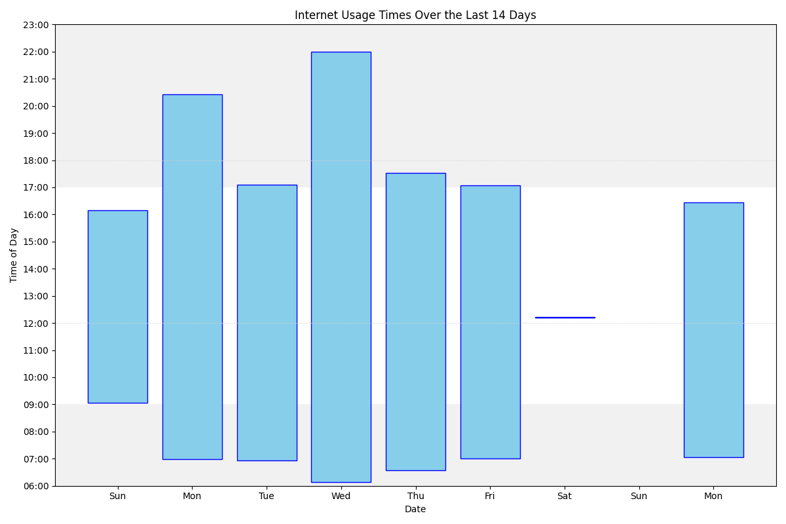

My web history is public. 

It's updated every hour or so when my machine is running. That script also updates a chart showing the size of the lists over time.  

You can see the code I use <a href="https://github.com/joereddington/export-history">on github</a>, and there's <a href="https://joereddington.github.io/2018/12/12/Internet.html"> a blog post that talks about the reasons</a>.

{::nomarkdown}\n
<h3> Most common sites</h3>
With number of accesses/minutes in parentheses<ol><li>www.google.com (6363)</li>
<li>mail.google.com (4550)</li>
<li>outlook.office.com (2178)</li>
<li>www.facebook.com (1617)</li>
<li>docs.google.com (1465)</li>
<li>moodle.royalholloway.ac.uk (1083)</li>
<li>calendar.google.com (987)</li>
<li>www.amazon.co.uk (945)</li>
<li>m.facebook.com (866)</li>
<li>github.com (863)</li>
<li>www.reddit.com (741)</li>
<li>www.linkedin.com (586)</li>
<li>app.qbo.intuit.com (567)</li>
<li>chat.openai.com (528)</li>
<li>tvtropes.org (489)</li>
<li>en.m.wikipedia.org (485)</li>
<li>gmail.com (476)</li>
<li>teams.microsoft.com (383)</li>
<li>drive.google.com (361)</li>
<li>outlook.office365.com (355)</li>
<li>forum.artofmemory.com (350)</li>
<li>whitewaterwriters.com (325)</li>
<li>login.microsoftonline.com (315)</li>
<li>bsky.app (311)</li>
<li>kdp.amazon.com (276)</li>
<li>rhul.sharepoint.com (272)</li>
<li>web.whatsapp.com (258)</li>
<li>Local file (254)</li>
<li>www.ebay.co.uk (248)</li>
<li>www.giantitp.com (239)</li>
</ol><H2> Sites and times</H2><ul>
</ul>

<H3>Thursday, 13/06/24</H3>

 

<ul>

<li> 15:49 outlook.office365.com
<li> 15:49 <a href="https://tex.stackexchange.com/questions/196794/how-can-you-create-a-vertical-timeline">moderntimeline - How can you create a vertical timeline? - TeX - LaTeX Stack Exchange</a>
<li> 15:49 www.google.com
<li> 15:48 outlook.office365.com
<li class='same'> 15:47 outlook.office365.com
<li class='same'> 15:45 outlook.office365.com
<li class='same'> 15:44 outlook.office365.com
<li class='same'> 15:41 outlook.office365.com
<li class='same'> 15:37 outlook.office365.com
<li class='same'> 15:29 outlook.office365.com
<li> 15:29 mail.google.com
<li class='same'> 15:25 mail.google.com
<li> 15:22 outlook.office365.com
<li class='same'> 15:20 outlook.office365.com
<li> 15:19 chatgpt.com
<li class='same'> 15:17 chatgpt.com
<li> 15:17 chat.openai.com
<li> 15:09 mail.google.com
<li> 15:08 calendar.google.com
<li> 15:08 mail.google.com
<li> 15:05 web.whatsapp.com
<li> 15:05 calendar.google.com
<li> 15:02 outlook.office.com
<li class='same'> 15:01 outlook.office.com
<li> 15:00 mail.google.com
<li> 14:58 www.linkedin.com
<li> 14:55 outlook.office365.com
<li class='same'> 14:53 outlook.office365.com
<li> 14:52 mail.google.com
<li> 14:51 www.google.com
<li> 14:50 mail.google.com
<li> 14:50 www.amazon.co.uk
<li> 14:50 mail.google.com
<li> 14:50 gmail.com
<li> 14:50 www.google.com
<li> 14:50 mail.google.com
<li> 14:47 www.amazon.co.uk
<li> 14:46 www.amazon.com
<li> 14:46 www.google.com
<li> 14:39 <a href="https://en.wikipedia.org/wiki/Humphrey_Appleby">Humphrey Appleby - Wikipedia</a>
<li> 14:39 www.google.com
<li class='same'> 14:38 www.google.com
<li> 14:33 calendar.google.com
<li> 14:33 mail.google.com
<li class='same'> 14:31 mail.google.com
<li class='same'> 14:30 mail.google.com
<li> 14:30 www.google.com
<li> 14:30 app.qbo.intuit.com
<li> 14:27 outlook.office.com
<li> 14:26 www.linkedin.com
<li> 14:26 app.qbo.intuit.com
<li> 14:26 www.linkedin.com
<li> 14:26 app.qbo.intuit.com
<li> 14:26 accounts.intuit.com
<li> 14:26 c14.qbo.intuit.com
<li> 14:25 mail.google.com
<li> 14:25 outlook.office.com
<li> 14:25 mail.google.com
<li class='same'> 14:21 mail.google.com
<li> 14:21 www.google.com
<li class='same'> 14:20 www.google.com
<li> 14:20 barkingdagenhamcollege.ac.uk
<li> 14:20 www.google.com
<li> 14:20 mail.google.com
<li class='same'> 14:19 mail.google.com
<li class='same'> 14:18 mail.google.com
<li> 14:17 whitewaterwriters.com
<li> 14:17 mail.google.com
<li class='same'> 14:13 mail.google.com
<li> 14:13 outlook.office.com
<li> 14:13 mail.google.com
<li class='same'> 14:11 mail.google.com
<li class='same'> 14:10 mail.google.com
<li class='same'> 14:09 mail.google.com
<li> 14:09 www.facebook.com
<li class='same'> 14:07 www.facebook.com
<li class='same'> 14:06 www.facebook.com
<li> 14:06 mail.google.com
<li> 14:06 gmail.com
<li> 14:05 mail.google.com
<li> 14:05 momence.com
<li> 14:05 mail.google.com
<li> 14:05 gmail.com
<li> 14:05 outlook.office.com
<li class='same'> 14:04 outlook.office.com
<li class='same'> 14:03 outlook.office.com
<li class='same'> 13:34 outlook.office.com
<li class='same'> 13:33 outlook.office.com
<li> 13:05 www.facebook.com
<li class='same'> 13:04 www.facebook.com
<li class='same'> 13:03 www.facebook.com
<li> 13:03 <a href="https://joereddington.com/2024/06/13/grat.html">Gratitude | Joe Reddington</a>
<li> 13:03 <a href="https://joereddington.com/all_posts.html">All posts | Joe Reddington</a>
<li> 13:03 <a href="https://joereddington.com/">Joe Reddington | Things I make.</a>
<li> 13:02 www.google.com
<li class='same'> 13:01 www.google.com
<li class='same'> 13:00 www.google.com
<li> 12:59 knowyourmeme.com
<li> 12:59 www.google.com
<li class='same'> 12:58 www.google.com
<li class='same'> 12:57 www.google.com
<li> 12:56 www.reddit.com
<li> 12:56 www.google.com
<li class='same'> 12:55 www.google.com
<li> 12:55 www.linkedin.com
<li> 12:55 outlook.office.com
<li class='same'> 12:43 outlook.office.com
<li> 12:43 www.google.com
<li class='same'> 12:36 www.google.com
<li class='same'> 12:35 www.google.com
<li> 12:33 www.linkedin.com
<li> 12:31 www.royalholloway.ac.uk
<li> 12:31 www.google.com
<li class='same'> 12:23 www.google.com
<li> 12:22 www.linkedin.com
<li> 12:20 www.appgcybersecurity.org
<li> 12:19 www.linkedin.com
<li> 12:19 www.google.com
<li> 12:19 www.wychwoodconsultingltd.co.uk
<li class='same'> 12:18 www.wychwoodconsultingltd.co.uk
<li> 12:18 www.appgcybersecurity.org
<li> 12:18 web.whatsapp.com
<li> 12:16 www.linkedin.com
<li> 12:16 www.google.com
<li> 12:15 www.appgcybersecurity.org
<li> 12:15 www.google.com
<li> 12:15 www.appgcybersecurity.org
<li> 12:14 outlook.office.com
<li> 12:14 www.google.com
<li class='same'> 12:13 www.google.com
<li> 12:13 chatgpt.com
<li> 12:13 chat.openai.com
<li> 12:04 mc.manuscriptcentral.com
<li> 12:02 <a href="https://joereddington.com/export-history/">Joe's Public Internet history</a>
<li> 12:02 www.google.com
<li> 12:02 mc.manuscriptcentral.com
<li> 12:02 outlook.office.com
<li class='same'> 12:01 outlook.office.com
<li> 12:01 login.microsoftonline.com
<li> 11:56 outlook.office365.com
<li class='same'> 11:55 outlook.office365.com
<li> 11:51 www.google.com
<li> 11:42 www.gq.com
<li class='same'> 11:41 www.gq.com
<li> 11:37 outlook.office365.com
<li> 11:37 mail.google.com
<li> 11:37 outlook.office365.com
<li class='same'> 11:29 outlook.office365.com
<li class='same'> 11:26 outlook.office365.com
<li> 11:23 calendar.google.com
<li> 11:23 outlook.office365.com
<li class='same'> 11:22 outlook.office365.com
<li> 11:20 webtimetables.royalholloway.ac.uk
<li class='same'> 11:19 webtimetables.royalholloway.ac.uk
<li> 11:19 eur03.safelinks.protection.outlook.com
<li> 11:19 outlook.office365.com
<li class='same'> 11:17 outlook.office365.com
<li class='same'> 11:16 outlook.office365.com
<li class='same'> 11:15 outlook.office365.com
<li class='same'> 11:14 outlook.office365.com
<li class='same'> 11:13 outlook.office365.com
<li> 11:12 www.google.com
<li> 11:12 docs.google.com
<li> 11:11 outlook.office365.com
<li class='same'> 11:10 outlook.office365.com
<li class='same'> 11:09 outlook.office365.com
<li> 11:09 <a href="https://xkcd.com/2940/">xkcd: Modes of Transportation</a>
<li> 11:09 <a href="https://xkcd.com/2941/">xkcd: Cell Organelles</a>
<li> 11:09 <a href="https://xkcd.com/2942/">xkcd: Fluid Speech</a>
<li> 11:08 <a href="https://xkcd.com/2943/">xkcd: Unsolved Chemistry Problems</a>
<li> 11:08 <a href="https://xkcd.com/2944/">xkcd: Magnet Fishing</a>
<li> 11:08 <a href="https://xkcd.com/2945/">xkcd: Broken Model</a>
<li> 11:08 <a href="https://xkcd.com/2944/">xkcd: Magnet Fishing</a>
<li> 11:08 <a href="https://xkcd.com/">xkcd: Broken Model</a>
<li> 11:08 www.giantitp.com
<li> 11:07 mail.google.com
<li> 11:06 www.natesilver.net
<li> 11:04 www.paypal.com
<li> 11:04 www.natesilver.net
<li class='same'> 11:03 www.natesilver.net
<li> 11:01 mail.google.com
<li class='same'> 11:00 mail.google.com
<li> 10:59 www.paypal.com
<li> 10:58 mail.google.com
<li class='same'> 10:57 mail.google.com
<li> 10:57 gmail.com
<li> 10:57 mail.google.com
<li> 10:56 www.linkedin.com
<li class='same'> 10:55 www.linkedin.com
<li> 10:55 outlook.office365.com
<li> 10:54 mail.google.com
<li> 10:53 calendar.google.com
<li> 10:53 outlook.office365.com
<li class='same'> 10:50 outlook.office365.com
<li class='same'> 10:49 outlook.office365.com
<li> 10:46 www.facebook.com
<li class='same'> 10:44 www.facebook.com
<li> 10:42 web.whatsapp.com
<li> 10:33 calendar.google.com
<li class='same'> 10:32 calendar.google.com
<li class='same'> 10:31 calendar.google.com
<li class='same'> 10:30 calendar.google.com
<li> 10:30 mail.google.com
<li> 10:30 <a href="https://joereddington.com/video/2024/06/10/bike.html">Cadence sensors in games | Joe Reddington</a>
<li> 10:30 <a href="https://joereddington.com/all_posts.html">All posts | Joe Reddington</a>
<li> 10:30 <a href="https://joereddington.com/images/2020/06/10/mirror.html">Mirror Images | Joe Reddington</a>
<li> 10:30 <a href="https://joereddington.com/all_posts.html">All posts | Joe Reddington</a>
<li> 10:30 <a href="https://joereddington.com/">Joe Reddington | Things I make.</a>
<li> 10:27 mail.google.com
<li> 10:27 www.google.com
<li> 10:27 www.brickborrow.com
<li> 10:27 mail.google.com
<li> 10:16 myview.rhul.zellis.com
<li> 10:05 mail.google.com
<li> 10:05 calendar.google.com
<li class='same'> 10:04 calendar.google.com
<li> 10:03 mail.google.com
<li> 09:58 calendar.google.com
<li> 09:55 www.thetrainline.com
<li> 09:55 2n8w.app.link
<li> 09:55 www.thetrainline.com
<li> 09:55 www.google.com
<li> 09:55 www.thetrainline.com
<li> 09:55 www.google.com
<li> 09:54 www.nationalrail.co.uk
<li> 09:54 www.google.com
<li> 09:54 www.thetrainline.com
<li> 09:54 www.googleadservices.com
<li> 09:54 www.google.com
<li> 09:53 moodle.royalholloway.ac.uk
<li> 09:53 outlook.office365.com
<li> 09:52 moodle.royalholloway.ac.uk
<li class='same'> 09:48 moodle.royalholloway.ac.uk
<li> 09:48 login.microsoftonline.com
<li> 09:47 moodle.royalholloway.ac.uk
<li> 09:47 myview.rhul.zellis.com
<li class='same'> 09:46 myview.rhul.zellis.com
<li> 09:46 login.microsoftonline.com
<li> 09:46 myview.rhul.zellis.com
<li class='same'> 09:45 myview.rhul.zellis.com
<li> 09:45 login.microsoftonline.com
<li> 09:45 outlook.office.com
<li> 09:45 myview.rhul.zellis.com
<li> 09:45 outlook.office365.com
<li> 09:45 mail.google.com
<li> 09:44 outlook.office365.com
<li> 09:44 mail.google.com
<li class='same'> 09:43 mail.google.com
<li> 09:43 www.google.com
<li> 09:43 link.ifttt.com
<li> 09:43 mail.google.com
<li> 09:43 gmail.com
<li> 09:40 chatgpt.com
<li> 09:40 chat.openai.com
<li> 09:37 money.stackexchange.com
<li> 09:37 <a href="https://stackoverflow.com/questions/12556267/how-to-prevent-quitting-vim-accidentally">How to prevent quitting vim accidentally? - Stack Overflow</a>
<li> 09:37 www.google.com
<li class='same'> 09:36 www.google.com
<li> 09:36 outlook.office365.com
<li class='same'> 09:35 outlook.office365.com
<li> 09:35 login.microsoftonline.com
<li> 09:35 mail.rhul.ac.uk
<li> 09:32 www.reddit.com
<li> 09:32 reddit.com
<li> 09:32 www.reddit.com
<li> 09:30 <a href="https://unix.stackexchange.com/questions/592522/rsync-command-is-taking-too-long-each-time">performance - rsync command is taking too long each time - Unix & Linux Stack Exchange</a>
<li> 09:30 www.google.com

</ul>

<H3>Wednesday, 12/06/24</H3>

 

<ul>

</ul>

 

<ul><li> 16:13 <a href="https://en.wikipedia.org/wiki/Alun_Cairns">Alun Cairns - Wikipedia</a>
<li> 16:13 <a href="https://en.wikipedia.org/wiki/Alun_Cairns?wprov=srpw1_0">Alun Cairns - Wikipedia</a>
<li> 16:13 <a href="https://en.wikipedia.org/wiki/Alun_Cairns">Alun Cairns - Wikipedia</a>
<li> 16:13 <a href="https://en.wikipedia.org/w/index.php?search=Alun+Cairns+MP&title=Special:Search&ns0=1&searchToken=7qvty9kbf2pwrn4o9j9c6w395">Alun Cairns MP - Search results - Wikipedia</a>
<li> 16:13 <a href="https://en.wikipedia.org/w/index.php?search=Alun+Cairns+MP&title=Special%3ASearch&ns0=1">Alun Cairns MP - Search results - Wikipedia</a>
<li> 16:13 www.google.com
<li class='same'> 16:11 www.google.com
<li> 16:10 <a href="https://en.wikipedia.org/wiki/Alan_West,_Baron_West_of_Spithead">Alan West, Baron West of Spithead - Wikipedia</a>
<li> 16:10 www.google.com
<li> 16:10 <a href="https://en.wikipedia.org/wiki/Simon_Fell_(politician)">Simon Fell (politician) - Wikipedia</a>
<li> 16:10 www.google.com
<li> 16:10 <a href="https://en.wikipedia.org/wiki/Colum_Eastwood">Colum Eastwood - Wikipedia</a>
<li> 16:10 www.google.com
<li> 16:09 <a href="https://en.wikipedia.org/wiki/George_Howarth">George Howarth - Wikipedia</a>
<li> 16:09 www.google.com
<li> 16:09 <a href="https://en.wikipedia.org/wiki/Owen_Thompson">Owen Thompson - Wikipedia</a>
<li> 16:09 www.google.com
<li> 16:09 <a href="https://en.wikipedia.org/wiki/Halesowen_and_Rowley_Regis_(UK_Parliament_constituency)">Halesowen and Rowley Regis (UK Parliament constituency) - Wikipedia</a>
<li> 16:08 <a href="https://en.wikipedia.org/wiki/James_Morris_(British_politician)">James Morris (British politician) - Wikipedia</a>
<li> 16:08 www.google.com
<li> 16:08 www.appgcybersecurity.org
<li class='same'> 16:07 www.appgcybersecurity.org
<li> 16:07 www.google.com
<li> 16:07 www.ncvo.org.uk
<li> 16:06 www.google.com
<li> 16:04 outlook.office.com
<li class='same'> 16:03 outlook.office.com
<li class='same'> 16:01 outlook.office.com
<li class='same'> 16:00 outlook.office.com
<li> 16:00 mail.google.com
<li class='same'> 15:59 mail.google.com
<li> 15:57 www.google.com
<li> 15:56 mail.google.com
<li class='same'> 15:55 mail.google.com
<li> 15:54 www.reddit.com
<li> 15:54 www.google.com
<li> 15:53 mail.google.com
<li> 15:45 www.amazon.co.uk
<li> 15:45 docs.google.com
<li> 15:45 mail.google.com
<li class='same'> 15:44 mail.google.com
<li> 15:43 web.whatsapp.com
<li> 15:43 mail.google.com
<li> 15:42 <a href="https://en.wikipedia.org/wiki/Nationwide_opinion_polling_for_the_2024_United_States_presidential_election">Nationwide opinion polling for the 2024 United States presidential election - Wikipedia</a>
<li> 15:42 www.google.com
<li> 15:42 en.m.wikipedia.org
<li class='same'> 15:41 en.m.wikipedia.org
<li> 15:39 www.theguardian.com
<li> 15:38 mail.google.com
<li> 15:36 www.facebook.com
<li> 15:34 www.google.com
<li> 15:33 www.facebook.com
<li> 15:31 <a href="https://joereddington.com/2024/06/10/attendence.html">Improvements to Attendance Tracking | Joe Reddington</a>
<li> 15:31 <a href="https://joereddington.com/all_posts.html">All posts | Joe Reddington</a>
<li> 15:31 <a href="https://joereddington.com/2024/06/10/bingo.html">Bingo! Teaching prize | Joe Reddington</a>
<li> 15:31 <a href="https://joereddington.com/all_posts.html">All posts | Joe Reddington</a>
<li> 15:31 <a href="https://joereddington.com/">Joe Reddington | Things I make.</a>
<li> 15:31 www.linkedin.com
<li class='same'> 15:30 www.linkedin.com
<li> 15:24 www.google.com
<li> 15:24 web.whatsapp.com
<li> 15:23 calendar.google.com
<li> 15:23 mail.google.com
<li class='same'> 15:22 mail.google.com
<li> 15:21 calendar.google.com
<li> 15:21 mail.google.com
<li> 15:21 gmail.com
<li> 15:20 www.facebook.com
<li class='same'> 15:19 www.facebook.com
<li class='same'> 15:18 www.facebook.com
<li class='same'> 15:17 www.facebook.com
<li class='same'> 15:16 www.facebook.com
<li class='same'> 15:15 www.facebook.com
<li class='same'> 15:14 www.facebook.com
<li class='same'> 15:13 www.facebook.com
<li class='same'> 15:10 www.facebook.com
<li class='same'> 15:09 www.facebook.com
<li class='same'> 15:07 www.facebook.com
<li class='same'> 15:05 www.facebook.com
<li class='same'> 15:01 www.facebook.com
<li> 14:59 www.ncvo.org.uk
<li> 14:59 l.facebook.com
<li> 14:57 www.facebook.com
<li> 14:56 mc.manuscriptcentral.com
<li> 14:55 outlook.office.com
<li> 14:55 mc.manuscriptcentral.com
<li> 14:55 outlook.office.com
<li> 14:55 mc.manuscriptcentral.com
<li class='same'> 14:54 mc.manuscriptcentral.com
<li> 14:54 outlook.office.com
<li> 14:54 calendar.google.com
<li> 14:54 outlook.office.com
<li> 14:49 royalholloway.ac.uk
<li> 14:49 web.whatsapp.com
<li> 14:49 law.stackexchange.com
<li> 14:47 scifi.stackexchange.com
<li> 14:47 academia.stackexchange.com
<li class='same'> 14:46 academia.stackexchange.com
<li> 14:45 history.stackexchange.com
<li> 14:45 mail.google.com
<li> 14:41 assets.publishing.service.gov.uk
<li> 14:41 www.google.com
<li> 14:38 english.stackexchange.com
<li> 14:38 www.google.com
<li> 14:32 mail.google.com
<li> 14:32 outlook.office.com
<li> 14:32 mail.google.com
<li> 14:32 gmail.com
<li> 14:32 outlook.office.com
<li class='same'> 14:30 outlook.office.com
<li> 14:29 muckrack.com
<li class='same'> 14:28 muckrack.com
<li> 14:28 www.google.com
<li> 14:28 muckrack.com
<li> 14:28 www.google.com
<li> 14:28 outlook.office.com
<li class='same'> 14:27 outlook.office.com
<li> 14:11 m.facebook.com
<li class='same'> 14:08 m.facebook.com
<li class='same'> 14:06 m.facebook.com
<li class='same'> 14:05 m.facebook.com
<li class='same'> 14:03 m.facebook.com

</ul>

 

<ul><li> 11:46 www.nytimes.com
<li> 11:33 www.natesilver.net
<li> 11:24 outlook.office.com
<li> 11:22 www.facebook.com
<li> 11:11 www.appgcybersecurity.org
<li> 11:09 publications.parliament.uk
<li class='same'> 11:08 publications.parliament.uk
<li> 11:04 www.google.com
<li class='same'> 10:47 www.google.com
<li class='same'> 10:46 www.google.com
<li> 10:36 www.facebook.com
<li> 10:33 www.ncsc.gov.uk
<li> 10:33 www.google.com
<li> 10:31 outlook.office.com
<li> 10:25 web.whatsapp.com
<li> 10:20 www.facebook.com
<li> 10:19 publications.parliament.uk
<li> 10:16 www.parallelparliament.co.uk
<li class='same'> 10:15 www.parallelparliament.co.uk
<li> 10:15 www.google.com
<li> 10:08 publications.parliament.uk
<li class='same'> 10:07 publications.parliament.uk
<li> 10:07 www.parliament.uk
<li> 10:05 publications.parliament.uk
<li class='same'> 10:04 publications.parliament.uk
<li class='same'> 10:03 publications.parliament.uk
<li> 10:03 outlook.office.com
<li> 10:02 teams.microsoft.com
<li> 10:01 outlook.office.com
<li> 10:01 publications.parliament.uk
<li class='same'> 10:00 publications.parliament.uk
<li class='same'> 09:59 publications.parliament.uk
<li class='same'> 09:58 publications.parliament.uk
<li class='same'> 09:57 publications.parliament.uk
<li class='same'> 09:56 publications.parliament.uk
<li> 09:56 www.parliament.uk
<li> 09:56 www.google.com
<li> 09:45 www.appgcybersecurity.org
<li> 09:45 outlook.office.com
<li> 09:45 www.appgcybersecurity.org
<li class='same'> 09:44 www.appgcybersecurity.org
<li> 09:43 www.wychwoodconsultingltd.co.uk
<li> 09:43 find-and-update.company-information.service.gov.uk
<li> 09:42 www.google.com
<li> 09:42 www.appgcybersecurity.org
<li class='same'> 09:41 www.appgcybersecurity.org
<li> 09:41 www.google.com
<li> 09:33 outlook.office.com
<li class='same'> 09:32 outlook.office.com
<li> 09:30 www.facebook.com
<li> 09:26 labourlist.org
<li> 09:26 www.google.com
<li> 09:25 www.facebook.com
<li class='same'> 09:24 www.facebook.com
<li> 09:24 outlook.office.com
<li class='same'> 09:23 outlook.office.com
<li> 09:23 login.microsoftonline.com

</ul>

<H3>Tuesday, 11/06/24</H3>

 

<ul>

</ul>

 

<ul><li> 18:49 outlook.office365.com
<li class='same'> 18:47 outlook.office365.com
<li class='same'> 18:46 outlook.office365.com
<li class='same'> 18:44 outlook.office365.com
<li class='same'> 18:43 outlook.office365.com
<li> 18:42 rhul.sharepoint.com
<li class='same'> 18:41 rhul.sharepoint.com
<li> 18:41 outlook.office365.com
<li class='same'> 18:40 outlook.office365.com
<li> 18:36 chatgpt.com
<li class='same'> 18:35 chatgpt.com
<li> 18:35 chat.openai.com
<li> 18:35 chatgpt.com
<li> 18:35 chat.openai.com

</ul>

 

<ul><li> 17:01 m.facebook.com

</ul>

 

<ul><li class='same'> 16:22 m.facebook.com
<li class='same'> 16:20 m.facebook.com
<li class='same'> 16:19 m.facebook.com
<li> 16:19 mail.google.com
<li class='same'> 16:18 mail.google.com
<li class='same'> 16:17 mail.google.com
<li> 16:17 www.lutonsfc.ac.uk
<li> 16:17 www.google.com
<li> 16:17 mail.google.com
<li class='same'> 16:16 mail.google.com
<li class='same'> 16:15 mail.google.com
<li class='same'> 16:14 mail.google.com
<li> 16:14 gmail.com
<li> 16:14 mail.google.com
<li> 16:09 www.facebook.com
<li> 16:07 outlook.office365.com
<li> 16:07 mail.google.com
<li> 15:41 m.facebook.com
<li class='same'> 15:39 m.facebook.com
<li class='same'> 15:36 m.facebook.com
<li class='same'> 15:28 m.facebook.com
<li> 15:26 www.theguardian.com
<li class='same'> 15:25 www.theguardian.com
<li> 15:25 www.google.com
<li> 15:25 m.facebook.com
<li class='same'> 15:24 m.facebook.com
<li> 14:55 mail.google.com
<li> 14:54 calendar.google.com
<li> 14:54 mail.google.com
<li class='same'> 14:32 mail.google.com
<li> 14:32 calendar.google.com
<li> 14:32 mail.google.com
<li class='same'> 14:31 mail.google.com
<li> 14:31 manage.kmail-lists.com
<li> 14:31 mail.google.com
<li> 14:29 calendar.google.com
<li class='same'> 14:27 calendar.google.com
<li class='same'> 14:25 calendar.google.com
<li class='same'> 14:24 calendar.google.com
<li> 14:24 mail.google.com
<li class='same'> 14:23 mail.google.com
<li class='same'> 14:22 mail.google.com
<li> 14:22 gmail.com
<li> 14:21 www.facebook.com
<li class='same'> 14:20 www.facebook.com
<li class='same'> 14:19 www.facebook.com
<li class='same'> 14:18 www.facebook.com
<li class='same'> 14:17 www.facebook.com
<li class='same'> 14:16 www.facebook.com
<li class='same'> 14:15 www.facebook.com
<li class='same'> 14:14 www.facebook.com
<li class='same'> 14:13 www.facebook.com
<li class='same'> 14:12 www.facebook.com
<li class='same'> 14:11 www.facebook.com
<li class='same'> 14:10 www.facebook.com
<li class='same'> 14:09 www.facebook.com
<li class='same'> 14:08 www.facebook.com
<li class='same'> 14:07 www.facebook.com
<li class='same'> 14:04 www.facebook.com
<li class='same'> 14:03 www.facebook.com
<li class='same'> 14:02 www.facebook.com
<li class='same'> 14:01 www.facebook.com
<li class='same'> 14:00 www.facebook.com
<li class='same'> 13:59 www.facebook.com
<li class='same'> 13:58 www.facebook.com
<li class='same'> 13:57 www.facebook.com
<li class='same'> 13:55 www.facebook.com
<li> 13:36 m.facebook.com
<li class='same'> 13:35 m.facebook.com
<li class='same'> 13:34 m.facebook.com
<li> 13:33 stelios.foundation
<li> 13:30 m.facebook.com
<li> 13:30 www.google.com
<li class='same'> 13:25 www.google.com
<li> 13:10 mail.google.com
<li> 13:01 outlook.office365.com
<li class='same'> 13:00 outlook.office365.com
<li> 13:00 mail.rhul.ac.uk
<li> 13:00 mail.google.com
<li> 13:00 gmail.com
<li> 12:56 docs.google.com

</ul>

 

<ul><li> 12:10 en.m.wikipedia.org
<li class='same'> 12:09 en.m.wikipedia.org
<li> 12:08 www.theguardian.com
<li class='same'> 12:07 www.theguardian.com
<li> 12:07 www.google.com
<li class='same'> 12:01 www.google.com
<li> 11:58 github.com
<li class='same'> 11:57 github.com

</ul>

 

<ul><li> 11:24 chatgpt.com
<li> 11:24 chat.openai.com
<li> 11:24 outlook.office365.com
<li class='same'> 11:21 outlook.office365.com
<li class='same'> 11:20 outlook.office365.com
<li> 11:20 www.reddit.com
<li class='same'> 11:05 www.reddit.com
<li> 11:05 www.google.com
<li> 11:04 bokcenter.harvard.edu
<li> 11:04 www.google.com
<li class='same'> 11:03 www.google.com
<li> 11:03 academia.stackexchange.com
<li> 11:03 www.google.com
<li> 11:00 www.ebay.co.uk
<li> 10:59 127.0.0.1:4000
<li class='same'> 10:52 127.0.0.1:4000
<li class='same'> 10:38 127.0.0.1:4000
<li> 10:27 <a href="https://stackoverflow.com/questions/54261381/how-to-create-a-only-one-row-table-using-markdown">gitbook - How to create a only one row table using markdown - Stack Overflow</a>
<li> 10:27 www.google.com
<li> 10:26 127.0.0.1:4000
<li> 10:25 blueypedia.fandom.com
<li> 10:25 www.google.com
<li> 10:16 chatgpt.com
<li> 10:16 chat.openai.com
<li> 10:15 127.0.0.1:4000
<li> 10:11 <a href="https://en.wikipedia.org/wiki/Michael_Douglas">Michael Douglas - Wikipedia</a>
<li> 10:09 <a href="https://en.wikipedia.org/wiki/One_Flew_Over_the_Cuckoo%27s_Nest_(film)">One Flew Over the Cuckoo's Nest (film) - Wikipedia</a>
<li> 10:08 <a href="https://en.wikipedia.org/wiki/Kirk_Douglas">Kirk Douglas - Wikipedia</a>
<li> 10:08 <a href="https://en.wikipedia.org/wiki/Michael_Douglas">Michael Douglas - Wikipedia</a>
<li> 10:08 www.google.com
<li> 10:08 outlook.office365.com
<li> 10:07 mail.google.com
<li> 10:07 www.facebook.com
<li class='same'> 10:06 www.facebook.com
<li class='same'> 10:05 www.facebook.com
<li class='same'> 10:04 www.facebook.com
<li> 10:04 mail.google.com
<li> 10:04 gmail.com
<li> 10:03 www.facebook.com
<li class='same'> 10:02 www.facebook.com
<li> 09:59 mail.google.com
<li> 09:56 www.google.com
<li> 09:54 support.mozilla.org
<li> 09:54 www.google.com
<li> 09:52 mail.google.com
<li class='same'> 09:50 mail.google.com
<li> 09:47 <a href="https://joereddington.com/export-history/">Joe's Public Internet history</a>
<li> 09:45 chatgpt.com
<li class='same'> 09:44 chatgpt.com
<li> 09:44 chat.openai.com
<li> 09:44 outlook.office365.com
<li> 09:42 projects.cs.rhul.ac.uk
<li> 09:42 outlook.office.com
<li> 09:42 outlook.office365.com
<li class='same'> 09:37 outlook.office365.com
<li> 09:37 equalitytime.github.io
<li> 09:31 www.reddit.com
<li class='same'> 09:29 www.reddit.com
<li class='same'> 09:27 www.reddit.com
<li class='same'> 09:26 www.reddit.com
<li class='same'> 09:24 www.reddit.com
<li> 09:24 outlook.office365.com
<li> 09:24 login.microsoftonline.com
<li> 09:24 mail.rhul.ac.uk
<li> 09:24 dashboard.laterforreddit.com
<li> 09:24 www.google.com
<li class='same'> 09:23 www.google.com

</ul>

 

<ul><li class='same'> 08:39 www.google.com
<li class='same'> 08:37 www.google.com

</ul>

<H3>Monday, 10/06/24</H3>

 

<ul>

</ul>

 

<ul><li> 15:51 <a href="https://joereddington.com/all_posts.html">All posts | Joe Reddington</a>
<li> 15:51 <a href="https://joereddington.com/2024/05/27/gratitude.html">Gratitude | Joe Reddington</a>
<li> 15:49 www.tri247.com
<li> 15:49 www.google.com
<li> 15:49 www.facebook.com
<li class='same'> 15:48 www.facebook.com
<li> 15:47 www.google.com
<li> 15:47 www.facebook.com
<li> 15:47 www.google.com
<li> 15:47 calendar.google.com
<li> 15:46 <a href="https://joereddington.com/2024/03/23/history-review.html">History Review | Joe Reddington</a>
<li> 15:46 <a href="https://joereddington.com/all_posts.html">All posts | Joe Reddington</a>
<li> 15:46 www.facebook.com
<li class='same'> 15:45 www.facebook.com
<li> 15:45 <a href="https://joereddington.com/2023/10/13/garage-shelves.html">Garage Shelves | Joe Reddington</a>
<li> 15:45 <a href="https://joereddington.com/all_posts.html">All posts | Joe Reddington</a>
<li> 15:45 <a href="https://joereddington.com/">Joe Reddington | Things I make.</a>
<li> 15:43 www.facebook.com
<li class='same'> 15:41 www.facebook.com
<li class='same'> 15:40 www.facebook.com
<li> 15:38 chatgpt.com
<li class='same'> 15:37 chatgpt.com
<li> 15:37 chat.openai.com
<li> 15:36 outlook.office365.com
<li class='same'> 15:35 outlook.office365.com
<li> 15:35 www.microsoft365.com
<li class='same'> 15:34 www.microsoft365.com
<li> 15:34 login.microsoftonline.com
<li> 15:34 www.microsoft365.com
<li> 15:34 outlook.office365.com
<li> 15:34 mail.rhul.ac.uk
<li> 15:34 calendar.google.com
<li> 15:34 <a href="https://joereddington.com/video/2024/06/10/bike.html">Cadence sensors in games | Joe Reddington</a>
<li> 15:34 <a href="https://joereddington.com/all_posts.html">All posts | Joe Reddington</a>
<li> 15:34 <a href="https://joereddington.com/">Joe Reddington | Things I make.</a>
<li> 15:32 chatgpt.com
<li> 15:32 chat.openai.com
<li> 15:28 <a href="https://en.wikipedia.org/wiki/Mario_Kart">Mario Kart - Wikipedia</a>
<li> 15:28 www.google.com
<li> 15:24 nintendo.fandom.com
<li> 15:24 www.ebay.com
<li> 15:24 www.google.com
<li> 15:24 boingboing.net
<li> 15:24 www.google.com
<li> 15:23 nintendo.fandom.com
<li> 15:23 www.google.com
<li> 15:23 imgur.com
<li> 15:22 collectorsedition.org
<li> 15:22 www.google.com
<li> 15:22 www.retrocollect.com
<li> 15:22 www.destructoid.com
<li> 15:21 www.instructables.com
<li> 15:21 www.google.com
<li> 15:20 www.reddit.com
<li> 15:20 www.google.com
<li> 15:16 <a href="https://joereddington.com/2023/02/28/bike.html">Exercise bike setup | Joe Reddington</a>
<li> 15:15 <a href="https://www.youtube.com/shorts/BHYjO9iBMsQ">(37) Connecting the exercise bike to games. Test 1. - YouTube</a>
<li> 15:15 <a href="https://www.youtube.com/channel/UCLOmaOSJYS1FVBQXLIGf0QQ">(37) Joe Reddington - YouTube</a>
<li> 15:15 
<li> 15:15 <a href="https://www.youtube.com/channel/UC4DUmGMOWnrf4VH3kLw6P2A">(37) Joe edits Wikipedia! - YouTube</a>
<li> 15:14 <a href="https://www.youtube.com/">YouTube</a>
<li class='same'> 15:13 <a href="https://www.youtube.com/">YouTube</a>
<li> 15:09 www.linkedin.com
<li class='same'> 15:08 www.linkedin.com
<li> 15:08 <a href="https://joereddington.com/2024/06/10/attendence.html">Improvements to Attendance Tracking | Joe Reddington</a>
<li> 15:08 <a href="https://joereddington.com/all_posts.html">All posts | Joe Reddington</a>
<li> 15:08 <a href="https://joereddington.com/">Joe Reddington | Things I make.</a>
<li> 15:07 github.com
<li> 15:07 outlook.office365.com
<li class='same'> 15:06 outlook.office365.com
<li> 15:06 mail.rhul.ac.uk
<li> 15:06 mail.google.com
<li> 15:05 web.whatsapp.com
<li> 15:05 <a href="https://joereddington.com/2024/06/10/bingo.html">Bingo! Teaching prize | Joe Reddington</a>
<li> 15:05 <a href="https://joereddington.com/all_posts.html">All posts | Joe Reddington</a>
<li> 15:05 <a href="https://joereddington.com/">Joe Reddington | Things I make.</a>
<li> 14:48 rhul-my.sharepoint.com
<li class='same'> 14:47 rhul-my.sharepoint.com
<li> 14:46 mysignins.microsoft.com
<li> 14:46 account.activedirectory.windowsazure.com
<li> 14:46 login.microsoftonline.com
<li> 14:46 account.activedirectory.windowsazure.com
<li> 14:46 login.microsoftonline.com
<li> 14:46 rhul-my.sharepoint.com
<li> 14:46 outlook.office.com
<li> 14:46 outlook.office365.com
<li> 14:44 127.0.0.1:4000
<li> 14:27 outlook.office365.com
<li> 14:26 github.com
<li> 14:26 outlook.office365.com
<li class='same'> 14:23 outlook.office365.com
<li> 14:23 mail.rhul.ac.uk
<li> 14:23 calendar.google.com
<li class='same'> 14:22 calendar.google.com
<li> 14:01 m.facebook.com
<li class='same'> 13:59 m.facebook.com
<li> 13:56 calendar.google.com
<li> 13:55 mail.google.com
<li class='same'> 13:54 mail.google.com
<li class='same'> 13:53 mail.google.com
<li> 13:53 www.amazon.co.uk
<li class='same'> 13:52 www.amazon.co.uk
<li> 13:52 www.google.com
<li> 13:52 mail.google.com
<li class='same'> 13:51 mail.google.com
<li class='same'> 13:50 mail.google.com
<li class='same'> 13:49 mail.google.com
<li class='same'> 13:48 mail.google.com
<li class='same'> 13:47 mail.google.com
<li class='same'> 13:46 mail.google.com
<li> 13:45 www.facebook.com
<li> 13:45 www.linkedin.com
<li> 13:45 uk.linkedin.com
<li> 13:44 www.google.com
<li> 13:44 www.exiterik.com
<li class='same'> 13:43 www.exiterik.com
<li> 13:43 www.amazon.co.uk
<li> 13:42 www.google.com
<li> 13:42 wodara.org
<li> 13:42 www.linkedin.com
<li> 13:42 uk.linkedin.com
<li> 13:42 www.google.com
<li> 13:42 mail.google.com
<li class='same'> 13:41 mail.google.com
<li> 13:41 <a href="https://en.wikipedia.org/wiki/Peppa_Pig">Peppa Pig - Wikipedia</a>
<li> 13:41 <a href="https://en.wikipedia.org/wiki/Charlie_and_Lola_(TV_series)">Charlie and Lola (TV series) - Wikipedia</a>
<li> 13:41 <a href="https://en.wikipedia.org/wiki/Tinga_Tinga_Tales">Tinga Tinga Tales - Wikipedia</a>
<li> 13:40 mail.google.com
<li> 13:36 whitewaterwriters.com
<li> 13:31 www.google.com
<li> 13:31 maps.google.com
<li> 13:31 www.google.com
<li> 13:30 mail.google.com
<li> 13:30 accounts.youtube.com
<li> 13:30 accounts.google.com
<li> 13:30 accounts.google.co.uk
<li> 13:30 accounts.google.com
<li> 13:30 mail.google.com
<li> 13:30 gmail.com
<li> 13:27 <a href="https://en.wikipedia.org/wiki/Joe_Brumm">Joe Brumm - Wikipedia</a>
<li> 13:19 docs.google.com
<li class='same'> 13:18 docs.google.com
<li> 13:18 drive.google.com
<li> 13:13 <a href="https://en.wikipedia.org/wiki/Australian_comedy">Australian comedy - Wikipedia</a>
<li> 13:08 <a href="https://en.wikipedia.org/wiki/Bluey_(2018_TV_series)">Bluey (2018 TV series) - Wikipedia</a>
<li> 13:08 www.google.com
<li> 13:07 outlook.office365.com
<li> 13:05 www.reddit.com
<li> 13:04 chatgpt.com
<li> 13:03 home.classdojo.com
<li> 13:03 chatgpt.com
<li> 13:02 www.reddit.com
<li> 13:02 www.google.com
<li> 13:01 www.reddit.com
<li> 13:01 www.google.com
<li> 13:00 stimson.web.unc.edu
<li> 13:00 <a href="https://tex.stackexchange.com/questions/66007/any-way-of-converting-ppt-or-odf-to-beamer-or-org">conversion - Any way of converting ppt or odf to beamer or org? - TeX - LaTeX Stack Exchange</a>
<li> 13:00 products.groupdocs.app
<li class='same'> 12:59 products.groupdocs.app
<li> 12:59 www.google.com
<li> 12:49 chatgpt.com
<li> 12:49 chat.openai.com
<li> 12:48 outlook.office365.com
<li> 12:47 webtimetables.royalholloway.ac.uk
<li> 12:47 eur03.safelinks.protection.outlook.com
<li> 12:47 outlook.office365.com
<li> 12:43 mail.google.com
<li class='same'> 12:42 mail.google.com
<li> 12:42 gmail.com
<li> 12:42 mail.google.com
<li> 12:42 gmail.com
<li> 12:42 gla-my.sharepoint.com
<li> 12:42 mail.google.com
<li class='same'> 12:41 mail.google.com
<li> 12:41 gla-my.sharepoint.com
<li> 12:41 mail.google.com
<li> 12:41 gmail.com
<li> 12:31 <a href="https://joereddington.com/todo.txt/">Joe’s Todo List</a>
<li> 12:30 www.linkedin.com
<li class='same'> 12:29 www.linkedin.com
<li> 12:27 chatgpt.com
<li class='same'> 12:26 chatgpt.com
<li> 12:26 chat.openai.com
<li> 12:23 <a href="https://joereddington.com/export-history/">Joe's Public Internet history</a>
<li> 12:23 <a href="https://joereddington.com/todo.txt/">Joe’s Todo List</a>
<li> 12:20 www.politico.eu
<li class='same'> 12:12 www.politico.eu
<li> 12:12 www.google.com
<li> 12:11 en.m.wikipedia.org
<li> 12:11 www.google.com
<li> 12:11 www.theguardian.com
<li class='same'> 12:05 www.theguardian.com
<li> 11:57 <a href="https://joereddington.com/todo.txt/">Joe’s Todo List</a>
<li> 11:57 ce.faithaction.net
<li> 11:56 boardgamearena.com
<li> 11:56 mail.google.com
<li> 11:56 gmail.com
<li> 11:56 boardgamearena.com
<li class='same'> 11:55 boardgamearena.com
<li> 11:54 en.boardgamearena.com
<li> 11:54 boardgamearena.com
<li> 11:54 en.boardgamearena.com
<li> 11:52 accounts.o2.co.uk
<li class='same'> 11:51 accounts.o2.co.uk
<li> 11:51 mymobile2.o2.co.uk
<li> 11:50 accounts.o2.co.uk
<li> 11:49 www.antstream.com
<li> 11:49 accounts.antstream.com
<li> 11:49 mail.google.com
<li> 11:49 gmail.com
<li> 11:48 accounts.antstream.com
<li> 11:48 www.access.service.gov.uk
<li class='same'> 11:47 www.access.service.gov.uk
<li> 11:46 docs.google.com
<li class='same'> 11:45 docs.google.com
<li> 11:38 chatgpt.com
<li class='same'> 11:37 chatgpt.com
<li> 11:37 chat.openai.com
<li> 11:35 www.ticketsource.co.uk
<li> 11:35 www.google.com
<li> 11:31 docs.google.com
<li> 11:30 www.facebook.com
<li class='same'> 11:25 www.facebook.com
<li class='same'> 11:23 www.facebook.com
<li class='same'> 11:20 www.facebook.com
<li> 11:20 web.whatsapp.com
<li> 11:19 forum.artofmemory.com
<li class='same'> 11:18 forum.artofmemory.com
<li> 11:18 www.amazon.co.uk
<li> 11:18 kdpreports.amazon.com
<li class='same'> 11:17 kdpreports.amazon.com
<li> 11:14 calendar.google.com
<li> 11:12 forum.artofmemory.com
<li> 11:12 artofmemory.com

</ul>

 

<ul><li> 10:39 outlook.office.com
<li class='same'> 10:38 outlook.office.com
<li> 10:34 dashboards.rhul.ac.uk
<li> 10:34 app.qbo.intuit.com
<li> 10:34 accounts.intuit.com
<li> 10:34 c14.qbo.intuit.com
<li> 10:33 outlook.office.com
<li class='same'> 10:32 outlook.office.com
<li class='same'> 10:17 outlook.office.com
<li> 10:17 mail.google.com
<li class='same'> 10:16 mail.google.com
<li class='same'> 10:15 mail.google.com
<li class='same'> 10:14 mail.google.com
<li> 10:14 gmail.com
<li> 10:14 www.google.com
<li> 10:14 mail.google.com
<li> 10:14 gmail.com

</ul>

 

<ul><li> 09:23 rhul.sharepoint.com
<li class='same'> 09:21 rhul.sharepoint.com
<li class='same'> 09:20 rhul.sharepoint.com
<li> 09:15 teams.microsoft.com

</ul>

 

<ul><li> 08:24 www.theguardian.com
<li class='same'> 08:23 www.theguardian.com
<li class='same'> 08:21 www.theguardian.com
<li class='same'> 08:20 www.theguardian.com
<li> 08:20 profile.theguardian.com
<li> 08:20 apnews.com
<li class='same'> 08:19 apnews.com
<li> 08:17 www.google.com
<li> 08:17 en.m.wikipedia.org
<li> 07:52 rhul.sharepoint.com
<li class='same'> 07:51 rhul.sharepoint.com
<li class='same'> 07:44 rhul.sharepoint.com
<li> 07:37 outlook.office.com
<li class='same'> 07:36 outlook.office.com
<li> 07:35 rhul.sharepoint.com
<li class='same'> 07:32 rhul.sharepoint.com
<li class='same'> 07:29 rhul.sharepoint.com
<li> 07:29 outlook.office.com
<li> 07:28 rhul.sharepoint.com
<li> 07:28 login.microsoftonline.com
<li> 07:26 rhul.sharepoint.com
<li> 07:26 outlook.office365.com
<li> 07:25 moodle.royalholloway.ac.uk
<li> 07:25 Local file
<li> 07:25 outlook.office.com
<li> 07:25 moodle.royalholloway.ac.uk
<li> 07:25 login.microsoftonline.com
<li> 07:23 outlook.office365.com
<li> 07:23 login.microsoftonline.com
<li> 07:23 mail.rhul.ac.uk

</ul>

 

<ul><li> 06:44 calendar.google.com
<li class='same'> 06:43 calendar.google.com
<li class='same'> 06:37 calendar.google.com

</ul>

<H3>Sunday, 09/06/24</H3>

 

<ul>

</ul>

 

<ul><li> 13:03 www.google.com

</ul>

 

<ul><li class='same'> 08:24 www.google.com
<li> 08:23 www.reddit.com
<li> 08:23 www.google.com

</ul>

<H3>Friday, 07/06/24</H3>

 

<ul>

</ul>

 

<ul><li> 16:09 mail.google.com
<li class='same'> 16:08 mail.google.com
<li class='same'> 16:07 mail.google.com
<li> 16:07 www.westsilc.co.uk
<li> 16:07 www.google.com
<li> 16:07 mail.google.com
<li class='same'> 16:06 mail.google.com
<li class='same'> 16:05 mail.google.com
<li class='same'> 16:04 mail.google.com
<li> 16:02 m.facebook.com
<li class='same'> 16:00 m.facebook.com
<li class='same'> 15:59 m.facebook.com
<li> 15:59 mail.google.com
<li class='same'> 15:58 mail.google.com
<li> 15:58 www.google.com
<li> 15:58 mail.google.com
<li class='same'> 15:57 mail.google.com
<li class='same'> 15:56 mail.google.com
<li class='same'> 15:55 mail.google.com
<li class='same'> 15:54 mail.google.com
<li class='same'> 15:53 mail.google.com
<li class='same'> 15:52 mail.google.com
<li class='same'> 15:51 mail.google.com
<li class='same'> 15:50 mail.google.com
<li> 15:50 gmail.com
<li> 15:45 www.facebook.com
<li> 15:45 mail.google.com
<li class='same'> 15:44 mail.google.com
<li> 15:42 www.google.com
<li> 15:36 web.whatsapp.com
<li> 15:35 www.linkedin.com
<li class='same'> 15:31 www.linkedin.com
<li> 15:29 outlook.office365.com
<li> 15:29 mail.rhul.ac.uk
<li> 15:29 <a href="https://joereddington.com/assets/images/parkrun.png">parkrun.png</a>
<li> 15:28 www.linkedin.com
<li> 15:26 <a href="https://joereddington.com/2024/06/07/gratitude.html">Gratitude | Joe Reddington</a>
<li> 15:26 <a href="https://joereddington.com/all_posts.html">All posts | Joe Reddington</a>
<li> 15:26 <a href="https://joereddington.com/">Joe Reddington | Things I make.</a>
<li> 15:24 www.facebook.com
<li class='same'> 15:23 www.facebook.com
<li class='same'> 15:22 www.facebook.com
<li> 15:15 www.theguardian.com
<li> 15:15 www.google.com
<li class='same'> 15:14 www.google.com
<li class='same'> 15:13 www.google.com

</ul>

 

<ul><li class='same'> 14:39 www.google.com
<li> 14:37 www.facebook.com
<li class='same'> 14:35 www.facebook.com
<li class='same'> 14:34 www.facebook.com
<li> 14:33 www.google.com
<li> 14:25 en.m.wikipedia.org
<li> 14:18 feedly.com
<li> 14:18 www.giantitp.com
<li> 14:17 teams.microsoft.com
<li> 14:17 aka.ms
<li> 14:17 web.whatsapp.com
<li> 13:58 chatgpt.com
<li> 13:58 chat.openai.com
<li> 13:57 web.whatsapp.com
<li> 13:57 www.linkedin.com
<li class='same'> 13:56 www.linkedin.com
<li> 13:56 outlook.office365.com
<li class='same'> 13:55 outlook.office365.com
<li> 13:55 login.microsoftonline.com
<li> 13:55 mail.rhul.ac.uk
<li> 13:40 www.google.com
<li class='same'> 13:39 www.google.com

</ul>

 

<ul><li class='same'> 13:05 www.google.com

</ul>

 

<ul><li> 12:02 www.reddit.com
<li> 12:02 www.google.com
<li class='same'> 12:01 www.google.com
<li class='same'> 11:38 www.google.com
<li class='same'> 11:36 www.google.com
<li class='same'> 11:34 www.google.com
<li> 11:34 web.whatsapp.com
<li> 11:32 www.justcolor.net
<li> 11:32 www.google.com
<li> 11:31 www.pinterest.com
<li> 11:31 www.google.com
<li> 11:31 web.whatsapp.com
<li> 11:31 www.google.com
<li class='same'> 11:30 www.google.com
<li> 11:29 outlook.office.com
<li> 11:28 www.kids-n-fun.com
<li> 11:28 www.google.com
<li class='same'> 11:27 www.google.com
<li class='same'> 11:26 www.google.com

</ul>

 

<ul><li> 10:49 amp.theguardian.com
<li class='same'> 10:48 amp.theguardian.com
<li> 10:47 m.facebook.com
<li> 10:33 madfeed.co
<li class='same'> 10:32 madfeed.co
<li> 10:32 www.google.com
<li> 10:32 www.britannica.com
<li> 10:32 www.google.com
<li> 10:32 en.m.wikipedia.org
<li class='same'> 10:31 en.m.wikipedia.org
<li> 10:31 www.google.com
<li class='same'> 10:30 www.google.com
<li> 10:30 scied.ucar.edu
<li> 10:30 www.google.com
<li> 10:29 scied.ucar.edu
<li> 10:29 www.google.com
<li> 10:28 www.abf.co.uk
<li> 10:28 www.google.com
<li> 10:28 www.theguardian.com
<li> 10:03 www.facebook.com
<li class='same'> 10:02 www.facebook.com
<li class='same'> 10:01 www.facebook.com
<li class='same'> 10:00 www.facebook.com
<li class='same'> 09:59 www.facebook.com
<li class='same'> 09:58 www.facebook.com
<li class='same'> 09:57 www.facebook.com
<li class='same'> 09:56 www.facebook.com
<li class='same'> 09:55 www.facebook.com
<li class='same'> 09:54 www.facebook.com
<li class='same'> 09:53 www.facebook.com
<li class='same'> 09:52 www.facebook.com
<li class='same'> 09:51 www.facebook.com
<li class='same'> 09:50 www.facebook.com
<li class='same'> 09:49 www.facebook.com
<li class='same'> 09:47 www.facebook.com
<li class='same'> 09:46 www.facebook.com
<li class='same'> 09:45 www.facebook.com
<li class='same'> 09:44 www.facebook.com
<li class='same'> 09:43 www.facebook.com
<li class='same'> 09:41 www.facebook.com
<li class='same'> 09:40 www.facebook.com
<li class='same'> 09:39 www.facebook.com
<li class='same'> 09:38 www.facebook.com
<li class='same'> 09:37 www.facebook.com
<li class='same'> 09:36 www.facebook.com
<li class='same'> 09:34 www.facebook.com
<li class='same'> 09:33 www.facebook.com
<li> 09:33 mail.google.com
<li> 09:19 www.google.com
<li> 09:04 us06web.zoom.us
<li> 09:01 chatgpt.com
<li> 09:01 chat.openai.com
<li> 08:59 zoom.us
<li> 08:59 www.google.com
<li> 08:59 mail.google.com
<li class='same'> 08:58 mail.google.com
<li> 08:58 <a href="https://www.youtube.com/watch?v=DQacCB9tDaw">(35) Introducing GPT-4o - YouTube</a>
<li> 08:58 <a href="https://www.youtube.com/watch?v=DQacCB9tDaw&feature=youtu.be">Introducing GPT-4o - YouTube</a>
<li> 08:58 mail.google.com
<li> 08:57 www.yourstorypr.com
<li> 08:57 www.google.com
<li> 08:56 etfpartners.capital
<li> 08:56 www.google.com
<li> 08:56 mail.google.com
<li> 08:56 gmail.com

</ul>

<H3>Thursday, 06/06/24</H3>

 

<ul>

</ul>

 

<ul><li> 19:29 calendar.google.com

</ul>

 

<ul><li> 16:23 www.theguardian.com
<li> 16:18 calendar.google.com
<li> 16:18 mail.google.com
<li class='same'> 16:17 mail.google.com
<li> 16:16 www.facebook.com
<li class='same'> 16:14 www.facebook.com
<li> 16:10 <a href="https://en.wikipedia.org/wiki/Octopus_Energy">Octopus Energy - Wikipedia</a>
<li> 16:10 www.google.com
<li class='same'> 16:09 www.google.com
<li> 16:07 www.facebook.com
<li class='same'> 16:05 www.facebook.com
<li class='same'> 16:04 www.facebook.com
<li class='same'> 16:03 www.facebook.com
<li> 16:03 mail.google.com
<li> 16:03 gmail.com
<li> 16:03 mail.google.com
<li> 16:03 gmail.com
<li> 16:02 outlook.office.com
<li class='same'> 16:01 outlook.office.com
<li> 15:59 www.google.com
<li> 15:45 <a href="https://en.wikipedia.org/wiki/2017_Equifax_data_breach">2017 Equifax data breach - Wikipedia</a>
<li> 15:45 www.google.com
<li> 15:45 <a href="https://en.wikipedia.org/wiki/2011_PlayStation_Network_outage">2011 PlayStation Network outage - Wikipedia</a>
<li> 15:36 outlook.office.com
<li> 15:35 moodle.royalholloway.ac.uk
<li> 15:34 Local file
<li> 15:34 moodle.royalholloway.ac.uk
<li class='same'> 15:33 moodle.royalholloway.ac.uk
<li> 15:33 login.microsoftonline.com
<li> 15:33 moodle.royalholloway.ac.uk
<li> 15:32 outlook.office.com
<li class='same'> 15:29 outlook.office.com
<li class='same'> 15:28 outlook.office.com
<li class='same'> 15:27 outlook.office.com
<li> 15:25 web.whatsapp.com
<li> 15:00 teams.microsoft.com
<li> 15:00 outlook.office.com
<li class='same'> 14:56 outlook.office.com
<li> 14:55 <a href="https://en.wikipedia.org/wiki/Help:Citation_Style_1">Help:Citation Style 1 - Wikipedia</a>
<li> 14:55 www.google.com
<li> 14:54 outlook.office.com
<li> 14:48 academia.stackexchange.com
<li> 14:48 www.google.com
<li> 14:34 outlook.office.com
<li class='same'> 14:33 outlook.office.com
<li class='same'> 14:32 outlook.office.com
<li> 14:31 teams.microsoft.com
<li> 14:27 outlook.office.com
<li> 14:27 teams.microsoft.com
<li> 14:15 <a href="https://tex.stackexchange.com/questions/246/when-should-i-use-input-vs-include">When should I use \input vs. \include? - TeX - LaTeX Stack Exchange</a>
<li> 14:15 www.google.com
<li> 14:15 <a href="https://stackoverflow.com/questions/2765209/latex-bibliography-per-chapter">bibtex - LaTeX: bibliography per chapter - Stack Overflow</a>
<li> 14:13 www.overleaf.com
<li> 14:12 ctan.org
<li> 14:12 www.google.com
<li> 14:09 <a href="https://tex.stackexchange.com/questions/229846/different-bibliographies-for-each-chapter-with-shared-references">bibtex - Different bibliographies for each chapter with shared references - TeX - LaTeX Stack Exchange</a>
<li> 14:09 www.google.com
<li> 13:59 outlook.office.com
<li class='same'> 13:56 outlook.office.com
<li class='same'> 13:55 outlook.office.com
<li> 13:50 chatgpt.com
<li> 13:41 outlook.office.com
<li> 13:41 outlook.office365.com
<li> 13:41 outlook.office.com
<li> 13:41 mail.rhul.ac.uk
<li> 13:35 chatgpt.com
<li> 13:35 chat.openai.com
<li> 13:32 github.com
<li> 13:28 <a href="https://www.bbc.co.uk/news/articles/crgge0x0ymeo">Trump's Georgia election fraud appeal delays case for months - BBC News</a>
<li> 13:28 www.bbc.com
<li> 13:27 timdams.com
<li> 13:27 www.google.com
<li> 13:22 teams.microsoft.com
<li> 13:20 mail.google.com
<li class='same'> 13:19 mail.google.com
<li> 13:19 gmail.com
<li> 13:19 mail.google.com
<li> 13:19 gmail.com
<li> 13:19 mail.google.com
<li> 13:17 www.google.com
<li> 13:17 rai.ac.uk
<li> 13:17 mail.google.com
<li> 13:17 gmail.com
<li> 13:14 teams.microsoft.com
<li> 13:14 equalitytime.github.io
<li class='same'> 13:02 equalitytime.github.io
<li> 13:02 <a href="https://joereddington.com/">Joe Reddington | Things I make.</a>
<li> 13:01 equalitytime.github.io
<li> 12:58 teams.microsoft.com
<li> 12:58 login.microsoftonline.com
<li> 12:58 teams.microsoft.com
<li> 12:55 mail.google.com
<li class='same'> 12:54 mail.google.com
<li class='same'> 12:52 mail.google.com
<li class='same'> 12:51 mail.google.com
<li> 12:51 outlook.office.com
<li> 12:51 outlook.office365.com
<li> 12:51 mail.rhul.ac.uk
<li> 12:49 web.whatsapp.com
<li> 12:49 mail.google.com
<li> 12:44 www.theguardian.com
<li class='same'> 12:42 www.theguardian.com
<li class='same'> 12:41 www.theguardian.com
<li class='same'> 12:40 www.theguardian.com
<li class='same'> 12:39 www.theguardian.com
<li class='same'> 12:38 www.theguardian.com
<li class='same'> 12:37 www.theguardian.com
<li> 12:37 www.google.com
<li> 12:37 en.m.wikipedia.org
<li class='same'> 12:36 en.m.wikipedia.org
<li> 12:30 www.buzzfeed.com
<li class='same'> 12:29 www.buzzfeed.com
<li> 12:29 fightingfilms.com
<li> 12:24 www.google.com
<li> 12:24 <a href="https://stackoverflow.com/questions/14208001/save-screen-program-output-to-a-file">logging - Save Screen (program) output to a file - Stack Overflow</a>
<li> 12:24 www.google.com
<li> 12:23 outlook.office365.com
<li> 12:23 outlook.office.com
<li> 12:23 mail.rhul.ac.uk
<li> 12:23 mail.google.com
<li class='same'> 12:22 mail.google.com
<li> 12:20 tvtropes.org
<li class='same'> 12:15 tvtropes.org
<li class='same'> 12:14 tvtropes.org
<li class='same'> 12:10 tvtropes.org
<li class='same'> 12:08 tvtropes.org
<li class='same'> 12:00 tvtropes.org
<li> 11:59 www.google.com
<li> 11:50 mail.google.com
<li class='same'> 11:49 mail.google.com
<li class='same'> 11:48 mail.google.com
<li class='same'> 11:47 mail.google.com
<li> 11:47 gmail.com
<li> 11:47 mail.google.com
<li> 11:47 gmail.com
<li> 11:47 outlook.office.com
<li class='same'> 11:44 outlook.office.com
<li class='same'> 11:43 outlook.office.com
<li class='same'> 11:42 outlook.office.com
<li> 11:41 webtimetables.royalholloway.ac.uk
<li class='same'> 11:40 webtimetables.royalholloway.ac.uk
<li class='same'> 11:34 webtimetables.royalholloway.ac.uk
<li> 11:34 eur03.safelinks.protection.outlook.com
<li> 11:34 outlook.office.com
<li class='same'> 11:33 outlook.office.com
<li> 11:33 outlook.office365.com
<li> 11:33 outlook.office.com
<li> 11:33 login.microsoftonline.com
<li> 11:33 mail.rhul.ac.uk
<li> 11:32 www.google.com
<li> 11:05 calendar.google.com

</ul>

<H3>Wednesday, 05/06/24</H3>

 

<ul>

</ul>

 

<ul><li class='same'> 16:10 calendar.google.com
<li class='same'> 16:09 calendar.google.com
<li> 16:08 mail.google.com
<li class='same'> 16:07 mail.google.com
<li> 16:05 calendar.google.com
<li> 16:04 mail.google.com
<li> 16:04 calendar.google.com
<li class='same'> 16:03 calendar.google.com
<li> 16:01 mail.google.com
<li> 16:00 www.amazon.co.uk
<li class='same'> 15:59 www.amazon.co.uk
<li> 15:58 mail.google.com
<li class='same'> 15:57 mail.google.com
<li> 15:57 gmail.com
<li> 15:56 mail.google.com
<li> 15:54 reportaproblem.apple.com
<li> 15:54 daiquiri-ext.itunes.apple.com
<li> 15:54 idmsa.apple.com
<li> 15:53 reportaproblem.apple.com
<li> 15:53 www.apple.com
<li> 15:53 support.apple.com
<li> 15:53 apple.com
<li> 15:53 mail.google.com
<li> 15:53 gmail.com
<li> 15:53 www.paypal.com
<li class='same'> 15:52 www.paypal.com
<li class='same'> 15:51 www.paypal.com
<li class='same'> 15:46 www.paypal.com
<li> 15:46 www.google.com
<li class='same'> 15:45 www.google.com
<li> 15:44 www.paypal.com
<li class='same'> 15:40 www.paypal.com
<li class='same'> 15:39 www.paypal.com
<li> 15:39 mail.google.com
<li class='same'> 15:38 mail.google.com
<li> 15:38 forum.artofmemory.com
<li> 15:38 www.google.com
<li> 15:38 email.forum.artofmemory.com
<li> 15:38 mail.google.com
<li> 15:38 gmail.com
<li> 15:34 docs.google.com
<li> 15:33 drive.google.com
<li> 15:31 <a href="https://unix.stackexchange.com/questions/479936/why-is-rsync-taking-a-long-time-on-large-files-that-already-exist">Why is rsync taking a long time on large files that already exist? - Unix & Linux Stack Exchange</a>
<li> 15:31 www.google.com
<li> 15:30 superuser.com
<li> 15:30 www.google.com
<li> 15:26 chatgpt.com
<li class='same'> 15:25 chatgpt.com
<li> 15:25 chat.openai.com
<li> 15:05 getpocket.com
<li> 14:59 equalitytime.github.io
<li> 14:59 www.google.com
<li> 14:58 web.whatsapp.com
<li> 14:52 www.giantitp.com
<li class='same'> 14:51 www.giantitp.com
<li> 14:50 theopenvoicefactory.org
<li> 14:49 feedly.com
<li> 14:49 <a href="https://xkcd.com/">xkcd: Broken Model</a>
<li> 14:48 theopenvoicefactory.org
<li class='same'> 14:47 theopenvoicefactory.org
<li> 14:45 www.politico.com
<li> 14:45 theopenvoicefactory.org
<li class='same'> 14:43 theopenvoicefactory.org
<li> 14:43 www.politico.com
<li> 14:42 www.politico.eu
<li> 14:42 www.google.com
<li> 14:41 theopenvoicefactory.org
<li> 14:40 mail.google.com
<li> 14:38 <a href="https://stackoverflow.com/questions/10694516/vim-copy-mac-over-ssh">macos - vim + COPY + mac over SSH - Stack Overflow</a>
<li> 14:38 www.google.com
<li> 14:33 <a href="https://stackoverflow.com/questions/1152362/how-to-send-data-to-local-clipboard-from-a-remote-ssh-session">linux - How to send data to local clipboard from a remote SSH session - Stack Overflow</a>
<li> 14:33 www.google.com
<li> 14:32 chatgpt.com
<li> 14:32 hamvocke.com
<li> 14:32 www.google.com
<li> 14:31 chat.openai.com
<li> 14:31 outlook.office.com
<li> 14:30 mail.google.com
<li> 14:29 <a href="https://en.wikipedia.org/wiki/2011_PlayStation_Network_outage">2011 PlayStation Network outage - Wikipedia</a>
<li> 14:28 <a href="https://en.wikipedia.org/w/index.php?title=2011_PlayStation_Network_outage&action=history">2011 PlayStation Network outage: Revision history - Wikipedia</a>
<li> 14:28 <a href="https://en.wikipedia.org/wiki/2011_PlayStation_Network_outage">2011 PlayStation Network outage - Wikipedia</a>
<li> 14:28 <a href="https://en.wikipedia.org/w/index.php?title=Special:Contributions/Joereddington&target=Joereddington&offset=20240326201652">User contributions for Joereddington - Wikipedia</a>
<li> 14:28 <a href="https://en.wikipedia.org/w/index.php?title=Special:Contributions/Joereddington&target=Joereddington&offset=20240409122634">User contributions for Joereddington - Wikipedia</a>
<li> 14:28 <a href="https://en.wikipedia.org/w/index.php?title=Special:Contributions/Joereddington&target=Joereddington&offset=20240430190707">User contributions for Joereddington - Wikipedia</a>
<li> 14:28 <a href="https://en.wikipedia.org/wiki/British_Airways_data_breach">British Airways data breach - Wikipedia</a>
<li> 14:28 <a href="https://en.wikipedia.org/w/index.php?title=Special:Contributions/Joereddington&target=Joereddington&offset=20240525060321">User contributions for Joereddington - Wikipedia</a>
<li> 14:27 <a href="https://en.wikipedia.org/wiki/Special:Contributions/Joereddington">User contributions for Joereddington - Wikipedia</a>
<li> 14:27 <a href="https://en.wikipedia.org/wiki/User:Joereddington">User:Joereddington - Wikipedia</a>
<li> 14:27 <a href="https://en.wikipedia.org/w/index.php?title=2014_Sony_Pictures_hack&action=history">2014 Sony Pictures hack: Revision history - Wikipedia</a>
<li> 14:27 <a href="https://en.wikipedia.org/wiki/2014_Sony_Pictures_hack">2014 Sony Pictures hack - Wikipedia</a>
<li> 14:26 forum.artofmemory.com
<li class='same'> 14:25 forum.artofmemory.com
<li> 14:25 <a href="https://en.wikipedia.org/w/index.php?watchlistactivity=unseen&hidecategorization=1&hideWikibase=1&limit=250&days=30&enhanced=1&title=Special:Watchlist&urlversion=2">Watchlist - Wikipedia</a>
<li> 14:24 forum.artofmemory.com
<li> 14:24 <a href="https://en.wikipedia.org/w/index.php?title=Special:Watchlist&watchlistactivity=unseen&hidecategorization=1&hideWikibase=1&urlversion=2">Watchlist - Wikipedia</a>
<li> 14:24 <a href="https://en.wikipedia.org/wiki/Special:Watchlist">Wikipedia, the free encyclopedia</a>
<li> 14:24 forum.artofmemory.com
<li> 14:22 <a href="https://en.wikipedia.org/wiki/Quadratic_formula">Quadratic formula - Wikipedia</a>
<li> 14:22 www.google.com
<li> 14:21 theopenvoicefactory.org
<li> 14:21 forum.artofmemory.com
<li class='same'> 14:20 forum.artofmemory.com
<li> 14:20 artofmemory.com
<li> 14:19 theopenvoicefactory.org
<li> 14:17 outlook.office.com
<li> 14:17 mail.google.com
<li> 14:17 www.facebook.com
<li> 14:15 www.google.com
<li> 14:14 <a href="https://en.wikipedia.org/wiki/Rock_(geology)">Rock (geology) - Wikipedia</a>
<li> 14:14 <a href="https://en.wikipedia.org/wiki/Rock">Rock - Wikipedia</a>
<li> 14:14 www.google.com
<li> 14:06 electionleaflets.org
<li> 14:06 www.google.com
<li> 14:04 www.facebook.com
<li class='same'> 14:00 www.facebook.com
<li class='same'> 13:59 www.facebook.com
<li class='same'> 13:57 www.facebook.com
<li> 13:56 outlook.office.com
<li class='same'> 13:55 outlook.office.com
<li> 13:55 mail.google.com
<li> 13:55 www.google.com
<li> 13:46 en.m.wikipedia.org
<li> 13:46 www.google.com
<li> 13:46 www.natesilver.net
<li> 13:44 www.foxnews.com
<li> 13:44 www.theguardian.com

</ul>

 

<ul><li> 12:46 mail.google.com
<li> 12:45 www.linkedin.com
<li> 12:44 mail.google.com
<li class='same'> 12:43 mail.google.com
<li> 12:43 outlook.office.com
<li class='same'> 12:36 outlook.office.com
<li> 12:35 www.google.com
<li> 12:30 outlook.office.com
<li class='same'> 12:29 outlook.office.com
<li class='same'> 12:27 outlook.office.com
<li> 12:27 helpdesk.concord.edu
<li> 12:27 www.google.com
<li> 12:25 outlook.office.com
<li class='same'> 12:24 outlook.office.com
<li class='same'> 12:22 outlook.office.com
<li> 12:19 rhul-my.sharepoint.com
<li class='same'> 12:18 rhul-my.sharepoint.com
<li> 12:17 outlook.office.com
<li> 12:15 moodle.royalholloway.ac.uk
<li class='same'> 12:14 moodle.royalholloway.ac.uk
<li> 12:14 login.microsoftonline.com
<li> 12:14 mail.google.com
<li> 12:12 moodle.royalholloway.ac.uk
<li> 12:12 outlook.office.com
<li> 12:12 mail.google.com
<li class='same'> 12:11 mail.google.com
<li> 12:08 rai.ac.uk
<li> 12:08 mail.google.com
<li> 12:06 outlook.office.com
<li> 12:06 mail.google.com
<li> 12:02 www.theguardian.com
<li class='same'> 11:57 www.theguardian.com
<li class='same'> 11:55 www.theguardian.com
<li> 11:55 www.google.com
<li> 11:51 www.simplyrecipes.com
<li> 11:50 www.google.com
<li> 11:48 www.ambitiouskitchen.com
<li> 11:48 www.google.com
<li> 11:48 sachaservedwhat.com
<li> 11:47 dishingouthealth.com
<li> 11:47 www.google.com
<li> 11:36 mail.google.com
<li> 11:34 equalitytime.github.io
<li> 11:34 www.paypal.com
<li> 11:33 mail.google.com
<li class='same'> 11:32 mail.google.com
<li> 11:32 accounts.intuit.com
<li> 11:32 app.qbo.intuit.com
<li> 11:32 mail.google.com
<li> 11:29 outlook.office.com
<li> 11:27 <a href="https://joereddington.com/2020/02/27/acca.html">ACCA Exams and why you should avoid them | Joe Reddington</a>
<li> 11:27 www.google.com
<li> 11:24 cloud.connect.isc2.org
<li> 11:24 www.google.com
<li> 11:23 www.reddit.com
<li> 11:23 www.google.com
<li> 11:22 outlook.office.com
<li class='same'> 11:08 outlook.office.com
<li> 11:08 rhul-my.sharepoint.com
<li> 11:08 outlook.office.com
<li> 11:06 rhul.sharepoint.com
<li class='same'> 10:56 rhul.sharepoint.com
<li class='same'> 10:54 rhul.sharepoint.com
<li class='same'> 10:49 rhul.sharepoint.com
<li class='same'> 10:48 rhul.sharepoint.com
<li> 10:48 rhul-my.sharepoint.com
<li> 10:48 outlook.office.com
<li class='same'> 10:47 outlook.office.com
<li> 10:46 www.linkedin.com
<li> 10:45 outlook.office.com
<li class='same'> 10:44 outlook.office.com
<li> 10:43 thesecuritycompany.us12.list-manage.com
<li> 10:43 outlook.office.com
<li class='same'> 10:42 outlook.office.com
<li> 10:42 www.linkedin.com
<li> 10:41 mail.google.com
<li> 10:41 online.unity.co.uk
<li> 10:41 calendar.google.com
<li class='same'> 10:40 calendar.google.com
<li> 10:40 mail.google.com
<li> 10:36 app.qbo.intuit.com
<li> 10:36 online.unity.co.uk
<li> 10:35 app.qbo.intuit.com
<li class='same'> 10:34 app.qbo.intuit.com
<li> 10:33 online.unity.co.uk
<li> 10:33 www.unity-online.co.uk
<li> 10:33 online.unity.co.uk
<li> 10:33 app.qbo.intuit.com
<li class='same'> 10:32 app.qbo.intuit.com
<li> 10:32 c14.qbo.intuit.com
<li> 10:32 mail.google.com
<li> 10:25 docs.google.com
<li> 10:25 mail.google.com
<li class='same'> 10:23 mail.google.com
<li> 10:22 www.hertz247.co.uk
<li> 10:22 www.hertz.co.uk
<li> 10:21 calendar.google.com
<li> 10:21 www.hertz.co.uk
<li class='same'> 10:20 www.hertz.co.uk
<li class='same'> 10:19 www.hertz.co.uk
<li> 10:19 www.google.com
<li> 10:19 www.enterprise.co.uk
<li class='same'> 10:17 www.enterprise.co.uk
<li class='same'> 10:16 www.enterprise.co.uk
<li> 10:16 www.google.com
<li> 10:14 <a href="https://www.youtube.com/watch?v=BZCMqF6NYKc">(34) No One Told C.J. | The West Wing - YouTube</a>
<li> 10:14 <a href="https://www.youtube.com/">YouTube</a>
<li> 10:13 mail.google.com
<li class='same'> 10:12 mail.google.com
<li class='same'> 10:11 mail.google.com
<li class='same'> 10:10 mail.google.com
<li> 10:10 app.qbo.intuit.com
<li> 10:10 accounts.intuit.com
<li> 10:10 c14.qbo.intuit.com
<li> 10:09 mail.google.com
<li class='same'> 10:08 mail.google.com
<li class='same'> 10:07 mail.google.com
<li> 10:06 docs.google.com
<li> 10:06 mail.google.com
<li> 10:06 gmail.com
<li> 10:05 tv.apple.com
<li> 10:05 www.google.com
<li> 10:05 mail.google.com
<li> 10:04 
<li> 10:04 mail.google.com
<li> 10:03 www.google.com
<li> 10:03 www.linkedin.com
<li> 10:02 www.google.com
<li> 10:02 mail.google.com
<li> 09:58 web.whatsapp.com
<li> 09:58 www.tvguide.com
<li> 09:58 www.google.com
<li> 09:55 calendar.google.com
<li> 09:55 <a href="https://joereddington.com/2024/05/27/gratitude.html">Gratitude | Joe Reddington</a>
<li> 09:55 <a href="https://joereddington.com/all_posts.html">All posts | Joe Reddington</a>
<li> 09:55 <a href="https://joereddington.com/">Joe Reddington | Things I make.</a>
<li> 09:55 mail.google.com
<li class='same'> 09:54 mail.google.com
<li> 09:53 docs.google.com
<li> 09:52 
<li> 09:51 mail.google.com
<li class='same'> 09:49 mail.google.com
<li class='same'> 09:48 mail.google.com
<li> 09:48 calendar.google.com
<li> 09:48 www.google.com
<li> 09:47 www.linkedin.com
<li> 09:46 mail.google.com
<li> 09:46 docs.google.com
<li class='same'> 09:45 docs.google.com
<li> 09:45 mail.google.com
<li class='same'> 09:44 mail.google.com
<li> 09:44 andsoshethinks.co.uk
<li> 09:44 mail.google.com
<li class='same'> 09:43 mail.google.com
<li> 09:43 calendar.google.com
<li> 09:43 mail.google.com
<li> 09:42 web.whatsapp.com
<li> 09:41 mail.google.com
<li class='same'> 09:38 mail.google.com
<li class='same'> 09:37 mail.google.com
<li> 09:37 parentview.ofsted.gov.uk
<li> 09:37 www.google.com
<li class='same'> 09:35 www.google.com
<li> 09:35 www.laurasummers.co.uk
<li> 09:34 www.google.com
<li class='same'> 09:33 www.google.com
<li class='same'> 09:32 www.google.com
<li class='same'> 09:23 www.google.com
<li> 09:21 parentview.ofsted.gov.uk
<li> 09:20 www.google.com
<li> 09:20 parentview.ofsted.gov.uk
<li> 09:20 www.google.com
<li> 09:20 parentview.ofsted.gov.uk
<li> 09:20 mail.google.com
<li> 09:20 parentview.ofsted.gov.uk
<li class='same'> 09:19 parentview.ofsted.gov.uk
<li> 09:19 mail.google.com
<li> 09:19 parentview.ofsted.gov.uk
<li> 09:19 www.google.com
<li> 09:19 parentview.ofsted.gov.uk
<li> 09:18 mail.google.com
<li> 09:15 tradehq.co.uk
<li> 09:15 mail.google.com
<li class='same'> 09:13 mail.google.com
<li> 09:13 gmail.com

</ul>

 

<ul><li> 06:42 calendar.google.com

</ul>

<H3>Tuesday, 04/06/24</H3>

 

<ul>

</ul>

 

<ul><li class='same'> 17:36 calendar.google.com
<li> 17:32 m.facebook.com
<li class='same'> 17:19 m.facebook.com
<li class='same'> 17:18 m.facebook.com
<li class='same'> 17:17 m.facebook.com
<li class='same'> 17:13 m.facebook.com

</ul>

 

<ul><li> 15:53 www.natesilver.net
<li> 15:53 rhul.sharepoint.com
<li> 15:53 outlook.office.com
<li> 15:51 www.theguardian.com
<li> 15:43 <a href="https://en.wikipedia.org/wiki/Alan_Turing">Alan Turing - Wikipedia</a>
<li> 15:43 www.google.com
<li> 15:42 www.facebook.com
<li> 15:42 outlook.office.com
<li> 15:40 projects.cs.rhul.ac.uk
<li> 15:40 outlook.office.com
<li class='same'> 15:39 outlook.office.com

</ul>

 

<ul><li> 13:51 www.linkedin.com
<li> 13:50 <a href="https://joereddington.com/todo.txt/">Joe’s Todo List</a>
<li> 13:50 mail.google.com
<li> 13:49 outlook.office.com
<li> 13:49 mail.google.com
<li class='same'> 13:48 mail.google.com
<li> 13:48 www.facebook.com
<li> 13:47 mail.google.com
<li class='same'> 13:44 mail.google.com
<li> 13:34 www.theguardian.com
<li class='same'> 13:33 www.theguardian.com
<li class='same'> 13:32 www.theguardian.com
<li> 13:05 www.facebook.com
<li> 13:03 <a href="https://en.wikipedia.org/wiki/Nick_Gibb">Nick Gibb - Wikipedia</a>
<li> 13:03 www.google.com
<li> 13:00 www.facebook.com
<li> 13:00 <a href="https://en.wikipedia.org/wiki/Frank_Abagnale">Frank Abagnale - Wikipedia</a>
<li> 13:00 www.amazon.co.uk
<li> 13:00 mail.google.com
<li class='same'> 12:59 mail.google.com
<li> 12:59 www.google.com
<li> 12:59 mail.google.com
<li class='same'> 12:58 mail.google.com
<li> 12:58 gmail.com

</ul>

 

<ul><li> 12:15 www.linkedin.com
<li class='same'> 12:14 www.linkedin.com
<li> 12:13 rhul.sharepoint.com
<li> 12:10 web.whatsapp.com
<li> 12:10 <a href="https://joereddington.com/export-history/">Joe's Public Internet history</a>
<li> 12:08 teams.microsoft.com
<li class='same'> 12:06 teams.microsoft.com
<li> 12:04 outlook.office.com
<li class='same'> 12:03 outlook.office.com
<li> 12:03 rhul.sharepoint.com
<li> 12:03 outlook.office.com
<li> 12:02 rhul.sharepoint.com
<li class='same'> 12:00 rhul.sharepoint.com
<li> 12:00 outlook.office.com
<li class='same'> 11:59 outlook.office.com
<li> 11:59 cloud.tp2.terrapinn.com
<li> 11:59 outlook.office.com
<li> 11:58 teams.microsoft.com
<li> 11:55 rhul.sharepoint.com
<li class='same'> 11:54 rhul.sharepoint.com
<li class='same'> 11:45 rhul.sharepoint.com
<li class='same'> 11:42 rhul.sharepoint.com
<li class='same'> 11:41 rhul.sharepoint.com
<li class='same'> 11:40 rhul.sharepoint.com
<li class='same'> 11:37 rhul.sharepoint.com
<li> 11:37 intranet.royalholloway.ac.uk
<li> 11:37 www.google.com
<li> 11:36 rhul.sharepoint.com
<li> 11:36 outlook.office.com
<li> 11:34 www.turnitin.com
<li> 11:34 www.google.com
<li> 11:16 outlook.office.com
<li> 11:15 teams.microsoft.com
<li> 11:13 rhul.sharepoint.com
<li class='same'> 11:12 rhul.sharepoint.com
<li class='same'> 11:11 rhul.sharepoint.com
<li> 11:11 outlook.office.com
<li> 11:02 rhul.sharepoint.com
<li class='same'> 11:00 rhul.sharepoint.com
<li class='same'> 10:59 rhul.sharepoint.com
<li class='same'> 10:58 rhul.sharepoint.com
<li class='same'> 10:56 rhul.sharepoint.com
<li class='same'> 10:55 rhul.sharepoint.com
<li> 10:55 outlook.office.com
<li> 10:53 teams.microsoft.com
<li> 10:45 <a href="https://en.wikipedia.org/wiki/SYN_flood">SYN flood - Wikipedia</a>
<li> 10:45 www.google.com
<li> 10:39 techcommunity.microsoft.com
<li> 10:39 www.google.com
<li> 10:30 teams.microsoft.com
<li> 10:10 rhul.sharepoint.com
<li class='same'> 10:09 rhul.sharepoint.com
<li class='same'> 10:08 rhul.sharepoint.com
<li> 10:06 teams.microsoft.com
<li> 10:03 rhul.sharepoint.com
<li> 10:03 outlook.office.com
<li> 10:00 teams.microsoft.com
<li> 10:00 outlook.office.com
<li> 09:59 rhul.sharepoint.com
<li class='same'> 09:58 rhul.sharepoint.com
<li> 09:58 outlook.office.com
<li> 09:54 rhul.sharepoint.com
<li class='same'> 09:53 rhul.sharepoint.com
<li class='same'> 09:52 rhul.sharepoint.com
<li class='same'> 09:50 rhul.sharepoint.com
<li class='same'> 09:49 rhul.sharepoint.com
<li> 09:49 moodle.royalholloway.ac.uk
<li class='same'> 09:48 moodle.royalholloway.ac.uk
<li class='same'> 09:47 moodle.royalholloway.ac.uk
<li> 09:47 login.microsoftonline.com
<li> 09:47 moodle.royalholloway.ac.uk
<li> 09:47 rhul.sharepoint.com
<li class='same'> 09:46 rhul.sharepoint.com
<li class='same'> 09:45 rhul.sharepoint.com
<li class='same'> 09:44 rhul.sharepoint.com
<li> 09:44 outlook.office.com
<li> 09:43 rhul.sharepoint.com
<li class='same'> 09:42 rhul.sharepoint.com
<li class='same'> 09:41 rhul.sharepoint.com
<li class='same'> 09:40 rhul.sharepoint.com
<li class='same'> 09:35 rhul.sharepoint.com
<li class='same'> 09:34 rhul.sharepoint.com
<li class='same'> 09:33 rhul.sharepoint.com
<li class='same'> 09:31 rhul.sharepoint.com
<li class='same'> 09:30 rhul.sharepoint.com
<li> 09:30 outlook.office.com
<li> 09:29 www.google.com
<li> 09:28 web.whatsapp.com
<li> 09:28 <a href="https://en.wikipedia.org/wiki/Normandy_landings">Normandy landings - Wikipedia</a>
<li> 09:28 www.google.com
<li> 09:21 rhul.sharepoint.com
<li> 09:15 web.whatsapp.com
<li> 09:14 www.amazon.co.uk
<li> 09:14 www.google.com
<li> 09:14 rhul.sharepoint.com
<li> 09:14 login.microsoftonline.com
<li> 09:13 outlook.office.com
<li> 09:13 mail.google.com
<li class='same'> 09:12 mail.google.com
<li> 09:12 gmail.com
<li> 09:12 outlook.office.com
<li> 09:12 outlook.office365.com
<li> 09:12 outlook.office.com
<li> 09:12 login.microsoftonline.com
<li> 09:12 mail.rhul.ac.uk

</ul>

<H3>Monday, 03/06/24</H3>

 

<ul>

</ul>

 

<ul><li> 22:08 reductress.com
<li class='same'> 22:07 reductress.com
<li> 21:54 <a href="https://www.bbc.co.uk/news/politics/constituencies/E14000541">Barnsley Central parliamentary constituency - Election 2019 - BBC News</a>
<li> 21:50 en.m.wikipedia.org
<li class='same'> 21:49 en.m.wikipedia.org
<li> 21:48 <a href="https://www.bbc.co.uk/news">Home - BBC News</a>
<li> 21:39 www.google.com
<li> 21:38 support.google.com
<li> 21:38 www.google.com
<li> 21:34 <a href="https://stackoverflow.com/questions/26015686/how-to-open-sqlite-files">How to open .SQLite files - Stack Overflow</a>
<li> 21:34 sqlitebrowser.org
<li> 21:34 www.google.com
<li> 21:33 support.mozilla.org
<li> 21:33 www.google.com
<li> 21:14 www.amazon.co.uk
<li class='same'> 21:13 www.amazon.co.uk
<li> 21:13 www.google.com
<li> 21:13 whyy.org
<li> 21:13 louisianavoice.com
<li> 21:13 books.google.co.uk
<li> 21:12 <a href="https://en.wikipedia.org/wiki/Frank_Abagnale">Frank Abagnale - Wikipedia</a>
<li> 21:12 www.google.com
<li> 21:12 tvtropes.org
<li> 21:12 www.google.com
<li> 20:56 outlook.office.com
<li> 20:56 www.giantitp.com
<li> 20:49 github.com
<li> 20:46 <a href="https://joereddington.com/export-history/">Joe's Public Internet history</a>
<li> 20:45 chatgpt.com
<li class='same'> 20:43 chatgpt.com
<li> 20:43 chat.openai.com

</ul>

 

<ul><li> 18:34 www.facebook.com
<li> 18:29 web.whatsapp.com
<li> 18:29 www.facebook.com
<li class='same'> 18:24 www.facebook.com
<li> 18:22 rhul.sharepoint.com
<li> 18:20 teams.microsoft.com
<li> 18:20 login.microsoftonline.com
<li> 18:17 www.google.com
<li> 18:09 rhul.sharepoint.com
<li> 18:09 outlook.office.com
<li> 18:09 www.google.com
<li> 18:09 outlook.office.com
<li class='same'> 18:08 outlook.office.com
<li> 18:02 pay.ebay.co.uk
<li> 18:02 www.ebay.co.uk
<li class='same'> 18:01 www.ebay.co.uk
<li class='same'> 18:00 www.ebay.co.uk
<li> 17:58 mail.google.com
<li> 17:58 www.ebay.co.uk
<li> 17:57 <a href="https://joereddington.com/">Joe Reddington | Things I make.</a>
<li> 17:57 <a href="https://joereddington.com/all_posts.html">All posts | Joe Reddington</a>
<li> 17:49 www.amazon.co.uk
<li class='same'> 17:48 www.amazon.co.uk
<li> 17:48 www.ebay.co.uk
<li> 17:48 www.amazon.co.uk
<li> 17:45 www.facebook.com
<li> 17:44 mail.google.com
<li> 17:41 chatgpt.com
<li class='same'> 17:40 chatgpt.com
<li> 17:40 chat.openai.com
<li> 17:38 www.facebook.com
<li> 17:37 outlook.office.com
<li> 17:34 mail.google.com
<li> 17:33 web.whatsapp.com
<li> 17:30 <a href="https://en.wikipedia.org/wiki/This_Is_Going_to_Hurt_(TV_series)">This Is Going to Hurt (TV series) - Wikipedia</a>
<li> 17:30 www.google.com
<li> 17:30 <a href="https://joereddington.com/">Joe Reddington | Things I make.</a>
<li> 17:29 www.amazon.co.uk
<li> 17:29 www.google.com
<li> 17:29 docs.google.com
<li> 17:29 mail.google.com
<li> 17:29 calendar.google.com
<li class='same'> 17:28 calendar.google.com
<li> 17:28 mail.google.com
<li class='same'> 17:27 mail.google.com
<li> 17:23 tradehq.co.uk
<li> 17:23 mail.google.com
<li class='same'> 17:22 mail.google.com
<li> 17:22 web.whatsapp.com
<li> 17:21 mail.google.com
<li> 17:21 mail-settings.google.com
<li> 17:21 accounts.google.com
<li> 17:21 mail.google.com
<li> 17:21 gmail.com
<li> 17:21 mail.google.com
<li class='same'> 17:20 mail.google.com
<li> 17:20 calendar.google.com
<li> 17:20 mail.google.com
<li class='same'> 17:19 mail.google.com
<li class='same'> 17:17 mail.google.com
<li> 17:15 <a href="https://joereddington.com/cal">Joe Reddington | Things I make.</a>
<li> 17:15 calendar.google.com
<li> 17:15 mail.google.com
<li class='same'> 17:14 mail.google.com
<li> 17:14 gmail.com
<li> 17:14 www.facebook.com
<li> 17:14 www.reddit.com
<li class='same'> 17:12 www.reddit.com
<li class='same'> 17:11 www.reddit.com
<li> 17:10 www.paypal.com
<li> 17:09 www.linkedin.com
<li> 17:09 outlook.office.com
<li class='same'> 17:07 outlook.office.com
<li> 17:03 <a href="https://en.wikipedia.org/wiki/Wallis_Simpson">Wallis Simpson - Wikipedia</a>
<li> 17:02 <a href="https://en.wikipedia.org/wiki/Main_Page">Wikipedia, the free encyclopedia</a>
<li> 17:01 www.facebook.com

</ul>

 

<ul><li> 16:27 feedly.com
<li> 16:26 www.natesilver.net
<li> 16:25 outlook.office.com
<li> 16:24 teams.microsoft.com
<li> 16:19 outlook.office.com
<li> 16:18 www.facebook.com
<li> 16:14 outlook.office.com
<li> 16:14 rhul.sharepoint.com
<li class='same'> 16:13 rhul.sharepoint.com
<li> 16:13 outlook.office.com
<li> 16:13 teams.microsoft.com
<li> 16:13 login.microsoftonline.com
<li> 16:13 www.natesilver.net
<li> 16:08 outlook.office.com
<li> 16:07 rhul.sharepoint.com
<li class='same'> 16:00 rhul.sharepoint.com
<li> 16:00 rhul-my.sharepoint.com
<li> 15:59 outlook.office.com
<li> 15:57 forms.office.com
<li> 15:57 login.microsoftonline.com
<li> 15:57 forms.office.com
<li> 15:57 outlook.office.com
<li> 15:57 forms.office.com
<li> 15:57 outlook.office.com
<li class='same'> 15:54 outlook.office.com
<li> 15:51 www.linkedin.com
<li> 15:48 rhul.sharepoint.com
<li> 15:48 rhul-my.sharepoint.com
<li> 15:46 calendar.google.com
<li class='same'> 15:45 calendar.google.com
<li> 15:45 outlook.office.com
<li class='same'> 15:40 outlook.office.com
<li class='same'> 15:39 outlook.office.com
<li> 15:38 www.linkedin.com
<li class='same'> 15:36 www.linkedin.com
<li> 15:35 mail.google.com
<li class='same'> 15:34 mail.google.com
<li> 15:34 accounts.google.com
<li> 15:34 mail.google.com
<li> 15:34 gmail.com
<li> 15:34 mail.google.com
<li> 15:34 gmail.com
<li> 15:33 www.linkedin.com
<li> 15:33 www.facebook.com
<li class='same'> 15:32 www.facebook.com
<li> 15:30 outlook.office.com
<li> 15:29 www.google.com
<li> 15:26 www.linkedin.com
<li> 15:26 outlook.office.com
<li> 15:25 teams.microsoft.com
<li> 15:19 <a href="https://en.wikipedia.org/wiki/Alan_Cumming">Alan Cumming - Wikipedia</a>
<li> 15:18 www.google.com
<li> 15:18 www.linkedin.com
<li class='same'> 15:17 www.linkedin.com
<li> 15:15 outlook.office.com
<li> 15:15 www.natesilver.net
<li> 15:08 <a href="https://en.wikipedia.org/wiki/Main_Page">Wikipedia, the free encyclopedia</a>
<li class='same'> 15:01 <a href="https://en.wikipedia.org/wiki/Main_Page">Wikipedia, the free encyclopedia</a>
<li> 14:35 www.facebook.com
<li> 14:34 outlook.office.com
<li> 14:33 web.whatsapp.com
<li> 14:32 outlook.office.com
<li class='same'> 14:31 outlook.office.com
<li class='same'> 14:29 outlook.office.com

</ul>

 

<ul><li class='same'> 12:42 outlook.office.com
<li class='same'> 12:33 outlook.office.com
<li class='same'> 12:32 outlook.office.com
<li class='same'> 12:07 outlook.office.com

</ul>

 

<ul><li> 11:30 teams.microsoft.com
<li> 11:30 login.microsoftonline.com
<li> 11:30 outlook.office.com
<li class='same'> 11:29 outlook.office.com
<li class='same'> 11:18 outlook.office.com
<li> 11:05 www.penheaven.co.uk
<li> 11:04 www.google.com
<li> 10:56 outlook.office.com
<li class='same'> 10:55 outlook.office.com
<li> 10:48 rhul.sharepoint.com
<li> 10:47 rhul-my.sharepoint.com
<li> 10:44 outlook.office.com
<li class='same'> 10:37 outlook.office.com
<li class='same'> 10:36 outlook.office.com
<li> 10:24 m.facebook.com
<li> 10:24 en.m.wikipedia.org

</ul>

 

<ul><li class='same'> 07:56 en.m.wikipedia.org
<li> 07:56 www.google.com
<li> 07:56 www.theguardian.com
<li> 07:56 www.google.com
<li> 07:55 m.facebook.com
<li> 07:50 outlook.office.com
<li> 07:50 login.microsoftonline.com
<li> 07:43 theopenvoicefactory.org
<li> 07:35 www.comicsands.com
<li> 07:35 l.facebook.com
<li> 07:34 theopenvoicefactory.org
<li> 07:33 www.facebook.com
<li> 07:33 theopenvoicefactory.org
<li> 07:28 www.facebook.com
<li> 07:26 theopenvoicefactory.org
<li> 07:24 www.facebook.com
<li class='same'> 07:23 www.facebook.com
<li> 07:20 raw.githubusercontent.com
<li> 07:20 theopenvoicefactory.org
<li> 07:19 127.0.0.1:4000
<li class='same'> 07:18 127.0.0.1:4000
<li class='same'> 07:17 127.0.0.1:4000
<li class='same'> 07:13 127.0.0.1:4000
<li class='same'> 07:07 127.0.0.1:4000
<li class='same'> 07:05 127.0.0.1:4000
<li class='same'> 07:04 127.0.0.1:4000
<li class='same'> 07:03 127.0.0.1:4000
<li class='same'> 07:02 127.0.0.1:4000
<li> 06:57 chatgpt.com
<li class='same'> 06:56 chatgpt.com
<li> 06:56 chat.openai.com
<li> 06:55 github.com
<li class='same'> 06:54 github.com
<li class='same'> 06:52 github.com
<li class='same'> 06:51 github.com
<li class='same'> 06:50 github.com
<li> 06:49 outlook.office.com
<li> 06:48 calendar.google.com
<li> 06:48 web.whatsapp.com
<li> 06:47 github.com
<li> 06:43 www.linkedin.com
<li> 06:43 www.giantitp.com
<li> 06:42 outlook.office.com
<li> 06:40 moodle.royalholloway.ac.uk
<li> 06:40 login.microsoftonline.com
<li> 06:39 www.betterreadtours.com
<li class='same'> 06:38 www.betterreadtours.com
<li class='same'> 06:37 www.betterreadtours.com
<li> 06:37 www.google.com
<li class='same'> 06:36 www.google.com
<li> 06:35 www.curtisbrown.com.au
<li> 06:35 www.google.com
<li> 06:34 kateforsyth.com.au
<li class='same'> 06:31 kateforsyth.com.au
<li> 06:31 www.google.com
<li> 06:30 outlook.office.com
<li> 06:28 docs.google.com
<li> 06:28 drive.google.com
<li> 06:17 x.com
<li> 06:17 twitter.com
<li> 06:17 www.google.com
<li> 06:16 en.m.wikipedia.org
<li> 06:16 www.natesilver.net
<li> 06:15 www.theguardian.com
<li> 06:15 www.google.com
<li> 06:12 <a href="https://en.wikipedia.org/wiki/Live_into_85">Live into 85 - Wikipedia</a>
<li> 06:11 <a href="https://en.wikipedia.org/wiki/Main_Page">Wikipedia, the free encyclopedia</a>
<li> 06:11 
<li> 06:11 outlook.office.com
<li class='same'> 06:10 outlook.office.com
<li class='same'> 06:09 outlook.office.com
<li> 06:09 login.microsoftonline.com
<li> 06:09 outlook.office365.com
<li> 06:09 mail.rhul.ac.uk
<li> 06:08 calendar.google.com
<li> 06:08 drive.google.com

</ul>

<H3>Sunday, 02/06/24</H3>

 

<ul>

</ul>

 

<ul><li> 21:04 m.facebook.com
<li class='same'> 21:03 m.facebook.com
<li class='same'> 21:02 m.facebook.com
<li> 20:52 www.theguardian.com
<li> 20:52 www.google.com
<li class='same'> 20:51 www.google.com
<li> 20:51 www.reuters.com
<li> 20:51 www.google.com
<li> 20:49 www.facebook.com
<li> 20:39 www.lego.com
<li> 20:39 www.google.com
<li> 20:38 www.facebook.com

</ul>

 

<ul><li> 19:51 m.facebook.com
<li class='same'> 19:50 m.facebook.com

</ul>

 

<ul><li class='same'> 18:53 m.facebook.com
<li class='same'> 18:50 m.facebook.com
<li class='same'> 18:49 m.facebook.com

</ul>

 

<ul><li class='same'> 17:10 m.facebook.com
<li class='same'> 17:09 m.facebook.com
<li> 17:09 www.google.com
<li> 16:46 en.m.wikipedia.org
<li> 16:46 m.facebook.com
<li class='same'> 16:45 m.facebook.com
<li class='same'> 16:43 m.facebook.com
<li class='same'> 16:28 m.facebook.com
<li class='same'> 16:27 m.facebook.com

</ul>

 

<ul><li class='same'> 15:25 m.facebook.com
<li class='same'> 15:24 m.facebook.com

</ul>

 

<ul><li class='same'> 13:59 m.facebook.com
<li class='same'> 13:58 m.facebook.com
<li class='same'> 13:47 m.facebook.com
<li> 13:44 events.labour.org.uk
<li> 13:44 m.facebook.com
<li> 13:31 <a href="https://en.wikipedia.org/wiki/Sugary_drink_tax">Sugary drink tax - Wikipedia</a>
<li> 13:31 www.google.com
<li> 13:29 www.facebook.com
<li class='same'> 13:28 www.facebook.com
<li> 13:25 m.facebook.com
<li> 13:25 fightingfilms.com
<li> 13:25 m.facebook.com
<li class='same'> 13:24 m.facebook.com

</ul>

 

<ul><li> 12:29 www.facebook.com
<li> 12:28 www.foxnews.com
<li> 12:28 www.google.com
<li> 12:28 www.natesilver.net
<li class='same'> 12:27 www.natesilver.net
<li> 12:20 www.disneyplus.com
<li class='same'> 12:19 www.disneyplus.com
<li> 12:10 m.facebook.com
<li class='same'> 12:09 m.facebook.com
<li class='same'> 12:08 m.facebook.com
<li> 12:08 www.google.com

</ul>

 

<ul><li> 11:15 <a href="https://www.youtube.com/watch?v=u-KDRmOYSb0">(31) How to Make Pizza Dough at Home | The New York Times - YouTube</a>
<li> 11:12 <a href="https://www.youtube.com/watch?v=S_AQZhBbc9A&t=9s">(31) How To Make Homemade Pizza Dough In Your KitchenAid Stand Mixer - YouTube</a>
<li> 11:12 <a href="https://www.youtube.com/results?search_query=pizza+doug+stand+mixer">(31) pizza doug stand mixer - YouTube</a>
<li> 11:10 <a href="https://www.youtube.com/shorts/GB54XM349qw">(31) Kenwood K-Mix Pizza dough recipe - YouTube</a>
<li> 11:09 <a href="https://www.youtube.com/results?search_query=pizza+doug+stand+mixer">(31) pizza doug stand mixer - YouTube</a>
<li> 11:09 <a href="https://www.youtube.com/watch?v=S_AQZhBbc9A">(31) How To Make Homemade Pizza Dough In Your KitchenAid Stand Mixer - YouTube</a>
<li> 11:08 <a href="https://www.youtube.com/watch?v=JVFZOIYyNfI">(31) EASY PIZZA DOUGH RECIPE KITCHENAID MIXER - Making Quick And Easy Pizza Dough In A Stand Mixer - - YouTube</a>
<li> 11:08 www.google.com
<li class='same'> 10:59 www.google.com
<li> 10:58 www.reddit.com
<li> 10:54 www.google.com

</ul>

 

<ul><li> 10:10 m.facebook.com
<li> 10:10 x.com
<li> 10:10 twitter.com
<li> 10:10 www.google.com
<li> 10:10 www.theguardian.com

</ul>

 

<ul><li class='same'> 08:41 www.theguardian.com
<li class='same'> 08:40 www.theguardian.com
<li> 08:40 www.google.com
<li> 08:40 www.natesilver.net
<li> 08:24 www.amazon.co.uk
<li> 08:24 www.google.com
<li> 08:10 www.natesilver.net
<li> 08:10 en.m.wikipedia.org
<li> 08:05 www.natesilver.net
<li> 08:05 web.whatsapp.com
<li> 08:03 github.com

</ul>

 

<ul><li> 06:37 debretts.com
<li> 06:37 www.theguardian.com
<li> 06:34 amp.theguardian.com
<li> 06:34 www.google.com
<li> 06:28 www.stuff.co.nz
<li> 06:27 www.google.com
<li> 06:26 lindseypollak.com
<li> 06:26 www.google.com
<li> 06:26 lindseypollak.com
<li> 06:26 www.google.com
<li> 06:26 www.reddit.com
<li class='same'> 06:25 www.reddit.com
<li> 06:25 www.google.com

</ul>

<H3>Saturday, 01/06/24</H3>

 

<ul>

</ul>

 

<ul><li> 21:39 en.m.wikipedia.org
<li class='same'> 21:38 en.m.wikipedia.org
<li class='same'> 21:37 en.m.wikipedia.org
<li class='same'> 21:36 en.m.wikipedia.org
<li> 21:36 www.google.com
<li> 21:35 www.forbes.com
<li> 21:06 www.dailymail.co.uk
<li class='same'> 21:05 www.dailymail.co.uk
<li> 21:05 www.google.com
<li> 21:04 whocanivotefor.co.uk
<li class='same'> 21:03 whocanivotefor.co.uk
<li> 21:03 www.google.com
<li class='same'> 21:02 www.google.com
<li> 21:02 gta.fandom.com
<li> 21:02 whocanivotefor.co.uk
<li class='same'> 21:01 whocanivotefor.co.uk
<li> 21:01 democracyclub.org.uk
<li> 21:01 candidates.democracyclub.org.uk
<li> 21:01 democracyclub.org.uk
<li class='same'> 21:00 democracyclub.org.uk
<li> 21:00 www.google.com
<li> 21:00 democracyclub.org.uk
<li> 21:00 www.google.com
<li> 21:00 www.lutontoday.co.uk
<li class='same'> 20:59 www.lutontoday.co.uk
<li> 20:59 www.google.com
<li> 20:56 m.facebook.com
<li class='same'> 20:55 m.facebook.com
<li> 20:34 calendar.google.com
<li> 20:28 <a href="https://stackoverflow.com/questions/25660685/how-to-simulate-keys-in-game-with-pywinauto/43648717#43648717">python - How to simulate keys in game with pywinauto - Stack Overflow</a>

</ul>

 

<ul><li> 19:31 tvtropes.org
<li class='same'> 19:26 tvtropes.org
<li> 19:26 www.google.com
<li> 19:26 m.youtube.com

</ul>

 

<ul><li> 18:24 www.theguardian.com
<li class='same'> 18:21 www.theguardian.com
<li class='same'> 18:20 www.theguardian.com
<li> 18:20 www.google.com
<li> 18:20 www.foxnews.com
<li class='same'> 18:19 www.foxnews.com
<li> 18:19 www.google.com
<li class='same'> 18:01 www.google.com
<li class='same'> 17:59 www.google.com

</ul>

 

<ul><li> 17:17 www.reuters.com
<li> 17:17 tvtropes.org

</ul>

 

<ul><li> 16:39 m.youtube.com
<li> 16:19 gta.fandom.com
<li> 16:18 www.google.com
<li> 16:17 gta.fandom.com
<li> 16:17 www.google.com
<li> 16:12 m.facebook.com

</ul>

 

<ul><li> 14:27 www.proofpoint.com
<li> 14:27 track.celtra.com
<li> 14:23 www.politico.com
<li> 14:21 <a href="https://en.wikipedia.org/wiki/Timeline_of_the_Russian_invasion_of_Ukraine_(1_April_2024_%E2%80%93_present)">Timeline of the Russian invasion of Ukraine (1 April 2024 – present) - Wikipedia</a>
<li> 14:21 www.amazon.co.uk
<li> 14:21 <a href="https://en.wikipedia.org/wiki/Main_Page">Wikipedia, the free encyclopedia</a>
<li> 14:21 www.amazon.co.uk
<li class='same'> 14:20 www.amazon.co.uk
<li> 14:16 www.facebook.com
<li> 14:11 kodub.itch.io
<li> 13:46 www.facebook.com
<li> 13:34 chatgpt.com

</ul>

 

<ul><li> 12:39 www.politico.com
<li> 12:35 <a href="https://joereddington.com/todo.txt/">Joe’s Todo List</a>

</ul>

 

<ul><li> 11:05 m.facebook.com
<li> 11:02 www.google.com
<li> 11:02 tasks.illustrativemathematics.org
<li class='same'> 11:01 tasks.illustrativemathematics.org
<li> 11:01 www.google.com
<li> 10:51 www.rollingstone.com
<li> 10:51 www.kusakurashop.com
<li> 10:51 m.facebook.com
<li class='same'> 10:50 m.facebook.com
<li class='same'> 10:44 m.facebook.com
<li> 10:40 www.halfords.com
<li> 10:40 www.google.com

</ul>

 

<ul><li> 10:08 www.theguardian.com
<li> 10:08 www.google.com
<li> 10:04 m.facebook.com
<li class='same'> 10:02 m.facebook.com

</ul>

 

<ul><li> 09:32 www.google.com

</ul>

 

<ul><li> 09:00 www.telegraph.co.uk
<li> 09:00 www.google.com
<li class='same'> 08:53 www.google.com
<li class='same'> 08:50 www.google.com
<li> 08:50 m.facebook.com
<li class='same'> 08:49 m.facebook.com
<li> 08:42 kodub.itch.io
<li> 08:42 github.com
<li> 08:41 <a href="https://stackoverflow.com/questions/59565937/emulating-a-ds4-controller-for-ps4-remote-play-on-os-x">objective c - Emulating a DS4 Controller for PS4 remote play on OS X - Stack Overflow</a>
<li> 08:40 github.com
<li> 08:40 www.google.com
<li> 08:40 www.reddit.com
<li> 08:40 www.google.com
<li> 08:35 kodub.itch.io
<li> 08:35 rewindgames.itch.io
<li> 08:35 itch.io
<li> 08:35 www.google.com
<li class='same'> 08:34 www.google.com
<li> 08:34 <a href="https://www.youtube.com/watch?v=Zbeu2ptqya8">Reckless Drivin' for Macintosh REVIEW - Classic Mac Games - YouTube</a>
<li> 08:33 www.reddit.com
<li> 08:33 www.google.com
<li> 08:12 chatgpt.com
<li> 08:12 chat.openai.com
<li> 08:08 m.facebook.com
<li> 08:08 www.google.com
<li> 08:08 m.facebook.com
<li class='same'> 08:07 m.facebook.com
<li> 08:06 www.theguardian.com
<li> 08:03 www.google.com
<li> 07:57 www.facebook.com
<li class='same'> 07:56 www.facebook.com
<li class='same'> 07:55 www.facebook.com
<li> 07:48 www.google.com
<li> 07:21 library.wsc.nsw.gov.au
<li> 07:21 www.google.com
<li> 07:21 www.reddit.com
<li> 07:21 www.google.com
<li> 07:21 www.mumsnet.com
<li> 07:20 www.google.com
<li> 07:20 www.mumsnet.com
<li> 07:20 www.google.com

</ul>

<H3>Friday, 31/05/24</H3>

 

<ul>

</ul>

 

<ul><li> 23:32 www.reuters.com
<li class='same'> 23:31 www.reuters.com
<li class='same'> 23:30 www.reuters.com
<li> 23:27 www.theguardian.com
<li class='same'> 23:26 www.theguardian.com
<li> 23:26 www.google.com
<li> 23:26 <a href="https://www.bbc.co.uk/news/articles/c8881d31j44o">Texas Supreme Court rejects abortion ban challenge - BBC News</a>
<li> 23:25 <a href="https://www.bbc.co.uk/news">Home - BBC News</a>
<li> 23:19 m.facebook.com

</ul>

 

<ul><li> 19:54 www.w3schools.com
<li> 19:54 www.google.com
<li> 19:38 <a href="https://www.bbc.co.uk/news/live/uk-politics-69078711">General election live: Starmer says Diane Abbott 'free to go forward' for Labour - BBC News</a>
<li> 19:38 <a href="https://www.bbc.co.uk/">BBC - Home</a>
<li> 19:37 reductress.com
<li> 19:36 www.foxnews.com
<li class='same'> 19:35 www.foxnews.com
<li> 19:34 www.theguardian.com
<li> 19:34 www.google.com
<li> 19:27 15puzzle.netlify.app
<li> 19:27 www.google.com
<li> 19:27 www.wikihow.com
<li> 19:26 tvtropes.org
<li> 19:26 <a href="https://stackoverflow.com/questions/25660685/how-to-simulate-keys-in-game-with-pywinauto/43648717#43648717">python - How to simulate keys in game with pywinauto - Stack Overflow</a>
<li> 19:25 <a href="https://stackoverflow.com/questions/64724741/how-to-simulate-keys-for-game-control-in-python">ctypes - How to simulate keys for game control in python - Stack Overflow</a>
<li> 19:25 www.google.com
<li> 19:15 <a href="https://stackoverflow.com/questions/56777292/how-to-use-python-to-control-a-game">ctypes - How to Use Python to Control a Game? - Stack Overflow</a>
<li> 19:15 www.google.com
<li> 19:14 pythonprogramming.net
<li class='same'> 18:49 pythonprogramming.net
<li> 18:48 www.reddit.com
<li> 18:48 www.google.com
<li> 18:48 play.google.com
<li> 18:48 tvtropes.org
<li> 18:20 www.studytonight.com
<li> 18:20 <a href="https://stackoverflow.com/questions/32709026/how-to-pass-a-class-constructor-to-a-python-function">How to pass a class constructor to a python function - Stack Overflow</a>
<li> 18:19 www.google.com
<li class='same'> 18:13 www.google.com
<li> 17:55 m.facebook.com
<li> 17:34 chatgpt.com
<li class='same'> 17:33 chatgpt.com
<li> 17:33 chat.openai.com
<li> 17:30 www.google.com
<li> 17:27 www.linkedin.com
<li> 17:26 web.whatsapp.com
<li> 17:24 m.facebook.com

</ul>

 

<ul><li> 16:33 www.facebook.com
<li class='same'> 16:32 www.facebook.com
<li> 16:32 outlook.office.com
<li> 16:32 www.amazon.co.uk
<li> 16:32 outlook.office.com
<li> 16:32 www.amazon.co.uk
<li class='same'> 16:31 www.amazon.co.uk
<li class='same'> 16:30 www.amazon.co.uk
<li> 16:20 www.retroarch.com
<li> 16:20 www.google.com
<li> 16:20 www.reddit.com
<li> 16:20 www.google.com
<li> 16:18 www.retrodev.com
<li> 16:18 www.androidauthority.com
<li> 16:18 www.google.com
<li> 16:18 emulation.gametechwiki.com
<li> 16:18 kega-fusion.com
<li class='same'> 16:17 kega-fusion.com
<li> 16:17 segaretro.org
<li> 16:17 www.google.com
<li> 16:17 www.eidolons-inn.net
<li> 16:16 www.emu-land.net
<li> 16:16 www.reddit.com
<li> 16:16 www.google.com
<li> 16:16 emulation.gametechwiki.com
<li> 16:16 openemu.org
<li> 16:16 www.google.com
<li> 16:13 www.geeksforgeeks.org
<li> 16:13 www.google.com
<li> 16:13 pypi.org
<li> 16:13 www.google.com
<li> 16:12 github.com
<li> 16:11 www.reddit.com
<li> 16:11 www.google.com
<li> 16:10 <a href="https://stackoverflow.com/users/1019455/joe">User joe - Stack Overflow</a>
<li> 16:08 <a href="https://stackoverflow.com/questions/39671998/macbook-openemu-python-send-keystrokes">macos - Macbook OpenEmu Python send keystrokes - Stack Overflow</a>
<li> 16:08 www.google.com
<li> 16:03 chatgpt.com
<li class='same'> 16:02 chatgpt.com
<li> 16:02 chat.openai.com
<li> 16:00 www.emulatorgames.net
<li> 16:00 www.google.com
<li> 16:00 openemu.org
<li> 16:00 www.emuparadise.me
<li class='same'> 15:59 www.emuparadise.me
<li> 15:59 www.emu-land.net
<li> 15:59 www.google.com
<li> 15:58 store.steampowered.com
<li> 15:58 www.google.com
<li> 15:54 stamenoperas.top
<li> 15:54 gistinger.com
<li> 15:54 s.viiiyskm.com
<li> 15:54 lusherdisty.com
<li> 15:54 toopsoug.net
<li> 15:54 c.adsco.re
<li> 15:54 waviraalkenna.top
<li> 15:54 toopsoug.net
<li> 15:54 lusherdisty.com
<li> 15:54 172.255.103.103
<li> 15:54 stamenoperas.top
<li> 15:53 www.retrogames.cc
<li> 15:53 www.google.com
<li> 15:52 www.reddit.com
<li> 15:52 www.google.com
<li class='same'> 15:51 www.google.com
<li> 15:47 mail.google.com
<li> 15:47 dragonbox.de
<li> 15:46 www.paypal.com
<li> 15:44 dragonbox.de
<li class='same'> 15:43 dragonbox.de
<li> 15:43 www.videogamesage.com
<li> 15:43 www.google.com
<li> 15:42 www.reddit.com
<li> 15:42 www.google.com
<li> 15:41 www.ebay.co.uk
<li> 15:41 www.cartreader.net
<li> 15:40 vkc.sh
<li> 15:40 www.cartreader.net
<li> 15:40 www.google.com
<li> 15:39 www.ebay.co.uk
<li> 15:39 stoneagegamer.com
<li> 15:38 www.google.com
<li> 15:38 gbatemp.net
<li> 15:37 www.reddit.com
<li> 15:37 www.google.com
<li> 15:36 www.infiniteneslives.com
<li> 15:36 www.paypal.com
<li> 15:34 www.infiniteneslives.com
<li class='same'> 15:33 www.infiniteneslives.com
<li> 15:33 www.google.com
<li> 15:33 arekuse.net
<li> 15:33 www.retrogameboards.com
<li> 15:32 www.google.com
<li> 15:25 retrostage.net
<li class='same'> 15:24 retrostage.net
<li> 15:24 stoneagegamer.com
<li> 15:24 <a href="https://www.youtube.com/watch?v=nXmXudVUMIA">(30) Retrode 2 Vs. RetroBlaster 2.0 - YouTube</a>
<li> 15:24 arekuse.net
<li> 15:24 www.retrode.com
<li> 15:23 <a href="https://en.wikipedia.org/wiki/Retrode">Retrode - Wikipedia</a>
<li> 15:23 stoneagegamer.com
<li> 15:23 www.retrotowers.co.uk
<li> 15:23 www.google.com
<li> 15:22 www.amazon.co.uk
<li> 15:22 www.ebay.co.uk
<li class='same'> 15:21 www.ebay.co.uk
<li> 15:20 web.whatsapp.com
<li> 15:19 www.amazon.co.uk
<li> 15:19 www.ebay.co.uk
<li> 15:19 www.cartreader.net
<li> 15:19 www.google.com
<li> 15:18 www.reddit.com
<li> 15:18 www.google.com
<li> 15:18 www.reddit.com
<li> 15:18 www.google.com
<li> 15:17 www.ebay.co.uk
<li> 15:16 www.reddit.com
<li> 15:16 www.google.com
<li> 15:15 www.playstation.com
<li> 15:15 www.google.com
<li> 15:15 www.amazon.co.uk
<li> 15:13 store.steampowered.com
<li class='same'> 15:12 store.steampowered.com
<li> 15:12 blog.thea.codes
<li> 15:11 www.reddit.com
<li> 15:11 www.google.com
<li> 15:11 store.steampowered.com
<li class='same'> 15:10 store.steampowered.com
<li> 15:10 mail.google.com
<li> 15:09 www.google.com
<li> 15:09 steamcommunity.com
<li> 15:08 www.reddit.com
<li> 15:08 www.google.com
<li> 15:08 remoteplay.dl.playstation.net
<li> 15:08 www.google.com
<li> 15:07 www.instructables.com
<li> 15:07 www.reddit.com
<li> 15:07 www.google.com
<li> 15:06 www.byowave.com
<li> 15:06 www.google.com
<li> 15:05 arstechnica.com
<li> 15:05 www.google.com
<li> 15:04 www.linkedin.com
<li> 15:04 www.reddit.com
<li> 15:04 www.google.com
<li> 15:02 www.etsy.com
<li class='same'> 15:01 www.etsy.com
<li class='same'> 15:00 www.etsy.com
<li> 14:59 www.ebay.com
<li> 14:58 gimx.fr
<li> 14:58 www.argos.co.uk
<li> 14:58 www.google.com
<li> 14:57 mail.google.com
<li> 14:57 gmail.com
<li> 14:56 app.qbo.intuit.com
<li> 14:56 accounts.intuit.com
<li> 14:56 app.qbo.intuit.com
<li> 14:56 markhedleyjones.com
<li> 14:56 www.google.com
<li> 14:56 github.com
<li> 14:56 www.google.com
<li> 14:55 www.ebay.co.uk
<li class='same'> 14:54 www.ebay.co.uk
<li> 14:53 cronus.shop
<li> 14:53 gimx.fr
<li> 14:53 blog.gimx.fr
<li> 14:51 gimx.fr
<li class='same'> 14:50 gimx.fr
<li> 14:50 github.com
<li> 14:49 blog.gimx.fr
<li> 14:49 www.google.com
<li> 14:49 forum.gimx.fr
<li class='same'> 14:48 forum.gimx.fr
<li> 14:48 www.google.com
<li class='same'> 14:47 www.google.com
<li> 14:47 github.com
<li> 14:46 blog.gimx.fr
<li> 14:46 www.google.com
<li> 14:46 <a href="https://www.youtube.com/results?search_query=gimx+on+mac">(30) gimx on mac - YouTube</a>
<li> 14:45 blog.gimx.fr
<li> 14:45 www.google.com
<li> 14:45 forum.gimx.fr
<li class='same'> 14:44 forum.gimx.fr
<li> 14:44 www.google.com
<li> 14:41 <a href="https://www.youtube.com/watch?v=DsjQWHucY-g">(30) Use Any Wheelbase with a Sony PS4 | DIY GIMX Fanatec Cable - YouTube</a>
<li> 14:41 <a href="https://www.youtube.com/results?search_query=gimx">(30) gimx - YouTube</a>
<li> 14:41 <a href="https://www.youtube.com/">YouTube</a>
<li> 14:41 www.google.com
<li> 14:41 gimx.fr
<li class='same'> 14:40 gimx.fr
<li> 14:40 forum.gimx.fr
<li> 14:40 www.google.com
<li> 14:40 gimx.fr
<li> 14:40 www.google.com
<li> 14:38 forum.gimx.fr
<li> 14:38 www.google.com
<li> 14:37 www.reddit.com
<li> 14:37 pypi.org
<li> 14:37 www.google.com
<li class='same'> 14:32 www.google.com
<li> 14:20 www.reddit.com
<li> 14:19 <a href="https://stackoverflow.com/questions/77976491/connecting-to-my-tacx-neo-2t-with-python-via-ble-specifically-using-the-cycling">bluetooth lowenergy - Connecting to my Tacx Neo 2T with Python via BLE, specifically using the Cycling Speed and Cadence Profile (CSC) - Stack Overflow</a>
<li> 14:19 www.google.com
<li> 14:19 pypi.org
<li> 14:19 forums.raspberrypi.com
<li> 14:18 www.google.com
<li> 14:18 mail.google.com
<li> 14:11 chatgpt.com
<li> 14:11 outlook.office.com
<li> 14:10 chatgpt.com
<li> 14:10 chat.openai.com
<li> 14:05 mail.google.com
<li> 14:01 www.google.com
<li> 14:01 knowyourmeme.com
<li> 14:01 www.google.com
<li> 13:57 www.linkedin.com
<li> 13:56 mail.google.com
<li> 13:53 whitewaterwriters.com
<li> 13:52 mail.google.com
<li> 13:52 Local file
<li> 13:50 www.amazon.co.uk
<li> 13:49 app.qbo.intuit.com
<li> 13:49 outlook.office.com
<li> 13:49 outlook.office365.com
<li> 13:49 mail.rhul.ac.uk
<li> 13:49 web.whatsapp.com
<li> 13:49 app.qbo.intuit.com
<li> 13:49 accounts.intuit.com
<li> 13:49 app.qbo.intuit.com
<li> 13:48 c14.qbo.intuit.com
<li> 13:48 www.amazon.co.uk
<li class='same'> 13:47 www.amazon.co.uk
<li> 13:47 kdp.amazon.com
<li> 13:46 www.amazon.co.uk
<li> 13:46 kdp.amazon.com
<li> 13:46 www.amazon.co.uk
<li> 13:46 kdp.amazon.com
<li> 13:45 www.amazon.co.uk
<li> 13:45 kdp.amazon.com
<li> 13:45 www.amazon.co.uk
<li> 13:45 kdp.amazon.com
<li> 13:45 www.amazon.co.uk
<li class='same'> 13:44 www.amazon.co.uk
<li class='same'> 13:43 www.amazon.co.uk
<li class='same'> 13:42 www.amazon.co.uk
<li> 13:42 kdp.amazon.com
<li> 13:42 www.amazon.co.uk
<li> 13:42 kdp.amazon.com
<li> 13:41 mail.google.com
<li> 13:41 gmail.com
<li> 13:41 www.linkedin.com
<li> 13:40 kdp.amazon.com
<li> 13:40 www.facebook.com
<li> 13:40 www.linkedin.com
<li> 13:39 mail.google.com
<li> 13:39 gmail.com
<li> 13:39 mail.google.com
<li> 13:39 outlook.office.com
<li class='same'> 13:38 outlook.office.com
<li> 13:35 chatgpt.com
<li> 13:35 chat.openai.com
<li> 13:34 outlook.office.com
<li class='same'> 13:32 outlook.office.com
<li> 13:32 www.enet.uk.net
<li class='same'> 13:25 www.enet.uk.net
<li> 13:25 eur03.safelinks.protection.outlook.com
<li> 13:24 mail.google.com
<li> 13:23 outlook.office.com
<li> 13:23 web.whatsapp.com
<li> 13:23 outlook.office.com
<li class='same'> 13:22 outlook.office.com
<li> 13:22 outlook.office365.com
<li> 13:22 outlook.office.com
<li> 13:22 mail.rhul.ac.uk
<li> 13:22 mail.google.com
<li> 13:21 www.google.com
<li> 13:20 www.facebook.com
<li> 13:19 www.jameshouston.com
<li> 13:19 www.google.com
<li> 13:19 github.com
<li> 13:19 www.google.com
<li> 13:19 pypi.org
<li class='same'> 13:18 pypi.org
<li> 13:18 www.google.com
<li> 13:17 nq64.co.uk
<li> 13:17 www.google.com
<li> 13:16 gimx.fr
<li> 13:16 blog.gimx.fr
<li> 13:16 www.google.com
<li> 13:15 www.reddit.com
<li> 13:15 www.google.com
<li> 13:15 www.ubuntuvibes.com
<li> 13:15 www.reddit.com
<li> 13:15 www.google.com
<li class='same'> 13:14 www.google.com
<li> 13:14 blog.gimx.fr
<li> 13:14 www.google.com
<li> 13:13 <a href="https://www.youtube.com/@markjones6538">Mark Jones - YouTube</a>
<li> 13:12 <a href="https://www.youtube.com/watch?v=Iov8SzQ97aU&t=3s">CycleTrainer-GameController - YouTube</a>
<li> 13:12 <a href="https://www.youtube.com/watch?time_continue=3&v=Iov8SzQ97aU&embeds_referring_euri=https%3A%2F%2Fmarkhedleyjones.com%2F&source_ve_path=Mjg2NjY&feature=emb_logo">CycleTrainer-GameController - YouTube</a>
<li> 13:11 github.com
<li> 13:11 www.google.com
<li> 13:11 markhedleyjones.com
<li> 13:10 www.reddit.com
<li> 13:10 markhedleyjones.com
<li> 13:08 mail.google.com
<li> 13:08 gmail.com
<li> 13:06 markhedleyjones.com
<li> 13:06 www.google.com
<li> 13:06 www.reddit.com
<li> 13:06 www.google.com
<li> 13:05 www.facebook.com
<li class='same'> 13:04 www.facebook.com
<li class='same'> 13:03 www.facebook.com
<li> 13:01 whitewaterwriters.com
<li class='same'> 12:59 whitewaterwriters.com
<li> 12:59 www.google.com
<li> 12:59 mail.google.com
<li> 12:58 www.reddit.com
<li class='same'> 12:57 www.reddit.com
<li> 12:56 accounts.google.com
<li> 12:56 www.reddit.com
<li> 12:54 www.theguardian.com
<li> 12:53 mail.google.com
<li class='same'> 12:52 mail.google.com
<li> 12:52 gmail.com
<li> 12:52 outlook.office.com
<li class='same'> 12:51 outlook.office.com
<li class='same'> 12:50 outlook.office.com
<li class='same'> 12:44 outlook.office.com
<li class='same'> 12:43 outlook.office.com
<li> 12:42 www.ebay.co.uk
<li> 12:41 outlook.office.com
<li class='same'> 12:40 outlook.office.com
<li> 12:40 www.enet.uk.net
<li> 12:40 eur03.safelinks.protection.outlook.com
<li> 12:40 outlook.office.com
<li class='same'> 12:39 outlook.office.com
<li class='same'> 12:38 outlook.office.com
<li> 12:37 www.enet.uk.net
<li> 12:37 eur03.safelinks.protection.outlook.com
<li> 12:37 outlook.office.com
<li class='same'> 12:35 outlook.office.com
<li> 12:21 web.whatsapp.com
<li> 12:21 outlook.office.com
<li> 12:20 www.facebook.com
<li class='same'> 12:17 www.facebook.com
<li> 12:11 <a href="https://joereddington.com/2023/02/28/bike.html">Exercise bike setup | Joe Reddington</a>
<li> 12:10 scontent-lhr6-2.xx.fbcdn.net
<li> 12:10 www.facebook.com
<li> 12:09 www.google.com
<li> 12:06 www.facebook.com
<li> 12:06 www.linkedin.com
<li> 12:05 outlook.office.com
<li> 12:03 www.google.com
<li> 12:02 outlook.office.com
<li class='same'> 12:01 outlook.office.com
<li class='same'> 12:00 outlook.office.com
<li> 11:57 intranet.royalholloway.ac.uk
<li> 11:57 www.google.com
<li> 11:52 outlook.office.com
<li> 11:52 outlook.office365.com
<li> 11:52 mail.rhul.ac.uk
<li> 11:52 www.linkedin.com
<li> 11:51 outlook.office.com
<li> 11:50 www.amazon.co.uk
<li> 11:50 www.google.com
<li> 11:49 <a href="https://en.wikipedia.org/wiki/96th_Academy_Awards">96th Academy Awards - Wikipedia</a>
<li> 11:49 www.google.com
<li> 11:48 <a href="https://www.youtube.com/watch?v=ru1LC9lW20Q">Ryan Gosling - I'm Just Ken Exclusive (From Barbie The Album) [Official] - YouTube</a>
<li> 11:48 www.google.com
<li> 11:48 outlook.office.com
<li> 11:46 www.google.com
<li> 11:46 outlook.office.com
<li class='same'> 11:45 outlook.office.com
<li class='same'> 11:42 outlook.office.com
<li class='same'> 11:37 outlook.office.com
<li class='same'> 11:34 outlook.office.com
<li class='same'> 11:32 outlook.office.com
<li> 11:30 rhul-my.sharepoint.com
<li class='same'> 11:28 rhul-my.sharepoint.com
<li> 11:27 outlook.office.com
<li class='same'> 11:26 outlook.office.com
<li class='same'> 11:25 outlook.office.com
<li> 11:25 moodle.royalholloway.ac.uk
<li class='same'> 11:24 moodle.royalholloway.ac.uk
<li> 11:24 login.microsoftonline.com
<li> 11:23 outlook.office.com
<li> 11:23 login.microsoftonline.com
<li> 11:23 outlook.office365.com
<li> 11:23 mail.rhul.ac.uk
<li> 11:22 www.linkedin.com
<li> 11:20 outlook.office.com
<li> 11:10 www.theguardian.com
<li class='same'> 11:05 www.theguardian.com
<li class='same'> 11:03 www.theguardian.com
<li> 11:03 www.google.com
<li class='same'> 11:02 www.google.com
<li> 11:02 www.foxnews.com
<li class='same'> 11:01 www.foxnews.com
<li> 10:53 outlook.office.com
<li class='same'> 10:45 outlook.office.com
<li> 10:43 www.google.com
<li> 10:43 <a href="https://en.wikipedia.org/wiki/Book_size">Book size - Wikipedia</a>
<li> 10:42 www.google.com
<li> 10:42 www.kdpcommunity.com
<li> 10:42 www.google.com
<li> 10:41 chatgpt.com
<li class='same'> 10:39 chatgpt.com
<li> 10:39 chat.openai.com
<li> 10:38 kdpreports.amazon.com
<li> 10:38 www.amazon.co.uk
<li class='same'> 10:37 www.amazon.co.uk
<li> 10:37 mail.google.com
<li class='same'> 10:36 mail.google.com
<li class='same'> 10:35 mail.google.com
<li> 10:35 gmail.com
<li> 10:34 web.whatsapp.com
<li> 10:33 whitewaterwriters.com
<li> 10:32 en.m.wikipedia.org
<li> 10:32 www.natesilver.net
<li> 10:31 mail.google.com
<li> 10:31 gmail.com
<li> 10:30 mail.google.com
<li> 10:30 gmail.com
<li> 10:30 outlook.office.com
<li class='same'> 10:29 outlook.office.com
<li> 10:26 store.playstation.com
<li> 10:26 www.google.com
<li class='same'> 10:25 www.google.com
<li> 10:20 www.facebook.com
<li> 10:17 www.electionpolling.co.uk
<li> 10:17 www.google.com
<li> 10:16 www.facebook.com
<li class='same'> 10:15 www.facebook.com
<li class='same'> 10:14 www.facebook.com
<li> 10:05 docs.google.com
<li> 10:01 www.ukri.org
<li> 10:01 www.google.com
<li> 09:59 docs.google.com
<li> 09:59 drive.google.com
<li> 09:58 docs.google.com
<li> 09:58 drive.google.com
<li> 09:58 mail.google.com
<li> 09:51 gla-my.sharepoint.com
<li> 09:51 mail.google.com
<li> 09:51 gmail.com
<li> 09:48 github.com
<li> 09:48 outlook.office.com
<li> 09:38 web.whatsapp.com
<li> 09:37 mail.google.com
<li> 09:30 outlook.office.com
<li class='same'> 09:27 outlook.office.com
<li> 09:19 www.foxnews.com
<li> 09:18 www.reddit.com
<li> 09:14 outlook.office.com
<li class='same'> 09:10 outlook.office.com
<li> 09:09 rhul.sharepoint.com
<li> 09:07 projects.cs.rhul.ac.uk
<li> 08:53 www.reddit.com
<li> 08:53 www.google.com
<li> 08:51 www.reddit.com
<li> 08:51 www.google.com
<li> 08:44 www.reddit.com
<li> 08:44 www.google.com
<li> 08:42 www.reddit.com
<li> 08:42 www.google.com
<li> 08:42 www.foxnews.com
<li class='same'> 08:40 www.foxnews.com
<li class='same'> 08:39 www.foxnews.com
<li> 08:39 www.theguardian.com
<li> 08:36 <a href="https://www.youtube.com/watch?v=Im0U9kls5gY">(30) final year project demo - YouTube</a>
<li> 08:36 <a href="https://www.youtube.com/watch?v=Im0U9kls5gY&feature=youtu.be">final year project demo - YouTube</a>
<li> 08:33 outlook.office.com
<li class='same'> 08:32 outlook.office.com
<li> 08:31 doodle.com
<li> 08:31 calendar.google.com
<li class='same'> 08:30 calendar.google.com
<li> 08:30 doodle.com
<li> 08:30 outlook.office.com
<li> 08:29 doodle.com
<li> 08:28 outlook.office.com
<li class='same'> 08:27 outlook.office.com
<li> 08:27 mail.google.com
<li class='same'> 08:26 mail.google.com
<li> 08:26 gmail.com
<li> 08:26 mail.google.com
<li> 08:26 www.google.com
<li> 08:25 outlook.office.com
<li> 08:23 www.theguardian.com
<li class='same'> 08:22 www.theguardian.com
<li> 08:13 www.linkedin.com
<li class='same'> 08:12 www.linkedin.com
<li> 08:12 mail.google.com
<li> 08:11 outlook.office.com
<li> 08:10 www.facebook.com
<li> 08:09 calendar.google.com
<li> 08:08 www.facebook.com
<li> 08:08 outlook.office.com
<li> 08:08 www.facebook.com
<li> 08:07 teams.microsoft.com
<li> 08:07 login.microsoftonline.com
<li> 08:07 outlook.office.com
<li class='same'> 08:06 outlook.office.com

</ul>
